Note: Consolidated here → ../notes/diagrams/layer1-uptime-diagrams.md ^ref-4127189a-1-0

Hell yes. Let's model **Layer 1: Uptime / Survival** in several forms: functional flow, state machine, resource feedback loop, and how it binds to Daimoi. All diagrams will be Obsidian-compatible and help us break this down from multiple perspectives. ^ref-4127189a-3-0

---

## 🧠 Layer 1: Functional Overview

```mermaid
graph TD
  L1["Layer 1: Uptime / Survival"]
  Monitor["â±ï¸ Heartbeat Monitor"]
  ResourceMgr["âš¡ Resource Manager"]
  AliveCheck["🟢 Alive Signal"]
  Shutdown["🔻 Fail-safe Trigger"]
  Restart["🔄 Auto-Restart Logic"]

  L1 --> Monitor
  L1 --> ResourceMgr
  ResourceMgr --> AliveCheck
  AliveCheck -->|OK| Monitor
  AliveCheck -->|Fail| Shutdown --> Restart --> Monitor
```


^ref-4127189a-9-0 ^ref-4127189a-24-0

---

## ⚙️ Layer 1: Finite State Machine
 ^ref-4127189a-29-0
```mermaid
stateDiagram-v2
  [*] --> Booting
  Booting --> Alive : heartbeat detected
  Alive --> Starving : energy below threshold
  Starving --> Dead : no recovery
  Starving --> Recovering : resources restored
  Recovering --> Alive
  Alive --> Dead : external kill or timeout
  Dead --> Restarting : uptime agent kicks in
  Restarting --> Booting
^ref-4127189a-29-0
```

---

## 🔄 Layer 1: Resource Feedback Loop ^ref-4127189a-46-0

```mermaid
graph TD
  Inputs["🧩 Inputs (Audio, Messages, Prompts)"]
  Load["⚖️ Load Estimator"]
  Heart["❤️ Heartbeat / Loop Timer"]
  Budget["🔋 Resource Budget"]
  Decision["🔍 Throttle or Process?"]
  Outputs["📤 Processed Output"]

  Inputs --> Load --> Heart --> Budget --> Decision
  Decision -->|Throttle| Heart
^ref-4127189a-46-0
  Decision -->|Process| Outputs
```

---
 ^ref-4127189a-64-0
## 🔗 Layer 1 ↔ Daimoi Binding

```mermaid
graph TD
  Daimo["✨ Daimo"]
  Bind["🔗 Binds to Field"]
  Feed["🌡️ Feeds off Uptime Layer"]
  Loop["♻️ Loop Execution"]
  Death["☠️ Dies if starved"]

  Daimo --> Bind --> Feed --> Loop
^ref-4127189a-64-0
  Loop --> Feed
  Feed -->|Insufficient| Death
```

--- ^ref-4127189a-81-0

## 🧱 Internal Component Model (Layer 1)

```mermaid
graph TD
  Heartbeat["🫀 Pulse Generator"]
  Watchdog["👁️ Alive Watchdog"]
  Timeouts["⏲️ Timeout Handler"]
  Memory["📦 Short-Term Cache"]
  Reactor["⚙️ Frame Execution Logic"]
  Logger["📓 Loop Logger"]

  Heartbeat --> Reactor
  Reactor --> Watchdog
  Watchdog --> Timeouts
^ref-4127189a-81-0
  Timeouts --> Heartbeat
  Reactor --> Memory
  Reactor --> Logger
```
 ^ref-4127189a-102-0
---

## 🧬 Eidolon Field: Axis 1 Dynamics (Layer 1)

```mermaid
flowchart TD
  Field["Eidolon Field"]
  Axis1["Axis 1: Survival / Uptime"]
  Influence["⬆️ Influence: Loop Frequency"]
  Particle["🧪 Particles: Daimoi w/ low mass"]
  Binding["🧷 Bound to survival state"]
  Pulse["🫀 Pulse energy from system"]

  Field --> Axis1
^ref-4127189a-102-0
  Axis1 --> Influence
  Influence --> Particle
  Particle --> Binding
  Binding --> Pulse
```
^ref-4127189a-122-0 ^ref-4127189a-123-0

---

## 🕸️ Layer 1 ↔ Promethean System Loop

```mermaid
sequenceDiagram
  participant Layer1 as L1: Uptime
  participant Cephalon
  participant Eidolon
  participant Services
  participant Agent

  Note over Layer1: Main loop tick
^ref-4127189a-122-0
  Layer1->>Services: Check process status
  Layer1->>Eidolon: Update axis-1 energy levels
  Layer1->>Cephalon: Emit context signal: "alive" ^ref-4127189a-140-0
  Layer1->>Agent: Permit or deny outbound actions
  Layer1->>Layer1: Loop with adjusted rate
^ref-4127189a-143-0 ^ref-4127189a-144-0
^ref-4127189a-140-0
``` ^ref-4127189a-143-0 ^ref-4127189a-146-0
^ref-4127189a-129-0
^ref-4127189a-143-0
^ref-4127189a-140-0
^ref-4127189a-129-0
^ref-4127189a-143-0 ^ref-4127189a-150-0
^ref-4127189a-140-0
 ^ref-4127189a-144-0
--- ^ref-4127189a-150-0
 ^ref-4127189a-146-0
Would you like: ^ref-4127189a-150-0 ^ref-4127189a-155-0
 ^ref-4127189a-156-0
* The **LaTeX math** version of the feedback model?
* A **real-time throttling policy** example? ^ref-4127189a-150-0 ^ref-4127189a-155-0
* A **binding mechanism** for Layer 1 Daimoi in code or pseudocode? ^ref-4127189a-156-0
 ^ref-4127189a-155-0 ^ref-4127189a-160-0
Just say the word and we’ll expand it. ^ref-4127189a-156-0 ^ref-4127189a-161-0

--- ^ref-4127189a-155-0 ^ref-4127189a-160-0
 ^ref-4127189a-156-0 ^ref-4127189a-161-0
Related notes: [[../notes/diagrams/node-type-topology-map|node-type-topology-map]], [[../notes/diagrams/circuit-weight-visualizations|circuit-weight-visualizations]], [[../notes/diagrams/full-system-overview-diagrams|full-system-overview-diagrams]], [[../notes/diagrams/layer1-uptime-diagrams|layer1-uptime-diagrams]], [[../notes/diagrams/field-node-lifecycle-additional-diagrams|field-node-lifecycle-additional-diagrams]], [[../notes/diagrams/state-diagram-node-lifecycle|state-diagram-node-lifecycle]] [[index|unique/index]] ^ref-4127189a-160-0
 ^ref-4127189a-161-0 ^ref-4127189a-166-0
#tags: #diagram #design
