Note: Consolidated here → ../notes/diagrams/layer1-uptime-diagrams.md ^ref-4127189a-1-0

Hell yes. Let's model **Layer 1: Uptime / Survival** in several forms: functional flow, state machine, resource feedback loop, and how it binds to Daimoi. All diagrams will be Obsidian-compatible and help us break this down from multiple perspectives. ^ref-4127189a-3-0

---

## 🧠 Layer 1: Functional Overview

```mermaid
graph TD
  L1["Layer 1: Uptime / Survival"]
  Monitor["â±ï¸ Heartbeat Monitor"]
  ResourceMgr["âš¡ Resource Manager"]
  AliveCheck["🟢 Alive Signal"]
  Shutdown["🔻 Fail-safe Trigger"]
  Restart["🔄 Auto-Restart Logic"]

  L1 --> Monitor
  L1 --> ResourceMgr
  ResourceMgr --> AliveCheck
  AliveCheck -->|OK| Monitor
  AliveCheck -->|Fail| Shutdown --> Restart --> Monitor
```


^ref-4127189a-9-0 ^ref-4127189a-24-0

---

## ⚙️ Layer 1: Finite State Machine
 ^ref-4127189a-29-0
```mermaid
stateDiagram-v2
  [*] --> Booting
  Booting --> Alive : heartbeat detected
  Alive --> Starving : energy below threshold
  Starving --> Dead : no recovery
  Starving --> Recovering : resources restored
  Recovering --> Alive
  Alive --> Dead : external kill or timeout
  Dead --> Restarting : uptime agent kicks in
  Restarting --> Booting
^ref-4127189a-29-0
```

---

## 🔄 Layer 1: Resource Feedback Loop ^ref-4127189a-46-0

```mermaid
graph TD
  Inputs["🧩 Inputs (Audio, Messages, Prompts)"]
  Load["⚖️ Load Estimator"]
  Heart["❤️ Heartbeat / Loop Timer"]
  Budget["🔋 Resource Budget"]
  Decision["🔍 Throttle or Process?"]
  Outputs["📤 Processed Output"]

  Inputs --> Load --> Heart --> Budget --> Decision
  Decision -->|Throttle| Heart
^ref-4127189a-46-0
  Decision -->|Process| Outputs
```

---
 ^ref-4127189a-64-0
## 🔗 Layer 1 ↔ Daimoi Binding

```mermaid
graph TD
  Daimo["✨ Daimo"]
  Bind["🔗 Binds to Field"]
  Feed["🌡️ Feeds off Uptime Layer"]
  Loop["♻️ Loop Execution"]
  Death["☠️ Dies if starved"]

  Daimo --> Bind --> Feed --> Loop
^ref-4127189a-64-0
  Loop --> Feed
  Feed -->|Insufficient| Death
```

--- ^ref-4127189a-81-0

## 🧱 Internal Component Model (Layer 1)

```mermaid
graph TD
  Heartbeat["🫀 Pulse Generator"]
  Watchdog["👁️ Alive Watchdog"]
  Timeouts["⏲️ Timeout Handler"]
  Memory["📦 Short-Term Cache"]
  Reactor["⚙️ Frame Execution Logic"]
  Logger["📓 Loop Logger"]

  Heartbeat --> Reactor
  Reactor --> Watchdog
  Watchdog --> Timeouts
^ref-4127189a-81-0
  Timeouts --> Heartbeat
  Reactor --> Memory
  Reactor --> Logger
```
 ^ref-4127189a-102-0
---

## 🧬 Eidolon Field: Axis 1 Dynamics (Layer 1)

```mermaid
flowchart TD
  Field["Eidolon Field"]
  Axis1["Axis 1: Survival / Uptime"]
  Influence["⬆️ Influence: Loop Frequency"]
  Particle["🧪 Particles: Daimoi w/ low mass"]
  Binding["🧷 Bound to survival state"]
  Pulse["🫀 Pulse energy from system"]

  Field --> Axis1
^ref-4127189a-102-0
  Axis1 --> Influence
  Influence --> Particle
  Particle --> Binding
  Binding --> Pulse
```
^ref-4127189a-122-0 ^ref-4127189a-123-0

---

## 🕸️ Layer 1 ↔ Promethean System Loop

```mermaid
sequenceDiagram
  participant Layer1 as L1: Uptime
  participant Cephalon
  participant Eidolon
  participant Services
  participant Agent

  Note over Layer1: Main loop tick
^ref-4127189a-122-0
  Layer1->>Services: Check process status
  Layer1->>Eidolon: Update axis-1 energy levels
  Layer1->>Cephalon: Emit context signal: "alive" ^ref-4127189a-140-0
  Layer1->>Agent: Permit or deny outbound actions
  Layer1->>Layer1: Loop with adjusted rate
^ref-4127189a-143-0 ^ref-4127189a-144-0
^ref-4127189a-140-0
``` ^ref-4127189a-143-0 ^ref-4127189a-146-0
^ref-4127189a-129-0
^ref-4127189a-143-0
^ref-4127189a-140-0
^ref-4127189a-129-0
^ref-4127189a-143-0 ^ref-4127189a-150-0
^ref-4127189a-140-0
 ^ref-4127189a-144-0
--- ^ref-4127189a-150-0
 ^ref-4127189a-146-0
Would you like: ^ref-4127189a-150-0 ^ref-4127189a-155-0
 ^ref-4127189a-156-0
* The **LaTeX math** version of the feedback model?
* A **real-time throttling policy** example? ^ref-4127189a-150-0 ^ref-4127189a-155-0
* A **binding mechanism** for Layer 1 Daimoi in code or pseudocode? ^ref-4127189a-156-0
 ^ref-4127189a-155-0 ^ref-4127189a-160-0
Just say the word and we’ll expand it. ^ref-4127189a-156-0 ^ref-4127189a-161-0

--- ^ref-4127189a-155-0 ^ref-4127189a-160-0
 ^ref-4127189a-156-0 ^ref-4127189a-161-0
Related notes: [[../notes/diagrams/node-type-topology-map|node-type-topology-map]], [[../notes/diagrams/circuit-weight-visualizations|circuit-weight-visualizations]], [[../notes/diagrams/full-system-overview-diagrams|full-system-overview-diagrams]], [[../notes/diagrams/layer1-uptime-diagrams|layer1-uptime-diagrams]], [[../notes/diagrams/field-node-lifecycle-additional-diagrams|field-node-lifecycle-additional-diagrams]], [[../notes/diagrams/state-diagram-node-lifecycle|state-diagram-node-lifecycle]] [[index|unique/index]] ^ref-4127189a-160-0
 ^ref-4127189a-161-0 ^ref-4127189a-166-0
#tags: #diagram #design<!-- GENERATED-SECTIONS:DO-NOT-EDIT-BELOW -->
## Related content
- [Eidolon-Field-Optimization](eidolon-field-optimization.md)
- [Vectorial Exception Descent](vectorial-exception-descent.md)
- [Recursive Prompt Construction Engine](recursive-prompt-construction-engine.md)
- [Promethean Event Bus MVP v0.1](promethean-event-bus-mvp-v0-1.md)
- [System Scheduler with Resource-Aware DAG](system-scheduler-with-resource-aware-dag.md)
- [universal-intention-code-fabric](universal-intention-code-fabric.md)
- [Promethean-native config design](promethean-native-config-design.md)
- [RAG UI Panel with Qdrant and PostgREST](rag-ui-panel-with-qdrant-and-postgrest.md)
- [set-assignment-in-lisp-ast](set-assignment-in-lisp-ast.md)
- [State Snapshots API and Transactional Projector](state-snapshots-api-and-transactional-projector.md)
- [sibilant-metacompiler-overview](sibilant-metacompiler-overview.md)
- [eidolon-field-math-foundations](eidolon-field-math-foundations.md)
- [homeostasis-decay-formulas](homeostasis-decay-formulas.md)
- [field-dynamics-math-blocks](field-dynamics-math-blocks.md)
- [field-interaction-equations](field-interaction-equations.md)
- [Fnord Tracer Protocol](fnord-tracer-protocol.md)
- [field-node-diagram-outline](field-node-diagram-outline.md)
- [eidolon-node-lifecycle](eidolon-node-lifecycle.md)
- [Eidolon Field Abstract Model](eidolon-field-abstract-model.md)
- [field-node-diagram-set](field-node-diagram-set.md)
- [field-node-diagram-visualizations](field-node-diagram-visualizations.md)
- [Polyglot S-expr Bridge: Python-JS-Lisp Interop](polyglot-s-expr-bridge-python-js-lisp-interop.md)
- [ecs-offload-workers](ecs-offload-workers.md)
- [Matplotlib Animation with Async Execution](matplotlib-animation-with-async-execution.md)
- [Universal Lisp Interface](universal-lisp-interface.md)
- [Local-Only-LLM-Workflow](local-only-llm-workflow.md)
- [markdown-to-org-transpiler](markdown-to-org-transpiler.md)
- [Cross-Target Macro System in Sibilant](cross-target-macro-system-in-sibilant.md)
- [i3-config-validation-methods](i3-config-validation-methods.md)
- [Migrate to Provider-Tenant Architecture](migrate-to-provider-tenant-architecture.md)
- [heartbeat-fragment-demo](heartbeat-fragment-demo.md)
- [Functional Embedding Pipeline Refactor](functional-embedding-pipeline-refactor.md)
- [graph-ds](graph-ds.md)
- [i3-bluetooth-setup](i3-bluetooth-setup.md)
- [Ice Box Reorganization](ice-box-reorganization.md)
- [komorebi-group-window-hack](komorebi-group-window-hack.md)
- [Layer1SurvivabilityEnvelope](layer1survivabilityenvelope.md)
- [Model Selection for Lightweight Conversational Tasks](model-selection-for-lightweight-conversational-tasks.md)
- [Promethean Full-Stack Docker Setup](promethean-full-stack-docker-setup.md)
- [template-based-compilation](template-based-compilation.md)
- [polymorphic-meta-programming-engine](polymorphic-meta-programming-engine.md)
- [Cross-Language Runtime Polymorphism](cross-language-runtime-polymorphism.md)
- [Exception Layer Analysis](exception-layer-analysis.md)
- [Promethean Agent Config DSL](promethean-agent-config-dsl.md)
- [Admin Dashboard for User Management](admin-dashboard-for-user-management.md)
- [Window Management](chunks/window-management.md)
- [Duck's Self-Referential Perceptual Loop](ducks-self-referential-perceptual-loop.md)
- [Dynamic Context Model for Web Components](dynamic-context-model-for-web-components.md)
- [compiler-kit-foundations](compiler-kit-foundations.md)
- [prom-lib-rate-limiters-and-replay-api](prom-lib-rate-limiters-and-replay-api.md)
- [observability-infrastructure-setup](observability-infrastructure-setup.md)
- [heartbeat-simulation-snippets](heartbeat-simulation-snippets.md)
- [2d-sandbox-field](2d-sandbox-field.md)
- [promethean-system-diagrams](promethean-system-diagrams.md)
- [Language-Agnostic Mirror System](language-agnostic-mirror-system.md)
- [Promethean Agent DSL TS Scaffold](promethean-agent-dsl-ts-scaffold.md)
- [EidolonField](eidolonfield.md)
- [Interop and Source Maps](interop-and-source-maps.md)
- [Local-Offline-Model-Deployment-Strategy](local-offline-model-deployment-strategy.md)
- [prompt-programming-language-lisp](prompt-programming-language-lisp.md)
- [Factorio AI with External Agents](factorio-ai-with-external-agents.md)
- [Mathematical Samplers](mathematical-samplers.md)
- [Mathematics Sampler](mathematics-sampler.md)
- [NPU Voice Code and Sensory Integration](npu-voice-code-and-sensory-integration.md)
- [Optimizing Command Limitations in System Design](optimizing-command-limitations-in-system-design.md)
- [ecs-scheduler-and-prefabs](ecs-scheduler-and-prefabs.md)
- [pm2-orchestration-patterns](pm2-orchestration-patterns.md)
- [Mongo Outbox Implementation](mongo-outbox-implementation.md)
- [Sibilant Meta-Prompt DSL](sibilant-meta-prompt-dsl.md)
- [mystery-lisp-search-session](mystery-lisp-search-session.md)
- [Ollama-LLM-Provider-for-Pseudo-Code-Transpiler](ollama-llm-provider-for-pseudo-code-transpiler.md)
- [Pure TypeScript Search Microservice](pure-typescript-search-microservice.md)
- [Prometheus Observability Stack](prometheus-observability-stack.md)
- [Protocol_0_The_Contradiction_Engine](protocol-0-the-contradiction-engine.md)
- [Provider-Agnostic Chat Panel Implementation](provider-agnostic-chat-panel-implementation.md)
- [Reawakening Duck](reawakening-duck.md)
- [Prompt_Folder_Bootstrap](prompt-folder-bootstrap.md)
- [schema-evolution-workflow](schema-evolution-workflow.md)
- [sibilant-macro-targets](sibilant-macro-targets.md)
- [js-to-lisp-reverse-compiler](js-to-lisp-reverse-compiler.md)
- [sibilant-meta-string-templating-runtime](sibilant-meta-string-templating-runtime.md)
- [shared-package-layout-clarification](shared-package-layout-clarification.md)
- [Lispy Macros with syntax-rules](lispy-macros-with-syntax-rules.md)
- [JavaScript](chunks/javascript.md)
- [Debugging Broker Connections and Agent Behavior](debugging-broker-connections-and-agent-behavior.md)
- [Math Fundamentals](chunks/math-fundamentals.md)
- [Services](chunks/services.md)
- [Tooling](chunks/tooling.md)
- [Voice Access Layer Design](voice-access-layer-design.md)
- [Simulation Demo](chunks/simulation-demo.md)
- [i3-layout-saver](i3-layout-saver.md)
- [Promethean Web UI Setup](promethean-web-ui-setup.md)
- [file-watcher-auth-fix](file-watcher-auth-fix.md)
- [Refactor Frontmatter Processing](refactor-frontmatter-processing.md)
- [Promethean_Eidolon_Synchronicity_Model](promethean-eidolon-synchronicity-model.md)
- [Promethean-Copilot-Intent-Engine](promethean-copilot-intent-engine.md)
- [obsidian-ignore-node-modules-regex](obsidian-ignore-node-modules-regex.md)
- [Event Bus MVP](event-bus-mvp.md)
- [Promethean Pipelines: Local TypeScript-First Workflow](promethean-pipelines-local-typescript-first-workflow.md)
- [Lisp-Compiler-Integration](lisp-compiler-integration.md)
- [lisp-dsl-for-window-management](lisp-dsl-for-window-management.md)
- [Chroma-Embedding-Refactor](chroma-embedding-refactor.md)
- [WebSocket Gateway Implementation](websocket-gateway-implementation.md)
- [Event Bus Projections Architecture](event-bus-projections-architecture.md)
- [refactor-relations](refactor-relations.md)
- [Local-First Intention→Code Loop with Free Models](local-first-intention-code-loop-with-free-models.md)
- [Duck's Attractor States](ducks-attractor-states.md)
- [windows-tiling-with-autohotkey](windows-tiling-with-autohotkey.md)
- [The Jar of Echoes](the-jar-of-echoes.md)
- [Creative Moments](creative-moments.md)
- [Promethean Chat Activity Report](promethean-chat-activity-report.md)
- [Ghostly Smoke Interference](ghostly-smoke-interference.md)
- [Promethean Pipelines](promethean-pipelines.md)
- [smart-chatgpt-thingy](smart-chatgpt-thingy.md)
- [Shared Package Structure](shared-package-structure.md)
- [Per-Domain Policy System for JS Crawler](per-domain-policy-system-for-js-crawler.md)
- [Performance-Optimized-Polyglot-Bridge](performance-optimized-polyglot-bridge.md)
- [Promethean Infrastructure Setup](promethean-infrastructure-setup.md)
- [ParticleSimulationWithCanvasAndFFmpeg](particlesimulationwithcanvasandffmpeg.md)
- [Promethean Dev Workflow Update](promethean-dev-workflow-update.md)
- [Refactor 05-footers.ts](refactor-05-footers-ts.md)
- [Functional Refactor of TypeScript Document Processing](functional-refactor-of-typescript-document-processing.md)
- [seperate-speech-from-thought](seperate-speech-from-thought.md)
## Sources
- [Eidolon-Field-Optimization — L50](eidolon-field-optimization.md#^ref-40e05c14-50-0) (line 50, col 0, score 1)
- [Universal Lisp Interface — L187](universal-lisp-interface.md#^ref-b01856b4-187-0) (line 187, col 0, score 0.9)
- [Vectorial Exception Descent — L95](vectorial-exception-descent.md#^ref-d771154e-95-0) (line 95, col 0, score 0.92)
- [Promethean Event Bus MVP v0.1 — L972](promethean-event-bus-mvp-v0-1.md#^ref-fe7193a2-972-0) (line 972, col 0, score 0.9)
- [promethean-system-diagrams — L169](promethean-system-diagrams.md#^ref-b51e19b4-169-0) (line 169, col 0, score 0.9)
- [shared-package-layout-clarification — L161](shared-package-layout-clarification.md#^ref-36c8882a-161-0) (line 161, col 0, score 0.87)
- [file-watcher-auth-fix — L32](file-watcher-auth-fix.md#^ref-9044701b-32-0) (line 32, col 0, score 0.86)
- [Refactor Frontmatter Processing — L11](refactor-frontmatter-processing.md#^ref-cfbdca2f-11-0) (line 11, col 0, score 0.86)
- [EidolonField — L205](eidolonfield.md#^ref-49d1e1e5-205-0) (line 205, col 0, score 0.9)
- [heartbeat-simulation-snippets — L80](heartbeat-simulation-snippets.md#^ref-23e221e9-80-0) (line 80, col 0, score 0.89)
- [State Snapshots API and Transactional Projector — L303](state-snapshots-api-and-transactional-projector.md#^ref-509e1cd5-303-0) (line 303, col 0, score 1)
- [Cross-Target Macro System in Sibilant — L148](cross-target-macro-system-in-sibilant.md#^ref-5f210ca2-148-0) (line 148, col 0, score 0.91)
- [prom-lib-rate-limiters-and-replay-api — L306](prom-lib-rate-limiters-and-replay-api.md#^ref-aee4718b-306-0) (line 306, col 0, score 0.89)
- [Sibilant Meta-Prompt DSL — L120](sibilant-meta-prompt-dsl.md#^ref-af5d2824-120-0) (line 120, col 0, score 0.89)
- [Promethean Agent Config DSL — L279](promethean-agent-config-dsl.md#^ref-2c00ce45-279-0) (line 279, col 0, score 0.91)
- [Voice Access Layer Design — L280](voice-access-layer-design.md#^ref-543ed9b3-280-0) (line 280, col 0, score 0.87)
- [eidolon-node-lifecycle — L165](eidolon-node-lifecycle.md#^ref-938eca9c-165-0) (line 165, col 0, score 0.95)
- [field-node-diagram-outline — L300](field-node-diagram-outline.md#^ref-1f32c94a-300-0) (line 300, col 0, score 0.95)
- [Eidolon Field Abstract Model — L597](eidolon-field-abstract-model.md#^ref-5e8b2388-597-0) (line 597, col 0, score 0.95)
- [homeostasis-decay-formulas — L586](homeostasis-decay-formulas.md#^ref-37b5d236-586-0) (line 586, col 0, score 0.95)
- [eidolon-field-math-foundations — L393](eidolon-field-math-foundations.md#^ref-008f2ac0-393-0) (line 393, col 0, score 0.95)
- [field-interaction-equations — L304](field-interaction-equations.md#^ref-b09141b7-304-0) (line 304, col 0, score 0.95)
- [field-node-diagram-set — L334](field-node-diagram-set.md#^ref-22b989d5-334-0) (line 334, col 0, score 0.95)
- [field-node-diagram-visualizations — L279](field-node-diagram-visualizations.md#^ref-e9b27b06-279-0) (line 279, col 0, score 0.95)
- [Admin Dashboard for User Management — L63](admin-dashboard-for-user-management.md#^ref-2901a3e9-63-0) (line 63, col 0, score 0.89)
- [Eidolon Field Abstract Model — L299](eidolon-field-abstract-model.md#^ref-5e8b2388-299-0) (line 299, col 0, score 0.89)
- [eidolon-field-math-foundations — L182](eidolon-field-math-foundations.md#^ref-008f2ac0-182-0) (line 182, col 0, score 0.89)
- [Factorio AI with External Agents — L263](factorio-ai-with-external-agents.md#^ref-a4d90289-263-0) (line 263, col 0, score 0.89)
- [graph-ds — L410](graph-ds.md#^ref-6620e2f2-410-0) (line 410, col 0, score 0.89)
- [homeostasis-decay-formulas — L187](homeostasis-decay-formulas.md#^ref-37b5d236-187-0) (line 187, col 0, score 0.89)
- [i3-bluetooth-setup — L137](i3-bluetooth-setup.md#^ref-5e408692-137-0) (line 137, col 0, score 0.89)
- [Ice Box Reorganization — L195](ice-box-reorganization.md#^ref-291c7d91-195-0) (line 195, col 0, score 0.89)
- [komorebi-group-window-hack — L231](komorebi-group-window-hack.md#^ref-dd89372d-231-0) (line 231, col 0, score 0.89)
- [Layer1SurvivabilityEnvelope — L312](layer1survivabilityenvelope.md#^ref-64a9f9f9-312-0) (line 312, col 0, score 0.89)
- [Mathematical Samplers — L112](mathematical-samplers.md#^ref-86a691ec-112-0) (line 112, col 0, score 0.89)
- [Mathematics Sampler — L114](mathematics-sampler.md#^ref-b5e0183e-114-0) (line 114, col 0, score 0.89)
- [Model Selection for Lightweight Conversational Tasks — L170](model-selection-for-lightweight-conversational-tasks.md#^ref-d144aa62-170-0) (line 170, col 0, score 0.89)
- [NPU Voice Code and Sensory Integration — L99](npu-voice-code-and-sensory-integration.md#^ref-5a02283e-99-0) (line 99, col 0, score 0.89)
- [Optimizing Command Limitations in System Design — L57](optimizing-command-limitations-in-system-design.md#^ref-98c8ff62-57-0) (line 57, col 0, score 0.89)
- [Exception Layer Analysis — L63](exception-layer-analysis.md#^ref-21d5cc09-63-0) (line 63, col 0, score 0.91)
- [2d-sandbox-field — L150](2d-sandbox-field.md#^ref-c710dc93-150-0) (line 150, col 0, score 0.89)
- [mystery-lisp-search-session — L106](mystery-lisp-search-session.md#^ref-513dc4c7-106-0) (line 106, col 0, score 0.88)
- [eidolon-field-math-foundations — L566](eidolon-field-math-foundations.md#^ref-008f2ac0-566-0) (line 566, col 0, score 0.95)
- [field-dynamics-math-blocks — L634](field-dynamics-math-blocks.md#^ref-7cfc230d-634-0) (line 634, col 0, score 0.95)
- [field-interaction-equations — L653](field-interaction-equations.md#^ref-b09141b7-653-0) (line 653, col 0, score 0.95)
- [homeostasis-decay-formulas — L675](homeostasis-decay-formulas.md#^ref-37b5d236-675-0) (line 675, col 0, score 0.95)
- [Fnord Tracer Protocol — L621](fnord-tracer-protocol.md#^ref-fc21f824-621-0) (line 621, col 0, score 0.95)
- [eidolon-node-lifecycle — L150](eidolon-node-lifecycle.md#^ref-938eca9c-150-0) (line 150, col 0, score 0.95)
- [field-node-diagram-outline — L375](field-node-diagram-outline.md#^ref-1f32c94a-375-0) (line 375, col 0, score 0.95)
- [field-node-diagram-set — L422](field-node-diagram-set.md#^ref-22b989d5-422-0) (line 422, col 0, score 0.95)
- [Matplotlib Animation with Async Execution — L44](matplotlib-animation-with-async-execution.md#^ref-687439f9-44-0) (line 44, col 0, score 0.94)
- [sibilant-metacompiler-overview — L52](sibilant-metacompiler-overview.md#^ref-61d4086b-52-0) (line 52, col 0, score 0.98)
- [RAG UI Panel with Qdrant and PostgREST — L349](rag-ui-panel-with-qdrant-and-postgrest.md#^ref-e1056831-349-0) (line 349, col 0, score 0.89)
- [Lispy Macros with syntax-rules — L375](lispy-macros-with-syntax-rules.md#^ref-cbfe3513-375-0) (line 375, col 0, score 0.87)
- [Polyglot S-expr Bridge: Python-JS-Lisp Interop — L490](polyglot-s-expr-bridge-python-js-lisp-interop.md#^ref-63a1cc28-490-0) (line 490, col 0, score 0.95)
- [i3-layout-saver — L79](i3-layout-saver.md#^ref-31f0166e-79-0) (line 79, col 0, score 0.87)
- [Interop and Source Maps — L497](interop-and-source-maps.md#^ref-cdfac40c-497-0) (line 497, col 0, score 0.9)
- [polymorphic-meta-programming-engine — L190](polymorphic-meta-programming-engine.md#^ref-7bed0b9a-190-0) (line 190, col 0, score 0.92)
- [Promethean Web UI Setup — L440](promethean-web-ui-setup.md#^ref-bc5172ca-440-0) (line 440, col 0, score 0.86)
- [markdown-to-org-transpiler — L272](markdown-to-org-transpiler.md#^ref-ab54cdd8-272-0) (line 272, col 0, score 0.94)
- [sibilant-meta-string-templating-runtime — L92](sibilant-meta-string-templating-runtime.md#^ref-2aafc801-92-0) (line 92, col 0, score 0.87)
- [template-based-compilation — L44](template-based-compilation.md#^ref-f8877e5e-44-0) (line 44, col 0, score 0.88)
- [universal-intention-code-fabric — L388](universal-intention-code-fabric.md#^ref-c14edce7-388-0) (line 388, col 0, score 0.88)
- [Promethean Full-Stack Docker Setup — L416](promethean-full-stack-docker-setup.md#^ref-2c2b48ca-416-0) (line 416, col 0, score 0.9)
- [Local-Offline-Model-Deployment-Strategy — L232](local-offline-model-deployment-strategy.md#^ref-ad7f1ed3-232-0) (line 232, col 0, score 0.9)
- [observability-infrastructure-setup — L348](observability-infrastructure-setup.md#^ref-b4e64f8c-348-0) (line 348, col 0, score 0.91)
- [prompt-programming-language-lisp — L56](prompt-programming-language-lisp.md#^ref-d41a06d1-56-0) (line 56, col 0, score 0.89)
- [Cross-Language Runtime Polymorphism — L211](cross-language-runtime-polymorphism.md#^ref-c34c36a6-211-0) (line 211, col 0, score 0.92)
- [Promethean Agent DSL TS Scaffold — L818](promethean-agent-dsl-ts-scaffold.md#^ref-5158f742-818-0) (line 818, col 0, score 0.9)
- [js-to-lisp-reverse-compiler — L343](js-to-lisp-reverse-compiler.md#^ref-58191024-343-0) (line 343, col 0, score 0.88)
- [Simulation Demo — L147](chunks/simulation-demo.md#^ref-557309a3-147-0) (line 147, col 0, score 0.87)
- [Duck's Self-Referential Perceptual Loop — L478](ducks-self-referential-perceptual-loop.md#^ref-71726f04-478-0) (line 478, col 0, score 0.87)
- [Dynamic Context Model for Web Components — L1692](dynamic-context-model-for-web-components.md#^ref-f7702bf8-1692-0) (line 1692, col 0, score 0.87)
- [Eidolon Field Abstract Model — L769](eidolon-field-abstract-model.md#^ref-5e8b2388-769-0) (line 769, col 0, score 0.87)
- [eidolon-node-lifecycle — L249](eidolon-node-lifecycle.md#^ref-938eca9c-249-0) (line 249, col 0, score 0.87)
- [field-interaction-equations — L862](field-interaction-equations.md#^ref-b09141b7-862-0) (line 862, col 0, score 0.87)
- [field-node-diagram-set — L496](field-node-diagram-set.md#^ref-22b989d5-496-0) (line 496, col 0, score 0.87)
- [field-node-diagram-visualizations — L361](field-node-diagram-visualizations.md#^ref-e9b27b06-361-0) (line 361, col 0, score 0.87)
- [Mongo Outbox Implementation — L609](mongo-outbox-implementation.md#^ref-9c1acd1e-609-0) (line 609, col 0, score 0.89)
- [ecs-offload-workers — L427](ecs-offload-workers.md#^ref-6498b9d7-427-0) (line 427, col 0, score 0.94)
- [Promethean-native config design — L305](promethean-native-config-design.md#^ref-ab748541-305-0) (line 305, col 0, score 0.94)
- [Recursive Prompt Construction Engine — L147](recursive-prompt-construction-engine.md#^ref-babdb9eb-147-0) (line 147, col 0, score 0.9)
- [set-assignment-in-lisp-ast — L148](set-assignment-in-lisp-ast.md#^ref-c5fba0a0-148-0) (line 148, col 0, score 0.88)
- [System Scheduler with Resource-Aware DAG — L374](system-scheduler-with-resource-aware-dag.md#^ref-ba244286-374-0) (line 374, col 0, score 0.91)
- [i3-config-validation-methods — L28](i3-config-validation-methods.md#^ref-d28090ac-28-0) (line 28, col 0, score 0.93)
- [compiler-kit-foundations — L588](compiler-kit-foundations.md#^ref-01b21543-588-0) (line 588, col 0, score 0.87)
- [Ollama-LLM-Provider-for-Pseudo-Code-Transpiler — L151](ollama-llm-provider-for-pseudo-code-transpiler.md#^ref-b362e12e-151-0) (line 151, col 0, score 0.88)
- [pm2-orchestration-patterns — L217](pm2-orchestration-patterns.md#^ref-51932e7b-217-0) (line 217, col 0, score 0.89)
- [Prometheus Observability Stack — L580](prometheus-observability-stack.md#^ref-e90b5a16-580-0) (line 580, col 0, score 0.88)
- [Prompt_Folder_Bootstrap — L264](prompt-folder-bootstrap.md#^ref-bd4f0976-264-0) (line 264, col 0, score 0.88)
- [Protocol_0_The_Contradiction_Engine — L244](protocol-0-the-contradiction-engine.md#^ref-9a93a756-244-0) (line 244, col 0, score 0.88)
- [Provider-Agnostic Chat Panel Implementation — L303](provider-agnostic-chat-panel-implementation.md#^ref-43bfe9dd-303-0) (line 303, col 0, score 0.88)
- [Pure TypeScript Search Microservice — L646](pure-typescript-search-microservice.md#^ref-d17d3a96-646-0) (line 646, col 0, score 0.88)
- [Reawakening Duck — L206](reawakening-duck.md#^ref-59b5670f-206-0) (line 206, col 0, score 0.88)
- [schema-evolution-workflow — L638](schema-evolution-workflow.md#^ref-d8059b6a-638-0) (line 638, col 0, score 0.88)
- [sibilant-macro-targets — L256](sibilant-macro-targets.md#^ref-c5c9a5c6-256-0) (line 256, col 0, score 0.88)
- [ecs-scheduler-and-prefabs — L376](ecs-scheduler-and-prefabs.md#^ref-c62a1815-376-0) (line 376, col 0, score 0.89)
- [Local-Only-LLM-Workflow — L147](local-only-llm-workflow.md#^ref-9a8ab57e-147-0) (line 147, col 0, score 0.94)
- [Language-Agnostic Mirror System — L504](language-agnostic-mirror-system.md#^ref-d2b3628c-504-0) (line 504, col 0, score 0.9)
- [Fnord Tracer Protocol — L816](fnord-tracer-protocol.md#^ref-fc21f824-816-0) (line 816, col 0, score 0.93)
- [Functional Embedding Pipeline Refactor — L708](functional-embedding-pipeline-refactor.md#^ref-a4a25141-708-0) (line 708, col 0, score 0.93)
- [graph-ds — L931](graph-ds.md#^ref-6620e2f2-931-0) (line 931, col 0, score 0.93)
- [heartbeat-fragment-demo — L587](heartbeat-fragment-demo.md#^ref-dd00677a-587-0) (line 587, col 0, score 0.93)
- [homeostasis-decay-formulas — L894](homeostasis-decay-formulas.md#^ref-37b5d236-894-0) (line 894, col 0, score 0.93)
- [i3-bluetooth-setup — L511](i3-bluetooth-setup.md#^ref-5e408692-511-0) (line 511, col 0, score 0.93)
- [Ice Box Reorganization — L588](ice-box-reorganization.md#^ref-291c7d91-588-0) (line 588, col 0, score 0.93)
- [komorebi-group-window-hack — L680](komorebi-group-window-hack.md#^ref-dd89372d-680-0) (line 680, col 0, score 0.93)
- [Layer1SurvivabilityEnvelope — L789](layer1survivabilityenvelope.md#^ref-64a9f9f9-789-0) (line 789, col 0, score 0.93)
- [Migrate to Provider-Tenant Architecture — L1099](migrate-to-provider-tenant-architecture.md#^ref-54382370-1099-0) (line 1099, col 0, score 0.93)
- [Model Selection for Lightweight Conversational Tasks — L568](model-selection-for-lightweight-conversational-tasks.md#^ref-d144aa62-568-0) (line 568, col 0, score 0.93)
- [Admin Dashboard for User Management — L441](admin-dashboard-for-user-management.md#^ref-2901a3e9-441-0) (line 441, col 0, score 0.91)
- [Window Management — L235](chunks/window-management.md#^ref-9e8ae388-235-0) (line 235, col 0, score 0.91)
- [Duck's Self-Referential Perceptual Loop — L410](ducks-self-referential-perceptual-loop.md#^ref-71726f04-410-0) (line 410, col 0, score 0.91)
- [Dynamic Context Model for Web Components — L1589](dynamic-context-model-for-web-components.md#^ref-f7702bf8-1589-0) (line 1589, col 0, score 0.91)
- [eidolon-field-math-foundations — L893](eidolon-field-math-foundations.md#^ref-008f2ac0-893-0) (line 893, col 0, score 0.91)
- [field-dynamics-math-blocks — L860](field-dynamics-math-blocks.md#^ref-7cfc230d-860-0) (line 860, col 0, score 0.91)
- [field-interaction-equations — L840](field-interaction-equations.md#^ref-b09141b7-840-0) (line 840, col 0, score 0.91)
- [field-node-diagram-outline — L678](field-node-diagram-outline.md#^ref-1f32c94a-678-0) (line 678, col 0, score 0.91)
- [graph-ds — L749](graph-ds.md#^ref-6620e2f2-749-0) (line 749, col 0, score 0.91)
- [heartbeat-fragment-demo — L596](heartbeat-fragment-demo.md#^ref-dd00677a-596-0) (line 596, col 0, score 0.91)
- [homeostasis-decay-formulas — L904](homeostasis-decay-formulas.md#^ref-37b5d236-904-0) (line 904, col 0, score 0.91)
- [JavaScript — L76](chunks/javascript.md#^ref-c1618c66-76-0) (line 76, col 0, score 0.87)
- [Math Fundamentals — L69](chunks/math-fundamentals.md#^ref-c6e87433-69-0) (line 69, col 0, score 0.87)
- [Services — L62](chunks/services.md#^ref-75ea4a6a-62-0) (line 62, col 0, score 0.87)
- [Tooling — L54](chunks/tooling.md#^ref-6cb4943e-54-0) (line 54, col 0, score 0.87)
- [Window Management — L56](chunks/window-management.md#^ref-9e8ae388-56-0) (line 56, col 0, score 0.87)
- [Debugging Broker Connections and Agent Behavior — L87](debugging-broker-connections-and-agent-behavior.md#^ref-73d3dbf6-87-0) (line 87, col 0, score 0.87)
- [Duck's Self-Referential Perceptual Loop — L82](ducks-self-referential-perceptual-loop.md#^ref-71726f04-82-0) (line 82, col 0, score 0.87)
- [Dynamic Context Model for Web Components — L467](dynamic-context-model-for-web-components.md#^ref-f7702bf8-467-0) (line 467, col 0, score 0.87)
- [field-dynamics-math-blocks — L205](field-dynamics-math-blocks.md#^ref-7cfc230d-205-0) (line 205, col 0, score 0.87)
<!-- GENERATED-SECTIONS:DO-NOT-EDIT-ABOVE -->
