Note: Consolidated here → ../notes/diagrams/layer1-uptime-diagrams.md

Hell yes. Let's model **Layer 1: Uptime / Survival** in several forms: functional flow, state machine, resource feedback loop, and how it binds to Daimoi. All diagrams will be Obsidian-compatible and help us break this down from multiple perspectives.

---

## 🧠 Layer 1: Functional Overview

```mermaid
graph TD
  L1["Layer 1: Uptime / Survival"]
  Monitor["â±ï¸ Heartbeat Monitor"]
  ResourceMgr["âš¡ Resource Manager"]
  AliveCheck["🟢 Alive Signal"]
  Shutdown["🔻 Fail-safe Trigger"]
  Restart["🔄 Auto-Restart Logic"]

  L1 --> Monitor
  L1 --> ResourceMgr
  ResourceMgr --> AliveCheck
  AliveCheck -->|OK| Monitor
  AliveCheck -->|Fail| Shutdown --> Restart --> Monitor
```

---

## ⚙️ Layer 1: Finite State Machine

---

## 🔄 Layer 1: Resource Feedback Loop

```mermaid
graph TD
  Inputs["🧩 Inputs (Audio, Messages, Prompts)"]
  Load["⚖️ Load Estimator"]
  Heart["❤️ Heartbeat / Loop Timer"]
  Budget["🔋 Resource Budget"]
  Decision["🔍 Throttle or Process?"]
  Outputs["📤 Processed Output"]

  Inputs --> Load --> Heart --> Budget --> Decision
  Decision -->|Throttle| Heart
  Decision -->|Process| Outputs
```

---

## 🔗 Layer 1 ↔ Daimoi Binding

```mermaid
graph TD
  Daimo["✨ Daimo"]
  Bind["🔗 Binds to Field"]
  Feed["🌡️ Feeds off Uptime Layer"]
  Loop["♻️ Loop Execution"]
  Death["☠️ Dies if starved"]

  Daimo --> Bind --> Feed --> Loop
  Loop --> Feed
  Feed -->|Insufficient| Death
```

---

## 🧱 Internal Component Model (Layer 1)

```mermaid
graph TD
  Heartbeat["🫀 Pulse Generator"]
  Watchdog["👁️ Alive Watchdog"]
  Timeouts["⏲️ Timeout Handler"]
  Memory["📦 Short-Term Cache"]
  Reactor["⚙️ Frame Execution Logic"]
  Logger["📓 Loop Logger"]

  Heartbeat --> Reactor
  Reactor --> Watchdog
  Watchdog --> Timeouts
  Timeouts --> Heartbeat
  Reactor --> Memory
  Reactor --> Logger
```

---

## 🧬 Eidolon Field: Axis 1 Dynamics (Layer 1)

```mermaid
flowchart TD
  Field["Eidolon Field"]
  Axis1["Axis 1: Survival / Uptime"]
  Influence["⬆️ Influence: Loop Frequency"]
  Particle["🧪 Particles: Daimoi w/ low mass"]
  Binding["🧷 Bound to survival state"]
  Pulse["🫀 Pulse energy from system"]

  Field --> Axis1
  Axis1 --> Influence
  Influence --> Particle
  Particle --> Binding
  Binding --> Pulse
```

---

## 🕸️ Layer 1 ↔ Promethean System Loop

---

Would you like:

* The **LaTeX math** version of the feedback model?
* A **real-time throttling policy** example?
* A **binding mechanism** for Layer 1 Daimoi in code or pseudocode?

Just say the word and we’ll expand it.

---

Related notes: [[../notes/diagrams/node-type-topology-map|node-type-topology-map]], [[../notes/diagrams/circuit-weight-visualizations|circuit-weight-visualizations]], [[../notes/diagrams/full-system-overview-diagrams|full-system-overview-diagrams]], [[../notes/diagrams/layer1-uptime-diagrams|layer1-uptime-diagrams]], [[../notes/diagrams/field-node-lifecycle-additional-diagrams|field-node-lifecycle-additional-diagrams]], [[../notes/diagrams/state-diagram-node-lifecycle|state-diagram-node-lifecycle]] [[index|unique/index]]

#tags: #diagram #design<!-- GENERATED-SECTIONS:DO-NOT-EDIT-BELOW -->
## Related content
- [promethean-system-diagrams](promethean-system-diagrams.md)
- [eidolon-node-lifecycle](eidolon-node-lifecycle.md)
- [field-node-diagram-visualizations](field-node-diagram-visualizations.md)
- [field-node-diagram-outline](field-node-diagram-outline.md)
- [field-node-diagram-set](field-node-diagram-set.md)
- [field-dynamics-math-blocks](field-dynamics-math-blocks.md)
- [Vectorial Exception Descent](vectorial-exception-descent.md)
- [Eidolon Field Abstract Model](eidolon-field-abstract-model.md)
- [Exception Layer Analysis](exception-layer-analysis.md)
- [2d-sandbox-field](2d-sandbox-field.md)
- [EidolonField](eidolonfield.md)
- [Ice Box Reorganization](ice-box-reorganization.md)
- [Unique Info Dump Index](unique-info-dump-index.md)
- [ripple-propagation-demo](ripple-propagation-demo.md)
- [heartbeat-fragment-demo](heartbeat-fragment-demo.md)
- [heartbeat-simulation-snippets](heartbeat-simulation-snippets.md)
- [Event Bus Projections Architecture](event-bus-projections-architecture.md)
- [Fnord Tracer Protocol](fnord-tracer-protocol.md)
- [aionian-circuit-math](aionian-circuit-math.md)
- [Promethean Event Bus MVP v0.1](promethean-event-bus-mvp-v0-1.md)
- [eidolon-field-math-foundations](eidolon-field-math-foundations.md)
- [Agent Tasks: Persistence Migration to DualStore](agent-tasks-persistence-migration-to-dualstore.md)
- [archetype-ecs](archetype-ecs.md)
- [Diagrams](chunks/diagrams.md)
- [DSL](chunks/dsl.md)
- [Simulation Demo](chunks/simulation-demo.md)
- [Eidolon-Field-Optimization](eidolon-field-optimization.md)
- [Factorio AI with External Agents](factorio-ai-with-external-agents.md)
- [Math Fundamentals](chunks/math-fundamentals.md)
- [sibilant-metacompiler-overview](sibilant-metacompiler-overview.md)
## Sources
- _None_
<!-- GENERATED-SECTIONS:DO-NOT-EDIT-ABOVE -->
