Note: Consolidated here → ../notes/diagrams/layer1-uptime-diagrams.md

Hell yes. Let's model **Layer 1: Uptime / Survival** in several forms: functional flow, state machine, resource feedback loop, and how it binds to Daimoi. All diagrams will be Obsidian-compatible and help us break this down from multiple perspectives.

---

## 🧠 Layer 1: Functional Overview

```mermaid
graph TD
  L1["Layer 1: Uptime / Survival"]
  Monitor["â±ï¸ Heartbeat Monitor"]
  ResourceMgr["âš¡ Resource Manager"]
  AliveCheck["🟢 Alive Signal"]
  Shutdown["🔻 Fail-safe Trigger"]
  Restart["🔄 Auto-Restart Logic"]

  L1 --> Monitor
  L1 --> ResourceMgr
  ResourceMgr --> AliveCheck
  AliveCheck -->|OK| Monitor
  AliveCheck -->|Fail| Shutdown --> Restart --> Monitor
```

---

## ⚙️ Layer 1: Finite State Machine

---

## 🔄 Layer 1: Resource Feedback Loop

```mermaid
graph TD
  Inputs["🧩 Inputs (Audio, Messages, Prompts)"]
  Load["⚖️ Load Estimator"]
  Heart["❤️ Heartbeat / Loop Timer"]
  Budget["🔋 Resource Budget"]
  Decision["🔍 Throttle or Process?"]
  Outputs["📤 Processed Output"]

  Inputs --> Load --> Heart --> Budget --> Decision
  Decision -->|Throttle| Heart
  Decision -->|Process| Outputs
```

---

## 🔗 Layer 1 ↔ Daimoi Binding

```mermaid
graph TD
  Daimo["✨ Daimo"]
  Bind["🔗 Binds to Field"]
  Feed["🌡️ Feeds off Uptime Layer"]
  Loop["♻️ Loop Execution"]
  Death["☠️ Dies if starved"]

  Daimo --> Bind --> Feed --> Loop
  Loop --> Feed
  Feed -->|Insufficient| Death
```

---

## 🧱 Internal Component Model (Layer 1)

```mermaid
graph TD
  Heartbeat["🫀 Pulse Generator"]
  Watchdog["👁️ Alive Watchdog"]
  Timeouts["⏲️ Timeout Handler"]
  Memory["📦 Short-Term Cache"]
  Reactor["⚙️ Frame Execution Logic"]
  Logger["📓 Loop Logger"]

  Heartbeat --> Reactor
  Reactor --> Watchdog
  Watchdog --> Timeouts
  Timeouts --> Heartbeat
  Reactor --> Memory
  Reactor --> Logger
```

---

## 🧬 Eidolon Field: Axis 1 Dynamics (Layer 1)

```mermaid
flowchart TD
  Field["Eidolon Field"]
  Axis1["Axis 1: Survival / Uptime"]
  Influence["⬆️ Influence: Loop Frequency"]
  Particle["🧪 Particles: Daimoi w/ low mass"]
  Binding["🧷 Bound to survival state"]
  Pulse["🫀 Pulse energy from system"]

  Field --> Axis1
  Axis1 --> Influence
  Influence --> Particle
  Particle --> Binding
  Binding --> Pulse
```

---

## 🕸️ Layer 1 ↔ Promethean System Loop

---

Would you like:

* The **LaTeX math** version of the feedback model?
* A **real-time throttling policy** example?
* A **binding mechanism** for Layer 1 Daimoi in code or pseudocode?

Just say the word and we’ll expand it.

---

Related notes: [[../notes/diagrams/node-type-topology-map|node-type-topology-map]], [[../notes/diagrams/circuit-weight-visualizations|circuit-weight-visualizations]], [[../notes/diagrams/full-system-overview-diagrams|full-system-overview-diagrams]], [[../notes/diagrams/layer1-uptime-diagrams|layer1-uptime-diagrams]], [[../notes/diagrams/field-node-lifecycle-additional-diagrams|field-node-lifecycle-additional-diagrams]], [[../notes/diagrams/state-diagram-node-lifecycle|state-diagram-node-lifecycle]] [[index|unique/index]]

#tags: #diagram #design
<!-- GENERATED-SECTIONS:DO-NOT-EDIT-BELOW -->
## Related content
- [promethean-system-diagrams](promethean-system-diagrams.md)
- [eidolon-node-lifecycle](eidolon-node-lifecycle.md)
- [field-node-diagram-visualizations](field-node-diagram-visualizations.md)
- [field-node-diagram-outline](field-node-diagram-outline.md)
- [field-node-diagram-set](field-node-diagram-set.md)
- [field-dynamics-math-blocks](field-dynamics-math-blocks.md)
- [Vectorial Exception Descent](vectorial-exception-descent.md)
- [Eidolon Field Abstract Model](eidolon-field-abstract-model.md)
- [Exception Layer Analysis](exception-layer-analysis.md)
- [2d-sandbox-field](2d-sandbox-field.md)
- [EidolonField](eidolonfield.md)
- [Ice Box Reorganization](ice-box-reorganization.md)
- [Unique Info Dump Index](unique-info-dump-index.md)
- [ripple-propagation-demo](ripple-propagation-demo.md)
- [heartbeat-fragment-demo](heartbeat-fragment-demo.md)
- [heartbeat-simulation-snippets](heartbeat-simulation-snippets.md)
- [Event Bus Projections Architecture](event-bus-projections-architecture.md)
- [Fnord Tracer Protocol](fnord-tracer-protocol.md)
- [aionian-circuit-math](aionian-circuit-math.md)
- [Promethean Event Bus MVP v0.1](promethean-event-bus-mvp-v0-1.md)
- [eidolon-field-math-foundations](eidolon-field-math-foundations.md)
- [Agent Tasks: Persistence Migration to DualStore](agent-tasks-persistence-migration-to-dualstore.md)
- [archetype-ecs](archetype-ecs.md)
- [Diagrams](chunks/diagrams.md)
- [DSL](chunks/dsl.md)
- [Simulation Demo](chunks/simulation-demo.md)
- [Eidolon-Field-Optimization](eidolon-field-optimization.md)
- [Factorio AI with External Agents](factorio-ai-with-external-agents.md)
- [Math Fundamentals](chunks/math-fundamentals.md)
- [sibilant-metacompiler-overview](sibilant-metacompiler-overview.md)

## Sources
- [Unique Info Dump Index — L54](unique-info-dump-index.md#L54) (line 54, col 1, score 0.86)
- [Unique Info Dump Index — L54](unique-info-dump-index.md#L54) (line 54, col 3, score 0.86)
- [field-dynamics-math-blocks — L117](field-dynamics-math-blocks.md#L117) (line 117, col 1, score 1)
- [field-node-diagram-outline — L82](field-node-diagram-outline.md#L82) (line 82, col 1, score 1)
- [Exception Layer Analysis — L134](exception-layer-analysis.md#L134) (line 134, col 1, score 0.96)
- [Vectorial Exception Descent — L142](vectorial-exception-descent.md#L142) (line 142, col 1, score 0.96)
- [Eidolon Field Abstract Model — L176](eidolon-field-abstract-model.md#L176) (line 176, col 1, score 0.96)
- [2d-sandbox-field — L180](2d-sandbox-field.md#L180) (line 180, col 1, score 0.96)
- [EidolonField — L228](eidolonfield.md#L228) (line 228, col 1, score 0.93)
- [Ice Box Reorganization — L55](ice-box-reorganization.md#L55) (line 55, col 1, score 0.93)
- [field-node-diagram-visualizations — L80](field-node-diagram-visualizations.md#L80) (line 80, col 1, score 1)
- [promethean-system-diagrams — L187](promethean-system-diagrams.md#L187) (line 187, col 1, score 1)
- [eidolon-node-lifecycle — L25](eidolon-node-lifecycle.md#L25) (line 25, col 1, score 1)
- [field-node-diagram-outline — L94](field-node-diagram-outline.md#L94) (line 94, col 1, score 1)
- [field-node-diagram-set — L130](field-node-diagram-set.md#L130) (line 130, col 1, score 1)
- [field-node-diagram-visualizations — L82](field-node-diagram-visualizations.md#L82) (line 82, col 1, score 1)
- [promethean-system-diagrams — L189](promethean-system-diagrams.md#L189) (line 189, col 1, score 1)
- [eidolon-node-lifecycle — L27](eidolon-node-lifecycle.md#L27) (line 27, col 1, score 1)
- [field-node-diagram-outline — L96](field-node-diagram-outline.md#L96) (line 96, col 1, score 1)
- [field-node-diagram-set — L132](field-node-diagram-set.md#L132) (line 132, col 1, score 1)
- [Agent Tasks: Persistence Migration to DualStore — L135](agent-tasks-persistence-migration-to-dualstore.md#L135) (line 135, col 1, score 1)
- [Agent Tasks: Persistence Migration to DualStore — L135](agent-tasks-persistence-migration-to-dualstore.md#L135) (line 135, col 3, score 1)
- [eidolon-node-lifecycle — L34](eidolon-node-lifecycle.md#L34) (line 34, col 1, score 1)
- [eidolon-node-lifecycle — L34](eidolon-node-lifecycle.md#L34) (line 34, col 3, score 1)
- [Event Bus Projections Architecture — L149](event-bus-projections-architecture.md#L149) (line 149, col 1, score 1)
- [Event Bus Projections Architecture — L149](event-bus-projections-architecture.md#L149) (line 149, col 3, score 1)
- [field-node-diagram-outline — L103](field-node-diagram-outline.md#L103) (line 103, col 1, score 1)
- [field-node-diagram-outline — L103](field-node-diagram-outline.md#L103) (line 103, col 3, score 1)
- [Event Bus Projections Architecture — L152](event-bus-projections-architecture.md#L152) (line 152, col 1, score 1)
- [Event Bus Projections Architecture — L152](event-bus-projections-architecture.md#L152) (line 152, col 3, score 1)
- [Factorio AI with External Agents — L146](factorio-ai-with-external-agents.md#L146) (line 146, col 1, score 1)
- [Factorio AI with External Agents — L146](factorio-ai-with-external-agents.md#L146) (line 146, col 3, score 1)
- [field-node-diagram-outline — L102](field-node-diagram-outline.md#L102) (line 102, col 1, score 1)
- [field-node-diagram-outline — L102](field-node-diagram-outline.md#L102) (line 102, col 3, score 1)
- [field-node-diagram-set — L138](field-node-diagram-set.md#L138) (line 138, col 1, score 1)
- [field-node-diagram-set — L138](field-node-diagram-set.md#L138) (line 138, col 3, score 1)
- [eidolon-node-lifecycle — L31](eidolon-node-lifecycle.md#L31) (line 31, col 1, score 1)
- [eidolon-node-lifecycle — L31](eidolon-node-lifecycle.md#L31) (line 31, col 3, score 1)
- [field-node-diagram-outline — L100](field-node-diagram-outline.md#L100) (line 100, col 1, score 1)
- [field-node-diagram-outline — L100](field-node-diagram-outline.md#L100) (line 100, col 3, score 1)
- [field-node-diagram-set — L136](field-node-diagram-set.md#L136) (line 136, col 1, score 1)
- [field-node-diagram-set — L136](field-node-diagram-set.md#L136) (line 136, col 3, score 1)
- [heartbeat-fragment-demo — L105](heartbeat-fragment-demo.md#L105) (line 105, col 1, score 1)
- [heartbeat-fragment-demo — L105](heartbeat-fragment-demo.md#L105) (line 105, col 3, score 1)
- [2d-sandbox-field — L198](2d-sandbox-field.md#L198) (line 198, col 1, score 1)
- [2d-sandbox-field — L198](2d-sandbox-field.md#L198) (line 198, col 3, score 1)
- [Eidolon Field Abstract Model — L195](eidolon-field-abstract-model.md#L195) (line 195, col 1, score 1)
- [Eidolon Field Abstract Model — L195](eidolon-field-abstract-model.md#L195) (line 195, col 3, score 1)
- [eidolon-field-math-foundations — L137](eidolon-field-math-foundations.md#L137) (line 137, col 1, score 1)
- [eidolon-field-math-foundations — L137](eidolon-field-math-foundations.md#L137) (line 137, col 3, score 1)
- [eidolon-node-lifecycle — L32](eidolon-node-lifecycle.md#L32) (line 32, col 1, score 1)
- [eidolon-node-lifecycle — L32](eidolon-node-lifecycle.md#L32) (line 32, col 3, score 1)
- [eidolon-node-lifecycle — L33](eidolon-node-lifecycle.md#L33) (line 33, col 1, score 1)
- [eidolon-node-lifecycle — L33](eidolon-node-lifecycle.md#L33) (line 33, col 3, score 1)
- [field-node-diagram-outline — L101](field-node-diagram-outline.md#L101) (line 101, col 1, score 1)
- [field-node-diagram-outline — L101](field-node-diagram-outline.md#L101) (line 101, col 3, score 1)
- [field-node-diagram-visualizations — L87](field-node-diagram-visualizations.md#L87) (line 87, col 1, score 1)
- [field-node-diagram-visualizations — L87](field-node-diagram-visualizations.md#L87) (line 87, col 3, score 1)
- [heartbeat-fragment-demo — L107](heartbeat-fragment-demo.md#L107) (line 107, col 1, score 1)
- [heartbeat-fragment-demo — L107](heartbeat-fragment-demo.md#L107) (line 107, col 3, score 1)
- [2d-sandbox-field — L197](2d-sandbox-field.md#L197) (line 197, col 1, score 1)
- [2d-sandbox-field — L197](2d-sandbox-field.md#L197) (line 197, col 3, score 1)
- [aionian-circuit-math — L154](aionian-circuit-math.md#L154) (line 154, col 1, score 1)
- [aionian-circuit-math — L154](aionian-circuit-math.md#L154) (line 154, col 3, score 1)
- [Math Fundamentals — L13](chunks/math-fundamentals.md#L13) (line 13, col 1, score 1)
- [Math Fundamentals — L13](chunks/math-fundamentals.md#L13) (line 13, col 3, score 1)
- [Eidolon Field Abstract Model — L194](eidolon-field-abstract-model.md#L194) (line 194, col 1, score 1)
- [Eidolon Field Abstract Model — L194](eidolon-field-abstract-model.md#L194) (line 194, col 3, score 1)
- [2d-sandbox-field — L195](2d-sandbox-field.md#L195) (line 195, col 1, score 1)
- [2d-sandbox-field — L195](2d-sandbox-field.md#L195) (line 195, col 3, score 1)
- [Eidolon Field Abstract Model — L192](eidolon-field-abstract-model.md#L192) (line 192, col 1, score 1)
- [Eidolon Field Abstract Model — L192](eidolon-field-abstract-model.md#L192) (line 192, col 3, score 1)
- [EidolonField — L244](eidolonfield.md#L244) (line 244, col 1, score 1)
- [EidolonField — L244](eidolonfield.md#L244) (line 244, col 3, score 1)
- [Exception Layer Analysis — L147](exception-layer-analysis.md#L147) (line 147, col 1, score 1)
- [Exception Layer Analysis — L147](exception-layer-analysis.md#L147) (line 147, col 3, score 1)
- [2d-sandbox-field — L193](2d-sandbox-field.md#L193) (line 193, col 1, score 1)
- [2d-sandbox-field — L193](2d-sandbox-field.md#L193) (line 193, col 3, score 1)
- [EidolonField — L243](eidolonfield.md#L243) (line 243, col 1, score 1)
- [EidolonField — L243](eidolonfield.md#L243) (line 243, col 3, score 1)
- [Exception Layer Analysis — L148](exception-layer-analysis.md#L148) (line 148, col 1, score 1)
- [Exception Layer Analysis — L148](exception-layer-analysis.md#L148) (line 148, col 3, score 1)
- [field-dynamics-math-blocks — L145](field-dynamics-math-blocks.md#L145) (line 145, col 1, score 1)
- [field-dynamics-math-blocks — L145](field-dynamics-math-blocks.md#L145) (line 145, col 3, score 1)
- [2d-sandbox-field — L194](2d-sandbox-field.md#L194) (line 194, col 1, score 1)
- [2d-sandbox-field — L194](2d-sandbox-field.md#L194) (line 194, col 3, score 1)
- [Eidolon Field Abstract Model — L193](eidolon-field-abstract-model.md#L193) (line 193, col 1, score 1)
- [Eidolon Field Abstract Model — L193](eidolon-field-abstract-model.md#L193) (line 193, col 3, score 1)
- [EidolonField — L245](eidolonfield.md#L245) (line 245, col 1, score 1)
- [EidolonField — L245](eidolonfield.md#L245) (line 245, col 3, score 1)
- [field-dynamics-math-blocks — L147](field-dynamics-math-blocks.md#L147) (line 147, col 1, score 1)
- [field-dynamics-math-blocks — L147](field-dynamics-math-blocks.md#L147) (line 147, col 3, score 1)
- [Eidolon Field Abstract Model — L191](eidolon-field-abstract-model.md#L191) (line 191, col 1, score 1)
- [Eidolon Field Abstract Model — L191](eidolon-field-abstract-model.md#L191) (line 191, col 3, score 1)
- [EidolonField — L242](eidolonfield.md#L242) (line 242, col 1, score 1)
- [EidolonField — L242](eidolonfield.md#L242) (line 242, col 3, score 1)
- [Exception Layer Analysis — L149](exception-layer-analysis.md#L149) (line 149, col 1, score 1)
- [Exception Layer Analysis — L149](exception-layer-analysis.md#L149) (line 149, col 3, score 1)
- [field-dynamics-math-blocks — L144](field-dynamics-math-blocks.md#L144) (line 144, col 1, score 1)
- [field-dynamics-math-blocks — L144](field-dynamics-math-blocks.md#L144) (line 144, col 3, score 1)
- [2d-sandbox-field — L196](2d-sandbox-field.md#L196) (line 196, col 1, score 1)
- [2d-sandbox-field — L196](2d-sandbox-field.md#L196) (line 196, col 3, score 1)
- [Eidolon Field Abstract Model — L197](eidolon-field-abstract-model.md#L197) (line 197, col 1, score 1)
- [Eidolon Field Abstract Model — L197](eidolon-field-abstract-model.md#L197) (line 197, col 3, score 1)
- [Exception Layer Analysis — L153](exception-layer-analysis.md#L153) (line 153, col 1, score 1)
- [Exception Layer Analysis — L153](exception-layer-analysis.md#L153) (line 153, col 3, score 1)
- [field-dynamics-math-blocks — L148](field-dynamics-math-blocks.md#L148) (line 148, col 1, score 1)
- [field-dynamics-math-blocks — L148](field-dynamics-math-blocks.md#L148) (line 148, col 3, score 1)
- [2d-sandbox-field — L200](2d-sandbox-field.md#L200) (line 200, col 1, score 1)
- [2d-sandbox-field — L200](2d-sandbox-field.md#L200) (line 200, col 3, score 1)
- [Eidolon Field Abstract Model — L198](eidolon-field-abstract-model.md#L198) (line 198, col 1, score 1)
- [Eidolon Field Abstract Model — L198](eidolon-field-abstract-model.md#L198) (line 198, col 3, score 1)
- [EidolonField — L241](eidolonfield.md#L241) (line 241, col 1, score 1)
- [EidolonField — L241](eidolonfield.md#L241) (line 241, col 3, score 1)
- [Exception Layer Analysis — L154](exception-layer-analysis.md#L154) (line 154, col 1, score 1)
- [Exception Layer Analysis — L154](exception-layer-analysis.md#L154) (line 154, col 3, score 1)
- [aionian-circuit-math — L158](aionian-circuit-math.md#L158) (line 158, col 1, score 1)
- [aionian-circuit-math — L158](aionian-circuit-math.md#L158) (line 158, col 3, score 1)
- [archetype-ecs — L457](archetype-ecs.md#L457) (line 457, col 1, score 1)
- [archetype-ecs — L457](archetype-ecs.md#L457) (line 457, col 3, score 1)
- [Diagrams — L9](chunks/diagrams.md#L9) (line 9, col 1, score 1)
- [Diagrams — L9](chunks/diagrams.md#L9) (line 9, col 3, score 1)
- [DSL — L10](chunks/dsl.md#L10) (line 10, col 1, score 1)
- [DSL — L10](chunks/dsl.md#L10) (line 10, col 3, score 1)
- [Simulation Demo — L11](chunks/simulation-demo.md#L11) (line 11, col 1, score 1)
- [Simulation Demo — L11](chunks/simulation-demo.md#L11) (line 11, col 3, score 1)
- [Eidolon Field Abstract Model — L199](eidolon-field-abstract-model.md#L199) (line 199, col 1, score 1)
- [Eidolon Field Abstract Model — L199](eidolon-field-abstract-model.md#L199) (line 199, col 3, score 1)
- [Eidolon-Field-Optimization — L103](eidolon-field-optimization.md#L103) (line 103, col 1, score 1)
- [Eidolon-Field-Optimization — L103](eidolon-field-optimization.md#L103) (line 103, col 3, score 1)
- [eidolon-node-lifecycle — L39](eidolon-node-lifecycle.md#L39) (line 39, col 1, score 1)
- [eidolon-node-lifecycle — L39](eidolon-node-lifecycle.md#L39) (line 39, col 3, score 1)
- [Simulation Demo — L9](chunks/simulation-demo.md#L9) (line 9, col 1, score 1)
- [Simulation Demo — L9](chunks/simulation-demo.md#L9) (line 9, col 3, score 1)
- [Eidolon Field Abstract Model — L201](eidolon-field-abstract-model.md#L201) (line 201, col 1, score 1)
- [Eidolon Field Abstract Model — L201](eidolon-field-abstract-model.md#L201) (line 201, col 3, score 1)
- [eidolon-node-lifecycle — L37](eidolon-node-lifecycle.md#L37) (line 37, col 1, score 1)
- [eidolon-node-lifecycle — L37](eidolon-node-lifecycle.md#L37) (line 37, col 3, score 1)
- [field-node-diagram-outline — L115](field-node-diagram-outline.md#L115) (line 115, col 1, score 1)
- [field-node-diagram-outline — L115](field-node-diagram-outline.md#L115) (line 115, col 3, score 1)
- [Simulation Demo — L10](chunks/simulation-demo.md#L10) (line 10, col 1, score 1)
- [Simulation Demo — L10](chunks/simulation-demo.md#L10) (line 10, col 3, score 1)
- [Eidolon Field Abstract Model — L200](eidolon-field-abstract-model.md#L200) (line 200, col 1, score 1)
- [Eidolon Field Abstract Model — L200](eidolon-field-abstract-model.md#L200) (line 200, col 3, score 1)
- [eidolon-node-lifecycle — L38](eidolon-node-lifecycle.md#L38) (line 38, col 1, score 1)
- [eidolon-node-lifecycle — L38](eidolon-node-lifecycle.md#L38) (line 38, col 3, score 1)
- [field-node-diagram-outline — L116](field-node-diagram-outline.md#L116) (line 116, col 1, score 1)
- [field-node-diagram-outline — L116](field-node-diagram-outline.md#L116) (line 116, col 3, score 1)
- [Diagrams — L12](chunks/diagrams.md#L12) (line 12, col 1, score 1)
- [Diagrams — L12](chunks/diagrams.md#L12) (line 12, col 3, score 1)
- [eidolon-node-lifecycle — L40](eidolon-node-lifecycle.md#L40) (line 40, col 1, score 1)
- [eidolon-node-lifecycle — L40](eidolon-node-lifecycle.md#L40) (line 40, col 3, score 1)
- [Promethean Event Bus MVP v0.1 — L887](promethean-event-bus-mvp-v0-1.md#L887) (line 887, col 1, score 1)
- [Promethean Event Bus MVP v0.1 — L887](promethean-event-bus-mvp-v0-1.md#L887) (line 887, col 3, score 1)
- [promethean-system-diagrams — L199](promethean-system-diagrams.md#L199) (line 199, col 1, score 1)
- [promethean-system-diagrams — L199](promethean-system-diagrams.md#L199) (line 199, col 3, score 1)
- [Promethean Event Bus MVP v0.1 — L888](promethean-event-bus-mvp-v0-1.md#L888) (line 888, col 1, score 1)
- [Promethean Event Bus MVP v0.1 — L888](promethean-event-bus-mvp-v0-1.md#L888) (line 888, col 3, score 1)
- [sibilant-metacompiler-overview — L99](sibilant-metacompiler-overview.md#L99) (line 99, col 1, score 0.99)
- [sibilant-metacompiler-overview — L99](sibilant-metacompiler-overview.md#L99) (line 99, col 3, score 0.99)
- [field-node-diagram-outline — L123](field-node-diagram-outline.md#L123) (line 123, col 1, score 0.99)
- [field-node-diagram-outline — L123](field-node-diagram-outline.md#L123) (line 123, col 3, score 0.99)
- [field-node-diagram-set — L150](field-node-diagram-set.md#L150) (line 150, col 1, score 0.99)
- [field-node-diagram-set — L150](field-node-diagram-set.md#L150) (line 150, col 3, score 0.99)
- [field-node-diagram-visualizations — L100](field-node-diagram-visualizations.md#L100) (line 100, col 1, score 0.99)
- [field-node-diagram-visualizations — L100](field-node-diagram-visualizations.md#L100) (line 100, col 3, score 0.99)
- [sibilant-metacompiler-overview — L100](sibilant-metacompiler-overview.md#L100) (line 100, col 1, score 0.99)
- [sibilant-metacompiler-overview — L100](sibilant-metacompiler-overview.md#L100) (line 100, col 3, score 0.99)
- [field-node-diagram-outline — L124](field-node-diagram-outline.md#L124) (line 124, col 1, score 0.99)
- [field-node-diagram-outline — L124](field-node-diagram-outline.md#L124) (line 124, col 3, score 0.99)
- [field-node-diagram-set — L151](field-node-diagram-set.md#L151) (line 151, col 1, score 0.99)
- [field-node-diagram-set — L151](field-node-diagram-set.md#L151) (line 151, col 3, score 0.99)
- [field-node-diagram-visualizations — L101](field-node-diagram-visualizations.md#L101) (line 101, col 1, score 0.99)
- [field-node-diagram-visualizations — L101](field-node-diagram-visualizations.md#L101) (line 101, col 3, score 0.99)
- [field-node-diagram-outline — L127](field-node-diagram-outline.md#L127) (line 127, col 1, score 1)
- [field-node-diagram-outline — L127](field-node-diagram-outline.md#L127) (line 127, col 3, score 1)
- [EidolonField — L264](eidolonfield.md#L264) (line 264, col 1, score 0.98)
- [EidolonField — L264](eidolonfield.md#L264) (line 264, col 3, score 0.98)
- [Ice Box Reorganization — L84](ice-box-reorganization.md#L84) (line 84, col 1, score 0.98)
- [Ice Box Reorganization — L84](ice-box-reorganization.md#L84) (line 84, col 3, score 0.98)
- [2d-sandbox-field — L212](2d-sandbox-field.md#L212) (line 212, col 1, score 0.98)
- [2d-sandbox-field — L212](2d-sandbox-field.md#L212) (line 212, col 3, score 0.98)
- [field-dynamics-math-blocks — L167](field-dynamics-math-blocks.md#L167) (line 167, col 1, score 1)
- [field-dynamics-math-blocks — L167](field-dynamics-math-blocks.md#L167) (line 167, col 3, score 1)
- [EidolonField — L265](eidolonfield.md#L265) (line 265, col 1, score 0.99)
- [EidolonField — L265](eidolonfield.md#L265) (line 265, col 3, score 0.99)
- [Ice Box Reorganization — L85](ice-box-reorganization.md#L85) (line 85, col 1, score 0.99)
- [Ice Box Reorganization — L85](ice-box-reorganization.md#L85) (line 85, col 3, score 0.99)
- [2d-sandbox-field — L213](2d-sandbox-field.md#L213) (line 213, col 1, score 0.99)
- [2d-sandbox-field — L213](2d-sandbox-field.md#L213) (line 213, col 3, score 0.99)
- [field-dynamics-math-blocks — L169](field-dynamics-math-blocks.md#L169) (line 169, col 1, score 1)
- [field-dynamics-math-blocks — L169](field-dynamics-math-blocks.md#L169) (line 169, col 3, score 1)
- [field-node-diagram-outline — L129](field-node-diagram-outline.md#L129) (line 129, col 1, score 1)
- [field-node-diagram-outline — L129](field-node-diagram-outline.md#L129) (line 129, col 3, score 1)
- [EidolonField — L260](eidolonfield.md#L260) (line 260, col 1, score 1)
- [EidolonField — L260](eidolonfield.md#L260) (line 260, col 3, score 1)
- [Ice Box Reorganization — L80](ice-box-reorganization.md#L80) (line 80, col 1, score 1)
- [Ice Box Reorganization — L80](ice-box-reorganization.md#L80) (line 80, col 3, score 1)
- [field-dynamics-math-blocks — L170](field-dynamics-math-blocks.md#L170) (line 170, col 1, score 1)
- [field-dynamics-math-blocks — L170](field-dynamics-math-blocks.md#L170) (line 170, col 3, score 1)
- [field-node-diagram-outline — L130](field-node-diagram-outline.md#L130) (line 130, col 1, score 1)
- [field-node-diagram-outline — L130](field-node-diagram-outline.md#L130) (line 130, col 3, score 1)
- [EidolonField — L261](eidolonfield.md#L261) (line 261, col 1, score 1)
- [EidolonField — L261](eidolonfield.md#L261) (line 261, col 3, score 1)
- [Ice Box Reorganization — L81](ice-box-reorganization.md#L81) (line 81, col 1, score 1)
- [Ice Box Reorganization — L81](ice-box-reorganization.md#L81) (line 81, col 3, score 1)
- [field-dynamics-math-blocks — L171](field-dynamics-math-blocks.md#L171) (line 171, col 1, score 1)
- [field-dynamics-math-blocks — L171](field-dynamics-math-blocks.md#L171) (line 171, col 3, score 1)
- [field-node-diagram-outline — L131](field-node-diagram-outline.md#L131) (line 131, col 1, score 1)
- [field-node-diagram-outline — L131](field-node-diagram-outline.md#L131) (line 131, col 3, score 1)
- [EidolonField — L262](eidolonfield.md#L262) (line 262, col 1, score 1)
- [EidolonField — L262](eidolonfield.md#L262) (line 262, col 3, score 1)
- [Ice Box Reorganization — L82](ice-box-reorganization.md#L82) (line 82, col 1, score 1)
- [Ice Box Reorganization — L82](ice-box-reorganization.md#L82) (line 82, col 3, score 1)
- [field-dynamics-math-blocks — L172](field-dynamics-math-blocks.md#L172) (line 172, col 1, score 1)
- [field-dynamics-math-blocks — L172](field-dynamics-math-blocks.md#L172) (line 172, col 3, score 1)
- [field-node-diagram-outline — L132](field-node-diagram-outline.md#L132) (line 132, col 1, score 1)
- [field-node-diagram-outline — L132](field-node-diagram-outline.md#L132) (line 132, col 3, score 1)
- [EidolonField — L263](eidolonfield.md#L263) (line 263, col 1, score 1)
- [EidolonField — L263](eidolonfield.md#L263) (line 263, col 3, score 1)
- [Ice Box Reorganization — L83](ice-box-reorganization.md#L83) (line 83, col 1, score 1)
- [Ice Box Reorganization — L83](ice-box-reorganization.md#L83) (line 83, col 3, score 1)
- [field-dynamics-math-blocks — L173](field-dynamics-math-blocks.md#L173) (line 173, col 1, score 1)
- [field-dynamics-math-blocks — L173](field-dynamics-math-blocks.md#L173) (line 173, col 3, score 1)
- [field-node-diagram-outline — L133](field-node-diagram-outline.md#L133) (line 133, col 1, score 1)
- [field-node-diagram-outline — L133](field-node-diagram-outline.md#L133) (line 133, col 3, score 1)
- [2d-sandbox-field — L215](2d-sandbox-field.md#L215) (line 215, col 1, score 1)
- [2d-sandbox-field — L215](2d-sandbox-field.md#L215) (line 215, col 3, score 1)
- [Eidolon Field Abstract Model — L210](eidolon-field-abstract-model.md#L210) (line 210, col 1, score 1)
- [Eidolon Field Abstract Model — L210](eidolon-field-abstract-model.md#L210) (line 210, col 3, score 1)
- [field-dynamics-math-blocks — L174](field-dynamics-math-blocks.md#L174) (line 174, col 1, score 1)
- [field-dynamics-math-blocks — L174](field-dynamics-math-blocks.md#L174) (line 174, col 3, score 1)
- [field-node-diagram-outline — L134](field-node-diagram-outline.md#L134) (line 134, col 1, score 1)
- [field-node-diagram-outline — L134](field-node-diagram-outline.md#L134) (line 134, col 3, score 1)
- [2d-sandbox-field — L216](2d-sandbox-field.md#L216) (line 216, col 1, score 1)
- [2d-sandbox-field — L216](2d-sandbox-field.md#L216) (line 216, col 3, score 1)
- [Eidolon Field Abstract Model — L211](eidolon-field-abstract-model.md#L211) (line 211, col 1, score 1)
- [Eidolon Field Abstract Model — L211](eidolon-field-abstract-model.md#L211) (line 211, col 3, score 1)
- [eidolon-node-lifecycle — L50](eidolon-node-lifecycle.md#L50) (line 50, col 1, score 1)
- [eidolon-node-lifecycle — L50](eidolon-node-lifecycle.md#L50) (line 50, col 3, score 1)
- [field-node-diagram-outline — L135](field-node-diagram-outline.md#L135) (line 135, col 1, score 1)
- [field-node-diagram-outline — L135](field-node-diagram-outline.md#L135) (line 135, col 3, score 1)
- [field-node-diagram-set — L152](field-node-diagram-set.md#L152) (line 152, col 1, score 1)
- [field-node-diagram-set — L152](field-node-diagram-set.md#L152) (line 152, col 3, score 1)
- [promethean-system-diagrams — L209](promethean-system-diagrams.md#L209) (line 209, col 1, score 1)
- [promethean-system-diagrams — L209](promethean-system-diagrams.md#L209) (line 209, col 3, score 1)
- [eidolon-node-lifecycle — L51](eidolon-node-lifecycle.md#L51) (line 51, col 1, score 1)
- [eidolon-node-lifecycle — L51](eidolon-node-lifecycle.md#L51) (line 51, col 3, score 1)
- [field-node-diagram-outline — L136](field-node-diagram-outline.md#L136) (line 136, col 1, score 1)
- [field-node-diagram-outline — L136](field-node-diagram-outline.md#L136) (line 136, col 3, score 1)
- [field-node-diagram-set — L153](field-node-diagram-set.md#L153) (line 153, col 1, score 1)
- [field-node-diagram-set — L153](field-node-diagram-set.md#L153) (line 153, col 3, score 1)
- [field-node-diagram-visualizations — L104](field-node-diagram-visualizations.md#L104) (line 104, col 1, score 1)
- [field-node-diagram-visualizations — L104](field-node-diagram-visualizations.md#L104) (line 104, col 3, score 1)
- [field-node-diagram-outline — L137](field-node-diagram-outline.md#L137) (line 137, col 1, score 1)
- [field-node-diagram-outline — L137](field-node-diagram-outline.md#L137) (line 137, col 3, score 1)
- [field-node-diagram-set — L154](field-node-diagram-set.md#L154) (line 154, col 1, score 1)
- [field-node-diagram-set — L154](field-node-diagram-set.md#L154) (line 154, col 3, score 1)
- [field-node-diagram-visualizations — L105](field-node-diagram-visualizations.md#L105) (line 105, col 1, score 1)
- [field-node-diagram-visualizations — L105](field-node-diagram-visualizations.md#L105) (line 105, col 3, score 1)
- [promethean-system-diagrams — L210](promethean-system-diagrams.md#L210) (line 210, col 1, score 1)
- [promethean-system-diagrams — L210](promethean-system-diagrams.md#L210) (line 210, col 3, score 1)
- [eidolon-node-lifecycle — L52](eidolon-node-lifecycle.md#L52) (line 52, col 1, score 1)
- [eidolon-node-lifecycle — L52](eidolon-node-lifecycle.md#L52) (line 52, col 3, score 1)
- [field-node-diagram-set — L155](field-node-diagram-set.md#L155) (line 155, col 1, score 1)
- [field-node-diagram-set — L155](field-node-diagram-set.md#L155) (line 155, col 3, score 1)
- [field-node-diagram-visualizations — L106](field-node-diagram-visualizations.md#L106) (line 106, col 1, score 1)
- [field-node-diagram-visualizations — L106](field-node-diagram-visualizations.md#L106) (line 106, col 3, score 1)
- [promethean-system-diagrams — L211](promethean-system-diagrams.md#L211) (line 211, col 1, score 1)
- [promethean-system-diagrams — L211](promethean-system-diagrams.md#L211) (line 211, col 3, score 1)
- [eidolon-node-lifecycle — L53](eidolon-node-lifecycle.md#L53) (line 53, col 1, score 1)
- [eidolon-node-lifecycle — L53](eidolon-node-lifecycle.md#L53) (line 53, col 3, score 1)
- [field-node-diagram-outline — L138](field-node-diagram-outline.md#L138) (line 138, col 1, score 1)
- [field-node-diagram-outline — L138](field-node-diagram-outline.md#L138) (line 138, col 3, score 1)
- [field-node-diagram-visualizations — L107](field-node-diagram-visualizations.md#L107) (line 107, col 1, score 1)
- [field-node-diagram-visualizations — L107](field-node-diagram-visualizations.md#L107) (line 107, col 3, score 1)
- [promethean-system-diagrams — L212](promethean-system-diagrams.md#L212) (line 212, col 1, score 1)
- [promethean-system-diagrams — L212](promethean-system-diagrams.md#L212) (line 212, col 3, score 1)
- [eidolon-node-lifecycle — L55](eidolon-node-lifecycle.md#L55) (line 55, col 1, score 1)
- [eidolon-node-lifecycle — L55](eidolon-node-lifecycle.md#L55) (line 55, col 3, score 1)
- [field-node-diagram-outline — L140](field-node-diagram-outline.md#L140) (line 140, col 1, score 1)
- [field-node-diagram-outline — L140](field-node-diagram-outline.md#L140) (line 140, col 3, score 1)
- [field-node-diagram-set — L157](field-node-diagram-set.md#L157) (line 157, col 1, score 1)
- [field-node-diagram-set — L157](field-node-diagram-set.md#L157) (line 157, col 3, score 1)
- [promethean-system-diagrams — L214](promethean-system-diagrams.md#L214) (line 214, col 1, score 1)
- [promethean-system-diagrams — L214](promethean-system-diagrams.md#L214) (line 214, col 3, score 1)
- [eidolon-node-lifecycle — L56](eidolon-node-lifecycle.md#L56) (line 56, col 1, score 1)
- [eidolon-node-lifecycle — L56](eidolon-node-lifecycle.md#L56) (line 56, col 3, score 1)
- [field-node-diagram-outline — L141](field-node-diagram-outline.md#L141) (line 141, col 1, score 1)
- [field-node-diagram-outline — L141](field-node-diagram-outline.md#L141) (line 141, col 3, score 1)
- [field-node-diagram-set — L158](field-node-diagram-set.md#L158) (line 158, col 1, score 1)
- [field-node-diagram-set — L158](field-node-diagram-set.md#L158) (line 158, col 3, score 1)
- [field-node-diagram-visualizations — L109](field-node-diagram-visualizations.md#L109) (line 109, col 1, score 1)
- [field-node-diagram-visualizations — L109](field-node-diagram-visualizations.md#L109) (line 109, col 3, score 1)
- [field-node-diagram-outline — L142](field-node-diagram-outline.md#L142) (line 142, col 1, score 1)
- [field-node-diagram-outline — L142](field-node-diagram-outline.md#L142) (line 142, col 3, score 1)
- [field-node-diagram-set — L159](field-node-diagram-set.md#L159) (line 159, col 1, score 1)
- [field-node-diagram-set — L159](field-node-diagram-set.md#L159) (line 159, col 3, score 1)
- [field-node-diagram-visualizations — L110](field-node-diagram-visualizations.md#L110) (line 110, col 1, score 1)
- [field-node-diagram-visualizations — L110](field-node-diagram-visualizations.md#L110) (line 110, col 3, score 1)
- [promethean-system-diagrams — L215](promethean-system-diagrams.md#L215) (line 215, col 1, score 1)
- [promethean-system-diagrams — L215](promethean-system-diagrams.md#L215) (line 215, col 3, score 1)
- [eidolon-node-lifecycle — L57](eidolon-node-lifecycle.md#L57) (line 57, col 1, score 1)
- [eidolon-node-lifecycle — L57](eidolon-node-lifecycle.md#L57) (line 57, col 3, score 1)
- [field-node-diagram-set — L160](field-node-diagram-set.md#L160) (line 160, col 1, score 1)
- [field-node-diagram-set — L160](field-node-diagram-set.md#L160) (line 160, col 3, score 1)
- [field-node-diagram-visualizations — L111](field-node-diagram-visualizations.md#L111) (line 111, col 1, score 1)
- [field-node-diagram-visualizations — L111](field-node-diagram-visualizations.md#L111) (line 111, col 3, score 1)
- [promethean-system-diagrams — L216](promethean-system-diagrams.md#L216) (line 216, col 1, score 1)
- [promethean-system-diagrams — L216](promethean-system-diagrams.md#L216) (line 216, col 3, score 1)
- [eidolon-node-lifecycle — L58](eidolon-node-lifecycle.md#L58) (line 58, col 1, score 1)
- [eidolon-node-lifecycle — L58](eidolon-node-lifecycle.md#L58) (line 58, col 3, score 1)
- [field-node-diagram-outline — L143](field-node-diagram-outline.md#L143) (line 143, col 1, score 1)
- [field-node-diagram-outline — L143](field-node-diagram-outline.md#L143) (line 143, col 3, score 1)
- [field-node-diagram-visualizations — L112](field-node-diagram-visualizations.md#L112) (line 112, col 1, score 1)
- [field-node-diagram-visualizations — L112](field-node-diagram-visualizations.md#L112) (line 112, col 3, score 1)
- [promethean-system-diagrams — L217](promethean-system-diagrams.md#L217) (line 217, col 1, score 1)
- [promethean-system-diagrams — L217](promethean-system-diagrams.md#L217) (line 217, col 3, score 1)
<!-- GENERATED-SECTIONS:DO-NOT-EDIT-ABOVE -->
