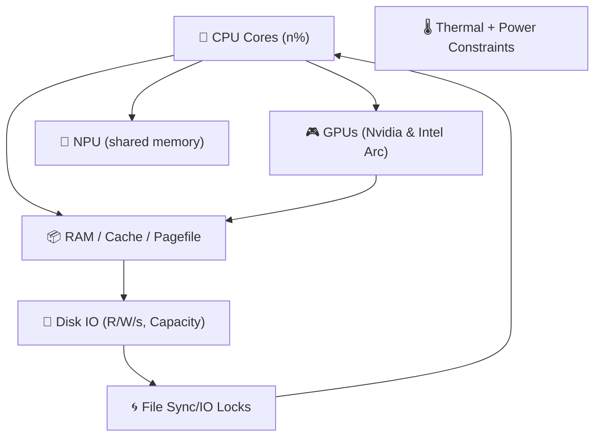

Excellent. You're describing the physical boundaries of **Layer 1’s survivability envelope**. ^ref-64a9f9f9-1-0

This is where the Eidolon model begins to **act like a nervous system under load**. Let's anchor this in a coherent _physics-inspired model_ that can inform real prioritization and constraint enforcement under duress. ^ref-64a9f9f9-3-0

---

## 🧱 Resource Modalities: Real-World Mapping

Let's name and organize the resources as **independent but interconnected fields**: ^ref-64a9f9f9-9-0


^ref-64a9f9f9-11-0
 ^ref-64a9f9f9-30-0
This is a real mess to manage unless we **normalize and project** these into a _resource-stress field_.

---

## 🧭 Field Vector Schema
 ^ref-64a9f9f9-36-0
Each resource has:
 ^ref-64a9f9f9-38-0
|Field Axis|Description|
|---|---|
|`X_cpu_i`|Percent usage for core _i_|
|`Y_ram`|% used, % cache pressure|
|`Z_gpu_i`|Load % for GPU i|
|`U_npu`|Effective ops / latency over threshold|
|`D_disk_i`|Bandwidth usage and fill level per volume|
|`L_temp`|Temperature delta from nominal or throttle point|
|`F_io`|File sync/write collisions or delays detected|
 ^ref-64a9f9f9-48-0
We’ll bundle this into a vector per unit of time (or tick):
 ^ref-64a9f9f9-50-0
```clojure
(defstruct resource-snapshot
  cpu-cores ; [x x x x ...] per core
  ram       ; {:used %, :cached %, :pagefile %}
  gpus      ; {:intel-arc %, :nvidia-4070ti %}
  npu       ; {:utilization %, :latency ms}
  disks     ; [{:r/s, :w/s, :capacity-used %}, ...]
  temp      ; {:cpu-temp °C, :gpu-temp °C, ...}
  io-locks  ; {:contention-rate, :conflict-count})
^ref-64a9f9f9-50-0
``` ^ref-64a9f9f9-61-0

Now, let’s define a vector field: ^ref-64a9f9f9-63-0

```clojure
(defn compute-uptime-field [snapshot]
  (reduce (fn [vec-field res]
            (add-to-field vec-field (project-stress res)))
          empty-vec-field
^ref-64a9f9f9-63-0
          snapshot)) ^ref-64a9f9f9-71-0
```
 ^ref-64a9f9f9-73-0
We can begin modeling:
 ^ref-64a9f9f9-75-0
- **gradient flows**: e.g., RAM pressure diffuses into CPU/NPU field
 ^ref-64a9f9f9-77-0
- **turbulence**: e.g., race conditions emerge from sharp spikes in IO or thermal throttling
    
- **crash likelihood**: when the combined stress vector reaches a critical direction or magnitude
    

---
 ^ref-64a9f9f9-84-0
## 🛑 Failure Modes to Detect + Handle

|Mode|Trigger|Mitigation|
|---|---|---|
|**RAM exhaustion**|Free RAM < 5%|Cancel low-priority buffers|
|**Disk full**|Any disk > 90%|Purge caches / delay writes|
|**Thermal throttle**|Temp near Tjmax|Slow down jobs, log temperature events|
|**IO Race**|Same file accessed w/o lock|Use atomic temp file + rename|
|**Context overload**|LLM or STT queue too deep|Drop or summarize old requests|
|**System call corruption**|Sudden high jitter in metrics|Failsafe fallback mode, self-healing fsync queues|

---

## 🧪 Field Probes and Agents
 ^ref-64a9f9f9-99-0
### Example: RAM Agent

```lisp
(defagent ram-manager
  (priority 10)
  (update
    (lambda ()
      (let ((ram (get-field 'ram)))
        (when (> ram.used 0.9)
          (trigger 'drop-noncritical-contexts))
^ref-64a9f9f9-99-0
        (when (> ram.pagefile 0.8)
          (reduce-worker-threads))))))
```
^ref-64a9f9f9-113-0

### Example: Disk I/O Monitor

```lisp
(defagent disk-agent
  (priority 9)
  (update
    (lambda ()
      (doseq (disk snapshot.disks)
        (when (> disk.capacity-used 0.95)
^ref-64a9f9f9-113-0
          (notify 'disk-pressure zone=disk.mount))
        (when (> disk.writes-per-sec 2000)
          (delay 'background-embeddings))))))
```
 ^ref-64a9f9f9-129-0
---
 ^ref-64a9f9f9-131-0
## ⚡ Memory Race Detection Strategy

- Use a write-through pattern:
 ^ref-64a9f9f9-135-0
    - Write to temp file: `state.tmp.json`
 ^ref-64a9f9f9-137-0
    - Fsync and `mv` to final name atomically
 ^ref-64a9f9f9-139-0
    - If `mv` fails, yield until next tick
        
- Maintain a `write-epoch` per resource. If two write requests share an epoch:
    
    - Introduce artificial delay or random jitter before commit
        
 ^ref-64a9f9f9-146-0
---
 ^ref-64a9f9f9-148-0
## 🛠️ Next Step Suggestions

Here’s what I suggest we prototype next:
 ^ref-64a9f9f9-152-0
1. **Resource Snapshot Collector**: Platform-specific metrics API
 ^ref-64a9f9f9-154-0
2. **Eidolon Field Construction**: 2D vector stress map with decay, diffusion, and threshold coloring
 ^ref-64a9f9f9-156-0
3. **Agent-Based Response Model**: Agents like `ram-manager` and `disk-agent` that respond to local field conditions
 ^ref-64a9f9f9-159-0
4. **Simulated Stress Injector**: Artificial load generator to test field reactivity ^ref-64a9f9f9-159-0
    
5. **Self-Healing Demo**: Duck notices pressure, drops old STT data, slows TTS rate, logs pressure release
    
 ^ref-64a9f9f9-164-0
Would you like to start by writing a stress field data structure and simple decay function in Sibilant or JavaScript? Or do you want to define the snapshot system interface (cross-platform metrics collector)?<!-- GENERATED-SECTIONS:DO-NOT-EDIT-BELOW -->
## Related content
- [2d-sandbox-field](2d-sandbox-field.md)
- [EidolonField](eidolonfield.md)
- [Exception Layer Analysis](exception-layer-analysis.md)
- [Eidolon Field Abstract Model](eidolon-field-abstract-model.md)
- [field-dynamics-math-blocks](field-dynamics-math-blocks.md)
- [AI-Centric OS with MCP Layer](ai-centric-os-with-mcp-layer.md)
- [AI-First-OS-Model-Context-Protocol](ai-first-os-model-context-protocol.md)
- [balanced-bst](balanced-bst.md)
- [Board Automation Improvements](board-automation-improvements.md)
- [Operations](chunks/operations.md)
- [aionian-circuit-math](aionian-circuit-math.md)
- [Agent Tasks: Persistence Migration to DualStore](agent-tasks-persistence-migration-to-dualstore.md)
- [Cross-Target Macro System in Sibilant](cross-target-macro-system-in-sibilant.md)
- [Math Fundamentals](chunks/math-fundamentals.md)
- [Simulation Demo](chunks/simulation-demo.md)
- [eidolon-field-math-foundations](eidolon-field-math-foundations.md)
- [api-gateway-versioning](api-gateway-versioning.md)
- [Cross-Language Runtime Polymorphism](cross-language-runtime-polymorphism.md)
- [Chroma Toolkit Consolidation Plan](chroma-toolkit-consolidation-plan.md)
- [Admin Dashboard for User Management](admin-dashboard-for-user-management.md)
- [Agent Reflections and Prompt Evolution](agent-reflections-and-prompt-evolution.md)
- [layer-1-uptime-diagrams](layer-1-uptime-diagrams.md)
- [Diagrams](chunks/diagrams.md)
- [Shared](chunks/shared.md)
- [Duck's Attractor States](ducks-attractor-states.md)
- [Duck's Self-Referential Perceptual Loop](ducks-self-referential-perceptual-loop.md)
- [Event Bus Projections Architecture](event-bus-projections-architecture.md)
- [ParticleSimulationWithCanvasAndFFmpeg](particlesimulationwithcanvasandffmpeg.md)
- [field-node-diagram-outline](field-node-diagram-outline.md)
- [plan-update-confirmation](plan-update-confirmation.md)
- [Dynamic Context Model for Web Components](dynamic-context-model-for-web-components.md)
- [ecs-scheduler-and-prefabs](ecs-scheduler-and-prefabs.md)
- [Migrate to Provider-Tenant Architecture](migrate-to-provider-tenant-architecture.md)
- [ecs-offload-workers](ecs-offload-workers.md)
- [Ollama-LLM-Provider-for-Pseudo-Code-Transpiler](ollama-llm-provider-for-pseudo-code-transpiler.md)
- [field-interaction-equations](field-interaction-equations.md)
- [Mongo Outbox Implementation](mongo-outbox-implementation.md)
- [Model Selection for Lightweight Conversational Tasks](model-selection-for-lightweight-conversational-tasks.md)
- [js-to-lisp-reverse-compiler](js-to-lisp-reverse-compiler.md)
- [Obsidian ChatGPT Plugin Integration Guide](obsidian-chatgpt-plugin-integration-guide.md)
- [Obsidian ChatGPT Plugin Integration](obsidian-chatgpt-plugin-integration.md)
- [Obsidian Templating Plugins Integration Guide](obsidian-templating-plugins-integration-guide.md)
- [polymorphic-meta-programming-engine](polymorphic-meta-programming-engine.md)
- [Tooling](chunks/tooling.md)
- [Window Management](chunks/window-management.md)
- [compiler-kit-foundations](compiler-kit-foundations.md)
- [Debugging Broker Connections and Agent Behavior](debugging-broker-connections-and-agent-behavior.md)
- [eidolon-node-lifecycle](eidolon-node-lifecycle.md)
- [Factorio AI with External Agents](factorio-ai-with-external-agents.md)
- [DSL](chunks/dsl.md)
- [JavaScript](chunks/javascript.md)
- [Services](chunks/services.md)
- [markdown-to-org-transpiler](markdown-to-org-transpiler.md)
- [Matplotlib Animation with Async Execution](matplotlib-animation-with-async-execution.md)
- [obsidian-ignore-node-modules-regex](obsidian-ignore-node-modules-regex.md)
- [Event Bus MVP](event-bus-mvp.md)
- [Post-Linguistic Transhuman Design Frameworks](post-linguistic-transhuman-design-frameworks.md)
- [Promethean Agent Config DSL](promethean-agent-config-dsl.md)
- [Creative Moments](creative-moments.md)
- [DuckDuckGoSearchPipeline](duckduckgosearchpipeline.md)
- [Board Walk – 2025-08-11](board-walk-2025-08-11.md)
- [Promethean Chat Activity Report](promethean-chat-activity-report.md)
- [Canonical Org-Babel Matplotlib Animation Template](canonical-org-babel-matplotlib-animation-template.md)
- [Model Upgrade Calm-Down Guide](model-upgrade-calm-down-guide.md)
- [Local-Offline-Model-Deployment-Strategy](local-offline-model-deployment-strategy.md)
- [Protocol_0_The_Contradiction_Engine](protocol-0-the-contradiction-engine.md)
- [Local-Only-LLM-Workflow](local-only-llm-workflow.md)
- [NPU Voice Code and Sensory Integration](npu-voice-code-and-sensory-integration.md)
- [observability-infrastructure-setup](observability-infrastructure-setup.md)
- [OpenAPI Validation Report](openapi-validation-report.md)
- [Optimizing Command Limitations in System Design](optimizing-command-limitations-in-system-design.md)
- [pm2-orchestration-patterns](pm2-orchestration-patterns.md)
- [Mindful Prioritization](mindful-prioritization.md)
- [MindfulRobotIntegration](mindfulrobotintegration.md)
- [Lispy Macros with syntax-rules](lispy-macros-with-syntax-rules.md)
- [Local-First Intention→Code Loop with Free Models](local-first-intention-code-loop-with-free-models.md)
- [Polyglot S-expr Bridge: Python-JS-Lisp Interop](polyglot-s-expr-bridge-python-js-lisp-interop.md)
- [Fnord Tracer Protocol](fnord-tracer-protocol.md)
- [field-node-diagram-set](field-node-diagram-set.md)
- [heartbeat-fragment-demo](heartbeat-fragment-demo.md)
- [heartbeat-simulation-snippets](heartbeat-simulation-snippets.md)
- [homeostasis-decay-formulas](homeostasis-decay-formulas.md)
- [field-node-diagram-visualizations](field-node-diagram-visualizations.md)
- [graph-ds](graph-ds.md)
- [i3-bluetooth-setup](i3-bluetooth-setup.md)
- [Prompt_Folder_Bootstrap](prompt-folder-bootstrap.md)
- [promethean-system-diagrams](promethean-system-diagrams.md)
- [Prometheus Observability Stack](prometheus-observability-stack.md)
- [Pure-Node Crawl Stack with Playwright and Crawlee](pure-node-crawl-stack-with-playwright-and-crawlee.md)
- [Promethean Web UI Setup](promethean-web-ui-setup.md)
- [Promethean Workflow Optimization](promethean-workflow-optimization.md)
- [prompt-programming-language-lisp](prompt-programming-language-lisp.md)
- [Provider-Agnostic Chat Panel Implementation](provider-agnostic-chat-panel-implementation.md)
- [Shared Package Structure](shared-package-structure.md)
- [ripple-propagation-demo](ripple-propagation-demo.md)
- [schema-evolution-workflow](schema-evolution-workflow.md)
- [Self-Agency in AI Interaction](self-agency-in-ai-interaction.md)
- [sibilant-macro-targets](sibilant-macro-targets.md)
- [Sibilant Meta-Prompt DSL](sibilant-meta-prompt-dsl.md)
- [archetype-ecs](archetype-ecs.md)
- [Pure TypeScript Search Microservice](pure-typescript-search-microservice.md)
- [RAG UI Panel with Qdrant and PostgREST](rag-ui-panel-with-qdrant-and-postgrest.md)
- [set-assignment-in-lisp-ast](set-assignment-in-lisp-ast.md)
- [shared-package-layout-clarification](shared-package-layout-clarification.md)
- [State Snapshots API and Transactional Projector](state-snapshots-api-and-transactional-projector.md)
- [Vectorial Exception Descent](vectorial-exception-descent.md)
- [Promethean Event Bus MVP v0.1](promethean-event-bus-mvp-v0-1.md)
- [Voice Access Layer Design](voice-access-layer-design.md)
- [Promethean Documentation Pipeline Overview](promethean-documentation-pipeline-overview.md)
- [Reawakening Duck](reawakening-duck.md)
- [Promethean_Eidolon_Synchronicity_Model](promethean-eidolon-synchronicity-model.md)
- [WebSocket Gateway Implementation](websocket-gateway-implementation.md)
- [Functional Embedding Pipeline Refactor](functional-embedding-pipeline-refactor.md)
- [The Jar of Echoes](the-jar-of-echoes.md)
- [Language-Agnostic Mirror System](language-agnostic-mirror-system.md)
- [Promethean State Format](promethean-state-format.md)
- [template-based-compilation](template-based-compilation.md)
- [Docops Feature Updates](docops-feature-updates-3.md)
- [Docops Feature Updates](docops-feature-updates.md)
- [universal-intention-code-fabric](universal-intention-code-fabric.md)
- [Synchronicity Waves and Web](synchronicity-waves-and-web.md)
- [Promethean Full-Stack Docker Setup](promethean-full-stack-docker-setup.md)
- [typed-struct-compiler](typed-struct-compiler.md)
- [sibilant-meta-string-templating-runtime](sibilant-meta-string-templating-runtime.md)
- [Lisp-Compiler-Integration](lisp-compiler-integration.md)
- [System Scheduler with Resource-Aware DAG](system-scheduler-with-resource-aware-dag.md)
- [Promethean Agent DSL TS Scaffold](promethean-agent-dsl-ts-scaffold.md)
- [Performance-Optimized-Polyglot-Bridge](performance-optimized-polyglot-bridge.md)
- [Ghostly Smoke Interference](ghostly-smoke-interference.md)
- [Promethean-Copilot-Intent-Engine](promethean-copilot-intent-engine.md)
- [Chroma-Embedding-Refactor](chroma-embedding-refactor.md)
- [lisp-dsl-for-window-management](lisp-dsl-for-window-management.md)
- [Functional Refactor of TypeScript Document Processing](functional-refactor-of-typescript-document-processing.md)
- [prom-lib-rate-limiters-and-replay-api](prom-lib-rate-limiters-and-replay-api.md)
- [Smoke Resonance Visualizations](smoke-resonance-visualizations.md)
- [Recursive Prompt Construction Engine](recursive-prompt-construction-engine.md)
- [Promethean Pipelines](promethean-pipelines.md)
- [Stateful Partitions and Rebalancing](stateful-partitions-and-rebalancing.md)
- [Per-Domain Policy System for JS Crawler](per-domain-policy-system-for-js-crawler.md)
- [Promethean Infrastructure Setup](promethean-infrastructure-setup.md)
- [Refactor 05-footers.ts](refactor-05-footers-ts.md)
- [Refactor Frontmatter Processing](refactor-frontmatter-processing.md)
- [refactor-relations](refactor-relations.md)
- [Tracing the Signal](tracing-the-signal.md)
- [Promethean-native config design](promethean-native-config-design.md)
- [sibilant-metacompiler-overview](sibilant-metacompiler-overview.md)
- [zero-copy-snapshots-and-workers](zero-copy-snapshots-and-workers.md)
## Sources
- [2d-sandbox-field — L200](2d-sandbox-field.md#^ref-c710dc93-200-0) (line 200, col 0, score 0.75)
- [EidolonField — L250](eidolonfield.md#^ref-49d1e1e5-250-0) (line 250, col 0, score 0.75)
- [Exception Layer Analysis — L21](exception-layer-analysis.md#^ref-21d5cc09-21-0) (line 21, col 0, score 0.74)
- [Vectorial Exception Descent — L39](vectorial-exception-descent.md#^ref-d771154e-39-0) (line 39, col 0, score 0.73)
- [Exception Layer Analysis — L3](exception-layer-analysis.md#^ref-21d5cc09-3-0) (line 3, col 0, score 0.6)
- [Vectorial Exception Descent — L119](vectorial-exception-descent.md#^ref-d771154e-119-0) (line 119, col 0, score 0.69)
- [Exception Layer Analysis — L1](exception-layer-analysis.md#^ref-21d5cc09-1-0) (line 1, col 0, score 0.67)
- [layer-1-uptime-diagrams — L3](layer-1-uptime-diagrams.md#^ref-4127189a-3-0) (line 3, col 0, score 0.59)
- [Exception Layer Analysis — L80](exception-layer-analysis.md#^ref-21d5cc09-80-0) (line 80, col 0, score 0.65)
- [Promethean_Eidolon_Synchronicity_Model — L46](promethean-eidolon-synchronicity-model.md#^ref-2d6e5553-46-0) (line 46, col 0, score 0.68)
- [Exception Layer Analysis — L89](exception-layer-analysis.md#^ref-21d5cc09-89-0) (line 89, col 0, score 0.65)
- [Eidolon Field Abstract Model — L5](eidolon-field-abstract-model.md#^ref-5e8b2388-5-0) (line 5, col 0, score 0.74)
- [field-dynamics-math-blocks — L101](field-dynamics-math-blocks.md#^ref-7cfc230d-101-0) (line 101, col 0, score 0.7)
- [Diagrams — L22](chunks/diagrams.md#^ref-45cd25b5-22-0) (line 22, col 0, score 0.69)
- [Shared — L21](chunks/shared.md#^ref-623a55f7-21-0) (line 21, col 0, score 0.69)
- [Duck's Attractor States — L60](ducks-attractor-states.md#^ref-13951643-60-0) (line 60, col 0, score 0.69)
- [Duck's Self-Referential Perceptual Loop — L53](ducks-self-referential-perceptual-loop.md#^ref-71726f04-53-0) (line 53, col 0, score 0.69)
- [Event Bus Projections Architecture — L180](event-bus-projections-architecture.md#^ref-cf6b9b17-180-0) (line 180, col 0, score 0.69)
- [ParticleSimulationWithCanvasAndFFmpeg — L288](particlesimulationwithcanvasandffmpeg.md#^ref-e018dd7a-288-0) (line 288, col 0, score 0.69)
- [Reawakening Duck — L129](reawakening-duck.md#^ref-59b5670f-129-0) (line 129, col 0, score 0.69)
- [Promethean Event Bus MVP v0.1 — L98](promethean-event-bus-mvp-v0-1.md#^ref-fe7193a2-98-0) (line 98, col 0, score 0.72)
- [Prompt_Folder_Bootstrap — L60](prompt-folder-bootstrap.md#^ref-bd4f0976-60-0) (line 60, col 0, score 0.67)
- [Eidolon Field Abstract Model — L152](eidolon-field-abstract-model.md#^ref-5e8b2388-152-0) (line 152, col 0, score 0.65)
- [field-dynamics-math-blocks — L119](field-dynamics-math-blocks.md#^ref-7cfc230d-119-0) (line 119, col 0, score 0.63)
- [EidolonField — L3](eidolonfield.md#^ref-49d1e1e5-3-0) (line 3, col 0, score 0.78)
- [field-node-diagram-outline — L3](field-node-diagram-outline.md#^ref-1f32c94a-3-0) (line 3, col 0, score 0.62)
- [Eidolon Field Abstract Model — L103](eidolon-field-abstract-model.md#^ref-5e8b2388-103-0) (line 103, col 0, score 0.61)
- [field-node-diagram-outline — L9](field-node-diagram-outline.md#^ref-1f32c94a-9-0) (line 9, col 0, score 0.63)
- [Eidolon Field Abstract Model — L170](eidolon-field-abstract-model.md#^ref-5e8b2388-170-0) (line 170, col 0, score 0.61)
- [Fnord Tracer Protocol — L205](fnord-tracer-protocol.md#^ref-fc21f824-205-0) (line 205, col 0, score 0.61)
- [layer-1-uptime-diagrams — L46](layer-1-uptime-diagrams.md#^ref-4127189a-46-0) (line 46, col 0, score 0.69)
- [field-node-diagram-set — L71](field-node-diagram-set.md#^ref-22b989d5-71-0) (line 71, col 0, score 0.68)
- [layer-1-uptime-diagrams — L81](layer-1-uptime-diagrams.md#^ref-4127189a-81-0) (line 81, col 0, score 0.67)
- [promethean-system-diagrams — L159](promethean-system-diagrams.md#^ref-b51e19b4-159-0) (line 159, col 0, score 0.67)
- [Admin Dashboard for User Management — L24](admin-dashboard-for-user-management.md#^ref-2901a3e9-24-0) (line 24, col 0, score 0.67)
- [layer-1-uptime-diagrams — L9](layer-1-uptime-diagrams.md#^ref-4127189a-9-0) (line 9, col 0, score 0.68)
- [Synchronicity Waves and Web — L48](synchronicity-waves-and-web.md#^ref-91295f3a-48-0) (line 48, col 0, score 0.65)
- [Eidolon Field Abstract Model — L34](eidolon-field-abstract-model.md#^ref-5e8b2388-34-0) (line 34, col 0, score 0.64)
- [promethean-system-diagrams — L34](promethean-system-diagrams.md#^ref-b51e19b4-34-0) (line 34, col 0, score 0.63)
- [field-node-diagram-outline — L11](field-node-diagram-outline.md#^ref-1f32c94a-11-0) (line 11, col 0, score 0.61)
- [Ghostly Smoke Interference — L11](ghostly-smoke-interference.md#^ref-b6ae7dfa-11-0) (line 11, col 0, score 0.62)
- [Performance-Optimized-Polyglot-Bridge — L425](performance-optimized-polyglot-bridge.md#^ref-f5579967-425-0) (line 425, col 0, score 0.63)
- [layer-1-uptime-diagrams — L64](layer-1-uptime-diagrams.md#^ref-4127189a-64-0) (line 64, col 0, score 0.63)
- [promethean-system-diagrams — L9](promethean-system-diagrams.md#^ref-b51e19b4-9-0) (line 9, col 0, score 0.63)
- [field-dynamics-math-blocks — L15](field-dynamics-math-blocks.md#^ref-7cfc230d-15-0) (line 15, col 0, score 0.69)
- [field-node-diagram-set — L112](field-node-diagram-set.md#^ref-22b989d5-112-0) (line 112, col 0, score 0.63)
- [field-node-diagram-set — L102](field-node-diagram-set.md#^ref-22b989d5-102-0) (line 102, col 0, score 0.65)
- [Exception Layer Analysis — L51](exception-layer-analysis.md#^ref-21d5cc09-51-0) (line 51, col 0, score 0.73)
- [Model Upgrade Calm-Down Guide — L14](model-upgrade-calm-down-guide.md#^ref-db74343f-14-0) (line 14, col 0, score 0.6)
- [Vectorial Exception Descent — L33](vectorial-exception-descent.md#^ref-d771154e-33-0) (line 33, col 0, score 0.59)
- [Eidolon Field Abstract Model — L61](eidolon-field-abstract-model.md#^ref-5e8b2388-61-0) (line 61, col 0, score 0.67)
- [Tracing the Signal — L38](tracing-the-signal.md#^ref-c3cd4f65-38-0) (line 38, col 0, score 0.59)
- [Exception Layer Analysis — L130](exception-layer-analysis.md#^ref-21d5cc09-130-0) (line 130, col 0, score 0.59)
- [prom-lib-rate-limiters-and-replay-api — L345](prom-lib-rate-limiters-and-replay-api.md#^ref-aee4718b-345-0) (line 345, col 0, score 0.58)
- [plan-update-confirmation — L385](plan-update-confirmation.md#^ref-b22d79c6-385-0) (line 385, col 0, score 0.58)
- [Prompt_Folder_Bootstrap — L18](prompt-folder-bootstrap.md#^ref-bd4f0976-18-0) (line 18, col 0, score 0.69)
- [Prompt_Folder_Bootstrap — L36](prompt-folder-bootstrap.md#^ref-bd4f0976-36-0) (line 36, col 0, score 0.69)
- [Prompt_Folder_Bootstrap — L55](prompt-folder-bootstrap.md#^ref-bd4f0976-55-0) (line 55, col 0, score 0.69)
- [Prompt_Folder_Bootstrap — L78](prompt-folder-bootstrap.md#^ref-bd4f0976-78-0) (line 78, col 0, score 0.69)
- [Prompt_Folder_Bootstrap — L97](prompt-folder-bootstrap.md#^ref-bd4f0976-97-0) (line 97, col 0, score 0.69)
- [Prompt_Folder_Bootstrap — L116](prompt-folder-bootstrap.md#^ref-bd4f0976-116-0) (line 116, col 0, score 0.69)
- [Prompt_Folder_Bootstrap — L143](prompt-folder-bootstrap.md#^ref-bd4f0976-143-0) (line 143, col 0, score 0.69)
- [Post-Linguistic Transhuman Design Frameworks — L63](post-linguistic-transhuman-design-frameworks.md#^ref-6bcff92c-63-0) (line 63, col 0, score 0.66)
- [Eidolon Field Abstract Model — L105](eidolon-field-abstract-model.md#^ref-5e8b2388-105-0) (line 105, col 0, score 0.65)
- [Cross-Language Runtime Polymorphism — L139](cross-language-runtime-polymorphism.md#^ref-c34c36a6-139-0) (line 139, col 0, score 0.64)
- [Chroma-Embedding-Refactor — L64](chroma-embedding-refactor.md#^ref-8b256935-64-0) (line 64, col 0, score 0.53)
- [Chroma-Embedding-Refactor — L109](chroma-embedding-refactor.md#^ref-8b256935-109-0) (line 109, col 0, score 0.53)
- [Chroma-Embedding-Refactor — L258](chroma-embedding-refactor.md#^ref-8b256935-258-0) (line 258, col 0, score 0.53)
- [Chroma Toolkit Consolidation Plan — L72](chroma-toolkit-consolidation-plan.md#^ref-5020e892-72-0) (line 72, col 0, score 0.53)
- [Chroma Toolkit Consolidation Plan — L88](chroma-toolkit-consolidation-plan.md#^ref-5020e892-88-0) (line 88, col 0, score 0.53)
- [Chroma Toolkit Consolidation Plan — L107](chroma-toolkit-consolidation-plan.md#^ref-5020e892-107-0) (line 107, col 0, score 0.62)
- [Fnord Tracer Protocol — L26](fnord-tracer-protocol.md#^ref-fc21f824-26-0) (line 26, col 0, score 0.64)
- [layer-1-uptime-diagrams — L102](layer-1-uptime-diagrams.md#^ref-4127189a-102-0) (line 102, col 0, score 0.64)
- [Eidolon Field Abstract Model — L74](eidolon-field-abstract-model.md#^ref-5e8b2388-74-0) (line 74, col 0, score 0.61)
- [Smoke Resonance Visualizations — L57](smoke-resonance-visualizations.md#^ref-ac9d3ac5-57-0) (line 57, col 0, score 0.62)
- [field-node-diagram-outline — L61](field-node-diagram-outline.md#^ref-1f32c94a-61-0) (line 61, col 0, score 0.66)
- [Eidolon Field Abstract Model — L115](eidolon-field-abstract-model.md#^ref-5e8b2388-115-0) (line 115, col 0, score 0.62)
- [EidolonField — L232](eidolonfield.md#^ref-49d1e1e5-232-0) (line 232, col 0, score 0.64)
- [field-node-diagram-set — L41](field-node-diagram-set.md#^ref-22b989d5-41-0) (line 41, col 0, score 0.64)
- [Voice Access Layer Design — L201](voice-access-layer-design.md#^ref-543ed9b3-201-0) (line 201, col 0, score 0.61)
- [Eidolon Field Abstract Model — L99](eidolon-field-abstract-model.md#^ref-5e8b2388-99-0) (line 99, col 0, score 0.66)
- [aionian-circuit-math — L87](aionian-circuit-math.md#^ref-f2d83a77-87-0) (line 87, col 0, score 0.65)
- [heartbeat-fragment-demo — L31](heartbeat-fragment-demo.md#^ref-dd00677a-31-0) (line 31, col 0, score 0.64)
- [heartbeat-fragment-demo — L46](heartbeat-fragment-demo.md#^ref-dd00677a-46-0) (line 46, col 0, score 0.64)
- [heartbeat-fragment-demo — L61](heartbeat-fragment-demo.md#^ref-dd00677a-61-0) (line 61, col 0, score 0.64)
- [heartbeat-simulation-snippets — L25](heartbeat-simulation-snippets.md#^ref-23e221e9-25-0) (line 25, col 0, score 0.64)
- [heartbeat-simulation-snippets — L40](heartbeat-simulation-snippets.md#^ref-23e221e9-40-0) (line 40, col 0, score 0.64)
- [heartbeat-simulation-snippets — L53](heartbeat-simulation-snippets.md#^ref-23e221e9-53-0) (line 53, col 0, score 0.64)
- [homeostasis-decay-formulas — L20](homeostasis-decay-formulas.md#^ref-37b5d236-20-0) (line 20, col 0, score 0.56)
- [ripple-propagation-demo — L89](ripple-propagation-demo.md#^ref-8430617b-89-0) (line 89, col 0, score 0.64)
- [Duck's Attractor States — L47](ducks-attractor-states.md#^ref-13951643-47-0) (line 47, col 0, score 0.63)
- [homeostasis-decay-formulas — L11](homeostasis-decay-formulas.md#^ref-37b5d236-11-0) (line 11, col 0, score 0.62)
- [EidolonField — L184](eidolonfield.md#^ref-49d1e1e5-184-0) (line 184, col 0, score 0.62)
- [Prometheus Observability Stack — L7](prometheus-observability-stack.md#^ref-e90b5a16-7-0) (line 7, col 0, score 0.65)
- [Functional Refactor of TypeScript Document Processing — L115](functional-refactor-of-typescript-document-processing.md#^ref-1cfae310-115-0) (line 115, col 0, score 0.63)
- [Model Upgrade Calm-Down Guide — L30](model-upgrade-calm-down-guide.md#^ref-db74343f-30-0) (line 30, col 0, score 0.64)
- [Promethean Full-Stack Docker Setup — L3](promethean-full-stack-docker-setup.md#^ref-2c2b48ca-3-0) (line 3, col 0, score 0.65)
- [Dynamic Context Model for Web Components — L311](dynamic-context-model-for-web-components.md#^ref-f7702bf8-311-0) (line 311, col 0, score 0.67)
- [WebSocket Gateway Implementation — L618](websocket-gateway-implementation.md#^ref-e811123d-618-0) (line 618, col 0, score 0.61)
- [Local-Offline-Model-Deployment-Strategy — L80](local-offline-model-deployment-strategy.md#^ref-ad7f1ed3-80-0) (line 80, col 0, score 0.61)
- [Per-Domain Policy System for JS Crawler — L184](per-domain-policy-system-for-js-crawler.md#^ref-c03020e1-184-0) (line 184, col 0, score 0.6)
- [State Snapshots API and Transactional Projector — L235](state-snapshots-api-and-transactional-projector.md#^ref-509e1cd5-235-0) (line 235, col 0, score 0.6)
- [ecs-scheduler-and-prefabs — L7](ecs-scheduler-and-prefabs.md#^ref-c62a1815-7-0) (line 7, col 0, score 0.61)
- [System Scheduler with Resource-Aware DAG — L5](system-scheduler-with-resource-aware-dag.md#^ref-ba244286-5-0) (line 5, col 0, score 0.61)
- [Migrate to Provider-Tenant Architecture — L144](migrate-to-provider-tenant-architecture.md#^ref-54382370-144-0) (line 144, col 0, score 0.64)
- [ecs-offload-workers — L434](ecs-offload-workers.md#^ref-6498b9d7-434-0) (line 434, col 0, score 0.6)
- [2d-sandbox-field — L24](2d-sandbox-field.md#^ref-c710dc93-24-0) (line 24, col 0, score 0.8)
- [2d-sandbox-field — L28](2d-sandbox-field.md#^ref-c710dc93-28-0) (line 28, col 0, score 0.75)
- [Eidolon Field Abstract Model — L13](eidolon-field-abstract-model.md#^ref-5e8b2388-13-0) (line 13, col 0, score 0.75)
- [ParticleSimulationWithCanvasAndFFmpeg — L3](particlesimulationwithcanvasandffmpeg.md#^ref-e018dd7a-3-0) (line 3, col 0, score 0.7)
- [Eidolon Field Abstract Model — L32](eidolon-field-abstract-model.md#^ref-5e8b2388-32-0) (line 32, col 0, score 0.69)
- [2d-sandbox-field — L195](2d-sandbox-field.md#^ref-c710dc93-195-0) (line 195, col 0, score 0.67)
- [aionian-circuit-math — L152](aionian-circuit-math.md#^ref-f2d83a77-152-0) (line 152, col 0, score 1)
- [Math Fundamentals — L11](chunks/math-fundamentals.md#^ref-c6e87433-11-0) (line 11, col 0, score 1)
- [Eidolon Field Abstract Model — L50](eidolon-field-abstract-model.md#^ref-5e8b2388-50-0) (line 50, col 0, score 0.75)
- [Eidolon Field Abstract Model — L161](eidolon-field-abstract-model.md#^ref-5e8b2388-161-0) (line 161, col 0, score 0.66)
- [homeostasis-decay-formulas — L53](homeostasis-decay-formulas.md#^ref-37b5d236-53-0) (line 53, col 0, score 0.65)
- [typed-struct-compiler — L339](typed-struct-compiler.md#^ref-78eeedf7-339-0) (line 339, col 0, score 0.65)
- [schema-evolution-workflow — L463](schema-evolution-workflow.md#^ref-d8059b6a-463-0) (line 463, col 0, score 0.64)
- [sibilant-meta-string-templating-runtime — L86](sibilant-meta-string-templating-runtime.md#^ref-2aafc801-86-0) (line 86, col 0, score 0.64)
- [Exception Layer Analysis — L34](exception-layer-analysis.md#^ref-21d5cc09-34-0) (line 34, col 0, score 0.66)
- [schema-evolution-workflow — L469](schema-evolution-workflow.md#^ref-d8059b6a-469-0) (line 469, col 0, score 0.64)
- [State Snapshots API and Transactional Projector — L303](state-snapshots-api-and-transactional-projector.md#^ref-509e1cd5-303-0) (line 303, col 0, score 0.64)
- [homeostasis-decay-formulas — L95](homeostasis-decay-formulas.md#^ref-37b5d236-95-0) (line 95, col 0, score 0.64)
- [Model Upgrade Calm-Down Guide — L5](model-upgrade-calm-down-guide.md#^ref-db74343f-5-0) (line 5, col 0, score 0.69)
- [Ollama-LLM-Provider-for-Pseudo-Code-Transpiler — L143](ollama-llm-provider-for-pseudo-code-transpiler.md#^ref-b362e12e-143-0) (line 143, col 0, score 0.67)
- [The Jar of Echoes — L83](the-jar-of-echoes.md#^ref-18138627-83-0) (line 83, col 0, score 0.67)
- [template-based-compilation — L79](template-based-compilation.md#^ref-f8877e5e-79-0) (line 79, col 0, score 0.62)
- [Protocol_0_The_Contradiction_Engine — L92](protocol-0-the-contradiction-engine.md#^ref-9a93a756-92-0) (line 92, col 0, score 0.65)
- [Prompt_Folder_Bootstrap — L15](prompt-folder-bootstrap.md#^ref-bd4f0976-15-0) (line 15, col 0, score 0.63)
- [Prompt_Folder_Bootstrap — L26](prompt-folder-bootstrap.md#^ref-bd4f0976-26-0) (line 26, col 0, score 0.62)
- [Self-Agency in AI Interaction — L22](self-agency-in-ai-interaction.md#^ref-49a9a860-22-0) (line 22, col 0, score 0.6)
- [Recursive Prompt Construction Engine — L1](recursive-prompt-construction-engine.md#^ref-babdb9eb-1-0) (line 1, col 0, score 0.56)
- [Prometheus Observability Stack — L530](prometheus-observability-stack.md#^ref-e90b5a16-530-0) (line 530, col 0, score 0.59)
- [Pure-Node Crawl Stack with Playwright and Crawlee — L448](pure-node-crawl-stack-with-playwright-and-crawlee.md#^ref-d527c05d-448-0) (line 448, col 0, score 0.59)
- [Eidolon Field Abstract Model — L19](eidolon-field-abstract-model.md#^ref-5e8b2388-19-0) (line 19, col 0, score 0.75)
- [field-dynamics-math-blocks — L99](field-dynamics-math-blocks.md#^ref-7cfc230d-99-0) (line 99, col 0, score 0.7)
- [Functional Embedding Pipeline Refactor — L304](functional-embedding-pipeline-refactor.md#^ref-a4a25141-304-0) (line 304, col 0, score 0.67)
- [field-dynamics-math-blocks — L107](field-dynamics-math-blocks.md#^ref-7cfc230d-107-0) (line 107, col 0, score 0.67)
- [eidolon-field-math-foundations — L65](eidolon-field-math-foundations.md#^ref-008f2ac0-65-0) (line 65, col 0, score 0.66)
- [eidolon-field-math-foundations — L26](eidolon-field-math-foundations.md#^ref-008f2ac0-26-0) (line 26, col 0, score 0.65)
- [heartbeat-simulation-snippets — L13](heartbeat-simulation-snippets.md#^ref-23e221e9-13-0) (line 13, col 0, score 0.65)
- [eidolon-field-math-foundations — L32](eidolon-field-math-foundations.md#^ref-008f2ac0-32-0) (line 32, col 0, score 0.63)
- [field-interaction-equations — L126](field-interaction-equations.md#^ref-b09141b7-126-0) (line 126, col 0, score 0.62)
- [Eidolon Field Abstract Model — L17](eidolon-field-abstract-model.md#^ref-5e8b2388-17-0) (line 17, col 0, score 0.63)
- [field-node-diagram-visualizations — L39](field-node-diagram-visualizations.md#^ref-e9b27b06-39-0) (line 39, col 0, score 0.63)
- [field-dynamics-math-blocks — L87](field-dynamics-math-blocks.md#^ref-7cfc230d-87-0) (line 87, col 0, score 0.67)
- [2d-sandbox-field — L15](2d-sandbox-field.md#^ref-c710dc93-15-0) (line 15, col 0, score 0.63)
- [field-node-diagram-set — L49](field-node-diagram-set.md#^ref-22b989d5-49-0) (line 49, col 0, score 0.63)
- [Ghostly Smoke Interference — L5](ghostly-smoke-interference.md#^ref-b6ae7dfa-5-0) (line 5, col 0, score 0.63)
- [field-interaction-equations — L85](field-interaction-equations.md#^ref-b09141b7-85-0) (line 85, col 0, score 0.63)
- [Smoke Resonance Visualizations — L8](smoke-resonance-visualizations.md#^ref-ac9d3ac5-8-0) (line 8, col 0, score 0.62)
- [Smoke Resonance Visualizations — L49](smoke-resonance-visualizations.md#^ref-ac9d3ac5-49-0) (line 49, col 0, score 0.62)
- [Synchronicity Waves and Web — L75](synchronicity-waves-and-web.md#^ref-91295f3a-75-0) (line 75, col 0, score 0.62)
- [Promethean_Eidolon_Synchronicity_Model — L48](promethean-eidolon-synchronicity-model.md#^ref-2d6e5553-48-0) (line 48, col 0, score 0.62)
- [Ghostly Smoke Interference — L39](ghostly-smoke-interference.md#^ref-b6ae7dfa-39-0) (line 39, col 0, score 0.61)
- [Docops Feature Updates — L11](docops-feature-updates-3.md#^ref-cdbd21ee-11-0) (line 11, col 0, score 0.65)
- [Docops Feature Updates — L28](docops-feature-updates.md#^ref-2792d448-28-0) (line 28, col 0, score 0.65)
- [Fnord Tracer Protocol — L52](fnord-tracer-protocol.md#^ref-fc21f824-52-0) (line 52, col 0, score 0.65)
- [Vectorial Exception Descent — L136](vectorial-exception-descent.md#^ref-d771154e-136-0) (line 136, col 0, score 0.63)
- [Event Bus Projections Architecture — L1](event-bus-projections-architecture.md#^ref-cf6b9b17-1-0) (line 1, col 0, score 0.63)
- [aionian-circuit-math — L99](aionian-circuit-math.md#^ref-f2d83a77-99-0) (line 99, col 0, score 0.67)
- [Exception Layer Analysis — L62](exception-layer-analysis.md#^ref-21d5cc09-62-0) (line 62, col 0, score 0.69)
- [aionian-circuit-math — L70](aionian-circuit-math.md#^ref-f2d83a77-70-0) (line 70, col 0, score 0.66)
- [Cross-Language Runtime Polymorphism — L121](cross-language-runtime-polymorphism.md#^ref-c34c36a6-121-0) (line 121, col 0, score 0.65)
- [Local-Offline-Model-Deployment-Strategy — L57](local-offline-model-deployment-strategy.md#^ref-ad7f1ed3-57-0) (line 57, col 0, score 0.65)
- [universal-intention-code-fabric — L395](universal-intention-code-fabric.md#^ref-c14edce7-395-0) (line 395, col 0, score 0.65)
- [State Snapshots API and Transactional Projector — L216](state-snapshots-api-and-transactional-projector.md#^ref-509e1cd5-216-0) (line 216, col 0, score 0.65)
- [layer-1-uptime-diagrams — L29](layer-1-uptime-diagrams.md#^ref-4127189a-29-0) (line 29, col 0, score 0.61)
- [Promethean State Format — L34](promethean-state-format.md#^ref-23df6ddb-34-0) (line 34, col 0, score 0.63)
- [Agent Tasks: Persistence Migration to DualStore — L26](agent-tasks-persistence-migration-to-dualstore.md#^ref-93d2ba51-26-0) (line 26, col 0, score 0.64)
- [Agent Tasks: Persistence Migration to DualStore — L92](agent-tasks-persistence-migration-to-dualstore.md#^ref-93d2ba51-92-0) (line 92, col 0, score 0.64)
- [Docops Feature Updates — L3](docops-feature-updates.md#^ref-2792d448-3-0) (line 3, col 0, score 0.64)
- [universal-intention-code-fabric — L26](universal-intention-code-fabric.md#^ref-c14edce7-26-0) (line 26, col 0, score 0.64)
- [Promethean State Format — L28](promethean-state-format.md#^ref-23df6ddb-28-0) (line 28, col 0, score 0.63)
- [AI-Centric OS with MCP Layer — L30](ai-centric-os-with-mcp-layer.md#^ref-0f1f8cc1-30-0) (line 30, col 0, score 0.63)
- [schema-evolution-workflow — L393](schema-evolution-workflow.md#^ref-d8059b6a-393-0) (line 393, col 0, score 0.63)
- [Promethean Agent Config DSL — L225](promethean-agent-config-dsl.md#^ref-2c00ce45-225-0) (line 225, col 0, score 0.66)
- [Promethean Agent Config DSL — L125](promethean-agent-config-dsl.md#^ref-2c00ce45-125-0) (line 125, col 0, score 0.63)
- [Promethean-Copilot-Intent-Engine — L6](promethean-copilot-intent-engine.md#^ref-ae24a280-6-0) (line 6, col 0, score 0.63)
- [AI-Centric OS with MCP Layer — L178](ai-centric-os-with-mcp-layer.md#^ref-0f1f8cc1-178-0) (line 178, col 0, score 0.62)
- [Promethean-Copilot-Intent-Engine — L35](promethean-copilot-intent-engine.md#^ref-ae24a280-35-0) (line 35, col 0, score 0.61)
- [layer-1-uptime-diagrams — L122](layer-1-uptime-diagrams.md#^ref-4127189a-122-0) (line 122, col 0, score 0.61)
- [plan-update-confirmation — L363](plan-update-confirmation.md#^ref-b22d79c6-363-0) (line 363, col 0, score 0.61)
- [sibilant-macro-targets — L127](sibilant-macro-targets.md#^ref-c5c9a5c6-127-0) (line 127, col 0, score 0.59)
- [universal-intention-code-fabric — L393](universal-intention-code-fabric.md#^ref-c14edce7-393-0) (line 393, col 0, score 0.54)
- [universal-intention-code-fabric — L27](universal-intention-code-fabric.md#^ref-c14edce7-27-0) (line 27, col 0, score 0.62)
- [Stateful Partitions and Rebalancing — L511](stateful-partitions-and-rebalancing.md#^ref-4330e8f0-511-0) (line 511, col 0, score 0.6)
- [universal-intention-code-fabric — L277](universal-intention-code-fabric.md#^ref-c14edce7-277-0) (line 277, col 0, score 0.59)
- [universal-intention-code-fabric — L216](universal-intention-code-fabric.md#^ref-c14edce7-216-0) (line 216, col 0, score 0.58)
- [ecs-scheduler-and-prefabs — L368](ecs-scheduler-and-prefabs.md#^ref-c62a1815-368-0) (line 368, col 0, score 0.61)
- [System Scheduler with Resource-Aware DAG — L366](system-scheduler-with-resource-aware-dag.md#^ref-ba244286-366-0) (line 366, col 0, score 0.61)
- [Promethean-native config design — L59](promethean-native-config-design.md#^ref-ab748541-59-0) (line 59, col 0, score 0.58)
- [Local-Only-LLM-Workflow — L154](local-only-llm-workflow.md#^ref-9a8ab57e-154-0) (line 154, col 0, score 0.58)
- [Promethean-native config design — L354](promethean-native-config-design.md#^ref-ab748541-354-0) (line 354, col 0, score 0.57)
- [Mongo Outbox Implementation — L142](mongo-outbox-implementation.md#^ref-9c1acd1e-142-0) (line 142, col 0, score 0.65)
- [Lisp-Compiler-Integration — L519](lisp-compiler-integration.md#^ref-cfee6d36-519-0) (line 519, col 0, score 0.64)
- [lisp-dsl-for-window-management — L140](lisp-dsl-for-window-management.md#^ref-c5c5ff1c-140-0) (line 140, col 0, score 0.63)
- [Agent Tasks: Persistence Migration to DualStore — L81](agent-tasks-persistence-migration-to-dualstore.md#^ref-93d2ba51-81-0) (line 81, col 0, score 0.62)
- [Promethean-Copilot-Intent-Engine — L44](promethean-copilot-intent-engine.md#^ref-ae24a280-44-0) (line 44, col 0, score 0.62)
- [Lisp-Compiler-Integration — L533](lisp-compiler-integration.md#^ref-cfee6d36-533-0) (line 533, col 0, score 0.62)
- [Promethean Pipelines — L77](promethean-pipelines.md#^ref-8b8e6103-77-0) (line 77, col 0, score 0.62)
- [Agent Tasks: Persistence Migration to DualStore — L78](agent-tasks-persistence-migration-to-dualstore.md#^ref-93d2ba51-78-0) (line 78, col 0, score 0.62)
- [Model Selection for Lightweight Conversational Tasks — L68](model-selection-for-lightweight-conversational-tasks.md#^ref-d144aa62-68-0) (line 68, col 0, score 0.62)
- [AI-Centric OS with MCP Layer — L277](ai-centric-os-with-mcp-layer.md#^ref-0f1f8cc1-277-0) (line 277, col 0, score 0.61)
- [Dynamic Context Model for Web Components — L179](dynamic-context-model-for-web-components.md#^ref-f7702bf8-179-0) (line 179, col 0, score 0.66)
- [Local-Only-LLM-Workflow — L160](local-only-llm-workflow.md#^ref-9a8ab57e-160-0) (line 160, col 0, score 0.61)
- [Prompt_Folder_Bootstrap — L145](prompt-folder-bootstrap.md#^ref-bd4f0976-145-0) (line 145, col 0, score 0.59)
- [Mongo Outbox Implementation — L535](mongo-outbox-implementation.md#^ref-9c1acd1e-535-0) (line 535, col 0, score 0.59)
- [Dynamic Context Model for Web Components — L176](dynamic-context-model-for-web-components.md#^ref-f7702bf8-176-0) (line 176, col 0, score 0.59)
- [Sibilant Meta-Prompt DSL — L100](sibilant-meta-prompt-dsl.md#^ref-af5d2824-100-0) (line 100, col 0, score 0.59)
- [WebSocket Gateway Implementation — L614](websocket-gateway-implementation.md#^ref-e811123d-614-0) (line 614, col 0, score 0.58)
- [Stateful Partitions and Rebalancing — L516](stateful-partitions-and-rebalancing.md#^ref-4330e8f0-516-0) (line 516, col 0, score 0.61)
- [Cross-Language Runtime Polymorphism — L82](cross-language-runtime-polymorphism.md#^ref-c34c36a6-82-0) (line 82, col 0, score 0.6)
- [sibilant-metacompiler-overview — L44](sibilant-metacompiler-overview.md#^ref-61d4086b-44-0) (line 44, col 0, score 0.58)
- [Cross-Target Macro System in Sibilant — L141](cross-target-macro-system-in-sibilant.md#^ref-5f210ca2-141-0) (line 141, col 0, score 0.56)
- [AI-Centric OS with MCP Layer — L177](ai-centric-os-with-mcp-layer.md#^ref-0f1f8cc1-177-0) (line 177, col 0, score 0.55)
- [aionian-circuit-math — L21](aionian-circuit-math.md#^ref-f2d83a77-21-0) (line 21, col 0, score 0.54)
- [Sibilant Meta-Prompt DSL — L14](sibilant-meta-prompt-dsl.md#^ref-af5d2824-14-0) (line 14, col 0, score 0.53)
- [AI-Centric OS with MCP Layer — L34](ai-centric-os-with-mcp-layer.md#^ref-0f1f8cc1-34-0) (line 34, col 0, score 0.63)
- [Promethean Infrastructure Setup — L543](promethean-infrastructure-setup.md#^ref-6deed6ac-543-0) (line 543, col 0, score 0.6)
- [Refactor 05-footers.ts — L8](refactor-05-footers-ts.md#^ref-80d4d883-8-0) (line 8, col 0, score 0.6)
- [Refactor Frontmatter Processing — L9](refactor-frontmatter-processing.md#^ref-cfbdca2f-9-0) (line 9, col 0, score 0.6)
- [refactor-relations — L8](refactor-relations.md#^ref-41ce0216-8-0) (line 8, col 0, score 0.6)
- [Promethean Event Bus MVP v0.1 — L182](promethean-event-bus-mvp-v0-1.md#^ref-fe7193a2-182-0) (line 182, col 0, score 0.6)
- [archetype-ecs — L366](archetype-ecs.md#^ref-8f4c1e86-366-0) (line 366, col 0, score 0.6)
- [Model Upgrade Calm-Down Guide — L42](model-upgrade-calm-down-guide.md#^ref-db74343f-42-0) (line 42, col 0, score 0.61)
- [Model Upgrade Calm-Down Guide — L41](model-upgrade-calm-down-guide.md#^ref-db74343f-41-0) (line 41, col 0, score 0.62)
- [Mongo Outbox Implementation — L537](mongo-outbox-implementation.md#^ref-9c1acd1e-537-0) (line 537, col 0, score 0.64)
- [Voice Access Layer Design — L216](voice-access-layer-design.md#^ref-543ed9b3-216-0) (line 216, col 0, score 0.62)
- [Performance-Optimized-Polyglot-Bridge — L10](performance-optimized-polyglot-bridge.md#^ref-f5579967-10-0) (line 10, col 0, score 0.64)
- [Voice Access Layer Design — L13](voice-access-layer-design.md#^ref-543ed9b3-13-0) (line 13, col 0, score 0.66)
- [Language-Agnostic Mirror System — L30](language-agnostic-mirror-system.md#^ref-d2b3628c-30-0) (line 30, col 0, score 0.65)
- [prom-lib-rate-limiters-and-replay-api — L340](prom-lib-rate-limiters-and-replay-api.md#^ref-aee4718b-340-0) (line 340, col 0, score 0.61)
- [Language-Agnostic Mirror System — L513](language-agnostic-mirror-system.md#^ref-d2b3628c-513-0) (line 513, col 0, score 0.64)
- [prom-lib-rate-limiters-and-replay-api — L88](prom-lib-rate-limiters-and-replay-api.md#^ref-aee4718b-88-0) (line 88, col 0, score 0.62)
- [Admin Dashboard for User Management — L25](admin-dashboard-for-user-management.md#^ref-2901a3e9-25-0) (line 25, col 0, score 0.62)
- [Promethean Event Bus MVP v0.1 — L510](promethean-event-bus-mvp-v0-1.md#^ref-fe7193a2-510-0) (line 510, col 0, score 0.62)
- [Voice Access Layer Design — L173](voice-access-layer-design.md#^ref-543ed9b3-173-0) (line 173, col 0, score 0.61)
- [homeostasis-decay-formulas — L130](homeostasis-decay-formulas.md#^ref-37b5d236-130-0) (line 130, col 0, score 0.6)
- [Promethean Agent Config DSL — L306](promethean-agent-config-dsl.md#^ref-2c00ce45-306-0) (line 306, col 0, score 0.63)
- [Recursive Prompt Construction Engine — L154](recursive-prompt-construction-engine.md#^ref-babdb9eb-154-0) (line 154, col 0, score 0.62)
- [Prompt_Folder_Bootstrap — L113](prompt-folder-bootstrap.md#^ref-bd4f0976-113-0) (line 113, col 0, score 0.6)
- [universal-intention-code-fabric — L390](universal-intention-code-fabric.md#^ref-c14edce7-390-0) (line 390, col 0, score 0.59)
- [Prompt_Folder_Bootstrap — L87](prompt-folder-bootstrap.md#^ref-bd4f0976-87-0) (line 87, col 0, score 0.58)
- [template-based-compilation — L56](template-based-compilation.md#^ref-f8877e5e-56-0) (line 56, col 0, score 0.57)
- [Reawakening Duck — L110](reawakening-duck.md#^ref-59b5670f-110-0) (line 110, col 0, score 0.57)
- [Recursive Prompt Construction Engine — L112](recursive-prompt-construction-engine.md#^ref-babdb9eb-112-0) (line 112, col 0, score 0.57)
- [universal-intention-code-fabric — L23](universal-intention-code-fabric.md#^ref-c14edce7-23-0) (line 23, col 0, score 0.56)
- [Reawakening Duck — L5](reawakening-duck.md#^ref-59b5670f-5-0) (line 5, col 0, score 0.57)
- [Prompt_Folder_Bootstrap — L33](prompt-folder-bootstrap.md#^ref-bd4f0976-33-0) (line 33, col 0, score 0.56)
- [Vectorial Exception Descent — L142](vectorial-exception-descent.md#^ref-d771154e-142-0) (line 142, col 0, score 0.56)
- [State Snapshots API and Transactional Projector — L317](state-snapshots-api-and-transactional-projector.md#^ref-509e1cd5-317-0) (line 317, col 0, score 0.76)
- [Promethean Documentation Pipeline Overview — L71](promethean-documentation-pipeline-overview.md#^ref-3a3bf2c9-71-0) (line 71, col 0, score 0.7)
- [State Snapshots API and Transactional Projector — L83](state-snapshots-api-and-transactional-projector.md#^ref-509e1cd5-83-0) (line 83, col 0, score 0.68)
- [WebSocket Gateway Implementation — L387](websocket-gateway-implementation.md#^ref-e811123d-387-0) (line 387, col 0, score 0.64)
- [schema-evolution-workflow — L475](schema-evolution-workflow.md#^ref-d8059b6a-475-0) (line 475, col 0, score 0.67)
- [Promethean Agent DSL TS Scaffold — L223](promethean-agent-dsl-ts-scaffold.md#^ref-5158f742-223-0) (line 223, col 0, score 0.64)
- [Promethean Event Bus MVP v0.1 — L733](promethean-event-bus-mvp-v0-1.md#^ref-fe7193a2-733-0) (line 733, col 0, score 0.64)
- [Promethean Event Bus MVP v0.1 — L19](promethean-event-bus-mvp-v0-1.md#^ref-fe7193a2-19-0) (line 19, col 0, score 0.64)
- [Promethean Event Bus MVP v0.1 — L143](promethean-event-bus-mvp-v0-1.md#^ref-fe7193a2-143-0) (line 143, col 0, score 0.63)
- [js-to-lisp-reverse-compiler — L418](js-to-lisp-reverse-compiler.md#^ref-58191024-418-0) (line 418, col 0, score 1)
- [layer-1-uptime-diagrams — L161](layer-1-uptime-diagrams.md#^ref-4127189a-161-0) (line 161, col 0, score 1)
- [Migrate to Provider-Tenant Architecture — L289](migrate-to-provider-tenant-architecture.md#^ref-54382370-289-0) (line 289, col 0, score 1)
- [Obsidian ChatGPT Plugin Integration Guide — L44](obsidian-chatgpt-plugin-integration-guide.md#^ref-1d3d6c3a-44-0) (line 44, col 0, score 1)
- [Obsidian ChatGPT Plugin Integration — L42](obsidian-chatgpt-plugin-integration.md#^ref-ca8e1399-42-0) (line 42, col 0, score 1)
- [Obsidian Templating Plugins Integration Guide — L101](obsidian-templating-plugins-integration-guide.md#^ref-b39dc9d4-101-0) (line 101, col 0, score 1)
- [ParticleSimulationWithCanvasAndFFmpeg — L248](particlesimulationwithcanvasandffmpeg.md#^ref-e018dd7a-248-0) (line 248, col 0, score 1)
- [plan-update-confirmation — L1007](plan-update-confirmation.md#^ref-b22d79c6-1007-0) (line 1007, col 0, score 1)
- [polymorphic-meta-programming-engine — L221](polymorphic-meta-programming-engine.md#^ref-7bed0b9a-221-0) (line 221, col 0, score 1)
- [Simulation Demo — L32](chunks/simulation-demo.md#^ref-557309a3-32-0) (line 32, col 0, score 1)
- [Tooling — L26](chunks/tooling.md#^ref-6cb4943e-26-0) (line 26, col 0, score 1)
- [Window Management — L36](chunks/window-management.md#^ref-9e8ae388-36-0) (line 36, col 0, score 1)
- [compiler-kit-foundations — L639](compiler-kit-foundations.md#^ref-01b21543-639-0) (line 639, col 0, score 1)
- [Creative Moments — L10](creative-moments.md#^ref-10d98225-10-0) (line 10, col 0, score 1)
- [Cross-Language Runtime Polymorphism — L258](cross-language-runtime-polymorphism.md#^ref-c34c36a6-258-0) (line 258, col 0, score 1)
- [Cross-Target Macro System in Sibilant — L215](cross-target-macro-system-in-sibilant.md#^ref-5f210ca2-215-0) (line 215, col 0, score 1)
- [Debugging Broker Connections and Agent Behavior — L50](debugging-broker-connections-and-agent-behavior.md#^ref-73d3dbf6-50-0) (line 50, col 0, score 1)
- [DuckDuckGoSearchPipeline — L16](duckduckgosearchpipeline.md#^ref-e979c50f-16-0) (line 16, col 0, score 1)
- [field-interaction-equations — L124](field-interaction-equations.md#^ref-b09141b7-124-0) (line 124, col 0, score 0.68)
- [field-dynamics-math-blocks — L47](field-dynamics-math-blocks.md#^ref-7cfc230d-47-0) (line 47, col 0, score 0.64)
- [Language-Agnostic Mirror System — L526](language-agnostic-mirror-system.md#^ref-d2b3628c-526-0) (line 526, col 0, score 0.63)
- [Eidolon Field Abstract Model — L163](eidolon-field-abstract-model.md#^ref-5e8b2388-163-0) (line 163, col 0, score 0.63)
- [eidolon-field-math-foundations — L110](eidolon-field-math-foundations.md#^ref-008f2ac0-110-0) (line 110, col 0, score 0.63)
- [2d-sandbox-field — L203](2d-sandbox-field.md#^ref-c710dc93-203-0) (line 203, col 0, score 0.71)
- [Duck's Attractor States — L62](ducks-attractor-states.md#^ref-13951643-62-0) (line 62, col 0, score 0.71)
- [Duck's Self-Referential Perceptual Loop — L34](ducks-self-referential-perceptual-loop.md#^ref-71726f04-34-0) (line 34, col 0, score 0.71)
- [EidolonField — L253](eidolonfield.md#^ref-49d1e1e5-253-0) (line 253, col 0, score 0.71)
- [field-node-diagram-outline — L124](field-node-diagram-outline.md#^ref-1f32c94a-124-0) (line 124, col 0, score 0.71)
- [ParticleSimulationWithCanvasAndFFmpeg — L254](particlesimulationwithcanvasandffmpeg.md#^ref-e018dd7a-254-0) (line 254, col 0, score 0.71)
- [Voice Access Layer Design — L286](voice-access-layer-design.md#^ref-543ed9b3-286-0) (line 286, col 0, score 0.7)
- [Promethean Agent Config DSL — L19](promethean-agent-config-dsl.md#^ref-2c00ce45-19-0) (line 19, col 0, score 0.7)
- [Debugging Broker Connections and Agent Behavior — L13](debugging-broker-connections-and-agent-behavior.md#^ref-73d3dbf6-13-0) (line 13, col 0, score 0.69)
- [Duck's Attractor States — L44](ducks-attractor-states.md#^ref-13951643-44-0) (line 44, col 0, score 0.68)
- [sibilant-meta-string-templating-runtime — L114](sibilant-meta-string-templating-runtime.md#^ref-2aafc801-114-0) (line 114, col 0, score 0.6)
- [Sibilant Meta-Prompt DSL — L26](sibilant-meta-prompt-dsl.md#^ref-af5d2824-26-0) (line 26, col 0, score 0.6)
- [Promethean Pipelines — L12](promethean-pipelines.md#^ref-8b8e6103-12-0) (line 12, col 0, score 0.58)
- [sibilant-metacompiler-overview — L40](sibilant-metacompiler-overview.md#^ref-61d4086b-40-0) (line 40, col 0, score 0.58)
- [Sibilant Meta-Prompt DSL — L169](sibilant-meta-prompt-dsl.md#^ref-af5d2824-169-0) (line 169, col 0, score 0.57)
- [Recursive Prompt Construction Engine — L167](recursive-prompt-construction-engine.md#^ref-babdb9eb-167-0) (line 167, col 0, score 0.56)
- [zero-copy-snapshots-and-workers — L355](zero-copy-snapshots-and-workers.md#^ref-62bec6f0-355-0) (line 355, col 0, score 0.56)
- [Recursive Prompt Construction Engine — L9](recursive-prompt-construction-engine.md#^ref-babdb9eb-9-0) (line 9, col 0, score 0.55)
- [Recursive Prompt Construction Engine — L95](recursive-prompt-construction-engine.md#^ref-babdb9eb-95-0) (line 95, col 0, score 0.55)
- [Sibilant Meta-Prompt DSL — L44](sibilant-meta-prompt-dsl.md#^ref-af5d2824-44-0) (line 44, col 0, score 0.54)
- [sibilant-meta-string-templating-runtime — L58](sibilant-meta-string-templating-runtime.md#^ref-2aafc801-58-0) (line 58, col 0, score 0.54)
- [Sibilant Meta-Prompt DSL — L4](sibilant-meta-prompt-dsl.md#^ref-af5d2824-4-0) (line 4, col 0, score 0.54)
- [promethean-system-diagrams — L207](promethean-system-diagrams.md#^ref-b51e19b4-207-0) (line 207, col 0, score 1)
- [Promethean Web UI Setup — L633](promethean-web-ui-setup.md#^ref-bc5172ca-633-0) (line 633, col 0, score 1)
- [Promethean Workflow Optimization — L20](promethean-workflow-optimization.md#^ref-d614d983-20-0) (line 20, col 0, score 1)
- [Prometheus Observability Stack — L543](prometheus-observability-stack.md#^ref-e90b5a16-543-0) (line 543, col 0, score 1)
- [Prompt_Folder_Bootstrap — L216](prompt-folder-bootstrap.md#^ref-bd4f0976-216-0) (line 216, col 0, score 1)
- [prompt-programming-language-lisp — L116](prompt-programming-language-lisp.md#^ref-d41a06d1-116-0) (line 116, col 0, score 1)
- [Protocol_0_The_Contradiction_Engine — L156](protocol-0-the-contradiction-engine.md#^ref-9a93a756-156-0) (line 156, col 0, score 1)
- [Provider-Agnostic Chat Panel Implementation — L238](provider-agnostic-chat-panel-implementation.md#^ref-43bfe9dd-238-0) (line 238, col 0, score 1)
- [Pure-Node Crawl Stack with Playwright and Crawlee — L445](pure-node-crawl-stack-with-playwright-and-crawlee.md#^ref-d527c05d-445-0) (line 445, col 0, score 1)
- [Shared Package Structure — L195](shared-package-structure.md#^ref-66a72fc3-195-0) (line 195, col 0, score 1)
- [2d-sandbox-field — L194](2d-sandbox-field.md#^ref-c710dc93-194-0) (line 194, col 0, score 1)
- [Chroma Toolkit Consolidation Plan — L194](chroma-toolkit-consolidation-plan.md#^ref-5020e892-194-0) (line 194, col 0, score 1)
- [Diagrams — L41](chunks/diagrams.md#^ref-45cd25b5-41-0) (line 41, col 0, score 1)
- [Math Fundamentals — L29](chunks/math-fundamentals.md#^ref-c6e87433-29-0) (line 29, col 0, score 1)
- [compiler-kit-foundations — L649](compiler-kit-foundations.md#^ref-01b21543-649-0) (line 649, col 0, score 1)
- [Cross-Language Runtime Polymorphism — L225](cross-language-runtime-polymorphism.md#^ref-c34c36a6-225-0) (line 225, col 0, score 1)
- [Cross-Target Macro System in Sibilant — L192](cross-target-macro-system-in-sibilant.md#^ref-5f210ca2-192-0) (line 192, col 0, score 1)
- [Duck's Attractor States — L74](ducks-attractor-states.md#^ref-13951643-74-0) (line 74, col 0, score 1)
- [Duck's Self-Referential Perceptual Loop — L47](ducks-self-referential-perceptual-loop.md#^ref-71726f04-47-0) (line 47, col 0, score 1)
- [Dynamic Context Model for Web Components — L406](dynamic-context-model-for-web-components.md#^ref-f7702bf8-406-0) (line 406, col 0, score 1)
- [Eidolon Field Abstract Model — L195](eidolon-field-abstract-model.md#^ref-5e8b2388-195-0) (line 195, col 0, score 1)
- [aionian-circuit-math — L169](aionian-circuit-math.md#^ref-f2d83a77-169-0) (line 169, col 0, score 1)
- [api-gateway-versioning — L290](api-gateway-versioning.md#^ref-0580dcd3-290-0) (line 290, col 0, score 1)
- [Board Walk – 2025-08-11 — L135](board-walk-2025-08-11.md#^ref-7aa1eb92-135-0) (line 135, col 0, score 1)
- [Chroma Toolkit Consolidation Plan — L180](chroma-toolkit-consolidation-plan.md#^ref-5020e892-180-0) (line 180, col 0, score 1)
- [Cross-Target Macro System in Sibilant — L185](cross-target-macro-system-in-sibilant.md#^ref-5f210ca2-185-0) (line 185, col 0, score 1)
- [Dynamic Context Model for Web Components — L402](dynamic-context-model-for-web-components.md#^ref-f7702bf8-402-0) (line 402, col 0, score 1)
- [Eidolon Field Abstract Model — L191](eidolon-field-abstract-model.md#^ref-5e8b2388-191-0) (line 191, col 0, score 1)
- [eidolon-node-lifecycle — L53](eidolon-node-lifecycle.md#^ref-938eca9c-53-0) (line 53, col 0, score 1)
- [EidolonField — L243](eidolonfield.md#^ref-49d1e1e5-243-0) (line 243, col 0, score 1)
- [Cross-Target Macro System in Sibilant — L196](cross-target-macro-system-in-sibilant.md#^ref-5f210ca2-196-0) (line 196, col 0, score 1)
- [Eidolon Field Abstract Model — L192](eidolon-field-abstract-model.md#^ref-5e8b2388-192-0) (line 192, col 0, score 1)
- [eidolon-field-math-foundations — L121](eidolon-field-math-foundations.md#^ref-008f2ac0-121-0) (line 121, col 0, score 1)
- [EidolonField — L245](eidolonfield.md#^ref-49d1e1e5-245-0) (line 245, col 0, score 1)
- [Exception Layer Analysis — L149](exception-layer-analysis.md#^ref-21d5cc09-149-0) (line 149, col 0, score 1)
- [field-interaction-equations — L149](field-interaction-equations.md#^ref-b09141b7-149-0) (line 149, col 0, score 1)
- [field-node-diagram-outline — L103](field-node-diagram-outline.md#^ref-1f32c94a-103-0) (line 103, col 0, score 1)
- [2d-sandbox-field — L225](2d-sandbox-field.md#^ref-c710dc93-225-0) (line 225, col 0, score 1)
- [Admin Dashboard for User Management — L49](admin-dashboard-for-user-management.md#^ref-2901a3e9-49-0) (line 49, col 0, score 1)
- [Agent Reflections and Prompt Evolution — L150](agent-reflections-and-prompt-evolution.md#^ref-bb7f0835-150-0) (line 150, col 0, score 1)
- [Agent Tasks: Persistence Migration to DualStore — L163](agent-tasks-persistence-migration-to-dualstore.md#^ref-93d2ba51-163-0) (line 163, col 0, score 1)
- [AI-First-OS-Model-Context-Protocol — L9](ai-first-os-model-context-protocol.md#^ref-618198f4-9-0) (line 9, col 0, score 1)
- [aionian-circuit-math — L179](aionian-circuit-math.md#^ref-f2d83a77-179-0) (line 179, col 0, score 1)
- [api-gateway-versioning — L304](api-gateway-versioning.md#^ref-0580dcd3-304-0) (line 304, col 0, score 1)
- [archetype-ecs — L479](archetype-ecs.md#^ref-8f4c1e86-479-0) (line 479, col 0, score 1)
- [balanced-bst — L295](balanced-bst.md#^ref-d3e7db72-295-0) (line 295, col 0, score 1)
- [Cross-Target Macro System in Sibilant — L209](cross-target-macro-system-in-sibilant.md#^ref-5f210ca2-209-0) (line 209, col 0, score 1)
- [Duck's Attractor States — L67](ducks-attractor-states.md#^ref-13951643-67-0) (line 67, col 0, score 1)
- [Factorio AI with External Agents — L150](factorio-ai-with-external-agents.md#^ref-a4d90289-150-0) (line 150, col 0, score 1)
- [Model Upgrade Calm-Down Guide — L63](model-upgrade-calm-down-guide.md#^ref-db74343f-63-0) (line 63, col 0, score 1)
- [NPU Voice Code and Sensory Integration — L10](npu-voice-code-and-sensory-integration.md#^ref-5a02283e-10-0) (line 10, col 0, score 1)
- [observability-infrastructure-setup — L391](observability-infrastructure-setup.md#^ref-b4e64f8c-391-0) (line 391, col 0, score 1)
- [Obsidian Templating Plugins Integration Guide — L111](obsidian-templating-plugins-integration-guide.md#^ref-b39dc9d4-111-0) (line 111, col 0, score 1)
- [OpenAPI Validation Report — L29](openapi-validation-report.md#^ref-5c152b08-29-0) (line 29, col 0, score 1)
- [Optimizing Command Limitations in System Design — L36](optimizing-command-limitations-in-system-design.md#^ref-98c8ff62-36-0) (line 36, col 0, score 1)
- [plan-update-confirmation — L1013](plan-update-confirmation.md#^ref-b22d79c6-1013-0) (line 1013, col 0, score 1)
- [pm2-orchestration-patterns — L252](pm2-orchestration-patterns.md#^ref-51932e7b-252-0) (line 252, col 0, score 1)
- [AI-Centric OS with MCP Layer — L414](ai-centric-os-with-mcp-layer.md#^ref-0f1f8cc1-414-0) (line 414, col 0, score 1)
- [AI-First-OS-Model-Context-Protocol — L10](ai-first-os-model-context-protocol.md#^ref-618198f4-10-0) (line 10, col 0, score 1)
- [Board Automation Improvements — L15](board-automation-improvements.md#^ref-ac60a1d6-15-0) (line 15, col 0, score 1)
- [Board Walk – 2025-08-11 — L144](board-walk-2025-08-11.md#^ref-7aa1eb92-144-0) (line 144, col 0, score 1)
- [Shared — L15](chunks/shared.md#^ref-623a55f7-15-0) (line 15, col 0, score 1)
- [Creative Moments — L7](creative-moments.md#^ref-10d98225-7-0) (line 7, col 0, score 1)
- [DuckDuckGoSearchPipeline — L11](duckduckgosearchpipeline.md#^ref-e979c50f-11-0) (line 11, col 0, score 1)
- [Duck's Self-Referential Perceptual Loop — L44](ducks-self-referential-perceptual-loop.md#^ref-71726f04-44-0) (line 44, col 0, score 1)
- [Dynamic Context Model for Web Components — L424](dynamic-context-model-for-web-components.md#^ref-f7702bf8-424-0) (line 424, col 0, score 1)
- [Event Bus Projections Architecture — L170](event-bus-projections-architecture.md#^ref-cf6b9b17-170-0) (line 170, col 0, score 1)
- [Post-Linguistic Transhuman Design Frameworks — L96](post-linguistic-transhuman-design-frameworks.md#^ref-6bcff92c-96-0) (line 96, col 0, score 1)
- [Promethean Agent Config DSL — L348](promethean-agent-config-dsl.md#^ref-2c00ce45-348-0) (line 348, col 0, score 1)
- [Promethean Chat Activity Report — L22](promethean-chat-activity-report.md#^ref-18344cf9-22-0) (line 22, col 0, score 1)
- [Admin Dashboard for User Management — L45](admin-dashboard-for-user-management.md#^ref-2901a3e9-45-0) (line 45, col 0, score 1)
- [Agent Tasks: Persistence Migration to DualStore — L170](agent-tasks-persistence-migration-to-dualstore.md#^ref-93d2ba51-170-0) (line 170, col 0, score 1)
- [AI-Centric OS with MCP Layer — L416](ai-centric-os-with-mcp-layer.md#^ref-0f1f8cc1-416-0) (line 416, col 0, score 1)
- [AI-First-OS-Model-Context-Protocol — L11](ai-first-os-model-context-protocol.md#^ref-618198f4-11-0) (line 11, col 0, score 1)
- [aionian-circuit-math — L178](aionian-circuit-math.md#^ref-f2d83a77-178-0) (line 178, col 0, score 1)
- [api-gateway-versioning — L312](api-gateway-versioning.md#^ref-0580dcd3-312-0) (line 312, col 0, score 1)
- [balanced-bst — L297](balanced-bst.md#^ref-d3e7db72-297-0) (line 297, col 0, score 1)
- [Board Walk – 2025-08-11 — L131](board-walk-2025-08-11.md#^ref-7aa1eb92-131-0) (line 131, col 0, score 1)
- [Operations — L8](chunks/operations.md#^ref-f1add613-8-0) (line 8, col 0, score 1)
- [Local-Offline-Model-Deployment-Strategy — L305](local-offline-model-deployment-strategy.md#^ref-ad7f1ed3-305-0) (line 305, col 0, score 1)
- [Migrate to Provider-Tenant Architecture — L331](migrate-to-provider-tenant-architecture.md#^ref-54382370-331-0) (line 331, col 0, score 1)
- [Mindful Prioritization — L9](mindful-prioritization.md#^ref-40185d05-9-0) (line 9, col 0, score 1)
- [MindfulRobotIntegration — L7](mindfulrobotintegration.md#^ref-5f65dfa5-7-0) (line 7, col 0, score 1)
- [Model Upgrade Calm-Down Guide — L66](model-upgrade-calm-down-guide.md#^ref-db74343f-66-0) (line 66, col 0, score 1)
- [NPU Voice Code and Sensory Integration — L13](npu-voice-code-and-sensory-integration.md#^ref-5a02283e-13-0) (line 13, col 0, score 1)
- [observability-infrastructure-setup — L393](observability-infrastructure-setup.md#^ref-b4e64f8c-393-0) (line 393, col 0, score 1)
- [Obsidian ChatGPT Plugin Integration Guide — L59](obsidian-chatgpt-plugin-integration-guide.md#^ref-1d3d6c3a-59-0) (line 59, col 0, score 1)
- [Obsidian ChatGPT Plugin Integration — L56](obsidian-chatgpt-plugin-integration.md#^ref-ca8e1399-56-0) (line 56, col 0, score 1)
- [Diagrams — L13](chunks/diagrams.md#^ref-45cd25b5-13-0) (line 13, col 0, score 1)
- [DSL — L15](chunks/dsl.md#^ref-e87bc036-15-0) (line 15, col 0, score 1)
- [JavaScript — L18](chunks/javascript.md#^ref-c1618c66-18-0) (line 18, col 0, score 1)
- [Math Fundamentals — L14](chunks/math-fundamentals.md#^ref-c6e87433-14-0) (line 14, col 0, score 1)
- [Services — L14](chunks/services.md#^ref-75ea4a6a-14-0) (line 14, col 0, score 1)
- [Shared — L7](chunks/shared.md#^ref-623a55f7-7-0) (line 7, col 0, score 1)
- [Simulation Demo — L10](chunks/simulation-demo.md#^ref-557309a3-10-0) (line 10, col 0, score 1)
- [Tooling — L9](chunks/tooling.md#^ref-6cb4943e-9-0) (line 9, col 0, score 1)
- [Window Management — L15](chunks/window-management.md#^ref-9e8ae388-15-0) (line 15, col 0, score 1)
- [Pure TypeScript Search Microservice — L538](pure-typescript-search-microservice.md#^ref-d17d3a96-538-0) (line 538, col 0, score 1)
- [RAG UI Panel with Qdrant and PostgREST — L374](rag-ui-panel-with-qdrant-and-postgrest.md#^ref-e1056831-374-0) (line 374, col 0, score 1)
- [ripple-propagation-demo — L120](ripple-propagation-demo.md#^ref-8430617b-120-0) (line 120, col 0, score 1)
- [schema-evolution-workflow — L502](schema-evolution-workflow.md#^ref-d8059b6a-502-0) (line 502, col 0, score 1)
- [Self-Agency in AI Interaction — L53](self-agency-in-ai-interaction.md#^ref-49a9a860-53-0) (line 53, col 0, score 1)
- [set-assignment-in-lisp-ast — L161](set-assignment-in-lisp-ast.md#^ref-c5fba0a0-161-0) (line 161, col 0, score 1)
- [shared-package-layout-clarification — L185](shared-package-layout-clarification.md#^ref-36c8882a-185-0) (line 185, col 0, score 1)
- [Shared Package Structure — L181](shared-package-structure.md#^ref-66a72fc3-181-0) (line 181, col 0, score 1)
- [sibilant-macro-targets — L173](sibilant-macro-targets.md#^ref-c5c9a5c6-173-0) (line 173, col 0, score 1)
- [Sibilant Meta-Prompt DSL — L194](sibilant-meta-prompt-dsl.md#^ref-af5d2824-194-0) (line 194, col 0, score 1)
- [Lispy Macros with syntax-rules — L408](lispy-macros-with-syntax-rules.md#^ref-cbfe3513-408-0) (line 408, col 0, score 1)
- [Local-First Intention→Code Loop with Free Models — L182](local-first-intention-code-loop-with-free-models.md#^ref-871490c7-182-0) (line 182, col 0, score 1)
- [Local-Offline-Model-Deployment-Strategy — L307](local-offline-model-deployment-strategy.md#^ref-ad7f1ed3-307-0) (line 307, col 0, score 1)
- [Local-Only-LLM-Workflow — L210](local-only-llm-workflow.md#^ref-9a8ab57e-210-0) (line 210, col 0, score 1)
- [markdown-to-org-transpiler — L320](markdown-to-org-transpiler.md#^ref-ab54cdd8-320-0) (line 320, col 0, score 1)
- [Migrate to Provider-Tenant Architecture — L272](migrate-to-provider-tenant-architecture.md#^ref-54382370-272-0) (line 272, col 0, score 1)
- [Model Selection for Lightweight Conversational Tasks — L136](model-selection-for-lightweight-conversational-tasks.md#^ref-d144aa62-136-0) (line 136, col 0, score 1)
- [Mongo Outbox Implementation — L583](mongo-outbox-implementation.md#^ref-9c1acd1e-583-0) (line 583, col 0, score 1)
- [Obsidian ChatGPT Plugin Integration — L48](obsidian-chatgpt-plugin-integration.md#^ref-ca8e1399-48-0) (line 48, col 0, score 1)
- [Obsidian Templating Plugins Integration Guide — L109](obsidian-templating-plugins-integration-guide.md#^ref-b39dc9d4-109-0) (line 109, col 0, score 1)
- [Polyglot S-expr Bridge: Python-JS-Lisp Interop — L529](polyglot-s-expr-bridge-python-js-lisp-interop.md#^ref-63a1cc28-529-0) (line 529, col 0, score 1)
- [Protocol_0_The_Contradiction_Engine — L138](protocol-0-the-contradiction-engine.md#^ref-9a93a756-138-0) (line 138, col 0, score 1)
- [markdown-to-org-transpiler — L313](markdown-to-org-transpiler.md#^ref-ab54cdd8-313-0) (line 313, col 0, score 1)
- [Matplotlib Animation with Async Execution — L79](matplotlib-animation-with-async-execution.md#^ref-687439f9-79-0) (line 79, col 0, score 1)
- [Migrate to Provider-Tenant Architecture — L299](migrate-to-provider-tenant-architecture.md#^ref-54382370-299-0) (line 299, col 0, score 1)
- [Model Selection for Lightweight Conversational Tasks — L151](model-selection-for-lightweight-conversational-tasks.md#^ref-d144aa62-151-0) (line 151, col 0, score 1)
- [Mongo Outbox Implementation — L587](mongo-outbox-implementation.md#^ref-9c1acd1e-587-0) (line 587, col 0, score 1)
- [obsidian-ignore-node-modules-regex — L77](obsidian-ignore-node-modules-regex.md#^ref-ffb9b2a9-77-0) (line 77, col 0, score 1)
- [Obsidian Templating Plugins Integration Guide — L120](obsidian-templating-plugins-integration-guide.md#^ref-b39dc9d4-120-0) (line 120, col 0, score 1)
- [Ollama-LLM-Provider-for-Pseudo-Code-Transpiler — L179](ollama-llm-provider-for-pseudo-code-transpiler.md#^ref-b362e12e-179-0) (line 179, col 0, score 1)
- [ParticleSimulationWithCanvasAndFFmpeg — L282](particlesimulationwithcanvasandffmpeg.md#^ref-e018dd7a-282-0) (line 282, col 0, score 1)
- [Agent Tasks: Persistence Migration to DualStore — L173](agent-tasks-persistence-migration-to-dualstore.md#^ref-93d2ba51-173-0) (line 173, col 0, score 1)
- [Diagrams — L33](chunks/diagrams.md#^ref-45cd25b5-33-0) (line 33, col 0, score 1)
- [DSL — L40](chunks/dsl.md#^ref-e87bc036-40-0) (line 40, col 0, score 1)
- [JavaScript — L30](chunks/javascript.md#^ref-c1618c66-30-0) (line 30, col 0, score 1)
- [Math Fundamentals — L27](chunks/math-fundamentals.md#^ref-c6e87433-27-0) (line 27, col 0, score 1)
- [Services — L39](chunks/services.md#^ref-75ea4a6a-39-0) (line 39, col 0, score 1)
- [Cross-Language Runtime Polymorphism — L248](cross-language-runtime-polymorphism.md#^ref-c34c36a6-248-0) (line 248, col 0, score 1)
- [Eidolon Field Abstract Model — L205](eidolon-field-abstract-model.md#^ref-5e8b2388-205-0) (line 205, col 0, score 1)
- [eidolon-field-math-foundations — L172](eidolon-field-math-foundations.md#^ref-008f2ac0-172-0) (line 172, col 0, score 1)
- [field-node-diagram-outline — L111](field-node-diagram-outline.md#^ref-1f32c94a-111-0) (line 111, col 0, score 1)
- [field-node-diagram-set — L144](field-node-diagram-set.md#^ref-22b989d5-144-0) (line 144, col 0, score 1)
- [field-node-diagram-visualizations — L94](field-node-diagram-visualizations.md#^ref-e9b27b06-94-0) (line 94, col 0, score 1)
- [Fnord Tracer Protocol — L258](fnord-tracer-protocol.md#^ref-fc21f824-258-0) (line 258, col 0, score 1)
- [graph-ds — L398](graph-ds.md#^ref-6620e2f2-398-0) (line 398, col 0, score 1)
- [heartbeat-fragment-demo — L110](heartbeat-fragment-demo.md#^ref-dd00677a-110-0) (line 110, col 0, score 1)
- [heartbeat-simulation-snippets — L99](heartbeat-simulation-snippets.md#^ref-23e221e9-99-0) (line 99, col 0, score 1)
- [homeostasis-decay-formulas — L151](homeostasis-decay-formulas.md#^ref-37b5d236-151-0) (line 151, col 0, score 1)
- [i3-bluetooth-setup — L119](i3-bluetooth-setup.md#^ref-5e408692-119-0) (line 119, col 0, score 1)
- [AI-Centric OS with MCP Layer — L420](ai-centric-os-with-mcp-layer.md#^ref-0f1f8cc1-420-0) (line 420, col 0, score 1)
- [aionian-circuit-math — L177](aionian-circuit-math.md#^ref-f2d83a77-177-0) (line 177, col 0, score 1)
- [Board Automation Improvements — L18](board-automation-improvements.md#^ref-ac60a1d6-18-0) (line 18, col 0, score 1)
- [Board Walk – 2025-08-11 — L140](board-walk-2025-08-11.md#^ref-7aa1eb92-140-0) (line 140, col 0, score 1)
- [Canonical Org-Babel Matplotlib Animation Template — L118](canonical-org-babel-matplotlib-animation-template.md#^ref-1b1338fc-118-0) (line 118, col 0, score 1)
- [Diagrams — L47](chunks/diagrams.md#^ref-45cd25b5-47-0) (line 47, col 0, score 1)
- [JavaScript — L35](chunks/javascript.md#^ref-c1618c66-35-0) (line 35, col 0, score 1)
- [Math Fundamentals — L33](chunks/math-fundamentals.md#^ref-c6e87433-33-0) (line 33, col 0, score 1)
- [Services — L31](chunks/services.md#^ref-75ea4a6a-31-0) (line 31, col 0, score 1)
- [compiler-kit-foundations — L640](compiler-kit-foundations.md#^ref-01b21543-640-0) (line 640, col 0, score 1)
- [Math Fundamentals — L34](chunks/math-fundamentals.md#^ref-c6e87433-34-0) (line 34, col 0, score 1)
- [Services — L22](chunks/services.md#^ref-75ea4a6a-22-0) (line 22, col 0, score 1)
- [Shared — L29](chunks/shared.md#^ref-623a55f7-29-0) (line 29, col 0, score 1)
- [Simulation Demo — L23](chunks/simulation-demo.md#^ref-557309a3-23-0) (line 23, col 0, score 1)
- [Tooling — L16](chunks/tooling.md#^ref-6cb4943e-16-0) (line 16, col 0, score 1)
- [Window Management — L25](chunks/window-management.md#^ref-9e8ae388-25-0) (line 25, col 0, score 1)
- [compiler-kit-foundations — L627](compiler-kit-foundations.md#^ref-01b21543-627-0) (line 627, col 0, score 1)
- [Cross-Target Macro System in Sibilant — L171](cross-target-macro-system-in-sibilant.md#^ref-5f210ca2-171-0) (line 171, col 0, score 1)
- [Duck's Attractor States — L81](ducks-attractor-states.md#^ref-13951643-81-0) (line 81, col 0, score 1)
- [Math Fundamentals — L31](chunks/math-fundamentals.md#^ref-c6e87433-31-0) (line 31, col 0, score 1)
- [Tooling — L19](chunks/tooling.md#^ref-6cb4943e-19-0) (line 19, col 0, score 1)
- [compiler-kit-foundations — L634](compiler-kit-foundations.md#^ref-01b21543-634-0) (line 634, col 0, score 1)
- [Cross-Language Runtime Polymorphism — L212](cross-language-runtime-polymorphism.md#^ref-c34c36a6-212-0) (line 212, col 0, score 1)
- [Cross-Target Macro System in Sibilant — L180](cross-target-macro-system-in-sibilant.md#^ref-5f210ca2-180-0) (line 180, col 0, score 1)
- [Debugging Broker Connections and Agent Behavior — L56](debugging-broker-connections-and-agent-behavior.md#^ref-73d3dbf6-56-0) (line 56, col 0, score 1)
- [Duck's Self-Referential Perceptual Loop — L45](ducks-self-referential-perceptual-loop.md#^ref-71726f04-45-0) (line 45, col 0, score 1)
- [Dynamic Context Model for Web Components — L384](dynamic-context-model-for-web-components.md#^ref-f7702bf8-384-0) (line 384, col 0, score 1)
- [ecs-offload-workers — L468](ecs-offload-workers.md#^ref-6498b9d7-468-0) (line 468, col 0, score 1)
- [ecs-scheduler-and-prefabs — L413](ecs-scheduler-and-prefabs.md#^ref-c62a1815-413-0) (line 413, col 0, score 1)
- [Eidolon Field Abstract Model — L214](eidolon-field-abstract-model.md#^ref-5e8b2388-214-0) (line 214, col 0, score 1)
- [eidolon-node-lifecycle — L63](eidolon-node-lifecycle.md#^ref-938eca9c-63-0) (line 63, col 0, score 1)
- [EidolonField — L269](eidolonfield.md#^ref-49d1e1e5-269-0) (line 269, col 0, score 1)
- [Event Bus MVP — L566](event-bus-mvp.md#^ref-534fe91d-566-0) (line 566, col 0, score 1)
- [Event Bus Projections Architecture — L185](event-bus-projections-architecture.md#^ref-cf6b9b17-185-0) (line 185, col 0, score 1)
- [Exception Layer Analysis — L165](exception-layer-analysis.md#^ref-21d5cc09-165-0) (line 165, col 0, score 1)
- [Factorio AI with External Agents — L160](factorio-ai-with-external-agents.md#^ref-a4d90289-160-0) (line 160, col 0, score 1)
- [field-dynamics-math-blocks — L165](field-dynamics-math-blocks.md#^ref-7cfc230d-165-0) (line 165, col 0, score 1)
- [field-interaction-equations — L184](field-interaction-equations.md#^ref-b09141b7-184-0) (line 184, col 0, score 1)
- [field-node-diagram-outline — L132](field-node-diagram-outline.md#^ref-1f32c94a-132-0) (line 132, col 0, score 1)
- [Diagrams — L50](chunks/diagrams.md#^ref-45cd25b5-50-0) (line 50, col 0, score 1)
- [DSL — L44](chunks/dsl.md#^ref-e87bc036-44-0) (line 44, col 0, score 1)
- [Math Fundamentals — L43](chunks/math-fundamentals.md#^ref-c6e87433-43-0) (line 43, col 0, score 1)
- [Operations — L15](chunks/operations.md#^ref-f1add613-15-0) (line 15, col 0, score 1)
- [Shared — L31](chunks/shared.md#^ref-623a55f7-31-0) (line 31, col 0, score 1)
- [Simulation Demo — L34](chunks/simulation-demo.md#^ref-557309a3-34-0) (line 34, col 0, score 1)
- [Window Management — L38](chunks/window-management.md#^ref-9e8ae388-38-0) (line 38, col 0, score 1)
- [compiler-kit-foundations — L651](compiler-kit-foundations.md#^ref-01b21543-651-0) (line 651, col 0, score 1)
- [Creative Moments — L15](creative-moments.md#^ref-10d98225-15-0) (line 15, col 0, score 1)
- [Cross-Language Runtime Polymorphism — L263](cross-language-runtime-polymorphism.md#^ref-c34c36a6-263-0) (line 263, col 0, score 1)
- [Cross-Target Macro System in Sibilant — L219](cross-target-macro-system-in-sibilant.md#^ref-5f210ca2-219-0) (line 219, col 0, score 1)
<!-- GENERATED-SECTIONS:DO-NOT-EDIT-ABOVE -->
