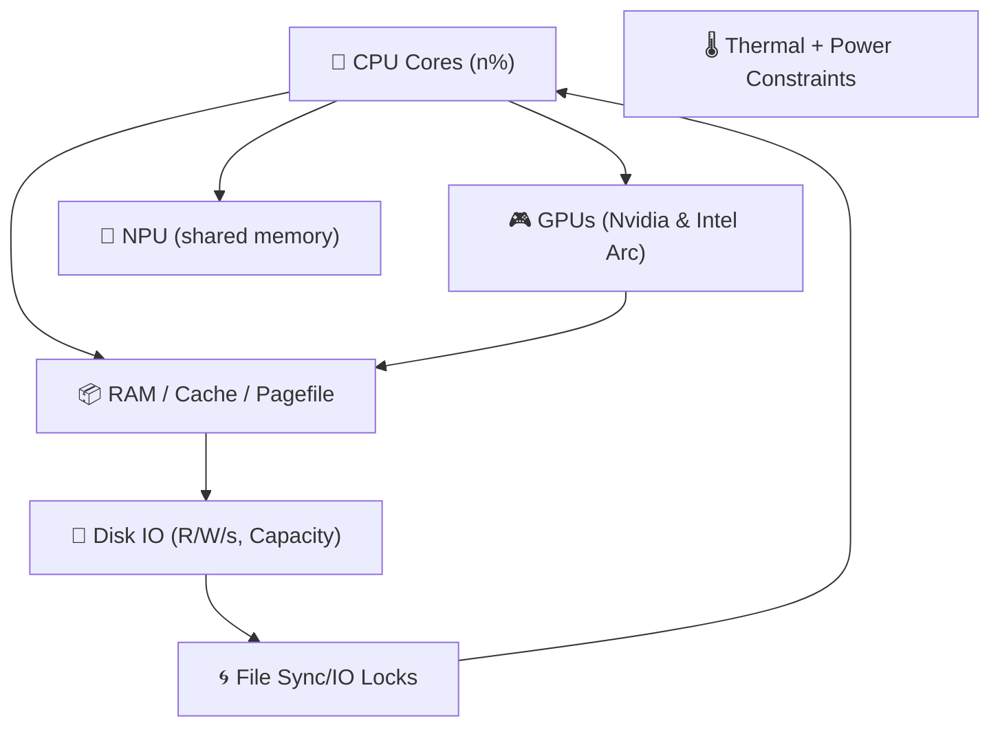

Excellent. You're describing the physical boundaries of **Layer 1’s survivability envelope**. ^ref-64a9f9f9-1-0

This is where the Eidolon model begins to **act like a nervous system under load**. Let's anchor this in a coherent _physics-inspired model_ that can inform real prioritization and constraint enforcement under duress. ^ref-64a9f9f9-3-0

---

## 🧱 Resource Modalities: Real-World Mapping

Let's name and organize the resources as **independent but interconnected fields**: ^ref-64a9f9f9-9-0


^ref-64a9f9f9-11-0
 ^ref-64a9f9f9-30-0
This is a real mess to manage unless we **normalize and project** these into a _resource-stress field_.

---

## 🧭 Field Vector Schema
 ^ref-64a9f9f9-36-0
Each resource has:
 ^ref-64a9f9f9-38-0
|Field Axis|Description|
|---|---|
|`X_cpu_i`|Percent usage for core _i_|
|`Y_ram`|% used, % cache pressure|
|`Z_gpu_i`|Load % for GPU i|
|`U_npu`|Effective ops / latency over threshold|
|`D_disk_i`|Bandwidth usage and fill level per volume|
|`L_temp`|Temperature delta from nominal or throttle point|
|`F_io`|File sync/write collisions or delays detected|
 ^ref-64a9f9f9-48-0
We’ll bundle this into a vector per unit of time (or tick):
 ^ref-64a9f9f9-50-0
```clojure
(defstruct resource-snapshot
  cpu-cores ; [x x x x ...] per core
  ram       ; {:used %, :cached %, :pagefile %}
  gpus      ; {:intel-arc %, :nvidia-4070ti %}
  npu       ; {:utilization %, :latency ms}
  disks     ; [{:r/s, :w/s, :capacity-used %}, ...]
  temp      ; {:cpu-temp °C, :gpu-temp °C, ...}
  io-locks  ; {:contention-rate, :conflict-count})
^ref-64a9f9f9-50-0
``` ^ref-64a9f9f9-61-0

Now, let’s define a vector field: ^ref-64a9f9f9-63-0

```clojure
(defn compute-uptime-field [snapshot]
  (reduce (fn [vec-field res]
            (add-to-field vec-field (project-stress res)))
          empty-vec-field
^ref-64a9f9f9-63-0
          snapshot)) ^ref-64a9f9f9-71-0
```
 ^ref-64a9f9f9-73-0
We can begin modeling:
 ^ref-64a9f9f9-75-0
- **gradient flows**: e.g., RAM pressure diffuses into CPU/NPU field
 ^ref-64a9f9f9-77-0
- **turbulence**: e.g., race conditions emerge from sharp spikes in IO or thermal throttling
    
- **crash likelihood**: when the combined stress vector reaches a critical direction or magnitude
    

---
 ^ref-64a9f9f9-84-0
## 🛑 Failure Modes to Detect + Handle

|Mode|Trigger|Mitigation|
|---|---|---|
|**RAM exhaustion**|Free RAM < 5%|Cancel low-priority buffers|
|**Disk full**|Any disk > 90%|Purge caches / delay writes|
|**Thermal throttle**|Temp near Tjmax|Slow down jobs, log temperature events|
|**IO Race**|Same file accessed w/o lock|Use atomic temp file + rename|
|**Context overload**|LLM or STT queue too deep|Drop or summarize old requests|
|**System call corruption**|Sudden high jitter in metrics|Failsafe fallback mode, self-healing fsync queues|

---

## 🧪 Field Probes and Agents
 ^ref-64a9f9f9-99-0
### Example: RAM Agent

```lisp
(defagent ram-manager
  (priority 10)
  (update
    (lambda ()
      (let ((ram (get-field 'ram)))
        (when (> ram.used 0.9)
          (trigger 'drop-noncritical-contexts))
^ref-64a9f9f9-99-0
        (when (> ram.pagefile 0.8)
          (reduce-worker-threads))))))
```
^ref-64a9f9f9-113-0

### Example: Disk I/O Monitor

```lisp
(defagent disk-agent
  (priority 9)
  (update
    (lambda ()
      (doseq (disk snapshot.disks)
        (when (> disk.capacity-used 0.95)
^ref-64a9f9f9-113-0
          (notify 'disk-pressure zone=disk.mount))
        (when (> disk.writes-per-sec 2000)
          (delay 'background-embeddings))))))
```
 ^ref-64a9f9f9-129-0
---
 ^ref-64a9f9f9-131-0 ^ref-64a9f9f9-132-0
## ⚡ Memory Race Detection Strategy

- Use a write-through pattern:
 ^ref-64a9f9f9-135-0
    - Write to temp file: `state.tmp.json`
 ^ref-64a9f9f9-137-0
    - Fsync and `mv` to final name atomically
 ^ref-64a9f9f9-139-0
    - If `mv` fails, yield until next tick
        
- Maintain a `write-epoch` per resource. If two write requests share an epoch:
    
    - Introduce artificial delay or random jitter before commit
        
 ^ref-64a9f9f9-146-0
---
 ^ref-64a9f9f9-148-0 ^ref-64a9f9f9-149-0
## 🛠️ Next Step Suggestions

Here’s what I suggest we prototype next:
 ^ref-64a9f9f9-152-0
1. **Resource Snapshot Collector**: Platform-specific metrics API
 ^ref-64a9f9f9-154-0
2. **Eidolon Field Construction**: 2D vector stress map with decay, diffusion, and threshold coloring
 ^ref-64a9f9f9-156-0
3. **Agent-Based Response Model**: Agents like `ram-manager` and `disk-agent` that respond to local field conditions
 ^ref-64a9f9f9-159-0
4. **Simulated Stress Injector**: Artificial load generator to test field reactivity ^ref-64a9f9f9-159-0
    
5. **Self-Healing Demo**: Duck notices pressure, drops old STT data, slows TTS rate, logs pressure release
    
 ^ref-64a9f9f9-164-0
Would you like to start by writing a stress field data structure and simple decay function in Sibilant or JavaScript? Or do you want to define the snapshot system interface (cross-platform metrics collector)?<!-- GENERATED-SECTIONS:DO-NOT-EDIT-BELOW -->
## Related content
- [Promethean Infrastructure Setup](promethean-infrastructure-setup.md)
- [Migrate to Provider-Tenant Architecture](migrate-to-provider-tenant-architecture.md)
- [Creative Moments](creative-moments.md)
- [Duck's Attractor States](ducks-attractor-states.md)
- [The Jar of Echoes](the-jar-of-echoes.md)
- [Promethean State Format](promethean-state-format.md)
- [Prompt_Folder_Bootstrap](prompt-folder-bootstrap.md)
- [Protocol_0_The_Contradiction_Engine](protocol-0-the-contradiction-engine.md)
- [Pure TypeScript Search Microservice](pure-typescript-search-microservice.md)
- [ripple-propagation-demo](ripple-propagation-demo.md)
- [eidolon-field-math-foundations](eidolon-field-math-foundations.md)
- [field-node-diagram-set](field-node-diagram-set.md)
- [Synchronicity Waves and Web](synchronicity-waves-and-web.md)
- [Performance-Optimized-Polyglot-Bridge](performance-optimized-polyglot-bridge.md)
- [Optimizing Command Limitations in System Design](optimizing-command-limitations-in-system-design.md)
- [graph-ds](graph-ds.md)
- [Eidolon Field Abstract Model](eidolon-field-abstract-model.md)
- [Promethean Pipelines](promethean-pipelines.md)
- [Admin Dashboard for User Management](admin-dashboard-for-user-management.md)
- [field-node-diagram-outline](field-node-diagram-outline.md)
- [Promethean Workflow Optimization](promethean-workflow-optimization.md)
- [Factorio AI with External Agents](factorio-ai-with-external-agents.md)
- [Model Selection for Lightweight Conversational Tasks](model-selection-for-lightweight-conversational-tasks.md)
- [obsidian-ignore-node-modules-regex](obsidian-ignore-node-modules-regex.md)
- [homeostasis-decay-formulas](homeostasis-decay-formulas.md)
- [Model Upgrade Calm-Down Guide](model-upgrade-calm-down-guide.md)
- [Fnord Tracer Protocol](fnord-tracer-protocol.md)
- [Canonical Org-Babel Matplotlib Animation Template](canonical-org-babel-matplotlib-animation-template.md)
- [Smoke Resonance Visualizations](smoke-resonance-visualizations.md)
- [sibilant-macro-targets](sibilant-macro-targets.md)
- [Promethean_Eidolon_Synchronicity_Model](promethean-eidolon-synchronicity-model.md)
- [field-interaction-equations](field-interaction-equations.md)
- [field-dynamics-math-blocks](field-dynamics-math-blocks.md)
- [Dynamic Context Model for Web Components](dynamic-context-model-for-web-components.md)
- [Functional Refactor of TypeScript Document Processing](functional-refactor-of-typescript-document-processing.md)
- [Provider-Agnostic Chat Panel Implementation](provider-agnostic-chat-panel-implementation.md)
- [Per-Domain Policy System for JS Crawler](per-domain-policy-system-for-js-crawler.md)
- [plan-update-confirmation](plan-update-confirmation.md)
- [i3-bluetooth-setup](i3-bluetooth-setup.md)
- [Stateful Partitions and Rebalancing](stateful-partitions-and-rebalancing.md)
- [Tracing the Signal](tracing-the-signal.md)
- [schema-evolution-workflow](schema-evolution-workflow.md)
- [Self-Agency in AI Interaction](self-agency-in-ai-interaction.md)
- [unique-templates](templates/unique-templates.md)
- [ts-to-lisp-transpiler](ts-to-lisp-transpiler.md)
- [Obsidian ChatGPT Plugin Integration Guide](obsidian-chatgpt-plugin-integration-guide.md)
- [Obsidian ChatGPT Plugin Integration](obsidian-chatgpt-plugin-integration.md)
- [Obsidian Templating Plugins Integration Guide](obsidian-templating-plugins-integration-guide.md)
- [ParticleSimulationWithCanvasAndFFmpeg](particlesimulationwithcanvasandffmpeg.md)
- [Reawakening Duck](reawakening-duck.md)
- [Ice Box Reorganization](ice-box-reorganization.md)
- [zero-copy-snapshots-and-workers](zero-copy-snapshots-and-workers.md)
- [Debugging Broker Connections and Agent Behavior](debugging-broker-connections-and-agent-behavior.md)
- [Duck's Self-Referential Perceptual Loop](ducks-self-referential-perceptual-loop.md)
- [Redirecting Standard Error](redirecting-standard-error.md)
- [TypeScript Patch for Tool Calling Support](typescript-patch-for-tool-calling-support.md)
- [Prometheus Observability Stack](prometheus-observability-stack.md)
- [NPU Voice Code and Sensory Integration](npu-voice-code-and-sensory-integration.md)
- [Obsidian Task Generation](obsidian-task-generation.md)
- [OpenAPI Validation Report](openapi-validation-report.md)
- [eidolon-node-lifecycle](eidolon-node-lifecycle.md)
- [field-node-diagram-visualizations](field-node-diagram-visualizations.md)
- [heartbeat-fragment-demo](heartbeat-fragment-demo.md)
- [Promethean-Copilot-Intent-Engine](promethean-copilot-intent-engine.md)
- [typed-struct-compiler](typed-struct-compiler.md)
- [Unique Concepts](unique-concepts.md)
- [promethean-requirements](promethean-requirements.md)
- [Unique Info Dump Index](unique-info-dump-index.md)
- [komorebi-group-window-hack](komorebi-group-window-hack.md)
- [Agent Tasks: Persistence Migration to DualStore](agent-tasks-persistence-migration-to-dualstore.md)
- [Chroma Toolkit Consolidation Plan](chroma-toolkit-consolidation-plan.md)
- [polyglot-repl-interface-layer](polyglot-repl-interface-layer.md)
- [Post-Linguistic Transhuman Design Frameworks](post-linguistic-transhuman-design-frameworks.md)
- [Math Fundamentals](chunks/math-fundamentals.md)
- [Promethean Chat Activity Report](promethean-chat-activity-report.md)
- [Promethean Dev Workflow Update](promethean-dev-workflow-update.md)
- [Promethean Notes](promethean-notes.md)
- [windows-tiling-with-autohotkey](windows-tiling-with-autohotkey.md)
- [Promethean Documentation Update](promethean-documentation-update.txt)
- [Agent Reflections and Prompt Evolution](agent-reflections-and-prompt-evolution.md)
- [api-gateway-versioning](api-gateway-versioning.md)
- [Docops Feature Updates](docops-feature-updates-3.md)
- [Docops Feature Updates](docops-feature-updates.md)
- [Promethean Documentation Pipeline Overview](promethean-documentation-pipeline-overview.md)
- [Pipeline Enhancements](pipeline-enhancements.md)
- [Diagrams](chunks/diagrams.md)
- [Mindful Prioritization](mindful-prioritization.md)
- [ChatGPT Custom Prompts](chatgpt-custom-prompts.md)
- [DSL](chunks/dsl.md)
- [JavaScript](chunks/javascript.md)
- [Operations](chunks/operations.md)
- [Shared](chunks/shared.md)
- [Window Management](chunks/window-management.md)
- [Tooling](chunks/tooling.md)
- [DuckDuckGoSearchPipeline](duckduckgosearchpipeline.md)
- [Mathematical Samplers](mathematical-samplers.md)
- [Mathematics Sampler](mathematics-sampler.md)
- [Functional Embedding Pipeline Refactor](functional-embedding-pipeline-refactor.md)
- [Board Automation Improvements](board-automation-improvements.md)
- [Board Walk – 2025-08-11](board-walk-2025-08-11.md)
- [balanced-bst](balanced-bst.md)
- [Promethean Data Sync Protocol](promethean-data-sync-protocol.md)
- [Promethean Documentation Update](promethean-documentation-update.md)
- [Promethean Documentation Overview](promethean-documentation-overview.md)
- [Simulation Demo](chunks/simulation-demo.md)
- [Services](chunks/services.md)
- [MindfulRobotIntegration](mindfulrobotintegration.md)
- [aionian-circuit-math](aionian-circuit-math.md)
- [AI-First-OS-Model-Context-Protocol](ai-first-os-model-context-protocol.md)
- [observability-infrastructure-setup](observability-infrastructure-setup.md)
- [ecs-offload-workers](ecs-offload-workers.md)
- [layer-1-uptime-diagrams](layer-1-uptime-diagrams.md)
- [Refactor 05-footers.ts](refactor-05-footers-ts.md)
- [Local-Only-LLM-Workflow](local-only-llm-workflow.md)
- [i3-layout-saver](i3-layout-saver.md)
## Sources
- [sibilant-macro-targets — L64](sibilant-macro-targets.md#^ref-c5c9a5c6-64-0) (line 64, col 0, score 0.87)
- [observability-infrastructure-setup — L92](observability-infrastructure-setup.md#^ref-b4e64f8c-92-0) (line 92, col 0, score 0.87)
- [ripple-propagation-demo — L64](ripple-propagation-demo.md#^ref-8430617b-64-0) (line 64, col 0, score 0.86)
- [ripple-propagation-demo — L67](ripple-propagation-demo.md#^ref-8430617b-67-0) (line 67, col 0, score 0.86)
- [Factorio AI with External Agents — L94](factorio-ai-with-external-agents.md#^ref-a4d90289-94-0) (line 94, col 0, score 0.86)
- [observability-infrastructure-setup — L97](observability-infrastructure-setup.md#^ref-b4e64f8c-97-0) (line 97, col 0, score 0.85)
- [field-node-diagram-outline — L59](field-node-diagram-outline.md#^ref-1f32c94a-59-0) (line 59, col 0, score 0.85)
- [ecs-offload-workers — L39](ecs-offload-workers.md#^ref-6498b9d7-39-0) (line 39, col 0, score 0.85)
- [observability-infrastructure-setup — L44](observability-infrastructure-setup.md#^ref-b4e64f8c-44-0) (line 44, col 0, score 0.86)
- [Protocol_0_The_Contradiction_Engine — L184](protocol-0-the-contradiction-engine.md#^ref-9a93a756-184-0) (line 184, col 0, score 1)
- [Provider-Agnostic Chat Panel Implementation — L283](provider-agnostic-chat-panel-implementation.md#^ref-43bfe9dd-283-0) (line 283, col 0, score 1)
- [Pure TypeScript Search Microservice — L629](pure-typescript-search-microservice.md#^ref-d17d3a96-629-0) (line 629, col 0, score 1)
- [Redirecting Standard Error — L36](redirecting-standard-error.md#^ref-b3555ede-36-0) (line 36, col 0, score 1)
- [schema-evolution-workflow — L623](schema-evolution-workflow.md#^ref-d8059b6a-623-0) (line 623, col 0, score 1)
- [Self-Agency in AI Interaction — L58](self-agency-in-ai-interaction.md#^ref-49a9a860-58-0) (line 58, col 0, score 1)
- [Smoke Resonance Visualizations — L108](smoke-resonance-visualizations.md#^ref-ac9d3ac5-108-0) (line 108, col 0, score 1)
- [Stateful Partitions and Rebalancing — L654](stateful-partitions-and-rebalancing.md#^ref-4330e8f0-654-0) (line 654, col 0, score 1)
- [Synchronicity Waves and Web — L123](synchronicity-waves-and-web.md#^ref-91295f3a-123-0) (line 123, col 0, score 1)
- [Tooling — L36](chunks/tooling.md#^ref-6cb4943e-36-0) (line 36, col 0, score 1)
- [Window Management — L49](chunks/window-management.md#^ref-9e8ae388-49-0) (line 49, col 0, score 1)
- [Creative Moments — L18](creative-moments.md#^ref-10d98225-18-0) (line 18, col 0, score 1)
- [Debugging Broker Connections and Agent Behavior — L77](debugging-broker-connections-and-agent-behavior.md#^ref-73d3dbf6-77-0) (line 77, col 0, score 1)
- [Docops Feature Updates — L39](docops-feature-updates-3.md#^ref-cdbd21ee-39-0) (line 39, col 0, score 1)
- [Docops Feature Updates — L67](docops-feature-updates.md#^ref-2792d448-67-0) (line 67, col 0, score 1)
- [DuckDuckGoSearchPipeline — L22](duckduckgosearchpipeline.md#^ref-e979c50f-22-0) (line 22, col 0, score 1)
- [Duck's Attractor States — L107](ducks-attractor-states.md#^ref-13951643-107-0) (line 107, col 0, score 1)
- [Duck's Self-Referential Perceptual Loop — L88](ducks-self-referential-perceptual-loop.md#^ref-71726f04-88-0) (line 88, col 0, score 1)
- [eidolon-field-math-foundations — L198](eidolon-field-math-foundations.md#^ref-008f2ac0-198-0) (line 198, col 0, score 1)
- [TypeScript Patch for Tool Calling Support — L573](typescript-patch-for-tool-calling-support.md#^ref-7b7ca860-573-0) (line 573, col 0, score 1)
- [Promethean Pipelines — L222](promethean-pipelines.md#^ref-8b8e6103-222-0) (line 222, col 0, score 1)
- [Promethean State Format — L110](promethean-state-format.md#^ref-23df6ddb-110-0) (line 110, col 0, score 1)
- [Promethean Workflow Optimization — L98](promethean-workflow-optimization.md#^ref-d614d983-98-0) (line 98, col 0, score 1)
- [Prometheus Observability Stack — L563](prometheus-observability-stack.md#^ref-e90b5a16-563-0) (line 563, col 0, score 1)
- [Protocol_0_The_Contradiction_Engine — L158](protocol-0-the-contradiction-engine.md#^ref-9a93a756-158-0) (line 158, col 0, score 1)
- [Provider-Agnostic Chat Panel Implementation — L282](provider-agnostic-chat-panel-implementation.md#^ref-43bfe9dd-282-0) (line 282, col 0, score 1)
- [Pure TypeScript Search Microservice — L637](pure-typescript-search-microservice.md#^ref-d17d3a96-637-0) (line 637, col 0, score 1)
- [Mathematical Samplers — L66](mathematical-samplers.md#^ref-86a691ec-66-0) (line 66, col 0, score 1)
- [Mathematics Sampler — L70](mathematics-sampler.md#^ref-b5e0183e-70-0) (line 70, col 0, score 1)
- [Migrate to Provider-Tenant Architecture — L364](migrate-to-provider-tenant-architecture.md#^ref-54382370-364-0) (line 364, col 0, score 1)
- [Mindful Prioritization — L20](mindful-prioritization.md#^ref-40185d05-20-0) (line 20, col 0, score 1)
- [Model Selection for Lightweight Conversational Tasks — L203](model-selection-for-lightweight-conversational-tasks.md#^ref-d144aa62-203-0) (line 203, col 0, score 1)
- [NPU Voice Code and Sensory Integration — L25](npu-voice-code-and-sensory-integration.md#^ref-5a02283e-25-0) (line 25, col 0, score 1)
- [Obsidian ChatGPT Plugin Integration Guide — L87](obsidian-chatgpt-plugin-integration-guide.md#^ref-1d3d6c3a-87-0) (line 87, col 0, score 1)
- [Obsidian ChatGPT Plugin Integration — L89](obsidian-chatgpt-plugin-integration.md#^ref-ca8e1399-89-0) (line 89, col 0, score 1)
- [obsidian-ignore-node-modules-regex — L111](obsidian-ignore-node-modules-regex.md#^ref-ffb9b2a9-111-0) (line 111, col 0, score 1)
- [Obsidian Task Generation — L25](obsidian-task-generation.md#^ref-9b694a91-25-0) (line 25, col 0, score 1)
- [OpenAPI Validation Report — L43](openapi-validation-report.md#^ref-5c152b08-43-0) (line 43, col 0, score 1)
- [Optimizing Command Limitations in System Design — L79](optimizing-command-limitations-in-system-design.md#^ref-98c8ff62-79-0) (line 79, col 0, score 1)
- [Tooling — L41](chunks/tooling.md#^ref-6cb4943e-41-0) (line 41, col 0, score 1)
- [Docops Feature Updates — L48](docops-feature-updates-3.md#^ref-cdbd21ee-48-0) (line 48, col 0, score 1)
- [Docops Feature Updates — L79](docops-feature-updates.md#^ref-2792d448-79-0) (line 79, col 0, score 1)
- [eidolon-node-lifecycle — L69](eidolon-node-lifecycle.md#^ref-938eca9c-69-0) (line 69, col 0, score 1)
- [field-node-diagram-outline — L158](field-node-diagram-outline.md#^ref-1f32c94a-158-0) (line 158, col 0, score 1)
- [field-node-diagram-set — L178](field-node-diagram-set.md#^ref-22b989d5-178-0) (line 178, col 0, score 1)
- [field-node-diagram-visualizations — L126](field-node-diagram-visualizations.md#^ref-e9b27b06-126-0) (line 126, col 0, score 1)
- [Functional Embedding Pipeline Refactor — L410](functional-embedding-pipeline-refactor.md#^ref-a4a25141-410-0) (line 410, col 0, score 1)
- [Functional Refactor of TypeScript Document Processing — L228](functional-refactor-of-typescript-document-processing.md#^ref-1cfae310-228-0) (line 228, col 0, score 1)
- [aionian-circuit-math — L149](aionian-circuit-math.md#^ref-f2d83a77-149-0) (line 149, col 0, score 1)
- [api-gateway-versioning — L285](api-gateway-versioning.md#^ref-0580dcd3-285-0) (line 285, col 0, score 1)
- [Board Automation Improvements — L11](board-automation-improvements.md#^ref-ac60a1d6-11-0) (line 11, col 0, score 1)
- [Board Walk – 2025-08-11 — L134](board-walk-2025-08-11.md#^ref-7aa1eb92-134-0) (line 134, col 0, score 1)
- [field-dynamics-math-blocks — L193](field-dynamics-math-blocks.md#^ref-7cfc230d-193-0) (line 193, col 0, score 1)
- [field-node-diagram-set — L203](field-node-diagram-set.md#^ref-22b989d5-203-0) (line 203, col 0, score 1)
- [field-node-diagram-visualizations — L151](field-node-diagram-visualizations.md#^ref-e9b27b06-151-0) (line 151, col 0, score 1)
- [Functional Refactor of TypeScript Document Processing — L281](functional-refactor-of-typescript-document-processing.md#^ref-1cfae310-281-0) (line 281, col 0, score 1)
- [heartbeat-fragment-demo — L181](heartbeat-fragment-demo.md#^ref-dd00677a-181-0) (line 181, col 0, score 1)
- [homeostasis-decay-formulas — L220](homeostasis-decay-formulas.md#^ref-37b5d236-220-0) (line 220, col 0, score 1)
- [Ice Box Reorganization — L110](ice-box-reorganization.md#^ref-291c7d91-110-0) (line 110, col 0, score 1)
- [obsidian-ignore-node-modules-regex — L118](obsidian-ignore-node-modules-regex.md#^ref-ffb9b2a9-118-0) (line 118, col 0, score 1)
- [ParticleSimulationWithCanvasAndFFmpeg — L329](particlesimulationwithcanvasandffmpeg.md#^ref-e018dd7a-329-0) (line 329, col 0, score 1)
- [TypeScript Patch for Tool Calling Support — L559](typescript-patch-for-tool-calling-support.md#^ref-7b7ca860-559-0) (line 559, col 0, score 1)
- [obsidian-ignore-node-modules-regex — L119](obsidian-ignore-node-modules-regex.md#^ref-ffb9b2a9-119-0) (line 119, col 0, score 1)
- [ParticleSimulationWithCanvasAndFFmpeg — L315](particlesimulationwithcanvasandffmpeg.md#^ref-e018dd7a-315-0) (line 315, col 0, score 1)
- [Per-Domain Policy System for JS Crawler — L548](per-domain-policy-system-for-js-crawler.md#^ref-c03020e1-548-0) (line 548, col 0, score 1)
- [Performance-Optimized-Polyglot-Bridge — L496](performance-optimized-polyglot-bridge.md#^ref-f5579967-496-0) (line 496, col 0, score 1)
- [polyglot-repl-interface-layer — L224](polyglot-repl-interface-layer.md#^ref-9c79206d-224-0) (line 224, col 0, score 1)
- [Promethean-Copilot-Intent-Engine — L125](promethean-copilot-intent-engine.md#^ref-ae24a280-125-0) (line 125, col 0, score 1)
- [Promethean State Format — L165](promethean-state-format.md#^ref-23df6ddb-165-0) (line 165, col 0, score 1)
- [Admin Dashboard for User Management — L45](admin-dashboard-for-user-management.md#^ref-2901a3e9-45-0) (line 45, col 0, score 1)
- [TypeScript Patch for Tool Calling Support — L560](typescript-patch-for-tool-calling-support.md#^ref-7b7ca860-560-0) (line 560, col 0, score 1)
- [Agent Reflections and Prompt Evolution — L187](agent-reflections-and-prompt-evolution.md#^ref-bb7f0835-187-0) (line 187, col 0, score 1)
- [JavaScript — L66](chunks/javascript.md#^ref-c1618c66-66-0) (line 66, col 0, score 1)
- [field-node-diagram-outline — L186](field-node-diagram-outline.md#^ref-1f32c94a-186-0) (line 186, col 0, score 1)
- [field-node-diagram-set — L212](field-node-diagram-set.md#^ref-22b989d5-212-0) (line 212, col 0, score 1)
- [field-node-diagram-visualizations — L162](field-node-diagram-visualizations.md#^ref-e9b27b06-162-0) (line 162, col 0, score 1)
- [heartbeat-fragment-demo — L191](heartbeat-fragment-demo.md#^ref-dd00677a-191-0) (line 191, col 0, score 1)
- [homeostasis-decay-formulas — L233](homeostasis-decay-formulas.md#^ref-37b5d236-233-0) (line 233, col 0, score 1)
- [Ice Box Reorganization — L129](ice-box-reorganization.md#^ref-291c7d91-129-0) (line 129, col 0, score 1)
- [Model Selection for Lightweight Conversational Tasks — L212](model-selection-for-lightweight-conversational-tasks.md#^ref-d144aa62-212-0) (line 212, col 0, score 1)
- [Pure TypeScript Search Microservice — L605](pure-typescript-search-microservice.md#^ref-d17d3a96-605-0) (line 605, col 0, score 1)
- [TypeScript Patch for Tool Calling Support — L561](typescript-patch-for-tool-calling-support.md#^ref-7b7ca860-561-0) (line 561, col 0, score 1)
- [schema-evolution-workflow — L645](schema-evolution-workflow.md#^ref-d8059b6a-645-0) (line 645, col 0, score 1)
- [Stateful Partitions and Rebalancing — L671](stateful-partitions-and-rebalancing.md#^ref-4330e8f0-671-0) (line 671, col 0, score 1)
- [api-gateway-versioning — L287](api-gateway-versioning.md#^ref-0580dcd3-287-0) (line 287, col 0, score 1)
- [balanced-bst — L302](balanced-bst.md#^ref-d3e7db72-302-0) (line 302, col 0, score 1)
- [Board Automation Improvements — L15](board-automation-improvements.md#^ref-ac60a1d6-15-0) (line 15, col 0, score 1)
- [Board Walk – 2025-08-11 — L137](board-walk-2025-08-11.md#^ref-7aa1eb92-137-0) (line 137, col 0, score 1)
- [Pure TypeScript Search Microservice — L593](pure-typescript-search-microservice.md#^ref-d17d3a96-593-0) (line 593, col 0, score 1)
- [schema-evolution-workflow — L561](schema-evolution-workflow.md#^ref-d8059b6a-561-0) (line 561, col 0, score 1)
- [Stateful Partitions and Rebalancing — L607](stateful-partitions-and-rebalancing.md#^ref-4330e8f0-607-0) (line 607, col 0, score 1)
- [TypeScript Patch for Tool Calling Support — L548](typescript-patch-for-tool-calling-support.md#^ref-7b7ca860-548-0) (line 548, col 0, score 1)
- [Promethean Chat Activity Report — L50](promethean-chat-activity-report.md#^ref-18344cf9-50-0) (line 50, col 0, score 1)
- [Promethean Data Sync Protocol — L28](promethean-data-sync-protocol.md#^ref-9fab9e76-28-0) (line 28, col 0, score 1)
- [Promethean Documentation Pipeline Overview — L232](promethean-documentation-pipeline-overview.md#^ref-3a3bf2c9-232-0) (line 232, col 0, score 1)
- [Promethean Documentation Update — L29](promethean-documentation-update.md#^ref-c0392040-29-0) (line 29, col 0, score 1)
- [Pure TypeScript Search Microservice — L590](pure-typescript-search-microservice.md#^ref-d17d3a96-590-0) (line 590, col 0, score 1)
- [schema-evolution-workflow — L574](schema-evolution-workflow.md#^ref-d8059b6a-574-0) (line 574, col 0, score 1)
- [Stateful Partitions and Rebalancing — L604](stateful-partitions-and-rebalancing.md#^ref-4330e8f0-604-0) (line 604, col 0, score 1)
- [unique-templates — L13](templates/unique-templates.md#^ref-c26f0044-13-0) (line 13, col 0, score 1)
- [The Jar of Echoes — L131](the-jar-of-echoes.md#^ref-18138627-131-0) (line 131, col 0, score 1)
- [Tracing the Signal — L107](tracing-the-signal.md#^ref-c3cd4f65-107-0) (line 107, col 0, score 1)
- [ts-to-lisp-transpiler — L38](ts-to-lisp-transpiler.md#^ref-ba11486b-38-0) (line 38, col 0, score 1)
- [typed-struct-compiler — L407](typed-struct-compiler.md#^ref-78eeedf7-407-0) (line 407, col 0, score 1)
- [TypeScript Patch for Tool Calling Support — L538](typescript-patch-for-tool-calling-support.md#^ref-7b7ca860-538-0) (line 538, col 0, score 1)
- [Unique Concepts — L11](unique-concepts.md#^ref-ed6f3fc9-11-0) (line 11, col 0, score 1)
- [TypeScript Patch for Tool Calling Support — L547](typescript-patch-for-tool-calling-support.md#^ref-7b7ca860-547-0) (line 547, col 0, score 1)
- [Promethean Documentation Update — L21](promethean-documentation-update.txt#^ref-0b872af2-21-0) (line 21, col 0, score 1)
- [Promethean_Eidolon_Synchronicity_Model — L87](promethean-eidolon-synchronicity-model.md#^ref-2d6e5553-87-0) (line 87, col 0, score 1)
- [Promethean Notes — L24](promethean-notes.md#^ref-1c4046b5-24-0) (line 24, col 0, score 1)
- [Promethean Pipelines — L128](promethean-pipelines.md#^ref-8b8e6103-128-0) (line 128, col 0, score 1)
- [promethean-requirements — L35](promethean-requirements.md#^ref-95205cd3-35-0) (line 35, col 0, score 1)
- [Promethean State Format — L131](promethean-state-format.md#^ref-23df6ddb-131-0) (line 131, col 0, score 1)
- [Promethean Workflow Optimization — L33](promethean-workflow-optimization.md#^ref-d614d983-33-0) (line 33, col 0, score 1)
- [Provider-Agnostic Chat Panel Implementation — L268](provider-agnostic-chat-panel-implementation.md#^ref-43bfe9dd-268-0) (line 268, col 0, score 1)
- [Prometheus Observability Stack — L541](prometheus-observability-stack.md#^ref-e90b5a16-541-0) (line 541, col 0, score 1)
- [Prompt_Folder_Bootstrap — L222](prompt-folder-bootstrap.md#^ref-bd4f0976-222-0) (line 222, col 0, score 1)
- [Reawakening Duck — L131](reawakening-duck.md#^ref-59b5670f-131-0) (line 131, col 0, score 1)
- [typed-struct-compiler — L416](typed-struct-compiler.md#^ref-78eeedf7-416-0) (line 416, col 0, score 1)
- [Docops Feature Updates — L20](docops-feature-updates-3.md#^ref-cdbd21ee-20-0) (line 20, col 0, score 1)
- [Docops Feature Updates — L37](docops-feature-updates.md#^ref-2792d448-37-0) (line 37, col 0, score 1)
- [DuckDuckGoSearchPipeline — L59](duckduckgosearchpipeline.md#^ref-e979c50f-59-0) (line 59, col 0, score 1)
- [Duck's Attractor States — L103](ducks-attractor-states.md#^ref-13951643-103-0) (line 103, col 0, score 1)
- [Duck's Self-Referential Perceptual Loop — L84](ducks-self-referential-perceptual-loop.md#^ref-71726f04-84-0) (line 84, col 0, score 1)
- [Post-Linguistic Transhuman Design Frameworks — L134](post-linguistic-transhuman-design-frameworks.md#^ref-6bcff92c-134-0) (line 134, col 0, score 1)
- [Per-Domain Policy System for JS Crawler — L537](per-domain-policy-system-for-js-crawler.md#^ref-c03020e1-537-0) (line 537, col 0, score 1)
- [Performance-Optimized-Polyglot-Bridge — L493](performance-optimized-polyglot-bridge.md#^ref-f5579967-493-0) (line 493, col 0, score 1)
- [Pipeline Enhancements — L18](pipeline-enhancements.md#^ref-e2135d9f-18-0) (line 18, col 0, score 1)
- [polyglot-repl-interface-layer — L206](polyglot-repl-interface-layer.md#^ref-9c79206d-206-0) (line 206, col 0, score 1)
- [Post-Linguistic Transhuman Design Frameworks — L159](post-linguistic-transhuman-design-frameworks.md#^ref-6bcff92c-159-0) (line 159, col 0, score 1)
- [Promethean Chat Activity Report — L66](promethean-chat-activity-report.md#^ref-18344cf9-66-0) (line 66, col 0, score 1)
- [Promethean Data Sync Protocol — L45](promethean-data-sync-protocol.md#^ref-9fab9e76-45-0) (line 45, col 0, score 1)
- [Promethean Dev Workflow Update — L98](promethean-dev-workflow-update.md#^ref-03a5578f-98-0) (line 98, col 0, score 1)
- [Promethean Documentation Overview — L16](promethean-documentation-overview.md#^ref-9413237f-16-0) (line 16, col 0, score 1)
- [Promethean Documentation Pipeline Overview — L202](promethean-documentation-pipeline-overview.md#^ref-3a3bf2c9-202-0) (line 202, col 0, score 1)
- [Promethean Documentation Update — L46](promethean-documentation-update.md#^ref-c0392040-46-0) (line 46, col 0, score 1)
- [Model Selection for Lightweight Conversational Tasks — L209](model-selection-for-lightweight-conversational-tasks.md#^ref-d144aa62-209-0) (line 209, col 0, score 1)
- [Obsidian ChatGPT Plugin Integration Guide — L137](obsidian-chatgpt-plugin-integration-guide.md#^ref-1d3d6c3a-137-0) (line 137, col 0, score 1)
- [Obsidian ChatGPT Plugin Integration — L138](obsidian-chatgpt-plugin-integration.md#^ref-ca8e1399-138-0) (line 138, col 0, score 1)
- [Obsidian Templating Plugins Integration Guide — L207](obsidian-templating-plugins-integration-guide.md#^ref-b39dc9d4-207-0) (line 207, col 0, score 1)
- [Pipeline Enhancements — L59](pipeline-enhancements.md#^ref-e2135d9f-59-0) (line 59, col 0, score 1)
- [plan-update-confirmation — L1100](plan-update-confirmation.md#^ref-b22d79c6-1100-0) (line 1100, col 0, score 1)
- [polyglot-repl-interface-layer — L230](polyglot-repl-interface-layer.md#^ref-9c79206d-230-0) (line 230, col 0, score 1)
- [Post-Linguistic Transhuman Design Frameworks — L125](post-linguistic-transhuman-design-frameworks.md#^ref-6bcff92c-125-0) (line 125, col 0, score 1)
- [Promethean Chat Activity Report — L147](promethean-chat-activity-report.md#^ref-18344cf9-147-0) (line 147, col 0, score 1)
- [eidolon-node-lifecycle — L57](eidolon-node-lifecycle.md#^ref-938eca9c-57-0) (line 57, col 0, score 1)
- [i3-bluetooth-setup — L124](i3-bluetooth-setup.md#^ref-5e408692-124-0) (line 124, col 0, score 1)
- [Ice Box Reorganization — L81](ice-box-reorganization.md#^ref-291c7d91-81-0) (line 81, col 0, score 1)
- [DSL — L69](chunks/dsl.md#^ref-e87bc036-69-0) (line 69, col 0, score 1)
- [Operations — L36](chunks/operations.md#^ref-f1add613-36-0) (line 36, col 0, score 1)
- [Simulation Demo — L46](chunks/simulation-demo.md#^ref-557309a3-46-0) (line 46, col 0, score 1)
- [Tooling — L40](chunks/tooling.md#^ref-6cb4943e-40-0) (line 40, col 0, score 1)
- [Window Management — L53](chunks/window-management.md#^ref-9e8ae388-53-0) (line 53, col 0, score 1)
- [Creative Moments — L33](creative-moments.md#^ref-10d98225-33-0) (line 33, col 0, score 1)
- [DuckDuckGoSearchPipeline — L37](duckduckgosearchpipeline.md#^ref-e979c50f-37-0) (line 37, col 0, score 1)
- [eidolon-field-math-foundations — L163](eidolon-field-math-foundations.md#^ref-008f2ac0-163-0) (line 163, col 0, score 1)
- [schema-evolution-workflow — L559](schema-evolution-workflow.md#^ref-d8059b6a-559-0) (line 559, col 0, score 1)
- [Stateful Partitions and Rebalancing — L615](stateful-partitions-and-rebalancing.md#^ref-4330e8f0-615-0) (line 615, col 0, score 1)
- [TypeScript Patch for Tool Calling Support — L556](typescript-patch-for-tool-calling-support.md#^ref-7b7ca860-556-0) (line 556, col 0, score 1)
- [zero-copy-snapshots-and-workers — L409](zero-copy-snapshots-and-workers.md#^ref-62bec6f0-409-0) (line 409, col 0, score 1)
- [Agent Reflections and Prompt Evolution — L156](agent-reflections-and-prompt-evolution.md#^ref-bb7f0835-156-0) (line 156, col 0, score 1)
- [Canonical Org-Babel Matplotlib Animation Template — L127](canonical-org-babel-matplotlib-animation-template.md#^ref-1b1338fc-127-0) (line 127, col 0, score 1)
- [ChatGPT Custom Prompts — L36](chatgpt-custom-prompts.md#^ref-930054b3-36-0) (line 36, col 0, score 1)
- [Operations — L48](chunks/operations.md#^ref-f1add613-48-0) (line 48, col 0, score 1)
- [Creative Moments — L51](creative-moments.md#^ref-10d98225-51-0) (line 51, col 0, score 1)
- [eidolon-field-math-foundations — L140](eidolon-field-math-foundations.md#^ref-008f2ac0-140-0) (line 140, col 0, score 1)
- [Admin Dashboard for User Management — L76](admin-dashboard-for-user-management.md#^ref-2901a3e9-76-0) (line 76, col 0, score 1)
- [Operations — L33](chunks/operations.md#^ref-f1add613-33-0) (line 33, col 0, score 1)
- [Duck's Attractor States — L98](ducks-attractor-states.md#^ref-13951643-98-0) (line 98, col 0, score 1)
- [Functional Refactor of TypeScript Document Processing — L179](functional-refactor-of-typescript-document-processing.md#^ref-1cfae310-179-0) (line 179, col 0, score 1)
- [Mathematical Samplers — L116](mathematical-samplers.md#^ref-86a691ec-116-0) (line 116, col 0, score 1)
- [Model Upgrade Calm-Down Guide — L136](model-upgrade-calm-down-guide.md#^ref-db74343f-136-0) (line 136, col 0, score 1)
- [NPU Voice Code and Sensory Integration — L95](npu-voice-code-and-sensory-integration.md#^ref-5a02283e-95-0) (line 95, col 0, score 1)
- [Optimizing Command Limitations in System Design — L133](optimizing-command-limitations-in-system-design.md#^ref-98c8ff62-133-0) (line 133, col 0, score 1)
- [Eidolon Field Abstract Model — L224](eidolon-field-abstract-model.md#^ref-5e8b2388-224-0) (line 224, col 0, score 1)
- [schema-evolution-workflow — L582](schema-evolution-workflow.md#^ref-d8059b6a-582-0) (line 582, col 0, score 1)
- [Stateful Partitions and Rebalancing — L620](stateful-partitions-and-rebalancing.md#^ref-4330e8f0-620-0) (line 620, col 0, score 1)
- [unique-templates — L11](templates/unique-templates.md#^ref-c26f0044-11-0) (line 11, col 0, score 1)
- [The Jar of Echoes — L130](the-jar-of-echoes.md#^ref-18138627-130-0) (line 130, col 0, score 1)
- [Tracing the Signal — L106](tracing-the-signal.md#^ref-c3cd4f65-106-0) (line 106, col 0, score 1)
- [ts-to-lisp-transpiler — L44](ts-to-lisp-transpiler.md#^ref-ba11486b-44-0) (line 44, col 0, score 1)
- [typed-struct-compiler — L409](typed-struct-compiler.md#^ref-78eeedf7-409-0) (line 409, col 0, score 1)
- [TypeScript Patch for Tool Calling Support — L554](typescript-patch-for-tool-calling-support.md#^ref-7b7ca860-554-0) (line 554, col 0, score 1)
- [Unique Concepts — L9](unique-concepts.md#^ref-ed6f3fc9-9-0) (line 9, col 0, score 1)
- [ChatGPT Custom Prompts — L18](chatgpt-custom-prompts.md#^ref-930054b3-18-0) (line 18, col 0, score 1)
- [unique-templates — L12](templates/unique-templates.md#^ref-c26f0044-12-0) (line 12, col 0, score 1)
- [The Jar of Echoes — L139](the-jar-of-echoes.md#^ref-18138627-139-0) (line 139, col 0, score 1)
- [Tracing the Signal — L104](tracing-the-signal.md#^ref-c3cd4f65-104-0) (line 104, col 0, score 1)
- [ts-to-lisp-transpiler — L45](ts-to-lisp-transpiler.md#^ref-ba11486b-45-0) (line 45, col 0, score 1)
- [typed-struct-compiler — L411](typed-struct-compiler.md#^ref-78eeedf7-411-0) (line 411, col 0, score 1)
- [TypeScript Patch for Tool Calling Support — L566](typescript-patch-for-tool-calling-support.md#^ref-7b7ca860-566-0) (line 566, col 0, score 1)
- [Unique Concepts — L10](unique-concepts.md#^ref-ed6f3fc9-10-0) (line 10, col 0, score 1)
- [Unique Info Dump Index — L144](unique-info-dump-index.md#^ref-30ec3ba6-144-0) (line 144, col 0, score 1)
- [Promethean Documentation Overview — L22](promethean-documentation-overview.md#^ref-9413237f-22-0) (line 22, col 0, score 1)
- [Promethean Documentation Pipeline Overview — L176](promethean-documentation-pipeline-overview.md#^ref-3a3bf2c9-176-0) (line 176, col 0, score 1)
- [Promethean Documentation Update — L50](promethean-documentation-update.md#^ref-c0392040-50-0) (line 50, col 0, score 1)
- [Promethean Documentation Update — L49](promethean-documentation-update.txt#^ref-0b872af2-49-0) (line 49, col 0, score 1)
- [Promethean Notes — L52](promethean-notes.md#^ref-1c4046b5-52-0) (line 52, col 0, score 1)
- [Promethean Pipelines — L122](promethean-pipelines.md#^ref-8b8e6103-122-0) (line 122, col 0, score 1)
- [promethean-requirements — L63](promethean-requirements.md#^ref-95205cd3-63-0) (line 63, col 0, score 1)
- [Promethean State Format — L136](promethean-state-format.md#^ref-23df6ddb-136-0) (line 136, col 0, score 1)
- [Promethean Workflow Optimization — L61](promethean-workflow-optimization.md#^ref-d614d983-61-0) (line 61, col 0, score 1)
- [Pure TypeScript Search Microservice — L635](pure-typescript-search-microservice.md#^ref-d17d3a96-635-0) (line 635, col 0, score 1)
- [Reawakening Duck — L172](reawakening-duck.md#^ref-59b5670f-172-0) (line 172, col 0, score 1)
- [Redirecting Standard Error — L73](redirecting-standard-error.md#^ref-b3555ede-73-0) (line 73, col 0, score 1)
- [ripple-propagation-demo — L162](ripple-propagation-demo.md#^ref-8430617b-162-0) (line 162, col 0, score 1)
- [schema-evolution-workflow — L612](schema-evolution-workflow.md#^ref-d8059b6a-612-0) (line 612, col 0, score 1)
- [Self-Agency in AI Interaction — L94](self-agency-in-ai-interaction.md#^ref-49a9a860-94-0) (line 94, col 0, score 1)
- [sibilant-macro-targets — L246](sibilant-macro-targets.md#^ref-c5c9a5c6-246-0) (line 246, col 0, score 1)
- [Stateful Partitions and Rebalancing — L638](stateful-partitions-and-rebalancing.md#^ref-4330e8f0-638-0) (line 638, col 0, score 1)
- [unique-templates — L55](templates/unique-templates.md#^ref-c26f0044-55-0) (line 55, col 0, score 1)
- [TypeScript Patch for Tool Calling Support — L609](typescript-patch-for-tool-calling-support.md#^ref-7b7ca860-609-0) (line 609, col 0, score 1)
- [Promethean Dev Workflow Update — L3129](promethean-dev-workflow-update.md#^ref-03a5578f-3129-0) (line 3129, col 0, score 0.88)
- [The Jar of Echoes — L1794](the-jar-of-echoes.md#^ref-18138627-1794-0) (line 1794, col 0, score 0.88)
- [windows-tiling-with-autohotkey — L2885](windows-tiling-with-autohotkey.md#^ref-0f6f8f38-2885-0) (line 2885, col 0, score 0.88)
- [eidolon-field-math-foundations — L2562](eidolon-field-math-foundations.md#^ref-008f2ac0-2562-0) (line 2562, col 0, score 0.88)
- [Canonical Org-Babel Matplotlib Animation Template — L1778](canonical-org-babel-matplotlib-animation-template.md#^ref-1b1338fc-1778-0) (line 1778, col 0, score 0.88)
- [The Jar of Echoes — L2752](the-jar-of-echoes.md#^ref-18138627-2752-0) (line 2752, col 0, score 0.88)
- [Promethean Dev Workflow Update — L2400](promethean-dev-workflow-update.md#^ref-03a5578f-2400-0) (line 2400, col 0, score 0.88)
- [eidolon-field-math-foundations — L3745](eidolon-field-math-foundations.md#^ref-008f2ac0-3745-0) (line 3745, col 0, score 0.88)
- [TypeScript Patch for Tool Calling Support — L572](typescript-patch-for-tool-calling-support.md#^ref-7b7ca860-572-0) (line 572, col 0, score 1)
- [eidolon-field-math-foundations — L2563](eidolon-field-math-foundations.md#^ref-008f2ac0-2563-0) (line 2563, col 0, score 0.93)
- [Duck's Attractor States — L2162](ducks-attractor-states.md#^ref-13951643-2162-0) (line 2162, col 0, score 0.92)
- [Duck's Attractor States — L2138](ducks-attractor-states.md#^ref-13951643-2138-0) (line 2138, col 0, score 0.92)
- [Duck's Attractor States — L2146](ducks-attractor-states.md#^ref-13951643-2146-0) (line 2146, col 0, score 0.92)
- [The Jar of Echoes — L2382](the-jar-of-echoes.md#^ref-18138627-2382-0) (line 2382, col 0, score 0.92)
- [eidolon-field-math-foundations — L3746](eidolon-field-math-foundations.md#^ref-008f2ac0-3746-0) (line 3746, col 0, score 0.92)
- [Duck's Attractor States — L3771](ducks-attractor-states.md#^ref-13951643-3771-0) (line 3771, col 0, score 0.92)
- [JavaScript — L76](chunks/javascript.md#^ref-c1618c66-76-0) (line 76, col 0, score 1)
- [Math Fundamentals — L69](chunks/math-fundamentals.md#^ref-c6e87433-69-0) (line 69, col 0, score 1)
- [Services — L62](chunks/services.md#^ref-75ea4a6a-62-0) (line 62, col 0, score 1)
- [Tooling — L54](chunks/tooling.md#^ref-6cb4943e-54-0) (line 54, col 0, score 1)
- [Window Management — L56](chunks/window-management.md#^ref-9e8ae388-56-0) (line 56, col 0, score 1)
- [Debugging Broker Connections and Agent Behavior — L87](debugging-broker-connections-and-agent-behavior.md#^ref-73d3dbf6-87-0) (line 87, col 0, score 1)
- [Duck's Self-Referential Perceptual Loop — L82](ducks-self-referential-perceptual-loop.md#^ref-71726f04-82-0) (line 82, col 0, score 1)
- [Dynamic Context Model for Web Components — L467](dynamic-context-model-for-web-components.md#^ref-f7702bf8-467-0) (line 467, col 0, score 1)
- [field-dynamics-math-blocks — L205](field-dynamics-math-blocks.md#^ref-7cfc230d-205-0) (line 205, col 0, score 1)
- [Window Management — L94](chunks/window-management.md#^ref-9e8ae388-94-0) (line 94, col 0, score 1)
- [Docops Feature Updates — L101](docops-feature-updates.md#^ref-2792d448-101-0) (line 101, col 0, score 1)
- [Dynamic Context Model for Web Components — L458](dynamic-context-model-for-web-components.md#^ref-f7702bf8-458-0) (line 458, col 0, score 1)
- [Eidolon Field Abstract Model — L231](eidolon-field-abstract-model.md#^ref-5e8b2388-231-0) (line 231, col 0, score 1)
- [eidolon-field-math-foundations — L193](eidolon-field-math-foundations.md#^ref-008f2ac0-193-0) (line 193, col 0, score 1)
- [eidolon-node-lifecycle — L84](eidolon-node-lifecycle.md#^ref-938eca9c-84-0) (line 84, col 0, score 1)
- [Factorio AI with External Agents — L175](factorio-ai-with-external-agents.md#^ref-a4d90289-175-0) (line 175, col 0, score 1)
- [field-dynamics-math-blocks — L188](field-dynamics-math-blocks.md#^ref-7cfc230d-188-0) (line 188, col 0, score 1)
- [field-interaction-equations — L218](field-interaction-equations.md#^ref-b09141b7-218-0) (line 218, col 0, score 1)
- [TypeScript Patch for Tool Calling Support — L574](typescript-patch-for-tool-calling-support.md#^ref-7b7ca860-574-0) (line 574, col 0, score 1)
- [Per-Domain Policy System for JS Crawler — L541](per-domain-policy-system-for-js-crawler.md#^ref-c03020e1-541-0) (line 541, col 0, score 1)
- [Performance-Optimized-Polyglot-Bridge — L503](performance-optimized-polyglot-bridge.md#^ref-f5579967-503-0) (line 503, col 0, score 1)
- [Pipeline Enhancements — L17](pipeline-enhancements.md#^ref-e2135d9f-17-0) (line 17, col 0, score 1)
- [plan-update-confirmation — L1056](plan-update-confirmation.md#^ref-b22d79c6-1056-0) (line 1056, col 0, score 1)
- [Post-Linguistic Transhuman Design Frameworks — L116](post-linguistic-transhuman-design-frameworks.md#^ref-6bcff92c-116-0) (line 116, col 0, score 1)
- [Promethean Chat Activity Report — L41](promethean-chat-activity-report.md#^ref-18344cf9-41-0) (line 41, col 0, score 1)
- [Promethean-Copilot-Intent-Engine — L118](promethean-copilot-intent-engine.md#^ref-ae24a280-118-0) (line 118, col 0, score 1)
- [Promethean Data Sync Protocol — L20](promethean-data-sync-protocol.md#^ref-9fab9e76-20-0) (line 20, col 0, score 1)
- [Promethean_Eidolon_Synchronicity_Model — L92](promethean-eidolon-synchronicity-model.md#^ref-2d6e5553-92-0) (line 92, col 0, score 1)
- [Prometheus Observability Stack — L565](prometheus-observability-stack.md#^ref-e90b5a16-565-0) (line 565, col 0, score 1)
- [Prompt_Folder_Bootstrap — L244](prompt-folder-bootstrap.md#^ref-bd4f0976-244-0) (line 244, col 0, score 1)
- [Protocol_0_The_Contradiction_Engine — L159](protocol-0-the-contradiction-engine.md#^ref-9a93a756-159-0) (line 159, col 0, score 1)
- [Prometheus Observability Stack — L512](prometheus-observability-stack.md#^ref-e90b5a16-512-0) (line 512, col 0, score 1)
- [Creative Moments — L40](creative-moments.md#^ref-10d98225-40-0) (line 40, col 0, score 1)
- [Debugging Broker Connections and Agent Behavior — L108](debugging-broker-connections-and-agent-behavior.md#^ref-73d3dbf6-108-0) (line 108, col 0, score 1)
- [Docops Feature Updates — L60](docops-feature-updates-3.md#^ref-cdbd21ee-60-0) (line 60, col 0, score 1)
- [Docops Feature Updates — L89](docops-feature-updates.md#^ref-2792d448-89-0) (line 89, col 0, score 1)
- [DuckDuckGoSearchPipeline — L45](duckduckgosearchpipeline.md#^ref-e979c50f-45-0) (line 45, col 0, score 1)
- [Duck's Attractor States — L126](ducks-attractor-states.md#^ref-13951643-126-0) (line 126, col 0, score 1)
- [Duck's Self-Referential Perceptual Loop — L117](ducks-self-referential-perceptual-loop.md#^ref-71726f04-117-0) (line 117, col 0, score 1)
- [field-node-diagram-visualizations — L142](field-node-diagram-visualizations.md#^ref-e9b27b06-142-0) (line 142, col 0, score 1)
- [komorebi-group-window-hack — L288](komorebi-group-window-hack.md#^ref-dd89372d-288-0) (line 288, col 0, score 1)
- [NPU Voice Code and Sensory Integration — L37](npu-voice-code-and-sensory-integration.md#^ref-5a02283e-37-0) (line 37, col 0, score 1)
- [TypeScript Patch for Tool Calling Support — L541](typescript-patch-for-tool-calling-support.md#^ref-7b7ca860-541-0) (line 541, col 0, score 1)
- [zero-copy-snapshots-and-workers — L375](zero-copy-snapshots-and-workers.md#^ref-62bec6f0-375-0) (line 375, col 0, score 1)
- [Duck's Self-Referential Perceptual Loop — L78](ducks-self-referential-perceptual-loop.md#^ref-71726f04-78-0) (line 78, col 0, score 1)
- [Factorio AI with External Agents — L176](factorio-ai-with-external-agents.md#^ref-a4d90289-176-0) (line 176, col 0, score 1)
- [field-node-diagram-outline — L154](field-node-diagram-outline.md#^ref-1f32c94a-154-0) (line 154, col 0, score 1)
- [field-node-diagram-set — L175](field-node-diagram-set.md#^ref-22b989d5-175-0) (line 175, col 0, score 1)
- [field-node-diagram-visualizations — L123](field-node-diagram-visualizations.md#^ref-e9b27b06-123-0) (line 123, col 0, score 1)
- [Fnord Tracer Protocol — L274](fnord-tracer-protocol.md#^ref-fc21f824-274-0) (line 274, col 0, score 1)
- [Functional Embedding Pipeline Refactor — L327](functional-embedding-pipeline-refactor.md#^ref-a4a25141-327-0) (line 327, col 0, score 1)
- [graph-ds — L412](graph-ds.md#^ref-6620e2f2-412-0) (line 412, col 0, score 1)
- [heartbeat-fragment-demo — L159](heartbeat-fragment-demo.md#^ref-dd00677a-159-0) (line 159, col 0, score 1)
- [Ice Box Reorganization — L95](ice-box-reorganization.md#^ref-291c7d91-95-0) (line 95, col 0, score 1)
- [Pure TypeScript Search Microservice — L594](pure-typescript-search-microservice.md#^ref-d17d3a96-594-0) (line 594, col 0, score 1)
- [schema-evolution-workflow — L578](schema-evolution-workflow.md#^ref-d8059b6a-578-0) (line 578, col 0, score 1)
- [Stateful Partitions and Rebalancing — L616](stateful-partitions-and-rebalancing.md#^ref-4330e8f0-616-0) (line 616, col 0, score 1)
- [TypeScript Patch for Tool Calling Support — L571](typescript-patch-for-tool-calling-support.md#^ref-7b7ca860-571-0) (line 571, col 0, score 1)
- [zero-copy-snapshots-and-workers — L385](zero-copy-snapshots-and-workers.md#^ref-62bec6f0-385-0) (line 385, col 0, score 1)
- [field-node-diagram-set — L176](field-node-diagram-set.md#^ref-22b989d5-176-0) (line 176, col 0, score 1)
- [homeostasis-decay-formulas — L195](homeostasis-decay-formulas.md#^ref-37b5d236-195-0) (line 195, col 0, score 1)
- [Obsidian ChatGPT Plugin Integration — L65](obsidian-chatgpt-plugin-integration.md#^ref-ca8e1399-65-0) (line 65, col 0, score 1)
- [plan-update-confirmation — L1028](plan-update-confirmation.md#^ref-b22d79c6-1028-0) (line 1028, col 0, score 1)
- [polyglot-repl-interface-layer — L208](polyglot-repl-interface-layer.md#^ref-9c79206d-208-0) (line 208, col 0, score 1)
- [Post-Linguistic Transhuman Design Frameworks — L127](post-linguistic-transhuman-design-frameworks.md#^ref-6bcff92c-127-0) (line 127, col 0, score 1)
- [Promethean-Copilot-Intent-Engine — L103](promethean-copilot-intent-engine.md#^ref-ae24a280-103-0) (line 103, col 0, score 1)
- [Dynamic Context Model for Web Components — L396](dynamic-context-model-for-web-components.md#^ref-f7702bf8-396-0) (line 396, col 0, score 1)
- [Shared — L68](chunks/shared.md#^ref-623a55f7-68-0) (line 68, col 0, score 1)
- [Simulation Demo — L49](chunks/simulation-demo.md#^ref-557309a3-49-0) (line 49, col 0, score 1)
- [Window Management — L73](chunks/window-management.md#^ref-9e8ae388-73-0) (line 73, col 0, score 1)
- [Creative Moments — L43](creative-moments.md#^ref-10d98225-43-0) (line 43, col 0, score 1)
- [Debugging Broker Connections and Agent Behavior — L104](debugging-broker-connections-and-agent-behavior.md#^ref-73d3dbf6-104-0) (line 104, col 0, score 1)
- [Docops Feature Updates — L44](docops-feature-updates-3.md#^ref-cdbd21ee-44-0) (line 44, col 0, score 1)
- [Docops Feature Updates — L75](docops-feature-updates.md#^ref-2792d448-75-0) (line 75, col 0, score 1)
- [DuckDuckGoSearchPipeline — L48](duckduckgosearchpipeline.md#^ref-e979c50f-48-0) (line 48, col 0, score 1)
- [Duck's Attractor States — L127](ducks-attractor-states.md#^ref-13951643-127-0) (line 127, col 0, score 1)
- [komorebi-group-window-hack — L242](komorebi-group-window-hack.md#^ref-dd89372d-242-0) (line 242, col 0, score 1)
- [Model Selection for Lightweight Conversational Tasks — L194](model-selection-for-lightweight-conversational-tasks.md#^ref-d144aa62-194-0) (line 194, col 0, score 1)
- [Model Upgrade Calm-Down Guide — L172](model-upgrade-calm-down-guide.md#^ref-db74343f-172-0) (line 172, col 0, score 1)
- [Obsidian ChatGPT Plugin Integration Guide — L91](obsidian-chatgpt-plugin-integration-guide.md#^ref-1d3d6c3a-91-0) (line 91, col 0, score 1)
- [Obsidian ChatGPT Plugin Integration — L87](obsidian-chatgpt-plugin-integration.md#^ref-ca8e1399-87-0) (line 87, col 0, score 1)
- [Obsidian Task Generation — L88](obsidian-task-generation.md#^ref-9b694a91-88-0) (line 88, col 0, score 1)
- [Obsidian Templating Plugins Integration Guide — L150](obsidian-templating-plugins-integration-guide.md#^ref-b39dc9d4-150-0) (line 150, col 0, score 1)
- [Optimizing Command Limitations in System Design — L132](optimizing-command-limitations-in-system-design.md#^ref-98c8ff62-132-0) (line 132, col 0, score 1)
- [plan-update-confirmation — L1046](plan-update-confirmation.md#^ref-b22d79c6-1046-0) (line 1046, col 0, score 1)
- [polyglot-repl-interface-layer — L218](polyglot-repl-interface-layer.md#^ref-9c79206d-218-0) (line 218, col 0, score 1)
- [Functional Refactor of TypeScript Document Processing — L204](functional-refactor-of-typescript-document-processing.md#^ref-1cfae310-204-0) (line 204, col 0, score 1)
- [graph-ds — L427](graph-ds.md#^ref-6620e2f2-427-0) (line 427, col 0, score 1)
- [heartbeat-fragment-demo — L179](heartbeat-fragment-demo.md#^ref-dd00677a-179-0) (line 179, col 0, score 1)
- [homeostasis-decay-formulas — L200](homeostasis-decay-formulas.md#^ref-37b5d236-200-0) (line 200, col 0, score 1)
- [i3-bluetooth-setup — L201](i3-bluetooth-setup.md#^ref-5e408692-201-0) (line 201, col 0, score 1)
- [Ice Box Reorganization — L120](ice-box-reorganization.md#^ref-291c7d91-120-0) (line 120, col 0, score 1)
- [komorebi-group-window-hack — L262](komorebi-group-window-hack.md#^ref-dd89372d-262-0) (line 262, col 0, score 1)
- [Model Selection for Lightweight Conversational Tasks — L184](model-selection-for-lightweight-conversational-tasks.md#^ref-d144aa62-184-0) (line 184, col 0, score 1)
- [Model Upgrade Calm-Down Guide — L189](model-upgrade-calm-down-guide.md#^ref-db74343f-189-0) (line 189, col 0, score 1)
- [obsidian-ignore-node-modules-regex — L102](obsidian-ignore-node-modules-regex.md#^ref-ffb9b2a9-102-0) (line 102, col 0, score 1)
- [Model Upgrade Calm-Down Guide — L71](model-upgrade-calm-down-guide.md#^ref-db74343f-71-0) (line 71, col 0, score 1)
- [Duck's Attractor States — L105](ducks-attractor-states.md#^ref-13951643-105-0) (line 105, col 0, score 1)
- [Duck's Self-Referential Perceptual Loop — L71](ducks-self-referential-perceptual-loop.md#^ref-71726f04-71-0) (line 71, col 0, score 1)
- [Factorio AI with External Agents — L183](factorio-ai-with-external-agents.md#^ref-a4d90289-183-0) (line 183, col 0, score 1)
- [Fnord Tracer Protocol — L279](fnord-tracer-protocol.md#^ref-fc21f824-279-0) (line 279, col 0, score 1)
- [Functional Embedding Pipeline Refactor — L335](functional-embedding-pipeline-refactor.md#^ref-a4a25141-335-0) (line 335, col 0, score 1)
- [Functional Refactor of TypeScript Document Processing — L159](functional-refactor-of-typescript-document-processing.md#^ref-1cfae310-159-0) (line 159, col 0, score 1)
- [graph-ds — L423](graph-ds.md#^ref-6620e2f2-423-0) (line 423, col 0, score 1)
- [i3-bluetooth-setup — L158](i3-bluetooth-setup.md#^ref-5e408692-158-0) (line 158, col 0, score 1)
- [Ice Box Reorganization — L103](ice-box-reorganization.md#^ref-291c7d91-103-0) (line 103, col 0, score 1)
- [komorebi-group-window-hack — L253](komorebi-group-window-hack.md#^ref-dd89372d-253-0) (line 253, col 0, score 1)
- [field-node-diagram-visualizations — L149](field-node-diagram-visualizations.md#^ref-e9b27b06-149-0) (line 149, col 0, score 1)
- [Fnord Tracer Protocol — L288](fnord-tracer-protocol.md#^ref-fc21f824-288-0) (line 288, col 0, score 1)
- [Functional Embedding Pipeline Refactor — L415](functional-embedding-pipeline-refactor.md#^ref-a4a25141-415-0) (line 415, col 0, score 1)
- [graph-ds — L417](graph-ds.md#^ref-6620e2f2-417-0) (line 417, col 0, score 1)
- [heartbeat-fragment-demo — L177](heartbeat-fragment-demo.md#^ref-dd00677a-177-0) (line 177, col 0, score 1)
- [homeostasis-decay-formulas — L214](homeostasis-decay-formulas.md#^ref-37b5d236-214-0) (line 214, col 0, score 1)
- [i3-bluetooth-setup — L151](i3-bluetooth-setup.md#^ref-5e408692-151-0) (line 151, col 0, score 1)
- [Ice Box Reorganization — L121](ice-box-reorganization.md#^ref-291c7d91-121-0) (line 121, col 0, score 1)
- [komorebi-group-window-hack — L238](komorebi-group-window-hack.md#^ref-dd89372d-238-0) (line 238, col 0, score 1)
- [TypeScript Patch for Tool Calling Support — L570](typescript-patch-for-tool-calling-support.md#^ref-7b7ca860-570-0) (line 570, col 0, score 1)
- [Pipeline Enhancements — L52](pipeline-enhancements.md#^ref-e2135d9f-52-0) (line 52, col 0, score 1)
- [Post-Linguistic Transhuman Design Frameworks — L197](post-linguistic-transhuman-design-frameworks.md#^ref-6bcff92c-197-0) (line 197, col 0, score 1)
- [Promethean-Copilot-Intent-Engine — L101](promethean-copilot-intent-engine.md#^ref-ae24a280-101-0) (line 101, col 0, score 1)
- [Promethean Dev Workflow Update — L139](promethean-dev-workflow-update.md#^ref-03a5578f-139-0) (line 139, col 0, score 1)
- [Promethean Documentation Pipeline Overview — L260](promethean-documentation-pipeline-overview.md#^ref-3a3bf2c9-260-0) (line 260, col 0, score 1)
- [Promethean Pipelines — L167](promethean-pipelines.md#^ref-8b8e6103-167-0) (line 167, col 0, score 1)
- [Promethean State Format — L188](promethean-state-format.md#^ref-23df6ddb-188-0) (line 188, col 0, score 1)
- [Protocol_0_The_Contradiction_Engine — L197](protocol-0-the-contradiction-engine.md#^ref-9a93a756-197-0) (line 197, col 0, score 1)
- [Provider-Agnostic Chat Panel Implementation — L270](provider-agnostic-chat-panel-implementation.md#^ref-43bfe9dd-270-0) (line 270, col 0, score 1)
- [eidolon-field-math-foundations — L145](eidolon-field-math-foundations.md#^ref-008f2ac0-145-0) (line 145, col 0, score 1)
- [Canonical Org-Babel Matplotlib Animation Template — L208](canonical-org-babel-matplotlib-animation-template.md#^ref-1b1338fc-208-0) (line 208, col 0, score 1)
- [Diagrams — L76](chunks/diagrams.md#^ref-45cd25b5-76-0) (line 76, col 0, score 1)
- [Tooling — L106](chunks/tooling.md#^ref-6cb4943e-106-0) (line 106, col 0, score 1)
- [Window Management — L127](chunks/window-management.md#^ref-9e8ae388-127-0) (line 127, col 0, score 1)
- [Debugging Broker Connections and Agent Behavior — L146](debugging-broker-connections-and-agent-behavior.md#^ref-73d3dbf6-146-0) (line 146, col 0, score 1)
- [Eidolon Field Abstract Model — L241](eidolon-field-abstract-model.md#^ref-5e8b2388-241-0) (line 241, col 0, score 1)
- [Factorio AI with External Agents — L272](factorio-ai-with-external-agents.md#^ref-a4d90289-272-0) (line 272, col 0, score 1)
- [field-node-diagram-outline — L165](field-node-diagram-outline.md#^ref-1f32c94a-165-0) (line 165, col 0, score 1)
- [Functional Refactor of TypeScript Document Processing — L219](functional-refactor-of-typescript-document-processing.md#^ref-1cfae310-219-0) (line 219, col 0, score 1)
- [Protocol_0_The_Contradiction_Engine — L133](protocol-0-the-contradiction-engine.md#^ref-9a93a756-133-0) (line 133, col 0, score 1)
- [The Jar of Echoes — L126](the-jar-of-echoes.md#^ref-18138627-126-0) (line 126, col 0, score 1)
- [ts-to-lisp-transpiler — L42](ts-to-lisp-transpiler.md#^ref-ba11486b-42-0) (line 42, col 0, score 1)
- [Agent Reflections and Prompt Evolution — L225](agent-reflections-and-prompt-evolution.md#^ref-bb7f0835-225-0) (line 225, col 0, score 1)
- [Canonical Org-Babel Matplotlib Animation Template — L195](canonical-org-babel-matplotlib-animation-template.md#^ref-1b1338fc-195-0) (line 195, col 0, score 1)
- [ChatGPT Custom Prompts — L67](chatgpt-custom-prompts.md#^ref-930054b3-67-0) (line 67, col 0, score 1)
- [Chroma Toolkit Consolidation Plan — L232](chroma-toolkit-consolidation-plan.md#^ref-5020e892-232-0) (line 232, col 0, score 1)
- [Diagrams — L82](chunks/diagrams.md#^ref-45cd25b5-82-0) (line 82, col 0, score 1)
- [DuckDuckGoSearchPipeline — L52](duckduckgosearchpipeline.md#^ref-e979c50f-52-0) (line 52, col 0, score 1)
- [Promethean_Eidolon_Synchronicity_Model — L120](promethean-eidolon-synchronicity-model.md#^ref-2d6e5553-120-0) (line 120, col 0, score 1)
- [Promethean Infrastructure Setup — L744](promethean-infrastructure-setup.md#^ref-6deed6ac-744-0) (line 744, col 0, score 1)
- [Promethean Notes — L47](promethean-notes.md#^ref-1c4046b5-47-0) (line 47, col 0, score 1)
- [Promethean Pipelines — L183](promethean-pipelines.md#^ref-8b8e6103-183-0) (line 183, col 0, score 1)
- [promethean-requirements — L58](promethean-requirements.md#^ref-95205cd3-58-0) (line 58, col 0, score 1)
- [Promethean Workflow Optimization — L42](promethean-workflow-optimization.md#^ref-d614d983-42-0) (line 42, col 0, score 1)
- [Prometheus Observability Stack — L589](prometheus-observability-stack.md#^ref-e90b5a16-589-0) (line 589, col 0, score 1)
- [Provider-Agnostic Chat Panel Implementation — L314](provider-agnostic-chat-panel-implementation.md#^ref-43bfe9dd-314-0) (line 314, col 0, score 1)
- [TypeScript Patch for Tool Calling Support — L552](typescript-patch-for-tool-calling-support.md#^ref-7b7ca860-552-0) (line 552, col 0, score 1)
- [Functional Refactor of TypeScript Document Processing — L245](functional-refactor-of-typescript-document-processing.md#^ref-1cfae310-245-0) (line 245, col 0, score 1)
- [Prompt_Folder_Bootstrap — L242](prompt-folder-bootstrap.md#^ref-bd4f0976-242-0) (line 242, col 0, score 1)
- [Provider-Agnostic Chat Panel Implementation — L285](provider-agnostic-chat-panel-implementation.md#^ref-43bfe9dd-285-0) (line 285, col 0, score 1)
- [Pure TypeScript Search Microservice — L659](pure-typescript-search-microservice.md#^ref-d17d3a96-659-0) (line 659, col 0, score 1)
- [Reawakening Duck — L169](reawakening-duck.md#^ref-59b5670f-169-0) (line 169, col 0, score 1)
- [Redirecting Standard Error — L58](redirecting-standard-error.md#^ref-b3555ede-58-0) (line 58, col 0, score 1)
- [ripple-propagation-demo — L155](ripple-propagation-demo.md#^ref-8430617b-155-0) (line 155, col 0, score 1)
- [schema-evolution-workflow — L621](schema-evolution-workflow.md#^ref-d8059b6a-621-0) (line 621, col 0, score 1)
- [Promethean Infrastructure Setup — L756](promethean-infrastructure-setup.md#^ref-6deed6ac-756-0) (line 756, col 0, score 1)
- [Promethean Pipelines — L176](promethean-pipelines.md#^ref-8b8e6103-176-0) (line 176, col 0, score 1)
- [promethean-requirements — L91](promethean-requirements.md#^ref-95205cd3-91-0) (line 91, col 0, score 1)
- [Promethean State Format — L200](promethean-state-format.md#^ref-23df6ddb-200-0) (line 200, col 0, score 1)
- [Prometheus Observability Stack — L552](prometheus-observability-stack.md#^ref-e90b5a16-552-0) (line 552, col 0, score 1)
- [Prompt_Folder_Bootstrap — L288](prompt-folder-bootstrap.md#^ref-bd4f0976-288-0) (line 288, col 0, score 1)
- [Protocol_0_The_Contradiction_Engine — L188](protocol-0-the-contradiction-engine.md#^ref-9a93a756-188-0) (line 188, col 0, score 1)
- [Provider-Agnostic Chat Panel Implementation — L323](provider-agnostic-chat-panel-implementation.md#^ref-43bfe9dd-323-0) (line 323, col 0, score 1)
- [TypeScript Patch for Tool Calling Support — L588](typescript-patch-for-tool-calling-support.md#^ref-7b7ca860-588-0) (line 588, col 0, score 1)
- [ts-to-lisp-transpiler — L159](ts-to-lisp-transpiler.md#^ref-ba11486b-159-0) (line 159, col 0, score 0.86)
- [Window Management — L140](chunks/window-management.md#^ref-9e8ae388-140-0) (line 140, col 0, score 0.86)
- [Chroma Toolkit Consolidation Plan — L304](chroma-toolkit-consolidation-plan.md#^ref-5020e892-304-0) (line 304, col 0, score 0.86)
- [typed-struct-compiler — L684](typed-struct-compiler.md#^ref-78eeedf7-684-0) (line 684, col 0, score 0.86)
- [DSL — L390](chunks/dsl.md#^ref-e87bc036-390-0) (line 390, col 0, score 0.86)
- [Simulation Demo — L311](chunks/simulation-demo.md#^ref-557309a3-311-0) (line 311, col 0, score 0.86)
- [Tooling — L223](chunks/tooling.md#^ref-6cb4943e-223-0) (line 223, col 0, score 0.86)
- [Window Management — L388](chunks/window-management.md#^ref-9e8ae388-388-0) (line 388, col 0, score 1)
- [Debugging Broker Connections and Agent Behavior — L537](debugging-broker-connections-and-agent-behavior.md#^ref-73d3dbf6-537-0) (line 537, col 0, score 0.86)
- [Duck's Self-Referential Perceptual Loop — L360](ducks-self-referential-perceptual-loop.md#^ref-71726f04-360-0) (line 360, col 0, score 1)
- [Dynamic Context Model for Web Components — L1322](dynamic-context-model-for-web-components.md#^ref-f7702bf8-1322-0) (line 1322, col 0, score 0.86)
- [Prometheus Observability Stack — L517](prometheus-observability-stack.md#^ref-e90b5a16-517-0) (line 517, col 0, score 1)
- [Optimizing Command Limitations in System Design — L69](optimizing-command-limitations-in-system-design.md#^ref-98c8ff62-69-0) (line 69, col 0, score 1)
- [ParticleSimulationWithCanvasAndFFmpeg — L305](particlesimulationwithcanvasandffmpeg.md#^ref-e018dd7a-305-0) (line 305, col 0, score 1)
- [Performance-Optimized-Polyglot-Bridge — L487](performance-optimized-polyglot-bridge.md#^ref-f5579967-487-0) (line 487, col 0, score 1)
- [Pipeline Enhancements — L49](pipeline-enhancements.md#^ref-e2135d9f-49-0) (line 49, col 0, score 1)
- [plan-update-confirmation — L1032](plan-update-confirmation.md#^ref-b22d79c6-1032-0) (line 1032, col 0, score 1)
- [polyglot-repl-interface-layer — L213](polyglot-repl-interface-layer.md#^ref-9c79206d-213-0) (line 213, col 0, score 1)
- [Post-Linguistic Transhuman Design Frameworks — L129](post-linguistic-transhuman-design-frameworks.md#^ref-6bcff92c-129-0) (line 129, col 0, score 1)
- [Promethean Chat Activity Report — L95](promethean-chat-activity-report.md#^ref-18344cf9-95-0) (line 95, col 0, score 1)
- [Promethean Data Sync Protocol — L74](promethean-data-sync-protocol.md#^ref-9fab9e76-74-0) (line 74, col 0, score 1)
- [Promethean Dev Workflow Update — L88](promethean-dev-workflow-update.md#^ref-03a5578f-88-0) (line 88, col 0, score 1)
- [Protocol_0_The_Contradiction_Engine — L160](protocol-0-the-contradiction-engine.md#^ref-9a93a756-160-0) (line 160, col 0, score 1)
- [Provider-Agnostic Chat Panel Implementation — L276](provider-agnostic-chat-panel-implementation.md#^ref-43bfe9dd-276-0) (line 276, col 0, score 1)
- [Pure TypeScript Search Microservice — L628](pure-typescript-search-microservice.md#^ref-d17d3a96-628-0) (line 628, col 0, score 1)
- [Reawakening Duck — L161](reawakening-duck.md#^ref-59b5670f-161-0) (line 161, col 0, score 1)
- [Redirecting Standard Error — L35](redirecting-standard-error.md#^ref-b3555ede-35-0) (line 35, col 0, score 1)
- [schema-evolution-workflow — L603](schema-evolution-workflow.md#^ref-d8059b6a-603-0) (line 603, col 0, score 1)
- [Self-Agency in AI Interaction — L57](self-agency-in-ai-interaction.md#^ref-49a9a860-57-0) (line 57, col 0, score 1)
- [sibilant-macro-targets — L250](sibilant-macro-targets.md#^ref-c5c9a5c6-250-0) (line 250, col 0, score 1)
- [Reawakening Duck — L164](reawakening-duck.md#^ref-59b5670f-164-0) (line 164, col 0, score 1)
- [Redirecting Standard Error — L39](redirecting-standard-error.md#^ref-b3555ede-39-0) (line 39, col 0, score 1)
- [schema-evolution-workflow — L625](schema-evolution-workflow.md#^ref-d8059b6a-625-0) (line 625, col 0, score 1)
- [Self-Agency in AI Interaction — L60](self-agency-in-ai-interaction.md#^ref-49a9a860-60-0) (line 60, col 0, score 1)
- [sibilant-macro-targets — L253](sibilant-macro-targets.md#^ref-c5c9a5c6-253-0) (line 253, col 0, score 1)
- [Smoke Resonance Visualizations — L128](smoke-resonance-visualizations.md#^ref-ac9d3ac5-128-0) (line 128, col 0, score 1)
- [Stateful Partitions and Rebalancing — L644](stateful-partitions-and-rebalancing.md#^ref-4330e8f0-644-0) (line 644, col 0, score 1)
- [Synchronicity Waves and Web — L125](synchronicity-waves-and-web.md#^ref-91295f3a-125-0) (line 125, col 0, score 1)
- [Promethean Documentation Update — L50](promethean-documentation-update.txt#^ref-0b872af2-50-0) (line 50, col 0, score 1)
- [Promethean Notes — L53](promethean-notes.md#^ref-1c4046b5-53-0) (line 53, col 0, score 1)
- [Promethean Pipelines — L132](promethean-pipelines.md#^ref-8b8e6103-132-0) (line 132, col 0, score 1)
- [promethean-requirements — L64](promethean-requirements.md#^ref-95205cd3-64-0) (line 64, col 0, score 1)
- [Promethean Workflow Optimization — L62](promethean-workflow-optimization.md#^ref-d614d983-62-0) (line 62, col 0, score 1)
- [Prometheus Observability Stack — L570](prometheus-observability-stack.md#^ref-e90b5a16-570-0) (line 570, col 0, score 1)
- [Protocol_0_The_Contradiction_Engine — L167](protocol-0-the-contradiction-engine.md#^ref-9a93a756-167-0) (line 167, col 0, score 1)
- [Provider-Agnostic Chat Panel Implementation — L288](provider-agnostic-chat-panel-implementation.md#^ref-43bfe9dd-288-0) (line 288, col 0, score 1)
- [Pure TypeScript Search Microservice — L634](pure-typescript-search-microservice.md#^ref-d17d3a96-634-0) (line 634, col 0, score 1)
- [Pure TypeScript Search Microservice — L606](pure-typescript-search-microservice.md#^ref-d17d3a96-606-0) (line 606, col 0, score 1)
- [Stateful Partitions and Rebalancing — L619](stateful-partitions-and-rebalancing.md#^ref-4330e8f0-619-0) (line 619, col 0, score 1)
- [Creative Moments — L90](creative-moments.md#^ref-10d98225-90-0) (line 90, col 0, score 1)
- [Promethean Documentation Update — L80](promethean-documentation-update.txt#^ref-0b872af2-80-0) (line 80, col 0, score 1)
- [Promethean Notes — L87](promethean-notes.md#^ref-1c4046b5-87-0) (line 87, col 0, score 1)
- [TypeScript Patch for Tool Calling Support — L582](typescript-patch-for-tool-calling-support.md#^ref-7b7ca860-582-0) (line 582, col 0, score 1)
- [heartbeat-fragment-demo — L142](heartbeat-fragment-demo.md#^ref-dd00677a-142-0) (line 142, col 0, score 1)
- [Factorio AI with External Agents — L193](factorio-ai-with-external-agents.md#^ref-a4d90289-193-0) (line 193, col 0, score 1)
- [field-dynamics-math-blocks — L183](field-dynamics-math-blocks.md#^ref-7cfc230d-183-0) (line 183, col 0, score 1)
- [field-interaction-equations — L197](field-interaction-equations.md#^ref-b09141b7-197-0) (line 197, col 0, score 1)
- [field-node-diagram-outline — L157](field-node-diagram-outline.md#^ref-1f32c94a-157-0) (line 157, col 0, score 1)
- [field-node-diagram-set — L189](field-node-diagram-set.md#^ref-22b989d5-189-0) (line 189, col 0, score 1)
- [field-node-diagram-visualizations — L135](field-node-diagram-visualizations.md#^ref-e9b27b06-135-0) (line 135, col 0, score 1)
- [Functional Embedding Pipeline Refactor — L424](functional-embedding-pipeline-refactor.md#^ref-a4a25141-424-0) (line 424, col 0, score 1)
- [graph-ds — L415](graph-ds.md#^ref-6620e2f2-415-0) (line 415, col 0, score 1)
- [Obsidian Templating Plugins Integration Guide — L148](obsidian-templating-plugins-integration-guide.md#^ref-b39dc9d4-148-0) (line 148, col 0, score 1)
- [field-node-diagram-visualizations — L147](field-node-diagram-visualizations.md#^ref-e9b27b06-147-0) (line 147, col 0, score 1)
- [ParticleSimulationWithCanvasAndFFmpeg — L311](particlesimulationwithcanvasandffmpeg.md#^ref-e018dd7a-311-0) (line 311, col 0, score 1)
- [Per-Domain Policy System for JS Crawler — L534](per-domain-policy-system-for-js-crawler.md#^ref-c03020e1-534-0) (line 534, col 0, score 1)
- [Performance-Optimized-Polyglot-Bridge — L565](performance-optimized-polyglot-bridge.md#^ref-f5579967-565-0) (line 565, col 0, score 1)
- [polyglot-repl-interface-layer — L222](polyglot-repl-interface-layer.md#^ref-9c79206d-222-0) (line 222, col 0, score 1)
- [Promethean-Copilot-Intent-Engine — L198](promethean-copilot-intent-engine.md#^ref-ae24a280-198-0) (line 198, col 0, score 1)
- [Promethean Dev Workflow Update — L186](promethean-dev-workflow-update.md#^ref-03a5578f-186-0) (line 186, col 0, score 1)
- [Promethean Infrastructure Setup — L759](promethean-infrastructure-setup.md#^ref-6deed6ac-759-0) (line 759, col 0, score 1)
- [Promethean Pipelines — L193](promethean-pipelines.md#^ref-8b8e6103-193-0) (line 193, col 0, score 1)
- [Prometheus Observability Stack — L571](prometheus-observability-stack.md#^ref-e90b5a16-571-0) (line 571, col 0, score 1)
- [Debugging Broker Connections and Agent Behavior — L166](debugging-broker-connections-and-agent-behavior.md#^ref-73d3dbf6-166-0) (line 166, col 0, score 1)
- [Duck's Attractor States — L161](ducks-attractor-states.md#^ref-13951643-161-0) (line 161, col 0, score 1)
- [Eidolon Field Abstract Model — L230](eidolon-field-abstract-model.md#^ref-5e8b2388-230-0) (line 230, col 0, score 1)
- [eidolon-field-math-foundations — L207](eidolon-field-math-foundations.md#^ref-008f2ac0-207-0) (line 207, col 0, score 1)
- [Factorio AI with External Agents — L249](factorio-ai-with-external-agents.md#^ref-a4d90289-249-0) (line 249, col 0, score 1)
- [field-dynamics-math-blocks — L204](field-dynamics-math-blocks.md#^ref-7cfc230d-204-0) (line 204, col 0, score 1)
- [field-interaction-equations — L212](field-interaction-equations.md#^ref-b09141b7-212-0) (line 212, col 0, score 1)
- [field-node-diagram-outline — L163](field-node-diagram-outline.md#^ref-1f32c94a-163-0) (line 163, col 0, score 1)
- [field-node-diagram-set — L202](field-node-diagram-set.md#^ref-22b989d5-202-0) (line 202, col 0, score 1)
- [Fnord Tracer Protocol — L296](fnord-tracer-protocol.md#^ref-fc21f824-296-0) (line 296, col 0, score 1)
- [graph-ds — L438](graph-ds.md#^ref-6620e2f2-438-0) (line 438, col 0, score 1)
- [homeostasis-decay-formulas — L215](homeostasis-decay-formulas.md#^ref-37b5d236-215-0) (line 215, col 0, score 1)
- [Ice Box Reorganization — L112](ice-box-reorganization.md#^ref-291c7d91-112-0) (line 112, col 0, score 1)
- [Performance-Optimized-Polyglot-Bridge — L483](performance-optimized-polyglot-bridge.md#^ref-f5579967-483-0) (line 483, col 0, score 1)
- [Pipeline Enhancements — L11](pipeline-enhancements.md#^ref-e2135d9f-11-0) (line 11, col 0, score 1)
- [plan-update-confirmation — L1026](plan-update-confirmation.md#^ref-b22d79c6-1026-0) (line 1026, col 0, score 1)
- [polyglot-repl-interface-layer — L219](polyglot-repl-interface-layer.md#^ref-9c79206d-219-0) (line 219, col 0, score 1)
- [Post-Linguistic Transhuman Design Frameworks — L126](post-linguistic-transhuman-design-frameworks.md#^ref-6bcff92c-126-0) (line 126, col 0, score 1)
- [Promethean Chat Activity Report — L33](promethean-chat-activity-report.md#^ref-18344cf9-33-0) (line 33, col 0, score 1)
- [Promethean-Copilot-Intent-Engine — L100](promethean-copilot-intent-engine.md#^ref-ae24a280-100-0) (line 100, col 0, score 1)
- [Promethean Data Sync Protocol — L15](promethean-data-sync-protocol.md#^ref-9fab9e76-15-0) (line 15, col 0, score 1)
- [Promethean Dev Workflow Update — L107](promethean-dev-workflow-update.md#^ref-03a5578f-107-0) (line 107, col 0, score 1)
- [Promethean Documentation Overview — L9](promethean-documentation-overview.md#^ref-9413237f-9-0) (line 9, col 0, score 1)
- [TypeScript Patch for Tool Calling Support — L610](typescript-patch-for-tool-calling-support.md#^ref-7b7ca860-610-0) (line 610, col 0, score 1)
- [windows-tiling-with-autohotkey — L257](windows-tiling-with-autohotkey.md#^ref-0f6f8f38-257-0) (line 257, col 0, score 1)
- [The Jar of Echoes — L1859](the-jar-of-echoes.md#^ref-18138627-1859-0) (line 1859, col 0, score 0.89)
- [eidolon-field-math-foundations — L4197](eidolon-field-math-foundations.md#^ref-008f2ac0-4197-0) (line 4197, col 0, score 0.89)
- [ChatGPT Custom Prompts — L129](chatgpt-custom-prompts.md#^ref-930054b3-129-0) (line 129, col 0, score 0.89)
- [The Jar of Echoes — L2970](the-jar-of-echoes.md#^ref-18138627-2970-0) (line 2970, col 0, score 0.89)
- [Duck's Attractor States — L2318](ducks-attractor-states.md#^ref-13951643-2318-0) (line 2318, col 0, score 0.89)
- [Canonical Org-Babel Matplotlib Animation Template — L2439](canonical-org-babel-matplotlib-animation-template.md#^ref-1b1338fc-2439-0) (line 2439, col 0, score 0.89)
- [The Jar of Echoes — L2427](the-jar-of-echoes.md#^ref-18138627-2427-0) (line 2427, col 0, score 0.89)
- [Services — L61](chunks/services.md#^ref-75ea4a6a-61-0) (line 61, col 0, score 1)
- [Docops Feature Updates — L37](docops-feature-updates-3.md#^ref-cdbd21ee-37-0) (line 37, col 0, score 1)
- [Docops Feature Updates — L59](docops-feature-updates.md#^ref-2792d448-59-0) (line 59, col 0, score 1)
- [DuckDuckGoSearchPipeline — L34](duckduckgosearchpipeline.md#^ref-e979c50f-34-0) (line 34, col 0, score 1)
- [Duck's Attractor States — L117](ducks-attractor-states.md#^ref-13951643-117-0) (line 117, col 0, score 1)
- [Duck's Self-Referential Perceptual Loop — L93](ducks-self-referential-perceptual-loop.md#^ref-71726f04-93-0) (line 93, col 0, score 1)
- [Eidolon Field Abstract Model — L310](eidolon-field-abstract-model.md#^ref-5e8b2388-310-0) (line 310, col 0, score 1)
- [eidolon-field-math-foundations — L208](eidolon-field-math-foundations.md#^ref-008f2ac0-208-0) (line 208, col 0, score 1)
- [Factorio AI with External Agents — L192](factorio-ai-with-external-agents.md#^ref-a4d90289-192-0) (line 192, col 0, score 1)
- [field-interaction-equations — L272](field-interaction-equations.md#^ref-b09141b7-272-0) (line 272, col 0, score 1)
- [Fnord Tracer Protocol — L307](fnord-tracer-protocol.md#^ref-fc21f824-307-0) (line 307, col 0, score 1)
- [field-node-diagram-outline — L190](field-node-diagram-outline.md#^ref-1f32c94a-190-0) (line 190, col 0, score 1)
- [field-node-diagram-set — L217](field-node-diagram-set.md#^ref-22b989d5-217-0) (line 217, col 0, score 1)
- [field-node-diagram-visualizations — L165](field-node-diagram-visualizations.md#^ref-e9b27b06-165-0) (line 165, col 0, score 1)
- [Fnord Tracer Protocol — L306](fnord-tracer-protocol.md#^ref-fc21f824-306-0) (line 306, col 0, score 1)
- [Functional Refactor of TypeScript Document Processing — L165](functional-refactor-of-typescript-document-processing.md#^ref-1cfae310-165-0) (line 165, col 0, score 1)
- [graph-ds — L442](graph-ds.md#^ref-6620e2f2-442-0) (line 442, col 0, score 1)
- [heartbeat-fragment-demo — L194](heartbeat-fragment-demo.md#^ref-dd00677a-194-0) (line 194, col 0, score 1)
- [Ice Box Reorganization — L135](ice-box-reorganization.md#^ref-291c7d91-135-0) (line 135, col 0, score 1)
- [komorebi-group-window-hack — L278](komorebi-group-window-hack.md#^ref-dd89372d-278-0) (line 278, col 0, score 1)
- [Mathematical Samplers — L78](mathematical-samplers.md#^ref-86a691ec-78-0) (line 78, col 0, score 1)
- [Migrate to Provider-Tenant Architecture — L372](migrate-to-provider-tenant-architecture.md#^ref-54382370-372-0) (line 372, col 0, score 1)
- [Model Upgrade Calm-Down Guide — L81](model-upgrade-calm-down-guide.md#^ref-db74343f-81-0) (line 81, col 0, score 1)
- [NPU Voice Code and Sensory Integration — L31](npu-voice-code-and-sensory-integration.md#^ref-5a02283e-31-0) (line 31, col 0, score 1)
- [graph-ds — L443](graph-ds.md#^ref-6620e2f2-443-0) (line 443, col 0, score 1)
- [i3-bluetooth-setup — L172](i3-bluetooth-setup.md#^ref-5e408692-172-0) (line 172, col 0, score 1)
- [Ice Box Reorganization — L166](ice-box-reorganization.md#^ref-291c7d91-166-0) (line 166, col 0, score 1)
- [komorebi-group-window-hack — L279](komorebi-group-window-hack.md#^ref-dd89372d-279-0) (line 279, col 0, score 1)
- [Mathematical Samplers — L106](mathematical-samplers.md#^ref-86a691ec-106-0) (line 106, col 0, score 1)
- [Mathematics Sampler — L110](mathematics-sampler.md#^ref-b5e0183e-110-0) (line 110, col 0, score 1)
- [Pure TypeScript Search Microservice — L649](pure-typescript-search-microservice.md#^ref-d17d3a96-649-0) (line 649, col 0, score 1)
- [ripple-propagation-demo — L213](ripple-propagation-demo.md#^ref-8430617b-213-0) (line 213, col 0, score 1)
- [schema-evolution-workflow — L668](schema-evolution-workflow.md#^ref-d8059b6a-668-0) (line 668, col 0, score 1)
- [Self-Agency in AI Interaction — L66](self-agency-in-ai-interaction.md#^ref-49a9a860-66-0) (line 66, col 0, score 1)
- [Pure TypeScript Search Microservice — L600](pure-typescript-search-microservice.md#^ref-d17d3a96-600-0) (line 600, col 0, score 1)
- [schema-evolution-workflow — L583](schema-evolution-workflow.md#^ref-d8059b6a-583-0) (line 583, col 0, score 1)
- [Stateful Partitions and Rebalancing — L610](stateful-partitions-and-rebalancing.md#^ref-4330e8f0-610-0) (line 610, col 0, score 1)
- [TypeScript Patch for Tool Calling Support — L546](typescript-patch-for-tool-calling-support.md#^ref-7b7ca860-546-0) (line 546, col 0, score 1)
- [Unique Info Dump Index — L150](unique-info-dump-index.md#^ref-30ec3ba6-150-0) (line 150, col 0, score 1)
- [DuckDuckGoSearchPipeline — L30](duckduckgosearchpipeline.md#^ref-e979c50f-30-0) (line 30, col 0, score 1)
- [OpenAPI Validation Report — L47](openapi-validation-report.md#^ref-5c152b08-47-0) (line 47, col 0, score 1)
- [Optimizing Command Limitations in System Design — L82](optimizing-command-limitations-in-system-design.md#^ref-98c8ff62-82-0) (line 82, col 0, score 1)
- [Post-Linguistic Transhuman Design Frameworks — L148](post-linguistic-transhuman-design-frameworks.md#^ref-6bcff92c-148-0) (line 148, col 0, score 1)
- [Promethean Chat Activity Report — L60](promethean-chat-activity-report.md#^ref-18344cf9-60-0) (line 60, col 0, score 1)
- [Promethean Data Sync Protocol — L39](promethean-data-sync-protocol.md#^ref-9fab9e76-39-0) (line 39, col 0, score 1)
- [Promethean Documentation Pipeline Overview — L168](promethean-documentation-pipeline-overview.md#^ref-3a3bf2c9-168-0) (line 168, col 0, score 1)
- [Promethean Documentation Update — L40](promethean-documentation-update.md#^ref-c0392040-40-0) (line 40, col 0, score 1)
- [NPU Voice Code and Sensory Integration — L35](npu-voice-code-and-sensory-integration.md#^ref-5a02283e-35-0) (line 35, col 0, score 1)
- [Obsidian Task Generation — L36](obsidian-task-generation.md#^ref-9b694a91-36-0) (line 36, col 0, score 1)
- [Obsidian Templating Plugins Integration Guide — L171](obsidian-templating-plugins-integration-guide.md#^ref-b39dc9d4-171-0) (line 171, col 0, score 1)
- [Optimizing Command Limitations in System Design — L91](optimizing-command-limitations-in-system-design.md#^ref-98c8ff62-91-0) (line 91, col 0, score 1)
- [plan-update-confirmation — L1066](plan-update-confirmation.md#^ref-b22d79c6-1066-0) (line 1066, col 0, score 1)
- [Post-Linguistic Transhuman Design Frameworks — L147](post-linguistic-transhuman-design-frameworks.md#^ref-6bcff92c-147-0) (line 147, col 0, score 1)
- [Promethean Dev Workflow Update — L120](promethean-dev-workflow-update.md#^ref-03a5578f-120-0) (line 120, col 0, score 1)
- [Promethean Documentation Update — L28](promethean-documentation-update.md#^ref-c0392040-28-0) (line 28, col 0, score 1)
- [Promethean Documentation Update — L27](promethean-documentation-update.txt#^ref-0b872af2-27-0) (line 27, col 0, score 1)
- [Promethean_Eidolon_Synchronicity_Model — L112](promethean-eidolon-synchronicity-model.md#^ref-2d6e5553-112-0) (line 112, col 0, score 1)
- [Promethean Infrastructure Setup — L781](promethean-infrastructure-setup.md#^ref-6deed6ac-781-0) (line 781, col 0, score 1)
- [Promethean Notes — L30](promethean-notes.md#^ref-1c4046b5-30-0) (line 30, col 0, score 1)
- [Creative Moments — L121](creative-moments.md#^ref-10d98225-121-0) (line 121, col 0, score 1)
- [Promethean Notes — L120](promethean-notes.md#^ref-1c4046b5-120-0) (line 120, col 0, score 1)
- [Promethean Pipelines — L121](promethean-pipelines.md#^ref-8b8e6103-121-0) (line 121, col 0, score 1)
- [Prometheus Observability Stack — L575](prometheus-observability-stack.md#^ref-e90b5a16-575-0) (line 575, col 0, score 1)
- [Protocol_0_The_Contradiction_Engine — L193](protocol-0-the-contradiction-engine.md#^ref-9a93a756-193-0) (line 193, col 0, score 1)
- [Pure TypeScript Search Microservice — L644](pure-typescript-search-microservice.md#^ref-d17d3a96-644-0) (line 644, col 0, score 1)
- [ripple-propagation-demo — L178](ripple-propagation-demo.md#^ref-8430617b-178-0) (line 178, col 0, score 1)
- [Self-Agency in AI Interaction — L150](self-agency-in-ai-interaction.md#^ref-49a9a860-150-0) (line 150, col 0, score 1)
- [sibilant-macro-targets — L266](sibilant-macro-targets.md#^ref-c5c9a5c6-266-0) (line 266, col 0, score 1)
- [Functional Embedding Pipeline Refactor — L419](functional-embedding-pipeline-refactor.md#^ref-a4a25141-419-0) (line 419, col 0, score 1)
- [i3-bluetooth-setup — L180](i3-bluetooth-setup.md#^ref-5e408692-180-0) (line 180, col 0, score 1)
- [komorebi-group-window-hack — L294](komorebi-group-window-hack.md#^ref-dd89372d-294-0) (line 294, col 0, score 1)
- [Migrate to Provider-Tenant Architecture — L386](migrate-to-provider-tenant-architecture.md#^ref-54382370-386-0) (line 386, col 0, score 1)
- [Mindful Prioritization — L36](mindful-prioritization.md#^ref-40185d05-36-0) (line 36, col 0, score 1)
- [MindfulRobotIntegration — L34](mindfulrobotintegration.md#^ref-5f65dfa5-34-0) (line 34, col 0, score 1)
- [Model Selection for Lightweight Conversational Tasks — L251](model-selection-for-lightweight-conversational-tasks.md#^ref-d144aa62-251-0) (line 251, col 0, score 1)
- [NPU Voice Code and Sensory Integration — L41](npu-voice-code-and-sensory-integration.md#^ref-5a02283e-41-0) (line 41, col 0, score 1)
- [Obsidian ChatGPT Plugin Integration Guide — L110](obsidian-chatgpt-plugin-integration-guide.md#^ref-1d3d6c3a-110-0) (line 110, col 0, score 1)
- [Obsidian ChatGPT Plugin Integration — L111](obsidian-chatgpt-plugin-integration.md#^ref-ca8e1399-111-0) (line 111, col 0, score 1)
- [field-dynamics-math-blocks — L229](field-dynamics-math-blocks.md#^ref-7cfc230d-229-0) (line 229, col 0, score 1)
- [field-interaction-equations — L240](field-interaction-equations.md#^ref-b09141b7-240-0) (line 240, col 0, score 1)
- [field-node-diagram-outline — L195](field-node-diagram-outline.md#^ref-1f32c94a-195-0) (line 195, col 0, score 1)
- [field-node-diagram-set — L221](field-node-diagram-set.md#^ref-22b989d5-221-0) (line 221, col 0, score 1)
- [field-node-diagram-visualizations — L170](field-node-diagram-visualizations.md#^ref-e9b27b06-170-0) (line 170, col 0, score 1)
- [Fnord Tracer Protocol — L310](fnord-tracer-protocol.md#^ref-fc21f824-310-0) (line 310, col 0, score 1)
- [graph-ds — L462](graph-ds.md#^ref-6620e2f2-462-0) (line 462, col 0, score 1)
- [heartbeat-fragment-demo — L199](heartbeat-fragment-demo.md#^ref-dd00677a-199-0) (line 199, col 0, score 1)
- [homeostasis-decay-formulas — L240](homeostasis-decay-formulas.md#^ref-37b5d236-240-0) (line 240, col 0, score 1)
- [Ice Box Reorganization — L141](ice-box-reorganization.md#^ref-291c7d91-141-0) (line 141, col 0, score 1)
- [Pure TypeScript Search Microservice — L676](pure-typescript-search-microservice.md#^ref-d17d3a96-676-0) (line 676, col 0, score 1)
- [Redirecting Standard Error — L81](redirecting-standard-error.md#^ref-b3555ede-81-0) (line 81, col 0, score 1)
- [ripple-propagation-demo — L194](ripple-propagation-demo.md#^ref-8430617b-194-0) (line 194, col 0, score 1)
- [schema-evolution-workflow — L650](schema-evolution-workflow.md#^ref-d8059b6a-650-0) (line 650, col 0, score 1)
- [Self-Agency in AI Interaction — L100](self-agency-in-ai-interaction.md#^ref-49a9a860-100-0) (line 100, col 0, score 1)
- [sibilant-macro-targets — L285](sibilant-macro-targets.md#^ref-c5c9a5c6-285-0) (line 285, col 0, score 1)
- [Smoke Resonance Visualizations — L170](smoke-resonance-visualizations.md#^ref-ac9d3ac5-170-0) (line 170, col 0, score 1)
- [Stateful Partitions and Rebalancing — L686](stateful-partitions-and-rebalancing.md#^ref-4330e8f0-686-0) (line 686, col 0, score 1)
- [Synchronicity Waves and Web — L171](synchronicity-waves-and-web.md#^ref-91295f3a-171-0) (line 171, col 0, score 1)
- [Simulation Demo — L90](chunks/simulation-demo.md#^ref-557309a3-90-0) (line 90, col 0, score 1)
- [Window Management — L91](chunks/window-management.md#^ref-9e8ae388-91-0) (line 91, col 0, score 1)
- [Debugging Broker Connections and Agent Behavior — L107](debugging-broker-connections-and-agent-behavior.md#^ref-73d3dbf6-107-0) (line 107, col 0, score 1)
- [Docops Feature Updates — L49](docops-feature-updates.md#^ref-2792d448-49-0) (line 49, col 0, score 1)
- [Duck's Attractor States — L148](ducks-attractor-states.md#^ref-13951643-148-0) (line 148, col 0, score 1)
- [Duck's Self-Referential Perceptual Loop — L103](ducks-self-referential-perceptual-loop.md#^ref-71726f04-103-0) (line 103, col 0, score 1)
- [Dynamic Context Model for Web Components — L495](dynamic-context-model-for-web-components.md#^ref-f7702bf8-495-0) (line 495, col 0, score 1)
- [Eidolon Field Abstract Model — L264](eidolon-field-abstract-model.md#^ref-5e8b2388-264-0) (line 264, col 0, score 1)
- [eidolon-node-lifecycle — L120](eidolon-node-lifecycle.md#^ref-938eca9c-120-0) (line 120, col 0, score 1)
- [Obsidian ChatGPT Plugin Integration Guide — L75](obsidian-chatgpt-plugin-integration-guide.md#^ref-1d3d6c3a-75-0) (line 75, col 0, score 1)
- [Obsidian ChatGPT Plugin Integration — L74](obsidian-chatgpt-plugin-integration.md#^ref-ca8e1399-74-0) (line 74, col 0, score 1)
- [obsidian-ignore-node-modules-regex — L145](obsidian-ignore-node-modules-regex.md#^ref-ffb9b2a9-145-0) (line 145, col 0, score 1)
- [Obsidian Task Generation — L47](obsidian-task-generation.md#^ref-9b694a91-47-0) (line 47, col 0, score 1)
- [Obsidian Templating Plugins Integration Guide — L146](obsidian-templating-plugins-integration-guide.md#^ref-b39dc9d4-146-0) (line 146, col 0, score 1)
- [OpenAPI Validation Report — L63](openapi-validation-report.md#^ref-5c152b08-63-0) (line 63, col 0, score 1)
- [Optimizing Command Limitations in System Design — L72](optimizing-command-limitations-in-system-design.md#^ref-98c8ff62-72-0) (line 72, col 0, score 1)
- [Promethean Notes — L36](promethean-notes.md#^ref-1c4046b5-36-0) (line 36, col 0, score 1)
- [promethean-requirements — L49](promethean-requirements.md#^ref-95205cd3-49-0) (line 49, col 0, score 1)
- [Promethean State Format — L126](promethean-state-format.md#^ref-23df6ddb-126-0) (line 126, col 0, score 1)
- [Promethean Workflow Optimization — L51](promethean-workflow-optimization.md#^ref-d614d983-51-0) (line 51, col 0, score 1)
- [DuckDuckGoSearchPipeline — L43](duckduckgosearchpipeline.md#^ref-e979c50f-43-0) (line 43, col 0, score 1)
- [Duck's Attractor States — L132](ducks-attractor-states.md#^ref-13951643-132-0) (line 132, col 0, score 1)
- [Duck's Self-Referential Perceptual Loop — L115](ducks-self-referential-perceptual-loop.md#^ref-71726f04-115-0) (line 115, col 0, score 1)
- [Dynamic Context Model for Web Components — L499](dynamic-context-model-for-web-components.md#^ref-f7702bf8-499-0) (line 499, col 0, score 1)
- [eidolon-field-math-foundations — L265](eidolon-field-math-foundations.md#^ref-008f2ac0-265-0) (line 265, col 0, score 1)
- [Factorio AI with External Agents — L207](factorio-ai-with-external-agents.md#^ref-a4d90289-207-0) (line 207, col 0, score 1)
- [Functional Refactor of TypeScript Document Processing — L242](functional-refactor-of-typescript-document-processing.md#^ref-1cfae310-242-0) (line 242, col 0, score 1)
- [Migrate to Provider-Tenant Architecture — L390](migrate-to-provider-tenant-architecture.md#^ref-54382370-390-0) (line 390, col 0, score 1)
- [Mindful Prioritization — L40](mindful-prioritization.md#^ref-40185d05-40-0) (line 40, col 0, score 1)
- [Chroma Toolkit Consolidation Plan — L295](chroma-toolkit-consolidation-plan.md#^ref-5020e892-295-0) (line 295, col 0, score 1)
- [JavaScript — L127](chunks/javascript.md#^ref-c1618c66-127-0) (line 127, col 0, score 1)
- [OpenAPI Validation Report — L66](openapi-validation-report.md#^ref-5c152b08-66-0) (line 66, col 0, score 1)
- [plan-update-confirmation — L1076](plan-update-confirmation.md#^ref-b22d79c6-1076-0) (line 1076, col 0, score 1)
- [Post-Linguistic Transhuman Design Frameworks — L169](post-linguistic-transhuman-design-frameworks.md#^ref-6bcff92c-169-0) (line 169, col 0, score 1)
- [Promethean Chat Activity Report — L58](promethean-chat-activity-report.md#^ref-18344cf9-58-0) (line 58, col 0, score 1)
- [Promethean Data Sync Protocol — L37](promethean-data-sync-protocol.md#^ref-9fab9e76-37-0) (line 37, col 0, score 1)
- [Promethean Dev Workflow Update — L145](promethean-dev-workflow-update.md#^ref-03a5578f-145-0) (line 145, col 0, score 1)
- [Promethean Documentation Pipeline Overview — L199](promethean-documentation-pipeline-overview.md#^ref-3a3bf2c9-199-0) (line 199, col 0, score 1)
- [Promethean Documentation Update — L38](promethean-documentation-update.md#^ref-c0392040-38-0) (line 38, col 0, score 1)
- [Promethean Documentation Update — L37](promethean-documentation-update.txt#^ref-0b872af2-37-0) (line 37, col 0, score 1)
- [graph-ds — L461](graph-ds.md#^ref-6620e2f2-461-0) (line 461, col 0, score 1)
- [i3-bluetooth-setup — L185](i3-bluetooth-setup.md#^ref-5e408692-185-0) (line 185, col 0, score 1)
- [Ice Box Reorganization — L171](ice-box-reorganization.md#^ref-291c7d91-171-0) (line 171, col 0, score 1)
- [komorebi-group-window-hack — L299](komorebi-group-window-hack.md#^ref-dd89372d-299-0) (line 299, col 0, score 1)
- [Migrate to Provider-Tenant Architecture — L383](migrate-to-provider-tenant-architecture.md#^ref-54382370-383-0) (line 383, col 0, score 1)
- [Mindful Prioritization — L43](mindful-prioritization.md#^ref-40185d05-43-0) (line 43, col 0, score 1)
- [MindfulRobotIntegration — L41](mindfulrobotintegration.md#^ref-5f65dfa5-41-0) (line 41, col 0, score 1)
- [Model Selection for Lightweight Conversational Tasks — L266](model-selection-for-lightweight-conversational-tasks.md#^ref-d144aa62-266-0) (line 266, col 0, score 1)
- [Model Upgrade Calm-Down Guide — L101](model-upgrade-calm-down-guide.md#^ref-db74343f-101-0) (line 101, col 0, score 1)
- [Migrate to Provider-Tenant Architecture — L391](migrate-to-provider-tenant-architecture.md#^ref-54382370-391-0) (line 391, col 0, score 1)
- [Obsidian Task Generation — L53](obsidian-task-generation.md#^ref-9b694a91-53-0) (line 53, col 0, score 1)
- [Obsidian Templating Plugins Integration Guide — L187](obsidian-templating-plugins-integration-guide.md#^ref-b39dc9d4-187-0) (line 187, col 0, score 1)
- [OpenAPI Validation Report — L69](openapi-validation-report.md#^ref-5c152b08-69-0) (line 69, col 0, score 1)
- [Optimizing Command Limitations in System Design — L104](optimizing-command-limitations-in-system-design.md#^ref-98c8ff62-104-0) (line 104, col 0, score 1)
- [Post-Linguistic Transhuman Design Frameworks — L171](post-linguistic-transhuman-design-frameworks.md#^ref-6bcff92c-171-0) (line 171, col 0, score 1)
- [Promethean Chat Activity Report — L63](promethean-chat-activity-report.md#^ref-18344cf9-63-0) (line 63, col 0, score 1)
- [Promethean Data Sync Protocol — L42](promethean-data-sync-protocol.md#^ref-9fab9e76-42-0) (line 42, col 0, score 1)
- [Promethean Dev Workflow Update — L128](promethean-dev-workflow-update.md#^ref-03a5578f-128-0) (line 128, col 0, score 1)
- [Promethean Documentation Pipeline Overview — L296](promethean-documentation-pipeline-overview.md#^ref-3a3bf2c9-296-0) (line 296, col 0, score 1)
- [Promethean Documentation Update — L43](promethean-documentation-update.md#^ref-c0392040-43-0) (line 43, col 0, score 1)
- [windows-tiling-with-autohotkey — L261](windows-tiling-with-autohotkey.md#^ref-0f6f8f38-261-0) (line 261, col 0, score 1)
- [Mathematical Samplers — L125](mathematical-samplers.md#^ref-86a691ec-125-0) (line 125, col 0, score 1)
- [Mathematics Sampler — L131](mathematics-sampler.md#^ref-b5e0183e-131-0) (line 131, col 0, score 1)
- [Migrate to Provider-Tenant Architecture — L387](migrate-to-provider-tenant-architecture.md#^ref-54382370-387-0) (line 387, col 0, score 1)
- [Model Selection for Lightweight Conversational Tasks — L223](model-selection-for-lightweight-conversational-tasks.md#^ref-d144aa62-223-0) (line 223, col 0, score 1)
- [Model Upgrade Calm-Down Guide — L179](model-upgrade-calm-down-guide.md#^ref-db74343f-179-0) (line 179, col 0, score 1)
- [Obsidian ChatGPT Plugin Integration Guide — L105](obsidian-chatgpt-plugin-integration-guide.md#^ref-1d3d6c3a-105-0) (line 105, col 0, score 1)
- [Obsidian ChatGPT Plugin Integration — L106](obsidian-chatgpt-plugin-integration.md#^ref-ca8e1399-106-0) (line 106, col 0, score 1)
- [obsidian-ignore-node-modules-regex — L139](obsidian-ignore-node-modules-regex.md#^ref-ffb9b2a9-139-0) (line 139, col 0, score 1)
- [Obsidian Templating Plugins Integration Guide — L182](obsidian-templating-plugins-integration-guide.md#^ref-b39dc9d4-182-0) (line 182, col 0, score 1)
- [Promethean Pipelines — L180](promethean-pipelines.md#^ref-8b8e6103-180-0) (line 180, col 0, score 1)
- [Promethean State Format — L149](promethean-state-format.md#^ref-23df6ddb-149-0) (line 149, col 0, score 1)
- [Prompt_Folder_Bootstrap — L274](prompt-folder-bootstrap.md#^ref-bd4f0976-274-0) (line 274, col 0, score 1)
- [Protocol_0_The_Contradiction_Engine — L205](protocol-0-the-contradiction-engine.md#^ref-9a93a756-205-0) (line 205, col 0, score 1)
- [Reawakening Duck — L190](reawakening-duck.md#^ref-59b5670f-190-0) (line 190, col 0, score 1)
- [ripple-propagation-demo — L185](ripple-propagation-demo.md#^ref-8430617b-185-0) (line 185, col 0, score 1)
- [schema-evolution-workflow — L618](schema-evolution-workflow.md#^ref-d8059b6a-618-0) (line 618, col 0, score 1)
- [sibilant-macro-targets — L223](sibilant-macro-targets.md#^ref-c5c9a5c6-223-0) (line 223, col 0, score 1)
- [Functional Embedding Pipeline Refactor — L409](functional-embedding-pipeline-refactor.md#^ref-a4a25141-409-0) (line 409, col 0, score 1)
- [Functional Refactor of TypeScript Document Processing — L227](functional-refactor-of-typescript-document-processing.md#^ref-1cfae310-227-0) (line 227, col 0, score 1)
- [heartbeat-fragment-demo — L200](heartbeat-fragment-demo.md#^ref-dd00677a-200-0) (line 200, col 0, score 1)
- [homeostasis-decay-formulas — L237](homeostasis-decay-formulas.md#^ref-37b5d236-237-0) (line 237, col 0, score 1)
- [i3-bluetooth-setup — L179](i3-bluetooth-setup.md#^ref-5e408692-179-0) (line 179, col 0, score 1)
- [Migrate to Provider-Tenant Architecture — L382](migrate-to-provider-tenant-architecture.md#^ref-54382370-382-0) (line 382, col 0, score 1)
- [Model Selection for Lightweight Conversational Tasks — L222](model-selection-for-lightweight-conversational-tasks.md#^ref-d144aa62-222-0) (line 222, col 0, score 1)
- [Obsidian ChatGPT Plugin Integration Guide — L109](obsidian-chatgpt-plugin-integration-guide.md#^ref-1d3d6c3a-109-0) (line 109, col 0, score 1)
- [Obsidian ChatGPT Plugin Integration — L110](obsidian-chatgpt-plugin-integration.md#^ref-ca8e1399-110-0) (line 110, col 0, score 1)
- [Stateful Partitions and Rebalancing — L669](stateful-partitions-and-rebalancing.md#^ref-4330e8f0-669-0) (line 669, col 0, score 1)
- [TypeScript Patch for Tool Calling Support — L628](typescript-patch-for-tool-calling-support.md#^ref-7b7ca860-628-0) (line 628, col 0, score 1)
- [Canonical Org-Babel Matplotlib Animation Template — L2877](canonical-org-babel-matplotlib-animation-template.md#^ref-1b1338fc-2877-0) (line 2877, col 0, score 0.86)
- [windows-tiling-with-autohotkey — L2709](windows-tiling-with-autohotkey.md#^ref-0f6f8f38-2709-0) (line 2709, col 0, score 0.86)
- [eidolon-field-math-foundations — L4316](eidolon-field-math-foundations.md#^ref-008f2ac0-4316-0) (line 4316, col 0, score 0.86)
- [Canonical Org-Babel Matplotlib Animation Template — L3243](canonical-org-babel-matplotlib-animation-template.md#^ref-1b1338fc-3243-0) (line 3243, col 0, score 0.86)
- [eidolon-field-math-foundations — L7354](eidolon-field-math-foundations.md#^ref-008f2ac0-7354-0) (line 7354, col 0, score 0.86)
- [Canonical Org-Babel Matplotlib Animation Template — L3270](canonical-org-babel-matplotlib-animation-template.md#^ref-1b1338fc-3270-0) (line 3270, col 0, score 0.86)
- [eidolon-field-math-foundations — L7381](eidolon-field-math-foundations.md#^ref-008f2ac0-7381-0) (line 7381, col 0, score 0.86)
- [Fnord Tracer Protocol — L272](fnord-tracer-protocol.md#^ref-fc21f824-272-0) (line 272, col 0, score 1)
- [Mathematics Sampler — L132](mathematics-sampler.md#^ref-b5e0183e-132-0) (line 132, col 0, score 1)
- [Migrate to Provider-Tenant Architecture — L375](migrate-to-provider-tenant-architecture.md#^ref-54382370-375-0) (line 375, col 0, score 1)
- [Model Selection for Lightweight Conversational Tasks — L215](model-selection-for-lightweight-conversational-tasks.md#^ref-d144aa62-215-0) (line 215, col 0, score 1)
- [Model Upgrade Calm-Down Guide — L164](model-upgrade-calm-down-guide.md#^ref-db74343f-164-0) (line 164, col 0, score 1)
- [NPU Voice Code and Sensory Integration — L90](npu-voice-code-and-sensory-integration.md#^ref-5a02283e-90-0) (line 90, col 0, score 1)
- [obsidian-ignore-node-modules-regex — L132](obsidian-ignore-node-modules-regex.md#^ref-ffb9b2a9-132-0) (line 132, col 0, score 1)
- [Obsidian Templating Plugins Integration Guide — L172](obsidian-templating-plugins-integration-guide.md#^ref-b39dc9d4-172-0) (line 172, col 0, score 1)
- [ParticleSimulationWithCanvasAndFFmpeg — L336](particlesimulationwithcanvasandffmpeg.md#^ref-e018dd7a-336-0) (line 336, col 0, score 1)
- [Post-Linguistic Transhuman Design Frameworks — L137](post-linguistic-transhuman-design-frameworks.md#^ref-6bcff92c-137-0) (line 137, col 0, score 1)
- [Promethean Chat Activity Report — L110](promethean-chat-activity-report.md#^ref-18344cf9-110-0) (line 110, col 0, score 1)
- [Admin Dashboard for User Management — L101](admin-dashboard-for-user-management.md#^ref-2901a3e9-101-0) (line 101, col 0, score 1)
- [ChatGPT Custom Prompts — L72](chatgpt-custom-prompts.md#^ref-930054b3-72-0) (line 72, col 0, score 1)
- [Chroma Toolkit Consolidation Plan — L261](chroma-toolkit-consolidation-plan.md#^ref-5020e892-261-0) (line 261, col 0, score 1)
- [Diagrams — L55](chunks/diagrams.md#^ref-45cd25b5-55-0) (line 55, col 0, score 1)
- [DSL — L79](chunks/dsl.md#^ref-e87bc036-79-0) (line 79, col 0, score 1)
- [JavaScript — L86](chunks/javascript.md#^ref-c1618c66-86-0) (line 86, col 0, score 1)
- [Math Fundamentals — L74](chunks/math-fundamentals.md#^ref-c6e87433-74-0) (line 74, col 0, score 1)
- [Shared — L56](chunks/shared.md#^ref-623a55f7-56-0) (line 56, col 0, score 1)
- [Tooling — L58](chunks/tooling.md#^ref-6cb4943e-58-0) (line 58, col 0, score 1)
- [Window Management — L69](chunks/window-management.md#^ref-9e8ae388-69-0) (line 69, col 0, score 1)
- [polyglot-repl-interface-layer — L242](polyglot-repl-interface-layer.md#^ref-9c79206d-242-0) (line 242, col 0, score 1)
- [Post-Linguistic Transhuman Design Frameworks — L154](post-linguistic-transhuman-design-frameworks.md#^ref-6bcff92c-154-0) (line 154, col 0, score 1)
- [Promethean_Eidolon_Synchronicity_Model — L108](promethean-eidolon-synchronicity-model.md#^ref-2d6e5553-108-0) (line 108, col 0, score 1)
- [Promethean Infrastructure Setup — L773](promethean-infrastructure-setup.md#^ref-6deed6ac-773-0) (line 773, col 0, score 1)
- [Prometheus Observability Stack — L582](prometheus-observability-stack.md#^ref-e90b5a16-582-0) (line 582, col 0, score 1)
- [Provider-Agnostic Chat Panel Implementation — L300](provider-agnostic-chat-panel-implementation.md#^ref-43bfe9dd-300-0) (line 300, col 0, score 1)
- [Pure TypeScript Search Microservice — L648](pure-typescript-search-microservice.md#^ref-d17d3a96-648-0) (line 648, col 0, score 1)
- [Reawakening Duck — L203](reawakening-duck.md#^ref-59b5670f-203-0) (line 203, col 0, score 1)
- [Promethean Documentation Update — L110](promethean-documentation-update.txt#^ref-0b872af2-110-0) (line 110, col 0, score 1)
- [Promethean Notes — L119](promethean-notes.md#^ref-1c4046b5-119-0) (line 119, col 0, score 1)
- [Pure TypeScript Search Microservice — L673](pure-typescript-search-microservice.md#^ref-d17d3a96-673-0) (line 673, col 0, score 1)
- [schema-evolution-workflow — L662](schema-evolution-workflow.md#^ref-d8059b6a-662-0) (line 662, col 0, score 1)
- [Stateful Partitions and Rebalancing — L696](stateful-partitions-and-rebalancing.md#^ref-4330e8f0-696-0) (line 696, col 0, score 1)
- [The Jar of Echoes — L240](the-jar-of-echoes.md#^ref-18138627-240-0) (line 240, col 0, score 1)
- [TypeScript Patch for Tool Calling Support — L629](typescript-patch-for-tool-calling-support.md#^ref-7b7ca860-629-0) (line 629, col 0, score 1)
- [Prometheus Observability Stack — L580](prometheus-observability-stack.md#^ref-e90b5a16-580-0) (line 580, col 0, score 1)
- [Prompt_Folder_Bootstrap — L264](prompt-folder-bootstrap.md#^ref-bd4f0976-264-0) (line 264, col 0, score 1)
- [Protocol_0_The_Contradiction_Engine — L244](protocol-0-the-contradiction-engine.md#^ref-9a93a756-244-0) (line 244, col 0, score 1)
- [Provider-Agnostic Chat Panel Implementation — L303](provider-agnostic-chat-panel-implementation.md#^ref-43bfe9dd-303-0) (line 303, col 0, score 1)
- [Pure TypeScript Search Microservice — L646](pure-typescript-search-microservice.md#^ref-d17d3a96-646-0) (line 646, col 0, score 1)
- [Reawakening Duck — L206](reawakening-duck.md#^ref-59b5670f-206-0) (line 206, col 0, score 1)
- [schema-evolution-workflow — L638](schema-evolution-workflow.md#^ref-d8059b6a-638-0) (line 638, col 0, score 1)
- [sibilant-macro-targets — L256](sibilant-macro-targets.md#^ref-c5c9a5c6-256-0) (line 256, col 0, score 1)
- [Canonical Org-Babel Matplotlib Animation Template — L211](canonical-org-babel-matplotlib-animation-template.md#^ref-1b1338fc-211-0) (line 211, col 0, score 1)
- [Chroma Toolkit Consolidation Plan — L257](chroma-toolkit-consolidation-plan.md#^ref-5020e892-257-0) (line 257, col 0, score 1)
- [Diagrams — L54](chunks/diagrams.md#^ref-45cd25b5-54-0) (line 54, col 0, score 1)
- [DSL — L50](chunks/dsl.md#^ref-e87bc036-50-0) (line 50, col 0, score 1)
- [Math Fundamentals — L76](chunks/math-fundamentals.md#^ref-c6e87433-76-0) (line 76, col 0, score 1)
- [Shared — L55](chunks/shared.md#^ref-623a55f7-55-0) (line 55, col 0, score 1)
- [Simulation Demo — L68](chunks/simulation-demo.md#^ref-557309a3-68-0) (line 68, col 0, score 1)
- [Window Management — L68](chunks/window-management.md#^ref-9e8ae388-68-0) (line 68, col 0, score 1)
- [Debugging Broker Connections and Agent Behavior — L97](debugging-broker-connections-and-agent-behavior.md#^ref-73d3dbf6-97-0) (line 97, col 0, score 1)
- [Eidolon Field Abstract Model — L255](eidolon-field-abstract-model.md#^ref-5e8b2388-255-0) (line 255, col 0, score 1)
- [eidolon-field-math-foundations — L212](eidolon-field-math-foundations.md#^ref-008f2ac0-212-0) (line 212, col 0, score 1)
- [Factorio AI with External Agents — L211](factorio-ai-with-external-agents.md#^ref-a4d90289-211-0) (line 211, col 0, score 1)
- [field-dynamics-math-blocks — L210](field-dynamics-math-blocks.md#^ref-7cfc230d-210-0) (line 210, col 0, score 1)
- [Promethean Notes — L96](promethean-notes.md#^ref-1c4046b5-96-0) (line 96, col 0, score 1)
- [Promethean Pipelines — L215](promethean-pipelines.md#^ref-8b8e6103-215-0) (line 215, col 0, score 1)
- [Promethean State Format — L199](promethean-state-format.md#^ref-23df6ddb-199-0) (line 199, col 0, score 1)
- [Prompt_Folder_Bootstrap — L280](prompt-folder-bootstrap.md#^ref-bd4f0976-280-0) (line 280, col 0, score 1)
- [Provider-Agnostic Chat Panel Implementation — L291](provider-agnostic-chat-panel-implementation.md#^ref-43bfe9dd-291-0) (line 291, col 0, score 1)
- [Reawakening Duck — L208](reawakening-duck.md#^ref-59b5670f-208-0) (line 208, col 0, score 1)
- [ripple-propagation-demo — L192](ripple-propagation-demo.md#^ref-8430617b-192-0) (line 192, col 0, score 1)
- [schema-evolution-workflow — L620](schema-evolution-workflow.md#^ref-d8059b6a-620-0) (line 620, col 0, score 1)
- [sibilant-macro-targets — L244](sibilant-macro-targets.md#^ref-c5c9a5c6-244-0) (line 244, col 0, score 1)
- [MindfulRobotIntegration — L55](mindfulrobotintegration.md#^ref-5f65dfa5-55-0) (line 55, col 0, score 1)
- [Model Upgrade Calm-Down Guide — L114](model-upgrade-calm-down-guide.md#^ref-db74343f-114-0) (line 114, col 0, score 1)
- [NPU Voice Code and Sensory Integration — L61](npu-voice-code-and-sensory-integration.md#^ref-5a02283e-61-0) (line 61, col 0, score 1)
- [Obsidian ChatGPT Plugin Integration Guide — L118](obsidian-chatgpt-plugin-integration-guide.md#^ref-1d3d6c3a-118-0) (line 118, col 0, score 1)
- [Obsidian ChatGPT Plugin Integration — L119](obsidian-chatgpt-plugin-integration.md#^ref-ca8e1399-119-0) (line 119, col 0, score 1)
- [obsidian-ignore-node-modules-regex — L124](obsidian-ignore-node-modules-regex.md#^ref-ffb9b2a9-124-0) (line 124, col 0, score 1)
- [Obsidian Templating Plugins Integration Guide — L190](obsidian-templating-plugins-integration-guide.md#^ref-b39dc9d4-190-0) (line 190, col 0, score 1)
- [Per-Domain Policy System for JS Crawler — L558](per-domain-policy-system-for-js-crawler.md#^ref-c03020e1-558-0) (line 558, col 0, score 1)
- [Pipeline Enhancements — L34](pipeline-enhancements.md#^ref-e2135d9f-34-0) (line 34, col 0, score 1)
- [plan-update-confirmation — L1084](plan-update-confirmation.md#^ref-b22d79c6-1084-0) (line 1084, col 0, score 1)
- [Promethean Dev Workflow Update — L110](promethean-dev-workflow-update.md#^ref-03a5578f-110-0) (line 110, col 0, score 1)
- [promethean-requirements — L68](promethean-requirements.md#^ref-95205cd3-68-0) (line 68, col 0, score 1)
- [Reawakening Duck — L211](reawakening-duck.md#^ref-59b5670f-211-0) (line 211, col 0, score 1)
- [Redirecting Standard Error — L75](redirecting-standard-error.md#^ref-b3555ede-75-0) (line 75, col 0, score 1)
- [schema-evolution-workflow — L629](schema-evolution-workflow.md#^ref-d8059b6a-629-0) (line 629, col 0, score 1)
- [Self-Agency in AI Interaction — L95](self-agency-in-ai-interaction.md#^ref-49a9a860-95-0) (line 95, col 0, score 1)
- [sibilant-macro-targets — L264](sibilant-macro-targets.md#^ref-c5c9a5c6-264-0) (line 264, col 0, score 1)
- [Smoke Resonance Visualizations — L144](smoke-resonance-visualizations.md#^ref-ac9d3ac5-144-0) (line 144, col 0, score 1)
- [Stateful Partitions and Rebalancing — L658](stateful-partitions-and-rebalancing.md#^ref-4330e8f0-658-0) (line 658, col 0, score 1)
- [Synchronicity Waves and Web — L140](synchronicity-waves-and-web.md#^ref-91295f3a-140-0) (line 140, col 0, score 1)
- [Pure TypeScript Search Microservice — L575](pure-typescript-search-microservice.md#^ref-d17d3a96-575-0) (line 575, col 0, score 1)
- [obsidian-ignore-node-modules-regex — L157](obsidian-ignore-node-modules-regex.md#^ref-ffb9b2a9-157-0) (line 157, col 0, score 1)
- [Obsidian Task Generation — L65](obsidian-task-generation.md#^ref-9b694a91-65-0) (line 65, col 0, score 1)
- [ParticleSimulationWithCanvasAndFFmpeg — L359](particlesimulationwithcanvasandffmpeg.md#^ref-e018dd7a-359-0) (line 359, col 0, score 1)
- [Performance-Optimized-Polyglot-Bridge — L539](performance-optimized-polyglot-bridge.md#^ref-f5579967-539-0) (line 539, col 0, score 1)
- [Pipeline Enhancements — L33](pipeline-enhancements.md#^ref-e2135d9f-33-0) (line 33, col 0, score 1)
- [polyglot-repl-interface-layer — L259](polyglot-repl-interface-layer.md#^ref-9c79206d-259-0) (line 259, col 0, score 1)
- [Post-Linguistic Transhuman Design Frameworks — L182](post-linguistic-transhuman-design-frameworks.md#^ref-6bcff92c-182-0) (line 182, col 0, score 1)
- [Promethean Chat Activity Report — L79](promethean-chat-activity-report.md#^ref-18344cf9-79-0) (line 79, col 0, score 1)
- [komorebi-group-window-hack — L313](komorebi-group-window-hack.md#^ref-dd89372d-313-0) (line 313, col 0, score 1)
- [Mathematical Samplers — L93](mathematical-samplers.md#^ref-86a691ec-93-0) (line 93, col 0, score 1)
- [Mathematics Sampler — L98](mathematics-sampler.md#^ref-b5e0183e-98-0) (line 98, col 0, score 1)
- [Mindful Prioritization — L65](mindful-prioritization.md#^ref-40185d05-65-0) (line 65, col 0, score 1)
- [MindfulRobotIntegration — L63](mindfulrobotintegration.md#^ref-5f65dfa5-63-0) (line 63, col 0, score 1)
- [Model Selection for Lightweight Conversational Tasks — L226](model-selection-for-lightweight-conversational-tasks.md#^ref-d144aa62-226-0) (line 226, col 0, score 1)
- [Model Upgrade Calm-Down Guide — L123](model-upgrade-calm-down-guide.md#^ref-db74343f-123-0) (line 123, col 0, score 1)
- [Pipeline Enhancements — L38](pipeline-enhancements.md#^ref-e2135d9f-38-0) (line 38, col 0, score 1)
- [plan-update-confirmation — L1090](plan-update-confirmation.md#^ref-b22d79c6-1090-0) (line 1090, col 0, score 1)
- [Window Management — L84](chunks/window-management.md#^ref-9e8ae388-84-0) (line 84, col 0, score 1)
- [Creative Moments — L60](creative-moments.md#^ref-10d98225-60-0) (line 60, col 0, score 1)
- [Debugging Broker Connections and Agent Behavior — L128](debugging-broker-connections-and-agent-behavior.md#^ref-73d3dbf6-128-0) (line 128, col 0, score 1)
- [DuckDuckGoSearchPipeline — L61](duckduckgosearchpipeline.md#^ref-e979c50f-61-0) (line 61, col 0, score 1)
- [Duck's Attractor States — L163](ducks-attractor-states.md#^ref-13951643-163-0) (line 163, col 0, score 1)
- [Duck's Self-Referential Perceptual Loop — L124](ducks-self-referential-perceptual-loop.md#^ref-71726f04-124-0) (line 124, col 0, score 1)
- [Dynamic Context Model for Web Components — L481](dynamic-context-model-for-web-components.md#^ref-f7702bf8-481-0) (line 481, col 0, score 1)
- [Eidolon Field Abstract Model — L260](eidolon-field-abstract-model.md#^ref-5e8b2388-260-0) (line 260, col 0, score 1)
- [eidolon-node-lifecycle — L100](eidolon-node-lifecycle.md#^ref-938eca9c-100-0) (line 100, col 0, score 1)
- [homeostasis-decay-formulas — L252](homeostasis-decay-formulas.md#^ref-37b5d236-252-0) (line 252, col 0, score 1)
- [i3-bluetooth-setup — L208](i3-bluetooth-setup.md#^ref-5e408692-208-0) (line 208, col 0, score 1)
- [Ice Box Reorganization — L154](ice-box-reorganization.md#^ref-291c7d91-154-0) (line 154, col 0, score 1)
- [komorebi-group-window-hack — L310](komorebi-group-window-hack.md#^ref-dd89372d-310-0) (line 310, col 0, score 1)
- [Mathematical Samplers — L89](mathematical-samplers.md#^ref-86a691ec-89-0) (line 89, col 0, score 1)
- [Mathematics Sampler — L94](mathematics-sampler.md#^ref-b5e0183e-94-0) (line 94, col 0, score 1)
- [Migrate to Provider-Tenant Architecture — L399](migrate-to-provider-tenant-architecture.md#^ref-54382370-399-0) (line 399, col 0, score 1)
- [NPU Voice Code and Sensory Integration — L66](npu-voice-code-and-sensory-integration.md#^ref-5a02283e-66-0) (line 66, col 0, score 1)
- [Obsidian ChatGPT Plugin Integration Guide — L124](obsidian-chatgpt-plugin-integration-guide.md#^ref-1d3d6c3a-124-0) (line 124, col 0, score 1)
- [Pure TypeScript Search Microservice — L675](pure-typescript-search-microservice.md#^ref-d17d3a96-675-0) (line 675, col 0, score 1)
- [ripple-propagation-demo — L195](ripple-propagation-demo.md#^ref-8430617b-195-0) (line 195, col 0, score 1)
- [schema-evolution-workflow — L653](schema-evolution-workflow.md#^ref-d8059b6a-653-0) (line 653, col 0, score 1)
- [Debugging Broker Connections and Agent Behavior — L123](debugging-broker-connections-and-agent-behavior.md#^ref-73d3dbf6-123-0) (line 123, col 0, score 1)
- [DuckDuckGoSearchPipeline — L65](duckduckgosearchpipeline.md#^ref-e979c50f-65-0) (line 65, col 0, score 1)
- [Dynamic Context Model for Web Components — L485](dynamic-context-model-for-web-components.md#^ref-f7702bf8-485-0) (line 485, col 0, score 1)
- [Eidolon Field Abstract Model — L257](eidolon-field-abstract-model.md#^ref-5e8b2388-257-0) (line 257, col 0, score 1)
- [eidolon-field-math-foundations — L221](eidolon-field-math-foundations.md#^ref-008f2ac0-221-0) (line 221, col 0, score 1)
- [eidolon-node-lifecycle — L99](eidolon-node-lifecycle.md#^ref-938eca9c-99-0) (line 99, col 0, score 1)
- [Factorio AI with External Agents — L227](factorio-ai-with-external-agents.md#^ref-a4d90289-227-0) (line 227, col 0, score 1)
- [field-dynamics-math-blocks — L212](field-dynamics-math-blocks.md#^ref-7cfc230d-212-0) (line 212, col 0, score 1)
- [field-interaction-equations — L226](field-interaction-equations.md#^ref-b09141b7-226-0) (line 226, col 0, score 1)
- [ParticleSimulationWithCanvasAndFFmpeg — L356](particlesimulationwithcanvasandffmpeg.md#^ref-e018dd7a-356-0) (line 356, col 0, score 1)
- [Per-Domain Policy System for JS Crawler — L575](per-domain-policy-system-for-js-crawler.md#^ref-c03020e1-575-0) (line 575, col 0, score 1)
- [Performance-Optimized-Polyglot-Bridge — L535](performance-optimized-polyglot-bridge.md#^ref-f5579967-535-0) (line 535, col 0, score 1)
- [Pipeline Enhancements — L37](pipeline-enhancements.md#^ref-e2135d9f-37-0) (line 37, col 0, score 1)
- [plan-update-confirmation — L1089](plan-update-confirmation.md#^ref-b22d79c6-1089-0) (line 1089, col 0, score 1)
- [polyglot-repl-interface-layer — L260](polyglot-repl-interface-layer.md#^ref-9c79206d-260-0) (line 260, col 0, score 1)
- [Post-Linguistic Transhuman Design Frameworks — L183](post-linguistic-transhuman-design-frameworks.md#^ref-6bcff92c-183-0) (line 183, col 0, score 1)
- [Promethean-Copilot-Intent-Engine — L158](promethean-copilot-intent-engine.md#^ref-ae24a280-158-0) (line 158, col 0, score 1)
- [Promethean Documentation Pipeline Overview — L216](promethean-documentation-pipeline-overview.md#^ref-3a3bf2c9-216-0) (line 216, col 0, score 1)
- [Promethean Documentation Update — L60](promethean-documentation-update.txt#^ref-0b872af2-60-0) (line 60, col 0, score 1)
- [Promethean_Eidolon_Synchronicity_Model — L149](promethean-eidolon-synchronicity-model.md#^ref-2d6e5553-149-0) (line 149, col 0, score 1)
- [ripple-propagation-demo — L197](ripple-propagation-demo.md#^ref-8430617b-197-0) (line 197, col 0, score 1)
- [schema-evolution-workflow — L655](schema-evolution-workflow.md#^ref-d8059b6a-655-0) (line 655, col 0, score 1)
- [Pure TypeScript Search Microservice — L668](pure-typescript-search-microservice.md#^ref-d17d3a96-668-0) (line 668, col 0, score 1)
- [Reawakening Duck — L213](reawakening-duck.md#^ref-59b5670f-213-0) (line 213, col 0, score 1)
- [Redirecting Standard Error — L83](redirecting-standard-error.md#^ref-b3555ede-83-0) (line 83, col 0, score 1)
- [schema-evolution-workflow — L647](schema-evolution-workflow.md#^ref-d8059b6a-647-0) (line 647, col 0, score 1)
- [Smoke Resonance Visualizations — L163](smoke-resonance-visualizations.md#^ref-ac9d3ac5-163-0) (line 163, col 0, score 1)
- [Stateful Partitions and Rebalancing — L682](stateful-partitions-and-rebalancing.md#^ref-4330e8f0-682-0) (line 682, col 0, score 1)
- [Synchronicity Waves and Web — L168](synchronicity-waves-and-web.md#^ref-91295f3a-168-0) (line 168, col 0, score 1)
- [unique-templates — L65](templates/unique-templates.md#^ref-c26f0044-65-0) (line 65, col 0, score 1)
- [The Jar of Echoes — L191](the-jar-of-echoes.md#^ref-18138627-191-0) (line 191, col 0, score 1)
- [Duck's Self-Referential Perceptual Loop — L131](ducks-self-referential-perceptual-loop.md#^ref-71726f04-131-0) (line 131, col 0, score 1)
- [eidolon-field-math-foundations — L225](eidolon-field-math-foundations.md#^ref-008f2ac0-225-0) (line 225, col 0, score 1)
- [Factorio AI with External Agents — L237](factorio-ai-with-external-agents.md#^ref-a4d90289-237-0) (line 237, col 0, score 1)
- [field-dynamics-math-blocks — L223](field-dynamics-math-blocks.md#^ref-7cfc230d-223-0) (line 223, col 0, score 1)
- [field-interaction-equations — L233](field-interaction-equations.md#^ref-b09141b7-233-0) (line 233, col 0, score 1)
- [Fnord Tracer Protocol — L339](fnord-tracer-protocol.md#^ref-fc21f824-339-0) (line 339, col 0, score 1)
- [Functional Embedding Pipeline Refactor — L371](functional-embedding-pipeline-refactor.md#^ref-a4a25141-371-0) (line 371, col 0, score 1)
- [Functional Refactor of TypeScript Document Processing — L193](functional-refactor-of-typescript-document-processing.md#^ref-1cfae310-193-0) (line 193, col 0, score 1)
- [graph-ds — L476](graph-ds.md#^ref-6620e2f2-476-0) (line 476, col 0, score 1)
- [i3-bluetooth-setup — L209](i3-bluetooth-setup.md#^ref-5e408692-209-0) (line 209, col 0, score 1)
- [Stateful Partitions and Rebalancing — L594](stateful-partitions-and-rebalancing.md#^ref-4330e8f0-594-0) (line 594, col 0, score 1)
- [Chroma Toolkit Consolidation Plan — L282](chroma-toolkit-consolidation-plan.md#^ref-5020e892-282-0) (line 282, col 0, score 1)
- [eidolon-field-math-foundations — L241](eidolon-field-math-foundations.md#^ref-008f2ac0-241-0) (line 241, col 0, score 1)
- [eidolon-node-lifecycle — L128](eidolon-node-lifecycle.md#^ref-938eca9c-128-0) (line 128, col 0, score 1)
- [Factorio AI with External Agents — L231](factorio-ai-with-external-agents.md#^ref-a4d90289-231-0) (line 231, col 0, score 1)
- [field-dynamics-math-blocks — L250](field-dynamics-math-blocks.md#^ref-7cfc230d-250-0) (line 250, col 0, score 1)
- [graph-ds — L485](graph-ds.md#^ref-6620e2f2-485-0) (line 485, col 0, score 1)
- [heartbeat-fragment-demo — L221](heartbeat-fragment-demo.md#^ref-dd00677a-221-0) (line 221, col 0, score 1)
- [OpenAPI Validation Report — L93](openapi-validation-report.md#^ref-5c152b08-93-0) (line 93, col 0, score 1)
- [Optimizing Command Limitations in System Design — L128](optimizing-command-limitations-in-system-design.md#^ref-98c8ff62-128-0) (line 128, col 0, score 1)
- [ParticleSimulationWithCanvasAndFFmpeg — L364](particlesimulationwithcanvasandffmpeg.md#^ref-e018dd7a-364-0) (line 364, col 0, score 1)
- [Performance-Optimized-Polyglot-Bridge — L548](performance-optimized-polyglot-bridge.md#^ref-f5579967-548-0) (line 548, col 0, score 1)
- [Pipeline Enhancements — L43](pipeline-enhancements.md#^ref-e2135d9f-43-0) (line 43, col 0, score 1)
- [polyglot-repl-interface-layer — L266](polyglot-repl-interface-layer.md#^ref-9c79206d-266-0) (line 266, col 0, score 1)
- [Promethean Data Sync Protocol — L67](promethean-data-sync-protocol.md#^ref-9fab9e76-67-0) (line 67, col 0, score 1)
- [homeostasis-decay-formulas — L260](homeostasis-decay-formulas.md#^ref-37b5d236-260-0) (line 260, col 0, score 1)
- [Mathematical Samplers — L99](mathematical-samplers.md#^ref-86a691ec-99-0) (line 99, col 0, score 1)
- [Mathematics Sampler — L104](mathematics-sampler.md#^ref-b5e0183e-104-0) (line 104, col 0, score 1)
- [Migrate to Provider-Tenant Architecture — L404](migrate-to-provider-tenant-architecture.md#^ref-54382370-404-0) (line 404, col 0, score 1)
- [Promethean Documentation Pipeline Overview — L228](promethean-documentation-pipeline-overview.md#^ref-3a3bf2c9-228-0) (line 228, col 0, score 1)
- [Promethean Documentation Update — L69](promethean-documentation-update.md#^ref-c0392040-69-0) (line 69, col 0, score 1)
- [Prometheus Observability Stack — L613](prometheus-observability-stack.md#^ref-e90b5a16-613-0) (line 613, col 0, score 1)
- [Prompt_Folder_Bootstrap — L298](prompt-folder-bootstrap.md#^ref-bd4f0976-298-0) (line 298, col 0, score 1)
- [Provider-Agnostic Chat Panel Implementation — L334](provider-agnostic-chat-panel-implementation.md#^ref-43bfe9dd-334-0) (line 334, col 0, score 1)
- [Pure TypeScript Search Microservice — L684](pure-typescript-search-microservice.md#^ref-d17d3a96-684-0) (line 684, col 0, score 1)
- [Reawakening Duck — L222](reawakening-duck.md#^ref-59b5670f-222-0) (line 222, col 0, score 1)
- [Redirecting Standard Error — L91](redirecting-standard-error.md#^ref-b3555ede-91-0) (line 91, col 0, score 1)
- [ripple-propagation-demo — L208](ripple-propagation-demo.md#^ref-8430617b-208-0) (line 208, col 0, score 1)
- [Promethean Infrastructure Setup — L737](promethean-infrastructure-setup.md#^ref-6deed6ac-737-0) (line 737, col 0, score 1)
- [Promethean Notes — L74](promethean-notes.md#^ref-1c4046b5-74-0) (line 74, col 0, score 1)
- [Promethean Pipelines — L147](promethean-pipelines.md#^ref-8b8e6103-147-0) (line 147, col 0, score 1)
- [promethean-requirements — L77](promethean-requirements.md#^ref-95205cd3-77-0) (line 77, col 0, score 1)
- [Promethean State Format — L107](promethean-state-format.md#^ref-23df6ddb-107-0) (line 107, col 0, score 1)
- [Promethean Workflow Optimization — L74](promethean-workflow-optimization.md#^ref-d614d983-74-0) (line 74, col 0, score 1)
- [Prometheus Observability Stack — L604](prometheus-observability-stack.md#^ref-e90b5a16-604-0) (line 604, col 0, score 1)
- [Prompt_Folder_Bootstrap — L232](prompt-folder-bootstrap.md#^ref-bd4f0976-232-0) (line 232, col 0, score 1)
- [Protocol_0_The_Contradiction_Engine — L215](protocol-0-the-contradiction-engine.md#^ref-9a93a756-215-0) (line 215, col 0, score 1)
- [Prometheus Observability Stack — L608](prometheus-observability-stack.md#^ref-e90b5a16-608-0) (line 608, col 0, score 1)
- [Protocol_0_The_Contradiction_Engine — L224](protocol-0-the-contradiction-engine.md#^ref-9a93a756-224-0) (line 224, col 0, score 1)
- [Provider-Agnostic Chat Panel Implementation — L329](provider-agnostic-chat-panel-implementation.md#^ref-43bfe9dd-329-0) (line 329, col 0, score 1)
- [Pure TypeScript Search Microservice — L686](pure-typescript-search-microservice.md#^ref-d17d3a96-686-0) (line 686, col 0, score 1)
- [Redirecting Standard Error — L93](redirecting-standard-error.md#^ref-b3555ede-93-0) (line 93, col 0, score 1)
- [ripple-propagation-demo — L212](ripple-propagation-demo.md#^ref-8430617b-212-0) (line 212, col 0, score 1)
- [schema-evolution-workflow — L592](schema-evolution-workflow.md#^ref-d8059b6a-592-0) (line 592, col 0, score 1)
- [Self-Agency in AI Interaction — L106](self-agency-in-ai-interaction.md#^ref-49a9a860-106-0) (line 106, col 0, score 1)
- [Synchronicity Waves and Web — L192](synchronicity-waves-and-web.md#^ref-91295f3a-192-0) (line 192, col 0, score 1)
- [Board Walk – 2025-08-11 — L133](board-walk-2025-08-11.md#^ref-7aa1eb92-133-0) (line 133, col 0, score 1)
- [Pure TypeScript Search Microservice — L598](pure-typescript-search-microservice.md#^ref-d17d3a96-598-0) (line 598, col 0, score 1)
- [Stateful Partitions and Rebalancing — L605](stateful-partitions-and-rebalancing.md#^ref-4330e8f0-605-0) (line 605, col 0, score 1)
- [typed-struct-compiler — L393](typed-struct-compiler.md#^ref-78eeedf7-393-0) (line 393, col 0, score 1)
- [TypeScript Patch for Tool Calling Support — L567](typescript-patch-for-tool-calling-support.md#^ref-7b7ca860-567-0) (line 567, col 0, score 1)
- [Duck's Self-Referential Perceptual Loop — L92](ducks-self-referential-perceptual-loop.md#^ref-71726f04-92-0) (line 92, col 0, score 1)
- [Obsidian ChatGPT Plugin Integration — L75](obsidian-chatgpt-plugin-integration.md#^ref-ca8e1399-75-0) (line 75, col 0, score 1)
- [Obsidian Task Generation — L72](obsidian-task-generation.md#^ref-9b694a91-72-0) (line 72, col 0, score 1)
- [OpenAPI Validation Report — L89](openapi-validation-report.md#^ref-5c152b08-89-0) (line 89, col 0, score 1)
- [Optimizing Command Limitations in System Design — L125](optimizing-command-limitations-in-system-design.md#^ref-98c8ff62-125-0) (line 125, col 0, score 1)
- [plan-update-confirmation — L1054](plan-update-confirmation.md#^ref-b22d79c6-1054-0) (line 1054, col 0, score 1)
- [Functional Embedding Pipeline Refactor — L366](functional-embedding-pipeline-refactor.md#^ref-a4a25141-366-0) (line 366, col 0, score 1)
- [heartbeat-fragment-demo — L219](heartbeat-fragment-demo.md#^ref-dd00677a-219-0) (line 219, col 0, score 1)
- [homeostasis-decay-formulas — L258](homeostasis-decay-formulas.md#^ref-37b5d236-258-0) (line 258, col 0, score 1)
- [Ice Box Reorganization — L161](ice-box-reorganization.md#^ref-291c7d91-161-0) (line 161, col 0, score 1)
- [Mathematics Sampler — L100](mathematics-sampler.md#^ref-b5e0183e-100-0) (line 100, col 0, score 1)
- [Migrate to Provider-Tenant Architecture — L388](migrate-to-provider-tenant-architecture.md#^ref-54382370-388-0) (line 388, col 0, score 1)
- [Mindful Prioritization — L69](mindful-prioritization.md#^ref-40185d05-69-0) (line 69, col 0, score 1)
- [MindfulRobotIntegration — L67](mindfulrobotintegration.md#^ref-5f65dfa5-67-0) (line 67, col 0, score 1)
- [Model Selection for Lightweight Conversational Tasks — L234](model-selection-for-lightweight-conversational-tasks.md#^ref-d144aa62-234-0) (line 234, col 0, score 1)
- [Model Upgrade Calm-Down Guide — L129](model-upgrade-calm-down-guide.md#^ref-db74343f-129-0) (line 129, col 0, score 1)
- [NPU Voice Code and Sensory Integration — L74](npu-voice-code-and-sensory-integration.md#^ref-5a02283e-74-0) (line 74, col 0, score 1)
- [Obsidian ChatGPT Plugin Integration Guide — L130](obsidian-chatgpt-plugin-integration-guide.md#^ref-1d3d6c3a-130-0) (line 130, col 0, score 1)
- [Obsidian ChatGPT Plugin Integration — L131](obsidian-chatgpt-plugin-integration.md#^ref-ca8e1399-131-0) (line 131, col 0, score 1)
- [obsidian-ignore-node-modules-regex — L161](obsidian-ignore-node-modules-regex.md#^ref-ffb9b2a9-161-0) (line 161, col 0, score 1)
- [Prometheus Observability Stack — L519](prometheus-observability-stack.md#^ref-e90b5a16-519-0) (line 519, col 0, score 1)
- [Model Selection for Lightweight Conversational Tasks — L236](model-selection-for-lightweight-conversational-tasks.md#^ref-d144aa62-236-0) (line 236, col 0, score 1)
- [Model Upgrade Calm-Down Guide — L124](model-upgrade-calm-down-guide.md#^ref-db74343f-124-0) (line 124, col 0, score 1)
- [NPU Voice Code and Sensory Integration — L75](npu-voice-code-and-sensory-integration.md#^ref-5a02283e-75-0) (line 75, col 0, score 1)
- [Obsidian ChatGPT Plugin Integration Guide — L131](obsidian-chatgpt-plugin-integration-guide.md#^ref-1d3d6c3a-131-0) (line 131, col 0, score 1)
- [Obsidian ChatGPT Plugin Integration — L132](obsidian-chatgpt-plugin-integration.md#^ref-ca8e1399-132-0) (line 132, col 0, score 1)
- [obsidian-ignore-node-modules-regex — L164](obsidian-ignore-node-modules-regex.md#^ref-ffb9b2a9-164-0) (line 164, col 0, score 1)
- [Obsidian Task Generation — L74](obsidian-task-generation.md#^ref-9b694a91-74-0) (line 74, col 0, score 1)
- [Obsidian Templating Plugins Integration Guide — L205](obsidian-templating-plugins-integration-guide.md#^ref-b39dc9d4-205-0) (line 205, col 0, score 1)
- [polyglot-repl-interface-layer — L265](polyglot-repl-interface-layer.md#^ref-9c79206d-265-0) (line 265, col 0, score 1)
- [Debugging Broker Connections and Agent Behavior — L138](debugging-broker-connections-and-agent-behavior.md#^ref-73d3dbf6-138-0) (line 138, col 0, score 1)
- [DuckDuckGoSearchPipeline — L76](duckduckgosearchpipeline.md#^ref-e979c50f-76-0) (line 76, col 0, score 1)
- [Dynamic Context Model for Web Components — L518](dynamic-context-model-for-web-components.md#^ref-f7702bf8-518-0) (line 518, col 0, score 1)
- [Eidolon Field Abstract Model — L290](eidolon-field-abstract-model.md#^ref-5e8b2388-290-0) (line 290, col 0, score 1)
- [eidolon-node-lifecycle — L130](eidolon-node-lifecycle.md#^ref-938eca9c-130-0) (line 130, col 0, score 1)
- [Factorio AI with External Agents — L239](factorio-ai-with-external-agents.md#^ref-a4d90289-239-0) (line 239, col 0, score 1)
- [field-dynamics-math-blocks — L244](field-dynamics-math-blocks.md#^ref-7cfc230d-244-0) (line 244, col 0, score 1)
- [field-interaction-equations — L264](field-interaction-equations.md#^ref-b09141b7-264-0) (line 264, col 0, score 1)
- [field-node-diagram-outline — L216](field-node-diagram-outline.md#^ref-1f32c94a-216-0) (line 216, col 0, score 1)
- [field-node-diagram-set — L242](field-node-diagram-set.md#^ref-22b989d5-242-0) (line 242, col 0, score 1)
- [field-node-diagram-visualizations — L190](field-node-diagram-visualizations.md#^ref-e9b27b06-190-0) (line 190, col 0, score 1)
- [Fnord Tracer Protocol — L344](fnord-tracer-protocol.md#^ref-fc21f824-344-0) (line 344, col 0, score 1)
- [Functional Embedding Pipeline Refactor — L372](functional-embedding-pipeline-refactor.md#^ref-a4a25141-372-0) (line 372, col 0, score 1)
- [Eidolon Field Abstract Model — L320](eidolon-field-abstract-model.md#^ref-5e8b2388-320-0) (line 320, col 0, score 1)
- [eidolon-field-math-foundations — L183](eidolon-field-math-foundations.md#^ref-008f2ac0-183-0) (line 183, col 0, score 1)
- [Factorio AI with External Agents — L250](factorio-ai-with-external-agents.md#^ref-a4d90289-250-0) (line 250, col 0, score 1)
- [field-dynamics-math-blocks — L177](field-dynamics-math-blocks.md#^ref-7cfc230d-177-0) (line 177, col 0, score 1)
- [field-interaction-equations — L191](field-interaction-equations.md#^ref-b09141b7-191-0) (line 191, col 0, score 1)
- [field-node-diagram-outline — L149](field-node-diagram-outline.md#^ref-1f32c94a-149-0) (line 149, col 0, score 1)
- [Fnord Tracer Protocol — L366](fnord-tracer-protocol.md#^ref-fc21f824-366-0) (line 366, col 0, score 1)
- [Functional Embedding Pipeline Refactor — L382](functional-embedding-pipeline-refactor.md#^ref-a4a25141-382-0) (line 382, col 0, score 1)
- [Functional Refactor of TypeScript Document Processing — L220](functional-refactor-of-typescript-document-processing.md#^ref-1cfae310-220-0) (line 220, col 0, score 1)
- [Factorio AI with External Agents — L277](factorio-ai-with-external-agents.md#^ref-a4d90289-277-0) (line 277, col 0, score 1)
- [field-node-diagram-set — L250](field-node-diagram-set.md#^ref-22b989d5-250-0) (line 250, col 0, score 1)
- [Fnord Tracer Protocol — L364](fnord-tracer-protocol.md#^ref-fc21f824-364-0) (line 364, col 0, score 1)
- [Functional Embedding Pipeline Refactor — L391](functional-embedding-pipeline-refactor.md#^ref-a4a25141-391-0) (line 391, col 0, score 1)
- [Functional Refactor of TypeScript Document Processing — L222](functional-refactor-of-typescript-document-processing.md#^ref-1cfae310-222-0) (line 222, col 0, score 1)
- [graph-ds — L504](graph-ds.md#^ref-6620e2f2-504-0) (line 504, col 0, score 1)
- [homeostasis-decay-formulas — L281](homeostasis-decay-formulas.md#^ref-37b5d236-281-0) (line 281, col 0, score 1)
- [i3-bluetooth-setup — L222](i3-bluetooth-setup.md#^ref-5e408692-222-0) (line 222, col 0, score 1)
- [Mathematical Samplers — L119](mathematical-samplers.md#^ref-86a691ec-119-0) (line 119, col 0, score 1)
- [Mathematics Sampler — L121](mathematics-sampler.md#^ref-b5e0183e-121-0) (line 121, col 0, score 1)
- [Model Selection for Lightweight Conversational Tasks — L276](model-selection-for-lightweight-conversational-tasks.md#^ref-d144aa62-276-0) (line 276, col 0, score 1)
- [schema-evolution-workflow — L566](schema-evolution-workflow.md#^ref-d8059b6a-566-0) (line 566, col 0, score 1)
- [Stateful Partitions and Rebalancing — L602](stateful-partitions-and-rebalancing.md#^ref-4330e8f0-602-0) (line 602, col 0, score 1)
- [Pure TypeScript Search Microservice — L641](pure-typescript-search-microservice.md#^ref-d17d3a96-641-0) (line 641, col 0, score 1)
- [TypeScript Patch for Tool Calling Support — L656](typescript-patch-for-tool-calling-support.md#^ref-7b7ca860-656-0) (line 656, col 0, score 1)
- [Promethean Pipelines — L505](promethean-pipelines.md#^ref-8b8e6103-505-0) (line 505, col 0, score 0.9)
- [Provider-Agnostic Chat Panel Implementation — L435](provider-agnostic-chat-panel-implementation.md#^ref-43bfe9dd-435-0) (line 435, col 0, score 0.9)
- [Fnord Tracer Protocol — L684](fnord-tracer-protocol.md#^ref-fc21f824-684-0) (line 684, col 0, score 0.9)
- [Migrate to Provider-Tenant Architecture — L603](migrate-to-provider-tenant-architecture.md#^ref-54382370-603-0) (line 603, col 0, score 0.9)
- [Factorio AI with External Agents — L347](factorio-ai-with-external-agents.md#^ref-a4d90289-347-0) (line 347, col 0, score 0.9)
- [Fnord Tracer Protocol — L520](fnord-tracer-protocol.md#^ref-fc21f824-520-0) (line 520, col 0, score 0.9)
- [Migrate to Provider-Tenant Architecture — L755](migrate-to-provider-tenant-architecture.md#^ref-54382370-755-0) (line 755, col 0, score 0.9)
- [i3-bluetooth-setup — L104](i3-bluetooth-setup.md#^ref-5e408692-104-0) (line 104, col 0, score 1)
- [Fnord Tracer Protocol — L374](fnord-tracer-protocol.md#^ref-fc21f824-374-0) (line 374, col 0, score 1)
- [Functional Embedding Pipeline Refactor — L407](functional-embedding-pipeline-refactor.md#^ref-a4a25141-407-0) (line 407, col 0, score 1)
- [homeostasis-decay-formulas — L270](homeostasis-decay-formulas.md#^ref-37b5d236-270-0) (line 270, col 0, score 1)
- [Promethean Dev Workflow Update — L164](promethean-dev-workflow-update.md#^ref-03a5578f-164-0) (line 164, col 0, score 1)
- [Promethean Documentation Pipeline Overview — L282](promethean-documentation-pipeline-overview.md#^ref-3a3bf2c9-282-0) (line 282, col 0, score 1)
- [Promethean Pipelines — L207](promethean-pipelines.md#^ref-8b8e6103-207-0) (line 207, col 0, score 1)
- [promethean-requirements — L89](promethean-requirements.md#^ref-95205cd3-89-0) (line 89, col 0, score 1)
- [Promethean State Format — L197](promethean-state-format.md#^ref-23df6ddb-197-0) (line 197, col 0, score 1)
- [Promethean Dev Workflow Update — L167](promethean-dev-workflow-update.md#^ref-03a5578f-167-0) (line 167, col 0, score 1)
- [Promethean Documentation Update — L101](promethean-documentation-update.txt#^ref-0b872af2-101-0) (line 101, col 0, score 1)
- [Promethean Infrastructure Setup — L766](promethean-infrastructure-setup.md#^ref-6deed6ac-766-0) (line 766, col 0, score 1)
- [Promethean Notes — L111](promethean-notes.md#^ref-1c4046b5-111-0) (line 111, col 0, score 1)
- [Promethean Pipelines — L158](promethean-pipelines.md#^ref-8b8e6103-158-0) (line 158, col 0, score 1)
- [Promethean State Format — L177](promethean-state-format.md#^ref-23df6ddb-177-0) (line 177, col 0, score 1)
- [Prompt_Folder_Bootstrap — L310](prompt-folder-bootstrap.md#^ref-bd4f0976-310-0) (line 310, col 0, score 1)
- [Provider-Agnostic Chat Panel Implementation — L370](provider-agnostic-chat-panel-implementation.md#^ref-43bfe9dd-370-0) (line 370, col 0, score 1)
- [Promethean Documentation Update — L99](promethean-documentation-update.txt#^ref-0b872af2-99-0) (line 99, col 0, score 1)
- [Promethean Infrastructure Setup — L774](promethean-infrastructure-setup.md#^ref-6deed6ac-774-0) (line 774, col 0, score 1)
- [Promethean Notes — L110](promethean-notes.md#^ref-1c4046b5-110-0) (line 110, col 0, score 1)
- [Promethean State Format — L207](promethean-state-format.md#^ref-23df6ddb-207-0) (line 207, col 0, score 1)
- [Prompt_Folder_Bootstrap — L267](prompt-folder-bootstrap.md#^ref-bd4f0976-267-0) (line 267, col 0, score 1)
- [Protocol_0_The_Contradiction_Engine — L256](protocol-0-the-contradiction-engine.md#^ref-9a93a756-256-0) (line 256, col 0, score 1)
- [Pure TypeScript Search Microservice — L651](pure-typescript-search-microservice.md#^ref-d17d3a96-651-0) (line 651, col 0, score 1)
- [ripple-propagation-demo — L175](ripple-propagation-demo.md#^ref-8430617b-175-0) (line 175, col 0, score 1)
- [Promethean Notes — L85](promethean-notes.md#^ref-1c4046b5-85-0) (line 85, col 0, score 1)
- [Promethean Pipelines — L205](promethean-pipelines.md#^ref-8b8e6103-205-0) (line 205, col 0, score 1)
- [Promethean State Format — L184](promethean-state-format.md#^ref-23df6ddb-184-0) (line 184, col 0, score 1)
- [Prometheus Observability Stack — L610](prometheus-observability-stack.md#^ref-e90b5a16-610-0) (line 610, col 0, score 1)
- [Prompt_Folder_Bootstrap — L289](prompt-folder-bootstrap.md#^ref-bd4f0976-289-0) (line 289, col 0, score 1)
- [Protocol_0_The_Contradiction_Engine — L254](protocol-0-the-contradiction-engine.md#^ref-9a93a756-254-0) (line 254, col 0, score 1)
- [Provider-Agnostic Chat Panel Implementation — L343](provider-agnostic-chat-panel-implementation.md#^ref-43bfe9dd-343-0) (line 343, col 0, score 1)
- [Pure TypeScript Search Microservice — L681](pure-typescript-search-microservice.md#^ref-d17d3a96-681-0) (line 681, col 0, score 1)
- [Model Upgrade Calm-Down Guide — L190](model-upgrade-calm-down-guide.md#^ref-db74343f-190-0) (line 190, col 0, score 1)
- [NPU Voice Code and Sensory Integration — L83](npu-voice-code-and-sensory-integration.md#^ref-5a02283e-83-0) (line 83, col 0, score 1)
- [Obsidian ChatGPT Plugin Integration — L104](obsidian-chatgpt-plugin-integration.md#^ref-ca8e1399-104-0) (line 104, col 0, score 1)
- [Obsidian Templating Plugins Integration Guide — L179](obsidian-templating-plugins-integration-guide.md#^ref-b39dc9d4-179-0) (line 179, col 0, score 1)
- [plan-update-confirmation — L1070](plan-update-confirmation.md#^ref-b22d79c6-1070-0) (line 1070, col 0, score 1)
- [Post-Linguistic Transhuman Design Frameworks — L199](post-linguistic-transhuman-design-frameworks.md#^ref-6bcff92c-199-0) (line 199, col 0, score 1)
- [Promethean Chat Activity Report — L148](promethean-chat-activity-report.md#^ref-18344cf9-148-0) (line 148, col 0, score 1)
- [Promethean-Copilot-Intent-Engine — L196](promethean-copilot-intent-engine.md#^ref-ae24a280-196-0) (line 196, col 0, score 1)
- [Promethean Dev Workflow Update — L191](promethean-dev-workflow-update.md#^ref-03a5578f-191-0) (line 191, col 0, score 1)
- [Ice Box Reorganization — L146](ice-box-reorganization.md#^ref-291c7d91-146-0) (line 146, col 0, score 1)
- [komorebi-group-window-hack — L289](komorebi-group-window-hack.md#^ref-dd89372d-289-0) (line 289, col 0, score 1)
- [Model Selection for Lightweight Conversational Tasks — L265](model-selection-for-lightweight-conversational-tasks.md#^ref-d144aa62-265-0) (line 265, col 0, score 1)
- [Model Upgrade Calm-Down Guide — L160](model-upgrade-calm-down-guide.md#^ref-db74343f-160-0) (line 160, col 0, score 1)
- [Obsidian Templating Plugins Integration Guide — L195](obsidian-templating-plugins-integration-guide.md#^ref-b39dc9d4-195-0) (line 195, col 0, score 1)
- [Optimizing Command Limitations in System Design — L110](optimizing-command-limitations-in-system-design.md#^ref-98c8ff62-110-0) (line 110, col 0, score 1)
- [ParticleSimulationWithCanvasAndFFmpeg — L343](particlesimulationwithcanvasandffmpeg.md#^ref-e018dd7a-343-0) (line 343, col 0, score 1)
- [Per-Domain Policy System for JS Crawler — L572](per-domain-policy-system-for-js-crawler.md#^ref-c03020e1-572-0) (line 572, col 0, score 1)
- [plan-update-confirmation — L1107](plan-update-confirmation.md#^ref-b22d79c6-1107-0) (line 1107, col 0, score 1)
- [Factorio AI with External Agents — L267](factorio-ai-with-external-agents.md#^ref-a4d90289-267-0) (line 267, col 0, score 1)
- [MindfulRobotIntegration — L78](mindfulrobotintegration.md#^ref-5f65dfa5-78-0) (line 78, col 0, score 1)
- [Model Selection for Lightweight Conversational Tasks — L254](model-selection-for-lightweight-conversational-tasks.md#^ref-d144aa62-254-0) (line 254, col 0, score 1)
- [Model Upgrade Calm-Down Guide — L163](model-upgrade-calm-down-guide.md#^ref-db74343f-163-0) (line 163, col 0, score 1)
- [ParticleSimulationWithCanvasAndFFmpeg — L381](particlesimulationwithcanvasandffmpeg.md#^ref-e018dd7a-381-0) (line 381, col 0, score 1)
- [Performance-Optimized-Polyglot-Bridge — L571](performance-optimized-polyglot-bridge.md#^ref-f5579967-571-0) (line 571, col 0, score 1)
- [plan-update-confirmation — L1129](plan-update-confirmation.md#^ref-b22d79c6-1129-0) (line 1129, col 0, score 1)
- [polyglot-repl-interface-layer — L275](polyglot-repl-interface-layer.md#^ref-9c79206d-275-0) (line 275, col 0, score 1)
- [Post-Linguistic Transhuman Design Frameworks — L194](post-linguistic-transhuman-design-frameworks.md#^ref-6bcff92c-194-0) (line 194, col 0, score 1)
- [Promethean Dev Workflow Update — L174](promethean-dev-workflow-update.md#^ref-03a5578f-174-0) (line 174, col 0, score 1)
- [Promethean Documentation Pipeline Overview — L239](promethean-documentation-pipeline-overview.md#^ref-3a3bf2c9-239-0) (line 239, col 0, score 1)
- [Promethean Documentation Update — L126](promethean-documentation-update.txt#^ref-0b872af2-126-0) (line 126, col 0, score 1)
- [schema-evolution-workflow — L589](schema-evolution-workflow.md#^ref-d8059b6a-589-0) (line 589, col 0, score 1)
- [windows-tiling-with-autohotkey — L130](windows-tiling-with-autohotkey.md#^ref-0f6f8f38-130-0) (line 130, col 0, score 1)
- [ParticleSimulationWithCanvasAndFFmpeg — L301](particlesimulationwithcanvasandffmpeg.md#^ref-e018dd7a-301-0) (line 301, col 0, score 1)
- [plan-update-confirmation — L1078](plan-update-confirmation.md#^ref-b22d79c6-1078-0) (line 1078, col 0, score 1)
- [Promethean-Copilot-Intent-Engine — L91](promethean-copilot-intent-engine.md#^ref-ae24a280-91-0) (line 91, col 0, score 1)
- [Promethean Dev Workflow Update — L82](promethean-dev-workflow-update.md#^ref-03a5578f-82-0) (line 82, col 0, score 1)
- [Promethean Documentation Pipeline Overview — L284](promethean-documentation-pipeline-overview.md#^ref-3a3bf2c9-284-0) (line 284, col 0, score 1)
- [Promethean_Eidolon_Synchronicity_Model — L164](promethean-eidolon-synchronicity-model.md#^ref-2d6e5553-164-0) (line 164, col 0, score 1)
- [Promethean Infrastructure Setup — L739](promethean-infrastructure-setup.md#^ref-6deed6ac-739-0) (line 739, col 0, score 1)
- [Promethean Pipelines — L206](promethean-pipelines.md#^ref-8b8e6103-206-0) (line 206, col 0, score 1)
- [Migrate to Provider-Tenant Architecture — L417](migrate-to-provider-tenant-architecture.md#^ref-54382370-417-0) (line 417, col 0, score 1)
- [Obsidian ChatGPT Plugin Integration Guide — L142](obsidian-chatgpt-plugin-integration-guide.md#^ref-1d3d6c3a-142-0) (line 142, col 0, score 1)
- [Performance-Optimized-Polyglot-Bridge — L562](performance-optimized-polyglot-bridge.md#^ref-f5579967-562-0) (line 562, col 0, score 1)
- [Pipeline Enhancements — L67](pipeline-enhancements.md#^ref-e2135d9f-67-0) (line 67, col 0, score 1)
- [plan-update-confirmation — L1152](plan-update-confirmation.md#^ref-b22d79c6-1152-0) (line 1152, col 0, score 1)
- [Promethean Dev Workflow Update — L203](promethean-dev-workflow-update.md#^ref-03a5578f-203-0) (line 203, col 0, score 1)
- [Promethean Dev Workflow Update — L214](promethean-dev-workflow-update.md#^ref-03a5578f-214-0) (line 214, col 0, score 1)
- [Promethean Documentation Pipeline Overview — L250](promethean-documentation-pipeline-overview.md#^ref-3a3bf2c9-250-0) (line 250, col 0, score 1)
- [Promethean Documentation Pipeline Overview — L286](promethean-documentation-pipeline-overview.md#^ref-3a3bf2c9-286-0) (line 286, col 0, score 1)
- [Promethean Documentation Update — L75](promethean-documentation-update.txt#^ref-0b872af2-75-0) (line 75, col 0, score 1)
- [Promethean Notes — L82](promethean-notes.md#^ref-1c4046b5-82-0) (line 82, col 0, score 1)
- [Fnord Tracer Protocol — L357](fnord-tracer-protocol.md#^ref-fc21f824-357-0) (line 357, col 0, score 1)
- [homeostasis-decay-formulas — L284](homeostasis-decay-formulas.md#^ref-37b5d236-284-0) (line 284, col 0, score 1)
- [ParticleSimulationWithCanvasAndFFmpeg — L371](particlesimulationwithcanvasandffmpeg.md#^ref-e018dd7a-371-0) (line 371, col 0, score 1)
- [plan-update-confirmation — L1142](plan-update-confirmation.md#^ref-b22d79c6-1142-0) (line 1142, col 0, score 1)
- [Post-Linguistic Transhuman Design Frameworks — L206](post-linguistic-transhuman-design-frameworks.md#^ref-6bcff92c-206-0) (line 206, col 0, score 1)
- [Promethean Chat Activity Report — L150](promethean-chat-activity-report.md#^ref-18344cf9-150-0) (line 150, col 0, score 1)
- [Promethean-Copilot-Intent-Engine — L194](promethean-copilot-intent-engine.md#^ref-ae24a280-194-0) (line 194, col 0, score 1)
- [Promethean Dev Workflow Update — L193](promethean-dev-workflow-update.md#^ref-03a5578f-193-0) (line 193, col 0, score 1)
- [Promethean Documentation Update — L116](promethean-documentation-update.txt#^ref-0b872af2-116-0) (line 116, col 0, score 1)
- [Per-Domain Policy System for JS Crawler — L500](per-domain-policy-system-for-js-crawler.md#^ref-c03020e1-500-0) (line 500, col 0, score 1)
- [Prometheus Observability Stack — L505](prometheus-observability-stack.md#^ref-e90b5a16-505-0) (line 505, col 0, score 1)
- [Pure TypeScript Search Microservice — L576](pure-typescript-search-microservice.md#^ref-d17d3a96-576-0) (line 576, col 0, score 1)
- [ChatGPT Custom Prompts — L80](chatgpt-custom-prompts.md#^ref-930054b3-80-0) (line 80, col 0, score 1)
- [Debugging Broker Connections and Agent Behavior — L140](debugging-broker-connections-and-agent-behavior.md#^ref-73d3dbf6-140-0) (line 140, col 0, score 1)
- [Dynamic Context Model for Web Components — L519](dynamic-context-model-for-web-components.md#^ref-f7702bf8-519-0) (line 519, col 0, score 1)
- [Factorio AI with External Agents — L284](factorio-ai-with-external-agents.md#^ref-a4d90289-284-0) (line 284, col 0, score 1)
- [field-dynamics-math-blocks — L259](field-dynamics-math-blocks.md#^ref-7cfc230d-259-0) (line 259, col 0, score 1)
- [Functional Embedding Pipeline Refactor — L411](functional-embedding-pipeline-refactor.md#^ref-a4a25141-411-0) (line 411, col 0, score 1)
- [komorebi-group-window-hack — L236](komorebi-group-window-hack.md#^ref-dd89372d-236-0) (line 236, col 0, score 1)
- [Migrate to Provider-Tenant Architecture — L344](migrate-to-provider-tenant-architecture.md#^ref-54382370-344-0) (line 344, col 0, score 1)
- [Model Selection for Lightweight Conversational Tasks — L166](model-selection-for-lightweight-conversational-tasks.md#^ref-d144aa62-166-0) (line 166, col 0, score 1)
- [Obsidian Templating Plugins Integration Guide — L130](obsidian-templating-plugins-integration-guide.md#^ref-b39dc9d4-130-0) (line 130, col 0, score 1)
- [polyglot-repl-interface-layer — L199](polyglot-repl-interface-layer.md#^ref-9c79206d-199-0) (line 199, col 0, score 1)
- [Promethean Chat Activity Report — L143](promethean-chat-activity-report.md#^ref-18344cf9-143-0) (line 143, col 0, score 1)
- [Promethean-Copilot-Intent-Engine — L94](promethean-copilot-intent-engine.md#^ref-ae24a280-94-0) (line 94, col 0, score 1)
- [Promethean Dev Workflow Update — L87](promethean-dev-workflow-update.md#^ref-03a5578f-87-0) (line 87, col 0, score 1)
- [Promethean Documentation Update — L106](promethean-documentation-update.txt#^ref-0b872af2-106-0) (line 106, col 0, score 1)
- [polyglot-repl-interface-layer — L175](polyglot-repl-interface-layer.md#^ref-9c79206d-175-0) (line 175, col 0, score 1)
- [field-node-diagram-set — L256](field-node-diagram-set.md#^ref-22b989d5-256-0) (line 256, col 0, score 1)
- [Fnord Tracer Protocol — L373](fnord-tracer-protocol.md#^ref-fc21f824-373-0) (line 373, col 0, score 1)
- [graph-ds — L409](graph-ds.md#^ref-6620e2f2-409-0) (line 409, col 0, score 1)
- [heartbeat-fragment-demo — L153](heartbeat-fragment-demo.md#^ref-dd00677a-153-0) (line 153, col 0, score 1)
- [i3-bluetooth-setup — L140](i3-bluetooth-setup.md#^ref-5e408692-140-0) (line 140, col 0, score 1)
- [Ice Box Reorganization — L177](ice-box-reorganization.md#^ref-291c7d91-177-0) (line 177, col 0, score 1)
- [Model Selection for Lightweight Conversational Tasks — L168](model-selection-for-lightweight-conversational-tasks.md#^ref-d144aa62-168-0) (line 168, col 0, score 1)
- [Model Upgrade Calm-Down Guide — L166](model-upgrade-calm-down-guide.md#^ref-db74343f-166-0) (line 166, col 0, score 1)
- [NPU Voice Code and Sensory Integration — L96](npu-voice-code-and-sensory-integration.md#^ref-5a02283e-96-0) (line 96, col 0, score 1)
- [Obsidian ChatGPT Plugin Integration — L102](obsidian-chatgpt-plugin-integration.md#^ref-ca8e1399-102-0) (line 102, col 0, score 1)
- [Debugging Broker Connections and Agent Behavior — L150](debugging-broker-connections-and-agent-behavior.md#^ref-73d3dbf6-150-0) (line 150, col 0, score 1)
- [Eidolon Field Abstract Model — L281](eidolon-field-abstract-model.md#^ref-5e8b2388-281-0) (line 281, col 0, score 1)
- [eidolon-field-math-foundations — L237](eidolon-field-math-foundations.md#^ref-008f2ac0-237-0) (line 237, col 0, score 1)
- [eidolon-node-lifecycle — L112](eidolon-node-lifecycle.md#^ref-938eca9c-112-0) (line 112, col 0, score 1)
- [field-dynamics-math-blocks — L240](field-dynamics-math-blocks.md#^ref-7cfc230d-240-0) (line 240, col 0, score 1)
- [field-interaction-equations — L248](field-interaction-equations.md#^ref-b09141b7-248-0) (line 248, col 0, score 1)
- [field-node-diagram-outline — L206](field-node-diagram-outline.md#^ref-1f32c94a-206-0) (line 206, col 0, score 1)
- [field-node-diagram-set — L231](field-node-diagram-set.md#^ref-22b989d5-231-0) (line 231, col 0, score 1)
- [field-node-diagram-visualizations — L179](field-node-diagram-visualizations.md#^ref-e9b27b06-179-0) (line 179, col 0, score 1)
- [Fnord Tracer Protocol — L379](fnord-tracer-protocol.md#^ref-fc21f824-379-0) (line 379, col 0, score 1)
- [Functional Embedding Pipeline Refactor — L423](functional-embedding-pipeline-refactor.md#^ref-a4a25141-423-0) (line 423, col 0, score 1)
- [Ice Box Reorganization — L193](ice-box-reorganization.md#^ref-291c7d91-193-0) (line 193, col 0, score 1)
- [komorebi-group-window-hack — L322](komorebi-group-window-hack.md#^ref-dd89372d-322-0) (line 322, col 0, score 1)
- [Model Upgrade Calm-Down Guide — L173](model-upgrade-calm-down-guide.md#^ref-db74343f-173-0) (line 173, col 0, score 1)
- [Obsidian Task Generation — L91](obsidian-task-generation.md#^ref-9b694a91-91-0) (line 91, col 0, score 1)
- [OpenAPI Validation Report — L103](openapi-validation-report.md#^ref-5c152b08-103-0) (line 103, col 0, score 1)
- [Per-Domain Policy System for JS Crawler — L595](per-domain-policy-system-for-js-crawler.md#^ref-c03020e1-595-0) (line 595, col 0, score 1)
- [Performance-Optimized-Polyglot-Bridge — L555](performance-optimized-polyglot-bridge.md#^ref-f5579967-555-0) (line 555, col 0, score 1)
- [plan-update-confirmation — L1102](plan-update-confirmation.md#^ref-b22d79c6-1102-0) (line 1102, col 0, score 1)
- [Promethean-Copilot-Intent-Engine — L190](promethean-copilot-intent-engine.md#^ref-ae24a280-190-0) (line 190, col 0, score 1)
- [Functional Refactor of TypeScript Document Processing — L218](functional-refactor-of-typescript-document-processing.md#^ref-1cfae310-218-0) (line 218, col 0, score 1)
- [Ice Box Reorganization — L167](ice-box-reorganization.md#^ref-291c7d91-167-0) (line 167, col 0, score 1)
- [Model Selection for Lightweight Conversational Tasks — L264](model-selection-for-lightweight-conversational-tasks.md#^ref-d144aa62-264-0) (line 264, col 0, score 1)
- [Model Upgrade Calm-Down Guide — L144](model-upgrade-calm-down-guide.md#^ref-db74343f-144-0) (line 144, col 0, score 1)
- [NPU Voice Code and Sensory Integration — L91](npu-voice-code-and-sensory-integration.md#^ref-5a02283e-91-0) (line 91, col 0, score 1)
- [obsidian-ignore-node-modules-regex — L144](obsidian-ignore-node-modules-regex.md#^ref-ffb9b2a9-144-0) (line 144, col 0, score 1)
- [Obsidian Task Generation — L93](obsidian-task-generation.md#^ref-9b694a91-93-0) (line 93, col 0, score 1)
- [OpenAPI Validation Report — L108](openapi-validation-report.md#^ref-5c152b08-108-0) (line 108, col 0, score 1)
- [Optimizing Command Limitations in System Design — L136](optimizing-command-limitations-in-system-design.md#^ref-98c8ff62-136-0) (line 136, col 0, score 1)
- [Per-Domain Policy System for JS Crawler — L530](per-domain-policy-system-for-js-crawler.md#^ref-c03020e1-530-0) (line 530, col 0, score 1)
- [plan-update-confirmation — L1101](plan-update-confirmation.md#^ref-b22d79c6-1101-0) (line 1101, col 0, score 1)
- [field-node-diagram-set — L255](field-node-diagram-set.md#^ref-22b989d5-255-0) (line 255, col 0, score 1)
- [Fnord Tracer Protocol — L355](fnord-tracer-protocol.md#^ref-fc21f824-355-0) (line 355, col 0, score 1)
- [Functional Embedding Pipeline Refactor — L421](functional-embedding-pipeline-refactor.md#^ref-a4a25141-421-0) (line 421, col 0, score 1)
- [homeostasis-decay-formulas — L271](homeostasis-decay-formulas.md#^ref-37b5d236-271-0) (line 271, col 0, score 1)
- [Ice Box Reorganization — L185](ice-box-reorganization.md#^ref-291c7d91-185-0) (line 185, col 0, score 1)
- [Model Selection for Lightweight Conversational Tasks — L247](model-selection-for-lightweight-conversational-tasks.md#^ref-d144aa62-247-0) (line 247, col 0, score 1)
- [Model Upgrade Calm-Down Guide — L182](model-upgrade-calm-down-guide.md#^ref-db74343f-182-0) (line 182, col 0, score 1)
- [OpenAPI Validation Report — L107](openapi-validation-report.md#^ref-5c152b08-107-0) (line 107, col 0, score 1)
- [plan-update-confirmation — L1131](plan-update-confirmation.md#^ref-b22d79c6-1131-0) (line 1131, col 0, score 1)
- [Promethean Pipelines — L170](promethean-pipelines.md#^ref-8b8e6103-170-0) (line 170, col 0, score 1)
- [Promethean Workflow Optimization — L88](promethean-workflow-optimization.md#^ref-d614d983-88-0) (line 88, col 0, score 1)
- [Prometheus Observability Stack — L609](prometheus-observability-stack.md#^ref-e90b5a16-609-0) (line 609, col 0, score 1)
- [Prompt_Folder_Bootstrap — L313](prompt-folder-bootstrap.md#^ref-bd4f0976-313-0) (line 313, col 0, score 1)
- [Protocol_0_The_Contradiction_Engine — L226](protocol-0-the-contradiction-engine.md#^ref-9a93a756-226-0) (line 226, col 0, score 1)
- [Provider-Agnostic Chat Panel Implementation — L369](provider-agnostic-chat-panel-implementation.md#^ref-43bfe9dd-369-0) (line 369, col 0, score 1)
- [Pure TypeScript Search Microservice — L689](pure-typescript-search-microservice.md#^ref-d17d3a96-689-0) (line 689, col 0, score 1)
- [Reawakening Duck — L253](reawakening-duck.md#^ref-59b5670f-253-0) (line 253, col 0, score 1)
- [Self-Agency in AI Interaction — L127](self-agency-in-ai-interaction.md#^ref-49a9a860-127-0) (line 127, col 0, score 1)
- [graph-ds — L465](graph-ds.md#^ref-6620e2f2-465-0) (line 465, col 0, score 1)
- [heartbeat-fragment-demo — L202](heartbeat-fragment-demo.md#^ref-dd00677a-202-0) (line 202, col 0, score 1)
- [homeostasis-decay-formulas — L242](homeostasis-decay-formulas.md#^ref-37b5d236-242-0) (line 242, col 0, score 1)
- [i3-bluetooth-setup — L190](i3-bluetooth-setup.md#^ref-5e408692-190-0) (line 190, col 0, score 1)
- [Ice Box Reorganization — L142](ice-box-reorganization.md#^ref-291c7d91-142-0) (line 142, col 0, score 1)
- [komorebi-group-window-hack — L325](komorebi-group-window-hack.md#^ref-dd89372d-325-0) (line 325, col 0, score 1)
- [Mathematical Samplers — L115](mathematical-samplers.md#^ref-86a691ec-115-0) (line 115, col 0, score 1)
- [Migrate to Provider-Tenant Architecture — L342](migrate-to-provider-tenant-architecture.md#^ref-54382370-342-0) (line 342, col 0, score 1)
- [Model Upgrade Calm-Down Guide — L151](model-upgrade-calm-down-guide.md#^ref-db74343f-151-0) (line 151, col 0, score 1)
- [NPU Voice Code and Sensory Integration — L94](npu-voice-code-and-sensory-integration.md#^ref-5a02283e-94-0) (line 94, col 0, score 1)
- [Obsidian ChatGPT Plugin Integration Guide — L117](obsidian-chatgpt-plugin-integration-guide.md#^ref-1d3d6c3a-117-0) (line 117, col 0, score 1)
- [Obsidian ChatGPT Plugin Integration — L118](obsidian-chatgpt-plugin-integration.md#^ref-ca8e1399-118-0) (line 118, col 0, score 1)
- [i3-bluetooth-setup — L146](i3-bluetooth-setup.md#^ref-5e408692-146-0) (line 146, col 0, score 1)
- [obsidian-ignore-node-modules-regex — L96](obsidian-ignore-node-modules-regex.md#^ref-ffb9b2a9-96-0) (line 96, col 0, score 1)
- [ParticleSimulationWithCanvasAndFFmpeg — L309](particlesimulationwithcanvasandffmpeg.md#^ref-e018dd7a-309-0) (line 309, col 0, score 1)
- [Per-Domain Policy System for JS Crawler — L532](per-domain-policy-system-for-js-crawler.md#^ref-c03020e1-532-0) (line 532, col 0, score 1)
- [Performance-Optimized-Polyglot-Bridge — L533](performance-optimized-polyglot-bridge.md#^ref-f5579967-533-0) (line 533, col 0, score 1)
- [plan-update-confirmation — L1040](plan-update-confirmation.md#^ref-b22d79c6-1040-0) (line 1040, col 0, score 1)
- [polyglot-repl-interface-layer — L210](polyglot-repl-interface-layer.md#^ref-9c79206d-210-0) (line 210, col 0, score 1)
- [Promethean Documentation Pipeline Overview — L261](promethean-documentation-pipeline-overview.md#^ref-3a3bf2c9-261-0) (line 261, col 0, score 1)
- [Promethean_Eidolon_Synchronicity_Model — L140](promethean-eidolon-synchronicity-model.md#^ref-2d6e5553-140-0) (line 140, col 0, score 1)
- [Promethean Infrastructure Setup — L764](promethean-infrastructure-setup.md#^ref-6deed6ac-764-0) (line 764, col 0, score 1)
- [Promethean Pipelines — L211](promethean-pipelines.md#^ref-8b8e6103-211-0) (line 211, col 0, score 1)
- [ChatGPT Custom Prompts — L22](chatgpt-custom-prompts.md#^ref-930054b3-22-0) (line 22, col 0, score 1)
- [Chroma Toolkit Consolidation Plan — L280](chroma-toolkit-consolidation-plan.md#^ref-5020e892-280-0) (line 280, col 0, score 1)
- [JavaScript — L124](chunks/javascript.md#^ref-c1618c66-124-0) (line 124, col 0, score 1)
- [Debugging Broker Connections and Agent Behavior — L148](debugging-broker-connections-and-agent-behavior.md#^ref-73d3dbf6-148-0) (line 148, col 0, score 1)
- [Dynamic Context Model for Web Components — L511](dynamic-context-model-for-web-components.md#^ref-f7702bf8-511-0) (line 511, col 0, score 1)
- [eidolon-field-math-foundations — L240](eidolon-field-math-foundations.md#^ref-008f2ac0-240-0) (line 240, col 0, score 1)
- [eidolon-node-lifecycle — L123](eidolon-node-lifecycle.md#^ref-938eca9c-123-0) (line 123, col 0, score 1)
- [Factorio AI with External Agents — L222](factorio-ai-with-external-agents.md#^ref-a4d90289-222-0) (line 222, col 0, score 1)
- [field-dynamics-math-blocks — L270](field-dynamics-math-blocks.md#^ref-7cfc230d-270-0) (line 270, col 0, score 1)
- [graph-ds — L494](graph-ds.md#^ref-6620e2f2-494-0) (line 494, col 0, score 1)
- [Migrate to Provider-Tenant Architecture — L402](migrate-to-provider-tenant-architecture.md#^ref-54382370-402-0) (line 402, col 0, score 1)
- [Promethean Documentation Pipeline Overview — L281](promethean-documentation-pipeline-overview.md#^ref-3a3bf2c9-281-0) (line 281, col 0, score 1)
- [Promethean Infrastructure Setup — L746](promethean-infrastructure-setup.md#^ref-6deed6ac-746-0) (line 746, col 0, score 1)
- [Promethean Pipelines — L186](promethean-pipelines.md#^ref-8b8e6103-186-0) (line 186, col 0, score 1)
- [Promethean State Format — L179](promethean-state-format.md#^ref-23df6ddb-179-0) (line 179, col 0, score 1)
- [Prometheus Observability Stack — L550](prometheus-observability-stack.md#^ref-e90b5a16-550-0) (line 550, col 0, score 1)
- [Protocol_0_The_Contradiction_Engine — L163](protocol-0-the-contradiction-engine.md#^ref-9a93a756-163-0) (line 163, col 0, score 1)
- [Provider-Agnostic Chat Panel Implementation — L319](provider-agnostic-chat-panel-implementation.md#^ref-43bfe9dd-319-0) (line 319, col 0, score 1)
- [Pure TypeScript Search Microservice — L619](pure-typescript-search-microservice.md#^ref-d17d3a96-619-0) (line 619, col 0, score 1)
- [Reawakening Duck — L237](reawakening-duck.md#^ref-59b5670f-237-0) (line 237, col 0, score 1)
- [obsidian-ignore-node-modules-regex — L172](obsidian-ignore-node-modules-regex.md#^ref-ffb9b2a9-172-0) (line 172, col 0, score 1)
- [Per-Domain Policy System for JS Crawler — L603](per-domain-policy-system-for-js-crawler.md#^ref-c03020e1-603-0) (line 603, col 0, score 1)
- [Performance-Optimized-Polyglot-Bridge — L573](performance-optimized-polyglot-bridge.md#^ref-f5579967-573-0) (line 573, col 0, score 1)
- [plan-update-confirmation — L1137](plan-update-confirmation.md#^ref-b22d79c6-1137-0) (line 1137, col 0, score 1)
- [polyglot-repl-interface-layer — L274](polyglot-repl-interface-layer.md#^ref-9c79206d-274-0) (line 274, col 0, score 1)
- [Promethean-Copilot-Intent-Engine — L177](promethean-copilot-intent-engine.md#^ref-ae24a280-177-0) (line 177, col 0, score 1)
- [Promethean Dev Workflow Update — L189](promethean-dev-workflow-update.md#^ref-03a5578f-189-0) (line 189, col 0, score 1)
- [Promethean Documentation Pipeline Overview — L233](promethean-documentation-pipeline-overview.md#^ref-3a3bf2c9-233-0) (line 233, col 0, score 1)
- [Promethean Documentation Update — L94](promethean-documentation-update.txt#^ref-0b872af2-94-0) (line 94, col 0, score 1)
- [Promethean Notes — L100](promethean-notes.md#^ref-1c4046b5-100-0) (line 100, col 0, score 1)
- [Fnord Tracer Protocol — L363](fnord-tracer-protocol.md#^ref-fc21f824-363-0) (line 363, col 0, score 1)
- [Migrate to Provider-Tenant Architecture — L407](migrate-to-provider-tenant-architecture.md#^ref-54382370-407-0) (line 407, col 0, score 1)
- [Model Selection for Lightweight Conversational Tasks — L267](model-selection-for-lightweight-conversational-tasks.md#^ref-d144aa62-267-0) (line 267, col 0, score 1)
- [Model Upgrade Calm-Down Guide — L158](model-upgrade-calm-down-guide.md#^ref-db74343f-158-0) (line 158, col 0, score 1)
- [Optimizing Command Limitations in System Design — L135](optimizing-command-limitations-in-system-design.md#^ref-98c8ff62-135-0) (line 135, col 0, score 1)
- [Per-Domain Policy System for JS Crawler — L594](per-domain-policy-system-for-js-crawler.md#^ref-c03020e1-594-0) (line 594, col 0, score 1)
- [Performance-Optimized-Polyglot-Bridge — L558](performance-optimized-polyglot-bridge.md#^ref-f5579967-558-0) (line 558, col 0, score 1)
- [plan-update-confirmation — L1106](plan-update-confirmation.md#^ref-b22d79c6-1106-0) (line 1106, col 0, score 1)
- [Promethean Chat Activity Report — L158](promethean-chat-activity-report.md#^ref-18344cf9-158-0) (line 158, col 0, score 1)
- [Promethean-Copilot-Intent-Engine — L188](promethean-copilot-intent-engine.md#^ref-ae24a280-188-0) (line 188, col 0, score 1)
- [Promethean Dev Workflow Update — L213](promethean-dev-workflow-update.md#^ref-03a5578f-213-0) (line 213, col 0, score 1)
- [Promethean Chat Activity Report — L151](promethean-chat-activity-report.md#^ref-18344cf9-151-0) (line 151, col 0, score 1)
- [Promethean Pipelines — L105](promethean-pipelines.md#^ref-8b8e6103-105-0) (line 105, col 0, score 1)
- [Promethean State Format — L150](promethean-state-format.md#^ref-23df6ddb-150-0) (line 150, col 0, score 1)
- [Prompt_Folder_Bootstrap — L258](prompt-folder-bootstrap.md#^ref-bd4f0976-258-0) (line 258, col 0, score 1)
- [Protocol_0_The_Contradiction_Engine — L164](protocol-0-the-contradiction-engine.md#^ref-9a93a756-164-0) (line 164, col 0, score 1)
- [Provider-Agnostic Chat Panel Implementation — L351](provider-agnostic-chat-panel-implementation.md#^ref-43bfe9dd-351-0) (line 351, col 0, score 1)
- [ripple-propagation-demo — L201](ripple-propagation-demo.md#^ref-8430617b-201-0) (line 201, col 0, score 1)
- [schema-evolution-workflow — L609](schema-evolution-workflow.md#^ref-d8059b6a-609-0) (line 609, col 0, score 1)
- [Self-Agency in AI Interaction — L133](self-agency-in-ai-interaction.md#^ref-49a9a860-133-0) (line 133, col 0, score 1)
- [Post-Linguistic Transhuman Design Frameworks — L93](post-linguistic-transhuman-design-frameworks.md#^ref-6bcff92c-93-0) (line 93, col 0, score 1)
- [Window Management — L81](chunks/window-management.md#^ref-9e8ae388-81-0) (line 81, col 0, score 1)
- [field-interaction-equations — L228](field-interaction-equations.md#^ref-b09141b7-228-0) (line 228, col 0, score 1)
- [field-node-diagram-outline — L183](field-node-diagram-outline.md#^ref-1f32c94a-183-0) (line 183, col 0, score 1)
- [field-node-diagram-set — L213](field-node-diagram-set.md#^ref-22b989d5-213-0) (line 213, col 0, score 1)
- [field-node-diagram-visualizations — L160](field-node-diagram-visualizations.md#^ref-e9b27b06-160-0) (line 160, col 0, score 1)
- [Fnord Tracer Protocol — L371](fnord-tracer-protocol.md#^ref-fc21f824-371-0) (line 371, col 0, score 1)
- [Functional Embedding Pipeline Refactor — L385](functional-embedding-pipeline-refactor.md#^ref-a4a25141-385-0) (line 385, col 0, score 1)
- [Functional Refactor of TypeScript Document Processing — L206](functional-refactor-of-typescript-document-processing.md#^ref-1cfae310-206-0) (line 206, col 0, score 1)
- [graph-ds — L440](graph-ds.md#^ref-6620e2f2-440-0) (line 440, col 0, score 1)
- [heartbeat-fragment-demo — L189](heartbeat-fragment-demo.md#^ref-dd00677a-189-0) (line 189, col 0, score 1)
- [Functional Refactor of TypeScript Document Processing — L150](functional-refactor-of-typescript-document-processing.md#^ref-1cfae310-150-0) (line 150, col 0, score 1)
- [field-dynamics-math-blocks — L260](field-dynamics-math-blocks.md#^ref-7cfc230d-260-0) (line 260, col 0, score 1)
- [Functional Embedding Pipeline Refactor — L376](functional-embedding-pipeline-refactor.md#^ref-a4a25141-376-0) (line 376, col 0, score 1)
- [komorebi-group-window-hack — L330](komorebi-group-window-hack.md#^ref-dd89372d-330-0) (line 330, col 0, score 1)
- [Per-Domain Policy System for JS Crawler — L590](per-domain-policy-system-for-js-crawler.md#^ref-c03020e1-590-0) (line 590, col 0, score 1)
- [plan-update-confirmation — L1138](plan-update-confirmation.md#^ref-b22d79c6-1138-0) (line 1138, col 0, score 1)
- [Pure TypeScript Search Microservice — L691](pure-typescript-search-microservice.md#^ref-d17d3a96-691-0) (line 691, col 0, score 1)
- [windows-tiling-with-autohotkey — L245](windows-tiling-with-autohotkey.md#^ref-0f6f8f38-245-0) (line 245, col 0, score 1)
- [Dynamic Context Model for Web Components — L545](dynamic-context-model-for-web-components.md#^ref-f7702bf8-545-0) (line 545, col 0, score 1)
- [field-dynamics-math-blocks — L262](field-dynamics-math-blocks.md#^ref-7cfc230d-262-0) (line 262, col 0, score 1)
- [Functional Embedding Pipeline Refactor — L378](functional-embedding-pipeline-refactor.md#^ref-a4a25141-378-0) (line 378, col 0, score 1)
- [graph-ds — L491](graph-ds.md#^ref-6620e2f2-491-0) (line 491, col 0, score 1)
- [ParticleSimulationWithCanvasAndFFmpeg — L379](particlesimulationwithcanvasandffmpeg.md#^ref-e018dd7a-379-0) (line 379, col 0, score 1)
- [Per-Domain Policy System for JS Crawler — L589](per-domain-policy-system-for-js-crawler.md#^ref-c03020e1-589-0) (line 589, col 0, score 1)
- [Performance-Optimized-Polyglot-Bridge — L566](performance-optimized-polyglot-bridge.md#^ref-f5579967-566-0) (line 566, col 0, score 1)
- [plan-update-confirmation — L1134](plan-update-confirmation.md#^ref-b22d79c6-1134-0) (line 1134, col 0, score 1)
- [Canonical Org-Babel Matplotlib Animation Template — L256](canonical-org-babel-matplotlib-animation-template.md#^ref-1b1338fc-256-0) (line 256, col 0, score 1)
- [Creative Moments — L82](creative-moments.md#^ref-10d98225-82-0) (line 82, col 0, score 1)
- [Duck's Attractor States — L209](ducks-attractor-states.md#^ref-13951643-209-0) (line 209, col 0, score 1)
- [Duck's Self-Referential Perceptual Loop — L140](ducks-self-referential-perceptual-loop.md#^ref-71726f04-140-0) (line 140, col 0, score 1)
- [Eidolon Field Abstract Model — L313](eidolon-field-abstract-model.md#^ref-5e8b2388-313-0) (line 313, col 0, score 1)
- [eidolon-field-math-foundations — L251](eidolon-field-math-foundations.md#^ref-008f2ac0-251-0) (line 251, col 0, score 1)
- [Factorio AI with External Agents — L259](factorio-ai-with-external-agents.md#^ref-a4d90289-259-0) (line 259, col 0, score 1)
- [field-dynamics-math-blocks — L268](field-dynamics-math-blocks.md#^ref-7cfc230d-268-0) (line 268, col 0, score 1)
- [Fnord Tracer Protocol — L381](fnord-tracer-protocol.md#^ref-fc21f824-381-0) (line 381, col 0, score 1)
- [homeostasis-decay-formulas — L267](homeostasis-decay-formulas.md#^ref-37b5d236-267-0) (line 267, col 0, score 1)
- [Promethean Workflow Optimization — L95](promethean-workflow-optimization.md#^ref-d614d983-95-0) (line 95, col 0, score 1)
- [Prometheus Observability Stack — L621](prometheus-observability-stack.md#^ref-e90b5a16-621-0) (line 621, col 0, score 1)
- [Protocol_0_The_Contradiction_Engine — L238](protocol-0-the-contradiction-engine.md#^ref-9a93a756-238-0) (line 238, col 0, score 1)
- [Provider-Agnostic Chat Panel Implementation — L344](provider-agnostic-chat-panel-implementation.md#^ref-43bfe9dd-344-0) (line 344, col 0, score 1)
- [Pure TypeScript Search Microservice — L640](pure-typescript-search-microservice.md#^ref-d17d3a96-640-0) (line 640, col 0, score 1)
- [Reawakening Duck — L232](reawakening-duck.md#^ref-59b5670f-232-0) (line 232, col 0, score 1)
- [Redirecting Standard Error — L102](redirecting-standard-error.md#^ref-b3555ede-102-0) (line 102, col 0, score 1)
- [ripple-propagation-demo — L180](ripple-propagation-demo.md#^ref-8430617b-180-0) (line 180, col 0, score 1)
- [Self-Agency in AI Interaction — L120](self-agency-in-ai-interaction.md#^ref-49a9a860-120-0) (line 120, col 0, score 1)
- [homeostasis-decay-formulas — L187](homeostasis-decay-formulas.md#^ref-37b5d236-187-0) (line 187, col 0, score 1)
- [Migrate to Provider-Tenant Architecture — L343](migrate-to-provider-tenant-architecture.md#^ref-54382370-343-0) (line 343, col 0, score 1)
- [Model Selection for Lightweight Conversational Tasks — L170](model-selection-for-lightweight-conversational-tasks.md#^ref-d144aa62-170-0) (line 170, col 0, score 1)
- [Model Upgrade Calm-Down Guide — L181](model-upgrade-calm-down-guide.md#^ref-db74343f-181-0) (line 181, col 0, score 1)
- [NPU Voice Code and Sensory Integration — L99](npu-voice-code-and-sensory-integration.md#^ref-5a02283e-99-0) (line 99, col 0, score 1)
- [ParticleSimulationWithCanvasAndFFmpeg — L298](particlesimulationwithcanvasandffmpeg.md#^ref-e018dd7a-298-0) (line 298, col 0, score 1)
- [Performance-Optimized-Polyglot-Bridge — L479](performance-optimized-polyglot-bridge.md#^ref-f5579967-479-0) (line 479, col 0, score 1)
- [plan-update-confirmation — L1147](plan-update-confirmation.md#^ref-b22d79c6-1147-0) (line 1147, col 0, score 1)
- [Promethean-Copilot-Intent-Engine — L88](promethean-copilot-intent-engine.md#^ref-ae24a280-88-0) (line 88, col 0, score 1)
- [Promethean Documentation Pipeline Overview — L266](promethean-documentation-pipeline-overview.md#^ref-3a3bf2c9-266-0) (line 266, col 0, score 1)
- [Promethean Infrastructure Setup — L738](promethean-infrastructure-setup.md#^ref-6deed6ac-738-0) (line 738, col 0, score 1)
- [Promethean Documentation Update — L117](promethean-documentation-update.txt#^ref-0b872af2-117-0) (line 117, col 0, score 1)
- [Promethean Infrastructure Setup — L798](promethean-infrastructure-setup.md#^ref-6deed6ac-798-0) (line 798, col 0, score 1)
- [Promethean Notes — L105](promethean-notes.md#^ref-1c4046b5-105-0) (line 105, col 0, score 1)
- [Promethean State Format — L210](promethean-state-format.md#^ref-23df6ddb-210-0) (line 210, col 0, score 1)
- [Prometheus Observability Stack — L602](prometheus-observability-stack.md#^ref-e90b5a16-602-0) (line 602, col 0, score 1)
- [Prompt_Folder_Bootstrap — L282](prompt-folder-bootstrap.md#^ref-bd4f0976-282-0) (line 282, col 0, score 1)
- [Protocol_0_The_Contradiction_Engine — L216](protocol-0-the-contradiction-engine.md#^ref-9a93a756-216-0) (line 216, col 0, score 1)
- [Pure TypeScript Search Microservice — L674](pure-typescript-search-microservice.md#^ref-d17d3a96-674-0) (line 674, col 0, score 1)
- [Reawakening Duck — L254](reawakening-duck.md#^ref-59b5670f-254-0) (line 254, col 0, score 1)
- [Simulation Demo — L205](chunks/simulation-demo.md#^ref-557309a3-205-0) (line 205, col 0, score 0.95)
- [Eidolon Field Abstract Model — L779](eidolon-field-abstract-model.md#^ref-5e8b2388-779-0) (line 779, col 0, score 0.95)
- [eidolon-field-math-foundations — L721](eidolon-field-math-foundations.md#^ref-008f2ac0-721-0) (line 721, col 0, score 0.95)
- [Factorio AI with External Agents — L590](factorio-ai-with-external-agents.md#^ref-a4d90289-590-0) (line 590, col 0, score 0.95)
- [field-dynamics-math-blocks — L756](field-dynamics-math-blocks.md#^ref-7cfc230d-756-0) (line 756, col 0, score 0.95)
- [field-interaction-equations — L888](field-interaction-equations.md#^ref-b09141b7-888-0) (line 888, col 0, score 0.95)
- [field-node-diagram-outline — L388](field-node-diagram-outline.md#^ref-1f32c94a-388-0) (line 388, col 0, score 0.95)
- [field-node-diagram-set — L446](field-node-diagram-set.md#^ref-22b989d5-446-0) (line 446, col 0, score 0.95)
- [field-node-diagram-visualizations — L319](field-node-diagram-visualizations.md#^ref-e9b27b06-319-0) (line 319, col 0, score 0.95)
- [Fnord Tracer Protocol — L864](fnord-tracer-protocol.md#^ref-fc21f824-864-0) (line 864, col 0, score 0.95)
- [graph-ds — L690](graph-ds.md#^ref-6620e2f2-690-0) (line 690, col 0, score 0.95)
- [Dynamic Context Model for Web Components — L1277](dynamic-context-model-for-web-components.md#^ref-f7702bf8-1277-0) (line 1277, col 0, score 0.97)
- [Model Selection for Lightweight Conversational Tasks — L321](model-selection-for-lightweight-conversational-tasks.md#^ref-d144aa62-321-0) (line 321, col 0, score 0.96)
- [Tracing the Signal — L339](tracing-the-signal.md#^ref-c3cd4f65-339-0) (line 339, col 0, score 0.96)
- [Debugging Broker Connections and Agent Behavior — L252](debugging-broker-connections-and-agent-behavior.md#^ref-73d3dbf6-252-0) (line 252, col 0, score 0.96)
- [Reawakening Duck — L271](reawakening-duck.md#^ref-59b5670f-271-0) (line 271, col 0, score 0.96)
- [Simulation Demo — L329](chunks/simulation-demo.md#^ref-557309a3-329-0) (line 329, col 0, score 0.95)
- [Eidolon Field Abstract Model — L804](eidolon-field-abstract-model.md#^ref-5e8b2388-804-0) (line 804, col 0, score 0.95)
- [eidolon-node-lifecycle — L260](eidolon-node-lifecycle.md#^ref-938eca9c-260-0) (line 260, col 0, score 0.95)
- [Factorio AI with External Agents — L608](factorio-ai-with-external-agents.md#^ref-a4d90289-608-0) (line 608, col 0, score 0.95)
- [field-interaction-equations — L505](field-interaction-equations.md#^ref-b09141b7-505-0) (line 505, col 0, score 0.92)
- [field-node-diagram-set — L373](field-node-diagram-set.md#^ref-22b989d5-373-0) (line 373, col 0, score 0.92)
- [homeostasis-decay-formulas — L447](homeostasis-decay-formulas.md#^ref-37b5d236-447-0) (line 447, col 0, score 0.92)
- [field-interaction-equations — L442](field-interaction-equations.md#^ref-b09141b7-442-0) (line 442, col 0, score 0.93)
- [Performance-Optimized-Polyglot-Bridge — L703](performance-optimized-polyglot-bridge.md#^ref-f5579967-703-0) (line 703, col 0, score 0.93)
- [Migrate to Provider-Tenant Architecture — L513](migrate-to-provider-tenant-architecture.md#^ref-54382370-513-0) (line 513, col 0, score 0.92)
- [Reawakening Duck — L399](reawakening-duck.md#^ref-59b5670f-399-0) (line 399, col 0, score 0.92)
- [Reawakening Duck — L385](reawakening-duck.md#^ref-59b5670f-385-0) (line 385, col 0, score 0.94)
- [plan-update-confirmation — L1835](plan-update-confirmation.md#^ref-b22d79c6-1835-0) (line 1835, col 0, score 0.94)
- [Tracing the Signal — L363](tracing-the-signal.md#^ref-c3cd4f65-363-0) (line 363, col 0, score 1)
- [Dynamic Context Model for Web Components — L969](dynamic-context-model-for-web-components.md#^ref-f7702bf8-969-0) (line 969, col 0, score 1)
- [Optimizing Command Limitations in System Design — L164](optimizing-command-limitations-in-system-design.md#^ref-98c8ff62-164-0) (line 164, col 0, score 1)
- [Eidolon Field Abstract Model — L464](eidolon-field-abstract-model.md#^ref-5e8b2388-464-0) (line 464, col 0, score 0.92)
- [Protocol_0_The_Contradiction_Engine — L397](protocol-0-the-contradiction-engine.md#^ref-9a93a756-397-0) (line 397, col 0, score 1)
- [Functional Embedding Pipeline Refactor — L529](functional-embedding-pipeline-refactor.md#^ref-a4a25141-529-0) (line 529, col 0, score 1)
- [Model Upgrade Calm-Down Guide — L262](model-upgrade-calm-down-guide.md#^ref-db74343f-262-0) (line 262, col 0, score 0.92)
- [field-interaction-equations — L305](field-interaction-equations.md#^ref-b09141b7-305-0) (line 305, col 0, score 0.92)
- [plan-update-confirmation — L1543](plan-update-confirmation.md#^ref-b22d79c6-1543-0) (line 1543, col 0, score 0.93)
- [homeostasis-decay-formulas — L660](homeostasis-decay-formulas.md#^ref-37b5d236-660-0) (line 660, col 0, score 0.93)
- [NPU Voice Code and Sensory Integration — L112](npu-voice-code-and-sensory-integration.md#^ref-5a02283e-112-0) (line 112, col 0, score 1)
- [Promethean State Format — L339](promethean-state-format.md#^ref-23df6ddb-339-0) (line 339, col 0, score 1)
- [homeostasis-decay-formulas — L305](homeostasis-decay-formulas.md#^ref-37b5d236-305-0) (line 305, col 0, score 1)
- [field-interaction-equations — L301](field-interaction-equations.md#^ref-b09141b7-301-0) (line 301, col 0, score 1)
- [field-node-diagram-outline — L302](field-node-diagram-outline.md#^ref-1f32c94a-302-0) (line 302, col 0, score 1)
- [field-node-diagram-set — L364](field-node-diagram-set.md#^ref-22b989d5-364-0) (line 364, col 0, score 1)
- [ripple-propagation-demo — L234](ripple-propagation-demo.md#^ref-8430617b-234-0) (line 234, col 0, score 1)
- [Duck's Self-Referential Perceptual Loop — L272](ducks-self-referential-perceptual-loop.md#^ref-71726f04-272-0) (line 272, col 0, score 1)
- [Protocol_0_The_Contradiction_Engine — L395](protocol-0-the-contradiction-engine.md#^ref-9a93a756-395-0) (line 395, col 0, score 0.93)
- [Migrate to Provider-Tenant Architecture — L939](migrate-to-provider-tenant-architecture.md#^ref-54382370-939-0) (line 939, col 0, score 0.93)
- [i3-bluetooth-setup — L285](i3-bluetooth-setup.md#^ref-5e408692-285-0) (line 285, col 0, score 0.93)
- [Reawakening Duck — L400](reawakening-duck.md#^ref-59b5670f-400-0) (line 400, col 0, score 0.93)
- [Agent Reflections and Prompt Evolution — L471](agent-reflections-and-prompt-evolution.md#^ref-bb7f0835-471-0) (line 471, col 0, score 0.93)
- [plan-update-confirmation — L1596](plan-update-confirmation.md#^ref-b22d79c6-1596-0) (line 1596, col 0, score 0.93)
- [Migrate to Provider-Tenant Architecture — L940](migrate-to-provider-tenant-architecture.md#^ref-54382370-940-0) (line 940, col 0, score 1)
- [Docops Feature Updates — L123](docops-feature-updates-3.md#^ref-cdbd21ee-123-0) (line 123, col 0, score 0.91)
- [Smoke Resonance Visualizations — L205](smoke-resonance-visualizations.md#^ref-ac9d3ac5-205-0) (line 205, col 0, score 1)
- [Diagrams — L260](chunks/diagrams.md#^ref-45cd25b5-260-0) (line 260, col 0, score 1)
- [Duck's Attractor States — L336](ducks-attractor-states.md#^ref-13951643-336-0) (line 336, col 0, score 1)
- [Synchronicity Waves and Web — L218](synchronicity-waves-and-web.md#^ref-91295f3a-218-0) (line 218, col 0, score 1)
- [Unique Info Dump Index — L972](unique-info-dump-index.md#^ref-30ec3ba6-972-0) (line 972, col 0, score 1)
- [Duck's Self-Referential Perceptual Loop — L181](ducks-self-referential-perceptual-loop.md#^ref-71726f04-181-0) (line 181, col 0, score 1)
- [Reawakening Duck — L369](reawakening-duck.md#^ref-59b5670f-369-0) (line 369, col 0, score 0.97)
- [field-interaction-equations — L323](field-interaction-equations.md#^ref-b09141b7-323-0) (line 323, col 0, score 1)
- [Performance-Optimized-Polyglot-Bridge — L920](performance-optimized-polyglot-bridge.md#^ref-f5579967-920-0) (line 920, col 0, score 0.95)
- [Promethean State Format — L250](promethean-state-format.md#^ref-23df6ddb-250-0) (line 250, col 0, score 1)
- [Prompt_Folder_Bootstrap — L577](prompt-folder-bootstrap.md#^ref-bd4f0976-577-0) (line 577, col 0, score 1)
- [Protocol_0_The_Contradiction_Engine — L434](protocol-0-the-contradiction-engine.md#^ref-9a93a756-434-0) (line 434, col 0, score 1)
- [Promethean_Eidolon_Synchronicity_Model — L221](promethean-eidolon-synchronicity-model.md#^ref-2d6e5553-221-0) (line 221, col 0, score 1)
- [Post-Linguistic Transhuman Design Frameworks — L272](post-linguistic-transhuman-design-frameworks.md#^ref-6bcff92c-272-0) (line 272, col 0, score 1)
- [eidolon-field-math-foundations — L2673](eidolon-field-math-foundations.md#^ref-008f2ac0-2673-0) (line 2673, col 0, score 0.97)
- [eidolon-field-math-foundations — L2871](eidolon-field-math-foundations.md#^ref-008f2ac0-2871-0) (line 2871, col 0, score 0.97)
- [eidolon-node-lifecycle — L366](eidolon-node-lifecycle.md#^ref-938eca9c-366-0) (line 366, col 0, score 1)
- [Functional Embedding Pipeline Refactor — L612](functional-embedding-pipeline-refactor.md#^ref-a4a25141-612-0) (line 612, col 0, score 1)
- [field-interaction-equations — L502](field-interaction-equations.md#^ref-b09141b7-502-0) (line 502, col 0, score 1)
- [homeostasis-decay-formulas — L524](homeostasis-decay-formulas.md#^ref-37b5d236-524-0) (line 524, col 0, score 1)
- [Eidolon Field Abstract Model — L393](eidolon-field-abstract-model.md#^ref-5e8b2388-393-0) (line 393, col 0, score 1)
- [field-interaction-equations — L343](field-interaction-equations.md#^ref-b09141b7-343-0) (line 343, col 0, score 0.97)
- [eidolon-field-math-foundations — L331](eidolon-field-math-foundations.md#^ref-008f2ac0-331-0) (line 331, col 0, score 0.97)
- [homeostasis-decay-formulas — L343](homeostasis-decay-formulas.md#^ref-37b5d236-343-0) (line 343, col 0, score 0.97)
- [Mathematical Samplers — L148](mathematical-samplers.md#^ref-86a691ec-148-0) (line 148, col 0, score 0.98)
- [Promethean_Eidolon_Synchronicity_Model — L174](promethean-eidolon-synchronicity-model.md#^ref-2d6e5553-174-0) (line 174, col 0, score 1)
- [Shared — L280](chunks/shared.md#^ref-623a55f7-280-0) (line 280, col 0, score 0.99)
- [Duck's Attractor States — L318](ducks-attractor-states.md#^ref-13951643-318-0) (line 318, col 0, score 0.99)
- [Duck's Self-Referential Perceptual Loop — L434](ducks-self-referential-perceptual-loop.md#^ref-71726f04-434-0) (line 434, col 0, score 0.99)
- [ParticleSimulationWithCanvasAndFFmpeg — L920](particlesimulationwithcanvasandffmpeg.md#^ref-e018dd7a-920-0) (line 920, col 0, score 0.99)
- [Reawakening Duck — L606](reawakening-duck.md#^ref-59b5670f-606-0) (line 606, col 0, score 0.99)
- [Smoke Resonance Visualizations — L284](smoke-resonance-visualizations.md#^ref-ac9d3ac5-284-0) (line 284, col 0, score 0.99)
- [Synchronicity Waves and Web — L296](synchronicity-waves-and-web.md#^ref-91295f3a-296-0) (line 296, col 0, score 0.99)
- [Promethean_Eidolon_Synchronicity_Model — L175](promethean-eidolon-synchronicity-model.md#^ref-2d6e5553-175-0) (line 175, col 0, score 1)
- [Diagrams — L269](chunks/diagrams.md#^ref-45cd25b5-269-0) (line 269, col 0, score 0.99)
- [Duck's Attractor States — L319](ducks-attractor-states.md#^ref-13951643-319-0) (line 319, col 0, score 0.99)
- [Duck's Self-Referential Perceptual Loop — L435](ducks-self-referential-perceptual-loop.md#^ref-71726f04-435-0) (line 435, col 0, score 0.99)
- [ParticleSimulationWithCanvasAndFFmpeg — L921](particlesimulationwithcanvasandffmpeg.md#^ref-e018dd7a-921-0) (line 921, col 0, score 0.99)
- [Reawakening Duck — L607](reawakening-duck.md#^ref-59b5670f-607-0) (line 607, col 0, score 0.99)
- [Smoke Resonance Visualizations — L285](smoke-resonance-visualizations.md#^ref-ac9d3ac5-285-0) (line 285, col 0, score 0.99)
- [Synchronicity Waves and Web — L297](synchronicity-waves-and-web.md#^ref-91295f3a-297-0) (line 297, col 0, score 0.99)
- [Promethean_Eidolon_Synchronicity_Model — L176](promethean-eidolon-synchronicity-model.md#^ref-2d6e5553-176-0) (line 176, col 0, score 1)
- [Diagrams — L270](chunks/diagrams.md#^ref-45cd25b5-270-0) (line 270, col 0, score 0.99)
- [Shared — L281](chunks/shared.md#^ref-623a55f7-281-0) (line 281, col 0, score 0.99)
- [Duck's Self-Referential Perceptual Loop — L436](ducks-self-referential-perceptual-loop.md#^ref-71726f04-436-0) (line 436, col 0, score 0.99)
- [Reawakening Duck — L608](reawakening-duck.md#^ref-59b5670f-608-0) (line 608, col 0, score 0.99)
- [Smoke Resonance Visualizations — L286](smoke-resonance-visualizations.md#^ref-ac9d3ac5-286-0) (line 286, col 0, score 0.99)
- [Synchronicity Waves and Web — L298](synchronicity-waves-and-web.md#^ref-91295f3a-298-0) (line 298, col 0, score 0.99)
- [Unique Info Dump Index — L1034](unique-info-dump-index.md#^ref-30ec3ba6-1034-0) (line 1034, col 0, score 0.99)
- [Promethean_Eidolon_Synchronicity_Model — L177](promethean-eidolon-synchronicity-model.md#^ref-2d6e5553-177-0) (line 177, col 0, score 1)
- [Diagrams — L271](chunks/diagrams.md#^ref-45cd25b5-271-0) (line 271, col 0, score 1)
- [Shared — L282](chunks/shared.md#^ref-623a55f7-282-0) (line 282, col 0, score 1)
- [Duck's Attractor States — L320](ducks-attractor-states.md#^ref-13951643-320-0) (line 320, col 0, score 1)
- [ParticleSimulationWithCanvasAndFFmpeg — L923](particlesimulationwithcanvasandffmpeg.md#^ref-e018dd7a-923-0) (line 923, col 0, score 1)
- [Reawakening Duck — L609](reawakening-duck.md#^ref-59b5670f-609-0) (line 609, col 0, score 1)
- [Smoke Resonance Visualizations — L287](smoke-resonance-visualizations.md#^ref-ac9d3ac5-287-0) (line 287, col 0, score 1)
- [Synchronicity Waves and Web — L299](synchronicity-waves-and-web.md#^ref-91295f3a-299-0) (line 299, col 0, score 1)
- [Unique Info Dump Index — L1035](unique-info-dump-index.md#^ref-30ec3ba6-1035-0) (line 1035, col 0, score 1)
- [Promethean_Eidolon_Synchronicity_Model — L178](promethean-eidolon-synchronicity-model.md#^ref-2d6e5553-178-0) (line 178, col 0, score 1)
- [Diagrams — L272](chunks/diagrams.md#^ref-45cd25b5-272-0) (line 272, col 0, score 0.99)
- [Shared — L283](chunks/shared.md#^ref-623a55f7-283-0) (line 283, col 0, score 0.99)
- [Duck's Attractor States — L321](ducks-attractor-states.md#^ref-13951643-321-0) (line 321, col 0, score 0.99)
- [Duck's Self-Referential Perceptual Loop — L437](ducks-self-referential-perceptual-loop.md#^ref-71726f04-437-0) (line 437, col 0, score 0.99)
- [ParticleSimulationWithCanvasAndFFmpeg — L924](particlesimulationwithcanvasandffmpeg.md#^ref-e018dd7a-924-0) (line 924, col 0, score 0.99)
- [Reawakening Duck — L610](reawakening-duck.md#^ref-59b5670f-610-0) (line 610, col 0, score 0.99)
- [Smoke Resonance Visualizations — L288](smoke-resonance-visualizations.md#^ref-ac9d3ac5-288-0) (line 288, col 0, score 0.99)
- [Promethean_Eidolon_Synchronicity_Model — L179](promethean-eidolon-synchronicity-model.md#^ref-2d6e5553-179-0) (line 179, col 0, score 1)
- [Diagrams — L273](chunks/diagrams.md#^ref-45cd25b5-273-0) (line 273, col 0, score 0.99)
- [Shared — L284](chunks/shared.md#^ref-623a55f7-284-0) (line 284, col 0, score 0.99)
- [Duck's Attractor States — L322](ducks-attractor-states.md#^ref-13951643-322-0) (line 322, col 0, score 0.99)
- [Duck's Self-Referential Perceptual Loop — L438](ducks-self-referential-perceptual-loop.md#^ref-71726f04-438-0) (line 438, col 0, score 0.99)
- [Reawakening Duck — L611](reawakening-duck.md#^ref-59b5670f-611-0) (line 611, col 0, score 0.99)
- [Smoke Resonance Visualizations — L289](smoke-resonance-visualizations.md#^ref-ac9d3ac5-289-0) (line 289, col 0, score 0.99)
- [Synchronicity Waves and Web — L301](synchronicity-waves-and-web.md#^ref-91295f3a-301-0) (line 301, col 0, score 0.99)
- [field-dynamics-math-blocks — L569](field-dynamics-math-blocks.md#^ref-7cfc230d-569-0) (line 569, col 0, score 1)
- [plan-update-confirmation — L1829](plan-update-confirmation.md#^ref-b22d79c6-1829-0) (line 1829, col 0, score 1)
- [Eidolon Field Abstract Model — L430](eidolon-field-abstract-model.md#^ref-5e8b2388-430-0) (line 430, col 0, score 1)
- [Fnord Tracer Protocol — L469](fnord-tracer-protocol.md#^ref-fc21f824-469-0) (line 469, col 0, score 1)
- [zero-copy-snapshots-and-workers — L617](zero-copy-snapshots-and-workers.md#^ref-62bec6f0-617-0) (line 617, col 0, score 1)
- [Prompt_Folder_Bootstrap — L457](prompt-folder-bootstrap.md#^ref-bd4f0976-457-0) (line 457, col 0, score 1)
- [eidolon-field-math-foundations — L479](eidolon-field-math-foundations.md#^ref-008f2ac0-479-0) (line 479, col 0, score 1)
- [field-interaction-equations — L330](field-interaction-equations.md#^ref-b09141b7-330-0) (line 330, col 0, score 1)
- [ParticleSimulationWithCanvasAndFFmpeg — L574](particlesimulationwithcanvasandffmpeg.md#^ref-e018dd7a-574-0) (line 574, col 0, score 1)
- [Eidolon Field Abstract Model — L544](eidolon-field-abstract-model.md#^ref-5e8b2388-544-0) (line 544, col 0, score 1)
- [typed-struct-compiler — L710](typed-struct-compiler.md#^ref-78eeedf7-710-0) (line 710, col 0, score 1)
- [eidolon-field-math-foundations — L481](eidolon-field-math-foundations.md#^ref-008f2ac0-481-0) (line 481, col 0, score 1)
- [field-dynamics-math-blocks — L568](field-dynamics-math-blocks.md#^ref-7cfc230d-568-0) (line 568, col 0, score 1)
- [field-interaction-equations — L459](field-interaction-equations.md#^ref-b09141b7-459-0) (line 459, col 0, score 1)
- [field-node-diagram-set — L394](field-node-diagram-set.md#^ref-22b989d5-394-0) (line 394, col 0, score 1)
- [plan-update-confirmation — L1775](plan-update-confirmation.md#^ref-b22d79c6-1775-0) (line 1775, col 0, score 1)
- [Fnord Tracer Protocol — L625](fnord-tracer-protocol.md#^ref-fc21f824-625-0) (line 625, col 0, score 1)
- [Promethean-Copilot-Intent-Engine — L494](promethean-copilot-intent-engine.md#^ref-ae24a280-494-0) (line 494, col 0, score 1)
- [Prompt_Folder_Bootstrap — L459](prompt-folder-bootstrap.md#^ref-bd4f0976-459-0) (line 459, col 0, score 1)
- [homeostasis-decay-formulas — L534](homeostasis-decay-formulas.md#^ref-37b5d236-534-0) (line 534, col 0, score 1)
- [Reawakening Duck — L299](reawakening-duck.md#^ref-59b5670f-299-0) (line 299, col 0, score 1)
- [field-dynamics-math-blocks — L321](field-dynamics-math-blocks.md#^ref-7cfc230d-321-0) (line 321, col 0, score 1)
- [field-interaction-equations — L462](field-interaction-equations.md#^ref-b09141b7-462-0) (line 462, col 0, score 1)
- [Model Upgrade Calm-Down Guide — L257](model-upgrade-calm-down-guide.md#^ref-db74343f-257-0) (line 257, col 0, score 1)
- [ParticleSimulationWithCanvasAndFFmpeg — L579](particlesimulationwithcanvasandffmpeg.md#^ref-e018dd7a-579-0) (line 579, col 0, score 1)
- [Prompt_Folder_Bootstrap — L462](prompt-folder-bootstrap.md#^ref-bd4f0976-462-0) (line 462, col 0, score 1)
- [Eidolon Field Abstract Model — L572](eidolon-field-abstract-model.md#^ref-5e8b2388-572-0) (line 572, col 0, score 1)
- [field-node-diagram-set — L393](field-node-diagram-set.md#^ref-22b989d5-393-0) (line 393, col 0, score 1)
- [eidolon-field-math-foundations — L480](eidolon-field-math-foundations.md#^ref-008f2ac0-480-0) (line 480, col 0, score 1)
- [Fnord Tracer Protocol — L555](fnord-tracer-protocol.md#^ref-fc21f824-555-0) (line 555, col 0, score 0.97)
- [eidolon-field-math-foundations — L326](eidolon-field-math-foundations.md#^ref-008f2ac0-326-0) (line 326, col 0, score 0.97)
- [Smoke Resonance Visualizations — L263](smoke-resonance-visualizations.md#^ref-ac9d3ac5-263-0) (line 263, col 0, score 0.98)
- [ParticleSimulationWithCanvasAndFFmpeg — L398](particlesimulationwithcanvasandffmpeg.md#^ref-e018dd7a-398-0) (line 398, col 0, score 0.99)
- [Performance-Optimized-Polyglot-Bridge — L910](performance-optimized-polyglot-bridge.md#^ref-f5579967-910-0) (line 910, col 0, score 0.99)
- [field-dynamics-math-blocks — L402](field-dynamics-math-blocks.md#^ref-7cfc230d-402-0) (line 402, col 0, score 0.92)
- [field-interaction-equations — L331](field-interaction-equations.md#^ref-b09141b7-331-0) (line 331, col 0, score 0.92)
- [Duck's Self-Referential Perceptual Loop — L264](ducks-self-referential-perceptual-loop.md#^ref-71726f04-264-0) (line 264, col 0, score 0.92)
- [Fnord Tracer Protocol — L474](fnord-tracer-protocol.md#^ref-fc21f824-474-0) (line 474, col 0, score 0.92)
- [field-dynamics-math-blocks — L490](field-dynamics-math-blocks.md#^ref-7cfc230d-490-0) (line 490, col 0, score 0.91)
- [field-dynamics-math-blocks — L283](field-dynamics-math-blocks.md#^ref-7cfc230d-283-0) (line 283, col 0, score 0.91)
- [ParticleSimulationWithCanvasAndFFmpeg — L577](particlesimulationwithcanvasandffmpeg.md#^ref-e018dd7a-577-0) (line 577, col 0, score 1)
- [ripple-propagation-demo — L365](ripple-propagation-demo.md#^ref-8430617b-365-0) (line 365, col 0, score 1)
- [field-node-diagram-set — L280](field-node-diagram-set.md#^ref-22b989d5-280-0) (line 280, col 0, score 1)
- [field-interaction-equations — L632](field-interaction-equations.md#^ref-b09141b7-632-0) (line 632, col 0, score 1)
- [heartbeat-fragment-demo — L310](heartbeat-fragment-demo.md#^ref-dd00677a-310-0) (line 310, col 0, score 1)
- [Eidolon Field Abstract Model — L573](eidolon-field-abstract-model.md#^ref-5e8b2388-573-0) (line 573, col 0, score 1)
- [Promethean State Format — L249](promethean-state-format.md#^ref-23df6ddb-249-0) (line 249, col 0, score 1)
- [field-node-diagram-visualizations — L215](field-node-diagram-visualizations.md#^ref-e9b27b06-215-0) (line 215, col 0, score 1)
- [eidolon-field-math-foundations — L458](eidolon-field-math-foundations.md#^ref-008f2ac0-458-0) (line 458, col 0, score 1)
- [field-interaction-equations — L457](field-interaction-equations.md#^ref-b09141b7-457-0) (line 457, col 0, score 1)
- [ParticleSimulationWithCanvasAndFFmpeg — L410](particlesimulationwithcanvasandffmpeg.md#^ref-e018dd7a-410-0) (line 410, col 0, score 0.96)
- [Fnord Tracer Protocol — L471](fnord-tracer-protocol.md#^ref-fc21f824-471-0) (line 471, col 0, score 0.97)
- [field-dynamics-math-blocks — L410](field-dynamics-math-blocks.md#^ref-7cfc230d-410-0) (line 410, col 0, score 0.97)
- [homeostasis-decay-formulas — L460](homeostasis-decay-formulas.md#^ref-37b5d236-460-0) (line 460, col 0, score 0.97)
- [Duck's Attractor States — L278](ducks-attractor-states.md#^ref-13951643-278-0) (line 278, col 0, score 0.97)
- [Fnord Tracer Protocol — L689](fnord-tracer-protocol.md#^ref-fc21f824-689-0) (line 689, col 0, score 0.97)
- [field-node-diagram-set — L313](field-node-diagram-set.md#^ref-22b989d5-313-0) (line 313, col 0, score 1)
- [Prompt_Folder_Bootstrap — L463](prompt-folder-bootstrap.md#^ref-bd4f0976-463-0) (line 463, col 0, score 1)
- [field-interaction-equations — L458](field-interaction-equations.md#^ref-b09141b7-458-0) (line 458, col 0, score 1)
- [field-node-diagram-visualizations — L274](field-node-diagram-visualizations.md#^ref-e9b27b06-274-0) (line 274, col 0, score 1)
- [homeostasis-decay-formulas — L457](homeostasis-decay-formulas.md#^ref-37b5d236-457-0) (line 457, col 0, score 1)
- [Eidolon Field Abstract Model — L428](eidolon-field-abstract-model.md#^ref-5e8b2388-428-0) (line 428, col 0, score 1)
- [ParticleSimulationWithCanvasAndFFmpeg — L566](particlesimulationwithcanvasandffmpeg.md#^ref-e018dd7a-566-0) (line 566, col 0, score 1)
- [Agent Tasks: Persistence Migration to DualStore — L672](agent-tasks-persistence-migration-to-dualstore.md#^ref-93d2ba51-672-0) (line 672, col 0, score 0.98)
- [Duck's Attractor States — L244](ducks-attractor-states.md#^ref-13951643-244-0) (line 244, col 0, score 1)
- [Promethean-Copilot-Intent-Engine — L468](promethean-copilot-intent-engine.md#^ref-ae24a280-468-0) (line 468, col 0, score 1)
- [Ice Box Reorganization — L277](ice-box-reorganization.md#^ref-291c7d91-277-0) (line 277, col 0, score 1)
- [Model Selection for Lightweight Conversational Tasks — L531](model-selection-for-lightweight-conversational-tasks.md#^ref-d144aa62-531-0) (line 531, col 0, score 1)
- [field-node-diagram-set — L299](field-node-diagram-set.md#^ref-22b989d5-299-0) (line 299, col 0, score 1)
- [Migrate to Provider-Tenant Architecture — L1006](migrate-to-provider-tenant-architecture.md#^ref-54382370-1006-0) (line 1006, col 0, score 1)
- [field-dynamics-math-blocks — L754](field-dynamics-math-blocks.md#^ref-7cfc230d-754-0) (line 754, col 0, score 0.93)
- [field-node-diagram-outline — L484](field-node-diagram-outline.md#^ref-1f32c94a-484-0) (line 484, col 0, score 0.93)
- [graph-ds — L762](graph-ds.md#^ref-6620e2f2-762-0) (line 762, col 0, score 0.98)
- [heartbeat-fragment-demo — L352](heartbeat-fragment-demo.md#^ref-dd00677a-352-0) (line 352, col 0, score 0.98)
- [field-node-diagram-outline — L266](field-node-diagram-outline.md#^ref-1f32c94a-266-0) (line 266, col 0, score 1)
- [field-dynamics-math-blocks — L328](field-dynamics-math-blocks.md#^ref-7cfc230d-328-0) (line 328, col 0, score 1)
- [eidolon-field-math-foundations — L385](eidolon-field-math-foundations.md#^ref-008f2ac0-385-0) (line 385, col 0, score 1)
- [field-node-diagram-visualizations — L236](field-node-diagram-visualizations.md#^ref-e9b27b06-236-0) (line 236, col 0, score 1)
- [eidolon-field-math-foundations — L5166](eidolon-field-math-foundations.md#^ref-008f2ac0-5166-0) (line 5166, col 0, score 0.96)
- [windows-tiling-with-autohotkey — L4736](windows-tiling-with-autohotkey.md#^ref-0f6f8f38-4736-0) (line 4736, col 0, score 0.96)
- [eidolon-field-math-foundations — L5223](eidolon-field-math-foundations.md#^ref-008f2ac0-5223-0) (line 5223, col 0, score 0.95)
- [eidolon-field-math-foundations — L5188](eidolon-field-math-foundations.md#^ref-008f2ac0-5188-0) (line 5188, col 0, score 0.95)
- [heartbeat-fragment-demo — L285](heartbeat-fragment-demo.md#^ref-dd00677a-285-0) (line 285, col 0, score 1)
- [plan-update-confirmation — L1431](plan-update-confirmation.md#^ref-b22d79c6-1431-0) (line 1431, col 0, score 1)
- [homeostasis-decay-formulas — L325](homeostasis-decay-formulas.md#^ref-37b5d236-325-0) (line 325, col 0, score 1)
- [Synchronicity Waves and Web — L236](synchronicity-waves-and-web.md#^ref-91295f3a-236-0) (line 236, col 0, score 1)
- [Model Selection for Lightweight Conversational Tasks — L527](model-selection-for-lightweight-conversational-tasks.md#^ref-d144aa62-527-0) (line 527, col 0, score 1)
- [eidolon-node-lifecycle — L142](eidolon-node-lifecycle.md#^ref-938eca9c-142-0) (line 142, col 0, score 0.97)
- [graph-ds — L507](graph-ds.md#^ref-6620e2f2-507-0) (line 507, col 0, score 0.97)
- [Unique Info Dump Index — L216](unique-info-dump-index.md#^ref-30ec3ba6-216-0) (line 216, col 0, score 0.96)
- [Promethean Pipelines — L296](promethean-pipelines.md#^ref-8b8e6103-296-0) (line 296, col 0, score 1)
- [Promethean-Copilot-Intent-Engine — L255](promethean-copilot-intent-engine.md#^ref-ae24a280-255-0) (line 255, col 0, score 1)
- [Prometheus Observability Stack — L801](prometheus-observability-stack.md#^ref-e90b5a16-801-0) (line 801, col 0, score 1)
- [i3-bluetooth-setup — L417](i3-bluetooth-setup.md#^ref-5e408692-417-0) (line 417, col 0, score 1)
- [Pure TypeScript Search Microservice — L948](pure-typescript-search-microservice.md#^ref-d17d3a96-948-0) (line 948, col 0, score 0.96)
- [Stateful Partitions and Rebalancing — L821](stateful-partitions-and-rebalancing.md#^ref-4330e8f0-821-0) (line 821, col 0, score 0.96)
- [Admin Dashboard for User Management — L240](admin-dashboard-for-user-management.md#^ref-2901a3e9-240-0) (line 240, col 0, score 0.96)
- [Agent Tasks: Persistence Migration to DualStore — L356](agent-tasks-persistence-migration-to-dualstore.md#^ref-93d2ba51-356-0) (line 356, col 0, score 0.96)
- [field-node-diagram-set — L355](field-node-diagram-set.md#^ref-22b989d5-355-0) (line 355, col 0, score 0.95)
- [graph-ds — L522](graph-ds.md#^ref-6620e2f2-522-0) (line 522, col 0, score 0.94)
- [Promethean Pipelines — L299](promethean-pipelines.md#^ref-8b8e6103-299-0) (line 299, col 0, score 0.94)
- [Promethean-Copilot-Intent-Engine — L378](promethean-copilot-intent-engine.md#^ref-ae24a280-378-0) (line 378, col 0, score 0.94)
- [Optimizing Command Limitations in System Design — L186](optimizing-command-limitations-in-system-design.md#^ref-98c8ff62-186-0) (line 186, col 0, score 0.94)
- [Duck's Attractor States — L2056](ducks-attractor-states.md#^ref-13951643-2056-0) (line 2056, col 0, score 0.97)
- [Canonical Org-Babel Matplotlib Animation Template — L2497](canonical-org-babel-matplotlib-animation-template.md#^ref-1b1338fc-2497-0) (line 2497, col 0, score 0.96)
- [Canonical Org-Babel Matplotlib Animation Template — L2565](canonical-org-babel-matplotlib-animation-template.md#^ref-1b1338fc-2565-0) (line 2565, col 0, score 0.95)
- [heartbeat-fragment-demo — L288](heartbeat-fragment-demo.md#^ref-dd00677a-288-0) (line 288, col 0, score 1)
- [Fnord Tracer Protocol — L748](fnord-tracer-protocol.md#^ref-fc21f824-748-0) (line 748, col 0, score 1)
- [Migrate to Provider-Tenant Architecture — L1003](migrate-to-provider-tenant-architecture.md#^ref-54382370-1003-0) (line 1003, col 0, score 1)
- [Promethean Pipelines — L469](promethean-pipelines.md#^ref-8b8e6103-469-0) (line 469, col 0, score 1)
- [homeostasis-decay-formulas — L391](homeostasis-decay-formulas.md#^ref-37b5d236-391-0) (line 391, col 0, score 1)
- [eidolon-node-lifecycle — L159](eidolon-node-lifecycle.md#^ref-938eca9c-159-0) (line 159, col 0, score 1)
- [field-node-diagram-set — L320](field-node-diagram-set.md#^ref-22b989d5-320-0) (line 320, col 0, score 1)
- [field-node-diagram-visualizations — L277](field-node-diagram-visualizations.md#^ref-e9b27b06-277-0) (line 277, col 0, score 1)
- [field-node-diagram-outline — L299](field-node-diagram-outline.md#^ref-1f32c94a-299-0) (line 299, col 0, score 1)
- [field-node-diagram-set — L296](field-node-diagram-set.md#^ref-22b989d5-296-0) (line 296, col 0, score 1)
- [field-node-diagram-visualizations — L246](field-node-diagram-visualizations.md#^ref-e9b27b06-246-0) (line 246, col 0, score 1)
- [field-node-diagram-outline — L286](field-node-diagram-outline.md#^ref-1f32c94a-286-0) (line 286, col 0, score 1)
- [Smoke Resonance Visualizations — L211](smoke-resonance-visualizations.md#^ref-ac9d3ac5-211-0) (line 211, col 0, score 1)
- [Fnord Tracer Protocol — L454](fnord-tracer-protocol.md#^ref-fc21f824-454-0) (line 454, col 0, score 1)
- [Duck's Attractor States — L238](ducks-attractor-states.md#^ref-13951643-238-0) (line 238, col 0, score 1)
- [Diagrams — L165](chunks/diagrams.md#^ref-45cd25b5-165-0) (line 165, col 0, score 0.97)
- [field-node-diagram-set — L330](field-node-diagram-set.md#^ref-22b989d5-330-0) (line 330, col 0, score 0.97)
- [eidolon-field-math-foundations — L482](eidolon-field-math-foundations.md#^ref-008f2ac0-482-0) (line 482, col 0, score 1)
- [field-dynamics-math-blocks — L550](field-dynamics-math-blocks.md#^ref-7cfc230d-550-0) (line 550, col 0, score 1)
- [Promethean-Copilot-Intent-Engine — L436](promethean-copilot-intent-engine.md#^ref-ae24a280-436-0) (line 436, col 0, score 1)
- [Promethean State Format — L326](promethean-state-format.md#^ref-23df6ddb-326-0) (line 326, col 0, score 1)
- [typed-struct-compiler — L636](typed-struct-compiler.md#^ref-78eeedf7-636-0) (line 636, col 0, score 1)
- [Fnord Tracer Protocol — L468](fnord-tracer-protocol.md#^ref-fc21f824-468-0) (line 468, col 0, score 1)
- [Canonical Org-Babel Matplotlib Animation Template — L301](canonical-org-babel-matplotlib-animation-template.md#^ref-1b1338fc-301-0) (line 301, col 0, score 1)
- [zero-copy-snapshots-and-workers — L595](zero-copy-snapshots-and-workers.md#^ref-62bec6f0-595-0) (line 595, col 0, score 1)
- [Prompt_Folder_Bootstrap — L359](prompt-folder-bootstrap.md#^ref-bd4f0976-359-0) (line 359, col 0, score 1)
- [Fnord Tracer Protocol — L667](fnord-tracer-protocol.md#^ref-fc21f824-667-0) (line 667, col 0, score 1)
- [field-node-diagram-visualizations — L261](field-node-diagram-visualizations.md#^ref-e9b27b06-261-0) (line 261, col 0, score 1)
- [Synchronicity Waves and Web — L246](synchronicity-waves-and-web.md#^ref-91295f3a-246-0) (line 246, col 0, score 1)
- [Optimizing Command Limitations in System Design — L190](optimizing-command-limitations-in-system-design.md#^ref-98c8ff62-190-0) (line 190, col 0, score 1)
- [Promethean-Copilot-Intent-Engine — L380](promethean-copilot-intent-engine.md#^ref-ae24a280-380-0) (line 380, col 0, score 1)
- [field-node-diagram-set — L292](field-node-diagram-set.md#^ref-22b989d5-292-0) (line 292, col 0, score 1)
- [field-node-diagram-outline — L283](field-node-diagram-outline.md#^ref-1f32c94a-283-0) (line 283, col 0, score 1)
- [Duck's Attractor States — L447](ducks-attractor-states.md#^ref-13951643-447-0) (line 447, col 0, score 1)
- [Eidolon Field Abstract Model — L351](eidolon-field-abstract-model.md#^ref-5e8b2388-351-0) (line 351, col 0, score 1)
- [Fnord Tracer Protocol — L946](fnord-tracer-protocol.md#^ref-fc21f824-946-0) (line 946, col 0, score 1)
- [graph-ds — L958](graph-ds.md#^ref-6620e2f2-958-0) (line 958, col 0, score 1)
- [heartbeat-fragment-demo — L432](heartbeat-fragment-demo.md#^ref-dd00677a-432-0) (line 432, col 0, score 1)
- [homeostasis-decay-formulas — L493](homeostasis-decay-formulas.md#^ref-37b5d236-493-0) (line 493, col 0, score 1)
- [i3-bluetooth-setup — L618](i3-bluetooth-setup.md#^ref-5e408692-618-0) (line 618, col 0, score 1)
- [Ice Box Reorganization — L488](ice-box-reorganization.md#^ref-291c7d91-488-0) (line 488, col 0, score 1)
- [Migrate to Provider-Tenant Architecture — L1167](migrate-to-provider-tenant-architecture.md#^ref-54382370-1167-0) (line 1167, col 0, score 1)
- [obsidian-ignore-node-modules-regex — L466](obsidian-ignore-node-modules-regex.md#^ref-ffb9b2a9-466-0) (line 466, col 0, score 1)
- [Docops Feature Updates — L120](docops-feature-updates.md#^ref-2792d448-120-0) (line 120, col 0, score 1)
- [Model Upgrade Calm-Down Guide — L261](model-upgrade-calm-down-guide.md#^ref-db74343f-261-0) (line 261, col 0, score 0.98)
- [field-dynamics-math-blocks — L594](field-dynamics-math-blocks.md#^ref-7cfc230d-594-0) (line 594, col 0, score 0.97)
- [homeostasis-decay-formulas — L613](homeostasis-decay-formulas.md#^ref-37b5d236-613-0) (line 613, col 0, score 0.97)
- [windows-tiling-with-autohotkey — L453](windows-tiling-with-autohotkey.md#^ref-0f6f8f38-453-0) (line 453, col 0, score 0.97)
- [Ice Box Reorganization — L369](ice-box-reorganization.md#^ref-291c7d91-369-0) (line 369, col 0, score 0.97)
- [ParticleSimulationWithCanvasAndFFmpeg — L552](particlesimulationwithcanvasandffmpeg.md#^ref-e018dd7a-552-0) (line 552, col 0, score 0.97)
- [Promethean Infrastructure Setup — L1092](promethean-infrastructure-setup.md#^ref-6deed6ac-1092-0) (line 1092, col 0, score 0.97)
- [sibilant-macro-targets — L565](sibilant-macro-targets.md#^ref-c5c9a5c6-565-0) (line 565, col 0, score 0.97)
- [field-interaction-equations — L525](field-interaction-equations.md#^ref-b09141b7-525-0) (line 525, col 0, score 1)
- [eidolon-node-lifecycle — L164](eidolon-node-lifecycle.md#^ref-938eca9c-164-0) (line 164, col 0, score 1)
- [homeostasis-decay-formulas — L396](homeostasis-decay-formulas.md#^ref-37b5d236-396-0) (line 396, col 0, score 1)
- [field-node-diagram-outline — L267](field-node-diagram-outline.md#^ref-1f32c94a-267-0) (line 267, col 0, score 1)
- [field-node-diagram-visualizations — L276](field-node-diagram-visualizations.md#^ref-e9b27b06-276-0) (line 276, col 0, score 1)
- [field-dynamics-math-blocks — L447](field-dynamics-math-blocks.md#^ref-7cfc230d-447-0) (line 447, col 0, score 1)
- [field-node-diagram-set — L331](field-node-diagram-set.md#^ref-22b989d5-331-0) (line 331, col 0, score 1)
- [Reawakening Duck — L332](reawakening-duck.md#^ref-59b5670f-332-0) (line 332, col 0, score 1)
- [Prometheus Observability Stack — L799](prometheus-observability-stack.md#^ref-e90b5a16-799-0) (line 799, col 0, score 1)
- [Promethean-Copilot-Intent-Engine — L261](promethean-copilot-intent-engine.md#^ref-ae24a280-261-0) (line 261, col 0, score 1)
- [field-node-diagram-visualizations — L262](field-node-diagram-visualizations.md#^ref-e9b27b06-262-0) (line 262, col 0, score 1)
- [i3-bluetooth-setup — L414](i3-bluetooth-setup.md#^ref-5e408692-414-0) (line 414, col 0, score 1)
- [Promethean Dev Workflow Update — L351](promethean-dev-workflow-update.md#^ref-03a5578f-351-0) (line 351, col 0, score 1)
- [Dynamic Context Model for Web Components — L1042](dynamic-context-model-for-web-components.md#^ref-f7702bf8-1042-0) (line 1042, col 0, score 1)
- [Migrate to Provider-Tenant Architecture — L981](migrate-to-provider-tenant-architecture.md#^ref-54382370-981-0) (line 981, col 0, score 1)
- [eidolon-field-math-foundations — L374](eidolon-field-math-foundations.md#^ref-008f2ac0-374-0) (line 374, col 0, score 1)
- [field-node-diagram-set — L366](field-node-diagram-set.md#^ref-22b989d5-366-0) (line 366, col 0, score 1)
- [homeostasis-decay-formulas — L417](homeostasis-decay-formulas.md#^ref-37b5d236-417-0) (line 417, col 0, score 1)
- [Prompt_Folder_Bootstrap — L550](prompt-folder-bootstrap.md#^ref-bd4f0976-550-0) (line 550, col 0, score 1)
- [Debugging Broker Connections and Agent Behavior — L356](debugging-broker-connections-and-agent-behavior.md#^ref-73d3dbf6-356-0) (line 356, col 0, score 1)
- [Post-Linguistic Transhuman Design Frameworks — L358](post-linguistic-transhuman-design-frameworks.md#^ref-6bcff92c-358-0) (line 358, col 0, score 1)
- [field-interaction-equations — L475](field-interaction-equations.md#^ref-b09141b7-475-0) (line 475, col 0, score 1)
- [Model Upgrade Calm-Down Guide — L202](model-upgrade-calm-down-guide.md#^ref-db74343f-202-0) (line 202, col 0, score 1)
- [field-interaction-equations — L608](field-interaction-equations.md#^ref-b09141b7-608-0) (line 608, col 0, score 1)
- [Promethean Pipelines — L459](promethean-pipelines.md#^ref-8b8e6103-459-0) (line 459, col 0, score 1)
- [Model Upgrade Calm-Down Guide — L254](model-upgrade-calm-down-guide.md#^ref-db74343f-254-0) (line 254, col 0, score 1)
- [field-dynamics-math-blocks — L324](field-dynamics-math-blocks.md#^ref-7cfc230d-324-0) (line 324, col 0, score 1)
- [Eidolon Field Abstract Model — L400](eidolon-field-abstract-model.md#^ref-5e8b2388-400-0) (line 400, col 0, score 0.97)
- [field-interaction-equations — L405](field-interaction-equations.md#^ref-b09141b7-405-0) (line 405, col 0, score 0.97)
- [eidolon-field-math-foundations — L401](eidolon-field-math-foundations.md#^ref-008f2ac0-401-0) (line 401, col 0, score 0.97)
- [homeostasis-decay-formulas — L514](homeostasis-decay-formulas.md#^ref-37b5d236-514-0) (line 514, col 0, score 0.97)
- [homeostasis-decay-formulas — L402](homeostasis-decay-formulas.md#^ref-37b5d236-402-0) (line 402, col 0, score 1)
- [field-node-diagram-outline — L270](field-node-diagram-outline.md#^ref-1f32c94a-270-0) (line 270, col 0, score 1)
- [field-node-diagram-visualizations — L265](field-node-diagram-visualizations.md#^ref-e9b27b06-265-0) (line 265, col 0, score 1)
- [field-dynamics-math-blocks — L510](field-dynamics-math-blocks.md#^ref-7cfc230d-510-0) (line 510, col 0, score 1)
- [Promethean State Format — L333](promethean-state-format.md#^ref-23df6ddb-333-0) (line 333, col 0, score 1)
- [Fnord Tracer Protocol — L755](fnord-tracer-protocol.md#^ref-fc21f824-755-0) (line 755, col 0, score 1)
- [Eidolon Field Abstract Model — L615](eidolon-field-abstract-model.md#^ref-5e8b2388-615-0) (line 615, col 0, score 1)
- [eidolon-field-math-foundations — L392](eidolon-field-math-foundations.md#^ref-008f2ac0-392-0) (line 392, col 0, score 1)
- [field-node-diagram-set — L369](field-node-diagram-set.md#^ref-22b989d5-369-0) (line 369, col 0, score 1)
- [Dynamic Context Model for Web Components — L667](dynamic-context-model-for-web-components.md#^ref-f7702bf8-667-0) (line 667, col 0, score 1)
- [Fnord Tracer Protocol — L531](fnord-tracer-protocol.md#^ref-fc21f824-531-0) (line 531, col 0, score 1)
- [The Jar of Echoes — L331](the-jar-of-echoes.md#^ref-18138627-331-0) (line 331, col 0, score 1)
- [Performance-Optimized-Polyglot-Bridge — L947](performance-optimized-polyglot-bridge.md#^ref-f5579967-947-0) (line 947, col 0, score 1)
- [Protocol_0_The_Contradiction_Engine — L354](protocol-0-the-contradiction-engine.md#^ref-9a93a756-354-0) (line 354, col 0, score 1)
- [Promethean Pipelines — L462](promethean-pipelines.md#^ref-8b8e6103-462-0) (line 462, col 0, score 1)
- [Tracing the Signal — L366](tracing-the-signal.md#^ref-c3cd4f65-366-0) (line 366, col 0, score 1)
- [Duck's Attractor States — L1829](ducks-attractor-states.md#^ref-13951643-1829-0) (line 1829, col 0, score 0.97)
- [Post-Linguistic Transhuman Design Frameworks — L359](post-linguistic-transhuman-design-frameworks.md#^ref-6bcff92c-359-0) (line 359, col 0, score 1)
- [Duck's Self-Referential Perceptual Loop — L265](ducks-self-referential-perceptual-loop.md#^ref-71726f04-265-0) (line 265, col 0, score 1)
- [Eidolon Field Abstract Model — L614](eidolon-field-abstract-model.md#^ref-5e8b2388-614-0) (line 614, col 0, score 1)
- [Tracing the Signal — L344](tracing-the-signal.md#^ref-c3cd4f65-344-0) (line 344, col 0, score 1)
- [field-dynamics-math-blocks — L325](field-dynamics-math-blocks.md#^ref-7cfc230d-325-0) (line 325, col 0, score 1)
- [field-node-diagram-set — L367](field-node-diagram-set.md#^ref-22b989d5-367-0) (line 367, col 0, score 1)
- [Promethean State Format — L293](promethean-state-format.md#^ref-23df6ddb-293-0) (line 293, col 0, score 0.96)
- [Duck's Self-Referential Perceptual Loop — L198](ducks-self-referential-perceptual-loop.md#^ref-71726f04-198-0) (line 198, col 0, score 0.96)
- [Model Selection for Lightweight Conversational Tasks — L295](model-selection-for-lightweight-conversational-tasks.md#^ref-d144aa62-295-0) (line 295, col 0, score 1)
- [The Jar of Echoes — L2834](the-jar-of-echoes.md#^ref-18138627-2834-0) (line 2834, col 0, score 0.98)
- [Promethean Dev Workflow Update — L3040](promethean-dev-workflow-update.md#^ref-03a5578f-3040-0) (line 3040, col 0, score 0.98)
- [Promethean Dev Workflow Update — L2143](promethean-dev-workflow-update.md#^ref-03a5578f-2143-0) (line 2143, col 0, score 0.98)
- [windows-tiling-with-autohotkey — L2297](windows-tiling-with-autohotkey.md#^ref-0f6f8f38-2297-0) (line 2297, col 0, score 0.98)
- [The Jar of Echoes — L3146](the-jar-of-echoes.md#^ref-18138627-3146-0) (line 3146, col 0, score 0.97)
- [homeostasis-decay-formulas — L627](homeostasis-decay-formulas.md#^ref-37b5d236-627-0) (line 627, col 0, score 0.97)
- [The Jar of Echoes — L2224](the-jar-of-echoes.md#^ref-18138627-2224-0) (line 2224, col 0, score 0.97)
- [Duck's Self-Referential Perceptual Loop — L254](ducks-self-referential-perceptual-loop.md#^ref-71726f04-254-0) (line 254, col 0, score 1)
- [field-interaction-equations — L604](field-interaction-equations.md#^ref-b09141b7-604-0) (line 604, col 0, score 1)
- [MindfulRobotIntegration — L92](mindfulrobotintegration.md#^ref-5f65dfa5-92-0) (line 92, col 0, score 1)
- [Model Upgrade Calm-Down Guide — L196](model-upgrade-calm-down-guide.md#^ref-db74343f-196-0) (line 196, col 0, score 1)
- [Post-Linguistic Transhuman Design Frameworks — L278](post-linguistic-transhuman-design-frameworks.md#^ref-6bcff92c-278-0) (line 278, col 0, score 1)
- [windows-tiling-with-autohotkey — L3171](windows-tiling-with-autohotkey.md#^ref-0f6f8f38-3171-0) (line 3171, col 0, score 0.96)
- [Fnord Tracer Protocol — L637](fnord-tracer-protocol.md#^ref-fc21f824-637-0) (line 637, col 0, score 0.94)
- [The Jar of Echoes — L2702](the-jar-of-echoes.md#^ref-18138627-2702-0) (line 2702, col 0, score 0.93)
- [Tracing the Signal — L360](tracing-the-signal.md#^ref-c3cd4f65-360-0) (line 360, col 0, score 1)
- [field-interaction-equations — L481](field-interaction-equations.md#^ref-b09141b7-481-0) (line 481, col 0, score 1)
- [Functional Embedding Pipeline Refactor — L614](functional-embedding-pipeline-refactor.md#^ref-a4a25141-614-0) (line 614, col 0, score 1)
- [Protocol_0_The_Contradiction_Engine — L356](protocol-0-the-contradiction-engine.md#^ref-9a93a756-356-0) (line 356, col 0, score 1)
- [Eidolon Field Abstract Model — L498](eidolon-field-abstract-model.md#^ref-5e8b2388-498-0) (line 498, col 0, score 1)
- [Model Upgrade Calm-Down Guide — L194](model-upgrade-calm-down-guide.md#^ref-db74343f-194-0) (line 194, col 0, score 1)
- [Obsidian Templating Plugins Integration Guide — L398](obsidian-templating-plugins-integration-guide.md#^ref-b39dc9d4-398-0) (line 398, col 0, score 0.98)
- [Promethean Infrastructure Setup — L1098](promethean-infrastructure-setup.md#^ref-6deed6ac-1098-0) (line 1098, col 0, score 0.98)
- [Performance-Optimized-Polyglot-Bridge — L951](performance-optimized-polyglot-bridge.md#^ref-f5579967-951-0) (line 951, col 0, score 1)
- [Migrate to Provider-Tenant Architecture — L995](migrate-to-provider-tenant-architecture.md#^ref-54382370-995-0) (line 995, col 0, score 1)
- [Promethean Documentation Pipeline Overview — L632](promethean-documentation-pipeline-overview.md#^ref-3a3bf2c9-632-0) (line 632, col 0, score 0.99)
- [Fnord Tracer Protocol — L551](fnord-tracer-protocol.md#^ref-fc21f824-551-0) (line 551, col 0, score 1)
- [Tracing the Signal — L373](tracing-the-signal.md#^ref-c3cd4f65-373-0) (line 373, col 0, score 1)
- [Dynamic Context Model for Web Components — L606](dynamic-context-model-for-web-components.md#^ref-f7702bf8-606-0) (line 606, col 0, score 0.99)
- [Docops Feature Updates — L121](docops-feature-updates.md#^ref-2792d448-121-0) (line 121, col 0, score 0.99)
- [Chroma Toolkit Consolidation Plan — L403](chroma-toolkit-consolidation-plan.md#^ref-5020e892-403-0) (line 403, col 0, score 0.99)
- [Reawakening Duck — L468](reawakening-duck.md#^ref-59b5670f-468-0) (line 468, col 0, score 1)
- [Agent Reflections and Prompt Evolution — L275](agent-reflections-and-prompt-evolution.md#^ref-bb7f0835-275-0) (line 275, col 0, score 1)
- [Debugging Broker Connections and Agent Behavior — L275](debugging-broker-connections-and-agent-behavior.md#^ref-73d3dbf6-275-0) (line 275, col 0, score 1)
- [Dynamic Context Model for Web Components — L953](dynamic-context-model-for-web-components.md#^ref-f7702bf8-953-0) (line 953, col 0, score 0.98)
- [DSL — L428](chunks/dsl.md#^ref-e87bc036-428-0) (line 428, col 0, score 0.98)
- [ts-to-lisp-transpiler — L409](ts-to-lisp-transpiler.md#^ref-ba11486b-409-0) (line 409, col 0, score 0.98)
- [DSL — L420](chunks/dsl.md#^ref-e87bc036-420-0) (line 420, col 0, score 0.98)
- [Obsidian ChatGPT Plugin Integration Guide — L479](obsidian-chatgpt-plugin-integration-guide.md#^ref-1d3d6c3a-479-0) (line 479, col 0, score 0.98)
- [Model Selection for Lightweight Conversational Tasks — L410](model-selection-for-lightweight-conversational-tasks.md#^ref-d144aa62-410-0) (line 410, col 0, score 1)
- [i3-bluetooth-setup — L342](i3-bluetooth-setup.md#^ref-5e408692-342-0) (line 342, col 0, score 1)
- [Promethean Documentation Pipeline Overview — L362](promethean-documentation-pipeline-overview.md#^ref-3a3bf2c9-362-0) (line 362, col 0, score 1)
- [Promethean-Copilot-Intent-Engine — L503](promethean-copilot-intent-engine.md#^ref-ae24a280-503-0) (line 503, col 0, score 1)
- [schema-evolution-workflow — L1003](schema-evolution-workflow.md#^ref-d8059b6a-1003-0) (line 1003, col 0, score 1)
- [Agent Reflections and Prompt Evolution — L421](agent-reflections-and-prompt-evolution.md#^ref-bb7f0835-421-0) (line 421, col 0, score 1)
- [The Jar of Echoes — L335](the-jar-of-echoes.md#^ref-18138627-335-0) (line 335, col 0, score 1)
- [Promethean State Format — L398](promethean-state-format.md#^ref-23df6ddb-398-0) (line 398, col 0, score 0.98)
- [Model Selection for Lightweight Conversational Tasks — L411](model-selection-for-lightweight-conversational-tasks.md#^ref-d144aa62-411-0) (line 411, col 0, score 1)
- [i3-bluetooth-setup — L343](i3-bluetooth-setup.md#^ref-5e408692-343-0) (line 343, col 0, score 1)
- [Promethean Documentation Pipeline Overview — L363](promethean-documentation-pipeline-overview.md#^ref-3a3bf2c9-363-0) (line 363, col 0, score 1)
- [schema-evolution-workflow — L1004](schema-evolution-workflow.md#^ref-d8059b6a-1004-0) (line 1004, col 0, score 1)
- [Agent Reflections and Prompt Evolution — L422](agent-reflections-and-prompt-evolution.md#^ref-bb7f0835-422-0) (line 422, col 0, score 1)
- [The Jar of Echoes — L336](the-jar-of-echoes.md#^ref-18138627-336-0) (line 336, col 0, score 1)
- [Promethean Dev Workflow Update — L2624](promethean-dev-workflow-update.md#^ref-03a5578f-2624-0) (line 2624, col 0, score 0.98)
- [Promethean Dev Workflow Update — L2848](promethean-dev-workflow-update.md#^ref-03a5578f-2848-0) (line 2848, col 0, score 0.98)
- [Model Selection for Lightweight Conversational Tasks — L412](model-selection-for-lightweight-conversational-tasks.md#^ref-d144aa62-412-0) (line 412, col 0, score 1)
- [i3-bluetooth-setup — L344](i3-bluetooth-setup.md#^ref-5e408692-344-0) (line 344, col 0, score 1)
- [Promethean Documentation Pipeline Overview — L364](promethean-documentation-pipeline-overview.md#^ref-3a3bf2c9-364-0) (line 364, col 0, score 1)
- [schema-evolution-workflow — L1005](schema-evolution-workflow.md#^ref-d8059b6a-1005-0) (line 1005, col 0, score 1)
- [Agent Reflections and Prompt Evolution — L423](agent-reflections-and-prompt-evolution.md#^ref-bb7f0835-423-0) (line 423, col 0, score 1)
- [The Jar of Echoes — L337](the-jar-of-echoes.md#^ref-18138627-337-0) (line 337, col 0, score 1)
- [eidolon-field-math-foundations — L3075](eidolon-field-math-foundations.md#^ref-008f2ac0-3075-0) (line 3075, col 0, score 0.98)
- [The Jar of Echoes — L1912](the-jar-of-echoes.md#^ref-18138627-1912-0) (line 1912, col 0, score 0.98)
- [Model Selection for Lightweight Conversational Tasks — L413](model-selection-for-lightweight-conversational-tasks.md#^ref-d144aa62-413-0) (line 413, col 0, score 1)
- [i3-bluetooth-setup — L345](i3-bluetooth-setup.md#^ref-5e408692-345-0) (line 345, col 0, score 1)
- [Promethean Documentation Pipeline Overview — L365](promethean-documentation-pipeline-overview.md#^ref-3a3bf2c9-365-0) (line 365, col 0, score 1)
- [Agent Reflections and Prompt Evolution — L424](agent-reflections-and-prompt-evolution.md#^ref-bb7f0835-424-0) (line 424, col 0, score 1)
- [The Jar of Echoes — L338](the-jar-of-echoes.md#^ref-18138627-338-0) (line 338, col 0, score 1)
- [The Jar of Echoes — L4371](the-jar-of-echoes.md#^ref-18138627-4371-0) (line 4371, col 0, score 0.99)
- [The Jar of Echoes — L4321](the-jar-of-echoes.md#^ref-18138627-4321-0) (line 4321, col 0, score 0.98)
- [windows-tiling-with-autohotkey — L3521](windows-tiling-with-autohotkey.md#^ref-0f6f8f38-3521-0) (line 3521, col 0, score 0.98)
- [Model Selection for Lightweight Conversational Tasks — L414](model-selection-for-lightweight-conversational-tasks.md#^ref-d144aa62-414-0) (line 414, col 0, score 1)
- [i3-bluetooth-setup — L346](i3-bluetooth-setup.md#^ref-5e408692-346-0) (line 346, col 0, score 1)
- [Agent Reflections and Prompt Evolution — L425](agent-reflections-and-prompt-evolution.md#^ref-bb7f0835-425-0) (line 425, col 0, score 1)
- [Duck's Attractor States — L2045](ducks-attractor-states.md#^ref-13951643-2045-0) (line 2045, col 0, score 0.99)
- [windows-tiling-with-autohotkey — L3024](windows-tiling-with-autohotkey.md#^ref-0f6f8f38-3024-0) (line 3024, col 0, score 0.99)
- [Canonical Org-Babel Matplotlib Animation Template — L1687](canonical-org-babel-matplotlib-animation-template.md#^ref-1b1338fc-1687-0) (line 1687, col 0, score 0.99)
- [Canonical Org-Babel Matplotlib Animation Template — L3497](canonical-org-babel-matplotlib-animation-template.md#^ref-1b1338fc-3497-0) (line 3497, col 0, score 0.98)
- [Creative Moments — L1996](creative-moments.md#^ref-10d98225-1996-0) (line 1996, col 0, score 0.98)
- [Model Selection for Lightweight Conversational Tasks — L415](model-selection-for-lightweight-conversational-tasks.md#^ref-d144aa62-415-0) (line 415, col 0, score 1)
- [i3-bluetooth-setup — L347](i3-bluetooth-setup.md#^ref-5e408692-347-0) (line 347, col 0, score 1)
- [Agent Reflections and Prompt Evolution — L426](agent-reflections-and-prompt-evolution.md#^ref-bb7f0835-426-0) (line 426, col 0, score 1)
- [Factorio AI with External Agents — L540](factorio-ai-with-external-agents.md#^ref-a4d90289-540-0) (line 540, col 0, score 0.98)
- [Self-Agency in AI Interaction — L222](self-agency-in-ai-interaction.md#^ref-49a9a860-222-0) (line 222, col 0, score 0.98)
- [plan-update-confirmation — L1305](plan-update-confirmation.md#^ref-b22d79c6-1305-0) (line 1305, col 0, score 0.98)
- [plan-update-confirmation — L1520](plan-update-confirmation.md#^ref-b22d79c6-1520-0) (line 1520, col 0, score 0.98)
- [Creative Moments — L1184](creative-moments.md#^ref-10d98225-1184-0) (line 1184, col 0, score 0.97)
- [Model Selection for Lightweight Conversational Tasks — L416](model-selection-for-lightweight-conversational-tasks.md#^ref-d144aa62-416-0) (line 416, col 0, score 1)
- [i3-bluetooth-setup — L348](i3-bluetooth-setup.md#^ref-5e408692-348-0) (line 348, col 0, score 1)
- [Agent Reflections and Prompt Evolution — L427](agent-reflections-and-prompt-evolution.md#^ref-bb7f0835-427-0) (line 427, col 0, score 1)
- [Post-Linguistic Transhuman Design Frameworks — L276](post-linguistic-transhuman-design-frameworks.md#^ref-6bcff92c-276-0) (line 276, col 0, score 0.98)
- [Reawakening Duck — L297](reawakening-duck.md#^ref-59b5670f-297-0) (line 297, col 0, score 0.98)
- [Eidolon Field Abstract Model — L618](eidolon-field-abstract-model.md#^ref-5e8b2388-618-0) (line 618, col 0, score 0.98)
- [NPU Voice Code and Sensory Integration — L103](npu-voice-code-and-sensory-integration.md#^ref-5a02283e-103-0) (line 103, col 0, score 0.98)
- [ripple-propagation-demo — L359](ripple-propagation-demo.md#^ref-8430617b-359-0) (line 359, col 0, score 0.98)
- [homeostasis-decay-formulas — L508](homeostasis-decay-formulas.md#^ref-37b5d236-508-0) (line 508, col 0, score 0.98)
- [eidolon-field-math-foundations — L7455](eidolon-field-math-foundations.md#^ref-008f2ac0-7455-0) (line 7455, col 0, score 0.97)
- [Eidolon Field Abstract Model — L413](eidolon-field-abstract-model.md#^ref-5e8b2388-413-0) (line 413, col 0, score 0.97)
- [The Jar of Echoes — L291](the-jar-of-echoes.md#^ref-18138627-291-0) (line 291, col 0, score 0.97)
- [Tracing the Signal — L261](tracing-the-signal.md#^ref-c3cd4f65-261-0) (line 261, col 0, score 0.97)
- [ChatGPT Custom Prompts — L125](chatgpt-custom-prompts.md#^ref-930054b3-125-0) (line 125, col 0, score 0.97)
- [Promethean State Format — L221](promethean-state-format.md#^ref-23df6ddb-221-0) (line 221, col 0, score 0.97)
- [Promethean State Format — L222](promethean-state-format.md#^ref-23df6ddb-222-0) (line 222, col 0, score 0.97)
- [The Jar of Echoes — L1950](the-jar-of-echoes.md#^ref-18138627-1950-0) (line 1950, col 0, score 0.97)
- [ParticleSimulationWithCanvasAndFFmpeg — L414](particlesimulationwithcanvasandffmpeg.md#^ref-e018dd7a-414-0) (line 414, col 0, score 0.98)
- [Fnord Tracer Protocol — L626](fnord-tracer-protocol.md#^ref-fc21f824-626-0) (line 626, col 0, score 1)
- [Mathematics Sampler — L253](mathematics-sampler.md#^ref-b5e0183e-253-0) (line 253, col 0, score 1)
- [Promethean Pipelines — L463](promethean-pipelines.md#^ref-8b8e6103-463-0) (line 463, col 0, score 1)
- [ParticleSimulationWithCanvasAndFFmpeg — L581](particlesimulationwithcanvasandffmpeg.md#^ref-e018dd7a-581-0) (line 581, col 0, score 1)
- [Promethean Documentation Pipeline Overview — L386](promethean-documentation-pipeline-overview.md#^ref-3a3bf2c9-386-0) (line 386, col 0, score 0.98)
- [Prompt_Folder_Bootstrap — L420](prompt-folder-bootstrap.md#^ref-bd4f0976-420-0) (line 420, col 0, score 0.98)
- [Factorio AI with External Agents — L486](factorio-ai-with-external-agents.md#^ref-a4d90289-486-0) (line 486, col 0, score 0.97)
- [Performance-Optimized-Polyglot-Bridge — L748](performance-optimized-polyglot-bridge.md#^ref-f5579967-748-0) (line 748, col 0, score 0.97)
- [plan-update-confirmation — L1568](plan-update-confirmation.md#^ref-b22d79c6-1568-0) (line 1568, col 0, score 0.97)
- [Promethean Pipelines — L486](promethean-pipelines.md#^ref-8b8e6103-486-0) (line 486, col 0, score 0.97)
- [komorebi-group-window-hack — L431](komorebi-group-window-hack.md#^ref-dd89372d-431-0) (line 431, col 0, score 0.97)
- [ParticleSimulationWithCanvasAndFFmpeg — L431](particlesimulationwithcanvasandffmpeg.md#^ref-e018dd7a-431-0) (line 431, col 0, score 0.96)
- [obsidian-ignore-node-modules-regex — L206](obsidian-ignore-node-modules-regex.md#^ref-ffb9b2a9-206-0) (line 206, col 0, score 1)
- [Promethean Notes — L143](promethean-notes.md#^ref-1c4046b5-143-0) (line 143, col 0, score 1)
- [Mathematical Samplers — L160](mathematical-samplers.md#^ref-86a691ec-160-0) (line 160, col 0, score 1)
- [Mathematics Sampler — L171](mathematics-sampler.md#^ref-b5e0183e-171-0) (line 171, col 0, score 1)
- [Promethean Pipelines — L417](promethean-pipelines.md#^ref-8b8e6103-417-0) (line 417, col 0, score 1)
- [Fnord Tracer Protocol — L501](fnord-tracer-protocol.md#^ref-fc21f824-501-0) (line 501, col 0, score 1)
- [windows-tiling-with-autohotkey — L316](windows-tiling-with-autohotkey.md#^ref-0f6f8f38-316-0) (line 316, col 0, score 1)
- [Admin Dashboard for User Management — L180](admin-dashboard-for-user-management.md#^ref-2901a3e9-180-0) (line 180, col 0, score 1)
- [obsidian-ignore-node-modules-regex — L207](obsidian-ignore-node-modules-regex.md#^ref-ffb9b2a9-207-0) (line 207, col 0, score 1)
- [Promethean Dev Workflow Update — L286](promethean-dev-workflow-update.md#^ref-03a5578f-286-0) (line 286, col 0, score 1)
- [Promethean Notes — L144](promethean-notes.md#^ref-1c4046b5-144-0) (line 144, col 0, score 1)
- [Functional Embedding Pipeline Refactor — L555](functional-embedding-pipeline-refactor.md#^ref-a4a25141-555-0) (line 555, col 0, score 1)
- [Agent Tasks: Persistence Migration to DualStore — L278](agent-tasks-persistence-migration-to-dualstore.md#^ref-93d2ba51-278-0) (line 278, col 0, score 1)
- [field-interaction-equations — L389](field-interaction-equations.md#^ref-b09141b7-389-0) (line 389, col 0, score 1)
- [Obsidian ChatGPT Plugin Integration Guide — L226](obsidian-chatgpt-plugin-integration-guide.md#^ref-1d3d6c3a-226-0) (line 226, col 0, score 1)
- [Per-Domain Policy System for JS Crawler — L643](per-domain-policy-system-for-js-crawler.md#^ref-c03020e1-643-0) (line 643, col 0, score 1)
- [Admin Dashboard for User Management — L182](admin-dashboard-for-user-management.md#^ref-2901a3e9-182-0) (line 182, col 0, score 1)
- [obsidian-ignore-node-modules-regex — L208](obsidian-ignore-node-modules-regex.md#^ref-ffb9b2a9-208-0) (line 208, col 0, score 1)
- [Agent Tasks: Persistence Migration to DualStore — L279](agent-tasks-persistence-migration-to-dualstore.md#^ref-93d2ba51-279-0) (line 279, col 0, score 1)
- [field-dynamics-math-blocks — L379](field-dynamics-math-blocks.md#^ref-7cfc230d-379-0) (line 379, col 0, score 1)
- [Model Selection for Lightweight Conversational Tasks — L291](model-selection-for-lightweight-conversational-tasks.md#^ref-d144aa62-291-0) (line 291, col 0, score 1)
- [Self-Agency in AI Interaction — L264](self-agency-in-ai-interaction.md#^ref-49a9a860-264-0) (line 264, col 0, score 1)
- [typed-struct-compiler — L555](typed-struct-compiler.md#^ref-78eeedf7-555-0) (line 555, col 0, score 1)
- [Promethean Notes — L145](promethean-notes.md#^ref-1c4046b5-145-0) (line 145, col 0, score 1)
- [Promethean Pipelines — L419](promethean-pipelines.md#^ref-8b8e6103-419-0) (line 419, col 0, score 1)
- [Admin Dashboard for User Management — L183](admin-dashboard-for-user-management.md#^ref-2901a3e9-183-0) (line 183, col 0, score 1)
- [Promethean Dev Workflow Update — L288](promethean-dev-workflow-update.md#^ref-03a5578f-288-0) (line 288, col 0, score 1)
- [Functional Embedding Pipeline Refactor — L557](functional-embedding-pipeline-refactor.md#^ref-a4a25141-557-0) (line 557, col 0, score 1)
- [Agent Tasks: Persistence Migration to DualStore — L280](agent-tasks-persistence-migration-to-dualstore.md#^ref-93d2ba51-280-0) (line 280, col 0, score 1)
- [field-dynamics-math-blocks — L380](field-dynamics-math-blocks.md#^ref-7cfc230d-380-0) (line 380, col 0, score 1)
- [Promethean Notes — L146](promethean-notes.md#^ref-1c4046b5-146-0) (line 146, col 0, score 1)
- [Fnord Tracer Protocol — L504](fnord-tracer-protocol.md#^ref-fc21f824-504-0) (line 504, col 0, score 1)
- [Mathematics Sampler — L174](mathematics-sampler.md#^ref-b5e0183e-174-0) (line 174, col 0, score 1)
- [Admin Dashboard for User Management — L184](admin-dashboard-for-user-management.md#^ref-2901a3e9-184-0) (line 184, col 0, score 1)
- [Promethean Dev Workflow Update — L289](promethean-dev-workflow-update.md#^ref-03a5578f-289-0) (line 289, col 0, score 1)
- [Mathematical Samplers — L164](mathematical-samplers.md#^ref-86a691ec-164-0) (line 164, col 0, score 1)
- [Stateful Partitions and Rebalancing — L925](stateful-partitions-and-rebalancing.md#^ref-4330e8f0-925-0) (line 925, col 0, score 1)
- [Agent Tasks: Persistence Migration to DualStore — L281](agent-tasks-persistence-migration-to-dualstore.md#^ref-93d2ba51-281-0) (line 281, col 0, score 1)
- [field-dynamics-math-blocks — L381](field-dynamics-math-blocks.md#^ref-7cfc230d-381-0) (line 381, col 0, score 1)
- [Prometheus Observability Stack — L741](prometheus-observability-stack.md#^ref-e90b5a16-741-0) (line 741, col 0, score 1)
- [Promethean Notes — L147](promethean-notes.md#^ref-1c4046b5-147-0) (line 147, col 0, score 1)
- [plan-update-confirmation — L1276](plan-update-confirmation.md#^ref-b22d79c6-1276-0) (line 1276, col 0, score 1)
- [The Jar of Echoes — L320](the-jar-of-echoes.md#^ref-18138627-320-0) (line 320, col 0, score 1)
- [Tracing the Signal — L308](tracing-the-signal.md#^ref-c3cd4f65-308-0) (line 308, col 0, score 1)
- [Agent Tasks: Persistence Migration to DualStore — L282](agent-tasks-persistence-migration-to-dualstore.md#^ref-93d2ba51-282-0) (line 282, col 0, score 1)
- [field-dynamics-math-blocks — L382](field-dynamics-math-blocks.md#^ref-7cfc230d-382-0) (line 382, col 0, score 1)
- [NPU Voice Code and Sensory Integration — L155](npu-voice-code-and-sensory-integration.md#^ref-5a02283e-155-0) (line 155, col 0, score 1)
- [Promethean Dev Workflow Update — L290](promethean-dev-workflow-update.md#^ref-03a5578f-290-0) (line 290, col 0, score 1)
- [Mathematical Samplers — L165](mathematical-samplers.md#^ref-86a691ec-165-0) (line 165, col 0, score 1)
- [Promethean State Format — L338](promethean-state-format.md#^ref-23df6ddb-338-0) (line 338, col 0, score 1)
- [field-node-diagram-outline — L303](field-node-diagram-outline.md#^ref-1f32c94a-303-0) (line 303, col 0, score 1)
- [Functional Embedding Pipeline Refactor — L430](functional-embedding-pipeline-refactor.md#^ref-a4a25141-430-0) (line 430, col 0, score 1)
- [Eidolon Field Abstract Model — L548](eidolon-field-abstract-model.md#^ref-5e8b2388-548-0) (line 548, col 0, score 1)
- [Fnord Tracer Protocol — L598](fnord-tracer-protocol.md#^ref-fc21f824-598-0) (line 598, col 0, score 1)
- [field-node-diagram-set — L333](field-node-diagram-set.md#^ref-22b989d5-333-0) (line 333, col 0, score 1)
- [Promethean_Eidolon_Synchronicity_Model — L192](promethean-eidolon-synchronicity-model.md#^ref-2d6e5553-192-0) (line 192, col 0, score 1)
- [ripple-propagation-demo — L266](ripple-propagation-demo.md#^ref-8430617b-266-0) (line 266, col 0, score 1)
- [field-interaction-equations — L470](field-interaction-equations.md#^ref-b09141b7-470-0) (line 470, col 0, score 1)
- [ParticleSimulationWithCanvasAndFFmpeg — L504](particlesimulationwithcanvasandffmpeg.md#^ref-e018dd7a-504-0) (line 504, col 0, score 1)
- [field-dynamics-math-blocks — L300](field-dynamics-math-blocks.md#^ref-7cfc230d-300-0) (line 300, col 0, score 1)
- [Fnord Tracer Protocol — L473](fnord-tracer-protocol.md#^ref-fc21f824-473-0) (line 473, col 0, score 1)
- [eidolon-field-math-foundations — L5612](eidolon-field-math-foundations.md#^ref-008f2ac0-5612-0) (line 5612, col 0, score 0.99)
- [eidolon-field-math-foundations — L5675](eidolon-field-math-foundations.md#^ref-008f2ac0-5675-0) (line 5675, col 0, score 0.98)
- [Duck's Attractor States — L3572](ducks-attractor-states.md#^ref-13951643-3572-0) (line 3572, col 0, score 0.98)
- [eidolon-field-math-foundations — L5435](eidolon-field-math-foundations.md#^ref-008f2ac0-5435-0) (line 5435, col 0, score 0.98)
- [field-node-diagram-set — L388](field-node-diagram-set.md#^ref-22b989d5-388-0) (line 388, col 0, score 0.94)
- [Promethean_Eidolon_Synchronicity_Model — L185](promethean-eidolon-synchronicity-model.md#^ref-2d6e5553-185-0) (line 185, col 0, score 0.94)
- [Duck's Attractor States — L245](ducks-attractor-states.md#^ref-13951643-245-0) (line 245, col 0, score 0.94)
- [Eidolon Field Abstract Model — L483](eidolon-field-abstract-model.md#^ref-5e8b2388-483-0) (line 483, col 0, score 0.94)
- [Synchronicity Waves and Web — L228](synchronicity-waves-and-web.md#^ref-91295f3a-228-0) (line 228, col 0, score 0.94)
- [Fnord Tracer Protocol — L403](fnord-tracer-protocol.md#^ref-fc21f824-403-0) (line 403, col 0, score 1)
- [Synchronicity Waves and Web — L239](synchronicity-waves-and-web.md#^ref-91295f3a-239-0) (line 239, col 0, score 0.96)
- [Promethean_Eidolon_Synchronicity_Model — L231](promethean-eidolon-synchronicity-model.md#^ref-2d6e5553-231-0) (line 231, col 0, score 0.96)
- [Promethean_Eidolon_Synchronicity_Model — L172](promethean-eidolon-synchronicity-model.md#^ref-2d6e5553-172-0) (line 172, col 0, score 0.96)
- [Eidolon Field Abstract Model — L437](eidolon-field-abstract-model.md#^ref-5e8b2388-437-0) (line 437, col 0, score 1)
- [field-interaction-equations — L528](field-interaction-equations.md#^ref-b09141b7-528-0) (line 528, col 0, score 1)
- [homeostasis-decay-formulas — L415](homeostasis-decay-formulas.md#^ref-37b5d236-415-0) (line 415, col 0, score 1)
- [Promethean State Format — L380](promethean-state-format.md#^ref-23df6ddb-380-0) (line 380, col 0, score 1)
- [field-node-diagram-set — L305](field-node-diagram-set.md#^ref-22b989d5-305-0) (line 305, col 0, score 1)
- [Fnord Tracer Protocol — L786](fnord-tracer-protocol.md#^ref-fc21f824-786-0) (line 786, col 0, score 1)
- [eidolon-field-math-foundations — L373](eidolon-field-math-foundations.md#^ref-008f2ac0-373-0) (line 373, col 0, score 1)
- [NPU Voice Code and Sensory Integration — L108](npu-voice-code-and-sensory-integration.md#^ref-5a02283e-108-0) (line 108, col 0, score 1)
- [field-node-diagram-visualizations — L249](field-node-diagram-visualizations.md#^ref-e9b27b06-249-0) (line 249, col 0, score 1)
- [field-interaction-equations — L644](field-interaction-equations.md#^ref-b09141b7-644-0) (line 644, col 0, score 0.98)
- [sibilant-macro-targets — L420](sibilant-macro-targets.md#^ref-c5c9a5c6-420-0) (line 420, col 0, score 0.98)
- [Ice Box Reorganization — L259](ice-box-reorganization.md#^ref-291c7d91-259-0) (line 259, col 0, score 0.98)
- [Promethean Dev Workflow Update — L388](promethean-dev-workflow-update.md#^ref-03a5578f-388-0) (line 388, col 0, score 0.97)
- [Model Selection for Lightweight Conversational Tasks — L445](model-selection-for-lightweight-conversational-tasks.md#^ref-d144aa62-445-0) (line 445, col 0, score 0.97)
- [sibilant-macro-targets — L493](sibilant-macro-targets.md#^ref-c5c9a5c6-493-0) (line 493, col 0, score 0.97)
- [Promethean-Copilot-Intent-Engine — L483](promethean-copilot-intent-engine.md#^ref-ae24a280-483-0) (line 483, col 0, score 0.96)
- [Promethean State Format — L241](promethean-state-format.md#^ref-23df6ddb-241-0) (line 241, col 0, score 0.93)
- [Model Upgrade Calm-Down Guide — L193](model-upgrade-calm-down-guide.md#^ref-db74343f-193-0) (line 193, col 0, score 0.96)
- [Eidolon Field Abstract Model — L500](eidolon-field-abstract-model.md#^ref-5e8b2388-500-0) (line 500, col 0, score 0.96)
- [Debugging Broker Connections and Agent Behavior — L358](debugging-broker-connections-and-agent-behavior.md#^ref-73d3dbf6-358-0) (line 358, col 0, score 0.96)
- [field-node-diagram-visualizations — L241](field-node-diagram-visualizations.md#^ref-e9b27b06-241-0) (line 241, col 0, score 1)
- [eidolon-node-lifecycle — L166](eidolon-node-lifecycle.md#^ref-938eca9c-166-0) (line 166, col 0, score 1)
- [Promethean Pipelines — L461](promethean-pipelines.md#^ref-8b8e6103-461-0) (line 461, col 0, score 1)
- [Fnord Tracer Protocol — L552](fnord-tracer-protocol.md#^ref-fc21f824-552-0) (line 552, col 0, score 1)
- [field-dynamics-math-blocks — L506](field-dynamics-math-blocks.md#^ref-7cfc230d-506-0) (line 506, col 0, score 1)
- [field-node-diagram-outline — L262](field-node-diagram-outline.md#^ref-1f32c94a-262-0) (line 262, col 0, score 1)
- [Promethean Dev Workflow Update — L2198](promethean-dev-workflow-update.md#^ref-03a5578f-2198-0) (line 2198, col 0, score 0.97)
- [eidolon-field-math-foundations — L3932](eidolon-field-math-foundations.md#^ref-008f2ac0-3932-0) (line 3932, col 0, score 0.97)
- [Performance-Optimized-Polyglot-Bridge — L906](performance-optimized-polyglot-bridge.md#^ref-f5579967-906-0) (line 906, col 0, score 1)
- [Migrate to Provider-Tenant Architecture — L854](migrate-to-provider-tenant-architecture.md#^ref-54382370-854-0) (line 854, col 0, score 1)
- [ParticleSimulationWithCanvasAndFFmpeg — L534](particlesimulationwithcanvasandffmpeg.md#^ref-e018dd7a-534-0) (line 534, col 0, score 1)
- [Promethean Pipelines — L410](promethean-pipelines.md#^ref-8b8e6103-410-0) (line 410, col 0, score 1)
- [obsidian-ignore-node-modules-regex — L287](obsidian-ignore-node-modules-regex.md#^ref-ffb9b2a9-287-0) (line 287, col 0, score 1)
- [Promethean-Copilot-Intent-Engine — L439](promethean-copilot-intent-engine.md#^ref-ae24a280-439-0) (line 439, col 0, score 0.96)
- [Migrate to Provider-Tenant Architecture — L993](migrate-to-provider-tenant-architecture.md#^ref-54382370-993-0) (line 993, col 0, score 0.96)
- [i3-bluetooth-setup — L289](i3-bluetooth-setup.md#^ref-5e408692-289-0) (line 289, col 0, score 0.96)
- [ripple-propagation-demo — L324](ripple-propagation-demo.md#^ref-8430617b-324-0) (line 324, col 0, score 1)
- [heartbeat-fragment-demo — L275](heartbeat-fragment-demo.md#^ref-dd00677a-275-0) (line 275, col 0, score 1)
- [homeostasis-decay-formulas — L378](homeostasis-decay-formulas.md#^ref-37b5d236-378-0) (line 378, col 0, score 1)
- [heartbeat-fragment-demo — L237](heartbeat-fragment-demo.md#^ref-dd00677a-237-0) (line 237, col 0, score 0.98)
- [eidolon-field-math-foundations — L4751](eidolon-field-math-foundations.md#^ref-008f2ac0-4751-0) (line 4751, col 0, score 0.98)
- [windows-tiling-with-autohotkey — L5079](windows-tiling-with-autohotkey.md#^ref-0f6f8f38-5079-0) (line 5079, col 0, score 0.98)
- [Promethean Documentation Pipeline Overview — L556](promethean-documentation-pipeline-overview.md#^ref-3a3bf2c9-556-0) (line 556, col 0, score 0.98)
- [Promethean Workflow Optimization — L151](promethean-workflow-optimization.md#^ref-d614d983-151-0) (line 151, col 0, score 0.98)
- [homeostasis-decay-formulas — L379](homeostasis-decay-formulas.md#^ref-37b5d236-379-0) (line 379, col 0, score 1)
- [Fnord Tracer Protocol — L574](fnord-tracer-protocol.md#^ref-fc21f824-574-0) (line 574, col 0, score 1)
- [Eidolon Field Abstract Model — L529](eidolon-field-abstract-model.md#^ref-5e8b2388-529-0) (line 529, col 0, score 1)
- [field-interaction-equations — L432](field-interaction-equations.md#^ref-b09141b7-432-0) (line 432, col 0, score 1)
- [field-dynamics-math-blocks — L441](field-dynamics-math-blocks.md#^ref-7cfc230d-441-0) (line 441, col 0, score 1)
- [eidolon-field-math-foundations — L7765](eidolon-field-math-foundations.md#^ref-008f2ac0-7765-0) (line 7765, col 0, score 0.98)
- [windows-tiling-with-autohotkey — L5005](windows-tiling-with-autohotkey.md#^ref-0f6f8f38-5005-0) (line 5005, col 0, score 0.98)
- [eidolon-field-math-foundations — L5698](eidolon-field-math-foundations.md#^ref-008f2ac0-5698-0) (line 5698, col 0, score 0.98)
- [field-interaction-equations — L552](field-interaction-equations.md#^ref-b09141b7-552-0) (line 552, col 0, score 1)
- [field-dynamics-math-blocks — L534](field-dynamics-math-blocks.md#^ref-7cfc230d-534-0) (line 534, col 0, score 1)
- [ripple-propagation-demo — L325](ripple-propagation-demo.md#^ref-8430617b-325-0) (line 325, col 0, score 1)
- [Eidolon Field Abstract Model — L522](eidolon-field-abstract-model.md#^ref-5e8b2388-522-0) (line 522, col 0, score 1)
- [homeostasis-decay-formulas — L314](homeostasis-decay-formulas.md#^ref-37b5d236-314-0) (line 314, col 0, score 1)
- [eidolon-field-math-foundations — L4261](eidolon-field-math-foundations.md#^ref-008f2ac0-4261-0) (line 4261, col 0, score 0.98)
- [windows-tiling-with-autohotkey — L2653](windows-tiling-with-autohotkey.md#^ref-0f6f8f38-2653-0) (line 2653, col 0, score 0.98)
- [eidolon-field-math-foundations — L4292](eidolon-field-math-foundations.md#^ref-008f2ac0-4292-0) (line 4292, col 0, score 0.98)
- [field-interaction-equations — L553](field-interaction-equations.md#^ref-b09141b7-553-0) (line 553, col 0, score 1)
- [field-dynamics-math-blocks — L535](field-dynamics-math-blocks.md#^ref-7cfc230d-535-0) (line 535, col 0, score 1)
- [ripple-propagation-demo — L326](ripple-propagation-demo.md#^ref-8430617b-326-0) (line 326, col 0, score 1)
- [Eidolon Field Abstract Model — L523](eidolon-field-abstract-model.md#^ref-5e8b2388-523-0) (line 523, col 0, score 1)
- [homeostasis-decay-formulas — L315](homeostasis-decay-formulas.md#^ref-37b5d236-315-0) (line 315, col 0, score 1)
- [Promethean Dev Workflow Update — L4865](promethean-dev-workflow-update.md#^ref-03a5578f-4865-0) (line 4865, col 0, score 0.98)
- [windows-tiling-with-autohotkey — L4098](windows-tiling-with-autohotkey.md#^ref-0f6f8f38-4098-0) (line 4098, col 0, score 0.98)
- [eidolon-field-math-foundations — L6362](eidolon-field-math-foundations.md#^ref-008f2ac0-6362-0) (line 6362, col 0, score 0.97)
- [field-interaction-equations — L554](field-interaction-equations.md#^ref-b09141b7-554-0) (line 554, col 0, score 1)
- [field-dynamics-math-blocks — L536](field-dynamics-math-blocks.md#^ref-7cfc230d-536-0) (line 536, col 0, score 1)
- [ripple-propagation-demo — L327](ripple-propagation-demo.md#^ref-8430617b-327-0) (line 327, col 0, score 1)
- [Eidolon Field Abstract Model — L524](eidolon-field-abstract-model.md#^ref-5e8b2388-524-0) (line 524, col 0, score 1)
- [homeostasis-decay-formulas — L316](homeostasis-decay-formulas.md#^ref-37b5d236-316-0) (line 316, col 0, score 1)
- [Canonical Org-Babel Matplotlib Animation Template — L3253](canonical-org-babel-matplotlib-animation-template.md#^ref-1b1338fc-3253-0) (line 3253, col 0, score 0.98)
- [eidolon-field-math-foundations — L7364](eidolon-field-math-foundations.md#^ref-008f2ac0-7364-0) (line 7364, col 0, score 0.98)
- [Duck's Attractor States — L3915](ducks-attractor-states.md#^ref-13951643-3915-0) (line 3915, col 0, score 0.98)
- [field-interaction-equations — L555](field-interaction-equations.md#^ref-b09141b7-555-0) (line 555, col 0, score 1)
- [ripple-propagation-demo — L328](ripple-propagation-demo.md#^ref-8430617b-328-0) (line 328, col 0, score 1)
- [Eidolon Field Abstract Model — L525](eidolon-field-abstract-model.md#^ref-5e8b2388-525-0) (line 525, col 0, score 1)
- [homeostasis-decay-formulas — L317](homeostasis-decay-formulas.md#^ref-37b5d236-317-0) (line 317, col 0, score 1)
- [heartbeat-fragment-demo — L271](heartbeat-fragment-demo.md#^ref-dd00677a-271-0) (line 271, col 0, score 0.99)
- [Eidolon Field Abstract Model — L528](eidolon-field-abstract-model.md#^ref-5e8b2388-528-0) (line 528, col 0, score 0.96)
- [ripple-propagation-demo — L332](ripple-propagation-demo.md#^ref-8430617b-332-0) (line 332, col 0, score 0.96)
- [field-interaction-equations — L558](field-interaction-equations.md#^ref-b09141b7-558-0) (line 558, col 0, score 0.96)
- [field-interaction-equations — L556](field-interaction-equations.md#^ref-b09141b7-556-0) (line 556, col 0, score 1)
- [ripple-propagation-demo — L329](ripple-propagation-demo.md#^ref-8430617b-329-0) (line 329, col 0, score 1)
- [Eidolon Field Abstract Model — L526](eidolon-field-abstract-model.md#^ref-5e8b2388-526-0) (line 526, col 0, score 1)
- [homeostasis-decay-formulas — L318](homeostasis-decay-formulas.md#^ref-37b5d236-318-0) (line 318, col 0, score 1)
- [heartbeat-fragment-demo — L272](heartbeat-fragment-demo.md#^ref-dd00677a-272-0) (line 272, col 0, score 0.99)
- [heartbeat-fragment-demo — L254](heartbeat-fragment-demo.md#^ref-dd00677a-254-0) (line 254, col 0, score 0.95)
- [ripple-propagation-demo — L331](ripple-propagation-demo.md#^ref-8430617b-331-0) (line 331, col 0, score 0.95)
- [ripple-propagation-demo — L320](ripple-propagation-demo.md#^ref-8430617b-320-0) (line 320, col 0, score 0.95)
- [field-interaction-equations — L557](field-interaction-equations.md#^ref-b09141b7-557-0) (line 557, col 0, score 1)
- [ripple-propagation-demo — L330](ripple-propagation-demo.md#^ref-8430617b-330-0) (line 330, col 0, score 1)
- [Eidolon Field Abstract Model — L527](eidolon-field-abstract-model.md#^ref-5e8b2388-527-0) (line 527, col 0, score 1)
- [homeostasis-decay-formulas — L319](homeostasis-decay-formulas.md#^ref-37b5d236-319-0) (line 319, col 0, score 1)
- [heartbeat-fragment-demo — L273](heartbeat-fragment-demo.md#^ref-dd00677a-273-0) (line 273, col 0, score 1)
- [ripple-propagation-demo — L286](ripple-propagation-demo.md#^ref-8430617b-286-0) (line 286, col 0, score 0.97)
- [homeostasis-decay-formulas — L323](homeostasis-decay-formulas.md#^ref-37b5d236-323-0) (line 323, col 0, score 0.97)
- [plan-update-confirmation — L1500](plan-update-confirmation.md#^ref-b22d79c6-1500-0) (line 1500, col 0, score 0.97)
- [heartbeat-fragment-demo — L278](heartbeat-fragment-demo.md#^ref-dd00677a-278-0) (line 278, col 0, score 1)
- [Eidolon Field Abstract Model — L520](eidolon-field-abstract-model.md#^ref-5e8b2388-520-0) (line 520, col 0, score 1)
- [Fnord Tracer Protocol — L789](fnord-tracer-protocol.md#^ref-fc21f824-789-0) (line 789, col 0, score 1)
- [Tracing the Signal — L460](tracing-the-signal.md#^ref-c3cd4f65-460-0) (line 460, col 0, score 0.99)
- [Ice Box Reorganization — L226](ice-box-reorganization.md#^ref-291c7d91-226-0) (line 226, col 0, score 0.98)
- [Eidolon Field Abstract Model — L578](eidolon-field-abstract-model.md#^ref-5e8b2388-578-0) (line 578, col 0, score 0.98)
- [heartbeat-fragment-demo — L256](heartbeat-fragment-demo.md#^ref-dd00677a-256-0) (line 256, col 0, score 0.98)
- [heartbeat-fragment-demo — L265](heartbeat-fragment-demo.md#^ref-dd00677a-265-0) (line 265, col 0, score 0.98)
- [Duck's Self-Referential Perceptual Loop — L260](ducks-self-referential-perceptual-loop.md#^ref-71726f04-260-0) (line 260, col 0, score 1)
- [homeostasis-decay-formulas — L444](homeostasis-decay-formulas.md#^ref-37b5d236-444-0) (line 444, col 0, score 1)
- [field-dynamics-math-blocks — L359](field-dynamics-math-blocks.md#^ref-7cfc230d-359-0) (line 359, col 0, score 1)
- [ParticleSimulationWithCanvasAndFFmpeg — L563](particlesimulationwithcanvasandffmpeg.md#^ref-e018dd7a-563-0) (line 563, col 0, score 1)
- [Docops Feature Updates — L155](docops-feature-updates-3.md#^ref-cdbd21ee-155-0) (line 155, col 0, score 1)
- [Docops Feature Updates — L212](docops-feature-updates.md#^ref-2792d448-212-0) (line 212, col 0, score 1)
- [Performance-Optimized-Polyglot-Bridge — L908](performance-optimized-polyglot-bridge.md#^ref-f5579967-908-0) (line 908, col 0, score 1)
- [sibilant-macro-targets — L484](sibilant-macro-targets.md#^ref-c5c9a5c6-484-0) (line 484, col 0, score 1)
- [Factorio AI with External Agents — L422](factorio-ai-with-external-agents.md#^ref-a4d90289-422-0) (line 422, col 0, score 1)
- [Reawakening Duck — L333](reawakening-duck.md#^ref-59b5670f-333-0) (line 333, col 0, score 1)
- [plan-update-confirmation — L1448](plan-update-confirmation.md#^ref-b22d79c6-1448-0) (line 1448, col 0, score 1)
- [Duck's Self-Referential Perceptual Loop — L186](ducks-self-referential-perceptual-loop.md#^ref-71726f04-186-0) (line 186, col 0, score 1)
- [field-interaction-equations — L576](field-interaction-equations.md#^ref-b09141b7-576-0) (line 576, col 0, score 1)
- [windows-tiling-with-autohotkey — L420](windows-tiling-with-autohotkey.md#^ref-0f6f8f38-420-0) (line 420, col 0, score 1)
- [Model Upgrade Calm-Down Guide — L236](model-upgrade-calm-down-guide.md#^ref-db74343f-236-0) (line 236, col 0, score 1)
- [Promethean State Format — L378](promethean-state-format.md#^ref-23df6ddb-378-0) (line 378, col 0, score 0.97)
- [zero-copy-snapshots-and-workers — L616](zero-copy-snapshots-and-workers.md#^ref-62bec6f0-616-0) (line 616, col 0, score 1)
- [field-dynamics-math-blocks — L416](field-dynamics-math-blocks.md#^ref-7cfc230d-416-0) (line 416, col 0, score 1)
- [ripple-propagation-demo — L259](ripple-propagation-demo.md#^ref-8430617b-259-0) (line 259, col 0, score 1)
- [homeostasis-decay-formulas — L452](homeostasis-decay-formulas.md#^ref-37b5d236-452-0) (line 452, col 0, score 1)
- [ParticleSimulationWithCanvasAndFFmpeg — L503](particlesimulationwithcanvasandffmpeg.md#^ref-e018dd7a-503-0) (line 503, col 0, score 1)
- [Factorio AI with External Agents — L402](factorio-ai-with-external-agents.md#^ref-a4d90289-402-0) (line 402, col 0, score 1)
- [Eidolon Field Abstract Model — L530](eidolon-field-abstract-model.md#^ref-5e8b2388-530-0) (line 530, col 0, score 1)
- [Model Selection for Lightweight Conversational Tasks — L541](model-selection-for-lightweight-conversational-tasks.md#^ref-d144aa62-541-0) (line 541, col 0, score 1)
- [Promethean Documentation Pipeline Overview — L655](promethean-documentation-pipeline-overview.md#^ref-3a3bf2c9-655-0) (line 655, col 0, score 1)
- [Promethean Infrastructure Setup — L858](promethean-infrastructure-setup.md#^ref-6deed6ac-858-0) (line 858, col 0, score 1)
- [Migrate to Provider-Tenant Architecture — L996](migrate-to-provider-tenant-architecture.md#^ref-54382370-996-0) (line 996, col 0, score 1)
- [plan-update-confirmation — L1434](plan-update-confirmation.md#^ref-b22d79c6-1434-0) (line 1434, col 0, score 1)
- [Dynamic Context Model for Web Components — L567](dynamic-context-model-for-web-components.md#^ref-f7702bf8-567-0) (line 567, col 0, score 1)
- [OpenAPI Validation Report — L120](openapi-validation-report.md#^ref-5c152b08-120-0) (line 120, col 0, score 1)
- [Docops Feature Updates — L110](docops-feature-updates-3.md#^ref-cdbd21ee-110-0) (line 110, col 0, score 1)
- [Promethean-Copilot-Intent-Engine — L337](promethean-copilot-intent-engine.md#^ref-ae24a280-337-0) (line 337, col 0, score 1)
- [Promethean Documentation Pipeline Overview — L453](promethean-documentation-pipeline-overview.md#^ref-3a3bf2c9-453-0) (line 453, col 0, score 1)
- [Functional Embedding Pipeline Refactor — L441](functional-embedding-pipeline-refactor.md#^ref-a4a25141-441-0) (line 441, col 0, score 1)
- [Dynamic Context Model for Web Components — L1094](dynamic-context-model-for-web-components.md#^ref-f7702bf8-1094-0) (line 1094, col 0, score 1)
- [plan-update-confirmation — L1777](plan-update-confirmation.md#^ref-b22d79c6-1777-0) (line 1777, col 0, score 1)
- [Migrate to Provider-Tenant Architecture — L796](migrate-to-provider-tenant-architecture.md#^ref-54382370-796-0) (line 796, col 0, score 1)
- [Redirecting Standard Error — L139](redirecting-standard-error.md#^ref-b3555ede-139-0) (line 139, col 0, score 1)
- [Promethean Pipelines — L344](promethean-pipelines.md#^ref-8b8e6103-344-0) (line 344, col 0, score 1)
- [Promethean Dev Workflow Update — L430](promethean-dev-workflow-update.md#^ref-03a5578f-430-0) (line 430, col 0, score 1)
- [Dynamic Context Model for Web Components — L579](dynamic-context-model-for-web-components.md#^ref-f7702bf8-579-0) (line 579, col 0, score 1)
- [Promethean Documentation Pipeline Overview — L409](promethean-documentation-pipeline-overview.md#^ref-3a3bf2c9-409-0) (line 409, col 0, score 1)
- [Agent Tasks: Persistence Migration to DualStore — L508](agent-tasks-persistence-migration-to-dualstore.md#^ref-93d2ba51-508-0) (line 508, col 0, score 1)
- [Promethean-Copilot-Intent-Engine — L417](promethean-copilot-intent-engine.md#^ref-ae24a280-417-0) (line 417, col 0, score 1)
- [Promethean Infrastructure Setup — L1007](promethean-infrastructure-setup.md#^ref-6deed6ac-1007-0) (line 1007, col 0, score 1)
- [Promethean Dev Workflow Update — L3502](promethean-dev-workflow-update.md#^ref-03a5578f-3502-0) (line 3502, col 0, score 0.97)
- [Migrate to Provider-Tenant Architecture — L1075](migrate-to-provider-tenant-architecture.md#^ref-54382370-1075-0) (line 1075, col 0, score 0.97)
- [Functional Embedding Pipeline Refactor — L503](functional-embedding-pipeline-refactor.md#^ref-a4a25141-503-0) (line 503, col 0, score 1)
- [Promethean Documentation Pipeline Overview — L399](promethean-documentation-pipeline-overview.md#^ref-3a3bf2c9-399-0) (line 399, col 0, score 1)
- [Promethean Infrastructure Setup — L1106](promethean-infrastructure-setup.md#^ref-6deed6ac-1106-0) (line 1106, col 0, score 1)
- [Eidolon Field Abstract Model — L453](eidolon-field-abstract-model.md#^ref-5e8b2388-453-0) (line 453, col 0, score 1)
- [Agent Tasks: Persistence Migration to DualStore — L353](agent-tasks-persistence-migration-to-dualstore.md#^ref-93d2ba51-353-0) (line 353, col 0, score 0.99)
- [Promethean-Copilot-Intent-Engine — L275](promethean-copilot-intent-engine.md#^ref-ae24a280-275-0) (line 275, col 0, score 0.99)
- [Performance-Optimized-Polyglot-Bridge — L652](performance-optimized-polyglot-bridge.md#^ref-f5579967-652-0) (line 652, col 0, score 0.99)
- [Pure TypeScript Search Microservice — L957](pure-typescript-search-microservice.md#^ref-d17d3a96-957-0) (line 957, col 0, score 0.99)
- [Promethean Pipelines — L324](promethean-pipelines.md#^ref-8b8e6103-324-0) (line 324, col 0, score 1)
- [schema-evolution-workflow — L980](schema-evolution-workflow.md#^ref-d8059b6a-980-0) (line 980, col 0, score 1)
- [Model Upgrade Calm-Down Guide — L296](model-upgrade-calm-down-guide.md#^ref-db74343f-296-0) (line 296, col 0, score 0.94)
- [typed-struct-compiler — L590](typed-struct-compiler.md#^ref-78eeedf7-590-0) (line 590, col 0, score 0.94)
- [zero-copy-snapshots-and-workers — L517](zero-copy-snapshots-and-workers.md#^ref-62bec6f0-517-0) (line 517, col 0, score 0.94)
- [Migrate to Provider-Tenant Architecture — L714](migrate-to-provider-tenant-architecture.md#^ref-54382370-714-0) (line 714, col 0, score 0.98)
- [ParticleSimulationWithCanvasAndFFmpeg — L396](particlesimulationwithcanvasandffmpeg.md#^ref-e018dd7a-396-0) (line 396, col 0, score 0.98)
- [Stateful Partitions and Rebalancing — L978](stateful-partitions-and-rebalancing.md#^ref-4330e8f0-978-0) (line 978, col 0, score 0.98)
- [Promethean Infrastructure Setup — L1129](promethean-infrastructure-setup.md#^ref-6deed6ac-1129-0) (line 1129, col 0, score 0.98)
- [Model Selection for Lightweight Conversational Tasks — L534](model-selection-for-lightweight-conversational-tasks.md#^ref-d144aa62-534-0) (line 534, col 0, score 1)
- [i3-bluetooth-setup — L401](i3-bluetooth-setup.md#^ref-5e408692-401-0) (line 401, col 0, score 1)
- [Promethean Documentation Pipeline Overview — L539](promethean-documentation-pipeline-overview.md#^ref-3a3bf2c9-539-0) (line 539, col 0, score 1)
- [Prometheus Observability Stack — L669](prometheus-observability-stack.md#^ref-e90b5a16-669-0) (line 669, col 0, score 1)
- [Docops Feature Updates — L114](docops-feature-updates.md#^ref-2792d448-114-0) (line 114, col 0, score 1)
- [Provider-Agnostic Chat Panel Implementation — L556](provider-agnostic-chat-panel-implementation.md#^ref-43bfe9dd-556-0) (line 556, col 0, score 1)
- [TypeScript Patch for Tool Calling Support — L882](typescript-patch-for-tool-calling-support.md#^ref-7b7ca860-882-0) (line 882, col 0, score 1)
- [Promethean Infrastructure Setup — L876](promethean-infrastructure-setup.md#^ref-6deed6ac-876-0) (line 876, col 0, score 1)
- [schema-evolution-workflow — L871](schema-evolution-workflow.md#^ref-d8059b6a-871-0) (line 871, col 0, score 1)
- [Redirecting Standard Error — L164](redirecting-standard-error.md#^ref-b3555ede-164-0) (line 164, col 0, score 1)
- [Stateful Partitions and Rebalancing — L843](stateful-partitions-and-rebalancing.md#^ref-4330e8f0-843-0) (line 843, col 0, score 1)
- [Promethean Pipelines — L479](promethean-pipelines.md#^ref-8b8e6103-479-0) (line 479, col 0, score 1)
- [Pure TypeScript Search Microservice — L934](pure-typescript-search-microservice.md#^ref-d17d3a96-934-0) (line 934, col 0, score 1)
- [Stateful Partitions and Rebalancing — L829](stateful-partitions-and-rebalancing.md#^ref-4330e8f0-829-0) (line 829, col 0, score 0.98)
- [schema-evolution-workflow — L850](schema-evolution-workflow.md#^ref-d8059b6a-850-0) (line 850, col 0, score 0.98)
- [Stateful Partitions and Rebalancing — L1007](stateful-partitions-and-rebalancing.md#^ref-4330e8f0-1007-0) (line 1007, col 0, score 0.97)
- [schema-evolution-workflow — L993](schema-evolution-workflow.md#^ref-d8059b6a-993-0) (line 993, col 0, score 0.97)
- [Stateful Partitions and Rebalancing — L774](stateful-partitions-and-rebalancing.md#^ref-4330e8f0-774-0) (line 774, col 0, score 1)
- [Agent Tasks: Persistence Migration to DualStore — L464](agent-tasks-persistence-migration-to-dualstore.md#^ref-93d2ba51-464-0) (line 464, col 0, score 1)
- [polyglot-repl-interface-layer — L313](polyglot-repl-interface-layer.md#^ref-9c79206d-313-0) (line 313, col 0, score 1)
- [Functional Embedding Pipeline Refactor — L597](functional-embedding-pipeline-refactor.md#^ref-a4a25141-597-0) (line 597, col 0, score 1)
- [graph-ds — L539](graph-ds.md#^ref-6620e2f2-539-0) (line 539, col 0, score 1)
- [Per-Domain Policy System for JS Crawler — L752](per-domain-policy-system-for-js-crawler.md#^ref-c03020e1-752-0) (line 752, col 0, score 1)
- [schema-evolution-workflow — L923](schema-evolution-workflow.md#^ref-d8059b6a-923-0) (line 923, col 0, score 1)
- [Docops Feature Updates — L146](docops-feature-updates-3.md#^ref-cdbd21ee-146-0) (line 146, col 0, score 1)
- [Docops Feature Updates — L203](docops-feature-updates.md#^ref-2792d448-203-0) (line 203, col 0, score 1)
- [Promethean Pipelines — L330](promethean-pipelines.md#^ref-8b8e6103-330-0) (line 330, col 0, score 1)
- [Promethean Infrastructure Setup — L1060](promethean-infrastructure-setup.md#^ref-6deed6ac-1060-0) (line 1060, col 0, score 1)
- [Reawakening Duck — L363](reawakening-duck.md#^ref-59b5670f-363-0) (line 363, col 0, score 1)
- [eidolon-field-math-foundations — L5993](eidolon-field-math-foundations.md#^ref-008f2ac0-5993-0) (line 5993, col 0, score 0.98)
- [windows-tiling-with-autohotkey — L4353](windows-tiling-with-autohotkey.md#^ref-0f6f8f38-4353-0) (line 4353, col 0, score 0.98)
- [eidolon-field-math-foundations — L7477](eidolon-field-math-foundations.md#^ref-008f2ac0-7477-0) (line 7477, col 0, score 0.98)
- [Promethean-Copilot-Intent-Engine — L294](promethean-copilot-intent-engine.md#^ref-ae24a280-294-0) (line 294, col 0, score 0.98)
- [Per-Domain Policy System for JS Crawler — L783](per-domain-policy-system-for-js-crawler.md#^ref-c03020e1-783-0) (line 783, col 0, score 0.97)
- [Performance-Optimized-Polyglot-Bridge — L586](performance-optimized-polyglot-bridge.md#^ref-f5579967-586-0) (line 586, col 0, score 1)
- [Promethean Infrastructure Setup — L848](promethean-infrastructure-setup.md#^ref-6deed6ac-848-0) (line 848, col 0, score 1)
- [schema-evolution-workflow — L935](schema-evolution-workflow.md#^ref-d8059b6a-935-0) (line 935, col 0, score 1)
- [Dynamic Context Model for Web Components — L798](dynamic-context-model-for-web-components.md#^ref-f7702bf8-798-0) (line 798, col 0, score 1)
- [Migrate to Provider-Tenant Architecture — L828](migrate-to-provider-tenant-architecture.md#^ref-54382370-828-0) (line 828, col 0, score 1)
- [Factorio AI with External Agents — L308](factorio-ai-with-external-agents.md#^ref-a4d90289-308-0) (line 308, col 0, score 1)
- [Pure TypeScript Search Microservice — L813](pure-typescript-search-microservice.md#^ref-d17d3a96-813-0) (line 813, col 0, score 1)
- [Performance-Optimized-Polyglot-Bridge — L888](performance-optimized-polyglot-bridge.md#^ref-f5579967-888-0) (line 888, col 0, score 0.98)
- [Eidolon Field Abstract Model — L655](eidolon-field-abstract-model.md#^ref-5e8b2388-655-0) (line 655, col 0, score 1)
- [ParticleSimulationWithCanvasAndFFmpeg — L400](particlesimulationwithcanvasandffmpeg.md#^ref-e018dd7a-400-0) (line 400, col 0, score 1)
- [Duck's Attractor States — L294](ducks-attractor-states.md#^ref-13951643-294-0) (line 294, col 0, score 0.94)
- [Eidolon Field Abstract Model — L473](eidolon-field-abstract-model.md#^ref-5e8b2388-473-0) (line 473, col 0, score 0.94)
- [Migrate to Provider-Tenant Architecture — L655](migrate-to-provider-tenant-architecture.md#^ref-54382370-655-0) (line 655, col 0, score 0.94)
- [Dynamic Context Model for Web Components — L1192](dynamic-context-model-for-web-components.md#^ref-f7702bf8-1192-0) (line 1192, col 0, score 0.92)
- [ParticleSimulationWithCanvasAndFFmpeg — L490](particlesimulationwithcanvasandffmpeg.md#^ref-e018dd7a-490-0) (line 490, col 0, score 0.92)
- [Fnord Tracer Protocol — L688](fnord-tracer-protocol.md#^ref-fc21f824-688-0) (line 688, col 0, score 1)
- [Duck's Attractor States — L279](ducks-attractor-states.md#^ref-13951643-279-0) (line 279, col 0, score 1)
- [homeostasis-decay-formulas — L530](homeostasis-decay-formulas.md#^ref-37b5d236-530-0) (line 530, col 0, score 1)
- [graph-ds — L581](graph-ds.md#^ref-6620e2f2-581-0) (line 581, col 0, score 0.94)
- [Promethean State Format — L251](promethean-state-format.md#^ref-23df6ddb-251-0) (line 251, col 0, score 0.93)
- [Post-Linguistic Transhuman Design Frameworks — L307](post-linguistic-transhuman-design-frameworks.md#^ref-6bcff92c-307-0) (line 307, col 0, score 0.93)
- [field-dynamics-math-blocks — L415](field-dynamics-math-blocks.md#^ref-7cfc230d-415-0) (line 415, col 0, score 1)
- [homeostasis-decay-formulas — L517](homeostasis-decay-formulas.md#^ref-37b5d236-517-0) (line 517, col 0, score 1)
- [field-interaction-equations — L616](field-interaction-equations.md#^ref-b09141b7-616-0) (line 616, col 0, score 1)
- [field-node-diagram-set — L354](field-node-diagram-set.md#^ref-22b989d5-354-0) (line 354, col 0, score 1)
- [Fnord Tracer Protocol — L467](fnord-tracer-protocol.md#^ref-fc21f824-467-0) (line 467, col 0, score 1)
- [eidolon-field-math-foundations — L3090](eidolon-field-math-foundations.md#^ref-008f2ac0-3090-0) (line 3090, col 0, score 0.97)
- [Duck's Attractor States — L3335](ducks-attractor-states.md#^ref-13951643-3335-0) (line 3335, col 0, score 0.97)
- [eidolon-field-math-foundations — L7690](eidolon-field-math-foundations.md#^ref-008f2ac0-7690-0) (line 7690, col 0, score 0.97)
- [Eidolon Field Abstract Model — L629](eidolon-field-abstract-model.md#^ref-5e8b2388-629-0) (line 629, col 0, score 1)
- [plan-update-confirmation — L1771](plan-update-confirmation.md#^ref-b22d79c6-1771-0) (line 1771, col 0, score 1)
- [field-dynamics-math-blocks — L356](field-dynamics-math-blocks.md#^ref-7cfc230d-356-0) (line 356, col 0, score 0.95)
- [Eidolon Field Abstract Model — L404](eidolon-field-abstract-model.md#^ref-5e8b2388-404-0) (line 404, col 0, score 0.95)
- [windows-tiling-with-autohotkey — L2914](windows-tiling-with-autohotkey.md#^ref-0f6f8f38-2914-0) (line 2914, col 0, score 0.95)
- [Promethean Dev Workflow Update — L3536](promethean-dev-workflow-update.md#^ref-03a5578f-3536-0) (line 3536, col 0, score 0.94)
- [windows-tiling-with-autohotkey — L3088](windows-tiling-with-autohotkey.md#^ref-0f6f8f38-3088-0) (line 3088, col 0, score 0.94)
- [windows-tiling-with-autohotkey — L2577](windows-tiling-with-autohotkey.md#^ref-0f6f8f38-2577-0) (line 2577, col 0, score 0.94)
- [Duck's Attractor States — L904](ducks-attractor-states.md#^ref-13951643-904-0) (line 904, col 0, score 0.98)
- [eidolon-field-math-foundations — L1656](eidolon-field-math-foundations.md#^ref-008f2ac0-1656-0) (line 1656, col 0, score 0.98)
- [Canonical Org-Babel Matplotlib Animation Template — L1624](canonical-org-babel-matplotlib-animation-template.md#^ref-1b1338fc-1624-0) (line 1624, col 0, score 0.98)
- [Duck's Attractor States — L1490](ducks-attractor-states.md#^ref-13951643-1490-0) (line 1490, col 0, score 0.98)
- [Creative Moments — L993](creative-moments.md#^ref-10d98225-993-0) (line 993, col 0, score 0.97)
- [Duck's Attractor States — L605](ducks-attractor-states.md#^ref-13951643-605-0) (line 605, col 0, score 0.97)
- [Promethean Dev Workflow Update — L1924](promethean-dev-workflow-update.md#^ref-03a5578f-1924-0) (line 1924, col 0, score 0.97)
- [The Jar of Echoes — L1754](the-jar-of-echoes.md#^ref-18138627-1754-0) (line 1754, col 0, score 0.97)
- [Eidolon Field Abstract Model — L366](eidolon-field-abstract-model.md#^ref-5e8b2388-366-0) (line 366, col 0, score 1)
- [Fnord Tracer Protocol — L480](fnord-tracer-protocol.md#^ref-fc21f824-480-0) (line 480, col 0, score 1)
- [homeostasis-decay-formulas — L309](homeostasis-decay-formulas.md#^ref-37b5d236-309-0) (line 309, col 0, score 1)
- [field-dynamics-math-blocks — L572](field-dynamics-math-blocks.md#^ref-7cfc230d-572-0) (line 572, col 0, score 1)
- [ParticleSimulationWithCanvasAndFFmpeg — L424](particlesimulationwithcanvasandffmpeg.md#^ref-e018dd7a-424-0) (line 424, col 0, score 1)
- [Reawakening Duck — L387](reawakening-duck.md#^ref-59b5670f-387-0) (line 387, col 0, score 0.96)
- [Eidolon Field Abstract Model — L624](eidolon-field-abstract-model.md#^ref-5e8b2388-624-0) (line 624, col 0, score 0.96)
- [field-node-diagram-outline — L239](field-node-diagram-outline.md#^ref-1f32c94a-239-0) (line 239, col 0, score 0.96)
- [Performance-Optimized-Polyglot-Bridge — L705](performance-optimized-polyglot-bridge.md#^ref-f5579967-705-0) (line 705, col 0, score 0.96)
- [eidolon-field-math-foundations — L430](eidolon-field-math-foundations.md#^ref-008f2ac0-430-0) (line 430, col 0, score 1)
- [eidolon-field-math-foundations — L723](eidolon-field-math-foundations.md#^ref-008f2ac0-723-0) (line 723, col 0, score 0.93)
- [eidolon-field-math-foundations — L1013](eidolon-field-math-foundations.md#^ref-008f2ac0-1013-0) (line 1013, col 0, score 0.9)
- [Functional Refactor of TypeScript Document Processing — L420](functional-refactor-of-typescript-document-processing.md#^ref-1cfae310-420-0) (line 420, col 0, score 0.9)
- [eidolon-field-math-foundations — L503](eidolon-field-math-foundations.md#^ref-008f2ac0-503-0) (line 503, col 0, score 0.88)
- [Eidolon Field Abstract Model — L368](eidolon-field-abstract-model.md#^ref-5e8b2388-368-0) (line 368, col 0, score 1)
- [eidolon-field-math-foundations — L431](eidolon-field-math-foundations.md#^ref-008f2ac0-431-0) (line 431, col 0, score 1)
- [field-interaction-equations — L666](field-interaction-equations.md#^ref-b09141b7-666-0) (line 666, col 0, score 1)
- [field-node-diagram-outline — L414](field-node-diagram-outline.md#^ref-1f32c94a-414-0) (line 414, col 0, score 1)
- [field-node-diagram-set — L621](field-node-diagram-set.md#^ref-22b989d5-621-0) (line 621, col 0, score 1)
- [field-node-diagram-visualizations — L503](field-node-diagram-visualizations.md#^ref-e9b27b06-503-0) (line 503, col 0, score 1)
- [heartbeat-fragment-demo — L529](heartbeat-fragment-demo.md#^ref-dd00677a-529-0) (line 529, col 0, score 1)
- [homeostasis-decay-formulas — L519](homeostasis-decay-formulas.md#^ref-37b5d236-519-0) (line 519, col 0, score 1)
- [homeostasis-decay-formulas — L551](homeostasis-decay-formulas.md#^ref-37b5d236-551-0) (line 551, col 0, score 1)
- [eidolon-field-math-foundations — L442](eidolon-field-math-foundations.md#^ref-008f2ac0-442-0) (line 442, col 0, score 1)
- [field-interaction-equations — L329](field-interaction-equations.md#^ref-b09141b7-329-0) (line 329, col 0, score 1)
- [eidolon-field-math-foundations — L3864](eidolon-field-math-foundations.md#^ref-008f2ac0-3864-0) (line 3864, col 0, score 0.98)
- [The Jar of Echoes — L3240](the-jar-of-echoes.md#^ref-18138627-3240-0) (line 3240, col 0, score 0.97)
- [obsidian-ignore-node-modules-regex — L235](obsidian-ignore-node-modules-regex.md#^ref-ffb9b2a9-235-0) (line 235, col 0, score 0.96)
- [Promethean Dev Workflow Update — L3259](promethean-dev-workflow-update.md#^ref-03a5578f-3259-0) (line 3259, col 0, score 0.96)
- [Promethean State Format — L229](promethean-state-format.md#^ref-23df6ddb-229-0) (line 229, col 0, score 0.96)
- [Eidolon Field Abstract Model — L536](eidolon-field-abstract-model.md#^ref-5e8b2388-536-0) (line 536, col 0, score 1)
- [eidolon-field-math-foundations — L532](eidolon-field-math-foundations.md#^ref-008f2ac0-532-0) (line 532, col 0, score 1)
- [field-dynamics-math-blocks — L408](field-dynamics-math-blocks.md#^ref-7cfc230d-408-0) (line 408, col 0, score 1)
- [field-node-diagram-outline — L289](field-node-diagram-outline.md#^ref-1f32c94a-289-0) (line 289, col 0, score 1)
- [Duck's Attractor States — L2268](ducks-attractor-states.md#^ref-13951643-2268-0) (line 2268, col 0, score 0.98)
- [eidolon-field-math-foundations — L3815](eidolon-field-math-foundations.md#^ref-008f2ac0-3815-0) (line 3815, col 0, score 0.98)
- [eidolon-field-math-foundations — L3366](eidolon-field-math-foundations.md#^ref-008f2ac0-3366-0) (line 3366, col 0, score 0.98)
- [Promethean Dev Workflow Update — L2169](promethean-dev-workflow-update.md#^ref-03a5578f-2169-0) (line 2169, col 0, score 0.97)
- [ParticleSimulationWithCanvasAndFFmpeg — L505](particlesimulationwithcanvasandffmpeg.md#^ref-e018dd7a-505-0) (line 505, col 0, score 1)
- [windows-tiling-with-autohotkey — L738](windows-tiling-with-autohotkey.md#^ref-0f6f8f38-738-0) (line 738, col 0, score 1)
- [The Jar of Echoes — L2927](the-jar-of-echoes.md#^ref-18138627-2927-0) (line 2927, col 0, score 0.96)
- [zero-copy-snapshots-and-workers — L567](zero-copy-snapshots-and-workers.md#^ref-62bec6f0-567-0) (line 567, col 0, score 0.96)
- [Performance-Optimized-Polyglot-Bridge — L632](performance-optimized-polyglot-bridge.md#^ref-f5579967-632-0) (line 632, col 0, score 0.96)
- [schema-evolution-workflow — L990](schema-evolution-workflow.md#^ref-d8059b6a-990-0) (line 990, col 0, score 0.96)
- [Duck's Attractor States — L783](ducks-attractor-states.md#^ref-13951643-783-0) (line 783, col 0, score 0.96)
- [eidolon-field-math-foundations — L1153](eidolon-field-math-foundations.md#^ref-008f2ac0-1153-0) (line 1153, col 0, score 0.96)
- [Functional Refactor of TypeScript Document Processing — L1164](functional-refactor-of-typescript-document-processing.md#^ref-1cfae310-1164-0) (line 1164, col 0, score 0.96)
- [Pure TypeScript Search Microservice — L953](pure-typescript-search-microservice.md#^ref-d17d3a96-953-0) (line 953, col 0, score 1)
- [Migrate to Provider-Tenant Architecture — L657](migrate-to-provider-tenant-architecture.md#^ref-54382370-657-0) (line 657, col 0, score 1)
- [Stateful Partitions and Rebalancing — L867](stateful-partitions-and-rebalancing.md#^ref-4330e8f0-867-0) (line 867, col 0, score 1)
- [Stateful Partitions and Rebalancing — L980](stateful-partitions-and-rebalancing.md#^ref-4330e8f0-980-0) (line 980, col 0, score 0.98)
- [Agent Tasks: Persistence Migration to DualStore — L476](agent-tasks-persistence-migration-to-dualstore.md#^ref-93d2ba51-476-0) (line 476, col 0, score 0.98)
- [Migrate to Provider-Tenant Architecture — L915](migrate-to-provider-tenant-architecture.md#^ref-54382370-915-0) (line 915, col 0, score 0.98)
- [Model Upgrade Calm-Down Guide — L390](model-upgrade-calm-down-guide.md#^ref-db74343f-390-0) (line 390, col 0, score 0.98)
- [Admin Dashboard for User Management — L336](admin-dashboard-for-user-management.md#^ref-2901a3e9-336-0) (line 336, col 0, score 0.98)
- [Dynamic Context Model for Web Components — L1253](dynamic-context-model-for-web-components.md#^ref-f7702bf8-1253-0) (line 1253, col 0, score 0.98)
- [Eidolon Field Abstract Model — L434](eidolon-field-abstract-model.md#^ref-5e8b2388-434-0) (line 434, col 0, score 1)
- [Model Upgrade Calm-Down Guide — L255](model-upgrade-calm-down-guide.md#^ref-db74343f-255-0) (line 255, col 0, score 1)
- [Reawakening Duck — L380](reawakening-duck.md#^ref-59b5670f-380-0) (line 380, col 0, score 1)
- [Promethean State Format — L342](promethean-state-format.md#^ref-23df6ddb-342-0) (line 342, col 0, score 1)
- [homeostasis-decay-formulas — L456](homeostasis-decay-formulas.md#^ref-37b5d236-456-0) (line 456, col 0, score 1)
- [Admin Dashboard for User Management — L210](admin-dashboard-for-user-management.md#^ref-2901a3e9-210-0) (line 210, col 0, score 0.94)
- [komorebi-group-window-hack — L459](komorebi-group-window-hack.md#^ref-dd89372d-459-0) (line 459, col 0, score 0.94)
- [The Jar of Echoes — L377](the-jar-of-echoes.md#^ref-18138627-377-0) (line 377, col 0, score 0.94)
- [Admin Dashboard for User Management — L297](admin-dashboard-for-user-management.md#^ref-2901a3e9-297-0) (line 297, col 0, score 0.94)
- [heartbeat-fragment-demo — L294](heartbeat-fragment-demo.md#^ref-dd00677a-294-0) (line 294, col 0, score 1)
- [ripple-propagation-demo — L287](ripple-propagation-demo.md#^ref-8430617b-287-0) (line 287, col 0, score 1)
- [OpenAPI Validation Report — L116](openapi-validation-report.md#^ref-5c152b08-116-0) (line 116, col 0, score 1)
- [Model Upgrade Calm-Down Guide — L429](model-upgrade-calm-down-guide.md#^ref-db74343f-429-0) (line 429, col 0, score 1)
- [plan-update-confirmation — L1420](plan-update-confirmation.md#^ref-b22d79c6-1420-0) (line 1420, col 0, score 1)
- [Migrate to Provider-Tenant Architecture — L1061](migrate-to-provider-tenant-architecture.md#^ref-54382370-1061-0) (line 1061, col 0, score 1)
- [Model Selection for Lightweight Conversational Tasks — L403](model-selection-for-lightweight-conversational-tasks.md#^ref-d144aa62-403-0) (line 403, col 0, score 1)
- [Dynamic Context Model for Web Components — L1135](dynamic-context-model-for-web-components.md#^ref-f7702bf8-1135-0) (line 1135, col 0, score 1)
- [ParticleSimulationWithCanvasAndFFmpeg — L444](particlesimulationwithcanvasandffmpeg.md#^ref-e018dd7a-444-0) (line 444, col 0, score 1)
- [Agent Reflections and Prompt Evolution — L314](agent-reflections-and-prompt-evolution.md#^ref-bb7f0835-314-0) (line 314, col 0, score 1)
- [Model Upgrade Calm-Down Guide — L368](model-upgrade-calm-down-guide.md#^ref-db74343f-368-0) (line 368, col 0, score 1)
- [Stateful Partitions and Rebalancing — L998](stateful-partitions-and-rebalancing.md#^ref-4330e8f0-998-0) (line 998, col 0, score 1)
- [Protocol_0_The_Contradiction_Engine — L472](protocol-0-the-contradiction-engine.md#^ref-9a93a756-472-0) (line 472, col 0, score 0.98)
- [graph-ds — L598](graph-ds.md#^ref-6620e2f2-598-0) (line 598, col 0, score 1)
- [Stateful Partitions and Rebalancing — L958](stateful-partitions-and-rebalancing.md#^ref-4330e8f0-958-0) (line 958, col 0, score 1)
- [zero-copy-snapshots-and-workers — L624](zero-copy-snapshots-and-workers.md#^ref-62bec6f0-624-0) (line 624, col 0, score 1)
- [schema-evolution-workflow — L954](schema-evolution-workflow.md#^ref-d8059b6a-954-0) (line 954, col 0, score 1)
- [zero-copy-snapshots-and-workers — L513](zero-copy-snapshots-and-workers.md#^ref-62bec6f0-513-0) (line 513, col 0, score 0.98)
- [typed-struct-compiler — L569](typed-struct-compiler.md#^ref-78eeedf7-569-0) (line 569, col 0, score 0.98)
- [JavaScript — L182](chunks/javascript.md#^ref-c1618c66-182-0) (line 182, col 0, score 0.97)
- [Unique Info Dump Index — L528](unique-info-dump-index.md#^ref-30ec3ba6-528-0) (line 528, col 0, score 0.97)
- [Promethean Dev Workflow Update — L4544](promethean-dev-workflow-update.md#^ref-03a5578f-4544-0) (line 4544, col 0, score 0.97)
- [The Jar of Echoes — L408](the-jar-of-echoes.md#^ref-18138627-408-0) (line 408, col 0, score 1)
- [Promethean Dev Workflow Update — L2651](promethean-dev-workflow-update.md#^ref-03a5578f-2651-0) (line 2651, col 0, score 0.96)
- [Canonical Org-Babel Matplotlib Animation Template — L2060](canonical-org-babel-matplotlib-animation-template.md#^ref-1b1338fc-2060-0) (line 2060, col 0, score 0.96)
- [The Jar of Echoes — L2517](the-jar-of-echoes.md#^ref-18138627-2517-0) (line 2517, col 0, score 0.95)
- [Canonical Org-Babel Matplotlib Animation Template — L2035](canonical-org-babel-matplotlib-animation-template.md#^ref-1b1338fc-2035-0) (line 2035, col 0, score 0.95)
- [Agent Reflections and Prompt Evolution — L345](agent-reflections-and-prompt-evolution.md#^ref-bb7f0835-345-0) (line 345, col 0, score 1)
- [Agent Tasks: Persistence Migration to DualStore — L509](agent-tasks-persistence-migration-to-dualstore.md#^ref-93d2ba51-509-0) (line 509, col 0, score 1)
- [Dynamic Context Model for Web Components — L837](dynamic-context-model-for-web-components.md#^ref-f7702bf8-837-0) (line 837, col 0, score 1)
- [Functional Embedding Pipeline Refactor — L490](functional-embedding-pipeline-refactor.md#^ref-a4a25141-490-0) (line 490, col 0, score 1)
- [plan-update-confirmation — L1396](plan-update-confirmation.md#^ref-b22d79c6-1396-0) (line 1396, col 0, score 1)
- [Dynamic Context Model for Web Components — L1024](dynamic-context-model-for-web-components.md#^ref-f7702bf8-1024-0) (line 1024, col 0, score 0.98)
- [obsidian-ignore-node-modules-regex — L253](obsidian-ignore-node-modules-regex.md#^ref-ffb9b2a9-253-0) (line 253, col 0, score 0.98)
- [Model Upgrade Calm-Down Guide — L227](model-upgrade-calm-down-guide.md#^ref-db74343f-227-0) (line 227, col 0, score 0.98)
- [ParticleSimulationWithCanvasAndFFmpeg — L559](particlesimulationwithcanvasandffmpeg.md#^ref-e018dd7a-559-0) (line 559, col 0, score 0.98)
- [Promethean Infrastructure Setup — L1088](promethean-infrastructure-setup.md#^ref-6deed6ac-1088-0) (line 1088, col 0, score 0.98)
- [field-dynamics-math-blocks — L605](field-dynamics-math-blocks.md#^ref-7cfc230d-605-0) (line 605, col 0, score 0.98)
- [The Jar of Echoes — L403](the-jar-of-echoes.md#^ref-18138627-403-0) (line 403, col 0, score 1)
- [The Jar of Echoes — L389](the-jar-of-echoes.md#^ref-18138627-389-0) (line 389, col 0, score 0.98)
- [The Jar of Echoes — L438](the-jar-of-echoes.md#^ref-18138627-438-0) (line 438, col 0, score 0.98)
- [Fnord Tracer Protocol — L439](fnord-tracer-protocol.md#^ref-fc21f824-439-0) (line 439, col 0, score 1)
- [The Jar of Echoes — L409](the-jar-of-echoes.md#^ref-18138627-409-0) (line 409, col 0, score 1)
- [Duck's Self-Referential Perceptual Loop — L249](ducks-self-referential-perceptual-loop.md#^ref-71726f04-249-0) (line 249, col 0, score 1)
- [Functional Embedding Pipeline Refactor — L495](functional-embedding-pipeline-refactor.md#^ref-a4a25141-495-0) (line 495, col 0, score 1)
- [Promethean-Copilot-Intent-Engine — L290](promethean-copilot-intent-engine.md#^ref-ae24a280-290-0) (line 290, col 0, score 1)
- [Dynamic Context Model for Web Components — L1261](dynamic-context-model-for-web-components.md#^ref-f7702bf8-1261-0) (line 1261, col 0, score 1)
- [Promethean Workflow Optimization — L163](promethean-workflow-optimization.md#^ref-d614d983-163-0) (line 163, col 0, score 1)
- [Admin Dashboard for User Management — L326](admin-dashboard-for-user-management.md#^ref-2901a3e9-326-0) (line 326, col 0, score 1)
- [Ice Box Reorganization — L397](ice-box-reorganization.md#^ref-291c7d91-397-0) (line 397, col 0, score 1)
- [Agent Reflections and Prompt Evolution — L388](agent-reflections-and-prompt-evolution.md#^ref-bb7f0835-388-0) (line 388, col 0, score 1)
- [Dynamic Context Model for Web Components — L1186](dynamic-context-model-for-web-components.md#^ref-f7702bf8-1186-0) (line 1186, col 0, score 1)
- [Optimizing Command Limitations in System Design — L182](optimizing-command-limitations-in-system-design.md#^ref-98c8ff62-182-0) (line 182, col 0, score 1)
- [Self-Agency in AI Interaction — L176](self-agency-in-ai-interaction.md#^ref-49a9a860-176-0) (line 176, col 0, score 1)
- [The Jar of Echoes — L340](the-jar-of-echoes.md#^ref-18138627-340-0) (line 340, col 0, score 1)
- [Fnord Tracer Protocol — L643](fnord-tracer-protocol.md#^ref-fc21f824-643-0) (line 643, col 0, score 1)
- [Ice Box Reorganization — L392](ice-box-reorganization.md#^ref-291c7d91-392-0) (line 392, col 0, score 1)
- [Obsidian Templating Plugins Integration Guide — L328](obsidian-templating-plugins-integration-guide.md#^ref-b39dc9d4-328-0) (line 328, col 0, score 1)
- [Duck's Self-Referential Perceptual Loop — L242](ducks-self-referential-perceptual-loop.md#^ref-71726f04-242-0) (line 242, col 0, score 1)
- [Protocol_0_The_Contradiction_Engine — L367](protocol-0-the-contradiction-engine.md#^ref-9a93a756-367-0) (line 367, col 0, score 1)
- [Functional Embedding Pipeline Refactor — L487](functional-embedding-pipeline-refactor.md#^ref-a4a25141-487-0) (line 487, col 0, score 1)
- [The Jar of Echoes — L341](the-jar-of-echoes.md#^ref-18138627-341-0) (line 341, col 0, score 1)
- [NPU Voice Code and Sensory Integration — L118](npu-voice-code-and-sensory-integration.md#^ref-5a02283e-118-0) (line 118, col 0, score 1)
- [Promethean Dev Workflow Update — L331](promethean-dev-workflow-update.md#^ref-03a5578f-331-0) (line 331, col 0, score 1)
- [Reawakening Duck — L461](reawakening-duck.md#^ref-59b5670f-461-0) (line 461, col 0, score 1)
- [Debugging Broker Connections and Agent Behavior — L258](debugging-broker-connections-and-agent-behavior.md#^ref-73d3dbf6-258-0) (line 258, col 0, score 1)
- [Promethean-Copilot-Intent-Engine — L460](promethean-copilot-intent-engine.md#^ref-ae24a280-460-0) (line 460, col 0, score 1)
- [Prompt_Folder_Bootstrap — L328](prompt-folder-bootstrap.md#^ref-bd4f0976-328-0) (line 328, col 0, score 1)
- [Provider-Agnostic Chat Panel Implementation — L430](provider-agnostic-chat-panel-implementation.md#^ref-43bfe9dd-430-0) (line 430, col 0, score 1)
- [Fnord Tracer Protocol — L431](fnord-tracer-protocol.md#^ref-fc21f824-431-0) (line 431, col 0, score 1)
- [Ice Box Reorganization — L203](ice-box-reorganization.md#^ref-291c7d91-203-0) (line 203, col 0, score 1)
- [The Jar of Echoes — L452](the-jar-of-echoes.md#^ref-18138627-452-0) (line 452, col 0, score 1)
- [Creative Moments — L144](creative-moments.md#^ref-10d98225-144-0) (line 144, col 0, score 1)
- [NPU Voice Code and Sensory Integration — L123](npu-voice-code-and-sensory-integration.md#^ref-5a02283e-123-0) (line 123, col 0, score 1)
- [Performance-Optimized-Polyglot-Bridge — L983](performance-optimized-polyglot-bridge.md#^ref-f5579967-983-0) (line 983, col 0, score 1)
- [Admin Dashboard for User Management — L319](admin-dashboard-for-user-management.md#^ref-2901a3e9-319-0) (line 319, col 0, score 1)
- [The Jar of Echoes — L404](the-jar-of-echoes.md#^ref-18138627-404-0) (line 404, col 0, score 1)
- [Protocol_0_The_Contradiction_Engine — L361](protocol-0-the-contradiction-engine.md#^ref-9a93a756-361-0) (line 361, col 0, score 1)
- [Model Selection for Lightweight Conversational Tasks — L305](model-selection-for-lightweight-conversational-tasks.md#^ref-d144aa62-305-0) (line 305, col 0, score 1)
- [Functional Embedding Pipeline Refactor — L491](functional-embedding-pipeline-refactor.md#^ref-a4a25141-491-0) (line 491, col 0, score 1)
- [Admin Dashboard for User Management — L243](admin-dashboard-for-user-management.md#^ref-2901a3e9-243-0) (line 243, col 0, score 0.98)
- [Duck's Attractor States — L249](ducks-attractor-states.md#^ref-13951643-249-0) (line 249, col 0, score 0.98)
- [homeostasis-decay-formulas — L528](homeostasis-decay-formulas.md#^ref-37b5d236-528-0) (line 528, col 0, score 1)
- [Ice Box Reorganization — L279](ice-box-reorganization.md#^ref-291c7d91-279-0) (line 279, col 0, score 1)
- [field-node-diagram-set — L395](field-node-diagram-set.md#^ref-22b989d5-395-0) (line 395, col 0, score 1)
- [field-dynamics-math-blocks — L537](field-dynamics-math-blocks.md#^ref-7cfc230d-537-0) (line 537, col 0, score 1)
- [Performance-Optimized-Polyglot-Bridge — L713](performance-optimized-polyglot-bridge.md#^ref-f5579967-713-0) (line 713, col 0, score 0.98)
- [field-dynamics-math-blocks — L703](field-dynamics-math-blocks.md#^ref-7cfc230d-703-0) (line 703, col 0, score 0.98)
- [field-node-diagram-outline — L433](field-node-diagram-outline.md#^ref-1f32c94a-433-0) (line 433, col 0, score 0.98)
- [field-interaction-equations — L619](field-interaction-equations.md#^ref-b09141b7-619-0) (line 619, col 0, score 1)
- [homeostasis-decay-formulas — L527](homeostasis-decay-formulas.md#^ref-37b5d236-527-0) (line 527, col 0, score 1)
- [Eidolon Field Abstract Model — L394](eidolon-field-abstract-model.md#^ref-5e8b2388-394-0) (line 394, col 0, score 1)
- [ParticleSimulationWithCanvasAndFFmpeg — L564](particlesimulationwithcanvasandffmpeg.md#^ref-e018dd7a-564-0) (line 564, col 0, score 1)
- [homeostasis-decay-formulas — L525](homeostasis-decay-formulas.md#^ref-37b5d236-525-0) (line 525, col 0, score 0.98)
- [eidolon-field-math-foundations — L360](eidolon-field-math-foundations.md#^ref-008f2ac0-360-0) (line 360, col 0, score 0.98)
- [Promethean State Format — L370](promethean-state-format.md#^ref-23df6ddb-370-0) (line 370, col 0, score 0.98)
- [Eidolon Field Abstract Model — L408](eidolon-field-abstract-model.md#^ref-5e8b2388-408-0) (line 408, col 0, score 0.98)
- [field-interaction-equations — L573](field-interaction-equations.md#^ref-b09141b7-573-0) (line 573, col 0, score 1)
- [field-dynamics-math-blocks — L533](field-dynamics-math-blocks.md#^ref-7cfc230d-533-0) (line 533, col 0, score 1)
- [field-node-diagram-set — L412](field-node-diagram-set.md#^ref-22b989d5-412-0) (line 412, col 0, score 1)
- [Fnord Tracer Protocol — L792](fnord-tracer-protocol.md#^ref-fc21f824-792-0) (line 792, col 0, score 0.98)
- [TypeScript Patch for Tool Calling Support — L906](typescript-patch-for-tool-calling-support.md#^ref-7b7ca860-906-0) (line 906, col 0, score 0.98)
- [Functional Refactor of TypeScript Document Processing — L363](functional-refactor-of-typescript-document-processing.md#^ref-1cfae310-363-0) (line 363, col 0, score 0.98)
- [Promethean Documentation Pipeline Overview — L341](promethean-documentation-pipeline-overview.md#^ref-3a3bf2c9-341-0) (line 341, col 0, score 0.98)
- [Model Upgrade Calm-Down Guide — L349](model-upgrade-calm-down-guide.md#^ref-db74343f-349-0) (line 349, col 0, score 0.98)
- [Tracing the Signal — L388](tracing-the-signal.md#^ref-c3cd4f65-388-0) (line 388, col 0, score 0.98)
- [Mathematics Sampler — L155](mathematics-sampler.md#^ref-b5e0183e-155-0) (line 155, col 0, score 0.98)
- [Ice Box Reorganization — L364](ice-box-reorganization.md#^ref-291c7d91-364-0) (line 364, col 0, score 0.98)
- [Promethean Infrastructure Setup — L1099](promethean-infrastructure-setup.md#^ref-6deed6ac-1099-0) (line 1099, col 0, score 0.98)
- [Fnord Tracer Protocol — L475](fnord-tracer-protocol.md#^ref-fc21f824-475-0) (line 475, col 0, score 1)
- [field-node-diagram-outline — L315](field-node-diagram-outline.md#^ref-1f32c94a-315-0) (line 315, col 0, score 1)
- [field-dynamics-math-blocks — L504](field-dynamics-math-blocks.md#^ref-7cfc230d-504-0) (line 504, col 0, score 1)
- [homeostasis-decay-formulas — L439](homeostasis-decay-formulas.md#^ref-37b5d236-439-0) (line 439, col 0, score 1)
- [Promethean State Format — L377](promethean-state-format.md#^ref-23df6ddb-377-0) (line 377, col 0, score 1)
- [field-node-diagram-set — L307](field-node-diagram-set.md#^ref-22b989d5-307-0) (line 307, col 0, score 1)
- [Eidolon Field Abstract Model — L396](eidolon-field-abstract-model.md#^ref-5e8b2388-396-0) (line 396, col 0, score 1)
- [field-interaction-equations — L398](field-interaction-equations.md#^ref-b09141b7-398-0) (line 398, col 0, score 1)
- [Duck's Attractor States — L4038](ducks-attractor-states.md#^ref-13951643-4038-0) (line 4038, col 0, score 0.97)
- [field-node-diagram-set — L312](field-node-diagram-set.md#^ref-22b989d5-312-0) (line 312, col 0, score 1)
- [field-dynamics-math-blocks — L299](field-dynamics-math-blocks.md#^ref-7cfc230d-299-0) (line 299, col 0, score 1)
- [homeostasis-decay-formulas — L440](homeostasis-decay-formulas.md#^ref-37b5d236-440-0) (line 440, col 0, score 1)
- [Promethean State Format — L376](promethean-state-format.md#^ref-23df6ddb-376-0) (line 376, col 0, score 1)
- [field-node-diagram-outline — L313](field-node-diagram-outline.md#^ref-1f32c94a-313-0) (line 313, col 0, score 1)
- [field-interaction-equations — L404](field-interaction-equations.md#^ref-b09141b7-404-0) (line 404, col 0, score 1)
- [The Jar of Echoes — L2709](the-jar-of-echoes.md#^ref-18138627-2709-0) (line 2709, col 0, score 0.97)
- [Promethean Dev Workflow Update — L2369](promethean-dev-workflow-update.md#^ref-03a5578f-2369-0) (line 2369, col 0, score 0.96)
- [Eidolon Field Abstract Model — L395](eidolon-field-abstract-model.md#^ref-5e8b2388-395-0) (line 395, col 0, score 1)
- [Ice Box Reorganization — L273](ice-box-reorganization.md#^ref-291c7d91-273-0) (line 273, col 0, score 1)
- [Factorio AI with External Agents — L561](factorio-ai-with-external-agents.md#^ref-a4d90289-561-0) (line 561, col 0, score 1)
- [homeostasis-decay-formulas — L515](homeostasis-decay-formulas.md#^ref-37b5d236-515-0) (line 515, col 0, score 1)
- [Debugging Broker Connections and Agent Behavior — L225](debugging-broker-connections-and-agent-behavior.md#^ref-73d3dbf6-225-0) (line 225, col 0, score 0.96)
- [DSL — L276](chunks/dsl.md#^ref-e87bc036-276-0) (line 276, col 0, score 0.96)
- [Obsidian ChatGPT Plugin Integration Guide — L395](obsidian-chatgpt-plugin-integration-guide.md#^ref-1d3d6c3a-395-0) (line 395, col 0, score 0.96)
- [Obsidian ChatGPT Plugin Integration — L342](obsidian-chatgpt-plugin-integration.md#^ref-ca8e1399-342-0) (line 342, col 0, score 0.96)
- [Obsidian Templating Plugins Integration Guide — L524](obsidian-templating-plugins-integration-guide.md#^ref-b39dc9d4-524-0) (line 524, col 0, score 0.96)
- [windows-tiling-with-autohotkey — L4790](windows-tiling-with-autohotkey.md#^ref-0f6f8f38-4790-0) (line 4790, col 0, score 0.92)
- [windows-tiling-with-autohotkey — L915](windows-tiling-with-autohotkey.md#^ref-0f6f8f38-915-0) (line 915, col 0, score 0.91)
- [The Jar of Echoes — L1667](the-jar-of-echoes.md#^ref-18138627-1667-0) (line 1667, col 0, score 0.91)
- [windows-tiling-with-autohotkey — L1080](windows-tiling-with-autohotkey.md#^ref-0f6f8f38-1080-0) (line 1080, col 0, score 0.86)
- [homeostasis-decay-formulas — L577](homeostasis-decay-formulas.md#^ref-37b5d236-577-0) (line 577, col 0, score 1)
- [eidolon-field-math-foundations — L455](eidolon-field-math-foundations.md#^ref-008f2ac0-455-0) (line 455, col 0, score 0.99)
- [Mathematical Samplers — L237](mathematical-samplers.md#^ref-86a691ec-237-0) (line 237, col 0, score 0.99)
- [Mathematics Sampler — L247](mathematics-sampler.md#^ref-b5e0183e-247-0) (line 247, col 0, score 0.99)
- [Reawakening Duck — L386](reawakening-duck.md#^ref-59b5670f-386-0) (line 386, col 0, score 0.98)
- [Promethean Infrastructure Setup — L1097](promethean-infrastructure-setup.md#^ref-6deed6ac-1097-0) (line 1097, col 0, score 0.98)
- [Smoke Resonance Visualizations — L257](smoke-resonance-visualizations.md#^ref-ac9d3ac5-257-0) (line 257, col 0, score 0.98)
- [Tracing the Signal — L382](tracing-the-signal.md#^ref-c3cd4f65-382-0) (line 382, col 0, score 0.98)
- [heartbeat-fragment-demo — L293](heartbeat-fragment-demo.md#^ref-dd00677a-293-0) (line 293, col 0, score 1)
- [homeostasis-decay-formulas — L580](homeostasis-decay-formulas.md#^ref-37b5d236-580-0) (line 580, col 0, score 1)
- [Post-Linguistic Transhuman Design Frameworks — L289](post-linguistic-transhuman-design-frameworks.md#^ref-6bcff92c-289-0) (line 289, col 0, score 1)
- [eidolon-field-math-foundations — L495](eidolon-field-math-foundations.md#^ref-008f2ac0-495-0) (line 495, col 0, score 1)
- [field-interaction-equations — L506](field-interaction-equations.md#^ref-b09141b7-506-0) (line 506, col 0, score 1)
- [field-node-diagram-set — L324](field-node-diagram-set.md#^ref-22b989d5-324-0) (line 324, col 0, score 1)
- [field-node-diagram-outline — L273](field-node-diagram-outline.md#^ref-1f32c94a-273-0) (line 273, col 0, score 1)
- [Protocol_0_The_Contradiction_Engine — L274](protocol-0-the-contradiction-engine.md#^ref-9a93a756-274-0) (line 274, col 0, score 1)
- [homeostasis-decay-formulas — L400](homeostasis-decay-formulas.md#^ref-37b5d236-400-0) (line 400, col 0, score 1)
- [field-node-diagram-set — L306](field-node-diagram-set.md#^ref-22b989d5-306-0) (line 306, col 0, score 1)
- [eidolon-field-math-foundations — L370](eidolon-field-math-foundations.md#^ref-008f2ac0-370-0) (line 370, col 0, score 1)
- [Promethean State Format — L372](promethean-state-format.md#^ref-23df6ddb-372-0) (line 372, col 0, score 1)
- [field-node-diagram-outline — L312](field-node-diagram-outline.md#^ref-1f32c94a-312-0) (line 312, col 0, score 1)
- [field-interaction-equations — L406](field-interaction-equations.md#^ref-b09141b7-406-0) (line 406, col 0, score 1)
- [eidolon-field-math-foundations — L5713](eidolon-field-math-foundations.md#^ref-008f2ac0-5713-0) (line 5713, col 0, score 0.98)
- [eidolon-field-math-foundations — L3507](eidolon-field-math-foundations.md#^ref-008f2ac0-3507-0) (line 3507, col 0, score 0.98)
- [Duck's Attractor States — L2712](ducks-attractor-states.md#^ref-13951643-2712-0) (line 2712, col 0, score 0.98)
- [NPU Voice Code and Sensory Integration — L105](npu-voice-code-and-sensory-integration.md#^ref-5a02283e-105-0) (line 105, col 0, score 1)
- [ripple-propagation-demo — L233](ripple-propagation-demo.md#^ref-8430617b-233-0) (line 233, col 0, score 1)
- [field-node-diagram-outline — L261](field-node-diagram-outline.md#^ref-1f32c94a-261-0) (line 261, col 0, score 1)
- [homeostasis-decay-formulas — L413](homeostasis-decay-formulas.md#^ref-37b5d236-413-0) (line 413, col 0, score 1)
- [field-node-diagram-visualizations — L268](field-node-diagram-visualizations.md#^ref-e9b27b06-268-0) (line 268, col 0, score 1)
- [eidolon-node-lifecycle — L162](eidolon-node-lifecycle.md#^ref-938eca9c-162-0) (line 162, col 0, score 1)
- [eidolon-field-math-foundations — L388](eidolon-field-math-foundations.md#^ref-008f2ac0-388-0) (line 388, col 0, score 1)
- [field-dynamics-math-blocks — L331](field-dynamics-math-blocks.md#^ref-7cfc230d-331-0) (line 331, col 0, score 1)
- [Synchronicity Waves and Web — L206](synchronicity-waves-and-web.md#^ref-91295f3a-206-0) (line 206, col 0, score 1)
- [Smoke Resonance Visualizations — L223](smoke-resonance-visualizations.md#^ref-ac9d3ac5-223-0) (line 223, col 0, score 1)
- [homeostasis-decay-formulas — L605](homeostasis-decay-formulas.md#^ref-37b5d236-605-0) (line 605, col 0, score 0.94)
- [Promethean_Eidolon_Synchronicity_Model — L210](promethean-eidolon-synchronicity-model.md#^ref-2d6e5553-210-0) (line 210, col 0, score 0.94)
- [Duck's Self-Referential Perceptual Loop — L175](ducks-self-referential-perceptual-loop.md#^ref-71726f04-175-0) (line 175, col 0, score 0.94)
- [Duck's Attractor States — L301](ducks-attractor-states.md#^ref-13951643-301-0) (line 301, col 0, score 0.94)
- [homeostasis-decay-formulas — L608](homeostasis-decay-formulas.md#^ref-37b5d236-608-0) (line 608, col 0, score 0.94)
- [Promethean State Format — L233](promethean-state-format.md#^ref-23df6ddb-233-0) (line 233, col 0, score 0.94)
- [Reawakening Duck — L352](reawakening-duck.md#^ref-59b5670f-352-0) (line 352, col 0, score 0.94)
- [windows-tiling-with-autohotkey — L439](windows-tiling-with-autohotkey.md#^ref-0f6f8f38-439-0) (line 439, col 0, score 1)
- [eidolon-field-math-foundations — L498](eidolon-field-math-foundations.md#^ref-008f2ac0-498-0) (line 498, col 0, score 1)
- [ParticleSimulationWithCanvasAndFFmpeg — L445](particlesimulationwithcanvasandffmpeg.md#^ref-e018dd7a-445-0) (line 445, col 0, score 1)
- [homeostasis-decay-formulas — L623](homeostasis-decay-formulas.md#^ref-37b5d236-623-0) (line 623, col 0, score 1)
- [field-dynamics-math-blocks — L531](field-dynamics-math-blocks.md#^ref-7cfc230d-531-0) (line 531, col 0, score 1)
- [field-node-diagram-set — L405](field-node-diagram-set.md#^ref-22b989d5-405-0) (line 405, col 0, score 1)
- [Fnord Tracer Protocol — L485](fnord-tracer-protocol.md#^ref-fc21f824-485-0) (line 485, col 0, score 1)
- [obsidian-ignore-node-modules-regex — L276](obsidian-ignore-node-modules-regex.md#^ref-ffb9b2a9-276-0) (line 276, col 0, score 1)
- [Fnord Tracer Protocol — L423](fnord-tracer-protocol.md#^ref-fc21f824-423-0) (line 423, col 0, score 1)
- [Reawakening Duck — L349](reawakening-duck.md#^ref-59b5670f-349-0) (line 349, col 0, score 1)
- [Eidolon Field Abstract Model — L607](eidolon-field-abstract-model.md#^ref-5e8b2388-607-0) (line 607, col 0, score 1)
- [field-node-diagram-set — L311](field-node-diagram-set.md#^ref-22b989d5-311-0) (line 311, col 0, score 1)
- [Diagrams — L258](chunks/diagrams.md#^ref-45cd25b5-258-0) (line 258, col 0, score 1)
- [Duck's Attractor States — L306](ducks-attractor-states.md#^ref-13951643-306-0) (line 306, col 0, score 1)
- [Promethean_Eidolon_Synchronicity_Model — L173](promethean-eidolon-synchronicity-model.md#^ref-2d6e5553-173-0) (line 173, col 0, score 1)
- [Synchronicity Waves and Web — L216](synchronicity-waves-and-web.md#^ref-91295f3a-216-0) (line 216, col 0, score 1)
- [Fnord Tracer Protocol — L580](fnord-tracer-protocol.md#^ref-fc21f824-580-0) (line 580, col 0, score 1)
- [Promethean_Eidolon_Synchronicity_Model — L232](promethean-eidolon-synchronicity-model.md#^ref-2d6e5553-232-0) (line 232, col 0, score 1)
- [Synchronicity Waves and Web — L205](synchronicity-waves-and-web.md#^ref-91295f3a-205-0) (line 205, col 0, score 1)
- [sibilant-macro-targets — L419](sibilant-macro-targets.md#^ref-c5c9a5c6-419-0) (line 419, col 0, score 1)
- [Fnord Tracer Protocol — L394](fnord-tracer-protocol.md#^ref-fc21f824-394-0) (line 394, col 0, score 1)
- [Eidolon Field Abstract Model — L570](eidolon-field-abstract-model.md#^ref-5e8b2388-570-0) (line 570, col 0, score 1)
- [Smoke Resonance Visualizations — L241](smoke-resonance-visualizations.md#^ref-ac9d3ac5-241-0) (line 241, col 0, score 1)
- [ripple-propagation-demo — L360](ripple-propagation-demo.md#^ref-8430617b-360-0) (line 360, col 0, score 1)
- [Promethean_Eidolon_Synchronicity_Model — L244](promethean-eidolon-synchronicity-model.md#^ref-2d6e5553-244-0) (line 244, col 0, score 1)
- [Smoke Resonance Visualizations — L203](smoke-resonance-visualizations.md#^ref-ac9d3ac5-203-0) (line 203, col 0, score 0.95)
- [Duck's Attractor States — L1933](ducks-attractor-states.md#^ref-13951643-1933-0) (line 1933, col 0, score 0.95)
- [ripple-propagation-demo — L366](ripple-propagation-demo.md#^ref-8430617b-366-0) (line 366, col 0, score 1)
- [The Jar of Echoes — L289](the-jar-of-echoes.md#^ref-18138627-289-0) (line 289, col 0, score 1)
- [Smoke Resonance Visualizations — L207](smoke-resonance-visualizations.md#^ref-ac9d3ac5-207-0) (line 207, col 0, score 1)
- [Synchronicity Waves and Web — L253](synchronicity-waves-and-web.md#^ref-91295f3a-253-0) (line 253, col 0, score 1)
- [Fnord Tracer Protocol — L405](fnord-tracer-protocol.md#^ref-fc21f824-405-0) (line 405, col 0, score 1)
- [homeostasis-decay-formulas — L448](homeostasis-decay-formulas.md#^ref-37b5d236-448-0) (line 448, col 0, score 0.97)
- [Eidolon Field Abstract Model — L338](eidolon-field-abstract-model.md#^ref-5e8b2388-338-0) (line 338, col 0, score 0.97)
- [TypeScript Patch for Tool Calling Support — L810](typescript-patch-for-tool-calling-support.md#^ref-7b7ca860-810-0) (line 810, col 0, score 1)
- [plan-update-confirmation — L1833](plan-update-confirmation.md#^ref-b22d79c6-1833-0) (line 1833, col 0, score 1)
- [Docops Feature Updates — L78](docops-feature-updates-3.md#^ref-cdbd21ee-78-0) (line 78, col 0, score 1)
- [Prometheus Observability Stack — L775](prometheus-observability-stack.md#^ref-e90b5a16-775-0) (line 775, col 0, score 1)
- [Docops Feature Updates — L164](docops-feature-updates.md#^ref-2792d448-164-0) (line 164, col 0, score 0.99)
- [Promethean Dev Workflow Update — L3010](promethean-dev-workflow-update.md#^ref-03a5578f-3010-0) (line 3010, col 0, score 0.97)
- [windows-tiling-with-autohotkey — L2373](windows-tiling-with-autohotkey.md#^ref-0f6f8f38-2373-0) (line 2373, col 0, score 0.96)
- [Promethean Dev Workflow Update — L2283](promethean-dev-workflow-update.md#^ref-03a5578f-2283-0) (line 2283, col 0, score 0.96)
- [Docops Feature Updates — L106](docops-feature-updates-3.md#^ref-cdbd21ee-106-0) (line 106, col 0, score 0.99)
- [Agent Tasks: Persistence Migration to DualStore — L527](agent-tasks-persistence-migration-to-dualstore.md#^ref-93d2ba51-527-0) (line 527, col 0, score 0.96)
- [Migrate to Provider-Tenant Architecture — L1048](migrate-to-provider-tenant-architecture.md#^ref-54382370-1048-0) (line 1048, col 0, score 0.96)
- [Canonical Org-Babel Matplotlib Animation Template — L382](canonical-org-babel-matplotlib-animation-template.md#^ref-1b1338fc-382-0) (line 382, col 0, score 0.96)
- [eidolon-field-math-foundations — L4122](eidolon-field-math-foundations.md#^ref-008f2ac0-4122-0) (line 4122, col 0, score 0.96)
- [Docops Feature Updates — L100](docops-feature-updates-3.md#^ref-cdbd21ee-100-0) (line 100, col 0, score 0.95)
- [Docops Feature Updates — L95](docops-feature-updates-3.md#^ref-cdbd21ee-95-0) (line 95, col 0, score 0.95)
- [Docops Feature Updates — L138](docops-feature-updates-3.md#^ref-cdbd21ee-138-0) (line 138, col 0, score 0.95)
- [Canonical Org-Babel Matplotlib Animation Template — L816](canonical-org-babel-matplotlib-animation-template.md#^ref-1b1338fc-816-0) (line 816, col 0, score 0.95)
- [Agent Reflections and Prompt Evolution — L359](agent-reflections-and-prompt-evolution.md#^ref-bb7f0835-359-0) (line 359, col 0, score 1)
- [Performance-Optimized-Polyglot-Bridge — L948](performance-optimized-polyglot-bridge.md#^ref-f5579967-948-0) (line 948, col 0, score 1)
- [plan-update-confirmation — L1416](plan-update-confirmation.md#^ref-b22d79c6-1416-0) (line 1416, col 0, score 1)
- [Promethean Dev Workflow Update — L2206](promethean-dev-workflow-update.md#^ref-03a5578f-2206-0) (line 2206, col 0, score 0.97)
- [The Jar of Echoes — L286](the-jar-of-echoes.md#^ref-18138627-286-0) (line 286, col 0, score 0.96)
- [Promethean Dev Workflow Update — L3616](promethean-dev-workflow-update.md#^ref-03a5578f-3616-0) (line 3616, col 0, score 0.96)
- [windows-tiling-with-autohotkey — L3361](windows-tiling-with-autohotkey.md#^ref-0f6f8f38-3361-0) (line 3361, col 0, score 0.96)
- [Ice Box Reorganization — L350](ice-box-reorganization.md#^ref-291c7d91-350-0) (line 350, col 0, score 0.95)
- [Promethean-Copilot-Intent-Engine — L508](promethean-copilot-intent-engine.md#^ref-ae24a280-508-0) (line 508, col 0, score 1)
- [Prompt_Folder_Bootstrap — L451](prompt-folder-bootstrap.md#^ref-bd4f0976-451-0) (line 451, col 0, score 1)
- [plan-update-confirmation — L1403](plan-update-confirmation.md#^ref-b22d79c6-1403-0) (line 1403, col 0, score 1)
- [Migrate to Provider-Tenant Architecture — L1056](migrate-to-provider-tenant-architecture.md#^ref-54382370-1056-0) (line 1056, col 0, score 1)
- [Self-Agency in AI Interaction — L209](self-agency-in-ai-interaction.md#^ref-49a9a860-209-0) (line 209, col 0, score 1)
- [Functional Refactor of TypeScript Document Processing — L353](functional-refactor-of-typescript-document-processing.md#^ref-1cfae310-353-0) (line 353, col 0, score 1)
- [Protocol_0_The_Contradiction_Engine — L386](protocol-0-the-contradiction-engine.md#^ref-9a93a756-386-0) (line 386, col 0, score 1)
- [Model Upgrade Calm-Down Guide — L199](model-upgrade-calm-down-guide.md#^ref-db74343f-199-0) (line 199, col 0, score 1)
- [ts-to-lisp-transpiler — L143](ts-to-lisp-transpiler.md#^ref-ba11486b-143-0) (line 143, col 0, score 1)
- [Promethean Documentation Pipeline Overview — L455](promethean-documentation-pipeline-overview.md#^ref-3a3bf2c9-455-0) (line 455, col 0, score 1)
- [Ice Box Reorganization — L356](ice-box-reorganization.md#^ref-291c7d91-356-0) (line 356, col 0, score 1)
- [Diagrams — L127](chunks/diagrams.md#^ref-45cd25b5-127-0) (line 127, col 0, score 1)
- [Unique Info Dump Index — L432](unique-info-dump-index.md#^ref-30ec3ba6-432-0) (line 432, col 0, score 1)
- [eidolon-node-lifecycle — L143](eidolon-node-lifecycle.md#^ref-938eca9c-143-0) (line 143, col 0, score 1)
- [graph-ds — L512](graph-ds.md#^ref-6620e2f2-512-0) (line 512, col 0, score 1)
- [Promethean-Copilot-Intent-Engine — L510](promethean-copilot-intent-engine.md#^ref-ae24a280-510-0) (line 510, col 0, score 0.94)
- [schema-evolution-workflow — L855](schema-evolution-workflow.md#^ref-d8059b6a-855-0) (line 855, col 0, score 0.94)
- [Prompt_Folder_Bootstrap — L609](prompt-folder-bootstrap.md#^ref-bd4f0976-609-0) (line 609, col 0, score 1)
- [Agent Reflections and Prompt Evolution — L342](agent-reflections-and-prompt-evolution.md#^ref-bb7f0835-342-0) (line 342, col 0, score 1)
- [Docops Feature Updates — L124](docops-feature-updates-3.md#^ref-cdbd21ee-124-0) (line 124, col 0, score 1)
- [Docops Feature Updates — L182](docops-feature-updates.md#^ref-2792d448-182-0) (line 182, col 0, score 1)
- [Dynamic Context Model for Web Components — L1124](dynamic-context-model-for-web-components.md#^ref-f7702bf8-1124-0) (line 1124, col 0, score 1)
- [Reawakening Duck — L366](reawakening-duck.md#^ref-59b5670f-366-0) (line 366, col 0, score 1)
- [field-interaction-equations — L550](field-interaction-equations.md#^ref-b09141b7-550-0) (line 550, col 0, score 0.98)
- [homeostasis-decay-formulas — L310](homeostasis-decay-formulas.md#^ref-37b5d236-310-0) (line 310, col 0, score 0.97)
- [homeostasis-decay-formulas — L390](homeostasis-decay-formulas.md#^ref-37b5d236-390-0) (line 390, col 0, score 1)
- [field-dynamics-math-blocks — L440](field-dynamics-math-blocks.md#^ref-7cfc230d-440-0) (line 440, col 0, score 1)
- [Migrate to Provider-Tenant Architecture — L1002](migrate-to-provider-tenant-architecture.md#^ref-54382370-1002-0) (line 1002, col 0, score 1)
- [Dynamic Context Model for Web Components — L1121](dynamic-context-model-for-web-components.md#^ref-f7702bf8-1121-0) (line 1121, col 0, score 1)
- [field-interaction-equations — L415](field-interaction-equations.md#^ref-b09141b7-415-0) (line 415, col 0, score 1)
- [plan-update-confirmation — L1527](plan-update-confirmation.md#^ref-b22d79c6-1527-0) (line 1527, col 0, score 1)
- [heartbeat-fragment-demo — L291](heartbeat-fragment-demo.md#^ref-dd00677a-291-0) (line 291, col 0, score 1)
- [eidolon-field-math-foundations — L7817](eidolon-field-math-foundations.md#^ref-008f2ac0-7817-0) (line 7817, col 0, score 0.96)
- [Model Upgrade Calm-Down Guide — L354](model-upgrade-calm-down-guide.md#^ref-db74343f-354-0) (line 354, col 0, score 1)
- [Protocol_0_The_Contradiction_Engine — L314](protocol-0-the-contradiction-engine.md#^ref-9a93a756-314-0) (line 314, col 0, score 1)
- [Stateful Partitions and Rebalancing — L965](stateful-partitions-and-rebalancing.md#^ref-4330e8f0-965-0) (line 965, col 0, score 1)
- [The Jar of Echoes — L415](the-jar-of-echoes.md#^ref-18138627-415-0) (line 415, col 0, score 1)
- [Dynamic Context Model for Web Components — L840](dynamic-context-model-for-web-components.md#^ref-f7702bf8-840-0) (line 840, col 0, score 1)
- [Promethean Documentation Pipeline Overview — L520](promethean-documentation-pipeline-overview.md#^ref-3a3bf2c9-520-0) (line 520, col 0, score 1)
- [Ice Box Reorganization — L243](ice-box-reorganization.md#^ref-291c7d91-243-0) (line 243, col 0, score 1)
- [Docops Feature Updates — L93](docops-feature-updates-3.md#^ref-cdbd21ee-93-0) (line 93, col 0, score 1)
- [Prometheus Observability Stack — L673](prometheus-observability-stack.md#^ref-e90b5a16-673-0) (line 673, col 0, score 1)
- [Dynamic Context Model for Web Components — L571](dynamic-context-model-for-web-components.md#^ref-f7702bf8-571-0) (line 571, col 0, score 1)
- [i3-bluetooth-setup — L395](i3-bluetooth-setup.md#^ref-5e408692-395-0) (line 395, col 0, score 1)
- [Tracing the Signal — L282](tracing-the-signal.md#^ref-c3cd4f65-282-0) (line 282, col 0, score 1)
- [The Jar of Echoes — L436](the-jar-of-echoes.md#^ref-18138627-436-0) (line 436, col 0, score 0.96)
- [Model Selection for Lightweight Conversational Tasks — L538](model-selection-for-lightweight-conversational-tasks.md#^ref-d144aa62-538-0) (line 538, col 0, score 0.96)
- [Prometheus Observability Stack — L776](prometheus-observability-stack.md#^ref-e90b5a16-776-0) (line 776, col 0, score 0.96)
- [Promethean Documentation Pipeline Overview — L680](promethean-documentation-pipeline-overview.md#^ref-3a3bf2c9-680-0) (line 680, col 0, score 0.96)
- [Admin Dashboard for User Management — L261](admin-dashboard-for-user-management.md#^ref-2901a3e9-261-0) (line 261, col 0, score 1)
- [Migrate to Provider-Tenant Architecture — L853](migrate-to-provider-tenant-architecture.md#^ref-54382370-853-0) (line 853, col 0, score 1)
- [Prompt_Folder_Bootstrap — L559](prompt-folder-bootstrap.md#^ref-bd4f0976-559-0) (line 559, col 0, score 1)
- [Agent Tasks: Persistence Migration to DualStore — L472](agent-tasks-persistence-migration-to-dualstore.md#^ref-93d2ba51-472-0) (line 472, col 0, score 1)
- [Dynamic Context Model for Web Components — L1118](dynamic-context-model-for-web-components.md#^ref-f7702bf8-1118-0) (line 1118, col 0, score 1)
- [Factorio AI with External Agents — L465](factorio-ai-with-external-agents.md#^ref-a4d90289-465-0) (line 465, col 0, score 1)
- [Promethean Pipelines — L238](promethean-pipelines.md#^ref-8b8e6103-238-0) (line 238, col 0, score 1)
- [TypeScript Patch for Tool Calling Support — L842](typescript-patch-for-tool-calling-support.md#^ref-7b7ca860-842-0) (line 842, col 0, score 1)
- [plan-update-confirmation — L1295](plan-update-confirmation.md#^ref-b22d79c6-1295-0) (line 1295, col 0, score 1)
- [eidolon-field-math-foundations — L895](eidolon-field-math-foundations.md#^ref-008f2ac0-895-0) (line 895, col 0, score 0.97)
- [Model Selection for Lightweight Conversational Tasks — L729](model-selection-for-lightweight-conversational-tasks.md#^ref-d144aa62-729-0) (line 729, col 0, score 0.97)
- [Optimizing Command Limitations in System Design — L313](optimizing-command-limitations-in-system-design.md#^ref-98c8ff62-313-0) (line 313, col 0, score 0.97)
- [ParticleSimulationWithCanvasAndFFmpeg — L717](particlesimulationwithcanvasandffmpeg.md#^ref-e018dd7a-717-0) (line 717, col 0, score 0.97)
- [Performance-Optimized-Polyglot-Bridge — L1075](performance-optimized-polyglot-bridge.md#^ref-f5579967-1075-0) (line 1075, col 0, score 0.97)
- [polyglot-repl-interface-layer — L450](polyglot-repl-interface-layer.md#^ref-9c79206d-450-0) (line 450, col 0, score 0.97)
- [Promethean-Copilot-Intent-Engine — L679](promethean-copilot-intent-engine.md#^ref-ae24a280-679-0) (line 679, col 0, score 0.97)
- [Promethean Dev Workflow Update — L474](promethean-dev-workflow-update.md#^ref-03a5578f-474-0) (line 474, col 0, score 0.97)
- [Promethean Infrastructure Setup — L1537](promethean-infrastructure-setup.md#^ref-6deed6ac-1537-0) (line 1537, col 0, score 0.97)
- [Promethean State Format — L470](promethean-state-format.md#^ref-23df6ddb-470-0) (line 470, col 0, score 0.97)
- [OpenAPI Validation Report — L124](openapi-validation-report.md#^ref-5c152b08-124-0) (line 124, col 0, score 1)
- [sibilant-macro-targets — L549](sibilant-macro-targets.md#^ref-c5c9a5c6-549-0) (line 549, col 0, score 1)
- [i3-bluetooth-setup — L378](i3-bluetooth-setup.md#^ref-5e408692-378-0) (line 378, col 0, score 1)
- [heartbeat-fragment-demo — L286](heartbeat-fragment-demo.md#^ref-dd00677a-286-0) (line 286, col 0, score 1)
- [Functional Embedding Pipeline Refactor — L616](functional-embedding-pipeline-refactor.md#^ref-a4a25141-616-0) (line 616, col 0, score 1)
- [Agent Reflections and Prompt Evolution — L290](agent-reflections-and-prompt-evolution.md#^ref-bb7f0835-290-0) (line 290, col 0, score 1)
- [Promethean-Copilot-Intent-Engine — L438](promethean-copilot-intent-engine.md#^ref-ae24a280-438-0) (line 438, col 0, score 1)
- [Fnord Tracer Protocol — L478](fnord-tracer-protocol.md#^ref-fc21f824-478-0) (line 478, col 0, score 1)
- [field-node-diagram-set — L363](field-node-diagram-set.md#^ref-22b989d5-363-0) (line 363, col 0, score 1)
- [ripple-propagation-demo — L290](ripple-propagation-demo.md#^ref-8430617b-290-0) (line 290, col 0, score 1)
- [Eidolon Field Abstract Model — L461](eidolon-field-abstract-model.md#^ref-5e8b2388-461-0) (line 461, col 0, score 1)
- [eidolon-field-math-foundations — L2495](eidolon-field-math-foundations.md#^ref-008f2ac0-2495-0) (line 2495, col 0, score 0.97)
- [Promethean Dev Workflow Update — L2969](promethean-dev-workflow-update.md#^ref-03a5578f-2969-0) (line 2969, col 0, score 0.96)
- [Migrate to Provider-Tenant Architecture — L477](migrate-to-provider-tenant-architecture.md#^ref-54382370-477-0) (line 477, col 0, score 1)
- [Functional Embedding Pipeline Refactor — L601](functional-embedding-pipeline-refactor.md#^ref-a4a25141-601-0) (line 601, col 0, score 1)
- [schema-evolution-workflow — L769](schema-evolution-workflow.md#^ref-d8059b6a-769-0) (line 769, col 0, score 1)
- [Prometheus Observability Stack — L737](prometheus-observability-stack.md#^ref-e90b5a16-737-0) (line 737, col 0, score 1)
- [Provider-Agnostic Chat Panel Implementation — L380](provider-agnostic-chat-panel-implementation.md#^ref-43bfe9dd-380-0) (line 380, col 0, score 1)
- [Stateful Partitions and Rebalancing — L819](stateful-partitions-and-rebalancing.md#^ref-4330e8f0-819-0) (line 819, col 0, score 1)
- [Model Upgrade Calm-Down Guide — L386](model-upgrade-calm-down-guide.md#^ref-db74343f-386-0) (line 386, col 0, score 1)
- [TypeScript Patch for Tool Calling Support — L826](typescript-patch-for-tool-calling-support.md#^ref-7b7ca860-826-0) (line 826, col 0, score 1)
- [Migrate to Provider-Tenant Architecture — L546](migrate-to-provider-tenant-architecture.md#^ref-54382370-546-0) (line 546, col 0, score 1)
- [zero-copy-snapshots-and-workers — L520](zero-copy-snapshots-and-workers.md#^ref-62bec6f0-520-0) (line 520, col 0, score 1)
- [Dynamic Context Model for Web Components — L583](dynamic-context-model-for-web-components.md#^ref-f7702bf8-583-0) (line 583, col 0, score 1)
- [Model Upgrade Calm-Down Guide — L387](model-upgrade-calm-down-guide.md#^ref-db74343f-387-0) (line 387, col 0, score 1)
- [Promethean Infrastructure Setup — L863](promethean-infrastructure-setup.md#^ref-6deed6ac-863-0) (line 863, col 0, score 1)
- [Stateful Partitions and Rebalancing — L922](stateful-partitions-and-rebalancing.md#^ref-4330e8f0-922-0) (line 922, col 0, score 1)
- [Admin Dashboard for User Management — L299](admin-dashboard-for-user-management.md#^ref-2901a3e9-299-0) (line 299, col 0, score 1)
- [field-node-diagram-outline — L352](field-node-diagram-outline.md#^ref-1f32c94a-352-0) (line 352, col 0, score 1)
- [Promethean Documentation Pipeline Overview — L367](promethean-documentation-pipeline-overview.md#^ref-3a3bf2c9-367-0) (line 367, col 0, score 1)
- [Promethean Pipelines — L267](promethean-pipelines.md#^ref-8b8e6103-267-0) (line 267, col 0, score 1)
- [Dynamic Context Model for Web Components — L1128](dynamic-context-model-for-web-components.md#^ref-f7702bf8-1128-0) (line 1128, col 0, score 1)
- [Pipeline Enhancements — L95](pipeline-enhancements.md#^ref-e2135d9f-95-0) (line 95, col 0, score 1)
- [Promethean Documentation Pipeline Overview — L479](promethean-documentation-pipeline-overview.md#^ref-3a3bf2c9-479-0) (line 479, col 0, score 1)
- [Agent Tasks: Persistence Migration to DualStore — L299](agent-tasks-persistence-migration-to-dualstore.md#^ref-93d2ba51-299-0) (line 299, col 0, score 1)
- [Ice Box Reorganization — L378](ice-box-reorganization.md#^ref-291c7d91-378-0) (line 378, col 0, score 1)
- [Docops Feature Updates — L97](docops-feature-updates-3.md#^ref-cdbd21ee-97-0) (line 97, col 0, score 1)
- [Performance-Optimized-Polyglot-Bridge — L647](performance-optimized-polyglot-bridge.md#^ref-f5579967-647-0) (line 647, col 0, score 1)
- [Dynamic Context Model for Web Components — L1120](dynamic-context-model-for-web-components.md#^ref-f7702bf8-1120-0) (line 1120, col 0, score 1)
- [Fnord Tracer Protocol — L725](fnord-tracer-protocol.md#^ref-fc21f824-725-0) (line 725, col 0, score 1)
- [graph-ds — L664](graph-ds.md#^ref-6620e2f2-664-0) (line 664, col 0, score 1)
- [Factorio AI with External Agents — L560](factorio-ai-with-external-agents.md#^ref-a4d90289-560-0) (line 560, col 0, score 1)
- [i3-bluetooth-setup — L324](i3-bluetooth-setup.md#^ref-5e408692-324-0) (line 324, col 0, score 1)
- [Promethean-Copilot-Intent-Engine — L414](promethean-copilot-intent-engine.md#^ref-ae24a280-414-0) (line 414, col 0, score 1)
- [Duck's Self-Referential Perceptual Loop — L196](ducks-self-referential-perceptual-loop.md#^ref-71726f04-196-0) (line 196, col 0, score 1)
- [Admin Dashboard for User Management — L260](admin-dashboard-for-user-management.md#^ref-2901a3e9-260-0) (line 260, col 0, score 1)
- [TypeScript Patch for Tool Calling Support — L821](typescript-patch-for-tool-calling-support.md#^ref-7b7ca860-821-0) (line 821, col 0, score 1)
- [windows-tiling-with-autohotkey — L415](windows-tiling-with-autohotkey.md#^ref-0f6f8f38-415-0) (line 415, col 0, score 1)
- [zero-copy-snapshots-and-workers — L534](zero-copy-snapshots-and-workers.md#^ref-62bec6f0-534-0) (line 534, col 0, score 1)
- [Eidolon Field Abstract Model — L622](eidolon-field-abstract-model.md#^ref-5e8b2388-622-0) (line 622, col 0, score 1)
- [Model Upgrade Calm-Down Guide — L218](model-upgrade-calm-down-guide.md#^ref-db74343f-218-0) (line 218, col 0, score 1)
- [Debugging Broker Connections and Agent Behavior — L308](debugging-broker-connections-and-agent-behavior.md#^ref-73d3dbf6-308-0) (line 308, col 0, score 1)
- [Stateful Partitions and Rebalancing — L1034](stateful-partitions-and-rebalancing.md#^ref-4330e8f0-1034-0) (line 1034, col 0, score 1)
- [DuckDuckGoSearchPipeline — L97](duckduckgosearchpipeline.md#^ref-e979c50f-97-0) (line 97, col 0, score 1)
- [Factorio AI with External Agents — L575](factorio-ai-with-external-agents.md#^ref-a4d90289-575-0) (line 575, col 0, score 1)
- [Reawakening Duck — L325](reawakening-duck.md#^ref-59b5670f-325-0) (line 325, col 0, score 1)
- [Migrate to Provider-Tenant Architecture — L728](migrate-to-provider-tenant-architecture.md#^ref-54382370-728-0) (line 728, col 0, score 1)
- [Per-Domain Policy System for JS Crawler — L809](per-domain-policy-system-for-js-crawler.md#^ref-c03020e1-809-0) (line 809, col 0, score 1)
- [Dynamic Context Model for Web Components — L744](dynamic-context-model-for-web-components.md#^ref-f7702bf8-744-0) (line 744, col 0, score 0.97)
- [Prometheus Observability Stack — L679](prometheus-observability-stack.md#^ref-e90b5a16-679-0) (line 679, col 0, score 0.97)
- [Per-Domain Policy System for JS Crawler — L740](per-domain-policy-system-for-js-crawler.md#^ref-c03020e1-740-0) (line 740, col 0, score 0.97)
- [Migrate to Provider-Tenant Architecture — L731](migrate-to-provider-tenant-architecture.md#^ref-54382370-731-0) (line 731, col 0, score 0.97)
- [Promethean Documentation Pipeline Overview — L514](promethean-documentation-pipeline-overview.md#^ref-3a3bf2c9-514-0) (line 514, col 0, score 0.96)
- [Chroma Toolkit Consolidation Plan — L486](chroma-toolkit-consolidation-plan.md#^ref-5020e892-486-0) (line 486, col 0, score 1)
- [Migrate to Provider-Tenant Architecture — L1018](migrate-to-provider-tenant-architecture.md#^ref-54382370-1018-0) (line 1018, col 0, score 1)
- [Pure TypeScript Search Microservice — L922](pure-typescript-search-microservice.md#^ref-d17d3a96-922-0) (line 922, col 0, score 1)
- [Stateful Partitions and Rebalancing — L942](stateful-partitions-and-rebalancing.md#^ref-4330e8f0-942-0) (line 942, col 0, score 1)
- [Factorio AI with External Agents — L406](factorio-ai-with-external-agents.md#^ref-a4d90289-406-0) (line 406, col 0, score 1)
- [Promethean Pipelines — L240](promethean-pipelines.md#^ref-8b8e6103-240-0) (line 240, col 0, score 1)
- [Model Upgrade Calm-Down Guide — L220](model-upgrade-calm-down-guide.md#^ref-db74343f-220-0) (line 220, col 0, score 1)
- [plan-update-confirmation — L1188](plan-update-confirmation.md#^ref-b22d79c6-1188-0) (line 1188, col 0, score 1)
- [Agent Tasks: Persistence Migration to DualStore — L344](agent-tasks-persistence-migration-to-dualstore.md#^ref-93d2ba51-344-0) (line 344, col 0, score 1)
- [Migrate to Provider-Tenant Architecture — L738](migrate-to-provider-tenant-architecture.md#^ref-54382370-738-0) (line 738, col 0, score 1)
- [ripple-propagation-demo — L249](ripple-propagation-demo.md#^ref-8430617b-249-0) (line 249, col 0, score 0.97)
- [sibilant-macro-targets — L359](sibilant-macro-targets.md#^ref-c5c9a5c6-359-0) (line 359, col 0, score 0.97)
- [Factorio AI with External Agents — L421](factorio-ai-with-external-agents.md#^ref-a4d90289-421-0) (line 421, col 0, score 0.97)
- [Factorio AI with External Agents — L309](factorio-ai-with-external-agents.md#^ref-a4d90289-309-0) (line 309, col 0, score 0.97)
- [Agent Tasks: Persistence Migration to DualStore — L314](agent-tasks-persistence-migration-to-dualstore.md#^ref-93d2ba51-314-0) (line 314, col 0, score 0.97)
- [Migrate to Provider-Tenant Architecture — L454](migrate-to-provider-tenant-architecture.md#^ref-54382370-454-0) (line 454, col 0, score 0.97)
- [Dynamic Context Model for Web Components — L712](dynamic-context-model-for-web-components.md#^ref-f7702bf8-712-0) (line 712, col 0, score 0.96)
- [Fnord Tracer Protocol — L605](fnord-tracer-protocol.md#^ref-fc21f824-605-0) (line 605, col 0, score 0.96)
- [Factorio AI with External Agents — L326](factorio-ai-with-external-agents.md#^ref-a4d90289-326-0) (line 326, col 0, score 1)
- [Self-Agency in AI Interaction — L257](self-agency-in-ai-interaction.md#^ref-49a9a860-257-0) (line 257, col 0, score 1)
- [Fnord Tracer Protocol — L743](fnord-tracer-protocol.md#^ref-fc21f824-743-0) (line 743, col 0, score 1)
- [Migrate to Provider-Tenant Architecture — L765](migrate-to-provider-tenant-architecture.md#^ref-54382370-765-0) (line 765, col 0, score 1)
- [i3-bluetooth-setup — L356](i3-bluetooth-setup.md#^ref-5e408692-356-0) (line 356, col 0, score 1)
- [plan-update-confirmation — L1322](plan-update-confirmation.md#^ref-b22d79c6-1322-0) (line 1322, col 0, score 1)
- [Debugging Broker Connections and Agent Behavior — L287](debugging-broker-connections-and-agent-behavior.md#^ref-73d3dbf6-287-0) (line 287, col 0, score 1)
- [Unique Info Dump Index — L573](unique-info-dump-index.md#^ref-30ec3ba6-573-0) (line 573, col 0, score 0.98)
- [Promethean-Copilot-Intent-Engine — L258](promethean-copilot-intent-engine.md#^ref-ae24a280-258-0) (line 258, col 0, score 0.98)
- [Per-Domain Policy System for JS Crawler — L831](per-domain-policy-system-for-js-crawler.md#^ref-c03020e1-831-0) (line 831, col 0, score 1)
- [plan-update-confirmation — L1776](plan-update-confirmation.md#^ref-b22d79c6-1776-0) (line 1776, col 0, score 1)
- [Migrate to Provider-Tenant Architecture — L514](migrate-to-provider-tenant-architecture.md#^ref-54382370-514-0) (line 514, col 0, score 1)
- [Optimizing Command Limitations in System Design — L173](optimizing-command-limitations-in-system-design.md#^ref-98c8ff62-173-0) (line 173, col 0, score 0.99)
- [Promethean Pipelines — L522](promethean-pipelines.md#^ref-8b8e6103-522-0) (line 522, col 0, score 1)
- [Per-Domain Policy System for JS Crawler — L634](per-domain-policy-system-for-js-crawler.md#^ref-c03020e1-634-0) (line 634, col 0, score 0.98)
- [Factorio AI with External Agents — L322](factorio-ai-with-external-agents.md#^ref-a4d90289-322-0) (line 322, col 0, score 0.98)
- [Agent Tasks: Persistence Migration to DualStore — L377](agent-tasks-persistence-migration-to-dualstore.md#^ref-93d2ba51-377-0) (line 377, col 0, score 1)
- [Dynamic Context Model for Web Components — L609](dynamic-context-model-for-web-components.md#^ref-f7702bf8-609-0) (line 609, col 0, score 1)
- [Agent Reflections and Prompt Evolution — L372](agent-reflections-and-prompt-evolution.md#^ref-bb7f0835-372-0) (line 372, col 0, score 1)
- [Fnord Tracer Protocol — L722](fnord-tracer-protocol.md#^ref-fc21f824-722-0) (line 722, col 0, score 1)
- [field-dynamics-math-blocks — L467](field-dynamics-math-blocks.md#^ref-7cfc230d-467-0) (line 467, col 0, score 1)
- [plan-update-confirmation — L1237](plan-update-confirmation.md#^ref-b22d79c6-1237-0) (line 1237, col 0, score 1)
- [Self-Agency in AI Interaction — L292](self-agency-in-ai-interaction.md#^ref-49a9a860-292-0) (line 292, col 0, score 1)
- [Duck's Attractor States — L2375](ducks-attractor-states.md#^ref-13951643-2375-0) (line 2375, col 0, score 0.97)
- [Dynamic Context Model for Web Components — L578](dynamic-context-model-for-web-components.md#^ref-f7702bf8-578-0) (line 578, col 0, score 0.96)
- [schema-evolution-workflow — L890](schema-evolution-workflow.md#^ref-d8059b6a-890-0) (line 890, col 0, score 1)
- [Stateful Partitions and Rebalancing — L891](stateful-partitions-and-rebalancing.md#^ref-4330e8f0-891-0) (line 891, col 0, score 1)
- [eidolon-field-math-foundations — L810](eidolon-field-math-foundations.md#^ref-008f2ac0-810-0) (line 810, col 0, score 0.92)
- [Promethean-Copilot-Intent-Engine — L666](promethean-copilot-intent-engine.md#^ref-ae24a280-666-0) (line 666, col 0, score 0.92)
- [Promethean Dev Workflow Update — L569](promethean-dev-workflow-update.md#^ref-03a5578f-569-0) (line 569, col 0, score 0.92)
- [Promethean_Eidolon_Synchronicity_Model — L365](promethean-eidolon-synchronicity-model.md#^ref-2d6e5553-365-0) (line 365, col 0, score 0.92)
- [Promethean Infrastructure Setup — L1501](promethean-infrastructure-setup.md#^ref-6deed6ac-1501-0) (line 1501, col 0, score 0.92)
- [Promethean State Format — L457](promethean-state-format.md#^ref-23df6ddb-457-0) (line 457, col 0, score 0.92)
- [Prompt_Folder_Bootstrap — L874](prompt-folder-bootstrap.md#^ref-bd4f0976-874-0) (line 874, col 0, score 0.92)
- [ripple-propagation-demo — L490](ripple-propagation-demo.md#^ref-8430617b-490-0) (line 490, col 0, score 0.92)
- [Debugging Broker Connections and Agent Behavior — L342](debugging-broker-connections-and-agent-behavior.md#^ref-73d3dbf6-342-0) (line 342, col 0, score 1)
- [Model Upgrade Calm-Down Guide — L428](model-upgrade-calm-down-guide.md#^ref-db74343f-428-0) (line 428, col 0, score 1)
- [Debugging Broker Connections and Agent Behavior — L337](debugging-broker-connections-and-agent-behavior.md#^ref-73d3dbf6-337-0) (line 337, col 0, score 0.98)
- [Promethean Documentation Pipeline Overview — L325](promethean-documentation-pipeline-overview.md#^ref-3a3bf2c9-325-0) (line 325, col 0, score 0.98)
- [Model Upgrade Calm-Down Guide — L426](model-upgrade-calm-down-guide.md#^ref-db74343f-426-0) (line 426, col 0, score 0.97)
- [DSL — L423](chunks/dsl.md#^ref-e87bc036-423-0) (line 423, col 0, score 0.97)
- [Obsidian ChatGPT Plugin Integration Guide — L482](obsidian-chatgpt-plugin-integration-guide.md#^ref-1d3d6c3a-482-0) (line 482, col 0, score 0.97)
- [Obsidian ChatGPT Plugin Integration — L460](obsidian-chatgpt-plugin-integration.md#^ref-ca8e1399-460-0) (line 460, col 0, score 0.97)
- [Pure TypeScript Search Microservice — L871](pure-typescript-search-microservice.md#^ref-d17d3a96-871-0) (line 871, col 0, score 1)
- [schema-evolution-workflow — L839](schema-evolution-workflow.md#^ref-d8059b6a-839-0) (line 839, col 0, score 0.98)
- [Promethean Dev Workflow Update — L363](promethean-dev-workflow-update.md#^ref-03a5578f-363-0) (line 363, col 0, score 0.94)
- [windows-tiling-with-autohotkey — L467](windows-tiling-with-autohotkey.md#^ref-0f6f8f38-467-0) (line 467, col 0, score 0.94)
- [Promethean-Copilot-Intent-Engine — L412](promethean-copilot-intent-engine.md#^ref-ae24a280-412-0) (line 412, col 0, score 0.98)
- [schema-evolution-workflow — L811](schema-evolution-workflow.md#^ref-d8059b6a-811-0) (line 811, col 0, score 1)
- [Tracing the Signal — L446](tracing-the-signal.md#^ref-c3cd4f65-446-0) (line 446, col 0, score 1)
- [Migrate to Provider-Tenant Architecture — L876](migrate-to-provider-tenant-architecture.md#^ref-54382370-876-0) (line 876, col 0, score 1)
- [Stateful Partitions and Rebalancing — L970](stateful-partitions-and-rebalancing.md#^ref-4330e8f0-970-0) (line 970, col 0, score 1)
- [Pure TypeScript Search Microservice — L920](pure-typescript-search-microservice.md#^ref-d17d3a96-920-0) (line 920, col 0, score 1)
- [zero-copy-snapshots-and-workers — L618](zero-copy-snapshots-and-workers.md#^ref-62bec6f0-618-0) (line 618, col 0, score 1)
- [TypeScript Patch for Tool Calling Support — L707](typescript-patch-for-tool-calling-support.md#^ref-7b7ca860-707-0) (line 707, col 0, score 1)
- [windows-tiling-with-autohotkey — L2082](windows-tiling-with-autohotkey.md#^ref-0f6f8f38-2082-0) (line 2082, col 0, score 0.96)
- [windows-tiling-with-autohotkey — L2104](windows-tiling-with-autohotkey.md#^ref-0f6f8f38-2104-0) (line 2104, col 0, score 0.96)
- [windows-tiling-with-autohotkey — L2043](windows-tiling-with-autohotkey.md#^ref-0f6f8f38-2043-0) (line 2043, col 0, score 0.95)
- [plan-update-confirmation — L1455](plan-update-confirmation.md#^ref-b22d79c6-1455-0) (line 1455, col 0, score 1)
- [typed-struct-compiler — L663](typed-struct-compiler.md#^ref-78eeedf7-663-0) (line 663, col 0, score 1)
- [Per-Domain Policy System for JS Crawler — L699](per-domain-policy-system-for-js-crawler.md#^ref-c03020e1-699-0) (line 699, col 0, score 1)
- [Performance-Optimized-Polyglot-Bridge — L765](performance-optimized-polyglot-bridge.md#^ref-f5579967-765-0) (line 765, col 0, score 1)
- [Performance-Optimized-Polyglot-Bridge — L692](performance-optimized-polyglot-bridge.md#^ref-f5579967-692-0) (line 692, col 0, score 1)
- [Per-Domain Policy System for JS Crawler — L693](per-domain-policy-system-for-js-crawler.md#^ref-c03020e1-693-0) (line 693, col 0, score 0.96)
- [TypeScript Patch for Tool Calling Support — L872](typescript-patch-for-tool-calling-support.md#^ref-7b7ca860-872-0) (line 872, col 0, score 0.96)
- [plan-update-confirmation — L1572](plan-update-confirmation.md#^ref-b22d79c6-1572-0) (line 1572, col 0, score 0.96)
- [Stateful Partitions and Rebalancing — L969](stateful-partitions-and-rebalancing.md#^ref-4330e8f0-969-0) (line 969, col 0, score 0.95)
- [Performance-Optimized-Polyglot-Bridge — L579](performance-optimized-polyglot-bridge.md#^ref-f5579967-579-0) (line 579, col 0, score 0.95)
- [plan-update-confirmation — L1449](plan-update-confirmation.md#^ref-b22d79c6-1449-0) (line 1449, col 0, score 0.95)
- [Promethean Documentation Pipeline Overview — L673](promethean-documentation-pipeline-overview.md#^ref-3a3bf2c9-673-0) (line 673, col 0, score 0.95)
- [Self-Agency in AI Interaction — L305](self-agency-in-ai-interaction.md#^ref-49a9a860-305-0) (line 305, col 0, score 0.95)
- [Factorio AI with External Agents — L413](factorio-ai-with-external-agents.md#^ref-a4d90289-413-0) (line 413, col 0, score 1)
- [zero-copy-snapshots-and-workers — L625](zero-copy-snapshots-and-workers.md#^ref-62bec6f0-625-0) (line 625, col 0, score 1)
- [schema-evolution-workflow — L957](schema-evolution-workflow.md#^ref-d8059b6a-957-0) (line 957, col 0, score 1)
- [Stateful Partitions and Rebalancing — L962](stateful-partitions-and-rebalancing.md#^ref-4330e8f0-962-0) (line 962, col 0, score 1)
- [Performance-Optimized-Polyglot-Bridge — L926](performance-optimized-polyglot-bridge.md#^ref-f5579967-926-0) (line 926, col 0, score 1)
- [Performance-Optimized-Polyglot-Bridge — L917](performance-optimized-polyglot-bridge.md#^ref-f5579967-917-0) (line 917, col 0, score 0.99)
- [Agent Tasks: Persistence Migration to DualStore — L828](agent-tasks-persistence-migration-to-dualstore.md#^ref-93d2ba51-828-0) (line 828, col 0, score 0.98)
- [eidolon-field-math-foundations — L642](eidolon-field-math-foundations.md#^ref-008f2ac0-642-0) (line 642, col 0, score 0.98)
- [field-interaction-equations — L884](field-interaction-equations.md#^ref-b09141b7-884-0) (line 884, col 0, score 0.98)
- [Factorio AI with External Agents — L414](factorio-ai-with-external-agents.md#^ref-a4d90289-414-0) (line 414, col 0, score 1)
- [schema-evolution-workflow — L958](schema-evolution-workflow.md#^ref-d8059b6a-958-0) (line 958, col 0, score 1)
- [Stateful Partitions and Rebalancing — L963](stateful-partitions-and-rebalancing.md#^ref-4330e8f0-963-0) (line 963, col 0, score 1)
- [zero-copy-snapshots-and-workers — L626](zero-copy-snapshots-and-workers.md#^ref-62bec6f0-626-0) (line 626, col 0, score 1)
- [Performance-Optimized-Polyglot-Bridge — L927](performance-optimized-polyglot-bridge.md#^ref-f5579967-927-0) (line 927, col 0, score 1)
- [Performance-Optimized-Polyglot-Bridge — L918](performance-optimized-polyglot-bridge.md#^ref-f5579967-918-0) (line 918, col 0, score 0.99)
- [plan-update-confirmation — L1828](plan-update-confirmation.md#^ref-b22d79c6-1828-0) (line 1828, col 0, score 0.98)
- [Agent Reflections and Prompt Evolution — L306](agent-reflections-and-prompt-evolution.md#^ref-bb7f0835-306-0) (line 306, col 0, score 0.98)
- [schema-evolution-workflow — L845](schema-evolution-workflow.md#^ref-d8059b6a-845-0) (line 845, col 0, score 1)
- [plan-update-confirmation — L1850](plan-update-confirmation.md#^ref-b22d79c6-1850-0) (line 1850, col 0, score 1)
- [Dynamic Context Model for Web Components — L848](dynamic-context-model-for-web-components.md#^ref-f7702bf8-848-0) (line 848, col 0, score 1)
- [Tracing the Signal — L427](tracing-the-signal.md#^ref-c3cd4f65-427-0) (line 427, col 0, score 1)
- [Promethean Pipelines — L392](promethean-pipelines.md#^ref-8b8e6103-392-0) (line 392, col 0, score 1)
- [Fnord Tracer Protocol — L527](fnord-tracer-protocol.md#^ref-fc21f824-527-0) (line 527, col 0, score 1)
- [Self-Agency in AI Interaction — L202](self-agency-in-ai-interaction.md#^ref-49a9a860-202-0) (line 202, col 0, score 1)
- [Promethean Infrastructure Setup — L1070](promethean-infrastructure-setup.md#^ref-6deed6ac-1070-0) (line 1070, col 0, score 0.97)
- [Pure TypeScript Search Microservice — L750](pure-typescript-search-microservice.md#^ref-d17d3a96-750-0) (line 750, col 0, score 1)
- [Agent Tasks: Persistence Migration to DualStore — L503](agent-tasks-persistence-migration-to-dualstore.md#^ref-93d2ba51-503-0) (line 503, col 0, score 1)
- [Docops Feature Updates — L133](docops-feature-updates.md#^ref-2792d448-133-0) (line 133, col 0, score 0.97)
- [Dynamic Context Model for Web Components — L1130](dynamic-context-model-for-web-components.md#^ref-f7702bf8-1130-0) (line 1130, col 0, score 0.97)
- [Promethean Documentation Pipeline Overview — L343](promethean-documentation-pipeline-overview.md#^ref-3a3bf2c9-343-0) (line 343, col 0, score 0.97)
- [plan-update-confirmation — L1547](plan-update-confirmation.md#^ref-b22d79c6-1547-0) (line 1547, col 0, score 0.97)
- [Debugging Broker Connections and Agent Behavior — L299](debugging-broker-connections-and-agent-behavior.md#^ref-73d3dbf6-299-0) (line 299, col 0, score 0.97)
- [Performance-Optimized-Polyglot-Bridge — L618](performance-optimized-polyglot-bridge.md#^ref-f5579967-618-0) (line 618, col 0, score 0.97)
- [Model Upgrade Calm-Down Guide — L283](model-upgrade-calm-down-guide.md#^ref-db74343f-283-0) (line 283, col 0, score 0.97)
- [Performance-Optimized-Polyglot-Bridge — L898](performance-optimized-polyglot-bridge.md#^ref-f5579967-898-0) (line 898, col 0, score 1)
- [Duck's Attractor States — L290](ducks-attractor-states.md#^ref-13951643-290-0) (line 290, col 0, score 1)
- [Self-Agency in AI Interaction — L225](self-agency-in-ai-interaction.md#^ref-49a9a860-225-0) (line 225, col 0, score 1)
- [Model Upgrade Calm-Down Guide — L222](model-upgrade-calm-down-guide.md#^ref-db74343f-222-0) (line 222, col 0, score 1)
- [Model Selection for Lightweight Conversational Tasks — L471](model-selection-for-lightweight-conversational-tasks.md#^ref-d144aa62-471-0) (line 471, col 0, score 1)
- [Promethean Pipelines — L405](promethean-pipelines.md#^ref-8b8e6103-405-0) (line 405, col 0, score 1)
- [i3-bluetooth-setup — L382](i3-bluetooth-setup.md#^ref-5e408692-382-0) (line 382, col 0, score 0.99)
- [Promethean Chat Activity Report — L183](promethean-chat-activity-report.md#^ref-18344cf9-183-0) (line 183, col 0, score 0.99)
- [Stateful Partitions and Rebalancing — L890](stateful-partitions-and-rebalancing.md#^ref-4330e8f0-890-0) (line 890, col 0, score 0.98)
- [polyglot-repl-interface-layer — L346](polyglot-repl-interface-layer.md#^ref-9c79206d-346-0) (line 346, col 0, score 1)
- [Fnord Tracer Protocol — L509](fnord-tracer-protocol.md#^ref-fc21f824-509-0) (line 509, col 0, score 1)
- [Ice Box Reorganization — L390](ice-box-reorganization.md#^ref-291c7d91-390-0) (line 390, col 0, score 1)
- [Agent Reflections and Prompt Evolution — L436](agent-reflections-and-prompt-evolution.md#^ref-bb7f0835-436-0) (line 436, col 0, score 1)
- [Promethean-Copilot-Intent-Engine — L491](promethean-copilot-intent-engine.md#^ref-ae24a280-491-0) (line 491, col 0, score 1)
- [Dynamic Context Model for Web Components — L1020](dynamic-context-model-for-web-components.md#^ref-f7702bf8-1020-0) (line 1020, col 0, score 1)
- [plan-update-confirmation — L1238](plan-update-confirmation.md#^ref-b22d79c6-1238-0) (line 1238, col 0, score 1)
- [Promethean Pipelines — L408](promethean-pipelines.md#^ref-8b8e6103-408-0) (line 408, col 0, score 1)
- [komorebi-group-window-hack — L433](komorebi-group-window-hack.md#^ref-dd89372d-433-0) (line 433, col 0, score 1)
- [typed-struct-compiler — L540](typed-struct-compiler.md#^ref-78eeedf7-540-0) (line 540, col 0, score 1)
- [Factorio AI with External Agents — L366](factorio-ai-with-external-agents.md#^ref-a4d90289-366-0) (line 366, col 0, score 1)
- [windows-tiling-with-autohotkey — L445](windows-tiling-with-autohotkey.md#^ref-0f6f8f38-445-0) (line 445, col 0, score 1)
- [windows-tiling-with-autohotkey — L331](windows-tiling-with-autohotkey.md#^ref-0f6f8f38-331-0) (line 331, col 0, score 0.98)
- [windows-tiling-with-autohotkey — L374](windows-tiling-with-autohotkey.md#^ref-0f6f8f38-374-0) (line 374, col 0, score 0.96)
- [Dynamic Context Model for Web Components — L877](dynamic-context-model-for-web-components.md#^ref-f7702bf8-877-0) (line 877, col 0, score 0.96)
- [Promethean Pipelines — L366](promethean-pipelines.md#^ref-8b8e6103-366-0) (line 366, col 0, score 0.96)
- [plan-update-confirmation — L1300](plan-update-confirmation.md#^ref-b22d79c6-1300-0) (line 1300, col 0, score 1)
- [Mathematical Samplers — L218](mathematical-samplers.md#^ref-86a691ec-218-0) (line 218, col 0, score 1)
- [schema-evolution-workflow — L816](schema-evolution-workflow.md#^ref-d8059b6a-816-0) (line 816, col 0, score 1)
- [Promethean-Copilot-Intent-Engine — L404](promethean-copilot-intent-engine.md#^ref-ae24a280-404-0) (line 404, col 0, score 1)
- [Prompt_Folder_Bootstrap — L557](prompt-folder-bootstrap.md#^ref-bd4f0976-557-0) (line 557, col 0, score 1)
- [TypeScript Patch for Tool Calling Support — L848](typescript-patch-for-tool-calling-support.md#^ref-7b7ca860-848-0) (line 848, col 0, score 1)
- [Performance-Optimized-Polyglot-Bridge — L617](performance-optimized-polyglot-bridge.md#^ref-f5579967-617-0) (line 617, col 0, score 1)
- [Migrate to Provider-Tenant Architecture — L684](migrate-to-provider-tenant-architecture.md#^ref-54382370-684-0) (line 684, col 0, score 1)
- [Fnord Tracer Protocol — L407](fnord-tracer-protocol.md#^ref-fc21f824-407-0) (line 407, col 0, score 1)
- [Prompt_Folder_Bootstrap — L500](prompt-folder-bootstrap.md#^ref-bd4f0976-500-0) (line 500, col 0, score 1)
- [Protocol_0_The_Contradiction_Engine — L417](protocol-0-the-contradiction-engine.md#^ref-9a93a756-417-0) (line 417, col 0, score 1)
- [field-interaction-equations — L614](field-interaction-equations.md#^ref-b09141b7-614-0) (line 614, col 0, score 1)
- [The Jar of Echoes — L3171](the-jar-of-echoes.md#^ref-18138627-3171-0) (line 3171, col 0, score 0.97)
- [windows-tiling-with-autohotkey — L2880](windows-tiling-with-autohotkey.md#^ref-0f6f8f38-2880-0) (line 2880, col 0, score 0.97)
- [Duck's Attractor States — L2432](ducks-attractor-states.md#^ref-13951643-2432-0) (line 2432, col 0, score 0.97)
- [The Jar of Echoes — L2410](the-jar-of-echoes.md#^ref-18138627-2410-0) (line 2410, col 0, score 0.97)
- [plan-update-confirmation — L1231](plan-update-confirmation.md#^ref-b22d79c6-1231-0) (line 1231, col 0, score 1)
- [Dynamic Context Model for Web Components — L1018](dynamic-context-model-for-web-components.md#^ref-f7702bf8-1018-0) (line 1018, col 0, score 1)
- [Migrate to Provider-Tenant Architecture — L557](migrate-to-provider-tenant-architecture.md#^ref-54382370-557-0) (line 557, col 0, score 0.98)
- [Dynamic Context Model for Web Components — L839](dynamic-context-model-for-web-components.md#^ref-f7702bf8-839-0) (line 839, col 0, score 0.98)
- [Unique Info Dump Index — L337](unique-info-dump-index.md#^ref-30ec3ba6-337-0) (line 337, col 0, score 0.98)
- [DSL — L426](chunks/dsl.md#^ref-e87bc036-426-0) (line 426, col 0, score 0.98)
- [Functional Embedding Pipeline Refactor — L456](functional-embedding-pipeline-refactor.md#^ref-a4a25141-456-0) (line 456, col 0, score 0.98)
- [Obsidian ChatGPT Plugin Integration Guide — L485](obsidian-chatgpt-plugin-integration-guide.md#^ref-1d3d6c3a-485-0) (line 485, col 0, score 0.98)
- [Prompt_Folder_Bootstrap — L556](prompt-folder-bootstrap.md#^ref-bd4f0976-556-0) (line 556, col 0, score 1)
- [schema-evolution-workflow — L812](schema-evolution-workflow.md#^ref-d8059b6a-812-0) (line 812, col 0, score 1)
- [Promethean Documentation Pipeline Overview — L613](promethean-documentation-pipeline-overview.md#^ref-3a3bf2c9-613-0) (line 613, col 0, score 1)
- [Admin Dashboard for User Management — L195](admin-dashboard-for-user-management.md#^ref-2901a3e9-195-0) (line 195, col 0, score 1)
- [Model Selection for Lightweight Conversational Tasks — L391](model-selection-for-lightweight-conversational-tasks.md#^ref-d144aa62-391-0) (line 391, col 0, score 0.98)
- [Promethean-Copilot-Intent-Engine — L513](promethean-copilot-intent-engine.md#^ref-ae24a280-513-0) (line 513, col 0, score 0.98)
- [Prompt_Folder_Bootstrap — L410](prompt-folder-bootstrap.md#^ref-bd4f0976-410-0) (line 410, col 0, score 0.98)
- [Model Upgrade Calm-Down Guide — L334](model-upgrade-calm-down-guide.md#^ref-db74343f-334-0) (line 334, col 0, score 0.98)
- [Admin Dashboard for User Management — L256](admin-dashboard-for-user-management.md#^ref-2901a3e9-256-0) (line 256, col 0, score 1)
- [plan-update-confirmation — L1302](plan-update-confirmation.md#^ref-b22d79c6-1302-0) (line 1302, col 0, score 1)
- [Promethean Pipelines — L259](promethean-pipelines.md#^ref-8b8e6103-259-0) (line 259, col 0, score 1)
- [Migrate to Provider-Tenant Architecture — L683](migrate-to-provider-tenant-architecture.md#^ref-54382370-683-0) (line 683, col 0, score 1)
- [Prompt_Folder_Bootstrap — L558](prompt-folder-bootstrap.md#^ref-bd4f0976-558-0) (line 558, col 0, score 1)
- [schema-evolution-workflow — L815](schema-evolution-workflow.md#^ref-d8059b6a-815-0) (line 815, col 0, score 1)
- [Mathematics Sampler — L223](mathematics-sampler.md#^ref-b5e0183e-223-0) (line 223, col 0, score 1)
- [Mathematical Samplers — L217](mathematical-samplers.md#^ref-86a691ec-217-0) (line 217, col 0, score 1)
- [Canonical Org-Babel Matplotlib Animation Template — L2638](canonical-org-babel-matplotlib-animation-template.md#^ref-1b1338fc-2638-0) (line 2638, col 0, score 0.96)
- [Canonical Org-Babel Matplotlib Animation Template — L2587](canonical-org-babel-matplotlib-animation-template.md#^ref-1b1338fc-2587-0) (line 2587, col 0, score 0.96)
- [Canonical Org-Babel Matplotlib Animation Template — L624](canonical-org-babel-matplotlib-animation-template.md#^ref-1b1338fc-624-0) (line 624, col 0, score 0.95)
- [Functional Refactor of TypeScript Document Processing — L714](functional-refactor-of-typescript-document-processing.md#^ref-1cfae310-714-0) (line 714, col 0, score 0.95)
- [Promethean Chat Activity Report — L736](promethean-chat-activity-report.md#^ref-18344cf9-736-0) (line 736, col 0, score 0.95)
- [Promethean Dev Workflow Update — L1110](promethean-dev-workflow-update.md#^ref-03a5578f-1110-0) (line 1110, col 0, score 0.95)
- [Promethean Dev Workflow Update — L1649](promethean-dev-workflow-update.md#^ref-03a5578f-1649-0) (line 1649, col 0, score 0.95)
- [eidolon-field-math-foundations — L3348](eidolon-field-math-foundations.md#^ref-008f2ac0-3348-0) (line 3348, col 0, score 0.93)
- [eidolon-field-math-foundations — L3343](eidolon-field-math-foundations.md#^ref-008f2ac0-3343-0) (line 3343, col 0, score 0.92)
- [Factorio AI with External Agents — L359](factorio-ai-with-external-agents.md#^ref-a4d90289-359-0) (line 359, col 0, score 1)
- [Per-Domain Policy System for JS Crawler — L727](per-domain-policy-system-for-js-crawler.md#^ref-c03020e1-727-0) (line 727, col 0, score 0.99)
- [schema-evolution-workflow — L817](schema-evolution-workflow.md#^ref-d8059b6a-817-0) (line 817, col 0, score 1)
- [windows-tiling-with-autohotkey — L734](windows-tiling-with-autohotkey.md#^ref-0f6f8f38-734-0) (line 734, col 0, score 0.97)
- [Agent Tasks: Persistence Migration to DualStore — L490](agent-tasks-persistence-migration-to-dualstore.md#^ref-93d2ba51-490-0) (line 490, col 0, score 0.97)
- [Promethean-Copilot-Intent-Engine — L364](promethean-copilot-intent-engine.md#^ref-ae24a280-364-0) (line 364, col 0, score 0.97)
- [Agent Tasks: Persistence Migration to DualStore — L394](agent-tasks-persistence-migration-to-dualstore.md#^ref-93d2ba51-394-0) (line 394, col 0, score 1)
- [Migrate to Provider-Tenant Architecture — L997](migrate-to-provider-tenant-architecture.md#^ref-54382370-997-0) (line 997, col 0, score 0.99)
- [i3-bluetooth-setup — L425](i3-bluetooth-setup.md#^ref-5e408692-425-0) (line 425, col 0, score 0.99)
- [Promethean Pipelines — L525](promethean-pipelines.md#^ref-8b8e6103-525-0) (line 525, col 0, score 0.99)
- [Functional Embedding Pipeline Refactor — L602](functional-embedding-pipeline-refactor.md#^ref-a4a25141-602-0) (line 602, col 0, score 0.99)
- [Admin Dashboard for User Management — L311](admin-dashboard-for-user-management.md#^ref-2901a3e9-311-0) (line 311, col 0, score 0.99)
- [schema-evolution-workflow — L840](schema-evolution-workflow.md#^ref-d8059b6a-840-0) (line 840, col 0, score 0.98)
- [Factorio AI with External Agents — L369](factorio-ai-with-external-agents.md#^ref-a4d90289-369-0) (line 369, col 0, score 0.98)
- [Dynamic Context Model for Web Components — L650](dynamic-context-model-for-web-components.md#^ref-f7702bf8-650-0) (line 650, col 0, score 1)
- [Docops Feature Updates — L107](docops-feature-updates-3.md#^ref-cdbd21ee-107-0) (line 107, col 0, score 1)
- [Docops Feature Updates — L165](docops-feature-updates.md#^ref-2792d448-165-0) (line 165, col 0, score 1)
- [Promethean Chat Activity Report — L176](promethean-chat-activity-report.md#^ref-18344cf9-176-0) (line 176, col 0, score 1)
- [Reawakening Duck — L292](reawakening-duck.md#^ref-59b5670f-292-0) (line 292, col 0, score 1)
- [sibilant-macro-targets — L388](sibilant-macro-targets.md#^ref-c5c9a5c6-388-0) (line 388, col 0, score 1)
- [Functional Refactor of TypeScript Document Processing — L329](functional-refactor-of-typescript-document-processing.md#^ref-1cfae310-329-0) (line 329, col 0, score 1)
- [NPU Voice Code and Sensory Integration — L107](npu-voice-code-and-sensory-integration.md#^ref-5a02283e-107-0) (line 107, col 0, score 1)
- [Dynamic Context Model for Web Components — L676](dynamic-context-model-for-web-components.md#^ref-f7702bf8-676-0) (line 676, col 0, score 1)
- [Provider-Agnostic Chat Panel Implementation — L568](provider-agnostic-chat-panel-implementation.md#^ref-43bfe9dd-568-0) (line 568, col 0, score 1)
- [Factorio AI with External Agents — L504](factorio-ai-with-external-agents.md#^ref-a4d90289-504-0) (line 504, col 0, score 1)
- [i3-bluetooth-setup — L405](i3-bluetooth-setup.md#^ref-5e408692-405-0) (line 405, col 0, score 1)
- [Migrate to Provider-Tenant Architecture — L705](migrate-to-provider-tenant-architecture.md#^ref-54382370-705-0) (line 705, col 0, score 1)
- [plan-update-confirmation — L1616](plan-update-confirmation.md#^ref-b22d79c6-1616-0) (line 1616, col 0, score 1)
- [Stateful Partitions and Rebalancing — L1036](stateful-partitions-and-rebalancing.md#^ref-4330e8f0-1036-0) (line 1036, col 0, score 1)
- [schema-evolution-workflow — L827](schema-evolution-workflow.md#^ref-d8059b6a-827-0) (line 827, col 0, score 1)
- [Migrate to Provider-Tenant Architecture — L520](migrate-to-provider-tenant-architecture.md#^ref-54382370-520-0) (line 520, col 0, score 1)
- [Fnord Tracer Protocol — L661](fnord-tracer-protocol.md#^ref-fc21f824-661-0) (line 661, col 0, score 1)
- [TypeScript Patch for Tool Calling Support — L765](typescript-patch-for-tool-calling-support.md#^ref-7b7ca860-765-0) (line 765, col 0, score 1)
- [Agent Tasks: Persistence Migration to DualStore — L395](agent-tasks-persistence-migration-to-dualstore.md#^ref-93d2ba51-395-0) (line 395, col 0, score 1)
- [Provider-Agnostic Chat Panel Implementation — L394](provider-agnostic-chat-panel-implementation.md#^ref-43bfe9dd-394-0) (line 394, col 0, score 1)
- [Migrate to Provider-Tenant Architecture — L799](migrate-to-provider-tenant-architecture.md#^ref-54382370-799-0) (line 799, col 0, score 1)
- [JavaScript — L308](chunks/javascript.md#^ref-c1618c66-308-0) (line 308, col 0, score 1)
- [Unique Info Dump Index — L1047](unique-info-dump-index.md#^ref-30ec3ba6-1047-0) (line 1047, col 0, score 1)
- [Promethean Chat Activity Report — L166](promethean-chat-activity-report.md#^ref-18344cf9-166-0) (line 166, col 0, score 1)
- [Migrate to Provider-Tenant Architecture — L822](migrate-to-provider-tenant-architecture.md#^ref-54382370-822-0) (line 822, col 0, score 1)
- [Promethean-Copilot-Intent-Engine — L224](promethean-copilot-intent-engine.md#^ref-ae24a280-224-0) (line 224, col 0, score 1)
- [Dynamic Context Model for Web Components — L685](dynamic-context-model-for-web-components.md#^ref-f7702bf8-685-0) (line 685, col 0, score 1)
- [schema-evolution-workflow — L736](schema-evolution-workflow.md#^ref-d8059b6a-736-0) (line 736, col 0, score 1)
- [Chroma Toolkit Consolidation Plan — L442](chroma-toolkit-consolidation-plan.md#^ref-5020e892-442-0) (line 442, col 0, score 1)
- [i3-bluetooth-setup — L428](i3-bluetooth-setup.md#^ref-5e408692-428-0) (line 428, col 0, score 1)
- [typed-struct-compiler — L550](typed-struct-compiler.md#^ref-78eeedf7-550-0) (line 550, col 0, score 1)
- [sibilant-macro-targets — L570](sibilant-macro-targets.md#^ref-c5c9a5c6-570-0) (line 570, col 0, score 1)
- [Eidolon Field Abstract Model — L617](eidolon-field-abstract-model.md#^ref-5e8b2388-617-0) (line 617, col 0, score 0.95)
- [Promethean Documentation Pipeline Overview — L505](promethean-documentation-pipeline-overview.md#^ref-3a3bf2c9-505-0) (line 505, col 0, score 1)
- [schema-evolution-workflow — L755](schema-evolution-workflow.md#^ref-d8059b6a-755-0) (line 755, col 0, score 1)
- [Dynamic Context Model for Web Components — L939](dynamic-context-model-for-web-components.md#^ref-f7702bf8-939-0) (line 939, col 0, score 1)
- [Model Upgrade Calm-Down Guide — L371](model-upgrade-calm-down-guide.md#^ref-db74343f-371-0) (line 371, col 0, score 1)
- [Factorio AI with External Agents — L568](factorio-ai-with-external-agents.md#^ref-a4d90289-568-0) (line 568, col 0, score 1)
- [Migrate to Provider-Tenant Architecture — L881](migrate-to-provider-tenant-architecture.md#^ref-54382370-881-0) (line 881, col 0, score 1)
- [Stateful Partitions and Rebalancing — L937](stateful-partitions-and-rebalancing.md#^ref-4330e8f0-937-0) (line 937, col 0, score 1)
- [Synchronicity Waves and Web — L214](synchronicity-waves-and-web.md#^ref-91295f3a-214-0) (line 214, col 0, score 1)
- [Canonical Org-Babel Matplotlib Animation Template — L299](canonical-org-babel-matplotlib-animation-template.md#^ref-1b1338fc-299-0) (line 299, col 0, score 1)
- [sibilant-macro-targets — L377](sibilant-macro-targets.md#^ref-c5c9a5c6-377-0) (line 377, col 0, score 1)
- [Promethean Dev Workflow Update — L265](promethean-dev-workflow-update.md#^ref-03a5578f-265-0) (line 265, col 0, score 0.96)
- [Promethean_Eidolon_Synchronicity_Model — L206](promethean-eidolon-synchronicity-model.md#^ref-2d6e5553-206-0) (line 206, col 0, score 0.96)
- [Prompt_Folder_Bootstrap — L468](prompt-folder-bootstrap.md#^ref-bd4f0976-468-0) (line 468, col 0, score 0.96)
- [Obsidian ChatGPT Plugin Integration Guide — L161](obsidian-chatgpt-plugin-integration-guide.md#^ref-1d3d6c3a-161-0) (line 161, col 0, score 0.96)
- [Obsidian ChatGPT Plugin Integration — L160](obsidian-chatgpt-plugin-integration.md#^ref-ca8e1399-160-0) (line 160, col 0, score 0.96)
- [Obsidian Templating Plugins Integration Guide — L233](obsidian-templating-plugins-integration-guide.md#^ref-b39dc9d4-233-0) (line 233, col 0, score 0.96)
- [zero-copy-snapshots-and-workers — L631](zero-copy-snapshots-and-workers.md#^ref-62bec6f0-631-0) (line 631, col 0, score 1)
- [sibilant-macro-targets — L508](sibilant-macro-targets.md#^ref-c5c9a5c6-508-0) (line 508, col 0, score 1)
- [Promethean Documentation Pipeline Overview — L357](promethean-documentation-pipeline-overview.md#^ref-3a3bf2c9-357-0) (line 357, col 0, score 0.95)
- [Factorio AI with External Agents — L564](factorio-ai-with-external-agents.md#^ref-a4d90289-564-0) (line 564, col 0, score 0.95)
- [Mathematical Samplers — L214](mathematical-samplers.md#^ref-86a691ec-214-0) (line 214, col 0, score 0.95)
- [Mathematics Sampler — L216](mathematics-sampler.md#^ref-b5e0183e-216-0) (line 216, col 0, score 0.95)
- [Dynamic Context Model for Web Components — L684](dynamic-context-model-for-web-components.md#^ref-f7702bf8-684-0) (line 684, col 0, score 0.95)
- [Agent Tasks: Persistence Migration to DualStore — L284](agent-tasks-persistence-migration-to-dualstore.md#^ref-93d2ba51-284-0) (line 284, col 0, score 0.95)
- [sibilant-macro-targets — L379](sibilant-macro-targets.md#^ref-c5c9a5c6-379-0) (line 379, col 0, score 1)
- [ripple-propagation-demo — L254](ripple-propagation-demo.md#^ref-8430617b-254-0) (line 254, col 0, score 1)
- [zero-copy-snapshots-and-workers — L629](zero-copy-snapshots-and-workers.md#^ref-62bec6f0-629-0) (line 629, col 0, score 1)
- [plan-update-confirmation — L1378](plan-update-confirmation.md#^ref-b22d79c6-1378-0) (line 1378, col 0, score 1)
- [Promethean Documentation Pipeline Overview — L666](promethean-documentation-pipeline-overview.md#^ref-3a3bf2c9-666-0) (line 666, col 0, score 0.98)
- [Promethean State Format — L312](promethean-state-format.md#^ref-23df6ddb-312-0) (line 312, col 0, score 0.98)
- [Dynamic Context Model for Web Components — L878](dynamic-context-model-for-web-components.md#^ref-f7702bf8-878-0) (line 878, col 0, score 0.97)
- [Functional Embedding Pipeline Refactor — L473](functional-embedding-pipeline-refactor.md#^ref-a4a25141-473-0) (line 473, col 0, score 0.97)
- [schema-evolution-workflow — L971](schema-evolution-workflow.md#^ref-d8059b6a-971-0) (line 971, col 0, score 0.97)
- [Admin Dashboard for User Management — L213](admin-dashboard-for-user-management.md#^ref-2901a3e9-213-0) (line 213, col 0, score 0.99)
- [Performance-Optimized-Polyglot-Bridge — L801](performance-optimized-polyglot-bridge.md#^ref-f5579967-801-0) (line 801, col 0, score 0.98)
- [field-dynamics-math-blocks — L475](field-dynamics-math-blocks.md#^ref-7cfc230d-475-0) (line 475, col 0, score 1)
- [homeostasis-decay-formulas — L377](homeostasis-decay-formulas.md#^ref-37b5d236-377-0) (line 377, col 0, score 1)
- [field-interaction-equations — L379](field-interaction-equations.md#^ref-b09141b7-379-0) (line 379, col 0, score 1)
- [AI-First-OS-Model-Context-Protocol — L174](ai-first-os-model-context-protocol.md#^ref-618198f4-174-0) (line 174, col 0, score 0.97)
- [AI-First-OS-Model-Context-Protocol — L175](ai-first-os-model-context-protocol.md#^ref-618198f4-175-0) (line 175, col 0, score 0.96)
- [AI-First-OS-Model-Context-Protocol — L167](ai-first-os-model-context-protocol.md#^ref-618198f4-167-0) (line 167, col 0, score 0.96)
- [AI-First-OS-Model-Context-Protocol — L165](ai-first-os-model-context-protocol.md#^ref-618198f4-165-0) (line 165, col 0, score 0.96)
- [Canonical Org-Babel Matplotlib Animation Template — L531](canonical-org-babel-matplotlib-animation-template.md#^ref-1b1338fc-531-0) (line 531, col 0, score 0.96)
- [i3-bluetooth-setup — L384](i3-bluetooth-setup.md#^ref-5e408692-384-0) (line 384, col 0, score 1)
- [Promethean State Format — L396](promethean-state-format.md#^ref-23df6ddb-396-0) (line 396, col 0, score 1)
- [Model Selection for Lightweight Conversational Tasks — L520](model-selection-for-lightweight-conversational-tasks.md#^ref-d144aa62-520-0) (line 520, col 0, score 1)
- [sibilant-macro-targets — L376](sibilant-macro-targets.md#^ref-c5c9a5c6-376-0) (line 376, col 0, score 1)
- [Promethean Infrastructure Setup — L1116](promethean-infrastructure-setup.md#^ref-6deed6ac-1116-0) (line 1116, col 0, score 0.98)
- [Admin Dashboard for User Management — L212](admin-dashboard-for-user-management.md#^ref-2901a3e9-212-0) (line 212, col 0, score 0.97)
- [Fnord Tracer Protocol — L461](fnord-tracer-protocol.md#^ref-fc21f824-461-0) (line 461, col 0, score 0.97)
- [Agent Reflections and Prompt Evolution — L464](agent-reflections-and-prompt-evolution.md#^ref-bb7f0835-464-0) (line 464, col 0, score 0.97)
- [plan-update-confirmation — L1404](plan-update-confirmation.md#^ref-b22d79c6-1404-0) (line 1404, col 0, score 1)
- [Docops Feature Updates — L125](docops-feature-updates-3.md#^ref-cdbd21ee-125-0) (line 125, col 0, score 1)
- [Docops Feature Updates — L183](docops-feature-updates.md#^ref-2792d448-183-0) (line 183, col 0, score 1)
- [Migrate to Provider-Tenant Architecture — L1001](migrate-to-provider-tenant-architecture.md#^ref-54382370-1001-0) (line 1001, col 0, score 0.97)
- [Performance-Optimized-Polyglot-Bridge — L896](performance-optimized-polyglot-bridge.md#^ref-f5579967-896-0) (line 896, col 0, score 0.97)
- [field-interaction-equations — L586](field-interaction-equations.md#^ref-b09141b7-586-0) (line 586, col 0, score 1)
- [Eidolon Field Abstract Model — L621](eidolon-field-abstract-model.md#^ref-5e8b2388-621-0) (line 621, col 0, score 1)
- [homeostasis-decay-formulas — L616](homeostasis-decay-formulas.md#^ref-37b5d236-616-0) (line 616, col 0, score 1)
- [Promethean Dev Workflow Update — L242](promethean-dev-workflow-update.md#^ref-03a5578f-242-0) (line 242, col 0, score 1)
- [Self-Agency in AI Interaction — L249](self-agency-in-ai-interaction.md#^ref-49a9a860-249-0) (line 249, col 0, score 1)
- [Prompt_Folder_Bootstrap — L473](prompt-folder-bootstrap.md#^ref-bd4f0976-473-0) (line 473, col 0, score 1)
- [plan-update-confirmation — L1278](plan-update-confirmation.md#^ref-b22d79c6-1278-0) (line 1278, col 0, score 1)
- [sibilant-macro-targets — L532](sibilant-macro-targets.md#^ref-c5c9a5c6-532-0) (line 532, col 0, score 1)
- [Functional Refactor of TypeScript Document Processing — L336](functional-refactor-of-typescript-document-processing.md#^ref-1cfae310-336-0) (line 336, col 0, score 0.94)
- [Functional Embedding Pipeline Refactor — L537](functional-embedding-pipeline-refactor.md#^ref-a4a25141-537-0) (line 537, col 0, score 0.94)
- [windows-tiling-with-autohotkey — L425](windows-tiling-with-autohotkey.md#^ref-0f6f8f38-425-0) (line 425, col 0, score 0.94)
- [Functional Embedding Pipeline Refactor — L542](functional-embedding-pipeline-refactor.md#^ref-a4a25141-542-0) (line 542, col 0, score 0.93)
- [komorebi-group-window-hack — L393](komorebi-group-window-hack.md#^ref-dd89372d-393-0) (line 393, col 0, score 0.93)
- [plan-update-confirmation — L1836](plan-update-confirmation.md#^ref-b22d79c6-1836-0) (line 1836, col 0, score 0.93)
- [field-dynamics-math-blocks — L462](field-dynamics-math-blocks.md#^ref-7cfc230d-462-0) (line 462, col 0, score 0.92)
- [windows-tiling-with-autohotkey — L741](windows-tiling-with-autohotkey.md#^ref-0f6f8f38-741-0) (line 741, col 0, score 1)
- [Promethean Dev Workflow Update — L609](promethean-dev-workflow-update.md#^ref-03a5578f-609-0) (line 609, col 0, score 0.94)
- [Docops Feature Updates — L142](docops-feature-updates-3.md#^ref-cdbd21ee-142-0) (line 142, col 0, score 1)
- [Docops Feature Updates — L199](docops-feature-updates.md#^ref-2792d448-199-0) (line 199, col 0, score 1)
- [Migrate to Provider-Tenant Architecture — L1016](migrate-to-provider-tenant-architecture.md#^ref-54382370-1016-0) (line 1016, col 0, score 1)
- [Agent Tasks: Persistence Migration to DualStore — L301](agent-tasks-persistence-migration-to-dualstore.md#^ref-93d2ba51-301-0) (line 301, col 0, score 1)
- [schema-evolution-workflow — L761](schema-evolution-workflow.md#^ref-d8059b6a-761-0) (line 761, col 0, score 1)
- [Promethean Dev Workflow Update — L3488](promethean-dev-workflow-update.md#^ref-03a5578f-3488-0) (line 3488, col 0, score 0.98)
- [Duck's Attractor States — L2215](ducks-attractor-states.md#^ref-13951643-2215-0) (line 2215, col 0, score 0.97)
- [The Jar of Echoes — L2845](the-jar-of-echoes.md#^ref-18138627-2845-0) (line 2845, col 0, score 0.97)
- [Docops Feature Updates — L157](docops-feature-updates-3.md#^ref-cdbd21ee-157-0) (line 157, col 0, score 1)
- [Docops Feature Updates — L214](docops-feature-updates.md#^ref-2792d448-214-0) (line 214, col 0, score 1)
- [plan-update-confirmation — L1483](plan-update-confirmation.md#^ref-b22d79c6-1483-0) (line 1483, col 0, score 0.96)
- [Promethean Notes — L152](promethean-notes.md#^ref-1c4046b5-152-0) (line 152, col 0, score 0.96)
- [schema-evolution-workflow — L1000](schema-evolution-workflow.md#^ref-d8059b6a-1000-0) (line 1000, col 0, score 0.96)
- [Reawakening Duck — L347](reawakening-duck.md#^ref-59b5670f-347-0) (line 347, col 0, score 1)
- [Promethean Pipelines — L422](promethean-pipelines.md#^ref-8b8e6103-422-0) (line 422, col 0, score 1)
- [Fnord Tracer Protocol — L548](fnord-tracer-protocol.md#^ref-fc21f824-548-0) (line 548, col 0, score 1)
- [Model Upgrade Calm-Down Guide — L238](model-upgrade-calm-down-guide.md#^ref-db74343f-238-0) (line 238, col 0, score 1)
- [Performance-Optimized-Polyglot-Bridge — L936](performance-optimized-polyglot-bridge.md#^ref-f5579967-936-0) (line 936, col 0, score 1)
- [Dynamic Context Model for Web Components — L940](dynamic-context-model-for-web-components.md#^ref-f7702bf8-940-0) (line 940, col 0, score 1)
- [Migrate to Provider-Tenant Architecture — L1012](migrate-to-provider-tenant-architecture.md#^ref-54382370-1012-0) (line 1012, col 0, score 1)
- [Reawakening Duck — L341](reawakening-duck.md#^ref-59b5670f-341-0) (line 341, col 0, score 1)
- [Provider-Agnostic Chat Panel Implementation — L458](provider-agnostic-chat-panel-implementation.md#^ref-43bfe9dd-458-0) (line 458, col 0, score 1)
- [homeostasis-decay-formulas — L602](homeostasis-decay-formulas.md#^ref-37b5d236-602-0) (line 602, col 0, score 1)
- [Model Upgrade Calm-Down Guide — L362](model-upgrade-calm-down-guide.md#^ref-db74343f-362-0) (line 362, col 0, score 1)
- [schema-evolution-workflow — L847](schema-evolution-workflow.md#^ref-d8059b6a-847-0) (line 847, col 0, score 1)
- [Prompt_Folder_Bootstrap — L510](prompt-folder-bootstrap.md#^ref-bd4f0976-510-0) (line 510, col 0, score 0.97)
- [The Jar of Echoes — L476](the-jar-of-echoes.md#^ref-18138627-476-0) (line 476, col 0, score 0.97)
- [Agent Tasks: Persistence Migration to DualStore — L287](agent-tasks-persistence-migration-to-dualstore.md#^ref-93d2ba51-287-0) (line 287, col 0, score 1)
- [Model Selection for Lightweight Conversational Tasks — L476](model-selection-for-lightweight-conversational-tasks.md#^ref-d144aa62-476-0) (line 476, col 0, score 1)
- [plan-update-confirmation — L1288](plan-update-confirmation.md#^ref-b22d79c6-1288-0) (line 1288, col 0, score 1)
- [Redirecting Standard Error — L183](redirecting-standard-error.md#^ref-b3555ede-183-0) (line 183, col 0, score 1)
- [Migrate to Provider-Tenant Architecture — L793](migrate-to-provider-tenant-architecture.md#^ref-54382370-793-0) (line 793, col 0, score 1)
- [windows-tiling-with-autohotkey — L396](windows-tiling-with-autohotkey.md#^ref-0f6f8f38-396-0) (line 396, col 0, score 1)
- [Factorio AI with External Agents — L398](factorio-ai-with-external-agents.md#^ref-a4d90289-398-0) (line 398, col 0, score 1)
- [Docops Feature Updates — L116](docops-feature-updates.md#^ref-2792d448-116-0) (line 116, col 0, score 1)
- [Model Upgrade Calm-Down Guide — L360](model-upgrade-calm-down-guide.md#^ref-db74343f-360-0) (line 360, col 0, score 1)
- [Promethean-Copilot-Intent-Engine — L243](promethean-copilot-intent-engine.md#^ref-ae24a280-243-0) (line 243, col 0, score 1)
- [Protocol_0_The_Contradiction_Engine — L480](protocol-0-the-contradiction-engine.md#^ref-9a93a756-480-0) (line 480, col 0, score 1)
- [Dynamic Context Model for Web Components — L1015](dynamic-context-model-for-web-components.md#^ref-f7702bf8-1015-0) (line 1015, col 0, score 1)
- [Functional Refactor of TypeScript Document Processing — L330](functional-refactor-of-typescript-document-processing.md#^ref-1cfae310-330-0) (line 330, col 0, score 1)
- [Ice Box Reorganization — L212](ice-box-reorganization.md#^ref-291c7d91-212-0) (line 212, col 0, score 1)
- [Performance-Optimized-Polyglot-Bridge — L612](performance-optimized-polyglot-bridge.md#^ref-f5579967-612-0) (line 612, col 0, score 1)
- [Functional Embedding Pipeline Refactor — L598](functional-embedding-pipeline-refactor.md#^ref-a4a25141-598-0) (line 598, col 0, score 1)
- [Migrate to Provider-Tenant Architecture — L692](migrate-to-provider-tenant-architecture.md#^ref-54382370-692-0) (line 692, col 0, score 1)
- [Protocol_0_The_Contradiction_Engine — L392](protocol-0-the-contradiction-engine.md#^ref-9a93a756-392-0) (line 392, col 0, score 1)
- [Self-Agency in AI Interaction — L201](self-agency-in-ai-interaction.md#^ref-49a9a860-201-0) (line 201, col 0, score 1)
- [Dynamic Context Model for Web Components — L698](dynamic-context-model-for-web-components.md#^ref-f7702bf8-698-0) (line 698, col 0, score 0.99)
- [Performance-Optimized-Polyglot-Bridge — L754](performance-optimized-polyglot-bridge.md#^ref-f5579967-754-0) (line 754, col 0, score 0.99)
- [Migrate to Provider-Tenant Architecture — L1000](migrate-to-provider-tenant-architecture.md#^ref-54382370-1000-0) (line 1000, col 0, score 1)
- [Promethean Infrastructure Setup — L833](promethean-infrastructure-setup.md#^ref-6deed6ac-833-0) (line 833, col 0, score 1)
- [Promethean-Copilot-Intent-Engine — L335](promethean-copilot-intent-engine.md#^ref-ae24a280-335-0) (line 335, col 0, score 1)
- [Admin Dashboard for User Management — L291](admin-dashboard-for-user-management.md#^ref-2901a3e9-291-0) (line 291, col 0, score 1)
- [Provider-Agnostic Chat Panel Implementation — L614](provider-agnostic-chat-panel-implementation.md#^ref-43bfe9dd-614-0) (line 614, col 0, score 1)
- [zero-copy-snapshots-and-workers — L685](zero-copy-snapshots-and-workers.md#^ref-62bec6f0-685-0) (line 685, col 0, score 1)
- [Promethean Dev Workflow Update — L273](promethean-dev-workflow-update.md#^ref-03a5578f-273-0) (line 273, col 0, score 1)
- [Promethean Pipelines — L360](promethean-pipelines.md#^ref-8b8e6103-360-0) (line 360, col 0, score 1)
- [Dynamic Context Model for Web Components — L943](dynamic-context-model-for-web-components.md#^ref-f7702bf8-943-0) (line 943, col 0, score 1)
- [Per-Domain Policy System for JS Crawler — L825](per-domain-policy-system-for-js-crawler.md#^ref-c03020e1-825-0) (line 825, col 0, score 1)
- [plan-update-confirmation — L1439](plan-update-confirmation.md#^ref-b22d79c6-1439-0) (line 1439, col 0, score 1)
- [Fnord Tracer Protocol — L687](fnord-tracer-protocol.md#^ref-fc21f824-687-0) (line 687, col 0, score 1)
- [Eidolon Field Abstract Model — L516](eidolon-field-abstract-model.md#^ref-5e8b2388-516-0) (line 516, col 0, score 1)
- [Functional Embedding Pipeline Refactor — L610](functional-embedding-pipeline-refactor.md#^ref-a4a25141-610-0) (line 610, col 0, score 0.99)
- [Migrate to Provider-Tenant Architecture — L994](migrate-to-provider-tenant-architecture.md#^ref-54382370-994-0) (line 994, col 0, score 0.99)
- [TypeScript Patch for Tool Calling Support — L874](typescript-patch-for-tool-calling-support.md#^ref-7b7ca860-874-0) (line 874, col 0, score 0.99)
- [Promethean Dev Workflow Update — L3068](promethean-dev-workflow-update.md#^ref-03a5578f-3068-0) (line 3068, col 0, score 0.95)
- [Promethean Dev Workflow Update — L2653](promethean-dev-workflow-update.md#^ref-03a5578f-2653-0) (line 2653, col 0, score 0.94)
- [Model Upgrade Calm-Down Guide — L249](model-upgrade-calm-down-guide.md#^ref-db74343f-249-0) (line 249, col 0, score 0.98)
- [plan-update-confirmation — L1615](plan-update-confirmation.md#^ref-b22d79c6-1615-0) (line 1615, col 0, score 0.97)
- [Model Selection for Lightweight Conversational Tasks — L313](model-selection-for-lightweight-conversational-tasks.md#^ref-d144aa62-313-0) (line 313, col 0, score 0.97)
- [Agent Reflections and Prompt Evolution — L389](agent-reflections-and-prompt-evolution.md#^ref-bb7f0835-389-0) (line 389, col 0, score 0.97)
- [plan-update-confirmation — L1590](plan-update-confirmation.md#^ref-b22d79c6-1590-0) (line 1590, col 0, score 0.97)
- [Prompt_Folder_Bootstrap — L407](prompt-folder-bootstrap.md#^ref-bd4f0976-407-0) (line 407, col 0, score 0.97)
- [Factorio AI with External Agents — L499](factorio-ai-with-external-agents.md#^ref-a4d90289-499-0) (line 499, col 0, score 0.97)
- [i3-bluetooth-setup — L290](i3-bluetooth-setup.md#^ref-5e408692-290-0) (line 290, col 0, score 0.97)
- [Model Upgrade Calm-Down Guide — L365](model-upgrade-calm-down-guide.md#^ref-db74343f-365-0) (line 365, col 0, score 1)
- [Protocol_0_The_Contradiction_Engine — L429](protocol-0-the-contradiction-engine.md#^ref-9a93a756-429-0) (line 429, col 0, score 1)
- [Tracing the Signal — L281](tracing-the-signal.md#^ref-c3cd4f65-281-0) (line 281, col 0, score 1)
- [Fnord Tracer Protocol — L457](fnord-tracer-protocol.md#^ref-fc21f824-457-0) (line 457, col 0, score 1)
- [sibilant-macro-targets — L488](sibilant-macro-targets.md#^ref-c5c9a5c6-488-0) (line 488, col 0, score 1)
- [field-dynamics-math-blocks — L460](field-dynamics-math-blocks.md#^ref-7cfc230d-460-0) (line 460, col 0, score 1)
- [MindfulRobotIntegration — L89](mindfulrobotintegration.md#^ref-5f65dfa5-89-0) (line 89, col 0, score 1)
- [Post-Linguistic Transhuman Design Frameworks — L294](post-linguistic-transhuman-design-frameworks.md#^ref-6bcff92c-294-0) (line 294, col 0, score 1)
- [Promethean Workflow Optimization — L167](promethean-workflow-optimization.md#^ref-d614d983-167-0) (line 167, col 0, score 1)
- [Promethean Dev Workflow Update — L328](promethean-dev-workflow-update.md#^ref-03a5578f-328-0) (line 328, col 0, score 1)
- [Prompt_Folder_Bootstrap — L336](prompt-folder-bootstrap.md#^ref-bd4f0976-336-0) (line 336, col 0, score 1)
- [Prompt_Folder_Bootstrap — L531](prompt-folder-bootstrap.md#^ref-bd4f0976-531-0) (line 531, col 0, score 0.98)
- [Diagrams — L310](chunks/diagrams.md#^ref-45cd25b5-310-0) (line 310, col 0, score 0.98)
- [Migrate to Provider-Tenant Architecture — L1321](migrate-to-provider-tenant-architecture.md#^ref-54382370-1321-0) (line 1321, col 0, score 0.98)
- [Promethean Infrastructure Setup — L1322](promethean-infrastructure-setup.md#^ref-6deed6ac-1322-0) (line 1322, col 0, score 0.98)
- [Unique Info Dump Index — L1117](unique-info-dump-index.md#^ref-30ec3ba6-1117-0) (line 1117, col 0, score 0.98)
- [i3-bluetooth-setup — L334](i3-bluetooth-setup.md#^ref-5e408692-334-0) (line 334, col 0, score 1)
- [Promethean Dev Workflow Update — L310](promethean-dev-workflow-update.md#^ref-03a5578f-310-0) (line 310, col 0, score 1)
- [plan-update-confirmation — L1548](plan-update-confirmation.md#^ref-b22d79c6-1548-0) (line 1548, col 0, score 1)
- [zero-copy-snapshots-and-workers — L668](zero-copy-snapshots-and-workers.md#^ref-62bec6f0-668-0) (line 668, col 0, score 1)
- [The Jar of Echoes — L447](the-jar-of-echoes.md#^ref-18138627-447-0) (line 447, col 0, score 1)
- [Eidolon Field Abstract Model — L648](eidolon-field-abstract-model.md#^ref-5e8b2388-648-0) (line 648, col 0, score 1)
- [Protocol_0_The_Contradiction_Engine — L440](protocol-0-the-contradiction-engine.md#^ref-9a93a756-440-0) (line 440, col 0, score 1)
- [sibilant-macro-targets — L442](sibilant-macro-targets.md#^ref-c5c9a5c6-442-0) (line 442, col 0, score 1)
- [Agent Reflections and Prompt Evolution — L333](agent-reflections-and-prompt-evolution.md#^ref-bb7f0835-333-0) (line 333, col 0, score 1)
- [Dynamic Context Model for Web Components — L991](dynamic-context-model-for-web-components.md#^ref-f7702bf8-991-0) (line 991, col 0, score 1)
- [Obsidian Templating Plugins Integration Guide — L319](obsidian-templating-plugins-integration-guide.md#^ref-b39dc9d4-319-0) (line 319, col 0, score 1)
- [Promethean-Copilot-Intent-Engine — L452](promethean-copilot-intent-engine.md#^ref-ae24a280-452-0) (line 452, col 0, score 1)
- [The Jar of Echoes — L453](the-jar-of-echoes.md#^ref-18138627-453-0) (line 453, col 0, score 1)
- [Debugging Broker Connections and Agent Behavior — L262](debugging-broker-connections-and-agent-behavior.md#^ref-73d3dbf6-262-0) (line 262, col 0, score 1)
- [NPU Voice Code and Sensory Integration — L119](npu-voice-code-and-sensory-integration.md#^ref-5a02283e-119-0) (line 119, col 0, score 1)
- [Promethean Dev Workflow Update — L315](promethean-dev-workflow-update.md#^ref-03a5578f-315-0) (line 315, col 0, score 1)
- [Ice Box Reorganization — L198](ice-box-reorganization.md#^ref-291c7d91-198-0) (line 198, col 0, score 1)
- [Eidolon Field Abstract Model — L643](eidolon-field-abstract-model.md#^ref-5e8b2388-643-0) (line 643, col 0, score 1)
- [field-dynamics-math-blocks — L558](field-dynamics-math-blocks.md#^ref-7cfc230d-558-0) (line 558, col 0, score 1)
- [field-node-diagram-outline — L341](field-node-diagram-outline.md#^ref-1f32c94a-341-0) (line 341, col 0, score 1)
- [Model Upgrade Calm-Down Guide — L244](model-upgrade-calm-down-guide.md#^ref-db74343f-244-0) (line 244, col 0, score 1)
- [Obsidian Templating Plugins Integration Guide — L321](obsidian-templating-plugins-integration-guide.md#^ref-b39dc9d4-321-0) (line 321, col 0, score 1)
- [Performance-Optimized-Polyglot-Bridge — L974](performance-optimized-polyglot-bridge.md#^ref-f5579967-974-0) (line 974, col 0, score 1)
- [plan-update-confirmation — L1221](plan-update-confirmation.md#^ref-b22d79c6-1221-0) (line 1221, col 0, score 1)
- [Promethean Dev Workflow Update — L326](promethean-dev-workflow-update.md#^ref-03a5578f-326-0) (line 326, col 0, score 1)
- [Obsidian Templating Plugins Integration Guide — L318](obsidian-templating-plugins-integration-guide.md#^ref-b39dc9d4-318-0) (line 318, col 0, score 1)
- [Optimizing Command Limitations in System Design — L175](optimizing-command-limitations-in-system-design.md#^ref-98c8ff62-175-0) (line 175, col 0, score 1)
- [Promethean-Copilot-Intent-Engine — L291](promethean-copilot-intent-engine.md#^ref-ae24a280-291-0) (line 291, col 0, score 1)
- [Self-Agency in AI Interaction — L221](self-agency-in-ai-interaction.md#^ref-49a9a860-221-0) (line 221, col 0, score 1)
- [Agent Reflections and Prompt Evolution — L336](agent-reflections-and-prompt-evolution.md#^ref-bb7f0835-336-0) (line 336, col 0, score 1)
- [Factorio AI with External Agents — L538](factorio-ai-with-external-agents.md#^ref-a4d90289-538-0) (line 538, col 0, score 1)
- [Model Upgrade Calm-Down Guide — L242](model-upgrade-calm-down-guide.md#^ref-db74343f-242-0) (line 242, col 0, score 1)
- [i3-bluetooth-setup — L332](i3-bluetooth-setup.md#^ref-5e408692-332-0) (line 332, col 0, score 1)
- [Promethean-Copilot-Intent-Engine — L464](promethean-copilot-intent-engine.md#^ref-ae24a280-464-0) (line 464, col 0, score 1)
- [The Jar of Echoes — L448](the-jar-of-echoes.md#^ref-18138627-448-0) (line 448, col 0, score 1)
- [Synchronicity Waves and Web — L260](synchronicity-waves-and-web.md#^ref-91295f3a-260-0) (line 260, col 0, score 1)
- [Prompt_Folder_Bootstrap — L601](prompt-folder-bootstrap.md#^ref-bd4f0976-601-0) (line 601, col 0, score 1)
- [Model Selection for Lightweight Conversational Tasks — L481](model-selection-for-lightweight-conversational-tasks.md#^ref-d144aa62-481-0) (line 481, col 0, score 1)
- [Performance-Optimized-Polyglot-Bridge — L977](performance-optimized-polyglot-bridge.md#^ref-f5579967-977-0) (line 977, col 0, score 1)
- [Promethean Dev Workflow Update — L311](promethean-dev-workflow-update.md#^ref-03a5578f-311-0) (line 311, col 0, score 1)
- [Prompt_Folder_Bootstrap — L337](prompt-folder-bootstrap.md#^ref-bd4f0976-337-0) (line 337, col 0, score 1)
- [Agent Reflections and Prompt Evolution — L410](agent-reflections-and-prompt-evolution.md#^ref-bb7f0835-410-0) (line 410, col 0, score 1)
- [Ice Box Reorganization — L197](ice-box-reorganization.md#^ref-291c7d91-197-0) (line 197, col 0, score 1)
- [The Jar of Echoes — L374](the-jar-of-echoes.md#^ref-18138627-374-0) (line 374, col 0, score 0.97)
- [Eidolon Field Abstract Model — L489](eidolon-field-abstract-model.md#^ref-5e8b2388-489-0) (line 489, col 0, score 0.97)
- [Admin Dashboard for User Management — L207](admin-dashboard-for-user-management.md#^ref-2901a3e9-207-0) (line 207, col 0, score 0.97)
- [eidolon-field-math-foundations — L1169](eidolon-field-math-foundations.md#^ref-008f2ac0-1169-0) (line 1169, col 0, score 0.97)
- [Promethean Dev Workflow Update — L1141](promethean-dev-workflow-update.md#^ref-03a5578f-1141-0) (line 1141, col 0, score 0.97)
- [Promethean Documentation Update — L397](promethean-documentation-update.txt#^ref-0b872af2-397-0) (line 397, col 0, score 0.97)
- [sibilant-macro-targets — L435](sibilant-macro-targets.md#^ref-c5c9a5c6-435-0) (line 435, col 0, score 1)
- [field-dynamics-math-blocks — L560](field-dynamics-math-blocks.md#^ref-7cfc230d-560-0) (line 560, col 0, score 1)
- [field-node-diagram-outline — L343](field-node-diagram-outline.md#^ref-1f32c94a-343-0) (line 343, col 0, score 1)
- [field-node-diagram-set — L281](field-node-diagram-set.md#^ref-22b989d5-281-0) (line 281, col 0, score 0.97)
- [Prompt_Folder_Bootstrap — L356](prompt-folder-bootstrap.md#^ref-bd4f0976-356-0) (line 356, col 0, score 0.97)
- [Post-Linguistic Transhuman Design Frameworks — L230](post-linguistic-transhuman-design-frameworks.md#^ref-6bcff92c-230-0) (line 230, col 0, score 0.97)
- [Dynamic Context Model for Web Components — L1099](dynamic-context-model-for-web-components.md#^ref-f7702bf8-1099-0) (line 1099, col 0, score 0.97)
- [Ice Box Reorganization — L262](ice-box-reorganization.md#^ref-291c7d91-262-0) (line 262, col 0, score 0.97)
- [Ice Box Reorganization — L204](ice-box-reorganization.md#^ref-291c7d91-204-0) (line 204, col 0, score 1)
- [Protocol_0_The_Contradiction_Engine — L441](protocol-0-the-contradiction-engine.md#^ref-9a93a756-441-0) (line 441, col 0, score 1)
- [The Jar of Echoes — L451](the-jar-of-echoes.md#^ref-18138627-451-0) (line 451, col 0, score 1)
- [NPU Voice Code and Sensory Integration — L125](npu-voice-code-and-sensory-integration.md#^ref-5a02283e-125-0) (line 125, col 0, score 1)
- [Prompt_Folder_Bootstrap — L327](prompt-folder-bootstrap.md#^ref-bd4f0976-327-0) (line 327, col 0, score 1)
- [Fnord Tracer Protocol — L441](fnord-tracer-protocol.md#^ref-fc21f824-441-0) (line 441, col 0, score 1)
- [Promethean Dev Workflow Update — L327](promethean-dev-workflow-update.md#^ref-03a5578f-327-0) (line 327, col 0, score 1)
- [Provider-Agnostic Chat Panel Implementation — L429](provider-agnostic-chat-panel-implementation.md#^ref-43bfe9dd-429-0) (line 429, col 0, score 1)
- [Protocol_0_The_Contradiction_Engine — L365](protocol-0-the-contradiction-engine.md#^ref-9a93a756-365-0) (line 365, col 0, score 1)
- [Prompt_Folder_Bootstrap — L335](prompt-folder-bootstrap.md#^ref-bd4f0976-335-0) (line 335, col 0, score 1)
- [Creative Moments — L149](creative-moments.md#^ref-10d98225-149-0) (line 149, col 0, score 1)
- [NPU Voice Code and Sensory Integration — L128](npu-voice-code-and-sensory-integration.md#^ref-5a02283e-128-0) (line 128, col 0, score 1)
- [plan-update-confirmation — L1505](plan-update-confirmation.md#^ref-b22d79c6-1505-0) (line 1505, col 0, score 0.95)
- [Agent Reflections and Prompt Evolution — L351](agent-reflections-and-prompt-evolution.md#^ref-bb7f0835-351-0) (line 351, col 0, score 0.95)
- [Creative Moments — L1042](creative-moments.md#^ref-10d98225-1042-0) (line 1042, col 0, score 0.95)
- [The Jar of Echoes — L3044](the-jar-of-echoes.md#^ref-18138627-3044-0) (line 3044, col 0, score 0.95)
- [Protocol_0_The_Contradiction_Engine — L453](protocol-0-the-contradiction-engine.md#^ref-9a93a756-453-0) (line 453, col 0, score 1)
- [Agent Reflections and Prompt Evolution — L329](agent-reflections-and-prompt-evolution.md#^ref-bb7f0835-329-0) (line 329, col 0, score 1)
- [Fnord Tracer Protocol — L639](fnord-tracer-protocol.md#^ref-fc21f824-639-0) (line 639, col 0, score 1)
- [The Jar of Echoes — L474](the-jar-of-echoes.md#^ref-18138627-474-0) (line 474, col 0, score 1)
- [Promethean Workflow Optimization — L165](promethean-workflow-optimization.md#^ref-d614d983-165-0) (line 165, col 0, score 1)
- [Ice Box Reorganization — L200](ice-box-reorganization.md#^ref-291c7d91-200-0) (line 200, col 0, score 1)
- [plan-update-confirmation — L1271](plan-update-confirmation.md#^ref-b22d79c6-1271-0) (line 1271, col 0, score 1)
- [Duck's Self-Referential Perceptual Loop — L248](ducks-self-referential-perceptual-loop.md#^ref-71726f04-248-0) (line 248, col 0, score 1)
- [Agent Reflections and Prompt Evolution — L337](agent-reflections-and-prompt-evolution.md#^ref-bb7f0835-337-0) (line 337, col 0, score 1)
- [field-interaction-equations — L599](field-interaction-equations.md#^ref-b09141b7-599-0) (line 599, col 0, score 1)
- [Performance-Optimized-Polyglot-Bridge — L978](performance-optimized-polyglot-bridge.md#^ref-f5579967-978-0) (line 978, col 0, score 1)
- [Self-Agency in AI Interaction — L270](self-agency-in-ai-interaction.md#^ref-49a9a860-270-0) (line 270, col 0, score 1)
- [Ice Box Reorganization — L395](ice-box-reorganization.md#^ref-291c7d91-395-0) (line 395, col 0, score 1)
- [Prompt_Folder_Bootstrap — L615](prompt-folder-bootstrap.md#^ref-bd4f0976-615-0) (line 615, col 0, score 1)
- [plan-update-confirmation — L1268](plan-update-confirmation.md#^ref-b22d79c6-1268-0) (line 1268, col 0, score 1)
- [Dynamic Context Model for Web Components — L1187](dynamic-context-model-for-web-components.md#^ref-f7702bf8-1187-0) (line 1187, col 0, score 1)
- [Promethean Documentation Pipeline Overview — L594](promethean-documentation-pipeline-overview.md#^ref-3a3bf2c9-594-0) (line 594, col 0, score 1)
- [schema-evolution-workflow — L983](schema-evolution-workflow.md#^ref-d8059b6a-983-0) (line 983, col 0, score 1)
- [Factorio AI with External Agents — L324](factorio-ai-with-external-agents.md#^ref-a4d90289-324-0) (line 324, col 0, score 1)
- [Promethean Pipelines — L537](promethean-pipelines.md#^ref-8b8e6103-537-0) (line 537, col 0, score 1)
- [Model Upgrade Calm-Down Guide — L302](model-upgrade-calm-down-guide.md#^ref-db74343f-302-0) (line 302, col 0, score 1)
- [Model Selection for Lightweight Conversational Tasks — L487](model-selection-for-lightweight-conversational-tasks.md#^ref-d144aa62-487-0) (line 487, col 0, score 0.99)
- [Promethean Documentation Pipeline Overview — L329](promethean-documentation-pipeline-overview.md#^ref-3a3bf2c9-329-0) (line 329, col 0, score 0.99)
- [komorebi-group-window-hack — L457](komorebi-group-window-hack.md#^ref-dd89372d-457-0) (line 457, col 0, score 0.99)
- [Fnord Tracer Protocol — L646](fnord-tracer-protocol.md#^ref-fc21f824-646-0) (line 646, col 0, score 1)
- [Promethean Pipelines — L236](promethean-pipelines.md#^ref-8b8e6103-236-0) (line 236, col 0, score 1)
- [Canonical Org-Babel Matplotlib Animation Template — L2556](canonical-org-babel-matplotlib-animation-template.md#^ref-1b1338fc-2556-0) (line 2556, col 0, score 0.97)
- [windows-tiling-with-autohotkey — L2426](windows-tiling-with-autohotkey.md#^ref-0f6f8f38-2426-0) (line 2426, col 0, score 0.97)
- [DuckDuckGoSearchPipeline — L91](duckduckgosearchpipeline.md#^ref-e979c50f-91-0) (line 91, col 0, score 0.97)
- [Model Selection for Lightweight Conversational Tasks — L537](model-selection-for-lightweight-conversational-tasks.md#^ref-d144aa62-537-0) (line 537, col 0, score 0.96)
- [Promethean-Copilot-Intent-Engine — L398](promethean-copilot-intent-engine.md#^ref-ae24a280-398-0) (line 398, col 0, score 0.96)
- [Canonical Org-Babel Matplotlib Animation Template — L2174](canonical-org-babel-matplotlib-animation-template.md#^ref-1b1338fc-2174-0) (line 2174, col 0, score 0.96)
- [Agent Reflections and Prompt Evolution — L428](agent-reflections-and-prompt-evolution.md#^ref-bb7f0835-428-0) (line 428, col 0, score 1)
- [Model Upgrade Calm-Down Guide — L298](model-upgrade-calm-down-guide.md#^ref-db74343f-298-0) (line 298, col 0, score 1)
- [Migrate to Provider-Tenant Architecture — L892](migrate-to-provider-tenant-architecture.md#^ref-54382370-892-0) (line 892, col 0, score 1)
- [Fnord Tracer Protocol — L651](fnord-tracer-protocol.md#^ref-fc21f824-651-0) (line 651, col 0, score 1)
- [Stateful Partitions and Rebalancing — L799](stateful-partitions-and-rebalancing.md#^ref-4330e8f0-799-0) (line 799, col 0, score 0.97)
- [schema-evolution-workflow — L820](schema-evolution-workflow.md#^ref-d8059b6a-820-0) (line 820, col 0, score 0.97)
- [ParticleSimulationWithCanvasAndFFmpeg — L590](particlesimulationwithcanvasandffmpeg.md#^ref-e018dd7a-590-0) (line 590, col 0, score 0.97)
- [Factorio AI with External Agents — L455](factorio-ai-with-external-agents.md#^ref-a4d90289-455-0) (line 455, col 0, score 0.97)
- [Agent Tasks: Persistence Migration to DualStore — L298](agent-tasks-persistence-migration-to-dualstore.md#^ref-93d2ba51-298-0) (line 298, col 0, score 0.96)
- [Promethean Infrastructure Setup — L926](promethean-infrastructure-setup.md#^ref-6deed6ac-926-0) (line 926, col 0, score 1)
- [Migrate to Provider-Tenant Architecture — L897](migrate-to-provider-tenant-architecture.md#^ref-54382370-897-0) (line 897, col 0, score 0.96)
- [Stateful Partitions and Rebalancing — L985](stateful-partitions-and-rebalancing.md#^ref-4330e8f0-985-0) (line 985, col 0, score 0.96)
- [Chroma Toolkit Consolidation Plan — L476](chroma-toolkit-consolidation-plan.md#^ref-5020e892-476-0) (line 476, col 0, score 0.96)
- [Stateful Partitions and Rebalancing — L981](stateful-partitions-and-rebalancing.md#^ref-4330e8f0-981-0) (line 981, col 0, score 0.95)
- [Dynamic Context Model for Web Components — L984](dynamic-context-model-for-web-components.md#^ref-f7702bf8-984-0) (line 984, col 0, score 0.95)
- [Factorio AI with External Agents — L336](factorio-ai-with-external-agents.md#^ref-a4d90289-336-0) (line 336, col 0, score 1)
- [Stateful Partitions and Rebalancing — L897](stateful-partitions-and-rebalancing.md#^ref-4330e8f0-897-0) (line 897, col 0, score 0.98)
- [Promethean Dev Workflow Update — L293](promethean-dev-workflow-update.md#^ref-03a5578f-293-0) (line 293, col 0, score 0.98)
- [Migrate to Provider-Tenant Architecture — L979](migrate-to-provider-tenant-architecture.md#^ref-54382370-979-0) (line 979, col 0, score 0.98)
- [Functional Embedding Pipeline Refactor — L625](functional-embedding-pipeline-refactor.md#^ref-a4a25141-625-0) (line 625, col 0, score 0.98)
- [TypeScript Patch for Tool Calling Support — L897](typescript-patch-for-tool-calling-support.md#^ref-7b7ca860-897-0) (line 897, col 0, score 0.98)
- [Stateful Partitions and Rebalancing — L1006](stateful-partitions-and-rebalancing.md#^ref-4330e8f0-1006-0) (line 1006, col 0, score 0.98)
- [Stateful Partitions and Rebalancing — L971](stateful-partitions-and-rebalancing.md#^ref-4330e8f0-971-0) (line 971, col 0, score 0.97)
- [Docops Feature Updates — L158](docops-feature-updates-3.md#^ref-cdbd21ee-158-0) (line 158, col 0, score 0.97)
- [komorebi-group-window-hack — L371](komorebi-group-window-hack.md#^ref-dd89372d-371-0) (line 371, col 0, score 1)
- [Performance-Optimized-Polyglot-Bridge — L830](performance-optimized-polyglot-bridge.md#^ref-f5579967-830-0) (line 830, col 0, score 1)
- [Promethean Infrastructure Setup — L984](promethean-infrastructure-setup.md#^ref-6deed6ac-984-0) (line 984, col 0, score 1)
- [Chroma Toolkit Consolidation Plan — L326](chroma-toolkit-consolidation-plan.md#^ref-5020e892-326-0) (line 326, col 0, score 1)
- [komorebi-group-window-hack — L376](komorebi-group-window-hack.md#^ref-dd89372d-376-0) (line 376, col 0, score 0.98)
- [Pure TypeScript Search Microservice — L854](pure-typescript-search-microservice.md#^ref-d17d3a96-854-0) (line 854, col 0, score 0.98)
- [Chroma Toolkit Consolidation Plan — L325](chroma-toolkit-consolidation-plan.md#^ref-5020e892-325-0) (line 325, col 0, score 0.97)
- [Pure TypeScript Search Microservice — L846](pure-typescript-search-microservice.md#^ref-d17d3a96-846-0) (line 846, col 0, score 0.97)
- [Pure TypeScript Search Microservice — L883](pure-typescript-search-microservice.md#^ref-d17d3a96-883-0) (line 883, col 0, score 1)
- [Promethean Documentation Pipeline Overview — L596](promethean-documentation-pipeline-overview.md#^ref-3a3bf2c9-596-0) (line 596, col 0, score 1)
- [Chroma Toolkit Consolidation Plan — L332](chroma-toolkit-consolidation-plan.md#^ref-5020e892-332-0) (line 332, col 0, score 1)
- [windows-tiling-with-autohotkey — L306](windows-tiling-with-autohotkey.md#^ref-0f6f8f38-306-0) (line 306, col 0, score 0.97)
- [Duck's Attractor States — L235](ducks-attractor-states.md#^ref-13951643-235-0) (line 235, col 0, score 0.97)
- [Promethean Documentation Pipeline Overview — L616](promethean-documentation-pipeline-overview.md#^ref-3a3bf2c9-616-0) (line 616, col 0, score 0.97)
- [Performance-Optimized-Polyglot-Bridge — L690](performance-optimized-polyglot-bridge.md#^ref-f5579967-690-0) (line 690, col 0, score 0.97)
- [Fnord Tracer Protocol — L600](fnord-tracer-protocol.md#^ref-fc21f824-600-0) (line 600, col 0, score 0.97)
- [Migrate to Provider-Tenant Architecture — L658](migrate-to-provider-tenant-architecture.md#^ref-54382370-658-0) (line 658, col 0, score 0.97)
- [schema-evolution-workflow — L888](schema-evolution-workflow.md#^ref-d8059b6a-888-0) (line 888, col 0, score 0.99)
- [Stateful Partitions and Rebalancing — L885](stateful-partitions-and-rebalancing.md#^ref-4330e8f0-885-0) (line 885, col 0, score 0.97)
- [schema-evolution-workflow — L943](schema-evolution-workflow.md#^ref-d8059b6a-943-0) (line 943, col 0, score 0.96)
- [Stateful Partitions and Rebalancing — L972](stateful-partitions-and-rebalancing.md#^ref-4330e8f0-972-0) (line 972, col 0, score 0.96)
- [Stateful Partitions and Rebalancing — L1029](stateful-partitions-and-rebalancing.md#^ref-4330e8f0-1029-0) (line 1029, col 0, score 0.95)
- [Stateful Partitions and Rebalancing — L878](stateful-partitions-and-rebalancing.md#^ref-4330e8f0-878-0) (line 878, col 0, score 0.94)
- [Migrate to Provider-Tenant Architecture — L1263](migrate-to-provider-tenant-architecture.md#^ref-54382370-1263-0) (line 1263, col 0, score 1)
- [Obsidian ChatGPT Plugin Integration Guide — L326](obsidian-chatgpt-plugin-integration-guide.md#^ref-1d3d6c3a-326-0) (line 326, col 0, score 1)
- [Obsidian ChatGPT Plugin Integration — L312](obsidian-chatgpt-plugin-integration.md#^ref-ca8e1399-312-0) (line 312, col 0, score 1)
- [Obsidian Templating Plugins Integration Guide — L546](obsidian-templating-plugins-integration-guide.md#^ref-b39dc9d4-546-0) (line 546, col 0, score 1)
- [ParticleSimulationWithCanvasAndFFmpeg — L592](particlesimulationwithcanvasandffmpeg.md#^ref-e018dd7a-592-0) (line 592, col 0, score 1)
- [plan-update-confirmation — L2029](plan-update-confirmation.md#^ref-b22d79c6-2029-0) (line 2029, col 0, score 1)
- [Prompt_Folder_Bootstrap — L846](prompt-folder-bootstrap.md#^ref-bd4f0976-846-0) (line 846, col 0, score 1)
- [Reawakening Duck — L578](reawakening-duck.md#^ref-59b5670f-578-0) (line 578, col 0, score 1)
- [homeostasis-decay-formulas — L716](homeostasis-decay-formulas.md#^ref-37b5d236-716-0) (line 716, col 0, score 0.98)
- [komorebi-group-window-hack — L551](komorebi-group-window-hack.md#^ref-dd89372d-551-0) (line 551, col 0, score 0.98)
- [Migrate to Provider-Tenant Architecture — L662](migrate-to-provider-tenant-architecture.md#^ref-54382370-662-0) (line 662, col 0, score 0.98)
- [obsidian-ignore-node-modules-regex — L305](obsidian-ignore-node-modules-regex.md#^ref-ffb9b2a9-305-0) (line 305, col 0, score 0.98)
- [Promethean-Copilot-Intent-Engine — L608](promethean-copilot-intent-engine.md#^ref-ae24a280-608-0) (line 608, col 0, score 0.98)
- [Promethean_Eidolon_Synchronicity_Model — L295](promethean-eidolon-synchronicity-model.md#^ref-2d6e5553-295-0) (line 295, col 0, score 0.98)
- [Prompt_Folder_Bootstrap — L817](prompt-folder-bootstrap.md#^ref-bd4f0976-817-0) (line 817, col 0, score 0.98)
- [eidolon-node-lifecycle — L282](eidolon-node-lifecycle.md#^ref-938eca9c-282-0) (line 282, col 0, score 1)
- [Factorio AI with External Agents — L695](factorio-ai-with-external-agents.md#^ref-a4d90289-695-0) (line 695, col 0, score 1)
- [field-dynamics-math-blocks — L695](field-dynamics-math-blocks.md#^ref-7cfc230d-695-0) (line 695, col 0, score 1)
- [field-interaction-equations — L820](field-interaction-equations.md#^ref-b09141b7-820-0) (line 820, col 0, score 1)
- [field-node-diagram-outline — L442](field-node-diagram-outline.md#^ref-1f32c94a-442-0) (line 442, col 0, score 1)
- [field-node-diagram-set — L508](field-node-diagram-set.md#^ref-22b989d5-508-0) (line 508, col 0, score 1)
- [field-node-diagram-visualizations — L381](field-node-diagram-visualizations.md#^ref-e9b27b06-381-0) (line 381, col 0, score 1)
- [Fnord Tracer Protocol — L825](fnord-tracer-protocol.md#^ref-fc21f824-825-0) (line 825, col 0, score 1)
- [graph-ds — L777](graph-ds.md#^ref-6620e2f2-777-0) (line 777, col 0, score 1)
- [heartbeat-fragment-demo — L400](heartbeat-fragment-demo.md#^ref-dd00677a-400-0) (line 400, col 0, score 1)
- [eidolon-field-math-foundations — L313](eidolon-field-math-foundations.md#^ref-008f2ac0-313-0) (line 313, col 0, score 1)
- [Fnord Tracer Protocol — L826](fnord-tracer-protocol.md#^ref-fc21f824-826-0) (line 826, col 0, score 1)
- [graph-ds — L778](graph-ds.md#^ref-6620e2f2-778-0) (line 778, col 0, score 1)
- [heartbeat-fragment-demo — L401](heartbeat-fragment-demo.md#^ref-dd00677a-401-0) (line 401, col 0, score 1)
- [homeostasis-decay-formulas — L793](homeostasis-decay-formulas.md#^ref-37b5d236-793-0) (line 793, col 0, score 1)
- [Ice Box Reorganization — L247](ice-box-reorganization.md#^ref-291c7d91-247-0) (line 247, col 0, score 1)
- [Migrate to Provider-Tenant Architecture — L1266](migrate-to-provider-tenant-architecture.md#^ref-54382370-1266-0) (line 1266, col 0, score 1)
- [Obsidian ChatGPT Plugin Integration — L316](obsidian-chatgpt-plugin-integration.md#^ref-ca8e1399-316-0) (line 316, col 0, score 1)
- [Obsidian Templating Plugins Integration Guide — L550](obsidian-templating-plugins-integration-guide.md#^ref-b39dc9d4-550-0) (line 550, col 0, score 1)
- [Simulation Demo — L200](chunks/simulation-demo.md#^ref-557309a3-200-0) (line 200, col 0, score 1)
- [eidolon-node-lifecycle — L284](eidolon-node-lifecycle.md#^ref-938eca9c-284-0) (line 284, col 0, score 1)
- [Factorio AI with External Agents — L697](factorio-ai-with-external-agents.md#^ref-a4d90289-697-0) (line 697, col 0, score 1)
- [field-dynamics-math-blocks — L697](field-dynamics-math-blocks.md#^ref-7cfc230d-697-0) (line 697, col 0, score 1)
- [field-interaction-equations — L822](field-interaction-equations.md#^ref-b09141b7-822-0) (line 822, col 0, score 1)
- [field-node-diagram-outline — L444](field-node-diagram-outline.md#^ref-1f32c94a-444-0) (line 444, col 0, score 1)
- [field-node-diagram-set — L510](field-node-diagram-set.md#^ref-22b989d5-510-0) (line 510, col 0, score 1)
- [Fnord Tracer Protocol — L827](fnord-tracer-protocol.md#^ref-fc21f824-827-0) (line 827, col 0, score 1)
- [graph-ds — L779](graph-ds.md#^ref-6620e2f2-779-0) (line 779, col 0, score 1)
- [heartbeat-fragment-demo — L402](heartbeat-fragment-demo.md#^ref-dd00677a-402-0) (line 402, col 0, score 1)
- [homeostasis-decay-formulas — L794](homeostasis-decay-formulas.md#^ref-37b5d236-794-0) (line 794, col 0, score 1)
- [windows-tiling-with-autohotkey — L673](windows-tiling-with-autohotkey.md#^ref-0f6f8f38-673-0) (line 673, col 0, score 1)
- [eidolon-field-math-foundations — L316](eidolon-field-math-foundations.md#^ref-008f2ac0-316-0) (line 316, col 0, score 1)
- [eidolon-node-lifecycle — L286](eidolon-node-lifecycle.md#^ref-938eca9c-286-0) (line 286, col 0, score 1)
- [field-node-diagram-visualizations — L385](field-node-diagram-visualizations.md#^ref-e9b27b06-385-0) (line 385, col 0, score 1)
- [Fnord Tracer Protocol — L829](fnord-tracer-protocol.md#^ref-fc21f824-829-0) (line 829, col 0, score 1)
- [graph-ds — L781](graph-ds.md#^ref-6620e2f2-781-0) (line 781, col 0, score 1)
- [heartbeat-fragment-demo — L404](heartbeat-fragment-demo.md#^ref-dd00677a-404-0) (line 404, col 0, score 1)
- [homeostasis-decay-formulas — L796](homeostasis-decay-formulas.md#^ref-37b5d236-796-0) (line 796, col 0, score 1)
- [Ice Box Reorganization — L250](ice-box-reorganization.md#^ref-291c7d91-250-0) (line 250, col 0, score 1)
- [Migrate to Provider-Tenant Architecture — L1269](migrate-to-provider-tenant-architecture.md#^ref-54382370-1269-0) (line 1269, col 0, score 1)
- [Obsidian ChatGPT Plugin Integration Guide — L332](obsidian-chatgpt-plugin-integration-guide.md#^ref-1d3d6c3a-332-0) (line 332, col 0, score 1)
- [Simulation Demo — L203](chunks/simulation-demo.md#^ref-557309a3-203-0) (line 203, col 0, score 1)
- [eidolon-node-lifecycle — L287](eidolon-node-lifecycle.md#^ref-938eca9c-287-0) (line 287, col 0, score 1)
- [Factorio AI with External Agents — L700](factorio-ai-with-external-agents.md#^ref-a4d90289-700-0) (line 700, col 0, score 1)
- [field-dynamics-math-blocks — L700](field-dynamics-math-blocks.md#^ref-7cfc230d-700-0) (line 700, col 0, score 1)
- [field-interaction-equations — L825](field-interaction-equations.md#^ref-b09141b7-825-0) (line 825, col 0, score 1)
- [field-node-diagram-set — L513](field-node-diagram-set.md#^ref-22b989d5-513-0) (line 513, col 0, score 1)
- [field-node-diagram-visualizations — L386](field-node-diagram-visualizations.md#^ref-e9b27b06-386-0) (line 386, col 0, score 1)
- [Fnord Tracer Protocol — L830](fnord-tracer-protocol.md#^ref-fc21f824-830-0) (line 830, col 0, score 1)
- [graph-ds — L782](graph-ds.md#^ref-6620e2f2-782-0) (line 782, col 0, score 1)
- [Simulation Demo — L204](chunks/simulation-demo.md#^ref-557309a3-204-0) (line 204, col 0, score 1)
- [eidolon-field-math-foundations — L318](eidolon-field-math-foundations.md#^ref-008f2ac0-318-0) (line 318, col 0, score 1)
- [eidolon-node-lifecycle — L288](eidolon-node-lifecycle.md#^ref-938eca9c-288-0) (line 288, col 0, score 1)
- [Factorio AI with External Agents — L701](factorio-ai-with-external-agents.md#^ref-a4d90289-701-0) (line 701, col 0, score 1)
- [field-dynamics-math-blocks — L701](field-dynamics-math-blocks.md#^ref-7cfc230d-701-0) (line 701, col 0, score 1)
- [field-interaction-equations — L826](field-interaction-equations.md#^ref-b09141b7-826-0) (line 826, col 0, score 1)
- [field-node-diagram-outline — L448](field-node-diagram-outline.md#^ref-1f32c94a-448-0) (line 448, col 0, score 1)
- [field-node-diagram-set — L514](field-node-diagram-set.md#^ref-22b989d5-514-0) (line 514, col 0, score 1)
- [Promethean Documentation Overview — L69](promethean-documentation-overview.md#^ref-9413237f-69-0) (line 69, col 0, score 1)
- [Promethean Documentation Pipeline Overview — L527](promethean-documentation-pipeline-overview.md#^ref-3a3bf2c9-527-0) (line 527, col 0, score 1)
- [Promethean Documentation Update — L146](promethean-documentation-update.md#^ref-c0392040-146-0) (line 146, col 0, score 1)
- [Promethean_Eidolon_Synchronicity_Model — L262](promethean-eidolon-synchronicity-model.md#^ref-2d6e5553-262-0) (line 262, col 0, score 1)
- [Promethean Infrastructure Setup — L1134](promethean-infrastructure-setup.md#^ref-6deed6ac-1134-0) (line 1134, col 0, score 1)
- [Promethean Pipelines — L562](promethean-pipelines.md#^ref-8b8e6103-562-0) (line 562, col 0, score 1)
- [promethean-requirements — L205](promethean-requirements.md#^ref-95205cd3-205-0) (line 205, col 0, score 1)
- [Promethean State Format — L258](promethean-state-format.md#^ref-23df6ddb-258-0) (line 258, col 0, score 1)
- [Promethean Workflow Optimization — L220](promethean-workflow-optimization.md#^ref-d614d983-220-0) (line 220, col 0, score 1)
- [Prometheus Observability Stack — L742](prometheus-observability-stack.md#^ref-e90b5a16-742-0) (line 742, col 0, score 1)
- [Prompt_Folder_Bootstrap — L365](prompt-folder-bootstrap.md#^ref-bd4f0976-365-0) (line 365, col 0, score 1)
- [Chroma Toolkit Consolidation Plan — L534](chroma-toolkit-consolidation-plan.md#^ref-5020e892-534-0) (line 534, col 0, score 1)
- [Diagrams — L329](chunks/diagrams.md#^ref-45cd25b5-329-0) (line 329, col 0, score 1)
- [DSL — L451](chunks/dsl.md#^ref-e87bc036-451-0) (line 451, col 0, score 1)
- [JavaScript — L369](chunks/javascript.md#^ref-c1618c66-369-0) (line 369, col 0, score 1)
- [Math Fundamentals — L382](chunks/math-fundamentals.md#^ref-c6e87433-382-0) (line 382, col 0, score 1)
- [Operations — L152](chunks/operations.md#^ref-f1add613-152-0) (line 152, col 0, score 1)
- [Shared — L246](chunks/shared.md#^ref-623a55f7-246-0) (line 246, col 0, score 1)
- [Window Management — L407](chunks/window-management.md#^ref-9e8ae388-407-0) (line 407, col 0, score 1)
- [Factorio AI with External Agents — L436](factorio-ai-with-external-agents.md#^ref-a4d90289-436-0) (line 436, col 0, score 1)
- [field-dynamics-math-blocks — L518](field-dynamics-math-blocks.md#^ref-7cfc230d-518-0) (line 518, col 0, score 1)
- [field-interaction-equations — L542](field-interaction-equations.md#^ref-b09141b7-542-0) (line 542, col 0, score 1)
- [field-node-diagram-set — L498](field-node-diagram-set.md#^ref-22b989d5-498-0) (line 498, col 0, score 1)
- [field-node-diagram-visualizations — L371](field-node-diagram-visualizations.md#^ref-e9b27b06-371-0) (line 371, col 0, score 1)
- [Reawakening Duck — L259](reawakening-duck.md#^ref-59b5670f-259-0) (line 259, col 0, score 1)
- [Smoke Resonance Visualizations — L302](smoke-resonance-visualizations.md#^ref-ac9d3ac5-302-0) (line 302, col 0, score 1)
- [Stateful Partitions and Rebalancing — L1287](stateful-partitions-and-rebalancing.md#^ref-4330e8f0-1287-0) (line 1287, col 0, score 1)
- [Synchronicity Waves and Web — L319](synchronicity-waves-and-web.md#^ref-91295f3a-319-0) (line 319, col 0, score 1)
- [unique-templates — L164](templates/unique-templates.md#^ref-c26f0044-164-0) (line 164, col 0, score 1)
- [The Jar of Echoes — L306](the-jar-of-echoes.md#^ref-18138627-306-0) (line 306, col 0, score 1)
- [Tracing the Signal — L404](tracing-the-signal.md#^ref-c3cd4f65-404-0) (line 404, col 0, score 1)
- [ts-to-lisp-transpiler — L508](ts-to-lisp-transpiler.md#^ref-ba11486b-508-0) (line 508, col 0, score 1)
- [typed-struct-compiler — L940](typed-struct-compiler.md#^ref-78eeedf7-940-0) (line 940, col 0, score 1)
- [sibilant-macro-targets — L592](sibilant-macro-targets.md#^ref-c5c9a5c6-592-0) (line 592, col 0, score 1)
- [Smoke Resonance Visualizations — L303](smoke-resonance-visualizations.md#^ref-ac9d3ac5-303-0) (line 303, col 0, score 1)
- [Stateful Partitions and Rebalancing — L1288](stateful-partitions-and-rebalancing.md#^ref-4330e8f0-1288-0) (line 1288, col 0, score 1)
- [Synchronicity Waves and Web — L320](synchronicity-waves-and-web.md#^ref-91295f3a-320-0) (line 320, col 0, score 1)
- [unique-templates — L165](templates/unique-templates.md#^ref-c26f0044-165-0) (line 165, col 0, score 1)
- [The Jar of Echoes — L307](the-jar-of-echoes.md#^ref-18138627-307-0) (line 307, col 0, score 1)
- [Tracing the Signal — L405](tracing-the-signal.md#^ref-c3cd4f65-405-0) (line 405, col 0, score 1)
- [ts-to-lisp-transpiler — L509](ts-to-lisp-transpiler.md#^ref-ba11486b-509-0) (line 509, col 0, score 1)
- [typed-struct-compiler — L941](typed-struct-compiler.md#^ref-78eeedf7-941-0) (line 941, col 0, score 1)
- [Agent Tasks: Persistence Migration to DualStore — L746](agent-tasks-persistence-migration-to-dualstore.md#^ref-93d2ba51-746-0) (line 746, col 0, score 1)
- [ChatGPT Custom Prompts — L140](chatgpt-custom-prompts.md#^ref-930054b3-140-0) (line 140, col 0, score 1)
- [Chroma Toolkit Consolidation Plan — L537](chroma-toolkit-consolidation-plan.md#^ref-5020e892-537-0) (line 537, col 0, score 1)
- [Diagrams — L332](chunks/diagrams.md#^ref-45cd25b5-332-0) (line 332, col 0, score 1)
- [DSL — L454](chunks/dsl.md#^ref-e87bc036-454-0) (line 454, col 0, score 1)
- [JavaScript — L372](chunks/javascript.md#^ref-c1618c66-372-0) (line 372, col 0, score 1)
- [Math Fundamentals — L385](chunks/math-fundamentals.md#^ref-c6e87433-385-0) (line 385, col 0, score 1)
- [Operations — L155](chunks/operations.md#^ref-f1add613-155-0) (line 155, col 0, score 1)
- [Services — L380](chunks/services.md#^ref-75ea4a6a-380-0) (line 380, col 0, score 1)
- [Shared — L249](chunks/shared.md#^ref-623a55f7-249-0) (line 249, col 0, score 1)
- [komorebi-group-window-hack — L715](komorebi-group-window-hack.md#^ref-dd89372d-715-0) (line 715, col 0, score 1)
- [Obsidian Templating Plugins Integration Guide — L258](obsidian-templating-plugins-integration-guide.md#^ref-b39dc9d4-258-0) (line 258, col 0, score 1)
- [OpenAPI Validation Report — L212](openapi-validation-report.md#^ref-5c152b08-212-0) (line 212, col 0, score 1)
- [Optimizing Command Limitations in System Design — L159](optimizing-command-limitations-in-system-design.md#^ref-98c8ff62-159-0) (line 159, col 0, score 1)
- [ParticleSimulationWithCanvasAndFFmpeg — L691](particlesimulationwithcanvasandffmpeg.md#^ref-e018dd7a-691-0) (line 691, col 0, score 1)
- [Per-Domain Policy System for JS Crawler — L989](per-domain-policy-system-for-js-crawler.md#^ref-c03020e1-989-0) (line 989, col 0, score 1)
- [Performance-Optimized-Polyglot-Bridge — L742](performance-optimized-polyglot-bridge.md#^ref-f5579967-742-0) (line 742, col 0, score 1)
- [Pipeline Enhancements — L134](pipeline-enhancements.md#^ref-e2135d9f-134-0) (line 134, col 0, score 1)
- [plan-update-confirmation — L1177](plan-update-confirmation.md#^ref-b22d79c6-1177-0) (line 1177, col 0, score 1)
- [polyglot-repl-interface-layer — L411](polyglot-repl-interface-layer.md#^ref-9c79206d-411-0) (line 411, col 0, score 1)
- [Post-Linguistic Transhuman Design Frameworks — L560](post-linguistic-transhuman-design-frameworks.md#^ref-6bcff92c-560-0) (line 560, col 0, score 1)
- [eidolon-node-lifecycle — L257](eidolon-node-lifecycle.md#^ref-938eca9c-257-0) (line 257, col 0, score 1)
- [Factorio AI with External Agents — L441](factorio-ai-with-external-agents.md#^ref-a4d90289-441-0) (line 441, col 0, score 1)
- [field-dynamics-math-blocks — L523](field-dynamics-math-blocks.md#^ref-7cfc230d-523-0) (line 523, col 0, score 1)
- [field-interaction-equations — L547](field-interaction-equations.md#^ref-b09141b7-547-0) (line 547, col 0, score 1)
- [field-node-diagram-outline — L322](field-node-diagram-outline.md#^ref-1f32c94a-322-0) (line 322, col 0, score 1)
- [field-node-diagram-set — L503](field-node-diagram-set.md#^ref-22b989d5-503-0) (line 503, col 0, score 1)
- [Fnord Tracer Protocol — L497](fnord-tracer-protocol.md#^ref-fc21f824-497-0) (line 497, col 0, score 1)
- [Functional Embedding Pipeline Refactor — L675](functional-embedding-pipeline-refactor.md#^ref-a4a25141-675-0) (line 675, col 0, score 1)
- [graph-ds — L635](graph-ds.md#^ref-6620e2f2-635-0) (line 635, col 0, score 1)
- [heartbeat-fragment-demo — L343](heartbeat-fragment-demo.md#^ref-dd00677a-343-0) (line 343, col 0, score 1)
- [homeostasis-decay-formulas — L570](homeostasis-decay-formulas.md#^ref-37b5d236-570-0) (line 570, col 0, score 1)
- [i3-bluetooth-setup — L464](i3-bluetooth-setup.md#^ref-5e408692-464-0) (line 464, col 0, score 1)
- [JavaScript — L376](chunks/javascript.md#^ref-c1618c66-376-0) (line 376, col 0, score 1)
- [Debugging Broker Connections and Agent Behavior — L484](debugging-broker-connections-and-agent-behavior.md#^ref-73d3dbf6-484-0) (line 484, col 0, score 1)
- [Duck's Self-Referential Perceptual Loop — L170](ducks-self-referential-perceptual-loop.md#^ref-71726f04-170-0) (line 170, col 0, score 1)
- [Eidolon Field Abstract Model — L763](eidolon-field-abstract-model.md#^ref-5e8b2388-763-0) (line 763, col 0, score 1)
- [eidolon-node-lifecycle — L259](eidolon-node-lifecycle.md#^ref-938eca9c-259-0) (line 259, col 0, score 1)
- [Factorio AI with External Agents — L443](factorio-ai-with-external-agents.md#^ref-a4d90289-443-0) (line 443, col 0, score 1)
- [field-dynamics-math-blocks — L525](field-dynamics-math-blocks.md#^ref-7cfc230d-525-0) (line 525, col 0, score 1)
- [field-interaction-equations — L549](field-interaction-equations.md#^ref-b09141b7-549-0) (line 549, col 0, score 1)
- [field-node-diagram-outline — L324](field-node-diagram-outline.md#^ref-1f32c94a-324-0) (line 324, col 0, score 1)
- [field-node-diagram-set — L505](field-node-diagram-set.md#^ref-22b989d5-505-0) (line 505, col 0, score 1)
- [field-node-diagram-visualizations — L378](field-node-diagram-visualizations.md#^ref-e9b27b06-378-0) (line 378, col 0, score 1)
- [Eidolon Field Abstract Model — L431](eidolon-field-abstract-model.md#^ref-5e8b2388-431-0) (line 431, col 0, score 1)
- [homeostasis-decay-formulas — L595](homeostasis-decay-formulas.md#^ref-37b5d236-595-0) (line 595, col 0, score 1)
- [homeostasis-decay-formulas — L372](homeostasis-decay-formulas.md#^ref-37b5d236-372-0) (line 372, col 0, score 0.98)
- [eidolon-field-math-foundations — L348](eidolon-field-math-foundations.md#^ref-008f2ac0-348-0) (line 348, col 0, score 0.98)
- [Eidolon Field Abstract Model — L455](eidolon-field-abstract-model.md#^ref-5e8b2388-455-0) (line 455, col 0, score 0.98)
- [homeostasis-decay-formulas — L578](homeostasis-decay-formulas.md#^ref-37b5d236-578-0) (line 578, col 0, score 0.98)
- [field-dynamics-math-blocks — L528](field-dynamics-math-blocks.md#^ref-7cfc230d-528-0) (line 528, col 0, score 0.97)
- [Functional Embedding Pipeline Refactor — L608](functional-embedding-pipeline-refactor.md#^ref-a4a25141-608-0) (line 608, col 0, score 0.97)
- [schema-evolution-workflow — L1017](schema-evolution-workflow.md#^ref-d8059b6a-1017-0) (line 1017, col 0, score 1)
- [Pure TypeScript Search Microservice — L727](pure-typescript-search-microservice.md#^ref-d17d3a96-727-0) (line 727, col 0, score 0.96)
- [Stateful Partitions and Rebalancing — L993](stateful-partitions-and-rebalancing.md#^ref-4330e8f0-993-0) (line 993, col 0, score 0.96)
- [homeostasis-decay-formulas — L535](homeostasis-decay-formulas.md#^ref-37b5d236-535-0) (line 535, col 0, score 1)
- [field-dynamics-math-blocks — L372](field-dynamics-math-blocks.md#^ref-7cfc230d-372-0) (line 372, col 0, score 1)
- [field-interaction-equations — L605](field-interaction-equations.md#^ref-b09141b7-605-0) (line 605, col 0, score 0.98)
- [Model Upgrade Calm-Down Guide — L258](model-upgrade-calm-down-guide.md#^ref-db74343f-258-0) (line 258, col 0, score 0.98)
- [ripple-propagation-demo — L363](ripple-propagation-demo.md#^ref-8430617b-363-0) (line 363, col 0, score 0.98)
- [field-dynamics-math-blocks — L318](field-dynamics-math-blocks.md#^ref-7cfc230d-318-0) (line 318, col 0, score 0.98)
- [Model Selection for Lightweight Conversational Tasks — L434](model-selection-for-lightweight-conversational-tasks.md#^ref-d144aa62-434-0) (line 434, col 0, score 0.98)
- [Promethean State Format — L328](promethean-state-format.md#^ref-23df6ddb-328-0) (line 328, col 0, score 0.98)
- [field-node-diagram-outline — L314](field-node-diagram-outline.md#^ref-1f32c94a-314-0) (line 314, col 0, score 1)
- [Promethean State Format — L374](promethean-state-format.md#^ref-23df6ddb-374-0) (line 374, col 0, score 1)
- [field-dynamics-math-blocks — L502](field-dynamics-math-blocks.md#^ref-7cfc230d-502-0) (line 502, col 0, score 1)
- [Eidolon Field Abstract Model — L626](eidolon-field-abstract-model.md#^ref-5e8b2388-626-0) (line 626, col 0, score 1)
- [field-node-diagram-set — L314](field-node-diagram-set.md#^ref-22b989d5-314-0) (line 314, col 0, score 1)
- [homeostasis-decay-formulas — L561](homeostasis-decay-formulas.md#^ref-37b5d236-561-0) (line 561, col 0, score 1)
- [field-interaction-equations — L618](field-interaction-equations.md#^ref-b09141b7-618-0) (line 618, col 0, score 1)
- [homeostasis-decay-formulas — L652](homeostasis-decay-formulas.md#^ref-37b5d236-652-0) (line 652, col 0, score 0.97)
- [Prompt_Folder_Bootstrap — L487](prompt-folder-bootstrap.md#^ref-bd4f0976-487-0) (line 487, col 0, score 0.97)
- [Self-Agency in AI Interaction — L220](self-agency-in-ai-interaction.md#^ref-49a9a860-220-0) (line 220, col 0, score 1)
- [Tracing the Signal — L336](tracing-the-signal.md#^ref-c3cd4f65-336-0) (line 336, col 0, score 1)
- [Reawakening Duck — L268](reawakening-duck.md#^ref-59b5670f-268-0) (line 268, col 0, score 1)
- [Debugging Broker Connections and Agent Behavior — L249](debugging-broker-connections-and-agent-behavior.md#^ref-73d3dbf6-249-0) (line 249, col 0, score 1)
- [Window Management — L193](chunks/window-management.md#^ref-9e8ae388-193-0) (line 193, col 0, score 0.96)
- [Unique Info Dump Index — L823](unique-info-dump-index.md#^ref-30ec3ba6-823-0) (line 823, col 0, score 0.96)
- [Unique Info Dump Index — L434](unique-info-dump-index.md#^ref-30ec3ba6-434-0) (line 434, col 0, score 0.95)
- [Agent Tasks: Persistence Migration to DualStore — L357](agent-tasks-persistence-migration-to-dualstore.md#^ref-93d2ba51-357-0) (line 357, col 0, score 0.94)
- [Chroma Toolkit Consolidation Plan — L460](chroma-toolkit-consolidation-plan.md#^ref-5020e892-460-0) (line 460, col 0, score 0.94)
- [Tracing the Signal — L337](tracing-the-signal.md#^ref-c3cd4f65-337-0) (line 337, col 0, score 1)
- [Reawakening Duck — L269](reawakening-duck.md#^ref-59b5670f-269-0) (line 269, col 0, score 1)
- [Debugging Broker Connections and Agent Behavior — L250](debugging-broker-connections-and-agent-behavior.md#^ref-73d3dbf6-250-0) (line 250, col 0, score 1)
- [ParticleSimulationWithCanvasAndFFmpeg — L419](particlesimulationwithcanvasandffmpeg.md#^ref-e018dd7a-419-0) (line 419, col 0, score 0.98)
- [Synchronicity Waves and Web — L200](synchronicity-waves-and-web.md#^ref-91295f3a-200-0) (line 200, col 0, score 0.98)
- [Duck's Self-Referential Perceptual Loop — L234](ducks-self-referential-perceptual-loop.md#^ref-71726f04-234-0) (line 234, col 0, score 0.98)
- [Obsidian Templating Plugins Integration Guide — L623](obsidian-templating-plugins-integration-guide.md#^ref-b39dc9d4-623-0) (line 623, col 0, score 0.98)
- [OpenAPI Validation Report — L147](openapi-validation-report.md#^ref-5c152b08-147-0) (line 147, col 0, score 0.98)
- [Optimizing Command Limitations in System Design — L250](optimizing-command-limitations-in-system-design.md#^ref-98c8ff62-250-0) (line 250, col 0, score 0.98)
- [Tracing the Signal — L338](tracing-the-signal.md#^ref-c3cd4f65-338-0) (line 338, col 0, score 1)
- [Debugging Broker Connections and Agent Behavior — L251](debugging-broker-connections-and-agent-behavior.md#^ref-73d3dbf6-251-0) (line 251, col 0, score 1)
- [Promethean Chat Activity Report — L1424](promethean-chat-activity-report.md#^ref-18344cf9-1424-0) (line 1424, col 0, score 0.99)
- [Promethean Dev Workflow Update — L4333](promethean-dev-workflow-update.md#^ref-03a5578f-4333-0) (line 4333, col 0, score 0.99)
- [Promethean Documentation Update — L1123](promethean-documentation-update.txt#^ref-0b872af2-1123-0) (line 1123, col 0, score 0.99)
- [Promethean Notes — L1307](promethean-notes.md#^ref-1c4046b5-1307-0) (line 1307, col 0, score 0.99)
- [The Jar of Echoes — L3614](the-jar-of-echoes.md#^ref-18138627-3614-0) (line 3614, col 0, score 0.99)
- [Creative Moments — L1379](creative-moments.md#^ref-10d98225-1379-0) (line 1379, col 0, score 0.98)
- [Tracing the Signal — L340](tracing-the-signal.md#^ref-c3cd4f65-340-0) (line 340, col 0, score 1)
- [Reawakening Duck — L272](reawakening-duck.md#^ref-59b5670f-272-0) (line 272, col 0, score 1)
- [Canonical Org-Babel Matplotlib Animation Template — L422](canonical-org-babel-matplotlib-animation-template.md#^ref-1b1338fc-422-0) (line 422, col 0, score 0.98)
- [i3-bluetooth-setup — L582](i3-bluetooth-setup.md#^ref-5e408692-582-0) (line 582, col 0, score 0.98)
- [Provider-Agnostic Chat Panel Implementation — L647](provider-agnostic-chat-panel-implementation.md#^ref-43bfe9dd-647-0) (line 647, col 0, score 0.98)
- [plan-update-confirmation — L1865](plan-update-confirmation.md#^ref-b22d79c6-1865-0) (line 1865, col 0, score 0.98)
- [Factorio AI with External Agents — L481](factorio-ai-with-external-agents.md#^ref-a4d90289-481-0) (line 481, col 0, score 0.97)
- [Promethean State Format — L366](promethean-state-format.md#^ref-23df6ddb-366-0) (line 366, col 0, score 0.97)
- [Tracing the Signal — L341](tracing-the-signal.md#^ref-c3cd4f65-341-0) (line 341, col 0, score 1)
- [Reawakening Duck — L273](reawakening-duck.md#^ref-59b5670f-273-0) (line 273, col 0, score 1)
- [DSL — L129](chunks/dsl.md#^ref-e87bc036-129-0) (line 129, col 0, score 0.97)
- [JavaScript — L423](chunks/javascript.md#^ref-c1618c66-423-0) (line 423, col 0, score 0.97)
- [Window Management — L249](chunks/window-management.md#^ref-9e8ae388-249-0) (line 249, col 0, score 0.97)
- [Dynamic Context Model for Web Components — L1549](dynamic-context-model-for-web-components.md#^ref-f7702bf8-1549-0) (line 1549, col 0, score 0.97)
- [komorebi-group-window-hack — L603](komorebi-group-window-hack.md#^ref-dd89372d-603-0) (line 603, col 0, score 0.97)
- [Migrate to Provider-Tenant Architecture — L1496](migrate-to-provider-tenant-architecture.md#^ref-54382370-1496-0) (line 1496, col 0, score 0.97)
- [Reawakening Duck — L376](reawakening-duck.md#^ref-59b5670f-376-0) (line 376, col 0, score 1)
- [Provider-Agnostic Chat Panel Implementation — L389](provider-agnostic-chat-panel-implementation.md#^ref-43bfe9dd-389-0) (line 389, col 0, score 1)
- [Dynamic Context Model for Web Components — L765](dynamic-context-model-for-web-components.md#^ref-f7702bf8-765-0) (line 765, col 0, score 1)
- [Debugging Broker Connections and Agent Behavior — L244](debugging-broker-connections-and-agent-behavior.md#^ref-73d3dbf6-244-0) (line 244, col 0, score 1)
- [ParticleSimulationWithCanvasAndFFmpeg — L430](particlesimulationwithcanvasandffmpeg.md#^ref-e018dd7a-430-0) (line 430, col 0, score 0.97)
- [Migrate to Provider-Tenant Architecture — L999](migrate-to-provider-tenant-architecture.md#^ref-54382370-999-0) (line 999, col 0, score 0.97)
- [Dynamic Context Model for Web Components — L734](dynamic-context-model-for-web-components.md#^ref-f7702bf8-734-0) (line 734, col 0, score 0.97)
- [promethean-requirements — L107](promethean-requirements.md#^ref-95205cd3-107-0) (line 107, col 0, score 0.97)
- [Migrate to Provider-Tenant Architecture — L452](migrate-to-provider-tenant-architecture.md#^ref-54382370-452-0) (line 452, col 0, score 0.97)
- [Canonical Org-Babel Matplotlib Animation Template — L1050](canonical-org-babel-matplotlib-animation-template.md#^ref-1b1338fc-1050-0) (line 1050, col 0, score 0.98)
- [Creative Moments — L827](creative-moments.md#^ref-10d98225-827-0) (line 827, col 0, score 0.98)
- [Duck's Attractor States — L1551](ducks-attractor-states.md#^ref-13951643-1551-0) (line 1551, col 0, score 0.98)
- [eidolon-field-math-foundations — L2213](eidolon-field-math-foundations.md#^ref-008f2ac0-2213-0) (line 2213, col 0, score 0.98)
- [Functional Refactor of TypeScript Document Processing — L892](functional-refactor-of-typescript-document-processing.md#^ref-1cfae310-892-0) (line 892, col 0, score 0.98)
- [Promethean Chat Activity Report — L774](promethean-chat-activity-report.md#^ref-18344cf9-774-0) (line 774, col 0, score 0.98)
- [Promethean Dev Workflow Update — L1580](promethean-dev-workflow-update.md#^ref-03a5578f-1580-0) (line 1580, col 0, score 0.98)
- [Promethean Documentation Update — L790](promethean-documentation-update.txt#^ref-0b872af2-790-0) (line 790, col 0, score 0.98)
- [Promethean_Eidolon_Synchronicity_Model — L216](promethean-eidolon-synchronicity-model.md#^ref-2d6e5553-216-0) (line 216, col 0, score 1)
- [Reawakening Duck — L275](reawakening-duck.md#^ref-59b5670f-275-0) (line 275, col 0, score 1)
- [Duck's Self-Referential Perceptual Loop — L188](ducks-self-referential-perceptual-loop.md#^ref-71726f04-188-0) (line 188, col 0, score 1)
- [Self-Agency in AI Interaction — L219](self-agency-in-ai-interaction.md#^ref-49a9a860-219-0) (line 219, col 0, score 1)
- [Tracing the Signal — L242](tracing-the-signal.md#^ref-c3cd4f65-242-0) (line 242, col 0, score 1)
- [eidolon-field-math-foundations — L7530](eidolon-field-math-foundations.md#^ref-008f2ac0-7530-0) (line 7530, col 0, score 0.98)
- [Creative Moments — L1628](creative-moments.md#^ref-10d98225-1628-0) (line 1628, col 0, score 0.98)
- [Promethean Chat Activity Report — L1699](promethean-chat-activity-report.md#^ref-18344cf9-1699-0) (line 1699, col 0, score 0.98)
- [Model Selection for Lightweight Conversational Tasks — L551](model-selection-for-lightweight-conversational-tasks.md#^ref-d144aa62-551-0) (line 551, col 0, score 1)
- [Obsidian Templating Plugins Integration Guide — L327](obsidian-templating-plugins-integration-guide.md#^ref-b39dc9d4-327-0) (line 327, col 0, score 1)
- [Self-Agency in AI Interaction — L175](self-agency-in-ai-interaction.md#^ref-49a9a860-175-0) (line 175, col 0, score 1)
- [Promethean Dev Workflow Update — L312](promethean-dev-workflow-update.md#^ref-03a5578f-312-0) (line 312, col 0, score 1)
- [sibilant-macro-targets — L437](sibilant-macro-targets.md#^ref-c5c9a5c6-437-0) (line 437, col 0, score 1)
- [Synchronicity Waves and Web — L262](synchronicity-waves-and-web.md#^ref-91295f3a-262-0) (line 262, col 0, score 1)
- [field-interaction-equations — L595](field-interaction-equations.md#^ref-b09141b7-595-0) (line 595, col 0, score 1)
- [Promethean-Copilot-Intent-Engine — L458](promethean-copilot-intent-engine.md#^ref-ae24a280-458-0) (line 458, col 0, score 1)
- [typed-struct-compiler — L609](typed-struct-compiler.md#^ref-78eeedf7-609-0) (line 609, col 0, score 1)
- [Fnord Tracer Protocol — L434](fnord-tracer-protocol.md#^ref-fc21f824-434-0) (line 434, col 0, score 1)
- [Model Selection for Lightweight Conversational Tasks — L546](model-selection-for-lightweight-conversational-tasks.md#^ref-d144aa62-546-0) (line 546, col 0, score 1)
- [TypeScript Patch for Tool Calling Support — L785](typescript-patch-for-tool-calling-support.md#^ref-7b7ca860-785-0) (line 785, col 0, score 1)
- [Agent Reflections and Prompt Evolution — L413](agent-reflections-and-prompt-evolution.md#^ref-bb7f0835-413-0) (line 413, col 0, score 1)
- [Dynamic Context Model for Web Components — L994](dynamic-context-model-for-web-components.md#^ref-f7702bf8-994-0) (line 994, col 0, score 1)
- [zero-copy-snapshots-and-workers — L692](zero-copy-snapshots-and-workers.md#^ref-62bec6f0-692-0) (line 692, col 0, score 1)
- [Canonical Org-Babel Matplotlib Animation Template — L388](canonical-org-babel-matplotlib-animation-template.md#^ref-1b1338fc-388-0) (line 388, col 0, score 1)
- [Prompt_Folder_Bootstrap — L390](prompt-folder-bootstrap.md#^ref-bd4f0976-390-0) (line 390, col 0, score 1)
- [Promethean-Copilot-Intent-Engine — L462](promethean-copilot-intent-engine.md#^ref-ae24a280-462-0) (line 462, col 0, score 1)
- [i3-bluetooth-setup — L338](i3-bluetooth-setup.md#^ref-5e408692-338-0) (line 338, col 0, score 1)
- [plan-update-confirmation — L1551](plan-update-confirmation.md#^ref-b22d79c6-1551-0) (line 1551, col 0, score 1)
- [TypeScript Patch for Tool Calling Support — L791](typescript-patch-for-tool-calling-support.md#^ref-7b7ca860-791-0) (line 791, col 0, score 1)
- [Pure TypeScript Search Microservice — L964](pure-typescript-search-microservice.md#^ref-d17d3a96-964-0) (line 964, col 0, score 1)
- [Promethean Documentation Pipeline Overview — L424](promethean-documentation-pipeline-overview.md#^ref-3a3bf2c9-424-0) (line 424, col 0, score 0.93)
- [Duck's Attractor States — L2036](ducks-attractor-states.md#^ref-13951643-2036-0) (line 2036, col 0, score 0.93)
- [Debugging Broker Connections and Agent Behavior — L271](debugging-broker-connections-and-agent-behavior.md#^ref-73d3dbf6-271-0) (line 271, col 0, score 1)
- [Protocol_0_The_Contradiction_Engine — L446](protocol-0-the-contradiction-engine.md#^ref-9a93a756-446-0) (line 446, col 0, score 1)
- [Eidolon Field Abstract Model — L668](eidolon-field-abstract-model.md#^ref-5e8b2388-668-0) (line 668, col 0, score 1)
- [Tracing the Signal — L332](tracing-the-signal.md#^ref-c3cd4f65-332-0) (line 332, col 0, score 0.96)
- [Synchronicity Waves and Web — L261](synchronicity-waves-and-web.md#^ref-91295f3a-261-0) (line 261, col 0, score 0.95)
- [Obsidian Templating Plugins Integration Guide — L326](obsidian-templating-plugins-integration-guide.md#^ref-b39dc9d4-326-0) (line 326, col 0, score 0.95)
- [Performance-Optimized-Polyglot-Bridge — L972](performance-optimized-polyglot-bridge.md#^ref-f5579967-972-0) (line 972, col 0, score 0.95)
- [Agent Reflections and Prompt Evolution — L334](agent-reflections-and-prompt-evolution.md#^ref-bb7f0835-334-0) (line 334, col 0, score 0.95)
- [Protocol_0_The_Contradiction_Engine — L448](protocol-0-the-contradiction-engine.md#^ref-9a93a756-448-0) (line 448, col 0, score 0.95)
- [Protocol_0_The_Contradiction_Engine — L439](protocol-0-the-contradiction-engine.md#^ref-9a93a756-439-0) (line 439, col 0, score 1)
- [Provider-Agnostic Chat Panel Implementation — L431](provider-agnostic-chat-panel-implementation.md#^ref-43bfe9dd-431-0) (line 431, col 0, score 1)
- [plan-update-confirmation — L1353](plan-update-confirmation.md#^ref-b22d79c6-1353-0) (line 1353, col 0, score 1)
- [zero-copy-snapshots-and-workers — L693](zero-copy-snapshots-and-workers.md#^ref-62bec6f0-693-0) (line 693, col 0, score 1)
- [Promethean-Copilot-Intent-Engine — L457](promethean-copilot-intent-engine.md#^ref-ae24a280-457-0) (line 457, col 0, score 1)
- [Duck's Self-Referential Perceptual Loop — L251](ducks-self-referential-perceptual-loop.md#^ref-71726f04-251-0) (line 251, col 0, score 1)
- [Prompt_Folder_Bootstrap — L508](prompt-folder-bootstrap.md#^ref-bd4f0976-508-0) (line 508, col 0, score 1)
- [Fnord Tracer Protocol — L442](fnord-tracer-protocol.md#^ref-fc21f824-442-0) (line 442, col 0, score 1)
- [Ice Box Reorganization — L205](ice-box-reorganization.md#^ref-291c7d91-205-0) (line 205, col 0, score 1)
- [Prompt_Folder_Bootstrap — L339](prompt-folder-bootstrap.md#^ref-bd4f0976-339-0) (line 339, col 0, score 1)
- [typed-struct-compiler — L602](typed-struct-compiler.md#^ref-78eeedf7-602-0) (line 602, col 0, score 1)
- [plan-update-confirmation — L1282](plan-update-confirmation.md#^ref-b22d79c6-1282-0) (line 1282, col 0, score 1)
- [Debugging Broker Connections and Agent Behavior — L272](debugging-broker-connections-and-agent-behavior.md#^ref-73d3dbf6-272-0) (line 272, col 0, score 1)
- [Canonical Org-Babel Matplotlib Animation Template — L551](canonical-org-babel-matplotlib-animation-template.md#^ref-1b1338fc-551-0) (line 551, col 0, score 0.96)
- [Duck's Attractor States — L942](ducks-attractor-states.md#^ref-13951643-942-0) (line 942, col 0, score 0.96)
- [eidolon-field-math-foundations — L1224](eidolon-field-math-foundations.md#^ref-008f2ac0-1224-0) (line 1224, col 0, score 0.96)
- [field-interaction-equations — L600](field-interaction-equations.md#^ref-b09141b7-600-0) (line 600, col 0, score 0.95)
- [Ice Box Reorganization — L201](ice-box-reorganization.md#^ref-291c7d91-201-0) (line 201, col 0, score 0.95)
- [Dynamic Context Model for Web Components — L992](dynamic-context-model-for-web-components.md#^ref-f7702bf8-992-0) (line 992, col 0, score 1)
- [Prompt_Folder_Bootstrap — L385](prompt-folder-bootstrap.md#^ref-bd4f0976-385-0) (line 385, col 0, score 1)
- [Obsidian Templating Plugins Integration Guide — L345](obsidian-templating-plugins-integration-guide.md#^ref-b39dc9d4-345-0) (line 345, col 0, score 1)
- [windows-tiling-with-autohotkey — L358](windows-tiling-with-autohotkey.md#^ref-0f6f8f38-358-0) (line 358, col 0, score 1)
- [Canonical Org-Babel Matplotlib Animation Template — L384](canonical-org-babel-matplotlib-animation-template.md#^ref-1b1338fc-384-0) (line 384, col 0, score 1)
- [Agent Reflections and Prompt Evolution — L395](agent-reflections-and-prompt-evolution.md#^ref-bb7f0835-395-0) (line 395, col 0, score 1)
- [plan-update-confirmation — L1215](plan-update-confirmation.md#^ref-b22d79c6-1215-0) (line 1215, col 0, score 1)
- [Promethean-Copilot-Intent-Engine — L456](promethean-copilot-intent-engine.md#^ref-ae24a280-456-0) (line 456, col 0, score 1)
- [Prompt_Folder_Bootstrap — L330](prompt-folder-bootstrap.md#^ref-bd4f0976-330-0) (line 330, col 0, score 1)
- [TypeScript Patch for Tool Calling Support — L788](typescript-patch-for-tool-calling-support.md#^ref-7b7ca860-788-0) (line 788, col 0, score 1)
- [Promethean Dev Workflow Update — L320](promethean-dev-workflow-update.md#^ref-03a5578f-320-0) (line 320, col 0, score 0.95)
- [Fnord Tracer Protocol — L432](fnord-tracer-protocol.md#^ref-fc21f824-432-0) (line 432, col 0, score 0.95)
- [Prompt_Folder_Bootstrap — L388](prompt-folder-bootstrap.md#^ref-bd4f0976-388-0) (line 388, col 0, score 1)
- [Promethean-Copilot-Intent-Engine — L463](promethean-copilot-intent-engine.md#^ref-ae24a280-463-0) (line 463, col 0, score 1)
- [Model Selection for Lightweight Conversational Tasks — L556](model-selection-for-lightweight-conversational-tasks.md#^ref-d144aa62-556-0) (line 556, col 0, score 1)
- [plan-update-confirmation — L1550](plan-update-confirmation.md#^ref-b22d79c6-1550-0) (line 1550, col 0, score 1)
- [typed-struct-compiler — L608](typed-struct-compiler.md#^ref-78eeedf7-608-0) (line 608, col 0, score 1)
- [Obsidian Templating Plugins Integration Guide — L335](obsidian-templating-plugins-integration-guide.md#^ref-b39dc9d4-335-0) (line 335, col 0, score 1)
- [Duck's Self-Referential Perceptual Loop — L247](ducks-self-referential-perceptual-loop.md#^ref-71726f04-247-0) (line 247, col 0, score 1)
- [TypeScript Patch for Tool Calling Support — L792](typescript-patch-for-tool-calling-support.md#^ref-7b7ca860-792-0) (line 792, col 0, score 1)
- [Provider-Agnostic Chat Panel Implementation — L434](provider-agnostic-chat-panel-implementation.md#^ref-43bfe9dd-434-0) (line 434, col 0, score 1)
- [Synchronicity Waves and Web — L271](synchronicity-waves-and-web.md#^ref-91295f3a-271-0) (line 271, col 0, score 1)
- [Dynamic Context Model for Web Components — L993](dynamic-context-model-for-web-components.md#^ref-f7702bf8-993-0) (line 993, col 0, score 1)
- [The Jar of Echoes — L449](the-jar-of-echoes.md#^ref-18138627-449-0) (line 449, col 0, score 1)
- [Agent Reflections and Prompt Evolution — L396](agent-reflections-and-prompt-evolution.md#^ref-bb7f0835-396-0) (line 396, col 0, score 1)
- [Model Selection for Lightweight Conversational Tasks — L548](model-selection-for-lightweight-conversational-tasks.md#^ref-d144aa62-548-0) (line 548, col 0, score 1)
- [Debugging Broker Connections and Agent Behavior — L260](debugging-broker-connections-and-agent-behavior.md#^ref-73d3dbf6-260-0) (line 260, col 0, score 1)
- [Prompt_Folder_Bootstrap — L386](prompt-folder-bootstrap.md#^ref-bd4f0976-386-0) (line 386, col 0, score 1)
- [Reawakening Duck — L460](reawakening-duck.md#^ref-59b5670f-460-0) (line 460, col 0, score 1)
- [Synchronicity Waves and Web — L415](synchronicity-waves-and-web.md#^ref-91295f3a-415-0) (line 415, col 0, score 1)
- [unique-templates — L143](templates/unique-templates.md#^ref-c26f0044-143-0) (line 143, col 0, score 1)
- [Tracing the Signal — L524](tracing-the-signal.md#^ref-c3cd4f65-524-0) (line 524, col 0, score 1)
- [ts-to-lisp-transpiler — L480](ts-to-lisp-transpiler.md#^ref-ba11486b-480-0) (line 480, col 0, score 1)
- [typed-struct-compiler — L996](typed-struct-compiler.md#^ref-78eeedf7-996-0) (line 996, col 0, score 1)
- [TypeScript Patch for Tool Calling Support — L1107](typescript-patch-for-tool-calling-support.md#^ref-7b7ca860-1107-0) (line 1107, col 0, score 1)
- [Unique Concepts — L127](unique-concepts.md#^ref-ed6f3fc9-127-0) (line 127, col 0, score 1)
- [Unique Info Dump Index — L882](unique-info-dump-index.md#^ref-30ec3ba6-882-0) (line 882, col 0, score 1)
- [windows-tiling-with-autohotkey — L544](windows-tiling-with-autohotkey.md#^ref-0f6f8f38-544-0) (line 544, col 0, score 1)
- [eidolon-node-lifecycle — L271](eidolon-node-lifecycle.md#^ref-938eca9c-271-0) (line 271, col 0, score 1)
- [field-dynamics-math-blocks — L684](field-dynamics-math-blocks.md#^ref-7cfc230d-684-0) (line 684, col 0, score 1)
- [field-interaction-equations — L809](field-interaction-equations.md#^ref-b09141b7-809-0) (line 809, col 0, score 1)
- [field-node-diagram-visualizations — L398](field-node-diagram-visualizations.md#^ref-e9b27b06-398-0) (line 398, col 0, score 1)
- [homeostasis-decay-formulas — L824](homeostasis-decay-formulas.md#^ref-37b5d236-824-0) (line 824, col 0, score 1)
- [Promethean Documentation Overview — L51](promethean-documentation-overview.md#^ref-9413237f-51-0) (line 51, col 0, score 1)
- [Promethean Workflow Optimization — L230](promethean-workflow-optimization.md#^ref-d614d983-230-0) (line 230, col 0, score 1)
- [Prompt_Folder_Bootstrap — L884](prompt-folder-bootstrap.md#^ref-bd4f0976-884-0) (line 884, col 0, score 1)
- [Protocol_0_The_Contradiction_Engine — L687](protocol-0-the-contradiction-engine.md#^ref-9a93a756-687-0) (line 687, col 0, score 1)
- [Provider-Agnostic Chat Panel Implementation — L736](provider-agnostic-chat-panel-implementation.md#^ref-43bfe9dd-736-0) (line 736, col 0, score 1)
- [Reawakening Duck — L489](reawakening-duck.md#^ref-59b5670f-489-0) (line 489, col 0, score 1)
- [Reawakening Duck — L490](reawakening-duck.md#^ref-59b5670f-490-0) (line 490, col 0, score 1)
- [Redirecting Standard Error — L249](redirecting-standard-error.md#^ref-b3555ede-249-0) (line 249, col 0, score 1)
- [ripple-propagation-demo — L445](ripple-propagation-demo.md#^ref-8430617b-445-0) (line 445, col 0, score 1)
- [Self-Agency in AI Interaction — L387](self-agency-in-ai-interaction.md#^ref-49a9a860-387-0) (line 387, col 0, score 1)
- [sibilant-macro-targets — L727](sibilant-macro-targets.md#^ref-c5c9a5c6-727-0) (line 727, col 0, score 1)
- [Smoke Resonance Visualizations — L411](smoke-resonance-visualizations.md#^ref-ac9d3ac5-411-0) (line 411, col 0, score 1)
- [Stateful Partitions and Rebalancing — L1277](stateful-partitions-and-rebalancing.md#^ref-4330e8f0-1277-0) (line 1277, col 0, score 1)
- [Synchronicity Waves and Web — L417](synchronicity-waves-and-web.md#^ref-91295f3a-417-0) (line 417, col 0, score 1)
- [unique-templates — L145](templates/unique-templates.md#^ref-c26f0044-145-0) (line 145, col 0, score 1)
- [Tracing the Signal — L526](tracing-the-signal.md#^ref-c3cd4f65-526-0) (line 526, col 0, score 1)
- [Pure TypeScript Search Microservice — L1324](pure-typescript-search-microservice.md#^ref-d17d3a96-1324-0) (line 1324, col 0, score 1)
- [Stateful Partitions and Rebalancing — L1278](stateful-partitions-and-rebalancing.md#^ref-4330e8f0-1278-0) (line 1278, col 0, score 1)
- [Synchronicity Waves and Web — L418](synchronicity-waves-and-web.md#^ref-91295f3a-418-0) (line 418, col 0, score 1)
- [unique-templates — L146](templates/unique-templates.md#^ref-c26f0044-146-0) (line 146, col 0, score 1)
- [Tracing the Signal — L527](tracing-the-signal.md#^ref-c3cd4f65-527-0) (line 527, col 0, score 1)
- [ts-to-lisp-transpiler — L483](ts-to-lisp-transpiler.md#^ref-ba11486b-483-0) (line 483, col 0, score 1)
- [typed-struct-compiler — L999](typed-struct-compiler.md#^ref-78eeedf7-999-0) (line 999, col 0, score 1)
- [TypeScript Patch for Tool Calling Support — L1110](typescript-patch-for-tool-calling-support.md#^ref-7b7ca860-1110-0) (line 1110, col 0, score 1)
- [Unique Concepts — L130](unique-concepts.md#^ref-ed6f3fc9-130-0) (line 130, col 0, score 1)
- [Synchronicity Waves and Web — L419](synchronicity-waves-and-web.md#^ref-91295f3a-419-0) (line 419, col 0, score 1)
- [unique-templates — L147](templates/unique-templates.md#^ref-c26f0044-147-0) (line 147, col 0, score 1)
- [Tracing the Signal — L528](tracing-the-signal.md#^ref-c3cd4f65-528-0) (line 528, col 0, score 1)
- [ts-to-lisp-transpiler — L484](ts-to-lisp-transpiler.md#^ref-ba11486b-484-0) (line 484, col 0, score 1)
- [typed-struct-compiler — L1000](typed-struct-compiler.md#^ref-78eeedf7-1000-0) (line 1000, col 0, score 1)
- [TypeScript Patch for Tool Calling Support — L1111](typescript-patch-for-tool-calling-support.md#^ref-7b7ca860-1111-0) (line 1111, col 0, score 1)
- [Unique Concepts — L131](unique-concepts.md#^ref-ed6f3fc9-131-0) (line 131, col 0, score 1)
- [Unique Info Dump Index — L886](unique-info-dump-index.md#^ref-30ec3ba6-886-0) (line 886, col 0, score 1)
- [windows-tiling-with-autohotkey — L548](windows-tiling-with-autohotkey.md#^ref-0f6f8f38-548-0) (line 548, col 0, score 1)
- [Synchronicity Waves and Web — L420](synchronicity-waves-and-web.md#^ref-91295f3a-420-0) (line 420, col 0, score 1)
- [unique-templates — L148](templates/unique-templates.md#^ref-c26f0044-148-0) (line 148, col 0, score 1)
- [Tracing the Signal — L529](tracing-the-signal.md#^ref-c3cd4f65-529-0) (line 529, col 0, score 1)
- [ts-to-lisp-transpiler — L485](ts-to-lisp-transpiler.md#^ref-ba11486b-485-0) (line 485, col 0, score 1)
- [typed-struct-compiler — L1001](typed-struct-compiler.md#^ref-78eeedf7-1001-0) (line 1001, col 0, score 1)
- [TypeScript Patch for Tool Calling Support — L1112](typescript-patch-for-tool-calling-support.md#^ref-7b7ca860-1112-0) (line 1112, col 0, score 1)
- [Unique Concepts — L132](unique-concepts.md#^ref-ed6f3fc9-132-0) (line 132, col 0, score 1)
- [Unique Info Dump Index — L887](unique-info-dump-index.md#^ref-30ec3ba6-887-0) (line 887, col 0, score 1)
- [windows-tiling-with-autohotkey — L549](windows-tiling-with-autohotkey.md#^ref-0f6f8f38-549-0) (line 549, col 0, score 1)
- [Synchronicity Waves and Web — L421](synchronicity-waves-and-web.md#^ref-91295f3a-421-0) (line 421, col 0, score 1)
- [unique-templates — L149](templates/unique-templates.md#^ref-c26f0044-149-0) (line 149, col 0, score 1)
- [Tracing the Signal — L530](tracing-the-signal.md#^ref-c3cd4f65-530-0) (line 530, col 0, score 1)
- [ts-to-lisp-transpiler — L486](ts-to-lisp-transpiler.md#^ref-ba11486b-486-0) (line 486, col 0, score 1)
- [typed-struct-compiler — L1002](typed-struct-compiler.md#^ref-78eeedf7-1002-0) (line 1002, col 0, score 1)
- [TypeScript Patch for Tool Calling Support — L1113](typescript-patch-for-tool-calling-support.md#^ref-7b7ca860-1113-0) (line 1113, col 0, score 1)
- [Unique Concepts — L133](unique-concepts.md#^ref-ed6f3fc9-133-0) (line 133, col 0, score 1)
- [Unique Info Dump Index — L888](unique-info-dump-index.md#^ref-30ec3ba6-888-0) (line 888, col 0, score 1)
- [schema-evolution-workflow — L1310](schema-evolution-workflow.md#^ref-d8059b6a-1310-0) (line 1310, col 0, score 1)
- [Self-Agency in AI Interaction — L392](self-agency-in-ai-interaction.md#^ref-49a9a860-392-0) (line 392, col 0, score 1)
- [sibilant-macro-targets — L732](sibilant-macro-targets.md#^ref-c5c9a5c6-732-0) (line 732, col 0, score 1)
- [Smoke Resonance Visualizations — L416](smoke-resonance-visualizations.md#^ref-ac9d3ac5-416-0) (line 416, col 0, score 1)
- [Stateful Partitions and Rebalancing — L1282](stateful-partitions-and-rebalancing.md#^ref-4330e8f0-1282-0) (line 1282, col 0, score 1)
- [Synchronicity Waves and Web — L422](synchronicity-waves-and-web.md#^ref-91295f3a-422-0) (line 422, col 0, score 1)
- [unique-templates — L150](templates/unique-templates.md#^ref-c26f0044-150-0) (line 150, col 0, score 1)
- [Tracing the Signal — L531](tracing-the-signal.md#^ref-c3cd4f65-531-0) (line 531, col 0, score 1)
- [ts-to-lisp-transpiler — L487](ts-to-lisp-transpiler.md#^ref-ba11486b-487-0) (line 487, col 0, score 1)
- [Promethean Documentation Update — L135](promethean-documentation-update.md#^ref-c0392040-135-0) (line 135, col 0, score 1)
- [ripple-propagation-demo — L451](ripple-propagation-demo.md#^ref-8430617b-451-0) (line 451, col 0, score 1)
- [schema-evolution-workflow — L1311](schema-evolution-workflow.md#^ref-d8059b6a-1311-0) (line 1311, col 0, score 1)
- [Self-Agency in AI Interaction — L393](self-agency-in-ai-interaction.md#^ref-49a9a860-393-0) (line 393, col 0, score 1)
- [sibilant-macro-targets — L733](sibilant-macro-targets.md#^ref-c5c9a5c6-733-0) (line 733, col 0, score 1)
- [Smoke Resonance Visualizations — L417](smoke-resonance-visualizations.md#^ref-ac9d3ac5-417-0) (line 417, col 0, score 1)
- [Stateful Partitions and Rebalancing — L1283](stateful-partitions-and-rebalancing.md#^ref-4330e8f0-1283-0) (line 1283, col 0, score 1)
- [Synchronicity Waves and Web — L423](synchronicity-waves-and-web.md#^ref-91295f3a-423-0) (line 423, col 0, score 1)
- [unique-templates — L151](templates/unique-templates.md#^ref-c26f0044-151-0) (line 151, col 0, score 1)
- [Tracing the Signal — L532](tracing-the-signal.md#^ref-c3cd4f65-532-0) (line 532, col 0, score 1)
- [Redirecting Standard Error — L256](redirecting-standard-error.md#^ref-b3555ede-256-0) (line 256, col 0, score 1)
- [ripple-propagation-demo — L452](ripple-propagation-demo.md#^ref-8430617b-452-0) (line 452, col 0, score 1)
- [schema-evolution-workflow — L1312](schema-evolution-workflow.md#^ref-d8059b6a-1312-0) (line 1312, col 0, score 1)
- [Self-Agency in AI Interaction — L394](self-agency-in-ai-interaction.md#^ref-49a9a860-394-0) (line 394, col 0, score 1)
- [sibilant-macro-targets — L734](sibilant-macro-targets.md#^ref-c5c9a5c6-734-0) (line 734, col 0, score 1)
- [Smoke Resonance Visualizations — L418](smoke-resonance-visualizations.md#^ref-ac9d3ac5-418-0) (line 418, col 0, score 1)
- [Stateful Partitions and Rebalancing — L1284](stateful-partitions-and-rebalancing.md#^ref-4330e8f0-1284-0) (line 1284, col 0, score 1)
- [Synchronicity Waves and Web — L424](synchronicity-waves-and-web.md#^ref-91295f3a-424-0) (line 424, col 0, score 1)
- [unique-templates — L152](templates/unique-templates.md#^ref-c26f0044-152-0) (line 152, col 0, score 1)
- [Tracing the Signal — L533](tracing-the-signal.md#^ref-c3cd4f65-533-0) (line 533, col 0, score 1)
- [Diagrams — L444](chunks/diagrams.md#^ref-45cd25b5-444-0) (line 444, col 0, score 1)
- [Duck's Self-Referential Perceptual Loop — L378](ducks-self-referential-perceptual-loop.md#^ref-71726f04-378-0) (line 378, col 0, score 1)
- [Dynamic Context Model for Web Components — L1499](dynamic-context-model-for-web-components.md#^ref-f7702bf8-1499-0) (line 1499, col 0, score 1)
- [Eidolon Field Abstract Model — L737](eidolon-field-abstract-model.md#^ref-5e8b2388-737-0) (line 737, col 0, score 1)
- [eidolon-field-math-foundations — L741](eidolon-field-math-foundations.md#^ref-008f2ac0-741-0) (line 741, col 0, score 1)
- [eidolon-node-lifecycle — L289](eidolon-node-lifecycle.md#^ref-938eca9c-289-0) (line 289, col 0, score 1)
- [field-dynamics-math-blocks — L720](field-dynamics-math-blocks.md#^ref-7cfc230d-720-0) (line 720, col 0, score 1)
- [field-interaction-equations — L445](field-interaction-equations.md#^ref-b09141b7-445-0) (line 445, col 0, score 1)
- [field-node-diagram-outline — L467](field-node-diagram-outline.md#^ref-1f32c94a-467-0) (line 467, col 0, score 1)
- [field-node-diagram-visualizations — L464](field-node-diagram-visualizations.md#^ref-e9b27b06-464-0) (line 464, col 0, score 1)
- [field-interaction-equations — L446](field-interaction-equations.md#^ref-b09141b7-446-0) (line 446, col 0, score 1)
- [field-node-diagram-outline — L468](field-node-diagram-outline.md#^ref-1f32c94a-468-0) (line 468, col 0, score 1)
- [field-node-diagram-set — L592](field-node-diagram-set.md#^ref-22b989d5-592-0) (line 592, col 0, score 1)
- [field-node-diagram-visualizations — L465](field-node-diagram-visualizations.md#^ref-e9b27b06-465-0) (line 465, col 0, score 1)
- [Fnord Tracer Protocol — L874](fnord-tracer-protocol.md#^ref-fc21f824-874-0) (line 874, col 0, score 1)
- [graph-ds — L785](graph-ds.md#^ref-6620e2f2-785-0) (line 785, col 0, score 1)
- [heartbeat-fragment-demo — L509](heartbeat-fragment-demo.md#^ref-dd00677a-509-0) (line 509, col 0, score 1)
- [homeostasis-decay-formulas — L813](homeostasis-decay-formulas.md#^ref-37b5d236-813-0) (line 813, col 0, score 1)
- [Ice Box Reorganization — L413](ice-box-reorganization.md#^ref-291c7d91-413-0) (line 413, col 0, score 1)
- [field-node-diagram-visualizations — L466](field-node-diagram-visualizations.md#^ref-e9b27b06-466-0) (line 466, col 0, score 1)
- [Fnord Tracer Protocol — L875](fnord-tracer-protocol.md#^ref-fc21f824-875-0) (line 875, col 0, score 1)
- [graph-ds — L786](graph-ds.md#^ref-6620e2f2-786-0) (line 786, col 0, score 1)
- [heartbeat-fragment-demo — L510](heartbeat-fragment-demo.md#^ref-dd00677a-510-0) (line 510, col 0, score 1)
- [homeostasis-decay-formulas — L814](homeostasis-decay-formulas.md#^ref-37b5d236-814-0) (line 814, col 0, score 1)
- [Ice Box Reorganization — L414](ice-box-reorganization.md#^ref-291c7d91-414-0) (line 414, col 0, score 1)
- [Migrate to Provider-Tenant Architecture — L1341](migrate-to-provider-tenant-architecture.md#^ref-54382370-1341-0) (line 1341, col 0, score 1)
- [Model Selection for Lightweight Conversational Tasks — L648](model-selection-for-lightweight-conversational-tasks.md#^ref-d144aa62-648-0) (line 648, col 0, score 1)
- [ParticleSimulationWithCanvasAndFFmpeg — L601](particlesimulationwithcanvasandffmpeg.md#^ref-e018dd7a-601-0) (line 601, col 0, score 1)
- [eidolon-node-lifecycle — L292](eidolon-node-lifecycle.md#^ref-938eca9c-292-0) (line 292, col 0, score 1)
- [field-node-diagram-set — L594](field-node-diagram-set.md#^ref-22b989d5-594-0) (line 594, col 0, score 1)
- [field-node-diagram-visualizations — L467](field-node-diagram-visualizations.md#^ref-e9b27b06-467-0) (line 467, col 0, score 1)
- [Fnord Tracer Protocol — L876](fnord-tracer-protocol.md#^ref-fc21f824-876-0) (line 876, col 0, score 1)
- [graph-ds — L787](graph-ds.md#^ref-6620e2f2-787-0) (line 787, col 0, score 1)
- [heartbeat-fragment-demo — L511](heartbeat-fragment-demo.md#^ref-dd00677a-511-0) (line 511, col 0, score 1)
- [homeostasis-decay-formulas — L815](homeostasis-decay-formulas.md#^ref-37b5d236-815-0) (line 815, col 0, score 1)
- [Ice Box Reorganization — L415](ice-box-reorganization.md#^ref-291c7d91-415-0) (line 415, col 0, score 1)
- [Migrate to Provider-Tenant Architecture — L1342](migrate-to-provider-tenant-architecture.md#^ref-54382370-1342-0) (line 1342, col 0, score 1)
- [Chroma Toolkit Consolidation Plan — L636](chroma-toolkit-consolidation-plan.md#^ref-5020e892-636-0) (line 636, col 0, score 1)
- [Diagrams — L502](chunks/diagrams.md#^ref-45cd25b5-502-0) (line 502, col 0, score 1)
- [JavaScript — L396](chunks/javascript.md#^ref-c1618c66-396-0) (line 396, col 0, score 1)
- [Math Fundamentals — L362](chunks/math-fundamentals.md#^ref-c6e87433-362-0) (line 362, col 0, score 1)
- [Services — L283](chunks/services.md#^ref-75ea4a6a-283-0) (line 283, col 0, score 1)
- [field-dynamics-math-blocks — L877](field-dynamics-math-blocks.md#^ref-7cfc230d-877-0) (line 877, col 0, score 1)
- [field-interaction-equations — L907](field-interaction-equations.md#^ref-b09141b7-907-0) (line 907, col 0, score 1)
- [field-node-diagram-outline — L637](field-node-diagram-outline.md#^ref-1f32c94a-637-0) (line 637, col 0, score 1)
- [field-node-diagram-set — L648](field-node-diagram-set.md#^ref-22b989d5-648-0) (line 648, col 0, score 1)
- [field-node-diagram-visualizations — L538](field-node-diagram-visualizations.md#^ref-e9b27b06-538-0) (line 538, col 0, score 1)
- [Fnord Tracer Protocol — L1018](fnord-tracer-protocol.md#^ref-fc21f824-1018-0) (line 1018, col 0, score 1)
- [field-node-diagram-visualizations — L469](field-node-diagram-visualizations.md#^ref-e9b27b06-469-0) (line 469, col 0, score 1)
- [Fnord Tracer Protocol — L878](fnord-tracer-protocol.md#^ref-fc21f824-878-0) (line 878, col 0, score 1)
- [graph-ds — L789](graph-ds.md#^ref-6620e2f2-789-0) (line 789, col 0, score 1)
- [heartbeat-fragment-demo — L513](heartbeat-fragment-demo.md#^ref-dd00677a-513-0) (line 513, col 0, score 1)
- [homeostasis-decay-formulas — L817](homeostasis-decay-formulas.md#^ref-37b5d236-817-0) (line 817, col 0, score 1)
- [Ice Box Reorganization — L417](ice-box-reorganization.md#^ref-291c7d91-417-0) (line 417, col 0, score 1)
- [Migrate to Provider-Tenant Architecture — L1344](migrate-to-provider-tenant-architecture.md#^ref-54382370-1344-0) (line 1344, col 0, score 1)
- [Model Selection for Lightweight Conversational Tasks — L651](model-selection-for-lightweight-conversational-tasks.md#^ref-d144aa62-651-0) (line 651, col 0, score 1)
- [ParticleSimulationWithCanvasAndFFmpeg — L604](particlesimulationwithcanvasandffmpeg.md#^ref-e018dd7a-604-0) (line 604, col 0, score 1)
- [field-dynamics-math-blocks — L726](field-dynamics-math-blocks.md#^ref-7cfc230d-726-0) (line 726, col 0, score 1)
- [field-node-diagram-visualizations — L470](field-node-diagram-visualizations.md#^ref-e9b27b06-470-0) (line 470, col 0, score 1)
- [Fnord Tracer Protocol — L879](fnord-tracer-protocol.md#^ref-fc21f824-879-0) (line 879, col 0, score 1)
- [graph-ds — L790](graph-ds.md#^ref-6620e2f2-790-0) (line 790, col 0, score 1)
- [heartbeat-fragment-demo — L514](heartbeat-fragment-demo.md#^ref-dd00677a-514-0) (line 514, col 0, score 1)
- [homeostasis-decay-formulas — L818](homeostasis-decay-formulas.md#^ref-37b5d236-818-0) (line 818, col 0, score 1)
- [Ice Box Reorganization — L418](ice-box-reorganization.md#^ref-291c7d91-418-0) (line 418, col 0, score 1)
- [Migrate to Provider-Tenant Architecture — L1345](migrate-to-provider-tenant-architecture.md#^ref-54382370-1345-0) (line 1345, col 0, score 1)
- [Model Selection for Lightweight Conversational Tasks — L652](model-selection-for-lightweight-conversational-tasks.md#^ref-d144aa62-652-0) (line 652, col 0, score 1)
- [graph-ds — L791](graph-ds.md#^ref-6620e2f2-791-0) (line 791, col 0, score 1)
- [heartbeat-fragment-demo — L515](heartbeat-fragment-demo.md#^ref-dd00677a-515-0) (line 515, col 0, score 1)
- [homeostasis-decay-formulas — L819](homeostasis-decay-formulas.md#^ref-37b5d236-819-0) (line 819, col 0, score 1)
- [Ice Box Reorganization — L419](ice-box-reorganization.md#^ref-291c7d91-419-0) (line 419, col 0, score 1)
- [Migrate to Provider-Tenant Architecture — L1346](migrate-to-provider-tenant-architecture.md#^ref-54382370-1346-0) (line 1346, col 0, score 1)
- [Model Selection for Lightweight Conversational Tasks — L653](model-selection-for-lightweight-conversational-tasks.md#^ref-d144aa62-653-0) (line 653, col 0, score 1)
- [ParticleSimulationWithCanvasAndFFmpeg — L606](particlesimulationwithcanvasandffmpeg.md#^ref-e018dd7a-606-0) (line 606, col 0, score 1)
- [plan-update-confirmation — L2016](plan-update-confirmation.md#^ref-b22d79c6-2016-0) (line 2016, col 0, score 1)
- [polyglot-repl-interface-layer — L462](polyglot-repl-interface-layer.md#^ref-9c79206d-462-0) (line 462, col 0, score 1)
- [Reawakening Duck — L515](reawakening-duck.md#^ref-59b5670f-515-0) (line 515, col 0, score 1)
- [windows-tiling-with-autohotkey — L820](windows-tiling-with-autohotkey.md#^ref-0f6f8f38-820-0) (line 820, col 0, score 0.98)
- [Prompt_Folder_Bootstrap — L641](prompt-folder-bootstrap.md#^ref-bd4f0976-641-0) (line 641, col 0, score 1)
- [Protocol_0_The_Contradiction_Engine — L526](protocol-0-the-contradiction-engine.md#^ref-9a93a756-526-0) (line 526, col 0, score 1)
- [Provider-Agnostic Chat Panel Implementation — L668](provider-agnostic-chat-panel-implementation.md#^ref-43bfe9dd-668-0) (line 668, col 0, score 1)
- [Pure TypeScript Search Microservice — L1210](pure-typescript-search-microservice.md#^ref-d17d3a96-1210-0) (line 1210, col 0, score 1)
- [Reawakening Duck — L665](reawakening-duck.md#^ref-59b5670f-665-0) (line 665, col 0, score 1)
- [ripple-propagation-demo — L630](ripple-propagation-demo.md#^ref-8430617b-630-0) (line 630, col 0, score 1)
- [schema-evolution-workflow — L1202](schema-evolution-workflow.md#^ref-d8059b6a-1202-0) (line 1202, col 0, score 1)
- [sibilant-macro-targets — L671](sibilant-macro-targets.md#^ref-c5c9a5c6-671-0) (line 671, col 0, score 1)
- [Duck's Self-Referential Perceptual Loop — L386](ducks-self-referential-perceptual-loop.md#^ref-71726f04-386-0) (line 386, col 0, score 1)
- [Eidolon Field Abstract Model — L746](eidolon-field-abstract-model.md#^ref-5e8b2388-746-0) (line 746, col 0, score 1)
- [eidolon-node-lifecycle — L298](eidolon-node-lifecycle.md#^ref-938eca9c-298-0) (line 298, col 0, score 1)
- [field-dynamics-math-blocks — L729](field-dynamics-math-blocks.md#^ref-7cfc230d-729-0) (line 729, col 0, score 1)
- [field-interaction-equations — L454](field-interaction-equations.md#^ref-b09141b7-454-0) (line 454, col 0, score 1)
- [field-node-diagram-outline — L476](field-node-diagram-outline.md#^ref-1f32c94a-476-0) (line 476, col 0, score 1)
- [field-node-diagram-set — L600](field-node-diagram-set.md#^ref-22b989d5-600-0) (line 600, col 0, score 1)
- [field-node-diagram-visualizations — L473](field-node-diagram-visualizations.md#^ref-e9b27b06-473-0) (line 473, col 0, score 1)
- [Fnord Tracer Protocol — L882](fnord-tracer-protocol.md#^ref-fc21f824-882-0) (line 882, col 0, score 1)
- [field-node-diagram-visualizations — L474](field-node-diagram-visualizations.md#^ref-e9b27b06-474-0) (line 474, col 0, score 1)
- [Fnord Tracer Protocol — L883](fnord-tracer-protocol.md#^ref-fc21f824-883-0) (line 883, col 0, score 1)
- [graph-ds — L794](graph-ds.md#^ref-6620e2f2-794-0) (line 794, col 0, score 1)
- [heartbeat-fragment-demo — L518](heartbeat-fragment-demo.md#^ref-dd00677a-518-0) (line 518, col 0, score 1)
- [homeostasis-decay-formulas — L822](homeostasis-decay-formulas.md#^ref-37b5d236-822-0) (line 822, col 0, score 1)
- [Ice Box Reorganization — L422](ice-box-reorganization.md#^ref-291c7d91-422-0) (line 422, col 0, score 1)
- [Migrate to Provider-Tenant Architecture — L1349](migrate-to-provider-tenant-architecture.md#^ref-54382370-1349-0) (line 1349, col 0, score 1)
- [Model Selection for Lightweight Conversational Tasks — L656](model-selection-for-lightweight-conversational-tasks.md#^ref-d144aa62-656-0) (line 656, col 0, score 1)
- [ParticleSimulationWithCanvasAndFFmpeg — L609](particlesimulationwithcanvasandffmpeg.md#^ref-e018dd7a-609-0) (line 609, col 0, score 1)
- [Agent Tasks: Persistence Migration to DualStore — L769](agent-tasks-persistence-migration-to-dualstore.md#^ref-93d2ba51-769-0) (line 769, col 0, score 1)
- [Chroma Toolkit Consolidation Plan — L660](chroma-toolkit-consolidation-plan.md#^ref-5020e892-660-0) (line 660, col 0, score 1)
- [Dynamic Context Model for Web Components — L1472](dynamic-context-model-for-web-components.md#^ref-f7702bf8-1472-0) (line 1472, col 0, score 1)
- [Eidolon Field Abstract Model — L707](eidolon-field-abstract-model.md#^ref-5e8b2388-707-0) (line 707, col 0, score 1)
- [eidolon-node-lifecycle — L384](eidolon-node-lifecycle.md#^ref-938eca9c-384-0) (line 384, col 0, score 1)
- [field-dynamics-math-blocks — L710](field-dynamics-math-blocks.md#^ref-7cfc230d-710-0) (line 710, col 0, score 1)
- [field-node-diagram-outline — L449](field-node-diagram-outline.md#^ref-1f32c94a-449-0) (line 449, col 0, score 1)
- [heartbeat-fragment-demo — L519](heartbeat-fragment-demo.md#^ref-dd00677a-519-0) (line 519, col 0, score 1)
- [Chroma Toolkit Consolidation Plan — L661](chroma-toolkit-consolidation-plan.md#^ref-5020e892-661-0) (line 661, col 0, score 1)
- [homeostasis-decay-formulas — L804](homeostasis-decay-formulas.md#^ref-37b5d236-804-0) (line 804, col 0, score 1)
- [Ice Box Reorganization — L424](ice-box-reorganization.md#^ref-291c7d91-424-0) (line 424, col 0, score 1)
- [ripple-propagation-demo — L537](ripple-propagation-demo.md#^ref-8430617b-537-0) (line 537, col 0, score 1)
- [Unique Info Dump Index — L1070](unique-info-dump-index.md#^ref-30ec3ba6-1070-0) (line 1070, col 0, score 1)
- [Performance-Optimized-Polyglot-Bridge — L708](performance-optimized-polyglot-bridge.md#^ref-f5579967-708-0) (line 708, col 0, score 0.99)
- [aionian-circuit-math — L178](aionian-circuit-math.md#^ref-f2d83a77-178-0) (line 178, col 0, score 0.99)
- [aionian-circuit-math — L166](aionian-circuit-math.md#^ref-f2d83a77-166-0) (line 166, col 0, score 0.99)
- [eidolon-field-math-foundations — L939](eidolon-field-math-foundations.md#^ref-008f2ac0-939-0) (line 939, col 0, score 0.99)
- [Migrate to Provider-Tenant Architecture — L1433](migrate-to-provider-tenant-architecture.md#^ref-54382370-1433-0) (line 1433, col 0, score 0.99)
- [promethean-requirements — L165](promethean-requirements.md#^ref-95205cd3-165-0) (line 165, col 0, score 1)
- [Promethean Workflow Optimization — L209](promethean-workflow-optimization.md#^ref-d614d983-209-0) (line 209, col 0, score 1)
- [Prometheus Observability Stack — L1090](prometheus-observability-stack.md#^ref-e90b5a16-1090-0) (line 1090, col 0, score 1)
- [Protocol_0_The_Contradiction_Engine — L640](protocol-0-the-contradiction-engine.md#^ref-9a93a756-640-0) (line 640, col 0, score 1)
- [Provider-Agnostic Chat Panel Implementation — L789](provider-agnostic-chat-panel-implementation.md#^ref-43bfe9dd-789-0) (line 789, col 0, score 1)
- [Pure TypeScript Search Microservice — L1276](pure-typescript-search-microservice.md#^ref-d17d3a96-1276-0) (line 1276, col 0, score 1)
- [Reawakening Duck — L567](reawakening-duck.md#^ref-59b5670f-567-0) (line 567, col 0, score 1)
- [Redirecting Standard Error — L236](redirecting-standard-error.md#^ref-b3555ede-236-0) (line 236, col 0, score 1)
- [Self-Agency in AI Interaction — L365](self-agency-in-ai-interaction.md#^ref-49a9a860-365-0) (line 365, col 0, score 1)
- [Agent Tasks: Persistence Migration to DualStore — L771](agent-tasks-persistence-migration-to-dualstore.md#^ref-93d2ba51-771-0) (line 771, col 0, score 1)
- [Dynamic Context Model for Web Components — L1475](dynamic-context-model-for-web-components.md#^ref-f7702bf8-1475-0) (line 1475, col 0, score 1)
- [Eidolon Field Abstract Model — L710](eidolon-field-abstract-model.md#^ref-5e8b2388-710-0) (line 710, col 0, score 1)
- [eidolon-node-lifecycle — L387](eidolon-node-lifecycle.md#^ref-938eca9c-387-0) (line 387, col 0, score 1)
- [field-dynamics-math-blocks — L713](field-dynamics-math-blocks.md#^ref-7cfc230d-713-0) (line 713, col 0, score 1)
- [field-node-diagram-outline — L452](field-node-diagram-outline.md#^ref-1f32c94a-452-0) (line 452, col 0, score 1)
- [heartbeat-fragment-demo — L522](heartbeat-fragment-demo.md#^ref-dd00677a-522-0) (line 522, col 0, score 1)
- [homeostasis-decay-formulas — L806](homeostasis-decay-formulas.md#^ref-37b5d236-806-0) (line 806, col 0, score 1)
- [Agent Tasks: Persistence Migration to DualStore — L772](agent-tasks-persistence-migration-to-dualstore.md#^ref-93d2ba51-772-0) (line 772, col 0, score 1)
- [Chroma Toolkit Consolidation Plan — L663](chroma-toolkit-consolidation-plan.md#^ref-5020e892-663-0) (line 663, col 0, score 1)
- [Dynamic Context Model for Web Components — L1476](dynamic-context-model-for-web-components.md#^ref-f7702bf8-1476-0) (line 1476, col 0, score 1)
- [eidolon-node-lifecycle — L388](eidolon-node-lifecycle.md#^ref-938eca9c-388-0) (line 388, col 0, score 1)
- [field-dynamics-math-blocks — L714](field-dynamics-math-blocks.md#^ref-7cfc230d-714-0) (line 714, col 0, score 1)
- [field-node-diagram-outline — L453](field-node-diagram-outline.md#^ref-1f32c94a-453-0) (line 453, col 0, score 1)
- [heartbeat-fragment-demo — L523](heartbeat-fragment-demo.md#^ref-dd00677a-523-0) (line 523, col 0, score 1)
- [homeostasis-decay-formulas — L807](homeostasis-decay-formulas.md#^ref-37b5d236-807-0) (line 807, col 0, score 1)
- [Agent Tasks: Persistence Migration to DualStore — L773](agent-tasks-persistence-migration-to-dualstore.md#^ref-93d2ba51-773-0) (line 773, col 0, score 1)
- [Chroma Toolkit Consolidation Plan — L664](chroma-toolkit-consolidation-plan.md#^ref-5020e892-664-0) (line 664, col 0, score 1)
- [Eidolon Field Abstract Model — L712](eidolon-field-abstract-model.md#^ref-5e8b2388-712-0) (line 712, col 0, score 1)
- [eidolon-node-lifecycle — L389](eidolon-node-lifecycle.md#^ref-938eca9c-389-0) (line 389, col 0, score 1)
- [field-dynamics-math-blocks — L715](field-dynamics-math-blocks.md#^ref-7cfc230d-715-0) (line 715, col 0, score 1)
- [field-node-diagram-outline — L454](field-node-diagram-outline.md#^ref-1f32c94a-454-0) (line 454, col 0, score 1)
- [heartbeat-fragment-demo — L524](heartbeat-fragment-demo.md#^ref-dd00677a-524-0) (line 524, col 0, score 1)
- [homeostasis-decay-formulas — L808](homeostasis-decay-formulas.md#^ref-37b5d236-808-0) (line 808, col 0, score 1)
- [Agent Tasks: Persistence Migration to DualStore — L774](agent-tasks-persistence-migration-to-dualstore.md#^ref-93d2ba51-774-0) (line 774, col 0, score 1)
- [Chroma Toolkit Consolidation Plan — L665](chroma-toolkit-consolidation-plan.md#^ref-5020e892-665-0) (line 665, col 0, score 1)
- [Dynamic Context Model for Web Components — L1477](dynamic-context-model-for-web-components.md#^ref-f7702bf8-1477-0) (line 1477, col 0, score 1)
- [eidolon-node-lifecycle — L390](eidolon-node-lifecycle.md#^ref-938eca9c-390-0) (line 390, col 0, score 1)
- [field-dynamics-math-blocks — L716](field-dynamics-math-blocks.md#^ref-7cfc230d-716-0) (line 716, col 0, score 1)
- [field-node-diagram-outline — L455](field-node-diagram-outline.md#^ref-1f32c94a-455-0) (line 455, col 0, score 1)
- [heartbeat-fragment-demo — L525](heartbeat-fragment-demo.md#^ref-dd00677a-525-0) (line 525, col 0, score 1)
- [homeostasis-decay-formulas — L809](homeostasis-decay-formulas.md#^ref-37b5d236-809-0) (line 809, col 0, score 1)
- [Chroma Toolkit Consolidation Plan — L666](chroma-toolkit-consolidation-plan.md#^ref-5020e892-666-0) (line 666, col 0, score 1)
- [Dynamic Context Model for Web Components — L1478](dynamic-context-model-for-web-components.md#^ref-f7702bf8-1478-0) (line 1478, col 0, score 1)
- [Eidolon Field Abstract Model — L713](eidolon-field-abstract-model.md#^ref-5e8b2388-713-0) (line 713, col 0, score 1)
- [field-dynamics-math-blocks — L717](field-dynamics-math-blocks.md#^ref-7cfc230d-717-0) (line 717, col 0, score 1)
- [field-node-diagram-outline — L456](field-node-diagram-outline.md#^ref-1f32c94a-456-0) (line 456, col 0, score 1)
- [heartbeat-fragment-demo — L526](heartbeat-fragment-demo.md#^ref-dd00677a-526-0) (line 526, col 0, score 1)
- [homeostasis-decay-formulas — L810](homeostasis-decay-formulas.md#^ref-37b5d236-810-0) (line 810, col 0, score 1)
- [Ice Box Reorganization — L430](ice-box-reorganization.md#^ref-291c7d91-430-0) (line 430, col 0, score 1)
- [Agent Tasks: Persistence Migration to DualStore — L776](agent-tasks-persistence-migration-to-dualstore.md#^ref-93d2ba51-776-0) (line 776, col 0, score 1)
- [Chroma Toolkit Consolidation Plan — L667](chroma-toolkit-consolidation-plan.md#^ref-5020e892-667-0) (line 667, col 0, score 1)
- [Dynamic Context Model for Web Components — L1479](dynamic-context-model-for-web-components.md#^ref-f7702bf8-1479-0) (line 1479, col 0, score 1)
- [Eidolon Field Abstract Model — L714](eidolon-field-abstract-model.md#^ref-5e8b2388-714-0) (line 714, col 0, score 1)
- [eidolon-node-lifecycle — L391](eidolon-node-lifecycle.md#^ref-938eca9c-391-0) (line 391, col 0, score 1)
- [field-dynamics-math-blocks — L718](field-dynamics-math-blocks.md#^ref-7cfc230d-718-0) (line 718, col 0, score 1)
- [field-node-diagram-outline — L457](field-node-diagram-outline.md#^ref-1f32c94a-457-0) (line 457, col 0, score 1)
- [heartbeat-fragment-demo — L527](heartbeat-fragment-demo.md#^ref-dd00677a-527-0) (line 527, col 0, score 1)
- [homeostasis-decay-formulas — L811](homeostasis-decay-formulas.md#^ref-37b5d236-811-0) (line 811, col 0, score 1)
- [eidolon-field-math-foundations — L432](eidolon-field-math-foundations.md#^ref-008f2ac0-432-0) (line 432, col 0, score 1)
- [Duck's Self-Referential Perceptual Loop — L284](ducks-self-referential-perceptual-loop.md#^ref-71726f04-284-0) (line 284, col 0, score 0.98)
- [windows-tiling-with-autohotkey — L523](windows-tiling-with-autohotkey.md#^ref-0f6f8f38-523-0) (line 523, col 0, score 0.98)
- [schema-evolution-workflow — L1133](schema-evolution-workflow.md#^ref-d8059b6a-1133-0) (line 1133, col 0, score 0.98)
- [Stateful Partitions and Rebalancing — L1119](stateful-partitions-and-rebalancing.md#^ref-4330e8f0-1119-0) (line 1119, col 0, score 0.98)
- [TypeScript Patch for Tool Calling Support — L1092](typescript-patch-for-tool-calling-support.md#^ref-7b7ca860-1092-0) (line 1092, col 0, score 0.98)
- [Operations — L180](chunks/operations.md#^ref-f1add613-180-0) (line 180, col 0, score 0.97)
- [Eidolon Field Abstract Model — L970](eidolon-field-abstract-model.md#^ref-5e8b2388-970-0) (line 970, col 0, score 0.97)
- [eidolon-node-lifecycle — L500](eidolon-node-lifecycle.md#^ref-938eca9c-500-0) (line 500, col 0, score 0.97)
- [Eidolon Field Abstract Model — L711](eidolon-field-abstract-model.md#^ref-5e8b2388-711-0) (line 711, col 0, score 0.97)
- [Eidolon Field Abstract Model — L908](eidolon-field-abstract-model.md#^ref-5e8b2388-908-0) (line 908, col 0, score 0.97)
- [Math Fundamentals — L153](chunks/math-fundamentals.md#^ref-c6e87433-153-0) (line 153, col 0, score 1)
- [eidolon-field-math-foundations — L433](eidolon-field-math-foundations.md#^ref-008f2ac0-433-0) (line 433, col 0, score 1)
- [field-interaction-equations — L668](field-interaction-equations.md#^ref-b09141b7-668-0) (line 668, col 0, score 1)
- [field-node-diagram-outline — L416](field-node-diagram-outline.md#^ref-1f32c94a-416-0) (line 416, col 0, score 1)
- [field-node-diagram-set — L623](field-node-diagram-set.md#^ref-22b989d5-623-0) (line 623, col 0, score 1)
- [field-node-diagram-visualizations — L505](field-node-diagram-visualizations.md#^ref-e9b27b06-505-0) (line 505, col 0, score 1)
- [heartbeat-fragment-demo — L531](heartbeat-fragment-demo.md#^ref-dd00677a-531-0) (line 531, col 0, score 1)
- [homeostasis-decay-formulas — L521](homeostasis-decay-formulas.md#^ref-37b5d236-521-0) (line 521, col 0, score 1)
- [Math Fundamentals — L155](chunks/math-fundamentals.md#^ref-c6e87433-155-0) (line 155, col 0, score 1)
- [Eidolon Field Abstract Model — L425](eidolon-field-abstract-model.md#^ref-5e8b2388-425-0) (line 425, col 0, score 1)
- [eidolon-field-math-foundations — L434](eidolon-field-math-foundations.md#^ref-008f2ac0-434-0) (line 434, col 0, score 1)
- [field-interaction-equations — L670](field-interaction-equations.md#^ref-b09141b7-670-0) (line 670, col 0, score 1)
- [field-node-diagram-outline — L418](field-node-diagram-outline.md#^ref-1f32c94a-418-0) (line 418, col 0, score 1)
- [field-node-diagram-set — L625](field-node-diagram-set.md#^ref-22b989d5-625-0) (line 625, col 0, score 1)
- [field-node-diagram-visualizations — L507](field-node-diagram-visualizations.md#^ref-e9b27b06-507-0) (line 507, col 0, score 1)
- [heartbeat-fragment-demo — L533](heartbeat-fragment-demo.md#^ref-dd00677a-533-0) (line 533, col 0, score 1)
- [Math Fundamentals — L156](chunks/math-fundamentals.md#^ref-c6e87433-156-0) (line 156, col 0, score 1)
- [Eidolon Field Abstract Model — L371](eidolon-field-abstract-model.md#^ref-5e8b2388-371-0) (line 371, col 0, score 1)
- [eidolon-field-math-foundations — L435](eidolon-field-math-foundations.md#^ref-008f2ac0-435-0) (line 435, col 0, score 1)
- [field-interaction-equations — L671](field-interaction-equations.md#^ref-b09141b7-671-0) (line 671, col 0, score 1)
- [field-node-diagram-outline — L419](field-node-diagram-outline.md#^ref-1f32c94a-419-0) (line 419, col 0, score 1)
- [field-node-diagram-set — L626](field-node-diagram-set.md#^ref-22b989d5-626-0) (line 626, col 0, score 1)
- [field-node-diagram-visualizations — L508](field-node-diagram-visualizations.md#^ref-e9b27b06-508-0) (line 508, col 0, score 1)
- [heartbeat-fragment-demo — L534](heartbeat-fragment-demo.md#^ref-dd00677a-534-0) (line 534, col 0, score 1)
- [Math Fundamentals — L157](chunks/math-fundamentals.md#^ref-c6e87433-157-0) (line 157, col 0, score 1)
- [Eidolon Field Abstract Model — L426](eidolon-field-abstract-model.md#^ref-5e8b2388-426-0) (line 426, col 0, score 1)
- [eidolon-field-math-foundations — L436](eidolon-field-math-foundations.md#^ref-008f2ac0-436-0) (line 436, col 0, score 1)
- [field-node-diagram-outline — L420](field-node-diagram-outline.md#^ref-1f32c94a-420-0) (line 420, col 0, score 1)
- [field-node-diagram-set — L627](field-node-diagram-set.md#^ref-22b989d5-627-0) (line 627, col 0, score 1)
- [field-node-diagram-visualizations — L509](field-node-diagram-visualizations.md#^ref-e9b27b06-509-0) (line 509, col 0, score 1)
- [heartbeat-fragment-demo — L535](heartbeat-fragment-demo.md#^ref-dd00677a-535-0) (line 535, col 0, score 1)
- [homeostasis-decay-formulas — L539](homeostasis-decay-formulas.md#^ref-37b5d236-539-0) (line 539, col 0, score 1)
- [Math Fundamentals — L158](chunks/math-fundamentals.md#^ref-c6e87433-158-0) (line 158, col 0, score 1)
- [Eidolon Field Abstract Model — L717](eidolon-field-abstract-model.md#^ref-5e8b2388-717-0) (line 717, col 0, score 1)
- [eidolon-field-math-foundations — L437](eidolon-field-math-foundations.md#^ref-008f2ac0-437-0) (line 437, col 0, score 1)
- [field-interaction-equations — L672](field-interaction-equations.md#^ref-b09141b7-672-0) (line 672, col 0, score 1)
- [field-node-diagram-set — L628](field-node-diagram-set.md#^ref-22b989d5-628-0) (line 628, col 0, score 1)
- [field-node-diagram-visualizations — L510](field-node-diagram-visualizations.md#^ref-e9b27b06-510-0) (line 510, col 0, score 1)
- [heartbeat-fragment-demo — L536](heartbeat-fragment-demo.md#^ref-dd00677a-536-0) (line 536, col 0, score 1)
- [homeostasis-decay-formulas — L540](homeostasis-decay-formulas.md#^ref-37b5d236-540-0) (line 540, col 0, score 1)
- [Promethean Notes — L154](promethean-notes.md#^ref-1c4046b5-154-0) (line 154, col 0, score 1)
- [Prompt_Folder_Bootstrap — L864](prompt-folder-bootstrap.md#^ref-bd4f0976-864-0) (line 864, col 0, score 1)
- [Protocol_0_The_Contradiction_Engine — L584](protocol-0-the-contradiction-engine.md#^ref-9a93a756-584-0) (line 584, col 0, score 1)
- [Provider-Agnostic Chat Panel Implementation — L704](provider-agnostic-chat-panel-implementation.md#^ref-43bfe9dd-704-0) (line 704, col 0, score 1)
- [Pure TypeScript Search Microservice — L1036](pure-typescript-search-microservice.md#^ref-d17d3a96-1036-0) (line 1036, col 0, score 1)
- [Reawakening Duck — L529](reawakening-duck.md#^ref-59b5670f-529-0) (line 529, col 0, score 1)
- [Redirecting Standard Error — L199](redirecting-standard-error.md#^ref-b3555ede-199-0) (line 199, col 0, score 1)
- [schema-evolution-workflow — L1240](schema-evolution-workflow.md#^ref-d8059b6a-1240-0) (line 1240, col 0, score 1)
- [Self-Agency in AI Interaction — L328](self-agency-in-ai-interaction.md#^ref-49a9a860-328-0) (line 328, col 0, score 1)
- [Operations — L85](chunks/operations.md#^ref-f1add613-85-0) (line 85, col 0, score 1)
- [Shared — L207](chunks/shared.md#^ref-623a55f7-207-0) (line 207, col 0, score 1)
- [Window Management — L261](chunks/window-management.md#^ref-9e8ae388-261-0) (line 261, col 0, score 1)
- [Debugging Broker Connections and Agent Behavior — L435](debugging-broker-connections-and-agent-behavior.md#^ref-73d3dbf6-435-0) (line 435, col 0, score 1)
- [DuckDuckGoSearchPipeline — L103](duckduckgosearchpipeline.md#^ref-e979c50f-103-0) (line 103, col 0, score 1)
- [Duck's Self-Referential Perceptual Loop — L326](ducks-self-referential-perceptual-loop.md#^ref-71726f04-326-0) (line 326, col 0, score 1)
- [Dynamic Context Model for Web Components — L1415](dynamic-context-model-for-web-components.md#^ref-f7702bf8-1415-0) (line 1415, col 0, score 1)
- [Factorio AI with External Agents — L618](factorio-ai-with-external-agents.md#^ref-a4d90289-618-0) (line 618, col 0, score 1)
- [field-dynamics-math-blocks — L907](field-dynamics-math-blocks.md#^ref-7cfc230d-907-0) (line 907, col 0, score 1)
- [Fnord Tracer Protocol — L885](fnord-tracer-protocol.md#^ref-fc21f824-885-0) (line 885, col 0, score 1)
- [graph-ds — L842](graph-ds.md#^ref-6620e2f2-842-0) (line 842, col 0, score 1)
- [i3-bluetooth-setup — L537](i3-bluetooth-setup.md#^ref-5e408692-537-0) (line 537, col 0, score 1)
- [Pure TypeScript Search Microservice — L1038](pure-typescript-search-microservice.md#^ref-d17d3a96-1038-0) (line 1038, col 0, score 1)
- [Reawakening Duck — L531](reawakening-duck.md#^ref-59b5670f-531-0) (line 531, col 0, score 1)
- [Redirecting Standard Error — L201](redirecting-standard-error.md#^ref-b3555ede-201-0) (line 201, col 0, score 1)
- [schema-evolution-workflow — L1242](schema-evolution-workflow.md#^ref-d8059b6a-1242-0) (line 1242, col 0, score 1)
- [Self-Agency in AI Interaction — L330](self-agency-in-ai-interaction.md#^ref-49a9a860-330-0) (line 330, col 0, score 1)
- [sibilant-macro-targets — L900](sibilant-macro-targets.md#^ref-c5c9a5c6-900-0) (line 900, col 0, score 1)
- [Stateful Partitions and Rebalancing — L1250](stateful-partitions-and-rebalancing.md#^ref-4330e8f0-1250-0) (line 1250, col 0, score 1)
- [unique-templates — L96](templates/unique-templates.md#^ref-c26f0044-96-0) (line 96, col 0, score 1)
- [The Jar of Echoes — L511](the-jar-of-echoes.md#^ref-18138627-511-0) (line 511, col 0, score 1)
- [Chroma Toolkit Consolidation Plan — L874](chroma-toolkit-consolidation-plan.md#^ref-5020e892-874-0) (line 874, col 0, score 1)
- [Shared — L209](chunks/shared.md#^ref-623a55f7-209-0) (line 209, col 0, score 1)
- [Window Management — L263](chunks/window-management.md#^ref-9e8ae388-263-0) (line 263, col 0, score 1)
- [DuckDuckGoSearchPipeline — L105](duckduckgosearchpipeline.md#^ref-e979c50f-105-0) (line 105, col 0, score 1)
- [Duck's Self-Referential Perceptual Loop — L328](ducks-self-referential-perceptual-loop.md#^ref-71726f04-328-0) (line 328, col 0, score 1)
- [Dynamic Context Model for Web Components — L1417](dynamic-context-model-for-web-components.md#^ref-f7702bf8-1417-0) (line 1417, col 0, score 1)
- [Factorio AI with External Agents — L620](factorio-ai-with-external-agents.md#^ref-a4d90289-620-0) (line 620, col 0, score 1)
- [field-interaction-equations — L919](field-interaction-equations.md#^ref-b09141b7-919-0) (line 919, col 0, score 1)
- [Fnord Tracer Protocol — L887](fnord-tracer-protocol.md#^ref-fc21f824-887-0) (line 887, col 0, score 1)
- [homeostasis-decay-formulas — L942](homeostasis-decay-formulas.md#^ref-37b5d236-942-0) (line 942, col 0, score 1)
- [komorebi-group-window-hack — L557](komorebi-group-window-hack.md#^ref-dd89372d-557-0) (line 557, col 0, score 1)
- [Mindful Prioritization — L99](mindful-prioritization.md#^ref-40185d05-99-0) (line 99, col 0, score 1)
- [Chroma Toolkit Consolidation Plan — L875](chroma-toolkit-consolidation-plan.md#^ref-5020e892-875-0) (line 875, col 0, score 1)
- [JavaScript — L451](chunks/javascript.md#^ref-c1618c66-451-0) (line 451, col 0, score 1)
- [Math Fundamentals — L394](chunks/math-fundamentals.md#^ref-c6e87433-394-0) (line 394, col 0, score 1)
- [Operations — L88](chunks/operations.md#^ref-f1add613-88-0) (line 88, col 0, score 1)
- [Services — L361](chunks/services.md#^ref-75ea4a6a-361-0) (line 361, col 0, score 1)
- [Shared — L210](chunks/shared.md#^ref-623a55f7-210-0) (line 210, col 0, score 1)
- [Window Management — L264](chunks/window-management.md#^ref-9e8ae388-264-0) (line 264, col 0, score 1)
- [Debugging Broker Connections and Agent Behavior — L438](debugging-broker-connections-and-agent-behavior.md#^ref-73d3dbf6-438-0) (line 438, col 0, score 1)
- [Duck's Self-Referential Perceptual Loop — L329](ducks-self-referential-perceptual-loop.md#^ref-71726f04-329-0) (line 329, col 0, score 1)
- [Dynamic Context Model for Web Components — L1418](dynamic-context-model-for-web-components.md#^ref-f7702bf8-1418-0) (line 1418, col 0, score 1)
- [Factorio AI with External Agents — L621](factorio-ai-with-external-agents.md#^ref-a4d90289-621-0) (line 621, col 0, score 1)
- [field-dynamics-math-blocks — L910](field-dynamics-math-blocks.md#^ref-7cfc230d-910-0) (line 910, col 0, score 1)
- [ParticleSimulationWithCanvasAndFFmpeg — L907](particlesimulationwithcanvasandffmpeg.md#^ref-e018dd7a-907-0) (line 907, col 0, score 1)
- [Provider-Agnostic Chat Panel Implementation — L709](provider-agnostic-chat-panel-implementation.md#^ref-43bfe9dd-709-0) (line 709, col 0, score 1)
- [Pure TypeScript Search Microservice — L1041](pure-typescript-search-microservice.md#^ref-d17d3a96-1041-0) (line 1041, col 0, score 0.96)
- [Reawakening Duck — L534](reawakening-duck.md#^ref-59b5670f-534-0) (line 534, col 0, score 0.96)
- [Redirecting Standard Error — L204](redirecting-standard-error.md#^ref-b3555ede-204-0) (line 204, col 0, score 0.96)
- [schema-evolution-workflow — L1245](schema-evolution-workflow.md#^ref-d8059b6a-1245-0) (line 1245, col 0, score 0.96)
- [Self-Agency in AI Interaction — L333](self-agency-in-ai-interaction.md#^ref-49a9a860-333-0) (line 333, col 0, score 0.96)
- [sibilant-macro-targets — L903](sibilant-macro-targets.md#^ref-c5c9a5c6-903-0) (line 903, col 0, score 0.96)
- [Stateful Partitions and Rebalancing — L1253](stateful-partitions-and-rebalancing.md#^ref-4330e8f0-1253-0) (line 1253, col 0, score 0.96)
- [promethean-requirements — L132](promethean-requirements.md#^ref-95205cd3-132-0) (line 132, col 0, score 1)
- [Prometheus Observability Stack — L877](prometheus-observability-stack.md#^ref-e90b5a16-877-0) (line 877, col 0, score 1)
- [Prompt_Folder_Bootstrap — L870](prompt-folder-bootstrap.md#^ref-bd4f0976-870-0) (line 870, col 0, score 1)
- [Protocol_0_The_Contradiction_Engine — L590](protocol-0-the-contradiction-engine.md#^ref-9a93a756-590-0) (line 590, col 0, score 1)
- [Provider-Agnostic Chat Panel Implementation — L710](provider-agnostic-chat-panel-implementation.md#^ref-43bfe9dd-710-0) (line 710, col 0, score 1)
- [Pure TypeScript Search Microservice — L1042](pure-typescript-search-microservice.md#^ref-d17d3a96-1042-0) (line 1042, col 0, score 1)
- [Reawakening Duck — L535](reawakening-duck.md#^ref-59b5670f-535-0) (line 535, col 0, score 1)
- [Redirecting Standard Error — L205](redirecting-standard-error.md#^ref-b3555ede-205-0) (line 205, col 0, score 1)
- [schema-evolution-workflow — L1246](schema-evolution-workflow.md#^ref-d8059b6a-1246-0) (line 1246, col 0, score 1)
- [Self-Agency in AI Interaction — L334](self-agency-in-ai-interaction.md#^ref-49a9a860-334-0) (line 334, col 0, score 1)
- [Pure TypeScript Search Microservice — L1043](pure-typescript-search-microservice.md#^ref-d17d3a96-1043-0) (line 1043, col 0, score 1)
- [Reawakening Duck — L536](reawakening-duck.md#^ref-59b5670f-536-0) (line 536, col 0, score 1)
- [Redirecting Standard Error — L206](redirecting-standard-error.md#^ref-b3555ede-206-0) (line 206, col 0, score 1)
- [schema-evolution-workflow — L1247](schema-evolution-workflow.md#^ref-d8059b6a-1247-0) (line 1247, col 0, score 1)
- [Self-Agency in AI Interaction — L335](self-agency-in-ai-interaction.md#^ref-49a9a860-335-0) (line 335, col 0, score 1)
- [sibilant-macro-targets — L905](sibilant-macro-targets.md#^ref-c5c9a5c6-905-0) (line 905, col 0, score 1)
- [Stateful Partitions and Rebalancing — L1255](stateful-partitions-and-rebalancing.md#^ref-4330e8f0-1255-0) (line 1255, col 0, score 1)
- [unique-templates — L101](templates/unique-templates.md#^ref-c26f0044-101-0) (line 101, col 0, score 1)
- [The Jar of Echoes — L516](the-jar-of-echoes.md#^ref-18138627-516-0) (line 516, col 0, score 1)
- [Creative Moments — L164](creative-moments.md#^ref-10d98225-164-0) (line 164, col 0, score 1)
- [Duck's Attractor States — L353](ducks-attractor-states.md#^ref-13951643-353-0) (line 353, col 0, score 1)
- [Obsidian Templating Plugins Integration Guide — L519](obsidian-templating-plugins-integration-guide.md#^ref-b39dc9d4-519-0) (line 519, col 0, score 1)
- [OpenAPI Validation Report — L145](openapi-validation-report.md#^ref-5c152b08-145-0) (line 145, col 0, score 1)
- [Optimizing Command Limitations in System Design — L248](optimizing-command-limitations-in-system-design.md#^ref-98c8ff62-248-0) (line 248, col 0, score 1)
- [ParticleSimulationWithCanvasAndFFmpeg — L910](particlesimulationwithcanvasandffmpeg.md#^ref-e018dd7a-910-0) (line 910, col 0, score 1)
- [Per-Domain Policy System for JS Crawler — L1080](per-domain-policy-system-for-js-crawler.md#^ref-c03020e1-1080-0) (line 1080, col 0, score 1)
- [plan-update-confirmation — L1909](plan-update-confirmation.md#^ref-b22d79c6-1909-0) (line 1909, col 0, score 1)
- [polyglot-repl-interface-layer — L566](polyglot-repl-interface-layer.md#^ref-9c79206d-566-0) (line 566, col 0, score 1)
- [Promethean Dev Workflow Update — L518](promethean-dev-workflow-update.md#^ref-03a5578f-518-0) (line 518, col 0, score 1)
- [Docops Feature Updates — L226](docops-feature-updates.md#^ref-2792d448-226-0) (line 226, col 0, score 0.99)
- [field-node-diagram-outline — L705](field-node-diagram-outline.md#^ref-1f32c94a-705-0) (line 705, col 0, score 0.99)
- [field-node-diagram-set — L719](field-node-diagram-set.md#^ref-22b989d5-719-0) (line 719, col 0, score 0.99)
- [Fnord Tracer Protocol — L1060](fnord-tracer-protocol.md#^ref-fc21f824-1060-0) (line 1060, col 0, score 0.99)
- [Functional Embedding Pipeline Refactor — L726](functional-embedding-pipeline-refactor.md#^ref-a4a25141-726-0) (line 726, col 0, score 0.99)
- [graph-ds — L996](graph-ds.md#^ref-6620e2f2-996-0) (line 996, col 0, score 0.99)
- [heartbeat-fragment-demo — L667](heartbeat-fragment-demo.md#^ref-dd00677a-667-0) (line 667, col 0, score 0.99)
- [i3-bluetooth-setup — L736](i3-bluetooth-setup.md#^ref-5e408692-736-0) (line 736, col 0, score 0.99)
- [Ice Box Reorganization — L645](ice-box-reorganization.md#^ref-291c7d91-645-0) (line 645, col 0, score 0.99)
- [komorebi-group-window-hack — L739](komorebi-group-window-hack.md#^ref-dd89372d-739-0) (line 739, col 0, score 0.99)
- [Mathematical Samplers — L293](mathematical-samplers.md#^ref-86a691ec-293-0) (line 293, col 0, score 0.99)
- [Mathematics Sampler — L304](mathematics-sampler.md#^ref-b5e0183e-304-0) (line 304, col 0, score 0.99)
- [Debugging Broker Connections and Agent Behavior — L444](debugging-broker-connections-and-agent-behavior.md#^ref-73d3dbf6-444-0) (line 444, col 0, score 1)
- [DuckDuckGoSearchPipeline — L112](duckduckgosearchpipeline.md#^ref-e979c50f-112-0) (line 112, col 0, score 1)
- [Duck's Self-Referential Perceptual Loop — L335](ducks-self-referential-perceptual-loop.md#^ref-71726f04-335-0) (line 335, col 0, score 1)
- [Dynamic Context Model for Web Components — L1627](dynamic-context-model-for-web-components.md#^ref-f7702bf8-1627-0) (line 1627, col 0, score 1)
- [Factorio AI with External Agents — L627](factorio-ai-with-external-agents.md#^ref-a4d90289-627-0) (line 627, col 0, score 1)
- [i3-bluetooth-setup — L546](i3-bluetooth-setup.md#^ref-5e408692-546-0) (line 546, col 0, score 1)
- [komorebi-group-window-hack — L564](komorebi-group-window-hack.md#^ref-dd89372d-564-0) (line 564, col 0, score 1)
- [Migrate to Provider-Tenant Architecture — L1589](migrate-to-provider-tenant-architecture.md#^ref-54382370-1589-0) (line 1589, col 0, score 1)
- [Mindful Prioritization — L106](mindful-prioritization.md#^ref-40185d05-106-0) (line 106, col 0, score 1)
- [Obsidian ChatGPT Plugin Integration — L400](obsidian-chatgpt-plugin-integration.md#^ref-ca8e1399-400-0) (line 400, col 0, score 1)
- [Duck's Attractor States — L356](ducks-attractor-states.md#^ref-13951643-356-0) (line 356, col 0, score 1)
- [Duck's Self-Referential Perceptual Loop — L336](ducks-self-referential-perceptual-loop.md#^ref-71726f04-336-0) (line 336, col 0, score 1)
- [Dynamic Context Model for Web Components — L1628](dynamic-context-model-for-web-components.md#^ref-f7702bf8-1628-0) (line 1628, col 0, score 1)
- [Fnord Tracer Protocol — L895](fnord-tracer-protocol.md#^ref-fc21f824-895-0) (line 895, col 0, score 1)
- [graph-ds — L852](graph-ds.md#^ref-6620e2f2-852-0) (line 852, col 0, score 1)
- [i3-bluetooth-setup — L547](i3-bluetooth-setup.md#^ref-5e408692-547-0) (line 547, col 0, score 1)
- [komorebi-group-window-hack — L565](komorebi-group-window-hack.md#^ref-dd89372d-565-0) (line 565, col 0, score 1)
- [Migrate to Provider-Tenant Architecture — L1590](migrate-to-provider-tenant-architecture.md#^ref-54382370-1590-0) (line 1590, col 0, score 1)
- [Factorio AI with External Agents — L302](factorio-ai-with-external-agents.md#^ref-a4d90289-302-0) (line 302, col 0, score 1)
- [i3-bluetooth-setup — L548](i3-bluetooth-setup.md#^ref-5e408692-548-0) (line 548, col 0, score 1)
- [komorebi-group-window-hack — L566](komorebi-group-window-hack.md#^ref-dd89372d-566-0) (line 566, col 0, score 1)
- [Migrate to Provider-Tenant Architecture — L1591](migrate-to-provider-tenant-architecture.md#^ref-54382370-1591-0) (line 1591, col 0, score 1)
- [Mindful Prioritization — L108](mindful-prioritization.md#^ref-40185d05-108-0) (line 108, col 0, score 1)
- [MindfulRobotIntegration — L108](mindfulrobotintegration.md#^ref-5f65dfa5-108-0) (line 108, col 0, score 1)
- [NPU Voice Code and Sensory Integration — L169](npu-voice-code-and-sensory-integration.md#^ref-5a02283e-169-0) (line 169, col 0, score 1)
- [Obsidian ChatGPT Plugin Integration Guide — L435](obsidian-chatgpt-plugin-integration-guide.md#^ref-1d3d6c3a-435-0) (line 435, col 0, score 1)
- [Obsidian ChatGPT Plugin Integration — L402](obsidian-chatgpt-plugin-integration.md#^ref-ca8e1399-402-0) (line 402, col 0, score 1)
- [Obsidian Task Generation — L131](obsidian-task-generation.md#^ref-9b694a91-131-0) (line 131, col 0, score 1)
- [Promethean Dev Workflow Update — L503](promethean-dev-workflow-update.md#^ref-03a5578f-503-0) (line 503, col 0, score 1)
- [Promethean Documentation Pipeline Overview — L740](promethean-documentation-pipeline-overview.md#^ref-3a3bf2c9-740-0) (line 740, col 0, score 1)
- [Promethean Documentation Update — L90](promethean-documentation-update.md#^ref-c0392040-90-0) (line 90, col 0, score 1)
- [Promethean Documentation Update — L147](promethean-documentation-update.txt#^ref-0b872af2-147-0) (line 147, col 0, score 1)
- [Promethean_Eidolon_Synchronicity_Model — L310](promethean-eidolon-synchronicity-model.md#^ref-2d6e5553-310-0) (line 310, col 0, score 1)
- [Promethean Infrastructure Setup — L1581](promethean-infrastructure-setup.md#^ref-6deed6ac-1581-0) (line 1581, col 0, score 1)
- [Promethean Notes — L167](promethean-notes.md#^ref-1c4046b5-167-0) (line 167, col 0, score 1)
- [promethean-requirements — L139](promethean-requirements.md#^ref-95205cd3-139-0) (line 139, col 0, score 1)
- [Promethean Workflow Optimization — L183](promethean-workflow-optimization.md#^ref-d614d983-183-0) (line 183, col 0, score 1)
- [Promethean_Eidolon_Synchronicity_Model — L311](promethean-eidolon-synchronicity-model.md#^ref-2d6e5553-311-0) (line 311, col 0, score 1)
- [Promethean Notes — L168](promethean-notes.md#^ref-1c4046b5-168-0) (line 168, col 0, score 1)
- [promethean-requirements — L140](promethean-requirements.md#^ref-95205cd3-140-0) (line 140, col 0, score 1)
- [Promethean Workflow Optimization — L184](promethean-workflow-optimization.md#^ref-d614d983-184-0) (line 184, col 0, score 1)
- [Prometheus Observability Stack — L1065](prometheus-observability-stack.md#^ref-e90b5a16-1065-0) (line 1065, col 0, score 1)
- [Protocol_0_The_Contradiction_Engine — L597](protocol-0-the-contradiction-engine.md#^ref-9a93a756-597-0) (line 597, col 0, score 1)
- [Provider-Agnostic Chat Panel Implementation — L717](provider-agnostic-chat-panel-implementation.md#^ref-43bfe9dd-717-0) (line 717, col 0, score 1)
- [Pure TypeScript Search Microservice — L1251](pure-typescript-search-microservice.md#^ref-d17d3a96-1251-0) (line 1251, col 0, score 1)
- [Reawakening Duck — L542](reawakening-duck.md#^ref-59b5670f-542-0) (line 542, col 0, score 1)
- [plan-update-confirmation — L2080](plan-update-confirmation.md#^ref-b22d79c6-2080-0) (line 2080, col 0, score 1)
- [Post-Linguistic Transhuman Design Frameworks — L421](post-linguistic-transhuman-design-frameworks.md#^ref-6bcff92c-421-0) (line 421, col 0, score 1)
- [Promethean Chat Activity Report — L201](promethean-chat-activity-report.md#^ref-18344cf9-201-0) (line 201, col 0, score 1)
- [Promethean Data Sync Protocol — L92](promethean-data-sync-protocol.md#^ref-9fab9e76-92-0) (line 92, col 0, score 1)
- [Promethean Dev Workflow Update — L506](promethean-dev-workflow-update.md#^ref-03a5578f-506-0) (line 506, col 0, score 1)
- [Promethean Documentation Pipeline Overview — L743](promethean-documentation-pipeline-overview.md#^ref-3a3bf2c9-743-0) (line 743, col 0, score 1)
- [Promethean Documentation Update — L93](promethean-documentation-update.md#^ref-c0392040-93-0) (line 93, col 0, score 1)
- [Promethean Documentation Update — L150](promethean-documentation-update.txt#^ref-0b872af2-150-0) (line 150, col 0, score 1)
- [Promethean Notes — L171](promethean-notes.md#^ref-1c4046b5-171-0) (line 171, col 0, score 1)
- [promethean-requirements — L143](promethean-requirements.md#^ref-95205cd3-143-0) (line 143, col 0, score 1)
- [Promethean Workflow Optimization — L187](promethean-workflow-optimization.md#^ref-d614d983-187-0) (line 187, col 0, score 1)
- [Prometheus Observability Stack — L1068](prometheus-observability-stack.md#^ref-e90b5a16-1068-0) (line 1068, col 0, score 1)
- [Protocol_0_The_Contradiction_Engine — L599](protocol-0-the-contradiction-engine.md#^ref-9a93a756-599-0) (line 599, col 0, score 1)
- [Provider-Agnostic Chat Panel Implementation — L719](provider-agnostic-chat-panel-implementation.md#^ref-43bfe9dd-719-0) (line 719, col 0, score 1)
- [Pure TypeScript Search Microservice — L1253](pure-typescript-search-microservice.md#^ref-d17d3a96-1253-0) (line 1253, col 0, score 1)
- [Reawakening Duck — L544](reawakening-duck.md#^ref-59b5670f-544-0) (line 544, col 0, score 1)
- [Redirecting Standard Error — L214](redirecting-standard-error.md#^ref-b3555ede-214-0) (line 214, col 0, score 1)
- [Admin Dashboard for User Management — L475](admin-dashboard-for-user-management.md#^ref-2901a3e9-475-0) (line 475, col 0, score 1)
- [DuckDuckGoSearchPipeline — L119](duckduckgosearchpipeline.md#^ref-e979c50f-119-0) (line 119, col 0, score 1)
- [Duck's Self-Referential Perceptual Loop — L342](ducks-self-referential-perceptual-loop.md#^ref-71726f04-342-0) (line 342, col 0, score 1)
- [Dynamic Context Model for Web Components — L1634](dynamic-context-model-for-web-components.md#^ref-f7702bf8-1634-0) (line 1634, col 0, score 1)
- [Factorio AI with External Agents — L305](factorio-ai-with-external-agents.md#^ref-a4d90289-305-0) (line 305, col 0, score 1)
- [graph-ds — L858](graph-ds.md#^ref-6620e2f2-858-0) (line 858, col 0, score 1)
- [i3-bluetooth-setup — L553](i3-bluetooth-setup.md#^ref-5e408692-553-0) (line 553, col 0, score 1)
- [komorebi-group-window-hack — L571](komorebi-group-window-hack.md#^ref-dd89372d-571-0) (line 571, col 0, score 1)
- [Mindful Prioritization — L113](mindful-prioritization.md#^ref-40185d05-113-0) (line 113, col 0, score 1)
- [MindfulRobotIntegration — L113](mindfulrobotintegration.md#^ref-5f65dfa5-113-0) (line 113, col 0, score 1)
- [NPU Voice Code and Sensory Integration — L174](npu-voice-code-and-sensory-integration.md#^ref-5a02283e-174-0) (line 174, col 0, score 1)
- [Promethean Documentation Update — L153](promethean-documentation-update.txt#^ref-0b872af2-153-0) (line 153, col 0, score 1)
- [promethean-requirements — L145](promethean-requirements.md#^ref-95205cd3-145-0) (line 145, col 0, score 1)
- [Promethean Workflow Optimization — L189](promethean-workflow-optimization.md#^ref-d614d983-189-0) (line 189, col 0, score 1)
- [Prometheus Observability Stack — L1070](prometheus-observability-stack.md#^ref-e90b5a16-1070-0) (line 1070, col 0, score 1)
- [Protocol_0_The_Contradiction_Engine — L601](protocol-0-the-contradiction-engine.md#^ref-9a93a756-601-0) (line 601, col 0, score 1)
- [Provider-Agnostic Chat Panel Implementation — L721](provider-agnostic-chat-panel-implementation.md#^ref-43bfe9dd-721-0) (line 721, col 0, score 1)
- [Pure TypeScript Search Microservice — L1255](pure-typescript-search-microservice.md#^ref-d17d3a96-1255-0) (line 1255, col 0, score 1)
- [Reawakening Duck — L546](reawakening-duck.md#^ref-59b5670f-546-0) (line 546, col 0, score 1)
- [Redirecting Standard Error — L216](redirecting-standard-error.md#^ref-b3555ede-216-0) (line 216, col 0, score 1)
- [Obsidian Templating Plugins Integration Guide — L632](obsidian-templating-plugins-integration-guide.md#^ref-b39dc9d4-632-0) (line 632, col 0, score 1)
- [OpenAPI Validation Report — L156](openapi-validation-report.md#^ref-5c152b08-156-0) (line 156, col 0, score 1)
- [Optimizing Command Limitations in System Design — L259](optimizing-command-limitations-in-system-design.md#^ref-98c8ff62-259-0) (line 259, col 0, score 1)
- [plan-update-confirmation — L2083](plan-update-confirmation.md#^ref-b22d79c6-2083-0) (line 2083, col 0, score 1)
- [Protocol_0_The_Contradiction_Engine — L602](protocol-0-the-contradiction-engine.md#^ref-9a93a756-602-0) (line 602, col 0, score 1)
- [Provider-Agnostic Chat Panel Implementation — L722](provider-agnostic-chat-panel-implementation.md#^ref-43bfe9dd-722-0) (line 722, col 0, score 1)
- [Pure TypeScript Search Microservice — L1256](pure-typescript-search-microservice.md#^ref-d17d3a96-1256-0) (line 1256, col 0, score 1)
- [Reawakening Duck — L547](reawakening-duck.md#^ref-59b5670f-547-0) (line 547, col 0, score 1)
- [Duck's Attractor States — L365](ducks-attractor-states.md#^ref-13951643-365-0) (line 365, col 0, score 1)
- [Duck's Self-Referential Perceptual Loop — L346](ducks-self-referential-perceptual-loop.md#^ref-71726f04-346-0) (line 346, col 0, score 1)
- [komorebi-group-window-hack — L574](komorebi-group-window-hack.md#^ref-dd89372d-574-0) (line 574, col 0, score 1)
- [Mindful Prioritization — L116](mindful-prioritization.md#^ref-40185d05-116-0) (line 116, col 0, score 1)
- [MindfulRobotIntegration — L116](mindfulrobotintegration.md#^ref-5f65dfa5-116-0) (line 116, col 0, score 1)
- [NPU Voice Code and Sensory Integration — L177](npu-voice-code-and-sensory-integration.md#^ref-5a02283e-177-0) (line 177, col 0, score 1)
- [Obsidian Templating Plugins Integration Guide — L633](obsidian-templating-plugins-integration-guide.md#^ref-b39dc9d4-633-0) (line 633, col 0, score 1)
- [Post-Linguistic Transhuman Design Frameworks — L435](post-linguistic-transhuman-design-frameworks.md#^ref-6bcff92c-435-0) (line 435, col 0, score 1)
- [Promethean Data Sync Protocol — L97](promethean-data-sync-protocol.md#^ref-9fab9e76-97-0) (line 97, col 0, score 1)
- [Promethean Documentation Pipeline Overview — L748](promethean-documentation-pipeline-overview.md#^ref-3a3bf2c9-748-0) (line 748, col 0, score 1)
- [Promethean Documentation Update — L98](promethean-documentation-update.md#^ref-c0392040-98-0) (line 98, col 0, score 1)
- [Promethean_Eidolon_Synchronicity_Model — L318](promethean-eidolon-synchronicity-model.md#^ref-2d6e5553-318-0) (line 318, col 0, score 1)
- [Promethean Notes — L175](promethean-notes.md#^ref-1c4046b5-175-0) (line 175, col 0, score 1)
- [api-gateway-versioning — L293](api-gateway-versioning.md#^ref-0580dcd3-293-0) (line 293, col 0, score 1)
- [Admin Dashboard for User Management — L478](admin-dashboard-for-user-management.md#^ref-2901a3e9-478-0) (line 478, col 0, score 1)
- [balanced-bst — L315](balanced-bst.md#^ref-d3e7db72-315-0) (line 315, col 0, score 1)
- [Board Automation Improvements — L27](board-automation-improvements.md#^ref-ac60a1d6-27-0) (line 27, col 0, score 1)
- [Creative Moments — L176](creative-moments.md#^ref-10d98225-176-0) (line 176, col 0, score 1)
- [Debugging Broker Connections and Agent Behavior — L455](debugging-broker-connections-and-agent-behavior.md#^ref-73d3dbf6-455-0) (line 455, col 0, score 1)
- [DuckDuckGoSearchPipeline — L123](duckduckgosearchpipeline.md#^ref-e979c50f-123-0) (line 123, col 0, score 1)
- [Duck's Attractor States — L366](ducks-attractor-states.md#^ref-13951643-366-0) (line 366, col 0, score 1)
- [Factorio AI with External Agents — L632](factorio-ai-with-external-agents.md#^ref-a4d90289-632-0) (line 632, col 0, score 1)
- [graph-ds — L829](graph-ds.md#^ref-6620e2f2-829-0) (line 829, col 0, score 1)
- [Dynamic Context Model for Web Components — L1638](dynamic-context-model-for-web-components.md#^ref-f7702bf8-1638-0) (line 1638, col 0, score 1)
- [Fnord Tracer Protocol — L906](fnord-tracer-protocol.md#^ref-fc21f824-906-0) (line 906, col 0, score 1)
- [graph-ds — L830](graph-ds.md#^ref-6620e2f2-830-0) (line 830, col 0, score 1)
- [i3-bluetooth-setup — L558](i3-bluetooth-setup.md#^ref-5e408692-558-0) (line 558, col 0, score 1)
- [komorebi-group-window-hack — L576](komorebi-group-window-hack.md#^ref-dd89372d-576-0) (line 576, col 0, score 1)
- [Mindful Prioritization — L118](mindful-prioritization.md#^ref-40185d05-118-0) (line 118, col 0, score 1)
- [MindfulRobotIntegration — L118](mindfulrobotintegration.md#^ref-5f65dfa5-118-0) (line 118, col 0, score 1)
- [Model Upgrade Calm-Down Guide — L485](model-upgrade-calm-down-guide.md#^ref-db74343f-485-0) (line 485, col 0, score 1)
- [NPU Voice Code and Sensory Integration — L179](npu-voice-code-and-sensory-integration.md#^ref-5a02283e-179-0) (line 179, col 0, score 1)
- [Obsidian ChatGPT Plugin Integration — L412](obsidian-chatgpt-plugin-integration.md#^ref-ca8e1399-412-0) (line 412, col 0, score 1)
- [Obsidian Task Generation — L141](obsidian-task-generation.md#^ref-9b694a91-141-0) (line 141, col 0, score 1)
- [Obsidian Templating Plugins Integration Guide — L635](obsidian-templating-plugins-integration-guide.md#^ref-b39dc9d4-635-0) (line 635, col 0, score 1)
- [OpenAPI Validation Report — L159](openapi-validation-report.md#^ref-5c152b08-159-0) (line 159, col 0, score 1)
- [Factorio AI with External Agents — L634](factorio-ai-with-external-agents.md#^ref-a4d90289-634-0) (line 634, col 0, score 1)
- [Fnord Tracer Protocol — L907](fnord-tracer-protocol.md#^ref-fc21f824-907-0) (line 907, col 0, score 1)
- [graph-ds — L831](graph-ds.md#^ref-6620e2f2-831-0) (line 831, col 0, score 1)
- [i3-bluetooth-setup — L559](i3-bluetooth-setup.md#^ref-5e408692-559-0) (line 559, col 0, score 1)
- [komorebi-group-window-hack — L577](komorebi-group-window-hack.md#^ref-dd89372d-577-0) (line 577, col 0, score 1)
- [Mindful Prioritization — L119](mindful-prioritization.md#^ref-40185d05-119-0) (line 119, col 0, score 1)
- [MindfulRobotIntegration — L119](mindfulrobotintegration.md#^ref-5f65dfa5-119-0) (line 119, col 0, score 1)
- [Model Upgrade Calm-Down Guide — L486](model-upgrade-calm-down-guide.md#^ref-db74343f-486-0) (line 486, col 0, score 1)
- [NPU Voice Code and Sensory Integration — L180](npu-voice-code-and-sensory-integration.md#^ref-5a02283e-180-0) (line 180, col 0, score 1)
- [Pure TypeScript Search Microservice — L1334](pure-typescript-search-microservice.md#^ref-d17d3a96-1334-0) (line 1334, col 0, score 0.87)
- [schema-evolution-workflow — L1345](schema-evolution-workflow.md#^ref-d8059b6a-1345-0) (line 1345, col 0, score 1)
- [Stateful Partitions and Rebalancing — L1317](stateful-partitions-and-rebalancing.md#^ref-4330e8f0-1317-0) (line 1317, col 0, score 1)
- [typed-struct-compiler — L1010](typed-struct-compiler.md#^ref-78eeedf7-1010-0) (line 1010, col 0, score 0.87)
- [TypeScript Patch for Tool Calling Support — L1222](typescript-patch-for-tool-calling-support.md#^ref-7b7ca860-1222-0) (line 1222, col 0, score 0.87)
- [Unique Concepts — L169](unique-concepts.md#^ref-ed6f3fc9-169-0) (line 169, col 0, score 0.87)
- [Unique Info Dump Index — L1214](unique-info-dump-index.md#^ref-30ec3ba6-1214-0) (line 1214, col 0, score 0.87)
- [zero-copy-snapshots-and-workers — L1053](zero-copy-snapshots-and-workers.md#^ref-62bec6f0-1053-0) (line 1053, col 0, score 0.87)
- [Canonical Org-Babel Matplotlib Animation Template — L509](canonical-org-babel-matplotlib-animation-template.md#^ref-1b1338fc-509-0) (line 509, col 0, score 0.87)
- [Creative Moments — L246](creative-moments.md#^ref-10d98225-246-0) (line 246, col 0, score 0.87)
- [Promethean Infrastructure Setup — L1591](promethean-infrastructure-setup.md#^ref-6deed6ac-1591-0) (line 1591, col 0, score 1)
- [Promethean Notes — L178](promethean-notes.md#^ref-1c4046b5-178-0) (line 178, col 0, score 1)
- [promethean-requirements — L150](promethean-requirements.md#^ref-95205cd3-150-0) (line 150, col 0, score 1)
- [Promethean Workflow Optimization — L194](promethean-workflow-optimization.md#^ref-d614d983-194-0) (line 194, col 0, score 1)
- [Prometheus Observability Stack — L1075](prometheus-observability-stack.md#^ref-e90b5a16-1075-0) (line 1075, col 0, score 1)
- [Protocol_0_The_Contradiction_Engine — L607](protocol-0-the-contradiction-engine.md#^ref-9a93a756-607-0) (line 607, col 0, score 1)
- [Provider-Agnostic Chat Panel Implementation — L727](provider-agnostic-chat-panel-implementation.md#^ref-43bfe9dd-727-0) (line 727, col 0, score 1)
- [Pure TypeScript Search Microservice — L1261](pure-typescript-search-microservice.md#^ref-d17d3a96-1261-0) (line 1261, col 0, score 1)
- [Reawakening Duck — L552](reawakening-duck.md#^ref-59b5670f-552-0) (line 552, col 0, score 1)
- [Debugging Broker Connections and Agent Behavior — L460](debugging-broker-connections-and-agent-behavior.md#^ref-73d3dbf6-460-0) (line 460, col 0, score 1)
- [graph-ds — L834](graph-ds.md#^ref-6620e2f2-834-0) (line 834, col 0, score 1)
- [i3-bluetooth-setup — L562](i3-bluetooth-setup.md#^ref-5e408692-562-0) (line 562, col 0, score 1)
- [komorebi-group-window-hack — L580](komorebi-group-window-hack.md#^ref-dd89372d-580-0) (line 580, col 0, score 1)
- [Mindful Prioritization — L122](mindful-prioritization.md#^ref-40185d05-122-0) (line 122, col 0, score 1)
- [MindfulRobotIntegration — L122](mindfulrobotintegration.md#^ref-5f65dfa5-122-0) (line 122, col 0, score 1)
- [Model Upgrade Calm-Down Guide — L489](model-upgrade-calm-down-guide.md#^ref-db74343f-489-0) (line 489, col 0, score 1)
- [NPU Voice Code and Sensory Integration — L183](npu-voice-code-and-sensory-integration.md#^ref-5a02283e-183-0) (line 183, col 0, score 1)
- [Obsidian ChatGPT Plugin Integration Guide — L449](obsidian-chatgpt-plugin-integration-guide.md#^ref-1d3d6c3a-449-0) (line 449, col 0, score 1)
- [Obsidian ChatGPT Plugin Integration — L416](obsidian-chatgpt-plugin-integration.md#^ref-ca8e1399-416-0) (line 416, col 0, score 1)
- [Obsidian Task Generation — L145](obsidian-task-generation.md#^ref-9b694a91-145-0) (line 145, col 0, score 1)
- [Promethean Notes — L181](promethean-notes.md#^ref-1c4046b5-181-0) (line 181, col 0, score 1)
- [promethean-requirements — L153](promethean-requirements.md#^ref-95205cd3-153-0) (line 153, col 0, score 1)
- [Promethean Workflow Optimization — L197](promethean-workflow-optimization.md#^ref-d614d983-197-0) (line 197, col 0, score 1)
- [Prometheus Observability Stack — L1078](prometheus-observability-stack.md#^ref-e90b5a16-1078-0) (line 1078, col 0, score 1)
- [Protocol_0_The_Contradiction_Engine — L610](protocol-0-the-contradiction-engine.md#^ref-9a93a756-610-0) (line 610, col 0, score 1)
- [Provider-Agnostic Chat Panel Implementation — L730](provider-agnostic-chat-panel-implementation.md#^ref-43bfe9dd-730-0) (line 730, col 0, score 1)
- [Pure TypeScript Search Microservice — L1264](pure-typescript-search-microservice.md#^ref-d17d3a96-1264-0) (line 1264, col 0, score 1)
- [Reawakening Duck — L555](reawakening-duck.md#^ref-59b5670f-555-0) (line 555, col 0, score 1)
- [Redirecting Standard Error — L225](redirecting-standard-error.md#^ref-b3555ede-225-0) (line 225, col 0, score 1)
- [Window Management — L288](chunks/window-management.md#^ref-9e8ae388-288-0) (line 288, col 0, score 1)
- [promethean-requirements — L154](promethean-requirements.md#^ref-95205cd3-154-0) (line 154, col 0, score 1)
- [Promethean Workflow Optimization — L198](promethean-workflow-optimization.md#^ref-d614d983-198-0) (line 198, col 0, score 1)
- [Prometheus Observability Stack — L1079](prometheus-observability-stack.md#^ref-e90b5a16-1079-0) (line 1079, col 0, score 1)
- [Protocol_0_The_Contradiction_Engine — L611](protocol-0-the-contradiction-engine.md#^ref-9a93a756-611-0) (line 611, col 0, score 1)
- [Provider-Agnostic Chat Panel Implementation — L731](provider-agnostic-chat-panel-implementation.md#^ref-43bfe9dd-731-0) (line 731, col 0, score 1)
- [Pure TypeScript Search Microservice — L1265](pure-typescript-search-microservice.md#^ref-d17d3a96-1265-0) (line 1265, col 0, score 1)
- [Reawakening Duck — L556](reawakening-duck.md#^ref-59b5670f-556-0) (line 556, col 0, score 1)
- [Redirecting Standard Error — L226](redirecting-standard-error.md#^ref-b3555ede-226-0) (line 226, col 0, score 1)
- [Debugging Broker Connections and Agent Behavior — L464](debugging-broker-connections-and-agent-behavior.md#^ref-73d3dbf6-464-0) (line 464, col 0, score 1)
- [Model Upgrade Calm-Down Guide — L493](model-upgrade-calm-down-guide.md#^ref-db74343f-493-0) (line 493, col 0, score 1)
- [NPU Voice Code and Sensory Integration — L187](npu-voice-code-and-sensory-integration.md#^ref-5a02283e-187-0) (line 187, col 0, score 1)
- [Obsidian ChatGPT Plugin Integration Guide — L453](obsidian-chatgpt-plugin-integration-guide.md#^ref-1d3d6c3a-453-0) (line 453, col 0, score 1)
- [Obsidian ChatGPT Plugin Integration — L420](obsidian-chatgpt-plugin-integration.md#^ref-ca8e1399-420-0) (line 420, col 0, score 1)
- [Obsidian Task Generation — L149](obsidian-task-generation.md#^ref-9b694a91-149-0) (line 149, col 0, score 1)
- [Obsidian Templating Plugins Integration Guide — L643](obsidian-templating-plugins-integration-guide.md#^ref-b39dc9d4-643-0) (line 643, col 0, score 1)
- [OpenAPI Validation Report — L167](openapi-validation-report.md#^ref-5c152b08-167-0) (line 167, col 0, score 1)
- [Optimizing Command Limitations in System Design — L270](optimizing-command-limitations-in-system-design.md#^ref-98c8ff62-270-0) (line 270, col 0, score 1)
- [Promethean Documentation Pipeline Overview — L756](promethean-documentation-pipeline-overview.md#^ref-3a3bf2c9-756-0) (line 756, col 0, score 1)
- [Optimizing Command Limitations in System Design — L271](optimizing-command-limitations-in-system-design.md#^ref-98c8ff62-271-0) (line 271, col 0, score 1)
- [plan-update-confirmation — L2112](plan-update-confirmation.md#^ref-b22d79c6-2112-0) (line 2112, col 0, score 1)
- [Promethean Data Sync Protocol — L106](promethean-data-sync-protocol.md#^ref-9fab9e76-106-0) (line 106, col 0, score 1)
- [Promethean Documentation Pipeline Overview — L757](promethean-documentation-pipeline-overview.md#^ref-3a3bf2c9-757-0) (line 757, col 0, score 1)
- [Promethean Documentation Update — L107](promethean-documentation-update.md#^ref-c0392040-107-0) (line 107, col 0, score 1)
- [Promethean_Eidolon_Synchronicity_Model — L327](promethean-eidolon-synchronicity-model.md#^ref-2d6e5553-327-0) (line 327, col 0, score 1)
- [Promethean Notes — L184](promethean-notes.md#^ref-1c4046b5-184-0) (line 184, col 0, score 1)
- [promethean-requirements — L156](promethean-requirements.md#^ref-95205cd3-156-0) (line 156, col 0, score 1)
- [Promethean Workflow Optimization — L200](promethean-workflow-optimization.md#^ref-d614d983-200-0) (line 200, col 0, score 1)
- [Promethean Documentation Update — L164](promethean-documentation-update.txt#^ref-0b872af2-164-0) (line 164, col 0, score 1)
- [Promethean_Eidolon_Synchronicity_Model — L328](promethean-eidolon-synchronicity-model.md#^ref-2d6e5553-328-0) (line 328, col 0, score 1)
- [Promethean Infrastructure Setup — L1599](promethean-infrastructure-setup.md#^ref-6deed6ac-1599-0) (line 1599, col 0, score 1)
- [Promethean Notes — L185](promethean-notes.md#^ref-1c4046b5-185-0) (line 185, col 0, score 1)
- [promethean-requirements — L157](promethean-requirements.md#^ref-95205cd3-157-0) (line 157, col 0, score 1)
- [Promethean Workflow Optimization — L201](promethean-workflow-optimization.md#^ref-d614d983-201-0) (line 201, col 0, score 1)
- [Prometheus Observability Stack — L1082](prometheus-observability-stack.md#^ref-e90b5a16-1082-0) (line 1082, col 0, score 1)
- [Protocol_0_The_Contradiction_Engine — L613](protocol-0-the-contradiction-engine.md#^ref-9a93a756-613-0) (line 613, col 0, score 1)
- [Provider-Agnostic Chat Panel Implementation — L734](provider-agnostic-chat-panel-implementation.md#^ref-43bfe9dd-734-0) (line 734, col 0, score 1)
- [Factorio AI with External Agents — L644](factorio-ai-with-external-agents.md#^ref-a4d90289-644-0) (line 644, col 0, score 1)
- [Migrate to Provider-Tenant Architecture — L1611](migrate-to-provider-tenant-architecture.md#^ref-54382370-1611-0) (line 1611, col 0, score 1)
- [Mindful Prioritization — L129](mindful-prioritization.md#^ref-40185d05-129-0) (line 129, col 0, score 1)
- [MindfulRobotIntegration — L129](mindfulrobotintegration.md#^ref-5f65dfa5-129-0) (line 129, col 0, score 1)
- [Model Upgrade Calm-Down Guide — L496](model-upgrade-calm-down-guide.md#^ref-db74343f-496-0) (line 496, col 0, score 1)
- [NPU Voice Code and Sensory Integration — L190](npu-voice-code-and-sensory-integration.md#^ref-5a02283e-190-0) (line 190, col 0, score 1)
- [Obsidian ChatGPT Plugin Integration Guide — L456](obsidian-chatgpt-plugin-integration-guide.md#^ref-1d3d6c3a-456-0) (line 456, col 0, score 1)
- [Obsidian ChatGPT Plugin Integration — L423](obsidian-chatgpt-plugin-integration.md#^ref-ca8e1399-423-0) (line 423, col 0, score 1)
- [Obsidian Task Generation — L152](obsidian-task-generation.md#^ref-9b694a91-152-0) (line 152, col 0, score 1)
- [Obsidian Templating Plugins Integration Guide — L646](obsidian-templating-plugins-integration-guide.md#^ref-b39dc9d4-646-0) (line 646, col 0, score 1)
- [Admin Dashboard for User Management — L233](admin-dashboard-for-user-management.md#^ref-2901a3e9-233-0) (line 233, col 0, score 1)
- [Window Management — L328](chunks/window-management.md#^ref-9e8ae388-328-0) (line 328, col 0, score 1)
- [Debugging Broker Connections and Agent Behavior — L519](debugging-broker-connections-and-agent-behavior.md#^ref-73d3dbf6-519-0) (line 519, col 0, score 1)
- [DuckDuckGoSearchPipeline — L137](duckduckgosearchpipeline.md#^ref-e979c50f-137-0) (line 137, col 0, score 1)
- [Duck's Self-Referential Perceptual Loop — L419](ducks-self-referential-perceptual-loop.md#^ref-71726f04-419-0) (line 419, col 0, score 1)
- [Dynamic Context Model for Web Components — L1554](dynamic-context-model-for-web-components.md#^ref-f7702bf8-1554-0) (line 1554, col 0, score 1)
- [Factorio AI with External Agents — L646](factorio-ai-with-external-agents.md#^ref-a4d90289-646-0) (line 646, col 0, score 1)
- [Fnord Tracer Protocol — L921](fnord-tracer-protocol.md#^ref-fc21f824-921-0) (line 921, col 0, score 1)
- [graph-ds — L911](graph-ds.md#^ref-6620e2f2-911-0) (line 911, col 0, score 1)
- [i3-bluetooth-setup — L629](i3-bluetooth-setup.md#^ref-5e408692-629-0) (line 629, col 0, score 1)
- [komorebi-group-window-hack — L643](komorebi-group-window-hack.md#^ref-dd89372d-643-0) (line 643, col 0, score 1)
- [Migrate to Provider-Tenant Architecture — L1613](migrate-to-provider-tenant-architecture.md#^ref-54382370-1613-0) (line 1613, col 0, score 1)
- [Admin Dashboard for User Management — L234](admin-dashboard-for-user-management.md#^ref-2901a3e9-234-0) (line 234, col 0, score 1)
- [Operations — L119](chunks/operations.md#^ref-f1add613-119-0) (line 119, col 0, score 1)
- [Shared — L266](chunks/shared.md#^ref-623a55f7-266-0) (line 266, col 0, score 1)
- [Window Management — L329](chunks/window-management.md#^ref-9e8ae388-329-0) (line 329, col 0, score 1)
- [Debugging Broker Connections and Agent Behavior — L520](debugging-broker-connections-and-agent-behavior.md#^ref-73d3dbf6-520-0) (line 520, col 0, score 1)
- [DuckDuckGoSearchPipeline — L138](duckduckgosearchpipeline.md#^ref-e979c50f-138-0) (line 138, col 0, score 1)
- [Duck's Self-Referential Perceptual Loop — L420](ducks-self-referential-perceptual-loop.md#^ref-71726f04-420-0) (line 420, col 0, score 1)
- [Dynamic Context Model for Web Components — L1555](dynamic-context-model-for-web-components.md#^ref-f7702bf8-1555-0) (line 1555, col 0, score 1)
- [Factorio AI with External Agents — L647](factorio-ai-with-external-agents.md#^ref-a4d90289-647-0) (line 647, col 0, score 1)
- [Fnord Tracer Protocol — L922](fnord-tracer-protocol.md#^ref-fc21f824-922-0) (line 922, col 0, score 1)
- [The Jar of Echoes — L571](the-jar-of-echoes.md#^ref-18138627-571-0) (line 571, col 0, score 1)
- [TypeScript Patch for Tool Calling Support — L1162](typescript-patch-for-tool-calling-support.md#^ref-7b7ca860-1162-0) (line 1162, col 0, score 1)
- [promethean-requirements — L163](promethean-requirements.md#^ref-95205cd3-163-0) (line 163, col 0, score 1)
- [Promethean Workflow Optimization — L207](promethean-workflow-optimization.md#^ref-d614d983-207-0) (line 207, col 0, score 1)
- [Prometheus Observability Stack — L1088](prometheus-observability-stack.md#^ref-e90b5a16-1088-0) (line 1088, col 0, score 1)
- [Protocol_0_The_Contradiction_Engine — L638](protocol-0-the-contradiction-engine.md#^ref-9a93a756-638-0) (line 638, col 0, score 1)
- [Provider-Agnostic Chat Panel Implementation — L787](provider-agnostic-chat-panel-implementation.md#^ref-43bfe9dd-787-0) (line 787, col 0, score 1)
- [Pure TypeScript Search Microservice — L1274](pure-typescript-search-microservice.md#^ref-d17d3a96-1274-0) (line 1274, col 0, score 1)
- [Reawakening Duck — L565](reawakening-duck.md#^ref-59b5670f-565-0) (line 565, col 0, score 1)
- [Redirecting Standard Error — L234](redirecting-standard-error.md#^ref-b3555ede-234-0) (line 234, col 0, score 1)
- [Self-Agency in AI Interaction — L363](self-agency-in-ai-interaction.md#^ref-49a9a860-363-0) (line 363, col 0, score 1)
- [Duck's Self-Referential Perceptual Loop — L423](ducks-self-referential-perceptual-loop.md#^ref-71726f04-423-0) (line 423, col 0, score 1)
- [Dynamic Context Model for Web Components — L1558](dynamic-context-model-for-web-components.md#^ref-f7702bf8-1558-0) (line 1558, col 0, score 1)
- [Factorio AI with External Agents — L650](factorio-ai-with-external-agents.md#^ref-a4d90289-650-0) (line 650, col 0, score 1)
- [Fnord Tracer Protocol — L925](fnord-tracer-protocol.md#^ref-fc21f824-925-0) (line 925, col 0, score 1)
- [graph-ds — L915](graph-ds.md#^ref-6620e2f2-915-0) (line 915, col 0, score 1)
- [i3-bluetooth-setup — L633](i3-bluetooth-setup.md#^ref-5e408692-633-0) (line 633, col 0, score 1)
- [komorebi-group-window-hack — L647](komorebi-group-window-hack.md#^ref-dd89372d-647-0) (line 647, col 0, score 1)
- [Migrate to Provider-Tenant Architecture — L1617](migrate-to-provider-tenant-architecture.md#^ref-54382370-1617-0) (line 1617, col 0, score 1)
- [Mindful Prioritization — L135](mindful-prioritization.md#^ref-40185d05-135-0) (line 135, col 0, score 1)
- [MindfulRobotIntegration — L135](mindfulrobotintegration.md#^ref-5f65dfa5-135-0) (line 135, col 0, score 1)
- [promethean-requirements — L166](promethean-requirements.md#^ref-95205cd3-166-0) (line 166, col 0, score 1)
- [Promethean Workflow Optimization — L210](promethean-workflow-optimization.md#^ref-d614d983-210-0) (line 210, col 0, score 1)
- [Prometheus Observability Stack — L1091](prometheus-observability-stack.md#^ref-e90b5a16-1091-0) (line 1091, col 0, score 1)
- [Protocol_0_The_Contradiction_Engine — L641](protocol-0-the-contradiction-engine.md#^ref-9a93a756-641-0) (line 641, col 0, score 1)
- [Provider-Agnostic Chat Panel Implementation — L790](provider-agnostic-chat-panel-implementation.md#^ref-43bfe9dd-790-0) (line 790, col 0, score 1)
- [Pure TypeScript Search Microservice — L1277](pure-typescript-search-microservice.md#^ref-d17d3a96-1277-0) (line 1277, col 0, score 1)
- [Reawakening Duck — L568](reawakening-duck.md#^ref-59b5670f-568-0) (line 568, col 0, score 1)
- [Redirecting Standard Error — L237](redirecting-standard-error.md#^ref-b3555ede-237-0) (line 237, col 0, score 1)
- [Self-Agency in AI Interaction — L366](self-agency-in-ai-interaction.md#^ref-49a9a860-366-0) (line 366, col 0, score 1)
- [Obsidian Task Generation — L161](obsidian-task-generation.md#^ref-9b694a91-161-0) (line 161, col 0, score 1)
- [Obsidian Templating Plugins Integration Guide — L655](obsidian-templating-plugins-integration-guide.md#^ref-b39dc9d4-655-0) (line 655, col 0, score 1)
- [OpenAPI Validation Report — L179](openapi-validation-report.md#^ref-5c152b08-179-0) (line 179, col 0, score 1)
- [Optimizing Command Limitations in System Design — L290](optimizing-command-limitations-in-system-design.md#^ref-98c8ff62-290-0) (line 290, col 0, score 1)
- [plan-update-confirmation — L2116](plan-update-confirmation.md#^ref-b22d79c6-2116-0) (line 2116, col 0, score 1)
- [Post-Linguistic Transhuman Design Frameworks — L454](post-linguistic-transhuman-design-frameworks.md#^ref-6bcff92c-454-0) (line 454, col 0, score 1)
- [Promethean Dev Workflow Update — L587](promethean-dev-workflow-update.md#^ref-03a5578f-587-0) (line 587, col 0, score 1)
- [Promethean Documentation Update — L118](promethean-documentation-update.md#^ref-c0392040-118-0) (line 118, col 0, score 1)
- [Promethean_Eidolon_Synchronicity_Model — L383](promethean-eidolon-synchronicity-model.md#^ref-2d6e5553-383-0) (line 383, col 0, score 1)
- [Promethean Infrastructure Setup — L1611](promethean-infrastructure-setup.md#^ref-6deed6ac-1611-0) (line 1611, col 0, score 1)
- [Promethean Workflow Optimization — L211](promethean-workflow-optimization.md#^ref-d614d983-211-0) (line 211, col 0, score 1)
- [Window Management — L335](chunks/window-management.md#^ref-9e8ae388-335-0) (line 335, col 0, score 1)
- [i3-bluetooth-setup — L637](i3-bluetooth-setup.md#^ref-5e408692-637-0) (line 637, col 0, score 1)
- [komorebi-group-window-hack — L651](komorebi-group-window-hack.md#^ref-dd89372d-651-0) (line 651, col 0, score 1)
- [Mindful Prioritization — L139](mindful-prioritization.md#^ref-40185d05-139-0) (line 139, col 0, score 1)
- [MindfulRobotIntegration — L139](mindfulrobotintegration.md#^ref-5f65dfa5-139-0) (line 139, col 0, score 1)
- [Model Upgrade Calm-Down Guide — L506](model-upgrade-calm-down-guide.md#^ref-db74343f-506-0) (line 506, col 0, score 1)
- [NPU Voice Code and Sensory Integration — L200](npu-voice-code-and-sensory-integration.md#^ref-5a02283e-200-0) (line 200, col 0, score 1)
- [Obsidian ChatGPT Plugin Integration Guide — L466](obsidian-chatgpt-plugin-integration-guide.md#^ref-1d3d6c3a-466-0) (line 466, col 0, score 1)
- [Obsidian ChatGPT Plugin Integration — L433](obsidian-chatgpt-plugin-integration.md#^ref-ca8e1399-433-0) (line 433, col 0, score 1)
- [Obsidian Task Generation — L162](obsidian-task-generation.md#^ref-9b694a91-162-0) (line 162, col 0, score 1)
- [Obsidian Templating Plugins Integration Guide — L656](obsidian-templating-plugins-integration-guide.md#^ref-b39dc9d4-656-0) (line 656, col 0, score 1)
- [Promethean Dev Workflow Update — L590](promethean-dev-workflow-update.md#^ref-03a5578f-590-0) (line 590, col 0, score 1)
- [Pure TypeScript Search Microservice — L1281](pure-typescript-search-microservice.md#^ref-d17d3a96-1281-0) (line 1281, col 0, score 1)
- [The Jar of Echoes — L579](the-jar-of-echoes.md#^ref-18138627-579-0) (line 579, col 0, score 1)
- [TypeScript Patch for Tool Calling Support — L1170](typescript-patch-for-tool-calling-support.md#^ref-7b7ca860-1170-0) (line 1170, col 0, score 1)
- [Promethean Documentation Update — L177](promethean-documentation-update.txt#^ref-0b872af2-177-0) (line 177, col 0, score 1)
- [Promethean Notes — L198](promethean-notes.md#^ref-1c4046b5-198-0) (line 198, col 0, score 1)
- [Promethean Dev Workflow Update — L591](promethean-dev-workflow-update.md#^ref-03a5578f-591-0) (line 591, col 0, score 1)
- [Prometheus Observability Stack — L1096](prometheus-observability-stack.md#^ref-e90b5a16-1096-0) (line 1096, col 0, score 1)
- [Protocol_0_The_Contradiction_Engine — L646](protocol-0-the-contradiction-engine.md#^ref-9a93a756-646-0) (line 646, col 0, score 1)
- [Provider-Agnostic Chat Panel Implementation — L795](provider-agnostic-chat-panel-implementation.md#^ref-43bfe9dd-795-0) (line 795, col 0, score 1)
- [Pure TypeScript Search Microservice — L1282](pure-typescript-search-microservice.md#^ref-d17d3a96-1282-0) (line 1282, col 0, score 1)
- [Reawakening Duck — L573](reawakening-duck.md#^ref-59b5670f-573-0) (line 573, col 0, score 1)
- [Redirecting Standard Error — L242](redirecting-standard-error.md#^ref-b3555ede-242-0) (line 242, col 0, score 1)
- [Self-Agency in AI Interaction — L371](self-agency-in-ai-interaction.md#^ref-49a9a860-371-0) (line 371, col 0, score 1)
- [unique-templates — L138](templates/unique-templates.md#^ref-c26f0044-138-0) (line 138, col 0, score 1)
- [The Jar of Echoes — L580](the-jar-of-echoes.md#^ref-18138627-580-0) (line 580, col 0, score 1)
- [Promethean Dev Workflow Update — L592](promethean-dev-workflow-update.md#^ref-03a5578f-592-0) (line 592, col 0, score 1)
- [Protocol_0_The_Contradiction_Engine — L647](protocol-0-the-contradiction-engine.md#^ref-9a93a756-647-0) (line 647, col 0, score 1)
- [Provider-Agnostic Chat Panel Implementation — L796](provider-agnostic-chat-panel-implementation.md#^ref-43bfe9dd-796-0) (line 796, col 0, score 1)
- [Pure TypeScript Search Microservice — L1283](pure-typescript-search-microservice.md#^ref-d17d3a96-1283-0) (line 1283, col 0, score 1)
- [Reawakening Duck — L574](reawakening-duck.md#^ref-59b5670f-574-0) (line 574, col 0, score 1)
- [Redirecting Standard Error — L243](redirecting-standard-error.md#^ref-b3555ede-243-0) (line 243, col 0, score 1)
- [Self-Agency in AI Interaction — L372](self-agency-in-ai-interaction.md#^ref-49a9a860-372-0) (line 372, col 0, score 1)
- [unique-templates — L139](templates/unique-templates.md#^ref-c26f0044-139-0) (line 139, col 0, score 1)
- [The Jar of Echoes — L581](the-jar-of-echoes.md#^ref-18138627-581-0) (line 581, col 0, score 1)
- [Migrate to Provider-Tenant Architecture — L1625](migrate-to-provider-tenant-architecture.md#^ref-54382370-1625-0) (line 1625, col 0, score 1)
- [Mindful Prioritization — L143](mindful-prioritization.md#^ref-40185d05-143-0) (line 143, col 0, score 1)
- [MindfulRobotIntegration — L143](mindfulrobotintegration.md#^ref-5f65dfa5-143-0) (line 143, col 0, score 1)
- [Model Upgrade Calm-Down Guide — L510](model-upgrade-calm-down-guide.md#^ref-db74343f-510-0) (line 510, col 0, score 1)
- [NPU Voice Code and Sensory Integration — L204](npu-voice-code-and-sensory-integration.md#^ref-5a02283e-204-0) (line 204, col 0, score 1)
- [Obsidian ChatGPT Plugin Integration Guide — L471](obsidian-chatgpt-plugin-integration-guide.md#^ref-1d3d6c3a-471-0) (line 471, col 0, score 1)
- [Obsidian ChatGPT Plugin Integration — L438](obsidian-chatgpt-plugin-integration.md#^ref-ca8e1399-438-0) (line 438, col 0, score 1)
- [Obsidian Task Generation — L167](obsidian-task-generation.md#^ref-9b694a91-167-0) (line 167, col 0, score 1)
- [Obsidian Templating Plugins Integration Guide — L661](obsidian-templating-plugins-integration-guide.md#^ref-b39dc9d4-661-0) (line 661, col 0, score 1)
- [Optimizing Command Limitations in System Design — L296](optimizing-command-limitations-in-system-design.md#^ref-98c8ff62-296-0) (line 296, col 0, score 1)
- [Post-Linguistic Transhuman Design Frameworks — L460](post-linguistic-transhuman-design-frameworks.md#^ref-6bcff92c-460-0) (line 460, col 0, score 1)
- [Protocol_0_The_Contradiction_Engine — L649](protocol-0-the-contradiction-engine.md#^ref-9a93a756-649-0) (line 649, col 0, score 1)
- [Provider-Agnostic Chat Panel Implementation — L798](provider-agnostic-chat-panel-implementation.md#^ref-43bfe9dd-798-0) (line 798, col 0, score 1)
- [Pure TypeScript Search Microservice — L1285](pure-typescript-search-microservice.md#^ref-d17d3a96-1285-0) (line 1285, col 0, score 1)
- [Reawakening Duck — L576](reawakening-duck.md#^ref-59b5670f-576-0) (line 576, col 0, score 1)
- [Redirecting Standard Error — L245](redirecting-standard-error.md#^ref-b3555ede-245-0) (line 245, col 0, score 1)
- [Self-Agency in AI Interaction — L374](self-agency-in-ai-interaction.md#^ref-49a9a860-374-0) (line 374, col 0, score 1)
- [unique-templates — L141](templates/unique-templates.md#^ref-c26f0044-141-0) (line 141, col 0, score 1)
- [The Jar of Echoes — L583](the-jar-of-echoes.md#^ref-18138627-583-0) (line 583, col 0, score 1)
- [Protocol_0_The_Contradiction_Engine — L650](protocol-0-the-contradiction-engine.md#^ref-9a93a756-650-0) (line 650, col 0, score 1)
- [Provider-Agnostic Chat Panel Implementation — L799](provider-agnostic-chat-panel-implementation.md#^ref-43bfe9dd-799-0) (line 799, col 0, score 1)
- [Pure TypeScript Search Microservice — L1286](pure-typescript-search-microservice.md#^ref-d17d3a96-1286-0) (line 1286, col 0, score 1)
- [Reawakening Duck — L577](reawakening-duck.md#^ref-59b5670f-577-0) (line 577, col 0, score 1)
- [Redirecting Standard Error — L246](redirecting-standard-error.md#^ref-b3555ede-246-0) (line 246, col 0, score 1)
- [Self-Agency in AI Interaction — L375](self-agency-in-ai-interaction.md#^ref-49a9a860-375-0) (line 375, col 0, score 1)
- [unique-templates — L142](templates/unique-templates.md#^ref-c26f0044-142-0) (line 142, col 0, score 1)
- [The Jar of Echoes — L584](the-jar-of-echoes.md#^ref-18138627-584-0) (line 584, col 0, score 1)
- [field-node-diagram-set — L534](field-node-diagram-set.md#^ref-22b989d5-534-0) (line 534, col 0, score 1)
- [Fnord Tracer Protocol — L937](fnord-tracer-protocol.md#^ref-fc21f824-937-0) (line 937, col 0, score 1)
- [graph-ds — L890](graph-ds.md#^ref-6620e2f2-890-0) (line 890, col 0, score 1)
- [heartbeat-fragment-demo — L415](heartbeat-fragment-demo.md#^ref-dd00677a-415-0) (line 415, col 0, score 1)
- [i3-bluetooth-setup — L688](i3-bluetooth-setup.md#^ref-5e408692-688-0) (line 688, col 0, score 1)
- [Ice Box Reorganization — L505](ice-box-reorganization.md#^ref-291c7d91-505-0) (line 505, col 0, score 1)
- [komorebi-group-window-hack — L623](komorebi-group-window-hack.md#^ref-dd89372d-623-0) (line 623, col 0, score 1)
- [Migrate to Provider-Tenant Architecture — L1303](migrate-to-provider-tenant-architecture.md#^ref-54382370-1303-0) (line 1303, col 0, score 1)
- [Model Selection for Lightweight Conversational Tasks — L625](model-selection-for-lightweight-conversational-tasks.md#^ref-d144aa62-625-0) (line 625, col 0, score 1)
- [Obsidian ChatGPT Plugin Integration Guide — L354](obsidian-chatgpt-plugin-integration-guide.md#^ref-1d3d6c3a-354-0) (line 354, col 0, score 1)
- [Obsidian ChatGPT Plugin Integration — L369](obsidian-chatgpt-plugin-integration.md#^ref-ca8e1399-369-0) (line 369, col 0, score 1)
- [Protocol_0_The_Contradiction_Engine — L343](protocol-0-the-contradiction-engine.md#^ref-9a93a756-343-0) (line 343, col 0, score 1)
- [Provider-Agnostic Chat Panel Implementation — L774](provider-agnostic-chat-panel-implementation.md#^ref-43bfe9dd-774-0) (line 774, col 0, score 1)
- [Pure TypeScript Search Microservice — L1175](pure-typescript-search-microservice.md#^ref-d17d3a96-1175-0) (line 1175, col 0, score 1)
- [Reawakening Duck — L615](reawakening-duck.md#^ref-59b5670f-615-0) (line 615, col 0, score 1)
- [ripple-propagation-demo — L454](ripple-propagation-demo.md#^ref-8430617b-454-0) (line 454, col 0, score 1)
- [schema-evolution-workflow — L1094](schema-evolution-workflow.md#^ref-d8059b6a-1094-0) (line 1094, col 0, score 1)
- [sibilant-macro-targets — L764](sibilant-macro-targets.md#^ref-c5c9a5c6-764-0) (line 764, col 0, score 1)
- [Smoke Resonance Visualizations — L364](smoke-resonance-visualizations.md#^ref-ac9d3ac5-364-0) (line 364, col 0, score 1)
- [Stateful Partitions and Rebalancing — L779](stateful-partitions-and-rebalancing.md#^ref-4330e8f0-779-0) (line 779, col 0, score 1)
- [Eidolon Field Abstract Model — L827](eidolon-field-abstract-model.md#^ref-5e8b2388-827-0) (line 827, col 0, score 1)
- [Fnord Tracer Protocol — L939](fnord-tracer-protocol.md#^ref-fc21f824-939-0) (line 939, col 0, score 1)
- [graph-ds — L892](graph-ds.md#^ref-6620e2f2-892-0) (line 892, col 0, score 1)
- [heartbeat-fragment-demo — L417](heartbeat-fragment-demo.md#^ref-dd00677a-417-0) (line 417, col 0, score 1)
- [i3-bluetooth-setup — L690](i3-bluetooth-setup.md#^ref-5e408692-690-0) (line 690, col 0, score 1)
- [Ice Box Reorganization — L507](ice-box-reorganization.md#^ref-291c7d91-507-0) (line 507, col 0, score 1)
- [komorebi-group-window-hack — L625](komorebi-group-window-hack.md#^ref-dd89372d-625-0) (line 625, col 0, score 1)
- [Migrate to Provider-Tenant Architecture — L1305](migrate-to-provider-tenant-architecture.md#^ref-54382370-1305-0) (line 1305, col 0, score 1)
- [Model Selection for Lightweight Conversational Tasks — L627](model-selection-for-lightweight-conversational-tasks.md#^ref-d144aa62-627-0) (line 627, col 0, score 1)
- [Obsidian ChatGPT Plugin Integration Guide — L356](obsidian-chatgpt-plugin-integration-guide.md#^ref-1d3d6c3a-356-0) (line 356, col 0, score 1)
- [obsidian-ignore-node-modules-regex — L317](obsidian-ignore-node-modules-regex.md#^ref-ffb9b2a9-317-0) (line 317, col 0, score 1)
- [Protocol_0_The_Contradiction_Engine — L345](protocol-0-the-contradiction-engine.md#^ref-9a93a756-345-0) (line 345, col 0, score 1)
- [Provider-Agnostic Chat Panel Implementation — L776](provider-agnostic-chat-panel-implementation.md#^ref-43bfe9dd-776-0) (line 776, col 0, score 1)
- [Pure TypeScript Search Microservice — L1177](pure-typescript-search-microservice.md#^ref-d17d3a96-1177-0) (line 1177, col 0, score 1)
- [Reawakening Duck — L617](reawakening-duck.md#^ref-59b5670f-617-0) (line 617, col 0, score 1)
- [ripple-propagation-demo — L456](ripple-propagation-demo.md#^ref-8430617b-456-0) (line 456, col 0, score 1)
- [schema-evolution-workflow — L1096](schema-evolution-workflow.md#^ref-d8059b6a-1096-0) (line 1096, col 0, score 1)
- [sibilant-macro-targets — L766](sibilant-macro-targets.md#^ref-c5c9a5c6-766-0) (line 766, col 0, score 1)
- [Smoke Resonance Visualizations — L366](smoke-resonance-visualizations.md#^ref-ac9d3ac5-366-0) (line 366, col 0, score 1)
- [Protocol_0_The_Contradiction_Engine — L346](protocol-0-the-contradiction-engine.md#^ref-9a93a756-346-0) (line 346, col 0, score 1)
- [Provider-Agnostic Chat Panel Implementation — L777](provider-agnostic-chat-panel-implementation.md#^ref-43bfe9dd-777-0) (line 777, col 0, score 1)
- [Pure TypeScript Search Microservice — L1178](pure-typescript-search-microservice.md#^ref-d17d3a96-1178-0) (line 1178, col 0, score 1)
- [Reawakening Duck — L618](reawakening-duck.md#^ref-59b5670f-618-0) (line 618, col 0, score 1)
- [ripple-propagation-demo — L457](ripple-propagation-demo.md#^ref-8430617b-457-0) (line 457, col 0, score 1)
- [schema-evolution-workflow — L1097](schema-evolution-workflow.md#^ref-d8059b6a-1097-0) (line 1097, col 0, score 1)
- [sibilant-macro-targets — L767](sibilant-macro-targets.md#^ref-c5c9a5c6-767-0) (line 767, col 0, score 1)
- [Smoke Resonance Visualizations — L367](smoke-resonance-visualizations.md#^ref-ac9d3ac5-367-0) (line 367, col 0, score 1)
- [Stateful Partitions and Rebalancing — L782](stateful-partitions-and-rebalancing.md#^ref-4330e8f0-782-0) (line 782, col 0, score 1)
- [windows-tiling-with-autohotkey — L1149](windows-tiling-with-autohotkey.md#^ref-0f6f8f38-1149-0) (line 1149, col 0, score 0.88)
- [Promethean State Format — L501](promethean-state-format.md#^ref-23df6ddb-501-0) (line 501, col 0, score 1)
- [Prometheus Observability Stack — L1026](prometheus-observability-stack.md#^ref-e90b5a16-1026-0) (line 1026, col 0, score 1)
- [Prompt_Folder_Bootstrap — L757](prompt-folder-bootstrap.md#^ref-bd4f0976-757-0) (line 757, col 0, score 1)
- [Protocol_0_The_Contradiction_Engine — L661](protocol-0-the-contradiction-engine.md#^ref-9a93a756-661-0) (line 661, col 0, score 1)
- [Provider-Agnostic Chat Panel Implementation — L757](provider-agnostic-chat-panel-implementation.md#^ref-43bfe9dd-757-0) (line 757, col 0, score 1)
- [Reawakening Duck — L652](reawakening-duck.md#^ref-59b5670f-652-0) (line 652, col 0, score 1)
- [ripple-propagation-demo — L568](ripple-propagation-demo.md#^ref-8430617b-568-0) (line 568, col 0, score 1)
- [Promethean Infrastructure Setup — L1412](promethean-infrastructure-setup.md#^ref-6deed6ac-1412-0) (line 1412, col 0, score 1)
- [Protocol_0_The_Contradiction_Engine — L348](protocol-0-the-contradiction-engine.md#^ref-9a93a756-348-0) (line 348, col 0, score 1)
- [Provider-Agnostic Chat Panel Implementation — L779](provider-agnostic-chat-panel-implementation.md#^ref-43bfe9dd-779-0) (line 779, col 0, score 1)
- [Pure TypeScript Search Microservice — L1180](pure-typescript-search-microservice.md#^ref-d17d3a96-1180-0) (line 1180, col 0, score 1)
- [Reawakening Duck — L620](reawakening-duck.md#^ref-59b5670f-620-0) (line 620, col 0, score 1)
- [ripple-propagation-demo — L459](ripple-propagation-demo.md#^ref-8430617b-459-0) (line 459, col 0, score 1)
- [schema-evolution-workflow — L1099](schema-evolution-workflow.md#^ref-d8059b6a-1099-0) (line 1099, col 0, score 1)
- [sibilant-macro-targets — L769](sibilant-macro-targets.md#^ref-c5c9a5c6-769-0) (line 769, col 0, score 1)
- [Smoke Resonance Visualizations — L369](smoke-resonance-visualizations.md#^ref-ac9d3ac5-369-0) (line 369, col 0, score 1)
- [Protocol_0_The_Contradiction_Engine — L349](protocol-0-the-contradiction-engine.md#^ref-9a93a756-349-0) (line 349, col 0, score 1)
- [Provider-Agnostic Chat Panel Implementation — L780](provider-agnostic-chat-panel-implementation.md#^ref-43bfe9dd-780-0) (line 780, col 0, score 1)
- [Pure TypeScript Search Microservice — L1181](pure-typescript-search-microservice.md#^ref-d17d3a96-1181-0) (line 1181, col 0, score 1)
- [Reawakening Duck — L621](reawakening-duck.md#^ref-59b5670f-621-0) (line 621, col 0, score 1)
- [ripple-propagation-demo — L460](ripple-propagation-demo.md#^ref-8430617b-460-0) (line 460, col 0, score 1)
- [schema-evolution-workflow — L1100](schema-evolution-workflow.md#^ref-d8059b6a-1100-0) (line 1100, col 0, score 1)
- [sibilant-macro-targets — L770](sibilant-macro-targets.md#^ref-c5c9a5c6-770-0) (line 770, col 0, score 1)
- [Smoke Resonance Visualizations — L370](smoke-resonance-visualizations.md#^ref-ac9d3ac5-370-0) (line 370, col 0, score 1)
- [Stateful Partitions and Rebalancing — L785](stateful-partitions-and-rebalancing.md#^ref-4330e8f0-785-0) (line 785, col 0, score 1)
- [heartbeat-fragment-demo — L423](heartbeat-fragment-demo.md#^ref-dd00677a-423-0) (line 423, col 0, score 1)
- [homeostasis-decay-formulas — L700](homeostasis-decay-formulas.md#^ref-37b5d236-700-0) (line 700, col 0, score 1)
- [komorebi-group-window-hack — L631](komorebi-group-window-hack.md#^ref-dd89372d-631-0) (line 631, col 0, score 1)
- [obsidian-ignore-node-modules-regex — L323](obsidian-ignore-node-modules-regex.md#^ref-ffb9b2a9-323-0) (line 323, col 0, score 1)
- [Performance-Optimized-Polyglot-Bridge — L1202](performance-optimized-polyglot-bridge.md#^ref-f5579967-1202-0) (line 1202, col 0, score 1)
- [plan-update-confirmation — L2028](plan-update-confirmation.md#^ref-b22d79c6-2028-0) (line 2028, col 0, score 1)
- [polyglot-repl-interface-layer — L491](polyglot-repl-interface-layer.md#^ref-9c79206d-491-0) (line 491, col 0, score 1)
- [Promethean-Copilot-Intent-Engine — L655](promethean-copilot-intent-engine.md#^ref-ae24a280-655-0) (line 655, col 0, score 1)
- [Promethean_Eidolon_Synchronicity_Model — L337](promethean-eidolon-synchronicity-model.md#^ref-2d6e5553-337-0) (line 337, col 0, score 1)
- [Promethean Infrastructure Setup — L1414](promethean-infrastructure-setup.md#^ref-6deed6ac-1414-0) (line 1414, col 0, score 1)
- [Debugging Broker Connections and Agent Behavior — L486](debugging-broker-connections-and-agent-behavior.md#^ref-73d3dbf6-486-0) (line 486, col 0, score 1)
- [DuckDuckGoSearchPipeline — L180](duckduckgosearchpipeline.md#^ref-e979c50f-180-0) (line 180, col 0, score 1)
- [Duck's Self-Referential Perceptual Loop — L442](ducks-self-referential-perceptual-loop.md#^ref-71726f04-442-0) (line 442, col 0, score 1)
- [Dynamic Context Model for Web Components — L1396](dynamic-context-model-for-web-components.md#^ref-f7702bf8-1396-0) (line 1396, col 0, score 1)
- [Eidolon Field Abstract Model — L853](eidolon-field-abstract-model.md#^ref-5e8b2388-853-0) (line 853, col 0, score 1)
- [eidolon-node-lifecycle — L300](eidolon-node-lifecycle.md#^ref-938eca9c-300-0) (line 300, col 0, score 1)
- [Factorio AI with External Agents — L662](factorio-ai-with-external-agents.md#^ref-a4d90289-662-0) (line 662, col 0, score 1)
- [field-dynamics-math-blocks — L765](field-dynamics-math-blocks.md#^ref-7cfc230d-765-0) (line 765, col 0, score 1)
- [field-node-diagram-outline — L531](field-node-diagram-outline.md#^ref-1f32c94a-531-0) (line 531, col 0, score 1)
- [field-node-diagram-set — L553](field-node-diagram-set.md#^ref-22b989d5-553-0) (line 553, col 0, score 1)
- [Obsidian Task Generation — L199](obsidian-task-generation.md#^ref-9b694a91-199-0) (line 199, col 0, score 1)
- [Per-Domain Policy System for JS Crawler — L877](per-domain-policy-system-for-js-crawler.md#^ref-c03020e1-877-0) (line 877, col 0, score 1)
- [Pipeline Enhancements — L101](pipeline-enhancements.md#^ref-e2135d9f-101-0) (line 101, col 0, score 1)
- [plan-update-confirmation — L1959](plan-update-confirmation.md#^ref-b22d79c6-1959-0) (line 1959, col 0, score 1)
- [polyglot-repl-interface-layer — L532](polyglot-repl-interface-layer.md#^ref-9c79206d-532-0) (line 532, col 0, score 1)
- [Post-Linguistic Transhuman Design Frameworks — L537](post-linguistic-transhuman-design-frameworks.md#^ref-6bcff92c-537-0) (line 537, col 0, score 1)
- [Promethean-Copilot-Intent-Engine — L721](promethean-copilot-intent-engine.md#^ref-ae24a280-721-0) (line 721, col 0, score 1)
- [Promethean Data Sync Protocol — L154](promethean-data-sync-protocol.md#^ref-9fab9e76-154-0) (line 154, col 0, score 1)
- [Promethean Workflow Optimization — L249](promethean-workflow-optimization.md#^ref-d614d983-249-0) (line 249, col 0, score 1)
- [Prometheus Observability Stack — L966](prometheus-observability-stack.md#^ref-e90b5a16-966-0) (line 966, col 0, score 1)
- [Prompt_Folder_Bootstrap — L681](prompt-folder-bootstrap.md#^ref-bd4f0976-681-0) (line 681, col 0, score 1)
- [Protocol_0_The_Contradiction_Engine — L615](protocol-0-the-contradiction-engine.md#^ref-9a93a756-615-0) (line 615, col 0, score 1)
- [Shared — L290](chunks/shared.md#^ref-623a55f7-290-0) (line 290, col 0, score 1)
- [Debugging Broker Connections and Agent Behavior — L488](debugging-broker-connections-and-agent-behavior.md#^ref-73d3dbf6-488-0) (line 488, col 0, score 1)
- [DuckDuckGoSearchPipeline — L182](duckduckgosearchpipeline.md#^ref-e979c50f-182-0) (line 182, col 0, score 1)
- [Duck's Self-Referential Perceptual Loop — L444](ducks-self-referential-perceptual-loop.md#^ref-71726f04-444-0) (line 444, col 0, score 1)
- [Dynamic Context Model for Web Components — L1398](dynamic-context-model-for-web-components.md#^ref-f7702bf8-1398-0) (line 1398, col 0, score 1)
- [Eidolon Field Abstract Model — L855](eidolon-field-abstract-model.md#^ref-5e8b2388-855-0) (line 855, col 0, score 1)
- [eidolon-node-lifecycle — L302](eidolon-node-lifecycle.md#^ref-938eca9c-302-0) (line 302, col 0, score 1)
- [Factorio AI with External Agents — L664](factorio-ai-with-external-agents.md#^ref-a4d90289-664-0) (line 664, col 0, score 1)
- [field-dynamics-math-blocks — L767](field-dynamics-math-blocks.md#^ref-7cfc230d-767-0) (line 767, col 0, score 1)
- [field-interaction-equations — L754](field-interaction-equations.md#^ref-b09141b7-754-0) (line 754, col 0, score 1)
- [Promethean Pipelines — L555](promethean-pipelines.md#^ref-8b8e6103-555-0) (line 555, col 0, score 1)
- [promethean-requirements — L179](promethean-requirements.md#^ref-95205cd3-179-0) (line 179, col 0, score 1)
- [Promethean State Format — L546](promethean-state-format.md#^ref-23df6ddb-546-0) (line 546, col 0, score 1)
- [Promethean Workflow Optimization — L251](promethean-workflow-optimization.md#^ref-d614d983-251-0) (line 251, col 0, score 1)
- [Prometheus Observability Stack — L968](prometheus-observability-stack.md#^ref-e90b5a16-968-0) (line 968, col 0, score 1)
- [Prompt_Folder_Bootstrap — L683](prompt-folder-bootstrap.md#^ref-bd4f0976-683-0) (line 683, col 0, score 1)
- [Protocol_0_The_Contradiction_Engine — L617](protocol-0-the-contradiction-engine.md#^ref-9a93a756-617-0) (line 617, col 0, score 1)
- [Provider-Agnostic Chat Panel Implementation — L676](provider-agnostic-chat-panel-implementation.md#^ref-43bfe9dd-676-0) (line 676, col 0, score 1)
- [Pure TypeScript Search Microservice — L1149](pure-typescript-search-microservice.md#^ref-d17d3a96-1149-0) (line 1149, col 0, score 1)
- [Ice Box Reorganization — L535](ice-box-reorganization.md#^ref-291c7d91-535-0) (line 535, col 0, score 1)
- [Mathematical Samplers — L259](mathematical-samplers.md#^ref-86a691ec-259-0) (line 259, col 0, score 1)
- [Obsidian ChatGPT Plugin Integration Guide — L339](obsidian-chatgpt-plugin-integration-guide.md#^ref-1d3d6c3a-339-0) (line 339, col 0, score 1)
- [obsidian-ignore-node-modules-regex — L431](obsidian-ignore-node-modules-regex.md#^ref-ffb9b2a9-431-0) (line 431, col 0, score 1)
- [Obsidian Task Generation — L202](obsidian-task-generation.md#^ref-9b694a91-202-0) (line 202, col 0, score 1)
- [Obsidian Templating Plugins Integration Guide — L474](obsidian-templating-plugins-integration-guide.md#^ref-b39dc9d4-474-0) (line 474, col 0, score 1)
- [Optimizing Command Limitations in System Design — L385](optimizing-command-limitations-in-system-design.md#^ref-98c8ff62-385-0) (line 385, col 0, score 1)
- [ParticleSimulationWithCanvasAndFFmpeg — L846](particlesimulationwithcanvasandffmpeg.md#^ref-e018dd7a-846-0) (line 846, col 0, score 1)
- [Per-Domain Policy System for JS Crawler — L880](per-domain-policy-system-for-js-crawler.md#^ref-c03020e1-880-0) (line 880, col 0, score 1)
- [Performance-Optimized-Polyglot-Bridge — L1178](performance-optimized-polyglot-bridge.md#^ref-f5579967-1178-0) (line 1178, col 0, score 1)
- [Synchronicity Waves and Web — L379](synchronicity-waves-and-web.md#^ref-91295f3a-379-0) (line 379, col 0, score 1)
- [unique-templates — L178](templates/unique-templates.md#^ref-c26f0044-178-0) (line 178, col 0, score 1)
- [The Jar of Echoes — L555](the-jar-of-echoes.md#^ref-18138627-555-0) (line 555, col 0, score 1)
- [Tracing the Signal — L551](tracing-the-signal.md#^ref-c3cd4f65-551-0) (line 551, col 0, score 1)
- [ts-to-lisp-transpiler — L456](ts-to-lisp-transpiler.md#^ref-ba11486b-456-0) (line 456, col 0, score 1)
- [typed-struct-compiler — L916](typed-struct-compiler.md#^ref-78eeedf7-916-0) (line 916, col 0, score 1)
- [TypeScript Patch for Tool Calling Support — L963](typescript-patch-for-tool-calling-support.md#^ref-7b7ca860-963-0) (line 963, col 0, score 1)
- [Unique Concepts — L163](unique-concepts.md#^ref-ed6f3fc9-163-0) (line 163, col 0, score 1)
- [Unique Info Dump Index — L845](unique-info-dump-index.md#^ref-30ec3ba6-845-0) (line 845, col 0, score 1)
- [Services — L335](chunks/services.md#^ref-75ea4a6a-335-0) (line 335, col 0, score 1)
- [Debugging Broker Connections and Agent Behavior — L493](debugging-broker-connections-and-agent-behavior.md#^ref-73d3dbf6-493-0) (line 493, col 0, score 1)
- [DuckDuckGoSearchPipeline — L187](duckduckgosearchpipeline.md#^ref-e979c50f-187-0) (line 187, col 0, score 1)
- [Duck's Self-Referential Perceptual Loop — L449](ducks-self-referential-perceptual-loop.md#^ref-71726f04-449-0) (line 449, col 0, score 1)
- [Dynamic Context Model for Web Components — L1403](dynamic-context-model-for-web-components.md#^ref-f7702bf8-1403-0) (line 1403, col 0, score 1)
- [Eidolon Field Abstract Model — L860](eidolon-field-abstract-model.md#^ref-5e8b2388-860-0) (line 860, col 0, score 1)
- [eidolon-node-lifecycle — L307](eidolon-node-lifecycle.md#^ref-938eca9c-307-0) (line 307, col 0, score 1)
- [Factorio AI with External Agents — L669](factorio-ai-with-external-agents.md#^ref-a4d90289-669-0) (line 669, col 0, score 1)
- [field-dynamics-math-blocks — L772](field-dynamics-math-blocks.md#^ref-7cfc230d-772-0) (line 772, col 0, score 1)
- [field-interaction-equations — L759](field-interaction-equations.md#^ref-b09141b7-759-0) (line 759, col 0, score 1)
- [field-node-diagram-outline — L538](field-node-diagram-outline.md#^ref-1f32c94a-538-0) (line 538, col 0, score 1)
- [field-node-diagram-set — L560](field-node-diagram-set.md#^ref-22b989d5-560-0) (line 560, col 0, score 1)
- [Smoke Resonance Visualizations — L337](smoke-resonance-visualizations.md#^ref-ac9d3ac5-337-0) (line 337, col 0, score 1)
- [Synchronicity Waves and Web — L381](synchronicity-waves-and-web.md#^ref-91295f3a-381-0) (line 381, col 0, score 1)
- [unique-templates — L180](templates/unique-templates.md#^ref-c26f0044-180-0) (line 180, col 0, score 1)
- [The Jar of Echoes — L557](the-jar-of-echoes.md#^ref-18138627-557-0) (line 557, col 0, score 1)
- [Tracing the Signal — L553](tracing-the-signal.md#^ref-c3cd4f65-553-0) (line 553, col 0, score 1)
- [ts-to-lisp-transpiler — L458](ts-to-lisp-transpiler.md#^ref-ba11486b-458-0) (line 458, col 0, score 1)
- [typed-struct-compiler — L918](typed-struct-compiler.md#^ref-78eeedf7-918-0) (line 918, col 0, score 1)
- [TypeScript Patch for Tool Calling Support — L965](typescript-patch-for-tool-calling-support.md#^ref-7b7ca860-965-0) (line 965, col 0, score 1)
- [Unique Concepts — L165](unique-concepts.md#^ref-ed6f3fc9-165-0) (line 165, col 0, score 1)
- [Promethean Workflow Optimization — L257](promethean-workflow-optimization.md#^ref-d614d983-257-0) (line 257, col 0, score 1)
- [Prometheus Observability Stack — L974](prometheus-observability-stack.md#^ref-e90b5a16-974-0) (line 974, col 0, score 1)
- [Prompt_Folder_Bootstrap — L689](prompt-folder-bootstrap.md#^ref-bd4f0976-689-0) (line 689, col 0, score 1)
- [Protocol_0_The_Contradiction_Engine — L623](protocol-0-the-contradiction-engine.md#^ref-9a93a756-623-0) (line 623, col 0, score 1)
- [Provider-Agnostic Chat Panel Implementation — L682](provider-agnostic-chat-panel-implementation.md#^ref-43bfe9dd-682-0) (line 682, col 0, score 1)
- [Pure TypeScript Search Microservice — L1155](pure-typescript-search-microservice.md#^ref-d17d3a96-1155-0) (line 1155, col 0, score 1)
- [Reawakening Duck — L605](reawakening-duck.md#^ref-59b5670f-605-0) (line 605, col 0, score 1)
- [Redirecting Standard Error — L284](redirecting-standard-error.md#^ref-b3555ede-284-0) (line 284, col 0, score 1)
- [ripple-propagation-demo — L518](ripple-propagation-demo.md#^ref-8430617b-518-0) (line 518, col 0, score 1)
- [field-dynamics-math-blocks — L811](field-dynamics-math-blocks.md#^ref-7cfc230d-811-0) (line 811, col 0, score 1)
- [field-node-diagram-visualizations — L559](field-node-diagram-visualizations.md#^ref-e9b27b06-559-0) (line 559, col 0, score 1)
- [heartbeat-fragment-demo — L626](heartbeat-fragment-demo.md#^ref-dd00677a-626-0) (line 626, col 0, score 1)
- [homeostasis-decay-formulas — L833](homeostasis-decay-formulas.md#^ref-37b5d236-833-0) (line 833, col 0, score 1)
- [i3-bluetooth-setup — L588](i3-bluetooth-setup.md#^ref-5e408692-588-0) (line 588, col 0, score 1)
- [Ice Box Reorganization — L564](ice-box-reorganization.md#^ref-291c7d91-564-0) (line 564, col 0, score 1)
- [komorebi-group-window-hack — L688](komorebi-group-window-hack.md#^ref-dd89372d-688-0) (line 688, col 0, score 1)
- [Migrate to Provider-Tenant Architecture — L1141](migrate-to-provider-tenant-architecture.md#^ref-54382370-1141-0) (line 1141, col 0, score 1)
- [Model Selection for Lightweight Conversational Tasks — L635](model-selection-for-lightweight-conversational-tasks.md#^ref-d144aa62-635-0) (line 635, col 0, score 1)
- [Obsidian ChatGPT Plugin Integration Guide — L399](obsidian-chatgpt-plugin-integration-guide.md#^ref-1d3d6c3a-399-0) (line 399, col 0, score 1)
- [field-dynamics-math-blocks — L812](field-dynamics-math-blocks.md#^ref-7cfc230d-812-0) (line 812, col 0, score 1)
- [field-node-diagram-visualizations — L560](field-node-diagram-visualizations.md#^ref-e9b27b06-560-0) (line 560, col 0, score 1)
- [heartbeat-fragment-demo — L627](heartbeat-fragment-demo.md#^ref-dd00677a-627-0) (line 627, col 0, score 1)
- [homeostasis-decay-formulas — L834](homeostasis-decay-formulas.md#^ref-37b5d236-834-0) (line 834, col 0, score 1)
- [i3-bluetooth-setup — L589](i3-bluetooth-setup.md#^ref-5e408692-589-0) (line 589, col 0, score 1)
- [Ice Box Reorganization — L565](ice-box-reorganization.md#^ref-291c7d91-565-0) (line 565, col 0, score 1)
- [komorebi-group-window-hack — L689](komorebi-group-window-hack.md#^ref-dd89372d-689-0) (line 689, col 0, score 1)
- [Migrate to Provider-Tenant Architecture — L1142](migrate-to-provider-tenant-architecture.md#^ref-54382370-1142-0) (line 1142, col 0, score 1)
- [Model Selection for Lightweight Conversational Tasks — L636](model-selection-for-lightweight-conversational-tasks.md#^ref-d144aa62-636-0) (line 636, col 0, score 1)
- [Obsidian ChatGPT Plugin Integration Guide — L400](obsidian-chatgpt-plugin-integration-guide.md#^ref-1d3d6c3a-400-0) (line 400, col 0, score 1)
- [Obsidian ChatGPT Plugin Integration — L359](obsidian-chatgpt-plugin-integration.md#^ref-ca8e1399-359-0) (line 359, col 0, score 1)
- [obsidian-ignore-node-modules-regex — L572](obsidian-ignore-node-modules-regex.md#^ref-ffb9b2a9-572-0) (line 572, col 0, score 1)
- [polyglot-repl-interface-layer — L395](polyglot-repl-interface-layer.md#^ref-9c79206d-395-0) (line 395, col 0, score 1)
- [Promethean Dev Workflow Update — L481](promethean-dev-workflow-update.md#^ref-03a5578f-481-0) (line 481, col 0, score 1)
- [Promethean Infrastructure Setup — L1380](promethean-infrastructure-setup.md#^ref-6deed6ac-1380-0) (line 1380, col 0, score 1)
- [Prometheus Observability Stack — L955](prometheus-observability-stack.md#^ref-e90b5a16-955-0) (line 955, col 0, score 1)
- [Prompt_Folder_Bootstrap — L912](prompt-folder-bootstrap.md#^ref-bd4f0976-912-0) (line 912, col 0, score 1)
- [Protocol_0_The_Contradiction_Engine — L552](protocol-0-the-contradiction-engine.md#^ref-9a93a756-552-0) (line 552, col 0, score 1)
- [Pure TypeScript Search Microservice — L1218](pure-typescript-search-microservice.md#^ref-d17d3a96-1218-0) (line 1218, col 0, score 1)
- [Reawakening Duck — L521](reawakening-duck.md#^ref-59b5670f-521-0) (line 521, col 0, score 1)
- [ripple-propagation-demo — L616](ripple-propagation-demo.md#^ref-8430617b-616-0) (line 616, col 0, score 1)
- [plan-update-confirmation — L1991](plan-update-confirmation.md#^ref-b22d79c6-1991-0) (line 1991, col 0, score 1)
- [polyglot-repl-interface-layer — L396](polyglot-repl-interface-layer.md#^ref-9c79206d-396-0) (line 396, col 0, score 1)
- [Promethean Dev Workflow Update — L482](promethean-dev-workflow-update.md#^ref-03a5578f-482-0) (line 482, col 0, score 1)
- [Promethean Infrastructure Setup — L1381](promethean-infrastructure-setup.md#^ref-6deed6ac-1381-0) (line 1381, col 0, score 1)
- [Prometheus Observability Stack — L956](prometheus-observability-stack.md#^ref-e90b5a16-956-0) (line 956, col 0, score 1)
- [Prompt_Folder_Bootstrap — L913](prompt-folder-bootstrap.md#^ref-bd4f0976-913-0) (line 913, col 0, score 1)
- [Protocol_0_The_Contradiction_Engine — L553](protocol-0-the-contradiction-engine.md#^ref-9a93a756-553-0) (line 553, col 0, score 1)
- [Pure TypeScript Search Microservice — L1219](pure-typescript-search-microservice.md#^ref-d17d3a96-1219-0) (line 1219, col 0, score 1)
- [Reawakening Duck — L522](reawakening-duck.md#^ref-59b5670f-522-0) (line 522, col 0, score 1)
- [obsidian-ignore-node-modules-regex — L575](obsidian-ignore-node-modules-regex.md#^ref-ffb9b2a9-575-0) (line 575, col 0, score 1)
- [polyglot-repl-interface-layer — L397](polyglot-repl-interface-layer.md#^ref-9c79206d-397-0) (line 397, col 0, score 1)
- [Promethean Dev Workflow Update — L483](promethean-dev-workflow-update.md#^ref-03a5578f-483-0) (line 483, col 0, score 1)
- [Promethean Infrastructure Setup — L1382](promethean-infrastructure-setup.md#^ref-6deed6ac-1382-0) (line 1382, col 0, score 1)
- [Prometheus Observability Stack — L957](prometheus-observability-stack.md#^ref-e90b5a16-957-0) (line 957, col 0, score 1)
- [Prompt_Folder_Bootstrap — L914](prompt-folder-bootstrap.md#^ref-bd4f0976-914-0) (line 914, col 0, score 1)
- [Protocol_0_The_Contradiction_Engine — L554](protocol-0-the-contradiction-engine.md#^ref-9a93a756-554-0) (line 554, col 0, score 1)
- [Pure TypeScript Search Microservice — L1220](pure-typescript-search-microservice.md#^ref-d17d3a96-1220-0) (line 1220, col 0, score 1)
- [Reawakening Duck — L523](reawakening-duck.md#^ref-59b5670f-523-0) (line 523, col 0, score 1)
- [Per-Domain Policy System for JS Crawler — L1016](per-domain-policy-system-for-js-crawler.md#^ref-c03020e1-1016-0) (line 1016, col 0, score 1)
- [polyglot-repl-interface-layer — L398](polyglot-repl-interface-layer.md#^ref-9c79206d-398-0) (line 398, col 0, score 1)
- [Promethean Dev Workflow Update — L484](promethean-dev-workflow-update.md#^ref-03a5578f-484-0) (line 484, col 0, score 1)
- [Promethean Infrastructure Setup — L1383](promethean-infrastructure-setup.md#^ref-6deed6ac-1383-0) (line 1383, col 0, score 1)
- [Prometheus Observability Stack — L958](prometheus-observability-stack.md#^ref-e90b5a16-958-0) (line 958, col 0, score 1)
- [Prompt_Folder_Bootstrap — L915](prompt-folder-bootstrap.md#^ref-bd4f0976-915-0) (line 915, col 0, score 1)
- [Protocol_0_The_Contradiction_Engine — L555](protocol-0-the-contradiction-engine.md#^ref-9a93a756-555-0) (line 555, col 0, score 1)
- [Pure TypeScript Search Microservice — L1221](pure-typescript-search-microservice.md#^ref-d17d3a96-1221-0) (line 1221, col 0, score 1)
- [Reawakening Duck — L524](reawakening-duck.md#^ref-59b5670f-524-0) (line 524, col 0, score 1)
- [Obsidian ChatGPT Plugin Integration Guide — L405](obsidian-chatgpt-plugin-integration-guide.md#^ref-1d3d6c3a-405-0) (line 405, col 0, score 1)
- [polyglot-repl-interface-layer — L399](polyglot-repl-interface-layer.md#^ref-9c79206d-399-0) (line 399, col 0, score 1)
- [Promethean Dev Workflow Update — L485](promethean-dev-workflow-update.md#^ref-03a5578f-485-0) (line 485, col 0, score 1)
- [Promethean Infrastructure Setup — L1384](promethean-infrastructure-setup.md#^ref-6deed6ac-1384-0) (line 1384, col 0, score 1)
- [Prometheus Observability Stack — L959](prometheus-observability-stack.md#^ref-e90b5a16-959-0) (line 959, col 0, score 1)
- [Prompt_Folder_Bootstrap — L916](prompt-folder-bootstrap.md#^ref-bd4f0976-916-0) (line 916, col 0, score 1)
- [Protocol_0_The_Contradiction_Engine — L556](protocol-0-the-contradiction-engine.md#^ref-9a93a756-556-0) (line 556, col 0, score 1)
- [Pure TypeScript Search Microservice — L1222](pure-typescript-search-microservice.md#^ref-d17d3a96-1222-0) (line 1222, col 0, score 1)
- [Reawakening Duck — L525](reawakening-duck.md#^ref-59b5670f-525-0) (line 525, col 0, score 1)
- [polyglot-repl-interface-layer — L400](polyglot-repl-interface-layer.md#^ref-9c79206d-400-0) (line 400, col 0, score 1)
- [Promethean Dev Workflow Update — L486](promethean-dev-workflow-update.md#^ref-03a5578f-486-0) (line 486, col 0, score 1)
- [Promethean Infrastructure Setup — L1385](promethean-infrastructure-setup.md#^ref-6deed6ac-1385-0) (line 1385, col 0, score 1)
- [Prometheus Observability Stack — L960](prometheus-observability-stack.md#^ref-e90b5a16-960-0) (line 960, col 0, score 1)
- [Prompt_Folder_Bootstrap — L917](prompt-folder-bootstrap.md#^ref-bd4f0976-917-0) (line 917, col 0, score 1)
- [Protocol_0_The_Contradiction_Engine — L557](protocol-0-the-contradiction-engine.md#^ref-9a93a756-557-0) (line 557, col 0, score 1)
- [Pure TypeScript Search Microservice — L1223](pure-typescript-search-microservice.md#^ref-d17d3a96-1223-0) (line 1223, col 0, score 1)
- [Reawakening Duck — L526](reawakening-duck.md#^ref-59b5670f-526-0) (line 526, col 0, score 1)
- [ripple-propagation-demo — L621](ripple-propagation-demo.md#^ref-8430617b-621-0) (line 621, col 0, score 1)
- [polyglot-repl-interface-layer — L401](polyglot-repl-interface-layer.md#^ref-9c79206d-401-0) (line 401, col 0, score 1)
- [Promethean Dev Workflow Update — L487](promethean-dev-workflow-update.md#^ref-03a5578f-487-0) (line 487, col 0, score 1)
- [Promethean Infrastructure Setup — L1386](promethean-infrastructure-setup.md#^ref-6deed6ac-1386-0) (line 1386, col 0, score 1)
- [Prometheus Observability Stack — L961](prometheus-observability-stack.md#^ref-e90b5a16-961-0) (line 961, col 0, score 1)
- [Prompt_Folder_Bootstrap — L918](prompt-folder-bootstrap.md#^ref-bd4f0976-918-0) (line 918, col 0, score 1)
- [Protocol_0_The_Contradiction_Engine — L558](protocol-0-the-contradiction-engine.md#^ref-9a93a756-558-0) (line 558, col 0, score 1)
- [Pure TypeScript Search Microservice — L1224](pure-typescript-search-microservice.md#^ref-d17d3a96-1224-0) (line 1224, col 0, score 1)
- [Reawakening Duck — L527](reawakening-duck.md#^ref-59b5670f-527-0) (line 527, col 0, score 1)
- [Duck's Self-Referential Perceptual Loop — L297](ducks-self-referential-perceptual-loop.md#^ref-71726f04-297-0) (line 297, col 0, score 1)
- [Eidolon Field Abstract Model — L900](eidolon-field-abstract-model.md#^ref-5e8b2388-900-0) (line 900, col 0, score 1)
- [field-dynamics-math-blocks — L820](field-dynamics-math-blocks.md#^ref-7cfc230d-820-0) (line 820, col 0, score 1)
- [field-interaction-equations — L728](field-interaction-equations.md#^ref-b09141b7-728-0) (line 728, col 0, score 1)
- [field-node-diagram-set — L686](field-node-diagram-set.md#^ref-22b989d5-686-0) (line 686, col 0, score 1)
- [field-node-diagram-visualizations — L568](field-node-diagram-visualizations.md#^ref-e9b27b06-568-0) (line 568, col 0, score 1)
- [homeostasis-decay-formulas — L842](homeostasis-decay-formulas.md#^ref-37b5d236-842-0) (line 842, col 0, score 1)
- [i3-bluetooth-setup — L597](i3-bluetooth-setup.md#^ref-5e408692-597-0) (line 597, col 0, score 1)
- [Ice Box Reorganization — L573](ice-box-reorganization.md#^ref-291c7d91-573-0) (line 573, col 0, score 1)
- [komorebi-group-window-hack — L697](komorebi-group-window-hack.md#^ref-dd89372d-697-0) (line 697, col 0, score 1)
- [Migrate to Provider-Tenant Architecture — L1149](migrate-to-provider-tenant-architecture.md#^ref-54382370-1149-0) (line 1149, col 0, score 1)
- [Model Selection for Lightweight Conversational Tasks — L643](model-selection-for-lightweight-conversational-tasks.md#^ref-d144aa62-643-0) (line 643, col 0, score 1)
- [Obsidian ChatGPT Plugin Integration Guide — L409](obsidian-chatgpt-plugin-integration-guide.md#^ref-1d3d6c3a-409-0) (line 409, col 0, score 1)
- [Obsidian ChatGPT Plugin Integration — L367](obsidian-chatgpt-plugin-integration.md#^ref-ca8e1399-367-0) (line 367, col 0, score 1)
- [obsidian-ignore-node-modules-regex — L581](obsidian-ignore-node-modules-regex.md#^ref-ffb9b2a9-581-0) (line 581, col 0, score 1)
- [Obsidian Templating Plugins Integration Guide — L620](obsidian-templating-plugins-integration-guide.md#^ref-b39dc9d4-620-0) (line 620, col 0, score 1)
- [ParticleSimulationWithCanvasAndFFmpeg — L620](particlesimulationwithcanvasandffmpeg.md#^ref-e018dd7a-620-0) (line 620, col 0, score 1)
- [Per-Domain Policy System for JS Crawler — L1021](per-domain-policy-system-for-js-crawler.md#^ref-c03020e1-1021-0) (line 1021, col 0, score 1)
- [plan-update-confirmation — L1998](plan-update-confirmation.md#^ref-b22d79c6-1998-0) (line 1998, col 0, score 1)
- [Migrate to Provider-Tenant Architecture — L1150](migrate-to-provider-tenant-architecture.md#^ref-54382370-1150-0) (line 1150, col 0, score 1)
- [Model Selection for Lightweight Conversational Tasks — L644](model-selection-for-lightweight-conversational-tasks.md#^ref-d144aa62-644-0) (line 644, col 0, score 1)
- [Obsidian ChatGPT Plugin Integration Guide — L410](obsidian-chatgpt-plugin-integration-guide.md#^ref-1d3d6c3a-410-0) (line 410, col 0, score 1)
- [Obsidian ChatGPT Plugin Integration — L368](obsidian-chatgpt-plugin-integration.md#^ref-ca8e1399-368-0) (line 368, col 0, score 1)
- [obsidian-ignore-node-modules-regex — L582](obsidian-ignore-node-modules-regex.md#^ref-ffb9b2a9-582-0) (line 582, col 0, score 1)
- [Obsidian Templating Plugins Integration Guide — L621](obsidian-templating-plugins-integration-guide.md#^ref-b39dc9d4-621-0) (line 621, col 0, score 1)
- [ParticleSimulationWithCanvasAndFFmpeg — L621](particlesimulationwithcanvasandffmpeg.md#^ref-e018dd7a-621-0) (line 621, col 0, score 1)
- [Per-Domain Policy System for JS Crawler — L1022](per-domain-policy-system-for-js-crawler.md#^ref-c03020e1-1022-0) (line 1022, col 0, score 1)
- [plan-update-confirmation — L1999](plan-update-confirmation.md#^ref-b22d79c6-1999-0) (line 1999, col 0, score 1)
- [plan-update-confirmation — L2153](plan-update-confirmation.md#^ref-b22d79c6-2153-0) (line 2153, col 0, score 1)
- [polyglot-repl-interface-layer — L549](polyglot-repl-interface-layer.md#^ref-9c79206d-549-0) (line 549, col 0, score 1)
- [Prompt_Folder_Bootstrap — L922](prompt-folder-bootstrap.md#^ref-bd4f0976-922-0) (line 922, col 0, score 1)
- [Provider-Agnostic Chat Panel Implementation — L834](provider-agnostic-chat-panel-implementation.md#^ref-43bfe9dd-834-0) (line 834, col 0, score 1)
- [Reawakening Duck — L623](reawakening-duck.md#^ref-59b5670f-623-0) (line 623, col 0, score 1)
- [ripple-propagation-demo — L593](ripple-propagation-demo.md#^ref-8430617b-593-0) (line 593, col 0, score 1)
- [schema-evolution-workflow — L1333](schema-evolution-workflow.md#^ref-d8059b6a-1333-0) (line 1333, col 0, score 1)
- [sibilant-macro-targets — L889](sibilant-macro-targets.md#^ref-c5c9a5c6-889-0) (line 889, col 0, score 1)
- [JavaScript — L321](chunks/javascript.md#^ref-c1618c66-321-0) (line 321, col 0, score 1)
- [eidolon-node-lifecycle — L432](eidolon-node-lifecycle.md#^ref-938eca9c-432-0) (line 432, col 0, score 1)
- [field-dynamics-math-blocks — L739](field-dynamics-math-blocks.md#^ref-7cfc230d-739-0) (line 739, col 0, score 1)
- [field-interaction-equations — L702](field-interaction-equations.md#^ref-b09141b7-702-0) (line 702, col 0, score 1)
- [field-node-diagram-set — L669](field-node-diagram-set.md#^ref-22b989d5-669-0) (line 669, col 0, score 1)
- [field-node-diagram-visualizations — L551](field-node-diagram-visualizations.md#^ref-e9b27b06-551-0) (line 551, col 0, score 1)
- [Fnord Tracer Protocol — L979](fnord-tracer-protocol.md#^ref-fc21f824-979-0) (line 979, col 0, score 1)
- [graph-ds — L950](graph-ds.md#^ref-6620e2f2-950-0) (line 950, col 0, score 1)
- [heartbeat-fragment-demo — L500](heartbeat-fragment-demo.md#^ref-dd00677a-500-0) (line 500, col 0, score 1)
- [homeostasis-decay-formulas — L702](homeostasis-decay-formulas.md#^ref-37b5d236-702-0) (line 702, col 0, score 1)
- [komorebi-group-window-hack — L669](komorebi-group-window-hack.md#^ref-dd89372d-669-0) (line 669, col 0, score 1)
- [Migrate to Provider-Tenant Architecture — L1360](migrate-to-provider-tenant-architecture.md#^ref-54382370-1360-0) (line 1360, col 0, score 1)
- [Model Selection for Lightweight Conversational Tasks — L756](model-selection-for-lightweight-conversational-tasks.md#^ref-d144aa62-756-0) (line 756, col 0, score 1)
- [Promethean Infrastructure Setup — L1417](promethean-infrastructure-setup.md#^ref-6deed6ac-1417-0) (line 1417, col 0, score 1)
- [Prometheus Observability Stack — L1131](prometheus-observability-stack.md#^ref-e90b5a16-1131-0) (line 1131, col 0, score 1)
- [Prompt_Folder_Bootstrap — L924](prompt-folder-bootstrap.md#^ref-bd4f0976-924-0) (line 924, col 0, score 1)
- [Provider-Agnostic Chat Panel Implementation — L836](provider-agnostic-chat-panel-implementation.md#^ref-43bfe9dd-836-0) (line 836, col 0, score 1)
- [Reawakening Duck — L625](reawakening-duck.md#^ref-59b5670f-625-0) (line 625, col 0, score 1)
- [ripple-propagation-demo — L595](ripple-propagation-demo.md#^ref-8430617b-595-0) (line 595, col 0, score 1)
- [schema-evolution-workflow — L1335](schema-evolution-workflow.md#^ref-d8059b6a-1335-0) (line 1335, col 0, score 1)
- [sibilant-macro-targets — L891](sibilant-macro-targets.md#^ref-c5c9a5c6-891-0) (line 891, col 0, score 1)
- [Promethean Infrastructure Setup — L1418](promethean-infrastructure-setup.md#^ref-6deed6ac-1418-0) (line 1418, col 0, score 1)
- [Prometheus Observability Stack — L1132](prometheus-observability-stack.md#^ref-e90b5a16-1132-0) (line 1132, col 0, score 1)
- [Prompt_Folder_Bootstrap — L925](prompt-folder-bootstrap.md#^ref-bd4f0976-925-0) (line 925, col 0, score 1)
- [Provider-Agnostic Chat Panel Implementation — L837](provider-agnostic-chat-panel-implementation.md#^ref-43bfe9dd-837-0) (line 837, col 0, score 1)
- [Reawakening Duck — L626](reawakening-duck.md#^ref-59b5670f-626-0) (line 626, col 0, score 1)
- [ripple-propagation-demo — L596](ripple-propagation-demo.md#^ref-8430617b-596-0) (line 596, col 0, score 1)
- [schema-evolution-workflow — L1336](schema-evolution-workflow.md#^ref-d8059b6a-1336-0) (line 1336, col 0, score 1)
- [sibilant-macro-targets — L892](sibilant-macro-targets.md#^ref-c5c9a5c6-892-0) (line 892, col 0, score 1)
- [Promethean Infrastructure Setup — L1419](promethean-infrastructure-setup.md#^ref-6deed6ac-1419-0) (line 1419, col 0, score 1)
- [Prometheus Observability Stack — L1133](prometheus-observability-stack.md#^ref-e90b5a16-1133-0) (line 1133, col 0, score 1)
- [Prompt_Folder_Bootstrap — L926](prompt-folder-bootstrap.md#^ref-bd4f0976-926-0) (line 926, col 0, score 1)
- [Provider-Agnostic Chat Panel Implementation — L838](provider-agnostic-chat-panel-implementation.md#^ref-43bfe9dd-838-0) (line 838, col 0, score 1)
- [Reawakening Duck — L627](reawakening-duck.md#^ref-59b5670f-627-0) (line 627, col 0, score 1)
- [ripple-propagation-demo — L597](ripple-propagation-demo.md#^ref-8430617b-597-0) (line 597, col 0, score 1)
- [schema-evolution-workflow — L1337](schema-evolution-workflow.md#^ref-d8059b6a-1337-0) (line 1337, col 0, score 1)
- [sibilant-macro-targets — L893](sibilant-macro-targets.md#^ref-c5c9a5c6-893-0) (line 893, col 0, score 1)
- [Smoke Resonance Visualizations — L445](smoke-resonance-visualizations.md#^ref-ac9d3ac5-445-0) (line 445, col 0, score 1)
- [Diagrams — L351](chunks/diagrams.md#^ref-45cd25b5-351-0) (line 351, col 0, score 1)
- [DSL — L326](chunks/dsl.md#^ref-e87bc036-326-0) (line 326, col 0, score 1)
- [Services — L307](chunks/services.md#^ref-75ea4a6a-307-0) (line 307, col 0, score 1)
- [Simulation Demo — L255](chunks/simulation-demo.md#^ref-557309a3-255-0) (line 255, col 0, score 1)
- [Dynamic Context Model for Web Components — L1622](dynamic-context-model-for-web-components.md#^ref-f7702bf8-1622-0) (line 1622, col 0, score 1)
- [Eidolon Field Abstract Model — L839](eidolon-field-abstract-model.md#^ref-5e8b2388-839-0) (line 839, col 0, score 1)
- [eidolon-field-math-foundations — L670](eidolon-field-math-foundations.md#^ref-008f2ac0-670-0) (line 670, col 0, score 1)
- [eidolon-node-lifecycle — L436](eidolon-node-lifecycle.md#^ref-938eca9c-436-0) (line 436, col 0, score 1)
- [field-node-diagram-outline — L555](field-node-diagram-outline.md#^ref-1f32c94a-555-0) (line 555, col 0, score 1)
- [field-node-diagram-set — L673](field-node-diagram-set.md#^ref-22b989d5-673-0) (line 673, col 0, score 1)
- [Ice Box Reorganization — L527](ice-box-reorganization.md#^ref-291c7d91-527-0) (line 527, col 0, score 1)
- [eidolon-field-math-foundations — L671](eidolon-field-math-foundations.md#^ref-008f2ac0-671-0) (line 671, col 0, score 1)
- [komorebi-group-window-hack — L674](komorebi-group-window-hack.md#^ref-dd89372d-674-0) (line 674, col 0, score 1)
- [Migrate to Provider-Tenant Architecture — L1364](migrate-to-provider-tenant-architecture.md#^ref-54382370-1364-0) (line 1364, col 0, score 1)
- [Model Selection for Lightweight Conversational Tasks — L760](model-selection-for-lightweight-conversational-tasks.md#^ref-d144aa62-760-0) (line 760, col 0, score 1)
- [obsidian-ignore-node-modules-regex — L536](obsidian-ignore-node-modules-regex.md#^ref-ffb9b2a9-536-0) (line 536, col 0, score 1)
- [Provider-Agnostic Chat Panel Implementation — L840](provider-agnostic-chat-panel-implementation.md#^ref-43bfe9dd-840-0) (line 840, col 0, score 1)
- [Reawakening Duck — L629](reawakening-duck.md#^ref-59b5670f-629-0) (line 629, col 0, score 1)
- [ripple-propagation-demo — L599](ripple-propagation-demo.md#^ref-8430617b-599-0) (line 599, col 0, score 1)
- [schema-evolution-workflow — L1339](schema-evolution-workflow.md#^ref-d8059b6a-1339-0) (line 1339, col 0, score 1)
- [sibilant-macro-targets — L895](sibilant-macro-targets.md#^ref-c5c9a5c6-895-0) (line 895, col 0, score 1)
- [Diagrams — L353](chunks/diagrams.md#^ref-45cd25b5-353-0) (line 353, col 0, score 1)
- [DSL — L328](chunks/dsl.md#^ref-e87bc036-328-0) (line 328, col 0, score 1)
- [JavaScript — L327](chunks/javascript.md#^ref-c1618c66-327-0) (line 327, col 0, score 1)
- [field-dynamics-math-blocks — L745](field-dynamics-math-blocks.md#^ref-7cfc230d-745-0) (line 745, col 0, score 1)
- [field-interaction-equations — L708](field-interaction-equations.md#^ref-b09141b7-708-0) (line 708, col 0, score 1)
- [field-node-diagram-outline — L557](field-node-diagram-outline.md#^ref-1f32c94a-557-0) (line 557, col 0, score 1)
- [field-node-diagram-set — L675](field-node-diagram-set.md#^ref-22b989d5-675-0) (line 675, col 0, score 1)
- [field-node-diagram-visualizations — L557](field-node-diagram-visualizations.md#^ref-e9b27b06-557-0) (line 557, col 0, score 1)
- [Fnord Tracer Protocol — L985](fnord-tracer-protocol.md#^ref-fc21f824-985-0) (line 985, col 0, score 1)
- [heartbeat-fragment-demo — L506](heartbeat-fragment-demo.md#^ref-dd00677a-506-0) (line 506, col 0, score 1)
- [Ice Box Reorganization — L529](ice-box-reorganization.md#^ref-291c7d91-529-0) (line 529, col 0, score 1)
- [komorebi-group-window-hack — L675](komorebi-group-window-hack.md#^ref-dd89372d-675-0) (line 675, col 0, score 1)
- [Simulation Demo — L258](chunks/simulation-demo.md#^ref-557309a3-258-0) (line 258, col 0, score 1)
- [eidolon-node-lifecycle — L439](eidolon-node-lifecycle.md#^ref-938eca9c-439-0) (line 439, col 0, score 1)
- [field-dynamics-math-blocks — L746](field-dynamics-math-blocks.md#^ref-7cfc230d-746-0) (line 746, col 0, score 1)
- [field-interaction-equations — L709](field-interaction-equations.md#^ref-b09141b7-709-0) (line 709, col 0, score 1)
- [field-node-diagram-outline — L558](field-node-diagram-outline.md#^ref-1f32c94a-558-0) (line 558, col 0, score 1)
- [field-node-diagram-set — L676](field-node-diagram-set.md#^ref-22b989d5-676-0) (line 676, col 0, score 1)
- [field-node-diagram-visualizations — L558](field-node-diagram-visualizations.md#^ref-e9b27b06-558-0) (line 558, col 0, score 1)
- [homeostasis-decay-formulas — L709](homeostasis-decay-formulas.md#^ref-37b5d236-709-0) (line 709, col 0, score 1)
- [Ice Box Reorganization — L530](ice-box-reorganization.md#^ref-291c7d91-530-0) (line 530, col 0, score 1)
- [windows-tiling-with-autohotkey — L686](windows-tiling-with-autohotkey.md#^ref-0f6f8f38-686-0) (line 686, col 0, score 1)
- [eidolon-field-math-foundations — L963](eidolon-field-math-foundations.md#^ref-008f2ac0-963-0) (line 963, col 0, score 0.99)
- [eidolon-field-math-foundations — L1000](eidolon-field-math-foundations.md#^ref-008f2ac0-1000-0) (line 1000, col 0, score 0.99)
- [promethean-requirements — L159](promethean-requirements.md#^ref-95205cd3-159-0) (line 159, col 0, score 0.99)
- [Promethean Workflow Optimization — L203](promethean-workflow-optimization.md#^ref-d614d983-203-0) (line 203, col 0, score 0.99)
- [Prometheus Observability Stack — L1084](prometheus-observability-stack.md#^ref-e90b5a16-1084-0) (line 1084, col 0, score 0.99)
- [Protocol_0_The_Contradiction_Engine — L634](protocol-0-the-contradiction-engine.md#^ref-9a93a756-634-0) (line 634, col 0, score 0.99)
- [Provider-Agnostic Chat Panel Implementation — L783](provider-agnostic-chat-panel-implementation.md#^ref-43bfe9dd-783-0) (line 783, col 0, score 0.99)
- [Pure TypeScript Search Microservice — L1270](pure-typescript-search-microservice.md#^ref-d17d3a96-1270-0) (line 1270, col 0, score 0.99)
- [Factorio AI with External Agents — L685](factorio-ai-with-external-agents.md#^ref-a4d90289-685-0) (line 685, col 0, score 1)
- [field-dynamics-math-blocks — L898](field-dynamics-math-blocks.md#^ref-7cfc230d-898-0) (line 898, col 0, score 1)
- [field-interaction-equations — L938](field-interaction-equations.md#^ref-b09141b7-938-0) (line 938, col 0, score 1)
- [field-node-diagram-outline — L611](field-node-diagram-outline.md#^ref-1f32c94a-611-0) (line 611, col 0, score 1)
- [field-node-diagram-set — L604](field-node-diagram-set.md#^ref-22b989d5-604-0) (line 604, col 0, score 1)
- [Fnord Tracer Protocol — L990](fnord-tracer-protocol.md#^ref-fc21f824-990-0) (line 990, col 0, score 1)
- [graph-ds — L941](graph-ds.md#^ref-6620e2f2-941-0) (line 941, col 0, score 1)
- [homeostasis-decay-formulas — L846](homeostasis-decay-formulas.md#^ref-37b5d236-846-0) (line 846, col 0, score 1)
- [Ice Box Reorganization — L556](ice-box-reorganization.md#^ref-291c7d91-556-0) (line 556, col 0, score 1)
- [Fnord Tracer Protocol — L991](fnord-tracer-protocol.md#^ref-fc21f824-991-0) (line 991, col 0, score 1)
- [graph-ds — L942](graph-ds.md#^ref-6620e2f2-942-0) (line 942, col 0, score 1)
- [heartbeat-fragment-demo — L324](heartbeat-fragment-demo.md#^ref-dd00677a-324-0) (line 324, col 0, score 1)
- [homeostasis-decay-formulas — L847](homeostasis-decay-formulas.md#^ref-37b5d236-847-0) (line 847, col 0, score 1)
- [Ice Box Reorganization — L557](ice-box-reorganization.md#^ref-291c7d91-557-0) (line 557, col 0, score 1)
- [Migrate to Provider-Tenant Architecture — L1631](migrate-to-provider-tenant-architecture.md#^ref-54382370-1631-0) (line 1631, col 0, score 1)
- [Obsidian ChatGPT Plugin Integration Guide — L365](obsidian-chatgpt-plugin-integration-guide.md#^ref-1d3d6c3a-365-0) (line 365, col 0, score 1)
- [Obsidian ChatGPT Plugin Integration — L323](obsidian-chatgpt-plugin-integration.md#^ref-ca8e1399-323-0) (line 323, col 0, score 1)
- [Obsidian Templating Plugins Integration Guide — L584](obsidian-templating-plugins-integration-guide.md#^ref-b39dc9d4-584-0) (line 584, col 0, score 1)
- [heartbeat-fragment-demo — L325](heartbeat-fragment-demo.md#^ref-dd00677a-325-0) (line 325, col 0, score 1)
- [Ice Box Reorganization — L558](ice-box-reorganization.md#^ref-291c7d91-558-0) (line 558, col 0, score 1)
- [Migrate to Provider-Tenant Architecture — L1632](migrate-to-provider-tenant-architecture.md#^ref-54382370-1632-0) (line 1632, col 0, score 1)
- [Obsidian ChatGPT Plugin Integration Guide — L366](obsidian-chatgpt-plugin-integration-guide.md#^ref-1d3d6c3a-366-0) (line 366, col 0, score 1)
- [Obsidian ChatGPT Plugin Integration — L324](obsidian-chatgpt-plugin-integration.md#^ref-ca8e1399-324-0) (line 324, col 0, score 1)
- [Obsidian Templating Plugins Integration Guide — L585](obsidian-templating-plugins-integration-guide.md#^ref-b39dc9d4-585-0) (line 585, col 0, score 1)
- [ParticleSimulationWithCanvasAndFFmpeg — L541](particlesimulationwithcanvasandffmpeg.md#^ref-e018dd7a-541-0) (line 541, col 0, score 1)
- [plan-update-confirmation — L2050](plan-update-confirmation.md#^ref-b22d79c6-2050-0) (line 2050, col 0, score 1)
- [Promethean-Copilot-Intent-Engine — L775](promethean-copilot-intent-engine.md#^ref-ae24a280-775-0) (line 775, col 0, score 1)
- [JavaScript — L346](chunks/javascript.md#^ref-c1618c66-346-0) (line 346, col 0, score 1)
- [Services — L412](chunks/services.md#^ref-75ea4a6a-412-0) (line 412, col 0, score 1)
- [Eidolon Field Abstract Model — L820](eidolon-field-abstract-model.md#^ref-5e8b2388-820-0) (line 820, col 0, score 1)
- [eidolon-field-math-foundations — L986](eidolon-field-math-foundations.md#^ref-008f2ac0-986-0) (line 986, col 0, score 1)
- [eidolon-node-lifecycle — L363](eidolon-node-lifecycle.md#^ref-938eca9c-363-0) (line 363, col 0, score 1)
- [Factorio AI with External Agents — L688](factorio-ai-with-external-agents.md#^ref-a4d90289-688-0) (line 688, col 0, score 1)
- [field-dynamics-math-blocks — L901](field-dynamics-math-blocks.md#^ref-7cfc230d-901-0) (line 901, col 0, score 1)
- [field-interaction-equations — L941](field-interaction-equations.md#^ref-b09141b7-941-0) (line 941, col 0, score 1)
- [field-node-diagram-outline — L614](field-node-diagram-outline.md#^ref-1f32c94a-614-0) (line 614, col 0, score 1)
- [eidolon-node-lifecycle — L364](eidolon-node-lifecycle.md#^ref-938eca9c-364-0) (line 364, col 0, score 1)
- [Factorio AI with External Agents — L689](factorio-ai-with-external-agents.md#^ref-a4d90289-689-0) (line 689, col 0, score 1)
- [field-interaction-equations — L942](field-interaction-equations.md#^ref-b09141b7-942-0) (line 942, col 0, score 1)
- [field-node-diagram-outline — L615](field-node-diagram-outline.md#^ref-1f32c94a-615-0) (line 615, col 0, score 1)
- [field-node-diagram-set — L608](field-node-diagram-set.md#^ref-22b989d5-608-0) (line 608, col 0, score 1)
- [field-node-diagram-visualizations — L482](field-node-diagram-visualizations.md#^ref-e9b27b06-482-0) (line 482, col 0, score 1)
- [Fnord Tracer Protocol — L994](fnord-tracer-protocol.md#^ref-fc21f824-994-0) (line 994, col 0, score 1)
- [graph-ds — L945](graph-ds.md#^ref-6620e2f2-945-0) (line 945, col 0, score 1)
- [heartbeat-fragment-demo — L327](heartbeat-fragment-demo.md#^ref-dd00677a-327-0) (line 327, col 0, score 1)
- [Fnord Tracer Protocol — L995](fnord-tracer-protocol.md#^ref-fc21f824-995-0) (line 995, col 0, score 1)
- [graph-ds — L946](graph-ds.md#^ref-6620e2f2-946-0) (line 946, col 0, score 1)
- [heartbeat-fragment-demo — L328](heartbeat-fragment-demo.md#^ref-dd00677a-328-0) (line 328, col 0, score 1)
- [homeostasis-decay-formulas — L851](homeostasis-decay-formulas.md#^ref-37b5d236-851-0) (line 851, col 0, score 1)
- [Ice Box Reorganization — L561](ice-box-reorganization.md#^ref-291c7d91-561-0) (line 561, col 0, score 1)
- [Migrate to Provider-Tenant Architecture — L1635](migrate-to-provider-tenant-architecture.md#^ref-54382370-1635-0) (line 1635, col 0, score 1)
- [Obsidian ChatGPT Plugin Integration Guide — L368](obsidian-chatgpt-plugin-integration-guide.md#^ref-1d3d6c3a-368-0) (line 368, col 0, score 1)
- [Obsidian ChatGPT Plugin Integration — L326](obsidian-chatgpt-plugin-integration.md#^ref-ca8e1399-326-0) (line 326, col 0, score 1)
- [Obsidian Templating Plugins Integration Guide — L587](obsidian-templating-plugins-integration-guide.md#^ref-b39dc9d4-587-0) (line 587, col 0, score 1)
- [Math Fundamentals — L302](chunks/math-fundamentals.md#^ref-c6e87433-302-0) (line 302, col 0, score 1)
- [Services — L414](chunks/services.md#^ref-75ea4a6a-414-0) (line 414, col 0, score 1)
- [Factorio AI with External Agents — L691](factorio-ai-with-external-agents.md#^ref-a4d90289-691-0) (line 691, col 0, score 1)
- [field-dynamics-math-blocks — L904](field-dynamics-math-blocks.md#^ref-7cfc230d-904-0) (line 904, col 0, score 1)
- [field-interaction-equations — L944](field-interaction-equations.md#^ref-b09141b7-944-0) (line 944, col 0, score 1)
- [field-node-diagram-set — L610](field-node-diagram-set.md#^ref-22b989d5-610-0) (line 610, col 0, score 1)
- [field-node-diagram-visualizations — L484](field-node-diagram-visualizations.md#^ref-e9b27b06-484-0) (line 484, col 0, score 1)
- [Fnord Tracer Protocol — L996](fnord-tracer-protocol.md#^ref-fc21f824-996-0) (line 996, col 0, score 1)
- [graph-ds — L947](graph-ds.md#^ref-6620e2f2-947-0) (line 947, col 0, score 1)
- [Ice Box Reorganization — L562](ice-box-reorganization.md#^ref-291c7d91-562-0) (line 562, col 0, score 1)
- [Migrate to Provider-Tenant Architecture — L1636](migrate-to-provider-tenant-architecture.md#^ref-54382370-1636-0) (line 1636, col 0, score 1)
- [Agent Tasks: Persistence Migration to DualStore — L945](agent-tasks-persistence-migration-to-dualstore.md#^ref-93d2ba51-945-0) (line 945, col 0, score 1)
- [Diagrams — L385](chunks/diagrams.md#^ref-45cd25b5-385-0) (line 385, col 0, score 1)
- [JavaScript — L350](chunks/javascript.md#^ref-c1618c66-350-0) (line 350, col 0, score 1)
- [Math Fundamentals — L303](chunks/math-fundamentals.md#^ref-c6e87433-303-0) (line 303, col 0, score 1)
- [Eidolon Field Abstract Model — L823](eidolon-field-abstract-model.md#^ref-5e8b2388-823-0) (line 823, col 0, score 1)
- [eidolon-node-lifecycle — L367](eidolon-node-lifecycle.md#^ref-938eca9c-367-0) (line 367, col 0, score 1)
- [Factorio AI with External Agents — L692](factorio-ai-with-external-agents.md#^ref-a4d90289-692-0) (line 692, col 0, score 1)
- [field-dynamics-math-blocks — L905](field-dynamics-math-blocks.md#^ref-7cfc230d-905-0) (line 905, col 0, score 1)
- [field-interaction-equations — L945](field-interaction-equations.md#^ref-b09141b7-945-0) (line 945, col 0, score 1)
- [field-node-diagram-outline — L618](field-node-diagram-outline.md#^ref-1f32c94a-618-0) (line 618, col 0, score 1)
- [field-node-diagram-set — L611](field-node-diagram-set.md#^ref-22b989d5-611-0) (line 611, col 0, score 1)
- [Duck's Attractor States — L448](ducks-attractor-states.md#^ref-13951643-448-0) (line 448, col 0, score 1)
- [Per-Domain Policy System for JS Crawler — L913](per-domain-policy-system-for-js-crawler.md#^ref-c03020e1-913-0) (line 913, col 0, score 1)
- [Performance-Optimized-Polyglot-Bridge — L1117](performance-optimized-polyglot-bridge.md#^ref-f5579967-1117-0) (line 1117, col 0, score 1)
- [Promethean_Eidolon_Synchronicity_Model — L347](promethean-eidolon-synchronicity-model.md#^ref-2d6e5553-347-0) (line 347, col 0, score 1)
- [Promethean Infrastructure Setup — L1203](promethean-infrastructure-setup.md#^ref-6deed6ac-1203-0) (line 1203, col 0, score 1)
- [Prometheus Observability Stack — L1016](prometheus-observability-stack.md#^ref-e90b5a16-1016-0) (line 1016, col 0, score 1)
- [Prompt_Folder_Bootstrap — L729](prompt-folder-bootstrap.md#^ref-bd4f0976-729-0) (line 729, col 0, score 1)
- [Provider-Agnostic Chat Panel Implementation — L654](provider-agnostic-chat-panel-implementation.md#^ref-43bfe9dd-654-0) (line 654, col 0, score 1)
- [Pure TypeScript Search Microservice — L1157](pure-typescript-search-microservice.md#^ref-d17d3a96-1157-0) (line 1157, col 0, score 1)
- [Dynamic Context Model for Web Components — L1610](dynamic-context-model-for-web-components.md#^ref-f7702bf8-1610-0) (line 1610, col 0, score 1)
- [Eidolon Field Abstract Model — L353](eidolon-field-abstract-model.md#^ref-5e8b2388-353-0) (line 353, col 0, score 1)
- [eidolon-node-lifecycle — L169](eidolon-node-lifecycle.md#^ref-938eca9c-169-0) (line 169, col 0, score 1)
- [field-dynamics-math-blocks — L643](field-dynamics-math-blocks.md#^ref-7cfc230d-643-0) (line 643, col 0, score 1)
- [field-interaction-equations — L676](field-interaction-equations.md#^ref-b09141b7-676-0) (line 676, col 0, score 1)
- [field-node-diagram-outline — L487](field-node-diagram-outline.md#^ref-1f32c94a-487-0) (line 487, col 0, score 1)
- [field-node-diagram-set — L516](field-node-diagram-set.md#^ref-22b989d5-516-0) (line 516, col 0, score 1)
- [Fnord Tracer Protocol — L948](fnord-tracer-protocol.md#^ref-fc21f824-948-0) (line 948, col 0, score 1)
- [graph-ds — L960](graph-ds.md#^ref-6620e2f2-960-0) (line 960, col 0, score 1)
- [heartbeat-fragment-demo — L434](heartbeat-fragment-demo.md#^ref-dd00677a-434-0) (line 434, col 0, score 1)
- [homeostasis-decay-formulas — L495](homeostasis-decay-formulas.md#^ref-37b5d236-495-0) (line 495, col 0, score 1)
- [Migrate to Provider-Tenant Architecture — L1171](migrate-to-provider-tenant-architecture.md#^ref-54382370-1171-0) (line 1171, col 0, score 1)
- [obsidian-ignore-node-modules-regex — L470](obsidian-ignore-node-modules-regex.md#^ref-ffb9b2a9-470-0) (line 470, col 0, score 1)
- [ParticleSimulationWithCanvasAndFFmpeg — L708](particlesimulationwithcanvasandffmpeg.md#^ref-e018dd7a-708-0) (line 708, col 0, score 1)
- [Per-Domain Policy System for JS Crawler — L916](per-domain-policy-system-for-js-crawler.md#^ref-c03020e1-916-0) (line 916, col 0, score 1)
- [Performance-Optimized-Polyglot-Bridge — L1120](performance-optimized-polyglot-bridge.md#^ref-f5579967-1120-0) (line 1120, col 0, score 1)
- [Promethean_Eidolon_Synchronicity_Model — L350](promethean-eidolon-synchronicity-model.md#^ref-2d6e5553-350-0) (line 350, col 0, score 1)
- [Promethean Infrastructure Setup — L1206](promethean-infrastructure-setup.md#^ref-6deed6ac-1206-0) (line 1206, col 0, score 1)
- [Prometheus Observability Stack — L1019](prometheus-observability-stack.md#^ref-e90b5a16-1019-0) (line 1019, col 0, score 1)
- [Prompt_Folder_Bootstrap — L732](prompt-folder-bootstrap.md#^ref-bd4f0976-732-0) (line 732, col 0, score 1)
- [eidolon-node-lifecycle — L172](eidolon-node-lifecycle.md#^ref-938eca9c-172-0) (line 172, col 0, score 1)
- [graph-ds — L962](graph-ds.md#^ref-6620e2f2-962-0) (line 962, col 0, score 1)
- [homeostasis-decay-formulas — L498](homeostasis-decay-formulas.md#^ref-37b5d236-498-0) (line 498, col 0, score 1)
- [i3-bluetooth-setup — L623](i3-bluetooth-setup.md#^ref-5e408692-623-0) (line 623, col 0, score 1)
- [Ice Box Reorganization — L493](ice-box-reorganization.md#^ref-291c7d91-493-0) (line 493, col 0, score 1)
- [Migrate to Provider-Tenant Architecture — L1172](migrate-to-provider-tenant-architecture.md#^ref-54382370-1172-0) (line 1172, col 0, score 1)
- [obsidian-ignore-node-modules-regex — L471](obsidian-ignore-node-modules-regex.md#^ref-ffb9b2a9-471-0) (line 471, col 0, score 1)
- [ParticleSimulationWithCanvasAndFFmpeg — L709](particlesimulationwithcanvasandffmpeg.md#^ref-e018dd7a-709-0) (line 709, col 0, score 1)
- [Per-Domain Policy System for JS Crawler — L917](per-domain-policy-system-for-js-crawler.md#^ref-c03020e1-917-0) (line 917, col 0, score 1)
- [Performance-Optimized-Polyglot-Bridge — L1121](performance-optimized-polyglot-bridge.md#^ref-f5579967-1121-0) (line 1121, col 0, score 1)
- [Promethean_Eidolon_Synchronicity_Model — L351](promethean-eidolon-synchronicity-model.md#^ref-2d6e5553-351-0) (line 351, col 0, score 1)
- [Duck's Attractor States — L453](ducks-attractor-states.md#^ref-13951643-453-0) (line 453, col 0, score 1)
- [graph-ds — L963](graph-ds.md#^ref-6620e2f2-963-0) (line 963, col 0, score 1)
- [heartbeat-fragment-demo — L437](heartbeat-fragment-demo.md#^ref-dd00677a-437-0) (line 437, col 0, score 1)
- [homeostasis-decay-formulas — L499](homeostasis-decay-formulas.md#^ref-37b5d236-499-0) (line 499, col 0, score 1)
- [i3-bluetooth-setup — L624](i3-bluetooth-setup.md#^ref-5e408692-624-0) (line 624, col 0, score 1)
- [Ice Box Reorganization — L494](ice-box-reorganization.md#^ref-291c7d91-494-0) (line 494, col 0, score 1)
- [Migrate to Provider-Tenant Architecture — L1173](migrate-to-provider-tenant-architecture.md#^ref-54382370-1173-0) (line 1173, col 0, score 1)
- [obsidian-ignore-node-modules-regex — L472](obsidian-ignore-node-modules-regex.md#^ref-ffb9b2a9-472-0) (line 472, col 0, score 1)
- [Per-Domain Policy System for JS Crawler — L919](per-domain-policy-system-for-js-crawler.md#^ref-c03020e1-919-0) (line 919, col 0, score 1)
- [Performance-Optimized-Polyglot-Bridge — L1123](performance-optimized-polyglot-bridge.md#^ref-f5579967-1123-0) (line 1123, col 0, score 1)
- [Promethean_Eidolon_Synchronicity_Model — L353](promethean-eidolon-synchronicity-model.md#^ref-2d6e5553-353-0) (line 353, col 0, score 1)
- [Promethean Infrastructure Setup — L1209](promethean-infrastructure-setup.md#^ref-6deed6ac-1209-0) (line 1209, col 0, score 1)
- [Prometheus Observability Stack — L1022](prometheus-observability-stack.md#^ref-e90b5a16-1022-0) (line 1022, col 0, score 1)
- [Prompt_Folder_Bootstrap — L735](prompt-folder-bootstrap.md#^ref-bd4f0976-735-0) (line 735, col 0, score 1)
- [Provider-Agnostic Chat Panel Implementation — L660](provider-agnostic-chat-panel-implementation.md#^ref-43bfe9dd-660-0) (line 660, col 0, score 1)
- [Pure TypeScript Search Microservice — L1163](pure-typescript-search-microservice.md#^ref-d17d3a96-1163-0) (line 1163, col 0, score 1)
- [Reawakening Duck — L594](reawakening-duck.md#^ref-59b5670f-594-0) (line 594, col 0, score 1)
- [Chroma Toolkit Consolidation Plan — L694](chroma-toolkit-consolidation-plan.md#^ref-5020e892-694-0) (line 694, col 0, score 1)
- [Diagrams — L345](chunks/diagrams.md#^ref-45cd25b5-345-0) (line 345, col 0, score 1)
- [JavaScript — L260](chunks/javascript.md#^ref-c1618c66-260-0) (line 260, col 0, score 1)
- [Math Fundamentals — L149](chunks/math-fundamentals.md#^ref-c6e87433-149-0) (line 149, col 0, score 1)
- [Shared — L262](chunks/shared.md#^ref-623a55f7-262-0) (line 262, col 0, score 1)
- [Simulation Demo — L328](chunks/simulation-demo.md#^ref-557309a3-328-0) (line 328, col 0, score 1)
- [Dynamic Context Model for Web Components — L1616](dynamic-context-model-for-web-components.md#^ref-f7702bf8-1616-0) (line 1616, col 0, score 1)
- [Eidolon Field Abstract Model — L359](eidolon-field-abstract-model.md#^ref-5e8b2388-359-0) (line 359, col 0, score 1)
- [eidolon-node-lifecycle — L175](eidolon-node-lifecycle.md#^ref-938eca9c-175-0) (line 175, col 0, score 1)
- [Promethean Infrastructure Setup — L887](promethean-infrastructure-setup.md#^ref-6deed6ac-887-0) (line 887, col 0, score 1)
- [Promethean Pipelines — L246](promethean-pipelines.md#^ref-8b8e6103-246-0) (line 246, col 0, score 1)
- [Prometheus Observability Stack — L925](prometheus-observability-stack.md#^ref-e90b5a16-925-0) (line 925, col 0, score 1)
- [Prompt_Folder_Bootstrap — L827](prompt-folder-bootstrap.md#^ref-bd4f0976-827-0) (line 827, col 0, score 1)
- [Protocol_0_The_Contradiction_Engine — L539](protocol-0-the-contradiction-engine.md#^ref-9a93a756-539-0) (line 539, col 0, score 1)
- [Provider-Agnostic Chat Panel Implementation — L745](provider-agnostic-chat-panel-implementation.md#^ref-43bfe9dd-745-0) (line 745, col 0, score 1)
- [Pure TypeScript Search Microservice — L1002](pure-typescript-search-microservice.md#^ref-d17d3a96-1002-0) (line 1002, col 0, score 1)
- [ripple-propagation-demo — L583](ripple-propagation-demo.md#^ref-8430617b-583-0) (line 583, col 0, score 1)
- [schema-evolution-workflow — L740](schema-evolution-workflow.md#^ref-d8059b6a-740-0) (line 740, col 0, score 1)
- [Promethean Infrastructure Setup — L888](promethean-infrastructure-setup.md#^ref-6deed6ac-888-0) (line 888, col 0, score 1)
- [Promethean Pipelines — L247](promethean-pipelines.md#^ref-8b8e6103-247-0) (line 247, col 0, score 1)
- [Prometheus Observability Stack — L926](prometheus-observability-stack.md#^ref-e90b5a16-926-0) (line 926, col 0, score 1)
- [Prompt_Folder_Bootstrap — L828](prompt-folder-bootstrap.md#^ref-bd4f0976-828-0) (line 828, col 0, score 1)
- [Protocol_0_The_Contradiction_Engine — L540](protocol-0-the-contradiction-engine.md#^ref-9a93a756-540-0) (line 540, col 0, score 1)
- [Provider-Agnostic Chat Panel Implementation — L746](provider-agnostic-chat-panel-implementation.md#^ref-43bfe9dd-746-0) (line 746, col 0, score 1)
- [Pure TypeScript Search Microservice — L1003](pure-typescript-search-microservice.md#^ref-d17d3a96-1003-0) (line 1003, col 0, score 1)
- [ripple-propagation-demo — L584](ripple-propagation-demo.md#^ref-8430617b-584-0) (line 584, col 0, score 1)
- [schema-evolution-workflow — L741](schema-evolution-workflow.md#^ref-d8059b6a-741-0) (line 741, col 0, score 1)
- [schema-evolution-workflow — L742](schema-evolution-workflow.md#^ref-d8059b6a-742-0) (line 742, col 0, score 1)
- [TypeScript Patch for Tool Calling Support — L998](typescript-patch-for-tool-calling-support.md#^ref-7b7ca860-998-0) (line 998, col 0, score 1)
- [The Jar of Echoes — L3458](the-jar-of-echoes.md#^ref-18138627-3458-0) (line 3458, col 0, score 0.97)
- [The Jar of Echoes — L4471](the-jar-of-echoes.md#^ref-18138627-4471-0) (line 4471, col 0, score 0.94)
- [windows-tiling-with-autohotkey — L3746](windows-tiling-with-autohotkey.md#^ref-0f6f8f38-3746-0) (line 3746, col 0, score 0.94)
- [The Jar of Echoes — L2613](the-jar-of-echoes.md#^ref-18138627-2613-0) (line 2613, col 0, score 0.94)
- [The Jar of Echoes — L4498](the-jar-of-echoes.md#^ref-18138627-4498-0) (line 4498, col 0, score 0.93)
- [windows-tiling-with-autohotkey — L3781](windows-tiling-with-autohotkey.md#^ref-0f6f8f38-3781-0) (line 3781, col 0, score 0.93)
- [The Jar of Echoes — L4582](the-jar-of-echoes.md#^ref-18138627-4582-0) (line 4582, col 0, score 0.91)
- [field-node-diagram-outline — L630](field-node-diagram-outline.md#^ref-1f32c94a-630-0) (line 630, col 0, score 1)
- [Fnord Tracer Protocol — L1011](fnord-tracer-protocol.md#^ref-fc21f824-1011-0) (line 1011, col 0, score 1)
- [graph-ds — L874](graph-ds.md#^ref-6620e2f2-874-0) (line 874, col 0, score 1)
- [heartbeat-fragment-demo — L576](heartbeat-fragment-demo.md#^ref-dd00677a-576-0) (line 576, col 0, score 1)
- [homeostasis-decay-formulas — L914](homeostasis-decay-formulas.md#^ref-37b5d236-914-0) (line 914, col 0, score 1)
- [i3-bluetooth-setup — L648](i3-bluetooth-setup.md#^ref-5e408692-648-0) (line 648, col 0, score 1)
- [Ice Box Reorganization — L342](ice-box-reorganization.md#^ref-291c7d91-342-0) (line 342, col 0, score 1)
- [Migrate to Provider-Tenant Architecture — L697](migrate-to-provider-tenant-architecture.md#^ref-54382370-697-0) (line 697, col 0, score 1)
- [Model Selection for Lightweight Conversational Tasks — L709](model-selection-for-lightweight-conversational-tasks.md#^ref-d144aa62-709-0) (line 709, col 0, score 1)
- [Obsidian ChatGPT Plugin Integration Guide — L414](obsidian-chatgpt-plugin-integration-guide.md#^ref-1d3d6c3a-414-0) (line 414, col 0, score 1)
- [Promethean Dev Workflow Update — L621](promethean-dev-workflow-update.md#^ref-03a5578f-621-0) (line 621, col 0, score 1)
- [Promethean Infrastructure Setup — L891](promethean-infrastructure-setup.md#^ref-6deed6ac-891-0) (line 891, col 0, score 1)
- [Promethean Pipelines — L250](promethean-pipelines.md#^ref-8b8e6103-250-0) (line 250, col 0, score 1)
- [Prometheus Observability Stack — L929](prometheus-observability-stack.md#^ref-e90b5a16-929-0) (line 929, col 0, score 1)
- [Prompt_Folder_Bootstrap — L831](prompt-folder-bootstrap.md#^ref-bd4f0976-831-0) (line 831, col 0, score 1)
- [Protocol_0_The_Contradiction_Engine — L543](protocol-0-the-contradiction-engine.md#^ref-9a93a756-543-0) (line 543, col 0, score 1)
- [Provider-Agnostic Chat Panel Implementation — L749](provider-agnostic-chat-panel-implementation.md#^ref-43bfe9dd-749-0) (line 749, col 0, score 1)
- [Pure TypeScript Search Microservice — L1006](pure-typescript-search-microservice.md#^ref-d17d3a96-1006-0) (line 1006, col 0, score 1)
- [ripple-propagation-demo — L587](ripple-propagation-demo.md#^ref-8430617b-587-0) (line 587, col 0, score 1)
- [Promethean Infrastructure Setup — L1356](promethean-infrastructure-setup.md#^ref-6deed6ac-1356-0) (line 1356, col 0, score 0.92)
- [Prometheus Observability Stack — L1107](prometheus-observability-stack.md#^ref-e90b5a16-1107-0) (line 1107, col 0, score 0.92)
- [Prompt_Folder_Bootstrap — L675](prompt-folder-bootstrap.md#^ref-bd4f0976-675-0) (line 675, col 0, score 0.92)
- [Protocol_0_The_Contradiction_Engine — L515](protocol-0-the-contradiction-engine.md#^ref-9a93a756-515-0) (line 515, col 0, score 0.92)
- [Provider-Agnostic Chat Panel Implementation — L829](provider-agnostic-chat-panel-implementation.md#^ref-43bfe9dd-829-0) (line 829, col 0, score 0.92)
- [Pure TypeScript Search Microservice — L1233](pure-typescript-search-microservice.md#^ref-d17d3a96-1233-0) (line 1233, col 0, score 0.92)
- [ripple-propagation-demo — L641](ripple-propagation-demo.md#^ref-8430617b-641-0) (line 641, col 0, score 0.92)
- [schema-evolution-workflow — L1289](schema-evolution-workflow.md#^ref-d8059b6a-1289-0) (line 1289, col 0, score 0.92)
- [eidolon-node-lifecycle — L420](eidolon-node-lifecycle.md#^ref-938eca9c-420-0) (line 420, col 0, score 1)
- [field-dynamics-math-blocks — L874](field-dynamics-math-blocks.md#^ref-7cfc230d-874-0) (line 874, col 0, score 1)
- [field-interaction-equations — L904](field-interaction-equations.md#^ref-b09141b7-904-0) (line 904, col 0, score 1)
- [field-node-diagram-outline — L634](field-node-diagram-outline.md#^ref-1f32c94a-634-0) (line 634, col 0, score 1)
- [field-node-diagram-set — L645](field-node-diagram-set.md#^ref-22b989d5-645-0) (line 645, col 0, score 1)
- [field-node-diagram-visualizations — L535](field-node-diagram-visualizations.md#^ref-e9b27b06-535-0) (line 535, col 0, score 1)
- [Fnord Tracer Protocol — L1015](fnord-tracer-protocol.md#^ref-fc21f824-1015-0) (line 1015, col 0, score 1)
- [graph-ds — L877](graph-ds.md#^ref-6620e2f2-877-0) (line 877, col 0, score 1)
- [heartbeat-fragment-demo — L579](heartbeat-fragment-demo.md#^ref-dd00677a-579-0) (line 579, col 0, score 1)
- [homeostasis-decay-formulas — L917](homeostasis-decay-formulas.md#^ref-37b5d236-917-0) (line 917, col 0, score 1)
- [Promethean Pipelines — L253](promethean-pipelines.md#^ref-8b8e6103-253-0) (line 253, col 0, score 1)
- [Prometheus Observability Stack — L932](prometheus-observability-stack.md#^ref-e90b5a16-932-0) (line 932, col 0, score 1)
- [Prompt_Folder_Bootstrap — L834](prompt-folder-bootstrap.md#^ref-bd4f0976-834-0) (line 834, col 0, score 1)
- [Protocol_0_The_Contradiction_Engine — L546](protocol-0-the-contradiction-engine.md#^ref-9a93a756-546-0) (line 546, col 0, score 1)
- [Provider-Agnostic Chat Panel Implementation — L752](provider-agnostic-chat-panel-implementation.md#^ref-43bfe9dd-752-0) (line 752, col 0, score 1)
- [Pure TypeScript Search Microservice — L1009](pure-typescript-search-microservice.md#^ref-d17d3a96-1009-0) (line 1009, col 0, score 1)
- [ripple-propagation-demo — L590](ripple-propagation-demo.md#^ref-8430617b-590-0) (line 590, col 0, score 1)
- [schema-evolution-workflow — L747](schema-evolution-workflow.md#^ref-d8059b6a-747-0) (line 747, col 0, score 1)
- [eidolon-field-math-foundations — L841](eidolon-field-math-foundations.md#^ref-008f2ac0-841-0) (line 841, col 0, score 1)
- [Promethean Pipelines — L254](promethean-pipelines.md#^ref-8b8e6103-254-0) (line 254, col 0, score 1)
- [Prometheus Observability Stack — L933](prometheus-observability-stack.md#^ref-e90b5a16-933-0) (line 933, col 0, score 1)
- [Prompt_Folder_Bootstrap — L835](prompt-folder-bootstrap.md#^ref-bd4f0976-835-0) (line 835, col 0, score 1)
- [Protocol_0_The_Contradiction_Engine — L547](protocol-0-the-contradiction-engine.md#^ref-9a93a756-547-0) (line 547, col 0, score 1)
- [Provider-Agnostic Chat Panel Implementation — L753](provider-agnostic-chat-panel-implementation.md#^ref-43bfe9dd-753-0) (line 753, col 0, score 1)
- [Pure TypeScript Search Microservice — L1010](pure-typescript-search-microservice.md#^ref-d17d3a96-1010-0) (line 1010, col 0, score 1)
- [ripple-propagation-demo — L591](ripple-propagation-demo.md#^ref-8430617b-591-0) (line 591, col 0, score 1)
- [schema-evolution-workflow — L748](schema-evolution-workflow.md#^ref-d8059b6a-748-0) (line 748, col 0, score 1)
- [Duck's Self-Referential Perceptual Loop — L399](ducks-self-referential-perceptual-loop.md#^ref-71726f04-399-0) (line 399, col 0, score 1)
- [Dynamic Context Model for Web Components — L1442](dynamic-context-model-for-web-components.md#^ref-f7702bf8-1442-0) (line 1442, col 0, score 1)
- [Eidolon Field Abstract Model — L873](eidolon-field-abstract-model.md#^ref-5e8b2388-873-0) (line 873, col 0, score 1)
- [eidolon-node-lifecycle — L404](eidolon-node-lifecycle.md#^ref-938eca9c-404-0) (line 404, col 0, score 1)
- [field-dynamics-math-blocks — L925](field-dynamics-math-blocks.md#^ref-7cfc230d-925-0) (line 925, col 0, score 1)
- [field-interaction-equations — L762](field-interaction-equations.md#^ref-b09141b7-762-0) (line 762, col 0, score 1)
- [field-node-diagram-outline — L646](field-node-diagram-outline.md#^ref-1f32c94a-646-0) (line 646, col 0, score 1)
- [field-node-diagram-set — L629](field-node-diagram-set.md#^ref-22b989d5-629-0) (line 629, col 0, score 1)
- [field-node-diagram-visualizations — L519](field-node-diagram-visualizations.md#^ref-e9b27b06-519-0) (line 519, col 0, score 1)
- [Fnord Tracer Protocol — L955](fnord-tracer-protocol.md#^ref-fc21f824-955-0) (line 955, col 0, score 1)
- [Dynamic Context Model for Web Components — L1443](dynamic-context-model-for-web-components.md#^ref-f7702bf8-1443-0) (line 1443, col 0, score 1)
- [Promethean State Format — L500](promethean-state-format.md#^ref-23df6ddb-500-0) (line 500, col 0, score 1)
- [Prometheus Observability Stack — L1025](prometheus-observability-stack.md#^ref-e90b5a16-1025-0) (line 1025, col 0, score 1)
- [Prompt_Folder_Bootstrap — L756](prompt-folder-bootstrap.md#^ref-bd4f0976-756-0) (line 756, col 0, score 1)
- [Protocol_0_The_Contradiction_Engine — L660](protocol-0-the-contradiction-engine.md#^ref-9a93a756-660-0) (line 660, col 0, score 1)
- [Provider-Agnostic Chat Panel Implementation — L756](provider-agnostic-chat-panel-implementation.md#^ref-43bfe9dd-756-0) (line 756, col 0, score 1)
- [Reawakening Duck — L651](reawakening-duck.md#^ref-59b5670f-651-0) (line 651, col 0, score 1)
- [ripple-propagation-demo — L567](ripple-propagation-demo.md#^ref-8430617b-567-0) (line 567, col 0, score 1)
- [schema-evolution-workflow — L1085](schema-evolution-workflow.md#^ref-d8059b6a-1085-0) (line 1085, col 0, score 1)
- [schema-evolution-workflow — L1086](schema-evolution-workflow.md#^ref-d8059b6a-1086-0) (line 1086, col 0, score 1)
- [i3-bluetooth-setup — L603](i3-bluetooth-setup.md#^ref-5e408692-603-0) (line 603, col 0, score 1)
- [Migrate to Provider-Tenant Architecture — L1216](migrate-to-provider-tenant-architecture.md#^ref-54382370-1216-0) (line 1216, col 0, score 1)
- [Model Selection for Lightweight Conversational Tasks — L660](model-selection-for-lightweight-conversational-tasks.md#^ref-d144aa62-660-0) (line 660, col 0, score 1)
- [Obsidian ChatGPT Plugin Integration Guide — L311](obsidian-chatgpt-plugin-integration-guide.md#^ref-1d3d6c3a-311-0) (line 311, col 0, score 1)
- [Obsidian ChatGPT Plugin Integration — L297](obsidian-chatgpt-plugin-integration.md#^ref-ca8e1399-297-0) (line 297, col 0, score 1)
- [obsidian-ignore-node-modules-regex — L363](obsidian-ignore-node-modules-regex.md#^ref-ffb9b2a9-363-0) (line 363, col 0, score 1)
- [Obsidian Templating Plugins Integration Guide — L531](obsidian-templating-plugins-integration-guide.md#^ref-b39dc9d4-531-0) (line 531, col 0, score 1)
- [Optimizing Command Limitations in System Design — L321](optimizing-command-limitations-in-system-design.md#^ref-98c8ff62-321-0) (line 321, col 0, score 1)
- [ParticleSimulationWithCanvasAndFFmpeg — L751](particlesimulationwithcanvasandffmpeg.md#^ref-e018dd7a-751-0) (line 751, col 0, score 1)
- [Per-Domain Policy System for JS Crawler — L1120](per-domain-policy-system-for-js-crawler.md#^ref-c03020e1-1120-0) (line 1120, col 0, score 1)
- [Performance-Optimized-Polyglot-Bridge — L667](performance-optimized-polyglot-bridge.md#^ref-f5579967-667-0) (line 667, col 0, score 1)
- [Promethean State Format — L503](promethean-state-format.md#^ref-23df6ddb-503-0) (line 503, col 0, score 1)
- [Prometheus Observability Stack — L1028](prometheus-observability-stack.md#^ref-e90b5a16-1028-0) (line 1028, col 0, score 1)
- [Prompt_Folder_Bootstrap — L759](prompt-folder-bootstrap.md#^ref-bd4f0976-759-0) (line 759, col 0, score 1)
- [Protocol_0_The_Contradiction_Engine — L663](protocol-0-the-contradiction-engine.md#^ref-9a93a756-663-0) (line 663, col 0, score 1)
- [Provider-Agnostic Chat Panel Implementation — L759](provider-agnostic-chat-panel-implementation.md#^ref-43bfe9dd-759-0) (line 759, col 0, score 1)
- [Reawakening Duck — L654](reawakening-duck.md#^ref-59b5670f-654-0) (line 654, col 0, score 1)
- [ripple-propagation-demo — L570](ripple-propagation-demo.md#^ref-8430617b-570-0) (line 570, col 0, score 1)
- [schema-evolution-workflow — L1088](schema-evolution-workflow.md#^ref-d8059b6a-1088-0) (line 1088, col 0, score 1)
- [sibilant-macro-targets — L633](sibilant-macro-targets.md#^ref-c5c9a5c6-633-0) (line 633, col 0, score 1)
- [homeostasis-decay-formulas — L887](homeostasis-decay-formulas.md#^ref-37b5d236-887-0) (line 887, col 0, score 1)
- [i3-bluetooth-setup — L605](i3-bluetooth-setup.md#^ref-5e408692-605-0) (line 605, col 0, score 1)
- [Ice Box Reorganization — L581](ice-box-reorganization.md#^ref-291c7d91-581-0) (line 581, col 0, score 1)
- [komorebi-group-window-hack — L664](komorebi-group-window-hack.md#^ref-dd89372d-664-0) (line 664, col 0, score 1)
- [Migrate to Provider-Tenant Architecture — L1218](migrate-to-provider-tenant-architecture.md#^ref-54382370-1218-0) (line 1218, col 0, score 1)
- [Model Selection for Lightweight Conversational Tasks — L662](model-selection-for-lightweight-conversational-tasks.md#^ref-d144aa62-662-0) (line 662, col 0, score 1)
- [Obsidian ChatGPT Plugin Integration Guide — L313](obsidian-chatgpt-plugin-integration-guide.md#^ref-1d3d6c3a-313-0) (line 313, col 0, score 1)
- [Obsidian ChatGPT Plugin Integration — L299](obsidian-chatgpt-plugin-integration.md#^ref-ca8e1399-299-0) (line 299, col 0, score 1)
- [obsidian-ignore-node-modules-regex — L365](obsidian-ignore-node-modules-regex.md#^ref-ffb9b2a9-365-0) (line 365, col 0, score 1)
- [Obsidian Templating Plugins Integration Guide — L533](obsidian-templating-plugins-integration-guide.md#^ref-b39dc9d4-533-0) (line 533, col 0, score 1)
- [Optimizing Command Limitations in System Design — L323](optimizing-command-limitations-in-system-design.md#^ref-98c8ff62-323-0) (line 323, col 0, score 1)
- [field-node-diagram-set — L635](field-node-diagram-set.md#^ref-22b989d5-635-0) (line 635, col 0, score 1)
- [field-node-diagram-visualizations — L525](field-node-diagram-visualizations.md#^ref-e9b27b06-525-0) (line 525, col 0, score 1)
- [Fnord Tracer Protocol — L961](fnord-tracer-protocol.md#^ref-fc21f824-961-0) (line 961, col 0, score 1)
- [graph-ds — L983](graph-ds.md#^ref-6620e2f2-983-0) (line 983, col 0, score 1)
- [heartbeat-fragment-demo — L562](heartbeat-fragment-demo.md#^ref-dd00677a-562-0) (line 562, col 0, score 1)
- [homeostasis-decay-formulas — L888](homeostasis-decay-formulas.md#^ref-37b5d236-888-0) (line 888, col 0, score 1)
- [i3-bluetooth-setup — L606](i3-bluetooth-setup.md#^ref-5e408692-606-0) (line 606, col 0, score 1)
- [Ice Box Reorganization — L582](ice-box-reorganization.md#^ref-291c7d91-582-0) (line 582, col 0, score 1)
- [komorebi-group-window-hack — L665](komorebi-group-window-hack.md#^ref-dd89372d-665-0) (line 665, col 0, score 1)
- [Chroma Toolkit Consolidation Plan — L677](chroma-toolkit-consolidation-plan.md#^ref-5020e892-677-0) (line 677, col 0, score 1)
- [Diagrams — L413](chunks/diagrams.md#^ref-45cd25b5-413-0) (line 413, col 0, score 1)
- [DSL — L338](chunks/dsl.md#^ref-e87bc036-338-0) (line 338, col 0, score 1)
- [JavaScript — L415](chunks/javascript.md#^ref-c1618c66-415-0) (line 415, col 0, score 1)
- [Math Fundamentals — L370](chunks/math-fundamentals.md#^ref-c6e87433-370-0) (line 370, col 0, score 1)
- [Services — L272](chunks/services.md#^ref-75ea4a6a-272-0) (line 272, col 0, score 1)
- [Shared — L358](chunks/shared.md#^ref-623a55f7-358-0) (line 358, col 0, score 1)
- [Simulation Demo — L287](chunks/simulation-demo.md#^ref-557309a3-287-0) (line 287, col 0, score 1)
- [Tooling — L212](chunks/tooling.md#^ref-6cb4943e-212-0) (line 212, col 0, score 1)
- [Window Management — L307](chunks/window-management.md#^ref-9e8ae388-307-0) (line 307, col 0, score 1)
- [Duck's Self-Referential Perceptual Loop — L407](ducks-self-referential-perceptual-loop.md#^ref-71726f04-407-0) (line 407, col 0, score 1)
- [ParticleSimulationWithCanvasAndFFmpeg — L814](particlesimulationwithcanvasandffmpeg.md#^ref-e018dd7a-814-0) (line 814, col 0, score 1)
- [Promethean Infrastructure Setup — L1251](promethean-infrastructure-setup.md#^ref-6deed6ac-1251-0) (line 1251, col 0, score 1)
- [Prometheus Observability Stack — L975](prometheus-observability-stack.md#^ref-e90b5a16-975-0) (line 975, col 0, score 1)
- [Prompt_Folder_Bootstrap — L635](prompt-folder-bootstrap.md#^ref-bd4f0976-635-0) (line 635, col 0, score 1)
- [Protocol_0_The_Contradiction_Engine — L520](protocol-0-the-contradiction-engine.md#^ref-9a93a756-520-0) (line 520, col 0, score 1)
- [Provider-Agnostic Chat Panel Implementation — L662](provider-agnostic-chat-panel-implementation.md#^ref-43bfe9dd-662-0) (line 662, col 0, score 1)
- [Pure TypeScript Search Microservice — L1204](pure-typescript-search-microservice.md#^ref-d17d3a96-1204-0) (line 1204, col 0, score 1)
- [Reawakening Duck — L659](reawakening-duck.md#^ref-59b5670f-659-0) (line 659, col 0, score 1)
- [ripple-propagation-demo — L624](ripple-propagation-demo.md#^ref-8430617b-624-0) (line 624, col 0, score 1)
- [Promethean Dev Workflow Update — L549](promethean-dev-workflow-update.md#^ref-03a5578f-549-0) (line 549, col 0, score 1)
- [Prompt_Folder_Bootstrap — L636](prompt-folder-bootstrap.md#^ref-bd4f0976-636-0) (line 636, col 0, score 1)
- [Protocol_0_The_Contradiction_Engine — L521](protocol-0-the-contradiction-engine.md#^ref-9a93a756-521-0) (line 521, col 0, score 1)
- [Provider-Agnostic Chat Panel Implementation — L663](provider-agnostic-chat-panel-implementation.md#^ref-43bfe9dd-663-0) (line 663, col 0, score 1)
- [Pure TypeScript Search Microservice — L1205](pure-typescript-search-microservice.md#^ref-d17d3a96-1205-0) (line 1205, col 0, score 1)
- [Reawakening Duck — L660](reawakening-duck.md#^ref-59b5670f-660-0) (line 660, col 0, score 1)
- [ripple-propagation-demo — L625](ripple-propagation-demo.md#^ref-8430617b-625-0) (line 625, col 0, score 1)
- [schema-evolution-workflow — L1197](schema-evolution-workflow.md#^ref-d8059b6a-1197-0) (line 1197, col 0, score 1)
- [sibilant-macro-targets — L666](sibilant-macro-targets.md#^ref-c5c9a5c6-666-0) (line 666, col 0, score 1)
- [Diagrams — L367](chunks/diagrams.md#^ref-45cd25b5-367-0) (line 367, col 0, score 1)
- [Eidolon Field Abstract Model — L906](eidolon-field-abstract-model.md#^ref-5e8b2388-906-0) (line 906, col 0, score 1)
- [field-node-diagram-outline — L231](field-node-diagram-outline.md#^ref-1f32c94a-231-0) (line 231, col 0, score 1)
- [Fnord Tracer Protocol — L815](fnord-tracer-protocol.md#^ref-fc21f824-815-0) (line 815, col 0, score 1)
- [Functional Embedding Pipeline Refactor — L707](functional-embedding-pipeline-refactor.md#^ref-a4a25141-707-0) (line 707, col 0, score 1)
- [graph-ds — L930](graph-ds.md#^ref-6620e2f2-930-0) (line 930, col 0, score 1)
- [heartbeat-fragment-demo — L586](heartbeat-fragment-demo.md#^ref-dd00677a-586-0) (line 586, col 0, score 1)
- [homeostasis-decay-formulas — L893](homeostasis-decay-formulas.md#^ref-37b5d236-893-0) (line 893, col 0, score 1)
- [i3-bluetooth-setup — L510](i3-bluetooth-setup.md#^ref-5e408692-510-0) (line 510, col 0, score 1)
- [Ice Box Reorganization — L587](ice-box-reorganization.md#^ref-291c7d91-587-0) (line 587, col 0, score 1)
- [Fnord Tracer Protocol — L816](fnord-tracer-protocol.md#^ref-fc21f824-816-0) (line 816, col 0, score 1)
- [Functional Embedding Pipeline Refactor — L708](functional-embedding-pipeline-refactor.md#^ref-a4a25141-708-0) (line 708, col 0, score 1)
- [graph-ds — L931](graph-ds.md#^ref-6620e2f2-931-0) (line 931, col 0, score 1)
- [heartbeat-fragment-demo — L587](heartbeat-fragment-demo.md#^ref-dd00677a-587-0) (line 587, col 0, score 1)
- [homeostasis-decay-formulas — L894](homeostasis-decay-formulas.md#^ref-37b5d236-894-0) (line 894, col 0, score 1)
- [i3-bluetooth-setup — L511](i3-bluetooth-setup.md#^ref-5e408692-511-0) (line 511, col 0, score 1)
- [Ice Box Reorganization — L588](ice-box-reorganization.md#^ref-291c7d91-588-0) (line 588, col 0, score 1)
- [komorebi-group-window-hack — L680](komorebi-group-window-hack.md#^ref-dd89372d-680-0) (line 680, col 0, score 1)
- [Migrate to Provider-Tenant Architecture — L1099](migrate-to-provider-tenant-architecture.md#^ref-54382370-1099-0) (line 1099, col 0, score 1)
- [Model Selection for Lightweight Conversational Tasks — L568](model-selection-for-lightweight-conversational-tasks.md#^ref-d144aa62-568-0) (line 568, col 0, score 1)
- [Obsidian ChatGPT Plugin Integration Guide — L383](obsidian-chatgpt-plugin-integration-guide.md#^ref-1d3d6c3a-383-0) (line 383, col 0, score 1)
- [Post-Linguistic Transhuman Design Frameworks — L512](post-linguistic-transhuman-design-frameworks.md#^ref-6bcff92c-512-0) (line 512, col 0, score 1)
- [Prompt_Folder_Bootstrap — L639](prompt-folder-bootstrap.md#^ref-bd4f0976-639-0) (line 639, col 0, score 1)
- [Protocol_0_The_Contradiction_Engine — L524](protocol-0-the-contradiction-engine.md#^ref-9a93a756-524-0) (line 524, col 0, score 1)
- [Provider-Agnostic Chat Panel Implementation — L666](provider-agnostic-chat-panel-implementation.md#^ref-43bfe9dd-666-0) (line 666, col 0, score 1)
- [Pure TypeScript Search Microservice — L1208](pure-typescript-search-microservice.md#^ref-d17d3a96-1208-0) (line 1208, col 0, score 1)
- [Reawakening Duck — L663](reawakening-duck.md#^ref-59b5670f-663-0) (line 663, col 0, score 1)
- [ripple-propagation-demo — L628](ripple-propagation-demo.md#^ref-8430617b-628-0) (line 628, col 0, score 1)
- [schema-evolution-workflow — L1200](schema-evolution-workflow.md#^ref-d8059b6a-1200-0) (line 1200, col 0, score 1)
- [sibilant-macro-targets — L669](sibilant-macro-targets.md#^ref-c5c9a5c6-669-0) (line 669, col 0, score 1)
- [Prompt_Folder_Bootstrap — L640](prompt-folder-bootstrap.md#^ref-bd4f0976-640-0) (line 640, col 0, score 1)
- [Protocol_0_The_Contradiction_Engine — L525](protocol-0-the-contradiction-engine.md#^ref-9a93a756-525-0) (line 525, col 0, score 1)
- [Provider-Agnostic Chat Panel Implementation — L667](provider-agnostic-chat-panel-implementation.md#^ref-43bfe9dd-667-0) (line 667, col 0, score 1)
- [Pure TypeScript Search Microservice — L1209](pure-typescript-search-microservice.md#^ref-d17d3a96-1209-0) (line 1209, col 0, score 1)
- [Reawakening Duck — L664](reawakening-duck.md#^ref-59b5670f-664-0) (line 664, col 0, score 1)
- [ripple-propagation-demo — L629](ripple-propagation-demo.md#^ref-8430617b-629-0) (line 629, col 0, score 1)
- [schema-evolution-workflow — L1201](schema-evolution-workflow.md#^ref-d8059b6a-1201-0) (line 1201, col 0, score 1)
- [sibilant-macro-targets — L670](sibilant-macro-targets.md#^ref-c5c9a5c6-670-0) (line 670, col 0, score 1)
- [Smoke Resonance Visualizations — L435](smoke-resonance-visualizations.md#^ref-ac9d3ac5-435-0) (line 435, col 0, score 1)
- [Smoke Resonance Visualizations — L436](smoke-resonance-visualizations.md#^ref-ac9d3ac5-436-0) (line 436, col 0, score 1)
- [DSL — L395](chunks/dsl.md#^ref-e87bc036-395-0) (line 395, col 0, score 1)
- [Duck's Self-Referential Perceptual Loop — L364](ducks-self-referential-perceptual-loop.md#^ref-71726f04-364-0) (line 364, col 0, score 1)
- [field-dynamics-math-blocks — L855](field-dynamics-math-blocks.md#^ref-7cfc230d-855-0) (line 855, col 0, score 1)
- [field-node-diagram-set — L270](field-node-diagram-set.md#^ref-22b989d5-270-0) (line 270, col 0, score 1)
- [Functional Embedding Pipeline Refactor — L712](functional-embedding-pipeline-refactor.md#^ref-a4a25141-712-0) (line 712, col 0, score 1)
- [graph-ds — L935](graph-ds.md#^ref-6620e2f2-935-0) (line 935, col 0, score 1)
- [heartbeat-fragment-demo — L591](heartbeat-fragment-demo.md#^ref-dd00677a-591-0) (line 591, col 0, score 1)
- [homeostasis-decay-formulas — L898](homeostasis-decay-formulas.md#^ref-37b5d236-898-0) (line 898, col 0, score 1)
- [i3-bluetooth-setup — L515](i3-bluetooth-setup.md#^ref-5e408692-515-0) (line 515, col 0, score 1)
- [Ice Box Reorganization — L592](ice-box-reorganization.md#^ref-291c7d91-592-0) (line 592, col 0, score 1)
- [komorebi-group-window-hack — L684](komorebi-group-window-hack.md#^ref-dd89372d-684-0) (line 684, col 0, score 1)
- [Migrate to Provider-Tenant Architecture — L1103](migrate-to-provider-tenant-architecture.md#^ref-54382370-1103-0) (line 1103, col 0, score 1)
- [Model Selection for Lightweight Conversational Tasks — L572](model-selection-for-lightweight-conversational-tasks.md#^ref-d144aa62-572-0) (line 572, col 0, score 1)
- [Prompt_Folder_Bootstrap — L643](prompt-folder-bootstrap.md#^ref-bd4f0976-643-0) (line 643, col 0, score 1)
- [Protocol_0_The_Contradiction_Engine — L528](protocol-0-the-contradiction-engine.md#^ref-9a93a756-528-0) (line 528, col 0, score 1)
- [Provider-Agnostic Chat Panel Implementation — L670](provider-agnostic-chat-panel-implementation.md#^ref-43bfe9dd-670-0) (line 670, col 0, score 1)
- [Pure TypeScript Search Microservice — L1212](pure-typescript-search-microservice.md#^ref-d17d3a96-1212-0) (line 1212, col 0, score 1)
- [Reawakening Duck — L667](reawakening-duck.md#^ref-59b5670f-667-0) (line 667, col 0, score 1)
- [ripple-propagation-demo — L632](ripple-propagation-demo.md#^ref-8430617b-632-0) (line 632, col 0, score 1)
- [schema-evolution-workflow — L1204](schema-evolution-workflow.md#^ref-d8059b6a-1204-0) (line 1204, col 0, score 1)
- [sibilant-macro-targets — L673](sibilant-macro-targets.md#^ref-c5c9a5c6-673-0) (line 673, col 0, score 1)
- [i3-bluetooth-setup — L517](i3-bluetooth-setup.md#^ref-5e408692-517-0) (line 517, col 0, score 1)
- [Prometheus Observability Stack — L984](prometheus-observability-stack.md#^ref-e90b5a16-984-0) (line 984, col 0, score 1)
- [Prompt_Folder_Bootstrap — L644](prompt-folder-bootstrap.md#^ref-bd4f0976-644-0) (line 644, col 0, score 1)
- [Protocol_0_The_Contradiction_Engine — L529](protocol-0-the-contradiction-engine.md#^ref-9a93a756-529-0) (line 529, col 0, score 1)
- [Provider-Agnostic Chat Panel Implementation — L671](provider-agnostic-chat-panel-implementation.md#^ref-43bfe9dd-671-0) (line 671, col 0, score 1)
- [Pure TypeScript Search Microservice — L1213](pure-typescript-search-microservice.md#^ref-d17d3a96-1213-0) (line 1213, col 0, score 1)
- [Reawakening Duck — L668](reawakening-duck.md#^ref-59b5670f-668-0) (line 668, col 0, score 1)
- [ripple-propagation-demo — L633](ripple-propagation-demo.md#^ref-8430617b-633-0) (line 633, col 0, score 1)
- [schema-evolution-workflow — L1205](schema-evolution-workflow.md#^ref-d8059b6a-1205-0) (line 1205, col 0, score 1)
- [Prompt_Folder_Bootstrap — L645](prompt-folder-bootstrap.md#^ref-bd4f0976-645-0) (line 645, col 0, score 1)
- [Protocol_0_The_Contradiction_Engine — L530](protocol-0-the-contradiction-engine.md#^ref-9a93a756-530-0) (line 530, col 0, score 1)
- [Provider-Agnostic Chat Panel Implementation — L672](provider-agnostic-chat-panel-implementation.md#^ref-43bfe9dd-672-0) (line 672, col 0, score 1)
- [Pure TypeScript Search Microservice — L1214](pure-typescript-search-microservice.md#^ref-d17d3a96-1214-0) (line 1214, col 0, score 1)
- [Reawakening Duck — L669](reawakening-duck.md#^ref-59b5670f-669-0) (line 669, col 0, score 1)
- [ripple-propagation-demo — L634](ripple-propagation-demo.md#^ref-8430617b-634-0) (line 634, col 0, score 1)
- [schema-evolution-workflow — L1206](schema-evolution-workflow.md#^ref-d8059b6a-1206-0) (line 1206, col 0, score 1)
- [sibilant-macro-targets — L675](sibilant-macro-targets.md#^ref-c5c9a5c6-675-0) (line 675, col 0, score 1)
- [Smoke Resonance Visualizations — L440](smoke-resonance-visualizations.md#^ref-ac9d3ac5-440-0) (line 440, col 0, score 1)
- [Simulation Demo — L362](chunks/simulation-demo.md#^ref-557309a3-362-0) (line 362, col 0, score 1)
- [Debugging Broker Connections and Agent Behavior — L496](debugging-broker-connections-and-agent-behavior.md#^ref-73d3dbf6-496-0) (line 496, col 0, score 1)
- [DuckDuckGoSearchPipeline — L162](duckduckgosearchpipeline.md#^ref-e979c50f-162-0) (line 162, col 0, score 1)
- [Duck's Self-Referential Perceptual Loop — L491](ducks-self-referential-perceptual-loop.md#^ref-71726f04-491-0) (line 491, col 0, score 1)
- [Dynamic Context Model for Web Components — L771](dynamic-context-model-for-web-components.md#^ref-f7702bf8-771-0) (line 771, col 0, score 1)
- [Eidolon Field Abstract Model — L951](eidolon-field-abstract-model.md#^ref-5e8b2388-951-0) (line 951, col 0, score 1)
- [Factorio AI with External Agents — L722](factorio-ai-with-external-agents.md#^ref-a4d90289-722-0) (line 722, col 0, score 1)
- [field-dynamics-math-blocks — L878](field-dynamics-math-blocks.md#^ref-7cfc230d-878-0) (line 878, col 0, score 1)
- [field-interaction-equations — L925](field-interaction-equations.md#^ref-b09141b7-925-0) (line 925, col 0, score 1)
- [field-node-diagram-outline — L655](field-node-diagram-outline.md#^ref-1f32c94a-655-0) (line 655, col 0, score 1)
- [Stateful Partitions and Rebalancing — L1240](stateful-partitions-and-rebalancing.md#^ref-4330e8f0-1240-0) (line 1240, col 0, score 1)
- [Synchronicity Waves and Web — L466](synchronicity-waves-and-web.md#^ref-91295f3a-466-0) (line 466, col 0, score 1)
- [unique-templates — L154](templates/unique-templates.md#^ref-c26f0044-154-0) (line 154, col 0, score 1)
- [The Jar of Echoes — L539](the-jar-of-echoes.md#^ref-18138627-539-0) (line 539, col 0, score 1)
- [Tracing the Signal — L535](tracing-the-signal.md#^ref-c3cd4f65-535-0) (line 535, col 0, score 1)
- [ts-to-lisp-transpiler — L342](ts-to-lisp-transpiler.md#^ref-ba11486b-342-0) (line 342, col 0, score 1)
- [typed-struct-compiler — L920](typed-struct-compiler.md#^ref-78eeedf7-920-0) (line 920, col 0, score 1)
- [TypeScript Patch for Tool Calling Support — L1099](typescript-patch-for-tool-calling-support.md#^ref-7b7ca860-1099-0) (line 1099, col 0, score 1)
- [Unique Concepts — L138](unique-concepts.md#^ref-ed6f3fc9-138-0) (line 138, col 0, score 1)
- [Promethean-Copilot-Intent-Engine — L686](promethean-copilot-intent-engine.md#^ref-ae24a280-686-0) (line 686, col 0, score 1)
- [Promethean Infrastructure Setup — L1460](promethean-infrastructure-setup.md#^ref-6deed6ac-1460-0) (line 1460, col 0, score 1)
- [Promethean Pipelines — L573](promethean-pipelines.md#^ref-8b8e6103-573-0) (line 573, col 0, score 1)
- [promethean-requirements — L198](promethean-requirements.md#^ref-95205cd3-198-0) (line 198, col 0, score 1)
- [Promethean State Format — L477](promethean-state-format.md#^ref-23df6ddb-477-0) (line 477, col 0, score 1)
- [Promethean Workflow Optimization — L241](promethean-workflow-optimization.md#^ref-d614d983-241-0) (line 241, col 0, score 1)
- [Prometheus Observability Stack — L1035](prometheus-observability-stack.md#^ref-e90b5a16-1035-0) (line 1035, col 0, score 1)
- [Prompt_Folder_Bootstrap — L839](prompt-folder-bootstrap.md#^ref-bd4f0976-839-0) (line 839, col 0, score 1)
- [Protocol_0_The_Contradiction_Engine — L626](protocol-0-the-contradiction-engine.md#^ref-9a93a756-626-0) (line 626, col 0, score 1)
- [Redirecting Standard Error — L259](redirecting-standard-error.md#^ref-b3555ede-259-0) (line 259, col 0, score 1)
- [Ice Box Reorganization — L628](ice-box-reorganization.md#^ref-291c7d91-628-0) (line 628, col 0, score 1)
- [Model Upgrade Calm-Down Guide — L517](model-upgrade-calm-down-guide.md#^ref-db74343f-517-0) (line 517, col 0, score 1)
- [NPU Voice Code and Sensory Integration — L221](npu-voice-code-and-sensory-integration.md#^ref-5a02283e-221-0) (line 221, col 0, score 1)
- [Obsidian ChatGPT Plugin Integration Guide — L348](obsidian-chatgpt-plugin-integration-guide.md#^ref-1d3d6c3a-348-0) (line 348, col 0, score 1)
- [Obsidian ChatGPT Plugin Integration — L477](obsidian-chatgpt-plugin-integration.md#^ref-ca8e1399-477-0) (line 477, col 0, score 1)
- [obsidian-ignore-node-modules-regex — L478](obsidian-ignore-node-modules-regex.md#^ref-ffb9b2a9-478-0) (line 478, col 0, score 1)
- [Obsidian Task Generation — L173](obsidian-task-generation.md#^ref-9b694a91-173-0) (line 173, col 0, score 1)
- [Obsidian Templating Plugins Integration Guide — L558](obsidian-templating-plugins-integration-guide.md#^ref-b39dc9d4-558-0) (line 558, col 0, score 1)
- [OpenAPI Validation Report — L201](openapi-validation-report.md#^ref-5c152b08-201-0) (line 201, col 0, score 1)
- [Optimizing Command Limitations in System Design — L365](optimizing-command-limitations-in-system-design.md#^ref-98c8ff62-365-0) (line 365, col 0, score 1)
- [Duck's Self-Referential Perceptual Loop — L495](ducks-self-referential-perceptual-loop.md#^ref-71726f04-495-0) (line 495, col 0, score 1)
- [Factorio AI with External Agents — L726](factorio-ai-with-external-agents.md#^ref-a4d90289-726-0) (line 726, col 0, score 1)
- [field-dynamics-math-blocks — L882](field-dynamics-math-blocks.md#^ref-7cfc230d-882-0) (line 882, col 0, score 1)
- [field-interaction-equations — L929](field-interaction-equations.md#^ref-b09141b7-929-0) (line 929, col 0, score 1)
- [field-node-diagram-outline — L659](field-node-diagram-outline.md#^ref-1f32c94a-659-0) (line 659, col 0, score 1)
- [field-node-diagram-set — L703](field-node-diagram-set.md#^ref-22b989d5-703-0) (line 703, col 0, score 1)
- [field-node-diagram-visualizations — L585](field-node-diagram-visualizations.md#^ref-e9b27b06-585-0) (line 585, col 0, score 1)
- [Fnord Tracer Protocol — L1043](fnord-tracer-protocol.md#^ref-fc21f824-1043-0) (line 1043, col 0, score 1)
- [Functional Embedding Pipeline Refactor — L663](functional-embedding-pipeline-refactor.md#^ref-a4a25141-663-0) (line 663, col 0, score 1)
- [graph-ds — L865](graph-ds.md#^ref-6620e2f2-865-0) (line 865, col 0, score 1)
- [Agent Reflections and Prompt Evolution — L539](agent-reflections-and-prompt-evolution.md#^ref-bb7f0835-539-0) (line 539, col 0, score 1)
- [ChatGPT Custom Prompts — L160](chatgpt-custom-prompts.md#^ref-930054b3-160-0) (line 160, col 0, score 1)
- [Chroma Toolkit Consolidation Plan — L867](chroma-toolkit-consolidation-plan.md#^ref-5020e892-867-0) (line 867, col 0, score 1)
- [Diagrams — L508](chunks/diagrams.md#^ref-45cd25b5-508-0) (line 508, col 0, score 1)
- [DSL — L173](chunks/dsl.md#^ref-e87bc036-173-0) (line 173, col 0, score 1)
- [JavaScript — L364](chunks/javascript.md#^ref-c1618c66-364-0) (line 364, col 0, score 1)
- [Math Fundamentals — L377](chunks/math-fundamentals.md#^ref-c6e87433-377-0) (line 377, col 0, score 1)
- [Operations — L147](chunks/operations.md#^ref-f1add613-147-0) (line 147, col 0, score 1)
- [Services — L353](chunks/services.md#^ref-75ea4a6a-353-0) (line 353, col 0, score 1)
- [Shared — L335](chunks/shared.md#^ref-623a55f7-335-0) (line 335, col 0, score 1)
- [ChatGPT Custom Prompts — L161](chatgpt-custom-prompts.md#^ref-930054b3-161-0) (line 161, col 0, score 1)
- [Chroma Toolkit Consolidation Plan — L868](chroma-toolkit-consolidation-plan.md#^ref-5020e892-868-0) (line 868, col 0, score 1)
- [Diagrams — L509](chunks/diagrams.md#^ref-45cd25b5-509-0) (line 509, col 0, score 1)
- [DSL — L174](chunks/dsl.md#^ref-e87bc036-174-0) (line 174, col 0, score 1)
- [JavaScript — L365](chunks/javascript.md#^ref-c1618c66-365-0) (line 365, col 0, score 1)
- [Math Fundamentals — L378](chunks/math-fundamentals.md#^ref-c6e87433-378-0) (line 378, col 0, score 1)
- [Operations — L148](chunks/operations.md#^ref-f1add613-148-0) (line 148, col 0, score 1)
- [Services — L354](chunks/services.md#^ref-75ea4a6a-354-0) (line 354, col 0, score 1)
- [Shared — L336](chunks/shared.md#^ref-623a55f7-336-0) (line 336, col 0, score 1)
- [Stateful Partitions and Rebalancing — L1246](stateful-partitions-and-rebalancing.md#^ref-4330e8f0-1246-0) (line 1246, col 0, score 1)
- [Synchronicity Waves and Web — L472](synchronicity-waves-and-web.md#^ref-91295f3a-472-0) (line 472, col 0, score 1)
- [unique-templates — L160](templates/unique-templates.md#^ref-c26f0044-160-0) (line 160, col 0, score 1)
- [The Jar of Echoes — L545](the-jar-of-echoes.md#^ref-18138627-545-0) (line 545, col 0, score 1)
- [Tracing the Signal — L541](tracing-the-signal.md#^ref-c3cd4f65-541-0) (line 541, col 0, score 1)
- [ts-to-lisp-transpiler — L348](ts-to-lisp-transpiler.md#^ref-ba11486b-348-0) (line 348, col 0, score 1)
- [typed-struct-compiler — L926](typed-struct-compiler.md#^ref-78eeedf7-926-0) (line 926, col 0, score 1)
- [TypeScript Patch for Tool Calling Support — L1105](typescript-patch-for-tool-calling-support.md#^ref-7b7ca860-1105-0) (line 1105, col 0, score 1)
- [Unique Concepts — L144](unique-concepts.md#^ref-ed6f3fc9-144-0) (line 144, col 0, score 1)
- [Stateful Partitions and Rebalancing — L1247](stateful-partitions-and-rebalancing.md#^ref-4330e8f0-1247-0) (line 1247, col 0, score 1)
- [Synchronicity Waves and Web — L473](synchronicity-waves-and-web.md#^ref-91295f3a-473-0) (line 473, col 0, score 1)
- [unique-templates — L161](templates/unique-templates.md#^ref-c26f0044-161-0) (line 161, col 0, score 1)
- [The Jar of Echoes — L546](the-jar-of-echoes.md#^ref-18138627-546-0) (line 546, col 0, score 1)
- [Tracing the Signal — L542](tracing-the-signal.md#^ref-c3cd4f65-542-0) (line 542, col 0, score 1)
- [ts-to-lisp-transpiler — L349](ts-to-lisp-transpiler.md#^ref-ba11486b-349-0) (line 349, col 0, score 1)
- [typed-struct-compiler — L927](typed-struct-compiler.md#^ref-78eeedf7-927-0) (line 927, col 0, score 1)
- [TypeScript Patch for Tool Calling Support — L1106](typescript-patch-for-tool-calling-support.md#^ref-7b7ca860-1106-0) (line 1106, col 0, score 1)
- [Unique Concepts — L145](unique-concepts.md#^ref-ed6f3fc9-145-0) (line 145, col 0, score 1)
- [unique-templates — L181](templates/unique-templates.md#^ref-c26f0044-181-0) (line 181, col 0, score 1)
- [Tracing the Signal — L554](tracing-the-signal.md#^ref-c3cd4f65-554-0) (line 554, col 0, score 1)
- [ts-to-lisp-transpiler — L515](ts-to-lisp-transpiler.md#^ref-ba11486b-515-0) (line 515, col 0, score 1)
- [typed-struct-compiler — L1006](typed-struct-compiler.md#^ref-78eeedf7-1006-0) (line 1006, col 0, score 1)
- [Unique Concepts — L166](unique-concepts.md#^ref-ed6f3fc9-166-0) (line 166, col 0, score 1)
- [Unique Info Dump Index — L1210](unique-info-dump-index.md#^ref-30ec3ba6-1210-0) (line 1210, col 0, score 1)
- [zero-copy-snapshots-and-workers — L1049](zero-copy-snapshots-and-workers.md#^ref-62bec6f0-1049-0) (line 1049, col 0, score 1)
- [Canonical Org-Babel Matplotlib Animation Template — L506](canonical-org-babel-matplotlib-animation-template.md#^ref-1b1338fc-506-0) (line 506, col 0, score 1)
- [Creative Moments — L243](creative-moments.md#^ref-10d98225-243-0) (line 243, col 0, score 1)
- [ts-to-lisp-transpiler — L516](ts-to-lisp-transpiler.md#^ref-ba11486b-516-0) (line 516, col 0, score 1)
- [typed-struct-compiler — L1007](typed-struct-compiler.md#^ref-78eeedf7-1007-0) (line 1007, col 0, score 1)
- [Unique Concepts — L167](unique-concepts.md#^ref-ed6f3fc9-167-0) (line 167, col 0, score 1)
- [Unique Info Dump Index — L1211](unique-info-dump-index.md#^ref-30ec3ba6-1211-0) (line 1211, col 0, score 1)
- [zero-copy-snapshots-and-workers — L1050](zero-copy-snapshots-and-workers.md#^ref-62bec6f0-1050-0) (line 1050, col 0, score 1)
- [Canonical Org-Babel Matplotlib Animation Template — L507](canonical-org-babel-matplotlib-animation-template.md#^ref-1b1338fc-507-0) (line 507, col 0, score 1)
- [Creative Moments — L244](creative-moments.md#^ref-10d98225-244-0) (line 244, col 0, score 1)
- [Duck's Attractor States — L549](ducks-attractor-states.md#^ref-13951643-549-0) (line 549, col 0, score 1)
- [Pipeline Enhancements — L140](pipeline-enhancements.md#^ref-e2135d9f-140-0) (line 140, col 0, score 1)
- [Promethean Documentation Overview — L90](promethean-documentation-overview.md#^ref-9413237f-90-0) (line 90, col 0, score 1)
- [Promethean Documentation Pipeline Overview — L771](promethean-documentation-pipeline-overview.md#^ref-3a3bf2c9-771-0) (line 771, col 0, score 1)
- [Promethean Documentation Update — L167](promethean-documentation-update.md#^ref-c0392040-167-0) (line 167, col 0, score 1)
- [Promethean_Eidolon_Synchronicity_Model — L449](promethean-eidolon-synchronicity-model.md#^ref-2d6e5553-449-0) (line 449, col 0, score 1)
- [Promethean Infrastructure Setup — L1665](promethean-infrastructure-setup.md#^ref-6deed6ac-1665-0) (line 1665, col 0, score 1)
- [Promethean Pipelines — L615](promethean-pipelines.md#^ref-8b8e6103-615-0) (line 615, col 0, score 1)
- [Promethean State Format — L555](promethean-state-format.md#^ref-23df6ddb-555-0) (line 555, col 0, score 1)
- [Promethean Workflow Optimization — L260](promethean-workflow-optimization.md#^ref-d614d983-260-0) (line 260, col 0, score 1)
- [Prometheus Observability Stack — L1169](prometheus-observability-stack.md#^ref-e90b5a16-1169-0) (line 1169, col 0, score 1)
- [Prompt_Folder_Bootstrap — L978](prompt-folder-bootstrap.md#^ref-bd4f0976-978-0) (line 978, col 0, score 1)
- [Redirecting Standard Error — L288](redirecting-standard-error.md#^ref-b3555ede-288-0) (line 288, col 0, score 1)
- [ripple-propagation-demo — L658](ripple-propagation-demo.md#^ref-8430617b-658-0) (line 658, col 0, score 1)
- [Self-Agency in AI Interaction — L418](self-agency-in-ai-interaction.md#^ref-49a9a860-418-0) (line 418, col 0, score 1)
- [Smoke Resonance Visualizations — L479](smoke-resonance-visualizations.md#^ref-ac9d3ac5-479-0) (line 479, col 0, score 1)
- [Synchronicity Waves and Web — L477](synchronicity-waves-and-web.md#^ref-91295f3a-477-0) (line 477, col 0, score 1)
- [unique-templates — L184](templates/unique-templates.md#^ref-c26f0044-184-0) (line 184, col 0, score 1)
- [Tracing the Signal — L557](tracing-the-signal.md#^ref-c3cd4f65-557-0) (line 557, col 0, score 1)
- [ts-to-lisp-transpiler — L518](ts-to-lisp-transpiler.md#^ref-ba11486b-518-0) (line 518, col 0, score 1)
- [graph-ds — L3](graph-ds.md#^ref-6620e2f2-3-0) (line 3, col 0, score 1)
- [Promethean-Copilot-Intent-Engine — L785](promethean-copilot-intent-engine.md#^ref-ae24a280-785-0) (line 785, col 0, score 1)
- [Promethean Infrastructure Setup — L1668](promethean-infrastructure-setup.md#^ref-6deed6ac-1668-0) (line 1668, col 0, score 1)
- [Promethean Pipelines — L617](promethean-pipelines.md#^ref-8b8e6103-617-0) (line 617, col 0, score 1)
- [Promethean State Format — L557](promethean-state-format.md#^ref-23df6ddb-557-0) (line 557, col 0, score 1)
- [Promethean Workflow Optimization — L262](promethean-workflow-optimization.md#^ref-d614d983-262-0) (line 262, col 0, score 1)
- [Prometheus Observability Stack — L1171](prometheus-observability-stack.md#^ref-e90b5a16-1171-0) (line 1171, col 0, score 1)
- [Prompt_Folder_Bootstrap — L980](prompt-folder-bootstrap.md#^ref-bd4f0976-980-0) (line 980, col 0, score 1)
- [Provider-Agnostic Chat Panel Implementation — L856](provider-agnostic-chat-panel-implementation.md#^ref-43bfe9dd-856-0) (line 856, col 0, score 1)
- [Redirecting Standard Error — L289](redirecting-standard-error.md#^ref-b3555ede-289-0) (line 289, col 0, score 1)
- [ripple-propagation-demo — L659](ripple-propagation-demo.md#^ref-8430617b-659-0) (line 659, col 0, score 1)
- [Self-Agency in AI Interaction — L419](self-agency-in-ai-interaction.md#^ref-49a9a860-419-0) (line 419, col 0, score 1)
- [Docops Feature Updates — L221](docops-feature-updates.md#^ref-2792d448-221-0) (line 221, col 0, score 1)
- [DuckDuckGoSearchPipeline — L195](duckduckgosearchpipeline.md#^ref-e979c50f-195-0) (line 195, col 0, score 1)
- [Eidolon Field Abstract Model — L965](eidolon-field-abstract-model.md#^ref-5e8b2388-965-0) (line 965, col 0, score 1)
- [eidolon-node-lifecycle — L495](eidolon-node-lifecycle.md#^ref-938eca9c-495-0) (line 495, col 0, score 1)
- [Factorio AI with External Agents — L746](factorio-ai-with-external-agents.md#^ref-a4d90289-746-0) (line 746, col 0, score 1)
- [field-dynamics-math-blocks — L939](field-dynamics-math-blocks.md#^ref-7cfc230d-939-0) (line 939, col 0, score 1)
- [field-interaction-equations — L971](field-interaction-equations.md#^ref-b09141b7-971-0) (line 971, col 0, score 1)
- [field-node-diagram-set — L714](field-node-diagram-set.md#^ref-22b989d5-714-0) (line 714, col 0, score 1)
- [field-node-diagram-visualizations — L596](field-node-diagram-visualizations.md#^ref-e9b27b06-596-0) (line 596, col 0, score 1)
- [Optimizing Command Limitations in System Design — L406](optimizing-command-limitations-in-system-design.md#^ref-98c8ff62-406-0) (line 406, col 0, score 1)
- [Promethean-Copilot-Intent-Engine — L787](promethean-copilot-intent-engine.md#^ref-ae24a280-787-0) (line 787, col 0, score 1)
- [Promethean Data Sync Protocol — L169](promethean-data-sync-protocol.md#^ref-9fab9e76-169-0) (line 169, col 0, score 1)
- [Promethean Documentation Overview — L94](promethean-documentation-overview.md#^ref-9413237f-94-0) (line 94, col 0, score 1)
- [Promethean Documentation Pipeline Overview — L775](promethean-documentation-pipeline-overview.md#^ref-3a3bf2c9-775-0) (line 775, col 0, score 1)
- [Promethean Documentation Update — L171](promethean-documentation-update.md#^ref-c0392040-171-0) (line 171, col 0, score 1)
- [Promethean_Eidolon_Synchronicity_Model — L453](promethean-eidolon-synchronicity-model.md#^ref-2d6e5553-453-0) (line 453, col 0, score 1)
- [Promethean Infrastructure Setup — L1671](promethean-infrastructure-setup.md#^ref-6deed6ac-1671-0) (line 1671, col 0, score 1)
- [Promethean Pipelines — L619](promethean-pipelines.md#^ref-8b8e6103-619-0) (line 619, col 0, score 1)
- [promethean-requirements — L220](promethean-requirements.md#^ref-95205cd3-220-0) (line 220, col 0, score 1)
- [Promethean State Format — L559](promethean-state-format.md#^ref-23df6ddb-559-0) (line 559, col 0, score 1)
- [Prometheus Observability Stack — L1173](prometheus-observability-stack.md#^ref-e90b5a16-1173-0) (line 1173, col 0, score 1)
- [Smoke Resonance Visualizations — L483](smoke-resonance-visualizations.md#^ref-ac9d3ac5-483-0) (line 483, col 0, score 1)
- [Stateful Partitions and Rebalancing — L1321](stateful-partitions-and-rebalancing.md#^ref-4330e8f0-1321-0) (line 1321, col 0, score 1)
- [Tracing the Signal — L561](tracing-the-signal.md#^ref-c3cd4f65-561-0) (line 561, col 0, score 1)
- [ts-to-lisp-transpiler — L522](ts-to-lisp-transpiler.md#^ref-ba11486b-522-0) (line 522, col 0, score 1)
- [typed-struct-compiler — L1015](typed-struct-compiler.md#^ref-78eeedf7-1015-0) (line 1015, col 0, score 1)
- [TypeScript Patch for Tool Calling Support — L1228](typescript-patch-for-tool-calling-support.md#^ref-7b7ca860-1228-0) (line 1228, col 0, score 1)
- [Unique Concepts — L173](unique-concepts.md#^ref-ed6f3fc9-173-0) (line 173, col 0, score 1)
- [zero-copy-snapshots-and-workers — L1057](zero-copy-snapshots-and-workers.md#^ref-62bec6f0-1057-0) (line 1057, col 0, score 1)
- [Canonical Org-Babel Matplotlib Animation Template — L513](canonical-org-babel-matplotlib-animation-template.md#^ref-1b1338fc-513-0) (line 513, col 0, score 1)
- [Agent Reflections and Prompt Evolution — L618](agent-reflections-and-prompt-evolution.md#^ref-bb7f0835-618-0) (line 618, col 0, score 1)
- [ChatGPT Custom Prompts — L187](chatgpt-custom-prompts.md#^ref-930054b3-187-0) (line 187, col 0, score 1)
- [Chroma Toolkit Consolidation Plan — L999](chroma-toolkit-consolidation-plan.md#^ref-5020e892-999-0) (line 999, col 0, score 1)
- [Diagrams — L519](chunks/diagrams.md#^ref-45cd25b5-519-0) (line 519, col 0, score 1)
- [DSL — L466](chunks/dsl.md#^ref-e87bc036-466-0) (line 466, col 0, score 1)
- [JavaScript — L505](chunks/javascript.md#^ref-c1618c66-505-0) (line 505, col 0, score 1)
- [Math Fundamentals — L451](chunks/math-fundamentals.md#^ref-c6e87433-451-0) (line 451, col 0, score 1)
- [Operations — L178](chunks/operations.md#^ref-f1add613-178-0) (line 178, col 0, score 1)
- [Services — L437](chunks/services.md#^ref-75ea4a6a-437-0) (line 437, col 0, score 1)
- [Shared — L367](chunks/shared.md#^ref-623a55f7-367-0) (line 367, col 0, score 1)
- [Simulation Demo — L378](chunks/simulation-demo.md#^ref-557309a3-378-0) (line 378, col 0, score 1)
- [typed-struct-compiler — L1016](typed-struct-compiler.md#^ref-78eeedf7-1016-0) (line 1016, col 0, score 1)
- [Unique Concepts — L175](unique-concepts.md#^ref-ed6f3fc9-175-0) (line 175, col 0, score 1)
- [Unique Info Dump Index — L1221](unique-info-dump-index.md#^ref-30ec3ba6-1221-0) (line 1221, col 0, score 1)
- [zero-copy-snapshots-and-workers — L1058](zero-copy-snapshots-and-workers.md#^ref-62bec6f0-1058-0) (line 1058, col 0, score 1)
- [Canonical Org-Babel Matplotlib Animation Template — L515](canonical-org-babel-matplotlib-animation-template.md#^ref-1b1338fc-515-0) (line 515, col 0, score 1)
- [Creative Moments — L251](creative-moments.md#^ref-10d98225-251-0) (line 251, col 0, score 1)
- [Duck's Attractor States — L559](ducks-attractor-states.md#^ref-13951643-559-0) (line 559, col 0, score 1)
- [eidolon-field-math-foundations — L1033](eidolon-field-math-foundations.md#^ref-008f2ac0-1033-0) (line 1033, col 0, score 1)
<!-- GENERATED-SECTIONS:DO-NOT-EDIT-ABOVE -->
