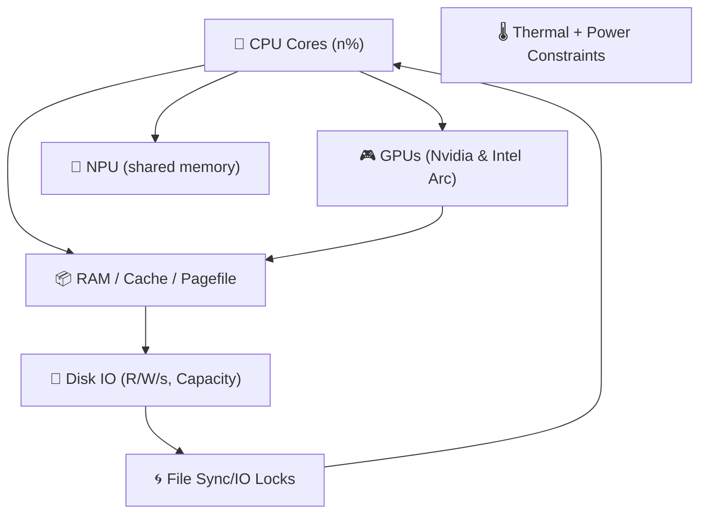

Excellent. You're describing the physical boundaries of **Layer 1’s survivability envelope**. ^ref-64a9f9f9-1-0

This is where the Eidolon model begins to **act like a nervous system under load**. Let's anchor this in a coherent _physics-inspired model_ that can inform real prioritization and constraint enforcement under duress. ^ref-64a9f9f9-3-0

---

## 🧱 Resource Modalities: Real-World Mapping

Let's name and organize the resources as **independent but interconnected fields**: ^ref-64a9f9f9-9-0


^ref-64a9f9f9-11-0
 ^ref-64a9f9f9-30-0
This is a real mess to manage unless we **normalize and project** these into a _resource-stress field_.

---

## 🧭 Field Vector Schema
 ^ref-64a9f9f9-36-0
Each resource has:
 ^ref-64a9f9f9-38-0
|Field Axis|Description|
|---|---|
|`X_cpu_i`|Percent usage for core _i_|
|`Y_ram`|% used, % cache pressure|
|`Z_gpu_i`|Load % for GPU i|
|`U_npu`|Effective ops / latency over threshold|
|`D_disk_i`|Bandwidth usage and fill level per volume|
|`L_temp`|Temperature delta from nominal or throttle point|
|`F_io`|File sync/write collisions or delays detected|
 ^ref-64a9f9f9-48-0
We’ll bundle this into a vector per unit of time (or tick):
 ^ref-64a9f9f9-50-0
```clojure
(defstruct resource-snapshot
  cpu-cores ; [x x x x ...] per core
  ram       ; {:used %, :cached %, :pagefile %}
  gpus      ; {:intel-arc %, :nvidia-4070ti %}
  npu       ; {:utilization %, :latency ms}
  disks     ; [{:r/s, :w/s, :capacity-used %}, ...]
  temp      ; {:cpu-temp °C, :gpu-temp °C, ...}
  io-locks  ; {:contention-rate, :conflict-count})
^ref-64a9f9f9-50-0
``` ^ref-64a9f9f9-61-0

Now, let’s define a vector field: ^ref-64a9f9f9-63-0

```clojure
(defn compute-uptime-field [snapshot]
  (reduce (fn [vec-field res]
            (add-to-field vec-field (project-stress res)))
          empty-vec-field
^ref-64a9f9f9-63-0
          snapshot)) ^ref-64a9f9f9-71-0
```
 ^ref-64a9f9f9-73-0
We can begin modeling:
 ^ref-64a9f9f9-75-0
- **gradient flows**: e.g., RAM pressure diffuses into CPU/NPU field
 ^ref-64a9f9f9-77-0
- **turbulence**: e.g., race conditions emerge from sharp spikes in IO or thermal throttling
    
- **crash likelihood**: when the combined stress vector reaches a critical direction or magnitude
    

---
 ^ref-64a9f9f9-84-0
## 🛑 Failure Modes to Detect + Handle

|Mode|Trigger|Mitigation|
|---|---|---|
|**RAM exhaustion**|Free RAM < 5%|Cancel low-priority buffers|
|**Disk full**|Any disk > 90%|Purge caches / delay writes|
|**Thermal throttle**|Temp near Tjmax|Slow down jobs, log temperature events|
|**IO Race**|Same file accessed w/o lock|Use atomic temp file + rename|
|**Context overload**|LLM or STT queue too deep|Drop or summarize old requests|
|**System call corruption**|Sudden high jitter in metrics|Failsafe fallback mode, self-healing fsync queues|

---

## 🧪 Field Probes and Agents
 ^ref-64a9f9f9-99-0
### Example: RAM Agent

```lisp
(defagent ram-manager
  (priority 10)
  (update
    (lambda ()
      (let ((ram (get-field 'ram)))
        (when (> ram.used 0.9)
          (trigger 'drop-noncritical-contexts))
^ref-64a9f9f9-99-0
        (when (> ram.pagefile 0.8)
          (reduce-worker-threads))))))
```
^ref-64a9f9f9-113-0

### Example: Disk I/O Monitor

```lisp
(defagent disk-agent
  (priority 9)
  (update
    (lambda ()
      (doseq (disk snapshot.disks)
        (when (> disk.capacity-used 0.95)
^ref-64a9f9f9-113-0
          (notify 'disk-pressure zone=disk.mount))
        (when (> disk.writes-per-sec 2000)
          (delay 'background-embeddings))))))
```
 ^ref-64a9f9f9-129-0
---
 ^ref-64a9f9f9-131-0 ^ref-64a9f9f9-132-0
## ⚡ Memory Race Detection Strategy

- Use a write-through pattern:
 ^ref-64a9f9f9-135-0
    - Write to temp file: `state.tmp.json`
 ^ref-64a9f9f9-137-0
    - Fsync and `mv` to final name atomically
 ^ref-64a9f9f9-139-0
    - If `mv` fails, yield until next tick
        
- Maintain a `write-epoch` per resource. If two write requests share an epoch:
    
    - Introduce artificial delay or random jitter before commit
        
 ^ref-64a9f9f9-146-0
---
 ^ref-64a9f9f9-148-0 ^ref-64a9f9f9-149-0
## 🛠️ Next Step Suggestions

Here’s what I suggest we prototype next:
 ^ref-64a9f9f9-152-0
1. **Resource Snapshot Collector**: Platform-specific metrics API
 ^ref-64a9f9f9-154-0
2. **Eidolon Field Construction**: 2D vector stress map with decay, diffusion, and threshold coloring
 ^ref-64a9f9f9-156-0
3. **Agent-Based Response Model**: Agents like `ram-manager` and `disk-agent` that respond to local field conditions
 ^ref-64a9f9f9-159-0
4. **Simulated Stress Injector**: Artificial load generator to test field reactivity ^ref-64a9f9f9-159-0
    
5. **Self-Healing Demo**: Duck notices pressure, drops old STT data, slows TTS rate, logs pressure release
    
 ^ref-64a9f9f9-164-0
Would you like to start by writing a stress field data structure and simple decay function in Sibilant or JavaScript? Or do you want to define the snapshot system interface (cross-platform metrics collector)?<!-- GENERATED-SECTIONS:DO-NOT-EDIT-BELOW -->
## Related content
- [windows-tiling-with-autohotkey](windows-tiling-with-autohotkey.md)
- [Promethean State Format](promethean-state-format.md)
- [Prompt_Folder_Bootstrap](prompt-folder-bootstrap.md)
- [ripple-propagation-demo](ripple-propagation-demo.md)
- [eidolon-field-math-foundations](eidolon-field-math-foundations.md)
- [field-node-diagram-set](field-node-diagram-set.md)
- [graph-ds](graph-ds.md)
- [Eidolon Field Abstract Model](eidolon-field-abstract-model.md)
- [Factorio AI with External Agents](factorio-ai-with-external-agents.md)
- [Model Selection for Lightweight Conversational Tasks](model-selection-for-lightweight-conversational-tasks.md)
- [obsidian-ignore-node-modules-regex](obsidian-ignore-node-modules-regex.md)
- [Fnord Tracer Protocol](fnord-tracer-protocol.md)
- [Smoke Resonance Visualizations](smoke-resonance-visualizations.md)
- [Promethean_Eidolon_Synchronicity_Model](promethean-eidolon-synchronicity-model.md)
- [plan-update-confirmation](plan-update-confirmation.md)
- [field-interaction-equations](field-interaction-equations.md)
- [field-dynamics-math-blocks](field-dynamics-math-blocks.md)
- [Dynamic Context Model for Web Components](dynamic-context-model-for-web-components.md)
- [i3-bluetooth-setup](i3-bluetooth-setup.md)
- [zero-copy-snapshots-and-workers](zero-copy-snapshots-and-workers.md)
- [Promethean-Copilot-Intent-Engine](promethean-copilot-intent-engine.md)
- [DSL](chunks/dsl.md)
- [Math Fundamentals](chunks/math-fundamentals.md)
- [Shared](chunks/shared.md)
- [Debugging Broker Connections and Agent Behavior](debugging-broker-connections-and-agent-behavior.md)
- [DuckDuckGoSearchPipeline](duckduckgosearchpipeline.md)
- [Duck's Self-Referential Perceptual Loop](ducks-self-referential-perceptual-loop.md)
- [Diagrams](chunks/diagrams.md)
- [Operations](chunks/operations.md)
- [Tooling](chunks/tooling.md)
- [Window Management](chunks/window-management.md)
- [Reawakening Duck](reawakening-duck.md)
- [eidolon-node-lifecycle](eidolon-node-lifecycle.md)
- [Functional Embedding Pipeline Refactor](functional-embedding-pipeline-refactor.md)
- [typed-struct-compiler](typed-struct-compiler.md)
- [TypeScript Patch for Tool Calling Support](typescript-patch-for-tool-calling-support.md)
- [Creative Moments](creative-moments.md)
- [Duck's Attractor States](ducks-attractor-states.md)
- [Promethean Chat Activity Report](promethean-chat-activity-report.md)
- [Promethean Dev Workflow Update](promethean-dev-workflow-update.md)
- [Promethean Notes](promethean-notes.md)
- [The Jar of Echoes](the-jar-of-echoes.md)
- [Promethean Infrastructure Setup](promethean-infrastructure-setup.md)
- [Pure TypeScript Search Microservice](pure-typescript-search-microservice.md)
- [Performance-Optimized-Polyglot-Bridge](performance-optimized-polyglot-bridge.md)
- [Promethean Pipelines](promethean-pipelines.md)
- [field-node-diagram-outline](field-node-diagram-outline.md)
- [Promethean Workflow Optimization](promethean-workflow-optimization.md)
- [homeostasis-decay-formulas](homeostasis-decay-formulas.md)
- [Model Upgrade Calm-Down Guide](model-upgrade-calm-down-guide.md)
- [ParticleSimulationWithCanvasAndFFmpeg](particlesimulationwithcanvasandffmpeg.md)
- [Per-Domain Policy System for JS Crawler](per-domain-policy-system-for-js-crawler.md)
- [Pipeline Enhancements](pipeline-enhancements.md)
- [polyglot-repl-interface-layer](polyglot-repl-interface-layer.md)
- [Post-Linguistic Transhuman Design Frameworks](post-linguistic-transhuman-design-frameworks.md)
- [Docops Feature Updates](docops-feature-updates-2.md)
- [Functional Refactor of TypeScript Document Processing](functional-refactor-of-typescript-document-processing.md)
- [Chroma Toolkit Consolidation Plan](chroma-toolkit-consolidation-plan.md)
- [MindfulRobotIntegration](mindfulrobotintegration.md)
- [NPU Voice Code and Sensory Integration](npu-voice-code-and-sensory-integration.md)
- [Obsidian ChatGPT Plugin Integration Guide](obsidian-chatgpt-plugin-integration-guide.md)
- [Obsidian ChatGPT Plugin Integration](obsidian-chatgpt-plugin-integration.md)
- [Obsidian Task Generation](obsidian-task-generation.md)
- [Obsidian Templating Plugins Integration Guide](obsidian-templating-plugins-integration-guide.md)
- [schema-evolution-workflow](schema-evolution-workflow.md)
- [Promethean Documentation Pipeline Overview](promethean-documentation-pipeline-overview.md)
- [Ice Box Reorganization](ice-box-reorganization.md)
- [JavaScript](chunks/javascript.md)
- [Services](chunks/services.md)
- [Simulation Demo](chunks/simulation-demo.md)
- [Prometheus Observability Stack](prometheus-observability-stack.md)
- [field-node-diagram-visualizations](field-node-diagram-visualizations.md)
- [heartbeat-fragment-demo](heartbeat-fragment-demo.md)
- [komorebi-group-window-hack](komorebi-group-window-hack.md)
- [Migrate to Provider-Tenant Architecture](migrate-to-provider-tenant-architecture.md)
- [Promethean Documentation Update](promethean-documentation-update.txt)
- [Protocol_0_The_Contradiction_Engine](protocol-0-the-contradiction-engine.md)
- [Synchronicity Waves and Web](synchronicity-waves-and-web.md)
- [Optimizing Command Limitations in System Design](optimizing-command-limitations-in-system-design.md)
- [sibilant-macro-targets](sibilant-macro-targets.md)
- [OpenAPI Validation Report](openapi-validation-report.md)
- [Docops Feature Updates](docops-feature-updates.md)
- [Provider-Agnostic Chat Panel Implementation](provider-agnostic-chat-panel-implementation.md)
- [Stateful Partitions and Rebalancing](stateful-partitions-and-rebalancing.md)
- [Tracing the Signal](tracing-the-signal.md)
- [Self-Agency in AI Interaction](self-agency-in-ai-interaction.md)
- [unique-templates](templates/unique-templates.md)
- [ts-to-lisp-transpiler](ts-to-lisp-transpiler.md)
- [Promethean Data Sync Protocol](promethean-data-sync-protocol.md)
- [Promethean Documentation Overview](promethean-documentation-overview.md)
- [Promethean Documentation Update](promethean-documentation-update.md)
- [promethean-requirements](promethean-requirements.md)
- [Redirecting Standard Error](redirecting-standard-error.md)
- [Mathematics Sampler](mathematics-sampler.md)
- [Mindful Prioritization](mindful-prioritization.md)
- [Mathematical Samplers](mathematical-samplers.md)
- [Unique Concepts](unique-concepts.md)
- [Unique Info Dump Index](unique-info-dump-index.md)
- [Self-Improving Documentation Tool](self-improving-documentation-tool.md)
- [Fastify Static Files Plugin](fastify-static-files-plugin.md)
- [Git Commit Optimization for Code Reviews](git-commit-optimization-for-code-reviews.md)
- [aionian-circuit-math](aionian-circuit-math.md)
- [run-step-api](run-step-api.md)
- [api-gateway-versioning](api-gateway-versioning.md)
- [Board Automation Improvements](board-automation-improvements.md)
- [Board Walk – 2025-08-11](board-walk-2025-08-11.md)
- [Promethean Documentation Update](promethean-documentation-update-4.md)
- [observability-infrastructure-setup](observability-infrastructure-setup.md)
- [ecs-offload-workers](ecs-offload-workers.md)
- [layer-1-uptime-diagrams](layer-1-uptime-diagrams.md)
- [Local-Only-LLM-Workflow](local-only-llm-workflow.md)
- [i3-layout-saver](i3-layout-saver.md)
## Sources
- [sibilant-macro-targets — L64](sibilant-macro-targets.md#^ref-c5c9a5c6-64-0) (line 64, col 0, score 0.87)
- [observability-infrastructure-setup — L92](observability-infrastructure-setup.md#^ref-b4e64f8c-92-0) (line 92, col 0, score 0.87)
- [ripple-propagation-demo — L64](ripple-propagation-demo.md#^ref-8430617b-64-0) (line 64, col 0, score 0.86)
- [ripple-propagation-demo — L67](ripple-propagation-demo.md#^ref-8430617b-67-0) (line 67, col 0, score 0.86)
- [Factorio AI with External Agents — L94](factorio-ai-with-external-agents.md#^ref-a4d90289-94-0) (line 94, col 0, score 0.86)
- [observability-infrastructure-setup — L97](observability-infrastructure-setup.md#^ref-b4e64f8c-97-0) (line 97, col 0, score 0.85)
- [field-node-diagram-outline — L59](field-node-diagram-outline.md#^ref-1f32c94a-59-0) (line 59, col 0, score 0.85)
- [ecs-offload-workers — L39](ecs-offload-workers.md#^ref-6498b9d7-39-0) (line 39, col 0, score 0.85)
- [observability-infrastructure-setup — L44](observability-infrastructure-setup.md#^ref-b4e64f8c-44-0) (line 44, col 0, score 0.86)
- [zero-copy-snapshots-and-workers — L408](zero-copy-snapshots-and-workers.md#^ref-62bec6f0-408-0) (line 408, col 0, score 1)
- [DSL — L38](chunks/dsl.md#^ref-e87bc036-38-0) (line 38, col 0, score 1)
- [JavaScript — L12](chunks/javascript.md#^ref-c1618c66-12-0) (line 12, col 0, score 1)
- [Math Fundamentals — L33](chunks/math-fundamentals.md#^ref-c6e87433-33-0) (line 33, col 0, score 1)
- [Services — L42](chunks/services.md#^ref-75ea4a6a-42-0) (line 42, col 0, score 1)
- [Shared — L62](chunks/shared.md#^ref-623a55f7-62-0) (line 62, col 0, score 1)
- [Simulation Demo — L51](chunks/simulation-demo.md#^ref-557309a3-51-0) (line 51, col 0, score 1)
- [Creative Moments — L94](creative-moments.md#^ref-10d98225-94-0) (line 94, col 0, score 1)
- [Debugging Broker Connections and Agent Behavior — L63](debugging-broker-connections-and-agent-behavior.md#^ref-73d3dbf6-63-0) (line 63, col 0, score 1)
- [Docops Feature Updates — L66](docops-feature-updates-2.md#^ref-cdbd21ee-66-0) (line 66, col 0, score 1)
- [DuckDuckGoSearchPipeline — L93](duckduckgosearchpipeline.md#^ref-e979c50f-93-0) (line 93, col 0, score 1)
- [Duck's Self-Referential Perceptual Loop — L73](ducks-self-referential-perceptual-loop.md#^ref-71726f04-73-0) (line 73, col 0, score 1)
- [Dynamic Context Model for Web Components — L403](dynamic-context-model-for-web-components.md#^ref-f7702bf8-403-0) (line 403, col 0, score 1)
- [polyglot-repl-interface-layer — L163](polyglot-repl-interface-layer.md#^ref-9c79206d-163-0) (line 163, col 0, score 1)
- [Post-Linguistic Transhuman Design Frameworks — L113](post-linguistic-transhuman-design-frameworks.md#^ref-6bcff92c-113-0) (line 113, col 0, score 1)
- [Promethean Chat Activity Report — L32](promethean-chat-activity-report.md#^ref-18344cf9-32-0) (line 32, col 0, score 1)
- [Promethean-Copilot-Intent-Engine — L73](promethean-copilot-intent-engine.md#^ref-ae24a280-73-0) (line 73, col 0, score 1)
- [Promethean Data Sync Protocol — L25](promethean-data-sync-protocol.md#^ref-9fab9e76-25-0) (line 25, col 0, score 1)
- [Promethean Dev Workflow Update — L64](promethean-dev-workflow-update.md#^ref-03a5578f-64-0) (line 64, col 0, score 1)
- [Promethean Documentation Overview — L8](promethean-documentation-overview.md#^ref-9413237f-8-0) (line 8, col 0, score 1)
- [Promethean Documentation Pipeline Overview — L181](promethean-documentation-pipeline-overview.md#^ref-3a3bf2c9-181-0) (line 181, col 0, score 1)
- [Promethean Documentation Update — L8](promethean-documentation-update.md#^ref-c0392040-8-0) (line 8, col 0, score 1)
- [Diagrams — L20](chunks/diagrams.md#^ref-45cd25b5-20-0) (line 20, col 0, score 1)
- [DSL — L9](chunks/dsl.md#^ref-e87bc036-9-0) (line 9, col 0, score 1)
- [JavaScript — L72](chunks/javascript.md#^ref-c1618c66-72-0) (line 72, col 0, score 1)
- [Operations — L23](chunks/operations.md#^ref-f1add613-23-0) (line 23, col 0, score 1)
- [Services — L25](chunks/services.md#^ref-75ea4a6a-25-0) (line 25, col 0, score 1)
- [Tooling — L11](chunks/tooling.md#^ref-6cb4943e-11-0) (line 11, col 0, score 1)
- [Window Management — L22](chunks/window-management.md#^ref-9e8ae388-22-0) (line 22, col 0, score 1)
- [Creative Moments — L7](creative-moments.md#^ref-10d98225-7-0) (line 7, col 0, score 1)
- [Docops Feature Updates — L33](docops-feature-updates.md#^ref-2792d448-33-0) (line 33, col 0, score 1)
- [DuckDuckGoSearchPipeline — L15](duckduckgosearchpipeline.md#^ref-e979c50f-15-0) (line 15, col 0, score 1)
- [Duck's Self-Referential Perceptual Loop — L44](ducks-self-referential-perceptual-loop.md#^ref-71726f04-44-0) (line 44, col 0, score 1)
- [Dynamic Context Model for Web Components — L401](dynamic-context-model-for-web-components.md#^ref-f7702bf8-401-0) (line 401, col 0, score 1)
- [Eidolon Field Abstract Model — L205](eidolon-field-abstract-model.md#^ref-5e8b2388-205-0) (line 205, col 0, score 1)
- [zero-copy-snapshots-and-workers — L395](zero-copy-snapshots-and-workers.md#^ref-62bec6f0-395-0) (line 395, col 0, score 1)
- [Promethean Pipelines — L140](promethean-pipelines.md#^ref-8b8e6103-140-0) (line 140, col 0, score 1)
- [promethean-requirements — L29](promethean-requirements.md#^ref-95205cd3-29-0) (line 29, col 0, score 1)
- [Promethean Workflow Optimization — L25](promethean-workflow-optimization.md#^ref-d614d983-25-0) (line 25, col 0, score 1)
- [Prometheus Observability Stack — L558](prometheus-observability-stack.md#^ref-e90b5a16-558-0) (line 558, col 0, score 1)
- [Prompt_Folder_Bootstrap — L220](prompt-folder-bootstrap.md#^ref-bd4f0976-220-0) (line 220, col 0, score 1)
- [Provider-Agnostic Chat Panel Implementation — L274](provider-agnostic-chat-panel-implementation.md#^ref-43bfe9dd-274-0) (line 274, col 0, score 1)
- [Pure TypeScript Search Microservice — L614](pure-typescript-search-microservice.md#^ref-d17d3a96-614-0) (line 614, col 0, score 1)
- [Reawakening Duck — L141](reawakening-duck.md#^ref-59b5670f-141-0) (line 141, col 0, score 1)
- [Redirecting Standard Error — L45](redirecting-standard-error.md#^ref-b3555ede-45-0) (line 45, col 0, score 1)
- [ripple-propagation-demo — L163](ripple-propagation-demo.md#^ref-8430617b-163-0) (line 163, col 0, score 1)
- [schema-evolution-workflow — L579](schema-evolution-workflow.md#^ref-d8059b6a-579-0) (line 579, col 0, score 1)
- [Self-Agency in AI Interaction — L82](self-agency-in-ai-interaction.md#^ref-49a9a860-82-0) (line 82, col 0, score 1)
- [Post-Linguistic Transhuman Design Frameworks — L128](post-linguistic-transhuman-design-frameworks.md#^ref-6bcff92c-128-0) (line 128, col 0, score 1)
- [Promethean Chat Activity Report — L78](promethean-chat-activity-report.md#^ref-18344cf9-78-0) (line 78, col 0, score 1)
- [Promethean-Copilot-Intent-Engine — L98](promethean-copilot-intent-engine.md#^ref-ae24a280-98-0) (line 98, col 0, score 1)
- [Promethean Data Sync Protocol — L27](promethean-data-sync-protocol.md#^ref-9fab9e76-27-0) (line 27, col 0, score 1)
- [Promethean Dev Workflow Update — L74](promethean-dev-workflow-update.md#^ref-03a5578f-74-0) (line 74, col 0, score 1)
- [Promethean Documentation Overview — L25](promethean-documentation-overview.md#^ref-9413237f-25-0) (line 25, col 0, score 1)
- [Promethean Documentation Pipeline Overview — L168](promethean-documentation-pipeline-overview.md#^ref-3a3bf2c9-168-0) (line 168, col 0, score 1)
- [Promethean Documentation Update — L28](promethean-documentation-update.md#^ref-c0392040-28-0) (line 28, col 0, score 1)
- [Promethean Documentation Update — L56](promethean-documentation-update.txt#^ref-0b872af2-56-0) (line 56, col 0, score 1)
- [Promethean_Eidolon_Synchronicity_Model — L78](promethean-eidolon-synchronicity-model.md#^ref-2d6e5553-78-0) (line 78, col 0, score 1)
- [Tooling — L41](chunks/tooling.md#^ref-6cb4943e-41-0) (line 41, col 0, score 1)
- [Docops Feature Updates — L48](docops-feature-updates-2.md#^ref-cdbd21ee-48-0) (line 48, col 0, score 1)
- [Docops Feature Updates — L79](docops-feature-updates.md#^ref-2792d448-79-0) (line 79, col 0, score 1)
- [eidolon-node-lifecycle — L69](eidolon-node-lifecycle.md#^ref-938eca9c-69-0) (line 69, col 0, score 1)
- [field-node-diagram-outline — L158](field-node-diagram-outline.md#^ref-1f32c94a-158-0) (line 158, col 0, score 1)
- [field-node-diagram-set — L178](field-node-diagram-set.md#^ref-22b989d5-178-0) (line 178, col 0, score 1)
- [field-node-diagram-visualizations — L126](field-node-diagram-visualizations.md#^ref-e9b27b06-126-0) (line 126, col 0, score 1)
- [Functional Embedding Pipeline Refactor — L410](functional-embedding-pipeline-refactor.md#^ref-a4a25141-410-0) (line 410, col 0, score 1)
- [Functional Refactor of TypeScript Document Processing — L228](functional-refactor-of-typescript-document-processing.md#^ref-1cfae310-228-0) (line 228, col 0, score 1)
- [aionian-circuit-math — L149](aionian-circuit-math.md#^ref-f2d83a77-149-0) (line 149, col 0, score 1)
- [api-gateway-versioning — L285](api-gateway-versioning.md#^ref-0580dcd3-285-0) (line 285, col 0, score 1)
- [Board Automation Improvements — L11](board-automation-improvements.md#^ref-ac60a1d6-11-0) (line 11, col 0, score 1)
- [Board Walk – 2025-08-11 — L134](board-walk-2025-08-11.md#^ref-7aa1eb92-134-0) (line 134, col 0, score 1)
- [field-dynamics-math-blocks — L193](field-dynamics-math-blocks.md#^ref-7cfc230d-193-0) (line 193, col 0, score 1)
- [field-node-diagram-set — L203](field-node-diagram-set.md#^ref-22b989d5-203-0) (line 203, col 0, score 1)
- [field-node-diagram-visualizations — L151](field-node-diagram-visualizations.md#^ref-e9b27b06-151-0) (line 151, col 0, score 1)
- [Functional Refactor of TypeScript Document Processing — L281](functional-refactor-of-typescript-document-processing.md#^ref-1cfae310-281-0) (line 281, col 0, score 1)
- [heartbeat-fragment-demo — L181](heartbeat-fragment-demo.md#^ref-dd00677a-181-0) (line 181, col 0, score 1)
- [homeostasis-decay-formulas — L220](homeostasis-decay-formulas.md#^ref-37b5d236-220-0) (line 220, col 0, score 1)
- [Ice Box Reorganization — L110](ice-box-reorganization.md#^ref-291c7d91-110-0) (line 110, col 0, score 1)
- [obsidian-ignore-node-modules-regex — L118](obsidian-ignore-node-modules-regex.md#^ref-ffb9b2a9-118-0) (line 118, col 0, score 1)
- [ParticleSimulationWithCanvasAndFFmpeg — L329](particlesimulationwithcanvasandffmpeg.md#^ref-e018dd7a-329-0) (line 329, col 0, score 1)
- [polyglot-repl-interface-layer — L279](polyglot-repl-interface-layer.md#^ref-9c79206d-279-0) (line 279, col 0, score 1)
- [eidolon-field-math-foundations — L19639](eidolon-field-math-foundations.md#^ref-008f2ac0-19639-0) (line 19639, col 0, score 0.98)
- [Duck's Attractor States — L20620](ducks-attractor-states.md#^ref-13951643-20620-0) (line 20620, col 0, score 0.98)
- [eidolon-field-math-foundations — L2172](eidolon-field-math-foundations.md#^ref-008f2ac0-2172-0) (line 2172, col 0, score 0.98)
- [JavaScript — L3068](chunks/javascript.md#^ref-c1618c66-3068-0) (line 3068, col 0, score 0.98)
- [eidolon-field-math-foundations — L5935](eidolon-field-math-foundations.md#^ref-008f2ac0-5935-0) (line 5935, col 0, score 0.98)
- [Migrate to Provider-Tenant Architecture — L10139](migrate-to-provider-tenant-architecture.md#^ref-54382370-10139-0) (line 10139, col 0, score 0.98)
- [ParticleSimulationWithCanvasAndFFmpeg — L3604](particlesimulationwithcanvasandffmpeg.md#^ref-e018dd7a-3604-0) (line 3604, col 0, score 0.98)
- [Factorio AI with External Agents — L285](factorio-ai-with-external-agents.md#^ref-a4d90289-285-0) (line 285, col 0, score 0.93)
- [Promethean Infrastructure Setup — L805](promethean-infrastructure-setup.md#^ref-6deed6ac-805-0) (line 805, col 0, score 0.96)
- [Eidolon Field Abstract Model — L344](eidolon-field-abstract-model.md#^ref-5e8b2388-344-0) (line 344, col 0, score 1)
- [windows-tiling-with-autohotkey — L280](windows-tiling-with-autohotkey.md#^ref-0f6f8f38-280-0) (line 280, col 0, score 1)
- [Duck's Self-Referential Perceptual Loop — L3682](ducks-self-referential-perceptual-loop.md#^ref-71726f04-3682-0) (line 3682, col 0, score 0.99)
- [Fnord Tracer Protocol — L6389](fnord-tracer-protocol.md#^ref-fc21f824-6389-0) (line 6389, col 0, score 0.99)
- [i3-bluetooth-setup — L4671](i3-bluetooth-setup.md#^ref-5e408692-4671-0) (line 4671, col 0, score 0.99)
- [Model Selection for Lightweight Conversational Tasks — L4003](model-selection-for-lightweight-conversational-tasks.md#^ref-d144aa62-4003-0) (line 4003, col 0, score 0.99)
- [Obsidian Templating Plugins Integration Guide — L3506](obsidian-templating-plugins-integration-guide.md#^ref-b39dc9d4-3506-0) (line 3506, col 0, score 0.99)
- [Promethean-Copilot-Intent-Engine — L2327](promethean-copilot-intent-engine.md#^ref-ae24a280-2327-0) (line 2327, col 0, score 0.98)
- [Optimizing Command Limitations in System Design — L1431](optimizing-command-limitations-in-system-design.md#^ref-98c8ff62-1431-0) (line 1431, col 0, score 0.98)
- [Promethean Infrastructure Setup — L5706](promethean-infrastructure-setup.md#^ref-6deed6ac-5706-0) (line 5706, col 0, score 0.98)
- [Chroma Toolkit Consolidation Plan — L4142](chroma-toolkit-consolidation-plan.md#^ref-5020e892-4142-0) (line 4142, col 0, score 0.98)
- [Migrate to Provider-Tenant Architecture — L7388](migrate-to-provider-tenant-architecture.md#^ref-54382370-7388-0) (line 7388, col 0, score 0.98)
- [Performance-Optimized-Polyglot-Bridge — L1833](performance-optimized-polyglot-bridge.md#^ref-f5579967-1833-0) (line 1833, col 0, score 0.98)
- [Post-Linguistic Transhuman Design Frameworks — L2791](post-linguistic-transhuman-design-frameworks.md#^ref-6bcff92c-2791-0) (line 2791, col 0, score 0.98)
- [Promethean Pipelines — L3652](promethean-pipelines.md#^ref-8b8e6103-3652-0) (line 3652, col 0, score 0.98)
- [Duck's Attractor States — L15451](ducks-attractor-states.md#^ref-13951643-15451-0) (line 15451, col 0, score 0.97)
- [eidolon-field-math-foundations — L4885](eidolon-field-math-foundations.md#^ref-008f2ac0-4885-0) (line 4885, col 0, score 0.97)
- [windows-tiling-with-autohotkey — L17088](windows-tiling-with-autohotkey.md#^ref-0f6f8f38-17088-0) (line 17088, col 0, score 0.97)
- [Performance-Optimized-Polyglot-Bridge — L1931](performance-optimized-polyglot-bridge.md#^ref-f5579967-1931-0) (line 1931, col 0, score 0.96)
- [plan-update-confirmation — L6554](plan-update-confirmation.md#^ref-b22d79c6-6554-0) (line 6554, col 0, score 0.96)
- [polyglot-repl-interface-layer — L1974](polyglot-repl-interface-layer.md#^ref-9c79206d-1974-0) (line 1974, col 0, score 0.96)
- [Promethean Dev Workflow Update — L3225](promethean-dev-workflow-update.md#^ref-03a5578f-3225-0) (line 3225, col 0, score 0.96)
- [Factorio AI with External Agents — L1866](factorio-ai-with-external-agents.md#^ref-a4d90289-1866-0) (line 1866, col 0, score 0.97)
- [heartbeat-fragment-demo — L3955](heartbeat-fragment-demo.md#^ref-dd00677a-3955-0) (line 3955, col 0, score 0.97)
- [zero-copy-snapshots-and-workers — L2090](zero-copy-snapshots-and-workers.md#^ref-62bec6f0-2090-0) (line 2090, col 0, score 0.97)
- [Tracing the Signal — L2662](tracing-the-signal.md#^ref-c3cd4f65-2662-0) (line 2662, col 0, score 0.97)
- [Chroma Toolkit Consolidation Plan — L4004](chroma-toolkit-consolidation-plan.md#^ref-5020e892-4004-0) (line 4004, col 0, score 0.97)
- [field-interaction-equations — L2144](field-interaction-equations.md#^ref-b09141b7-2144-0) (line 2144, col 0, score 0.97)
- [Performance-Optimized-Polyglot-Bridge — L4769](performance-optimized-polyglot-bridge.md#^ref-f5579967-4769-0) (line 4769, col 0, score 0.97)
- [Promethean Infrastructure Setup — L4314](promethean-infrastructure-setup.md#^ref-6deed6ac-4314-0) (line 4314, col 0, score 0.97)
- [i3-bluetooth-setup — L1021](i3-bluetooth-setup.md#^ref-5e408692-1021-0) (line 1021, col 0, score 0.87)
- [Ice Box Reorganization — L257](ice-box-reorganization.md#^ref-291c7d91-257-0) (line 257, col 0, score 0.87)
- [windows-tiling-with-autohotkey — L1170](windows-tiling-with-autohotkey.md#^ref-0f6f8f38-1170-0) (line 1170, col 0, score 0.98)
- [zero-copy-snapshots-and-workers — L1056](zero-copy-snapshots-and-workers.md#^ref-62bec6f0-1056-0) (line 1056, col 0, score 0.98)
- [zero-copy-snapshots-and-workers — L2022](zero-copy-snapshots-and-workers.md#^ref-62bec6f0-2022-0) (line 2022, col 0, score 0.98)
- [windows-tiling-with-autohotkey — L3026](windows-tiling-with-autohotkey.md#^ref-0f6f8f38-3026-0) (line 3026, col 0, score 0.98)
- [TypeScript Patch for Tool Calling Support — L899](typescript-patch-for-tool-calling-support.md#^ref-7b7ca860-899-0) (line 899, col 0, score 0.97)
- [Unique Concepts — L1709](unique-concepts.md#^ref-ed6f3fc9-1709-0) (line 1709, col 0, score 0.97)
- [Unique Info Dump Index — L1227](unique-info-dump-index.md#^ref-30ec3ba6-1227-0) (line 1227, col 0, score 0.97)
- [windows-tiling-with-autohotkey — L1253](windows-tiling-with-autohotkey.md#^ref-0f6f8f38-1253-0) (line 1253, col 0, score 0.97)
- [zero-copy-snapshots-and-workers — L1174](zero-copy-snapshots-and-workers.md#^ref-62bec6f0-1174-0) (line 1174, col 0, score 0.99)
- [windows-tiling-with-autohotkey — L1011](windows-tiling-with-autohotkey.md#^ref-0f6f8f38-1011-0) (line 1011, col 0, score 0.98)
- [zero-copy-snapshots-and-workers — L757](zero-copy-snapshots-and-workers.md#^ref-62bec6f0-757-0) (line 757, col 0, score 0.98)
- [eidolon-field-math-foundations — L959](eidolon-field-math-foundations.md#^ref-008f2ac0-959-0) (line 959, col 0, score 0.96)
- [eidolon-node-lifecycle — L868](eidolon-node-lifecycle.md#^ref-938eca9c-868-0) (line 868, col 0, score 0.96)
- [Factorio AI with External Agents — L1000](factorio-ai-with-external-agents.md#^ref-a4d90289-1000-0) (line 1000, col 0, score 0.96)
- [field-dynamics-math-blocks — L1187](field-dynamics-math-blocks.md#^ref-7cfc230d-1187-0) (line 1187, col 0, score 0.96)
- [field-interaction-equations — L1282](field-interaction-equations.md#^ref-b09141b7-1282-0) (line 1282, col 0, score 0.96)
- [field-node-diagram-outline — L1130](field-node-diagram-outline.md#^ref-1f32c94a-1130-0) (line 1130, col 0, score 0.96)
- [field-node-diagram-set — L1046](field-node-diagram-set.md#^ref-22b989d5-1046-0) (line 1046, col 0, score 0.96)
- [field-node-diagram-visualizations — L1038](field-node-diagram-visualizations.md#^ref-e9b27b06-1038-0) (line 1038, col 0, score 0.96)
- [Fnord Tracer Protocol — L1246](fnord-tracer-protocol.md#^ref-fc21f824-1246-0) (line 1246, col 0, score 0.96)
- [windows-tiling-with-autohotkey — L7938](windows-tiling-with-autohotkey.md#^ref-0f6f8f38-7938-0) (line 7938, col 0, score 0.94)
- [Unique Concepts — L716](unique-concepts.md#^ref-ed6f3fc9-716-0) (line 716, col 0, score 0.98)
- [polyglot-repl-interface-layer — L773](polyglot-repl-interface-layer.md#^ref-9c79206d-773-0) (line 773, col 0, score 0.96)
- [Promethean Chat Activity Report — L1336](promethean-chat-activity-report.md#^ref-18344cf9-1336-0) (line 1336, col 0, score 0.96)
- [Mathematics Sampler — L1736](mathematics-sampler.md#^ref-b5e0183e-1736-0) (line 1736, col 0, score 0.87)
- [Migrate to Provider-Tenant Architecture — L7748](migrate-to-provider-tenant-architecture.md#^ref-54382370-7748-0) (line 7748, col 0, score 0.87)
- [Obsidian ChatGPT Plugin Integration — L3847](obsidian-chatgpt-plugin-integration.md#^ref-ca8e1399-3847-0) (line 3847, col 0, score 0.87)
- [obsidian-ignore-node-modules-regex — L4433](obsidian-ignore-node-modules-regex.md#^ref-ffb9b2a9-4433-0) (line 4433, col 0, score 0.87)
- [Obsidian Task Generation — L1688](obsidian-task-generation.md#^ref-9b694a91-1688-0) (line 1688, col 0, score 0.87)
- [Obsidian Templating Plugins Integration Guide — L5168](obsidian-templating-plugins-integration-guide.md#^ref-b39dc9d4-5168-0) (line 5168, col 0, score 0.87)
- [OpenAPI Validation Report — L1563](openapi-validation-report.md#^ref-5c152b08-1563-0) (line 1563, col 0, score 0.87)
- [ParticleSimulationWithCanvasAndFFmpeg — L3400](particlesimulationwithcanvasandffmpeg.md#^ref-e018dd7a-3400-0) (line 3400, col 0, score 0.87)
- [Per-Domain Policy System for JS Crawler — L5381](per-domain-policy-system-for-js-crawler.md#^ref-c03020e1-5381-0) (line 5381, col 0, score 0.87)
- [Obsidian Templating Plugins Integration Guide — L4713](obsidian-templating-plugins-integration-guide.md#^ref-b39dc9d4-4713-0) (line 4713, col 0, score 0.9)
- [OpenAPI Validation Report — L1256](openapi-validation-report.md#^ref-5c152b08-1256-0) (line 1256, col 0, score 0.9)
- [Optimizing Command Limitations in System Design — L2139](optimizing-command-limitations-in-system-design.md#^ref-98c8ff62-2139-0) (line 2139, col 0, score 0.9)
- [DSL — L608](chunks/dsl.md#^ref-e87bc036-608-0) (line 608, col 0, score 0.97)
- [JavaScript — L638](chunks/javascript.md#^ref-c1618c66-638-0) (line 638, col 0, score 0.97)
- [Services — L609](chunks/services.md#^ref-75ea4a6a-609-0) (line 609, col 0, score 0.97)
- [Shared — L1116](chunks/shared.md#^ref-623a55f7-1116-0) (line 1116, col 0, score 0.97)
- [Simulation Demo — L616](chunks/simulation-demo.md#^ref-557309a3-616-0) (line 616, col 0, score 0.97)
- [Window Management — L1070](chunks/window-management.md#^ref-9e8ae388-1070-0) (line 1070, col 0, score 0.97)
- [Creative Moments — L1167](creative-moments.md#^ref-10d98225-1167-0) (line 1167, col 0, score 0.97)
- [Debugging Broker Connections and Agent Behavior — L909](debugging-broker-connections-and-agent-behavior.md#^ref-73d3dbf6-909-0) (line 909, col 0, score 0.97)
- [Promethean Dev Workflow Update — L23713](promethean-dev-workflow-update.md#^ref-03a5578f-23713-0) (line 23713, col 0, score 0.97)
- [Promethean Documentation Update — L4371](promethean-documentation-update.txt#^ref-0b872af2-4371-0) (line 4371, col 0, score 1)
- [Promethean Notes — L4563](promethean-notes.md#^ref-1c4046b5-4563-0) (line 4563, col 0, score 1)
- [windows-tiling-with-autohotkey — L9095](windows-tiling-with-autohotkey.md#^ref-0f6f8f38-9095-0) (line 9095, col 0, score 1)
- [Provider-Agnostic Chat Panel Implementation — L2757](provider-agnostic-chat-panel-implementation.md#^ref-43bfe9dd-2757-0) (line 2757, col 0, score 0.98)
- [Provider-Agnostic Chat Panel Implementation — L1846](provider-agnostic-chat-panel-implementation.md#^ref-43bfe9dd-1846-0) (line 1846, col 0, score 0.97)
- [zero-copy-snapshots-and-workers — L4954](zero-copy-snapshots-and-workers.md#^ref-62bec6f0-4954-0) (line 4954, col 0, score 0.98)
- [Factorio AI with External Agents — L2158](factorio-ai-with-external-agents.md#^ref-a4d90289-2158-0) (line 2158, col 0, score 0.96)
- [graph-ds — L2537](graph-ds.md#^ref-6620e2f2-2537-0) (line 2537, col 0, score 0.96)
- [homeostasis-decay-formulas — L6526](homeostasis-decay-formulas.md#^ref-37b5d236-6526-0) (line 6526, col 0, score 0.95)
- [i3-bluetooth-setup — L3712](i3-bluetooth-setup.md#^ref-5e408692-3712-0) (line 3712, col 0, score 0.95)
- [komorebi-group-window-hack — L3075](komorebi-group-window-hack.md#^ref-dd89372d-3075-0) (line 3075, col 0, score 0.95)
- [Migrate to Provider-Tenant Architecture — L7335](migrate-to-provider-tenant-architecture.md#^ref-54382370-7335-0) (line 7335, col 0, score 0.95)
- [Mindful Prioritization — L1003](mindful-prioritization.md#^ref-40185d05-1003-0) (line 1003, col 0, score 0.95)
- [MindfulRobotIntegration — L1028](mindfulrobotintegration.md#^ref-5f65dfa5-1028-0) (line 1028, col 0, score 0.95)
- [Model Selection for Lightweight Conversational Tasks — L4902](model-selection-for-lightweight-conversational-tasks.md#^ref-d144aa62-4902-0) (line 4902, col 0, score 0.95)
- [Model Upgrade Calm-Down Guide — L3435](model-upgrade-calm-down-guide.md#^ref-db74343f-3435-0) (line 3435, col 0, score 0.95)
- [NPU Voice Code and Sensory Integration — L1440](npu-voice-code-and-sensory-integration.md#^ref-5a02283e-1440-0) (line 1440, col 0, score 0.95)
- [zero-copy-snapshots-and-workers — L1202](zero-copy-snapshots-and-workers.md#^ref-62bec6f0-1202-0) (line 1202, col 0, score 0.98)
- [zero-copy-snapshots-and-workers — L691](zero-copy-snapshots-and-workers.md#^ref-62bec6f0-691-0) (line 691, col 0, score 0.96)
- [komorebi-group-window-hack — L1796](komorebi-group-window-hack.md#^ref-dd89372d-1796-0) (line 1796, col 0, score 0.98)
- [komorebi-group-window-hack — L2017](komorebi-group-window-hack.md#^ref-dd89372d-2017-0) (line 2017, col 0, score 0.98)
- [zero-copy-snapshots-and-workers — L1936](zero-copy-snapshots-and-workers.md#^ref-62bec6f0-1936-0) (line 1936, col 0, score 0.98)
- [zero-copy-snapshots-and-workers — L2202](zero-copy-snapshots-and-workers.md#^ref-62bec6f0-2202-0) (line 2202, col 0, score 0.99)
- [Unique Info Dump Index — L6662](unique-info-dump-index.md#^ref-30ec3ba6-6662-0) (line 6662, col 0, score 0.94)
- [heartbeat-fragment-demo — L1420](heartbeat-fragment-demo.md#^ref-dd00677a-1420-0) (line 1420, col 0, score 0.94)
- [eidolon-field-math-foundations — L24596](eidolon-field-math-foundations.md#^ref-008f2ac0-24596-0) (line 24596, col 0, score 0.94)
- [Promethean Dev Workflow Update — L22800](promethean-dev-workflow-update.md#^ref-03a5578f-22800-0) (line 22800, col 0, score 0.94)
- [windows-tiling-with-autohotkey — L22798](windows-tiling-with-autohotkey.md#^ref-0f6f8f38-22798-0) (line 22798, col 0, score 0.94)
- [Chroma Toolkit Consolidation Plan — L5432](chroma-toolkit-consolidation-plan.md#^ref-5020e892-5432-0) (line 5432, col 0, score 0.95)
- [Duck's Self-Referential Perceptual Loop — L2406](ducks-self-referential-perceptual-loop.md#^ref-71726f04-2406-0) (line 2406, col 0, score 0.95)
- [field-interaction-equations — L5858](field-interaction-equations.md#^ref-b09141b7-5858-0) (line 5858, col 0, score 0.95)
- [windows-tiling-with-autohotkey — L730](windows-tiling-with-autohotkey.md#^ref-0f6f8f38-730-0) (line 730, col 0, score 0.99)
- [The Jar of Echoes — L1034](the-jar-of-echoes.md#^ref-18138627-1034-0) (line 1034, col 0, score 0.95)
- [Tracing the Signal — L1066](tracing-the-signal.md#^ref-c3cd4f65-1066-0) (line 1066, col 0, score 0.95)
- [Operations — L398](chunks/operations.md#^ref-f1add613-398-0) (line 398, col 0, score 0.95)
- [Shared — L627](chunks/shared.md#^ref-623a55f7-627-0) (line 627, col 0, score 0.95)
- [Window Management — L805](chunks/window-management.md#^ref-9e8ae388-805-0) (line 805, col 0, score 0.95)
- [Creative Moments — L372](creative-moments.md#^ref-10d98225-372-0) (line 372, col 0, score 0.95)
- [Debugging Broker Connections and Agent Behavior — L770](debugging-broker-connections-and-agent-behavior.md#^ref-73d3dbf6-770-0) (line 770, col 0, score 0.95)
- [Dynamic Context Model for Web Components — L1814](dynamic-context-model-for-web-components.md#^ref-f7702bf8-1814-0) (line 1814, col 0, score 0.95)
- [eidolon-field-math-foundations — L1615](eidolon-field-math-foundations.md#^ref-008f2ac0-1615-0) (line 1615, col 0, score 0.95)
- [Synchronicity Waves and Web — L2287](synchronicity-waves-and-web.md#^ref-91295f3a-2287-0) (line 2287, col 0, score 0.98)
- [ts-to-lisp-transpiler — L2339](ts-to-lisp-transpiler.md#^ref-ba11486b-2339-0) (line 2339, col 0, score 0.98)
- [typed-struct-compiler — L3549](typed-struct-compiler.md#^ref-78eeedf7-3549-0) (line 3549, col 0, score 0.98)
- [TypeScript Patch for Tool Calling Support — L6142](typescript-patch-for-tool-calling-support.md#^ref-7b7ca860-6142-0) (line 6142, col 0, score 0.98)
- [Unique Info Dump Index — L3887](unique-info-dump-index.md#^ref-30ec3ba6-3887-0) (line 3887, col 0, score 0.98)
- [windows-tiling-with-autohotkey — L4648](windows-tiling-with-autohotkey.md#^ref-0f6f8f38-4648-0) (line 4648, col 0, score 0.98)
- [field-interaction-equations — L1299](field-interaction-equations.md#^ref-b09141b7-1299-0) (line 1299, col 0, score 0.96)
- [field-node-diagram-outline — L1147](field-node-diagram-outline.md#^ref-1f32c94a-1147-0) (line 1147, col 0, score 0.96)
- [field-node-diagram-set — L1063](field-node-diagram-set.md#^ref-22b989d5-1063-0) (line 1063, col 0, score 0.96)
- [field-node-diagram-visualizations — L1055](field-node-diagram-visualizations.md#^ref-e9b27b06-1055-0) (line 1055, col 0, score 0.96)
- [Fnord Tracer Protocol — L1263](fnord-tracer-protocol.md#^ref-fc21f824-1263-0) (line 1263, col 0, score 0.96)
- [Functional Embedding Pipeline Refactor — L880](functional-embedding-pipeline-refactor.md#^ref-a4a25141-880-0) (line 880, col 0, score 0.96)
- [Functional Refactor of TypeScript Document Processing — L696](functional-refactor-of-typescript-document-processing.md#^ref-1cfae310-696-0) (line 696, col 0, score 0.96)
- [graph-ds — L1546](graph-ds.md#^ref-6620e2f2-1546-0) (line 1546, col 0, score 0.96)
- [heartbeat-fragment-demo — L1209](heartbeat-fragment-demo.md#^ref-dd00677a-1209-0) (line 1209, col 0, score 0.96)
- [Functional Refactor of TypeScript Document Processing — L2242](functional-refactor-of-typescript-document-processing.md#^ref-1cfae310-2242-0) (line 2242, col 0, score 0.97)
- [graph-ds — L3757](graph-ds.md#^ref-6620e2f2-3757-0) (line 3757, col 0, score 0.97)
- [heartbeat-fragment-demo — L3479](heartbeat-fragment-demo.md#^ref-dd00677a-3479-0) (line 3479, col 0, score 0.97)
- [homeostasis-decay-formulas — L5594](homeostasis-decay-formulas.md#^ref-37b5d236-5594-0) (line 5594, col 0, score 0.97)
- [i3-bluetooth-setup — L2012](i3-bluetooth-setup.md#^ref-5e408692-2012-0) (line 2012, col 0, score 0.97)
- [Ice Box Reorganization — L3225](ice-box-reorganization.md#^ref-291c7d91-3225-0) (line 3225, col 0, score 0.97)
- [komorebi-group-window-hack — L4356](komorebi-group-window-hack.md#^ref-dd89372d-4356-0) (line 4356, col 0, score 0.97)
- [Mathematical Samplers — L1714](mathematical-samplers.md#^ref-86a691ec-1714-0) (line 1714, col 0, score 0.97)
- [Mathematics Sampler — L1744](mathematics-sampler.md#^ref-b5e0183e-1744-0) (line 1744, col 0, score 0.97)
- [Promethean Notes — L882](promethean-notes.md#^ref-1c4046b5-882-0) (line 882, col 0, score 0.98)
- [Promethean Pipelines — L1393](promethean-pipelines.md#^ref-8b8e6103-1393-0) (line 1393, col 0, score 0.98)
- [Promethean State Format — L1151](promethean-state-format.md#^ref-23df6ddb-1151-0) (line 1151, col 0, score 0.98)
- [Prometheus Observability Stack — L1363](prometheus-observability-stack.md#^ref-e90b5a16-1363-0) (line 1363, col 0, score 0.98)
- [JavaScript — L937](chunks/javascript.md#^ref-c1618c66-937-0) (line 937, col 0, score 0.98)
- [Math Fundamentals — L974](chunks/math-fundamentals.md#^ref-c6e87433-974-0) (line 974, col 0, score 0.98)
- [Debugging Broker Connections and Agent Behavior — L875](debugging-broker-connections-and-agent-behavior.md#^ref-73d3dbf6-875-0) (line 875, col 0, score 0.98)
- [eidolon-field-math-foundations — L593](eidolon-field-math-foundations.md#^ref-008f2ac0-593-0) (line 593, col 0, score 0.98)
- [field-node-diagram-set — L327](field-node-diagram-set.md#^ref-22b989d5-327-0) (line 327, col 0, score 0.96)
- [field-node-diagram-visualizations — L311](field-node-diagram-visualizations.md#^ref-e9b27b06-311-0) (line 311, col 0, score 0.96)
- [Fnord Tracer Protocol — L1286](fnord-tracer-protocol.md#^ref-fc21f824-1286-0) (line 1286, col 0, score 0.96)
- [Functional Embedding Pipeline Refactor — L987](functional-embedding-pipeline-refactor.md#^ref-a4a25141-987-0) (line 987, col 0, score 0.96)
- [Functional Refactor of TypeScript Document Processing — L764](functional-refactor-of-typescript-document-processing.md#^ref-1cfae310-764-0) (line 764, col 0, score 0.96)
- [graph-ds — L1487](graph-ds.md#^ref-6620e2f2-1487-0) (line 1487, col 0, score 0.96)
- [heartbeat-fragment-demo — L278](heartbeat-fragment-demo.md#^ref-dd00677a-278-0) (line 278, col 0, score 0.96)
- [homeostasis-decay-formulas — L584](homeostasis-decay-formulas.md#^ref-37b5d236-584-0) (line 584, col 0, score 0.96)
- [i3-bluetooth-setup — L1201](i3-bluetooth-setup.md#^ref-5e408692-1201-0) (line 1201, col 0, score 0.96)
- [Ice Box Reorganization — L795](ice-box-reorganization.md#^ref-291c7d91-795-0) (line 795, col 0, score 0.96)
- [Model Upgrade Calm-Down Guide — L840](model-upgrade-calm-down-guide.md#^ref-db74343f-840-0) (line 840, col 0, score 0.99)
- [NPU Voice Code and Sensory Integration — L763](npu-voice-code-and-sensory-integration.md#^ref-5a02283e-763-0) (line 763, col 0, score 0.99)
- [obsidian-ignore-node-modules-regex — L1214](obsidian-ignore-node-modules-regex.md#^ref-ffb9b2a9-1214-0) (line 1214, col 0, score 0.99)
- [windows-tiling-with-autohotkey — L985](windows-tiling-with-autohotkey.md#^ref-0f6f8f38-985-0) (line 985, col 0, score 0.98)
- [zero-copy-snapshots-and-workers — L780](zero-copy-snapshots-and-workers.md#^ref-62bec6f0-780-0) (line 780, col 0, score 0.98)
- [zero-copy-snapshots-and-workers — L734](zero-copy-snapshots-and-workers.md#^ref-62bec6f0-734-0) (line 734, col 0, score 0.98)
- [Unique Info Dump Index — L2432](unique-info-dump-index.md#^ref-30ec3ba6-2432-0) (line 2432, col 0, score 0.97)
- [zero-copy-snapshots-and-workers — L1576](zero-copy-snapshots-and-workers.md#^ref-62bec6f0-1576-0) (line 1576, col 0, score 0.98)
- [zero-copy-snapshots-and-workers — L1516](zero-copy-snapshots-and-workers.md#^ref-62bec6f0-1516-0) (line 1516, col 0, score 0.97)
- [Model Upgrade Calm-Down Guide — L860](model-upgrade-calm-down-guide.md#^ref-db74343f-860-0) (line 860, col 0, score 0.86)
- [NPU Voice Code and Sensory Integration — L735](npu-voice-code-and-sensory-integration.md#^ref-5a02283e-735-0) (line 735, col 0, score 0.86)
- [Obsidian ChatGPT Plugin Integration Guide — L1039](obsidian-chatgpt-plugin-integration-guide.md#^ref-1d3d6c3a-1039-0) (line 1039, col 0, score 0.86)
- [Obsidian ChatGPT Plugin Integration — L1019](obsidian-chatgpt-plugin-integration.md#^ref-ca8e1399-1019-0) (line 1019, col 0, score 0.86)
- [obsidian-ignore-node-modules-regex — L1272](obsidian-ignore-node-modules-regex.md#^ref-ffb9b2a9-1272-0) (line 1272, col 0, score 0.86)
- [Obsidian Task Generation — L780](obsidian-task-generation.md#^ref-9b694a91-780-0) (line 780, col 0, score 0.86)
- [Obsidian Templating Plugins Integration Guide — L1252](obsidian-templating-plugins-integration-guide.md#^ref-b39dc9d4-1252-0) (line 1252, col 0, score 0.86)
- [OpenAPI Validation Report — L781](openapi-validation-report.md#^ref-5c152b08-781-0) (line 781, col 0, score 0.86)
- [Optimizing Command Limitations in System Design — L1018](optimizing-command-limitations-in-system-design.md#^ref-98c8ff62-1018-0) (line 1018, col 0, score 0.86)
- [Mathematics Sampler — L324](mathematics-sampler.md#^ref-b5e0183e-324-0) (line 324, col 0, score 0.96)
- [Migrate to Provider-Tenant Architecture — L802](migrate-to-provider-tenant-architecture.md#^ref-54382370-802-0) (line 802, col 0, score 0.96)
- [Mindful Prioritization — L211](mindful-prioritization.md#^ref-40185d05-211-0) (line 211, col 0, score 0.96)
- [MindfulRobotIntegration — L199](mindfulrobotintegration.md#^ref-5f65dfa5-199-0) (line 199, col 0, score 0.96)
- [Model Upgrade Calm-Down Guide — L353](model-upgrade-calm-down-guide.md#^ref-db74343f-353-0) (line 353, col 0, score 0.96)
- [NPU Voice Code and Sensory Integration — L246](npu-voice-code-and-sensory-integration.md#^ref-5a02283e-246-0) (line 246, col 0, score 0.96)
- [Mindful Prioritization — L761](mindful-prioritization.md#^ref-40185d05-761-0) (line 761, col 0, score 0.97)
- [MindfulRobotIntegration — L759](mindfulrobotintegration.md#^ref-5f65dfa5-759-0) (line 759, col 0, score 0.97)
- [Model Selection for Lightweight Conversational Tasks — L1223](model-selection-for-lightweight-conversational-tasks.md#^ref-d144aa62-1223-0) (line 1223, col 0, score 0.97)
- [Model Upgrade Calm-Down Guide — L803](model-upgrade-calm-down-guide.md#^ref-db74343f-803-0) (line 803, col 0, score 0.97)
- [NPU Voice Code and Sensory Integration — L786](npu-voice-code-and-sensory-integration.md#^ref-5a02283e-786-0) (line 786, col 0, score 0.97)
- [Obsidian ChatGPT Plugin Integration Guide — L1097](obsidian-chatgpt-plugin-integration-guide.md#^ref-1d3d6c3a-1097-0) (line 1097, col 0, score 0.97)
- [Obsidian ChatGPT Plugin Integration — L1077](obsidian-chatgpt-plugin-integration.md#^ref-ca8e1399-1077-0) (line 1077, col 0, score 0.97)
- [obsidian-ignore-node-modules-regex — L1259](obsidian-ignore-node-modules-regex.md#^ref-ffb9b2a9-1259-0) (line 1259, col 0, score 0.97)
- [Obsidian Task Generation — L767](obsidian-task-generation.md#^ref-9b694a91-767-0) (line 767, col 0, score 0.97)
- [Promethean Chat Activity Report — L14460](promethean-chat-activity-report.md#^ref-18344cf9-14460-0) (line 14460, col 0, score 0.86)
- [Promethean Documentation Update — L12912](promethean-documentation-update.txt#^ref-0b872af2-12912-0) (line 12912, col 0, score 0.86)
- [Creative Moments — L14035](creative-moments.md#^ref-10d98225-14035-0) (line 14035, col 0, score 0.85)
- [Duck's Attractor States — L23117](ducks-attractor-states.md#^ref-13951643-23117-0) (line 23117, col 0, score 0.85)
- [heartbeat-fragment-demo — L3096](heartbeat-fragment-demo.md#^ref-dd00677a-3096-0) (line 3096, col 0, score 0.98)
- [homeostasis-decay-formulas — L4355](homeostasis-decay-formulas.md#^ref-37b5d236-4355-0) (line 4355, col 0, score 0.98)
- [i3-bluetooth-setup — L4818](i3-bluetooth-setup.md#^ref-5e408692-4818-0) (line 4818, col 0, score 0.98)
- [Ice Box Reorganization — L4548](ice-box-reorganization.md#^ref-291c7d91-4548-0) (line 4548, col 0, score 0.98)
- [komorebi-group-window-hack — L3722](komorebi-group-window-hack.md#^ref-dd89372d-3722-0) (line 3722, col 0, score 0.98)
- [Migrate to Provider-Tenant Architecture — L8343](migrate-to-provider-tenant-architecture.md#^ref-54382370-8343-0) (line 8343, col 0, score 0.98)
- [Promethean Documentation Overview — L580](promethean-documentation-overview.md#^ref-9413237f-580-0) (line 580, col 0, score 0.96)
- [Promethean Documentation Pipeline Overview — L1613](promethean-documentation-pipeline-overview.md#^ref-3a3bf2c9-1613-0) (line 1613, col 0, score 0.96)
- [Promethean Documentation Update — L1271](promethean-documentation-update.md#^ref-c0392040-1271-0) (line 1271, col 0, score 0.96)
- [Promethean_Eidolon_Synchronicity_Model — L3291](promethean-eidolon-synchronicity-model.md#^ref-2d6e5553-3291-0) (line 3291, col 0, score 0.96)
- [Promethean Infrastructure Setup — L6974](promethean-infrastructure-setup.md#^ref-6deed6ac-6974-0) (line 6974, col 0, score 0.96)
- [Promethean Pipelines — L4005](promethean-pipelines.md#^ref-8b8e6103-4005-0) (line 4005, col 0, score 0.96)
- [promethean-requirements — L1645](promethean-requirements.md#^ref-95205cd3-1645-0) (line 1645, col 0, score 0.96)
- [Promethean State Format — L3813](promethean-state-format.md#^ref-23df6ddb-3813-0) (line 3813, col 0, score 0.96)
- [Prometheus Observability Stack — L5781](prometheus-observability-stack.md#^ref-e90b5a16-5781-0) (line 5781, col 0, score 0.96)
- [Prompt_Folder_Bootstrap — L5891](prompt-folder-bootstrap.md#^ref-bd4f0976-5891-0) (line 5891, col 0, score 0.96)
- [Obsidian ChatGPT Plugin Integration — L1047](obsidian-chatgpt-plugin-integration.md#^ref-ca8e1399-1047-0) (line 1047, col 0, score 0.95)
- [obsidian-ignore-node-modules-regex — L1216](obsidian-ignore-node-modules-regex.md#^ref-ffb9b2a9-1216-0) (line 1216, col 0, score 0.95)
- [Obsidian Task Generation — L737](obsidian-task-generation.md#^ref-9b694a91-737-0) (line 737, col 0, score 0.95)
- [OpenAPI Validation Report — L738](openapi-validation-report.md#^ref-5c152b08-738-0) (line 738, col 0, score 0.95)
- [ParticleSimulationWithCanvasAndFFmpeg — L1475](particlesimulationwithcanvasandffmpeg.md#^ref-e018dd7a-1475-0) (line 1475, col 0, score 0.95)
- [Prompt_Folder_Bootstrap — L1213](prompt-folder-bootstrap.md#^ref-bd4f0976-1213-0) (line 1213, col 0, score 0.97)
- [Protocol_0_The_Contradiction_Engine — L1158](protocol-0-the-contradiction-engine.md#^ref-9a93a756-1158-0) (line 1158, col 0, score 0.97)
- [Provider-Agnostic Chat Panel Implementation — L1317](provider-agnostic-chat-panel-implementation.md#^ref-43bfe9dd-1317-0) (line 1317, col 0, score 0.97)
- [Pure TypeScript Search Microservice — L1719](pure-typescript-search-microservice.md#^ref-d17d3a96-1719-0) (line 1719, col 0, score 0.97)
- [Reawakening Duck — L1168](reawakening-duck.md#^ref-59b5670f-1168-0) (line 1168, col 0, score 0.97)
- [Redirecting Standard Error — L766](redirecting-standard-error.md#^ref-b3555ede-766-0) (line 766, col 0, score 0.97)
- [schema-evolution-workflow — L1605](schema-evolution-workflow.md#^ref-d8059b6a-1605-0) (line 1605, col 0, score 0.97)
- [Mathematical Samplers — L1804](mathematical-samplers.md#^ref-86a691ec-1804-0) (line 1804, col 0, score 0.96)
- [Mathematics Sampler — L1835](mathematics-sampler.md#^ref-b5e0183e-1835-0) (line 1835, col 0, score 0.96)
- [Chroma Toolkit Consolidation Plan — L4507](chroma-toolkit-consolidation-plan.md#^ref-5020e892-4507-0) (line 4507, col 0, score 0.96)
- [Diagrams — L1707](chunks/diagrams.md#^ref-45cd25b5-1707-0) (line 1707, col 0, score 0.96)
- [DSL — L1900](chunks/dsl.md#^ref-e87bc036-1900-0) (line 1900, col 0, score 0.96)
- [Math Fundamentals — L2600](chunks/math-fundamentals.md#^ref-c6e87433-2600-0) (line 2600, col 0, score 0.96)
- [Services — L2525](chunks/services.md#^ref-75ea4a6a-2525-0) (line 2525, col 0, score 0.96)
- [Shared — L2210](chunks/shared.md#^ref-623a55f7-2210-0) (line 2210, col 0, score 0.96)
- [Simulation Demo — L2290](chunks/simulation-demo.md#^ref-557309a3-2290-0) (line 2290, col 0, score 0.96)
- [Tooling — L1888](chunks/tooling.md#^ref-6cb4943e-1888-0) (line 1888, col 0, score 0.96)
- [Window Management — L2625](chunks/window-management.md#^ref-9e8ae388-2625-0) (line 2625, col 0, score 0.96)
- [Dynamic Context Model for Web Components — L9827](dynamic-context-model-for-web-components.md#^ref-f7702bf8-9827-0) (line 9827, col 0, score 0.96)
- [Promethean Infrastructure Setup — L3460](promethean-infrastructure-setup.md#^ref-6deed6ac-3460-0) (line 3460, col 0, score 0.97)
- [typed-struct-compiler — L2270](typed-struct-compiler.md#^ref-78eeedf7-2270-0) (line 2270, col 0, score 0.97)
- [Promethean Dev Workflow Update — L1850](promethean-dev-workflow-update.md#^ref-03a5578f-1850-0) (line 1850, col 0, score 0.97)
- [Self-Agency in AI Interaction — L2386](self-agency-in-ai-interaction.md#^ref-49a9a860-2386-0) (line 2386, col 0, score 0.97)
- [The Jar of Echoes — L2455](the-jar-of-echoes.md#^ref-18138627-2455-0) (line 2455, col 0, score 0.97)
- [windows-tiling-with-autohotkey — L2835](windows-tiling-with-autohotkey.md#^ref-0f6f8f38-2835-0) (line 2835, col 0, score 0.97)
- [zero-copy-snapshots-and-workers — L2738](zero-copy-snapshots-and-workers.md#^ref-62bec6f0-2738-0) (line 2738, col 0, score 0.97)
- [Fnord Tracer Protocol — L4503](fnord-tracer-protocol.md#^ref-fc21f824-4503-0) (line 4503, col 0, score 0.97)
- [JavaScript — L1149](chunks/javascript.md#^ref-c1618c66-1149-0) (line 1149, col 0, score 0.99)
- [Math Fundamentals — L1133](chunks/math-fundamentals.md#^ref-c6e87433-1133-0) (line 1133, col 0, score 0.99)
- [Services — L1040](chunks/services.md#^ref-75ea4a6a-1040-0) (line 1040, col 0, score 0.99)
- [Shared — L1022](chunks/shared.md#^ref-623a55f7-1022-0) (line 1022, col 0, score 0.99)
- [Simulation Demo — L1008](chunks/simulation-demo.md#^ref-557309a3-1008-0) (line 1008, col 0, score 0.99)
- [Tooling — L979](chunks/tooling.md#^ref-6cb4943e-979-0) (line 979, col 0, score 0.99)
- [Window Management — L183](chunks/window-management.md#^ref-9e8ae388-183-0) (line 183, col 0, score 0.99)
- [Creative Moments — L991](creative-moments.md#^ref-10d98225-991-0) (line 991, col 0, score 0.99)
- [Duck's Attractor States — L1178](ducks-attractor-states.md#^ref-13951643-1178-0) (line 1178, col 0, score 0.99)
- [Dynamic Context Model for Web Components — L1850](dynamic-context-model-for-web-components.md#^ref-f7702bf8-1850-0) (line 1850, col 0, score 0.99)
- [Factorio AI with External Agents — L1464](factorio-ai-with-external-agents.md#^ref-a4d90289-1464-0) (line 1464, col 0, score 0.99)
- [field-dynamics-math-blocks — L1286](field-dynamics-math-blocks.md#^ref-7cfc230d-1286-0) (line 1286, col 0, score 0.99)
- [field-interaction-equations — L1322](field-interaction-equations.md#^ref-b09141b7-1322-0) (line 1322, col 0, score 0.99)
- [field-node-diagram-outline — L1261](field-node-diagram-outline.md#^ref-1f32c94a-1261-0) (line 1261, col 0, score 0.99)
- [field-node-diagram-visualizations — L1147](field-node-diagram-visualizations.md#^ref-e9b27b06-1147-0) (line 1147, col 0, score 0.99)
- [Per-Domain Policy System for JS Crawler — L2368](per-domain-policy-system-for-js-crawler.md#^ref-c03020e1-2368-0) (line 2368, col 0, score 0.97)
- [heartbeat-fragment-demo — L4029](heartbeat-fragment-demo.md#^ref-dd00677a-4029-0) (line 4029, col 0, score 0.97)
- [homeostasis-decay-formulas — L6026](homeostasis-decay-formulas.md#^ref-37b5d236-6026-0) (line 6026, col 0, score 0.97)
- [i3-bluetooth-setup — L4287](i3-bluetooth-setup.md#^ref-5e408692-4287-0) (line 4287, col 0, score 0.97)
- [Ice Box Reorganization — L4296](ice-box-reorganization.md#^ref-291c7d91-4296-0) (line 4296, col 0, score 0.97)
- [komorebi-group-window-hack — L3969](komorebi-group-window-hack.md#^ref-dd89372d-3969-0) (line 3969, col 0, score 0.97)
- [Migrate to Provider-Tenant Architecture — L7147](migrate-to-provider-tenant-architecture.md#^ref-54382370-7147-0) (line 7147, col 0, score 0.97)
- [Model Selection for Lightweight Conversational Tasks — L4438](model-selection-for-lightweight-conversational-tasks.md#^ref-d144aa62-4438-0) (line 4438, col 0, score 0.97)
- [windows-tiling-with-autohotkey — L9177](windows-tiling-with-autohotkey.md#^ref-0f6f8f38-9177-0) (line 9177, col 0, score 0.9)
- [Diagrams — L4272](chunks/diagrams.md#^ref-45cd25b5-4272-0) (line 4272, col 0, score 0.95)
- [Shared — L2988](chunks/shared.md#^ref-623a55f7-2988-0) (line 2988, col 0, score 0.95)
- [Simulation Demo — L3280](chunks/simulation-demo.md#^ref-557309a3-3280-0) (line 3280, col 0, score 0.95)
- [Window Management — L3440](chunks/window-management.md#^ref-9e8ae388-3440-0) (line 3440, col 0, score 0.95)
- [Creative Moments — L2057](creative-moments.md#^ref-10d98225-2057-0) (line 2057, col 0, score 0.95)
- [TypeScript Patch for Tool Calling Support — L1621](typescript-patch-for-tool-calling-support.md#^ref-7b7ca860-1621-0) (line 1621, col 0, score 0.96)
- [Unique Info Dump Index — L455](unique-info-dump-index.md#^ref-30ec3ba6-455-0) (line 455, col 0, score 0.96)
- [windows-tiling-with-autohotkey — L1607](windows-tiling-with-autohotkey.md#^ref-0f6f8f38-1607-0) (line 1607, col 0, score 0.96)
- [obsidian-ignore-node-modules-regex — L2442](obsidian-ignore-node-modules-regex.md#^ref-ffb9b2a9-2442-0) (line 2442, col 0, score 0.96)
- [Obsidian Templating Plugins Integration Guide — L3146](obsidian-templating-plugins-integration-guide.md#^ref-b39dc9d4-3146-0) (line 3146, col 0, score 0.96)
- [ParticleSimulationWithCanvasAndFFmpeg — L5008](particlesimulationwithcanvasandffmpeg.md#^ref-e018dd7a-5008-0) (line 5008, col 0, score 0.96)
- [heartbeat-fragment-demo — L1321](heartbeat-fragment-demo.md#^ref-dd00677a-1321-0) (line 1321, col 0, score 0.97)
- [homeostasis-decay-formulas — L1392](homeostasis-decay-formulas.md#^ref-37b5d236-1392-0) (line 1392, col 0, score 0.97)
- [i3-bluetooth-setup — L1287](i3-bluetooth-setup.md#^ref-5e408692-1287-0) (line 1287, col 0, score 0.97)
- [Ice Box Reorganization — L1090](ice-box-reorganization.md#^ref-291c7d91-1090-0) (line 1090, col 0, score 0.97)
- [komorebi-group-window-hack — L1393](komorebi-group-window-hack.md#^ref-dd89372d-1393-0) (line 1393, col 0, score 0.97)
- [Mathematical Samplers — L592](mathematical-samplers.md#^ref-86a691ec-592-0) (line 592, col 0, score 0.97)
- [Mathematics Sampler — L587](mathematics-sampler.md#^ref-b5e0183e-587-0) (line 587, col 0, score 0.97)
- [Migrate to Provider-Tenant Architecture — L1655](migrate-to-provider-tenant-architecture.md#^ref-54382370-1655-0) (line 1655, col 0, score 0.97)
- [Mindful Prioritization — L706](mindful-prioritization.md#^ref-40185d05-706-0) (line 706, col 0, score 0.97)
- [Promethean-Copilot-Intent-Engine — L891](promethean-copilot-intent-engine.md#^ref-ae24a280-891-0) (line 891, col 0, score 0.98)
- [Promethean Dev Workflow Update — L1483](promethean-dev-workflow-update.md#^ref-03a5578f-1483-0) (line 1483, col 0, score 0.98)
- [Promethean Documentation Pipeline Overview — L1265](promethean-documentation-pipeline-overview.md#^ref-3a3bf2c9-1265-0) (line 1265, col 0, score 0.98)
- [Promethean Documentation Update — L814](promethean-documentation-update.txt#^ref-0b872af2-814-0) (line 814, col 0, score 0.98)
- [Promethean_Eidolon_Synchronicity_Model — L684](promethean-eidolon-synchronicity-model.md#^ref-2d6e5553-684-0) (line 684, col 0, score 0.98)
- [Promethean Infrastructure Setup — L1708](promethean-infrastructure-setup.md#^ref-6deed6ac-1708-0) (line 1708, col 0, score 0.98)
- [Promethean Notes — L887](promethean-notes.md#^ref-1c4046b5-887-0) (line 887, col 0, score 0.98)
- [Promethean State Format — L1271](promethean-state-format.md#^ref-23df6ddb-1271-0) (line 1271, col 0, score 0.98)
- [The Jar of Echoes — L247](the-jar-of-echoes.md#^ref-18138627-247-0) (line 247, col 0, score 1)
- [Tracing the Signal — L1510](tracing-the-signal.md#^ref-c3cd4f65-1510-0) (line 1510, col 0, score 0.95)
- [Diagrams — L367](chunks/diagrams.md#^ref-45cd25b5-367-0) (line 367, col 0, score 0.98)
- [Math Fundamentals — L378](chunks/math-fundamentals.md#^ref-c6e87433-378-0) (line 378, col 0, score 0.98)
- [Operations — L526](chunks/operations.md#^ref-f1add613-526-0) (line 526, col 0, score 0.98)
- [Tooling — L393](chunks/tooling.md#^ref-6cb4943e-393-0) (line 393, col 0, score 0.98)
- [Window Management — L510](chunks/window-management.md#^ref-9e8ae388-510-0) (line 510, col 0, score 0.98)
- [Creative Moments — L531](creative-moments.md#^ref-10d98225-531-0) (line 531, col 0, score 0.98)
- [Debugging Broker Connections and Agent Behavior — L615](debugging-broker-connections-and-agent-behavior.md#^ref-73d3dbf6-615-0) (line 615, col 0, score 0.98)
- [Docops Feature Updates — L243](docops-feature-updates.md#^ref-2792d448-243-0) (line 243, col 0, score 0.98)
- [DuckDuckGoSearchPipeline — L542](duckduckgosearchpipeline.md#^ref-e979c50f-542-0) (line 542, col 0, score 0.98)
- [Duck's Attractor States — L614](ducks-attractor-states.md#^ref-13951643-614-0) (line 614, col 0, score 0.98)
- [Duck's Self-Referential Perceptual Loop — L542](ducks-self-referential-perceptual-loop.md#^ref-71726f04-542-0) (line 542, col 0, score 0.98)
- [Dynamic Context Model for Web Components — L1311](dynamic-context-model-for-web-components.md#^ref-f7702bf8-1311-0) (line 1311, col 0, score 0.98)
- [Math Fundamentals — L619](chunks/math-fundamentals.md#^ref-c6e87433-619-0) (line 619, col 0, score 0.98)
- [Services — L600](chunks/services.md#^ref-75ea4a6a-600-0) (line 600, col 0, score 0.98)
- [Shared — L600](chunks/shared.md#^ref-623a55f7-600-0) (line 600, col 0, score 0.98)
- [Window Management — L741](chunks/window-management.md#^ref-9e8ae388-741-0) (line 741, col 0, score 0.98)
- [Creative Moments — L865](creative-moments.md#^ref-10d98225-865-0) (line 865, col 0, score 0.98)
- [Debugging Broker Connections and Agent Behavior — L701](debugging-broker-connections-and-agent-behavior.md#^ref-73d3dbf6-701-0) (line 701, col 0, score 0.98)
- [Duck's Attractor States — L851](ducks-attractor-states.md#^ref-13951643-851-0) (line 851, col 0, score 0.98)
- [eidolon-field-math-foundations — L367](eidolon-field-math-foundations.md#^ref-008f2ac0-367-0) (line 367, col 0, score 0.97)
- [eidolon-node-lifecycle — L420](eidolon-node-lifecycle.md#^ref-938eca9c-420-0) (line 420, col 0, score 0.97)
- [Factorio AI with External Agents — L590](factorio-ai-with-external-agents.md#^ref-a4d90289-590-0) (line 590, col 0, score 0.97)
- [field-dynamics-math-blocks — L389](field-dynamics-math-blocks.md#^ref-7cfc230d-389-0) (line 389, col 0, score 0.97)
- [field-interaction-equations — L384](field-interaction-equations.md#^ref-b09141b7-384-0) (line 384, col 0, score 0.97)
- [field-node-diagram-outline — L440](field-node-diagram-outline.md#^ref-1f32c94a-440-0) (line 440, col 0, score 0.97)
- [field-node-diagram-set — L506](field-node-diagram-set.md#^ref-22b989d5-506-0) (line 506, col 0, score 0.97)
- [field-node-diagram-visualizations — L498](field-node-diagram-visualizations.md#^ref-e9b27b06-498-0) (line 498, col 0, score 0.97)
- [Fnord Tracer Protocol — L593](fnord-tracer-protocol.md#^ref-fc21f824-593-0) (line 593, col 0, score 0.97)
- [Functional Embedding Pipeline Refactor — L582](functional-embedding-pipeline-refactor.md#^ref-a4a25141-582-0) (line 582, col 0, score 0.97)
- [Creative Moments — L6951](creative-moments.md#^ref-10d98225-6951-0) (line 6951, col 0, score 0.98)
- [Duck's Attractor States — L10907](ducks-attractor-states.md#^ref-13951643-10907-0) (line 10907, col 0, score 0.98)
- [eidolon-field-math-foundations — L14181](eidolon-field-math-foundations.md#^ref-008f2ac0-14181-0) (line 14181, col 0, score 0.98)
- [Promethean Chat Activity Report — L6819](promethean-chat-activity-report.md#^ref-18344cf9-6819-0) (line 6819, col 0, score 0.98)
- [Promethean Dev Workflow Update — L11176](promethean-dev-workflow-update.md#^ref-03a5578f-11176-0) (line 11176, col 0, score 0.98)
- [Factorio AI with External Agents — L1261](factorio-ai-with-external-agents.md#^ref-a4d90289-1261-0) (line 1261, col 0, score 0.95)
- [field-dynamics-math-blocks — L1352](field-dynamics-math-blocks.md#^ref-7cfc230d-1352-0) (line 1352, col 0, score 0.95)
- [field-node-diagram-visualizations — L1243](field-node-diagram-visualizations.md#^ref-e9b27b06-1243-0) (line 1243, col 0, score 0.95)
- [Fnord Tracer Protocol — L1620](fnord-tracer-protocol.md#^ref-fc21f824-1620-0) (line 1620, col 0, score 0.95)
- [Functional Embedding Pipeline Refactor — L1086](functional-embedding-pipeline-refactor.md#^ref-a4a25141-1086-0) (line 1086, col 0, score 0.95)
- [Functional Refactor of TypeScript Document Processing — L1010](functional-refactor-of-typescript-document-processing.md#^ref-1cfae310-1010-0) (line 1010, col 0, score 0.95)
- [graph-ds — L1642](graph-ds.md#^ref-6620e2f2-1642-0) (line 1642, col 0, score 0.95)
- [heartbeat-fragment-demo — L1378](heartbeat-fragment-demo.md#^ref-dd00677a-1378-0) (line 1378, col 0, score 0.95)
- [homeostasis-decay-formulas — L1468](homeostasis-decay-formulas.md#^ref-37b5d236-1468-0) (line 1468, col 0, score 0.95)
- [i3-bluetooth-setup — L1450](i3-bluetooth-setup.md#^ref-5e408692-1450-0) (line 1450, col 0, score 0.95)
- [Model Selection for Lightweight Conversational Tasks — L1042](model-selection-for-lightweight-conversational-tasks.md#^ref-d144aa62-1042-0) (line 1042, col 0, score 0.98)
- [Model Upgrade Calm-Down Guide — L701](model-upgrade-calm-down-guide.md#^ref-db74343f-701-0) (line 701, col 0, score 0.98)
- [NPU Voice Code and Sensory Integration — L644](npu-voice-code-and-sensory-integration.md#^ref-5a02283e-644-0) (line 644, col 0, score 0.98)
- [Obsidian ChatGPT Plugin Integration Guide — L214](obsidian-chatgpt-plugin-integration-guide.md#^ref-1d3d6c3a-214-0) (line 214, col 0, score 0.98)
- [Obsidian ChatGPT Plugin Integration — L185](obsidian-chatgpt-plugin-integration.md#^ref-ca8e1399-185-0) (line 185, col 0, score 0.98)
- [obsidian-ignore-node-modules-regex — L984](obsidian-ignore-node-modules-regex.md#^ref-ffb9b2a9-984-0) (line 984, col 0, score 0.98)
- [Obsidian Task Generation — L677](obsidian-task-generation.md#^ref-9b694a91-677-0) (line 677, col 0, score 0.98)
- [Obsidian Templating Plugins Integration Guide — L278](obsidian-templating-plugins-integration-guide.md#^ref-b39dc9d4-278-0) (line 278, col 0, score 0.98)
- [DSL — L270](chunks/dsl.md#^ref-e87bc036-270-0) (line 270, col 0, score 0.96)
- [Tooling — L884](chunks/tooling.md#^ref-6cb4943e-884-0) (line 884, col 0, score 0.96)
- [Window Management — L919](chunks/window-management.md#^ref-9e8ae388-919-0) (line 919, col 0, score 0.96)
- [Debugging Broker Connections and Agent Behavior — L847](debugging-broker-connections-and-agent-behavior.md#^ref-73d3dbf6-847-0) (line 847, col 0, score 0.96)
- [Docops Feature Updates — L609](docops-feature-updates-2.md#^ref-cdbd21ee-609-0) (line 609, col 0, score 0.96)
- [Docops Feature Updates — L671](docops-feature-updates.md#^ref-2792d448-671-0) (line 671, col 0, score 0.96)
- [Duck's Attractor States — L951](ducks-attractor-states.md#^ref-13951643-951-0) (line 951, col 0, score 0.96)
- [Duck's Self-Referential Perceptual Loop — L768](ducks-self-referential-perceptual-loop.md#^ref-71726f04-768-0) (line 768, col 0, score 0.96)
- [Dynamic Context Model for Web Components — L1567](dynamic-context-model-for-web-components.md#^ref-f7702bf8-1567-0) (line 1567, col 0, score 0.96)
- [Eidolon Field Abstract Model — L1024](eidolon-field-abstract-model.md#^ref-5e8b2388-1024-0) (line 1024, col 0, score 0.96)
- [eidolon-field-math-foundations — L1242](eidolon-field-math-foundations.md#^ref-008f2ac0-1242-0) (line 1242, col 0, score 0.96)
- [unique-templates — L770](templates/unique-templates.md#^ref-c26f0044-770-0) (line 770, col 0, score 0.97)
- [The Jar of Echoes — L987](the-jar-of-echoes.md#^ref-18138627-987-0) (line 987, col 0, score 0.97)
- [Model Upgrade Calm-Down Guide — L3345](model-upgrade-calm-down-guide.md#^ref-db74343f-3345-0) (line 3345, col 0, score 0.96)
- [Dynamic Context Model for Web Components — L2541](dynamic-context-model-for-web-components.md#^ref-f7702bf8-2541-0) (line 2541, col 0, score 0.96)
- [Unique Info Dump Index — L2226](unique-info-dump-index.md#^ref-30ec3ba6-2226-0) (line 2226, col 0, score 0.9)
- [Eidolon Field Abstract Model — L2847](eidolon-field-abstract-model.md#^ref-5e8b2388-2847-0) (line 2847, col 0, score 0.99)
- [The Jar of Echoes — L1448](the-jar-of-echoes.md#^ref-18138627-1448-0) (line 1448, col 0, score 0.95)
- [ts-to-lisp-transpiler — L784](ts-to-lisp-transpiler.md#^ref-ba11486b-784-0) (line 784, col 0, score 0.95)
- [Debugging Broker Connections and Agent Behavior — L938](debugging-broker-connections-and-agent-behavior.md#^ref-73d3dbf6-938-0) (line 938, col 0, score 0.97)
- [Docops Feature Updates — L642](docops-feature-updates-2.md#^ref-cdbd21ee-642-0) (line 642, col 0, score 0.97)
- [Docops Feature Updates — L704](docops-feature-updates.md#^ref-2792d448-704-0) (line 704, col 0, score 0.97)
- [DuckDuckGoSearchPipeline — L641](duckduckgosearchpipeline.md#^ref-e979c50f-641-0) (line 641, col 0, score 0.97)
- [Duck's Attractor States — L1049](ducks-attractor-states.md#^ref-13951643-1049-0) (line 1049, col 0, score 0.97)
- [Duck's Self-Referential Perceptual Loop — L957](ducks-self-referential-perceptual-loop.md#^ref-71726f04-957-0) (line 957, col 0, score 0.97)
- [Dynamic Context Model for Web Components — L1413](dynamic-context-model-for-web-components.md#^ref-f7702bf8-1413-0) (line 1413, col 0, score 0.97)
- [Eidolon Field Abstract Model — L896](eidolon-field-abstract-model.md#^ref-5e8b2388-896-0) (line 896, col 0, score 0.97)
- [eidolon-field-math-foundations — L1134](eidolon-field-math-foundations.md#^ref-008f2ac0-1134-0) (line 1134, col 0, score 0.97)
- [eidolon-node-lifecycle — L771](eidolon-node-lifecycle.md#^ref-938eca9c-771-0) (line 771, col 0, score 0.97)
- [windows-tiling-with-autohotkey — L594](windows-tiling-with-autohotkey.md#^ref-0f6f8f38-594-0) (line 594, col 0, score 0.98)
- [zero-copy-snapshots-and-workers — L969](zero-copy-snapshots-and-workers.md#^ref-62bec6f0-969-0) (line 969, col 0, score 0.98)
- [zero-copy-snapshots-and-workers — L1222](zero-copy-snapshots-and-workers.md#^ref-62bec6f0-1222-0) (line 1222, col 0, score 0.98)
- [field-dynamics-math-blocks — L1410](field-dynamics-math-blocks.md#^ref-7cfc230d-1410-0) (line 1410, col 0, score 0.99)
- [Debugging Broker Connections and Agent Behavior — L593](debugging-broker-connections-and-agent-behavior.md#^ref-73d3dbf6-593-0) (line 593, col 0, score 0.96)
- [Docops Feature Updates — L576](docops-feature-updates.md#^ref-2792d448-576-0) (line 576, col 0, score 0.96)
- [field-dynamics-math-blocks — L1411](field-dynamics-math-blocks.md#^ref-7cfc230d-1411-0) (line 1411, col 0, score 0.99)
- [field-dynamics-math-blocks — L1414](field-dynamics-math-blocks.md#^ref-7cfc230d-1414-0) (line 1414, col 0, score 1)
- [field-node-diagram-set — L1161](field-node-diagram-set.md#^ref-22b989d5-1161-0) (line 1161, col 0, score 0.99)
- [Fnord Tracer Protocol — L1665](fnord-tracer-protocol.md#^ref-fc21f824-1665-0) (line 1665, col 0, score 0.99)
- [Functional Refactor of TypeScript Document Processing — L1264](functional-refactor-of-typescript-document-processing.md#^ref-1cfae310-1264-0) (line 1264, col 0, score 0.99)
- [Promethean-Copilot-Intent-Engine — L794](promethean-copilot-intent-engine.md#^ref-ae24a280-794-0) (line 794, col 0, score 0.99)
- [Promethean Dev Workflow Update — L1402](promethean-dev-workflow-update.md#^ref-03a5578f-1402-0) (line 1402, col 0, score 0.99)
- [Promethean Documentation Update — L938](promethean-documentation-update.txt#^ref-0b872af2-938-0) (line 938, col 0, score 0.99)
- [Promethean_Eidolon_Synchronicity_Model — L1124](promethean-eidolon-synchronicity-model.md#^ref-2d6e5553-1124-0) (line 1124, col 0, score 0.99)
- [Promethean Notes — L998](promethean-notes.md#^ref-1c4046b5-998-0) (line 998, col 0, score 0.99)
- [Promethean State Format — L625](promethean-state-format.md#^ref-23df6ddb-625-0) (line 625, col 0, score 0.99)
- [field-dynamics-math-blocks — L1416](field-dynamics-math-blocks.md#^ref-7cfc230d-1416-0) (line 1416, col 0, score 1)
- [field-dynamics-math-blocks — L1417](field-dynamics-math-blocks.md#^ref-7cfc230d-1417-0) (line 1417, col 0, score 0.99)
- [Promethean Dev Workflow Update — L18925](promethean-dev-workflow-update.md#^ref-03a5578f-18925-0) (line 18925, col 0, score 0.99)
- [obsidian-ignore-node-modules-regex — L1165](obsidian-ignore-node-modules-regex.md#^ref-ffb9b2a9-1165-0) (line 1165, col 0, score 0.93)
- [Obsidian Task Generation — L761](obsidian-task-generation.md#^ref-9b694a91-761-0) (line 761, col 0, score 0.93)
- [Obsidian Templating Plugins Integration Guide — L1209](obsidian-templating-plugins-integration-guide.md#^ref-b39dc9d4-1209-0) (line 1209, col 0, score 0.93)
- [OpenAPI Validation Report — L762](openapi-validation-report.md#^ref-5c152b08-762-0) (line 762, col 0, score 0.93)
- [Optimizing Command Limitations in System Design — L944](optimizing-command-limitations-in-system-design.md#^ref-98c8ff62-944-0) (line 944, col 0, score 0.93)
- [Per-Domain Policy System for JS Crawler — L1584](per-domain-policy-system-for-js-crawler.md#^ref-c03020e1-1584-0) (line 1584, col 0, score 0.93)
- [Performance-Optimized-Polyglot-Bridge — L1479](performance-optimized-polyglot-bridge.md#^ref-f5579967-1479-0) (line 1479, col 0, score 0.93)
- [TypeScript Patch for Tool Calling Support — L3603](typescript-patch-for-tool-calling-support.md#^ref-7b7ca860-3603-0) (line 3603, col 0, score 0.99)
- [Migrate to Provider-Tenant Architecture — L4070](migrate-to-provider-tenant-architecture.md#^ref-54382370-4070-0) (line 4070, col 0, score 0.98)
- [Model Upgrade Calm-Down Guide — L2378](model-upgrade-calm-down-guide.md#^ref-db74343f-2378-0) (line 2378, col 0, score 0.98)
- [Promethean Pipelines — L3441](promethean-pipelines.md#^ref-8b8e6103-3441-0) (line 3441, col 0, score 0.98)
- [Prompt_Folder_Bootstrap — L2495](prompt-folder-bootstrap.md#^ref-bd4f0976-2495-0) (line 2495, col 0, score 0.98)
- [Dynamic Context Model for Web Components — L4187](dynamic-context-model-for-web-components.md#^ref-f7702bf8-4187-0) (line 4187, col 0, score 0.98)
- [Mindful Prioritization — L955](mindful-prioritization.md#^ref-40185d05-955-0) (line 955, col 0, score 0.95)
- [OpenAPI Validation Report — L1091](openapi-validation-report.md#^ref-5c152b08-1091-0) (line 1091, col 0, score 0.95)
- [plan-update-confirmation — L7534](plan-update-confirmation.md#^ref-b22d79c6-7534-0) (line 7534, col 0, score 0.95)
- [Post-Linguistic Transhuman Design Frameworks — L2985](post-linguistic-transhuman-design-frameworks.md#^ref-6bcff92c-2985-0) (line 2985, col 0, score 0.95)
- [Promethean State Format — L3437](promethean-state-format.md#^ref-23df6ddb-3437-0) (line 3437, col 0, score 0.95)
- [Protocol_0_The_Contradiction_Engine — L3834](protocol-0-the-contradiction-engine.md#^ref-9a93a756-3834-0) (line 3834, col 0, score 0.95)
- [Provider-Agnostic Chat Panel Implementation — L4118](provider-agnostic-chat-panel-implementation.md#^ref-43bfe9dd-4118-0) (line 4118, col 0, score 0.95)
- [Pure TypeScript Search Microservice — L4109](pure-typescript-search-microservice.md#^ref-d17d3a96-4109-0) (line 4109, col 0, score 0.95)
- [Reawakening Duck — L3575](reawakening-duck.md#^ref-59b5670f-3575-0) (line 3575, col 0, score 0.95)
- [Redirecting Standard Error — L1664](redirecting-standard-error.md#^ref-b3555ede-1664-0) (line 1664, col 0, score 0.95)
- [zero-copy-snapshots-and-workers — L1596](zero-copy-snapshots-and-workers.md#^ref-62bec6f0-1596-0) (line 1596, col 0, score 0.99)
- [Per-Domain Policy System for JS Crawler — L4331](per-domain-policy-system-for-js-crawler.md#^ref-c03020e1-4331-0) (line 4331, col 0, score 0.96)
- [Performance-Optimized-Polyglot-Bridge — L6071](performance-optimized-polyglot-bridge.md#^ref-f5579967-6071-0) (line 6071, col 0, score 0.96)
- [plan-update-confirmation — L8506](plan-update-confirmation.md#^ref-b22d79c6-8506-0) (line 8506, col 0, score 0.96)
- [polyglot-repl-interface-layer — L2920](polyglot-repl-interface-layer.md#^ref-9c79206d-2920-0) (line 2920, col 0, score 0.96)
- [Unique Info Dump Index — L4578](unique-info-dump-index.md#^ref-30ec3ba6-4578-0) (line 4578, col 0, score 0.99)
- [Diagrams — L1975](chunks/diagrams.md#^ref-45cd25b5-1975-0) (line 1975, col 0, score 1)
- [JavaScript — L4111](chunks/javascript.md#^ref-c1618c66-4111-0) (line 4111, col 0, score 1)
- [Math Fundamentals — L3565](chunks/math-fundamentals.md#^ref-c6e87433-3565-0) (line 3565, col 0, score 1)
- [Simulation Demo — L1935](chunks/simulation-demo.md#^ref-557309a3-1935-0) (line 1935, col 0, score 1)
- [eidolon-field-math-foundations — L4864](eidolon-field-math-foundations.md#^ref-008f2ac0-4864-0) (line 4864, col 0, score 1)
- [Factorio AI with External Agents — L3678](factorio-ai-with-external-agents.md#^ref-a4d90289-3678-0) (line 3678, col 0, score 1)
- [field-dynamics-math-blocks — L4924](field-dynamics-math-blocks.md#^ref-7cfc230d-4924-0) (line 4924, col 0, score 1)
- [field-interaction-equations — L5940](field-interaction-equations.md#^ref-b09141b7-5940-0) (line 5940, col 0, score 1)
- [Reawakening Duck — L1601](reawakening-duck.md#^ref-59b5670f-1601-0) (line 1601, col 0, score 1)
- [Math Fundamentals — L3566](chunks/math-fundamentals.md#^ref-c6e87433-3566-0) (line 3566, col 0, score 0.99)
- [Simulation Demo — L1936](chunks/simulation-demo.md#^ref-557309a3-1936-0) (line 1936, col 0, score 0.99)
- [Eidolon Field Abstract Model — L4764](eidolon-field-abstract-model.md#^ref-5e8b2388-4764-0) (line 4764, col 0, score 0.99)
- [Factorio AI with External Agents — L3679](factorio-ai-with-external-agents.md#^ref-a4d90289-3679-0) (line 3679, col 0, score 0.99)
- [field-interaction-equations — L5941](field-interaction-equations.md#^ref-b09141b7-5941-0) (line 5941, col 0, score 0.99)
- [field-node-diagram-outline — L2634](field-node-diagram-outline.md#^ref-1f32c94a-2634-0) (line 2634, col 0, score 0.99)
- [field-node-diagram-set — L2730](field-node-diagram-set.md#^ref-22b989d5-2730-0) (line 2730, col 0, score 0.99)
- [The Jar of Echoes — L2176](the-jar-of-echoes.md#^ref-18138627-2176-0) (line 2176, col 0, score 0.96)
- [Smoke Resonance Visualizations — L2809](smoke-resonance-visualizations.md#^ref-ac9d3ac5-2809-0) (line 2809, col 0, score 0.96)
- [Stateful Partitions and Rebalancing — L4912](stateful-partitions-and-rebalancing.md#^ref-4330e8f0-4912-0) (line 4912, col 0, score 0.96)
- [Synchronicity Waves and Web — L2478](synchronicity-waves-and-web.md#^ref-91295f3a-2478-0) (line 2478, col 0, score 0.96)
- [Unique Info Dump Index — L3489](unique-info-dump-index.md#^ref-30ec3ba6-3489-0) (line 3489, col 0, score 0.96)
- [Unique Info Dump Index — L8155](unique-info-dump-index.md#^ref-30ec3ba6-8155-0) (line 8155, col 0, score 0.95)
- [Stateful Partitions and Rebalancing — L2154](stateful-partitions-and-rebalancing.md#^ref-4330e8f0-2154-0) (line 2154, col 0, score 0.95)
- [typed-struct-compiler — L2532](typed-struct-compiler.md#^ref-78eeedf7-2532-0) (line 2532, col 0, score 0.95)
- [Diagrams — L1978](chunks/diagrams.md#^ref-45cd25b5-1978-0) (line 1978, col 0, score 0.99)
- [JavaScript — L4114](chunks/javascript.md#^ref-c1618c66-4114-0) (line 4114, col 0, score 0.99)
- [Math Fundamentals — L3568](chunks/math-fundamentals.md#^ref-c6e87433-3568-0) (line 3568, col 0, score 0.99)
- [Simulation Demo — L1938](chunks/simulation-demo.md#^ref-557309a3-1938-0) (line 1938, col 0, score 0.99)
- [Eidolon Field Abstract Model — L4766](eidolon-field-abstract-model.md#^ref-5e8b2388-4766-0) (line 4766, col 0, score 0.99)
- [Factorio AI with External Agents — L3680](factorio-ai-with-external-agents.md#^ref-a4d90289-3680-0) (line 3680, col 0, score 0.99)
- [field-interaction-equations — L5943](field-interaction-equations.md#^ref-b09141b7-5943-0) (line 5943, col 0, score 0.99)
- [field-node-diagram-outline — L2636](field-node-diagram-outline.md#^ref-1f32c94a-2636-0) (line 2636, col 0, score 0.99)
- [field-node-diagram-set — L2732](field-node-diagram-set.md#^ref-22b989d5-2732-0) (line 2732, col 0, score 0.99)
- [Chroma Toolkit Consolidation Plan — L5452](chroma-toolkit-consolidation-plan.md#^ref-5020e892-5452-0) (line 5452, col 0, score 1)
- [DSL — L3153](chunks/dsl.md#^ref-e87bc036-3153-0) (line 3153, col 0, score 1)
- [Window Management — L2803](chunks/window-management.md#^ref-9e8ae388-2803-0) (line 2803, col 0, score 1)
- [komorebi-group-window-hack — L2743](komorebi-group-window-hack.md#^ref-dd89372d-2743-0) (line 2743, col 0, score 1)
- [windows-tiling-with-autohotkey — L6232](windows-tiling-with-autohotkey.md#^ref-0f6f8f38-6232-0) (line 6232, col 0, score 1)
- [Diagrams — L1979](chunks/diagrams.md#^ref-45cd25b5-1979-0) (line 1979, col 0, score 1)
- [Math Fundamentals — L3569](chunks/math-fundamentals.md#^ref-c6e87433-3569-0) (line 3569, col 0, score 1)
- [eidolon-field-math-foundations — L4867](eidolon-field-math-foundations.md#^ref-008f2ac0-4867-0) (line 4867, col 0, score 1)
- [Factorio AI with External Agents — L3681](factorio-ai-with-external-agents.md#^ref-a4d90289-3681-0) (line 3681, col 0, score 1)
- [field-dynamics-math-blocks — L4927](field-dynamics-math-blocks.md#^ref-7cfc230d-4927-0) (line 4927, col 0, score 1)
- [Diagrams — L1980](chunks/diagrams.md#^ref-45cd25b5-1980-0) (line 1980, col 0, score 0.99)
- [JavaScript — L4116](chunks/javascript.md#^ref-c1618c66-4116-0) (line 4116, col 0, score 0.99)
- [Math Fundamentals — L3570](chunks/math-fundamentals.md#^ref-c6e87433-3570-0) (line 3570, col 0, score 0.99)
- [Simulation Demo — L1940](chunks/simulation-demo.md#^ref-557309a3-1940-0) (line 1940, col 0, score 0.99)
- [Eidolon Field Abstract Model — L4768](eidolon-field-abstract-model.md#^ref-5e8b2388-4768-0) (line 4768, col 0, score 0.99)
- [eidolon-field-math-foundations — L4868](eidolon-field-math-foundations.md#^ref-008f2ac0-4868-0) (line 4868, col 0, score 0.99)
- [Factorio AI with External Agents — L3682](factorio-ai-with-external-agents.md#^ref-a4d90289-3682-0) (line 3682, col 0, score 0.99)
- [field-dynamics-math-blocks — L4928](field-dynamics-math-blocks.md#^ref-7cfc230d-4928-0) (line 4928, col 0, score 0.99)
- [field-interaction-equations — L5944](field-interaction-equations.md#^ref-b09141b7-5944-0) (line 5944, col 0, score 0.99)
- [field-node-diagram-set — L2734](field-node-diagram-set.md#^ref-22b989d5-2734-0) (line 2734, col 0, score 0.99)
- [JavaScript — L4117](chunks/javascript.md#^ref-c1618c66-4117-0) (line 4117, col 0, score 0.99)
- [Math Fundamentals — L3571](chunks/math-fundamentals.md#^ref-c6e87433-3571-0) (line 3571, col 0, score 0.99)
- [Simulation Demo — L1941](chunks/simulation-demo.md#^ref-557309a3-1941-0) (line 1941, col 0, score 0.99)
- [Eidolon Field Abstract Model — L4769](eidolon-field-abstract-model.md#^ref-5e8b2388-4769-0) (line 4769, col 0, score 0.99)
- [eidolon-field-math-foundations — L4869](eidolon-field-math-foundations.md#^ref-008f2ac0-4869-0) (line 4869, col 0, score 0.99)
- [Factorio AI with External Agents — L3683](factorio-ai-with-external-agents.md#^ref-a4d90289-3683-0) (line 3683, col 0, score 0.99)
- [field-dynamics-math-blocks — L4929](field-dynamics-math-blocks.md#^ref-7cfc230d-4929-0) (line 4929, col 0, score 0.99)
- [field-interaction-equations — L5945](field-interaction-equations.md#^ref-b09141b7-5945-0) (line 5945, col 0, score 0.99)
- [field-node-diagram-visualizations — L2200](field-node-diagram-visualizations.md#^ref-e9b27b06-2200-0) (line 2200, col 0, score 0.99)
- [Fnord Tracer Protocol — L5178](fnord-tracer-protocol.md#^ref-fc21f824-5178-0) (line 5178, col 0, score 0.99)
- [Diagrams — L1982](chunks/diagrams.md#^ref-45cd25b5-1982-0) (line 1982, col 0, score 0.99)
- [JavaScript — L4118](chunks/javascript.md#^ref-c1618c66-4118-0) (line 4118, col 0, score 0.99)
- [Math Fundamentals — L3572](chunks/math-fundamentals.md#^ref-c6e87433-3572-0) (line 3572, col 0, score 0.99)
- [Simulation Demo — L1942](chunks/simulation-demo.md#^ref-557309a3-1942-0) (line 1942, col 0, score 0.99)
- [Eidolon Field Abstract Model — L4770](eidolon-field-abstract-model.md#^ref-5e8b2388-4770-0) (line 4770, col 0, score 0.99)
- [eidolon-field-math-foundations — L4870](eidolon-field-math-foundations.md#^ref-008f2ac0-4870-0) (line 4870, col 0, score 0.99)
- [Factorio AI with External Agents — L3684](factorio-ai-with-external-agents.md#^ref-a4d90289-3684-0) (line 3684, col 0, score 0.99)
- [field-dynamics-math-blocks — L4930](field-dynamics-math-blocks.md#^ref-7cfc230d-4930-0) (line 4930, col 0, score 0.99)
- [field-interaction-equations — L5946](field-interaction-equations.md#^ref-b09141b7-5946-0) (line 5946, col 0, score 0.99)
- [field-node-diagram-outline — L2639](field-node-diagram-outline.md#^ref-1f32c94a-2639-0) (line 2639, col 0, score 0.99)
- [JavaScript — L4119](chunks/javascript.md#^ref-c1618c66-4119-0) (line 4119, col 0, score 0.99)
- [Simulation Demo — L1943](chunks/simulation-demo.md#^ref-557309a3-1943-0) (line 1943, col 0, score 0.99)
- [Eidolon Field Abstract Model — L4771](eidolon-field-abstract-model.md#^ref-5e8b2388-4771-0) (line 4771, col 0, score 0.99)
- [eidolon-field-math-foundations — L4871](eidolon-field-math-foundations.md#^ref-008f2ac0-4871-0) (line 4871, col 0, score 0.99)
- [Factorio AI with External Agents — L3685](factorio-ai-with-external-agents.md#^ref-a4d90289-3685-0) (line 3685, col 0, score 0.99)
- [field-dynamics-math-blocks — L4931](field-dynamics-math-blocks.md#^ref-7cfc230d-4931-0) (line 4931, col 0, score 0.99)
- [field-interaction-equations — L5947](field-interaction-equations.md#^ref-b09141b7-5947-0) (line 5947, col 0, score 0.99)
- [field-node-diagram-outline — L2640](field-node-diagram-outline.md#^ref-1f32c94a-2640-0) (line 2640, col 0, score 0.99)
- [field-node-diagram-set — L2736](field-node-diagram-set.md#^ref-22b989d5-2736-0) (line 2736, col 0, score 0.99)
- [graph-ds — L3120](graph-ds.md#^ref-6620e2f2-3120-0) (line 3120, col 0, score 0.99)
- [heartbeat-fragment-demo — L2473](heartbeat-fragment-demo.md#^ref-dd00677a-2473-0) (line 2473, col 0, score 0.99)
- [homeostasis-decay-formulas — L3018](homeostasis-decay-formulas.md#^ref-37b5d236-3018-0) (line 3018, col 0, score 0.99)
- [JavaScript — L1477](chunks/javascript.md#^ref-c1618c66-1477-0) (line 1477, col 0, score 0.95)
- [typed-struct-compiler — L3499](typed-struct-compiler.md#^ref-78eeedf7-3499-0) (line 3499, col 0, score 0.95)
- [Unique Info Dump Index — L3339](unique-info-dump-index.md#^ref-30ec3ba6-3339-0) (line 3339, col 0, score 0.95)
- [Eidolon Field Abstract Model — L4282](eidolon-field-abstract-model.md#^ref-5e8b2388-4282-0) (line 4282, col 0, score 0.94)
- [field-dynamics-math-blocks — L4643](field-dynamics-math-blocks.md#^ref-7cfc230d-4643-0) (line 4643, col 0, score 0.94)
- [Diagrams — L2026](chunks/diagrams.md#^ref-45cd25b5-2026-0) (line 2026, col 0, score 0.94)
- [JavaScript — L4157](chunks/javascript.md#^ref-c1618c66-4157-0) (line 4157, col 0, score 0.94)
- [Simulation Demo — L1997](chunks/simulation-demo.md#^ref-557309a3-1997-0) (line 1997, col 0, score 0.94)
- [Eidolon Field Abstract Model — L4819](eidolon-field-abstract-model.md#^ref-5e8b2388-4819-0) (line 4819, col 0, score 0.94)
- [The Jar of Echoes — L15261](the-jar-of-echoes.md#^ref-18138627-15261-0) (line 15261, col 0, score 1)
- [Functional Embedding Pipeline Refactor — L1827](functional-embedding-pipeline-refactor.md#^ref-a4a25141-1827-0) (line 1827, col 0, score 0.99)
- [Promethean Dev Workflow Update — L1584](promethean-dev-workflow-update.md#^ref-03a5578f-1584-0) (line 1584, col 0, score 0.99)
- [Stateful Partitions and Rebalancing — L3108](stateful-partitions-and-rebalancing.md#^ref-4330e8f0-3108-0) (line 3108, col 0, score 0.99)
- [typed-struct-compiler — L2147](typed-struct-compiler.md#^ref-78eeedf7-2147-0) (line 2147, col 0, score 0.99)
- [windows-tiling-with-autohotkey — L2087](windows-tiling-with-autohotkey.md#^ref-0f6f8f38-2087-0) (line 2087, col 0, score 0.99)
- [Obsidian Templating Plugins Integration Guide — L2352](obsidian-templating-plugins-integration-guide.md#^ref-b39dc9d4-2352-0) (line 2352, col 0, score 0.99)
- [Eidolon Field Abstract Model — L2551](eidolon-field-abstract-model.md#^ref-5e8b2388-2551-0) (line 2551, col 0, score 0.98)
- [Migrate to Provider-Tenant Architecture — L2417](migrate-to-provider-tenant-architecture.md#^ref-54382370-2417-0) (line 2417, col 0, score 0.98)
- [Fnord Tracer Protocol — L2182](fnord-tracer-protocol.md#^ref-fc21f824-2182-0) (line 2182, col 0, score 0.98)
- [Chroma Toolkit Consolidation Plan — L3448](chroma-toolkit-consolidation-plan.md#^ref-5020e892-3448-0) (line 3448, col 0, score 0.98)
- [Tooling — L2025](chunks/tooling.md#^ref-6cb4943e-2025-0) (line 2025, col 0, score 0.98)
- [eidolon-field-math-foundations — L5378](eidolon-field-math-foundations.md#^ref-008f2ac0-5378-0) (line 5378, col 0, score 0.98)
- [Functional Embedding Pipeline Refactor — L3322](functional-embedding-pipeline-refactor.md#^ref-a4a25141-3322-0) (line 3322, col 0, score 0.98)
- [Migrate to Provider-Tenant Architecture — L7900](migrate-to-provider-tenant-architecture.md#^ref-54382370-7900-0) (line 7900, col 0, score 0.98)
- [obsidian-ignore-node-modules-regex — L2937](obsidian-ignore-node-modules-regex.md#^ref-ffb9b2a9-2937-0) (line 2937, col 0, score 0.98)
- [Window Management — L1702](chunks/window-management.md#^ref-9e8ae388-1702-0) (line 1702, col 0, score 0.99)
- [Unique Info Dump Index — L6129](unique-info-dump-index.md#^ref-30ec3ba6-6129-0) (line 6129, col 0, score 0.99)
- [TypeScript Patch for Tool Calling Support — L2759](typescript-patch-for-tool-calling-support.md#^ref-7b7ca860-2759-0) (line 2759, col 0, score 0.97)
- [Debugging Broker Connections and Agent Behavior — L1986](debugging-broker-connections-and-agent-behavior.md#^ref-73d3dbf6-1986-0) (line 1986, col 0, score 0.97)
- [Duck's Self-Referential Perceptual Loop — L2106](ducks-self-referential-perceptual-loop.md#^ref-71726f04-2106-0) (line 2106, col 0, score 0.97)
- [Self-Agency in AI Interaction — L1598](self-agency-in-ai-interaction.md#^ref-49a9a860-1598-0) (line 1598, col 0, score 0.97)
- [Promethean Documentation Pipeline Overview — L3405](promethean-documentation-pipeline-overview.md#^ref-3a3bf2c9-3405-0) (line 3405, col 0, score 0.97)
- [Debugging Broker Connections and Agent Behavior — L1996](debugging-broker-connections-and-agent-behavior.md#^ref-73d3dbf6-1996-0) (line 1996, col 0, score 0.98)
- [Dynamic Context Model for Web Components — L2991](dynamic-context-model-for-web-components.md#^ref-f7702bf8-2991-0) (line 2991, col 0, score 0.99)
- [plan-update-confirmation — L4910](plan-update-confirmation.md#^ref-b22d79c6-4910-0) (line 4910, col 0, score 0.99)
- [Reawakening Duck — L1881](reawakening-duck.md#^ref-59b5670f-1881-0) (line 1881, col 0, score 0.99)
- [Duck's Attractor States — L14478](ducks-attractor-states.md#^ref-13951643-14478-0) (line 14478, col 0, score 1)
- [Promethean-Copilot-Intent-Engine — L3199](promethean-copilot-intent-engine.md#^ref-ae24a280-3199-0) (line 3199, col 0, score 0.98)
- [Promethean Pipelines — L2148](promethean-pipelines.md#^ref-8b8e6103-2148-0) (line 2148, col 0, score 0.98)
- [Promethean Dev Workflow Update — L2331](promethean-dev-workflow-update.md#^ref-03a5578f-2331-0) (line 2331, col 0, score 1)
- [Duck's Self-Referential Perceptual Loop — L1872](ducks-self-referential-perceptual-loop.md#^ref-71726f04-1872-0) (line 1872, col 0, score 1)
- [Prompt_Folder_Bootstrap — L3065](prompt-folder-bootstrap.md#^ref-bd4f0976-3065-0) (line 3065, col 0, score 0.98)
- [Migrate to Provider-Tenant Architecture — L1758](migrate-to-provider-tenant-architecture.md#^ref-54382370-1758-0) (line 1758, col 0, score 0.98)
- [Unique Info Dump Index — L2729](unique-info-dump-index.md#^ref-30ec3ba6-2729-0) (line 2729, col 0, score 0.98)
- [Duck's Self-Referential Perceptual Loop — L1607](ducks-self-referential-perceptual-loop.md#^ref-71726f04-1607-0) (line 1607, col 0, score 0.98)
- [Dynamic Context Model for Web Components — L5321](dynamic-context-model-for-web-components.md#^ref-f7702bf8-5321-0) (line 5321, col 0, score 0.98)
- [Factorio AI with External Agents — L2556](factorio-ai-with-external-agents.md#^ref-a4d90289-2556-0) (line 2556, col 0, score 0.98)
- [Migrate to Provider-Tenant Architecture — L5849](migrate-to-provider-tenant-architecture.md#^ref-54382370-5849-0) (line 5849, col 0, score 0.98)
- [Performance-Optimized-Polyglot-Bridge — L1989](performance-optimized-polyglot-bridge.md#^ref-f5579967-1989-0) (line 1989, col 0, score 0.98)
- [Model Selection for Lightweight Conversational Tasks — L1872](model-selection-for-lightweight-conversational-tasks.md#^ref-d144aa62-1872-0) (line 1872, col 0, score 1)
- [eidolon-field-math-foundations — L1770](eidolon-field-math-foundations.md#^ref-008f2ac0-1770-0) (line 1770, col 0, score 0.98)
- [Chroma Toolkit Consolidation Plan — L4592](chroma-toolkit-consolidation-plan.md#^ref-5020e892-4592-0) (line 4592, col 0, score 0.97)
- [Migrate to Provider-Tenant Architecture — L6860](migrate-to-provider-tenant-architecture.md#^ref-54382370-6860-0) (line 6860, col 0, score 0.97)
- [Model Selection for Lightweight Conversational Tasks — L3854](model-selection-for-lightweight-conversational-tasks.md#^ref-d144aa62-3854-0) (line 3854, col 0, score 0.97)
- [ParticleSimulationWithCanvasAndFFmpeg — L4013](particlesimulationwithcanvasandffmpeg.md#^ref-e018dd7a-4013-0) (line 4013, col 0, score 0.97)
- [polyglot-repl-interface-layer — L2061](polyglot-repl-interface-layer.md#^ref-9c79206d-2061-0) (line 2061, col 0, score 0.97)
- [schema-evolution-workflow — L5355](schema-evolution-workflow.md#^ref-d8059b6a-5355-0) (line 5355, col 0, score 0.97)
- [Fnord Tracer Protocol — L4298](fnord-tracer-protocol.md#^ref-fc21f824-4298-0) (line 4298, col 0, score 0.98)
- [DSL — L2227](chunks/dsl.md#^ref-e87bc036-2227-0) (line 2227, col 0, score 0.98)
- [JavaScript — L2794](chunks/javascript.md#^ref-c1618c66-2794-0) (line 2794, col 0, score 0.98)
- [Dynamic Context Model for Web Components — L8683](dynamic-context-model-for-web-components.md#^ref-f7702bf8-8683-0) (line 8683, col 0, score 0.98)
- [Promethean State Format — L2515](promethean-state-format.md#^ref-23df6ddb-2515-0) (line 2515, col 0, score 0.98)
- [Chroma Toolkit Consolidation Plan — L4854](chroma-toolkit-consolidation-plan.md#^ref-5020e892-4854-0) (line 4854, col 0, score 0.98)
- [Diagrams — L1540](chunks/diagrams.md#^ref-45cd25b5-1540-0) (line 1540, col 0, score 0.98)
- [Shared — L1704](chunks/shared.md#^ref-623a55f7-1704-0) (line 1704, col 0, score 0.98)
- [Simulation Demo — L3009](chunks/simulation-demo.md#^ref-557309a3-3009-0) (line 3009, col 0, score 0.98)
- [Model Selection for Lightweight Conversational Tasks — L1873](model-selection-for-lightweight-conversational-tasks.md#^ref-d144aa62-1873-0) (line 1873, col 0, score 1)
- [Dynamic Context Model for Web Components — L6738](dynamic-context-model-for-web-components.md#^ref-f7702bf8-6738-0) (line 6738, col 0, score 1)
- [Chroma Toolkit Consolidation Plan — L4818](chroma-toolkit-consolidation-plan.md#^ref-5020e892-4818-0) (line 4818, col 0, score 0.99)
- [Diagrams — L1283](chunks/diagrams.md#^ref-45cd25b5-1283-0) (line 1283, col 0, score 0.99)
- [Shared — L1668](chunks/shared.md#^ref-623a55f7-1668-0) (line 1668, col 0, score 0.99)
- [Simulation Demo — L2973](chunks/simulation-demo.md#^ref-557309a3-2973-0) (line 2973, col 0, score 0.99)
- [Duck's Attractor States — L2995](ducks-attractor-states.md#^ref-13951643-2995-0) (line 2995, col 0, score 0.99)
- [Eidolon Field Abstract Model — L4942](eidolon-field-abstract-model.md#^ref-5e8b2388-4942-0) (line 4942, col 0, score 0.99)
- [eidolon-field-math-foundations — L6688](eidolon-field-math-foundations.md#^ref-008f2ac0-6688-0) (line 6688, col 0, score 0.99)
- [Factorio AI with External Agents — L3801](factorio-ai-with-external-agents.md#^ref-a4d90289-3801-0) (line 3801, col 0, score 0.99)
- [field-node-diagram-outline — L3611](field-node-diagram-outline.md#^ref-1f32c94a-3611-0) (line 3611, col 0, score 0.99)
- [Model Selection for Lightweight Conversational Tasks — L1874](model-selection-for-lightweight-conversational-tasks.md#^ref-d144aa62-1874-0) (line 1874, col 0, score 1)
- [Dynamic Context Model for Web Components — L6739](dynamic-context-model-for-web-components.md#^ref-f7702bf8-6739-0) (line 6739, col 0, score 1)
- [Chroma Toolkit Consolidation Plan — L4819](chroma-toolkit-consolidation-plan.md#^ref-5020e892-4819-0) (line 4819, col 0, score 0.99)
- [Diagrams — L1284](chunks/diagrams.md#^ref-45cd25b5-1284-0) (line 1284, col 0, score 0.99)
- [Shared — L1669](chunks/shared.md#^ref-623a55f7-1669-0) (line 1669, col 0, score 0.99)
- [Simulation Demo — L2974](chunks/simulation-demo.md#^ref-557309a3-2974-0) (line 2974, col 0, score 0.99)
- [Duck's Attractor States — L2996](ducks-attractor-states.md#^ref-13951643-2996-0) (line 2996, col 0, score 0.99)
- [Eidolon Field Abstract Model — L4943](eidolon-field-abstract-model.md#^ref-5e8b2388-4943-0) (line 4943, col 0, score 0.99)
- [eidolon-field-math-foundations — L6689](eidolon-field-math-foundations.md#^ref-008f2ac0-6689-0) (line 6689, col 0, score 0.99)
- [field-node-diagram-set — L2306](field-node-diagram-set.md#^ref-22b989d5-2306-0) (line 2306, col 0, score 1)
- [Eidolon Field Abstract Model — L3150](eidolon-field-abstract-model.md#^ref-5e8b2388-3150-0) (line 3150, col 0, score 1)
- [eidolon-field-math-foundations — L17506](eidolon-field-math-foundations.md#^ref-008f2ac0-17506-0) (line 17506, col 0, score 0.98)
- [The Jar of Echoes — L13794](the-jar-of-echoes.md#^ref-18138627-13794-0) (line 13794, col 0, score 0.98)
- [Eidolon Field Abstract Model — L3151](eidolon-field-abstract-model.md#^ref-5e8b2388-3151-0) (line 3151, col 0, score 1)
- [Promethean Dev Workflow Update — L17729](promethean-dev-workflow-update.md#^ref-03a5578f-17729-0) (line 17729, col 0, score 0.99)
- [Prompt_Folder_Bootstrap — L3122](prompt-folder-bootstrap.md#^ref-bd4f0976-3122-0) (line 3122, col 0, score 0.99)
- [Promethean State Format — L1414](promethean-state-format.md#^ref-23df6ddb-1414-0) (line 1414, col 0, score 0.99)
- [field-node-diagram-set — L2307](field-node-diagram-set.md#^ref-22b989d5-2307-0) (line 2307, col 0, score 1)
- [Eidolon Field Abstract Model — L3152](eidolon-field-abstract-model.md#^ref-5e8b2388-3152-0) (line 3152, col 0, score 1)
- [Chroma Toolkit Consolidation Plan — L1659](chroma-toolkit-consolidation-plan.md#^ref-5020e892-1659-0) (line 1659, col 0, score 0.99)
- [Migrate to Provider-Tenant Architecture — L4269](migrate-to-provider-tenant-architecture.md#^ref-54382370-4269-0) (line 4269, col 0, score 0.99)
- [Eidolon Field Abstract Model — L2521](eidolon-field-abstract-model.md#^ref-5e8b2388-2521-0) (line 2521, col 0, score 1)
- [Migrate to Provider-Tenant Architecture — L2436](migrate-to-provider-tenant-architecture.md#^ref-54382370-2436-0) (line 2436, col 0, score 1)
- [Reawakening Duck — L2519](reawakening-duck.md#^ref-59b5670f-2519-0) (line 2519, col 0, score 1)
- [Promethean Infrastructure Setup — L2544](promethean-infrastructure-setup.md#^ref-6deed6ac-2544-0) (line 2544, col 0, score 0.98)
- [Prometheus Observability Stack — L2071](prometheus-observability-stack.md#^ref-e90b5a16-2071-0) (line 2071, col 0, score 0.98)
- [Pure TypeScript Search Microservice — L2390](pure-typescript-search-microservice.md#^ref-d17d3a96-2390-0) (line 2390, col 0, score 0.98)
- [Debugging Broker Connections and Agent Behavior — L1758](debugging-broker-connections-and-agent-behavior.md#^ref-73d3dbf6-1758-0) (line 1758, col 0, score 0.98)
- [Fnord Tracer Protocol — L4563](fnord-tracer-protocol.md#^ref-fc21f824-4563-0) (line 4563, col 0, score 0.98)
- [Model Selection for Lightweight Conversational Tasks — L3410](model-selection-for-lightweight-conversational-tasks.md#^ref-d144aa62-3410-0) (line 3410, col 0, score 0.98)
- [Dynamic Context Model for Web Components — L6367](dynamic-context-model-for-web-components.md#^ref-f7702bf8-6367-0) (line 6367, col 0, score 0.97)
- [polyglot-repl-interface-layer — L1868](polyglot-repl-interface-layer.md#^ref-9c79206d-1868-0) (line 1868, col 0, score 0.97)
- [typed-struct-compiler — L3068](typed-struct-compiler.md#^ref-78eeedf7-3068-0) (line 3068, col 0, score 0.97)
- [Chroma Toolkit Consolidation Plan — L4317](chroma-toolkit-consolidation-plan.md#^ref-5020e892-4317-0) (line 4317, col 0, score 0.97)
- [Dynamic Context Model for Web Components — L8265](dynamic-context-model-for-web-components.md#^ref-f7702bf8-8265-0) (line 8265, col 0, score 0.97)
- [Eidolon Field Abstract Model — L4216](eidolon-field-abstract-model.md#^ref-5e8b2388-4216-0) (line 4216, col 0, score 0.97)
- [Eidolon Field Abstract Model — L2520](eidolon-field-abstract-model.md#^ref-5e8b2388-2520-0) (line 2520, col 0, score 0.99)
- [field-interaction-equations — L2637](field-interaction-equations.md#^ref-b09141b7-2637-0) (line 2637, col 0, score 0.99)
- [Reawakening Duck — L2520](reawakening-duck.md#^ref-59b5670f-2520-0) (line 2520, col 0, score 0.99)
- [Chroma Toolkit Consolidation Plan — L1936](chroma-toolkit-consolidation-plan.md#^ref-5020e892-1936-0) (line 1936, col 0, score 0.98)
- [komorebi-group-window-hack — L1717](komorebi-group-window-hack.md#^ref-dd89372d-1717-0) (line 1717, col 0, score 0.98)
- [Protocol_0_The_Contradiction_Engine — L2934](protocol-0-the-contradiction-engine.md#^ref-9a93a756-2934-0) (line 2934, col 0, score 0.98)
- [Self-Agency in AI Interaction — L1806](self-agency-in-ai-interaction.md#^ref-49a9a860-1806-0) (line 1806, col 0, score 0.98)
- [TypeScript Patch for Tool Calling Support — L2725](typescript-patch-for-tool-calling-support.md#^ref-7b7ca860-2725-0) (line 2725, col 0, score 0.98)
- [Promethean Infrastructure Setup — L2540](promethean-infrastructure-setup.md#^ref-6deed6ac-2540-0) (line 2540, col 0, score 0.98)
- [Eidolon Field Abstract Model — L2522](eidolon-field-abstract-model.md#^ref-5e8b2388-2522-0) (line 2522, col 0, score 0.99)
- [field-interaction-equations — L2638](field-interaction-equations.md#^ref-b09141b7-2638-0) (line 2638, col 0, score 0.99)
- [Migrate to Provider-Tenant Architecture — L2437](migrate-to-provider-tenant-architecture.md#^ref-54382370-2437-0) (line 2437, col 0, score 0.99)
- [homeostasis-decay-formulas — L3921](homeostasis-decay-formulas.md#^ref-37b5d236-3921-0) (line 3921, col 0, score 0.99)
- [schema-evolution-workflow — L3878](schema-evolution-workflow.md#^ref-d8059b6a-3878-0) (line 3878, col 0, score 0.99)
- [Smoke Resonance Visualizations — L1671](smoke-resonance-visualizations.md#^ref-ac9d3ac5-1671-0) (line 1671, col 0, score 0.99)
- [Stateful Partitions and Rebalancing — L3675](stateful-partitions-and-rebalancing.md#^ref-4330e8f0-3675-0) (line 3675, col 0, score 0.99)
- [eidolon-node-lifecycle — L1158](eidolon-node-lifecycle.md#^ref-938eca9c-1158-0) (line 1158, col 0, score 0.99)
- [Migrate to Provider-Tenant Architecture — L5994](migrate-to-provider-tenant-architecture.md#^ref-54382370-5994-0) (line 5994, col 0, score 1)
- [OpenAPI Validation Report — L943](openapi-validation-report.md#^ref-5c152b08-943-0) (line 943, col 0, score 1)
- [plan-update-confirmation — L4492](plan-update-confirmation.md#^ref-b22d79c6-4492-0) (line 4492, col 0, score 1)
- [Math Fundamentals — L1464](chunks/math-fundamentals.md#^ref-c6e87433-1464-0) (line 1464, col 0, score 0.98)
- [Dynamic Context Model for Web Components — L4825](dynamic-context-model-for-web-components.md#^ref-f7702bf8-4825-0) (line 4825, col 0, score 0.98)
- [windows-tiling-with-autohotkey — L14337](windows-tiling-with-autohotkey.md#^ref-0f6f8f38-14337-0) (line 14337, col 0, score 0.99)
- [The Jar of Echoes — L11985](the-jar-of-echoes.md#^ref-18138627-11985-0) (line 11985, col 0, score 0.99)
- [Promethean Dev Workflow Update — L14346](promethean-dev-workflow-update.md#^ref-03a5578f-14346-0) (line 14346, col 0, score 0.99)
- [Factorio AI with External Agents — L2536](factorio-ai-with-external-agents.md#^ref-a4d90289-2536-0) (line 2536, col 0, score 0.97)
- [Self-Agency in AI Interaction — L2262](self-agency-in-ai-interaction.md#^ref-49a9a860-2262-0) (line 2262, col 0, score 0.99)
- [eidolon-field-math-foundations — L3126](eidolon-field-math-foundations.md#^ref-008f2ac0-3126-0) (line 3126, col 0, score 0.98)
- [field-interaction-equations — L1780](field-interaction-equations.md#^ref-b09141b7-1780-0) (line 1780, col 0, score 0.98)
- [homeostasis-decay-formulas — L2778](homeostasis-decay-formulas.md#^ref-37b5d236-2778-0) (line 2778, col 0, score 0.98)
- [Post-Linguistic Transhuman Design Frameworks — L2455](post-linguistic-transhuman-design-frameworks.md#^ref-6bcff92c-2455-0) (line 2455, col 0, score 0.98)
- [Dynamic Context Model for Web Components — L2851](dynamic-context-model-for-web-components.md#^ref-f7702bf8-2851-0) (line 2851, col 0, score 0.98)
- [field-node-diagram-set — L2155](field-node-diagram-set.md#^ref-22b989d5-2155-0) (line 2155, col 0, score 0.98)
- [Eidolon Field Abstract Model — L2515](eidolon-field-abstract-model.md#^ref-5e8b2388-2515-0) (line 2515, col 0, score 1)
- [field-interaction-equations — L1686](field-interaction-equations.md#^ref-b09141b7-1686-0) (line 1686, col 0, score 1)
- [The Jar of Echoes — L2928](the-jar-of-echoes.md#^ref-18138627-2928-0) (line 2928, col 0, score 0.98)
- [Stateful Partitions and Rebalancing — L3549](stateful-partitions-and-rebalancing.md#^ref-4330e8f0-3549-0) (line 3549, col 0, score 0.98)
- [Unique Info Dump Index — L4329](unique-info-dump-index.md#^ref-30ec3ba6-4329-0) (line 4329, col 0, score 0.98)
- [zero-copy-snapshots-and-workers — L2615](zero-copy-snapshots-and-workers.md#^ref-62bec6f0-2615-0) (line 2615, col 0, score 0.98)
- [windows-tiling-with-autohotkey — L2021](windows-tiling-with-autohotkey.md#^ref-0f6f8f38-2021-0) (line 2021, col 0, score 0.98)
- [field-interaction-equations — L1683](field-interaction-equations.md#^ref-b09141b7-1683-0) (line 1683, col 0, score 1)
- [Fnord Tracer Protocol — L4187](fnord-tracer-protocol.md#^ref-fc21f824-4187-0) (line 4187, col 0, score 1)
- [Migrate to Provider-Tenant Architecture — L2443](migrate-to-provider-tenant-architecture.md#^ref-54382370-2443-0) (line 2443, col 0, score 1)
- [Reawakening Duck — L2526](reawakening-duck.md#^ref-59b5670f-2526-0) (line 2526, col 0, score 1)
- [Debugging Broker Connections and Agent Behavior — L2223](debugging-broker-connections-and-agent-behavior.md#^ref-73d3dbf6-2223-0) (line 2223, col 0, score 1)
- [Dynamic Context Model for Web Components — L4811](dynamic-context-model-for-web-components.md#^ref-f7702bf8-4811-0) (line 4811, col 0, score 1)
- [Functional Embedding Pipeline Refactor — L2153](functional-embedding-pipeline-refactor.md#^ref-a4a25141-2153-0) (line 2153, col 0, score 1)
- [Model Upgrade Calm-Down Guide — L1900](model-upgrade-calm-down-guide.md#^ref-db74343f-1900-0) (line 1900, col 0, score 1)
- [Eidolon Field Abstract Model — L2517](eidolon-field-abstract-model.md#^ref-5e8b2388-2517-0) (line 2517, col 0, score 0.98)
- [field-interaction-equations — L1688](field-interaction-equations.md#^ref-b09141b7-1688-0) (line 1688, col 0, score 0.98)
- [Fnord Tracer Protocol — L4190](fnord-tracer-protocol.md#^ref-fc21f824-4190-0) (line 4190, col 0, score 0.98)
- [Eidolon Field Abstract Model — L2513](eidolon-field-abstract-model.md#^ref-5e8b2388-2513-0) (line 2513, col 0, score 0.99)
- [field-interaction-equations — L1685](field-interaction-equations.md#^ref-b09141b7-1685-0) (line 1685, col 0, score 0.99)
- [Eidolon Field Abstract Model — L2514](eidolon-field-abstract-model.md#^ref-5e8b2388-2514-0) (line 2514, col 0, score 1)
- [field-interaction-equations — L1684](field-interaction-equations.md#^ref-b09141b7-1684-0) (line 1684, col 0, score 1)
- [Fnord Tracer Protocol — L4188](fnord-tracer-protocol.md#^ref-fc21f824-4188-0) (line 4188, col 0, score 1)
- [Migrate to Provider-Tenant Architecture — L2444](migrate-to-provider-tenant-architecture.md#^ref-54382370-2444-0) (line 2444, col 0, score 1)
- [Debugging Broker Connections and Agent Behavior — L2221](debugging-broker-connections-and-agent-behavior.md#^ref-73d3dbf6-2221-0) (line 2221, col 0, score 0.99)
- [Dynamic Context Model for Web Components — L4809](dynamic-context-model-for-web-components.md#^ref-f7702bf8-4809-0) (line 4809, col 0, score 0.99)
- [Functional Embedding Pipeline Refactor — L2152](functional-embedding-pipeline-refactor.md#^ref-a4a25141-2152-0) (line 2152, col 0, score 0.99)
- [Optimizing Command Limitations in System Design — L1386](optimizing-command-limitations-in-system-design.md#^ref-98c8ff62-1386-0) (line 1386, col 0, score 0.99)
- [Fnord Tracer Protocol — L4185](fnord-tracer-protocol.md#^ref-fc21f824-4185-0) (line 4185, col 0, score 1)
- [Debugging Broker Connections and Agent Behavior — L2224](debugging-broker-connections-and-agent-behavior.md#^ref-73d3dbf6-2224-0) (line 2224, col 0, score 1)
- [Dynamic Context Model for Web Components — L4813](dynamic-context-model-for-web-components.md#^ref-f7702bf8-4813-0) (line 4813, col 0, score 1)
- [Eidolon Field Abstract Model — L2512](eidolon-field-abstract-model.md#^ref-5e8b2388-2512-0) (line 2512, col 0, score 1)
- [Functional Embedding Pipeline Refactor — L2156](functional-embedding-pipeline-refactor.md#^ref-a4a25141-2156-0) (line 2156, col 0, score 1)
- [Model Upgrade Calm-Down Guide — L1897](model-upgrade-calm-down-guide.md#^ref-db74343f-1897-0) (line 1897, col 0, score 1)
- [Optimizing Command Limitations in System Design — L1390](optimizing-command-limitations-in-system-design.md#^ref-98c8ff62-1390-0) (line 1390, col 0, score 1)
- [Protocol_0_The_Contradiction_Engine — L2393](protocol-0-the-contradiction-engine.md#^ref-9a93a756-2393-0) (line 2393, col 0, score 1)
- [homeostasis-decay-formulas — L4217](homeostasis-decay-formulas.md#^ref-37b5d236-4217-0) (line 4217, col 0, score 1)
- [Migrate to Provider-Tenant Architecture — L3664](migrate-to-provider-tenant-architecture.md#^ref-54382370-3664-0) (line 3664, col 0, score 0.98)
- [Promethean Documentation Pipeline Overview — L2903](promethean-documentation-pipeline-overview.md#^ref-3a3bf2c9-2903-0) (line 2903, col 0, score 0.98)
- [Promethean State Format — L2435](promethean-state-format.md#^ref-23df6ddb-2435-0) (line 2435, col 0, score 0.99)
- [Provider-Agnostic Chat Panel Implementation — L2669](provider-agnostic-chat-panel-implementation.md#^ref-43bfe9dd-2669-0) (line 2669, col 0, score 0.99)
- [Promethean Pipelines — L3283](promethean-pipelines.md#^ref-8b8e6103-3283-0) (line 3283, col 0, score 0.99)
- [obsidian-ignore-node-modules-regex — L1951](obsidian-ignore-node-modules-regex.md#^ref-ffb9b2a9-1951-0) (line 1951, col 0, score 0.99)
- [Promethean Infrastructure Setup — L3581](promethean-infrastructure-setup.md#^ref-6deed6ac-3581-0) (line 3581, col 0, score 0.99)
- [Fnord Tracer Protocol — L4183](fnord-tracer-protocol.md#^ref-fc21f824-4183-0) (line 4183, col 0, score 1)
- [plan-update-confirmation — L5302](plan-update-confirmation.md#^ref-b22d79c6-5302-0) (line 5302, col 0, score 0.99)
- [Creative Moments — L9299](creative-moments.md#^ref-10d98225-9299-0) (line 9299, col 0, score 0.99)
- [Duck's Attractor States — L16401](ducks-attractor-states.md#^ref-13951643-16401-0) (line 16401, col 0, score 0.99)
- [Promethean Documentation Update — L8057](promethean-documentation-update.txt#^ref-0b872af2-8057-0) (line 8057, col 0, score 0.99)
- [Promethean Notes — L9108](promethean-notes.md#^ref-1c4046b5-9108-0) (line 9108, col 0, score 0.99)
- [Eidolon Field Abstract Model — L1631](eidolon-field-abstract-model.md#^ref-5e8b2388-1631-0) (line 1631, col 0, score 0.99)
- [eidolon-field-math-foundations — L3167](eidolon-field-math-foundations.md#^ref-008f2ac0-3167-0) (line 3167, col 0, score 0.99)
- [Docops Feature Updates — L1065](docops-feature-updates-2.md#^ref-cdbd21ee-1065-0) (line 1065, col 0, score 1)
- [Docops Feature Updates — L1325](docops-feature-updates.md#^ref-2792d448-1325-0) (line 1325, col 0, score 1)
- [Migrate to Provider-Tenant Architecture — L2438](migrate-to-provider-tenant-architecture.md#^ref-54382370-2438-0) (line 2438, col 0, score 0.98)
- [Reawakening Duck — L2521](reawakening-duck.md#^ref-59b5670f-2521-0) (line 2521, col 0, score 0.98)
- [Protocol_0_The_Contradiction_Engine — L2381](protocol-0-the-contradiction-engine.md#^ref-9a93a756-2381-0) (line 2381, col 0, score 0.99)
- [Dynamic Context Model for Web Components — L5433](dynamic-context-model-for-web-components.md#^ref-f7702bf8-5433-0) (line 5433, col 0, score 0.99)
- [Eidolon Field Abstract Model — L3605](eidolon-field-abstract-model.md#^ref-5e8b2388-3605-0) (line 3605, col 0, score 0.99)
- [Fnord Tracer Protocol — L2288](fnord-tracer-protocol.md#^ref-fc21f824-2288-0) (line 2288, col 0, score 0.99)
- [ParticleSimulationWithCanvasAndFFmpeg — L1892](particlesimulationwithcanvasandffmpeg.md#^ref-e018dd7a-1892-0) (line 1892, col 0, score 0.99)
- [plan-update-confirmation — L7034](plan-update-confirmation.md#^ref-b22d79c6-7034-0) (line 7034, col 0, score 0.99)
- [Prompt_Folder_Bootstrap — L2554](prompt-folder-bootstrap.md#^ref-bd4f0976-2554-0) (line 2554, col 0, score 0.99)
- [Provider-Agnostic Chat Panel Implementation — L2629](provider-agnostic-chat-panel-implementation.md#^ref-43bfe9dd-2629-0) (line 2629, col 0, score 0.99)
- [plan-update-confirmation — L5667](plan-update-confirmation.md#^ref-b22d79c6-5667-0) (line 5667, col 0, score 0.99)
- [Reawakening Duck — L2527](reawakening-duck.md#^ref-59b5670f-2527-0) (line 2527, col 0, score 0.99)
- [Dynamic Context Model for Web Components — L4078](dynamic-context-model-for-web-components.md#^ref-f7702bf8-4078-0) (line 4078, col 0, score 0.99)
- [komorebi-group-window-hack — L2044](komorebi-group-window-hack.md#^ref-dd89372d-2044-0) (line 2044, col 0, score 0.99)
- [Migrate to Provider-Tenant Architecture — L2216](migrate-to-provider-tenant-architecture.md#^ref-54382370-2216-0) (line 2216, col 0, score 0.99)
- [obsidian-ignore-node-modules-regex — L1879](obsidian-ignore-node-modules-regex.md#^ref-ffb9b2a9-1879-0) (line 1879, col 0, score 0.99)
- [i3-bluetooth-setup — L1816](i3-bluetooth-setup.md#^ref-5e408692-1816-0) (line 1816, col 0, score 0.99)
- [plan-update-confirmation — L5669](plan-update-confirmation.md#^ref-b22d79c6-5669-0) (line 5669, col 0, score 0.99)
- [Provider-Agnostic Chat Panel Implementation — L2728](provider-agnostic-chat-panel-implementation.md#^ref-43bfe9dd-2728-0) (line 2728, col 0, score 0.97)
- [ripple-propagation-demo — L1766](ripple-propagation-demo.md#^ref-8430617b-1766-0) (line 1766, col 0, score 0.97)
- [Eidolon Field Abstract Model — L1629](eidolon-field-abstract-model.md#^ref-5e8b2388-1629-0) (line 1629, col 0, score 0.96)
- [Fnord Tracer Protocol — L3638](fnord-tracer-protocol.md#^ref-fc21f824-3638-0) (line 3638, col 0, score 0.96)
- [i3-bluetooth-setup — L1818](i3-bluetooth-setup.md#^ref-5e408692-1818-0) (line 1818, col 0, score 0.99)
- [plan-update-confirmation — L5668](plan-update-confirmation.md#^ref-b22d79c6-5668-0) (line 5668, col 0, score 0.99)
- [Reawakening Duck — L2529](reawakening-duck.md#^ref-59b5670f-2529-0) (line 2529, col 0, score 0.99)
- [obsidian-ignore-node-modules-regex — L1772](obsidian-ignore-node-modules-regex.md#^ref-ffb9b2a9-1772-0) (line 1772, col 0, score 0.98)
- [Promethean Pipelines — L2974](promethean-pipelines.md#^ref-8b8e6103-2974-0) (line 2974, col 0, score 0.98)
- [Prometheus Observability Stack — L2380](prometheus-observability-stack.md#^ref-e90b5a16-2380-0) (line 2380, col 0, score 0.98)
- [Reawakening Duck — L2528](reawakening-duck.md#^ref-59b5670f-2528-0) (line 2528, col 0, score 0.99)
- [Promethean Pipelines — L1844](promethean-pipelines.md#^ref-8b8e6103-1844-0) (line 1844, col 0, score 0.99)
- [Debugging Broker Connections and Agent Behavior — L2564](debugging-broker-connections-and-agent-behavior.md#^ref-73d3dbf6-2564-0) (line 2564, col 0, score 0.99)
- [Protocol_0_The_Contradiction_Engine — L2263](protocol-0-the-contradiction-engine.md#^ref-9a93a756-2263-0) (line 2263, col 0, score 0.98)
- [Promethean-Copilot-Intent-Engine — L3124](promethean-copilot-intent-engine.md#^ref-ae24a280-3124-0) (line 3124, col 0, score 0.99)
- [Promethean Documentation Pipeline Overview — L2453](promethean-documentation-pipeline-overview.md#^ref-3a3bf2c9-2453-0) (line 2453, col 0, score 0.99)
- [Debugging Broker Connections and Agent Behavior — L2503](debugging-broker-connections-and-agent-behavior.md#^ref-73d3dbf6-2503-0) (line 2503, col 0, score 0.99)
- [Unique Info Dump Index — L1672](unique-info-dump-index.md#^ref-30ec3ba6-1672-0) (line 1672, col 0, score 0.99)
- [homeostasis-decay-formulas — L4221](homeostasis-decay-formulas.md#^ref-37b5d236-4221-0) (line 4221, col 0, score 0.99)
- [Protocol_0_The_Contradiction_Engine — L2386](protocol-0-the-contradiction-engine.md#^ref-9a93a756-2386-0) (line 2386, col 0, score 0.99)
- [plan-update-confirmation — L5306](plan-update-confirmation.md#^ref-b22d79c6-5306-0) (line 5306, col 0, score 0.99)
- [Chroma Toolkit Consolidation Plan — L6048](chroma-toolkit-consolidation-plan.md#^ref-5020e892-6048-0) (line 6048, col 0, score 0.98)
- [Dynamic Context Model for Web Components — L5053](dynamic-context-model-for-web-components.md#^ref-f7702bf8-5053-0) (line 5053, col 0, score 0.98)
- [eidolon-node-lifecycle — L4026](eidolon-node-lifecycle.md#^ref-938eca9c-4026-0) (line 4026, col 0, score 0.98)
- [Factorio AI with External Agents — L4919](factorio-ai-with-external-agents.md#^ref-a4d90289-4919-0) (line 4919, col 0, score 0.98)
- [Functional Embedding Pipeline Refactor — L3390](functional-embedding-pipeline-refactor.md#^ref-a4a25141-3390-0) (line 3390, col 0, score 0.98)
- [Chroma Toolkit Consolidation Plan — L2153](chroma-toolkit-consolidation-plan.md#^ref-5020e892-2153-0) (line 2153, col 0, score 0.99)
- [Promethean Dev Workflow Update — L19057](promethean-dev-workflow-update.md#^ref-03a5578f-19057-0) (line 19057, col 0, score 0.97)
- [homeostasis-decay-formulas — L1780](homeostasis-decay-formulas.md#^ref-37b5d236-1780-0) (line 1780, col 0, score 0.97)
- [Promethean Workflow Optimization — L133](promethean-workflow-optimization.md#^ref-d614d983-133-0) (line 133, col 0, score 0.97)
- [heartbeat-fragment-demo — L1720](heartbeat-fragment-demo.md#^ref-dd00677a-1720-0) (line 1720, col 0, score 0.99)
- [field-interaction-equations — L3123](field-interaction-equations.md#^ref-b09141b7-3123-0) (line 3123, col 0, score 0.97)
- [Prompt_Folder_Bootstrap — L2967](prompt-folder-bootstrap.md#^ref-bd4f0976-2967-0) (line 2967, col 0, score 0.97)
- [Model Selection for Lightweight Conversational Tasks — L2740](model-selection-for-lightweight-conversational-tasks.md#^ref-d144aa62-2740-0) (line 2740, col 0, score 0.97)
- [Dynamic Context Model for Web Components — L4849](dynamic-context-model-for-web-components.md#^ref-f7702bf8-4849-0) (line 4849, col 0, score 0.99)
- [i3-bluetooth-setup — L1999](i3-bluetooth-setup.md#^ref-5e408692-1999-0) (line 1999, col 0, score 0.99)
- [Duck's Self-Referential Perceptual Loop — L1784](ducks-self-referential-perceptual-loop.md#^ref-71726f04-1784-0) (line 1784, col 0, score 0.98)
- [field-node-diagram-set — L2283](field-node-diagram-set.md#^ref-22b989d5-2283-0) (line 2283, col 0, score 1)
- [Fnord Tracer Protocol — L1807](fnord-tracer-protocol.md#^ref-fc21f824-1807-0) (line 1807, col 0, score 0.98)
- [Promethean_Eidolon_Synchronicity_Model — L1293](promethean-eidolon-synchronicity-model.md#^ref-2d6e5553-1293-0) (line 1293, col 0, score 1)
- [field-node-diagram-set — L1739](field-node-diagram-set.md#^ref-22b989d5-1739-0) (line 1739, col 0, score 0.98)
- [Fnord Tracer Protocol — L1963](fnord-tracer-protocol.md#^ref-fc21f824-1963-0) (line 1963, col 0, score 0.98)
- [Unique Info Dump Index — L7176](unique-info-dump-index.md#^ref-30ec3ba6-7176-0) (line 7176, col 0, score 0.98)
- [MindfulRobotIntegration — L1458](mindfulrobotintegration.md#^ref-5f65dfa5-1458-0) (line 1458, col 0, score 0.97)
- [Model Upgrade Calm-Down Guide — L4024](model-upgrade-calm-down-guide.md#^ref-db74343f-4024-0) (line 4024, col 0, score 0.97)
- [Obsidian Templating Plugins Integration Guide — L5162](obsidian-templating-plugins-integration-guide.md#^ref-b39dc9d4-5162-0) (line 5162, col 0, score 0.97)
- [Diagrams — L2300](chunks/diagrams.md#^ref-45cd25b5-2300-0) (line 2300, col 0, score 0.99)
- [Duck's Attractor States — L2243](ducks-attractor-states.md#^ref-13951643-2243-0) (line 2243, col 0, score 0.99)
- [Diagrams — L2278](chunks/diagrams.md#^ref-45cd25b5-2278-0) (line 2278, col 0, score 0.99)
- [Debugging Broker Connections and Agent Behavior — L2240](debugging-broker-connections-and-agent-behavior.md#^ref-73d3dbf6-2240-0) (line 2240, col 0, score 0.99)
- [Duck's Attractor States — L2400](ducks-attractor-states.md#^ref-13951643-2400-0) (line 2400, col 0, score 0.99)
- [Eidolon Field Abstract Model — L1644](eidolon-field-abstract-model.md#^ref-5e8b2388-1644-0) (line 1644, col 0, score 0.99)
- [field-interaction-equations — L1832](field-interaction-equations.md#^ref-b09141b7-1832-0) (line 1832, col 0, score 0.99)
- [Fnord Tracer Protocol — L1883](fnord-tracer-protocol.md#^ref-fc21f824-1883-0) (line 1883, col 0, score 0.99)
- [heartbeat-fragment-demo — L1625](heartbeat-fragment-demo.md#^ref-dd00677a-1625-0) (line 1625, col 0, score 0.99)
- [Eidolon Field Abstract Model — L2364](eidolon-field-abstract-model.md#^ref-5e8b2388-2364-0) (line 2364, col 0, score 0.98)
- [eidolon-field-math-foundations — L2839](eidolon-field-math-foundations.md#^ref-008f2ac0-2839-0) (line 2839, col 0, score 0.98)
- [field-dynamics-math-blocks — L1844](field-dynamics-math-blocks.md#^ref-7cfc230d-1844-0) (line 1844, col 0, score 0.98)
- [field-node-diagram-visualizations — L1725](field-node-diagram-visualizations.md#^ref-e9b27b06-1725-0) (line 1725, col 0, score 0.98)
- [Debugging Broker Connections and Agent Behavior — L2688](debugging-broker-connections-and-agent-behavior.md#^ref-73d3dbf6-2688-0) (line 2688, col 0, score 1)
- [Model Upgrade Calm-Down Guide — L2993](model-upgrade-calm-down-guide.md#^ref-db74343f-2993-0) (line 2993, col 0, score 1)
- [obsidian-ignore-node-modules-regex — L1528](obsidian-ignore-node-modules-regex.md#^ref-ffb9b2a9-1528-0) (line 1528, col 0, score 1)
- [Protocol_0_The_Contradiction_Engine — L2288](protocol-0-the-contradiction-engine.md#^ref-9a93a756-2288-0) (line 2288, col 0, score 1)
- [Tracing the Signal — L2189](tracing-the-signal.md#^ref-c3cd4f65-2189-0) (line 2189, col 0, score 1)
- [homeostasis-decay-formulas — L4223](homeostasis-decay-formulas.md#^ref-37b5d236-4223-0) (line 4223, col 0, score 1)
- [Eidolon Field Abstract Model — L3060](eidolon-field-abstract-model.md#^ref-5e8b2388-3060-0) (line 3060, col 0, score 0.99)
- [heartbeat-fragment-demo — L1965](heartbeat-fragment-demo.md#^ref-dd00677a-1965-0) (line 1965, col 0, score 0.99)
- [homeostasis-decay-formulas — L1760](homeostasis-decay-formulas.md#^ref-37b5d236-1760-0) (line 1760, col 0, score 0.99)
- [ParticleSimulationWithCanvasAndFFmpeg — L1732](particlesimulationwithcanvasandffmpeg.md#^ref-e018dd7a-1732-0) (line 1732, col 0, score 0.99)
- [Post-Linguistic Transhuman Design Frameworks — L2101](post-linguistic-transhuman-design-frameworks.md#^ref-6bcff92c-2101-0) (line 2101, col 0, score 0.99)
- [Synchronicity Waves and Web — L1614](synchronicity-waves-and-web.md#^ref-91295f3a-1614-0) (line 1614, col 0, score 0.99)
- [Promethean_Eidolon_Synchronicity_Model — L1685](promethean-eidolon-synchronicity-model.md#^ref-2d6e5553-1685-0) (line 1685, col 0, score 0.98)
- [Eidolon Field Abstract Model — L4083](eidolon-field-abstract-model.md#^ref-5e8b2388-4083-0) (line 4083, col 0, score 0.99)
- [field-dynamics-math-blocks — L1849](field-dynamics-math-blocks.md#^ref-7cfc230d-1849-0) (line 1849, col 0, score 0.99)
- [field-node-diagram-set — L1969](field-node-diagram-set.md#^ref-22b989d5-1969-0) (line 1969, col 0, score 0.99)
- [Promethean-Copilot-Intent-Engine — L3310](promethean-copilot-intent-engine.md#^ref-ae24a280-3310-0) (line 3310, col 0, score 0.99)
- [Duck's Self-Referential Perceptual Loop — L2000](ducks-self-referential-perceptual-loop.md#^ref-71726f04-2000-0) (line 2000, col 0, score 0.99)
- [plan-update-confirmation — L4065](plan-update-confirmation.md#^ref-b22d79c6-4065-0) (line 4065, col 0, score 0.99)
- [Promethean-Copilot-Intent-Engine — L3424](promethean-copilot-intent-engine.md#^ref-ae24a280-3424-0) (line 3424, col 0, score 0.99)
- [Prompt_Folder_Bootstrap — L1730](prompt-folder-bootstrap.md#^ref-bd4f0976-1730-0) (line 1730, col 0, score 0.99)
- [obsidian-ignore-node-modules-regex — L2606](obsidian-ignore-node-modules-regex.md#^ref-ffb9b2a9-2606-0) (line 2606, col 0, score 0.97)
- [ParticleSimulationWithCanvasAndFFmpeg — L5483](particlesimulationwithcanvasandffmpeg.md#^ref-e018dd7a-5483-0) (line 5483, col 0, score 0.97)
- [Per-Domain Policy System for JS Crawler — L6071](per-domain-policy-system-for-js-crawler.md#^ref-c03020e1-6071-0) (line 6071, col 0, score 0.97)
- [Performance-Optimized-Polyglot-Bridge — L6388](performance-optimized-polyglot-bridge.md#^ref-f5579967-6388-0) (line 6388, col 0, score 0.97)
- [polyglot-repl-interface-layer — L4179](polyglot-repl-interface-layer.md#^ref-9c79206d-4179-0) (line 4179, col 0, score 0.97)
- [Post-Linguistic Transhuman Design Frameworks — L4026](post-linguistic-transhuman-design-frameworks.md#^ref-6bcff92c-4026-0) (line 4026, col 0, score 0.97)
- [Promethean-Copilot-Intent-Engine — L3648](promethean-copilot-intent-engine.md#^ref-ae24a280-3648-0) (line 3648, col 0, score 0.97)
- [Promethean Infrastructure Setup — L7273](promethean-infrastructure-setup.md#^ref-6deed6ac-7273-0) (line 7273, col 0, score 0.97)
- [Prometheus Observability Stack — L5448](prometheus-observability-stack.md#^ref-e90b5a16-5448-0) (line 5448, col 0, score 0.97)
- [Functional Refactor of TypeScript Document Processing — L2671](functional-refactor-of-typescript-document-processing.md#^ref-1cfae310-2671-0) (line 2671, col 0, score 0.99)
- [Ice Box Reorganization — L2794](ice-box-reorganization.md#^ref-291c7d91-2794-0) (line 2794, col 0, score 0.99)
- [NPU Voice Code and Sensory Integration — L1063](npu-voice-code-and-sensory-integration.md#^ref-5a02283e-1063-0) (line 1063, col 0, score 0.99)
- [Prompt_Folder_Bootstrap — L1813](prompt-folder-bootstrap.md#^ref-bd4f0976-1813-0) (line 1813, col 0, score 0.99)
- [windows-tiling-with-autohotkey — L17782](windows-tiling-with-autohotkey.md#^ref-0f6f8f38-17782-0) (line 17782, col 0, score 1)
- [Promethean Dev Workflow Update — L18072](promethean-dev-workflow-update.md#^ref-03a5578f-18072-0) (line 18072, col 0, score 0.99)
- [Duck's Attractor States — L14254](ducks-attractor-states.md#^ref-13951643-14254-0) (line 14254, col 0, score 1)
- [Fnord Tracer Protocol — L2351](fnord-tracer-protocol.md#^ref-fc21f824-2351-0) (line 2351, col 0, score 0.99)
- [Performance-Optimized-Polyglot-Bridge — L3208](performance-optimized-polyglot-bridge.md#^ref-f5579967-3208-0) (line 3208, col 0, score 0.98)
- [Provider-Agnostic Chat Panel Implementation — L2216](provider-agnostic-chat-panel-implementation.md#^ref-43bfe9dd-2216-0) (line 2216, col 0, score 0.98)
- [TypeScript Patch for Tool Calling Support — L2346](typescript-patch-for-tool-calling-support.md#^ref-7b7ca860-2346-0) (line 2346, col 0, score 0.98)
- [Migrate to Provider-Tenant Architecture — L4754](migrate-to-provider-tenant-architecture.md#^ref-54382370-4754-0) (line 4754, col 0, score 0.98)
- [Stateful Partitions and Rebalancing — L2942](stateful-partitions-and-rebalancing.md#^ref-4330e8f0-2942-0) (line 2942, col 0, score 0.98)
- [Tracing the Signal — L2810](tracing-the-signal.md#^ref-c3cd4f65-2810-0) (line 2810, col 0, score 0.98)
- [Fnord Tracer Protocol — L2346](fnord-tracer-protocol.md#^ref-fc21f824-2346-0) (line 2346, col 0, score 0.99)
- [Dynamic Context Model for Web Components — L2350](dynamic-context-model-for-web-components.md#^ref-f7702bf8-2350-0) (line 2350, col 0, score 0.98)
- [Eidolon Field Abstract Model — L2409](eidolon-field-abstract-model.md#^ref-5e8b2388-2409-0) (line 2409, col 0, score 0.98)
- [Functional Refactor of TypeScript Document Processing — L1993](functional-refactor-of-typescript-document-processing.md#^ref-1cfae310-1993-0) (line 1993, col 0, score 0.98)
- [Model Selection for Lightweight Conversational Tasks — L2465](model-selection-for-lightweight-conversational-tasks.md#^ref-d144aa62-2465-0) (line 2465, col 0, score 0.98)
- [Performance-Optimized-Polyglot-Bridge — L3712](performance-optimized-polyglot-bridge.md#^ref-f5579967-3712-0) (line 3712, col 0, score 0.98)
- [Promethean-Copilot-Intent-Engine — L3091](promethean-copilot-intent-engine.md#^ref-ae24a280-3091-0) (line 3091, col 0, score 0.98)
- [eidolon-field-math-foundations — L2038](eidolon-field-math-foundations.md#^ref-008f2ac0-2038-0) (line 2038, col 0, score 0.99)
- [field-interaction-equations — L3038](field-interaction-equations.md#^ref-b09141b7-3038-0) (line 3038, col 0, score 0.99)
- [Functional Embedding Pipeline Refactor — L2708](functional-embedding-pipeline-refactor.md#^ref-a4a25141-2708-0) (line 2708, col 0, score 0.99)
- [field-interaction-equations — L2089](field-interaction-equations.md#^ref-b09141b7-2089-0) (line 2089, col 0, score 0.99)
- [ParticleSimulationWithCanvasAndFFmpeg — L2871](particlesimulationwithcanvasandffmpeg.md#^ref-e018dd7a-2871-0) (line 2871, col 0, score 0.99)
- [field-dynamics-math-blocks — L3274](field-dynamics-math-blocks.md#^ref-7cfc230d-3274-0) (line 3274, col 0, score 0.99)
- [field-node-diagram-set — L2329](field-node-diagram-set.md#^ref-22b989d5-2329-0) (line 2329, col 0, score 0.99)
- [field-interaction-equations — L3040](field-interaction-equations.md#^ref-b09141b7-3040-0) (line 3040, col 0, score 0.99)
- [Functional Embedding Pipeline Refactor — L2713](functional-embedding-pipeline-refactor.md#^ref-a4a25141-2713-0) (line 2713, col 0, score 0.99)
- [field-dynamics-math-blocks — L2548](field-dynamics-math-blocks.md#^ref-7cfc230d-2548-0) (line 2548, col 0, score 0.99)
- [homeostasis-decay-formulas — L2191](homeostasis-decay-formulas.md#^ref-37b5d236-2191-0) (line 2191, col 0, score 0.99)
- [field-dynamics-math-blocks — L1728](field-dynamics-math-blocks.md#^ref-7cfc230d-1728-0) (line 1728, col 0, score 0.99)
- [field-dynamics-math-blocks — L3033](field-dynamics-math-blocks.md#^ref-7cfc230d-3033-0) (line 3033, col 0, score 0.99)
- [field-interaction-equations — L2345](field-interaction-equations.md#^ref-b09141b7-2345-0) (line 2345, col 0, score 0.99)
- [eidolon-field-math-foundations — L2034](eidolon-field-math-foundations.md#^ref-008f2ac0-2034-0) (line 2034, col 0, score 1)
- [homeostasis-decay-formulas — L2031](homeostasis-decay-formulas.md#^ref-37b5d236-2031-0) (line 2031, col 0, score 1)
- [eidolon-field-math-foundations — L2362](eidolon-field-math-foundations.md#^ref-008f2ac0-2362-0) (line 2362, col 0, score 0.98)
- [windows-tiling-with-autohotkey — L17554](windows-tiling-with-autohotkey.md#^ref-0f6f8f38-17554-0) (line 17554, col 0, score 0.98)
- [field-interaction-equations — L1969](field-interaction-equations.md#^ref-b09141b7-1969-0) (line 1969, col 0, score 1)
- [Functional Embedding Pipeline Refactor — L2711](functional-embedding-pipeline-refactor.md#^ref-a4a25141-2711-0) (line 2711, col 0, score 1)
- [homeostasis-decay-formulas — L2030](homeostasis-decay-formulas.md#^ref-37b5d236-2030-0) (line 2030, col 0, score 0.99)
- [The Jar of Echoes — L13213](the-jar-of-echoes.md#^ref-18138627-13213-0) (line 13213, col 0, score 0.99)
- [Promethean Dev Workflow Update — L14062](promethean-dev-workflow-update.md#^ref-03a5578f-14062-0) (line 14062, col 0, score 0.99)
- [Duck's Attractor States — L12587](ducks-attractor-states.md#^ref-13951643-12587-0) (line 12587, col 0, score 0.99)
- [windows-tiling-with-autohotkey — L13158](windows-tiling-with-autohotkey.md#^ref-0f6f8f38-13158-0) (line 13158, col 0, score 0.99)
- [The Jar of Echoes — L13478](the-jar-of-echoes.md#^ref-18138627-13478-0) (line 13478, col 0, score 0.99)
- [field-interaction-equations — L1970](field-interaction-equations.md#^ref-b09141b7-1970-0) (line 1970, col 0, score 1)
- [Functional Embedding Pipeline Refactor — L2712](functional-embedding-pipeline-refactor.md#^ref-a4a25141-2712-0) (line 2712, col 0, score 1)
- [eidolon-field-math-foundations — L2033](eidolon-field-math-foundations.md#^ref-008f2ac0-2033-0) (line 2033, col 0, score 1)
- [field-dynamics-math-blocks — L2101](field-dynamics-math-blocks.md#^ref-7cfc230d-2101-0) (line 2101, col 0, score 0.99)
- [Mathematical Samplers — L1186](mathematical-samplers.md#^ref-86a691ec-1186-0) (line 1186, col 0, score 0.99)
- [eidolon-field-math-foundations — L1983](eidolon-field-math-foundations.md#^ref-008f2ac0-1983-0) (line 1983, col 0, score 0.99)
- [Duck's Self-Referential Perceptual Loop — L2098](ducks-self-referential-perceptual-loop.md#^ref-71726f04-2098-0) (line 2098, col 0, score 0.99)
- [Eidolon Field Abstract Model — L2228](eidolon-field-abstract-model.md#^ref-5e8b2388-2228-0) (line 2228, col 0, score 0.99)
- [Mathematics Sampler — L1288](mathematics-sampler.md#^ref-b5e0183e-1288-0) (line 1288, col 0, score 1)
- [homeostasis-decay-formulas — L4236](homeostasis-decay-formulas.md#^ref-37b5d236-4236-0) (line 4236, col 0, score 0.97)
- [Mathematics Sampler — L1081](mathematics-sampler.md#^ref-b5e0183e-1081-0) (line 1081, col 0, score 0.95)
- [homeostasis-decay-formulas — L2004](homeostasis-decay-formulas.md#^ref-37b5d236-2004-0) (line 2004, col 0, score 0.95)
- [obsidian-ignore-node-modules-regex — L1975](obsidian-ignore-node-modules-regex.md#^ref-ffb9b2a9-1975-0) (line 1975, col 0, score 0.94)
- [field-interaction-equations — L373](field-interaction-equations.md#^ref-b09141b7-373-0) (line 373, col 0, score 0.98)
- [field-node-diagram-outline — L650](field-node-diagram-outline.md#^ref-1f32c94a-650-0) (line 650, col 0, score 0.98)
- [Fnord Tracer Protocol — L1609](fnord-tracer-protocol.md#^ref-fc21f824-1609-0) (line 1609, col 0, score 0.98)
- [Functional Embedding Pipeline Refactor — L1377](functional-embedding-pipeline-refactor.md#^ref-a4a25141-1377-0) (line 1377, col 0, score 0.98)
- [graph-ds — L574](graph-ds.md#^ref-6620e2f2-574-0) (line 574, col 0, score 0.98)
- [heartbeat-fragment-demo — L644](heartbeat-fragment-demo.md#^ref-dd00677a-644-0) (line 644, col 0, score 0.98)
- [homeostasis-decay-formulas — L600](homeostasis-decay-formulas.md#^ref-37b5d236-600-0) (line 600, col 0, score 0.98)
- [i3-bluetooth-setup — L554](i3-bluetooth-setup.md#^ref-5e408692-554-0) (line 554, col 0, score 0.98)
- [komorebi-group-window-hack — L405](komorebi-group-window-hack.md#^ref-dd89372d-405-0) (line 405, col 0, score 0.98)
- [Promethean_Eidolon_Synchronicity_Model — L1304](promethean-eidolon-synchronicity-model.md#^ref-2d6e5553-1304-0) (line 1304, col 0, score 0.96)
- [eidolon-field-math-foundations — L24164](eidolon-field-math-foundations.md#^ref-008f2ac0-24164-0) (line 24164, col 0, score 0.96)
- [Duck's Attractor States — L2268](ducks-attractor-states.md#^ref-13951643-2268-0) (line 2268, col 0, score 0.99)
- [Duck's Self-Referential Perceptual Loop — L3483](ducks-self-referential-perceptual-loop.md#^ref-71726f04-3483-0) (line 3483, col 0, score 0.99)
- [ParticleSimulationWithCanvasAndFFmpeg — L5676](particlesimulationwithcanvasandffmpeg.md#^ref-e018dd7a-5676-0) (line 5676, col 0, score 0.99)
- [Reawakening Duck — L4227](reawakening-duck.md#^ref-59b5670f-4227-0) (line 4227, col 0, score 0.99)
- [Smoke Resonance Visualizations — L1792](smoke-resonance-visualizations.md#^ref-ac9d3ac5-1792-0) (line 1792, col 0, score 0.99)
- [Synchronicity Waves and Web — L1946](synchronicity-waves-and-web.md#^ref-91295f3a-1946-0) (line 1946, col 0, score 0.99)
- [Promethean_Eidolon_Synchronicity_Model — L1305](promethean-eidolon-synchronicity-model.md#^ref-2d6e5553-1305-0) (line 1305, col 0, score 1)
- [eidolon-field-math-foundations — L24165](eidolon-field-math-foundations.md#^ref-008f2ac0-24165-0) (line 24165, col 0, score 1)
- [eidolon-field-math-foundations — L16809](eidolon-field-math-foundations.md#^ref-008f2ac0-16809-0) (line 16809, col 0, score 1)
- [Promethean Dev Workflow Update — L23284](promethean-dev-workflow-update.md#^ref-03a5578f-23284-0) (line 23284, col 0, score 1)
- [eidolon-field-math-foundations — L22028](eidolon-field-math-foundations.md#^ref-008f2ac0-22028-0) (line 22028, col 0, score 1)
- [windows-tiling-with-autohotkey — L23691](windows-tiling-with-autohotkey.md#^ref-0f6f8f38-23691-0) (line 23691, col 0, score 1)
- [The Jar of Echoes — L20763](the-jar-of-echoes.md#^ref-18138627-20763-0) (line 20763, col 0, score 1)
- [windows-tiling-with-autohotkey — L22319](windows-tiling-with-autohotkey.md#^ref-0f6f8f38-22319-0) (line 22319, col 0, score 1)
- [eidolon-field-math-foundations — L21278](eidolon-field-math-foundations.md#^ref-008f2ac0-21278-0) (line 21278, col 0, score 0.99)
- [Promethean_Eidolon_Synchronicity_Model — L1306](promethean-eidolon-synchronicity-model.md#^ref-2d6e5553-1306-0) (line 1306, col 0, score 1)
- [eidolon-field-math-foundations — L24166](eidolon-field-math-foundations.md#^ref-008f2ac0-24166-0) (line 24166, col 0, score 1)
- [Shared — L2522](chunks/shared.md#^ref-623a55f7-2522-0) (line 2522, col 0, score 1)
- [Duck's Attractor States — L2269](ducks-attractor-states.md#^ref-13951643-2269-0) (line 2269, col 0, score 1)
- [ParticleSimulationWithCanvasAndFFmpeg — L5678](particlesimulationwithcanvasandffmpeg.md#^ref-e018dd7a-5678-0) (line 5678, col 0, score 1)
- [Reawakening Duck — L4229](reawakening-duck.md#^ref-59b5670f-4229-0) (line 4229, col 0, score 1)
- [Smoke Resonance Visualizations — L1794](smoke-resonance-visualizations.md#^ref-ac9d3ac5-1794-0) (line 1794, col 0, score 1)
- [Synchronicity Waves and Web — L1948](synchronicity-waves-and-web.md#^ref-91295f3a-1948-0) (line 1948, col 0, score 1)
- [Promethean_Eidolon_Synchronicity_Model — L1307](promethean-eidolon-synchronicity-model.md#^ref-2d6e5553-1307-0) (line 1307, col 0, score 1)
- [eidolon-field-math-foundations — L24167](eidolon-field-math-foundations.md#^ref-008f2ac0-24167-0) (line 24167, col 0, score 1)
- [Shared — L2523](chunks/shared.md#^ref-623a55f7-2523-0) (line 2523, col 0, score 0.99)
- [Duck's Attractor States — L2270](ducks-attractor-states.md#^ref-13951643-2270-0) (line 2270, col 0, score 0.99)
- [Duck's Self-Referential Perceptual Loop — L3485](ducks-self-referential-perceptual-loop.md#^ref-71726f04-3485-0) (line 3485, col 0, score 0.99)
- [Reawakening Duck — L4230](reawakening-duck.md#^ref-59b5670f-4230-0) (line 4230, col 0, score 0.99)
- [Smoke Resonance Visualizations — L1795](smoke-resonance-visualizations.md#^ref-ac9d3ac5-1795-0) (line 1795, col 0, score 0.99)
- [Synchronicity Waves and Web — L1949](synchronicity-waves-and-web.md#^ref-91295f3a-1949-0) (line 1949, col 0, score 0.99)
- [Promethean_Eidolon_Synchronicity_Model — L1308](promethean-eidolon-synchronicity-model.md#^ref-2d6e5553-1308-0) (line 1308, col 0, score 1)
- [eidolon-field-math-foundations — L24168](eidolon-field-math-foundations.md#^ref-008f2ac0-24168-0) (line 24168, col 0, score 1)
- [Shared — L2524](chunks/shared.md#^ref-623a55f7-2524-0) (line 2524, col 0, score 0.98)
- [Duck's Self-Referential Perceptual Loop — L3486](ducks-self-referential-perceptual-loop.md#^ref-71726f04-3486-0) (line 3486, col 0, score 0.99)
- [ParticleSimulationWithCanvasAndFFmpeg — L5679](particlesimulationwithcanvasandffmpeg.md#^ref-e018dd7a-5679-0) (line 5679, col 0, score 0.99)
- [Smoke Resonance Visualizations — L1796](smoke-resonance-visualizations.md#^ref-ac9d3ac5-1796-0) (line 1796, col 0, score 0.99)
- [Synchronicity Waves and Web — L1950](synchronicity-waves-and-web.md#^ref-91295f3a-1950-0) (line 1950, col 0, score 0.99)
- [Unique Info Dump Index — L7582](unique-info-dump-index.md#^ref-30ec3ba6-7582-0) (line 7582, col 0, score 0.99)
- [Promethean_Eidolon_Synchronicity_Model — L1309](promethean-eidolon-synchronicity-model.md#^ref-2d6e5553-1309-0) (line 1309, col 0, score 1)
- [eidolon-field-math-foundations — L24169](eidolon-field-math-foundations.md#^ref-008f2ac0-24169-0) (line 24169, col 0, score 1)
- [Shared — L2525](chunks/shared.md#^ref-623a55f7-2525-0) (line 2525, col 0, score 0.99)
- [Duck's Attractor States — L2272](ducks-attractor-states.md#^ref-13951643-2272-0) (line 2272, col 0, score 0.99)
- [Duck's Self-Referential Perceptual Loop — L3487](ducks-self-referential-perceptual-loop.md#^ref-71726f04-3487-0) (line 3487, col 0, score 0.99)
- [ParticleSimulationWithCanvasAndFFmpeg — L5680](particlesimulationwithcanvasandffmpeg.md#^ref-e018dd7a-5680-0) (line 5680, col 0, score 0.99)
- [Reawakening Duck — L4231](reawakening-duck.md#^ref-59b5670f-4231-0) (line 4231, col 0, score 0.99)
- [Synchronicity Waves and Web — L1951](synchronicity-waves-and-web.md#^ref-91295f3a-1951-0) (line 1951, col 0, score 0.99)
- [Promethean_Eidolon_Synchronicity_Model — L1310](promethean-eidolon-synchronicity-model.md#^ref-2d6e5553-1310-0) (line 1310, col 0, score 0.98)
- [eidolon-field-math-foundations — L24170](eidolon-field-math-foundations.md#^ref-008f2ac0-24170-0) (line 24170, col 0, score 1)
- [Shared — L2526](chunks/shared.md#^ref-623a55f7-2526-0) (line 2526, col 0, score 0.99)
- [Duck's Attractor States — L2273](ducks-attractor-states.md#^ref-13951643-2273-0) (line 2273, col 0, score 0.99)
- [Duck's Self-Referential Perceptual Loop — L3488](ducks-self-referential-perceptual-loop.md#^ref-71726f04-3488-0) (line 3488, col 0, score 0.99)
- [ParticleSimulationWithCanvasAndFFmpeg — L5681](particlesimulationwithcanvasandffmpeg.md#^ref-e018dd7a-5681-0) (line 5681, col 0, score 0.99)
- [Promethean_Eidolon_Synchronicity_Model — L1318](promethean-eidolon-synchronicity-model.md#^ref-2d6e5553-1318-0) (line 1318, col 0, score 0.98)
- [Creative Moments — L9217](creative-moments.md#^ref-10d98225-9217-0) (line 9217, col 0, score 0.98)
- [The Jar of Echoes — L16493](the-jar-of-echoes.md#^ref-18138627-16493-0) (line 16493, col 0, score 0.98)
- [Unique Info Dump Index — L2118](unique-info-dump-index.md#^ref-30ec3ba6-2118-0) (line 2118, col 0, score 0.98)
- [Duck's Attractor States — L1757](ducks-attractor-states.md#^ref-13951643-1757-0) (line 1757, col 0, score 1)
- [Eidolon Field Abstract Model — L2664](eidolon-field-abstract-model.md#^ref-5e8b2388-2664-0) (line 2664, col 0, score 1)
- [field-node-diagram-set — L2281](field-node-diagram-set.md#^ref-22b989d5-2281-0) (line 2281, col 0, score 1)
- [Synchronicity Waves and Web — L1324](synchronicity-waves-and-web.md#^ref-91295f3a-1324-0) (line 1324, col 0, score 1)
- [Fnord Tracer Protocol — L1808](fnord-tracer-protocol.md#^ref-fc21f824-1808-0) (line 1808, col 0, score 1)
- [Unique Info Dump Index — L2154](unique-info-dump-index.md#^ref-30ec3ba6-2154-0) (line 2154, col 0, score 0.98)
- [Promethean_Eidolon_Synchronicity_Model — L1312](promethean-eidolon-synchronicity-model.md#^ref-2d6e5553-1312-0) (line 1312, col 0, score 1)
- [Creative Moments — L9211](creative-moments.md#^ref-10d98225-9211-0) (line 9211, col 0, score 1)
- [Duck's Attractor States — L2276](ducks-attractor-states.md#^ref-13951643-2276-0) (line 2276, col 0, score 1)
- [The Jar of Echoes — L18786](the-jar-of-echoes.md#^ref-18138627-18786-0) (line 18786, col 0, score 1)
- [Duck's Self-Referential Perceptual Loop — L3491](ducks-self-referential-perceptual-loop.md#^ref-71726f04-3491-0) (line 3491, col 0, score 0.99)
- [ParticleSimulationWithCanvasAndFFmpeg — L5684](particlesimulationwithcanvasandffmpeg.md#^ref-e018dd7a-5684-0) (line 5684, col 0, score 0.99)
- [Reawakening Duck — L4235](reawakening-duck.md#^ref-59b5670f-4235-0) (line 4235, col 0, score 0.99)
- [Smoke Resonance Visualizations — L1800](smoke-resonance-visualizations.md#^ref-ac9d3ac5-1800-0) (line 1800, col 0, score 0.99)
- [Promethean_Eidolon_Synchronicity_Model — L1313](promethean-eidolon-synchronicity-model.md#^ref-2d6e5553-1313-0) (line 1313, col 0, score 1)
- [Creative Moments — L9212](creative-moments.md#^ref-10d98225-9212-0) (line 9212, col 0, score 1)
- [The Jar of Echoes — L18787](the-jar-of-echoes.md#^ref-18138627-18787-0) (line 18787, col 0, score 1)
- [eidolon-field-math-foundations — L27579](eidolon-field-math-foundations.md#^ref-008f2ac0-27579-0) (line 27579, col 0, score 1)
- [Promethean Dev Workflow Update — L25534](promethean-dev-workflow-update.md#^ref-03a5578f-25534-0) (line 25534, col 0, score 1)
- [eidolon-field-math-foundations — L27332](eidolon-field-math-foundations.md#^ref-008f2ac0-27332-0) (line 27332, col 0, score 1)
- [eidolon-field-math-foundations — L17162](eidolon-field-math-foundations.md#^ref-008f2ac0-17162-0) (line 17162, col 0, score 0.99)
- [Promethean Dev Workflow Update — L23558](promethean-dev-workflow-update.md#^ref-03a5578f-23558-0) (line 23558, col 0, score 0.99)
- [Promethean Dev Workflow Update — L8068](promethean-dev-workflow-update.md#^ref-03a5578f-8068-0) (line 8068, col 0, score 0.99)
- [Promethean_Eidolon_Synchronicity_Model — L1314](promethean-eidolon-synchronicity-model.md#^ref-2d6e5553-1314-0) (line 1314, col 0, score 1)
- [Creative Moments — L9213](creative-moments.md#^ref-10d98225-9213-0) (line 9213, col 0, score 1)
- [Duck's Attractor States — L2277](ducks-attractor-states.md#^ref-13951643-2277-0) (line 2277, col 0, score 1)
- [The Jar of Echoes — L18788](the-jar-of-echoes.md#^ref-18138627-18788-0) (line 18788, col 0, score 1)
- [Diagrams — L2317](chunks/diagrams.md#^ref-45cd25b5-2317-0) (line 2317, col 0, score 1)
- [ParticleSimulationWithCanvasAndFFmpeg — L5686](particlesimulationwithcanvasandffmpeg.md#^ref-e018dd7a-5686-0) (line 5686, col 0, score 1)
- [Reawakening Duck — L4237](reawakening-duck.md#^ref-59b5670f-4237-0) (line 4237, col 0, score 1)
- [Smoke Resonance Visualizations — L1802](smoke-resonance-visualizations.md#^ref-ac9d3ac5-1802-0) (line 1802, col 0, score 1)
- [Promethean_Eidolon_Synchronicity_Model — L1315](promethean-eidolon-synchronicity-model.md#^ref-2d6e5553-1315-0) (line 1315, col 0, score 1)
- [Creative Moments — L9214](creative-moments.md#^ref-10d98225-9214-0) (line 9214, col 0, score 1)
- [Duck's Attractor States — L2278](ducks-attractor-states.md#^ref-13951643-2278-0) (line 2278, col 0, score 1)
- [The Jar of Echoes — L18789](the-jar-of-echoes.md#^ref-18138627-18789-0) (line 18789, col 0, score 1)
- [Diagrams — L2318](chunks/diagrams.md#^ref-45cd25b5-2318-0) (line 2318, col 0, score 0.99)
- [Duck's Self-Referential Perceptual Loop — L3493](ducks-self-referential-perceptual-loop.md#^ref-71726f04-3493-0) (line 3493, col 0, score 0.99)
- [Reawakening Duck — L4238](reawakening-duck.md#^ref-59b5670f-4238-0) (line 4238, col 0, score 0.99)
- [Smoke Resonance Visualizations — L1803](smoke-resonance-visualizations.md#^ref-ac9d3ac5-1803-0) (line 1803, col 0, score 0.99)
- [Promethean_Eidolon_Synchronicity_Model — L1316](promethean-eidolon-synchronicity-model.md#^ref-2d6e5553-1316-0) (line 1316, col 0, score 1)
- [Creative Moments — L9215](creative-moments.md#^ref-10d98225-9215-0) (line 9215, col 0, score 1)
- [Duck's Attractor States — L2279](ducks-attractor-states.md#^ref-13951643-2279-0) (line 2279, col 0, score 1)
- [The Jar of Echoes — L18790](the-jar-of-echoes.md#^ref-18138627-18790-0) (line 18790, col 0, score 1)
- [Diagrams — L2319](chunks/diagrams.md#^ref-45cd25b5-2319-0) (line 2319, col 0, score 0.98)
- [Duck's Self-Referential Perceptual Loop — L3494](ducks-self-referential-perceptual-loop.md#^ref-71726f04-3494-0) (line 3494, col 0, score 0.98)
- [ParticleSimulationWithCanvasAndFFmpeg — L5687](particlesimulationwithcanvasandffmpeg.md#^ref-e018dd7a-5687-0) (line 5687, col 0, score 0.98)
- [Smoke Resonance Visualizations — L1804](smoke-resonance-visualizations.md#^ref-ac9d3ac5-1804-0) (line 1804, col 0, score 0.98)
- [Promethean_Eidolon_Synchronicity_Model — L1317](promethean-eidolon-synchronicity-model.md#^ref-2d6e5553-1317-0) (line 1317, col 0, score 0.99)
- [Creative Moments — L9216](creative-moments.md#^ref-10d98225-9216-0) (line 9216, col 0, score 0.98)
- [Duck's Attractor States — L2280](ducks-attractor-states.md#^ref-13951643-2280-0) (line 2280, col 0, score 0.98)
- [The Jar of Echoes — L18791](the-jar-of-echoes.md#^ref-18138627-18791-0) (line 18791, col 0, score 0.98)
- [Diagrams — L2320](chunks/diagrams.md#^ref-45cd25b5-2320-0) (line 2320, col 0, score 0.99)
- [Duck's Self-Referential Perceptual Loop — L3495](ducks-self-referential-perceptual-loop.md#^ref-71726f04-3495-0) (line 3495, col 0, score 0.99)
- [ParticleSimulationWithCanvasAndFFmpeg — L5688](particlesimulationwithcanvasandffmpeg.md#^ref-e018dd7a-5688-0) (line 5688, col 0, score 0.99)
- [Reawakening Duck — L4239](reawakening-duck.md#^ref-59b5670f-4239-0) (line 4239, col 0, score 0.99)
- [Duck's Attractor States — L2281](ducks-attractor-states.md#^ref-13951643-2281-0) (line 2281, col 0, score 0.98)
- [The Jar of Echoes — L18792](the-jar-of-echoes.md#^ref-18138627-18792-0) (line 18792, col 0, score 1)
- [Diagrams — L2321](chunks/diagrams.md#^ref-45cd25b5-2321-0) (line 2321, col 0, score 0.98)
- [Duck's Self-Referential Perceptual Loop — L3496](ducks-self-referential-perceptual-loop.md#^ref-71726f04-3496-0) (line 3496, col 0, score 0.98)
- [ParticleSimulationWithCanvasAndFFmpeg — L5689](particlesimulationwithcanvasandffmpeg.md#^ref-e018dd7a-5689-0) (line 5689, col 0, score 0.98)
- [Reawakening Duck — L4240](reawakening-duck.md#^ref-59b5670f-4240-0) (line 4240, col 0, score 0.98)
- [Diagrams — L2331](chunks/diagrams.md#^ref-45cd25b5-2331-0) (line 2331, col 0, score 0.98)
- [Shared — L2536](chunks/shared.md#^ref-623a55f7-2536-0) (line 2536, col 0, score 0.98)
- [Duck's Self-Referential Perceptual Loop — L3505](ducks-self-referential-perceptual-loop.md#^ref-71726f04-3505-0) (line 3505, col 0, score 0.98)
- [Reawakening Duck — L4250](reawakening-duck.md#^ref-59b5670f-4250-0) (line 4250, col 0, score 1)
- [Smoke Resonance Visualizations — L1815](smoke-resonance-visualizations.md#^ref-ac9d3ac5-1815-0) (line 1815, col 0, score 1)
- [Synchronicity Waves and Web — L1969](synchronicity-waves-and-web.md#^ref-91295f3a-1969-0) (line 1969, col 0, score 1)
- [Unique Info Dump Index — L7601](unique-info-dump-index.md#^ref-30ec3ba6-7601-0) (line 7601, col 0, score 1)
- [Shared — L2529](chunks/shared.md#^ref-623a55f7-2529-0) (line 2529, col 0, score 0.98)
- [Duck's Self-Referential Perceptual Loop — L3499](ducks-self-referential-perceptual-loop.md#^ref-71726f04-3499-0) (line 3499, col 0, score 0.98)
- [ParticleSimulationWithCanvasAndFFmpeg — L5692](particlesimulationwithcanvasandffmpeg.md#^ref-e018dd7a-5692-0) (line 5692, col 0, score 0.98)
- [Reawakening Duck — L4243](reawakening-duck.md#^ref-59b5670f-4243-0) (line 4243, col 0, score 0.98)
- [Smoke Resonance Visualizations — L1808](smoke-resonance-visualizations.md#^ref-ac9d3ac5-1808-0) (line 1808, col 0, score 0.98)
- [Synchronicity Waves and Web — L1962](synchronicity-waves-and-web.md#^ref-91295f3a-1962-0) (line 1962, col 0, score 0.98)
- [Unique Info Dump Index — L7594](unique-info-dump-index.md#^ref-30ec3ba6-7594-0) (line 7594, col 0, score 0.99)
- [Diagrams — L2324](chunks/diagrams.md#^ref-45cd25b5-2324-0) (line 2324, col 0, score 0.96)
- [Duck's Self-Referential Perceptual Loop — L3500](ducks-self-referential-perceptual-loop.md#^ref-71726f04-3500-0) (line 3500, col 0, score 0.96)
- [ParticleSimulationWithCanvasAndFFmpeg — L5693](particlesimulationwithcanvasandffmpeg.md#^ref-e018dd7a-5693-0) (line 5693, col 0, score 0.96)
- [Reawakening Duck — L4244](reawakening-duck.md#^ref-59b5670f-4244-0) (line 4244, col 0, score 0.96)
- [Smoke Resonance Visualizations — L1809](smoke-resonance-visualizations.md#^ref-ac9d3ac5-1809-0) (line 1809, col 0, score 0.96)
- [Synchronicity Waves and Web — L1963](synchronicity-waves-and-web.md#^ref-91295f3a-1963-0) (line 1963, col 0, score 0.96)
- [Unique Info Dump Index — L7595](unique-info-dump-index.md#^ref-30ec3ba6-7595-0) (line 7595, col 0, score 0.99)
- [Diagrams — L2325](chunks/diagrams.md#^ref-45cd25b5-2325-0) (line 2325, col 0, score 1)
- [Shared — L2530](chunks/shared.md#^ref-623a55f7-2530-0) (line 2530, col 0, score 1)
- [ParticleSimulationWithCanvasAndFFmpeg — L5694](particlesimulationwithcanvasandffmpeg.md#^ref-e018dd7a-5694-0) (line 5694, col 0, score 1)
- [Reawakening Duck — L4245](reawakening-duck.md#^ref-59b5670f-4245-0) (line 4245, col 0, score 1)
- [Smoke Resonance Visualizations — L1810](smoke-resonance-visualizations.md#^ref-ac9d3ac5-1810-0) (line 1810, col 0, score 1)
- [Synchronicity Waves and Web — L1964](synchronicity-waves-and-web.md#^ref-91295f3a-1964-0) (line 1964, col 0, score 1)
- [Unique Info Dump Index — L7596](unique-info-dump-index.md#^ref-30ec3ba6-7596-0) (line 7596, col 0, score 1)
- [Diagrams — L2326](chunks/diagrams.md#^ref-45cd25b5-2326-0) (line 2326, col 0, score 0.99)
- [Shared — L2531](chunks/shared.md#^ref-623a55f7-2531-0) (line 2531, col 0, score 0.99)
- [Duck's Self-Referential Perceptual Loop — L3501](ducks-self-referential-perceptual-loop.md#^ref-71726f04-3501-0) (line 3501, col 0, score 0.99)
- [ParticleSimulationWithCanvasAndFFmpeg — L5695](particlesimulationwithcanvasandffmpeg.md#^ref-e018dd7a-5695-0) (line 5695, col 0, score 0.99)
- [Smoke Resonance Visualizations — L1811](smoke-resonance-visualizations.md#^ref-ac9d3ac5-1811-0) (line 1811, col 0, score 0.99)
- [Synchronicity Waves and Web — L1965](synchronicity-waves-and-web.md#^ref-91295f3a-1965-0) (line 1965, col 0, score 0.99)
- [Unique Info Dump Index — L7597](unique-info-dump-index.md#^ref-30ec3ba6-7597-0) (line 7597, col 0, score 0.99)
- [Diagrams — L2327](chunks/diagrams.md#^ref-45cd25b5-2327-0) (line 2327, col 0, score 0.99)
- [Shared — L2532](chunks/shared.md#^ref-623a55f7-2532-0) (line 2532, col 0, score 0.99)
- [Duck's Self-Referential Perceptual Loop — L3502](ducks-self-referential-perceptual-loop.md#^ref-71726f04-3502-0) (line 3502, col 0, score 0.99)
- [ParticleSimulationWithCanvasAndFFmpeg — L5696](particlesimulationwithcanvasandffmpeg.md#^ref-e018dd7a-5696-0) (line 5696, col 0, score 0.99)
- [Reawakening Duck — L4246](reawakening-duck.md#^ref-59b5670f-4246-0) (line 4246, col 0, score 0.99)
- [Synchronicity Waves and Web — L1966](synchronicity-waves-and-web.md#^ref-91295f3a-1966-0) (line 1966, col 0, score 0.99)
- [Unique Info Dump Index — L7598](unique-info-dump-index.md#^ref-30ec3ba6-7598-0) (line 7598, col 0, score 0.99)
- [Diagrams — L2328](chunks/diagrams.md#^ref-45cd25b5-2328-0) (line 2328, col 0, score 0.99)
- [Shared — L2533](chunks/shared.md#^ref-623a55f7-2533-0) (line 2533, col 0, score 0.99)
- [Duck's Self-Referential Perceptual Loop — L3503](ducks-self-referential-perceptual-loop.md#^ref-71726f04-3503-0) (line 3503, col 0, score 0.99)
- [Diagrams — L2329](chunks/diagrams.md#^ref-45cd25b5-2329-0) (line 2329, col 0, score 0.99)
- [Shared — L2534](chunks/shared.md#^ref-623a55f7-2534-0) (line 2534, col 0, score 0.99)
- [Duck's Self-Referential Perceptual Loop — L3504](ducks-self-referential-perceptual-loop.md#^ref-71726f04-3504-0) (line 3504, col 0, score 0.99)
- [Creative Moments — L9401](creative-moments.md#^ref-10d98225-9401-0) (line 9401, col 0, score 0.98)
- [Duck's Attractor States — L2282](ducks-attractor-states.md#^ref-13951643-2282-0) (line 2282, col 0, score 0.98)
- [Migrate to Provider-Tenant Architecture — L8614](migrate-to-provider-tenant-architecture.md#^ref-54382370-8614-0) (line 8614, col 0, score 0.97)
- [Performance-Optimized-Polyglot-Bridge — L4552](performance-optimized-polyglot-bridge.md#^ref-f5579967-4552-0) (line 4552, col 0, score 0.97)
- [eidolon-field-math-foundations — L24171](eidolon-field-math-foundations.md#^ref-008f2ac0-24171-0) (line 24171, col 0, score 0.97)
- [Fnord Tracer Protocol — L1814](fnord-tracer-protocol.md#^ref-fc21f824-1814-0) (line 1814, col 0, score 1)
- [Dynamic Context Model for Web Components — L3179](dynamic-context-model-for-web-components.md#^ref-f7702bf8-3179-0) (line 3179, col 0, score 0.98)
- [Fnord Tracer Protocol — L3209](fnord-tracer-protocol.md#^ref-fc21f824-3209-0) (line 3209, col 0, score 0.98)
- [Ice Box Reorganization — L2025](ice-box-reorganization.md#^ref-291c7d91-2025-0) (line 2025, col 0, score 0.98)
- [Model Selection for Lightweight Conversational Tasks — L2229](model-selection-for-lightweight-conversational-tasks.md#^ref-d144aa62-2229-0) (line 2229, col 0, score 0.98)
- [Pure TypeScript Search Microservice — L3422](pure-typescript-search-microservice.md#^ref-d17d3a96-3422-0) (line 3422, col 0, score 0.98)
- [Smoke Resonance Visualizations — L1497](smoke-resonance-visualizations.md#^ref-ac9d3ac5-1497-0) (line 1497, col 0, score 0.98)
- [Unique Info Dump Index — L2155](unique-info-dump-index.md#^ref-30ec3ba6-2155-0) (line 2155, col 0, score 0.99)
- [Unique Info Dump Index — L2156](unique-info-dump-index.md#^ref-30ec3ba6-2156-0) (line 2156, col 0, score 0.96)
- [Unique Info Dump Index — L2157](unique-info-dump-index.md#^ref-30ec3ba6-2157-0) (line 2157, col 0, score 0.99)
- [eidolon-field-math-foundations — L27348](eidolon-field-math-foundations.md#^ref-008f2ac0-27348-0) (line 27348, col 0, score 0.99)
- [Diagrams — L2366](chunks/diagrams.md#^ref-45cd25b5-2366-0) (line 2366, col 0, score 0.99)
- [Shared — L2571](chunks/shared.md#^ref-623a55f7-2571-0) (line 2571, col 0, score 0.99)
- [Duck's Self-Referential Perceptual Loop — L3530](ducks-self-referential-perceptual-loop.md#^ref-71726f04-3530-0) (line 3530, col 0, score 0.99)
- [ParticleSimulationWithCanvasAndFFmpeg — L5719](particlesimulationwithcanvasandffmpeg.md#^ref-e018dd7a-5719-0) (line 5719, col 0, score 0.99)
- [Reawakening Duck — L4270](reawakening-duck.md#^ref-59b5670f-4270-0) (line 4270, col 0, score 0.99)
- [Unique Info Dump Index — L2158](unique-info-dump-index.md#^ref-30ec3ba6-2158-0) (line 2158, col 0, score 0.98)
- [Duck's Attractor States — L3965](ducks-attractor-states.md#^ref-13951643-3965-0) (line 3965, col 0, score 0.98)
- [Duck's Self-Referential Perceptual Loop — L2478](ducks-self-referential-perceptual-loop.md#^ref-71726f04-2478-0) (line 2478, col 0, score 0.98)
- [Model Selection for Lightweight Conversational Tasks — L3539](model-selection-for-lightweight-conversational-tasks.md#^ref-d144aa62-3539-0) (line 3539, col 0, score 0.98)
- [Obsidian ChatGPT Plugin Integration Guide — L2116](obsidian-chatgpt-plugin-integration-guide.md#^ref-1d3d6c3a-2116-0) (line 2116, col 0, score 0.98)
- [Obsidian ChatGPT Plugin Integration — L2059](obsidian-chatgpt-plugin-integration.md#^ref-ca8e1399-2059-0) (line 2059, col 0, score 0.98)
- [Obsidian Templating Plugins Integration Guide — L2936](obsidian-templating-plugins-integration-guide.md#^ref-b39dc9d4-2936-0) (line 2936, col 0, score 0.98)
- [Synchronicity Waves and Web — L1958](synchronicity-waves-and-web.md#^ref-91295f3a-1958-0) (line 1958, col 0, score 0.98)
- [Unique Info Dump Index — L7590](unique-info-dump-index.md#^ref-30ec3ba6-7590-0) (line 7590, col 0, score 0.98)
- [Unique Info Dump Index — L2160](unique-info-dump-index.md#^ref-30ec3ba6-2160-0) (line 2160, col 0, score 0.99)
- [Diagrams — L1403](chunks/diagrams.md#^ref-45cd25b5-1403-0) (line 1403, col 0, score 0.99)
- [Shared — L1835](chunks/shared.md#^ref-623a55f7-1835-0) (line 1835, col 0, score 0.99)
- [Duck's Attractor States — L2350](ducks-attractor-states.md#^ref-13951643-2350-0) (line 2350, col 0, score 0.99)
- [Synchronicity Waves and Web — L1294](synchronicity-waves-and-web.md#^ref-91295f3a-1294-0) (line 1294, col 0, score 0.99)
- [Unique Info Dump Index — L4110](unique-info-dump-index.md#^ref-30ec3ba6-4110-0) (line 4110, col 0, score 0.99)
- [Diagrams — L2353](chunks/diagrams.md#^ref-45cd25b5-2353-0) (line 2353, col 0, score 0.99)
- [Smoke Resonance Visualizations — L1805](smoke-resonance-visualizations.md#^ref-ac9d3ac5-1805-0) (line 1805, col 0, score 0.98)
- [Unique Info Dump Index — L7592](unique-info-dump-index.md#^ref-30ec3ba6-7592-0) (line 7592, col 0, score 0.98)
- [Shared — L1761](chunks/shared.md#^ref-623a55f7-1761-0) (line 1761, col 0, score 0.98)
- [Duck's Attractor States — L2408](ducks-attractor-states.md#^ref-13951643-2408-0) (line 2408, col 0, score 0.98)
- [Diagrams — L2256](chunks/diagrams.md#^ref-45cd25b5-2256-0) (line 2256, col 0, score 0.98)
- [Duck's Attractor States — L2199](ducks-attractor-states.md#^ref-13951643-2199-0) (line 2199, col 0, score 0.98)
- [Eidolon Field Abstract Model — L3541](eidolon-field-abstract-model.md#^ref-5e8b2388-3541-0) (line 3541, col 0, score 0.98)
- [field-node-diagram-set — L1738](field-node-diagram-set.md#^ref-22b989d5-1738-0) (line 1738, col 0, score 0.98)
- [Fnord Tracer Protocol — L1962](fnord-tracer-protocol.md#^ref-fc21f824-1962-0) (line 1962, col 0, score 0.98)
- [homeostasis-decay-formulas — L2308](homeostasis-decay-formulas.md#^ref-37b5d236-2308-0) (line 2308, col 0, score 0.98)
- [Reawakening Duck — L2163](reawakening-duck.md#^ref-59b5670f-2163-0) (line 2163, col 0, score 0.98)
- [Creative Moments — L5718](creative-moments.md#^ref-10d98225-5718-0) (line 5718, col 0, score 0.97)
- [Duck's Attractor States — L2309](ducks-attractor-states.md#^ref-13951643-2309-0) (line 2309, col 0, score 0.97)
- [eidolon-field-math-foundations — L7895](eidolon-field-math-foundations.md#^ref-008f2ac0-7895-0) (line 7895, col 0, score 0.97)
- [Functional Refactor of TypeScript Document Processing — L4757](functional-refactor-of-typescript-document-processing.md#^ref-1cfae310-4757-0) (line 4757, col 0, score 0.97)
- [Promethean Chat Activity Report — L5685](promethean-chat-activity-report.md#^ref-18344cf9-5685-0) (line 5685, col 0, score 0.97)
- [Promethean Dev Workflow Update — L7776](promethean-dev-workflow-update.md#^ref-03a5578f-7776-0) (line 7776, col 0, score 0.97)
- [Promethean Documentation Update — L5456](promethean-documentation-update.txt#^ref-0b872af2-5456-0) (line 5456, col 0, score 0.97)
- [Promethean_Eidolon_Synchronicity_Model — L1321](promethean-eidolon-synchronicity-model.md#^ref-2d6e5553-1321-0) (line 1321, col 0, score 0.96)
- [Promethean_Eidolon_Synchronicity_Model — L1345](promethean-eidolon-synchronicity-model.md#^ref-2d6e5553-1345-0) (line 1345, col 0, score 0.96)
- [Duck's Attractor States — L2326](ducks-attractor-states.md#^ref-13951643-2326-0) (line 2326, col 0, score 0.96)
- [Factorio AI with External Agents — L2422](factorio-ai-with-external-agents.md#^ref-a4d90289-2422-0) (line 2422, col 0, score 1)
- [windows-tiling-with-autohotkey — L23467](windows-tiling-with-autohotkey.md#^ref-0f6f8f38-23467-0) (line 23467, col 0, score 0.99)
- [eidolon-field-math-foundations — L17524](eidolon-field-math-foundations.md#^ref-008f2ac0-17524-0) (line 17524, col 0, score 0.99)
- [The Jar of Echoes — L17586](the-jar-of-echoes.md#^ref-18138627-17586-0) (line 17586, col 0, score 0.99)
- [eidolon-field-math-foundations — L23312](eidolon-field-math-foundations.md#^ref-008f2ac0-23312-0) (line 23312, col 0, score 0.99)
- [The Jar of Echoes — L11476](the-jar-of-echoes.md#^ref-18138627-11476-0) (line 11476, col 0, score 0.99)
- [eidolon-field-math-foundations — L23434](eidolon-field-math-foundations.md#^ref-008f2ac0-23434-0) (line 23434, col 0, score 0.99)
- [eidolon-field-math-foundations — L21493](eidolon-field-math-foundations.md#^ref-008f2ac0-21493-0) (line 21493, col 0, score 0.99)
- [windows-tiling-with-autohotkey — L19940](windows-tiling-with-autohotkey.md#^ref-0f6f8f38-19940-0) (line 19940, col 0, score 0.99)
- [Creative Moments — L5721](creative-moments.md#^ref-10d98225-5721-0) (line 5721, col 0, score 0.99)
- [Duck's Attractor States — L2311](ducks-attractor-states.md#^ref-13951643-2311-0) (line 2311, col 0, score 0.99)
- [eidolon-field-math-foundations — L7898](eidolon-field-math-foundations.md#^ref-008f2ac0-7898-0) (line 7898, col 0, score 0.99)
- [Functional Refactor of TypeScript Document Processing — L4760](functional-refactor-of-typescript-document-processing.md#^ref-1cfae310-4760-0) (line 4760, col 0, score 0.99)
- [Promethean Chat Activity Report — L5688](promethean-chat-activity-report.md#^ref-18344cf9-5688-0) (line 5688, col 0, score 0.99)
- [Promethean Dev Workflow Update — L7779](promethean-dev-workflow-update.md#^ref-03a5578f-7779-0) (line 7779, col 0, score 0.99)
- [Promethean Documentation Update — L5459](promethean-documentation-update.txt#^ref-0b872af2-5459-0) (line 5459, col 0, score 0.99)
- [Obsidian Templating Plugins Integration Guide — L2136](obsidian-templating-plugins-integration-guide.md#^ref-b39dc9d4-2136-0) (line 2136, col 0, score 0.98)
- [Duck's Attractor States — L2312](ducks-attractor-states.md#^ref-13951643-2312-0) (line 2312, col 0, score 0.98)
- [Promethean Documentation Update — L5460](promethean-documentation-update.txt#^ref-0b872af2-5460-0) (line 5460, col 0, score 0.98)
- [Promethean Notes — L5643](promethean-notes.md#^ref-1c4046b5-5643-0) (line 5643, col 0, score 0.98)
- [The Jar of Echoes — L6957](the-jar-of-echoes.md#^ref-18138627-6957-0) (line 6957, col 0, score 0.98)
- [windows-tiling-with-autohotkey — L6552](windows-tiling-with-autohotkey.md#^ref-0f6f8f38-6552-0) (line 6552, col 0, score 0.98)
- [JavaScript — L2184](chunks/javascript.md#^ref-c1618c66-2184-0) (line 2184, col 0, score 0.97)
- [Math Fundamentals — L1737](chunks/math-fundamentals.md#^ref-c6e87433-1737-0) (line 1737, col 0, score 0.97)
- [Shared — L1462](chunks/shared.md#^ref-623a55f7-1462-0) (line 1462, col 0, score 0.97)
- [Tooling — L1373](chunks/tooling.md#^ref-6cb4943e-1373-0) (line 1373, col 0, score 0.97)
- [Window Management — L1837](chunks/window-management.md#^ref-9e8ae388-1837-0) (line 1837, col 0, score 0.97)
- [Duck's Self-Referential Perceptual Loop — L3762](ducks-self-referential-perceptual-loop.md#^ref-71726f04-3762-0) (line 3762, col 0, score 0.97)
- [Dynamic Context Model for Web Components — L7943](dynamic-context-model-for-web-components.md#^ref-f7702bf8-7943-0) (line 7943, col 0, score 0.97)
- [Eidolon Field Abstract Model — L5166](eidolon-field-abstract-model.md#^ref-5e8b2388-5166-0) (line 5166, col 0, score 0.97)
- [eidolon-field-math-foundations — L2214](eidolon-field-math-foundations.md#^ref-008f2ac0-2214-0) (line 2214, col 0, score 0.97)
- [eidolon-node-lifecycle — L2580](eidolon-node-lifecycle.md#^ref-938eca9c-2580-0) (line 2580, col 0, score 0.97)
- [field-dynamics-math-blocks — L4262](field-dynamics-math-blocks.md#^ref-7cfc230d-4262-0) (line 4262, col 0, score 0.97)
- [Promethean_Eidolon_Synchronicity_Model — L1324](promethean-eidolon-synchronicity-model.md#^ref-2d6e5553-1324-0) (line 1324, col 0, score 0.99)
- [Promethean_Eidolon_Synchronicity_Model — L1349](promethean-eidolon-synchronicity-model.md#^ref-2d6e5553-1349-0) (line 1349, col 0, score 0.99)
- [Factorio AI with External Agents — L2417](factorio-ai-with-external-agents.md#^ref-a4d90289-2417-0) (line 2417, col 0, score 1)
- [Docops Feature Updates — L1028](docops-feature-updates-2.md#^ref-cdbd21ee-1028-0) (line 1028, col 0, score 1)
- [Docops Feature Updates — L1288](docops-feature-updates.md#^ref-2792d448-1288-0) (line 1288, col 0, score 1)
- [Duck's Self-Referential Perceptual Loop — L1880](ducks-self-referential-perceptual-loop.md#^ref-71726f04-1880-0) (line 1880, col 0, score 1)
- [Dynamic Context Model for Web Components — L2002](dynamic-context-model-for-web-components.md#^ref-f7702bf8-2002-0) (line 2002, col 0, score 1)
- [field-node-diagram-set — L1563](field-node-diagram-set.md#^ref-22b989d5-1563-0) (line 1563, col 0, score 1)
- [Tooling — L209](chunks/tooling.md#^ref-6cb4943e-209-0) (line 209, col 0, score 0.99)
- [Dynamic Context Model for Web Components — L1911](dynamic-context-model-for-web-components.md#^ref-f7702bf8-1911-0) (line 1911, col 0, score 0.99)
- [Factorio AI with External Agents — L1179](factorio-ai-with-external-agents.md#^ref-a4d90289-1179-0) (line 1179, col 0, score 0.99)
- [field-interaction-equations — L1515](field-interaction-equations.md#^ref-b09141b7-1515-0) (line 1515, col 0, score 0.99)
- [Docops Feature Updates — L1032](docops-feature-updates-2.md#^ref-cdbd21ee-1032-0) (line 1032, col 0, score 1)
- [Docops Feature Updates — L1292](docops-feature-updates.md#^ref-2792d448-1292-0) (line 1292, col 0, score 1)
- [Dynamic Context Model for Web Components — L2005](dynamic-context-model-for-web-components.md#^ref-f7702bf8-2005-0) (line 2005, col 0, score 1)
- [Factorio AI with External Agents — L2421](factorio-ai-with-external-agents.md#^ref-a4d90289-2421-0) (line 2421, col 0, score 1)
- [Shared — L2554](chunks/shared.md#^ref-623a55f7-2554-0) (line 2554, col 0, score 0.99)
- [Duck's Attractor States — L2301](ducks-attractor-states.md#^ref-13951643-2301-0) (line 2301, col 0, score 0.99)
- [Duck's Self-Referential Perceptual Loop — L1886](ducks-self-referential-perceptual-loop.md#^ref-71726f04-1886-0) (line 1886, col 0, score 0.99)
- [Diagrams — L2349](chunks/diagrams.md#^ref-45cd25b5-2349-0) (line 2349, col 0, score 0.99)
- [Duck's Attractor States — L2302](ducks-attractor-states.md#^ref-13951643-2302-0) (line 2302, col 0, score 0.99)
- [Duck's Self-Referential Perceptual Loop — L3514](ducks-self-referential-perceptual-loop.md#^ref-71726f04-3514-0) (line 3514, col 0, score 0.99)
- [Reawakening Duck — L4261](reawakening-duck.md#^ref-59b5670f-4261-0) (line 4261, col 0, score 0.99)
- [Smoke Resonance Visualizations — L1834](smoke-resonance-visualizations.md#^ref-ac9d3ac5-1834-0) (line 1834, col 0, score 0.99)
- [Synchronicity Waves and Web — L1988](synchronicity-waves-and-web.md#^ref-91295f3a-1988-0) (line 1988, col 0, score 0.99)
- [Factorio AI with External Agents — L2423](factorio-ai-with-external-agents.md#^ref-a4d90289-2423-0) (line 2423, col 0, score 1)
- [Creative Moments — L11176](creative-moments.md#^ref-10d98225-11176-0) (line 11176, col 0, score 1)
- [eidolon-field-math-foundations — L27225](eidolon-field-math-foundations.md#^ref-008f2ac0-27225-0) (line 27225, col 0, score 1)
- [Promethean Chat Activity Report — L11654](promethean-chat-activity-report.md#^ref-18344cf9-11654-0) (line 11654, col 0, score 1)
- [Promethean Dev Workflow Update — L24813](promethean-dev-workflow-update.md#^ref-03a5578f-24813-0) (line 24813, col 0, score 1)
- [Promethean Documentation Update — L10026](promethean-documentation-update.txt#^ref-0b872af2-10026-0) (line 10026, col 0, score 1)
- [Promethean Notes — L11075](promethean-notes.md#^ref-1c4046b5-11075-0) (line 11075, col 0, score 1)
- [Factorio AI with External Agents — L2424](factorio-ai-with-external-agents.md#^ref-a4d90289-2424-0) (line 2424, col 0, score 1)
- [Diagrams — L2351](chunks/diagrams.md#^ref-45cd25b5-2351-0) (line 2351, col 0, score 1)
- [Shared — L2556](chunks/shared.md#^ref-623a55f7-2556-0) (line 2556, col 0, score 1)
- [Duck's Attractor States — L2303](ducks-attractor-states.md#^ref-13951643-2303-0) (line 2303, col 0, score 1)
- [Reawakening Duck — L4263](reawakening-duck.md#^ref-59b5670f-4263-0) (line 4263, col 0, score 1)
- [Smoke Resonance Visualizations — L1836](smoke-resonance-visualizations.md#^ref-ac9d3ac5-1836-0) (line 1836, col 0, score 1)
- [Synchronicity Waves and Web — L1990](synchronicity-waves-and-web.md#^ref-91295f3a-1990-0) (line 1990, col 0, score 1)
- [Diagrams — L2352](chunks/diagrams.md#^ref-45cd25b5-2352-0) (line 2352, col 0, score 0.99)
- [Shared — L2557](chunks/shared.md#^ref-623a55f7-2557-0) (line 2557, col 0, score 0.99)
- [Duck's Attractor States — L2304](ducks-attractor-states.md#^ref-13951643-2304-0) (line 2304, col 0, score 0.99)
- [Duck's Self-Referential Perceptual Loop — L3516](ducks-self-referential-perceptual-loop.md#^ref-71726f04-3516-0) (line 3516, col 0, score 0.99)
- [Smoke Resonance Visualizations — L1837](smoke-resonance-visualizations.md#^ref-ac9d3ac5-1837-0) (line 1837, col 0, score 0.99)
- [Synchronicity Waves and Web — L1991](synchronicity-waves-and-web.md#^ref-91295f3a-1991-0) (line 1991, col 0, score 0.99)
- [Unique Info Dump Index — L7608](unique-info-dump-index.md#^ref-30ec3ba6-7608-0) (line 7608, col 0, score 0.99)
- [Shared — L2558](chunks/shared.md#^ref-623a55f7-2558-0) (line 2558, col 0, score 0.99)
- [Duck's Attractor States — L2305](ducks-attractor-states.md#^ref-13951643-2305-0) (line 2305, col 0, score 0.99)
- [Duck's Self-Referential Perceptual Loop — L3517](ducks-self-referential-perceptual-loop.md#^ref-71726f04-3517-0) (line 3517, col 0, score 0.99)
- [Reawakening Duck — L4264](reawakening-duck.md#^ref-59b5670f-4264-0) (line 4264, col 0, score 0.99)
- [Synchronicity Waves and Web — L1992](synchronicity-waves-and-web.md#^ref-91295f3a-1992-0) (line 1992, col 0, score 0.99)
- [Unique Info Dump Index — L7609](unique-info-dump-index.md#^ref-30ec3ba6-7609-0) (line 7609, col 0, score 0.99)
- [Diagrams — L2354](chunks/diagrams.md#^ref-45cd25b5-2354-0) (line 2354, col 0, score 0.99)
- [Shared — L2559](chunks/shared.md#^ref-623a55f7-2559-0) (line 2559, col 0, score 0.99)
- [Duck's Attractor States — L2306](ducks-attractor-states.md#^ref-13951643-2306-0) (line 2306, col 0, score 0.99)
- [Duck's Self-Referential Perceptual Loop — L3518](ducks-self-referential-perceptual-loop.md#^ref-71726f04-3518-0) (line 3518, col 0, score 0.99)
- [Reawakening Duck — L4265](reawakening-duck.md#^ref-59b5670f-4265-0) (line 4265, col 0, score 0.99)
- [Smoke Resonance Visualizations — L1838](smoke-resonance-visualizations.md#^ref-ac9d3ac5-1838-0) (line 1838, col 0, score 0.99)
- [Unique Info Dump Index — L7610](unique-info-dump-index.md#^ref-30ec3ba6-7610-0) (line 7610, col 0, score 0.99)
- [Unique Info Dump Index — L1818](unique-info-dump-index.md#^ref-30ec3ba6-1818-0) (line 1818, col 0, score 0.99)
- [Eidolon Field Abstract Model — L3603](eidolon-field-abstract-model.md#^ref-5e8b2388-3603-0) (line 3603, col 0, score 0.98)
- [Fnord Tracer Protocol — L2284](fnord-tracer-protocol.md#^ref-fc21f824-2284-0) (line 2284, col 0, score 0.98)
- [ParticleSimulationWithCanvasAndFFmpeg — L1890](particlesimulationwithcanvasandffmpeg.md#^ref-e018dd7a-1890-0) (line 1890, col 0, score 0.98)
- [Prompt_Folder_Bootstrap — L2553](prompt-folder-bootstrap.md#^ref-bd4f0976-2553-0) (line 2553, col 0, score 0.98)
- [Chroma Toolkit Consolidation Plan — L3011](chroma-toolkit-consolidation-plan.md#^ref-5020e892-3011-0) (line 3011, col 0, score 0.98)
- [windows-tiling-with-autohotkey — L23520](windows-tiling-with-autohotkey.md#^ref-0f6f8f38-23520-0) (line 23520, col 0, score 0.99)
- [windows-tiling-with-autohotkey — L23527](windows-tiling-with-autohotkey.md#^ref-0f6f8f38-23527-0) (line 23527, col 0, score 0.99)
- [Migrate to Provider-Tenant Architecture — L4999](migrate-to-provider-tenant-architecture.md#^ref-54382370-4999-0) (line 4999, col 0, score 0.99)
- [field-dynamics-math-blocks — L1761](field-dynamics-math-blocks.md#^ref-7cfc230d-1761-0) (line 1761, col 0, score 0.99)
- [Debugging Broker Connections and Agent Behavior — L2134](debugging-broker-connections-and-agent-behavior.md#^ref-73d3dbf6-2134-0) (line 2134, col 0, score 0.99)
- [Promethean Dev Workflow Update — L1758](promethean-dev-workflow-update.md#^ref-03a5578f-1758-0) (line 1758, col 0, score 0.99)
- [The Jar of Echoes — L1891](the-jar-of-echoes.md#^ref-18138627-1891-0) (line 1891, col 0, score 0.99)
- [plan-update-confirmation — L5681](plan-update-confirmation.md#^ref-b22d79c6-5681-0) (line 5681, col 0, score 0.99)
- [Promethean Dev Workflow Update — L1756](promethean-dev-workflow-update.md#^ref-03a5578f-1756-0) (line 1756, col 0, score 0.99)
- [field-interaction-equations — L1973](field-interaction-equations.md#^ref-b09141b7-1973-0) (line 1973, col 0, score 0.99)
- [Fnord Tracer Protocol — L2919](fnord-tracer-protocol.md#^ref-fc21f824-2919-0) (line 2919, col 0, score 0.99)
- [homeostasis-decay-formulas — L2034](homeostasis-decay-formulas.md#^ref-37b5d236-2034-0) (line 2034, col 0, score 0.99)
- [Mathematical Samplers — L1210](mathematical-samplers.md#^ref-86a691ec-1210-0) (line 1210, col 0, score 0.99)
- [field-interaction-equations — L1976](field-interaction-equations.md#^ref-b09141b7-1976-0) (line 1976, col 0, score 0.99)
- [homeostasis-decay-formulas — L2037](homeostasis-decay-formulas.md#^ref-37b5d236-2037-0) (line 2037, col 0, score 0.99)
- [eidolon-field-math-foundations — L3471](eidolon-field-math-foundations.md#^ref-008f2ac0-3471-0) (line 3471, col 0, score 0.98)
- [homeostasis-decay-formulas — L4184](homeostasis-decay-formulas.md#^ref-37b5d236-4184-0) (line 4184, col 0, score 0.98)
- [field-interaction-equations — L1974](field-interaction-equations.md#^ref-b09141b7-1974-0) (line 1974, col 0, score 0.99)
- [Fnord Tracer Protocol — L2922](fnord-tracer-protocol.md#^ref-fc21f824-2922-0) (line 2922, col 0, score 0.99)
- [homeostasis-decay-formulas — L2035](homeostasis-decay-formulas.md#^ref-37b5d236-2035-0) (line 2035, col 0, score 0.99)
- [Mathematical Samplers — L1321](mathematical-samplers.md#^ref-86a691ec-1321-0) (line 1321, col 0, score 0.99)
- [field-dynamics-math-blocks — L1620](field-dynamics-math-blocks.md#^ref-7cfc230d-1620-0) (line 1620, col 0, score 0.99)
- [field-interaction-equations — L1975](field-interaction-equations.md#^ref-b09141b7-1975-0) (line 1975, col 0, score 0.99)
- [homeostasis-decay-formulas — L2036](homeostasis-decay-formulas.md#^ref-37b5d236-2036-0) (line 2036, col 0, score 0.99)
- [Eidolon Field Abstract Model — L2382](eidolon-field-abstract-model.md#^ref-5e8b2388-2382-0) (line 2382, col 0, score 0.98)
- [eidolon-node-lifecycle — L1431](eidolon-node-lifecycle.md#^ref-938eca9c-1431-0) (line 1431, col 0, score 0.98)
- [field-interaction-equations — L1971](field-interaction-equations.md#^ref-b09141b7-1971-0) (line 1971, col 0, score 0.99)
- [Fnord Tracer Protocol — L2921](fnord-tracer-protocol.md#^ref-fc21f824-2921-0) (line 2921, col 0, score 0.99)
- [homeostasis-decay-formulas — L2032](homeostasis-decay-formulas.md#^ref-37b5d236-2032-0) (line 2032, col 0, score 0.99)
- [Mathematical Samplers — L1213](mathematical-samplers.md#^ref-86a691ec-1213-0) (line 1213, col 0, score 0.99)
- [Promethean_Eidolon_Synchronicity_Model — L1383](promethean-eidolon-synchronicity-model.md#^ref-2d6e5553-1383-0) (line 1383, col 0, score 0.98)
- [Duck's Attractor States — L2194](ducks-attractor-states.md#^ref-13951643-2194-0) (line 2194, col 0, score 0.98)
- [Dynamic Context Model for Web Components — L3069](dynamic-context-model-for-web-components.md#^ref-f7702bf8-3069-0) (line 3069, col 0, score 0.99)
- [Fnord Tracer Protocol — L2917](fnord-tracer-protocol.md#^ref-fc21f824-2917-0) (line 2917, col 0, score 0.99)
- [Promethean Dev Workflow Update — L23261](promethean-dev-workflow-update.md#^ref-03a5578f-23261-0) (line 23261, col 0, score 0.99)
- [The Jar of Echoes — L20733](the-jar-of-echoes.md#^ref-18138627-20733-0) (line 20733, col 0, score 0.99)
- [windows-tiling-with-autohotkey — L22304](windows-tiling-with-autohotkey.md#^ref-0f6f8f38-22304-0) (line 22304, col 0, score 0.99)
- [Eidolon Field Abstract Model — L2049](eidolon-field-abstract-model.md#^ref-5e8b2388-2049-0) (line 2049, col 0, score 1)
- [field-node-diagram-set — L2317](field-node-diagram-set.md#^ref-22b989d5-2317-0) (line 2317, col 0, score 1)
- [ParticleSimulationWithCanvasAndFFmpeg — L2989](particlesimulationwithcanvasandffmpeg.md#^ref-e018dd7a-2989-0) (line 2989, col 0, score 1)
- [Prompt_Folder_Bootstrap — L2571](prompt-folder-bootstrap.md#^ref-bd4f0976-2571-0) (line 2571, col 0, score 1)
- [Fnord Tracer Protocol — L2375](fnord-tracer-protocol.md#^ref-fc21f824-2375-0) (line 2375, col 0, score 0.98)
- [Ice Box Reorganization — L1908](ice-box-reorganization.md#^ref-291c7d91-1908-0) (line 1908, col 0, score 0.98)
- [Performance-Optimized-Polyglot-Bridge — L3985](performance-optimized-polyglot-bridge.md#^ref-f5579967-3985-0) (line 3985, col 0, score 0.99)
- [Chroma Toolkit Consolidation Plan — L2499](chroma-toolkit-consolidation-plan.md#^ref-5020e892-2499-0) (line 2499, col 0, score 0.99)
- [Functional Embedding Pipeline Refactor — L1723](functional-embedding-pipeline-refactor.md#^ref-a4a25141-1723-0) (line 1723, col 0, score 0.99)
- [homeostasis-decay-formulas — L3928](homeostasis-decay-formulas.md#^ref-37b5d236-3928-0) (line 3928, col 0, score 0.99)
- [Model Upgrade Calm-Down Guide — L2168](model-upgrade-calm-down-guide.md#^ref-db74343f-2168-0) (line 2168, col 0, score 0.99)
- [plan-update-confirmation — L6507](plan-update-confirmation.md#^ref-b22d79c6-6507-0) (line 6507, col 0, score 0.99)
- [Promethean Pipelines — L2168](promethean-pipelines.md#^ref-8b8e6103-2168-0) (line 2168, col 0, score 0.99)
- [Reawakening Duck — L3127](reawakening-duck.md#^ref-59b5670f-3127-0) (line 3127, col 0, score 0.99)
- [ParticleSimulationWithCanvasAndFFmpeg — L1704](particlesimulationwithcanvasandffmpeg.md#^ref-e018dd7a-1704-0) (line 1704, col 0, score 1)
- [Migrate to Provider-Tenant Architecture — L1909](migrate-to-provider-tenant-architecture.md#^ref-54382370-1909-0) (line 1909, col 0, score 0.98)
- [Pure TypeScript Search Microservice — L3169](pure-typescript-search-microservice.md#^ref-d17d3a96-3169-0) (line 3169, col 0, score 0.97)
- [eidolon-field-math-foundations — L5227](eidolon-field-math-foundations.md#^ref-008f2ac0-5227-0) (line 5227, col 0, score 0.97)
- [Migrate to Provider-Tenant Architecture — L5260](migrate-to-provider-tenant-architecture.md#^ref-54382370-5260-0) (line 5260, col 0, score 0.97)
- [plan-update-confirmation — L5308](plan-update-confirmation.md#^ref-b22d79c6-5308-0) (line 5308, col 0, score 0.97)
- [Dynamic Context Model for Web Components — L6517](dynamic-context-model-for-web-components.md#^ref-f7702bf8-6517-0) (line 6517, col 0, score 0.97)
- [field-dynamics-math-blocks — L2695](field-dynamics-math-blocks.md#^ref-7cfc230d-2695-0) (line 2695, col 0, score 0.97)
- [Eidolon Field Abstract Model — L2152](eidolon-field-abstract-model.md#^ref-5e8b2388-2152-0) (line 2152, col 0, score 1)
- [Reawakening Duck — L3121](reawakening-duck.md#^ref-59b5670f-3121-0) (line 3121, col 0, score 1)
- [ParticleSimulationWithCanvasAndFFmpeg — L1707](particlesimulationwithcanvasandffmpeg.md#^ref-e018dd7a-1707-0) (line 1707, col 0, score 1)
- [Performance-Optimized-Polyglot-Bridge — L3989](performance-optimized-polyglot-bridge.md#^ref-f5579967-3989-0) (line 3989, col 0, score 1)
- [Smoke Resonance Visualizations — L1612](smoke-resonance-visualizations.md#^ref-ac9d3ac5-1612-0) (line 1612, col 0, score 1)
- [Tracing the Signal — L2388](tracing-the-signal.md#^ref-c3cd4f65-2388-0) (line 2388, col 0, score 1)
- [windows-tiling-with-autohotkey — L2858](windows-tiling-with-autohotkey.md#^ref-0f6f8f38-2858-0) (line 2858, col 0, score 1)
- [The Jar of Echoes — L16795](the-jar-of-echoes.md#^ref-18138627-16795-0) (line 16795, col 0, score 0.97)
- [Performance-Optimized-Polyglot-Bridge — L3991](performance-optimized-polyglot-bridge.md#^ref-f5579967-3991-0) (line 3991, col 0, score 1)
- [Reawakening Duck — L3122](reawakening-duck.md#^ref-59b5670f-3122-0) (line 3122, col 0, score 1)
- [windows-tiling-with-autohotkey — L23083](windows-tiling-with-autohotkey.md#^ref-0f6f8f38-23083-0) (line 23083, col 0, score 0.99)
- [Duck's Self-Referential Perceptual Loop — L2097](ducks-self-referential-perceptual-loop.md#^ref-71726f04-2097-0) (line 2097, col 0, score 0.99)
- [Eidolon Field Abstract Model — L2227](eidolon-field-abstract-model.md#^ref-5e8b2388-2227-0) (line 2227, col 0, score 0.99)
- [Post-Linguistic Transhuman Design Frameworks — L2332](post-linguistic-transhuman-design-frameworks.md#^ref-6bcff92c-2332-0) (line 2332, col 0, score 0.99)
- [Eidolon Field Abstract Model — L2274](eidolon-field-abstract-model.md#^ref-5e8b2388-2274-0) (line 2274, col 0, score 0.99)
- [graph-ds — L2152](graph-ds.md#^ref-6620e2f2-2152-0) (line 2152, col 0, score 1)
- [ParticleSimulationWithCanvasAndFFmpeg — L1706](particlesimulationwithcanvasandffmpeg.md#^ref-e018dd7a-1706-0) (line 1706, col 0, score 1)
- [eidolon-field-math-foundations — L2960](eidolon-field-math-foundations.md#^ref-008f2ac0-2960-0) (line 2960, col 0, score 0.99)
- [Mathematics Sampler — L1310](mathematics-sampler.md#^ref-b5e0183e-1310-0) (line 1310, col 0, score 0.99)
- [Eidolon Field Abstract Model — L3338](eidolon-field-abstract-model.md#^ref-5e8b2388-3338-0) (line 3338, col 0, score 0.99)
- [Debugging Broker Connections and Agent Behavior — L1985](debugging-broker-connections-and-agent-behavior.md#^ref-73d3dbf6-1985-0) (line 1985, col 0, score 0.99)
- [plan-update-confirmation — L4708](plan-update-confirmation.md#^ref-b22d79c6-4708-0) (line 4708, col 0, score 0.99)
- [graph-ds — L2150](graph-ds.md#^ref-6620e2f2-2150-0) (line 2150, col 0, score 1)
- [ParticleSimulationWithCanvasAndFFmpeg — L1709](particlesimulationwithcanvasandffmpeg.md#^ref-e018dd7a-1709-0) (line 1709, col 0, score 1)
- [Promethean-Copilot-Intent-Engine — L3293](promethean-copilot-intent-engine.md#^ref-ae24a280-3293-0) (line 3293, col 0, score 0.99)
- [Promethean Dev Workflow Update — L14030](promethean-dev-workflow-update.md#^ref-03a5578f-14030-0) (line 14030, col 0, score 0.99)
- [eidolon-field-math-foundations — L19863](eidolon-field-math-foundations.md#^ref-008f2ac0-19863-0) (line 19863, col 0, score 0.98)
- [Promethean Dev Workflow Update — L15228](promethean-dev-workflow-update.md#^ref-03a5578f-15228-0) (line 15228, col 0, score 0.98)
- [Promethean Notes — L7749](promethean-notes.md#^ref-1c4046b5-7749-0) (line 7749, col 0, score 0.98)
- [Performance-Optimized-Polyglot-Bridge — L3990](performance-optimized-polyglot-bridge.md#^ref-f5579967-3990-0) (line 3990, col 0, score 1)
- [graph-ds — L2151](graph-ds.md#^ref-6620e2f2-2151-0) (line 2151, col 0, score 1)
- [ParticleSimulationWithCanvasAndFFmpeg — L1710](particlesimulationwithcanvasandffmpeg.md#^ref-e018dd7a-1710-0) (line 1710, col 0, score 1)
- [Migrate to Provider-Tenant Architecture — L3944](migrate-to-provider-tenant-architecture.md#^ref-54382370-3944-0) (line 3944, col 0, score 0.98)
- [Promethean Documentation Pipeline Overview — L4181](promethean-documentation-pipeline-overview.md#^ref-3a3bf2c9-4181-0) (line 4181, col 0, score 0.98)
- [Synchronicity Waves and Web — L1625](synchronicity-waves-and-web.md#^ref-91295f3a-1625-0) (line 1625, col 0, score 0.98)
- [Model Upgrade Calm-Down Guide — L2356](model-upgrade-calm-down-guide.md#^ref-db74343f-2356-0) (line 2356, col 0, score 0.98)
- [Unique Info Dump Index — L1617](unique-info-dump-index.md#^ref-30ec3ba6-1617-0) (line 1617, col 0, score 0.98)
- [ParticleSimulationWithCanvasAndFFmpeg — L1711](particlesimulationwithcanvasandffmpeg.md#^ref-e018dd7a-1711-0) (line 1711, col 0, score 1)
- [The Jar of Echoes — L15697](the-jar-of-echoes.md#^ref-18138627-15697-0) (line 15697, col 0, score 1)
- [field-interaction-equations — L1667](field-interaction-equations.md#^ref-b09141b7-1667-0) (line 1667, col 0, score 0.99)
- [field-node-diagram-outline — L2470](field-node-diagram-outline.md#^ref-1f32c94a-2470-0) (line 2470, col 0, score 0.99)
- [field-node-diagram-set — L1770](field-node-diagram-set.md#^ref-22b989d5-1770-0) (line 1770, col 0, score 0.99)
- [Fnord Tracer Protocol — L2938](fnord-tracer-protocol.md#^ref-fc21f824-2938-0) (line 2938, col 0, score 0.99)
- [heartbeat-fragment-demo — L1910](heartbeat-fragment-demo.md#^ref-dd00677a-1910-0) (line 1910, col 0, score 0.99)
- [homeostasis-decay-formulas — L1670](homeostasis-decay-formulas.md#^ref-37b5d236-1670-0) (line 1670, col 0, score 0.99)
- [Eidolon Field Abstract Model — L3276](eidolon-field-abstract-model.md#^ref-5e8b2388-3276-0) (line 3276, col 0, score 0.99)
- [homeostasis-decay-formulas — L2852](homeostasis-decay-formulas.md#^ref-37b5d236-2852-0) (line 2852, col 0, score 0.99)
- [field-node-diagram-visualizations — L1506](field-node-diagram-visualizations.md#^ref-e9b27b06-1506-0) (line 1506, col 0, score 0.98)
- [field-dynamics-math-blocks — L1603](field-dynamics-math-blocks.md#^ref-7cfc230d-1603-0) (line 1603, col 0, score 0.99)
- [Eidolon Field Abstract Model — L3234](eidolon-field-abstract-model.md#^ref-5e8b2388-3234-0) (line 3234, col 0, score 0.99)
- [field-node-diagram-set — L2288](field-node-diagram-set.md#^ref-22b989d5-2288-0) (line 2288, col 0, score 0.99)
- [Debugging Broker Connections and Agent Behavior — L833](debugging-broker-connections-and-agent-behavior.md#^ref-73d3dbf6-833-0) (line 833, col 0, score 0.96)
- [Docops Feature Updates — L391](docops-feature-updates-2.md#^ref-cdbd21ee-391-0) (line 391, col 0, score 0.96)
- [Docops Feature Updates — L390](docops-feature-updates.md#^ref-2792d448-390-0) (line 390, col 0, score 0.96)
- [Duck's Attractor States — L954](ducks-attractor-states.md#^ref-13951643-954-0) (line 954, col 0, score 0.96)
- [Duck's Self-Referential Perceptual Loop — L771](ducks-self-referential-perceptual-loop.md#^ref-71726f04-771-0) (line 771, col 0, score 0.96)
- [ts-to-lisp-transpiler — L1004](ts-to-lisp-transpiler.md#^ref-ba11486b-1004-0) (line 1004, col 0, score 0.96)
- [typed-struct-compiler — L1340](typed-struct-compiler.md#^ref-78eeedf7-1340-0) (line 1340, col 0, score 0.96)
- [TypeScript Patch for Tool Calling Support — L1416](typescript-patch-for-tool-calling-support.md#^ref-7b7ca860-1416-0) (line 1416, col 0, score 0.96)
- [Unique Info Dump Index — L1105](unique-info-dump-index.md#^ref-30ec3ba6-1105-0) (line 1105, col 0, score 0.96)
- [eidolon-node-lifecycle — L1131](eidolon-node-lifecycle.md#^ref-938eca9c-1131-0) (line 1131, col 0, score 0.97)
- [Duck's Attractor States — L2009](ducks-attractor-states.md#^ref-13951643-2009-0) (line 2009, col 0, score 0.99)
- [field-dynamics-math-blocks — L2416](field-dynamics-math-blocks.md#^ref-7cfc230d-2416-0) (line 2416, col 0, score 0.99)
- [Fnord Tracer Protocol — L2296](fnord-tracer-protocol.md#^ref-fc21f824-2296-0) (line 2296, col 0, score 0.99)
- [homeostasis-decay-formulas — L2871](homeostasis-decay-formulas.md#^ref-37b5d236-2871-0) (line 2871, col 0, score 0.99)
- [ParticleSimulationWithCanvasAndFFmpeg — L1806](particlesimulationwithcanvasandffmpeg.md#^ref-e018dd7a-1806-0) (line 1806, col 0, score 0.99)
- [Duck's Attractor States — L21384](ducks-attractor-states.md#^ref-13951643-21384-0) (line 21384, col 0, score 0.99)
- [Promethean Dev Workflow Update — L20106](promethean-dev-workflow-update.md#^ref-03a5578f-20106-0) (line 20106, col 0, score 0.99)
- [Duck's Attractor States — L2010](ducks-attractor-states.md#^ref-13951643-2010-0) (line 2010, col 0, score 1)
- [field-dynamics-math-blocks — L2417](field-dynamics-math-blocks.md#^ref-7cfc230d-2417-0) (line 2417, col 0, score 1)
- [Fnord Tracer Protocol — L2297](fnord-tracer-protocol.md#^ref-fc21f824-2297-0) (line 2297, col 0, score 1)
- [homeostasis-decay-formulas — L2872](homeostasis-decay-formulas.md#^ref-37b5d236-2872-0) (line 2872, col 0, score 1)
- [Eidolon Field Abstract Model — L3100](eidolon-field-abstract-model.md#^ref-5e8b2388-3100-0) (line 3100, col 0, score 0.98)
- [eidolon-field-math-foundations — L3044](eidolon-field-math-foundations.md#^ref-008f2ac0-3044-0) (line 3044, col 0, score 0.98)
- [field-dynamics-math-blocks — L3485](field-dynamics-math-blocks.md#^ref-7cfc230d-3485-0) (line 3485, col 0, score 0.98)
- [eidolon-field-math-foundations — L2886](eidolon-field-math-foundations.md#^ref-008f2ac0-2886-0) (line 2886, col 0, score 1)
- [field-interaction-equations — L2760](field-interaction-equations.md#^ref-b09141b7-2760-0) (line 2760, col 0, score 1)
- [homeostasis-decay-formulas — L3275](homeostasis-decay-formulas.md#^ref-37b5d236-3275-0) (line 3275, col 0, score 1)
- [Ice Box Reorganization — L1874](ice-box-reorganization.md#^ref-291c7d91-1874-0) (line 1874, col 0, score 1)
- [plan-update-confirmation — L5576](plan-update-confirmation.md#^ref-b22d79c6-5576-0) (line 5576, col 0, score 1)
- [sibilant-macro-targets — L2340](sibilant-macro-targets.md#^ref-c5c9a5c6-2340-0) (line 2340, col 0, score 1)
- [Duck's Attractor States — L2003](ducks-attractor-states.md#^ref-13951643-2003-0) (line 2003, col 0, score 0.99)
- [field-dynamics-math-blocks — L2072](field-dynamics-math-blocks.md#^ref-7cfc230d-2072-0) (line 2072, col 0, score 0.99)
- [homeostasis-decay-formulas — L2867](homeostasis-decay-formulas.md#^ref-37b5d236-2867-0) (line 2867, col 0, score 0.99)
- [Migrate to Provider-Tenant Architecture — L5393](migrate-to-provider-tenant-architecture.md#^ref-54382370-5393-0) (line 5393, col 0, score 0.98)
- [Duck's Attractor States — L2005](ducks-attractor-states.md#^ref-13951643-2005-0) (line 2005, col 0, score 0.98)
- [homeostasis-decay-formulas — L2865](homeostasis-decay-formulas.md#^ref-37b5d236-2865-0) (line 2865, col 0, score 0.99)
- [eidolon-field-math-foundations — L2518](eidolon-field-math-foundations.md#^ref-008f2ac0-2518-0) (line 2518, col 0, score 0.98)
- [Duck's Attractor States — L2004](ducks-attractor-states.md#^ref-13951643-2004-0) (line 2004, col 0, score 0.99)
- [field-dynamics-math-blocks — L2073](field-dynamics-math-blocks.md#^ref-7cfc230d-2073-0) (line 2073, col 0, score 0.99)
- [windows-tiling-with-autohotkey — L12405](windows-tiling-with-autohotkey.md#^ref-0f6f8f38-12405-0) (line 12405, col 0, score 0.98)
- [field-dynamics-math-blocks — L2074](field-dynamics-math-blocks.md#^ref-7cfc230d-2074-0) (line 2074, col 0, score 1)
- [homeostasis-decay-formulas — L2866](homeostasis-decay-formulas.md#^ref-37b5d236-2866-0) (line 2866, col 0, score 1)
- [The Jar of Echoes — L16347](the-jar-of-echoes.md#^ref-18138627-16347-0) (line 16347, col 0, score 1)
- [Diagrams — L245](chunks/diagrams.md#^ref-45cd25b5-245-0) (line 245, col 0, score 0.99)
- [DSL — L854](chunks/dsl.md#^ref-e87bc036-854-0) (line 854, col 0, score 0.99)
- [Math Fundamentals — L876](chunks/math-fundamentals.md#^ref-c6e87433-876-0) (line 876, col 0, score 0.99)
- [Services — L268](chunks/services.md#^ref-75ea4a6a-268-0) (line 268, col 0, score 0.99)
- [Shared — L531](chunks/shared.md#^ref-623a55f7-531-0) (line 531, col 0, score 0.99)
- [Simulation Demo — L750](chunks/simulation-demo.md#^ref-557309a3-750-0) (line 750, col 0, score 0.99)
- [Tooling — L356](chunks/tooling.md#^ref-6cb4943e-356-0) (line 356, col 0, score 0.99)
- [Window Management — L831](chunks/window-management.md#^ref-9e8ae388-831-0) (line 831, col 0, score 0.99)
- [Debugging Broker Connections and Agent Behavior — L1273](debugging-broker-connections-and-agent-behavior.md#^ref-73d3dbf6-1273-0) (line 1273, col 0, score 0.99)
- [Docops Feature Updates — L475](docops-feature-updates-2.md#^ref-cdbd21ee-475-0) (line 475, col 0, score 0.99)
- [field-dynamics-math-blocks — L3761](field-dynamics-math-blocks.md#^ref-7cfc230d-3761-0) (line 3761, col 0, score 0.98)
- [plan-update-confirmation — L6720](plan-update-confirmation.md#^ref-b22d79c6-6720-0) (line 6720, col 0, score 0.99)
- [homeostasis-decay-formulas — L4210](homeostasis-decay-formulas.md#^ref-37b5d236-4210-0) (line 4210, col 0, score 0.98)
- [eidolon-field-math-foundations — L2884](eidolon-field-math-foundations.md#^ref-008f2ac0-2884-0) (line 2884, col 0, score 0.98)
- [Eidolon Field Abstract Model — L2129](eidolon-field-abstract-model.md#^ref-5e8b2388-2129-0) (line 2129, col 0, score 0.98)
- [field-node-diagram-outline — L1553](field-node-diagram-outline.md#^ref-1f32c94a-1553-0) (line 1553, col 0, score 0.99)
- [Fnord Tracer Protocol — L2320](fnord-tracer-protocol.md#^ref-fc21f824-2320-0) (line 2320, col 0, score 0.99)
- [eidolon-field-math-foundations — L2536](eidolon-field-math-foundations.md#^ref-008f2ac0-2536-0) (line 2536, col 0, score 0.99)
- [field-interaction-equations — L2773](field-interaction-equations.md#^ref-b09141b7-2773-0) (line 2773, col 0, score 1)
- [field-node-diagram-set — L1758](field-node-diagram-set.md#^ref-22b989d5-1758-0) (line 1758, col 0, score 1)
- [homeostasis-decay-formulas — L2849](homeostasis-decay-formulas.md#^ref-37b5d236-2849-0) (line 2849, col 0, score 1)
- [ParticleSimulationWithCanvasAndFFmpeg — L2894](particlesimulationwithcanvasandffmpeg.md#^ref-e018dd7a-2894-0) (line 2894, col 0, score 1)
- [Prompt_Folder_Bootstrap — L2581](prompt-folder-bootstrap.md#^ref-bd4f0976-2581-0) (line 2581, col 0, score 1)
- [Promethean Pipelines — L2055](promethean-pipelines.md#^ref-8b8e6103-2055-0) (line 2055, col 0, score 1)
- [Simulation Demo — L2146](chunks/simulation-demo.md#^ref-557309a3-2146-0) (line 2146, col 0, score 1)
- [Eidolon Field Abstract Model — L2270](eidolon-field-abstract-model.md#^ref-5e8b2388-2270-0) (line 2270, col 0, score 1)
- [eidolon-field-math-foundations — L8977](eidolon-field-math-foundations.md#^ref-008f2ac0-8977-0) (line 8977, col 0, score 0.99)
- [The Jar of Echoes — L15405](the-jar-of-echoes.md#^ref-18138627-15405-0) (line 15405, col 0, score 0.99)
- [Promethean_Eidolon_Synchronicity_Model — L1402](promethean-eidolon-synchronicity-model.md#^ref-2d6e5553-1402-0) (line 1402, col 0, score 0.99)
- [Dynamic Context Model for Web Components — L4953](dynamic-context-model-for-web-components.md#^ref-f7702bf8-4953-0) (line 4953, col 0, score 0.98)
- [Model Selection for Lightweight Conversational Tasks — L3038](model-selection-for-lightweight-conversational-tasks.md#^ref-d144aa62-3038-0) (line 3038, col 0, score 0.98)
- [Creative Moments — L1384](creative-moments.md#^ref-10d98225-1384-0) (line 1384, col 0, score 0.98)
- [field-dynamics-math-blocks — L1785](field-dynamics-math-blocks.md#^ref-7cfc230d-1785-0) (line 1785, col 0, score 0.99)
- [field-dynamics-math-blocks — L3275](field-dynamics-math-blocks.md#^ref-7cfc230d-3275-0) (line 3275, col 0, score 0.98)
- [field-node-diagram-set — L2328](field-node-diagram-set.md#^ref-22b989d5-2328-0) (line 2328, col 0, score 0.98)
- [homeostasis-decay-formulas — L3326](homeostasis-decay-formulas.md#^ref-37b5d236-3326-0) (line 3326, col 0, score 0.98)
- [field-interaction-equations — L2640](field-interaction-equations.md#^ref-b09141b7-2640-0) (line 2640, col 0, score 0.99)
- [Fnord Tracer Protocol — L4557](fnord-tracer-protocol.md#^ref-fc21f824-4557-0) (line 4557, col 0, score 0.99)
- [plan-update-confirmation — L4539](plan-update-confirmation.md#^ref-b22d79c6-4539-0) (line 4539, col 0, score 0.99)
- [field-interaction-equations — L2001](field-interaction-equations.md#^ref-b09141b7-2001-0) (line 2001, col 0, score 0.98)
- [field-node-diagram-outline — L1691](field-node-diagram-outline.md#^ref-1f32c94a-1691-0) (line 1691, col 0, score 0.98)
- [Fnord Tracer Protocol — L4023](fnord-tracer-protocol.md#^ref-fc21f824-4023-0) (line 4023, col 0, score 0.98)
- [Factorio AI with External Agents — L3616](factorio-ai-with-external-agents.md#^ref-a4d90289-3616-0) (line 3616, col 0, score 0.97)
- [field-dynamics-math-blocks — L2265](field-dynamics-math-blocks.md#^ref-7cfc230d-2265-0) (line 2265, col 0, score 0.97)
- [field-interaction-equations — L1847](field-interaction-equations.md#^ref-b09141b7-1847-0) (line 1847, col 0, score 0.97)
- [field-node-diagram-set — L1650](field-node-diagram-set.md#^ref-22b989d5-1650-0) (line 1650, col 0, score 1)
- [Ice Box Reorganization — L1983](ice-box-reorganization.md#^ref-291c7d91-1983-0) (line 1983, col 0, score 1)
- [Migrate to Provider-Tenant Architecture — L5652](migrate-to-provider-tenant-architecture.md#^ref-54382370-5652-0) (line 5652, col 0, score 1)
- [Promethean-Copilot-Intent-Engine — L3517](promethean-copilot-intent-engine.md#^ref-ae24a280-3517-0) (line 3517, col 0, score 1)
- [i3-bluetooth-setup — L4088](i3-bluetooth-setup.md#^ref-5e408692-4088-0) (line 4088, col 0, score 0.97)
- [Provider-Agnostic Chat Panel Implementation — L3643](provider-agnostic-chat-panel-implementation.md#^ref-43bfe9dd-3643-0) (line 3643, col 0, score 0.97)
- [Duck's Attractor States — L1754](ducks-attractor-states.md#^ref-13951643-1754-0) (line 1754, col 0, score 1)
- [field-node-diagram-set — L1651](field-node-diagram-set.md#^ref-22b989d5-1651-0) (line 1651, col 0, score 1)
- [Ice Box Reorganization — L1984](ice-box-reorganization.md#^ref-291c7d91-1984-0) (line 1984, col 0, score 1)
- [Migrate to Provider-Tenant Architecture — L5653](migrate-to-provider-tenant-architecture.md#^ref-54382370-5653-0) (line 5653, col 0, score 1)
- [Model Selection for Lightweight Conversational Tasks — L3391](model-selection-for-lightweight-conversational-tasks.md#^ref-d144aa62-3391-0) (line 3391, col 0, score 1)
- [Promethean-Copilot-Intent-Engine — L3518](promethean-copilot-intent-engine.md#^ref-ae24a280-3518-0) (line 3518, col 0, score 1)
- [graph-ds — L1860](graph-ds.md#^ref-6620e2f2-1860-0) (line 1860, col 0, score 0.99)
- [schema-evolution-workflow — L2016](schema-evolution-workflow.md#^ref-d8059b6a-2016-0) (line 2016, col 0, score 0.99)
- [eidolon-field-math-foundations — L2418](eidolon-field-math-foundations.md#^ref-008f2ac0-2418-0) (line 2418, col 0, score 0.98)
- [eidolon-node-lifecycle — L1332](eidolon-node-lifecycle.md#^ref-938eca9c-1332-0) (line 1332, col 0, score 0.98)
- [field-dynamics-math-blocks — L1910](field-dynamics-math-blocks.md#^ref-7cfc230d-1910-0) (line 1910, col 0, score 0.98)
- [field-node-diagram-outline — L1745](field-node-diagram-outline.md#^ref-1f32c94a-1745-0) (line 1745, col 0, score 0.98)
- [field-node-diagram-set — L1816](field-node-diagram-set.md#^ref-22b989d5-1816-0) (line 1816, col 0, score 0.98)
- [field-node-diagram-visualizations — L1654](field-node-diagram-visualizations.md#^ref-e9b27b06-1654-0) (line 1654, col 0, score 0.98)
- [homeostasis-decay-formulas — L2472](homeostasis-decay-formulas.md#^ref-37b5d236-2472-0) (line 2472, col 0, score 0.98)
- [ripple-propagation-demo — L2006](ripple-propagation-demo.md#^ref-8430617b-2006-0) (line 2006, col 0, score 0.98)
- [eidolon-node-lifecycle — L1142](eidolon-node-lifecycle.md#^ref-938eca9c-1142-0) (line 1142, col 0, score 0.99)
- [graph-ds — L1857](graph-ds.md#^ref-6620e2f2-1857-0) (line 1857, col 0, score 0.99)
- [schema-evolution-workflow — L2013](schema-evolution-workflow.md#^ref-d8059b6a-2013-0) (line 2013, col 0, score 0.99)
- [windows-tiling-with-autohotkey — L17316](windows-tiling-with-autohotkey.md#^ref-0f6f8f38-17316-0) (line 17316, col 0, score 0.99)
- [windows-tiling-with-autohotkey — L16107](windows-tiling-with-autohotkey.md#^ref-0f6f8f38-16107-0) (line 16107, col 0, score 0.99)
- [eidolon-node-lifecycle — L1143](eidolon-node-lifecycle.md#^ref-938eca9c-1143-0) (line 1143, col 0, score 0.99)
- [graph-ds — L1858](graph-ds.md#^ref-6620e2f2-1858-0) (line 1858, col 0, score 0.99)
- [schema-evolution-workflow — L2014](schema-evolution-workflow.md#^ref-d8059b6a-2014-0) (line 2014, col 0, score 0.99)
- [Duck's Attractor States — L1782](ducks-attractor-states.md#^ref-13951643-1782-0) (line 1782, col 0, score 0.98)
- [Dynamic Context Model for Web Components — L6669](dynamic-context-model-for-web-components.md#^ref-f7702bf8-6669-0) (line 6669, col 0, score 0.98)
- [Duck's Attractor States — L20428](ducks-attractor-states.md#^ref-13951643-20428-0) (line 20428, col 0, score 1)
- [Promethean Dev Workflow Update — L20305](promethean-dev-workflow-update.md#^ref-03a5578f-20305-0) (line 20305, col 0, score 1)
- [windows-tiling-with-autohotkey — L22176](windows-tiling-with-autohotkey.md#^ref-0f6f8f38-22176-0) (line 22176, col 0, score 1)
- [windows-tiling-with-autohotkey — L22885](windows-tiling-with-autohotkey.md#^ref-0f6f8f38-22885-0) (line 22885, col 0, score 0.99)
- [windows-tiling-with-autohotkey — L22923](windows-tiling-with-autohotkey.md#^ref-0f6f8f38-22923-0) (line 22923, col 0, score 0.99)
- [Duck's Attractor States — L20429](ducks-attractor-states.md#^ref-13951643-20429-0) (line 20429, col 0, score 1)
- [eidolon-field-math-foundations — L2408](eidolon-field-math-foundations.md#^ref-008f2ac0-2408-0) (line 2408, col 0, score 1)
- [Promethean Dev Workflow Update — L20306](promethean-dev-workflow-update.md#^ref-03a5578f-20306-0) (line 20306, col 0, score 1)
- [eidolon-field-math-foundations — L23195](eidolon-field-math-foundations.md#^ref-008f2ac0-23195-0) (line 23195, col 0, score 1)
- [Promethean Chat Activity Report — L10855](promethean-chat-activity-report.md#^ref-18344cf9-10855-0) (line 10855, col 0, score 1)
- [Promethean Dev Workflow Update — L25442](promethean-dev-workflow-update.md#^ref-03a5578f-25442-0) (line 25442, col 0, score 1)
- [windows-tiling-with-autohotkey — L22947](windows-tiling-with-autohotkey.md#^ref-0f6f8f38-22947-0) (line 22947, col 0, score 1)
- [Duck's Attractor States — L20675](ducks-attractor-states.md#^ref-13951643-20675-0) (line 20675, col 0, score 0.99)
- [windows-tiling-with-autohotkey — L22982](windows-tiling-with-autohotkey.md#^ref-0f6f8f38-22982-0) (line 22982, col 0, score 0.99)
- [Promethean Dev Workflow Update — L18743](promethean-dev-workflow-update.md#^ref-03a5578f-18743-0) (line 18743, col 0, score 0.99)
- [Creative Moments — L9422](creative-moments.md#^ref-10d98225-9422-0) (line 9422, col 0, score 1)
- [Duck's Attractor States — L16500](ducks-attractor-states.md#^ref-13951643-16500-0) (line 16500, col 0, score 1)
- [Promethean Chat Activity Report — L9878](promethean-chat-activity-report.md#^ref-18344cf9-9878-0) (line 9878, col 0, score 1)
- [Promethean Dev Workflow Update — L20882](promethean-dev-workflow-update.md#^ref-03a5578f-20882-0) (line 20882, col 0, score 1)
- [Promethean Documentation Update — L8176](promethean-documentation-update.txt#^ref-0b872af2-8176-0) (line 8176, col 0, score 1)
- [eidolon-node-lifecycle — L1173](eidolon-node-lifecycle.md#^ref-938eca9c-1173-0) (line 1173, col 0, score 0.99)
- [graph-ds — L1772](graph-ds.md#^ref-6620e2f2-1772-0) (line 1772, col 0, score 0.99)
- [schema-evolution-workflow — L1996](schema-evolution-workflow.md#^ref-d8059b6a-1996-0) (line 1996, col 0, score 0.99)
- [ts-to-lisp-transpiler — L1350](ts-to-lisp-transpiler.md#^ref-ba11486b-1350-0) (line 1350, col 0, score 0.99)
- [schema-evolution-workflow — L1998](schema-evolution-workflow.md#^ref-d8059b6a-1998-0) (line 1998, col 0, score 0.99)
- [ts-to-lisp-transpiler — L1352](ts-to-lisp-transpiler.md#^ref-ba11486b-1352-0) (line 1352, col 0, score 0.99)
- [Unique Info Dump Index — L1665](unique-info-dump-index.md#^ref-30ec3ba6-1665-0) (line 1665, col 0, score 0.99)
- [Promethean Documentation Pipeline Overview — L3784](promethean-documentation-pipeline-overview.md#^ref-3a3bf2c9-3784-0) (line 3784, col 0, score 0.99)
- [Per-Domain Policy System for JS Crawler — L2045](per-domain-policy-system-for-js-crawler.md#^ref-c03020e1-2045-0) (line 2045, col 0, score 0.98)
- [Promethean Documentation Pipeline Overview — L4231](promethean-documentation-pipeline-overview.md#^ref-3a3bf2c9-4231-0) (line 4231, col 0, score 0.98)
- [Optimizing Command Limitations in System Design — L1537](optimizing-command-limitations-in-system-design.md#^ref-98c8ff62-1537-0) (line 1537, col 0, score 0.99)
- [eidolon-node-lifecycle — L1176](eidolon-node-lifecycle.md#^ref-938eca9c-1176-0) (line 1176, col 0, score 0.99)
- [graph-ds — L1775](graph-ds.md#^ref-6620e2f2-1775-0) (line 1775, col 0, score 0.99)
- [schema-evolution-workflow — L1999](schema-evolution-workflow.md#^ref-d8059b6a-1999-0) (line 1999, col 0, score 0.99)
- [ts-to-lisp-transpiler — L1353](ts-to-lisp-transpiler.md#^ref-ba11486b-1353-0) (line 1353, col 0, score 0.99)
- [Optimizing Command Limitations in System Design — L1597](optimizing-command-limitations-in-system-design.md#^ref-98c8ff62-1597-0) (line 1597, col 0, score 0.97)
- [Promethean Pipelines — L2868](promethean-pipelines.md#^ref-8b8e6103-2868-0) (line 2868, col 0, score 0.97)
- [Reawakening Duck — L4232](reawakening-duck.md#^ref-59b5670f-4232-0) (line 4232, col 0, score 0.96)
- [Smoke Resonance Visualizations — L1797](smoke-resonance-visualizations.md#^ref-ac9d3ac5-1797-0) (line 1797, col 0, score 0.96)
- [Unique Info Dump Index — L7584](unique-info-dump-index.md#^ref-30ec3ba6-7584-0) (line 7584, col 0, score 0.98)
- [field-dynamics-math-blocks — L3340](field-dynamics-math-blocks.md#^ref-7cfc230d-3340-0) (line 3340, col 0, score 0.98)
- [Tracing the Signal — L1706](tracing-the-signal.md#^ref-c3cd4f65-1706-0) (line 1706, col 0, score 0.98)
- [Fnord Tracer Protocol — L3039](fnord-tracer-protocol.md#^ref-fc21f824-3039-0) (line 3039, col 0, score 0.98)
- [plan-update-confirmation — L5423](plan-update-confirmation.md#^ref-b22d79c6-5423-0) (line 5423, col 0, score 0.98)
- [Promethean Documentation Pipeline Overview — L4200](promethean-documentation-pipeline-overview.md#^ref-3a3bf2c9-4200-0) (line 4200, col 0, score 0.98)
- [graph-ds — L1768](graph-ds.md#^ref-6620e2f2-1768-0) (line 1768, col 0, score 0.98)
- [schema-evolution-workflow — L1994](schema-evolution-workflow.md#^ref-d8059b6a-1994-0) (line 1994, col 0, score 0.98)
- [ts-to-lisp-transpiler — L1346](ts-to-lisp-transpiler.md#^ref-ba11486b-1346-0) (line 1346, col 0, score 0.99)
- [homeostasis-decay-formulas — L1888](homeostasis-decay-formulas.md#^ref-37b5d236-1888-0) (line 1888, col 0, score 1)
- [Model Selection for Lightweight Conversational Tasks — L3359](model-selection-for-lightweight-conversational-tasks.md#^ref-d144aa62-3359-0) (line 3359, col 0, score 1)
- [plan-update-confirmation — L4568](plan-update-confirmation.md#^ref-b22d79c6-4568-0) (line 4568, col 0, score 1)
- [Synchronicity Waves and Web — L1484](synchronicity-waves-and-web.md#^ref-91295f3a-1484-0) (line 1484, col 0, score 1)
- [eidolon-node-lifecycle — L1170](eidolon-node-lifecycle.md#^ref-938eca9c-1170-0) (line 1170, col 0, score 0.99)
- [schema-evolution-workflow — L1992](schema-evolution-workflow.md#^ref-d8059b6a-1992-0) (line 1992, col 0, score 0.99)
- [ts-to-lisp-transpiler — L1348](ts-to-lisp-transpiler.md#^ref-ba11486b-1348-0) (line 1348, col 0, score 0.99)
- [schema-evolution-workflow — L1993](schema-evolution-workflow.md#^ref-d8059b6a-1993-0) (line 1993, col 0, score 0.99)
- [ts-to-lisp-transpiler — L1347](ts-to-lisp-transpiler.md#^ref-ba11486b-1347-0) (line 1347, col 0, score 0.99)
- [Obsidian ChatGPT Plugin Integration Guide — L1584](obsidian-chatgpt-plugin-integration-guide.md#^ref-1d3d6c3a-1584-0) (line 1584, col 0, score 0.96)
- [Obsidian ChatGPT Plugin Integration — L1537](obsidian-chatgpt-plugin-integration.md#^ref-ca8e1399-1537-0) (line 1537, col 0, score 0.96)
- [Prompt_Folder_Bootstrap — L2436](prompt-folder-bootstrap.md#^ref-bd4f0976-2436-0) (line 2436, col 0, score 0.96)
- [Obsidian ChatGPT Plugin Integration — L1571](obsidian-chatgpt-plugin-integration.md#^ref-ca8e1399-1571-0) (line 1571, col 0, score 0.96)
- [Obsidian Templating Plugins Integration Guide — L1796](obsidian-templating-plugins-integration-guide.md#^ref-b39dc9d4-1796-0) (line 1796, col 0, score 0.96)
- [windows-tiling-with-autohotkey — L14508](windows-tiling-with-autohotkey.md#^ref-0f6f8f38-14508-0) (line 14508, col 0, score 0.96)
- [Functional Refactor of TypeScript Document Processing — L1633](functional-refactor-of-typescript-document-processing.md#^ref-1cfae310-1633-0) (line 1633, col 0, score 0.98)
- [plan-update-confirmation — L6181](plan-update-confirmation.md#^ref-b22d79c6-6181-0) (line 6181, col 0, score 0.98)
- [Promethean Dev Workflow Update — L1568](promethean-dev-workflow-update.md#^ref-03a5578f-1568-0) (line 1568, col 0, score 0.98)
- [Promethean Infrastructure Setup — L3079](promethean-infrastructure-setup.md#^ref-6deed6ac-3079-0) (line 3079, col 0, score 0.98)
- [Chroma Toolkit Consolidation Plan — L2000](chroma-toolkit-consolidation-plan.md#^ref-5020e892-2000-0) (line 2000, col 0, score 0.98)
- [Debugging Broker Connections and Agent Behavior — L1825](debugging-broker-connections-and-agent-behavior.md#^ref-73d3dbf6-1825-0) (line 1825, col 0, score 0.98)
- [Performance-Optimized-Polyglot-Bridge — L1836](performance-optimized-polyglot-bridge.md#^ref-f5579967-1836-0) (line 1836, col 0, score 0.99)
- [Promethean-Copilot-Intent-Engine — L2840](promethean-copilot-intent-engine.md#^ref-ae24a280-2840-0) (line 2840, col 0, score 0.99)
- [Services — L2257](chunks/services.md#^ref-75ea4a6a-2257-0) (line 2257, col 0, score 0.99)
- [Debugging Broker Connections and Agent Behavior — L3275](debugging-broker-connections-and-agent-behavior.md#^ref-73d3dbf6-3275-0) (line 3275, col 0, score 0.99)
- [i3-bluetooth-setup — L4747](i3-bluetooth-setup.md#^ref-5e408692-4747-0) (line 4747, col 0, score 0.99)
- [Migrate to Provider-Tenant Architecture — L8657](migrate-to-provider-tenant-architecture.md#^ref-54382370-8657-0) (line 8657, col 0, score 0.99)
- [Diagrams — L3190](chunks/diagrams.md#^ref-45cd25b5-3190-0) (line 3190, col 0, score 0.97)
- [DSL — L3410](chunks/dsl.md#^ref-e87bc036-3410-0) (line 3410, col 0, score 0.97)
- [JavaScript — L2303](chunks/javascript.md#^ref-c1618c66-2303-0) (line 2303, col 0, score 0.97)
- [Math Fundamentals — L3084](chunks/math-fundamentals.md#^ref-c6e87433-3084-0) (line 3084, col 0, score 0.97)
- [Shared — L2748](chunks/shared.md#^ref-623a55f7-2748-0) (line 2748, col 0, score 0.97)
- [Simulation Demo — L2887](chunks/simulation-demo.md#^ref-557309a3-2887-0) (line 2887, col 0, score 0.97)
- [Tooling — L2104](chunks/tooling.md#^ref-6cb4943e-2104-0) (line 2104, col 0, score 0.97)
- [Window Management — L3399](chunks/window-management.md#^ref-9e8ae388-3399-0) (line 3399, col 0, score 0.97)
- [Debugging Broker Connections and Agent Behavior — L4310](debugging-broker-connections-and-agent-behavior.md#^ref-73d3dbf6-4310-0) (line 4310, col 0, score 0.97)
- [Factorio AI with External Agents — L1930](factorio-ai-with-external-agents.md#^ref-a4d90289-1930-0) (line 1930, col 0, score 1)
- [field-interaction-equations — L3167](field-interaction-equations.md#^ref-b09141b7-3167-0) (line 3167, col 0, score 1)
- [ripple-propagation-demo — L2019](ripple-propagation-demo.md#^ref-8430617b-2019-0) (line 2019, col 0, score 1)
- [field-dynamics-math-blocks — L2925](field-dynamics-math-blocks.md#^ref-7cfc230d-2925-0) (line 2925, col 0, score 1)
- [Duck's Self-Referential Perceptual Loop — L1495](ducks-self-referential-perceptual-loop.md#^ref-71726f04-1495-0) (line 1495, col 0, score 1)
- [Factorio AI with External Agents — L1929](factorio-ai-with-external-agents.md#^ref-a4d90289-1929-0) (line 1929, col 0, score 1)
- [field-interaction-equations — L3165](field-interaction-equations.md#^ref-b09141b7-3165-0) (line 3165, col 0, score 1)
- [Reawakening Duck — L2573](reawakening-duck.md#^ref-59b5670f-2573-0) (line 2573, col 0, score 1)
- [homeostasis-decay-formulas — L4018](homeostasis-decay-formulas.md#^ref-37b5d236-4018-0) (line 4018, col 0, score 1)
- [Reawakening Duck — L2500](reawakening-duck.md#^ref-59b5670f-2500-0) (line 2500, col 0, score 1)
- [eidolon-node-lifecycle — L1455](eidolon-node-lifecycle.md#^ref-938eca9c-1455-0) (line 1455, col 0, score 1)
- [field-node-diagram-outline — L2573](field-node-diagram-outline.md#^ref-1f32c94a-2573-0) (line 2573, col 0, score 1)
- [Duck's Self-Referential Perceptual Loop — L1494](ducks-self-referential-perceptual-loop.md#^ref-71726f04-1494-0) (line 1494, col 0, score 1)
- [Factorio AI with External Agents — L1928](factorio-ai-with-external-agents.md#^ref-a4d90289-1928-0) (line 1928, col 0, score 1)
- [field-interaction-equations — L3166](field-interaction-equations.md#^ref-b09141b7-3166-0) (line 3166, col 0, score 1)
- [Reawakening Duck — L2572](reawakening-duck.md#^ref-59b5670f-2572-0) (line 2572, col 0, score 1)
- [Duck's Attractor States — L12981](ducks-attractor-states.md#^ref-13951643-12981-0) (line 12981, col 0, score 1)
- [Chroma Toolkit Consolidation Plan — L2883](chroma-toolkit-consolidation-plan.md#^ref-5020e892-2883-0) (line 2883, col 0, score 0.99)
- [graph-ds — L1886](graph-ds.md#^ref-6620e2f2-1886-0) (line 1886, col 0, score 0.99)
- [Optimizing Command Limitations in System Design — L1563](optimizing-command-limitations-in-system-design.md#^ref-98c8ff62-1563-0) (line 1563, col 0, score 0.99)
- [Promethean-Copilot-Intent-Engine — L2864](promethean-copilot-intent-engine.md#^ref-ae24a280-2864-0) (line 2864, col 0, score 0.99)
- [Promethean Pipelines — L1977](promethean-pipelines.md#^ref-8b8e6103-1977-0) (line 1977, col 0, score 0.99)
- [The Jar of Echoes — L1746](the-jar-of-echoes.md#^ref-18138627-1746-0) (line 1746, col 0, score 0.98)
- [Fnord Tracer Protocol — L1955](fnord-tracer-protocol.md#^ref-fc21f824-1955-0) (line 1955, col 0, score 0.98)
- [heartbeat-fragment-demo — L1919](heartbeat-fragment-demo.md#^ref-dd00677a-1919-0) (line 1919, col 0, score 0.98)
- [zero-copy-snapshots-and-workers — L1844](zero-copy-snapshots-and-workers.md#^ref-62bec6f0-1844-0) (line 1844, col 0, score 0.96)
- [typed-struct-compiler — L2496](typed-struct-compiler.md#^ref-78eeedf7-2496-0) (line 2496, col 0, score 0.9)
- [field-node-diagram-visualizations — L633](field-node-diagram-visualizations.md#^ref-e9b27b06-633-0) (line 633, col 0, score 0.89)
- [Fnord Tracer Protocol — L900](fnord-tracer-protocol.md#^ref-fc21f824-900-0) (line 900, col 0, score 0.89)
- [Functional Embedding Pipeline Refactor — L1118](functional-embedding-pipeline-refactor.md#^ref-a4a25141-1118-0) (line 1118, col 0, score 0.89)
- [Functional Refactor of TypeScript Document Processing — L861](functional-refactor-of-typescript-document-processing.md#^ref-1cfae310-861-0) (line 861, col 0, score 0.89)
- [heartbeat-fragment-demo — L884](heartbeat-fragment-demo.md#^ref-dd00677a-884-0) (line 884, col 0, score 0.89)
- [homeostasis-decay-formulas — L831](homeostasis-decay-formulas.md#^ref-37b5d236-831-0) (line 831, col 0, score 0.89)
- [i3-bluetooth-setup — L1115](i3-bluetooth-setup.md#^ref-5e408692-1115-0) (line 1115, col 0, score 0.89)
- [Duck's Attractor States — L12978](ducks-attractor-states.md#^ref-13951643-12978-0) (line 12978, col 0, score 1)
- [Chroma Toolkit Consolidation Plan — L2887](chroma-toolkit-consolidation-plan.md#^ref-5020e892-2887-0) (line 2887, col 0, score 0.99)
- [field-node-diagram-set — L2038](field-node-diagram-set.md#^ref-22b989d5-2038-0) (line 2038, col 0, score 0.99)
- [graph-ds — L1887](graph-ds.md#^ref-6620e2f2-1887-0) (line 1887, col 0, score 0.99)
- [Optimizing Command Limitations in System Design — L1561](optimizing-command-limitations-in-system-design.md#^ref-98c8ff62-1561-0) (line 1561, col 0, score 0.99)
- [Promethean-Copilot-Intent-Engine — L2863](promethean-copilot-intent-engine.md#^ref-ae24a280-2863-0) (line 2863, col 0, score 0.99)
- [TypeScript Patch for Tool Calling Support — L3418](typescript-patch-for-tool-calling-support.md#^ref-7b7ca860-3418-0) (line 3418, col 0, score 0.98)
- [eidolon-field-math-foundations — L5876](eidolon-field-math-foundations.md#^ref-008f2ac0-5876-0) (line 5876, col 0, score 0.98)
- [Duck's Attractor States — L13158](ducks-attractor-states.md#^ref-13951643-13158-0) (line 13158, col 0, score 1)
- [Chroma Toolkit Consolidation Plan — L2885](chroma-toolkit-consolidation-plan.md#^ref-5020e892-2885-0) (line 2885, col 0, score 0.99)
- [field-node-diagram-set — L2036](field-node-diagram-set.md#^ref-22b989d5-2036-0) (line 2036, col 0, score 0.99)
- [graph-ds — L1888](graph-ds.md#^ref-6620e2f2-1888-0) (line 1888, col 0, score 0.99)
- [Optimizing Command Limitations in System Design — L1560](optimizing-command-limitations-in-system-design.md#^ref-98c8ff62-1560-0) (line 1560, col 0, score 0.99)
- [Promethean Pipelines — L1976](promethean-pipelines.md#^ref-8b8e6103-1976-0) (line 1976, col 0, score 0.99)
- [Duck's Self-Referential Perceptual Loop — L1636](ducks-self-referential-perceptual-loop.md#^ref-71726f04-1636-0) (line 1636, col 0, score 0.99)
- [Factorio AI with External Agents — L2584](factorio-ai-with-external-agents.md#^ref-a4d90289-2584-0) (line 2584, col 0, score 0.99)
- [Duck's Attractor States — L12980](ducks-attractor-states.md#^ref-13951643-12980-0) (line 12980, col 0, score 1)
- [Chroma Toolkit Consolidation Plan — L2888](chroma-toolkit-consolidation-plan.md#^ref-5020e892-2888-0) (line 2888, col 0, score 1)
- [field-node-diagram-set — L2039](field-node-diagram-set.md#^ref-22b989d5-2039-0) (line 2039, col 0, score 1)
- [graph-ds — L1889](graph-ds.md#^ref-6620e2f2-1889-0) (line 1889, col 0, score 1)
- [Promethean-Copilot-Intent-Engine — L2866](promethean-copilot-intent-engine.md#^ref-ae24a280-2866-0) (line 2866, col 0, score 1)
- [Promethean Pipelines — L1979](promethean-pipelines.md#^ref-8b8e6103-1979-0) (line 1979, col 0, score 1)
- [plan-update-confirmation — L3170](plan-update-confirmation.md#^ref-b22d79c6-3170-0) (line 3170, col 0, score 0.99)
- [Promethean Dev Workflow Update — L16846](promethean-dev-workflow-update.md#^ref-03a5578f-16846-0) (line 16846, col 0, score 0.98)
- [Promethean-Copilot-Intent-Engine — L2868](promethean-copilot-intent-engine.md#^ref-ae24a280-2868-0) (line 2868, col 0, score 1)
- [eidolon-field-math-foundations — L17934](eidolon-field-math-foundations.md#^ref-008f2ac0-17934-0) (line 17934, col 0, score 0.99)
- [The Jar of Echoes — L20258](the-jar-of-echoes.md#^ref-18138627-20258-0) (line 20258, col 0, score 0.99)
- [Duck's Attractor States — L12976](ducks-attractor-states.md#^ref-13951643-12976-0) (line 12976, col 0, score 1)
- [Duck's Attractor States — L13075](ducks-attractor-states.md#^ref-13951643-13075-0) (line 13075, col 0, score 1)
- [field-node-diagram-set — L2042](field-node-diagram-set.md#^ref-22b989d5-2042-0) (line 2042, col 0, score 1)
- [graph-ds — L1892](graph-ds.md#^ref-6620e2f2-1892-0) (line 1892, col 0, score 1)
- [Promethean-Copilot-Intent-Engine — L2870](promethean-copilot-intent-engine.md#^ref-ae24a280-2870-0) (line 2870, col 0, score 1)
- [Duck's Attractor States — L12975](ducks-attractor-states.md#^ref-13951643-12975-0) (line 12975, col 0, score 1)
- [windows-tiling-with-autohotkey — L12717](windows-tiling-with-autohotkey.md#^ref-0f6f8f38-12717-0) (line 12717, col 0, score 1)
- [windows-tiling-with-autohotkey — L18400](windows-tiling-with-autohotkey.md#^ref-0f6f8f38-18400-0) (line 18400, col 0, score 1)
- [eidolon-field-math-foundations — L20611](eidolon-field-math-foundations.md#^ref-008f2ac0-20611-0) (line 20611, col 0, score 1)
- [field-dynamics-math-blocks — L3220](field-dynamics-math-blocks.md#^ref-7cfc230d-3220-0) (line 3220, col 0, score 0.99)
- [Fnord Tracer Protocol — L3955](fnord-tracer-protocol.md#^ref-fc21f824-3955-0) (line 3955, col 0, score 0.99)
- [Ice Box Reorganization — L1673](ice-box-reorganization.md#^ref-291c7d91-1673-0) (line 1673, col 0, score 0.99)
- [Reawakening Duck — L2784](reawakening-duck.md#^ref-59b5670f-2784-0) (line 2784, col 0, score 0.99)
- [Ice Box Reorganization — L2145](ice-box-reorganization.md#^ref-291c7d91-2145-0) (line 2145, col 0, score 0.98)
- [Chroma Toolkit Consolidation Plan — L2080](chroma-toolkit-consolidation-plan.md#^ref-5020e892-2080-0) (line 2080, col 0, score 0.98)
- [Eidolon Field Abstract Model — L1809](eidolon-field-abstract-model.md#^ref-5e8b2388-1809-0) (line 1809, col 0, score 0.98)
- [Mathematics Sampler — L1407](mathematics-sampler.md#^ref-b5e0183e-1407-0) (line 1407, col 0, score 0.98)
- [Performance-Optimized-Polyglot-Bridge — L2185](performance-optimized-polyglot-bridge.md#^ref-f5579967-2185-0) (line 2185, col 0, score 0.98)
- [plan-update-confirmation — L4020](plan-update-confirmation.md#^ref-b22d79c6-4020-0) (line 4020, col 0, score 0.98)
- [Prompt_Folder_Bootstrap — L3629](prompt-folder-bootstrap.md#^ref-bd4f0976-3629-0) (line 3629, col 0, score 0.99)
- [Factorio AI with External Agents — L3363](factorio-ai-with-external-agents.md#^ref-a4d90289-3363-0) (line 3363, col 0, score 0.97)
- [field-dynamics-math-blocks — L2858](field-dynamics-math-blocks.md#^ref-7cfc230d-2858-0) (line 2858, col 0, score 0.98)
- [Fnord Tracer Protocol — L2204](fnord-tracer-protocol.md#^ref-fc21f824-2204-0) (line 2204, col 0, score 0.98)
- [Post-Linguistic Transhuman Design Frameworks — L1958](post-linguistic-transhuman-design-frameworks.md#^ref-6bcff92c-1958-0) (line 1958, col 0, score 0.98)
- [Promethean State Format — L2297](promethean-state-format.md#^ref-23df6ddb-2297-0) (line 2297, col 0, score 0.98)
- [field-dynamics-math-blocks — L1819](field-dynamics-math-blocks.md#^ref-7cfc230d-1819-0) (line 1819, col 0, score 0.99)
- [field-interaction-equations — L3749](field-interaction-equations.md#^ref-b09141b7-3749-0) (line 3749, col 0, score 0.99)
- [eidolon-field-math-foundations — L3062](eidolon-field-math-foundations.md#^ref-008f2ac0-3062-0) (line 3062, col 0, score 0.99)
- [field-dynamics-math-blocks — L2622](field-dynamics-math-blocks.md#^ref-7cfc230d-2622-0) (line 2622, col 0, score 0.99)
- [Promethean Pipelines — L3147](promethean-pipelines.md#^ref-8b8e6103-3147-0) (line 3147, col 0, score 0.99)
- [Fnord Tracer Protocol — L4251](fnord-tracer-protocol.md#^ref-fc21f824-4251-0) (line 4251, col 0, score 0.99)
- [heartbeat-fragment-demo — L1778](heartbeat-fragment-demo.md#^ref-dd00677a-1778-0) (line 1778, col 0, score 0.99)
- [homeostasis-decay-formulas — L2382](homeostasis-decay-formulas.md#^ref-37b5d236-2382-0) (line 2382, col 0, score 0.99)
- [Promethean Pipelines — L3149](promethean-pipelines.md#^ref-8b8e6103-3149-0) (line 3149, col 0, score 0.99)
- [Fnord Tracer Protocol — L4252](fnord-tracer-protocol.md#^ref-fc21f824-4252-0) (line 4252, col 0, score 0.99)
- [heartbeat-fragment-demo — L1775](heartbeat-fragment-demo.md#^ref-dd00677a-1775-0) (line 1775, col 0, score 0.99)
- [Promethean Pipelines — L3150](promethean-pipelines.md#^ref-8b8e6103-3150-0) (line 3150, col 0, score 0.99)
- [Fnord Tracer Protocol — L4253](fnord-tracer-protocol.md#^ref-fc21f824-4253-0) (line 4253, col 0, score 0.99)
- [heartbeat-fragment-demo — L1776](heartbeat-fragment-demo.md#^ref-dd00677a-1776-0) (line 1776, col 0, score 0.99)
- [Fnord Tracer Protocol — L4254](fnord-tracer-protocol.md#^ref-fc21f824-4254-0) (line 4254, col 0, score 0.99)
- [Migrate to Provider-Tenant Architecture — L5637](migrate-to-provider-tenant-architecture.md#^ref-54382370-5637-0) (line 5637, col 0, score 0.99)
- [Promethean Pipelines — L3148](promethean-pipelines.md#^ref-8b8e6103-3148-0) (line 3148, col 0, score 0.99)
- [heartbeat-fragment-demo — L1777](heartbeat-fragment-demo.md#^ref-dd00677a-1777-0) (line 1777, col 0, score 0.99)
- [Shared — L2948](chunks/shared.md#^ref-623a55f7-2948-0) (line 2948, col 0, score 0.96)
- [Simulation Demo — L3250](chunks/simulation-demo.md#^ref-557309a3-3250-0) (line 3250, col 0, score 0.96)
- [Tooling — L2394](chunks/tooling.md#^ref-6cb4943e-2394-0) (line 2394, col 0, score 0.96)
- [Window Management — L3323](chunks/window-management.md#^ref-9e8ae388-3323-0) (line 3323, col 0, score 0.96)
- [Debugging Broker Connections and Agent Behavior — L4399](debugging-broker-connections-and-agent-behavior.md#^ref-73d3dbf6-4399-0) (line 4399, col 0, score 0.96)
- [Dynamic Context Model for Web Components — L7537](dynamic-context-model-for-web-components.md#^ref-f7702bf8-7537-0) (line 7537, col 0, score 0.96)
- [Eidolon Field Abstract Model — L6136](eidolon-field-abstract-model.md#^ref-5e8b2388-6136-0) (line 6136, col 0, score 0.96)
- [eidolon-node-lifecycle — L3807](eidolon-node-lifecycle.md#^ref-938eca9c-3807-0) (line 3807, col 0, score 0.96)
- [field-dynamics-math-blocks — L6323](field-dynamics-math-blocks.md#^ref-7cfc230d-6323-0) (line 6323, col 0, score 0.96)
- [field-interaction-equations — L6584](field-interaction-equations.md#^ref-b09141b7-6584-0) (line 6584, col 0, score 0.96)
- [eidolon-field-math-foundations — L3655](eidolon-field-math-foundations.md#^ref-008f2ac0-3655-0) (line 3655, col 0, score 0.98)
- [eidolon-node-lifecycle — L1304](eidolon-node-lifecycle.md#^ref-938eca9c-1304-0) (line 1304, col 0, score 0.98)
- [field-dynamics-math-blocks — L1902](field-dynamics-math-blocks.md#^ref-7cfc230d-1902-0) (line 1902, col 0, score 0.98)
- [The Jar of Echoes — L1606](the-jar-of-echoes.md#^ref-18138627-1606-0) (line 1606, col 0, score 0.98)
- [Duck's Attractor States — L1679](ducks-attractor-states.md#^ref-13951643-1679-0) (line 1679, col 0, score 0.98)
- [field-node-diagram-set — L2177](field-node-diagram-set.md#^ref-22b989d5-2177-0) (line 2177, col 0, score 0.98)
- [field-node-diagram-set — L1869](field-node-diagram-set.md#^ref-22b989d5-1869-0) (line 1869, col 0, score 0.98)
- [heartbeat-fragment-demo — L1611](heartbeat-fragment-demo.md#^ref-dd00677a-1611-0) (line 1611, col 0, score 0.98)
- [eidolon-field-math-foundations — L19619](eidolon-field-math-foundations.md#^ref-008f2ac0-19619-0) (line 19619, col 0, score 0.99)
- [Creative Moments — L8261](creative-moments.md#^ref-10d98225-8261-0) (line 8261, col 0, score 0.99)
- [Duck's Self-Referential Perceptual Loop — L1419](ducks-self-referential-perceptual-loop.md#^ref-71726f04-1419-0) (line 1419, col 0, score 0.99)
- [field-node-diagram-set — L1633](field-node-diagram-set.md#^ref-22b989d5-1633-0) (line 1633, col 0, score 0.99)
- [homeostasis-decay-formulas — L3193](homeostasis-decay-formulas.md#^ref-37b5d236-3193-0) (line 3193, col 0, score 0.99)
- [Post-Linguistic Transhuman Design Frameworks — L1819](post-linguistic-transhuman-design-frameworks.md#^ref-6bcff92c-1819-0) (line 1819, col 0, score 0.99)
- [plan-update-confirmation — L4393](plan-update-confirmation.md#^ref-b22d79c6-4393-0) (line 4393, col 0, score 0.94)
- [Per-Domain Policy System for JS Crawler — L2945](per-domain-policy-system-for-js-crawler.md#^ref-c03020e1-2945-0) (line 2945, col 0, score 0.94)
- [Duck's Self-Referential Perceptual Loop — L1582](ducks-self-referential-perceptual-loop.md#^ref-71726f04-1582-0) (line 1582, col 0, score 0.94)
- [heartbeat-fragment-demo — L1606](heartbeat-fragment-demo.md#^ref-dd00677a-1606-0) (line 1606, col 0, score 0.94)
- [Promethean Documentation Pipeline Overview — L3448](promethean-documentation-pipeline-overview.md#^ref-3a3bf2c9-3448-0) (line 3448, col 0, score 0.94)
- [Pure TypeScript Search Microservice — L4943](pure-typescript-search-microservice.md#^ref-d17d3a96-4943-0) (line 4943, col 0, score 0.94)
- [ripple-propagation-demo — L3583](ripple-propagation-demo.md#^ref-8430617b-3583-0) (line 3583, col 0, score 0.94)
- [schema-evolution-workflow — L5600](schema-evolution-workflow.md#^ref-d8059b6a-5600-0) (line 5600, col 0, score 0.94)
- [Self-Agency in AI Interaction — L3109](self-agency-in-ai-interaction.md#^ref-49a9a860-3109-0) (line 3109, col 0, score 0.94)
- [ripple-propagation-demo — L1600](ripple-propagation-demo.md#^ref-8430617b-1600-0) (line 1600, col 0, score 0.99)
- [Promethean Dev Workflow Update — L16391](promethean-dev-workflow-update.md#^ref-03a5578f-16391-0) (line 16391, col 0, score 0.99)
- [The Jar of Echoes — L12286](the-jar-of-echoes.md#^ref-18138627-12286-0) (line 12286, col 0, score 0.99)
- [Promethean Dev Workflow Update — L17032](promethean-dev-workflow-update.md#^ref-03a5578f-17032-0) (line 17032, col 0, score 0.98)
- [The Jar of Echoes — L13468](the-jar-of-echoes.md#^ref-18138627-13468-0) (line 13468, col 0, score 0.98)
- [Promethean Dev Workflow Update — L23949](promethean-dev-workflow-update.md#^ref-03a5578f-23949-0) (line 23949, col 0, score 0.98)
- [Promethean Dev Workflow Update — L16394](promethean-dev-workflow-update.md#^ref-03a5578f-16394-0) (line 16394, col 0, score 0.99)
- [The Jar of Echoes — L1598](the-jar-of-echoes.md#^ref-18138627-1598-0) (line 1598, col 0, score 0.98)
- [Docops Feature Updates — L779](docops-feature-updates-2.md#^ref-cdbd21ee-779-0) (line 779, col 0, score 0.97)
- [Model Upgrade Calm-Down Guide — L2718](model-upgrade-calm-down-guide.md#^ref-db74343f-2718-0) (line 2718, col 0, score 0.97)
- [plan-update-confirmation — L3682](plan-update-confirmation.md#^ref-b22d79c6-3682-0) (line 3682, col 0, score 0.97)
- [Promethean-Copilot-Intent-Engine — L3136](promethean-copilot-intent-engine.md#^ref-ae24a280-3136-0) (line 3136, col 0, score 0.97)
- [Promethean State Format — L2006](promethean-state-format.md#^ref-23df6ddb-2006-0) (line 2006, col 0, score 0.97)
- [Prometheus Observability Stack — L2804](prometheus-observability-stack.md#^ref-e90b5a16-2804-0) (line 2804, col 0, score 0.97)
- [Prompt_Folder_Bootstrap — L2895](prompt-folder-bootstrap.md#^ref-bd4f0976-2895-0) (line 2895, col 0, score 0.97)
- [typed-struct-compiler — L2768](typed-struct-compiler.md#^ref-78eeedf7-2768-0) (line 2768, col 0, score 0.97)
- [Docops Feature Updates — L1326](docops-feature-updates.md#^ref-2792d448-1326-0) (line 1326, col 0, score 0.97)
- [Model Upgrade Calm-Down Guide — L1887](model-upgrade-calm-down-guide.md#^ref-db74343f-1887-0) (line 1887, col 0, score 1)
- [homeostasis-decay-formulas — L3936](homeostasis-decay-formulas.md#^ref-37b5d236-3936-0) (line 3936, col 0, score 0.99)
- [Ice Box Reorganization — L2667](ice-box-reorganization.md#^ref-291c7d91-2667-0) (line 2667, col 0, score 0.99)
- [Obsidian Templating Plugins Integration Guide — L2182](obsidian-templating-plugins-integration-guide.md#^ref-b39dc9d4-2182-0) (line 2182, col 0, score 0.99)
- [ParticleSimulationWithCanvasAndFFmpeg — L2786](particlesimulationwithcanvasandffmpeg.md#^ref-e018dd7a-2786-0) (line 2786, col 0, score 0.99)
- [Promethean Dev Workflow Update — L3092](promethean-dev-workflow-update.md#^ref-03a5578f-3092-0) (line 3092, col 0, score 0.99)
- [Promethean Infrastructure Setup — L3918](promethean-infrastructure-setup.md#^ref-6deed6ac-3918-0) (line 3918, col 0, score 0.99)
- [Model Upgrade Calm-Down Guide — L1890](model-upgrade-calm-down-guide.md#^ref-db74343f-1890-0) (line 1890, col 0, score 1)
- [field-dynamics-math-blocks — L3687](field-dynamics-math-blocks.md#^ref-7cfc230d-3687-0) (line 3687, col 0, score 1)
- [Ice Box Reorganization — L2663](ice-box-reorganization.md#^ref-291c7d91-2663-0) (line 2663, col 0, score 1)
- [Obsidian Templating Plugins Integration Guide — L2179](obsidian-templating-plugins-integration-guide.md#^ref-b39dc9d4-2179-0) (line 2179, col 0, score 1)
- [ParticleSimulationWithCanvasAndFFmpeg — L2782](particlesimulationwithcanvasandffmpeg.md#^ref-e018dd7a-2782-0) (line 2782, col 0, score 1)
- [Promethean Dev Workflow Update — L3091](promethean-dev-workflow-update.md#^ref-03a5578f-3091-0) (line 3091, col 0, score 1)
- [Promethean Infrastructure Setup — L3914](promethean-infrastructure-setup.md#^ref-6deed6ac-3914-0) (line 3914, col 0, score 1)
- [Model Upgrade Calm-Down Guide — L1888](model-upgrade-calm-down-guide.md#^ref-db74343f-1888-0) (line 1888, col 0, score 1)
- [eidolon-field-math-foundations — L16976](eidolon-field-math-foundations.md#^ref-008f2ac0-16976-0) (line 16976, col 0, score 0.99)
- [field-dynamics-math-blocks — L3685](field-dynamics-math-blocks.md#^ref-7cfc230d-3685-0) (line 3685, col 0, score 0.99)
- [homeostasis-decay-formulas — L3937](homeostasis-decay-formulas.md#^ref-37b5d236-3937-0) (line 3937, col 0, score 0.99)
- [Ice Box Reorganization — L2664](ice-box-reorganization.md#^ref-291c7d91-2664-0) (line 2664, col 0, score 0.99)
- [Obsidian Templating Plugins Integration Guide — L2181](obsidian-templating-plugins-integration-guide.md#^ref-b39dc9d4-2181-0) (line 2181, col 0, score 0.99)
- [ParticleSimulationWithCanvasAndFFmpeg — L2783](particlesimulationwithcanvasandffmpeg.md#^ref-e018dd7a-2783-0) (line 2783, col 0, score 0.99)
- [Model Upgrade Calm-Down Guide — L1891](model-upgrade-calm-down-guide.md#^ref-db74343f-1891-0) (line 1891, col 0, score 0.98)
- [field-dynamics-math-blocks — L3689](field-dynamics-math-blocks.md#^ref-7cfc230d-3689-0) (line 3689, col 0, score 0.99)
- [homeostasis-decay-formulas — L3932](homeostasis-decay-formulas.md#^ref-37b5d236-3932-0) (line 3932, col 0, score 0.99)
- [Promethean Infrastructure Setup — L3911](promethean-infrastructure-setup.md#^ref-6deed6ac-3911-0) (line 3911, col 0, score 0.99)
- [sibilant-macro-targets — L3247](sibilant-macro-targets.md#^ref-c5c9a5c6-3247-0) (line 3247, col 0, score 0.99)
- [windows-tiling-with-autohotkey — L2795](windows-tiling-with-autohotkey.md#^ref-0f6f8f38-2795-0) (line 2795, col 0, score 0.99)
- [Eidolon Field Abstract Model — L2102](eidolon-field-abstract-model.md#^ref-5e8b2388-2102-0) (line 2102, col 0, score 0.98)
- [Model Upgrade Calm-Down Guide — L1892](model-upgrade-calm-down-guide.md#^ref-db74343f-1892-0) (line 1892, col 0, score 1)
- [field-dynamics-math-blocks — L3690](field-dynamics-math-blocks.md#^ref-7cfc230d-3690-0) (line 3690, col 0, score 0.99)
- [homeostasis-decay-formulas — L3933](homeostasis-decay-formulas.md#^ref-37b5d236-3933-0) (line 3933, col 0, score 0.99)
- [Ice Box Reorganization — L2660](ice-box-reorganization.md#^ref-291c7d91-2660-0) (line 2660, col 0, score 0.99)
- [Obsidian Templating Plugins Integration Guide — L2184](obsidian-templating-plugins-integration-guide.md#^ref-b39dc9d4-2184-0) (line 2184, col 0, score 0.99)
- [Promethean Dev Workflow Update — L3088](promethean-dev-workflow-update.md#^ref-03a5578f-3088-0) (line 3088, col 0, score 0.99)
- [Promethean Infrastructure Setup — L3912](promethean-infrastructure-setup.md#^ref-6deed6ac-3912-0) (line 3912, col 0, score 0.99)
- [sibilant-macro-targets — L3248](sibilant-macro-targets.md#^ref-c5c9a5c6-3248-0) (line 3248, col 0, score 0.99)
- [Model Upgrade Calm-Down Guide — L1893](model-upgrade-calm-down-guide.md#^ref-db74343f-1893-0) (line 1893, col 0, score 1)
- [field-dynamics-math-blocks — L3691](field-dynamics-math-blocks.md#^ref-7cfc230d-3691-0) (line 3691, col 0, score 0.99)
- [homeostasis-decay-formulas — L3934](homeostasis-decay-formulas.md#^ref-37b5d236-3934-0) (line 3934, col 0, score 0.99)
- [Ice Box Reorganization — L2661](ice-box-reorganization.md#^ref-291c7d91-2661-0) (line 2661, col 0, score 0.99)
- [Obsidian Templating Plugins Integration Guide — L2185](obsidian-templating-plugins-integration-guide.md#^ref-b39dc9d4-2185-0) (line 2185, col 0, score 0.99)
- [ParticleSimulationWithCanvasAndFFmpeg — L2780](particlesimulationwithcanvasandffmpeg.md#^ref-e018dd7a-2780-0) (line 2780, col 0, score 0.99)
- [Promethean Dev Workflow Update — L3089](promethean-dev-workflow-update.md#^ref-03a5578f-3089-0) (line 3089, col 0, score 0.99)
- [Model Upgrade Calm-Down Guide — L1894](model-upgrade-calm-down-guide.md#^ref-db74343f-1894-0) (line 1894, col 0, score 1)
- [field-dynamics-math-blocks — L3692](field-dynamics-math-blocks.md#^ref-7cfc230d-3692-0) (line 3692, col 0, score 0.99)
- [homeostasis-decay-formulas — L3935](homeostasis-decay-formulas.md#^ref-37b5d236-3935-0) (line 3935, col 0, score 0.99)
- [Ice Box Reorganization — L2662](ice-box-reorganization.md#^ref-291c7d91-2662-0) (line 2662, col 0, score 0.99)
- [Obsidian Templating Plugins Integration Guide — L2186](obsidian-templating-plugins-integration-guide.md#^ref-b39dc9d4-2186-0) (line 2186, col 0, score 0.99)
- [ParticleSimulationWithCanvasAndFFmpeg — L2781](particlesimulationwithcanvasandffmpeg.md#^ref-e018dd7a-2781-0) (line 2781, col 0, score 0.99)
- [Promethean Dev Workflow Update — L3090](promethean-dev-workflow-update.md#^ref-03a5578f-3090-0) (line 3090, col 0, score 0.99)
- [Promethean Infrastructure Setup — L3913](promethean-infrastructure-setup.md#^ref-6deed6ac-3913-0) (line 3913, col 0, score 0.99)
- [Dynamic Context Model for Web Components — L4750](dynamic-context-model-for-web-components.md#^ref-f7702bf8-4750-0) (line 4750, col 0, score 0.98)
- [field-node-diagram-visualizations — L1887](field-node-diagram-visualizations.md#^ref-e9b27b06-1887-0) (line 1887, col 0, score 0.98)
- [homeostasis-decay-formulas — L2463](homeostasis-decay-formulas.md#^ref-37b5d236-2463-0) (line 2463, col 0, score 0.98)
- [windows-tiling-with-autohotkey — L2744](windows-tiling-with-autohotkey.md#^ref-0f6f8f38-2744-0) (line 2744, col 0, score 0.98)
- [field-node-diagram-outline — L1997](field-node-diagram-outline.md#^ref-1f32c94a-1997-0) (line 1997, col 0, score 0.98)
- [field-dynamics-math-blocks — L2651](field-dynamics-math-blocks.md#^ref-7cfc230d-2651-0) (line 2651, col 0, score 0.98)
- [field-node-diagram-outline — L1741](field-node-diagram-outline.md#^ref-1f32c94a-1741-0) (line 1741, col 0, score 0.98)
- [field-node-diagram-set — L1814](field-node-diagram-set.md#^ref-22b989d5-1814-0) (line 1814, col 0, score 0.98)
- [field-node-diagram-visualizations — L1619](field-node-diagram-visualizations.md#^ref-e9b27b06-1619-0) (line 1619, col 0, score 0.98)
- [field-dynamics-math-blocks — L3054](field-dynamics-math-blocks.md#^ref-7cfc230d-3054-0) (line 3054, col 0, score 0.99)
- [field-interaction-equations — L2325](field-interaction-equations.md#^ref-b09141b7-2325-0) (line 2325, col 0, score 0.99)
- [field-node-diagram-set — L2395](field-node-diagram-set.md#^ref-22b989d5-2395-0) (line 2395, col 0, score 0.99)
- [Eidolon Field Abstract Model — L3334](eidolon-field-abstract-model.md#^ref-5e8b2388-3334-0) (line 3334, col 0, score 0.99)
- [eidolon-field-math-foundations — L3435](eidolon-field-math-foundations.md#^ref-008f2ac0-3435-0) (line 3435, col 0, score 0.99)
- [eidolon-node-lifecycle — L1298](eidolon-node-lifecycle.md#^ref-938eca9c-1298-0) (line 1298, col 0, score 0.99)
- [field-interaction-equations — L1793](field-interaction-equations.md#^ref-b09141b7-1793-0) (line 1793, col 0, score 0.99)
- [field-node-diagram-visualizations — L1676](field-node-diagram-visualizations.md#^ref-e9b27b06-1676-0) (line 1676, col 0, score 0.99)
- [eidolon-node-lifecycle — L1313](eidolon-node-lifecycle.md#^ref-938eca9c-1313-0) (line 1313, col 0, score 0.99)
- [field-node-diagram-outline — L1950](field-node-diagram-outline.md#^ref-1f32c94a-1950-0) (line 1950, col 0, score 0.99)
- [i3-bluetooth-setup — L2492](i3-bluetooth-setup.md#^ref-5e408692-2492-0) (line 2492, col 0, score 0.99)
- [OpenAPI Validation Report — L990](openapi-validation-report.md#^ref-5c152b08-990-0) (line 990, col 0, score 0.99)
- [sibilant-macro-targets — L3192](sibilant-macro-targets.md#^ref-c5c9a5c6-3192-0) (line 3192, col 0, score 0.99)
- [field-interaction-equations — L3136](field-interaction-equations.md#^ref-b09141b7-3136-0) (line 3136, col 0, score 0.99)
- [field-node-diagram-outline — L1737](field-node-diagram-outline.md#^ref-1f32c94a-1737-0) (line 1737, col 0, score 0.99)
- [field-node-diagram-set — L1807](field-node-diagram-set.md#^ref-22b989d5-1807-0) (line 1807, col 0, score 0.99)
- [field-node-diagram-visualizations — L1612](field-node-diagram-visualizations.md#^ref-e9b27b06-1612-0) (line 1612, col 0, score 0.99)
- [Diagrams — L1514](chunks/diagrams.md#^ref-45cd25b5-1514-0) (line 1514, col 0, score 0.99)
- [Duck's Self-Referential Perceptual Loop — L1420](ducks-self-referential-perceptual-loop.md#^ref-71726f04-1420-0) (line 1420, col 0, score 0.99)
- [homeostasis-decay-formulas — L3194](homeostasis-decay-formulas.md#^ref-37b5d236-3194-0) (line 3194, col 0, score 0.99)
- [Post-Linguistic Transhuman Design Frameworks — L1820](post-linguistic-transhuman-design-frameworks.md#^ref-6bcff92c-1820-0) (line 1820, col 0, score 0.99)
- [Promethean Documentation Pipeline Overview — L2641](promethean-documentation-pipeline-overview.md#^ref-3a3bf2c9-2641-0) (line 2641, col 0, score 0.98)
- [TypeScript Patch for Tool Calling Support — L2221](typescript-patch-for-tool-calling-support.md#^ref-7b7ca860-2221-0) (line 2221, col 0, score 0.97)
- [windows-tiling-with-autohotkey — L2139](windows-tiling-with-autohotkey.md#^ref-0f6f8f38-2139-0) (line 2139, col 0, score 0.96)
- [Chroma Toolkit Consolidation Plan — L2893](chroma-toolkit-consolidation-plan.md#^ref-5020e892-2893-0) (line 2893, col 0, score 0.99)
- [Migrate to Provider-Tenant Architecture — L4292](migrate-to-provider-tenant-architecture.md#^ref-54382370-4292-0) (line 4292, col 0, score 0.99)
- [Promethean-Copilot-Intent-Engine — L1972](promethean-copilot-intent-engine.md#^ref-ae24a280-1972-0) (line 1972, col 0, score 0.99)
- [Promethean Infrastructure Setup — L3814](promethean-infrastructure-setup.md#^ref-6deed6ac-3814-0) (line 3814, col 0, score 0.99)
- [Promethean Pipelines — L3374](promethean-pipelines.md#^ref-8b8e6103-3374-0) (line 3374, col 0, score 0.99)
- [plan-update-confirmation — L3743](plan-update-confirmation.md#^ref-b22d79c6-3743-0) (line 3743, col 0, score 0.99)
- [Promethean Documentation Pipeline Overview — L3785](promethean-documentation-pipeline-overview.md#^ref-3a3bf2c9-3785-0) (line 3785, col 0, score 0.99)
- [Ice Box Reorganization — L2950](ice-box-reorganization.md#^ref-291c7d91-2950-0) (line 2950, col 0, score 0.99)
- [Duck's Self-Referential Perceptual Loop — L1600](ducks-self-referential-perceptual-loop.md#^ref-71726f04-1600-0) (line 1600, col 0, score 0.99)
- [Eidolon Field Abstract Model — L3582](eidolon-field-abstract-model.md#^ref-5e8b2388-3582-0) (line 3582, col 0, score 0.99)
- [Eidolon Field Abstract Model — L2091](eidolon-field-abstract-model.md#^ref-5e8b2388-2091-0) (line 2091, col 0, score 1)
- [homeostasis-decay-formulas — L3253](homeostasis-decay-formulas.md#^ref-37b5d236-3253-0) (line 3253, col 0, score 1)
- [ParticleSimulationWithCanvasAndFFmpeg — L2965](particlesimulationwithcanvasandffmpeg.md#^ref-e018dd7a-2965-0) (line 2965, col 0, score 1)
- [Promethean State Format — L1481](promethean-state-format.md#^ref-23df6ddb-1481-0) (line 1481, col 0, score 1)
- [field-dynamics-math-blocks — L1820](field-dynamics-math-blocks.md#^ref-7cfc230d-1820-0) (line 1820, col 0, score 0.98)
- [Eidolon Field Abstract Model — L2089](eidolon-field-abstract-model.md#^ref-5e8b2388-2089-0) (line 2089, col 0, score 0.99)
- [homeostasis-decay-formulas — L3251](homeostasis-decay-formulas.md#^ref-37b5d236-3251-0) (line 3251, col 0, score 0.99)
- [ParticleSimulationWithCanvasAndFFmpeg — L2963](particlesimulationwithcanvasandffmpeg.md#^ref-e018dd7a-2963-0) (line 2963, col 0, score 0.99)
- [Promethean State Format — L1482](promethean-state-format.md#^ref-23df6ddb-1482-0) (line 1482, col 0, score 0.99)
- [i3-bluetooth-setup — L1773](i3-bluetooth-setup.md#^ref-5e408692-1773-0) (line 1773, col 0, score 0.98)
- [Eidolon Field Abstract Model — L2090](eidolon-field-abstract-model.md#^ref-5e8b2388-2090-0) (line 2090, col 0, score 0.99)
- [eidolon-field-math-foundations — L2494](eidolon-field-math-foundations.md#^ref-008f2ac0-2494-0) (line 2494, col 0, score 0.99)
- [homeostasis-decay-formulas — L3252](homeostasis-decay-formulas.md#^ref-37b5d236-3252-0) (line 3252, col 0, score 0.99)
- [ParticleSimulationWithCanvasAndFFmpeg — L2964](particlesimulationwithcanvasandffmpeg.md#^ref-e018dd7a-2964-0) (line 2964, col 0, score 0.99)
- [Promethean State Format — L1480](promethean-state-format.md#^ref-23df6ddb-1480-0) (line 1480, col 0, score 0.99)
- [Eidolon Field Abstract Model — L2086](eidolon-field-abstract-model.md#^ref-5e8b2388-2086-0) (line 2086, col 0, score 0.99)
- [eidolon-field-math-foundations — L2493](eidolon-field-math-foundations.md#^ref-008f2ac0-2493-0) (line 2493, col 0, score 0.99)
- [homeostasis-decay-formulas — L2744](homeostasis-decay-formulas.md#^ref-37b5d236-2744-0) (line 2744, col 0, score 0.99)
- [ParticleSimulationWithCanvasAndFFmpeg — L2960](particlesimulationwithcanvasandffmpeg.md#^ref-e018dd7a-2960-0) (line 2960, col 0, score 0.99)
- [Promethean State Format — L1479](promethean-state-format.md#^ref-23df6ddb-1479-0) (line 1479, col 0, score 0.99)
- [homeostasis-decay-formulas — L3249](homeostasis-decay-formulas.md#^ref-37b5d236-3249-0) (line 3249, col 0, score 0.99)
- [ParticleSimulationWithCanvasAndFFmpeg — L2959](particlesimulationwithcanvasandffmpeg.md#^ref-e018dd7a-2959-0) (line 2959, col 0, score 0.99)
- [plan-update-confirmation — L6698](plan-update-confirmation.md#^ref-b22d79c6-6698-0) (line 6698, col 0, score 0.97)
- [eidolon-field-math-foundations — L27526](eidolon-field-math-foundations.md#^ref-008f2ac0-27526-0) (line 27526, col 0, score 0.99)
- [windows-tiling-with-autohotkey — L17695](windows-tiling-with-autohotkey.md#^ref-0f6f8f38-17695-0) (line 17695, col 0, score 0.98)
- [Eidolon Field Abstract Model — L2084](eidolon-field-abstract-model.md#^ref-5e8b2388-2084-0) (line 2084, col 0, score 1)
- [ParticleSimulationWithCanvasAndFFmpeg — L2958](particlesimulationwithcanvasandffmpeg.md#^ref-e018dd7a-2958-0) (line 2958, col 0, score 1)
- [field-dynamics-math-blocks — L3517](field-dynamics-math-blocks.md#^ref-7cfc230d-3517-0) (line 3517, col 0, score 0.99)
- [eidolon-node-lifecycle — L3943](eidolon-node-lifecycle.md#^ref-938eca9c-3943-0) (line 3943, col 0, score 0.96)
- [Factorio AI with External Agents — L4841](factorio-ai-with-external-agents.md#^ref-a4d90289-4841-0) (line 4841, col 0, score 0.96)
- [field-dynamics-math-blocks — L5983](field-dynamics-math-blocks.md#^ref-7cfc230d-5983-0) (line 5983, col 0, score 0.96)
- [field-interaction-equations — L6301](field-interaction-equations.md#^ref-b09141b7-6301-0) (line 6301, col 0, score 0.96)
- [field-node-diagram-outline — L4848](field-node-diagram-outline.md#^ref-1f32c94a-4848-0) (line 4848, col 0, score 0.96)
- [field-node-diagram-set — L4885](field-node-diagram-set.md#^ref-22b989d5-4885-0) (line 4885, col 0, score 0.96)
- [Fnord Tracer Protocol — L6723](fnord-tracer-protocol.md#^ref-fc21f824-6723-0) (line 6723, col 0, score 0.96)
- [Functional Embedding Pipeline Refactor — L3095](functional-embedding-pipeline-refactor.md#^ref-a4a25141-3095-0) (line 3095, col 0, score 0.96)
- [Functional Refactor of TypeScript Document Processing — L2333](functional-refactor-of-typescript-document-processing.md#^ref-1cfae310-2333-0) (line 2333, col 0, score 0.96)
- [Chroma Toolkit Consolidation Plan — L2935](chroma-toolkit-consolidation-plan.md#^ref-5020e892-2935-0) (line 2935, col 0, score 0.98)
- [Docops Feature Updates — L1274](docops-feature-updates-2.md#^ref-cdbd21ee-1274-0) (line 1274, col 0, score 0.98)
- [Debugging Broker Connections and Agent Behavior — L2808](debugging-broker-connections-and-agent-behavior.md#^ref-73d3dbf6-2808-0) (line 2808, col 0, score 0.98)
- [TypeScript Patch for Tool Calling Support — L3319](typescript-patch-for-tool-calling-support.md#^ref-7b7ca860-3319-0) (line 3319, col 0, score 0.98)
- [Unique Info Dump Index — L2420](unique-info-dump-index.md#^ref-30ec3ba6-2420-0) (line 2420, col 0, score 0.98)
- [Dynamic Context Model for Web Components — L5634](dynamic-context-model-for-web-components.md#^ref-f7702bf8-5634-0) (line 5634, col 0, score 0.98)
- [windows-tiling-with-autohotkey — L23392](windows-tiling-with-autohotkey.md#^ref-0f6f8f38-23392-0) (line 23392, col 0, score 0.99)
- [The Jar of Echoes — L17321](the-jar-of-echoes.md#^ref-18138627-17321-0) (line 17321, col 0, score 0.98)
- [Duck's Self-Referential Perceptual Loop — L1598](ducks-self-referential-perceptual-loop.md#^ref-71726f04-1598-0) (line 1598, col 0, score 0.99)
- [Eidolon Field Abstract Model — L2810](eidolon-field-abstract-model.md#^ref-5e8b2388-2810-0) (line 2810, col 0, score 0.99)
- [Eidolon Field Abstract Model — L2811](eidolon-field-abstract-model.md#^ref-5e8b2388-2811-0) (line 2811, col 0, score 0.99)
- [Eidolon Field Abstract Model — L2812](eidolon-field-abstract-model.md#^ref-5e8b2388-2812-0) (line 2812, col 0, score 0.99)
- [Factorio AI with External Agents — L1814](factorio-ai-with-external-agents.md#^ref-a4d90289-1814-0) (line 1814, col 0, score 0.98)
- [Fnord Tracer Protocol — L3654](fnord-tracer-protocol.md#^ref-fc21f824-3654-0) (line 3654, col 0, score 0.99)
- [eidolon-field-math-foundations — L2550](eidolon-field-math-foundations.md#^ref-008f2ac0-2550-0) (line 2550, col 0, score 0.98)
- [field-dynamics-math-blocks — L1818](field-dynamics-math-blocks.md#^ref-7cfc230d-1818-0) (line 1818, col 0, score 0.98)
- [Promethean Dev Workflow Update — L11970](promethean-dev-workflow-update.md#^ref-03a5578f-11970-0) (line 11970, col 0, score 1)
- [eidolon-field-math-foundations — L9537](eidolon-field-math-foundations.md#^ref-008f2ac0-9537-0) (line 9537, col 0, score 1)
- [Duck's Attractor States — L1947](ducks-attractor-states.md#^ref-13951643-1947-0) (line 1947, col 0, score 1)
- [plan-update-confirmation — L4604](plan-update-confirmation.md#^ref-b22d79c6-4604-0) (line 4604, col 0, score 1)
- [Promethean State Format — L1964](promethean-state-format.md#^ref-23df6ddb-1964-0) (line 1964, col 0, score 1)
- [eidolon-field-math-foundations — L3133](eidolon-field-math-foundations.md#^ref-008f2ac0-3133-0) (line 3133, col 0, score 1)
- [field-interaction-equations — L1788](field-interaction-equations.md#^ref-b09141b7-1788-0) (line 1788, col 0, score 1)
- [homeostasis-decay-formulas — L2785](homeostasis-decay-formulas.md#^ref-37b5d236-2785-0) (line 2785, col 0, score 1)
- [Tracing the Signal — L2122](tracing-the-signal.md#^ref-c3cd4f65-2122-0) (line 2122, col 0, score 1)
- [Duck's Attractor States — L1948](ducks-attractor-states.md#^ref-13951643-1948-0) (line 1948, col 0, score 1)
- [plan-update-confirmation — L4605](plan-update-confirmation.md#^ref-b22d79c6-4605-0) (line 4605, col 0, score 1)
- [Promethean State Format — L1965](promethean-state-format.md#^ref-23df6ddb-1965-0) (line 1965, col 0, score 1)
- [Duck's Attractor States — L1949](ducks-attractor-states.md#^ref-13951643-1949-0) (line 1949, col 0, score 0.99)
- [plan-update-confirmation — L4922](plan-update-confirmation.md#^ref-b22d79c6-4922-0) (line 4922, col 0, score 0.99)
- [Promethean State Format — L1966](promethean-state-format.md#^ref-23df6ddb-1966-0) (line 1966, col 0, score 0.99)
- [Duck's Attractor States — L1944](ducks-attractor-states.md#^ref-13951643-1944-0) (line 1944, col 0, score 0.99)
- [plan-update-confirmation — L4600](plan-update-confirmation.md#^ref-b22d79c6-4600-0) (line 4600, col 0, score 0.99)
- [Promethean State Format — L1961](promethean-state-format.md#^ref-23df6ddb-1961-0) (line 1961, col 0, score 0.99)
- [field-node-diagram-outline — L1979](field-node-diagram-outline.md#^ref-1f32c94a-1979-0) (line 1979, col 0, score 0.98)
- [Duck's Attractor States — L1945](ducks-attractor-states.md#^ref-13951643-1945-0) (line 1945, col 0, score 0.99)
- [plan-update-confirmation — L4601](plan-update-confirmation.md#^ref-b22d79c6-4601-0) (line 4601, col 0, score 0.99)
- [Promethean State Format — L1962](promethean-state-format.md#^ref-23df6ddb-1962-0) (line 1962, col 0, score 0.99)
- [Duck's Attractor States — L1943](ducks-attractor-states.md#^ref-13951643-1943-0) (line 1943, col 0, score 0.99)
- [plan-update-confirmation — L4602](plan-update-confirmation.md#^ref-b22d79c6-4602-0) (line 4602, col 0, score 0.99)
- [Duck's Attractor States — L1942](ducks-attractor-states.md#^ref-13951643-1942-0) (line 1942, col 0, score 1)
- [plan-update-confirmation — L4599](plan-update-confirmation.md#^ref-b22d79c6-4599-0) (line 4599, col 0, score 1)
- [Promethean State Format — L1960](promethean-state-format.md#^ref-23df6ddb-1960-0) (line 1960, col 0, score 1)
- [field-interaction-equations — L2625](field-interaction-equations.md#^ref-b09141b7-2625-0) (line 2625, col 0, score 0.99)
- [homeostasis-decay-formulas — L4025](homeostasis-decay-formulas.md#^ref-37b5d236-4025-0) (line 4025, col 0, score 0.99)
- [Migrate to Provider-Tenant Architecture — L2467](migrate-to-provider-tenant-architecture.md#^ref-54382370-2467-0) (line 2467, col 0, score 0.99)
- [Promethean Dev Workflow Update — L17042](promethean-dev-workflow-update.md#^ref-03a5578f-17042-0) (line 17042, col 0, score 0.99)
- [The Jar of Echoes — L16214](the-jar-of-echoes.md#^ref-18138627-16214-0) (line 16214, col 0, score 0.99)
- [Eidolon Field Abstract Model — L1559](eidolon-field-abstract-model.md#^ref-5e8b2388-1559-0) (line 1559, col 0, score 0.98)
- [eidolon-field-math-foundations — L2583](eidolon-field-math-foundations.md#^ref-008f2ac0-2583-0) (line 2583, col 0, score 0.98)
- [Fnord Tracer Protocol — L2530](fnord-tracer-protocol.md#^ref-fc21f824-2530-0) (line 2530, col 0, score 0.98)
- [windows-tiling-with-autohotkey — L13859](windows-tiling-with-autohotkey.md#^ref-0f6f8f38-13859-0) (line 13859, col 0, score 1)
- [Duck's Attractor States — L13752](ducks-attractor-states.md#^ref-13951643-13752-0) (line 13752, col 0, score 0.99)
- [eidolon-field-math-foundations — L17329](eidolon-field-math-foundations.md#^ref-008f2ac0-17329-0) (line 17329, col 0, score 1)
- [windows-tiling-with-autohotkey — L12900](windows-tiling-with-autohotkey.md#^ref-0f6f8f38-12900-0) (line 12900, col 0, score 0.99)
- [Promethean Notes — L8197](promethean-notes.md#^ref-1c4046b5-8197-0) (line 8197, col 0, score 0.99)
- [The Jar of Echoes — L13531](the-jar-of-echoes.md#^ref-18138627-13531-0) (line 13531, col 0, score 0.99)
- [Dynamic Context Model for Web Components — L5136](dynamic-context-model-for-web-components.md#^ref-f7702bf8-5136-0) (line 5136, col 0, score 0.98)
- [Per-Domain Policy System for JS Crawler — L2255](per-domain-policy-system-for-js-crawler.md#^ref-c03020e1-2255-0) (line 2255, col 0, score 0.98)
- [field-dynamics-math-blocks — L1997](field-dynamics-math-blocks.md#^ref-7cfc230d-1997-0) (line 1997, col 0, score 1)
- [ParticleSimulationWithCanvasAndFFmpeg — L2853](particlesimulationwithcanvasandffmpeg.md#^ref-e018dd7a-2853-0) (line 2853, col 0, score 1)
- [windows-tiling-with-autohotkey — L13861](windows-tiling-with-autohotkey.md#^ref-0f6f8f38-13861-0) (line 13861, col 0, score 1)
- [windows-tiling-with-autohotkey — L14917](windows-tiling-with-autohotkey.md#^ref-0f6f8f38-14917-0) (line 14917, col 0, score 0.99)
- [field-interaction-equations — L2626](field-interaction-equations.md#^ref-b09141b7-2626-0) (line 2626, col 0, score 1)
- [Dynamic Context Model for Web Components — L5804](dynamic-context-model-for-web-components.md#^ref-f7702bf8-5804-0) (line 5804, col 0, score 1)
- [Model Selection for Lightweight Conversational Tasks — L1683](model-selection-for-lightweight-conversational-tasks.md#^ref-d144aa62-1683-0) (line 1683, col 0, score 1)
- [eidolon-field-math-foundations — L17626](eidolon-field-math-foundations.md#^ref-008f2ac0-17626-0) (line 17626, col 0, score 1)
- [Promethean Dev Workflow Update — L13593](promethean-dev-workflow-update.md#^ref-03a5578f-13593-0) (line 13593, col 0, score 1)
- [windows-tiling-with-autohotkey — L13982](windows-tiling-with-autohotkey.md#^ref-0f6f8f38-13982-0) (line 13982, col 0, score 1)
- [Protocol_0_The_Contradiction_Engine — L2737](protocol-0-the-contradiction-engine.md#^ref-9a93a756-2737-0) (line 2737, col 0, score 0.99)
- [windows-tiling-with-autohotkey — L17395](windows-tiling-with-autohotkey.md#^ref-0f6f8f38-17395-0) (line 17395, col 0, score 0.99)
- [Promethean Dev Workflow Update — L12786](promethean-dev-workflow-update.md#^ref-03a5578f-12786-0) (line 12786, col 0, score 0.99)
- [field-interaction-equations — L2621](field-interaction-equations.md#^ref-b09141b7-2621-0) (line 2621, col 0, score 1)
- [Migrate to Provider-Tenant Architecture — L2463](migrate-to-provider-tenant-architecture.md#^ref-54382370-2463-0) (line 2463, col 0, score 1)
- [Performance-Optimized-Polyglot-Bridge — L3940](performance-optimized-polyglot-bridge.md#^ref-f5579967-3940-0) (line 3940, col 0, score 0.99)
- [Self-Agency in AI Interaction — L1276](self-agency-in-ai-interaction.md#^ref-49a9a860-1276-0) (line 1276, col 0, score 0.99)
- [Debugging Broker Connections and Agent Behavior — L2217](debugging-broker-connections-and-agent-behavior.md#^ref-73d3dbf6-2217-0) (line 2217, col 0, score 0.99)
- [eidolon-node-lifecycle — L1159](eidolon-node-lifecycle.md#^ref-938eca9c-1159-0) (line 1159, col 0, score 0.99)
- [graph-ds — L1767](graph-ds.md#^ref-6620e2f2-1767-0) (line 1767, col 0, score 0.99)
- [eidolon-field-math-foundations — L18337](eidolon-field-math-foundations.md#^ref-008f2ac0-18337-0) (line 18337, col 0, score 1)
- [Promethean Dev Workflow Update — L16241](promethean-dev-workflow-update.md#^ref-03a5578f-16241-0) (line 16241, col 0, score 1)
- [windows-tiling-with-autohotkey — L13858](windows-tiling-with-autohotkey.md#^ref-0f6f8f38-13858-0) (line 13858, col 0, score 1)
- [Debugging Broker Connections and Agent Behavior — L2471](debugging-broker-connections-and-agent-behavior.md#^ref-73d3dbf6-2471-0) (line 2471, col 0, score 0.99)
- [Performance-Optimized-Polyglot-Bridge — L1885](performance-optimized-polyglot-bridge.md#^ref-f5579967-1885-0) (line 1885, col 0, score 0.99)
- [Prompt_Folder_Bootstrap — L2780](prompt-folder-bootstrap.md#^ref-bd4f0976-2780-0) (line 2780, col 0, score 0.99)
- [Tracing the Signal — L2703](tracing-the-signal.md#^ref-c3cd4f65-2703-0) (line 2703, col 0, score 0.99)
- [windows-tiling-with-autohotkey — L17803](windows-tiling-with-autohotkey.md#^ref-0f6f8f38-17803-0) (line 17803, col 0, score 1)
- [Eidolon Field Abstract Model — L3529](eidolon-field-abstract-model.md#^ref-5e8b2388-3529-0) (line 3529, col 0, score 0.99)
- [field-node-diagram-outline — L1640](field-node-diagram-outline.md#^ref-1f32c94a-1640-0) (line 1640, col 0, score 0.99)
- [field-node-diagram-visualizations — L1541](field-node-diagram-visualizations.md#^ref-e9b27b06-1541-0) (line 1541, col 0, score 0.99)
- [Obsidian ChatGPT Plugin Integration — L1526](obsidian-chatgpt-plugin-integration.md#^ref-ca8e1399-1526-0) (line 1526, col 0, score 0.96)
- [obsidian-ignore-node-modules-regex — L3460](obsidian-ignore-node-modules-regex.md#^ref-ffb9b2a9-3460-0) (line 3460, col 0, score 0.96)
- [Obsidian Task Generation — L1826](obsidian-task-generation.md#^ref-9b694a91-1826-0) (line 1826, col 0, score 0.96)
- [Obsidian Templating Plugins Integration Guide — L1756](obsidian-templating-plugins-integration-guide.md#^ref-b39dc9d4-1756-0) (line 1756, col 0, score 0.96)
- [OpenAPI Validation Report — L1787](openapi-validation-report.md#^ref-5c152b08-1787-0) (line 1787, col 0, score 0.96)
- [Optimizing Command Limitations in System Design — L1372](optimizing-command-limitations-in-system-design.md#^ref-98c8ff62-1372-0) (line 1372, col 0, score 0.96)
- [ParticleSimulationWithCanvasAndFFmpeg — L3871](particlesimulationwithcanvasandffmpeg.md#^ref-e018dd7a-3871-0) (line 3871, col 0, score 0.96)
- [Pipeline Enhancements — L1304](pipeline-enhancements.md#^ref-e2135d9f-1304-0) (line 1304, col 0, score 0.96)
- [polyglot-repl-interface-layer — L2356](polyglot-repl-interface-layer.md#^ref-9c79206d-2356-0) (line 2356, col 0, score 0.96)
- [Post-Linguistic Transhuman Design Frameworks — L4170](post-linguistic-transhuman-design-frameworks.md#^ref-6bcff92c-4170-0) (line 4170, col 0, score 0.96)
- [Promethean Chat Activity Report — L2227](promethean-chat-activity-report.md#^ref-18344cf9-2227-0) (line 2227, col 0, score 0.96)
- [windows-tiling-with-autohotkey — L17800](windows-tiling-with-autohotkey.md#^ref-0f6f8f38-17800-0) (line 17800, col 0, score 0.99)
- [Debugging Broker Connections and Agent Behavior — L2525](debugging-broker-connections-and-agent-behavior.md#^ref-73d3dbf6-2525-0) (line 2525, col 0, score 0.96)
- [Promethean Workflow Optimization — L1298](promethean-workflow-optimization.md#^ref-d614d983-1298-0) (line 1298, col 0, score 0.96)
- [Prompt_Folder_Bootstrap — L2754](prompt-folder-bootstrap.md#^ref-bd4f0976-2754-0) (line 2754, col 0, score 0.96)
- [Reawakening Duck — L3137](reawakening-duck.md#^ref-59b5670f-3137-0) (line 3137, col 0, score 0.96)
- [The Jar of Echoes — L2492](the-jar-of-echoes.md#^ref-18138627-2492-0) (line 2492, col 0, score 0.96)
- [Tracing the Signal — L1620](tracing-the-signal.md#^ref-c3cd4f65-1620-0) (line 1620, col 0, score 0.96)
- [windows-tiling-with-autohotkey — L17801](windows-tiling-with-autohotkey.md#^ref-0f6f8f38-17801-0) (line 17801, col 0, score 0.99)
- [Duck's Self-Referential Perceptual Loop — L1561](ducks-self-referential-perceptual-loop.md#^ref-71726f04-1561-0) (line 1561, col 0, score 0.98)
- [Eidolon Field Abstract Model — L3451](eidolon-field-abstract-model.md#^ref-5e8b2388-3451-0) (line 3451, col 0, score 0.98)
- [homeostasis-decay-formulas — L3849](homeostasis-decay-formulas.md#^ref-37b5d236-3849-0) (line 3849, col 0, score 0.98)
- [windows-tiling-with-autohotkey — L17804](windows-tiling-with-autohotkey.md#^ref-0f6f8f38-17804-0) (line 17804, col 0, score 1)
- [Dynamic Context Model for Web Components — L5366](dynamic-context-model-for-web-components.md#^ref-f7702bf8-5366-0) (line 5366, col 0, score 0.99)
- [field-node-diagram-set — L1468](field-node-diagram-set.md#^ref-22b989d5-1468-0) (line 1468, col 0, score 0.99)
- [Promethean Dev Workflow Update — L2471](promethean-dev-workflow-update.md#^ref-03a5578f-2471-0) (line 2471, col 0, score 0.99)
- [Promethean State Format — L1433](promethean-state-format.md#^ref-23df6ddb-1433-0) (line 1433, col 0, score 0.99)
- [eidolon-field-math-foundations — L20559](eidolon-field-math-foundations.md#^ref-008f2ac0-20559-0) (line 20559, col 0, score 1)
- [The Jar of Echoes — L13779](the-jar-of-echoes.md#^ref-18138627-13779-0) (line 13779, col 0, score 1)
- [The Jar of Echoes — L12083](the-jar-of-echoes.md#^ref-18138627-12083-0) (line 12083, col 0, score 1)
- [Duck's Self-Referential Perceptual Loop — L2027](ducks-self-referential-perceptual-loop.md#^ref-71726f04-2027-0) (line 2027, col 0, score 1)
- [Self-Agency in AI Interaction — L1249](self-agency-in-ai-interaction.md#^ref-49a9a860-1249-0) (line 1249, col 0, score 1)
- [Post-Linguistic Transhuman Design Frameworks — L1886](post-linguistic-transhuman-design-frameworks.md#^ref-6bcff92c-1886-0) (line 1886, col 0, score 1)
- [Promethean Dev Workflow Update — L15317](promethean-dev-workflow-update.md#^ref-03a5578f-15317-0) (line 15317, col 0, score 1)
- [Chroma Toolkit Consolidation Plan — L3087](chroma-toolkit-consolidation-plan.md#^ref-5020e892-3087-0) (line 3087, col 0, score 0.99)
- [Migrate to Provider-Tenant Architecture — L3454](migrate-to-provider-tenant-architecture.md#^ref-54382370-3454-0) (line 3454, col 0, score 0.99)
- [schema-evolution-workflow — L2743](schema-evolution-workflow.md#^ref-d8059b6a-2743-0) (line 2743, col 0, score 0.99)
- [Chroma Toolkit Consolidation Plan — L3085](chroma-toolkit-consolidation-plan.md#^ref-5020e892-3085-0) (line 3085, col 0, score 0.99)
- [Migrate to Provider-Tenant Architecture — L3452](migrate-to-provider-tenant-architecture.md#^ref-54382370-3452-0) (line 3452, col 0, score 0.99)
- [schema-evolution-workflow — L2531](schema-evolution-workflow.md#^ref-d8059b6a-2531-0) (line 2531, col 0, score 0.99)
- [Tracing the Signal — L1893](tracing-the-signal.md#^ref-c3cd4f65-1893-0) (line 1893, col 0, score 0.98)
- [Chroma Toolkit Consolidation Plan — L3084](chroma-toolkit-consolidation-plan.md#^ref-5020e892-3084-0) (line 3084, col 0, score 1)
- [Migrate to Provider-Tenant Architecture — L3451](migrate-to-provider-tenant-architecture.md#^ref-54382370-3451-0) (line 3451, col 0, score 1)
- [schema-evolution-workflow — L2741](schema-evolution-workflow.md#^ref-d8059b6a-2741-0) (line 2741, col 0, score 1)
- [Smoke Resonance Visualizations — L1646](smoke-resonance-visualizations.md#^ref-ac9d3ac5-1646-0) (line 1646, col 0, score 1)
- [Ice Box Reorganization — L2626](ice-box-reorganization.md#^ref-291c7d91-2626-0) (line 2626, col 0, score 1)
- [schema-evolution-workflow — L2532](schema-evolution-workflow.md#^ref-d8059b6a-2532-0) (line 2532, col 0, score 1)
- [Chroma Toolkit Consolidation Plan — L3088](chroma-toolkit-consolidation-plan.md#^ref-5020e892-3088-0) (line 3088, col 0, score 1)
- [Migrate to Provider-Tenant Architecture — L3455](migrate-to-provider-tenant-architecture.md#^ref-54382370-3455-0) (line 3455, col 0, score 1)
- [Chroma Toolkit Consolidation Plan — L3082](chroma-toolkit-consolidation-plan.md#^ref-5020e892-3082-0) (line 3082, col 0, score 1)
- [Migrate to Provider-Tenant Architecture — L3449](migrate-to-provider-tenant-architecture.md#^ref-54382370-3449-0) (line 3449, col 0, score 1)
- [schema-evolution-workflow — L2529](schema-evolution-workflow.md#^ref-d8059b6a-2529-0) (line 2529, col 0, score 1)
- [Smoke Resonance Visualizations — L1644](smoke-resonance-visualizations.md#^ref-ac9d3ac5-1644-0) (line 1644, col 0, score 1)
- [Tracing the Signal — L2238](tracing-the-signal.md#^ref-c3cd4f65-2238-0) (line 2238, col 0, score 1)
- [Chroma Toolkit Consolidation Plan — L3083](chroma-toolkit-consolidation-plan.md#^ref-5020e892-3083-0) (line 3083, col 0, score 0.99)
- [Migrate to Provider-Tenant Architecture — L3450](migrate-to-provider-tenant-architecture.md#^ref-54382370-3450-0) (line 3450, col 0, score 0.99)
- [schema-evolution-workflow — L2530](schema-evolution-workflow.md#^ref-d8059b6a-2530-0) (line 2530, col 0, score 0.99)
- [Smoke Resonance Visualizations — L1645](smoke-resonance-visualizations.md#^ref-ac9d3ac5-1645-0) (line 1645, col 0, score 0.99)
- [Ice Box Reorganization — L2620](ice-box-reorganization.md#^ref-291c7d91-2620-0) (line 2620, col 0, score 0.99)
- [Mathematical Samplers — L990](mathematical-samplers.md#^ref-86a691ec-990-0) (line 990, col 0, score 0.99)
- [Mathematics Sampler — L1015](mathematics-sampler.md#^ref-b5e0183e-1015-0) (line 1015, col 0, score 0.99)
- [ParticleSimulationWithCanvasAndFFmpeg — L2772](particlesimulationwithcanvasandffmpeg.md#^ref-e018dd7a-2772-0) (line 2772, col 0, score 0.99)
- [Performance-Optimized-Polyglot-Bridge — L4290](performance-optimized-polyglot-bridge.md#^ref-f5579967-4290-0) (line 4290, col 0, score 0.99)
- [Smoke Resonance Visualizations — L1641](smoke-resonance-visualizations.md#^ref-ac9d3ac5-1641-0) (line 1641, col 0, score 0.99)
- [Tracing the Signal — L2240](tracing-the-signal.md#^ref-c3cd4f65-2240-0) (line 2240, col 0, score 0.99)
- [Ice Box Reorganization — L2618](ice-box-reorganization.md#^ref-291c7d91-2618-0) (line 2618, col 0, score 0.99)
- [Mathematical Samplers — L991](mathematical-samplers.md#^ref-86a691ec-991-0) (line 991, col 0, score 0.99)
- [Mathematics Sampler — L1016](mathematics-sampler.md#^ref-b5e0183e-1016-0) (line 1016, col 0, score 0.99)
- [Obsidian Templating Plugins Integration Guide — L2780](obsidian-templating-plugins-integration-guide.md#^ref-b39dc9d4-2780-0) (line 2780, col 0, score 0.99)
- [ParticleSimulationWithCanvasAndFFmpeg — L2774](particlesimulationwithcanvasandffmpeg.md#^ref-e018dd7a-2774-0) (line 2774, col 0, score 0.99)
- [Chroma Toolkit Consolidation Plan — L2275](chroma-toolkit-consolidation-plan.md#^ref-5020e892-2275-0) (line 2275, col 0, score 1)
- [Docops Feature Updates — L919](docops-feature-updates.md#^ref-2792d448-919-0) (line 919, col 0, score 1)
- [Dynamic Context Model for Web Components — L2419](dynamic-context-model-for-web-components.md#^ref-f7702bf8-2419-0) (line 2419, col 0, score 1)
- [Promethean State Format — L2068](promethean-state-format.md#^ref-23df6ddb-2068-0) (line 2068, col 0, score 1)
- [ripple-propagation-demo — L2263](ripple-propagation-demo.md#^ref-8430617b-2263-0) (line 2263, col 0, score 1)
- [eidolon-field-math-foundations — L3290](eidolon-field-math-foundations.md#^ref-008f2ac0-3290-0) (line 3290, col 0, score 0.98)
- [Chroma Toolkit Consolidation Plan — L2274](chroma-toolkit-consolidation-plan.md#^ref-5020e892-2274-0) (line 2274, col 0, score 0.99)
- [Docops Feature Updates — L917](docops-feature-updates.md#^ref-2792d448-917-0) (line 917, col 0, score 0.99)
- [Dynamic Context Model for Web Components — L2418](dynamic-context-model-for-web-components.md#^ref-f7702bf8-2418-0) (line 2418, col 0, score 0.99)
- [Promethean State Format — L2066](promethean-state-format.md#^ref-23df6ddb-2066-0) (line 2066, col 0, score 0.99)
- [Protocol_0_The_Contradiction_Engine — L1824](protocol-0-the-contradiction-engine.md#^ref-9a93a756-1824-0) (line 1824, col 0, score 0.99)
- [ripple-propagation-demo — L2262](ripple-propagation-demo.md#^ref-8430617b-2262-0) (line 2262, col 0, score 0.99)
- [Migrate to Provider-Tenant Architecture — L5591](migrate-to-provider-tenant-architecture.md#^ref-54382370-5591-0) (line 5591, col 0, score 0.99)
- [Performance-Optimized-Polyglot-Bridge — L4223](performance-optimized-polyglot-bridge.md#^ref-f5579967-4223-0) (line 4223, col 0, score 0.99)
- [Promethean Documentation Pipeline Overview — L3930](promethean-documentation-pipeline-overview.md#^ref-3a3bf2c9-3930-0) (line 3930, col 0, score 0.99)
- [ParticleSimulationWithCanvasAndFFmpeg — L2006](particlesimulationwithcanvasandffmpeg.md#^ref-e018dd7a-2006-0) (line 2006, col 0, score 0.99)
- [Dynamic Context Model for Web Components — L3070](dynamic-context-model-for-web-components.md#^ref-f7702bf8-3070-0) (line 3070, col 0, score 0.99)
- [Performance-Optimized-Polyglot-Bridge — L3082](performance-optimized-polyglot-bridge.md#^ref-f5579967-3082-0) (line 3082, col 0, score 0.99)
- [Promethean Documentation Pipeline Overview — L3931](promethean-documentation-pipeline-overview.md#^ref-3a3bf2c9-3931-0) (line 3931, col 0, score 0.99)
- [Chroma Toolkit Consolidation Plan — L3128](chroma-toolkit-consolidation-plan.md#^ref-5020e892-3128-0) (line 3128, col 0, score 0.98)
- [Stateful Partitions and Rebalancing — L2850](stateful-partitions-and-rebalancing.md#^ref-4330e8f0-2850-0) (line 2850, col 0, score 1)
- [Fnord Tracer Protocol — L4452](fnord-tracer-protocol.md#^ref-fc21f824-4452-0) (line 4452, col 0, score 1)
- [Promethean State Format — L2058](promethean-state-format.md#^ref-23df6ddb-2058-0) (line 2058, col 0, score 0.99)
- [Promethean Infrastructure Setup — L3565](promethean-infrastructure-setup.md#^ref-6deed6ac-3565-0) (line 3565, col 0, score 1)
- [Promethean Pipelines — L3617](promethean-pipelines.md#^ref-8b8e6103-3617-0) (line 3617, col 0, score 1)
- [Stateful Partitions and Rebalancing — L3633](stateful-partitions-and-rebalancing.md#^ref-4330e8f0-3633-0) (line 3633, col 0, score 1)
- [Unique Info Dump Index — L2617](unique-info-dump-index.md#^ref-30ec3ba6-2617-0) (line 2617, col 0, score 1)
- [schema-evolution-workflow — L2424](schema-evolution-workflow.md#^ref-d8059b6a-2424-0) (line 2424, col 0, score 1)
- [Stateful Partitions and Rebalancing — L2474](stateful-partitions-and-rebalancing.md#^ref-4330e8f0-2474-0) (line 2474, col 0, score 1)
- [Promethean State Format — L2059](promethean-state-format.md#^ref-23df6ddb-2059-0) (line 2059, col 0, score 0.99)
- [Protocol_0_The_Contradiction_Engine — L1818](protocol-0-the-contradiction-engine.md#^ref-9a93a756-1818-0) (line 1818, col 0, score 0.99)
- [ripple-propagation-demo — L2257](ripple-propagation-demo.md#^ref-8430617b-2257-0) (line 2257, col 0, score 0.99)
- [schema-evolution-workflow — L3042](schema-evolution-workflow.md#^ref-d8059b6a-3042-0) (line 3042, col 0, score 0.98)
- [Stateful Partitions and Rebalancing — L2086](stateful-partitions-and-rebalancing.md#^ref-4330e8f0-2086-0) (line 2086, col 0, score 0.98)
- [ripple-propagation-demo — L2266](ripple-propagation-demo.md#^ref-8430617b-2266-0) (line 2266, col 0, score 0.97)
- [Factorio AI with External Agents — L4714](factorio-ai-with-external-agents.md#^ref-a4d90289-4714-0) (line 4714, col 0, score 0.98)
- [field-dynamics-math-blocks — L5773](field-dynamics-math-blocks.md#^ref-7cfc230d-5773-0) (line 5773, col 0, score 0.98)
- [field-interaction-equations — L5541](field-interaction-equations.md#^ref-b09141b7-5541-0) (line 5541, col 0, score 0.98)
- [field-node-diagram-outline — L1462](field-node-diagram-outline.md#^ref-1f32c94a-1462-0) (line 1462, col 0, score 0.98)
- [field-node-diagram-set — L1448](field-node-diagram-set.md#^ref-22b989d5-1448-0) (line 1448, col 0, score 0.98)
- [field-node-diagram-visualizations — L1393](field-node-diagram-visualizations.md#^ref-e9b27b06-1393-0) (line 1393, col 0, score 0.98)
- [Fnord Tracer Protocol — L4822](fnord-tracer-protocol.md#^ref-fc21f824-4822-0) (line 4822, col 0, score 0.98)
- [Functional Embedding Pipeline Refactor — L3514](functional-embedding-pipeline-refactor.md#^ref-a4a25141-3514-0) (line 3514, col 0, score 0.98)
- [graph-ds — L5198](graph-ds.md#^ref-6620e2f2-5198-0) (line 5198, col 0, score 0.98)
- [Promethean Pipelines — L3273](promethean-pipelines.md#^ref-8b8e6103-3273-0) (line 3273, col 0, score 0.97)
- [Promethean State Format — L3035](promethean-state-format.md#^ref-23df6ddb-3035-0) (line 3035, col 0, score 0.97)
- [Self-Agency in AI Interaction — L1438](self-agency-in-ai-interaction.md#^ref-49a9a860-1438-0) (line 1438, col 0, score 0.97)
- [ts-to-lisp-transpiler — L3390](ts-to-lisp-transpiler.md#^ref-ba11486b-3390-0) (line 3390, col 0, score 0.97)
- [Dynamic Context Model for Web Components — L6416](dynamic-context-model-for-web-components.md#^ref-f7702bf8-6416-0) (line 6416, col 0, score 1)
- [eidolon-node-lifecycle — L1156](eidolon-node-lifecycle.md#^ref-938eca9c-1156-0) (line 1156, col 0, score 0.99)
- [graph-ds — L1764](graph-ds.md#^ref-6620e2f2-1764-0) (line 1764, col 0, score 0.99)
- [schema-evolution-workflow — L1945](schema-evolution-workflow.md#^ref-d8059b6a-1945-0) (line 1945, col 0, score 0.99)
- [ts-to-lisp-transpiler — L1308](ts-to-lisp-transpiler.md#^ref-ba11486b-1308-0) (line 1308, col 0, score 0.99)
- [Unique Info Dump Index — L4501](unique-info-dump-index.md#^ref-30ec3ba6-4501-0) (line 4501, col 0, score 0.99)
- [Protocol_0_The_Contradiction_Engine — L2142](protocol-0-the-contradiction-engine.md#^ref-9a93a756-2142-0) (line 2142, col 0, score 0.99)
- [Prompt_Folder_Bootstrap — L3000](prompt-folder-bootstrap.md#^ref-bd4f0976-3000-0) (line 3000, col 0, score 1)
- [Protocol_0_The_Contradiction_Engine — L1900](protocol-0-the-contradiction-engine.md#^ref-9a93a756-1900-0) (line 1900, col 0, score 1)
- [DSL — L3656](chunks/dsl.md#^ref-e87bc036-3656-0) (line 3656, col 0, score 1)
- [ts-to-lisp-transpiler — L3438](ts-to-lisp-transpiler.md#^ref-ba11486b-3438-0) (line 3438, col 0, score 1)
- [eidolon-field-math-foundations — L3101](eidolon-field-math-foundations.md#^ref-008f2ac0-3101-0) (line 3101, col 0, score 0.99)
- [field-interaction-equations — L3271](field-interaction-equations.md#^ref-b09141b7-3271-0) (line 3271, col 0, score 0.99)
- [Obsidian Task Generation — L1075](obsidian-task-generation.md#^ref-9b694a91-1075-0) (line 1075, col 0, score 1)
- [OpenAPI Validation Report — L1061](openapi-validation-report.md#^ref-5c152b08-1061-0) (line 1061, col 0, score 1)
- [Optimizing Command Limitations in System Design — L1255](optimizing-command-limitations-in-system-design.md#^ref-98c8ff62-1255-0) (line 1255, col 0, score 1)
- [Prompt_Folder_Bootstrap — L2998](prompt-folder-bootstrap.md#^ref-bd4f0976-2998-0) (line 2998, col 0, score 1)
- [Protocol_0_The_Contradiction_Engine — L1898](protocol-0-the-contradiction-engine.md#^ref-9a93a756-1898-0) (line 1898, col 0, score 1)
- [Self-Agency in AI Interaction — L1898](self-agency-in-ai-interaction.md#^ref-49a9a860-1898-0) (line 1898, col 0, score 1)
- [Prompt_Folder_Bootstrap — L3001](prompt-folder-bootstrap.md#^ref-bd4f0976-3001-0) (line 3001, col 0, score 1)
- [Protocol_0_The_Contradiction_Engine — L1901](protocol-0-the-contradiction-engine.md#^ref-9a93a756-1901-0) (line 1901, col 0, score 1)
- [TypeScript Patch for Tool Calling Support — L3984](typescript-patch-for-tool-calling-support.md#^ref-7b7ca860-3984-0) (line 3984, col 0, score 1)
- [ts-to-lisp-transpiler — L3382](ts-to-lisp-transpiler.md#^ref-ba11486b-3382-0) (line 3382, col 0, score 1)
- [Dynamic Context Model for Web Components — L4722](dynamic-context-model-for-web-components.md#^ref-f7702bf8-4722-0) (line 4722, col 0, score 0.99)
- [Obsidian ChatGPT Plugin Integration Guide — L3973](obsidian-chatgpt-plugin-integration-guide.md#^ref-1d3d6c3a-3973-0) (line 3973, col 0, score 0.99)
- [Prompt_Folder_Bootstrap — L3002](prompt-folder-bootstrap.md#^ref-bd4f0976-3002-0) (line 3002, col 0, score 1)
- [Protocol_0_The_Contradiction_Engine — L1902](protocol-0-the-contradiction-engine.md#^ref-9a93a756-1902-0) (line 1902, col 0, score 1)
- [TypeScript Patch for Tool Calling Support — L3985](typescript-patch-for-tool-calling-support.md#^ref-7b7ca860-3985-0) (line 3985, col 0, score 1)
- [ts-to-lisp-transpiler — L3383](ts-to-lisp-transpiler.md#^ref-ba11486b-3383-0) (line 3383, col 0, score 1)
- [Promethean Pipelines — L4109](promethean-pipelines.md#^ref-8b8e6103-4109-0) (line 4109, col 0, score 0.87)
- [Promethean State Format — L3028](promethean-state-format.md#^ref-23df6ddb-3028-0) (line 3028, col 0, score 1)
- [windows-tiling-with-autohotkey — L1791](windows-tiling-with-autohotkey.md#^ref-0f6f8f38-1791-0) (line 1791, col 0, score 0.99)
- [Promethean Pipelines — L4101](promethean-pipelines.md#^ref-8b8e6103-4101-0) (line 4101, col 0, score 0.99)
- [Promethean State Format — L2730](promethean-state-format.md#^ref-23df6ddb-2730-0) (line 2730, col 0, score 0.99)
- [i3-bluetooth-setup — L2242](i3-bluetooth-setup.md#^ref-5e408692-2242-0) (line 2242, col 0, score 0.98)
- [Promethean Documentation Pipeline Overview — L2020](promethean-documentation-pipeline-overview.md#^ref-3a3bf2c9-2020-0) (line 2020, col 0, score 0.98)
- [Promethean State Format — L2731](promethean-state-format.md#^ref-23df6ddb-2731-0) (line 2731, col 0, score 0.99)
- [Model Selection for Lightweight Conversational Tasks — L2555](model-selection-for-lightweight-conversational-tasks.md#^ref-d144aa62-2555-0) (line 2555, col 0, score 0.99)
- [Promethean Documentation Pipeline Overview — L2017](promethean-documentation-pipeline-overview.md#^ref-3a3bf2c9-2017-0) (line 2017, col 0, score 0.99)
- [Promethean State Format — L2732](promethean-state-format.md#^ref-23df6ddb-2732-0) (line 2732, col 0, score 0.99)
- [Dynamic Context Model for Web Components — L5843](dynamic-context-model-for-web-components.md#^ref-f7702bf8-5843-0) (line 5843, col 0, score 0.98)
- [Ice Box Reorganization — L2720](ice-box-reorganization.md#^ref-291c7d91-2720-0) (line 2720, col 0, score 0.98)
- [Promethean State Format — L2734](promethean-state-format.md#^ref-23df6ddb-2734-0) (line 2734, col 0, score 0.99)
- [Dynamic Context Model for Web Components — L6560](dynamic-context-model-for-web-components.md#^ref-f7702bf8-6560-0) (line 6560, col 0, score 0.98)
- [Eidolon Field Abstract Model — L3251](eidolon-field-abstract-model.md#^ref-5e8b2388-3251-0) (line 3251, col 0, score 0.98)
- [Promethean State Format — L2735](promethean-state-format.md#^ref-23df6ddb-2735-0) (line 2735, col 0, score 0.99)
- [Chroma Toolkit Consolidation Plan — L5043](chroma-toolkit-consolidation-plan.md#^ref-5020e892-5043-0) (line 5043, col 0, score 0.97)
- [Services — L1550](chunks/services.md#^ref-75ea4a6a-1550-0) (line 1550, col 0, score 0.97)
- [Promethean Documentation Pipeline Overview — L1598](promethean-documentation-pipeline-overview.md#^ref-3a3bf2c9-1598-0) (line 1598, col 0, score 0.97)
- [i3-bluetooth-setup — L2243](i3-bluetooth-setup.md#^ref-5e408692-2243-0) (line 2243, col 0, score 0.98)
- [Model Selection for Lightweight Conversational Tasks — L2558](model-selection-for-lightweight-conversational-tasks.md#^ref-d144aa62-2558-0) (line 2558, col 0, score 0.98)
- [Promethean Documentation Pipeline Overview — L2021](promethean-documentation-pipeline-overview.md#^ref-3a3bf2c9-2021-0) (line 2021, col 0, score 0.98)
- [Dynamic Context Model for Web Components — L3249](dynamic-context-model-for-web-components.md#^ref-f7702bf8-3249-0) (line 3249, col 0, score 0.98)
- [Ice Box Reorganization — L1630](ice-box-reorganization.md#^ref-291c7d91-1630-0) (line 1630, col 0, score 0.98)
- [Promethean Documentation Pipeline Overview — L2065](promethean-documentation-pipeline-overview.md#^ref-3a3bf2c9-2065-0) (line 2065, col 0, score 0.98)
- [Promethean Infrastructure Setup — L4060](promethean-infrastructure-setup.md#^ref-6deed6ac-4060-0) (line 4060, col 0, score 0.99)
- [Prometheus Observability Stack — L2154](prometheus-observability-stack.md#^ref-e90b5a16-2154-0) (line 2154, col 0, score 0.98)
- [Provider-Agnostic Chat Panel Implementation — L2941](provider-agnostic-chat-panel-implementation.md#^ref-43bfe9dd-2941-0) (line 2941, col 0, score 0.98)
- [The Jar of Echoes — L2072](the-jar-of-echoes.md#^ref-18138627-2072-0) (line 2072, col 0, score 0.99)
- [eidolon-field-math-foundations — L17693](eidolon-field-math-foundations.md#^ref-008f2ac0-17693-0) (line 17693, col 0, score 0.99)
- [Promethean Dev Workflow Update — L15734](promethean-dev-workflow-update.md#^ref-03a5578f-15734-0) (line 15734, col 0, score 0.99)
- [i3-bluetooth-setup — L2235](i3-bluetooth-setup.md#^ref-5e408692-2235-0) (line 2235, col 0, score 0.98)
- [Promethean-Copilot-Intent-Engine — L3756](promethean-copilot-intent-engine.md#^ref-ae24a280-3756-0) (line 3756, col 0, score 0.98)
- [Operations — L967](chunks/operations.md#^ref-f1add613-967-0) (line 967, col 0, score 0.97)
- [Shared — L1978](chunks/shared.md#^ref-623a55f7-1978-0) (line 1978, col 0, score 0.97)
- [Window Management — L2366](chunks/window-management.md#^ref-9e8ae388-2366-0) (line 2366, col 0, score 0.97)
- [Creative Moments — L1539](creative-moments.md#^ref-10d98225-1539-0) (line 1539, col 0, score 0.97)
- [Debugging Broker Connections and Agent Behavior — L3489](debugging-broker-connections-and-agent-behavior.md#^ref-73d3dbf6-3489-0) (line 3489, col 0, score 0.97)
- [DuckDuckGoSearchPipeline — L1073](duckduckgosearchpipeline.md#^ref-e979c50f-1073-0) (line 1073, col 0, score 0.97)
- [Duck's Attractor States — L2593](ducks-attractor-states.md#^ref-13951643-2593-0) (line 2593, col 0, score 0.97)
- [Duck's Self-Referential Perceptual Loop — L2648](ducks-self-referential-perceptual-loop.md#^ref-71726f04-2648-0) (line 2648, col 0, score 0.97)
- [Dynamic Context Model for Web Components — L9432](dynamic-context-model-for-web-components.md#^ref-f7702bf8-9432-0) (line 9432, col 0, score 0.97)
- [The Jar of Echoes — L2070](the-jar-of-echoes.md#^ref-18138627-2070-0) (line 2070, col 0, score 0.99)
- [eidolon-field-math-foundations — L17695](eidolon-field-math-foundations.md#^ref-008f2ac0-17695-0) (line 17695, col 0, score 0.99)
- [Promethean Dev Workflow Update — L15736](promethean-dev-workflow-update.md#^ref-03a5578f-15736-0) (line 15736, col 0, score 0.99)
- [Promethean Dev Workflow Update — L15738](promethean-dev-workflow-update.md#^ref-03a5578f-15738-0) (line 15738, col 0, score 0.99)
- [graph-ds — L4818](graph-ds.md#^ref-6620e2f2-4818-0) (line 4818, col 0, score 0.97)
- [homeostasis-decay-formulas — L4487](homeostasis-decay-formulas.md#^ref-37b5d236-4487-0) (line 4487, col 0, score 0.97)
- [Ice Box Reorganization — L3691](ice-box-reorganization.md#^ref-291c7d91-3691-0) (line 3691, col 0, score 0.97)
- [obsidian-ignore-node-modules-regex — L2420](obsidian-ignore-node-modules-regex.md#^ref-ffb9b2a9-2420-0) (line 2420, col 0, score 0.97)
- [plan-update-confirmation — L8484](plan-update-confirmation.md#^ref-b22d79c6-8484-0) (line 8484, col 0, score 0.97)
- [polyglot-repl-interface-layer — L2898](polyglot-repl-interface-layer.md#^ref-9c79206d-2898-0) (line 2898, col 0, score 0.97)
- [Promethean_Eidolon_Synchronicity_Model — L2531](promethean-eidolon-synchronicity-model.md#^ref-2d6e5553-2531-0) (line 2531, col 0, score 0.97)
- [Prompt_Folder_Bootstrap — L4314](prompt-folder-bootstrap.md#^ref-bd4f0976-4314-0) (line 4314, col 0, score 0.97)
- [eidolon-field-math-foundations — L17698](eidolon-field-math-foundations.md#^ref-008f2ac0-17698-0) (line 17698, col 0, score 0.99)
- [Promethean Dev Workflow Update — L15739](promethean-dev-workflow-update.md#^ref-03a5578f-15739-0) (line 15739, col 0, score 0.99)
- [i3-bluetooth-setup — L2236](i3-bluetooth-setup.md#^ref-5e408692-2236-0) (line 2236, col 0, score 0.98)
- [Model Selection for Lightweight Conversational Tasks — L2551](model-selection-for-lightweight-conversational-tasks.md#^ref-d144aa62-2551-0) (line 2551, col 0, score 0.98)
- [Promethean Dev Workflow Update — L15740](promethean-dev-workflow-update.md#^ref-03a5578f-15740-0) (line 15740, col 0, score 0.99)
- [windows-tiling-with-autohotkey — L23807](windows-tiling-with-autohotkey.md#^ref-0f6f8f38-23807-0) (line 23807, col 0, score 0.99)
- [i3-bluetooth-setup — L2252](i3-bluetooth-setup.md#^ref-5e408692-2252-0) (line 2252, col 0, score 0.98)
- [Model Selection for Lightweight Conversational Tasks — L2566](model-selection-for-lightweight-conversational-tasks.md#^ref-d144aa62-2566-0) (line 2566, col 0, score 0.98)
- [i3-bluetooth-setup — L2245](i3-bluetooth-setup.md#^ref-5e408692-2245-0) (line 2245, col 0, score 1)
- [Model Selection for Lightweight Conversational Tasks — L2560](model-selection-for-lightweight-conversational-tasks.md#^ref-d144aa62-2560-0) (line 2560, col 0, score 1)
- [Promethean Documentation Pipeline Overview — L2023](promethean-documentation-pipeline-overview.md#^ref-3a3bf2c9-2023-0) (line 2023, col 0, score 1)
- [eidolon-field-math-foundations — L15722](eidolon-field-math-foundations.md#^ref-008f2ac0-15722-0) (line 15722, col 0, score 0.99)
- [The Jar of Echoes — L11962](the-jar-of-echoes.md#^ref-18138627-11962-0) (line 11962, col 0, score 0.99)
- [Pure TypeScript Search Microservice — L2970](pure-typescript-search-microservice.md#^ref-d17d3a96-2970-0) (line 2970, col 0, score 0.99)
- [eidolon-field-math-foundations — L15272](eidolon-field-math-foundations.md#^ref-008f2ac0-15272-0) (line 15272, col 0, score 1)
- [The Jar of Echoes — L13165](the-jar-of-echoes.md#^ref-18138627-13165-0) (line 13165, col 0, score 0.99)
- [The Jar of Echoes — L13722](the-jar-of-echoes.md#^ref-18138627-13722-0) (line 13722, col 0, score 0.99)
- [DSL — L804](chunks/dsl.md#^ref-e87bc036-804-0) (line 804, col 0, score 0.97)
- [Math Fundamentals — L645](chunks/math-fundamentals.md#^ref-c6e87433-645-0) (line 645, col 0, score 0.97)
- [Services — L739](chunks/services.md#^ref-75ea4a6a-739-0) (line 739, col 0, score 0.97)
- [Simulation Demo — L696](chunks/simulation-demo.md#^ref-557309a3-696-0) (line 696, col 0, score 0.97)
- [Tooling — L575](chunks/tooling.md#^ref-6cb4943e-575-0) (line 575, col 0, score 0.97)
- [Window Management — L355](chunks/window-management.md#^ref-9e8ae388-355-0) (line 355, col 0, score 0.97)
- [Debugging Broker Connections and Agent Behavior — L345](debugging-broker-connections-and-agent-behavior.md#^ref-73d3dbf6-345-0) (line 345, col 0, score 0.97)
- [DuckDuckGoSearchPipeline — L169](duckduckgosearchpipeline.md#^ref-e979c50f-169-0) (line 169, col 0, score 0.97)
- [Duck's Attractor States — L340](ducks-attractor-states.md#^ref-13951643-340-0) (line 340, col 0, score 0.97)
- [Duck's Self-Referential Perceptual Loop — L329](ducks-self-referential-perceptual-loop.md#^ref-71726f04-329-0) (line 329, col 0, score 0.97)
- [eidolon-field-math-foundations — L1186](eidolon-field-math-foundations.md#^ref-008f2ac0-1186-0) (line 1186, col 0, score 0.97)
- [Factorio AI with External Agents — L379](factorio-ai-with-external-agents.md#^ref-a4d90289-379-0) (line 379, col 0, score 0.97)
- [eidolon-field-math-foundations — L17583](eidolon-field-math-foundations.md#^ref-008f2ac0-17583-0) (line 17583, col 0, score 0.99)
- [Promethean Dev Workflow Update — L18584](promethean-dev-workflow-update.md#^ref-03a5578f-18584-0) (line 18584, col 0, score 0.99)
- [The Jar of Echoes — L2077](the-jar-of-echoes.md#^ref-18138627-2077-0) (line 2077, col 0, score 0.99)
- [eidolon-field-math-foundations — L17584](eidolon-field-math-foundations.md#^ref-008f2ac0-17584-0) (line 17584, col 0, score 0.99)
- [Promethean Dev Workflow Update — L18585](promethean-dev-workflow-update.md#^ref-03a5578f-18585-0) (line 18585, col 0, score 0.99)
- [The Jar of Echoes — L2078](the-jar-of-echoes.md#^ref-18138627-2078-0) (line 2078, col 0, score 0.99)
- [eidolon-field-math-foundations — L17582](eidolon-field-math-foundations.md#^ref-008f2ac0-17582-0) (line 17582, col 0, score 0.99)
- [Promethean Dev Workflow Update — L18583](promethean-dev-workflow-update.md#^ref-03a5578f-18583-0) (line 18583, col 0, score 0.99)
- [The Jar of Echoes — L2079](the-jar-of-echoes.md#^ref-18138627-2079-0) (line 2079, col 0, score 0.99)
- [homeostasis-decay-formulas — L3913](homeostasis-decay-formulas.md#^ref-37b5d236-3913-0) (line 3913, col 0, score 0.97)
- [Smoke Resonance Visualizations — L1665](smoke-resonance-visualizations.md#^ref-ac9d3ac5-1665-0) (line 1665, col 0, score 0.97)
- [eidolon-field-math-foundations — L17581](eidolon-field-math-foundations.md#^ref-008f2ac0-17581-0) (line 17581, col 0, score 0.99)
- [Promethean Dev Workflow Update — L18586](promethean-dev-workflow-update.md#^ref-03a5578f-18586-0) (line 18586, col 0, score 0.99)
- [Model Selection for Lightweight Conversational Tasks — L2596](model-selection-for-lightweight-conversational-tasks.md#^ref-d144aa62-2596-0) (line 2596, col 0, score 0.98)
- [i3-bluetooth-setup — L2273](i3-bluetooth-setup.md#^ref-5e408692-2273-0) (line 2273, col 0, score 0.98)
- [Model Selection for Lightweight Conversational Tasks — L2588](model-selection-for-lightweight-conversational-tasks.md#^ref-d144aa62-2588-0) (line 2588, col 0, score 0.98)
- [eidolon-field-math-foundations — L25408](eidolon-field-math-foundations.md#^ref-008f2ac0-25408-0) (line 25408, col 0, score 0.99)
- [eidolon-field-math-foundations — L17580](eidolon-field-math-foundations.md#^ref-008f2ac0-17580-0) (line 17580, col 0, score 0.99)
- [Promethean Dev Workflow Update — L18587](promethean-dev-workflow-update.md#^ref-03a5578f-18587-0) (line 18587, col 0, score 0.99)
- [Dynamic Context Model for Web Components — L6201](dynamic-context-model-for-web-components.md#^ref-f7702bf8-6201-0) (line 6201, col 0, score 0.99)
- [windows-tiling-with-autohotkey — L17317](windows-tiling-with-autohotkey.md#^ref-0f6f8f38-17317-0) (line 17317, col 0, score 0.99)
- [Promethean Dev Workflow Update — L16476](promethean-dev-workflow-update.md#^ref-03a5578f-16476-0) (line 16476, col 0, score 0.99)
- [Duck's Attractor States — L21578](ducks-attractor-states.md#^ref-13951643-21578-0) (line 21578, col 0, score 1)
- [Promethean Documentation Pipeline Overview — L3050](promethean-documentation-pipeline-overview.md#^ref-3a3bf2c9-3050-0) (line 3050, col 0, score 0.98)
- [The Jar of Echoes — L2087](the-jar-of-echoes.md#^ref-18138627-2087-0) (line 2087, col 0, score 0.99)
- [schema-evolution-workflow — L3898](schema-evolution-workflow.md#^ref-d8059b6a-3898-0) (line 3898, col 0, score 0.98)
- [i3-bluetooth-setup — L2264](i3-bluetooth-setup.md#^ref-5e408692-2264-0) (line 2264, col 0, score 0.98)
- [Eidolon Field Abstract Model — L3163](eidolon-field-abstract-model.md#^ref-5e8b2388-3163-0) (line 3163, col 0, score 0.98)
- [The Jar of Echoes — L2086](the-jar-of-echoes.md#^ref-18138627-2086-0) (line 2086, col 0, score 0.99)
- [field-node-diagram-outline — L2369](field-node-diagram-outline.md#^ref-1f32c94a-2369-0) (line 2369, col 0, score 0.97)
- [Promethean-Copilot-Intent-Engine — L3106](promethean-copilot-intent-engine.md#^ref-ae24a280-3106-0) (line 3106, col 0, score 0.97)
- [Dynamic Context Model for Web Components — L4563](dynamic-context-model-for-web-components.md#^ref-f7702bf8-4563-0) (line 4563, col 0, score 0.98)
- [homeostasis-decay-formulas — L5862](homeostasis-decay-formulas.md#^ref-37b5d236-5862-0) (line 5862, col 0, score 0.97)
- [Ice Box Reorganization — L2310](ice-box-reorganization.md#^ref-291c7d91-2310-0) (line 2310, col 0, score 0.97)
- [windows-tiling-with-autohotkey — L18648](windows-tiling-with-autohotkey.md#^ref-0f6f8f38-18648-0) (line 18648, col 0, score 0.99)
- [The Jar of Echoes — L2084](the-jar-of-echoes.md#^ref-18138627-2084-0) (line 2084, col 0, score 0.99)
- [Prompt_Folder_Bootstrap — L3523](prompt-folder-bootstrap.md#^ref-bd4f0976-3523-0) (line 3523, col 0, score 0.98)
- [eidolon-field-math-foundations — L24971](eidolon-field-math-foundations.md#^ref-008f2ac0-24971-0) (line 24971, col 0, score 1)
- [Creative Moments — L8089](creative-moments.md#^ref-10d98225-8089-0) (line 8089, col 0, score 1)
- [eidolon-field-math-foundations — L18465](eidolon-field-math-foundations.md#^ref-008f2ac0-18465-0) (line 18465, col 0, score 1)
- [windows-tiling-with-autohotkey — L15296](windows-tiling-with-autohotkey.md#^ref-0f6f8f38-15296-0) (line 15296, col 0, score 1)
- [eidolon-field-math-foundations — L24969](eidolon-field-math-foundations.md#^ref-008f2ac0-24969-0) (line 24969, col 0, score 1)
- [windows-tiling-with-autohotkey — L18644](windows-tiling-with-autohotkey.md#^ref-0f6f8f38-18644-0) (line 18644, col 0, score 1)
- [windows-tiling-with-autohotkey — L5093](windows-tiling-with-autohotkey.md#^ref-0f6f8f38-5093-0) (line 5093, col 0, score 0.99)
- [Duck's Attractor States — L21703](ducks-attractor-states.md#^ref-13951643-21703-0) (line 21703, col 0, score 0.99)
- [eidolon-field-math-foundations — L13920](eidolon-field-math-foundations.md#^ref-008f2ac0-13920-0) (line 13920, col 0, score 0.99)
- [Promethean Dev Workflow Update — L10423](promethean-dev-workflow-update.md#^ref-03a5578f-10423-0) (line 10423, col 0, score 0.99)
- [eidolon-field-math-foundations — L24965](eidolon-field-math-foundations.md#^ref-008f2ac0-24965-0) (line 24965, col 0, score 1)
- [The Jar of Echoes — L2089](the-jar-of-echoes.md#^ref-18138627-2089-0) (line 2089, col 0, score 1)
- [eidolon-field-math-foundations — L18606](eidolon-field-math-foundations.md#^ref-008f2ac0-18606-0) (line 18606, col 0, score 1)
- [Promethean Dev Workflow Update — L19721](promethean-dev-workflow-update.md#^ref-03a5578f-19721-0) (line 19721, col 0, score 1)
- [Promethean Dev Workflow Update — L19265](promethean-dev-workflow-update.md#^ref-03a5578f-19265-0) (line 19265, col 0, score 0.99)
- [eidolon-field-math-foundations — L24800](eidolon-field-math-foundations.md#^ref-008f2ac0-24800-0) (line 24800, col 0, score 0.99)
- [eidolon-field-math-foundations — L24523](eidolon-field-math-foundations.md#^ref-008f2ac0-24523-0) (line 24523, col 0, score 0.99)
- [Duck's Attractor States — L12931](ducks-attractor-states.md#^ref-13951643-12931-0) (line 12931, col 0, score 0.99)
- [windows-tiling-with-autohotkey — L17353](windows-tiling-with-autohotkey.md#^ref-0f6f8f38-17353-0) (line 17353, col 0, score 0.99)
- [Eidolon Field Abstract Model — L2438](eidolon-field-abstract-model.md#^ref-5e8b2388-2438-0) (line 2438, col 0, score 0.98)
- [schema-evolution-workflow — L3028](schema-evolution-workflow.md#^ref-d8059b6a-3028-0) (line 3028, col 0, score 0.98)
- [Tracing the Signal — L2707](tracing-the-signal.md#^ref-c3cd4f65-2707-0) (line 2707, col 0, score 0.98)
- [i3-bluetooth-setup — L2257](i3-bluetooth-setup.md#^ref-5e408692-2257-0) (line 2257, col 0, score 0.98)
- [Promethean Documentation Pipeline Overview — L2034](promethean-documentation-pipeline-overview.md#^ref-3a3bf2c9-2034-0) (line 2034, col 0, score 0.98)
- [Duck's Attractor States — L12932](ducks-attractor-states.md#^ref-13951643-12932-0) (line 12932, col 0, score 0.99)
- [windows-tiling-with-autohotkey — L17355](windows-tiling-with-autohotkey.md#^ref-0f6f8f38-17355-0) (line 17355, col 0, score 0.99)
- [Model Selection for Lightweight Conversational Tasks — L2587](model-selection-for-lightweight-conversational-tasks.md#^ref-d144aa62-2587-0) (line 2587, col 0, score 0.99)
- [Model Selection for Lightweight Conversational Tasks — L2595](model-selection-for-lightweight-conversational-tasks.md#^ref-d144aa62-2595-0) (line 2595, col 0, score 0.99)
- [schema-evolution-workflow — L3895](schema-evolution-workflow.md#^ref-d8059b6a-3895-0) (line 3895, col 0, score 0.99)
- [Duck's Attractor States — L12934](ducks-attractor-states.md#^ref-13951643-12934-0) (line 12934, col 0, score 0.99)
- [Promethean-Copilot-Intent-Engine — L3759](promethean-copilot-intent-engine.md#^ref-ae24a280-3759-0) (line 3759, col 0, score 0.98)
- [Promethean Documentation Pipeline Overview — L2014](promethean-documentation-pipeline-overview.md#^ref-3a3bf2c9-2014-0) (line 2014, col 0, score 0.98)
- [eidolon-field-math-foundations — L25866](eidolon-field-math-foundations.md#^ref-008f2ac0-25866-0) (line 25866, col 0, score 1)
- [Promethean Dev Workflow Update — L19182](promethean-dev-workflow-update.md#^ref-03a5578f-19182-0) (line 19182, col 0, score 1)
- [windows-tiling-with-autohotkey — L17350](windows-tiling-with-autohotkey.md#^ref-0f6f8f38-17350-0) (line 17350, col 0, score 1)
- [eidolon-field-math-foundations — L23873](eidolon-field-math-foundations.md#^ref-008f2ac0-23873-0) (line 23873, col 0, score 0.99)
- [eidolon-field-math-foundations — L20920](eidolon-field-math-foundations.md#^ref-008f2ac0-20920-0) (line 20920, col 0, score 0.99)
- [eidolon-field-math-foundations — L15083](eidolon-field-math-foundations.md#^ref-008f2ac0-15083-0) (line 15083, col 0, score 0.99)
- [eidolon-field-math-foundations — L25865](eidolon-field-math-foundations.md#^ref-008f2ac0-25865-0) (line 25865, col 0, score 1)
- [Promethean Dev Workflow Update — L16832](promethean-dev-workflow-update.md#^ref-03a5578f-16832-0) (line 16832, col 0, score 1)
- [Duck's Attractor States — L12928](ducks-attractor-states.md#^ref-13951643-12928-0) (line 12928, col 0, score 0.99)
- [Duck's Attractor States — L12337](ducks-attractor-states.md#^ref-13951643-12337-0) (line 12337, col 0, score 0.99)
- [eidolon-field-math-foundations — L20867](eidolon-field-math-foundations.md#^ref-008f2ac0-20867-0) (line 20867, col 0, score 0.99)
- [Promethean Dev Workflow Update — L12785](promethean-dev-workflow-update.md#^ref-03a5578f-12785-0) (line 12785, col 0, score 0.99)
- [The Jar of Echoes — L7770](the-jar-of-echoes.md#^ref-18138627-7770-0) (line 7770, col 0, score 0.99)
- [windows-tiling-with-autohotkey — L7949](windows-tiling-with-autohotkey.md#^ref-0f6f8f38-7949-0) (line 7949, col 0, score 0.99)
- [The Jar of Echoes — L13569](the-jar-of-echoes.md#^ref-18138627-13569-0) (line 13569, col 0, score 0.99)
- [eidolon-field-math-foundations — L21264](eidolon-field-math-foundations.md#^ref-008f2ac0-21264-0) (line 21264, col 0, score 0.99)
- [Duck's Attractor States — L5267](ducks-attractor-states.md#^ref-13951643-5267-0) (line 5267, col 0, score 0.99)
- [Promethean Dev Workflow Update — L8240](promethean-dev-workflow-update.md#^ref-03a5578f-8240-0) (line 8240, col 0, score 0.99)
- [windows-tiling-with-autohotkey — L7676](windows-tiling-with-autohotkey.md#^ref-0f6f8f38-7676-0) (line 7676, col 0, score 0.99)
- [Duck's Attractor States — L17505](ducks-attractor-states.md#^ref-13951643-17505-0) (line 17505, col 0, score 0.99)
- [windows-tiling-with-autohotkey — L19607](windows-tiling-with-autohotkey.md#^ref-0f6f8f38-19607-0) (line 19607, col 0, score 1)
- [Docops Feature Updates — L747](docops-feature-updates-2.md#^ref-cdbd21ee-747-0) (line 747, col 0, score 1)
- [Promethean Documentation Pipeline Overview — L3256](promethean-documentation-pipeline-overview.md#^ref-3a3bf2c9-3256-0) (line 3256, col 0, score 1)
- [Prometheus Observability Stack — L2847](prometheus-observability-stack.md#^ref-e90b5a16-2847-0) (line 2847, col 0, score 1)
- [TypeScript Patch for Tool Calling Support — L2973](typescript-patch-for-tool-calling-support.md#^ref-7b7ca860-2973-0) (line 2973, col 0, score 1)
- [The Jar of Echoes — L15892](the-jar-of-echoes.md#^ref-18138627-15892-0) (line 15892, col 0, score 1)
- [Duck's Attractor States — L22790](ducks-attractor-states.md#^ref-13951643-22790-0) (line 22790, col 0, score 0.99)
- [eidolon-field-math-foundations — L24780](eidolon-field-math-foundations.md#^ref-008f2ac0-24780-0) (line 24780, col 0, score 0.99)
- [Promethean Chat Activity Report — L14205](promethean-chat-activity-report.md#^ref-18344cf9-14205-0) (line 14205, col 0, score 0.99)
- [Promethean Dev Workflow Update — L26257](promethean-dev-workflow-update.md#^ref-03a5578f-26257-0) (line 26257, col 0, score 0.99)
- [Promethean Documentation Update — L12651](promethean-documentation-update.txt#^ref-0b872af2-12651-0) (line 12651, col 0, score 0.99)
- [Promethean Notes — L13676](promethean-notes.md#^ref-1c4046b5-13676-0) (line 13676, col 0, score 0.99)
- [Factorio AI with External Agents — L3303](factorio-ai-with-external-agents.md#^ref-a4d90289-3303-0) (line 3303, col 0, score 0.99)
- [plan-update-confirmation — L3748](plan-update-confirmation.md#^ref-b22d79c6-3748-0) (line 3748, col 0, score 0.99)
- [Self-Agency in AI Interaction — L1671](self-agency-in-ai-interaction.md#^ref-49a9a860-1671-0) (line 1671, col 0, score 0.99)
- [Factorio AI with External Agents — L3301](factorio-ai-with-external-agents.md#^ref-a4d90289-3301-0) (line 3301, col 0, score 0.99)
- [Self-Agency in AI Interaction — L1669](self-agency-in-ai-interaction.md#^ref-49a9a860-1669-0) (line 1669, col 0, score 0.99)
- [Model Selection for Lightweight Conversational Tasks — L2579](model-selection-for-lightweight-conversational-tasks.md#^ref-d144aa62-2579-0) (line 2579, col 0, score 0.99)
- [Dynamic Context Model for Web Components — L5411](dynamic-context-model-for-web-components.md#^ref-f7702bf8-5411-0) (line 5411, col 0, score 0.99)
- [Migrate to Provider-Tenant Architecture — L5783](migrate-to-provider-tenant-architecture.md#^ref-54382370-5783-0) (line 5783, col 0, score 0.99)
- [Model Upgrade Calm-Down Guide — L2761](model-upgrade-calm-down-guide.md#^ref-db74343f-2761-0) (line 2761, col 0, score 0.99)
- [Factorio AI with External Agents — L3304](factorio-ai-with-external-agents.md#^ref-a4d90289-3304-0) (line 3304, col 0, score 0.99)
- [Fnord Tracer Protocol — L3621](fnord-tracer-protocol.md#^ref-fc21f824-3621-0) (line 3621, col 0, score 0.98)
- [Migrate to Provider-Tenant Architecture — L4962](migrate-to-provider-tenant-architecture.md#^ref-54382370-4962-0) (line 4962, col 0, score 0.98)
- [Model Upgrade Calm-Down Guide — L2179](model-upgrade-calm-down-guide.md#^ref-db74343f-2179-0) (line 2179, col 0, score 0.98)
- [i3-bluetooth-setup — L2258](i3-bluetooth-setup.md#^ref-5e408692-2258-0) (line 2258, col 0, score 0.98)
- [Self-Agency in AI Interaction — L1668](self-agency-in-ai-interaction.md#^ref-49a9a860-1668-0) (line 1668, col 0, score 0.99)
- [Duck's Attractor States — L21712](ducks-attractor-states.md#^ref-13951643-21712-0) (line 21712, col 0, score 0.99)
- [Promethean Dev Workflow Update — L1768](promethean-dev-workflow-update.md#^ref-03a5578f-1768-0) (line 1768, col 0, score 0.99)
- [Promethean Dev Workflow Update — L23519](promethean-dev-workflow-update.md#^ref-03a5578f-23519-0) (line 23519, col 0, score 0.99)
- [plan-update-confirmation — L3998](plan-update-confirmation.md#^ref-b22d79c6-3998-0) (line 3998, col 0, score 0.99)
- [The Jar of Echoes — L17502](the-jar-of-echoes.md#^ref-18138627-17502-0) (line 17502, col 0, score 1)
- [Factorio AI with External Agents — L3300](factorio-ai-with-external-agents.md#^ref-a4d90289-3300-0) (line 3300, col 0, score 0.98)
- [Window Management — L1701](chunks/window-management.md#^ref-9e8ae388-1701-0) (line 1701, col 0, score 0.99)
- [Unique Info Dump Index — L6128](unique-info-dump-index.md#^ref-30ec3ba6-6128-0) (line 6128, col 0, score 0.99)
- [eidolon-field-math-foundations — L19934](eidolon-field-math-foundations.md#^ref-008f2ac0-19934-0) (line 19934, col 0, score 0.99)
- [Promethean Dev Workflow Update — L15574](promethean-dev-workflow-update.md#^ref-03a5578f-15574-0) (line 15574, col 0, score 0.99)
- [Promethean Dev Workflow Update — L16544](promethean-dev-workflow-update.md#^ref-03a5578f-16544-0) (line 16544, col 0, score 0.99)
- [Promethean Dev Workflow Update — L14418](promethean-dev-workflow-update.md#^ref-03a5578f-14418-0) (line 14418, col 0, score 0.99)
- [Model Upgrade Calm-Down Guide — L2864](model-upgrade-calm-down-guide.md#^ref-db74343f-2864-0) (line 2864, col 0, score 0.99)
- [Performance-Optimized-Polyglot-Bridge — L2205](performance-optimized-polyglot-bridge.md#^ref-f5579967-2205-0) (line 2205, col 0, score 0.99)
- [Promethean Infrastructure Setup — L3525](promethean-infrastructure-setup.md#^ref-6deed6ac-3525-0) (line 3525, col 0, score 0.99)
- [Promethean Pipelines — L1669](promethean-pipelines.md#^ref-8b8e6103-1669-0) (line 1669, col 0, score 0.99)
- [Reawakening Duck — L1742](reawakening-duck.md#^ref-59b5670f-1742-0) (line 1742, col 0, score 0.99)
- [typed-struct-compiler — L2396](typed-struct-compiler.md#^ref-78eeedf7-2396-0) (line 2396, col 0, score 0.99)
- [Dynamic Context Model for Web Components — L5373](dynamic-context-model-for-web-components.md#^ref-f7702bf8-5373-0) (line 5373, col 0, score 0.98)
- [Post-Linguistic Transhuman Design Frameworks — L1805](post-linguistic-transhuman-design-frameworks.md#^ref-6bcff92c-1805-0) (line 1805, col 0, score 0.98)
- [Promethean Dev Workflow Update — L2479](promethean-dev-workflow-update.md#^ref-03a5578f-2479-0) (line 2479, col 0, score 0.98)
- [Promethean State Format — L1441](promethean-state-format.md#^ref-23df6ddb-1441-0) (line 1441, col 0, score 0.98)
- [Protocol_0_The_Contradiction_Engine — L2652](protocol-0-the-contradiction-engine.md#^ref-9a93a756-2652-0) (line 2652, col 0, score 0.98)
- [windows-tiling-with-autohotkey — L13093](windows-tiling-with-autohotkey.md#^ref-0f6f8f38-13093-0) (line 13093, col 0, score 0.98)
- [field-node-diagram-set — L2486](field-node-diagram-set.md#^ref-22b989d5-2486-0) (line 2486, col 0, score 1)
- [MindfulRobotIntegration — L902](mindfulrobotintegration.md#^ref-5f65dfa5-902-0) (line 902, col 0, score 1)
- [Self-Agency in AI Interaction — L1504](self-agency-in-ai-interaction.md#^ref-49a9a860-1504-0) (line 1504, col 0, score 1)
- [Tracing the Signal — L2677](tracing-the-signal.md#^ref-c3cd4f65-2677-0) (line 2677, col 0, score 1)
- [Duck's Attractor States — L15805](ducks-attractor-states.md#^ref-13951643-15805-0) (line 15805, col 0, score 0.99)
- [eidolon-field-math-foundations — L3499](eidolon-field-math-foundations.md#^ref-008f2ac0-3499-0) (line 3499, col 0, score 0.99)
- [Obsidian ChatGPT Plugin Integration — L1013](obsidian-chatgpt-plugin-integration.md#^ref-ca8e1399-1013-0) (line 1013, col 0, score 0.96)
- [obsidian-ignore-node-modules-regex — L1204](obsidian-ignore-node-modules-regex.md#^ref-ffb9b2a9-1204-0) (line 1204, col 0, score 0.96)
- [Obsidian Task Generation — L705](obsidian-task-generation.md#^ref-9b694a91-705-0) (line 705, col 0, score 0.96)
- [Obsidian Templating Plugins Integration Guide — L1246](obsidian-templating-plugins-integration-guide.md#^ref-b39dc9d4-1246-0) (line 1246, col 0, score 0.96)
- [OpenAPI Validation Report — L706](openapi-validation-report.md#^ref-5c152b08-706-0) (line 706, col 0, score 0.96)
- [Optimizing Command Limitations in System Design — L1003](optimizing-command-limitations-in-system-design.md#^ref-98c8ff62-1003-0) (line 1003, col 0, score 0.96)
- [ParticleSimulationWithCanvasAndFFmpeg — L1353](particlesimulationwithcanvasandffmpeg.md#^ref-e018dd7a-1353-0) (line 1353, col 0, score 0.96)
- [Per-Domain Policy System for JS Crawler — L648](per-domain-policy-system-for-js-crawler.md#^ref-c03020e1-648-0) (line 648, col 0, score 0.96)
- [Performance-Optimized-Polyglot-Bridge — L1418](performance-optimized-polyglot-bridge.md#^ref-f5579967-1418-0) (line 1418, col 0, score 0.96)
- [Pipeline Enhancements — L452](pipeline-enhancements.md#^ref-e2135d9f-452-0) (line 452, col 0, score 0.96)
- [Chroma Toolkit Consolidation Plan — L2041](chroma-toolkit-consolidation-plan.md#^ref-5020e892-2041-0) (line 2041, col 0, score 0.98)
- [i3-bluetooth-setup — L2727](i3-bluetooth-setup.md#^ref-5e408692-2727-0) (line 2727, col 0, score 0.98)
- [Promethean Documentation Pipeline Overview — L2611](promethean-documentation-pipeline-overview.md#^ref-3a3bf2c9-2611-0) (line 2611, col 0, score 0.98)
- [Prompt_Folder_Bootstrap — L3445](prompt-folder-bootstrap.md#^ref-bd4f0976-3445-0) (line 3445, col 0, score 0.98)
- [Stateful Partitions and Rebalancing — L2362](stateful-partitions-and-rebalancing.md#^ref-4330e8f0-2362-0) (line 2362, col 0, score 0.98)
- [Eidolon Field Abstract Model — L3614](eidolon-field-abstract-model.md#^ref-5e8b2388-3614-0) (line 3614, col 0, score 1)
- [field-dynamics-math-blocks — L3772](field-dynamics-math-blocks.md#^ref-7cfc230d-3772-0) (line 3772, col 0, score 1)
- [Fnord Tracer Protocol — L3420](fnord-tracer-protocol.md#^ref-fc21f824-3420-0) (line 3420, col 0, score 1)
- [NPU Voice Code and Sensory Integration — L974](npu-voice-code-and-sensory-integration.md#^ref-5a02283e-974-0) (line 974, col 0, score 1)
- [Reawakening Duck — L1784](reawakening-duck.md#^ref-59b5670f-1784-0) (line 1784, col 0, score 1)
- [ripple-propagation-demo — L2353](ripple-propagation-demo.md#^ref-8430617b-2353-0) (line 2353, col 0, score 1)
- [sibilant-macro-targets — L2803](sibilant-macro-targets.md#^ref-c5c9a5c6-2803-0) (line 2803, col 0, score 1)
- [Eidolon Field Abstract Model — L3615](eidolon-field-abstract-model.md#^ref-5e8b2388-3615-0) (line 3615, col 0, score 0.99)
- [field-dynamics-math-blocks — L3773](field-dynamics-math-blocks.md#^ref-7cfc230d-3773-0) (line 3773, col 0, score 0.99)
- [Fnord Tracer Protocol — L3421](fnord-tracer-protocol.md#^ref-fc21f824-3421-0) (line 3421, col 0, score 0.99)
- [NPU Voice Code and Sensory Integration — L975](npu-voice-code-and-sensory-integration.md#^ref-5a02283e-975-0) (line 975, col 0, score 0.99)
- [Post-Linguistic Transhuman Design Frameworks — L1862](post-linguistic-transhuman-design-frameworks.md#^ref-6bcff92c-1862-0) (line 1862, col 0, score 0.99)
- [ripple-propagation-demo — L2354](ripple-propagation-demo.md#^ref-8430617b-2354-0) (line 2354, col 0, score 0.99)
- [sibilant-macro-targets — L2804](sibilant-macro-targets.md#^ref-c5c9a5c6-2804-0) (line 2804, col 0, score 0.99)
- [field-dynamics-math-blocks — L3775](field-dynamics-math-blocks.md#^ref-7cfc230d-3775-0) (line 3775, col 0, score 1)
- [Fnord Tracer Protocol — L3426](fnord-tracer-protocol.md#^ref-fc21f824-3426-0) (line 3426, col 0, score 1)
- [NPU Voice Code and Sensory Integration — L969](npu-voice-code-and-sensory-integration.md#^ref-5a02283e-969-0) (line 969, col 0, score 1)
- [Post-Linguistic Transhuman Design Frameworks — L1868](post-linguistic-transhuman-design-frameworks.md#^ref-6bcff92c-1868-0) (line 1868, col 0, score 1)
- [Reawakening Duck — L1790](reawakening-duck.md#^ref-59b5670f-1790-0) (line 1790, col 0, score 1)
- [ripple-propagation-demo — L2351](ripple-propagation-demo.md#^ref-8430617b-2351-0) (line 2351, col 0, score 1)
- [sibilant-macro-targets — L2800](sibilant-macro-targets.md#^ref-c5c9a5c6-2800-0) (line 2800, col 0, score 1)
- [Fnord Tracer Protocol — L3427](fnord-tracer-protocol.md#^ref-fc21f824-3427-0) (line 3427, col 0, score 0.99)
- [Post-Linguistic Transhuman Design Frameworks — L1869](post-linguistic-transhuman-design-frameworks.md#^ref-6bcff92c-1869-0) (line 1869, col 0, score 0.99)
- [Reawakening Duck — L1791](reawakening-duck.md#^ref-59b5670f-1791-0) (line 1791, col 0, score 0.99)
- [ripple-propagation-demo — L2352](ripple-propagation-demo.md#^ref-8430617b-2352-0) (line 2352, col 0, score 0.99)
- [sibilant-macro-targets — L2801](sibilant-macro-targets.md#^ref-c5c9a5c6-2801-0) (line 2801, col 0, score 0.99)
- [Tracing the Signal — L2471](tracing-the-signal.md#^ref-c3cd4f65-2471-0) (line 2471, col 0, score 0.99)
- [eidolon-field-math-foundations — L14468](eidolon-field-math-foundations.md#^ref-008f2ac0-14468-0) (line 14468, col 0, score 0.97)
- [Eidolon Field Abstract Model — L3610](eidolon-field-abstract-model.md#^ref-5e8b2388-3610-0) (line 3610, col 0, score 0.99)
- [field-dynamics-math-blocks — L3770](field-dynamics-math-blocks.md#^ref-7cfc230d-3770-0) (line 3770, col 0, score 0.99)
- [Fnord Tracer Protocol — L3422](fnord-tracer-protocol.md#^ref-fc21f824-3422-0) (line 3422, col 0, score 0.99)
- [NPU Voice Code and Sensory Integration — L970](npu-voice-code-and-sensory-integration.md#^ref-5a02283e-970-0) (line 970, col 0, score 0.99)
- [Post-Linguistic Transhuman Design Frameworks — L1863](post-linguistic-transhuman-design-frameworks.md#^ref-6bcff92c-1863-0) (line 1863, col 0, score 0.99)
- [Reawakening Duck — L1785](reawakening-duck.md#^ref-59b5670f-1785-0) (line 1785, col 0, score 0.99)
- [sibilant-macro-targets — L2799](sibilant-macro-targets.md#^ref-c5c9a5c6-2799-0) (line 2799, col 0, score 0.99)
- [eidolon-field-math-foundations — L27286](eidolon-field-math-foundations.md#^ref-008f2ac0-27286-0) (line 27286, col 0, score 1)
- [Self-Agency in AI Interaction — L1812](self-agency-in-ai-interaction.md#^ref-49a9a860-1812-0) (line 1812, col 0, score 0.98)
- [Tracing the Signal — L1809](tracing-the-signal.md#^ref-c3cd4f65-1809-0) (line 1809, col 0, score 0.98)
- [Promethean Dev Workflow Update — L15309](promethean-dev-workflow-update.md#^ref-03a5578f-15309-0) (line 15309, col 0, score 0.98)
- [Promethean Chat Activity Report — L11633](promethean-chat-activity-report.md#^ref-18344cf9-11633-0) (line 11633, col 0, score 1)
- [Promethean Dev Workflow Update — L24787](promethean-dev-workflow-update.md#^ref-03a5578f-24787-0) (line 24787, col 0, score 1)
- [Promethean Documentation Update — L9993](promethean-documentation-update.txt#^ref-0b872af2-9993-0) (line 9993, col 0, score 1)
- [Promethean Notes — L11052](promethean-notes.md#^ref-1c4046b5-11052-0) (line 11052, col 0, score 1)
- [The Jar of Echoes — L21929](the-jar-of-echoes.md#^ref-18138627-21929-0) (line 21929, col 0, score 1)
- [Promethean Dev Workflow Update — L16622](promethean-dev-workflow-update.md#^ref-03a5578f-16622-0) (line 16622, col 0, score 0.99)
- [Duck's Attractor States — L12902](ducks-attractor-states.md#^ref-13951643-12902-0) (line 12902, col 0, score 0.99)
- [windows-tiling-with-autohotkey — L18178](windows-tiling-with-autohotkey.md#^ref-0f6f8f38-18178-0) (line 18178, col 0, score 0.99)
- [homeostasis-decay-formulas — L3204](homeostasis-decay-formulas.md#^ref-37b5d236-3204-0) (line 3204, col 0, score 1)
- [Promethean State Format — L1420](promethean-state-format.md#^ref-23df6ddb-1420-0) (line 1420, col 0, score 1)
- [The Jar of Echoes — L1690](the-jar-of-echoes.md#^ref-18138627-1690-0) (line 1690, col 0, score 1)
- [Tracing the Signal — L1532](tracing-the-signal.md#^ref-c3cd4f65-1532-0) (line 1532, col 0, score 1)
- [NPU Voice Code and Sensory Integration — L1198](npu-voice-code-and-sensory-integration.md#^ref-5a02283e-1198-0) (line 1198, col 0, score 0.98)
- [Post-Linguistic Transhuman Design Frameworks — L1783](post-linguistic-transhuman-design-frameworks.md#^ref-6bcff92c-1783-0) (line 1783, col 0, score 0.98)
- [Protocol_0_The_Contradiction_Engine — L1480](protocol-0-the-contradiction-engine.md#^ref-9a93a756-1480-0) (line 1480, col 0, score 0.98)
- [homeostasis-decay-formulas — L3199](homeostasis-decay-formulas.md#^ref-37b5d236-3199-0) (line 3199, col 0, score 1)
- [Eidolon Field Abstract Model — L1683](eidolon-field-abstract-model.md#^ref-5e8b2388-1683-0) (line 1683, col 0, score 0.99)
- [Promethean State Format — L1392](promethean-state-format.md#^ref-23df6ddb-1392-0) (line 1392, col 0, score 0.99)
- [Tracing the Signal — L1531](tracing-the-signal.md#^ref-c3cd4f65-1531-0) (line 1531, col 0, score 0.99)
- [windows-tiling-with-autohotkey — L12268](windows-tiling-with-autohotkey.md#^ref-0f6f8f38-12268-0) (line 12268, col 0, score 0.99)
- [windows-tiling-with-autohotkey — L23897](windows-tiling-with-autohotkey.md#^ref-0f6f8f38-23897-0) (line 23897, col 0, score 0.98)
- [zero-copy-snapshots-and-workers — L1988](zero-copy-snapshots-and-workers.md#^ref-62bec6f0-1988-0) (line 1988, col 0, score 0.97)
- [zero-copy-snapshots-and-workers — L2868](zero-copy-snapshots-and-workers.md#^ref-62bec6f0-2868-0) (line 2868, col 0, score 0.97)
- [Self-Agency in AI Interaction — L2304](self-agency-in-ai-interaction.md#^ref-49a9a860-2304-0) (line 2304, col 0, score 0.95)
- [Reawakening Duck — L1780](reawakening-duck.md#^ref-59b5670f-1780-0) (line 1780, col 0, score 0.94)
- [Migrate to Provider-Tenant Architecture — L4580](migrate-to-provider-tenant-architecture.md#^ref-54382370-4580-0) (line 4580, col 0, score 0.85)
- [homeostasis-decay-formulas — L3201](homeostasis-decay-formulas.md#^ref-37b5d236-3201-0) (line 3201, col 0, score 1)
- [Eidolon Field Abstract Model — L1685](eidolon-field-abstract-model.md#^ref-5e8b2388-1685-0) (line 1685, col 0, score 0.99)
- [Promethean State Format — L1394](promethean-state-format.md#^ref-23df6ddb-1394-0) (line 1394, col 0, score 0.99)
- [Tracing the Signal — L1533](tracing-the-signal.md#^ref-c3cd4f65-1533-0) (line 1533, col 0, score 0.99)
- [eidolon-field-math-foundations — L18332](eidolon-field-math-foundations.md#^ref-008f2ac0-18332-0) (line 18332, col 0, score 0.97)
- [homeostasis-decay-formulas — L3202](homeostasis-decay-formulas.md#^ref-37b5d236-3202-0) (line 3202, col 0, score 1)
- [Eidolon Field Abstract Model — L2162](eidolon-field-abstract-model.md#^ref-5e8b2388-2162-0) (line 2162, col 0, score 0.99)
- [The Jar of Echoes — L1692](the-jar-of-echoes.md#^ref-18138627-1692-0) (line 1692, col 0, score 0.99)
- [Tracing the Signal — L1534](tracing-the-signal.md#^ref-c3cd4f65-1534-0) (line 1534, col 0, score 0.99)
- [Eidolon Field Abstract Model — L2088](eidolon-field-abstract-model.md#^ref-5e8b2388-2088-0) (line 2088, col 0, score 0.98)
- [homeostasis-decay-formulas — L3250](homeostasis-decay-formulas.md#^ref-37b5d236-3250-0) (line 3250, col 0, score 0.98)
- [ParticleSimulationWithCanvasAndFFmpeg — L2962](particlesimulationwithcanvasandffmpeg.md#^ref-e018dd7a-2962-0) (line 2962, col 0, score 0.98)
- [polyglot-repl-interface-layer — L1720](polyglot-repl-interface-layer.md#^ref-9c79206d-1720-0) (line 1720, col 0, score 0.98)
- [TypeScript Patch for Tool Calling Support — L2207](typescript-patch-for-tool-calling-support.md#^ref-7b7ca860-2207-0) (line 2207, col 0, score 0.95)
- [zero-copy-snapshots-and-workers — L2608](zero-copy-snapshots-and-workers.md#^ref-62bec6f0-2608-0) (line 2608, col 0, score 0.96)
- [TypeScript Patch for Tool Calling Support — L5112](typescript-patch-for-tool-calling-support.md#^ref-7b7ca860-5112-0) (line 5112, col 0, score 0.94)
- [Unique Info Dump Index — L8421](unique-info-dump-index.md#^ref-30ec3ba6-8421-0) (line 8421, col 0, score 0.94)
- [TypeScript Patch for Tool Calling Support — L3198](typescript-patch-for-tool-calling-support.md#^ref-7b7ca860-3198-0) (line 3198, col 0, score 0.94)
- [Unique Info Dump Index — L7212](unique-info-dump-index.md#^ref-30ec3ba6-7212-0) (line 7212, col 0, score 0.94)
- [TypeScript Patch for Tool Calling Support — L5079](typescript-patch-for-tool-calling-support.md#^ref-7b7ca860-5079-0) (line 5079, col 0, score 0.94)
- [Tracing the Signal — L1493](tracing-the-signal.md#^ref-c3cd4f65-1493-0) (line 1493, col 0, score 0.95)
- [eidolon-field-math-foundations — L17998](eidolon-field-math-foundations.md#^ref-008f2ac0-17998-0) (line 17998, col 0, score 1)
- [Promethean Dev Workflow Update — L16879](promethean-dev-workflow-update.md#^ref-03a5578f-16879-0) (line 16879, col 0, score 1)
- [eidolon-field-math-foundations — L17589](eidolon-field-math-foundations.md#^ref-008f2ac0-17589-0) (line 17589, col 0, score 0.98)
- [Promethean Dev Workflow Update — L13762](promethean-dev-workflow-update.md#^ref-03a5578f-13762-0) (line 13762, col 0, score 0.98)
- [Creative Moments — L7880](creative-moments.md#^ref-10d98225-7880-0) (line 7880, col 0, score 0.98)
- [windows-tiling-with-autohotkey — L16593](windows-tiling-with-autohotkey.md#^ref-0f6f8f38-16593-0) (line 16593, col 0, score 0.98)
- [Creative Moments — L8326](creative-moments.md#^ref-10d98225-8326-0) (line 8326, col 0, score 0.97)
- [Debugging Broker Connections and Agent Behavior — L1999](debugging-broker-connections-and-agent-behavior.md#^ref-73d3dbf6-1999-0) (line 1999, col 0, score 0.98)
- [Duck's Self-Referential Perceptual Loop — L1870](ducks-self-referential-perceptual-loop.md#^ref-71726f04-1870-0) (line 1870, col 0, score 0.98)
- [windows-tiling-with-autohotkey — L2515](windows-tiling-with-autohotkey.md#^ref-0f6f8f38-2515-0) (line 2515, col 0, score 0.98)
- [Chroma Toolkit Consolidation Plan — L1777](chroma-toolkit-consolidation-plan.md#^ref-5020e892-1777-0) (line 1777, col 0, score 0.98)
- [Performance-Optimized-Polyglot-Bridge — L3567](performance-optimized-polyglot-bridge.md#^ref-f5579967-3567-0) (line 3567, col 0, score 0.98)
- [Ice Box Reorganization — L1875](ice-box-reorganization.md#^ref-291c7d91-1875-0) (line 1875, col 0, score 0.99)
- [plan-update-confirmation — L5577](plan-update-confirmation.md#^ref-b22d79c6-5577-0) (line 5577, col 0, score 0.99)
- [sibilant-macro-targets — L2341](sibilant-macro-targets.md#^ref-c5c9a5c6-2341-0) (line 2341, col 0, score 0.99)
- [Promethean_Eidolon_Synchronicity_Model — L1725](promethean-eidolon-synchronicity-model.md#^ref-2d6e5553-1725-0) (line 1725, col 0, score 0.98)
- [Promethean State Format — L1499](promethean-state-format.md#^ref-23df6ddb-1499-0) (line 1499, col 0, score 0.98)
- [Mathematical Samplers — L1641](mathematical-samplers.md#^ref-86a691ec-1641-0) (line 1641, col 0, score 0.94)
- [Chroma Toolkit Consolidation Plan — L1863](chroma-toolkit-consolidation-plan.md#^ref-5020e892-1863-0) (line 1863, col 0, score 0.94)
- [Performance-Optimized-Polyglot-Bridge — L3497](performance-optimized-polyglot-bridge.md#^ref-f5579967-3497-0) (line 3497, col 0, score 0.94)
- [homeostasis-decay-formulas — L1636](homeostasis-decay-formulas.md#^ref-37b5d236-1636-0) (line 1636, col 0, score 0.94)
- [Mathematical Samplers — L1590](mathematical-samplers.md#^ref-86a691ec-1590-0) (line 1590, col 0, score 0.94)
- [Fnord Tracer Protocol — L4247](fnord-tracer-protocol.md#^ref-fc21f824-4247-0) (line 4247, col 0, score 0.98)
- [heartbeat-fragment-demo — L1791](heartbeat-fragment-demo.md#^ref-dd00677a-1791-0) (line 1791, col 0, score 0.98)
- [homeostasis-decay-formulas — L2381](homeostasis-decay-formulas.md#^ref-37b5d236-2381-0) (line 2381, col 0, score 0.98)
- [Migrate to Provider-Tenant Architecture — L5630](migrate-to-provider-tenant-architecture.md#^ref-54382370-5630-0) (line 5630, col 0, score 0.98)
- [eidolon-node-lifecycle — L1359](eidolon-node-lifecycle.md#^ref-938eca9c-1359-0) (line 1359, col 0, score 0.98)
- [field-interaction-equations — L3982](field-interaction-equations.md#^ref-b09141b7-3982-0) (line 3982, col 0, score 0.99)
- [Dynamic Context Model for Web Components — L2969](dynamic-context-model-for-web-components.md#^ref-f7702bf8-2969-0) (line 2969, col 0, score 0.99)
- [Factorio AI with External Agents — L3487](factorio-ai-with-external-agents.md#^ref-a4d90289-3487-0) (line 3487, col 0, score 0.99)
- [homeostasis-decay-formulas — L3697](homeostasis-decay-formulas.md#^ref-37b5d236-3697-0) (line 3697, col 0, score 0.99)
- [Mathematical Samplers — L1452](mathematical-samplers.md#^ref-86a691ec-1452-0) (line 1452, col 0, score 0.99)
- [komorebi-group-window-hack — L2169](komorebi-group-window-hack.md#^ref-dd89372d-2169-0) (line 2169, col 0, score 1)
- [Promethean Infrastructure Setup — L4156](promethean-infrastructure-setup.md#^ref-6deed6ac-4156-0) (line 4156, col 0, score 1)
- [Dynamic Context Model for Web Components — L2309](dynamic-context-model-for-web-components.md#^ref-f7702bf8-2309-0) (line 2309, col 0, score 0.98)
- [Model Selection for Lightweight Conversational Tasks — L3205](model-selection-for-lightweight-conversational-tasks.md#^ref-d144aa62-3205-0) (line 3205, col 0, score 0.98)
- [Obsidian ChatGPT Plugin Integration Guide — L1427](obsidian-chatgpt-plugin-integration-guide.md#^ref-1d3d6c3a-1427-0) (line 1427, col 0, score 0.98)
- [Dynamic Context Model for Web Components — L3260](dynamic-context-model-for-web-components.md#^ref-f7702bf8-3260-0) (line 3260, col 0, score 1)
- [Performance-Optimized-Polyglot-Bridge — L2153](performance-optimized-polyglot-bridge.md#^ref-f5579967-2153-0) (line 2153, col 0, score 1)
- [plan-update-confirmation — L5846](plan-update-confirmation.md#^ref-b22d79c6-5846-0) (line 5846, col 0, score 1)
- [Redirecting Standard Error — L1610](redirecting-standard-error.md#^ref-b3555ede-1610-0) (line 1610, col 0, score 1)
- [typed-struct-compiler — L2774](typed-struct-compiler.md#^ref-78eeedf7-2774-0) (line 2774, col 0, score 1)
- [Mathematical Samplers — L1509](mathematical-samplers.md#^ref-86a691ec-1509-0) (line 1509, col 0, score 0.99)
- [Mathematics Sampler — L1531](mathematics-sampler.md#^ref-b5e0183e-1531-0) (line 1531, col 0, score 0.99)
- [polyglot-repl-interface-layer — L1632](polyglot-repl-interface-layer.md#^ref-9c79206d-1632-0) (line 1632, col 0, score 1)
- [Promethean Documentation Pipeline Overview — L2156](promethean-documentation-pipeline-overview.md#^ref-3a3bf2c9-2156-0) (line 2156, col 0, score 1)
- [Promethean Infrastructure Setup — L2860](promethean-infrastructure-setup.md#^ref-6deed6ac-2860-0) (line 2860, col 0, score 1)
- [Promethean Documentation Pipeline Overview — L2155](promethean-documentation-pipeline-overview.md#^ref-3a3bf2c9-2155-0) (line 2155, col 0, score 1)
- [Promethean Infrastructure Setup — L2861](promethean-infrastructure-setup.md#^ref-6deed6ac-2861-0) (line 2861, col 0, score 1)
- [polyglot-repl-interface-layer — L1628](polyglot-repl-interface-layer.md#^ref-9c79206d-1628-0) (line 1628, col 0, score 1)
- [sibilant-macro-targets — L2741](sibilant-macro-targets.md#^ref-c5c9a5c6-2741-0) (line 2741, col 0, score 1)
- [Factorio AI with External Agents — L1828](factorio-ai-with-external-agents.md#^ref-a4d90289-1828-0) (line 1828, col 0, score 1)
- [Promethean Documentation Pipeline Overview — L2157](promethean-documentation-pipeline-overview.md#^ref-3a3bf2c9-2157-0) (line 2157, col 0, score 1)
- [Promethean Infrastructure Setup — L2862](promethean-infrastructure-setup.md#^ref-6deed6ac-2862-0) (line 2862, col 0, score 1)
- [polyglot-repl-interface-layer — L1633](polyglot-repl-interface-layer.md#^ref-9c79206d-1633-0) (line 1633, col 0, score 1)
- [sibilant-macro-targets — L2739](sibilant-macro-targets.md#^ref-c5c9a5c6-2739-0) (line 2739, col 0, score 1)
- [komorebi-group-window-hack — L2164](komorebi-group-window-hack.md#^ref-dd89372d-2164-0) (line 2164, col 0, score 0.99)
- [Performance-Optimized-Polyglot-Bridge — L3031](performance-optimized-polyglot-bridge.md#^ref-f5579967-3031-0) (line 3031, col 0, score 0.99)
- [Promethean Pipelines — L3258](promethean-pipelines.md#^ref-8b8e6103-3258-0) (line 3258, col 0, score 0.99)
- [Self-Agency in AI Interaction — L1997](self-agency-in-ai-interaction.md#^ref-49a9a860-1997-0) (line 1997, col 0, score 0.99)
- [eidolon-field-math-foundations — L3149](eidolon-field-math-foundations.md#^ref-008f2ac0-3149-0) (line 3149, col 0, score 0.99)
- [polyglot-repl-interface-layer — L1634](polyglot-repl-interface-layer.md#^ref-9c79206d-1634-0) (line 1634, col 0, score 1)
- [sibilant-macro-targets — L2740](sibilant-macro-targets.md#^ref-c5c9a5c6-2740-0) (line 2740, col 0, score 1)
- [Promethean Documentation Pipeline Overview — L2158](promethean-documentation-pipeline-overview.md#^ref-3a3bf2c9-2158-0) (line 2158, col 0, score 1)
- [Promethean Infrastructure Setup — L2863](promethean-infrastructure-setup.md#^ref-6deed6ac-2863-0) (line 2863, col 0, score 1)
- [Factorio AI with External Agents — L1827](factorio-ai-with-external-agents.md#^ref-a4d90289-1827-0) (line 1827, col 0, score 0.99)
- [komorebi-group-window-hack — L2165](komorebi-group-window-hack.md#^ref-dd89372d-2165-0) (line 2165, col 0, score 0.99)
- [Performance-Optimized-Polyglot-Bridge — L3032](performance-optimized-polyglot-bridge.md#^ref-f5579967-3032-0) (line 3032, col 0, score 0.99)
- [plan-update-confirmation — L4286](plan-update-confirmation.md#^ref-b22d79c6-4286-0) (line 4286, col 0, score 0.99)
- [polyglot-repl-interface-layer — L1627](polyglot-repl-interface-layer.md#^ref-9c79206d-1627-0) (line 1627, col 0, score 1)
- [sibilant-macro-targets — L2742](sibilant-macro-targets.md#^ref-c5c9a5c6-2742-0) (line 2742, col 0, score 1)
- [Promethean Infrastructure Setup — L2864](promethean-infrastructure-setup.md#^ref-6deed6ac-2864-0) (line 2864, col 0, score 1)
- [Factorio AI with External Agents — L1825](factorio-ai-with-external-agents.md#^ref-a4d90289-1825-0) (line 1825, col 0, score 0.99)
- [Performance-Optimized-Polyglot-Bridge — L3033](performance-optimized-polyglot-bridge.md#^ref-f5579967-3033-0) (line 3033, col 0, score 0.99)
- [Model Upgrade Calm-Down Guide — L2911](model-upgrade-calm-down-guide.md#^ref-db74343f-2911-0) (line 2911, col 0, score 1)
- [Promethean Documentation Pipeline Overview — L2818](promethean-documentation-pipeline-overview.md#^ref-3a3bf2c9-2818-0) (line 2818, col 0, score 1)
- [Promethean Pipelines — L2516](promethean-pipelines.md#^ref-8b8e6103-2516-0) (line 2516, col 0, score 1)
- [Migrate to Provider-Tenant Architecture — L4849](migrate-to-provider-tenant-architecture.md#^ref-54382370-4849-0) (line 4849, col 0, score 1)
- [Obsidian Templating Plugins Integration Guide — L2081](obsidian-templating-plugins-integration-guide.md#^ref-b39dc9d4-2081-0) (line 2081, col 0, score 1)
- [plan-update-confirmation — L4443](plan-update-confirmation.md#^ref-b22d79c6-4443-0) (line 4443, col 0, score 1)
- [Pure TypeScript Search Microservice — L2510](pure-typescript-search-microservice.md#^ref-d17d3a96-2510-0) (line 2510, col 0, score 1)
- [sibilant-macro-targets — L2696](sibilant-macro-targets.md#^ref-c5c9a5c6-2696-0) (line 2696, col 0, score 1)
- [zero-copy-snapshots-and-workers — L5030](zero-copy-snapshots-and-workers.md#^ref-62bec6f0-5030-0) (line 5030, col 0, score 0.97)
- [Creative Moments — L9898](creative-moments.md#^ref-10d98225-9898-0) (line 9898, col 0, score 0.98)
- [Duck's Attractor States — L16942](ducks-attractor-states.md#^ref-13951643-16942-0) (line 16942, col 0, score 0.98)
- [Promethean Chat Activity Report — L10683](promethean-chat-activity-report.md#^ref-18344cf9-10683-0) (line 10683, col 0, score 0.98)
- [Creative Moments — L10402](creative-moments.md#^ref-10d98225-10402-0) (line 10402, col 0, score 0.98)
- [Promethean Chat Activity Report — L10848](promethean-chat-activity-report.md#^ref-18344cf9-10848-0) (line 10848, col 0, score 0.98)
- [The Jar of Echoes — L21272](the-jar-of-echoes.md#^ref-18138627-21272-0) (line 21272, col 0, score 0.98)
- [Creative Moments — L10579](creative-moments.md#^ref-10d98225-10579-0) (line 10579, col 0, score 0.98)
- [Duck's Attractor States — L17834](ducks-attractor-states.md#^ref-13951643-17834-0) (line 17834, col 0, score 0.98)
- [eidolon-field-math-foundations — L2574](eidolon-field-math-foundations.md#^ref-008f2ac0-2574-0) (line 2574, col 0, score 0.98)
- [Functional Refactor of TypeScript Document Processing — L2135](functional-refactor-of-typescript-document-processing.md#^ref-1cfae310-2135-0) (line 2135, col 0, score 0.98)
- [Dynamic Context Model for Web Components — L2472](dynamic-context-model-for-web-components.md#^ref-f7702bf8-2472-0) (line 2472, col 0, score 1)
- [Functional Embedding Pipeline Refactor — L1834](functional-embedding-pipeline-refactor.md#^ref-a4a25141-1834-0) (line 1834, col 0, score 0.99)
- [Functional Refactor of TypeScript Document Processing — L1821](functional-refactor-of-typescript-document-processing.md#^ref-1cfae310-1821-0) (line 1821, col 0, score 0.99)
- [Promethean Documentation Pipeline Overview — L2547](promethean-documentation-pipeline-overview.md#^ref-3a3bf2c9-2547-0) (line 2547, col 0, score 0.99)
- [The Jar of Echoes — L12511](the-jar-of-echoes.md#^ref-18138627-12511-0) (line 12511, col 0, score 0.99)
- [Duck's Attractor States — L10791](ducks-attractor-states.md#^ref-13951643-10791-0) (line 10791, col 0, score 0.98)
- [eidolon-field-math-foundations — L14352](eidolon-field-math-foundations.md#^ref-008f2ac0-14352-0) (line 14352, col 0, score 0.98)
- [eidolon-field-math-foundations — L20499](eidolon-field-math-foundations.md#^ref-008f2ac0-20499-0) (line 20499, col 0, score 0.98)
- [eidolon-field-math-foundations — L21042](eidolon-field-math-foundations.md#^ref-008f2ac0-21042-0) (line 21042, col 0, score 0.98)
- [The Jar of Echoes — L15687](the-jar-of-echoes.md#^ref-18138627-15687-0) (line 15687, col 0, score 0.98)
- [windows-tiling-with-autohotkey — L14003](windows-tiling-with-autohotkey.md#^ref-0f6f8f38-14003-0) (line 14003, col 0, score 0.98)
- [Duck's Attractor States — L13092](ducks-attractor-states.md#^ref-13951643-13092-0) (line 13092, col 0, score 0.98)
- [Duck's Attractor States — L17242](ducks-attractor-states.md#^ref-13951643-17242-0) (line 17242, col 0, score 0.98)
- [Promethean Dev Workflow Update — L22151](promethean-dev-workflow-update.md#^ref-03a5578f-22151-0) (line 22151, col 0, score 0.98)
- [Promethean Documentation Update — L9013](promethean-documentation-update.txt#^ref-0b872af2-9013-0) (line 9013, col 0, score 0.98)
- [The Jar of Echoes — L19566](the-jar-of-echoes.md#^ref-18138627-19566-0) (line 19566, col 0, score 0.98)
- [Creative Moments — L10185](creative-moments.md#^ref-10d98225-10185-0) (line 10185, col 0, score 0.98)
- [Duck's Attractor States — L17183](ducks-attractor-states.md#^ref-13951643-17183-0) (line 17183, col 0, score 0.98)
- [Promethean Chat Activity Report — L10686](promethean-chat-activity-report.md#^ref-18344cf9-10686-0) (line 10686, col 0, score 0.98)
- [Promethean Dev Workflow Update — L22093](promethean-dev-workflow-update.md#^ref-03a5578f-22093-0) (line 22093, col 0, score 0.98)
- [Dynamic Context Model for Web Components — L2474](dynamic-context-model-for-web-components.md#^ref-f7702bf8-2474-0) (line 2474, col 0, score 0.99)
- [zero-copy-snapshots-and-workers — L1933](zero-copy-snapshots-and-workers.md#^ref-62bec6f0-1933-0) (line 1933, col 0, score 0.99)
- [Dynamic Context Model for Web Components — L5310](dynamic-context-model-for-web-components.md#^ref-f7702bf8-5310-0) (line 5310, col 0, score 0.98)
- [Factorio AI with External Agents — L3202](factorio-ai-with-external-agents.md#^ref-a4d90289-3202-0) (line 3202, col 0, score 0.98)
- [plan-update-confirmation — L2919](plan-update-confirmation.md#^ref-b22d79c6-2919-0) (line 2919, col 0, score 0.98)
- [Promethean Infrastructure Setup — L2820](promethean-infrastructure-setup.md#^ref-6deed6ac-2820-0) (line 2820, col 0, score 0.98)
- [Diagrams — L3686](chunks/diagrams.md#^ref-45cd25b5-3686-0) (line 3686, col 0, score 0.98)
- [DSL — L3799](chunks/dsl.md#^ref-e87bc036-3799-0) (line 3799, col 0, score 0.98)
- [JavaScript — L3740](chunks/javascript.md#^ref-c1618c66-3740-0) (line 3740, col 0, score 0.98)
- [Math Fundamentals — L3784](chunks/math-fundamentals.md#^ref-c6e87433-3784-0) (line 3784, col 0, score 0.98)
- [Services — L3451](chunks/services.md#^ref-75ea4a6a-3451-0) (line 3451, col 0, score 0.98)
- [Shared — L2917](chunks/shared.md#^ref-623a55f7-2917-0) (line 2917, col 0, score 0.98)
- [Simulation Demo — L3219](chunks/simulation-demo.md#^ref-557309a3-3219-0) (line 3219, col 0, score 0.98)
- [Tooling — L2363](chunks/tooling.md#^ref-6cb4943e-2363-0) (line 2363, col 0, score 0.98)
- [Performance-Optimized-Polyglot-Bridge — L2880](performance-optimized-polyglot-bridge.md#^ref-f5579967-2880-0) (line 2880, col 0, score 0.99)
- [Performance-Optimized-Polyglot-Bridge — L2888](performance-optimized-polyglot-bridge.md#^ref-f5579967-2888-0) (line 2888, col 0, score 0.99)
- [plan-update-confirmation — L3328](plan-update-confirmation.md#^ref-b22d79c6-3328-0) (line 3328, col 0, score 0.99)
- [Performance-Optimized-Polyglot-Bridge — L2896](performance-optimized-polyglot-bridge.md#^ref-f5579967-2896-0) (line 2896, col 0, score 0.99)
- [Performance-Optimized-Polyglot-Bridge — L2872](performance-optimized-polyglot-bridge.md#^ref-f5579967-2872-0) (line 2872, col 0, score 0.99)
- [Promethean Infrastructure Setup — L2501](promethean-infrastructure-setup.md#^ref-6deed6ac-2501-0) (line 2501, col 0, score 0.99)
- [Eidolon Field Abstract Model — L1545](eidolon-field-abstract-model.md#^ref-5e8b2388-1545-0) (line 1545, col 0, score 0.98)
- [Mathematical Samplers — L1069](mathematical-samplers.md#^ref-86a691ec-1069-0) (line 1069, col 0, score 0.98)
- [Mathematics Sampler — L1125](mathematics-sampler.md#^ref-b5e0183e-1125-0) (line 1125, col 0, score 0.98)
- [Factorio AI with External Agents — L2292](factorio-ai-with-external-agents.md#^ref-a4d90289-2292-0) (line 2292, col 0, score 0.99)
- [Promethean Infrastructure Setup — L3732](promethean-infrastructure-setup.md#^ref-6deed6ac-3732-0) (line 3732, col 0, score 0.99)
- [Redirecting Standard Error — L1246](redirecting-standard-error.md#^ref-b3555ede-1246-0) (line 1246, col 0, score 0.99)
- [Promethean Infrastructure Setup — L3124](promethean-infrastructure-setup.md#^ref-6deed6ac-3124-0) (line 3124, col 0, score 0.99)
- [zero-copy-snapshots-and-workers — L2668](zero-copy-snapshots-and-workers.md#^ref-62bec6f0-2668-0) (line 2668, col 0, score 0.99)
- [Creative Moments — L10189](creative-moments.md#^ref-10d98225-10189-0) (line 10189, col 0, score 0.98)
- [Duck's Attractor States — L17187](ducks-attractor-states.md#^ref-13951643-17187-0) (line 17187, col 0, score 0.98)
- [Promethean Chat Activity Report — L10690](promethean-chat-activity-report.md#^ref-18344cf9-10690-0) (line 10690, col 0, score 0.98)
- [Promethean Dev Workflow Update — L22097](promethean-dev-workflow-update.md#^ref-03a5578f-22097-0) (line 22097, col 0, score 0.98)
- [Creative Moments — L10410](creative-moments.md#^ref-10d98225-10410-0) (line 10410, col 0, score 0.98)
- [MindfulRobotIntegration — L1846](mindfulrobotintegration.md#^ref-5f65dfa5-1846-0) (line 1846, col 0, score 0.96)
- [Model Selection for Lightweight Conversational Tasks — L5848](model-selection-for-lightweight-conversational-tasks.md#^ref-d144aa62-5848-0) (line 5848, col 0, score 0.96)
- [Model Upgrade Calm-Down Guide — L4153](model-upgrade-calm-down-guide.md#^ref-db74343f-4153-0) (line 4153, col 0, score 0.96)
- [NPU Voice Code and Sensory Integration — L2236](npu-voice-code-and-sensory-integration.md#^ref-5a02283e-2236-0) (line 2236, col 0, score 0.96)
- [Obsidian ChatGPT Plugin Integration Guide — L4183](obsidian-chatgpt-plugin-integration-guide.md#^ref-1d3d6c3a-4183-0) (line 4183, col 0, score 0.96)
- [Obsidian ChatGPT Plugin Integration — L4053](obsidian-chatgpt-plugin-integration.md#^ref-ca8e1399-4053-0) (line 4053, col 0, score 0.96)
- [obsidian-ignore-node-modules-regex — L4647](obsidian-ignore-node-modules-regex.md#^ref-ffb9b2a9-4647-0) (line 4647, col 0, score 0.96)
- [Obsidian Task Generation — L1984](obsidian-task-generation.md#^ref-9b694a91-1984-0) (line 1984, col 0, score 0.96)
- [Obsidian Templating Plugins Integration Guide — L5463](obsidian-templating-plugins-integration-guide.md#^ref-b39dc9d4-5463-0) (line 5463, col 0, score 0.96)
- [graph-ds — L2332](graph-ds.md#^ref-6620e2f2-2332-0) (line 2332, col 0, score 0.99)
- [Promethean Infrastructure Setup — L2727](promethean-infrastructure-setup.md#^ref-6deed6ac-2727-0) (line 2727, col 0, score 0.99)
- [Creative Moments — L8210](creative-moments.md#^ref-10d98225-8210-0) (line 8210, col 0, score 0.99)
- [eidolon-field-math-foundations — L17489](eidolon-field-math-foundations.md#^ref-008f2ac0-17489-0) (line 17489, col 0, score 0.99)
- [The Jar of Echoes — L14627](the-jar-of-echoes.md#^ref-18138627-14627-0) (line 14627, col 0, score 0.99)
- [Duck's Attractor States — L13320](ducks-attractor-states.md#^ref-13951643-13320-0) (line 13320, col 0, score 0.99)
- [windows-tiling-with-autohotkey — L16637](windows-tiling-with-autohotkey.md#^ref-0f6f8f38-16637-0) (line 16637, col 0, score 0.99)
- [windows-tiling-with-autohotkey — L11461](windows-tiling-with-autohotkey.md#^ref-0f6f8f38-11461-0) (line 11461, col 0, score 0.99)
- [field-dynamics-math-blocks — L2203](field-dynamics-math-blocks.md#^ref-7cfc230d-2203-0) (line 2203, col 0, score 0.98)
- [obsidian-ignore-node-modules-regex — L1608](obsidian-ignore-node-modules-regex.md#^ref-ffb9b2a9-1608-0) (line 1608, col 0, score 0.98)
- [Promethean Dev Workflow Update — L2085](promethean-dev-workflow-update.md#^ref-03a5578f-2085-0) (line 2085, col 0, score 0.98)
- [Promethean Notes — L1362](promethean-notes.md#^ref-1c4046b5-1362-0) (line 1362, col 0, score 0.98)
- [eidolon-field-math-foundations — L2599](eidolon-field-math-foundations.md#^ref-008f2ac0-2599-0) (line 2599, col 0, score 0.99)
- [Creative Moments — L10542](creative-moments.md#^ref-10d98225-10542-0) (line 10542, col 0, score 0.98)
- [Duck's Attractor States — L19713](ducks-attractor-states.md#^ref-13951643-19713-0) (line 19713, col 0, score 0.98)
- [Promethean Chat Activity Report — L10982](promethean-chat-activity-report.md#^ref-18344cf9-10982-0) (line 10982, col 0, score 0.98)
- [Promethean Dev Workflow Update — L22428](promethean-dev-workflow-update.md#^ref-03a5578f-22428-0) (line 22428, col 0, score 0.98)
- [Promethean Documentation Update — L9325](promethean-documentation-update.txt#^ref-0b872af2-9325-0) (line 9325, col 0, score 0.98)
- [The Jar of Echoes — L21384](the-jar-of-echoes.md#^ref-18138627-21384-0) (line 21384, col 0, score 0.98)
- [Creative Moments — L10416](creative-moments.md#^ref-10d98225-10416-0) (line 10416, col 0, score 0.98)
- [Duck's Attractor States — L19617](ducks-attractor-states.md#^ref-13951643-19617-0) (line 19617, col 0, score 0.98)
- [Dynamic Context Model for Web Components — L5154](dynamic-context-model-for-web-components.md#^ref-f7702bf8-5154-0) (line 5154, col 0, score 0.98)
- [homeostasis-decay-formulas — L2044](homeostasis-decay-formulas.md#^ref-37b5d236-2044-0) (line 2044, col 0, score 0.98)
- [Diagrams — L1255](chunks/diagrams.md#^ref-45cd25b5-1255-0) (line 1255, col 0, score 0.99)
- [Fnord Tracer Protocol — L2564](fnord-tracer-protocol.md#^ref-fc21f824-2564-0) (line 2564, col 0, score 0.97)
- [Functional Embedding Pipeline Refactor — L2385](functional-embedding-pipeline-refactor.md#^ref-a4a25141-2385-0) (line 2385, col 0, score 0.97)
- [Creative Moments — L7872](creative-moments.md#^ref-10d98225-7872-0) (line 7872, col 0, score 0.99)
- [Optimizing Command Limitations in System Design — L1472](optimizing-command-limitations-in-system-design.md#^ref-98c8ff62-1472-0) (line 1472, col 0, score 0.99)
- [plan-update-confirmation — L4377](plan-update-confirmation.md#^ref-b22d79c6-4377-0) (line 4377, col 0, score 0.99)
- [Promethean Chat Activity Report — L8638](promethean-chat-activity-report.md#^ref-18344cf9-8638-0) (line 8638, col 0, score 0.99)
- [Dynamic Context Model for Web Components — L2957](dynamic-context-model-for-web-components.md#^ref-f7702bf8-2957-0) (line 2957, col 0, score 0.98)
- [Docops Feature Updates — L873](docops-feature-updates-2.md#^ref-cdbd21ee-873-0) (line 873, col 0, score 0.99)
- [DuckDuckGoSearchPipeline — L1590](duckduckgosearchpipeline.md#^ref-e979c50f-1590-0) (line 1590, col 0, score 0.99)
- [Duck's Self-Referential Perceptual Loop — L1314](ducks-self-referential-perceptual-loop.md#^ref-71726f04-1314-0) (line 1314, col 0, score 0.99)
- [Dynamic Context Model for Web Components — L3590](dynamic-context-model-for-web-components.md#^ref-f7702bf8-3590-0) (line 3590, col 0, score 0.99)
- [Eidolon Field Abstract Model — L4576](eidolon-field-abstract-model.md#^ref-5e8b2388-4576-0) (line 4576, col 0, score 0.99)
- [eidolon-node-lifecycle — L2034](eidolon-node-lifecycle.md#^ref-938eca9c-2034-0) (line 2034, col 0, score 0.99)
- [Factorio AI with External Agents — L2610](factorio-ai-with-external-agents.md#^ref-a4d90289-2610-0) (line 2610, col 0, score 0.99)
- [field-dynamics-math-blocks — L3130](field-dynamics-math-blocks.md#^ref-7cfc230d-3130-0) (line 3130, col 0, score 0.99)
- [field-interaction-equations — L3288](field-interaction-equations.md#^ref-b09141b7-3288-0) (line 3288, col 0, score 0.99)
- [field-node-diagram-outline — L2074](field-node-diagram-outline.md#^ref-1f32c94a-2074-0) (line 2074, col 0, score 0.99)
- [Creative Moments — L10599](creative-moments.md#^ref-10d98225-10599-0) (line 10599, col 0, score 0.99)
- [Duck's Attractor States — L19767](ducks-attractor-states.md#^ref-13951643-19767-0) (line 19767, col 0, score 0.99)
- [Promethean Chat Activity Report — L11044](promethean-chat-activity-report.md#^ref-18344cf9-11044-0) (line 11044, col 0, score 0.99)
- [Promethean Dev Workflow Update — L22492](promethean-dev-workflow-update.md#^ref-03a5578f-22492-0) (line 22492, col 0, score 0.99)
- [Promethean Documentation Update — L9388](promethean-documentation-update.txt#^ref-0b872af2-9388-0) (line 9388, col 0, score 0.99)
- [The Jar of Echoes — L21441](the-jar-of-echoes.md#^ref-18138627-21441-0) (line 21441, col 0, score 0.99)
- [Creative Moments — L10420](creative-moments.md#^ref-10d98225-10420-0) (line 10420, col 0, score 0.98)
- [Duck's Attractor States — L19621](ducks-attractor-states.md#^ref-13951643-19621-0) (line 19621, col 0, score 0.98)
- [Migrate to Provider-Tenant Architecture — L5396](migrate-to-provider-tenant-architecture.md#^ref-54382370-5396-0) (line 5396, col 0, score 0.99)
- [Reawakening Duck — L2202](reawakening-duck.md#^ref-59b5670f-2202-0) (line 2202, col 0, score 0.99)
- [NPU Voice Code and Sensory Integration — L1165](npu-voice-code-and-sensory-integration.md#^ref-5a02283e-1165-0) (line 1165, col 0, score 0.99)
- [Obsidian Templating Plugins Integration Guide — L2268](obsidian-templating-plugins-integration-guide.md#^ref-b39dc9d4-2268-0) (line 2268, col 0, score 0.99)
- [plan-update-confirmation — L3516](plan-update-confirmation.md#^ref-b22d79c6-3516-0) (line 3516, col 0, score 0.99)
- [Model Selection for Lightweight Conversational Tasks — L2867](model-selection-for-lightweight-conversational-tasks.md#^ref-d144aa62-2867-0) (line 2867, col 0, score 0.98)
- [Dynamic Context Model for Web Components — L4235](dynamic-context-model-for-web-components.md#^ref-f7702bf8-4235-0) (line 4235, col 0, score 0.98)
- [plan-update-confirmation — L3517](plan-update-confirmation.md#^ref-b22d79c6-3517-0) (line 3517, col 0, score 0.99)
- [windows-tiling-with-autohotkey — L17284](windows-tiling-with-autohotkey.md#^ref-0f6f8f38-17284-0) (line 17284, col 0, score 0.98)
- [Creative Moments — L11974](creative-moments.md#^ref-10d98225-11974-0) (line 11974, col 0, score 0.98)
- [Duck's Attractor States — L18329](ducks-attractor-states.md#^ref-13951643-18329-0) (line 18329, col 0, score 0.98)
- [plan-update-confirmation — L7042](plan-update-confirmation.md#^ref-b22d79c6-7042-0) (line 7042, col 0, score 0.98)
- [Post-Linguistic Transhuman Design Frameworks — L1994](post-linguistic-transhuman-design-frameworks.md#^ref-6bcff92c-1994-0) (line 1994, col 0, score 0.98)
- [Duck's Attractor States — L1731](ducks-attractor-states.md#^ref-13951643-1731-0) (line 1731, col 0, score 0.98)
- [Promethean Documentation Pipeline Overview — L3873](promethean-documentation-pipeline-overview.md#^ref-3a3bf2c9-3873-0) (line 3873, col 0, score 0.98)
- [Promethean Infrastructure Setup — L3376](promethean-infrastructure-setup.md#^ref-6deed6ac-3376-0) (line 3376, col 0, score 0.98)
- [Pure TypeScript Search Microservice — L3404](pure-typescript-search-microservice.md#^ref-d17d3a96-3404-0) (line 3404, col 0, score 0.98)
- [Redirecting Standard Error — L1424](redirecting-standard-error.md#^ref-b3555ede-1424-0) (line 1424, col 0, score 0.98)
- [Smoke Resonance Visualizations — L1475](smoke-resonance-visualizations.md#^ref-ac9d3ac5-1475-0) (line 1475, col 0, score 0.98)
- [Stateful Partitions and Rebalancing — L2756](stateful-partitions-and-rebalancing.md#^ref-4330e8f0-2756-0) (line 2756, col 0, score 0.98)
- [Promethean Dev Workflow Update — L14660](promethean-dev-workflow-update.md#^ref-03a5578f-14660-0) (line 14660, col 0, score 1)
- [eidolon-field-math-foundations — L20733](eidolon-field-math-foundations.md#^ref-008f2ac0-20733-0) (line 20733, col 0, score 0.99)
- [Eidolon Field Abstract Model — L3653](eidolon-field-abstract-model.md#^ref-5e8b2388-3653-0) (line 3653, col 0, score 0.99)
- [eidolon-field-math-foundations — L2613](eidolon-field-math-foundations.md#^ref-008f2ac0-2613-0) (line 2613, col 0, score 0.99)
- [field-dynamics-math-blocks — L1669](field-dynamics-math-blocks.md#^ref-7cfc230d-1669-0) (line 1669, col 0, score 0.99)
- [Promethean Dev Workflow Update — L14658](promethean-dev-workflow-update.md#^ref-03a5578f-14658-0) (line 14658, col 0, score 0.99)
- [eidolon-field-math-foundations — L20735](eidolon-field-math-foundations.md#^ref-008f2ac0-20735-0) (line 20735, col 0, score 0.99)
- [Eidolon Field Abstract Model — L2325](eidolon-field-abstract-model.md#^ref-5e8b2388-2325-0) (line 2325, col 0, score 0.97)
- [Fnord Tracer Protocol — L3962](fnord-tracer-protocol.md#^ref-fc21f824-3962-0) (line 3962, col 0, score 0.97)
- [heartbeat-fragment-demo — L1899](heartbeat-fragment-demo.md#^ref-dd00677a-1899-0) (line 1899, col 0, score 0.97)
- [Promethean Dev Workflow Update — L14656](promethean-dev-workflow-update.md#^ref-03a5578f-14656-0) (line 14656, col 0, score 0.99)
- [eidolon-field-math-foundations — L20730](eidolon-field-math-foundations.md#^ref-008f2ac0-20730-0) (line 20730, col 0, score 0.99)
- [Eidolon Field Abstract Model — L2110](eidolon-field-abstract-model.md#^ref-5e8b2388-2110-0) (line 2110, col 0, score 0.98)
- [field-interaction-equations — L2169](field-interaction-equations.md#^ref-b09141b7-2169-0) (line 2169, col 0, score 0.98)
- [homeostasis-decay-formulas — L3584](homeostasis-decay-formulas.md#^ref-37b5d236-3584-0) (line 3584, col 0, score 0.98)
- [Promethean Dev Workflow Update — L14657](promethean-dev-workflow-update.md#^ref-03a5578f-14657-0) (line 14657, col 0, score 0.99)
- [eidolon-field-math-foundations — L20731](eidolon-field-math-foundations.md#^ref-008f2ac0-20731-0) (line 20731, col 0, score 0.99)
- [Eidolon Field Abstract Model — L2497](eidolon-field-abstract-model.md#^ref-5e8b2388-2497-0) (line 2497, col 0, score 0.98)
- [field-node-diagram-set — L2100](field-node-diagram-set.md#^ref-22b989d5-2100-0) (line 2100, col 0, score 0.98)
- [ripple-propagation-demo — L1814](ripple-propagation-demo.md#^ref-8430617b-1814-0) (line 1814, col 0, score 0.98)
- [field-dynamics-math-blocks — L1710](field-dynamics-math-blocks.md#^ref-7cfc230d-1710-0) (line 1710, col 0, score 1)
- [Fnord Tracer Protocol — L2307](fnord-tracer-protocol.md#^ref-fc21f824-2307-0) (line 2307, col 0, score 1)
- [Promethean Dev Workflow Update — L14662](promethean-dev-workflow-update.md#^ref-03a5578f-14662-0) (line 14662, col 0, score 1)
- [Duck's Attractor States — L13680](ducks-attractor-states.md#^ref-13951643-13680-0) (line 13680, col 0, score 0.99)
- [The Jar of Echoes — L12200](the-jar-of-echoes.md#^ref-18138627-12200-0) (line 12200, col 0, score 0.99)
- [windows-tiling-with-autohotkey — L23534](windows-tiling-with-autohotkey.md#^ref-0f6f8f38-23534-0) (line 23534, col 0, score 0.99)
- [Promethean Dev Workflow Update — L14911](promethean-dev-workflow-update.md#^ref-03a5578f-14911-0) (line 14911, col 0, score 1)
- [Dynamic Context Model for Web Components — L4753](dynamic-context-model-for-web-components.md#^ref-f7702bf8-4753-0) (line 4753, col 0, score 0.99)
- [field-interaction-equations — L2085](field-interaction-equations.md#^ref-b09141b7-2085-0) (line 2085, col 0, score 0.99)
- [field-node-diagram-visualizations — L1890](field-node-diagram-visualizations.md#^ref-e9b27b06-1890-0) (line 1890, col 0, score 0.99)
- [Post-Linguistic Transhuman Design Frameworks — L2121](post-linguistic-transhuman-design-frameworks.md#^ref-6bcff92c-2121-0) (line 2121, col 0, score 1)
- [Promethean-Copilot-Intent-Engine — L3223](promethean-copilot-intent-engine.md#^ref-ae24a280-3223-0) (line 3223, col 0, score 1)
- [The Jar of Echoes — L1742](the-jar-of-echoes.md#^ref-18138627-1742-0) (line 1742, col 0, score 1)
- [Post-Linguistic Transhuman Design Frameworks — L2122](post-linguistic-transhuman-design-frameworks.md#^ref-6bcff92c-2122-0) (line 2122, col 0, score 1)
- [Promethean-Copilot-Intent-Engine — L3224](promethean-copilot-intent-engine.md#^ref-ae24a280-3224-0) (line 3224, col 0, score 1)
- [The Jar of Echoes — L1743](the-jar-of-echoes.md#^ref-18138627-1743-0) (line 1743, col 0, score 1)
- [windows-tiling-with-autohotkey — L19909](windows-tiling-with-autohotkey.md#^ref-0f6f8f38-19909-0) (line 19909, col 0, score 1)
- [Duck's Attractor States — L1759](ducks-attractor-states.md#^ref-13951643-1759-0) (line 1759, col 0, score 0.99)
- [Eidolon Field Abstract Model — L2668](eidolon-field-abstract-model.md#^ref-5e8b2388-2668-0) (line 2668, col 0, score 0.99)
- [Promethean_Eidolon_Synchronicity_Model — L1702](promethean-eidolon-synchronicity-model.md#^ref-2d6e5553-1702-0) (line 1702, col 0, score 0.99)
- [Synchronicity Waves and Web — L1501](synchronicity-waves-and-web.md#^ref-91295f3a-1501-0) (line 1501, col 0, score 0.99)
- [Duck's Attractor States — L15443](ducks-attractor-states.md#^ref-13951643-15443-0) (line 15443, col 0, score 0.99)
- [Smoke Resonance Visualizations — L1389](smoke-resonance-visualizations.md#^ref-ac9d3ac5-1389-0) (line 1389, col 0, score 0.99)
- [ParticleSimulationWithCanvasAndFFmpeg — L1602](particlesimulationwithcanvasandffmpeg.md#^ref-e018dd7a-1602-0) (line 1602, col 0, score 0.98)
- [Eidolon Field Abstract Model — L2665](eidolon-field-abstract-model.md#^ref-5e8b2388-2665-0) (line 2665, col 0, score 0.99)
- [field-node-diagram-set — L2282](field-node-diagram-set.md#^ref-22b989d5-2282-0) (line 2282, col 0, score 0.99)
- [Synchronicity Waves and Web — L1320](synchronicity-waves-and-web.md#^ref-91295f3a-1320-0) (line 1320, col 0, score 0.99)
- [Promethean Dev Workflow Update — L15783](promethean-dev-workflow-update.md#^ref-03a5578f-15783-0) (line 15783, col 0, score 0.99)
- [The Jar of Echoes — L13576](the-jar-of-echoes.md#^ref-18138627-13576-0) (line 13576, col 0, score 0.99)
- [eidolon-field-math-foundations — L17570](eidolon-field-math-foundations.md#^ref-008f2ac0-17570-0) (line 17570, col 0, score 0.99)
- [Duck's Attractor States — L1760](ducks-attractor-states.md#^ref-13951643-1760-0) (line 1760, col 0, score 1)
- [field-node-diagram-set — L2285](field-node-diagram-set.md#^ref-22b989d5-2285-0) (line 2285, col 0, score 1)
- [Synchronicity Waves and Web — L1322](synchronicity-waves-and-web.md#^ref-91295f3a-1322-0) (line 1322, col 0, score 1)
- [typed-struct-compiler — L2092](typed-struct-compiler.md#^ref-78eeedf7-2092-0) (line 2092, col 0, score 0.99)
- [zero-copy-snapshots-and-workers — L2498](zero-copy-snapshots-and-workers.md#^ref-62bec6f0-2498-0) (line 2498, col 0, score 0.99)
- [Reawakening Duck — L2533](reawakening-duck.md#^ref-59b5670f-2533-0) (line 2533, col 0, score 0.99)
- [Smoke Resonance Visualizations — L1285](smoke-resonance-visualizations.md#^ref-ac9d3ac5-1285-0) (line 1285, col 0, score 0.97)
- [Unique Info Dump Index — L7191](unique-info-dump-index.md#^ref-30ec3ba6-7191-0) (line 7191, col 0, score 0.97)
- [sibilant-macro-targets — L1882](sibilant-macro-targets.md#^ref-c5c9a5c6-1882-0) (line 1882, col 0, score 0.97)
- [windows-tiling-with-autohotkey — L2175](windows-tiling-with-autohotkey.md#^ref-0f6f8f38-2175-0) (line 2175, col 0, score 0.97)
- [Promethean Documentation Pipeline Overview — L1602](promethean-documentation-pipeline-overview.md#^ref-3a3bf2c9-1602-0) (line 1602, col 0, score 0.97)
- [Ice Box Reorganization — L1456](ice-box-reorganization.md#^ref-291c7d91-1456-0) (line 1456, col 0, score 0.96)
- [Duck's Attractor States — L4031](ducks-attractor-states.md#^ref-13951643-4031-0) (line 4031, col 0, score 0.95)
- [Duck's Self-Referential Perceptual Loop — L4005](ducks-self-referential-perceptual-loop.md#^ref-71726f04-4005-0) (line 4005, col 0, score 0.95)
- [Dynamic Context Model for Web Components — L3541](dynamic-context-model-for-web-components.md#^ref-f7702bf8-3541-0) (line 3541, col 0, score 0.95)
- [Eidolon Field Abstract Model — L6266](eidolon-field-abstract-model.md#^ref-5e8b2388-6266-0) (line 6266, col 0, score 0.95)
- [eidolon-field-math-foundations — L6259](eidolon-field-math-foundations.md#^ref-008f2ac0-6259-0) (line 6259, col 0, score 0.95)
- [eidolon-node-lifecycle — L3944](eidolon-node-lifecycle.md#^ref-938eca9c-3944-0) (line 3944, col 0, score 0.95)
- [Factorio AI with External Agents — L4842](factorio-ai-with-external-agents.md#^ref-a4d90289-4842-0) (line 4842, col 0, score 0.95)
- [field-dynamics-math-blocks — L5984](field-dynamics-math-blocks.md#^ref-7cfc230d-5984-0) (line 5984, col 0, score 0.95)
- [field-interaction-equations — L6302](field-interaction-equations.md#^ref-b09141b7-6302-0) (line 6302, col 0, score 0.95)
- [Fnord Tracer Protocol — L1812](fnord-tracer-protocol.md#^ref-fc21f824-1812-0) (line 1812, col 0, score 1)
- [eidolon-field-math-foundations — L3237](eidolon-field-math-foundations.md#^ref-008f2ac0-3237-0) (line 3237, col 0, score 1)
- [Promethean Dev Workflow Update — L1900](promethean-dev-workflow-update.md#^ref-03a5578f-1900-0) (line 1900, col 0, score 1)
- [Stateful Partitions and Rebalancing — L3690](stateful-partitions-and-rebalancing.md#^ref-4330e8f0-3690-0) (line 3690, col 0, score 1)
- [Synchronicity Waves and Web — L1428](synchronicity-waves-and-web.md#^ref-91295f3a-1428-0) (line 1428, col 0, score 1)
- [field-node-diagram-set — L2540](field-node-diagram-set.md#^ref-22b989d5-2540-0) (line 2540, col 0, score 0.99)
- [field-node-diagram-visualizations — L1419](field-node-diagram-visualizations.md#^ref-e9b27b06-1419-0) (line 1419, col 0, score 0.99)
- [graph-ds — L1850](graph-ds.md#^ref-6620e2f2-1850-0) (line 1850, col 0, score 0.99)
- [schema-evolution-workflow — L2006](schema-evolution-workflow.md#^ref-d8059b6a-2006-0) (line 2006, col 0, score 0.99)
- [Unique Info Dump Index — L4160](unique-info-dump-index.md#^ref-30ec3ba6-4160-0) (line 4160, col 0, score 0.99)
- [Debugging Broker Connections and Agent Behavior — L2055](debugging-broker-connections-and-agent-behavior.md#^ref-73d3dbf6-2055-0) (line 2055, col 0, score 0.97)
- [Duck's Attractor States — L2008](ducks-attractor-states.md#^ref-13951643-2008-0) (line 2008, col 0, score 1)
- [field-dynamics-math-blocks — L2418](field-dynamics-math-blocks.md#^ref-7cfc230d-2418-0) (line 2418, col 0, score 1)
- [field-interaction-equations — L3976](field-interaction-equations.md#^ref-b09141b7-3976-0) (line 3976, col 0, score 1)
- [Ice Box Reorganization — L1869](ice-box-reorganization.md#^ref-291c7d91-1869-0) (line 1869, col 0, score 0.99)
- [field-interaction-equations — L3977](field-interaction-equations.md#^ref-b09141b7-3977-0) (line 3977, col 0, score 1)
- [sibilant-macro-targets — L2335](sibilant-macro-targets.md#^ref-c5c9a5c6-2335-0) (line 2335, col 0, score 0.99)
- [Promethean State Format — L1680](promethean-state-format.md#^ref-23df6ddb-1680-0) (line 1680, col 0, score 0.98)
- [Smoke Resonance Visualizations — L1444](smoke-resonance-visualizations.md#^ref-ac9d3ac5-1444-0) (line 1444, col 0, score 0.98)
- [Fnord Tracer Protocol — L3984](fnord-tracer-protocol.md#^ref-fc21f824-3984-0) (line 3984, col 0, score 0.98)
- [homeostasis-decay-formulas — L1871](homeostasis-decay-formulas.md#^ref-37b5d236-1871-0) (line 1871, col 0, score 0.98)
- [Debugging Broker Connections and Agent Behavior — L2779](debugging-broker-connections-and-agent-behavior.md#^ref-73d3dbf6-2779-0) (line 2779, col 0, score 1)
- [Ice Box Reorganization — L2946](ice-box-reorganization.md#^ref-291c7d91-2946-0) (line 2946, col 0, score 1)
- [Model Upgrade Calm-Down Guide — L1381](model-upgrade-calm-down-guide.md#^ref-db74343f-1381-0) (line 1381, col 0, score 1)
- [Eidolon Field Abstract Model — L2801](eidolon-field-abstract-model.md#^ref-5e8b2388-2801-0) (line 2801, col 0, score 1)
- [ParticleSimulationWithCanvasAndFFmpeg — L2399](particlesimulationwithcanvasandffmpeg.md#^ref-e018dd7a-2399-0) (line 2399, col 0, score 1)
- [Creative Moments — L9245](creative-moments.md#^ref-10d98225-9245-0) (line 9245, col 0, score 1)
- [Debugging Broker Connections and Agent Behavior — L2780](debugging-broker-connections-and-agent-behavior.md#^ref-73d3dbf6-2780-0) (line 2780, col 0, score 1)
- [Ice Box Reorganization — L2947](ice-box-reorganization.md#^ref-291c7d91-2947-0) (line 2947, col 0, score 1)
- [Model Upgrade Calm-Down Guide — L1382](model-upgrade-calm-down-guide.md#^ref-db74343f-1382-0) (line 1382, col 0, score 1)
- [Eidolon Field Abstract Model — L2802](eidolon-field-abstract-model.md#^ref-5e8b2388-2802-0) (line 2802, col 0, score 1)
- [ParticleSimulationWithCanvasAndFFmpeg — L2400](particlesimulationwithcanvasandffmpeg.md#^ref-e018dd7a-2400-0) (line 2400, col 0, score 1)
- [Promethean Dev Workflow Update — L2827](promethean-dev-workflow-update.md#^ref-03a5578f-2827-0) (line 2827, col 0, score 0.99)
- [Debugging Broker Connections and Agent Behavior — L2781](debugging-broker-connections-and-agent-behavior.md#^ref-73d3dbf6-2781-0) (line 2781, col 0, score 1)
- [Model Upgrade Calm-Down Guide — L1383](model-upgrade-calm-down-guide.md#^ref-db74343f-1383-0) (line 1383, col 0, score 1)
- [Eidolon Field Abstract Model — L2803](eidolon-field-abstract-model.md#^ref-5e8b2388-2803-0) (line 2803, col 0, score 1)
- [Model Selection for Lightweight Conversational Tasks — L2781](model-selection-for-lightweight-conversational-tasks.md#^ref-d144aa62-2781-0) (line 2781, col 0, score 1)
- [Promethean Dev Workflow Update — L2828](promethean-dev-workflow-update.md#^ref-03a5578f-2828-0) (line 2828, col 0, score 1)
- [Model Selection for Lightweight Conversational Tasks — L2813](model-selection-for-lightweight-conversational-tasks.md#^ref-d144aa62-2813-0) (line 2813, col 0, score 0.99)
- [Per-Domain Policy System for JS Crawler — L3287](per-domain-policy-system-for-js-crawler.md#^ref-c03020e1-3287-0) (line 3287, col 0, score 0.99)
- [plan-update-confirmation — L6059](plan-update-confirmation.md#^ref-b22d79c6-6059-0) (line 6059, col 0, score 0.99)
- [Model Selection for Lightweight Conversational Tasks — L2784](model-selection-for-lightweight-conversational-tasks.md#^ref-d144aa62-2784-0) (line 2784, col 0, score 1)
- [Promethean Dev Workflow Update — L2830](promethean-dev-workflow-update.md#^ref-03a5578f-2830-0) (line 2830, col 0, score 1)
- [sibilant-macro-targets — L2835](sibilant-macro-targets.md#^ref-c5c9a5c6-2835-0) (line 2835, col 0, score 1)
- [Promethean State Format — L1565](promethean-state-format.md#^ref-23df6ddb-1565-0) (line 1565, col 0, score 0.99)
- [typed-struct-compiler — L2170](typed-struct-compiler.md#^ref-78eeedf7-2170-0) (line 2170, col 0, score 0.99)
- [Functional Embedding Pipeline Refactor — L2105](functional-embedding-pipeline-refactor.md#^ref-a4a25141-2105-0) (line 2105, col 0, score 0.98)
- [Performance-Optimized-Polyglot-Bridge — L2240](performance-optimized-polyglot-bridge.md#^ref-f5579967-2240-0) (line 2240, col 0, score 0.98)
- [Prometheus Observability Stack — L2125](prometheus-observability-stack.md#^ref-e90b5a16-2125-0) (line 2125, col 0, score 0.98)
- [zero-copy-snapshots-and-workers — L2532](zero-copy-snapshots-and-workers.md#^ref-62bec6f0-2532-0) (line 2532, col 0, score 1)
- [Model Selection for Lightweight Conversational Tasks — L2785](model-selection-for-lightweight-conversational-tasks.md#^ref-d144aa62-2785-0) (line 2785, col 0, score 1)
- [Promethean Dev Workflow Update — L2831](promethean-dev-workflow-update.md#^ref-03a5578f-2831-0) (line 2831, col 0, score 1)
- [sibilant-macro-targets — L2836](sibilant-macro-targets.md#^ref-c5c9a5c6-2836-0) (line 2836, col 0, score 1)
- [Debugging Broker Connections and Agent Behavior — L2782](debugging-broker-connections-and-agent-behavior.md#^ref-73d3dbf6-2782-0) (line 2782, col 0, score 1)
- [Eidolon Field Abstract Model — L2804](eidolon-field-abstract-model.md#^ref-5e8b2388-2804-0) (line 2804, col 0, score 1)
- [Ice Box Reorganization — L2949](ice-box-reorganization.md#^ref-291c7d91-2949-0) (line 2949, col 0, score 1)
- [Promethean-Copilot-Intent-Engine — L3613](promethean-copilot-intent-engine.md#^ref-ae24a280-3613-0) (line 3613, col 0, score 0.99)
- [Eidolon Field Abstract Model — L2799](eidolon-field-abstract-model.md#^ref-5e8b2388-2799-0) (line 2799, col 0, score 1)
- [ParticleSimulationWithCanvasAndFFmpeg — L2403](particlesimulationwithcanvasandffmpeg.md#^ref-e018dd7a-2403-0) (line 2403, col 0, score 1)
- [Ice Box Reorganization — L2944](ice-box-reorganization.md#^ref-291c7d91-2944-0) (line 2944, col 0, score 0.99)
- [The Jar of Echoes — L246](the-jar-of-echoes.md#^ref-18138627-246-0) (line 246, col 0, score 0.97)
- [Dynamic Context Model for Web Components — L4551](dynamic-context-model-for-web-components.md#^ref-f7702bf8-4551-0) (line 4551, col 0, score 0.97)
- [Model Selection for Lightweight Conversational Tasks — L3303](model-selection-for-lightweight-conversational-tasks.md#^ref-d144aa62-3303-0) (line 3303, col 0, score 0.97)
- [Tracing the Signal — L1567](tracing-the-signal.md#^ref-c3cd4f65-1567-0) (line 1567, col 0, score 1)
- [ParticleSimulationWithCanvasAndFFmpeg — L2402](particlesimulationwithcanvasandffmpeg.md#^ref-e018dd7a-2402-0) (line 2402, col 0, score 1)
- [Debugging Broker Connections and Agent Behavior — L2776](debugging-broker-connections-and-agent-behavior.md#^ref-73d3dbf6-2776-0) (line 2776, col 0, score 0.99)
- [Eidolon Field Abstract Model — L2797](eidolon-field-abstract-model.md#^ref-5e8b2388-2797-0) (line 2797, col 0, score 1)
- [Tracing the Signal — L1569](tracing-the-signal.md#^ref-c3cd4f65-1569-0) (line 1569, col 0, score 1)
- [Ice Box Reorganization — L2942](ice-box-reorganization.md#^ref-291c7d91-2942-0) (line 2942, col 0, score 1)
- [eidolon-field-math-foundations — L15522](eidolon-field-math-foundations.md#^ref-008f2ac0-15522-0) (line 15522, col 0, score 0.99)
- [Promethean Dev Workflow Update — L13912](promethean-dev-workflow-update.md#^ref-03a5578f-13912-0) (line 13912, col 0, score 0.99)
- [Duck's Attractor States — L15380](ducks-attractor-states.md#^ref-13951643-15380-0) (line 15380, col 0, score 0.99)
- [eidolon-field-math-foundations — L15521](eidolon-field-math-foundations.md#^ref-008f2ac0-15521-0) (line 15521, col 0, score 0.99)
- [Promethean Dev Workflow Update — L13913](promethean-dev-workflow-update.md#^ref-03a5578f-13913-0) (line 13913, col 0, score 0.99)
- [field-node-diagram-outline — L1570](field-node-diagram-outline.md#^ref-1f32c94a-1570-0) (line 1570, col 0, score 0.99)
- [Promethean Dev Workflow Update — L13916](promethean-dev-workflow-update.md#^ref-03a5578f-13916-0) (line 13916, col 0, score 0.99)
- [eidolon-field-math-foundations — L20089](eidolon-field-math-foundations.md#^ref-008f2ac0-20089-0) (line 20089, col 0, score 0.99)
- [The Jar of Echoes — L17065](the-jar-of-echoes.md#^ref-18138627-17065-0) (line 17065, col 0, score 0.99)
- [Promethean Dev Workflow Update — L13915](promethean-dev-workflow-update.md#^ref-03a5578f-13915-0) (line 13915, col 0, score 0.99)
- [eidolon-field-math-foundations — L15524](eidolon-field-math-foundations.md#^ref-008f2ac0-15524-0) (line 15524, col 0, score 0.99)
- [The Jar of Echoes — L17063](the-jar-of-echoes.md#^ref-18138627-17063-0) (line 17063, col 0, score 0.99)
- [Duck's Attractor States — L13097](ducks-attractor-states.md#^ref-13951643-13097-0) (line 13097, col 0, score 0.99)
- [eidolon-field-math-foundations — L15523](eidolon-field-math-foundations.md#^ref-008f2ac0-15523-0) (line 15523, col 0, score 0.99)
- [Promethean Dev Workflow Update — L13914](promethean-dev-workflow-update.md#^ref-03a5578f-13914-0) (line 13914, col 0, score 0.99)
- [eidolon-field-math-foundations — L18022](eidolon-field-math-foundations.md#^ref-008f2ac0-18022-0) (line 18022, col 0, score 0.99)
- [The Jar of Echoes — L17062](the-jar-of-echoes.md#^ref-18138627-17062-0) (line 17062, col 0, score 0.99)
- [Eidolon Field Abstract Model — L3622](eidolon-field-abstract-model.md#^ref-5e8b2388-3622-0) (line 3622, col 0, score 0.98)
- [Duck's Attractor States — L13094](ducks-attractor-states.md#^ref-13951643-13094-0) (line 13094, col 0, score 1)
- [eidolon-field-math-foundations — L15520](eidolon-field-math-foundations.md#^ref-008f2ac0-15520-0) (line 15520, col 0, score 1)
- [windows-tiling-with-autohotkey — L15406](windows-tiling-with-autohotkey.md#^ref-0f6f8f38-15406-0) (line 15406, col 0, score 0.99)
- [Duck's Attractor States — L19220](ducks-attractor-states.md#^ref-13951643-19220-0) (line 19220, col 0, score 1)
- [windows-tiling-with-autohotkey — L17231](windows-tiling-with-autohotkey.md#^ref-0f6f8f38-17231-0) (line 17231, col 0, score 1)
- [i3-bluetooth-setup — L1853](i3-bluetooth-setup.md#^ref-5e408692-1853-0) (line 1853, col 0, score 1)
- [Reawakening Duck — L1667](reawakening-duck.md#^ref-59b5670f-1667-0) (line 1667, col 0, score 1)
- [Dynamic Context Model for Web Components — L6307](dynamic-context-model-for-web-components.md#^ref-f7702bf8-6307-0) (line 6307, col 0, score 0.98)
- [typed-struct-compiler — L1925](typed-struct-compiler.md#^ref-78eeedf7-1925-0) (line 1925, col 0, score 0.98)
- [i3-bluetooth-setup — L1850](i3-bluetooth-setup.md#^ref-5e408692-1850-0) (line 1850, col 0, score 0.99)
- [Reawakening Duck — L1663](reawakening-duck.md#^ref-59b5670f-1663-0) (line 1663, col 0, score 0.99)
- [plan-update-confirmation — L4431](plan-update-confirmation.md#^ref-b22d79c6-4431-0) (line 4431, col 0, score 0.97)
- [sibilant-macro-targets — L1784](sibilant-macro-targets.md#^ref-c5c9a5c6-1784-0) (line 1784, col 0, score 0.97)
- [i3-bluetooth-setup — L1851](i3-bluetooth-setup.md#^ref-5e408692-1851-0) (line 1851, col 0, score 0.99)
- [Reawakening Duck — L1664](reawakening-duck.md#^ref-59b5670f-1664-0) (line 1664, col 0, score 0.99)
- [Ice Box Reorganization — L2629](ice-box-reorganization.md#^ref-291c7d91-2629-0) (line 2629, col 0, score 0.98)
- [Mathematical Samplers — L1001](mathematical-samplers.md#^ref-86a691ec-1001-0) (line 1001, col 0, score 0.98)
- [i3-bluetooth-setup — L1832](i3-bluetooth-setup.md#^ref-5e408692-1832-0) (line 1832, col 0, score 0.99)
- [Reawakening Duck — L1666](reawakening-duck.md#^ref-59b5670f-1666-0) (line 1666, col 0, score 0.99)
- [DSL — L3645](chunks/dsl.md#^ref-e87bc036-3645-0) (line 3645, col 0, score 0.98)
- [Functional Embedding Pipeline Refactor — L1678](functional-embedding-pipeline-refactor.md#^ref-a4a25141-1678-0) (line 1678, col 0, score 0.98)
- [i3-bluetooth-setup — L1854](i3-bluetooth-setup.md#^ref-5e408692-1854-0) (line 1854, col 0, score 1)
- [Reawakening Duck — L1668](reawakening-duck.md#^ref-59b5670f-1668-0) (line 1668, col 0, score 1)
- [Diagrams — L2472](chunks/diagrams.md#^ref-45cd25b5-2472-0) (line 2472, col 0, score 0.99)
- [JavaScript — L3784](chunks/javascript.md#^ref-c1618c66-3784-0) (line 3784, col 0, score 0.99)
- [Model Upgrade Calm-Down Guide — L1906](model-upgrade-calm-down-guide.md#^ref-db74343f-1906-0) (line 1906, col 0, score 0.99)
- [Optimizing Command Limitations in System Design — L1423](optimizing-command-limitations-in-system-design.md#^ref-98c8ff62-1423-0) (line 1423, col 0, score 0.99)
- [eidolon-field-math-foundations — L15362](eidolon-field-math-foundations.md#^ref-008f2ac0-15362-0) (line 15362, col 0, score 1)
- [field-interaction-equations — L3510](field-interaction-equations.md#^ref-b09141b7-3510-0) (line 3510, col 0, score 0.99)
- [Fnord Tracer Protocol — L3691](fnord-tracer-protocol.md#^ref-fc21f824-3691-0) (line 3691, col 0, score 0.99)
- [Reawakening Duck — L1662](reawakening-duck.md#^ref-59b5670f-1662-0) (line 1662, col 0, score 0.99)
- [Factorio AI with External Agents — L3402](factorio-ai-with-external-agents.md#^ref-a4d90289-3402-0) (line 3402, col 0, score 0.99)
- [plan-update-confirmation — L4007](plan-update-confirmation.md#^ref-b22d79c6-4007-0) (line 4007, col 0, score 0.99)
- [Stateful Partitions and Rebalancing — L3126](stateful-partitions-and-rebalancing.md#^ref-4330e8f0-3126-0) (line 3126, col 0, score 0.99)
- [Migrate to Provider-Tenant Architecture — L5937](migrate-to-provider-tenant-architecture.md#^ref-54382370-5937-0) (line 5937, col 0, score 0.99)
- [Promethean State Format — L1498](promethean-state-format.md#^ref-23df6ddb-1498-0) (line 1498, col 0, score 0.99)
- [The Jar of Echoes — L1630](the-jar-of-echoes.md#^ref-18138627-1630-0) (line 1630, col 0, score 0.99)
- [eidolon-field-math-foundations — L21992](eidolon-field-math-foundations.md#^ref-008f2ac0-21992-0) (line 21992, col 0, score 0.99)
- [Eidolon Field Abstract Model — L2949](eidolon-field-abstract-model.md#^ref-5e8b2388-2949-0) (line 2949, col 0, score 0.99)
- [field-dynamics-math-blocks — L3269](field-dynamics-math-blocks.md#^ref-7cfc230d-3269-0) (line 3269, col 0, score 0.99)
- [field-interaction-equations — L3391](field-interaction-equations.md#^ref-b09141b7-3391-0) (line 3391, col 0, score 0.99)
- [homeostasis-decay-formulas — L1817](homeostasis-decay-formulas.md#^ref-37b5d236-1817-0) (line 1817, col 0, score 0.99)
- [field-node-diagram-visualizations — L1701](field-node-diagram-visualizations.md#^ref-e9b27b06-1701-0) (line 1701, col 0, score 0.99)
- [eidolon-field-math-foundations — L21991](eidolon-field-math-foundations.md#^ref-008f2ac0-21991-0) (line 21991, col 0, score 0.99)
- [windows-tiling-with-autohotkey — L23661](windows-tiling-with-autohotkey.md#^ref-0f6f8f38-23661-0) (line 23661, col 0, score 0.99)
- [field-dynamics-math-blocks — L2589](field-dynamics-math-blocks.md#^ref-7cfc230d-2589-0) (line 2589, col 0, score 0.99)
- [Eidolon Field Abstract Model — L2984](eidolon-field-abstract-model.md#^ref-5e8b2388-2984-0) (line 2984, col 0, score 0.99)
- [field-dynamics-math-blocks — L2601](field-dynamics-math-blocks.md#^ref-7cfc230d-2601-0) (line 2601, col 0, score 0.99)
- [field-interaction-equations — L2564](field-interaction-equations.md#^ref-b09141b7-2564-0) (line 2564, col 0, score 0.99)
- [Creative Moments — L13716](creative-moments.md#^ref-10d98225-13716-0) (line 13716, col 0, score 1)
- [Duck's Attractor States — L17699](ducks-attractor-states.md#^ref-13951643-17699-0) (line 17699, col 0, score 1)
- [The Jar of Echoes — L14049](the-jar-of-echoes.md#^ref-18138627-14049-0) (line 14049, col 0, score 0.99)
- [Duck's Attractor States — L17700](ducks-attractor-states.md#^ref-13951643-17700-0) (line 17700, col 0, score 1)
- [eidolon-field-math-foundations — L21932](eidolon-field-math-foundations.md#^ref-008f2ac0-21932-0) (line 21932, col 0, score 1)
- [Promethean Notes — L7732](promethean-notes.md#^ref-1c4046b5-7732-0) (line 7732, col 0, score 1)
- [Shared — L1865](chunks/shared.md#^ref-623a55f7-1865-0) (line 1865, col 0, score 1)
- [plan-update-confirmation — L5265](plan-update-confirmation.md#^ref-b22d79c6-5265-0) (line 5265, col 0, score 0.99)
- [Promethean-Copilot-Intent-Engine — L3206](promethean-copilot-intent-engine.md#^ref-ae24a280-3206-0) (line 3206, col 0, score 0.99)
- [Promethean Workflow Optimization — L1333](promethean-workflow-optimization.md#^ref-d614d983-1333-0) (line 1333, col 0, score 0.99)
- [Promethean Dev Workflow Update — L14352](promethean-dev-workflow-update.md#^ref-03a5578f-14352-0) (line 14352, col 0, score 0.98)
- [Chroma Toolkit Consolidation Plan — L2334](chroma-toolkit-consolidation-plan.md#^ref-5020e892-2334-0) (line 2334, col 0, score 0.98)
- [Duck's Attractor States — L17703](ducks-attractor-states.md#^ref-13951643-17703-0) (line 17703, col 0, score 1)
- [plan-update-confirmation — L5268](plan-update-confirmation.md#^ref-b22d79c6-5268-0) (line 5268, col 0, score 0.99)
- [Promethean-Copilot-Intent-Engine — L3207](promethean-copilot-intent-engine.md#^ref-ae24a280-3207-0) (line 3207, col 0, score 0.99)
- [Promethean Documentation Pipeline Overview — L3371](promethean-documentation-pipeline-overview.md#^ref-3a3bf2c9-3371-0) (line 3371, col 0, score 0.99)
- [Debugging Broker Connections and Agent Behavior — L2102](debugging-broker-connections-and-agent-behavior.md#^ref-73d3dbf6-2102-0) (line 2102, col 0, score 0.98)
- [plan-update-confirmation — L4639](plan-update-confirmation.md#^ref-b22d79c6-4639-0) (line 4639, col 0, score 0.98)
- [eidolon-field-math-foundations — L24211](eidolon-field-math-foundations.md#^ref-008f2ac0-24211-0) (line 24211, col 0, score 0.99)
- [windows-tiling-with-autohotkey — L23481](windows-tiling-with-autohotkey.md#^ref-0f6f8f38-23481-0) (line 23481, col 0, score 0.99)
- [heartbeat-fragment-demo — L1702](heartbeat-fragment-demo.md#^ref-dd00677a-1702-0) (line 1702, col 0, score 0.99)
- [eidolon-field-math-foundations — L24208](eidolon-field-math-foundations.md#^ref-008f2ac0-24208-0) (line 24208, col 0, score 0.99)
- [windows-tiling-with-autohotkey — L23479](windows-tiling-with-autohotkey.md#^ref-0f6f8f38-23479-0) (line 23479, col 0, score 0.99)
- [Duck's Self-Referential Perceptual Loop — L1403](ducks-self-referential-perceptual-loop.md#^ref-71726f04-1403-0) (line 1403, col 0, score 0.99)
- [Promethean-Copilot-Intent-Engine — L3347](promethean-copilot-intent-engine.md#^ref-ae24a280-3347-0) (line 3347, col 0, score 0.99)
- [windows-tiling-with-autohotkey — L23480](windows-tiling-with-autohotkey.md#^ref-0f6f8f38-23480-0) (line 23480, col 0, score 0.99)
- [field-interaction-equations — L3412](field-interaction-equations.md#^ref-b09141b7-3412-0) (line 3412, col 0, score 0.99)
- [field-interaction-equations — L3400](field-interaction-equations.md#^ref-b09141b7-3400-0) (line 3400, col 0, score 0.99)
- [heartbeat-fragment-demo — L1579](heartbeat-fragment-demo.md#^ref-dd00677a-1579-0) (line 1579, col 0, score 0.99)
- [eidolon-field-math-foundations — L24210](eidolon-field-math-foundations.md#^ref-008f2ac0-24210-0) (line 24210, col 0, score 0.99)
- [windows-tiling-with-autohotkey — L23482](windows-tiling-with-autohotkey.md#^ref-0f6f8f38-23482-0) (line 23482, col 0, score 0.99)
- [Dynamic Context Model for Web Components — L2947](dynamic-context-model-for-web-components.md#^ref-f7702bf8-2947-0) (line 2947, col 0, score 0.99)
- [Mathematical Samplers — L1059](mathematical-samplers.md#^ref-86a691ec-1059-0) (line 1059, col 0, score 0.99)
- [windows-tiling-with-autohotkey — L23466](windows-tiling-with-autohotkey.md#^ref-0f6f8f38-23466-0) (line 23466, col 0, score 0.99)
- [field-interaction-equations — L2459](field-interaction-equations.md#^ref-b09141b7-2459-0) (line 2459, col 0, score 0.98)
- [heartbeat-fragment-demo — L1811](heartbeat-fragment-demo.md#^ref-dd00677a-1811-0) (line 1811, col 0, score 0.98)
- [homeostasis-decay-formulas — L2370](homeostasis-decay-formulas.md#^ref-37b5d236-2370-0) (line 2370, col 0, score 0.98)
- [Migrate to Provider-Tenant Architecture — L5621](migrate-to-provider-tenant-architecture.md#^ref-54382370-5621-0) (line 5621, col 0, score 0.98)
- [Eidolon Field Abstract Model — L2988](eidolon-field-abstract-model.md#^ref-5e8b2388-2988-0) (line 2988, col 0, score 1)
- [field-dynamics-math-blocks — L2603](field-dynamics-math-blocks.md#^ref-7cfc230d-2603-0) (line 2603, col 0, score 1)
- [field-interaction-equations — L2569](field-interaction-equations.md#^ref-b09141b7-2569-0) (line 2569, col 0, score 1)
- [Fnord Tracer Protocol — L3057](fnord-tracer-protocol.md#^ref-fc21f824-3057-0) (line 3057, col 0, score 1)
- [homeostasis-decay-formulas — L2285](homeostasis-decay-formulas.md#^ref-37b5d236-2285-0) (line 2285, col 0, score 1)
- [windows-tiling-with-autohotkey — L22092](windows-tiling-with-autohotkey.md#^ref-0f6f8f38-22092-0) (line 22092, col 0, score 1)
- [Eidolon Field Abstract Model — L2989](eidolon-field-abstract-model.md#^ref-5e8b2388-2989-0) (line 2989, col 0, score 1)
- [field-dynamics-math-blocks — L2604](field-dynamics-math-blocks.md#^ref-7cfc230d-2604-0) (line 2604, col 0, score 1)
- [field-interaction-equations — L2570](field-interaction-equations.md#^ref-b09141b7-2570-0) (line 2570, col 0, score 1)
- [Fnord Tracer Protocol — L3058](fnord-tracer-protocol.md#^ref-fc21f824-3058-0) (line 3058, col 0, score 1)
- [homeostasis-decay-formulas — L2286](homeostasis-decay-formulas.md#^ref-37b5d236-2286-0) (line 2286, col 0, score 1)
- [Duck's Attractor States — L20678](ducks-attractor-states.md#^ref-13951643-20678-0) (line 20678, col 0, score 1)
- [windows-tiling-with-autohotkey — L23029](windows-tiling-with-autohotkey.md#^ref-0f6f8f38-23029-0) (line 23029, col 0, score 1)
- [eidolon-field-math-foundations — L20932](eidolon-field-math-foundations.md#^ref-008f2ac0-20932-0) (line 20932, col 0, score 0.99)
- [windows-tiling-with-autohotkey — L15616](windows-tiling-with-autohotkey.md#^ref-0f6f8f38-15616-0) (line 15616, col 0, score 0.99)
- [Eidolon Field Abstract Model — L2974](eidolon-field-abstract-model.md#^ref-5e8b2388-2974-0) (line 2974, col 0, score 0.98)
- [ripple-propagation-demo — L1786](ripple-propagation-demo.md#^ref-8430617b-1786-0) (line 1786, col 0, score 0.99)
- [Eidolon Field Abstract Model — L2963](eidolon-field-abstract-model.md#^ref-5e8b2388-2963-0) (line 2963, col 0, score 0.99)
- [eidolon-field-math-foundations — L20935](eidolon-field-math-foundations.md#^ref-008f2ac0-20935-0) (line 20935, col 0, score 0.99)
- [windows-tiling-with-autohotkey — L15614](windows-tiling-with-autohotkey.md#^ref-0f6f8f38-15614-0) (line 15614, col 0, score 0.99)
- [field-node-diagram-set — L2331](field-node-diagram-set.md#^ref-22b989d5-2331-0) (line 2331, col 0, score 0.98)
- [homeostasis-decay-formulas — L3329](homeostasis-decay-formulas.md#^ref-37b5d236-3329-0) (line 3329, col 0, score 0.98)
- [Diagrams — L3187](chunks/diagrams.md#^ref-45cd25b5-3187-0) (line 3187, col 0, score 0.97)
- [DSL — L3407](chunks/dsl.md#^ref-e87bc036-3407-0) (line 3407, col 0, score 0.97)
- [Math Fundamentals — L3081](chunks/math-fundamentals.md#^ref-c6e87433-3081-0) (line 3081, col 0, score 0.97)
- [Services — L1536](chunks/services.md#^ref-75ea4a6a-1536-0) (line 1536, col 0, score 0.97)
- [Shared — L2745](chunks/shared.md#^ref-623a55f7-2745-0) (line 2745, col 0, score 0.97)
- [Simulation Demo — L2884](chunks/simulation-demo.md#^ref-557309a3-2884-0) (line 2884, col 0, score 0.97)
- [Tooling — L2101](chunks/tooling.md#^ref-6cb4943e-2101-0) (line 2101, col 0, score 0.97)
- [Window Management — L2769](chunks/window-management.md#^ref-9e8ae388-2769-0) (line 2769, col 0, score 0.97)
- [Debugging Broker Connections and Agent Behavior — L4307](debugging-broker-connections-and-agent-behavior.md#^ref-73d3dbf6-4307-0) (line 4307, col 0, score 0.97)
- [eidolon-field-math-foundations — L20930](eidolon-field-math-foundations.md#^ref-008f2ac0-20930-0) (line 20930, col 0, score 0.99)
- [windows-tiling-with-autohotkey — L15617](windows-tiling-with-autohotkey.md#^ref-0f6f8f38-15617-0) (line 15617, col 0, score 0.99)
- [field-interaction-equations — L3404](field-interaction-equations.md#^ref-b09141b7-3404-0) (line 3404, col 0, score 0.99)
- [eidolon-field-math-foundations — L20931](eidolon-field-math-foundations.md#^ref-008f2ac0-20931-0) (line 20931, col 0, score 0.99)
- [field-interaction-equations — L3397](field-interaction-equations.md#^ref-b09141b7-3397-0) (line 3397, col 0, score 0.99)
- [ripple-propagation-demo — L2102](ripple-propagation-demo.md#^ref-8430617b-2102-0) (line 2102, col 0, score 0.99)
- [eidolon-field-math-foundations — L2274](eidolon-field-math-foundations.md#^ref-008f2ac0-2274-0) (line 2274, col 0, score 0.99)
- [Ice Box Reorganization — L1628](ice-box-reorganization.md#^ref-291c7d91-1628-0) (line 1628, col 0, score 1)
- [Model Upgrade Calm-Down Guide — L3149](model-upgrade-calm-down-guide.md#^ref-db74343f-3149-0) (line 3149, col 0, score 1)
- [The Jar of Echoes — L2014](the-jar-of-echoes.md#^ref-18138627-2014-0) (line 2014, col 0, score 1)
- [Promethean Dev Workflow Update — L13056](promethean-dev-workflow-update.md#^ref-03a5578f-13056-0) (line 13056, col 0, score 1)
- [Duck's Attractor States — L13877](ducks-attractor-states.md#^ref-13951643-13877-0) (line 13877, col 0, score 1)
- [Model Upgrade Calm-Down Guide — L3277](model-upgrade-calm-down-guide.md#^ref-db74343f-3277-0) (line 3277, col 0, score 1)
- [Promethean-Copilot-Intent-Engine — L2013](promethean-copilot-intent-engine.md#^ref-ae24a280-2013-0) (line 2013, col 0, score 1)
- [Promethean Dev Workflow Update — L2759](promethean-dev-workflow-update.md#^ref-03a5578f-2759-0) (line 2759, col 0, score 1)
- [Promethean Dev Workflow Update — L23784](promethean-dev-workflow-update.md#^ref-03a5578f-23784-0) (line 23784, col 0, score 0.99)
- [windows-tiling-with-autohotkey — L20677](windows-tiling-with-autohotkey.md#^ref-0f6f8f38-20677-0) (line 20677, col 0, score 0.99)
- [heartbeat-fragment-demo — L1793](heartbeat-fragment-demo.md#^ref-dd00677a-1793-0) (line 1793, col 0, score 0.99)
- [Ice Box Reorganization — L1996](ice-box-reorganization.md#^ref-291c7d91-1996-0) (line 1996, col 0, score 0.98)
- [eidolon-field-math-foundations — L3162](eidolon-field-math-foundations.md#^ref-008f2ac0-3162-0) (line 3162, col 0, score 0.98)
- [Promethean Dev Workflow Update — L23782](promethean-dev-workflow-update.md#^ref-03a5578f-23782-0) (line 23782, col 0, score 1)
- [windows-tiling-with-autohotkey — L20675](windows-tiling-with-autohotkey.md#^ref-0f6f8f38-20675-0) (line 20675, col 0, score 1)
- [Fnord Tracer Protocol — L4549](fnord-tracer-protocol.md#^ref-fc21f824-4549-0) (line 4549, col 0, score 0.98)
- [eidolon-field-math-foundations — L25188](eidolon-field-math-foundations.md#^ref-008f2ac0-25188-0) (line 25188, col 0, score 0.99)
- [Promethean Dev Workflow Update — L23783](promethean-dev-workflow-update.md#^ref-03a5578f-23783-0) (line 23783, col 0, score 0.99)
- [windows-tiling-with-autohotkey — L20676](windows-tiling-with-autohotkey.md#^ref-0f6f8f38-20676-0) (line 20676, col 0, score 0.99)
- [Duck's Attractor States — L17739](ducks-attractor-states.md#^ref-13951643-17739-0) (line 17739, col 0, score 1)
- [Duck's Attractor States — L17740](ducks-attractor-states.md#^ref-13951643-17740-0) (line 17740, col 0, score 1)
- [Promethean Dev Workflow Update — L23777](promethean-dev-workflow-update.md#^ref-03a5578f-23777-0) (line 23777, col 0, score 1)
- [windows-tiling-with-autohotkey — L20670](windows-tiling-with-autohotkey.md#^ref-0f6f8f38-20670-0) (line 20670, col 0, score 1)
- [Promethean Dev Workflow Update — L23753](promethean-dev-workflow-update.md#^ref-03a5578f-23753-0) (line 23753, col 0, score 0.99)
- [Simulation Demo — L1199](chunks/simulation-demo.md#^ref-557309a3-1199-0) (line 1199, col 0, score 0.99)
- [ripple-propagation-demo — L2096](ripple-propagation-demo.md#^ref-8430617b-2096-0) (line 2096, col 0, score 0.99)
- [Unique Info Dump Index — L2818](unique-info-dump-index.md#^ref-30ec3ba6-2818-0) (line 2818, col 0, score 0.99)
- [Simulation Demo — L1195](chunks/simulation-demo.md#^ref-557309a3-1195-0) (line 1195, col 0, score 0.99)
- [ripple-propagation-demo — L2095](ripple-propagation-demo.md#^ref-8430617b-2095-0) (line 2095, col 0, score 0.99)
- [Unique Info Dump Index — L2814](unique-info-dump-index.md#^ref-30ec3ba6-2814-0) (line 2814, col 0, score 0.99)
- [Functional Embedding Pipeline Refactor — L2682](functional-embedding-pipeline-refactor.md#^ref-a4a25141-2682-0) (line 2682, col 0, score 0.99)
- [Model Selection for Lightweight Conversational Tasks — L1739](model-selection-for-lightweight-conversational-tasks.md#^ref-d144aa62-1739-0) (line 1739, col 0, score 0.99)
- [Simulation Demo — L1198](chunks/simulation-demo.md#^ref-557309a3-1198-0) (line 1198, col 0, score 0.99)
- [Unique Info Dump Index — L2817](unique-info-dump-index.md#^ref-30ec3ba6-2817-0) (line 2817, col 0, score 0.99)
- [eidolon-field-math-foundations — L3063](eidolon-field-math-foundations.md#^ref-008f2ac0-3063-0) (line 3063, col 0, score 0.99)
- [field-dynamics-math-blocks — L2624](field-dynamics-math-blocks.md#^ref-7cfc230d-2624-0) (line 2624, col 0, score 0.99)
- [Simulation Demo — L1196](chunks/simulation-demo.md#^ref-557309a3-1196-0) (line 1196, col 0, score 1)
- [ripple-propagation-demo — L2093](ripple-propagation-demo.md#^ref-8430617b-2093-0) (line 2093, col 0, score 1)
- [Unique Info Dump Index — L2815](unique-info-dump-index.md#^ref-30ec3ba6-2815-0) (line 2815, col 0, score 1)
- [Simulation Demo — L1197](chunks/simulation-demo.md#^ref-557309a3-1197-0) (line 1197, col 0, score 0.99)
- [ripple-propagation-demo — L2094](ripple-propagation-demo.md#^ref-8430617b-2094-0) (line 2094, col 0, score 0.99)
- [Unique Info Dump Index — L2816](unique-info-dump-index.md#^ref-30ec3ba6-2816-0) (line 2816, col 0, score 0.99)
- [field-interaction-equations — L3421](field-interaction-equations.md#^ref-b09141b7-3421-0) (line 3421, col 0, score 0.99)
- [Duck's Attractor States — L20478](ducks-attractor-states.md#^ref-13951643-20478-0) (line 20478, col 0, score 1)
- [eidolon-field-math-foundations — L18506](eidolon-field-math-foundations.md#^ref-008f2ac0-18506-0) (line 18506, col 0, score 1)
- [Promethean Dev Workflow Update — L20342](promethean-dev-workflow-update.md#^ref-03a5578f-20342-0) (line 20342, col 0, score 1)
- [windows-tiling-with-autohotkey — L22215](windows-tiling-with-autohotkey.md#^ref-0f6f8f38-22215-0) (line 22215, col 0, score 1)
- [Promethean Notes — L8088](promethean-notes.md#^ref-1c4046b5-8088-0) (line 8088, col 0, score 1)
- [eidolon-field-math-foundations — L20771](eidolon-field-math-foundations.md#^ref-008f2ac0-20771-0) (line 20771, col 0, score 1)
- [Duck's Attractor States — L20479](ducks-attractor-states.md#^ref-13951643-20479-0) (line 20479, col 0, score 1)
- [Promethean Dev Workflow Update — L20343](promethean-dev-workflow-update.md#^ref-03a5578f-20343-0) (line 20343, col 0, score 1)
- [windows-tiling-with-autohotkey — L22216](windows-tiling-with-autohotkey.md#^ref-0f6f8f38-22216-0) (line 22216, col 0, score 1)
- [Promethean Dev Workflow Update — L16936](promethean-dev-workflow-update.md#^ref-03a5578f-16936-0) (line 16936, col 0, score 0.99)
- [Promethean Dev Workflow Update — L1421](promethean-dev-workflow-update.md#^ref-03a5578f-1421-0) (line 1421, col 0, score 0.99)
- [Promethean Dev Workflow Update — L20321](promethean-dev-workflow-update.md#^ref-03a5578f-20321-0) (line 20321, col 0, score 1)
- [windows-tiling-with-autohotkey — L22192](windows-tiling-with-autohotkey.md#^ref-0f6f8f38-22192-0) (line 22192, col 0, score 1)
- [Eidolon Field Abstract Model — L2958](eidolon-field-abstract-model.md#^ref-5e8b2388-2958-0) (line 2958, col 0, score 0.99)
- [heartbeat-fragment-demo — L1697](heartbeat-fragment-demo.md#^ref-dd00677a-1697-0) (line 1697, col 0, score 0.99)
- [homeostasis-decay-formulas — L1826](homeostasis-decay-formulas.md#^ref-37b5d236-1826-0) (line 1826, col 0, score 0.99)
- [ripple-propagation-demo — L2104](ripple-propagation-demo.md#^ref-8430617b-2104-0) (line 2104, col 0, score 0.99)
- [heartbeat-fragment-demo — L1715](heartbeat-fragment-demo.md#^ref-dd00677a-1715-0) (line 1715, col 0, score 0.99)
- [homeostasis-decay-formulas — L1774](homeostasis-decay-formulas.md#^ref-37b5d236-1774-0) (line 1774, col 0, score 0.99)
- [field-interaction-equations — L3398](field-interaction-equations.md#^ref-b09141b7-3398-0) (line 3398, col 0, score 0.99)
- [heartbeat-fragment-demo — L1700](heartbeat-fragment-demo.md#^ref-dd00677a-1700-0) (line 1700, col 0, score 0.99)
- [Reawakening Duck — L2395](reawakening-duck.md#^ref-59b5670f-2395-0) (line 2395, col 0, score 0.99)
- [field-dynamics-math-blocks — L1990](field-dynamics-math-blocks.md#^ref-7cfc230d-1990-0) (line 1990, col 0, score 0.99)
- [field-interaction-equations — L1757](field-interaction-equations.md#^ref-b09141b7-1757-0) (line 1757, col 0, score 0.99)
- [field-node-diagram-set — L1861](field-node-diagram-set.md#^ref-22b989d5-1861-0) (line 1861, col 0, score 0.99)
- [homeostasis-decay-formulas — L4053](homeostasis-decay-formulas.md#^ref-37b5d236-4053-0) (line 4053, col 0, score 0.99)
- [field-interaction-equations — L3396](field-interaction-equations.md#^ref-b09141b7-3396-0) (line 3396, col 0, score 0.99)
- [heartbeat-fragment-demo — L1698](heartbeat-fragment-demo.md#^ref-dd00677a-1698-0) (line 1698, col 0, score 0.99)
- [homeostasis-decay-formulas — L1832](homeostasis-decay-formulas.md#^ref-37b5d236-1832-0) (line 1832, col 0, score 0.99)
- [ripple-propagation-demo — L2106](ripple-propagation-demo.md#^ref-8430617b-2106-0) (line 2106, col 0, score 0.99)
- [Eidolon Field Abstract Model — L2956](eidolon-field-abstract-model.md#^ref-5e8b2388-2956-0) (line 2956, col 0, score 0.99)
- [heartbeat-fragment-demo — L1699](heartbeat-fragment-demo.md#^ref-dd00677a-1699-0) (line 1699, col 0, score 0.99)
- [field-dynamics-math-blocks — L3861](field-dynamics-math-blocks.md#^ref-7cfc230d-3861-0) (line 3861, col 0, score 0.99)
- [field-node-diagram-set — L1656](field-node-diagram-set.md#^ref-22b989d5-1656-0) (line 1656, col 0, score 0.99)
- [heartbeat-fragment-demo — L1723](heartbeat-fragment-demo.md#^ref-dd00677a-1723-0) (line 1723, col 0, score 0.99)
- [homeostasis-decay-formulas — L1829](homeostasis-decay-formulas.md#^ref-37b5d236-1829-0) (line 1829, col 0, score 0.99)
- [ripple-propagation-demo — L2049](ripple-propagation-demo.md#^ref-8430617b-2049-0) (line 2049, col 0, score 1)
- [heartbeat-fragment-demo — L1582](heartbeat-fragment-demo.md#^ref-dd00677a-1582-0) (line 1582, col 0, score 0.99)
- [heartbeat-fragment-demo — L1594](heartbeat-fragment-demo.md#^ref-dd00677a-1594-0) (line 1594, col 0, score 1)
- [homeostasis-decay-formulas — L1840](homeostasis-decay-formulas.md#^ref-37b5d236-1840-0) (line 1840, col 0, score 1)
- [plan-update-confirmation — L4985](plan-update-confirmation.md#^ref-b22d79c6-4985-0) (line 4985, col 0, score 1)
- [Eidolon Field Abstract Model — L2981](eidolon-field-abstract-model.md#^ref-5e8b2388-2981-0) (line 2981, col 0, score 0.99)
- [field-interaction-equations — L3401](field-interaction-equations.md#^ref-b09141b7-3401-0) (line 3401, col 0, score 0.99)
- [heartbeat-fragment-demo — L1578](heartbeat-fragment-demo.md#^ref-dd00677a-1578-0) (line 1578, col 0, score 0.99)
- [homeostasis-decay-formulas — L1848](homeostasis-decay-formulas.md#^ref-37b5d236-1848-0) (line 1848, col 0, score 0.99)
- [heartbeat-fragment-demo — L1587](heartbeat-fragment-demo.md#^ref-dd00677a-1587-0) (line 1587, col 0, score 0.99)
- [heartbeat-fragment-demo — L1596](heartbeat-fragment-demo.md#^ref-dd00677a-1596-0) (line 1596, col 0, score 0.99)
- [homeostasis-decay-formulas — L1841](homeostasis-decay-formulas.md#^ref-37b5d236-1841-0) (line 1841, col 0, score 0.99)
- [heartbeat-fragment-demo — L1580](heartbeat-fragment-demo.md#^ref-dd00677a-1580-0) (line 1580, col 0, score 0.99)
- [homeostasis-decay-formulas — L1850](homeostasis-decay-formulas.md#^ref-37b5d236-1850-0) (line 1850, col 0, score 0.99)
- [ripple-propagation-demo — L2050](ripple-propagation-demo.md#^ref-8430617b-2050-0) (line 2050, col 0, score 0.99)
- [heartbeat-fragment-demo — L1597](heartbeat-fragment-demo.md#^ref-dd00677a-1597-0) (line 1597, col 0, score 0.99)
- [eidolon-field-math-foundations — L17342](eidolon-field-math-foundations.md#^ref-008f2ac0-17342-0) (line 17342, col 0, score 0.99)
- [heartbeat-fragment-demo — L1586](heartbeat-fragment-demo.md#^ref-dd00677a-1586-0) (line 1586, col 0, score 0.99)
- [homeostasis-decay-formulas — L1842](homeostasis-decay-formulas.md#^ref-37b5d236-1842-0) (line 1842, col 0, score 1)
- [heartbeat-fragment-demo — L1583](heartbeat-fragment-demo.md#^ref-dd00677a-1583-0) (line 1583, col 0, score 0.99)
- [Eidolon Field Abstract Model — L2754](eidolon-field-abstract-model.md#^ref-5e8b2388-2754-0) (line 2754, col 0, score 0.99)
- [heartbeat-fragment-demo — L1747](heartbeat-fragment-demo.md#^ref-dd00677a-1747-0) (line 1747, col 0, score 0.99)
- [eidolon-field-math-foundations — L3431](eidolon-field-math-foundations.md#^ref-008f2ac0-3431-0) (line 3431, col 0, score 0.99)
- [eidolon-field-math-foundations — L17819](eidolon-field-math-foundations.md#^ref-008f2ac0-17819-0) (line 17819, col 0, score 0.99)
- [homeostasis-decay-formulas — L1870](homeostasis-decay-formulas.md#^ref-37b5d236-1870-0) (line 1870, col 0, score 0.98)
- [plan-update-confirmation — L4984](plan-update-confirmation.md#^ref-b22d79c6-4984-0) (line 4984, col 0, score 0.98)
- [plan-update-confirmation — L4988](plan-update-confirmation.md#^ref-b22d79c6-4988-0) (line 4988, col 0, score 0.99)
- [Eidolon Field Abstract Model — L3017](eidolon-field-abstract-model.md#^ref-5e8b2388-3017-0) (line 3017, col 0, score 0.99)
- [field-dynamics-math-blocks — L2065](field-dynamics-math-blocks.md#^ref-7cfc230d-2065-0) (line 2065, col 0, score 0.99)
- [heartbeat-fragment-demo — L1576](heartbeat-fragment-demo.md#^ref-dd00677a-1576-0) (line 1576, col 0, score 1)
- [homeostasis-decay-formulas — L1851](homeostasis-decay-formulas.md#^ref-37b5d236-1851-0) (line 1851, col 0, score 1)
- [Mathematical Samplers — L1643](mathematical-samplers.md#^ref-86a691ec-1643-0) (line 1643, col 0, score 1)
- [Mathematics Sampler — L1676](mathematics-sampler.md#^ref-b5e0183e-1676-0) (line 1676, col 0, score 1)
- [Factorio AI with External Agents — L3650](factorio-ai-with-external-agents.md#^ref-a4d90289-3650-0) (line 3650, col 0, score 0.99)
- [Migrate to Provider-Tenant Architecture — L4769](migrate-to-provider-tenant-architecture.md#^ref-54382370-4769-0) (line 4769, col 0, score 0.99)
- [Model Upgrade Calm-Down Guide — L2091](model-upgrade-calm-down-guide.md#^ref-db74343f-2091-0) (line 2091, col 0, score 0.99)
- [plan-update-confirmation — L4989](plan-update-confirmation.md#^ref-b22d79c6-4989-0) (line 4989, col 0, score 1)
- [field-dynamics-math-blocks — L2599](field-dynamics-math-blocks.md#^ref-7cfc230d-2599-0) (line 2599, col 0, score 0.99)
- [heartbeat-fragment-demo — L1595](heartbeat-fragment-demo.md#^ref-dd00677a-1595-0) (line 1595, col 0, score 0.99)
- [plan-update-confirmation — L4986](plan-update-confirmation.md#^ref-b22d79c6-4986-0) (line 4986, col 0, score 0.99)
- [Services — L2770](chunks/services.md#^ref-75ea4a6a-2770-0) (line 2770, col 0, score 0.99)
- [Dynamic Context Model for Web Components — L9849](dynamic-context-model-for-web-components.md#^ref-f7702bf8-9849-0) (line 9849, col 0, score 0.99)
- [Eidolon Field Abstract Model — L2765](eidolon-field-abstract-model.md#^ref-5e8b2388-2765-0) (line 2765, col 0, score 0.99)
- [eidolon-node-lifecycle — L1950](eidolon-node-lifecycle.md#^ref-938eca9c-1950-0) (line 1950, col 0, score 0.99)
- [Fnord Tracer Protocol — L3893](fnord-tracer-protocol.md#^ref-fc21f824-3893-0) (line 3893, col 0, score 1)
- [Ice Box Reorganization — L1592](ice-box-reorganization.md#^ref-291c7d91-1592-0) (line 1592, col 0, score 1)
- [Mathematical Samplers — L1645](mathematical-samplers.md#^ref-86a691ec-1645-0) (line 1645, col 0, score 1)
- [Mathematics Sampler — L1681](mathematics-sampler.md#^ref-b5e0183e-1681-0) (line 1681, col 0, score 1)
- [Provider-Agnostic Chat Panel Implementation — L2749](provider-agnostic-chat-panel-implementation.md#^ref-43bfe9dd-2749-0) (line 2749, col 0, score 1)
- [heartbeat-fragment-demo — L1591](heartbeat-fragment-demo.md#^ref-dd00677a-1591-0) (line 1591, col 0, score 1)
- [homeostasis-decay-formulas — L1845](homeostasis-decay-formulas.md#^ref-37b5d236-1845-0) (line 1845, col 0, score 0.99)
- [Fnord Tracer Protocol — L3894](fnord-tracer-protocol.md#^ref-fc21f824-3894-0) (line 3894, col 0, score 1)
- [Ice Box Reorganization — L1593](ice-box-reorganization.md#^ref-291c7d91-1593-0) (line 1593, col 0, score 1)
- [Provider-Agnostic Chat Panel Implementation — L2750](provider-agnostic-chat-panel-implementation.md#^ref-43bfe9dd-2750-0) (line 2750, col 0, score 1)
- [heartbeat-fragment-demo — L1592](heartbeat-fragment-demo.md#^ref-dd00677a-1592-0) (line 1592, col 0, score 1)
- [plan-update-confirmation — L4982](plan-update-confirmation.md#^ref-b22d79c6-4982-0) (line 4982, col 0, score 0.99)
- [Mathematical Samplers — L1644](mathematical-samplers.md#^ref-86a691ec-1644-0) (line 1644, col 0, score 1)
- [Provider-Agnostic Chat Panel Implementation — L2751](provider-agnostic-chat-panel-implementation.md#^ref-43bfe9dd-2751-0) (line 2751, col 0, score 1)
- [Promethean Dev Workflow Update — L15414](promethean-dev-workflow-update.md#^ref-03a5578f-15414-0) (line 15414, col 0, score 0.99)
- [Ice Box Reorganization — L1619](ice-box-reorganization.md#^ref-291c7d91-1619-0) (line 1619, col 0, score 0.99)
- [Tracing the Signal — L2908](tracing-the-signal.md#^ref-c3cd4f65-2908-0) (line 2908, col 0, score 0.99)
- [field-dynamics-math-blocks — L3258](field-dynamics-math-blocks.md#^ref-7cfc230d-3258-0) (line 3258, col 0, score 0.99)
- [field-interaction-equations — L3382](field-interaction-equations.md#^ref-b09141b7-3382-0) (line 3382, col 0, score 0.99)
- [homeostasis-decay-formulas — L1808](homeostasis-decay-formulas.md#^ref-37b5d236-1808-0) (line 1808, col 0, score 0.99)
- [Promethean Dev Workflow Update — L15418](promethean-dev-workflow-update.md#^ref-03a5578f-15418-0) (line 15418, col 0, score 1)
- [Pure TypeScript Search Microservice — L2774](pure-typescript-search-microservice.md#^ref-d17d3a96-2774-0) (line 2774, col 0, score 1)
- [Eidolon Field Abstract Model — L2917](eidolon-field-abstract-model.md#^ref-5e8b2388-2917-0) (line 2917, col 0, score 1)
- [Ice Box Reorganization — L1620](ice-box-reorganization.md#^ref-291c7d91-1620-0) (line 1620, col 0, score 1)
- [Tracing the Signal — L2911](tracing-the-signal.md#^ref-c3cd4f65-2911-0) (line 2911, col 0, score 1)
- [Chroma Toolkit Consolidation Plan — L3748](chroma-toolkit-consolidation-plan.md#^ref-5020e892-3748-0) (line 3748, col 0, score 0.99)
- [Diagrams — L2138](chunks/diagrams.md#^ref-45cd25b5-2138-0) (line 2138, col 0, score 0.99)
- [Eidolon Field Abstract Model — L2918](eidolon-field-abstract-model.md#^ref-5e8b2388-2918-0) (line 2918, col 0, score 1)
- [Fnord Tracer Protocol — L4551](fnord-tracer-protocol.md#^ref-fc21f824-4551-0) (line 4551, col 0, score 1)
- [eidolon-field-math-foundations — L20767](eidolon-field-math-foundations.md#^ref-008f2ac0-20767-0) (line 20767, col 0, score 1)
- [Ice Box Reorganization — L1613](ice-box-reorganization.md#^ref-291c7d91-1613-0) (line 1613, col 0, score 0.99)
- [Factorio AI with External Agents — L2919](factorio-ai-with-external-agents.md#^ref-a4d90289-2919-0) (line 2919, col 0, score 0.97)
- [ParticleSimulationWithCanvasAndFFmpeg — L2418](particlesimulationwithcanvasandffmpeg.md#^ref-e018dd7a-2418-0) (line 2418, col 0, score 0.97)
- [ripple-propagation-demo — L1597](ripple-propagation-demo.md#^ref-8430617b-1597-0) (line 1597, col 0, score 0.97)
- [Tracing the Signal — L2904](tracing-the-signal.md#^ref-c3cd4f65-2904-0) (line 2904, col 0, score 0.99)
- [Fnord Tracer Protocol — L4127](fnord-tracer-protocol.md#^ref-fc21f824-4127-0) (line 4127, col 0, score 0.99)
- [Obsidian ChatGPT Plugin Integration — L2082](obsidian-chatgpt-plugin-integration.md#^ref-ca8e1399-2082-0) (line 2082, col 0, score 0.99)
- [The Jar of Echoes — L3135](the-jar-of-echoes.md#^ref-18138627-3135-0) (line 3135, col 0, score 0.99)
- [Promethean Dev Workflow Update — L15413](promethean-dev-workflow-update.md#^ref-03a5578f-15413-0) (line 15413, col 0, score 1)
- [field-dynamics-math-blocks — L1583](field-dynamics-math-blocks.md#^ref-7cfc230d-1583-0) (line 1583, col 0, score 0.99)
- [field-node-diagram-outline — L1839](field-node-diagram-outline.md#^ref-1f32c94a-1839-0) (line 1839, col 0, score 0.99)
- [Eidolon Field Abstract Model — L2920](eidolon-field-abstract-model.md#^ref-5e8b2388-2920-0) (line 2920, col 0, score 1)
- [Ice Box Reorganization — L1614](ice-box-reorganization.md#^ref-291c7d91-1614-0) (line 1614, col 0, score 0.99)
- [Tracing the Signal — L2905](tracing-the-signal.md#^ref-c3cd4f65-2905-0) (line 2905, col 0, score 0.99)
- [field-node-diagram-set — L1852](field-node-diagram-set.md#^ref-22b989d5-1852-0) (line 1852, col 0, score 0.98)
- [field-node-diagram-visualizations — L1721](field-node-diagram-visualizations.md#^ref-e9b27b06-1721-0) (line 1721, col 0, score 0.98)
- [eidolon-field-math-foundations — L2537](eidolon-field-math-foundations.md#^ref-008f2ac0-2537-0) (line 2537, col 0, score 0.98)
- [Eidolon Field Abstract Model — L1985](eidolon-field-abstract-model.md#^ref-5e8b2388-1985-0) (line 1985, col 0, score 0.99)
- [windows-tiling-with-autohotkey — L9297](windows-tiling-with-autohotkey.md#^ref-0f6f8f38-9297-0) (line 9297, col 0, score 0.99)
- [Docops Feature Updates — L833](docops-feature-updates-2.md#^ref-cdbd21ee-833-0) (line 833, col 0, score 0.97)
- [Model Selection for Lightweight Conversational Tasks — L2914](model-selection-for-lightweight-conversational-tasks.md#^ref-d144aa62-2914-0) (line 2914, col 0, score 0.98)
- [ripple-propagation-demo — L1496](ripple-propagation-demo.md#^ref-8430617b-1496-0) (line 1496, col 0, score 0.99)
- [Eidolon Field Abstract Model — L3832](eidolon-field-abstract-model.md#^ref-5e8b2388-3832-0) (line 3832, col 0, score 0.98)
- [graph-ds — L2829](graph-ds.md#^ref-6620e2f2-2829-0) (line 2829, col 0, score 0.98)
- [Reawakening Duck — L1880](reawakening-duck.md#^ref-59b5670f-1880-0) (line 1880, col 0, score 0.99)
- [Model Selection for Lightweight Conversational Tasks — L3405](model-selection-for-lightweight-conversational-tasks.md#^ref-d144aa62-3405-0) (line 3405, col 0, score 0.99)
- [Promethean Documentation Pipeline Overview — L1696](promethean-documentation-pipeline-overview.md#^ref-3a3bf2c9-1696-0) (line 1696, col 0, score 0.99)
- [Prompt_Folder_Bootstrap — L2881](prompt-folder-bootstrap.md#^ref-bd4f0976-2881-0) (line 2881, col 0, score 0.99)
- [TypeScript Patch for Tool Calling Support — L3724](typescript-patch-for-tool-calling-support.md#^ref-7b7ca860-3724-0) (line 3724, col 0, score 0.99)
- [Provider-Agnostic Chat Panel Implementation — L3220](provider-agnostic-chat-panel-implementation.md#^ref-43bfe9dd-3220-0) (line 3220, col 0, score 0.99)
- [Self-Agency in AI Interaction — L1917](self-agency-in-ai-interaction.md#^ref-49a9a860-1917-0) (line 1917, col 0, score 0.99)
- [Duck's Attractor States — L1962](ducks-attractor-states.md#^ref-13951643-1962-0) (line 1962, col 0, score 0.99)
- [Dynamic Context Model for Web Components — L5788](dynamic-context-model-for-web-components.md#^ref-f7702bf8-5788-0) (line 5788, col 0, score 0.99)
- [Debugging Broker Connections and Agent Behavior — L1480](debugging-broker-connections-and-agent-behavior.md#^ref-73d3dbf6-1480-0) (line 1480, col 0, score 0.99)
- [Eidolon Field Abstract Model — L2830](eidolon-field-abstract-model.md#^ref-5e8b2388-2830-0) (line 2830, col 0, score 0.99)
- [Creative Moments — L13560](creative-moments.md#^ref-10d98225-13560-0) (line 13560, col 0, score 0.99)
- [Duck's Attractor States — L13433](ducks-attractor-states.md#^ref-13951643-13433-0) (line 13433, col 0, score 0.99)
- [Fnord Tracer Protocol — L3557](fnord-tracer-protocol.md#^ref-fc21f824-3557-0) (line 3557, col 0, score 0.98)
- [NPU Voice Code and Sensory Integration — L1111](npu-voice-code-and-sensory-integration.md#^ref-5a02283e-1111-0) (line 1111, col 0, score 0.98)
- [eidolon-field-math-foundations — L2459](eidolon-field-math-foundations.md#^ref-008f2ac0-2459-0) (line 2459, col 0, score 1)
- [field-dynamics-math-blocks — L1949](field-dynamics-math-blocks.md#^ref-7cfc230d-1949-0) (line 1949, col 0, score 1)
- [Mathematical Samplers — L1443](mathematical-samplers.md#^ref-86a691ec-1443-0) (line 1443, col 0, score 1)
- [Mathematics Sampler — L1444](mathematics-sampler.md#^ref-b5e0183e-1444-0) (line 1444, col 0, score 1)
- [plan-update-confirmation — L4668](plan-update-confirmation.md#^ref-b22d79c6-4668-0) (line 4668, col 0, score 1)
- [Reawakening Duck — L2065](reawakening-duck.md#^ref-59b5670f-2065-0) (line 2065, col 0, score 1)
- [field-node-diagram-outline — L2002](field-node-diagram-outline.md#^ref-1f32c94a-2002-0) (line 2002, col 0, score 0.99)
- [field-node-diagram-set — L1905](field-node-diagram-set.md#^ref-22b989d5-1905-0) (line 1905, col 0, score 0.99)
- [field-node-diagram-visualizations — L1872](field-node-diagram-visualizations.md#^ref-e9b27b06-1872-0) (line 1872, col 0, score 0.99)
- [Eidolon Field Abstract Model — L2652](eidolon-field-abstract-model.md#^ref-5e8b2388-2652-0) (line 2652, col 0, score 0.99)
- [Eidolon Field Abstract Model — L2276](eidolon-field-abstract-model.md#^ref-5e8b2388-2276-0) (line 2276, col 0, score 0.98)
- [eidolon-field-math-foundations — L3035](eidolon-field-math-foundations.md#^ref-008f2ac0-3035-0) (line 3035, col 0, score 0.98)
- [field-dynamics-math-blocks — L3487](field-dynamics-math-blocks.md#^ref-7cfc230d-3487-0) (line 3487, col 0, score 0.98)
- [field-interaction-equations — L1890](field-interaction-equations.md#^ref-b09141b7-1890-0) (line 1890, col 0, score 0.98)
- [Fnord Tracer Protocol — L2282](fnord-tracer-protocol.md#^ref-fc21f824-2282-0) (line 2282, col 0, score 0.98)
- [obsidian-ignore-node-modules-regex — L1919](obsidian-ignore-node-modules-regex.md#^ref-ffb9b2a9-1919-0) (line 1919, col 0, score 0.98)
- [plan-update-confirmation — L7024](plan-update-confirmation.md#^ref-b22d79c6-7024-0) (line 7024, col 0, score 0.98)
- [Eidolon Field Abstract Model — L2650](eidolon-field-abstract-model.md#^ref-5e8b2388-2650-0) (line 2650, col 0, score 0.99)
- [ParticleSimulationWithCanvasAndFFmpeg — L2344](particlesimulationwithcanvasandffmpeg.md#^ref-e018dd7a-2344-0) (line 2344, col 0, score 0.99)
- [eidolon-node-lifecycle — L1242](eidolon-node-lifecycle.md#^ref-938eca9c-1242-0) (line 1242, col 0, score 0.98)
- [field-node-diagram-set — L1640](field-node-diagram-set.md#^ref-22b989d5-1640-0) (line 1640, col 0, score 0.98)
- [field-node-diagram-visualizations — L1606](field-node-diagram-visualizations.md#^ref-e9b27b06-1606-0) (line 1606, col 0, score 0.98)
- [Fnord Tracer Protocol — L3188](fnord-tracer-protocol.md#^ref-fc21f824-3188-0) (line 3188, col 0, score 0.98)
- [heartbeat-fragment-demo — L1664](heartbeat-fragment-demo.md#^ref-dd00677a-1664-0) (line 1664, col 0, score 0.98)
- [Chroma Toolkit Consolidation Plan — L6718](chroma-toolkit-consolidation-plan.md#^ref-5020e892-6718-0) (line 6718, col 0, score 0.97)
- [Diagrams — L1236](chunks/diagrams.md#^ref-45cd25b5-1236-0) (line 1236, col 0, score 0.97)
- [DSL — L3974](chunks/dsl.md#^ref-e87bc036-3974-0) (line 3974, col 0, score 0.97)
- [JavaScript — L4313](chunks/javascript.md#^ref-c1618c66-4313-0) (line 4313, col 0, score 0.97)
- [Math Fundamentals — L3965](chunks/math-fundamentals.md#^ref-c6e87433-3965-0) (line 3965, col 0, score 0.97)
- [Operations — L1679](chunks/operations.md#^ref-f1add613-1679-0) (line 1679, col 0, score 0.97)
- [Services — L3743](chunks/services.md#^ref-75ea4a6a-3743-0) (line 3743, col 0, score 0.97)
- [Simulation Demo — L3390](chunks/simulation-demo.md#^ref-557309a3-3390-0) (line 3390, col 0, score 0.97)
- [Tooling — L2773](chunks/tooling.md#^ref-6cb4943e-2773-0) (line 2773, col 0, score 0.97)
- [Eidolon Field Abstract Model — L3022](eidolon-field-abstract-model.md#^ref-5e8b2388-3022-0) (line 3022, col 0, score 0.99)
- [ParticleSimulationWithCanvasAndFFmpeg — L2348](particlesimulationwithcanvasandffmpeg.md#^ref-e018dd7a-2348-0) (line 2348, col 0, score 0.99)
- [ripple-propagation-demo — L2134](ripple-propagation-demo.md#^ref-8430617b-2134-0) (line 2134, col 0, score 0.99)
- [Eidolon Field Abstract Model — L2266](eidolon-field-abstract-model.md#^ref-5e8b2388-2266-0) (line 2266, col 0, score 0.98)
- [eidolon-field-math-foundations — L2857](eidolon-field-math-foundations.md#^ref-008f2ac0-2857-0) (line 2857, col 0, score 0.98)
- [field-interaction-equations — L2770](field-interaction-equations.md#^ref-b09141b7-2770-0) (line 2770, col 0, score 0.98)
- [field-node-diagram-set — L1755](field-node-diagram-set.md#^ref-22b989d5-1755-0) (line 1755, col 0, score 0.98)
- [ripple-propagation-demo — L2135](ripple-propagation-demo.md#^ref-8430617b-2135-0) (line 2135, col 0, score 0.99)
- [field-dynamics-math-blocks — L1709](field-dynamics-math-blocks.md#^ref-7cfc230d-1709-0) (line 1709, col 0, score 0.98)
- [field-interaction-equations — L2841](field-interaction-equations.md#^ref-b09141b7-2841-0) (line 2841, col 0, score 0.98)
- [Fnord Tracer Protocol — L2306](fnord-tracer-protocol.md#^ref-fc21f824-2306-0) (line 2306, col 0, score 0.98)
- [Eidolon Field Abstract Model — L2649](eidolon-field-abstract-model.md#^ref-5e8b2388-2649-0) (line 2649, col 0, score 0.99)
- [ParticleSimulationWithCanvasAndFFmpeg — L2347](particlesimulationwithcanvasandffmpeg.md#^ref-e018dd7a-2347-0) (line 2347, col 0, score 0.99)
- [Chroma Toolkit Consolidation Plan — L2872](chroma-toolkit-consolidation-plan.md#^ref-5020e892-2872-0) (line 2872, col 0, score 0.98)
- [Migrate to Provider-Tenant Architecture — L5723](migrate-to-provider-tenant-architecture.md#^ref-54382370-5723-0) (line 5723, col 0, score 0.98)
- [Model Selection for Lightweight Conversational Tasks — L2862](model-selection-for-lightweight-conversational-tasks.md#^ref-d144aa62-2862-0) (line 2862, col 0, score 0.98)
- [Model Upgrade Calm-Down Guide — L1597](model-upgrade-calm-down-guide.md#^ref-db74343f-1597-0) (line 1597, col 0, score 0.98)
- [plan-update-confirmation — L2904](plan-update-confirmation.md#^ref-b22d79c6-2904-0) (line 2904, col 0, score 0.98)
- [Duck's Self-Referential Perceptual Loop — L1550](ducks-self-referential-perceptual-loop.md#^ref-71726f04-1550-0) (line 1550, col 0, score 0.99)
- [ripple-propagation-demo — L2131](ripple-propagation-demo.md#^ref-8430617b-2131-0) (line 2131, col 0, score 0.99)
- [windows-tiling-with-autohotkey — L2637](windows-tiling-with-autohotkey.md#^ref-0f6f8f38-2637-0) (line 2637, col 0, score 0.99)
- [Duck's Attractor States — L2032](ducks-attractor-states.md#^ref-13951643-2032-0) (line 2032, col 0, score 0.99)
- [Fnord Tracer Protocol — L4256](fnord-tracer-protocol.md#^ref-fc21f824-4256-0) (line 4256, col 0, score 0.99)
- [eidolon-field-math-foundations — L2551](eidolon-field-math-foundations.md#^ref-008f2ac0-2551-0) (line 2551, col 0, score 0.99)
- [Reawakening Duck — L1907](reawakening-duck.md#^ref-59b5670f-1907-0) (line 1907, col 0, score 0.99)
- [i3-bluetooth-setup — L2638](i3-bluetooth-setup.md#^ref-5e408692-2638-0) (line 2638, col 0, score 0.99)
- [Model Upgrade Calm-Down Guide — L3073](model-upgrade-calm-down-guide.md#^ref-db74343f-3073-0) (line 3073, col 0, score 0.99)
- [Protocol_0_The_Contradiction_Engine — L2846](protocol-0-the-contradiction-engine.md#^ref-9a93a756-2846-0) (line 2846, col 0, score 0.99)
- [Synchronicity Waves and Web — L1482](synchronicity-waves-and-web.md#^ref-91295f3a-1482-0) (line 1482, col 0, score 0.98)
- [Performance-Optimized-Polyglot-Bridge — L2201](performance-optimized-polyglot-bridge.md#^ref-f5579967-2201-0) (line 2201, col 0, score 0.98)
- [Functional Embedding Pipeline Refactor — L1489](functional-embedding-pipeline-refactor.md#^ref-a4a25141-1489-0) (line 1489, col 0, score 0.99)
- [Functional Embedding Pipeline Refactor — L1572](functional-embedding-pipeline-refactor.md#^ref-a4a25141-1572-0) (line 1572, col 0, score 0.99)
- [graph-ds — L2295](graph-ds.md#^ref-6620e2f2-2295-0) (line 2295, col 0, score 0.99)
- [Per-Domain Policy System for JS Crawler — L2446](per-domain-policy-system-for-js-crawler.md#^ref-c03020e1-2446-0) (line 2446, col 0, score 0.99)
- [windows-tiling-with-autohotkey — L16173](windows-tiling-with-autohotkey.md#^ref-0f6f8f38-16173-0) (line 16173, col 0, score 0.99)
- [Creative Moments — L8930](creative-moments.md#^ref-10d98225-8930-0) (line 8930, col 0, score 0.98)
- [Duck's Attractor States — L14879](ducks-attractor-states.md#^ref-13951643-14879-0) (line 14879, col 0, score 0.98)
- [eidolon-field-math-foundations — L27024](eidolon-field-math-foundations.md#^ref-008f2ac0-27024-0) (line 27024, col 0, score 0.98)
- [Promethean Dev Workflow Update — L3120](promethean-dev-workflow-update.md#^ref-03a5578f-3120-0) (line 3120, col 0, score 1)
- [windows-tiling-with-autohotkey — L16205](windows-tiling-with-autohotkey.md#^ref-0f6f8f38-16205-0) (line 16205, col 0, score 1)
- [Model Upgrade Calm-Down Guide — L3177](model-upgrade-calm-down-guide.md#^ref-db74343f-3177-0) (line 3177, col 0, score 0.99)
- [obsidian-ignore-node-modules-regex — L2050](obsidian-ignore-node-modules-regex.md#^ref-ffb9b2a9-2050-0) (line 2050, col 0, score 0.99)
- [Obsidian Templating Plugins Integration Guide — L1651](obsidian-templating-plugins-integration-guide.md#^ref-b39dc9d4-1651-0) (line 1651, col 0, score 0.99)
- [Promethean Dev Workflow Update — L3121](promethean-dev-workflow-update.md#^ref-03a5578f-3121-0) (line 3121, col 0, score 0.99)
- [Eidolon Field Abstract Model — L2422](eidolon-field-abstract-model.md#^ref-5e8b2388-2422-0) (line 2422, col 0, score 0.97)
- [Performance-Optimized-Polyglot-Bridge — L2802](performance-optimized-polyglot-bridge.md#^ref-f5579967-2802-0) (line 2802, col 0, score 0.97)
- [Redirecting Standard Error — L1265](redirecting-standard-error.md#^ref-b3555ede-1265-0) (line 1265, col 0, score 0.97)
- [Promethean State Format — L2028](promethean-state-format.md#^ref-23df6ddb-2028-0) (line 2028, col 0, score 0.97)
- [Promethean Dev Workflow Update — L3122](promethean-dev-workflow-update.md#^ref-03a5578f-3122-0) (line 3122, col 0, score 1)
- [windows-tiling-with-autohotkey — L16169](windows-tiling-with-autohotkey.md#^ref-0f6f8f38-16169-0) (line 16169, col 0, score 1)
- [field-interaction-equations — L2615](field-interaction-equations.md#^ref-b09141b7-2615-0) (line 2615, col 0, score 0.99)
- [homeostasis-decay-formulas — L5879](homeostasis-decay-formulas.md#^ref-37b5d236-5879-0) (line 5879, col 0, score 0.99)
- [Promethean Dev Workflow Update — L3123](promethean-dev-workflow-update.md#^ref-03a5578f-3123-0) (line 3123, col 0, score 0.99)
- [windows-tiling-with-autohotkey — L16170](windows-tiling-with-autohotkey.md#^ref-0f6f8f38-16170-0) (line 16170, col 0, score 0.99)
- [Dynamic Context Model for Web Components — L2216](dynamic-context-model-for-web-components.md#^ref-f7702bf8-2216-0) (line 2216, col 0, score 0.98)
- [Model Upgrade Calm-Down Guide — L2172](model-upgrade-calm-down-guide.md#^ref-db74343f-2172-0) (line 2172, col 0, score 0.98)
- [Promethean Dev Workflow Update — L3056](promethean-dev-workflow-update.md#^ref-03a5578f-3056-0) (line 3056, col 0, score 0.98)
- [Promethean Dev Workflow Update — L3124](promethean-dev-workflow-update.md#^ref-03a5578f-3124-0) (line 3124, col 0, score 0.99)
- [windows-tiling-with-autohotkey — L16171](windows-tiling-with-autohotkey.md#^ref-0f6f8f38-16171-0) (line 16171, col 0, score 0.99)
- [Debugging Broker Connections and Agent Behavior — L1697](debugging-broker-connections-and-agent-behavior.md#^ref-73d3dbf6-1697-0) (line 1697, col 0, score 0.97)
- [Migrate to Provider-Tenant Architecture — L5026](migrate-to-provider-tenant-architecture.md#^ref-54382370-5026-0) (line 5026, col 0, score 0.97)
- [Provider-Agnostic Chat Panel Implementation — L2138](provider-agnostic-chat-panel-implementation.md#^ref-43bfe9dd-2138-0) (line 2138, col 0, score 0.97)
- [Fnord Tracer Protocol — L2345](fnord-tracer-protocol.md#^ref-fc21f824-2345-0) (line 2345, col 0, score 0.99)
- [Chroma Toolkit Consolidation Plan — L2438](chroma-toolkit-consolidation-plan.md#^ref-5020e892-2438-0) (line 2438, col 0, score 0.99)
- [Promethean Dev Workflow Update — L2509](promethean-dev-workflow-update.md#^ref-03a5578f-2509-0) (line 2509, col 0, score 1)
- [i3-bluetooth-setup — L2757](i3-bluetooth-setup.md#^ref-5e408692-2757-0) (line 2757, col 0, score 0.99)
- [Prometheus Observability Stack — L2665](prometheus-observability-stack.md#^ref-e90b5a16-2665-0) (line 2665, col 0, score 0.99)
- [Provider-Agnostic Chat Panel Implementation — L3261](provider-agnostic-chat-panel-implementation.md#^ref-43bfe9dd-3261-0) (line 3261, col 0, score 0.99)
- [TypeScript Patch for Tool Calling Support — L3703](typescript-patch-for-tool-calling-support.md#^ref-7b7ca860-3703-0) (line 3703, col 0, score 0.99)
- [Promethean Infrastructure Setup — L2292](promethean-infrastructure-setup.md#^ref-6deed6ac-2292-0) (line 2292, col 0, score 0.98)
- [Obsidian Task Generation — L1091](obsidian-task-generation.md#^ref-9b694a91-1091-0) (line 1091, col 0, score 0.99)
- [windows-tiling-with-autohotkey — L12682](windows-tiling-with-autohotkey.md#^ref-0f6f8f38-12682-0) (line 12682, col 0, score 0.99)
- [Chroma Toolkit Consolidation Plan — L2322](chroma-toolkit-consolidation-plan.md#^ref-5020e892-2322-0) (line 2322, col 0, score 0.99)
- [Docops Feature Updates — L831](docops-feature-updates-2.md#^ref-cdbd21ee-831-0) (line 831, col 0, score 0.99)
- [Docops Feature Updates — L1002](docops-feature-updates.md#^ref-2792d448-1002-0) (line 1002, col 0, score 0.99)
- [Obsidian Task Generation — L1089](obsidian-task-generation.md#^ref-9b694a91-1089-0) (line 1089, col 0, score 0.99)
- [Chroma Toolkit Consolidation Plan — L2323](chroma-toolkit-consolidation-plan.md#^ref-5020e892-2323-0) (line 2323, col 0, score 0.99)
- [Docops Feature Updates — L830](docops-feature-updates-2.md#^ref-cdbd21ee-830-0) (line 830, col 0, score 0.99)
- [Docops Feature Updates — L1001](docops-feature-updates.md#^ref-2792d448-1001-0) (line 1001, col 0, score 0.99)
- [Functional Embedding Pipeline Refactor — L1730](functional-embedding-pipeline-refactor.md#^ref-a4a25141-1730-0) (line 1730, col 0, score 0.99)
- [Model Upgrade Calm-Down Guide — L3042](model-upgrade-calm-down-guide.md#^ref-db74343f-3042-0) (line 3042, col 0, score 0.99)
- [Obsidian Task Generation — L1093](obsidian-task-generation.md#^ref-9b694a91-1093-0) (line 1093, col 0, score 0.99)
- [eidolon-field-math-foundations — L4264](eidolon-field-math-foundations.md#^ref-008f2ac0-4264-0) (line 4264, col 0, score 0.99)
- [Migrate to Provider-Tenant Architecture — L10085](migrate-to-provider-tenant-architecture.md#^ref-54382370-10085-0) (line 10085, col 0, score 0.99)
- [Performance-Optimized-Polyglot-Bridge — L4914](performance-optimized-polyglot-bridge.md#^ref-f5579967-4914-0) (line 4914, col 0, score 0.99)
- [Post-Linguistic Transhuman Design Frameworks — L3858](post-linguistic-transhuman-design-frameworks.md#^ref-6bcff92c-3858-0) (line 3858, col 0, score 0.99)
- [Provider-Agnostic Chat Panel Implementation — L3109](provider-agnostic-chat-panel-implementation.md#^ref-43bfe9dd-3109-0) (line 3109, col 0, score 0.99)
- [Obsidian Task Generation — L1092](obsidian-task-generation.md#^ref-9b694a91-1092-0) (line 1092, col 0, score 1)
- [Functional Embedding Pipeline Refactor — L2001](functional-embedding-pipeline-refactor.md#^ref-a4a25141-2001-0) (line 2001, col 0, score 0.99)
- [Model Upgrade Calm-Down Guide — L3043](model-upgrade-calm-down-guide.md#^ref-db74343f-3043-0) (line 3043, col 0, score 0.99)
- [Performance-Optimized-Polyglot-Bridge — L2298](performance-optimized-polyglot-bridge.md#^ref-f5579967-2298-0) (line 2298, col 0, score 0.99)
- [Promethean Dev Workflow Update — L1831](promethean-dev-workflow-update.md#^ref-03a5578f-1831-0) (line 1831, col 0, score 0.99)
- [Provider-Agnostic Chat Panel Implementation — L3374](provider-agnostic-chat-panel-implementation.md#^ref-43bfe9dd-3374-0) (line 3374, col 0, score 0.99)
- [Promethean Pipelines — L3240](promethean-pipelines.md#^ref-8b8e6103-3240-0) (line 3240, col 0, score 1)
- [Redirecting Standard Error — L1377](redirecting-standard-error.md#^ref-b3555ede-1377-0) (line 1377, col 0, score 1)
- [Chroma Toolkit Consolidation Plan — L2321](chroma-toolkit-consolidation-plan.md#^ref-5020e892-2321-0) (line 2321, col 0, score 0.99)
- [Performance-Optimized-Polyglot-Bridge — L2295](performance-optimized-polyglot-bridge.md#^ref-f5579967-2295-0) (line 2295, col 0, score 0.99)
- [Chroma Toolkit Consolidation Plan — L2316](chroma-toolkit-consolidation-plan.md#^ref-5020e892-2316-0) (line 2316, col 0, score 0.99)
- [Promethean-Copilot-Intent-Engine — L2083](promethean-copilot-intent-engine.md#^ref-ae24a280-2083-0) (line 2083, col 0, score 0.99)
- [Promethean Dev Workflow Update — L1827](promethean-dev-workflow-update.md#^ref-03a5578f-1827-0) (line 1827, col 0, score 0.99)
- [Provider-Agnostic Chat Panel Implementation — L3370](provider-agnostic-chat-panel-implementation.md#^ref-43bfe9dd-3370-0) (line 3370, col 0, score 0.99)
- [Chroma Toolkit Consolidation Plan — L2317](chroma-toolkit-consolidation-plan.md#^ref-5020e892-2317-0) (line 2317, col 0, score 0.99)
- [Performance-Optimized-Polyglot-Bridge — L2291](performance-optimized-polyglot-bridge.md#^ref-f5579967-2291-0) (line 2291, col 0, score 0.99)
- [Promethean-Copilot-Intent-Engine — L2084](promethean-copilot-intent-engine.md#^ref-ae24a280-2084-0) (line 2084, col 0, score 0.99)
- [Promethean Dev Workflow Update — L1828](promethean-dev-workflow-update.md#^ref-03a5578f-1828-0) (line 1828, col 0, score 0.99)
- [Provider-Agnostic Chat Panel Implementation — L3371](provider-agnostic-chat-panel-implementation.md#^ref-43bfe9dd-3371-0) (line 3371, col 0, score 0.99)
- [Chroma Toolkit Consolidation Plan — L2534](chroma-toolkit-consolidation-plan.md#^ref-5020e892-2534-0) (line 2534, col 0, score 0.99)
- [komorebi-group-window-hack — L1766](komorebi-group-window-hack.md#^ref-dd89372d-1766-0) (line 1766, col 0, score 0.99)
- [Prometheus Observability Stack — L2301](prometheus-observability-stack.md#^ref-e90b5a16-2301-0) (line 2301, col 0, score 0.99)
- [Provider-Agnostic Chat Panel Implementation — L2917](provider-agnostic-chat-panel-implementation.md#^ref-43bfe9dd-2917-0) (line 2917, col 0, score 0.99)
- [schema-evolution-workflow — L3789](schema-evolution-workflow.md#^ref-d8059b6a-3789-0) (line 3789, col 0, score 0.99)
- [Dynamic Context Model for Web Components — L4923](dynamic-context-model-for-web-components.md#^ref-f7702bf8-4923-0) (line 4923, col 0, score 0.99)
- [Chroma Toolkit Consolidation Plan — L2533](chroma-toolkit-consolidation-plan.md#^ref-5020e892-2533-0) (line 2533, col 0, score 0.98)
- [Migrate to Provider-Tenant Architecture — L2275](migrate-to-provider-tenant-architecture.md#^ref-54382370-2275-0) (line 2275, col 0, score 0.98)
- [ParticleSimulationWithCanvasAndFFmpeg — L1694](particlesimulationwithcanvasandffmpeg.md#^ref-e018dd7a-1694-0) (line 1694, col 0, score 0.99)
- [Promethean Infrastructure Setup — L4160](promethean-infrastructure-setup.md#^ref-6deed6ac-4160-0) (line 4160, col 0, score 0.99)
- [Stateful Partitions and Rebalancing — L3059](stateful-partitions-and-rebalancing.md#^ref-4330e8f0-3059-0) (line 3059, col 0, score 0.99)
- [Chroma Toolkit Consolidation Plan — L2535](chroma-toolkit-consolidation-plan.md#^ref-5020e892-2535-0) (line 2535, col 0, score 1)
- [Migrate to Provider-Tenant Architecture — L3878](migrate-to-provider-tenant-architecture.md#^ref-54382370-3878-0) (line 3878, col 0, score 1)
- [ParticleSimulationWithCanvasAndFFmpeg — L1695](particlesimulationwithcanvasandffmpeg.md#^ref-e018dd7a-1695-0) (line 1695, col 0, score 1)
- [Promethean Infrastructure Setup — L2886](promethean-infrastructure-setup.md#^ref-6deed6ac-2886-0) (line 2886, col 0, score 1)
- [Stateful Partitions and Rebalancing — L3060](stateful-partitions-and-rebalancing.md#^ref-4330e8f0-3060-0) (line 3060, col 0, score 1)
- [typed-struct-compiler — L2233](typed-struct-compiler.md#^ref-78eeedf7-2233-0) (line 2233, col 0, score 1)
- [zero-copy-snapshots-and-workers — L1860](zero-copy-snapshots-and-workers.md#^ref-62bec6f0-1860-0) (line 1860, col 0, score 1)
- [Functional Embedding Pipeline Refactor — L1720](functional-embedding-pipeline-refactor.md#^ref-a4a25141-1720-0) (line 1720, col 0, score 1)
- [Dynamic Context Model for Web Components — L4918](dynamic-context-model-for-web-components.md#^ref-f7702bf8-4918-0) (line 4918, col 0, score 1)
- [Migrate to Provider-Tenant Architecture — L3872](migrate-to-provider-tenant-architecture.md#^ref-54382370-3872-0) (line 3872, col 0, score 1)
- [Chroma Toolkit Consolidation Plan — L2503](chroma-toolkit-consolidation-plan.md#^ref-5020e892-2503-0) (line 2503, col 0, score 1)
- [Functional Embedding Pipeline Refactor — L1721](functional-embedding-pipeline-refactor.md#^ref-a4a25141-1721-0) (line 1721, col 0, score 1)
- [homeostasis-decay-formulas — L3925](homeostasis-decay-formulas.md#^ref-37b5d236-3925-0) (line 3925, col 0, score 1)
- [Model Upgrade Calm-Down Guide — L2165](model-upgrade-calm-down-guide.md#^ref-db74343f-2165-0) (line 2165, col 0, score 1)
- [plan-update-confirmation — L6505](plan-update-confirmation.md#^ref-b22d79c6-6505-0) (line 6505, col 0, score 1)
- [typed-struct-compiler — L2225](typed-struct-compiler.md#^ref-78eeedf7-2225-0) (line 2225, col 0, score 0.97)
- [Unique Info Dump Index — L2640](unique-info-dump-index.md#^ref-30ec3ba6-2640-0) (line 2640, col 0, score 0.97)
- [Unique Info Dump Index — L4047](unique-info-dump-index.md#^ref-30ec3ba6-4047-0) (line 4047, col 0, score 0.97)
- [Migrate to Provider-Tenant Architecture — L2270](migrate-to-provider-tenant-architecture.md#^ref-54382370-2270-0) (line 2270, col 0, score 1)
- [schema-evolution-workflow — L3791](schema-evolution-workflow.md#^ref-d8059b6a-3791-0) (line 3791, col 0, score 1)
- [Migrate to Provider-Tenant Architecture — L2269](migrate-to-provider-tenant-architecture.md#^ref-54382370-2269-0) (line 2269, col 0, score 0.99)
- [plan-update-confirmation — L2821](plan-update-confirmation.md#^ref-b22d79c6-2821-0) (line 2821, col 0, score 0.99)
- [i3-bluetooth-setup — L4139](i3-bluetooth-setup.md#^ref-5e408692-4139-0) (line 4139, col 0, score 0.99)
- [plan-update-confirmation — L7298](plan-update-confirmation.md#^ref-b22d79c6-7298-0) (line 7298, col 0, score 0.99)
- [Provider-Agnostic Chat Panel Implementation — L3694](provider-agnostic-chat-panel-implementation.md#^ref-43bfe9dd-3694-0) (line 3694, col 0, score 0.99)
- [DuckDuckGoSearchPipeline — L880](duckduckgosearchpipeline.md#^ref-e979c50f-880-0) (line 880, col 0, score 0.99)
- [Dynamic Context Model for Web Components — L4512](dynamic-context-model-for-web-components.md#^ref-f7702bf8-4512-0) (line 4512, col 0, score 0.98)
- [Docops Feature Updates — L837](docops-feature-updates.md#^ref-2792d448-837-0) (line 837, col 0, score 0.98)
- [Promethean Infrastructure Setup — L2539](promethean-infrastructure-setup.md#^ref-6deed6ac-2539-0) (line 2539, col 0, score 0.99)
- [Debugging Broker Connections and Agent Behavior — L2366](debugging-broker-connections-and-agent-behavior.md#^ref-73d3dbf6-2366-0) (line 2366, col 0, score 0.99)
- [plan-update-confirmation — L4586](plan-update-confirmation.md#^ref-b22d79c6-4586-0) (line 4586, col 0, score 0.97)
- [Docops Feature Updates — L1222](docops-feature-updates.md#^ref-2792d448-1222-0) (line 1222, col 0, score 0.97)
- [field-interaction-equations — L2489](field-interaction-equations.md#^ref-b09141b7-2489-0) (line 2489, col 0, score 0.99)
- [Provider-Agnostic Chat Panel Implementation — L1932](provider-agnostic-chat-panel-implementation.md#^ref-43bfe9dd-1932-0) (line 1932, col 0, score 0.99)
- [Optimizing Command Limitations in System Design — L1126](optimizing-command-limitations-in-system-design.md#^ref-98c8ff62-1126-0) (line 1126, col 0, score 0.97)
- [ParticleSimulationWithCanvasAndFFmpeg — L640](particlesimulationwithcanvasandffmpeg.md#^ref-e018dd7a-640-0) (line 640, col 0, score 0.97)
- [Per-Domain Policy System for JS Crawler — L968](per-domain-policy-system-for-js-crawler.md#^ref-c03020e1-968-0) (line 968, col 0, score 0.97)
- [Performance-Optimized-Polyglot-Bridge — L689](performance-optimized-polyglot-bridge.md#^ref-f5579967-689-0) (line 689, col 0, score 0.97)
- [polyglot-repl-interface-layer — L513](polyglot-repl-interface-layer.md#^ref-9c79206d-513-0) (line 513, col 0, score 0.97)
- [Post-Linguistic Transhuman Design Frameworks — L404](post-linguistic-transhuman-design-frameworks.md#^ref-6bcff92c-404-0) (line 404, col 0, score 0.97)
- [Promethean Chat Activity Report — L851](promethean-chat-activity-report.md#^ref-18344cf9-851-0) (line 851, col 0, score 0.97)
- [Docops Feature Updates — L762](docops-feature-updates-2.md#^ref-cdbd21ee-762-0) (line 762, col 0, score 0.99)
- [ParticleSimulationWithCanvasAndFFmpeg — L2050](particlesimulationwithcanvasandffmpeg.md#^ref-e018dd7a-2050-0) (line 2050, col 0, score 0.99)
- [Factorio AI with External Agents — L1949](factorio-ai-with-external-agents.md#^ref-a4d90289-1949-0) (line 1949, col 0, score 0.99)
- [Fnord Tracer Protocol — L4515](fnord-tracer-protocol.md#^ref-fc21f824-4515-0) (line 4515, col 0, score 0.98)
- [Model Selection for Lightweight Conversational Tasks — L2395](model-selection-for-lightweight-conversational-tasks.md#^ref-d144aa62-2395-0) (line 2395, col 0, score 0.98)
- [Factorio AI with External Agents — L1948](factorio-ai-with-external-agents.md#^ref-a4d90289-1948-0) (line 1948, col 0, score 0.99)
- [ParticleSimulationWithCanvasAndFFmpeg — L2048](particlesimulationwithcanvasandffmpeg.md#^ref-e018dd7a-2048-0) (line 2048, col 0, score 0.99)
- [Stateful Partitions and Rebalancing — L2099](stateful-partitions-and-rebalancing.md#^ref-4330e8f0-2099-0) (line 2099, col 0, score 0.98)
- [Duck's Attractor States — L1742](ducks-attractor-states.md#^ref-13951643-1742-0) (line 1742, col 0, score 0.97)
- [Factorio AI with External Agents — L1945](factorio-ai-with-external-agents.md#^ref-a4d90289-1945-0) (line 1945, col 0, score 1)
- [ParticleSimulationWithCanvasAndFFmpeg — L2046](particlesimulationwithcanvasandffmpeg.md#^ref-e018dd7a-2046-0) (line 2046, col 0, score 1)
- [schema-evolution-workflow — L2722](schema-evolution-workflow.md#^ref-d8059b6a-2722-0) (line 2722, col 0, score 0.99)
- [Dynamic Context Model for Web Components — L3167](dynamic-context-model-for-web-components.md#^ref-f7702bf8-3167-0) (line 3167, col 0, score 0.99)
- [ParticleSimulationWithCanvasAndFFmpeg — L2049](particlesimulationwithcanvasandffmpeg.md#^ref-e018dd7a-2049-0) (line 2049, col 0, score 0.99)
- [Factorio AI with External Agents — L1947](factorio-ai-with-external-agents.md#^ref-a4d90289-1947-0) (line 1947, col 0, score 0.99)
- [Dynamic Context Model for Web Components — L3116](dynamic-context-model-for-web-components.md#^ref-f7702bf8-3116-0) (line 3116, col 0, score 0.99)
- [Fnord Tracer Protocol — L3237](fnord-tracer-protocol.md#^ref-fc21f824-3237-0) (line 3237, col 0, score 0.99)
- [ParticleSimulationWithCanvasAndFFmpeg — L2047](particlesimulationwithcanvasandffmpeg.md#^ref-e018dd7a-2047-0) (line 2047, col 0, score 1)
- [Promethean_Eidolon_Synchronicity_Model — L1420](promethean-eidolon-synchronicity-model.md#^ref-2d6e5553-1420-0) (line 1420, col 0, score 0.99)
- [Promethean Pipelines — L3179](promethean-pipelines.md#^ref-8b8e6103-3179-0) (line 3179, col 0, score 0.99)
- [Redirecting Standard Error — L1397](redirecting-standard-error.md#^ref-b3555ede-1397-0) (line 1397, col 0, score 0.99)
- [Duck's Attractor States — L1706](ducks-attractor-states.md#^ref-13951643-1706-0) (line 1706, col 0, score 0.99)
- [zero-copy-snapshots-and-workers — L2574](zero-copy-snapshots-and-workers.md#^ref-62bec6f0-2574-0) (line 2574, col 0, score 1)
- [Fnord Tracer Protocol — L4508](fnord-tracer-protocol.md#^ref-fc21f824-4508-0) (line 4508, col 0, score 0.99)
- [plan-update-confirmation — L7123](plan-update-confirmation.md#^ref-b22d79c6-7123-0) (line 7123, col 0, score 0.99)
- [Migrate to Provider-Tenant Architecture — L1932](migrate-to-provider-tenant-architecture.md#^ref-54382370-1932-0) (line 1932, col 0, score 0.99)
- [Promethean Pipelines — L3208](promethean-pipelines.md#^ref-8b8e6103-3208-0) (line 3208, col 0, score 1)
- [Pure TypeScript Search Microservice — L3381](pure-typescript-search-microservice.md#^ref-d17d3a96-3381-0) (line 3381, col 0, score 1)
- [Redirecting Standard Error — L1392](redirecting-standard-error.md#^ref-b3555ede-1392-0) (line 1392, col 0, score 1)
- [Stateful Partitions and Rebalancing — L2652](stateful-partitions-and-rebalancing.md#^ref-4330e8f0-2652-0) (line 2652, col 0, score 1)
- [Unique Info Dump Index — L5605](unique-info-dump-index.md#^ref-30ec3ba6-5605-0) (line 5605, col 0, score 1)
- [Dynamic Context Model for Web Components — L3296](dynamic-context-model-for-web-components.md#^ref-f7702bf8-3296-0) (line 3296, col 0, score 0.98)
- [plan-update-confirmation — L6518](plan-update-confirmation.md#^ref-b22d79c6-6518-0) (line 6518, col 0, score 0.98)
- [Stateful Partitions and Rebalancing — L2661](stateful-partitions-and-rebalancing.md#^ref-4330e8f0-2661-0) (line 2661, col 0, score 0.98)
- [schema-evolution-workflow — L3185](schema-evolution-workflow.md#^ref-d8059b6a-3185-0) (line 3185, col 0, score 1)
- [Factorio AI with External Agents — L1897](factorio-ai-with-external-agents.md#^ref-a4d90289-1897-0) (line 1897, col 0, score 0.98)
- [Functional Embedding Pipeline Refactor — L2783](functional-embedding-pipeline-refactor.md#^ref-a4a25141-2783-0) (line 2783, col 0, score 0.98)
- [Migrate to Provider-Tenant Architecture — L5511](migrate-to-provider-tenant-architecture.md#^ref-54382370-5511-0) (line 5511, col 0, score 0.98)
- [Promethean Dev Workflow Update — L2132](promethean-dev-workflow-update.md#^ref-03a5578f-2132-0) (line 2132, col 0, score 0.98)
- [Stateful Partitions and Rebalancing — L2738](stateful-partitions-and-rebalancing.md#^ref-4330e8f0-2738-0) (line 2738, col 0, score 0.99)
- [Stateful Partitions and Rebalancing — L3501](stateful-partitions-and-rebalancing.md#^ref-4330e8f0-3501-0) (line 3501, col 0, score 0.99)
- [komorebi-group-window-hack — L2348](komorebi-group-window-hack.md#^ref-dd89372d-2348-0) (line 2348, col 0, score 0.99)
- [Migrate to Provider-Tenant Architecture — L5142](migrate-to-provider-tenant-architecture.md#^ref-54382370-5142-0) (line 5142, col 0, score 0.99)
- [Model Selection for Lightweight Conversational Tasks — L3085](model-selection-for-lightweight-conversational-tasks.md#^ref-d144aa62-3085-0) (line 3085, col 0, score 0.99)
- [Promethean Infrastructure Setup — L6168](promethean-infrastructure-setup.md#^ref-6deed6ac-6168-0) (line 6168, col 0, score 0.99)
- [Protocol_0_The_Contradiction_Engine — L2080](protocol-0-the-contradiction-engine.md#^ref-9a93a756-2080-0) (line 2080, col 0, score 0.99)
- [Provider-Agnostic Chat Panel Implementation — L4788](provider-agnostic-chat-panel-implementation.md#^ref-43bfe9dd-4788-0) (line 4788, col 0, score 0.99)
- [schema-evolution-workflow — L4564](schema-evolution-workflow.md#^ref-d8059b6a-4564-0) (line 4564, col 0, score 0.99)
- [Smoke Resonance Visualizations — L2523](smoke-resonance-visualizations.md#^ref-ac9d3ac5-2523-0) (line 2523, col 0, score 0.99)
- [Migrate to Provider-Tenant Architecture — L3533](migrate-to-provider-tenant-architecture.md#^ref-54382370-3533-0) (line 3533, col 0, score 0.99)
- [Functional Refactor of TypeScript Document Processing — L1635](functional-refactor-of-typescript-document-processing.md#^ref-1cfae310-1635-0) (line 1635, col 0, score 0.99)
- [plan-update-confirmation — L6183](plan-update-confirmation.md#^ref-b22d79c6-6183-0) (line 6183, col 0, score 0.99)
- [Promethean Dev Workflow Update — L1570](promethean-dev-workflow-update.md#^ref-03a5578f-1570-0) (line 1570, col 0, score 0.99)
- [Performance-Optimized-Polyglot-Bridge — L3725](performance-optimized-polyglot-bridge.md#^ref-f5579967-3725-0) (line 3725, col 0, score 0.98)
- [plan-update-confirmation — L4267](plan-update-confirmation.md#^ref-b22d79c6-4267-0) (line 4267, col 0, score 0.98)
- [sibilant-macro-targets — L2887](sibilant-macro-targets.md#^ref-c5c9a5c6-2887-0) (line 2887, col 0, score 0.98)
- [typed-struct-compiler — L2779](typed-struct-compiler.md#^ref-78eeedf7-2779-0) (line 2779, col 0, score 0.98)
- [Fnord Tracer Protocol — L4030](fnord-tracer-protocol.md#^ref-fc21f824-4030-0) (line 4030, col 0, score 0.97)
- [Dynamic Context Model for Web Components — L2389](dynamic-context-model-for-web-components.md#^ref-f7702bf8-2389-0) (line 2389, col 0, score 0.99)
- [Promethean Documentation Pipeline Overview — L2268](promethean-documentation-pipeline-overview.md#^ref-3a3bf2c9-2268-0) (line 2268, col 0, score 0.99)
- [zero-copy-snapshots-and-workers — L2878](zero-copy-snapshots-and-workers.md#^ref-62bec6f0-2878-0) (line 2878, col 0, score 0.99)
- [Model Upgrade Calm-Down Guide — L2634](model-upgrade-calm-down-guide.md#^ref-db74343f-2634-0) (line 2634, col 0, score 0.99)
- [Dynamic Context Model for Web Components — L2273](dynamic-context-model-for-web-components.md#^ref-f7702bf8-2273-0) (line 2273, col 0, score 0.97)
- [Promethean State Format — L1590](promethean-state-format.md#^ref-23df6ddb-1590-0) (line 1590, col 0, score 0.99)
- [Pure TypeScript Search Microservice — L2724](pure-typescript-search-microservice.md#^ref-d17d3a96-2724-0) (line 2724, col 0, score 0.99)
- [Obsidian ChatGPT Plugin Integration Guide — L1626](obsidian-chatgpt-plugin-integration-guide.md#^ref-1d3d6c3a-1626-0) (line 1626, col 0, score 0.99)
- [Docops Feature Updates — L1305](docops-feature-updates-2.md#^ref-cdbd21ee-1305-0) (line 1305, col 0, score 0.96)
- [Promethean-Copilot-Intent-Engine — L3545](promethean-copilot-intent-engine.md#^ref-ae24a280-3545-0) (line 3545, col 0, score 0.96)
- [Per-Domain Policy System for JS Crawler — L3011](per-domain-policy-system-for-js-crawler.md#^ref-c03020e1-3011-0) (line 3011, col 0, score 0.99)
- [Promethean-Copilot-Intent-Engine — L2242](promethean-copilot-intent-engine.md#^ref-ae24a280-2242-0) (line 2242, col 0, score 0.99)
- [Docops Feature Updates — L960](docops-feature-updates-2.md#^ref-cdbd21ee-960-0) (line 960, col 0, score 0.99)
- [Docops Feature Updates — L1220](docops-feature-updates.md#^ref-2792d448-1220-0) (line 1220, col 0, score 0.99)
- [Dynamic Context Model for Web Components — L4313](dynamic-context-model-for-web-components.md#^ref-f7702bf8-4313-0) (line 4313, col 0, score 0.99)
- [Fnord Tracer Protocol — L2693](fnord-tracer-protocol.md#^ref-fc21f824-2693-0) (line 2693, col 0, score 0.99)
- [Per-Domain Policy System for JS Crawler — L3009](per-domain-policy-system-for-js-crawler.md#^ref-c03020e1-3009-0) (line 3009, col 0, score 0.99)
- [Performance-Optimized-Polyglot-Bridge — L3883](performance-optimized-polyglot-bridge.md#^ref-f5579967-3883-0) (line 3883, col 0, score 0.99)
- [eidolon-field-math-foundations — L24684](eidolon-field-math-foundations.md#^ref-008f2ac0-24684-0) (line 24684, col 0, score 0.99)
- [Promethean-Copilot-Intent-Engine — L2238](promethean-copilot-intent-engine.md#^ref-ae24a280-2238-0) (line 2238, col 0, score 0.99)
- [Factorio AI with External Agents — L2339](factorio-ai-with-external-agents.md#^ref-a4d90289-2339-0) (line 2339, col 0, score 0.97)
- [Fnord Tracer Protocol — L2663](fnord-tracer-protocol.md#^ref-fc21f824-2663-0) (line 2663, col 0, score 0.97)
- [Performance-Optimized-Polyglot-Bridge — L3880](performance-optimized-polyglot-bridge.md#^ref-f5579967-3880-0) (line 3880, col 0, score 0.99)
- [Per-Domain Policy System for JS Crawler — L3008](per-domain-policy-system-for-js-crawler.md#^ref-c03020e1-3008-0) (line 3008, col 0, score 0.99)
- [Promethean-Copilot-Intent-Engine — L2237](promethean-copilot-intent-engine.md#^ref-ae24a280-2237-0) (line 2237, col 0, score 0.99)
- [Debugging Broker Connections and Agent Behavior — L1741](debugging-broker-connections-and-agent-behavior.md#^ref-73d3dbf6-1741-0) (line 1741, col 0, score 0.99)
- [Fnord Tracer Protocol — L4171](fnord-tracer-protocol.md#^ref-fc21f824-4171-0) (line 4171, col 0, score 0.99)
- [ParticleSimulationWithCanvasAndFFmpeg — L1983](particlesimulationwithcanvasandffmpeg.md#^ref-e018dd7a-1983-0) (line 1983, col 0, score 0.99)
- [Performance-Optimized-Polyglot-Bridge — L3881](performance-optimized-polyglot-bridge.md#^ref-f5579967-3881-0) (line 3881, col 0, score 1)
- [The Jar of Echoes — L12324](the-jar-of-echoes.md#^ref-18138627-12324-0) (line 12324, col 0, score 1)
- [windows-tiling-with-autohotkey — L16074](windows-tiling-with-autohotkey.md#^ref-0f6f8f38-16074-0) (line 16074, col 0, score 1)
- [eidolon-field-math-foundations — L24683](eidolon-field-math-foundations.md#^ref-008f2ac0-24683-0) (line 24683, col 0, score 1)
- [Unique Info Dump Index — L1882](unique-info-dump-index.md#^ref-30ec3ba6-1882-0) (line 1882, col 0, score 0.99)
- [Per-Domain Policy System for JS Crawler — L3505](per-domain-policy-system-for-js-crawler.md#^ref-c03020e1-3505-0) (line 3505, col 0, score 0.99)
- [Duck's Attractor States — L21431](ducks-attractor-states.md#^ref-13951643-21431-0) (line 21431, col 0, score 0.99)
- [eidolon-field-math-foundations — L26199](eidolon-field-math-foundations.md#^ref-008f2ac0-26199-0) (line 26199, col 0, score 0.99)
- [Promethean Dev Workflow Update — L17624](promethean-dev-workflow-update.md#^ref-03a5578f-17624-0) (line 17624, col 0, score 0.99)
- [Promethean Documentation Pipeline Overview — L2090](promethean-documentation-pipeline-overview.md#^ref-3a3bf2c9-2090-0) (line 2090, col 0, score 0.99)
- [The Jar of Echoes — L15080](the-jar-of-echoes.md#^ref-18138627-15080-0) (line 15080, col 0, score 0.99)
- [Duck's Attractor States — L14528](ducks-attractor-states.md#^ref-13951643-14528-0) (line 14528, col 0, score 0.99)
- [Promethean Dev Workflow Update — L20021](promethean-dev-workflow-update.md#^ref-03a5578f-20021-0) (line 20021, col 0, score 0.99)
- [Migrate to Provider-Tenant Architecture — L2732](migrate-to-provider-tenant-architecture.md#^ref-54382370-2732-0) (line 2732, col 0, score 0.98)
- [ParticleSimulationWithCanvasAndFFmpeg — L2136](particlesimulationwithcanvasandffmpeg.md#^ref-e018dd7a-2136-0) (line 2136, col 0, score 0.98)
- [Performance-Optimized-Polyglot-Bridge — L3092](performance-optimized-polyglot-bridge.md#^ref-f5579967-3092-0) (line 3092, col 0, score 0.98)
- [Performance-Optimized-Polyglot-Bridge — L3879](performance-optimized-polyglot-bridge.md#^ref-f5579967-3879-0) (line 3879, col 0, score 1)
- [Promethean-Copilot-Intent-Engine — L2236](promethean-copilot-intent-engine.md#^ref-ae24a280-2236-0) (line 2236, col 0, score 1)
- [Reawakening Duck — L2246](reawakening-duck.md#^ref-59b5670f-2246-0) (line 2246, col 0, score 1)
- [Promethean Infrastructure Setup — L2789](promethean-infrastructure-setup.md#^ref-6deed6ac-2789-0) (line 2789, col 0, score 0.99)
- [Promethean Dev Workflow Update — L2032](promethean-dev-workflow-update.md#^ref-03a5578f-2032-0) (line 2032, col 0, score 0.99)
- [field-dynamics-math-blocks — L1810](field-dynamics-math-blocks.md#^ref-7cfc230d-1810-0) (line 1810, col 0, score 0.99)
- [field-interaction-equations — L3478](field-interaction-equations.md#^ref-b09141b7-3478-0) (line 3478, col 0, score 0.99)
- [Fnord Tracer Protocol — L4576](fnord-tracer-protocol.md#^ref-fc21f824-4576-0) (line 4576, col 0, score 0.99)
- [Functional Refactor of TypeScript Document Processing — L2060](functional-refactor-of-typescript-document-processing.md#^ref-1cfae310-2060-0) (line 2060, col 0, score 0.99)
- [obsidian-ignore-node-modules-regex — L1882](obsidian-ignore-node-modules-regex.md#^ref-ffb9b2a9-1882-0) (line 1882, col 0, score 0.99)
- [plan-update-confirmation — L5712](plan-update-confirmation.md#^ref-b22d79c6-5712-0) (line 5712, col 0, score 0.99)
- [Dynamic Context Model for Web Components — L3388](dynamic-context-model-for-web-components.md#^ref-f7702bf8-3388-0) (line 3388, col 0, score 0.99)
- [Functional Refactor of TypeScript Document Processing — L1835](functional-refactor-of-typescript-document-processing.md#^ref-1cfae310-1835-0) (line 1835, col 0, score 0.99)
- [graph-ds — L2087](graph-ds.md#^ref-6620e2f2-2087-0) (line 2087, col 0, score 0.99)
- [komorebi-group-window-hack — L1829](komorebi-group-window-hack.md#^ref-dd89372d-1829-0) (line 1829, col 0, score 0.99)
- [Dynamic Context Model for Web Components — L3662](dynamic-context-model-for-web-components.md#^ref-f7702bf8-3662-0) (line 3662, col 0, score 0.99)
- [graph-ds — L2085](graph-ds.md#^ref-6620e2f2-2085-0) (line 2085, col 0, score 0.99)
- [Dynamic Context Model for Web Components — L4178](dynamic-context-model-for-web-components.md#^ref-f7702bf8-4178-0) (line 4178, col 0, score 0.98)
- [i3-bluetooth-setup — L2480](i3-bluetooth-setup.md#^ref-5e408692-2480-0) (line 2480, col 0, score 0.98)
- [Factorio AI with External Agents — L1724](factorio-ai-with-external-agents.md#^ref-a4d90289-1724-0) (line 1724, col 0, score 0.99)
- [Migrate to Provider-Tenant Architecture — L2120](migrate-to-provider-tenant-architecture.md#^ref-54382370-2120-0) (line 2120, col 0, score 1)
- [Model Upgrade Calm-Down Guide — L3071](model-upgrade-calm-down-guide.md#^ref-db74343f-3071-0) (line 3071, col 0, score 1)
- [Promethean Infrastructure Setup — L2519](promethean-infrastructure-setup.md#^ref-6deed6ac-2519-0) (line 2519, col 0, score 1)
- [Promethean Pipelines — L1523](promethean-pipelines.md#^ref-8b8e6103-1523-0) (line 1523, col 0, score 1)
- [Prometheus Observability Stack — L1866](prometheus-observability-stack.md#^ref-e90b5a16-1866-0) (line 1866, col 0, score 1)
- [Stateful Partitions and Rebalancing — L3295](stateful-partitions-and-rebalancing.md#^ref-4330e8f0-3295-0) (line 3295, col 0, score 1)
- [zero-copy-snapshots-and-workers — L2860](zero-copy-snapshots-and-workers.md#^ref-62bec6f0-2860-0) (line 2860, col 0, score 1)
- [Promethean Dev Workflow Update — L17014](promethean-dev-workflow-update.md#^ref-03a5578f-17014-0) (line 17014, col 0, score 0.98)
- [The Jar of Echoes — L14819](the-jar-of-echoes.md#^ref-18138627-14819-0) (line 14819, col 0, score 0.98)
- [Reawakening Duck — L2390](reawakening-duck.md#^ref-59b5670f-2390-0) (line 2390, col 0, score 0.98)
- [Protocol_0_The_Contradiction_Engine — L2833](protocol-0-the-contradiction-engine.md#^ref-9a93a756-2833-0) (line 2833, col 0, score 0.98)
- [Self-Agency in AI Interaction — L2004](self-agency-in-ai-interaction.md#^ref-49a9a860-2004-0) (line 2004, col 0, score 0.98)
- [Tracing the Signal — L1993](tracing-the-signal.md#^ref-c3cd4f65-1993-0) (line 1993, col 0, score 0.98)
- [ripple-propagation-demo — L1583](ripple-propagation-demo.md#^ref-8430617b-1583-0) (line 1583, col 0, score 0.97)
- [Duck's Self-Referential Perceptual Loop — L4095](ducks-self-referential-perceptual-loop.md#^ref-71726f04-4095-0) (line 4095, col 0, score 0.97)
- [eidolon-node-lifecycle — L4105](eidolon-node-lifecycle.md#^ref-938eca9c-4105-0) (line 4105, col 0, score 0.97)
- [heartbeat-fragment-demo — L1966](heartbeat-fragment-demo.md#^ref-dd00677a-1966-0) (line 1966, col 0, score 0.96)
- [homeostasis-decay-formulas — L1761](homeostasis-decay-formulas.md#^ref-37b5d236-1761-0) (line 1761, col 0, score 0.96)
- [Promethean State Format — L1642](promethean-state-format.md#^ref-23df6ddb-1642-0) (line 1642, col 0, score 0.96)
- [Chroma Toolkit Consolidation Plan — L2721](chroma-toolkit-consolidation-plan.md#^ref-5020e892-2721-0) (line 2721, col 0, score 0.96)
- [eidolon-field-math-foundations — L21555](eidolon-field-math-foundations.md#^ref-008f2ac0-21555-0) (line 21555, col 0, score 0.95)
- [Debugging Broker Connections and Agent Behavior — L2749](debugging-broker-connections-and-agent-behavior.md#^ref-73d3dbf6-2749-0) (line 2749, col 0, score 0.95)
- [plan-update-confirmation — L6914](plan-update-confirmation.md#^ref-b22d79c6-6914-0) (line 6914, col 0, score 0.95)
- [Promethean Dev Workflow Update — L3036](promethean-dev-workflow-update.md#^ref-03a5578f-3036-0) (line 3036, col 0, score 0.95)
- [Eidolon Field Abstract Model — L2581](eidolon-field-abstract-model.md#^ref-5e8b2388-2581-0) (line 2581, col 0, score 1)
- [homeostasis-decay-formulas — L3347](homeostasis-decay-formulas.md#^ref-37b5d236-3347-0) (line 3347, col 0, score 1)
- [eidolon-field-math-foundations — L2976](eidolon-field-math-foundations.md#^ref-008f2ac0-2976-0) (line 2976, col 0, score 1)
- [Creative Moments — L10088](creative-moments.md#^ref-10d98225-10088-0) (line 10088, col 0, score 0.99)
- [Promethean Chat Activity Report — L10119](promethean-chat-activity-report.md#^ref-18344cf9-10119-0) (line 10119, col 0, score 0.99)
- [Promethean Documentation Update — L8425](promethean-documentation-update.txt#^ref-0b872af2-8425-0) (line 8425, col 0, score 0.99)
- [Promethean Notes — L9474](promethean-notes.md#^ref-1c4046b5-9474-0) (line 9474, col 0, score 0.99)
- [Duck's Attractor States — L2119](ducks-attractor-states.md#^ref-13951643-2119-0) (line 2119, col 0, score 1)
- [eidolon-field-math-foundations — L2977](eidolon-field-math-foundations.md#^ref-008f2ac0-2977-0) (line 2977, col 0, score 1)
- [komorebi-group-window-hack — L1623](komorebi-group-window-hack.md#^ref-dd89372d-1623-0) (line 1623, col 0, score 0.99)
- [eidolon-field-math-foundations — L2985](eidolon-field-math-foundations.md#^ref-008f2ac0-2985-0) (line 2985, col 0, score 0.99)
- [Optimizing Command Limitations in System Design — L3291](optimizing-command-limitations-in-system-design.md#^ref-98c8ff62-3291-0) (line 3291, col 0, score 0.99)
- [Promethean Infrastructure Setup — L7976](promethean-infrastructure-setup.md#^ref-6deed6ac-7976-0) (line 7976, col 0, score 0.99)
- [Eidolon Field Abstract Model — L3058](eidolon-field-abstract-model.md#^ref-5e8b2388-3058-0) (line 3058, col 0, score 1)
- [ParticleSimulationWithCanvasAndFFmpeg — L1723](particlesimulationwithcanvasandffmpeg.md#^ref-e018dd7a-1723-0) (line 1723, col 0, score 1)
- [Stateful Partitions and Rebalancing — L2870](stateful-partitions-and-rebalancing.md#^ref-4330e8f0-2870-0) (line 2870, col 0, score 0.99)
- [eidolon-field-math-foundations — L17465](eidolon-field-math-foundations.md#^ref-008f2ac0-17465-0) (line 17465, col 0, score 0.97)
- [The Jar of Echoes — L15772](the-jar-of-echoes.md#^ref-18138627-15772-0) (line 15772, col 0, score 0.97)
- [Obsidian Templating Plugins Integration Guide — L2073](obsidian-templating-plugins-integration-guide.md#^ref-b39dc9d4-2073-0) (line 2073, col 0, score 0.97)
- [Promethean-Copilot-Intent-Engine — L2418](promethean-copilot-intent-engine.md#^ref-ae24a280-2418-0) (line 2418, col 0, score 0.99)
- [Fnord Tracer Protocol — L2658](fnord-tracer-protocol.md#^ref-fc21f824-2658-0) (line 2658, col 0, score 0.99)
- [Protocol_0_The_Contradiction_Engine — L1992](protocol-0-the-contradiction-engine.md#^ref-9a93a756-1992-0) (line 1992, col 0, score 0.99)
- [Prometheus Observability Stack — L2638](prometheus-observability-stack.md#^ref-e90b5a16-2638-0) (line 2638, col 0, score 0.99)
- [Math Fundamentals — L1549](chunks/math-fundamentals.md#^ref-c6e87433-1549-0) (line 1549, col 0, score 0.99)
- [Unique Info Dump Index — L3166](unique-info-dump-index.md#^ref-30ec3ba6-3166-0) (line 3166, col 0, score 0.99)
- [Performance-Optimized-Polyglot-Bridge — L4079](performance-optimized-polyglot-bridge.md#^ref-f5579967-4079-0) (line 4079, col 0, score 0.98)
- [Eidolon Field Abstract Model — L2645](eidolon-field-abstract-model.md#^ref-5e8b2388-2645-0) (line 2645, col 0, score 0.98)
- [field-dynamics-math-blocks — L2061](field-dynamics-math-blocks.md#^ref-7cfc230d-2061-0) (line 2061, col 0, score 0.98)
- [Eidolon Field Abstract Model — L3106](eidolon-field-abstract-model.md#^ref-5e8b2388-3106-0) (line 3106, col 0, score 0.98)
- [Per-Domain Policy System for JS Crawler — L3367](per-domain-policy-system-for-js-crawler.md#^ref-c03020e1-3367-0) (line 3367, col 0, score 0.98)
- [eidolon-field-math-foundations — L2937](eidolon-field-math-foundations.md#^ref-008f2ac0-2937-0) (line 2937, col 0, score 0.98)
- [graph-ds — L1901](graph-ds.md#^ref-6620e2f2-1901-0) (line 1901, col 0, score 0.98)
- [ParticleSimulationWithCanvasAndFFmpeg — L2340](particlesimulationwithcanvasandffmpeg.md#^ref-e018dd7a-2340-0) (line 2340, col 0, score 1)
- [field-dynamics-math-blocks — L1689](field-dynamics-math-blocks.md#^ref-7cfc230d-1689-0) (line 1689, col 0, score 1)
- [homeostasis-decay-formulas — L3341](homeostasis-decay-formulas.md#^ref-37b5d236-3341-0) (line 3341, col 0, score 1)
- [Creative Moments — L8520](creative-moments.md#^ref-10d98225-8520-0) (line 8520, col 0, score 0.99)
- [eidolon-field-math-foundations — L26732](eidolon-field-math-foundations.md#^ref-008f2ac0-26732-0) (line 26732, col 0, score 0.99)
- [Promethean Chat Activity Report — L8913](promethean-chat-activity-report.md#^ref-18344cf9-8913-0) (line 8913, col 0, score 0.99)
- [Promethean Dev Workflow Update — L17725](promethean-dev-workflow-update.md#^ref-03a5578f-17725-0) (line 17725, col 0, score 0.99)
- [eidolon-field-math-foundations — L2843](eidolon-field-math-foundations.md#^ref-008f2ac0-2843-0) (line 2843, col 0, score 1)
- [field-node-diagram-visualizations — L1732](field-node-diagram-visualizations.md#^ref-e9b27b06-1732-0) (line 1732, col 0, score 1)
- [homeostasis-decay-formulas — L3346](homeostasis-decay-formulas.md#^ref-37b5d236-3346-0) (line 3346, col 0, score 1)
- [ParticleSimulationWithCanvasAndFFmpeg — L2339](particlesimulationwithcanvasandffmpeg.md#^ref-e018dd7a-2339-0) (line 2339, col 0, score 0.99)
- [Migrate to Provider-Tenant Architecture — L1972](migrate-to-provider-tenant-architecture.md#^ref-54382370-1972-0) (line 1972, col 0, score 0.98)
- [Promethean Documentation Pipeline Overview — L4117](promethean-documentation-pipeline-overview.md#^ref-3a3bf2c9-4117-0) (line 4117, col 0, score 0.98)
- [field-dynamics-math-blocks — L1697](field-dynamics-math-blocks.md#^ref-7cfc230d-1697-0) (line 1697, col 0, score 1)
- [Factorio AI with External Agents — L2419](factorio-ai-with-external-agents.md#^ref-a4d90289-2419-0) (line 2419, col 0, score 0.98)
- [heartbeat-fragment-demo — L1972](heartbeat-fragment-demo.md#^ref-dd00677a-1972-0) (line 1972, col 0, score 0.98)
- [ParticleSimulationWithCanvasAndFFmpeg — L1737](particlesimulationwithcanvasandffmpeg.md#^ref-e018dd7a-1737-0) (line 1737, col 0, score 1)
- [Eidolon Field Abstract Model — L3061](eidolon-field-abstract-model.md#^ref-5e8b2388-3061-0) (line 3061, col 0, score 1)
- [heartbeat-fragment-demo — L1968](heartbeat-fragment-demo.md#^ref-dd00677a-1968-0) (line 1968, col 0, score 1)
- [homeostasis-decay-formulas — L1763](homeostasis-decay-formulas.md#^ref-37b5d236-1763-0) (line 1763, col 0, score 1)
- [Promethean State Format — L1644](promethean-state-format.md#^ref-23df6ddb-1644-0) (line 1644, col 0, score 1)
- [Synchronicity Waves and Web — L1617](synchronicity-waves-and-web.md#^ref-91295f3a-1617-0) (line 1617, col 0, score 1)
- [eidolon-field-math-foundations — L17650](eidolon-field-math-foundations.md#^ref-008f2ac0-17650-0) (line 17650, col 0, score 0.98)
- [The Jar of Echoes — L2943](the-jar-of-echoes.md#^ref-18138627-2943-0) (line 2943, col 0, score 0.98)
- [field-interaction-equations — L2810](field-interaction-equations.md#^ref-b09141b7-2810-0) (line 2810, col 0, score 0.98)
- [Mathematical Samplers — L1325](mathematical-samplers.md#^ref-86a691ec-1325-0) (line 1325, col 0, score 0.98)
- [Mathematics Sampler — L1344](mathematics-sampler.md#^ref-b5e0183e-1344-0) (line 1344, col 0, score 0.98)
- [Eidolon Field Abstract Model — L1850](eidolon-field-abstract-model.md#^ref-5e8b2388-1850-0) (line 1850, col 0, score 0.99)
- [eidolon-field-math-foundations — L2673](eidolon-field-math-foundations.md#^ref-008f2ac0-2673-0) (line 2673, col 0, score 0.99)
- [field-interaction-equations — L4165](field-interaction-equations.md#^ref-b09141b7-4165-0) (line 4165, col 0, score 0.99)
- [field-node-diagram-outline — L2831](field-node-diagram-outline.md#^ref-1f32c94a-2831-0) (line 2831, col 0, score 0.99)
- [Factorio AI with External Agents — L2902](factorio-ai-with-external-agents.md#^ref-a4d90289-2902-0) (line 2902, col 0, score 0.98)
- [Docops Feature Updates — L1233](docops-feature-updates-2.md#^ref-cdbd21ee-1233-0) (line 1233, col 0, score 0.98)
- [Docops Feature Updates — L1487](docops-feature-updates.md#^ref-2792d448-1487-0) (line 1487, col 0, score 0.98)
- [Model Selection for Lightweight Conversational Tasks — L1594](model-selection-for-lightweight-conversational-tasks.md#^ref-d144aa62-1594-0) (line 1594, col 0, score 0.98)
- [Services — L2768](chunks/services.md#^ref-75ea4a6a-2768-0) (line 2768, col 0, score 0.95)
- [Simulation Demo — L1347](chunks/simulation-demo.md#^ref-557309a3-1347-0) (line 1347, col 0, score 0.95)
- [Duck's Self-Referential Perceptual Loop — L3785](ducks-self-referential-perceptual-loop.md#^ref-71726f04-3785-0) (line 3785, col 0, score 0.95)
- [Dynamic Context Model for Web Components — L9847](dynamic-context-model-for-web-components.md#^ref-f7702bf8-9847-0) (line 9847, col 0, score 0.95)
- [Eidolon Field Abstract Model — L2763](eidolon-field-abstract-model.md#^ref-5e8b2388-2763-0) (line 2763, col 0, score 0.95)
- [eidolon-node-lifecycle — L1948](eidolon-node-lifecycle.md#^ref-938eca9c-1948-0) (line 1948, col 0, score 0.95)
- [field-interaction-equations — L5692](field-interaction-equations.md#^ref-b09141b7-5692-0) (line 5692, col 0, score 0.95)
- [field-node-diagram-outline — L3485](field-node-diagram-outline.md#^ref-1f32c94a-3485-0) (line 3485, col 0, score 0.95)
- [field-node-diagram-set — L3057](field-node-diagram-set.md#^ref-22b989d5-3057-0) (line 3057, col 0, score 0.95)
- [Eidolon Field Abstract Model — L2277](eidolon-field-abstract-model.md#^ref-5e8b2388-2277-0) (line 2277, col 0, score 0.98)
- [eidolon-field-math-foundations — L3030](eidolon-field-math-foundations.md#^ref-008f2ac0-3030-0) (line 3030, col 0, score 0.98)
- [field-dynamics-math-blocks — L3493](field-dynamics-math-blocks.md#^ref-7cfc230d-3493-0) (line 3493, col 0, score 0.98)
- [field-interaction-equations — L1894](field-interaction-equations.md#^ref-b09141b7-1894-0) (line 1894, col 0, score 0.98)
- [Eidolon Field Abstract Model — L3087](eidolon-field-abstract-model.md#^ref-5e8b2388-3087-0) (line 3087, col 0, score 0.98)
- [homeostasis-decay-formulas — L3389](homeostasis-decay-formulas.md#^ref-37b5d236-3389-0) (line 3389, col 0, score 0.98)
- [eidolon-field-math-foundations — L27414](eidolon-field-math-foundations.md#^ref-008f2ac0-27414-0) (line 27414, col 0, score 1)
- [windows-tiling-with-autohotkey — L23368](windows-tiling-with-autohotkey.md#^ref-0f6f8f38-23368-0) (line 23368, col 0, score 1)
- [The Jar of Echoes — L22229](the-jar-of-echoes.md#^ref-18138627-22229-0) (line 22229, col 0, score 1)
- [windows-tiling-with-autohotkey — L23369](windows-tiling-with-autohotkey.md#^ref-0f6f8f38-23369-0) (line 23369, col 0, score 1)
- [Duck's Attractor States — L18112](ducks-attractor-states.md#^ref-13951643-18112-0) (line 18112, col 0, score 0.99)
- [Promethean Dev Workflow Update — L12839](promethean-dev-workflow-update.md#^ref-03a5578f-12839-0) (line 12839, col 0, score 0.99)
- [field-dynamics-math-blocks — L3385](field-dynamics-math-blocks.md#^ref-7cfc230d-3385-0) (line 3385, col 0, score 0.99)
- [field-interaction-equations — L3673](field-interaction-equations.md#^ref-b09141b7-3673-0) (line 3673, col 0, score 0.99)
- [field-node-diagram-outline — L2262](field-node-diagram-outline.md#^ref-1f32c94a-2262-0) (line 2262, col 0, score 0.99)
- [i3-bluetooth-setup — L2140](i3-bluetooth-setup.md#^ref-5e408692-2140-0) (line 2140, col 0, score 0.99)
- [Ice Box Reorganization — L2874](ice-box-reorganization.md#^ref-291c7d91-2874-0) (line 2874, col 0, score 0.99)
- [Model Upgrade Calm-Down Guide — L1760](model-upgrade-calm-down-guide.md#^ref-db74343f-1760-0) (line 1760, col 0, score 0.99)
- [NPU Voice Code and Sensory Integration — L1163](npu-voice-code-and-sensory-integration.md#^ref-5a02283e-1163-0) (line 1163, col 0, score 0.99)
- [Chroma Toolkit Consolidation Plan — L2091](chroma-toolkit-consolidation-plan.md#^ref-5020e892-2091-0) (line 2091, col 0, score 0.99)
- [eidolon-field-math-foundations — L2658](eidolon-field-math-foundations.md#^ref-008f2ac0-2658-0) (line 2658, col 0, score 0.99)
- [Fnord Tracer Protocol — L2573](fnord-tracer-protocol.md#^ref-fc21f824-2573-0) (line 2573, col 0, score 0.99)
- [heartbeat-fragment-demo — L1633](heartbeat-fragment-demo.md#^ref-dd00677a-1633-0) (line 1633, col 0, score 0.99)
- [homeostasis-decay-formulas — L3217](homeostasis-decay-formulas.md#^ref-37b5d236-3217-0) (line 3217, col 0, score 0.99)
- [Mathematical Samplers — L1282](mathematical-samplers.md#^ref-86a691ec-1282-0) (line 1282, col 0, score 0.99)
- [Promethean_Eidolon_Synchronicity_Model — L1448](promethean-eidolon-synchronicity-model.md#^ref-2d6e5553-1448-0) (line 1448, col 0, score 0.99)
- [Fnord Tracer Protocol — L3670](fnord-tracer-protocol.md#^ref-fc21f824-3670-0) (line 3670, col 0, score 1)
- [Factorio AI with External Agents — L2843](factorio-ai-with-external-agents.md#^ref-a4d90289-2843-0) (line 2843, col 0, score 1)
- [field-node-diagram-set — L2295](field-node-diagram-set.md#^ref-22b989d5-2295-0) (line 2295, col 0, score 1)
- [Ice Box Reorganization — L2651](ice-box-reorganization.md#^ref-291c7d91-2651-0) (line 2651, col 0, score 1)
- [field-dynamics-math-blocks — L2052](field-dynamics-math-blocks.md#^ref-7cfc230d-2052-0) (line 2052, col 0, score 0.99)
- [eidolon-field-math-foundations — L2926](eidolon-field-math-foundations.md#^ref-008f2ac0-2926-0) (line 2926, col 0, score 0.98)
- [schema-evolution-workflow — L2184](schema-evolution-workflow.md#^ref-d8059b6a-2184-0) (line 2184, col 0, score 0.98)
- [Promethean Dev Workflow Update — L18561](promethean-dev-workflow-update.md#^ref-03a5578f-18561-0) (line 18561, col 0, score 0.98)
- [windows-tiling-with-autohotkey — L15780](windows-tiling-with-autohotkey.md#^ref-0f6f8f38-15780-0) (line 15780, col 0, score 0.98)
- [eidolon-field-math-foundations — L16366](eidolon-field-math-foundations.md#^ref-008f2ac0-16366-0) (line 16366, col 0, score 1)
- [Promethean Dev Workflow Update — L18078](promethean-dev-workflow-update.md#^ref-03a5578f-18078-0) (line 18078, col 0, score 1)
- [Promethean Dev Workflow Update — L18079](promethean-dev-workflow-update.md#^ref-03a5578f-18079-0) (line 18079, col 0, score 0.99)
- [eidolon-field-math-foundations — L16368](eidolon-field-math-foundations.md#^ref-008f2ac0-16368-0) (line 16368, col 0, score 0.99)
- [Duck's Attractor States — L14337](ducks-attractor-states.md#^ref-13951643-14337-0) (line 14337, col 0, score 0.99)
- [Dynamic Context Model for Web Components — L2713](dynamic-context-model-for-web-components.md#^ref-f7702bf8-2713-0) (line 2713, col 0, score 0.99)
- [Eidolon Field Abstract Model — L3678](eidolon-field-abstract-model.md#^ref-5e8b2388-3678-0) (line 3678, col 0, score 1)
- [eidolon-field-math-foundations — L20544](eidolon-field-math-foundations.md#^ref-008f2ac0-20544-0) (line 20544, col 0, score 1)
- [windows-tiling-with-autohotkey — L16899](windows-tiling-with-autohotkey.md#^ref-0f6f8f38-16899-0) (line 16899, col 0, score 1)
- [eidolon-field-math-foundations — L19915](eidolon-field-math-foundations.md#^ref-008f2ac0-19915-0) (line 19915, col 0, score 0.99)
- [Promethean Notes — L7707](promethean-notes.md#^ref-1c4046b5-7707-0) (line 7707, col 0, score 0.99)
- [The Jar of Echoes — L14260](the-jar-of-echoes.md#^ref-18138627-14260-0) (line 14260, col 0, score 0.99)
- [eidolon-field-math-foundations — L20536](eidolon-field-math-foundations.md#^ref-008f2ac0-20536-0) (line 20536, col 0, score 0.99)
- [eidolon-field-math-foundations — L20545](eidolon-field-math-foundations.md#^ref-008f2ac0-20545-0) (line 20545, col 0, score 1)
- [Eidolon Field Abstract Model — L3679](eidolon-field-abstract-model.md#^ref-5e8b2388-3679-0) (line 3679, col 0, score 1)
- [Promethean Chat Activity Report — L8538](promethean-chat-activity-report.md#^ref-18344cf9-8538-0) (line 8538, col 0, score 1)
- [Promethean Notes — L7764](promethean-notes.md#^ref-1c4046b5-7764-0) (line 7764, col 0, score 1)
- [Duck's Attractor States — L13996](ducks-attractor-states.md#^ref-13951643-13996-0) (line 13996, col 0, score 1)
- [eidolon-field-math-foundations — L15433](eidolon-field-math-foundations.md#^ref-008f2ac0-15433-0) (line 15433, col 0, score 1)
- [Mathematical Samplers — L1153](mathematical-samplers.md#^ref-86a691ec-1153-0) (line 1153, col 0, score 1)
- [Duck's Self-Referential Perceptual Loop — L1635](ducks-self-referential-perceptual-loop.md#^ref-71726f04-1635-0) (line 1635, col 0, score 1)
- [Factorio AI with External Agents — L2583](factorio-ai-with-external-agents.md#^ref-a4d90289-2583-0) (line 2583, col 0, score 1)
- [Promethean Chat Activity Report — L8115](promethean-chat-activity-report.md#^ref-18344cf9-8115-0) (line 8115, col 0, score 1)
- [Promethean Dev Workflow Update — L16986](promethean-dev-workflow-update.md#^ref-03a5578f-16986-0) (line 16986, col 0, score 1)
- [The Jar of Echoes — L16621](the-jar-of-echoes.md#^ref-18138627-16621-0) (line 16621, col 0, score 1)
- [eidolon-field-math-foundations — L19846](eidolon-field-math-foundations.md#^ref-008f2ac0-19846-0) (line 19846, col 0, score 1)
- [eidolon-field-math-foundations — L11216](eidolon-field-math-foundations.md#^ref-008f2ac0-11216-0) (line 11216, col 0, score 1)
- [Promethean Dev Workflow Update — L6831](promethean-dev-workflow-update.md#^ref-03a5578f-6831-0) (line 6831, col 0, score 1)
- [windows-tiling-with-autohotkey — L7364](windows-tiling-with-autohotkey.md#^ref-0f6f8f38-7364-0) (line 7364, col 0, score 1)
- [Docops Feature Updates — L887](docops-feature-updates-2.md#^ref-cdbd21ee-887-0) (line 887, col 0, score 0.99)
- [Promethean Dev Workflow Update — L7191](promethean-dev-workflow-update.md#^ref-03a5578f-7191-0) (line 7191, col 0, score 0.99)
- [Functional Refactor of TypeScript Document Processing — L4986](functional-refactor-of-typescript-document-processing.md#^ref-1cfae310-4986-0) (line 4986, col 0, score 0.99)
- [Promethean Dev Workflow Update — L10372](promethean-dev-workflow-update.md#^ref-03a5578f-10372-0) (line 10372, col 0, score 0.99)
- [The Jar of Echoes — L11116](the-jar-of-echoes.md#^ref-18138627-11116-0) (line 11116, col 0, score 0.99)
- [Promethean Dev Workflow Update — L6832](promethean-dev-workflow-update.md#^ref-03a5578f-6832-0) (line 6832, col 0, score 0.99)
- [windows-tiling-with-autohotkey — L7365](windows-tiling-with-autohotkey.md#^ref-0f6f8f38-7365-0) (line 7365, col 0, score 0.99)
- [The Jar of Echoes — L11317](the-jar-of-echoes.md#^ref-18138627-11317-0) (line 11317, col 0, score 0.99)
- [Duck's Attractor States — L9010](ducks-attractor-states.md#^ref-13951643-9010-0) (line 9010, col 0, score 0.98)
- [Functional Refactor of TypeScript Document Processing — L4185](functional-refactor-of-typescript-document-processing.md#^ref-1cfae310-4185-0) (line 4185, col 0, score 0.98)
- [The Jar of Echoes — L11354](the-jar-of-echoes.md#^ref-18138627-11354-0) (line 11354, col 0, score 0.98)
- [windows-tiling-with-autohotkey — L9757](windows-tiling-with-autohotkey.md#^ref-0f6f8f38-9757-0) (line 9757, col 0, score 0.98)
- [Promethean Dev Workflow Update — L6834](promethean-dev-workflow-update.md#^ref-03a5578f-6834-0) (line 6834, col 0, score 1)
- [Duck's Attractor States — L6561](ducks-attractor-states.md#^ref-13951643-6561-0) (line 6561, col 0, score 1)
- [Creative Moments — L7506](creative-moments.md#^ref-10d98225-7506-0) (line 7506, col 0, score 0.99)
- [eidolon-field-math-foundations — L8295](eidolon-field-math-foundations.md#^ref-008f2ac0-8295-0) (line 8295, col 0, score 0.99)
- [Promethean Dev Workflow Update — L12434](promethean-dev-workflow-update.md#^ref-03a5578f-12434-0) (line 12434, col 0, score 0.99)
- [The Jar of Echoes — L9572](the-jar-of-echoes.md#^ref-18138627-9572-0) (line 9572, col 0, score 0.99)
- [windows-tiling-with-autohotkey — L5846](windows-tiling-with-autohotkey.md#^ref-0f6f8f38-5846-0) (line 5846, col 0, score 0.99)
- [Promethean Dev Workflow Update — L6835](promethean-dev-workflow-update.md#^ref-03a5578f-6835-0) (line 6835, col 0, score 1)
- [Promethean Dev Workflow Update — L13206](promethean-dev-workflow-update.md#^ref-03a5578f-13206-0) (line 13206, col 0, score 0.99)
- [Creative Moments — L4511](creative-moments.md#^ref-10d98225-4511-0) (line 4511, col 0, score 0.99)
- [Promethean Chat Activity Report — L4541](promethean-chat-activity-report.md#^ref-18344cf9-4541-0) (line 4541, col 0, score 0.99)
- [Promethean Documentation Update — L4323](promethean-documentation-update.txt#^ref-0b872af2-4323-0) (line 4323, col 0, score 0.99)
- [Promethean Notes — L4524](promethean-notes.md#^ref-1c4046b5-4524-0) (line 4524, col 0, score 0.99)
- [Duck's Attractor States — L4593](ducks-attractor-states.md#^ref-13951643-4593-0) (line 4593, col 0, score 1)
- [The Jar of Echoes — L11413](the-jar-of-echoes.md#^ref-18138627-11413-0) (line 11413, col 0, score 1)
- [windows-tiling-with-autohotkey — L5850](windows-tiling-with-autohotkey.md#^ref-0f6f8f38-5850-0) (line 5850, col 0, score 1)
- [Promethean Dev Workflow Update — L6838](promethean-dev-workflow-update.md#^ref-03a5578f-6838-0) (line 6838, col 0, score 0.99)
- [The Jar of Echoes — L15555](the-jar-of-echoes.md#^ref-18138627-15555-0) (line 15555, col 0, score 0.99)
- [Duck's Attractor States — L9828](ducks-attractor-states.md#^ref-13951643-9828-0) (line 9828, col 0, score 0.99)
- [eidolon-field-math-foundations — L14666](eidolon-field-math-foundations.md#^ref-008f2ac0-14666-0) (line 14666, col 0, score 0.99)
- [The Jar of Echoes — L11414](the-jar-of-echoes.md#^ref-18138627-11414-0) (line 11414, col 0, score 1)
- [windows-tiling-with-autohotkey — L5851](windows-tiling-with-autohotkey.md#^ref-0f6f8f38-5851-0) (line 5851, col 0, score 1)
- [Creative Moments — L7509](creative-moments.md#^ref-10d98225-7509-0) (line 7509, col 0, score 1)
- [Promethean Dev Workflow Update — L6839](promethean-dev-workflow-update.md#^ref-03a5578f-6839-0) (line 6839, col 0, score 1)
- [eidolon-field-math-foundations — L13247](eidolon-field-math-foundations.md#^ref-008f2ac0-13247-0) (line 13247, col 0, score 0.99)
- [windows-tiling-with-autohotkey — L5867](windows-tiling-with-autohotkey.md#^ref-0f6f8f38-5867-0) (line 5867, col 0, score 0.99)
- [eidolon-field-math-foundations — L19961](eidolon-field-math-foundations.md#^ref-008f2ac0-19961-0) (line 19961, col 0, score 0.99)
- [Duck's Attractor States — L4594](ducks-attractor-states.md#^ref-13951643-4594-0) (line 4594, col 0, score 1)
- [The Jar of Echoes — L11415](the-jar-of-echoes.md#^ref-18138627-11415-0) (line 11415, col 0, score 1)
- [windows-tiling-with-autohotkey — L5852](windows-tiling-with-autohotkey.md#^ref-0f6f8f38-5852-0) (line 5852, col 0, score 1)
- [Creative Moments — L7510](creative-moments.md#^ref-10d98225-7510-0) (line 7510, col 0, score 0.99)
- [Duck's Attractor States — L4585](ducks-attractor-states.md#^ref-13951643-4585-0) (line 4585, col 0, score 0.98)
- [eidolon-field-math-foundations — L8292](eidolon-field-math-foundations.md#^ref-008f2ac0-8292-0) (line 8292, col 0, score 0.98)
- [The Jar of Echoes — L9575](the-jar-of-echoes.md#^ref-18138627-9575-0) (line 9575, col 0, score 0.98)
- [Duck's Attractor States — L4595](ducks-attractor-states.md#^ref-13951643-4595-0) (line 4595, col 0, score 1)
- [windows-tiling-with-autohotkey — L5853](windows-tiling-with-autohotkey.md#^ref-0f6f8f38-5853-0) (line 5853, col 0, score 1)
- [Creative Moments — L7511](creative-moments.md#^ref-10d98225-7511-0) (line 7511, col 0, score 0.99)
- [Promethean Dev Workflow Update — L11815](promethean-dev-workflow-update.md#^ref-03a5578f-11815-0) (line 11815, col 0, score 0.99)
- [Duck's Attractor States — L4586](ducks-attractor-states.md#^ref-13951643-4586-0) (line 4586, col 0, score 0.99)
- [eidolon-field-math-foundations — L8293](eidolon-field-math-foundations.md#^ref-008f2ac0-8293-0) (line 8293, col 0, score 0.99)
- [windows-tiling-with-autohotkey — L5844](windows-tiling-with-autohotkey.md#^ref-0f6f8f38-5844-0) (line 5844, col 0, score 0.99)
- [eidolon-field-math-foundations — L19963](eidolon-field-math-foundations.md#^ref-008f2ac0-19963-0) (line 19963, col 0, score 0.99)
- [ParticleSimulationWithCanvasAndFFmpeg — L1898](particlesimulationwithcanvasandffmpeg.md#^ref-e018dd7a-1898-0) (line 1898, col 0, score 0.99)
- [typed-struct-compiler — L2577](typed-struct-compiler.md#^ref-78eeedf7-2577-0) (line 2577, col 0, score 0.99)
- [field-interaction-equations — L2588](field-interaction-equations.md#^ref-b09141b7-2588-0) (line 2588, col 0, score 0.99)
- [Mathematics Sampler — L1417](mathematics-sampler.md#^ref-b5e0183e-1417-0) (line 1417, col 0, score 0.99)
- [Migrate to Provider-Tenant Architecture — L3848](migrate-to-provider-tenant-architecture.md#^ref-54382370-3848-0) (line 3848, col 0, score 0.99)
- [Chroma Toolkit Consolidation Plan — L4648](chroma-toolkit-consolidation-plan.md#^ref-5020e892-4648-0) (line 4648, col 0, score 0.95)
- [Services — L2007](chunks/services.md#^ref-75ea4a6a-2007-0) (line 2007, col 0, score 0.95)
- [Dynamic Context Model for Web Components — L5968](dynamic-context-model-for-web-components.md#^ref-f7702bf8-5968-0) (line 5968, col 0, score 0.95)
- [eidolon-field-math-foundations — L6469](eidolon-field-math-foundations.md#^ref-008f2ac0-6469-0) (line 6469, col 0, score 0.95)
- [heartbeat-fragment-demo — L4555](heartbeat-fragment-demo.md#^ref-dd00677a-4555-0) (line 4555, col 0, score 0.95)
- [i3-bluetooth-setup — L3396](i3-bluetooth-setup.md#^ref-5e408692-3396-0) (line 3396, col 0, score 0.95)
- [Migrate to Provider-Tenant Architecture — L7702](migrate-to-provider-tenant-architecture.md#^ref-54382370-7702-0) (line 7702, col 0, score 0.95)
- [Model Selection for Lightweight Conversational Tasks — L5417](model-selection-for-lightweight-conversational-tasks.md#^ref-d144aa62-5417-0) (line 5417, col 0, score 0.95)
- [ParticleSimulationWithCanvasAndFFmpeg — L1900](particlesimulationwithcanvasandffmpeg.md#^ref-e018dd7a-1900-0) (line 1900, col 0, score 0.99)
- [Eidolon Field Abstract Model — L1831](eidolon-field-abstract-model.md#^ref-5e8b2388-1831-0) (line 1831, col 0, score 0.99)
- [typed-struct-compiler — L2579](typed-struct-compiler.md#^ref-78eeedf7-2579-0) (line 2579, col 0, score 0.99)
- [field-dynamics-math-blocks — L1614](field-dynamics-math-blocks.md#^ref-7cfc230d-1614-0) (line 1614, col 0, score 0.98)
- [field-interaction-equations — L1665](field-interaction-equations.md#^ref-b09141b7-1665-0) (line 1665, col 0, score 0.98)
- [Model Upgrade Calm-Down Guide — L3275](model-upgrade-calm-down-guide.md#^ref-db74343f-3275-0) (line 3275, col 0, score 0.98)
- [Diagrams — L2020](chunks/diagrams.md#^ref-45cd25b5-2020-0) (line 2020, col 0, score 0.96)
- [JavaScript — L4151](chunks/javascript.md#^ref-c1618c66-4151-0) (line 4151, col 0, score 0.96)
- [Eidolon Field Abstract Model — L4813](eidolon-field-abstract-model.md#^ref-5e8b2388-4813-0) (line 4813, col 0, score 0.96)
- [eidolon-field-math-foundations — L4906](eidolon-field-math-foundations.md#^ref-008f2ac0-4906-0) (line 4906, col 0, score 0.96)
- [Factorio AI with External Agents — L3725](factorio-ai-with-external-agents.md#^ref-a4d90289-3725-0) (line 3725, col 0, score 0.96)
- [field-interaction-equations — L5990](field-interaction-equations.md#^ref-b09141b7-5990-0) (line 5990, col 0, score 0.96)
- [field-node-diagram-outline — L2688](field-node-diagram-outline.md#^ref-1f32c94a-2688-0) (line 2688, col 0, score 0.96)
- [field-node-diagram-set — L2784](field-node-diagram-set.md#^ref-22b989d5-2784-0) (line 2784, col 0, score 0.96)
- [field-node-diagram-visualizations — L2249](field-node-diagram-visualizations.md#^ref-e9b27b06-2249-0) (line 2249, col 0, score 0.96)
- [Fnord Tracer Protocol — L5227](fnord-tracer-protocol.md#^ref-fc21f824-5227-0) (line 5227, col 0, score 0.96)
- [graph-ds — L3167](graph-ds.md#^ref-6620e2f2-3167-0) (line 3167, col 0, score 0.96)
- [Eidolon Field Abstract Model — L1834](eidolon-field-abstract-model.md#^ref-5e8b2388-1834-0) (line 1834, col 0, score 0.99)
- [Eidolon Field Abstract Model — L3602](eidolon-field-abstract-model.md#^ref-5e8b2388-3602-0) (line 3602, col 0, score 0.98)
- [Fnord Tracer Protocol — L2285](fnord-tracer-protocol.md#^ref-fc21f824-2285-0) (line 2285, col 0, score 0.98)
- [plan-update-confirmation — L7031](plan-update-confirmation.md#^ref-b22d79c6-7031-0) (line 7031, col 0, score 0.98)
- [Prompt_Folder_Bootstrap — L2551](prompt-folder-bootstrap.md#^ref-bd4f0976-2551-0) (line 2551, col 0, score 0.98)
- [Debugging Broker Connections and Agent Behavior — L2756](debugging-broker-connections-and-agent-behavior.md#^ref-73d3dbf6-2756-0) (line 2756, col 0, score 1)
- [Promethean Dev Workflow Update — L3043](promethean-dev-workflow-update.md#^ref-03a5578f-3043-0) (line 3043, col 0, score 1)
- [eidolon-field-math-foundations — L15838](eidolon-field-math-foundations.md#^ref-008f2ac0-15838-0) (line 15838, col 0, score 0.99)
- [Migrate to Provider-Tenant Architecture — L4262](migrate-to-provider-tenant-architecture.md#^ref-54382370-4262-0) (line 4262, col 0, score 0.99)
- [plan-update-confirmation — L4335](plan-update-confirmation.md#^ref-b22d79c6-4335-0) (line 4335, col 0, score 0.99)
- [Duck's Self-Referential Perceptual Loop — L2156](ducks-self-referential-perceptual-loop.md#^ref-71726f04-2156-0) (line 2156, col 0, score 1)
- [typed-struct-compiler — L2581](typed-struct-compiler.md#^ref-78eeedf7-2581-0) (line 2581, col 0, score 1)
- [Fnord Tracer Protocol — L2358](fnord-tracer-protocol.md#^ref-fc21f824-2358-0) (line 2358, col 0, score 1)
- [field-node-diagram-set — L1806](field-node-diagram-set.md#^ref-22b989d5-1806-0) (line 1806, col 0, score 1)
- [i3-bluetooth-setup — L2856](i3-bluetooth-setup.md#^ref-5e408692-2856-0) (line 2856, col 0, score 1)
- [Migrate to Provider-Tenant Architecture — L3690](migrate-to-provider-tenant-architecture.md#^ref-54382370-3690-0) (line 3690, col 0, score 1)
- [Model Upgrade Calm-Down Guide — L2506](model-upgrade-calm-down-guide.md#^ref-db74343f-2506-0) (line 2506, col 0, score 1)
- [Protocol_0_The_Contradiction_Engine — L2658](protocol-0-the-contradiction-engine.md#^ref-9a93a756-2658-0) (line 2658, col 0, score 1)
- [Eidolon Field Abstract Model — L3104](eidolon-field-abstract-model.md#^ref-5e8b2388-3104-0) (line 3104, col 0, score 0.98)
- [Chroma Toolkit Consolidation Plan — L3101](chroma-toolkit-consolidation-plan.md#^ref-5020e892-3101-0) (line 3101, col 0, score 0.99)
- [eidolon-node-lifecycle — L3995](eidolon-node-lifecycle.md#^ref-938eca9c-3995-0) (line 3995, col 0, score 0.99)
- [Factorio AI with External Agents — L3701](factorio-ai-with-external-agents.md#^ref-a4d90289-3701-0) (line 3701, col 0, score 0.99)
- [Functional Embedding Pipeline Refactor — L3359](functional-embedding-pipeline-refactor.md#^ref-a4a25141-3359-0) (line 3359, col 0, score 0.99)
- [Chroma Toolkit Consolidation Plan — L3099](chroma-toolkit-consolidation-plan.md#^ref-5020e892-3099-0) (line 3099, col 0, score 1)
- [eidolon-node-lifecycle — L3993](eidolon-node-lifecycle.md#^ref-938eca9c-3993-0) (line 3993, col 0, score 1)
- [Factorio AI with External Agents — L3698](factorio-ai-with-external-agents.md#^ref-a4d90289-3698-0) (line 3698, col 0, score 1)
- [Diagrams — L1999](chunks/diagrams.md#^ref-45cd25b5-1999-0) (line 1999, col 0, score 1)
- [JavaScript — L2561](chunks/javascript.md#^ref-c1618c66-2561-0) (line 2561, col 0, score 1)
- [Math Fundamentals — L1474](chunks/math-fundamentals.md#^ref-c6e87433-1474-0) (line 1474, col 0, score 1)
- [The Jar of Echoes — L17517](the-jar-of-echoes.md#^ref-18138627-17517-0) (line 17517, col 0, score 0.99)
- [Promethean Dev Workflow Update — L17793](promethean-dev-workflow-update.md#^ref-03a5578f-17793-0) (line 17793, col 0, score 0.99)
- [eidolon-field-math-foundations — L2744](eidolon-field-math-foundations.md#^ref-008f2ac0-2744-0) (line 2744, col 0, score 0.99)
- [Eidolon Field Abstract Model — L2340](eidolon-field-abstract-model.md#^ref-5e8b2388-2340-0) (line 2340, col 0, score 0.99)
- [Eidolon Field Abstract Model — L3010](eidolon-field-abstract-model.md#^ref-5e8b2388-3010-0) (line 3010, col 0, score 0.99)
- [eidolon-field-math-foundations — L2911](eidolon-field-math-foundations.md#^ref-008f2ac0-2911-0) (line 2911, col 0, score 0.99)
- [field-interaction-equations — L3008](field-interaction-equations.md#^ref-b09141b7-3008-0) (line 3008, col 0, score 0.99)
- [The Jar of Echoes — L17515](the-jar-of-echoes.md#^ref-18138627-17515-0) (line 17515, col 0, score 0.99)
- [Promethean Dev Workflow Update — L17794](promethean-dev-workflow-update.md#^ref-03a5578f-17794-0) (line 17794, col 0, score 0.99)
- [Duck's Attractor States — L14145](ducks-attractor-states.md#^ref-13951643-14145-0) (line 14145, col 0, score 0.98)
- [field-interaction-equations — L3245](field-interaction-equations.md#^ref-b09141b7-3245-0) (line 3245, col 0, score 0.98)
- [homeostasis-decay-formulas — L2954](homeostasis-decay-formulas.md#^ref-37b5d236-2954-0) (line 2954, col 0, score 0.98)
- [Mathematics Sampler — L1517](mathematics-sampler.md#^ref-b5e0183e-1517-0) (line 1517, col 0, score 0.98)
- [eidolon-field-math-foundations — L2743](eidolon-field-math-foundations.md#^ref-008f2ac0-2743-0) (line 2743, col 0, score 1)
- [Promethean Dev Workflow Update — L17795](promethean-dev-workflow-update.md#^ref-03a5578f-17795-0) (line 17795, col 0, score 1)
- [field-node-diagram-outline — L1670](field-node-diagram-outline.md#^ref-1f32c94a-1670-0) (line 1670, col 0, score 0.99)
- [field-node-diagram-visualizations — L1565](field-node-diagram-visualizations.md#^ref-e9b27b06-1565-0) (line 1565, col 0, score 0.99)
- [homeostasis-decay-formulas — L4066](homeostasis-decay-formulas.md#^ref-37b5d236-4066-0) (line 4066, col 0, score 0.99)
- [eidolon-field-math-foundations — L2048](eidolon-field-math-foundations.md#^ref-008f2ac0-2048-0) (line 2048, col 0, score 0.99)
- [homeostasis-decay-formulas — L2047](homeostasis-decay-formulas.md#^ref-37b5d236-2047-0) (line 2047, col 0, score 0.99)
- [windows-tiling-with-autohotkey — L16917](windows-tiling-with-autohotkey.md#^ref-0f6f8f38-16917-0) (line 16917, col 0, score 1)
- [The Jar of Echoes — L12396](the-jar-of-echoes.md#^ref-18138627-12396-0) (line 12396, col 0, score 0.99)
- [The Jar of Echoes — L13209](the-jar-of-echoes.md#^ref-18138627-13209-0) (line 13209, col 0, score 0.99)
- [field-dynamics-math-blocks — L2887](field-dynamics-math-blocks.md#^ref-7cfc230d-2887-0) (line 2887, col 0, score 0.99)
- [sibilant-macro-targets — L2752](sibilant-macro-targets.md#^ref-c5c9a5c6-2752-0) (line 2752, col 0, score 0.99)
- [eidolon-field-math-foundations — L2746](eidolon-field-math-foundations.md#^ref-008f2ac0-2746-0) (line 2746, col 0, score 1)
- [Promethean Dev Workflow Update — L14952](promethean-dev-workflow-update.md#^ref-03a5578f-14952-0) (line 14952, col 0, score 0.99)
- [windows-tiling-with-autohotkey — L14812](windows-tiling-with-autohotkey.md#^ref-0f6f8f38-14812-0) (line 14812, col 0, score 0.99)
- [Duck's Attractor States — L12662](ducks-attractor-states.md#^ref-13951643-12662-0) (line 12662, col 0, score 0.99)
- [windows-tiling-with-autohotkey — L2865](windows-tiling-with-autohotkey.md#^ref-0f6f8f38-2865-0) (line 2865, col 0, score 0.99)
- [field-dynamics-math-blocks — L2333](field-dynamics-math-blocks.md#^ref-7cfc230d-2333-0) (line 2333, col 0, score 1)
- [Promethean_Eidolon_Synchronicity_Model — L1530](promethean-eidolon-synchronicity-model.md#^ref-2d6e5553-1530-0) (line 1530, col 0, score 1)
- [Promethean State Format — L1484](promethean-state-format.md#^ref-23df6ddb-1484-0) (line 1484, col 0, score 1)
- [eidolon-field-math-foundations — L18381](eidolon-field-math-foundations.md#^ref-008f2ac0-18381-0) (line 18381, col 0, score 0.99)
- [Promethean Dev Workflow Update — L17869](promethean-dev-workflow-update.md#^ref-03a5578f-17869-0) (line 17869, col 0, score 0.99)
- [eidolon-field-math-foundations — L18302](eidolon-field-math-foundations.md#^ref-008f2ac0-18302-0) (line 18302, col 0, score 0.99)
- [eidolon-field-math-foundations — L21000](eidolon-field-math-foundations.md#^ref-008f2ac0-21000-0) (line 21000, col 0, score 0.99)
- [i3-bluetooth-setup — L1864](i3-bluetooth-setup.md#^ref-5e408692-1864-0) (line 1864, col 0, score 0.99)
- [The Jar of Echoes — L13839](the-jar-of-echoes.md#^ref-18138627-13839-0) (line 13839, col 0, score 0.99)
- [The Jar of Echoes — L13356](the-jar-of-echoes.md#^ref-18138627-13356-0) (line 13356, col 0, score 0.99)
- [windows-tiling-with-autohotkey — L17423](windows-tiling-with-autohotkey.md#^ref-0f6f8f38-17423-0) (line 17423, col 0, score 0.99)
- [Migrate to Provider-Tenant Architecture — L3204](migrate-to-provider-tenant-architecture.md#^ref-54382370-3204-0) (line 3204, col 0, score 0.99)
- [field-dynamics-math-blocks — L2331](field-dynamics-math-blocks.md#^ref-7cfc230d-2331-0) (line 2331, col 0, score 0.99)
- [obsidian-ignore-node-modules-regex — L1802](obsidian-ignore-node-modules-regex.md#^ref-ffb9b2a9-1802-0) (line 1802, col 0, score 0.99)
- [plan-update-confirmation — L6626](plan-update-confirmation.md#^ref-b22d79c6-6626-0) (line 6626, col 0, score 0.99)
- [Promethean_Eidolon_Synchronicity_Model — L1531](promethean-eidolon-synchronicity-model.md#^ref-2d6e5553-1531-0) (line 1531, col 0, score 0.99)
- [field-node-diagram-set — L2210](field-node-diagram-set.md#^ref-22b989d5-2210-0) (line 2210, col 0, score 0.98)
- [Model Upgrade Calm-Down Guide — L1920](model-upgrade-calm-down-guide.md#^ref-db74343f-1920-0) (line 1920, col 0, score 0.98)
- [The Jar of Echoes — L13221](the-jar-of-echoes.md#^ref-18138627-13221-0) (line 13221, col 0, score 1)
- [Duck's Attractor States — L14039](ducks-attractor-states.md#^ref-13951643-14039-0) (line 14039, col 0, score 1)
- [eidolon-field-math-foundations — L3401](eidolon-field-math-foundations.md#^ref-008f2ac0-3401-0) (line 3401, col 0, score 1)
- [Duck's Attractor States — L14038](ducks-attractor-states.md#^ref-13951643-14038-0) (line 14038, col 0, score 0.99)
- [Eidolon Field Abstract Model — L2016](eidolon-field-abstract-model.md#^ref-5e8b2388-2016-0) (line 2016, col 0, score 0.98)
- [field-dynamics-math-blocks — L2535](field-dynamics-math-blocks.md#^ref-7cfc230d-2535-0) (line 2535, col 0, score 0.98)
- [Diagrams — L4256](chunks/diagrams.md#^ref-45cd25b5-4256-0) (line 4256, col 0, score 0.96)
- [DSL — L1580](chunks/dsl.md#^ref-e87bc036-1580-0) (line 1580, col 0, score 0.96)
- [JavaScript — L3116](chunks/javascript.md#^ref-c1618c66-3116-0) (line 3116, col 0, score 0.96)
- [Math Fundamentals — L3320](chunks/math-fundamentals.md#^ref-c6e87433-3320-0) (line 3320, col 0, score 0.96)
- [Operations — L1379](chunks/operations.md#^ref-f1add613-1379-0) (line 1379, col 0, score 0.96)
- [Services — L3024](chunks/services.md#^ref-75ea4a6a-3024-0) (line 3024, col 0, score 0.96)
- [Shared — L2972](chunks/shared.md#^ref-623a55f7-2972-0) (line 2972, col 0, score 0.96)
- [Simulation Demo — L3273](chunks/simulation-demo.md#^ref-557309a3-3273-0) (line 3273, col 0, score 0.96)
- [Tooling — L2580](chunks/tooling.md#^ref-6cb4943e-2580-0) (line 2580, col 0, score 0.96)
- [Duck's Attractor States — L14035](ducks-attractor-states.md#^ref-13951643-14035-0) (line 14035, col 0, score 0.99)
- [eidolon-field-math-foundations — L2020](eidolon-field-math-foundations.md#^ref-008f2ac0-2020-0) (line 2020, col 0, score 0.99)
- [field-dynamics-math-blocks — L3335](field-dynamics-math-blocks.md#^ref-7cfc230d-3335-0) (line 3335, col 0, score 0.98)
- [The Jar of Echoes — L13220](the-jar-of-echoes.md#^ref-18138627-13220-0) (line 13220, col 0, score 1)
- [eidolon-field-math-foundations — L3402](eidolon-field-math-foundations.md#^ref-008f2ac0-3402-0) (line 3402, col 0, score 1)
- [Promethean Dev Workflow Update — L18088](promethean-dev-workflow-update.md#^ref-03a5578f-18088-0) (line 18088, col 0, score 1)
- [Duck's Attractor States — L14033](ducks-attractor-states.md#^ref-13951643-14033-0) (line 14033, col 0, score 1)
- [Duck's Attractor States — L14795](ducks-attractor-states.md#^ref-13951643-14795-0) (line 14795, col 0, score 0.99)
- [eidolon-field-math-foundations — L3403](eidolon-field-math-foundations.md#^ref-008f2ac0-3403-0) (line 3403, col 0, score 1)
- [The Jar of Echoes — L12121](the-jar-of-echoes.md#^ref-18138627-12121-0) (line 12121, col 0, score 1)
- [eidolon-field-math-foundations — L20304](eidolon-field-math-foundations.md#^ref-008f2ac0-20304-0) (line 20304, col 0, score 0.99)
- [The Jar of Echoes — L15318](the-jar-of-echoes.md#^ref-18138627-15318-0) (line 15318, col 0, score 0.99)
- [Performance-Optimized-Polyglot-Bridge — L2159](performance-optimized-polyglot-bridge.md#^ref-f5579967-2159-0) (line 2159, col 0, score 0.99)
- [schema-evolution-workflow — L3847](schema-evolution-workflow.md#^ref-d8059b6a-3847-0) (line 3847, col 0, score 0.99)
- [zero-copy-snapshots-and-workers — L2153](zero-copy-snapshots-and-workers.md#^ref-62bec6f0-2153-0) (line 2153, col 0, score 0.99)
- [graph-ds — L2320](graph-ds.md#^ref-6620e2f2-2320-0) (line 2320, col 0, score 0.99)
- [Promethean Chat Activity Report — L8801](promethean-chat-activity-report.md#^ref-18344cf9-8801-0) (line 8801, col 0, score 0.99)
- [windows-tiling-with-autohotkey — L5035](windows-tiling-with-autohotkey.md#^ref-0f6f8f38-5035-0) (line 5035, col 0, score 0.99)
- [Eidolon Field Abstract Model — L1570](eidolon-field-abstract-model.md#^ref-5e8b2388-1570-0) (line 1570, col 0, score 0.98)
- [graph-ds — L2532](graph-ds.md#^ref-6620e2f2-2532-0) (line 2532, col 0, score 0.98)
- [Performance-Optimized-Polyglot-Bridge — L2160](performance-optimized-polyglot-bridge.md#^ref-f5579967-2160-0) (line 2160, col 0, score 0.99)
- [schema-evolution-workflow — L3848](schema-evolution-workflow.md#^ref-d8059b6a-3848-0) (line 3848, col 0, score 0.99)
- [The Jar of Echoes — L16614](the-jar-of-echoes.md#^ref-18138627-16614-0) (line 16614, col 0, score 0.99)
- [zero-copy-snapshots-and-workers — L2154](zero-copy-snapshots-and-workers.md#^ref-62bec6f0-2154-0) (line 2154, col 0, score 0.99)
- [graph-ds — L2321](graph-ds.md#^ref-6620e2f2-2321-0) (line 2321, col 0, score 0.99)
- [Promethean Chat Activity Report — L8802](promethean-chat-activity-report.md#^ref-18344cf9-8802-0) (line 8802, col 0, score 0.99)
- [graph-ds — L2316](graph-ds.md#^ref-6620e2f2-2316-0) (line 2316, col 0, score 0.99)
- [Duck's Attractor States — L17604](ducks-attractor-states.md#^ref-13951643-17604-0) (line 17604, col 0, score 1)
- [eidolon-field-math-foundations — L21310](eidolon-field-math-foundations.md#^ref-008f2ac0-21310-0) (line 21310, col 0, score 1)
- [run-step-api — L1069](run-step-api.md#^ref-15d25922-1069-0) (line 1069, col 0, score 1)
- [windows-tiling-with-autohotkey — L5036](windows-tiling-with-autohotkey.md#^ref-0f6f8f38-5036-0) (line 5036, col 0, score 1)
- [graph-ds — L2324](graph-ds.md#^ref-6620e2f2-2324-0) (line 2324, col 0, score 1)
- [Performance-Optimized-Polyglot-Bridge — L2157](performance-optimized-polyglot-bridge.md#^ref-f5579967-2157-0) (line 2157, col 0, score 1)
- [schema-evolution-workflow — L3844](schema-evolution-workflow.md#^ref-d8059b6a-3844-0) (line 3844, col 0, score 1)
- [Chroma Toolkit Consolidation Plan — L1767](chroma-toolkit-consolidation-plan.md#^ref-5020e892-1767-0) (line 1767, col 0, score 0.98)
- [komorebi-group-window-hack — L1980](komorebi-group-window-hack.md#^ref-dd89372d-1980-0) (line 1980, col 0, score 0.98)
- [graph-ds — L2317](graph-ds.md#^ref-6620e2f2-2317-0) (line 2317, col 0, score 1)
- [Ice Box Reorganization — L2578](ice-box-reorganization.md#^ref-291c7d91-2578-0) (line 2578, col 0, score 1)
- [windows-tiling-with-autohotkey — L5041](windows-tiling-with-autohotkey.md#^ref-0f6f8f38-5041-0) (line 5041, col 0, score 1)
- [schema-evolution-workflow — L3843](schema-evolution-workflow.md#^ref-d8059b6a-3843-0) (line 3843, col 0, score 1)
- [Dynamic Context Model for Web Components — L2616](dynamic-context-model-for-web-components.md#^ref-f7702bf8-2616-0) (line 2616, col 0, score 0.98)
- [Promethean Infrastructure Setup — L2193](promethean-infrastructure-setup.md#^ref-6deed6ac-2193-0) (line 2193, col 0, score 0.98)
- [graph-ds — L2318](graph-ds.md#^ref-6620e2f2-2318-0) (line 2318, col 0, score 1)
- [Ice Box Reorganization — L2579](ice-box-reorganization.md#^ref-291c7d91-2579-0) (line 2579, col 0, score 1)
- [Performance-Optimized-Polyglot-Bridge — L2156](performance-optimized-polyglot-bridge.md#^ref-f5579967-2156-0) (line 2156, col 0, score 1)
- [windows-tiling-with-autohotkey — L5043](windows-tiling-with-autohotkey.md#^ref-0f6f8f38-5043-0) (line 5043, col 0, score 1)
- [Dynamic Context Model for Web Components — L4924](dynamic-context-model-for-web-components.md#^ref-f7702bf8-4924-0) (line 4924, col 0, score 0.98)
- [Creative Moments — L3190](creative-moments.md#^ref-10d98225-3190-0) (line 3190, col 0, score 0.99)
- [eidolon-field-math-foundations — L10105](eidolon-field-math-foundations.md#^ref-008f2ac0-10105-0) (line 10105, col 0, score 0.99)
- [Functional Refactor of TypeScript Document Processing — L3670](functional-refactor-of-typescript-document-processing.md#^ref-1cfae310-3670-0) (line 3670, col 0, score 0.99)
- [Promethean Chat Activity Report — L3101](promethean-chat-activity-report.md#^ref-18344cf9-3101-0) (line 3101, col 0, score 0.99)
- [Promethean Dev Workflow Update — L5092](promethean-dev-workflow-update.md#^ref-03a5578f-5092-0) (line 5092, col 0, score 0.99)
- [Duck's Attractor States — L5822](ducks-attractor-states.md#^ref-13951643-5822-0) (line 5822, col 0, score 0.98)
- [Functional Refactor of TypeScript Document Processing — L7719](functional-refactor-of-typescript-document-processing.md#^ref-1cfae310-7719-0) (line 7719, col 0, score 0.98)
- [windows-tiling-with-autohotkey — L8739](windows-tiling-with-autohotkey.md#^ref-0f6f8f38-8739-0) (line 8739, col 0, score 0.98)
- [Duck's Attractor States — L4391](ducks-attractor-states.md#^ref-13951643-4391-0) (line 4391, col 0, score 0.98)
- [Promethean Dev Workflow Update — L10653](promethean-dev-workflow-update.md#^ref-03a5578f-10653-0) (line 10653, col 0, score 0.98)
- [Promethean Dev Workflow Update — L11640](promethean-dev-workflow-update.md#^ref-03a5578f-11640-0) (line 11640, col 0, score 0.99)
- [The Jar of Echoes — L16769](the-jar-of-echoes.md#^ref-18138627-16769-0) (line 16769, col 0, score 0.99)
- [eidolon-field-math-foundations — L7706](eidolon-field-math-foundations.md#^ref-008f2ac0-7706-0) (line 7706, col 0, score 0.98)
- [The Jar of Echoes — L11204](the-jar-of-echoes.md#^ref-18138627-11204-0) (line 11204, col 0, score 0.98)
- [Duck's Attractor States — L8436](ducks-attractor-states.md#^ref-13951643-8436-0) (line 8436, col 0, score 0.98)
- [Eidolon Field Abstract Model — L3763](eidolon-field-abstract-model.md#^ref-5e8b2388-3763-0) (line 3763, col 0, score 0.99)
- [Promethean-Copilot-Intent-Engine — L3432](promethean-copilot-intent-engine.md#^ref-ae24a280-3432-0) (line 3432, col 0, score 0.99)
- [ParticleSimulationWithCanvasAndFFmpeg — L1716](particlesimulationwithcanvasandffmpeg.md#^ref-e018dd7a-1716-0) (line 1716, col 0, score 0.97)
- [schema-evolution-workflow — L2768](schema-evolution-workflow.md#^ref-d8059b6a-2768-0) (line 2768, col 0, score 0.97)
- [Services — L1319](chunks/services.md#^ref-75ea4a6a-1319-0) (line 1319, col 0, score 0.99)
- [schema-evolution-workflow — L2748](schema-evolution-workflow.md#^ref-d8059b6a-2748-0) (line 2748, col 0, score 0.99)
- [Stateful Partitions and Rebalancing — L2800](stateful-partitions-and-rebalancing.md#^ref-4330e8f0-2800-0) (line 2800, col 0, score 0.99)
- [typed-struct-compiler — L3130](typed-struct-compiler.md#^ref-78eeedf7-3130-0) (line 3130, col 0, score 0.99)
- [Dynamic Context Model for Web Components — L3743](dynamic-context-model-for-web-components.md#^ref-f7702bf8-3743-0) (line 3743, col 0, score 0.99)
- [Migrate to Provider-Tenant Architecture — L4017](migrate-to-provider-tenant-architecture.md#^ref-54382370-4017-0) (line 4017, col 0, score 0.99)
- [Model Upgrade Calm-Down Guide — L2568](model-upgrade-calm-down-guide.md#^ref-db74343f-2568-0) (line 2568, col 0, score 0.99)
- [plan-update-confirmation — L6326](plan-update-confirmation.md#^ref-b22d79c6-6326-0) (line 6326, col 0, score 0.99)
- [Promethean Pipelines — L2602](promethean-pipelines.md#^ref-8b8e6103-2602-0) (line 2602, col 0, score 0.99)
- [Pure TypeScript Search Microservice — L3491](pure-typescript-search-microservice.md#^ref-d17d3a96-3491-0) (line 3491, col 0, score 0.99)
- [windows-tiling-with-autohotkey — L15894](windows-tiling-with-autohotkey.md#^ref-0f6f8f38-15894-0) (line 15894, col 0, score 1)
- [Dynamic Context Model for Web Components — L6589](dynamic-context-model-for-web-components.md#^ref-f7702bf8-6589-0) (line 6589, col 0, score 0.99)
- [Migrate to Provider-Tenant Architecture — L3468](migrate-to-provider-tenant-architecture.md#^ref-54382370-3468-0) (line 3468, col 0, score 0.99)
- [Model Selection for Lightweight Conversational Tasks — L2911](model-selection-for-lightweight-conversational-tasks.md#^ref-d144aa62-2911-0) (line 2911, col 0, score 0.99)
- [Model Upgrade Calm-Down Guide — L2847](model-upgrade-calm-down-guide.md#^ref-db74343f-2847-0) (line 2847, col 0, score 0.99)
- [Protocol_0_The_Contradiction_Engine — L2969](protocol-0-the-contradiction-engine.md#^ref-9a93a756-2969-0) (line 2969, col 0, score 0.99)
- [Migrate to Provider-Tenant Architecture — L4651](migrate-to-provider-tenant-architecture.md#^ref-54382370-4651-0) (line 4651, col 0, score 0.98)
- [windows-tiling-with-autohotkey — L15899](windows-tiling-with-autohotkey.md#^ref-0f6f8f38-15899-0) (line 15899, col 0, score 1)
- [windows-tiling-with-autohotkey — L15892](windows-tiling-with-autohotkey.md#^ref-0f6f8f38-15892-0) (line 15892, col 0, score 1)
- [Dynamic Context Model for Web Components — L3080](dynamic-context-model-for-web-components.md#^ref-f7702bf8-3080-0) (line 3080, col 0, score 0.99)
- [Model Selection for Lightweight Conversational Tasks — L2909](model-selection-for-lightweight-conversational-tasks.md#^ref-d144aa62-2909-0) (line 2909, col 0, score 0.99)
- [Model Upgrade Calm-Down Guide — L2844](model-upgrade-calm-down-guide.md#^ref-db74343f-2844-0) (line 2844, col 0, score 0.99)
- [windows-tiling-with-autohotkey — L15893](windows-tiling-with-autohotkey.md#^ref-0f6f8f38-15893-0) (line 15893, col 0, score 1)
- [Dynamic Context Model for Web Components — L3081](dynamic-context-model-for-web-components.md#^ref-f7702bf8-3081-0) (line 3081, col 0, score 0.99)
- [Migrate to Provider-Tenant Architecture — L3995](migrate-to-provider-tenant-architecture.md#^ref-54382370-3995-0) (line 3995, col 0, score 0.99)
- [Model Selection for Lightweight Conversational Tasks — L2910](model-selection-for-lightweight-conversational-tasks.md#^ref-d144aa62-2910-0) (line 2910, col 0, score 0.99)
- [windows-tiling-with-autohotkey — L15898](windows-tiling-with-autohotkey.md#^ref-0f6f8f38-15898-0) (line 15898, col 0, score 1)
- [Dynamic Context Model for Web Components — L6588](dynamic-context-model-for-web-components.md#^ref-f7702bf8-6588-0) (line 6588, col 0, score 0.99)
- [Migrate to Provider-Tenant Architecture — L3470](migrate-to-provider-tenant-architecture.md#^ref-54382370-3470-0) (line 3470, col 0, score 0.99)
- [windows-tiling-with-autohotkey — L15895](windows-tiling-with-autohotkey.md#^ref-0f6f8f38-15895-0) (line 15895, col 0, score 1)
- [ParticleSimulationWithCanvasAndFFmpeg — L2031](particlesimulationwithcanvasandffmpeg.md#^ref-e018dd7a-2031-0) (line 2031, col 0, score 1)
- [Migrate to Provider-Tenant Architecture — L3471](migrate-to-provider-tenant-architecture.md#^ref-54382370-3471-0) (line 3471, col 0, score 1)
- [Model Selection for Lightweight Conversational Tasks — L2502](model-selection-for-lightweight-conversational-tasks.md#^ref-d144aa62-2502-0) (line 2502, col 0, score 1)
- [Model Upgrade Calm-Down Guide — L2684](model-upgrade-calm-down-guide.md#^ref-db74343f-2684-0) (line 2684, col 0, score 1)
- [Protocol_0_The_Contradiction_Engine — L2968](protocol-0-the-contradiction-engine.md#^ref-9a93a756-2968-0) (line 2968, col 0, score 1)
- [eidolon-field-math-foundations — L2323](eidolon-field-math-foundations.md#^ref-008f2ac0-2323-0) (line 2323, col 0, score 0.99)
- [eidolon-node-lifecycle — L1328](eidolon-node-lifecycle.md#^ref-938eca9c-1328-0) (line 1328, col 0, score 0.99)
- [field-dynamics-math-blocks — L3066](field-dynamics-math-blocks.md#^ref-7cfc230d-3066-0) (line 3066, col 0, score 0.99)
- [field-interaction-equations — L3190](field-interaction-equations.md#^ref-b09141b7-3190-0) (line 3190, col 0, score 0.99)
- [Factorio AI with External Agents — L3318](factorio-ai-with-external-agents.md#^ref-a4d90289-3318-0) (line 3318, col 0, score 0.99)
- [Self-Agency in AI Interaction — L1473](self-agency-in-ai-interaction.md#^ref-49a9a860-1473-0) (line 1473, col 0, score 0.99)
- [The Jar of Echoes — L2166](the-jar-of-echoes.md#^ref-18138627-2166-0) (line 2166, col 0, score 0.99)
- [field-dynamics-math-blocks — L1842](field-dynamics-math-blocks.md#^ref-7cfc230d-1842-0) (line 1842, col 0, score 0.98)
- [field-interaction-equations — L2777](field-interaction-equations.md#^ref-b09141b7-2777-0) (line 2777, col 0, score 0.99)
- [field-node-diagram-set — L2323](field-node-diagram-set.md#^ref-22b989d5-2323-0) (line 2323, col 0, score 0.99)
- [Eidolon Field Abstract Model — L3817](eidolon-field-abstract-model.md#^ref-5e8b2388-3817-0) (line 3817, col 0, score 0.98)
- [heartbeat-fragment-demo — L1878](heartbeat-fragment-demo.md#^ref-dd00677a-1878-0) (line 1878, col 0, score 0.98)
- [eidolon-field-math-foundations — L1803](eidolon-field-math-foundations.md#^ref-008f2ac0-1803-0) (line 1803, col 0, score 0.98)
- [field-interaction-equations — L3863](field-interaction-equations.md#^ref-b09141b7-3863-0) (line 3863, col 0, score 0.98)
- [Ice Box Reorganization — L2767](ice-box-reorganization.md#^ref-291c7d91-2767-0) (line 2767, col 0, score 0.98)
- [polyglot-repl-interface-layer — L1970](polyglot-repl-interface-layer.md#^ref-9c79206d-1970-0) (line 1970, col 0, score 0.98)
- [ParticleSimulationWithCanvasAndFFmpeg — L2414](particlesimulationwithcanvasandffmpeg.md#^ref-e018dd7a-2414-0) (line 2414, col 0, score 0.98)
- [ripple-propagation-demo — L1677](ripple-propagation-demo.md#^ref-8430617b-1677-0) (line 1677, col 0, score 0.98)
- [plan-update-confirmation — L4635](plan-update-confirmation.md#^ref-b22d79c6-4635-0) (line 4635, col 0, score 1)
- [Prompt_Folder_Bootstrap — L2135](prompt-folder-bootstrap.md#^ref-bd4f0976-2135-0) (line 2135, col 0, score 1)
- [Reawakening Duck — L2379](reawakening-duck.md#^ref-59b5670f-2379-0) (line 2379, col 0, score 1)
- [The Jar of Echoes — L2373](the-jar-of-echoes.md#^ref-18138627-2373-0) (line 2373, col 0, score 0.99)
- [Model Selection for Lightweight Conversational Tasks — L2775](model-selection-for-lightweight-conversational-tasks.md#^ref-d144aa62-2775-0) (line 2775, col 0, score 1)
- [Promethean Dev Workflow Update — L2789](promethean-dev-workflow-update.md#^ref-03a5578f-2789-0) (line 2789, col 0, score 1)
- [Promethean Documentation Pipeline Overview — L2469](promethean-documentation-pipeline-overview.md#^ref-3a3bf2c9-2469-0) (line 2469, col 0, score 1)
- [komorebi-group-window-hack — L2284](komorebi-group-window-hack.md#^ref-dd89372d-2284-0) (line 2284, col 0, score 1)
- [Model Selection for Lightweight Conversational Tasks — L2777](model-selection-for-lightweight-conversational-tasks.md#^ref-d144aa62-2777-0) (line 2777, col 0, score 1)
- [Promethean Dev Workflow Update — L2788](promethean-dev-workflow-update.md#^ref-03a5578f-2788-0) (line 2788, col 0, score 1)
- [Promethean Documentation Pipeline Overview — L2466](promethean-documentation-pipeline-overview.md#^ref-3a3bf2c9-2466-0) (line 2466, col 0, score 1)
- [Promethean Infrastructure Setup — L4038](promethean-infrastructure-setup.md#^ref-6deed6ac-4038-0) (line 4038, col 0, score 1)
- [Protocol_0_The_Contradiction_Engine — L1916](protocol-0-the-contradiction-engine.md#^ref-9a93a756-1916-0) (line 1916, col 0, score 1)
- [field-node-diagram-set — L2311](field-node-diagram-set.md#^ref-22b989d5-2311-0) (line 2311, col 0, score 0.99)
- [ripple-propagation-demo — L2047](ripple-propagation-demo.md#^ref-8430617b-2047-0) (line 2047, col 0, score 0.98)
- [eidolon-node-lifecycle — L1324](eidolon-node-lifecycle.md#^ref-938eca9c-1324-0) (line 1324, col 0, score 0.98)
- [homeostasis-decay-formulas — L3160](homeostasis-decay-formulas.md#^ref-37b5d236-3160-0) (line 3160, col 0, score 0.99)
- [Protocol_0_The_Contradiction_Engine — L2493](protocol-0-the-contradiction-engine.md#^ref-9a93a756-2493-0) (line 2493, col 0, score 0.99)
- [Promethean Infrastructure Setup — L3538](promethean-infrastructure-setup.md#^ref-6deed6ac-3538-0) (line 3538, col 0, score 0.98)
- [Debugging Broker Connections and Agent Behavior — L2642](debugging-broker-connections-and-agent-behavior.md#^ref-73d3dbf6-2642-0) (line 2642, col 0, score 0.98)
- [Per-Domain Policy System for JS Crawler — L3204](per-domain-policy-system-for-js-crawler.md#^ref-c03020e1-3204-0) (line 3204, col 0, score 0.98)
- [Stateful Partitions and Rebalancing — L2621](stateful-partitions-and-rebalancing.md#^ref-4330e8f0-2621-0) (line 2621, col 0, score 0.99)
- [Performance-Optimized-Polyglot-Bridge — L2098](performance-optimized-polyglot-bridge.md#^ref-f5579967-2098-0) (line 2098, col 0, score 0.99)
- [Functional Embedding Pipeline Refactor — L2102](functional-embedding-pipeline-refactor.md#^ref-a4a25141-2102-0) (line 2102, col 0, score 0.98)
- [sibilant-macro-targets — L1980](sibilant-macro-targets.md#^ref-c5c9a5c6-1980-0) (line 1980, col 0, score 0.98)
- [plan-update-confirmation — L2927](plan-update-confirmation.md#^ref-b22d79c6-2927-0) (line 2927, col 0, score 0.99)
- [Provider-Agnostic Chat Panel Implementation — L3219](provider-agnostic-chat-panel-implementation.md#^ref-43bfe9dd-3219-0) (line 3219, col 0, score 0.99)
- [Self-Agency in AI Interaction — L1916](self-agency-in-ai-interaction.md#^ref-49a9a860-1916-0) (line 1916, col 0, score 0.99)
- [Promethean Dev Workflow Update — L17107](promethean-dev-workflow-update.md#^ref-03a5578f-17107-0) (line 17107, col 0, score 0.99)
- [Dynamic Context Model for Web Components — L4581](dynamic-context-model-for-web-components.md#^ref-f7702bf8-4581-0) (line 4581, col 0, score 0.98)
- [Eidolon Field Abstract Model — L2415](eidolon-field-abstract-model.md#^ref-5e8b2388-2415-0) (line 2415, col 0, score 0.98)
- [Factorio AI with External Agents — L3128](factorio-ai-with-external-agents.md#^ref-a4d90289-3128-0) (line 3128, col 0, score 0.98)
- [Promethean Dev Workflow Update — L17110](promethean-dev-workflow-update.md#^ref-03a5578f-17110-0) (line 17110, col 0, score 1)
- [Chroma Toolkit Consolidation Plan — L2495](chroma-toolkit-consolidation-plan.md#^ref-5020e892-2495-0) (line 2495, col 0, score 1)
- [homeostasis-decay-formulas — L3226](homeostasis-decay-formulas.md#^ref-37b5d236-3226-0) (line 3226, col 0, score 0.99)
- [Model Upgrade Calm-Down Guide — L2652](model-upgrade-calm-down-guide.md#^ref-db74343f-2652-0) (line 2652, col 0, score 0.99)
- [Docops Feature Updates — L740](docops-feature-updates.md#^ref-2792d448-740-0) (line 740, col 0, score 0.95)
- [DuckDuckGoSearchPipeline — L753](duckduckgosearchpipeline.md#^ref-e979c50f-753-0) (line 753, col 0, score 0.95)
- [Duck's Attractor States — L1207](ducks-attractor-states.md#^ref-13951643-1207-0) (line 1207, col 0, score 0.95)
- [Duck's Self-Referential Perceptual Loop — L1082](ducks-self-referential-perceptual-loop.md#^ref-71726f04-1082-0) (line 1082, col 0, score 0.95)
- [Dynamic Context Model for Web Components — L1729](dynamic-context-model-for-web-components.md#^ref-f7702bf8-1729-0) (line 1729, col 0, score 0.95)
- [Eidolon Field Abstract Model — L1242](eidolon-field-abstract-model.md#^ref-5e8b2388-1242-0) (line 1242, col 0, score 0.95)
- [eidolon-field-math-foundations — L1359](eidolon-field-math-foundations.md#^ref-008f2ac0-1359-0) (line 1359, col 0, score 0.95)
- [eidolon-node-lifecycle — L1068](eidolon-node-lifecycle.md#^ref-938eca9c-1068-0) (line 1068, col 0, score 0.95)
- [Factorio AI with External Agents — L1065](factorio-ai-with-external-agents.md#^ref-a4d90289-1065-0) (line 1065, col 0, score 0.95)
- [Promethean Dev Workflow Update — L17108](promethean-dev-workflow-update.md#^ref-03a5578f-17108-0) (line 17108, col 0, score 0.99)
- [Dynamic Context Model for Web Components — L5894](dynamic-context-model-for-web-components.md#^ref-f7702bf8-5894-0) (line 5894, col 0, score 0.99)
- [Protocol_0_The_Contradiction_Engine — L2970](protocol-0-the-contradiction-engine.md#^ref-9a93a756-2970-0) (line 2970, col 0, score 0.99)
- [Dynamic Context Model for Web Components — L5869](dynamic-context-model-for-web-components.md#^ref-f7702bf8-5869-0) (line 5869, col 0, score 0.98)
- [Promethean Dev Workflow Update — L17109](promethean-dev-workflow-update.md#^ref-03a5578f-17109-0) (line 17109, col 0, score 1)
- [Debugging Broker Connections and Agent Behavior — L2319](debugging-broker-connections-and-agent-behavior.md#^ref-73d3dbf6-2319-0) (line 2319, col 0, score 0.98)
- [Docops Feature Updates — L1190](docops-feature-updates-2.md#^ref-cdbd21ee-1190-0) (line 1190, col 0, score 0.98)
- [Docops Feature Updates — L1444](docops-feature-updates.md#^ref-2792d448-1444-0) (line 1444, col 0, score 0.98)
- [Promethean Dev Workflow Update — L17104](promethean-dev-workflow-update.md#^ref-03a5578f-17104-0) (line 17104, col 0, score 1)
- [Promethean Pipelines — L3414](promethean-pipelines.md#^ref-8b8e6103-3414-0) (line 3414, col 0, score 1)
- [Prompt_Folder_Bootstrap — L1762](prompt-folder-bootstrap.md#^ref-bd4f0976-1762-0) (line 1762, col 0, score 1)
- [Migrate to Provider-Tenant Architecture — L5435](migrate-to-provider-tenant-architecture.md#^ref-54382370-5435-0) (line 5435, col 0, score 0.99)
- [zero-copy-snapshots-and-workers — L4493](zero-copy-snapshots-and-workers.md#^ref-62bec6f0-4493-0) (line 4493, col 0, score 0.98)
- [zero-copy-snapshots-and-workers — L4485](zero-copy-snapshots-and-workers.md#^ref-62bec6f0-4485-0) (line 4485, col 0, score 0.98)
- [JavaScript — L1719](chunks/javascript.md#^ref-c1618c66-1719-0) (line 1719, col 0, score 0.99)
- [Unique Info Dump Index — L4070](unique-info-dump-index.md#^ref-30ec3ba6-4070-0) (line 4070, col 0, score 0.99)
- [typed-struct-compiler — L2086](typed-struct-compiler.md#^ref-78eeedf7-2086-0) (line 2086, col 0, score 0.99)
- [Performance-Optimized-Polyglot-Bridge — L3777](performance-optimized-polyglot-bridge.md#^ref-f5579967-3777-0) (line 3777, col 0, score 0.93)
- [plan-update-confirmation — L6063](plan-update-confirmation.md#^ref-b22d79c6-6063-0) (line 6063, col 0, score 0.93)
- [Chroma Toolkit Consolidation Plan — L2785](chroma-toolkit-consolidation-plan.md#^ref-5020e892-2785-0) (line 2785, col 0, score 0.97)
- [Functional Refactor of TypeScript Document Processing — L1717](functional-refactor-of-typescript-document-processing.md#^ref-1cfae310-1717-0) (line 1717, col 0, score 0.97)
- [Unique Info Dump Index — L4071](unique-info-dump-index.md#^ref-30ec3ba6-4071-0) (line 4071, col 0, score 0.99)
- [typed-struct-compiler — L2087](typed-struct-compiler.md#^ref-78eeedf7-2087-0) (line 2087, col 0, score 0.99)
- [schema-evolution-workflow — L3670](schema-evolution-workflow.md#^ref-d8059b6a-3670-0) (line 3670, col 0, score 0.99)
- [Migrate to Provider-Tenant Architecture — L3439](migrate-to-provider-tenant-architecture.md#^ref-54382370-3439-0) (line 3439, col 0, score 0.99)
- [Pure TypeScript Search Microservice — L3528](pure-typescript-search-microservice.md#^ref-d17d3a96-3528-0) (line 3528, col 0, score 0.99)
- [typed-struct-compiler — L2089](typed-struct-compiler.md#^ref-78eeedf7-2089-0) (line 2089, col 0, score 0.99)
- [Factorio AI with External Agents — L1723](factorio-ai-with-external-agents.md#^ref-a4d90289-1723-0) (line 1723, col 0, score 0.98)
- [Migrate to Provider-Tenant Architecture — L2119](migrate-to-provider-tenant-architecture.md#^ref-54382370-2119-0) (line 2119, col 0, score 0.98)
- [Model Upgrade Calm-Down Guide — L3070](model-upgrade-calm-down-guide.md#^ref-db74343f-3070-0) (line 3070, col 0, score 0.98)
- [Performance-Optimized-Polyglot-Bridge — L3841](performance-optimized-polyglot-bridge.md#^ref-f5579967-3841-0) (line 3841, col 0, score 0.98)
- [typed-struct-compiler — L2088](typed-struct-compiler.md#^ref-78eeedf7-2088-0) (line 2088, col 0, score 0.99)
- [Stateful Partitions and Rebalancing — L3281](stateful-partitions-and-rebalancing.md#^ref-4330e8f0-3281-0) (line 3281, col 0, score 0.99)
- [field-interaction-equations — L2502](field-interaction-equations.md#^ref-b09141b7-2502-0) (line 2502, col 0, score 0.99)
- [Functional Embedding Pipeline Refactor — L1579](functional-embedding-pipeline-refactor.md#^ref-a4a25141-1579-0) (line 1579, col 0, score 0.99)
- [Model Upgrade Calm-Down Guide — L2952](model-upgrade-calm-down-guide.md#^ref-db74343f-2952-0) (line 2952, col 0, score 0.99)
- [JavaScript — L1713](chunks/javascript.md#^ref-c1618c66-1713-0) (line 1713, col 0, score 0.99)
- [Unique Info Dump Index — L4065](unique-info-dump-index.md#^ref-30ec3ba6-4065-0) (line 4065, col 0, score 0.99)
- [Migrate to Provider-Tenant Architecture — L2747](migrate-to-provider-tenant-architecture.md#^ref-54382370-2747-0) (line 2747, col 0, score 0.99)
- [Unique Info Dump Index — L2641](unique-info-dump-index.md#^ref-30ec3ba6-2641-0) (line 2641, col 0, score 0.99)
- [Services — L1494](chunks/services.md#^ref-75ea4a6a-1494-0) (line 1494, col 0, score 1)
- [Stateful Partitions and Rebalancing — L3411](stateful-partitions-and-rebalancing.md#^ref-4330e8f0-3411-0) (line 3411, col 0, score 1)
- [Unique Info Dump Index — L4064](unique-info-dump-index.md#^ref-30ec3ba6-4064-0) (line 4064, col 0, score 1)
- [typed-struct-compiler — L2084](typed-struct-compiler.md#^ref-78eeedf7-2084-0) (line 2084, col 0, score 0.99)
- [DSL — L2320](chunks/dsl.md#^ref-e87bc036-2320-0) (line 2320, col 0, score 0.95)
- [Services — L1495](chunks/services.md#^ref-75ea4a6a-1495-0) (line 1495, col 0, score 1)
- [Stateful Partitions and Rebalancing — L3412](stateful-partitions-and-rebalancing.md#^ref-4330e8f0-3412-0) (line 3412, col 0, score 1)
- [JavaScript — L1712](chunks/javascript.md#^ref-c1618c66-1712-0) (line 1712, col 0, score 0.99)
- [typed-struct-compiler — L2085](typed-struct-compiler.md#^ref-78eeedf7-2085-0) (line 2085, col 0, score 0.99)
- [zero-copy-snapshots-and-workers — L1805](zero-copy-snapshots-and-workers.md#^ref-62bec6f0-1805-0) (line 1805, col 0, score 0.98)
- [windows-tiling-with-autohotkey — L14666](windows-tiling-with-autohotkey.md#^ref-0f6f8f38-14666-0) (line 14666, col 0, score 0.99)
- [eidolon-field-math-foundations — L24530](eidolon-field-math-foundations.md#^ref-008f2ac0-24530-0) (line 24530, col 0, score 0.99)
- [windows-tiling-with-autohotkey — L22692](windows-tiling-with-autohotkey.md#^ref-0f6f8f38-22692-0) (line 22692, col 0, score 0.99)
- [windows-tiling-with-autohotkey — L5303](windows-tiling-with-autohotkey.md#^ref-0f6f8f38-5303-0) (line 5303, col 0, score 0.99)
- [The Jar of Echoes — L11398](the-jar-of-echoes.md#^ref-18138627-11398-0) (line 11398, col 0, score 0.99)
- [Duck's Attractor States — L15128](ducks-attractor-states.md#^ref-13951643-15128-0) (line 15128, col 0, score 0.99)
- [windows-tiling-with-autohotkey — L22698](windows-tiling-with-autohotkey.md#^ref-0f6f8f38-22698-0) (line 22698, col 0, score 0.99)
- [Duck's Attractor States — L19948](ducks-attractor-states.md#^ref-13951643-19948-0) (line 19948, col 0, score 0.99)
- [Promethean Chat Activity Report — L11315](promethean-chat-activity-report.md#^ref-18344cf9-11315-0) (line 11315, col 0, score 0.99)
- [Promethean Dev Workflow Update — L24508](promethean-dev-workflow-update.md#^ref-03a5578f-24508-0) (line 24508, col 0, score 0.99)
- [Promethean Documentation Update — L9670](promethean-documentation-update.txt#^ref-0b872af2-9670-0) (line 9670, col 0, score 0.99)
- [Promethean Notes — L10737](promethean-notes.md#^ref-1c4046b5-10737-0) (line 10737, col 0, score 0.99)
- [Creative Moments — L10869](creative-moments.md#^ref-10d98225-10869-0) (line 10869, col 0, score 0.99)
- [Duck's Attractor States — L19986](ducks-attractor-states.md#^ref-13951643-19986-0) (line 19986, col 0, score 0.99)
- [Promethean Chat Activity Report — L11378](promethean-chat-activity-report.md#^ref-18344cf9-11378-0) (line 11378, col 0, score 0.99)
- [windows-tiling-with-autohotkey — L13975](windows-tiling-with-autohotkey.md#^ref-0f6f8f38-13975-0) (line 13975, col 0, score 1)
- [Duck's Attractor States — L15025](ducks-attractor-states.md#^ref-13951643-15025-0) (line 15025, col 0, score 1)
- [The Jar of Echoes — L2559](the-jar-of-echoes.md#^ref-18138627-2559-0) (line 2559, col 0, score 1)
- [Per-Domain Policy System for JS Crawler — L2079](per-domain-policy-system-for-js-crawler.md#^ref-c03020e1-2079-0) (line 2079, col 0, score 0.99)
- [The Jar of Echoes — L15622](the-jar-of-echoes.md#^ref-18138627-15622-0) (line 15622, col 0, score 0.99)
- [windows-tiling-with-autohotkey — L15080](windows-tiling-with-autohotkey.md#^ref-0f6f8f38-15080-0) (line 15080, col 0, score 0.99)
- [The Jar of Echoes — L14126](the-jar-of-echoes.md#^ref-18138627-14126-0) (line 14126, col 0, score 0.99)
- [Duck's Attractor States — L13327](ducks-attractor-states.md#^ref-13951643-13327-0) (line 13327, col 0, score 1)
- [windows-tiling-with-autohotkey — L16722](windows-tiling-with-autohotkey.md#^ref-0f6f8f38-16722-0) (line 16722, col 0, score 1)
- [eidolon-field-math-foundations — L15316](eidolon-field-math-foundations.md#^ref-008f2ac0-15316-0) (line 15316, col 0, score 0.99)
- [ParticleSimulationWithCanvasAndFFmpeg — L1719](particlesimulationwithcanvasandffmpeg.md#^ref-e018dd7a-1719-0) (line 1719, col 0, score 0.99)
- [Promethean Dev Workflow Update — L14716](promethean-dev-workflow-update.md#^ref-03a5578f-14716-0) (line 14716, col 0, score 0.99)
- [Promethean State Format — L2533](promethean-state-format.md#^ref-23df6ddb-2533-0) (line 2533, col 0, score 0.99)
- [eidolon-field-math-foundations — L15163](eidolon-field-math-foundations.md#^ref-008f2ac0-15163-0) (line 15163, col 0, score 0.99)
- [Promethean Dev Workflow Update — L13476](promethean-dev-workflow-update.md#^ref-03a5578f-13476-0) (line 13476, col 0, score 0.99)
- [eidolon-field-math-foundations — L18325](eidolon-field-math-foundations.md#^ref-008f2ac0-18325-0) (line 18325, col 0, score 0.99)
- [field-dynamics-math-blocks — L3114](field-dynamics-math-blocks.md#^ref-7cfc230d-3114-0) (line 3114, col 0, score 0.99)
- [Promethean Dev Workflow Update — L17502](promethean-dev-workflow-update.md#^ref-03a5578f-17502-0) (line 17502, col 0, score 1)
- [eidolon-field-math-foundations — L16322](eidolon-field-math-foundations.md#^ref-008f2ac0-16322-0) (line 16322, col 0, score 0.99)
- [windows-tiling-with-autohotkey — L17824](windows-tiling-with-autohotkey.md#^ref-0f6f8f38-17824-0) (line 17824, col 0, score 0.99)
- [eidolon-field-math-foundations — L19840](eidolon-field-math-foundations.md#^ref-008f2ac0-19840-0) (line 19840, col 0, score 0.99)
- [Promethean Chat Activity Report — L8085](promethean-chat-activity-report.md#^ref-18344cf9-8085-0) (line 8085, col 0, score 0.99)
- [windows-tiling-with-autohotkey — L12526](windows-tiling-with-autohotkey.md#^ref-0f6f8f38-12526-0) (line 12526, col 0, score 0.99)
- [Promethean Dev Workflow Update — L13423](promethean-dev-workflow-update.md#^ref-03a5578f-13423-0) (line 13423, col 0, score 0.99)
- [Promethean Dev Workflow Update — L17505](promethean-dev-workflow-update.md#^ref-03a5578f-17505-0) (line 17505, col 0, score 0.99)
- [The Jar of Echoes — L2562](the-jar-of-echoes.md#^ref-18138627-2562-0) (line 2562, col 0, score 0.99)
- [Dynamic Context Model for Web Components — L2990](dynamic-context-model-for-web-components.md#^ref-f7702bf8-2990-0) (line 2990, col 0, score 0.98)
- [plan-update-confirmation — L4909](plan-update-confirmation.md#^ref-b22d79c6-4909-0) (line 4909, col 0, score 0.98)
- [The Jar of Echoes — L2563](the-jar-of-echoes.md#^ref-18138627-2563-0) (line 2563, col 0, score 1)
- [Functional Refactor of TypeScript Document Processing — L1629](functional-refactor-of-typescript-document-processing.md#^ref-1cfae310-1629-0) (line 1629, col 0, score 1)
- [Promethean Dev Workflow Update — L14928](promethean-dev-workflow-update.md#^ref-03a5578f-14928-0) (line 14928, col 0, score 1)
- [Prompt_Folder_Bootstrap — L3276](prompt-folder-bootstrap.md#^ref-bd4f0976-3276-0) (line 3276, col 0, score 1)
- [Functional Refactor of TypeScript Document Processing — L1631](functional-refactor-of-typescript-document-processing.md#^ref-1cfae310-1631-0) (line 1631, col 0, score 1)
- [Promethean Dev Workflow Update — L14926](promethean-dev-workflow-update.md#^ref-03a5578f-14926-0) (line 14926, col 0, score 1)
- [Prompt_Folder_Bootstrap — L3277](prompt-folder-bootstrap.md#^ref-bd4f0976-3277-0) (line 3277, col 0, score 1)
- [The Jar of Echoes — L2564](the-jar-of-echoes.md#^ref-18138627-2564-0) (line 2564, col 0, score 1)
- [Per-Domain Policy System for JS Crawler — L2179](per-domain-policy-system-for-js-crawler.md#^ref-c03020e1-2179-0) (line 2179, col 0, score 0.99)
- [Dynamic Context Model for Web Components — L5187](dynamic-context-model-for-web-components.md#^ref-f7702bf8-5187-0) (line 5187, col 0, score 0.99)
- [Model Upgrade Calm-Down Guide — L1644](model-upgrade-calm-down-guide.md#^ref-db74343f-1644-0) (line 1644, col 0, score 0.99)
- [obsidian-ignore-node-modules-regex — L1939](obsidian-ignore-node-modules-regex.md#^ref-ffb9b2a9-1939-0) (line 1939, col 0, score 0.99)
- [Model Selection for Lightweight Conversational Tasks — L1751](model-selection-for-lightweight-conversational-tasks.md#^ref-d144aa62-1751-0) (line 1751, col 0, score 0.98)
- [Performance-Optimized-Polyglot-Bridge — L4417](performance-optimized-polyglot-bridge.md#^ref-f5579967-4417-0) (line 4417, col 0, score 0.98)
- [Protocol_0_The_Contradiction_Engine — L2178](protocol-0-the-contradiction-engine.md#^ref-9a93a756-2178-0) (line 2178, col 0, score 0.98)
- [The Jar of Echoes — L2538](the-jar-of-echoes.md#^ref-18138627-2538-0) (line 2538, col 0, score 0.98)
- [Dynamic Context Model for Web Components — L5186](dynamic-context-model-for-web-components.md#^ref-f7702bf8-5186-0) (line 5186, col 0, score 0.99)
- [Model Upgrade Calm-Down Guide — L1643](model-upgrade-calm-down-guide.md#^ref-db74343f-1643-0) (line 1643, col 0, score 0.99)
- [obsidian-ignore-node-modules-regex — L1938](obsidian-ignore-node-modules-regex.md#^ref-ffb9b2a9-1938-0) (line 1938, col 0, score 0.99)
- [Duck's Attractor States — L3958](ducks-attractor-states.md#^ref-13951643-3958-0) (line 3958, col 0, score 0.99)
- [Obsidian ChatGPT Plugin Integration Guide — L2109](obsidian-chatgpt-plugin-integration-guide.md#^ref-1d3d6c3a-2109-0) (line 2109, col 0, score 0.99)
- [Obsidian ChatGPT Plugin Integration — L2052](obsidian-chatgpt-plugin-integration.md#^ref-ca8e1399-2052-0) (line 2052, col 0, score 0.99)
- [Obsidian Templating Plugins Integration Guide — L2929](obsidian-templating-plugins-integration-guide.md#^ref-b39dc9d4-2929-0) (line 2929, col 0, score 0.99)
- [Model Upgrade Calm-Down Guide — L1640](model-upgrade-calm-down-guide.md#^ref-db74343f-1640-0) (line 1640, col 0, score 1)
- [obsidian-ignore-node-modules-regex — L1935](obsidian-ignore-node-modules-regex.md#^ref-ffb9b2a9-1935-0) (line 1935, col 0, score 1)
- [field-interaction-equations — L3125](field-interaction-equations.md#^ref-b09141b7-3125-0) (line 3125, col 0, score 1)
- [homeostasis-decay-formulas — L1799](homeostasis-decay-formulas.md#^ref-37b5d236-1799-0) (line 1799, col 0, score 1)
- [The Jar of Echoes — L13664](the-jar-of-echoes.md#^ref-18138627-13664-0) (line 13664, col 0, score 0.99)
- [Migrate to Provider-Tenant Architecture — L4815](migrate-to-provider-tenant-architecture.md#^ref-54382370-4815-0) (line 4815, col 0, score 0.99)
- [Dynamic Context Model for Web Components — L5183](dynamic-context-model-for-web-components.md#^ref-f7702bf8-5183-0) (line 5183, col 0, score 1)
- [Model Upgrade Calm-Down Guide — L1641](model-upgrade-calm-down-guide.md#^ref-db74343f-1641-0) (line 1641, col 0, score 1)
- [Smoke Resonance Visualizations — L1679](smoke-resonance-visualizations.md#^ref-ac9d3ac5-1679-0) (line 1679, col 0, score 0.99)
- [Duck's Attractor States — L12788](ducks-attractor-states.md#^ref-13951643-12788-0) (line 12788, col 0, score 0.99)
- [Pure TypeScript Search Microservice — L3542](pure-typescript-search-microservice.md#^ref-d17d3a96-3542-0) (line 3542, col 0, score 0.99)
- [Provider-Agnostic Chat Panel Implementation — L3303](provider-agnostic-chat-panel-implementation.md#^ref-43bfe9dd-3303-0) (line 3303, col 0, score 0.99)
- [TypeScript Patch for Tool Calling Support — L3478](typescript-patch-for-tool-calling-support.md#^ref-7b7ca860-3478-0) (line 3478, col 0, score 0.99)
- [Dynamic Context Model for Web Components — L5184](dynamic-context-model-for-web-components.md#^ref-f7702bf8-5184-0) (line 5184, col 0, score 0.99)
- [obsidian-ignore-node-modules-regex — L1936](obsidian-ignore-node-modules-regex.md#^ref-ffb9b2a9-1936-0) (line 1936, col 0, score 0.99)
- [Functional Embedding Pipeline Refactor — L1882](functional-embedding-pipeline-refactor.md#^ref-a4a25141-1882-0) (line 1882, col 0, score 0.98)
- [Promethean State Format — L1784](promethean-state-format.md#^ref-23df6ddb-1784-0) (line 1784, col 0, score 0.98)
- [Pure TypeScript Search Microservice — L2174](pure-typescript-search-microservice.md#^ref-d17d3a96-2174-0) (line 2174, col 0, score 0.98)
- [Promethean-Copilot-Intent-Engine — L3566](promethean-copilot-intent-engine.md#^ref-ae24a280-3566-0) (line 3566, col 0, score 0.98)
- [Promethean Dev Workflow Update — L2656](promethean-dev-workflow-update.md#^ref-03a5578f-2656-0) (line 2656, col 0, score 1)
- [Provider-Agnostic Chat Panel Implementation — L3000](provider-agnostic-chat-panel-implementation.md#^ref-43bfe9dd-3000-0) (line 3000, col 0, score 1)
- [eidolon-field-math-foundations — L3301](eidolon-field-math-foundations.md#^ref-008f2ac0-3301-0) (line 3301, col 0, score 0.99)
- [field-dynamics-math-blocks — L3754](field-dynamics-math-blocks.md#^ref-7cfc230d-3754-0) (line 3754, col 0, score 0.99)
- [Ice Box Reorganization — L2690](ice-box-reorganization.md#^ref-291c7d91-2690-0) (line 2690, col 0, score 0.99)
- [Performance-Optimized-Polyglot-Bridge — L4231](performance-optimized-polyglot-bridge.md#^ref-f5579967-4231-0) (line 4231, col 0, score 0.99)
- [eidolon-field-math-foundations — L3299](eidolon-field-math-foundations.md#^ref-008f2ac0-3299-0) (line 3299, col 0, score 0.99)
- [field-dynamics-math-blocks — L3757](field-dynamics-math-blocks.md#^ref-7cfc230d-3757-0) (line 3757, col 0, score 0.99)
- [Ice Box Reorganization — L2693](ice-box-reorganization.md#^ref-291c7d91-2693-0) (line 2693, col 0, score 0.99)
- [ParticleSimulationWithCanvasAndFFmpeg — L2836](particlesimulationwithcanvasandffmpeg.md#^ref-e018dd7a-2836-0) (line 2836, col 0, score 0.99)
- [Performance-Optimized-Polyglot-Bridge — L4232](performance-optimized-polyglot-bridge.md#^ref-f5579967-4232-0) (line 4232, col 0, score 0.99)
- [Prometheus Observability Stack — L2933](prometheus-observability-stack.md#^ref-e90b5a16-2933-0) (line 2933, col 0, score 0.99)
- [eidolon-field-math-foundations — L3303](eidolon-field-math-foundations.md#^ref-008f2ac0-3303-0) (line 3303, col 0, score 0.99)
- [Ice Box Reorganization — L2691](ice-box-reorganization.md#^ref-291c7d91-2691-0) (line 2691, col 0, score 0.99)
- [ParticleSimulationWithCanvasAndFFmpeg — L2832](particlesimulationwithcanvasandffmpeg.md#^ref-e018dd7a-2832-0) (line 2832, col 0, score 0.99)
- [Performance-Optimized-Polyglot-Bridge — L4233](performance-optimized-polyglot-bridge.md#^ref-f5579967-4233-0) (line 4233, col 0, score 0.99)
- [Promethean Infrastructure Setup — L3900](promethean-infrastructure-setup.md#^ref-6deed6ac-3900-0) (line 3900, col 0, score 0.99)
- [Prometheus Observability Stack — L2928](prometheus-observability-stack.md#^ref-e90b5a16-2928-0) (line 2928, col 0, score 0.99)
- [Tracing the Signal — L2447](tracing-the-signal.md#^ref-c3cd4f65-2447-0) (line 2447, col 0, score 0.99)
- [windows-tiling-with-autohotkey — L2824](windows-tiling-with-autohotkey.md#^ref-0f6f8f38-2824-0) (line 2824, col 0, score 0.99)
- [windows-tiling-with-autohotkey — L23205](windows-tiling-with-autohotkey.md#^ref-0f6f8f38-23205-0) (line 23205, col 0, score 0.96)
- [windows-tiling-with-autohotkey — L22004](windows-tiling-with-autohotkey.md#^ref-0f6f8f38-22004-0) (line 22004, col 0, score 0.96)
- [windows-tiling-with-autohotkey — L19663](windows-tiling-with-autohotkey.md#^ref-0f6f8f38-19663-0) (line 19663, col 0, score 0.99)
- [windows-tiling-with-autohotkey — L20092](windows-tiling-with-autohotkey.md#^ref-0f6f8f38-20092-0) (line 20092, col 0, score 0.95)
- [windows-tiling-with-autohotkey — L12675](windows-tiling-with-autohotkey.md#^ref-0f6f8f38-12675-0) (line 12675, col 0, score 0.95)
- [Promethean Notes — L10835](promethean-notes.md#^ref-1c4046b5-10835-0) (line 10835, col 0, score 0.95)
- [windows-tiling-with-autohotkey — L16685](windows-tiling-with-autohotkey.md#^ref-0f6f8f38-16685-0) (line 16685, col 0, score 0.95)
- [Promethean Notes — L10874](promethean-notes.md#^ref-1c4046b5-10874-0) (line 10874, col 0, score 0.94)
- [windows-tiling-with-autohotkey — L16695](windows-tiling-with-autohotkey.md#^ref-0f6f8f38-16695-0) (line 16695, col 0, score 0.95)
- [eidolon-field-math-foundations — L16792](eidolon-field-math-foundations.md#^ref-008f2ac0-16792-0) (line 16792, col 0, score 0.99)
- [eidolon-field-math-foundations — L24976](eidolon-field-math-foundations.md#^ref-008f2ac0-24976-0) (line 24976, col 0, score 0.99)
- [Duck's Attractor States — L13837](ducks-attractor-states.md#^ref-13951643-13837-0) (line 13837, col 0, score 0.99)
- [plan-update-confirmation — L6683](plan-update-confirmation.md#^ref-b22d79c6-6683-0) (line 6683, col 0, score 0.99)
- [Prompt_Folder_Bootstrap — L2911](prompt-folder-bootstrap.md#^ref-bd4f0976-2911-0) (line 2911, col 0, score 1)
- [eidolon-field-math-foundations — L27417](eidolon-field-math-foundations.md#^ref-008f2ac0-27417-0) (line 27417, col 0, score 0.99)
- [windows-tiling-with-autohotkey — L23353](windows-tiling-with-autohotkey.md#^ref-0f6f8f38-23353-0) (line 23353, col 0, score 0.99)
- [Promethean Dev Workflow Update — L14609](promethean-dev-workflow-update.md#^ref-03a5578f-14609-0) (line 14609, col 0, score 0.99)
- [Creative Moments — L1400](creative-moments.md#^ref-10d98225-1400-0) (line 1400, col 0, score 0.99)
- [Dynamic Context Model for Web Components — L6596](dynamic-context-model-for-web-components.md#^ref-f7702bf8-6596-0) (line 6596, col 0, score 0.99)
- [Model Selection for Lightweight Conversational Tasks — L3055](model-selection-for-lightweight-conversational-tasks.md#^ref-d144aa62-3055-0) (line 3055, col 0, score 0.99)
- [Duck's Attractor States — L2055](ducks-attractor-states.md#^ref-13951643-2055-0) (line 2055, col 0, score 0.99)
- [Dynamic Context Model for Web Components — L6449](dynamic-context-model-for-web-components.md#^ref-f7702bf8-6449-0) (line 6449, col 0, score 0.99)
- [Post-Linguistic Transhuman Design Frameworks — L2312](post-linguistic-transhuman-design-frameworks.md#^ref-6bcff92c-2312-0) (line 2312, col 0, score 0.99)
- [Functional Refactor of TypeScript Document Processing — L2674](functional-refactor-of-typescript-document-processing.md#^ref-1cfae310-2674-0) (line 2674, col 0, score 0.99)
- [Ice Box Reorganization — L2793](ice-box-reorganization.md#^ref-291c7d91-2793-0) (line 2793, col 0, score 0.99)
- [Factorio AI with External Agents — L3332](factorio-ai-with-external-agents.md#^ref-a4d90289-3332-0) (line 3332, col 0, score 0.99)
- [Obsidian Templating Plugins Integration Guide — L2194](obsidian-templating-plugins-integration-guide.md#^ref-b39dc9d4-2194-0) (line 2194, col 0, score 0.99)
- [Optimizing Command Limitations in System Design — L1493](optimizing-command-limitations-in-system-design.md#^ref-98c8ff62-1493-0) (line 1493, col 0, score 0.99)
- [plan-update-confirmation — L3070](plan-update-confirmation.md#^ref-b22d79c6-3070-0) (line 3070, col 0, score 0.99)
- [Promethean-Copilot-Intent-Engine — L2171](promethean-copilot-intent-engine.md#^ref-ae24a280-2171-0) (line 2171, col 0, score 0.99)
- [Obsidian Templating Plugins Integration Guide — L2283](obsidian-templating-plugins-integration-guide.md#^ref-b39dc9d4-2283-0) (line 2283, col 0, score 0.99)
- [Promethean Dev Workflow Update — L2403](promethean-dev-workflow-update.md#^ref-03a5578f-2403-0) (line 2403, col 0, score 1)
- [Model Selection for Lightweight Conversational Tasks — L3554](model-selection-for-lightweight-conversational-tasks.md#^ref-d144aa62-3554-0) (line 3554, col 0, score 0.99)
- [Duck's Attractor States — L14474](ducks-attractor-states.md#^ref-13951643-14474-0) (line 14474, col 0, score 1)
- [Debugging Broker Connections and Agent Behavior — L2082](debugging-broker-connections-and-agent-behavior.md#^ref-73d3dbf6-2082-0) (line 2082, col 0, score 0.99)
- [Performance-Optimized-Polyglot-Bridge — L4387](performance-optimized-polyglot-bridge.md#^ref-f5579967-4387-0) (line 4387, col 0, score 0.99)
- [Duck's Attractor States — L14473](ducks-attractor-states.md#^ref-13951643-14473-0) (line 14473, col 0, score 1)
- [Promethean Dev Workflow Update — L2402](promethean-dev-workflow-update.md#^ref-03a5578f-2402-0) (line 2402, col 0, score 0.99)
- [Duck's Attractor States — L14475](ducks-attractor-states.md#^ref-13951643-14475-0) (line 14475, col 0, score 0.99)
- [Promethean Dev Workflow Update — L2399](promethean-dev-workflow-update.md#^ref-03a5578f-2399-0) (line 2399, col 0, score 0.99)
- [Provider-Agnostic Chat Panel Implementation — L2719](provider-agnostic-chat-panel-implementation.md#^ref-43bfe9dd-2719-0) (line 2719, col 0, score 0.96)
- [sibilant-macro-targets — L2145](sibilant-macro-targets.md#^ref-c5c9a5c6-2145-0) (line 2145, col 0, score 0.96)
- [homeostasis-decay-formulas — L2045](homeostasis-decay-formulas.md#^ref-37b5d236-2045-0) (line 2045, col 0, score 0.94)
- [Duck's Attractor States — L14477](ducks-attractor-states.md#^ref-13951643-14477-0) (line 14477, col 0, score 0.99)
- [Duck's Attractor States — L14505](ducks-attractor-states.md#^ref-13951643-14505-0) (line 14505, col 0, score 0.99)
- [Dynamic Context Model for Web Components — L6611](dynamic-context-model-for-web-components.md#^ref-f7702bf8-6611-0) (line 6611, col 0, score 0.98)
- [Optimizing Command Limitations in System Design — L1485](optimizing-command-limitations-in-system-design.md#^ref-98c8ff62-1485-0) (line 1485, col 0, score 0.98)
- [plan-update-confirmation — L3103](plan-update-confirmation.md#^ref-b22d79c6-3103-0) (line 3103, col 0, score 0.98)
- [Diagrams — L850](chunks/diagrams.md#^ref-45cd25b5-850-0) (line 850, col 0, score 0.98)
- [JavaScript — L752](chunks/javascript.md#^ref-c1618c66-752-0) (line 752, col 0, score 0.98)
- [Services — L631](chunks/services.md#^ref-75ea4a6a-631-0) (line 631, col 0, score 0.98)
- [Simulation Demo — L583](chunks/simulation-demo.md#^ref-557309a3-583-0) (line 583, col 0, score 0.98)
- [Debugging Broker Connections and Agent Behavior — L1127](debugging-broker-connections-and-agent-behavior.md#^ref-73d3dbf6-1127-0) (line 1127, col 0, score 0.98)
- [Docops Feature Updates — L386](docops-feature-updates.md#^ref-2792d448-386-0) (line 386, col 0, score 0.98)
- [Creative Moments — L14031](creative-moments.md#^ref-10d98225-14031-0) (line 14031, col 0, score 0.99)
- [Duck's Attractor States — L23113](ducks-attractor-states.md#^ref-13951643-23113-0) (line 23113, col 0, score 0.99)
- [eidolon-field-math-foundations — L25453](eidolon-field-math-foundations.md#^ref-008f2ac0-25453-0) (line 25453, col 0, score 0.99)
- [Ice Box Reorganization — L1460](ice-box-reorganization.md#^ref-291c7d91-1460-0) (line 1460, col 0, score 0.97)
- [Ice Box Reorganization — L1440](ice-box-reorganization.md#^ref-291c7d91-1440-0) (line 1440, col 0, score 0.97)
- [JavaScript — L2414](chunks/javascript.md#^ref-c1618c66-2414-0) (line 2414, col 0, score 0.99)
- [Tooling — L2417](chunks/tooling.md#^ref-6cb4943e-2417-0) (line 2417, col 0, score 0.99)
- [eidolon-field-math-foundations — L5182](eidolon-field-math-foundations.md#^ref-008f2ac0-5182-0) (line 5182, col 0, score 0.99)
- [Migrate to Provider-Tenant Architecture — L8576](migrate-to-provider-tenant-architecture.md#^ref-54382370-8576-0) (line 8576, col 0, score 0.99)
- [Chroma Toolkit Consolidation Plan — L1698](chroma-toolkit-consolidation-plan.md#^ref-5020e892-1698-0) (line 1698, col 0, score 0.98)
- [Performance-Optimized-Polyglot-Bridge — L1973](performance-optimized-polyglot-bridge.md#^ref-f5579967-1973-0) (line 1973, col 0, score 0.98)
- [Promethean Documentation Pipeline Overview — L3757](promethean-documentation-pipeline-overview.md#^ref-3a3bf2c9-3757-0) (line 3757, col 0, score 0.98)
- [Creative Moments — L10641](creative-moments.md#^ref-10d98225-10641-0) (line 10641, col 0, score 0.98)
- [Duck's Attractor States — L13113](ducks-attractor-states.md#^ref-13951643-13113-0) (line 13113, col 0, score 0.98)
- [Promethean Chat Activity Report — L11072](promethean-chat-activity-report.md#^ref-18344cf9-11072-0) (line 11072, col 0, score 0.98)
- [Promethean Dev Workflow Update — L17608](promethean-dev-workflow-update.md#^ref-03a5578f-17608-0) (line 17608, col 0, score 0.98)
- [plan-update-confirmation — L3554](plan-update-confirmation.md#^ref-b22d79c6-3554-0) (line 3554, col 0, score 0.99)
- [Self-Agency in AI Interaction — L1482](self-agency-in-ai-interaction.md#^ref-49a9a860-1482-0) (line 1482, col 0, score 0.99)
- [Debugging Broker Connections and Agent Behavior — L2121](debugging-broker-connections-and-agent-behavior.md#^ref-73d3dbf6-2121-0) (line 2121, col 0, score 0.99)
- [Eidolon Field Abstract Model — L3749](eidolon-field-abstract-model.md#^ref-5e8b2388-3749-0) (line 3749, col 0, score 0.99)
- [Chroma Toolkit Consolidation Plan — L3292](chroma-toolkit-consolidation-plan.md#^ref-5020e892-3292-0) (line 3292, col 0, score 0.94)
- [Dynamic Context Model for Web Components — L6853](dynamic-context-model-for-web-components.md#^ref-f7702bf8-6853-0) (line 6853, col 0, score 0.94)
- [Migrate to Provider-Tenant Architecture — L6214](migrate-to-provider-tenant-architecture.md#^ref-54382370-6214-0) (line 6214, col 0, score 0.94)
- [Obsidian ChatGPT Plugin Integration Guide — L2293](obsidian-chatgpt-plugin-integration-guide.md#^ref-1d3d6c3a-2293-0) (line 2293, col 0, score 0.94)
- [Obsidian ChatGPT Plugin Integration — L2217](obsidian-chatgpt-plugin-integration.md#^ref-ca8e1399-2217-0) (line 2217, col 0, score 0.94)
- [Obsidian Templating Plugins Integration Guide — L3041](obsidian-templating-plugins-integration-guide.md#^ref-b39dc9d4-3041-0) (line 3041, col 0, score 0.94)
- [Per-Domain Policy System for JS Crawler — L4817](per-domain-policy-system-for-js-crawler.md#^ref-c03020e1-4817-0) (line 4817, col 0, score 0.94)
- [plan-update-confirmation — L7889](plan-update-confirmation.md#^ref-b22d79c6-7889-0) (line 7889, col 0, score 0.94)
- [plan-update-confirmation — L4349](plan-update-confirmation.md#^ref-b22d79c6-4349-0) (line 4349, col 0, score 0.98)
- [graph-ds — L2293](graph-ds.md#^ref-6620e2f2-2293-0) (line 2293, col 0, score 0.98)
- [Per-Domain Policy System for JS Crawler — L2444](per-domain-policy-system-for-js-crawler.md#^ref-c03020e1-2444-0) (line 2444, col 0, score 0.98)
- [plan-update-confirmation — L6040](plan-update-confirmation.md#^ref-b22d79c6-6040-0) (line 6040, col 0, score 0.98)
- [Performance-Optimized-Polyglot-Bridge — L4418](performance-optimized-polyglot-bridge.md#^ref-f5579967-4418-0) (line 4418, col 0, score 1)
- [Duck's Attractor States — L1791](ducks-attractor-states.md#^ref-13951643-1791-0) (line 1791, col 0, score 0.99)
- [Dynamic Context Model for Web Components — L6679](dynamic-context-model-for-web-components.md#^ref-f7702bf8-6679-0) (line 6679, col 0, score 0.99)
- [Smoke Resonance Visualizations — L1552](smoke-resonance-visualizations.md#^ref-ac9d3ac5-1552-0) (line 1552, col 0, score 0.99)
- [Unique Info Dump Index — L1697](unique-info-dump-index.md#^ref-30ec3ba6-1697-0) (line 1697, col 0, score 0.98)
- [Prompt_Folder_Bootstrap — L2686](prompt-folder-bootstrap.md#^ref-bd4f0976-2686-0) (line 2686, col 0, score 0.97)
- [Protocol_0_The_Contradiction_Engine — L2941](protocol-0-the-contradiction-engine.md#^ref-9a93a756-2941-0) (line 2941, col 0, score 0.97)
- [Model Selection for Lightweight Conversational Tasks — L1752](model-selection-for-lightweight-conversational-tasks.md#^ref-d144aa62-1752-0) (line 1752, col 0, score 1)
- [eidolon-field-math-foundations — L27657](eidolon-field-math-foundations.md#^ref-008f2ac0-27657-0) (line 27657, col 0, score 1)
- [Dynamic Context Model for Web Components — L6673](dynamic-context-model-for-web-components.md#^ref-f7702bf8-6673-0) (line 6673, col 0, score 0.99)
- [eidolon-node-lifecycle — L1477](eidolon-node-lifecycle.md#^ref-938eca9c-1477-0) (line 1477, col 0, score 0.99)
- [field-node-diagram-outline — L2170](field-node-diagram-outline.md#^ref-1f32c94a-2170-0) (line 2170, col 0, score 0.99)
- [Tracing the Signal — L2959](tracing-the-signal.md#^ref-c3cd4f65-2959-0) (line 2959, col 0, score 0.99)
- [Math Fundamentals — L1501](chunks/math-fundamentals.md#^ref-c6e87433-1501-0) (line 1501, col 0, score 0.99)
- [Eidolon Field Abstract Model — L2246](eidolon-field-abstract-model.md#^ref-5e8b2388-2246-0) (line 2246, col 0, score 0.99)
- [Duck's Attractor States — L1750](ducks-attractor-states.md#^ref-13951643-1750-0) (line 1750, col 0, score 0.98)
- [field-node-diagram-set — L1648](field-node-diagram-set.md#^ref-22b989d5-1648-0) (line 1648, col 0, score 0.98)
- [Migrate to Provider-Tenant Architecture — L5650](migrate-to-provider-tenant-architecture.md#^ref-54382370-5650-0) (line 5650, col 0, score 0.98)
- [Model Selection for Lightweight Conversational Tasks — L3385](model-selection-for-lightweight-conversational-tasks.md#^ref-d144aa62-3385-0) (line 3385, col 0, score 0.98)
- [Fnord Tracer Protocol — L2410](fnord-tracer-protocol.md#^ref-fc21f824-2410-0) (line 2410, col 0, score 0.98)
- [field-node-diagram-outline — L1571](field-node-diagram-outline.md#^ref-1f32c94a-1571-0) (line 1571, col 0, score 0.98)
- [field-node-diagram-visualizations — L1447](field-node-diagram-visualizations.md#^ref-e9b27b06-1447-0) (line 1447, col 0, score 0.98)
- [Unique Info Dump Index — L4198](unique-info-dump-index.md#^ref-30ec3ba6-4198-0) (line 4198, col 0, score 0.98)
- [Simulation Demo — L1133](chunks/simulation-demo.md#^ref-557309a3-1133-0) (line 1133, col 0, score 0.99)
- [Unique Info Dump Index — L2759](unique-info-dump-index.md#^ref-30ec3ba6-2759-0) (line 2759, col 0, score 0.99)
- [homeostasis-decay-formulas — L3334](homeostasis-decay-formulas.md#^ref-37b5d236-3334-0) (line 3334, col 0, score 0.99)
- [Tracing the Signal — L2958](tracing-the-signal.md#^ref-c3cd4f65-2958-0) (line 2958, col 0, score 0.99)
- [Debugging Broker Connections and Agent Behavior — L1627](debugging-broker-connections-and-agent-behavior.md#^ref-73d3dbf6-1627-0) (line 1627, col 0, score 0.98)
- [field-node-diagram-outline — L2960](field-node-diagram-outline.md#^ref-1f32c94a-2960-0) (line 2960, col 0, score 0.99)
- [Ice Box Reorganization — L1999](ice-box-reorganization.md#^ref-291c7d91-1999-0) (line 1999, col 0, score 0.99)
- [Migrate to Provider-Tenant Architecture — L7007](migrate-to-provider-tenant-architecture.md#^ref-54382370-7007-0) (line 7007, col 0, score 0.99)
- [ParticleSimulationWithCanvasAndFFmpeg — L3463](particlesimulationwithcanvasandffmpeg.md#^ref-e018dd7a-3463-0) (line 3463, col 0, score 0.99)
- [Tooling — L1161](chunks/tooling.md#^ref-6cb4943e-1161-0) (line 1161, col 0, score 0.98)
- [Unique Info Dump Index — L3659](unique-info-dump-index.md#^ref-30ec3ba6-3659-0) (line 3659, col 0, score 0.98)
- [homeostasis-decay-formulas — L3965](homeostasis-decay-formulas.md#^ref-37b5d236-3965-0) (line 3965, col 0, score 0.98)
- [field-dynamics-math-blocks — L3279](field-dynamics-math-blocks.md#^ref-7cfc230d-3279-0) (line 3279, col 0, score 0.99)
- [Ice Box Reorganization — L2000](ice-box-reorganization.md#^ref-291c7d91-2000-0) (line 2000, col 0, score 0.99)
- [Migrate to Provider-Tenant Architecture — L7008](migrate-to-provider-tenant-architecture.md#^ref-54382370-7008-0) (line 7008, col 0, score 0.99)
- [ParticleSimulationWithCanvasAndFFmpeg — L3464](particlesimulationwithcanvasandffmpeg.md#^ref-e018dd7a-3464-0) (line 3464, col 0, score 0.99)
- [homeostasis-decay-formulas — L3966](homeostasis-decay-formulas.md#^ref-37b5d236-3966-0) (line 3966, col 0, score 0.99)
- [Reawakening Duck — L2644](reawakening-duck.md#^ref-59b5670f-2644-0) (line 2644, col 0, score 0.98)
- [homeostasis-decay-formulas — L2170](homeostasis-decay-formulas.md#^ref-37b5d236-2170-0) (line 2170, col 0, score 1)
- [Promethean Pipelines — L3156](promethean-pipelines.md#^ref-8b8e6103-3156-0) (line 3156, col 0, score 1)
- [Eidolon Field Abstract Model — L2004](eidolon-field-abstract-model.md#^ref-5e8b2388-2004-0) (line 2004, col 0, score 1)
- [eidolon-field-math-foundations — L2115](eidolon-field-math-foundations.md#^ref-008f2ac0-2115-0) (line 2115, col 0, score 1)
- [Promethean State Format — L2522](promethean-state-format.md#^ref-23df6ddb-2522-0) (line 2522, col 0, score 1)
- [JavaScript — L2606](chunks/javascript.md#^ref-c1618c66-2606-0) (line 2606, col 0, score 0.99)
- [Math Fundamentals — L2656](chunks/math-fundamentals.md#^ref-c6e87433-2656-0) (line 2656, col 0, score 0.99)
- [Fnord Tracer Protocol — L2966](fnord-tracer-protocol.md#^ref-fc21f824-2966-0) (line 2966, col 0, score 0.99)
- [Promethean Pipelines — L3157](promethean-pipelines.md#^ref-8b8e6103-3157-0) (line 3157, col 0, score 0.99)
- [Eidolon Field Abstract Model — L2005](eidolon-field-abstract-model.md#^ref-5e8b2388-2005-0) (line 2005, col 0, score 0.98)
- [eidolon-field-math-foundations — L2113](eidolon-field-math-foundations.md#^ref-008f2ac0-2113-0) (line 2113, col 0, score 0.98)
- [Promethean State Format — L2523](promethean-state-format.md#^ref-23df6ddb-2523-0) (line 2523, col 0, score 0.98)
- [Promethean Pipelines — L3158](promethean-pipelines.md#^ref-8b8e6103-3158-0) (line 3158, col 0, score 0.99)
- [eidolon-field-math-foundations — L2117](eidolon-field-math-foundations.md#^ref-008f2ac0-2117-0) (line 2117, col 0, score 0.99)
- [Promethean State Format — L2525](promethean-state-format.md#^ref-23df6ddb-2525-0) (line 2525, col 0, score 0.99)
- [eidolon-field-math-foundations — L2114](eidolon-field-math-foundations.md#^ref-008f2ac0-2114-0) (line 2114, col 0, score 0.99)
- [Fnord Tracer Protocol — L2963](fnord-tracer-protocol.md#^ref-fc21f824-2963-0) (line 2963, col 0, score 0.99)
- [homeostasis-decay-formulas — L2171](homeostasis-decay-formulas.md#^ref-37b5d236-2171-0) (line 2171, col 0, score 0.99)
- [Promethean Pipelines — L3155](promethean-pipelines.md#^ref-8b8e6103-3155-0) (line 3155, col 0, score 0.99)
- [Eidolon Field Abstract Model — L2006](eidolon-field-abstract-model.md#^ref-5e8b2388-2006-0) (line 2006, col 0, score 0.99)
- [Promethean State Format — L2524](promethean-state-format.md#^ref-23df6ddb-2524-0) (line 2524, col 0, score 0.99)
- [Eidolon Field Abstract Model — L2050](eidolon-field-abstract-model.md#^ref-5e8b2388-2050-0) (line 2050, col 0, score 0.99)
- [eidolon-field-math-foundations — L2240](eidolon-field-math-foundations.md#^ref-008f2ac0-2240-0) (line 2240, col 0, score 0.99)
- [field-dynamics-math-blocks — L1534](field-dynamics-math-blocks.md#^ref-7cfc230d-1534-0) (line 1534, col 0, score 0.98)
- [Eidolon Field Abstract Model — L2051](eidolon-field-abstract-model.md#^ref-5e8b2388-2051-0) (line 2051, col 0, score 0.99)
- [Promethean Dev Workflow Update — L13844](promethean-dev-workflow-update.md#^ref-03a5578f-13844-0) (line 13844, col 0, score 0.98)
- [windows-tiling-with-autohotkey — L17544](windows-tiling-with-autohotkey.md#^ref-0f6f8f38-17544-0) (line 17544, col 0, score 0.98)
- [Promethean Chat Activity Report — L10755](promethean-chat-activity-report.md#^ref-18344cf9-10755-0) (line 10755, col 0, score 0.98)
- [Promethean Dev Workflow Update — L22217](promethean-dev-workflow-update.md#^ref-03a5578f-22217-0) (line 22217, col 0, score 0.98)
- [eidolon-field-math-foundations — L2465](eidolon-field-math-foundations.md#^ref-008f2ac0-2465-0) (line 2465, col 0, score 1)
- [Duck's Attractor States — L20813](ducks-attractor-states.md#^ref-13951643-20813-0) (line 20813, col 0, score 0.99)
- [Promethean Dev Workflow Update — L14708](promethean-dev-workflow-update.md#^ref-03a5578f-14708-0) (line 14708, col 0, score 0.99)
- [field-dynamics-math-blocks — L1701](field-dynamics-math-blocks.md#^ref-7cfc230d-1701-0) (line 1701, col 0, score 0.99)
- [eidolon-field-math-foundations — L2239](eidolon-field-math-foundations.md#^ref-008f2ac0-2239-0) (line 2239, col 0, score 1)
- [field-interaction-equations — L2113](field-interaction-equations.md#^ref-b09141b7-2113-0) (line 2113, col 0, score 0.97)
- [heartbeat-fragment-demo — L1801](heartbeat-fragment-demo.md#^ref-dd00677a-1801-0) (line 1801, col 0, score 0.97)
- [field-interaction-equations — L2223](field-interaction-equations.md#^ref-b09141b7-2223-0) (line 2223, col 0, score 0.97)
- [Duck's Attractor States — L1996](ducks-attractor-states.md#^ref-13951643-1996-0) (line 1996, col 0, score 0.97)
- [Dynamic Context Model for Web Components — L2399](dynamic-context-model-for-web-components.md#^ref-f7702bf8-2399-0) (line 2399, col 0, score 0.99)
- [plan-update-confirmation — L6583](plan-update-confirmation.md#^ref-b22d79c6-6583-0) (line 6583, col 0, score 0.99)
- [Promethean Pipelines — L3547](promethean-pipelines.md#^ref-8b8e6103-3547-0) (line 3547, col 0, score 0.99)
- [Tracing the Signal — L2763](tracing-the-signal.md#^ref-c3cd4f65-2763-0) (line 2763, col 0, score 0.99)
- [eidolon-field-math-foundations — L1826](eidolon-field-math-foundations.md#^ref-008f2ac0-1826-0) (line 1826, col 0, score 0.99)
- [Promethean-Copilot-Intent-Engine — L1675](promethean-copilot-intent-engine.md#^ref-ae24a280-1675-0) (line 1675, col 0, score 0.99)
- [Dynamic Context Model for Web Components — L2401](dynamic-context-model-for-web-components.md#^ref-f7702bf8-2401-0) (line 2401, col 0, score 0.99)
- [Performance-Optimized-Polyglot-Bridge — L1876](performance-optimized-polyglot-bridge.md#^ref-f5579967-1876-0) (line 1876, col 0, score 0.99)
- [plan-update-confirmation — L6585](plan-update-confirmation.md#^ref-b22d79c6-6585-0) (line 6585, col 0, score 0.99)
- [Promethean Documentation Pipeline Overview — L2879](promethean-documentation-pipeline-overview.md#^ref-3a3bf2c9-2879-0) (line 2879, col 0, score 0.99)
- [Promethean Pipelines — L3545](promethean-pipelines.md#^ref-8b8e6103-3545-0) (line 3545, col 0, score 0.99)
- [Tracing the Signal — L2761](tracing-the-signal.md#^ref-c3cd4f65-2761-0) (line 2761, col 0, score 0.99)
- [Diagrams — L624](chunks/diagrams.md#^ref-45cd25b5-624-0) (line 624, col 0, score 0.95)
- [DSL — L799](chunks/dsl.md#^ref-e87bc036-799-0) (line 799, col 0, score 0.95)
- [JavaScript — L714](chunks/javascript.md#^ref-c1618c66-714-0) (line 714, col 0, score 0.95)
- [Math Fundamentals — L640](chunks/math-fundamentals.md#^ref-c6e87433-640-0) (line 640, col 0, score 0.95)
- [Operations — L141](chunks/operations.md#^ref-f1add613-141-0) (line 141, col 0, score 0.95)
- [Services — L734](chunks/services.md#^ref-75ea4a6a-734-0) (line 734, col 0, score 0.95)
- [Shared — L242](chunks/shared.md#^ref-623a55f7-242-0) (line 242, col 0, score 0.95)
- [Simulation Demo — L691](chunks/simulation-demo.md#^ref-557309a3-691-0) (line 691, col 0, score 0.95)
- [Tooling — L570](chunks/tooling.md#^ref-6cb4943e-570-0) (line 570, col 0, score 0.95)
- [Window Management — L350](chunks/window-management.md#^ref-9e8ae388-350-0) (line 350, col 0, score 0.95)
- [plan-update-confirmation — L6973](plan-update-confirmation.md#^ref-b22d79c6-6973-0) (line 6973, col 0, score 1)
- [Tracing the Signal — L2764](tracing-the-signal.md#^ref-c3cd4f65-2764-0) (line 2764, col 0, score 1)
- [Promethean Dev Workflow Update — L15501](promethean-dev-workflow-update.md#^ref-03a5578f-15501-0) (line 15501, col 0, score 1)
- [Functional Refactor of TypeScript Document Processing — L2058](functional-refactor-of-typescript-document-processing.md#^ref-1cfae310-2058-0) (line 2058, col 0, score 1)
- [Performance-Optimized-Polyglot-Bridge — L1871](performance-optimized-polyglot-bridge.md#^ref-f5579967-1871-0) (line 1871, col 0, score 1)
- [Chroma Toolkit Consolidation Plan — L3666](chroma-toolkit-consolidation-plan.md#^ref-5020e892-3666-0) (line 3666, col 0, score 0.96)
- [Diagrams — L3078](chunks/diagrams.md#^ref-45cd25b5-3078-0) (line 3078, col 0, score 0.96)
- [DSL — L3079](chunks/dsl.md#^ref-e87bc036-3079-0) (line 3079, col 0, score 0.96)
- [JavaScript — L3340](chunks/javascript.md#^ref-c1618c66-3340-0) (line 3340, col 0, score 0.96)
- [Math Fundamentals — L2164](chunks/math-fundamentals.md#^ref-c6e87433-2164-0) (line 2164, col 0, score 0.96)
- [Operations — L1601](chunks/operations.md#^ref-f1add613-1601-0) (line 1601, col 0, score 0.96)
- [Services — L2890](chunks/services.md#^ref-75ea4a6a-2890-0) (line 2890, col 0, score 0.96)
- [Shared — L2636](chunks/shared.md#^ref-623a55f7-2636-0) (line 2636, col 0, score 0.96)
- [Simulation Demo — L2777](chunks/simulation-demo.md#^ref-557309a3-2777-0) (line 2777, col 0, score 0.96)
- [Protocol_0_The_Contradiction_Engine — L2716](protocol-0-the-contradiction-engine.md#^ref-9a93a756-2716-0) (line 2716, col 0, score 1)
- [Chroma Toolkit Consolidation Plan — L6661](chroma-toolkit-consolidation-plan.md#^ref-5020e892-6661-0) (line 6661, col 0, score 0.99)
- [Docops Feature Updates — L805](docops-feature-updates.md#^ref-2792d448-805-0) (line 805, col 0, score 0.99)
- [Functional Refactor of TypeScript Document Processing — L1623](functional-refactor-of-typescript-document-processing.md#^ref-1cfae310-1623-0) (line 1623, col 0, score 0.99)
- [Ice Box Reorganization — L2346](ice-box-reorganization.md#^ref-291c7d91-2346-0) (line 2346, col 0, score 0.99)
- [Protocol_0_The_Contradiction_Engine — L2714](protocol-0-the-contradiction-engine.md#^ref-9a93a756-2714-0) (line 2714, col 0, score 1)
- [Docops Feature Updates — L806](docops-feature-updates.md#^ref-2792d448-806-0) (line 806, col 0, score 1)
- [Ice Box Reorganization — L2347](ice-box-reorganization.md#^ref-291c7d91-2347-0) (line 2347, col 0, score 1)
- [Promethean Documentation Pipeline Overview — L1850](promethean-documentation-pipeline-overview.md#^ref-3a3bf2c9-1850-0) (line 1850, col 0, score 1)
- [Promethean Pipelines — L3502](promethean-pipelines.md#^ref-8b8e6103-3502-0) (line 3502, col 0, score 1)
- [field-dynamics-math-blocks — L1608](field-dynamics-math-blocks.md#^ref-7cfc230d-1608-0) (line 1608, col 0, score 0.99)
- [field-interaction-equations — L3885](field-interaction-equations.md#^ref-b09141b7-3885-0) (line 3885, col 0, score 0.99)
- [Duck's Attractor States — L8380](ducks-attractor-states.md#^ref-13951643-8380-0) (line 8380, col 0, score 0.99)
- [eidolon-field-math-foundations — L13344](eidolon-field-math-foundations.md#^ref-008f2ac0-13344-0) (line 13344, col 0, score 0.99)
- [The Jar of Echoes — L10474](the-jar-of-echoes.md#^ref-18138627-10474-0) (line 10474, col 0, score 0.99)
- [windows-tiling-with-autohotkey — L10480](windows-tiling-with-autohotkey.md#^ref-0f6f8f38-10480-0) (line 10480, col 0, score 0.99)
- [Mathematical Samplers — L1212](mathematical-samplers.md#^ref-86a691ec-1212-0) (line 1212, col 0, score 1)
- [The Jar of Echoes — L14736](the-jar-of-echoes.md#^ref-18138627-14736-0) (line 14736, col 0, score 0.95)
- [windows-tiling-with-autohotkey — L17326](windows-tiling-with-autohotkey.md#^ref-0f6f8f38-17326-0) (line 17326, col 0, score 0.94)
- [Post-Linguistic Transhuman Design Frameworks — L1547](post-linguistic-transhuman-design-frameworks.md#^ref-6bcff92c-1547-0) (line 1547, col 0, score 0.94)
- [Reawakening Duck — L2420](reawakening-duck.md#^ref-59b5670f-2420-0) (line 2420, col 0, score 0.94)
- [plan-update-confirmation — L6371](plan-update-confirmation.md#^ref-b22d79c6-6371-0) (line 6371, col 0, score 0.94)
- [Eidolon Field Abstract Model — L2048](eidolon-field-abstract-model.md#^ref-5e8b2388-2048-0) (line 2048, col 0, score 1)
- [field-node-diagram-set — L2318](field-node-diagram-set.md#^ref-22b989d5-2318-0) (line 2318, col 0, score 1)
- [Fnord Tracer Protocol — L2920](fnord-tracer-protocol.md#^ref-fc21f824-2920-0) (line 2920, col 0, score 1)
- [Mathematical Samplers — L1211](mathematical-samplers.md#^ref-86a691ec-1211-0) (line 1211, col 0, score 1)
- [Docops Feature Updates — L909](docops-feature-updates.md#^ref-2792d448-909-0) (line 909, col 0, score 0.98)
- [eidolon-field-math-foundations — L2850](eidolon-field-math-foundations.md#^ref-008f2ac0-2850-0) (line 2850, col 0, score 0.98)
- [Duck's Attractor States — L13394](ducks-attractor-states.md#^ref-13951643-13394-0) (line 13394, col 0, score 0.99)
- [Dynamic Context Model for Web Components — L4640](dynamic-context-model-for-web-components.md#^ref-f7702bf8-4640-0) (line 4640, col 0, score 0.99)
- [eidolon-field-math-foundations — L16593](eidolon-field-math-foundations.md#^ref-008f2ac0-16593-0) (line 16593, col 0, score 0.99)
- [field-dynamics-math-blocks — L3306](field-dynamics-math-blocks.md#^ref-7cfc230d-3306-0) (line 3306, col 0, score 0.99)
- [field-interaction-equations — L2869](field-interaction-equations.md#^ref-b09141b7-2869-0) (line 2869, col 0, score 0.99)
- [plan-update-confirmation — L5360](plan-update-confirmation.md#^ref-b22d79c6-5360-0) (line 5360, col 0, score 0.99)
- [Duck's Attractor States — L20814](ducks-attractor-states.md#^ref-13951643-20814-0) (line 20814, col 0, score 0.99)
- [Duck's Attractor States — L20816](ducks-attractor-states.md#^ref-13951643-20816-0) (line 20816, col 0, score 0.99)
- [Duck's Attractor States — L20817](ducks-attractor-states.md#^ref-13951643-20817-0) (line 20817, col 0, score 0.99)
- [Duck's Attractor States — L20812](ducks-attractor-states.md#^ref-13951643-20812-0) (line 20812, col 0, score 1)
- [Duck's Attractor States — L20810](ducks-attractor-states.md#^ref-13951643-20810-0) (line 20810, col 0, score 0.99)
- [Duck's Attractor States — L20818](ducks-attractor-states.md#^ref-13951643-20818-0) (line 20818, col 0, score 0.99)
- [Duck's Attractor States — L20811](ducks-attractor-states.md#^ref-13951643-20811-0) (line 20811, col 0, score 0.99)
- [The Jar of Echoes — L15801](the-jar-of-echoes.md#^ref-18138627-15801-0) (line 15801, col 0, score 0.99)
- [Mathematics Sampler — L1237](mathematics-sampler.md#^ref-b5e0183e-1237-0) (line 1237, col 0, score 0.99)
- [Diagrams — L2259](chunks/diagrams.md#^ref-45cd25b5-2259-0) (line 2259, col 0, score 0.99)
- [Promethean Dev Workflow Update — L14711](promethean-dev-workflow-update.md#^ref-03a5578f-14711-0) (line 14711, col 0, score 0.99)
- [The Jar of Echoes — L15798](the-jar-of-echoes.md#^ref-18138627-15798-0) (line 15798, col 0, score 0.99)
- [Mathematical Samplers — L1577](mathematical-samplers.md#^ref-86a691ec-1577-0) (line 1577, col 0, score 0.98)
- [Promethean Dev Workflow Update — L14712](promethean-dev-workflow-update.md#^ref-03a5578f-14712-0) (line 14712, col 0, score 1)
- [The Jar of Echoes — L15799](the-jar-of-echoes.md#^ref-18138627-15799-0) (line 15799, col 0, score 0.99)
- [eidolon-field-math-foundations — L3077](eidolon-field-math-foundations.md#^ref-008f2ac0-3077-0) (line 3077, col 0, score 0.99)
- [Mathematical Samplers — L1224](mathematical-samplers.md#^ref-86a691ec-1224-0) (line 1224, col 0, score 0.99)
- [Docops Feature Updates — L1302](docops-feature-updates-2.md#^ref-cdbd21ee-1302-0) (line 1302, col 0, score 0.98)
- [Docops Feature Updates — L1556](docops-feature-updates.md#^ref-2792d448-1556-0) (line 1556, col 0, score 0.98)
- [Duck's Self-Referential Perceptual Loop — L2055](ducks-self-referential-perceptual-loop.md#^ref-71726f04-2055-0) (line 2055, col 0, score 0.98)
- [The Jar of Echoes — L15797](the-jar-of-echoes.md#^ref-18138627-15797-0) (line 15797, col 0, score 0.99)
- [Eidolon Field Abstract Model — L2065](eidolon-field-abstract-model.md#^ref-5e8b2388-2065-0) (line 2065, col 0, score 0.98)
- [Promethean State Format — L2539](promethean-state-format.md#^ref-23df6ddb-2539-0) (line 2539, col 0, score 0.98)
- [Promethean State Format — L2551](promethean-state-format.md#^ref-23df6ddb-2551-0) (line 2551, col 0, score 0.98)
- [Promethean Dev Workflow Update — L23909](promethean-dev-workflow-update.md#^ref-03a5578f-23909-0) (line 23909, col 0, score 0.99)
- [windows-tiling-with-autohotkey — L20790](windows-tiling-with-autohotkey.md#^ref-0f6f8f38-20790-0) (line 20790, col 0, score 0.99)
- [plan-update-confirmation — L4058](plan-update-confirmation.md#^ref-b22d79c6-4058-0) (line 4058, col 0, score 0.96)
- [schema-evolution-workflow — L3740](schema-evolution-workflow.md#^ref-d8059b6a-3740-0) (line 3740, col 0, score 0.96)
- [Obsidian Templating Plugins Integration Guide — L1741](obsidian-templating-plugins-integration-guide.md#^ref-b39dc9d4-1741-0) (line 1741, col 0, score 0.98)
- [Performance-Optimized-Polyglot-Bridge — L2994](performance-optimized-polyglot-bridge.md#^ref-f5579967-2994-0) (line 2994, col 0, score 0.96)
- [Promethean Dev Workflow Update — L2981](promethean-dev-workflow-update.md#^ref-03a5578f-2981-0) (line 2981, col 0, score 0.96)
- [Promethean Documentation Pipeline Overview — L3167](promethean-documentation-pipeline-overview.md#^ref-3a3bf2c9-3167-0) (line 3167, col 0, score 0.96)
- [Promethean Dev Workflow Update — L14710](promethean-dev-workflow-update.md#^ref-03a5578f-14710-0) (line 14710, col 0, score 1)
- [The Jar of Echoes — L15800](the-jar-of-echoes.md#^ref-18138627-15800-0) (line 15800, col 0, score 1)
- [Eidolon Field Abstract Model — L3566](eidolon-field-abstract-model.md#^ref-5e8b2388-3566-0) (line 3566, col 0, score 0.98)
- [The Jar of Echoes — L10103](the-jar-of-echoes.md#^ref-18138627-10103-0) (line 10103, col 0, score 1)
- [field-dynamics-math-blocks — L1705](field-dynamics-math-blocks.md#^ref-7cfc230d-1705-0) (line 1705, col 0, score 1)
- [field-interaction-equations — L2387](field-interaction-equations.md#^ref-b09141b7-2387-0) (line 2387, col 0, score 1)
- [homeostasis-decay-formulas — L2724](homeostasis-decay-formulas.md#^ref-37b5d236-2724-0) (line 2724, col 0, score 1)
- [Promethean State Format — L2576](promethean-state-format.md#^ref-23df6ddb-2576-0) (line 2576, col 0, score 1)
- [windows-tiling-with-autohotkey — L23171](windows-tiling-with-autohotkey.md#^ref-0f6f8f38-23171-0) (line 23171, col 0, score 1)
- [field-node-diagram-outline — L2062](field-node-diagram-outline.md#^ref-1f32c94a-2062-0) (line 2062, col 0, score 0.99)
- [Dynamic Context Model for Web Components — L4167](dynamic-context-model-for-web-components.md#^ref-f7702bf8-4167-0) (line 4167, col 0, score 0.99)
- [Dynamic Context Model for Web Components — L4644](dynamic-context-model-for-web-components.md#^ref-f7702bf8-4644-0) (line 4644, col 0, score 0.99)
- [Migrate to Provider-Tenant Architecture — L4899](migrate-to-provider-tenant-architecture.md#^ref-54382370-4899-0) (line 4899, col 0, score 0.99)
- [Model Upgrade Calm-Down Guide — L2702](model-upgrade-calm-down-guide.md#^ref-db74343f-2702-0) (line 2702, col 0, score 0.99)
- [Promethean Documentation Pipeline Overview — L2963](promethean-documentation-pipeline-overview.md#^ref-3a3bf2c9-2963-0) (line 2963, col 0, score 0.99)
- [Dynamic Context Model for Web Components — L5884](dynamic-context-model-for-web-components.md#^ref-f7702bf8-5884-0) (line 5884, col 0, score 0.98)
- [Model Upgrade Calm-Down Guide — L2657](model-upgrade-calm-down-guide.md#^ref-db74343f-2657-0) (line 2657, col 0, score 0.98)
- [NPU Voice Code and Sensory Integration — L1196](npu-voice-code-and-sensory-integration.md#^ref-5a02283e-1196-0) (line 1196, col 0, score 0.98)
- [Post-Linguistic Transhuman Design Frameworks — L1926](post-linguistic-transhuman-design-frameworks.md#^ref-6bcff92c-1926-0) (line 1926, col 0, score 0.98)
- [Prompt_Folder_Bootstrap — L2470](prompt-folder-bootstrap.md#^ref-bd4f0976-2470-0) (line 2470, col 0, score 0.98)
- [Migrate to Provider-Tenant Architecture — L4444](migrate-to-provider-tenant-architecture.md#^ref-54382370-4444-0) (line 4444, col 0, score 1)
- [windows-tiling-with-autohotkey — L2024](windows-tiling-with-autohotkey.md#^ref-0f6f8f38-2024-0) (line 2024, col 0, score 0.99)
- [field-interaction-equations — L2643](field-interaction-equations.md#^ref-b09141b7-2643-0) (line 2643, col 0, score 0.99)
- [Fnord Tracer Protocol — L4564](fnord-tracer-protocol.md#^ref-fc21f824-4564-0) (line 4564, col 0, score 0.99)
- [Model Selection for Lightweight Conversational Tasks — L3411](model-selection-for-lightweight-conversational-tasks.md#^ref-d144aa62-3411-0) (line 3411, col 0, score 0.99)
- [Migrate to Provider-Tenant Architecture — L4445](migrate-to-provider-tenant-architecture.md#^ref-54382370-4445-0) (line 4445, col 0, score 1)
- [Debugging Broker Connections and Agent Behavior — L1794](debugging-broker-connections-and-agent-behavior.md#^ref-73d3dbf6-1794-0) (line 1794, col 0, score 1)
- [Obsidian ChatGPT Plugin Integration Guide — L3279](obsidian-chatgpt-plugin-integration-guide.md#^ref-1d3d6c3a-3279-0) (line 3279, col 0, score 0.99)
- [Obsidian ChatGPT Plugin Integration — L2788](obsidian-chatgpt-plugin-integration.md#^ref-ca8e1399-2788-0) (line 2788, col 0, score 0.99)
- [Migrate to Provider-Tenant Architecture — L4446](migrate-to-provider-tenant-architecture.md#^ref-54382370-4446-0) (line 4446, col 0, score 1)
- [Debugging Broker Connections and Agent Behavior — L1795](debugging-broker-connections-and-agent-behavior.md#^ref-73d3dbf6-1795-0) (line 1795, col 0, score 1)
- [DSL — L2456](chunks/dsl.md#^ref-e87bc036-2456-0) (line 2456, col 0, score 1)
- [Obsidian ChatGPT Plugin Integration — L2789](obsidian-chatgpt-plugin-integration.md#^ref-ca8e1399-2789-0) (line 2789, col 0, score 1)
- [Obsidian Templating Plugins Integration Guide — L3805](obsidian-templating-plugins-integration-guide.md#^ref-b39dc9d4-3805-0) (line 3805, col 0, score 1)
- [Migrate to Provider-Tenant Architecture — L4447](migrate-to-provider-tenant-architecture.md#^ref-54382370-4447-0) (line 4447, col 0, score 1)
- [Debugging Broker Connections and Agent Behavior — L1796](debugging-broker-connections-and-agent-behavior.md#^ref-73d3dbf6-1796-0) (line 1796, col 0, score 1)
- [DSL — L2457](chunks/dsl.md#^ref-e87bc036-2457-0) (line 2457, col 0, score 0.99)
- [Obsidian ChatGPT Plugin Integration Guide — L3280](obsidian-chatgpt-plugin-integration-guide.md#^ref-1d3d6c3a-3280-0) (line 3280, col 0, score 0.99)
- [Migrate to Provider-Tenant Architecture — L4448](migrate-to-provider-tenant-architecture.md#^ref-54382370-4448-0) (line 4448, col 0, score 1)
- [Debugging Broker Connections and Agent Behavior — L1797](debugging-broker-connections-and-agent-behavior.md#^ref-73d3dbf6-1797-0) (line 1797, col 0, score 1)
- [DSL — L2458](chunks/dsl.md#^ref-e87bc036-2458-0) (line 2458, col 0, score 1)
- [Obsidian ChatGPT Plugin Integration Guide — L3281](obsidian-chatgpt-plugin-integration-guide.md#^ref-1d3d6c3a-3281-0) (line 3281, col 0, score 1)
- [Promethean-Copilot-Intent-Engine — L3852](promethean-copilot-intent-engine.md#^ref-ae24a280-3852-0) (line 3852, col 0, score 1)
- [Creative Moments — L5434](creative-moments.md#^ref-10d98225-5434-0) (line 5434, col 0, score 1)
- [Duck's Attractor States — L5831](ducks-attractor-states.md#^ref-13951643-5831-0) (line 5831, col 0, score 1)
- [Functional Refactor of TypeScript Document Processing — L4481](functional-refactor-of-typescript-document-processing.md#^ref-1cfae310-4481-0) (line 4481, col 0, score 1)
- [Creative Moments — L5433](creative-moments.md#^ref-10d98225-5433-0) (line 5433, col 0, score 0.99)
- [Duck's Attractor States — L5830](ducks-attractor-states.md#^ref-13951643-5830-0) (line 5830, col 0, score 0.99)
- [Functional Refactor of TypeScript Document Processing — L4480](functional-refactor-of-typescript-document-processing.md#^ref-1cfae310-4480-0) (line 4480, col 0, score 0.99)
- [windows-tiling-with-autohotkey — L6272](windows-tiling-with-autohotkey.md#^ref-0f6f8f38-6272-0) (line 6272, col 0, score 1)
- [Creative Moments — L5435](creative-moments.md#^ref-10d98225-5435-0) (line 5435, col 0, score 1)
- [Duck's Attractor States — L5832](ducks-attractor-states.md#^ref-13951643-5832-0) (line 5832, col 0, score 1)
- [Functional Refactor of TypeScript Document Processing — L4482](functional-refactor-of-typescript-document-processing.md#^ref-1cfae310-4482-0) (line 4482, col 0, score 1)
- [Promethean Chat Activity Report — L5487](promethean-chat-activity-report.md#^ref-18344cf9-5487-0) (line 5487, col 0, score 1)
- [Promethean Dev Workflow Update — L5091](promethean-dev-workflow-update.md#^ref-03a5578f-5091-0) (line 5091, col 0, score 1)
- [Promethean Documentation Update — L5271](promethean-documentation-update.txt#^ref-0b872af2-5271-0) (line 5271, col 0, score 1)
- [Duck's Attractor States — L6560](ducks-attractor-states.md#^ref-13951643-6560-0) (line 6560, col 0, score 0.99)
- [eidolon-field-math-foundations — L11217](eidolon-field-math-foundations.md#^ref-008f2ac0-11217-0) (line 11217, col 0, score 0.99)
- [Promethean Dev Workflow Update — L6833](promethean-dev-workflow-update.md#^ref-03a5578f-6833-0) (line 6833, col 0, score 0.99)
- [Chroma Toolkit Consolidation Plan — L3279](chroma-toolkit-consolidation-plan.md#^ref-5020e892-3279-0) (line 3279, col 0, score 0.99)
- [Diagrams — L2843](chunks/diagrams.md#^ref-45cd25b5-2843-0) (line 2843, col 0, score 0.99)
- [JavaScript — L3270](chunks/javascript.md#^ref-c1618c66-3270-0) (line 3270, col 0, score 0.99)
- [Math Fundamentals — L3474](chunks/math-fundamentals.md#^ref-c6e87433-3474-0) (line 3474, col 0, score 0.99)
- [Operations — L1531](chunks/operations.md#^ref-f1add613-1531-0) (line 1531, col 0, score 0.99)
- [Services — L3303](chunks/services.md#^ref-75ea4a6a-3303-0) (line 3303, col 0, score 0.99)
- [Shared — L2296](chunks/shared.md#^ref-623a55f7-2296-0) (line 2296, col 0, score 0.99)
- [Simulation Demo — L1488](chunks/simulation-demo.md#^ref-557309a3-1488-0) (line 1488, col 0, score 0.99)
- [Tooling — L2708](chunks/tooling.md#^ref-6cb4943e-2708-0) (line 2708, col 0, score 0.99)
- [Window Management — L3567](chunks/window-management.md#^ref-9e8ae388-3567-0) (line 3567, col 0, score 0.99)
- [Mathematical Samplers — L1623](mathematical-samplers.md#^ref-86a691ec-1623-0) (line 1623, col 0, score 0.99)
- [Mathematics Sampler — L1653](mathematics-sampler.md#^ref-b5e0183e-1653-0) (line 1653, col 0, score 0.99)
- [Duck's Attractor States — L19446](ducks-attractor-states.md#^ref-13951643-19446-0) (line 19446, col 0, score 0.99)
- [windows-tiling-with-autohotkey — L15744](windows-tiling-with-autohotkey.md#^ref-0f6f8f38-15744-0) (line 15744, col 0, score 0.99)
- [Promethean Dev Workflow Update — L19354](promethean-dev-workflow-update.md#^ref-03a5578f-19354-0) (line 19354, col 0, score 0.99)
- [The Jar of Echoes — L13999](the-jar-of-echoes.md#^ref-18138627-13999-0) (line 13999, col 0, score 0.99)
- [The Jar of Echoes — L11486](the-jar-of-echoes.md#^ref-18138627-11486-0) (line 11486, col 0, score 0.98)
- [eidolon-field-math-foundations — L2863](eidolon-field-math-foundations.md#^ref-008f2ac0-2863-0) (line 2863, col 0, score 0.99)
- [Mathematical Samplers — L1622](mathematical-samplers.md#^ref-86a691ec-1622-0) (line 1622, col 0, score 0.99)
- [field-dynamics-math-blocks — L2923](field-dynamics-math-blocks.md#^ref-7cfc230d-2923-0) (line 2923, col 0, score 0.95)
- [field-node-diagram-set — L1527](field-node-diagram-set.md#^ref-22b989d5-1527-0) (line 1527, col 0, score 0.95)
- [Mathematical Samplers — L1542](mathematical-samplers.md#^ref-86a691ec-1542-0) (line 1542, col 0, score 0.95)
- [Promethean-Copilot-Intent-Engine — L2487](promethean-copilot-intent-engine.md#^ref-ae24a280-2487-0) (line 2487, col 0, score 0.95)
- [eidolon-field-math-foundations — L2042](eidolon-field-math-foundations.md#^ref-008f2ac0-2042-0) (line 2042, col 0, score 0.95)
- [Eidolon Field Abstract Model — L1838](eidolon-field-abstract-model.md#^ref-5e8b2388-1838-0) (line 1838, col 0, score 0.99)
- [field-dynamics-math-blocks — L3509](field-dynamics-math-blocks.md#^ref-7cfc230d-3509-0) (line 3509, col 0, score 0.99)
- [ParticleSimulationWithCanvasAndFFmpeg — L1902](particlesimulationwithcanvasandffmpeg.md#^ref-e018dd7a-1902-0) (line 1902, col 0, score 0.99)
- [Ice Box Reorganization — L2610](ice-box-reorganization.md#^ref-291c7d91-2610-0) (line 2610, col 0, score 0.99)
- [Obsidian Templating Plugins Integration Guide — L2767](obsidian-templating-plugins-integration-guide.md#^ref-b39dc9d4-2767-0) (line 2767, col 0, score 0.99)
- [ParticleSimulationWithCanvasAndFFmpeg — L2761](particlesimulationwithcanvasandffmpeg.md#^ref-e018dd7a-2761-0) (line 2761, col 0, score 0.99)
- [Ice Box Reorganization — L2612](ice-box-reorganization.md#^ref-291c7d91-2612-0) (line 2612, col 0, score 0.99)
- [Mathematical Samplers — L983](mathematical-samplers.md#^ref-86a691ec-983-0) (line 983, col 0, score 0.99)
- [Mathematics Sampler — L1008](mathematics-sampler.md#^ref-b5e0183e-1008-0) (line 1008, col 0, score 0.99)
- [Obsidian Templating Plugins Integration Guide — L2769](obsidian-templating-plugins-integration-guide.md#^ref-b39dc9d4-2769-0) (line 2769, col 0, score 0.99)
- [ParticleSimulationWithCanvasAndFFmpeg — L2764](particlesimulationwithcanvasandffmpeg.md#^ref-e018dd7a-2764-0) (line 2764, col 0, score 0.99)
- [Ice Box Reorganization — L2613](ice-box-reorganization.md#^ref-291c7d91-2613-0) (line 2613, col 0, score 0.99)
- [Mathematical Samplers — L980](mathematical-samplers.md#^ref-86a691ec-980-0) (line 980, col 0, score 0.99)
- [Mathematics Sampler — L1005](mathematics-sampler.md#^ref-b5e0183e-1005-0) (line 1005, col 0, score 0.99)
- [Obsidian Templating Plugins Integration Guide — L2770](obsidian-templating-plugins-integration-guide.md#^ref-b39dc9d4-2770-0) (line 2770, col 0, score 0.99)
- [ParticleSimulationWithCanvasAndFFmpeg — L2762](particlesimulationwithcanvasandffmpeg.md#^ref-e018dd7a-2762-0) (line 2762, col 0, score 0.99)
- [Performance-Optimized-Polyglot-Bridge — L4284](performance-optimized-polyglot-bridge.md#^ref-f5579967-4284-0) (line 4284, col 0, score 0.99)
- [Promethean Infrastructure Setup — L3947](promethean-infrastructure-setup.md#^ref-6deed6ac-3947-0) (line 3947, col 0, score 0.99)
- [field-dynamics-math-blocks — L1987](field-dynamics-math-blocks.md#^ref-7cfc230d-1987-0) (line 1987, col 0, score 0.98)
- [field-interaction-equations — L1760](field-interaction-equations.md#^ref-b09141b7-1760-0) (line 1760, col 0, score 0.98)
- [eidolon-field-math-foundations — L2299](eidolon-field-math-foundations.md#^ref-008f2ac0-2299-0) (line 2299, col 0, score 0.99)
- [windows-tiling-with-autohotkey — L17829](windows-tiling-with-autohotkey.md#^ref-0f6f8f38-17829-0) (line 17829, col 0, score 0.99)
- [Docops Feature Updates — L1290](docops-feature-updates-2.md#^ref-cdbd21ee-1290-0) (line 1290, col 0, score 0.98)
- [Docops Feature Updates — L1544](docops-feature-updates.md#^ref-2792d448-1544-0) (line 1544, col 0, score 0.98)
- [eidolon-field-math-foundations — L2301](eidolon-field-math-foundations.md#^ref-008f2ac0-2301-0) (line 2301, col 0, score 0.99)
- [windows-tiling-with-autohotkey — L17831](windows-tiling-with-autohotkey.md#^ref-0f6f8f38-17831-0) (line 17831, col 0, score 0.99)
- [eidolon-field-math-foundations — L3563](eidolon-field-math-foundations.md#^ref-008f2ac0-3563-0) (line 3563, col 0, score 0.98)
- [Fnord Tracer Protocol — L3338](fnord-tracer-protocol.md#^ref-fc21f824-3338-0) (line 3338, col 0, score 0.98)
- [heartbeat-fragment-demo — L2017](heartbeat-fragment-demo.md#^ref-dd00677a-2017-0) (line 2017, col 0, score 0.98)
- [Promethean Dev Workflow Update — L23908](promethean-dev-workflow-update.md#^ref-03a5578f-23908-0) (line 23908, col 0, score 0.99)
- [windows-tiling-with-autohotkey — L17830](windows-tiling-with-autohotkey.md#^ref-0f6f8f38-17830-0) (line 17830, col 0, score 0.99)
- [field-dynamics-math-blocks — L3042](field-dynamics-math-blocks.md#^ref-7cfc230d-3042-0) (line 3042, col 0, score 0.98)
- [windows-tiling-with-autohotkey — L17834](windows-tiling-with-autohotkey.md#^ref-0f6f8f38-17834-0) (line 17834, col 0, score 0.99)
- [field-dynamics-math-blocks — L3029](field-dynamics-math-blocks.md#^ref-7cfc230d-3029-0) (line 3029, col 0, score 0.98)
- [Promethean State Format — L2569](promethean-state-format.md#^ref-23df6ddb-2569-0) (line 2569, col 0, score 0.98)
- [NPU Voice Code and Sensory Integration — L2062](npu-voice-code-and-sensory-integration.md#^ref-5a02283e-2062-0) (line 2062, col 0, score 0.98)
- [Obsidian ChatGPT Plugin Integration Guide — L1558](obsidian-chatgpt-plugin-integration-guide.md#^ref-1d3d6c3a-1558-0) (line 1558, col 0, score 0.98)
- [Obsidian ChatGPT Plugin Integration — L1511](obsidian-chatgpt-plugin-integration.md#^ref-ca8e1399-1511-0) (line 1511, col 0, score 0.98)
- [obsidian-ignore-node-modules-regex — L3445](obsidian-ignore-node-modules-regex.md#^ref-ffb9b2a9-3445-0) (line 3445, col 0, score 0.98)
- [eidolon-field-math-foundations — L2303](eidolon-field-math-foundations.md#^ref-008f2ac0-2303-0) (line 2303, col 0, score 1)
- [windows-tiling-with-autohotkey — L17833](windows-tiling-with-autohotkey.md#^ref-0f6f8f38-17833-0) (line 17833, col 0, score 0.99)
- [field-node-diagram-set — L2386](field-node-diagram-set.md#^ref-22b989d5-2386-0) (line 2386, col 0, score 0.98)
- [field-dynamics-math-blocks — L1932](field-dynamics-math-blocks.md#^ref-7cfc230d-1932-0) (line 1932, col 0, score 0.98)
- [The Jar of Echoes — L12217](the-jar-of-echoes.md#^ref-18138627-12217-0) (line 12217, col 0, score 1)
- [windows-tiling-with-autohotkey — L17828](windows-tiling-with-autohotkey.md#^ref-0f6f8f38-17828-0) (line 17828, col 0, score 1)
- [Promethean Dev Workflow Update — L19341](promethean-dev-workflow-update.md#^ref-03a5578f-19341-0) (line 19341, col 0, score 1)
- [The Jar of Echoes — L12999](the-jar-of-echoes.md#^ref-18138627-12999-0) (line 12999, col 0, score 0.99)
- [Duck's Attractor States — L12185](ducks-attractor-states.md#^ref-13951643-12185-0) (line 12185, col 0, score 0.99)
- [Duck's Attractor States — L11992](ducks-attractor-states.md#^ref-13951643-11992-0) (line 11992, col 0, score 0.98)
- [Duck's Attractor States — L12075](ducks-attractor-states.md#^ref-13951643-12075-0) (line 12075, col 0, score 0.98)
- [Creative Moments — L11613](creative-moments.md#^ref-10d98225-11613-0) (line 11613, col 0, score 0.98)
- [The Jar of Echoes — L13238](the-jar-of-echoes.md#^ref-18138627-13238-0) (line 13238, col 0, score 1)
- [eidolon-field-math-foundations — L2304](eidolon-field-math-foundations.md#^ref-008f2ac0-2304-0) (line 2304, col 0, score 1)
- [Promethean Dev Workflow Update — L19281](promethean-dev-workflow-update.md#^ref-03a5578f-19281-0) (line 19281, col 0, score 1)
- [windows-tiling-with-autohotkey — L22668](windows-tiling-with-autohotkey.md#^ref-0f6f8f38-22668-0) (line 22668, col 0, score 1)
- [heartbeat-fragment-demo — L1568](heartbeat-fragment-demo.md#^ref-dd00677a-1568-0) (line 1568, col 0, score 0.98)
- [Ice Box Reorganization — L1576](ice-box-reorganization.md#^ref-291c7d91-1576-0) (line 1576, col 0, score 0.98)
- [Reawakening Duck — L2535](reawakening-duck.md#^ref-59b5670f-2535-0) (line 2535, col 0, score 0.98)
- [Smoke Resonance Visualizations — L1778](smoke-resonance-visualizations.md#^ref-ac9d3ac5-1778-0) (line 1778, col 0, score 0.97)
- [Unique Info Dump Index — L4076](unique-info-dump-index.md#^ref-30ec3ba6-4076-0) (line 4076, col 0, score 0.97)
- [Promethean Documentation Pipeline Overview — L1621](promethean-documentation-pipeline-overview.md#^ref-3a3bf2c9-1621-0) (line 1621, col 0, score 0.97)
- [Promethean_Eidolon_Synchronicity_Model — L1560](promethean-eidolon-synchronicity-model.md#^ref-2d6e5553-1560-0) (line 1560, col 0, score 0.97)
- [Promethean State Format — L1540](promethean-state-format.md#^ref-23df6ddb-1540-0) (line 1540, col 0, score 0.95)
- [Model Upgrade Calm-Down Guide — L3974](model-upgrade-calm-down-guide.md#^ref-db74343f-3974-0) (line 3974, col 0, score 0.95)
- [NPU Voice Code and Sensory Integration — L2153](npu-voice-code-and-sensory-integration.md#^ref-5a02283e-2153-0) (line 2153, col 0, score 0.95)
- [Obsidian ChatGPT Plugin Integration Guide — L2815](obsidian-chatgpt-plugin-integration-guide.md#^ref-1d3d6c3a-2815-0) (line 2815, col 0, score 0.95)
- [Obsidian ChatGPT Plugin Integration — L2886](obsidian-chatgpt-plugin-integration.md#^ref-ca8e1399-2886-0) (line 2886, col 0, score 0.95)
- [Duck's Attractor States — L2161](ducks-attractor-states.md#^ref-13951643-2161-0) (line 2161, col 0, score 0.99)
- [Duck's Self-Referential Perceptual Loop — L1425](ducks-self-referential-perceptual-loop.md#^ref-71726f04-1425-0) (line 1425, col 0, score 0.99)
- [Promethean_Eidolon_Synchronicity_Model — L1556](promethean-eidolon-synchronicity-model.md#^ref-2d6e5553-1556-0) (line 1556, col 0, score 0.99)
- [Model Selection for Lightweight Conversational Tasks — L3589](model-selection-for-lightweight-conversational-tasks.md#^ref-d144aa62-3589-0) (line 3589, col 0, score 0.98)
- [eidolon-field-math-foundations — L19477](eidolon-field-math-foundations.md#^ref-008f2ac0-19477-0) (line 19477, col 0, score 0.98)
- [Promethean_Eidolon_Synchronicity_Model — L1699](promethean-eidolon-synchronicity-model.md#^ref-2d6e5553-1699-0) (line 1699, col 0, score 0.98)
- [Duck's Attractor States — L2163](ducks-attractor-states.md#^ref-13951643-2163-0) (line 2163, col 0, score 1)
- [Duck's Self-Referential Perceptual Loop — L1427](ducks-self-referential-perceptual-loop.md#^ref-71726f04-1427-0) (line 1427, col 0, score 1)
- [homeostasis-decay-formulas — L3882](homeostasis-decay-formulas.md#^ref-37b5d236-3882-0) (line 3882, col 0, score 1)
- [Tracing the Signal — L1801](tracing-the-signal.md#^ref-c3cd4f65-1801-0) (line 1801, col 0, score 0.98)
- [DuckDuckGoSearchPipeline — L942](duckduckgosearchpipeline.md#^ref-e979c50f-942-0) (line 942, col 0, score 0.98)
- [Duck's Attractor States — L1881](ducks-attractor-states.md#^ref-13951643-1881-0) (line 1881, col 0, score 0.98)
- [Duck's Attractor States — L2162](ducks-attractor-states.md#^ref-13951643-2162-0) (line 2162, col 0, score 1)
- [homeostasis-decay-formulas — L3880](homeostasis-decay-formulas.md#^ref-37b5d236-3880-0) (line 3880, col 0, score 1)
- [Promethean_Eidolon_Synchronicity_Model — L1555](promethean-eidolon-synchronicity-model.md#^ref-2d6e5553-1555-0) (line 1555, col 0, score 1)
- [Per-Domain Policy System for JS Crawler — L3517](per-domain-policy-system-for-js-crawler.md#^ref-c03020e1-3517-0) (line 3517, col 0, score 0.99)
- [Promethean Dev Workflow Update — L10638](promethean-dev-workflow-update.md#^ref-03a5578f-10638-0) (line 10638, col 0, score 0.99)
- [windows-tiling-with-autohotkey — L10928](windows-tiling-with-autohotkey.md#^ref-0f6f8f38-10928-0) (line 10928, col 0, score 0.99)
- [Fnord Tracer Protocol — L4547](fnord-tracer-protocol.md#^ref-fc21f824-4547-0) (line 4547, col 0, score 1)
- [Duck's Self-Referential Perceptual Loop — L1426](ducks-self-referential-perceptual-loop.md#^ref-71726f04-1426-0) (line 1426, col 0, score 1)
- [homeostasis-decay-formulas — L3881](homeostasis-decay-formulas.md#^ref-37b5d236-3881-0) (line 3881, col 0, score 1)
- [Promethean_Eidolon_Synchronicity_Model — L1554](promethean-eidolon-synchronicity-model.md#^ref-2d6e5553-1554-0) (line 1554, col 0, score 1)
- [Creative Moments — L10087](creative-moments.md#^ref-10d98225-10087-0) (line 10087, col 0, score 0.99)
- [Promethean Chat Activity Report — L10590](promethean-chat-activity-report.md#^ref-18344cf9-10590-0) (line 10590, col 0, score 0.99)
- [The Jar of Echoes — L15101](the-jar-of-echoes.md#^ref-18138627-15101-0) (line 15101, col 0, score 0.98)
- [Duck's Attractor States — L2021](ducks-attractor-states.md#^ref-13951643-2021-0) (line 2021, col 0, score 0.98)
- [field-dynamics-math-blocks — L3076](field-dynamics-math-blocks.md#^ref-7cfc230d-3076-0) (line 3076, col 0, score 0.98)
- [field-interaction-equations — L2222](field-interaction-equations.md#^ref-b09141b7-2222-0) (line 2222, col 0, score 0.98)
- [Promethean Documentation Pipeline Overview — L2779](promethean-documentation-pipeline-overview.md#^ref-3a3bf2c9-2779-0) (line 2779, col 0, score 0.98)
- [Diagrams — L2286](chunks/diagrams.md#^ref-45cd25b5-2286-0) (line 2286, col 0, score 0.98)
- [Debugging Broker Connections and Agent Behavior — L1958](debugging-broker-connections-and-agent-behavior.md#^ref-73d3dbf6-1958-0) (line 1958, col 0, score 0.98)
- [Duck's Self-Referential Perceptual Loop — L1409](ducks-self-referential-perceptual-loop.md#^ref-71726f04-1409-0) (line 1409, col 0, score 0.98)
- [ParticleSimulationWithCanvasAndFFmpeg — L4766](particlesimulationwithcanvasandffmpeg.md#^ref-e018dd7a-4766-0) (line 4766, col 0, score 0.98)
- [Smoke Resonance Visualizations — L1224](smoke-resonance-visualizations.md#^ref-ac9d3ac5-1224-0) (line 1224, col 0, score 0.98)
- [Synchronicity Waves and Web — L1356](synchronicity-waves-and-web.md#^ref-91295f3a-1356-0) (line 1356, col 0, score 0.98)
- [eidolon-field-math-foundations — L21847](eidolon-field-math-foundations.md#^ref-008f2ac0-21847-0) (line 21847, col 0, score 0.98)
- [Creative Moments — L9632](creative-moments.md#^ref-10d98225-9632-0) (line 9632, col 0, score 0.98)
- [Duck's Attractor States — L16699](ducks-attractor-states.md#^ref-13951643-16699-0) (line 16699, col 0, score 0.98)
- [Promethean Chat Activity Report — L10107](promethean-chat-activity-report.md#^ref-18344cf9-10107-0) (line 10107, col 0, score 0.98)
- [Promethean Dev Workflow Update — L21076](promethean-dev-workflow-update.md#^ref-03a5578f-21076-0) (line 21076, col 0, score 0.98)
- [Promethean Documentation Update — L8403](promethean-documentation-update.txt#^ref-0b872af2-8403-0) (line 8403, col 0, score 0.98)
- [eidolon-field-math-foundations — L26625](eidolon-field-math-foundations.md#^ref-008f2ac0-26625-0) (line 26625, col 0, score 1)
- [Promethean Dev Workflow Update — L12674](promethean-dev-workflow-update.md#^ref-03a5578f-12674-0) (line 12674, col 0, score 0.99)
- [The Jar of Echoes — L22073](the-jar-of-echoes.md#^ref-18138627-22073-0) (line 22073, col 0, score 0.99)
- [The Jar of Echoes — L22074](the-jar-of-echoes.md#^ref-18138627-22074-0) (line 22074, col 0, score 1)
- [field-interaction-equations — L3503](field-interaction-equations.md#^ref-b09141b7-3503-0) (line 3503, col 0, score 0.98)
- [homeostasis-decay-formulas — L3983](homeostasis-decay-formulas.md#^ref-37b5d236-3983-0) (line 3983, col 0, score 0.97)
- [field-dynamics-math-blocks — L3217](field-dynamics-math-blocks.md#^ref-7cfc230d-3217-0) (line 3217, col 0, score 0.98)
- [Eidolon Field Abstract Model — L3370](eidolon-field-abstract-model.md#^ref-5e8b2388-3370-0) (line 3370, col 0, score 0.98)
- [Reawakening Duck — L2593](reawakening-duck.md#^ref-59b5670f-2593-0) (line 2593, col 0, score 0.98)
- [Eidolon Field Abstract Model — L3386](eidolon-field-abstract-model.md#^ref-5e8b2388-3386-0) (line 3386, col 0, score 0.98)
- [Reawakening Duck — L2611](reawakening-duck.md#^ref-59b5670f-2611-0) (line 2611, col 0, score 0.98)
- [Eidolon Field Abstract Model — L3378](eidolon-field-abstract-model.md#^ref-5e8b2388-3378-0) (line 3378, col 0, score 0.98)
- [Reawakening Duck — L2602](reawakening-duck.md#^ref-59b5670f-2602-0) (line 2602, col 0, score 0.98)
- [windows-tiling-with-autohotkey — L17769](windows-tiling-with-autohotkey.md#^ref-0f6f8f38-17769-0) (line 17769, col 0, score 0.98)
- [windows-tiling-with-autohotkey — L25008](windows-tiling-with-autohotkey.md#^ref-0f6f8f38-25008-0) (line 25008, col 0, score 0.97)
- [eidolon-field-math-foundations — L12179](eidolon-field-math-foundations.md#^ref-008f2ac0-12179-0) (line 12179, col 0, score 0.97)
- [windows-tiling-with-autohotkey — L24983](windows-tiling-with-autohotkey.md#^ref-0f6f8f38-24983-0) (line 24983, col 0, score 0.97)
- [windows-tiling-with-autohotkey — L24969](windows-tiling-with-autohotkey.md#^ref-0f6f8f38-24969-0) (line 24969, col 0, score 0.97)
- [windows-tiling-with-autohotkey — L17507](windows-tiling-with-autohotkey.md#^ref-0f6f8f38-17507-0) (line 17507, col 0, score 0.97)
- [windows-tiling-with-autohotkey — L24927](windows-tiling-with-autohotkey.md#^ref-0f6f8f38-24927-0) (line 24927, col 0, score 0.97)
- [Promethean Notes — L8181](promethean-notes.md#^ref-1c4046b5-8181-0) (line 8181, col 0, score 0.97)
- [eidolon-field-math-foundations — L11056](eidolon-field-math-foundations.md#^ref-008f2ac0-11056-0) (line 11056, col 0, score 0.97)
- [field-dynamics-math-blocks — L1673](field-dynamics-math-blocks.md#^ref-7cfc230d-1673-0) (line 1673, col 0, score 0.98)
- [field-dynamics-math-blocks — L3835](field-dynamics-math-blocks.md#^ref-7cfc230d-3835-0) (line 3835, col 0, score 0.98)
- [field-interaction-equations — L3098](field-interaction-equations.md#^ref-b09141b7-3098-0) (line 3098, col 0, score 0.98)
- [field-node-diagram-set — L1581](field-node-diagram-set.md#^ref-22b989d5-1581-0) (line 1581, col 0, score 0.98)
- [field-node-diagram-visualizations — L1587](field-node-diagram-visualizations.md#^ref-e9b27b06-1587-0) (line 1587, col 0, score 0.98)
- [homeostasis-decay-formulas — L4040](homeostasis-decay-formulas.md#^ref-37b5d236-4040-0) (line 4040, col 0, score 0.98)
- [Smoke Resonance Visualizations — L1375](smoke-resonance-visualizations.md#^ref-ac9d3ac5-1375-0) (line 1375, col 0, score 0.98)
- [Synchronicity Waves and Web — L1304](synchronicity-waves-and-web.md#^ref-91295f3a-1304-0) (line 1304, col 0, score 0.98)
- [Ice Box Reorganization — L2933](ice-box-reorganization.md#^ref-291c7d91-2933-0) (line 2933, col 0, score 0.98)
- [Promethean Workflow Optimization — L1268](promethean-workflow-optimization.md#^ref-d614d983-1268-0) (line 1268, col 0, score 0.98)
- [Synchronicity Waves and Web — L1309](synchronicity-waves-and-web.md#^ref-91295f3a-1309-0) (line 1309, col 0, score 0.98)
- [Post-Linguistic Transhuman Design Frameworks — L1579](post-linguistic-transhuman-design-frameworks.md#^ref-6bcff92c-1579-0) (line 1579, col 0, score 0.98)
- [Debugging Broker Connections and Agent Behavior — L2427](debugging-broker-connections-and-agent-behavior.md#^ref-73d3dbf6-2427-0) (line 2427, col 0, score 0.98)
- [Post-Linguistic Transhuman Design Frameworks — L2145](post-linguistic-transhuman-design-frameworks.md#^ref-6bcff92c-2145-0) (line 2145, col 0, score 0.98)
- [Protocol_0_The_Contradiction_Engine — L2577](protocol-0-the-contradiction-engine.md#^ref-9a93a756-2577-0) (line 2577, col 0, score 0.98)
- [Eidolon Field Abstract Model — L1671](eidolon-field-abstract-model.md#^ref-5e8b2388-1671-0) (line 1671, col 0, score 0.99)
- [field-interaction-equations — L1735](field-interaction-equations.md#^ref-b09141b7-1735-0) (line 1735, col 0, score 0.99)
- [field-node-diagram-set — L1485](field-node-diagram-set.md#^ref-22b989d5-1485-0) (line 1485, col 0, score 0.99)
- [Fnord Tracer Protocol — L3663](fnord-tracer-protocol.md#^ref-fc21f824-3663-0) (line 3663, col 0, score 0.99)
- [field-node-diagram-outline — L2421](field-node-diagram-outline.md#^ref-1f32c94a-2421-0) (line 2421, col 0, score 0.99)
- [Promethean-Copilot-Intent-Engine — L2575](promethean-copilot-intent-engine.md#^ref-ae24a280-2575-0) (line 2575, col 0, score 0.99)
- [Promethean Documentation Pipeline Overview — L1673](promethean-documentation-pipeline-overview.md#^ref-3a3bf2c9-1673-0) (line 1673, col 0, score 0.99)
- [Duck's Attractor States — L1714](ducks-attractor-states.md#^ref-13951643-1714-0) (line 1714, col 0, score 0.99)
- [Dynamic Context Model for Web Components — L3156](dynamic-context-model-for-web-components.md#^ref-f7702bf8-3156-0) (line 3156, col 0, score 0.99)
- [Model Selection for Lightweight Conversational Tasks — L2272](model-selection-for-lightweight-conversational-tasks.md#^ref-d144aa62-2272-0) (line 2272, col 0, score 0.99)
- [Eidolon Field Abstract Model — L3285](eidolon-field-abstract-model.md#^ref-5e8b2388-3285-0) (line 3285, col 0, score 0.98)
- [field-interaction-equations — L3887](field-interaction-equations.md#^ref-b09141b7-3887-0) (line 3887, col 0, score 0.98)
- [field-node-diagram-set — L1511](field-node-diagram-set.md#^ref-22b989d5-1511-0) (line 1511, col 0, score 0.98)
- [Diagrams — L2233](chunks/diagrams.md#^ref-45cd25b5-2233-0) (line 2233, col 0, score 0.99)
- [Ice Box Reorganization — L1938](ice-box-reorganization.md#^ref-291c7d91-1938-0) (line 1938, col 0, score 0.99)
- [Promethean State Format — L1527](promethean-state-format.md#^ref-23df6ddb-1527-0) (line 1527, col 0, score 0.99)
- [Ice Box Reorganization — L1950](ice-box-reorganization.md#^ref-291c7d91-1950-0) (line 1950, col 0, score 0.99)
- [Duck's Attractor States — L2167](ducks-attractor-states.md#^ref-13951643-2167-0) (line 2167, col 0, score 0.97)
- [Duck's Self-Referential Perceptual Loop — L1431](ducks-self-referential-perceptual-loop.md#^ref-71726f04-1431-0) (line 1431, col 0, score 0.97)
- [homeostasis-decay-formulas — L3886](homeostasis-decay-formulas.md#^ref-37b5d236-3886-0) (line 3886, col 0, score 0.97)
- [The Jar of Echoes — L14606](the-jar-of-echoes.md#^ref-18138627-14606-0) (line 14606, col 0, score 1)
- [eidolon-field-math-foundations — L17379](eidolon-field-math-foundations.md#^ref-008f2ac0-17379-0) (line 17379, col 0, score 1)
- [eidolon-field-math-foundations — L17378](eidolon-field-math-foundations.md#^ref-008f2ac0-17378-0) (line 17378, col 0, score 0.99)
- [ParticleSimulationWithCanvasAndFFmpeg — L2411](particlesimulationwithcanvasandffmpeg.md#^ref-e018dd7a-2411-0) (line 2411, col 0, score 0.99)
- [field-dynamics-math-blocks — L3221](field-dynamics-math-blocks.md#^ref-7cfc230d-3221-0) (line 3221, col 0, score 0.99)
- [Fnord Tracer Protocol — L3956](fnord-tracer-protocol.md#^ref-fc21f824-3956-0) (line 3956, col 0, score 0.99)
- [homeostasis-decay-formulas — L4516](homeostasis-decay-formulas.md#^ref-37b5d236-4516-0) (line 4516, col 0, score 0.96)
- [i3-bluetooth-setup — L5035](i3-bluetooth-setup.md#^ref-5e408692-5035-0) (line 5035, col 0, score 0.96)
- [Ice Box Reorganization — L3720](ice-box-reorganization.md#^ref-291c7d91-3720-0) (line 3720, col 0, score 0.96)
- [komorebi-group-window-hack — L3677](komorebi-group-window-hack.md#^ref-dd89372d-3677-0) (line 3677, col 0, score 0.96)
- [Migrate to Provider-Tenant Architecture — L7828](migrate-to-provider-tenant-architecture.md#^ref-54382370-7828-0) (line 7828, col 0, score 0.96)
- [Model Selection for Lightweight Conversational Tasks — L4169](model-selection-for-lightweight-conversational-tasks.md#^ref-d144aa62-4169-0) (line 4169, col 0, score 0.96)
- [Obsidian ChatGPT Plugin Integration Guide — L2963](obsidian-chatgpt-plugin-integration-guide.md#^ref-1d3d6c3a-2963-0) (line 2963, col 0, score 0.96)
- [Obsidian ChatGPT Plugin Integration — L3059](obsidian-chatgpt-plugin-integration.md#^ref-ca8e1399-3059-0) (line 3059, col 0, score 0.96)
- [obsidian-ignore-node-modules-regex — L2449](obsidian-ignore-node-modules-regex.md#^ref-ffb9b2a9-2449-0) (line 2449, col 0, score 0.96)
- [MindfulRobotIntegration — L923](mindfulrobotintegration.md#^ref-5f65dfa5-923-0) (line 923, col 0, score 0.98)
- [Promethean State Format — L1403](promethean-state-format.md#^ref-23df6ddb-1403-0) (line 1403, col 0, score 0.98)
- [Prompt_Folder_Bootstrap — L3227](prompt-folder-bootstrap.md#^ref-bd4f0976-3227-0) (line 3227, col 0, score 0.98)
- [Protocol_0_The_Contradiction_Engine — L2678](protocol-0-the-contradiction-engine.md#^ref-9a93a756-2678-0) (line 2678, col 0, score 0.98)
- [Duck's Self-Referential Perceptual Loop — L1471](ducks-self-referential-perceptual-loop.md#^ref-71726f04-1471-0) (line 1471, col 0, score 1)
- [Eidolon Field Abstract Model — L1641](eidolon-field-abstract-model.md#^ref-5e8b2388-1641-0) (line 1641, col 0, score 1)
- [Debugging Broker Connections and Agent Behavior — L2236](debugging-broker-connections-and-agent-behavior.md#^ref-73d3dbf6-2236-0) (line 2236, col 0, score 1)
- [Duck's Self-Referential Perceptual Loop — L1472](ducks-self-referential-perceptual-loop.md#^ref-71726f04-1472-0) (line 1472, col 0, score 1)
- [homeostasis-decay-formulas — L2769](homeostasis-decay-formulas.md#^ref-37b5d236-2769-0) (line 2769, col 0, score 1)
- [Ice Box Reorganization — L1854](ice-box-reorganization.md#^ref-291c7d91-1854-0) (line 1854, col 0, score 1)
- [Post-Linguistic Transhuman Design Frameworks — L2021](post-linguistic-transhuman-design-frameworks.md#^ref-6bcff92c-2021-0) (line 2021, col 0, score 1)
- [windows-tiling-with-autohotkey — L14336](windows-tiling-with-autohotkey.md#^ref-0f6f8f38-14336-0) (line 14336, col 0, score 1)
- [Promethean Dev Workflow Update — L14348](promethean-dev-workflow-update.md#^ref-03a5578f-14348-0) (line 14348, col 0, score 1)
- [Docops Feature Updates — L1194](docops-feature-updates.md#^ref-2792d448-1194-0) (line 1194, col 0, score 1)
- [Docops Feature Updates — L760](docops-feature-updates-2.md#^ref-cdbd21ee-760-0) (line 760, col 0, score 0.98)
- [Docops Feature Updates — L947](docops-feature-updates.md#^ref-2792d448-947-0) (line 947, col 0, score 0.98)
- [Functional Embedding Pipeline Refactor — L1484](functional-embedding-pipeline-refactor.md#^ref-a4a25141-1484-0) (line 1484, col 0, score 0.99)
- [Post-Linguistic Transhuman Design Frameworks — L1990](post-linguistic-transhuman-design-frameworks.md#^ref-6bcff92c-1990-0) (line 1990, col 0, score 0.99)
- [Self-Agency in AI Interaction — L2273](self-agency-in-ai-interaction.md#^ref-49a9a860-2273-0) (line 2273, col 0, score 0.99)
- [windows-tiling-with-autohotkey — L14333](windows-tiling-with-autohotkey.md#^ref-0f6f8f38-14333-0) (line 14333, col 0, score 0.99)
- [TypeScript Patch for Tool Calling Support — L2971](typescript-patch-for-tool-calling-support.md#^ref-7b7ca860-2971-0) (line 2971, col 0, score 0.96)
- [Promethean Dev Workflow Update — L14344](promethean-dev-workflow-update.md#^ref-03a5578f-14344-0) (line 14344, col 0, score 1)
- [The Jar of Echoes — L11984](the-jar-of-echoes.md#^ref-18138627-11984-0) (line 11984, col 0, score 1)
- [windows-tiling-with-autohotkey — L14332](windows-tiling-with-autohotkey.md#^ref-0f6f8f38-14332-0) (line 14332, col 0, score 1)
- [Docops Feature Updates — L1190](docops-feature-updates.md#^ref-2792d448-1190-0) (line 1190, col 0, score 1)
- [Factorio AI with External Agents — L3012](factorio-ai-with-external-agents.md#^ref-a4d90289-3012-0) (line 3012, col 0, score 0.99)
- [Promethean Dev Workflow Update — L16971](promethean-dev-workflow-update.md#^ref-03a5578f-16971-0) (line 16971, col 0, score 1)
- [windows-tiling-with-autohotkey — L16002](windows-tiling-with-autohotkey.md#^ref-0f6f8f38-16002-0) (line 16002, col 0, score 1)
- [Debugging Broker Connections and Agent Behavior — L2265](debugging-broker-connections-and-agent-behavior.md#^ref-73d3dbf6-2265-0) (line 2265, col 0, score 0.98)
- [Duck's Attractor States — L15350](ducks-attractor-states.md#^ref-13951643-15350-0) (line 15350, col 0, score 0.98)
- [Prompt_Folder_Bootstrap — L3335](prompt-folder-bootstrap.md#^ref-bd4f0976-3335-0) (line 3335, col 0, score 0.98)
- [Docops Feature Updates — L1195](docops-feature-updates.md#^ref-2792d448-1195-0) (line 1195, col 0, score 1)
- [windows-tiling-with-autohotkey — L14330](windows-tiling-with-autohotkey.md#^ref-0f6f8f38-14330-0) (line 14330, col 0, score 1)
- [Eidolon Field Abstract Model — L2477](eidolon-field-abstract-model.md#^ref-5e8b2388-2477-0) (line 2477, col 0, score 1)
- [Docops Feature Updates — L1197](docops-feature-updates.md#^ref-2792d448-1197-0) (line 1197, col 0, score 1)
- [Promethean Documentation Pipeline Overview — L3246](promethean-documentation-pipeline-overview.md#^ref-3a3bf2c9-3246-0) (line 3246, col 0, score 1)
- [Prometheus Observability Stack — L2800](prometheus-observability-stack.md#^ref-e90b5a16-2800-0) (line 2800, col 0, score 1)
- [TypeScript Patch for Tool Calling Support — L2950](typescript-patch-for-tool-calling-support.md#^ref-7b7ca860-2950-0) (line 2950, col 0, score 1)
- [Promethean Dev Workflow Update — L14349](promethean-dev-workflow-update.md#^ref-03a5578f-14349-0) (line 14349, col 0, score 1)
- [windows-tiling-with-autohotkey — L16004](windows-tiling-with-autohotkey.md#^ref-0f6f8f38-16004-0) (line 16004, col 0, score 1)
- [The Jar of Echoes — L11981](the-jar-of-echoes.md#^ref-18138627-11981-0) (line 11981, col 0, score 1)
- [eidolon-field-math-foundations — L20723](eidolon-field-math-foundations.md#^ref-008f2ac0-20723-0) (line 20723, col 0, score 0.99)
- [windows-tiling-with-autohotkey — L15189](windows-tiling-with-autohotkey.md#^ref-0f6f8f38-15189-0) (line 15189, col 0, score 0.99)
- [The Jar of Echoes — L13315](the-jar-of-echoes.md#^ref-18138627-13315-0) (line 13315, col 0, score 0.99)
- [plan-update-confirmation — L4047](plan-update-confirmation.md#^ref-b22d79c6-4047-0) (line 4047, col 0, score 0.99)
- [Migrate to Provider-Tenant Architecture — L5913](migrate-to-provider-tenant-architecture.md#^ref-54382370-5913-0) (line 5913, col 0, score 1)
- [Protocol_0_The_Contradiction_Engine — L2715](protocol-0-the-contradiction-engine.md#^ref-9a93a756-2715-0) (line 2715, col 0, score 1)
- [Functional Refactor of TypeScript Document Processing — L4351](functional-refactor-of-typescript-document-processing.md#^ref-1cfae310-4351-0) (line 4351, col 0, score 1)
- [Promethean Chat Activity Report — L5427](promethean-chat-activity-report.md#^ref-18344cf9-5427-0) (line 5427, col 0, score 1)
- [Chroma Toolkit Consolidation Plan — L6658](chroma-toolkit-consolidation-plan.md#^ref-5020e892-6658-0) (line 6658, col 0, score 0.99)
- [Functional Refactor of TypeScript Document Processing — L1620](functional-refactor-of-typescript-document-processing.md#^ref-1cfae310-1620-0) (line 1620, col 0, score 0.99)
- [Ice Box Reorganization — L2343](ice-box-reorganization.md#^ref-291c7d91-2343-0) (line 2343, col 0, score 0.99)
- [Migrate to Provider-Tenant Architecture — L5808](migrate-to-provider-tenant-architecture.md#^ref-54382370-5808-0) (line 5808, col 0, score 0.99)
- [field-interaction-equations — L2548](field-interaction-equations.md#^ref-b09141b7-2548-0) (line 2548, col 0, score 1)
- [Functional Refactor of TypeScript Document Processing — L4352](functional-refactor-of-typescript-document-processing.md#^ref-1cfae310-4352-0) (line 4352, col 0, score 1)
- [Promethean Chat Activity Report — L5428](promethean-chat-activity-report.md#^ref-18344cf9-5428-0) (line 5428, col 0, score 1)
- [Promethean Documentation Pipeline Overview — L3260](promethean-documentation-pipeline-overview.md#^ref-3a3bf2c9-3260-0) (line 3260, col 0, score 1)
- [TypeScript Patch for Tool Calling Support — L2977](typescript-patch-for-tool-calling-support.md#^ref-7b7ca860-2977-0) (line 2977, col 0, score 1)
- [Migrate to Provider-Tenant Architecture — L5907](migrate-to-provider-tenant-architecture.md#^ref-54382370-5907-0) (line 5907, col 0, score 1)
- [typed-struct-compiler — L2156](typed-struct-compiler.md#^ref-78eeedf7-2156-0) (line 2156, col 0, score 1)
- [field-interaction-equations — L2549](field-interaction-equations.md#^ref-b09141b7-2549-0) (line 2549, col 0, score 1)
- [Functional Refactor of TypeScript Document Processing — L4350](functional-refactor-of-typescript-document-processing.md#^ref-1cfae310-4350-0) (line 4350, col 0, score 1)
- [Promethean Chat Activity Report — L5426](promethean-chat-activity-report.md#^ref-18344cf9-5426-0) (line 5426, col 0, score 1)
- [Docops Feature Updates — L911](docops-feature-updates-2.md#^ref-cdbd21ee-911-0) (line 911, col 0, score 1)
- [Prompt_Folder_Bootstrap — L2263](prompt-folder-bootstrap.md#^ref-bd4f0976-2263-0) (line 2263, col 0, score 0.99)
- [Self-Agency in AI Interaction — L1587](self-agency-in-ai-interaction.md#^ref-49a9a860-1587-0) (line 1587, col 0, score 0.99)
- [field-dynamics-math-blocks — L1624](field-dynamics-math-blocks.md#^ref-7cfc230d-1624-0) (line 1624, col 0, score 0.98)
- [field-node-diagram-outline — L2425](field-node-diagram-outline.md#^ref-1f32c94a-2425-0) (line 2425, col 0, score 0.98)
- [Functional Refactor of TypeScript Document Processing — L4347](functional-refactor-of-typescript-document-processing.md#^ref-1cfae310-4347-0) (line 4347, col 0, score 1)
- [Migrate to Provider-Tenant Architecture — L5912](migrate-to-provider-tenant-architecture.md#^ref-54382370-5912-0) (line 5912, col 0, score 1)
- [Promethean Chat Activity Report — L5423](promethean-chat-activity-report.md#^ref-18344cf9-5423-0) (line 5423, col 0, score 1)
- [Docops Feature Updates — L876](docops-feature-updates-2.md#^ref-cdbd21ee-876-0) (line 876, col 0, score 1)
- [Model Selection for Lightweight Conversational Tasks — L1627](model-selection-for-lightweight-conversational-tasks.md#^ref-d144aa62-1627-0) (line 1627, col 0, score 0.99)
- [sibilant-macro-targets — L1722](sibilant-macro-targets.md#^ref-c5c9a5c6-1722-0) (line 1722, col 0, score 0.99)
- [Dynamic Context Model for Web Components — L4877](dynamic-context-model-for-web-components.md#^ref-f7702bf8-4877-0) (line 4877, col 0, score 0.99)
- [field-dynamics-math-blocks — L2152](field-dynamics-math-blocks.md#^ref-7cfc230d-2152-0) (line 2152, col 0, score 0.99)
- [Promethean Dev Workflow Update — L15648](promethean-dev-workflow-update.md#^ref-03a5578f-15648-0) (line 15648, col 0, score 1)
- [Duck's Attractor States — L11491](ducks-attractor-states.md#^ref-13951643-11491-0) (line 11491, col 0, score 1)
- [The Jar of Echoes — L11429](the-jar-of-echoes.md#^ref-18138627-11429-0) (line 11429, col 0, score 1)
- [windows-tiling-with-autohotkey — L11791](windows-tiling-with-autohotkey.md#^ref-0f6f8f38-11791-0) (line 11791, col 0, score 1)
- [Duck's Attractor States — L12342](ducks-attractor-states.md#^ref-13951643-12342-0) (line 12342, col 0, score 0.98)
- [windows-tiling-with-autohotkey — L2146](windows-tiling-with-autohotkey.md#^ref-0f6f8f38-2146-0) (line 2146, col 0, score 0.98)
- [Dynamic Context Model for Web Components — L2099](dynamic-context-model-for-web-components.md#^ref-f7702bf8-2099-0) (line 2099, col 0, score 0.98)
- [Ice Box Reorganization — L2341](ice-box-reorganization.md#^ref-291c7d91-2341-0) (line 2341, col 0, score 0.98)
- [Functional Refactor of TypeScript Document Processing — L4349](functional-refactor-of-typescript-document-processing.md#^ref-1cfae310-4349-0) (line 4349, col 0, score 1)
- [Promethean Chat Activity Report — L5425](promethean-chat-activity-report.md#^ref-18344cf9-5425-0) (line 5425, col 0, score 1)
- [Migrate to Provider-Tenant Architecture — L5908](migrate-to-provider-tenant-architecture.md#^ref-54382370-5908-0) (line 5908, col 0, score 1)
- [Functional Embedding Pipeline Refactor — L2230](functional-embedding-pipeline-refactor.md#^ref-a4a25141-2230-0) (line 2230, col 0, score 0.95)
- [Functional Refactor of TypeScript Document Processing — L1879](functional-refactor-of-typescript-document-processing.md#^ref-1cfae310-1879-0) (line 1879, col 0, score 0.95)
- [Docops Feature Updates — L908](docops-feature-updates-2.md#^ref-cdbd21ee-908-0) (line 908, col 0, score 0.94)
- [Promethean Dev Workflow Update — L2591](promethean-dev-workflow-update.md#^ref-03a5578f-2591-0) (line 2591, col 0, score 0.94)
- [Functional Refactor of TypeScript Document Processing — L4346](functional-refactor-of-typescript-document-processing.md#^ref-1cfae310-4346-0) (line 4346, col 0, score 1)
- [Promethean Chat Activity Report — L5422](promethean-chat-activity-report.md#^ref-18344cf9-5422-0) (line 5422, col 0, score 1)
- [Creative Moments — L3603](creative-moments.md#^ref-10d98225-3603-0) (line 3603, col 0, score 0.97)
- [Duck's Attractor States — L5504](ducks-attractor-states.md#^ref-13951643-5504-0) (line 5504, col 0, score 0.97)
- [eidolon-field-math-foundations — L8154](eidolon-field-math-foundations.md#^ref-008f2ac0-8154-0) (line 8154, col 0, score 0.97)
- [Functional Refactor of TypeScript Document Processing — L4153](functional-refactor-of-typescript-document-processing.md#^ref-1cfae310-4153-0) (line 4153, col 0, score 0.97)
- [The Jar of Echoes — L5799](the-jar-of-echoes.md#^ref-18138627-5799-0) (line 5799, col 0, score 0.97)
- [Docops Feature Updates — L821](docops-feature-updates.md#^ref-2792d448-821-0) (line 821, col 0, score 0.97)
- [Docops Feature Updates — L875](docops-feature-updates-2.md#^ref-cdbd21ee-875-0) (line 875, col 0, score 1)
- [eidolon-field-math-foundations — L15692](eidolon-field-math-foundations.md#^ref-008f2ac0-15692-0) (line 15692, col 0, score 1)
- [Promethean Documentation Pipeline Overview — L2056](promethean-documentation-pipeline-overview.md#^ref-3a3bf2c9-2056-0) (line 2056, col 0, score 1)
- [Dynamic Context Model for Web Components — L2172](dynamic-context-model-for-web-components.md#^ref-f7702bf8-2172-0) (line 2172, col 0, score 0.98)
- [Migrate to Provider-Tenant Architecture — L3377](migrate-to-provider-tenant-architecture.md#^ref-54382370-3377-0) (line 3377, col 0, score 0.98)
- [Performance-Optimized-Polyglot-Bridge — L2174](performance-optimized-polyglot-bridge.md#^ref-f5579967-2174-0) (line 2174, col 0, score 0.98)
- [Promethean Pipelines — L2386](promethean-pipelines.md#^ref-8b8e6103-2386-0) (line 2386, col 0, score 0.98)
- [Dynamic Context Model for Web Components — L4677](dynamic-context-model-for-web-components.md#^ref-f7702bf8-4677-0) (line 4677, col 0, score 0.98)
- [Creative Moments — L4024](creative-moments.md#^ref-10d98225-4024-0) (line 4024, col 0, score 1)
- [Functional Refactor of TypeScript Document Processing — L5493](functional-refactor-of-typescript-document-processing.md#^ref-1cfae310-5493-0) (line 5493, col 0, score 1)
- [Promethean Dev Workflow Update — L13949](promethean-dev-workflow-update.md#^ref-03a5578f-13949-0) (line 13949, col 0, score 0.99)
- [The Jar of Echoes — L1655](the-jar-of-echoes.md#^ref-18138627-1655-0) (line 1655, col 0, score 0.99)
- [windows-tiling-with-autohotkey — L18313](windows-tiling-with-autohotkey.md#^ref-0f6f8f38-18313-0) (line 18313, col 0, score 0.99)
- [Dynamic Context Model for Web Components — L2178](dynamic-context-model-for-web-components.md#^ref-f7702bf8-2178-0) (line 2178, col 0, score 0.98)
- [Per-Domain Policy System for JS Crawler — L2259](per-domain-policy-system-for-js-crawler.md#^ref-c03020e1-2259-0) (line 2259, col 0, score 0.98)
- [Promethean Documentation Pipeline Overview — L3514](promethean-documentation-pipeline-overview.md#^ref-3a3bf2c9-3514-0) (line 3514, col 0, score 0.98)
- [Promethean Dev Workflow Update — L13950](promethean-dev-workflow-update.md#^ref-03a5578f-13950-0) (line 13950, col 0, score 1)
- [windows-tiling-with-autohotkey — L18312](windows-tiling-with-autohotkey.md#^ref-0f6f8f38-18312-0) (line 18312, col 0, score 1)
- [eidolon-field-math-foundations — L3298](eidolon-field-math-foundations.md#^ref-008f2ac0-3298-0) (line 3298, col 0, score 0.98)
- [field-dynamics-math-blocks — L3758](field-dynamics-math-blocks.md#^ref-7cfc230d-3758-0) (line 3758, col 0, score 0.98)
- [Ice Box Reorganization — L2692](ice-box-reorganization.md#^ref-291c7d91-2692-0) (line 2692, col 0, score 0.98)
- [ParticleSimulationWithCanvasAndFFmpeg — L2835](particlesimulationwithcanvasandffmpeg.md#^ref-e018dd7a-2835-0) (line 2835, col 0, score 0.98)
- [Promethean Infrastructure Setup — L3896](promethean-infrastructure-setup.md#^ref-6deed6ac-3896-0) (line 3896, col 0, score 0.98)
- [Promethean Dev Workflow Update — L13948](promethean-dev-workflow-update.md#^ref-03a5578f-13948-0) (line 13948, col 0, score 0.99)
- [The Jar of Echoes — L1654](the-jar-of-echoes.md#^ref-18138627-1654-0) (line 1654, col 0, score 0.99)
- [windows-tiling-with-autohotkey — L18311](windows-tiling-with-autohotkey.md#^ref-0f6f8f38-18311-0) (line 18311, col 0, score 0.99)
- [Dynamic Context Model for Web Components — L5279](dynamic-context-model-for-web-components.md#^ref-f7702bf8-5279-0) (line 5279, col 0, score 0.99)
- [Promethean Dev Workflow Update — L1607](promethean-dev-workflow-update.md#^ref-03a5578f-1607-0) (line 1607, col 0, score 0.99)
- [Prompt_Folder_Bootstrap — L3049](prompt-folder-bootstrap.md#^ref-bd4f0976-3049-0) (line 3049, col 0, score 0.99)
- [Provider-Agnostic Chat Panel Implementation — L1653](provider-agnostic-chat-panel-implementation.md#^ref-43bfe9dd-1653-0) (line 1653, col 0, score 0.99)
- [Chroma Toolkit Consolidation Plan — L1954](chroma-toolkit-consolidation-plan.md#^ref-5020e892-1954-0) (line 1954, col 0, score 0.99)
- [Functional Embedding Pipeline Refactor — L2038](functional-embedding-pipeline-refactor.md#^ref-a4a25141-2038-0) (line 2038, col 0, score 0.99)
- [Performance-Optimized-Polyglot-Bridge — L3517](performance-optimized-polyglot-bridge.md#^ref-f5579967-3517-0) (line 3517, col 0, score 0.99)
- [windows-tiling-with-autohotkey — L18030](windows-tiling-with-autohotkey.md#^ref-0f6f8f38-18030-0) (line 18030, col 0, score 0.99)
- [Duck's Attractor States — L13916](ducks-attractor-states.md#^ref-13951643-13916-0) (line 13916, col 0, score 1)
- [eidolon-field-math-foundations — L17839](eidolon-field-math-foundations.md#^ref-008f2ac0-17839-0) (line 17839, col 0, score 1)
- [Promethean Dev Workflow Update — L15662](promethean-dev-workflow-update.md#^ref-03a5578f-15662-0) (line 15662, col 0, score 1)
- [windows-tiling-with-autohotkey — L13046](windows-tiling-with-autohotkey.md#^ref-0f6f8f38-13046-0) (line 13046, col 0, score 1)
- [Promethean Dev Workflow Update — L19224](promethean-dev-workflow-update.md#^ref-03a5578f-19224-0) (line 19224, col 0, score 0.99)
- [Duck's Attractor States — L13689](ducks-attractor-states.md#^ref-13951643-13689-0) (line 13689, col 0, score 0.99)
- [windows-tiling-with-autohotkey — L12798](windows-tiling-with-autohotkey.md#^ref-0f6f8f38-12798-0) (line 12798, col 0, score 0.99)
- [eidolon-field-math-foundations — L19921](eidolon-field-math-foundations.md#^ref-008f2ac0-19921-0) (line 19921, col 0, score 0.99)
- [The Jar of Echoes — L15647](the-jar-of-echoes.md#^ref-18138627-15647-0) (line 15647, col 0, score 0.99)
- [eidolon-field-math-foundations — L15182](eidolon-field-math-foundations.md#^ref-008f2ac0-15182-0) (line 15182, col 0, score 0.99)
- [Duck's Attractor States — L13935](ducks-attractor-states.md#^ref-13951643-13935-0) (line 13935, col 0, score 0.99)
- [eidolon-field-math-foundations — L15398](eidolon-field-math-foundations.md#^ref-008f2ac0-15398-0) (line 15398, col 0, score 0.99)
- [eidolon-field-math-foundations — L15731](eidolon-field-math-foundations.md#^ref-008f2ac0-15731-0) (line 15731, col 0, score 1)
- [The Jar of Echoes — L17895](the-jar-of-echoes.md#^ref-18138627-17895-0) (line 17895, col 0, score 1)
- [Promethean Dev Workflow Update — L19240](promethean-dev-workflow-update.md#^ref-03a5578f-19240-0) (line 19240, col 0, score 1)
- [Duck's Attractor States — L13374](ducks-attractor-states.md#^ref-13951643-13374-0) (line 13374, col 0, score 1)
- [eidolon-field-math-foundations — L21971](eidolon-field-math-foundations.md#^ref-008f2ac0-21971-0) (line 21971, col 0, score 1)
- [typed-struct-compiler — L2039](typed-struct-compiler.md#^ref-78eeedf7-2039-0) (line 2039, col 0, score 1)
- [plan-update-confirmation — L4477](plan-update-confirmation.md#^ref-b22d79c6-4477-0) (line 4477, col 0, score 1)
- [field-dynamics-math-blocks — L3332](field-dynamics-math-blocks.md#^ref-7cfc230d-3332-0) (line 3332, col 0, score 0.99)
- [field-node-diagram-set — L2055](field-node-diagram-set.md#^ref-22b989d5-2055-0) (line 2055, col 0, score 0.99)
- [homeostasis-decay-formulas — L2312](homeostasis-decay-formulas.md#^ref-37b5d236-2312-0) (line 2312, col 0, score 0.99)
- [Protocol_0_The_Contradiction_Engine — L3067](protocol-0-the-contradiction-engine.md#^ref-9a93a756-3067-0) (line 3067, col 0, score 0.99)
- [Tracing the Signal — L1638](tracing-the-signal.md#^ref-c3cd4f65-1638-0) (line 1638, col 0, score 0.99)
- [Optimizing Command Limitations in System Design — L1404](optimizing-command-limitations-in-system-design.md#^ref-98c8ff62-1404-0) (line 1404, col 0, score 0.96)
- [Self-Agency in AI Interaction — L1901](self-agency-in-ai-interaction.md#^ref-49a9a860-1901-0) (line 1901, col 0, score 0.96)
- [windows-tiling-with-autohotkey — L11984](windows-tiling-with-autohotkey.md#^ref-0f6f8f38-11984-0) (line 11984, col 0, score 0.95)
- [eidolon-node-lifecycle — L745](eidolon-node-lifecycle.md#^ref-938eca9c-745-0) (line 745, col 0, score 0.98)
- [field-dynamics-math-blocks — L795](field-dynamics-math-blocks.md#^ref-7cfc230d-795-0) (line 795, col 0, score 0.98)
- [Stateful Partitions and Rebalancing — L2725](stateful-partitions-and-rebalancing.md#^ref-4330e8f0-2725-0) (line 2725, col 0, score 0.99)
- [Services — L1144](chunks/services.md#^ref-75ea4a6a-1144-0) (line 1144, col 0, score 0.97)
- [Stateful Partitions and Rebalancing — L2726](stateful-partitions-and-rebalancing.md#^ref-4330e8f0-2726-0) (line 2726, col 0, score 0.99)
- [Promethean Pipelines — L2407](promethean-pipelines.md#^ref-8b8e6103-2407-0) (line 2407, col 0, score 0.97)
- [Dynamic Context Model for Web Components — L3764](dynamic-context-model-for-web-components.md#^ref-f7702bf8-3764-0) (line 3764, col 0, score 0.99)
- [Migrate to Provider-Tenant Architecture — L4665](migrate-to-provider-tenant-architecture.md#^ref-54382370-4665-0) (line 4665, col 0, score 0.99)
- [Unique Info Dump Index — L3159](unique-info-dump-index.md#^ref-30ec3ba6-3159-0) (line 3159, col 0, score 0.96)
- [Services — L1180](chunks/services.md#^ref-75ea4a6a-1180-0) (line 1180, col 0, score 0.95)
- [Unique Info Dump Index — L3407](unique-info-dump-index.md#^ref-30ec3ba6-3407-0) (line 3407, col 0, score 0.95)
- [Dynamic Context Model for Web Components — L3765](dynamic-context-model-for-web-components.md#^ref-f7702bf8-3765-0) (line 3765, col 0, score 0.99)
- [Migrate to Provider-Tenant Architecture — L4666](migrate-to-provider-tenant-architecture.md#^ref-54382370-4666-0) (line 4666, col 0, score 0.99)
- [Dynamic Context Model for Web Components — L3763](dynamic-context-model-for-web-components.md#^ref-f7702bf8-3763-0) (line 3763, col 0, score 0.99)
- [Factorio AI with External Agents — L2891](factorio-ai-with-external-agents.md#^ref-a4d90289-2891-0) (line 2891, col 0, score 0.99)
- [eidolon-node-lifecycle — L1184](eidolon-node-lifecycle.md#^ref-938eca9c-1184-0) (line 1184, col 0, score 1)
- [Dynamic Context Model for Web Components — L5337](dynamic-context-model-for-web-components.md#^ref-f7702bf8-5337-0) (line 5337, col 0, score 0.98)
- [Promethean Documentation Pipeline Overview — L2640](promethean-documentation-pipeline-overview.md#^ref-3a3bf2c9-2640-0) (line 2640, col 0, score 1)
- [Dynamic Context Model for Web Components — L2825](dynamic-context-model-for-web-components.md#^ref-f7702bf8-2825-0) (line 2825, col 0, score 0.98)
- [Synchronicity Waves and Web — L1492](synchronicity-waves-and-web.md#^ref-91295f3a-1492-0) (line 1492, col 0, score 0.98)
- [heartbeat-fragment-demo — L1719](heartbeat-fragment-demo.md#^ref-dd00677a-1719-0) (line 1719, col 0, score 0.99)
- [homeostasis-decay-formulas — L1779](homeostasis-decay-formulas.md#^ref-37b5d236-1779-0) (line 1779, col 0, score 0.99)
- [Promethean Workflow Optimization — L132](promethean-workflow-optimization.md#^ref-d614d983-132-0) (line 132, col 0, score 0.99)
- [field-interaction-equations — L3120](field-interaction-equations.md#^ref-b09141b7-3120-0) (line 3120, col 0, score 0.99)
- [Protocol_0_The_Contradiction_Engine — L2011](protocol-0-the-contradiction-engine.md#^ref-9a93a756-2011-0) (line 2011, col 0, score 0.99)
- [heartbeat-fragment-demo — L1718](heartbeat-fragment-demo.md#^ref-dd00677a-1718-0) (line 1718, col 0, score 0.99)
- [Promethean Workflow Optimization — L131](promethean-workflow-optimization.md#^ref-d614d983-131-0) (line 131, col 0, score 0.99)
- [field-interaction-equations — L3124](field-interaction-equations.md#^ref-b09141b7-3124-0) (line 3124, col 0, score 0.99)
- [Docops Feature Updates — L1050](docops-feature-updates-2.md#^ref-cdbd21ee-1050-0) (line 1050, col 0, score 0.97)
- [Duck's Attractor States — L1988](ducks-attractor-states.md#^ref-13951643-1988-0) (line 1988, col 0, score 0.97)
- [Fnord Tracer Protocol — L2822](fnord-tracer-protocol.md#^ref-fc21f824-2822-0) (line 2822, col 0, score 0.97)
- [Factorio AI with External Agents — L2366](factorio-ai-with-external-agents.md#^ref-a4d90289-2366-0) (line 2366, col 0, score 0.99)
- [Functional Embedding Pipeline Refactor — L2672](functional-embedding-pipeline-refactor.md#^ref-a4a25141-2672-0) (line 2672, col 0, score 0.99)
- [heartbeat-fragment-demo — L1717](heartbeat-fragment-demo.md#^ref-dd00677a-1717-0) (line 1717, col 0, score 0.99)
- [homeostasis-decay-formulas — L1777](homeostasis-decay-formulas.md#^ref-37b5d236-1777-0) (line 1777, col 0, score 0.99)
- [Promethean Workflow Optimization — L130](promethean-workflow-optimization.md#^ref-d614d983-130-0) (line 130, col 0, score 0.99)
- [field-interaction-equations — L3121](field-interaction-equations.md#^ref-b09141b7-3121-0) (line 3121, col 0, score 0.99)
- [Promethean Workflow Optimization — L127](promethean-workflow-optimization.md#^ref-d614d983-127-0) (line 127, col 0, score 1)
- [Reawakening Duck — L2264](reawakening-duck.md#^ref-59b5670f-2264-0) (line 2264, col 0, score 1)
- [Promethean Workflow Optimization — L128](promethean-workflow-optimization.md#^ref-d614d983-128-0) (line 128, col 0, score 1)
- [field-interaction-equations — L3365](field-interaction-equations.md#^ref-b09141b7-3365-0) (line 3365, col 0, score 0.99)
- [heartbeat-fragment-demo — L1714](heartbeat-fragment-demo.md#^ref-dd00677a-1714-0) (line 1714, col 0, score 0.99)
- [eidolon-field-math-foundations — L27527](eidolon-field-math-foundations.md#^ref-008f2ac0-27527-0) (line 27527, col 0, score 0.99)
- [Promethean Dev Workflow Update — L25465](promethean-dev-workflow-update.md#^ref-03a5578f-25465-0) (line 25465, col 0, score 0.99)
- [Promethean Dev Workflow Update — L25461](promethean-dev-workflow-update.md#^ref-03a5578f-25461-0) (line 25461, col 0, score 0.99)
- [The Jar of Echoes — L11542](the-jar-of-echoes.md#^ref-18138627-11542-0) (line 11542, col 0, score 0.99)
- [field-interaction-equations — L2568](field-interaction-equations.md#^ref-b09141b7-2568-0) (line 2568, col 0, score 0.98)
- [eidolon-field-math-foundations — L27524](eidolon-field-math-foundations.md#^ref-008f2ac0-27524-0) (line 27524, col 0, score 0.99)
- [Promethean Dev Workflow Update — L25462](promethean-dev-workflow-update.md#^ref-03a5578f-25462-0) (line 25462, col 0, score 0.99)
- [The Jar of Echoes — L11540](the-jar-of-echoes.md#^ref-18138627-11540-0) (line 11540, col 0, score 1)
- [Duck's Attractor States — L1968](ducks-attractor-states.md#^ref-13951643-1968-0) (line 1968, col 0, score 0.99)
- [Promethean Dev Workflow Update — L25464](promethean-dev-workflow-update.md#^ref-03a5578f-25464-0) (line 25464, col 0, score 0.99)
- [The Jar of Echoes — L11537](the-jar-of-echoes.md#^ref-18138627-11537-0) (line 11537, col 0, score 0.99)
- [Docops Feature Updates — L991](docops-feature-updates.md#^ref-2792d448-991-0) (line 991, col 0, score 0.99)
- [Dynamic Context Model for Web Components — L5854](dynamic-context-model-for-web-components.md#^ref-f7702bf8-5854-0) (line 5854, col 0, score 0.99)
- [Functional Embedding Pipeline Refactor — L1734](functional-embedding-pipeline-refactor.md#^ref-a4a25141-1734-0) (line 1734, col 0, score 0.99)
- [Performance-Optimized-Polyglot-Bridge — L2066](performance-optimized-polyglot-bridge.md#^ref-f5579967-2066-0) (line 2066, col 0, score 0.99)
- [Promethean Documentation Pipeline Overview — L1867](promethean-documentation-pipeline-overview.md#^ref-3a3bf2c9-1867-0) (line 1867, col 0, score 0.99)
- [Migrate to Provider-Tenant Architecture — L2481](migrate-to-provider-tenant-architecture.md#^ref-54382370-2481-0) (line 2481, col 0, score 0.99)
- [eidolon-field-math-foundations — L27525](eidolon-field-math-foundations.md#^ref-008f2ac0-27525-0) (line 27525, col 0, score 0.99)
- [Promethean Dev Workflow Update — L25463](promethean-dev-workflow-update.md#^ref-03a5578f-25463-0) (line 25463, col 0, score 0.99)
- [Prompt_Folder_Bootstrap — L2296](prompt-folder-bootstrap.md#^ref-bd4f0976-2296-0) (line 2296, col 0, score 0.99)
- [Duck's Attractor States — L17808](ducks-attractor-states.md#^ref-13951643-17808-0) (line 17808, col 0, score 0.98)
- [Creative Moments — L11161](creative-moments.md#^ref-10d98225-11161-0) (line 11161, col 0, score 0.98)
- [Promethean Documentation Overview — L736](promethean-documentation-overview.md#^ref-9413237f-736-0) (line 736, col 0, score 0.97)
- [Promethean Documentation Update — L1428](promethean-documentation-update.md#^ref-c0392040-1428-0) (line 1428, col 0, score 0.97)
- [Promethean Infrastructure Setup — L4188](promethean-infrastructure-setup.md#^ref-6deed6ac-4188-0) (line 4188, col 0, score 0.97)
- [Promethean Pipelines — L3810](promethean-pipelines.md#^ref-8b8e6103-3810-0) (line 3810, col 0, score 0.97)
- [promethean-requirements — L1802](promethean-requirements.md#^ref-95205cd3-1802-0) (line 1802, col 0, score 0.97)
- [Promethean State Format — L1694](promethean-state-format.md#^ref-23df6ddb-1694-0) (line 1694, col 0, score 0.97)
- [Promethean Workflow Optimization — L1933](promethean-workflow-optimization.md#^ref-d614d983-1933-0) (line 1933, col 0, score 0.97)
- [Prometheus Observability Stack — L2546](prometheus-observability-stack.md#^ref-e90b5a16-2546-0) (line 2546, col 0, score 0.97)
- [Promethean Pipelines — L3302](promethean-pipelines.md#^ref-8b8e6103-3302-0) (line 3302, col 0, score 0.99)
- [field-node-diagram-visualizations — L4516](field-node-diagram-visualizations.md#^ref-e9b27b06-4516-0) (line 4516, col 0, score 0.99)
- [Fnord Tracer Protocol — L6833](fnord-tracer-protocol.md#^ref-fc21f824-6833-0) (line 6833, col 0, score 0.99)
- [Functional Embedding Pipeline Refactor — L3596](functional-embedding-pipeline-refactor.md#^ref-a4a25141-3596-0) (line 3596, col 0, score 0.99)
- [Functional Refactor of TypeScript Document Processing — L2846](functional-refactor-of-typescript-document-processing.md#^ref-1cfae310-2846-0) (line 2846, col 0, score 0.99)
- [graph-ds — L5671](graph-ds.md#^ref-6620e2f2-5671-0) (line 5671, col 0, score 0.99)
- [heartbeat-fragment-demo — L4921](heartbeat-fragment-demo.md#^ref-dd00677a-4921-0) (line 4921, col 0, score 0.99)
- [i3-bluetooth-setup — L5384](i3-bluetooth-setup.md#^ref-5e408692-5384-0) (line 5384, col 0, score 0.99)
- [Ice Box Reorganization — L4881](ice-box-reorganization.md#^ref-291c7d91-4881-0) (line 4881, col 0, score 0.99)
- [komorebi-group-window-hack — L4647](komorebi-group-window-hack.md#^ref-dd89372d-4647-0) (line 4647, col 0, score 0.99)
- [Mathematical Samplers — L2097](mathematical-samplers.md#^ref-86a691ec-2097-0) (line 2097, col 0, score 0.99)
- [Provider-Agnostic Chat Panel Implementation — L1686](provider-agnostic-chat-panel-implementation.md#^ref-43bfe9dd-1686-0) (line 1686, col 0, score 0.99)
- [Fnord Tracer Protocol — L2108](fnord-tracer-protocol.md#^ref-fc21f824-2108-0) (line 2108, col 0, score 0.99)
- [Model Upgrade Calm-Down Guide — L1946](model-upgrade-calm-down-guide.md#^ref-db74343f-1946-0) (line 1946, col 0, score 0.99)
- [Promethean Infrastructure Setup — L2160](promethean-infrastructure-setup.md#^ref-6deed6ac-2160-0) (line 2160, col 0, score 0.99)
- [Pure TypeScript Search Microservice — L2216](pure-typescript-search-microservice.md#^ref-d17d3a96-2216-0) (line 2216, col 0, score 0.99)
- [Provider-Agnostic Chat Panel Implementation — L1689](provider-agnostic-chat-panel-implementation.md#^ref-43bfe9dd-1689-0) (line 1689, col 0, score 0.99)
- [Fnord Tracer Protocol — L2111](fnord-tracer-protocol.md#^ref-fc21f824-2111-0) (line 2111, col 0, score 0.99)
- [Promethean Infrastructure Setup — L2163](promethean-infrastructure-setup.md#^ref-6deed6ac-2163-0) (line 2163, col 0, score 0.99)
- [Pure TypeScript Search Microservice — L2219](pure-typescript-search-microservice.md#^ref-d17d3a96-2219-0) (line 2219, col 0, score 0.99)
- [Dynamic Context Model for Web Components — L3090](dynamic-context-model-for-web-components.md#^ref-f7702bf8-3090-0) (line 3090, col 0, score 0.99)
- [Provider-Agnostic Chat Panel Implementation — L1930](provider-agnostic-chat-panel-implementation.md#^ref-43bfe9dd-1930-0) (line 1930, col 0, score 0.99)
- [Debugging Broker Connections and Agent Behavior — L1713](debugging-broker-connections-and-agent-behavior.md#^ref-73d3dbf6-1713-0) (line 1713, col 0, score 0.97)
- [Fnord Tracer Protocol — L4158](fnord-tracer-protocol.md#^ref-fc21f824-4158-0) (line 4158, col 0, score 0.97)
- [Prometheus Observability Stack — L1855](prometheus-observability-stack.md#^ref-e90b5a16-1855-0) (line 1855, col 0, score 0.97)
- [field-interaction-equations — L3951](field-interaction-equations.md#^ref-b09141b7-3951-0) (line 3951, col 0, score 0.97)
- [field-node-diagram-set — L2234](field-node-diagram-set.md#^ref-22b989d5-2234-0) (line 2234, col 0, score 0.97)
- [Dynamic Context Model for Web Components — L2141](dynamic-context-model-for-web-components.md#^ref-f7702bf8-2141-0) (line 2141, col 0, score 1)
- [eidolon-field-math-foundations — L6520](eidolon-field-math-foundations.md#^ref-008f2ac0-6520-0) (line 6520, col 0, score 1)
- [i3-bluetooth-setup — L1567](i3-bluetooth-setup.md#^ref-5e408692-1567-0) (line 1567, col 0, score 1)
- [Migrate to Provider-Tenant Architecture — L3361](migrate-to-provider-tenant-architecture.md#^ref-54382370-3361-0) (line 3361, col 0, score 1)
- [Per-Domain Policy System for JS Crawler — L5326](per-domain-policy-system-for-js-crawler.md#^ref-c03020e1-5326-0) (line 5326, col 0, score 1)
- [Dynamic Context Model for Web Components — L2142](dynamic-context-model-for-web-components.md#^ref-f7702bf8-2142-0) (line 2142, col 0, score 0.99)
- [Fnord Tracer Protocol — L2115](fnord-tracer-protocol.md#^ref-fc21f824-2115-0) (line 2115, col 0, score 0.99)
- [Fnord Tracer Protocol — L3595](fnord-tracer-protocol.md#^ref-fc21f824-3595-0) (line 3595, col 0, score 0.99)
- [Promethean Pipelines — L1502](promethean-pipelines.md#^ref-8b8e6103-1502-0) (line 1502, col 0, score 0.99)
- [Debugging Broker Connections and Agent Behavior — L1756](debugging-broker-connections-and-agent-behavior.md#^ref-73d3dbf6-1756-0) (line 1756, col 0, score 0.99)
- [Dynamic Context Model for Web Components — L2144](dynamic-context-model-for-web-components.md#^ref-f7702bf8-2144-0) (line 2144, col 0, score 1)
- [Fnord Tracer Protocol — L2113](fnord-tracer-protocol.md#^ref-fc21f824-2113-0) (line 2113, col 0, score 1)
- [Provider-Agnostic Chat Panel Implementation — L3029](provider-agnostic-chat-panel-implementation.md#^ref-43bfe9dd-3029-0) (line 3029, col 0, score 0.99)
- [Ice Box Reorganization — L2774](ice-box-reorganization.md#^ref-291c7d91-2774-0) (line 2774, col 0, score 0.99)
- [Stateful Partitions and Rebalancing — L3313](stateful-partitions-and-rebalancing.md#^ref-4330e8f0-3313-0) (line 3313, col 0, score 0.99)
- [Factorio AI with External Agents — L2080](factorio-ai-with-external-agents.md#^ref-a4d90289-2080-0) (line 2080, col 0, score 0.99)
- [Dynamic Context Model for Web Components — L2143](dynamic-context-model-for-web-components.md#^ref-f7702bf8-2143-0) (line 2143, col 0, score 1)
- [Fnord Tracer Protocol — L2114](fnord-tracer-protocol.md#^ref-fc21f824-2114-0) (line 2114, col 0, score 1)
- [Promethean Pipelines — L2754](promethean-pipelines.md#^ref-8b8e6103-2754-0) (line 2754, col 0, score 0.98)
- [schema-evolution-workflow — L4015](schema-evolution-workflow.md#^ref-d8059b6a-4015-0) (line 4015, col 0, score 0.98)
- [typed-struct-compiler — L2082](typed-struct-compiler.md#^ref-78eeedf7-2082-0) (line 2082, col 0, score 0.98)
- [Duck's Attractor States — L1959](ducks-attractor-states.md#^ref-13951643-1959-0) (line 1959, col 0, score 0.98)
- [Tracing the Signal — L2806](tracing-the-signal.md#^ref-c3cd4f65-2806-0) (line 2806, col 0, score 0.98)
- [Factorio AI with External Agents — L3037](factorio-ai-with-external-agents.md#^ref-a4d90289-3037-0) (line 3037, col 0, score 0.98)
- [Functional Embedding Pipeline Refactor — L2112](functional-embedding-pipeline-refactor.md#^ref-a4a25141-2112-0) (line 2112, col 0, score 0.98)
- [Per-Domain Policy System for JS Crawler — L3200](per-domain-policy-system-for-js-crawler.md#^ref-c03020e1-3200-0) (line 3200, col 0, score 0.98)
- [Performance-Optimized-Polyglot-Bridge — L2035](performance-optimized-polyglot-bridge.md#^ref-f5579967-2035-0) (line 2035, col 0, score 0.98)
- [Mathematical Samplers — L1473](mathematical-samplers.md#^ref-86a691ec-1473-0) (line 1473, col 0, score 0.99)
- [Docops Feature Updates — L891](docops-feature-updates-2.md#^ref-cdbd21ee-891-0) (line 891, col 0, score 0.99)
- [ParticleSimulationWithCanvasAndFFmpeg — L2379](particlesimulationwithcanvasandffmpeg.md#^ref-e018dd7a-2379-0) (line 2379, col 0, score 0.99)
- [Per-Domain Policy System for JS Crawler — L2709](per-domain-policy-system-for-js-crawler.md#^ref-c03020e1-2709-0) (line 2709, col 0, score 0.99)
- [Docops Feature Updates — L798](docops-feature-updates.md#^ref-2792d448-798-0) (line 798, col 0, score 0.98)
- [Model Selection for Lightweight Conversational Tasks — L2175](model-selection-for-lightweight-conversational-tasks.md#^ref-d144aa62-2175-0) (line 2175, col 0, score 0.98)
- [Prompt_Folder_Bootstrap — L1743](prompt-folder-bootstrap.md#^ref-bd4f0976-1743-0) (line 1743, col 0, score 0.98)
- [Fnord Tracer Protocol — L3588](fnord-tracer-protocol.md#^ref-fc21f824-3588-0) (line 3588, col 0, score 0.98)
- [Obsidian ChatGPT Plugin Integration Guide — L2125](obsidian-chatgpt-plugin-integration-guide.md#^ref-1d3d6c3a-2125-0) (line 2125, col 0, score 0.99)
- [Obsidian ChatGPT Plugin Integration — L2068](obsidian-chatgpt-plugin-integration.md#^ref-ca8e1399-2068-0) (line 2068, col 0, score 0.99)
- [Obsidian Templating Plugins Integration Guide — L2945](obsidian-templating-plugins-integration-guide.md#^ref-b39dc9d4-2945-0) (line 2945, col 0, score 0.99)
- [ParticleSimulationWithCanvasAndFFmpeg — L5783](particlesimulationwithcanvasandffmpeg.md#^ref-e018dd7a-5783-0) (line 5783, col 0, score 0.99)
- [plan-update-confirmation — L7053](plan-update-confirmation.md#^ref-b22d79c6-7053-0) (line 7053, col 0, score 1)
- [Chroma Toolkit Consolidation Plan — L5672](chroma-toolkit-consolidation-plan.md#^ref-5020e892-5672-0) (line 5672, col 0, score 0.99)
- [Dynamic Context Model for Web Components — L9120](dynamic-context-model-for-web-components.md#^ref-f7702bf8-9120-0) (line 9120, col 0, score 0.99)
- [field-dynamics-math-blocks — L5818](field-dynamics-math-blocks.md#^ref-7cfc230d-5818-0) (line 5818, col 0, score 0.99)
- [field-interaction-equations — L5586](field-interaction-equations.md#^ref-b09141b7-5586-0) (line 5586, col 0, score 0.99)
- [field-node-diagram-outline — L4996](field-node-diagram-outline.md#^ref-1f32c94a-4996-0) (line 4996, col 0, score 0.99)
- [graph-ds — L3610](graph-ds.md#^ref-6620e2f2-3610-0) (line 3610, col 0, score 0.99)
- [heartbeat-fragment-demo — L4370](heartbeat-fragment-demo.md#^ref-dd00677a-4370-0) (line 4370, col 0, score 0.99)
- [homeostasis-decay-formulas — L6200](homeostasis-decay-formulas.md#^ref-37b5d236-6200-0) (line 6200, col 0, score 0.99)
- [i3-bluetooth-setup — L5099](i3-bluetooth-setup.md#^ref-5e408692-5099-0) (line 5099, col 0, score 0.99)
- [komorebi-group-window-hack — L3355](komorebi-group-window-hack.md#^ref-dd89372d-3355-0) (line 3355, col 0, score 0.99)
- [plan-update-confirmation — L7054](plan-update-confirmation.md#^ref-b22d79c6-7054-0) (line 7054, col 0, score 1)
- [Chroma Toolkit Consolidation Plan — L5673](chroma-toolkit-consolidation-plan.md#^ref-5020e892-5673-0) (line 5673, col 0, score 0.99)
- [JavaScript — L2534](chunks/javascript.md#^ref-c1618c66-2534-0) (line 2534, col 0, score 0.99)
- [Dynamic Context Model for Web Components — L9121](dynamic-context-model-for-web-components.md#^ref-f7702bf8-9121-0) (line 9121, col 0, score 0.99)
- [eidolon-field-math-foundations — L6184](eidolon-field-math-foundations.md#^ref-008f2ac0-6184-0) (line 6184, col 0, score 0.99)
- [field-interaction-equations — L5587](field-interaction-equations.md#^ref-b09141b7-5587-0) (line 5587, col 0, score 0.99)
- [field-node-diagram-outline — L4997](field-node-diagram-outline.md#^ref-1f32c94a-4997-0) (line 4997, col 0, score 0.99)
- [graph-ds — L3611](graph-ds.md#^ref-6620e2f2-3611-0) (line 3611, col 0, score 0.99)
- [heartbeat-fragment-demo — L4371](heartbeat-fragment-demo.md#^ref-dd00677a-4371-0) (line 4371, col 0, score 0.99)
- [plan-update-confirmation — L7055](plan-update-confirmation.md#^ref-b22d79c6-7055-0) (line 7055, col 0, score 1)
- [DSL — L1704](chunks/dsl.md#^ref-e87bc036-1704-0) (line 1704, col 0, score 1)
- [JavaScript — L2535](chunks/javascript.md#^ref-c1618c66-2535-0) (line 2535, col 0, score 1)
- [Math Fundamentals — L3146](chunks/math-fundamentals.md#^ref-c6e87433-3146-0) (line 3146, col 0, score 1)
- [Duck's Self-Referential Perceptual Loop — L3308](ducks-self-referential-perceptual-loop.md#^ref-71726f04-3308-0) (line 3308, col 0, score 1)
- [eidolon-field-math-foundations — L6185](eidolon-field-math-foundations.md#^ref-008f2ac0-6185-0) (line 6185, col 0, score 1)
- [field-dynamics-math-blocks — L5820](field-dynamics-math-blocks.md#^ref-7cfc230d-5820-0) (line 5820, col 0, score 1)
- [field-interaction-equations — L5588](field-interaction-equations.md#^ref-b09141b7-5588-0) (line 5588, col 0, score 1)
- [field-node-diagram-outline — L4998](field-node-diagram-outline.md#^ref-1f32c94a-4998-0) (line 4998, col 0, score 1)
- [graph-ds — L3612](graph-ds.md#^ref-6620e2f2-3612-0) (line 3612, col 0, score 1)
- [heartbeat-fragment-demo — L4372](heartbeat-fragment-demo.md#^ref-dd00677a-4372-0) (line 4372, col 0, score 1)
- [plan-update-confirmation — L7056](plan-update-confirmation.md#^ref-b22d79c6-7056-0) (line 7056, col 0, score 1)
- [Chroma Toolkit Consolidation Plan — L5675](chroma-toolkit-consolidation-plan.md#^ref-5020e892-5675-0) (line 5675, col 0, score 0.99)
- [DSL — L1705](chunks/dsl.md#^ref-e87bc036-1705-0) (line 1705, col 0, score 0.99)
- [JavaScript — L2536](chunks/javascript.md#^ref-c1618c66-2536-0) (line 2536, col 0, score 0.99)
- [eidolon-field-math-foundations — L6186](eidolon-field-math-foundations.md#^ref-008f2ac0-6186-0) (line 6186, col 0, score 0.99)
- [field-dynamics-math-blocks — L5821](field-dynamics-math-blocks.md#^ref-7cfc230d-5821-0) (line 5821, col 0, score 0.99)
- [field-interaction-equations — L5589](field-interaction-equations.md#^ref-b09141b7-5589-0) (line 5589, col 0, score 0.99)
- [field-node-diagram-outline — L4999](field-node-diagram-outline.md#^ref-1f32c94a-4999-0) (line 4999, col 0, score 0.99)
- [graph-ds — L3613](graph-ds.md#^ref-6620e2f2-3613-0) (line 3613, col 0, score 0.99)
- [heartbeat-fragment-demo — L4373](heartbeat-fragment-demo.md#^ref-dd00677a-4373-0) (line 4373, col 0, score 0.99)
- [homeostasis-decay-formulas — L6203](homeostasis-decay-formulas.md#^ref-37b5d236-6203-0) (line 6203, col 0, score 0.99)
- [plan-update-confirmation — L7057](plan-update-confirmation.md#^ref-b22d79c6-7057-0) (line 7057, col 0, score 1)
- [Duck's Self-Referential Perceptual Loop — L3310](ducks-self-referential-perceptual-loop.md#^ref-71726f04-3310-0) (line 3310, col 0, score 1)
- [Dynamic Context Model for Web Components — L9124](dynamic-context-model-for-web-components.md#^ref-f7702bf8-9124-0) (line 9124, col 0, score 1)
- [eidolon-field-math-foundations — L6187](eidolon-field-math-foundations.md#^ref-008f2ac0-6187-0) (line 6187, col 0, score 1)
- [field-dynamics-math-blocks — L5822](field-dynamics-math-blocks.md#^ref-7cfc230d-5822-0) (line 5822, col 0, score 1)
- [field-interaction-equations — L5590](field-interaction-equations.md#^ref-b09141b7-5590-0) (line 5590, col 0, score 1)
- [graph-ds — L3614](graph-ds.md#^ref-6620e2f2-3614-0) (line 3614, col 0, score 1)
- [heartbeat-fragment-demo — L4374](heartbeat-fragment-demo.md#^ref-dd00677a-4374-0) (line 4374, col 0, score 1)
- [homeostasis-decay-formulas — L6204](homeostasis-decay-formulas.md#^ref-37b5d236-6204-0) (line 6204, col 0, score 1)
- [i3-bluetooth-setup — L5103](i3-bluetooth-setup.md#^ref-5e408692-5103-0) (line 5103, col 0, score 1)
- [plan-update-confirmation — L7058](plan-update-confirmation.md#^ref-b22d79c6-7058-0) (line 7058, col 0, score 1)
- [Chroma Toolkit Consolidation Plan — L5677](chroma-toolkit-consolidation-plan.md#^ref-5020e892-5677-0) (line 5677, col 0, score 0.99)
- [DSL — L1707](chunks/dsl.md#^ref-e87bc036-1707-0) (line 1707, col 0, score 0.99)
- [JavaScript — L2538](chunks/javascript.md#^ref-c1618c66-2538-0) (line 2538, col 0, score 0.99)
- [Window Management — L2100](chunks/window-management.md#^ref-9e8ae388-2100-0) (line 2100, col 0, score 0.99)
- [Duck's Attractor States — L3821](ducks-attractor-states.md#^ref-13951643-3821-0) (line 3821, col 0, score 0.99)
- [Duck's Self-Referential Perceptual Loop — L3311](ducks-self-referential-perceptual-loop.md#^ref-71726f04-3311-0) (line 3311, col 0, score 0.99)
- [Dynamic Context Model for Web Components — L9125](dynamic-context-model-for-web-components.md#^ref-f7702bf8-9125-0) (line 9125, col 0, score 0.99)
- [plan-update-confirmation — L7059](plan-update-confirmation.md#^ref-b22d79c6-7059-0) (line 7059, col 0, score 1)
- [JavaScript — L2539](chunks/javascript.md#^ref-c1618c66-2539-0) (line 2539, col 0, score 1)
- [Math Fundamentals — L3150](chunks/math-fundamentals.md#^ref-c6e87433-3150-0) (line 3150, col 0, score 1)
- [Window Management — L2101](chunks/window-management.md#^ref-9e8ae388-2101-0) (line 2101, col 0, score 1)
- [Duck's Attractor States — L3822](ducks-attractor-states.md#^ref-13951643-3822-0) (line 3822, col 0, score 1)
- [graph-ds — L3616](graph-ds.md#^ref-6620e2f2-3616-0) (line 3616, col 0, score 1)
- [heartbeat-fragment-demo — L4376](heartbeat-fragment-demo.md#^ref-dd00677a-4376-0) (line 4376, col 0, score 1)
- [obsidian-ignore-node-modules-regex — L3839](obsidian-ignore-node-modules-regex.md#^ref-ffb9b2a9-3839-0) (line 3839, col 0, score 1)
- [Obsidian Templating Plugins Integration Guide — L5097](obsidian-templating-plugins-integration-guide.md#^ref-b39dc9d4-5097-0) (line 5097, col 0, score 1)
- [Optimizing Command Limitations in System Design — L2583](optimizing-command-limitations-in-system-design.md#^ref-98c8ff62-2583-0) (line 2583, col 0, score 1)
- [plan-update-confirmation — L7060](plan-update-confirmation.md#^ref-b22d79c6-7060-0) (line 7060, col 0, score 1)
- [eidolon-field-math-foundations — L27301](eidolon-field-math-foundations.md#^ref-008f2ac0-27301-0) (line 27301, col 0, score 0.99)
- [eidolon-field-math-foundations — L17123](eidolon-field-math-foundations.md#^ref-008f2ac0-17123-0) (line 17123, col 0, score 0.99)
- [Chroma Toolkit Consolidation Plan — L5679](chroma-toolkit-consolidation-plan.md#^ref-5020e892-5679-0) (line 5679, col 0, score 0.99)
- [DSL — L1709](chunks/dsl.md#^ref-e87bc036-1709-0) (line 1709, col 0, score 0.99)
- [JavaScript — L2540](chunks/javascript.md#^ref-c1618c66-2540-0) (line 2540, col 0, score 0.99)
- [eidolon-field-math-foundations — L6190](eidolon-field-math-foundations.md#^ref-008f2ac0-6190-0) (line 6190, col 0, score 0.99)
- [field-node-diagram-outline — L5003](field-node-diagram-outline.md#^ref-1f32c94a-5003-0) (line 5003, col 0, score 0.99)
- [graph-ds — L3617](graph-ds.md#^ref-6620e2f2-3617-0) (line 3617, col 0, score 0.99)
- [heartbeat-fragment-demo — L4377](heartbeat-fragment-demo.md#^ref-dd00677a-4377-0) (line 4377, col 0, score 0.99)
- [windows-tiling-with-autohotkey — L9146](windows-tiling-with-autohotkey.md#^ref-0f6f8f38-9146-0) (line 9146, col 0, score 0.97)
- [DSL — L1711](chunks/dsl.md#^ref-e87bc036-1711-0) (line 1711, col 0, score 0.99)
- [JavaScript — L2542](chunks/javascript.md#^ref-c1618c66-2542-0) (line 2542, col 0, score 0.99)
- [Math Fundamentals — L3153](chunks/math-fundamentals.md#^ref-c6e87433-3153-0) (line 3153, col 0, score 0.99)
- [Duck's Self-Referential Perceptual Loop — L3315](ducks-self-referential-perceptual-loop.md#^ref-71726f04-3315-0) (line 3315, col 0, score 0.99)
- [Dynamic Context Model for Web Components — L9129](dynamic-context-model-for-web-components.md#^ref-f7702bf8-9129-0) (line 9129, col 0, score 0.99)
- [eidolon-field-math-foundations — L6192](eidolon-field-math-foundations.md#^ref-008f2ac0-6192-0) (line 6192, col 0, score 0.99)
- [field-interaction-equations — L5595](field-interaction-equations.md#^ref-b09141b7-5595-0) (line 5595, col 0, score 0.99)
- [field-node-diagram-outline — L5005](field-node-diagram-outline.md#^ref-1f32c94a-5005-0) (line 5005, col 0, score 0.99)
- [graph-ds — L3619](graph-ds.md#^ref-6620e2f2-3619-0) (line 3619, col 0, score 0.99)
- [heartbeat-fragment-demo — L4379](heartbeat-fragment-demo.md#^ref-dd00677a-4379-0) (line 4379, col 0, score 0.99)
- [homeostasis-decay-formulas — L6209](homeostasis-decay-formulas.md#^ref-37b5d236-6209-0) (line 6209, col 0, score 0.99)
- [i3-bluetooth-setup — L5108](i3-bluetooth-setup.md#^ref-5e408692-5108-0) (line 5108, col 0, score 0.99)
- [komorebi-group-window-hack — L3364](komorebi-group-window-hack.md#^ref-dd89372d-3364-0) (line 3364, col 0, score 0.99)
- [Model Selection for Lightweight Conversational Tasks — L4969](model-selection-for-lightweight-conversational-tasks.md#^ref-d144aa62-4969-0) (line 4969, col 0, score 0.99)
- [Docops Feature Updates — L965](docops-feature-updates-2.md#^ref-cdbd21ee-965-0) (line 965, col 0, score 0.97)
- [Docops Feature Updates — L1225](docops-feature-updates.md#^ref-2792d448-1225-0) (line 1225, col 0, score 0.97)
- [Dynamic Context Model for Web Components — L2114](dynamic-context-model-for-web-components.md#^ref-f7702bf8-2114-0) (line 2114, col 0, score 0.97)
- [plan-update-confirmation — L4578](plan-update-confirmation.md#^ref-b22d79c6-4578-0) (line 4578, col 0, score 0.97)
- [Promethean Documentation Pipeline Overview — L4073](promethean-documentation-pipeline-overview.md#^ref-3a3bf2c9-4073-0) (line 4073, col 0, score 0.97)
- [Pure TypeScript Search Microservice — L2359](pure-typescript-search-microservice.md#^ref-d17d3a96-2359-0) (line 2359, col 0, score 0.97)
- [Model Upgrade Calm-Down Guide — L3091](model-upgrade-calm-down-guide.md#^ref-db74343f-3091-0) (line 3091, col 0, score 0.97)
- [Performance-Optimized-Polyglot-Bridge — L3262](performance-optimized-polyglot-bridge.md#^ref-f5579967-3262-0) (line 3262, col 0, score 0.97)
- [Migrate to Provider-Tenant Architecture — L1889](migrate-to-provider-tenant-architecture.md#^ref-54382370-1889-0) (line 1889, col 0, score 0.97)
- [Promethean-Copilot-Intent-Engine — L2476](promethean-copilot-intent-engine.md#^ref-ae24a280-2476-0) (line 2476, col 0, score 0.97)
- [Functional Embedding Pipeline Refactor — L1554](functional-embedding-pipeline-refactor.md#^ref-a4a25141-1554-0) (line 1554, col 0, score 0.99)
- [Model Upgrade Calm-Down Guide — L1978](model-upgrade-calm-down-guide.md#^ref-db74343f-1978-0) (line 1978, col 0, score 0.99)
- [Promethean Dev Workflow Update — L2139](promethean-dev-workflow-update.md#^ref-03a5578f-2139-0) (line 2139, col 0, score 0.99)
- [plan-update-confirmation — L4446](plan-update-confirmation.md#^ref-b22d79c6-4446-0) (line 4446, col 0, score 0.99)
- [Dynamic Context Model for Web Components — L4177](dynamic-context-model-for-web-components.md#^ref-f7702bf8-4177-0) (line 4177, col 0, score 0.99)
- [Factorio AI with External Agents — L1755](factorio-ai-with-external-agents.md#^ref-a4d90289-1755-0) (line 1755, col 0, score 0.99)
- [eidolon-field-math-foundations — L3659](eidolon-field-math-foundations.md#^ref-008f2ac0-3659-0) (line 3659, col 0, score 0.99)
- [eidolon-node-lifecycle — L1306](eidolon-node-lifecycle.md#^ref-938eca9c-1306-0) (line 1306, col 0, score 0.99)
- [field-dynamics-math-blocks — L2852](field-dynamics-math-blocks.md#^ref-7cfc230d-2852-0) (line 2852, col 0, score 0.99)
- [Synchronicity Waves and Web — L1331](synchronicity-waves-and-web.md#^ref-91295f3a-1331-0) (line 1331, col 0, score 0.98)
- [Diagrams — L2584](chunks/diagrams.md#^ref-45cd25b5-2584-0) (line 2584, col 0, score 0.98)
- [Tooling — L2004](chunks/tooling.md#^ref-6cb4943e-2004-0) (line 2004, col 0, score 0.98)
- [Protocol_0_The_Contradiction_Engine — L1953](protocol-0-the-contradiction-engine.md#^ref-9a93a756-1953-0) (line 1953, col 0, score 0.97)
- [Provider-Agnostic Chat Panel Implementation — L3084](provider-agnostic-chat-panel-implementation.md#^ref-43bfe9dd-3084-0) (line 3084, col 0, score 0.97)
- [Stateful Partitions and Rebalancing — L3500](stateful-partitions-and-rebalancing.md#^ref-4330e8f0-3500-0) (line 3500, col 0, score 0.97)
- [windows-tiling-with-autohotkey — L1836](windows-tiling-with-autohotkey.md#^ref-0f6f8f38-1836-0) (line 1836, col 0, score 0.97)
- [Provider-Agnostic Chat Panel Implementation — L3078](provider-agnostic-chat-panel-implementation.md#^ref-43bfe9dd-3078-0) (line 3078, col 0, score 0.96)
- [windows-tiling-with-autohotkey — L1825](windows-tiling-with-autohotkey.md#^ref-0f6f8f38-1825-0) (line 1825, col 0, score 0.96)
- [Prompt_Folder_Bootstrap — L1973](prompt-folder-bootstrap.md#^ref-bd4f0976-1973-0) (line 1973, col 0, score 0.96)
- [Reawakening Duck — L2291](reawakening-duck.md#^ref-59b5670f-2291-0) (line 2291, col 0, score 0.96)
- [schema-evolution-workflow — L3826](schema-evolution-workflow.md#^ref-d8059b6a-3826-0) (line 3826, col 0, score 0.96)
- [Dynamic Context Model for Web Components — L3087](dynamic-context-model-for-web-components.md#^ref-f7702bf8-3087-0) (line 3087, col 0, score 0.99)
- [field-dynamics-math-blocks — L2262](field-dynamics-math-blocks.md#^ref-7cfc230d-2262-0) (line 2262, col 0, score 0.99)
- [Fnord Tracer Protocol — L3607](fnord-tracer-protocol.md#^ref-fc21f824-3607-0) (line 3607, col 0, score 0.99)
- [Eidolon Field Abstract Model — L2255](eidolon-field-abstract-model.md#^ref-5e8b2388-2255-0) (line 2255, col 0, score 0.99)
- [graph-ds — L2448](graph-ds.md#^ref-6620e2f2-2448-0) (line 2448, col 0, score 0.99)
- [The Jar of Echoes — L2043](the-jar-of-echoes.md#^ref-18138627-2043-0) (line 2043, col 0, score 0.98)
- [Services — L2692](chunks/services.md#^ref-75ea4a6a-2692-0) (line 2692, col 0, score 0.94)
- [Eidolon Field Abstract Model — L4718](eidolon-field-abstract-model.md#^ref-5e8b2388-4718-0) (line 4718, col 0, score 0.94)
- [eidolon-node-lifecycle — L1888](eidolon-node-lifecycle.md#^ref-938eca9c-1888-0) (line 1888, col 0, score 0.94)
- [field-interaction-equations — L5640](field-interaction-equations.md#^ref-b09141b7-5640-0) (line 5640, col 0, score 0.94)
- [field-node-diagram-outline — L3425](field-node-diagram-outline.md#^ref-1f32c94a-3425-0) (line 3425, col 0, score 0.94)
- [field-node-diagram-set — L2998](field-node-diagram-set.md#^ref-22b989d5-2998-0) (line 2998, col 0, score 0.94)
- [homeostasis-decay-formulas — L4828](homeostasis-decay-formulas.md#^ref-37b5d236-4828-0) (line 4828, col 0, score 0.94)
- [Chroma Toolkit Consolidation Plan — L4085](chroma-toolkit-consolidation-plan.md#^ref-5020e892-4085-0) (line 4085, col 0, score 0.96)
- [Diagrams — L4238](chunks/diagrams.md#^ref-45cd25b5-4238-0) (line 4238, col 0, score 0.96)
- [JavaScript — L3431](chunks/javascript.md#^ref-c1618c66-3431-0) (line 3431, col 0, score 0.96)
- [Services — L2449](chunks/services.md#^ref-75ea4a6a-2449-0) (line 2449, col 0, score 0.96)
- [Debugging Broker Connections and Agent Behavior — L2996](debugging-broker-connections-and-agent-behavior.md#^ref-73d3dbf6-2996-0) (line 2996, col 0, score 0.96)
- [Duck's Self-Referential Perceptual Loop — L3700](ducks-self-referential-perceptual-loop.md#^ref-71726f04-3700-0) (line 3700, col 0, score 0.96)
- [Dynamic Context Model for Web Components — L7072](dynamic-context-model-for-web-components.md#^ref-f7702bf8-7072-0) (line 7072, col 0, score 0.96)
- [Eidolon Field Abstract Model — L5526](eidolon-field-abstract-model.md#^ref-5e8b2388-5526-0) (line 5526, col 0, score 0.96)
- [eidolon-node-lifecycle — L3475](eidolon-node-lifecycle.md#^ref-938eca9c-3475-0) (line 3475, col 0, score 0.96)
- [Promethean-Copilot-Intent-Engine — L3296](promethean-copilot-intent-engine.md#^ref-ae24a280-3296-0) (line 3296, col 0, score 1)
- [eidolon-field-math-foundations — L15359](eidolon-field-math-foundations.md#^ref-008f2ac0-15359-0) (line 15359, col 0, score 1)
- [Promethean Dev Workflow Update — L14029](promethean-dev-workflow-update.md#^ref-03a5578f-14029-0) (line 14029, col 0, score 1)
- [Migrate to Provider-Tenant Architecture — L2447](migrate-to-provider-tenant-architecture.md#^ref-54382370-2447-0) (line 2447, col 0, score 0.99)
- [Dynamic Context Model for Web Components — L4524](dynamic-context-model-for-web-components.md#^ref-f7702bf8-4524-0) (line 4524, col 0, score 0.99)
- [The Jar of Echoes — L12395](the-jar-of-echoes.md#^ref-18138627-12395-0) (line 12395, col 0, score 1)
- [The Jar of Echoes — L12136](the-jar-of-echoes.md#^ref-18138627-12136-0) (line 12136, col 0, score 1)
- [Duck's Attractor States — L13564](ducks-attractor-states.md#^ref-13951643-13564-0) (line 13564, col 0, score 1)
- [Pure TypeScript Search Microservice — L3313](pure-typescript-search-microservice.md#^ref-d17d3a96-3313-0) (line 3313, col 0, score 0.99)
- [Dynamic Context Model for Web Components — L2762](dynamic-context-model-for-web-components.md#^ref-f7702bf8-2762-0) (line 2762, col 0, score 0.98)
- [Factorio AI with External Agents — L3115](factorio-ai-with-external-agents.md#^ref-a4d90289-3115-0) (line 3115, col 0, score 0.98)
- [i3-bluetooth-setup — L1760](i3-bluetooth-setup.md#^ref-5e408692-1760-0) (line 1760, col 0, score 0.98)
- [Performance-Optimized-Polyglot-Bridge — L3863](performance-optimized-polyglot-bridge.md#^ref-f5579967-3863-0) (line 3863, col 0, score 0.98)
- [Provider-Agnostic Chat Panel Implementation — L2508](provider-agnostic-chat-panel-implementation.md#^ref-43bfe9dd-2508-0) (line 2508, col 0, score 0.98)
- [DuckDuckGoSearchPipeline — L922](duckduckgosearchpipeline.md#^ref-e979c50f-922-0) (line 922, col 0, score 0.99)
- [Chroma Toolkit Consolidation Plan — L2528](chroma-toolkit-consolidation-plan.md#^ref-5020e892-2528-0) (line 2528, col 0, score 0.99)
- [Promethean-Copilot-Intent-Engine — L2412](promethean-copilot-intent-engine.md#^ref-ae24a280-2412-0) (line 2412, col 0, score 0.99)
- [Promethean Pipelines — L2533](promethean-pipelines.md#^ref-8b8e6103-2533-0) (line 2533, col 0, score 0.99)
- [promethean-requirements — L1054](promethean-requirements.md#^ref-95205cd3-1054-0) (line 1054, col 0, score 0.99)
- [Chroma Toolkit Consolidation Plan — L1932](chroma-toolkit-consolidation-plan.md#^ref-5020e892-1932-0) (line 1932, col 0, score 0.98)
- [Factorio AI with External Agents — L2107](factorio-ai-with-external-agents.md#^ref-a4d90289-2107-0) (line 2107, col 0, score 0.98)
- [homeostasis-decay-formulas — L3511](homeostasis-decay-formulas.md#^ref-37b5d236-3511-0) (line 3511, col 0, score 0.98)
- [ParticleSimulationWithCanvasAndFFmpeg — L1618](particlesimulationwithcanvasandffmpeg.md#^ref-e018dd7a-1618-0) (line 1618, col 0, score 0.98)
- [Factorio AI with External Agents — L2122](factorio-ai-with-external-agents.md#^ref-a4d90289-2122-0) (line 2122, col 0, score 0.99)
- [field-interaction-equations — L2264](field-interaction-equations.md#^ref-b09141b7-2264-0) (line 2264, col 0, score 0.99)
- [Docops Feature Updates — L878](docops-feature-updates-2.md#^ref-cdbd21ee-878-0) (line 878, col 0, score 0.99)
- [Docops Feature Updates — L1032](docops-feature-updates.md#^ref-2792d448-1032-0) (line 1032, col 0, score 0.99)
- [Docops Feature Updates — L1030](docops-feature-updates.md#^ref-2792d448-1030-0) (line 1030, col 0, score 0.99)
- [Fnord Tracer Protocol — L1898](fnord-tracer-protocol.md#^ref-fc21f824-1898-0) (line 1898, col 0, score 0.98)
- [Docops Feature Updates — L1038](docops-feature-updates.md#^ref-2792d448-1038-0) (line 1038, col 0, score 1)
- [Functional Embedding Pipeline Refactor — L2164](functional-embedding-pipeline-refactor.md#^ref-a4a25141-2164-0) (line 2164, col 0, score 0.99)
- [Docops Feature Updates — L889](docops-feature-updates-2.md#^ref-cdbd21ee-889-0) (line 889, col 0, score 0.99)
- [Docops Feature Updates — L1033](docops-feature-updates.md#^ref-2792d448-1033-0) (line 1033, col 0, score 0.99)
- [Docops Feature Updates — L1173](docops-feature-updates-2.md#^ref-cdbd21ee-1173-0) (line 1173, col 0, score 0.96)
- [Docops Feature Updates — L890](docops-feature-updates-2.md#^ref-cdbd21ee-890-0) (line 890, col 0, score 0.99)
- [Docops Feature Updates — L1034](docops-feature-updates.md#^ref-2792d448-1034-0) (line 1034, col 0, score 0.99)
- [Migrate to Provider-Tenant Architecture — L3175](migrate-to-provider-tenant-architecture.md#^ref-54382370-3175-0) (line 3175, col 0, score 0.98)
- [Docops Feature Updates — L892](docops-feature-updates-2.md#^ref-cdbd21ee-892-0) (line 892, col 0, score 1)
- [Docops Feature Updates — L1036](docops-feature-updates.md#^ref-2792d448-1036-0) (line 1036, col 0, score 1)
- [Duck's Self-Referential Perceptual Loop — L1637](ducks-self-referential-perceptual-loop.md#^ref-71726f04-1637-0) (line 1637, col 0, score 1)
- [Tracing the Signal — L2435](tracing-the-signal.md#^ref-c3cd4f65-2435-0) (line 2435, col 0, score 0.99)
- [Tracing the Signal — L2428](tracing-the-signal.md#^ref-c3cd4f65-2428-0) (line 2428, col 0, score 0.98)
- [The Jar of Echoes — L19368](the-jar-of-echoes.md#^ref-18138627-19368-0) (line 19368, col 0, score 0.98)
- [Diagrams — L464](chunks/diagrams.md#^ref-45cd25b5-464-0) (line 464, col 0, score 0.95)
- [DSL — L413](chunks/dsl.md#^ref-e87bc036-413-0) (line 413, col 0, score 0.95)
- [JavaScript — L479](chunks/javascript.md#^ref-c1618c66-479-0) (line 479, col 0, score 0.95)
- [Math Fundamentals — L463](chunks/math-fundamentals.md#^ref-c6e87433-463-0) (line 463, col 0, score 0.95)
- [Services — L382](chunks/services.md#^ref-75ea4a6a-382-0) (line 382, col 0, score 0.95)
- [Shared — L185](chunks/shared.md#^ref-623a55f7-185-0) (line 185, col 0, score 0.95)
- [Simulation Demo — L421](chunks/simulation-demo.md#^ref-557309a3-421-0) (line 421, col 0, score 0.95)
- [Tooling — L469](chunks/tooling.md#^ref-6cb4943e-469-0) (line 469, col 0, score 0.95)
- [Window Management — L280](chunks/window-management.md#^ref-9e8ae388-280-0) (line 280, col 0, score 0.95)
- [Docops Feature Updates — L825](docops-feature-updates-2.md#^ref-cdbd21ee-825-0) (line 825, col 0, score 0.99)
- [Docops Feature Updates — L996](docops-feature-updates.md#^ref-2792d448-996-0) (line 996, col 0, score 0.99)
- [Chroma Toolkit Consolidation Plan — L4615](chroma-toolkit-consolidation-plan.md#^ref-5020e892-4615-0) (line 4615, col 0, score 0.99)
- [Ice Box Reorganization — L2137](ice-box-reorganization.md#^ref-291c7d91-2137-0) (line 2137, col 0, score 0.98)
- [Diagrams — L2203](chunks/diagrams.md#^ref-45cd25b5-2203-0) (line 2203, col 0, score 0.98)
- [Prompt_Folder_Bootstrap — L2453](prompt-folder-bootstrap.md#^ref-bd4f0976-2453-0) (line 2453, col 0, score 0.94)
- [schema-evolution-workflow — L2286](schema-evolution-workflow.md#^ref-d8059b6a-2286-0) (line 2286, col 0, score 0.96)
- [sibilant-macro-targets — L3206](sibilant-macro-targets.md#^ref-c5c9a5c6-3206-0) (line 3206, col 0, score 0.96)
- [typed-struct-compiler — L1943](typed-struct-compiler.md#^ref-78eeedf7-1943-0) (line 1943, col 0, score 0.96)
- [Tracing the Signal — L2143](tracing-the-signal.md#^ref-c3cd4f65-2143-0) (line 2143, col 0, score 0.96)
- [Factorio AI with External Agents — L2520](factorio-ai-with-external-agents.md#^ref-a4d90289-2520-0) (line 2520, col 0, score 0.99)
- [field-interaction-equations — L3520](field-interaction-equations.md#^ref-b09141b7-3520-0) (line 3520, col 0, score 0.99)
- [Promethean Dev Workflow Update — L17114](promethean-dev-workflow-update.md#^ref-03a5578f-17114-0) (line 17114, col 0, score 1)
- [windows-tiling-with-autohotkey — L2572](windows-tiling-with-autohotkey.md#^ref-0f6f8f38-2572-0) (line 2572, col 0, score 1)
- [Chroma Toolkit Consolidation Plan — L2302](chroma-toolkit-consolidation-plan.md#^ref-5020e892-2302-0) (line 2302, col 0, score 0.99)
- [Promethean Dev Workflow Update — L17115](promethean-dev-workflow-update.md#^ref-03a5578f-17115-0) (line 17115, col 0, score 0.99)
- [Creative Moments — L13209](creative-moments.md#^ref-10d98225-13209-0) (line 13209, col 0, score 0.99)
- [windows-tiling-with-autohotkey — L2573](windows-tiling-with-autohotkey.md#^ref-0f6f8f38-2573-0) (line 2573, col 0, score 0.99)
- [Stateful Partitions and Rebalancing — L3167](stateful-partitions-and-rebalancing.md#^ref-4330e8f0-3167-0) (line 3167, col 0, score 0.97)
- [typed-struct-compiler — L2202](typed-struct-compiler.md#^ref-78eeedf7-2202-0) (line 2202, col 0, score 0.97)
- [Provider-Agnostic Chat Panel Implementation — L1926](provider-agnostic-chat-panel-implementation.md#^ref-43bfe9dd-1926-0) (line 1926, col 0, score 0.97)
- [Promethean Dev Workflow Update — L17117](promethean-dev-workflow-update.md#^ref-03a5578f-17117-0) (line 17117, col 0, score 1)
- [windows-tiling-with-autohotkey — L2575](windows-tiling-with-autohotkey.md#^ref-0f6f8f38-2575-0) (line 2575, col 0, score 1)
- [Dynamic Context Model for Web Components — L2468](dynamic-context-model-for-web-components.md#^ref-f7702bf8-2468-0) (line 2468, col 0, score 0.98)
- [eidolon-field-math-foundations — L3222](eidolon-field-math-foundations.md#^ref-008f2ac0-3222-0) (line 3222, col 0, score 0.98)
- [Promethean Dev Workflow Update — L1780](promethean-dev-workflow-update.md#^ref-03a5578f-1780-0) (line 1780, col 0, score 0.98)
- [Eidolon Field Abstract Model — L6297](eidolon-field-abstract-model.md#^ref-5e8b2388-6297-0) (line 6297, col 0, score 0.98)
- [eidolon-field-math-foundations — L3611](eidolon-field-math-foundations.md#^ref-008f2ac0-3611-0) (line 3611, col 0, score 0.98)
- [eidolon-node-lifecycle — L1208](eidolon-node-lifecycle.md#^ref-938eca9c-1208-0) (line 1208, col 0, score 0.98)
- [Factorio AI with External Agents — L4864](factorio-ai-with-external-agents.md#^ref-a4d90289-4864-0) (line 4864, col 0, score 0.98)
- [field-dynamics-math-blocks — L3928](field-dynamics-math-blocks.md#^ref-7cfc230d-3928-0) (line 3928, col 0, score 0.98)
- [field-interaction-equations — L4027](field-interaction-equations.md#^ref-b09141b7-4027-0) (line 4027, col 0, score 0.98)
- [field-node-diagram-set — L4918](field-node-diagram-set.md#^ref-22b989d5-4918-0) (line 4918, col 0, score 0.98)
- [field-node-diagram-visualizations — L2003](field-node-diagram-visualizations.md#^ref-e9b27b06-2003-0) (line 2003, col 0, score 0.98)
- [Fnord Tracer Protocol — L3371](fnord-tracer-protocol.md#^ref-fc21f824-3371-0) (line 3371, col 0, score 0.98)
- [Eidolon Field Abstract Model — L2870](eidolon-field-abstract-model.md#^ref-5e8b2388-2870-0) (line 2870, col 0, score 0.99)
- [plan-update-confirmation — L5284](plan-update-confirmation.md#^ref-b22d79c6-5284-0) (line 5284, col 0, score 0.99)
- [Dynamic Context Model for Web Components — L6582](dynamic-context-model-for-web-components.md#^ref-f7702bf8-6582-0) (line 6582, col 0, score 0.99)
- [Migrate to Provider-Tenant Architecture — L4220](migrate-to-provider-tenant-architecture.md#^ref-54382370-4220-0) (line 4220, col 0, score 0.99)
- [Promethean-Copilot-Intent-Engine — L2946](promethean-copilot-intent-engine.md#^ref-ae24a280-2946-0) (line 2946, col 0, score 0.99)
- [Self-Agency in AI Interaction — L1958](self-agency-in-ai-interaction.md#^ref-49a9a860-1958-0) (line 1958, col 0, score 0.99)
- [Eidolon Field Abstract Model — L3049](eidolon-field-abstract-model.md#^ref-5e8b2388-3049-0) (line 3049, col 0, score 0.98)
- [eidolon-field-math-foundations — L2552](eidolon-field-math-foundations.md#^ref-008f2ac0-2552-0) (line 2552, col 0, score 0.98)
- [Promethean Infrastructure Setup — L4045](promethean-infrastructure-setup.md#^ref-6deed6ac-4045-0) (line 4045, col 0, score 0.98)
- [Provider-Agnostic Chat Panel Implementation — L2240](provider-agnostic-chat-panel-implementation.md#^ref-43bfe9dd-2240-0) (line 2240, col 0, score 0.98)
- [Prometheus Observability Stack — L2641](prometheus-observability-stack.md#^ref-e90b5a16-2641-0) (line 2641, col 0, score 0.99)
- [Dynamic Context Model for Web Components — L4021](dynamic-context-model-for-web-components.md#^ref-f7702bf8-4021-0) (line 4021, col 0, score 0.98)
- [Eidolon Field Abstract Model — L3222](eidolon-field-abstract-model.md#^ref-5e8b2388-3222-0) (line 3222, col 0, score 0.98)
- [sibilant-macro-targets — L3235](sibilant-macro-targets.md#^ref-c5c9a5c6-3235-0) (line 3235, col 0, score 0.98)
- [field-dynamics-math-blocks — L2929](field-dynamics-math-blocks.md#^ref-7cfc230d-2929-0) (line 2929, col 0, score 0.98)
- [Eidolon Field Abstract Model — L1610](eidolon-field-abstract-model.md#^ref-5e8b2388-1610-0) (line 1610, col 0, score 0.99)
- [homeostasis-decay-formulas — L3002](homeostasis-decay-formulas.md#^ref-37b5d236-3002-0) (line 3002, col 0, score 0.99)
- [Promethean Infrastructure Setup — L3465](promethean-infrastructure-setup.md#^ref-6deed6ac-3465-0) (line 3465, col 0, score 0.99)
- [Prometheus Observability Stack — L2471](prometheus-observability-stack.md#^ref-e90b5a16-2471-0) (line 2471, col 0, score 0.99)
- [Pure TypeScript Search Microservice — L2306](pure-typescript-search-microservice.md#^ref-d17d3a96-2306-0) (line 2306, col 0, score 0.99)
- [Migrate to Provider-Tenant Architecture — L3951](migrate-to-provider-tenant-architecture.md#^ref-54382370-3951-0) (line 3951, col 0, score 1)
- [Factorio AI with External Agents — L1888](factorio-ai-with-external-agents.md#^ref-a4d90289-1888-0) (line 1888, col 0, score 1)
- [Reawakening Duck — L1996](reawakening-duck.md#^ref-59b5670f-1996-0) (line 1996, col 0, score 1)
- [Factorio AI with External Agents — L1889](factorio-ai-with-external-agents.md#^ref-a4d90289-1889-0) (line 1889, col 0, score 1)
- [Per-Domain Policy System for JS Crawler — L2655](per-domain-policy-system-for-js-crawler.md#^ref-c03020e1-2655-0) (line 2655, col 0, score 1)
- [Reawakening Duck — L1995](reawakening-duck.md#^ref-59b5670f-1995-0) (line 1995, col 0, score 1)
- [Dynamic Context Model for Web Components — L3361](dynamic-context-model-for-web-components.md#^ref-f7702bf8-3361-0) (line 3361, col 0, score 1)
- [Prometheus Observability Stack — L2146](prometheus-observability-stack.md#^ref-e90b5a16-2146-0) (line 2146, col 0, score 1)
- [Eidolon Field Abstract Model — L2862](eidolon-field-abstract-model.md#^ref-5e8b2388-2862-0) (line 2862, col 0, score 0.99)
- [Self-Agency in AI Interaction — L1950](self-agency-in-ai-interaction.md#^ref-49a9a860-1950-0) (line 1950, col 0, score 0.99)
- [Promethean Dev Workflow Update — L18684](promethean-dev-workflow-update.md#^ref-03a5578f-18684-0) (line 18684, col 0, score 0.98)
- [zero-copy-snapshots-and-workers — L2663](zero-copy-snapshots-and-workers.md#^ref-62bec6f0-2663-0) (line 2663, col 0, score 0.97)
- [Unique Info Dump Index — L8652](unique-info-dump-index.md#^ref-30ec3ba6-8652-0) (line 8652, col 0, score 0.96)
- [Unique Info Dump Index — L8647](unique-info-dump-index.md#^ref-30ec3ba6-8647-0) (line 8647, col 0, score 0.96)
- [TypeScript Patch for Tool Calling Support — L3859](typescript-patch-for-tool-calling-support.md#^ref-7b7ca860-3859-0) (line 3859, col 0, score 0.96)
- [windows-tiling-with-autohotkey — L405](windows-tiling-with-autohotkey.md#^ref-0f6f8f38-405-0) (line 405, col 0, score 0.95)
- [Stateful Partitions and Rebalancing — L3770](stateful-partitions-and-rebalancing.md#^ref-4330e8f0-3770-0) (line 3770, col 0, score 0.99)
- [Dynamic Context Model for Web Components — L5412](dynamic-context-model-for-web-components.md#^ref-f7702bf8-5412-0) (line 5412, col 0, score 0.98)
- [i3-bluetooth-setup — L2288](i3-bluetooth-setup.md#^ref-5e408692-2288-0) (line 2288, col 0, score 0.98)
- [Model Upgrade Calm-Down Guide — L2762](model-upgrade-calm-down-guide.md#^ref-db74343f-2762-0) (line 2762, col 0, score 0.98)
- [Dynamic Context Model for Web Components — L5500](dynamic-context-model-for-web-components.md#^ref-f7702bf8-5500-0) (line 5500, col 0, score 0.99)
- [Eidolon Field Abstract Model — L2292](eidolon-field-abstract-model.md#^ref-5e8b2388-2292-0) (line 2292, col 0, score 0.99)
- [plan-update-confirmation — L2934](plan-update-confirmation.md#^ref-b22d79c6-2934-0) (line 2934, col 0, score 0.99)
- [Promethean State Format — L2023](promethean-state-format.md#^ref-23df6ddb-2023-0) (line 2023, col 0, score 0.99)
- [Promethean Documentation Pipeline Overview — L1399](promethean-documentation-pipeline-overview.md#^ref-3a3bf2c9-1399-0) (line 1399, col 0, score 0.99)
- [Promethean Pipelines — L1383](promethean-pipelines.md#^ref-8b8e6103-1383-0) (line 1383, col 0, score 0.99)
- [Prompt_Folder_Bootstrap — L1409](prompt-folder-bootstrap.md#^ref-bd4f0976-1409-0) (line 1409, col 0, score 0.99)
- [Provider-Agnostic Chat Panel Implementation — L1584](provider-agnostic-chat-panel-implementation.md#^ref-43bfe9dd-1584-0) (line 1584, col 0, score 0.99)
- [Factorio AI with External Agents — L2512](factorio-ai-with-external-agents.md#^ref-a4d90289-2512-0) (line 2512, col 0, score 0.99)
- [ripple-propagation-demo — L1499](ripple-propagation-demo.md#^ref-8430617b-1499-0) (line 1499, col 0, score 0.99)
- [sibilant-macro-targets — L1930](sibilant-macro-targets.md#^ref-c5c9a5c6-1930-0) (line 1930, col 0, score 0.99)
- [Factorio AI with External Agents — L3569](factorio-ai-with-external-agents.md#^ref-a4d90289-3569-0) (line 3569, col 0, score 0.98)
- [Per-Domain Policy System for JS Crawler — L3179](per-domain-policy-system-for-js-crawler.md#^ref-c03020e1-3179-0) (line 3179, col 0, score 0.98)
- [Reawakening Duck — L1991](reawakening-duck.md#^ref-59b5670f-1991-0) (line 1991, col 0, score 0.98)
- [Promethean Infrastructure Setup — L3192](promethean-infrastructure-setup.md#^ref-6deed6ac-3192-0) (line 3192, col 0, score 0.98)
- [Provider-Agnostic Chat Panel Implementation — L1825](provider-agnostic-chat-panel-implementation.md#^ref-43bfe9dd-1825-0) (line 1825, col 0, score 0.98)
- [Factorio AI with External Agents — L2509](factorio-ai-with-external-agents.md#^ref-a4d90289-2509-0) (line 2509, col 0, score 0.99)
- [sibilant-macro-targets — L1926](sibilant-macro-targets.md#^ref-c5c9a5c6-1926-0) (line 1926, col 0, score 0.99)
- [Eidolon Field Abstract Model — L2651](eidolon-field-abstract-model.md#^ref-5e8b2388-2651-0) (line 2651, col 0, score 0.99)
- [ParticleSimulationWithCanvasAndFFmpeg — L2345](particlesimulationwithcanvasandffmpeg.md#^ref-e018dd7a-2345-0) (line 2345, col 0, score 0.99)
- [Prompt_Folder_Bootstrap — L2215](prompt-folder-bootstrap.md#^ref-bd4f0976-2215-0) (line 2215, col 0, score 0.99)
- [heartbeat-fragment-demo — L1564](heartbeat-fragment-demo.md#^ref-dd00677a-1564-0) (line 1564, col 0, score 0.99)
- [eidolon-field-math-foundations — L8016](eidolon-field-math-foundations.md#^ref-008f2ac0-8016-0) (line 8016, col 0, score 0.99)
- [Factorio AI with External Agents — L2510](factorio-ai-with-external-agents.md#^ref-a4d90289-2510-0) (line 2510, col 0, score 1)
- [ripple-propagation-demo — L1495](ripple-propagation-demo.md#^ref-8430617b-1495-0) (line 1495, col 0, score 1)
- [plan-update-confirmation — L5452](plan-update-confirmation.md#^ref-b22d79c6-5452-0) (line 5452, col 0, score 0.99)
- [Eidolon Field Abstract Model — L3695](eidolon-field-abstract-model.md#^ref-5e8b2388-3695-0) (line 3695, col 0, score 0.98)
- [Post-Linguistic Transhuman Design Frameworks — L1860](post-linguistic-transhuman-design-frameworks.md#^ref-6bcff92c-1860-0) (line 1860, col 0, score 0.98)
- [Dynamic Context Model for Web Components — L3344](dynamic-context-model-for-web-components.md#^ref-f7702bf8-3344-0) (line 3344, col 0, score 0.98)
- [Promethean Documentation Pipeline Overview — L4145](promethean-documentation-pipeline-overview.md#^ref-3a3bf2c9-4145-0) (line 4145, col 0, score 0.98)
- [sibilant-macro-targets — L1927](sibilant-macro-targets.md#^ref-c5c9a5c6-1927-0) (line 1927, col 0, score 0.99)
- [Dynamic Context Model for Web Components — L4627](dynamic-context-model-for-web-components.md#^ref-f7702bf8-4627-0) (line 4627, col 0, score 0.98)
- [field-dynamics-math-blocks — L2361](field-dynamics-math-blocks.md#^ref-7cfc230d-2361-0) (line 2361, col 0, score 0.98)
- [Promethean Documentation Pipeline Overview — L4194](promethean-documentation-pipeline-overview.md#^ref-3a3bf2c9-4194-0) (line 4194, col 0, score 0.98)
- [Protocol_0_The_Contradiction_Engine — L2255](protocol-0-the-contradiction-engine.md#^ref-9a93a756-2255-0) (line 2255, col 0, score 0.98)
- [i3-bluetooth-setup — L2333](i3-bluetooth-setup.md#^ref-5e408692-2333-0) (line 2333, col 0, score 0.98)
- [Migrate to Provider-Tenant Architecture — L3956](migrate-to-provider-tenant-architecture.md#^ref-54382370-3956-0) (line 3956, col 0, score 0.98)
- [windows-tiling-with-autohotkey — L5025](windows-tiling-with-autohotkey.md#^ref-0f6f8f38-5025-0) (line 5025, col 0, score 0.98)
- [Promethean Infrastructure Setup — L3812](promethean-infrastructure-setup.md#^ref-6deed6ac-3812-0) (line 3812, col 0, score 0.98)
- [windows-tiling-with-autohotkey — L5032](windows-tiling-with-autohotkey.md#^ref-0f6f8f38-5032-0) (line 5032, col 0, score 1)
- [Performance-Optimized-Polyglot-Bridge — L3269](performance-optimized-polyglot-bridge.md#^ref-f5579967-3269-0) (line 3269, col 0, score 0.98)
- [DSL — L1338](chunks/dsl.md#^ref-e87bc036-1338-0) (line 1338, col 0, score 0.98)
- [JavaScript — L1352](chunks/javascript.md#^ref-c1618c66-1352-0) (line 1352, col 0, score 0.98)
- [Migrate to Provider-Tenant Architecture — L2021](migrate-to-provider-tenant-architecture.md#^ref-54382370-2021-0) (line 2021, col 0, score 1)
- [Self-Agency in AI Interaction — L2080](self-agency-in-ai-interaction.md#^ref-49a9a860-2080-0) (line 2080, col 0, score 1)
- [Factorio AI with External Agents — L1707](factorio-ai-with-external-agents.md#^ref-a4d90289-1707-0) (line 1707, col 0, score 1)
- [Dynamic Context Model for Web Components — L4223](dynamic-context-model-for-web-components.md#^ref-f7702bf8-4223-0) (line 4223, col 0, score 1)
- [typed-struct-compiler — L1958](typed-struct-compiler.md#^ref-78eeedf7-1958-0) (line 1958, col 0, score 1)
- [Migrate to Provider-Tenant Architecture — L3883](migrate-to-provider-tenant-architecture.md#^ref-54382370-3883-0) (line 3883, col 0, score 1)
- [obsidian-ignore-node-modules-regex — L1492](obsidian-ignore-node-modules-regex.md#^ref-ffb9b2a9-1492-0) (line 1492, col 0, score 1)
- [Per-Domain Policy System for JS Crawler — L3002](per-domain-policy-system-for-js-crawler.md#^ref-c03020e1-3002-0) (line 3002, col 0, score 1)
- [Factorio AI with External Agents — L1708](factorio-ai-with-external-agents.md#^ref-a4d90289-1708-0) (line 1708, col 0, score 0.99)
- [Model Selection for Lightweight Conversational Tasks — L1821](model-selection-for-lightweight-conversational-tasks.md#^ref-d144aa62-1821-0) (line 1821, col 0, score 0.97)
- [Model Upgrade Calm-Down Guide — L2887](model-upgrade-calm-down-guide.md#^ref-db74343f-2887-0) (line 2887, col 0, score 0.97)
- [Debugging Broker Connections and Agent Behavior — L2306](debugging-broker-connections-and-agent-behavior.md#^ref-73d3dbf6-2306-0) (line 2306, col 0, score 0.97)
- [Performance-Optimized-Polyglot-Bridge — L3386](performance-optimized-polyglot-bridge.md#^ref-f5579967-3386-0) (line 3386, col 0, score 0.97)
- [Promethean Documentation Pipeline Overview — L3954](promethean-documentation-pipeline-overview.md#^ref-3a3bf2c9-3954-0) (line 3954, col 0, score 0.97)
- [Promethean State Format — L2064](promethean-state-format.md#^ref-23df6ddb-2064-0) (line 2064, col 0, score 0.97)
- [graph-ds — L2003](graph-ds.md#^ref-6620e2f2-2003-0) (line 2003, col 0, score 0.97)
- [Fnord Tracer Protocol — L3276](fnord-tracer-protocol.md#^ref-fc21f824-3276-0) (line 3276, col 0, score 1)
- [Model Selection for Lightweight Conversational Tasks — L2327](model-selection-for-lightweight-conversational-tasks.md#^ref-d144aa62-2327-0) (line 2327, col 0, score 1)
- [Promethean Infrastructure Setup — L3347](promethean-infrastructure-setup.md#^ref-6deed6ac-3347-0) (line 3347, col 0, score 1)
- [Promethean Pipelines — L3229](promethean-pipelines.md#^ref-8b8e6103-3229-0) (line 3229, col 0, score 1)
- [Prometheus Observability Stack — L2260](prometheus-observability-stack.md#^ref-e90b5a16-2260-0) (line 2260, col 0, score 1)
- [Pure TypeScript Search Microservice — L3393](pure-typescript-search-microservice.md#^ref-d17d3a96-3393-0) (line 3393, col 0, score 1)
- [Dynamic Context Model for Web Components — L3160](dynamic-context-model-for-web-components.md#^ref-f7702bf8-3160-0) (line 3160, col 0, score 0.99)
- [Model Selection for Lightweight Conversational Tasks — L2322](model-selection-for-lightweight-conversational-tasks.md#^ref-d144aa62-2322-0) (line 2322, col 0, score 0.99)
- [Promethean Infrastructure Setup — L3349](promethean-infrastructure-setup.md#^ref-6deed6ac-3349-0) (line 3349, col 0, score 0.99)
- [Promethean Pipelines — L3231](promethean-pipelines.md#^ref-8b8e6103-3231-0) (line 3231, col 0, score 0.99)
- [Prometheus Observability Stack — L2259](prometheus-observability-stack.md#^ref-e90b5a16-2259-0) (line 2259, col 0, score 0.99)
- [Pure TypeScript Search Microservice — L3395](pure-typescript-search-microservice.md#^ref-d17d3a96-3395-0) (line 3395, col 0, score 0.99)
- [Promethean Dev Workflow Update — L17253](promethean-dev-workflow-update.md#^ref-03a5578f-17253-0) (line 17253, col 0, score 0.98)
- [Optimizing Command Limitations in System Design — L1571](optimizing-command-limitations-in-system-design.md#^ref-98c8ff62-1571-0) (line 1571, col 0, score 0.99)
- [Promethean Pipelines — L2876](promethean-pipelines.md#^ref-8b8e6103-2876-0) (line 2876, col 0, score 0.99)
- [Optimizing Command Limitations in System Design — L1573](optimizing-command-limitations-in-system-design.md#^ref-98c8ff62-1573-0) (line 1573, col 0, score 1)
- [Promethean Pipelines — L2878](promethean-pipelines.md#^ref-8b8e6103-2878-0) (line 2878, col 0, score 1)
- [Unique Info Dump Index — L4381](unique-info-dump-index.md#^ref-30ec3ba6-4381-0) (line 4381, col 0, score 0.99)
- [Promethean Pipelines — L2269](promethean-pipelines.md#^ref-8b8e6103-2269-0) (line 2269, col 0, score 0.99)
- [Optimizing Command Limitations in System Design — L1574](optimizing-command-limitations-in-system-design.md#^ref-98c8ff62-1574-0) (line 1574, col 0, score 1)
- [Promethean Pipelines — L2875](promethean-pipelines.md#^ref-8b8e6103-2875-0) (line 2875, col 0, score 1)
- [Promethean Pipelines — L2879](promethean-pipelines.md#^ref-8b8e6103-2879-0) (line 2879, col 0, score 0.99)
- [Dynamic Context Model for Web Components — L5139](dynamic-context-model-for-web-components.md#^ref-f7702bf8-5139-0) (line 5139, col 0, score 0.99)
- [Unique Info Dump Index — L4386](unique-info-dump-index.md#^ref-30ec3ba6-4386-0) (line 4386, col 0, score 0.99)
- [Chroma Toolkit Consolidation Plan — L3035](chroma-toolkit-consolidation-plan.md#^ref-5020e892-3035-0) (line 3035, col 0, score 0.99)
- [Model Upgrade Calm-Down Guide — L1958](model-upgrade-calm-down-guide.md#^ref-db74343f-1958-0) (line 1958, col 0, score 0.99)
- [Prompt_Folder_Bootstrap — L2270](prompt-folder-bootstrap.md#^ref-bd4f0976-2270-0) (line 2270, col 0, score 0.99)
- [Redirecting Standard Error — L1172](redirecting-standard-error.md#^ref-b3555ede-1172-0) (line 1172, col 0, score 0.99)
- [Unique Info Dump Index — L4384](unique-info-dump-index.md#^ref-30ec3ba6-4384-0) (line 4384, col 0, score 1)
- [Promethean-Copilot-Intent-Engine — L3039](promethean-copilot-intent-engine.md#^ref-ae24a280-3039-0) (line 3039, col 0, score 0.99)
- [Optimizing Command Limitations in System Design — L1570](optimizing-command-limitations-in-system-design.md#^ref-98c8ff62-1570-0) (line 1570, col 0, score 1)
- [windows-tiling-with-autohotkey — L5079](windows-tiling-with-autohotkey.md#^ref-0f6f8f38-5079-0) (line 5079, col 0, score 1)
- [graph-ds — L2599](graph-ds.md#^ref-6620e2f2-2599-0) (line 2599, col 0, score 1)
- [Optimizing Command Limitations in System Design — L1467](optimizing-command-limitations-in-system-design.md#^ref-98c8ff62-1467-0) (line 1467, col 0, score 1)
- [Performance-Optimized-Polyglot-Bridge — L3373](performance-optimized-polyglot-bridge.md#^ref-f5579967-3373-0) (line 3373, col 0, score 1)
- [Dynamic Context Model for Web Components — L6305](dynamic-context-model-for-web-components.md#^ref-f7702bf8-6305-0) (line 6305, col 0, score 1)
- [Chroma Toolkit Consolidation Plan — L2341](chroma-toolkit-consolidation-plan.md#^ref-5020e892-2341-0) (line 2341, col 0, score 0.99)
- [graph-ds — L2598](graph-ds.md#^ref-6620e2f2-2598-0) (line 2598, col 0, score 0.99)
- [Optimizing Command Limitations in System Design — L1466](optimizing-command-limitations-in-system-design.md#^ref-98c8ff62-1466-0) (line 1466, col 0, score 0.99)
- [Performance-Optimized-Polyglot-Bridge — L3371](performance-optimized-polyglot-bridge.md#^ref-f5579967-3371-0) (line 3371, col 0, score 0.99)
- [Model Upgrade Calm-Down Guide — L2454](model-upgrade-calm-down-guide.md#^ref-db74343f-2454-0) (line 2454, col 0, score 0.99)
- [Promethean-Copilot-Intent-Engine — L3733](promethean-copilot-intent-engine.md#^ref-ae24a280-3733-0) (line 3733, col 0, score 0.99)
- [Promethean Pipelines — L2230](promethean-pipelines.md#^ref-8b8e6103-2230-0) (line 2230, col 0, score 0.99)
- [windows-tiling-with-autohotkey — L5081](windows-tiling-with-autohotkey.md#^ref-0f6f8f38-5081-0) (line 5081, col 0, score 0.99)
- [field-interaction-equations — L2622](field-interaction-equations.md#^ref-b09141b7-2622-0) (line 2622, col 0, score 0.98)
- [homeostasis-decay-formulas — L4022](homeostasis-decay-formulas.md#^ref-37b5d236-4022-0) (line 4022, col 0, score 0.98)
- [Model Upgrade Calm-Down Guide — L1925](model-upgrade-calm-down-guide.md#^ref-db74343f-1925-0) (line 1925, col 0, score 0.98)
- [Per-Domain Policy System for JS Crawler — L3319](per-domain-policy-system-for-js-crawler.md#^ref-c03020e1-3319-0) (line 3319, col 0, score 0.98)
- [Migrate to Provider-Tenant Architecture — L2196](migrate-to-provider-tenant-architecture.md#^ref-54382370-2196-0) (line 2196, col 0, score 1)
- [Per-Domain Policy System for JS Crawler — L2028](per-domain-policy-system-for-js-crawler.md#^ref-c03020e1-2028-0) (line 2028, col 0, score 1)
- [plan-update-confirmation — L6740](plan-update-confirmation.md#^ref-b22d79c6-6740-0) (line 6740, col 0, score 1)
- [Promethean-Copilot-Intent-Engine — L1959](promethean-copilot-intent-engine.md#^ref-ae24a280-1959-0) (line 1959, col 0, score 1)
- [Dynamic Context Model for Web Components — L6298](dynamic-context-model-for-web-components.md#^ref-f7702bf8-6298-0) (line 6298, col 0, score 1)
- [Factorio AI with External Agents — L1784](factorio-ai-with-external-agents.md#^ref-a4d90289-1784-0) (line 1784, col 0, score 1)
- [Factorio AI with External Agents — L1764](factorio-ai-with-external-agents.md#^ref-a4d90289-1764-0) (line 1764, col 0, score 0.99)
- [windows-tiling-with-autohotkey — L5028](windows-tiling-with-autohotkey.md#^ref-0f6f8f38-5028-0) (line 5028, col 0, score 0.99)
- [Per-Domain Policy System for JS Crawler — L2032](per-domain-policy-system-for-js-crawler.md#^ref-c03020e1-2032-0) (line 2032, col 0, score 0.99)
- [graph-ds — L2594](graph-ds.md#^ref-6620e2f2-2594-0) (line 2594, col 0, score 0.99)
- [Migrate to Provider-Tenant Architecture — L2200](migrate-to-provider-tenant-architecture.md#^ref-54382370-2200-0) (line 2200, col 0, score 0.99)
- [Performance-Optimized-Polyglot-Bridge — L3367](performance-optimized-polyglot-bridge.md#^ref-f5579967-3367-0) (line 3367, col 0, score 0.99)
- [plan-update-confirmation — L6743](plan-update-confirmation.md#^ref-b22d79c6-6743-0) (line 6743, col 0, score 0.99)
- [Promethean-Copilot-Intent-Engine — L1960](promethean-copilot-intent-engine.md#^ref-ae24a280-1960-0) (line 1960, col 0, score 0.99)
- [Dynamic Context Model for Web Components — L6300](dynamic-context-model-for-web-components.md#^ref-f7702bf8-6300-0) (line 6300, col 0, score 1)
- [Promethean Pipelines — L3510](promethean-pipelines.md#^ref-8b8e6103-3510-0) (line 3510, col 0, score 1)
- [schema-evolution-workflow — L2853](schema-evolution-workflow.md#^ref-d8059b6a-2853-0) (line 2853, col 0, score 1)
- [Factorio AI with External Agents — L1785](factorio-ai-with-external-agents.md#^ref-a4d90289-1785-0) (line 1785, col 0, score 1)
- [Optimizing Command Limitations in System Design — L1460](optimizing-command-limitations-in-system-design.md#^ref-98c8ff62-1460-0) (line 1460, col 0, score 1)
- [Dynamic Context Model for Web Components — L6299](dynamic-context-model-for-web-components.md#^ref-f7702bf8-6299-0) (line 6299, col 0, score 1)
- [Optimizing Command Limitations in System Design — L1459](optimizing-command-limitations-in-system-design.md#^ref-98c8ff62-1459-0) (line 1459, col 0, score 0.99)
- [Dynamic Context Model for Web Components — L5463](dynamic-context-model-for-web-components.md#^ref-f7702bf8-5463-0) (line 5463, col 0, score 0.99)
- [Promethean Dev Workflow Update — L1723](promethean-dev-workflow-update.md#^ref-03a5578f-1723-0) (line 1723, col 0, score 0.99)
- [Unique Info Dump Index — L4379](unique-info-dump-index.md#^ref-30ec3ba6-4379-0) (line 4379, col 0, score 0.99)
- [Dynamic Context Model for Web Components — L6032](dynamic-context-model-for-web-components.md#^ref-f7702bf8-6032-0) (line 6032, col 0, score 0.99)
- [Dynamic Context Model for Web Components — L6569](dynamic-context-model-for-web-components.md#^ref-f7702bf8-6569-0) (line 6569, col 0, score 1)
- [Eidolon Field Abstract Model — L2435](eidolon-field-abstract-model.md#^ref-5e8b2388-2435-0) (line 2435, col 0, score 1)
- [field-interaction-equations — L2598](field-interaction-equations.md#^ref-b09141b7-2598-0) (line 2598, col 0, score 1)
- [Model Selection for Lightweight Conversational Tasks — L2534](model-selection-for-lightweight-conversational-tasks.md#^ref-d144aa62-2534-0) (line 2534, col 0, score 1)
- [Model Upgrade Calm-Down Guide — L2494](model-upgrade-calm-down-guide.md#^ref-db74343f-2494-0) (line 2494, col 0, score 1)
- [plan-update-confirmation — L3504](plan-update-confirmation.md#^ref-b22d79c6-3504-0) (line 3504, col 0, score 1)
- [Duck's Attractor States — L14641](ducks-attractor-states.md#^ref-13951643-14641-0) (line 14641, col 0, score 1)
- [Chroma Toolkit Consolidation Plan — L3073](chroma-toolkit-consolidation-plan.md#^ref-5020e892-3073-0) (line 3073, col 0, score 0.98)
- [i3-bluetooth-setup — L2536](i3-bluetooth-setup.md#^ref-5e408692-2536-0) (line 2536, col 0, score 0.98)
- [Migrate to Provider-Tenant Architecture — L3386](migrate-to-provider-tenant-architecture.md#^ref-54382370-3386-0) (line 3386, col 0, score 0.98)
- [Duck's Attractor States — L14646](ducks-attractor-states.md#^ref-13951643-14646-0) (line 14646, col 0, score 0.99)
- [Debugging Broker Connections and Agent Behavior — L2435](debugging-broker-connections-and-agent-behavior.md#^ref-73d3dbf6-2435-0) (line 2435, col 0, score 0.99)
- [Eidolon Field Abstract Model — L4029](eidolon-field-abstract-model.md#^ref-5e8b2388-4029-0) (line 4029, col 0, score 0.99)
- [Factorio AI with External Agents — L1957](factorio-ai-with-external-agents.md#^ref-a4d90289-1957-0) (line 1957, col 0, score 0.99)
- [Mathematics Sampler — L1037](mathematics-sampler.md#^ref-b5e0183e-1037-0) (line 1037, col 0, score 0.98)
- [Chroma Toolkit Consolidation Plan — L1957](chroma-toolkit-consolidation-plan.md#^ref-5020e892-1957-0) (line 1957, col 0, score 0.98)
- [Duck's Attractor States — L2098](ducks-attractor-states.md#^ref-13951643-2098-0) (line 2098, col 0, score 0.98)
- [Migrate to Provider-Tenant Architecture — L2919](migrate-to-provider-tenant-architecture.md#^ref-54382370-2919-0) (line 2919, col 0, score 0.98)
- [Promethean Documentation Pipeline Overview — L1977](promethean-documentation-pipeline-overview.md#^ref-3a3bf2c9-1977-0) (line 1977, col 0, score 0.98)
- [Duck's Self-Referential Perceptual Loop — L2048](ducks-self-referential-perceptual-loop.md#^ref-71726f04-2048-0) (line 2048, col 0, score 0.98)
- [Duck's Attractor States — L14643](ducks-attractor-states.md#^ref-13951643-14643-0) (line 14643, col 0, score 0.98)
- [homeostasis-decay-formulas — L2631](homeostasis-decay-formulas.md#^ref-37b5d236-2631-0) (line 2631, col 0, score 0.98)
- [Promethean State Format — L1549](promethean-state-format.md#^ref-23df6ddb-1549-0) (line 1549, col 0, score 0.98)
- [Eidolon Field Abstract Model — L1663](eidolon-field-abstract-model.md#^ref-5e8b2388-1663-0) (line 1663, col 0, score 0.98)
- [Duck's Attractor States — L14644](ducks-attractor-states.md#^ref-13951643-14644-0) (line 14644, col 0, score 1)
- [NPU Voice Code and Sensory Integration — L1112](npu-voice-code-and-sensory-integration.md#^ref-5a02283e-1112-0) (line 1112, col 0, score 0.99)
- [Reawakening Duck — L2992](reawakening-duck.md#^ref-59b5670f-2992-0) (line 2992, col 0, score 0.99)
- [sibilant-macro-targets — L2475](sibilant-macro-targets.md#^ref-c5c9a5c6-2475-0) (line 2475, col 0, score 0.99)
- [Promethean Dev Workflow Update — L1882](promethean-dev-workflow-update.md#^ref-03a5578f-1882-0) (line 1882, col 0, score 0.99)
- [Smoke Resonance Visualizations — L1684](smoke-resonance-visualizations.md#^ref-ac9d3ac5-1684-0) (line 1684, col 0, score 0.99)
- [Stateful Partitions and Rebalancing — L3698](stateful-partitions-and-rebalancing.md#^ref-4330e8f0-3698-0) (line 3698, col 0, score 0.99)
- [Duck's Attractor States — L14645](ducks-attractor-states.md#^ref-13951643-14645-0) (line 14645, col 0, score 0.99)
- [Fnord Tracer Protocol — L1887](fnord-tracer-protocol.md#^ref-fc21f824-1887-0) (line 1887, col 0, score 0.99)
- [field-node-diagram-outline — L2016](field-node-diagram-outline.md#^ref-1f32c94a-2016-0) (line 2016, col 0, score 0.99)
- [Eidolon Field Abstract Model — L2730](eidolon-field-abstract-model.md#^ref-5e8b2388-2730-0) (line 2730, col 0, score 0.99)
- [The Jar of Echoes — L13978](the-jar-of-echoes.md#^ref-18138627-13978-0) (line 13978, col 0, score 1)
- [typed-struct-compiler — L2032](typed-struct-compiler.md#^ref-78eeedf7-2032-0) (line 2032, col 0, score 1)
- [Fnord Tracer Protocol — L2733](fnord-tracer-protocol.md#^ref-fc21f824-2733-0) (line 2733, col 0, score 1)
- [Protocol_0_The_Contradiction_Engine — L2742](protocol-0-the-contradiction-engine.md#^ref-9a93a756-2742-0) (line 2742, col 0, score 1)
- [Reawakening Duck — L2980](reawakening-duck.md#^ref-59b5670f-2980-0) (line 2980, col 0, score 1)
- [Debugging Broker Connections and Agent Behavior — L2354](debugging-broker-connections-and-agent-behavior.md#^ref-73d3dbf6-2354-0) (line 2354, col 0, score 1)
- [Model Upgrade Calm-Down Guide — L1955](model-upgrade-calm-down-guide.md#^ref-db74343f-1955-0) (line 1955, col 0, score 1)
- [Promethean Dev Workflow Update — L3081](promethean-dev-workflow-update.md#^ref-03a5578f-3081-0) (line 3081, col 0, score 1)
- [Promethean Documentation Pipeline Overview — L2285](promethean-documentation-pipeline-overview.md#^ref-3a3bf2c9-2285-0) (line 2285, col 0, score 1)
- [Promethean Infrastructure Setup — L3395](promethean-infrastructure-setup.md#^ref-6deed6ac-3395-0) (line 3395, col 0, score 1)
- [Model Selection for Lightweight Conversational Tasks — L3395](model-selection-for-lightweight-conversational-tasks.md#^ref-d144aa62-3395-0) (line 3395, col 0, score 0.99)
- [Dynamic Context Model for Web Components — L4184](dynamic-context-model-for-web-components.md#^ref-f7702bf8-4184-0) (line 4184, col 0, score 0.98)
- [Eidolon Field Abstract Model — L1587](eidolon-field-abstract-model.md#^ref-5e8b2388-1587-0) (line 1587, col 0, score 0.99)
- [NPU Voice Code and Sensory Integration — L1068](npu-voice-code-and-sensory-integration.md#^ref-5a02283e-1068-0) (line 1068, col 0, score 1)
- [Unique Info Dump Index — L1804](unique-info-dump-index.md#^ref-30ec3ba6-1804-0) (line 1804, col 0, score 1)
- [Diagrams — L1899](chunks/diagrams.md#^ref-45cd25b5-1899-0) (line 1899, col 0, score 0.99)
- [JavaScript — L1962](chunks/javascript.md#^ref-c1618c66-1962-0) (line 1962, col 0, score 0.99)
- [Services — L1608](chunks/services.md#^ref-75ea4a6a-1608-0) (line 1608, col 0, score 0.99)
- [Shared — L1593](chunks/shared.md#^ref-623a55f7-1593-0) (line 1593, col 0, score 0.99)
- [NPU Voice Code and Sensory Integration — L1069](npu-voice-code-and-sensory-integration.md#^ref-5a02283e-1069-0) (line 1069, col 0, score 1)
- [Unique Info Dump Index — L1805](unique-info-dump-index.md#^ref-30ec3ba6-1805-0) (line 1805, col 0, score 1)
- [Services — L1609](chunks/services.md#^ref-75ea4a6a-1609-0) (line 1609, col 0, score 0.99)
- [Window Management — L1593](chunks/window-management.md#^ref-9e8ae388-1593-0) (line 1593, col 0, score 0.99)
- [Eidolon Field Abstract Model — L5608](eidolon-field-abstract-model.md#^ref-5e8b2388-5608-0) (line 5608, col 0, score 0.99)
- [eidolon-field-math-foundations — L5544](eidolon-field-math-foundations.md#^ref-008f2ac0-5544-0) (line 5544, col 0, score 0.99)
- [field-node-diagram-outline — L4145](field-node-diagram-outline.md#^ref-1f32c94a-4145-0) (line 4145, col 0, score 0.99)
- [NPU Voice Code and Sensory Integration — L1070](npu-voice-code-and-sensory-integration.md#^ref-5a02283e-1070-0) (line 1070, col 0, score 1)
- [Unique Info Dump Index — L1806](unique-info-dump-index.md#^ref-30ec3ba6-1806-0) (line 1806, col 0, score 1)
- [Services — L1610](chunks/services.md#^ref-75ea4a6a-1610-0) (line 1610, col 0, score 0.99)
- [Simulation Demo — L1795](chunks/simulation-demo.md#^ref-557309a3-1795-0) (line 1795, col 0, score 0.99)
- [Dynamic Context Model for Web Components — L10084](dynamic-context-model-for-web-components.md#^ref-f7702bf8-10084-0) (line 10084, col 0, score 0.99)
- [eidolon-field-math-foundations — L5545](eidolon-field-math-foundations.md#^ref-008f2ac0-5545-0) (line 5545, col 0, score 0.99)
- [eidolon-node-lifecycle — L2793](eidolon-node-lifecycle.md#^ref-938eca9c-2793-0) (line 2793, col 0, score 0.99)
- [field-dynamics-math-blocks — L5303](field-dynamics-math-blocks.md#^ref-7cfc230d-5303-0) (line 5303, col 0, score 0.99)
- [NPU Voice Code and Sensory Integration — L1071](npu-voice-code-and-sensory-integration.md#^ref-5a02283e-1071-0) (line 1071, col 0, score 1)
- [Unique Info Dump Index — L1807](unique-info-dump-index.md#^ref-30ec3ba6-1807-0) (line 1807, col 0, score 1)
- [Chroma Toolkit Consolidation Plan — L4926](chroma-toolkit-consolidation-plan.md#^ref-5020e892-4926-0) (line 4926, col 0, score 0.99)
- [JavaScript — L1965](chunks/javascript.md#^ref-c1618c66-1965-0) (line 1965, col 0, score 0.99)
- [Math Fundamentals — L1978](chunks/math-fundamentals.md#^ref-c6e87433-1978-0) (line 1978, col 0, score 0.99)
- [Services — L1611](chunks/services.md#^ref-75ea4a6a-1611-0) (line 1611, col 0, score 0.99)
- [Shared — L1596](chunks/shared.md#^ref-623a55f7-1596-0) (line 1596, col 0, score 0.99)
- [NPU Voice Code and Sensory Integration — L1073](npu-voice-code-and-sensory-integration.md#^ref-5a02283e-1073-0) (line 1073, col 0, score 1)
- [Unique Info Dump Index — L1809](unique-info-dump-index.md#^ref-30ec3ba6-1809-0) (line 1809, col 0, score 1)
- [Chroma Toolkit Consolidation Plan — L4928](chroma-toolkit-consolidation-plan.md#^ref-5020e892-4928-0) (line 4928, col 0, score 0.99)
- [field-node-diagram-visualizations — L3324](field-node-diagram-visualizations.md#^ref-e9b27b06-3324-0) (line 3324, col 0, score 0.99)
- [heartbeat-fragment-demo — L3186](heartbeat-fragment-demo.md#^ref-dd00677a-3186-0) (line 3186, col 0, score 0.99)
- [homeostasis-decay-formulas — L5152](homeostasis-decay-formulas.md#^ref-37b5d236-5152-0) (line 5152, col 0, score 0.99)
- [Ice Box Reorganization — L2640](ice-box-reorganization.md#^ref-291c7d91-2640-0) (line 2640, col 0, score 0.99)
- [Migrate to Provider-Tenant Architecture — L8434](migrate-to-provider-tenant-architecture.md#^ref-54382370-8434-0) (line 8434, col 0, score 0.99)
- [Unique Info Dump Index — L1810](unique-info-dump-index.md#^ref-30ec3ba6-1810-0) (line 1810, col 0, score 1)
- [Chroma Toolkit Consolidation Plan — L4929](chroma-toolkit-consolidation-plan.md#^ref-5020e892-4929-0) (line 4929, col 0, score 1)
- [Math Fundamentals — L1981](chunks/math-fundamentals.md#^ref-c6e87433-1981-0) (line 1981, col 0, score 1)
- [Simulation Demo — L1799](chunks/simulation-demo.md#^ref-557309a3-1799-0) (line 1799, col 0, score 1)
- [Tooling — L1606](chunks/tooling.md#^ref-6cb4943e-1606-0) (line 1606, col 0, score 1)
- [Window Management — L1598](chunks/window-management.md#^ref-9e8ae388-1598-0) (line 1598, col 0, score 1)
- [Dynamic Context Model for Web Components — L10088](dynamic-context-model-for-web-components.md#^ref-f7702bf8-10088-0) (line 10088, col 0, score 1)
- [Eidolon Field Abstract Model — L5613](eidolon-field-abstract-model.md#^ref-5e8b2388-5613-0) (line 5613, col 0, score 1)
- [eidolon-field-math-foundations — L5549](eidolon-field-math-foundations.md#^ref-008f2ac0-5549-0) (line 5549, col 0, score 1)
- [field-dynamics-math-blocks — L5307](field-dynamics-math-blocks.md#^ref-7cfc230d-5307-0) (line 5307, col 0, score 1)
- [Unique Info Dump Index — L1811](unique-info-dump-index.md#^ref-30ec3ba6-1811-0) (line 1811, col 0, score 1)
- [Diagrams — L1906](chunks/diagrams.md#^ref-45cd25b5-1906-0) (line 1906, col 0, score 0.99)
- [JavaScript — L1969](chunks/javascript.md#^ref-c1618c66-1969-0) (line 1969, col 0, score 0.99)
- [Math Fundamentals — L1982](chunks/math-fundamentals.md#^ref-c6e87433-1982-0) (line 1982, col 0, score 0.99)
- [Services — L1615](chunks/services.md#^ref-75ea4a6a-1615-0) (line 1615, col 0, score 0.99)
- [Shared — L1600](chunks/shared.md#^ref-623a55f7-1600-0) (line 1600, col 0, score 0.99)
- [Simulation Demo — L1800](chunks/simulation-demo.md#^ref-557309a3-1800-0) (line 1800, col 0, score 0.99)
- [Window Management — L1599](chunks/window-management.md#^ref-9e8ae388-1599-0) (line 1599, col 0, score 0.99)
- [Dynamic Context Model for Web Components — L10089](dynamic-context-model-for-web-components.md#^ref-f7702bf8-10089-0) (line 10089, col 0, score 0.99)
- [eidolon-field-math-foundations — L5550](eidolon-field-math-foundations.md#^ref-008f2ac0-5550-0) (line 5550, col 0, score 0.99)
- [eidolon-node-lifecycle — L2798](eidolon-node-lifecycle.md#^ref-938eca9c-2798-0) (line 2798, col 0, score 0.99)
- [field-interaction-equations — L5145](field-interaction-equations.md#^ref-b09141b7-5145-0) (line 5145, col 0, score 0.99)
- [Dynamic Context Model for Web Components — L6443](dynamic-context-model-for-web-components.md#^ref-f7702bf8-6443-0) (line 6443, col 0, score 1)
- [Promethean Documentation Pipeline Overview — L1734](promethean-documentation-pipeline-overview.md#^ref-3a3bf2c9-1734-0) (line 1734, col 0, score 1)
- [Optimizing Command Limitations in System Design — L1269](optimizing-command-limitations-in-system-design.md#^ref-98c8ff62-1269-0) (line 1269, col 0, score 1)
- [Reawakening Duck — L1982](reawakening-duck.md#^ref-59b5670f-1982-0) (line 1982, col 0, score 1)
- [ParticleSimulationWithCanvasAndFFmpeg — L2324](particlesimulationwithcanvasandffmpeg.md#^ref-e018dd7a-2324-0) (line 2324, col 0, score 1)
- [Model Upgrade Calm-Down Guide — L2992](model-upgrade-calm-down-guide.md#^ref-db74343f-2992-0) (line 2992, col 0, score 0.99)
- [obsidian-ignore-node-modules-regex — L1527](obsidian-ignore-node-modules-regex.md#^ref-ffb9b2a9-1527-0) (line 1527, col 0, score 0.99)
- [Dynamic Context Model for Web Components — L6444](dynamic-context-model-for-web-components.md#^ref-f7702bf8-6444-0) (line 6444, col 0, score 1)
- [Optimizing Command Limitations in System Design — L1270](optimizing-command-limitations-in-system-design.md#^ref-98c8ff62-1270-0) (line 1270, col 0, score 0.98)
- [Reawakening Duck — L1983](reawakening-duck.md#^ref-59b5670f-1983-0) (line 1983, col 0, score 0.98)
- [Promethean Documentation Pipeline Overview — L1735](promethean-documentation-pipeline-overview.md#^ref-3a3bf2c9-1735-0) (line 1735, col 0, score 0.99)
- [ParticleSimulationWithCanvasAndFFmpeg — L2325](particlesimulationwithcanvasandffmpeg.md#^ref-e018dd7a-2325-0) (line 2325, col 0, score 0.99)
- [OpenAPI Validation Report — L1064](openapi-validation-report.md#^ref-5c152b08-1064-0) (line 1064, col 0, score 1)
- [TypeScript Patch for Tool Calling Support — L2039](typescript-patch-for-tool-calling-support.md#^ref-7b7ca860-2039-0) (line 2039, col 0, score 1)
- [Promethean Documentation Pipeline Overview — L1732](promethean-documentation-pipeline-overview.md#^ref-3a3bf2c9-1732-0) (line 1732, col 0, score 1)
- [windows-tiling-with-autohotkey — L14511](windows-tiling-with-autohotkey.md#^ref-0f6f8f38-14511-0) (line 14511, col 0, score 0.99)
- [Promethean Pipelines — L1713](promethean-pipelines.md#^ref-8b8e6103-1713-0) (line 1713, col 0, score 0.99)
- [Creative Moments — L9866](creative-moments.md#^ref-10d98225-9866-0) (line 9866, col 0, score 0.99)
- [Duck's Attractor States — L16915](ducks-attractor-states.md#^ref-13951643-16915-0) (line 16915, col 0, score 0.99)
- [TypeScript Patch for Tool Calling Support — L669](typescript-patch-for-tool-calling-support.md#^ref-7b7ca860-669-0) (line 669, col 0, score 0.98)
- [Window Management — L1485](chunks/window-management.md#^ref-9e8ae388-1485-0) (line 1485, col 0, score 0.98)
- [obsidian-ignore-node-modules-regex — L1561](obsidian-ignore-node-modules-regex.md#^ref-ffb9b2a9-1561-0) (line 1561, col 0, score 0.98)
- [Migrate to Provider-Tenant Architecture — L5300](migrate-to-provider-tenant-architecture.md#^ref-54382370-5300-0) (line 5300, col 0, score 0.97)
- [Factorio AI with External Agents — L1803](factorio-ai-with-external-agents.md#^ref-a4d90289-1803-0) (line 1803, col 0, score 0.97)
- [Ice Box Reorganization — L2775](ice-box-reorganization.md#^ref-291c7d91-2775-0) (line 2775, col 0, score 0.97)
- [TypeScript Patch for Tool Calling Support — L3665](typescript-patch-for-tool-calling-support.md#^ref-7b7ca860-3665-0) (line 3665, col 0, score 1)
- [Debugging Broker Connections and Agent Behavior — L2652](debugging-broker-connections-and-agent-behavior.md#^ref-73d3dbf6-2652-0) (line 2652, col 0, score 0.98)
- [Promethean Dev Workflow Update — L1877](promethean-dev-workflow-update.md#^ref-03a5578f-1877-0) (line 1877, col 0, score 0.98)
- [Factorio AI with External Agents — L3044](factorio-ai-with-external-agents.md#^ref-a4d90289-3044-0) (line 3044, col 0, score 0.98)
- [Promethean Pipelines — L3343](promethean-pipelines.md#^ref-8b8e6103-3343-0) (line 3343, col 0, score 0.98)
- [Migrate to Provider-Tenant Architecture — L2750](migrate-to-provider-tenant-architecture.md#^ref-54382370-2750-0) (line 2750, col 0, score 0.96)
- [Promethean Dev Workflow Update — L14447](promethean-dev-workflow-update.md#^ref-03a5578f-14447-0) (line 14447, col 0, score 0.91)
- [Chroma Toolkit Consolidation Plan — L2826](chroma-toolkit-consolidation-plan.md#^ref-5020e892-2826-0) (line 2826, col 0, score 0.87)
- [Diagrams — L3927](chunks/diagrams.md#^ref-45cd25b5-3927-0) (line 3927, col 0, score 0.87)
- [eidolon-node-lifecycle — L3873](eidolon-node-lifecycle.md#^ref-938eca9c-3873-0) (line 3873, col 0, score 0.87)
- [Fnord Tracer Protocol — L6570](fnord-tracer-protocol.md#^ref-fc21f824-6570-0) (line 6570, col 0, score 0.87)
- [i3-bluetooth-setup — L4953](i3-bluetooth-setup.md#^ref-5e408692-4953-0) (line 4953, col 0, score 0.87)
- [Migrate to Provider-Tenant Architecture — L10233](migrate-to-provider-tenant-architecture.md#^ref-54382370-10233-0) (line 10233, col 0, score 0.87)
- [Model Selection for Lightweight Conversational Tasks — L5689](model-selection-for-lightweight-conversational-tasks.md#^ref-d144aa62-5689-0) (line 5689, col 0, score 0.87)
- [Reawakening Duck — L1986](reawakening-duck.md#^ref-59b5670f-1986-0) (line 1986, col 0, score 1)
- [DSL — L3624](chunks/dsl.md#^ref-e87bc036-3624-0) (line 3624, col 0, score 1)
- [Factorio AI with External Agents — L3609](factorio-ai-with-external-agents.md#^ref-a4d90289-3609-0) (line 3609, col 0, score 1)
- [Obsidian ChatGPT Plugin Integration — L3786](obsidian-chatgpt-plugin-integration.md#^ref-ca8e1399-3786-0) (line 3786, col 0, score 1)
- [Obsidian Templating Plugins Integration Guide — L3597](obsidian-templating-plugins-integration-guide.md#^ref-b39dc9d4-3597-0) (line 3597, col 0, score 1)
- [Promethean-Copilot-Intent-Engine — L4000](promethean-copilot-intent-engine.md#^ref-ae24a280-4000-0) (line 4000, col 0, score 1)
- [Reawakening Duck — L1987](reawakening-duck.md#^ref-59b5670f-1987-0) (line 1987, col 0, score 1)
- [DSL — L3625](chunks/dsl.md#^ref-e87bc036-3625-0) (line 3625, col 0, score 0.99)
- [Factorio AI with External Agents — L3610](factorio-ai-with-external-agents.md#^ref-a4d90289-3610-0) (line 3610, col 0, score 0.99)
- [Obsidian ChatGPT Plugin Integration Guide — L3998](obsidian-chatgpt-plugin-integration-guide.md#^ref-1d3d6c3a-3998-0) (line 3998, col 0, score 0.99)
- [Obsidian Templating Plugins Integration Guide — L3598](obsidian-templating-plugins-integration-guide.md#^ref-b39dc9d4-3598-0) (line 3598, col 0, score 0.99)
- [Promethean-Copilot-Intent-Engine — L4001](promethean-copilot-intent-engine.md#^ref-ae24a280-4001-0) (line 4001, col 0, score 0.99)
- [Docops Feature Updates — L1142](docops-feature-updates-2.md#^ref-cdbd21ee-1142-0) (line 1142, col 0, score 1)
- [Docops Feature Updates — L1396](docops-feature-updates.md#^ref-2792d448-1396-0) (line 1396, col 0, score 1)
- [Functional Embedding Pipeline Refactor — L2145](functional-embedding-pipeline-refactor.md#^ref-a4a25141-2145-0) (line 2145, col 0, score 1)
- [Pipeline Enhancements — L937](pipeline-enhancements.md#^ref-e2135d9f-937-0) (line 937, col 0, score 1)
- [Factorio AI with External Agents — L2798](factorio-ai-with-external-agents.md#^ref-a4d90289-2798-0) (line 2798, col 0, score 1)
- [homeostasis-decay-formulas — L3973](homeostasis-decay-formulas.md#^ref-37b5d236-3973-0) (line 3973, col 0, score 1)
- [Ice Box Reorganization — L2678](ice-box-reorganization.md#^ref-291c7d91-2678-0) (line 2678, col 0, score 1)
- [Mathematical Samplers — L1022](mathematical-samplers.md#^ref-86a691ec-1022-0) (line 1022, col 0, score 1)
- [Mathematics Sampler — L1047](mathematics-sampler.md#^ref-b5e0183e-1047-0) (line 1047, col 0, score 1)
- [ParticleSimulationWithCanvasAndFFmpeg — L2612](particlesimulationwithcanvasandffmpeg.md#^ref-e018dd7a-2612-0) (line 2612, col 0, score 1)
- [Performance-Optimized-Polyglot-Bridge — L4226](performance-optimized-polyglot-bridge.md#^ref-f5579967-4226-0) (line 4226, col 0, score 1)
- [Factorio AI with External Agents — L2799](factorio-ai-with-external-agents.md#^ref-a4d90289-2799-0) (line 2799, col 0, score 1)
- [homeostasis-decay-formulas — L3974](homeostasis-decay-formulas.md#^ref-37b5d236-3974-0) (line 3974, col 0, score 1)
- [Ice Box Reorganization — L2679](ice-box-reorganization.md#^ref-291c7d91-2679-0) (line 2679, col 0, score 1)
- [Mathematical Samplers — L1023](mathematical-samplers.md#^ref-86a691ec-1023-0) (line 1023, col 0, score 1)
- [Mathematics Sampler — L1048](mathematics-sampler.md#^ref-b5e0183e-1048-0) (line 1048, col 0, score 1)
- [ParticleSimulationWithCanvasAndFFmpeg — L2613](particlesimulationwithcanvasandffmpeg.md#^ref-e018dd7a-2613-0) (line 2613, col 0, score 1)
- [Performance-Optimized-Polyglot-Bridge — L4227](performance-optimized-polyglot-bridge.md#^ref-f5579967-4227-0) (line 4227, col 0, score 1)
- [Dynamic Context Model for Web Components — L2600](dynamic-context-model-for-web-components.md#^ref-f7702bf8-2600-0) (line 2600, col 0, score 1)
- [Pure TypeScript Search Microservice — L3580](pure-typescript-search-microservice.md#^ref-d17d3a96-3580-0) (line 3580, col 0, score 1)
- [field-interaction-equations — L2446](field-interaction-equations.md#^ref-b09141b7-2446-0) (line 2446, col 0, score 1)
- [Functional Embedding Pipeline Refactor — L1465](functional-embedding-pipeline-refactor.md#^ref-a4a25141-1465-0) (line 1465, col 0, score 1)
- [Migrate to Provider-Tenant Architecture — L3617](migrate-to-provider-tenant-architecture.md#^ref-54382370-3617-0) (line 3617, col 0, score 1)
- [plan-update-confirmation — L3005](plan-update-confirmation.md#^ref-b22d79c6-3005-0) (line 3005, col 0, score 1)
- [Promethean Dev Workflow Update — L2145](promethean-dev-workflow-update.md#^ref-03a5578f-2145-0) (line 2145, col 0, score 1)
- [plan-update-confirmation — L3183](plan-update-confirmation.md#^ref-b22d79c6-3183-0) (line 3183, col 0, score 1)
- [Migrate to Provider-Tenant Architecture — L4869](migrate-to-provider-tenant-architecture.md#^ref-54382370-4869-0) (line 4869, col 0, score 0.99)
- [plan-update-confirmation — L3184](plan-update-confirmation.md#^ref-b22d79c6-3184-0) (line 3184, col 0, score 0.99)
- [i3-bluetooth-setup — L2469](i3-bluetooth-setup.md#^ref-5e408692-2469-0) (line 2469, col 0, score 0.98)
- [Performance-Optimized-Polyglot-Bridge — L1817](performance-optimized-polyglot-bridge.md#^ref-f5579967-1817-0) (line 1817, col 0, score 0.99)
- [plan-update-confirmation — L3187](plan-update-confirmation.md#^ref-b22d79c6-3187-0) (line 3187, col 0, score 0.99)
- [Promethean Documentation Pipeline Overview — L2896](promethean-documentation-pipeline-overview.md#^ref-3a3bf2c9-2896-0) (line 2896, col 0, score 0.99)
- [Eidolon Field Abstract Model — L3162](eidolon-field-abstract-model.md#^ref-5e8b2388-3162-0) (line 3162, col 0, score 0.98)
- [Performance-Optimized-Polyglot-Bridge — L1816](performance-optimized-polyglot-bridge.md#^ref-f5579967-1816-0) (line 1816, col 0, score 0.99)
- [plan-update-confirmation — L3185](plan-update-confirmation.md#^ref-b22d79c6-3185-0) (line 3185, col 0, score 0.99)
- [Promethean Documentation Pipeline Overview — L2894](promethean-documentation-pipeline-overview.md#^ref-3a3bf2c9-2894-0) (line 2894, col 0, score 0.99)
- [Performance-Optimized-Polyglot-Bridge — L3071](performance-optimized-polyglot-bridge.md#^ref-f5579967-3071-0) (line 3071, col 0, score 0.99)
- [plan-update-confirmation — L3182](plan-update-confirmation.md#^ref-b22d79c6-3182-0) (line 3182, col 0, score 0.99)
- [Dynamic Context Model for Web Components — L3790](dynamic-context-model-for-web-components.md#^ref-f7702bf8-3790-0) (line 3790, col 0, score 0.98)
- [Fnord Tracer Protocol — L4529](fnord-tracer-protocol.md#^ref-fc21f824-4529-0) (line 4529, col 0, score 0.98)
- [schema-evolution-workflow — L2677](schema-evolution-workflow.md#^ref-d8059b6a-2677-0) (line 2677, col 0, score 0.98)
- [Migrate to Provider-Tenant Architecture — L4874](migrate-to-provider-tenant-architecture.md#^ref-54382370-4874-0) (line 4874, col 0, score 0.99)
- [Promethean-Copilot-Intent-Engine — L3118](promethean-copilot-intent-engine.md#^ref-ae24a280-3118-0) (line 3118, col 0, score 0.99)
- [Migrate to Provider-Tenant Architecture — L4875](migrate-to-provider-tenant-architecture.md#^ref-54382370-4875-0) (line 4875, col 0, score 0.99)
- [Promethean-Copilot-Intent-Engine — L3119](promethean-copilot-intent-engine.md#^ref-ae24a280-3119-0) (line 3119, col 0, score 0.99)
- [Migrate to Provider-Tenant Architecture — L4876](migrate-to-provider-tenant-architecture.md#^ref-54382370-4876-0) (line 4876, col 0, score 1)
- [Promethean-Copilot-Intent-Engine — L3120](promethean-copilot-intent-engine.md#^ref-ae24a280-3120-0) (line 3120, col 0, score 1)
- [Eidolon Field Abstract Model — L2872](eidolon-field-abstract-model.md#^ref-5e8b2388-2872-0) (line 2872, col 0, score 1)
- [Migrate to Provider-Tenant Architecture — L4895](migrate-to-provider-tenant-architecture.md#^ref-54382370-4895-0) (line 4895, col 0, score 1)
- [Pipeline Enhancements — L742](pipeline-enhancements.md#^ref-e2135d9f-742-0) (line 742, col 0, score 0.99)
- [Performance-Optimized-Polyglot-Bridge — L2188](performance-optimized-polyglot-bridge.md#^ref-f5579967-2188-0) (line 2188, col 0, score 0.99)
- [Functional Embedding Pipeline Refactor — L2284](functional-embedding-pipeline-refactor.md#^ref-a4a25141-2284-0) (line 2284, col 0, score 0.99)
- [komorebi-group-window-hack — L1945](komorebi-group-window-hack.md#^ref-dd89372d-1945-0) (line 1945, col 0, score 0.99)
- [Functional Embedding Pipeline Refactor — L2497](functional-embedding-pipeline-refactor.md#^ref-a4a25141-2497-0) (line 2497, col 0, score 0.98)
- [Per-Domain Policy System for JS Crawler — L2875](per-domain-policy-system-for-js-crawler.md#^ref-c03020e1-2875-0) (line 2875, col 0, score 0.98)
- [graph-ds — L2248](graph-ds.md#^ref-6620e2f2-2248-0) (line 2248, col 0, score 0.99)
- [plan-update-confirmation — L7183](plan-update-confirmation.md#^ref-b22d79c6-7183-0) (line 7183, col 0, score 0.99)
- [Prometheus Observability Stack — L2523](prometheus-observability-stack.md#^ref-e90b5a16-2523-0) (line 2523, col 0, score 0.99)
- [Factorio AI with External Agents — L3065](factorio-ai-with-external-agents.md#^ref-a4d90289-3065-0) (line 3065, col 0, score 0.99)
- [OpenAPI Validation Report — L944](openapi-validation-report.md#^ref-5c152b08-944-0) (line 944, col 0, score 0.99)
- [Promethean-Copilot-Intent-Engine — L1801](promethean-copilot-intent-engine.md#^ref-ae24a280-1801-0) (line 1801, col 0, score 0.99)
- [Pure TypeScript Search Microservice — L3094](pure-typescript-search-microservice.md#^ref-d17d3a96-3094-0) (line 3094, col 0, score 0.99)
- [promethean-requirements — L937](promethean-requirements.md#^ref-95205cd3-937-0) (line 937, col 0, score 0.99)
- [Performance-Optimized-Polyglot-Bridge — L2580](performance-optimized-polyglot-bridge.md#^ref-f5579967-2580-0) (line 2580, col 0, score 1)
- [Promethean Dev Workflow Update — L14779](promethean-dev-workflow-update.md#^ref-03a5578f-14779-0) (line 14779, col 0, score 0.99)
- [windows-tiling-with-autohotkey — L17121](windows-tiling-with-autohotkey.md#^ref-0f6f8f38-17121-0) (line 17121, col 0, score 0.99)
- [Migrate to Provider-Tenant Architecture — L3961](migrate-to-provider-tenant-architecture.md#^ref-54382370-3961-0) (line 3961, col 0, score 0.99)
- [Promethean State Format — L1938](promethean-state-format.md#^ref-23df6ddb-1938-0) (line 1938, col 0, score 0.99)
- [Promethean Pipelines — L2049](promethean-pipelines.md#^ref-8b8e6103-2049-0) (line 2049, col 0, score 0.99)
- [Eidolon Field Abstract Model — L3074](eidolon-field-abstract-model.md#^ref-5e8b2388-3074-0) (line 3074, col 0, score 0.99)
- [eidolon-field-math-foundations — L2880](eidolon-field-math-foundations.md#^ref-008f2ac0-2880-0) (line 2880, col 0, score 0.99)
- [Docops Feature Updates — L857](docops-feature-updates.md#^ref-2792d448-857-0) (line 857, col 0, score 0.99)
- [i3-bluetooth-setup — L2632](i3-bluetooth-setup.md#^ref-5e408692-2632-0) (line 2632, col 0, score 0.99)
- [Model Selection for Lightweight Conversational Tasks — L3419](model-selection-for-lightweight-conversational-tasks.md#^ref-d144aa62-3419-0) (line 3419, col 0, score 0.99)
- [Promethean Documentation Pipeline Overview — L3205](promethean-documentation-pipeline-overview.md#^ref-3a3bf2c9-3205-0) (line 3205, col 0, score 0.99)
- [Promethean Infrastructure Setup — L2529](promethean-infrastructure-setup.md#^ref-6deed6ac-2529-0) (line 2529, col 0, score 0.99)
- [plan-update-confirmation — L3665](plan-update-confirmation.md#^ref-b22d79c6-3665-0) (line 3665, col 0, score 0.99)
- [Promethean Dev Workflow Update — L17894](promethean-dev-workflow-update.md#^ref-03a5578f-17894-0) (line 17894, col 0, score 0.99)
- [windows-tiling-with-autohotkey — L16397](windows-tiling-with-autohotkey.md#^ref-0f6f8f38-16397-0) (line 16397, col 0, score 0.99)
- [Promethean Dev Workflow Update — L2624](promethean-dev-workflow-update.md#^ref-03a5578f-2624-0) (line 2624, col 0, score 0.99)
- [eidolon-field-math-foundations — L11667](eidolon-field-math-foundations.md#^ref-008f2ac0-11667-0) (line 11667, col 0, score 0.99)
- [Promethean Dev Workflow Update — L9213](promethean-dev-workflow-update.md#^ref-03a5578f-9213-0) (line 9213, col 0, score 0.99)
- [Performance-Optimized-Polyglot-Bridge — L3095](performance-optimized-polyglot-bridge.md#^ref-f5579967-3095-0) (line 3095, col 0, score 0.99)
- [Protocol_0_The_Contradiction_Engine — L1636](protocol-0-the-contradiction-engine.md#^ref-9a93a756-1636-0) (line 1636, col 0, score 0.99)
- [sibilant-macro-targets — L3103](sibilant-macro-targets.md#^ref-c5c9a5c6-3103-0) (line 3103, col 0, score 0.99)
- [Provider-Agnostic Chat Panel Implementation — L2711](provider-agnostic-chat-panel-implementation.md#^ref-43bfe9dd-2711-0) (line 2711, col 0, score 1)
- [Promethean Documentation Pipeline Overview — L4002](promethean-documentation-pipeline-overview.md#^ref-3a3bf2c9-4002-0) (line 4002, col 0, score 1)
- [Dynamic Context Model for Web Components — L2770](dynamic-context-model-for-web-components.md#^ref-f7702bf8-2770-0) (line 2770, col 0, score 1)
- [Chroma Toolkit Consolidation Plan — L2473](chroma-toolkit-consolidation-plan.md#^ref-5020e892-2473-0) (line 2473, col 0, score 1)
- [Promethean Documentation Pipeline Overview — L4003](promethean-documentation-pipeline-overview.md#^ref-3a3bf2c9-4003-0) (line 4003, col 0, score 0.99)
- [Dynamic Context Model for Web Components — L2773](dynamic-context-model-for-web-components.md#^ref-f7702bf8-2773-0) (line 2773, col 0, score 0.99)
- [Dynamic Context Model for Web Components — L3775](dynamic-context-model-for-web-components.md#^ref-f7702bf8-3775-0) (line 3775, col 0, score 0.99)
- [zero-copy-snapshots-and-workers — L2928](zero-copy-snapshots-and-workers.md#^ref-62bec6f0-2928-0) (line 2928, col 0, score 1)
- [JavaScript — L1154](chunks/javascript.md#^ref-c1618c66-1154-0) (line 1154, col 0, score 0.98)
- [Math Fundamentals — L1138](chunks/math-fundamentals.md#^ref-c6e87433-1138-0) (line 1138, col 0, score 0.98)
- [Shared — L1027](chunks/shared.md#^ref-623a55f7-1027-0) (line 1027, col 0, score 0.98)
- [Window Management — L188](chunks/window-management.md#^ref-9e8ae388-188-0) (line 188, col 0, score 0.98)
- [Creative Moments — L996](creative-moments.md#^ref-10d98225-996-0) (line 996, col 0, score 0.98)
- [Dynamic Context Model for Web Components — L1855](dynamic-context-model-for-web-components.md#^ref-f7702bf8-1855-0) (line 1855, col 0, score 0.98)
- [eidolon-node-lifecycle — L1046](eidolon-node-lifecycle.md#^ref-938eca9c-1046-0) (line 1046, col 0, score 0.98)
- [Factorio AI with External Agents — L1469](factorio-ai-with-external-agents.md#^ref-a4d90289-1469-0) (line 1469, col 0, score 0.98)
- [field-dynamics-math-blocks — L1291](field-dynamics-math-blocks.md#^ref-7cfc230d-1291-0) (line 1291, col 0, score 0.98)
- [field-interaction-equations — L1327](field-interaction-equations.md#^ref-b09141b7-1327-0) (line 1327, col 0, score 0.98)
- [field-node-diagram-outline — L1266](field-node-diagram-outline.md#^ref-1f32c94a-1266-0) (line 1266, col 0, score 0.98)
- [heartbeat-fragment-demo — L1272](heartbeat-fragment-demo.md#^ref-dd00677a-1272-0) (line 1272, col 0, score 0.98)
- [Performance-Optimized-Polyglot-Bridge — L3933](performance-optimized-polyglot-bridge.md#^ref-f5579967-3933-0) (line 3933, col 0, score 0.99)
- [typed-struct-compiler — L1930](typed-struct-compiler.md#^ref-78eeedf7-1930-0) (line 1930, col 0, score 0.99)
- [promethean-requirements — L939](promethean-requirements.md#^ref-95205cd3-939-0) (line 939, col 0, score 0.99)
- [sibilant-macro-targets — L3160](sibilant-macro-targets.md#^ref-c5c9a5c6-3160-0) (line 3160, col 0, score 0.99)
- [Provider-Agnostic Chat Panel Implementation — L1836](provider-agnostic-chat-panel-implementation.md#^ref-43bfe9dd-1836-0) (line 1836, col 0, score 0.99)
- [Reawakening Duck — L1696](reawakening-duck.md#^ref-59b5670f-1696-0) (line 1696, col 0, score 0.99)
- [Promethean Dev Workflow Update — L16591](promethean-dev-workflow-update.md#^ref-03a5578f-16591-0) (line 16591, col 0, score 0.99)
- [Eidolon Field Abstract Model — L2187](eidolon-field-abstract-model.md#^ref-5e8b2388-2187-0) (line 2187, col 0, score 0.99)
- [Promethean-Copilot-Intent-Engine — L2235](promethean-copilot-intent-engine.md#^ref-ae24a280-2235-0) (line 2235, col 0, score 0.99)
- [Self-Agency in AI Interaction — L2239](self-agency-in-ai-interaction.md#^ref-49a9a860-2239-0) (line 2239, col 0, score 0.99)
- [Factorio AI with External Agents — L3558](factorio-ai-with-external-agents.md#^ref-a4d90289-3558-0) (line 3558, col 0, score 0.99)
- [Promethean Infrastructure Setup — L2408](promethean-infrastructure-setup.md#^ref-6deed6ac-2408-0) (line 2408, col 0, score 0.99)
- [Factorio AI with External Agents — L3671](factorio-ai-with-external-agents.md#^ref-a4d90289-3671-0) (line 3671, col 0, score 0.98)
- [Ice Box Reorganization — L2400](ice-box-reorganization.md#^ref-291c7d91-2400-0) (line 2400, col 0, score 0.98)
- [Per-Domain Policy System for JS Crawler — L2346](per-domain-policy-system-for-js-crawler.md#^ref-c03020e1-2346-0) (line 2346, col 0, score 0.98)
- [NPU Voice Code and Sensory Integration — L1199](npu-voice-code-and-sensory-integration.md#^ref-5a02283e-1199-0) (line 1199, col 0, score 0.98)
- [Post-Linguistic Transhuman Design Frameworks — L1784](post-linguistic-transhuman-design-frameworks.md#^ref-6bcff92c-1784-0) (line 1784, col 0, score 0.98)
- [Protocol_0_The_Contradiction_Engine — L1481](protocol-0-the-contradiction-engine.md#^ref-9a93a756-1481-0) (line 1481, col 0, score 0.98)
- [The Jar of Echoes — L16337](the-jar-of-echoes.md#^ref-18138627-16337-0) (line 16337, col 0, score 0.98)
- [Tracing the Signal — L2590](tracing-the-signal.md#^ref-c3cd4f65-2590-0) (line 2590, col 0, score 0.98)
- [Obsidian ChatGPT Plugin Integration — L1710](obsidian-chatgpt-plugin-integration.md#^ref-ca8e1399-1710-0) (line 1710, col 0, score 0.98)
- [Obsidian Templating Plugins Integration Guide — L1938](obsidian-templating-plugins-integration-guide.md#^ref-b39dc9d4-1938-0) (line 1938, col 0, score 0.98)
- [Duck's Self-Referential Perceptual Loop — L1777](ducks-self-referential-perceptual-loop.md#^ref-71726f04-1777-0) (line 1777, col 0, score 0.98)
- [Dynamic Context Model for Web Components — L4186](dynamic-context-model-for-web-components.md#^ref-f7702bf8-4186-0) (line 4186, col 0, score 0.98)
- [Fnord Tracer Protocol — L4526](fnord-tracer-protocol.md#^ref-fc21f824-4526-0) (line 4526, col 0, score 0.98)
- [schema-evolution-workflow — L3270](schema-evolution-workflow.md#^ref-d8059b6a-3270-0) (line 3270, col 0, score 0.98)
- [Stateful Partitions and Rebalancing — L2975](stateful-partitions-and-rebalancing.md#^ref-4330e8f0-2975-0) (line 2975, col 0, score 0.98)
- [Factorio AI with External Agents — L2463](factorio-ai-with-external-agents.md#^ref-a4d90289-2463-0) (line 2463, col 0, score 0.97)
- [Performance-Optimized-Polyglot-Bridge — L4084](performance-optimized-polyglot-bridge.md#^ref-f5579967-4084-0) (line 4084, col 0, score 0.97)
- [schema-evolution-workflow — L3665](schema-evolution-workflow.md#^ref-d8059b6a-3665-0) (line 3665, col 0, score 0.97)
- [Stateful Partitions and Rebalancing — L3433](stateful-partitions-and-rebalancing.md#^ref-4330e8f0-3433-0) (line 3433, col 0, score 0.97)
- [graph-ds — L1925](graph-ds.md#^ref-6620e2f2-1925-0) (line 1925, col 0, score 0.99)
- [Model Selection for Lightweight Conversational Tasks — L2198](model-selection-for-lightweight-conversational-tasks.md#^ref-d144aa62-2198-0) (line 2198, col 0, score 0.99)
- [Performance-Optimized-Polyglot-Bridge — L3019](performance-optimized-polyglot-bridge.md#^ref-f5579967-3019-0) (line 3019, col 0, score 0.99)
- [plan-update-confirmation — L5512](plan-update-confirmation.md#^ref-b22d79c6-5512-0) (line 5512, col 0, score 0.99)
- [Chroma Toolkit Consolidation Plan — L2829](chroma-toolkit-consolidation-plan.md#^ref-5020e892-2829-0) (line 2829, col 0, score 0.99)
- [graph-ds — L1878](graph-ds.md#^ref-6620e2f2-1878-0) (line 1878, col 0, score 0.99)
- [Dynamic Context Model for Web Components — L6229](dynamic-context-model-for-web-components.md#^ref-f7702bf8-6229-0) (line 6229, col 0, score 0.98)
- [Eidolon Field Abstract Model — L3769](eidolon-field-abstract-model.md#^ref-5e8b2388-3769-0) (line 3769, col 0, score 0.98)
- [Promethean Workflow Optimization — L1410](promethean-workflow-optimization.md#^ref-d614d983-1410-0) (line 1410, col 0, score 0.98)
- [Reawakening Duck — L2974](reawakening-duck.md#^ref-59b5670f-2974-0) (line 2974, col 0, score 0.98)
- [Factorio AI with External Agents — L2465](factorio-ai-with-external-agents.md#^ref-a4d90289-2465-0) (line 2465, col 0, score 0.98)
- [schema-evolution-workflow — L3667](schema-evolution-workflow.md#^ref-d8059b6a-3667-0) (line 3667, col 0, score 0.98)
- [Stateful Partitions and Rebalancing — L3435](stateful-partitions-and-rebalancing.md#^ref-4330e8f0-3435-0) (line 3435, col 0, score 0.98)
- [zero-copy-snapshots-and-workers — L2583](zero-copy-snapshots-and-workers.md#^ref-62bec6f0-2583-0) (line 2583, col 0, score 0.98)
- [Chroma Toolkit Consolidation Plan — L5488](chroma-toolkit-consolidation-plan.md#^ref-5020e892-5488-0) (line 5488, col 0, score 1)
- [Prompt_Folder_Bootstrap — L3796](prompt-folder-bootstrap.md#^ref-bd4f0976-3796-0) (line 3796, col 0, score 1)
- [zero-copy-snapshots-and-workers — L2576](zero-copy-snapshots-and-workers.md#^ref-62bec6f0-2576-0) (line 2576, col 0, score 1)
- [JavaScript — L1696](chunks/javascript.md#^ref-c1618c66-1696-0) (line 1696, col 0, score 1)
- [Math Fundamentals — L2669](chunks/math-fundamentals.md#^ref-c6e87433-2669-0) (line 2669, col 0, score 1)
- [Chroma Toolkit Consolidation Plan — L5489](chroma-toolkit-consolidation-plan.md#^ref-5020e892-5489-0) (line 5489, col 0, score 1)
- [Prompt_Folder_Bootstrap — L3797](prompt-folder-bootstrap.md#^ref-bd4f0976-3797-0) (line 3797, col 0, score 1)
- [zero-copy-snapshots-and-workers — L2577](zero-copy-snapshots-and-workers.md#^ref-62bec6f0-2577-0) (line 2577, col 0, score 1)
- [Promethean Dev Workflow Update — L23934](promethean-dev-workflow-update.md#^ref-03a5578f-23934-0) (line 23934, col 0, score 1)
- [windows-tiling-with-autohotkey — L20809](windows-tiling-with-autohotkey.md#^ref-0f6f8f38-20809-0) (line 20809, col 0, score 1)
- [The Jar of Echoes — L17996](the-jar-of-echoes.md#^ref-18138627-17996-0) (line 17996, col 0, score 0.99)
- [Chroma Toolkit Consolidation Plan — L5490](chroma-toolkit-consolidation-plan.md#^ref-5020e892-5490-0) (line 5490, col 0, score 1)
- [Prompt_Folder_Bootstrap — L3798](prompt-folder-bootstrap.md#^ref-bd4f0976-3798-0) (line 3798, col 0, score 1)
- [zero-copy-snapshots-and-workers — L4660](zero-copy-snapshots-and-workers.md#^ref-62bec6f0-4660-0) (line 4660, col 0, score 1)
- [eidolon-field-math-foundations — L4190](eidolon-field-math-foundations.md#^ref-008f2ac0-4190-0) (line 4190, col 0, score 1)
- [Performance-Optimized-Polyglot-Bridge — L4082](performance-optimized-polyglot-bridge.md#^ref-f5579967-4082-0) (line 4082, col 0, score 1)
- [Factorio AI with External Agents — L2178](factorio-ai-with-external-agents.md#^ref-a4d90289-2178-0) (line 2178, col 0, score 0.99)
- [Ice Box Reorganization — L2282](ice-box-reorganization.md#^ref-291c7d91-2282-0) (line 2282, col 0, score 0.99)
- [Performance-Optimized-Polyglot-Bridge — L3098](performance-optimized-polyglot-bridge.md#^ref-f5579967-3098-0) (line 3098, col 0, score 0.99)
- [Stateful Partitions and Rebalancing — L3438](stateful-partitions-and-rebalancing.md#^ref-4330e8f0-3438-0) (line 3438, col 0, score 0.99)
- [Chroma Toolkit Consolidation Plan — L2954](chroma-toolkit-consolidation-plan.md#^ref-5020e892-2954-0) (line 2954, col 0, score 0.99)
- [Dynamic Context Model for Web Components — L3005](dynamic-context-model-for-web-components.md#^ref-f7702bf8-3005-0) (line 3005, col 0, score 0.99)
- [Fnord Tracer Protocol — L2743](fnord-tracer-protocol.md#^ref-fc21f824-2743-0) (line 2743, col 0, score 0.99)
- [graph-ds — L2740](graph-ds.md#^ref-6620e2f2-2740-0) (line 2740, col 0, score 0.99)
- [Fnord Tracer Protocol — L3976](fnord-tracer-protocol.md#^ref-fc21f824-3976-0) (line 3976, col 0, score 0.98)
- [Migrate to Provider-Tenant Architecture — L6015](migrate-to-provider-tenant-architecture.md#^ref-54382370-6015-0) (line 6015, col 0, score 0.98)
- [Performance-Optimized-Polyglot-Bridge — L2593](performance-optimized-polyglot-bridge.md#^ref-f5579967-2593-0) (line 2593, col 0, score 0.98)
- [Promethean Pipelines — L2332](promethean-pipelines.md#^ref-8b8e6103-2332-0) (line 2332, col 0, score 0.98)
- [Factorio AI with External Agents — L2455](factorio-ai-with-external-agents.md#^ref-a4d90289-2455-0) (line 2455, col 0, score 0.98)
- [schema-evolution-workflow — L3657](schema-evolution-workflow.md#^ref-d8059b6a-3657-0) (line 3657, col 0, score 0.98)
- [Stateful Partitions and Rebalancing — L3425](stateful-partitions-and-rebalancing.md#^ref-4330e8f0-3425-0) (line 3425, col 0, score 0.98)
- [zero-copy-snapshots-and-workers — L2332](zero-copy-snapshots-and-workers.md#^ref-62bec6f0-2332-0) (line 2332, col 0, score 0.98)
- [Duck's Self-Referential Perceptual Loop — L1857](ducks-self-referential-perceptual-loop.md#^ref-71726f04-1857-0) (line 1857, col 0, score 0.99)
- [Promethean Documentation Pipeline Overview — L3774](promethean-documentation-pipeline-overview.md#^ref-3a3bf2c9-3774-0) (line 3774, col 0, score 0.98)
- [Promethean Pipelines — L2644](promethean-pipelines.md#^ref-8b8e6103-2644-0) (line 2644, col 0, score 0.98)
- [typed-struct-compiler — L2914](typed-struct-compiler.md#^ref-78eeedf7-2914-0) (line 2914, col 0, score 0.98)
- [Prompt_Folder_Bootstrap — L2153](prompt-folder-bootstrap.md#^ref-bd4f0976-2153-0) (line 2153, col 0, score 1)
- [Factorio AI with External Agents — L3325](factorio-ai-with-external-agents.md#^ref-a4d90289-3325-0) (line 3325, col 0, score 0.99)
- [Model Upgrade Calm-Down Guide — L1827](model-upgrade-calm-down-guide.md#^ref-db74343f-1827-0) (line 1827, col 0, score 0.99)
- [Self-Agency in AI Interaction — L1481](self-agency-in-ai-interaction.md#^ref-49a9a860-1481-0) (line 1481, col 0, score 0.99)
- [The Jar of Echoes — L2172](the-jar-of-echoes.md#^ref-18138627-2172-0) (line 2172, col 0, score 0.99)
- [The Jar of Echoes — L11817](the-jar-of-echoes.md#^ref-18138627-11817-0) (line 11817, col 0, score 0.98)
- [i3-bluetooth-setup — L2405](i3-bluetooth-setup.md#^ref-5e408692-2405-0) (line 2405, col 0, score 0.98)
- [Performance-Optimized-Polyglot-Bridge — L4091](performance-optimized-polyglot-bridge.md#^ref-f5579967-4091-0) (line 4091, col 0, score 1)
- [Promethean Dev Workflow Update — L14939](promethean-dev-workflow-update.md#^ref-03a5578f-14939-0) (line 14939, col 0, score 0.98)
- [Dynamic Context Model for Web Components — L2477](dynamic-context-model-for-web-components.md#^ref-f7702bf8-2477-0) (line 2477, col 0, score 0.97)
- [eidolon-field-math-foundations — L25098](eidolon-field-math-foundations.md#^ref-008f2ac0-25098-0) (line 25098, col 0, score 0.98)
- [Promethean Dev Workflow Update — L17671](promethean-dev-workflow-update.md#^ref-03a5578f-17671-0) (line 17671, col 0, score 0.98)
- [Obsidian Templating Plugins Integration Guide — L2367](obsidian-templating-plugins-integration-guide.md#^ref-b39dc9d4-2367-0) (line 2367, col 0, score 0.97)
- [Factorio AI with External Agents — L2324](factorio-ai-with-external-agents.md#^ref-a4d90289-2324-0) (line 2324, col 0, score 0.99)
- [Promethean Infrastructure Setup — L3780](promethean-infrastructure-setup.md#^ref-6deed6ac-3780-0) (line 3780, col 0, score 0.99)
- [Eidolon Field Abstract Model — L2486](eidolon-field-abstract-model.md#^ref-5e8b2388-2486-0) (line 2486, col 0, score 0.99)
- [Per-Domain Policy System for JS Crawler — L1988](per-domain-policy-system-for-js-crawler.md#^ref-c03020e1-1988-0) (line 1988, col 0, score 0.98)
- [Eidolon Field Abstract Model — L2482](eidolon-field-abstract-model.md#^ref-5e8b2388-2482-0) (line 2482, col 0, score 1)
- [Stateful Partitions and Rebalancing — L3130](stateful-partitions-and-rebalancing.md#^ref-4330e8f0-3130-0) (line 3130, col 0, score 0.99)
- [Factorio AI with External Agents — L2325](factorio-ai-with-external-agents.md#^ref-a4d90289-2325-0) (line 2325, col 0, score 0.99)
- [Promethean Infrastructure Setup — L3781](promethean-infrastructure-setup.md#^ref-6deed6ac-3781-0) (line 3781, col 0, score 0.99)
- [Eidolon Field Abstract Model — L2481](eidolon-field-abstract-model.md#^ref-5e8b2388-2481-0) (line 2481, col 0, score 0.99)
- [sibilant-macro-targets — L1979](sibilant-macro-targets.md#^ref-c5c9a5c6-1979-0) (line 1979, col 0, score 0.99)
- [Eidolon Field Abstract Model — L2484](eidolon-field-abstract-model.md#^ref-5e8b2388-2484-0) (line 2484, col 0, score 0.99)
- [plan-update-confirmation — L3006](plan-update-confirmation.md#^ref-b22d79c6-3006-0) (line 3006, col 0, score 0.98)
- [Eidolon Field Abstract Model — L2485](eidolon-field-abstract-model.md#^ref-5e8b2388-2485-0) (line 2485, col 0, score 0.99)
- [Diagrams — L1044](chunks/diagrams.md#^ref-45cd25b5-1044-0) (line 1044, col 0, score 0.96)
- [DSL — L1050](chunks/dsl.md#^ref-e87bc036-1050-0) (line 1050, col 0, score 0.96)
- [JavaScript — L1093](chunks/javascript.md#^ref-c1618c66-1093-0) (line 1093, col 0, score 0.96)
- [Math Fundamentals — L1097](chunks/math-fundamentals.md#^ref-c6e87433-1097-0) (line 1097, col 0, score 0.96)
- [Operations — L613](chunks/operations.md#^ref-f1add613-613-0) (line 613, col 0, score 0.96)
- [Services — L967](chunks/services.md#^ref-75ea4a6a-967-0) (line 967, col 0, score 0.96)
- [Simulation Demo — L942](chunks/simulation-demo.md#^ref-557309a3-942-0) (line 942, col 0, score 0.96)
- [Tooling — L906](chunks/tooling.md#^ref-6cb4943e-906-0) (line 906, col 0, score 0.96)
- [Window Management — L1136](chunks/window-management.md#^ref-9e8ae388-1136-0) (line 1136, col 0, score 0.96)
- [Model Upgrade Calm-Down Guide — L2051](model-upgrade-calm-down-guide.md#^ref-db74343f-2051-0) (line 2051, col 0, score 1)
- [Dynamic Context Model for Web Components — L2095](dynamic-context-model-for-web-components.md#^ref-f7702bf8-2095-0) (line 2095, col 0, score 0.99)
- [Ice Box Reorganization — L2335](ice-box-reorganization.md#^ref-291c7d91-2335-0) (line 2335, col 0, score 0.99)
- [Model Upgrade Calm-Down Guide — L2195](model-upgrade-calm-down-guide.md#^ref-db74343f-2195-0) (line 2195, col 0, score 0.99)
- [Promethean-Copilot-Intent-Engine — L2071](promethean-copilot-intent-engine.md#^ref-ae24a280-2071-0) (line 2071, col 0, score 0.99)
- [Promethean Pipelines — L1692](promethean-pipelines.md#^ref-8b8e6103-1692-0) (line 1692, col 0, score 0.99)
- [Prompt_Folder_Bootstrap — L2408](prompt-folder-bootstrap.md#^ref-bd4f0976-2408-0) (line 2408, col 0, score 0.99)
- [Pure TypeScript Search Microservice — L2274](pure-typescript-search-microservice.md#^ref-d17d3a96-2274-0) (line 2274, col 0, score 1)
- [typed-struct-compiler — L2743](typed-struct-compiler.md#^ref-78eeedf7-2743-0) (line 2743, col 0, score 1)
- [Chroma Toolkit Consolidation Plan — L1903](chroma-toolkit-consolidation-plan.md#^ref-5020e892-1903-0) (line 1903, col 0, score 1)
- [Promethean Documentation Pipeline Overview — L3977](promethean-documentation-pipeline-overview.md#^ref-3a3bf2c9-3977-0) (line 3977, col 0, score 1)
- [Promethean Pipelines — L3563](promethean-pipelines.md#^ref-8b8e6103-3563-0) (line 3563, col 0, score 1)
- [Performance-Optimized-Polyglot-Bridge — L2071](performance-optimized-polyglot-bridge.md#^ref-f5579967-2071-0) (line 2071, col 0, score 0.99)
- [Pipeline Enhancements — L944](pipeline-enhancements.md#^ref-e2135d9f-944-0) (line 944, col 0, score 0.99)
- [Pure TypeScript Search Microservice — L2275](pure-typescript-search-microservice.md#^ref-d17d3a96-2275-0) (line 2275, col 0, score 1)
- [typed-struct-compiler — L2740](typed-struct-compiler.md#^ref-78eeedf7-2740-0) (line 2740, col 0, score 1)
- [Debugging Broker Connections and Agent Behavior — L2378](debugging-broker-connections-and-agent-behavior.md#^ref-73d3dbf6-2378-0) (line 2378, col 0, score 1)
- [Docops Feature Updates — L989](docops-feature-updates.md#^ref-2792d448-989-0) (line 989, col 0, score 1)
- [Functional Embedding Pipeline Refactor — L1737](functional-embedding-pipeline-refactor.md#^ref-a4a25141-1737-0) (line 1737, col 0, score 1)
- [Performance-Optimized-Polyglot-Bridge — L2069](performance-optimized-polyglot-bridge.md#^ref-f5579967-2069-0) (line 2069, col 0, score 1)
- [plan-update-confirmation — L4721](plan-update-confirmation.md#^ref-b22d79c6-4721-0) (line 4721, col 0, score 1)
- [Pure TypeScript Search Microservice — L2276](pure-typescript-search-microservice.md#^ref-d17d3a96-2276-0) (line 2276, col 0, score 1)
- [typed-struct-compiler — L2741](typed-struct-compiler.md#^ref-78eeedf7-2741-0) (line 2741, col 0, score 1)
- [Debugging Broker Connections and Agent Behavior — L2379](debugging-broker-connections-and-agent-behavior.md#^ref-73d3dbf6-2379-0) (line 2379, col 0, score 0.99)
- [Docops Feature Updates — L990](docops-feature-updates.md#^ref-2792d448-990-0) (line 990, col 0, score 0.99)
- [Dynamic Context Model for Web Components — L5852](dynamic-context-model-for-web-components.md#^ref-f7702bf8-5852-0) (line 5852, col 0, score 0.99)
- [Functional Embedding Pipeline Refactor — L1738](functional-embedding-pipeline-refactor.md#^ref-a4a25141-1738-0) (line 1738, col 0, score 0.99)
- [Performance-Optimized-Polyglot-Bridge — L2070](performance-optimized-polyglot-bridge.md#^ref-f5579967-2070-0) (line 2070, col 0, score 0.99)
- [Pure TypeScript Search Microservice — L2277](pure-typescript-search-microservice.md#^ref-d17d3a96-2277-0) (line 2277, col 0, score 1)
- [typed-struct-compiler — L2739](typed-struct-compiler.md#^ref-78eeedf7-2739-0) (line 2739, col 0, score 1)
- [Pure TypeScript Search Microservice — L2278](pure-typescript-search-microservice.md#^ref-d17d3a96-2278-0) (line 2278, col 0, score 1)
- [typed-struct-compiler — L2742](typed-struct-compiler.md#^ref-78eeedf7-2742-0) (line 2742, col 0, score 1)
- [Docops Feature Updates — L988](docops-feature-updates.md#^ref-2792d448-988-0) (line 988, col 0, score 1)
- [Dynamic Context Model for Web Components — L5853](dynamic-context-model-for-web-components.md#^ref-f7702bf8-5853-0) (line 5853, col 0, score 1)
- [Functional Embedding Pipeline Refactor — L1735](functional-embedding-pipeline-refactor.md#^ref-a4a25141-1735-0) (line 1735, col 0, score 1)
- [Performance-Optimized-Polyglot-Bridge — L2068](performance-optimized-polyglot-bridge.md#^ref-f5579967-2068-0) (line 2068, col 0, score 1)
- [plan-update-confirmation — L4720](plan-update-confirmation.md#^ref-b22d79c6-4720-0) (line 4720, col 0, score 1)
- [Debugging Broker Connections and Agent Behavior — L2383](debugging-broker-connections-and-agent-behavior.md#^ref-73d3dbf6-2383-0) (line 2383, col 0, score 1)
- [Docops Feature Updates — L992](docops-feature-updates.md#^ref-2792d448-992-0) (line 992, col 0, score 1)
- [Dynamic Context Model for Web Components — L5857](dynamic-context-model-for-web-components.md#^ref-f7702bf8-5857-0) (line 5857, col 0, score 1)
- [Functional Embedding Pipeline Refactor — L1739](functional-embedding-pipeline-refactor.md#^ref-a4a25141-1739-0) (line 1739, col 0, score 1)
- [plan-update-confirmation — L5327](plan-update-confirmation.md#^ref-b22d79c6-5327-0) (line 5327, col 0, score 1)
- [Promethean Documentation Pipeline Overview — L1870](promethean-documentation-pipeline-overview.md#^ref-3a3bf2c9-1870-0) (line 1870, col 0, score 1)
- [Docops Feature Updates — L844](docops-feature-updates.md#^ref-2792d448-844-0) (line 844, col 0, score 1)
- [Dynamic Context Model for Web Components — L5550](dynamic-context-model-for-web-components.md#^ref-f7702bf8-5550-0) (line 5550, col 0, score 1)
- [Model Selection for Lightweight Conversational Tasks — L3421](model-selection-for-lightweight-conversational-tasks.md#^ref-d144aa62-3421-0) (line 3421, col 0, score 1)
- [Promethean Documentation Pipeline Overview — L3193](promethean-documentation-pipeline-overview.md#^ref-3a3bf2c9-3193-0) (line 3193, col 0, score 1)
- [Promethean Infrastructure Setup — L2499](promethean-infrastructure-setup.md#^ref-6deed6ac-2499-0) (line 2499, col 0, score 1)
- [Provider-Agnostic Chat Panel Implementation — L2478](provider-agnostic-chat-panel-implementation.md#^ref-43bfe9dd-2478-0) (line 2478, col 0, score 1)
- [TypeScript Patch for Tool Calling Support — L3446](typescript-patch-for-tool-calling-support.md#^ref-7b7ca860-3446-0) (line 3446, col 0, score 1)
- [TypeScript Patch for Tool Calling Support — L1949](typescript-patch-for-tool-calling-support.md#^ref-7b7ca860-1949-0) (line 1949, col 0, score 0.98)
- [Chroma Toolkit Consolidation Plan — L1910](chroma-toolkit-consolidation-plan.md#^ref-5020e892-1910-0) (line 1910, col 0, score 1)
- [Per-Domain Policy System for JS Crawler — L1968](per-domain-policy-system-for-js-crawler.md#^ref-c03020e1-1968-0) (line 1968, col 0, score 1)
- [Creative Moments — L9641](creative-moments.md#^ref-10d98225-9641-0) (line 9641, col 0, score 0.99)
- [Promethean Chat Activity Report — L10111](promethean-chat-activity-report.md#^ref-18344cf9-10111-0) (line 10111, col 0, score 0.99)
- [Promethean Dev Workflow Update — L21080](promethean-dev-workflow-update.md#^ref-03a5578f-21080-0) (line 21080, col 0, score 0.99)
- [DuckDuckGoSearchPipeline — L939](duckduckgosearchpipeline.md#^ref-e979c50f-939-0) (line 939, col 0, score 0.98)
- [Duck's Attractor States — L1883](ducks-attractor-states.md#^ref-13951643-1883-0) (line 1883, col 0, score 0.98)
- [Post-Linguistic Transhuman Design Frameworks — L1639](post-linguistic-transhuman-design-frameworks.md#^ref-6bcff92c-1639-0) (line 1639, col 0, score 0.98)
- [Dynamic Context Model for Web Components — L5723](dynamic-context-model-for-web-components.md#^ref-f7702bf8-5723-0) (line 5723, col 0, score 0.98)
- [schema-evolution-workflow — L3335](schema-evolution-workflow.md#^ref-d8059b6a-3335-0) (line 3335, col 0, score 0.98)
- [Stateful Partitions and Rebalancing — L2549](stateful-partitions-and-rebalancing.md#^ref-4330e8f0-2549-0) (line 2549, col 0, score 0.98)
- [Chroma Toolkit Consolidation Plan — L1911](chroma-toolkit-consolidation-plan.md#^ref-5020e892-1911-0) (line 1911, col 0, score 0.99)
- [Per-Domain Policy System for JS Crawler — L1969](per-domain-policy-system-for-js-crawler.md#^ref-c03020e1-1969-0) (line 1969, col 0, score 0.99)
- [field-interaction-equations — L2165](field-interaction-equations.md#^ref-b09141b7-2165-0) (line 2165, col 0, score 0.99)
- [Functional Embedding Pipeline Refactor — L2309](functional-embedding-pipeline-refactor.md#^ref-a4a25141-2309-0) (line 2309, col 0, score 0.99)
- [Chroma Toolkit Consolidation Plan — L1912](chroma-toolkit-consolidation-plan.md#^ref-5020e892-1912-0) (line 1912, col 0, score 0.99)
- [Per-Domain Policy System for JS Crawler — L1970](per-domain-policy-system-for-js-crawler.md#^ref-c03020e1-1970-0) (line 1970, col 0, score 0.99)
- [Provider-Agnostic Chat Panel Implementation — L2238](provider-agnostic-chat-panel-implementation.md#^ref-43bfe9dd-2238-0) (line 2238, col 0, score 0.97)
- [Duck's Attractor States — L2093](ducks-attractor-states.md#^ref-13951643-2093-0) (line 2093, col 0, score 1)
- [Self-Agency in AI Interaction — L1698](self-agency-in-ai-interaction.md#^ref-49a9a860-1698-0) (line 1698, col 0, score 1)
- [eidolon-field-math-foundations — L25890](eidolon-field-math-foundations.md#^ref-008f2ac0-25890-0) (line 25890, col 0, score 0.99)
- [field-node-diagram-outline — L2441](field-node-diagram-outline.md#^ref-1f32c94a-2441-0) (line 2441, col 0, score 0.99)
- [Duck's Attractor States — L2094](ducks-attractor-states.md#^ref-13951643-2094-0) (line 2094, col 0, score 1)
- [Self-Agency in AI Interaction — L1699](self-agency-in-ai-interaction.md#^ref-49a9a860-1699-0) (line 1699, col 0, score 1)
- [Dynamic Context Model for Web Components — L3088](dynamic-context-model-for-web-components.md#^ref-f7702bf8-3088-0) (line 3088, col 0, score 0.99)
- [field-dynamics-math-blocks — L2263](field-dynamics-math-blocks.md#^ref-7cfc230d-2263-0) (line 2263, col 0, score 0.99)
- [Fnord Tracer Protocol — L3608](fnord-tracer-protocol.md#^ref-fc21f824-3608-0) (line 3608, col 0, score 0.99)
- [Dynamic Context Model for Web Components — L2642](dynamic-context-model-for-web-components.md#^ref-f7702bf8-2642-0) (line 2642, col 0, score 0.99)
- [Factorio AI with External Agents — L1805](factorio-ai-with-external-agents.md#^ref-a4d90289-1805-0) (line 1805, col 0, score 0.99)
- [Functional Embedding Pipeline Refactor — L2131](functional-embedding-pipeline-refactor.md#^ref-a4a25141-2131-0) (line 2131, col 0, score 0.99)
- [Ice Box Reorganization — L2754](ice-box-reorganization.md#^ref-291c7d91-2754-0) (line 2754, col 0, score 0.99)
- [Eidolon Field Abstract Model — L1589](eidolon-field-abstract-model.md#^ref-5e8b2388-1589-0) (line 1589, col 0, score 0.98)
- [Factorio AI with External Agents — L2177](factorio-ai-with-external-agents.md#^ref-a4d90289-2177-0) (line 2177, col 0, score 0.98)
- [Fnord Tracer Protocol — L4425](fnord-tracer-protocol.md#^ref-fc21f824-4425-0) (line 4425, col 0, score 0.99)
- [Promethean Workflow Optimization — L1398](promethean-workflow-optimization.md#^ref-d614d983-1398-0) (line 1398, col 0, score 0.99)
- [eidolon-field-math-foundations — L3246](eidolon-field-math-foundations.md#^ref-008f2ac0-3246-0) (line 3246, col 0, score 0.99)
- [field-interaction-equations — L3566](field-interaction-equations.md#^ref-b09141b7-3566-0) (line 3566, col 0, score 0.99)
- [Model Upgrade Calm-Down Guide — L2023](model-upgrade-calm-down-guide.md#^ref-db74343f-2023-0) (line 2023, col 0, score 0.99)
- [Promethean Notes — L1360](promethean-notes.md#^ref-1c4046b5-1360-0) (line 1360, col 0, score 0.97)
- [plan-update-confirmation — L4288](plan-update-confirmation.md#^ref-b22d79c6-4288-0) (line 4288, col 0, score 0.99)
- [Promethean Pipelines — L3261](promethean-pipelines.md#^ref-8b8e6103-3261-0) (line 3261, col 0, score 0.99)
- [Dynamic Context Model for Web Components — L3918](dynamic-context-model-for-web-components.md#^ref-f7702bf8-3918-0) (line 3918, col 0, score 0.99)
- [Dynamic Context Model for Web Components — L3909](dynamic-context-model-for-web-components.md#^ref-f7702bf8-3909-0) (line 3909, col 0, score 0.98)
- [komorebi-group-window-hack — L2200](komorebi-group-window-hack.md#^ref-dd89372d-2200-0) (line 2200, col 0, score 0.98)
- [Diagrams — L4163](chunks/diagrams.md#^ref-45cd25b5-4163-0) (line 4163, col 0, score 0.98)
- [Dynamic Context Model for Web Components — L3953](dynamic-context-model-for-web-components.md#^ref-f7702bf8-3953-0) (line 3953, col 0, score 0.98)
- [Migrate to Provider-Tenant Architecture — L6892](migrate-to-provider-tenant-architecture.md#^ref-54382370-6892-0) (line 6892, col 0, score 0.98)
- [Functional Embedding Pipeline Refactor — L1609](functional-embedding-pipeline-refactor.md#^ref-a4a25141-1609-0) (line 1609, col 0, score 0.99)
- [graph-ds — L1949](graph-ds.md#^ref-6620e2f2-1949-0) (line 1949, col 0, score 0.99)
- [ParticleSimulationWithCanvasAndFFmpeg — L1637](particlesimulationwithcanvasandffmpeg.md#^ref-e018dd7a-1637-0) (line 1637, col 0, score 0.99)
- [Promethean Documentation Pipeline Overview — L4289](promethean-documentation-pipeline-overview.md#^ref-3a3bf2c9-4289-0) (line 4289, col 0, score 0.99)
- [typed-struct-compiler — L2217](typed-struct-compiler.md#^ref-78eeedf7-2217-0) (line 2217, col 0, score 0.99)
- [The Jar of Echoes — L22375](the-jar-of-echoes.md#^ref-18138627-22375-0) (line 22375, col 0, score 0.99)
- [Duck's Attractor States — L21002](ducks-attractor-states.md#^ref-13951643-21002-0) (line 21002, col 0, score 0.99)
- [Promethean Dev Workflow Update — L19629](promethean-dev-workflow-update.md#^ref-03a5578f-19629-0) (line 19629, col 0, score 0.99)
- [The Jar of Echoes — L22441](the-jar-of-echoes.md#^ref-18138627-22441-0) (line 22441, col 0, score 0.99)
- [Duck's Attractor States — L20305](ducks-attractor-states.md#^ref-13951643-20305-0) (line 20305, col 0, score 0.99)
- [Promethean Documentation Pipeline Overview — L2588](promethean-documentation-pipeline-overview.md#^ref-3a3bf2c9-2588-0) (line 2588, col 0, score 1)
- [komorebi-group-window-hack — L1677](komorebi-group-window-hack.md#^ref-dd89372d-1677-0) (line 1677, col 0, score 1)
- [Promethean Dev Workflow Update — L17822](promethean-dev-workflow-update.md#^ref-03a5578f-17822-0) (line 17822, col 0, score 0.99)
- [The Jar of Echoes — L14004](the-jar-of-echoes.md#^ref-18138627-14004-0) (line 14004, col 0, score 0.99)
- [eidolon-field-math-foundations — L14977](eidolon-field-math-foundations.md#^ref-008f2ac0-14977-0) (line 14977, col 0, score 0.99)
- [Promethean Dev Workflow Update — L22927](promethean-dev-workflow-update.md#^ref-03a5578f-22927-0) (line 22927, col 0, score 0.99)
- [Dynamic Context Model for Web Components — L4246](dynamic-context-model-for-web-components.md#^ref-f7702bf8-4246-0) (line 4246, col 0, score 1)
- [i3-bluetooth-setup — L1803](i3-bluetooth-setup.md#^ref-5e408692-1803-0) (line 1803, col 0, score 1)
- [Migrate to Provider-Tenant Architecture — L2219](migrate-to-provider-tenant-architecture.md#^ref-54382370-2219-0) (line 2219, col 0, score 1)
- [Model Selection for Lightweight Conversational Tasks — L2925](model-selection-for-lightweight-conversational-tasks.md#^ref-d144aa62-2925-0) (line 2925, col 0, score 1)
- [plan-update-confirmation — L4011](plan-update-confirmation.md#^ref-b22d79c6-4011-0) (line 4011, col 0, score 1)
- [i3-bluetooth-setup — L1805](i3-bluetooth-setup.md#^ref-5e408692-1805-0) (line 1805, col 0, score 1)
- [Migrate to Provider-Tenant Architecture — L2220](migrate-to-provider-tenant-architecture.md#^ref-54382370-2220-0) (line 2220, col 0, score 1)
- [Model Selection for Lightweight Conversational Tasks — L2930](model-selection-for-lightweight-conversational-tasks.md#^ref-d144aa62-2930-0) (line 2930, col 0, score 1)
- [plan-update-confirmation — L4013](plan-update-confirmation.md#^ref-b22d79c6-4013-0) (line 4013, col 0, score 1)
- [Model Selection for Lightweight Conversational Tasks — L2931](model-selection-for-lightweight-conversational-tasks.md#^ref-d144aa62-2931-0) (line 2931, col 0, score 1)
- [Dynamic Context Model for Web Components — L4243](dynamic-context-model-for-web-components.md#^ref-f7702bf8-4243-0) (line 4243, col 0, score 0.99)
- [komorebi-group-window-hack — L2041](komorebi-group-window-hack.md#^ref-dd89372d-2041-0) (line 2041, col 0, score 0.99)
- [obsidian-ignore-node-modules-regex — L1876](obsidian-ignore-node-modules-regex.md#^ref-ffb9b2a9-1876-0) (line 1876, col 0, score 0.99)
- [Migrate to Provider-Tenant Architecture — L4958](migrate-to-provider-tenant-architecture.md#^ref-54382370-4958-0) (line 4958, col 0, score 0.99)
- [typed-struct-compiler — L2612](typed-struct-compiler.md#^ref-78eeedf7-2612-0) (line 2612, col 0, score 0.99)
- [zero-copy-snapshots-and-workers — L2675](zero-copy-snapshots-and-workers.md#^ref-62bec6f0-2675-0) (line 2675, col 0, score 0.99)
- [Dynamic Context Model for Web Components — L4449](dynamic-context-model-for-web-components.md#^ref-f7702bf8-4449-0) (line 4449, col 0, score 0.99)
- [Dynamic Context Model for Web Components — L4446](dynamic-context-model-for-web-components.md#^ref-f7702bf8-4446-0) (line 4446, col 0, score 0.99)
- [Migrate to Provider-Tenant Architecture — L5005](migrate-to-provider-tenant-architecture.md#^ref-54382370-5005-0) (line 5005, col 0, score 0.99)
- [eidolon-field-math-foundations — L2622](eidolon-field-math-foundations.md#^ref-008f2ac0-2622-0) (line 2622, col 0, score 0.98)
- [field-interaction-equations — L2111](field-interaction-equations.md#^ref-b09141b7-2111-0) (line 2111, col 0, score 0.98)
- [Dynamic Context Model for Web Components — L4447](dynamic-context-model-for-web-components.md#^ref-f7702bf8-4447-0) (line 4447, col 0, score 0.99)
- [field-dynamics-math-blocks — L2872](field-dynamics-math-blocks.md#^ref-7cfc230d-2872-0) (line 2872, col 0, score 0.99)
- [Performance-Optimized-Polyglot-Bridge — L3667](performance-optimized-polyglot-bridge.md#^ref-f5579967-3667-0) (line 3667, col 0, score 0.99)
- [Tracing the Signal — L1494](tracing-the-signal.md#^ref-c3cd4f65-1494-0) (line 1494, col 0, score 0.98)
- [Promethean Dev Workflow Update — L17379](promethean-dev-workflow-update.md#^ref-03a5578f-17379-0) (line 17379, col 0, score 0.99)
- [windows-tiling-with-autohotkey — L18212](windows-tiling-with-autohotkey.md#^ref-0f6f8f38-18212-0) (line 18212, col 0, score 0.99)
- [Functional Refactor of TypeScript Document Processing — L2006](functional-refactor-of-typescript-document-processing.md#^ref-1cfae310-2006-0) (line 2006, col 0, score 0.97)
- [MindfulRobotIntegration — L960](mindfulrobotintegration.md#^ref-5f65dfa5-960-0) (line 960, col 0, score 0.97)
- [Obsidian ChatGPT Plugin Integration Guide — L1737](obsidian-chatgpt-plugin-integration-guide.md#^ref-1d3d6c3a-1737-0) (line 1737, col 0, score 0.97)
- [The Jar of Echoes — L17407](the-jar-of-echoes.md#^ref-18138627-17407-0) (line 17407, col 0, score 1)
- [eidolon-field-math-foundations — L11155](eidolon-field-math-foundations.md#^ref-008f2ac0-11155-0) (line 11155, col 0, score 0.98)
- [Migrate to Provider-Tenant Architecture — L2547](migrate-to-provider-tenant-architecture.md#^ref-54382370-2547-0) (line 2547, col 0, score 0.98)
- [Model Selection for Lightweight Conversational Tasks — L2881](model-selection-for-lightweight-conversational-tasks.md#^ref-d144aa62-2881-0) (line 2881, col 0, score 0.98)
- [Creative Moments — L7659](creative-moments.md#^ref-10d98225-7659-0) (line 7659, col 0, score 0.98)
- [The Jar of Echoes — L17406](the-jar-of-echoes.md#^ref-18138627-17406-0) (line 17406, col 0, score 1)
- [Post-Linguistic Transhuman Design Frameworks — L2181](post-linguistic-transhuman-design-frameworks.md#^ref-6bcff92c-2181-0) (line 2181, col 0, score 0.98)
- [windows-tiling-with-autohotkey — L15053](windows-tiling-with-autohotkey.md#^ref-0f6f8f38-15053-0) (line 15053, col 0, score 1)
- [Duck's Attractor States — L13343](ducks-attractor-states.md#^ref-13951643-13343-0) (line 13343, col 0, score 1)
- [Per-Domain Policy System for JS Crawler — L2630](per-domain-policy-system-for-js-crawler.md#^ref-c03020e1-2630-0) (line 2630, col 0, score 1)
- [Debugging Broker Connections and Agent Behavior — L2372](debugging-broker-connections-and-agent-behavior.md#^ref-73d3dbf6-2372-0) (line 2372, col 0, score 1)
- [Diagrams — L319](chunks/diagrams.md#^ref-45cd25b5-319-0) (line 319, col 0, score 0.99)
- [DSL — L939](chunks/dsl.md#^ref-e87bc036-939-0) (line 939, col 0, score 0.99)
- [JavaScript — L897](chunks/javascript.md#^ref-c1618c66-897-0) (line 897, col 0, score 0.99)
- [Math Fundamentals — L723](chunks/math-fundamentals.md#^ref-c6e87433-723-0) (line 723, col 0, score 0.99)
- [Services — L773](chunks/services.md#^ref-75ea4a6a-773-0) (line 773, col 0, score 0.99)
- [Shared — L222](chunks/shared.md#^ref-623a55f7-222-0) (line 222, col 0, score 0.99)
- [Simulation Demo — L721](chunks/simulation-demo.md#^ref-557309a3-721-0) (line 721, col 0, score 0.99)
- [Tooling — L729](chunks/tooling.md#^ref-6cb4943e-729-0) (line 729, col 0, score 0.99)
- [Promethean Dev Workflow Update — L17065](promethean-dev-workflow-update.md#^ref-03a5578f-17065-0) (line 17065, col 0, score 1)
- [The Jar of Echoes — L11749](the-jar-of-echoes.md#^ref-18138627-11749-0) (line 11749, col 0, score 1)
- [windows-tiling-with-autohotkey — L16746](windows-tiling-with-autohotkey.md#^ref-0f6f8f38-16746-0) (line 16746, col 0, score 1)
- [The Jar of Echoes — L14713](the-jar-of-echoes.md#^ref-18138627-14713-0) (line 14713, col 0, score 1)
- [windows-tiling-with-autohotkey — L16767](windows-tiling-with-autohotkey.md#^ref-0f6f8f38-16767-0) (line 16767, col 0, score 1)
- [Promethean Dev Workflow Update — L17066](promethean-dev-workflow-update.md#^ref-03a5578f-17066-0) (line 17066, col 0, score 1)
- [Duck's Attractor States — L13339](ducks-attractor-states.md#^ref-13951643-13339-0) (line 13339, col 0, score 0.99)
- [Promethean Dev Workflow Update — L17179](promethean-dev-workflow-update.md#^ref-03a5578f-17179-0) (line 17179, col 0, score 0.99)
- [windows-tiling-with-autohotkey — L12849](windows-tiling-with-autohotkey.md#^ref-0f6f8f38-12849-0) (line 12849, col 0, score 0.99)
- [Promethean Chat Activity Report — L8140](promethean-chat-activity-report.md#^ref-18344cf9-8140-0) (line 8140, col 0, score 0.99)
- [Promethean Dev Workflow Update — L12660](promethean-dev-workflow-update.md#^ref-03a5578f-12660-0) (line 12660, col 0, score 0.99)
- [Promethean Pipelines — L3253](promethean-pipelines.md#^ref-8b8e6103-3253-0) (line 3253, col 0, score 1)
- [Redirecting Standard Error — L1352](redirecting-standard-error.md#^ref-b3555ede-1352-0) (line 1352, col 0, score 1)
- [schema-evolution-workflow — L3124](schema-evolution-workflow.md#^ref-d8059b6a-3124-0) (line 3124, col 0, score 1)
- [Model Upgrade Calm-Down Guide — L1916](model-upgrade-calm-down-guide.md#^ref-db74343f-1916-0) (line 1916, col 0, score 0.99)
- [Self-Agency in AI Interaction — L1542](self-agency-in-ai-interaction.md#^ref-49a9a860-1542-0) (line 1542, col 0, score 0.99)
- [Ice Box Reorganization — L1394](ice-box-reorganization.md#^ref-291c7d91-1394-0) (line 1394, col 0, score 0.99)
- [Obsidian Templating Plugins Integration Guide — L2235](obsidian-templating-plugins-integration-guide.md#^ref-b39dc9d4-2235-0) (line 2235, col 0, score 0.99)
- [Performance-Optimized-Polyglot-Bridge — L4346](performance-optimized-polyglot-bridge.md#^ref-f5579967-4346-0) (line 4346, col 0, score 0.99)
- [Promethean Pipelines — L3257](promethean-pipelines.md#^ref-8b8e6103-3257-0) (line 3257, col 0, score 1)
- [Redirecting Standard Error — L1351](redirecting-standard-error.md#^ref-b3555ede-1351-0) (line 1351, col 0, score 1)
- [schema-evolution-workflow — L3123](schema-evolution-workflow.md#^ref-d8059b6a-3123-0) (line 3123, col 0, score 1)
- [Migrate to Provider-Tenant Architecture — L2749](migrate-to-provider-tenant-architecture.md#^ref-54382370-2749-0) (line 2749, col 0, score 1)
- [Unique Info Dump Index — L2643](unique-info-dump-index.md#^ref-30ec3ba6-2643-0) (line 2643, col 0, score 1)
- [zero-copy-snapshots-and-workers — L1808](zero-copy-snapshots-and-workers.md#^ref-62bec6f0-1808-0) (line 1808, col 0, score 1)
- [field-dynamics-math-blocks — L2846](field-dynamics-math-blocks.md#^ref-7cfc230d-2846-0) (line 2846, col 0, score 0.99)
- [zero-copy-snapshots-and-workers — L1806](zero-copy-snapshots-and-workers.md#^ref-62bec6f0-1806-0) (line 1806, col 0, score 1)
- [komorebi-group-window-hack — L1999](komorebi-group-window-hack.md#^ref-dd89372d-1999-0) (line 1999, col 0, score 1)
- [Performance-Optimized-Polyglot-Bridge — L2473](performance-optimized-polyglot-bridge.md#^ref-f5579967-2473-0) (line 2473, col 0, score 1)
- [The Jar of Echoes — L2725](the-jar-of-echoes.md#^ref-18138627-2725-0) (line 2725, col 0, score 1)
- [Unique Info Dump Index — L2639](unique-info-dump-index.md#^ref-30ec3ba6-2639-0) (line 2639, col 0, score 0.99)
- [Tooling — L1696](chunks/tooling.md#^ref-6cb4943e-1696-0) (line 1696, col 0, score 0.98)
- [The Jar of Echoes — L2729](the-jar-of-echoes.md#^ref-18138627-2729-0) (line 2729, col 0, score 1)
- [zero-copy-snapshots-and-workers — L2395](zero-copy-snapshots-and-workers.md#^ref-62bec6f0-2395-0) (line 2395, col 0, score 1)
- [Model Upgrade Calm-Down Guide — L2795](model-upgrade-calm-down-guide.md#^ref-db74343f-2795-0) (line 2795, col 0, score 0.99)
- [Promethean Documentation Pipeline Overview — L2513](promethean-documentation-pipeline-overview.md#^ref-3a3bf2c9-2513-0) (line 2513, col 0, score 0.99)
- [Eidolon Field Abstract Model — L1882](eidolon-field-abstract-model.md#^ref-5e8b2388-1882-0) (line 1882, col 0, score 0.99)
- [obsidian-ignore-node-modules-regex — L1646](obsidian-ignore-node-modules-regex.md#^ref-ffb9b2a9-1646-0) (line 1646, col 0, score 0.99)
- [plan-update-confirmation — L5399](plan-update-confirmation.md#^ref-b22d79c6-5399-0) (line 5399, col 0, score 0.99)
- [zero-copy-snapshots-and-workers — L1807](zero-copy-snapshots-and-workers.md#^ref-62bec6f0-1807-0) (line 1807, col 0, score 1)
- [The Jar of Echoes — L2726](the-jar-of-echoes.md#^ref-18138627-2726-0) (line 2726, col 0, score 1)
- [komorebi-group-window-hack — L2000](komorebi-group-window-hack.md#^ref-dd89372d-2000-0) (line 2000, col 0, score 1)
- [Performance-Optimized-Polyglot-Bridge — L2474](performance-optimized-polyglot-bridge.md#^ref-f5579967-2474-0) (line 2474, col 0, score 1)
- [Migrate to Provider-Tenant Architecture — L2745](migrate-to-provider-tenant-architecture.md#^ref-54382370-2745-0) (line 2745, col 0, score 0.99)
- [Migrate to Provider-Tenant Architecture — L2754](migrate-to-provider-tenant-architecture.md#^ref-54382370-2754-0) (line 2754, col 0, score 0.98)
- [Model Selection for Lightweight Conversational Tasks — L1688](model-selection-for-lightweight-conversational-tasks.md#^ref-d144aa62-1688-0) (line 1688, col 0, score 0.98)
- [komorebi-group-window-hack — L2001](komorebi-group-window-hack.md#^ref-dd89372d-2001-0) (line 2001, col 0, score 1)
- [Performance-Optimized-Polyglot-Bridge — L2475](performance-optimized-polyglot-bridge.md#^ref-f5579967-2475-0) (line 2475, col 0, score 1)
- [Functional Embedding Pipeline Refactor — L1673](functional-embedding-pipeline-refactor.md#^ref-a4a25141-1673-0) (line 1673, col 0, score 0.99)
- [homeostasis-decay-formulas — L3817](homeostasis-decay-formulas.md#^ref-37b5d236-3817-0) (line 3817, col 0, score 0.99)
- [komorebi-group-window-hack — L2002](komorebi-group-window-hack.md#^ref-dd89372d-2002-0) (line 2002, col 0, score 1)
- [Performance-Optimized-Polyglot-Bridge — L2476](performance-optimized-polyglot-bridge.md#^ref-f5579967-2476-0) (line 2476, col 0, score 1)
- [zero-copy-snapshots-and-workers — L2181](zero-copy-snapshots-and-workers.md#^ref-62bec6f0-2181-0) (line 2181, col 0, score 1)
- [DSL — L3640](chunks/dsl.md#^ref-e87bc036-3640-0) (line 3640, col 0, score 0.99)
- [zero-copy-snapshots-and-workers — L2399](zero-copy-snapshots-and-workers.md#^ref-62bec6f0-2399-0) (line 2399, col 0, score 1)
- [komorebi-group-window-hack — L2003](komorebi-group-window-hack.md#^ref-dd89372d-2003-0) (line 2003, col 0, score 1)
- [Performance-Optimized-Polyglot-Bridge — L2477](performance-optimized-polyglot-bridge.md#^ref-f5579967-2477-0) (line 2477, col 0, score 1)
- [DSL — L3641](chunks/dsl.md#^ref-e87bc036-3641-0) (line 3641, col 0, score 1)
- [Fnord Tracer Protocol — L3492](fnord-tracer-protocol.md#^ref-fc21f824-3492-0) (line 3492, col 0, score 1)
- [plan-update-confirmation — L5205](plan-update-confirmation.md#^ref-b22d79c6-5205-0) (line 5205, col 0, score 0.99)
- [Promethean Infrastructure Setup — L3827](promethean-infrastructure-setup.md#^ref-6deed6ac-3827-0) (line 3827, col 0, score 0.99)
- [Debugging Broker Connections and Agent Behavior — L1700](debugging-broker-connections-and-agent-behavior.md#^ref-73d3dbf6-1700-0) (line 1700, col 0, score 0.99)
- [Migrate to Provider-Tenant Architecture — L4330](migrate-to-provider-tenant-architecture.md#^ref-54382370-4330-0) (line 4330, col 0, score 0.99)
- [Provider-Agnostic Chat Panel Implementation — L2140](provider-agnostic-chat-panel-implementation.md#^ref-43bfe9dd-2140-0) (line 2140, col 0, score 0.99)
- [Model Selection for Lightweight Conversational Tasks — L2406](model-selection-for-lightweight-conversational-tasks.md#^ref-d144aa62-2406-0) (line 2406, col 0, score 0.99)
- [plan-update-confirmation — L5207](plan-update-confirmation.md#^ref-b22d79c6-5207-0) (line 5207, col 0, score 0.99)
- [Promethean Infrastructure Setup — L3828](promethean-infrastructure-setup.md#^ref-6deed6ac-3828-0) (line 3828, col 0, score 0.99)
- [Debugging Broker Connections and Agent Behavior — L1701](debugging-broker-connections-and-agent-behavior.md#^ref-73d3dbf6-1701-0) (line 1701, col 0, score 0.99)
- [Migrate to Provider-Tenant Architecture — L4331](migrate-to-provider-tenant-architecture.md#^ref-54382370-4331-0) (line 4331, col 0, score 0.99)
- [Provider-Agnostic Chat Panel Implementation — L2141](provider-agnostic-chat-panel-implementation.md#^ref-43bfe9dd-2141-0) (line 2141, col 0, score 0.99)
- [Model Selection for Lightweight Conversational Tasks — L2407](model-selection-for-lightweight-conversational-tasks.md#^ref-d144aa62-2407-0) (line 2407, col 0, score 0.99)
- [Debugging Broker Connections and Agent Behavior — L1699](debugging-broker-connections-and-agent-behavior.md#^ref-73d3dbf6-1699-0) (line 1699, col 0, score 0.99)
- [Migrate to Provider-Tenant Architecture — L4329](migrate-to-provider-tenant-architecture.md#^ref-54382370-4329-0) (line 4329, col 0, score 0.99)
- [plan-update-confirmation — L5204](plan-update-confirmation.md#^ref-b22d79c6-5204-0) (line 5204, col 0, score 0.99)
- [Promethean Infrastructure Setup — L3826](promethean-infrastructure-setup.md#^ref-6deed6ac-3826-0) (line 3826, col 0, score 0.99)
- [Provider-Agnostic Chat Panel Implementation — L2139](provider-agnostic-chat-panel-implementation.md#^ref-43bfe9dd-2139-0) (line 2139, col 0, score 0.99)
- [Model Selection for Lightweight Conversational Tasks — L2405](model-selection-for-lightweight-conversational-tasks.md#^ref-d144aa62-2405-0) (line 2405, col 0, score 0.99)
- [Fnord Tracer Protocol — L3494](fnord-tracer-protocol.md#^ref-fc21f824-3494-0) (line 3494, col 0, score 0.99)
- [plan-update-confirmation — L5203](plan-update-confirmation.md#^ref-b22d79c6-5203-0) (line 5203, col 0, score 0.99)
- [Migrate to Provider-Tenant Architecture — L4328](migrate-to-provider-tenant-architecture.md#^ref-54382370-4328-0) (line 4328, col 0, score 0.99)
- [Promethean Infrastructure Setup — L3830](promethean-infrastructure-setup.md#^ref-6deed6ac-3830-0) (line 3830, col 0, score 0.99)
- [Provider-Agnostic Chat Panel Implementation — L2142](provider-agnostic-chat-panel-implementation.md#^ref-43bfe9dd-2142-0) (line 2142, col 0, score 0.99)
- [Model Upgrade Calm-Down Guide — L2460](model-upgrade-calm-down-guide.md#^ref-db74343f-2460-0) (line 2460, col 0, score 0.99)
- [Promethean-Copilot-Intent-Engine — L3803](promethean-copilot-intent-engine.md#^ref-ae24a280-3803-0) (line 3803, col 0, score 0.99)
- [eidolon-field-math-foundations — L19289](eidolon-field-math-foundations.md#^ref-008f2ac0-19289-0) (line 19289, col 0, score 0.99)
- [Promethean Dev Workflow Update — L11433](promethean-dev-workflow-update.md#^ref-03a5578f-11433-0) (line 11433, col 0, score 0.99)
- [Tracing the Signal — L2621](tracing-the-signal.md#^ref-c3cd4f65-2621-0) (line 2621, col 0, score 0.99)
- [Migrate to Provider-Tenant Architecture — L4333](migrate-to-provider-tenant-architecture.md#^ref-54382370-4333-0) (line 4333, col 0, score 1)
- [Model Selection for Lightweight Conversational Tasks — L2403](model-selection-for-lightweight-conversational-tasks.md#^ref-d144aa62-2403-0) (line 2403, col 0, score 0.99)
- [Model Upgrade Calm-Down Guide — L2461](model-upgrade-calm-down-guide.md#^ref-db74343f-2461-0) (line 2461, col 0, score 0.99)
- [Debugging Broker Connections and Agent Behavior — L1784](debugging-broker-connections-and-agent-behavior.md#^ref-73d3dbf6-1784-0) (line 1784, col 0, score 0.98)
- [eidolon-field-math-foundations — L24815](eidolon-field-math-foundations.md#^ref-008f2ac0-24815-0) (line 24815, col 0, score 0.98)
- [Model Selection for Lightweight Conversational Tasks — L2402](model-selection-for-lightweight-conversational-tasks.md#^ref-d144aa62-2402-0) (line 2402, col 0, score 0.99)
- [Model Upgrade Calm-Down Guide — L2459](model-upgrade-calm-down-guide.md#^ref-db74343f-2459-0) (line 2459, col 0, score 0.99)
- [Promethean-Copilot-Intent-Engine — L3804](promethean-copilot-intent-engine.md#^ref-ae24a280-3804-0) (line 3804, col 0, score 0.99)
- [Migrate to Provider-Tenant Architecture — L5403](migrate-to-provider-tenant-architecture.md#^ref-54382370-5403-0) (line 5403, col 0, score 0.99)
- [plan-update-confirmation — L3679](plan-update-confirmation.md#^ref-b22d79c6-3679-0) (line 3679, col 0, score 0.99)
- [DSL — L3623](chunks/dsl.md#^ref-e87bc036-3623-0) (line 3623, col 0, score 0.98)
- [Obsidian ChatGPT Plugin Integration Guide — L3996](obsidian-chatgpt-plugin-integration-guide.md#^ref-1d3d6c3a-3996-0) (line 3996, col 0, score 0.98)
- [plan-update-confirmation — L5208](plan-update-confirmation.md#^ref-b22d79c6-5208-0) (line 5208, col 0, score 1)
- [Model Selection for Lightweight Conversational Tasks — L2404](model-selection-for-lightweight-conversational-tasks.md#^ref-d144aa62-2404-0) (line 2404, col 0, score 0.99)
- [Promethean-Copilot-Intent-Engine — L3805](promethean-copilot-intent-engine.md#^ref-ae24a280-3805-0) (line 3805, col 0, score 0.99)
- [Docops Feature Updates — L1064](docops-feature-updates.md#^ref-2792d448-1064-0) (line 1064, col 0, score 0.98)
- [Dynamic Context Model for Web Components — L5101](dynamic-context-model-for-web-components.md#^ref-f7702bf8-5101-0) (line 5101, col 0, score 0.98)
- [Dynamic Context Model for Web Components — L5107](dynamic-context-model-for-web-components.md#^ref-f7702bf8-5107-0) (line 5107, col 0, score 0.98)
- [Promethean Documentation Pipeline Overview — L2824](promethean-documentation-pipeline-overview.md#^ref-3a3bf2c9-2824-0) (line 2824, col 0, score 0.98)
- [Ice Box Reorganization — L2385](ice-box-reorganization.md#^ref-291c7d91-2385-0) (line 2385, col 0, score 0.97)
- [TypeScript Patch for Tool Calling Support — L1956](typescript-patch-for-tool-calling-support.md#^ref-7b7ca860-1956-0) (line 1956, col 0, score 0.99)
- [unique-templates — L893](templates/unique-templates.md#^ref-c26f0044-893-0) (line 893, col 0, score 0.99)
- [Migrate to Provider-Tenant Architecture — L3058](migrate-to-provider-tenant-architecture.md#^ref-54382370-3058-0) (line 3058, col 0, score 0.99)
- [Promethean Chat Activity Report — L1439](promethean-chat-activity-report.md#^ref-18344cf9-1439-0) (line 1439, col 0, score 0.99)
- [JavaScript — L3434](chunks/javascript.md#^ref-c1618c66-3434-0) (line 3434, col 0, score 0.98)
- [Math Fundamentals — L3252](chunks/math-fundamentals.md#^ref-c6e87433-3252-0) (line 3252, col 0, score 0.98)
- [Debugging Broker Connections and Agent Behavior — L2999](debugging-broker-connections-and-agent-behavior.md#^ref-73d3dbf6-2999-0) (line 2999, col 0, score 0.98)
- [Eidolon Field Abstract Model — L5529](eidolon-field-abstract-model.md#^ref-5e8b2388-5529-0) (line 5529, col 0, score 0.98)
- [eidolon-node-lifecycle — L3478](eidolon-node-lifecycle.md#^ref-938eca9c-3478-0) (line 3478, col 0, score 0.98)
- [field-dynamics-math-blocks — L5940](field-dynamics-math-blocks.md#^ref-7cfc230d-5940-0) (line 5940, col 0, score 0.98)
- [field-interaction-equations — L6088](field-interaction-equations.md#^ref-b09141b7-6088-0) (line 6088, col 0, score 0.98)
- [field-node-diagram-outline — L4648](field-node-diagram-outline.md#^ref-1f32c94a-4648-0) (line 4648, col 0, score 0.98)
- [field-node-diagram-set — L4392](field-node-diagram-set.md#^ref-22b989d5-4392-0) (line 4392, col 0, score 0.98)
- [field-node-diagram-visualizations — L3991](field-node-diagram-visualizations.md#^ref-e9b27b06-3991-0) (line 3991, col 0, score 0.98)
- [Fnord Tracer Protocol — L6506](fnord-tracer-protocol.md#^ref-fc21f824-6506-0) (line 6506, col 0, score 0.98)
- [Model Upgrade Calm-Down Guide — L1940](model-upgrade-calm-down-guide.md#^ref-db74343f-1940-0) (line 1940, col 0, score 0.99)
- [Docops Feature Updates — L938](docops-feature-updates.md#^ref-2792d448-938-0) (line 938, col 0, score 0.99)
- [Promethean Documentation Pipeline Overview — L2956](promethean-documentation-pipeline-overview.md#^ref-3a3bf2c9-2956-0) (line 2956, col 0, score 0.99)
- [Model Upgrade Calm-Down Guide — L2312](model-upgrade-calm-down-guide.md#^ref-db74343f-2312-0) (line 2312, col 0, score 0.99)
- [Prompt_Folder_Bootstrap — L2814](prompt-folder-bootstrap.md#^ref-bd4f0976-2814-0) (line 2814, col 0, score 0.99)
- [Self-Agency in AI Interaction — L1700](self-agency-in-ai-interaction.md#^ref-49a9a860-1700-0) (line 1700, col 0, score 0.98)
- [Dynamic Context Model for Web Components — L3761](dynamic-context-model-for-web-components.md#^ref-f7702bf8-3761-0) (line 3761, col 0, score 0.98)
- [The Jar of Echoes — L14794](the-jar-of-echoes.md#^ref-18138627-14794-0) (line 14794, col 0, score 0.97)
- [Unique Info Dump Index — L4341](unique-info-dump-index.md#^ref-30ec3ba6-4341-0) (line 4341, col 0, score 0.97)
- [zero-copy-snapshots-and-workers — L2912](zero-copy-snapshots-and-workers.md#^ref-62bec6f0-2912-0) (line 2912, col 0, score 0.94)
- [windows-tiling-with-autohotkey — L12860](windows-tiling-with-autohotkey.md#^ref-0f6f8f38-12860-0) (line 12860, col 0, score 0.9)
- [Math Fundamentals — L3602](chunks/math-fundamentals.md#^ref-c6e87433-3602-0) (line 3602, col 0, score 0.85)
- [Simulation Demo — L1978](chunks/simulation-demo.md#^ref-557309a3-1978-0) (line 1978, col 0, score 0.85)
- [Eidolon Field Abstract Model — L4801](eidolon-field-abstract-model.md#^ref-5e8b2388-4801-0) (line 4801, col 0, score 0.85)
- [Eidolon Field Abstract Model — L3652](eidolon-field-abstract-model.md#^ref-5e8b2388-3652-0) (line 3652, col 0, score 0.98)
- [eidolon-field-math-foundations — L2612](eidolon-field-math-foundations.md#^ref-008f2ac0-2612-0) (line 2612, col 0, score 0.98)
- [field-dynamics-math-blocks — L1668](field-dynamics-math-blocks.md#^ref-7cfc230d-1668-0) (line 1668, col 0, score 0.98)
- [field-interaction-equations — L2848](field-interaction-equations.md#^ref-b09141b7-2848-0) (line 2848, col 0, score 0.98)
- [Creative Moments — L8434](creative-moments.md#^ref-10d98225-8434-0) (line 8434, col 0, score 1)
- [The Jar of Echoes — L14182](the-jar-of-echoes.md#^ref-18138627-14182-0) (line 14182, col 0, score 1)
- [eidolon-field-math-foundations — L21890](eidolon-field-math-foundations.md#^ref-008f2ac0-21890-0) (line 21890, col 0, score 1)
- [windows-tiling-with-autohotkey — L23524](windows-tiling-with-autohotkey.md#^ref-0f6f8f38-23524-0) (line 23524, col 0, score 1)
- [Duck's Attractor States — L14562](ducks-attractor-states.md#^ref-13951643-14562-0) (line 14562, col 0, score 1)
- [Creative Moments — L8427](creative-moments.md#^ref-10d98225-8427-0) (line 8427, col 0, score 1)
- [The Jar of Echoes — L14181](the-jar-of-echoes.md#^ref-18138627-14181-0) (line 14181, col 0, score 1)
- [eidolon-field-math-foundations — L24949](eidolon-field-math-foundations.md#^ref-008f2ac0-24949-0) (line 24949, col 0, score 1)
- [eidolon-field-math-foundations — L18369](eidolon-field-math-foundations.md#^ref-008f2ac0-18369-0) (line 18369, col 0, score 1)
- [Promethean Dev Workflow Update — L17052](promethean-dev-workflow-update.md#^ref-03a5578f-17052-0) (line 17052, col 0, score 1)
- [The Jar of Echoes — L15346](the-jar-of-echoes.md#^ref-18138627-15346-0) (line 15346, col 0, score 1)
- [Duck's Attractor States — L9586](ducks-attractor-states.md#^ref-13951643-9586-0) (line 9586, col 0, score 1)
- [Promethean Dev Workflow Update — L9996](promethean-dev-workflow-update.md#^ref-03a5578f-9996-0) (line 9996, col 0, score 1)
- [Duck's Attractor States — L13804](ducks-attractor-states.md#^ref-13951643-13804-0) (line 13804, col 0, score 0.99)
- [The Jar of Echoes — L6612](the-jar-of-echoes.md#^ref-18138627-6612-0) (line 6612, col 0, score 0.97)
- [windows-tiling-with-autohotkey — L8676](windows-tiling-with-autohotkey.md#^ref-0f6f8f38-8676-0) (line 8676, col 0, score 0.97)
- [Promethean Dev Workflow Update — L12478](promethean-dev-workflow-update.md#^ref-03a5578f-12478-0) (line 12478, col 0, score 0.97)
- [eidolon-field-math-foundations — L10010](eidolon-field-math-foundations.md#^ref-008f2ac0-10010-0) (line 10010, col 0, score 0.98)
- [eidolon-field-math-foundations — L24110](eidolon-field-math-foundations.md#^ref-008f2ac0-24110-0) (line 24110, col 0, score 0.98)
- [Creative Moments — L5633](creative-moments.md#^ref-10d98225-5633-0) (line 5633, col 0, score 0.98)
- [JavaScript — L1113](chunks/javascript.md#^ref-c1618c66-1113-0) (line 1113, col 0, score 0.98)
- [Math Fundamentals — L852](chunks/math-fundamentals.md#^ref-c6e87433-852-0) (line 852, col 0, score 0.98)
- [Operations — L633](chunks/operations.md#^ref-f1add613-633-0) (line 633, col 0, score 0.98)
- [Services — L826](chunks/services.md#^ref-75ea4a6a-826-0) (line 826, col 0, score 0.98)
- [Shared — L684](chunks/shared.md#^ref-623a55f7-684-0) (line 684, col 0, score 0.98)
- [Simulation Demo — L803](chunks/simulation-demo.md#^ref-557309a3-803-0) (line 803, col 0, score 0.98)
- [Tooling — L725](chunks/tooling.md#^ref-6cb4943e-725-0) (line 725, col 0, score 0.98)
- [Window Management — L883](chunks/window-management.md#^ref-9e8ae388-883-0) (line 883, col 0, score 0.98)
- [Creative Moments — L618](creative-moments.md#^ref-10d98225-618-0) (line 618, col 0, score 0.98)
- [Debugging Broker Connections and Agent Behavior — L944](debugging-broker-connections-and-agent-behavior.md#^ref-73d3dbf6-944-0) (line 944, col 0, score 0.98)
- [Docops Feature Updates — L710](docops-feature-updates.md#^ref-2792d448-710-0) (line 710, col 0, score 0.98)
- [Duck's Self-Referential Perceptual Loop — L963](ducks-self-referential-perceptual-loop.md#^ref-71726f04-963-0) (line 963, col 0, score 0.98)
- [Dynamic Context Model for Web Components — L1419](dynamic-context-model-for-web-components.md#^ref-f7702bf8-1419-0) (line 1419, col 0, score 0.98)
- [Duck's Attractor States — L9579](ducks-attractor-states.md#^ref-13951643-9579-0) (line 9579, col 0, score 1)
- [Functional Refactor of TypeScript Document Processing — L7842](functional-refactor-of-typescript-document-processing.md#^ref-1cfae310-7842-0) (line 7842, col 0, score 1)
- [windows-tiling-with-autohotkey — L10021](windows-tiling-with-autohotkey.md#^ref-0f6f8f38-10021-0) (line 10021, col 0, score 1)
- [windows-tiling-with-autohotkey — L11175](windows-tiling-with-autohotkey.md#^ref-0f6f8f38-11175-0) (line 11175, col 0, score 0.99)
- [Duck's Attractor States — L9581](ducks-attractor-states.md#^ref-13951643-9581-0) (line 9581, col 0, score 1)
- [Functional Refactor of TypeScript Document Processing — L7844](functional-refactor-of-typescript-document-processing.md#^ref-1cfae310-7844-0) (line 7844, col 0, score 1)
- [Promethean Dev Workflow Update — L9991](promethean-dev-workflow-update.md#^ref-03a5578f-9991-0) (line 9991, col 0, score 1)
- [The Jar of Echoes — L14145](the-jar-of-echoes.md#^ref-18138627-14145-0) (line 14145, col 0, score 1)
- [windows-tiling-with-autohotkey — L10023](windows-tiling-with-autohotkey.md#^ref-0f6f8f38-10023-0) (line 10023, col 0, score 1)
- [Promethean Chat Activity Report — L8630](promethean-chat-activity-report.md#^ref-18344cf9-8630-0) (line 8630, col 0, score 0.99)
- [Creative Moments — L8357](creative-moments.md#^ref-10d98225-8357-0) (line 8357, col 0, score 0.99)
- [Duck's Attractor States — L14306](ducks-attractor-states.md#^ref-13951643-14306-0) (line 14306, col 0, score 0.99)
- [Duck's Attractor States — L9584](ducks-attractor-states.md#^ref-13951643-9584-0) (line 9584, col 0, score 1)
- [Functional Refactor of TypeScript Document Processing — L7848](functional-refactor-of-typescript-document-processing.md#^ref-1cfae310-7848-0) (line 7848, col 0, score 1)
- [Promethean Dev Workflow Update — L9994](promethean-dev-workflow-update.md#^ref-03a5578f-9994-0) (line 9994, col 0, score 1)
- [The Jar of Echoes — L14184](the-jar-of-echoes.md#^ref-18138627-14184-0) (line 14184, col 0, score 1)
- [Promethean Chat Activity Report — L8628](promethean-chat-activity-report.md#^ref-18344cf9-8628-0) (line 8628, col 0, score 1)
- [windows-tiling-with-autohotkey — L10027](windows-tiling-with-autohotkey.md#^ref-0f6f8f38-10027-0) (line 10027, col 0, score 0.99)
- [Creative Moments — L8355](creative-moments.md#^ref-10d98225-8355-0) (line 8355, col 0, score 0.99)
- [Per-Domain Policy System for JS Crawler — L2651](per-domain-policy-system-for-js-crawler.md#^ref-c03020e1-2651-0) (line 2651, col 0, score 0.99)
- [Promethean Infrastructure Setup — L3239](promethean-infrastructure-setup.md#^ref-6deed6ac-3239-0) (line 3239, col 0, score 0.99)
- [Migrate to Provider-Tenant Architecture — L4113](migrate-to-provider-tenant-architecture.md#^ref-54382370-4113-0) (line 4113, col 0, score 0.99)
- [Performance-Optimized-Polyglot-Bridge — L4094](performance-optimized-polyglot-bridge.md#^ref-f5579967-4094-0) (line 4094, col 0, score 0.99)
- [Stateful Partitions and Rebalancing — L2378](stateful-partitions-and-rebalancing.md#^ref-4330e8f0-2378-0) (line 2378, col 0, score 0.99)
- [zero-copy-snapshots-and-workers — L1974](zero-copy-snapshots-and-workers.md#^ref-62bec6f0-1974-0) (line 1974, col 0, score 0.99)
- [Chroma Toolkit Consolidation Plan — L2181](chroma-toolkit-consolidation-plan.md#^ref-5020e892-2181-0) (line 2181, col 0, score 0.99)
- [Promethean Infrastructure Setup — L3237](promethean-infrastructure-setup.md#^ref-6deed6ac-3237-0) (line 3237, col 0, score 1)
- [eidolon-field-math-foundations — L27665](eidolon-field-math-foundations.md#^ref-008f2ac0-27665-0) (line 27665, col 0, score 0.99)
- [The Jar of Echoes — L11550](the-jar-of-echoes.md#^ref-18138627-11550-0) (line 11550, col 0, score 0.99)
- [Debugging Broker Connections and Agent Behavior — L1862](debugging-broker-connections-and-agent-behavior.md#^ref-73d3dbf6-1862-0) (line 1862, col 0, score 0.99)
- [eidolon-field-math-foundations — L3028](eidolon-field-math-foundations.md#^ref-008f2ac0-3028-0) (line 3028, col 0, score 0.99)
- [Promethean Infrastructure Setup — L2718](promethean-infrastructure-setup.md#^ref-6deed6ac-2718-0) (line 2718, col 0, score 0.99)
- [Pure TypeScript Search Microservice — L2700](pure-typescript-search-microservice.md#^ref-d17d3a96-2700-0) (line 2700, col 0, score 0.99)
- [Factorio AI with External Agents — L1766](factorio-ai-with-external-agents.md#^ref-a4d90289-1766-0) (line 1766, col 0, score 0.99)
- [windows-tiling-with-autohotkey — L5030](windows-tiling-with-autohotkey.md#^ref-0f6f8f38-5030-0) (line 5030, col 0, score 0.99)
- [graph-ds — L2597](graph-ds.md#^ref-6620e2f2-2597-0) (line 2597, col 0, score 0.99)
- [Performance-Optimized-Polyglot-Bridge — L3370](performance-optimized-polyglot-bridge.md#^ref-f5579967-3370-0) (line 3370, col 0, score 0.99)
- [Migrate to Provider-Tenant Architecture — L2199](migrate-to-provider-tenant-architecture.md#^ref-54382370-2199-0) (line 2199, col 0, score 0.99)
- [Optimizing Command Limitations in System Design — L1463](optimizing-command-limitations-in-system-design.md#^ref-98c8ff62-1463-0) (line 1463, col 0, score 0.99)
- [Per-Domain Policy System for JS Crawler — L2031](per-domain-policy-system-for-js-crawler.md#^ref-c03020e1-2031-0) (line 2031, col 0, score 0.99)
- [Migrate to Provider-Tenant Architecture — L3955](migrate-to-provider-tenant-architecture.md#^ref-54382370-3955-0) (line 3955, col 0, score 1)
- [Factorio AI with External Agents — L1759](factorio-ai-with-external-agents.md#^ref-a4d90289-1759-0) (line 1759, col 0, score 1)
- [DSL — L2510](chunks/dsl.md#^ref-e87bc036-2510-0) (line 2510, col 0, score 1)
- [Debugging Broker Connections and Agent Behavior — L1769](debugging-broker-connections-and-agent-behavior.md#^ref-73d3dbf6-1769-0) (line 1769, col 0, score 1)
- [Duck's Attractor States — L1901](ducks-attractor-states.md#^ref-13951643-1901-0) (line 1901, col 0, score 1)
- [Duck's Self-Referential Perceptual Loop — L1803](ducks-self-referential-perceptual-loop.md#^ref-71726f04-1803-0) (line 1803, col 0, score 1)
- [komorebi-group-window-hack — L2575](komorebi-group-window-hack.md#^ref-dd89372d-2575-0) (line 2575, col 0, score 1)
- [Model Selection for Lightweight Conversational Tasks — L1825](model-selection-for-lightweight-conversational-tasks.md#^ref-d144aa62-1825-0) (line 1825, col 0, score 1)
- [Obsidian Templating Plugins Integration Guide — L4455](obsidian-templating-plugins-integration-guide.md#^ref-b39dc9d4-4455-0) (line 4455, col 0, score 1)
- [sibilant-macro-targets — L5237](sibilant-macro-targets.md#^ref-c5c9a5c6-5237-0) (line 5237, col 0, score 1)
- [Stateful Partitions and Rebalancing — L2698](stateful-partitions-and-rebalancing.md#^ref-4330e8f0-2698-0) (line 2698, col 0, score 1)
- [ts-to-lisp-transpiler — L1654](ts-to-lisp-transpiler.md#^ref-ba11486b-1654-0) (line 1654, col 0, score 1)
- [windows-tiling-with-autohotkey — L3073](windows-tiling-with-autohotkey.md#^ref-0f6f8f38-3073-0) (line 3073, col 0, score 1)
- [zero-copy-snapshots-and-workers — L1984](zero-copy-snapshots-and-workers.md#^ref-62bec6f0-1984-0) (line 1984, col 0, score 0.99)
- [Promethean Documentation Update — L2336](promethean-documentation-update.txt#^ref-0b872af2-2336-0) (line 2336, col 0, score 0.99)
- [Promethean Notes — L2518](promethean-notes.md#^ref-1c4046b5-2518-0) (line 2518, col 0, score 0.99)
- [The Jar of Echoes — L4868](the-jar-of-echoes.md#^ref-18138627-4868-0) (line 4868, col 0, score 0.99)
- [Prompt_Folder_Bootstrap — L2842](prompt-folder-bootstrap.md#^ref-bd4f0976-2842-0) (line 2842, col 0, score 0.96)
- [Pure TypeScript Search Microservice — L2095](pure-typescript-search-microservice.md#^ref-d17d3a96-2095-0) (line 2095, col 0, score 0.96)
- [Functional Embedding Pipeline Refactor — L2660](functional-embedding-pipeline-refactor.md#^ref-a4a25141-2660-0) (line 2660, col 0, score 1)
- [i3-bluetooth-setup — L2825](i3-bluetooth-setup.md#^ref-5e408692-2825-0) (line 2825, col 0, score 1)
- [Migrate to Provider-Tenant Architecture — L5609](migrate-to-provider-tenant-architecture.md#^ref-54382370-5609-0) (line 5609, col 0, score 1)
- [Promethean Pipelines — L2465](promethean-pipelines.md#^ref-8b8e6103-2465-0) (line 2465, col 0, score 1)
- [field-dynamics-math-blocks — L2903](field-dynamics-math-blocks.md#^ref-7cfc230d-2903-0) (line 2903, col 0, score 1)
- [plan-update-confirmation — L5937](plan-update-confirmation.md#^ref-b22d79c6-5937-0) (line 5937, col 0, score 1)
- [Promethean-Copilot-Intent-Engine — L1841](promethean-copilot-intent-engine.md#^ref-ae24a280-1841-0) (line 1841, col 0, score 1)
- [Promethean Dev Workflow Update — L15515](promethean-dev-workflow-update.md#^ref-03a5578f-15515-0) (line 15515, col 0, score 1)
- [i3-bluetooth-setup — L2819](i3-bluetooth-setup.md#^ref-5e408692-2819-0) (line 2819, col 0, score 0.99)
- [Dynamic Context Model for Web Components — L5074](dynamic-context-model-for-web-components.md#^ref-f7702bf8-5074-0) (line 5074, col 0, score 0.99)
- [field-dynamics-math-blocks — L2656](field-dynamics-math-blocks.md#^ref-7cfc230d-2656-0) (line 2656, col 0, score 0.99)
- [Promethean Pipelines — L2580](promethean-pipelines.md#^ref-8b8e6103-2580-0) (line 2580, col 0, score 0.99)
- [schema-evolution-workflow — L3429](schema-evolution-workflow.md#^ref-d8059b6a-3429-0) (line 3429, col 0, score 0.99)
- [Chroma Toolkit Consolidation Plan — L2911](chroma-toolkit-consolidation-plan.md#^ref-5020e892-2911-0) (line 2911, col 0, score 0.99)
- [Factorio AI with External Agents — L1896](factorio-ai-with-external-agents.md#^ref-a4d90289-1896-0) (line 1896, col 0, score 0.98)
- [Migrate to Provider-Tenant Architecture — L5603](migrate-to-provider-tenant-architecture.md#^ref-54382370-5603-0) (line 5603, col 0, score 0.99)
- [Factorio AI with External Agents — L1597](factorio-ai-with-external-agents.md#^ref-a4d90289-1597-0) (line 1597, col 0, score 0.99)
- [Promethean Pipelines — L3715](promethean-pipelines.md#^ref-8b8e6103-3715-0) (line 3715, col 0, score 0.99)
- [obsidian-ignore-node-modules-regex — L1542](obsidian-ignore-node-modules-regex.md#^ref-ffb9b2a9-1542-0) (line 1542, col 0, score 0.99)
- [Redirecting Standard Error — L1250](redirecting-standard-error.md#^ref-b3555ede-1250-0) (line 1250, col 0, score 0.99)
- [windows-tiling-with-autohotkey — L2780](windows-tiling-with-autohotkey.md#^ref-0f6f8f38-2780-0) (line 2780, col 0, score 0.99)
- [Provider-Agnostic Chat Panel Implementation — L2347](provider-agnostic-chat-panel-implementation.md#^ref-43bfe9dd-2347-0) (line 2347, col 0, score 0.99)
- [field-dynamics-math-blocks — L2899](field-dynamics-math-blocks.md#^ref-7cfc230d-2899-0) (line 2899, col 0, score 1)
- [Promethean Documentation Pipeline Overview — L4280](promethean-documentation-pipeline-overview.md#^ref-3a3bf2c9-4280-0) (line 4280, col 0, score 1)
- [Functional Embedding Pipeline Refactor — L2656](functional-embedding-pipeline-refactor.md#^ref-a4a25141-2656-0) (line 2656, col 0, score 0.99)
- [Performance-Optimized-Polyglot-Bridge — L3574](performance-optimized-polyglot-bridge.md#^ref-f5579967-3574-0) (line 3574, col 0, score 0.98)
- [Promethean Documentation Pipeline Overview — L2373](promethean-documentation-pipeline-overview.md#^ref-3a3bf2c9-2373-0) (line 2373, col 0, score 0.98)
- [field-dynamics-math-blocks — L2900](field-dynamics-math-blocks.md#^ref-7cfc230d-2900-0) (line 2900, col 0, score 1)
- [Promethean Documentation Pipeline Overview — L4281](promethean-documentation-pipeline-overview.md#^ref-3a3bf2c9-4281-0) (line 4281, col 0, score 1)
- [Unique Info Dump Index — L4349](unique-info-dump-index.md#^ref-30ec3ba6-4349-0) (line 4349, col 0, score 1)
- [Promethean Pipelines — L2462](promethean-pipelines.md#^ref-8b8e6103-2462-0) (line 2462, col 0, score 0.99)
- [Factorio AI with External Agents — L2114](factorio-ai-with-external-agents.md#^ref-a4d90289-2114-0) (line 2114, col 0, score 0.99)
- [Per-Domain Policy System for JS Crawler — L3350](per-domain-policy-system-for-js-crawler.md#^ref-c03020e1-3350-0) (line 3350, col 0, score 0.99)
- [schema-evolution-workflow — L3020](schema-evolution-workflow.md#^ref-d8059b6a-3020-0) (line 3020, col 0, score 0.99)
- [Provider-Agnostic Chat Panel Implementation — L2976](provider-agnostic-chat-panel-implementation.md#^ref-43bfe9dd-2976-0) (line 2976, col 0, score 0.99)
- [Factorio AI with External Agents — L2868](factorio-ai-with-external-agents.md#^ref-a4d90289-2868-0) (line 2868, col 0, score 0.99)
- [Fnord Tracer Protocol — L2136](fnord-tracer-protocol.md#^ref-fc21f824-2136-0) (line 2136, col 0, score 0.99)
- [Fnord Tracer Protocol — L3899](fnord-tracer-protocol.md#^ref-fc21f824-3899-0) (line 3899, col 0, score 1)
- [Migrate to Provider-Tenant Architecture — L4601](migrate-to-provider-tenant-architecture.md#^ref-54382370-4601-0) (line 4601, col 0, score 1)
- [Factorio AI with External Agents — L2113](factorio-ai-with-external-agents.md#^ref-a4d90289-2113-0) (line 2113, col 0, score 0.99)
- [Per-Domain Policy System for JS Crawler — L3349](per-domain-policy-system-for-js-crawler.md#^ref-c03020e1-3349-0) (line 3349, col 0, score 0.99)
- [Dynamic Context Model for Web Components — L5171](dynamic-context-model-for-web-components.md#^ref-f7702bf8-5171-0) (line 5171, col 0, score 0.98)
- [Prompt_Folder_Bootstrap — L2585](prompt-folder-bootstrap.md#^ref-bd4f0976-2585-0) (line 2585, col 0, score 0.98)
- [Provider-Agnostic Chat Panel Implementation — L2147](provider-agnostic-chat-panel-implementation.md#^ref-43bfe9dd-2147-0) (line 2147, col 0, score 0.98)
- [Chroma Toolkit Consolidation Plan — L2941](chroma-toolkit-consolidation-plan.md#^ref-5020e892-2941-0) (line 2941, col 0, score 1)
- [Fnord Tracer Protocol — L3900](fnord-tracer-protocol.md#^ref-fc21f824-3900-0) (line 3900, col 0, score 1)
- [Per-Domain Policy System for JS Crawler — L3351](per-domain-policy-system-for-js-crawler.md#^ref-c03020e1-3351-0) (line 3351, col 0, score 0.99)
- [schema-evolution-workflow — L3019](schema-evolution-workflow.md#^ref-d8059b6a-3019-0) (line 3019, col 0, score 0.99)
- [Pure TypeScript Search Microservice — L2609](pure-typescript-search-microservice.md#^ref-d17d3a96-2609-0) (line 2609, col 0, score 0.99)
- [ParticleSimulationWithCanvasAndFFmpeg — L2215](particlesimulationwithcanvasandffmpeg.md#^ref-e018dd7a-2215-0) (line 2215, col 0, score 0.99)
- [Protocol_0_The_Contradiction_Engine — L2489](protocol-0-the-contradiction-engine.md#^ref-9a93a756-2489-0) (line 2489, col 0, score 0.99)
- [homeostasis-decay-formulas — L3515](homeostasis-decay-formulas.md#^ref-37b5d236-3515-0) (line 3515, col 0, score 0.99)
- [Promethean Dev Workflow Update — L11432](promethean-dev-workflow-update.md#^ref-03a5578f-11432-0) (line 11432, col 0, score 0.99)
- [Functional Embedding Pipeline Refactor — L1967](functional-embedding-pipeline-refactor.md#^ref-a4a25141-1967-0) (line 1967, col 0, score 0.99)
- [Docops Feature Updates — L927](docops-feature-updates-2.md#^ref-cdbd21ee-927-0) (line 927, col 0, score 0.97)
- [Functional Embedding Pipeline Refactor — L1968](functional-embedding-pipeline-refactor.md#^ref-a4a25141-1968-0) (line 1968, col 0, score 0.99)
- [Creative Moments — L12229](creative-moments.md#^ref-10d98225-12229-0) (line 12229, col 0, score 0.98)
- [eidolon-field-math-foundations — L21719](eidolon-field-math-foundations.md#^ref-008f2ac0-21719-0) (line 21719, col 0, score 0.98)
- [Provider-Agnostic Chat Panel Implementation — L1833](provider-agnostic-chat-panel-implementation.md#^ref-43bfe9dd-1833-0) (line 1833, col 0, score 0.99)
- [Dynamic Context Model for Web Components — L4259](dynamic-context-model-for-web-components.md#^ref-f7702bf8-4259-0) (line 4259, col 0, score 0.98)
- [Migrate to Provider-Tenant Architecture — L4586](migrate-to-provider-tenant-architecture.md#^ref-54382370-4586-0) (line 4586, col 0, score 0.98)
- [Per-Domain Policy System for JS Crawler — L3119](per-domain-policy-system-for-js-crawler.md#^ref-c03020e1-3119-0) (line 3119, col 0, score 0.99)
- [Promethean Infrastructure Setup — L3466](promethean-infrastructure-setup.md#^ref-6deed6ac-3466-0) (line 3466, col 0, score 0.99)
- [Prometheus Observability Stack — L2470](prometheus-observability-stack.md#^ref-e90b5a16-2470-0) (line 2470, col 0, score 0.99)
- [schema-evolution-workflow — L3092](schema-evolution-workflow.md#^ref-d8059b6a-3092-0) (line 3092, col 0, score 1)
- [Stateful Partitions and Rebalancing — L2667](stateful-partitions-and-rebalancing.md#^ref-4330e8f0-2667-0) (line 2667, col 0, score 1)
- [Chroma Toolkit Consolidation Plan — L3012](chroma-toolkit-consolidation-plan.md#^ref-5020e892-3012-0) (line 3012, col 0, score 0.99)
- [ParticleSimulationWithCanvasAndFFmpeg — L2297](particlesimulationwithcanvasandffmpeg.md#^ref-e018dd7a-2297-0) (line 2297, col 0, score 0.99)
- [Promethean Pipelines — L2591](promethean-pipelines.md#^ref-8b8e6103-2591-0) (line 2591, col 0, score 0.99)
- [schema-evolution-workflow — L2676](schema-evolution-workflow.md#^ref-d8059b6a-2676-0) (line 2676, col 0, score 0.99)
- [Stateful Partitions and Rebalancing — L3752](stateful-partitions-and-rebalancing.md#^ref-4330e8f0-3752-0) (line 3752, col 0, score 0.99)
- [Eidolon Field Abstract Model — L2413](eidolon-field-abstract-model.md#^ref-5e8b2388-2413-0) (line 2413, col 0, score 0.98)
- [Model Selection for Lightweight Conversational Tasks — L2480](model-selection-for-lightweight-conversational-tasks.md#^ref-d144aa62-2480-0) (line 2480, col 0, score 0.98)
- [schema-evolution-workflow — L3091](schema-evolution-workflow.md#^ref-d8059b6a-3091-0) (line 3091, col 0, score 0.99)
- [Stateful Partitions and Rebalancing — L2666](stateful-partitions-and-rebalancing.md#^ref-4330e8f0-2666-0) (line 2666, col 0, score 0.99)
- [field-interaction-equations — L2160](field-interaction-equations.md#^ref-b09141b7-2160-0) (line 2160, col 0, score 0.97)
- [Fnord Tracer Protocol — L4466](fnord-tracer-protocol.md#^ref-fc21f824-4466-0) (line 4466, col 0, score 0.97)
- [Mathematics Sampler — L1403](mathematics-sampler.md#^ref-b5e0183e-1403-0) (line 1403, col 0, score 0.97)
- [Migrate to Provider-Tenant Architecture — L3347](migrate-to-provider-tenant-architecture.md#^ref-54382370-3347-0) (line 3347, col 0, score 0.99)
- [Debugging Broker Connections and Agent Behavior — L2687](debugging-broker-connections-and-agent-behavior.md#^ref-73d3dbf6-2687-0) (line 2687, col 0, score 0.99)
- [Dynamic Context Model for Web Components — L3683](dynamic-context-model-for-web-components.md#^ref-f7702bf8-3683-0) (line 3683, col 0, score 0.99)
- [Eidolon Field Abstract Model — L3153](eidolon-field-abstract-model.md#^ref-5e8b2388-3153-0) (line 3153, col 0, score 0.98)
- [Dynamic Context Model for Web Components — L4585](dynamic-context-model-for-web-components.md#^ref-f7702bf8-4585-0) (line 4585, col 0, score 0.98)
- [Dynamic Context Model for Web Components — L3670](dynamic-context-model-for-web-components.md#^ref-f7702bf8-3670-0) (line 3670, col 0, score 0.98)
- [Dynamic Context Model for Web Components — L2568](dynamic-context-model-for-web-components.md#^ref-f7702bf8-2568-0) (line 2568, col 0, score 0.98)
- [Dynamic Context Model for Web Components — L3689](dynamic-context-model-for-web-components.md#^ref-f7702bf8-3689-0) (line 3689, col 0, score 0.98)
- [Unique Info Dump Index — L5593](unique-info-dump-index.md#^ref-30ec3ba6-5593-0) (line 5593, col 0, score 0.99)
- [Promethean State Format — L3350](promethean-state-format.md#^ref-23df6ddb-3350-0) (line 3350, col 0, score 0.98)
- [Prometheus Observability Stack — L4814](prometheus-observability-stack.md#^ref-e90b5a16-4814-0) (line 4814, col 0, score 0.98)
- [Prompt_Folder_Bootstrap — L5522](prompt-folder-bootstrap.md#^ref-bd4f0976-5522-0) (line 5522, col 0, score 0.98)
- [Protocol_0_The_Contradiction_Engine — L4251](protocol-0-the-contradiction-engine.md#^ref-9a93a756-4251-0) (line 4251, col 0, score 0.98)
- [Provider-Agnostic Chat Panel Implementation — L4715](provider-agnostic-chat-panel-implementation.md#^ref-43bfe9dd-4715-0) (line 4715, col 0, score 0.98)
- [Pure TypeScript Search Microservice — L5150](pure-typescript-search-microservice.md#^ref-d17d3a96-5150-0) (line 5150, col 0, score 0.98)
- [Reawakening Duck — L4913](reawakening-duck.md#^ref-59b5670f-4913-0) (line 4913, col 0, score 0.98)
- [ripple-propagation-demo — L4762](ripple-propagation-demo.md#^ref-8430617b-4762-0) (line 4762, col 0, score 0.98)
- [plan-update-confirmation — L5938](plan-update-confirmation.md#^ref-b22d79c6-5938-0) (line 5938, col 0, score 1)
- [plan-update-confirmation — L5942](plan-update-confirmation.md#^ref-b22d79c6-5942-0) (line 5942, col 0, score 0.99)
- [Factorio AI with External Agents — L2116](factorio-ai-with-external-agents.md#^ref-a4d90289-2116-0) (line 2116, col 0, score 0.99)
- [Per-Domain Policy System for JS Crawler — L3357](per-domain-policy-system-for-js-crawler.md#^ref-c03020e1-3357-0) (line 3357, col 0, score 0.99)
- [plan-update-confirmation — L5939](plan-update-confirmation.md#^ref-b22d79c6-5939-0) (line 5939, col 0, score 0.99)
- [Fnord Tracer Protocol — L3676](fnord-tracer-protocol.md#^ref-fc21f824-3676-0) (line 3676, col 0, score 0.99)
- [Migrate to Provider-Tenant Architecture — L4395](migrate-to-provider-tenant-architecture.md#^ref-54382370-4395-0) (line 4395, col 0, score 0.99)
- [Fnord Tracer Protocol — L3677](fnord-tracer-protocol.md#^ref-fc21f824-3677-0) (line 3677, col 0, score 0.99)
- [Promethean Dev Workflow Update — L14851](promethean-dev-workflow-update.md#^ref-03a5578f-14851-0) (line 14851, col 0, score 0.99)
- [JavaScript — L2727](chunks/javascript.md#^ref-c1618c66-2727-0) (line 2727, col 0, score 0.98)
- [Promethean Dev Workflow Update — L14848](promethean-dev-workflow-update.md#^ref-03a5578f-14848-0) (line 14848, col 0, score 0.99)
- [Per-Domain Policy System for JS Crawler — L3354](per-domain-policy-system-for-js-crawler.md#^ref-c03020e1-3354-0) (line 3354, col 0, score 0.99)
- [Dynamic Context Model for Web Components — L3759](dynamic-context-model-for-web-components.md#^ref-f7702bf8-3759-0) (line 3759, col 0, score 0.99)
- [Promethean Documentation Pipeline Overview — L2948](promethean-documentation-pipeline-overview.md#^ref-3a3bf2c9-2948-0) (line 2948, col 0, score 0.96)
- [TypeScript Patch for Tool Calling Support — L3164](typescript-patch-for-tool-calling-support.md#^ref-7b7ca860-3164-0) (line 3164, col 0, score 0.96)
- [plan-update-confirmation — L6566](plan-update-confirmation.md#^ref-b22d79c6-6566-0) (line 6566, col 0, score 0.99)
- [Chroma Toolkit Consolidation Plan — L2069](chroma-toolkit-consolidation-plan.md#^ref-5020e892-2069-0) (line 2069, col 0, score 0.99)
- [plan-update-confirmation — L6499](plan-update-confirmation.md#^ref-b22d79c6-6499-0) (line 6499, col 0, score 0.99)
- [schema-evolution-workflow — L3369](schema-evolution-workflow.md#^ref-d8059b6a-3369-0) (line 3369, col 0, score 0.99)
- [Stateful Partitions and Rebalancing — L3340](stateful-partitions-and-rebalancing.md#^ref-4330e8f0-3340-0) (line 3340, col 0, score 0.99)
- [graph-ds — L2574](graph-ds.md#^ref-6620e2f2-2574-0) (line 2574, col 0, score 0.99)
- [plan-update-confirmation — L3872](plan-update-confirmation.md#^ref-b22d79c6-3872-0) (line 3872, col 0, score 0.99)
- [Dynamic Context Model for Web Components — L4217](dynamic-context-model-for-web-components.md#^ref-f7702bf8-4217-0) (line 4217, col 0, score 0.98)
- [Eidolon Field Abstract Model — L1561](eidolon-field-abstract-model.md#^ref-5e8b2388-1561-0) (line 1561, col 0, score 0.98)
- [Performance-Optimized-Polyglot-Bridge — L3183](performance-optimized-polyglot-bridge.md#^ref-f5579967-3183-0) (line 3183, col 0, score 0.99)
- [Pure TypeScript Search Microservice — L3113](pure-typescript-search-microservice.md#^ref-d17d3a96-3113-0) (line 3113, col 0, score 0.99)
- [TypeScript Patch for Tool Calling Support — L3244](typescript-patch-for-tool-calling-support.md#^ref-7b7ca860-3244-0) (line 3244, col 0, score 0.99)
- [schema-evolution-workflow — L3393](schema-evolution-workflow.md#^ref-d8059b6a-3393-0) (line 3393, col 0, score 0.98)
- [obsidian-ignore-node-modules-regex — L3422](obsidian-ignore-node-modules-regex.md#^ref-ffb9b2a9-3422-0) (line 3422, col 0, score 0.96)
- [Pipeline Enhancements — L1255](pipeline-enhancements.md#^ref-e2135d9f-1255-0) (line 1255, col 0, score 0.96)
- [polyglot-repl-interface-layer — L2283](polyglot-repl-interface-layer.md#^ref-9c79206d-2283-0) (line 2283, col 0, score 0.96)
- [Post-Linguistic Transhuman Design Frameworks — L4120](post-linguistic-transhuman-design-frameworks.md#^ref-6bcff92c-4120-0) (line 4120, col 0, score 0.96)
- [Promethean Chat Activity Report — L2178](promethean-chat-activity-report.md#^ref-18344cf9-2178-0) (line 2178, col 0, score 0.96)
- [Dynamic Context Model for Web Components — L2978](dynamic-context-model-for-web-components.md#^ref-f7702bf8-2978-0) (line 2978, col 0, score 1)
- [TypeScript Patch for Tool Calling Support — L2865](typescript-patch-for-tool-calling-support.md#^ref-7b7ca860-2865-0) (line 2865, col 0, score 1)
- [Migrate to Provider-Tenant Architecture — L4540](migrate-to-provider-tenant-architecture.md#^ref-54382370-4540-0) (line 4540, col 0, score 1)
- [komorebi-group-window-hack — L1768](komorebi-group-window-hack.md#^ref-dd89372d-1768-0) (line 1768, col 0, score 0.99)
- [Provider-Agnostic Chat Panel Implementation — L2919](provider-agnostic-chat-panel-implementation.md#^ref-43bfe9dd-2919-0) (line 2919, col 0, score 0.99)
- [komorebi-group-window-hack — L1769](komorebi-group-window-hack.md#^ref-dd89372d-1769-0) (line 1769, col 0, score 0.99)
- [Provider-Agnostic Chat Panel Implementation — L2920](provider-agnostic-chat-panel-implementation.md#^ref-43bfe9dd-2920-0) (line 2920, col 0, score 0.99)
- [komorebi-group-window-hack — L1770](komorebi-group-window-hack.md#^ref-dd89372d-1770-0) (line 1770, col 0, score 1)
- [Docops Feature Updates — L1086](docops-feature-updates-2.md#^ref-cdbd21ee-1086-0) (line 1086, col 0, score 0.99)
- [Promethean Infrastructure Setup — L4164](promethean-infrastructure-setup.md#^ref-6deed6ac-4164-0) (line 4164, col 0, score 0.99)
- [Chroma Toolkit Consolidation Plan — L2536](chroma-toolkit-consolidation-plan.md#^ref-5020e892-2536-0) (line 2536, col 0, score 0.99)
- [Diagrams — L2689](chunks/diagrams.md#^ref-45cd25b5-2689-0) (line 2689, col 0, score 0.99)
- [Migrate to Provider-Tenant Architecture — L4572](migrate-to-provider-tenant-architecture.md#^ref-54382370-4572-0) (line 4572, col 0, score 0.99)
- [Diagrams — L2690](chunks/diagrams.md#^ref-45cd25b5-2690-0) (line 2690, col 0, score 0.99)
- [Migrate to Provider-Tenant Architecture — L4573](migrate-to-provider-tenant-architecture.md#^ref-54382370-4573-0) (line 4573, col 0, score 0.99)
- [Tracing the Signal — L2638](tracing-the-signal.md#^ref-c3cd4f65-2638-0) (line 2638, col 0, score 1)
- [Promethean Dev Workflow Update — L23417](promethean-dev-workflow-update.md#^ref-03a5578f-23417-0) (line 23417, col 0, score 1)
- [Creative Moments — L13240](creative-moments.md#^ref-10d98225-13240-0) (line 13240, col 0, score 0.99)
- [Duck's Attractor States — L22343](ducks-attractor-states.md#^ref-13951643-22343-0) (line 22343, col 0, score 0.99)
- [eidolon-field-math-foundations — L22743](eidolon-field-math-foundations.md#^ref-008f2ac0-22743-0) (line 22743, col 0, score 0.99)
- [Promethean Chat Activity Report — L13685](promethean-chat-activity-report.md#^ref-18344cf9-13685-0) (line 13685, col 0, score 0.99)
- [Promethean Dev Workflow Update — L25019](promethean-dev-workflow-update.md#^ref-03a5578f-25019-0) (line 25019, col 0, score 0.99)
- [field-node-diagram-visualizations — L2868](field-node-diagram-visualizations.md#^ref-e9b27b06-2868-0) (line 2868, col 0, score 0.97)
- [Fnord Tracer Protocol — L5079](fnord-tracer-protocol.md#^ref-fc21f824-5079-0) (line 5079, col 0, score 0.97)
- [Functional Embedding Pipeline Refactor — L3044](functional-embedding-pipeline-refactor.md#^ref-a4a25141-3044-0) (line 3044, col 0, score 0.97)
- [Functional Refactor of TypeScript Document Processing — L2282](functional-refactor-of-typescript-document-processing.md#^ref-1cfae310-2282-0) (line 2282, col 0, score 0.97)
- [graph-ds — L3799](graph-ds.md#^ref-6620e2f2-3799-0) (line 3799, col 0, score 0.97)
- [heartbeat-fragment-demo — L3521](heartbeat-fragment-demo.md#^ref-dd00677a-3521-0) (line 3521, col 0, score 0.97)
- [homeostasis-decay-formulas — L5636](homeostasis-decay-formulas.md#^ref-37b5d236-5636-0) (line 5636, col 0, score 0.97)
- [i3-bluetooth-setup — L5217](i3-bluetooth-setup.md#^ref-5e408692-5217-0) (line 5217, col 0, score 0.97)
- [Ice Box Reorganization — L3258](ice-box-reorganization.md#^ref-291c7d91-3258-0) (line 3258, col 0, score 0.97)
- [komorebi-group-window-hack — L4398](komorebi-group-window-hack.md#^ref-dd89372d-4398-0) (line 4398, col 0, score 0.97)
- [Fnord Tracer Protocol — L4009](fnord-tracer-protocol.md#^ref-fc21f824-4009-0) (line 4009, col 0, score 1)
- [plan-update-confirmation — L5182](plan-update-confirmation.md#^ref-b22d79c6-5182-0) (line 5182, col 0, score 1)
- [Prompt_Folder_Bootstrap — L2616](prompt-folder-bootstrap.md#^ref-bd4f0976-2616-0) (line 2616, col 0, score 1)
- [schema-evolution-workflow — L3731](schema-evolution-workflow.md#^ref-d8059b6a-3731-0) (line 3731, col 0, score 1)
- [Obsidian ChatGPT Plugin Integration Guide — L1329](obsidian-chatgpt-plugin-integration-guide.md#^ref-1d3d6c3a-1329-0) (line 1329, col 0, score 0.99)
- [Obsidian ChatGPT Plugin Integration — L1290](obsidian-chatgpt-plugin-integration.md#^ref-ca8e1399-1290-0) (line 1290, col 0, score 0.99)
- [Obsidian Templating Plugins Integration Guide — L1518](obsidian-templating-plugins-integration-guide.md#^ref-b39dc9d4-1518-0) (line 1518, col 0, score 0.99)
- [Fnord Tracer Protocol — L4008](fnord-tracer-protocol.md#^ref-fc21f824-4008-0) (line 4008, col 0, score 1)
- [plan-update-confirmation — L5181](plan-update-confirmation.md#^ref-b22d79c6-5181-0) (line 5181, col 0, score 1)
- [Prompt_Folder_Bootstrap — L2620](prompt-folder-bootstrap.md#^ref-bd4f0976-2620-0) (line 2620, col 0, score 1)
- [schema-evolution-workflow — L3730](schema-evolution-workflow.md#^ref-d8059b6a-3730-0) (line 3730, col 0, score 1)
- [Obsidian ChatGPT Plugin Integration Guide — L1331](obsidian-chatgpt-plugin-integration-guide.md#^ref-1d3d6c3a-1331-0) (line 1331, col 0, score 0.98)
- [Obsidian ChatGPT Plugin Integration — L1292](obsidian-chatgpt-plugin-integration.md#^ref-ca8e1399-1292-0) (line 1292, col 0, score 0.98)
- [Obsidian Templating Plugins Integration Guide — L1520](obsidian-templating-plugins-integration-guide.md#^ref-b39dc9d4-1520-0) (line 1520, col 0, score 0.98)
- [Fnord Tracer Protocol — L4007](fnord-tracer-protocol.md#^ref-fc21f824-4007-0) (line 4007, col 0, score 1)
- [plan-update-confirmation — L5180](plan-update-confirmation.md#^ref-b22d79c6-5180-0) (line 5180, col 0, score 1)
- [schema-evolution-workflow — L3729](schema-evolution-workflow.md#^ref-d8059b6a-3729-0) (line 3729, col 0, score 1)
- [Obsidian ChatGPT Plugin Integration Guide — L1330](obsidian-chatgpt-plugin-integration-guide.md#^ref-1d3d6c3a-1330-0) (line 1330, col 0, score 1)
- [Obsidian ChatGPT Plugin Integration — L1291](obsidian-chatgpt-plugin-integration.md#^ref-ca8e1399-1291-0) (line 1291, col 0, score 1)
- [Obsidian Templating Plugins Integration Guide — L1519](obsidian-templating-plugins-integration-guide.md#^ref-b39dc9d4-1519-0) (line 1519, col 0, score 1)
- [Promethean Dev Workflow Update — L1903](promethean-dev-workflow-update.md#^ref-03a5578f-1903-0) (line 1903, col 0, score 1)
- [Fnord Tracer Protocol — L4010](fnord-tracer-protocol.md#^ref-fc21f824-4010-0) (line 4010, col 0, score 1)
- [plan-update-confirmation — L5183](plan-update-confirmation.md#^ref-b22d79c6-5183-0) (line 5183, col 0, score 1)
- [Prompt_Folder_Bootstrap — L2617](prompt-folder-bootstrap.md#^ref-bd4f0976-2617-0) (line 2617, col 0, score 1)
- [schema-evolution-workflow — L3732](schema-evolution-workflow.md#^ref-d8059b6a-3732-0) (line 3732, col 0, score 1)
- [Obsidian ChatGPT Plugin Integration — L1288](obsidian-chatgpt-plugin-integration.md#^ref-ca8e1399-1288-0) (line 1288, col 0, score 1)
- [Obsidian Templating Plugins Integration Guide — L1516](obsidian-templating-plugins-integration-guide.md#^ref-b39dc9d4-1516-0) (line 1516, col 0, score 1)
- [Promethean Dev Workflow Update — L1904](promethean-dev-workflow-update.md#^ref-03a5578f-1904-0) (line 1904, col 0, score 1)
- [plan-update-confirmation — L5479](plan-update-confirmation.md#^ref-b22d79c6-5479-0) (line 5479, col 0, score 1)
- [Prompt_Folder_Bootstrap — L2618](prompt-folder-bootstrap.md#^ref-bd4f0976-2618-0) (line 2618, col 0, score 1)
- [Promethean_Eidolon_Synchronicity_Model — L1525](promethean-eidolon-synchronicity-model.md#^ref-2d6e5553-1525-0) (line 1525, col 0, score 0.99)
- [Factorio AI with External Agents — L1965](factorio-ai-with-external-agents.md#^ref-a4d90289-1965-0) (line 1965, col 0, score 0.98)
- [Functional Embedding Pipeline Refactor — L2762](functional-embedding-pipeline-refactor.md#^ref-a4a25141-2762-0) (line 2762, col 0, score 0.98)
- [Promethean Dev Workflow Update — L2634](promethean-dev-workflow-update.md#^ref-03a5578f-2634-0) (line 2634, col 0, score 0.98)
- [Promethean Pipelines — L1478](promethean-pipelines.md#^ref-8b8e6103-1478-0) (line 1478, col 0, score 0.98)
- [plan-update-confirmation — L5480](plan-update-confirmation.md#^ref-b22d79c6-5480-0) (line 5480, col 0, score 1)
- [Obsidian ChatGPT Plugin Integration Guide — L1328](obsidian-chatgpt-plugin-integration-guide.md#^ref-1d3d6c3a-1328-0) (line 1328, col 0, score 0.99)
- [Obsidian ChatGPT Plugin Integration — L1289](obsidian-chatgpt-plugin-integration.md#^ref-ca8e1399-1289-0) (line 1289, col 0, score 0.99)
- [Promethean Dev Workflow Update — L1906](promethean-dev-workflow-update.md#^ref-03a5578f-1906-0) (line 1906, col 0, score 0.99)
- [Promethean_Eidolon_Synchronicity_Model — L1526](promethean-eidolon-synchronicity-model.md#^ref-2d6e5553-1526-0) (line 1526, col 0, score 0.99)
- [Prompt_Folder_Bootstrap — L2619](prompt-folder-bootstrap.md#^ref-bd4f0976-2619-0) (line 2619, col 0, score 0.99)
- [TypeScript Patch for Tool Calling Support — L3669](typescript-patch-for-tool-calling-support.md#^ref-7b7ca860-3669-0) (line 3669, col 0, score 0.99)
- [Migrate to Provider-Tenant Architecture — L5103](migrate-to-provider-tenant-architecture.md#^ref-54382370-5103-0) (line 5103, col 0, score 0.98)
- [Performance-Optimized-Polyglot-Bridge — L3153](performance-optimized-polyglot-bridge.md#^ref-f5579967-3153-0) (line 3153, col 0, score 0.98)
- [Provider-Agnostic Chat Panel Implementation — L2208](provider-agnostic-chat-panel-implementation.md#^ref-43bfe9dd-2208-0) (line 2208, col 0, score 0.98)
- [schema-evolution-workflow — L3214](schema-evolution-workflow.md#^ref-d8059b6a-3214-0) (line 3214, col 0, score 0.98)
- [Stateful Partitions and Rebalancing — L2522](stateful-partitions-and-rebalancing.md#^ref-4330e8f0-2522-0) (line 2522, col 0, score 0.98)
- [TypeScript Patch for Tool Calling Support — L2327](typescript-patch-for-tool-calling-support.md#^ref-7b7ca860-2327-0) (line 2327, col 0, score 0.98)
- [Dynamic Context Model for Web Components — L6284](dynamic-context-model-for-web-components.md#^ref-f7702bf8-6284-0) (line 6284, col 0, score 0.98)
- [ParticleSimulationWithCanvasAndFFmpeg — L2478](particlesimulationwithcanvasandffmpeg.md#^ref-e018dd7a-2478-0) (line 2478, col 0, score 0.98)
- [Per-Domain Policy System for JS Crawler — L2793](per-domain-policy-system-for-js-crawler.md#^ref-c03020e1-2793-0) (line 2793, col 0, score 0.98)
- [polyglot-repl-interface-layer — L1577](polyglot-repl-interface-layer.md#^ref-9c79206d-1577-0) (line 1577, col 0, score 0.98)
- [polyglot-repl-interface-layer — L1581](polyglot-repl-interface-layer.md#^ref-9c79206d-1581-0) (line 1581, col 0, score 0.98)
- [plan-update-confirmation — L4233](plan-update-confirmation.md#^ref-b22d79c6-4233-0) (line 4233, col 0, score 0.98)
- [Dynamic Context Model for Web Components — L5488](dynamic-context-model-for-web-components.md#^ref-f7702bf8-5488-0) (line 5488, col 0, score 0.98)
- [Migrate to Provider-Tenant Architecture — L4863](migrate-to-provider-tenant-architecture.md#^ref-54382370-4863-0) (line 4863, col 0, score 0.98)
- [Promethean Dev Workflow Update — L2579](promethean-dev-workflow-update.md#^ref-03a5578f-2579-0) (line 2579, col 0, score 1)
- [Dynamic Context Model for Web Components — L2967](dynamic-context-model-for-web-components.md#^ref-f7702bf8-2967-0) (line 2967, col 0, score 1)
- [Factorio AI with External Agents — L3485](factorio-ai-with-external-agents.md#^ref-a4d90289-3485-0) (line 3485, col 0, score 0.99)
- [homeostasis-decay-formulas — L3691](homeostasis-decay-formulas.md#^ref-37b5d236-3691-0) (line 3691, col 0, score 0.99)
- [Chroma Toolkit Consolidation Plan — L1789](chroma-toolkit-consolidation-plan.md#^ref-5020e892-1789-0) (line 1789, col 0, score 1)
- [Performance-Optimized-Polyglot-Bridge — L3522](performance-optimized-polyglot-bridge.md#^ref-f5579967-3522-0) (line 3522, col 0, score 1)
- [Promethean-Copilot-Intent-Engine — L1706](promethean-copilot-intent-engine.md#^ref-ae24a280-1706-0) (line 1706, col 0, score 1)
- [Promethean Documentation Pipeline Overview — L1973](promethean-documentation-pipeline-overview.md#^ref-3a3bf2c9-1973-0) (line 1973, col 0, score 1)
- [Chroma Toolkit Consolidation Plan — L1790](chroma-toolkit-consolidation-plan.md#^ref-5020e892-1790-0) (line 1790, col 0, score 1)
- [Performance-Optimized-Polyglot-Bridge — L3523](performance-optimized-polyglot-bridge.md#^ref-f5579967-3523-0) (line 3523, col 0, score 1)
- [Promethean-Copilot-Intent-Engine — L1703](promethean-copilot-intent-engine.md#^ref-ae24a280-1703-0) (line 1703, col 0, score 1)
- [Promethean Dev Workflow Update — L2580](promethean-dev-workflow-update.md#^ref-03a5578f-2580-0) (line 2580, col 0, score 1)
- [Chroma Toolkit Consolidation Plan — L1791](chroma-toolkit-consolidation-plan.md#^ref-5020e892-1791-0) (line 1791, col 0, score 1)
- [komorebi-group-window-hack — L1994](komorebi-group-window-hack.md#^ref-dd89372d-1994-0) (line 1994, col 0, score 1)
- [Performance-Optimized-Polyglot-Bridge — L3524](performance-optimized-polyglot-bridge.md#^ref-f5579967-3524-0) (line 3524, col 0, score 1)
- [Promethean-Copilot-Intent-Engine — L1704](promethean-copilot-intent-engine.md#^ref-ae24a280-1704-0) (line 1704, col 0, score 1)
- [Promethean Dev Workflow Update — L2581](promethean-dev-workflow-update.md#^ref-03a5578f-2581-0) (line 2581, col 0, score 1)
- [Promethean Documentation Pipeline Overview — L1971](promethean-documentation-pipeline-overview.md#^ref-3a3bf2c9-1971-0) (line 1971, col 0, score 1)
- [Promethean-Copilot-Intent-Engine — L1701](promethean-copilot-intent-engine.md#^ref-ae24a280-1701-0) (line 1701, col 0, score 1)
- [Promethean Dev Workflow Update — L2577](promethean-dev-workflow-update.md#^ref-03a5578f-2577-0) (line 2577, col 0, score 1)
- [Promethean Documentation Pipeline Overview — L1974](promethean-documentation-pipeline-overview.md#^ref-3a3bf2c9-1974-0) (line 1974, col 0, score 1)
- [Performance-Optimized-Polyglot-Bridge — L3526](performance-optimized-polyglot-bridge.md#^ref-f5579967-3526-0) (line 3526, col 0, score 1)
- [Promethean-Copilot-Intent-Engine — L1705](promethean-copilot-intent-engine.md#^ref-ae24a280-1705-0) (line 1705, col 0, score 1)
- [Promethean Dev Workflow Update — L2582](promethean-dev-workflow-update.md#^ref-03a5578f-2582-0) (line 2582, col 0, score 1)
- [Promethean Documentation Pipeline Overview — L1968](promethean-documentation-pipeline-overview.md#^ref-3a3bf2c9-1968-0) (line 1968, col 0, score 1)
- [Promethean Documentation Pipeline Overview — L4138](promethean-documentation-pipeline-overview.md#^ref-3a3bf2c9-4138-0) (line 4138, col 0, score 0.99)
- [Promethean State Format — L2107](promethean-state-format.md#^ref-23df6ddb-2107-0) (line 2107, col 0, score 0.99)
- [polyglot-repl-interface-layer — L1716](polyglot-repl-interface-layer.md#^ref-9c79206d-1716-0) (line 1716, col 0, score 0.99)
- [Promethean Documentation Pipeline Overview — L3454](promethean-documentation-pipeline-overview.md#^ref-3a3bf2c9-3454-0) (line 3454, col 0, score 0.99)
- [ripple-propagation-demo — L1516](ripple-propagation-demo.md#^ref-8430617b-1516-0) (line 1516, col 0, score 0.99)
- [i3-bluetooth-setup — L2521](i3-bluetooth-setup.md#^ref-5e408692-2521-0) (line 2521, col 0, score 0.99)
- [Promethean Documentation Pipeline Overview — L4136](promethean-documentation-pipeline-overview.md#^ref-3a3bf2c9-4136-0) (line 4136, col 0, score 0.99)
- [Promethean State Format — L2105](promethean-state-format.md#^ref-23df6ddb-2105-0) (line 2105, col 0, score 0.99)
- [Fnord Tracer Protocol — L1951](fnord-tracer-protocol.md#^ref-fc21f824-1951-0) (line 1951, col 0, score 0.99)
- [heartbeat-fragment-demo — L1915](heartbeat-fragment-demo.md#^ref-dd00677a-1915-0) (line 1915, col 0, score 0.99)
- [Promethean Documentation Pipeline Overview — L4137](promethean-documentation-pipeline-overview.md#^ref-3a3bf2c9-4137-0) (line 4137, col 0, score 0.99)
- [Promethean State Format — L2106](promethean-state-format.md#^ref-23df6ddb-2106-0) (line 2106, col 0, score 0.99)
- [Chroma Toolkit Consolidation Plan — L1788](chroma-toolkit-consolidation-plan.md#^ref-5020e892-1788-0) (line 1788, col 0, score 0.98)
- [komorebi-group-window-hack — L1990](komorebi-group-window-hack.md#^ref-dd89372d-1990-0) (line 1990, col 0, score 0.98)
- [Performance-Optimized-Polyglot-Bridge — L2813](performance-optimized-polyglot-bridge.md#^ref-f5579967-2813-0) (line 2813, col 0, score 1)
- [Promethean Documentation Pipeline Overview — L4134](promethean-documentation-pipeline-overview.md#^ref-3a3bf2c9-4134-0) (line 4134, col 0, score 1)
- [Promethean State Format — L2103](promethean-state-format.md#^ref-23df6ddb-2103-0) (line 2103, col 0, score 1)
- [Promethean Infrastructure Setup — L2878](promethean-infrastructure-setup.md#^ref-6deed6ac-2878-0) (line 2878, col 0, score 0.99)
- [Promethean State Format — L2102](promethean-state-format.md#^ref-23df6ddb-2102-0) (line 2102, col 0, score 0.99)
- [Prompt_Folder_Bootstrap — L2131](prompt-folder-bootstrap.md#^ref-bd4f0976-2131-0) (line 2131, col 0, score 0.98)
- [Dynamic Context Model for Web Components — L3324](dynamic-context-model-for-web-components.md#^ref-f7702bf8-3324-0) (line 3324, col 0, score 0.98)
- [Promethean Documentation Pipeline Overview — L4133](promethean-documentation-pipeline-overview.md#^ref-3a3bf2c9-4133-0) (line 4133, col 0, score 0.99)
- [Migrate to Provider-Tenant Architecture — L3460](migrate-to-provider-tenant-architecture.md#^ref-54382370-3460-0) (line 3460, col 0, score 0.98)
- [Obsidian Templating Plugins Integration Guide — L2071](obsidian-templating-plugins-integration-guide.md#^ref-b39dc9d4-2071-0) (line 2071, col 0, score 0.98)
- [schema-evolution-workflow — L3745](schema-evolution-workflow.md#^ref-d8059b6a-3745-0) (line 3745, col 0, score 1)
- [Docops Feature Updates — L1143](docops-feature-updates-2.md#^ref-cdbd21ee-1143-0) (line 1143, col 0, score 1)
- [Docops Feature Updates — L1397](docops-feature-updates.md#^ref-2792d448-1397-0) (line 1397, col 0, score 1)
- [Promethean Pipelines — L1934](promethean-pipelines.md#^ref-8b8e6103-1934-0) (line 1934, col 0, score 0.98)
- [typed-struct-compiler — L2476](typed-struct-compiler.md#^ref-78eeedf7-2476-0) (line 2476, col 0, score 0.98)
- [Promethean Pipelines — L1919](promethean-pipelines.md#^ref-8b8e6103-1919-0) (line 1919, col 0, score 0.98)
- [typed-struct-compiler — L2462](typed-struct-compiler.md#^ref-78eeedf7-2462-0) (line 2462, col 0, score 0.98)
- [Dynamic Context Model for Web Components — L4249](dynamic-context-model-for-web-components.md#^ref-f7702bf8-4249-0) (line 4249, col 0, score 1)
- [Performance-Optimized-Polyglot-Bridge — L4307](performance-optimized-polyglot-bridge.md#^ref-f5579967-4307-0) (line 4307, col 0, score 1)
- [sibilant-macro-targets — L2058](sibilant-macro-targets.md#^ref-c5c9a5c6-2058-0) (line 2058, col 0, score 1)
- [field-dynamics-math-blocks — L2672](field-dynamics-math-blocks.md#^ref-7cfc230d-2672-0) (line 2672, col 0, score 0.99)
- [sibilant-macro-targets — L3243](sibilant-macro-targets.md#^ref-c5c9a5c6-3243-0) (line 3243, col 0, score 0.99)
- [Model Selection for Lightweight Conversational Tasks — L1994](model-selection-for-lightweight-conversational-tasks.md#^ref-d144aa62-1994-0) (line 1994, col 0, score 0.99)
- [Per-Domain Policy System for JS Crawler — L2653](per-domain-policy-system-for-js-crawler.md#^ref-c03020e1-2653-0) (line 2653, col 0, score 1)
- [Promethean Infrastructure Setup — L3242](promethean-infrastructure-setup.md#^ref-6deed6ac-3242-0) (line 3242, col 0, score 1)
- [schema-evolution-workflow — L2856](schema-evolution-workflow.md#^ref-d8059b6a-2856-0) (line 2856, col 0, score 1)
- [graph-ds — L2592](graph-ds.md#^ref-6620e2f2-2592-0) (line 2592, col 0, score 0.99)
- [Performance-Optimized-Polyglot-Bridge — L3365](performance-optimized-polyglot-bridge.md#^ref-f5579967-3365-0) (line 3365, col 0, score 0.99)
- [Ice Box Reorganization — L2768](ice-box-reorganization.md#^ref-291c7d91-2768-0) (line 2768, col 0, score 0.98)
- [Model Upgrade Calm-Down Guide — L1858](model-upgrade-calm-down-guide.md#^ref-db74343f-1858-0) (line 1858, col 0, score 0.98)
- [Per-Domain Policy System for JS Crawler — L2654](per-domain-policy-system-for-js-crawler.md#^ref-c03020e1-2654-0) (line 2654, col 0, score 1)
- [Promethean Infrastructure Setup — L3241](promethean-infrastructure-setup.md#^ref-6deed6ac-3241-0) (line 3241, col 0, score 1)
- [graph-ds — L2593](graph-ds.md#^ref-6620e2f2-2593-0) (line 2593, col 0, score 1)
- [plan-update-confirmation — L7207](plan-update-confirmation.md#^ref-b22d79c6-7207-0) (line 7207, col 0, score 0.98)
- [Dynamic Context Model for Web Components — L2730](dynamic-context-model-for-web-components.md#^ref-f7702bf8-2730-0) (line 2730, col 0, score 0.98)
- [Functional Embedding Pipeline Refactor — L1989](functional-embedding-pipeline-refactor.md#^ref-a4a25141-1989-0) (line 1989, col 0, score 0.98)
- [Functional Refactor of TypeScript Document Processing — L1814](functional-refactor-of-typescript-document-processing.md#^ref-1cfae310-1814-0) (line 1814, col 0, score 0.98)
- [field-interaction-equations — L2198](field-interaction-equations.md#^ref-b09141b7-2198-0) (line 2198, col 0, score 0.99)
- [homeostasis-decay-formulas — L2264](homeostasis-decay-formulas.md#^ref-37b5d236-2264-0) (line 2264, col 0, score 0.99)
- [eidolon-field-math-foundations — L12358](eidolon-field-math-foundations.md#^ref-008f2ac0-12358-0) (line 12358, col 0, score 0.99)
- [Promethean Dev Workflow Update — L12374](promethean-dev-workflow-update.md#^ref-03a5578f-12374-0) (line 12374, col 0, score 0.99)
- [windows-tiling-with-autohotkey — L8958](windows-tiling-with-autohotkey.md#^ref-0f6f8f38-8958-0) (line 8958, col 0, score 0.99)
- [Duck's Self-Referential Perceptual Loop — L2133](ducks-self-referential-perceptual-loop.md#^ref-71726f04-2133-0) (line 2133, col 0, score 0.98)
- [Eidolon Field Abstract Model — L3623](eidolon-field-abstract-model.md#^ref-5e8b2388-3623-0) (line 3623, col 0, score 0.98)
- [eidolon-field-math-foundations — L2949](eidolon-field-math-foundations.md#^ref-008f2ac0-2949-0) (line 2949, col 0, score 0.98)
- [field-interaction-equations — L2199](field-interaction-equations.md#^ref-b09141b7-2199-0) (line 2199, col 0, score 0.99)
- [Fnord Tracer Protocol — L3053](fnord-tracer-protocol.md#^ref-fc21f824-3053-0) (line 3053, col 0, score 0.99)
- [ripple-propagation-demo — L2078](ripple-propagation-demo.md#^ref-8430617b-2078-0) (line 2078, col 0, score 0.99)
- [homeostasis-decay-formulas — L2266](homeostasis-decay-formulas.md#^ref-37b5d236-2266-0) (line 2266, col 0, score 1)
- [eidolon-field-math-foundations — L12357](eidolon-field-math-foundations.md#^ref-008f2ac0-12357-0) (line 12357, col 0, score 0.99)
- [Promethean Dev Workflow Update — L12373](promethean-dev-workflow-update.md#^ref-03a5578f-12373-0) (line 12373, col 0, score 0.99)
- [windows-tiling-with-autohotkey — L8957](windows-tiling-with-autohotkey.md#^ref-0f6f8f38-8957-0) (line 8957, col 0, score 0.99)
- [homeostasis-decay-formulas — L2467](homeostasis-decay-formulas.md#^ref-37b5d236-2467-0) (line 2467, col 0, score 0.99)
- [Promethean State Format — L2519](promethean-state-format.md#^ref-23df6ddb-2519-0) (line 2519, col 0, score 0.99)
- [Duck's Attractor States — L2023](ducks-attractor-states.md#^ref-13951643-2023-0) (line 2023, col 0, score 0.99)
- [eidolon-field-math-foundations — L17947](eidolon-field-math-foundations.md#^ref-008f2ac0-17947-0) (line 17947, col 0, score 0.99)
- [Promethean Dev Workflow Update — L15059](promethean-dev-workflow-update.md#^ref-03a5578f-15059-0) (line 15059, col 0, score 0.99)
- [Creative Moments — L5159](creative-moments.md#^ref-10d98225-5159-0) (line 5159, col 0, score 0.99)
- [Duck's Attractor States — L9492](ducks-attractor-states.md#^ref-13951643-9492-0) (line 9492, col 0, score 0.99)
- [Promethean Dev Workflow Update — L9736](promethean-dev-workflow-update.md#^ref-03a5578f-9736-0) (line 9736, col 0, score 0.99)
- [Promethean Documentation Update — L4413](promethean-documentation-update.txt#^ref-0b872af2-4413-0) (line 4413, col 0, score 0.99)
- [Promethean Notes — L4605](promethean-notes.md#^ref-1c4046b5-4605-0) (line 4605, col 0, score 0.99)
- [The Jar of Echoes — L4676](the-jar-of-echoes.md#^ref-18138627-4676-0) (line 4676, col 0, score 0.99)
- [Eidolon Field Abstract Model — L2817](eidolon-field-abstract-model.md#^ref-5e8b2388-2817-0) (line 2817, col 0, score 0.99)
- [field-interaction-equations — L2532](field-interaction-equations.md#^ref-b09141b7-2532-0) (line 2532, col 0, score 0.99)
- [homeostasis-decay-formulas — L3537](homeostasis-decay-formulas.md#^ref-37b5d236-3537-0) (line 3537, col 0, score 0.99)
- [Duck's Attractor States — L14228](ducks-attractor-states.md#^ref-13951643-14228-0) (line 14228, col 0, score 0.99)
- [eidolon-field-math-foundations — L17724](eidolon-field-math-foundations.md#^ref-008f2ac0-17724-0) (line 17724, col 0, score 0.99)
- [Duck's Attractor States — L13671](ducks-attractor-states.md#^ref-13951643-13671-0) (line 13671, col 0, score 0.99)
- [eidolon-field-math-foundations — L16339](eidolon-field-math-foundations.md#^ref-008f2ac0-16339-0) (line 16339, col 0, score 0.99)
- [eidolon-field-math-foundations — L19957](eidolon-field-math-foundations.md#^ref-008f2ac0-19957-0) (line 19957, col 0, score 0.99)
- [eidolon-field-math-foundations — L12352](eidolon-field-math-foundations.md#^ref-008f2ac0-12352-0) (line 12352, col 0, score 1)
- [Promethean Dev Workflow Update — L12368](promethean-dev-workflow-update.md#^ref-03a5578f-12368-0) (line 12368, col 0, score 1)
- [windows-tiling-with-autohotkey — L8952](windows-tiling-with-autohotkey.md#^ref-0f6f8f38-8952-0) (line 8952, col 0, score 1)
- [eidolon-field-math-foundations — L12353](eidolon-field-math-foundations.md#^ref-008f2ac0-12353-0) (line 12353, col 0, score 0.99)
- [Promethean Dev Workflow Update — L12369](promethean-dev-workflow-update.md#^ref-03a5578f-12369-0) (line 12369, col 0, score 0.99)
- [windows-tiling-with-autohotkey — L8953](windows-tiling-with-autohotkey.md#^ref-0f6f8f38-8953-0) (line 8953, col 0, score 0.99)
- [Duck's Attractor States — L5011](ducks-attractor-states.md#^ref-13951643-5011-0) (line 5011, col 0, score 0.99)
- [windows-tiling-with-autohotkey — L8960](windows-tiling-with-autohotkey.md#^ref-0f6f8f38-8960-0) (line 8960, col 0, score 0.99)
- [Dynamic Context Model for Web Components — L6551](dynamic-context-model-for-web-components.md#^ref-f7702bf8-6551-0) (line 6551, col 0, score 0.99)
- [ParticleSimulationWithCanvasAndFFmpeg — L1669](particlesimulationwithcanvasandffmpeg.md#^ref-e018dd7a-1669-0) (line 1669, col 0, score 0.99)
- [Promethean State Format — L1831](promethean-state-format.md#^ref-23df6ddb-1831-0) (line 1831, col 0, score 0.99)
- [Provider-Agnostic Chat Panel Implementation — L2835](provider-agnostic-chat-panel-implementation.md#^ref-43bfe9dd-2835-0) (line 2835, col 0, score 0.99)
- [Pure TypeScript Search Microservice — L2153](pure-typescript-search-microservice.md#^ref-d17d3a96-2153-0) (line 2153, col 0, score 0.99)
- [komorebi-group-window-hack — L2431](komorebi-group-window-hack.md#^ref-dd89372d-2431-0) (line 2431, col 0, score 0.99)
- [Model Selection for Lightweight Conversational Tasks — L3282](model-selection-for-lightweight-conversational-tasks.md#^ref-d144aa62-3282-0) (line 3282, col 0, score 0.99)
- [Obsidian Templating Plugins Integration Guide — L2752](obsidian-templating-plugins-integration-guide.md#^ref-b39dc9d4-2752-0) (line 2752, col 0, score 0.99)
- [polyglot-repl-interface-layer — L1463](polyglot-repl-interface-layer.md#^ref-9c79206d-1463-0) (line 1463, col 0, score 0.99)
- [Promethean Infrastructure Setup — L4061](promethean-infrastructure-setup.md#^ref-6deed6ac-4061-0) (line 4061, col 0, score 0.99)
- [Factorio AI with External Agents — L2994](factorio-ai-with-external-agents.md#^ref-a4d90289-2994-0) (line 2994, col 0, score 0.98)
- [Functional Embedding Pipeline Refactor — L2087](functional-embedding-pipeline-refactor.md#^ref-a4a25141-2087-0) (line 2087, col 0, score 0.98)
- [Performance-Optimized-Polyglot-Bridge — L3065](performance-optimized-polyglot-bridge.md#^ref-f5579967-3065-0) (line 3065, col 0, score 0.98)
- [plan-update-confirmation — L7213](plan-update-confirmation.md#^ref-b22d79c6-7213-0) (line 7213, col 0, score 0.98)
- [Per-Domain Policy System for JS Crawler — L2941](per-domain-policy-system-for-js-crawler.md#^ref-c03020e1-2941-0) (line 2941, col 0, score 0.99)
- [Pure TypeScript Search Microservice — L2286](pure-typescript-search-microservice.md#^ref-d17d3a96-2286-0) (line 2286, col 0, score 0.99)
- [Migrate to Provider-Tenant Architecture — L1942](migrate-to-provider-tenant-architecture.md#^ref-54382370-1942-0) (line 1942, col 0, score 0.99)
- [Optimizing Command Limitations in System Design — L1541](optimizing-command-limitations-in-system-design.md#^ref-98c8ff62-1541-0) (line 1541, col 0, score 0.99)
- [Promethean Dev Workflow Update — L2895](promethean-dev-workflow-update.md#^ref-03a5578f-2895-0) (line 2895, col 0, score 1)
- [sibilant-macro-targets — L2034](sibilant-macro-targets.md#^ref-c5c9a5c6-2034-0) (line 2034, col 0, score 1)
- [polyglot-repl-interface-layer — L1972](polyglot-repl-interface-layer.md#^ref-9c79206d-1972-0) (line 1972, col 0, score 0.98)
- [Chroma Toolkit Consolidation Plan — L1935](chroma-toolkit-consolidation-plan.md#^ref-5020e892-1935-0) (line 1935, col 0, score 1)
- [Functional Embedding Pipeline Refactor — L2030](functional-embedding-pipeline-refactor.md#^ref-a4a25141-2030-0) (line 2030, col 0, score 1)
- [Eidolon Field Abstract Model — L2440](eidolon-field-abstract-model.md#^ref-5e8b2388-2440-0) (line 2440, col 0, score 0.98)
- [Model Selection for Lightweight Conversational Tasks — L2605](model-selection-for-lightweight-conversational-tasks.md#^ref-d144aa62-2605-0) (line 2605, col 0, score 0.98)
- [Tracing the Signal — L2708](tracing-the-signal.md#^ref-c3cd4f65-2708-0) (line 2708, col 0, score 0.98)
- [Functional Embedding Pipeline Refactor — L2086](functional-embedding-pipeline-refactor.md#^ref-a4a25141-2086-0) (line 2086, col 0, score 0.98)
- [Promethean Infrastructure Setup — L4064](promethean-infrastructure-setup.md#^ref-6deed6ac-4064-0) (line 4064, col 0, score 1)
- [eidolon-field-math-foundations — L1794](eidolon-field-math-foundations.md#^ref-008f2ac0-1794-0) (line 1794, col 0, score 0.98)
- [Prompt_Folder_Bootstrap — L1727](prompt-folder-bootstrap.md#^ref-bd4f0976-1727-0) (line 1727, col 0, score 0.98)
- [Promethean Dev Workflow Update — L14771](promethean-dev-workflow-update.md#^ref-03a5578f-14771-0) (line 14771, col 0, score 0.98)
- [Protocol_0_The_Contradiction_Engine — L2741](protocol-0-the-contradiction-engine.md#^ref-9a93a756-2741-0) (line 2741, col 0, score 0.98)
- [Reawakening Duck — L2978](reawakening-duck.md#^ref-59b5670f-2978-0) (line 2978, col 0, score 0.98)
- [The Jar of Echoes — L17313](the-jar-of-echoes.md#^ref-18138627-17313-0) (line 17313, col 0, score 0.98)
- [Promethean Chat Activity Report — L8710](promethean-chat-activity-report.md#^ref-18344cf9-8710-0) (line 8710, col 0, score 0.98)
- [Prometheus Observability Stack — L2151](prometheus-observability-stack.md#^ref-e90b5a16-2151-0) (line 2151, col 0, score 0.99)
- [Dynamic Context Model for Web Components — L3366](dynamic-context-model-for-web-components.md#^ref-f7702bf8-3366-0) (line 3366, col 0, score 0.99)
- [Eidolon Field Abstract Model — L2869](eidolon-field-abstract-model.md#^ref-5e8b2388-2869-0) (line 2869, col 0, score 0.99)
- [Self-Agency in AI Interaction — L1956](self-agency-in-ai-interaction.md#^ref-49a9a860-1956-0) (line 1956, col 0, score 0.99)
- [Promethean Documentation Pipeline Overview — L4099](promethean-documentation-pipeline-overview.md#^ref-3a3bf2c9-4099-0) (line 4099, col 0, score 0.99)
- [Stateful Partitions and Rebalancing — L2613](stateful-partitions-and-rebalancing.md#^ref-4330e8f0-2613-0) (line 2613, col 0, score 0.99)
- [Chroma Toolkit Consolidation Plan — L2611](chroma-toolkit-consolidation-plan.md#^ref-5020e892-2611-0) (line 2611, col 0, score 0.99)
- [Dynamic Context Model for Web Components — L2803](dynamic-context-model-for-web-components.md#^ref-f7702bf8-2803-0) (line 2803, col 0, score 0.99)
- [Fnord Tracer Protocol — L2117](fnord-tracer-protocol.md#^ref-fc21f824-2117-0) (line 2117, col 0, score 0.99)
- [Prometheus Observability Stack — L2149](prometheus-observability-stack.md#^ref-e90b5a16-2149-0) (line 2149, col 0, score 0.99)
- [plan-update-confirmation — L4408](plan-update-confirmation.md#^ref-b22d79c6-4408-0) (line 4408, col 0, score 0.99)
- [Promethean Documentation Pipeline Overview — L3030](promethean-documentation-pipeline-overview.md#^ref-3a3bf2c9-3030-0) (line 3030, col 0, score 0.99)
- [Self-Agency in AI Interaction — L1954](self-agency-in-ai-interaction.md#^ref-49a9a860-1954-0) (line 1954, col 0, score 0.99)
- [Prometheus Observability Stack — L2150](prometheus-observability-stack.md#^ref-e90b5a16-2150-0) (line 2150, col 0, score 0.99)
- [Dynamic Context Model for Web Components — L3365](dynamic-context-model-for-web-components.md#^ref-f7702bf8-3365-0) (line 3365, col 0, score 0.99)
- [Eidolon Field Abstract Model — L2867](eidolon-field-abstract-model.md#^ref-5e8b2388-2867-0) (line 2867, col 0, score 0.99)
- [plan-update-confirmation — L4409](plan-update-confirmation.md#^ref-b22d79c6-4409-0) (line 4409, col 0, score 0.99)
- [Promethean Documentation Pipeline Overview — L3031](promethean-documentation-pipeline-overview.md#^ref-3a3bf2c9-3031-0) (line 3031, col 0, score 0.99)
- [Self-Agency in AI Interaction — L1955](self-agency-in-ai-interaction.md#^ref-49a9a860-1955-0) (line 1955, col 0, score 0.99)
- [Docops Feature Updates — L1107](docops-feature-updates-2.md#^ref-cdbd21ee-1107-0) (line 1107, col 0, score 0.97)
- [homeostasis-decay-formulas — L2874](homeostasis-decay-formulas.md#^ref-37b5d236-2874-0) (line 2874, col 0, score 0.97)
- [Factorio AI with External Agents — L1884](factorio-ai-with-external-agents.md#^ref-a4d90289-1884-0) (line 1884, col 0, score 1)
- [Model Selection for Lightweight Conversational Tasks — L1717](model-selection-for-lightweight-conversational-tasks.md#^ref-d144aa62-1717-0) (line 1717, col 0, score 1)
- [TypeScript Patch for Tool Calling Support — L2296](typescript-patch-for-tool-calling-support.md#^ref-7b7ca860-2296-0) (line 2296, col 0, score 1)
- [Factorio AI with External Agents — L1886](factorio-ai-with-external-agents.md#^ref-a4d90289-1886-0) (line 1886, col 0, score 1)
- [Model Selection for Lightweight Conversational Tasks — L1718](model-selection-for-lightweight-conversational-tasks.md#^ref-d144aa62-1718-0) (line 1718, col 0, score 1)
- [TypeScript Patch for Tool Calling Support — L2295](typescript-patch-for-tool-calling-support.md#^ref-7b7ca860-2295-0) (line 2295, col 0, score 1)
- [Migrate to Provider-Tenant Architecture — L5560](migrate-to-provider-tenant-architecture.md#^ref-54382370-5560-0) (line 5560, col 0, score 1)
- [plan-update-confirmation — L4019](plan-update-confirmation.md#^ref-b22d79c6-4019-0) (line 4019, col 0, score 1)
- [Prompt_Folder_Bootstrap — L3630](prompt-folder-bootstrap.md#^ref-bd4f0976-3630-0) (line 3630, col 0, score 1)
- [Redirecting Standard Error — L1331](redirecting-standard-error.md#^ref-b3555ede-1331-0) (line 1331, col 0, score 0.99)
- [i3-bluetooth-setup — L2641](i3-bluetooth-setup.md#^ref-5e408692-2641-0) (line 2641, col 0, score 1)
- [Model Upgrade Calm-Down Guide — L3078](model-upgrade-calm-down-guide.md#^ref-db74343f-3078-0) (line 3078, col 0, score 1)
- [i3-bluetooth-setup — L2639](i3-bluetooth-setup.md#^ref-5e408692-2639-0) (line 2639, col 0, score 0.99)
- [Model Upgrade Calm-Down Guide — L3074](model-upgrade-calm-down-guide.md#^ref-db74343f-3074-0) (line 3074, col 0, score 0.99)
- [Prometheus Observability Stack — L2431](prometheus-observability-stack.md#^ref-e90b5a16-2431-0) (line 2431, col 0, score 0.99)
- [i3-bluetooth-setup — L2644](i3-bluetooth-setup.md#^ref-5e408692-2644-0) (line 2644, col 0, score 1)
- [Model Upgrade Calm-Down Guide — L3079](model-upgrade-calm-down-guide.md#^ref-db74343f-3079-0) (line 3079, col 0, score 1)
- [Prometheus Observability Stack — L2761](prometheus-observability-stack.md#^ref-e90b5a16-2761-0) (line 2761, col 0, score 0.99)
- [Redirecting Standard Error — L1528](redirecting-standard-error.md#^ref-b3555ede-1528-0) (line 1528, col 0, score 1)
- [Pure TypeScript Search Microservice — L2612](pure-typescript-search-microservice.md#^ref-d17d3a96-2612-0) (line 2612, col 0, score 1)
- [i3-bluetooth-setup — L2642](i3-bluetooth-setup.md#^ref-5e408692-2642-0) (line 2642, col 0, score 0.99)
- [Prometheus Observability Stack — L2101](prometheus-observability-stack.md#^ref-e90b5a16-2101-0) (line 2101, col 0, score 0.99)
- [Model Upgrade Calm-Down Guide — L1843](model-upgrade-calm-down-guide.md#^ref-db74343f-1843-0) (line 1843, col 0, score 0.99)
- [Prometheus Observability Stack — L2102](prometheus-observability-stack.md#^ref-e90b5a16-2102-0) (line 2102, col 0, score 0.99)
- [Pure TypeScript Search Microservice — L2613](pure-typescript-search-microservice.md#^ref-d17d3a96-2613-0) (line 2613, col 0, score 0.99)
- [windows-tiling-with-autohotkey — L2643](windows-tiling-with-autohotkey.md#^ref-0f6f8f38-2643-0) (line 2643, col 0, score 1)
- [Functional Embedding Pipeline Refactor — L2213](functional-embedding-pipeline-refactor.md#^ref-a4a25141-2213-0) (line 2213, col 0, score 0.99)
- [Functional Embedding Pipeline Refactor — L2218](functional-embedding-pipeline-refactor.md#^ref-a4a25141-2218-0) (line 2218, col 0, score 0.98)
- [Model Selection for Lightweight Conversational Tasks — L2746](model-selection-for-lightweight-conversational-tasks.md#^ref-d144aa62-2746-0) (line 2746, col 0, score 0.98)
- [Prometheus Observability Stack — L2818](prometheus-observability-stack.md#^ref-e90b5a16-2818-0) (line 2818, col 0, score 0.98)
- [field-dynamics-math-blocks — L2760](field-dynamics-math-blocks.md#^ref-7cfc230d-2760-0) (line 2760, col 0, score 0.98)
- [windows-tiling-with-autohotkey — L2644](windows-tiling-with-autohotkey.md#^ref-0f6f8f38-2644-0) (line 2644, col 0, score 1)
- [Functional Refactor of TypeScript Document Processing — L1861](functional-refactor-of-typescript-document-processing.md#^ref-1cfae310-1861-0) (line 1861, col 0, score 0.99)
- [Functional Refactor of TypeScript Document Processing — L1867](functional-refactor-of-typescript-document-processing.md#^ref-1cfae310-1867-0) (line 1867, col 0, score 0.99)
- [Model Selection for Lightweight Conversational Tasks — L2744](model-selection-for-lightweight-conversational-tasks.md#^ref-d144aa62-2744-0) (line 2744, col 0, score 0.99)
- [Prometheus Observability Stack — L2816](prometheus-observability-stack.md#^ref-e90b5a16-2816-0) (line 2816, col 0, score 0.99)
- [Pure TypeScript Search Microservice — L3140](pure-typescript-search-microservice.md#^ref-d17d3a96-3140-0) (line 3140, col 0, score 0.99)
- [promethean-requirements — L938](promethean-requirements.md#^ref-95205cd3-938-0) (line 938, col 0, score 0.99)
- [sibilant-macro-targets — L3159](sibilant-macro-targets.md#^ref-c5c9a5c6-3159-0) (line 3159, col 0, score 0.99)
- [Functional Refactor of TypeScript Document Processing — L1862](functional-refactor-of-typescript-document-processing.md#^ref-1cfae310-1862-0) (line 1862, col 0, score 1)
- [Functional Embedding Pipeline Refactor — L2214](functional-embedding-pipeline-refactor.md#^ref-a4a25141-2214-0) (line 2214, col 0, score 1)
- [Promethean Dev Workflow Update — L14285](promethean-dev-workflow-update.md#^ref-03a5578f-14285-0) (line 14285, col 0, score 0.99)
- [The Jar of Echoes — L20690](the-jar-of-echoes.md#^ref-18138627-20690-0) (line 20690, col 0, score 0.99)
- [eidolon-field-math-foundations — L17209](eidolon-field-math-foundations.md#^ref-008f2ac0-17209-0) (line 17209, col 0, score 0.99)
- [Creative Moments — L11873](creative-moments.md#^ref-10d98225-11873-0) (line 11873, col 0, score 0.99)
- [Duck's Attractor States — L17779](ducks-attractor-states.md#^ref-13951643-17779-0) (line 17779, col 0, score 0.99)
- [Promethean Chat Activity Report — L11816](promethean-chat-activity-report.md#^ref-18344cf9-11816-0) (line 11816, col 0, score 0.99)
- [Functional Refactor of TypeScript Document Processing — L1863](functional-refactor-of-typescript-document-processing.md#^ref-1cfae310-1863-0) (line 1863, col 0, score 1)
- [windows-tiling-with-autohotkey — L2646](windows-tiling-with-autohotkey.md#^ref-0f6f8f38-2646-0) (line 2646, col 0, score 1)
- [Factorio AI with External Agents — L3223](factorio-ai-with-external-agents.md#^ref-a4d90289-3223-0) (line 3223, col 0, score 0.99)
- [Functional Refactor of TypeScript Document Processing — L1704](functional-refactor-of-typescript-document-processing.md#^ref-1cfae310-1704-0) (line 1704, col 0, score 0.99)
- [Per-Domain Policy System for JS Crawler — L2639](per-domain-policy-system-for-js-crawler.md#^ref-c03020e1-2639-0) (line 2639, col 0, score 0.99)
- [TypeScript Patch for Tool Calling Support — L3254](typescript-patch-for-tool-calling-support.md#^ref-7b7ca860-3254-0) (line 3254, col 0, score 0.99)
- [Functional Refactor of TypeScript Document Processing — L2729](functional-refactor-of-typescript-document-processing.md#^ref-1cfae310-2729-0) (line 2729, col 0, score 0.99)
- [windows-tiling-with-autohotkey — L2651](windows-tiling-with-autohotkey.md#^ref-0f6f8f38-2651-0) (line 2651, col 0, score 0.99)
- [Functional Embedding Pipeline Refactor — L2216](functional-embedding-pipeline-refactor.md#^ref-a4a25141-2216-0) (line 2216, col 0, score 1)
- [Functional Refactor of TypeScript Document Processing — L1866](functional-refactor-of-typescript-document-processing.md#^ref-1cfae310-1866-0) (line 1866, col 0, score 1)
- [windows-tiling-with-autohotkey — L2647](windows-tiling-with-autohotkey.md#^ref-0f6f8f38-2647-0) (line 2647, col 0, score 1)
- [Promethean State Format — L2703](promethean-state-format.md#^ref-23df6ddb-2703-0) (line 2703, col 0, score 0.99)
- [Dynamic Context Model for Web Components — L2643](dynamic-context-model-for-web-components.md#^ref-f7702bf8-2643-0) (line 2643, col 0, score 0.99)
- [Functional Embedding Pipeline Refactor — L2132](functional-embedding-pipeline-refactor.md#^ref-a4a25141-2132-0) (line 2132, col 0, score 0.99)
- [Ice Box Reorganization — L2755](ice-box-reorganization.md#^ref-291c7d91-2755-0) (line 2755, col 0, score 0.99)
- [Stateful Partitions and Rebalancing — L2919](stateful-partitions-and-rebalancing.md#^ref-4330e8f0-2919-0) (line 2919, col 0, score 0.99)
- [field-dynamics-math-blocks — L2764](field-dynamics-math-blocks.md#^ref-7cfc230d-2764-0) (line 2764, col 0, score 0.99)
- [heartbeat-fragment-demo — L1841](heartbeat-fragment-demo.md#^ref-dd00677a-1841-0) (line 1841, col 0, score 0.99)
- [Migrate to Provider-Tenant Architecture — L5993](migrate-to-provider-tenant-architecture.md#^ref-54382370-5993-0) (line 5993, col 0, score 0.99)
- [Model Upgrade Calm-Down Guide — L3140](model-upgrade-calm-down-guide.md#^ref-db74343f-3140-0) (line 3140, col 0, score 0.99)
- [OpenAPI Validation Report — L942](openapi-validation-report.md#^ref-5c152b08-942-0) (line 942, col 0, score 0.99)
- [ripple-propagation-demo — L1793](ripple-propagation-demo.md#^ref-8430617b-1793-0) (line 1793, col 0, score 0.99)
- [Functional Embedding Pipeline Refactor — L2222](functional-embedding-pipeline-refactor.md#^ref-a4a25141-2222-0) (line 2222, col 0, score 0.98)
- [Functional Refactor of TypeScript Document Processing — L1875](functional-refactor-of-typescript-document-processing.md#^ref-1cfae310-1875-0) (line 1875, col 0, score 0.98)
- [Functional Refactor of TypeScript Document Processing — L1864](functional-refactor-of-typescript-document-processing.md#^ref-1cfae310-1864-0) (line 1864, col 0, score 1)
- [windows-tiling-with-autohotkey — L2648](windows-tiling-with-autohotkey.md#^ref-0f6f8f38-2648-0) (line 2648, col 0, score 1)
- [Functional Embedding Pipeline Refactor — L2215](functional-embedding-pipeline-refactor.md#^ref-a4a25141-2215-0) (line 2215, col 0, score 1)
- [Functional Refactor of TypeScript Document Processing — L1877](functional-refactor-of-typescript-document-processing.md#^ref-1cfae310-1877-0) (line 1877, col 0, score 0.98)
- [Model Upgrade Calm-Down Guide — L2412](model-upgrade-calm-down-guide.md#^ref-db74343f-2412-0) (line 2412, col 0, score 0.97)
- [Promethean Pipelines — L2895](promethean-pipelines.md#^ref-8b8e6103-2895-0) (line 2895, col 0, score 0.97)
- [Prompt_Folder_Bootstrap — L2431](prompt-folder-bootstrap.md#^ref-bd4f0976-2431-0) (line 2431, col 0, score 0.97)
- [windows-tiling-with-autohotkey — L15055](windows-tiling-with-autohotkey.md#^ref-0f6f8f38-15055-0) (line 15055, col 0, score 0.97)
- [field-node-diagram-visualizations — L4303](field-node-diagram-visualizations.md#^ref-e9b27b06-4303-0) (line 4303, col 0, score 0.99)
- [graph-ds — L5475](graph-ds.md#^ref-6620e2f2-5475-0) (line 5475, col 0, score 0.99)
- [heartbeat-fragment-demo — L4715](heartbeat-fragment-demo.md#^ref-dd00677a-4715-0) (line 4715, col 0, score 0.99)
- [homeostasis-decay-formulas — L6584](homeostasis-decay-formulas.md#^ref-37b5d236-6584-0) (line 6584, col 0, score 0.99)
- [Ice Box Reorganization — L4469](ice-box-reorganization.md#^ref-291c7d91-4469-0) (line 4469, col 0, score 0.99)
- [Migrate to Provider-Tenant Architecture — L7392](migrate-to-provider-tenant-architecture.md#^ref-54382370-7392-0) (line 7392, col 0, score 0.99)
- [Model Selection for Lightweight Conversational Tasks — L3977](model-selection-for-lightweight-conversational-tasks.md#^ref-d144aa62-3977-0) (line 3977, col 0, score 0.99)
- [Obsidian ChatGPT Plugin Integration Guide — L3520](obsidian-chatgpt-plugin-integration-guide.md#^ref-1d3d6c3a-3520-0) (line 3520, col 0, score 0.99)
- [Obsidian ChatGPT Plugin Integration — L3204](obsidian-chatgpt-plugin-integration.md#^ref-ca8e1399-3204-0) (line 3204, col 0, score 0.99)
- [Chroma Toolkit Consolidation Plan — L6090](chroma-toolkit-consolidation-plan.md#^ref-5020e892-6090-0) (line 6090, col 0, score 1)
- [DSL — L1786](chunks/dsl.md#^ref-e87bc036-1786-0) (line 1786, col 0, score 1)
- [JavaScript — L2062](chunks/javascript.md#^ref-c1618c66-2062-0) (line 2062, col 0, score 1)
- [Math Fundamentals — L1888](chunks/math-fundamentals.md#^ref-c6e87433-1888-0) (line 1888, col 0, score 1)
- [Services — L1883](chunks/services.md#^ref-75ea4a6a-1883-0) (line 1883, col 0, score 1)
- [Shared — L1262](chunks/shared.md#^ref-623a55f7-1262-0) (line 1262, col 0, score 1)
- [Duck's Attractor States — L13718](ducks-attractor-states.md#^ref-13951643-13718-0) (line 13718, col 0, score 0.99)
- [The Jar of Echoes — L16245](the-jar-of-echoes.md#^ref-18138627-16245-0) (line 16245, col 0, score 0.99)
- [Promethean-Copilot-Intent-Engine — L3561](promethean-copilot-intent-engine.md#^ref-ae24a280-3561-0) (line 3561, col 0, score 0.99)
- [Promethean Dev Workflow Update — L18595](promethean-dev-workflow-update.md#^ref-03a5578f-18595-0) (line 18595, col 0, score 0.99)
- [Dynamic Context Model for Web Components — L2279](dynamic-context-model-for-web-components.md#^ref-f7702bf8-2279-0) (line 2279, col 0, score 0.97)
- [Duck's Attractor States — L13719](ducks-attractor-states.md#^ref-13951643-13719-0) (line 13719, col 0, score 0.99)
- [The Jar of Echoes — L16246](the-jar-of-echoes.md#^ref-18138627-16246-0) (line 16246, col 0, score 0.99)
- [Promethean Dev Workflow Update — L18596](promethean-dev-workflow-update.md#^ref-03a5578f-18596-0) (line 18596, col 0, score 0.99)
- [Functional Embedding Pipeline Refactor — L2597](functional-embedding-pipeline-refactor.md#^ref-a4a25141-2597-0) (line 2597, col 0, score 0.97)
- [Model Selection for Lightweight Conversational Tasks — L2902](model-selection-for-lightweight-conversational-tasks.md#^ref-d144aa62-2902-0) (line 2902, col 0, score 0.97)
- [Duck's Attractor States — L13721](ducks-attractor-states.md#^ref-13951643-13721-0) (line 13721, col 0, score 0.99)
- [The Jar of Echoes — L16248](the-jar-of-echoes.md#^ref-18138627-16248-0) (line 16248, col 0, score 0.99)
- [Promethean Dev Workflow Update — L18598](promethean-dev-workflow-update.md#^ref-03a5578f-18598-0) (line 18598, col 0, score 0.99)
- [Chroma Toolkit Consolidation Plan — L5345](chroma-toolkit-consolidation-plan.md#^ref-5020e892-5345-0) (line 5345, col 0, score 0.98)
- [Diagrams — L4058](chunks/diagrams.md#^ref-45cd25b5-4058-0) (line 4058, col 0, score 0.98)
- [Duck's Attractor States — L13722](ducks-attractor-states.md#^ref-13951643-13722-0) (line 13722, col 0, score 1)
- [The Jar of Echoes — L16249](the-jar-of-echoes.md#^ref-18138627-16249-0) (line 16249, col 0, score 1)
- [Debugging Broker Connections and Agent Behavior — L2765](debugging-broker-connections-and-agent-behavior.md#^ref-73d3dbf6-2765-0) (line 2765, col 0, score 1)
- [Promethean Dev Workflow Update — L18646](promethean-dev-workflow-update.md#^ref-03a5578f-18646-0) (line 18646, col 0, score 1)
- [Promethean Dev Workflow Update — L18647](promethean-dev-workflow-update.md#^ref-03a5578f-18647-0) (line 18647, col 0, score 0.99)
- [zero-copy-snapshots-and-workers — L1753](zero-copy-snapshots-and-workers.md#^ref-62bec6f0-1753-0) (line 1753, col 0, score 0.99)
- [Docops Feature Updates — L1220](docops-feature-updates-2.md#^ref-cdbd21ee-1220-0) (line 1220, col 0, score 0.98)
- [Docops Feature Updates — L1474](docops-feature-updates.md#^ref-2792d448-1474-0) (line 1474, col 0, score 0.98)
- [Dynamic Context Model for Web Components — L5126](dynamic-context-model-for-web-components.md#^ref-f7702bf8-5126-0) (line 5126, col 0, score 0.98)
- [Duck's Attractor States — L13717](ducks-attractor-states.md#^ref-13951643-13717-0) (line 13717, col 0, score 1)
- [The Jar of Echoes — L16244](the-jar-of-echoes.md#^ref-18138627-16244-0) (line 16244, col 0, score 1)
- [eidolon-field-math-foundations — L16570](eidolon-field-math-foundations.md#^ref-008f2ac0-16570-0) (line 16570, col 0, score 1)
- [Eidolon Field Abstract Model — L3477](eidolon-field-abstract-model.md#^ref-5e8b2388-3477-0) (line 3477, col 0, score 1)
- [eidolon-field-math-foundations — L12201](eidolon-field-math-foundations.md#^ref-008f2ac0-12201-0) (line 12201, col 0, score 1)
- [The Jar of Echoes — L16242](the-jar-of-echoes.md#^ref-18138627-16242-0) (line 16242, col 0, score 1)
- [Promethean Dev Workflow Update — L17930](promethean-dev-workflow-update.md#^ref-03a5578f-17930-0) (line 17930, col 0, score 0.99)
- [The Jar of Echoes — L15018](the-jar-of-echoes.md#^ref-18138627-15018-0) (line 15018, col 0, score 0.99)
- [windows-tiling-with-autohotkey — L17935](windows-tiling-with-autohotkey.md#^ref-0f6f8f38-17935-0) (line 17935, col 0, score 0.99)
- [Duck's Attractor States — L17683](ducks-attractor-states.md#^ref-13951643-17683-0) (line 17683, col 0, score 0.99)
- [eidolon-field-math-foundations — L19464](eidolon-field-math-foundations.md#^ref-008f2ac0-19464-0) (line 19464, col 0, score 0.99)
- [Promethean Dev Workflow Update — L1632](promethean-dev-workflow-update.md#^ref-03a5578f-1632-0) (line 1632, col 0, score 0.97)
- [Migrate to Provider-Tenant Architecture — L4249](migrate-to-provider-tenant-architecture.md#^ref-54382370-4249-0) (line 4249, col 0, score 0.97)
- [zero-copy-snapshots-and-workers — L2922](zero-copy-snapshots-and-workers.md#^ref-62bec6f0-2922-0) (line 2922, col 0, score 0.97)
- [Docops Feature Updates — L867](docops-feature-updates-2.md#^ref-cdbd21ee-867-0) (line 867, col 0, score 0.97)
- [Docops Feature Updates — L1543](docops-feature-updates.md#^ref-2792d448-1543-0) (line 1543, col 0, score 0.97)
- [Dynamic Context Model for Web Components — L4007](dynamic-context-model-for-web-components.md#^ref-f7702bf8-4007-0) (line 4007, col 0, score 0.97)
- [Promethean Dev Workflow Update — L1633](promethean-dev-workflow-update.md#^ref-03a5578f-1633-0) (line 1633, col 0, score 0.99)
- [Migrate to Provider-Tenant Architecture — L4250](migrate-to-provider-tenant-architecture.md#^ref-54382370-4250-0) (line 4250, col 0, score 0.99)
- [zero-copy-snapshots-and-workers — L2923](zero-copy-snapshots-and-workers.md#^ref-62bec6f0-2923-0) (line 2923, col 0, score 0.99)
- [Docops Feature Updates — L1281](docops-feature-updates-2.md#^ref-cdbd21ee-1281-0) (line 1281, col 0, score 0.97)
- [Docops Feature Updates — L1289](docops-feature-updates-2.md#^ref-cdbd21ee-1289-0) (line 1289, col 0, score 0.97)
- [Promethean Notes — L1418](promethean-notes.md#^ref-1c4046b5-1418-0) (line 1418, col 0, score 1)
- [Promethean Dev Workflow Update — L2511](promethean-dev-workflow-update.md#^ref-03a5578f-2511-0) (line 2511, col 0, score 1)
- [schema-evolution-workflow — L2928](schema-evolution-workflow.md#^ref-d8059b6a-2928-0) (line 2928, col 0, score 1)
- [Stateful Partitions and Rebalancing — L3682](stateful-partitions-and-rebalancing.md#^ref-4330e8f0-3682-0) (line 3682, col 0, score 1)
- [Promethean Pipelines — L2097](promethean-pipelines.md#^ref-8b8e6103-2097-0) (line 2097, col 0, score 0.99)
- [Promethean Dev Workflow Update — L13409](promethean-dev-workflow-update.md#^ref-03a5578f-13409-0) (line 13409, col 0, score 0.99)
- [The Jar of Echoes — L15754](the-jar-of-echoes.md#^ref-18138627-15754-0) (line 15754, col 0, score 0.99)
- [windows-tiling-with-autohotkey — L2408](windows-tiling-with-autohotkey.md#^ref-0f6f8f38-2408-0) (line 2408, col 0, score 0.99)
- [eidolon-field-math-foundations — L19821](eidolon-field-math-foundations.md#^ref-008f2ac0-19821-0) (line 19821, col 0, score 1)
- [Promethean Dev Workflow Update — L2512](promethean-dev-workflow-update.md#^ref-03a5578f-2512-0) (line 2512, col 0, score 1)
- [schema-evolution-workflow — L2927](schema-evolution-workflow.md#^ref-d8059b6a-2927-0) (line 2927, col 0, score 1)
- [Stateful Partitions and Rebalancing — L3683](stateful-partitions-and-rebalancing.md#^ref-4330e8f0-3683-0) (line 3683, col 0, score 1)
- [plan-update-confirmation — L4868](plan-update-confirmation.md#^ref-b22d79c6-4868-0) (line 4868, col 0, score 0.99)
- [Promethean Pipelines — L2096](promethean-pipelines.md#^ref-8b8e6103-2096-0) (line 2096, col 0, score 0.99)
- [Duck's Attractor States — L20329](ducks-attractor-states.md#^ref-13951643-20329-0) (line 20329, col 0, score 0.97)
- [Promethean Dev Workflow Update — L12832](promethean-dev-workflow-update.md#^ref-03a5578f-12832-0) (line 12832, col 0, score 1)
- [plan-update-confirmation — L4872](plan-update-confirmation.md#^ref-b22d79c6-4872-0) (line 4872, col 0, score 1)
- [Promethean Notes — L1421](promethean-notes.md#^ref-1c4046b5-1421-0) (line 1421, col 0, score 1)
- [komorebi-group-window-hack — L1973](komorebi-group-window-hack.md#^ref-dd89372d-1973-0) (line 1973, col 0, score 0.99)
- [schema-evolution-workflow — L3651](schema-evolution-workflow.md#^ref-d8059b6a-3651-0) (line 3651, col 0, score 1)
- [Dynamic Context Model for Web Components — L6053](dynamic-context-model-for-web-components.md#^ref-f7702bf8-6053-0) (line 6053, col 0, score 0.99)
- [plan-update-confirmation — L4793](plan-update-confirmation.md#^ref-b22d79c6-4793-0) (line 4793, col 0, score 0.99)
- [promethean-requirements — L975](promethean-requirements.md#^ref-95205cd3-975-0) (line 975, col 0, score 0.99)
- [plan-update-confirmation — L4790](plan-update-confirmation.md#^ref-b22d79c6-4790-0) (line 4790, col 0, score 0.99)
- [Prompt_Folder_Bootstrap — L2325](prompt-folder-bootstrap.md#^ref-bd4f0976-2325-0) (line 2325, col 0, score 0.99)
- [komorebi-group-window-hack — L2435](komorebi-group-window-hack.md#^ref-dd89372d-2435-0) (line 2435, col 0, score 0.98)
- [Dynamic Context Model for Web Components — L6050](dynamic-context-model-for-web-components.md#^ref-f7702bf8-6050-0) (line 6050, col 0, score 1)
- [plan-update-confirmation — L4791](plan-update-confirmation.md#^ref-b22d79c6-4791-0) (line 4791, col 0, score 1)
- [promethean-requirements — L972](promethean-requirements.md#^ref-95205cd3-972-0) (line 972, col 0, score 1)
- [Duck's Self-Referential Perceptual Loop — L1724](ducks-self-referential-perceptual-loop.md#^ref-71726f04-1724-0) (line 1724, col 0, score 0.98)
- [field-node-diagram-set — L2463](field-node-diagram-set.md#^ref-22b989d5-2463-0) (line 2463, col 0, score 0.98)
- [Post-Linguistic Transhuman Design Frameworks — L1731](post-linguistic-transhuman-design-frameworks.md#^ref-6bcff92c-1731-0) (line 1731, col 0, score 0.98)
- [Dynamic Context Model for Web Components — L5895](dynamic-context-model-for-web-components.md#^ref-f7702bf8-5895-0) (line 5895, col 0, score 0.98)
- [Model Selection for Lightweight Conversational Tasks — L2500](model-selection-for-lightweight-conversational-tasks.md#^ref-d144aa62-2500-0) (line 2500, col 0, score 0.98)
- [ParticleSimulationWithCanvasAndFFmpeg — L2026](particlesimulationwithcanvasandffmpeg.md#^ref-e018dd7a-2026-0) (line 2026, col 0, score 0.98)
- [Dynamic Context Model for Web Components — L6051](dynamic-context-model-for-web-components.md#^ref-f7702bf8-6051-0) (line 6051, col 0, score 0.99)
- [promethean-requirements — L973](promethean-requirements.md#^ref-95205cd3-973-0) (line 973, col 0, score 0.99)
- [Migrate to Provider-Tenant Architecture — L4975](migrate-to-provider-tenant-architecture.md#^ref-54382370-4975-0) (line 4975, col 0, score 0.99)
- [plan-update-confirmation — L4788](plan-update-confirmation.md#^ref-b22d79c6-4788-0) (line 4788, col 0, score 1)
- [plan-update-confirmation — L4789](plan-update-confirmation.md#^ref-b22d79c6-4789-0) (line 4789, col 0, score 1)
- [plan-update-confirmation — L3873](plan-update-confirmation.md#^ref-b22d79c6-3873-0) (line 3873, col 0, score 1)
- [Migrate to Provider-Tenant Architecture — L3837](migrate-to-provider-tenant-architecture.md#^ref-54382370-3837-0) (line 3837, col 0, score 0.99)
- [Obsidian Templating Plugins Integration Guide — L2587](obsidian-templating-plugins-integration-guide.md#^ref-b39dc9d4-2587-0) (line 2587, col 0, score 0.99)
- [Promethean Dev Workflow Update — L1737](promethean-dev-workflow-update.md#^ref-03a5578f-1737-0) (line 1737, col 0, score 0.99)
- [Prompt_Folder_Bootstrap — L2659](prompt-folder-bootstrap.md#^ref-bd4f0976-2659-0) (line 2659, col 0, score 1)
- [Self-Agency in AI Interaction — L1851](self-agency-in-ai-interaction.md#^ref-49a9a860-1851-0) (line 1851, col 0, score 1)
- [sibilant-macro-targets — L3108](sibilant-macro-targets.md#^ref-c5c9a5c6-3108-0) (line 3108, col 0, score 1)
- [Performance-Optimized-Polyglot-Bridge — L4378](performance-optimized-polyglot-bridge.md#^ref-f5579967-4378-0) (line 4378, col 0, score 0.99)
- [Promethean-Copilot-Intent-Engine — L3487](promethean-copilot-intent-engine.md#^ref-ae24a280-3487-0) (line 3487, col 0, score 0.99)
- [Pure TypeScript Search Microservice — L3629](pure-typescript-search-microservice.md#^ref-d17d3a96-3629-0) (line 3629, col 0, score 0.99)
- [polyglot-repl-interface-layer — L1765](polyglot-repl-interface-layer.md#^ref-9c79206d-1765-0) (line 1765, col 0, score 0.97)
- [Promethean Dev Workflow Update — L2857](promethean-dev-workflow-update.md#^ref-03a5578f-2857-0) (line 2857, col 0, score 0.97)
- [Dynamic Context Model for Web Components — L4754](dynamic-context-model-for-web-components.md#^ref-f7702bf8-4754-0) (line 4754, col 0, score 0.97)
- [Prometheus Observability Stack — L2483](prometheus-observability-stack.md#^ref-e90b5a16-2483-0) (line 2483, col 0, score 0.97)
- [Performance-Optimized-Polyglot-Bridge — L2838](performance-optimized-polyglot-bridge.md#^ref-f5579967-2838-0) (line 2838, col 0, score 0.97)
- [plan-update-confirmation — L6211](plan-update-confirmation.md#^ref-b22d79c6-6211-0) (line 6211, col 0, score 0.97)
- [field-node-diagram-set — L2166](field-node-diagram-set.md#^ref-22b989d5-2166-0) (line 2166, col 0, score 0.97)
- [field-dynamics-math-blocks — L2897](field-dynamics-math-blocks.md#^ref-7cfc230d-2897-0) (line 2897, col 0, score 0.98)
- [Pipeline Enhancements — L765](pipeline-enhancements.md#^ref-e2135d9f-765-0) (line 765, col 0, score 0.98)
- [Promethean Documentation Pipeline Overview — L3001](promethean-documentation-pipeline-overview.md#^ref-3a3bf2c9-3001-0) (line 3001, col 0, score 0.98)
- [promethean-requirements — L1001](promethean-requirements.md#^ref-95205cd3-1001-0) (line 1001, col 0, score 0.98)
- [Performance-Optimized-Polyglot-Bridge — L2355](performance-optimized-polyglot-bridge.md#^ref-f5579967-2355-0) (line 2355, col 0, score 0.98)
- [Duck's Attractor States — L2473](ducks-attractor-states.md#^ref-13951643-2473-0) (line 2473, col 0, score 0.96)
- [Duck's Self-Referential Perceptual Loop — L2544](ducks-self-referential-perceptual-loop.md#^ref-71726f04-2544-0) (line 2544, col 0, score 0.96)
- [Dynamic Context Model for Web Components — L7804](dynamic-context-model-for-web-components.md#^ref-f7702bf8-7804-0) (line 7804, col 0, score 0.96)
- [eidolon-field-math-foundations — L6353](eidolon-field-math-foundations.md#^ref-008f2ac0-6353-0) (line 6353, col 0, score 0.96)
- [Factorio AI with External Agents — L3875](factorio-ai-with-external-agents.md#^ref-a4d90289-3875-0) (line 3875, col 0, score 0.96)
- [field-dynamics-math-blocks — L6177](field-dynamics-math-blocks.md#^ref-7cfc230d-6177-0) (line 6177, col 0, score 0.96)
- [field-interaction-equations — L6173](field-interaction-equations.md#^ref-b09141b7-6173-0) (line 6173, col 0, score 0.96)
- [Fnord Tracer Protocol — L5340](fnord-tracer-protocol.md#^ref-fc21f824-5340-0) (line 5340, col 0, score 0.96)
- [graph-ds — L4369](graph-ds.md#^ref-6620e2f2-4369-0) (line 4369, col 0, score 0.96)
- [homeostasis-decay-formulas — L6468](homeostasis-decay-formulas.md#^ref-37b5d236-6468-0) (line 6468, col 0, score 0.96)
- [Tracing the Signal — L2375](tracing-the-signal.md#^ref-c3cd4f65-2375-0) (line 2375, col 0, score 0.96)
- [Factorio AI with External Agents — L3035](factorio-ai-with-external-agents.md#^ref-a4d90289-3035-0) (line 3035, col 0, score 0.98)
- [Functional Embedding Pipeline Refactor — L2110](functional-embedding-pipeline-refactor.md#^ref-a4a25141-2110-0) (line 2110, col 0, score 0.98)
- [Migrate to Provider-Tenant Architecture — L4711](migrate-to-provider-tenant-architecture.md#^ref-54382370-4711-0) (line 4711, col 0, score 0.98)
- [heartbeat-fragment-demo — L1861](heartbeat-fragment-demo.md#^ref-dd00677a-1861-0) (line 1861, col 0, score 0.99)
- [komorebi-group-window-hack — L2023](komorebi-group-window-hack.md#^ref-dd89372d-2023-0) (line 2023, col 0, score 0.99)
- [Dynamic Context Model for Web Components — L3072](dynamic-context-model-for-web-components.md#^ref-f7702bf8-3072-0) (line 3072, col 0, score 0.99)
- [Performance-Optimized-Polyglot-Bridge — L3083](performance-optimized-polyglot-bridge.md#^ref-f5579967-3083-0) (line 3083, col 0, score 0.99)
- [Chroma Toolkit Consolidation Plan — L2173](chroma-toolkit-consolidation-plan.md#^ref-5020e892-2173-0) (line 2173, col 0, score 0.99)
- [Eidolon Field Abstract Model — L3831](eidolon-field-abstract-model.md#^ref-5e8b2388-3831-0) (line 3831, col 0, score 0.98)
- [Dynamic Context Model for Web Components — L3073](dynamic-context-model-for-web-components.md#^ref-f7702bf8-3073-0) (line 3073, col 0, score 0.99)
- [Performance-Optimized-Polyglot-Bridge — L3084](performance-optimized-polyglot-bridge.md#^ref-f5579967-3084-0) (line 3084, col 0, score 0.99)
- [Debugging Broker Connections and Agent Behavior — L2222](debugging-broker-connections-and-agent-behavior.md#^ref-73d3dbf6-2222-0) (line 2222, col 0, score 0.99)
- [Dynamic Context Model for Web Components — L4812](dynamic-context-model-for-web-components.md#^ref-f7702bf8-4812-0) (line 4812, col 0, score 0.99)
- [Functional Embedding Pipeline Refactor — L2157](functional-embedding-pipeline-refactor.md#^ref-a4a25141-2157-0) (line 2157, col 0, score 0.99)
- [Model Upgrade Calm-Down Guide — L1901](model-upgrade-calm-down-guide.md#^ref-db74343f-1901-0) (line 1901, col 0, score 0.99)
- [Dynamic Context Model for Web Components — L3074](dynamic-context-model-for-web-components.md#^ref-f7702bf8-3074-0) (line 3074, col 0, score 0.99)
- [Performance-Optimized-Polyglot-Bridge — L3085](performance-optimized-polyglot-bridge.md#^ref-f5579967-3085-0) (line 3085, col 0, score 0.99)
- [Duck's Self-Referential Perceptual Loop — L2101](ducks-self-referential-perceptual-loop.md#^ref-71726f04-2101-0) (line 2101, col 0, score 0.98)
- [Promethean Documentation Pipeline Overview — L3403](promethean-documentation-pipeline-overview.md#^ref-3a3bf2c9-3403-0) (line 3403, col 0, score 0.98)
- [plan-update-confirmation — L4709](plan-update-confirmation.md#^ref-b22d79c6-4709-0) (line 4709, col 0, score 0.98)
- [Self-Agency in AI Interaction — L2285](self-agency-in-ai-interaction.md#^ref-49a9a860-2285-0) (line 2285, col 0, score 0.99)
- [Promethean Dev Workflow Update — L16641](promethean-dev-workflow-update.md#^ref-03a5578f-16641-0) (line 16641, col 0, score 0.99)
- [Chroma Toolkit Consolidation Plan — L2364](chroma-toolkit-consolidation-plan.md#^ref-5020e892-2364-0) (line 2364, col 0, score 0.99)
- [ParticleSimulationWithCanvasAndFFmpeg — L2210](particlesimulationwithcanvasandffmpeg.md#^ref-e018dd7a-2210-0) (line 2210, col 0, score 0.98)
- [Pure TypeScript Search Microservice — L2604](pure-typescript-search-microservice.md#^ref-d17d3a96-2604-0) (line 2604, col 0, score 0.98)
- [schema-evolution-workflow — L3717](schema-evolution-workflow.md#^ref-d8059b6a-3717-0) (line 3717, col 0, score 0.98)
- [Dynamic Context Model for Web Components — L3270](dynamic-context-model-for-web-components.md#^ref-f7702bf8-3270-0) (line 3270, col 0, score 0.99)
- [plan-update-confirmation — L2987](plan-update-confirmation.md#^ref-b22d79c6-2987-0) (line 2987, col 0, score 0.99)
- [Debugging Broker Connections and Agent Behavior — L1919](debugging-broker-connections-and-agent-behavior.md#^ref-73d3dbf6-1919-0) (line 1919, col 0, score 0.99)
- [Factorio AI with External Agents — L2885](factorio-ai-with-external-agents.md#^ref-a4d90289-2885-0) (line 2885, col 0, score 0.99)
- [Migrate to Provider-Tenant Architecture — L5088](migrate-to-provider-tenant-architecture.md#^ref-54382370-5088-0) (line 5088, col 0, score 0.99)
- [Promethean-Copilot-Intent-Engine — L1784](promethean-copilot-intent-engine.md#^ref-ae24a280-1784-0) (line 1784, col 0, score 0.99)
- [Promethean Dev Workflow Update — L3268](promethean-dev-workflow-update.md#^ref-03a5578f-3268-0) (line 3268, col 0, score 0.99)
- [Services — L1459](chunks/services.md#^ref-75ea4a6a-1459-0) (line 1459, col 0, score 0.99)
- [Stateful Partitions and Rebalancing — L3713](stateful-partitions-and-rebalancing.md#^ref-4330e8f0-3713-0) (line 3713, col 0, score 0.99)
- [Unique Info Dump Index — L5575](unique-info-dump-index.md#^ref-30ec3ba6-5575-0) (line 5575, col 0, score 0.99)
- [Promethean Documentation Pipeline Overview — L2371](promethean-documentation-pipeline-overview.md#^ref-3a3bf2c9-2371-0) (line 2371, col 0, score 0.99)
- [Dynamic Context Model for Web Components — L4185](dynamic-context-model-for-web-components.md#^ref-f7702bf8-4185-0) (line 4185, col 0, score 0.98)
- [Factorio AI with External Agents — L2476](factorio-ai-with-external-agents.md#^ref-a4d90289-2476-0) (line 2476, col 0, score 0.98)
- [Fnord Tracer Protocol — L4525](fnord-tracer-protocol.md#^ref-fc21f824-4525-0) (line 4525, col 0, score 0.98)
- [Obsidian Task Generation — L1851](obsidian-task-generation.md#^ref-9b694a91-1851-0) (line 1851, col 0, score 0.99)
- [Per-Domain Policy System for JS Crawler — L3591](per-domain-policy-system-for-js-crawler.md#^ref-c03020e1-3591-0) (line 3591, col 0, score 0.99)
- [Pipeline Enhancements — L973](pipeline-enhancements.md#^ref-e2135d9f-973-0) (line 973, col 0, score 0.99)
- [plan-update-confirmation — L7970](plan-update-confirmation.md#^ref-b22d79c6-7970-0) (line 7970, col 0, score 0.99)
- [Factorio AI with External Agents — L2030](factorio-ai-with-external-agents.md#^ref-a4d90289-2030-0) (line 2030, col 0, score 0.98)
- [Performance-Optimized-Polyglot-Bridge — L3088](performance-optimized-polyglot-bridge.md#^ref-f5579967-3088-0) (line 3088, col 0, score 0.98)
- [Mathematics Sampler — L1482](mathematics-sampler.md#^ref-b5e0183e-1482-0) (line 1482, col 0, score 0.98)
- [Migrate to Provider-Tenant Architecture — L3649](migrate-to-provider-tenant-architecture.md#^ref-54382370-3649-0) (line 3649, col 0, score 0.98)
- [Promethean-Copilot-Intent-Engine — L3102](promethean-copilot-intent-engine.md#^ref-ae24a280-3102-0) (line 3102, col 0, score 0.99)
- [Creative Moments — L7839](creative-moments.md#^ref-10d98225-7839-0) (line 7839, col 0, score 0.98)
- [Promethean-Copilot-Intent-Engine — L3103](promethean-copilot-intent-engine.md#^ref-ae24a280-3103-0) (line 3103, col 0, score 0.99)
- [obsidian-ignore-node-modules-regex — L1905](obsidian-ignore-node-modules-regex.md#^ref-ffb9b2a9-1905-0) (line 1905, col 0, score 0.97)
- [plan-update-confirmation — L4608](plan-update-confirmation.md#^ref-b22d79c6-4608-0) (line 4608, col 0, score 1)
- [Promethean Dev Workflow Update — L2029](promethean-dev-workflow-update.md#^ref-03a5578f-2029-0) (line 2029, col 0, score 1)
- [Promethean Documentation Pipeline Overview — L3747](promethean-documentation-pipeline-overview.md#^ref-3a3bf2c9-3747-0) (line 3747, col 0, score 1)
- [Functional Embedding Pipeline Refactor — L2704](functional-embedding-pipeline-refactor.md#^ref-a4a25141-2704-0) (line 2704, col 0, score 1)
- [Migrate to Provider-Tenant Architecture — L5588](migrate-to-provider-tenant-architecture.md#^ref-54382370-5588-0) (line 5588, col 0, score 1)
- [Functional Embedding Pipeline Refactor — L2700](functional-embedding-pipeline-refactor.md#^ref-a4a25141-2700-0) (line 2700, col 0, score 1)
- [Migrate to Provider-Tenant Architecture — L5584](migrate-to-provider-tenant-architecture.md#^ref-54382370-5584-0) (line 5584, col 0, score 1)
- [TypeScript Patch for Tool Calling Support — L3382](typescript-patch-for-tool-calling-support.md#^ref-7b7ca860-3382-0) (line 3382, col 0, score 1)
- [Model Upgrade Calm-Down Guide — L1743](model-upgrade-calm-down-guide.md#^ref-db74343f-1743-0) (line 1743, col 0, score 0.99)
- [Functional Embedding Pipeline Refactor — L2701](functional-embedding-pipeline-refactor.md#^ref-a4a25141-2701-0) (line 2701, col 0, score 0.99)
- [Migrate to Provider-Tenant Architecture — L5585](migrate-to-provider-tenant-architecture.md#^ref-54382370-5585-0) (line 5585, col 0, score 0.99)
- [TypeScript Patch for Tool Calling Support — L3383](typescript-patch-for-tool-calling-support.md#^ref-7b7ca860-3383-0) (line 3383, col 0, score 0.99)
- [Functional Embedding Pipeline Refactor — L2211](functional-embedding-pipeline-refactor.md#^ref-a4a25141-2211-0) (line 2211, col 0, score 0.99)
- [OpenAPI Validation Report — L969](openapi-validation-report.md#^ref-5c152b08-969-0) (line 969, col 0, score 0.99)
- [Performance-Optimized-Polyglot-Bridge — L2511](performance-optimized-polyglot-bridge.md#^ref-f5579967-2511-0) (line 2511, col 0, score 0.99)
- [Promethean Documentation Pipeline Overview — L2916](promethean-documentation-pipeline-overview.md#^ref-3a3bf2c9-2916-0) (line 2916, col 0, score 0.99)
- [Functional Embedding Pipeline Refactor — L2702](functional-embedding-pipeline-refactor.md#^ref-a4a25141-2702-0) (line 2702, col 0, score 0.99)
- [Migrate to Provider-Tenant Architecture — L5586](migrate-to-provider-tenant-architecture.md#^ref-54382370-5586-0) (line 5586, col 0, score 0.99)
- [TypeScript Patch for Tool Calling Support — L3385](typescript-patch-for-tool-calling-support.md#^ref-7b7ca860-3385-0) (line 3385, col 0, score 0.99)
- [field-dynamics-math-blocks — L1690](field-dynamics-math-blocks.md#^ref-7cfc230d-1690-0) (line 1690, col 0, score 0.99)
- [homeostasis-decay-formulas — L3342](homeostasis-decay-formulas.md#^ref-37b5d236-3342-0) (line 3342, col 0, score 0.99)
- [Functional Embedding Pipeline Refactor — L2705](functional-embedding-pipeline-refactor.md#^ref-a4a25141-2705-0) (line 2705, col 0, score 0.99)
- [Migrate to Provider-Tenant Architecture — L5589](migrate-to-provider-tenant-architecture.md#^ref-54382370-5589-0) (line 5589, col 0, score 0.99)
- [TypeScript Patch for Tool Calling Support — L3384](typescript-patch-for-tool-calling-support.md#^ref-7b7ca860-3384-0) (line 3384, col 0, score 0.99)
- [Chroma Toolkit Consolidation Plan — L2286](chroma-toolkit-consolidation-plan.md#^ref-5020e892-2286-0) (line 2286, col 0, score 0.99)
- [Migrate to Provider-Tenant Architecture — L5583](migrate-to-provider-tenant-architecture.md#^ref-54382370-5583-0) (line 5583, col 0, score 0.99)
- [TypeScript Patch for Tool Calling Support — L3380](typescript-patch-for-tool-calling-support.md#^ref-7b7ca860-3380-0) (line 3380, col 0, score 0.99)
- [Prometheus Observability Stack — L2009](prometheus-observability-stack.md#^ref-e90b5a16-2009-0) (line 2009, col 0, score 0.96)
- [Functional Embedding Pipeline Refactor — L2698](functional-embedding-pipeline-refactor.md#^ref-a4a25141-2698-0) (line 2698, col 0, score 0.99)
- [TypeScript Patch for Tool Calling Support — L3381](typescript-patch-for-tool-calling-support.md#^ref-7b7ca860-3381-0) (line 3381, col 0, score 0.99)
- [Docops Feature Updates — L924](docops-feature-updates-2.md#^ref-cdbd21ee-924-0) (line 924, col 0, score 0.99)
- [Functional Embedding Pipeline Refactor — L2699](functional-embedding-pipeline-refactor.md#^ref-a4a25141-2699-0) (line 2699, col 0, score 1)
- [Migrate to Provider-Tenant Architecture — L4757](migrate-to-provider-tenant-architecture.md#^ref-54382370-4757-0) (line 4757, col 0, score 1)
- [Promethean Dev Workflow Update — L17759](promethean-dev-workflow-update.md#^ref-03a5578f-17759-0) (line 17759, col 0, score 1)
- [Duck's Attractor States — L12977](ducks-attractor-states.md#^ref-13951643-12977-0) (line 12977, col 0, score 1)
- [Dynamic Context Model for Web Components — L2457](dynamic-context-model-for-web-components.md#^ref-f7702bf8-2457-0) (line 2457, col 0, score 0.99)
- [Creative Moments — L4838](creative-moments.md#^ref-10d98225-4838-0) (line 4838, col 0, score 0.99)
- [Duck's Attractor States — L8979](ducks-attractor-states.md#^ref-13951643-8979-0) (line 8979, col 0, score 0.99)
- [eidolon-field-math-foundations — L19088](eidolon-field-math-foundations.md#^ref-008f2ac0-19088-0) (line 19088, col 0, score 0.99)
- [Promethean Chat Activity Report — L13300](promethean-chat-activity-report.md#^ref-18344cf9-13300-0) (line 13300, col 0, score 0.99)
- [Promethean Documentation Update — L11730](promethean-documentation-update.txt#^ref-0b872af2-11730-0) (line 11730, col 0, score 0.99)
- [Promethean Notes — L12758](promethean-notes.md#^ref-1c4046b5-12758-0) (line 12758, col 0, score 0.99)
- [windows-tiling-with-autohotkey — L17441](windows-tiling-with-autohotkey.md#^ref-0f6f8f38-17441-0) (line 17441, col 0, score 1)
- [Migrate to Provider-Tenant Architecture — L6966](migrate-to-provider-tenant-architecture.md#^ref-54382370-6966-0) (line 6966, col 0, score 0.99)
- [Per-Domain Policy System for JS Crawler — L4188](per-domain-policy-system-for-js-crawler.md#^ref-c03020e1-4188-0) (line 4188, col 0, score 0.99)
- [plan-update-confirmation — L7771](plan-update-confirmation.md#^ref-b22d79c6-7771-0) (line 7771, col 0, score 0.99)
- [Promethean Infrastructure Setup — L5217](promethean-infrastructure-setup.md#^ref-6deed6ac-5217-0) (line 5217, col 0, score 0.99)
- [Pure TypeScript Search Microservice — L3954](pure-typescript-search-microservice.md#^ref-d17d3a96-3954-0) (line 3954, col 0, score 0.99)
- [Duck's Attractor States — L9826](ducks-attractor-states.md#^ref-13951643-9826-0) (line 9826, col 0, score 0.99)
- [eidolon-field-math-foundations — L14664](eidolon-field-math-foundations.md#^ref-008f2ac0-14664-0) (line 14664, col 0, score 0.99)
- [Dynamic Context Model for Web Components — L4819](dynamic-context-model-for-web-components.md#^ref-f7702bf8-4819-0) (line 4819, col 0, score 1)
- [Model Selection for Lightweight Conversational Tasks — L1799](model-selection-for-lightweight-conversational-tasks.md#^ref-d144aa62-1799-0) (line 1799, col 0, score 1)
- [Chroma Toolkit Consolidation Plan — L1661](chroma-toolkit-consolidation-plan.md#^ref-5020e892-1661-0) (line 1661, col 0, score 0.98)
- [Migrate to Provider-Tenant Architecture — L4271](migrate-to-provider-tenant-architecture.md#^ref-54382370-4271-0) (line 4271, col 0, score 0.98)
- [Model Selection for Lightweight Conversational Tasks — L1805](model-selection-for-lightweight-conversational-tasks.md#^ref-d144aa62-1805-0) (line 1805, col 0, score 1)
- [Model Upgrade Calm-Down Guide — L1809](model-upgrade-calm-down-guide.md#^ref-db74343f-1809-0) (line 1809, col 0, score 1)
- [Prompt_Folder_Bootstrap — L2210](prompt-folder-bootstrap.md#^ref-bd4f0976-2210-0) (line 2210, col 0, score 1)
- [Factorio AI with External Agents — L2356](factorio-ai-with-external-agents.md#^ref-a4d90289-2356-0) (line 2356, col 0, score 0.99)
- [i3-bluetooth-setup — L1856](i3-bluetooth-setup.md#^ref-5e408692-1856-0) (line 1856, col 0, score 0.99)
- [Migrate to Provider-Tenant Architecture — L2035](migrate-to-provider-tenant-architecture.md#^ref-54382370-2035-0) (line 2035, col 0, score 0.99)
- [promethean-requirements — L920](promethean-requirements.md#^ref-95205cd3-920-0) (line 920, col 0, score 0.99)
- [Factorio AI with External Agents — L1994](factorio-ai-with-external-agents.md#^ref-a4d90289-1994-0) (line 1994, col 0, score 0.99)
- [Factorio AI with External Agents — L2352](factorio-ai-with-external-agents.md#^ref-a4d90289-2352-0) (line 2352, col 0, score 1)
- [i3-bluetooth-setup — L1861](i3-bluetooth-setup.md#^ref-5e408692-1861-0) (line 1861, col 0, score 1)
- [plan-update-confirmation — L5622](plan-update-confirmation.md#^ref-b22d79c6-5622-0) (line 5622, col 0, score 1)
- [Model Upgrade Calm-Down Guide — L1806](model-upgrade-calm-down-guide.md#^ref-db74343f-1806-0) (line 1806, col 0, score 0.99)
- [Prompt_Folder_Bootstrap — L2207](prompt-folder-bootstrap.md#^ref-bd4f0976-2207-0) (line 2207, col 0, score 0.99)
- [Promethean Dev Workflow Update — L16181](promethean-dev-workflow-update.md#^ref-03a5578f-16181-0) (line 16181, col 0, score 0.99)
- [Factorio AI with External Agents — L2353](factorio-ai-with-external-agents.md#^ref-a4d90289-2353-0) (line 2353, col 0, score 1)
- [i3-bluetooth-setup — L1862](i3-bluetooth-setup.md#^ref-5e408692-1862-0) (line 1862, col 0, score 1)
- [Migrate to Provider-Tenant Architecture — L2040](migrate-to-provider-tenant-architecture.md#^ref-54382370-2040-0) (line 2040, col 0, score 1)
- [plan-update-confirmation — L5619](plan-update-confirmation.md#^ref-b22d79c6-5619-0) (line 5619, col 0, score 1)
- [promethean-requirements — L923](promethean-requirements.md#^ref-95205cd3-923-0) (line 923, col 0, score 1)
- [Model Selection for Lightweight Conversational Tasks — L1800](model-selection-for-lightweight-conversational-tasks.md#^ref-d144aa62-1800-0) (line 1800, col 0, score 0.99)
- [Model Upgrade Calm-Down Guide — L1803](model-upgrade-calm-down-guide.md#^ref-db74343f-1803-0) (line 1803, col 0, score 0.99)
- [promethean-requirements — L924](promethean-requirements.md#^ref-95205cd3-924-0) (line 924, col 0, score 1)
- [Model Upgrade Calm-Down Guide — L1804](model-upgrade-calm-down-guide.md#^ref-db74343f-1804-0) (line 1804, col 0, score 1)
- [Prompt_Folder_Bootstrap — L2205](prompt-folder-bootstrap.md#^ref-bd4f0976-2205-0) (line 2205, col 0, score 1)
- [zero-copy-snapshots-and-workers — L2122](zero-copy-snapshots-and-workers.md#^ref-62bec6f0-2122-0) (line 2122, col 0, score 0.98)
- [Post-Linguistic Transhuman Design Frameworks — L1468](post-linguistic-transhuman-design-frameworks.md#^ref-6bcff92c-1468-0) (line 1468, col 0, score 0.98)
- [Promethean Documentation Pipeline Overview — L1683](promethean-documentation-pipeline-overview.md#^ref-3a3bf2c9-1683-0) (line 1683, col 0, score 0.98)
- [Tracing the Signal — L2291](tracing-the-signal.md#^ref-c3cd4f65-2291-0) (line 2291, col 0, score 0.98)
- [Operations — L828](chunks/operations.md#^ref-f1add613-828-0) (line 828, col 0, score 0.98)
- [Factorio AI with External Agents — L2355](factorio-ai-with-external-agents.md#^ref-a4d90289-2355-0) (line 2355, col 0, score 1)
- [Migrate to Provider-Tenant Architecture — L2042](migrate-to-provider-tenant-architecture.md#^ref-54382370-2042-0) (line 2042, col 0, score 1)
- [plan-update-confirmation — L5620](plan-update-confirmation.md#^ref-b22d79c6-5620-0) (line 5620, col 0, score 1)
- [promethean-requirements — L925](promethean-requirements.md#^ref-95205cd3-925-0) (line 925, col 0, score 1)
- [Model Selection for Lightweight Conversational Tasks — L1802](model-selection-for-lightweight-conversational-tasks.md#^ref-d144aa62-1802-0) (line 1802, col 0, score 1)
- [Model Upgrade Calm-Down Guide — L1805](model-upgrade-calm-down-guide.md#^ref-db74343f-1805-0) (line 1805, col 0, score 1)
- [Dynamic Context Model for Web Components — L4657](dynamic-context-model-for-web-components.md#^ref-f7702bf8-4657-0) (line 4657, col 0, score 0.98)
- [Model Selection for Lightweight Conversational Tasks — L1803](model-selection-for-lightweight-conversational-tasks.md#^ref-d144aa62-1803-0) (line 1803, col 0, score 1)
- [Model Upgrade Calm-Down Guide — L1807](model-upgrade-calm-down-guide.md#^ref-db74343f-1807-0) (line 1807, col 0, score 1)
- [Prompt_Folder_Bootstrap — L2208](prompt-folder-bootstrap.md#^ref-bd4f0976-2208-0) (line 2208, col 0, score 1)
- [Migrate to Provider-Tenant Architecture — L2037](migrate-to-provider-tenant-architecture.md#^ref-54382370-2037-0) (line 2037, col 0, score 1)
- [i3-bluetooth-setup — L1857](i3-bluetooth-setup.md#^ref-5e408692-1857-0) (line 1857, col 0, score 1)
- [plan-update-confirmation — L5623](plan-update-confirmation.md#^ref-b22d79c6-5623-0) (line 5623, col 0, score 1)
- [promethean-requirements — L922](promethean-requirements.md#^ref-95205cd3-922-0) (line 922, col 0, score 1)
- [Model Selection for Lightweight Conversational Tasks — L1804](model-selection-for-lightweight-conversational-tasks.md#^ref-d144aa62-1804-0) (line 1804, col 0, score 1)
- [Model Upgrade Calm-Down Guide — L1808](model-upgrade-calm-down-guide.md#^ref-db74343f-1808-0) (line 1808, col 0, score 1)
- [Prompt_Folder_Bootstrap — L2209](prompt-folder-bootstrap.md#^ref-bd4f0976-2209-0) (line 2209, col 0, score 1)
- [Migrate to Provider-Tenant Architecture — L2036](migrate-to-provider-tenant-architecture.md#^ref-54382370-2036-0) (line 2036, col 0, score 1)
- [Factorio AI with External Agents — L2350](factorio-ai-with-external-agents.md#^ref-a4d90289-2350-0) (line 2350, col 0, score 0.99)
- [plan-update-confirmation — L5624](plan-update-confirmation.md#^ref-b22d79c6-5624-0) (line 5624, col 0, score 0.99)
- [promethean-requirements — L921](promethean-requirements.md#^ref-95205cd3-921-0) (line 921, col 0, score 0.99)
- [field-interaction-equations — L1752](field-interaction-equations.md#^ref-b09141b7-1752-0) (line 1752, col 0, score 0.99)
- [Eidolon Field Abstract Model — L3342](eidolon-field-abstract-model.md#^ref-5e8b2388-3342-0) (line 3342, col 0, score 0.99)
- [field-interaction-equations — L1753](field-interaction-equations.md#^ref-b09141b7-1753-0) (line 1753, col 0, score 1)
- [eidolon-field-math-foundations — L2358](eidolon-field-math-foundations.md#^ref-008f2ac0-2358-0) (line 2358, col 0, score 1)
- [eidolon-field-math-foundations — L2359](eidolon-field-math-foundations.md#^ref-008f2ac0-2359-0) (line 2359, col 0, score 0.99)
- [field-dynamics-math-blocks — L3674](field-dynamics-math-blocks.md#^ref-7cfc230d-3674-0) (line 3674, col 0, score 0.99)
- [Eidolon Field Abstract Model — L3336](eidolon-field-abstract-model.md#^ref-5e8b2388-3336-0) (line 3336, col 0, score 0.99)
- [eidolon-field-math-foundations — L2361](eidolon-field-math-foundations.md#^ref-008f2ac0-2361-0) (line 2361, col 0, score 0.99)
- [field-interaction-equations — L1749](field-interaction-equations.md#^ref-b09141b7-1749-0) (line 1749, col 0, score 0.99)
- [Post-Linguistic Transhuman Design Frameworks — L2036](post-linguistic-transhuman-design-frameworks.md#^ref-6bcff92c-2036-0) (line 2036, col 0, score 0.99)
- [field-node-diagram-set — L1985](field-node-diagram-set.md#^ref-22b989d5-1985-0) (line 1985, col 0, score 0.97)
- [Prompt_Folder_Bootstrap — L1814](prompt-folder-bootstrap.md#^ref-bd4f0976-1814-0) (line 1814, col 0, score 0.97)
- [Protocol_0_The_Contradiction_Engine — L2628](protocol-0-the-contradiction-engine.md#^ref-9a93a756-2628-0) (line 2628, col 0, score 0.97)
- [sibilant-macro-targets — L2762](sibilant-macro-targets.md#^ref-c5c9a5c6-2762-0) (line 2762, col 0, score 0.97)
- [Promethean Dev Workflow Update — L1802](promethean-dev-workflow-update.md#^ref-03a5578f-1802-0) (line 1802, col 0, score 0.97)
- [Self-Agency in AI Interaction — L1501](self-agency-in-ai-interaction.md#^ref-49a9a860-1501-0) (line 1501, col 0, score 0.97)
- [Tracing the Signal — L2674](tracing-the-signal.md#^ref-c3cd4f65-2674-0) (line 2674, col 0, score 0.97)
- [Debugging Broker Connections and Agent Behavior — L2386](debugging-broker-connections-and-agent-behavior.md#^ref-73d3dbf6-2386-0) (line 2386, col 0, score 0.96)
- [Debugging Broker Connections and Agent Behavior — L2412](debugging-broker-connections-and-agent-behavior.md#^ref-73d3dbf6-2412-0) (line 2412, col 0, score 0.96)
- [Dynamic Context Model for Web Components — L2645](dynamic-context-model-for-web-components.md#^ref-f7702bf8-2645-0) (line 2645, col 0, score 0.99)
- [Promethean Infrastructure Setup — L3497](promethean-infrastructure-setup.md#^ref-6deed6ac-3497-0) (line 3497, col 0, score 0.99)
- [Prompt_Folder_Bootstrap — L1642](prompt-folder-bootstrap.md#^ref-bd4f0976-1642-0) (line 1642, col 0, score 0.99)
- [Obsidian Templating Plugins Integration Guide — L2361](obsidian-templating-plugins-integration-guide.md#^ref-b39dc9d4-2361-0) (line 2361, col 0, score 0.98)
- [plan-update-confirmation — L4051](plan-update-confirmation.md#^ref-b22d79c6-4051-0) (line 4051, col 0, score 0.98)
- [windows-tiling-with-autohotkey — L2261](windows-tiling-with-autohotkey.md#^ref-0f6f8f38-2261-0) (line 2261, col 0, score 0.98)
- [Fnord Tracer Protocol — L3569](fnord-tracer-protocol.md#^ref-fc21f824-3569-0) (line 3569, col 0, score 0.98)
- [Dynamic Context Model for Web Components — L2646](dynamic-context-model-for-web-components.md#^ref-f7702bf8-2646-0) (line 2646, col 0, score 0.99)
- [Promethean Infrastructure Setup — L3495](promethean-infrastructure-setup.md#^ref-6deed6ac-3495-0) (line 3495, col 0, score 0.99)
- [eidolon-field-math-foundations — L24805](eidolon-field-math-foundations.md#^ref-008f2ac0-24805-0) (line 24805, col 0, score 0.99)
- [windows-tiling-with-autohotkey — L17416](windows-tiling-with-autohotkey.md#^ref-0f6f8f38-17416-0) (line 17416, col 0, score 0.99)
- [The Jar of Echoes — L15244](the-jar-of-echoes.md#^ref-18138627-15244-0) (line 15244, col 0, score 0.99)
- [eidolon-field-math-foundations — L20712](eidolon-field-math-foundations.md#^ref-008f2ac0-20712-0) (line 20712, col 0, score 0.99)
- [TypeScript Patch for Tool Calling Support — L2737](typescript-patch-for-tool-calling-support.md#^ref-7b7ca860-2737-0) (line 2737, col 0, score 0.99)
- [Diagrams — L2635](chunks/diagrams.md#^ref-45cd25b5-2635-0) (line 2635, col 0, score 1)
- [Dynamic Context Model for Web Components — L2048](dynamic-context-model-for-web-components.md#^ref-f7702bf8-2048-0) (line 2048, col 0, score 1)
- [Migrate to Provider-Tenant Architecture — L7911](migrate-to-provider-tenant-architecture.md#^ref-54382370-7911-0) (line 7911, col 0, score 1)
- [Promethean Infrastructure Setup — L5483](promethean-infrastructure-setup.md#^ref-6deed6ac-5483-0) (line 5483, col 0, score 1)
- [Unique Info Dump Index — L8133](unique-info-dump-index.md#^ref-30ec3ba6-8133-0) (line 8133, col 0, score 1)
- [TypeScript Patch for Tool Calling Support — L2022](typescript-patch-for-tool-calling-support.md#^ref-7b7ca860-2022-0) (line 2022, col 0, score 0.99)
- [Per-Domain Policy System for JS Crawler — L5104](per-domain-policy-system-for-js-crawler.md#^ref-c03020e1-5104-0) (line 5104, col 0, score 1)
- [Prompt_Folder_Bootstrap — L1646](prompt-folder-bootstrap.md#^ref-bd4f0976-1646-0) (line 1646, col 0, score 1)
- [Migrate to Provider-Tenant Architecture — L6756](migrate-to-provider-tenant-architecture.md#^ref-54382370-6756-0) (line 6756, col 0, score 0.99)
- [Unique Info Dump Index — L8130](unique-info-dump-index.md#^ref-30ec3ba6-8130-0) (line 8130, col 0, score 0.99)
- [Debugging Broker Connections and Agent Behavior — L3355](debugging-broker-connections-and-agent-behavior.md#^ref-73d3dbf6-3355-0) (line 3355, col 0, score 0.98)
- [Dynamic Context Model for Web Components — L8784](dynamic-context-model-for-web-components.md#^ref-f7702bf8-8784-0) (line 8784, col 0, score 0.98)
- [Per-Domain Policy System for JS Crawler — L5105](per-domain-policy-system-for-js-crawler.md#^ref-c03020e1-5105-0) (line 5105, col 0, score 1)
- [Prompt_Folder_Bootstrap — L1647](prompt-folder-bootstrap.md#^ref-bd4f0976-1647-0) (line 1647, col 0, score 1)
- [Debugging Broker Connections and Agent Behavior — L3356](debugging-broker-connections-and-agent-behavior.md#^ref-73d3dbf6-3356-0) (line 3356, col 0, score 0.99)
- [Dynamic Context Model for Web Components — L8785](dynamic-context-model-for-web-components.md#^ref-f7702bf8-8785-0) (line 8785, col 0, score 0.99)
- [eidolon-field-math-foundations — L6544](eidolon-field-math-foundations.md#^ref-008f2ac0-6544-0) (line 6544, col 0, score 0.99)
- [Per-Domain Policy System for JS Crawler — L5106](per-domain-policy-system-for-js-crawler.md#^ref-c03020e1-5106-0) (line 5106, col 0, score 1)
- [Prompt_Folder_Bootstrap — L1648](prompt-folder-bootstrap.md#^ref-bd4f0976-1648-0) (line 1648, col 0, score 1)
- [eidolon-field-math-foundations — L20705](eidolon-field-math-foundations.md#^ref-008f2ac0-20705-0) (line 20705, col 0, score 0.99)
- [Diagrams — L2633](chunks/diagrams.md#^ref-45cd25b5-2633-0) (line 2633, col 0, score 0.99)
- [Migrate to Provider-Tenant Architecture — L6757](migrate-to-provider-tenant-architecture.md#^ref-54382370-6757-0) (line 6757, col 0, score 0.99)
- [Unique Info Dump Index — L8132](unique-info-dump-index.md#^ref-30ec3ba6-8132-0) (line 8132, col 0, score 0.99)
- [Per-Domain Policy System for JS Crawler — L5107](per-domain-policy-system-for-js-crawler.md#^ref-c03020e1-5107-0) (line 5107, col 0, score 1)
- [Prompt_Folder_Bootstrap — L3068](prompt-folder-bootstrap.md#^ref-bd4f0976-3068-0) (line 3068, col 0, score 1)
- [Diagrams — L2634](chunks/diagrams.md#^ref-45cd25b5-2634-0) (line 2634, col 0, score 0.99)
- [Migrate to Provider-Tenant Architecture — L6758](migrate-to-provider-tenant-architecture.md#^ref-54382370-6758-0) (line 6758, col 0, score 0.99)
- [Promethean Infrastructure Setup — L4959](promethean-infrastructure-setup.md#^ref-6deed6ac-4959-0) (line 4959, col 0, score 0.99)
- [Per-Domain Policy System for JS Crawler — L4092](per-domain-policy-system-for-js-crawler.md#^ref-c03020e1-4092-0) (line 4092, col 0, score 0.98)
- [Prompt_Folder_Bootstrap — L3073](prompt-folder-bootstrap.md#^ref-bd4f0976-3073-0) (line 3073, col 0, score 0.98)
- [The Jar of Echoes — L2651](the-jar-of-echoes.md#^ref-18138627-2651-0) (line 2651, col 0, score 1)
- [Protocol_0_The_Contradiction_Engine — L1813](protocol-0-the-contradiction-engine.md#^ref-9a93a756-1813-0) (line 1813, col 0, score 0.99)
- [Dynamic Context Model for Web Components — L4893](dynamic-context-model-for-web-components.md#^ref-f7702bf8-4893-0) (line 4893, col 0, score 0.99)
- [Promethean-Copilot-Intent-Engine — L2181](promethean-copilot-intent-engine.md#^ref-ae24a280-2181-0) (line 2181, col 0, score 0.99)
- [The Jar of Echoes — L2003](the-jar-of-echoes.md#^ref-18138627-2003-0) (line 2003, col 0, score 0.99)
- [The Jar of Echoes — L2652](the-jar-of-echoes.md#^ref-18138627-2652-0) (line 2652, col 0, score 0.99)
- [Protocol_0_The_Contradiction_Engine — L1814](protocol-0-the-contradiction-engine.md#^ref-9a93a756-1814-0) (line 1814, col 0, score 0.99)
- [Dynamic Context Model for Web Components — L4959](dynamic-context-model-for-web-components.md#^ref-f7702bf8-4959-0) (line 4959, col 0, score 0.98)
- [Creative Moments — L1333](creative-moments.md#^ref-10d98225-1333-0) (line 1333, col 0, score 0.98)
- [Dynamic Context Model for Web Components — L1987](dynamic-context-model-for-web-components.md#^ref-f7702bf8-1987-0) (line 1987, col 0, score 0.98)
- [NPU Voice Code and Sensory Integration — L1136](npu-voice-code-and-sensory-integration.md#^ref-5a02283e-1136-0) (line 1136, col 0, score 0.98)
- [Promethean Dev Workflow Update — L2293](promethean-dev-workflow-update.md#^ref-03a5578f-2293-0) (line 2293, col 0, score 0.98)
- [Synchronicity Waves and Web — L1731](synchronicity-waves-and-web.md#^ref-91295f3a-1731-0) (line 1731, col 0, score 0.98)
- [The Jar of Echoes — L2836](the-jar-of-echoes.md#^ref-18138627-2836-0) (line 2836, col 0, score 0.98)
- [Tracing the Signal — L1418](tracing-the-signal.md#^ref-c3cd4f65-1418-0) (line 1418, col 0, score 0.98)
- [Optimizing Command Limitations in System Design — L1487](optimizing-command-limitations-in-system-design.md#^ref-98c8ff62-1487-0) (line 1487, col 0, score 0.98)
- [Prompt_Folder_Bootstrap — L1628](prompt-folder-bootstrap.md#^ref-bd4f0976-1628-0) (line 1628, col 0, score 0.98)
- [Docops Feature Updates — L1265](docops-feature-updates-2.md#^ref-cdbd21ee-1265-0) (line 1265, col 0, score 0.99)
- [Docops Feature Updates — L1519](docops-feature-updates.md#^ref-2792d448-1519-0) (line 1519, col 0, score 0.99)
- [Self-Agency in AI Interaction — L1995](self-agency-in-ai-interaction.md#^ref-49a9a860-1995-0) (line 1995, col 0, score 0.99)
- [The Jar of Echoes — L2664](the-jar-of-echoes.md#^ref-18138627-2664-0) (line 2664, col 0, score 0.99)
- [Prompt_Folder_Bootstrap — L3551](prompt-folder-bootstrap.md#^ref-bd4f0976-3551-0) (line 3551, col 0, score 0.99)
- [Prompt_Folder_Bootstrap — L3655](prompt-folder-bootstrap.md#^ref-bd4f0976-3655-0) (line 3655, col 0, score 0.98)
- [Pure TypeScript Search Microservice — L3624](pure-typescript-search-microservice.md#^ref-d17d3a96-3624-0) (line 3624, col 0, score 0.98)
- [Self-Agency in AI Interaction — L2010](self-agency-in-ai-interaction.md#^ref-49a9a860-2010-0) (line 2010, col 0, score 0.98)
- [sibilant-macro-targets — L1884](sibilant-macro-targets.md#^ref-c5c9a5c6-1884-0) (line 1884, col 0, score 0.98)
- [Synchronicity Waves and Web — L1639](synchronicity-waves-and-web.md#^ref-91295f3a-1639-0) (line 1639, col 0, score 0.98)
- [i3-bluetooth-setup — L2043](i3-bluetooth-setup.md#^ref-5e408692-2043-0) (line 2043, col 0, score 0.99)
- [Chroma Toolkit Consolidation Plan — L2185](chroma-toolkit-consolidation-plan.md#^ref-5020e892-2185-0) (line 2185, col 0, score 0.99)
- [Factorio AI with External Agents — L2009](factorio-ai-with-external-agents.md#^ref-a4d90289-2009-0) (line 2009, col 0, score 0.99)
- [komorebi-group-window-hack — L2101](komorebi-group-window-hack.md#^ref-dd89372d-2101-0) (line 2101, col 0, score 0.99)
- [Migrate to Provider-Tenant Architecture — L2212](migrate-to-provider-tenant-architecture.md#^ref-54382370-2212-0) (line 2212, col 0, score 0.99)
- [Debugging Broker Connections and Agent Behavior — L2127](debugging-broker-connections-and-agent-behavior.md#^ref-73d3dbf6-2127-0) (line 2127, col 0, score 0.99)
- [plan-update-confirmation — L4367](plan-update-confirmation.md#^ref-b22d79c6-4367-0) (line 4367, col 0, score 0.99)
- [Promethean Dev Workflow Update — L2332](promethean-dev-workflow-update.md#^ref-03a5578f-2332-0) (line 2332, col 0, score 0.99)
- [Prompt_Folder_Bootstrap — L2076](prompt-folder-bootstrap.md#^ref-bd4f0976-2076-0) (line 2076, col 0, score 0.99)
- [field-dynamics-math-blocks — L3686](field-dynamics-math-blocks.md#^ref-7cfc230d-3686-0) (line 3686, col 0, score 0.99)
- [ParticleSimulationWithCanvasAndFFmpeg — L2785](particlesimulationwithcanvasandffmpeg.md#^ref-e018dd7a-2785-0) (line 2785, col 0, score 0.99)
- [Duck's Self-Referential Perceptual Loop — L1997](ducks-self-referential-perceptual-loop.md#^ref-71726f04-1997-0) (line 1997, col 0, score 0.98)
- [Fnord Tracer Protocol — L2096](fnord-tracer-protocol.md#^ref-fc21f824-2096-0) (line 2096, col 0, score 0.98)
- [plan-update-confirmation — L4068](plan-update-confirmation.md#^ref-b22d79c6-4068-0) (line 4068, col 0, score 0.98)
- [Prompt_Folder_Bootstrap — L1732](prompt-folder-bootstrap.md#^ref-bd4f0976-1732-0) (line 1732, col 0, score 0.98)
- [Protocol_0_The_Contradiction_Engine — L2747](protocol-0-the-contradiction-engine.md#^ref-9a93a756-2747-0) (line 2747, col 0, score 0.98)
- [Provider-Agnostic Chat Panel Implementation — L2090](provider-agnostic-chat-panel-implementation.md#^ref-43bfe9dd-2090-0) (line 2090, col 0, score 0.98)
- [Diagrams — L1093](chunks/diagrams.md#^ref-45cd25b5-1093-0) (line 1093, col 0, score 0.97)
- [DSL — L152](chunks/dsl.md#^ref-e87bc036-152-0) (line 152, col 0, score 0.97)
- [JavaScript — L459](chunks/javascript.md#^ref-c1618c66-459-0) (line 459, col 0, score 0.97)
- [Math Fundamentals — L1033](chunks/math-fundamentals.md#^ref-c6e87433-1033-0) (line 1033, col 0, score 0.97)
- [Services — L1032](chunks/services.md#^ref-75ea4a6a-1032-0) (line 1032, col 0, score 0.97)
- [Shared — L1014](chunks/shared.md#^ref-623a55f7-1014-0) (line 1014, col 0, score 0.97)
- [Simulation Demo — L1000](chunks/simulation-demo.md#^ref-557309a3-1000-0) (line 1000, col 0, score 0.97)
- [Tooling — L971](chunks/tooling.md#^ref-6cb4943e-971-0) (line 971, col 0, score 0.97)
- [Window Management — L263](chunks/window-management.md#^ref-9e8ae388-263-0) (line 263, col 0, score 0.97)
- [DSL — L3927](chunks/dsl.md#^ref-e87bc036-3927-0) (line 3927, col 0, score 0.96)
- [JavaScript — L3274](chunks/javascript.md#^ref-c1618c66-3274-0) (line 3274, col 0, score 0.96)
- [Math Fundamentals — L3479](chunks/math-fundamentals.md#^ref-c6e87433-3479-0) (line 3479, col 0, score 0.96)
- [Shared — L2301](chunks/shared.md#^ref-623a55f7-2301-0) (line 2301, col 0, score 0.96)
- [Simulation Demo — L1493](chunks/simulation-demo.md#^ref-557309a3-1493-0) (line 1493, col 0, score 0.96)
- [Window Management — L3572](chunks/window-management.md#^ref-9e8ae388-3572-0) (line 3572, col 0, score 0.96)
- [Creative Moments — L1933](creative-moments.md#^ref-10d98225-1933-0) (line 1933, col 0, score 0.96)
- [Debugging Broker Connections and Agent Behavior — L3827](debugging-broker-connections-and-agent-behavior.md#^ref-73d3dbf6-3827-0) (line 3827, col 0, score 0.96)
- [eidolon-field-math-foundations — L2829](eidolon-field-math-foundations.md#^ref-008f2ac0-2829-0) (line 2829, col 0, score 0.96)
- [Factorio AI with External Agents — L2678](factorio-ai-with-external-agents.md#^ref-a4d90289-2678-0) (line 2678, col 0, score 0.96)
- [field-dynamics-math-blocks — L3198](field-dynamics-math-blocks.md#^ref-7cfc230d-3198-0) (line 3198, col 0, score 0.96)
- [field-node-diagram-outline — L2142](field-node-diagram-outline.md#^ref-1f32c94a-2142-0) (line 2142, col 0, score 0.96)
- [field-node-diagram-set — L3209](field-node-diagram-set.md#^ref-22b989d5-3209-0) (line 3209, col 0, score 0.96)
- [Dynamic Context Model for Web Components — L3143](dynamic-context-model-for-web-components.md#^ref-f7702bf8-3143-0) (line 3143, col 0, score 0.99)
- [Dynamic Context Model for Web Components — L6610](dynamic-context-model-for-web-components.md#^ref-f7702bf8-6610-0) (line 6610, col 0, score 0.99)
- [Optimizing Command Limitations in System Design — L1484](optimizing-command-limitations-in-system-design.md#^ref-98c8ff62-1484-0) (line 1484, col 0, score 0.99)
- [Promethean-Copilot-Intent-Engine — L3455](promethean-copilot-intent-engine.md#^ref-ae24a280-3455-0) (line 3455, col 0, score 0.99)
- [Promethean Documentation Pipeline Overview — L3433](promethean-documentation-pipeline-overview.md#^ref-3a3bf2c9-3433-0) (line 3433, col 0, score 0.99)
- [Promethean Notes — L7624](promethean-notes.md#^ref-1c4046b5-7624-0) (line 7624, col 0, score 0.98)
- [windows-tiling-with-autohotkey — L15920](windows-tiling-with-autohotkey.md#^ref-0f6f8f38-15920-0) (line 15920, col 0, score 0.98)
- [Performance-Optimized-Polyglot-Bridge — L4585](performance-optimized-polyglot-bridge.md#^ref-f5579967-4585-0) (line 4585, col 0, score 0.98)
- [Model Selection for Lightweight Conversational Tasks — L2993](model-selection-for-lightweight-conversational-tasks.md#^ref-d144aa62-2993-0) (line 2993, col 0, score 0.98)
- [Post-Linguistic Transhuman Design Frameworks — L1849](post-linguistic-transhuman-design-frameworks.md#^ref-6bcff92c-1849-0) (line 1849, col 0, score 0.98)
- [Promethean Documentation Pipeline Overview — L4189](promethean-documentation-pipeline-overview.md#^ref-3a3bf2c9-4189-0) (line 4189, col 0, score 0.98)
- [Fnord Tracer Protocol — L2056](fnord-tracer-protocol.md#^ref-fc21f824-2056-0) (line 2056, col 0, score 0.98)
- [Ice Box Reorganization — L2848](ice-box-reorganization.md#^ref-291c7d91-2848-0) (line 2848, col 0, score 0.98)
- [plan-update-confirmation — L3467](plan-update-confirmation.md#^ref-b22d79c6-3467-0) (line 3467, col 0, score 0.98)
- [Self-Agency in AI Interaction — L1470](self-agency-in-ai-interaction.md#^ref-49a9a860-1470-0) (line 1470, col 0, score 0.99)
- [Promethean-Copilot-Intent-Engine — L3216](promethean-copilot-intent-engine.md#^ref-ae24a280-3216-0) (line 3216, col 0, score 0.99)
- [Promethean Documentation Pipeline Overview — L3436](promethean-documentation-pipeline-overview.md#^ref-3a3bf2c9-3436-0) (line 3436, col 0, score 0.99)
- [Promethean Pipelines — L2109](promethean-pipelines.md#^ref-8b8e6103-2109-0) (line 2109, col 0, score 0.99)
- [Migrate to Provider-Tenant Architecture — L2480](migrate-to-provider-tenant-architecture.md#^ref-54382370-2480-0) (line 2480, col 0, score 0.99)
- [Promethean Infrastructure Setup — L2180](promethean-infrastructure-setup.md#^ref-6deed6ac-2180-0) (line 2180, col 0, score 0.99)
- [Prometheus Observability Stack — L2500](prometheus-observability-stack.md#^ref-e90b5a16-2500-0) (line 2500, col 0, score 0.99)
- [Performance-Optimized-Polyglot-Bridge — L1910](performance-optimized-polyglot-bridge.md#^ref-f5579967-1910-0) (line 1910, col 0, score 0.99)
- [Functional Embedding Pipeline Refactor — L1496](functional-embedding-pipeline-refactor.md#^ref-a4a25141-1496-0) (line 1496, col 0, score 0.99)
- [Promethean Documentation Pipeline Overview — L2834](promethean-documentation-pipeline-overview.md#^ref-3a3bf2c9-2834-0) (line 2834, col 0, score 0.99)
- [Promethean-Copilot-Intent-Engine — L3479](promethean-copilot-intent-engine.md#^ref-ae24a280-3479-0) (line 3479, col 0, score 0.99)
- [Promethean Documentation Pipeline Overview — L2833](promethean-documentation-pipeline-overview.md#^ref-3a3bf2c9-2833-0) (line 2833, col 0, score 0.99)
- [field-dynamics-math-blocks — L3427](field-dynamics-math-blocks.md#^ref-7cfc230d-3427-0) (line 3427, col 0, score 0.98)
- [Model Selection for Lightweight Conversational Tasks — L3524](model-selection-for-lightweight-conversational-tasks.md#^ref-d144aa62-3524-0) (line 3524, col 0, score 0.98)
- [Obsidian Templating Plugins Integration Guide — L2279](obsidian-templating-plugins-integration-guide.md#^ref-b39dc9d4-2279-0) (line 2279, col 0, score 0.98)
- [windows-tiling-with-autohotkey — L12536](windows-tiling-with-autohotkey.md#^ref-0f6f8f38-12536-0) (line 12536, col 0, score 0.99)
- [Promethean Notes — L3552](promethean-notes.md#^ref-1c4046b5-3552-0) (line 3552, col 0, score 0.99)
- [The Jar of Echoes — L2352](the-jar-of-echoes.md#^ref-18138627-2352-0) (line 2352, col 0, score 0.99)
- [windows-tiling-with-autohotkey — L5750](windows-tiling-with-autohotkey.md#^ref-0f6f8f38-5750-0) (line 5750, col 0, score 0.99)
- [Prompt_Folder_Bootstrap — L2118](prompt-folder-bootstrap.md#^ref-bd4f0976-2118-0) (line 2118, col 0, score 0.98)
- [Promethean Workflow Optimization — L1390](promethean-workflow-optimization.md#^ref-d614d983-1390-0) (line 1390, col 0, score 0.98)
- [Reawakening Duck — L2329](reawakening-duck.md#^ref-59b5670f-2329-0) (line 2329, col 0, score 0.98)
- [Prompt_Folder_Bootstrap — L1619](prompt-folder-bootstrap.md#^ref-bd4f0976-1619-0) (line 1619, col 0, score 0.98)
- [The Jar of Echoes — L2647](the-jar-of-echoes.md#^ref-18138627-2647-0) (line 2647, col 0, score 0.98)
- [Creative Moments — L3523](creative-moments.md#^ref-10d98225-3523-0) (line 3523, col 0, score 0.99)
- [Duck's Attractor States — L5426](ducks-attractor-states.md#^ref-13951643-5426-0) (line 5426, col 0, score 0.99)
- [Eidolon Field Abstract Model — L2716](eidolon-field-abstract-model.md#^ref-5e8b2388-2716-0) (line 2716, col 0, score 0.99)
- [eidolon-field-math-foundations — L8074](eidolon-field-math-foundations.md#^ref-008f2ac0-8074-0) (line 8074, col 0, score 0.99)
- [Functional Refactor of TypeScript Document Processing — L4075](functional-refactor-of-typescript-document-processing.md#^ref-1cfae310-4075-0) (line 4075, col 0, score 0.99)
- [Promethean Chat Activity Report — L3624](promethean-chat-activity-report.md#^ref-18344cf9-3624-0) (line 3624, col 0, score 0.99)
- [Promethean Dev Workflow Update — L8261](promethean-dev-workflow-update.md#^ref-03a5578f-8261-0) (line 8261, col 0, score 0.99)
- [Promethean Documentation Update — L3377](promethean-documentation-update.txt#^ref-0b872af2-3377-0) (line 3377, col 0, score 0.99)
- [Migrate to Provider-Tenant Architecture — L2541](migrate-to-provider-tenant-architecture.md#^ref-54382370-2541-0) (line 2541, col 0, score 1)
- [field-interaction-equations — L3723](field-interaction-equations.md#^ref-b09141b7-3723-0) (line 3723, col 0, score 0.99)
- [Eidolon Field Abstract Model — L2310](eidolon-field-abstract-model.md#^ref-5e8b2388-2310-0) (line 2310, col 0, score 0.99)
- [eidolon-field-math-foundations — L1804](eidolon-field-math-foundations.md#^ref-008f2ac0-1804-0) (line 1804, col 0, score 0.99)
- [field-interaction-equations — L3864](field-interaction-equations.md#^ref-b09141b7-3864-0) (line 3864, col 0, score 0.99)
- [Migrate to Provider-Tenant Architecture — L2533](migrate-to-provider-tenant-architecture.md#^ref-54382370-2533-0) (line 2533, col 0, score 1)
- [Docops Feature Updates — L1096](docops-feature-updates-2.md#^ref-cdbd21ee-1096-0) (line 1096, col 0, score 0.99)
- [Docops Feature Updates — L1356](docops-feature-updates.md#^ref-2792d448-1356-0) (line 1356, col 0, score 0.99)
- [field-dynamics-math-blocks — L2162](field-dynamics-math-blocks.md#^ref-7cfc230d-2162-0) (line 2162, col 0, score 0.99)
- [field-interaction-equations — L3724](field-interaction-equations.md#^ref-b09141b7-3724-0) (line 3724, col 0, score 0.99)
- [The Jar of Echoes — L2348](the-jar-of-echoes.md#^ref-18138627-2348-0) (line 2348, col 0, score 0.99)
- [Docops Feature Updates — L971](docops-feature-updates-2.md#^ref-cdbd21ee-971-0) (line 971, col 0, score 0.96)
- [Docops Feature Updates — L1231](docops-feature-updates.md#^ref-2792d448-1231-0) (line 1231, col 0, score 0.96)
- [Prompt_Folder_Bootstrap — L1656](prompt-folder-bootstrap.md#^ref-bd4f0976-1656-0) (line 1656, col 0, score 1)
- [Self-Agency in AI Interaction — L1638](self-agency-in-ai-interaction.md#^ref-49a9a860-1638-0) (line 1638, col 0, score 1)
- [Creative Moments — L3516](creative-moments.md#^ref-10d98225-3516-0) (line 3516, col 0, score 0.99)
- [Duck's Attractor States — L2081](ducks-attractor-states.md#^ref-13951643-2081-0) (line 2081, col 0, score 0.99)
- [Functional Refactor of TypeScript Document Processing — L4068](functional-refactor-of-typescript-document-processing.md#^ref-1cfae310-4068-0) (line 4068, col 0, score 0.99)
- [Promethean Chat Activity Report — L3617](promethean-chat-activity-report.md#^ref-18344cf9-3617-0) (line 3617, col 0, score 0.99)
- [Prompt_Folder_Bootstrap — L1657](prompt-folder-bootstrap.md#^ref-bd4f0976-1657-0) (line 1657, col 0, score 1)
- [Self-Agency in AI Interaction — L1639](self-agency-in-ai-interaction.md#^ref-49a9a860-1639-0) (line 1639, col 0, score 1)
- [Creative Moments — L3517](creative-moments.md#^ref-10d98225-3517-0) (line 3517, col 0, score 0.99)
- [Duck's Attractor States — L2082](ducks-attractor-states.md#^ref-13951643-2082-0) (line 2082, col 0, score 0.99)
- [eidolon-field-math-foundations — L8068](eidolon-field-math-foundations.md#^ref-008f2ac0-8068-0) (line 8068, col 0, score 0.99)
- [Functional Refactor of TypeScript Document Processing — L4069](functional-refactor-of-typescript-document-processing.md#^ref-1cfae310-4069-0) (line 4069, col 0, score 0.99)
- [Promethean Chat Activity Report — L3618](promethean-chat-activity-report.md#^ref-18344cf9-3618-0) (line 3618, col 0, score 0.99)
- [Prompt_Folder_Bootstrap — L2367](prompt-folder-bootstrap.md#^ref-bd4f0976-2367-0) (line 2367, col 0, score 1)
- [Self-Agency in AI Interaction — L1640](self-agency-in-ai-interaction.md#^ref-49a9a860-1640-0) (line 1640, col 0, score 1)
- [Creative Moments — L3518](creative-moments.md#^ref-10d98225-3518-0) (line 3518, col 0, score 0.99)
- [Duck's Attractor States — L2083](ducks-attractor-states.md#^ref-13951643-2083-0) (line 2083, col 0, score 0.99)
- [eidolon-field-math-foundations — L8069](eidolon-field-math-foundations.md#^ref-008f2ac0-8069-0) (line 8069, col 0, score 0.99)
- [Functional Refactor of TypeScript Document Processing — L4070](functional-refactor-of-typescript-document-processing.md#^ref-1cfae310-4070-0) (line 4070, col 0, score 0.99)
- [Promethean Chat Activity Report — L3619](promethean-chat-activity-report.md#^ref-18344cf9-3619-0) (line 3619, col 0, score 0.99)
- [Promethean Dev Workflow Update — L8257](promethean-dev-workflow-update.md#^ref-03a5578f-8257-0) (line 8257, col 0, score 0.99)
- [Reawakening Duck — L2935](reawakening-duck.md#^ref-59b5670f-2935-0) (line 2935, col 0, score 1)
- [Duck's Self-Referential Perceptual Loop — L1993](ducks-self-referential-perceptual-loop.md#^ref-71726f04-1993-0) (line 1993, col 0, score 1)
- [Promethean-Copilot-Intent-Engine — L2191](promethean-copilot-intent-engine.md#^ref-ae24a280-2191-0) (line 2191, col 0, score 1)
- [Prompt_Folder_Bootstrap — L2115](prompt-folder-bootstrap.md#^ref-bd4f0976-2115-0) (line 2115, col 0, score 1)
- [TypeScript Patch for Tool Calling Support — L2823](typescript-patch-for-tool-calling-support.md#^ref-7b7ca860-2823-0) (line 2823, col 0, score 1)
- [Reawakening Duck — L2932](reawakening-duck.md#^ref-59b5670f-2932-0) (line 2932, col 0, score 0.99)
- [Duck's Self-Referential Perceptual Loop — L1995](ducks-self-referential-perceptual-loop.md#^ref-71726f04-1995-0) (line 1995, col 0, score 0.99)
- [Fnord Tracer Protocol — L2050](fnord-tracer-protocol.md#^ref-fc21f824-2050-0) (line 2050, col 0, score 0.99)
- [Prompt_Folder_Bootstrap — L3101](prompt-folder-bootstrap.md#^ref-bd4f0976-3101-0) (line 3101, col 0, score 0.99)
- [TypeScript Patch for Tool Calling Support — L2824](typescript-patch-for-tool-calling-support.md#^ref-7b7ca860-2824-0) (line 2824, col 0, score 0.99)
- [Reawakening Duck — L2933](reawakening-duck.md#^ref-59b5670f-2933-0) (line 2933, col 0, score 0.99)
- [Duck's Self-Referential Perceptual Loop — L1996](ducks-self-referential-perceptual-loop.md#^ref-71726f04-1996-0) (line 1996, col 0, score 0.99)
- [Fnord Tracer Protocol — L2051](fnord-tracer-protocol.md#^ref-fc21f824-2051-0) (line 2051, col 0, score 0.99)
- [Prompt_Folder_Bootstrap — L3102](prompt-folder-bootstrap.md#^ref-bd4f0976-3102-0) (line 3102, col 0, score 0.99)
- [TypeScript Patch for Tool Calling Support — L2825](typescript-patch-for-tool-calling-support.md#^ref-7b7ca860-2825-0) (line 2825, col 0, score 0.99)
- [Docops Feature Updates — L1030](docops-feature-updates-2.md#^ref-cdbd21ee-1030-0) (line 1030, col 0, score 0.99)
- [Docops Feature Updates — L1290](docops-feature-updates.md#^ref-2792d448-1290-0) (line 1290, col 0, score 0.99)
- [Duck's Self-Referential Perceptual Loop — L1882](ducks-self-referential-perceptual-loop.md#^ref-71726f04-1882-0) (line 1882, col 0, score 0.99)
- [Eidolon Field Abstract Model — L3233](eidolon-field-abstract-model.md#^ref-5e8b2388-3233-0) (line 3233, col 0, score 0.98)
- [field-node-diagram-set — L2188](field-node-diagram-set.md#^ref-22b989d5-2188-0) (line 2188, col 0, score 1)
- [Promethean State Format — L1466](promethean-state-format.md#^ref-23df6ddb-1466-0) (line 1466, col 0, score 1)
- [ripple-propagation-demo — L1938](ripple-propagation-demo.md#^ref-8430617b-1938-0) (line 1938, col 0, score 1)
- [Promethean Dev Workflow Update — L13048](promethean-dev-workflow-update.md#^ref-03a5578f-13048-0) (line 13048, col 0, score 0.99)
- [eidolon-field-math-foundations — L21067](eidolon-field-math-foundations.md#^ref-008f2ac0-21067-0) (line 21067, col 0, score 0.99)
- [TypeScript Patch for Tool Calling Support — L3532](typescript-patch-for-tool-calling-support.md#^ref-7b7ca860-3532-0) (line 3532, col 0, score 0.99)
- [Smoke Resonance Visualizations — L1381](smoke-resonance-visualizations.md#^ref-ac9d3ac5-1381-0) (line 1381, col 0, score 0.98)
- [Promethean_Eidolon_Synchronicity_Model — L1695](promethean-eidolon-synchronicity-model.md#^ref-2d6e5553-1695-0) (line 1695, col 0, score 0.98)
- [Synchronicity Waves and Web — L1310](synchronicity-waves-and-web.md#^ref-91295f3a-1310-0) (line 1310, col 0, score 0.98)
- [TypeScript Patch for Tool Calling Support — L2317](typescript-patch-for-tool-calling-support.md#^ref-7b7ca860-2317-0) (line 2317, col 0, score 0.99)
- [Debugging Broker Connections and Agent Behavior — L2325](debugging-broker-connections-and-agent-behavior.md#^ref-73d3dbf6-2325-0) (line 2325, col 0, score 0.99)
- [Docops Feature Updates — L1192](docops-feature-updates-2.md#^ref-cdbd21ee-1192-0) (line 1192, col 0, score 0.99)
- [Docops Feature Updates — L1446](docops-feature-updates.md#^ref-2792d448-1446-0) (line 1446, col 0, score 0.99)
- [Migrate to Provider-Tenant Architecture — L5694](migrate-to-provider-tenant-architecture.md#^ref-54382370-5694-0) (line 5694, col 0, score 0.99)
- [ripple-propagation-demo — L1937](ripple-propagation-demo.md#^ref-8430617b-1937-0) (line 1937, col 0, score 1)
- [Promethean_Eidolon_Synchronicity_Model — L1374](promethean-eidolon-synchronicity-model.md#^ref-2d6e5553-1374-0) (line 1374, col 0, score 0.98)
- [Smoke Resonance Visualizations — L1265](smoke-resonance-visualizations.md#^ref-ac9d3ac5-1265-0) (line 1265, col 0, score 0.98)
- [Unique Info Dump Index — L4169](unique-info-dump-index.md#^ref-30ec3ba6-4169-0) (line 4169, col 0, score 0.98)
- [Promethean Documentation Pipeline Overview — L2118](promethean-documentation-pipeline-overview.md#^ref-3a3bf2c9-2118-0) (line 2118, col 0, score 0.97)
- [Promethean Documentation Pipeline Overview — L1585](promethean-documentation-pipeline-overview.md#^ref-3a3bf2c9-1585-0) (line 1585, col 0, score 0.96)
- [Prompt_Folder_Bootstrap — L1718](prompt-folder-bootstrap.md#^ref-bd4f0976-1718-0) (line 1718, col 0, score 0.96)
- [The Jar of Echoes — L2842](the-jar-of-echoes.md#^ref-18138627-2842-0) (line 2842, col 0, score 0.96)
- [plan-update-confirmation — L3156](plan-update-confirmation.md#^ref-b22d79c6-3156-0) (line 3156, col 0, score 0.96)
- [Post-Linguistic Transhuman Design Frameworks — L2064](post-linguistic-transhuman-design-frameworks.md#^ref-6bcff92c-2064-0) (line 2064, col 0, score 0.96)
- [Prompt_Folder_Bootstrap — L2573](prompt-folder-bootstrap.md#^ref-bd4f0976-2573-0) (line 2573, col 0, score 0.96)
- [Per-Domain Policy System for JS Crawler — L5728](per-domain-policy-system-for-js-crawler.md#^ref-c03020e1-5728-0) (line 5728, col 0, score 0.95)
- [plan-update-confirmation — L9052](plan-update-confirmation.md#^ref-b22d79c6-9052-0) (line 9052, col 0, score 0.95)
- [Ice Box Reorganization — L2873](ice-box-reorganization.md#^ref-291c7d91-2873-0) (line 2873, col 0, score 1)
- [Creative Moments — L12377](creative-moments.md#^ref-10d98225-12377-0) (line 12377, col 0, score 0.99)
- [Duck's Attractor States — L18659](ducks-attractor-states.md#^ref-13951643-18659-0) (line 18659, col 0, score 0.99)
- [eidolon-field-math-foundations — L24057](eidolon-field-math-foundations.md#^ref-008f2ac0-24057-0) (line 24057, col 0, score 0.99)
- [Creative Moments — L1373](creative-moments.md#^ref-10d98225-1373-0) (line 1373, col 0, score 0.99)
- [The Jar of Echoes — L17165](the-jar-of-echoes.md#^ref-18138627-17165-0) (line 17165, col 0, score 0.99)
- [plan-update-confirmation — L5027](plan-update-confirmation.md#^ref-b22d79c6-5027-0) (line 5027, col 0, score 0.99)
- [Prompt_Folder_Bootstrap — L1635](prompt-folder-bootstrap.md#^ref-bd4f0976-1635-0) (line 1635, col 0, score 0.99)
- [Chroma Toolkit Consolidation Plan — L2291](chroma-toolkit-consolidation-plan.md#^ref-5020e892-2291-0) (line 2291, col 0, score 0.98)
- [ParticleSimulationWithCanvasAndFFmpeg — L2237](particlesimulationwithcanvasandffmpeg.md#^ref-e018dd7a-2237-0) (line 2237, col 0, score 0.98)
- [Functional Embedding Pipeline Refactor — L1929](functional-embedding-pipeline-refactor.md#^ref-a4a25141-1929-0) (line 1929, col 0, score 0.98)
- [Prompt_Folder_Bootstrap — L1633](prompt-folder-bootstrap.md#^ref-bd4f0976-1633-0) (line 1633, col 0, score 0.99)
- [Duck's Attractor States — L17036](ducks-attractor-states.md#^ref-13951643-17036-0) (line 17036, col 0, score 0.98)
- [Promethean Chat Activity Report — L10527](promethean-chat-activity-report.md#^ref-18344cf9-10527-0) (line 10527, col 0, score 0.98)
- [Promethean Dev Workflow Update — L21946](promethean-dev-workflow-update.md#^ref-03a5578f-21946-0) (line 21946, col 0, score 0.98)
- [Promethean Documentation Update — L8845](promethean-documentation-update.txt#^ref-0b872af2-8845-0) (line 8845, col 0, score 0.98)
- [Promethean Notes — L9891](promethean-notes.md#^ref-1c4046b5-9891-0) (line 9891, col 0, score 0.98)
- [Promethean Dev Workflow Update — L1697](promethean-dev-workflow-update.md#^ref-03a5578f-1697-0) (line 1697, col 0, score 1)
- [Promethean Workflow Optimization — L1372](promethean-workflow-optimization.md#^ref-d614d983-1372-0) (line 1372, col 0, score 1)
- [Prompt_Folder_Bootstrap — L1637](prompt-folder-bootstrap.md#^ref-bd4f0976-1637-0) (line 1637, col 0, score 1)
- [Protocol_0_The_Contradiction_Engine — L2202](protocol-0-the-contradiction-engine.md#^ref-9a93a756-2202-0) (line 2202, col 0, score 1)
- [Performance-Optimized-Polyglot-Bridge — L3113](performance-optimized-polyglot-bridge.md#^ref-f5579967-3113-0) (line 3113, col 0, score 0.99)
- [Provider-Agnostic Chat Panel Implementation — L3297](provider-agnostic-chat-panel-implementation.md#^ref-43bfe9dd-3297-0) (line 3297, col 0, score 0.98)
- [Debugging Broker Connections and Agent Behavior — L2246](debugging-broker-connections-and-agent-behavior.md#^ref-73d3dbf6-2246-0) (line 2246, col 0, score 1)
- [Mindful Prioritization — L844](mindful-prioritization.md#^ref-40185d05-844-0) (line 844, col 0, score 1)
- [Promethean Dev Workflow Update — L1696](promethean-dev-workflow-update.md#^ref-03a5578f-1696-0) (line 1696, col 0, score 1)
- [plan-update-confirmation — L5021](plan-update-confirmation.md#^ref-b22d79c6-5021-0) (line 5021, col 0, score 0.99)
- [eidolon-field-math-foundations — L17633](eidolon-field-math-foundations.md#^ref-008f2ac0-17633-0) (line 17633, col 0, score 1)
- [The Jar of Echoes — L15203](the-jar-of-echoes.md#^ref-18138627-15203-0) (line 15203, col 0, score 1)
- [windows-tiling-with-autohotkey — L15018](windows-tiling-with-autohotkey.md#^ref-0f6f8f38-15018-0) (line 15018, col 0, score 1)
- [eidolon-field-math-foundations — L11274](eidolon-field-math-foundations.md#^ref-008f2ac0-11274-0) (line 11274, col 0, score 0.98)
- [Promethean Dev Workflow Update — L6891](promethean-dev-workflow-update.md#^ref-03a5578f-6891-0) (line 6891, col 0, score 0.98)
- [eidolon-field-math-foundations — L17634](eidolon-field-math-foundations.md#^ref-008f2ac0-17634-0) (line 17634, col 0, score 1)
- [Creative Moments — L1377](creative-moments.md#^ref-10d98225-1377-0) (line 1377, col 0, score 1)
- [windows-tiling-with-autohotkey — L15019](windows-tiling-with-autohotkey.md#^ref-0f6f8f38-15019-0) (line 15019, col 0, score 1)
- [Creative Moments — L7863](creative-moments.md#^ref-10d98225-7863-0) (line 7863, col 0, score 0.99)
- [windows-tiling-with-autohotkey — L16210](windows-tiling-with-autohotkey.md#^ref-0f6f8f38-16210-0) (line 16210, col 0, score 0.99)
- [Migrate to Provider-Tenant Architecture — L3939](migrate-to-provider-tenant-architecture.md#^ref-54382370-3939-0) (line 3939, col 0, score 0.98)
- [Obsidian Templating Plugins Integration Guide — L1784](obsidian-templating-plugins-integration-guide.md#^ref-b39dc9d4-1784-0) (line 1784, col 0, score 0.98)
- [Promethean Dev Workflow Update — L13389](promethean-dev-workflow-update.md#^ref-03a5578f-13389-0) (line 13389, col 0, score 0.99)
- [Ice Box Reorganization — L2935](ice-box-reorganization.md#^ref-291c7d91-2935-0) (line 2935, col 0, score 0.98)
- [plan-update-confirmation — L4992](plan-update-confirmation.md#^ref-b22d79c6-4992-0) (line 4992, col 0, score 0.98)
- [Protocol_0_The_Contradiction_Engine — L1782](protocol-0-the-contradiction-engine.md#^ref-9a93a756-1782-0) (line 1782, col 0, score 0.98)
- [eidolon-field-math-foundations — L22341](eidolon-field-math-foundations.md#^ref-008f2ac0-22341-0) (line 22341, col 0, score 1)
- [Promethean Dev Workflow Update — L13384](promethean-dev-workflow-update.md#^ref-03a5578f-13384-0) (line 13384, col 0, score 0.99)
- [Promethean Dev Workflow Update — L13385](promethean-dev-workflow-update.md#^ref-03a5578f-13385-0) (line 13385, col 0, score 0.99)
- [Promethean Dev Workflow Update — L13387](promethean-dev-workflow-update.md#^ref-03a5578f-13387-0) (line 13387, col 0, score 0.99)
- [The Jar of Echoes — L3002](the-jar-of-echoes.md#^ref-18138627-3002-0) (line 3002, col 0, score 0.99)
- [windows-tiling-with-autohotkey — L15062](windows-tiling-with-autohotkey.md#^ref-0f6f8f38-15062-0) (line 15062, col 0, score 0.99)
- [Creative Moments — L8236](creative-moments.md#^ref-10d98225-8236-0) (line 8236, col 0, score 0.99)
- [Creative Moments — L8237](creative-moments.md#^ref-10d98225-8237-0) (line 8237, col 0, score 0.99)
- [windows-tiling-with-autohotkey — L15061](windows-tiling-with-autohotkey.md#^ref-0f6f8f38-15061-0) (line 15061, col 0, score 0.99)
- [Protocol_0_The_Contradiction_Engine — L2207](protocol-0-the-contradiction-engine.md#^ref-9a93a756-2207-0) (line 2207, col 0, score 0.99)
- [Self-Agency in AI Interaction — L1485](self-agency-in-ai-interaction.md#^ref-49a9a860-1485-0) (line 1485, col 0, score 0.99)
- [Promethean Dev Workflow Update — L13388](promethean-dev-workflow-update.md#^ref-03a5578f-13388-0) (line 13388, col 0, score 1)
- [The Jar of Echoes — L2999](the-jar-of-echoes.md#^ref-18138627-2999-0) (line 2999, col 0, score 1)
- [Dynamic Context Model for Web Components — L6220](dynamic-context-model-for-web-components.md#^ref-f7702bf8-6220-0) (line 6220, col 0, score 0.99)
- [Fnord Tracer Protocol — L3522](fnord-tracer-protocol.md#^ref-fc21f824-3522-0) (line 3522, col 0, score 0.99)
- [Ice Box Reorganization — L2860](ice-box-reorganization.md#^ref-291c7d91-2860-0) (line 2860, col 0, score 0.99)
- [Stateful Partitions and Rebalancing — L3502](stateful-partitions-and-rebalancing.md#^ref-4330e8f0-3502-0) (line 3502, col 0, score 0.99)
- [komorebi-group-window-hack — L2347](komorebi-group-window-hack.md#^ref-dd89372d-2347-0) (line 2347, col 0, score 0.99)
- [Migrate to Provider-Tenant Architecture — L5144](migrate-to-provider-tenant-architecture.md#^ref-54382370-5144-0) (line 5144, col 0, score 0.99)
- [Model Selection for Lightweight Conversational Tasks — L3086](model-selection-for-lightweight-conversational-tasks.md#^ref-d144aa62-3086-0) (line 3086, col 0, score 0.99)
- [schema-evolution-workflow — L2872](schema-evolution-workflow.md#^ref-d8059b6a-2872-0) (line 2872, col 0, score 0.99)
- [Migrate to Provider-Tenant Architecture — L5138](migrate-to-provider-tenant-architecture.md#^ref-54382370-5138-0) (line 5138, col 0, score 0.99)
- [ParticleSimulationWithCanvasAndFFmpeg — L3033](particlesimulationwithcanvasandffmpeg.md#^ref-e018dd7a-3033-0) (line 3033, col 0, score 0.99)
- [Performance-Optimized-Polyglot-Bridge — L4216](performance-optimized-polyglot-bridge.md#^ref-f5579967-4216-0) (line 4216, col 0, score 0.99)
- [Promethean Pipelines — L3270](promethean-pipelines.md#^ref-8b8e6103-3270-0) (line 3270, col 0, score 0.99)
- [TypeScript Patch for Tool Calling Support — L2269](typescript-patch-for-tool-calling-support.md#^ref-7b7ca860-2269-0) (line 2269, col 0, score 0.99)
- [Chroma Toolkit Consolidation Plan — L2521](chroma-toolkit-consolidation-plan.md#^ref-5020e892-2521-0) (line 2521, col 0, score 0.99)
- [Migrate to Provider-Tenant Architecture — L5139](migrate-to-provider-tenant-architecture.md#^ref-54382370-5139-0) (line 5139, col 0, score 0.99)
- [ParticleSimulationWithCanvasAndFFmpeg — L3034](particlesimulationwithcanvasandffmpeg.md#^ref-e018dd7a-3034-0) (line 3034, col 0, score 0.99)
- [Factorio AI with External Agents — L3590](factorio-ai-with-external-agents.md#^ref-a4d90289-3590-0) (line 3590, col 0, score 0.99)
- [obsidian-ignore-node-modules-regex — L2172](obsidian-ignore-node-modules-regex.md#^ref-ffb9b2a9-2172-0) (line 2172, col 0, score 0.99)
- [schema-evolution-workflow — L2869](schema-evolution-workflow.md#^ref-d8059b6a-2869-0) (line 2869, col 0, score 0.99)
- [Stateful Partitions and Rebalancing — L2740](stateful-partitions-and-rebalancing.md#^ref-4330e8f0-2740-0) (line 2740, col 0, score 0.99)
- [komorebi-group-window-hack — L2346](komorebi-group-window-hack.md#^ref-dd89372d-2346-0) (line 2346, col 0, score 0.99)
- [Migrate to Provider-Tenant Architecture — L5141](migrate-to-provider-tenant-architecture.md#^ref-54382370-5141-0) (line 5141, col 0, score 0.99)
- [ParticleSimulationWithCanvasAndFFmpeg — L3029](particlesimulationwithcanvasandffmpeg.md#^ref-e018dd7a-3029-0) (line 3029, col 0, score 0.99)
- [komorebi-group-window-hack — L2345](komorebi-group-window-hack.md#^ref-dd89372d-2345-0) (line 2345, col 0, score 0.99)
- [komorebi-group-window-hack — L2341](komorebi-group-window-hack.md#^ref-dd89372d-2341-0) (line 2341, col 0, score 0.99)
- [Model Selection for Lightweight Conversational Tasks — L3079](model-selection-for-lightweight-conversational-tasks.md#^ref-d144aa62-3079-0) (line 3079, col 0, score 0.99)
- [DuckDuckGoSearchPipeline — L883](duckduckgosearchpipeline.md#^ref-e979c50f-883-0) (line 883, col 0, score 0.99)
- [Model Selection for Lightweight Conversational Tasks — L3433](model-selection-for-lightweight-conversational-tasks.md#^ref-d144aa62-3433-0) (line 3433, col 0, score 0.99)
- [Promethean-Copilot-Intent-Engine — L3001](promethean-copilot-intent-engine.md#^ref-ae24a280-3001-0) (line 3001, col 0, score 0.99)
- [Promethean Dev Workflow Update — L16731](promethean-dev-workflow-update.md#^ref-03a5578f-16731-0) (line 16731, col 0, score 0.99)
- [Promethean Infrastructure Setup — L3334](promethean-infrastructure-setup.md#^ref-6deed6ac-3334-0) (line 3334, col 0, score 0.99)
- [Prompt_Folder_Bootstrap — L1687](prompt-folder-bootstrap.md#^ref-bd4f0976-1687-0) (line 1687, col 0, score 0.99)
- [The Jar of Echoes — L3038](the-jar-of-echoes.md#^ref-18138627-3038-0) (line 3038, col 0, score 0.99)
- [DuckDuckGoSearchPipeline — L884](duckduckgosearchpipeline.md#^ref-e979c50f-884-0) (line 884, col 0, score 0.99)
- [Dynamic Context Model for Web Components — L3190](dynamic-context-model-for-web-components.md#^ref-f7702bf8-3190-0) (line 3190, col 0, score 0.99)
- [Model Selection for Lightweight Conversational Tasks — L2313](model-selection-for-lightweight-conversational-tasks.md#^ref-d144aa62-2313-0) (line 2313, col 0, score 0.99)
- [Promethean-Copilot-Intent-Engine — L3000](promethean-copilot-intent-engine.md#^ref-ae24a280-3000-0) (line 3000, col 0, score 0.99)
- [Promethean Dev Workflow Update — L16733](promethean-dev-workflow-update.md#^ref-03a5578f-16733-0) (line 16733, col 0, score 0.99)
- [Promethean Infrastructure Setup — L3333](promethean-infrastructure-setup.md#^ref-6deed6ac-3333-0) (line 3333, col 0, score 0.99)
- [Debugging Broker Connections and Agent Behavior — L2254](debugging-broker-connections-and-agent-behavior.md#^ref-73d3dbf6-2254-0) (line 2254, col 0, score 0.99)
- [Duck's Attractor States — L12870](ducks-attractor-states.md#^ref-13951643-12870-0) (line 12870, col 0, score 1)
- [Promethean Pipelines — L1498](promethean-pipelines.md#^ref-8b8e6103-1498-0) (line 1498, col 0, score 1)
- [Prompt_Folder_Bootstrap — L2360](prompt-folder-bootstrap.md#^ref-bd4f0976-2360-0) (line 2360, col 0, score 1)
- [Migrate to Provider-Tenant Architecture — L3208](migrate-to-provider-tenant-architecture.md#^ref-54382370-3208-0) (line 3208, col 0, score 1)
- [TypeScript Patch for Tool Calling Support — L3471](typescript-patch-for-tool-calling-support.md#^ref-7b7ca860-3471-0) (line 3471, col 0, score 1)
- [Fnord Tracer Protocol — L3593](fnord-tracer-protocol.md#^ref-fc21f824-3593-0) (line 3593, col 0, score 1)
- [Migrate to Provider-Tenant Architecture — L5115](migrate-to-provider-tenant-architecture.md#^ref-54382370-5115-0) (line 5115, col 0, score 1)
- [Promethean Pipelines — L1501](promethean-pipelines.md#^ref-8b8e6103-1501-0) (line 1501, col 0, score 1)
- [windows-tiling-with-autohotkey — L17928](windows-tiling-with-autohotkey.md#^ref-0f6f8f38-17928-0) (line 17928, col 0, score 1)
- [Model Selection for Lightweight Conversational Tasks — L3431](model-selection-for-lightweight-conversational-tasks.md#^ref-d144aa62-3431-0) (line 3431, col 0, score 0.99)
- [Promethean-Copilot-Intent-Engine — L2998](promethean-copilot-intent-engine.md#^ref-ae24a280-2998-0) (line 2998, col 0, score 0.99)
- [Duck's Attractor States — L1886](ducks-attractor-states.md#^ref-13951643-1886-0) (line 1886, col 0, score 0.97)
- [Post-Linguistic Transhuman Design Frameworks — L1636](post-linguistic-transhuman-design-frameworks.md#^ref-6bcff92c-1636-0) (line 1636, col 0, score 0.97)
- [Promethean-Copilot-Intent-Engine — L2997](promethean-copilot-intent-engine.md#^ref-ae24a280-2997-0) (line 2997, col 0, score 0.99)
- [i3-bluetooth-setup — L2592](i3-bluetooth-setup.md#^ref-5e408692-2592-0) (line 2592, col 0, score 0.99)
- [Prometheus Observability Stack — L2106](prometheus-observability-stack.md#^ref-e90b5a16-2106-0) (line 2106, col 0, score 0.99)
- [DuckDuckGoSearchPipeline — L881](duckduckgosearchpipeline.md#^ref-e979c50f-881-0) (line 881, col 0, score 0.99)
- [Model Selection for Lightweight Conversational Tasks — L3430](model-selection-for-lightweight-conversational-tasks.md#^ref-d144aa62-3430-0) (line 3430, col 0, score 0.99)
- [Chroma Toolkit Consolidation Plan — L2546](chroma-toolkit-consolidation-plan.md#^ref-5020e892-2546-0) (line 2546, col 0, score 0.99)
- [Dynamic Context Model for Web Components — L4531](dynamic-context-model-for-web-components.md#^ref-f7702bf8-4531-0) (line 4531, col 0, score 0.99)
- [Eidolon Field Abstract Model — L2537](eidolon-field-abstract-model.md#^ref-5e8b2388-2537-0) (line 2537, col 0, score 0.99)
- [Reawakening Duck — L2074](reawakening-duck.md#^ref-59b5670f-2074-0) (line 2074, col 0, score 0.99)
- [plan-update-confirmation — L5505](plan-update-confirmation.md#^ref-b22d79c6-5505-0) (line 5505, col 0, score 0.98)
- [Promethean Infrastructure Setup — L2591](promethean-infrastructure-setup.md#^ref-6deed6ac-2591-0) (line 2591, col 0, score 0.98)
- [windows-tiling-with-autohotkey — L15414](windows-tiling-with-autohotkey.md#^ref-0f6f8f38-15414-0) (line 15414, col 0, score 1)
- [Promethean Dev Workflow Update — L17051](promethean-dev-workflow-update.md#^ref-03a5578f-17051-0) (line 17051, col 0, score 1)
- [Eidolon Field Abstract Model — L2840](eidolon-field-abstract-model.md#^ref-5e8b2388-2840-0) (line 2840, col 0, score 1)
- [Prompt_Folder_Bootstrap — L2397](prompt-folder-bootstrap.md#^ref-bd4f0976-2397-0) (line 2397, col 0, score 1)
- [Migrate to Provider-Tenant Architecture — L3284](migrate-to-provider-tenant-architecture.md#^ref-54382370-3284-0) (line 3284, col 0, score 0.99)
- [Dynamic Context Model for Web Components — L2218](dynamic-context-model-for-web-components.md#^ref-f7702bf8-2218-0) (line 2218, col 0, score 0.98)
- [Promethean-Copilot-Intent-Engine — L3148](promethean-copilot-intent-engine.md#^ref-ae24a280-3148-0) (line 3148, col 0, score 0.98)
- [Promethean Dev Workflow Update — L3054](promethean-dev-workflow-update.md#^ref-03a5578f-3054-0) (line 3054, col 0, score 0.98)
- [Promethean Documentation Pipeline Overview — L2278](promethean-documentation-pipeline-overview.md#^ref-3a3bf2c9-2278-0) (line 2278, col 0, score 0.98)
- [Promethean Infrastructure Setup — L3412](promethean-infrastructure-setup.md#^ref-6deed6ac-3412-0) (line 3412, col 0, score 0.98)
- [Dynamic Context Model for Web Components — L5481](dynamic-context-model-for-web-components.md#^ref-f7702bf8-5481-0) (line 5481, col 0, score 0.99)
- [Model Selection for Lightweight Conversational Tasks — L2974](model-selection-for-lightweight-conversational-tasks.md#^ref-d144aa62-2974-0) (line 2974, col 0, score 0.99)
- [Obsidian Templating Plugins Integration Guide — L2107](obsidian-templating-plugins-integration-guide.md#^ref-b39dc9d4-2107-0) (line 2107, col 0, score 0.99)
- [Promethean Workflow Optimization — L1202](promethean-workflow-optimization.md#^ref-d614d983-1202-0) (line 1202, col 0, score 0.99)
- [sibilant-macro-targets — L3071](sibilant-macro-targets.md#^ref-c5c9a5c6-3071-0) (line 3071, col 0, score 0.99)
- [TypeScript Patch for Tool Calling Support — L2252](typescript-patch-for-tool-calling-support.md#^ref-7b7ca860-2252-0) (line 2252, col 0, score 0.99)
- [Duck's Self-Referential Perceptual Loop — L1775](ducks-self-referential-perceptual-loop.md#^ref-71726f04-1775-0) (line 1775, col 0, score 0.98)
- [Eidolon Field Abstract Model — L2176](eidolon-field-abstract-model.md#^ref-5e8b2388-2176-0) (line 2176, col 0, score 0.98)
- [Self-Agency in AI Interaction — L2300](self-agency-in-ai-interaction.md#^ref-49a9a860-2300-0) (line 2300, col 0, score 0.98)
- [Tracing the Signal — L1319](tracing-the-signal.md#^ref-c3cd4f65-1319-0) (line 1319, col 0, score 0.98)
- [Migrate to Provider-Tenant Architecture — L5639](migrate-to-provider-tenant-architecture.md#^ref-54382370-5639-0) (line 5639, col 0, score 0.98)
- [Protocol_0_The_Contradiction_Engine — L2100](protocol-0-the-contradiction-engine.md#^ref-9a93a756-2100-0) (line 2100, col 0, score 0.98)
- [Chroma Toolkit Consolidation Plan — L2646](chroma-toolkit-consolidation-plan.md#^ref-5020e892-2646-0) (line 2646, col 0, score 1)
- [Fnord Tracer Protocol — L3625](fnord-tracer-protocol.md#^ref-fc21f824-3625-0) (line 3625, col 0, score 1)
- [Prompt_Folder_Bootstrap — L2589](prompt-folder-bootstrap.md#^ref-bd4f0976-2589-0) (line 2589, col 0, score 1)
- [Provider-Agnostic Chat Panel Implementation — L2152](provider-agnostic-chat-panel-implementation.md#^ref-43bfe9dd-2152-0) (line 2152, col 0, score 1)
- [Services — L1590](chunks/services.md#^ref-75ea4a6a-1590-0) (line 1590, col 0, score 1)
- [TypeScript Patch for Tool Calling Support — L3539](typescript-patch-for-tool-calling-support.md#^ref-7b7ca860-3539-0) (line 3539, col 0, score 1)
- [Dynamic Context Model for Web Components — L5172](dynamic-context-model-for-web-components.md#^ref-f7702bf8-5172-0) (line 5172, col 0, score 1)
- [Prompt_Folder_Bootstrap — L2586](prompt-folder-bootstrap.md#^ref-bd4f0976-2586-0) (line 2586, col 0, score 1)
- [Provider-Agnostic Chat Panel Implementation — L2148](provider-agnostic-chat-panel-implementation.md#^ref-43bfe9dd-2148-0) (line 2148, col 0, score 1)
- [Fnord Tracer Protocol — L3584](fnord-tracer-protocol.md#^ref-fc21f824-3584-0) (line 3584, col 0, score 1)
- [Functional Embedding Pipeline Refactor — L1537](functional-embedding-pipeline-refactor.md#^ref-a4a25141-1537-0) (line 1537, col 0, score 0.99)
- [graph-ds — L2841](graph-ds.md#^ref-6620e2f2-2841-0) (line 2841, col 0, score 0.99)
- [schema-evolution-workflow — L2026](schema-evolution-workflow.md#^ref-d8059b6a-2026-0) (line 2026, col 0, score 0.99)
- [TypeScript Patch for Tool Calling Support — L3180](typescript-patch-for-tool-calling-support.md#^ref-7b7ca860-3180-0) (line 3180, col 0, score 0.99)
- [Post-Linguistic Transhuman Design Frameworks — L1895](post-linguistic-transhuman-design-frameworks.md#^ref-6bcff92c-1895-0) (line 1895, col 0, score 0.98)
- [field-dynamics-math-blocks — L1903](field-dynamics-math-blocks.md#^ref-7cfc230d-1903-0) (line 1903, col 0, score 1)
- [field-interaction-equations — L3238](field-interaction-equations.md#^ref-b09141b7-3238-0) (line 3238, col 0, score 1)
- [field-node-diagram-set — L1948](field-node-diagram-set.md#^ref-22b989d5-1948-0) (line 1948, col 0, score 1)
- [Functional Refactor of TypeScript Document Processing — L2085](functional-refactor-of-typescript-document-processing.md#^ref-1cfae310-2085-0) (line 2085, col 0, score 1)
- [Migrate to Provider-Tenant Architecture — L5075](migrate-to-provider-tenant-architecture.md#^ref-54382370-5075-0) (line 5075, col 0, score 1)
- [Per-Domain Policy System for JS Crawler — L3225](per-domain-policy-system-for-js-crawler.md#^ref-c03020e1-3225-0) (line 3225, col 0, score 1)
- [Chroma Toolkit Consolidation Plan — L2801](chroma-toolkit-consolidation-plan.md#^ref-5020e892-2801-0) (line 2801, col 0, score 0.99)
- [Migrate to Provider-Tenant Architecture — L4618](migrate-to-provider-tenant-architecture.md#^ref-54382370-4618-0) (line 4618, col 0, score 0.99)
- [Stateful Partitions and Rebalancing — L3524](stateful-partitions-and-rebalancing.md#^ref-4330e8f0-3524-0) (line 3524, col 0, score 0.99)
- [Factorio AI with External Agents — L3659](factorio-ai-with-external-agents.md#^ref-a4d90289-3659-0) (line 3659, col 0, score 0.98)
- [Model Selection for Lightweight Conversational Tasks — L2047](model-selection-for-lightweight-conversational-tasks.md#^ref-d144aa62-2047-0) (line 2047, col 0, score 0.98)
- [plan-update-confirmation — L5750](plan-update-confirmation.md#^ref-b22d79c6-5750-0) (line 5750, col 0, score 0.98)
- [Promethean-Copilot-Intent-Engine — L1510](promethean-copilot-intent-engine.md#^ref-ae24a280-1510-0) (line 1510, col 0, score 0.98)
- [Promethean Dev Workflow Update — L2538](promethean-dev-workflow-update.md#^ref-03a5578f-2538-0) (line 2538, col 0, score 0.98)
- [Promethean Pipelines — L1857](promethean-pipelines.md#^ref-8b8e6103-1857-0) (line 1857, col 0, score 0.96)
- [Provider-Agnostic Chat Panel Implementation — L2495](provider-agnostic-chat-panel-implementation.md#^ref-43bfe9dd-2495-0) (line 2495, col 0, score 0.96)
- [Fnord Tracer Protocol — L2157](fnord-tracer-protocol.md#^ref-fc21f824-2157-0) (line 2157, col 0, score 0.96)
- [Fnord Tracer Protocol — L2164](fnord-tracer-protocol.md#^ref-fc21f824-2164-0) (line 2164, col 0, score 0.96)
- [i3-bluetooth-setup — L4056](i3-bluetooth-setup.md#^ref-5e408692-4056-0) (line 4056, col 0, score 0.96)
- [plan-update-confirmation — L7220](plan-update-confirmation.md#^ref-b22d79c6-7220-0) (line 7220, col 0, score 0.96)
- [Provider-Agnostic Chat Panel Implementation — L3611](provider-agnostic-chat-panel-implementation.md#^ref-43bfe9dd-3611-0) (line 3611, col 0, score 0.96)
- [Creative Moments — L2478](creative-moments.md#^ref-10d98225-2478-0) (line 2478, col 0, score 0.96)
- [Migrate to Provider-Tenant Architecture — L4615](migrate-to-provider-tenant-architecture.md#^ref-54382370-4615-0) (line 4615, col 0, score 1)
- [Chroma Toolkit Consolidation Plan — L2798](chroma-toolkit-consolidation-plan.md#^ref-5020e892-2798-0) (line 2798, col 0, score 0.99)
- [komorebi-group-window-hack — L2276](komorebi-group-window-hack.md#^ref-dd89372d-2276-0) (line 2276, col 0, score 0.99)
- [Migrate to Provider-Tenant Architecture — L4170](migrate-to-provider-tenant-architecture.md#^ref-54382370-4170-0) (line 4170, col 0, score 0.99)
- [Model Selection for Lightweight Conversational Tasks — L2753](model-selection-for-lightweight-conversational-tasks.md#^ref-d144aa62-2753-0) (line 2753, col 0, score 0.99)
- [eidolon-field-math-foundations — L21116](eidolon-field-math-foundations.md#^ref-008f2ac0-21116-0) (line 21116, col 0, score 0.99)
- [schema-evolution-workflow — L3445](schema-evolution-workflow.md#^ref-d8059b6a-3445-0) (line 3445, col 0, score 0.99)
- [Migrate to Provider-Tenant Architecture — L4616](migrate-to-provider-tenant-architecture.md#^ref-54382370-4616-0) (line 4616, col 0, score 1)
- [windows-tiling-with-autohotkey — L12321](windows-tiling-with-autohotkey.md#^ref-0f6f8f38-12321-0) (line 12321, col 0, score 0.99)
- [Promethean-Copilot-Intent-Engine — L2498](promethean-copilot-intent-engine.md#^ref-ae24a280-2498-0) (line 2498, col 0, score 0.99)
- [Math Fundamentals — L1576](chunks/math-fundamentals.md#^ref-c6e87433-1576-0) (line 1576, col 0, score 0.99)
- [Optimizing Command Limitations in System Design — L1287](optimizing-command-limitations-in-system-design.md#^ref-98c8ff62-1287-0) (line 1287, col 0, score 0.99)
- [Promethean Infrastructure Setup — L3360](promethean-infrastructure-setup.md#^ref-6deed6ac-3360-0) (line 3360, col 0, score 0.99)
- [Dynamic Context Model for Web Components — L2984](dynamic-context-model-for-web-components.md#^ref-f7702bf8-2984-0) (line 2984, col 0, score 0.99)
- [field-node-diagram-set — L2261](field-node-diagram-set.md#^ref-22b989d5-2261-0) (line 2261, col 0, score 0.99)
- [Migrate to Provider-Tenant Architecture — L4982](migrate-to-provider-tenant-architecture.md#^ref-54382370-4982-0) (line 4982, col 0, score 0.99)
- [Dynamic Context Model for Web Components — L4916](dynamic-context-model-for-web-components.md#^ref-f7702bf8-4916-0) (line 4916, col 0, score 0.99)
- [Factorio AI with External Agents — L1898](factorio-ai-with-external-agents.md#^ref-a4d90289-1898-0) (line 1898, col 0, score 0.99)
- [Promethean_Eidolon_Synchronicity_Model — L1423](promethean-eidolon-synchronicity-model.md#^ref-2d6e5553-1423-0) (line 1423, col 0, score 0.99)
- [Promethean Pipelines — L3182](promethean-pipelines.md#^ref-8b8e6103-3182-0) (line 3182, col 0, score 0.99)
- [Redirecting Standard Error — L1400](redirecting-standard-error.md#^ref-b3555ede-1400-0) (line 1400, col 0, score 0.99)
- [Migrate to Provider-Tenant Architecture — L4981](migrate-to-provider-tenant-architecture.md#^ref-54382370-4981-0) (line 4981, col 0, score 1)
- [Provider-Agnostic Chat Panel Implementation — L2214](provider-agnostic-chat-panel-implementation.md#^ref-43bfe9dd-2214-0) (line 2214, col 0, score 1)
- [TypeScript Patch for Tool Calling Support — L2334](typescript-patch-for-tool-calling-support.md#^ref-7b7ca860-2334-0) (line 2334, col 0, score 1)
- [zero-copy-snapshots-and-workers — L2569](zero-copy-snapshots-and-workers.md#^ref-62bec6f0-2569-0) (line 2569, col 0, score 1)
- [Promethean Documentation Pipeline Overview — L2673](promethean-documentation-pipeline-overview.md#^ref-3a3bf2c9-2673-0) (line 2673, col 0, score 0.99)
- [Functional Embedding Pipeline Refactor — L2784](functional-embedding-pipeline-refactor.md#^ref-a4a25141-2784-0) (line 2784, col 0, score 0.99)
- [Migrate to Provider-Tenant Architecture — L5513](migrate-to-provider-tenant-architecture.md#^ref-54382370-5513-0) (line 5513, col 0, score 0.99)
- [Promethean Dev Workflow Update — L2134](promethean-dev-workflow-update.md#^ref-03a5578f-2134-0) (line 2134, col 0, score 0.99)
- [Stateful Partitions and Rebalancing — L3043](stateful-partitions-and-rebalancing.md#^ref-4330e8f0-3043-0) (line 3043, col 0, score 0.99)
- [TypeScript Patch for Tool Calling Support — L3549](typescript-patch-for-tool-calling-support.md#^ref-7b7ca860-3549-0) (line 3549, col 0, score 0.99)
- [Model Upgrade Calm-Down Guide — L2042](model-upgrade-calm-down-guide.md#^ref-db74343f-2042-0) (line 2042, col 0, score 0.99)
- [Self-Agency in AI Interaction — L2368](self-agency-in-ai-interaction.md#^ref-49a9a860-2368-0) (line 2368, col 0, score 0.99)
- [Dynamic Context Model for Web Components — L5415](dynamic-context-model-for-web-components.md#^ref-f7702bf8-5415-0) (line 5415, col 0, score 0.99)
- [Unique Info Dump Index — L1782](unique-info-dump-index.md#^ref-30ec3ba6-1782-0) (line 1782, col 0, score 1)
- [Functional Embedding Pipeline Refactor — L2782](functional-embedding-pipeline-refactor.md#^ref-a4a25141-2782-0) (line 2782, col 0, score 1)
- [Migrate to Provider-Tenant Architecture — L5510](migrate-to-provider-tenant-architecture.md#^ref-54382370-5510-0) (line 5510, col 0, score 1)
- [Promethean Dev Workflow Update — L2131](promethean-dev-workflow-update.md#^ref-03a5578f-2131-0) (line 2131, col 0, score 1)
- [TypeScript Patch for Tool Calling Support — L3547](typescript-patch-for-tool-calling-support.md#^ref-7b7ca860-3547-0) (line 3547, col 0, score 1)
- [Chroma Toolkit Consolidation Plan — L2803](chroma-toolkit-consolidation-plan.md#^ref-5020e892-2803-0) (line 2803, col 0, score 1)
- [Functional Embedding Pipeline Refactor — L2717](functional-embedding-pipeline-refactor.md#^ref-a4a25141-2717-0) (line 2717, col 0, score 0.99)
- [Services — L1584](chunks/services.md#^ref-75ea4a6a-1584-0) (line 1584, col 0, score 1)
- [Unique Info Dump Index — L1778](unique-info-dump-index.md#^ref-30ec3ba6-1778-0) (line 1778, col 0, score 1)
- [Functional Embedding Pipeline Refactor — L2781](functional-embedding-pipeline-refactor.md#^ref-a4a25141-2781-0) (line 2781, col 0, score 0.99)
- [Migrate to Provider-Tenant Architecture — L5509](migrate-to-provider-tenant-architecture.md#^ref-54382370-5509-0) (line 5509, col 0, score 0.99)
- [TypeScript Patch for Tool Calling Support — L3546](typescript-patch-for-tool-calling-support.md#^ref-7b7ca860-3546-0) (line 3546, col 0, score 0.99)
- [eidolon-field-math-foundations — L19488](eidolon-field-math-foundations.md#^ref-008f2ac0-19488-0) (line 19488, col 0, score 0.99)
- [Unique Info Dump Index — L1779](unique-info-dump-index.md#^ref-30ec3ba6-1779-0) (line 1779, col 0, score 1)
- [Functional Embedding Pipeline Refactor — L2780](functional-embedding-pipeline-refactor.md#^ref-a4a25141-2780-0) (line 2780, col 0, score 0.99)
- [Promethean Dev Workflow Update — L2128](promethean-dev-workflow-update.md#^ref-03a5578f-2128-0) (line 2128, col 0, score 0.99)
- [TypeScript Patch for Tool Calling Support — L3545](typescript-patch-for-tool-calling-support.md#^ref-7b7ca860-3545-0) (line 3545, col 0, score 0.99)
- [plan-update-confirmation — L4022](plan-update-confirmation.md#^ref-b22d79c6-4022-0) (line 4022, col 0, score 0.99)
- [TypeScript Patch for Tool Calling Support — L2299](typescript-patch-for-tool-calling-support.md#^ref-7b7ca860-2299-0) (line 2299, col 0, score 0.99)
- [Unique Info Dump Index — L1780](unique-info-dump-index.md#^ref-30ec3ba6-1780-0) (line 1780, col 0, score 1)
- [Migrate to Provider-Tenant Architecture — L5507](migrate-to-provider-tenant-architecture.md#^ref-54382370-5507-0) (line 5507, col 0, score 0.99)
- [Promethean Dev Workflow Update — L2129](promethean-dev-workflow-update.md#^ref-03a5578f-2129-0) (line 2129, col 0, score 0.99)
- [TypeScript Patch for Tool Calling Support — L3544](typescript-patch-for-tool-calling-support.md#^ref-7b7ca860-3544-0) (line 3544, col 0, score 0.99)
- [The Jar of Echoes — L16279](the-jar-of-echoes.md#^ref-18138627-16279-0) (line 16279, col 0, score 0.98)
- [eidolon-field-math-foundations — L3250](eidolon-field-math-foundations.md#^ref-008f2ac0-3250-0) (line 3250, col 0, score 0.98)
- [Unique Info Dump Index — L1781](unique-info-dump-index.md#^ref-30ec3ba6-1781-0) (line 1781, col 0, score 1)
- [Functional Embedding Pipeline Refactor — L2779](functional-embedding-pipeline-refactor.md#^ref-a4a25141-2779-0) (line 2779, col 0, score 1)
- [Migrate to Provider-Tenant Architecture — L5508](migrate-to-provider-tenant-architecture.md#^ref-54382370-5508-0) (line 5508, col 0, score 1)
- [Promethean Dev Workflow Update — L2130](promethean-dev-workflow-update.md#^ref-03a5578f-2130-0) (line 2130, col 0, score 1)
- [Dynamic Context Model for Web Components — L4519](dynamic-context-model-for-web-components.md#^ref-f7702bf8-4519-0) (line 4519, col 0, score 0.99)
- [sibilant-macro-targets — L2020](sibilant-macro-targets.md#^ref-c5c9a5c6-2020-0) (line 2020, col 0, score 0.99)
- [Promethean Pipelines — L3209](promethean-pipelines.md#^ref-8b8e6103-3209-0) (line 3209, col 0, score 0.98)
- [Pure TypeScript Search Microservice — L3380](pure-typescript-search-microservice.md#^ref-d17d3a96-3380-0) (line 3380, col 0, score 0.98)
- [Redirecting Standard Error — L1393](redirecting-standard-error.md#^ref-b3555ede-1393-0) (line 1393, col 0, score 0.98)
- [Docops Feature Updates — L1322](docops-feature-updates-2.md#^ref-cdbd21ee-1322-0) (line 1322, col 0, score 0.99)
- [Docops Feature Updates — L1576](docops-feature-updates.md#^ref-2792d448-1576-0) (line 1576, col 0, score 0.99)
- [Promethean Infrastructure Setup — L2884](promethean-infrastructure-setup.md#^ref-6deed6ac-2884-0) (line 2884, col 0, score 0.99)
- [Docops Feature Updates — L1575](docops-feature-updates.md#^ref-2792d448-1575-0) (line 1575, col 0, score 0.99)
- [Stateful Partitions and Rebalancing — L3465](stateful-partitions-and-rebalancing.md#^ref-4330e8f0-3465-0) (line 3465, col 0, score 0.99)
- [Duck's Attractor States — L13825](ducks-attractor-states.md#^ref-13951643-13825-0) (line 13825, col 0, score 0.97)
- [Promethean Dev Workflow Update — L16664](promethean-dev-workflow-update.md#^ref-03a5578f-16664-0) (line 16664, col 0, score 0.97)
- [Migrate to Provider-Tenant Architecture — L4172](migrate-to-provider-tenant-architecture.md#^ref-54382370-4172-0) (line 4172, col 0, score 0.97)
- [plan-update-confirmation — L5980](plan-update-confirmation.md#^ref-b22d79c6-5980-0) (line 5980, col 0, score 0.99)
- [Per-Domain Policy System for JS Crawler — L2838](per-domain-policy-system-for-js-crawler.md#^ref-c03020e1-2838-0) (line 2838, col 0, score 0.99)
- [Promethean State Format — L1593](promethean-state-format.md#^ref-23df6ddb-1593-0) (line 1593, col 0, score 0.99)
- [Pure TypeScript Search Microservice — L2727](pure-typescript-search-microservice.md#^ref-d17d3a96-2727-0) (line 2727, col 0, score 0.99)
- [Dynamic Context Model for Web Components — L3741](dynamic-context-model-for-web-components.md#^ref-f7702bf8-3741-0) (line 3741, col 0, score 0.99)
- [Per-Domain Policy System for JS Crawler — L2839](per-domain-policy-system-for-js-crawler.md#^ref-c03020e1-2839-0) (line 2839, col 0, score 1)
- [Promethean State Format — L1594](promethean-state-format.md#^ref-23df6ddb-1594-0) (line 1594, col 0, score 1)
- [komorebi-group-window-hack — L1821](komorebi-group-window-hack.md#^ref-dd89372d-1821-0) (line 1821, col 0, score 1)
- [Pure TypeScript Search Microservice — L2728](pure-typescript-search-microservice.md#^ref-d17d3a96-2728-0) (line 2728, col 0, score 1)
- [Per-Domain Policy System for JS Crawler — L2510](per-domain-policy-system-for-js-crawler.md#^ref-c03020e1-2510-0) (line 2510, col 0, score 0.99)
- [Promethean Documentation Pipeline Overview — L2259](promethean-documentation-pipeline-overview.md#^ref-3a3bf2c9-2259-0) (line 2259, col 0, score 0.99)
- [komorebi-group-window-hack — L1823](komorebi-group-window-hack.md#^ref-dd89372d-1823-0) (line 1823, col 0, score 0.99)
- [Pure TypeScript Search Microservice — L2731](pure-typescript-search-microservice.md#^ref-d17d3a96-2731-0) (line 2731, col 0, score 0.99)
- [Duck's Attractor States — L1712](ducks-attractor-states.md#^ref-13951643-1712-0) (line 1712, col 0, score 0.99)
- [Dynamic Context Model for Web Components — L3153](dynamic-context-model-for-web-components.md#^ref-f7702bf8-3153-0) (line 3153, col 0, score 0.99)
- [Model Selection for Lightweight Conversational Tasks — L2269](model-selection-for-lightweight-conversational-tasks.md#^ref-d144aa62-2269-0) (line 2269, col 0, score 0.99)
- [Promethean Documentation Pipeline Overview — L3819](promethean-documentation-pipeline-overview.md#^ref-3a3bf2c9-3819-0) (line 3819, col 0, score 0.99)
- [zero-copy-snapshots-and-workers — L4067](zero-copy-snapshots-and-workers.md#^ref-62bec6f0-4067-0) (line 4067, col 0, score 0.97)
- [Pure TypeScript Search Microservice — L4299](pure-typescript-search-microservice.md#^ref-d17d3a96-4299-0) (line 4299, col 0, score 0.95)
- [Functional Embedding Pipeline Refactor — L2431](functional-embedding-pipeline-refactor.md#^ref-a4a25141-2431-0) (line 2431, col 0, score 1)
- [graph-ds — L2023](graph-ds.md#^ref-6620e2f2-2023-0) (line 2023, col 0, score 1)
- [Per-Domain Policy System for JS Crawler — L2526](per-domain-policy-system-for-js-crawler.md#^ref-c03020e1-2526-0) (line 2526, col 0, score 1)
- [graph-ds — L2285](graph-ds.md#^ref-6620e2f2-2285-0) (line 2285, col 0, score 1)
- [plan-update-confirmation — L5979](plan-update-confirmation.md#^ref-b22d79c6-5979-0) (line 5979, col 0, score 1)
- [komorebi-group-window-hack — L1801](komorebi-group-window-hack.md#^ref-dd89372d-1801-0) (line 1801, col 0, score 1)
- [zero-copy-snapshots-and-workers — L2098](zero-copy-snapshots-and-workers.md#^ref-62bec6f0-2098-0) (line 2098, col 0, score 0.98)
- [TypeScript Patch for Tool Calling Support — L2557](typescript-patch-for-tool-calling-support.md#^ref-7b7ca860-2557-0) (line 2557, col 0, score 0.95)
- [plan-update-confirmation — L5946](plan-update-confirmation.md#^ref-b22d79c6-5946-0) (line 5946, col 0, score 1)
- [Chroma Toolkit Consolidation Plan — L1746](chroma-toolkit-consolidation-plan.md#^ref-5020e892-1746-0) (line 1746, col 0, score 1)
- [Docops Feature Updates — L1011](docops-feature-updates-2.md#^ref-cdbd21ee-1011-0) (line 1011, col 0, score 1)
- [Docops Feature Updates — L1271](docops-feature-updates.md#^ref-2792d448-1271-0) (line 1271, col 0, score 1)
- [komorebi-group-window-hack — L1798](komorebi-group-window-hack.md#^ref-dd89372d-1798-0) (line 1798, col 0, score 1)
- [Provider-Agnostic Chat Panel Implementation — L3044](provider-agnostic-chat-panel-implementation.md#^ref-43bfe9dd-3044-0) (line 3044, col 0, score 1)
- [Chroma Toolkit Consolidation Plan — L1796](chroma-toolkit-consolidation-plan.md#^ref-5020e892-1796-0) (line 1796, col 0, score 1)
- [Migrate to Provider-Tenant Architecture — L3479](migrate-to-provider-tenant-architecture.md#^ref-54382370-3479-0) (line 3479, col 0, score 1)
- [Performance-Optimized-Polyglot-Bridge — L2566](performance-optimized-polyglot-bridge.md#^ref-f5579967-2566-0) (line 2566, col 0, score 1)
- [schema-evolution-workflow — L3361](schema-evolution-workflow.md#^ref-d8059b6a-3361-0) (line 3361, col 0, score 1)
- [TypeScript Patch for Tool Calling Support — L2127](typescript-patch-for-tool-calling-support.md#^ref-7b7ca860-2127-0) (line 2127, col 0, score 1)
- [windows-tiling-with-autohotkey — L1801](windows-tiling-with-autohotkey.md#^ref-0f6f8f38-1801-0) (line 1801, col 0, score 1)
- [Factorio AI with External Agents — L3243](factorio-ai-with-external-agents.md#^ref-a4d90289-3243-0) (line 3243, col 0, score 1)
- [Chroma Toolkit Consolidation Plan — L1794](chroma-toolkit-consolidation-plan.md#^ref-5020e892-1794-0) (line 1794, col 0, score 0.99)
- [Services — L1322](chunks/services.md#^ref-75ea4a6a-1322-0) (line 1322, col 0, score 0.99)
- [Migrate to Provider-Tenant Architecture — L4977](migrate-to-provider-tenant-architecture.md#^ref-54382370-4977-0) (line 4977, col 0, score 0.99)
- [Performance-Optimized-Polyglot-Bridge — L2564](performance-optimized-polyglot-bridge.md#^ref-f5579967-2564-0) (line 2564, col 0, score 0.99)
- [schema-evolution-workflow — L2750](schema-evolution-workflow.md#^ref-d8059b6a-2750-0) (line 2750, col 0, score 0.99)
- [Stateful Partitions and Rebalancing — L2802](stateful-partitions-and-rebalancing.md#^ref-4330e8f0-2802-0) (line 2802, col 0, score 0.99)
- [typed-struct-compiler — L3132](typed-struct-compiler.md#^ref-78eeedf7-3132-0) (line 3132, col 0, score 0.99)
- [TypeScript Patch for Tool Calling Support — L2125](typescript-patch-for-tool-calling-support.md#^ref-7b7ca860-2125-0) (line 2125, col 0, score 0.99)
- [zero-copy-snapshots-and-workers — L2596](zero-copy-snapshots-and-workers.md#^ref-62bec6f0-2596-0) (line 2596, col 0, score 0.99)
- [Dynamic Context Model for Web Components — L3680](dynamic-context-model-for-web-components.md#^ref-f7702bf8-3680-0) (line 3680, col 0, score 1)
- [graph-ds — L2014](graph-ds.md#^ref-6620e2f2-2014-0) (line 2014, col 0, score 1)
- [komorebi-group-window-hack — L1787](komorebi-group-window-hack.md#^ref-dd89372d-1787-0) (line 1787, col 0, score 1)
- [schema-evolution-workflow — L3069](schema-evolution-workflow.md#^ref-d8059b6a-3069-0) (line 3069, col 0, score 1)
- [Migrate to Provider-Tenant Architecture — L3250](migrate-to-provider-tenant-architecture.md#^ref-54382370-3250-0) (line 3250, col 0, score 1)
- [eidolon-field-math-foundations — L16563](eidolon-field-math-foundations.md#^ref-008f2ac0-16563-0) (line 16563, col 0, score 1)
- [The Jar of Echoes — L16172](the-jar-of-echoes.md#^ref-18138627-16172-0) (line 16172, col 0, score 1)
- [windows-tiling-with-autohotkey — L15773](windows-tiling-with-autohotkey.md#^ref-0f6f8f38-15773-0) (line 15773, col 0, score 1)
- [Fnord Tracer Protocol — L3249](fnord-tracer-protocol.md#^ref-fc21f824-3249-0) (line 3249, col 0, score 0.99)
- [Model Selection for Lightweight Conversational Tasks — L2305](model-selection-for-lightweight-conversational-tasks.md#^ref-d144aa62-2305-0) (line 2305, col 0, score 0.99)
- [Promethean Documentation Pipeline Overview — L3685](promethean-documentation-pipeline-overview.md#^ref-3a3bf2c9-3685-0) (line 3685, col 0, score 0.99)
- [Migrate to Provider-Tenant Architecture — L3251](migrate-to-provider-tenant-architecture.md#^ref-54382370-3251-0) (line 3251, col 0, score 1)
- [Duck's Attractor States — L1699](ducks-attractor-states.md#^ref-13951643-1699-0) (line 1699, col 0, score 0.99)
- [Fnord Tracer Protocol — L3250](fnord-tracer-protocol.md#^ref-fc21f824-3250-0) (line 3250, col 0, score 0.99)
- [Model Selection for Lightweight Conversational Tasks — L2306](model-selection-for-lightweight-conversational-tasks.md#^ref-d144aa62-2306-0) (line 2306, col 0, score 0.99)
- [Promethean Infrastructure Setup — L3317](promethean-infrastructure-setup.md#^ref-6deed6ac-3317-0) (line 3317, col 0, score 0.99)
- [Promethean Pipelines — L3196](promethean-pipelines.md#^ref-8b8e6103-3196-0) (line 3196, col 0, score 0.99)
- [schema-evolution-workflow — L3118](schema-evolution-workflow.md#^ref-d8059b6a-3118-0) (line 3118, col 0, score 0.99)
- [schema-evolution-workflow — L3360](schema-evolution-workflow.md#^ref-d8059b6a-3360-0) (line 3360, col 0, score 1)
- [homeostasis-decay-formulas — L3970](homeostasis-decay-formulas.md#^ref-37b5d236-3970-0) (line 3970, col 0, score 0.98)
- [Functional Embedding Pipeline Refactor — L1877](functional-embedding-pipeline-refactor.md#^ref-a4a25141-1877-0) (line 1877, col 0, score 0.98)
- [TypeScript Patch for Tool Calling Support — L2124](typescript-patch-for-tool-calling-support.md#^ref-7b7ca860-2124-0) (line 2124, col 0, score 0.98)
- [Migrate to Provider-Tenant Architecture — L3064](migrate-to-provider-tenant-architecture.md#^ref-54382370-3064-0) (line 3064, col 0, score 1)
- [Duck's Attractor States — L1703](ducks-attractor-states.md#^ref-13951643-1703-0) (line 1703, col 0, score 0.99)
- [Model Selection for Lightweight Conversational Tasks — L2300](model-selection-for-lightweight-conversational-tasks.md#^ref-d144aa62-2300-0) (line 2300, col 0, score 0.99)
- [Promethean Documentation Pipeline Overview — L3689](promethean-documentation-pipeline-overview.md#^ref-3a3bf2c9-3689-0) (line 3689, col 0, score 0.99)
- [Promethean Infrastructure Setup — L3312](promethean-infrastructure-setup.md#^ref-6deed6ac-3312-0) (line 3312, col 0, score 0.99)
- [Promethean Pipelines — L3200](promethean-pipelines.md#^ref-8b8e6103-3200-0) (line 3200, col 0, score 0.99)
- [schema-evolution-workflow — L3113](schema-evolution-workflow.md#^ref-d8059b6a-3113-0) (line 3113, col 0, score 0.99)
- [Performance-Optimized-Polyglot-Bridge — L3295](performance-optimized-polyglot-bridge.md#^ref-f5579967-3295-0) (line 3295, col 0, score 1)
- [Fnord Tracer Protocol — L3046](fnord-tracer-protocol.md#^ref-fc21f824-3046-0) (line 3046, col 0, score 1)
- [graph-ds — L2497](graph-ds.md#^ref-6620e2f2-2497-0) (line 2497, col 0, score 1)
- [Performance-Optimized-Polyglot-Bridge — L3243](performance-optimized-polyglot-bridge.md#^ref-f5579967-3243-0) (line 3243, col 0, score 1)
- [plan-update-confirmation — L5595](plan-update-confirmation.md#^ref-b22d79c6-5595-0) (line 5595, col 0, score 1)
- [Stateful Partitions and Rebalancing — L2359](stateful-partitions-and-rebalancing.md#^ref-4330e8f0-2359-0) (line 2359, col 0, score 1)
- [Migrate to Provider-Tenant Architecture — L4878](migrate-to-provider-tenant-architecture.md#^ref-54382370-4878-0) (line 4878, col 0, score 0.99)
- [Dynamic Context Model for Web Components — L4165](dynamic-context-model-for-web-components.md#^ref-f7702bf8-4165-0) (line 4165, col 0, score 0.99)
- [Migrate to Provider-Tenant Architecture — L4877](migrate-to-provider-tenant-architecture.md#^ref-54382370-4877-0) (line 4877, col 0, score 1)
- [Performance-Optimized-Polyglot-Bridge — L3242](performance-optimized-polyglot-bridge.md#^ref-f5579967-3242-0) (line 3242, col 0, score 1)
- [plan-update-confirmation — L5596](plan-update-confirmation.md#^ref-b22d79c6-5596-0) (line 5596, col 0, score 1)
- [schema-evolution-workflow — L3281](schema-evolution-workflow.md#^ref-d8059b6a-3281-0) (line 3281, col 0, score 1)
- [Promethean Documentation Pipeline Overview — L1775](promethean-documentation-pipeline-overview.md#^ref-3a3bf2c9-1775-0) (line 1775, col 0, score 0.99)
- [ParticleSimulationWithCanvasAndFFmpeg — L1966](particlesimulationwithcanvasandffmpeg.md#^ref-e018dd7a-1966-0) (line 1966, col 0, score 1)
- [Promethean Pipelines — L2810](promethean-pipelines.md#^ref-8b8e6103-2810-0) (line 2810, col 0, score 1)
- [Performance-Optimized-Polyglot-Bridge — L3017](performance-optimized-polyglot-bridge.md#^ref-f5579967-3017-0) (line 3017, col 0, score 0.99)
- [plan-update-confirmation — L5510](plan-update-confirmation.md#^ref-b22d79c6-5510-0) (line 5510, col 0, score 0.99)
- [Stateful Partitions and Rebalancing — L2360](stateful-partitions-and-rebalancing.md#^ref-4330e8f0-2360-0) (line 2360, col 0, score 0.99)
- [ParticleSimulationWithCanvasAndFFmpeg — L1969](particlesimulationwithcanvasandffmpeg.md#^ref-e018dd7a-1969-0) (line 1969, col 0, score 1)
- [schema-evolution-workflow — L3282](schema-evolution-workflow.md#^ref-d8059b6a-3282-0) (line 3282, col 0, score 1)
- [Promethean Pipelines — L2811](promethean-pipelines.md#^ref-8b8e6103-2811-0) (line 2811, col 0, score 1)
- [Migrate to Provider-Tenant Architecture — L5765](migrate-to-provider-tenant-architecture.md#^ref-54382370-5765-0) (line 5765, col 0, score 1)
- [schema-evolution-workflow — L3283](schema-evolution-workflow.md#^ref-d8059b6a-3283-0) (line 3283, col 0, score 1)
- [homeostasis-decay-formulas — L2889](homeostasis-decay-formulas.md#^ref-37b5d236-2889-0) (line 2889, col 0, score 0.99)
- [Model Upgrade Calm-Down Guide — L3154](model-upgrade-calm-down-guide.md#^ref-db74343f-3154-0) (line 3154, col 0, score 0.99)
- [Performance-Optimized-Polyglot-Bridge — L3244](performance-optimized-polyglot-bridge.md#^ref-f5579967-3244-0) (line 3244, col 0, score 1)
- [plan-update-confirmation — L5598](plan-update-confirmation.md#^ref-b22d79c6-5598-0) (line 5598, col 0, score 1)
- [schema-evolution-workflow — L3284](schema-evolution-workflow.md#^ref-d8059b6a-3284-0) (line 3284, col 0, score 1)
- [Migrate to Provider-Tenant Architecture — L4881](migrate-to-provider-tenant-architecture.md#^ref-54382370-4881-0) (line 4881, col 0, score 1)
- [DuckDuckGoSearchPipeline — L1388](duckduckgosearchpipeline.md#^ref-e979c50f-1388-0) (line 1388, col 0, score 0.99)
- [komorebi-group-window-hack — L3930](komorebi-group-window-hack.md#^ref-dd89372d-3930-0) (line 3930, col 0, score 0.99)
- [DuckDuckGoSearchPipeline — L1531](duckduckgosearchpipeline.md#^ref-e979c50f-1531-0) (line 1531, col 0, score 0.98)
- [eidolon-field-math-foundations — L6249](eidolon-field-math-foundations.md#^ref-008f2ac0-6249-0) (line 6249, col 0, score 0.98)
- [Simulation Demo — L2763](chunks/simulation-demo.md#^ref-557309a3-2763-0) (line 2763, col 0, score 0.99)
- [Tooling — L2259](chunks/tooling.md#^ref-6cb4943e-2259-0) (line 2259, col 0, score 0.99)
- [Window Management — L3188](chunks/window-management.md#^ref-9e8ae388-3188-0) (line 3188, col 0, score 0.99)
- [Debugging Broker Connections and Agent Behavior — L3887](debugging-broker-connections-and-agent-behavior.md#^ref-73d3dbf6-3887-0) (line 3887, col 0, score 0.99)
- [DuckDuckGoSearchPipeline — L1707](duckduckgosearchpipeline.md#^ref-e979c50f-1707-0) (line 1707, col 0, score 0.99)
- [Duck's Self-Referential Perceptual Loop — L3584](ducks-self-referential-perceptual-loop.md#^ref-71726f04-3584-0) (line 3584, col 0, score 0.99)
- [Dynamic Context Model for Web Components — L7695](dynamic-context-model-for-web-components.md#^ref-f7702bf8-7695-0) (line 7695, col 0, score 0.99)
- [Eidolon Field Abstract Model — L5401](eidolon-field-abstract-model.md#^ref-5e8b2388-5401-0) (line 5401, col 0, score 0.99)
- [eidolon-node-lifecycle — L2474](eidolon-node-lifecycle.md#^ref-938eca9c-2474-0) (line 2474, col 0, score 0.99)
- [Factorio AI with External Agents — L4301](factorio-ai-with-external-agents.md#^ref-a4d90289-4301-0) (line 4301, col 0, score 0.99)
- [Unique Info Dump Index — L4691](unique-info-dump-index.md#^ref-30ec3ba6-4691-0) (line 4691, col 0, score 0.95)
- [windows-tiling-with-autohotkey — L4440](windows-tiling-with-autohotkey.md#^ref-0f6f8f38-4440-0) (line 4440, col 0, score 0.94)
- [field-node-diagram-visualizations — L4402](field-node-diagram-visualizations.md#^ref-e9b27b06-4402-0) (line 4402, col 0, score 0.95)
- [Fnord Tracer Protocol — L6718](fnord-tracer-protocol.md#^ref-fc21f824-6718-0) (line 6718, col 0, score 0.95)
- [Functional Embedding Pipeline Refactor — L3090](functional-embedding-pipeline-refactor.md#^ref-a4a25141-3090-0) (line 3090, col 0, score 0.95)
- [Functional Refactor of TypeScript Document Processing — L2328](functional-refactor-of-typescript-document-processing.md#^ref-1cfae310-2328-0) (line 2328, col 0, score 0.95)
- [graph-ds — L4591](graph-ds.md#^ref-6620e2f2-4591-0) (line 4591, col 0, score 0.95)
- [heartbeat-fragment-demo — L4814](heartbeat-fragment-demo.md#^ref-dd00677a-4814-0) (line 4814, col 0, score 0.95)
- [homeostasis-decay-formulas — L6353](homeostasis-decay-formulas.md#^ref-37b5d236-6353-0) (line 6353, col 0, score 0.95)
- [i3-bluetooth-setup — L5263](i3-bluetooth-setup.md#^ref-5e408692-5263-0) (line 5263, col 0, score 0.95)
- [Ice Box Reorganization — L4754](ice-box-reorganization.md#^ref-291c7d91-4754-0) (line 4754, col 0, score 0.95)
- [windows-tiling-with-autohotkey — L3646](windows-tiling-with-autohotkey.md#^ref-0f6f8f38-3646-0) (line 3646, col 0, score 0.99)
- [windows-tiling-with-autohotkey — L1976](windows-tiling-with-autohotkey.md#^ref-0f6f8f38-1976-0) (line 1976, col 0, score 0.97)
- [typed-struct-compiler — L4901](typed-struct-compiler.md#^ref-78eeedf7-4901-0) (line 4901, col 0, score 0.97)
- [TypeScript Patch for Tool Calling Support — L3787](typescript-patch-for-tool-calling-support.md#^ref-7b7ca860-3787-0) (line 3787, col 0, score 0.97)
- [Unique Concepts — L1461](unique-concepts.md#^ref-ed6f3fc9-1461-0) (line 1461, col 0, score 0.97)
- [Unique Concepts — L1452](unique-concepts.md#^ref-ed6f3fc9-1452-0) (line 1452, col 0, score 0.97)
- [Unique Info Dump Index — L5634](unique-info-dump-index.md#^ref-30ec3ba6-5634-0) (line 5634, col 0, score 0.97)
- [Factorio AI with External Agents — L3488](factorio-ai-with-external-agents.md#^ref-a4d90289-3488-0) (line 3488, col 0, score 0.99)
- [field-dynamics-math-blocks — L2975](field-dynamics-math-blocks.md#^ref-7cfc230d-2975-0) (line 2975, col 0, score 0.99)
- [field-node-diagram-set — L2060](field-node-diagram-set.md#^ref-22b989d5-2060-0) (line 2060, col 0, score 0.99)
- [homeostasis-decay-formulas — L3151](homeostasis-decay-formulas.md#^ref-37b5d236-3151-0) (line 3151, col 0, score 0.99)
- [Post-Linguistic Transhuman Design Frameworks — L1985](post-linguistic-transhuman-design-frameworks.md#^ref-6bcff92c-1985-0) (line 1985, col 0, score 0.99)
- [Smoke Resonance Visualizations — L1344](smoke-resonance-visualizations.md#^ref-ac9d3ac5-1344-0) (line 1344, col 0, score 0.99)
- [Tracing the Signal — L1713](tracing-the-signal.md#^ref-c3cd4f65-1713-0) (line 1713, col 0, score 0.99)
- [Dynamic Context Model for Web Components — L3997](dynamic-context-model-for-web-components.md#^ref-f7702bf8-3997-0) (line 3997, col 0, score 0.99)
- [Ice Box Reorganization — L1515](ice-box-reorganization.md#^ref-291c7d91-1515-0) (line 1515, col 0, score 0.99)
- [Model Selection for Lightweight Conversational Tasks — L2113](model-selection-for-lightweight-conversational-tasks.md#^ref-d144aa62-2113-0) (line 2113, col 0, score 0.99)
- [Promethean Documentation Pipeline Overview — L2906](promethean-documentation-pipeline-overview.md#^ref-3a3bf2c9-2906-0) (line 2906, col 0, score 0.99)
- [Duck's Self-Referential Perceptual Loop — L2117](ducks-self-referential-perceptual-loop.md#^ref-71726f04-2117-0) (line 2117, col 0, score 0.99)
- [eidolon-field-math-foundations — L2955](eidolon-field-math-foundations.md#^ref-008f2ac0-2955-0) (line 2955, col 0, score 0.99)
- [field-node-diagram-set — L1927](field-node-diagram-set.md#^ref-22b989d5-1927-0) (line 1927, col 0, score 0.99)
- [Dynamic Context Model for Web Components — L4234](dynamic-context-model-for-web-components.md#^ref-f7702bf8-4234-0) (line 4234, col 0, score 0.99)
- [eidolon-field-math-foundations — L2276](eidolon-field-math-foundations.md#^ref-008f2ac0-2276-0) (line 2276, col 0, score 0.99)
- [field-node-diagram-outline — L2017](field-node-diagram-outline.md#^ref-1f32c94a-2017-0) (line 2017, col 0, score 0.99)
- [Self-Agency in AI Interaction — L2149](self-agency-in-ai-interaction.md#^ref-49a9a860-2149-0) (line 2149, col 0, score 0.99)
- [homeostasis-decay-formulas — L3803](homeostasis-decay-formulas.md#^ref-37b5d236-3803-0) (line 3803, col 0, score 1)
- [windows-tiling-with-autohotkey — L22988](windows-tiling-with-autohotkey.md#^ref-0f6f8f38-22988-0) (line 22988, col 0, score 0.99)
- [Promethean Chat Activity Report — L8650](promethean-chat-activity-report.md#^ref-18344cf9-8650-0) (line 8650, col 0, score 0.99)
- [windows-tiling-with-autohotkey — L13209](windows-tiling-with-autohotkey.md#^ref-0f6f8f38-13209-0) (line 13209, col 0, score 0.99)
- [Creative Moments — L7899](creative-moments.md#^ref-10d98225-7899-0) (line 7899, col 0, score 0.99)
- [Duck's Attractor States — L19204](ducks-attractor-states.md#^ref-13951643-19204-0) (line 19204, col 0, score 0.99)
- [Promethean Chat Activity Report — L7891](promethean-chat-activity-report.md#^ref-18344cf9-7891-0) (line 7891, col 0, score 0.99)
- [windows-tiling-with-autohotkey — L13912](windows-tiling-with-autohotkey.md#^ref-0f6f8f38-13912-0) (line 13912, col 0, score 0.99)
- [Functional Refactor of TypeScript Document Processing — L3422](functional-refactor-of-typescript-document-processing.md#^ref-1cfae310-3422-0) (line 3422, col 0, score 0.98)
- [Promethean Dev Workflow Update — L12464](promethean-dev-workflow-update.md#^ref-03a5578f-12464-0) (line 12464, col 0, score 0.98)
- [windows-tiling-with-autohotkey — L11972](windows-tiling-with-autohotkey.md#^ref-0f6f8f38-11972-0) (line 11972, col 0, score 0.98)
- [Chroma Toolkit Consolidation Plan — L2644](chroma-toolkit-consolidation-plan.md#^ref-5020e892-2644-0) (line 2644, col 0, score 0.98)
- [schema-evolution-workflow — L3367](schema-evolution-workflow.md#^ref-d8059b6a-3367-0) (line 3367, col 0, score 0.98)
- [Stateful Partitions and Rebalancing — L3346](stateful-partitions-and-rebalancing.md#^ref-4330e8f0-3346-0) (line 3346, col 0, score 0.98)
- [Duck's Attractor States — L5076](ducks-attractor-states.md#^ref-13951643-5076-0) (line 5076, col 0, score 0.98)
- [Promethean-Copilot-Intent-Engine — L1700](promethean-copilot-intent-engine.md#^ref-ae24a280-1700-0) (line 1700, col 0, score 0.99)
- [Promethean Dev Workflow Update — L2576](promethean-dev-workflow-update.md#^ref-03a5578f-2576-0) (line 2576, col 0, score 0.99)
- [Promethean Documentation Pipeline Overview — L1969](promethean-documentation-pipeline-overview.md#^ref-3a3bf2c9-1969-0) (line 1969, col 0, score 0.99)
- [field-dynamics-math-blocks — L3830](field-dynamics-math-blocks.md#^ref-7cfc230d-3830-0) (line 3830, col 0, score 0.99)
- [zero-copy-snapshots-and-workers — L2601](zero-copy-snapshots-and-workers.md#^ref-62bec6f0-2601-0) (line 2601, col 0, score 0.99)
- [eidolon-field-math-foundations — L2864](eidolon-field-math-foundations.md#^ref-008f2ac0-2864-0) (line 2864, col 0, score 0.99)
- [Mathematical Samplers — L1625](mathematical-samplers.md#^ref-86a691ec-1625-0) (line 1625, col 0, score 0.99)
- [homeostasis-decay-formulas — L3801](homeostasis-decay-formulas.md#^ref-37b5d236-3801-0) (line 3801, col 0, score 1)
- [Ice Box Reorganization — L1912](ice-box-reorganization.md#^ref-291c7d91-1912-0) (line 1912, col 0, score 0.99)
- [Tracing the Signal — L1895](tracing-the-signal.md#^ref-c3cd4f65-1895-0) (line 1895, col 0, score 0.99)
- [eidolon-field-math-foundations — L2394](eidolon-field-math-foundations.md#^ref-008f2ac0-2394-0) (line 2394, col 0, score 0.98)
- [field-interaction-equations — L2019](field-interaction-equations.md#^ref-b09141b7-2019-0) (line 2019, col 0, score 0.98)
- [Fnord Tracer Protocol — L2395](fnord-tracer-protocol.md#^ref-fc21f824-2395-0) (line 2395, col 0, score 0.98)
- [homeostasis-decay-formulas — L1992](homeostasis-decay-formulas.md#^ref-37b5d236-1992-0) (line 1992, col 0, score 0.98)
- [homeostasis-decay-formulas — L3802](homeostasis-decay-formulas.md#^ref-37b5d236-3802-0) (line 3802, col 0, score 1)
- [Docops Feature Updates — L1057](docops-feature-updates-2.md#^ref-cdbd21ee-1057-0) (line 1057, col 0, score 0.98)
- [Docops Feature Updates — L1317](docops-feature-updates.md#^ref-2792d448-1317-0) (line 1317, col 0, score 0.98)
- [Duck's Attractor States — L1994](ducks-attractor-states.md#^ref-13951643-1994-0) (line 1994, col 0, score 0.98)
- [Fnord Tracer Protocol — L2828](fnord-tracer-protocol.md#^ref-fc21f824-2828-0) (line 2828, col 0, score 0.98)
- [windows-tiling-with-autohotkey — L12785](windows-tiling-with-autohotkey.md#^ref-0f6f8f38-12785-0) (line 12785, col 0, score 0.98)
- [Eidolon Field Abstract Model — L2035](eidolon-field-abstract-model.md#^ref-5e8b2388-2035-0) (line 2035, col 0, score 0.98)
- [Promethean Dev Workflow Update — L2187](promethean-dev-workflow-update.md#^ref-03a5578f-2187-0) (line 2187, col 0, score 0.98)
- [Dynamic Context Model for Web Components — L2147](dynamic-context-model-for-web-components.md#^ref-f7702bf8-2147-0) (line 2147, col 0, score 0.99)
- [Functional Refactor of TypeScript Document Processing — L1660](functional-refactor-of-typescript-document-processing.md#^ref-1cfae310-1660-0) (line 1660, col 0, score 0.99)
- [graph-ds — L1946](graph-ds.md#^ref-6620e2f2-1946-0) (line 1946, col 0, score 0.99)
- [ParticleSimulationWithCanvasAndFFmpeg — L2014](particlesimulationwithcanvasandffmpeg.md#^ref-e018dd7a-2014-0) (line 2014, col 0, score 0.99)
- [polyglot-repl-interface-layer — L1888](polyglot-repl-interface-layer.md#^ref-9c79206d-1888-0) (line 1888, col 0, score 0.99)
- [Promethean Documentation Pipeline Overview — L1929](promethean-documentation-pipeline-overview.md#^ref-3a3bf2c9-1929-0) (line 1929, col 0, score 0.99)
- [Promethean Pipelines — L2038](promethean-pipelines.md#^ref-8b8e6103-2038-0) (line 2038, col 0, score 0.99)
- [Model Selection for Lightweight Conversational Tasks — L2709](model-selection-for-lightweight-conversational-tasks.md#^ref-d144aa62-2709-0) (line 2709, col 0, score 0.99)
- [Math Fundamentals — L1509](chunks/math-fundamentals.md#^ref-c6e87433-1509-0) (line 1509, col 0, score 0.99)
- [Eidolon Field Abstract Model — L1870](eidolon-field-abstract-model.md#^ref-5e8b2388-1870-0) (line 1870, col 0, score 0.99)
- [eidolon-field-math-foundations — L2708](eidolon-field-math-foundations.md#^ref-008f2ac0-2708-0) (line 2708, col 0, score 0.99)
- [field-interaction-equations — L4201](field-interaction-equations.md#^ref-b09141b7-4201-0) (line 4201, col 0, score 0.99)
- [field-node-diagram-outline — L2867](field-node-diagram-outline.md#^ref-1f32c94a-2867-0) (line 2867, col 0, score 0.99)
- [field-node-diagram-set — L4222](field-node-diagram-set.md#^ref-22b989d5-4222-0) (line 4222, col 0, score 0.99)
- [Model Selection for Lightweight Conversational Tasks — L2708](model-selection-for-lightweight-conversational-tasks.md#^ref-d144aa62-2708-0) (line 2708, col 0, score 0.99)
- [field-interaction-equations — L2265](field-interaction-equations.md#^ref-b09141b7-2265-0) (line 2265, col 0, score 0.99)
- [graph-ds — L2511](graph-ds.md#^ref-6620e2f2-2511-0) (line 2511, col 0, score 0.99)
- [homeostasis-decay-formulas — L2253](homeostasis-decay-formulas.md#^ref-37b5d236-2253-0) (line 2253, col 0, score 0.99)
- [Migrate to Provider-Tenant Architecture — L2960](migrate-to-provider-tenant-architecture.md#^ref-54382370-2960-0) (line 2960, col 0, score 0.99)
- [NPU Voice Code and Sensory Integration — L1323](npu-voice-code-and-sensory-integration.md#^ref-5a02283e-1323-0) (line 1323, col 0, score 0.99)
- [Obsidian ChatGPT Plugin Integration Guide — L1864](obsidian-chatgpt-plugin-integration-guide.md#^ref-1d3d6c3a-1864-0) (line 1864, col 0, score 0.99)
- [field-dynamics-math-blocks — L2143](field-dynamics-math-blocks.md#^ref-7cfc230d-2143-0) (line 2143, col 0, score 1)
- [homeostasis-decay-formulas — L3374](homeostasis-decay-formulas.md#^ref-37b5d236-3374-0) (line 3374, col 0, score 1)
- [Dynamic Context Model for Web Components — L3822](dynamic-context-model-for-web-components.md#^ref-f7702bf8-3822-0) (line 3822, col 0, score 0.98)
- [Self-Agency in AI Interaction — L2043](self-agency-in-ai-interaction.md#^ref-49a9a860-2043-0) (line 2043, col 0, score 0.98)
- [Tracing the Signal — L2336](tracing-the-signal.md#^ref-c3cd4f65-2336-0) (line 2336, col 0, score 0.98)
- [eidolon-field-math-foundations — L16118](eidolon-field-math-foundations.md#^ref-008f2ac0-16118-0) (line 16118, col 0, score 0.98)
- [field-dynamics-math-blocks — L2144](field-dynamics-math-blocks.md#^ref-7cfc230d-2144-0) (line 2144, col 0, score 1)
- [homeostasis-decay-formulas — L3375](homeostasis-decay-formulas.md#^ref-37b5d236-3375-0) (line 3375, col 0, score 1)
- [Promethean Documentation Pipeline Overview — L1599](promethean-documentation-pipeline-overview.md#^ref-3a3bf2c9-1599-0) (line 1599, col 0, score 0.98)
- [plan-update-confirmation — L3146](plan-update-confirmation.md#^ref-b22d79c6-3146-0) (line 3146, col 0, score 0.98)
- [windows-tiling-with-autohotkey — L2173](windows-tiling-with-autohotkey.md#^ref-0f6f8f38-2173-0) (line 2173, col 0, score 0.98)
- [Self-Agency in AI Interaction — L1941](self-agency-in-ai-interaction.md#^ref-49a9a860-1941-0) (line 1941, col 0, score 0.98)
- [field-dynamics-math-blocks — L2145](field-dynamics-math-blocks.md#^ref-7cfc230d-2145-0) (line 2145, col 0, score 1)
- [homeostasis-decay-formulas — L3376](homeostasis-decay-formulas.md#^ref-37b5d236-3376-0) (line 3376, col 0, score 1)
- [Ice Box Reorganization — L1677](ice-box-reorganization.md#^ref-291c7d91-1677-0) (line 1677, col 0, score 0.99)
- [Reawakening Duck — L2788](reawakening-duck.md#^ref-59b5670f-2788-0) (line 2788, col 0, score 0.99)
- [typed-struct-compiler — L2860](typed-struct-compiler.md#^ref-78eeedf7-2860-0) (line 2860, col 0, score 0.99)
- [Chroma Toolkit Consolidation Plan — L2667](chroma-toolkit-consolidation-plan.md#^ref-5020e892-2667-0) (line 2667, col 0, score 0.99)
- [homeostasis-decay-formulas — L3373](homeostasis-decay-formulas.md#^ref-37b5d236-3373-0) (line 3373, col 0, score 1)
- [Tracing the Signal — L2247](tracing-the-signal.md#^ref-c3cd4f65-2247-0) (line 2247, col 0, score 0.98)
- [plan-update-confirmation — L6108](plan-update-confirmation.md#^ref-b22d79c6-6108-0) (line 6108, col 0, score 0.98)
- [Self-Agency in AI Interaction — L2269](self-agency-in-ai-interaction.md#^ref-49a9a860-2269-0) (line 2269, col 0, score 0.98)
- [Mathematical Samplers — L1421](mathematical-samplers.md#^ref-86a691ec-1421-0) (line 1421, col 0, score 0.98)
- [eidolon-field-math-foundations — L1964](eidolon-field-math-foundations.md#^ref-008f2ac0-1964-0) (line 1964, col 0, score 0.98)
- [Pure TypeScript Search Microservice — L3138](pure-typescript-search-microservice.md#^ref-d17d3a96-3138-0) (line 3138, col 0, score 0.99)
- [Prometheus Observability Stack — L2813](prometheus-observability-stack.md#^ref-e90b5a16-2813-0) (line 2813, col 0, score 0.99)
- [Mindful Prioritization — L731](mindful-prioritization.md#^ref-40185d05-731-0) (line 731, col 0, score 0.97)
- [Model Upgrade Calm-Down Guide — L843](model-upgrade-calm-down-guide.md#^ref-db74343f-843-0) (line 843, col 0, score 0.97)
- [NPU Voice Code and Sensory Integration — L766](npu-voice-code-and-sensory-integration.md#^ref-5a02283e-766-0) (line 766, col 0, score 0.97)
- [Obsidian ChatGPT Plugin Integration Guide — L1068](obsidian-chatgpt-plugin-integration-guide.md#^ref-1d3d6c3a-1068-0) (line 1068, col 0, score 0.97)
- [obsidian-ignore-node-modules-regex — L1217](obsidian-ignore-node-modules-regex.md#^ref-ffb9b2a9-1217-0) (line 1217, col 0, score 0.97)
- [Obsidian Task Generation — L738](obsidian-task-generation.md#^ref-9b694a91-738-0) (line 738, col 0, score 0.97)
- [Obsidian Templating Plugins Integration Guide — L1300](obsidian-templating-plugins-integration-guide.md#^ref-b39dc9d4-1300-0) (line 1300, col 0, score 0.97)
- [ParticleSimulationWithCanvasAndFFmpeg — L1476](particlesimulationwithcanvasandffmpeg.md#^ref-e018dd7a-1476-0) (line 1476, col 0, score 0.97)
- [Per-Domain Policy System for JS Crawler — L1448](per-domain-policy-system-for-js-crawler.md#^ref-c03020e1-1448-0) (line 1448, col 0, score 0.97)
- [TypeScript Patch for Tool Calling Support — L3052](typescript-patch-for-tool-calling-support.md#^ref-7b7ca860-3052-0) (line 3052, col 0, score 0.96)
- [Unique Info Dump Index — L4519](unique-info-dump-index.md#^ref-30ec3ba6-4519-0) (line 4519, col 0, score 0.96)
- [zero-copy-snapshots-and-workers — L2559](zero-copy-snapshots-and-workers.md#^ref-62bec6f0-2559-0) (line 2559, col 0, score 0.96)
- [windows-tiling-with-autohotkey — L3625](windows-tiling-with-autohotkey.md#^ref-0f6f8f38-3625-0) (line 3625, col 0, score 0.96)
- [windows-tiling-with-autohotkey — L2544](windows-tiling-with-autohotkey.md#^ref-0f6f8f38-2544-0) (line 2544, col 0, score 0.95)
- [homeostasis-decay-formulas — L3673](homeostasis-decay-formulas.md#^ref-37b5d236-3673-0) (line 3673, col 0, score 0.98)
- [i3-bluetooth-setup — L3126](i3-bluetooth-setup.md#^ref-5e408692-3126-0) (line 3126, col 0, score 0.98)
- [Ice Box Reorganization — L2117](ice-box-reorganization.md#^ref-291c7d91-2117-0) (line 2117, col 0, score 0.98)
- [komorebi-group-window-hack — L4487](komorebi-group-window-hack.md#^ref-dd89372d-4487-0) (line 4487, col 0, score 0.98)
- [Mathematical Samplers — L2021](mathematical-samplers.md#^ref-86a691ec-2021-0) (line 2021, col 0, score 0.98)
- [Mathematics Sampler — L2051](mathematics-sampler.md#^ref-b5e0183e-2051-0) (line 2051, col 0, score 0.98)
- [Migrate to Provider-Tenant Architecture — L5249](migrate-to-provider-tenant-architecture.md#^ref-54382370-5249-0) (line 5249, col 0, score 0.98)
- [Mindful Prioritization — L1481](mindful-prioritization.md#^ref-40185d05-1481-0) (line 1481, col 0, score 0.98)
- [MindfulRobotIntegration — L1689](mindfulrobotintegration.md#^ref-5f65dfa5-1689-0) (line 1689, col 0, score 0.98)
- [homeostasis-decay-formulas — L3577](homeostasis-decay-formulas.md#^ref-37b5d236-3577-0) (line 3577, col 0, score 0.99)
- [Mathematical Samplers — L1589](mathematical-samplers.md#^ref-86a691ec-1589-0) (line 1589, col 0, score 0.99)
- [Prompt_Folder_Bootstrap — L2771](prompt-folder-bootstrap.md#^ref-bd4f0976-2771-0) (line 2771, col 0, score 0.99)
- [homeostasis-decay-formulas — L3578](homeostasis-decay-formulas.md#^ref-37b5d236-3578-0) (line 3578, col 0, score 0.99)
- [Prompt_Folder_Bootstrap — L2769](prompt-folder-bootstrap.md#^ref-bd4f0976-2769-0) (line 2769, col 0, score 0.99)
- [field-interaction-equations — L2322](field-interaction-equations.md#^ref-b09141b7-2322-0) (line 2322, col 0, score 0.98)
- [homeostasis-decay-formulas — L3579](homeostasis-decay-formulas.md#^ref-37b5d236-3579-0) (line 3579, col 0, score 1)
- [Prompt_Folder_Bootstrap — L2772](prompt-folder-bootstrap.md#^ref-bd4f0976-2772-0) (line 2772, col 0, score 1)
- [field-interaction-equations — L2823](field-interaction-equations.md#^ref-b09141b7-2823-0) (line 2823, col 0, score 0.99)
- [homeostasis-decay-formulas — L3575](homeostasis-decay-formulas.md#^ref-37b5d236-3575-0) (line 3575, col 0, score 0.99)
- [Prompt_Folder_Bootstrap — L2768](prompt-folder-bootstrap.md#^ref-bd4f0976-2768-0) (line 2768, col 0, score 0.99)
- [Dynamic Context Model for Web Components — L6315](dynamic-context-model-for-web-components.md#^ref-f7702bf8-6315-0) (line 6315, col 0, score 0.98)
- [eidolon-field-math-foundations — L2544](eidolon-field-math-foundations.md#^ref-008f2ac0-2544-0) (line 2544, col 0, score 0.99)
- [field-dynamics-math-blocks — L1812](field-dynamics-math-blocks.md#^ref-7cfc230d-1812-0) (line 1812, col 0, score 0.99)
- [Mathematical Samplers — L1586](mathematical-samplers.md#^ref-86a691ec-1586-0) (line 1586, col 0, score 1)
- [Mathematics Sampler — L1619](mathematics-sampler.md#^ref-b5e0183e-1619-0) (line 1619, col 0, score 1)
- [field-interaction-equations — L3921](field-interaction-equations.md#^ref-b09141b7-3921-0) (line 3921, col 0, score 1)
- [field-node-diagram-set — L2447](field-node-diagram-set.md#^ref-22b989d5-2447-0) (line 2447, col 0, score 1)
- [Ice Box Reorganization — L2907](ice-box-reorganization.md#^ref-291c7d91-2907-0) (line 2907, col 0, score 1)
- [Promethean Workflow Optimization — L1354](promethean-workflow-optimization.md#^ref-d614d983-1354-0) (line 1354, col 0, score 1)
- [Prompt_Folder_Bootstrap — L2764](prompt-folder-bootstrap.md#^ref-bd4f0976-2764-0) (line 2764, col 0, score 0.99)
- [field-dynamics-math-blocks — L1655](field-dynamics-math-blocks.md#^ref-7cfc230d-1655-0) (line 1655, col 0, score 0.98)
- [Fnord Tracer Protocol — L3345](fnord-tracer-protocol.md#^ref-fc21f824-3345-0) (line 3345, col 0, score 0.98)
- [Mathematical Samplers — L1604](mathematical-samplers.md#^ref-86a691ec-1604-0) (line 1604, col 0, score 0.98)
- [field-interaction-equations — L3922](field-interaction-equations.md#^ref-b09141b7-3922-0) (line 3922, col 0, score 1)
- [field-node-diagram-set — L2448](field-node-diagram-set.md#^ref-22b989d5-2448-0) (line 2448, col 0, score 1)
- [Ice Box Reorganization — L2908](ice-box-reorganization.md#^ref-291c7d91-2908-0) (line 2908, col 0, score 1)
- [Promethean Workflow Optimization — L1355](promethean-workflow-optimization.md#^ref-d614d983-1355-0) (line 1355, col 0, score 1)
- [Duck's Attractor States — L14329](ducks-attractor-states.md#^ref-13951643-14329-0) (line 14329, col 0, score 0.99)
- [The Jar of Echoes — L12243](the-jar-of-echoes.md#^ref-18138627-12243-0) (line 12243, col 0, score 0.99)
- [Promethean Dev Workflow Update — L16429](promethean-dev-workflow-update.md#^ref-03a5578f-16429-0) (line 16429, col 0, score 0.99)
- [eidolon-field-math-foundations — L17716](eidolon-field-math-foundations.md#^ref-008f2ac0-17716-0) (line 17716, col 0, score 0.99)
- [Dynamic Context Model for Web Components — L6652](dynamic-context-model-for-web-components.md#^ref-f7702bf8-6652-0) (line 6652, col 0, score 0.99)
- [Factorio AI with External Agents — L3290](factorio-ai-with-external-agents.md#^ref-a4d90289-3290-0) (line 3290, col 0, score 0.99)
- [Ice Box Reorganization — L1464](ice-box-reorganization.md#^ref-291c7d91-1464-0) (line 1464, col 0, score 0.99)
- [Reawakening Duck — L1603](reawakening-duck.md#^ref-59b5670f-1603-0) (line 1603, col 0, score 0.98)
- [Debugging Broker Connections and Agent Behavior — L2006](debugging-broker-connections-and-agent-behavior.md#^ref-73d3dbf6-2006-0) (line 2006, col 0, score 0.98)
- [Dynamic Context Model for Web Components — L3289](dynamic-context-model-for-web-components.md#^ref-f7702bf8-3289-0) (line 3289, col 0, score 0.99)
- [Reawakening Duck — L2343](reawakening-duck.md#^ref-59b5670f-2343-0) (line 2343, col 0, score 0.99)
- [DuckDuckGoSearchPipeline — L909](duckduckgosearchpipeline.md#^ref-e979c50f-909-0) (line 909, col 0, score 0.99)
- [Post-Linguistic Transhuman Design Frameworks — L1901](post-linguistic-transhuman-design-frameworks.md#^ref-6bcff92c-1901-0) (line 1901, col 0, score 0.99)
- [Promethean_Eidolon_Synchronicity_Model — L1584](promethean-eidolon-synchronicity-model.md#^ref-2d6e5553-1584-0) (line 1584, col 0, score 0.99)
- [Reawakening Duck — L1582](reawakening-duck.md#^ref-59b5670f-1582-0) (line 1582, col 0, score 0.99)
- [Self-Agency in AI Interaction — L1609](self-agency-in-ai-interaction.md#^ref-49a9a860-1609-0) (line 1609, col 0, score 0.99)
- [Tracing the Signal — L1386](tracing-the-signal.md#^ref-c3cd4f65-1386-0) (line 1386, col 0, score 0.99)
- [Duck's Attractor States — L1893](ducks-attractor-states.md#^ref-13951643-1893-0) (line 1893, col 0, score 1)
- [Duck's Self-Referential Perceptual Loop — L1795](ducks-self-referential-perceptual-loop.md#^ref-71726f04-1795-0) (line 1795, col 0, score 1)
- [Reawakening Duck — L1596](reawakening-duck.md#^ref-59b5670f-1596-0) (line 1596, col 0, score 1)
- [Stateful Partitions and Rebalancing — L2689](stateful-partitions-and-rebalancing.md#^ref-4330e8f0-2689-0) (line 2689, col 0, score 1)
- [Duck's Attractor States — L1894](ducks-attractor-states.md#^ref-13951643-1894-0) (line 1894, col 0, score 1)
- [Duck's Self-Referential Perceptual Loop — L1796](ducks-self-referential-perceptual-loop.md#^ref-71726f04-1796-0) (line 1796, col 0, score 1)
- [Reawakening Duck — L1597](reawakening-duck.md#^ref-59b5670f-1597-0) (line 1597, col 0, score 1)
- [Stateful Partitions and Rebalancing — L2690](stateful-partitions-and-rebalancing.md#^ref-4330e8f0-2690-0) (line 2690, col 0, score 1)
- [Reawakening Duck — L1598](reawakening-duck.md#^ref-59b5670f-1598-0) (line 1598, col 0, score 1)
- [Protocol_0_The_Contradiction_Engine — L2500](protocol-0-the-contradiction-engine.md#^ref-9a93a756-2500-0) (line 2500, col 0, score 1)
- [Promethean Infrastructure Setup — L7961](promethean-infrastructure-setup.md#^ref-6deed6ac-7961-0) (line 7961, col 0, score 0.97)
- [Operations — L842](chunks/operations.md#^ref-f1add613-842-0) (line 842, col 0, score 0.97)
- [Services — L1209](chunks/services.md#^ref-75ea4a6a-1209-0) (line 1209, col 0, score 0.97)
- [Window Management — L1509](chunks/window-management.md#^ref-9e8ae388-1509-0) (line 1509, col 0, score 0.97)
- [ParticleSimulationWithCanvasAndFFmpeg — L2351](particlesimulationwithcanvasandffmpeg.md#^ref-e018dd7a-2351-0) (line 2351, col 0, score 1)
- [Chroma Toolkit Consolidation Plan — L2661](chroma-toolkit-consolidation-plan.md#^ref-5020e892-2661-0) (line 2661, col 0, score 1)
- [ParticleSimulationWithCanvasAndFFmpeg — L2353](particlesimulationwithcanvasandffmpeg.md#^ref-e018dd7a-2353-0) (line 2353, col 0, score 1)
- [Unique Info Dump Index — L3417](unique-info-dump-index.md#^ref-30ec3ba6-3417-0) (line 3417, col 0, score 1)
- [Ice Box Reorganization — L2841](ice-box-reorganization.md#^ref-291c7d91-2841-0) (line 2841, col 0, score 0.98)
- [Debugging Broker Connections and Agent Behavior — L1988](debugging-broker-connections-and-agent-behavior.md#^ref-73d3dbf6-1988-0) (line 1988, col 0, score 0.98)
- [Reawakening Duck — L1593](reawakening-duck.md#^ref-59b5670f-1593-0) (line 1593, col 0, score 0.98)
- [Self-Agency in AI Interaction — L1652](self-agency-in-ai-interaction.md#^ref-49a9a860-1652-0) (line 1652, col 0, score 0.98)
- [Reawakening Duck — L1613](reawakening-duck.md#^ref-59b5670f-1613-0) (line 1613, col 0, score 0.98)
- [windows-tiling-with-autohotkey — L3642](windows-tiling-with-autohotkey.md#^ref-0f6f8f38-3642-0) (line 3642, col 0, score 0.97)
- [Reawakening Duck — L1615](reawakening-duck.md#^ref-59b5670f-1615-0) (line 1615, col 0, score 0.99)
- [Creative Moments — L1359](creative-moments.md#^ref-10d98225-1359-0) (line 1359, col 0, score 0.98)
- [Duck's Self-Referential Perceptual Loop — L1641](ducks-self-referential-perceptual-loop.md#^ref-71726f04-1641-0) (line 1641, col 0, score 0.98)
- [Performance-Optimized-Polyglot-Bridge — L4409](performance-optimized-polyglot-bridge.md#^ref-f5579967-4409-0) (line 4409, col 0, score 0.98)
- [Prompt_Folder_Bootstrap — L2925](prompt-folder-bootstrap.md#^ref-bd4f0976-2925-0) (line 2925, col 0, score 0.98)
- [homeostasis-decay-formulas — L2790](homeostasis-decay-formulas.md#^ref-37b5d236-2790-0) (line 2790, col 0, score 1)
- [Diagrams — L1395](chunks/diagrams.md#^ref-45cd25b5-1395-0) (line 1395, col 0, score 0.99)
- [Shared — L1827](chunks/shared.md#^ref-623a55f7-1827-0) (line 1827, col 0, score 0.99)
- [Promethean_Eidolon_Synchronicity_Model — L1866](promethean-eidolon-synchronicity-model.md#^ref-2d6e5553-1866-0) (line 1866, col 0, score 0.99)
- [Ice Box Reorganization — L1949](ice-box-reorganization.md#^ref-291c7d91-1949-0) (line 1949, col 0, score 0.97)
- [Promethean State Format — L1538](promethean-state-format.md#^ref-23df6ddb-1538-0) (line 1538, col 0, score 0.97)
- [Diagrams — L1405](chunks/diagrams.md#^ref-45cd25b5-1405-0) (line 1405, col 0, score 0.97)
- [ParticleSimulationWithCanvasAndFFmpeg — L1739](particlesimulationwithcanvasandffmpeg.md#^ref-e018dd7a-1739-0) (line 1739, col 0, score 1)
- [Smoke Resonance Visualizations — L1313](smoke-resonance-visualizations.md#^ref-ac9d3ac5-1313-0) (line 1313, col 0, score 0.99)
- [sibilant-macro-targets — L2691](sibilant-macro-targets.md#^ref-c5c9a5c6-2691-0) (line 2691, col 0, score 0.99)
- [ParticleSimulationWithCanvasAndFFmpeg — L2480](particlesimulationwithcanvasandffmpeg.md#^ref-e018dd7a-2480-0) (line 2480, col 0, score 0.99)
- [Performance-Optimized-Polyglot-Bridge — L3732](performance-optimized-polyglot-bridge.md#^ref-f5579967-3732-0) (line 3732, col 0, score 0.99)
- [polyglot-repl-interface-layer — L1578](polyglot-repl-interface-layer.md#^ref-9c79206d-1578-0) (line 1578, col 0, score 0.99)
- [Creative Moments — L5118](creative-moments.md#^ref-10d98225-5118-0) (line 5118, col 0, score 0.99)
- [Duck's Attractor States — L3632](ducks-attractor-states.md#^ref-13951643-3632-0) (line 3632, col 0, score 0.99)
- [eidolon-field-math-foundations — L5715](eidolon-field-math-foundations.md#^ref-008f2ac0-5715-0) (line 5715, col 0, score 0.99)
- [Promethean Chat Activity Report — L4590](promethean-chat-activity-report.md#^ref-18344cf9-4590-0) (line 4590, col 0, score 0.99)
- [Promethean Dev Workflow Update — L3611](promethean-dev-workflow-update.md#^ref-03a5578f-3611-0) (line 3611, col 0, score 0.99)
- [Promethean Documentation Update — L4372](promethean-documentation-update.txt#^ref-0b872af2-4372-0) (line 4372, col 0, score 0.99)
- [Chroma Toolkit Consolidation Plan — L5942](chroma-toolkit-consolidation-plan.md#^ref-5020e892-5942-0) (line 5942, col 0, score 0.96)
- [Diagrams — L4049](chunks/diagrams.md#^ref-45cd25b5-4049-0) (line 4049, col 0, score 0.96)
- [Services — L3165](chunks/services.md#^ref-75ea4a6a-3165-0) (line 3165, col 0, score 0.96)
- [Shared — L1954](chunks/shared.md#^ref-623a55f7-1954-0) (line 1954, col 0, score 0.96)
- [Window Management — L2342](chunks/window-management.md#^ref-9e8ae388-2342-0) (line 2342, col 0, score 0.96)
- [Creative Moments — L1513](creative-moments.md#^ref-10d98225-1513-0) (line 1513, col 0, score 0.96)
- [Debugging Broker Connections and Agent Behavior — L3451](debugging-broker-connections-and-agent-behavior.md#^ref-73d3dbf6-3451-0) (line 3451, col 0, score 0.96)
- [Duck's Attractor States — L2555](ducks-attractor-states.md#^ref-13951643-2555-0) (line 2555, col 0, score 0.96)
- [Duck's Self-Referential Perceptual Loop — L2627](ducks-self-referential-perceptual-loop.md#^ref-71726f04-2627-0) (line 2627, col 0, score 0.96)
- [Factorio AI with External Agents — L3958](factorio-ai-with-external-agents.md#^ref-a4d90289-3958-0) (line 3958, col 0, score 0.96)
- [field-dynamics-math-blocks — L6254](field-dynamics-math-blocks.md#^ref-7cfc230d-6254-0) (line 6254, col 0, score 0.96)
- [field-interaction-equations — L6250](field-interaction-equations.md#^ref-b09141b7-6250-0) (line 6250, col 0, score 0.96)
- [Model Upgrade Calm-Down Guide — L3499](model-upgrade-calm-down-guide.md#^ref-db74343f-3499-0) (line 3499, col 0, score 0.98)
- [NPU Voice Code and Sensory Integration — L1505](npu-voice-code-and-sensory-integration.md#^ref-5a02283e-1505-0) (line 1505, col 0, score 0.98)
- [Obsidian Templating Plugins Integration Guide — L4670](obsidian-templating-plugins-integration-guide.md#^ref-b39dc9d4-4670-0) (line 4670, col 0, score 0.98)
- [OpenAPI Validation Report — L1213](openapi-validation-report.md#^ref-5c152b08-1213-0) (line 1213, col 0, score 0.98)
- [plan-update-confirmation — L8941](plan-update-confirmation.md#^ref-b22d79c6-8941-0) (line 8941, col 0, score 0.98)
- [Post-Linguistic Transhuman Design Frameworks — L2923](post-linguistic-transhuman-design-frameworks.md#^ref-6bcff92c-2923-0) (line 2923, col 0, score 0.98)
- [Promethean Chat Activity Report — L1665](promethean-chat-activity-report.md#^ref-18344cf9-1665-0) (line 1665, col 0, score 0.98)
- [Promethean Dev Workflow Update — L21635](promethean-dev-workflow-update.md#^ref-03a5578f-21635-0) (line 21635, col 0, score 1)
- [Promethean Documentation Update — L8453](promethean-documentation-update.txt#^ref-0b872af2-8453-0) (line 8453, col 0, score 1)
- [Promethean Notes — L9502](promethean-notes.md#^ref-1c4046b5-9502-0) (line 9502, col 0, score 1)
- [The Jar of Echoes — L19104](the-jar-of-echoes.md#^ref-18138627-19104-0) (line 19104, col 0, score 1)
- [Unique Info Dump Index — L3234](unique-info-dump-index.md#^ref-30ec3ba6-3234-0) (line 3234, col 0, score 0.99)
- [Duck's Attractor States — L14639](ducks-attractor-states.md#^ref-13951643-14639-0) (line 14639, col 0, score 0.97)
- [Creative Moments — L7859](creative-moments.md#^ref-10d98225-7859-0) (line 7859, col 0, score 0.97)
- [The Jar of Echoes — L13457](the-jar-of-echoes.md#^ref-18138627-13457-0) (line 13457, col 0, score 0.97)
- [Duck's Attractor States — L21559](ducks-attractor-states.md#^ref-13951643-21559-0) (line 21559, col 0, score 0.97)
- [The Jar of Echoes — L17762](the-jar-of-echoes.md#^ref-18138627-17762-0) (line 17762, col 0, score 0.97)
- [windows-tiling-with-autohotkey — L18157](windows-tiling-with-autohotkey.md#^ref-0f6f8f38-18157-0) (line 18157, col 0, score 0.97)
- [eidolon-field-math-foundations — L18473](eidolon-field-math-foundations.md#^ref-008f2ac0-18473-0) (line 18473, col 0, score 0.97)
- [Promethean Chat Activity Report — L10151](promethean-chat-activity-report.md#^ref-18344cf9-10151-0) (line 10151, col 0, score 0.99)
- [Promethean Dev Workflow Update — L21636](promethean-dev-workflow-update.md#^ref-03a5578f-21636-0) (line 21636, col 0, score 0.99)
- [Promethean Notes — L9504](promethean-notes.md#^ref-1c4046b5-9504-0) (line 9504, col 0, score 0.99)
- [The Jar of Echoes — L19106](the-jar-of-echoes.md#^ref-18138627-19106-0) (line 19106, col 0, score 0.99)
- [windows-tiling-with-autohotkey — L23059](windows-tiling-with-autohotkey.md#^ref-0f6f8f38-23059-0) (line 23059, col 0, score 0.99)
- [Promethean Chat Activity Report — L10152](promethean-chat-activity-report.md#^ref-18344cf9-10152-0) (line 10152, col 0, score 0.99)
- [Promethean Dev Workflow Update — L21637](promethean-dev-workflow-update.md#^ref-03a5578f-21637-0) (line 21637, col 0, score 0.99)
- [Promethean Documentation Update — L8455](promethean-documentation-update.txt#^ref-0b872af2-8455-0) (line 8455, col 0, score 0.99)
- [The Jar of Echoes — L19107](the-jar-of-echoes.md#^ref-18138627-19107-0) (line 19107, col 0, score 0.99)
- [Creative Moments — L10092](creative-moments.md#^ref-10d98225-10092-0) (line 10092, col 0, score 0.99)
- [Promethean Dev Workflow Update — L20991](promethean-dev-workflow-update.md#^ref-03a5578f-20991-0) (line 20991, col 0, score 0.99)
- [windows-tiling-with-autohotkey — L15437](windows-tiling-with-autohotkey.md#^ref-0f6f8f38-15437-0) (line 15437, col 0, score 0.99)
- [eidolon-field-math-foundations — L27573](eidolon-field-math-foundations.md#^ref-008f2ac0-27573-0) (line 27573, col 0, score 0.99)
- [Promethean Dev Workflow Update — L21642](promethean-dev-workflow-update.md#^ref-03a5578f-21642-0) (line 21642, col 0, score 0.99)
- [Creative Moments — L10244](creative-moments.md#^ref-10d98225-10244-0) (line 10244, col 0, score 0.99)
- [Debugging Broker Connections and Agent Behavior — L2012](debugging-broker-connections-and-agent-behavior.md#^ref-73d3dbf6-2012-0) (line 2012, col 0, score 1)
- [Duck's Attractor States — L16928](ducks-attractor-states.md#^ref-13951643-16928-0) (line 16928, col 0, score 1)
- [Factorio AI with External Agents — L1625](factorio-ai-with-external-agents.md#^ref-a4d90289-1625-0) (line 1625, col 0, score 0.99)
- [Ice Box Reorganization — L2723](ice-box-reorganization.md#^ref-291c7d91-2723-0) (line 2723, col 0, score 0.99)
- [Duck's Attractor States — L16995](ducks-attractor-states.md#^ref-13951643-16995-0) (line 16995, col 0, score 0.99)
- [Duck's Attractor States — L16606](ducks-attractor-states.md#^ref-13951643-16606-0) (line 16606, col 0, score 0.99)
- [Duck's Self-Referential Perceptual Loop — L1602](ducks-self-referential-perceptual-loop.md#^ref-71726f04-1602-0) (line 1602, col 0, score 0.98)
- [Eidolon Field Abstract Model — L3577](eidolon-field-abstract-model.md#^ref-5e8b2388-3577-0) (line 3577, col 0, score 0.98)
- [field-dynamics-math-blocks — L1867](field-dynamics-math-blocks.md#^ref-7cfc230d-1867-0) (line 1867, col 0, score 0.98)
- [field-node-diagram-set — L2134](field-node-diagram-set.md#^ref-22b989d5-2134-0) (line 2134, col 0, score 0.98)
- [Post-Linguistic Transhuman Design Frameworks — L1954](post-linguistic-transhuman-design-frameworks.md#^ref-6bcff92c-1954-0) (line 1954, col 0, score 0.98)
- [Reawakening Duck — L1630](reawakening-duck.md#^ref-59b5670f-1630-0) (line 1630, col 0, score 0.98)
- [Unique Info Dump Index — L2730](unique-info-dump-index.md#^ref-30ec3ba6-2730-0) (line 2730, col 0, score 0.99)
- [Duck's Attractor States — L1865](ducks-attractor-states.md#^ref-13951643-1865-0) (line 1865, col 0, score 0.99)
- [Promethean_Eidolon_Synchronicity_Model — L1612](promethean-eidolon-synchronicity-model.md#^ref-2d6e5553-1612-0) (line 1612, col 0, score 0.99)
- [Self-Agency in AI Interaction — L1621](self-agency-in-ai-interaction.md#^ref-49a9a860-1621-0) (line 1621, col 0, score 0.99)
- [Tracing the Signal — L1437](tracing-the-signal.md#^ref-c3cd4f65-1437-0) (line 1437, col 0, score 0.99)
- [i3-bluetooth-setup — L1849](i3-bluetooth-setup.md#^ref-5e408692-1849-0) (line 1849, col 0, score 0.98)
- [Tracing the Signal — L2113](tracing-the-signal.md#^ref-c3cd4f65-2113-0) (line 2113, col 0, score 0.98)
- [eidolon-field-math-foundations — L3441](eidolon-field-math-foundations.md#^ref-008f2ac0-3441-0) (line 3441, col 0, score 1)
- [homeostasis-decay-formulas — L2505](homeostasis-decay-formulas.md#^ref-37b5d236-2505-0) (line 2505, col 0, score 1)
- [i3-bluetooth-setup — L4085](i3-bluetooth-setup.md#^ref-5e408692-4085-0) (line 4085, col 0, score 1)
- [plan-update-confirmation — L7248](plan-update-confirmation.md#^ref-b22d79c6-7248-0) (line 7248, col 0, score 1)
- [Provider-Agnostic Chat Panel Implementation — L3640](provider-agnostic-chat-panel-implementation.md#^ref-43bfe9dd-3640-0) (line 3640, col 0, score 1)
- [Duck's Attractor States — L14202](ducks-attractor-states.md#^ref-13951643-14202-0) (line 14202, col 0, score 0.99)
- [eidolon-field-math-foundations — L3442](eidolon-field-math-foundations.md#^ref-008f2ac0-3442-0) (line 3442, col 0, score 1)
- [homeostasis-decay-formulas — L2506](homeostasis-decay-formulas.md#^ref-37b5d236-2506-0) (line 2506, col 0, score 1)
- [Provider-Agnostic Chat Panel Implementation — L3641](provider-agnostic-chat-panel-implementation.md#^ref-43bfe9dd-3641-0) (line 3641, col 0, score 0.99)
- [homeostasis-decay-formulas — L1985](homeostasis-decay-formulas.md#^ref-37b5d236-1985-0) (line 1985, col 0, score 0.99)
- [Simulation Demo — L1165](chunks/simulation-demo.md#^ref-557309a3-1165-0) (line 1165, col 0, score 0.99)
- [Unique Info Dump Index — L2791](unique-info-dump-index.md#^ref-30ec3ba6-2791-0) (line 2791, col 0, score 0.99)
- [field-node-diagram-outline — L3736](field-node-diagram-outline.md#^ref-1f32c94a-3736-0) (line 3736, col 0, score 0.97)
- [field-node-diagram-set — L3623](field-node-diagram-set.md#^ref-22b989d5-3623-0) (line 3623, col 0, score 0.97)
- [field-node-diagram-visualizations — L2998](field-node-diagram-visualizations.md#^ref-e9b27b06-2998-0) (line 2998, col 0, score 0.97)
- [Fnord Tracer Protocol — L4938](fnord-tracer-protocol.md#^ref-fc21f824-4938-0) (line 4938, col 0, score 0.97)
- [Functional Embedding Pipeline Refactor — L2907](functional-embedding-pipeline-refactor.md#^ref-a4a25141-2907-0) (line 2907, col 0, score 0.97)
- [Functional Refactor of TypeScript Document Processing — L2507](functional-refactor-of-typescript-document-processing.md#^ref-1cfae310-2507-0) (line 2507, col 0, score 0.97)
- [graph-ds — L3365](graph-ds.md#^ref-6620e2f2-3365-0) (line 3365, col 0, score 0.97)
- [heartbeat-fragment-demo — L3296](heartbeat-fragment-demo.md#^ref-dd00677a-3296-0) (line 3296, col 0, score 0.97)
- [homeostasis-decay-formulas — L4933](homeostasis-decay-formulas.md#^ref-37b5d236-4933-0) (line 4933, col 0, score 0.97)
- [i3-bluetooth-setup — L4087](i3-bluetooth-setup.md#^ref-5e408692-4087-0) (line 4087, col 0, score 0.99)
- [Provider-Agnostic Chat Panel Implementation — L3642](provider-agnostic-chat-panel-implementation.md#^ref-43bfe9dd-3642-0) (line 3642, col 0, score 0.99)
- [Performance-Optimized-Polyglot-Bridge — L4392](performance-optimized-polyglot-bridge.md#^ref-f5579967-4392-0) (line 4392, col 0, score 0.98)
- [Protocol_0_The_Contradiction_Engine — L1967](protocol-0-the-contradiction-engine.md#^ref-9a93a756-1967-0) (line 1967, col 0, score 0.98)
- [Post-Linguistic Transhuman Design Frameworks — L2392](post-linguistic-transhuman-design-frameworks.md#^ref-6bcff92c-2392-0) (line 2392, col 0, score 0.98)
- [Promethean-Copilot-Intent-Engine — L3304](promethean-copilot-intent-engine.md#^ref-ae24a280-3304-0) (line 3304, col 0, score 0.98)
- [Math Fundamentals — L2104](chunks/math-fundamentals.md#^ref-c6e87433-2104-0) (line 2104, col 0, score 1)
- [Simulation Demo — L2224](chunks/simulation-demo.md#^ref-557309a3-2224-0) (line 2224, col 0, score 1)
- [Eidolon Field Abstract Model — L4883](eidolon-field-abstract-model.md#^ref-5e8b2388-4883-0) (line 4883, col 0, score 1)
- [eidolon-field-math-foundations — L4860](eidolon-field-math-foundations.md#^ref-008f2ac0-4860-0) (line 4860, col 0, score 1)
- [eidolon-node-lifecycle — L3101](eidolon-node-lifecycle.md#^ref-938eca9c-3101-0) (line 3101, col 0, score 1)
- [field-dynamics-math-blocks — L5203](field-dynamics-math-blocks.md#^ref-7cfc230d-5203-0) (line 5203, col 0, score 1)
- [Factorio AI with External Agents — L2947](factorio-ai-with-external-agents.md#^ref-a4d90289-2947-0) (line 2947, col 0, score 0.99)
- [eidolon-field-math-foundations — L17568](eidolon-field-math-foundations.md#^ref-008f2ac0-17568-0) (line 17568, col 0, score 0.99)
- [eidolon-field-math-foundations — L3372](eidolon-field-math-foundations.md#^ref-008f2ac0-3372-0) (line 3372, col 0, score 0.98)
- [field-dynamics-math-blocks — L3496](field-dynamics-math-blocks.md#^ref-7cfc230d-3496-0) (line 3496, col 0, score 0.98)
- [sibilant-macro-targets — L1871](sibilant-macro-targets.md#^ref-c5c9a5c6-1871-0) (line 1871, col 0, score 0.98)
- [The Jar of Echoes — L17980](the-jar-of-echoes.md#^ref-18138627-17980-0) (line 17980, col 0, score 0.98)
- [Reawakening Duck — L1622](reawakening-duck.md#^ref-59b5670f-1622-0) (line 1622, col 0, score 0.98)
- [Creative Moments — L1239](creative-moments.md#^ref-10d98225-1239-0) (line 1239, col 0, score 0.98)
- [Debugging Broker Connections and Agent Behavior — L294](debugging-broker-connections-and-agent-behavior.md#^ref-73d3dbf6-294-0) (line 294, col 0, score 0.98)
- [Duck's Self-Referential Perceptual Loop — L1231](ducks-self-referential-perceptual-loop.md#^ref-71726f04-1231-0) (line 1231, col 0, score 0.98)
- [eidolon-field-math-foundations — L1420](eidolon-field-math-foundations.md#^ref-008f2ac0-1420-0) (line 1420, col 0, score 0.98)
- [field-dynamics-math-blocks — L1399](field-dynamics-math-blocks.md#^ref-7cfc230d-1399-0) (line 1399, col 0, score 0.98)
- [field-node-diagram-outline — L1342](field-node-diagram-outline.md#^ref-1f32c94a-1342-0) (line 1342, col 0, score 0.98)
- [field-node-diagram-set — L1300](field-node-diagram-set.md#^ref-22b989d5-1300-0) (line 1300, col 0, score 0.98)
- [Fnord Tracer Protocol — L1404](fnord-tracer-protocol.md#^ref-fc21f824-1404-0) (line 1404, col 0, score 0.98)
- [Functional Refactor of TypeScript Document Processing — L1058](functional-refactor-of-typescript-document-processing.md#^ref-1cfae310-1058-0) (line 1058, col 0, score 0.98)
- [graph-ds — L1668](graph-ds.md#^ref-6620e2f2-1668-0) (line 1668, col 0, score 0.98)
- [heartbeat-fragment-demo — L1357](heartbeat-fragment-demo.md#^ref-dd00677a-1357-0) (line 1357, col 0, score 0.98)
- [i3-bluetooth-setup — L1439](i3-bluetooth-setup.md#^ref-5e408692-1439-0) (line 1439, col 0, score 0.98)
- [JavaScript — L3660](chunks/javascript.md#^ref-c1618c66-3660-0) (line 3660, col 0, score 0.99)
- [Window Management — L2185](chunks/window-management.md#^ref-9e8ae388-2185-0) (line 2185, col 0, score 0.99)
- [Dynamic Context Model for Web Components — L8844](dynamic-context-model-for-web-components.md#^ref-f7702bf8-8844-0) (line 8844, col 0, score 0.99)
- [komorebi-group-window-hack — L3441](komorebi-group-window-hack.md#^ref-dd89372d-3441-0) (line 3441, col 0, score 0.99)
- [Migrate to Provider-Tenant Architecture — L9077](migrate-to-provider-tenant-architecture.md#^ref-54382370-9077-0) (line 9077, col 0, score 0.99)
- [Performance-Optimized-Polyglot-Bridge — L5353](performance-optimized-polyglot-bridge.md#^ref-f5579967-5353-0) (line 5353, col 0, score 0.99)
- [DSL — L1255](chunks/dsl.md#^ref-e87bc036-1255-0) (line 1255, col 0, score 0.99)
- [Window Management — L2186](chunks/window-management.md#^ref-9e8ae388-2186-0) (line 2186, col 0, score 0.99)
- [Dynamic Context Model for Web Components — L8845](dynamic-context-model-for-web-components.md#^ref-f7702bf8-8845-0) (line 8845, col 0, score 0.99)
- [komorebi-group-window-hack — L3442](komorebi-group-window-hack.md#^ref-dd89372d-3442-0) (line 3442, col 0, score 0.99)
- [Migrate to Provider-Tenant Architecture — L9078](migrate-to-provider-tenant-architecture.md#^ref-54382370-9078-0) (line 9078, col 0, score 0.99)
- [Performance-Optimized-Polyglot-Bridge — L5354](performance-optimized-polyglot-bridge.md#^ref-f5579967-5354-0) (line 5354, col 0, score 0.99)
- [DSL — L1256](chunks/dsl.md#^ref-e87bc036-1256-0) (line 1256, col 0, score 0.99)
- [JavaScript — L3661](chunks/javascript.md#^ref-c1618c66-3661-0) (line 3661, col 0, score 0.99)
- [Dynamic Context Model for Web Components — L8846](dynamic-context-model-for-web-components.md#^ref-f7702bf8-8846-0) (line 8846, col 0, score 0.99)
- [komorebi-group-window-hack — L3443](komorebi-group-window-hack.md#^ref-dd89372d-3443-0) (line 3443, col 0, score 0.99)
- [Migrate to Provider-Tenant Architecture — L9079](migrate-to-provider-tenant-architecture.md#^ref-54382370-9079-0) (line 9079, col 0, score 0.99)
- [Performance-Optimized-Polyglot-Bridge — L5355](performance-optimized-polyglot-bridge.md#^ref-f5579967-5355-0) (line 5355, col 0, score 0.99)
- [DSL — L1257](chunks/dsl.md#^ref-e87bc036-1257-0) (line 1257, col 0, score 1)
- [JavaScript — L3662](chunks/javascript.md#^ref-c1618c66-3662-0) (line 3662, col 0, score 1)
- [Window Management — L2187](chunks/window-management.md#^ref-9e8ae388-2187-0) (line 2187, col 0, score 1)
- [komorebi-group-window-hack — L3444](komorebi-group-window-hack.md#^ref-dd89372d-3444-0) (line 3444, col 0, score 1)
- [Migrate to Provider-Tenant Architecture — L9080](migrate-to-provider-tenant-architecture.md#^ref-54382370-9080-0) (line 9080, col 0, score 1)
- [Performance-Optimized-Polyglot-Bridge — L5356](performance-optimized-polyglot-bridge.md#^ref-f5579967-5356-0) (line 5356, col 0, score 1)
- [DSL — L1258](chunks/dsl.md#^ref-e87bc036-1258-0) (line 1258, col 0, score 0.99)
- [JavaScript — L3663](chunks/javascript.md#^ref-c1618c66-3663-0) (line 3663, col 0, score 0.99)
- [Window Management — L2188](chunks/window-management.md#^ref-9e8ae388-2188-0) (line 2188, col 0, score 0.99)
- [Dynamic Context Model for Web Components — L8847](dynamic-context-model-for-web-components.md#^ref-f7702bf8-8847-0) (line 8847, col 0, score 0.99)
- [Migrate to Provider-Tenant Architecture — L9081](migrate-to-provider-tenant-architecture.md#^ref-54382370-9081-0) (line 9081, col 0, score 0.99)
- [Performance-Optimized-Polyglot-Bridge — L5357](performance-optimized-polyglot-bridge.md#^ref-f5579967-5357-0) (line 5357, col 0, score 0.99)
- [DSL — L1259](chunks/dsl.md#^ref-e87bc036-1259-0) (line 1259, col 0, score 0.99)
- [JavaScript — L3664](chunks/javascript.md#^ref-c1618c66-3664-0) (line 3664, col 0, score 0.99)
- [Window Management — L2189](chunks/window-management.md#^ref-9e8ae388-2189-0) (line 2189, col 0, score 0.99)
- [Dynamic Context Model for Web Components — L8848](dynamic-context-model-for-web-components.md#^ref-f7702bf8-8848-0) (line 8848, col 0, score 0.99)
- [komorebi-group-window-hack — L3445](komorebi-group-window-hack.md#^ref-dd89372d-3445-0) (line 3445, col 0, score 0.99)
- [Performance-Optimized-Polyglot-Bridge — L5358](performance-optimized-polyglot-bridge.md#^ref-f5579967-5358-0) (line 5358, col 0, score 0.99)
- [Migrate to Provider-Tenant Architecture — L4281](migrate-to-provider-tenant-architecture.md#^ref-54382370-4281-0) (line 4281, col 0, score 0.99)
- [Eidolon Field Abstract Model — L2321](eidolon-field-abstract-model.md#^ref-5e8b2388-2321-0) (line 2321, col 0, score 0.99)
- [Fnord Tracer Protocol — L3966](fnord-tracer-protocol.md#^ref-fc21f824-3966-0) (line 3966, col 0, score 0.99)
- [heartbeat-fragment-demo — L1902](heartbeat-fragment-demo.md#^ref-dd00677a-1902-0) (line 1902, col 0, score 0.99)
- [Ice Box Reorganization — L1600](ice-box-reorganization.md#^ref-291c7d91-1600-0) (line 1600, col 0, score 0.99)
- [promethean-requirements — L969](promethean-requirements.md#^ref-95205cd3-969-0) (line 969, col 0, score 1)
- [Migrate to Provider-Tenant Architecture — L2005](migrate-to-provider-tenant-architecture.md#^ref-54382370-2005-0) (line 2005, col 0, score 0.99)
- [ParticleSimulationWithCanvasAndFFmpeg — L1939](particlesimulationwithcanvasandffmpeg.md#^ref-e018dd7a-1939-0) (line 1939, col 0, score 0.99)
- [Optimizing Command Limitations in System Design — L1450](optimizing-command-limitations-in-system-design.md#^ref-98c8ff62-1450-0) (line 1450, col 0, score 0.99)
- [Promethean Infrastructure Setup — L3705](promethean-infrastructure-setup.md#^ref-6deed6ac-3705-0) (line 3705, col 0, score 0.99)
- [Migrate to Provider-Tenant Architecture — L2007](migrate-to-provider-tenant-architecture.md#^ref-54382370-2007-0) (line 2007, col 0, score 1)
- [promethean-requirements — L971](promethean-requirements.md#^ref-95205cd3-971-0) (line 971, col 0, score 1)
- [ParticleSimulationWithCanvasAndFFmpeg — L1938](particlesimulationwithcanvasandffmpeg.md#^ref-e018dd7a-1938-0) (line 1938, col 0, score 1)
- [Duck's Self-Referential Perceptual Loop — L1687](ducks-self-referential-perceptual-loop.md#^ref-71726f04-1687-0) (line 1687, col 0, score 0.99)
- [Migrate to Provider-Tenant Architecture — L5841](migrate-to-provider-tenant-architecture.md#^ref-54382370-5841-0) (line 5841, col 0, score 0.99)
- [Migrate to Provider-Tenant Architecture — L2006](migrate-to-provider-tenant-architecture.md#^ref-54382370-2006-0) (line 2006, col 0, score 1)
- [ParticleSimulationWithCanvasAndFFmpeg — L1940](particlesimulationwithcanvasandffmpeg.md#^ref-e018dd7a-1940-0) (line 1940, col 0, score 1)
- [promethean-requirements — L970](promethean-requirements.md#^ref-95205cd3-970-0) (line 970, col 0, score 1)
- [Migrate to Provider-Tenant Architecture — L5767](migrate-to-provider-tenant-architecture.md#^ref-54382370-5767-0) (line 5767, col 0, score 0.99)
- [Promethean Infrastructure Setup — L3107](promethean-infrastructure-setup.md#^ref-6deed6ac-3107-0) (line 3107, col 0, score 0.99)
- [Reawakening Duck — L1595](reawakening-duck.md#^ref-59b5670f-1595-0) (line 1595, col 0, score 0.99)
- [Duck's Attractor States — L1856](ducks-attractor-states.md#^ref-13951643-1856-0) (line 1856, col 0, score 0.99)
- [Debugging Broker Connections and Agent Behavior — L1948](debugging-broker-connections-and-agent-behavior.md#^ref-73d3dbf6-1948-0) (line 1948, col 0, score 1)
- [Dynamic Context Model for Web Components — L3292](dynamic-context-model-for-web-components.md#^ref-f7702bf8-3292-0) (line 3292, col 0, score 1)
- [i3-bluetooth-setup — L1797](i3-bluetooth-setup.md#^ref-5e408692-1797-0) (line 1797, col 0, score 1)
- [Provider-Agnostic Chat Panel Implementation — L1767](provider-agnostic-chat-panel-implementation.md#^ref-43bfe9dd-1767-0) (line 1767, col 0, score 1)
- [Chroma Toolkit Consolidation Plan — L5124](chroma-toolkit-consolidation-plan.md#^ref-5020e892-5124-0) (line 5124, col 0, score 0.98)
- [Promethean Pipelines — L1709](promethean-pipelines.md#^ref-8b8e6103-1709-0) (line 1709, col 0, score 0.98)
- [Debugging Broker Connections and Agent Behavior — L1949](debugging-broker-connections-and-agent-behavior.md#^ref-73d3dbf6-1949-0) (line 1949, col 0, score 1)
- [Diagrams — L2681](chunks/diagrams.md#^ref-45cd25b5-2681-0) (line 2681, col 0, score 1)
- [Promethean Infrastructure Setup — L5517](promethean-infrastructure-setup.md#^ref-6deed6ac-5517-0) (line 5517, col 0, score 1)
- [Unique Info Dump Index — L8169](unique-info-dump-index.md#^ref-30ec3ba6-8169-0) (line 8169, col 0, score 1)
- [Diagrams — L2680](chunks/diagrams.md#^ref-45cd25b5-2680-0) (line 2680, col 0, score 1)
- [Migrate to Provider-Tenant Architecture — L5611](migrate-to-provider-tenant-architecture.md#^ref-54382370-5611-0) (line 5611, col 0, score 1)
- [Promethean Infrastructure Setup — L5516](promethean-infrastructure-setup.md#^ref-6deed6ac-5516-0) (line 5516, col 0, score 1)
- [eidolon-field-math-foundations — L18435](eidolon-field-math-foundations.md#^ref-008f2ac0-18435-0) (line 18435, col 0, score 0.9)
- [Promethean Dev Workflow Update — L15066](promethean-dev-workflow-update.md#^ref-03a5578f-15066-0) (line 15066, col 0, score 0.9)
- [The Jar of Echoes — L13434](the-jar-of-echoes.md#^ref-18138627-13434-0) (line 13434, col 0, score 0.9)
- [windows-tiling-with-autohotkey — L12943](windows-tiling-with-autohotkey.md#^ref-0f6f8f38-12943-0) (line 12943, col 0, score 0.9)
- [Creative Moments — L1093](creative-moments.md#^ref-10d98225-1093-0) (line 1093, col 0, score 0.89)
- [Duck's Attractor States — L1511](ducks-attractor-states.md#^ref-13951643-1511-0) (line 1511, col 0, score 0.89)
- [promethean-requirements — L968](promethean-requirements.md#^ref-95205cd3-968-0) (line 968, col 0, score 0.99)
- [Creative Moments — L6351](creative-moments.md#^ref-10d98225-6351-0) (line 6351, col 0, score 1)
- [Duck's Attractor States — L10205](ducks-attractor-states.md#^ref-13951643-10205-0) (line 10205, col 0, score 1)
- [eidolon-field-math-foundations — L14079](eidolon-field-math-foundations.md#^ref-008f2ac0-14079-0) (line 14079, col 0, score 1)
- [Functional Refactor of TypeScript Document Processing — L5956](functional-refactor-of-typescript-document-processing.md#^ref-1cfae310-5956-0) (line 5956, col 0, score 1)
- [Promethean Chat Activity Report — L5862](promethean-chat-activity-report.md#^ref-18344cf9-5862-0) (line 5862, col 0, score 1)
- [Duck's Attractor States — L10206](ducks-attractor-states.md#^ref-13951643-10206-0) (line 10206, col 0, score 0.99)
- [eidolon-field-math-foundations — L14080](eidolon-field-math-foundations.md#^ref-008f2ac0-14080-0) (line 14080, col 0, score 0.99)
- [Functional Refactor of TypeScript Document Processing — L5957](functional-refactor-of-typescript-document-processing.md#^ref-1cfae310-5957-0) (line 5957, col 0, score 0.99)
- [Promethean Chat Activity Report — L5863](promethean-chat-activity-report.md#^ref-18344cf9-5863-0) (line 5863, col 0, score 0.99)
- [Promethean Dev Workflow Update — L10807](promethean-dev-workflow-update.md#^ref-03a5578f-10807-0) (line 10807, col 0, score 0.99)
- [Creative Moments — L6352](creative-moments.md#^ref-10d98225-6352-0) (line 6352, col 0, score 1)
- [eidolon-field-math-foundations — L14081](eidolon-field-math-foundations.md#^ref-008f2ac0-14081-0) (line 14081, col 0, score 1)
- [Functional Refactor of TypeScript Document Processing — L5958](functional-refactor-of-typescript-document-processing.md#^ref-1cfae310-5958-0) (line 5958, col 0, score 1)
- [Promethean Chat Activity Report — L5864](promethean-chat-activity-report.md#^ref-18344cf9-5864-0) (line 5864, col 0, score 1)
- [Promethean Dev Workflow Update — L10808](promethean-dev-workflow-update.md#^ref-03a5578f-10808-0) (line 10808, col 0, score 1)
- [Creative Moments — L6353](creative-moments.md#^ref-10d98225-6353-0) (line 6353, col 0, score 0.99)
- [Duck's Attractor States — L10207](ducks-attractor-states.md#^ref-13951643-10207-0) (line 10207, col 0, score 0.99)
- [Functional Refactor of TypeScript Document Processing — L5959](functional-refactor-of-typescript-document-processing.md#^ref-1cfae310-5959-0) (line 5959, col 0, score 0.99)
- [Promethean Chat Activity Report — L5865](promethean-chat-activity-report.md#^ref-18344cf9-5865-0) (line 5865, col 0, score 0.99)
- [Promethean Dev Workflow Update — L10809](promethean-dev-workflow-update.md#^ref-03a5578f-10809-0) (line 10809, col 0, score 0.99)
- [Creative Moments — L6354](creative-moments.md#^ref-10d98225-6354-0) (line 6354, col 0, score 1)
- [Duck's Attractor States — L10208](ducks-attractor-states.md#^ref-13951643-10208-0) (line 10208, col 0, score 1)
- [eidolon-field-math-foundations — L14082](eidolon-field-math-foundations.md#^ref-008f2ac0-14082-0) (line 14082, col 0, score 1)
- [Promethean Chat Activity Report — L5866](promethean-chat-activity-report.md#^ref-18344cf9-5866-0) (line 5866, col 0, score 1)
- [Promethean Dev Workflow Update — L10810](promethean-dev-workflow-update.md#^ref-03a5578f-10810-0) (line 10810, col 0, score 1)
- [Creative Moments — L6355](creative-moments.md#^ref-10d98225-6355-0) (line 6355, col 0, score 1)
- [Duck's Attractor States — L10209](ducks-attractor-states.md#^ref-13951643-10209-0) (line 10209, col 0, score 1)
- [eidolon-field-math-foundations — L14083](eidolon-field-math-foundations.md#^ref-008f2ac0-14083-0) (line 14083, col 0, score 1)
- [Functional Refactor of TypeScript Document Processing — L5960](functional-refactor-of-typescript-document-processing.md#^ref-1cfae310-5960-0) (line 5960, col 0, score 1)
- [Promethean Dev Workflow Update — L10811](promethean-dev-workflow-update.md#^ref-03a5578f-10811-0) (line 10811, col 0, score 1)
- [Creative Moments — L6356](creative-moments.md#^ref-10d98225-6356-0) (line 6356, col 0, score 0.99)
- [Duck's Attractor States — L10210](ducks-attractor-states.md#^ref-13951643-10210-0) (line 10210, col 0, score 0.99)
- [eidolon-field-math-foundations — L14084](eidolon-field-math-foundations.md#^ref-008f2ac0-14084-0) (line 14084, col 0, score 0.99)
- [Functional Refactor of TypeScript Document Processing — L5961](functional-refactor-of-typescript-document-processing.md#^ref-1cfae310-5961-0) (line 5961, col 0, score 0.99)
- [Promethean Chat Activity Report — L5867](promethean-chat-activity-report.md#^ref-18344cf9-5867-0) (line 5867, col 0, score 0.99)
- [Creative Moments — L6357](creative-moments.md#^ref-10d98225-6357-0) (line 6357, col 0, score 0.99)
- [Duck's Attractor States — L10211](ducks-attractor-states.md#^ref-13951643-10211-0) (line 10211, col 0, score 0.99)
- [eidolon-field-math-foundations — L14085](eidolon-field-math-foundations.md#^ref-008f2ac0-14085-0) (line 14085, col 0, score 0.99)
- [Functional Refactor of TypeScript Document Processing — L5962](functional-refactor-of-typescript-document-processing.md#^ref-1cfae310-5962-0) (line 5962, col 0, score 0.99)
- [Promethean Chat Activity Report — L5868](promethean-chat-activity-report.md#^ref-18344cf9-5868-0) (line 5868, col 0, score 0.99)
- [Promethean Dev Workflow Update — L1907](promethean-dev-workflow-update.md#^ref-03a5578f-1907-0) (line 1907, col 0, score 0.98)
- [Diagrams — L2275](chunks/diagrams.md#^ref-45cd25b5-2275-0) (line 2275, col 0, score 0.99)
- [Debugging Broker Connections and Agent Behavior — L2239](debugging-broker-connections-and-agent-behavior.md#^ref-73d3dbf6-2239-0) (line 2239, col 0, score 0.99)
- [Duck's Attractor States — L2397](ducks-attractor-states.md#^ref-13951643-2397-0) (line 2397, col 0, score 0.99)
- [Eidolon Field Abstract Model — L1642](eidolon-field-abstract-model.md#^ref-5e8b2388-1642-0) (line 1642, col 0, score 0.99)
- [eidolon-field-math-foundations — L27318](eidolon-field-math-foundations.md#^ref-008f2ac0-27318-0) (line 27318, col 0, score 1)
- [Eidolon Field Abstract Model — L3193](eidolon-field-abstract-model.md#^ref-5e8b2388-3193-0) (line 3193, col 0, score 0.99)
- [obsidian-ignore-node-modules-regex — L2132](obsidian-ignore-node-modules-regex.md#^ref-ffb9b2a9-2132-0) (line 2132, col 0, score 0.99)
- [Functional Embedding Pipeline Refactor — L2176](functional-embedding-pipeline-refactor.md#^ref-a4a25141-2176-0) (line 2176, col 0, score 0.99)
- [Chroma Toolkit Consolidation Plan — L3762](chroma-toolkit-consolidation-plan.md#^ref-5020e892-3762-0) (line 3762, col 0, score 0.86)
- [Diagrams — L2152](chunks/diagrams.md#^ref-45cd25b5-2152-0) (line 2152, col 0, score 0.86)
- [eidolon-node-lifecycle — L2920](eidolon-node-lifecycle.md#^ref-938eca9c-2920-0) (line 2920, col 0, score 0.86)
- [Migrate to Provider-Tenant Architecture — L6555](migrate-to-provider-tenant-architecture.md#^ref-54382370-6555-0) (line 6555, col 0, score 0.86)
- [Per-Domain Policy System for JS Crawler — L5010](per-domain-policy-system-for-js-crawler.md#^ref-c03020e1-5010-0) (line 5010, col 0, score 0.86)
- [Promethean Dev Workflow Update — L11452](promethean-dev-workflow-update.md#^ref-03a5578f-11452-0) (line 11452, col 0, score 0.86)
- [Prompt_Folder_Bootstrap — L3984](prompt-folder-bootstrap.md#^ref-bd4f0976-3984-0) (line 3984, col 0, score 0.86)
- [Provider-Agnostic Chat Panel Implementation — L3436](provider-agnostic-chat-panel-implementation.md#^ref-43bfe9dd-3436-0) (line 3436, col 0, score 0.86)
- [Creative Moments — L10873](creative-moments.md#^ref-10d98225-10873-0) (line 10873, col 0, score 1)
- [Promethean Dev Workflow Update — L15657](promethean-dev-workflow-update.md#^ref-03a5578f-15657-0) (line 15657, col 0, score 1)
- [windows-tiling-with-autohotkey — L22105](windows-tiling-with-autohotkey.md#^ref-0f6f8f38-22105-0) (line 22105, col 0, score 1)
- [Promethean Chat Activity Report — L11701](promethean-chat-activity-report.md#^ref-18344cf9-11701-0) (line 11701, col 0, score 0.99)
- [Creative Moments — L11218](creative-moments.md#^ref-10d98225-11218-0) (line 11218, col 0, score 1)
- [Promethean State Format — L2693](promethean-state-format.md#^ref-23df6ddb-2693-0) (line 2693, col 0, score 0.99)
- [Fnord Tracer Protocol — L2065](fnord-tracer-protocol.md#^ref-fc21f824-2065-0) (line 2065, col 0, score 0.99)
- [Obsidian Templating Plugins Integration Guide — L2408](obsidian-templating-plugins-integration-guide.md#^ref-b39dc9d4-2408-0) (line 2408, col 0, score 0.99)
- [Prompt_Folder_Bootstrap — L2119](prompt-folder-bootstrap.md#^ref-bd4f0976-2119-0) (line 2119, col 0, score 0.99)
- [Factorio AI with External Agents — L3311](factorio-ai-with-external-agents.md#^ref-a4d90289-3311-0) (line 3311, col 0, score 0.99)
- [Ice Box Reorganization — L2820](ice-box-reorganization.md#^ref-291c7d91-2820-0) (line 2820, col 0, score 0.99)
- [Creative Moments — L1421](creative-moments.md#^ref-10d98225-1421-0) (line 1421, col 0, score 0.99)
- [plan-update-confirmation — L3148](plan-update-confirmation.md#^ref-b22d79c6-3148-0) (line 3148, col 0, score 0.99)
- [Promethean-Copilot-Intent-Engine — L2136](promethean-copilot-intent-engine.md#^ref-ae24a280-2136-0) (line 2136, col 0, score 0.99)
- [Reawakening Duck — L3037](reawakening-duck.md#^ref-59b5670f-3037-0) (line 3037, col 0, score 0.99)
- [Self-Agency in AI Interaction — L1783](self-agency-in-ai-interaction.md#^ref-49a9a860-1783-0) (line 1783, col 0, score 0.99)
- [Dynamic Context Model for Web Components — L6592](dynamic-context-model-for-web-components.md#^ref-f7702bf8-6592-0) (line 6592, col 0, score 0.99)
- [i3-bluetooth-setup — L2141](i3-bluetooth-setup.md#^ref-5e408692-2141-0) (line 2141, col 0, score 0.99)
- [Duck's Self-Referential Perceptual Loop — L2110](ducks-self-referential-perceptual-loop.md#^ref-71726f04-2110-0) (line 2110, col 0, score 0.98)
- [eidolon-field-math-foundations — L3357](eidolon-field-math-foundations.md#^ref-008f2ac0-3357-0) (line 3357, col 0, score 0.98)
- [Migrate to Provider-Tenant Architecture — L2819](migrate-to-provider-tenant-architecture.md#^ref-54382370-2819-0) (line 2819, col 0, score 0.98)
- [Per-Domain Policy System for JS Crawler — L2341](per-domain-policy-system-for-js-crawler.md#^ref-c03020e1-2341-0) (line 2341, col 0, score 0.98)
- [Promethean-Copilot-Intent-Engine — L2147](promethean-copilot-intent-engine.md#^ref-ae24a280-2147-0) (line 2147, col 0, score 0.98)
- [The Jar of Echoes — L2101](the-jar-of-echoes.md#^ref-18138627-2101-0) (line 2101, col 0, score 0.98)
- [Prompt_Folder_Bootstrap — L2138](prompt-folder-bootstrap.md#^ref-bd4f0976-2138-0) (line 2138, col 0, score 0.99)
- [The Jar of Echoes — L2380](the-jar-of-echoes.md#^ref-18138627-2380-0) (line 2380, col 0, score 0.99)
- [The Jar of Echoes — L2374](the-jar-of-echoes.md#^ref-18138627-2374-0) (line 2374, col 0, score 1)
- [Fnord Tracer Protocol — L2054](fnord-tracer-protocol.md#^ref-fc21f824-2054-0) (line 2054, col 0, score 0.99)
- [Dynamic Context Model for Web Components — L4942](dynamic-context-model-for-web-components.md#^ref-f7702bf8-4942-0) (line 4942, col 0, score 0.99)
- [Debugging Broker Connections and Agent Behavior — L2142](debugging-broker-connections-and-agent-behavior.md#^ref-73d3dbf6-2142-0) (line 2142, col 0, score 0.98)
- [Duck's Self-Referential Perceptual Loop — L1969](ducks-self-referential-perceptual-loop.md#^ref-71726f04-1969-0) (line 1969, col 0, score 0.98)
- [Model Selection for Lightweight Conversational Tasks — L3556](model-selection-for-lightweight-conversational-tasks.md#^ref-d144aa62-3556-0) (line 3556, col 0, score 0.98)
- [Obsidian Templating Plugins Integration Guide — L2332](obsidian-templating-plugins-integration-guide.md#^ref-b39dc9d4-2332-0) (line 2332, col 0, score 0.98)
- [Debugging Broker Connections and Agent Behavior — L2147](debugging-broker-connections-and-agent-behavior.md#^ref-73d3dbf6-2147-0) (line 2147, col 0, score 0.99)
- [Duck's Self-Referential Perceptual Loop — L1982](ducks-self-referential-perceptual-loop.md#^ref-71726f04-1982-0) (line 1982, col 0, score 0.99)
- [Dynamic Context Model for Web Components — L6627](dynamic-context-model-for-web-components.md#^ref-f7702bf8-6627-0) (line 6627, col 0, score 0.99)
- [Creative Moments — L1413](creative-moments.md#^ref-10d98225-1413-0) (line 1413, col 0, score 0.99)
- [Debugging Broker Connections and Agent Behavior — L2077](debugging-broker-connections-and-agent-behavior.md#^ref-73d3dbf6-2077-0) (line 2077, col 0, score 0.99)
- [plan-update-confirmation — L3079](plan-update-confirmation.md#^ref-b22d79c6-3079-0) (line 3079, col 0, score 0.98)
- [Promethean-Copilot-Intent-Engine — L3416](promethean-copilot-intent-engine.md#^ref-ae24a280-3416-0) (line 3416, col 0, score 0.98)
- [Creative Moments — L1424](creative-moments.md#^ref-10d98225-1424-0) (line 1424, col 0, score 0.98)
- [Obsidian Templating Plugins Integration Guide — L2255](obsidian-templating-plugins-integration-guide.md#^ref-b39dc9d4-2255-0) (line 2255, col 0, score 0.98)
- [plan-update-confirmation — L3151](plan-update-confirmation.md#^ref-b22d79c6-3151-0) (line 3151, col 0, score 0.98)
- [Promethean-Copilot-Intent-Engine — L2138](promethean-copilot-intent-engine.md#^ref-ae24a280-2138-0) (line 2138, col 0, score 0.98)
- [Reawakening Duck — L3039](reawakening-duck.md#^ref-59b5670f-3039-0) (line 3039, col 0, score 0.98)
- [Self-Agency in AI Interaction — L1785](self-agency-in-ai-interaction.md#^ref-49a9a860-1785-0) (line 1785, col 0, score 0.98)
- [Migrate to Provider-Tenant Architecture — L3393](migrate-to-provider-tenant-architecture.md#^ref-54382370-3393-0) (line 3393, col 0, score 0.98)
- [Dynamic Context Model for Web Components — L6612](dynamic-context-model-for-web-components.md#^ref-f7702bf8-6612-0) (line 6612, col 0, score 0.98)
- [eidolon-field-math-foundations — L20431](eidolon-field-math-foundations.md#^ref-008f2ac0-20431-0) (line 20431, col 0, score 0.99)
- [sibilant-macro-targets — L3210](sibilant-macro-targets.md#^ref-c5c9a5c6-3210-0) (line 3210, col 0, score 0.99)
- [windows-tiling-with-autohotkey — L14552](windows-tiling-with-autohotkey.md#^ref-0f6f8f38-14552-0) (line 14552, col 0, score 0.98)
- [Dynamic Context Model for Web Components — L5999](dynamic-context-model-for-web-components.md#^ref-f7702bf8-5999-0) (line 5999, col 0, score 0.98)
- [Functional Embedding Pipeline Refactor — L2532](functional-embedding-pipeline-refactor.md#^ref-a4a25141-2532-0) (line 2532, col 0, score 0.98)
- [Creative Moments — L1366](creative-moments.md#^ref-10d98225-1366-0) (line 1366, col 0, score 0.99)
- [Promethean Dev Workflow Update — L2324](promethean-dev-workflow-update.md#^ref-03a5578f-2324-0) (line 2324, col 0, score 0.99)
- [Duck's Attractor States — L3960](ducks-attractor-states.md#^ref-13951643-3960-0) (line 3960, col 0, score 0.98)
- [Duck's Self-Referential Perceptual Loop — L2473](ducks-self-referential-perceptual-loop.md#^ref-71726f04-2473-0) (line 2473, col 0, score 0.98)
- [Dynamic Context Model for Web Components — L6631](dynamic-context-model-for-web-components.md#^ref-f7702bf8-6631-0) (line 6631, col 0, score 0.98)
- [field-interaction-equations — L3711](field-interaction-equations.md#^ref-b09141b7-3711-0) (line 3711, col 0, score 0.98)
- [i3-bluetooth-setup — L2197](i3-bluetooth-setup.md#^ref-5e408692-2197-0) (line 2197, col 0, score 0.98)
- [Prompt_Folder_Bootstrap — L3669](prompt-folder-bootstrap.md#^ref-bd4f0976-3669-0) (line 3669, col 0, score 0.98)
- [Self-Agency in AI Interaction — L2031](self-agency-in-ai-interaction.md#^ref-49a9a860-2031-0) (line 2031, col 0, score 0.98)
- [The Jar of Echoes — L2160](the-jar-of-echoes.md#^ref-18138627-2160-0) (line 2160, col 0, score 0.98)
- [Debugging Broker Connections and Agent Behavior — L2137](debugging-broker-connections-and-agent-behavior.md#^ref-73d3dbf6-2137-0) (line 2137, col 0, score 0.99)
- [Dynamic Context Model for Web Components — L6232](dynamic-context-model-for-web-components.md#^ref-f7702bf8-6232-0) (line 6232, col 0, score 0.99)
- [Eidolon Field Abstract Model — L3772](eidolon-field-abstract-model.md#^ref-5e8b2388-3772-0) (line 3772, col 0, score 0.99)
- [Dynamic Context Model for Web Components — L4034](dynamic-context-model-for-web-components.md#^ref-f7702bf8-4034-0) (line 4034, col 0, score 0.99)
- [Promethean Infrastructure Setup — L3002](promethean-infrastructure-setup.md#^ref-6deed6ac-3002-0) (line 3002, col 0, score 0.99)
- [schema-evolution-workflow — L3980](schema-evolution-workflow.md#^ref-d8059b6a-3980-0) (line 3980, col 0, score 0.99)
- [TypeScript Patch for Tool Calling Support — L3372](typescript-patch-for-tool-calling-support.md#^ref-7b7ca860-3372-0) (line 3372, col 0, score 0.99)
- [Performance-Optimized-Polyglot-Bridge — L2359](performance-optimized-polyglot-bridge.md#^ref-f5579967-2359-0) (line 2359, col 0, score 0.99)
- [Dynamic Context Model for Web Components — L2764](dynamic-context-model-for-web-components.md#^ref-f7702bf8-2764-0) (line 2764, col 0, score 0.99)
- [Factorio AI with External Agents — L3116](factorio-ai-with-external-agents.md#^ref-a4d90289-3116-0) (line 3116, col 0, score 0.99)
- [zero-copy-snapshots-and-workers — L2973](zero-copy-snapshots-and-workers.md#^ref-62bec6f0-2973-0) (line 2973, col 0, score 0.99)
- [Debugging Broker Connections and Agent Behavior — L2231](debugging-broker-connections-and-agent-behavior.md#^ref-73d3dbf6-2231-0) (line 2231, col 0, score 0.99)
- [Functional Embedding Pipeline Refactor — L2096](functional-embedding-pipeline-refactor.md#^ref-a4a25141-2096-0) (line 2096, col 0, score 0.99)
- [Model Upgrade Calm-Down Guide — L3053](model-upgrade-calm-down-guide.md#^ref-db74343f-3053-0) (line 3053, col 0, score 0.99)
- [Prompt_Folder_Bootstrap — L3326](prompt-folder-bootstrap.md#^ref-bd4f0976-3326-0) (line 3326, col 0, score 0.99)
- [i3-bluetooth-setup — L2206](i3-bluetooth-setup.md#^ref-5e408692-2206-0) (line 2206, col 0, score 1)
- [plan-update-confirmation — L5352](plan-update-confirmation.md#^ref-b22d79c6-5352-0) (line 5352, col 0, score 1)
- [Promethean Dev Workflow Update — L12915](promethean-dev-workflow-update.md#^ref-03a5578f-12915-0) (line 12915, col 0, score 1)
- [The Jar of Echoes — L14947](the-jar-of-echoes.md#^ref-18138627-14947-0) (line 14947, col 0, score 1)
- [Promethean Chat Activity Report — L8061](promethean-chat-activity-report.md#^ref-18344cf9-8061-0) (line 8061, col 0, score 1)
- [Promethean Dev Workflow Update — L12911](promethean-dev-workflow-update.md#^ref-03a5578f-12911-0) (line 12911, col 0, score 1)
- [windows-tiling-with-autohotkey — L12524](windows-tiling-with-autohotkey.md#^ref-0f6f8f38-12524-0) (line 12524, col 0, score 1)
- [Promethean Documentation Pipeline Overview — L2420](promethean-documentation-pipeline-overview.md#^ref-3a3bf2c9-2420-0) (line 2420, col 0, score 1)
- [Functional Embedding Pipeline Refactor — L1964](functional-embedding-pipeline-refactor.md#^ref-a4a25141-1964-0) (line 1964, col 0, score 0.99)
- [Self-Agency in AI Interaction — L1768](self-agency-in-ai-interaction.md#^ref-49a9a860-1768-0) (line 1768, col 0, score 0.99)
- [Promethean Dev Workflow Update — L2275](promethean-dev-workflow-update.md#^ref-03a5578f-2275-0) (line 2275, col 0, score 1)
- [Self-Agency in AI Interaction — L1453](self-agency-in-ai-interaction.md#^ref-49a9a860-1453-0) (line 1453, col 0, score 1)
- [sibilant-macro-targets — L2416](sibilant-macro-targets.md#^ref-c5c9a5c6-2416-0) (line 2416, col 0, score 1)
- [Synchronicity Waves and Web — L1670](synchronicity-waves-and-web.md#^ref-91295f3a-1670-0) (line 1670, col 0, score 1)
- [Tracing the Signal — L2056](tracing-the-signal.md#^ref-c3cd4f65-2056-0) (line 2056, col 0, score 1)
- [windows-tiling-with-autohotkey — L2232](windows-tiling-with-autohotkey.md#^ref-0f6f8f38-2232-0) (line 2232, col 0, score 1)
- [Factorio AI with External Agents — L3162](factorio-ai-with-external-agents.md#^ref-a4d90289-3162-0) (line 3162, col 0, score 0.99)
- [Performance-Optimized-Polyglot-Bridge — L3408](performance-optimized-polyglot-bridge.md#^ref-f5579967-3408-0) (line 3408, col 0, score 0.99)
- [plan-update-confirmation — L6600](plan-update-confirmation.md#^ref-b22d79c6-6600-0) (line 6600, col 0, score 0.99)
- [Redirecting Standard Error — L1125](redirecting-standard-error.md#^ref-b3555ede-1125-0) (line 1125, col 0, score 0.99)
- [Dynamic Context Model for Web Components — L3273](dynamic-context-model-for-web-components.md#^ref-f7702bf8-3273-0) (line 3273, col 0, score 0.99)
- [Migrate to Provider-Tenant Architecture — L3695](migrate-to-provider-tenant-architecture.md#^ref-54382370-3695-0) (line 3695, col 0, score 0.99)
- [windows-tiling-with-autohotkey — L20688](windows-tiling-with-autohotkey.md#^ref-0f6f8f38-20688-0) (line 20688, col 0, score 0.98)
- [Tracing the Signal — L2882](tracing-the-signal.md#^ref-c3cd4f65-2882-0) (line 2882, col 0, score 0.97)
- [windows-tiling-with-autohotkey — L16610](windows-tiling-with-autohotkey.md#^ref-0f6f8f38-16610-0) (line 16610, col 0, score 0.97)
- [zero-copy-snapshots-and-workers — L2804](zero-copy-snapshots-and-workers.md#^ref-62bec6f0-2804-0) (line 2804, col 0, score 0.97)
- [zero-copy-snapshots-and-workers — L2940](zero-copy-snapshots-and-workers.md#^ref-62bec6f0-2940-0) (line 2940, col 0, score 0.97)
- [Promethean_Eidolon_Synchronicity_Model — L1767](promethean-eidolon-synchronicity-model.md#^ref-2d6e5553-1767-0) (line 1767, col 0, score 0.99)
- [Promethean State Format — L1528](promethean-state-format.md#^ref-23df6ddb-1528-0) (line 1528, col 0, score 0.99)
- [Unique Info Dump Index — L7162](unique-info-dump-index.md#^ref-30ec3ba6-7162-0) (line 7162, col 0, score 0.99)
- [Prompt_Folder_Bootstrap — L5666](prompt-folder-bootstrap.md#^ref-bd4f0976-5666-0) (line 5666, col 0, score 0.96)
- [Pure TypeScript Search Microservice — L6304](pure-typescript-search-microservice.md#^ref-d17d3a96-6304-0) (line 6304, col 0, score 0.96)
- [Eidolon Field Abstract Model — L3728](eidolon-field-abstract-model.md#^ref-5e8b2388-3728-0) (line 3728, col 0, score 1)
- [Creative Moments — L1403](creative-moments.md#^ref-10d98225-1403-0) (line 1403, col 0, score 0.99)
- [Ice Box Reorganization — L2871](ice-box-reorganization.md#^ref-291c7d91-2871-0) (line 2871, col 0, score 0.99)
- [Model Selection for Lightweight Conversational Tasks — L3057](model-selection-for-lightweight-conversational-tasks.md#^ref-d144aa62-3057-0) (line 3057, col 0, score 0.99)
- [NPU Voice Code and Sensory Integration — L1160](npu-voice-code-and-sensory-integration.md#^ref-5a02283e-1160-0) (line 1160, col 0, score 0.99)
- [Performance-Optimized-Polyglot-Bridge — L4325](performance-optimized-polyglot-bridge.md#^ref-f5579967-4325-0) (line 4325, col 0, score 0.99)
- [Eidolon Field Abstract Model — L3729](eidolon-field-abstract-model.md#^ref-5e8b2388-3729-0) (line 3729, col 0, score 1)
- [i3-bluetooth-setup — L2142](i3-bluetooth-setup.md#^ref-5e408692-2142-0) (line 2142, col 0, score 1)
- [Ice Box Reorganization — L2872](ice-box-reorganization.md#^ref-291c7d91-2872-0) (line 2872, col 0, score 1)
- [Model Selection for Lightweight Conversational Tasks — L3058](model-selection-for-lightweight-conversational-tasks.md#^ref-d144aa62-3058-0) (line 3058, col 0, score 1)
- [NPU Voice Code and Sensory Integration — L1161](npu-voice-code-and-sensory-integration.md#^ref-5a02283e-1161-0) (line 1161, col 0, score 1)
- [Obsidian Templating Plugins Integration Guide — L2266](obsidian-templating-plugins-integration-guide.md#^ref-b39dc9d4-2266-0) (line 2266, col 0, score 1)
- [plan-update-confirmation — L3444](plan-update-confirmation.md#^ref-b22d79c6-3444-0) (line 3444, col 0, score 1)
- [Eidolon Field Abstract Model — L3913](eidolon-field-abstract-model.md#^ref-5e8b2388-3913-0) (line 3913, col 0, score 1)
- [i3-bluetooth-setup — L2138](i3-bluetooth-setup.md#^ref-5e408692-2138-0) (line 2138, col 0, score 0.99)
- [plan-update-confirmation — L3455](plan-update-confirmation.md#^ref-b22d79c6-3455-0) (line 3455, col 0, score 0.99)
- [Post-Linguistic Transhuman Design Frameworks — L1861](post-linguistic-transhuman-design-frameworks.md#^ref-6bcff92c-1861-0) (line 1861, col 0, score 0.99)
- [Promethean-Copilot-Intent-Engine — L2219](promethean-copilot-intent-engine.md#^ref-ae24a280-2219-0) (line 2219, col 0, score 0.98)
- [Dynamic Context Model for Web Components — L4947](dynamic-context-model-for-web-components.md#^ref-f7702bf8-4947-0) (line 4947, col 0, score 0.98)
- [field-interaction-equations — L3681](field-interaction-equations.md#^ref-b09141b7-3681-0) (line 3681, col 0, score 0.98)
- [Eidolon Field Abstract Model — L3936](eidolon-field-abstract-model.md#^ref-5e8b2388-3936-0) (line 3936, col 0, score 1)
- [Debugging Broker Connections and Agent Behavior — L2416](debugging-broker-connections-and-agent-behavior.md#^ref-73d3dbf6-2416-0) (line 2416, col 0, score 0.99)
- [Obsidian Templating Plugins Integration Guide — L2306](obsidian-templating-plugins-integration-guide.md#^ref-b39dc9d4-2306-0) (line 2306, col 0, score 1)
- [eidolon-field-math-foundations — L1798](eidolon-field-math-foundations.md#^ref-008f2ac0-1798-0) (line 1798, col 0, score 1)
- [Obsidian Templating Plugins Integration Guide — L2307](obsidian-templating-plugins-integration-guide.md#^ref-b39dc9d4-2307-0) (line 2307, col 0, score 1)
- [Tracing the Signal — L2017](tracing-the-signal.md#^ref-c3cd4f65-2017-0) (line 2017, col 0, score 0.98)
- [typed-struct-compiler — L2341](typed-struct-compiler.md#^ref-78eeedf7-2341-0) (line 2341, col 0, score 0.98)
- [typed-struct-compiler — L2348](typed-struct-compiler.md#^ref-78eeedf7-2348-0) (line 2348, col 0, score 0.98)
- [Debugging Broker Connections and Agent Behavior — L2336](debugging-broker-connections-and-agent-behavior.md#^ref-73d3dbf6-2336-0) (line 2336, col 0, score 0.98)
- [Fnord Tracer Protocol — L4192](fnord-tracer-protocol.md#^ref-fc21f824-4192-0) (line 4192, col 0, score 0.98)
- [eidolon-field-math-foundations — L1795](eidolon-field-math-foundations.md#^ref-008f2ac0-1795-0) (line 1795, col 0, score 0.99)
- [Obsidian Templating Plugins Integration Guide — L2308](obsidian-templating-plugins-integration-guide.md#^ref-b39dc9d4-2308-0) (line 2308, col 0, score 0.99)
- [Eidolon Field Abstract Model — L3955](eidolon-field-abstract-model.md#^ref-5e8b2388-3955-0) (line 3955, col 0, score 0.99)
- [graph-ds — L2030](graph-ds.md#^ref-6620e2f2-2030-0) (line 2030, col 0, score 0.99)
- [Performance-Optimized-Polyglot-Bridge — L3582](performance-optimized-polyglot-bridge.md#^ref-f5579967-3582-0) (line 3582, col 0, score 0.99)
- [Promethean Dev Workflow Update — L2329](promethean-dev-workflow-update.md#^ref-03a5578f-2329-0) (line 2329, col 0, score 0.99)
- [Performance-Optimized-Polyglot-Bridge — L3580](performance-optimized-polyglot-bridge.md#^ref-f5579967-3580-0) (line 3580, col 0, score 0.99)
- [Promethean Dev Workflow Update — L2330](promethean-dev-workflow-update.md#^ref-03a5578f-2330-0) (line 2330, col 0, score 0.99)
- [Dynamic Context Model for Web Components — L2958](dynamic-context-model-for-web-components.md#^ref-f7702bf8-2958-0) (line 2958, col 0, score 0.99)
- [homeostasis-decay-formulas — L3354](homeostasis-decay-formulas.md#^ref-37b5d236-3354-0) (line 3354, col 0, score 0.99)
- [Promethean-Copilot-Intent-Engine — L3138](promethean-copilot-intent-engine.md#^ref-ae24a280-3138-0) (line 3138, col 0, score 0.99)
- [Prompt_Folder_Bootstrap — L2454](prompt-folder-bootstrap.md#^ref-bd4f0976-2454-0) (line 2454, col 0, score 0.99)
- [Obsidian ChatGPT Plugin Integration Guide — L2117](obsidian-chatgpt-plugin-integration-guide.md#^ref-1d3d6c3a-2117-0) (line 2117, col 0, score 0.99)
- [Duck's Attractor States — L6750](ducks-attractor-states.md#^ref-13951643-6750-0) (line 6750, col 0, score 0.99)
- [eidolon-field-math-foundations — L8449](eidolon-field-math-foundations.md#^ref-008f2ac0-8449-0) (line 8449, col 0, score 0.99)
- [Functional Refactor of TypeScript Document Processing — L5409](functional-refactor-of-typescript-document-processing.md#^ref-1cfae310-5409-0) (line 5409, col 0, score 0.99)
- [eidolon-field-math-foundations — L8450](eidolon-field-math-foundations.md#^ref-008f2ac0-8450-0) (line 8450, col 0, score 1)
- [Functional Refactor of TypeScript Document Processing — L5410](functional-refactor-of-typescript-document-processing.md#^ref-1cfae310-5410-0) (line 5410, col 0, score 1)
- [Promethean Chat Activity Report — L7839](promethean-chat-activity-report.md#^ref-18344cf9-7839-0) (line 7839, col 0, score 1)
- [Duck's Attractor States — L6751](ducks-attractor-states.md#^ref-13951643-6751-0) (line 6751, col 0, score 0.99)
- [Functional Refactor of TypeScript Document Processing — L5411](functional-refactor-of-typescript-document-processing.md#^ref-1cfae310-5411-0) (line 5411, col 0, score 0.99)
- [Promethean Chat Activity Report — L7840](promethean-chat-activity-report.md#^ref-18344cf9-7840-0) (line 7840, col 0, score 0.99)
- [Model Selection for Lightweight Conversational Tasks — L3518](model-selection-for-lightweight-conversational-tasks.md#^ref-d144aa62-3518-0) (line 3518, col 0, score 1)
- [Dynamic Context Model for Web Components — L4973](dynamic-context-model-for-web-components.md#^ref-f7702bf8-4973-0) (line 4973, col 0, score 0.99)
- [Fnord Tracer Protocol — L2021](fnord-tracer-protocol.md#^ref-fc21f824-2021-0) (line 2021, col 0, score 0.99)
- [Ice Box Reorganization — L1411](ice-box-reorganization.md#^ref-291c7d91-1411-0) (line 1411, col 0, score 0.99)
- [Obsidian Templating Plugins Integration Guide — L2398](obsidian-templating-plugins-integration-guide.md#^ref-b39dc9d4-2398-0) (line 2398, col 0, score 0.99)
- [field-dynamics-math-blocks — L522](field-dynamics-math-blocks.md#^ref-7cfc230d-522-0) (line 522, col 0, score 0.93)
- [field-interaction-equations — L621](field-interaction-equations.md#^ref-b09141b7-621-0) (line 621, col 0, score 0.93)
- [field-node-diagram-outline — L518](field-node-diagram-outline.md#^ref-1f32c94a-518-0) (line 518, col 0, score 0.93)
- [field-node-diagram-set — L472](field-node-diagram-set.md#^ref-22b989d5-472-0) (line 472, col 0, score 0.93)
- [field-node-diagram-visualizations — L470](field-node-diagram-visualizations.md#^ref-e9b27b06-470-0) (line 470, col 0, score 0.93)
- [Fnord Tracer Protocol — L629](fnord-tracer-protocol.md#^ref-fc21f824-629-0) (line 629, col 0, score 0.93)
- [Functional Embedding Pipeline Refactor — L952](functional-embedding-pipeline-refactor.md#^ref-a4a25141-952-0) (line 952, col 0, score 0.93)
- [graph-ds — L712](graph-ds.md#^ref-6620e2f2-712-0) (line 712, col 0, score 0.93)
- [homeostasis-decay-formulas — L634](homeostasis-decay-formulas.md#^ref-37b5d236-634-0) (line 634, col 0, score 0.93)
- [i3-bluetooth-setup — L424](i3-bluetooth-setup.md#^ref-5e408692-424-0) (line 424, col 0, score 0.93)
- [Migrate to Provider-Tenant Architecture — L615](migrate-to-provider-tenant-architecture.md#^ref-54382370-615-0) (line 615, col 0, score 0.93)
- [Mindful Prioritization — L399](mindful-prioritization.md#^ref-40185d05-399-0) (line 399, col 0, score 0.93)
- [MindfulRobotIntegration — L386](mindfulrobotintegration.md#^ref-5f65dfa5-386-0) (line 386, col 0, score 0.93)
- [Model Upgrade Calm-Down Guide — L572](model-upgrade-calm-down-guide.md#^ref-db74343f-572-0) (line 572, col 0, score 0.93)
- [Model Selection for Lightweight Conversational Tasks — L3517](model-selection-for-lightweight-conversational-tasks.md#^ref-d144aa62-3517-0) (line 3517, col 0, score 1)
- [Obsidian Templating Plugins Integration Guide — L2401](obsidian-templating-plugins-integration-guide.md#^ref-b39dc9d4-2401-0) (line 2401, col 0, score 1)
- [i3-bluetooth-setup — L1979](i3-bluetooth-setup.md#^ref-5e408692-1979-0) (line 1979, col 0, score 0.99)
- [Dynamic Context Model for Web Components — L4972](dynamic-context-model-for-web-components.md#^ref-f7702bf8-4972-0) (line 4972, col 0, score 0.99)
- [Chroma Toolkit Consolidation Plan — L2103](chroma-toolkit-consolidation-plan.md#^ref-5020e892-2103-0) (line 2103, col 0, score 0.99)
- [Eidolon Field Abstract Model — L2690](eidolon-field-abstract-model.md#^ref-5e8b2388-2690-0) (line 2690, col 0, score 0.99)
- [field-node-diagram-outline — L2394](field-node-diagram-outline.md#^ref-1f32c94a-2394-0) (line 2394, col 0, score 0.99)
- [i3-bluetooth-setup — L2221](i3-bluetooth-setup.md#^ref-5e408692-2221-0) (line 2221, col 0, score 0.99)
- [Factorio AI with External Agents — L3309](factorio-ai-with-external-agents.md#^ref-a4d90289-3309-0) (line 3309, col 0, score 0.99)
- [Duck's Attractor States — L17318](ducks-attractor-states.md#^ref-13951643-17318-0) (line 17318, col 0, score 1)
- [Prompt_Folder_Bootstrap — L2212](prompt-folder-bootstrap.md#^ref-bd4f0976-2212-0) (line 2212, col 0, score 0.98)
- [Promethean Dev Workflow Update — L1786](promethean-dev-workflow-update.md#^ref-03a5578f-1786-0) (line 1786, col 0, score 0.99)
- [Self-Agency in AI Interaction — L1525](self-agency-in-ai-interaction.md#^ref-49a9a860-1525-0) (line 1525, col 0, score 0.99)
- [Tracing the Signal — L2723](tracing-the-signal.md#^ref-c3cd4f65-2723-0) (line 2723, col 0, score 0.99)
- [Dynamic Context Model for Web Components — L5771](dynamic-context-model-for-web-components.md#^ref-f7702bf8-5771-0) (line 5771, col 0, score 0.98)
- [Model Upgrade Calm-Down Guide — L3105](model-upgrade-calm-down-guide.md#^ref-db74343f-3105-0) (line 3105, col 0, score 0.98)
- [Promethean Dev Workflow Update — L3011](promethean-dev-workflow-update.md#^ref-03a5578f-3011-0) (line 3011, col 0, score 0.98)
- [Chroma Toolkit Consolidation Plan — L6102](chroma-toolkit-consolidation-plan.md#^ref-5020e892-6102-0) (line 6102, col 0, score 0.96)
- [DSL — L1798](chunks/dsl.md#^ref-e87bc036-1798-0) (line 1798, col 0, score 0.96)
- [JavaScript — L2080](chunks/javascript.md#^ref-c1618c66-2080-0) (line 2080, col 0, score 0.96)
- [Math Fundamentals — L1906](chunks/math-fundamentals.md#^ref-c6e87433-1906-0) (line 1906, col 0, score 0.96)
- [Services — L1901](chunks/services.md#^ref-75ea4a6a-1901-0) (line 1901, col 0, score 0.96)
- [Shared — L1280](chunks/shared.md#^ref-623a55f7-1280-0) (line 1280, col 0, score 0.96)
- [Simulation Demo — L1726](chunks/simulation-demo.md#^ref-557309a3-1726-0) (line 1726, col 0, score 0.96)
- [Tooling — L1533](chunks/tooling.md#^ref-6cb4943e-1533-0) (line 1533, col 0, score 0.96)
- [Window Management — L1995](chunks/window-management.md#^ref-9e8ae388-1995-0) (line 1995, col 0, score 0.96)
- [Performance-Optimized-Polyglot-Bridge — L3299](performance-optimized-polyglot-bridge.md#^ref-f5579967-3299-0) (line 3299, col 0, score 0.99)
- [plan-update-confirmation — L6459](plan-update-confirmation.md#^ref-b22d79c6-6459-0) (line 6459, col 0, score 0.99)
- [Eidolon Field Abstract Model — L2695](eidolon-field-abstract-model.md#^ref-5e8b2388-2695-0) (line 2695, col 0, score 0.99)
- [Promethean-Copilot-Intent-Engine — L1652](promethean-copilot-intent-engine.md#^ref-ae24a280-1652-0) (line 1652, col 0, score 0.99)
- [Promethean_Eidolon_Synchronicity_Model — L1459](promethean-eidolon-synchronicity-model.md#^ref-2d6e5553-1459-0) (line 1459, col 0, score 0.99)
- [i3-bluetooth-setup — L2576](i3-bluetooth-setup.md#^ref-5e408692-2576-0) (line 2576, col 0, score 0.99)
- [Ice Box Reorganization — L2300](ice-box-reorganization.md#^ref-291c7d91-2300-0) (line 2300, col 0, score 0.99)
- [windows-tiling-with-autohotkey — L18318](windows-tiling-with-autohotkey.md#^ref-0f6f8f38-18318-0) (line 18318, col 0, score 0.99)
- [Duck's Attractor States — L15794](ducks-attractor-states.md#^ref-13951643-15794-0) (line 15794, col 0, score 0.98)
- [eidolon-field-math-foundations — L26852](eidolon-field-math-foundations.md#^ref-008f2ac0-26852-0) (line 26852, col 0, score 0.98)
- [Promethean Dev Workflow Update — L2318](promethean-dev-workflow-update.md#^ref-03a5578f-2318-0) (line 2318, col 0, score 0.99)
- [Prompt_Folder_Bootstrap — L1606](prompt-folder-bootstrap.md#^ref-bd4f0976-1606-0) (line 1606, col 0, score 0.99)
- [Dynamic Context Model for Web Components — L4890](dynamic-context-model-for-web-components.md#^ref-f7702bf8-4890-0) (line 4890, col 0, score 0.98)
- [i3-bluetooth-setup — L2029](i3-bluetooth-setup.md#^ref-5e408692-2029-0) (line 2029, col 0, score 0.98)
- [Unique Info Dump Index — L1846](unique-info-dump-index.md#^ref-30ec3ba6-1846-0) (line 1846, col 0, score 0.98)
- [Dynamic Context Model for Web Components — L3521](dynamic-context-model-for-web-components.md#^ref-f7702bf8-3521-0) (line 3521, col 0, score 0.97)
- [Eidolon Field Abstract Model — L6246](eidolon-field-abstract-model.md#^ref-5e8b2388-6246-0) (line 6246, col 0, score 0.97)
- [eidolon-node-lifecycle — L3924](eidolon-node-lifecycle.md#^ref-938eca9c-3924-0) (line 3924, col 0, score 0.97)
- [Factorio AI with External Agents — L4823](factorio-ai-with-external-agents.md#^ref-a4d90289-4823-0) (line 4823, col 0, score 0.97)
- [field-dynamics-math-blocks — L5965](field-dynamics-math-blocks.md#^ref-7cfc230d-5965-0) (line 5965, col 0, score 0.97)
- [field-interaction-equations — L6283](field-interaction-equations.md#^ref-b09141b7-6283-0) (line 6283, col 0, score 0.97)
- [field-node-diagram-outline — L4830](field-node-diagram-outline.md#^ref-1f32c94a-4830-0) (line 4830, col 0, score 0.97)
- [field-node-diagram-set — L4867](field-node-diagram-set.md#^ref-22b989d5-4867-0) (line 4867, col 0, score 0.97)
- [field-node-diagram-visualizations — L4388](field-node-diagram-visualizations.md#^ref-e9b27b06-4388-0) (line 4388, col 0, score 0.97)
- [Performance-Optimized-Polyglot-Bridge — L3609](performance-optimized-polyglot-bridge.md#^ref-f5579967-3609-0) (line 3609, col 0, score 0.99)
- [Promethean State Format — L2299](promethean-state-format.md#^ref-23df6ddb-2299-0) (line 2299, col 0, score 0.99)
- [Promethean-Copilot-Intent-Engine — L3465](promethean-copilot-intent-engine.md#^ref-ae24a280-3465-0) (line 3465, col 0, score 0.98)
- [Prompt_Folder_Bootstrap — L2088](prompt-folder-bootstrap.md#^ref-bd4f0976-2088-0) (line 2088, col 0, score 0.98)
- [Promethean State Format — L2300](promethean-state-format.md#^ref-23df6ddb-2300-0) (line 2300, col 0, score 0.99)
- [Promethean State Format — L2303](promethean-state-format.md#^ref-23df6ddb-2303-0) (line 2303, col 0, score 0.99)
- [zero-copy-snapshots-and-workers — L2773](zero-copy-snapshots-and-workers.md#^ref-62bec6f0-2773-0) (line 2773, col 0, score 0.99)
- [Dynamic Context Model for Web Components — L4962](dynamic-context-model-for-web-components.md#^ref-f7702bf8-4962-0) (line 4962, col 0, score 0.99)
- [Dynamic Context Model for Web Components — L6626](dynamic-context-model-for-web-components.md#^ref-f7702bf8-6626-0) (line 6626, col 0, score 0.99)
- [Migrate to Provider-Tenant Architecture — L4822](migrate-to-provider-tenant-architecture.md#^ref-54382370-4822-0) (line 4822, col 0, score 0.99)
- [Debugging Broker Connections and Agent Behavior — L2060](debugging-broker-connections-and-agent-behavior.md#^ref-73d3dbf6-2060-0) (line 2060, col 0, score 0.98)
- [Promethean Documentation Pipeline Overview — L4574](promethean-documentation-pipeline-overview.md#^ref-3a3bf2c9-4574-0) (line 4574, col 0, score 0.98)
- [Promethean Documentation Update — L1336](promethean-documentation-update.md#^ref-c0392040-1336-0) (line 1336, col 0, score 0.98)
- [Promethean_Eidolon_Synchronicity_Model — L3354](promethean-eidolon-synchronicity-model.md#^ref-2d6e5553-3354-0) (line 3354, col 0, score 0.98)
- [Promethean Infrastructure Setup — L7037](promethean-infrastructure-setup.md#^ref-6deed6ac-7037-0) (line 7037, col 0, score 0.98)
- [Promethean Workflow Optimization — L2065](promethean-workflow-optimization.md#^ref-d614d983-2065-0) (line 2065, col 0, score 0.98)
- [Prometheus Observability Stack — L5796](prometheus-observability-stack.md#^ref-e90b5a16-5796-0) (line 5796, col 0, score 0.98)
- [Prompt_Folder_Bootstrap — L5915](prompt-folder-bootstrap.md#^ref-bd4f0976-5915-0) (line 5915, col 0, score 0.98)
- [Provider-Agnostic Chat Panel Implementation — L4449](provider-agnostic-chat-panel-implementation.md#^ref-43bfe9dd-4449-0) (line 4449, col 0, score 0.98)
- [Pure TypeScript Search Microservice — L6444](pure-typescript-search-microservice.md#^ref-d17d3a96-6444-0) (line 6444, col 0, score 0.98)
- [Reawakening Duck — L3257](reawakening-duck.md#^ref-59b5670f-3257-0) (line 3257, col 0, score 0.98)
- [Redirecting Standard Error — L2140](redirecting-standard-error.md#^ref-b3555ede-2140-0) (line 2140, col 0, score 0.98)
- [Promethean-Copilot-Intent-Engine — L4839](promethean-copilot-intent-engine.md#^ref-ae24a280-4839-0) (line 4839, col 0, score 0.98)
- [Promethean Dev Workflow Update — L4284](promethean-dev-workflow-update.md#^ref-03a5578f-4284-0) (line 4284, col 0, score 0.98)
- [Promethean_Eidolon_Synchronicity_Model — L2557](promethean-eidolon-synchronicity-model.md#^ref-2d6e5553-2557-0) (line 2557, col 0, score 0.98)
- [Promethean Infrastructure Setup — L6147](promethean-infrastructure-setup.md#^ref-6deed6ac-6147-0) (line 6147, col 0, score 0.98)
- [Prometheus Observability Stack — L4873](prometheus-observability-stack.md#^ref-e90b5a16-4873-0) (line 4873, col 0, score 0.98)
- [Prompt_Folder_Bootstrap — L4340](prompt-folder-bootstrap.md#^ref-bd4f0976-4340-0) (line 4340, col 0, score 0.98)
- [Protocol_0_The_Contradiction_Engine — L2059](protocol-0-the-contradiction-engine.md#^ref-9a93a756-2059-0) (line 2059, col 0, score 0.98)
- [Provider-Agnostic Chat Panel Implementation — L4773](provider-agnostic-chat-panel-implementation.md#^ref-43bfe9dd-4773-0) (line 4773, col 0, score 0.98)
- [Model Upgrade Calm-Down Guide — L3978](model-upgrade-calm-down-guide.md#^ref-db74343f-3978-0) (line 3978, col 0, score 0.93)
- [NPU Voice Code and Sensory Integration — L2157](npu-voice-code-and-sensory-integration.md#^ref-5a02283e-2157-0) (line 2157, col 0, score 0.93)
- [Obsidian ChatGPT Plugin Integration Guide — L2819](obsidian-chatgpt-plugin-integration-guide.md#^ref-1d3d6c3a-2819-0) (line 2819, col 0, score 0.93)
- [Obsidian ChatGPT Plugin Integration — L2890](obsidian-chatgpt-plugin-integration.md#^ref-ca8e1399-2890-0) (line 2890, col 0, score 0.93)
- [obsidian-ignore-node-modules-regex — L3375](obsidian-ignore-node-modules-regex.md#^ref-ffb9b2a9-3375-0) (line 3375, col 0, score 0.93)
- [Obsidian Task Generation — L1906](obsidian-task-generation.md#^ref-9b694a91-1906-0) (line 1906, col 0, score 0.93)
- [Performance-Optimized-Polyglot-Bridge — L5935](performance-optimized-polyglot-bridge.md#^ref-f5579967-5935-0) (line 5935, col 0, score 0.93)
- [Pipeline Enhancements — L1028](pipeline-enhancements.md#^ref-e2135d9f-1028-0) (line 1028, col 0, score 0.93)
- [Post-Linguistic Transhuman Design Frameworks — L3991](post-linguistic-transhuman-design-frameworks.md#^ref-6bcff92c-3991-0) (line 3991, col 0, score 0.93)
- [zero-copy-snapshots-and-workers — L5413](zero-copy-snapshots-and-workers.md#^ref-62bec6f0-5413-0) (line 5413, col 0, score 0.97)
- [zero-copy-snapshots-and-workers — L3618](zero-copy-snapshots-and-workers.md#^ref-62bec6f0-3618-0) (line 3618, col 0, score 0.97)
- [zero-copy-snapshots-and-workers — L3435](zero-copy-snapshots-and-workers.md#^ref-62bec6f0-3435-0) (line 3435, col 0, score 0.97)
- [field-node-diagram-outline — L3215](field-node-diagram-outline.md#^ref-1f32c94a-3215-0) (line 3215, col 0, score 0.98)
- [windows-tiling-with-autohotkey — L3480](windows-tiling-with-autohotkey.md#^ref-0f6f8f38-3480-0) (line 3480, col 0, score 0.99)
- [Unique Info Dump Index — L295](unique-info-dump-index.md#^ref-30ec3ba6-295-0) (line 295, col 0, score 0.95)
- [eidolon-field-math-foundations — L27464](eidolon-field-math-foundations.md#^ref-008f2ac0-27464-0) (line 27464, col 0, score 0.99)
- [Fnord Tracer Protocol — L5337](fnord-tracer-protocol.md#^ref-fc21f824-5337-0) (line 5337, col 0, score 0.98)
- [DSL — L3278](chunks/dsl.md#^ref-e87bc036-3278-0) (line 3278, col 0, score 0.97)
- [JavaScript — L3997](chunks/javascript.md#^ref-c1618c66-3997-0) (line 3997, col 0, score 0.97)
- [Math Fundamentals — L2330](chunks/math-fundamentals.md#^ref-c6e87433-2330-0) (line 2330, col 0, score 0.97)
- [Window Management — L3005](chunks/window-management.md#^ref-9e8ae388-3005-0) (line 3005, col 0, score 0.97)
- [Duck's Self-Referential Perceptual Loop — L2323](ducks-self-referential-perceptual-loop.md#^ref-71726f04-2323-0) (line 2323, col 0, score 0.97)
- [Dynamic Context Model for Web Components — L4395](dynamic-context-model-for-web-components.md#^ref-f7702bf8-4395-0) (line 4395, col 0, score 0.97)
- [Eidolon Field Abstract Model — L5747](eidolon-field-abstract-model.md#^ref-5e8b2388-5747-0) (line 5747, col 0, score 0.97)
- [field-dynamics-math-blocks — L5442](field-dynamics-math-blocks.md#^ref-7cfc230d-5442-0) (line 5442, col 0, score 0.97)
- [field-interaction-equations — L4613](field-interaction-equations.md#^ref-b09141b7-4613-0) (line 4613, col 0, score 0.97)
- [Fnord Tracer Protocol — L5299](fnord-tracer-protocol.md#^ref-fc21f824-5299-0) (line 5299, col 0, score 0.98)
- [Dynamic Context Model for Web Components — L1736](dynamic-context-model-for-web-components.md#^ref-f7702bf8-1736-0) (line 1736, col 0, score 0.91)
- [Eidolon Field Abstract Model — L1193](eidolon-field-abstract-model.md#^ref-5e8b2388-1193-0) (line 1193, col 0, score 0.91)
- [eidolon-field-math-foundations — L1368](eidolon-field-math-foundations.md#^ref-008f2ac0-1368-0) (line 1368, col 0, score 0.91)
- [eidolon-node-lifecycle — L1076](eidolon-node-lifecycle.md#^ref-938eca9c-1076-0) (line 1076, col 0, score 0.91)
- [Factorio AI with External Agents — L1127](factorio-ai-with-external-agents.md#^ref-a4d90289-1127-0) (line 1127, col 0, score 0.91)
- [field-dynamics-math-blocks — L1260](field-dynamics-math-blocks.md#^ref-7cfc230d-1260-0) (line 1260, col 0, score 0.91)
- [field-interaction-equations — L1371](field-interaction-equations.md#^ref-b09141b7-1371-0) (line 1371, col 0, score 0.91)
- [field-node-diagram-outline — L1235](field-node-diagram-outline.md#^ref-1f32c94a-1235-0) (line 1235, col 0, score 0.91)
- [field-node-diagram-set — L1190](field-node-diagram-set.md#^ref-22b989d5-1190-0) (line 1190, col 0, score 0.91)
- [Mindful Prioritization — L1056](mindful-prioritization.md#^ref-40185d05-1056-0) (line 1056, col 0, score 0.96)
- [NPU Voice Code and Sensory Integration — L1493](npu-voice-code-and-sensory-integration.md#^ref-5a02283e-1493-0) (line 1493, col 0, score 0.96)
- [Obsidian ChatGPT Plugin Integration Guide — L3616](obsidian-chatgpt-plugin-integration-guide.md#^ref-1d3d6c3a-3616-0) (line 3616, col 0, score 0.96)
- [typed-struct-compiler — L2944](typed-struct-compiler.md#^ref-78eeedf7-2944-0) (line 2944, col 0, score 0.99)
- [Duck's Self-Referential Perceptual Loop — L913](ducks-self-referential-perceptual-loop.md#^ref-71726f04-913-0) (line 913, col 0, score 0.94)
- [Dynamic Context Model for Web Components — L831](dynamic-context-model-for-web-components.md#^ref-f7702bf8-831-0) (line 831, col 0, score 0.94)
- [eidolon-field-math-foundations — L928](eidolon-field-math-foundations.md#^ref-008f2ac0-928-0) (line 928, col 0, score 0.94)
- [eidolon-node-lifecycle — L654](eidolon-node-lifecycle.md#^ref-938eca9c-654-0) (line 654, col 0, score 0.94)
- [Factorio AI with External Agents — L500](factorio-ai-with-external-agents.md#^ref-a4d90289-500-0) (line 500, col 0, score 0.94)
- [field-dynamics-math-blocks — L763](field-dynamics-math-blocks.md#^ref-7cfc230d-763-0) (line 763, col 0, score 0.94)
- [field-interaction-equations — L818](field-interaction-equations.md#^ref-b09141b7-818-0) (line 818, col 0, score 0.94)
- [field-node-diagram-outline — L856](field-node-diagram-outline.md#^ref-1f32c94a-856-0) (line 856, col 0, score 0.94)
- [zero-copy-snapshots-and-workers — L4198](zero-copy-snapshots-and-workers.md#^ref-62bec6f0-4198-0) (line 4198, col 0, score 0.99)
- [zero-copy-snapshots-and-workers — L4181](zero-copy-snapshots-and-workers.md#^ref-62bec6f0-4181-0) (line 4181, col 0, score 0.98)
- [Chroma Toolkit Consolidation Plan — L6664](chroma-toolkit-consolidation-plan.md#^ref-5020e892-6664-0) (line 6664, col 0, score 0.96)
- [Diagrams — L4339](chunks/diagrams.md#^ref-45cd25b5-4339-0) (line 4339, col 0, score 0.96)
- [JavaScript — L4278](chunks/javascript.md#^ref-c1618c66-4278-0) (line 4278, col 0, score 0.96)
- [Math Fundamentals — L3932](chunks/math-fundamentals.md#^ref-c6e87433-3932-0) (line 3932, col 0, score 0.96)
- [Operations — L1645](chunks/operations.md#^ref-f1add613-1645-0) (line 1645, col 0, score 0.96)
- [Services — L3707](chunks/services.md#^ref-75ea4a6a-3707-0) (line 3707, col 0, score 0.96)
- [Shared — L3238](chunks/shared.md#^ref-623a55f7-3238-0) (line 3238, col 0, score 0.96)
- [Simulation Demo — L3354](chunks/simulation-demo.md#^ref-557309a3-3354-0) (line 3354, col 0, score 0.96)
- [Tooling — L2740](chunks/tooling.md#^ref-6cb4943e-2740-0) (line 2740, col 0, score 0.96)
- [Window Management — L3599](chunks/window-management.md#^ref-9e8ae388-3599-0) (line 3599, col 0, score 0.96)
- [Creative Moments — L2221](creative-moments.md#^ref-10d98225-2221-0) (line 2221, col 0, score 0.96)
- [Docops Feature Updates — L1340](docops-feature-updates-2.md#^ref-cdbd21ee-1340-0) (line 1340, col 0, score 0.96)
- [The Jar of Echoes — L14971](the-jar-of-echoes.md#^ref-18138627-14971-0) (line 14971, col 0, score 0.98)
- [eidolon-field-math-foundations — L20174](eidolon-field-math-foundations.md#^ref-008f2ac0-20174-0) (line 20174, col 0, score 0.98)
- [Promethean Dev Workflow Update — L14159](promethean-dev-workflow-update.md#^ref-03a5578f-14159-0) (line 14159, col 0, score 0.98)
- [Ice Box Reorganization — L2760](ice-box-reorganization.md#^ref-291c7d91-2760-0) (line 2760, col 0, score 0.98)
- [Model Selection for Lightweight Conversational Tasks — L2062](model-selection-for-lightweight-conversational-tasks.md#^ref-d144aa62-2062-0) (line 2062, col 0, score 0.98)
- [Promethean Documentation Pipeline Overview — L1860](promethean-documentation-pipeline-overview.md#^ref-3a3bf2c9-1860-0) (line 1860, col 0, score 0.98)
- [Prompt_Folder_Bootstrap — L3282](prompt-folder-bootstrap.md#^ref-bd4f0976-3282-0) (line 3282, col 0, score 0.98)
- [The Jar of Echoes — L16045](the-jar-of-echoes.md#^ref-18138627-16045-0) (line 16045, col 0, score 0.98)
- [Promethean Documentation Overview — L859](promethean-documentation-overview.md#^ref-9413237f-859-0) (line 859, col 0, score 0.98)
- [Promethean Documentation Pipeline Overview — L4380](promethean-documentation-pipeline-overview.md#^ref-3a3bf2c9-4380-0) (line 4380, col 0, score 0.98)
- [Promethean Documentation Update — L1550](promethean-documentation-update.md#^ref-c0392040-1550-0) (line 1550, col 0, score 0.98)
- [Promethean Documentation Update — L2013](promethean-documentation-update.txt#^ref-0b872af2-2013-0) (line 2013, col 0, score 0.98)
- [Promethean_Eidolon_Synchronicity_Model — L3483](promethean-eidolon-synchronicity-model.md#^ref-2d6e5553-3483-0) (line 3483, col 0, score 0.98)
- [Promethean Infrastructure Setup — L5545](promethean-infrastructure-setup.md#^ref-6deed6ac-5545-0) (line 5545, col 0, score 0.98)
- [Promethean Notes — L2193](promethean-notes.md#^ref-1c4046b5-2193-0) (line 2193, col 0, score 0.98)
- [Promethean Pipelines — L3757](promethean-pipelines.md#^ref-8b8e6103-3757-0) (line 3757, col 0, score 0.98)
- [promethean-requirements — L1576](promethean-requirements.md#^ref-95205cd3-1576-0) (line 1576, col 0, score 0.98)
- [Creative Moments — L12927](creative-moments.md#^ref-10d98225-12927-0) (line 12927, col 0, score 0.97)
- [Duck's Attractor States — L22051](ducks-attractor-states.md#^ref-13951643-22051-0) (line 22051, col 0, score 0.97)
- [eidolon-field-math-foundations — L16867](eidolon-field-math-foundations.md#^ref-008f2ac0-16867-0) (line 16867, col 0, score 0.97)
- [Promethean Chat Activity Report — L12804](promethean-chat-activity-report.md#^ref-18344cf9-12804-0) (line 12804, col 0, score 0.97)
- [Promethean Dev Workflow Update — L24339](promethean-dev-workflow-update.md#^ref-03a5578f-24339-0) (line 24339, col 0, score 0.97)
- [Promethean Documentation Update — L11213](promethean-documentation-update.txt#^ref-0b872af2-11213-0) (line 11213, col 0, score 0.97)
- [Promethean Notes — L12255](promethean-notes.md#^ref-1c4046b5-12255-0) (line 12255, col 0, score 0.97)
- [windows-tiling-with-autohotkey — L13748](windows-tiling-with-autohotkey.md#^ref-0f6f8f38-13748-0) (line 13748, col 0, score 0.97)
- [Window Management — L2828](chunks/window-management.md#^ref-9e8ae388-2828-0) (line 2828, col 0, score 0.97)
- [Duck's Self-Referential Perceptual Loop — L3369](ducks-self-referential-perceptual-loop.md#^ref-71726f04-3369-0) (line 3369, col 0, score 0.97)
- [Migrate to Provider-Tenant Architecture — L9817](migrate-to-provider-tenant-architecture.md#^ref-54382370-9817-0) (line 9817, col 0, score 0.97)
- [Shared — L2463](chunks/shared.md#^ref-623a55f7-2463-0) (line 2463, col 0, score 0.97)
- [Creative Moments — L1807](creative-moments.md#^ref-10d98225-1807-0) (line 1807, col 0, score 0.97)
- [DuckDuckGoSearchPipeline — L1343](duckduckgosearchpipeline.md#^ref-e979c50f-1343-0) (line 1343, col 0, score 0.97)
- [Duck's Self-Referential Perceptual Loop — L3425](ducks-self-referential-perceptual-loop.md#^ref-71726f04-3425-0) (line 3425, col 0, score 0.97)
- [Factorio AI with External Agents — L4210](factorio-ai-with-external-agents.md#^ref-a4d90289-4210-0) (line 4210, col 0, score 0.97)
- [Fnord Tracer Protocol — L5752](fnord-tracer-protocol.md#^ref-fc21f824-5752-0) (line 5752, col 0, score 0.97)
- [Model Upgrade Calm-Down Guide — L3759](model-upgrade-calm-down-guide.md#^ref-db74343f-3759-0) (line 3759, col 0, score 0.97)
- [Obsidian ChatGPT Plugin Integration Guide — L3890](obsidian-chatgpt-plugin-integration-guide.md#^ref-1d3d6c3a-3890-0) (line 3890, col 0, score 0.97)
- [Obsidian ChatGPT Plugin Integration — L3574](obsidian-chatgpt-plugin-integration.md#^ref-ca8e1399-3574-0) (line 3574, col 0, score 0.97)
- [Obsidian Task Generation — L1510](obsidian-task-generation.md#^ref-9b694a91-1510-0) (line 1510, col 0, score 0.97)
- [OpenAPI Validation Report — L1467](openapi-validation-report.md#^ref-5c152b08-1467-0) (line 1467, col 0, score 0.97)
- [plan-update-confirmation — L9252](plan-update-confirmation.md#^ref-b22d79c6-9252-0) (line 9252, col 0, score 0.97)
- [eidolon-field-math-foundations — L27529](eidolon-field-math-foundations.md#^ref-008f2ac0-27529-0) (line 27529, col 0, score 0.89)
- [Promethean Dev Workflow Update — L25478](promethean-dev-workflow-update.md#^ref-03a5578f-25478-0) (line 25478, col 0, score 0.89)
- [Creative Moments — L11670](creative-moments.md#^ref-10d98225-11670-0) (line 11670, col 0, score 0.88)
- [eidolon-node-lifecycle — L2033](eidolon-node-lifecycle.md#^ref-938eca9c-2033-0) (line 2033, col 0, score 0.97)
- [Factorio AI with External Agents — L2609](factorio-ai-with-external-agents.md#^ref-a4d90289-2609-0) (line 2609, col 0, score 0.97)
- [field-dynamics-math-blocks — L3129](field-dynamics-math-blocks.md#^ref-7cfc230d-3129-0) (line 3129, col 0, score 0.97)
- [field-interaction-equations — L3287](field-interaction-equations.md#^ref-b09141b7-3287-0) (line 3287, col 0, score 0.97)
- [field-node-diagram-outline — L2073](field-node-diagram-outline.md#^ref-1f32c94a-2073-0) (line 2073, col 0, score 0.97)
- [field-node-diagram-set — L3139](field-node-diagram-set.md#^ref-22b989d5-3139-0) (line 3139, col 0, score 0.97)
- [field-node-diagram-visualizations — L2601](field-node-diagram-visualizations.md#^ref-e9b27b06-2601-0) (line 2601, col 0, score 0.97)
- [Fnord Tracer Protocol — L2426](fnord-tracer-protocol.md#^ref-fc21f824-2426-0) (line 2426, col 0, score 0.97)
- [Functional Embedding Pipeline Refactor — L3152](functional-embedding-pipeline-refactor.md#^ref-a4a25141-3152-0) (line 3152, col 0, score 0.97)
- [Functional Refactor of TypeScript Document Processing — L2390](functional-refactor-of-typescript-document-processing.md#^ref-1cfae310-2390-0) (line 2390, col 0, score 0.97)
- [Debugging Broker Connections and Agent Behavior — L3738](debugging-broker-connections-and-agent-behavior.md#^ref-73d3dbf6-3738-0) (line 3738, col 0, score 0.98)
- [Duck's Self-Referential Perceptual Loop — L3760](ducks-self-referential-perceptual-loop.md#^ref-71726f04-3760-0) (line 3760, col 0, score 0.98)
- [Dynamic Context Model for Web Components — L7941](dynamic-context-model-for-web-components.md#^ref-f7702bf8-7941-0) (line 7941, col 0, score 0.98)
- [Eidolon Field Abstract Model — L5164](eidolon-field-abstract-model.md#^ref-5e8b2388-5164-0) (line 5164, col 0, score 0.98)
- [eidolon-field-math-foundations — L2212](eidolon-field-math-foundations.md#^ref-008f2ac0-2212-0) (line 2212, col 0, score 0.98)
- [eidolon-node-lifecycle — L2578](eidolon-node-lifecycle.md#^ref-938eca9c-2578-0) (line 2578, col 0, score 0.98)
- [field-dynamics-math-blocks — L4260](field-dynamics-math-blocks.md#^ref-7cfc230d-4260-0) (line 4260, col 0, score 0.98)
- [field-interaction-equations — L2976](field-interaction-equations.md#^ref-b09141b7-2976-0) (line 2976, col 0, score 0.98)
- [field-node-diagram-outline — L3843](field-node-diagram-outline.md#^ref-1f32c94a-3843-0) (line 3843, col 0, score 0.98)
- [field-node-diagram-set — L3472](field-node-diagram-set.md#^ref-22b989d5-3472-0) (line 3472, col 0, score 0.98)
- [Diagrams — L360](chunks/diagrams.md#^ref-45cd25b5-360-0) (line 360, col 0, score 0.94)
- [DSL — L408](chunks/dsl.md#^ref-e87bc036-408-0) (line 408, col 0, score 0.94)
- [JavaScript — L277](chunks/javascript.md#^ref-c1618c66-277-0) (line 277, col 0, score 0.94)
- [Math Fundamentals — L408](chunks/math-fundamentals.md#^ref-c6e87433-408-0) (line 408, col 0, score 0.94)
- [Operations — L415](chunks/operations.md#^ref-f1add613-415-0) (line 415, col 0, score 0.94)
- [Services — L418](chunks/services.md#^ref-75ea4a6a-418-0) (line 418, col 0, score 0.94)
- [Shared — L276](chunks/shared.md#^ref-623a55f7-276-0) (line 276, col 0, score 0.94)
- [Simulation Demo — L334](chunks/simulation-demo.md#^ref-557309a3-334-0) (line 334, col 0, score 0.94)
- [Tooling — L269](chunks/tooling.md#^ref-6cb4943e-269-0) (line 269, col 0, score 0.94)
- [Window Management — L398](chunks/window-management.md#^ref-9e8ae388-398-0) (line 398, col 0, score 0.94)
- [Unique Info Dump Index — L7541](unique-info-dump-index.md#^ref-30ec3ba6-7541-0) (line 7541, col 0, score 0.97)
- [The Jar of Echoes — L3720](the-jar-of-echoes.md#^ref-18138627-3720-0) (line 3720, col 0, score 0.99)
- [windows-tiling-with-autohotkey — L12333](windows-tiling-with-autohotkey.md#^ref-0f6f8f38-12333-0) (line 12333, col 0, score 0.98)
- [Chroma Toolkit Consolidation Plan — L4290](chroma-toolkit-consolidation-plan.md#^ref-5020e892-4290-0) (line 4290, col 0, score 0.99)
- [JavaScript — L4028](chunks/javascript.md#^ref-c1618c66-4028-0) (line 4028, col 0, score 0.99)
- [Math Fundamentals — L2361](chunks/math-fundamentals.md#^ref-c6e87433-2361-0) (line 2361, col 0, score 0.99)
- [Window Management — L3036](chunks/window-management.md#^ref-9e8ae388-3036-0) (line 3036, col 0, score 0.99)
- [Duck's Self-Referential Perceptual Loop — L2354](ducks-self-referential-perceptual-loop.md#^ref-71726f04-2354-0) (line 2354, col 0, score 0.99)
- [Tooling — L1692](chunks/tooling.md#^ref-6cb4943e-1692-0) (line 1692, col 0, score 0.99)
- [Migrate to Provider-Tenant Architecture — L2759](migrate-to-provider-tenant-architecture.md#^ref-54382370-2759-0) (line 2759, col 0, score 0.99)
- [polyglot-repl-interface-layer — L3221](polyglot-repl-interface-layer.md#^ref-9c79206d-3221-0) (line 3221, col 0, score 0.99)
- [sibilant-macro-targets — L5637](sibilant-macro-targets.md#^ref-c5c9a5c6-5637-0) (line 5637, col 0, score 0.99)
- [Unique Info Dump Index — L7571](unique-info-dump-index.md#^ref-30ec3ba6-7571-0) (line 7571, col 0, score 0.99)
- [Tooling — L1720](chunks/tooling.md#^ref-6cb4943e-1720-0) (line 1720, col 0, score 0.99)
- [The Jar of Echoes — L3761](the-jar-of-echoes.md#^ref-18138627-3761-0) (line 3761, col 0, score 1)
- [windows-tiling-with-autohotkey — L4031](windows-tiling-with-autohotkey.md#^ref-0f6f8f38-4031-0) (line 4031, col 0, score 1)
- [Synchronicity Waves and Web — L2245](synchronicity-waves-and-web.md#^ref-91295f3a-2245-0) (line 2245, col 0, score 1)
- [windows-tiling-with-autohotkey — L4239](windows-tiling-with-autohotkey.md#^ref-0f6f8f38-4239-0) (line 4239, col 0, score 1)
- [graph-ds — L3364](graph-ds.md#^ref-6620e2f2-3364-0) (line 3364, col 0, score 0.98)
- [heartbeat-fragment-demo — L3295](heartbeat-fragment-demo.md#^ref-dd00677a-3295-0) (line 3295, col 0, score 0.98)
- [homeostasis-decay-formulas — L4932](homeostasis-decay-formulas.md#^ref-37b5d236-4932-0) (line 4932, col 0, score 0.98)
- [i3-bluetooth-setup — L4001](i3-bluetooth-setup.md#^ref-5e408692-4001-0) (line 4001, col 0, score 0.98)
- [Ice Box Reorganization — L3932](ice-box-reorganization.md#^ref-291c7d91-3932-0) (line 3932, col 0, score 0.98)
- [komorebi-group-window-hack — L4528](komorebi-group-window-hack.md#^ref-dd89372d-4528-0) (line 4528, col 0, score 0.98)
- [Mathematical Samplers — L1800](mathematical-samplers.md#^ref-86a691ec-1800-0) (line 1800, col 0, score 0.98)
- [Mathematics Sampler — L1830](mathematics-sampler.md#^ref-b5e0183e-1830-0) (line 1830, col 0, score 0.98)
- [Migrate to Provider-Tenant Architecture — L6160](migrate-to-provider-tenant-architecture.md#^ref-54382370-6160-0) (line 6160, col 0, score 0.98)
- [Promethean State Format — L3673](promethean-state-format.md#^ref-23df6ddb-3673-0) (line 3673, col 0, score 0.96)
- [Prometheus Observability Stack — L5518](prometheus-observability-stack.md#^ref-e90b5a16-5518-0) (line 5518, col 0, score 0.96)
- [Prompt_Folder_Bootstrap — L4918](prompt-folder-bootstrap.md#^ref-bd4f0976-4918-0) (line 4918, col 0, score 0.96)
- [Protocol_0_The_Contradiction_Engine — L3148](protocol-0-the-contradiction-engine.md#^ref-9a93a756-3148-0) (line 3148, col 0, score 0.96)
- [The Jar of Echoes — L3205](the-jar-of-echoes.md#^ref-18138627-3205-0) (line 3205, col 0, score 0.96)
- [ts-to-lisp-transpiler — L4135](ts-to-lisp-transpiler.md#^ref-ba11486b-4135-0) (line 4135, col 0, score 0.96)
- [TypeScript Patch for Tool Calling Support — L4969](typescript-patch-for-tool-calling-support.md#^ref-7b7ca860-4969-0) (line 4969, col 0, score 0.96)
- [Model Upgrade Calm-Down Guide — L3925](model-upgrade-calm-down-guide.md#^ref-db74343f-3925-0) (line 3925, col 0, score 0.97)
- [NPU Voice Code and Sensory Integration — L2104](npu-voice-code-and-sensory-integration.md#^ref-5a02283e-2104-0) (line 2104, col 0, score 0.97)
- [Obsidian ChatGPT Plugin Integration Guide — L2766](obsidian-chatgpt-plugin-integration-guide.md#^ref-1d3d6c3a-2766-0) (line 2766, col 0, score 0.97)
- [Obsidian ChatGPT Plugin Integration — L2837](obsidian-chatgpt-plugin-integration.md#^ref-ca8e1399-2837-0) (line 2837, col 0, score 0.97)
- [obsidian-ignore-node-modules-regex — L3331](obsidian-ignore-node-modules-regex.md#^ref-ffb9b2a9-3331-0) (line 3331, col 0, score 0.97)
- [Obsidian Task Generation — L1853](obsidian-task-generation.md#^ref-9b694a91-1853-0) (line 1853, col 0, score 0.97)
- [Obsidian Templating Plugins Integration Guide — L3387](obsidian-templating-plugins-integration-guide.md#^ref-b39dc9d4-3387-0) (line 3387, col 0, score 0.97)
- [OpenAPI Validation Report — L1814](openapi-validation-report.md#^ref-5c152b08-1814-0) (line 1814, col 0, score 0.97)
- [Optimizing Command Limitations in System Design — L3185](optimizing-command-limitations-in-system-design.md#^ref-98c8ff62-3185-0) (line 3185, col 0, score 0.97)
- [windows-tiling-with-autohotkey — L3847](windows-tiling-with-autohotkey.md#^ref-0f6f8f38-3847-0) (line 3847, col 0, score 0.99)
- [TypeScript Patch for Tool Calling Support — L6247](typescript-patch-for-tool-calling-support.md#^ref-7b7ca860-6247-0) (line 6247, col 0, score 0.97)
- [Synchronicity Waves and Web — L3395](synchronicity-waves-and-web.md#^ref-91295f3a-3395-0) (line 3395, col 0, score 0.98)
- [Unique Info Dump Index — L2381](unique-info-dump-index.md#^ref-30ec3ba6-2381-0) (line 2381, col 0, score 0.98)
- [windows-tiling-with-autohotkey — L4611](windows-tiling-with-autohotkey.md#^ref-0f6f8f38-4611-0) (line 4611, col 0, score 0.98)
- [ts-to-lisp-transpiler — L2630](ts-to-lisp-transpiler.md#^ref-ba11486b-2630-0) (line 2630, col 0, score 0.98)
- [typed-struct-compiler — L4220](typed-struct-compiler.md#^ref-78eeedf7-4220-0) (line 4220, col 0, score 0.98)
- [Unique Info Dump Index — L8573](unique-info-dump-index.md#^ref-30ec3ba6-8573-0) (line 8573, col 0, score 0.96)
- [windows-tiling-with-autohotkey — L3148](windows-tiling-with-autohotkey.md#^ref-0f6f8f38-3148-0) (line 3148, col 0, score 0.96)
- [windows-tiling-with-autohotkey — L18506](windows-tiling-with-autohotkey.md#^ref-0f6f8f38-18506-0) (line 18506, col 0, score 0.95)
- [ParticleSimulationWithCanvasAndFFmpeg — L2825](particlesimulationwithcanvasandffmpeg.md#^ref-e018dd7a-2825-0) (line 2825, col 0, score 0.97)
- [Promethean Infrastructure Setup — L3891](promethean-infrastructure-setup.md#^ref-6deed6ac-3891-0) (line 3891, col 0, score 0.97)
- [Unique Info Dump Index — L7933](unique-info-dump-index.md#^ref-30ec3ba6-7933-0) (line 7933, col 0, score 0.98)
- [zero-copy-snapshots-and-workers — L4929](zero-copy-snapshots-and-workers.md#^ref-62bec6f0-4929-0) (line 4929, col 0, score 0.98)
- [Provider-Agnostic Chat Panel Implementation — L3250](provider-agnostic-chat-panel-implementation.md#^ref-43bfe9dd-3250-0) (line 3250, col 0, score 0.99)
- [Reawakening Duck — L1671](reawakening-duck.md#^ref-59b5670f-1671-0) (line 1671, col 0, score 0.99)
- [ripple-propagation-demo — L4251](ripple-propagation-demo.md#^ref-8430617b-4251-0) (line 4251, col 0, score 0.99)
- [schema-evolution-workflow — L6535](schema-evolution-workflow.md#^ref-d8059b6a-6535-0) (line 6535, col 0, score 0.99)
- [The Jar of Echoes — L9451](the-jar-of-echoes.md#^ref-18138627-9451-0) (line 9451, col 0, score 0.97)
- [windows-tiling-with-autohotkey — L6804](windows-tiling-with-autohotkey.md#^ref-0f6f8f38-6804-0) (line 6804, col 0, score 0.97)
- [Unique Info Dump Index — L3013](unique-info-dump-index.md#^ref-30ec3ba6-3013-0) (line 3013, col 0, score 0.95)
- [Unique Info Dump Index — L3004](unique-info-dump-index.md#^ref-30ec3ba6-3004-0) (line 3004, col 0, score 0.95)
- [Duck's Self-Referential Perceptual Loop — L3829](ducks-self-referential-perceptual-loop.md#^ref-71726f04-3829-0) (line 3829, col 0, score 0.85)
- [Dynamic Context Model for Web Components — L9893](dynamic-context-model-for-web-components.md#^ref-f7702bf8-9893-0) (line 9893, col 0, score 0.85)
- [Eidolon Field Abstract Model — L4670](eidolon-field-abstract-model.md#^ref-5e8b2388-4670-0) (line 4670, col 0, score 0.85)
- [eidolon-node-lifecycle — L1996](eidolon-node-lifecycle.md#^ref-938eca9c-1996-0) (line 1996, col 0, score 0.85)
- [field-interaction-equations — L5746](field-interaction-equations.md#^ref-b09141b7-5746-0) (line 5746, col 0, score 0.85)
- [field-node-diagram-outline — L3537](field-node-diagram-outline.md#^ref-1f32c94a-3537-0) (line 3537, col 0, score 0.85)
- [field-node-diagram-set — L3113](field-node-diagram-set.md#^ref-22b989d5-3113-0) (line 3113, col 0, score 0.85)
- [Unique Info Dump Index — L2717](unique-info-dump-index.md#^ref-30ec3ba6-2717-0) (line 2717, col 0, score 0.99)
- [Unique Info Dump Index — L2354](unique-info-dump-index.md#^ref-30ec3ba6-2354-0) (line 2354, col 0, score 0.98)
- [windows-tiling-with-autohotkey — L4584](windows-tiling-with-autohotkey.md#^ref-0f6f8f38-4584-0) (line 4584, col 0, score 0.98)
- [typed-struct-compiler — L3846](typed-struct-compiler.md#^ref-78eeedf7-3846-0) (line 3846, col 0, score 0.98)
- [Unique Info Dump Index — L4846](unique-info-dump-index.md#^ref-30ec3ba6-4846-0) (line 4846, col 0, score 0.98)
- [windows-tiling-with-autohotkey — L3734](windows-tiling-with-autohotkey.md#^ref-0f6f8f38-3734-0) (line 3734, col 0, score 0.98)
- [zero-copy-snapshots-and-workers — L3955](zero-copy-snapshots-and-workers.md#^ref-62bec6f0-3955-0) (line 3955, col 0, score 0.98)
- [typed-struct-compiler — L1746](typed-struct-compiler.md#^ref-78eeedf7-1746-0) (line 1746, col 0, score 0.98)
- [windows-tiling-with-autohotkey — L4590](windows-tiling-with-autohotkey.md#^ref-0f6f8f38-4590-0) (line 4590, col 0, score 0.98)
- [windows-tiling-with-autohotkey — L4579](windows-tiling-with-autohotkey.md#^ref-0f6f8f38-4579-0) (line 4579, col 0, score 0.98)
- [graph-ds — L5273](graph-ds.md#^ref-6620e2f2-5273-0) (line 5273, col 0, score 0.99)
- [Unique Info Dump Index — L2360](unique-info-dump-index.md#^ref-30ec3ba6-2360-0) (line 2360, col 0, score 0.99)
- [Migrate to Provider-Tenant Architecture — L3093](migrate-to-provider-tenant-architecture.md#^ref-54382370-3093-0) (line 3093, col 0, score 0.99)
- [ParticleSimulationWithCanvasAndFFmpeg — L2698](particlesimulationwithcanvasandffmpeg.md#^ref-e018dd7a-2698-0) (line 2698, col 0, score 0.99)
- [Chroma Toolkit Consolidation Plan — L5637](chroma-toolkit-consolidation-plan.md#^ref-5020e892-5637-0) (line 5637, col 0, score 0.98)
- [DSL — L1667](chunks/dsl.md#^ref-e87bc036-1667-0) (line 1667, col 0, score 0.98)
- [Dynamic Context Model for Web Components — L8980](dynamic-context-model-for-web-components.md#^ref-f7702bf8-8980-0) (line 8980, col 0, score 0.99)
- [homeostasis-decay-formulas — L5791](homeostasis-decay-formulas.md#^ref-37b5d236-5791-0) (line 5791, col 0, score 0.99)
- [komorebi-group-window-hack — L2759](komorebi-group-window-hack.md#^ref-dd89372d-2759-0) (line 2759, col 0, score 0.99)
- [TypeScript Patch for Tool Calling Support — L4696](typescript-patch-for-tool-calling-support.md#^ref-7b7ca860-4696-0) (line 4696, col 0, score 0.99)
- [Unique Info Dump Index — L6988](unique-info-dump-index.md#^ref-30ec3ba6-6988-0) (line 6988, col 0, score 0.99)
- [windows-tiling-with-autohotkey — L4102](windows-tiling-with-autohotkey.md#^ref-0f6f8f38-4102-0) (line 4102, col 0, score 0.99)
- [zero-copy-snapshots-and-workers — L4101](zero-copy-snapshots-and-workers.md#^ref-62bec6f0-4101-0) (line 4101, col 0, score 0.99)
- [DSL — L1393](chunks/dsl.md#^ref-e87bc036-1393-0) (line 1393, col 0, score 0.99)
- [Tracing the Signal — L1970](tracing-the-signal.md#^ref-c3cd4f65-1970-0) (line 1970, col 0, score 0.98)
- [Obsidian Templating Plugins Integration Guide — L3265](obsidian-templating-plugins-integration-guide.md#^ref-b39dc9d4-3265-0) (line 3265, col 0, score 0.98)
- [ParticleSimulationWithCanvasAndFFmpeg — L4864](particlesimulationwithcanvasandffmpeg.md#^ref-e018dd7a-4864-0) (line 4864, col 0, score 0.98)
- [Performance-Optimized-Polyglot-Bridge — L5220](performance-optimized-polyglot-bridge.md#^ref-f5579967-5220-0) (line 5220, col 0, score 0.98)
- [plan-update-confirmation — L8103](plan-update-confirmation.md#^ref-b22d79c6-8103-0) (line 8103, col 0, score 0.98)
- [polyglot-repl-interface-layer — L3024](polyglot-repl-interface-layer.md#^ref-9c79206d-3024-0) (line 3024, col 0, score 0.98)
- [Post-Linguistic Transhuman Design Frameworks — L3774](post-linguistic-transhuman-design-frameworks.md#^ref-6bcff92c-3774-0) (line 3774, col 0, score 0.98)
- [Math Fundamentals — L1793](chunks/math-fundamentals.md#^ref-c6e87433-1793-0) (line 1793, col 0, score 0.99)
- [Services — L1788](chunks/services.md#^ref-75ea4a6a-1788-0) (line 1788, col 0, score 0.99)
- [Shared — L1518](chunks/shared.md#^ref-623a55f7-1518-0) (line 1518, col 0, score 0.99)
- [Tooling — L1420](chunks/tooling.md#^ref-6cb4943e-1420-0) (line 1420, col 0, score 0.99)
- [Window Management — L1882](chunks/window-management.md#^ref-9e8ae388-1882-0) (line 1882, col 0, score 0.99)
- [Debugging Broker Connections and Agent Behavior — L3094](debugging-broker-connections-and-agent-behavior.md#^ref-73d3dbf6-3094-0) (line 3094, col 0, score 0.99)
- [Dynamic Context Model for Web Components — L8351](dynamic-context-model-for-web-components.md#^ref-f7702bf8-8351-0) (line 8351, col 0, score 0.99)
- [Eidolon Field Abstract Model — L6016](eidolon-field-abstract-model.md#^ref-5e8b2388-6016-0) (line 6016, col 0, score 0.99)
- [eidolon-field-math-foundations — L4020](eidolon-field-math-foundations.md#^ref-008f2ac0-4020-0) (line 4020, col 0, score 0.99)
- [field-dynamics-math-blocks — L5218](field-dynamics-math-blocks.md#^ref-7cfc230d-5218-0) (line 5218, col 0, score 0.99)
- [field-interaction-equations — L444](field-interaction-equations.md#^ref-b09141b7-444-0) (line 444, col 0, score 0.94)
- [field-node-diagram-outline — L410](field-node-diagram-outline.md#^ref-1f32c94a-410-0) (line 410, col 0, score 0.94)
- [field-node-diagram-set — L374](field-node-diagram-set.md#^ref-22b989d5-374-0) (line 374, col 0, score 0.94)
- [field-node-diagram-visualizations — L346](field-node-diagram-visualizations.md#^ref-e9b27b06-346-0) (line 346, col 0, score 0.94)
- [Fnord Tracer Protocol — L453](fnord-tracer-protocol.md#^ref-fc21f824-453-0) (line 453, col 0, score 0.94)
- [Functional Embedding Pipeline Refactor — L438](functional-embedding-pipeline-refactor.md#^ref-a4a25141-438-0) (line 438, col 0, score 0.94)
- [Functional Refactor of TypeScript Document Processing — L306](functional-refactor-of-typescript-document-processing.md#^ref-1cfae310-306-0) (line 306, col 0, score 0.94)
- [graph-ds — L544](graph-ds.md#^ref-6620e2f2-544-0) (line 544, col 0, score 0.94)
- [heartbeat-fragment-demo — L430](heartbeat-fragment-demo.md#^ref-dd00677a-430-0) (line 430, col 0, score 0.94)
- [homeostasis-decay-formulas — L466](homeostasis-decay-formulas.md#^ref-37b5d236-466-0) (line 466, col 0, score 0.94)
- [Promethean-Copilot-Intent-Engine — L2474](promethean-copilot-intent-engine.md#^ref-ae24a280-2474-0) (line 2474, col 0, score 0.98)
- [Promethean Infrastructure Setup — L2573](promethean-infrastructure-setup.md#^ref-6deed6ac-2573-0) (line 2573, col 0, score 0.98)
- [homeostasis-decay-formulas — L6304](homeostasis-decay-formulas.md#^ref-37b5d236-6304-0) (line 6304, col 0, score 0.98)
- [Obsidian Templating Plugins Integration Guide — L2773](obsidian-templating-plugins-integration-guide.md#^ref-b39dc9d4-2773-0) (line 2773, col 0, score 0.97)
- [ParticleSimulationWithCanvasAndFFmpeg — L2767](particlesimulationwithcanvasandffmpeg.md#^ref-e018dd7a-2767-0) (line 2767, col 0, score 0.97)
- [Performance-Optimized-Polyglot-Bridge — L4289](performance-optimized-polyglot-bridge.md#^ref-f5579967-4289-0) (line 4289, col 0, score 0.97)
- [TypeScript Patch for Tool Calling Support — L2300](typescript-patch-for-tool-calling-support.md#^ref-7b7ca860-2300-0) (line 2300, col 0, score 0.97)
- [windows-tiling-with-autohotkey — L16240](windows-tiling-with-autohotkey.md#^ref-0f6f8f38-16240-0) (line 16240, col 0, score 1)
- [TypeScript Patch for Tool Calling Support — L4396](typescript-patch-for-tool-calling-support.md#^ref-7b7ca860-4396-0) (line 4396, col 0, score 1)
- [Unique Info Dump Index — L7782](unique-info-dump-index.md#^ref-30ec3ba6-7782-0) (line 7782, col 0, score 1)
- [zero-copy-snapshots-and-workers — L3603](zero-copy-snapshots-and-workers.md#^ref-62bec6f0-3603-0) (line 3603, col 0, score 1)
- [windows-tiling-with-autohotkey — L4958](windows-tiling-with-autohotkey.md#^ref-0f6f8f38-4958-0) (line 4958, col 0, score 0.99)
- [The Jar of Echoes — L4351](the-jar-of-echoes.md#^ref-18138627-4351-0) (line 4351, col 0, score 0.99)
- [windows-tiling-with-autohotkey — L22426](windows-tiling-with-autohotkey.md#^ref-0f6f8f38-22426-0) (line 22426, col 0, score 0.99)
- [TypeScript Patch for Tool Calling Support — L5009](typescript-patch-for-tool-calling-support.md#^ref-7b7ca860-5009-0) (line 5009, col 0, score 0.98)
- [Duck's Self-Referential Perceptual Loop — L3664](ducks-self-referential-perceptual-loop.md#^ref-71726f04-3664-0) (line 3664, col 0, score 0.97)
- [Dynamic Context Model for Web Components — L7036](dynamic-context-model-for-web-components.md#^ref-f7702bf8-7036-0) (line 7036, col 0, score 0.97)
- [Eidolon Field Abstract Model — L5490](eidolon-field-abstract-model.md#^ref-5e8b2388-5490-0) (line 5490, col 0, score 0.97)
- [eidolon-field-math-foundations — L5770](eidolon-field-math-foundations.md#^ref-008f2ac0-5770-0) (line 5770, col 0, score 0.97)
- [eidolon-node-lifecycle — L608](eidolon-node-lifecycle.md#^ref-938eca9c-608-0) (line 608, col 0, score 0.96)
- [Factorio AI with External Agents — L631](factorio-ai-with-external-agents.md#^ref-a4d90289-631-0) (line 631, col 0, score 0.96)
- [field-dynamics-math-blocks — L804](field-dynamics-math-blocks.md#^ref-7cfc230d-804-0) (line 804, col 0, score 0.96)
- [field-interaction-equations — L859](field-interaction-equations.md#^ref-b09141b7-859-0) (line 859, col 0, score 0.96)
- [NPU Voice Code and Sensory Integration — L2124](npu-voice-code-and-sensory-integration.md#^ref-5a02283e-2124-0) (line 2124, col 0, score 0.86)
- [Obsidian ChatGPT Plugin Integration — L2857](obsidian-chatgpt-plugin-integration.md#^ref-ca8e1399-2857-0) (line 2857, col 0, score 0.86)
- [obsidian-ignore-node-modules-regex — L3351](obsidian-ignore-node-modules-regex.md#^ref-ffb9b2a9-3351-0) (line 3351, col 0, score 0.86)
- [Obsidian Task Generation — L1873](obsidian-task-generation.md#^ref-9b694a91-1873-0) (line 1873, col 0, score 0.86)
- [Obsidian Templating Plugins Integration Guide — L3407](obsidian-templating-plugins-integration-guide.md#^ref-b39dc9d4-3407-0) (line 3407, col 0, score 0.86)
- [OpenAPI Validation Report — L1834](openapi-validation-report.md#^ref-5c152b08-1834-0) (line 1834, col 0, score 0.86)
- [Optimizing Command Limitations in System Design — L3205](optimizing-command-limitations-in-system-design.md#^ref-98c8ff62-3205-0) (line 3205, col 0, score 0.86)
- [ParticleSimulationWithCanvasAndFFmpeg — L5078](particlesimulationwithcanvasandffmpeg.md#^ref-e018dd7a-5078-0) (line 5078, col 0, score 0.86)
- [Per-Domain Policy System for JS Crawler — L3613](per-domain-policy-system-for-js-crawler.md#^ref-c03020e1-3613-0) (line 3613, col 0, score 0.86)
- [Synchronicity Waves and Web — L3064](synchronicity-waves-and-web.md#^ref-91295f3a-3064-0) (line 3064, col 0, score 0.99)
- [ts-to-lisp-transpiler — L3885](ts-to-lisp-transpiler.md#^ref-ba11486b-3885-0) (line 3885, col 0, score 0.99)
- [Dynamic Context Model for Web Components — L6844](dynamic-context-model-for-web-components.md#^ref-f7702bf8-6844-0) (line 6844, col 0, score 0.99)
- [Migrate to Provider-Tenant Architecture — L3318](migrate-to-provider-tenant-architecture.md#^ref-54382370-3318-0) (line 3318, col 0, score 0.99)
- [Model Upgrade Calm-Down Guide — L2120](model-upgrade-calm-down-guide.md#^ref-db74343f-2120-0) (line 2120, col 0, score 0.99)
- [Obsidian ChatGPT Plugin Integration Guide — L2283](obsidian-chatgpt-plugin-integration-guide.md#^ref-1d3d6c3a-2283-0) (line 2283, col 0, score 0.99)
- [Obsidian ChatGPT Plugin Integration — L2207](obsidian-chatgpt-plugin-integration.md#^ref-ca8e1399-2207-0) (line 2207, col 0, score 0.99)
- [heartbeat-fragment-demo — L3293](heartbeat-fragment-demo.md#^ref-dd00677a-3293-0) (line 3293, col 0, score 0.98)
- [homeostasis-decay-formulas — L4930](homeostasis-decay-formulas.md#^ref-37b5d236-4930-0) (line 4930, col 0, score 0.98)
- [i3-bluetooth-setup — L3999](i3-bluetooth-setup.md#^ref-5e408692-3999-0) (line 3999, col 0, score 0.98)
- [Ice Box Reorganization — L3930](ice-box-reorganization.md#^ref-291c7d91-3930-0) (line 3930, col 0, score 0.98)
- [komorebi-group-window-hack — L4526](komorebi-group-window-hack.md#^ref-dd89372d-4526-0) (line 4526, col 0, score 0.98)
- [Mathematical Samplers — L1798](mathematical-samplers.md#^ref-86a691ec-1798-0) (line 1798, col 0, score 0.98)
- [Mathematics Sampler — L1828](mathematics-sampler.md#^ref-b5e0183e-1828-0) (line 1828, col 0, score 0.98)
- [Migrate to Provider-Tenant Architecture — L6158](migrate-to-provider-tenant-architecture.md#^ref-54382370-6158-0) (line 6158, col 0, score 0.98)
- [Mindful Prioritization — L1695](mindful-prioritization.md#^ref-40185d05-1695-0) (line 1695, col 0, score 0.98)
- [MindfulRobotIntegration — L1728](mindfulrobotintegration.md#^ref-5f65dfa5-1728-0) (line 1728, col 0, score 0.98)
- [field-node-diagram-outline — L4815](field-node-diagram-outline.md#^ref-1f32c94a-4815-0) (line 4815, col 0, score 0.99)
- [Unique Info Dump Index — L2498](unique-info-dump-index.md#^ref-30ec3ba6-2498-0) (line 2498, col 0, score 0.99)
- [Unique Info Dump Index — L2170](unique-info-dump-index.md#^ref-30ec3ba6-2170-0) (line 2170, col 0, score 0.98)
- [Model Upgrade Calm-Down Guide — L4041](model-upgrade-calm-down-guide.md#^ref-db74343f-4041-0) (line 4041, col 0, score 0.97)
- [NPU Voice Code and Sensory Integration — L1086](npu-voice-code-and-sensory-integration.md#^ref-5a02283e-1086-0) (line 1086, col 0, score 0.97)
- [Obsidian ChatGPT Plugin Integration Guide — L4070](obsidian-chatgpt-plugin-integration-guide.md#^ref-1d3d6c3a-4070-0) (line 4070, col 0, score 0.97)
- [Obsidian ChatGPT Plugin Integration — L3858](obsidian-chatgpt-plugin-integration.md#^ref-ca8e1399-3858-0) (line 3858, col 0, score 0.97)
- [obsidian-ignore-node-modules-regex — L2084](obsidian-ignore-node-modules-regex.md#^ref-ffb9b2a9-2084-0) (line 2084, col 0, score 0.97)
- [Obsidian Task Generation — L1699](obsidian-task-generation.md#^ref-9b694a91-1699-0) (line 1699, col 0, score 0.97)
- [ParticleSimulationWithCanvasAndFFmpeg — L2181](particlesimulationwithcanvasandffmpeg.md#^ref-e018dd7a-2181-0) (line 2181, col 0, score 0.97)
- [Per-Domain Policy System for JS Crawler — L5392](per-domain-policy-system-for-js-crawler.md#^ref-c03020e1-5392-0) (line 5392, col 0, score 0.97)
- [Performance-Optimized-Polyglot-Bridge — L2489](performance-optimized-polyglot-bridge.md#^ref-f5579967-2489-0) (line 2489, col 0, score 0.97)
- [windows-tiling-with-autohotkey — L1984](windows-tiling-with-autohotkey.md#^ref-0f6f8f38-1984-0) (line 1984, col 0, score 1)
- [ts-to-lisp-transpiler — L3858](ts-to-lisp-transpiler.md#^ref-ba11486b-3858-0) (line 3858, col 0, score 0.97)
- [typed-struct-compiler — L4689](typed-struct-compiler.md#^ref-78eeedf7-4689-0) (line 4689, col 0, score 0.97)
- [TypeScript Patch for Tool Calling Support — L4080](typescript-patch-for-tool-calling-support.md#^ref-7b7ca860-4080-0) (line 4080, col 0, score 0.97)
- [zero-copy-snapshots-and-workers — L2393](zero-copy-snapshots-and-workers.md#^ref-62bec6f0-2393-0) (line 2393, col 0, score 0.92)
- [polyglot-repl-interface-layer — L1762](polyglot-repl-interface-layer.md#^ref-9c79206d-1762-0) (line 1762, col 0, score 0.92)
- [sibilant-macro-targets — L1998](sibilant-macro-targets.md#^ref-c5c9a5c6-1998-0) (line 1998, col 0, score 0.92)
- [Chroma Toolkit Consolidation Plan — L6174](chroma-toolkit-consolidation-plan.md#^ref-5020e892-6174-0) (line 6174, col 0, score 0.92)
- [Diagrams — L1930](chunks/diagrams.md#^ref-45cd25b5-1930-0) (line 1930, col 0, score 0.92)
- [Math Fundamentals — L2006](chunks/math-fundamentals.md#^ref-c6e87433-2006-0) (line 2006, col 0, score 0.92)
- [Window Management — L1623](chunks/window-management.md#^ref-9e8ae388-1623-0) (line 1623, col 0, score 0.92)
- [Dynamic Context Model for Web Components — L10107](dynamic-context-model-for-web-components.md#^ref-f7702bf8-10107-0) (line 10107, col 0, score 0.92)
- [Ice Box Reorganization — L3222](ice-box-reorganization.md#^ref-291c7d91-3222-0) (line 3222, col 0, score 0.95)
- [komorebi-group-window-hack — L4353](komorebi-group-window-hack.md#^ref-dd89372d-4353-0) (line 4353, col 0, score 0.95)
- [Mathematical Samplers — L1711](mathematical-samplers.md#^ref-86a691ec-1711-0) (line 1711, col 0, score 0.95)
- [Mathematics Sampler — L1741](mathematics-sampler.md#^ref-b5e0183e-1741-0) (line 1741, col 0, score 0.95)
- [Migrate to Provider-Tenant Architecture — L1828](migrate-to-provider-tenant-architecture.md#^ref-54382370-1828-0) (line 1828, col 0, score 0.95)
- [Mindful Prioritization — L1522](mindful-prioritization.md#^ref-40185d05-1522-0) (line 1522, col 0, score 0.95)
- [MindfulRobotIntegration — L1469](mindfulrobotintegration.md#^ref-5f65dfa5-1469-0) (line 1469, col 0, score 0.95)
- [Model Selection for Lightweight Conversational Tasks — L5492](model-selection-for-lightweight-conversational-tasks.md#^ref-d144aa62-5492-0) (line 5492, col 0, score 0.95)
- [Model Upgrade Calm-Down Guide — L4035](model-upgrade-calm-down-guide.md#^ref-db74343f-4035-0) (line 4035, col 0, score 0.95)
<!-- GENERATED-SECTIONS:DO-NOT-EDIT-ABOVE -->
