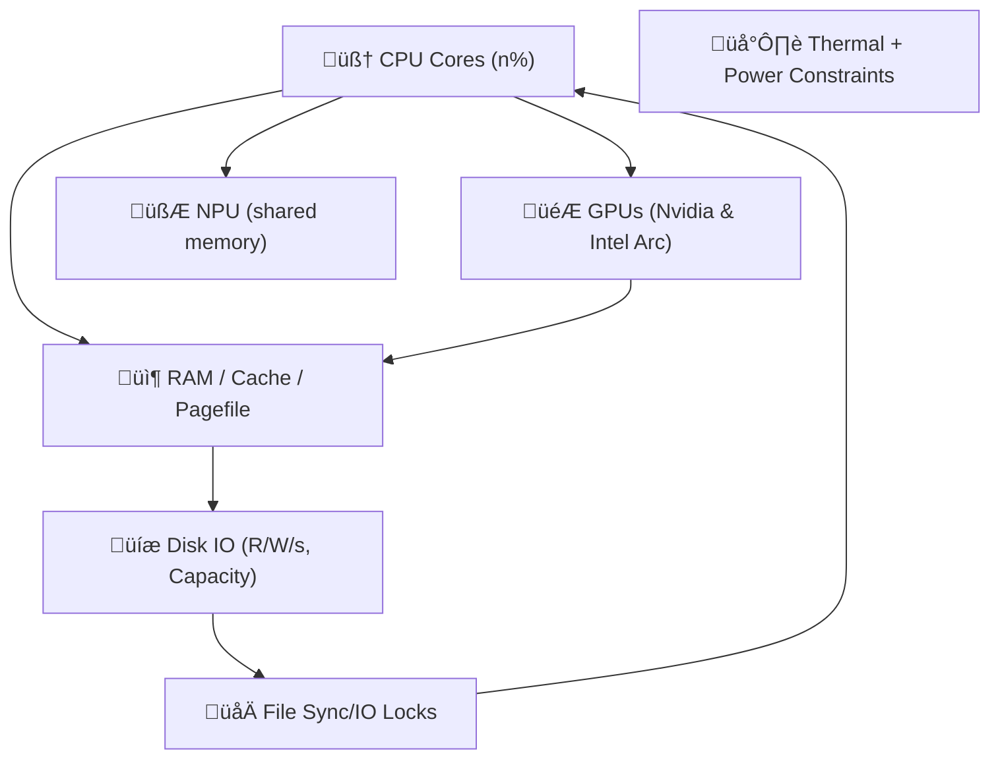

Excellent. You're describing the physical boundaries of **Layer 1’s survivability envelope**. ^ref-64a9f9f9-1-0

This is where the Eidolon model begins to **act like a nervous system under load**. Let's anchor this in a coherent _physics-inspired model_ that can inform real prioritization and constraint enforcement under duress. ^ref-64a9f9f9-3-0

---

## 🧱 Resource Modalities: Real-World Mapping

Let's name and organize the resources as **independent but interconnected fields**: ^ref-64a9f9f9-9-0


^ref-64a9f9f9-11-0
 ^ref-64a9f9f9-30-0
This is a real mess to manage unless we **normalize and project** these into a _resource-stress field_.

---

## 🧭 Field Vector Schema
 ^ref-64a9f9f9-36-0
Each resource has:
 ^ref-64a9f9f9-38-0
|Field Axis|Description|
|---|---|
|`X_cpu_i`|Percent usage for core _i_|
|`Y_ram`|% used, % cache pressure|
|`Z_gpu_i`|Load % for GPU i|
|`U_npu`|Effective ops / latency over threshold|
|`D_disk_i`|Bandwidth usage and fill level per volume|
|`L_temp`|Temperature delta from nominal or throttle point|
|`F_io`|File sync/write collisions or delays detected|
 ^ref-64a9f9f9-48-0
We’ll bundle this into a vector per unit of time (or tick):
 ^ref-64a9f9f9-50-0
```clojure
(defstruct resource-snapshot
  cpu-cores ; [x x x x ...] per core
  ram       ; {:used %, :cached %, :pagefile %}
  gpus      ; {:intel-arc %, :nvidia-4070ti %}
  npu       ; {:utilization %, :latency ms}
  disks     ; [{:r/s, :w/s, :capacity-used %}, ...]
  temp      ; {:cpu-temp °C, :gpu-temp °C, ...}
  io-locks  ; {:contention-rate, :conflict-count})
^ref-64a9f9f9-50-0
``` ^ref-64a9f9f9-61-0

Now, let’s define a vector field: ^ref-64a9f9f9-63-0

```clojure
(defn compute-uptime-field [snapshot]
  (reduce (fn [vec-field res]
            (add-to-field vec-field (project-stress res)))
          empty-vec-field
^ref-64a9f9f9-63-0
          snapshot)) ^ref-64a9f9f9-71-0
```
 ^ref-64a9f9f9-73-0
We can begin modeling:
 ^ref-64a9f9f9-75-0
- **gradient flows**: e.g., RAM pressure diffuses into CPU/NPU field
 ^ref-64a9f9f9-77-0
- **turbulence**: e.g., race conditions emerge from sharp spikes in IO or thermal throttling
    
- **crash likelihood**: when the combined stress vector reaches a critical direction or magnitude
    

---
 ^ref-64a9f9f9-84-0
## 🛑 Failure Modes to Detect + Handle

|Mode|Trigger|Mitigation|
|---|---|---|
|**RAM exhaustion**|Free RAM < 5%|Cancel low-priority buffers|
|**Disk full**|Any disk > 90%|Purge caches / delay writes|
|**Thermal throttle**|Temp near Tjmax|Slow down jobs, log temperature events|
|**IO Race**|Same file accessed w/o lock|Use atomic temp file + rename|
|**Context overload**|LLM or STT queue too deep|Drop or summarize old requests|
|**System call corruption**|Sudden high jitter in metrics|Failsafe fallback mode, self-healing fsync queues|

---

## 🧪 Field Probes and Agents
 ^ref-64a9f9f9-99-0
### Example: RAM Agent

```lisp
(defagent ram-manager
  (priority 10)
  (update
    (lambda ()
      (let ((ram (get-field 'ram)))
        (when (> ram.used 0.9)
          (trigger 'drop-noncritical-contexts))
^ref-64a9f9f9-99-0
        (when (> ram.pagefile 0.8)
          (reduce-worker-threads))))))
```
^ref-64a9f9f9-113-0

### Example: Disk I/O Monitor

```lisp
(defagent disk-agent
  (priority 9)
  (update
    (lambda ()
      (doseq (disk snapshot.disks)
        (when (> disk.capacity-used 0.95)
^ref-64a9f9f9-113-0
          (notify 'disk-pressure zone=disk.mount))
        (when (> disk.writes-per-sec 2000)
          (delay 'background-embeddings))))))
```
 ^ref-64a9f9f9-129-0
---
 ^ref-64a9f9f9-131-0 ^ref-64a9f9f9-132-0
## ⚡ Memory Race Detection Strategy

- Use a write-through pattern:
 ^ref-64a9f9f9-135-0
    - Write to temp file: `state.tmp.json`
 ^ref-64a9f9f9-137-0
    - Fsync and `mv` to final name atomically
 ^ref-64a9f9f9-139-0
    - If `mv` fails, yield until next tick
        
- Maintain a `write-epoch` per resource. If two write requests share an epoch:
    
    - Introduce artificial delay or random jitter before commit
        
 ^ref-64a9f9f9-146-0
---
 ^ref-64a9f9f9-148-0 ^ref-64a9f9f9-149-0
## 🛠️ Next Step Suggestions

Here’s what I suggest we prototype next:
 ^ref-64a9f9f9-152-0
1. **Resource Snapshot Collector**: Platform-specific metrics API
 ^ref-64a9f9f9-154-0
2. **Eidolon Field Construction**: 2D vector stress map with decay, diffusion, and threshold coloring
 ^ref-64a9f9f9-156-0
3. **Agent-Based Response Model**: Agents like `ram-manager` and `disk-agent` that respond to local field conditions
 ^ref-64a9f9f9-159-0
4. **Simulated Stress Injector**: Artificial load generator to test field reactivity ^ref-64a9f9f9-159-0
    
5. **Self-Healing Demo**: Duck notices pressure, drops old STT data, slows TTS rate, logs pressure release
    
 ^ref-64a9f9f9-164-0
Would you like to start by writing a stress field data structure and simple decay function in Sibilant or JavaScript? Or do you want to define the snapshot system interface (cross-platform metrics collector)?
