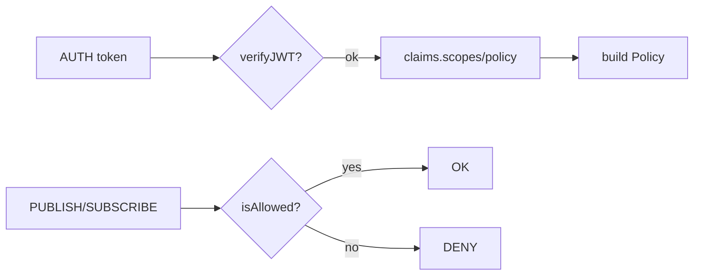

Note: Consolidated here → ../notes/services/broker-outbox-acl-ops.md

Alright, Part 3 coming in hot: **Mongo outbox (transactional), JWT auth + ACL, Ops dashboard, and a typed client SDK**. Everything drops under `shared/js/prom-lib/` (plus one tiny service bootstrap). You can paste-as-you-go.

---

# 1) Mongo Outbox (transaction-safe)

### 1a) Interface + drainer (we’ll reuse the earlier drainer)

```ts
// shared/js/prom-lib/outbox/types.ts
import { UUID } from "../event/types";

export interface OutboxRecord<T=any> {
  _id: UUID;
  topic: string;
  payload: T;
  headers?: Record<string,string>;
  status: "pending" | "claimed" | "sent" | "error";
  claimed_by?: string;
  lease_until?: number;
  last_err?: string;
  ts: number;
  attempts: number;
}

export interface OutboxStore<T=any> {
  add(rec: { id: UUID; topic: string; payload: T; headers?: Record<string,string> }): Promise<void>;
  claimBatch(n: number, leaseMs: number, workerId: string): Promise<OutboxRecord<T>[]>;
  markSent(id: UUID): Promise<void>;
  markError(id: UUID, err: string): Promise<void>;
  requeueExpired(now?: number): Promise<number>;
}
```

```ts
// shared/js/prom-lib/outbox/drainer.ts
import { EventBus } from "../event/types";
import { OutboxStore } from "./types";

export async function runOutboxDrainer<T>(
  outbox: OutboxStore<T>,
  bus: EventBus,
  {
    batchSize = 100,
    leaseMs = 30_000,
    workerId = `drainer-${Math.random().toString(16).slice(2)}`,
    intervalMs = 250
  } = {}
) {
  while (true) {
    const reclaimed = await outbox.requeueExpired().catch(() => 0);
    const batch = await outbox.claimBatch(batchSize, leaseMs, workerId);
    if (batch.length === 0) {
      await sleep(intervalMs);
      continue;
    }
    for (const rec of batch) {
      try {
        await bus.publish(rec.topic, rec.payload, { headers: rec.headers });
        await outbox.markSent(rec._id);
      } catch (e: any) {
        await outbox.markError(rec._id, e.message ?? String(e));
      }
    }
  }
}
const sleep = (ms: number) => new Promise(r => setTimeout(r, ms));
```

### 1b) Mongo implementation

```ts
// shared/js/prom-lib/outbox/mongo.ts
import { Collection, Db } from "mongodb";
import { OutboxRecord, OutboxStore } from "./types";

export class MongoOutbox<T=any> implements OutboxStore<T> {
  private coll: Collection<OutboxRecord<T>>;
  constructor(db: Db, collectionName = "outbox") {
    this.coll = db.collection(collectionName);
  }
  static async ensureIndexes(db: Db, name = "outbox") {
    const c = db.collection(name);
    await c.createIndex({ status: 1, lease_until: 1 });
    await c.createIndex({ ts: 1 });
  }
  async add({ id, topic, payload, headers }: { id: string; topic: string; payload: T; headers?: Record<string,string> }) {
    const doc: OutboxRecord<T> = {
      _id: id,
      topic,
      payload,
      headers,
      status: "pending",
      ts: Date.now(),
      attempts: 0
    };
    await this.coll.insertOne(doc as any);
  }
  async claimBatch(n: number, leaseMs: number, workerId: string): Promise<OutboxRecord<T>[]> {
    const now = Date.now();
    const docs: OutboxRecord<T>[] = [];
    for (let i=0; i<n; i++) {
      const res = await this.coll.findOneAndUpdate(
        {
          status: "pending"
        },
        {
          $set: { status: "claimed", claimed_by: workerId, lease_until: now + leaseMs },
          $inc: { attempts: 1 }
        },
        {
          sort: { ts: 1 },
          returnDocument: "after"
        }
      );
      if (!res.value) break;
      docs.push(res.value);
    }
    return docs;
  }
  async markSent(id: string) {
    await this.coll.updateOne({ _id: id }, { $set: { status: "sent" }, $unset: { claimed_by: "", lease_until: "" } });
  }
  async markError(id: string, err: string) {
    await this.coll.updateOne(
      { _id: id },
      { $set: { status: "error", last_err: err }, $unset: { claimed_by: "", lease_until: "" } }
    );
  }
  async requeueExpired(now = Date.now()) {
    const res = await this.coll.updateMany(
      { status: "claimed", lease_until: { $lt: now } },
      { $set: { status: "pending" }, $unset: { claimed_by: "", lease_until: "" } }
    );
    return res.modifiedCount ?? 0;
  }
}
```

> **Usage:** write to your DB + `MongoOutbox.add(...)` in the same transaction. The drainer publishes and marks sent.

---

# 2) JWT Auth + Scope-based ACL

Supports **publish/subscribe** actions with **topic patterns** (wildcards `*` one segment, `**` multi). You can keep policies as simple JSON.

### 2a) Minimal glob matcher (no external deps)

```ts
// shared/js/prom-lib/acl/match.ts
export function matchTopic(pattern: string, topic: string): boolean {
  const pSegs = pattern.split(".");
  const tSegs = topic.split(".");
  let i=0, j=0;
  while (i < pSegs.length && j < tSegs.length) {
    const p = pSegs[i], t = tSegs[j];
    if (p === "**") {
      if (i === pSegs.length - 1) return true; // ** at end
      // try to consume until next segment matches
      const next = pSegs[i+1];
      while (j < tSegs.length) {
        if (segmentMatch(next, tSegs[j])) { i++; break; }
        j++;
      }
    } else if (segmentMatch(p, t)) {
      i++; j++;
    } else {
      return false;
    }
  }
  // consume trailing ** 
  while (i < pSegs.length && pSegs[i] === "**") i++;
  return i === pSegs.length && j === tSegs.length;
}
function segmentMatch(p: string, t: string) {
  if (p === "*") return true;
  if (p === t) return true;
  return false;
}
```

### 2b) Policy + checker

```ts
// shared/js/prom-lib/acl/policy.ts
export type Action = "publish" | "subscribe";
export interface Rule {
  effect: "allow" | "deny";
  action: Action | "*";
  topics: string[];               // wildcard patterns
  groups?: string[];              // for subscribe ACL (optional)
}
export interface Policy {
  rules: Rule[];
}

export function isAllowed(policy: Policy, action: Action, topic: string, group?: string): boolean {
  // first-match-wins; deny beats allow if tied
  for (const r of policy.rules) {
    if (r.action !== "*" && r.action !== action) continue;
    const topicMatch = r.topics.some(p => matchTopic(p, topic));
    if (!topicMatch) continue;
    if (action === "subscribe" && r.groups?.length) {
      if (!group) return false;
      const groupOk = r.groups.includes(group) || r.groups.includes("*");
      if (!groupOk) continue;
    }
    return r.effect === "allow";
  }
  // default deny
  return false;
}

import { matchTopic } from "./match";
```

### 2c) JWT verifier (using `jose`)

```ts
// shared/js/prom-lib/auth/jwt.ts
import { jwtVerify, createRemoteJWKSet, JWTPayload } from "jose";

export interface JwtConfig {
  jwksUrl?: string;     // for rotating keys
  secret?: string;      // HS256 fallback
  audience?: string;
  issuer?: string;
  clockToleranceSec?: number;
}

export interface AuthClaims extends JWTPayload {
  sub?: string;
  scopes?: string[];    // e.g., ["publish:heartbeat.*","subscribe:process.**"]
  policy?: { rules: any[] }; // optional embedded policy JSON
}

export async function verifyJWT(token: string, cfg: JwtConfig): Promise<AuthClaims> {
  const opts: any = {
    audience: cfg.audience,
    issuer: cfg.issuer,
    clockTolerance: (cfg.clockToleranceSec ?? 5) + "s"
  };
  if (cfg.jwksUrl) {
    const jwks = createRemoteJWKSet(new URL(cfg.jwksUrl));
    const { payload } = await jwtVerify(token, jwks, opts);
    return payload as AuthClaims;
  } else if (cfg.secret) {
    // jose wants a Uint8Array
    const key = new TextEncoder().encode(cfg.secret);
    const { payload } = await jwtVerify(token, key, opts);
    return payload as AuthClaims;
  } else {
    throw new Error("No JWT verifier configured");
  }
}
```

### 2d) scopes → policy adapter

```ts
// shared/js/prom-lib/acl/scopes.ts
import { Policy, Rule } from "./policy";

export function scopesToPolicy(scopes: string[]): Policy {
  // scope format: "<action>:<pattern>" e.g., "publish:heartbeat.*"
  const rules: Rule[] = scopes.map(s => {
    const [action, pattern] = s.split(":");
    return {
      effect: "allow",
      action: (action === "*" ? "*" : (action as any)),
      topics: [pattern ?? "**"]
    };
  });
  // Default deny if nothing matches; explicit deny could be added later
  return { rules };
}
```

### 2e) Wire ACL into WS Gateway

Patch your WS server to check policy on PUBLISH/SUBSCRIBE:

```ts
// inside startWSGateway(...) connection handler:
let policy: import("../acl/policy").Policy | null = null;

// in AUTH:
const claims = await verifyJWT(msg.token, jwtCfg); // supply cfg from env
policy = claims.policy ?? scopesToPolicy(claims.scopes ?? []);

// on PUBLISH:
if (!policy || !isAllowed(policy, "publish", msg.topic))
  return err("forbidden", "no publish permission");

// on SUBSCRIBE:
if (!policy || !isAllowed(policy, "subscribe", msg.topic, msg.group))
  return err("forbidden", "no subscribe permission");
```

> If you don’t want JWT yet, you can keep the old static token path and synthesize a wide-open policy for that token.

**Mermaid (decision):**



---

# 3) Ops Dashboard (HTTP)

Quick read-only endpoints for cursors, lag, and latest compaction snapshot. Uses Mongo-backed bus where possible.

```ts
// shared/js/prom-lib/ops/dashboard.ts
import express from "express";
import type { Db } from "mongodb";
import { MongoEventStore, MongoCursorStore } from "../event/mongo";
import { EventRecord } from "../event/types";

export function startOpsDashboard(db: Db, { port = 8082 } = {}) {
  const app = express();
  const events = new MongoEventStore(db);
  const cursors = new MongoCursorStore(db);

  // GET /cursors?topic=foo.bar
  app.get("/cursors", async (req, res) => {
    const topic = String(req.query.topic || "");
    if (!topic) return res.status(400).json({ error: "topic required" });
    const list = await db.collection("cursors").find({}).toArray();
    const filtered = list.filter(x => x._id?.startsWith(`${topic}::`))
      .map(x => ({ group: x._id.split("::")[1], lastId: x.lastId, lastTs: x.lastTs }));
    res.json({ topic, cursors: filtered });
  });

  // GET /lag?topic=foo.bar&group=ops
  app.get("/lag", async (req, res) => {
    const topic = String(req.query.topic || "");
    const group = String(req.query.group || "");
    if (!topic || !group) return res.status(400).json({ error: "topic and group required" });
    const cur = await cursors.get(topic, group);
    const tail = (await events.scan(topic, { ts: 0, limit: 1_000_000 })).at(-1) as EventRecord | undefined;
    const lag = tail && cur?.lastId ? (tail.ts - (cur.lastTs ?? 0)) : null;
    res.json({ topic, group, lastCursor: cur ?? null, tail: tail?.id ?? null, lagMs: lag });
  });

  // GET /latest-by-key?topic=process.state&key=host:name:pid
  app.get("/latest-by-key", async (req, res) => {
    const topic = String(req.query.topic || "");
    const key = String(req.query.key || "");
    if (!topic || !key) return res.status(400).json({ error: "topic and key required" });
    if (!events.latestByKey) return res.status(400).json({ error: "latestByKey not supported" });
    const recs = await events.latestByKey(topic, [key]);
    res.json(recs[key] ?? null);
  });

  return app.listen(port, () => {
    // eslint-disable-next-line no-console
    console.log(`[ops] dashboard on :${port}`);
  });
}
```

> Optional: add `/metrics` by calling your `metrics.expose(app)` helper if you wired Prometheus.

---

# 4) Typed Client SDK (Node + Browser)

A small wrapper that gives you generics for payloads, and works in both Node and the browser.

```ts
// shared/js/prom-lib/sdk/index.ts
export type PublishOpts = { headers?: Record<string,string>; key?: string; tags?: string[]; caused_by?: string[]; sid?: string; ts?: number };

export class PromClient {
  private ws?: WebSocket;
  private url: string;
  private token?: string;
  private openOnce?: Promise<void>;
  private handlers = new Map<string, (event: any, ctx: any) => Promise<void> | void>();

  constructor(url: string, token?: string) {
    this.url = url; this.token = token;
  }

  async connect() {
    if (this.openOnce) return this.openOnce;
    this.openOnce = new Promise<void>((resolve, reject) => {
      const WSImpl: any = (typeof WebSocket !== "undefined") ? WebSocket : require("ws");
      const ws = this.ws = new WSImpl(this.url);
      ws.onopen = () => {
        ws.send(JSON.stringify({ op: "AUTH", token: this.token }));
      };
      ws.onmessage = (ev: any) => {
        const msg = JSON.parse(ev.data?.toString?.() ?? ev.data);
        if (msg.op === "OK") return resolve();
        if (msg.op === "ERR") return reject(new Error(`${msg.code}: ${msg.msg}`));
        if (msg.op === "EVENT") {
          const key = `${msg.topic}::${msg.group}`;
          const h = this.handlers.get(key);
          if (!h) return;
          Promise.resolve(h(msg.event, msg.ctx))
            .then(() => this.ws?.send(JSON.stringify({ op:"ACK", topic: msg.topic, group: msg.group, id: msg.event.id })))
            .catch((e) => this.ws?.send(JSON.stringify({ op:"NACK", topic: msg.topic, group: msg.group, id: msg.event.id, reason: String(e?.message ?? e) })));
        }
      };
      ws.onerror = (e: any) => reject(new Error("ws_error"));
    });
    return this.openOnce;
  }

  async publish<T>(topic: string, payload: T, opts?: PublishOpts) {
    await this.connect();
    this.ws!.send(JSON.stringify({ op: "PUBLISH", topic, payload, opts }));
  }

  async subscribe<T = any>(topic: string, group: string, handler: (e: { id: string; payload: T; ts: number; topic: string }, ctx: any) => any, opts?: any) {
    await this.connect();
    this.handlers.set(`${topic}::${group}`, handler as any);
    this.ws!.send(JSON.stringify({ op: "SUBSCRIBE", topic, group, opts }));
  }

  async unsubscribe(topic: string, group: string) {
    await this.connect();
    this.handlers.delete(`${topic}::${group}`);
    this.ws!.send(JSON.stringify({ op: "UNSUBSCRIBE", topic, group }));
  }

  close() { this.ws?.close(); }
}
```

> In TS usage you get `publish<FooPayload>(...)` and typed handlers.

---

# 5) Glue it: tiny service wiring

Here’s a small bootstrap **service** that uses Mongo-backed bus + outbox + ops dashboard + WS gateway w/ JWT ACLs.

```ts
// services/js/event-hub/index.ts
import { MongoClient } from "mongodb";
import { MongoEventStore, MongoCursorStore, MongoEventBus } from "../../shared/js/prom-lib/event/mongo";
import { startWSGateway } from "../../shared/js/prom-lib/ws/server";
import { startOpsDashboard } from "../../shared/js/prom-lib/ops/dashboard";
import { MongoOutbox } from "../../shared/js/prom-lib/outbox/mongo";
import { runOutboxDrainer } from "../../shared/js/prom-lib/outbox/drainer";
import { verifyJWT } from "../../shared/js/prom-lib/auth/jwt";
import { isAllowed } from "../../shared/js/prom-lib/acl/policy";
import { scopesToPolicy } from "../../shared/js/prom-lib/acl/scopes";

async function main() {
  const mongoUrl = process.env.MONGO_URL || "mongodb://127.0.0.1:27017/prom";
  const client = await MongoClient.connect(mongoUrl);
  const db = client.db();

  await MongoEventStore.ensureIndexes(db);
  await MongoOutbox.ensureIndexes(db);

  const bus = new MongoEventBus(new MongoEventStore(db), new MongoCursorStore(db));

  // WS with JWT
  const jwksUrl = process.env.JWT_JWKS_URL; // or JWT_SECRET
  startWSGateway(bus, Number(process.env.WS_PORT ?? 8090), {
    auth: async (token) => {
      if (!token) return { ok: false, code: "no_token", msg: "missing" };
      try {
        const claims = await verifyJWT(token, {
          jwksUrl,
          secret: process.env.JWT_SECRET,
          audience: process.env.JWT_AUD,
          issuer: process.env.JWT_ISS
        });
        const policy = claims.policy ?? scopesToPolicy(claims.scopes ?? ["publish:**","subscribe:**"]);
        // Attach policy to connection via closure in your server (see earlier patch)
        // For brevity, we return ok and let the WS layer stash `policy` on the socket
        (globalThis as any).__POLICY__ = policy; // or pass through opts/ctx in your real code
        return { ok: true };
      } catch (e: any) {
        return { ok: false, code: "jwt_invalid", msg: e.message ?? "invalid" };
      }
    },
    ackTimeoutMs: 30_000
  });

  // Ops dashboard
  startOpsDashboard(db, { port: Number(process.env.OPS_PORT ?? 8082) });

  // Outbox drainer
  const outbox = new MongoOutbox(db);
  runOutboxDrainer(outbox, bus);

  // Done.
  // eslint-disable-next-line no-console
  console.log("[event-hub] up");
}

main().catch((e) => { console.error(e); process.exit(1); });
```

---

# 6) Sibilant sugar for ACLs (pseudo)

```lisp
; shared/sibilant/prom/acl.sib (pseudo)
(defmacro allow [action & patterns]
  `{:effect "allow" :action ~action :topics [~@patterns]})

(defn scopes->policy [scopes]
  {:rules (map (fn [s] (let [[action pattern] (.split s ":")]
                          {:effect "allow" :action action :topics [pattern]}))
               scopes)})

; (def POLICY (scopes->policy ["publish:heartbeat.*" "subscribe:process.**"]))
```

---

# 7) Quick Kanban additions

* [ ] Add `MongoOutbox` to any service that writes DB changes; swap local app emits → outbox writes
* [ ] Wire `runOutboxDrainer` in event-hub
* [ ] Switch gateway auth to JWT; generate temp HS256 token for dev
* [ ] Define default scopes: `publish:heartbeat.received`, `subscribe:process.state`
* [ ] Add `/lag` checks to CI smoke (ensure small lag after publishing bursts)
* [ ] Build tiny web page that uses `PromClient` in the browser to show live `process.state` (optional)

---

If you want **Part 4**, I’ll dump:

* **Backpressure & rate limits** (per-topic quotas, token-bucket),
* **Replay API** (HTTP range queries + export to NDJSON),
* **Exactly-once-ish** consumer helper (idempotent handler wrapper w/ dedupe store),
* **Bench harness** (pub/sub throughput tester) and sizing notes.<!-- GENERATED-SECTIONS:DO-NOT-EDIT-BELOW -->
## Related content
- [WebSocket Gateway Implementation](websocket-gateway-implementation.md)
- [Event Bus MVP](event-bus-mvp.md)
- [State Snapshots API and Transactional Projector](state-snapshots-api-and-transactional-projector.md)
- [schema-evolution-workflow](schema-evolution-workflow.md)
- [prom-lib-rate-limiters-and-replay-api](prom-lib-rate-limiters-and-replay-api.md)
- [Promethean Event Bus MVP v0.1](promethean-event-bus-mvp-v0-1.md)
- [Services](chunks/services.md)
- [Unique Info Dump Index](unique-info-dump-index.md)
- [Stateful Partitions and Rebalancing](stateful-partitions-and-rebalancing.md)
- [observability-infrastructure-setup](observability-infrastructure-setup.md)
- [ecs-offload-workers](ecs-offload-workers.md)
- [archetype-ecs](archetype-ecs.md)
- [aionian-circuit-math](aionian-circuit-math.md)
- [Diagrams](chunks/diagrams.md)
- [DSL](chunks/dsl.md)
- [Chroma Toolkit Consolidation Plan](chroma-toolkit-consolidation-plan.md)
- [Event Bus Projections Architecture](event-bus-projections-architecture.md)
- [ecs-scheduler-and-prefabs](ecs-scheduler-and-prefabs.md)
- [Agent Tasks: Persistence Migration to DualStore](agent-tasks-persistence-migration-to-dualstore.md)
- [JavaScript](chunks/javascript.md)
- [eidolon-field-math-foundations](eidolon-field-math-foundations.md)
- [Migrate to Provider-Tenant Architecture](migrate-to-provider-tenant-architecture.md)
- [Cross-Language Runtime Polymorphism](cross-language-runtime-polymorphism.md)
- [Promethean Infrastructure Setup](promethean-infrastructure-setup.md)
- [api-gateway-versioning](api-gateway-versioning.md)
- [Prometheus Observability Stack](prometheus-observability-stack.md)
## Sources
- _None_
<!-- GENERATED-SECTIONS:DO-NOT-EDIT-ABOVE -->
