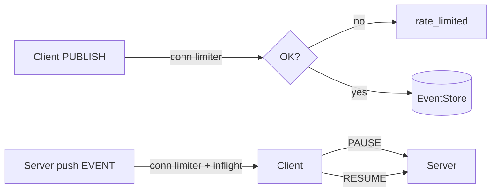

Alright, Part 4: **backpressure + rate limits, replay/export API, exactly-once-ish consumer, and a tiny bench harness**. Paste into `shared/js/prom-lib/` (and a `bench/` folder). Minimal but real.

---

# 1) Backpressure + Rate Limits

## 1a) Token bucket

```ts
// shared/js/prom-lib/rate/limiter.ts
export class TokenBucket {
  private capacity: number;
  private tokens: number;
  private refillPerSec: number;
  private last: number;

  constructor({ capacity, refillPerSec }: { capacity: number; refillPerSec: number }) {
    this.capacity = capacity;
    this.tokens = capacity;
    this.refillPerSec = refillPerSec;
    this.last = Date.now();
  }
  private refill() {
    const now = Date.now();
    const delta = (now - this.last) / 1000;
    this.tokens = Math.min(this.capacity, this.tokens + delta * this.refillPerSec);
    this.last = now;
  }
  tryConsume(n = 1): boolean {
    this.refill();
    if (this.tokens >= n) { this.tokens -= n; return true; }
    return false;
  }
  deficit(n = 1): number {
    this.refill();
    return Math.max(0, n - this.tokens);
  }
}
```

## 1b) Wire into WS Gateway (publish + per-sub delivery)

Add to your WS server:

```ts
// shared/js/prom-lib/ws/server.rate.ts
import { TokenBucket } from "../rate/limiter";

export function makeConnLimiter() {
  return new TokenBucket({ capacity: 200, refillPerSec: 200 }); // 200 msgs/sec burst
}
export function makeTopicLimiter(topic: string) {
  // customize per-topic if needed
  return new TokenBucket({ capacity: 1000, refillPerSec: 1000 });
}
```

Patch `startWSGateway`:

* On connection: `const connLimiter = makeConnLimiter();`
* Maintain a `Map<string, TokenBucket>` for `topicLimiter`.

On **PUBLISH**:

```ts
if (!connLimiter.tryConsume(1)) return err("rate_limited", "conn publish rate exceeded");
const tl = topicLimiters.get(msg.topic) ?? (topicLimiters.set(msg.topic, makeTopicLimiter(msg.topic)), topicLimiters.get(msg.topic)!);
if (!tl.tryConsume(1)) return err("rate_limited", "topic publish rate exceeded");
```

On **EVENT delivery** (inside subscribe handler), apply per-sub watermarks:

```ts
const deliver = () => {
  if (state.inflight.size >= maxInflight) return; // existing backpressure
  if (!connLimiter.tryConsume(1)) return;         // slow push if client is hot
  // (send EVENT ...)
};
```

## 1c) Pause/Resume (optional ops)

Support client-controlled backpressure:

* `PAUSE { op:"PAUSE", topic, group }`
* `RESUME { op:"RESUME", topic, group }`

Track `state.paused` and skip sending when paused. Client resumes when ready.

Mermaid:



---

# 2) Replay / Export API (HTTP + NDJSON)

```ts
// shared/js/prom-lib/http/replay.ts
import express from "express";
import { MongoEventStore } from "../event/mongo";
import { UUID } from "../event/types";

export function startReplayAPI(store: MongoEventStore, { port = 8083 } = {}) {
  const app = express();

  // GET /replay?topic=t&from=earliest|ts|afterId&ts=...&afterId=...&limit=1000
  app.get("/replay", async (req, res) => {
    try {
      const topic = String(req.query.topic || "");
      if (!topic) return res.status(400).json({ error: "topic required" });

      const from = String(req.query.from || "earliest");
      const ts = req.query.ts ? Number(req.query.ts) : undefined;
      const afterId = req.query.afterId ? String(req.query.afterId) as UUID : undefined;
      const limit = req.query.limit ? Number(req.query.limit) : 1000;

      const events = await store.scan(topic, {
        ts: from === "ts" ? ts : from === "earliest" ? 0 : undefined,
        afterId: from === "afterId" ? afterId : undefined,
        limit
      });
      res.json({ topic, count: events.length, events });
    } catch (e: any) {
      res.status(500).json({ error: e.message ?? String(e) });
    }
  });

  // GET /export?topic=t&fromTs=...&toTs=...&ndjson=1
  app.get("/export", async (req, res) => {
    try {
      const topic = String(req.query.topic || "");
      const fromTs = Number(req.query.fromTs || 0);
      const toTs = Number(req.query.toTs || Date.now());
      const ndjson = String(req.query.ndjson || "1") === "1";

      res.setHeader("Content-Type", ndjson ? "application/x-ndjson" : "application/json");
      if (!ndjson) res.write("[");
      let first = true;
      const batchSize = 5000;
      let cursorTs = fromTs;
      while (true) {
        const batch = await store.scan(topic, { ts: cursorTs, limit: batchSize });
        const filtered = batch.filter(e => e.ts <= toTs);
        if (filtered.length === 0) break;
        for (const e of filtered) {
          if (ndjson) {
            res.write(JSON.stringify(e) + "\n");
          } else {
            if (!first) res.write(",");
            res.write(JSON.stringify(e));
            first = false;
          }
        }
        const last = filtered.at(-1)!;
        cursorTs = last.ts + 1;
        if (filtered.length < batchSize || cursorTs > toTs) break;
      }
      if (!ndjson) res.write("]");
      res.end();
    } catch (e: any) {
      res.status(500).json({ error: e.message ?? String(e) });
    }
  });

  return app.listen(port, () => console.log(`[replay] on :${port}`));
}
```

**Indexes:** already covered: `{ topic:1, ts:1, id:1 }`.

---

# 3) Exactly-once-ish Consumer Helper (idempotency)

## 3a) Dedupe store

```ts
// shared/js/prom-lib/dedupe/types.ts
export interface DedupeStore {
  seen(topic: string, group: string, id: string): Promise<boolean>;
  mark(topic: string, group: string, id: string, ttlMs?: number): Promise<void>;
}
```

```ts
// shared/js/prom-lib/dedupe/mongo.ts
import { Collection, Db } from "mongodb";
import { DedupeStore } from "./types";

type Row = { _id: string; expireAt?: Date };

export class MongoDedupe implements DedupeStore {
  private coll: Collection<Row>;
  constructor(db: Db, name = "dedupe") {
    this.coll = db.collection(name);
    // TTL index (optional)
    this.coll.createIndex({ expireAt: 1 }, { expireAfterSeconds: 0 }).catch(() => {});
  }
  key(t: string, g: string, id: string) { return `${t}::${g}::${id}`; }
  async seen(topic: string, group: string, id: string) {
    const doc = await this.coll.findOne({ _id: this.key(topic, group, id) }, { projection: { _id: 1 } });
    return !!doc;
  }
  async mark(topic: string, group: string, id: string, ttlMs = 7 * 24 * 3600 * 1000) {
    const expireAt = new Date(Date.now() + ttlMs);
    await this.coll.updateOne(
      { _id: this.key(topic, group, id) },
      { $setOnInsert: { expireAt } },
      { upsert: true }
    );
  }
}
```

## 3b) Wrapper

```ts
// shared/js/prom-lib/consumers/exactlyOnce.ts
import { EventBus, EventRecord } from "../event/types";
import { DedupeStore } from "../dedupe/types";

export async function subscribeExactlyOnce(
  bus: EventBus,
  topic: string,
  group: string,
  store: DedupeStore,
  handler: (e: EventRecord) => Promise<void>,
  opts: any = {}
) {
  return bus.subscribe(topic, group, async (e) => {
    if (await store.seen(topic, group, e.id)) {
      // already done; advance cursor
      return;
    }
    await handler(e);
    await store.mark(topic, group, e.id, opts.ttlMs);
  }, { ...opts, manualAck: false }); // we allow auto-ack since we mark-before-return
}
```

> Semantics: if handler throws, it won’t mark; event is retried. If handler is non-transactional, you still have “at-least-once with dedupe”.

---

# 4) Bench Harness (throughput/latency)

Directory: `bench/`.

## 4a) Publisher

```ts
// bench/publish.ts
import { InMemoryEventBus } from "../shared/js/prom-lib/event/memory";

async function run() {
  const n = Number(process.env.N ?? 100_000);
  const topic = process.env.TOPIC ?? "bench.topic";
  const bus = new InMemoryEventBus();

  const t0 = Date.now();
  for (let i=0; i<n; i++) {
    // embed publish timestamp for latency
    await bus.publish(topic, { i, t0: Date.now() });
  }
  const dt = Date.now() - t0;
  console.log(JSON.stringify({ published: n, ms: dt, mps: (n/(dt/1000)).toFixed(1) }));
}
run();
```

## 4b) Subscriber (latency stats)

```ts
// bench/subscribe.ts
import { InMemoryEventBus } from "../shared/js/prom-lib/event/memory";

function pct(arr: number[], p: number) {
  const i = Math.max(0, Math.min(arr.length-1, Math.floor((p/100)*arr.length)));
  return arr[i] ?? 0;
}

async function run() {
  const n = Number(process.env.N ?? 100_000);
  const topic = process.env.TOPIC ?? "bench.topic";
  const bus = new InMemoryEventBus();
  const lats: number[] = [];
  let seen = 0;

  await bus.subscribe(topic, "bench", async (e) => {
    seen++;
    const t0 = (e.payload as any).t0 ?? e.ts;
    lats.push(Date.now() - t0);
  }, { from: "earliest", batchSize: 1000 });

  // generate and consume in same process for demo
  for (let i=0; i<n; i++) await bus.publish(topic, { i, t0: Date.now() });

  const wait = () => new Promise(r => setTimeout(r, 50));
  while (seen < n) await wait();

  lats.sort((a,b)=>a-b);
  const report = {
    n, p50: pct(lats,50), p90: pct(lats,90), p99: pct(lats,99),
    max: lats.at(-1) ?? 0, avg: Math.round(lats.reduce((a,b)=>a+b,0)/lats.length)
  };
  console.log(JSON.stringify(report));
}
run();
```

> Swap `InMemoryEventBus` for `MongoEventBus` to test I/O costs.

---

# 5) Sizing & Ops Notes (Mongo)

* **Indexes**

  * `events(topic, ts, id)` for scans and replay
  * `events(topic, key, ts)` for compaction/snapshots
  * `events(id)` unique
  * `cursors(_id)` unique
  * `dedupe(expireAt)` TTL
  * `outbox(status, lease_until)` + `outbox(ts)`

* **Retention**

  * Use **TTL** or manual prune per topic. Keep raw `heartbeat.received` short (hours–days).
  * Store **snapshots** (`process.state.snapshot`) long-lived.

* **Write concern**

  * `w:1` is fine for high-rate telemetry; bump to `w:majority` for business events.
  * Consider **capped collections** only for ephemeral telemetry (but they don’t play great with arbitrary queries).

* **Throughput**

  * Keep payloads small; push blobs to object storage and attach refs.
  * Batch publishers where possible (outbox drainer does).
  * Avoid massive fan-out groups; prefer projectors + snapshots.

* **Hot topics**

  * Add per-topic token buckets.
  * Use **PAUSE/RESUME** and **max inflight** to protect clients.

* **Cold start**

  * Consumers first load `*.snapshot`, then subscribe to the live topic from `latest`.

---

# 6) Tiny Kanban Additions

* [ ] Add `TokenBucket` to WS server (conn + per-topic)
* [ ] Implement `PAUSE/RESUME` ops on gateway
* [ ] Launch `ReplayAPI` on `:8083`; test `/replay` and `/export?ndjson=1`
* [ ] Add `MongoDedupe` and replace critical consumers with `subscribeExactlyOnce`
* [ ] Run `bench/subscribe.ts` with Mongo bus and record p50/p99
* [ ] Add TTLs per topic via migration script

---

Want **Part 5**? I can push:

* **Stateful partitions** (hash by key for parallel consumers),
* **Rebalance hooks** for consumer groups,
* **Schema registry lite** (zod validators per topic + evolution),
* and a **Changelog projector** (topic → materialized Mongo collection with upsert/unique constraints).<!-- GENERATED-SECTIONS:DO-NOT-EDIT-BELOW -->
## Related content
- [State Snapshots API and Transactional Projector](state-snapshots-api-and-transactional-projector.md)
- [Promethean Event Bus MVP v0.1](promethean-event-bus-mvp-v0-1.md)
- [schema-evolution-workflow](schema-evolution-workflow.md)
- [Chroma Toolkit Consolidation Plan](chroma-toolkit-consolidation-plan.md)
- [Event Bus MVP](event-bus-mvp.md)
- [Mongo Outbox Implementation](mongo-outbox-implementation.md)
- [Stateful Partitions and Rebalancing](stateful-partitions-and-rebalancing.md)
- [Migrate to Provider-Tenant Architecture](migrate-to-provider-tenant-architecture.md)
- [Agent Tasks: Persistence Migration to DualStore](agent-tasks-persistence-migration-to-dualstore.md)
- [eidolon-field-math-foundations](eidolon-field-math-foundations.md)
- [Services](chunks/services.md)
- [Per-Domain Policy System for JS Crawler](per-domain-policy-system-for-js-crawler.md)
- [ecs-offload-workers](ecs-offload-workers.md)
- [Board Walk – 2025-08-11](board-walk-2025-08-11.md)
- [Dynamic Context Model for Web Components](dynamic-context-model-for-web-components.md)
- [Event Bus Projections Architecture](event-bus-projections-architecture.md)
- [aionian-circuit-math](aionian-circuit-math.md)
- [observability-infrastructure-setup](observability-infrastructure-setup.md)
- [Cross-Language Runtime Polymorphism](cross-language-runtime-polymorphism.md)
- [Cross-Target Macro System in Sibilant](cross-target-macro-system-in-sibilant.md)
- [Promethean-native config design](promethean-native-config-design.md)
- [Sibilant Meta-Prompt DSL](sibilant-meta-prompt-dsl.md)
- [template-based-compilation](template-based-compilation.md)
- [Unique Info Dump Index](unique-info-dump-index.md)
- [WebSocket Gateway Implementation](websocket-gateway-implementation.md)
- [Prompt_Folder_Bootstrap](prompt-folder-bootstrap.md)
## Sources
- _None_
<!-- GENERATED-SECTIONS:DO-NOT-EDIT-ABOVE -->
