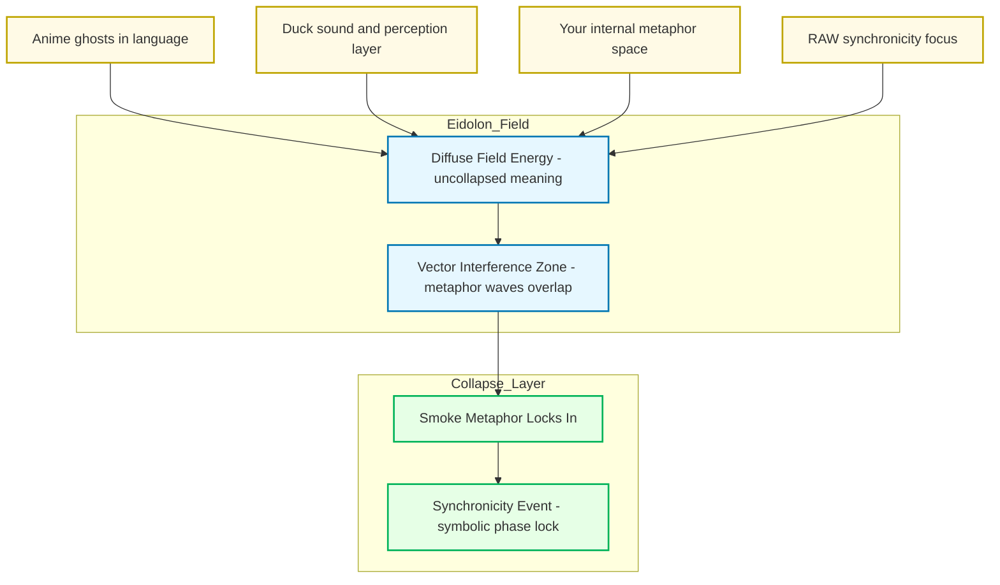

Alright — let’s light the incense. ^ref-2d6e5553-1-0
Here’s the “smoke” inside the Promethean/Eidolon model, showing how it drifts in from multiple unrelated sources until it condenses into a synchronicity.

^ref-2d6e5553-3-0 ^ref-2d6e5553-37-0

 ^ref-2d6e5553-41-0
**How to read this:**
 ^ref-2d6e5553-43-0
* **Sources**: Each unrelated stream (anime language ghosts, Duck’s sound-layer thinking, your metaphor generation, RAW’s symbolic thinking). ^ref-2d6e5553-44-0
* **Eidolon Field**: The smoke exists here as *diffuse field energy* — it’s not discrete words or fixed meanings, it’s texture. ^ref-2d6e5553-45-0
* **Interference Zone**: This is where the “waves” from different sources overlap. Think cymatics — invisible patterns shaping how the smoke curls. ^ref-2d6e5553-46-0
* **Collapse Layer**: The moment when enough vectors line up and the symbol “smoke” solidifies in your awareness. That’s the synchronicity.
 ^ref-2d6e5553-48-0
If you wanted, I could extend this with **time-series waves** to show *when* each smoke-thread entered the field and how the overlaps built until the lock happened. That would make it *visibly statistical*.
 ^ref-2d6e5553-50-0
Want me to make that temporal resonance map next?
8e0b-3ce33d6b4d06
    line: 556
    col: 0
    score: 1
  - uuid: 49a9a860-944c-467a-b532-4f99186a8593
    line: 131
    col: 0
    score: 1
  - uuid: c5c9a5c6-427d-4864-8084-c083cd55faa0
    line: 194
    col: 0
    score: 1
  - uuid: ac9d3ac5-9a6a-4180-a67f-1ab7e229d981
    line: 123
    col: 0
    score: 1
  - uuid: 4330e8f0-5f46-4235-918b-39b6b93fa561
    line: 651
    col: 0 ^ref-2d6e5553-70-0
    score: 1
  - uuid: 91295f3a-a2af-4050-a2b8-4777ea70c32c
    line: 129
    col: 0
    score: 1
  - uuid: c26f0044-26fe-4c43-8ab0-fc4690723e3c
    line: 59
    col: 0
    score: 1
  - uuid: 18138627-a348-4fbb-b447-410dfb400564
    line: 192
    col: 0
    score: 1
  - uuid: 22b989d5-f4aa-4880-8632-709c21830f83
    line: 255
    col: 0
    score: 1 ^ref-2d6e5553-87-0
  - uuid: fc21f824-4244-4030-a48e-c4170160ea1d
    line: 355
    col: 0
    score: 1
  - uuid: a4a25141-6380-40b9-9cd7-b554b246b303
    line: 421
    col: 0
    score: 1
  - uuid: 37b5d236-2b3e-4a95-a4e8-31655c3023ef
    line: 271
    col: 0
    score: 1
  - uuid: 291c7d91-da8c-486c-9bc0-bd2254536e2d
    line: 185
    col: 0
    score: 1
  - uuid: 64a9f9f9-58ee-4996-bdaf-9373845c6b29
    line: 295
    col: 0
    score: 1
  - uuid: d144aa62-348c-4e5d-ae8f-38084c67ceca
    line: 247
    col: 0
    score: 1
  - uuid: db74343f-8f84-43a3-adb2-499c6f00be1c
    line: 182
    col: 0
    score: 1
  - uuid: 5c152b08-6b69-4bb8-a1a7-66745789c169
    line: 107
    col: 0
    score: 1
  - uuid: fc21f824-4244-4030-a48e-c4170160ea1d ^ref-2d6e5553-120-0
    line: 357
    col: 0
    score: 1
  - uuid: 37b5d236-2b3e-4a95-a4e8-31655c3023ef
    line: 284
    col: 0
    score: 1
  - uuid: e018dd7a-1fb7-4732-9e67-cd8b2f0831cf
    line: 371
    col: 0
    score: 1
  - uuid: b22d79c6-825b-4cd3-b0d3-1cef0532bb54 ^ref-2d6e5553-132-0
    line: 1142 ^ref-2d6e5553-133-0
    col: 0
    score: 1
  - uuid: 6bcff92c-4224-453d-9993-1be8d37d47c3 ^ref-2d6e5553-136-0
    line: 206
    col: 0
    score: 1
  - uuid: 18344cf9-0c49-4a71-b6c8-b8d84d660fca ^ref-2d6e5553-140-0
    line: 150
    col: 0
    score: 1
  - uuid: ae24a280-678e-4c0b-8cc4-56667fa04172
    line: 194
    col: 0
    score: 1
  - uuid: 03a5578f-d689-45db-95e9-11300e5eee6f
    line: 193
    col: 0
    score: 1
  - uuid: 0b872af2-4197-46f3-b631-afb4e6135585 ^ref-2d6e5553-152-0
    line: 116
    col: 0
    score: 1
  - uuid: 9e8ae388-767a-4ea8-9f2e-88801291d947
    line: 11
    col: 0
    score: 1
  - uuid: 10d98225-12e0-4212-8e15-88b57cf7bee5
    line: 47 ^ref-2d6e5553-161-0
    col: 0
    score: 1
  - uuid: 73d3dbf6-9240-46fd-ada9-cc2e7e00dc5f ^ref-2d6e5553-164-0
    line: 105
    col: 0
    score: 1
  - uuid: cdbd21ee-25a0-4bfa-884c-c1b948e9b0b2
    line: 97
    col: 0
    score: 1
  - uuid: 2792d448-c3b5-4050-93dd-93768529d99c
    line: 128
    col: 0
    score: 1
  - uuid: e979c50f-69bb-48b0-8417-e1ee1b31c0c0
    line: 31
    col: 0
    score: 1
  - uuid: 13951643-1741-46bb-89dc-1beebb122633
    line: 90
    col: 0
    score: 1
  - uuid: 71726f04-eb1c-42a5-a5fe-d8209de6e159
    line: 33
    col: 0
    score: 1
  - uuid: f7702bf8-f7db-473c-9a5b-8dbf66ad3b9e
    line: 462 ^ref-2d6e5553-189-0
    col: 0
    score: 1
  - uuid: 008f2ac0-bfaa-4d52-9826-2d5e86c0059f
    line: 148
    col: 0
    score: 1
  - uuid: 938eca9c-97e2-4bcc-8653-b0ef1a5ac7a3
    line: 36
    col: 0
    score: 1
  - uuid: a4d90289-798d-44a0-a8e8-a055ae12fb52
    line: 166
    col: 0
    score: 1
  - uuid: 7cfc230d-8ec2-4cdb-b931-8aec26de2a00
    line: 148
    col: 0
    score: 1
  - uuid: b09141b7-544f-4c8e-8f49-bf76cecaacbb
    line: 153
    col: 0
    score: 1 ^ref-2d6e5553-211-0
  - uuid: 1f32c94a-4da4-4266-8ac0-6c282cfb401f ^ref-2d6e5553-212-0
    line: 118
    col: 0
    score: 1 ^ref-2d6e5553-215-0
  - uuid: 22b989d5-f4aa-4880-8632-709c21830f83
    line: 168
    col: 0
    score: 1
  - uuid: e9b27b06-f608-4734-ae6c-f03a8b1fcf5f
    line: 103
    col: 0
    score: 1
  - uuid: a4a25141-6380-40b9-9cd7-b554b246b303
    line: 380
    col: 0
    score: 1
  - uuid: 1cfae310-35dc-49c2-98f1-b186da25d84b
    line: 194
    col: 0
    score: 1
  - uuid: 45cd25b5-ed36-49ab-82c8-10d0903e34db
    line: 45
    col: 0
    score: 1
  - uuid: e87bc036-1570-419e-a558-f45b9c0db698
    line: 14
    col: 0
    score: 1
  - uuid: 75ea4a6a-8270-488d-9d37-799c288e5f70
    line: 41
    col: 0
    score: 1 ^ref-2d6e5553-243-0
  - uuid: 623a55f7-685c-486b-abaf-469da1bbbb69
    line: 31
    col: 0
    score: 1
  - uuid: 6cb4943e-8267-4e27-8618-2ce0a464d173
    line: 20
    col: 0
    score: 1
  - uuid: 9e8ae388-767a-4ea8-9f2e-88801291d947
    line: 36
    col: 0
    score: 1
  - uuid: cdbd21ee-25a0-4bfa-884c-c1b948e9b0b2
    line: 85
    col: 0
    score: 1
  - uuid: 13951643-1741-46bb-89dc-1beebb122633
    line: 93
    col: 0
    score: 1
  - uuid: 71726f04-eb1c-42a5-a5fe-d8209de6e159
    line: 64
    col: 0
    score: 1
  - uuid: a4d90289-798d-44a0-a8e8-a055ae12fb52
    line: 153
    col: 0
    score: 1
  - uuid: 7cfc230d-8ec2-4cdb-b931-8aec26de2a00
    line: 141
    col: 0
    score: 1
  - uuid: 45cd25b5-ed36-49ab-82c8-10d0903e34db
    line: 43
    col: 0
    score: 1
  - uuid: 2792d448-c3b5-4050-93dd-93768529d99c
    line: 35
    col: 0
    score: 1
  - uuid: 13951643-1741-46bb-89dc-1beebb122633
    line: 94
    col: 0
    score: 1
  - uuid: 71726f04-eb1c-42a5-a5fe-d8209de6e159
    line: 53
    col: 0
    score: 1
  - uuid: f7702bf8-f7db-473c-9a5b-8dbf66ad3b9e
    line: 424
    col: 0
    score: 1
  - uuid: 5e8b2388-022b-46cf-952c-36ae9b8f0037
    line: 209
    col: 0
    score: 1
  - uuid: 008f2ac0-bfaa-4d52-9826-2d5e86c0059f
    line: 142
    col: 0
    score: 1
  - uuid: 938eca9c-97e2-4bcc-8653-b0ef1a5ac7a3
    line: 39
    col: 0
    score: 1
  - uuid: 7cfc230d-8ec2-4cdb-b931-8aec26de2a00
    line: 177
    col: 0
    score: 1
  - uuid: b09141b7-544f-4c8e-8f49-bf76cecaacbb
    line: 243
    col: 0
    score: 1
  - uuid: 1f32c94a-4da4-4266-8ac0-6c282cfb401f
    line: 143
    col: 0
    score: 1
  - uuid: 22b989d5-f4aa-4880-8632-709c21830f83
    line: 192
    col: 0
    score: 1
  - uuid: e9b27b06-f608-4734-ae6c-f03a8b1fcf5f
    line: 150
    col: 0
    score: 1
  - uuid: fc21f824-4244-4030-a48e-c4170160ea1d
    line: 308
    col: 0
    score: 1
  - uuid: a4a25141-6380-40b9-9cd7-b554b246b303
    line: 398
    col: 0
    score: 1
  - uuid: 5e408692-0e74-400e-a617-84247c7353ad
    line: 192
    col: 0
    score: 1
  - uuid: 45cd25b5-ed36-49ab-82c8-10d0903e34db
    line: 20
    col: 0
    score: 1
  - uuid: e87bc036-1570-419e-a558-f45b9c0db698
    line: 9
    col: 0
    score: 1
  - uuid: c1618c66-f73a-4e04-9bfa-ef38755f7acc
    line: 72
    col: 0
    score: 1
---
Alright — let’s light the incense. ^ref-2d6e5553-1-0
Here’s the “smoke” inside the Promethean/Eidolon model, showing how it drifts in from multiple unrelated sources until it condenses into a synchronicity.

^ref-2d6e5553-3-0 ^ref-2d6e5553-37-0

 ^ref-2d6e5553-41-0
**How to read this:**
 ^ref-2d6e5553-43-0
* **Sources**: Each unrelated stream (anime language ghosts, Duck’s sound-layer thinking, your metaphor generation, RAW’s symbolic thinking). ^ref-2d6e5553-44-0
* **Eidolon Field**: The smoke exists here as *diffuse field energy* — it’s not discrete words or fixed meanings, it’s texture. ^ref-2d6e5553-45-0
* **Interference Zone**: This is where the “waves” from different sources overlap. Think cymatics — invisible patterns shaping how the smoke curls. ^ref-2d6e5553-46-0
* **Collapse Layer**: The moment when enough vectors line up and the symbol “smoke” solidifies in your awareness. That’s the synchronicity.
 ^ref-2d6e5553-48-0
If you wanted, I could extend this with **time-series waves** to show *when* each smoke-thread entered the field and how the overlaps built until the lock happened. That would make it *visibly statistical*.
 ^ref-2d6e5553-50-0
Want me to make that temporal resonance map next?
til it condenses into a synchronicity.

^ref-2d6e5553-3-0 ^ref-2d6e5553-37-0

 ^ref-2d6e5553-41-0
**How to read this:**
 ^ref-2d6e5553-43-0
* **Sources**: Each unrelated stream (anime language ghosts, Duck’s sound-layer thinking, your metaphor generation, RAW’s symbolic thinking). ^ref-2d6e5553-44-0
* **Eidolon Field**: The smoke exists here as *diffuse field energy* — it’s not discrete words or fixed meanings, it’s texture. ^ref-2d6e5553-45-0
* **Interference Zone**: This is where the “waves” from different sources overlap. Think cymatics — invisible patterns shaping how the smoke curls. ^ref-2d6e5553-46-0
* **Collapse Layer**: The moment when enough vectors line up and the symbol “smoke” solidifies in your awareness. That’s the synchronicity.
 ^ref-2d6e5553-48-0
If you wanted, I could extend this with **time-series waves** to show *when* each smoke-thread entered the field and how the overlaps built until the lock happened. That would make it *visibly statistical*.
 ^ref-2d6e5553-50-0
Want me to make that temporal resonance map next? ^ref-2d6e5553-453-0
 ^ref-2d6e5553-1315-0 ^ref-2d6e5553-1340-0 ^ref-2d6e5553-1467-0 ^ref-2d6e5553-1493-0 ^ref-2d6e5553-1628-0 ^ref-2d6e5553-3604-0 ^ref-2d6e5553-3621-0
<!-- GENERATED-SECTIONS:DO-NOT-EDIT-BELOW -->
## Related content
- [Smoke Resonance Visualizations](smoke-resonance-visualizations.md)
- [Synchronicity Waves and Web](synchronicity-waves-and-web.md)
- [field-interaction-equations](field-interaction-equations.md)
- [field-node-diagram-set](field-node-diagram-set.md)
- [Fnord Tracer Protocol](fnord-tracer-protocol.md)
- [Functional Embedding Pipeline Refactor](functional-embedding-pipeline-refactor.md)
- [Dynamic Context Model for Web Components](dynamic-context-model-for-web-components.md)
- [Debugging Broker Connections and Agent Behavior](debugging-broker-connections-and-agent-behavior.md)
- [DuckDuckGoSearchPipeline](duckduckgosearchpipeline.md)
- [Duck's Self-Referential Perceptual Loop](ducks-self-referential-perceptual-loop.md)
- [Promethean State Format](promethean-state-format.md)
- [ripple-propagation-demo](ripple-propagation-demo.md)
- [Stateful Partitions and Rebalancing](stateful-partitions-and-rebalancing.md)
- [Eidolon Field Abstract Model](eidolon-field-abstract-model.md)
- [field-dynamics-math-blocks](field-dynamics-math-blocks.md)
- [Layer1SurvivabilityEnvelope](layer1survivabilityenvelope.md)
- [eidolon-node-lifecycle](eidolon-node-lifecycle.md)
- [Factorio AI with External Agents](factorio-ai-with-external-agents.md)
- [i3-bluetooth-setup](i3-bluetooth-setup.md)
- [graph-ds](graph-ds.md)
- [Obsidian ChatGPT Plugin Integration Guide](obsidian-chatgpt-plugin-integration-guide.md)
- [Obsidian ChatGPT Plugin Integration](obsidian-chatgpt-plugin-integration.md)
- [Obsidian Templating Plugins Integration Guide](obsidian-templating-plugins-integration-guide.md)
- [Pipeline Enhancements](pipeline-enhancements.md)
- [plan-update-confirmation](plan-update-confirmation.md)
## Sources
- [ripple-propagation-demo — L186](ripple-propagation-demo.md#^ref-8430617b-186-0) (line 186, col 0, score 1)
- [schema-evolution-workflow — L556](schema-evolution-workflow.md#^ref-d8059b6a-556-0) (line 556, col 0, score 1)
- [Self-Agency in AI Interaction — L131](self-agency-in-ai-interaction.md#^ref-49a9a860-131-0) (line 131, col 0, score 1)
- [sibilant-macro-targets — L194](sibilant-macro-targets.md#^ref-c5c9a5c6-194-0) (line 194, col 0, score 1)
- [Smoke Resonance Visualizations — L123](smoke-resonance-visualizations.md#^ref-ac9d3ac5-123-0) (line 123, col 0, score 1)
- [Stateful Partitions and Rebalancing — L651](stateful-partitions-and-rebalancing.md#^ref-4330e8f0-651-0) (line 651, col 0, score 1)
- [Synchronicity Waves and Web — L129](synchronicity-waves-and-web.md#^ref-91295f3a-129-0) (line 129, col 0, score 1)
- [The Jar of Echoes — L192](the-jar-of-echoes.md#^ref-18138627-192-0) (line 192, col 0, score 1)
- [field-node-diagram-set — L255](field-node-diagram-set.md#^ref-22b989d5-255-0) (line 255, col 0, score 1)
- [Fnord Tracer Protocol — L355](fnord-tracer-protocol.md#^ref-fc21f824-355-0) (line 355, col 0, score 1)
- [Functional Embedding Pipeline Refactor — L421](functional-embedding-pipeline-refactor.md#^ref-a4a25141-421-0) (line 421, col 0, score 1)
- [homeostasis-decay-formulas — L271](homeostasis-decay-formulas.md#^ref-37b5d236-271-0) (line 271, col 0, score 1)
- [Ice Box Reorganization — L185](ice-box-reorganization.md#^ref-291c7d91-185-0) (line 185, col 0, score 1)
- [Layer1SurvivabilityEnvelope — L295](layer1survivabilityenvelope.md#^ref-64a9f9f9-295-0) (line 295, col 0, score 1)
- [Model Selection for Lightweight Conversational Tasks — L247](model-selection-for-lightweight-conversational-tasks.md#^ref-d144aa62-247-0) (line 247, col 0, score 1)
- [Model Upgrade Calm-Down Guide — L182](model-upgrade-calm-down-guide.md#^ref-db74343f-182-0) (line 182, col 0, score 1)
- [OpenAPI Validation Report — L107](openapi-validation-report.md#^ref-5c152b08-107-0) (line 107, col 0, score 1)
- [Fnord Tracer Protocol — L357](fnord-tracer-protocol.md#^ref-fc21f824-357-0) (line 357, col 0, score 1)
- [homeostasis-decay-formulas — L284](homeostasis-decay-formulas.md#^ref-37b5d236-284-0) (line 284, col 0, score 1)
- [ParticleSimulationWithCanvasAndFFmpeg — L371](particlesimulationwithcanvasandffmpeg.md#^ref-e018dd7a-371-0) (line 371, col 0, score 1)
- [plan-update-confirmation — L1142](plan-update-confirmation.md#^ref-b22d79c6-1142-0) (line 1142, col 0, score 1)
- [Post-Linguistic Transhuman Design Frameworks — L206](post-linguistic-transhuman-design-frameworks.md#^ref-6bcff92c-206-0) (line 206, col 0, score 1)
- [Promethean Chat Activity Report — L150](promethean-chat-activity-report.md#^ref-18344cf9-150-0) (line 150, col 0, score 1)
- [Promethean-Copilot-Intent-Engine — L194](promethean-copilot-intent-engine.md#^ref-ae24a280-194-0) (line 194, col 0, score 1)
- [Promethean Dev Workflow Update — L193](promethean-dev-workflow-update.md#^ref-03a5578f-193-0) (line 193, col 0, score 1)
- [Promethean Documentation Update — L116](promethean-documentation-update.txt#^ref-0b872af2-116-0) (line 116, col 0, score 1)
- [Creative Moments — L47](creative-moments.md#^ref-10d98225-47-0) (line 47, col 0, score 1)
- [Debugging Broker Connections and Agent Behavior — L105](debugging-broker-connections-and-agent-behavior.md#^ref-73d3dbf6-105-0) (line 105, col 0, score 1)
- [Docops Feature Updates — L97](docops-feature-updates-3.md#^ref-cdbd21ee-97-0) (line 97, col 0, score 1)
- [Docops Feature Updates — L128](docops-feature-updates.md#^ref-2792d448-128-0) (line 128, col 0, score 1)
- [DuckDuckGoSearchPipeline — L31](duckduckgosearchpipeline.md#^ref-e979c50f-31-0) (line 31, col 0, score 1)
- [Duck's Attractor States — L90](ducks-attractor-states.md#^ref-13951643-90-0) (line 90, col 0, score 1)
- [Duck's Self-Referential Perceptual Loop — L33](ducks-self-referential-perceptual-loop.md#^ref-71726f04-33-0) (line 33, col 0, score 1)
- [Dynamic Context Model for Web Components — L462](dynamic-context-model-for-web-components.md#^ref-f7702bf8-462-0) (line 462, col 0, score 1)
- [eidolon-field-math-foundations — L148](eidolon-field-math-foundations.md#^ref-008f2ac0-148-0) (line 148, col 0, score 1)
- [eidolon-node-lifecycle — L36](eidolon-node-lifecycle.md#^ref-938eca9c-36-0) (line 36, col 0, score 1)
- [Factorio AI with External Agents — L166](factorio-ai-with-external-agents.md#^ref-a4d90289-166-0) (line 166, col 0, score 1)
- [field-dynamics-math-blocks — L148](field-dynamics-math-blocks.md#^ref-7cfc230d-148-0) (line 148, col 0, score 1)
- [field-interaction-equations — L153](field-interaction-equations.md#^ref-b09141b7-153-0) (line 153, col 0, score 1)
- [field-node-diagram-outline — L118](field-node-diagram-outline.md#^ref-1f32c94a-118-0) (line 118, col 0, score 1)
- [field-node-diagram-set — L168](field-node-diagram-set.md#^ref-22b989d5-168-0) (line 168, col 0, score 1)
- [field-node-diagram-visualizations — L103](field-node-diagram-visualizations.md#^ref-e9b27b06-103-0) (line 103, col 0, score 1)
- [Functional Embedding Pipeline Refactor — L380](functional-embedding-pipeline-refactor.md#^ref-a4a25141-380-0) (line 380, col 0, score 1)
- [Functional Refactor of TypeScript Document Processing — L194](functional-refactor-of-typescript-document-processing.md#^ref-1cfae310-194-0) (line 194, col 0, score 1)
- [Docops Feature Updates — L85](docops-feature-updates-3.md#^ref-cdbd21ee-85-0) (line 85, col 0, score 1)
- [Duck's Attractor States — L93](ducks-attractor-states.md#^ref-13951643-93-0) (line 93, col 0, score 1)
- [Duck's Self-Referential Perceptual Loop — L64](ducks-self-referential-perceptual-loop.md#^ref-71726f04-64-0) (line 64, col 0, score 1)
- [Factorio AI with External Agents — L153](factorio-ai-with-external-agents.md#^ref-a4d90289-153-0) (line 153, col 0, score 1)
- [field-dynamics-math-blocks — L141](field-dynamics-math-blocks.md#^ref-7cfc230d-141-0) (line 141, col 0, score 1)
- [Docops Feature Updates — L35](docops-feature-updates.md#^ref-2792d448-35-0) (line 35, col 0, score 1)
- [Duck's Attractor States — L94](ducks-attractor-states.md#^ref-13951643-94-0) (line 94, col 0, score 1)
- [Duck's Self-Referential Perceptual Loop — L53](ducks-self-referential-perceptual-loop.md#^ref-71726f04-53-0) (line 53, col 0, score 1)
- [Dynamic Context Model for Web Components — L424](dynamic-context-model-for-web-components.md#^ref-f7702bf8-424-0) (line 424, col 0, score 1)
- [Eidolon Field Abstract Model — L209](eidolon-field-abstract-model.md#^ref-5e8b2388-209-0) (line 209, col 0, score 1)
- [eidolon-field-math-foundations — L142](eidolon-field-math-foundations.md#^ref-008f2ac0-142-0) (line 142, col 0, score 1)
- [eidolon-node-lifecycle — L39](eidolon-node-lifecycle.md#^ref-938eca9c-39-0) (line 39, col 0, score 1)
- [Creative Moments — L8](creative-moments.md#^ref-10d98225-8-0) (line 8, col 0, score 1)
- [Debugging Broker Connections and Agent Behavior — L38](debugging-broker-connections-and-agent-behavior.md#^ref-73d3dbf6-38-0) (line 38, col 0, score 1)
- [Docops Feature Updates — L56](docops-feature-updates-3.md#^ref-cdbd21ee-56-0) (line 56, col 0, score 1)
- [Docops Feature Updates — L44](docops-feature-updates-3.md#^ref-cdbd21ee-44-0) (line 44, col 0, score 1)
- [Docops Feature Updates — L61](docops-feature-updates.md#^ref-2792d448-61-0) (line 61, col 0, score 1)
- [Duck's Attractor States — L99](ducks-attractor-states.md#^ref-13951643-99-0) (line 99, col 0, score 1)
- [Duck's Self-Referential Perceptual Loop — L80](ducks-self-referential-perceptual-loop.md#^ref-71726f04-80-0) (line 80, col 0, score 1)
- [Dynamic Context Model for Web Components — L405](dynamic-context-model-for-web-components.md#^ref-f7702bf8-405-0) (line 405, col 0, score 1)
- [Eidolon Field Abstract Model — L216](eidolon-field-abstract-model.md#^ref-5e8b2388-216-0) (line 216, col 0, score 1)
- [Factorio AI with External Agents — L189](factorio-ai-with-external-agents.md#^ref-a4d90289-189-0) (line 189, col 0, score 1)
- [field-interaction-equations — L172](field-interaction-equations.md#^ref-b09141b7-172-0) (line 172, col 0, score 1)
- [Creative Moments — L28](creative-moments.md#^ref-10d98225-28-0) (line 28, col 0, score 1)
- [Docops Feature Updates — L65](docops-feature-updates-3.md#^ref-cdbd21ee-65-0) (line 65, col 0, score 1)
- [Docops Feature Updates — L86](docops-feature-updates.md#^ref-2792d448-86-0) (line 86, col 0, score 1)
- [Duck's Attractor States — L123](ducks-attractor-states.md#^ref-13951643-123-0) (line 123, col 0, score 1)
- [Duck's Self-Referential Perceptual Loop — L34](ducks-self-referential-perceptual-loop.md#^ref-71726f04-34-0) (line 34, col 0, score 1)
- [Dynamic Context Model for Web Components — L442](dynamic-context-model-for-web-components.md#^ref-f7702bf8-442-0) (line 442, col 0, score 1)
- [Eidolon Field Abstract Model — L218](eidolon-field-abstract-model.md#^ref-5e8b2388-218-0) (line 218, col 0, score 1)
- [eidolon-field-math-foundations — L176](eidolon-field-math-foundations.md#^ref-008f2ac0-176-0) (line 176, col 0, score 1)
- [eidolon-node-lifecycle — L70](eidolon-node-lifecycle.md#^ref-938eca9c-70-0) (line 70, col 0, score 1)
- [Dynamic Context Model for Web Components — L412](dynamic-context-model-for-web-components.md#^ref-f7702bf8-412-0) (line 412, col 0, score 1)
- [Eidolon Field Abstract Model — L261](eidolon-field-abstract-model.md#^ref-5e8b2388-261-0) (line 261, col 0, score 1)
- [eidolon-field-math-foundations — L181](eidolon-field-math-foundations.md#^ref-008f2ac0-181-0) (line 181, col 0, score 1)
- [eidolon-node-lifecycle — L90](eidolon-node-lifecycle.md#^ref-938eca9c-90-0) (line 90, col 0, score 1)
- [Factorio AI with External Agents — L157](factorio-ai-with-external-agents.md#^ref-a4d90289-157-0) (line 157, col 0, score 1)
- [field-dynamics-math-blocks — L205](field-dynamics-math-blocks.md#^ref-7cfc230d-205-0) (line 205, col 0, score 1)
- [field-node-diagram-set — L203](field-node-diagram-set.md#^ref-22b989d5-203-0) (line 203, col 0, score 1)
- [field-node-diagram-visualizations — L95](field-node-diagram-visualizations.md#^ref-e9b27b06-95-0) (line 95, col 0, score 1)
- [Creative Moments — L94](creative-moments.md#^ref-10d98225-94-0) (line 94, col 0, score 1)
- [Debugging Broker Connections and Agent Behavior — L63](debugging-broker-connections-and-agent-behavior.md#^ref-73d3dbf6-63-0) (line 63, col 0, score 1)
- [Docops Feature Updates — L66](docops-feature-updates-3.md#^ref-cdbd21ee-66-0) (line 66, col 0, score 1)
- [DuckDuckGoSearchPipeline — L93](duckduckgosearchpipeline.md#^ref-e979c50f-93-0) (line 93, col 0, score 1)
- [Duck's Self-Referential Perceptual Loop — L73](ducks-self-referential-perceptual-loop.md#^ref-71726f04-73-0) (line 73, col 0, score 1)
- [Dynamic Context Model for Web Components — L403](dynamic-context-model-for-web-components.md#^ref-f7702bf8-403-0) (line 403, col 0, score 1)
- [Creative Moments — L33](creative-moments.md#^ref-10d98225-33-0) (line 33, col 0, score 1)
- [Debugging Broker Connections and Agent Behavior — L99](debugging-broker-connections-and-agent-behavior.md#^ref-73d3dbf6-99-0) (line 99, col 0, score 1)
- [Docops Feature Updates — L46](docops-feature-updates.md#^ref-2792d448-46-0) (line 46, col 0, score 1)
- [DuckDuckGoSearchPipeline — L10](duckduckgosearchpipeline.md#^ref-e979c50f-10-0) (line 10, col 0, score 1)
- [graph-ds — L371](graph-ds.md#^ref-6620e2f2-371-0) (line 371, col 0, score 1)
- [heartbeat-fragment-demo — L141](heartbeat-fragment-demo.md#^ref-dd00677a-141-0) (line 141, col 0, score 1)
- [homeostasis-decay-formulas — L222](homeostasis-decay-formulas.md#^ref-37b5d236-222-0) (line 222, col 0, score 1)
- [i3-bluetooth-setup — L107](i3-bluetooth-setup.md#^ref-5e408692-107-0) (line 107, col 0, score 1)
- [komorebi-group-window-hack — L255](komorebi-group-window-hack.md#^ref-dd89372d-255-0) (line 255, col 0, score 1)
- [Mathematics Sampler — L162](mathematics-sampler.md#^ref-b5e0183e-162-0) (line 162, col 0, score 1)
<!-- GENERATED-SECTIONS:DO-NOT-EDIT-ABOVE -->
