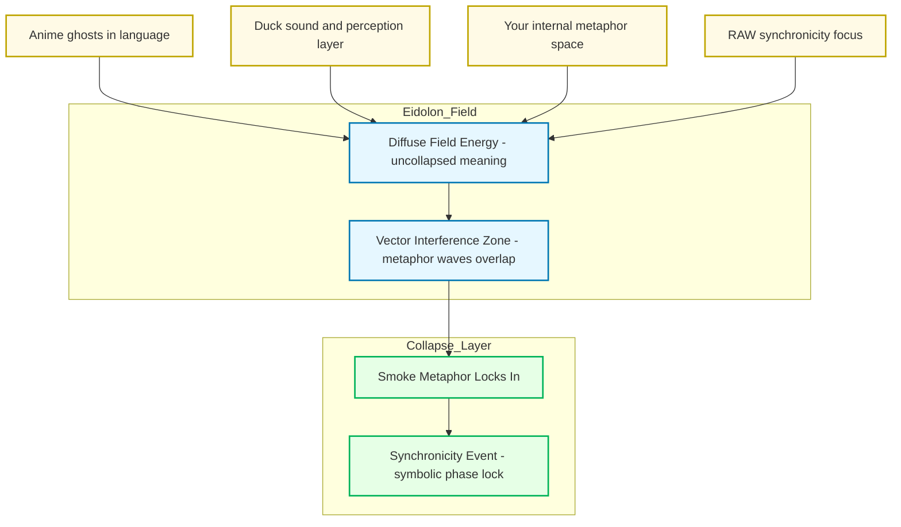

Alright — let’s light the incense. ^ref-2d6e5553-1-0
Here’s the “smoke” inside the Promethean/Eidolon model, showing how it drifts in from multiple unrelated sources until it condenses into a synchronicity.

^ref-2d6e5553-3-0

 ^ref-2d6e5553-41-0
**How to read this:**
 ^ref-2d6e5553-43-0
* **Sources**: Each unrelated stream (anime language ghosts, Duck’s sound-layer thinking, your metaphor generation, RAW’s symbolic thinking). ^ref-2d6e5553-44-0
* **Eidolon Field**: The smoke exists here as *diffuse field energy* — it’s not discrete words or fixed meanings, it’s texture. ^ref-2d6e5553-45-0
* **Interference Zone**: This is where the “waves” from different sources overlap. Think cymatics — invisible patterns shaping how the smoke curls. ^ref-2d6e5553-46-0
* **Collapse Layer**: The moment when enough vectors line up and the symbol “smoke” solidifies in your awareness. That’s the synchronicity.
 ^ref-2d6e5553-48-0
If you wanted, I could extend this with **time-series waves** to show *when* each smoke-thread entered the field and how the overlaps built until the lock happened. That would make it *visibly statistical*.
 ^ref-2d6e5553-50-0
Want me to make that temporal resonance map next?<!-- GENERATED-SECTIONS:DO-NOT-EDIT-BELOW -->
## Related content
- [Ghostly Smoke Interference](ghostly-smoke-interference.md)
- [Synchronicity Waves and Web](synchronicity-waves-and-web.md)
- [Smoke Resonance Visualizations](smoke-resonance-visualizations.md)
- [Duck's Attractor States](ducks-attractor-states.md)
- [infinite_depth_smoke_animation](infinite-depth-smoke-animation.md)
- [Diagrams](chunks/diagrams.md)
- [Unique Info Dump Index](unique-info-dump-index.md)
- [AI-Centric OS with MCP Layer](ai-centric-os-with-mcp-layer.md)
- [AI-First-OS-Model-Context-Protocol](ai-first-os-model-context-protocol.md)
- [balanced-bst](balanced-bst.md)
- [aionian-circuit-math](aionian-circuit-math.md)
- [Shared](chunks/shared.md)
- [eidolon-field-math-foundations](eidolon-field-math-foundations.md)
- [archetype-ecs](archetype-ecs.md)
- [DSL](chunks/dsl.md)
- [Board Automation Improvements](board-automation-improvements.md)
- [Operations](chunks/operations.md)
- [Duck's Self-Referential Perceptual Loop](ducks-self-referential-perceptual-loop.md)
- [ParticleSimulationWithCanvasAndFFmpeg](particlesimulationwithcanvasandffmpeg.md)
- [Event Bus Projections Architecture](event-bus-projections-architecture.md)
- [Reawakening Duck](reawakening-duck.md)
- [Recursive Prompt Construction Engine](recursive-prompt-construction-engine.md)
- [JavaScript](chunks/javascript.md)
- [2d-sandbox-field](2d-sandbox-field.md)
- [Admin Dashboard for User Management](admin-dashboard-for-user-management.md)
- [Agent Reflections and Prompt Evolution](agent-reflections-and-prompt-evolution.md)
- [Agent Tasks: Persistence Migration to DualStore](agent-tasks-persistence-migration-to-dualstore.md)
- [Exception Layer Analysis](exception-layer-analysis.md)
- [Cross-Language Runtime Polymorphism](cross-language-runtime-polymorphism.md)
- [field-interaction-equations](field-interaction-equations.md)
- [Simulation Demo](chunks/simulation-demo.md)
- [Tooling](chunks/tooling.md)
- [Window Management](chunks/window-management.md)
- [compiler-kit-foundations](compiler-kit-foundations.md)
- [Cross-Target Macro System in Sibilant](cross-target-macro-system-in-sibilant.md)
- [field-dynamics-math-blocks](field-dynamics-math-blocks.md)
- [Math Fundamentals](chunks/math-fundamentals.md)
- [Services](chunks/services.md)
- [Factorio AI with External Agents](factorio-ai-with-external-agents.md)
- [field-node-diagram-outline](field-node-diagram-outline.md)
- [EidolonField](eidolonfield.md)
- [Event Bus MVP](event-bus-mvp.md)
- [eidolon-node-lifecycle](eidolon-node-lifecycle.md)
- [Promethean-native config design](promethean-native-config-design.md)
- [Chroma Toolkit Consolidation Plan](chroma-toolkit-consolidation-plan.md)
- [prompt-programming-language-lisp](prompt-programming-language-lisp.md)
- [field-node-diagram-set](field-node-diagram-set.md)
- [Creative Moments](creative-moments.md)
- [DuckDuckGoSearchPipeline](duckduckgosearchpipeline.md)
- [Promethean Event Bus MVP v0.1](promethean-event-bus-mvp-v0-1.md)
- [api-gateway-versioning](api-gateway-versioning.md)
- [Canonical Org-Babel Matplotlib Animation Template](canonical-org-babel-matplotlib-animation-template.md)
- [field-node-diagram-visualizations](field-node-diagram-visualizations.md)
- [graph-ds](graph-ds.md)
- [heartbeat-fragment-demo](heartbeat-fragment-demo.md)
- [heartbeat-simulation-snippets](heartbeat-simulation-snippets.md)
- [Dynamic Context Model for Web Components](dynamic-context-model-for-web-components.md)
- [Post-Linguistic Transhuman Design Frameworks](post-linguistic-transhuman-design-frameworks.md)
- [Promethean Agent Config DSL](promethean-agent-config-dsl.md)
- [Promethean Chat Activity Report](promethean-chat-activity-report.md)
- [Promethean Infrastructure Setup](promethean-infrastructure-setup.md)
- [promethean-system-diagrams](promethean-system-diagrams.md)
- [Promethean Web UI Setup](promethean-web-ui-setup.md)
- [Prompt_Folder_Bootstrap](prompt-folder-bootstrap.md)
- [Pure-Node Crawl Stack with Playwright and Crawlee](pure-node-crawl-stack-with-playwright-and-crawlee.md)
- [Migrate to Provider-Tenant Architecture](migrate-to-provider-tenant-architecture.md)
- [Obsidian ChatGPT Plugin Integration Guide](obsidian-chatgpt-plugin-integration-guide.md)
- [Obsidian ChatGPT Plugin Integration](obsidian-chatgpt-plugin-integration.md)
- [Fnord Tracer Protocol](fnord-tracer-protocol.md)
- [Model Upgrade Calm-Down Guide](model-upgrade-calm-down-guide.md)
- [NPU Voice Code and Sensory Integration](npu-voice-code-and-sensory-integration.md)
- [observability-infrastructure-setup](observability-infrastructure-setup.md)
- [Obsidian Templating Plugins Integration Guide](obsidian-templating-plugins-integration-guide.md)
- [OpenAPI Validation Report](openapi-validation-report.md)
- [Optimizing Command Limitations in System Design](optimizing-command-limitations-in-system-design.md)
- [plan-update-confirmation](plan-update-confirmation.md)
- [Board Walk – 2025-08-11](board-walk-2025-08-11.md)
- [Local-Offline-Model-Deployment-Strategy](local-offline-model-deployment-strategy.md)
- [Mindful Prioritization](mindful-prioritization.md)
- [MindfulRobotIntegration](mindfulrobotintegration.md)
- [homeostasis-decay-formulas](homeostasis-decay-formulas.md)
- [i3-bluetooth-setup](i3-bluetooth-setup.md)
- [layer-1-uptime-diagrams](layer-1-uptime-diagrams.md)
- [ripple-propagation-demo](ripple-propagation-demo.md)
- [obsidian-ignore-node-modules-regex](obsidian-ignore-node-modules-regex.md)
- [Lisp-Compiler-Integration](lisp-compiler-integration.md)
- [Language-Agnostic Mirror System](language-agnostic-mirror-system.md)
- [lisp-dsl-for-window-management](lisp-dsl-for-window-management.md)
- [Lispy Macros with syntax-rules](lispy-macros-with-syntax-rules.md)
- [Local-First Intention→Code Loop with Free Models](local-first-intention-code-loop-with-free-models.md)
- [Local-Only-LLM-Workflow](local-only-llm-workflow.md)
- [markdown-to-org-transpiler](markdown-to-org-transpiler.md)
- [Per-Domain Policy System for JS Crawler](per-domain-policy-system-for-js-crawler.md)
- [Promethean Workflow Optimization](promethean-workflow-optimization.md)
- [Prometheus Observability Stack](prometheus-observability-stack.md)
- [Protocol_0_The_Contradiction_Engine](protocol-0-the-contradiction-engine.md)
- [Provider-Agnostic Chat Panel Implementation](provider-agnostic-chat-panel-implementation.md)
- [Shared Package Structure](shared-package-structure.md)
- [Interop and Source Maps](interop-and-source-maps.md)
- [komorebi-group-window-hack](komorebi-group-window-hack.md)
- [Pure TypeScript Search Microservice](pure-typescript-search-microservice.md)
- [RAG UI Panel with Qdrant and PostgREST](rag-ui-panel-with-qdrant-and-postgrest.md)
- [schema-evolution-workflow](schema-evolution-workflow.md)
- [Self-Agency in AI Interaction](self-agency-in-ai-interaction.md)
- [set-assignment-in-lisp-ast](set-assignment-in-lisp-ast.md)
- [shared-package-layout-clarification](shared-package-layout-clarification.md)
- [sibilant-macro-targets](sibilant-macro-targets.md)
- [Sibilant Meta-Prompt DSL](sibilant-meta-prompt-dsl.md)
- [Debugging Broker Connections and Agent Behavior](debugging-broker-connections-and-agent-behavior.md)
- [Eidolon-Field-Optimization](eidolon-field-optimization.md)
- [Eidolon Field Abstract Model](eidolon-field-abstract-model.md)
- [template-based-compilation](template-based-compilation.md)
- [ecs-scheduler-and-prefabs](ecs-scheduler-and-prefabs.md)
- [System Scheduler with Resource-Aware DAG](system-scheduler-with-resource-aware-dag.md)
- [Chroma-Embedding-Refactor](chroma-embedding-refactor.md)
- [Layer1SurvivabilityEnvelope](layer1survivabilityenvelope.md)
- [Universal Lisp Interface](universal-lisp-interface.md)
- [Ice Box Reorganization](ice-box-reorganization.md)
## Sources
- [Smoke Resonance Visualizations — L55](smoke-resonance-visualizations.md#^ref-ac9d3ac5-55-0) (line 55, col 0, score 0.66)
- [Smoke Resonance Visualizations — L8](smoke-resonance-visualizations.md#^ref-ac9d3ac5-8-0) (line 8, col 0, score 0.72)
- [Diagrams — L22](chunks/diagrams.md#^ref-45cd25b5-22-0) (line 22, col 0, score 0.75)
- [Shared — L21](chunks/shared.md#^ref-623a55f7-21-0) (line 21, col 0, score 0.75)
- [Duck's Attractor States — L60](ducks-attractor-states.md#^ref-13951643-60-0) (line 60, col 0, score 0.75)
- [Duck's Self-Referential Perceptual Loop — L53](ducks-self-referential-perceptual-loop.md#^ref-71726f04-53-0) (line 53, col 0, score 0.75)
- [Event Bus Projections Architecture — L180](event-bus-projections-architecture.md#^ref-cf6b9b17-180-0) (line 180, col 0, score 0.75)
- [ParticleSimulationWithCanvasAndFFmpeg — L288](particlesimulationwithcanvasandffmpeg.md#^ref-e018dd7a-288-0) (line 288, col 0, score 0.75)
- [Reawakening Duck — L129](reawakening-duck.md#^ref-59b5670f-129-0) (line 129, col 0, score 0.75)
- [Ghostly Smoke Interference — L11](ghostly-smoke-interference.md#^ref-b6ae7dfa-11-0) (line 11, col 0, score 0.66)
- [Synchronicity Waves and Web — L48](synchronicity-waves-and-web.md#^ref-91295f3a-48-0) (line 48, col 0, score 0.73)
- [Smoke Resonance Visualizations — L33](smoke-resonance-visualizations.md#^ref-ac9d3ac5-33-0) (line 33, col 0, score 0.71)
- [Smoke Resonance Visualizations — L10](smoke-resonance-visualizations.md#^ref-ac9d3ac5-10-0) (line 10, col 0, score 0.69)
- [Smoke Resonance Visualizations — L57](smoke-resonance-visualizations.md#^ref-ac9d3ac5-57-0) (line 57, col 0, score 0.67)
- [Synchronicity Waves and Web — L11](synchronicity-waves-and-web.md#^ref-91295f3a-11-0) (line 11, col 0, score 0.78)
- [Duck's Attractor States — L5](ducks-attractor-states.md#^ref-13951643-5-0) (line 5, col 0, score 0.76)
- [Ghostly Smoke Interference — L39](ghostly-smoke-interference.md#^ref-b6ae7dfa-39-0) (line 39, col 0, score 0.68)
- [infinite_depth_smoke_animation — L7](infinite-depth-smoke-animation.md#^ref-92a052a5-7-0) (line 7, col 0, score 0.72)
- [ecs-scheduler-and-prefabs — L352](ecs-scheduler-and-prefabs.md#^ref-c62a1815-352-0) (line 352, col 0, score 0.73)
- [System Scheduler with Resource-Aware DAG — L350](system-scheduler-with-resource-aware-dag.md#^ref-ba244286-350-0) (line 350, col 0, score 0.73)
- [layer-1-uptime-diagrams — L102](layer-1-uptime-diagrams.md#^ref-4127189a-102-0) (line 102, col 0, score 0.7)
- [archetype-ecs — L423](archetype-ecs.md#^ref-8f4c1e86-423-0) (line 423, col 0, score 0.69)
- [Duck's Self-Referential Perceptual Loop — L20](ducks-self-referential-perceptual-loop.md#^ref-71726f04-20-0) (line 20, col 0, score 0.72)
- [Promethean-native config design — L342](promethean-native-config-design.md#^ref-ab748541-342-0) (line 342, col 0, score 0.78)
- [template-based-compilation — L21](template-based-compilation.md#^ref-f8877e5e-21-0) (line 21, col 0, score 0.74)
- [aionian-circuit-math — L128](aionian-circuit-math.md#^ref-f2d83a77-128-0) (line 128, col 0, score 0.73)
- [Exception Layer Analysis — L76](exception-layer-analysis.md#^ref-21d5cc09-76-0) (line 76, col 0, score 0.72)
- [Chroma-Embedding-Refactor — L64](chroma-embedding-refactor.md#^ref-8b256935-64-0) (line 64, col 0, score 0.72)
- [Chroma-Embedding-Refactor — L109](chroma-embedding-refactor.md#^ref-8b256935-109-0) (line 109, col 0, score 0.72)
- [Chroma-Embedding-Refactor — L258](chroma-embedding-refactor.md#^ref-8b256935-258-0) (line 258, col 0, score 0.72)
- [Chroma Toolkit Consolidation Plan — L72](chroma-toolkit-consolidation-plan.md#^ref-5020e892-72-0) (line 72, col 0, score 0.72)
- [Chroma Toolkit Consolidation Plan — L88](chroma-toolkit-consolidation-plan.md#^ref-5020e892-88-0) (line 88, col 0, score 0.72)
- [Chroma Toolkit Consolidation Plan — L107](chroma-toolkit-consolidation-plan.md#^ref-5020e892-107-0) (line 107, col 0, score 0.72)
- [Chroma Toolkit Consolidation Plan — L148](chroma-toolkit-consolidation-plan.md#^ref-5020e892-148-0) (line 148, col 0, score 0.72)
- [Cross-Language Runtime Polymorphism — L72](cross-language-runtime-polymorphism.md#^ref-c34c36a6-72-0) (line 72, col 0, score 0.7)
- [Eidolon Field Abstract Model — L59](eidolon-field-abstract-model.md#^ref-5e8b2388-59-0) (line 59, col 0, score 0.69)
- [Universal Lisp Interface — L105](universal-lisp-interface.md#^ref-b01856b4-105-0) (line 105, col 0, score 0.69)
- [prompt-programming-language-lisp — L33](prompt-programming-language-lisp.md#^ref-d41a06d1-33-0) (line 33, col 0, score 0.69)
- [Ghostly Smoke Interference — L35](ghostly-smoke-interference.md#^ref-b6ae7dfa-35-0) (line 35, col 0, score 0.7)
- [Duck's Self-Referential Perceptual Loop — L29](ducks-self-referential-perceptual-loop.md#^ref-71726f04-29-0) (line 29, col 0, score 0.69)
- [Smoke Resonance Visualizations — L31](smoke-resonance-visualizations.md#^ref-ac9d3ac5-31-0) (line 31, col 0, score 0.76)
- [Duck's Self-Referential Perceptual Loop — L1](ducks-self-referential-perceptual-loop.md#^ref-71726f04-1-0) (line 1, col 0, score 0.69)
- [Duck's Self-Referential Perceptual Loop — L26](ducks-self-referential-perceptual-loop.md#^ref-71726f04-26-0) (line 26, col 0, score 0.68)
- [Duck's Self-Referential Perceptual Loop — L17](ducks-self-referential-perceptual-loop.md#^ref-71726f04-17-0) (line 17, col 0, score 0.68)
- [Duck's Attractor States — L44](ducks-attractor-states.md#^ref-13951643-44-0) (line 44, col 0, score 0.68)
- [Duck's Self-Referential Perceptual Loop — L9](ducks-self-referential-perceptual-loop.md#^ref-71726f04-9-0) (line 9, col 0, score 0.68)
- [Synchronicity Waves and Web — L46](synchronicity-waves-and-web.md#^ref-91295f3a-46-0) (line 46, col 0, score 0.72)
- [Synchronicity Waves and Web — L9](synchronicity-waves-and-web.md#^ref-91295f3a-9-0) (line 9, col 0, score 0.69)
- [Eidolon-Field-Optimization — L3](eidolon-field-optimization.md#^ref-40e05c14-3-0) (line 3, col 0, score 0.77)
- [Eidolon Field Abstract Model — L5](eidolon-field-abstract-model.md#^ref-5e8b2388-5-0) (line 5, col 0, score 0.76)
- [infinite_depth_smoke_animation — L3](infinite-depth-smoke-animation.md#^ref-92a052a5-3-0) (line 3, col 0, score 0.68)
- [field-interaction-equations — L54](field-interaction-equations.md#^ref-b09141b7-54-0) (line 54, col 0, score 0.72)
- [2d-sandbox-field — L1](2d-sandbox-field.md#^ref-c710dc93-1-0) (line 1, col 0, score 0.72)
- [Ghostly Smoke Interference — L37](ghostly-smoke-interference.md#^ref-b6ae7dfa-37-0) (line 37, col 0, score 0.67)
- [Layer1SurvivabilityEnvelope — L164](layer1survivabilityenvelope.md#^ref-64a9f9f9-164-0) (line 164, col 0, score 0.7)
- [Migrate to Provider-Tenant Architecture — L289](migrate-to-provider-tenant-architecture.md#^ref-54382370-289-0) (line 289, col 0, score 0.7)
- [Obsidian ChatGPT Plugin Integration Guide — L44](obsidian-chatgpt-plugin-integration-guide.md#^ref-1d3d6c3a-44-0) (line 44, col 0, score 0.7)
- [Obsidian ChatGPT Plugin Integration — L42](obsidian-chatgpt-plugin-integration.md#^ref-ca8e1399-42-0) (line 42, col 0, score 0.7)
- [Ghostly Smoke Interference — L7](ghostly-smoke-interference.md#^ref-b6ae7dfa-7-0) (line 7, col 0, score 0.69)
- [Smoke Resonance Visualizations — L72](smoke-resonance-visualizations.md#^ref-ac9d3ac5-72-0) (line 72, col 0, score 0.75)
- [Smoke Resonance Visualizations — L49](smoke-resonance-visualizations.md#^ref-ac9d3ac5-49-0) (line 49, col 0, score 0.69)
- [Diagrams — L21](chunks/diagrams.md#^ref-45cd25b5-21-0) (line 21, col 0, score 1)
- [Duck's Attractor States — L59](ducks-attractor-states.md#^ref-13951643-59-0) (line 59, col 0, score 1)
- [Duck's Self-Referential Perceptual Loop — L41](ducks-self-referential-perceptual-loop.md#^ref-71726f04-41-0) (line 41, col 0, score 1)
- [ParticleSimulationWithCanvasAndFFmpeg — L270](particlesimulationwithcanvasandffmpeg.md#^ref-e018dd7a-270-0) (line 270, col 0, score 1)
- [Smoke Resonance Visualizations — L76](smoke-resonance-visualizations.md#^ref-ac9d3ac5-76-0) (line 76, col 0, score 1)
- [infinite_depth_smoke_animation — L6](infinite-depth-smoke-animation.md#^ref-92a052a5-6-0) (line 6, col 0, score 0.73)
- [Smoke Resonance Visualizations — L1](smoke-resonance-visualizations.md#^ref-ac9d3ac5-1-0) (line 1, col 0, score 0.72)
- [Diagrams — L20](chunks/diagrams.md#^ref-45cd25b5-20-0) (line 20, col 0, score 1)
- [Duck's Attractor States — L64](ducks-attractor-states.md#^ref-13951643-64-0) (line 64, col 0, score 1)
- [Synchronicity Waves and Web — L80](synchronicity-waves-and-web.md#^ref-91295f3a-80-0) (line 80, col 0, score 1)
- [Unique Info Dump Index — L121](unique-info-dump-index.md#^ref-30ec3ba6-121-0) (line 121, col 0, score 1)
- [Synchronicity Waves and Web — L75](synchronicity-waves-and-web.md#^ref-91295f3a-75-0) (line 75, col 0, score 0.73)
- [Duck's Attractor States — L56](ducks-attractor-states.md#^ref-13951643-56-0) (line 56, col 0, score 0.68)
- [field-node-diagram-set — L18](field-node-diagram-set.md#^ref-22b989d5-18-0) (line 18, col 0, score 0.66)
- [Fnord Tracer Protocol — L3](fnord-tracer-protocol.md#^ref-fc21f824-3-0) (line 3, col 0, score 0.65)
- [Fnord Tracer Protocol — L28](fnord-tracer-protocol.md#^ref-fc21f824-28-0) (line 28, col 0, score 0.67)
- [ripple-propagation-demo — L93](ripple-propagation-demo.md#^ref-8430617b-93-0) (line 93, col 0, score 0.67)
- [Ice Box Reorganization — L24](ice-box-reorganization.md#^ref-291c7d91-24-0) (line 24, col 0, score 0.66)
- [Fnord Tracer Protocol — L127](fnord-tracer-protocol.md#^ref-fc21f824-127-0) (line 127, col 0, score 0.66)
- [Synchronicity Waves and Web — L84](synchronicity-waves-and-web.md#^ref-91295f3a-84-0) (line 84, col 0, score 1)
- [Unique Info Dump Index — L124](unique-info-dump-index.md#^ref-30ec3ba6-124-0) (line 124, col 0, score 1)
- [Diagrams — L9](chunks/diagrams.md#^ref-45cd25b5-9-0) (line 9, col 0, score 1)
- [Shared — L12](chunks/shared.md#^ref-623a55f7-12-0) (line 12, col 0, score 1)
- [Duck's Attractor States — L61](ducks-attractor-states.md#^ref-13951643-61-0) (line 61, col 0, score 1)
- [Event Bus Projections Architecture — L163](event-bus-projections-architecture.md#^ref-cf6b9b17-163-0) (line 163, col 0, score 1)
- [Smoke Resonance Visualizations — L77](smoke-resonance-visualizations.md#^ref-ac9d3ac5-77-0) (line 77, col 0, score 1)
- [Unique Info Dump Index — L87](unique-info-dump-index.md#^ref-30ec3ba6-87-0) (line 87, col 0, score 1)
- [Diagrams — L5](chunks/diagrams.md#^ref-45cd25b5-5-0) (line 5, col 0, score 0.85)
- [Unique Info Dump Index — L44](unique-info-dump-index.md#^ref-30ec3ba6-44-0) (line 44, col 0, score 0.85)
- [Simulation Demo — L32](chunks/simulation-demo.md#^ref-557309a3-32-0) (line 32, col 0, score 1)
- [Tooling — L26](chunks/tooling.md#^ref-6cb4943e-26-0) (line 26, col 0, score 1)
- [Window Management — L36](chunks/window-management.md#^ref-9e8ae388-36-0) (line 36, col 0, score 1)
- [compiler-kit-foundations — L639](compiler-kit-foundations.md#^ref-01b21543-639-0) (line 639, col 0, score 1)
- [Creative Moments — L10](creative-moments.md#^ref-10d98225-10-0) (line 10, col 0, score 1)
- [Cross-Language Runtime Polymorphism — L258](cross-language-runtime-polymorphism.md#^ref-c34c36a6-258-0) (line 258, col 0, score 1)
- [Cross-Target Macro System in Sibilant — L215](cross-target-macro-system-in-sibilant.md#^ref-5f210ca2-215-0) (line 215, col 0, score 1)
- [Debugging Broker Connections and Agent Behavior — L50](debugging-broker-connections-and-agent-behavior.md#^ref-73d3dbf6-50-0) (line 50, col 0, score 1)
- [DuckDuckGoSearchPipeline — L16](duckduckgosearchpipeline.md#^ref-e979c50f-16-0) (line 16, col 0, score 1)
- [Diagrams — L8](chunks/diagrams.md#^ref-45cd25b5-8-0) (line 8, col 0, score 1)
- [Shared — L11](chunks/shared.md#^ref-623a55f7-11-0) (line 11, col 0, score 1)
- [Duck's Attractor States — L65](ducks-attractor-states.md#^ref-13951643-65-0) (line 65, col 0, score 1)
- [eidolon-field-math-foundations — L159](eidolon-field-math-foundations.md#^ref-008f2ac0-159-0) (line 159, col 0, score 1)
- [Event Bus Projections Architecture — L165](event-bus-projections-architecture.md#^ref-cf6b9b17-165-0) (line 165, col 0, score 1)
- [field-dynamics-math-blocks — L159](field-dynamics-math-blocks.md#^ref-7cfc230d-159-0) (line 159, col 0, score 1)
- [obsidian-ignore-node-modules-regex — L62](obsidian-ignore-node-modules-regex.md#^ref-ffb9b2a9-62-0) (line 62, col 0, score 1)
- [Promethean Event Bus MVP v0.1 — L919](promethean-event-bus-mvp-v0-1.md#^ref-fe7193a2-919-0) (line 919, col 0, score 1)
- [aionian-circuit-math — L165](aionian-circuit-math.md#^ref-f2d83a77-165-0) (line 165, col 0, score 1)
- [api-gateway-versioning — L319](api-gateway-versioning.md#^ref-0580dcd3-319-0) (line 319, col 0, score 1)
- [Canonical Org-Babel Matplotlib Animation Template — L116](canonical-org-babel-matplotlib-animation-template.md#^ref-1b1338fc-116-0) (line 116, col 0, score 1)
- [Chroma Toolkit Consolidation Plan — L209](chroma-toolkit-consolidation-plan.md#^ref-5020e892-209-0) (line 209, col 0, score 1)
- [DSL — L13](chunks/dsl.md#^ref-e87bc036-13-0) (line 13, col 0, score 1)
- [Math Fundamentals — L16](chunks/math-fundamentals.md#^ref-c6e87433-16-0) (line 16, col 0, score 1)
- [Services — L16](chunks/services.md#^ref-75ea4a6a-16-0) (line 16, col 0, score 1)
- [Shared — L5](chunks/shared.md#^ref-623a55f7-5-0) (line 5, col 0, score 1)
- [Simulation Demo — L12](chunks/simulation-demo.md#^ref-557309a3-12-0) (line 12, col 0, score 1)
- [field-node-diagram-visualizations — L89](field-node-diagram-visualizations.md#^ref-e9b27b06-89-0) (line 89, col 0, score 1)
- [graph-ds — L373](graph-ds.md#^ref-6620e2f2-373-0) (line 373, col 0, score 1)
- [heartbeat-fragment-demo — L99](heartbeat-fragment-demo.md#^ref-dd00677a-99-0) (line 99, col 0, score 1)
- [heartbeat-simulation-snippets — L86](heartbeat-simulation-snippets.md#^ref-23e221e9-86-0) (line 86, col 0, score 1)
- [homeostasis-decay-formulas — L154](homeostasis-decay-formulas.md#^ref-37b5d236-154-0) (line 154, col 0, score 1)
- [Interop and Source Maps — L518](interop-and-source-maps.md#^ref-cdfac40c-518-0) (line 518, col 0, score 1)
- [komorebi-group-window-hack — L205](komorebi-group-window-hack.md#^ref-dd89372d-205-0) (line 205, col 0, score 1)
- [layer-1-uptime-diagrams — L166](layer-1-uptime-diagrams.md#^ref-4127189a-166-0) (line 166, col 0, score 1)
- [Lisp-Compiler-Integration — L558](lisp-compiler-integration.md#^ref-cfee6d36-558-0) (line 558, col 0, score 1)
- [2d-sandbox-field — L225](2d-sandbox-field.md#^ref-c710dc93-225-0) (line 225, col 0, score 1)
- [Admin Dashboard for User Management — L49](admin-dashboard-for-user-management.md#^ref-2901a3e9-49-0) (line 49, col 0, score 1)
- [Agent Reflections and Prompt Evolution — L150](agent-reflections-and-prompt-evolution.md#^ref-bb7f0835-150-0) (line 150, col 0, score 1)
- [Agent Tasks: Persistence Migration to DualStore — L163](agent-tasks-persistence-migration-to-dualstore.md#^ref-93d2ba51-163-0) (line 163, col 0, score 1)
- [AI-First-OS-Model-Context-Protocol — L9](ai-first-os-model-context-protocol.md#^ref-618198f4-9-0) (line 9, col 0, score 1)
- [aionian-circuit-math — L179](aionian-circuit-math.md#^ref-f2d83a77-179-0) (line 179, col 0, score 1)
- [api-gateway-versioning — L304](api-gateway-versioning.md#^ref-0580dcd3-304-0) (line 304, col 0, score 1)
- [archetype-ecs — L479](archetype-ecs.md#^ref-8f4c1e86-479-0) (line 479, col 0, score 1)
- [balanced-bst — L295](balanced-bst.md#^ref-d3e7db72-295-0) (line 295, col 0, score 1)
- [Cross-Target Macro System in Sibilant — L209](cross-target-macro-system-in-sibilant.md#^ref-5f210ca2-209-0) (line 209, col 0, score 1)
- [Duck's Attractor States — L67](ducks-attractor-states.md#^ref-13951643-67-0) (line 67, col 0, score 1)
- [Factorio AI with External Agents — L150](factorio-ai-with-external-agents.md#^ref-a4d90289-150-0) (line 150, col 0, score 1)
- [Model Upgrade Calm-Down Guide — L63](model-upgrade-calm-down-guide.md#^ref-db74343f-63-0) (line 63, col 0, score 1)
- [NPU Voice Code and Sensory Integration — L10](npu-voice-code-and-sensory-integration.md#^ref-5a02283e-10-0) (line 10, col 0, score 1)
- [observability-infrastructure-setup — L391](observability-infrastructure-setup.md#^ref-b4e64f8c-391-0) (line 391, col 0, score 1)
- [Obsidian ChatGPT Plugin Integration Guide — L56](obsidian-chatgpt-plugin-integration-guide.md#^ref-1d3d6c3a-56-0) (line 56, col 0, score 1)
- [Obsidian Templating Plugins Integration Guide — L111](obsidian-templating-plugins-integration-guide.md#^ref-b39dc9d4-111-0) (line 111, col 0, score 1)
- [OpenAPI Validation Report — L29](openapi-validation-report.md#^ref-5c152b08-29-0) (line 29, col 0, score 1)
- [Optimizing Command Limitations in System Design — L36](optimizing-command-limitations-in-system-design.md#^ref-98c8ff62-36-0) (line 36, col 0, score 1)
- [plan-update-confirmation — L1013](plan-update-confirmation.md#^ref-b22d79c6-1013-0) (line 1013, col 0, score 1)
- [Admin Dashboard for User Management — L55](admin-dashboard-for-user-management.md#^ref-2901a3e9-55-0) (line 55, col 0, score 1)
- [AI-Centric OS with MCP Layer — L414](ai-centric-os-with-mcp-layer.md#^ref-0f1f8cc1-414-0) (line 414, col 0, score 1)
- [Operations — L7](chunks/operations.md#^ref-f1add613-7-0) (line 7, col 0, score 1)
- [Window Management — L23](chunks/window-management.md#^ref-9e8ae388-23-0) (line 23, col 0, score 1)
- [Creative Moments — L7](creative-moments.md#^ref-10d98225-7-0) (line 7, col 0, score 1)
- [Cross-Target Macro System in Sibilant — L210](cross-target-macro-system-in-sibilant.md#^ref-5f210ca2-210-0) (line 210, col 0, score 1)
- [DuckDuckGoSearchPipeline — L11](duckduckgosearchpipeline.md#^ref-e979c50f-11-0) (line 11, col 0, score 1)
- [Duck's Self-Referential Perceptual Loop — L44](ducks-self-referential-perceptual-loop.md#^ref-71726f04-44-0) (line 44, col 0, score 1)
- [Dynamic Context Model for Web Components — L424](dynamic-context-model-for-web-components.md#^ref-f7702bf8-424-0) (line 424, col 0, score 1)
- [Post-Linguistic Transhuman Design Frameworks — L96](post-linguistic-transhuman-design-frameworks.md#^ref-6bcff92c-96-0) (line 96, col 0, score 1)
- [Promethean Agent Config DSL — L348](promethean-agent-config-dsl.md#^ref-2c00ce45-348-0) (line 348, col 0, score 1)
- [Promethean Chat Activity Report — L22](promethean-chat-activity-report.md#^ref-18344cf9-22-0) (line 22, col 0, score 1)
- [Diagrams — L13](chunks/diagrams.md#^ref-45cd25b5-13-0) (line 13, col 0, score 1)
- [DSL — L15](chunks/dsl.md#^ref-e87bc036-15-0) (line 15, col 0, score 1)
- [JavaScript — L18](chunks/javascript.md#^ref-c1618c66-18-0) (line 18, col 0, score 1)
- [Math Fundamentals — L14](chunks/math-fundamentals.md#^ref-c6e87433-14-0) (line 14, col 0, score 1)
- [Services — L14](chunks/services.md#^ref-75ea4a6a-14-0) (line 14, col 0, score 1)
- [Shared — L7](chunks/shared.md#^ref-623a55f7-7-0) (line 7, col 0, score 1)
- [Simulation Demo — L10](chunks/simulation-demo.md#^ref-557309a3-10-0) (line 10, col 0, score 1)
- [Tooling — L9](chunks/tooling.md#^ref-6cb4943e-9-0) (line 9, col 0, score 1)
- [Window Management — L15](chunks/window-management.md#^ref-9e8ae388-15-0) (line 15, col 0, score 1)
- [2d-sandbox-field — L222](2d-sandbox-field.md#^ref-c710dc93-222-0) (line 222, col 0, score 1)
- [Agent Tasks: Persistence Migration to DualStore — L177](agent-tasks-persistence-migration-to-dualstore.md#^ref-93d2ba51-177-0) (line 177, col 0, score 1)
- [AI-Centric OS with MCP Layer — L426](ai-centric-os-with-mcp-layer.md#^ref-0f1f8cc1-426-0) (line 426, col 0, score 1)
- [AI-First-OS-Model-Context-Protocol — L16](ai-first-os-model-context-protocol.md#^ref-618198f4-16-0) (line 16, col 0, score 1)
- [balanced-bst — L299](balanced-bst.md#^ref-d3e7db72-299-0) (line 299, col 0, score 1)
- [Board Automation Improvements — L20](board-automation-improvements.md#^ref-ac60a1d6-20-0) (line 20, col 0, score 1)
- [Chroma Toolkit Consolidation Plan — L215](chroma-toolkit-consolidation-plan.md#^ref-5020e892-215-0) (line 215, col 0, score 1)
- [Diagrams — L11](chunks/diagrams.md#^ref-45cd25b5-11-0) (line 11, col 0, score 1)
- [field-node-diagram-outline — L111](field-node-diagram-outline.md#^ref-1f32c94a-111-0) (line 111, col 0, score 1)
- [field-node-diagram-set — L144](field-node-diagram-set.md#^ref-22b989d5-144-0) (line 144, col 0, score 1)
- [field-node-diagram-visualizations — L94](field-node-diagram-visualizations.md#^ref-e9b27b06-94-0) (line 94, col 0, score 1)
- [Fnord Tracer Protocol — L258](fnord-tracer-protocol.md#^ref-fc21f824-258-0) (line 258, col 0, score 1)
- [graph-ds — L398](graph-ds.md#^ref-6620e2f2-398-0) (line 398, col 0, score 1)
- [heartbeat-fragment-demo — L110](heartbeat-fragment-demo.md#^ref-dd00677a-110-0) (line 110, col 0, score 1)
- [heartbeat-simulation-snippets — L99](heartbeat-simulation-snippets.md#^ref-23e221e9-99-0) (line 99, col 0, score 1)
- [homeostasis-decay-formulas — L151](homeostasis-decay-formulas.md#^ref-37b5d236-151-0) (line 151, col 0, score 1)
- [i3-bluetooth-setup — L119](i3-bluetooth-setup.md#^ref-5e408692-119-0) (line 119, col 0, score 1)
- [Exception Layer Analysis — L172](exception-layer-analysis.md#^ref-21d5cc09-172-0) (line 172, col 0, score 1)
- [field-dynamics-math-blocks — L154](field-dynamics-math-blocks.md#^ref-7cfc230d-154-0) (line 154, col 0, score 1)
- [field-interaction-equations — L164](field-interaction-equations.md#^ref-b09141b7-164-0) (line 164, col 0, score 1)
- [field-node-diagram-outline — L120](field-node-diagram-outline.md#^ref-1f32c94a-120-0) (line 120, col 0, score 1)
- [field-node-diagram-set — L149](field-node-diagram-set.md#^ref-22b989d5-149-0) (line 149, col 0, score 1)
- [field-node-diagram-visualizations — L99](field-node-diagram-visualizations.md#^ref-e9b27b06-99-0) (line 99, col 0, score 1)
- [graph-ds — L365](graph-ds.md#^ref-6620e2f2-365-0) (line 365, col 0, score 1)
- [heartbeat-fragment-demo — L111](heartbeat-fragment-demo.md#^ref-dd00677a-111-0) (line 111, col 0, score 1)
- [heartbeat-simulation-snippets — L101](heartbeat-simulation-snippets.md#^ref-23e221e9-101-0) (line 101, col 0, score 1)
- [Language-Agnostic Mirror System — L538](language-agnostic-mirror-system.md#^ref-d2b3628c-538-0) (line 538, col 0, score 1)
- [layer-1-uptime-diagrams — L178](layer-1-uptime-diagrams.md#^ref-4127189a-178-0) (line 178, col 0, score 1)
- [Lisp-Compiler-Integration — L550](lisp-compiler-integration.md#^ref-cfee6d36-550-0) (line 550, col 0, score 1)
- [lisp-dsl-for-window-management — L223](lisp-dsl-for-window-management.md#^ref-c5c5ff1c-223-0) (line 223, col 0, score 1)
- [Lispy Macros with syntax-rules — L406](lispy-macros-with-syntax-rules.md#^ref-cbfe3513-406-0) (line 406, col 0, score 1)
- [Local-First Intention→Code Loop with Free Models — L168](local-first-intention-code-loop-with-free-models.md#^ref-871490c7-168-0) (line 168, col 0, score 1)
- [Local-Only-LLM-Workflow — L201](local-only-llm-workflow.md#^ref-9a8ab57e-201-0) (line 201, col 0, score 1)
- [markdown-to-org-transpiler — L323](markdown-to-org-transpiler.md#^ref-ab54cdd8-323-0) (line 323, col 0, score 1)
- [Per-Domain Policy System for JS Crawler — L496](per-domain-policy-system-for-js-crawler.md#^ref-c03020e1-496-0) (line 496, col 0, score 1)
- [ripple-propagation-demo — L118](ripple-propagation-demo.md#^ref-8430617b-118-0) (line 118, col 0, score 1)
- [Admin Dashboard for User Management — L45](admin-dashboard-for-user-management.md#^ref-2901a3e9-45-0) (line 45, col 0, score 1)
- [Agent Tasks: Persistence Migration to DualStore — L170](agent-tasks-persistence-migration-to-dualstore.md#^ref-93d2ba51-170-0) (line 170, col 0, score 1)
- [AI-Centric OS with MCP Layer — L416](ai-centric-os-with-mcp-layer.md#^ref-0f1f8cc1-416-0) (line 416, col 0, score 1)
- [AI-First-OS-Model-Context-Protocol — L11](ai-first-os-model-context-protocol.md#^ref-618198f4-11-0) (line 11, col 0, score 1)
- [aionian-circuit-math — L178](aionian-circuit-math.md#^ref-f2d83a77-178-0) (line 178, col 0, score 1)
- [api-gateway-versioning — L312](api-gateway-versioning.md#^ref-0580dcd3-312-0) (line 312, col 0, score 1)
- [balanced-bst — L297](balanced-bst.md#^ref-d3e7db72-297-0) (line 297, col 0, score 1)
- [Board Walk – 2025-08-11 — L131](board-walk-2025-08-11.md#^ref-7aa1eb92-131-0) (line 131, col 0, score 1)
- [Operations — L8](chunks/operations.md#^ref-f1add613-8-0) (line 8, col 0, score 1)
- [Local-Offline-Model-Deployment-Strategy — L305](local-offline-model-deployment-strategy.md#^ref-ad7f1ed3-305-0) (line 305, col 0, score 1)
- [Migrate to Provider-Tenant Architecture — L331](migrate-to-provider-tenant-architecture.md#^ref-54382370-331-0) (line 331, col 0, score 1)
- [Mindful Prioritization — L9](mindful-prioritization.md#^ref-40185d05-9-0) (line 9, col 0, score 1)
- [MindfulRobotIntegration — L7](mindfulrobotintegration.md#^ref-5f65dfa5-7-0) (line 7, col 0, score 1)
- [Model Upgrade Calm-Down Guide — L66](model-upgrade-calm-down-guide.md#^ref-db74343f-66-0) (line 66, col 0, score 1)
- [NPU Voice Code and Sensory Integration — L13](npu-voice-code-and-sensory-integration.md#^ref-5a02283e-13-0) (line 13, col 0, score 1)
- [observability-infrastructure-setup — L393](observability-infrastructure-setup.md#^ref-b4e64f8c-393-0) (line 393, col 0, score 1)
- [Obsidian ChatGPT Plugin Integration Guide — L59](obsidian-chatgpt-plugin-integration-guide.md#^ref-1d3d6c3a-59-0) (line 59, col 0, score 1)
- [Obsidian ChatGPT Plugin Integration — L56](obsidian-chatgpt-plugin-integration.md#^ref-ca8e1399-56-0) (line 56, col 0, score 1)
- [2d-sandbox-field — L199](2d-sandbox-field.md#^ref-c710dc93-199-0) (line 199, col 0, score 1)
- [Diagrams — L36](chunks/diagrams.md#^ref-45cd25b5-36-0) (line 36, col 0, score 1)
- [compiler-kit-foundations — L631](compiler-kit-foundations.md#^ref-01b21543-631-0) (line 631, col 0, score 1)
- [Cross-Language Runtime Polymorphism — L220](cross-language-runtime-polymorphism.md#^ref-c34c36a6-220-0) (line 220, col 0, score 1)
- [Cross-Target Macro System in Sibilant — L191](cross-target-macro-system-in-sibilant.md#^ref-5f210ca2-191-0) (line 191, col 0, score 1)
- [Duck's Attractor States — L69](ducks-attractor-states.md#^ref-13951643-69-0) (line 69, col 0, score 1)
- [Duck's Self-Referential Perceptual Loop — L37](ducks-self-referential-perceptual-loop.md#^ref-71726f04-37-0) (line 37, col 0, score 1)
- [EidolonField — L244](eidolonfield.md#^ref-49d1e1e5-244-0) (line 244, col 0, score 1)
- [EidolonField — L257](eidolonfield.md#^ref-49d1e1e5-257-0) (line 257, col 0, score 1)
- [Event Bus MVP — L558](event-bus-mvp.md#^ref-534fe91d-558-0) (line 558, col 0, score 1)
- [Factorio AI with External Agents — L147](factorio-ai-with-external-agents.md#^ref-a4d90289-147-0) (line 147, col 0, score 1)
- [field-node-diagram-outline — L116](field-node-diagram-outline.md#^ref-1f32c94a-116-0) (line 116, col 0, score 1)
- [field-node-diagram-set — L147](field-node-diagram-set.md#^ref-22b989d5-147-0) (line 147, col 0, score 1)
- [field-node-diagram-visualizations — L96](field-node-diagram-visualizations.md#^ref-e9b27b06-96-0) (line 96, col 0, score 1)
- [Fnord Tracer Protocol — L249](fnord-tracer-protocol.md#^ref-fc21f824-249-0) (line 249, col 0, score 1)
- [graph-ds — L368](graph-ds.md#^ref-6620e2f2-368-0) (line 368, col 0, score 1)
- [heartbeat-fragment-demo — L115](heartbeat-fragment-demo.md#^ref-dd00677a-115-0) (line 115, col 0, score 1)
- [heartbeat-simulation-snippets — L104](heartbeat-simulation-snippets.md#^ref-23e221e9-104-0) (line 104, col 0, score 1)
- [Promethean Event Bus MVP v0.1 — L929](promethean-event-bus-mvp-v0-1.md#^ref-fe7193a2-929-0) (line 929, col 0, score 1)
- [Promethean Infrastructure Setup — L597](promethean-infrastructure-setup.md#^ref-6deed6ac-597-0) (line 597, col 0, score 1)
- [Promethean-native config design — L421](promethean-native-config-design.md#^ref-ab748541-421-0) (line 421, col 0, score 1)
- [promethean-system-diagrams — L217](promethean-system-diagrams.md#^ref-b51e19b4-217-0) (line 217, col 0, score 1)
- [Promethean Web UI Setup — L629](promethean-web-ui-setup.md#^ref-bc5172ca-629-0) (line 629, col 0, score 1)
- [Prompt_Folder_Bootstrap — L193](prompt-folder-bootstrap.md#^ref-bd4f0976-193-0) (line 193, col 0, score 1)
- [prompt-programming-language-lisp — L107](prompt-programming-language-lisp.md#^ref-d41a06d1-107-0) (line 107, col 0, score 1)
- [Pure-Node Crawl Stack with Playwright and Crawlee — L457](pure-node-crawl-stack-with-playwright-and-crawlee.md#^ref-d527c05d-457-0) (line 457, col 0, score 1)
- [promethean-system-diagrams — L207](promethean-system-diagrams.md#^ref-b51e19b4-207-0) (line 207, col 0, score 1)
- [Promethean Web UI Setup — L633](promethean-web-ui-setup.md#^ref-bc5172ca-633-0) (line 633, col 0, score 1)
- [Promethean Workflow Optimization — L20](promethean-workflow-optimization.md#^ref-d614d983-20-0) (line 20, col 0, score 1)
- [Prometheus Observability Stack — L543](prometheus-observability-stack.md#^ref-e90b5a16-543-0) (line 543, col 0, score 1)
- [Prompt_Folder_Bootstrap — L216](prompt-folder-bootstrap.md#^ref-bd4f0976-216-0) (line 216, col 0, score 1)
- [prompt-programming-language-lisp — L116](prompt-programming-language-lisp.md#^ref-d41a06d1-116-0) (line 116, col 0, score 1)
- [Protocol_0_The_Contradiction_Engine — L156](protocol-0-the-contradiction-engine.md#^ref-9a93a756-156-0) (line 156, col 0, score 1)
- [Provider-Agnostic Chat Panel Implementation — L238](provider-agnostic-chat-panel-implementation.md#^ref-43bfe9dd-238-0) (line 238, col 0, score 1)
- [Pure-Node Crawl Stack with Playwright and Crawlee — L445](pure-node-crawl-stack-with-playwright-and-crawlee.md#^ref-d527c05d-445-0) (line 445, col 0, score 1)
- [Shared Package Structure — L195](shared-package-structure.md#^ref-66a72fc3-195-0) (line 195, col 0, score 1)
- [eidolon-node-lifecycle — L63](eidolon-node-lifecycle.md#^ref-938eca9c-63-0) (line 63, col 0, score 1)
- [EidolonField — L269](eidolonfield.md#^ref-49d1e1e5-269-0) (line 269, col 0, score 1)
- [Event Bus MVP — L566](event-bus-mvp.md#^ref-534fe91d-566-0) (line 566, col 0, score 1)
- [Event Bus Projections Architecture — L185](event-bus-projections-architecture.md#^ref-cf6b9b17-185-0) (line 185, col 0, score 1)
- [Exception Layer Analysis — L165](exception-layer-analysis.md#^ref-21d5cc09-165-0) (line 165, col 0, score 1)
- [Factorio AI with External Agents — L160](factorio-ai-with-external-agents.md#^ref-a4d90289-160-0) (line 160, col 0, score 1)
- [field-dynamics-math-blocks — L165](field-dynamics-math-blocks.md#^ref-7cfc230d-165-0) (line 165, col 0, score 1)
- [field-interaction-equations — L184](field-interaction-equations.md#^ref-b09141b7-184-0) (line 184, col 0, score 1)
- [field-node-diagram-outline — L132](field-node-diagram-outline.md#^ref-1f32c94a-132-0) (line 132, col 0, score 1)
- [Pure TypeScript Search Microservice — L538](pure-typescript-search-microservice.md#^ref-d17d3a96-538-0) (line 538, col 0, score 1)
- [RAG UI Panel with Qdrant and PostgREST — L374](rag-ui-panel-with-qdrant-and-postgrest.md#^ref-e1056831-374-0) (line 374, col 0, score 1)
- [ripple-propagation-demo — L120](ripple-propagation-demo.md#^ref-8430617b-120-0) (line 120, col 0, score 1)
- [schema-evolution-workflow — L502](schema-evolution-workflow.md#^ref-d8059b6a-502-0) (line 502, col 0, score 1)
- [Self-Agency in AI Interaction — L53](self-agency-in-ai-interaction.md#^ref-49a9a860-53-0) (line 53, col 0, score 1)
- [set-assignment-in-lisp-ast — L161](set-assignment-in-lisp-ast.md#^ref-c5fba0a0-161-0) (line 161, col 0, score 1)
- [shared-package-layout-clarification — L185](shared-package-layout-clarification.md#^ref-36c8882a-185-0) (line 185, col 0, score 1)
- [Shared Package Structure — L181](shared-package-structure.md#^ref-66a72fc3-181-0) (line 181, col 0, score 1)
- [sibilant-macro-targets — L173](sibilant-macro-targets.md#^ref-c5c9a5c6-173-0) (line 173, col 0, score 1)
- [Sibilant Meta-Prompt DSL — L194](sibilant-meta-prompt-dsl.md#^ref-af5d2824-194-0) (line 194, col 0, score 1)
- [Diagrams — L50](chunks/diagrams.md#^ref-45cd25b5-50-0) (line 50, col 0, score 1)
- [DSL — L44](chunks/dsl.md#^ref-e87bc036-44-0) (line 44, col 0, score 1)
- [Math Fundamentals — L43](chunks/math-fundamentals.md#^ref-c6e87433-43-0) (line 43, col 0, score 1)
- [Operations — L15](chunks/operations.md#^ref-f1add613-15-0) (line 15, col 0, score 1)
- [Shared — L31](chunks/shared.md#^ref-623a55f7-31-0) (line 31, col 0, score 1)
- [Simulation Demo — L34](chunks/simulation-demo.md#^ref-557309a3-34-0) (line 34, col 0, score 1)
- [Window Management — L38](chunks/window-management.md#^ref-9e8ae388-38-0) (line 38, col 0, score 1)
- [compiler-kit-foundations — L651](compiler-kit-foundations.md#^ref-01b21543-651-0) (line 651, col 0, score 1)
- [Creative Moments — L15](creative-moments.md#^ref-10d98225-15-0) (line 15, col 0, score 1)
- [Cross-Language Runtime Polymorphism — L263](cross-language-runtime-polymorphism.md#^ref-c34c36a6-263-0) (line 263, col 0, score 1)
- [Cross-Target Macro System in Sibilant — L219](cross-target-macro-system-in-sibilant.md#^ref-5f210ca2-219-0) (line 219, col 0, score 1)
<!-- GENERATED-SECTIONS:DO-NOT-EDIT-ABOVE -->
