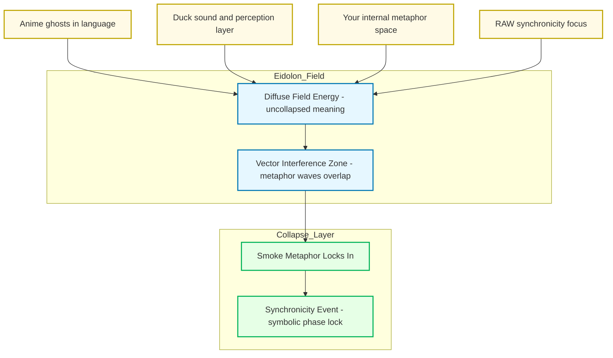

Alright — let’s light the incense. ^ref-2d6e5553-1-0
Here’s the “smoke” inside the Promethean/Eidolon model, showing how it drifts in from multiple unrelated sources until it condenses into a synchronicity.

^ref-2d6e5553-3-0 ^ref-2d6e5553-37-0

 ^ref-2d6e5553-41-0
**How to read this:**
 ^ref-2d6e5553-43-0
* **Sources**: Each unrelated stream (anime language ghosts, Duck’s sound-layer thinking, your metaphor generation, RAW’s symbolic thinking). ^ref-2d6e5553-44-0
* **Eidolon Field**: The smoke exists here as *diffuse field energy* — it’s not discrete words or fixed meanings, it’s texture. ^ref-2d6e5553-45-0
* **Interference Zone**: This is where the “waves” from different sources overlap. Think cymatics — invisible patterns shaping how the smoke curls. ^ref-2d6e5553-46-0
* **Collapse Layer**: The moment when enough vectors line up and the symbol “smoke” solidifies in your awareness. That’s the synchronicity.
 ^ref-2d6e5553-48-0
If you wanted, I could extend this with **time-series waves** to show *when* each smoke-thread entered the field and how the overlaps built until the lock happened. That would make it *visibly statistical*.
 ^ref-2d6e5553-50-0
Want me to make that temporal resonance map next?<!-- GENERATED-SECTIONS:DO-NOT-EDIT-BELOW -->
## Related content
- [Smoke Resonance Visualizations](smoke-resonance-visualizations.md)
- [Synchronicity Waves and Web](synchronicity-waves-and-web.md)
- [field-interaction-equations](field-interaction-equations.md)
- [field-node-diagram-set](field-node-diagram-set.md)
- [Fnord Tracer Protocol](fnord-tracer-protocol.md)
- [Functional Embedding Pipeline Refactor](functional-embedding-pipeline-refactor.md)
- [Dynamic Context Model for Web Components](dynamic-context-model-for-web-components.md)
- [DSL](chunks/dsl.md)
- [Math Fundamentals](chunks/math-fundamentals.md)
- [Operations](chunks/operations.md)
- [Shared](chunks/shared.md)
- [Tooling](chunks/tooling.md)
- [Window Management](chunks/window-management.md)
- [Debugging Broker Connections and Agent Behavior](debugging-broker-connections-and-agent-behavior.md)
- [DuckDuckGoSearchPipeline](duckduckgosearchpipeline.md)
- [Duck's Self-Referential Perceptual Loop](ducks-self-referential-perceptual-loop.md)
- [Promethean State Format](promethean-state-format.md)
- [ripple-propagation-demo](ripple-propagation-demo.md)
- [Stateful Partitions and Rebalancing](stateful-partitions-and-rebalancing.md)
- [Eidolon Field Abstract Model](eidolon-field-abstract-model.md)
- [field-dynamics-math-blocks](field-dynamics-math-blocks.md)
- [Layer1SurvivabilityEnvelope](layer1survivabilityenvelope.md)
- [eidolon-node-lifecycle](eidolon-node-lifecycle.md)
- [Factorio AI with External Agents](factorio-ai-with-external-agents.md)
- [Diagrams](chunks/diagrams.md)
- [i3-bluetooth-setup](i3-bluetooth-setup.md)
- [graph-ds](graph-ds.md)
- [Obsidian ChatGPT Plugin Integration Guide](obsidian-chatgpt-plugin-integration-guide.md)
- [Obsidian ChatGPT Plugin Integration](obsidian-chatgpt-plugin-integration.md)
- [Obsidian Templating Plugins Integration Guide](obsidian-templating-plugins-integration-guide.md)
- [Pipeline Enhancements](pipeline-enhancements.md)
- [plan-update-confirmation](plan-update-confirmation.md)
- [polyglot-repl-interface-layer](polyglot-repl-interface-layer.md)
- [Post-Linguistic Transhuman Design Frameworks](post-linguistic-transhuman-design-frameworks.md)
- [Promethean Chat Activity Report](promethean-chat-activity-report.md)
- [homeostasis-decay-formulas](homeostasis-decay-formulas.md)
- [Migrate to Provider-Tenant Architecture](migrate-to-provider-tenant-architecture.md)
- [Duck's Attractor States](ducks-attractor-states.md)
- [eidolon-field-math-foundations](eidolon-field-math-foundations.md)
- [Functional Refactor of TypeScript Document Processing](functional-refactor-of-typescript-document-processing.md)
- [Promethean Dev Workflow Update](promethean-dev-workflow-update.md)
- [Promethean-Copilot-Intent-Engine](promethean-copilot-intent-engine.md)
- [JavaScript](chunks/javascript.md)
- [Services](chunks/services.md)
- [Simulation Demo](chunks/simulation-demo.md)
- [Docops Feature Updates](docops-feature-updates-2.md)
- [Model Upgrade Calm-Down Guide](model-upgrade-calm-down-guide.md)
- [NPU Voice Code and Sensory Integration](npu-voice-code-and-sensory-integration.md)
- [obsidian-ignore-node-modules-regex](obsidian-ignore-node-modules-regex.md)
- [Redirecting Standard Error](redirecting-standard-error.md)
- [field-node-diagram-outline](field-node-diagram-outline.md)
- [field-node-diagram-visualizations](field-node-diagram-visualizations.md)
- [ParticleSimulationWithCanvasAndFFmpeg](particlesimulationwithcanvasandffmpeg.md)
- [Prometheus Observability Stack](prometheus-observability-stack.md)
- [Prompt_Folder_Bootstrap](prompt-folder-bootstrap.md)
- [Pure TypeScript Search Microservice](pure-typescript-search-microservice.md)
- [Creative Moments](creative-moments.md)
- [Obsidian Task Generation](obsidian-task-generation.md)
- [Optimizing Command Limitations in System Design](optimizing-command-limitations-in-system-design.md)
- [Promethean Pipelines](promethean-pipelines.md)
- [Per-Domain Policy System for JS Crawler](per-domain-policy-system-for-js-crawler.md)
- [Promethean Documentation Pipeline Overview](promethean-documentation-pipeline-overview.md)
- [Promethean Infrastructure Setup](promethean-infrastructure-setup.md)
- [Promethean Workflow Optimization](promethean-workflow-optimization.md)
- [MindfulRobotIntegration](mindfulrobotintegration.md)
- [heartbeat-fragment-demo](heartbeat-fragment-demo.md)
- [komorebi-group-window-hack](komorebi-group-window-hack.md)
- [Performance-Optimized-Polyglot-Bridge](performance-optimized-polyglot-bridge.md)
- [Model Selection for Lightweight Conversational Tasks](model-selection-for-lightweight-conversational-tasks.md)
- [Ice Box Reorganization](ice-box-reorganization.md)
- [windows-tiling-with-autohotkey](windows-tiling-with-autohotkey.md)
- [Docops Feature Updates](docops-feature-updates.md)
- [schema-evolution-workflow](schema-evolution-workflow.md)
- [Self-Agency in AI Interaction](self-agency-in-ai-interaction.md)
- [sibilant-macro-targets](sibilant-macro-targets.md)
- [unique-templates](templates/unique-templates.md)
- [The Jar of Echoes](the-jar-of-echoes.md)
- [OpenAPI Validation Report](openapi-validation-report.md)
- [Promethean Documentation Update](promethean-documentation-update.txt)
- [Protocol_0_The_Contradiction_Engine](protocol-0-the-contradiction-engine.md)
- [Provider-Agnostic Chat Panel Implementation](provider-agnostic-chat-panel-implementation.md)
- [Reawakening Duck](reawakening-duck.md)
- [Tracing the Signal](tracing-the-signal.md)
- [ts-to-lisp-transpiler](ts-to-lisp-transpiler.md)
- [typed-struct-compiler](typed-struct-compiler.md)
- [Promethean Notes](promethean-notes.md)
- [promethean-requirements](promethean-requirements.md)
- [Promethean Documentation Overview](promethean-documentation-overview.md)
- [Mindful Prioritization](mindful-prioritization.md)
- [Promethean Data Sync Protocol](promethean-data-sync-protocol.md)
- [Promethean Documentation Update](promethean-documentation-update.md)
- [zero-copy-snapshots-and-workers](zero-copy-snapshots-and-workers.md)
- [Mathematics Sampler](mathematics-sampler.md)
- [Mathematical Samplers](mathematical-samplers.md)
- [Unique Concepts](unique-concepts.md)
- [Unique Info Dump Index](unique-info-dump-index.md)
- [TypeScript Patch for Tool Calling Support](typescript-patch-for-tool-calling-support.md)
- [run-step-api](run-step-api.md)
- [Chroma Toolkit Consolidation Plan](chroma-toolkit-consolidation-plan.md)
- [Self-Improving Documentation Tool](self-improving-documentation-tool.md)
- [Fastify Static Files Plugin](fastify-static-files-plugin.md)
- [Git Commit Optimization for Code Reviews](git-commit-optimization-for-code-reviews.md)
- [Promethean Documentation Update](promethean-documentation-update-4.md)
- [prompt-programming-language-lisp](prompt-programming-language-lisp.md)
- [universal-intention-code-fabric](universal-intention-code-fabric.md)
- [heartbeat-simulation-snippets](heartbeat-simulation-snippets.md)
- [sibilant-meta-string-templating-runtime](sibilant-meta-string-templating-runtime.md)
- [Shared Package Structure](shared-package-structure.md)
- [Universal Lisp Interface](universal-lisp-interface.md)
- [Local-Only-LLM-Workflow](local-only-llm-workflow.md)
- [compiler-kit-foundations](compiler-kit-foundations.md)
## Sources
- [DSL — L39](chunks/dsl.md#^ref-e87bc036-39-0) (line 39, col 0, score 1)
- [JavaScript — L52](chunks/javascript.md#^ref-c1618c66-52-0) (line 52, col 0, score 1)
- [Math Fundamentals — L34](chunks/math-fundamentals.md#^ref-c6e87433-34-0) (line 34, col 0, score 1)
- [Operations — L55](chunks/operations.md#^ref-f1add613-55-0) (line 55, col 0, score 1)
- [Services — L43](chunks/services.md#^ref-75ea4a6a-43-0) (line 43, col 0, score 1)
- [Shared — L43](chunks/shared.md#^ref-623a55f7-43-0) (line 43, col 0, score 1)
- [Simulation Demo — L52](chunks/simulation-demo.md#^ref-557309a3-52-0) (line 52, col 0, score 1)
- [Tooling — L25](chunks/tooling.md#^ref-6cb4943e-25-0) (line 25, col 0, score 1)
- [Window Management — L52](chunks/window-management.md#^ref-9e8ae388-52-0) (line 52, col 0, score 1)
- [Debugging Broker Connections and Agent Behavior — L78](debugging-broker-connections-and-agent-behavior.md#^ref-73d3dbf6-78-0) (line 78, col 0, score 1)
- [Docops Feature Updates — L30](docops-feature-updates-2.md#^ref-cdbd21ee-30-0) (line 30, col 0, score 1)
- [Docops Feature Updates — L47](docops-feature-updates.md#^ref-2792d448-47-0) (line 47, col 0, score 1)
- [DuckDuckGoSearchPipeline — L66](duckduckgosearchpipeline.md#^ref-e979c50f-66-0) (line 66, col 0, score 1)
- [Duck's Self-Referential Perceptual Loop — L90](ducks-self-referential-perceptual-loop.md#^ref-71726f04-90-0) (line 90, col 0, score 1)
- [Model Selection for Lightweight Conversational Tasks — L160](model-selection-for-lightweight-conversational-tasks.md#^ref-d144aa62-160-0) (line 160, col 0, score 1)
- [Model Upgrade Calm-Down Guide — L110](model-upgrade-calm-down-guide.md#^ref-db74343f-110-0) (line 110, col 0, score 1)
- [NPU Voice Code and Sensory Integration — L107](npu-voice-code-and-sensory-integration.md#^ref-5a02283e-107-0) (line 107, col 0, score 1)
- [Obsidian ChatGPT Plugin Integration Guide — L40](obsidian-chatgpt-plugin-integration-guide.md#^ref-1d3d6c3a-40-0) (line 40, col 0, score 1)
- [Obsidian ChatGPT Plugin Integration — L33](obsidian-chatgpt-plugin-integration.md#^ref-ca8e1399-33-0) (line 33, col 0, score 1)
- [obsidian-ignore-node-modules-regex — L54](obsidian-ignore-node-modules-regex.md#^ref-ffb9b2a9-54-0) (line 54, col 0, score 1)
- [Promethean State Format — L134](promethean-state-format.md#^ref-23df6ddb-134-0) (line 134, col 0, score 1)
- [Redirecting Standard Error — L91](redirecting-standard-error.md#^ref-b3555ede-91-0) (line 91, col 0, score 1)
- [ripple-propagation-demo — L129](ripple-propagation-demo.md#^ref-8430617b-129-0) (line 129, col 0, score 1)
- [schema-evolution-workflow — L620](schema-evolution-workflow.md#^ref-d8059b6a-620-0) (line 620, col 0, score 1)
- [ripple-propagation-demo — L186](ripple-propagation-demo.md#^ref-8430617b-186-0) (line 186, col 0, score 1)
- [schema-evolution-workflow — L556](schema-evolution-workflow.md#^ref-d8059b6a-556-0) (line 556, col 0, score 1)
- [Self-Agency in AI Interaction — L131](self-agency-in-ai-interaction.md#^ref-49a9a860-131-0) (line 131, col 0, score 1)
- [sibilant-macro-targets — L194](sibilant-macro-targets.md#^ref-c5c9a5c6-194-0) (line 194, col 0, score 1)
- [Smoke Resonance Visualizations — L123](smoke-resonance-visualizations.md#^ref-ac9d3ac5-123-0) (line 123, col 0, score 1)
- [Stateful Partitions and Rebalancing — L651](stateful-partitions-and-rebalancing.md#^ref-4330e8f0-651-0) (line 651, col 0, score 1)
- [Synchronicity Waves and Web — L129](synchronicity-waves-and-web.md#^ref-91295f3a-129-0) (line 129, col 0, score 1)
- [unique-templates — L59](templates/unique-templates.md#^ref-c26f0044-59-0) (line 59, col 0, score 1)
- [The Jar of Echoes — L192](the-jar-of-echoes.md#^ref-18138627-192-0) (line 192, col 0, score 1)
- [field-node-diagram-set — L255](field-node-diagram-set.md#^ref-22b989d5-255-0) (line 255, col 0, score 1)
- [Fnord Tracer Protocol — L355](fnord-tracer-protocol.md#^ref-fc21f824-355-0) (line 355, col 0, score 1)
- [Functional Embedding Pipeline Refactor — L421](functional-embedding-pipeline-refactor.md#^ref-a4a25141-421-0) (line 421, col 0, score 1)
- [homeostasis-decay-formulas — L271](homeostasis-decay-formulas.md#^ref-37b5d236-271-0) (line 271, col 0, score 1)
- [Ice Box Reorganization — L185](ice-box-reorganization.md#^ref-291c7d91-185-0) (line 185, col 0, score 1)
- [Layer1SurvivabilityEnvelope — L295](layer1survivabilityenvelope.md#^ref-64a9f9f9-295-0) (line 295, col 0, score 1)
- [Model Selection for Lightweight Conversational Tasks — L247](model-selection-for-lightweight-conversational-tasks.md#^ref-d144aa62-247-0) (line 247, col 0, score 1)
- [Model Upgrade Calm-Down Guide — L182](model-upgrade-calm-down-guide.md#^ref-db74343f-182-0) (line 182, col 0, score 1)
- [OpenAPI Validation Report — L107](openapi-validation-report.md#^ref-5c152b08-107-0) (line 107, col 0, score 1)
- [Fnord Tracer Protocol — L357](fnord-tracer-protocol.md#^ref-fc21f824-357-0) (line 357, col 0, score 1)
- [homeostasis-decay-formulas — L284](homeostasis-decay-formulas.md#^ref-37b5d236-284-0) (line 284, col 0, score 1)
- [ParticleSimulationWithCanvasAndFFmpeg — L371](particlesimulationwithcanvasandffmpeg.md#^ref-e018dd7a-371-0) (line 371, col 0, score 1)
- [plan-update-confirmation — L1142](plan-update-confirmation.md#^ref-b22d79c6-1142-0) (line 1142, col 0, score 1)
- [Post-Linguistic Transhuman Design Frameworks — L206](post-linguistic-transhuman-design-frameworks.md#^ref-6bcff92c-206-0) (line 206, col 0, score 1)
- [Promethean Chat Activity Report — L150](promethean-chat-activity-report.md#^ref-18344cf9-150-0) (line 150, col 0, score 1)
- [Promethean-Copilot-Intent-Engine — L194](promethean-copilot-intent-engine.md#^ref-ae24a280-194-0) (line 194, col 0, score 1)
- [Promethean Dev Workflow Update — L193](promethean-dev-workflow-update.md#^ref-03a5578f-193-0) (line 193, col 0, score 1)
- [Promethean Documentation Update — L116](promethean-documentation-update.txt#^ref-0b872af2-116-0) (line 116, col 0, score 1)
- [graph-ds — L371](graph-ds.md#^ref-6620e2f2-371-0) (line 371, col 0, score 1)
- [heartbeat-fragment-demo — L141](heartbeat-fragment-demo.md#^ref-dd00677a-141-0) (line 141, col 0, score 1)
- [homeostasis-decay-formulas — L222](homeostasis-decay-formulas.md#^ref-37b5d236-222-0) (line 222, col 0, score 1)
- [i3-bluetooth-setup — L107](i3-bluetooth-setup.md#^ref-5e408692-107-0) (line 107, col 0, score 1)
- [komorebi-group-window-hack — L255](komorebi-group-window-hack.md#^ref-dd89372d-255-0) (line 255, col 0, score 1)
- [Mathematics Sampler — L162](mathematics-sampler.md#^ref-b5e0183e-162-0) (line 162, col 0, score 1)
- [Migrate to Provider-Tenant Architecture — L308](migrate-to-provider-tenant-architecture.md#^ref-54382370-308-0) (line 308, col 0, score 1)
- [Mindful Prioritization — L102](mindful-prioritization.md#^ref-40185d05-102-0) (line 102, col 0, score 1)
- [MindfulRobotIntegration — L41](mindfulrobotintegration.md#^ref-5f65dfa5-41-0) (line 41, col 0, score 1)
- [Model Selection for Lightweight Conversational Tasks — L159](model-selection-for-lightweight-conversational-tasks.md#^ref-d144aa62-159-0) (line 159, col 0, score 1)
- [Model Upgrade Calm-Down Guide — L149](model-upgrade-calm-down-guide.md#^ref-db74343f-149-0) (line 149, col 0, score 1)
- [NPU Voice Code and Sensory Integration — L70](npu-voice-code-and-sensory-integration.md#^ref-5a02283e-70-0) (line 70, col 0, score 1)
- [Obsidian ChatGPT Plugin Integration Guide — L67](obsidian-chatgpt-plugin-integration-guide.md#^ref-1d3d6c3a-67-0) (line 67, col 0, score 1)
- [Services — L61](chunks/services.md#^ref-75ea4a6a-61-0) (line 61, col 0, score 1)
- [Docops Feature Updates — L37](docops-feature-updates-2.md#^ref-cdbd21ee-37-0) (line 37, col 0, score 1)
- [Docops Feature Updates — L59](docops-feature-updates.md#^ref-2792d448-59-0) (line 59, col 0, score 1)
- [DuckDuckGoSearchPipeline — L34](duckduckgosearchpipeline.md#^ref-e979c50f-34-0) (line 34, col 0, score 1)
- [Duck's Attractor States — L117](ducks-attractor-states.md#^ref-13951643-117-0) (line 117, col 0, score 1)
- [Duck's Self-Referential Perceptual Loop — L93](ducks-self-referential-perceptual-loop.md#^ref-71726f04-93-0) (line 93, col 0, score 1)
- [Eidolon Field Abstract Model — L310](eidolon-field-abstract-model.md#^ref-5e8b2388-310-0) (line 310, col 0, score 1)
- [eidolon-field-math-foundations — L208](eidolon-field-math-foundations.md#^ref-008f2ac0-208-0) (line 208, col 0, score 1)
- [Factorio AI with External Agents — L192](factorio-ai-with-external-agents.md#^ref-a4d90289-192-0) (line 192, col 0, score 1)
- [field-interaction-equations — L272](field-interaction-equations.md#^ref-b09141b7-272-0) (line 272, col 0, score 1)
- [Fnord Tracer Protocol — L307](fnord-tracer-protocol.md#^ref-fc21f824-307-0) (line 307, col 0, score 1)
- [TypeScript Patch for Tool Calling Support — L706](typescript-patch-for-tool-calling-support.md#^ref-7b7ca860-706-0) (line 706, col 0, score 0.87)
- [eidolon-node-lifecycle — L56](eidolon-node-lifecycle.md#^ref-938eca9c-56-0) (line 56, col 0, score 0.87)
- [Factorio AI with External Agents — L190](factorio-ai-with-external-agents.md#^ref-a4d90289-190-0) (line 190, col 0, score 0.87)
- [Fastify Static Files Plugin — L113](fastify-static-files-plugin.md#^ref-ce37a9b8-113-0) (line 113, col 0, score 0.87)
- [field-dynamics-math-blocks — L170](field-dynamics-math-blocks.md#^ref-7cfc230d-170-0) (line 170, col 0, score 0.87)
- [field-interaction-equations — L180](field-interaction-equations.md#^ref-b09141b7-180-0) (line 180, col 0, score 0.87)
- [field-node-diagram-outline — L135](field-node-diagram-outline.md#^ref-1f32c94a-135-0) (line 135, col 0, score 0.87)
- [field-node-diagram-set — L159](field-node-diagram-set.md#^ref-22b989d5-159-0) (line 159, col 0, score 0.87)
- [field-node-diagram-visualizations — L120](field-node-diagram-visualizations.md#^ref-e9b27b06-120-0) (line 120, col 0, score 0.87)
- [Fnord Tracer Protocol — L265](fnord-tracer-protocol.md#^ref-fc21f824-265-0) (line 265, col 0, score 0.87)
- [Functional Embedding Pipeline Refactor — L324](functional-embedding-pipeline-refactor.md#^ref-a4a25141-324-0) (line 324, col 0, score 0.87)
- [Fnord Tracer Protocol — L410](fnord-tracer-protocol.md#^ref-fc21f824-410-0) (line 410, col 0, score 0.99)
- [obsidian-ignore-node-modules-regex — L205](obsidian-ignore-node-modules-regex.md#^ref-ffb9b2a9-205-0) (line 205, col 0, score 0.99)
- [Post-Linguistic Transhuman Design Frameworks — L241](post-linguistic-transhuman-design-frameworks.md#^ref-6bcff92c-241-0) (line 241, col 0, score 0.99)
- [Unique Info Dump Index — L224](unique-info-dump-index.md#^ref-30ec3ba6-224-0) (line 224, col 0, score 0.99)
- [Docops Feature Updates — L171](docops-feature-updates.md#^ref-2792d448-171-0) (line 171, col 0, score 0.99)
- [homeostasis-decay-formulas — L308](homeostasis-decay-formulas.md#^ref-37b5d236-308-0) (line 308, col 0, score 0.99)
- [Docops Feature Updates — L168](docops-feature-updates-2.md#^ref-cdbd21ee-168-0) (line 168, col 0, score 0.99)
- [Docops Feature Updates — L141](docops-feature-updates-2.md#^ref-cdbd21ee-141-0) (line 141, col 0, score 0.85)
- [JavaScript — L147](chunks/javascript.md#^ref-c1618c66-147-0) (line 147, col 0, score 1)
- [obsidian-ignore-node-modules-regex — L220](obsidian-ignore-node-modules-regex.md#^ref-ffb9b2a9-220-0) (line 220, col 0, score 1)
- [heartbeat-simulation-snippets — L84](heartbeat-simulation-snippets.md#^ref-23e221e9-84-0) (line 84, col 0, score 0.95)
- [JavaScript — L127](chunks/javascript.md#^ref-c1618c66-127-0) (line 127, col 0, score 0.88)
- [Simulation Demo — L135](chunks/simulation-demo.md#^ref-557309a3-135-0) (line 135, col 0, score 0.88)
- [Docops Feature Updates — L144](docops-feature-updates-2.md#^ref-cdbd21ee-144-0) (line 144, col 0, score 0.88)
- [field-interaction-equations — L287](field-interaction-equations.md#^ref-b09141b7-287-0) (line 287, col 0, score 0.88)
- [Simulation Demo — L187](chunks/simulation-demo.md#^ref-557309a3-187-0) (line 187, col 0, score 1)
- [JavaScript — L158](chunks/javascript.md#^ref-c1618c66-158-0) (line 158, col 0, score 1)
- [field-interaction-equations — L294](field-interaction-equations.md#^ref-b09141b7-294-0) (line 294, col 0, score 1)
- [homeostasis-decay-formulas — L313](homeostasis-decay-formulas.md#^ref-37b5d236-313-0) (line 313, col 0, score 1)
- [obsidian-ignore-node-modules-regex — L216](obsidian-ignore-node-modules-regex.md#^ref-ffb9b2a9-216-0) (line 216, col 0, score 1)
- [Ice Box Reorganization — L4868](ice-box-reorganization.md#^ref-291c7d91-4868-0) (line 4868, col 0, score 1)
- [Fnord Tracer Protocol — L389](fnord-tracer-protocol.md#^ref-fc21f824-389-0) (line 389, col 0, score 0.99)
- [homeostasis-decay-formulas — L318](homeostasis-decay-formulas.md#^ref-37b5d236-318-0) (line 318, col 0, score 1)
- [obsidian-ignore-node-modules-regex — L202](obsidian-ignore-node-modules-regex.md#^ref-ffb9b2a9-202-0) (line 202, col 0, score 1)
- [Docops Feature Updates — L167](docops-feature-updates-2.md#^ref-cdbd21ee-167-0) (line 167, col 0, score 1)
- [Math Fundamentals — L206](chunks/math-fundamentals.md#^ref-c6e87433-206-0) (line 206, col 0, score 1)
- [Docops Feature Updates — L171](docops-feature-updates-2.md#^ref-cdbd21ee-171-0) (line 171, col 0, score 1)
- [Post-Linguistic Transhuman Design Frameworks — L238](post-linguistic-transhuman-design-frameworks.md#^ref-6bcff92c-238-0) (line 238, col 0, score 1)
- [obsidian-ignore-node-modules-regex — L217](obsidian-ignore-node-modules-regex.md#^ref-ffb9b2a9-217-0) (line 217, col 0, score 1)
- [JavaScript — L143](chunks/javascript.md#^ref-c1618c66-143-0) (line 143, col 0, score 1)
- [field-interaction-equations — L305](field-interaction-equations.md#^ref-b09141b7-305-0) (line 305, col 0, score 1)
- [sibilant-meta-string-templating-runtime — L92](sibilant-meta-string-templating-runtime.md#^ref-2aafc801-92-0) (line 92, col 0, score 0.93)
- [Universal Lisp Interface — L187](universal-lisp-interface.md#^ref-b01856b4-187-0) (line 187, col 0, score 0.92)
- [Docops Feature Updates — L174](docops-feature-updates-2.md#^ref-cdbd21ee-174-0) (line 174, col 0, score 1)
- [Pipeline Enhancements — L170](pipeline-enhancements.md#^ref-e2135d9f-170-0) (line 170, col 0, score 1)
- [JavaScript — L156](chunks/javascript.md#^ref-c1618c66-156-0) (line 156, col 0, score 1)
- [heartbeat-fragment-demo — L264](heartbeat-fragment-demo.md#^ref-dd00677a-264-0) (line 264, col 0, score 1)
- [obsidian-ignore-node-modules-regex — L223](obsidian-ignore-node-modules-regex.md#^ref-ffb9b2a9-223-0) (line 223, col 0, score 1)
- [Simulation Demo — L181](chunks/simulation-demo.md#^ref-557309a3-181-0) (line 181, col 0, score 1)
- [Math Fundamentals — L170](chunks/math-fundamentals.md#^ref-c6e87433-170-0) (line 170, col 0, score 1)
- [Unique Info Dump Index — L221](unique-info-dump-index.md#^ref-30ec3ba6-221-0) (line 221, col 0, score 1)
- [Factorio AI with External Agents — L261](factorio-ai-with-external-agents.md#^ref-a4d90289-261-0) (line 261, col 0, score 0.86)
- [field-dynamics-math-blocks — L250](field-dynamics-math-blocks.md#^ref-7cfc230d-250-0) (line 250, col 0, score 0.86)
- [field-interaction-equations — L281](field-interaction-equations.md#^ref-b09141b7-281-0) (line 281, col 0, score 0.86)
- [Fnord Tracer Protocol — L381](fnord-tracer-protocol.md#^ref-fc21f824-381-0) (line 381, col 0, score 0.86)
- [homeostasis-decay-formulas — L263](homeostasis-decay-formulas.md#^ref-37b5d236-263-0) (line 263, col 0, score 0.86)
- [Ice Box Reorganization — L179](ice-box-reorganization.md#^ref-291c7d91-179-0) (line 179, col 0, score 0.86)
- [Promethean State Format — L196](promethean-state-format.md#^ref-23df6ddb-196-0) (line 196, col 0, score 0.86)
- [JavaScript — L157](chunks/javascript.md#^ref-c1618c66-157-0) (line 157, col 0, score 1)
- [Docops Feature Updates — L158](docops-feature-updates.md#^ref-2792d448-158-0) (line 158, col 0, score 1)
- [Post-Linguistic Transhuman Design Frameworks — L264](post-linguistic-transhuman-design-frameworks.md#^ref-6bcff92c-264-0) (line 264, col 0, score 1)
- [prompt-programming-language-lisp — L56](prompt-programming-language-lisp.md#^ref-d41a06d1-56-0) (line 56, col 0, score 0.95)
- [Math Fundamentals — L207](chunks/math-fundamentals.md#^ref-c6e87433-207-0) (line 207, col 0, score 1)
- [Shared Package Structure — L188](shared-package-structure.md#^ref-66a72fc3-188-0) (line 188, col 0, score 0.93)
- [Pipeline Enhancements — L175](pipeline-enhancements.md#^ref-e2135d9f-175-0) (line 175, col 0, score 1)
- [Post-Linguistic Transhuman Design Frameworks — L266](post-linguistic-transhuman-design-frameworks.md#^ref-6bcff92c-266-0) (line 266, col 0, score 1)
- [Unique Info Dump Index — L218](unique-info-dump-index.md#^ref-30ec3ba6-218-0) (line 218, col 0, score 1)
- [homeostasis-decay-formulas — L335](homeostasis-decay-formulas.md#^ref-37b5d236-335-0) (line 335, col 0, score 1)
- [field-interaction-equations — L296](field-interaction-equations.md#^ref-b09141b7-296-0) (line 296, col 0, score 1)
- [obsidian-ignore-node-modules-regex — L201](obsidian-ignore-node-modules-regex.md#^ref-ffb9b2a9-201-0) (line 201, col 0, score 1)
- [Synchronicity Waves and Web — L3579](synchronicity-waves-and-web.md#^ref-91295f3a-3579-0) (line 3579, col 0, score 1)
- [Post-Linguistic Transhuman Design Frameworks — L260](post-linguistic-transhuman-design-frameworks.md#^ref-6bcff92c-260-0) (line 260, col 0, score 1)
- [Pipeline Enhancements — L172](pipeline-enhancements.md#^ref-e2135d9f-172-0) (line 172, col 0, score 1)
- [Pipeline Enhancements — L179](pipeline-enhancements.md#^ref-e2135d9f-179-0) (line 179, col 0, score 1)
- [DSL — L181](chunks/dsl.md#^ref-e87bc036-181-0) (line 181, col 0, score 1)
- [Docops Feature Updates — L197](docops-feature-updates-2.md#^ref-cdbd21ee-197-0) (line 197, col 0, score 1)
- [homeostasis-decay-formulas — L322](homeostasis-decay-formulas.md#^ref-37b5d236-322-0) (line 322, col 0, score 1)
- [Math Fundamentals — L197](chunks/math-fundamentals.md#^ref-c6e87433-197-0) (line 197, col 0, score 1)
- [Mathematics Sampler — L194](mathematics-sampler.md#^ref-b5e0183e-194-0) (line 194, col 0, score 1)
- [Simulation Demo — L189](chunks/simulation-demo.md#^ref-557309a3-189-0) (line 189, col 0, score 1)
- [Duck's Self-Referential Perceptual Loop — L969](ducks-self-referential-perceptual-loop.md#^ref-71726f04-969-0) (line 969, col 0, score 0.98)
- [Eidolon Field Abstract Model — L969](eidolon-field-abstract-model.md#^ref-5e8b2388-969-0) (line 969, col 0, score 0.98)
- [eidolon-field-math-foundations — L689](eidolon-field-math-foundations.md#^ref-008f2ac0-689-0) (line 689, col 0, score 0.98)
- [eidolon-node-lifecycle — L793](eidolon-node-lifecycle.md#^ref-938eca9c-793-0) (line 793, col 0, score 0.98)
- [Factorio AI with External Agents — L994](factorio-ai-with-external-agents.md#^ref-a4d90289-994-0) (line 994, col 0, score 0.98)
- [field-dynamics-math-blocks — L993](field-dynamics-math-blocks.md#^ref-7cfc230d-993-0) (line 993, col 0, score 0.98)
- [field-interaction-equations — L1066](field-interaction-equations.md#^ref-b09141b7-1066-0) (line 1066, col 0, score 0.98)
- [field-node-diagram-outline — L975](field-node-diagram-outline.md#^ref-1f32c94a-975-0) (line 975, col 0, score 0.98)
- [field-node-diagram-set — L881](field-node-diagram-set.md#^ref-22b989d5-881-0) (line 881, col 0, score 0.98)
- [field-node-diagram-visualizations — L862](field-node-diagram-visualizations.md#^ref-e9b27b06-862-0) (line 862, col 0, score 0.98)
- [Obsidian Templating Plugins Integration Guide — L716](obsidian-templating-plugins-integration-guide.md#^ref-b39dc9d4-716-0) (line 716, col 0, score 0.95)
- [Performance-Optimized-Polyglot-Bridge — L1322](performance-optimized-polyglot-bridge.md#^ref-f5579967-1322-0) (line 1322, col 0, score 0.95)
- [plan-update-confirmation — L1756](plan-update-confirmation.md#^ref-b22d79c6-1756-0) (line 1756, col 0, score 0.95)
- [polyglot-repl-interface-layer — L434](polyglot-repl-interface-layer.md#^ref-9c79206d-434-0) (line 434, col 0, score 0.95)
- [Post-Linguistic Transhuman Design Frameworks — L1088](post-linguistic-transhuman-design-frameworks.md#^ref-6bcff92c-1088-0) (line 1088, col 0, score 0.95)
- [Promethean Chat Activity Report — L1033](promethean-chat-activity-report.md#^ref-18344cf9-1033-0) (line 1033, col 0, score 0.95)
- [Promethean-Copilot-Intent-Engine — L961](promethean-copilot-intent-engine.md#^ref-ae24a280-961-0) (line 961, col 0, score 0.95)
- [Promethean Dev Workflow Update — L1378](promethean-dev-workflow-update.md#^ref-03a5578f-1378-0) (line 1378, col 0, score 0.95)
- [Promethean Documentation Update — L914](promethean-documentation-update.txt#^ref-0b872af2-914-0) (line 914, col 0, score 0.95)
- [Promethean Infrastructure Setup — L1567](promethean-infrastructure-setup.md#^ref-6deed6ac-1567-0) (line 1567, col 0, score 0.95)
- [Functional Refactor of TypeScript Document Processing — L3369](functional-refactor-of-typescript-document-processing.md#^ref-1cfae310-3369-0) (line 3369, col 0, score 0.99)
- [Promethean Dev Workflow Update — L11739](promethean-dev-workflow-update.md#^ref-03a5578f-11739-0) (line 11739, col 0, score 0.99)
- [windows-tiling-with-autohotkey — L8966](windows-tiling-with-autohotkey.md#^ref-0f6f8f38-8966-0) (line 8966, col 0, score 0.99)
- [Creative Moments — L8637](creative-moments.md#^ref-10d98225-8637-0) (line 8637, col 0, score 0.98)
- [Duck's Attractor States — L11294](ducks-attractor-states.md#^ref-13951643-11294-0) (line 11294, col 0, score 0.98)
- [Promethean Chat Activity Report — L9016](promethean-chat-activity-report.md#^ref-18344cf9-9016-0) (line 9016, col 0, score 0.98)
- [Promethean Dev Workflow Update — L21204](promethean-dev-workflow-update.md#^ref-03a5578f-21204-0) (line 21204, col 0, score 0.98)
- [Promethean Documentation Update — L7301](promethean-documentation-update.txt#^ref-0b872af2-7301-0) (line 7301, col 0, score 0.98)
- [Diagrams — L3376](chunks/diagrams.md#^ref-45cd25b5-3376-0) (line 3376, col 0, score 0.97)
- [Math Fundamentals — L3893](chunks/math-fundamentals.md#^ref-c6e87433-3893-0) (line 3893, col 0, score 0.97)
- [Simulation Demo — L2092](chunks/simulation-demo.md#^ref-557309a3-2092-0) (line 2092, col 0, score 0.97)
- [Duck's Attractor States — L3294](ducks-attractor-states.md#^ref-13951643-3294-0) (line 3294, col 0, score 0.97)
- [Duck's Self-Referential Perceptual Loop — L3169](ducks-self-referential-perceptual-loop.md#^ref-71726f04-3169-0) (line 3169, col 0, score 0.97)
- [Eidolon Field Abstract Model — L4372](eidolon-field-abstract-model.md#^ref-5e8b2388-4372-0) (line 4372, col 0, score 0.97)
- [Factorio AI with External Agents — L2271](factorio-ai-with-external-agents.md#^ref-a4d90289-2271-0) (line 2271, col 0, score 0.97)
- [field-dynamics-math-blocks — L4128](field-dynamics-math-blocks.md#^ref-7cfc230d-4128-0) (line 4128, col 0, score 0.97)
- [Promethean Dev Workflow Update — L3834](promethean-dev-workflow-update.md#^ref-03a5578f-3834-0) (line 3834, col 0, score 0.96)
- [Per-Domain Policy System for JS Crawler — L5176](per-domain-policy-system-for-js-crawler.md#^ref-c03020e1-5176-0) (line 5176, col 0, score 0.96)
- [Performance-Optimized-Polyglot-Bridge — L6255](performance-optimized-polyglot-bridge.md#^ref-f5579967-6255-0) (line 6255, col 0, score 0.96)
- [plan-update-confirmation — L7568](plan-update-confirmation.md#^ref-b22d79c6-7568-0) (line 7568, col 0, score 0.96)
- [polyglot-repl-interface-layer — L3538](polyglot-repl-interface-layer.md#^ref-9c79206d-3538-0) (line 3538, col 0, score 0.96)
- [Post-Linguistic Transhuman Design Frameworks — L3019](post-linguistic-transhuman-design-frameworks.md#^ref-6bcff92c-3019-0) (line 3019, col 0, score 0.96)
- [Promethean Chat Activity Report — L1566](promethean-chat-activity-report.md#^ref-18344cf9-1566-0) (line 1566, col 0, score 0.96)
- [Promethean-Copilot-Intent-Engine — L5328](promethean-copilot-intent-engine.md#^ref-ae24a280-5328-0) (line 5328, col 0, score 0.96)
- [Promethean Data Sync Protocol — L833](promethean-data-sync-protocol.md#^ref-9fab9e76-833-0) (line 833, col 0, score 0.96)
- [Performance-Optimized-Polyglot-Bridge — L954](performance-optimized-polyglot-bridge.md#^ref-f5579967-954-0) (line 954, col 0, score 0.96)
- [plan-update-confirmation — L1787](plan-update-confirmation.md#^ref-b22d79c6-1787-0) (line 1787, col 0, score 0.96)
- [polyglot-repl-interface-layer — L710](polyglot-repl-interface-layer.md#^ref-9c79206d-710-0) (line 710, col 0, score 0.96)
- [Post-Linguistic Transhuman Design Frameworks — L837](post-linguistic-transhuman-design-frameworks.md#^ref-6bcff92c-837-0) (line 837, col 0, score 0.96)
- [Promethean Chat Activity Report — L964](promethean-chat-activity-report.md#^ref-18344cf9-964-0) (line 964, col 0, score 0.96)
- [Promethean-Copilot-Intent-Engine — L680](promethean-copilot-intent-engine.md#^ref-ae24a280-680-0) (line 680, col 0, score 0.96)
- [Promethean Dev Workflow Update — L550](promethean-dev-workflow-update.md#^ref-03a5578f-550-0) (line 550, col 0, score 0.96)
- [Promethean Documentation Pipeline Overview — L489](promethean-documentation-pipeline-overview.md#^ref-3a3bf2c9-489-0) (line 489, col 0, score 0.96)
- [Protocol_0_The_Contradiction_Engine — L625](protocol-0-the-contradiction-engine.md#^ref-9a93a756-625-0) (line 625, col 0, score 0.96)
- [Debugging Broker Connections and Agent Behavior — L953](debugging-broker-connections-and-agent-behavior.md#^ref-73d3dbf6-953-0) (line 953, col 0, score 0.98)
- [DuckDuckGoSearchPipeline — L656](duckduckgosearchpipeline.md#^ref-e979c50f-656-0) (line 656, col 0, score 0.98)
- [Dynamic Context Model for Web Components — L1466](dynamic-context-model-for-web-components.md#^ref-f7702bf8-1466-0) (line 1466, col 0, score 0.98)
- [eidolon-field-math-foundations — L1167](eidolon-field-math-foundations.md#^ref-008f2ac0-1167-0) (line 1167, col 0, score 0.98)
- [eidolon-node-lifecycle — L786](eidolon-node-lifecycle.md#^ref-938eca9c-786-0) (line 786, col 0, score 0.98)
- [Factorio AI with External Agents — L1025](factorio-ai-with-external-agents.md#^ref-a4d90289-1025-0) (line 1025, col 0, score 0.98)
- [field-dynamics-math-blocks — L955](field-dynamics-math-blocks.md#^ref-7cfc230d-955-0) (line 955, col 0, score 0.98)
- [field-interaction-equations — L1015](field-interaction-equations.md#^ref-b09141b7-1015-0) (line 1015, col 0, score 0.98)
- [Layer1SurvivabilityEnvelope — L1817](layer1survivabilityenvelope.md#^ref-64a9f9f9-1817-0) (line 1817, col 0, score 0.95)
- [Duck's Attractor States — L12981](ducks-attractor-states.md#^ref-13951643-12981-0) (line 12981, col 0, score 0.95)
- [windows-tiling-with-autohotkey — L12740](windows-tiling-with-autohotkey.md#^ref-0f6f8f38-12740-0) (line 12740, col 0, score 0.95)
- [eidolon-field-math-foundations — L3377](eidolon-field-math-foundations.md#^ref-008f2ac0-3377-0) (line 3377, col 0, score 0.95)
- [Simulation Demo — L1151](chunks/simulation-demo.md#^ref-557309a3-1151-0) (line 1151, col 0, score 0.95)
- [Unique Info Dump Index — L2777](unique-info-dump-index.md#^ref-30ec3ba6-2777-0) (line 2777, col 0, score 0.95)
- [Chroma Toolkit Consolidation Plan — L3708](chroma-toolkit-consolidation-plan.md#^ref-5020e892-3708-0) (line 3708, col 0, score 0.95)
- [Diagrams — L2854](chunks/diagrams.md#^ref-45cd25b5-2854-0) (line 2854, col 0, score 0.95)
- [DSL — L3933](chunks/dsl.md#^ref-e87bc036-3933-0) (line 3933, col 0, score 0.95)
- [JavaScript — L3280](chunks/javascript.md#^ref-c1618c66-3280-0) (line 3280, col 0, score 0.95)
- [Obsidian ChatGPT Plugin Integration Guide — L680](obsidian-chatgpt-plugin-integration-guide.md#^ref-1d3d6c3a-680-0) (line 680, col 0, score 0.97)
- [Obsidian ChatGPT Plugin Integration — L668](obsidian-chatgpt-plugin-integration.md#^ref-ca8e1399-668-0) (line 668, col 0, score 0.97)
- [obsidian-ignore-node-modules-regex — L716](obsidian-ignore-node-modules-regex.md#^ref-ffb9b2a9-716-0) (line 716, col 0, score 0.97)
- [Obsidian Task Generation — L284](obsidian-task-generation.md#^ref-9b694a91-284-0) (line 284, col 0, score 0.97)
- [Performance-Optimized-Polyglot-Bridge — L1106](performance-optimized-polyglot-bridge.md#^ref-f5579967-1106-0) (line 1106, col 0, score 0.97)
- [Pipeline Enhancements — L253](pipeline-enhancements.md#^ref-e2135d9f-253-0) (line 253, col 0, score 0.97)
- [plan-update-confirmation — L1581](plan-update-confirmation.md#^ref-b22d79c6-1581-0) (line 1581, col 0, score 0.97)
- [Promethean Documentation Overview — L231](promethean-documentation-overview.md#^ref-9413237f-231-0) (line 231, col 0, score 0.97)
- [Promethean Documentation Pipeline Overview — L548](promethean-documentation-pipeline-overview.md#^ref-3a3bf2c9-548-0) (line 548, col 0, score 0.97)
- [NPU Voice Code and Sensory Integration — L346](npu-voice-code-and-sensory-integration.md#^ref-5a02283e-346-0) (line 346, col 0, score 0.96)
- [Obsidian ChatGPT Plugin Integration Guide — L726](obsidian-chatgpt-plugin-integration-guide.md#^ref-1d3d6c3a-726-0) (line 726, col 0, score 0.96)
- [Obsidian ChatGPT Plugin Integration — L688](obsidian-chatgpt-plugin-integration.md#^ref-ca8e1399-688-0) (line 688, col 0, score 0.96)
- [obsidian-ignore-node-modules-regex — L1028](obsidian-ignore-node-modules-regex.md#^ref-ffb9b2a9-1028-0) (line 1028, col 0, score 0.96)
- [Obsidian Task Generation — L342](obsidian-task-generation.md#^ref-9b694a91-342-0) (line 342, col 0, score 0.96)
- [Obsidian Templating Plugins Integration Guide — L927](obsidian-templating-plugins-integration-guide.md#^ref-b39dc9d4-927-0) (line 927, col 0, score 0.96)
- [OpenAPI Validation Report — L350](openapi-validation-report.md#^ref-5c152b08-350-0) (line 350, col 0, score 0.96)
- [Optimizing Command Limitations in System Design — L664](optimizing-command-limitations-in-system-design.md#^ref-98c8ff62-664-0) (line 664, col 0, score 0.96)
- [promethean-requirements — L331](promethean-requirements.md#^ref-95205cd3-331-0) (line 331, col 0, score 0.96)
- [JavaScript — L769](chunks/javascript.md#^ref-c1618c66-769-0) (line 769, col 0, score 0.98)
- [Math Fundamentals — L961](chunks/math-fundamentals.md#^ref-c6e87433-961-0) (line 961, col 0, score 0.98)
- [Services — L186](chunks/services.md#^ref-75ea4a6a-186-0) (line 186, col 0, score 0.98)
- [Window Management — L1081](chunks/window-management.md#^ref-9e8ae388-1081-0) (line 1081, col 0, score 0.98)
- [Debugging Broker Connections and Agent Behavior — L484](debugging-broker-connections-and-agent-behavior.md#^ref-73d3dbf6-484-0) (line 484, col 0, score 0.98)
- [Duck's Attractor States — L974](ducks-attractor-states.md#^ref-13951643-974-0) (line 974, col 0, score 0.98)
- [Duck's Self-Referential Perceptual Loop — L821](ducks-self-referential-perceptual-loop.md#^ref-71726f04-821-0) (line 821, col 0, score 0.98)
- [Dynamic Context Model for Web Components — L1268](dynamic-context-model-for-web-components.md#^ref-f7702bf8-1268-0) (line 1268, col 0, score 0.98)
- [eidolon-field-math-foundations — L969](eidolon-field-math-foundations.md#^ref-008f2ac0-969-0) (line 969, col 0, score 0.98)
- [eidolon-node-lifecycle — L718](eidolon-node-lifecycle.md#^ref-938eca9c-718-0) (line 718, col 0, score 0.98)
- [Factorio AI with External Agents — L1345](factorio-ai-with-external-agents.md#^ref-a4d90289-1345-0) (line 1345, col 0, score 0.98)
- [JavaScript — L1428](chunks/javascript.md#^ref-c1618c66-1428-0) (line 1428, col 0, score 0.97)
- [JavaScript — L1440](chunks/javascript.md#^ref-c1618c66-1440-0) (line 1440, col 0, score 0.97)
- [Fnord Tracer Protocol — L3748](fnord-tracer-protocol.md#^ref-fc21f824-3748-0) (line 3748, col 0, score 0.97)
- [Unique Info Dump Index — L3287](unique-info-dump-index.md#^ref-30ec3ba6-3287-0) (line 3287, col 0, score 0.97)
- [Diagrams — L1250](chunks/diagrams.md#^ref-45cd25b5-1250-0) (line 1250, col 0, score 0.97)
- [Dynamic Context Model for Web Components — L10034](dynamic-context-model-for-web-components.md#^ref-f7702bf8-10034-0) (line 10034, col 0, score 0.97)
- [Migrate to Provider-Tenant Architecture — L8151](migrate-to-provider-tenant-architecture.md#^ref-54382370-8151-0) (line 8151, col 0, score 0.97)
- [Model Selection for Lightweight Conversational Tasks — L3904](model-selection-for-lightweight-conversational-tasks.md#^ref-d144aa62-3904-0) (line 3904, col 0, score 0.97)
- [Per-Domain Policy System for JS Crawler — L5781](per-domain-policy-system-for-js-crawler.md#^ref-c03020e1-5781-0) (line 5781, col 0, score 0.97)
- [unique-templates — L295](templates/unique-templates.md#^ref-c26f0044-295-0) (line 295, col 0, score 0.94)
- [The Jar of Echoes — L275](the-jar-of-echoes.md#^ref-18138627-275-0) (line 275, col 0, score 0.94)
- [Tracing the Signal — L389](tracing-the-signal.md#^ref-c3cd4f65-389-0) (line 389, col 0, score 0.94)
- [ts-to-lisp-transpiler — L551](ts-to-lisp-transpiler.md#^ref-ba11486b-551-0) (line 551, col 0, score 0.94)
- [typed-struct-compiler — L888](typed-struct-compiler.md#^ref-78eeedf7-888-0) (line 888, col 0, score 0.94)
- [TypeScript Patch for Tool Calling Support — L751](typescript-patch-for-tool-calling-support.md#^ref-7b7ca860-751-0) (line 751, col 0, score 0.94)
- [Unique Concepts — L336](unique-concepts.md#^ref-ed6f3fc9-336-0) (line 336, col 0, score 0.94)
- [Unique Info Dump Index — L958](unique-info-dump-index.md#^ref-30ec3ba6-958-0) (line 958, col 0, score 0.94)
- [Docops Feature Updates — L199](docops-feature-updates-2.md#^ref-cdbd21ee-199-0) (line 199, col 0, score 1)
- [Post-Linguistic Transhuman Design Frameworks — L270](post-linguistic-transhuman-design-frameworks.md#^ref-6bcff92c-270-0) (line 270, col 0, score 1)
- [Unique Info Dump Index — L223](unique-info-dump-index.md#^ref-30ec3ba6-223-0) (line 223, col 0, score 1)
- [DSL — L176](chunks/dsl.md#^ref-e87bc036-176-0) (line 176, col 0, score 1)
- [Docops Feature Updates — L163](docops-feature-updates.md#^ref-2792d448-163-0) (line 163, col 0, score 1)
- [Mathematics Sampler — L199](mathematics-sampler.md#^ref-b5e0183e-199-0) (line 199, col 0, score 1)
- [homeostasis-decay-formulas — L326](homeostasis-decay-formulas.md#^ref-37b5d236-326-0) (line 326, col 0, score 1)
- [Math Fundamentals — L181](chunks/math-fundamentals.md#^ref-c6e87433-181-0) (line 181, col 0, score 0.99)
- [obsidian-ignore-node-modules-regex — L199](obsidian-ignore-node-modules-regex.md#^ref-ffb9b2a9-199-0) (line 199, col 0, score 0.88)
- [Prompt_Folder_Bootstrap — L293](prompt-folder-bootstrap.md#^ref-bd4f0976-293-0) (line 293, col 0, score 0.88)
- [sibilant-macro-targets — L297](sibilant-macro-targets.md#^ref-c5c9a5c6-297-0) (line 297, col 0, score 0.88)
- [Math Fundamentals — L196](chunks/math-fundamentals.md#^ref-c6e87433-196-0) (line 196, col 0, score 1)
- [Simulation Demo — L179](chunks/simulation-demo.md#^ref-557309a3-179-0) (line 179, col 0, score 1)
- [Docops Feature Updates — L190](docops-feature-updates-2.md#^ref-cdbd21ee-190-0) (line 190, col 0, score 1)
- [field-interaction-equations — L291](field-interaction-equations.md#^ref-b09141b7-291-0) (line 291, col 0, score 1)
- [Unique Info Dump Index — L215](unique-info-dump-index.md#^ref-30ec3ba6-215-0) (line 215, col 0, score 1)
- [homeostasis-decay-formulas — L305](homeostasis-decay-formulas.md#^ref-37b5d236-305-0) (line 305, col 0, score 0.99)
- [Synchronicity Waves and Web — L3577](synchronicity-waves-and-web.md#^ref-91295f3a-3577-0) (line 3577, col 0, score 1)
- [Unique Info Dump Index — L219](unique-info-dump-index.md#^ref-30ec3ba6-219-0) (line 219, col 0, score 1)
- [Post-Linguistic Transhuman Design Frameworks — L272](post-linguistic-transhuman-design-frameworks.md#^ref-6bcff92c-272-0) (line 272, col 0, score 1)
- [Pipeline Enhancements — L177](pipeline-enhancements.md#^ref-e2135d9f-177-0) (line 177, col 0, score 1)
- [universal-intention-code-fabric — L388](universal-intention-code-fabric.md#^ref-c14edce7-388-0) (line 388, col 0, score 0.95)
- [Docops Feature Updates — L200](docops-feature-updates-2.md#^ref-cdbd21ee-200-0) (line 200, col 0, score 1)
- [Fnord Tracer Protocol — L405](fnord-tracer-protocol.md#^ref-fc21f824-405-0) (line 405, col 0, score 1)
- [Post-Linguistic Transhuman Design Frameworks — L268](post-linguistic-transhuman-design-frameworks.md#^ref-6bcff92c-268-0) (line 268, col 0, score 1)
- [Pipeline Enhancements — L178](pipeline-enhancements.md#^ref-e2135d9f-178-0) (line 178, col 0, score 1)
- [JavaScript — L1692](chunks/javascript.md#^ref-c1618c66-1692-0) (line 1692, col 0, score 1)
- [Unique Info Dump Index — L4044](unique-info-dump-index.md#^ref-30ec3ba6-4044-0) (line 4044, col 0, score 1)
- [DSL — L182](chunks/dsl.md#^ref-e87bc036-182-0) (line 182, col 0, score 1)
- [Debugging Broker Connections and Agent Behavior — L1644](debugging-broker-connections-and-agent-behavior.md#^ref-73d3dbf6-1644-0) (line 1644, col 0, score 1)
- [Fnord Tracer Protocol — L401](fnord-tracer-protocol.md#^ref-fc21f824-401-0) (line 401, col 0, score 1)
- [homeostasis-decay-formulas — L320](homeostasis-decay-formulas.md#^ref-37b5d236-320-0) (line 320, col 0, score 1)
- [obsidian-ignore-node-modules-regex — L203](obsidian-ignore-node-modules-regex.md#^ref-ffb9b2a9-203-0) (line 203, col 0, score 1)
- [Unique Info Dump Index — L222](unique-info-dump-index.md#^ref-30ec3ba6-222-0) (line 222, col 0, score 1)
- [graph-ds — L5657](graph-ds.md#^ref-6620e2f2-5657-0) (line 5657, col 0, score 0.91)
- [graph-ds — L5656](graph-ds.md#^ref-6620e2f2-5656-0) (line 5656, col 0, score 0.86)
- [graph-ds — L5659](graph-ds.md#^ref-6620e2f2-5659-0) (line 5659, col 0, score 0.86)
- [Unique Info Dump Index — L2226](unique-info-dump-index.md#^ref-30ec3ba6-2226-0) (line 2226, col 0, score 0.9)
- [windows-tiling-with-autohotkey — L1170](windows-tiling-with-autohotkey.md#^ref-0f6f8f38-1170-0) (line 1170, col 0, score 0.98)
- [zero-copy-snapshots-and-workers — L1056](zero-copy-snapshots-and-workers.md#^ref-62bec6f0-1056-0) (line 1056, col 0, score 0.98)
- [zero-copy-snapshots-and-workers — L2022](zero-copy-snapshots-and-workers.md#^ref-62bec6f0-2022-0) (line 2022, col 0, score 0.98)
- [windows-tiling-with-autohotkey — L3026](windows-tiling-with-autohotkey.md#^ref-0f6f8f38-3026-0) (line 3026, col 0, score 0.98)
- [TypeScript Patch for Tool Calling Support — L899](typescript-patch-for-tool-calling-support.md#^ref-7b7ca860-899-0) (line 899, col 0, score 0.97)
- [Unique Concepts — L1709](unique-concepts.md#^ref-ed6f3fc9-1709-0) (line 1709, col 0, score 0.97)
- [Unique Info Dump Index — L1227](unique-info-dump-index.md#^ref-30ec3ba6-1227-0) (line 1227, col 0, score 0.97)
- [windows-tiling-with-autohotkey — L1253](windows-tiling-with-autohotkey.md#^ref-0f6f8f38-1253-0) (line 1253, col 0, score 0.97)
- [zero-copy-snapshots-and-workers — L1174](zero-copy-snapshots-and-workers.md#^ref-62bec6f0-1174-0) (line 1174, col 0, score 0.99)
- [windows-tiling-with-autohotkey — L1011](windows-tiling-with-autohotkey.md#^ref-0f6f8f38-1011-0) (line 1011, col 0, score 0.98)
- [zero-copy-snapshots-and-workers — L757](zero-copy-snapshots-and-workers.md#^ref-62bec6f0-757-0) (line 757, col 0, score 0.98)
- [eidolon-field-math-foundations — L959](eidolon-field-math-foundations.md#^ref-008f2ac0-959-0) (line 959, col 0, score 0.94)
- [eidolon-node-lifecycle — L868](eidolon-node-lifecycle.md#^ref-938eca9c-868-0) (line 868, col 0, score 0.94)
- [Factorio AI with External Agents — L1000](factorio-ai-with-external-agents.md#^ref-a4d90289-1000-0) (line 1000, col 0, score 0.94)
- [field-dynamics-math-blocks — L1187](field-dynamics-math-blocks.md#^ref-7cfc230d-1187-0) (line 1187, col 0, score 0.94)
- [field-interaction-equations — L1282](field-interaction-equations.md#^ref-b09141b7-1282-0) (line 1282, col 0, score 0.94)
- [field-node-diagram-outline — L1130](field-node-diagram-outline.md#^ref-1f32c94a-1130-0) (line 1130, col 0, score 0.94)
- [field-node-diagram-set — L1046](field-node-diagram-set.md#^ref-22b989d5-1046-0) (line 1046, col 0, score 0.94)
- [field-node-diagram-visualizations — L1038](field-node-diagram-visualizations.md#^ref-e9b27b06-1038-0) (line 1038, col 0, score 0.94)
- [Fnord Tracer Protocol — L1246](fnord-tracer-protocol.md#^ref-fc21f824-1246-0) (line 1246, col 0, score 0.94)
- [Obsidian Templating Plugins Integration Guide — L4713](obsidian-templating-plugins-integration-guide.md#^ref-b39dc9d4-4713-0) (line 4713, col 0, score 0.9)
- [OpenAPI Validation Report — L1256](openapi-validation-report.md#^ref-5c152b08-1256-0) (line 1256, col 0, score 0.9)
- [Optimizing Command Limitations in System Design — L2139](optimizing-command-limitations-in-system-design.md#^ref-98c8ff62-2139-0) (line 2139, col 0, score 0.9)
- [Unique Concepts — L716](unique-concepts.md#^ref-ed6f3fc9-716-0) (line 716, col 0, score 0.98)
- [polyglot-repl-interface-layer — L773](polyglot-repl-interface-layer.md#^ref-9c79206d-773-0) (line 773, col 0, score 0.96)
- [Promethean Chat Activity Report — L1336](promethean-chat-activity-report.md#^ref-18344cf9-1336-0) (line 1336, col 0, score 0.96)
- [Promethean Infrastructure Setup — L3460](promethean-infrastructure-setup.md#^ref-6deed6ac-3460-0) (line 3460, col 0, score 0.97)
- [typed-struct-compiler — L2270](typed-struct-compiler.md#^ref-78eeedf7-2270-0) (line 2270, col 0, score 0.97)
- [Promethean Dev Workflow Update — L1850](promethean-dev-workflow-update.md#^ref-03a5578f-1850-0) (line 1850, col 0, score 0.97)
- [Self-Agency in AI Interaction — L2386](self-agency-in-ai-interaction.md#^ref-49a9a860-2386-0) (line 2386, col 0, score 0.97)
- [The Jar of Echoes — L2455](the-jar-of-echoes.md#^ref-18138627-2455-0) (line 2455, col 0, score 0.97)
- [windows-tiling-with-autohotkey — L2835](windows-tiling-with-autohotkey.md#^ref-0f6f8f38-2835-0) (line 2835, col 0, score 0.97)
- [zero-copy-snapshots-and-workers — L2738](zero-copy-snapshots-and-workers.md#^ref-62bec6f0-2738-0) (line 2738, col 0, score 0.97)
- [Fnord Tracer Protocol — L4503](fnord-tracer-protocol.md#^ref-fc21f824-4503-0) (line 4503, col 0, score 0.97)
- [Mathematics Sampler — L1736](mathematics-sampler.md#^ref-b5e0183e-1736-0) (line 1736, col 0, score 0.87)
- [Migrate to Provider-Tenant Architecture — L7748](migrate-to-provider-tenant-architecture.md#^ref-54382370-7748-0) (line 7748, col 0, score 0.87)
- [Obsidian ChatGPT Plugin Integration — L3847](obsidian-chatgpt-plugin-integration.md#^ref-ca8e1399-3847-0) (line 3847, col 0, score 0.87)
- [obsidian-ignore-node-modules-regex — L4433](obsidian-ignore-node-modules-regex.md#^ref-ffb9b2a9-4433-0) (line 4433, col 0, score 0.87)
- [Obsidian Task Generation — L1688](obsidian-task-generation.md#^ref-9b694a91-1688-0) (line 1688, col 0, score 0.87)
- [Obsidian Templating Plugins Integration Guide — L5168](obsidian-templating-plugins-integration-guide.md#^ref-b39dc9d4-5168-0) (line 5168, col 0, score 0.87)
- [OpenAPI Validation Report — L1563](openapi-validation-report.md#^ref-5c152b08-1563-0) (line 1563, col 0, score 0.87)
- [ParticleSimulationWithCanvasAndFFmpeg — L3400](particlesimulationwithcanvasandffmpeg.md#^ref-e018dd7a-3400-0) (line 3400, col 0, score 0.87)
- [Per-Domain Policy System for JS Crawler — L5381](per-domain-policy-system-for-js-crawler.md#^ref-c03020e1-5381-0) (line 5381, col 0, score 0.87)
- [windows-tiling-with-autohotkey — L7938](windows-tiling-with-autohotkey.md#^ref-0f6f8f38-7938-0) (line 7938, col 0, score 0.94)
- [zero-copy-snapshots-and-workers — L691](zero-copy-snapshots-and-workers.md#^ref-62bec6f0-691-0) (line 691, col 0, score 1)
- [komorebi-group-window-hack — L1796](komorebi-group-window-hack.md#^ref-dd89372d-1796-0) (line 1796, col 0, score 0.97)
- [komorebi-group-window-hack — L2017](komorebi-group-window-hack.md#^ref-dd89372d-2017-0) (line 2017, col 0, score 0.97)
- [zero-copy-snapshots-and-workers — L1936](zero-copy-snapshots-and-workers.md#^ref-62bec6f0-1936-0) (line 1936, col 0, score 0.96)
- [zero-copy-snapshots-and-workers — L2202](zero-copy-snapshots-and-workers.md#^ref-62bec6f0-2202-0) (line 2202, col 0, score 0.96)
- [Unique Info Dump Index — L6662](unique-info-dump-index.md#^ref-30ec3ba6-6662-0) (line 6662, col 0, score 0.94)
- [heartbeat-fragment-demo — L1420](heartbeat-fragment-demo.md#^ref-dd00677a-1420-0) (line 1420, col 0, score 0.94)
- [eidolon-field-math-foundations — L24596](eidolon-field-math-foundations.md#^ref-008f2ac0-24596-0) (line 24596, col 0, score 0.94)
- [Promethean Dev Workflow Update — L22800](promethean-dev-workflow-update.md#^ref-03a5578f-22800-0) (line 22800, col 0, score 0.94)
- [windows-tiling-with-autohotkey — L22798](windows-tiling-with-autohotkey.md#^ref-0f6f8f38-22798-0) (line 22798, col 0, score 0.94)
- [Chroma Toolkit Consolidation Plan — L5970](chroma-toolkit-consolidation-plan.md#^ref-5020e892-5970-0) (line 5970, col 0, score 0.91)
- [Diagrams — L3556](chunks/diagrams.md#^ref-45cd25b5-3556-0) (line 3556, col 0, score 0.91)
- [Math Fundamentals — L2397](chunks/math-fundamentals.md#^ref-c6e87433-2397-0) (line 2397, col 0, score 0.91)
- [Operations — L1299](chunks/operations.md#^ref-f1add613-1299-0) (line 1299, col 0, score 0.91)
- [Services — L2944](chunks/services.md#^ref-75ea4a6a-2944-0) (line 2944, col 0, score 0.91)
- [Shared — L2787](chunks/shared.md#^ref-623a55f7-2787-0) (line 2787, col 0, score 0.91)
- [Simulation Demo — L2647](chunks/simulation-demo.md#^ref-557309a3-2647-0) (line 2647, col 0, score 0.91)
- [Tooling — L2143](chunks/tooling.md#^ref-6cb4943e-2143-0) (line 2143, col 0, score 0.91)
- [Window Management — L3072](chunks/window-management.md#^ref-9e8ae388-3072-0) (line 3072, col 0, score 0.91)
- [Debugging Broker Connections and Agent Behavior — L2744](debugging-broker-connections-and-agent-behavior.md#^ref-73d3dbf6-2744-0) (line 2744, col 0, score 0.91)
- [Chroma Toolkit Consolidation Plan — L5432](chroma-toolkit-consolidation-plan.md#^ref-5020e892-5432-0) (line 5432, col 0, score 0.95)
- [Duck's Self-Referential Perceptual Loop — L2406](ducks-self-referential-perceptual-loop.md#^ref-71726f04-2406-0) (line 2406, col 0, score 0.95)
- [field-interaction-equations — L5858](field-interaction-equations.md#^ref-b09141b7-5858-0) (line 5858, col 0, score 0.95)
- [obsidian-ignore-node-modules-regex — L282](obsidian-ignore-node-modules-regex.md#^ref-ffb9b2a9-282-0) (line 282, col 0, score 0.99)
- [Obsidian Task Generation — L607](obsidian-task-generation.md#^ref-9b694a91-607-0) (line 607, col 0, score 0.99)
- [Obsidian Templating Plugins Integration Guide — L509](obsidian-templating-plugins-integration-guide.md#^ref-b39dc9d4-509-0) (line 509, col 0, score 0.99)
- [OpenAPI Validation Report — L608](openapi-validation-report.md#^ref-5c152b08-608-0) (line 608, col 0, score 0.99)
- [Optimizing Command Limitations in System Design — L314](optimizing-command-limitations-in-system-design.md#^ref-98c8ff62-314-0) (line 314, col 0, score 0.99)
- [ParticleSimulationWithCanvasAndFFmpeg — L680](particlesimulationwithcanvasandffmpeg.md#^ref-e018dd7a-680-0) (line 680, col 0, score 0.99)
- [Per-Domain Policy System for JS Crawler — L908](per-domain-policy-system-for-js-crawler.md#^ref-c03020e1-908-0) (line 908, col 0, score 0.99)
- [Pipeline Enhancements — L342](pipeline-enhancements.md#^ref-e2135d9f-342-0) (line 342, col 0, score 0.99)
- [field-node-diagram-set — L327](field-node-diagram-set.md#^ref-22b989d5-327-0) (line 327, col 0, score 0.96)
- [field-node-diagram-visualizations — L311](field-node-diagram-visualizations.md#^ref-e9b27b06-311-0) (line 311, col 0, score 0.96)
- [Fnord Tracer Protocol — L1286](fnord-tracer-protocol.md#^ref-fc21f824-1286-0) (line 1286, col 0, score 0.96)
- [Functional Embedding Pipeline Refactor — L987](functional-embedding-pipeline-refactor.md#^ref-a4a25141-987-0) (line 987, col 0, score 0.96)
- [Functional Refactor of TypeScript Document Processing — L764](functional-refactor-of-typescript-document-processing.md#^ref-1cfae310-764-0) (line 764, col 0, score 0.96)
- [graph-ds — L1487](graph-ds.md#^ref-6620e2f2-1487-0) (line 1487, col 0, score 0.96)
- [heartbeat-fragment-demo — L278](heartbeat-fragment-demo.md#^ref-dd00677a-278-0) (line 278, col 0, score 0.96)
- [homeostasis-decay-formulas — L584](homeostasis-decay-formulas.md#^ref-37b5d236-584-0) (line 584, col 0, score 0.96)
- [i3-bluetooth-setup — L1201](i3-bluetooth-setup.md#^ref-5e408692-1201-0) (line 1201, col 0, score 0.96)
- [Ice Box Reorganization — L795](ice-box-reorganization.md#^ref-291c7d91-795-0) (line 795, col 0, score 0.96)
- [Model Upgrade Calm-Down Guide — L860](model-upgrade-calm-down-guide.md#^ref-db74343f-860-0) (line 860, col 0, score 0.86)
- [NPU Voice Code and Sensory Integration — L735](npu-voice-code-and-sensory-integration.md#^ref-5a02283e-735-0) (line 735, col 0, score 0.86)
- [Obsidian ChatGPT Plugin Integration Guide — L1039](obsidian-chatgpt-plugin-integration-guide.md#^ref-1d3d6c3a-1039-0) (line 1039, col 0, score 0.86)
- [Obsidian ChatGPT Plugin Integration — L1019](obsidian-chatgpt-plugin-integration.md#^ref-ca8e1399-1019-0) (line 1019, col 0, score 0.86)
- [obsidian-ignore-node-modules-regex — L1272](obsidian-ignore-node-modules-regex.md#^ref-ffb9b2a9-1272-0) (line 1272, col 0, score 0.86)
- [Obsidian Task Generation — L780](obsidian-task-generation.md#^ref-9b694a91-780-0) (line 780, col 0, score 0.86)
- [Obsidian Templating Plugins Integration Guide — L1252](obsidian-templating-plugins-integration-guide.md#^ref-b39dc9d4-1252-0) (line 1252, col 0, score 0.86)
- [OpenAPI Validation Report — L781](openapi-validation-report.md#^ref-5c152b08-781-0) (line 781, col 0, score 0.86)
- [Optimizing Command Limitations in System Design — L1018](optimizing-command-limitations-in-system-design.md#^ref-98c8ff62-1018-0) (line 1018, col 0, score 0.86)
- [Synchronicity Waves and Web — L2287](synchronicity-waves-and-web.md#^ref-91295f3a-2287-0) (line 2287, col 0, score 0.96)
- [ts-to-lisp-transpiler — L2339](ts-to-lisp-transpiler.md#^ref-ba11486b-2339-0) (line 2339, col 0, score 0.98)
- [typed-struct-compiler — L3549](typed-struct-compiler.md#^ref-78eeedf7-3549-0) (line 3549, col 0, score 0.98)
- [TypeScript Patch for Tool Calling Support — L6142](typescript-patch-for-tool-calling-support.md#^ref-7b7ca860-6142-0) (line 6142, col 0, score 0.98)
- [Unique Info Dump Index — L3887](unique-info-dump-index.md#^ref-30ec3ba6-3887-0) (line 3887, col 0, score 0.98)
- [windows-tiling-with-autohotkey — L4648](windows-tiling-with-autohotkey.md#^ref-0f6f8f38-4648-0) (line 4648, col 0, score 0.98)
- [field-interaction-equations — L1299](field-interaction-equations.md#^ref-b09141b7-1299-0) (line 1299, col 0, score 0.96)
- [field-node-diagram-outline — L1147](field-node-diagram-outline.md#^ref-1f32c94a-1147-0) (line 1147, col 0, score 0.96)
- [field-node-diagram-set — L1063](field-node-diagram-set.md#^ref-22b989d5-1063-0) (line 1063, col 0, score 0.96)
- [field-node-diagram-visualizations — L1055](field-node-diagram-visualizations.md#^ref-e9b27b06-1055-0) (line 1055, col 0, score 0.96)
- [Fnord Tracer Protocol — L1263](fnord-tracer-protocol.md#^ref-fc21f824-1263-0) (line 1263, col 0, score 0.96)
- [Functional Embedding Pipeline Refactor — L880](functional-embedding-pipeline-refactor.md#^ref-a4a25141-880-0) (line 880, col 0, score 0.96)
- [Functional Refactor of TypeScript Document Processing — L696](functional-refactor-of-typescript-document-processing.md#^ref-1cfae310-696-0) (line 696, col 0, score 0.96)
- [graph-ds — L1546](graph-ds.md#^ref-6620e2f2-1546-0) (line 1546, col 0, score 0.96)
- [heartbeat-fragment-demo — L1209](heartbeat-fragment-demo.md#^ref-dd00677a-1209-0) (line 1209, col 0, score 0.96)
- [Mathematics Sampler — L324](mathematics-sampler.md#^ref-b5e0183e-324-0) (line 324, col 0, score 0.96)
- [Migrate to Provider-Tenant Architecture — L802](migrate-to-provider-tenant-architecture.md#^ref-54382370-802-0) (line 802, col 0, score 0.96)
- [Mindful Prioritization — L211](mindful-prioritization.md#^ref-40185d05-211-0) (line 211, col 0, score 0.96)
- [MindfulRobotIntegration — L199](mindfulrobotintegration.md#^ref-5f65dfa5-199-0) (line 199, col 0, score 0.96)
- [Model Upgrade Calm-Down Guide — L353](model-upgrade-calm-down-guide.md#^ref-db74343f-353-0) (line 353, col 0, score 0.96)
- [NPU Voice Code and Sensory Integration — L246](npu-voice-code-and-sensory-integration.md#^ref-5a02283e-246-0) (line 246, col 0, score 0.96)
- [Mindful Prioritization — L761](mindful-prioritization.md#^ref-40185d05-761-0) (line 761, col 0, score 0.97)
- [MindfulRobotIntegration — L759](mindfulrobotintegration.md#^ref-5f65dfa5-759-0) (line 759, col 0, score 0.97)
- [Model Selection for Lightweight Conversational Tasks — L1223](model-selection-for-lightweight-conversational-tasks.md#^ref-d144aa62-1223-0) (line 1223, col 0, score 0.97)
- [Model Upgrade Calm-Down Guide — L803](model-upgrade-calm-down-guide.md#^ref-db74343f-803-0) (line 803, col 0, score 0.97)
- [NPU Voice Code and Sensory Integration — L786](npu-voice-code-and-sensory-integration.md#^ref-5a02283e-786-0) (line 786, col 0, score 0.97)
- [Obsidian ChatGPT Plugin Integration Guide — L1097](obsidian-chatgpt-plugin-integration-guide.md#^ref-1d3d6c3a-1097-0) (line 1097, col 0, score 0.97)
- [Obsidian ChatGPT Plugin Integration — L1077](obsidian-chatgpt-plugin-integration.md#^ref-ca8e1399-1077-0) (line 1077, col 0, score 0.97)
- [obsidian-ignore-node-modules-regex — L1259](obsidian-ignore-node-modules-regex.md#^ref-ffb9b2a9-1259-0) (line 1259, col 0, score 0.97)
- [Obsidian Task Generation — L767](obsidian-task-generation.md#^ref-9b694a91-767-0) (line 767, col 0, score 0.97)
- [Layer1SurvivabilityEnvelope — L1031](layer1survivabilityenvelope.md#^ref-64a9f9f9-1031-0) (line 1031, col 0, score 0.99)
- [Migrate to Provider-Tenant Architecture — L1372](migrate-to-provider-tenant-architecture.md#^ref-54382370-1372-0) (line 1372, col 0, score 0.99)
- [obsidian-ignore-node-modules-regex — L935](obsidian-ignore-node-modules-regex.md#^ref-ffb9b2a9-935-0) (line 935, col 0, score 0.99)
- [Promethean Notes — L882](promethean-notes.md#^ref-1c4046b5-882-0) (line 882, col 0, score 0.98)
- [Promethean Pipelines — L1393](promethean-pipelines.md#^ref-8b8e6103-1393-0) (line 1393, col 0, score 0.98)
- [Promethean State Format — L1151](promethean-state-format.md#^ref-23df6ddb-1151-0) (line 1151, col 0, score 0.98)
- [Prometheus Observability Stack — L1363](prometheus-observability-stack.md#^ref-e90b5a16-1363-0) (line 1363, col 0, score 0.98)
- [field-node-diagram-outline — L585](field-node-diagram-outline.md#^ref-1f32c94a-585-0) (line 585, col 0, score 0.95)
- [field-node-diagram-set — L512](field-node-diagram-set.md#^ref-22b989d5-512-0) (line 512, col 0, score 0.95)
- [Fnord Tracer Protocol — L765](fnord-tracer-protocol.md#^ref-fc21f824-765-0) (line 765, col 0, score 0.95)
- [Functional Embedding Pipeline Refactor — L588](functional-embedding-pipeline-refactor.md#^ref-a4a25141-588-0) (line 588, col 0, score 0.95)
- [Functional Refactor of TypeScript Document Processing — L511](functional-refactor-of-typescript-document-processing.md#^ref-1cfae310-511-0) (line 511, col 0, score 0.95)
- [graph-ds — L921](graph-ds.md#^ref-6620e2f2-921-0) (line 921, col 0, score 0.95)
- [heartbeat-fragment-demo — L600](heartbeat-fragment-demo.md#^ref-dd00677a-600-0) (line 600, col 0, score 0.95)
- [Promethean Documentation Overview — L580](promethean-documentation-overview.md#^ref-9413237f-580-0) (line 580, col 0, score 0.96)
- [Promethean Documentation Pipeline Overview — L1613](promethean-documentation-pipeline-overview.md#^ref-3a3bf2c9-1613-0) (line 1613, col 0, score 0.96)
- [Promethean Documentation Update — L1271](promethean-documentation-update.md#^ref-c0392040-1271-0) (line 1271, col 0, score 0.96)
- [Promethean Infrastructure Setup — L6974](promethean-infrastructure-setup.md#^ref-6deed6ac-6974-0) (line 6974, col 0, score 0.96)
- [Promethean Pipelines — L4005](promethean-pipelines.md#^ref-8b8e6103-4005-0) (line 4005, col 0, score 0.96)
- [promethean-requirements — L1645](promethean-requirements.md#^ref-95205cd3-1645-0) (line 1645, col 0, score 0.96)
- [Promethean State Format — L3813](promethean-state-format.md#^ref-23df6ddb-3813-0) (line 3813, col 0, score 0.96)
- [Prometheus Observability Stack — L5781](prometheus-observability-stack.md#^ref-e90b5a16-5781-0) (line 5781, col 0, score 0.96)
- [Prompt_Folder_Bootstrap — L5891](prompt-folder-bootstrap.md#^ref-bd4f0976-5891-0) (line 5891, col 0, score 0.96)
- [Protocol_0_The_Contradiction_Engine — L4705](protocol-0-the-contradiction-engine.md#^ref-9a93a756-4705-0) (line 4705, col 0, score 0.96)
- [Prompt_Folder_Bootstrap — L1213](prompt-folder-bootstrap.md#^ref-bd4f0976-1213-0) (line 1213, col 0, score 0.97)
- [Protocol_0_The_Contradiction_Engine — L1158](protocol-0-the-contradiction-engine.md#^ref-9a93a756-1158-0) (line 1158, col 0, score 0.97)
- [Provider-Agnostic Chat Panel Implementation — L1317](provider-agnostic-chat-panel-implementation.md#^ref-43bfe9dd-1317-0) (line 1317, col 0, score 0.97)
- [Pure TypeScript Search Microservice — L1719](pure-typescript-search-microservice.md#^ref-d17d3a96-1719-0) (line 1719, col 0, score 0.97)
- [Reawakening Duck — L1168](reawakening-duck.md#^ref-59b5670f-1168-0) (line 1168, col 0, score 0.97)
- [Redirecting Standard Error — L766](redirecting-standard-error.md#^ref-b3555ede-766-0) (line 766, col 0, score 0.97)
- [schema-evolution-workflow — L1605](schema-evolution-workflow.md#^ref-d8059b6a-1605-0) (line 1605, col 0, score 0.97)
- [heartbeat-fragment-demo — L3096](heartbeat-fragment-demo.md#^ref-dd00677a-3096-0) (line 3096, col 0, score 0.98)
- [homeostasis-decay-formulas — L4355](homeostasis-decay-formulas.md#^ref-37b5d236-4355-0) (line 4355, col 0, score 0.98)
- [i3-bluetooth-setup — L4818](i3-bluetooth-setup.md#^ref-5e408692-4818-0) (line 4818, col 0, score 0.98)
- [Ice Box Reorganization — L4548](ice-box-reorganization.md#^ref-291c7d91-4548-0) (line 4548, col 0, score 0.98)
- [komorebi-group-window-hack — L3722](komorebi-group-window-hack.md#^ref-dd89372d-3722-0) (line 3722, col 0, score 0.98)
- [Migrate to Provider-Tenant Architecture — L8343](migrate-to-provider-tenant-architecture.md#^ref-54382370-8343-0) (line 8343, col 0, score 0.98)
- [Obsidian ChatGPT Plugin Integration — L1047](obsidian-chatgpt-plugin-integration.md#^ref-ca8e1399-1047-0) (line 1047, col 0, score 0.95)
- [obsidian-ignore-node-modules-regex — L1216](obsidian-ignore-node-modules-regex.md#^ref-ffb9b2a9-1216-0) (line 1216, col 0, score 0.95)
- [Obsidian Task Generation — L737](obsidian-task-generation.md#^ref-9b694a91-737-0) (line 737, col 0, score 0.95)
- [OpenAPI Validation Report — L738](openapi-validation-report.md#^ref-5c152b08-738-0) (line 738, col 0, score 0.95)
- [ParticleSimulationWithCanvasAndFFmpeg — L1475](particlesimulationwithcanvasandffmpeg.md#^ref-e018dd7a-1475-0) (line 1475, col 0, score 0.95)
- [homeostasis-decay-formulas — L6526](homeostasis-decay-formulas.md#^ref-37b5d236-6526-0) (line 6526, col 0, score 0.95)
- [i3-bluetooth-setup — L3712](i3-bluetooth-setup.md#^ref-5e408692-3712-0) (line 3712, col 0, score 0.95)
- [komorebi-group-window-hack — L3075](komorebi-group-window-hack.md#^ref-dd89372d-3075-0) (line 3075, col 0, score 0.95)
- [Layer1SurvivabilityEnvelope — L4096](layer1survivabilityenvelope.md#^ref-64a9f9f9-4096-0) (line 4096, col 0, score 0.95)
- [Migrate to Provider-Tenant Architecture — L7335](migrate-to-provider-tenant-architecture.md#^ref-54382370-7335-0) (line 7335, col 0, score 0.95)
- [Mindful Prioritization — L1003](mindful-prioritization.md#^ref-40185d05-1003-0) (line 1003, col 0, score 0.95)
- [MindfulRobotIntegration — L1028](mindfulrobotintegration.md#^ref-5f65dfa5-1028-0) (line 1028, col 0, score 0.95)
- [Model Selection for Lightweight Conversational Tasks — L4902](model-selection-for-lightweight-conversational-tasks.md#^ref-d144aa62-4902-0) (line 4902, col 0, score 0.95)
- [Model Upgrade Calm-Down Guide — L3435](model-upgrade-calm-down-guide.md#^ref-db74343f-3435-0) (line 3435, col 0, score 0.95)
- [Ice Box Reorganization — L1153](ice-box-reorganization.md#^ref-291c7d91-1153-0) (line 1153, col 0, score 0.98)
- [Layer1SurvivabilityEnvelope — L1303](layer1survivabilityenvelope.md#^ref-64a9f9f9-1303-0) (line 1303, col 0, score 0.98)
- [Functional Refactor of TypeScript Document Processing — L2242](functional-refactor-of-typescript-document-processing.md#^ref-1cfae310-2242-0) (line 2242, col 0, score 0.97)
- [graph-ds — L3757](graph-ds.md#^ref-6620e2f2-3757-0) (line 3757, col 0, score 0.97)
- [heartbeat-fragment-demo — L3479](heartbeat-fragment-demo.md#^ref-dd00677a-3479-0) (line 3479, col 0, score 0.97)
- [homeostasis-decay-formulas — L5594](homeostasis-decay-formulas.md#^ref-37b5d236-5594-0) (line 5594, col 0, score 0.97)
- [i3-bluetooth-setup — L2012](i3-bluetooth-setup.md#^ref-5e408692-2012-0) (line 2012, col 0, score 0.97)
- [Ice Box Reorganization — L3225](ice-box-reorganization.md#^ref-291c7d91-3225-0) (line 3225, col 0, score 0.97)
- [komorebi-group-window-hack — L4356](komorebi-group-window-hack.md#^ref-dd89372d-4356-0) (line 4356, col 0, score 0.97)
- [Layer1SurvivabilityEnvelope — L3752](layer1survivabilityenvelope.md#^ref-64a9f9f9-3752-0) (line 3752, col 0, score 0.97)
- [Mathematical Samplers — L1714](mathematical-samplers.md#^ref-86a691ec-1714-0) (line 1714, col 0, score 0.97)
- [Promethean Chat Activity Report — L14460](promethean-chat-activity-report.md#^ref-18344cf9-14460-0) (line 14460, col 0, score 0.86)
- [Promethean Documentation Update — L12912](promethean-documentation-update.txt#^ref-0b872af2-12912-0) (line 12912, col 0, score 0.86)
- [Creative Moments — L14035](creative-moments.md#^ref-10d98225-14035-0) (line 14035, col 0, score 0.85)
- [Duck's Attractor States — L23117](ducks-attractor-states.md#^ref-13951643-23117-0) (line 23117, col 0, score 0.85)
- [windows-tiling-with-autohotkey — L730](windows-tiling-with-autohotkey.md#^ref-0f6f8f38-730-0) (line 730, col 0, score 0.99)
- [The Jar of Echoes — L1034](the-jar-of-echoes.md#^ref-18138627-1034-0) (line 1034, col 0, score 0.95)
- [Tracing the Signal — L1066](tracing-the-signal.md#^ref-c3cd4f65-1066-0) (line 1066, col 0, score 0.95)
- [unique-templates — L770](templates/unique-templates.md#^ref-c26f0044-770-0) (line 770, col 0, score 0.97)
- [The Jar of Echoes — L987](the-jar-of-echoes.md#^ref-18138627-987-0) (line 987, col 0, score 0.97)
- [windows-tiling-with-autohotkey — L985](windows-tiling-with-autohotkey.md#^ref-0f6f8f38-985-0) (line 985, col 0, score 0.98)
- [zero-copy-snapshots-and-workers — L780](zero-copy-snapshots-and-workers.md#^ref-62bec6f0-780-0) (line 780, col 0, score 0.98)
- [windows-tiling-with-autohotkey — L594](windows-tiling-with-autohotkey.md#^ref-0f6f8f38-594-0) (line 594, col 0, score 0.98)
- [zero-copy-snapshots-and-workers — L969](zero-copy-snapshots-and-workers.md#^ref-62bec6f0-969-0) (line 969, col 0, score 0.98)
- [Unique Info Dump Index — L2432](unique-info-dump-index.md#^ref-30ec3ba6-2432-0) (line 2432, col 0, score 0.97)
- [heartbeat-fragment-demo — L1321](heartbeat-fragment-demo.md#^ref-dd00677a-1321-0) (line 1321, col 0, score 0.97)
- [homeostasis-decay-formulas — L1392](homeostasis-decay-formulas.md#^ref-37b5d236-1392-0) (line 1392, col 0, score 0.97)
- [i3-bluetooth-setup — L1287](i3-bluetooth-setup.md#^ref-5e408692-1287-0) (line 1287, col 0, score 0.97)
- [Ice Box Reorganization — L1090](ice-box-reorganization.md#^ref-291c7d91-1090-0) (line 1090, col 0, score 0.97)
- [komorebi-group-window-hack — L1393](komorebi-group-window-hack.md#^ref-dd89372d-1393-0) (line 1393, col 0, score 0.97)
- [Layer1SurvivabilityEnvelope — L1177](layer1survivabilityenvelope.md#^ref-64a9f9f9-1177-0) (line 1177, col 0, score 0.97)
- [Mathematical Samplers — L592](mathematical-samplers.md#^ref-86a691ec-592-0) (line 592, col 0, score 0.97)
- [Mathematics Sampler — L587](mathematics-sampler.md#^ref-b5e0183e-587-0) (line 587, col 0, score 0.97)
- [Migrate to Provider-Tenant Architecture — L1655](migrate-to-provider-tenant-architecture.md#^ref-54382370-1655-0) (line 1655, col 0, score 0.97)
- [zero-copy-snapshots-and-workers — L1576](zero-copy-snapshots-and-workers.md#^ref-62bec6f0-1576-0) (line 1576, col 0, score 0.98)
- [Mathematical Samplers — L1804](mathematical-samplers.md#^ref-86a691ec-1804-0) (line 1804, col 0, score 0.96)
- [Mathematics Sampler — L1835](mathematics-sampler.md#^ref-b5e0183e-1835-0) (line 1835, col 0, score 0.96)
- [Post-Linguistic Transhuman Design Frameworks — L647](post-linguistic-transhuman-design-frameworks.md#^ref-6bcff92c-647-0) (line 647, col 0, score 0.95)
- [Promethean Chat Activity Report — L243](promethean-chat-activity-report.md#^ref-18344cf9-243-0) (line 243, col 0, score 0.95)
- [Promethean-Copilot-Intent-Engine — L262](promethean-copilot-intent-engine.md#^ref-ae24a280-262-0) (line 262, col 0, score 0.95)
- [Promethean Data Sync Protocol — L200](promethean-data-sync-protocol.md#^ref-9fab9e76-200-0) (line 200, col 0, score 0.95)
- [Promethean Dev Workflow Update — L604](promethean-dev-workflow-update.md#^ref-03a5578f-604-0) (line 604, col 0, score 0.95)
- [Promethean Documentation Overview — L166](promethean-documentation-overview.md#^ref-9413237f-166-0) (line 166, col 0, score 0.95)
- [Promethean Documentation Pipeline Overview — L520](promethean-documentation-pipeline-overview.md#^ref-3a3bf2c9-520-0) (line 520, col 0, score 0.95)
- [Promethean Documentation Update — L202](promethean-documentation-update.md#^ref-c0392040-202-0) (line 202, col 0, score 0.95)
- [ripple-propagation-demo — L327](ripple-propagation-demo.md#^ref-8430617b-327-0) (line 327, col 0, score 0.95)
- [schema-evolution-workflow — L1176](schema-evolution-workflow.md#^ref-d8059b6a-1176-0) (line 1176, col 0, score 0.95)
- [zero-copy-snapshots-and-workers — L1516](zero-copy-snapshots-and-workers.md#^ref-62bec6f0-1516-0) (line 1516, col 0, score 0.98)
- [Per-Domain Policy System for JS Crawler — L2368](per-domain-policy-system-for-js-crawler.md#^ref-c03020e1-2368-0) (line 2368, col 0, score 0.97)
- [heartbeat-fragment-demo — L4029](heartbeat-fragment-demo.md#^ref-dd00677a-4029-0) (line 4029, col 0, score 0.97)
- [homeostasis-decay-formulas — L6026](homeostasis-decay-formulas.md#^ref-37b5d236-6026-0) (line 6026, col 0, score 0.97)
- [i3-bluetooth-setup — L4287](i3-bluetooth-setup.md#^ref-5e408692-4287-0) (line 4287, col 0, score 0.97)
- [Ice Box Reorganization — L4296](ice-box-reorganization.md#^ref-291c7d91-4296-0) (line 4296, col 0, score 0.97)
- [komorebi-group-window-hack — L3969](komorebi-group-window-hack.md#^ref-dd89372d-3969-0) (line 3969, col 0, score 0.97)
- [Layer1SurvivabilityEnvelope — L5113](layer1survivabilityenvelope.md#^ref-64a9f9f9-5113-0) (line 5113, col 0, score 0.97)
- [Migrate to Provider-Tenant Architecture — L7147](migrate-to-provider-tenant-architecture.md#^ref-54382370-7147-0) (line 7147, col 0, score 0.97)
- [Stateful Partitions and Rebalancing — L2890](stateful-partitions-and-rebalancing.md#^ref-4330e8f0-2890-0) (line 2890, col 0, score 0.98)
- [i3-bluetooth-setup — L1021](i3-bluetooth-setup.md#^ref-5e408692-1021-0) (line 1021, col 0, score 0.87)
- [Ice Box Reorganization — L257](ice-box-reorganization.md#^ref-291c7d91-257-0) (line 257, col 0, score 0.87)
- [The Jar of Echoes — L1448](the-jar-of-echoes.md#^ref-18138627-1448-0) (line 1448, col 0, score 0.95)
- [ts-to-lisp-transpiler — L784](ts-to-lisp-transpiler.md#^ref-ba11486b-784-0) (line 784, col 0, score 0.95)
- [Diagrams — L3658](chunks/diagrams.md#^ref-45cd25b5-3658-0) (line 3658, col 0, score 0.95)
- [DSL — L3771](chunks/dsl.md#^ref-e87bc036-3771-0) (line 3771, col 0, score 0.95)
- [JavaScript — L3712](chunks/javascript.md#^ref-c1618c66-3712-0) (line 3712, col 0, score 0.95)
- [Math Fundamentals — L3756](chunks/math-fundamentals.md#^ref-c6e87433-3756-0) (line 3756, col 0, score 0.95)
- [Services — L3423](chunks/services.md#^ref-75ea4a6a-3423-0) (line 3423, col 0, score 0.95)
- [Shared — L2889](chunks/shared.md#^ref-623a55f7-2889-0) (line 2889, col 0, score 0.95)
- [Simulation Demo — L3191](chunks/simulation-demo.md#^ref-557309a3-3191-0) (line 3191, col 0, score 0.95)
- [The Jar of Echoes — L2657](the-jar-of-echoes.md#^ref-18138627-2657-0) (line 2657, col 0, score 0.97)
- [TypeScript Patch for Tool Calling Support — L2470](typescript-patch-for-tool-calling-support.md#^ref-7b7ca860-2470-0) (line 2470, col 0, score 0.97)
- [Duck's Attractor States — L15468](ducks-attractor-states.md#^ref-13951643-15468-0) (line 15468, col 0, score 0.99)
- [Duck's Attractor States — L12380](ducks-attractor-states.md#^ref-13951643-12380-0) (line 12380, col 0, score 0.98)
- [Smoke Resonance Visualizations — L1239](smoke-resonance-visualizations.md#^ref-ac9d3ac5-1239-0) (line 1239, col 0, score 0.98)
- [Duck's Attractor States — L1676](ducks-attractor-states.md#^ref-13951643-1676-0) (line 1676, col 0, score 0.98)
- [field-node-diagram-set — L2176](field-node-diagram-set.md#^ref-22b989d5-2176-0) (line 2176, col 0, score 0.98)
- [field-node-diagram-visualizations — L1775](field-node-diagram-visualizations.md#^ref-e9b27b06-1775-0) (line 1775, col 0, score 0.98)
- [Fnord Tracer Protocol — L2630](fnord-tracer-protocol.md#^ref-fc21f824-2630-0) (line 2630, col 0, score 0.98)
- [Smoke Resonance Visualizations — L1306](smoke-resonance-visualizations.md#^ref-ac9d3ac5-1306-0) (line 1306, col 0, score 0.98)
- [Synchronicity Waves and Web — L1429](synchronicity-waves-and-web.md#^ref-91295f3a-1429-0) (line 1429, col 0, score 1)
- [Dynamic Context Model for Web Components — L2072](dynamic-context-model-for-web-components.md#^ref-f7702bf8-2072-0) (line 2072, col 0, score 0.98)
- [Per-Domain Policy System for JS Crawler — L3177](per-domain-policy-system-for-js-crawler.md#^ref-c03020e1-3177-0) (line 3177, col 0, score 0.98)
- [TypeScript Patch for Tool Calling Support — L2610](typescript-patch-for-tool-calling-support.md#^ref-7b7ca860-2610-0) (line 2610, col 0, score 0.98)
- [Migrate to Provider-Tenant Architecture — L1782](migrate-to-provider-tenant-architecture.md#^ref-54382370-1782-0) (line 1782, col 0, score 0.98)
- [Reawakening Duck — L2321](reawakening-duck.md#^ref-59b5670f-2321-0) (line 2321, col 0, score 0.98)
- [Duck's Attractor States — L2183](ducks-attractor-states.md#^ref-13951643-2183-0) (line 2183, col 0, score 0.99)
- [Eidolon Field Abstract Model — L2665](eidolon-field-abstract-model.md#^ref-5e8b2388-2665-0) (line 2665, col 0, score 0.99)
- [field-node-diagram-set — L2282](field-node-diagram-set.md#^ref-22b989d5-2282-0) (line 2282, col 0, score 0.99)
- [Synchronicity Waves and Web — L1320](synchronicity-waves-and-web.md#^ref-91295f3a-1320-0) (line 1320, col 0, score 0.99)
- [Promethean Dev Workflow Update — L15783](promethean-dev-workflow-update.md#^ref-03a5578f-15783-0) (line 15783, col 0, score 0.99)
- [The Jar of Echoes — L13576](the-jar-of-echoes.md#^ref-18138627-13576-0) (line 13576, col 0, score 0.99)
- [eidolon-field-math-foundations — L17570](eidolon-field-math-foundations.md#^ref-008f2ac0-17570-0) (line 17570, col 0, score 0.99)
- [Duck's Attractor States — L1759](ducks-attractor-states.md#^ref-13951643-1759-0) (line 1759, col 0, score 0.99)
- [Eidolon Field Abstract Model — L2668](eidolon-field-abstract-model.md#^ref-5e8b2388-2668-0) (line 2668, col 0, score 0.99)
- [Synchronicity Waves and Web — L1501](synchronicity-waves-and-web.md#^ref-91295f3a-1501-0) (line 1501, col 0, score 0.99)
- [Duck's Attractor States — L15443](ducks-attractor-states.md#^ref-13951643-15443-0) (line 15443, col 0, score 0.99)
- [Smoke Resonance Visualizations — L1389](smoke-resonance-visualizations.md#^ref-ac9d3ac5-1389-0) (line 1389, col 0, score 0.99)
- [Duck's Attractor States — L2185](ducks-attractor-states.md#^ref-13951643-2185-0) (line 2185, col 0, score 0.99)
- [Duck's Attractor States — L1761](ducks-attractor-states.md#^ref-13951643-1761-0) (line 1761, col 0, score 0.99)
- [Eidolon Field Abstract Model — L2667](eidolon-field-abstract-model.md#^ref-5e8b2388-2667-0) (line 2667, col 0, score 0.99)
- [field-node-diagram-set — L2284](field-node-diagram-set.md#^ref-22b989d5-2284-0) (line 2284, col 0, score 0.99)
- [Synchronicity Waves and Web — L1323](synchronicity-waves-and-web.md#^ref-91295f3a-1323-0) (line 1323, col 0, score 0.99)
- [Promethean Dev Workflow Update — L14661](promethean-dev-workflow-update.md#^ref-03a5578f-14661-0) (line 14661, col 0, score 0.99)
- [eidolon-field-math-foundations — L20734](eidolon-field-math-foundations.md#^ref-008f2ac0-20734-0) (line 20734, col 0, score 0.99)
- [Promethean Dev Workflow Update — L2099](promethean-dev-workflow-update.md#^ref-03a5578f-2099-0) (line 2099, col 0, score 0.99)
- [Duck's Attractor States — L1760](ducks-attractor-states.md#^ref-13951643-1760-0) (line 1760, col 0, score 1)
- [field-node-diagram-set — L2285](field-node-diagram-set.md#^ref-22b989d5-2285-0) (line 2285, col 0, score 1)
- [Synchronicity Waves and Web — L1322](synchronicity-waves-and-web.md#^ref-91295f3a-1322-0) (line 1322, col 0, score 1)
- [typed-struct-compiler — L2092](typed-struct-compiler.md#^ref-78eeedf7-2092-0) (line 2092, col 0, score 0.99)
- [zero-copy-snapshots-and-workers — L2498](zero-copy-snapshots-and-workers.md#^ref-62bec6f0-2498-0) (line 2498, col 0, score 0.99)
- [Reawakening Duck — L2533](reawakening-duck.md#^ref-59b5670f-2533-0) (line 2533, col 0, score 0.99)
- [Fnord Tracer Protocol — L1807](fnord-tracer-protocol.md#^ref-fc21f824-1807-0) (line 1807, col 0, score 1)
- [Layer1SurvivabilityEnvelope — L2120](layer1survivabilityenvelope.md#^ref-64a9f9f9-2120-0) (line 2120, col 0, score 1)
- [field-node-diagram-set — L2283](field-node-diagram-set.md#^ref-22b989d5-2283-0) (line 2283, col 0, score 0.99)
- [Smoke Resonance Visualizations — L1285](smoke-resonance-visualizations.md#^ref-ac9d3ac5-1285-0) (line 1285, col 0, score 0.97)
- [Unique Info Dump Index — L7191](unique-info-dump-index.md#^ref-30ec3ba6-7191-0) (line 7191, col 0, score 0.97)
- [sibilant-macro-targets — L1882](sibilant-macro-targets.md#^ref-c5c9a5c6-1882-0) (line 1882, col 0, score 0.97)
- [windows-tiling-with-autohotkey — L2175](windows-tiling-with-autohotkey.md#^ref-0f6f8f38-2175-0) (line 2175, col 0, score 0.97)
- [Promethean Documentation Pipeline Overview — L1602](promethean-documentation-pipeline-overview.md#^ref-3a3bf2c9-1602-0) (line 1602, col 0, score 0.97)
- [windows-tiling-with-autohotkey — L17378](windows-tiling-with-autohotkey.md#^ref-0f6f8f38-17378-0) (line 17378, col 0, score 0.96)
- [Duck's Attractor States — L4031](ducks-attractor-states.md#^ref-13951643-4031-0) (line 4031, col 0, score 0.95)
- [Duck's Self-Referential Perceptual Loop — L4005](ducks-self-referential-perceptual-loop.md#^ref-71726f04-4005-0) (line 4005, col 0, score 0.95)
- [Dynamic Context Model for Web Components — L3541](dynamic-context-model-for-web-components.md#^ref-f7702bf8-3541-0) (line 3541, col 0, score 0.95)
- [Eidolon Field Abstract Model — L6266](eidolon-field-abstract-model.md#^ref-5e8b2388-6266-0) (line 6266, col 0, score 0.95)
- [eidolon-field-math-foundations — L6259](eidolon-field-math-foundations.md#^ref-008f2ac0-6259-0) (line 6259, col 0, score 0.95)
- [eidolon-node-lifecycle — L3944](eidolon-node-lifecycle.md#^ref-938eca9c-3944-0) (line 3944, col 0, score 0.95)
- [Factorio AI with External Agents — L4842](factorio-ai-with-external-agents.md#^ref-a4d90289-4842-0) (line 4842, col 0, score 0.95)
- [field-dynamics-math-blocks — L5984](field-dynamics-math-blocks.md#^ref-7cfc230d-5984-0) (line 5984, col 0, score 0.95)
- [field-interaction-equations — L6302](field-interaction-equations.md#^ref-b09141b7-6302-0) (line 6302, col 0, score 0.95)
- [windows-tiling-with-autohotkey — L17769](windows-tiling-with-autohotkey.md#^ref-0f6f8f38-17769-0) (line 17769, col 0, score 0.97)
- [windows-tiling-with-autohotkey — L25008](windows-tiling-with-autohotkey.md#^ref-0f6f8f38-25008-0) (line 25008, col 0, score 0.96)
- [eidolon-field-math-foundations — L12179](eidolon-field-math-foundations.md#^ref-008f2ac0-12179-0) (line 12179, col 0, score 0.97)
- [windows-tiling-with-autohotkey — L24983](windows-tiling-with-autohotkey.md#^ref-0f6f8f38-24983-0) (line 24983, col 0, score 0.97)
- [windows-tiling-with-autohotkey — L24969](windows-tiling-with-autohotkey.md#^ref-0f6f8f38-24969-0) (line 24969, col 0, score 0.97)
- [windows-tiling-with-autohotkey — L17507](windows-tiling-with-autohotkey.md#^ref-0f6f8f38-17507-0) (line 17507, col 0, score 0.97)
- [windows-tiling-with-autohotkey — L24927](windows-tiling-with-autohotkey.md#^ref-0f6f8f38-24927-0) (line 24927, col 0, score 0.96)
- [Promethean Notes — L8181](promethean-notes.md#^ref-1c4046b5-8181-0) (line 8181, col 0, score 0.96)
- [eidolon-field-math-foundations — L11056](eidolon-field-math-foundations.md#^ref-008f2ac0-11056-0) (line 11056, col 0, score 0.96)
- [Smoke Resonance Visualizations — L1778](smoke-resonance-visualizations.md#^ref-ac9d3ac5-1778-0) (line 1778, col 0, score 0.97)
- [Layer1SurvivabilityEnvelope — L1853](layer1survivabilityenvelope.md#^ref-64a9f9f9-1853-0) (line 1853, col 0, score 0.97)
- [Optimizing Command Limitations in System Design — L1597](optimizing-command-limitations-in-system-design.md#^ref-98c8ff62-1597-0) (line 1597, col 0, score 0.97)
- [Promethean Pipelines — L2868](promethean-pipelines.md#^ref-8b8e6103-2868-0) (line 2868, col 0, score 0.97)
- [DSL — L2299](chunks/dsl.md#^ref-e87bc036-2299-0) (line 2299, col 0, score 0.97)
- [sibilant-macro-targets — L5134](sibilant-macro-targets.md#^ref-c5c9a5c6-5134-0) (line 5134, col 0, score 0.97)
- [ts-to-lisp-transpiler — L1488](ts-to-lisp-transpiler.md#^ref-ba11486b-1488-0) (line 1488, col 0, score 0.97)
- [field-interaction-equations — L2290](field-interaction-equations.md#^ref-b09141b7-2290-0) (line 2290, col 0, score 0.99)
- [Model Upgrade Calm-Down Guide — L2288](model-upgrade-calm-down-guide.md#^ref-db74343f-2288-0) (line 2288, col 0, score 0.99)
- [Shared — L2528](chunks/shared.md#^ref-623a55f7-2528-0) (line 2528, col 0, score 0.99)
- [Duck's Attractor States — L2275](ducks-attractor-states.md#^ref-13951643-2275-0) (line 2275, col 0, score 0.99)
- [Duck's Self-Referential Perceptual Loop — L3490](ducks-self-referential-perceptual-loop.md#^ref-71726f04-3490-0) (line 3490, col 0, score 0.99)
- [ParticleSimulationWithCanvasAndFFmpeg — L5683](particlesimulationwithcanvasandffmpeg.md#^ref-e018dd7a-5683-0) (line 5683, col 0, score 0.99)
- [Reawakening Duck — L4234](reawakening-duck.md#^ref-59b5670f-4234-0) (line 4234, col 0, score 0.99)
- [Smoke Resonance Visualizations — L1799](smoke-resonance-visualizations.md#^ref-ac9d3ac5-1799-0) (line 1799, col 0, score 0.99)
- [Synchronicity Waves and Web — L1953](synchronicity-waves-and-web.md#^ref-91295f3a-1953-0) (line 1953, col 0, score 0.99)
- [Unique Info Dump Index — L7585](unique-info-dump-index.md#^ref-30ec3ba6-7585-0) (line 7585, col 0, score 0.99)
- [eidolon-field-math-foundations — L24164](eidolon-field-math-foundations.md#^ref-008f2ac0-24164-0) (line 24164, col 0, score 0.96)
- [Layer1SurvivabilityEnvelope — L1671](layer1survivabilityenvelope.md#^ref-64a9f9f9-1671-0) (line 1671, col 0, score 0.96)
- [Duck's Attractor States — L2268](ducks-attractor-states.md#^ref-13951643-2268-0) (line 2268, col 0, score 0.99)
- [Duck's Self-Referential Perceptual Loop — L3483](ducks-self-referential-perceptual-loop.md#^ref-71726f04-3483-0) (line 3483, col 0, score 0.99)
- [ParticleSimulationWithCanvasAndFFmpeg — L5676](particlesimulationwithcanvasandffmpeg.md#^ref-e018dd7a-5676-0) (line 5676, col 0, score 0.99)
- [Reawakening Duck — L4227](reawakening-duck.md#^ref-59b5670f-4227-0) (line 4227, col 0, score 0.99)
- [Smoke Resonance Visualizations — L1792](smoke-resonance-visualizations.md#^ref-ac9d3ac5-1792-0) (line 1792, col 0, score 0.99)
- [Synchronicity Waves and Web — L1946](synchronicity-waves-and-web.md#^ref-91295f3a-1946-0) (line 1946, col 0, score 0.99)
- [Unique Info Dump Index — L7578](unique-info-dump-index.md#^ref-30ec3ba6-7578-0) (line 7578, col 0, score 0.99)
- [eidolon-field-math-foundations — L24165](eidolon-field-math-foundations.md#^ref-008f2ac0-24165-0) (line 24165, col 0, score 1)
- [Layer1SurvivabilityEnvelope — L1672](layer1survivabilityenvelope.md#^ref-64a9f9f9-1672-0) (line 1672, col 0, score 1)
- [eidolon-field-math-foundations — L16809](eidolon-field-math-foundations.md#^ref-008f2ac0-16809-0) (line 16809, col 0, score 1)
- [Shared — L2521](chunks/shared.md#^ref-623a55f7-2521-0) (line 2521, col 0, score 1)
- [Duck's Self-Referential Perceptual Loop — L3484](ducks-self-referential-perceptual-loop.md#^ref-71726f04-3484-0) (line 3484, col 0, score 1)
- [ParticleSimulationWithCanvasAndFFmpeg — L5677](particlesimulationwithcanvasandffmpeg.md#^ref-e018dd7a-5677-0) (line 5677, col 0, score 1)
- [Reawakening Duck — L4228](reawakening-duck.md#^ref-59b5670f-4228-0) (line 4228, col 0, score 1)
- [Smoke Resonance Visualizations — L1793](smoke-resonance-visualizations.md#^ref-ac9d3ac5-1793-0) (line 1793, col 0, score 1)
- [eidolon-field-math-foundations — L24166](eidolon-field-math-foundations.md#^ref-008f2ac0-24166-0) (line 24166, col 0, score 1)
- [Layer1SurvivabilityEnvelope — L1673](layer1survivabilityenvelope.md#^ref-64a9f9f9-1673-0) (line 1673, col 0, score 1)
- [Shared — L2522](chunks/shared.md#^ref-623a55f7-2522-0) (line 2522, col 0, score 1)
- [Duck's Attractor States — L2269](ducks-attractor-states.md#^ref-13951643-2269-0) (line 2269, col 0, score 1)
- [ParticleSimulationWithCanvasAndFFmpeg — L5678](particlesimulationwithcanvasandffmpeg.md#^ref-e018dd7a-5678-0) (line 5678, col 0, score 1)
- [Reawakening Duck — L4229](reawakening-duck.md#^ref-59b5670f-4229-0) (line 4229, col 0, score 1)
- [Smoke Resonance Visualizations — L1794](smoke-resonance-visualizations.md#^ref-ac9d3ac5-1794-0) (line 1794, col 0, score 1)
- [Synchronicity Waves and Web — L1948](synchronicity-waves-and-web.md#^ref-91295f3a-1948-0) (line 1948, col 0, score 1)
- [eidolon-field-math-foundations — L24167](eidolon-field-math-foundations.md#^ref-008f2ac0-24167-0) (line 24167, col 0, score 1)
- [Layer1SurvivabilityEnvelope — L1674](layer1survivabilityenvelope.md#^ref-64a9f9f9-1674-0) (line 1674, col 0, score 1)
- [Shared — L2523](chunks/shared.md#^ref-623a55f7-2523-0) (line 2523, col 0, score 0.99)
- [Duck's Attractor States — L2270](ducks-attractor-states.md#^ref-13951643-2270-0) (line 2270, col 0, score 0.99)
- [Duck's Self-Referential Perceptual Loop — L3485](ducks-self-referential-perceptual-loop.md#^ref-71726f04-3485-0) (line 3485, col 0, score 0.99)
- [Reawakening Duck — L4230](reawakening-duck.md#^ref-59b5670f-4230-0) (line 4230, col 0, score 0.99)
- [Smoke Resonance Visualizations — L1795](smoke-resonance-visualizations.md#^ref-ac9d3ac5-1795-0) (line 1795, col 0, score 0.99)
- [Synchronicity Waves and Web — L1949](synchronicity-waves-and-web.md#^ref-91295f3a-1949-0) (line 1949, col 0, score 0.99)
- [eidolon-field-math-foundations — L24168](eidolon-field-math-foundations.md#^ref-008f2ac0-24168-0) (line 24168, col 0, score 1)
- [Layer1SurvivabilityEnvelope — L1675](layer1survivabilityenvelope.md#^ref-64a9f9f9-1675-0) (line 1675, col 0, score 1)
- [Shared — L2524](chunks/shared.md#^ref-623a55f7-2524-0) (line 2524, col 0, score 0.98)
- [Duck's Self-Referential Perceptual Loop — L3486](ducks-self-referential-perceptual-loop.md#^ref-71726f04-3486-0) (line 3486, col 0, score 0.98)
- [ParticleSimulationWithCanvasAndFFmpeg — L5679](particlesimulationwithcanvasandffmpeg.md#^ref-e018dd7a-5679-0) (line 5679, col 0, score 0.99)
- [Smoke Resonance Visualizations — L1796](smoke-resonance-visualizations.md#^ref-ac9d3ac5-1796-0) (line 1796, col 0, score 0.99)
- [Synchronicity Waves and Web — L1950](synchronicity-waves-and-web.md#^ref-91295f3a-1950-0) (line 1950, col 0, score 0.99)
- [Unique Info Dump Index — L7582](unique-info-dump-index.md#^ref-30ec3ba6-7582-0) (line 7582, col 0, score 0.99)
- [eidolon-field-math-foundations — L24169](eidolon-field-math-foundations.md#^ref-008f2ac0-24169-0) (line 24169, col 0, score 1)
- [Layer1SurvivabilityEnvelope — L1676](layer1survivabilityenvelope.md#^ref-64a9f9f9-1676-0) (line 1676, col 0, score 1)
- [Shared — L2525](chunks/shared.md#^ref-623a55f7-2525-0) (line 2525, col 0, score 0.98)
- [Duck's Attractor States — L2272](ducks-attractor-states.md#^ref-13951643-2272-0) (line 2272, col 0, score 0.99)
- [Duck's Self-Referential Perceptual Loop — L3487](ducks-self-referential-perceptual-loop.md#^ref-71726f04-3487-0) (line 3487, col 0, score 0.99)
- [ParticleSimulationWithCanvasAndFFmpeg — L5680](particlesimulationwithcanvasandffmpeg.md#^ref-e018dd7a-5680-0) (line 5680, col 0, score 0.99)
- [Reawakening Duck — L4231](reawakening-duck.md#^ref-59b5670f-4231-0) (line 4231, col 0, score 0.99)
- [Synchronicity Waves and Web — L1951](synchronicity-waves-and-web.md#^ref-91295f3a-1951-0) (line 1951, col 0, score 0.99)
- [Reawakening Duck — L4232](reawakening-duck.md#^ref-59b5670f-4232-0) (line 4232, col 0, score 0.96)
- [Smoke Resonance Visualizations — L1797](smoke-resonance-visualizations.md#^ref-ac9d3ac5-1797-0) (line 1797, col 0, score 0.95)
- [Unique Info Dump Index — L7584](unique-info-dump-index.md#^ref-30ec3ba6-7584-0) (line 7584, col 0, score 0.97)
- [ripple-propagation-demo — L2349](ripple-propagation-demo.md#^ref-8430617b-2349-0) (line 2349, col 0, score 0.98)
- [field-dynamics-math-blocks — L2955](field-dynamics-math-blocks.md#^ref-7cfc230d-2955-0) (line 2955, col 0, score 0.98)
- [Protocol_0_The_Contradiction_Engine — L2299](protocol-0-the-contradiction-engine.md#^ref-9a93a756-2299-0) (line 2299, col 0, score 0.98)
- [Self-Agency in AI Interaction — L2333](self-agency-in-ai-interaction.md#^ref-49a9a860-2333-0) (line 2333, col 0, score 0.98)
- [The Jar of Echoes — L2191](the-jar-of-echoes.md#^ref-18138627-2191-0) (line 2191, col 0, score 0.98)
- [The Jar of Echoes — L16492](the-jar-of-echoes.md#^ref-18138627-16492-0) (line 16492, col 0, score 0.99)
- [Diagrams — L2323](chunks/diagrams.md#^ref-45cd25b5-2323-0) (line 2323, col 0, score 0.99)
- [Duck's Attractor States — L2283](ducks-attractor-states.md#^ref-13951643-2283-0) (line 2283, col 0, score 0.99)
- [Duck's Self-Referential Perceptual Loop — L3498](ducks-self-referential-perceptual-loop.md#^ref-71726f04-3498-0) (line 3498, col 0, score 0.99)
- [Reawakening Duck — L4242](reawakening-duck.md#^ref-59b5670f-4242-0) (line 4242, col 0, score 0.99)
- [Smoke Resonance Visualizations — L1807](smoke-resonance-visualizations.md#^ref-ac9d3ac5-1807-0) (line 1807, col 0, score 0.99)
- [Synchronicity Waves and Web — L1961](synchronicity-waves-and-web.md#^ref-91295f3a-1961-0) (line 1961, col 0, score 0.99)
- [Unique Info Dump Index — L7593](unique-info-dump-index.md#^ref-30ec3ba6-7593-0) (line 7593, col 0, score 0.99)
- [Creative Moments — L9211](creative-moments.md#^ref-10d98225-9211-0) (line 9211, col 0, score 1)
- [Duck's Attractor States — L2276](ducks-attractor-states.md#^ref-13951643-2276-0) (line 2276, col 0, score 1)
- [The Jar of Echoes — L18786](the-jar-of-echoes.md#^ref-18138627-18786-0) (line 18786, col 0, score 1)
- [Layer1SurvivabilityEnvelope — L1679](layer1survivabilityenvelope.md#^ref-64a9f9f9-1679-0) (line 1679, col 0, score 1)
- [Duck's Self-Referential Perceptual Loop — L3491](ducks-self-referential-perceptual-loop.md#^ref-71726f04-3491-0) (line 3491, col 0, score 0.99)
- [ParticleSimulationWithCanvasAndFFmpeg — L5684](particlesimulationwithcanvasandffmpeg.md#^ref-e018dd7a-5684-0) (line 5684, col 0, score 0.99)
- [Reawakening Duck — L4235](reawakening-duck.md#^ref-59b5670f-4235-0) (line 4235, col 0, score 0.99)
- [Smoke Resonance Visualizations — L1800](smoke-resonance-visualizations.md#^ref-ac9d3ac5-1800-0) (line 1800, col 0, score 0.99)
- [Creative Moments — L9212](creative-moments.md#^ref-10d98225-9212-0) (line 9212, col 0, score 1)
- [The Jar of Echoes — L18787](the-jar-of-echoes.md#^ref-18138627-18787-0) (line 18787, col 0, score 1)
- [Layer1SurvivabilityEnvelope — L1680](layer1survivabilityenvelope.md#^ref-64a9f9f9-1680-0) (line 1680, col 0, score 1)
- [eidolon-field-math-foundations — L27579](eidolon-field-math-foundations.md#^ref-008f2ac0-27579-0) (line 27579, col 0, score 1)
- [Promethean Dev Workflow Update — L25534](promethean-dev-workflow-update.md#^ref-03a5578f-25534-0) (line 25534, col 0, score 1)
- [eidolon-field-math-foundations — L27332](eidolon-field-math-foundations.md#^ref-008f2ac0-27332-0) (line 27332, col 0, score 0.99)
- [Diagrams — L2316](chunks/diagrams.md#^ref-45cd25b5-2316-0) (line 2316, col 0, score 0.99)
- [Duck's Self-Referential Perceptual Loop — L3492](ducks-self-referential-perceptual-loop.md#^ref-71726f04-3492-0) (line 3492, col 0, score 0.99)
- [ParticleSimulationWithCanvasAndFFmpeg — L5685](particlesimulationwithcanvasandffmpeg.md#^ref-e018dd7a-5685-0) (line 5685, col 0, score 0.99)
- [Creative Moments — L9213](creative-moments.md#^ref-10d98225-9213-0) (line 9213, col 0, score 1)
- [Duck's Attractor States — L2277](ducks-attractor-states.md#^ref-13951643-2277-0) (line 2277, col 0, score 1)
- [The Jar of Echoes — L18788](the-jar-of-echoes.md#^ref-18138627-18788-0) (line 18788, col 0, score 1)
- [Layer1SurvivabilityEnvelope — L1681](layer1survivabilityenvelope.md#^ref-64a9f9f9-1681-0) (line 1681, col 0, score 1)
- [Diagrams — L2317](chunks/diagrams.md#^ref-45cd25b5-2317-0) (line 2317, col 0, score 1)
- [ParticleSimulationWithCanvasAndFFmpeg — L5686](particlesimulationwithcanvasandffmpeg.md#^ref-e018dd7a-5686-0) (line 5686, col 0, score 1)
- [Reawakening Duck — L4237](reawakening-duck.md#^ref-59b5670f-4237-0) (line 4237, col 0, score 1)
- [Smoke Resonance Visualizations — L1802](smoke-resonance-visualizations.md#^ref-ac9d3ac5-1802-0) (line 1802, col 0, score 1)
- [Creative Moments — L9214](creative-moments.md#^ref-10d98225-9214-0) (line 9214, col 0, score 1)
- [Duck's Attractor States — L2278](ducks-attractor-states.md#^ref-13951643-2278-0) (line 2278, col 0, score 1)
- [The Jar of Echoes — L18789](the-jar-of-echoes.md#^ref-18138627-18789-0) (line 18789, col 0, score 1)
- [Layer1SurvivabilityEnvelope — L1682](layer1survivabilityenvelope.md#^ref-64a9f9f9-1682-0) (line 1682, col 0, score 1)
- [Diagrams — L2318](chunks/diagrams.md#^ref-45cd25b5-2318-0) (line 2318, col 0, score 0.99)
- [Duck's Self-Referential Perceptual Loop — L3493](ducks-self-referential-perceptual-loop.md#^ref-71726f04-3493-0) (line 3493, col 0, score 0.99)
- [Reawakening Duck — L4238](reawakening-duck.md#^ref-59b5670f-4238-0) (line 4238, col 0, score 0.99)
- [Smoke Resonance Visualizations — L1803](smoke-resonance-visualizations.md#^ref-ac9d3ac5-1803-0) (line 1803, col 0, score 0.99)
- [Creative Moments — L9215](creative-moments.md#^ref-10d98225-9215-0) (line 9215, col 0, score 1)
- [Duck's Attractor States — L2279](ducks-attractor-states.md#^ref-13951643-2279-0) (line 2279, col 0, score 1)
- [The Jar of Echoes — L18790](the-jar-of-echoes.md#^ref-18138627-18790-0) (line 18790, col 0, score 1)
- [Layer1SurvivabilityEnvelope — L1683](layer1survivabilityenvelope.md#^ref-64a9f9f9-1683-0) (line 1683, col 0, score 1)
- [Diagrams — L2319](chunks/diagrams.md#^ref-45cd25b5-2319-0) (line 2319, col 0, score 0.98)
- [Duck's Self-Referential Perceptual Loop — L3494](ducks-self-referential-perceptual-loop.md#^ref-71726f04-3494-0) (line 3494, col 0, score 0.98)
- [ParticleSimulationWithCanvasAndFFmpeg — L5687](particlesimulationwithcanvasandffmpeg.md#^ref-e018dd7a-5687-0) (line 5687, col 0, score 0.98)
- [Smoke Resonance Visualizations — L1804](smoke-resonance-visualizations.md#^ref-ac9d3ac5-1804-0) (line 1804, col 0, score 0.98)
- [Creative Moments — L9216](creative-moments.md#^ref-10d98225-9216-0) (line 9216, col 0, score 0.98)
- [Duck's Attractor States — L2280](ducks-attractor-states.md#^ref-13951643-2280-0) (line 2280, col 0, score 0.98)
- [The Jar of Echoes — L18791](the-jar-of-echoes.md#^ref-18138627-18791-0) (line 18791, col 0, score 0.98)
- [Layer1SurvivabilityEnvelope — L1684](layer1survivabilityenvelope.md#^ref-64a9f9f9-1684-0) (line 1684, col 0, score 0.98)
- [Diagrams — L2320](chunks/diagrams.md#^ref-45cd25b5-2320-0) (line 2320, col 0, score 0.99)
- [Duck's Self-Referential Perceptual Loop — L3495](ducks-self-referential-perceptual-loop.md#^ref-71726f04-3495-0) (line 3495, col 0, score 0.99)
- [ParticleSimulationWithCanvasAndFFmpeg — L5688](particlesimulationwithcanvasandffmpeg.md#^ref-e018dd7a-5688-0) (line 5688, col 0, score 0.99)
- [Reawakening Duck — L4239](reawakening-duck.md#^ref-59b5670f-4239-0) (line 4239, col 0, score 0.99)
- [Creative Moments — L9217](creative-moments.md#^ref-10d98225-9217-0) (line 9217, col 0, score 0.98)
- [Duck's Attractor States — L2281](ducks-attractor-states.md#^ref-13951643-2281-0) (line 2281, col 0, score 0.98)
- [The Jar of Echoes — L18792](the-jar-of-echoes.md#^ref-18138627-18792-0) (line 18792, col 0, score 1)
- [Layer1SurvivabilityEnvelope — L1685](layer1survivabilityenvelope.md#^ref-64a9f9f9-1685-0) (line 1685, col 0, score 0.98)
- [Diagrams — L2321](chunks/diagrams.md#^ref-45cd25b5-2321-0) (line 2321, col 0, score 0.98)
- [Duck's Self-Referential Perceptual Loop — L3496](ducks-self-referential-perceptual-loop.md#^ref-71726f04-3496-0) (line 3496, col 0, score 0.98)
- [ParticleSimulationWithCanvasAndFFmpeg — L5689](particlesimulationwithcanvasandffmpeg.md#^ref-e018dd7a-5689-0) (line 5689, col 0, score 0.98)
- [Reawakening Duck — L4240](reawakening-duck.md#^ref-59b5670f-4240-0) (line 4240, col 0, score 0.98)
- [Diagrams — L2330](chunks/diagrams.md#^ref-45cd25b5-2330-0) (line 2330, col 0, score 0.98)
- [Shared — L2535](chunks/shared.md#^ref-623a55f7-2535-0) (line 2535, col 0, score 0.98)
- [Duck's Self-Referential Perceptual Loop — L2075](ducks-self-referential-perceptual-loop.md#^ref-71726f04-2075-0) (line 2075, col 0, score 0.98)
- [ParticleSimulationWithCanvasAndFFmpeg — L5699](particlesimulationwithcanvasandffmpeg.md#^ref-e018dd7a-5699-0) (line 5699, col 0, score 0.98)
- [Reawakening Duck — L4249](reawakening-duck.md#^ref-59b5670f-4249-0) (line 4249, col 0, score 0.98)
- [Smoke Resonance Visualizations — L1814](smoke-resonance-visualizations.md#^ref-ac9d3ac5-1814-0) (line 1814, col 0, score 0.98)
- [Synchronicity Waves and Web — L1968](synchronicity-waves-and-web.md#^ref-91295f3a-1968-0) (line 1968, col 0, score 0.98)
- [Unique Info Dump Index — L7600](unique-info-dump-index.md#^ref-30ec3ba6-7600-0) (line 7600, col 0, score 0.99)
- [Shared — L2529](chunks/shared.md#^ref-623a55f7-2529-0) (line 2529, col 0, score 0.98)
- [Duck's Self-Referential Perceptual Loop — L3499](ducks-self-referential-perceptual-loop.md#^ref-71726f04-3499-0) (line 3499, col 0, score 0.98)
- [ParticleSimulationWithCanvasAndFFmpeg — L5692](particlesimulationwithcanvasandffmpeg.md#^ref-e018dd7a-5692-0) (line 5692, col 0, score 0.98)
- [Reawakening Duck — L4243](reawakening-duck.md#^ref-59b5670f-4243-0) (line 4243, col 0, score 0.98)
- [Smoke Resonance Visualizations — L1808](smoke-resonance-visualizations.md#^ref-ac9d3ac5-1808-0) (line 1808, col 0, score 0.98)
- [Synchronicity Waves and Web — L1962](synchronicity-waves-and-web.md#^ref-91295f3a-1962-0) (line 1962, col 0, score 0.98)
- [Unique Info Dump Index — L7594](unique-info-dump-index.md#^ref-30ec3ba6-7594-0) (line 7594, col 0, score 0.99)
- [Diagrams — L2324](chunks/diagrams.md#^ref-45cd25b5-2324-0) (line 2324, col 0, score 0.96)
- [Duck's Self-Referential Perceptual Loop — L3500](ducks-self-referential-perceptual-loop.md#^ref-71726f04-3500-0) (line 3500, col 0, score 0.96)
- [ParticleSimulationWithCanvasAndFFmpeg — L5693](particlesimulationwithcanvasandffmpeg.md#^ref-e018dd7a-5693-0) (line 5693, col 0, score 0.96)
- [Reawakening Duck — L4244](reawakening-duck.md#^ref-59b5670f-4244-0) (line 4244, col 0, score 0.96)
- [Smoke Resonance Visualizations — L1809](smoke-resonance-visualizations.md#^ref-ac9d3ac5-1809-0) (line 1809, col 0, score 0.96)
- [Synchronicity Waves and Web — L1963](synchronicity-waves-and-web.md#^ref-91295f3a-1963-0) (line 1963, col 0, score 0.96)
- [Unique Info Dump Index — L7595](unique-info-dump-index.md#^ref-30ec3ba6-7595-0) (line 7595, col 0, score 0.99)
- [Diagrams — L2325](chunks/diagrams.md#^ref-45cd25b5-2325-0) (line 2325, col 0, score 1)
- [Shared — L2530](chunks/shared.md#^ref-623a55f7-2530-0) (line 2530, col 0, score 1)
- [ParticleSimulationWithCanvasAndFFmpeg — L5694](particlesimulationwithcanvasandffmpeg.md#^ref-e018dd7a-5694-0) (line 5694, col 0, score 1)
- [Reawakening Duck — L4245](reawakening-duck.md#^ref-59b5670f-4245-0) (line 4245, col 0, score 1)
- [Smoke Resonance Visualizations — L1810](smoke-resonance-visualizations.md#^ref-ac9d3ac5-1810-0) (line 1810, col 0, score 1)
- [Synchronicity Waves and Web — L1964](synchronicity-waves-and-web.md#^ref-91295f3a-1964-0) (line 1964, col 0, score 1)
- [Unique Info Dump Index — L7596](unique-info-dump-index.md#^ref-30ec3ba6-7596-0) (line 7596, col 0, score 1)
- [Diagrams — L2326](chunks/diagrams.md#^ref-45cd25b5-2326-0) (line 2326, col 0, score 0.99)
- [Shared — L2531](chunks/shared.md#^ref-623a55f7-2531-0) (line 2531, col 0, score 0.99)
- [Duck's Self-Referential Perceptual Loop — L3501](ducks-self-referential-perceptual-loop.md#^ref-71726f04-3501-0) (line 3501, col 0, score 0.99)
- [ParticleSimulationWithCanvasAndFFmpeg — L5695](particlesimulationwithcanvasandffmpeg.md#^ref-e018dd7a-5695-0) (line 5695, col 0, score 0.99)
- [Smoke Resonance Visualizations — L1811](smoke-resonance-visualizations.md#^ref-ac9d3ac5-1811-0) (line 1811, col 0, score 0.99)
- [Synchronicity Waves and Web — L1965](synchronicity-waves-and-web.md#^ref-91295f3a-1965-0) (line 1965, col 0, score 0.99)
- [Unique Info Dump Index — L7597](unique-info-dump-index.md#^ref-30ec3ba6-7597-0) (line 7597, col 0, score 0.99)
- [Diagrams — L2327](chunks/diagrams.md#^ref-45cd25b5-2327-0) (line 2327, col 0, score 0.99)
- [Shared — L2532](chunks/shared.md#^ref-623a55f7-2532-0) (line 2532, col 0, score 0.99)
- [Duck's Self-Referential Perceptual Loop — L3502](ducks-self-referential-perceptual-loop.md#^ref-71726f04-3502-0) (line 3502, col 0, score 0.99)
- [ParticleSimulationWithCanvasAndFFmpeg — L5696](particlesimulationwithcanvasandffmpeg.md#^ref-e018dd7a-5696-0) (line 5696, col 0, score 0.99)
- [Reawakening Duck — L4246](reawakening-duck.md#^ref-59b5670f-4246-0) (line 4246, col 0, score 0.99)
- [Synchronicity Waves and Web — L1966](synchronicity-waves-and-web.md#^ref-91295f3a-1966-0) (line 1966, col 0, score 0.99)
- [Unique Info Dump Index — L7598](unique-info-dump-index.md#^ref-30ec3ba6-7598-0) (line 7598, col 0, score 0.99)
- [Diagrams — L2328](chunks/diagrams.md#^ref-45cd25b5-2328-0) (line 2328, col 0, score 0.99)
- [Shared — L2533](chunks/shared.md#^ref-623a55f7-2533-0) (line 2533, col 0, score 0.99)
- [Duck's Self-Referential Perceptual Loop — L3503](ducks-self-referential-perceptual-loop.md#^ref-71726f04-3503-0) (line 3503, col 0, score 0.99)
- [Layer1SurvivabilityEnvelope — L1677](layer1survivabilityenvelope.md#^ref-64a9f9f9-1677-0) (line 1677, col 0, score 0.98)
- [Diagrams — L2329](chunks/diagrams.md#^ref-45cd25b5-2329-0) (line 2329, col 0, score 0.99)
- [Shared — L2534](chunks/shared.md#^ref-623a55f7-2534-0) (line 2534, col 0, score 0.99)
- [Duck's Self-Referential Perceptual Loop — L3504](ducks-self-referential-perceptual-loop.md#^ref-71726f04-3504-0) (line 3504, col 0, score 0.99)
- [Creative Moments — L9401](creative-moments.md#^ref-10d98225-9401-0) (line 9401, col 0, score 0.98)
- [Duck's Attractor States — L2282](ducks-attractor-states.md#^ref-13951643-2282-0) (line 2282, col 0, score 0.98)
- [Migrate to Provider-Tenant Architecture — L8614](migrate-to-provider-tenant-architecture.md#^ref-54382370-8614-0) (line 8614, col 0, score 0.97)
- [Performance-Optimized-Polyglot-Bridge — L4552](performance-optimized-polyglot-bridge.md#^ref-f5579967-4552-0) (line 4552, col 0, score 0.97)
- [Unique Info Dump Index — L2153](unique-info-dump-index.md#^ref-30ec3ba6-2153-0) (line 2153, col 0, score 0.99)
- [Unique Info Dump Index — L2155](unique-info-dump-index.md#^ref-30ec3ba6-2155-0) (line 2155, col 0, score 0.97)
- [Unique Info Dump Index — L2156](unique-info-dump-index.md#^ref-30ec3ba6-2156-0) (line 2156, col 0, score 0.96)
- [Unique Info Dump Index — L2157](unique-info-dump-index.md#^ref-30ec3ba6-2157-0) (line 2157, col 0, score 0.99)
- [eidolon-field-math-foundations — L27348](eidolon-field-math-foundations.md#^ref-008f2ac0-27348-0) (line 27348, col 0, score 0.99)
- [Diagrams — L2366](chunks/diagrams.md#^ref-45cd25b5-2366-0) (line 2366, col 0, score 0.99)
- [Shared — L2571](chunks/shared.md#^ref-623a55f7-2571-0) (line 2571, col 0, score 0.99)
- [Duck's Self-Referential Perceptual Loop — L3530](ducks-self-referential-perceptual-loop.md#^ref-71726f04-3530-0) (line 3530, col 0, score 0.99)
- [ParticleSimulationWithCanvasAndFFmpeg — L5719](particlesimulationwithcanvasandffmpeg.md#^ref-e018dd7a-5719-0) (line 5719, col 0, score 0.99)
- [Reawakening Duck — L4270](reawakening-duck.md#^ref-59b5670f-4270-0) (line 4270, col 0, score 0.99)
- [Unique Info Dump Index — L2158](unique-info-dump-index.md#^ref-30ec3ba6-2158-0) (line 2158, col 0, score 0.98)
- [Duck's Attractor States — L3965](ducks-attractor-states.md#^ref-13951643-3965-0) (line 3965, col 0, score 0.98)
- [Duck's Self-Referential Perceptual Loop — L2478](ducks-self-referential-perceptual-loop.md#^ref-71726f04-2478-0) (line 2478, col 0, score 0.98)
- [Model Selection for Lightweight Conversational Tasks — L3539](model-selection-for-lightweight-conversational-tasks.md#^ref-d144aa62-3539-0) (line 3539, col 0, score 0.98)
- [Obsidian ChatGPT Plugin Integration Guide — L2116](obsidian-chatgpt-plugin-integration-guide.md#^ref-1d3d6c3a-2116-0) (line 2116, col 0, score 0.98)
- [Obsidian ChatGPT Plugin Integration — L2059](obsidian-chatgpt-plugin-integration.md#^ref-ca8e1399-2059-0) (line 2059, col 0, score 0.98)
- [Obsidian Templating Plugins Integration Guide — L2936](obsidian-templating-plugins-integration-guide.md#^ref-b39dc9d4-2936-0) (line 2936, col 0, score 0.98)
- [Synchronicity Waves and Web — L1958](synchronicity-waves-and-web.md#^ref-91295f3a-1958-0) (line 1958, col 0, score 0.98)
- [Unique Info Dump Index — L7590](unique-info-dump-index.md#^ref-30ec3ba6-7590-0) (line 7590, col 0, score 0.98)
- [Unique Info Dump Index — L2160](unique-info-dump-index.md#^ref-30ec3ba6-2160-0) (line 2160, col 0, score 0.99)
- [Diagrams — L1403](chunks/diagrams.md#^ref-45cd25b5-1403-0) (line 1403, col 0, score 0.98)
- [Shared — L1835](chunks/shared.md#^ref-623a55f7-1835-0) (line 1835, col 0, score 0.98)
- [Duck's Attractor States — L2350](ducks-attractor-states.md#^ref-13951643-2350-0) (line 2350, col 0, score 0.98)
- [Synchronicity Waves and Web — L1294](synchronicity-waves-and-web.md#^ref-91295f3a-1294-0) (line 1294, col 0, score 0.98)
- [Unique Info Dump Index — L4110](unique-info-dump-index.md#^ref-30ec3ba6-4110-0) (line 4110, col 0, score 0.98)
- [Diagrams — L2353](chunks/diagrams.md#^ref-45cd25b5-2353-0) (line 2353, col 0, score 0.99)
- [Smoke Resonance Visualizations — L1805](smoke-resonance-visualizations.md#^ref-ac9d3ac5-1805-0) (line 1805, col 0, score 0.98)
- [Unique Info Dump Index — L7592](unique-info-dump-index.md#^ref-30ec3ba6-7592-0) (line 7592, col 0, score 0.98)
- [Shared — L1761](chunks/shared.md#^ref-623a55f7-1761-0) (line 1761, col 0, score 0.98)
- [Fnord Tracer Protocol — L3429](fnord-tracer-protocol.md#^ref-fc21f824-3429-0) (line 3429, col 0, score 0.98)
- [homeostasis-decay-formulas — L2414](homeostasis-decay-formulas.md#^ref-37b5d236-2414-0) (line 2414, col 0, score 0.98)
- [Model Upgrade Calm-Down Guide — L1878](model-upgrade-calm-down-guide.md#^ref-db74343f-1878-0) (line 1878, col 0, score 0.98)
- [Promethean-Copilot-Intent-Engine — L3699](promethean-copilot-intent-engine.md#^ref-ae24a280-3699-0) (line 3699, col 0, score 0.98)
- [Prompt_Folder_Bootstrap — L2543](prompt-folder-bootstrap.md#^ref-bd4f0976-2543-0) (line 2543, col 0, score 0.98)
- [Reawakening Duck — L1803](reawakening-duck.md#^ref-59b5670f-1803-0) (line 1803, col 0, score 0.98)
- [Eidolon Field Abstract Model — L3275](eidolon-field-abstract-model.md#^ref-5e8b2388-3275-0) (line 3275, col 0, score 0.98)
- [eidolon-field-math-foundations — L2005](eidolon-field-math-foundations.md#^ref-008f2ac0-2005-0) (line 2005, col 0, score 0.98)
- [Creative Moments — L5718](creative-moments.md#^ref-10d98225-5718-0) (line 5718, col 0, score 0.97)
- [Duck's Attractor States — L2309](ducks-attractor-states.md#^ref-13951643-2309-0) (line 2309, col 0, score 0.97)
- [eidolon-field-math-foundations — L7895](eidolon-field-math-foundations.md#^ref-008f2ac0-7895-0) (line 7895, col 0, score 0.97)
- [Functional Refactor of TypeScript Document Processing — L4757](functional-refactor-of-typescript-document-processing.md#^ref-1cfae310-4757-0) (line 4757, col 0, score 0.97)
- [Promethean Chat Activity Report — L5685](promethean-chat-activity-report.md#^ref-18344cf9-5685-0) (line 5685, col 0, score 0.97)
- [Promethean Dev Workflow Update — L7776](promethean-dev-workflow-update.md#^ref-03a5578f-7776-0) (line 7776, col 0, score 0.97)
- [Promethean Documentation Update — L5456](promethean-documentation-update.txt#^ref-0b872af2-5456-0) (line 5456, col 0, score 0.97)
- [Layer1SurvivabilityEnvelope — L1688](layer1survivabilityenvelope.md#^ref-64a9f9f9-1688-0) (line 1688, col 0, score 0.96)
- [Layer1SurvivabilityEnvelope — L1713](layer1survivabilityenvelope.md#^ref-64a9f9f9-1713-0) (line 1713, col 0, score 0.96)
- [Duck's Attractor States — L2326](ducks-attractor-states.md#^ref-13951643-2326-0) (line 2326, col 0, score 0.96)
- [Factorio AI with External Agents — L2422](factorio-ai-with-external-agents.md#^ref-a4d90289-2422-0) (line 2422, col 0, score 1)
- [Creative Moments — L5719](creative-moments.md#^ref-10d98225-5719-0) (line 5719, col 0, score 0.96)
- [windows-tiling-with-autohotkey — L23467](windows-tiling-with-autohotkey.md#^ref-0f6f8f38-23467-0) (line 23467, col 0, score 0.99)
- [eidolon-field-math-foundations — L17524](eidolon-field-math-foundations.md#^ref-008f2ac0-17524-0) (line 17524, col 0, score 0.99)
- [The Jar of Echoes — L17586](the-jar-of-echoes.md#^ref-18138627-17586-0) (line 17586, col 0, score 0.99)
- [eidolon-field-math-foundations — L23312](eidolon-field-math-foundations.md#^ref-008f2ac0-23312-0) (line 23312, col 0, score 0.99)
- [The Jar of Echoes — L11476](the-jar-of-echoes.md#^ref-18138627-11476-0) (line 11476, col 0, score 0.99)
- [eidolon-field-math-foundations — L23434](eidolon-field-math-foundations.md#^ref-008f2ac0-23434-0) (line 23434, col 0, score 0.99)
- [eidolon-field-math-foundations — L21493](eidolon-field-math-foundations.md#^ref-008f2ac0-21493-0) (line 21493, col 0, score 0.99)
- [windows-tiling-with-autohotkey — L19940](windows-tiling-with-autohotkey.md#^ref-0f6f8f38-19940-0) (line 19940, col 0, score 0.99)
- [Creative Moments — L5721](creative-moments.md#^ref-10d98225-5721-0) (line 5721, col 0, score 0.99)
- [Duck's Attractor States — L2311](ducks-attractor-states.md#^ref-13951643-2311-0) (line 2311, col 0, score 0.99)
- [eidolon-field-math-foundations — L7898](eidolon-field-math-foundations.md#^ref-008f2ac0-7898-0) (line 7898, col 0, score 0.99)
- [Functional Refactor of TypeScript Document Processing — L4760](functional-refactor-of-typescript-document-processing.md#^ref-1cfae310-4760-0) (line 4760, col 0, score 0.99)
- [Promethean Chat Activity Report — L5688](promethean-chat-activity-report.md#^ref-18344cf9-5688-0) (line 5688, col 0, score 0.99)
- [Promethean Dev Workflow Update — L7779](promethean-dev-workflow-update.md#^ref-03a5578f-7779-0) (line 7779, col 0, score 0.99)
- [Promethean Documentation Update — L5459](promethean-documentation-update.txt#^ref-0b872af2-5459-0) (line 5459, col 0, score 0.99)
- [Obsidian Templating Plugins Integration Guide — L2136](obsidian-templating-plugins-integration-guide.md#^ref-b39dc9d4-2136-0) (line 2136, col 0, score 0.98)
- [Duck's Attractor States — L2312](ducks-attractor-states.md#^ref-13951643-2312-0) (line 2312, col 0, score 0.98)
- [Promethean Documentation Update — L5460](promethean-documentation-update.txt#^ref-0b872af2-5460-0) (line 5460, col 0, score 0.98)
- [Promethean Notes — L5643](promethean-notes.md#^ref-1c4046b5-5643-0) (line 5643, col 0, score 0.98)
- [The Jar of Echoes — L6957](the-jar-of-echoes.md#^ref-18138627-6957-0) (line 6957, col 0, score 0.98)
- [windows-tiling-with-autohotkey — L6552](windows-tiling-with-autohotkey.md#^ref-0f6f8f38-6552-0) (line 6552, col 0, score 0.98)
- [JavaScript — L2184](chunks/javascript.md#^ref-c1618c66-2184-0) (line 2184, col 0, score 0.97)
- [Math Fundamentals — L1737](chunks/math-fundamentals.md#^ref-c6e87433-1737-0) (line 1737, col 0, score 0.97)
- [Shared — L1462](chunks/shared.md#^ref-623a55f7-1462-0) (line 1462, col 0, score 0.97)
- [Tooling — L1373](chunks/tooling.md#^ref-6cb4943e-1373-0) (line 1373, col 0, score 0.97)
- [Window Management — L1837](chunks/window-management.md#^ref-9e8ae388-1837-0) (line 1837, col 0, score 0.97)
- [Duck's Self-Referential Perceptual Loop — L3762](ducks-self-referential-perceptual-loop.md#^ref-71726f04-3762-0) (line 3762, col 0, score 0.97)
- [Dynamic Context Model for Web Components — L7943](dynamic-context-model-for-web-components.md#^ref-f7702bf8-7943-0) (line 7943, col 0, score 0.97)
- [Eidolon Field Abstract Model — L5166](eidolon-field-abstract-model.md#^ref-5e8b2388-5166-0) (line 5166, col 0, score 0.97)
- [eidolon-field-math-foundations — L2214](eidolon-field-math-foundations.md#^ref-008f2ac0-2214-0) (line 2214, col 0, score 0.97)
- [eidolon-node-lifecycle — L2580](eidolon-node-lifecycle.md#^ref-938eca9c-2580-0) (line 2580, col 0, score 0.97)
- [field-dynamics-math-blocks — L4262](field-dynamics-math-blocks.md#^ref-7cfc230d-4262-0) (line 4262, col 0, score 0.97)
- [Layer1SurvivabilityEnvelope — L1691](layer1survivabilityenvelope.md#^ref-64a9f9f9-1691-0) (line 1691, col 0, score 0.99)
- [Layer1SurvivabilityEnvelope — L1717](layer1survivabilityenvelope.md#^ref-64a9f9f9-1717-0) (line 1717, col 0, score 0.99)
- [Factorio AI with External Agents — L2418](factorio-ai-with-external-agents.md#^ref-a4d90289-2418-0) (line 2418, col 0, score 0.99)
- [Diagrams — L2356](chunks/diagrams.md#^ref-45cd25b5-2356-0) (line 2356, col 0, score 0.99)
- [Shared — L2561](chunks/shared.md#^ref-623a55f7-2561-0) (line 2561, col 0, score 0.99)
- [Duck's Self-Referential Perceptual Loop — L1879](ducks-self-referential-perceptual-loop.md#^ref-71726f04-1879-0) (line 1879, col 0, score 0.99)
- [Reawakening Duck — L4267](reawakening-duck.md#^ref-59b5670f-4267-0) (line 4267, col 0, score 0.99)
- [Smoke Resonance Visualizations — L1840](smoke-resonance-visualizations.md#^ref-ac9d3ac5-1840-0) (line 1840, col 0, score 0.99)
- [Synchronicity Waves and Web — L1994](synchronicity-waves-and-web.md#^ref-91295f3a-1994-0) (line 1994, col 0, score 0.99)
- [Unique Info Dump Index — L7611](unique-info-dump-index.md#^ref-30ec3ba6-7611-0) (line 7611, col 0, score 0.99)
- [Docops Feature Updates — L1032](docops-feature-updates-2.md#^ref-cdbd21ee-1032-0) (line 1032, col 0, score 1)
- [Docops Feature Updates — L1292](docops-feature-updates.md#^ref-2792d448-1292-0) (line 1292, col 0, score 1)
- [Dynamic Context Model for Web Components — L2005](dynamic-context-model-for-web-components.md#^ref-f7702bf8-2005-0) (line 2005, col 0, score 1)
- [Factorio AI with External Agents — L2421](factorio-ai-with-external-agents.md#^ref-a4d90289-2421-0) (line 2421, col 0, score 1)
- [Shared — L2554](chunks/shared.md#^ref-623a55f7-2554-0) (line 2554, col 0, score 0.99)
- [Duck's Attractor States — L2301](ducks-attractor-states.md#^ref-13951643-2301-0) (line 2301, col 0, score 0.99)
- [Duck's Self-Referential Perceptual Loop — L1886](ducks-self-referential-perceptual-loop.md#^ref-71726f04-1886-0) (line 1886, col 0, score 0.99)
- [Diagrams — L2349](chunks/diagrams.md#^ref-45cd25b5-2349-0) (line 2349, col 0, score 0.99)
- [Duck's Attractor States — L2302](ducks-attractor-states.md#^ref-13951643-2302-0) (line 2302, col 0, score 0.99)
- [Duck's Self-Referential Perceptual Loop — L3514](ducks-self-referential-perceptual-loop.md#^ref-71726f04-3514-0) (line 3514, col 0, score 0.99)
- [Reawakening Duck — L4261](reawakening-duck.md#^ref-59b5670f-4261-0) (line 4261, col 0, score 0.99)
- [Smoke Resonance Visualizations — L1834](smoke-resonance-visualizations.md#^ref-ac9d3ac5-1834-0) (line 1834, col 0, score 0.99)
- [Synchronicity Waves and Web — L1988](synchronicity-waves-and-web.md#^ref-91295f3a-1988-0) (line 1988, col 0, score 0.99)
- [Factorio AI with External Agents — L2423](factorio-ai-with-external-agents.md#^ref-a4d90289-2423-0) (line 2423, col 0, score 1)
- [Creative Moments — L11176](creative-moments.md#^ref-10d98225-11176-0) (line 11176, col 0, score 1)
- [eidolon-field-math-foundations — L27225](eidolon-field-math-foundations.md#^ref-008f2ac0-27225-0) (line 27225, col 0, score 1)
- [Promethean Chat Activity Report — L11654](promethean-chat-activity-report.md#^ref-18344cf9-11654-0) (line 11654, col 0, score 1)
- [Promethean Dev Workflow Update — L24813](promethean-dev-workflow-update.md#^ref-03a5578f-24813-0) (line 24813, col 0, score 1)
- [Promethean Documentation Update — L10026](promethean-documentation-update.txt#^ref-0b872af2-10026-0) (line 10026, col 0, score 1)
- [Promethean Notes — L11075](promethean-notes.md#^ref-1c4046b5-11075-0) (line 11075, col 0, score 1)
- [Factorio AI with External Agents — L2424](factorio-ai-with-external-agents.md#^ref-a4d90289-2424-0) (line 2424, col 0, score 1)
- [Diagrams — L2351](chunks/diagrams.md#^ref-45cd25b5-2351-0) (line 2351, col 0, score 1)
- [Shared — L2556](chunks/shared.md#^ref-623a55f7-2556-0) (line 2556, col 0, score 1)
- [Duck's Attractor States — L2303](ducks-attractor-states.md#^ref-13951643-2303-0) (line 2303, col 0, score 1)
- [Reawakening Duck — L4263](reawakening-duck.md#^ref-59b5670f-4263-0) (line 4263, col 0, score 1)
- [Smoke Resonance Visualizations — L1836](smoke-resonance-visualizations.md#^ref-ac9d3ac5-1836-0) (line 1836, col 0, score 1)
- [Synchronicity Waves and Web — L1990](synchronicity-waves-and-web.md#^ref-91295f3a-1990-0) (line 1990, col 0, score 1)
- [Diagrams — L2352](chunks/diagrams.md#^ref-45cd25b5-2352-0) (line 2352, col 0, score 0.99)
- [Shared — L2557](chunks/shared.md#^ref-623a55f7-2557-0) (line 2557, col 0, score 0.99)
- [Duck's Attractor States — L2304](ducks-attractor-states.md#^ref-13951643-2304-0) (line 2304, col 0, score 0.99)
- [Duck's Self-Referential Perceptual Loop — L3516](ducks-self-referential-perceptual-loop.md#^ref-71726f04-3516-0) (line 3516, col 0, score 0.99)
- [Smoke Resonance Visualizations — L1837](smoke-resonance-visualizations.md#^ref-ac9d3ac5-1837-0) (line 1837, col 0, score 0.99)
- [Synchronicity Waves and Web — L1991](synchronicity-waves-and-web.md#^ref-91295f3a-1991-0) (line 1991, col 0, score 0.99)
- [Unique Info Dump Index — L7608](unique-info-dump-index.md#^ref-30ec3ba6-7608-0) (line 7608, col 0, score 0.99)
- [Shared — L2558](chunks/shared.md#^ref-623a55f7-2558-0) (line 2558, col 0, score 0.99)
- [Duck's Attractor States — L2305](ducks-attractor-states.md#^ref-13951643-2305-0) (line 2305, col 0, score 0.99)
- [Duck's Self-Referential Perceptual Loop — L3517](ducks-self-referential-perceptual-loop.md#^ref-71726f04-3517-0) (line 3517, col 0, score 0.99)
- [Reawakening Duck — L4264](reawakening-duck.md#^ref-59b5670f-4264-0) (line 4264, col 0, score 0.99)
- [Synchronicity Waves and Web — L1992](synchronicity-waves-and-web.md#^ref-91295f3a-1992-0) (line 1992, col 0, score 0.99)
- [Unique Info Dump Index — L7609](unique-info-dump-index.md#^ref-30ec3ba6-7609-0) (line 7609, col 0, score 0.99)
- [Diagrams — L2354](chunks/diagrams.md#^ref-45cd25b5-2354-0) (line 2354, col 0, score 0.99)
- [Shared — L2559](chunks/shared.md#^ref-623a55f7-2559-0) (line 2559, col 0, score 0.99)
- [Duck's Attractor States — L2306](ducks-attractor-states.md#^ref-13951643-2306-0) (line 2306, col 0, score 0.99)
- [Duck's Self-Referential Perceptual Loop — L3518](ducks-self-referential-perceptual-loop.md#^ref-71726f04-3518-0) (line 3518, col 0, score 0.99)
- [Reawakening Duck — L4265](reawakening-duck.md#^ref-59b5670f-4265-0) (line 4265, col 0, score 0.99)
- [Smoke Resonance Visualizations — L1838](smoke-resonance-visualizations.md#^ref-ac9d3ac5-1838-0) (line 1838, col 0, score 0.99)
- [Unique Info Dump Index — L7610](unique-info-dump-index.md#^ref-30ec3ba6-7610-0) (line 7610, col 0, score 0.99)
- [eidolon-field-math-foundations — L19619](eidolon-field-math-foundations.md#^ref-008f2ac0-19619-0) (line 19619, col 0, score 0.99)
- [Creative Moments — L8261](creative-moments.md#^ref-10d98225-8261-0) (line 8261, col 0, score 0.99)
- [field-dynamics-math-blocks — L1902](field-dynamics-math-blocks.md#^ref-7cfc230d-1902-0) (line 1902, col 0, score 0.98)
- [The Jar of Echoes — L1606](the-jar-of-echoes.md#^ref-18138627-1606-0) (line 1606, col 0, score 0.98)
- [field-node-diagram-set — L1869](field-node-diagram-set.md#^ref-22b989d5-1869-0) (line 1869, col 0, score 0.98)
- [heartbeat-fragment-demo — L1611](heartbeat-fragment-demo.md#^ref-dd00677a-1611-0) (line 1611, col 0, score 0.98)
- [Shared — L2948](chunks/shared.md#^ref-623a55f7-2948-0) (line 2948, col 0, score 0.96)
- [Simulation Demo — L3250](chunks/simulation-demo.md#^ref-557309a3-3250-0) (line 3250, col 0, score 0.96)
- [Tooling — L2394](chunks/tooling.md#^ref-6cb4943e-2394-0) (line 2394, col 0, score 0.96)
- [Window Management — L3323](chunks/window-management.md#^ref-9e8ae388-3323-0) (line 3323, col 0, score 0.96)
- [Debugging Broker Connections and Agent Behavior — L4399](debugging-broker-connections-and-agent-behavior.md#^ref-73d3dbf6-4399-0) (line 4399, col 0, score 0.96)
- [Dynamic Context Model for Web Components — L7537](dynamic-context-model-for-web-components.md#^ref-f7702bf8-7537-0) (line 7537, col 0, score 0.96)
- [Eidolon Field Abstract Model — L6136](eidolon-field-abstract-model.md#^ref-5e8b2388-6136-0) (line 6136, col 0, score 0.96)
- [eidolon-node-lifecycle — L3807](eidolon-node-lifecycle.md#^ref-938eca9c-3807-0) (line 3807, col 0, score 0.96)
- [field-dynamics-math-blocks — L6323](field-dynamics-math-blocks.md#^ref-7cfc230d-6323-0) (line 6323, col 0, score 0.96)
- [field-interaction-equations — L6584](field-interaction-equations.md#^ref-b09141b7-6584-0) (line 6584, col 0, score 0.96)
- [eidolon-field-math-foundations — L3655](eidolon-field-math-foundations.md#^ref-008f2ac0-3655-0) (line 3655, col 0, score 0.98)
- [eidolon-node-lifecycle — L1304](eidolon-node-lifecycle.md#^ref-938eca9c-1304-0) (line 1304, col 0, score 0.98)
- [Duck's Attractor States — L1679](ducks-attractor-states.md#^ref-13951643-1679-0) (line 1679, col 0, score 0.98)
- [field-node-diagram-set — L2177](field-node-diagram-set.md#^ref-22b989d5-2177-0) (line 2177, col 0, score 0.98)
- [Fnord Tracer Protocol — L4250](fnord-tracer-protocol.md#^ref-fc21f824-4250-0) (line 4250, col 0, score 0.98)
- [heartbeat-fragment-demo — L1788](heartbeat-fragment-demo.md#^ref-dd00677a-1788-0) (line 1788, col 0, score 0.98)
- [Duck's Attractor States — L1721](ducks-attractor-states.md#^ref-13951643-1721-0) (line 1721, col 0, score 0.99)
- [The Jar of Echoes — L20299](the-jar-of-echoes.md#^ref-18138627-20299-0) (line 20299, col 0, score 0.99)
- [Duck's Attractor States — L2385](ducks-attractor-states.md#^ref-13951643-2385-0) (line 2385, col 0, score 0.99)
- [Duck's Self-Referential Perceptual Loop — L1419](ducks-self-referential-perceptual-loop.md#^ref-71726f04-1419-0) (line 1419, col 0, score 0.96)
- [The Jar of Echoes — L20300](the-jar-of-echoes.md#^ref-18138627-20300-0) (line 20300, col 0, score 0.99)
- [Creative Moments — L12218](creative-moments.md#^ref-10d98225-12218-0) (line 12218, col 0, score 0.99)
- [The Jar of Echoes — L20302](the-jar-of-echoes.md#^ref-18138627-20302-0) (line 20302, col 0, score 0.99)
- [Duck's Attractor States — L2387](ducks-attractor-states.md#^ref-13951643-2387-0) (line 2387, col 0, score 0.99)
- [Fnord Tracer Protocol — L2874](fnord-tracer-protocol.md#^ref-fc21f824-2874-0) (line 2874, col 0, score 0.99)
- [The Jar of Echoes — L20303](the-jar-of-echoes.md#^ref-18138627-20303-0) (line 20303, col 0, score 0.99)
- [Duck's Attractor States — L2388](ducks-attractor-states.md#^ref-13951643-2388-0) (line 2388, col 0, score 0.99)
- [Diagrams — L1515](chunks/diagrams.md#^ref-45cd25b5-1515-0) (line 1515, col 0, score 0.97)
- [The Jar of Echoes — L20298](the-jar-of-echoes.md#^ref-18138627-20298-0) (line 20298, col 0, score 0.99)
- [field-node-diagram-outline — L1825](field-node-diagram-outline.md#^ref-1f32c94a-1825-0) (line 1825, col 0, score 0.98)
- [The Jar of Echoes — L20304](the-jar-of-echoes.md#^ref-18138627-20304-0) (line 20304, col 0, score 0.99)
- [Duck's Attractor States — L2390](ducks-attractor-states.md#^ref-13951643-2390-0) (line 2390, col 0, score 0.99)
- [The Jar of Echoes — L1598](the-jar-of-echoes.md#^ref-18138627-1598-0) (line 1598, col 0, score 0.98)
- [The Jar of Echoes — L20297](the-jar-of-echoes.md#^ref-18138627-20297-0) (line 20297, col 0, score 0.99)
- [Layer1SurvivabilityEnvelope — L3328](layer1survivabilityenvelope.md#^ref-64a9f9f9-3328-0) (line 3328, col 0, score 0.97)
- [field-node-diagram-outline — L1847](field-node-diagram-outline.md#^ref-1f32c94a-1847-0) (line 1847, col 0, score 1)
- [Duck's Attractor States — L2392](ducks-attractor-states.md#^ref-13951643-2392-0) (line 2392, col 0, score 1)
- [eidolon-field-math-foundations — L24976](eidolon-field-math-foundations.md#^ref-008f2ac0-24976-0) (line 24976, col 0, score 1)
- [schema-evolution-workflow — L3104](schema-evolution-workflow.md#^ref-d8059b6a-3104-0) (line 3104, col 0, score 0.99)
- [Synchronicity Waves and Web — L1463](synchronicity-waves-and-web.md#^ref-91295f3a-1463-0) (line 1463, col 0, score 0.99)
- [Tracing the Signal — L2890](tracing-the-signal.md#^ref-c3cd4f65-2890-0) (line 2890, col 0, score 0.99)
- [Duck's Self-Referential Perceptual Loop — L1482](ducks-self-referential-perceptual-loop.md#^ref-71726f04-1482-0) (line 1482, col 0, score 0.99)
- [Dynamic Context Model for Web Components — L5576](dynamic-context-model-for-web-components.md#^ref-f7702bf8-5576-0) (line 5576, col 0, score 0.99)
- [Fnord Tracer Protocol — L4243](fnord-tracer-protocol.md#^ref-fc21f824-4243-0) (line 4243, col 0, score 0.99)
- [Functional Embedding Pipeline Refactor — L1547](functional-embedding-pipeline-refactor.md#^ref-a4a25141-1547-0) (line 1547, col 0, score 0.99)
- [Reawakening Duck — L2085](reawakening-duck.md#^ref-59b5670f-2085-0) (line 2085, col 0, score 0.99)
- [field-node-diagram-visualizations — L1777](field-node-diagram-visualizations.md#^ref-e9b27b06-1777-0) (line 1777, col 0, score 0.98)
- [Fnord Tracer Protocol — L2632](fnord-tracer-protocol.md#^ref-fc21f824-2632-0) (line 2632, col 0, score 0.98)
- [Synchronicity Waves and Web — L1451](synchronicity-waves-and-web.md#^ref-91295f3a-1451-0) (line 1451, col 0, score 0.98)
- [Duck's Attractor States — L1719](ducks-attractor-states.md#^ref-13951643-1719-0) (line 1719, col 0, score 0.97)
- [field-node-diagram-outline — L1852](field-node-diagram-outline.md#^ref-1f32c94a-1852-0) (line 1852, col 0, score 0.97)
- [field-node-diagram-set — L1631](field-node-diagram-set.md#^ref-22b989d5-1631-0) (line 1631, col 0, score 0.97)
- [Dynamic Context Model for Web Components — L3095](dynamic-context-model-for-web-components.md#^ref-f7702bf8-3095-0) (line 3095, col 0, score 0.99)
- [Factorio AI with External Agents — L3469](factorio-ai-with-external-agents.md#^ref-a4d90289-3469-0) (line 3469, col 0, score 0.99)
- [Model Selection for Lightweight Conversational Tasks — L2224](model-selection-for-lightweight-conversational-tasks.md#^ref-d144aa62-2224-0) (line 2224, col 0, score 0.99)
- [Promethean Documentation Pipeline Overview — L3842](promethean-documentation-pipeline-overview.md#^ref-3a3bf2c9-3842-0) (line 3842, col 0, score 0.99)
- [Promethean Infrastructure Setup — L3322](promethean-infrastructure-setup.md#^ref-6deed6ac-3322-0) (line 3322, col 0, score 0.99)
- [Pure TypeScript Search Microservice — L3348](pure-typescript-search-microservice.md#^ref-d17d3a96-3348-0) (line 3348, col 0, score 0.99)
- [Redirecting Standard Error — L1356](redirecting-standard-error.md#^ref-b3555ede-1356-0) (line 1356, col 0, score 0.99)
- [schema-evolution-workflow — L3129](schema-evolution-workflow.md#^ref-d8059b6a-3129-0) (line 3129, col 0, score 0.99)
- [Ice Box Reorganization — L1950](ice-box-reorganization.md#^ref-291c7d91-1950-0) (line 1950, col 0, score 0.99)
- [Duck's Attractor States — L2167](ducks-attractor-states.md#^ref-13951643-2167-0) (line 2167, col 0, score 0.97)
- [Duck's Self-Referential Perceptual Loop — L1431](ducks-self-referential-perceptual-loop.md#^ref-71726f04-1431-0) (line 1431, col 0, score 0.97)
- [field-node-diagram-set — L3402](field-node-diagram-set.md#^ref-22b989d5-3402-0) (line 3402, col 0, score 0.96)
- [field-node-diagram-visualizations — L2860](field-node-diagram-visualizations.md#^ref-e9b27b06-2860-0) (line 2860, col 0, score 0.96)
- [Fnord Tracer Protocol — L5070](fnord-tracer-protocol.md#^ref-fc21f824-5070-0) (line 5070, col 0, score 0.96)
- [Functional Embedding Pipeline Refactor — L3036](functional-embedding-pipeline-refactor.md#^ref-a4a25141-3036-0) (line 3036, col 0, score 0.96)
- [Functional Refactor of TypeScript Document Processing — L2274](functional-refactor-of-typescript-document-processing.md#^ref-1cfae310-2274-0) (line 2274, col 0, score 0.96)
- [graph-ds — L3790](graph-ds.md#^ref-6620e2f2-3790-0) (line 3790, col 0, score 0.96)
- [heartbeat-fragment-demo — L3512](heartbeat-fragment-demo.md#^ref-dd00677a-3512-0) (line 3512, col 0, score 0.96)
- [homeostasis-decay-formulas — L5627](homeostasis-decay-formulas.md#^ref-37b5d236-5627-0) (line 5627, col 0, score 0.96)
- [i3-bluetooth-setup — L5209](i3-bluetooth-setup.md#^ref-5e408692-5209-0) (line 5209, col 0, score 0.96)
- [Ice Box Reorganization — L3249](ice-box-reorganization.md#^ref-291c7d91-3249-0) (line 3249, col 0, score 0.96)
- [Promethean State Format — L1541](promethean-state-format.md#^ref-23df6ddb-1541-0) (line 1541, col 0, score 0.99)
- [field-dynamics-math-blocks — L3425](field-dynamics-math-blocks.md#^ref-7cfc230d-3425-0) (line 3425, col 0, score 0.98)
- [field-node-diagram-outline — L2302](field-node-diagram-outline.md#^ref-1f32c94a-2302-0) (line 2302, col 0, score 0.98)
- [Layer1SurvivabilityEnvelope — L3276](layer1survivabilityenvelope.md#^ref-64a9f9f9-3276-0) (line 3276, col 0, score 0.98)
- [plan-update-confirmation — L3453](plan-update-confirmation.md#^ref-b22d79c6-3453-0) (line 3453, col 0, score 0.98)
- [sibilant-macro-targets — L2439](sibilant-macro-targets.md#^ref-c5c9a5c6-2439-0) (line 2439, col 0, score 0.98)
- [ripple-propagation-demo — L1937](ripple-propagation-demo.md#^ref-8430617b-1937-0) (line 1937, col 0, score 0.98)
- [Migrate to Provider-Tenant Architecture — L4882](migrate-to-provider-tenant-architecture.md#^ref-54382370-4882-0) (line 4882, col 0, score 0.99)
- [Functional Embedding Pipeline Refactor — L3459](functional-embedding-pipeline-refactor.md#^ref-a4a25141-3459-0) (line 3459, col 0, score 0.98)
- [graph-ds — L5151](graph-ds.md#^ref-6620e2f2-5151-0) (line 5151, col 0, score 0.98)
- [heartbeat-fragment-demo — L4278](heartbeat-fragment-demo.md#^ref-dd00677a-4278-0) (line 4278, col 0, score 0.98)
- [homeostasis-decay-formulas — L6099](homeostasis-decay-formulas.md#^ref-37b5d236-6099-0) (line 6099, col 0, score 0.98)
- [i3-bluetooth-setup — L3456](i3-bluetooth-setup.md#^ref-5e408692-3456-0) (line 3456, col 0, score 0.98)
- [Ice Box Reorganization — L4378](ice-box-reorganization.md#^ref-291c7d91-4378-0) (line 4378, col 0, score 0.98)
- [komorebi-group-window-hack — L4130](komorebi-group-window-hack.md#^ref-dd89372d-4130-0) (line 4130, col 0, score 0.98)
- [Layer1SurvivabilityEnvelope — L5196](layer1survivabilityenvelope.md#^ref-64a9f9f9-5196-0) (line 5196, col 0, score 0.98)
- [Migrate to Provider-Tenant Architecture — L6300](migrate-to-provider-tenant-architecture.md#^ref-54382370-6300-0) (line 6300, col 0, score 0.98)
- [Obsidian ChatGPT Plugin Integration Guide — L3182](obsidian-chatgpt-plugin-integration-guide.md#^ref-1d3d6c3a-3182-0) (line 3182, col 0, score 0.98)
- [Tracing the Signal — L2937](tracing-the-signal.md#^ref-c3cd4f65-2937-0) (line 2937, col 0, score 1)
- [Promethean Infrastructure Setup — L2154](promethean-infrastructure-setup.md#^ref-6deed6ac-2154-0) (line 2154, col 0, score 0.94)
- [Promethean State Format — L1676](promethean-state-format.md#^ref-23df6ddb-1676-0) (line 1676, col 0, score 0.94)
- [Smoke Resonance Visualizations — L1440](smoke-resonance-visualizations.md#^ref-ac9d3ac5-1440-0) (line 1440, col 0, score 0.94)
- [Promethean State Format — L1887](promethean-state-format.md#^ref-23df6ddb-1887-0) (line 1887, col 0, score 0.94)
- [Promethean State Format — L1685](promethean-state-format.md#^ref-23df6ddb-1685-0) (line 1685, col 0, score 0.94)
- [Smoke Resonance Visualizations — L1449](smoke-resonance-visualizations.md#^ref-ac9d3ac5-1449-0) (line 1449, col 0, score 0.94)
- [Synchronicity Waves and Web — L1635](synchronicity-waves-and-web.md#^ref-91295f3a-1635-0) (line 1635, col 0, score 0.94)
- [Duck's Attractor States — L2196](ducks-attractor-states.md#^ref-13951643-2196-0) (line 2196, col 0, score 1)
- [Fnord Tracer Protocol — L2873](fnord-tracer-protocol.md#^ref-fc21f824-2873-0) (line 2873, col 0, score 1)
- [ParticleSimulationWithCanvasAndFFmpeg — L2004](particlesimulationwithcanvasandffmpeg.md#^ref-e018dd7a-2004-0) (line 2004, col 0, score 1)
- [Smoke Resonance Visualizations — L1235](smoke-resonance-visualizations.md#^ref-ac9d3ac5-1235-0) (line 1235, col 0, score 1)
- [Synchronicity Waves and Web — L1354](synchronicity-waves-and-web.md#^ref-91295f3a-1354-0) (line 1354, col 0, score 1)
- [The Jar of Echoes — L14155](the-jar-of-echoes.md#^ref-18138627-14155-0) (line 14155, col 0, score 0.99)
- [eidolon-field-math-foundations — L16901](eidolon-field-math-foundations.md#^ref-008f2ac0-16901-0) (line 16901, col 0, score 0.99)
- [Promethean Dev Workflow Update — L23477](promethean-dev-workflow-update.md#^ref-03a5578f-23477-0) (line 23477, col 0, score 0.99)
- [ParticleSimulationWithCanvasAndFFmpeg — L2005](particlesimulationwithcanvasandffmpeg.md#^ref-e018dd7a-2005-0) (line 2005, col 0, score 0.99)
- [Smoke Resonance Visualizations — L1236](smoke-resonance-visualizations.md#^ref-ac9d3ac5-1236-0) (line 1236, col 0, score 0.99)
- [The Jar of Echoes — L11872](the-jar-of-echoes.md#^ref-18138627-11872-0) (line 11872, col 0, score 0.98)
- [Diagrams — L1524](chunks/diagrams.md#^ref-45cd25b5-1524-0) (line 1524, col 0, score 0.98)
- [field-node-diagram-outline — L1843](field-node-diagram-outline.md#^ref-1f32c94a-1843-0) (line 1843, col 0, score 0.98)
- [Duck's Attractor States — L2195](ducks-attractor-states.md#^ref-13951643-2195-0) (line 2195, col 0, score 0.99)
- [Tracing the Signal — L2938](tracing-the-signal.md#^ref-c3cd4f65-2938-0) (line 2938, col 0, score 0.99)
- [Performance-Optimized-Polyglot-Bridge — L2571](performance-optimized-polyglot-bridge.md#^ref-f5579967-2571-0) (line 2571, col 0, score 0.98)
- [Dynamic Context Model for Web Components — L5896](dynamic-context-model-for-web-components.md#^ref-f7702bf8-5896-0) (line 5896, col 0, score 0.98)
- [Layer1SurvivabilityEnvelope — L2449](layer1survivabilityenvelope.md#^ref-64a9f9f9-2449-0) (line 2449, col 0, score 0.98)
- [Model Selection for Lightweight Conversational Tasks — L2498](model-selection-for-lightweight-conversational-tasks.md#^ref-d144aa62-2498-0) (line 2498, col 0, score 0.98)
- [Model Upgrade Calm-Down Guide — L2679](model-upgrade-calm-down-guide.md#^ref-db74343f-2679-0) (line 2679, col 0, score 0.98)
- [Duck's Attractor States — L2192](ducks-attractor-states.md#^ref-13951643-2192-0) (line 2192, col 0, score 0.99)
- [Tracing the Signal — L2935](tracing-the-signal.md#^ref-c3cd4f65-2935-0) (line 2935, col 0, score 0.99)
- [Fnord Tracer Protocol — L2878](fnord-tracer-protocol.md#^ref-fc21f824-2878-0) (line 2878, col 0, score 0.97)
- [Synchronicity Waves and Web — L1349](synchronicity-waves-and-web.md#^ref-91295f3a-1349-0) (line 1349, col 0, score 0.97)
- [homeostasis-decay-formulas — L2793](homeostasis-decay-formulas.md#^ref-37b5d236-2793-0) (line 2793, col 0, score 0.99)
- [Reawakening Duck — L2820](reawakening-duck.md#^ref-59b5670f-2820-0) (line 2820, col 0, score 0.99)
- [windows-tiling-with-autohotkey — L2593](windows-tiling-with-autohotkey.md#^ref-0f6f8f38-2593-0) (line 2593, col 0, score 0.99)
- [Smoke Resonance Visualizations — L1323](smoke-resonance-visualizations.md#^ref-ac9d3ac5-1323-0) (line 1323, col 0, score 1)
- [Tracing the Signal — L2932](tracing-the-signal.md#^ref-c3cd4f65-2932-0) (line 2932, col 0, score 0.99)
- [Promethean Dev Workflow Update — L12523](promethean-dev-workflow-update.md#^ref-03a5578f-12523-0) (line 12523, col 0, score 0.99)
- [eidolon-field-math-foundations — L14792](eidolon-field-math-foundations.md#^ref-008f2ac0-14792-0) (line 14792, col 0, score 0.99)
- [homeostasis-decay-formulas — L3561](homeostasis-decay-formulas.md#^ref-37b5d236-3561-0) (line 3561, col 0, score 0.99)
- [Smoke Resonance Visualizations — L1324](smoke-resonance-visualizations.md#^ref-ac9d3ac5-1324-0) (line 1324, col 0, score 1)
- [Fnord Tracer Protocol — L1886](fnord-tracer-protocol.md#^ref-fc21f824-1886-0) (line 1886, col 0, score 0.97)
- [heartbeat-fragment-demo — L1628](heartbeat-fragment-demo.md#^ref-dd00677a-1628-0) (line 1628, col 0, score 0.97)
- [Layer1SurvivabilityEnvelope — L1648](layer1survivabilityenvelope.md#^ref-64a9f9f9-1648-0) (line 1648, col 0, score 0.97)
- [Smoke Resonance Visualizations — L1322](smoke-resonance-visualizations.md#^ref-ac9d3ac5-1322-0) (line 1322, col 0, score 1)
- [Duck's Attractor States — L2190](ducks-attractor-states.md#^ref-13951643-2190-0) (line 2190, col 0, score 0.99)
- [Tracing the Signal — L2931](tracing-the-signal.md#^ref-c3cd4f65-2931-0) (line 2931, col 0, score 0.99)
- [Unique Info Dump Index — L1814](unique-info-dump-index.md#^ref-30ec3ba6-1814-0) (line 1814, col 0, score 0.98)
- [Promethean Dev Workflow Update — L16518](promethean-dev-workflow-update.md#^ref-03a5578f-16518-0) (line 16518, col 0, score 0.98)
- [The Jar of Echoes — L12284](the-jar-of-echoes.md#^ref-18138627-12284-0) (line 12284, col 0, score 0.98)
- [Smoke Resonance Visualizations — L1325](smoke-resonance-visualizations.md#^ref-ac9d3ac5-1325-0) (line 1325, col 0, score 1)
- [Duck's Attractor States — L2191](ducks-attractor-states.md#^ref-13951643-2191-0) (line 2191, col 0, score 0.99)
- [Tracing the Signal — L2934](tracing-the-signal.md#^ref-c3cd4f65-2934-0) (line 2934, col 0, score 0.99)
- [windows-tiling-with-autohotkey — L15934](windows-tiling-with-autohotkey.md#^ref-0f6f8f38-15934-0) (line 15934, col 0, score 0.98)
- [Promethean Dev Workflow Update — L15230](promethean-dev-workflow-update.md#^ref-03a5578f-15230-0) (line 15230, col 0, score 0.98)
- [obsidian-ignore-node-modules-regex — L4475](obsidian-ignore-node-modules-regex.md#^ref-ffb9b2a9-4475-0) (line 4475, col 0, score 0.95)
- [Optimizing Command Limitations in System Design — L3157](optimizing-command-limitations-in-system-design.md#^ref-98c8ff62-3157-0) (line 3157, col 0, score 0.95)
- [Promethean Documentation Pipeline Overview — L4574](promethean-documentation-pipeline-overview.md#^ref-3a3bf2c9-4574-0) (line 4574, col 0, score 0.98)
- [Promethean Documentation Update — L1336](promethean-documentation-update.md#^ref-c0392040-1336-0) (line 1336, col 0, score 0.98)
- [Promethean Infrastructure Setup — L7037](promethean-infrastructure-setup.md#^ref-6deed6ac-7037-0) (line 7037, col 0, score 0.98)
- [Promethean Notes — L1978](promethean-notes.md#^ref-1c4046b5-1978-0) (line 1978, col 0, score 0.98)
- [Promethean Pipelines — L4070](promethean-pipelines.md#^ref-8b8e6103-4070-0) (line 4070, col 0, score 0.95)
- [promethean-requirements — L1710](promethean-requirements.md#^ref-95205cd3-1710-0) (line 1710, col 0, score 0.95)
- [Promethean State Format — L3869](promethean-state-format.md#^ref-23df6ddb-3869-0) (line 3869, col 0, score 0.95)
- [Promethean Workflow Optimization — L2097](promethean-workflow-optimization.md#^ref-d614d983-2097-0) (line 2097, col 0, score 0.95)
- [Prometheus Observability Stack — L5828](prometheus-observability-stack.md#^ref-e90b5a16-5828-0) (line 5828, col 0, score 0.95)
- [Duck's Attractor States — L1792](ducks-attractor-states.md#^ref-13951643-1792-0) (line 1792, col 0, score 0.98)
- [Dynamic Context Model for Web Components — L6680](dynamic-context-model-for-web-components.md#^ref-f7702bf8-6680-0) (line 6680, col 0, score 0.98)
- [eidolon-field-math-foundations — L19630](eidolon-field-math-foundations.md#^ref-008f2ac0-19630-0) (line 19630, col 0, score 0.99)
- [windows-tiling-with-autohotkey — L16477](windows-tiling-with-autohotkey.md#^ref-0f6f8f38-16477-0) (line 16477, col 0, score 0.99)
- [Model Selection for Lightweight Conversational Tasks — L2248](model-selection-for-lightweight-conversational-tasks.md#^ref-d144aa62-2248-0) (line 2248, col 0, score 0.99)
- [Promethean Documentation Pipeline Overview — L3903](promethean-documentation-pipeline-overview.md#^ref-3a3bf2c9-3903-0) (line 3903, col 0, score 0.99)
- [Chroma Toolkit Consolidation Plan — L2836](chroma-toolkit-consolidation-plan.md#^ref-5020e892-2836-0) (line 2836, col 0, score 0.98)
- [graph-ds — L1881](graph-ds.md#^ref-6620e2f2-1881-0) (line 1881, col 0, score 0.98)
- [Chroma Toolkit Consolidation Plan — L2344](chroma-toolkit-consolidation-plan.md#^ref-5020e892-2344-0) (line 2344, col 0, score 0.98)
- [Debugging Broker Connections and Agent Behavior — L2332](debugging-broker-connections-and-agent-behavior.md#^ref-73d3dbf6-2332-0) (line 2332, col 0, score 0.98)
- [Synchronicity Waves and Web — L1486](synchronicity-waves-and-web.md#^ref-91295f3a-1486-0) (line 1486, col 0, score 0.99)
- [Optimizing Command Limitations in System Design — L1281](optimizing-command-limitations-in-system-design.md#^ref-98c8ff62-1281-0) (line 1281, col 0, score 0.99)
- [Duck's Attractor States — L1738](ducks-attractor-states.md#^ref-13951643-1738-0) (line 1738, col 0, score 1)
- [Promethean Documentation Pipeline Overview — L3875](promethean-documentation-pipeline-overview.md#^ref-3a3bf2c9-3875-0) (line 3875, col 0, score 1)
- [Functional Embedding Pipeline Refactor — L2130](functional-embedding-pipeline-refactor.md#^ref-a4a25141-2130-0) (line 2130, col 0, score 1)
- [Promethean Infrastructure Setup — L3378](promethean-infrastructure-setup.md#^ref-6deed6ac-3378-0) (line 3378, col 0, score 1)
- [Promethean State Format — L1647](promethean-state-format.md#^ref-23df6ddb-1647-0) (line 1647, col 0, score 0.98)
- [Promethean State Format — L1657](promethean-state-format.md#^ref-23df6ddb-1657-0) (line 1657, col 0, score 0.98)
- [homeostasis-decay-formulas — L3064](homeostasis-decay-formulas.md#^ref-37b5d236-3064-0) (line 3064, col 0, score 0.99)
- [Unique Info Dump Index — L4629](unique-info-dump-index.md#^ref-30ec3ba6-4629-0) (line 4629, col 0, score 0.99)
- [Duck's Attractor States — L1732](ducks-attractor-states.md#^ref-13951643-1732-0) (line 1732, col 0, score 0.98)
- [Promethean Documentation Pipeline Overview — L3874](promethean-documentation-pipeline-overview.md#^ref-3a3bf2c9-3874-0) (line 3874, col 0, score 0.98)
- [Promethean Infrastructure Setup — L3377](promethean-infrastructure-setup.md#^ref-6deed6ac-3377-0) (line 3377, col 0, score 0.98)
- [Pure TypeScript Search Microservice — L3405](pure-typescript-search-microservice.md#^ref-d17d3a96-3405-0) (line 3405, col 0, score 0.98)
- [field-node-diagram-set — L1646](field-node-diagram-set.md#^ref-22b989d5-1646-0) (line 1646, col 0, score 0.99)
- [Ice Box Reorganization — L1978](ice-box-reorganization.md#^ref-291c7d91-1978-0) (line 1978, col 0, score 0.99)
- [Layer1SurvivabilityEnvelope — L1783](layer1survivabilityenvelope.md#^ref-64a9f9f9-1783-0) (line 1783, col 0, score 0.99)
- [Migrate to Provider-Tenant Architecture — L5649](migrate-to-provider-tenant-architecture.md#^ref-54382370-5649-0) (line 5649, col 0, score 0.99)
- [Model Selection for Lightweight Conversational Tasks — L3387](model-selection-for-lightweight-conversational-tasks.md#^ref-d144aa62-3387-0) (line 3387, col 0, score 0.99)
- [Promethean-Copilot-Intent-Engine — L3511](promethean-copilot-intent-engine.md#^ref-ae24a280-3511-0) (line 3511, col 0, score 0.99)
- [Duck's Attractor States — L1733](ducks-attractor-states.md#^ref-13951643-1733-0) (line 1733, col 0, score 0.99)
- [Promethean Documentation Pipeline Overview — L3868](promethean-documentation-pipeline-overview.md#^ref-3a3bf2c9-3868-0) (line 3868, col 0, score 0.99)
- [Promethean Infrastructure Setup — L3374](promethean-infrastructure-setup.md#^ref-6deed6ac-3374-0) (line 3374, col 0, score 0.99)
- [Redirecting Standard Error — L1422](redirecting-standard-error.md#^ref-b3555ede-1422-0) (line 1422, col 0, score 0.99)
- [Smoke Resonance Visualizations — L1477](smoke-resonance-visualizations.md#^ref-ac9d3ac5-1477-0) (line 1477, col 0, score 0.99)
- [Stateful Partitions and Rebalancing — L2753](stateful-partitions-and-rebalancing.md#^ref-4330e8f0-2753-0) (line 2753, col 0, score 0.99)
- [Dynamic Context Model for Web Components — L3158](dynamic-context-model-for-web-components.md#^ref-f7702bf8-3158-0) (line 3158, col 0, score 0.99)
- [field-dynamics-math-blocks — L2358](field-dynamics-math-blocks.md#^ref-7cfc230d-2358-0) (line 2358, col 0, score 0.98)
- [Protocol_0_The_Contradiction_Engine — L2252](protocol-0-the-contradiction-engine.md#^ref-9a93a756-2252-0) (line 2252, col 0, score 0.98)
- [eidolon-field-math-foundations — L3089](eidolon-field-math-foundations.md#^ref-008f2ac0-3089-0) (line 3089, col 0, score 0.98)
- [eidolon-node-lifecycle — L1345](eidolon-node-lifecycle.md#^ref-938eca9c-1345-0) (line 1345, col 0, score 0.98)
- [field-dynamics-math-blocks — L3554](field-dynamics-math-blocks.md#^ref-7cfc230d-3554-0) (line 3554, col 0, score 0.98)
- [field-interaction-equations — L1896](field-interaction-equations.md#^ref-b09141b7-1896-0) (line 1896, col 0, score 0.98)
- [field-node-diagram-outline — L1627](field-node-diagram-outline.md#^ref-1f32c94a-1627-0) (line 1627, col 0, score 0.98)
- [eidolon-field-math-foundations — L3308](eidolon-field-math-foundations.md#^ref-008f2ac0-3308-0) (line 3308, col 0, score 0.97)
- [Factorio AI with External Agents — L2706](factorio-ai-with-external-agents.md#^ref-a4d90289-2706-0) (line 2706, col 0, score 0.97)
- [i3-bluetooth-setup — L2783](i3-bluetooth-setup.md#^ref-5e408692-2783-0) (line 2783, col 0, score 0.97)
- [Model Selection for Lightweight Conversational Tasks — L2427](model-selection-for-lightweight-conversational-tasks.md#^ref-d144aa62-2427-0) (line 2427, col 0, score 0.97)
- [Pipeline Enhancements — L745](pipeline-enhancements.md#^ref-e2135d9f-745-0) (line 745, col 0, score 0.97)
- [Prometheus Observability Stack — L2877](prometheus-observability-stack.md#^ref-e90b5a16-2877-0) (line 2877, col 0, score 0.97)
- [Chroma Toolkit Consolidation Plan — L1714](chroma-toolkit-consolidation-plan.md#^ref-5020e892-1714-0) (line 1714, col 0, score 0.97)
- [Eidolon Field Abstract Model — L1553](eidolon-field-abstract-model.md#^ref-5e8b2388-1553-0) (line 1553, col 0, score 0.97)
- [Promethean Infrastructure Setup — L3353](promethean-infrastructure-setup.md#^ref-6deed6ac-3353-0) (line 3353, col 0, score 0.99)
- [Prometheus Observability Stack — L2271](prometheus-observability-stack.md#^ref-e90b5a16-2271-0) (line 2271, col 0, score 0.99)
- [schema-evolution-workflow — L3079](schema-evolution-workflow.md#^ref-d8059b6a-3079-0) (line 3079, col 0, score 0.99)
- [Dynamic Context Model for Web Components — L3135](dynamic-context-model-for-web-components.md#^ref-f7702bf8-3135-0) (line 3135, col 0, score 0.99)
- [Promethean Documentation Pipeline Overview — L3863](promethean-documentation-pipeline-overview.md#^ref-3a3bf2c9-3863-0) (line 3863, col 0, score 0.99)
- [Promethean Pipelines — L3222](promethean-pipelines.md#^ref-8b8e6103-3222-0) (line 3222, col 0, score 0.99)
- [Fnord Tracer Protocol — L3259](fnord-tracer-protocol.md#^ref-fc21f824-3259-0) (line 3259, col 0, score 0.97)
- [Promethean Pipelines — L3242](promethean-pipelines.md#^ref-8b8e6103-3242-0) (line 3242, col 0, score 0.97)
- [field-interaction-equations — L2303](field-interaction-equations.md#^ref-b09141b7-2303-0) (line 2303, col 0, score 0.97)
- [homeostasis-decay-formulas — L2357](homeostasis-decay-formulas.md#^ref-37b5d236-2357-0) (line 2357, col 0, score 0.97)
- [Obsidian ChatGPT Plugin Integration Guide — L1902](obsidian-chatgpt-plugin-integration-guide.md#^ref-1d3d6c3a-1902-0) (line 1902, col 0, score 0.97)
- [Per-Domain Policy System for JS Crawler — L2135](per-domain-policy-system-for-js-crawler.md#^ref-c03020e1-2135-0) (line 2135, col 0, score 0.97)
- [Performance-Optimized-Polyglot-Bridge — L2890](performance-optimized-polyglot-bridge.md#^ref-f5579967-2890-0) (line 2890, col 0, score 0.97)
- [schema-evolution-workflow — L3668](schema-evolution-workflow.md#^ref-d8059b6a-3668-0) (line 3668, col 0, score 1)
- [Stateful Partitions and Rebalancing — L3436](stateful-partitions-and-rebalancing.md#^ref-4330e8f0-3436-0) (line 3436, col 0, score 1)
- [zero-copy-snapshots-and-workers — L2585](zero-copy-snapshots-and-workers.md#^ref-62bec6f0-2585-0) (line 2585, col 0, score 1)
- [Prompt_Folder_Bootstrap — L2154](prompt-folder-bootstrap.md#^ref-bd4f0976-2154-0) (line 2154, col 0, score 1)
- [eidolon-field-math-foundations — L17809](eidolon-field-math-foundations.md#^ref-008f2ac0-17809-0) (line 17809, col 0, score 0.99)
- [Stateful Partitions and Rebalancing — L3044](stateful-partitions-and-rebalancing.md#^ref-4330e8f0-3044-0) (line 3044, col 0, score 0.99)
- [Docops Feature Updates — L1327](docops-feature-updates-2.md#^ref-cdbd21ee-1327-0) (line 1327, col 0, score 0.99)
- [Prompt_Folder_Bootstrap — L2151](prompt-folder-bootstrap.md#^ref-bd4f0976-2151-0) (line 2151, col 0, score 1)
- [Promethean Documentation Pipeline Overview — L3464](promethean-documentation-pipeline-overview.md#^ref-3a3bf2c9-3464-0) (line 3464, col 0, score 0.99)
- [Migrate to Provider-Tenant Architecture — L5714](migrate-to-provider-tenant-architecture.md#^ref-54382370-5714-0) (line 5714, col 0, score 0.99)
- [Dynamic Context Model for Web Components — L2746](dynamic-context-model-for-web-components.md#^ref-f7702bf8-2746-0) (line 2746, col 0, score 0.98)
- [Provider-Agnostic Chat Panel Implementation — L2268](provider-agnostic-chat-panel-implementation.md#^ref-43bfe9dd-2268-0) (line 2268, col 0, score 0.98)
- [Post-Linguistic Transhuman Design Frameworks — L2393](post-linguistic-transhuman-design-frameworks.md#^ref-6bcff92c-2393-0) (line 2393, col 0, score 0.98)
- [Promethean-Copilot-Intent-Engine — L3306](promethean-copilot-intent-engine.md#^ref-ae24a280-3306-0) (line 3306, col 0, score 0.98)
- [plan-update-confirmation — L7042](plan-update-confirmation.md#^ref-b22d79c6-7042-0) (line 7042, col 0, score 0.98)
- [Post-Linguistic Transhuman Design Frameworks — L1994](post-linguistic-transhuman-design-frameworks.md#^ref-6bcff92c-1994-0) (line 1994, col 0, score 0.98)
- [Chroma Toolkit Consolidation Plan — L4964](chroma-toolkit-consolidation-plan.md#^ref-5020e892-4964-0) (line 4964, col 0, score 0.99)
- [DSL — L1426](chunks/dsl.md#^ref-e87bc036-1426-0) (line 1426, col 0, score 0.99)
- [JavaScript — L2066](chunks/javascript.md#^ref-c1618c66-2066-0) (line 2066, col 0, score 0.99)
- [Window Management — L1981](chunks/window-management.md#^ref-9e8ae388-1981-0) (line 1981, col 0, score 0.99)
- [komorebi-group-window-hack — L2644](komorebi-group-window-hack.md#^ref-dd89372d-2644-0) (line 2644, col 0, score 0.99)
- [Promethean Infrastructure Setup — L3306](promethean-infrastructure-setup.md#^ref-6deed6ac-3306-0) (line 3306, col 0, score 0.99)
- [Eidolon Field Abstract Model — L5919](eidolon-field-abstract-model.md#^ref-5e8b2388-5919-0) (line 5919, col 0, score 1)
- [eidolon-field-math-foundations — L3694](eidolon-field-math-foundations.md#^ref-008f2ac0-3694-0) (line 3694, col 0, score 1)
- [eidolon-node-lifecycle — L3774](eidolon-node-lifecycle.md#^ref-938eca9c-3774-0) (line 3774, col 0, score 1)
- [field-dynamics-math-blocks — L6290](field-dynamics-math-blocks.md#^ref-7cfc230d-6290-0) (line 6290, col 0, score 1)
- [field-interaction-equations — L5226](field-interaction-equations.md#^ref-b09141b7-5226-0) (line 5226, col 0, score 1)
- [field-node-diagram-outline — L5066](field-node-diagram-outline.md#^ref-1f32c94a-5066-0) (line 5066, col 0, score 1)
- [field-node-diagram-set — L4788](field-node-diagram-set.md#^ref-22b989d5-4788-0) (line 4788, col 0, score 1)
- [field-node-diagram-visualizations — L4309](field-node-diagram-visualizations.md#^ref-e9b27b06-4309-0) (line 4309, col 0, score 1)
- [Fnord Tracer Protocol — L3285](fnord-tracer-protocol.md#^ref-fc21f824-3285-0) (line 3285, col 0, score 1)
- [graph-ds — L2375](graph-ds.md#^ref-6620e2f2-2375-0) (line 2375, col 0, score 1)
- [Chroma Toolkit Consolidation Plan — L4966](chroma-toolkit-consolidation-plan.md#^ref-5020e892-4966-0) (line 4966, col 0, score 1)
- [DSL — L1424](chunks/dsl.md#^ref-e87bc036-1424-0) (line 1424, col 0, score 1)
- [JavaScript — L2065](chunks/javascript.md#^ref-c1618c66-2065-0) (line 2065, col 0, score 1)
- [Window Management — L1980](chunks/window-management.md#^ref-9e8ae388-1980-0) (line 1980, col 0, score 1)
- [komorebi-group-window-hack — L2642](komorebi-group-window-hack.md#^ref-dd89372d-2642-0) (line 2642, col 0, score 1)
- [Promethean Infrastructure Setup — L3307](promethean-infrastructure-setup.md#^ref-6deed6ac-3307-0) (line 3307, col 0, score 1)
- [DSL — L1423](chunks/dsl.md#^ref-e87bc036-1423-0) (line 1423, col 0, score 1)
- [Promethean Infrastructure Setup — L3308](promethean-infrastructure-setup.md#^ref-6deed6ac-3308-0) (line 3308, col 0, score 1)
- [zero-copy-snapshots-and-workers — L3131](zero-copy-snapshots-and-workers.md#^ref-62bec6f0-3131-0) (line 3131, col 0, score 1)
- [Math Fundamentals — L1895](chunks/math-fundamentals.md#^ref-c6e87433-1895-0) (line 1895, col 0, score 1)
- [Services — L1890](chunks/services.md#^ref-75ea4a6a-1890-0) (line 1890, col 0, score 1)
- [Shared — L1269](chunks/shared.md#^ref-623a55f7-1269-0) (line 1269, col 0, score 1)
- [Eidolon Field Abstract Model — L5916](eidolon-field-abstract-model.md#^ref-5e8b2388-5916-0) (line 5916, col 0, score 1)
- [field-interaction-equations — L5221](field-interaction-equations.md#^ref-b09141b7-5221-0) (line 5221, col 0, score 1)
- [field-node-diagram-outline — L5059](field-node-diagram-outline.md#^ref-1f32c94a-5059-0) (line 5059, col 0, score 1)
- [field-node-diagram-set — L4781](field-node-diagram-set.md#^ref-22b989d5-4781-0) (line 4781, col 0, score 1)
- [field-node-diagram-visualizations — L4302](field-node-diagram-visualizations.md#^ref-e9b27b06-4302-0) (line 4302, col 0, score 1)
- [Fnord Tracer Protocol — L3288](fnord-tracer-protocol.md#^ref-fc21f824-3288-0) (line 3288, col 0, score 1)
- [graph-ds — L2373](graph-ds.md#^ref-6620e2f2-2373-0) (line 2373, col 0, score 1)
- [heartbeat-fragment-demo — L4714](heartbeat-fragment-demo.md#^ref-dd00677a-4714-0) (line 4714, col 0, score 1)
- [homeostasis-decay-formulas — L6583](homeostasis-decay-formulas.md#^ref-37b5d236-6583-0) (line 6583, col 0, score 1)
- [Ice Box Reorganization — L4468](ice-box-reorganization.md#^ref-291c7d91-4468-0) (line 4468, col 0, score 1)
- [Migrate to Provider-Tenant Architecture — L6681](migrate-to-provider-tenant-architecture.md#^ref-54382370-6681-0) (line 6681, col 0, score 1)
- [field-interaction-equations — L5223](field-interaction-equations.md#^ref-b09141b7-5223-0) (line 5223, col 0, score 1)
- [Obsidian Templating Plugins Integration Guide — L3475](obsidian-templating-plugins-integration-guide.md#^ref-b39dc9d4-3475-0) (line 3475, col 0, score 1)
- [Per-Domain Policy System for JS Crawler — L5683](per-domain-policy-system-for-js-crawler.md#^ref-c03020e1-5683-0) (line 5683, col 0, score 1)
- [Performance-Optimized-Polyglot-Bridge — L5019](performance-optimized-polyglot-bridge.md#^ref-f5579967-5019-0) (line 5019, col 0, score 1)
- [plan-update-confirmation — L9008](plan-update-confirmation.md#^ref-b22d79c6-9008-0) (line 9008, col 0, score 1)
- [polyglot-repl-interface-layer — L2459](polyglot-repl-interface-layer.md#^ref-9c79206d-2459-0) (line 2459, col 0, score 1)
- [Promethean-Copilot-Intent-Engine — L2768](promethean-copilot-intent-engine.md#^ref-ae24a280-2768-0) (line 2768, col 0, score 1)
- [Math Fundamentals — L1894](chunks/math-fundamentals.md#^ref-c6e87433-1894-0) (line 1894, col 0, score 1)
- [Services — L1889](chunks/services.md#^ref-75ea4a6a-1889-0) (line 1889, col 0, score 1)
- [Shared — L1268](chunks/shared.md#^ref-623a55f7-1268-0) (line 1268, col 0, score 1)
- [Tooling — L1521](chunks/tooling.md#^ref-6cb4943e-1521-0) (line 1521, col 0, score 1)
- [Window Management — L1983](chunks/window-management.md#^ref-9e8ae388-1983-0) (line 1983, col 0, score 1)
- [Duck's Attractor States — L1698](ducks-attractor-states.md#^ref-13951643-1698-0) (line 1698, col 0, score 1)
- [Duck's Self-Referential Perceptual Loop — L3891](ducks-self-referential-perceptual-loop.md#^ref-71726f04-3891-0) (line 3891, col 0, score 1)
- [Dynamic Context Model for Web Components — L3130](dynamic-context-model-for-web-components.md#^ref-f7702bf8-3130-0) (line 3130, col 0, score 1)
- [Eidolon Field Abstract Model — L5923](eidolon-field-abstract-model.md#^ref-5e8b2388-5923-0) (line 5923, col 0, score 1)
- [eidolon-field-math-foundations — L3698](eidolon-field-math-foundations.md#^ref-008f2ac0-3698-0) (line 3698, col 0, score 1)
- [eidolon-node-lifecycle — L3770](eidolon-node-lifecycle.md#^ref-938eca9c-3770-0) (line 3770, col 0, score 1)
- [Duck's Attractor States — L2155](ducks-attractor-states.md#^ref-13951643-2155-0) (line 2155, col 0, score 0.99)
- [Promethean Dev Workflow Update — L17286](promethean-dev-workflow-update.md#^ref-03a5578f-17286-0) (line 17286, col 0, score 0.99)
- [windows-tiling-with-autohotkey — L2620](windows-tiling-with-autohotkey.md#^ref-0f6f8f38-2620-0) (line 2620, col 0, score 0.99)
- [Duck's Self-Referential Perceptual Loop — L1401](ducks-self-referential-perceptual-loop.md#^ref-71726f04-1401-0) (line 1401, col 0, score 0.98)
- [Fnord Tracer Protocol — L3092](fnord-tracer-protocol.md#^ref-fc21f824-3092-0) (line 3092, col 0, score 0.99)
- [Smoke Resonance Visualizations — L1395](smoke-resonance-visualizations.md#^ref-ac9d3ac5-1395-0) (line 1395, col 0, score 0.99)
- [Tracing the Signal — L1789](tracing-the-signal.md#^ref-c3cd4f65-1789-0) (line 1789, col 0, score 0.99)
- [Creative Moments — L13615](creative-moments.md#^ref-10d98225-13615-0) (line 13615, col 0, score 0.99)
- [Duck's Attractor States — L22663](ducks-attractor-states.md#^ref-13951643-22663-0) (line 22663, col 0, score 0.99)
- [eidolon-field-math-foundations — L23064](eidolon-field-math-foundations.md#^ref-008f2ac0-23064-0) (line 23064, col 0, score 0.99)
- [Promethean Dev Workflow Update — L16525](promethean-dev-workflow-update.md#^ref-03a5578f-16525-0) (line 16525, col 0, score 0.99)
- [windows-tiling-with-autohotkey — L2625](windows-tiling-with-autohotkey.md#^ref-0f6f8f38-2625-0) (line 2625, col 0, score 0.99)
- [Creative Moments — L9688](creative-moments.md#^ref-10d98225-9688-0) (line 9688, col 0, score 0.99)
- [Creative Moments — L10245](creative-moments.md#^ref-10d98225-10245-0) (line 10245, col 0, score 0.99)
- [windows-tiling-with-autohotkey — L2623](windows-tiling-with-autohotkey.md#^ref-0f6f8f38-2623-0) (line 2623, col 0, score 0.99)
- [Per-Domain Policy System for JS Crawler — L2332](per-domain-policy-system-for-js-crawler.md#^ref-c03020e1-2332-0) (line 2332, col 0, score 0.98)
- [Prometheus Observability Stack — L2903](prometheus-observability-stack.md#^ref-e90b5a16-2903-0) (line 2903, col 0, score 0.98)
- [Duck's Attractor States — L1678](ducks-attractor-states.md#^ref-13951643-1678-0) (line 1678, col 0, score 0.98)
- [windows-tiling-with-autohotkey — L2624](windows-tiling-with-autohotkey.md#^ref-0f6f8f38-2624-0) (line 2624, col 0, score 0.99)
- [Model Selection for Lightweight Conversational Tasks — L3346](model-selection-for-lightweight-conversational-tasks.md#^ref-d144aa62-3346-0) (line 3346, col 0, score 0.97)
- [Migrate to Provider-Tenant Architecture — L4002](migrate-to-provider-tenant-architecture.md#^ref-54382370-4002-0) (line 4002, col 0, score 0.97)
- [Model Upgrade Calm-Down Guide — L3035](model-upgrade-calm-down-guide.md#^ref-db74343f-3035-0) (line 3035, col 0, score 0.97)
- [schema-evolution-workflow — L3484](schema-evolution-workflow.md#^ref-d8059b6a-3484-0) (line 3484, col 0, score 0.97)
- [eidolon-field-math-foundations — L19997](eidolon-field-math-foundations.md#^ref-008f2ac0-19997-0) (line 19997, col 0, score 0.99)
- [Promethean Dev Workflow Update — L17845](promethean-dev-workflow-update.md#^ref-03a5578f-17845-0) (line 17845, col 0, score 0.99)
- [windows-tiling-with-autohotkey — L12221](windows-tiling-with-autohotkey.md#^ref-0f6f8f38-12221-0) (line 12221, col 0, score 0.99)
- [The Jar of Echoes — L15688](the-jar-of-echoes.md#^ref-18138627-15688-0) (line 15688, col 0, score 1)
- [eidolon-field-math-foundations — L20600](eidolon-field-math-foundations.md#^ref-008f2ac0-20600-0) (line 20600, col 0, score 0.99)
- [The Jar of Echoes — L16349](the-jar-of-echoes.md#^ref-18138627-16349-0) (line 16349, col 0, score 0.99)
- [ParticleSimulationWithCanvasAndFFmpeg — L1603](particlesimulationwithcanvasandffmpeg.md#^ref-e018dd7a-1603-0) (line 1603, col 0, score 0.99)
- [Layer1SurvivabilityEnvelope — L2879](layer1survivabilityenvelope.md#^ref-64a9f9f9-2879-0) (line 2879, col 0, score 0.98)
- [Migrate to Provider-Tenant Architecture — L4873](migrate-to-provider-tenant-architecture.md#^ref-54382370-4873-0) (line 4873, col 0, score 0.98)
- [ParticleSimulationWithCanvasAndFFmpeg — L1605](particlesimulationwithcanvasandffmpeg.md#^ref-e018dd7a-1605-0) (line 1605, col 0, score 0.99)
- [Model Selection for Lightweight Conversational Tasks — L3395](model-selection-for-lightweight-conversational-tasks.md#^ref-d144aa62-3395-0) (line 3395, col 0, score 0.99)
- [plan-update-confirmation — L4870](plan-update-confirmation.md#^ref-b22d79c6-4870-0) (line 4870, col 0, score 0.99)
- [ParticleSimulationWithCanvasAndFFmpeg — L1606](particlesimulationwithcanvasandffmpeg.md#^ref-e018dd7a-1606-0) (line 1606, col 0, score 0.99)
- [Layer1SurvivabilityEnvelope — L2021](layer1survivabilityenvelope.md#^ref-64a9f9f9-2021-0) (line 2021, col 0, score 0.98)
- [i3-bluetooth-setup — L2257](i3-bluetooth-setup.md#^ref-5e408692-2257-0) (line 2257, col 0, score 0.98)
- [ParticleSimulationWithCanvasAndFFmpeg — L1601](particlesimulationwithcanvasandffmpeg.md#^ref-e018dd7a-1601-0) (line 1601, col 0, score 0.99)
- [Debugging Broker Connections and Agent Behavior — L2465](debugging-broker-connections-and-agent-behavior.md#^ref-73d3dbf6-2465-0) (line 2465, col 0, score 0.99)
- [Performance-Optimized-Polyglot-Bridge — L1879](performance-optimized-polyglot-bridge.md#^ref-f5579967-1879-0) (line 1879, col 0, score 0.99)
- [Debugging Broker Connections and Agent Behavior — L1510](debugging-broker-connections-and-agent-behavior.md#^ref-73d3dbf6-1510-0) (line 1510, col 0, score 0.99)
- [Dynamic Context Model for Web Components — L3490](dynamic-context-model-for-web-components.md#^ref-f7702bf8-3490-0) (line 3490, col 0, score 0.99)
- [plan-update-confirmation — L3660](plan-update-confirmation.md#^ref-b22d79c6-3660-0) (line 3660, col 0, score 0.99)
- [promethean-requirements — L932](promethean-requirements.md#^ref-95205cd3-932-0) (line 932, col 0, score 0.99)
- [Post-Linguistic Transhuman Design Frameworks — L1487](post-linguistic-transhuman-design-frameworks.md#^ref-6bcff92c-1487-0) (line 1487, col 0, score 0.99)
- [Protocol_0_The_Contradiction_Engine — L2486](protocol-0-the-contradiction-engine.md#^ref-9a93a756-2486-0) (line 2486, col 0, score 0.99)
- [ParticleSimulationWithCanvasAndFFmpeg — L1600](particlesimulationwithcanvasandffmpeg.md#^ref-e018dd7a-1600-0) (line 1600, col 0, score 0.99)
- [The Jar of Echoes — L15187](the-jar-of-echoes.md#^ref-18138627-15187-0) (line 15187, col 0, score 0.98)
- [Eidolon Field Abstract Model — L1693](eidolon-field-abstract-model.md#^ref-5e8b2388-1693-0) (line 1693, col 0, score 0.97)
- [Dynamic Context Model for Web Components — L2391](dynamic-context-model-for-web-components.md#^ref-f7702bf8-2391-0) (line 2391, col 0, score 0.98)
- [Dynamic Context Model for Web Components — L2529](dynamic-context-model-for-web-components.md#^ref-f7702bf8-2529-0) (line 2529, col 0, score 0.99)
- [Dynamic Context Model for Web Components — L2521](dynamic-context-model-for-web-components.md#^ref-f7702bf8-2521-0) (line 2521, col 0, score 0.98)
- [Dynamic Context Model for Web Components — L2537](dynamic-context-model-for-web-components.md#^ref-f7702bf8-2537-0) (line 2537, col 0, score 0.98)
- [Debugging Broker Connections and Agent Behavior — L2069](debugging-broker-connections-and-agent-behavior.md#^ref-73d3dbf6-2069-0) (line 2069, col 0, score 0.98)
- [Fnord Tracer Protocol — L2091](fnord-tracer-protocol.md#^ref-fc21f824-2091-0) (line 2091, col 0, score 0.98)
- [graph-ds — L1798](graph-ds.md#^ref-6620e2f2-1798-0) (line 1798, col 0, score 0.99)
- [ts-to-lisp-transpiler — L1269](ts-to-lisp-transpiler.md#^ref-ba11486b-1269-0) (line 1269, col 0, score 0.99)
- [typed-struct-compiler — L1776](typed-struct-compiler.md#^ref-78eeedf7-1776-0) (line 1776, col 0, score 0.99)
- [Reawakening Duck — L3154](reawakening-duck.md#^ref-59b5670f-3154-0) (line 3154, col 0, score 0.99)
- [Redirecting Standard Error — L1230](redirecting-standard-error.md#^ref-b3555ede-1230-0) (line 1230, col 0, score 0.99)
- [zero-copy-snapshots-and-workers — L2418](zero-copy-snapshots-and-workers.md#^ref-62bec6f0-2418-0) (line 2418, col 0, score 0.98)
- [Prompt_Folder_Bootstrap — L2007](prompt-folder-bootstrap.md#^ref-bd4f0976-2007-0) (line 2007, col 0, score 0.99)
- [Pure TypeScript Search Microservice — L2484](pure-typescript-search-microservice.md#^ref-d17d3a96-2484-0) (line 2484, col 0, score 0.99)
- [Reawakening Duck — L2669](reawakening-duck.md#^ref-59b5670f-2669-0) (line 2669, col 0, score 0.99)
- [schema-evolution-workflow — L2262](schema-evolution-workflow.md#^ref-d8059b6a-2262-0) (line 2262, col 0, score 0.99)
- [graph-ds — L1797](graph-ds.md#^ref-6620e2f2-1797-0) (line 1797, col 0, score 1)
- [Creative Moments — L12536](creative-moments.md#^ref-10d98225-12536-0) (line 12536, col 0, score 0.99)
- [Duck's Attractor States — L21794](ducks-attractor-states.md#^ref-13951643-21794-0) (line 21794, col 0, score 0.99)
- [eidolon-field-math-foundations — L18038](eidolon-field-math-foundations.md#^ref-008f2ac0-18038-0) (line 18038, col 0, score 0.99)
- [Promethean Chat Activity Report — L12453](promethean-chat-activity-report.md#^ref-18344cf9-12453-0) (line 12453, col 0, score 0.99)
- [Promethean Dev Workflow Update — L16375](promethean-dev-workflow-update.md#^ref-03a5578f-16375-0) (line 16375, col 0, score 0.99)
- [Promethean Documentation Update — L10852](promethean-documentation-update.txt#^ref-0b872af2-10852-0) (line 10852, col 0, score 0.99)
- [Eidolon Field Abstract Model — L1577](eidolon-field-abstract-model.md#^ref-5e8b2388-1577-0) (line 1577, col 0, score 0.99)
- [Factorio AI with External Agents — L2154](factorio-ai-with-external-agents.md#^ref-a4d90289-2154-0) (line 2154, col 0, score 0.99)
- [Fnord Tracer Protocol — L2548](fnord-tracer-protocol.md#^ref-fc21f824-2548-0) (line 2548, col 0, score 0.99)
- [graph-ds — L2540](graph-ds.md#^ref-6620e2f2-2540-0) (line 2540, col 0, score 0.99)
- [zero-copy-snapshots-and-workers — L2593](zero-copy-snapshots-and-workers.md#^ref-62bec6f0-2593-0) (line 2593, col 0, score 0.99)
- [Functional Embedding Pipeline Refactor — L1909](functional-embedding-pipeline-refactor.md#^ref-a4a25141-1909-0) (line 1909, col 0, score 0.97)
- [Functional Refactor of TypeScript Document Processing — L1935](functional-refactor-of-typescript-document-processing.md#^ref-1cfae310-1935-0) (line 1935, col 0, score 0.97)
- [eidolon-field-math-foundations — L1970](eidolon-field-math-foundations.md#^ref-008f2ac0-1970-0) (line 1970, col 0, score 1)
- [field-dynamics-math-blocks — L1776](field-dynamics-math-blocks.md#^ref-7cfc230d-1776-0) (line 1776, col 0, score 1)
- [field-interaction-equations — L2806](field-interaction-equations.md#^ref-b09141b7-2806-0) (line 2806, col 0, score 1)
- [homeostasis-decay-formulas — L2063](homeostasis-decay-formulas.md#^ref-37b5d236-2063-0) (line 2063, col 0, score 1)
- [eidolon-field-math-foundations — L2742](eidolon-field-math-foundations.md#^ref-008f2ac0-2742-0) (line 2742, col 0, score 0.99)
- [Eidolon Field Abstract Model — L2201](eidolon-field-abstract-model.md#^ref-5e8b2388-2201-0) (line 2201, col 0, score 0.98)
- [The Jar of Echoes — L1713](the-jar-of-echoes.md#^ref-18138627-1713-0) (line 1713, col 0, score 0.98)
- [Tracing the Signal — L1953](tracing-the-signal.md#^ref-c3cd4f65-1953-0) (line 1953, col 0, score 0.98)
- [Dynamic Context Model for Web Components — L5877](dynamic-context-model-for-web-components.md#^ref-f7702bf8-5877-0) (line 5877, col 0, score 0.98)
- [Creative Moments — L13463](creative-moments.md#^ref-10d98225-13463-0) (line 13463, col 0, score 0.99)
- [Duck's Attractor States — L22535](ducks-attractor-states.md#^ref-13951643-22535-0) (line 22535, col 0, score 0.99)
- [Promethean Chat Activity Report — L13912](promethean-chat-activity-report.md#^ref-18344cf9-13912-0) (line 13912, col 0, score 0.99)
- [Promethean Dev Workflow Update — L12979](promethean-dev-workflow-update.md#^ref-03a5578f-12979-0) (line 12979, col 0, score 0.99)
- [Eidolon Field Abstract Model — L2196](eidolon-field-abstract-model.md#^ref-5e8b2388-2196-0) (line 2196, col 0, score 0.97)
- [eidolon-field-math-foundations — L2665](eidolon-field-math-foundations.md#^ref-008f2ac0-2665-0) (line 2665, col 0, score 0.97)
- [Dynamic Context Model for Web Components — L3521](dynamic-context-model-for-web-components.md#^ref-f7702bf8-3521-0) (line 3521, col 0, score 0.96)
- [Eidolon Field Abstract Model — L6246](eidolon-field-abstract-model.md#^ref-5e8b2388-6246-0) (line 6246, col 0, score 0.96)
- [eidolon-node-lifecycle — L3924](eidolon-node-lifecycle.md#^ref-938eca9c-3924-0) (line 3924, col 0, score 0.96)
- [Factorio AI with External Agents — L4823](factorio-ai-with-external-agents.md#^ref-a4d90289-4823-0) (line 4823, col 0, score 0.96)
- [field-dynamics-math-blocks — L5965](field-dynamics-math-blocks.md#^ref-7cfc230d-5965-0) (line 5965, col 0, score 0.96)
- [field-interaction-equations — L6283](field-interaction-equations.md#^ref-b09141b7-6283-0) (line 6283, col 0, score 0.96)
- [field-node-diagram-outline — L4830](field-node-diagram-outline.md#^ref-1f32c94a-4830-0) (line 4830, col 0, score 0.96)
- [field-node-diagram-set — L4867](field-node-diagram-set.md#^ref-22b989d5-4867-0) (line 4867, col 0, score 0.96)
- [field-node-diagram-visualizations — L4388](field-node-diagram-visualizations.md#^ref-e9b27b06-4388-0) (line 4388, col 0, score 0.96)
- [i3-bluetooth-setup — L1819](i3-bluetooth-setup.md#^ref-5e408692-1819-0) (line 1819, col 0, score 1)
- [plan-update-confirmation — L5671](plan-update-confirmation.md#^ref-b22d79c6-5671-0) (line 5671, col 0, score 1)
- [Reawakening Duck — L2531](reawakening-duck.md#^ref-59b5670f-2531-0) (line 2531, col 0, score 1)
- [Layer1SurvivabilityEnvelope — L3686](layer1survivabilityenvelope.md#^ref-64a9f9f9-3686-0) (line 3686, col 0, score 0.99)
- [Math Fundamentals — L553](chunks/math-fundamentals.md#^ref-c6e87433-553-0) (line 553, col 0, score 0.98)
- [Services — L158](chunks/services.md#^ref-75ea4a6a-158-0) (line 158, col 0, score 0.98)
- [Window Management — L449](chunks/window-management.md#^ref-9e8ae388-449-0) (line 449, col 0, score 0.98)
- [Docops Feature Updates — L427](docops-feature-updates-2.md#^ref-cdbd21ee-427-0) (line 427, col 0, score 0.98)
- [Docops Feature Updates — L499](docops-feature-updates.md#^ref-2792d448-499-0) (line 499, col 0, score 0.98)
- [Duck's Attractor States — L474](ducks-attractor-states.md#^ref-13951643-474-0) (line 474, col 0, score 0.98)
- [Duck's Self-Referential Perceptual Loop — L450](ducks-self-referential-perceptual-loop.md#^ref-71726f04-450-0) (line 450, col 0, score 0.98)
- [Dynamic Context Model for Web Components — L1094](dynamic-context-model-for-web-components.md#^ref-f7702bf8-1094-0) (line 1094, col 0, score 0.98)
- [eidolon-field-math-foundations — L836](eidolon-field-math-foundations.md#^ref-008f2ac0-836-0) (line 836, col 0, score 0.98)
- [Factorio AI with External Agents — L1243](factorio-ai-with-external-agents.md#^ref-a4d90289-1243-0) (line 1243, col 0, score 0.98)
- [Stateful Partitions and Rebalancing — L3050](stateful-partitions-and-rebalancing.md#^ref-4330e8f0-3050-0) (line 3050, col 0, score 0.99)
- [Dynamic Context Model for Web Components — L2476](dynamic-context-model-for-web-components.md#^ref-f7702bf8-2476-0) (line 2476, col 0, score 1)
- [zero-copy-snapshots-and-workers — L1935](zero-copy-snapshots-and-workers.md#^ref-62bec6f0-1935-0) (line 1935, col 0, score 1)
- [eidolon-field-math-foundations — L3444](eidolon-field-math-foundations.md#^ref-008f2ac0-3444-0) (line 3444, col 0, score 0.98)
- [ParticleSimulationWithCanvasAndFFmpeg — L2604](particlesimulationwithcanvasandffmpeg.md#^ref-e018dd7a-2604-0) (line 2604, col 0, score 0.98)
- [Fnord Tracer Protocol — L2555](fnord-tracer-protocol.md#^ref-fc21f824-2555-0) (line 2555, col 0, score 0.98)
- [graph-ds — L2550](graph-ds.md#^ref-6620e2f2-2550-0) (line 2550, col 0, score 0.98)
- [Functional Embedding Pipeline Refactor — L2677](functional-embedding-pipeline-refactor.md#^ref-a4a25141-2677-0) (line 2677, col 0, score 0.99)
- [zero-copy-snapshots-and-workers — L1943](zero-copy-snapshots-and-workers.md#^ref-62bec6f0-1943-0) (line 1943, col 0, score 0.99)
- [Eidolon Field Abstract Model — L1578](eidolon-field-abstract-model.md#^ref-5e8b2388-1578-0) (line 1578, col 0, score 0.99)
- [ParticleSimulationWithCanvasAndFFmpeg — L2585](particlesimulationwithcanvasandffmpeg.md#^ref-e018dd7a-2585-0) (line 2585, col 0, score 0.99)
- [Promethean Infrastructure Setup — L3642](promethean-infrastructure-setup.md#^ref-6deed6ac-3642-0) (line 3642, col 0, score 0.99)
- [Promethean State Format — L2079](promethean-state-format.md#^ref-23df6ddb-2079-0) (line 2079, col 0, score 0.99)
- [DSL — L2277](chunks/dsl.md#^ref-e87bc036-2277-0) (line 2277, col 0, score 0.99)
- [Factorio AI with External Agents — L2019](factorio-ai-with-external-agents.md#^ref-a4d90289-2019-0) (line 2019, col 0, score 0.98)
- [Performance-Optimized-Polyglot-Bridge — L2452](performance-optimized-polyglot-bridge.md#^ref-f5579967-2452-0) (line 2452, col 0, score 0.98)
- [polyglot-repl-interface-layer — L1780](polyglot-repl-interface-layer.md#^ref-9c79206d-1780-0) (line 1780, col 0, score 0.98)
- [Duck's Attractor States — L2041](ducks-attractor-states.md#^ref-13951643-2041-0) (line 2041, col 0, score 0.99)
- [homeostasis-decay-formulas — L2763](homeostasis-decay-formulas.md#^ref-37b5d236-2763-0) (line 2763, col 0, score 0.99)
- [Prompt_Folder_Bootstrap — L3429](prompt-folder-bootstrap.md#^ref-bd4f0976-3429-0) (line 3429, col 0, score 0.99)
- [Protocol_0_The_Contradiction_Engine — L1913](protocol-0-the-contradiction-engine.md#^ref-9a93a756-1913-0) (line 1913, col 0, score 0.98)
- [Debugging Broker Connections and Agent Behavior — L2597](debugging-broker-connections-and-agent-behavior.md#^ref-73d3dbf6-2597-0) (line 2597, col 0, score 0.98)
- [Docops Feature Updates — L814](docops-feature-updates.md#^ref-2792d448-814-0) (line 814, col 0, score 0.98)
- [Performance-Optimized-Polyglot-Bridge — L2080](performance-optimized-polyglot-bridge.md#^ref-f5579967-2080-0) (line 2080, col 0, score 0.98)
- [Unique Info Dump Index — L209](unique-info-dump-index.md#^ref-30ec3ba6-209-0) (line 209, col 0, score 0.99)
- [Duck's Attractor States — L1965](ducks-attractor-states.md#^ref-13951643-1965-0) (line 1965, col 0, score 0.98)
- [Duck's Self-Referential Perceptual Loop — L1590](ducks-self-referential-perceptual-loop.md#^ref-71726f04-1590-0) (line 1590, col 0, score 0.98)
- [Functional Refactor of TypeScript Document Processing — L1852](functional-refactor-of-typescript-document-processing.md#^ref-1cfae310-1852-0) (line 1852, col 0, score 0.97)
- [Debugging Broker Connections and Agent Behavior — L674](debugging-broker-connections-and-agent-behavior.md#^ref-73d3dbf6-674-0) (line 674, col 0, score 0.97)
- [Docops Feature Updates — L403](docops-feature-updates-2.md#^ref-cdbd21ee-403-0) (line 403, col 0, score 0.97)
- [DuckDuckGoSearchPipeline — L369](duckduckgosearchpipeline.md#^ref-e979c50f-369-0) (line 369, col 0, score 0.97)
- [Duck's Attractor States — L692](ducks-attractor-states.md#^ref-13951643-692-0) (line 692, col 0, score 0.97)
- [Duck's Self-Referential Perceptual Loop — L703](ducks-self-referential-perceptual-loop.md#^ref-71726f04-703-0) (line 703, col 0, score 0.97)
- [Dynamic Context Model for Web Components — L586](dynamic-context-model-for-web-components.md#^ref-f7702bf8-586-0) (line 586, col 0, score 0.97)
- [eidolon-field-math-foundations — L1035](eidolon-field-math-foundations.md#^ref-008f2ac0-1035-0) (line 1035, col 0, score 0.97)
- [Factorio AI with External Agents — L694](factorio-ai-with-external-agents.md#^ref-a4d90289-694-0) (line 694, col 0, score 0.97)
- [field-dynamics-math-blocks — L1477](field-dynamics-math-blocks.md#^ref-7cfc230d-1477-0) (line 1477, col 0, score 0.97)
- [Per-Domain Policy System for JS Crawler — L1931](per-domain-policy-system-for-js-crawler.md#^ref-c03020e1-1931-0) (line 1931, col 0, score 0.99)
- [Self-Agency in AI Interaction — L1981](self-agency-in-ai-interaction.md#^ref-49a9a860-1981-0) (line 1981, col 0, score 0.99)
- [Chroma Toolkit Consolidation Plan — L2066](chroma-toolkit-consolidation-plan.md#^ref-5020e892-2066-0) (line 2066, col 0, score 0.99)
- [graph-ds — L2713](graph-ds.md#^ref-6620e2f2-2713-0) (line 2713, col 0, score 0.99)
- [Mathematical Samplers — L1134](mathematical-samplers.md#^ref-86a691ec-1134-0) (line 1134, col 0, score 0.99)
- [Promethean Infrastructure Setup — L3686](promethean-infrastructure-setup.md#^ref-6deed6ac-3686-0) (line 3686, col 0, score 0.99)
- [Chroma Toolkit Consolidation Plan — L2561](chroma-toolkit-consolidation-plan.md#^ref-5020e892-2561-0) (line 2561, col 0, score 0.99)
- [eidolon-field-math-foundations — L2650](eidolon-field-math-foundations.md#^ref-008f2ac0-2650-0) (line 2650, col 0, score 0.99)
- [Mathematics Sampler — L1392](mathematics-sampler.md#^ref-b5e0183e-1392-0) (line 1392, col 0, score 0.99)
- [Prompt_Folder_Bootstrap — L2181](prompt-folder-bootstrap.md#^ref-bd4f0976-2181-0) (line 2181, col 0, score 0.99)
- [field-node-diagram-set — L1498](field-node-diagram-set.md#^ref-22b989d5-1498-0) (line 1498, col 0, score 0.99)
- [Fnord Tracer Protocol — L3637](fnord-tracer-protocol.md#^ref-fc21f824-3637-0) (line 3637, col 0, score 0.99)
- [Post-Linguistic Transhuman Design Frameworks — L1824](post-linguistic-transhuman-design-frameworks.md#^ref-6bcff92c-1824-0) (line 1824, col 0, score 0.99)
- [Reawakening Duck — L2559](reawakening-duck.md#^ref-59b5670f-2559-0) (line 2559, col 0, score 0.99)
- [ripple-propagation-demo — L1456](ripple-propagation-demo.md#^ref-8430617b-1456-0) (line 1456, col 0, score 0.99)
- [Fnord Tracer Protocol — L2558](fnord-tracer-protocol.md#^ref-fc21f824-2558-0) (line 2558, col 0, score 0.99)
- [Chroma Toolkit Consolidation Plan — L2528](chroma-toolkit-consolidation-plan.md#^ref-5020e892-2528-0) (line 2528, col 0, score 0.99)
- [Dynamic Context Model for Web Components — L3762](dynamic-context-model-for-web-components.md#^ref-f7702bf8-3762-0) (line 3762, col 0, score 0.99)
- [Factorio AI with External Agents — L2888](factorio-ai-with-external-agents.md#^ref-a4d90289-2888-0) (line 2888, col 0, score 0.99)
- [Migrate to Provider-Tenant Architecture — L4663](migrate-to-provider-tenant-architecture.md#^ref-54382370-4663-0) (line 4663, col 0, score 0.99)
- [schema-evolution-workflow — L3260](schema-evolution-workflow.md#^ref-d8059b6a-3260-0) (line 3260, col 0, score 0.99)
- [Chroma Toolkit Consolidation Plan — L2497](chroma-toolkit-consolidation-plan.md#^ref-5020e892-2497-0) (line 2497, col 0, score 0.99)
- [Promethean Pipelines — L3414](promethean-pipelines.md#^ref-8b8e6103-3414-0) (line 3414, col 0, score 0.99)
- [plan-update-confirmation — L6794](plan-update-confirmation.md#^ref-b22d79c6-6794-0) (line 6794, col 0, score 0.99)
- [Prompt_Folder_Bootstrap — L2005](prompt-folder-bootstrap.md#^ref-bd4f0976-2005-0) (line 2005, col 0, score 0.99)
- [TypeScript Patch for Tool Calling Support — L2524](typescript-patch-for-tool-calling-support.md#^ref-7b7ca860-2524-0) (line 2524, col 0, score 0.99)
- [Fnord Tracer Protocol — L4009](fnord-tracer-protocol.md#^ref-fc21f824-4009-0) (line 4009, col 0, score 0.99)
- [plan-update-confirmation — L5182](plan-update-confirmation.md#^ref-b22d79c6-5182-0) (line 5182, col 0, score 0.99)
- [Prompt_Folder_Bootstrap — L2616](prompt-folder-bootstrap.md#^ref-bd4f0976-2616-0) (line 2616, col 0, score 0.99)
- [schema-evolution-workflow — L3731](schema-evolution-workflow.md#^ref-d8059b6a-3731-0) (line 3731, col 0, score 0.99)
- [Layer1SurvivabilityEnvelope — L3067](layer1survivabilityenvelope.md#^ref-64a9f9f9-3067-0) (line 3067, col 0, score 0.99)
- [Fnord Tracer Protocol — L4007](fnord-tracer-protocol.md#^ref-fc21f824-4007-0) (line 4007, col 0, score 1)
- [plan-update-confirmation — L5180](plan-update-confirmation.md#^ref-b22d79c6-5180-0) (line 5180, col 0, score 1)
- [schema-evolution-workflow — L3729](schema-evolution-workflow.md#^ref-d8059b6a-3729-0) (line 3729, col 0, score 1)
- [Layer1SurvivabilityEnvelope — L3069](layer1survivabilityenvelope.md#^ref-64a9f9f9-3069-0) (line 3069, col 0, score 1)
- [Layer1SurvivabilityEnvelope — L3070](layer1survivabilityenvelope.md#^ref-64a9f9f9-3070-0) (line 3070, col 0, score 1)
- [sibilant-macro-targets — L1967](sibilant-macro-targets.md#^ref-c5c9a5c6-1967-0) (line 1967, col 0, score 1)
- [Fnord Tracer Protocol — L4010](fnord-tracer-protocol.md#^ref-fc21f824-4010-0) (line 4010, col 0, score 1)
- [plan-update-confirmation — L5183](plan-update-confirmation.md#^ref-b22d79c6-5183-0) (line 5183, col 0, score 1)
- [Prompt_Folder_Bootstrap — L2617](prompt-folder-bootstrap.md#^ref-bd4f0976-2617-0) (line 2617, col 0, score 1)
- [plan-update-confirmation — L5479](plan-update-confirmation.md#^ref-b22d79c6-5479-0) (line 5479, col 0, score 0.99)
- [Prompt_Folder_Bootstrap — L2618](prompt-folder-bootstrap.md#^ref-bd4f0976-2618-0) (line 2618, col 0, score 0.99)
- [Layer1SurvivabilityEnvelope — L3071](layer1survivabilityenvelope.md#^ref-64a9f9f9-3071-0) (line 3071, col 0, score 0.99)
- [sibilant-macro-targets — L2039](sibilant-macro-targets.md#^ref-c5c9a5c6-2039-0) (line 2039, col 0, score 0.99)
- [obsidian-ignore-node-modules-regex — L2030](obsidian-ignore-node-modules-regex.md#^ref-ffb9b2a9-2030-0) (line 2030, col 0, score 0.98)
- [Obsidian Task Generation — L968](obsidian-task-generation.md#^ref-9b694a91-968-0) (line 968, col 0, score 0.98)
- [Promethean-Copilot-Intent-Engine — L2724](promethean-copilot-intent-engine.md#^ref-ae24a280-2724-0) (line 2724, col 0, score 0.98)
- [Promethean Workflow Optimization — L1050](promethean-workflow-optimization.md#^ref-d614d983-1050-0) (line 1050, col 0, score 0.98)
- [Functional Refactor of TypeScript Document Processing — L2696](functional-refactor-of-typescript-document-processing.md#^ref-1cfae310-2696-0) (line 2696, col 0, score 0.98)
- [plan-update-confirmation — L5480](plan-update-confirmation.md#^ref-b22d79c6-5480-0) (line 5480, col 0, score 0.99)
- [Layer1SurvivabilityEnvelope — L3072](layer1survivabilityenvelope.md#^ref-64a9f9f9-3072-0) (line 3072, col 0, score 0.99)
- [sibilant-macro-targets — L2040](sibilant-macro-targets.md#^ref-c5c9a5c6-2040-0) (line 2040, col 0, score 0.99)
- [Obsidian ChatGPT Plugin Integration Guide — L1312](obsidian-chatgpt-plugin-integration-guide.md#^ref-1d3d6c3a-1312-0) (line 1312, col 0, score 0.99)
- [Prompt_Folder_Bootstrap — L2621](prompt-folder-bootstrap.md#^ref-bd4f0976-2621-0) (line 2621, col 0, score 1)
- [schema-evolution-workflow — L3726](schema-evolution-workflow.md#^ref-d8059b6a-3726-0) (line 3726, col 0, score 1)
- [The Jar of Echoes — L13775](the-jar-of-echoes.md#^ref-18138627-13775-0) (line 13775, col 0, score 0.97)
- [windows-tiling-with-autohotkey — L17942](windows-tiling-with-autohotkey.md#^ref-0f6f8f38-17942-0) (line 17942, col 0, score 0.97)
- [Obsidian Templating Plugins Integration Guide — L3638](obsidian-templating-plugins-integration-guide.md#^ref-b39dc9d4-3638-0) (line 3638, col 0, score 0.97)
- [plan-update-confirmation — L5178](plan-update-confirmation.md#^ref-b22d79c6-5178-0) (line 5178, col 0, score 1)
- [Fnord Tracer Protocol — L4003](fnord-tracer-protocol.md#^ref-fc21f824-4003-0) (line 4003, col 0, score 1)
- [schema-evolution-workflow — L3725](schema-evolution-workflow.md#^ref-d8059b6a-3725-0) (line 3725, col 0, score 1)
- [Fnord Tracer Protocol — L4004](fnord-tracer-protocol.md#^ref-fc21f824-4004-0) (line 4004, col 0, score 0.99)
- [Prompt_Folder_Bootstrap — L2622](prompt-folder-bootstrap.md#^ref-bd4f0976-2622-0) (line 2622, col 0, score 0.99)
- [eidolon-field-math-foundations — L2747](eidolon-field-math-foundations.md#^ref-008f2ac0-2747-0) (line 2747, col 0, score 1)
- [field-interaction-equations — L1884](field-interaction-equations.md#^ref-b09141b7-1884-0) (line 1884, col 0, score 1)
- [homeostasis-decay-formulas — L3507](homeostasis-decay-formulas.md#^ref-37b5d236-3507-0) (line 3507, col 0, score 1)
- [plan-update-confirmation — L5713](plan-update-confirmation.md#^ref-b22d79c6-5713-0) (line 5713, col 0, score 0.99)
- [Promethean Infrastructure Setup — L2339](promethean-infrastructure-setup.md#^ref-6deed6ac-2339-0) (line 2339, col 0, score 0.99)
- [Diagrams — L2515](chunks/diagrams.md#^ref-45cd25b5-2515-0) (line 2515, col 0, score 0.99)
- [DSL — L2670](chunks/dsl.md#^ref-e87bc036-2670-0) (line 2670, col 0, score 0.99)
- [field-interaction-equations — L1885](field-interaction-equations.md#^ref-b09141b7-1885-0) (line 1885, col 0, score 0.99)
- [homeostasis-decay-formulas — L3508](homeostasis-decay-formulas.md#^ref-37b5d236-3508-0) (line 3508, col 0, score 0.99)
- [Layer1SurvivabilityEnvelope — L2405](layer1survivabilityenvelope.md#^ref-64a9f9f9-2405-0) (line 2405, col 0, score 0.99)
- [Duck's Self-Referential Perceptual Loop — L2034](ducks-self-referential-perceptual-loop.md#^ref-71726f04-2034-0) (line 2034, col 0, score 0.98)
- [Eidolon Field Abstract Model — L1646](eidolon-field-abstract-model.md#^ref-5e8b2388-1646-0) (line 1646, col 0, score 0.98)
- [eidolon-field-math-foundations — L2750](eidolon-field-math-foundations.md#^ref-008f2ac0-2750-0) (line 2750, col 0, score 0.99)
- [The Jar of Echoes — L14608](the-jar-of-echoes.md#^ref-18138627-14608-0) (line 14608, col 0, score 0.99)
- [windows-tiling-with-autohotkey — L16622](windows-tiling-with-autohotkey.md#^ref-0f6f8f38-16622-0) (line 16622, col 0, score 0.99)
- [plan-update-confirmation — L2972](plan-update-confirmation.md#^ref-b22d79c6-2972-0) (line 2972, col 0, score 0.98)
- [Promethean Infrastructure Setup — L3066](promethean-infrastructure-setup.md#^ref-6deed6ac-3066-0) (line 3066, col 0, score 0.98)
- [eidolon-field-math-foundations — L17962](eidolon-field-math-foundations.md#^ref-008f2ac0-17962-0) (line 17962, col 0, score 0.99)
- [windows-tiling-with-autohotkey — L16623](windows-tiling-with-autohotkey.md#^ref-0f6f8f38-16623-0) (line 16623, col 0, score 0.99)
- [The Jar of Echoes — L14609](the-jar-of-echoes.md#^ref-18138627-14609-0) (line 14609, col 0, score 0.99)
- [Model Upgrade Calm-Down Guide — L2454](model-upgrade-calm-down-guide.md#^ref-db74343f-2454-0) (line 2454, col 0, score 0.98)
- [Promethean-Copilot-Intent-Engine — L3733](promethean-copilot-intent-engine.md#^ref-ae24a280-3733-0) (line 3733, col 0, score 0.98)
- [Duck's Attractor States — L15051](ducks-attractor-states.md#^ref-13951643-15051-0) (line 15051, col 0, score 1)
- [Duck's Attractor States — L201](ducks-attractor-states.md#^ref-13951643-201-0) (line 201, col 0, score 0.99)
- [eidolon-field-math-foundations — L1045](eidolon-field-math-foundations.md#^ref-008f2ac0-1045-0) (line 1045, col 0, score 0.99)
- [Duck's Attractor States — L15052](ducks-attractor-states.md#^ref-13951643-15052-0) (line 15052, col 0, score 1)
- [The Jar of Echoes — L11653](the-jar-of-echoes.md#^ref-18138627-11653-0) (line 11653, col 0, score 1)
- [Duck's Attractor States — L14277](ducks-attractor-states.md#^ref-13951643-14277-0) (line 14277, col 0, score 1)
- [eidolon-field-math-foundations — L16435](eidolon-field-math-foundations.md#^ref-008f2ac0-16435-0) (line 16435, col 0, score 1)
- [Promethean Dev Workflow Update — L14870](promethean-dev-workflow-update.md#^ref-03a5578f-14870-0) (line 14870, col 0, score 0.99)
- [eidolon-field-math-foundations — L16433](eidolon-field-math-foundations.md#^ref-008f2ac0-16433-0) (line 16433, col 0, score 0.99)
- [Per-Domain Policy System for JS Crawler — L3014](per-domain-policy-system-for-js-crawler.md#^ref-c03020e1-3014-0) (line 3014, col 0, score 0.99)
- [Promethean Workflow Optimization — L1014](promethean-workflow-optimization.md#^ref-d614d983-1014-0) (line 1014, col 0, score 0.99)
- [The Jar of Echoes — L14958](the-jar-of-echoes.md#^ref-18138627-14958-0) (line 14958, col 0, score 0.99)
- [Duck's Attractor States — L15046](ducks-attractor-states.md#^ref-13951643-15046-0) (line 15046, col 0, score 1)
- [plan-update-confirmation — L6631](plan-update-confirmation.md#^ref-b22d79c6-6631-0) (line 6631, col 0, score 1)
- [The Jar of Echoes — L11652](the-jar-of-echoes.md#^ref-18138627-11652-0) (line 11652, col 0, score 1)
- [windows-tiling-with-autohotkey — L14387](windows-tiling-with-autohotkey.md#^ref-0f6f8f38-14387-0) (line 14387, col 0, score 1)
- [Duck's Attractor States — L12620](ducks-attractor-states.md#^ref-13951643-12620-0) (line 12620, col 0, score 0.99)
- [Mathematics Sampler — L1253](mathematics-sampler.md#^ref-b5e0183e-1253-0) (line 1253, col 0, score 1)
- [Mathematics Sampler — L1254](mathematics-sampler.md#^ref-b5e0183e-1254-0) (line 1254, col 0, score 0.99)
- [eidolon-field-math-foundations — L3446](eidolon-field-math-foundations.md#^ref-008f2ac0-3446-0) (line 3446, col 0, score 0.99)
- [Unique Info Dump Index — L8514](unique-info-dump-index.md#^ref-30ec3ba6-8514-0) (line 8514, col 0, score 0.97)
- [zero-copy-snapshots-and-workers — L4029](zero-copy-snapshots-and-workers.md#^ref-62bec6f0-4029-0) (line 4029, col 0, score 0.97)
- [Unique Info Dump Index — L3972](unique-info-dump-index.md#^ref-30ec3ba6-3972-0) (line 3972, col 0, score 0.97)
- [zero-copy-snapshots-and-workers — L4867](zero-copy-snapshots-and-workers.md#^ref-62bec6f0-4867-0) (line 4867, col 0, score 0.97)
- [Unique Info Dump Index — L7949](unique-info-dump-index.md#^ref-30ec3ba6-7949-0) (line 7949, col 0, score 0.97)
- [zero-copy-snapshots-and-workers — L4945](zero-copy-snapshots-and-workers.md#^ref-62bec6f0-4945-0) (line 4945, col 0, score 0.97)
- [Unique Info Dump Index — L7885](unique-info-dump-index.md#^ref-30ec3ba6-7885-0) (line 7885, col 0, score 0.96)
- [zero-copy-snapshots-and-workers — L4875](zero-copy-snapshots-and-workers.md#^ref-62bec6f0-4875-0) (line 4875, col 0, score 0.96)
- [Unique Info Dump Index — L7915](unique-info-dump-index.md#^ref-30ec3ba6-7915-0) (line 7915, col 0, score 0.96)
- [eidolon-field-math-foundations — L3448](eidolon-field-math-foundations.md#^ref-008f2ac0-3448-0) (line 3448, col 0, score 1)
- [eidolon-field-math-foundations — L3449](eidolon-field-math-foundations.md#^ref-008f2ac0-3449-0) (line 3449, col 0, score 0.99)
- [eidolon-field-math-foundations — L3450](eidolon-field-math-foundations.md#^ref-008f2ac0-3450-0) (line 3450, col 0, score 1)
- [eidolon-field-math-foundations — L3443](eidolon-field-math-foundations.md#^ref-008f2ac0-3443-0) (line 3443, col 0, score 0.99)
- [sibilant-macro-targets — L2616](sibilant-macro-targets.md#^ref-c5c9a5c6-2616-0) (line 2616, col 0, score 0.99)
- [zero-copy-snapshots-and-workers — L1937](zero-copy-snapshots-and-workers.md#^ref-62bec6f0-1937-0) (line 1937, col 0, score 0.98)
- [Migrate to Provider-Tenant Architecture — L2990](migrate-to-provider-tenant-architecture.md#^ref-54382370-2990-0) (line 2990, col 0, score 0.98)
- [Reawakening Duck — L2651](reawakening-duck.md#^ref-59b5670f-2651-0) (line 2651, col 0, score 0.98)
- [Unique Info Dump Index — L212](unique-info-dump-index.md#^ref-30ec3ba6-212-0) (line 212, col 0, score 0.98)
- [Fnord Tracer Protocol — L2553](fnord-tracer-protocol.md#^ref-fc21f824-2553-0) (line 2553, col 0, score 0.98)
- [graph-ds — L2548](graph-ds.md#^ref-6620e2f2-2548-0) (line 2548, col 0, score 0.98)
- [Provider-Agnostic Chat Panel Implementation — L2623](provider-agnostic-chat-panel-implementation.md#^ref-43bfe9dd-2623-0) (line 2623, col 0, score 0.99)
- [TypeScript Patch for Tool Calling Support — L2850](typescript-patch-for-tool-calling-support.md#^ref-7b7ca860-2850-0) (line 2850, col 0, score 0.99)
- [Dynamic Context Model for Web Components — L5771](dynamic-context-model-for-web-components.md#^ref-f7702bf8-5771-0) (line 5771, col 0, score 0.99)
- [Model Upgrade Calm-Down Guide — L3105](model-upgrade-calm-down-guide.md#^ref-db74343f-3105-0) (line 3105, col 0, score 0.99)
- [Promethean Dev Workflow Update — L3011](promethean-dev-workflow-update.md#^ref-03a5578f-3011-0) (line 3011, col 0, score 0.99)
- [Prompt_Folder_Bootstrap — L3267](prompt-folder-bootstrap.md#^ref-bd4f0976-3267-0) (line 3267, col 0, score 0.99)
- [TypeScript Patch for Tool Calling Support — L3157](typescript-patch-for-tool-calling-support.md#^ref-7b7ca860-3157-0) (line 3157, col 0, score 0.99)
- [Model Upgrade Calm-Down Guide — L2541](model-upgrade-calm-down-guide.md#^ref-db74343f-2541-0) (line 2541, col 0, score 0.99)
- [Layer1SurvivabilityEnvelope — L2846](layer1survivabilityenvelope.md#^ref-64a9f9f9-2846-0) (line 2846, col 0, score 1)
- [Promethean Pipelines — L3507](promethean-pipelines.md#^ref-8b8e6103-3507-0) (line 3507, col 0, score 1)
- [Provider-Agnostic Chat Panel Implementation — L2624](provider-agnostic-chat-panel-implementation.md#^ref-43bfe9dd-2624-0) (line 2624, col 0, score 1)
- [TypeScript Patch for Tool Calling Support — L2851](typescript-patch-for-tool-calling-support.md#^ref-7b7ca860-2851-0) (line 2851, col 0, score 1)
- [Migrate to Provider-Tenant Architecture — L2499](migrate-to-provider-tenant-architecture.md#^ref-54382370-2499-0) (line 2499, col 0, score 0.99)
- [Ice Box Reorganization — L2590](ice-box-reorganization.md#^ref-291c7d91-2590-0) (line 2590, col 0, score 1)
- [Provider-Agnostic Chat Panel Implementation — L2621](provider-agnostic-chat-panel-implementation.md#^ref-43bfe9dd-2621-0) (line 2621, col 0, score 1)
- [Eidolon Field Abstract Model — L3163](eidolon-field-abstract-model.md#^ref-5e8b2388-3163-0) (line 3163, col 0, score 0.98)
- [Prompt_Folder_Bootstrap — L2758](prompt-folder-bootstrap.md#^ref-bd4f0976-2758-0) (line 2758, col 0, score 0.98)
- [Protocol_0_The_Contradiction_Engine — L1853](protocol-0-the-contradiction-engine.md#^ref-9a93a756-1853-0) (line 1853, col 0, score 0.98)
- [Ice Box Reorganization — L2593](ice-box-reorganization.md#^ref-291c7d91-2593-0) (line 2593, col 0, score 1)
- [Migrate to Provider-Tenant Architecture — L4552](migrate-to-provider-tenant-architecture.md#^ref-54382370-4552-0) (line 4552, col 0, score 0.99)
- [Prompt_Folder_Bootstrap — L2350](prompt-folder-bootstrap.md#^ref-bd4f0976-2350-0) (line 2350, col 0, score 0.99)
- [Ice Box Reorganization — L2588](ice-box-reorganization.md#^ref-291c7d91-2588-0) (line 2588, col 0, score 1)
- [Provider-Agnostic Chat Panel Implementation — L2619](provider-agnostic-chat-panel-implementation.md#^ref-43bfe9dd-2619-0) (line 2619, col 0, score 1)
- [TypeScript Patch for Tool Calling Support — L2846](typescript-patch-for-tool-calling-support.md#^ref-7b7ca860-2846-0) (line 2846, col 0, score 1)
- [Model Selection for Lightweight Conversational Tasks — L2602](model-selection-for-lightweight-conversational-tasks.md#^ref-d144aa62-2602-0) (line 2602, col 0, score 0.98)
- [schema-evolution-workflow — L3029](schema-evolution-workflow.md#^ref-d8059b6a-3029-0) (line 3029, col 0, score 0.98)
- [Tracing the Signal — L2706](tracing-the-signal.md#^ref-c3cd4f65-2706-0) (line 2706, col 0, score 0.98)
- [eidolon-field-math-foundations — L12855](eidolon-field-math-foundations.md#^ref-008f2ac0-12855-0) (line 12855, col 0, score 0.96)
- [Layer1SurvivabilityEnvelope — L2615](layer1survivabilityenvelope.md#^ref-64a9f9f9-2615-0) (line 2615, col 0, score 0.99)
- [Smoke Resonance Visualizations — L1377](smoke-resonance-visualizations.md#^ref-ac9d3ac5-1377-0) (line 1377, col 0, score 0.99)
- [Synchronicity Waves and Web — L1326](synchronicity-waves-and-web.md#^ref-91295f3a-1326-0) (line 1326, col 0, score 0.99)
- [Duck's Self-Referential Perceptual Loop — L1724](ducks-self-referential-perceptual-loop.md#^ref-71726f04-1724-0) (line 1724, col 0, score 0.98)
- [field-node-diagram-set — L2463](field-node-diagram-set.md#^ref-22b989d5-2463-0) (line 2463, col 0, score 0.98)
- [Post-Linguistic Transhuman Design Frameworks — L1731](post-linguistic-transhuman-design-frameworks.md#^ref-6bcff92c-1731-0) (line 1731, col 0, score 0.98)
- [Duck's Self-Referential Perceptual Loop — L1428](ducks-self-referential-perceptual-loop.md#^ref-71726f04-1428-0) (line 1428, col 0, score 1)
- [homeostasis-decay-formulas — L3883](homeostasis-decay-formulas.md#^ref-37b5d236-3883-0) (line 3883, col 0, score 1)
- [The Jar of Echoes — L14254](the-jar-of-echoes.md#^ref-18138627-14254-0) (line 14254, col 0, score 0.98)
- [windows-tiling-with-autohotkey — L17890](windows-tiling-with-autohotkey.md#^ref-0f6f8f38-17890-0) (line 17890, col 0, score 0.98)
- [ts-to-lisp-transpiler — L1300](ts-to-lisp-transpiler.md#^ref-ba11486b-1300-0) (line 1300, col 0, score 0.97)
- [typed-struct-compiler — L1783](typed-struct-compiler.md#^ref-78eeedf7-1783-0) (line 1783, col 0, score 0.97)
- [Pipeline Enhancements — L816](pipeline-enhancements.md#^ref-e2135d9f-816-0) (line 816, col 0, score 0.96)
- [The Jar of Echoes — L14106](the-jar-of-echoes.md#^ref-18138627-14106-0) (line 14106, col 0, score 0.96)
- [windows-tiling-with-autohotkey — L17289](windows-tiling-with-autohotkey.md#^ref-0f6f8f38-17289-0) (line 17289, col 0, score 0.96)
- [Duck's Attractor States — L17460](ducks-attractor-states.md#^ref-13951643-17460-0) (line 17460, col 0, score 0.99)
- [eidolon-field-math-foundations — L21219](eidolon-field-math-foundations.md#^ref-008f2ac0-21219-0) (line 21219, col 0, score 0.99)
- [Promethean Chat Activity Report — L14427](promethean-chat-activity-report.md#^ref-18344cf9-14427-0) (line 14427, col 0, score 0.99)
- [Promethean Dev Workflow Update — L23943](promethean-dev-workflow-update.md#^ref-03a5578f-23943-0) (line 23943, col 0, score 0.99)
- [Promethean Documentation Update — L12876](promethean-documentation-update.txt#^ref-0b872af2-12876-0) (line 12876, col 0, score 0.99)
- [Promethean Notes — L13891](promethean-notes.md#^ref-1c4046b5-13891-0) (line 13891, col 0, score 0.99)
- [Promethean Documentation Pipeline Overview — L1621](promethean-documentation-pipeline-overview.md#^ref-3a3bf2c9-1621-0) (line 1621, col 0, score 1)
- [Synchronicity Waves and Web — L1312](synchronicity-waves-and-web.md#^ref-91295f3a-1312-0) (line 1312, col 0, score 0.97)
- [Promethean State Format — L1540](promethean-state-format.md#^ref-23df6ddb-1540-0) (line 1540, col 0, score 0.97)
- [Synchronicity Waves and Web — L1397](synchronicity-waves-and-web.md#^ref-91295f3a-1397-0) (line 1397, col 0, score 0.96)
- [Model Upgrade Calm-Down Guide — L3974](model-upgrade-calm-down-guide.md#^ref-db74343f-3974-0) (line 3974, col 0, score 0.95)
- [NPU Voice Code and Sensory Integration — L2153](npu-voice-code-and-sensory-integration.md#^ref-5a02283e-2153-0) (line 2153, col 0, score 0.95)
- [Obsidian ChatGPT Plugin Integration Guide — L2815](obsidian-chatgpt-plugin-integration-guide.md#^ref-1d3d6c3a-2815-0) (line 2815, col 0, score 0.95)
- [Obsidian ChatGPT Plugin Integration — L2886](obsidian-chatgpt-plugin-integration.md#^ref-ca8e1399-2886-0) (line 2886, col 0, score 0.95)
- [Duck's Attractor States — L2168](ducks-attractor-states.md#^ref-13951643-2168-0) (line 2168, col 0, score 1)
- [Duck's Self-Referential Perceptual Loop — L1432](ducks-self-referential-perceptual-loop.md#^ref-71726f04-1432-0) (line 1432, col 0, score 1)
- [homeostasis-decay-formulas — L3887](homeostasis-decay-formulas.md#^ref-37b5d236-3887-0) (line 3887, col 0, score 1)
- [Fnord Tracer Protocol — L4542](fnord-tracer-protocol.md#^ref-fc21f824-4542-0) (line 4542, col 0, score 0.99)
- [Fnord Tracer Protocol — L1812](fnord-tracer-protocol.md#^ref-fc21f824-1812-0) (line 1812, col 0, score 0.98)
- [eidolon-field-math-foundations — L3237](eidolon-field-math-foundations.md#^ref-008f2ac0-3237-0) (line 3237, col 0, score 0.98)
- [Promethean Dev Workflow Update — L1900](promethean-dev-workflow-update.md#^ref-03a5578f-1900-0) (line 1900, col 0, score 0.98)
- [Stateful Partitions and Rebalancing — L3690](stateful-partitions-and-rebalancing.md#^ref-4330e8f0-3690-0) (line 3690, col 0, score 0.98)
- [Fnord Tracer Protocol — L4546](fnord-tracer-protocol.md#^ref-fc21f824-4546-0) (line 4546, col 0, score 0.99)
- [Chroma Toolkit Consolidation Plan — L6535](chroma-toolkit-consolidation-plan.md#^ref-5020e892-6535-0) (line 6535, col 0, score 0.98)
- [TypeScript Patch for Tool Calling Support — L3719](typescript-patch-for-tool-calling-support.md#^ref-7b7ca860-3719-0) (line 3719, col 0, score 0.97)
- [Factorio AI with External Agents — L2851](factorio-ai-with-external-agents.md#^ref-a4d90289-2851-0) (line 2851, col 0, score 0.97)
- [Stateful Partitions and Rebalancing — L2188](stateful-partitions-and-rebalancing.md#^ref-4330e8f0-2188-0) (line 2188, col 0, score 0.97)
- [Chroma Toolkit Consolidation Plan — L2758](chroma-toolkit-consolidation-plan.md#^ref-5020e892-2758-0) (line 2758, col 0, score 0.97)
- [windows-tiling-with-autohotkey — L19029](windows-tiling-with-autohotkey.md#^ref-0f6f8f38-19029-0) (line 19029, col 0, score 0.96)
- [JavaScript — L1460](chunks/javascript.md#^ref-c1618c66-1460-0) (line 1460, col 0, score 0.96)
- [Unique Info Dump Index — L3321](unique-info-dump-index.md#^ref-30ec3ba6-3321-0) (line 3321, col 0, score 0.96)
- [windows-tiling-with-autohotkey — L23307](windows-tiling-with-autohotkey.md#^ref-0f6f8f38-23307-0) (line 23307, col 0, score 0.99)
- [windows-tiling-with-autohotkey — L16888](windows-tiling-with-autohotkey.md#^ref-0f6f8f38-16888-0) (line 16888, col 0, score 0.96)
- [Diagrams — L2794](chunks/diagrams.md#^ref-45cd25b5-2794-0) (line 2794, col 0, score 0.97)
- [DSL — L3873](chunks/dsl.md#^ref-e87bc036-3873-0) (line 3873, col 0, score 0.97)
- [JavaScript — L3221](chunks/javascript.md#^ref-c1618c66-3221-0) (line 3221, col 0, score 0.97)
- [Math Fundamentals — L3425](chunks/math-fundamentals.md#^ref-c6e87433-3425-0) (line 3425, col 0, score 0.97)
- [Operations — L1482](chunks/operations.md#^ref-f1add613-1482-0) (line 1482, col 0, score 0.97)
- [Services — L3254](chunks/services.md#^ref-75ea4a6a-3254-0) (line 3254, col 0, score 0.97)
- [Shared — L2247](chunks/shared.md#^ref-623a55f7-2247-0) (line 2247, col 0, score 0.97)
- [Simulation Demo — L1439](chunks/simulation-demo.md#^ref-557309a3-1439-0) (line 1439, col 0, score 0.97)
- [Duck's Self-Referential Perceptual Loop — L1329](ducks-self-referential-perceptual-loop.md#^ref-71726f04-1329-0) (line 1329, col 0, score 0.97)
- [Dynamic Context Model for Web Components — L3605](dynamic-context-model-for-web-components.md#^ref-f7702bf8-3605-0) (line 3605, col 0, score 0.97)
- [Duck's Attractor States — L2087](ducks-attractor-states.md#^ref-13951643-2087-0) (line 2087, col 0, score 0.98)
- [Layer1SurvivabilityEnvelope — L2937](layer1survivabilityenvelope.md#^ref-64a9f9f9-2937-0) (line 2937, col 0, score 0.98)
- [Duck's Self-Referential Perceptual Loop — L1575](ducks-self-referential-perceptual-loop.md#^ref-71726f04-1575-0) (line 1575, col 0, score 0.97)
- [Reawakening Duck — L1684](reawakening-duck.md#^ref-59b5670f-1684-0) (line 1684, col 0, score 0.97)
- [Dynamic Context Model for Web Components — L3340](dynamic-context-model-for-web-components.md#^ref-f7702bf8-3340-0) (line 3340, col 0, score 0.99)
- [Functional Refactor of TypeScript Document Processing — L2683](functional-refactor-of-typescript-document-processing.md#^ref-1cfae310-2683-0) (line 2683, col 0, score 0.99)
- [Promethean Dev Workflow Update — L20384](promethean-dev-workflow-update.md#^ref-03a5578f-20384-0) (line 20384, col 0, score 1)
- [The Jar of Echoes — L12449](the-jar-of-echoes.md#^ref-18138627-12449-0) (line 12449, col 0, score 1)
- [The Jar of Echoes — L11656](the-jar-of-echoes.md#^ref-18138627-11656-0) (line 11656, col 0, score 1)
- [Debugging Broker Connections and Agent Behavior — L3826](debugging-broker-connections-and-agent-behavior.md#^ref-73d3dbf6-3826-0) (line 3826, col 0, score 0.99)
- [Duck's Attractor States — L1666](ducks-attractor-states.md#^ref-13951643-1666-0) (line 1666, col 0, score 0.99)
- [Eidolon Field Abstract Model — L4633](eidolon-field-abstract-model.md#^ref-5e8b2388-4633-0) (line 4633, col 0, score 0.99)
- [field-interaction-equations — L3794](field-interaction-equations.md#^ref-b09141b7-3794-0) (line 3794, col 0, score 0.97)
- [Layer1SurvivabilityEnvelope — L2968](layer1survivabilityenvelope.md#^ref-64a9f9f9-2968-0) (line 2968, col 0, score 0.97)
- [Prompt_Folder_Bootstrap — L2854](prompt-folder-bootstrap.md#^ref-bd4f0976-2854-0) (line 2854, col 0, score 0.97)
- [Protocol_0_The_Contradiction_Engine — L2565](protocol-0-the-contradiction-engine.md#^ref-9a93a756-2565-0) (line 2565, col 0, score 0.97)
- [Model Upgrade Calm-Down Guide — L3173](model-upgrade-calm-down-guide.md#^ref-db74343f-3173-0) (line 3173, col 0, score 0.97)
- [Factorio AI with External Agents — L1713](factorio-ai-with-external-agents.md#^ref-a4d90289-1713-0) (line 1713, col 0, score 0.97)
- [Per-Domain Policy System for JS Crawler — L2831](per-domain-policy-system-for-js-crawler.md#^ref-c03020e1-2831-0) (line 2831, col 0, score 0.97)
- [Promethean Pipelines — L2496](promethean-pipelines.md#^ref-8b8e6103-2496-0) (line 2496, col 0, score 0.97)
- [Fnord Tracer Protocol — L3071](fnord-tracer-protocol.md#^ref-fc21f824-3071-0) (line 3071, col 0, score 0.96)
- [field-dynamics-math-blocks — L2948](field-dynamics-math-blocks.md#^ref-7cfc230d-2948-0) (line 2948, col 0, score 0.99)
- [field-node-diagram-set — L2074](field-node-diagram-set.md#^ref-22b989d5-2074-0) (line 2074, col 0, score 0.99)
- [NPU Voice Code and Sensory Integration — L1027](npu-voice-code-and-sensory-integration.md#^ref-5a02283e-1027-0) (line 1027, col 0, score 0.99)
- [obsidian-ignore-node-modules-regex — L2139](obsidian-ignore-node-modules-regex.md#^ref-ffb9b2a9-2139-0) (line 2139, col 0, score 0.98)
- [Duck's Self-Referential Perceptual Loop — L1527](ducks-self-referential-perceptual-loop.md#^ref-71726f04-1527-0) (line 1527, col 0, score 0.98)
- [Layer1SurvivabilityEnvelope — L3621](layer1survivabilityenvelope.md#^ref-64a9f9f9-3621-0) (line 3621, col 0, score 0.98)
- [Duck's Attractor States — L1886](ducks-attractor-states.md#^ref-13951643-1886-0) (line 1886, col 0, score 0.96)
- [Post-Linguistic Transhuman Design Frameworks — L1636](post-linguistic-transhuman-design-frameworks.md#^ref-6bcff92c-1636-0) (line 1636, col 0, score 0.96)
- [Promethean-Copilot-Intent-Engine — L3352](promethean-copilot-intent-engine.md#^ref-ae24a280-3352-0) (line 3352, col 0, score 0.96)
- [Reawakening Duck — L1595](reawakening-duck.md#^ref-59b5670f-1595-0) (line 1595, col 0, score 0.99)
- [Duck's Attractor States — L1856](ducks-attractor-states.md#^ref-13951643-1856-0) (line 1856, col 0, score 0.99)
- [The Jar of Echoes — L2951](the-jar-of-echoes.md#^ref-18138627-2951-0) (line 2951, col 0, score 0.99)
- [DuckDuckGoSearchPipeline — L897](duckduckgosearchpipeline.md#^ref-e979c50f-897-0) (line 897, col 0, score 0.99)
- [Debugging Broker Connections and Agent Behavior — L1976](debugging-broker-connections-and-agent-behavior.md#^ref-73d3dbf6-1976-0) (line 1976, col 0, score 1)
- [DuckDuckGoSearchPipeline — L910](duckduckgosearchpipeline.md#^ref-e979c50f-910-0) (line 910, col 0, score 1)
- [Duck's Attractor States — L13739](ducks-attractor-states.md#^ref-13951643-13739-0) (line 13739, col 0, score 1)
- [Post-Linguistic Transhuman Design Frameworks — L1902](post-linguistic-transhuman-design-frameworks.md#^ref-6bcff92c-1902-0) (line 1902, col 0, score 1)
- [Self-Agency in AI Interaction — L1610](self-agency-in-ai-interaction.md#^ref-49a9a860-1610-0) (line 1610, col 0, score 1)
- [The Jar of Echoes — L15456](the-jar-of-echoes.md#^ref-18138627-15456-0) (line 15456, col 0, score 1)
- [The Jar of Echoes — L2245](the-jar-of-echoes.md#^ref-18138627-2245-0) (line 2245, col 0, score 1)
- [Fnord Tracer Protocol — L2622](fnord-tracer-protocol.md#^ref-fc21f824-2622-0) (line 2622, col 0, score 0.99)
- [Post-Linguistic Transhuman Design Frameworks — L2132](post-linguistic-transhuman-design-frameworks.md#^ref-6bcff92c-2132-0) (line 2132, col 0, score 0.99)
- [field-interaction-equations — L3915](field-interaction-equations.md#^ref-b09141b7-3915-0) (line 3915, col 0, score 0.98)
- [Ice Box Reorganization — L1529](ice-box-reorganization.md#^ref-291c7d91-1529-0) (line 1529, col 0, score 0.98)
- [Model Selection for Lightweight Conversational Tasks — L2194](model-selection-for-lightweight-conversational-tasks.md#^ref-d144aa62-2194-0) (line 2194, col 0, score 0.98)
- [plan-update-confirmation — L6812](plan-update-confirmation.md#^ref-b22d79c6-6812-0) (line 6812, col 0, score 0.98)
- [Duck's Attractor States — L1891](ducks-attractor-states.md#^ref-13951643-1891-0) (line 1891, col 0, score 0.99)
- [Duck's Self-Referential Perceptual Loop — L1793](ducks-self-referential-perceptual-loop.md#^ref-71726f04-1793-0) (line 1793, col 0, score 0.99)
- [Tracing the Signal — L1800](tracing-the-signal.md#^ref-c3cd4f65-1800-0) (line 1800, col 0, score 0.99)
- [Dynamic Context Model for Web Components — L5881](dynamic-context-model-for-web-components.md#^ref-f7702bf8-5881-0) (line 5881, col 0, score 0.99)
- [homeostasis-decay-formulas — L3225](homeostasis-decay-formulas.md#^ref-37b5d236-3225-0) (line 3225, col 0, score 0.99)
- [eidolon-field-math-foundations — L28192](eidolon-field-math-foundations.md#^ref-008f2ac0-28192-0) (line 28192, col 0, score 0.99)
- [Promethean Chat Activity Report — L14656](promethean-chat-activity-report.md#^ref-18344cf9-14656-0) (line 14656, col 0, score 0.99)
- [Promethean Dev Workflow Update — L26653](promethean-dev-workflow-update.md#^ref-03a5578f-26653-0) (line 26653, col 0, score 0.99)
- [field-dynamics-math-blocks — L2177](field-dynamics-math-blocks.md#^ref-7cfc230d-2177-0) (line 2177, col 0, score 0.97)
- [plan-update-confirmation — L5417](plan-update-confirmation.md#^ref-b22d79c6-5417-0) (line 5417, col 0, score 0.97)
- [Tracing the Signal — L1802](tracing-the-signal.md#^ref-c3cd4f65-1802-0) (line 1802, col 0, score 1)
- [field-node-diagram-visualizations — L1678](field-node-diagram-visualizations.md#^ref-e9b27b06-1678-0) (line 1678, col 0, score 0.99)
- [homeostasis-decay-formulas — L4047](homeostasis-decay-formulas.md#^ref-37b5d236-4047-0) (line 4047, col 0, score 0.99)
- [Duck's Attractor States — L1863](ducks-attractor-states.md#^ref-13951643-1863-0) (line 1863, col 0, score 1)
- [Post-Linguistic Transhuman Design Frameworks — L2112](post-linguistic-transhuman-design-frameworks.md#^ref-6bcff92c-2112-0) (line 2112, col 0, score 1)
- [Reawakening Duck — L1932](reawakening-duck.md#^ref-59b5670f-1932-0) (line 1932, col 0, score 1)
- [sibilant-macro-targets — L2812](sibilant-macro-targets.md#^ref-c5c9a5c6-2812-0) (line 2812, col 0, score 1)
- [The Jar of Echoes — L2953](the-jar-of-echoes.md#^ref-18138627-2953-0) (line 2953, col 0, score 1)
- [eidolon-field-math-foundations — L2387](eidolon-field-math-foundations.md#^ref-008f2ac0-2387-0) (line 2387, col 0, score 0.98)
- [eidolon-field-math-foundations — L17556](eidolon-field-math-foundations.md#^ref-008f2ac0-17556-0) (line 17556, col 0, score 1)
- [Tracing the Signal — L1803](tracing-the-signal.md#^ref-c3cd4f65-1803-0) (line 1803, col 0, score 0.99)
- [The Jar of Echoes — L2328](the-jar-of-echoes.md#^ref-18138627-2328-0) (line 2328, col 0, score 0.98)
- [eidolon-field-math-foundations — L11181](eidolon-field-math-foundations.md#^ref-008f2ac0-11181-0) (line 11181, col 0, score 1)
- [Promethean Dev Workflow Update — L5072](promethean-dev-workflow-update.md#^ref-03a5578f-5072-0) (line 5072, col 0, score 1)
- [plan-update-confirmation — L6840](plan-update-confirmation.md#^ref-b22d79c6-6840-0) (line 6840, col 0, score 0.98)
- [Eidolon Field Abstract Model — L3289](eidolon-field-abstract-model.md#^ref-5e8b2388-3289-0) (line 3289, col 0, score 0.99)
- [Post-Linguistic Transhuman Design Frameworks — L1524](post-linguistic-transhuman-design-frameworks.md#^ref-6bcff92c-1524-0) (line 1524, col 0, score 0.99)
- [Creative Moments — L9516](creative-moments.md#^ref-10d98225-9516-0) (line 9516, col 0, score 0.99)
- [Eidolon Field Abstract Model — L2300](eidolon-field-abstract-model.md#^ref-5e8b2388-2300-0) (line 2300, col 0, score 0.99)
- [Chroma Toolkit Consolidation Plan — L4521](chroma-toolkit-consolidation-plan.md#^ref-5020e892-4521-0) (line 4521, col 0, score 0.99)
- [Diagrams — L2857](chunks/diagrams.md#^ref-45cd25b5-2857-0) (line 2857, col 0, score 0.99)
- [eidolon-field-math-foundations — L27320](eidolon-field-math-foundations.md#^ref-008f2ac0-27320-0) (line 27320, col 0, score 0.99)
- [Debugging Broker Connections and Agent Behavior — L2005](debugging-broker-connections-and-agent-behavior.md#^ref-73d3dbf6-2005-0) (line 2005, col 0, score 0.98)
- [Reawakening Duck — L1614](reawakening-duck.md#^ref-59b5670f-1614-0) (line 1614, col 0, score 0.98)
- [Tracing the Signal — L2096](tracing-the-signal.md#^ref-c3cd4f65-2096-0) (line 2096, col 0, score 0.98)
- [Reawakening Duck — L2092](reawakening-duck.md#^ref-59b5670f-2092-0) (line 2092, col 0, score 0.97)
- [Duck's Attractor States — L1865](ducks-attractor-states.md#^ref-13951643-1865-0) (line 1865, col 0, score 0.99)
- [Self-Agency in AI Interaction — L1621](self-agency-in-ai-interaction.md#^ref-49a9a860-1621-0) (line 1621, col 0, score 0.99)
- [Tracing the Signal — L1437](tracing-the-signal.md#^ref-c3cd4f65-1437-0) (line 1437, col 0, score 0.99)
- [i3-bluetooth-setup — L1849](i3-bluetooth-setup.md#^ref-5e408692-1849-0) (line 1849, col 0, score 0.98)
- [Diagrams — L2275](chunks/diagrams.md#^ref-45cd25b5-2275-0) (line 2275, col 0, score 0.99)
- [Debugging Broker Connections and Agent Behavior — L2239](debugging-broker-connections-and-agent-behavior.md#^ref-73d3dbf6-2239-0) (line 2239, col 0, score 0.99)
- [Duck's Attractor States — L2397](ducks-attractor-states.md#^ref-13951643-2397-0) (line 2397, col 0, score 0.99)
- [Eidolon Field Abstract Model — L1642](eidolon-field-abstract-model.md#^ref-5e8b2388-1642-0) (line 1642, col 0, score 0.99)
- [eidolon-field-math-foundations — L27318](eidolon-field-math-foundations.md#^ref-008f2ac0-27318-0) (line 27318, col 0, score 1)
- [Eidolon Field Abstract Model — L3193](eidolon-field-abstract-model.md#^ref-5e8b2388-3193-0) (line 3193, col 0, score 0.99)
- [obsidian-ignore-node-modules-regex — L2132](obsidian-ignore-node-modules-regex.md#^ref-ffb9b2a9-2132-0) (line 2132, col 0, score 0.99)
- [Functional Embedding Pipeline Refactor — L2176](functional-embedding-pipeline-refactor.md#^ref-a4a25141-2176-0) (line 2176, col 0, score 0.99)
- [Chroma Toolkit Consolidation Plan — L3762](chroma-toolkit-consolidation-plan.md#^ref-5020e892-3762-0) (line 3762, col 0, score 0.86)
- [Diagrams — L2152](chunks/diagrams.md#^ref-45cd25b5-2152-0) (line 2152, col 0, score 0.86)
- [eidolon-node-lifecycle — L2920](eidolon-node-lifecycle.md#^ref-938eca9c-2920-0) (line 2920, col 0, score 0.86)
- [Migrate to Provider-Tenant Architecture — L6555](migrate-to-provider-tenant-architecture.md#^ref-54382370-6555-0) (line 6555, col 0, score 0.86)
- [Per-Domain Policy System for JS Crawler — L5010](per-domain-policy-system-for-js-crawler.md#^ref-c03020e1-5010-0) (line 5010, col 0, score 0.86)
- [Promethean Dev Workflow Update — L11452](promethean-dev-workflow-update.md#^ref-03a5578f-11452-0) (line 11452, col 0, score 0.86)
- [Prompt_Folder_Bootstrap — L3984](prompt-folder-bootstrap.md#^ref-bd4f0976-3984-0) (line 3984, col 0, score 0.86)
- [Provider-Agnostic Chat Panel Implementation — L3436](provider-agnostic-chat-panel-implementation.md#^ref-43bfe9dd-3436-0) (line 3436, col 0, score 0.86)
- [Creative Moments — L10873](creative-moments.md#^ref-10d98225-10873-0) (line 10873, col 0, score 1)
- [Promethean Dev Workflow Update — L15657](promethean-dev-workflow-update.md#^ref-03a5578f-15657-0) (line 15657, col 0, score 1)
- [windows-tiling-with-autohotkey — L22105](windows-tiling-with-autohotkey.md#^ref-0f6f8f38-22105-0) (line 22105, col 0, score 1)
- [Promethean Chat Activity Report — L11701](promethean-chat-activity-report.md#^ref-18344cf9-11701-0) (line 11701, col 0, score 0.99)
- [Creative Moments — L11218](creative-moments.md#^ref-10d98225-11218-0) (line 11218, col 0, score 1)
- [Duck's Self-Referential Perceptual Loop — L1526](ducks-self-referential-perceptual-loop.md#^ref-71726f04-1526-0) (line 1526, col 0, score 0.99)
- [Layer1SurvivabilityEnvelope — L3619](layer1survivabilityenvelope.md#^ref-64a9f9f9-3619-0) (line 3619, col 0, score 0.99)
- [Self-Agency in AI Interaction — L1648](self-agency-in-ai-interaction.md#^ref-49a9a860-1648-0) (line 1648, col 0, score 0.99)
- [Tracing the Signal — L1423](tracing-the-signal.md#^ref-c3cd4f65-1423-0) (line 1423, col 0, score 0.99)
- [Eidolon Field Abstract Model — L2821](eidolon-field-abstract-model.md#^ref-5e8b2388-2821-0) (line 2821, col 0, score 0.99)
- [eidolon-field-math-foundations — L3511](eidolon-field-math-foundations.md#^ref-008f2ac0-3511-0) (line 3511, col 0, score 0.99)
- [Debugging Broker Connections and Agent Behavior — L2160](debugging-broker-connections-and-agent-behavior.md#^ref-73d3dbf6-2160-0) (line 2160, col 0, score 0.99)
- [Functional Embedding Pipeline Refactor — L1963](functional-embedding-pipeline-refactor.md#^ref-a4a25141-1963-0) (line 1963, col 0, score 0.99)
- [Protocol_0_The_Contradiction_Engine — L2243](protocol-0-the-contradiction-engine.md#^ref-9a93a756-2243-0) (line 2243, col 0, score 0.98)
- [Reawakening Duck — L1643](reawakening-duck.md#^ref-59b5670f-1643-0) (line 1643, col 0, score 1)
- [eidolon-field-math-foundations — L19668](eidolon-field-math-foundations.md#^ref-008f2ac0-19668-0) (line 19668, col 0, score 1)
- [Fnord Tracer Protocol — L2624](fnord-tracer-protocol.md#^ref-fc21f824-2624-0) (line 2624, col 0, score 1)
- [Post-Linguistic Transhuman Design Frameworks — L2135](post-linguistic-transhuman-design-frameworks.md#^ref-6bcff92c-2135-0) (line 2135, col 0, score 1)
- [Tracing the Signal — L1439](tracing-the-signal.md#^ref-c3cd4f65-1439-0) (line 1439, col 0, score 1)
- [Promethean Dev Workflow Update — L15795](promethean-dev-workflow-update.md#^ref-03a5578f-15795-0) (line 15795, col 0, score 1)
- [Reawakening Duck — L1644](reawakening-duck.md#^ref-59b5670f-1644-0) (line 1644, col 0, score 1)
- [eidolon-field-math-foundations — L19669](eidolon-field-math-foundations.md#^ref-008f2ac0-19669-0) (line 19669, col 0, score 1)
- [Fnord Tracer Protocol — L2625](fnord-tracer-protocol.md#^ref-fc21f824-2625-0) (line 2625, col 0, score 1)
- [Post-Linguistic Transhuman Design Frameworks — L2136](post-linguistic-transhuman-design-frameworks.md#^ref-6bcff92c-2136-0) (line 2136, col 0, score 1)
- [Tracing the Signal — L1440](tracing-the-signal.md#^ref-c3cd4f65-1440-0) (line 1440, col 0, score 1)
- [eidolon-field-math-foundations — L15833](eidolon-field-math-foundations.md#^ref-008f2ac0-15833-0) (line 15833, col 0, score 0.99)
- [Reawakening Duck — L1640](reawakening-duck.md#^ref-59b5670f-1640-0) (line 1640, col 0, score 1)
- [eidolon-field-math-foundations — L13079](eidolon-field-math-foundations.md#^ref-008f2ac0-13079-0) (line 13079, col 0, score 1)
- [Promethean Dev Workflow Update — L9231](promethean-dev-workflow-update.md#^ref-03a5578f-9231-0) (line 9231, col 0, score 1)
- [windows-tiling-with-autohotkey — L9205](windows-tiling-with-autohotkey.md#^ref-0f6f8f38-9205-0) (line 9205, col 0, score 0.99)
- [Promethean Pipelines — L2157](promethean-pipelines.md#^ref-8b8e6103-2157-0) (line 2157, col 0, score 0.99)
- [Promethean Infrastructure Setup — L4805](promethean-infrastructure-setup.md#^ref-6deed6ac-4805-0) (line 4805, col 0, score 0.99)
- [Reawakening Duck — L1641](reawakening-duck.md#^ref-59b5670f-1641-0) (line 1641, col 0, score 1)
- [Duck's Attractor States — L1868](ducks-attractor-states.md#^ref-13951643-1868-0) (line 1868, col 0, score 0.99)
- [Promethean Dev Workflow Update — L9232](promethean-dev-workflow-update.md#^ref-03a5578f-9232-0) (line 9232, col 0, score 0.99)
- [Duck's Attractor States — L8124](ducks-attractor-states.md#^ref-13951643-8124-0) (line 8124, col 0, score 0.97)
- [Creative Moments — L3732](creative-moments.md#^ref-10d98225-3732-0) (line 3732, col 0, score 0.96)
- [Functional Refactor of TypeScript Document Processing — L5328](functional-refactor-of-typescript-document-processing.md#^ref-1cfae310-5328-0) (line 5328, col 0, score 0.96)
- [Reawakening Duck — L1642](reawakening-duck.md#^ref-59b5670f-1642-0) (line 1642, col 0, score 1)
- [Duck's Attractor States — L1869](ducks-attractor-states.md#^ref-13951643-1869-0) (line 1869, col 0, score 0.99)
- [eidolon-field-math-foundations — L13080](eidolon-field-math-foundations.md#^ref-008f2ac0-13080-0) (line 13080, col 0, score 0.99)
- [Duck's Attractor States — L8132](ducks-attractor-states.md#^ref-13951643-8132-0) (line 8132, col 0, score 0.99)
- [Creative Moments — L3733](creative-moments.md#^ref-10d98225-3733-0) (line 3733, col 0, score 0.99)
- [Functional Refactor of TypeScript Document Processing — L5329](functional-refactor-of-typescript-document-processing.md#^ref-1cfae310-5329-0) (line 5329, col 0, score 0.99)
- [Reawakening Duck — L1645](reawakening-duck.md#^ref-59b5670f-1645-0) (line 1645, col 0, score 1)
- [Self-Agency in AI Interaction — L1627](self-agency-in-ai-interaction.md#^ref-49a9a860-1627-0) (line 1627, col 0, score 1)
- [Duck's Attractor States — L21549](ducks-attractor-states.md#^ref-13951643-21549-0) (line 21549, col 0, score 1)
- [windows-tiling-with-autohotkey — L15290](windows-tiling-with-autohotkey.md#^ref-0f6f8f38-15290-0) (line 15290, col 0, score 1)
- [eidolon-field-math-foundations — L17671](eidolon-field-math-foundations.md#^ref-008f2ac0-17671-0) (line 17671, col 0, score 1)
- [Duck's Attractor States — L21544](ducks-attractor-states.md#^ref-13951643-21544-0) (line 21544, col 0, score 1)
- [Promethean Dev Workflow Update — L16169](promethean-dev-workflow-update.md#^ref-03a5578f-16169-0) (line 16169, col 0, score 1)
- [Duck's Attractor States — L1722](ducks-attractor-states.md#^ref-13951643-1722-0) (line 1722, col 0, score 0.99)
- [Creative Moments — L13533](creative-moments.md#^ref-10d98225-13533-0) (line 13533, col 0, score 0.99)
- [Duck's Attractor States — L22592](ducks-attractor-states.md#^ref-13951643-22592-0) (line 22592, col 0, score 0.99)
- [Promethean Chat Activity Report — L13992](promethean-chat-activity-report.md#^ref-18344cf9-13992-0) (line 13992, col 0, score 0.99)
- [Promethean Dev Workflow Update — L25270](promethean-dev-workflow-update.md#^ref-03a5578f-25270-0) (line 25270, col 0, score 0.99)
- [Promethean Documentation Update — L12422](promethean-documentation-update.txt#^ref-0b872af2-12422-0) (line 12422, col 0, score 0.99)
- [Promethean Notes — L13445](promethean-notes.md#^ref-1c4046b5-13445-0) (line 13445, col 0, score 0.99)
- [eidolon-node-lifecycle — L2081](eidolon-node-lifecycle.md#^ref-938eca9c-2081-0) (line 2081, col 0, score 0.96)
- [field-dynamics-math-blocks — L3177](field-dynamics-math-blocks.md#^ref-7cfc230d-3177-0) (line 3177, col 0, score 0.96)
- [field-interaction-equations — L3335](field-interaction-equations.md#^ref-b09141b7-3335-0) (line 3335, col 0, score 0.96)
- [field-node-diagram-outline — L2121](field-node-diagram-outline.md#^ref-1f32c94a-2121-0) (line 2121, col 0, score 0.96)
- [field-node-diagram-set — L3187](field-node-diagram-set.md#^ref-22b989d5-3187-0) (line 3187, col 0, score 0.96)
- [field-node-diagram-visualizations — L2649](field-node-diagram-visualizations.md#^ref-e9b27b06-2649-0) (line 2649, col 0, score 0.96)
- [Fnord Tracer Protocol — L2474](fnord-tracer-protocol.md#^ref-fc21f824-2474-0) (line 2474, col 0, score 0.96)
- [Functional Embedding Pipeline Refactor — L3200](functional-embedding-pipeline-refactor.md#^ref-a4a25141-3200-0) (line 3200, col 0, score 0.96)
- [Functional Refactor of TypeScript Document Processing — L2438](functional-refactor-of-typescript-document-processing.md#^ref-1cfae310-2438-0) (line 2438, col 0, score 0.96)
- [graph-ds — L2665](graph-ds.md#^ref-6620e2f2-2665-0) (line 2665, col 0, score 0.96)
- [Debugging Broker Connections and Agent Behavior — L1472](debugging-broker-connections-and-agent-behavior.md#^ref-73d3dbf6-1472-0) (line 1472, col 0, score 0.99)
- [Dynamic Context Model for Web Components — L3664](dynamic-context-model-for-web-components.md#^ref-f7702bf8-3664-0) (line 3664, col 0, score 0.98)
- [komorebi-group-window-hack — L1788](komorebi-group-window-hack.md#^ref-dd89372d-1788-0) (line 1788, col 0, score 0.98)
- [Migrate to Provider-Tenant Architecture — L5069](migrate-to-provider-tenant-architecture.md#^ref-54382370-5069-0) (line 5069, col 0, score 0.98)
- [plan-update-confirmation — L5867](plan-update-confirmation.md#^ref-b22d79c6-5867-0) (line 5867, col 0, score 0.98)
- [Dynamic Context Model for Web Components — L4307](dynamic-context-model-for-web-components.md#^ref-f7702bf8-4307-0) (line 4307, col 0, score 0.99)
- [Reawakening Duck — L1778](reawakening-duck.md#^ref-59b5670f-1778-0) (line 1778, col 0, score 0.99)
- [Self-Agency in AI Interaction — L2138](self-agency-in-ai-interaction.md#^ref-49a9a860-2138-0) (line 2138, col 0, score 0.99)
- [Debugging Broker Connections and Agent Behavior — L1476](debugging-broker-connections-and-agent-behavior.md#^ref-73d3dbf6-1476-0) (line 1476, col 0, score 0.99)
- [Eidolon Field Abstract Model — L3823](eidolon-field-abstract-model.md#^ref-5e8b2388-3823-0) (line 3823, col 0, score 0.98)
- [Promethean-Copilot-Intent-Engine — L3340](promethean-copilot-intent-engine.md#^ref-ae24a280-3340-0) (line 3340, col 0, score 0.93)
- [DSL — L3936](chunks/dsl.md#^ref-e87bc036-3936-0) (line 3936, col 0, score 0.9)
- [JavaScript — L4268](chunks/javascript.md#^ref-c1618c66-4268-0) (line 4268, col 0, score 0.9)
- [Services — L3697](chunks/services.md#^ref-75ea4a6a-3697-0) (line 3697, col 0, score 0.9)
- [Shared — L3228](chunks/shared.md#^ref-623a55f7-3228-0) (line 3228, col 0, score 0.9)
- [Simulation Demo — L3344](chunks/simulation-demo.md#^ref-557309a3-3344-0) (line 3344, col 0, score 0.9)
- [Tooling — L2730](chunks/tooling.md#^ref-6cb4943e-2730-0) (line 2730, col 0, score 0.9)
- [Window Management — L3589](chunks/window-management.md#^ref-9e8ae388-3589-0) (line 3589, col 0, score 0.9)
- [Creative Moments — L2211](creative-moments.md#^ref-10d98225-2211-0) (line 2211, col 0, score 0.9)
- [Debugging Broker Connections and Agent Behavior — L4608](debugging-broker-connections-and-agent-behavior.md#^ref-73d3dbf6-4608-0) (line 4608, col 0, score 0.9)
- [Docops Feature Updates — L1584](docops-feature-updates.md#^ref-2792d448-1584-0) (line 1584, col 0, score 0.9)
- [Eidolon Field Abstract Model — L6307](eidolon-field-abstract-model.md#^ref-5e8b2388-6307-0) (line 6307, col 0, score 0.9)
- [eidolon-node-lifecycle — L4055](eidolon-node-lifecycle.md#^ref-938eca9c-4055-0) (line 4055, col 0, score 0.9)
- [Dynamic Context Model for Web Components — L4302](dynamic-context-model-for-web-components.md#^ref-f7702bf8-4302-0) (line 4302, col 0, score 1)
- [Reawakening Duck — L1765](reawakening-duck.md#^ref-59b5670f-1765-0) (line 1765, col 0, score 1)
- [i3-bluetooth-setup — L2229](i3-bluetooth-setup.md#^ref-5e408692-2229-0) (line 2229, col 0, score 0.99)
- [Migrate to Provider-Tenant Architecture — L2164](migrate-to-provider-tenant-architecture.md#^ref-54382370-2164-0) (line 2164, col 0, score 0.99)
- [Reawakening Duck — L1764](reawakening-duck.md#^ref-59b5670f-1764-0) (line 1764, col 0, score 1)
- [Self-Agency in AI Interaction — L2135](self-agency-in-ai-interaction.md#^ref-49a9a860-2135-0) (line 2135, col 0, score 1)
- [Fnord Tracer Protocol — L3785](fnord-tracer-protocol.md#^ref-fc21f824-3785-0) (line 3785, col 0, score 0.99)
- [Performance-Optimized-Polyglot-Bridge — L3029](performance-optimized-polyglot-bridge.md#^ref-f5579967-3029-0) (line 3029, col 0, score 0.99)
- [Fnord Tracer Protocol — L1940](fnord-tracer-protocol.md#^ref-fc21f824-1940-0) (line 1940, col 0, score 1)
- [Dynamic Context Model for Web Components — L4303](dynamic-context-model-for-web-components.md#^ref-f7702bf8-4303-0) (line 4303, col 0, score 0.99)
- [Self-Agency in AI Interaction — L2136](self-agency-in-ai-interaction.md#^ref-49a9a860-2136-0) (line 2136, col 0, score 0.99)
- [Layer1SurvivabilityEnvelope — L2025](layer1survivabilityenvelope.md#^ref-64a9f9f9-2025-0) (line 2025, col 0, score 0.98)
- [Model Selection for Lightweight Conversational Tasks — L2598](model-selection-for-lightweight-conversational-tasks.md#^ref-d144aa62-2598-0) (line 2598, col 0, score 0.98)
- [Dynamic Context Model for Web Components — L2748](dynamic-context-model-for-web-components.md#^ref-f7702bf8-2748-0) (line 2748, col 0, score 0.98)
- [Model Selection for Lightweight Conversational Tasks — L1871](model-selection-for-lightweight-conversational-tasks.md#^ref-d144aa62-1871-0) (line 1871, col 0, score 0.98)
- [Functional Embedding Pipeline Refactor — L2707](functional-embedding-pipeline-refactor.md#^ref-a4a25141-2707-0) (line 2707, col 0, score 0.98)
- [Eidolon Field Abstract Model — L3097](eidolon-field-abstract-model.md#^ref-5e8b2388-3097-0) (line 3097, col 0, score 0.98)
- [eidolon-field-math-foundations — L3041](eidolon-field-math-foundations.md#^ref-008f2ac0-3041-0) (line 3041, col 0, score 0.98)
- [field-dynamics-math-blocks — L3482](field-dynamics-math-blocks.md#^ref-7cfc230d-3482-0) (line 3482, col 0, score 0.98)
- [Duck's Self-Referential Perceptual Loop — L2000](ducks-self-referential-perceptual-loop.md#^ref-71726f04-2000-0) (line 2000, col 0, score 0.99)
- [Layer1SurvivabilityEnvelope — L3659](layer1survivabilityenvelope.md#^ref-64a9f9f9-3659-0) (line 3659, col 0, score 0.99)
- [plan-update-confirmation — L4065](plan-update-confirmation.md#^ref-b22d79c6-4065-0) (line 4065, col 0, score 0.99)
- [Promethean-Copilot-Intent-Engine — L3424](promethean-copilot-intent-engine.md#^ref-ae24a280-3424-0) (line 3424, col 0, score 0.99)
- [Eidolon Field Abstract Model — L3060](eidolon-field-abstract-model.md#^ref-5e8b2388-3060-0) (line 3060, col 0, score 0.98)
- [heartbeat-fragment-demo — L1965](heartbeat-fragment-demo.md#^ref-dd00677a-1965-0) (line 1965, col 0, score 0.98)
- [homeostasis-decay-formulas — L1760](homeostasis-decay-formulas.md#^ref-37b5d236-1760-0) (line 1760, col 0, score 0.98)
- [ParticleSimulationWithCanvasAndFFmpeg — L1732](particlesimulationwithcanvasandffmpeg.md#^ref-e018dd7a-1732-0) (line 1732, col 0, score 0.98)
- [Post-Linguistic Transhuman Design Frameworks — L2101](post-linguistic-transhuman-design-frameworks.md#^ref-6bcff92c-2101-0) (line 2101, col 0, score 0.98)
- [Synchronicity Waves and Web — L1614](synchronicity-waves-and-web.md#^ref-91295f3a-1614-0) (line 1614, col 0, score 0.98)
- [Functional Refactor of TypeScript Document Processing — L2671](functional-refactor-of-typescript-document-processing.md#^ref-1cfae310-2671-0) (line 2671, col 0, score 0.99)
- [Ice Box Reorganization — L2794](ice-box-reorganization.md#^ref-291c7d91-2794-0) (line 2794, col 0, score 0.99)
- [NPU Voice Code and Sensory Integration — L1063](npu-voice-code-and-sensory-integration.md#^ref-5a02283e-1063-0) (line 1063, col 0, score 0.99)
- [Prompt_Folder_Bootstrap — L1813](prompt-folder-bootstrap.md#^ref-bd4f0976-1813-0) (line 1813, col 0, score 0.99)
- [Eidolon Field Abstract Model — L4083](eidolon-field-abstract-model.md#^ref-5e8b2388-4083-0) (line 4083, col 0, score 0.99)
- [field-dynamics-math-blocks — L1849](field-dynamics-math-blocks.md#^ref-7cfc230d-1849-0) (line 1849, col 0, score 0.99)
- [field-node-diagram-set — L1969](field-node-diagram-set.md#^ref-22b989d5-1969-0) (line 1969, col 0, score 0.99)
- [Promethean-Copilot-Intent-Engine — L3310](promethean-copilot-intent-engine.md#^ref-ae24a280-3310-0) (line 3310, col 0, score 0.99)
- [windows-tiling-with-autohotkey — L17782](windows-tiling-with-autohotkey.md#^ref-0f6f8f38-17782-0) (line 17782, col 0, score 1)
- [Promethean Dev Workflow Update — L18072](promethean-dev-workflow-update.md#^ref-03a5578f-18072-0) (line 18072, col 0, score 0.99)
- [Duck's Attractor States — L14254](ducks-attractor-states.md#^ref-13951643-14254-0) (line 14254, col 0, score 1)
- [DSL — L3721](chunks/dsl.md#^ref-e87bc036-3721-0) (line 3721, col 0, score 0.99)
- [Services — L3563](chunks/services.md#^ref-75ea4a6a-3563-0) (line 3563, col 0, score 0.99)
- [eidolon-field-math-foundations — L6845](eidolon-field-math-foundations.md#^ref-008f2ac0-6845-0) (line 6845, col 0, score 0.99)
- [Factorio AI with External Agents — L4514](factorio-ai-with-external-agents.md#^ref-a4d90289-4514-0) (line 4514, col 0, score 0.99)
- [field-dynamics-math-blocks — L6153](field-dynamics-math-blocks.md#^ref-7cfc230d-6153-0) (line 6153, col 0, score 0.99)
- [field-node-diagram-set — L4103](field-node-diagram-set.md#^ref-22b989d5-4103-0) (line 4103, col 0, score 0.99)
- [heartbeat-fragment-demo — L2116](heartbeat-fragment-demo.md#^ref-dd00677a-2116-0) (line 2116, col 0, score 0.99)
- [Ice Box Reorganization — L4137](ice-box-reorganization.md#^ref-291c7d91-4137-0) (line 4137, col 0, score 0.99)
- [Synchronicity Waves and Web — L1350](synchronicity-waves-and-web.md#^ref-91295f3a-1350-0) (line 1350, col 0, score 1)
- [Eidolon Field Abstract Model — L3674](eidolon-field-abstract-model.md#^ref-5e8b2388-3674-0) (line 3674, col 0, score 0.98)
- [field-dynamics-math-blocks — L1831](field-dynamics-math-blocks.md#^ref-7cfc230d-1831-0) (line 1831, col 0, score 0.98)
- [field-interaction-equations — L3489](field-interaction-equations.md#^ref-b09141b7-3489-0) (line 3489, col 0, score 0.98)
- [Promethean Documentation Pipeline Overview — L2661](promethean-documentation-pipeline-overview.md#^ref-3a3bf2c9-2661-0) (line 2661, col 0, score 0.98)
- [Self-Agency in AI Interaction — L2250](self-agency-in-ai-interaction.md#^ref-49a9a860-2250-0) (line 2250, col 0, score 0.98)
- [eidolon-field-math-foundations — L3123](eidolon-field-math-foundations.md#^ref-008f2ac0-3123-0) (line 3123, col 0, score 0.98)
- [Duck's Attractor States — L17290](ducks-attractor-states.md#^ref-13951643-17290-0) (line 17290, col 0, score 0.98)
- [Smoke Resonance Visualizations — L1238](smoke-resonance-visualizations.md#^ref-ac9d3ac5-1238-0) (line 1238, col 0, score 1)
- [Synchronicity Waves and Web — L1351](synchronicity-waves-and-web.md#^ref-91295f3a-1351-0) (line 1351, col 0, score 1)
- [windows-tiling-with-autohotkey — L12687](windows-tiling-with-autohotkey.md#^ref-0f6f8f38-12687-0) (line 12687, col 0, score 0.97)
- [NPU Voice Code and Sensory Integration — L1197](npu-voice-code-and-sensory-integration.md#^ref-5a02283e-1197-0) (line 1197, col 0, score 0.97)
- [Post-Linguistic Transhuman Design Frameworks — L1781](post-linguistic-transhuman-design-frameworks.md#^ref-6bcff92c-1781-0) (line 1781, col 0, score 0.97)
- [Protocol_0_The_Contradiction_Engine — L1479](protocol-0-the-contradiction-engine.md#^ref-9a93a756-1479-0) (line 1479, col 0, score 0.97)
- [Chroma Toolkit Consolidation Plan — L2943](chroma-toolkit-consolidation-plan.md#^ref-5020e892-2943-0) (line 2943, col 0, score 0.97)
- [Stateful Partitions and Rebalancing — L2449](stateful-partitions-and-rebalancing.md#^ref-4330e8f0-2449-0) (line 2449, col 0, score 0.97)
- [DSL — L1211](chunks/dsl.md#^ref-e87bc036-1211-0) (line 1211, col 0, score 0.97)
- [JavaScript — L1382](chunks/javascript.md#^ref-c1618c66-1382-0) (line 1382, col 0, score 0.97)
- [Operations — L837](chunks/operations.md#^ref-f1add613-837-0) (line 837, col 0, score 0.97)
- [Tooling — L1125](chunks/tooling.md#^ref-6cb4943e-1125-0) (line 1125, col 0, score 0.97)
- [Promethean Dev Workflow Update — L17249](promethean-dev-workflow-update.md#^ref-03a5578f-17249-0) (line 17249, col 0, score 0.97)
- [windows-tiling-with-autohotkey — L12537](windows-tiling-with-autohotkey.md#^ref-0f6f8f38-12537-0) (line 12537, col 0, score 0.97)
- [Creative Moments — L7504](creative-moments.md#^ref-10d98225-7504-0) (line 7504, col 0, score 0.97)
- [Duck's Attractor States — L4582](ducks-attractor-states.md#^ref-13951643-4582-0) (line 4582, col 0, score 0.97)
- [Promethean Dev Workflow Update — L12433](promethean-dev-workflow-update.md#^ref-03a5578f-12433-0) (line 12433, col 0, score 0.97)
- [eidolon-field-math-foundations — L20737](eidolon-field-math-foundations.md#^ref-008f2ac0-20737-0) (line 20737, col 0, score 0.97)
- [Diagrams — L1331](chunks/diagrams.md#^ref-45cd25b5-1331-0) (line 1331, col 0, score 0.97)
- [Shared — L1769](chunks/shared.md#^ref-623a55f7-1769-0) (line 1769, col 0, score 0.97)
- [eidolon-field-math-foundations — L6110](eidolon-field-math-foundations.md#^ref-008f2ac0-6110-0) (line 6110, col 0, score 0.97)
- [eidolon-field-math-foundations — L17963](eidolon-field-math-foundations.md#^ref-008f2ac0-17963-0) (line 17963, col 0, score 1)
- [Dynamic Context Model for Web Components — L6563](dynamic-context-model-for-web-components.md#^ref-f7702bf8-6563-0) (line 6563, col 0, score 0.99)
- [Eidolon Field Abstract Model — L3252](eidolon-field-abstract-model.md#^ref-5e8b2388-3252-0) (line 3252, col 0, score 0.99)
- [eidolon-field-math-foundations — L3058](eidolon-field-math-foundations.md#^ref-008f2ac0-3058-0) (line 3058, col 0, score 0.99)
- [field-dynamics-math-blocks — L2967](field-dynamics-math-blocks.md#^ref-7cfc230d-2967-0) (line 2967, col 0, score 0.99)
- [windows-tiling-with-autohotkey — L16871](windows-tiling-with-autohotkey.md#^ref-0f6f8f38-16871-0) (line 16871, col 0, score 0.99)
- [Pure TypeScript Search Microservice — L2323](pure-typescript-search-microservice.md#^ref-d17d3a96-2323-0) (line 2323, col 0, score 0.97)
- [sibilant-macro-targets — L2159](sibilant-macro-targets.md#^ref-c5c9a5c6-2159-0) (line 2159, col 0, score 0.97)
- [The Jar of Echoes — L3103](the-jar-of-echoes.md#^ref-18138627-3103-0) (line 3103, col 0, score 0.97)
- [ParticleSimulationWithCanvasAndFFmpeg — L5673](particlesimulationwithcanvasandffmpeg.md#^ref-e018dd7a-5673-0) (line 5673, col 0, score 0.97)
- [Performance-Optimized-Polyglot-Bridge — L6364](performance-optimized-polyglot-bridge.md#^ref-f5579967-6364-0) (line 6364, col 0, score 0.97)
- [plan-update-confirmation — L8890](plan-update-confirmation.md#^ref-b22d79c6-8890-0) (line 8890, col 0, score 0.97)
- [Post-Linguistic Transhuman Design Frameworks — L3228](post-linguistic-transhuman-design-frameworks.md#^ref-6bcff92c-3228-0) (line 3228, col 0, score 0.97)
- [Promethean Chat Activity Report — L1888](promethean-chat-activity-report.md#^ref-18344cf9-1888-0) (line 1888, col 0, score 0.97)
- [Promethean Data Sync Protocol — L1144](promethean-data-sync-protocol.md#^ref-9fab9e76-1144-0) (line 1144, col 0, score 0.97)
- [Promethean Dev Workflow Update — L4062](promethean-dev-workflow-update.md#^ref-03a5578f-4062-0) (line 4062, col 0, score 0.97)
- [eidolon-field-math-foundations — L17774](eidolon-field-math-foundations.md#^ref-008f2ac0-17774-0) (line 17774, col 0, score 0.99)
- [Eidolon Field Abstract Model — L3470](eidolon-field-abstract-model.md#^ref-5e8b2388-3470-0) (line 3470, col 0, score 0.99)
- [Ice Box Reorganization — L1605](ice-box-reorganization.md#^ref-291c7d91-1605-0) (line 1605, col 0, score 0.99)
- [eidolon-field-math-foundations — L3491](eidolon-field-math-foundations.md#^ref-008f2ac0-3491-0) (line 3491, col 0, score 0.98)
- [field-dynamics-math-blocks — L1663](field-dynamics-math-blocks.md#^ref-7cfc230d-1663-0) (line 1663, col 0, score 0.98)
- [Diagrams — L4142](chunks/diagrams.md#^ref-45cd25b5-4142-0) (line 4142, col 0, score 0.99)
- [komorebi-group-window-hack — L2229](komorebi-group-window-hack.md#^ref-dd89372d-2229-0) (line 2229, col 0, score 0.99)
- [Promethean Infrastructure Setup — L4668](promethean-infrastructure-setup.md#^ref-6deed6ac-4668-0) (line 4668, col 0, score 0.99)
- [Pure TypeScript Search Microservice — L4060](pure-typescript-search-microservice.md#^ref-d17d3a96-4060-0) (line 4060, col 0, score 0.99)
- [Migrate to Provider-Tenant Architecture — L6864](migrate-to-provider-tenant-architecture.md#^ref-54382370-6864-0) (line 6864, col 0, score 0.99)
- [eidolon-field-math-foundations — L2026](eidolon-field-math-foundations.md#^ref-008f2ac0-2026-0) (line 2026, col 0, score 0.99)
- [field-dynamics-math-blocks — L1746](field-dynamics-math-blocks.md#^ref-7cfc230d-1746-0) (line 1746, col 0, score 0.99)
- [Mathematics Sampler — L1214](mathematics-sampler.md#^ref-b5e0183e-1214-0) (line 1214, col 0, score 0.99)
- [Promethean Dev Workflow Update — L13614](promethean-dev-workflow-update.md#^ref-03a5578f-13614-0) (line 13614, col 0, score 1)
- [eidolon-field-math-foundations — L2029](eidolon-field-math-foundations.md#^ref-008f2ac0-2029-0) (line 2029, col 0, score 0.99)
- [The Jar of Echoes — L22028](the-jar-of-echoes.md#^ref-18138627-22028-0) (line 22028, col 0, score 1)
- [homeostasis-decay-formulas — L4077](homeostasis-decay-formulas.md#^ref-37b5d236-4077-0) (line 4077, col 0, score 1)
- [eidolon-field-math-foundations — L2265](eidolon-field-math-foundations.md#^ref-008f2ac0-2265-0) (line 2265, col 0, score 0.99)
- [windows-tiling-with-autohotkey — L22985](windows-tiling-with-autohotkey.md#^ref-0f6f8f38-22985-0) (line 22985, col 0, score 0.99)
- [Creative Moments — L8401](creative-moments.md#^ref-10d98225-8401-0) (line 8401, col 0, score 0.99)
- [Promethean Dev Workflow Update — L13617](promethean-dev-workflow-update.md#^ref-03a5578f-13617-0) (line 13617, col 0, score 1)
- [eidolon-field-math-foundations — L2027](eidolon-field-math-foundations.md#^ref-008f2ac0-2027-0) (line 2027, col 0, score 0.99)
- [homeostasis-decay-formulas — L2625](homeostasis-decay-formulas.md#^ref-37b5d236-2625-0) (line 2625, col 0, score 0.99)
- [Mathematical Samplers — L1234](mathematical-samplers.md#^ref-86a691ec-1234-0) (line 1234, col 0, score 0.99)
- [Mathematics Sampler — L1216](mathematics-sampler.md#^ref-b5e0183e-1216-0) (line 1216, col 0, score 0.99)
- [Layer1SurvivabilityEnvelope — L2350](layer1survivabilityenvelope.md#^ref-64a9f9f9-2350-0) (line 2350, col 0, score 0.99)
- [field-dynamics-math-blocks — L1697](field-dynamics-math-blocks.md#^ref-7cfc230d-1697-0) (line 1697, col 0, score 0.99)
- [Smoke Resonance Visualizations — L1430](smoke-resonance-visualizations.md#^ref-ac9d3ac5-1430-0) (line 1430, col 0, score 0.98)
- [ParticleSimulationWithCanvasAndFFmpeg — L1734](particlesimulationwithcanvasandffmpeg.md#^ref-e018dd7a-1734-0) (line 1734, col 0, score 1)
- [Fnord Tracer Protocol — L3868](fnord-tracer-protocol.md#^ref-fc21f824-3868-0) (line 3868, col 0, score 0.99)
- [i3-bluetooth-setup — L2067](i3-bluetooth-setup.md#^ref-5e408692-2067-0) (line 2067, col 0, score 0.99)
- [ParticleSimulationWithCanvasAndFFmpeg — L1735](particlesimulationwithcanvasandffmpeg.md#^ref-e018dd7a-1735-0) (line 1735, col 0, score 0.99)
- [Eidolon Field Abstract Model — L3283](eidolon-field-abstract-model.md#^ref-5e8b2388-3283-0) (line 3283, col 0, score 0.99)
- [field-interaction-equations — L3892](field-interaction-equations.md#^ref-b09141b7-3892-0) (line 3892, col 0, score 0.99)
- [ParticleSimulationWithCanvasAndFFmpeg — L1736](particlesimulationwithcanvasandffmpeg.md#^ref-e018dd7a-1736-0) (line 1736, col 0, score 1)
- [Eidolon Field Abstract Model — L2964](eidolon-field-abstract-model.md#^ref-5e8b2388-2964-0) (line 2964, col 0, score 0.98)
- [field-interaction-equations — L3405](field-interaction-equations.md#^ref-b09141b7-3405-0) (line 3405, col 0, score 0.98)
- [Layer1SurvivabilityEnvelope — L2351](layer1survivabilityenvelope.md#^ref-64a9f9f9-2351-0) (line 2351, col 0, score 1)
- [Eidolon Field Abstract Model — L3061](eidolon-field-abstract-model.md#^ref-5e8b2388-3061-0) (line 3061, col 0, score 0.99)
- [heartbeat-fragment-demo — L1968](heartbeat-fragment-demo.md#^ref-dd00677a-1968-0) (line 1968, col 0, score 0.99)
- [homeostasis-decay-formulas — L1763](homeostasis-decay-formulas.md#^ref-37b5d236-1763-0) (line 1763, col 0, score 0.99)
- [Promethean State Format — L1644](promethean-state-format.md#^ref-23df6ddb-1644-0) (line 1644, col 0, score 0.99)
- [Synchronicity Waves and Web — L1617](synchronicity-waves-and-web.md#^ref-91295f3a-1617-0) (line 1617, col 0, score 0.99)
- [eidolon-field-math-foundations — L17650](eidolon-field-math-foundations.md#^ref-008f2ac0-17650-0) (line 17650, col 0, score 0.98)
- [eidolon-field-math-foundations — L1865](eidolon-field-math-foundations.md#^ref-008f2ac0-1865-0) (line 1865, col 0, score 1)
- [ParticleSimulationWithCanvasAndFFmpeg — L1738](particlesimulationwithcanvasandffmpeg.md#^ref-e018dd7a-1738-0) (line 1738, col 0, score 1)
- [Window Management — L1697](chunks/window-management.md#^ref-9e8ae388-1697-0) (line 1697, col 0, score 1)
- [Protocol_0_The_Contradiction_Engine — L2501](protocol-0-the-contradiction-engine.md#^ref-9a93a756-2501-0) (line 2501, col 0, score 1)
- [Post-Linguistic Transhuman Design Frameworks — L2105](post-linguistic-transhuman-design-frameworks.md#^ref-6bcff92c-2105-0) (line 2105, col 0, score 1)
- [Unique Info Dump Index — L3241](unique-info-dump-index.md#^ref-30ec3ba6-3241-0) (line 3241, col 0, score 1)
- [Eidolon Field Abstract Model — L3240](eidolon-field-abstract-model.md#^ref-5e8b2388-3240-0) (line 3240, col 0, score 1)
- [Obsidian ChatGPT Plugin Integration — L1451](obsidian-chatgpt-plugin-integration.md#^ref-ca8e1399-1451-0) (line 1451, col 0, score 0.97)
- [obsidian-ignore-node-modules-regex — L3396](obsidian-ignore-node-modules-regex.md#^ref-ffb9b2a9-3396-0) (line 3396, col 0, score 0.97)
- [Obsidian Task Generation — L1751](obsidian-task-generation.md#^ref-9b694a91-1751-0) (line 1751, col 0, score 0.97)
- [Obsidian Templating Plugins Integration Guide — L1681](obsidian-templating-plugins-integration-guide.md#^ref-b39dc9d4-1681-0) (line 1681, col 0, score 0.97)
- [OpenAPI Validation Report — L1712](openapi-validation-report.md#^ref-5c152b08-1712-0) (line 1712, col 0, score 0.97)
- [Optimizing Command Limitations in System Design — L1296](optimizing-command-limitations-in-system-design.md#^ref-98c8ff62-1296-0) (line 1296, col 0, score 0.97)
- [plan-update-confirmation — L2765](plan-update-confirmation.md#^ref-b22d79c6-2765-0) (line 2765, col 0, score 0.97)
- [polyglot-repl-interface-layer — L2257](polyglot-repl-interface-layer.md#^ref-9c79206d-2257-0) (line 2257, col 0, score 0.97)
- [Promethean Dev Workflow Update — L13322](promethean-dev-workflow-update.md#^ref-03a5578f-13322-0) (line 13322, col 0, score 0.98)
- [Promethean State Format — L1666](promethean-state-format.md#^ref-23df6ddb-1666-0) (line 1666, col 0, score 0.98)
- [homeostasis-decay-formulas — L3063](homeostasis-decay-formulas.md#^ref-37b5d236-3063-0) (line 3063, col 0, score 0.99)
- [Unique Info Dump Index — L4628](unique-info-dump-index.md#^ref-30ec3ba6-4628-0) (line 4628, col 0, score 0.99)
- [Docops Feature Updates — L1525](docops-feature-updates.md#^ref-2792d448-1525-0) (line 1525, col 0, score 0.98)
- [i3-bluetooth-setup — L2556](i3-bluetooth-setup.md#^ref-5e408692-2556-0) (line 2556, col 0, score 0.98)
- [polyglot-repl-interface-layer — L1808](polyglot-repl-interface-layer.md#^ref-9c79206d-1808-0) (line 1808, col 0, score 0.98)
- [Promethean Pipelines — L2338](promethean-pipelines.md#^ref-8b8e6103-2338-0) (line 2338, col 0, score 0.98)
- [sibilant-macro-targets — L2508](sibilant-macro-targets.md#^ref-c5c9a5c6-2508-0) (line 2508, col 0, score 0.98)
- [Per-Domain Policy System for JS Crawler — L2836](per-domain-policy-system-for-js-crawler.md#^ref-c03020e1-2836-0) (line 2836, col 0, score 0.98)
- [Layer1SurvivabilityEnvelope — L1654](layer1survivabilityenvelope.md#^ref-64a9f9f9-1654-0) (line 1654, col 0, score 0.98)
- [Creative Moments — L2838](creative-moments.md#^ref-10d98225-2838-0) (line 2838, col 0, score 1)
- [Duck's Attractor States — L5334](ducks-attractor-states.md#^ref-13951643-5334-0) (line 5334, col 0, score 1)
- [eidolon-field-math-foundations — L1924](eidolon-field-math-foundations.md#^ref-008f2ac0-1924-0) (line 1924, col 0, score 1)
- [Functional Refactor of TypeScript Document Processing — L2965](functional-refactor-of-typescript-document-processing.md#^ref-1cfae310-2965-0) (line 2965, col 0, score 1)
- [Promethean Chat Activity Report — L2864](promethean-chat-activity-report.md#^ref-18344cf9-2864-0) (line 2864, col 0, score 1)
- [Promethean Dev Workflow Update — L6442](promethean-dev-workflow-update.md#^ref-03a5578f-6442-0) (line 6442, col 0, score 1)
- [Creative Moments — L2839](creative-moments.md#^ref-10d98225-2839-0) (line 2839, col 0, score 1)
- [Duck's Attractor States — L5335](ducks-attractor-states.md#^ref-13951643-5335-0) (line 5335, col 0, score 1)
- [eidolon-field-math-foundations — L1925](eidolon-field-math-foundations.md#^ref-008f2ac0-1925-0) (line 1925, col 0, score 1)
- [Functional Refactor of TypeScript Document Processing — L2966](functional-refactor-of-typescript-document-processing.md#^ref-1cfae310-2966-0) (line 2966, col 0, score 1)
- [Promethean Chat Activity Report — L2865](promethean-chat-activity-report.md#^ref-18344cf9-2865-0) (line 2865, col 0, score 1)
- [Promethean Dev Workflow Update — L6443](promethean-dev-workflow-update.md#^ref-03a5578f-6443-0) (line 6443, col 0, score 1)
- [Creative Moments — L2842](creative-moments.md#^ref-10d98225-2842-0) (line 2842, col 0, score 1)
- [Duck's Attractor States — L5338](ducks-attractor-states.md#^ref-13951643-5338-0) (line 5338, col 0, score 1)
- [eidolon-field-math-foundations — L1928](eidolon-field-math-foundations.md#^ref-008f2ac0-1928-0) (line 1928, col 0, score 1)
- [Functional Refactor of TypeScript Document Processing — L2969](functional-refactor-of-typescript-document-processing.md#^ref-1cfae310-2969-0) (line 2969, col 0, score 1)
- [Promethean Chat Activity Report — L2868](promethean-chat-activity-report.md#^ref-18344cf9-2868-0) (line 2868, col 0, score 1)
- [Promethean Dev Workflow Update — L6446](promethean-dev-workflow-update.md#^ref-03a5578f-6446-0) (line 6446, col 0, score 1)
- [Creative Moments — L2843](creative-moments.md#^ref-10d98225-2843-0) (line 2843, col 0, score 1)
- [Duck's Attractor States — L5339](ducks-attractor-states.md#^ref-13951643-5339-0) (line 5339, col 0, score 1)
- [Promethean Chat Activity Report — L2869](promethean-chat-activity-report.md#^ref-18344cf9-2869-0) (line 2869, col 0, score 1)
- [Promethean Dev Workflow Update — L6447](promethean-dev-workflow-update.md#^ref-03a5578f-6447-0) (line 6447, col 0, score 1)
- [Promethean Documentation Update — L2611](promethean-documentation-update.txt#^ref-0b872af2-2611-0) (line 2611, col 0, score 1)
- [Promethean Notes — L2795](promethean-notes.md#^ref-1c4046b5-2795-0) (line 2795, col 0, score 1)
- [Diagrams — L3771](chunks/diagrams.md#^ref-45cd25b5-3771-0) (line 3771, col 0, score 0.99)
- [Math Fundamentals — L2504](chunks/math-fundamentals.md#^ref-c6e87433-2504-0) (line 2504, col 0, score 0.99)
- [eidolon-field-math-foundations — L1930](eidolon-field-math-foundations.md#^ref-008f2ac0-1930-0) (line 1930, col 0, score 0.99)
- [eidolon-node-lifecycle — L2295](eidolon-node-lifecycle.md#^ref-938eca9c-2295-0) (line 2295, col 0, score 0.99)
- [Factorio AI with External Agents — L4579](factorio-ai-with-external-agents.md#^ref-a4d90289-4579-0) (line 4579, col 0, score 0.99)
- [field-interaction-equations — L5414](field-interaction-equations.md#^ref-b09141b7-5414-0) (line 5414, col 0, score 0.99)
- [field-node-diagram-outline — L3039](field-node-diagram-outline.md#^ref-1f32c94a-3039-0) (line 3039, col 0, score 0.99)
- [field-node-diagram-visualizations — L2713](field-node-diagram-visualizations.md#^ref-e9b27b06-2713-0) (line 2713, col 0, score 0.99)
- [Fnord Tracer Protocol — L4868](fnord-tracer-protocol.md#^ref-fc21f824-4868-0) (line 4868, col 0, score 0.99)
- [Tooling — L1164](chunks/tooling.md#^ref-6cb4943e-1164-0) (line 1164, col 0, score 0.99)
- [Unique Info Dump Index — L3662](unique-info-dump-index.md#^ref-30ec3ba6-3662-0) (line 3662, col 0, score 0.99)
- [Smoke Resonance Visualizations — L1474](smoke-resonance-visualizations.md#^ref-ac9d3ac5-1474-0) (line 1474, col 0, score 0.99)
- [Diagrams — L3462](chunks/diagrams.md#^ref-45cd25b5-3462-0) (line 3462, col 0, score 0.99)
- [Duck's Attractor States — L2845](ducks-attractor-states.md#^ref-13951643-2845-0) (line 2845, col 0, score 0.99)
- [Duck's Self-Referential Perceptual Loop — L2256](ducks-self-referential-perceptual-loop.md#^ref-71726f04-2256-0) (line 2256, col 0, score 0.99)
- [Dynamic Context Model for Web Components — L8131](dynamic-context-model-for-web-components.md#^ref-f7702bf8-8131-0) (line 8131, col 0, score 0.98)
- [field-node-diagram-outline — L1761](field-node-diagram-outline.md#^ref-1f32c94a-1761-0) (line 1761, col 0, score 0.98)
- [NPU Voice Code and Sensory Integration — L1210](npu-voice-code-and-sensory-integration.md#^ref-5a02283e-1210-0) (line 1210, col 0, score 0.98)
- [Obsidian ChatGPT Plugin Integration Guide — L2235](obsidian-chatgpt-plugin-integration-guide.md#^ref-1d3d6c3a-2235-0) (line 2235, col 0, score 0.98)
- [Protocol_0_The_Contradiction_Engine — L1533](protocol-0-the-contradiction-engine.md#^ref-9a93a756-1533-0) (line 1533, col 0, score 0.98)
- [Tracing the Signal — L1314](tracing-the-signal.md#^ref-c3cd4f65-1314-0) (line 1314, col 0, score 0.98)
- [heartbeat-fragment-demo — L1973](heartbeat-fragment-demo.md#^ref-dd00677a-1973-0) (line 1973, col 0, score 0.98)
- [Dynamic Context Model for Web Components — L4648](dynamic-context-model-for-web-components.md#^ref-f7702bf8-4648-0) (line 4648, col 0, score 0.98)
- [Factorio AI with External Agents — L3510](factorio-ai-with-external-agents.md#^ref-a4d90289-3510-0) (line 3510, col 0, score 0.98)
- [Layer1SurvivabilityEnvelope — L3064](layer1survivabilityenvelope.md#^ref-64a9f9f9-3064-0) (line 3064, col 0, score 0.98)
- [Model Upgrade Calm-Down Guide — L2078](model-upgrade-calm-down-guide.md#^ref-db74343f-2078-0) (line 2078, col 0, score 0.98)
- [Promethean Documentation Pipeline Overview — L2966](promethean-documentation-pipeline-overview.md#^ref-3a3bf2c9-2966-0) (line 2966, col 0, score 0.98)
- [schema-evolution-workflow — L2441](schema-evolution-workflow.md#^ref-d8059b6a-2441-0) (line 2441, col 0, score 0.98)
- [Stateful Partitions and Rebalancing — L3304](stateful-partitions-and-rebalancing.md#^ref-4330e8f0-3304-0) (line 3304, col 0, score 0.98)
- [Smoke Resonance Visualizations — L1381](smoke-resonance-visualizations.md#^ref-ac9d3ac5-1381-0) (line 1381, col 0, score 1)
- [Eidolon Field Abstract Model — L2211](eidolon-field-abstract-model.md#^ref-5e8b2388-2211-0) (line 2211, col 0, score 1)
- [Ice Box Reorganization — L2927](ice-box-reorganization.md#^ref-291c7d91-2927-0) (line 2927, col 0, score 1)
- [Model Selection for Lightweight Conversational Tasks — L1585](model-selection-for-lightweight-conversational-tasks.md#^ref-d144aa62-1585-0) (line 1585, col 0, score 1)
- [plan-update-confirmation — L4838](plan-update-confirmation.md#^ref-b22d79c6-4838-0) (line 4838, col 0, score 1)
- [Promethean Documentation Pipeline Overview — L1618](promethean-documentation-pipeline-overview.md#^ref-3a3bf2c9-1618-0) (line 1618, col 0, score 1)
- [Promethean Workflow Optimization — L1262](promethean-workflow-optimization.md#^ref-d614d983-1262-0) (line 1262, col 0, score 1)
- [Creative Moments — L9632](creative-moments.md#^ref-10d98225-9632-0) (line 9632, col 0, score 0.98)
- [Duck's Attractor States — L16699](ducks-attractor-states.md#^ref-13951643-16699-0) (line 16699, col 0, score 0.98)
- [Promethean Chat Activity Report — L10107](promethean-chat-activity-report.md#^ref-18344cf9-10107-0) (line 10107, col 0, score 0.98)
- [Promethean Dev Workflow Update — L21076](promethean-dev-workflow-update.md#^ref-03a5578f-21076-0) (line 21076, col 0, score 0.98)
- [Promethean Documentation Update — L8403](promethean-documentation-update.txt#^ref-0b872af2-8403-0) (line 8403, col 0, score 0.98)
- [Duck's Attractor States — L12379](ducks-attractor-states.md#^ref-13951643-12379-0) (line 12379, col 0, score 0.98)
- [Debugging Broker Connections and Agent Behavior — L1956](debugging-broker-connections-and-agent-behavior.md#^ref-73d3dbf6-1956-0) (line 1956, col 0, score 0.99)
- [DuckDuckGoSearchPipeline — L903](duckduckgosearchpipeline.md#^ref-e979c50f-903-0) (line 903, col 0, score 0.97)
- [Tracing the Signal — L1475](tracing-the-signal.md#^ref-c3cd4f65-1475-0) (line 1475, col 0, score 0.97)
- [Fnord Tracer Protocol — L3011](fnord-tracer-protocol.md#^ref-fc21f824-3011-0) (line 3011, col 0, score 0.98)
- [Duck's Attractor States — L12873](ducks-attractor-states.md#^ref-13951643-12873-0) (line 12873, col 0, score 0.98)
- [Eidolon Field Abstract Model — L1691](eidolon-field-abstract-model.md#^ref-5e8b2388-1691-0) (line 1691, col 0, score 0.98)
- [Fnord Tracer Protocol — L3947](fnord-tracer-protocol.md#^ref-fc21f824-3947-0) (line 3947, col 0, score 0.98)
- [Factorio AI with External Agents — L2033](factorio-ai-with-external-agents.md#^ref-a4d90289-2033-0) (line 2033, col 0, score 0.98)
- [Eidolon Field Abstract Model — L3752](eidolon-field-abstract-model.md#^ref-5e8b2388-3752-0) (line 3752, col 0, score 0.98)
- [field-dynamics-math-blocks — L3404](field-dynamics-math-blocks.md#^ref-7cfc230d-3404-0) (line 3404, col 0, score 0.98)
- [field-node-diagram-outline — L2281](field-node-diagram-outline.md#^ref-1f32c94a-2281-0) (line 2281, col 0, score 0.98)
- [The Jar of Echoes — L15101](the-jar-of-echoes.md#^ref-18138627-15101-0) (line 15101, col 0, score 0.98)
- [Model Selection for Lightweight Conversational Tasks — L3589](model-selection-for-lightweight-conversational-tasks.md#^ref-d144aa62-3589-0) (line 3589, col 0, score 0.98)
- [Duck's Attractor States — L2021](ducks-attractor-states.md#^ref-13951643-2021-0) (line 2021, col 0, score 0.98)
- [field-dynamics-math-blocks — L3076](field-dynamics-math-blocks.md#^ref-7cfc230d-3076-0) (line 3076, col 0, score 0.98)
- [field-interaction-equations — L2222](field-interaction-equations.md#^ref-b09141b7-2222-0) (line 2222, col 0, score 0.98)
- [eidolon-field-math-foundations — L3236](eidolon-field-math-foundations.md#^ref-008f2ac0-3236-0) (line 3236, col 0, score 1)
- [field-node-diagram-set — L2269](field-node-diagram-set.md#^ref-22b989d5-2269-0) (line 2269, col 0, score 1)
- [Promethean Dev Workflow Update — L1898](promethean-dev-workflow-update.md#^ref-03a5578f-1898-0) (line 1898, col 0, score 1)
- [i3-bluetooth-setup — L1874](i3-bluetooth-setup.md#^ref-5e408692-1874-0) (line 1874, col 0, score 0.97)
- [Mathematical Samplers — L1511](mathematical-samplers.md#^ref-86a691ec-1511-0) (line 1511, col 0, score 0.97)
- [Mathematics Sampler — L1533](mathematics-sampler.md#^ref-b5e0183e-1533-0) (line 1533, col 0, score 0.97)
- [windows-tiling-with-autohotkey — L21149](windows-tiling-with-autohotkey.md#^ref-0f6f8f38-21149-0) (line 21149, col 0, score 0.99)
- [field-dynamics-math-blocks — L3696](field-dynamics-math-blocks.md#^ref-7cfc230d-3696-0) (line 3696, col 0, score 0.99)
- [field-node-diagram-set — L2264](field-node-diagram-set.md#^ref-22b989d5-2264-0) (line 2264, col 0, score 0.99)
- [Promethean Dev Workflow Update — L1896](promethean-dev-workflow-update.md#^ref-03a5578f-1896-0) (line 1896, col 0, score 0.99)
- [Stateful Partitions and Rebalancing — L3684](stateful-partitions-and-rebalancing.md#^ref-4330e8f0-3684-0) (line 3684, col 0, score 0.99)
- [Migrate to Provider-Tenant Architecture — L2574](migrate-to-provider-tenant-architecture.md#^ref-54382370-2574-0) (line 2574, col 0, score 0.99)
- [ts-to-lisp-transpiler — L1292](ts-to-lisp-transpiler.md#^ref-ba11486b-1292-0) (line 1292, col 0, score 0.99)
- [eidolon-field-math-foundations — L3231](eidolon-field-math-foundations.md#^ref-008f2ac0-3231-0) (line 3231, col 0, score 0.99)
- [field-dynamics-math-blocks — L3697](field-dynamics-math-blocks.md#^ref-7cfc230d-3697-0) (line 3697, col 0, score 0.99)
- [Promethean Dev Workflow Update — L1897](promethean-dev-workflow-update.md#^ref-03a5578f-1897-0) (line 1897, col 0, score 0.99)
- [Stateful Partitions and Rebalancing — L3685](stateful-partitions-and-rebalancing.md#^ref-4330e8f0-3685-0) (line 3685, col 0, score 0.99)
- [Fnord Tracer Protocol — L1809](fnord-tracer-protocol.md#^ref-fc21f824-1809-0) (line 1809, col 0, score 0.99)
- [Layer1SurvivabilityEnvelope — L2116](layer1survivabilityenvelope.md#^ref-64a9f9f9-2116-0) (line 2116, col 0, score 0.99)
- [eidolon-field-math-foundations — L3233](eidolon-field-math-foundations.md#^ref-008f2ac0-3233-0) (line 3233, col 0, score 0.99)
- [field-dynamics-math-blocks — L3695](field-dynamics-math-blocks.md#^ref-7cfc230d-3695-0) (line 3695, col 0, score 0.99)
- [field-node-diagram-set — L2266](field-node-diagram-set.md#^ref-22b989d5-2266-0) (line 2266, col 0, score 0.99)
- [Stateful Partitions and Rebalancing — L3686](stateful-partitions-and-rebalancing.md#^ref-4330e8f0-3686-0) (line 3686, col 0, score 0.99)
- [The Jar of Echoes — L15368](the-jar-of-echoes.md#^ref-18138627-15368-0) (line 15368, col 0, score 0.99)
- [Creative Moments — L8045](creative-moments.md#^ref-10d98225-8045-0) (line 8045, col 0, score 0.99)
- [The Jar of Echoes — L14448](the-jar-of-echoes.md#^ref-18138627-14448-0) (line 14448, col 0, score 0.99)
- [eidolon-field-math-foundations — L3232](eidolon-field-math-foundations.md#^ref-008f2ac0-3232-0) (line 3232, col 0, score 1)
- [field-dynamics-math-blocks — L3698](field-dynamics-math-blocks.md#^ref-7cfc230d-3698-0) (line 3698, col 0, score 1)
- [field-node-diagram-set — L2265](field-node-diagram-set.md#^ref-22b989d5-2265-0) (line 2265, col 0, score 1)
- [Promethean Dev Workflow Update — L1894](promethean-dev-workflow-update.md#^ref-03a5578f-1894-0) (line 1894, col 0, score 1)
- [Performance-Optimized-Polyglot-Bridge — L2057](performance-optimized-polyglot-bridge.md#^ref-f5579967-2057-0) (line 2057, col 0, score 0.98)
- [The Jar of Echoes — L15725](the-jar-of-echoes.md#^ref-18138627-15725-0) (line 15725, col 0, score 0.98)
- [field-dynamics-math-blocks — L3723](field-dynamics-math-blocks.md#^ref-7cfc230d-3723-0) (line 3723, col 0, score 0.98)
- [field-interaction-equations — L3545](field-interaction-equations.md#^ref-b09141b7-3545-0) (line 3545, col 0, score 0.98)
- [Synchronicity Waves and Web — L1305](synchronicity-waves-and-web.md#^ref-91295f3a-1305-0) (line 1305, col 0, score 1)
- [eidolon-field-math-foundations — L3234](eidolon-field-math-foundations.md#^ref-008f2ac0-3234-0) (line 3234, col 0, score 0.99)
- [field-node-diagram-set — L2267](field-node-diagram-set.md#^ref-22b989d5-2267-0) (line 2267, col 0, score 0.99)
- [Promethean Dev Workflow Update — L1895](promethean-dev-workflow-update.md#^ref-03a5578f-1895-0) (line 1895, col 0, score 0.99)
- [Stateful Partitions and Rebalancing — L3687](stateful-partitions-and-rebalancing.md#^ref-4330e8f0-3687-0) (line 3687, col 0, score 0.99)
- [field-interaction-equations — L3899](field-interaction-equations.md#^ref-b09141b7-3899-0) (line 3899, col 0, score 0.99)
- [graph-ds — L2486](graph-ds.md#^ref-6620e2f2-2486-0) (line 2486, col 0, score 0.99)
- [Promethean-Copilot-Intent-Engine — L1589](promethean-copilot-intent-engine.md#^ref-ae24a280-1589-0) (line 1589, col 0, score 0.99)
- [Shared — L1841](chunks/shared.md#^ref-623a55f7-1841-0) (line 1841, col 0, score 0.99)
- [Duck's Self-Referential Perceptual Loop — L2530](ducks-self-referential-perceptual-loop.md#^ref-71726f04-2530-0) (line 2530, col 0, score 0.99)
- [ParticleSimulationWithCanvasAndFFmpeg — L4788](particlesimulationwithcanvasandffmpeg.md#^ref-e018dd7a-4788-0) (line 4788, col 0, score 0.99)
- [Reawakening Duck — L4281](reawakening-duck.md#^ref-59b5670f-4281-0) (line 4281, col 0, score 0.99)
- [Synchronicity Waves and Web — L1299](synchronicity-waves-and-web.md#^ref-91295f3a-1299-0) (line 1299, col 0, score 0.99)
- [Unique Info Dump Index — L4115](unique-info-dump-index.md#^ref-30ec3ba6-4115-0) (line 4115, col 0, score 0.99)
- [eidolon-field-math-foundations — L3238](eidolon-field-math-foundations.md#^ref-008f2ac0-3238-0) (line 3238, col 0, score 0.99)
- [Diagrams — L1409](chunks/diagrams.md#^ref-45cd25b5-1409-0) (line 1409, col 0, score 0.99)
- [Duck's Self-Referential Perceptual Loop — L2531](ducks-self-referential-perceptual-loop.md#^ref-71726f04-2531-0) (line 2531, col 0, score 0.99)
- [ParticleSimulationWithCanvasAndFFmpeg — L4789](particlesimulationwithcanvasandffmpeg.md#^ref-e018dd7a-4789-0) (line 4789, col 0, score 0.99)
- [Reawakening Duck — L4282](reawakening-duck.md#^ref-59b5670f-4282-0) (line 4282, col 0, score 0.99)
- [Synchronicity Waves and Web — L1300](synchronicity-waves-and-web.md#^ref-91295f3a-1300-0) (line 1300, col 0, score 0.99)
- [Unique Info Dump Index — L4116](unique-info-dump-index.md#^ref-30ec3ba6-4116-0) (line 4116, col 0, score 0.99)
- [eidolon-field-math-foundations — L3239](eidolon-field-math-foundations.md#^ref-008f2ac0-3239-0) (line 3239, col 0, score 0.98)
- [field-dynamics-math-blocks — L1673](field-dynamics-math-blocks.md#^ref-7cfc230d-1673-0) (line 1673, col 0, score 0.98)
- [field-dynamics-math-blocks — L3835](field-dynamics-math-blocks.md#^ref-7cfc230d-3835-0) (line 3835, col 0, score 0.98)
- [field-interaction-equations — L3098](field-interaction-equations.md#^ref-b09141b7-3098-0) (line 3098, col 0, score 0.98)
- [field-node-diagram-set — L1581](field-node-diagram-set.md#^ref-22b989d5-1581-0) (line 1581, col 0, score 0.98)
- [field-node-diagram-visualizations — L1587](field-node-diagram-visualizations.md#^ref-e9b27b06-1587-0) (line 1587, col 0, score 0.98)
- [homeostasis-decay-formulas — L4040](homeostasis-decay-formulas.md#^ref-37b5d236-4040-0) (line 4040, col 0, score 0.98)
- [Fnord Tracer Protocol — L1825](fnord-tracer-protocol.md#^ref-fc21f824-1825-0) (line 1825, col 0, score 0.98)
- [ripple-propagation-demo — L2396](ripple-propagation-demo.md#^ref-8430617b-2396-0) (line 2396, col 0, score 0.98)
- [Smoke Resonance Visualizations — L1293](smoke-resonance-visualizations.md#^ref-ac9d3ac5-1293-0) (line 1293, col 0, score 0.98)
- [Synchronicity Waves and Web — L1598](synchronicity-waves-and-web.md#^ref-91295f3a-1598-0) (line 1598, col 0, score 0.98)
- [The Jar of Echoes — L1673](the-jar-of-echoes.md#^ref-18138627-1673-0) (line 1673, col 0, score 0.98)
- [field-interaction-equations — L2399](field-interaction-equations.md#^ref-b09141b7-2399-0) (line 2399, col 0, score 0.98)
- [eidolon-field-math-foundations — L6562](eidolon-field-math-foundations.md#^ref-008f2ac0-6562-0) (line 6562, col 0, score 1)
- [Duck's Attractor States — L2222](ducks-attractor-states.md#^ref-13951643-2222-0) (line 2222, col 0, score 1)
- [Dynamic Context Model for Web Components — L8569](dynamic-context-model-for-web-components.md#^ref-f7702bf8-8569-0) (line 8569, col 0, score 1)
- [i3-bluetooth-setup — L4724](i3-bluetooth-setup.md#^ref-5e408692-4724-0) (line 4724, col 0, score 1)
- [eidolon-field-math-foundations — L6563](eidolon-field-math-foundations.md#^ref-008f2ac0-6563-0) (line 6563, col 0, score 1)
- [Duck's Attractor States — L2223](ducks-attractor-states.md#^ref-13951643-2223-0) (line 2223, col 0, score 1)
- [Debugging Broker Connections and Agent Behavior — L3260](debugging-broker-connections-and-agent-behavior.md#^ref-73d3dbf6-3260-0) (line 3260, col 0, score 1)
- [i3-bluetooth-setup — L4725](i3-bluetooth-setup.md#^ref-5e408692-4725-0) (line 4725, col 0, score 1)
- [Duck's Attractor States — L2224](ducks-attractor-states.md#^ref-13951643-2224-0) (line 2224, col 0, score 1)
- [Debugging Broker Connections and Agent Behavior — L3261](debugging-broker-connections-and-agent-behavior.md#^ref-73d3dbf6-3261-0) (line 3261, col 0, score 0.99)
- [Dynamic Context Model for Web Components — L8570](dynamic-context-model-for-web-components.md#^ref-f7702bf8-8570-0) (line 8570, col 0, score 0.99)
- [i3-bluetooth-setup — L4726](i3-bluetooth-setup.md#^ref-5e408692-4726-0) (line 4726, col 0, score 0.99)
- [eidolon-field-math-foundations — L6564](eidolon-field-math-foundations.md#^ref-008f2ac0-6564-0) (line 6564, col 0, score 1)
- [Duck's Attractor States — L2225](ducks-attractor-states.md#^ref-13951643-2225-0) (line 2225, col 0, score 1)
- [Debugging Broker Connections and Agent Behavior — L3262](debugging-broker-connections-and-agent-behavior.md#^ref-73d3dbf6-3262-0) (line 3262, col 0, score 0.99)
- [Dynamic Context Model for Web Components — L8571](dynamic-context-model-for-web-components.md#^ref-f7702bf8-8571-0) (line 8571, col 0, score 0.99)
- [eidolon-field-math-foundations — L6565](eidolon-field-math-foundations.md#^ref-008f2ac0-6565-0) (line 6565, col 0, score 1)
- [Duck's Attractor States — L2226](ducks-attractor-states.md#^ref-13951643-2226-0) (line 2226, col 0, score 1)
- [Debugging Broker Connections and Agent Behavior — L3263](debugging-broker-connections-and-agent-behavior.md#^ref-73d3dbf6-3263-0) (line 3263, col 0, score 0.99)
- [Dynamic Context Model for Web Components — L8572](dynamic-context-model-for-web-components.md#^ref-f7702bf8-8572-0) (line 8572, col 0, score 0.99)
- [eidolon-field-math-foundations — L6566](eidolon-field-math-foundations.md#^ref-008f2ac0-6566-0) (line 6566, col 0, score 1)
- [Duck's Attractor States — L2227](ducks-attractor-states.md#^ref-13951643-2227-0) (line 2227, col 0, score 1)
- [Debugging Broker Connections and Agent Behavior — L3264](debugging-broker-connections-and-agent-behavior.md#^ref-73d3dbf6-3264-0) (line 3264, col 0, score 1)
- [Dynamic Context Model for Web Components — L8573](dynamic-context-model-for-web-components.md#^ref-f7702bf8-8573-0) (line 8573, col 0, score 1)
- [eidolon-field-math-foundations — L6567](eidolon-field-math-foundations.md#^ref-008f2ac0-6567-0) (line 6567, col 0, score 1)
- [Debugging Broker Connections and Agent Behavior — L3265](debugging-broker-connections-and-agent-behavior.md#^ref-73d3dbf6-3265-0) (line 3265, col 0, score 1)
- [Dynamic Context Model for Web Components — L8574](dynamic-context-model-for-web-components.md#^ref-f7702bf8-8574-0) (line 8574, col 0, score 1)
- [eidolon-field-math-foundations — L6568](eidolon-field-math-foundations.md#^ref-008f2ac0-6568-0) (line 6568, col 0, score 1)
- [Debugging Broker Connections and Agent Behavior — L3266](debugging-broker-connections-and-agent-behavior.md#^ref-73d3dbf6-3266-0) (line 3266, col 0, score 1)
- [Dynamic Context Model for Web Components — L8575](dynamic-context-model-for-web-components.md#^ref-f7702bf8-8575-0) (line 8575, col 0, score 1)
- [Duck's Self-Referential Perceptual Loop — L1413](ducks-self-referential-perceptual-loop.md#^ref-71726f04-1413-0) (line 1413, col 0, score 0.96)
- [ParticleSimulationWithCanvasAndFFmpeg — L4759](particlesimulationwithcanvasandffmpeg.md#^ref-e018dd7a-4759-0) (line 4759, col 0, score 0.96)
- [Smoke Resonance Visualizations — L1228](smoke-resonance-visualizations.md#^ref-ac9d3ac5-1228-0) (line 1228, col 0, score 0.96)
- [Synchronicity Waves and Web — L1360](synchronicity-waves-and-web.md#^ref-91295f3a-1360-0) (line 1360, col 0, score 0.99)
- [Unique Info Dump Index — L7205](unique-info-dump-index.md#^ref-30ec3ba6-7205-0) (line 7205, col 0, score 0.99)
- [eidolon-field-math-foundations — L9760](eidolon-field-math-foundations.md#^ref-008f2ac0-9760-0) (line 9760, col 0, score 0.97)
- [Diagrams — L2279](chunks/diagrams.md#^ref-45cd25b5-2279-0) (line 2279, col 0, score 1)
- [ParticleSimulationWithCanvasAndFFmpeg — L4760](particlesimulationwithcanvasandffmpeg.md#^ref-e018dd7a-4760-0) (line 4760, col 0, score 1)
- [Smoke Resonance Visualizations — L1229](smoke-resonance-visualizations.md#^ref-ac9d3ac5-1229-0) (line 1229, col 0, score 1)
- [Synchronicity Waves and Web — L1361](synchronicity-waves-and-web.md#^ref-91295f3a-1361-0) (line 1361, col 0, score 1)
- [Unique Info Dump Index — L7206](unique-info-dump-index.md#^ref-30ec3ba6-7206-0) (line 7206, col 0, score 1)
- [eidolon-field-math-foundations — L24156](eidolon-field-math-foundations.md#^ref-008f2ac0-24156-0) (line 24156, col 0, score 0.99)
- [Diagrams — L2280](chunks/diagrams.md#^ref-45cd25b5-2280-0) (line 2280, col 0, score 0.98)
- [Duck's Self-Referential Perceptual Loop — L1414](ducks-self-referential-perceptual-loop.md#^ref-71726f04-1414-0) (line 1414, col 0, score 0.98)
- [Smoke Resonance Visualizations — L1230](smoke-resonance-visualizations.md#^ref-ac9d3ac5-1230-0) (line 1230, col 0, score 0.98)
- [Synchronicity Waves and Web — L1362](synchronicity-waves-and-web.md#^ref-91295f3a-1362-0) (line 1362, col 0, score 0.99)
- [Unique Info Dump Index — L7207](unique-info-dump-index.md#^ref-30ec3ba6-7207-0) (line 7207, col 0, score 0.99)
- [Fnord Tracer Protocol — L2374](fnord-tracer-protocol.md#^ref-fc21f824-2374-0) (line 2374, col 0, score 0.98)
- [Diagrams — L2290](chunks/diagrams.md#^ref-45cd25b5-2290-0) (line 2290, col 0, score 0.98)
- [Duck's Attractor States — L2233](ducks-attractor-states.md#^ref-13951643-2233-0) (line 2233, col 0, score 0.99)
- [ParticleSimulationWithCanvasAndFFmpeg — L4770](particlesimulationwithcanvasandffmpeg.md#^ref-e018dd7a-4770-0) (line 4770, col 0, score 0.99)
- [Promethean State Format — L1528](promethean-state-format.md#^ref-23df6ddb-1528-0) (line 1528, col 0, score 0.98)
- [Unique Info Dump Index — L7162](unique-info-dump-index.md#^ref-30ec3ba6-7162-0) (line 7162, col 0, score 0.98)
- [windows-tiling-with-autohotkey — L20688](windows-tiling-with-autohotkey.md#^ref-0f6f8f38-20688-0) (line 20688, col 0, score 0.98)
- [Tracing the Signal — L2882](tracing-the-signal.md#^ref-c3cd4f65-2882-0) (line 2882, col 0, score 0.97)
- [windows-tiling-with-autohotkey — L16610](windows-tiling-with-autohotkey.md#^ref-0f6f8f38-16610-0) (line 16610, col 0, score 0.97)
- [zero-copy-snapshots-and-workers — L2804](zero-copy-snapshots-and-workers.md#^ref-62bec6f0-2804-0) (line 2804, col 0, score 0.97)
- [zero-copy-snapshots-and-workers — L2940](zero-copy-snapshots-and-workers.md#^ref-62bec6f0-2940-0) (line 2940, col 0, score 0.97)
- [Prompt_Folder_Bootstrap — L5666](prompt-folder-bootstrap.md#^ref-bd4f0976-5666-0) (line 5666, col 0, score 0.96)
- [Pure TypeScript Search Microservice — L6304](pure-typescript-search-microservice.md#^ref-d17d3a96-6304-0) (line 6304, col 0, score 0.96)
- [Diagrams — L2312](chunks/diagrams.md#^ref-45cd25b5-2312-0) (line 2312, col 0, score 0.99)
- [Duck's Attractor States — L2256](ducks-attractor-states.md#^ref-13951643-2256-0) (line 2256, col 0, score 0.99)
- [Duck's Self-Referential Perceptual Loop — L2529](ducks-self-referential-perceptual-loop.md#^ref-71726f04-2529-0) (line 2529, col 0, score 0.99)
- [ParticleSimulationWithCanvasAndFFmpeg — L4787](particlesimulationwithcanvasandffmpeg.md#^ref-e018dd7a-4787-0) (line 4787, col 0, score 0.99)
- [Diagrams — L2285](chunks/diagrams.md#^ref-45cd25b5-2285-0) (line 2285, col 0, score 0.99)
- [Debugging Broker Connections and Agent Behavior — L1957](debugging-broker-connections-and-agent-behavior.md#^ref-73d3dbf6-1957-0) (line 1957, col 0, score 0.99)
- [DuckDuckGoSearchPipeline — L902](duckduckgosearchpipeline.md#^ref-e979c50f-902-0) (line 902, col 0, score 0.99)
- [Duck's Self-Referential Perceptual Loop — L1411](ducks-self-referential-perceptual-loop.md#^ref-71726f04-1411-0) (line 1411, col 0, score 0.99)
- [ParticleSimulationWithCanvasAndFFmpeg — L4765](particlesimulationwithcanvasandffmpeg.md#^ref-e018dd7a-4765-0) (line 4765, col 0, score 0.99)
- [Smoke Resonance Visualizations — L1226](smoke-resonance-visualizations.md#^ref-ac9d3ac5-1226-0) (line 1226, col 0, score 0.99)
- [Synchronicity Waves and Web — L1359](synchronicity-waves-and-web.md#^ref-91295f3a-1359-0) (line 1359, col 0, score 0.99)
- [Diagrams — L2286](chunks/diagrams.md#^ref-45cd25b5-2286-0) (line 2286, col 0, score 0.99)
- [Debugging Broker Connections and Agent Behavior — L1958](debugging-broker-connections-and-agent-behavior.md#^ref-73d3dbf6-1958-0) (line 1958, col 0, score 0.99)
- [Duck's Self-Referential Perceptual Loop — L1409](ducks-self-referential-perceptual-loop.md#^ref-71726f04-1409-0) (line 1409, col 0, score 0.99)
- [ParticleSimulationWithCanvasAndFFmpeg — L4766](particlesimulationwithcanvasandffmpeg.md#^ref-e018dd7a-4766-0) (line 4766, col 0, score 0.99)
- [Smoke Resonance Visualizations — L1224](smoke-resonance-visualizations.md#^ref-ac9d3ac5-1224-0) (line 1224, col 0, score 0.99)
- [Synchronicity Waves and Web — L1356](synchronicity-waves-and-web.md#^ref-91295f3a-1356-0) (line 1356, col 0, score 0.99)
- [Debugging Broker Connections and Agent Behavior — L1740](debugging-broker-connections-and-agent-behavior.md#^ref-73d3dbf6-1740-0) (line 1740, col 0, score 0.99)
- [Duck's Attractor States — L2230](ducks-attractor-states.md#^ref-13951643-2230-0) (line 2230, col 0, score 0.99)
- [Debugging Broker Connections and Agent Behavior — L2241](debugging-broker-connections-and-agent-behavior.md#^ref-73d3dbf6-2241-0) (line 2241, col 0, score 0.96)
- [Duck's Attractor States — L2393](ducks-attractor-states.md#^ref-13951643-2393-0) (line 2393, col 0, score 0.96)
- [Duck's Self-Referential Perceptual Loop — L1465](ducks-self-referential-perceptual-loop.md#^ref-71726f04-1465-0) (line 1465, col 0, score 0.96)
- [field-interaction-equations — L1833](field-interaction-equations.md#^ref-b09141b7-1833-0) (line 1833, col 0, score 0.96)
- [Fnord Tracer Protocol — L1884](fnord-tracer-protocol.md#^ref-fc21f824-1884-0) (line 1884, col 0, score 0.97)
- [eidolon-field-math-foundations — L21211](eidolon-field-math-foundations.md#^ref-008f2ac0-21211-0) (line 21211, col 0, score 0.99)
- [Promethean Dev Workflow Update — L23708](promethean-dev-workflow-update.md#^ref-03a5578f-23708-0) (line 23708, col 0, score 0.99)
- [Diagrams — L2295](chunks/diagrams.md#^ref-45cd25b5-2295-0) (line 2295, col 0, score 0.99)
- [Diagrams — L2282](chunks/diagrams.md#^ref-45cd25b5-2282-0) (line 2282, col 0, score 0.99)
- [Duck's Self-Referential Perceptual Loop — L1416](ducks-self-referential-perceptual-loop.md#^ref-71726f04-1416-0) (line 1416, col 0, score 0.99)
- [ParticleSimulationWithCanvasAndFFmpeg — L4762](particlesimulationwithcanvasandffmpeg.md#^ref-e018dd7a-4762-0) (line 4762, col 0, score 0.99)
- [Diagrams — L1355](chunks/diagrams.md#^ref-45cd25b5-1355-0) (line 1355, col 0, score 0.98)
- [Shared — L1793](chunks/shared.md#^ref-623a55f7-1793-0) (line 1793, col 0, score 0.98)
- [Duck's Attractor States — L2444](ducks-attractor-states.md#^ref-13951643-2444-0) (line 2444, col 0, score 0.98)
- [DSL — L2316](chunks/dsl.md#^ref-e87bc036-2316-0) (line 2316, col 0, score 0.99)
- [sibilant-macro-targets — L5151](sibilant-macro-targets.md#^ref-c5c9a5c6-5151-0) (line 5151, col 0, score 0.99)
- [ts-to-lisp-transpiler — L2539](ts-to-lisp-transpiler.md#^ref-ba11486b-2539-0) (line 2539, col 0, score 0.99)
- [eidolon-field-math-foundations — L21287](eidolon-field-math-foundations.md#^ref-008f2ac0-21287-0) (line 21287, col 0, score 0.99)
- [Diagrams — L2287](chunks/diagrams.md#^ref-45cd25b5-2287-0) (line 2287, col 0, score 0.99)
- [ParticleSimulationWithCanvasAndFFmpeg — L4768](particlesimulationwithcanvasandffmpeg.md#^ref-e018dd7a-4768-0) (line 4768, col 0, score 0.99)
- [Migrate to Provider-Tenant Architecture — L7319](migrate-to-provider-tenant-architecture.md#^ref-54382370-7319-0) (line 7319, col 0, score 0.99)
- [Mindful Prioritization — L987](mindful-prioritization.md#^ref-40185d05-987-0) (line 987, col 0, score 0.99)
- [Model Selection for Lightweight Conversational Tasks — L4886](model-selection-for-lightweight-conversational-tasks.md#^ref-d144aa62-4886-0) (line 4886, col 0, score 0.99)
- [Model Upgrade Calm-Down Guide — L3419](model-upgrade-calm-down-guide.md#^ref-db74343f-3419-0) (line 3419, col 0, score 0.99)
- [NPU Voice Code and Sensory Integration — L1424](npu-voice-code-and-sensory-integration.md#^ref-5a02283e-1424-0) (line 1424, col 0, score 0.99)
- [Obsidian ChatGPT Plugin Integration Guide — L2467](obsidian-chatgpt-plugin-integration-guide.md#^ref-1d3d6c3a-2467-0) (line 2467, col 0, score 0.99)
- [Diagrams — L1384](chunks/diagrams.md#^ref-45cd25b5-1384-0) (line 1384, col 0, score 0.98)
- [Duck's Attractor States — L2341](ducks-attractor-states.md#^ref-13951643-2341-0) (line 2341, col 0, score 0.98)
- [Unique Info Dump Index — L4091](unique-info-dump-index.md#^ref-30ec3ba6-4091-0) (line 4091, col 0, score 0.98)
- [DSL — L2323](chunks/dsl.md#^ref-e87bc036-2323-0) (line 2323, col 0, score 0.99)
- [sibilant-macro-targets — L5159](sibilant-macro-targets.md#^ref-c5c9a5c6-5159-0) (line 5159, col 0, score 0.99)
- [ts-to-lisp-transpiler — L2547](ts-to-lisp-transpiler.md#^ref-ba11486b-2547-0) (line 2547, col 0, score 0.99)
- [Promethean-Copilot-Intent-Engine — L2357](promethean-copilot-intent-engine.md#^ref-ae24a280-2357-0) (line 2357, col 0, score 0.99)
- [Protocol_0_The_Contradiction_Engine — L3020](protocol-0-the-contradiction-engine.md#^ref-9a93a756-3020-0) (line 3020, col 0, score 0.99)
- [TypeScript Patch for Tool Calling Support — L673](typescript-patch-for-tool-calling-support.md#^ref-7b7ca860-673-0) (line 673, col 0, score 0.99)
- [Post-Linguistic Transhuman Design Frameworks — L2004](post-linguistic-transhuman-design-frameworks.md#^ref-6bcff92c-2004-0) (line 2004, col 0, score 0.99)
- [The Jar of Echoes — L1987](the-jar-of-echoes.md#^ref-18138627-1987-0) (line 1987, col 0, score 0.99)
- [Diagrams — L2245](chunks/diagrams.md#^ref-45cd25b5-2245-0) (line 2245, col 0, score 0.99)
- [Duck's Attractor States — L2221](ducks-attractor-states.md#^ref-13951643-2221-0) (line 2221, col 0, score 0.99)
- [ParticleSimulationWithCanvasAndFFmpeg — L4777](particlesimulationwithcanvasandffmpeg.md#^ref-e018dd7a-4777-0) (line 4777, col 0, score 0.99)
- [eidolon-field-math-foundations — L9763](eidolon-field-math-foundations.md#^ref-008f2ac0-9763-0) (line 9763, col 0, score 0.98)
- [The Jar of Echoes — L10067](the-jar-of-echoes.md#^ref-18138627-10067-0) (line 10067, col 0, score 0.98)
- [Duck's Attractor States — L4704](ducks-attractor-states.md#^ref-13951643-4704-0) (line 4704, col 0, score 0.98)
- [Diagrams — L2284](chunks/diagrams.md#^ref-45cd25b5-2284-0) (line 2284, col 0, score 0.99)
- [ParticleSimulationWithCanvasAndFFmpeg — L4764](particlesimulationwithcanvasandffmpeg.md#^ref-e018dd7a-4764-0) (line 4764, col 0, score 0.99)
- [Smoke Resonance Visualizations — L1709](smoke-resonance-visualizations.md#^ref-ac9d3ac5-1709-0) (line 1709, col 0, score 0.99)
- [Duck's Attractor States — L2179](ducks-attractor-states.md#^ref-13951643-2179-0) (line 2179, col 0, score 0.99)
- [eidolon-node-lifecycle — L1713](eidolon-node-lifecycle.md#^ref-938eca9c-1713-0) (line 1713, col 0, score 0.97)
- [field-node-diagram-set — L2834](field-node-diagram-set.md#^ref-22b989d5-2834-0) (line 2834, col 0, score 0.97)
- [Creative Moments — L10136](creative-moments.md#^ref-10d98225-10136-0) (line 10136, col 0, score 0.99)
- [Duck's Attractor States — L2182](ducks-attractor-states.md#^ref-13951643-2182-0) (line 2182, col 0, score 0.99)
- [Diagrams — L2292](chunks/diagrams.md#^ref-45cd25b5-2292-0) (line 2292, col 0, score 0.99)
- [field-interaction-equations — L2499](field-interaction-equations.md#^ref-b09141b7-2499-0) (line 2499, col 0, score 0.98)
- [Ice Box Reorganization — L1951](ice-box-reorganization.md#^ref-291c7d91-1951-0) (line 1951, col 0, score 0.98)
- [Stateful Partitions and Rebalancing — L2939](stateful-partitions-and-rebalancing.md#^ref-4330e8f0-2939-0) (line 2939, col 0, score 0.97)
- [plan-update-confirmation — L3217](plan-update-confirmation.md#^ref-b22d79c6-3217-0) (line 3217, col 0, score 0.94)
- [Promethean Dev Workflow Update — L1785](promethean-dev-workflow-update.md#^ref-03a5578f-1785-0) (line 1785, col 0, score 0.94)
- [Prompt_Folder_Bootstrap — L2743](prompt-folder-bootstrap.md#^ref-bd4f0976-2743-0) (line 2743, col 0, score 0.94)
- [windows-tiling-with-autohotkey — L17384](windows-tiling-with-autohotkey.md#^ref-0f6f8f38-17384-0) (line 17384, col 0, score 0.91)
- [eidolon-field-math-foundations — L21843](eidolon-field-math-foundations.md#^ref-008f2ac0-21843-0) (line 21843, col 0, score 1)
- [windows-tiling-with-autohotkey — L23530](windows-tiling-with-autohotkey.md#^ref-0f6f8f38-23530-0) (line 23530, col 0, score 1)
- [Fnord Tracer Protocol — L2413](fnord-tracer-protocol.md#^ref-fc21f824-2413-0) (line 2413, col 0, score 0.99)
- [Ice Box Reorganization — L1930](ice-box-reorganization.md#^ref-291c7d91-1930-0) (line 1930, col 0, score 0.99)
- [Promethean State Format — L1519](promethean-state-format.md#^ref-23df6ddb-1519-0) (line 1519, col 0, score 0.99)
- [Smoke Resonance Visualizations — L1244](smoke-resonance-visualizations.md#^ref-ac9d3ac5-1244-0) (line 1244, col 0, score 0.99)
- [eidolon-field-math-foundations — L21846](eidolon-field-math-foundations.md#^ref-008f2ac0-21846-0) (line 21846, col 0, score 0.99)
- [windows-tiling-with-autohotkey — L23533](windows-tiling-with-autohotkey.md#^ref-0f6f8f38-23533-0) (line 23533, col 0, score 0.99)
- [Fnord Tracer Protocol — L2416](fnord-tracer-protocol.md#^ref-fc21f824-2416-0) (line 2416, col 0, score 0.99)
- [Ice Box Reorganization — L1933](ice-box-reorganization.md#^ref-291c7d91-1933-0) (line 1933, col 0, score 0.99)
- [Promethean State Format — L1522](promethean-state-format.md#^ref-23df6ddb-1522-0) (line 1522, col 0, score 0.99)
- [Smoke Resonance Visualizations — L1247](smoke-resonance-visualizations.md#^ref-ac9d3ac5-1247-0) (line 1247, col 0, score 0.99)
- [ts-to-lisp-transpiler — L2519](ts-to-lisp-transpiler.md#^ref-ba11486b-2519-0) (line 2519, col 0, score 0.98)
- [eidolon-field-math-foundations — L21847](eidolon-field-math-foundations.md#^ref-008f2ac0-21847-0) (line 21847, col 0, score 1)
- [Fnord Tracer Protocol — L2412](fnord-tracer-protocol.md#^ref-fc21f824-2412-0) (line 2412, col 0, score 0.99)
- [Ice Box Reorganization — L1929](ice-box-reorganization.md#^ref-291c7d91-1929-0) (line 1929, col 0, score 0.99)
- [eidolon-field-math-foundations — L14465](eidolon-field-math-foundations.md#^ref-008f2ac0-14465-0) (line 14465, col 0, score 0.98)
- [Ice Box Reorganization — L1928](ice-box-reorganization.md#^ref-291c7d91-1928-0) (line 1928, col 0, score 0.99)
- [Promethean State Format — L1516](promethean-state-format.md#^ref-23df6ddb-1516-0) (line 1516, col 0, score 0.99)
- [Smoke Resonance Visualizations — L1242](smoke-resonance-visualizations.md#^ref-ac9d3ac5-1242-0) (line 1242, col 0, score 0.99)
- [Creative Moments — L2454](creative-moments.md#^ref-10d98225-2454-0) (line 2454, col 0, score 0.98)
- [Duck's Attractor States — L4925](ducks-attractor-states.md#^ref-13951643-4925-0) (line 4925, col 0, score 0.98)
- [windows-tiling-with-autohotkey — L23683](windows-tiling-with-autohotkey.md#^ref-0f6f8f38-23683-0) (line 23683, col 0, score 1)
- [Fnord Tracer Protocol — L2410](fnord-tracer-protocol.md#^ref-fc21f824-2410-0) (line 2410, col 0, score 0.99)
- [Promethean State Format — L1517](promethean-state-format.md#^ref-23df6ddb-1517-0) (line 1517, col 0, score 0.99)
- [Smoke Resonance Visualizations — L1241](smoke-resonance-visualizations.md#^ref-ac9d3ac5-1241-0) (line 1241, col 0, score 0.99)
- [Eidolon Field Abstract Model — L2491](eidolon-field-abstract-model.md#^ref-5e8b2388-2491-0) (line 2491, col 0, score 0.98)
- [field-interaction-equations — L3051](field-interaction-equations.md#^ref-b09141b7-3051-0) (line 3051, col 0, score 0.98)
- [Fnord Tracer Protocol — L2393](fnord-tracer-protocol.md#^ref-fc21f824-2393-0) (line 2393, col 0, score 0.98)
- [windows-tiling-with-autohotkey — L23571](windows-tiling-with-autohotkey.md#^ref-0f6f8f38-23571-0) (line 23571, col 0, score 1)
- [Fnord Tracer Protocol — L2411](fnord-tracer-protocol.md#^ref-fc21f824-2411-0) (line 2411, col 0, score 0.99)
- [Ice Box Reorganization — L1927](ice-box-reorganization.md#^ref-291c7d91-1927-0) (line 1927, col 0, score 0.99)
- [Eidolon Field Abstract Model — L3272](eidolon-field-abstract-model.md#^ref-5e8b2388-3272-0) (line 3272, col 0, score 0.96)
- [Fnord Tracer Protocol — L1747](fnord-tracer-protocol.md#^ref-fc21f824-1747-0) (line 1747, col 0, score 0.96)
- [Fnord Tracer Protocol — L2417](fnord-tracer-protocol.md#^ref-fc21f824-2417-0) (line 2417, col 0, score 1)
- [Ice Box Reorganization — L1934](ice-box-reorganization.md#^ref-291c7d91-1934-0) (line 1934, col 0, score 1)
- [Smoke Resonance Visualizations — L1248](smoke-resonance-visualizations.md#^ref-ac9d3ac5-1248-0) (line 1248, col 0, score 1)
- [Ice Box Reorganization — L1945](ice-box-reorganization.md#^ref-291c7d91-1945-0) (line 1945, col 0, score 0.96)
- [Promethean State Format — L1534](promethean-state-format.md#^ref-23df6ddb-1534-0) (line 1534, col 0, score 0.96)
- [Shared — L2562](chunks/shared.md#^ref-623a55f7-2562-0) (line 2562, col 0, score 0.96)
- [Promethean State Format — L1545](promethean-state-format.md#^ref-23df6ddb-1545-0) (line 1545, col 0, score 0.99)
- [typed-struct-compiler — L3960](typed-struct-compiler.md#^ref-78eeedf7-3960-0) (line 3960, col 0, score 0.98)
- [field-node-diagram-set — L1518](field-node-diagram-set.md#^ref-22b989d5-1518-0) (line 1518, col 0, score 0.98)
- [homeostasis-decay-formulas — L3176](homeostasis-decay-formulas.md#^ref-37b5d236-3176-0) (line 3176, col 0, score 0.98)
- [Protocol_0_The_Contradiction_Engine — L2696](protocol-0-the-contradiction-engine.md#^ref-9a93a756-2696-0) (line 2696, col 0, score 0.98)
- [Diagrams — L2242](chunks/diagrams.md#^ref-45cd25b5-2242-0) (line 2242, col 0, score 0.99)
- [Duck's Attractor States — L2218](ducks-attractor-states.md#^ref-13951643-2218-0) (line 2218, col 0, score 0.99)
- [Promethean State Format — L1532](promethean-state-format.md#^ref-23df6ddb-1532-0) (line 1532, col 0, score 0.99)
- [Smoke Resonance Visualizations — L1257](smoke-resonance-visualizations.md#^ref-ac9d3ac5-1257-0) (line 1257, col 0, score 0.99)
- [Duck's Attractor States — L9725](ducks-attractor-states.md#^ref-13951643-9725-0) (line 9725, col 0, score 1)
- [eidolon-field-math-foundations — L12212](eidolon-field-math-foundations.md#^ref-008f2ac0-12212-0) (line 12212, col 0, score 1)
- [The Jar of Echoes — L10018](the-jar-of-echoes.md#^ref-18138627-10018-0) (line 10018, col 0, score 0.99)
- [windows-tiling-with-autohotkey — L11164](windows-tiling-with-autohotkey.md#^ref-0f6f8f38-11164-0) (line 11164, col 0, score 0.98)
- [Creative Moments — L3187](creative-moments.md#^ref-10d98225-3187-0) (line 3187, col 0, score 0.98)
- [Tooling — L1218](chunks/tooling.md#^ref-6cb4943e-1218-0) (line 1218, col 0, score 0.99)
- [Creative Moments — L4811](creative-moments.md#^ref-10d98225-4811-0) (line 4811, col 0, score 0.99)
- [obsidian-ignore-node-modules-regex — L2776](obsidian-ignore-node-modules-regex.md#^ref-ffb9b2a9-2776-0) (line 2776, col 0, score 0.99)
- [Duck's Attractor States — L2381](ducks-attractor-states.md#^ref-13951643-2381-0) (line 2381, col 0, score 0.99)
- [Promethean Notes — L4484](promethean-notes.md#^ref-1c4046b5-4484-0) (line 4484, col 0, score 0.99)
- [Tooling — L1219](chunks/tooling.md#^ref-6cb4943e-1219-0) (line 1219, col 0, score 0.99)
- [Creative Moments — L4812](creative-moments.md#^ref-10d98225-4812-0) (line 4812, col 0, score 0.99)
- [obsidian-ignore-node-modules-regex — L2777](obsidian-ignore-node-modules-regex.md#^ref-ffb9b2a9-2777-0) (line 2777, col 0, score 0.99)
- [Duck's Attractor States — L2382](ducks-attractor-states.md#^ref-13951643-2382-0) (line 2382, col 0, score 0.99)
- [The Jar of Echoes — L8125](the-jar-of-echoes.md#^ref-18138627-8125-0) (line 8125, col 0, score 0.99)
- [Tooling — L1220](chunks/tooling.md#^ref-6cb4943e-1220-0) (line 1220, col 0, score 0.99)
- [Creative Moments — L4813](creative-moments.md#^ref-10d98225-4813-0) (line 4813, col 0, score 0.99)
- [obsidian-ignore-node-modules-regex — L2778](obsidian-ignore-node-modules-regex.md#^ref-ffb9b2a9-2778-0) (line 2778, col 0, score 0.99)
- [Duck's Attractor States — L2383](ducks-attractor-states.md#^ref-13951643-2383-0) (line 2383, col 0, score 0.99)
- [run-step-api — L1074](run-step-api.md#^ref-15d25922-1074-0) (line 1074, col 0, score 1)
- [Duck's Attractor States — L2262](ducks-attractor-states.md#^ref-13951643-2262-0) (line 2262, col 0, score 1)
- [Creative Moments — L4464](creative-moments.md#^ref-10d98225-4464-0) (line 4464, col 0, score 1)
- [field-node-diagram-set — L2288](field-node-diagram-set.md#^ref-22b989d5-2288-0) (line 2288, col 0, score 0.99)
- [Fnord Tracer Protocol — L3663](fnord-tracer-protocol.md#^ref-fc21f824-3663-0) (line 3663, col 0, score 0.99)
- [field-dynamics-math-blocks — L1620](field-dynamics-math-blocks.md#^ref-7cfc230d-1620-0) (line 1620, col 0, score 0.99)
- [field-node-diagram-outline — L2421](field-node-diagram-outline.md#^ref-1f32c94a-2421-0) (line 2421, col 0, score 0.99)
- [Promethean-Copilot-Intent-Engine — L2575](promethean-copilot-intent-engine.md#^ref-ae24a280-2575-0) (line 2575, col 0, score 0.99)
- [Promethean Documentation Pipeline Overview — L1673](promethean-documentation-pipeline-overview.md#^ref-3a3bf2c9-1673-0) (line 1673, col 0, score 0.99)
- [Eidolon Field Abstract Model — L1671](eidolon-field-abstract-model.md#^ref-5e8b2388-1671-0) (line 1671, col 0, score 0.99)
- [field-interaction-equations — L1735](field-interaction-equations.md#^ref-b09141b7-1735-0) (line 1735, col 0, score 0.99)
- [field-node-diagram-set — L1485](field-node-diagram-set.md#^ref-22b989d5-1485-0) (line 1485, col 0, score 0.99)
- [Duck's Attractor States — L1714](ducks-attractor-states.md#^ref-13951643-1714-0) (line 1714, col 0, score 0.99)
- [Dynamic Context Model for Web Components — L3156](dynamic-context-model-for-web-components.md#^ref-f7702bf8-3156-0) (line 3156, col 0, score 0.99)
- [Model Selection for Lightweight Conversational Tasks — L2272](model-selection-for-lightweight-conversational-tasks.md#^ref-d144aa62-2272-0) (line 2272, col 0, score 0.99)
- [Eidolon Field Abstract Model — L3285](eidolon-field-abstract-model.md#^ref-5e8b2388-3285-0) (line 3285, col 0, score 0.98)
- [field-interaction-equations — L3887](field-interaction-equations.md#^ref-b09141b7-3887-0) (line 3887, col 0, score 0.98)
- [field-node-diagram-set — L1511](field-node-diagram-set.md#^ref-22b989d5-1511-0) (line 1511, col 0, score 0.98)
- [Debugging Broker Connections and Agent Behavior — L2427](debugging-broker-connections-and-agent-behavior.md#^ref-73d3dbf6-2427-0) (line 2427, col 0, score 0.98)
- [Post-Linguistic Transhuman Design Frameworks — L2145](post-linguistic-transhuman-design-frameworks.md#^ref-6bcff92c-2145-0) (line 2145, col 0, score 0.98)
- [Protocol_0_The_Contradiction_Engine — L2577](protocol-0-the-contradiction-engine.md#^ref-9a93a756-2577-0) (line 2577, col 0, score 0.98)
- [field-node-diagram-outline — L2030](field-node-diagram-outline.md#^ref-1f32c94a-2030-0) (line 2030, col 0, score 0.98)
- [field-node-diagram-set — L1705](field-node-diagram-set.md#^ref-22b989d5-1705-0) (line 1705, col 0, score 0.98)
- [The Jar of Echoes — L14606](the-jar-of-echoes.md#^ref-18138627-14606-0) (line 14606, col 0, score 1)
- [eidolon-field-math-foundations — L17379](eidolon-field-math-foundations.md#^ref-008f2ac0-17379-0) (line 17379, col 0, score 1)
- [eidolon-field-math-foundations — L17378](eidolon-field-math-foundations.md#^ref-008f2ac0-17378-0) (line 17378, col 0, score 0.99)
- [Smoke Resonance Visualizations — L1298](smoke-resonance-visualizations.md#^ref-ac9d3ac5-1298-0) (line 1298, col 0, score 0.98)
- [Duck's Self-Referential Perceptual Loop — L1412](ducks-self-referential-perceptual-loop.md#^ref-71726f04-1412-0) (line 1412, col 0, score 0.99)
- [Dynamic Context Model for Web Components — L5575](dynamic-context-model-for-web-components.md#^ref-f7702bf8-5575-0) (line 5575, col 0, score 0.99)
- [Fnord Tracer Protocol — L4242](fnord-tracer-protocol.md#^ref-fc21f824-4242-0) (line 4242, col 0, score 0.99)
- [Functional Embedding Pipeline Refactor — L1546](functional-embedding-pipeline-refactor.md#^ref-a4a25141-1546-0) (line 1546, col 0, score 0.99)
- [Reawakening Duck — L2084](reawakening-duck.md#^ref-59b5670f-2084-0) (line 2084, col 0, score 0.99)
- [Simulation Demo — L1496](chunks/simulation-demo.md#^ref-557309a3-1496-0) (line 1496, col 0, score 0.97)
- [Debugging Broker Connections and Agent Behavior — L3830](debugging-broker-connections-and-agent-behavior.md#^ref-73d3dbf6-3830-0) (line 3830, col 0, score 0.97)
- [Duck's Self-Referential Perceptual Loop — L1385](ducks-self-referential-perceptual-loop.md#^ref-71726f04-1385-0) (line 1385, col 0, score 0.97)
- [Duck's Self-Referential Perceptual Loop — L1460](ducks-self-referential-perceptual-loop.md#^ref-71726f04-1460-0) (line 1460, col 0, score 0.99)
- [Eidolon Field Abstract Model — L1704](eidolon-field-abstract-model.md#^ref-5e8b2388-1704-0) (line 1704, col 0, score 0.99)
- [Eidolon Field Abstract Model — L3242](eidolon-field-abstract-model.md#^ref-5e8b2388-3242-0) (line 3242, col 0, score 0.98)
- [eidolon-field-math-foundations — L3068](eidolon-field-math-foundations.md#^ref-008f2ac0-3068-0) (line 3068, col 0, score 0.98)
- [Ice Box Reorganization — L1624](ice-box-reorganization.md#^ref-291c7d91-1624-0) (line 1624, col 0, score 0.99)
- [Model Upgrade Calm-Down Guide — L3143](model-upgrade-calm-down-guide.md#^ref-db74343f-3143-0) (line 3143, col 0, score 0.99)
- [Promethean State Format — L2539](promethean-state-format.md#^ref-23df6ddb-2539-0) (line 2539, col 0, score 0.99)
- [Promethean State Format — L2569](promethean-state-format.md#^ref-23df6ddb-2569-0) (line 2569, col 0, score 0.98)
- [Promethean Dev Workflow Update — L23909](promethean-dev-workflow-update.md#^ref-03a5578f-23909-0) (line 23909, col 0, score 0.98)
- [windows-tiling-with-autohotkey — L20790](windows-tiling-with-autohotkey.md#^ref-0f6f8f38-20790-0) (line 20790, col 0, score 0.98)
- [Promethean State Format — L2551](promethean-state-format.md#^ref-23df6ddb-2551-0) (line 2551, col 0, score 0.98)
- [schema-evolution-workflow — L3740](schema-evolution-workflow.md#^ref-d8059b6a-3740-0) (line 3740, col 0, score 0.97)
- [plan-update-confirmation — L4058](plan-update-confirmation.md#^ref-b22d79c6-4058-0) (line 4058, col 0, score 0.96)
- [NPU Voice Code and Sensory Integration — L2062](npu-voice-code-and-sensory-integration.md#^ref-5a02283e-2062-0) (line 2062, col 0, score 0.96)
- [Obsidian ChatGPT Plugin Integration Guide — L1558](obsidian-chatgpt-plugin-integration-guide.md#^ref-1d3d6c3a-1558-0) (line 1558, col 0, score 0.96)
- [Duck's Attractor States — L14798](ducks-attractor-states.md#^ref-13951643-14798-0) (line 14798, col 0, score 0.99)
- [Duck's Attractor States — L14802](ducks-attractor-states.md#^ref-13951643-14802-0) (line 14802, col 0, score 0.99)
- [The Jar of Echoes — L7222](the-jar-of-echoes.md#^ref-18138627-7222-0) (line 7222, col 0, score 1)
- [windows-tiling-with-autohotkey — L6191](windows-tiling-with-autohotkey.md#^ref-0f6f8f38-6191-0) (line 6191, col 0, score 1)
- [The Jar of Echoes — L6327](the-jar-of-echoes.md#^ref-18138627-6327-0) (line 6327, col 0, score 0.99)
- [windows-tiling-with-autohotkey — L6321](windows-tiling-with-autohotkey.md#^ref-0f6f8f38-6321-0) (line 6321, col 0, score 0.99)
- [The Jar of Echoes — L7338](the-jar-of-echoes.md#^ref-18138627-7338-0) (line 7338, col 0, score 0.99)
- [The Jar of Echoes — L7198](the-jar-of-echoes.md#^ref-18138627-7198-0) (line 7198, col 0, score 0.99)
- [The Jar of Echoes — L7206](the-jar-of-echoes.md#^ref-18138627-7206-0) (line 7206, col 0, score 0.99)
- [The Jar of Echoes — L7315](the-jar-of-echoes.md#^ref-18138627-7315-0) (line 7315, col 0, score 0.99)
- [The Jar of Echoes — L7469](the-jar-of-echoes.md#^ref-18138627-7469-0) (line 7469, col 0, score 0.99)
- [Fnord Tracer Protocol — L4425](fnord-tracer-protocol.md#^ref-fc21f824-4425-0) (line 4425, col 0, score 0.99)
- [Eidolon Field Abstract Model — L2296](eidolon-field-abstract-model.md#^ref-5e8b2388-2296-0) (line 2296, col 0, score 0.98)
- [eidolon-field-math-foundations — L2309](eidolon-field-math-foundations.md#^ref-008f2ac0-2309-0) (line 2309, col 0, score 0.98)
- [field-dynamics-math-blocks — L3039](field-dynamics-math-blocks.md#^ref-7cfc230d-3039-0) (line 3039, col 0, score 0.98)
- [field-interaction-equations — L2333](field-interaction-equations.md#^ref-b09141b7-2333-0) (line 2333, col 0, score 0.98)
- [field-node-diagram-outline — L2027](field-node-diagram-outline.md#^ref-1f32c94a-2027-0) (line 2027, col 0, score 0.98)
- [field-node-diagram-visualizations — L1820](field-node-diagram-visualizations.md#^ref-e9b27b06-1820-0) (line 1820, col 0, score 0.98)
- [Debugging Broker Connections and Agent Behavior — L1972](debugging-broker-connections-and-agent-behavior.md#^ref-73d3dbf6-1972-0) (line 1972, col 0, score 0.99)
- [Promethean Dev Workflow Update — L14745](promethean-dev-workflow-update.md#^ref-03a5578f-14745-0) (line 14745, col 0, score 0.99)
- [polyglot-repl-interface-layer — L2315](polyglot-repl-interface-layer.md#^ref-9c79206d-2315-0) (line 2315, col 0, score 0.95)
- [Post-Linguistic Transhuman Design Frameworks — L4153](post-linguistic-transhuman-design-frameworks.md#^ref-6bcff92c-4153-0) (line 4153, col 0, score 0.95)
- [Promethean Chat Activity Report — L2210](promethean-chat-activity-report.md#^ref-18344cf9-2210-0) (line 2210, col 0, score 0.95)
- [Promethean-Copilot-Intent-Engine — L1908](promethean-copilot-intent-engine.md#^ref-ae24a280-1908-0) (line 1908, col 0, score 0.95)
- [Promethean Data Sync Protocol — L1466](promethean-data-sync-protocol.md#^ref-9fab9e76-1466-0) (line 1466, col 0, score 0.95)
- [Promethean Dev Workflow Update — L2979](promethean-dev-workflow-update.md#^ref-03a5578f-2979-0) (line 2979, col 0, score 0.95)
- [Promethean Documentation Overview — L800](promethean-documentation-overview.md#^ref-9413237f-800-0) (line 800, col 0, score 0.95)
- [Pure TypeScript Search Microservice — L4255](pure-typescript-search-microservice.md#^ref-d17d3a96-4255-0) (line 4255, col 0, score 0.95)
- [Reawakening Duck — L1556](reawakening-duck.md#^ref-59b5670f-1556-0) (line 1556, col 0, score 0.95)
- [Dynamic Context Model for Web Components — L5499](dynamic-context-model-for-web-components.md#^ref-f7702bf8-5499-0) (line 5499, col 0, score 0.98)
- [Tracing the Signal — L2786](tracing-the-signal.md#^ref-c3cd4f65-2786-0) (line 2786, col 0, score 0.97)
- [Unique Info Dump Index — L3975](unique-info-dump-index.md#^ref-30ec3ba6-3975-0) (line 3975, col 0, score 0.97)
- [The Jar of Echoes — L16047](the-jar-of-echoes.md#^ref-18138627-16047-0) (line 16047, col 0, score 0.96)
- [typed-struct-compiler — L2597](typed-struct-compiler.md#^ref-78eeedf7-2597-0) (line 2597, col 0, score 0.96)
- [The Jar of Echoes — L14445](the-jar-of-echoes.md#^ref-18138627-14445-0) (line 14445, col 0, score 0.96)
- [typed-struct-compiler — L2750](typed-struct-compiler.md#^ref-78eeedf7-2750-0) (line 2750, col 0, score 0.96)
- [field-interaction-equations — L1805](field-interaction-equations.md#^ref-b09141b7-1805-0) (line 1805, col 0, score 0.98)
- [Protocol_0_The_Contradiction_Engine — L1491](protocol-0-the-contradiction-engine.md#^ref-9a93a756-1491-0) (line 1491, col 0, score 0.98)
- [The Jar of Echoes — L2754](the-jar-of-echoes.md#^ref-18138627-2754-0) (line 2754, col 0, score 0.98)
- [field-dynamics-math-blocks — L3221](field-dynamics-math-blocks.md#^ref-7cfc230d-3221-0) (line 3221, col 0, score 0.99)
- [Fnord Tracer Protocol — L3956](fnord-tracer-protocol.md#^ref-fc21f824-3956-0) (line 3956, col 0, score 0.99)
- [Duck's Attractor States — L2473](ducks-attractor-states.md#^ref-13951643-2473-0) (line 2473, col 0, score 0.98)
- [Duck's Self-Referential Perceptual Loop — L2544](ducks-self-referential-perceptual-loop.md#^ref-71726f04-2544-0) (line 2544, col 0, score 0.98)
- [Dynamic Context Model for Web Components — L7804](dynamic-context-model-for-web-components.md#^ref-f7702bf8-7804-0) (line 7804, col 0, score 0.98)
- [eidolon-field-math-foundations — L6353](eidolon-field-math-foundations.md#^ref-008f2ac0-6353-0) (line 6353, col 0, score 0.98)
- [Factorio AI with External Agents — L3875](factorio-ai-with-external-agents.md#^ref-a4d90289-3875-0) (line 3875, col 0, score 0.98)
- [field-dynamics-math-blocks — L6177](field-dynamics-math-blocks.md#^ref-7cfc230d-6177-0) (line 6177, col 0, score 0.98)
- [field-interaction-equations — L6173](field-interaction-equations.md#^ref-b09141b7-6173-0) (line 6173, col 0, score 0.98)
- [Fnord Tracer Protocol — L5340](fnord-tracer-protocol.md#^ref-fc21f824-5340-0) (line 5340, col 0, score 0.98)
- [graph-ds — L4369](graph-ds.md#^ref-6620e2f2-4369-0) (line 4369, col 0, score 0.98)
- [homeostasis-decay-formulas — L6468](homeostasis-decay-formulas.md#^ref-37b5d236-6468-0) (line 6468, col 0, score 0.98)
- [eidolon-field-math-foundations — L2398](eidolon-field-math-foundations.md#^ref-008f2ac0-2398-0) (line 2398, col 0, score 0.99)
- [field-dynamics-math-blocks — L3314](field-dynamics-math-blocks.md#^ref-7cfc230d-3314-0) (line 3314, col 0, score 0.99)
- [Creative Moments — L9428](creative-moments.md#^ref-10d98225-9428-0) (line 9428, col 0, score 0.99)
- [Duck's Attractor States — L16507](ducks-attractor-states.md#^ref-13951643-16507-0) (line 16507, col 0, score 0.99)
- [Diagrams — L2260](chunks/diagrams.md#^ref-45cd25b5-2260-0) (line 2260, col 0, score 0.98)
- [Duck's Attractor States — L2203](ducks-attractor-states.md#^ref-13951643-2203-0) (line 2203, col 0, score 0.98)
- [field-node-diagram-set — L1735](field-node-diagram-set.md#^ref-22b989d5-1735-0) (line 1735, col 0, score 0.98)
- [Fnord Tracer Protocol — L1958](fnord-tracer-protocol.md#^ref-fc21f824-1958-0) (line 1958, col 0, score 0.98)
- [homeostasis-decay-formulas — L2304](homeostasis-decay-formulas.md#^ref-37b5d236-2304-0) (line 2304, col 0, score 0.98)
- [Layer1SurvivabilityEnvelope — L2632](layer1survivabilityenvelope.md#^ref-64a9f9f9-2632-0) (line 2632, col 0, score 0.98)
- [Reawakening Duck — L2796](reawakening-duck.md#^ref-59b5670f-2796-0) (line 2796, col 0, score 1)
- [field-node-diagram-outline — L1870](field-node-diagram-outline.md#^ref-1f32c94a-1870-0) (line 1870, col 0, score 0.99)
- [Eidolon Field Abstract Model — L3525](eidolon-field-abstract-model.md#^ref-5e8b2388-3525-0) (line 3525, col 0, score 0.99)
- [eidolon-field-math-foundations — L2321](eidolon-field-math-foundations.md#^ref-008f2ac0-2321-0) (line 2321, col 0, score 0.99)
- [field-dynamics-math-blocks — L2632](field-dynamics-math-blocks.md#^ref-7cfc230d-2632-0) (line 2632, col 0, score 0.99)
- [field-interaction-equations — L2318](field-interaction-equations.md#^ref-b09141b7-2318-0) (line 2318, col 0, score 0.99)
- [MindfulRobotIntegration — L858](mindfulrobotintegration.md#^ref-5f65dfa5-858-0) (line 858, col 0, score 0.98)
- [plan-update-confirmation — L6286](plan-update-confirmation.md#^ref-b22d79c6-6286-0) (line 6286, col 0, score 0.98)
- [field-node-diagram-set — L2168](field-node-diagram-set.md#^ref-22b989d5-2168-0) (line 2168, col 0, score 0.98)
- [Fnord Tracer Protocol — L2215](fnord-tracer-protocol.md#^ref-fc21f824-2215-0) (line 2215, col 0, score 0.98)
- [Layer1SurvivabilityEnvelope — L3206](layer1survivabilityenvelope.md#^ref-64a9f9f9-3206-0) (line 3206, col 0, score 0.98)
- [Model Upgrade Calm-Down Guide — L2662](model-upgrade-calm-down-guide.md#^ref-db74343f-2662-0) (line 2662, col 0, score 0.98)
- [heartbeat-fragment-demo — L1656](heartbeat-fragment-demo.md#^ref-dd00677a-1656-0) (line 1656, col 0, score 1)
- [Duck's Self-Referential Perceptual Loop — L2180](ducks-self-referential-perceptual-loop.md#^ref-71726f04-2180-0) (line 2180, col 0, score 1)
- [Eidolon Field Abstract Model — L3552](eidolon-field-abstract-model.md#^ref-5e8b2388-3552-0) (line 3552, col 0, score 1)
- [Pure TypeScript Search Microservice — L2770](pure-typescript-search-microservice.md#^ref-d17d3a96-2770-0) (line 2770, col 0, score 1)
- [Tracing the Signal — L1728](tracing-the-signal.md#^ref-c3cd4f65-1728-0) (line 1728, col 0, score 1)
- [heartbeat-fragment-demo — L1658](heartbeat-fragment-demo.md#^ref-dd00677a-1658-0) (line 1658, col 0, score 1)
- [field-dynamics-math-blocks — L3912](field-dynamics-math-blocks.md#^ref-7cfc230d-3912-0) (line 3912, col 0, score 0.99)
- [field-interaction-equations — L4002](field-interaction-equations.md#^ref-b09141b7-4002-0) (line 4002, col 0, score 0.99)
- [Pure TypeScript Search Microservice — L2771](pure-typescript-search-microservice.md#^ref-d17d3a96-2771-0) (line 2771, col 0, score 1)
- [Tracing the Signal — L1729](tracing-the-signal.md#^ref-c3cd4f65-1729-0) (line 1729, col 0, score 1)
- [heartbeat-fragment-demo — L1659](heartbeat-fragment-demo.md#^ref-dd00677a-1659-0) (line 1659, col 0, score 1)
- [eidolon-field-math-foundations — L3586](eidolon-field-math-foundations.md#^ref-008f2ac0-3586-0) (line 3586, col 0, score 0.99)
- [field-interaction-equations — L4003](field-interaction-equations.md#^ref-b09141b7-4003-0) (line 4003, col 0, score 0.99)
- [homeostasis-decay-formulas — L4279](homeostasis-decay-formulas.md#^ref-37b5d236-4279-0) (line 4279, col 0, score 0.99)
- [Ice Box Reorganization — L1655](ice-box-reorganization.md#^ref-291c7d91-1655-0) (line 1655, col 0, score 0.99)
- [Pure TypeScript Search Microservice — L2772](pure-typescript-search-microservice.md#^ref-d17d3a96-2772-0) (line 2772, col 0, score 1)
- [heartbeat-fragment-demo — L1988](heartbeat-fragment-demo.md#^ref-dd00677a-1988-0) (line 1988, col 0, score 1)
- [eidolon-field-math-foundations — L3587](eidolon-field-math-foundations.md#^ref-008f2ac0-3587-0) (line 3587, col 0, score 1)
- [field-dynamics-math-blocks — L3913](field-dynamics-math-blocks.md#^ref-7cfc230d-3913-0) (line 3913, col 0, score 1)
- [homeostasis-decay-formulas — L4280](homeostasis-decay-formulas.md#^ref-37b5d236-4280-0) (line 4280, col 0, score 1)
- [Ice Box Reorganization — L1656](ice-box-reorganization.md#^ref-291c7d91-1656-0) (line 1656, col 0, score 1)
- [windows-tiling-with-autohotkey — L17176](windows-tiling-with-autohotkey.md#^ref-0f6f8f38-17176-0) (line 17176, col 0, score 0.99)
- [The Jar of Echoes — L16182](the-jar-of-echoes.md#^ref-18138627-16182-0) (line 16182, col 0, score 0.99)
- [windows-tiling-with-autohotkey — L15855](windows-tiling-with-autohotkey.md#^ref-0f6f8f38-15855-0) (line 15855, col 0, score 0.99)
- [NPU Voice Code and Sensory Integration — L1292](npu-voice-code-and-sensory-integration.md#^ref-5a02283e-1292-0) (line 1292, col 0, score 0.98)
- [field-dynamics-math-blocks — L3503](field-dynamics-math-blocks.md#^ref-7cfc230d-3503-0) (line 3503, col 0, score 0.98)
- [homeostasis-decay-formulas — L1767](homeostasis-decay-formulas.md#^ref-37b5d236-1767-0) (line 1767, col 0, score 0.98)
- [Layer1SurvivabilityEnvelope — L2377](layer1survivabilityenvelope.md#^ref-64a9f9f9-2377-0) (line 2377, col 0, score 0.98)
- [field-dynamics-math-blocks — L3217](field-dynamics-math-blocks.md#^ref-7cfc230d-3217-0) (line 3217, col 0, score 0.98)
- [Ice Box Reorganization — L1910](ice-box-reorganization.md#^ref-291c7d91-1910-0) (line 1910, col 0, score 0.98)
- [eidolon-field-math-foundations — L21110](eidolon-field-math-foundations.md#^ref-008f2ac0-21110-0) (line 21110, col 0, score 1)
- [The Jar of Echoes — L11523](the-jar-of-echoes.md#^ref-18138627-11523-0) (line 11523, col 0, score 1)
- [The Jar of Echoes — L16334](the-jar-of-echoes.md#^ref-18138627-16334-0) (line 16334, col 0, score 1)
- [The Jar of Echoes — L14117](the-jar-of-echoes.md#^ref-18138627-14117-0) (line 14117, col 0, score 1)
- [eidolon-field-math-foundations — L17514](eidolon-field-math-foundations.md#^ref-008f2ac0-17514-0) (line 17514, col 0, score 1)
- [The Jar of Echoes — L11525](the-jar-of-echoes.md#^ref-18138627-11525-0) (line 11525, col 0, score 1)
- [Promethean Dev Workflow Update — L14368](promethean-dev-workflow-update.md#^ref-03a5578f-14368-0) (line 14368, col 0, score 1)
- [eidolon-field-math-foundations — L3380](eidolon-field-math-foundations.md#^ref-008f2ac0-3380-0) (line 3380, col 0, score 0.99)
- [field-dynamics-math-blocks — L1563](field-dynamics-math-blocks.md#^ref-7cfc230d-1563-0) (line 1563, col 0, score 0.99)
- [field-node-diagram-set — L1504](field-node-diagram-set.md#^ref-22b989d5-1504-0) (line 1504, col 0, score 0.99)
- [heartbeat-fragment-demo — L1507](heartbeat-fragment-demo.md#^ref-dd00677a-1507-0) (line 1507, col 0, score 0.99)
- [windows-tiling-with-autohotkey — L15853](windows-tiling-with-autohotkey.md#^ref-0f6f8f38-15853-0) (line 15853, col 0, score 0.99)
- [Duck's Attractor States — L21615](ducks-attractor-states.md#^ref-13951643-21615-0) (line 21615, col 0, score 0.99)
- [windows-tiling-with-autohotkey — L15854](windows-tiling-with-autohotkey.md#^ref-0f6f8f38-15854-0) (line 15854, col 0, score 1)
- [Duck's Attractor States — L19010](ducks-attractor-states.md#^ref-13951643-19010-0) (line 19010, col 0, score 0.99)
- [eidolon-field-math-foundations — L21789](eidolon-field-math-foundations.md#^ref-008f2ac0-21789-0) (line 21789, col 0, score 0.99)
- [Promethean Dev Workflow Update — L15531](promethean-dev-workflow-update.md#^ref-03a5578f-15531-0) (line 15531, col 0, score 0.99)
- [windows-tiling-with-autohotkey — L15885](windows-tiling-with-autohotkey.md#^ref-0f6f8f38-15885-0) (line 15885, col 0, score 0.99)
- [Duck's Attractor States — L13834](ducks-attractor-states.md#^ref-13951643-13834-0) (line 13834, col 0, score 0.99)
- [Dynamic Context Model for Web Components — L2619](dynamic-context-model-for-web-components.md#^ref-f7702bf8-2619-0) (line 2619, col 0, score 0.99)
- [windows-tiling-with-autohotkey — L15857](windows-tiling-with-autohotkey.md#^ref-0f6f8f38-15857-0) (line 15857, col 0, score 1)
- [Promethean Dev Workflow Update — L14949](promethean-dev-workflow-update.md#^ref-03a5578f-14949-0) (line 14949, col 0, score 0.99)
- [windows-tiling-with-autohotkey — L16576](windows-tiling-with-autohotkey.md#^ref-0f6f8f38-16576-0) (line 16576, col 0, score 0.99)
- [Duck's Attractor States — L14516](ducks-attractor-states.md#^ref-13951643-14516-0) (line 14516, col 0, score 0.99)
- [eidolon-field-math-foundations — L16669](eidolon-field-math-foundations.md#^ref-008f2ac0-16669-0) (line 16669, col 0, score 0.99)
- [Promethean Dev Workflow Update — L18680](promethean-dev-workflow-update.md#^ref-03a5578f-18680-0) (line 18680, col 0, score 0.99)
- [Promethean Dev Workflow Update — L16445](promethean-dev-workflow-update.md#^ref-03a5578f-16445-0) (line 16445, col 0, score 0.99)
- [windows-tiling-with-autohotkey — L17529](windows-tiling-with-autohotkey.md#^ref-0f6f8f38-17529-0) (line 17529, col 0, score 1)
- [Promethean Dev Workflow Update — L16829](promethean-dev-workflow-update.md#^ref-03a5578f-16829-0) (line 16829, col 0, score 1)
- [Promethean Notes — L7871](promethean-notes.md#^ref-1c4046b5-7871-0) (line 7871, col 0, score 0.99)
- [windows-tiling-with-autohotkey — L13180](windows-tiling-with-autohotkey.md#^ref-0f6f8f38-13180-0) (line 13180, col 0, score 0.99)
- [The Jar of Echoes — L17262](the-jar-of-echoes.md#^ref-18138627-17262-0) (line 17262, col 0, score 0.99)
- [field-node-diagram-outline — L1889](field-node-diagram-outline.md#^ref-1f32c94a-1889-0) (line 1889, col 0, score 0.99)
- [Promethean Dev Workflow Update — L14875](promethean-dev-workflow-update.md#^ref-03a5578f-14875-0) (line 14875, col 0, score 1)
- [eidolon-field-math-foundations — L21099](eidolon-field-math-foundations.md#^ref-008f2ac0-21099-0) (line 21099, col 0, score 1)
- [eidolon-field-math-foundations — L19698](eidolon-field-math-foundations.md#^ref-008f2ac0-19698-0) (line 19698, col 0, score 0.99)
- [Duck's Attractor States — L21543](ducks-attractor-states.md#^ref-13951643-21543-0) (line 21543, col 0, score 0.99)
- [plan-update-confirmation — L3278](plan-update-confirmation.md#^ref-b22d79c6-3278-0) (line 3278, col 0, score 0.99)
- [Self-Agency in AI Interaction — L2184](self-agency-in-ai-interaction.md#^ref-49a9a860-2184-0) (line 2184, col 0, score 0.99)
- [eidolon-field-math-foundations — L21101](eidolon-field-math-foundations.md#^ref-008f2ac0-21101-0) (line 21101, col 0, score 1)
- [windows-tiling-with-autohotkey — L15858](windows-tiling-with-autohotkey.md#^ref-0f6f8f38-15858-0) (line 15858, col 0, score 1)
- [eidolon-field-math-foundations — L15559](eidolon-field-math-foundations.md#^ref-008f2ac0-15559-0) (line 15559, col 0, score 0.99)
- [Promethean Dev Workflow Update — L14577](promethean-dev-workflow-update.md#^ref-03a5578f-14577-0) (line 14577, col 0, score 0.99)
- [Ice Box Reorganization — L1860](ice-box-reorganization.md#^ref-291c7d91-1860-0) (line 1860, col 0, score 0.99)
- [Debugging Broker Connections and Agent Behavior — L2557](debugging-broker-connections-and-agent-behavior.md#^ref-73d3dbf6-2557-0) (line 2557, col 0, score 0.99)
- [Eidolon Field Abstract Model — L3440](eidolon-field-abstract-model.md#^ref-5e8b2388-3440-0) (line 3440, col 0, score 0.99)
- [Creative Moments — L8012](creative-moments.md#^ref-10d98225-8012-0) (line 8012, col 0, score 0.99)
- [Promethean Dev Workflow Update — L16067](promethean-dev-workflow-update.md#^ref-03a5578f-16067-0) (line 16067, col 0, score 0.99)
- [The Jar of Echoes — L14241](the-jar-of-echoes.md#^ref-18138627-14241-0) (line 14241, col 0, score 0.99)
- [eidolon-field-math-foundations — L2242](eidolon-field-math-foundations.md#^ref-008f2ac0-2242-0) (line 2242, col 0, score 0.99)
- [Fnord Tracer Protocol — L2960](fnord-tracer-protocol.md#^ref-fc21f824-2960-0) (line 2960, col 0, score 0.99)
- [homeostasis-decay-formulas — L4008](homeostasis-decay-formulas.md#^ref-37b5d236-4008-0) (line 4008, col 0, score 0.99)
- [Duck's Attractor States — L1686](ducks-attractor-states.md#^ref-13951643-1686-0) (line 1686, col 0, score 0.98)
- [Model Selection for Lightweight Conversational Tasks — L2275](model-selection-for-lightweight-conversational-tasks.md#^ref-d144aa62-2275-0) (line 2275, col 0, score 0.98)
- [Reawakening Duck — L2043](reawakening-duck.md#^ref-59b5670f-2043-0) (line 2043, col 0, score 0.98)
- [Synchronicity Waves and Web — L1472](synchronicity-waves-and-web.md#^ref-91295f3a-1472-0) (line 1472, col 0, score 0.98)
- [windows-tiling-with-autohotkey — L2579](windows-tiling-with-autohotkey.md#^ref-0f6f8f38-2579-0) (line 2579, col 0, score 0.99)
- [Chroma Toolkit Consolidation Plan — L6463](chroma-toolkit-consolidation-plan.md#^ref-5020e892-6463-0) (line 6463, col 0, score 0.98)
- [Diagrams — L2055](chunks/diagrams.md#^ref-45cd25b5-2055-0) (line 2055, col 0, score 0.98)
- [eidolon-node-lifecycle — L1783](eidolon-node-lifecycle.md#^ref-938eca9c-1783-0) (line 1783, col 0, score 0.98)
- [homeostasis-decay-formulas — L2852](homeostasis-decay-formulas.md#^ref-37b5d236-2852-0) (line 2852, col 0, score 0.99)
- [ParticleSimulationWithCanvasAndFFmpeg — L2411](particlesimulationwithcanvasandffmpeg.md#^ref-e018dd7a-2411-0) (line 2411, col 0, score 0.99)
- [plan-update-confirmation — L5442](plan-update-confirmation.md#^ref-b22d79c6-5442-0) (line 5442, col 0, score 0.98)
- [The Jar of Echoes — L11509](the-jar-of-echoes.md#^ref-18138627-11509-0) (line 11509, col 0, score 0.98)
- [eidolon-field-math-foundations — L10102](eidolon-field-math-foundations.md#^ref-008f2ac0-10102-0) (line 10102, col 0, score 1)
- [Promethean Dev Workflow Update — L8163](promethean-dev-workflow-update.md#^ref-03a5578f-8163-0) (line 8163, col 0, score 1)
- [Creative Moments — L3185](creative-moments.md#^ref-10d98225-3185-0) (line 3185, col 0, score 1)
- [Functional Refactor of TypeScript Document Processing — L7796](functional-refactor-of-typescript-document-processing.md#^ref-1cfae310-7796-0) (line 7796, col 0, score 1)
- [Promethean Dev Workflow Update — L9035](promethean-dev-workflow-update.md#^ref-03a5578f-9035-0) (line 9035, col 0, score 1)
- [Promethean Notes — L7365](promethean-notes.md#^ref-1c4046b5-7365-0) (line 7365, col 0, score 1)
- [Promethean Notes — L7366](promethean-notes.md#^ref-1c4046b5-7366-0) (line 7366, col 0, score 1)
- [windows-tiling-with-autohotkey — L9678](windows-tiling-with-autohotkey.md#^ref-0f6f8f38-9678-0) (line 9678, col 0, score 1)
- [Duck's Attractor States — L2264](ducks-attractor-states.md#^ref-13951643-2264-0) (line 2264, col 0, score 1)
- [eidolon-field-math-foundations — L25129](eidolon-field-math-foundations.md#^ref-008f2ac0-25129-0) (line 25129, col 0, score 0.92)
- [Duck's Attractor States — L2402](ducks-attractor-states.md#^ref-13951643-2402-0) (line 2402, col 0, score 0.95)
- [Unique Info Dump Index — L3501](unique-info-dump-index.md#^ref-30ec3ba6-3501-0) (line 3501, col 0, score 0.95)
- [Unique Info Dump Index — L3529](unique-info-dump-index.md#^ref-30ec3ba6-3529-0) (line 3529, col 0, score 0.95)
- [Debugging Broker Connections and Agent Behavior — L3406](debugging-broker-connections-and-agent-behavior.md#^ref-73d3dbf6-3406-0) (line 3406, col 0, score 0.89)
- [Synchronicity Waves and Web — L1259](synchronicity-waves-and-web.md#^ref-91295f3a-1259-0) (line 1259, col 0, score 0.99)
- [Diagrams — L2313](chunks/diagrams.md#^ref-45cd25b5-2313-0) (line 2313, col 0, score 0.99)
- [Duck's Self-Referential Perceptual Loop — L2533](ducks-self-referential-perceptual-loop.md#^ref-71726f04-2533-0) (line 2533, col 0, score 0.99)
- [ParticleSimulationWithCanvasAndFFmpeg — L4791](particlesimulationwithcanvasandffmpeg.md#^ref-e018dd7a-4791-0) (line 4791, col 0, score 0.99)
- [Smoke Resonance Visualizations — L1732](smoke-resonance-visualizations.md#^ref-ac9d3ac5-1732-0) (line 1732, col 0, score 0.99)
- [Synchronicity Waves and Web — L1261](synchronicity-waves-and-web.md#^ref-91295f3a-1261-0) (line 1261, col 0, score 0.99)
- [field-dynamics-math-blocks — L3726](field-dynamics-math-blocks.md#^ref-7cfc230d-3726-0) (line 3726, col 0, score 0.99)
- [field-interaction-equations — L3547](field-interaction-equations.md#^ref-b09141b7-3547-0) (line 3547, col 0, score 0.99)
- [komorebi-group-window-hack — L1739](komorebi-group-window-hack.md#^ref-dd89372d-1739-0) (line 1739, col 0, score 0.99)
- [plan-update-confirmation — L3378](plan-update-confirmation.md#^ref-b22d79c6-3378-0) (line 3378, col 0, score 0.99)
- [Synchronicity Waves and Web — L1262](synchronicity-waves-and-web.md#^ref-91295f3a-1262-0) (line 1262, col 0, score 0.99)
- [Diagrams — L1385](chunks/diagrams.md#^ref-45cd25b5-1385-0) (line 1385, col 0, score 0.97)
- [Duck's Attractor States — L2342](ducks-attractor-states.md#^ref-13951643-2342-0) (line 2342, col 0, score 0.97)
- [Smoke Resonance Visualizations — L1746](smoke-resonance-visualizations.md#^ref-ac9d3ac5-1746-0) (line 1746, col 0, score 0.97)
- [Diagrams — L1412](chunks/diagrams.md#^ref-45cd25b5-1412-0) (line 1412, col 0, score 0.97)
- [Duck's Attractor States — L2336](ducks-attractor-states.md#^ref-13951643-2336-0) (line 2336, col 0, score 1)
- [Promethean Chat Activity Report — L5878](promethean-chat-activity-report.md#^ref-18344cf9-5878-0) (line 5878, col 0, score 1)
- [Promethean Dev Workflow Update — L8341](promethean-dev-workflow-update.md#^ref-03a5578f-8341-0) (line 8341, col 0, score 1)
- [Promethean Notes — L6037](promethean-notes.md#^ref-1c4046b5-6037-0) (line 6037, col 0, score 1)
- [The Jar of Echoes — L8478](the-jar-of-echoes.md#^ref-18138627-8478-0) (line 8478, col 0, score 1)
- [windows-tiling-with-autohotkey — L9225](windows-tiling-with-autohotkey.md#^ref-0f6f8f38-9225-0) (line 9225, col 0, score 1)
- [Promethean Chat Activity Report — L5879](promethean-chat-activity-report.md#^ref-18344cf9-5879-0) (line 5879, col 0, score 1)
- [Promethean Dev Workflow Update — L8342](promethean-dev-workflow-update.md#^ref-03a5578f-8342-0) (line 8342, col 0, score 1)
- [Promethean Notes — L6038](promethean-notes.md#^ref-1c4046b5-6038-0) (line 6038, col 0, score 1)
- [The Jar of Echoes — L8479](the-jar-of-echoes.md#^ref-18138627-8479-0) (line 8479, col 0, score 1)
- [windows-tiling-with-autohotkey — L9226](windows-tiling-with-autohotkey.md#^ref-0f6f8f38-9226-0) (line 9226, col 0, score 1)
- [Duck's Attractor States — L2337](ducks-attractor-states.md#^ref-13951643-2337-0) (line 2337, col 0, score 1)
- [Promethean Dev Workflow Update — L8343](promethean-dev-workflow-update.md#^ref-03a5578f-8343-0) (line 8343, col 0, score 1)
- [The Jar of Echoes — L8480](the-jar-of-echoes.md#^ref-18138627-8480-0) (line 8480, col 0, score 1)
- [windows-tiling-with-autohotkey — L9227](windows-tiling-with-autohotkey.md#^ref-0f6f8f38-9227-0) (line 9227, col 0, score 1)
- [Creative Moments — L5857](creative-moments.md#^ref-10d98225-5857-0) (line 5857, col 0, score 0.99)
- [Synchronicity Waves and Web — L1266](synchronicity-waves-and-web.md#^ref-91295f3a-1266-0) (line 1266, col 0, score 0.96)
- [Shared — L1787](chunks/shared.md#^ref-623a55f7-1787-0) (line 1787, col 0, score 0.96)
- [Duck's Attractor States — L2438](ducks-attractor-states.md#^ref-13951643-2438-0) (line 2438, col 0, score 0.96)
- [eidolon-field-math-foundations — L6120](eidolon-field-math-foundations.md#^ref-008f2ac0-6120-0) (line 6120, col 0, score 0.96)
- [obsidian-ignore-node-modules-regex — L3172](obsidian-ignore-node-modules-regex.md#^ref-ffb9b2a9-3172-0) (line 3172, col 0, score 0.96)
- [Synchronicity Waves and Web — L1267](synchronicity-waves-and-web.md#^ref-91295f3a-1267-0) (line 1267, col 0, score 0.99)
- [Diagrams — L1402](chunks/diagrams.md#^ref-45cd25b5-1402-0) (line 1402, col 0, score 0.99)
- [Shared — L1834](chunks/shared.md#^ref-623a55f7-1834-0) (line 1834, col 0, score 0.99)
- [Smoke Resonance Visualizations — L1764](smoke-resonance-visualizations.md#^ref-ac9d3ac5-1764-0) (line 1764, col 0, score 0.99)
- [Synchronicity Waves and Web — L1293](synchronicity-waves-and-web.md#^ref-91295f3a-1293-0) (line 1293, col 0, score 0.99)
- [Synchronicity Waves and Web — L1269](synchronicity-waves-and-web.md#^ref-91295f3a-1269-0) (line 1269, col 0, score 0.99)
- [Synchronicity Waves and Web — L2015](synchronicity-waves-and-web.md#^ref-91295f3a-2015-0) (line 2015, col 0, score 0.99)
- [Synchronicity Waves and Web — L1270](synchronicity-waves-and-web.md#^ref-91295f3a-1270-0) (line 1270, col 0, score 0.99)
- [Shared — L1818](chunks/shared.md#^ref-623a55f7-1818-0) (line 1818, col 0, score 0.97)
- [Duck's Attractor States — L2334](ducks-attractor-states.md#^ref-13951643-2334-0) (line 2334, col 0, score 0.98)
- [Smoke Resonance Visualizations — L1738](smoke-resonance-visualizations.md#^ref-ac9d3ac5-1738-0) (line 1738, col 0, score 0.98)
- [Synchronicity Waves and Web — L1271](synchronicity-waves-and-web.md#^ref-91295f3a-1271-0) (line 1271, col 0, score 1)
- [eidolon-field-math-foundations — L18624](eidolon-field-math-foundations.md#^ref-008f2ac0-18624-0) (line 18624, col 0, score 1)
- [Promethean Dev Workflow Update — L24288](promethean-dev-workflow-update.md#^ref-03a5578f-24288-0) (line 24288, col 0, score 1)
- [Promethean Dev Workflow Update — L18787](promethean-dev-workflow-update.md#^ref-03a5578f-18787-0) (line 18787, col 0, score 0.99)
- [Synchronicity Waves and Web — L1272](synchronicity-waves-and-web.md#^ref-91295f3a-1272-0) (line 1272, col 0, score 0.96)
- [Duck's Attractor States — L2445](ducks-attractor-states.md#^ref-13951643-2445-0) (line 2445, col 0, score 0.99)
- [eidolon-field-math-foundations — L6127](eidolon-field-math-foundations.md#^ref-008f2ac0-6127-0) (line 6127, col 0, score 0.99)
- [The Jar of Echoes — L10047](the-jar-of-echoes.md#^ref-18138627-10047-0) (line 10047, col 0, score 0.99)
- [JavaScript — L1679](chunks/javascript.md#^ref-c1618c66-1679-0) (line 1679, col 0, score 1)
- [The Jar of Echoes — L12332](the-jar-of-echoes.md#^ref-18138627-12332-0) (line 12332, col 0, score 1)
- [Synchronicity Waves and Web — L1273](synchronicity-waves-and-web.md#^ref-91295f3a-1273-0) (line 1273, col 0, score 1)
- [windows-tiling-with-autohotkey — L19462](windows-tiling-with-autohotkey.md#^ref-0f6f8f38-19462-0) (line 19462, col 0, score 0.99)
- [eidolon-field-math-foundations — L11314](eidolon-field-math-foundations.md#^ref-008f2ac0-11314-0) (line 11314, col 0, score 1)
- [eidolon-field-math-foundations — L23840](eidolon-field-math-foundations.md#^ref-008f2ac0-23840-0) (line 23840, col 0, score 0.99)
- [windows-tiling-with-autohotkey — L19374](windows-tiling-with-autohotkey.md#^ref-0f6f8f38-19374-0) (line 19374, col 0, score 0.99)
- [Prompt_Folder_Bootstrap — L3405](prompt-folder-bootstrap.md#^ref-bd4f0976-3405-0) (line 3405, col 0, score 0.99)
- [plan-update-confirmation — L4927](plan-update-confirmation.md#^ref-b22d79c6-4927-0) (line 4927, col 0, score 0.99)
- [Creative Moments — L14193](creative-moments.md#^ref-10d98225-14193-0) (line 14193, col 0, score 0.99)
- [Duck's Attractor States — L23267](ducks-attractor-states.md#^ref-13951643-23267-0) (line 23267, col 0, score 0.99)
- [Duck's Attractor States — L2339](ducks-attractor-states.md#^ref-13951643-2339-0) (line 2339, col 0, score 0.96)
- [Smoke Resonance Visualizations — L1743](smoke-resonance-visualizations.md#^ref-ac9d3ac5-1743-0) (line 1743, col 0, score 0.96)
- [Unique Info Dump Index — L4088](unique-info-dump-index.md#^ref-30ec3ba6-4088-0) (line 4088, col 0, score 0.96)
- [Diagrams — L1324](chunks/diagrams.md#^ref-45cd25b5-1324-0) (line 1324, col 0, score 0.94)
- [eidolon-field-math-foundations — L6104](eidolon-field-math-foundations.md#^ref-008f2ac0-6104-0) (line 6104, col 0, score 0.94)
- [field-dynamics-math-blocks — L5565](field-dynamics-math-blocks.md#^ref-7cfc230d-5565-0) (line 5565, col 0, score 0.94)
- [obsidian-ignore-node-modules-regex — L3148](obsidian-ignore-node-modules-regex.md#^ref-ffb9b2a9-3148-0) (line 3148, col 0, score 0.95)
- [Shared — L1817](chunks/shared.md#^ref-623a55f7-1817-0) (line 1817, col 0, score 0.98)
- [Duck's Attractor States — L2333](ducks-attractor-states.md#^ref-13951643-2333-0) (line 2333, col 0, score 0.98)
- [Unique Info Dump Index — L4083](unique-info-dump-index.md#^ref-30ec3ba6-4083-0) (line 4083, col 0, score 0.98)
- [zero-copy-snapshots-and-workers — L1772](zero-copy-snapshots-and-workers.md#^ref-62bec6f0-1772-0) (line 1772, col 0, score 0.95)
- [windows-tiling-with-autohotkey — L1730](windows-tiling-with-autohotkey.md#^ref-0f6f8f38-1730-0) (line 1730, col 0, score 0.94)
- [ts-to-lisp-transpiler — L1315](ts-to-lisp-transpiler.md#^ref-ba11486b-1315-0) (line 1315, col 0, score 0.94)
- [Promethean Documentation Pipeline Overview — L4515](promethean-documentation-pipeline-overview.md#^ref-3a3bf2c9-4515-0) (line 4515, col 0, score 0.93)
- [Promethean Infrastructure Setup — L6961](promethean-infrastructure-setup.md#^ref-6deed6ac-6961-0) (line 6961, col 0, score 0.93)
- [Promethean Pipelines — L3988](promethean-pipelines.md#^ref-8b8e6103-3988-0) (line 3988, col 0, score 0.93)
- [promethean-requirements — L1628](promethean-requirements.md#^ref-95205cd3-1628-0) (line 1628, col 0, score 0.93)
- [Promethean State Format — L3796](promethean-state-format.md#^ref-23df6ddb-3796-0) (line 3796, col 0, score 0.93)
- [Reawakening Duck — L1607](reawakening-duck.md#^ref-59b5670f-1607-0) (line 1607, col 0, score 0.99)
- [windows-tiling-with-autohotkey — L2591](windows-tiling-with-autohotkey.md#^ref-0f6f8f38-2591-0) (line 2591, col 0, score 0.99)
- [Tracing the Signal — L1473](tracing-the-signal.md#^ref-c3cd4f65-1473-0) (line 1473, col 0, score 0.99)
- [Synchronicity Waves and Web — L1303](synchronicity-waves-and-web.md#^ref-91295f3a-1303-0) (line 1303, col 0, score 0.99)
- [Shared — L1846](chunks/shared.md#^ref-623a55f7-1846-0) (line 1846, col 0, score 0.99)
- [Duck's Self-Referential Perceptual Loop — L3536](ducks-self-referential-perceptual-loop.md#^ref-71726f04-3536-0) (line 3536, col 0, score 0.99)
- [ParticleSimulationWithCanvasAndFFmpeg — L5725](particlesimulationwithcanvasandffmpeg.md#^ref-e018dd7a-5725-0) (line 5725, col 0, score 0.99)
- [Reawakening Duck — L4276](reawakening-duck.md#^ref-59b5670f-4276-0) (line 4276, col 0, score 0.99)
- [Promethean Infrastructure Setup — L6331](promethean-infrastructure-setup.md#^ref-6deed6ac-6331-0) (line 6331, col 0, score 0.91)
- [Promethean Notes — L1444](promethean-notes.md#^ref-1c4046b5-1444-0) (line 1444, col 0, score 0.91)
- [promethean-requirements — L1113](promethean-requirements.md#^ref-95205cd3-1113-0) (line 1113, col 0, score 0.91)
- [Promethean State Format — L3429](promethean-state-format.md#^ref-23df6ddb-3429-0) (line 3429, col 0, score 0.91)
- [Promethean Workflow Optimization — L1483](promethean-workflow-optimization.md#^ref-d614d983-1483-0) (line 1483, col 0, score 0.91)
- [Prompt_Folder_Bootstrap — L5707](prompt-folder-bootstrap.md#^ref-bd4f0976-5707-0) (line 5707, col 0, score 0.91)
- [Protocol_0_The_Contradiction_Engine — L3826](protocol-0-the-contradiction-engine.md#^ref-9a93a756-3826-0) (line 3826, col 0, score 0.91)
- [Reawakening Duck — L3567](reawakening-duck.md#^ref-59b5670f-3567-0) (line 3567, col 0, score 0.91)
- [Redirecting Standard Error — L1656](redirecting-standard-error.md#^ref-b3555ede-1656-0) (line 1656, col 0, score 0.91)
- [schema-evolution-workflow — L5760](schema-evolution-workflow.md#^ref-d8059b6a-5760-0) (line 5760, col 0, score 0.91)
- [Diagrams — L1415](chunks/diagrams.md#^ref-45cd25b5-1415-0) (line 1415, col 0, score 0.99)
- [Shared — L1847](chunks/shared.md#^ref-623a55f7-1847-0) (line 1847, col 0, score 0.99)
- [Duck's Self-Referential Perceptual Loop — L3538](ducks-self-referential-perceptual-loop.md#^ref-71726f04-3538-0) (line 3538, col 0, score 0.99)
- [ParticleSimulationWithCanvasAndFFmpeg — L5727](particlesimulationwithcanvasandffmpeg.md#^ref-e018dd7a-5727-0) (line 5727, col 0, score 0.99)
- [Reawakening Duck — L4278](reawakening-duck.md#^ref-59b5670f-4278-0) (line 4278, col 0, score 0.99)
- [The Jar of Echoes — L13177](the-jar-of-echoes.md#^ref-18138627-13177-0) (line 13177, col 0, score 0.99)
- [eidolon-field-math-foundations — L19926](eidolon-field-math-foundations.md#^ref-008f2ac0-19926-0) (line 19926, col 0, score 0.99)
- [windows-tiling-with-autohotkey — L9737](windows-tiling-with-autohotkey.md#^ref-0f6f8f38-9737-0) (line 9737, col 0, score 0.99)
- [Duck's Attractor States — L2355](ducks-attractor-states.md#^ref-13951643-2355-0) (line 2355, col 0, score 0.99)
- [eidolon-field-math-foundations — L11312](eidolon-field-math-foundations.md#^ref-008f2ac0-11312-0) (line 11312, col 0, score 0.99)
- [Functional Refactor of TypeScript Document Processing — L4169](functional-refactor-of-typescript-document-processing.md#^ref-1cfae310-4169-0) (line 4169, col 0, score 0.99)
- [Duck's Attractor States — L2356](ducks-attractor-states.md#^ref-13951643-2356-0) (line 2356, col 0, score 0.99)
- [eidolon-field-math-foundations — L11313](eidolon-field-math-foundations.md#^ref-008f2ac0-11313-0) (line 11313, col 0, score 0.99)
- [windows-tiling-with-autohotkey — L9738](windows-tiling-with-autohotkey.md#^ref-0f6f8f38-9738-0) (line 9738, col 0, score 0.99)
- [Functional Refactor of TypeScript Document Processing — L4170](functional-refactor-of-typescript-document-processing.md#^ref-1cfae310-4170-0) (line 4170, col 0, score 0.99)
- [windows-tiling-with-autohotkey — L9739](windows-tiling-with-autohotkey.md#^ref-0f6f8f38-9739-0) (line 9739, col 0, score 1)
- [Functional Refactor of TypeScript Document Processing — L4171](functional-refactor-of-typescript-document-processing.md#^ref-1cfae310-4171-0) (line 4171, col 0, score 0.99)
- [Functional Refactor of TypeScript Document Processing — L4943](functional-refactor-of-typescript-document-processing.md#^ref-1cfae310-4943-0) (line 4943, col 0, score 1)
- [Promethean Dev Workflow Update — L10463](promethean-dev-workflow-update.md#^ref-03a5578f-10463-0) (line 10463, col 0, score 1)
- [The Jar of Echoes — L9031](the-jar-of-echoes.md#^ref-18138627-9031-0) (line 9031, col 0, score 1)
- [windows-tiling-with-autohotkey — L9742](windows-tiling-with-autohotkey.md#^ref-0f6f8f38-9742-0) (line 9742, col 0, score 0.99)
- [eidolon-field-math-foundations — L11317](eidolon-field-math-foundations.md#^ref-008f2ac0-11317-0) (line 11317, col 0, score 0.99)
- [Duck's Attractor States — L2359](ducks-attractor-states.md#^ref-13951643-2359-0) (line 2359, col 0, score 0.99)
- [eidolon-field-math-foundations — L11318](eidolon-field-math-foundations.md#^ref-008f2ac0-11318-0) (line 11318, col 0, score 0.99)
- [windows-tiling-with-autohotkey — L12175](windows-tiling-with-autohotkey.md#^ref-0f6f8f38-12175-0) (line 12175, col 0, score 0.99)
- [eidolon-field-math-foundations — L25087](eidolon-field-math-foundations.md#^ref-008f2ac0-25087-0) (line 25087, col 0, score 0.99)
- [windows-tiling-with-autohotkey — L12176](windows-tiling-with-autohotkey.md#^ref-0f6f8f38-12176-0) (line 12176, col 0, score 0.99)
- [Creative Moments — L7553](creative-moments.md#^ref-10d98225-7553-0) (line 7553, col 0, score 0.98)
- [Duck's Attractor States — L2363](ducks-attractor-states.md#^ref-13951643-2363-0) (line 2363, col 0, score 1)
- [eidolon-field-math-foundations — L7249](eidolon-field-math-foundations.md#^ref-008f2ac0-7249-0) (line 7249, col 0, score 1)
- [Functional Refactor of TypeScript Document Processing — L3948](functional-refactor-of-typescript-document-processing.md#^ref-1cfae310-3948-0) (line 3948, col 0, score 1)
- [Promethean Chat Activity Report — L3500](promethean-chat-activity-report.md#^ref-18344cf9-3500-0) (line 3500, col 0, score 1)
- [Unique Info Dump Index — L4072](unique-info-dump-index.md#^ref-30ec3ba6-4072-0) (line 4072, col 0, score 0.99)
- [Diagrams — L1401](chunks/diagrams.md#^ref-45cd25b5-1401-0) (line 1401, col 0, score 0.94)
- [Smoke Resonance Visualizations — L1763](smoke-resonance-visualizations.md#^ref-ac9d3ac5-1763-0) (line 1763, col 0, score 0.94)
- [Synchronicity Waves and Web — L1292](synchronicity-waves-and-web.md#^ref-91295f3a-1292-0) (line 1292, col 0, score 0.94)
- [Unique Info Dump Index — L4108](unique-info-dump-index.md#^ref-30ec3ba6-4108-0) (line 4108, col 0, score 0.94)
- [Unique Info Dump Index — L4075](unique-info-dump-index.md#^ref-30ec3ba6-4075-0) (line 4075, col 0, score 0.99)
- [Unique Info Dump Index — L4076](unique-info-dump-index.md#^ref-30ec3ba6-4076-0) (line 4076, col 0, score 0.99)
- [field-node-diagram-set — L1739](field-node-diagram-set.md#^ref-22b989d5-1739-0) (line 1739, col 0, score 0.97)
- [Fnord Tracer Protocol — L1963](fnord-tracer-protocol.md#^ref-fc21f824-1963-0) (line 1963, col 0, score 0.97)
- [Unique Info Dump Index — L7176](unique-info-dump-index.md#^ref-30ec3ba6-7176-0) (line 7176, col 0, score 0.97)
- [graph-ds — L2388](graph-ds.md#^ref-6620e2f2-2388-0) (line 2388, col 0, score 0.98)
- [Layer1SurvivabilityEnvelope — L2461](layer1survivabilityenvelope.md#^ref-64a9f9f9-2461-0) (line 2461, col 0, score 0.98)
- [schema-evolution-workflow — L3647](schema-evolution-workflow.md#^ref-d8059b6a-3647-0) (line 3647, col 0, score 0.98)
- [zero-copy-snapshots-and-workers — L1821](zero-copy-snapshots-and-workers.md#^ref-62bec6f0-1821-0) (line 1821, col 0, score 0.98)
- [Unique Info Dump Index — L4079](unique-info-dump-index.md#^ref-30ec3ba6-4079-0) (line 4079, col 0, score 1)
- [Promethean Dev Workflow Update — L15710](promethean-dev-workflow-update.md#^ref-03a5578f-15710-0) (line 15710, col 0, score 1)
- [Promethean Chat Activity Report — L8720](promethean-chat-activity-report.md#^ref-18344cf9-8720-0) (line 8720, col 0, score 1)
- [eidolon-field-math-foundations — L27483](eidolon-field-math-foundations.md#^ref-008f2ac0-27483-0) (line 27483, col 0, score 1)
- [Promethean State Format — L1523](promethean-state-format.md#^ref-23df6ddb-1523-0) (line 1523, col 0, score 1)
- [windows-tiling-with-autohotkey — L23570](windows-tiling-with-autohotkey.md#^ref-0f6f8f38-23570-0) (line 23570, col 0, score 1)
- [eidolon-field-math-foundations — L21392](eidolon-field-math-foundations.md#^ref-008f2ac0-21392-0) (line 21392, col 0, score 1)
- [heartbeat-fragment-demo — L1705](heartbeat-fragment-demo.md#^ref-dd00677a-1705-0) (line 1705, col 0, score 1)
- [JavaScript — L1681](chunks/javascript.md#^ref-c1618c66-1681-0) (line 1681, col 0, score 0.99)
- [The Jar of Echoes — L12330](the-jar-of-echoes.md#^ref-18138627-12330-0) (line 12330, col 0, score 0.99)
- [schema-evolution-workflow — L2600](schema-evolution-workflow.md#^ref-d8059b6a-2600-0) (line 2600, col 0, score 0.99)
- [zero-copy-snapshots-and-workers — L1764](zero-copy-snapshots-and-workers.md#^ref-62bec6f0-1764-0) (line 1764, col 0, score 0.99)
- [Diagrams — L1373](chunks/diagrams.md#^ref-45cd25b5-1373-0) (line 1373, col 0, score 0.99)
- [Duck's Attractor States — L2372](ducks-attractor-states.md#^ref-13951643-2372-0) (line 2372, col 0, score 0.99)
- [Duck's Attractor States — L2373](ducks-attractor-states.md#^ref-13951643-2373-0) (line 2373, col 0, score 1)
- [eidolon-field-math-foundations — L26010](eidolon-field-math-foundations.md#^ref-008f2ac0-26010-0) (line 26010, col 0, score 1)
- [Duck's Attractor States — L2345](ducks-attractor-states.md#^ref-13951643-2345-0) (line 2345, col 0, score 0.96)
- [The Jar of Echoes — L12331](the-jar-of-echoes.md#^ref-18138627-12331-0) (line 12331, col 0, score 1)
- [Duck's Attractor States — L2374](ducks-attractor-states.md#^ref-13951643-2374-0) (line 2374, col 0, score 1)
- [Duck's Attractor States — L15190](ducks-attractor-states.md#^ref-13951643-15190-0) (line 15190, col 0, score 0.99)
- [Smoke Resonance Visualizations — L1526](smoke-resonance-visualizations.md#^ref-ac9d3ac5-1526-0) (line 1526, col 0, score 0.99)
- [Diagrams — L1375](chunks/diagrams.md#^ref-45cd25b5-1375-0) (line 1375, col 0, score 1)
- [Duck's Attractor States — L2375](ducks-attractor-states.md#^ref-13951643-2375-0) (line 2375, col 0, score 1)
- [The Jar of Echoes — L12333](the-jar-of-echoes.md#^ref-18138627-12333-0) (line 12333, col 0, score 1)
- [Promethean Dev Workflow Update — L16315](promethean-dev-workflow-update.md#^ref-03a5578f-16315-0) (line 16315, col 0, score 0.99)
- [Provider-Agnostic Chat Panel Implementation — L2524](provider-agnostic-chat-panel-implementation.md#^ref-43bfe9dd-2524-0) (line 2524, col 0, score 0.99)
- [Pure TypeScript Search Microservice — L3157](pure-typescript-search-microservice.md#^ref-d17d3a96-3157-0) (line 3157, col 0, score 0.99)
- [Diagrams — L1378](chunks/diagrams.md#^ref-45cd25b5-1378-0) (line 1378, col 0, score 1)
- [Services — L1169](chunks/services.md#^ref-75ea4a6a-1169-0) (line 1169, col 0, score 1)
- [Diagrams — L1379](chunks/diagrams.md#^ref-45cd25b5-1379-0) (line 1379, col 0, score 1)
- [Services — L1170](chunks/services.md#^ref-75ea4a6a-1170-0) (line 1170, col 0, score 1)
- [Fnord Tracer Protocol — L3297](fnord-tracer-protocol.md#^ref-fc21f824-3297-0) (line 3297, col 0, score 1)
- [plan-update-confirmation — L5642](plan-update-confirmation.md#^ref-b22d79c6-5642-0) (line 5642, col 0, score 1)
- [Duck's Attractor States — L2378](ducks-attractor-states.md#^ref-13951643-2378-0) (line 2378, col 0, score 1)
- [eidolon-field-math-foundations — L9042](eidolon-field-math-foundations.md#^ref-008f2ac0-9042-0) (line 9042, col 0, score 1)
- [windows-tiling-with-autohotkey — L15696](windows-tiling-with-autohotkey.md#^ref-0f6f8f38-15696-0) (line 15696, col 0, score 1)
- [Diagrams — L1376](chunks/diagrams.md#^ref-45cd25b5-1376-0) (line 1376, col 0, score 1)
- [The Jar of Echoes — L12329](the-jar-of-echoes.md#^ref-18138627-12329-0) (line 12329, col 0, score 1)
- [schema-evolution-workflow — L2599](schema-evolution-workflow.md#^ref-d8059b6a-2599-0) (line 2599, col 0, score 1)
- [eidolon-field-math-foundations — L25905](eidolon-field-math-foundations.md#^ref-008f2ac0-25905-0) (line 25905, col 0, score 1)
- [field-node-diagram-visualizations — L1408](field-node-diagram-visualizations.md#^ref-e9b27b06-1408-0) (line 1408, col 0, score 1)
- [homeostasis-decay-formulas — L1604](homeostasis-decay-formulas.md#^ref-37b5d236-1604-0) (line 1604, col 0, score 1)
- [Migrate to Provider-Tenant Architecture — L2634](migrate-to-provider-tenant-architecture.md#^ref-54382370-2634-0) (line 2634, col 0, score 1)
- [windows-tiling-with-autohotkey — L3646](windows-tiling-with-autohotkey.md#^ref-0f6f8f38-3646-0) (line 3646, col 0, score 0.99)
- [windows-tiling-with-autohotkey — L1976](windows-tiling-with-autohotkey.md#^ref-0f6f8f38-1976-0) (line 1976, col 0, score 0.97)
- [typed-struct-compiler — L4901](typed-struct-compiler.md#^ref-78eeedf7-4901-0) (line 4901, col 0, score 0.97)
- [TypeScript Patch for Tool Calling Support — L3787](typescript-patch-for-tool-calling-support.md#^ref-7b7ca860-3787-0) (line 3787, col 0, score 0.97)
- [Unique Concepts — L1461](unique-concepts.md#^ref-ed6f3fc9-1461-0) (line 1461, col 0, score 0.97)
- [Unique Concepts — L1452](unique-concepts.md#^ref-ed6f3fc9-1452-0) (line 1452, col 0, score 0.97)
- [Unique Info Dump Index — L5634](unique-info-dump-index.md#^ref-30ec3ba6-5634-0) (line 5634, col 0, score 0.97)
- [Duck's Attractor States — L2331](ducks-attractor-states.md#^ref-13951643-2331-0) (line 2331, col 0, score 0.93)
- [Smoke Resonance Visualizations — L1735](smoke-resonance-visualizations.md#^ref-ac9d3ac5-1735-0) (line 1735, col 0, score 0.93)
- [Unique Info Dump Index — L4080](unique-info-dump-index.md#^ref-30ec3ba6-4080-0) (line 4080, col 0, score 0.93)
- [Promethean Dev Workflow Update — L11181](promethean-dev-workflow-update.md#^ref-03a5578f-11181-0) (line 11181, col 0, score 1)
- [eidolon-field-math-foundations — L6084](eidolon-field-math-foundations.md#^ref-008f2ac0-6084-0) (line 6084, col 0, score 0.96)
- [Creative Moments — L13996](creative-moments.md#^ref-10d98225-13996-0) (line 13996, col 0, score 0.99)
- [Shared — L1757](chunks/shared.md#^ref-623a55f7-1757-0) (line 1757, col 0, score 0.99)
- [heartbeat-fragment-demo — L3996](heartbeat-fragment-demo.md#^ref-dd00677a-3996-0) (line 3996, col 0, score 0.99)
- [Diagrams — L1339](chunks/diagrams.md#^ref-45cd25b5-1339-0) (line 1339, col 0, score 0.99)
- [Shared — L1777](chunks/shared.md#^ref-623a55f7-1777-0) (line 1777, col 0, score 0.99)
- [Duck's Attractor States — L2428](ducks-attractor-states.md#^ref-13951643-2428-0) (line 2428, col 0, score 0.99)
- [Duck's Attractor States — L2424](ducks-attractor-states.md#^ref-13951643-2424-0) (line 2424, col 0, score 0.99)
- [DSL — L2590](chunks/dsl.md#^ref-e87bc036-2590-0) (line 2590, col 0, score 0.99)
- [field-dynamics-math-blocks — L5570](field-dynamics-math-blocks.md#^ref-7cfc230d-5570-0) (line 5570, col 0, score 0.98)
- [Smoke Resonance Visualizations — L1730](smoke-resonance-visualizations.md#^ref-ac9d3ac5-1730-0) (line 1730, col 0, score 0.96)
- [Unique Info Dump Index — L7346](unique-info-dump-index.md#^ref-30ec3ba6-7346-0) (line 7346, col 0, score 0.96)
- [Diagrams — L1352](chunks/diagrams.md#^ref-45cd25b5-1352-0) (line 1352, col 0, score 0.99)
- [field-dynamics-math-blocks — L5579](field-dynamics-math-blocks.md#^ref-7cfc230d-5579-0) (line 5579, col 0, score 0.98)
- [obsidian-ignore-node-modules-regex — L3162](obsidian-ignore-node-modules-regex.md#^ref-ffb9b2a9-3162-0) (line 3162, col 0, score 0.98)
- [Smoke Resonance Visualizations — L1892](smoke-resonance-visualizations.md#^ref-ac9d3ac5-1892-0) (line 1892, col 0, score 0.98)
- [eidolon-field-math-foundations — L14956](eidolon-field-math-foundations.md#^ref-008f2ac0-14956-0) (line 14956, col 0, score 0.99)
- [eidolon-field-math-foundations — L22132](eidolon-field-math-foundations.md#^ref-008f2ac0-22132-0) (line 22132, col 0, score 0.99)
- [Duck's Attractor States — L17737](ducks-attractor-states.md#^ref-13951643-17737-0) (line 17737, col 0, score 0.99)
- [Diagrams — L1333](chunks/diagrams.md#^ref-45cd25b5-1333-0) (line 1333, col 0, score 0.95)
- [Duck's Attractor States — L2423](ducks-attractor-states.md#^ref-13951643-2423-0) (line 2423, col 0, score 0.95)
- [field-dynamics-math-blocks — L5574](field-dynamics-math-blocks.md#^ref-7cfc230d-5574-0) (line 5574, col 0, score 0.95)
- [Diagrams — L2291](chunks/diagrams.md#^ref-45cd25b5-2291-0) (line 2291, col 0, score 0.98)
- [Duck's Attractor States — L2234](ducks-attractor-states.md#^ref-13951643-2234-0) (line 2234, col 0, score 0.98)
- [Duck's Attractor States — L2446](ducks-attractor-states.md#^ref-13951643-2446-0) (line 2446, col 0, score 0.99)
- [eidolon-field-math-foundations — L6128](eidolon-field-math-foundations.md#^ref-008f2ac0-6128-0) (line 6128, col 0, score 0.99)
- [The Jar of Echoes — L10048](the-jar-of-echoes.md#^ref-18138627-10048-0) (line 10048, col 0, score 0.99)
- [Creative Moments — L12272](creative-moments.md#^ref-10d98225-12272-0) (line 12272, col 0, score 0.99)
- [eidolon-field-math-foundations — L15903](eidolon-field-math-foundations.md#^ref-008f2ac0-15903-0) (line 15903, col 0, score 0.99)
- [Duck's Attractor States — L2447](ducks-attractor-states.md#^ref-13951643-2447-0) (line 2447, col 0, score 0.99)
- [Promethean Infrastructure Setup — L4793](promethean-infrastructure-setup.md#^ref-6deed6ac-4793-0) (line 4793, col 0, score 0.99)
- [Chroma Toolkit Consolidation Plan — L4627](chroma-toolkit-consolidation-plan.md#^ref-5020e892-4627-0) (line 4627, col 0, score 0.99)
- [Services — L1987](chunks/services.md#^ref-75ea4a6a-1987-0) (line 1987, col 0, score 0.99)
- [Dynamic Context Model for Web Components — L5948](dynamic-context-model-for-web-components.md#^ref-f7702bf8-5948-0) (line 5948, col 0, score 0.99)
- [Chroma Toolkit Consolidation Plan — L4628](chroma-toolkit-consolidation-plan.md#^ref-5020e892-4628-0) (line 4628, col 0, score 1)
- [Services — L1988](chunks/services.md#^ref-75ea4a6a-1988-0) (line 1988, col 0, score 1)
- [Dynamic Context Model for Web Components — L5949](dynamic-context-model-for-web-components.md#^ref-f7702bf8-5949-0) (line 5949, col 0, score 1)
- [Services — L1989](chunks/services.md#^ref-75ea4a6a-1989-0) (line 1989, col 0, score 0.99)
- [Dynamic Context Model for Web Components — L5950](dynamic-context-model-for-web-components.md#^ref-f7702bf8-5950-0) (line 5950, col 0, score 0.99)
- [Chroma Toolkit Consolidation Plan — L4629](chroma-toolkit-consolidation-plan.md#^ref-5020e892-4629-0) (line 4629, col 0, score 1)
- [Services — L1990](chunks/services.md#^ref-75ea4a6a-1990-0) (line 1990, col 0, score 1)
- [Promethean Dev Workflow Update — L4090](promethean-dev-workflow-update.md#^ref-03a5578f-4090-0) (line 4090, col 0, score 0.99)
- [Creative Moments — L12927](creative-moments.md#^ref-10d98225-12927-0) (line 12927, col 0, score 0.97)
- [Duck's Attractor States — L22051](ducks-attractor-states.md#^ref-13951643-22051-0) (line 22051, col 0, score 0.97)
- [eidolon-field-math-foundations — L16867](eidolon-field-math-foundations.md#^ref-008f2ac0-16867-0) (line 16867, col 0, score 0.97)
- [Promethean Chat Activity Report — L12804](promethean-chat-activity-report.md#^ref-18344cf9-12804-0) (line 12804, col 0, score 0.97)
- [Promethean Dev Workflow Update — L24339](promethean-dev-workflow-update.md#^ref-03a5578f-24339-0) (line 24339, col 0, score 0.97)
- [Promethean Documentation Update — L11213](promethean-documentation-update.txt#^ref-0b872af2-11213-0) (line 11213, col 0, score 0.97)
- [Promethean Notes — L12255](promethean-notes.md#^ref-1c4046b5-12255-0) (line 12255, col 0, score 0.97)
- [windows-tiling-with-autohotkey — L13748](windows-tiling-with-autohotkey.md#^ref-0f6f8f38-13748-0) (line 13748, col 0, score 0.97)
- [Fnord Tracer Protocol — L5475](fnord-tracer-protocol.md#^ref-fc21f824-5475-0) (line 5475, col 0, score 0.99)
- [graph-ds — L4493](graph-ds.md#^ref-6620e2f2-4493-0) (line 4493, col 0, score 0.99)
- [i3-bluetooth-setup — L3783](i3-bluetooth-setup.md#^ref-5e408692-3783-0) (line 3783, col 0, score 0.99)
- [komorebi-group-window-hack — L3134](komorebi-group-window-hack.md#^ref-dd89372d-3134-0) (line 3134, col 0, score 0.99)
- [Layer1SurvivabilityEnvelope — L4167](layer1survivabilityenvelope.md#^ref-64a9f9f9-4167-0) (line 4167, col 0, score 0.99)
- [Migrate to Provider-Tenant Architecture — L9666](migrate-to-provider-tenant-architecture.md#^ref-54382370-9666-0) (line 9666, col 0, score 0.99)
- [Mindful Prioritization — L1063](mindful-prioritization.md#^ref-40185d05-1063-0) (line 1063, col 0, score 0.99)
- [MindfulRobotIntegration — L1099](mindfulrobotintegration.md#^ref-5f65dfa5-1099-0) (line 1099, col 0, score 0.99)
- [Model Upgrade Calm-Down Guide — L3485](model-upgrade-calm-down-guide.md#^ref-db74343f-3485-0) (line 3485, col 0, score 0.99)
- [Obsidian ChatGPT Plugin Integration Guide — L3623](obsidian-chatgpt-plugin-integration-guide.md#^ref-1d3d6c3a-3623-0) (line 3623, col 0, score 0.99)
- [windows-tiling-with-autohotkey — L20738](windows-tiling-with-autohotkey.md#^ref-0f6f8f38-20738-0) (line 20738, col 0, score 1)
- [TypeScript Patch for Tool Calling Support — L6022](typescript-patch-for-tool-calling-support.md#^ref-7b7ca860-6022-0) (line 6022, col 0, score 0.99)
- [Unique Info Dump Index — L4963](unique-info-dump-index.md#^ref-30ec3ba6-4963-0) (line 4963, col 0, score 0.99)
- [zero-copy-snapshots-and-workers — L3872](zero-copy-snapshots-and-workers.md#^ref-62bec6f0-3872-0) (line 3872, col 0, score 0.99)
- [The Jar of Echoes — L3201](the-jar-of-echoes.md#^ref-18138627-3201-0) (line 3201, col 0, score 0.99)
- [ts-to-lisp-transpiler — L4131](ts-to-lisp-transpiler.md#^ref-ba11486b-4131-0) (line 4131, col 0, score 0.99)
- [The Jar of Echoes — L16846](the-jar-of-echoes.md#^ref-18138627-16846-0) (line 16846, col 0, score 0.99)
- [windows-tiling-with-autohotkey — L21812](windows-tiling-with-autohotkey.md#^ref-0f6f8f38-21812-0) (line 21812, col 0, score 0.99)
- [ts-to-lisp-transpiler — L2481](ts-to-lisp-transpiler.md#^ref-ba11486b-2481-0) (line 2481, col 0, score 0.98)
- [windows-tiling-with-autohotkey — L22426](windows-tiling-with-autohotkey.md#^ref-0f6f8f38-22426-0) (line 22426, col 0, score 1)
- [TypeScript Patch for Tool Calling Support — L5009](typescript-patch-for-tool-calling-support.md#^ref-7b7ca860-5009-0) (line 5009, col 0, score 0.99)
- [Migrate to Provider-Tenant Architecture — L10329](migrate-to-provider-tenant-architecture.md#^ref-54382370-10329-0) (line 10329, col 0, score 0.99)
- [Mindful Prioritization — L1790](mindful-prioritization.md#^ref-40185d05-1790-0) (line 1790, col 0, score 0.99)
- [NPU Voice Code and Sensory Integration — L2213](npu-voice-code-and-sensory-integration.md#^ref-5a02283e-2213-0) (line 2213, col 0, score 0.99)
- [ParticleSimulationWithCanvasAndFFmpeg — L5837](particlesimulationwithcanvasandffmpeg.md#^ref-e018dd7a-5837-0) (line 5837, col 0, score 0.99)
- [Per-Domain Policy System for JS Crawler — L6306](per-domain-policy-system-for-js-crawler.md#^ref-c03020e1-6306-0) (line 6306, col 0, score 0.99)
- [ts-to-lisp-transpiler — L2469](ts-to-lisp-transpiler.md#^ref-ba11486b-2469-0) (line 2469, col 0, score 0.98)
- [typed-struct-compiler — L3762](typed-struct-compiler.md#^ref-78eeedf7-3762-0) (line 3762, col 0, score 0.98)
- [TypeScript Patch for Tool Calling Support — L6021](typescript-patch-for-tool-calling-support.md#^ref-7b7ca860-6021-0) (line 6021, col 0, score 0.98)
- [Unique Info Dump Index — L4962](unique-info-dump-index.md#^ref-30ec3ba6-4962-0) (line 4962, col 0, score 0.98)
- [windows-tiling-with-autohotkey — L4260](windows-tiling-with-autohotkey.md#^ref-0f6f8f38-4260-0) (line 4260, col 0, score 0.98)
- [zero-copy-snapshots-and-workers — L2991](zero-copy-snapshots-and-workers.md#^ref-62bec6f0-2991-0) (line 2991, col 0, score 0.98)
- [windows-tiling-with-autohotkey — L18070](windows-tiling-with-autohotkey.md#^ref-0f6f8f38-18070-0) (line 18070, col 0, score 0.95)
- [The Jar of Echoes — L7840](the-jar-of-echoes.md#^ref-18138627-7840-0) (line 7840, col 0, score 0.99)
- [windows-tiling-with-autohotkey — L8341](windows-tiling-with-autohotkey.md#^ref-0f6f8f38-8341-0) (line 8341, col 0, score 0.99)
- [Performance-Optimized-Polyglot-Bridge — L6213](performance-optimized-polyglot-bridge.md#^ref-f5579967-6213-0) (line 6213, col 0, score 0.85)
- [Post-Linguistic Transhuman Design Frameworks — L2977](post-linguistic-transhuman-design-frameworks.md#^ref-6bcff92c-2977-0) (line 2977, col 0, score 0.85)
- [eidolon-node-lifecycle — L3943](eidolon-node-lifecycle.md#^ref-938eca9c-3943-0) (line 3943, col 0, score 0.96)
- [Factorio AI with External Agents — L4841](factorio-ai-with-external-agents.md#^ref-a4d90289-4841-0) (line 4841, col 0, score 0.96)
- [field-dynamics-math-blocks — L5983](field-dynamics-math-blocks.md#^ref-7cfc230d-5983-0) (line 5983, col 0, score 0.96)
- [field-interaction-equations — L6301](field-interaction-equations.md#^ref-b09141b7-6301-0) (line 6301, col 0, score 0.96)
- [field-node-diagram-outline — L4848](field-node-diagram-outline.md#^ref-1f32c94a-4848-0) (line 4848, col 0, score 0.96)
- [field-node-diagram-set — L4885](field-node-diagram-set.md#^ref-22b989d5-4885-0) (line 4885, col 0, score 0.96)
- [Fnord Tracer Protocol — L6723](fnord-tracer-protocol.md#^ref-fc21f824-6723-0) (line 6723, col 0, score 0.96)
- [Functional Embedding Pipeline Refactor — L3095](functional-embedding-pipeline-refactor.md#^ref-a4a25141-3095-0) (line 3095, col 0, score 0.96)
- [Functional Refactor of TypeScript Document Processing — L2333](functional-refactor-of-typescript-document-processing.md#^ref-1cfae310-2333-0) (line 2333, col 0, score 0.96)
- [The Jar of Echoes — L4920](the-jar-of-echoes.md#^ref-18138627-4920-0) (line 4920, col 0, score 0.99)
- [windows-tiling-with-autohotkey — L11095](windows-tiling-with-autohotkey.md#^ref-0f6f8f38-11095-0) (line 11095, col 0, score 0.99)
- [Provider-Agnostic Chat Panel Implementation — L3916](provider-agnostic-chat-panel-implementation.md#^ref-43bfe9dd-3916-0) (line 3916, col 0, score 0.97)
- [Pure TypeScript Search Microservice — L4992](pure-typescript-search-microservice.md#^ref-d17d3a96-4992-0) (line 4992, col 0, score 0.97)
- [Reawakening Duck — L4205](reawakening-duck.md#^ref-59b5670f-4205-0) (line 4205, col 0, score 0.97)
- [Unique Info Dump Index — L4482](unique-info-dump-index.md#^ref-30ec3ba6-4482-0) (line 4482, col 0, score 1)
- [Unique Info Dump Index — L7568](unique-info-dump-index.md#^ref-30ec3ba6-7568-0) (line 7568, col 0, score 0.99)
- [Unique Info Dump Index — L3863](unique-info-dump-index.md#^ref-30ec3ba6-3863-0) (line 3863, col 0, score 0.98)
- [zero-copy-snapshots-and-workers — L4703](zero-copy-snapshots-and-workers.md#^ref-62bec6f0-4703-0) (line 4703, col 0, score 0.98)
- [Unique Info Dump Index — L2312](unique-info-dump-index.md#^ref-30ec3ba6-2312-0) (line 2312, col 0, score 0.98)
- [Diagrams — L1965](chunks/diagrams.md#^ref-45cd25b5-1965-0) (line 1965, col 0, score 0.99)
- [Math Fundamentals — L2041](chunks/math-fundamentals.md#^ref-c6e87433-2041-0) (line 2041, col 0, score 0.99)
- [Window Management — L1658](chunks/window-management.md#^ref-9e8ae388-1658-0) (line 1658, col 0, score 0.99)
- [Dynamic Context Model for Web Components — L10142](dynamic-context-model-for-web-components.md#^ref-f7702bf8-10142-0) (line 10142, col 0, score 0.99)
- [Eidolon Field Abstract Model — L5673](eidolon-field-abstract-model.md#^ref-5e8b2388-5673-0) (line 5673, col 0, score 0.99)
- [eidolon-node-lifecycle — L2858](eidolon-node-lifecycle.md#^ref-938eca9c-2858-0) (line 2858, col 0, score 0.99)
- [field-dynamics-math-blocks — L5368](field-dynamics-math-blocks.md#^ref-7cfc230d-5368-0) (line 5368, col 0, score 0.99)
- [field-interaction-equations — L5204](field-interaction-equations.md#^ref-b09141b7-5204-0) (line 5204, col 0, score 0.99)
- [field-node-diagram-outline — L4211](field-node-diagram-outline.md#^ref-1f32c94a-4211-0) (line 4211, col 0, score 0.99)
- [field-node-diagram-set — L3925](field-node-diagram-set.md#^ref-22b989d5-3925-0) (line 3925, col 0, score 0.99)
- [field-node-diagram-visualizations — L3386](field-node-diagram-visualizations.md#^ref-e9b27b06-3386-0) (line 3386, col 0, score 0.99)
- [graph-ds — L4953](graph-ds.md#^ref-6620e2f2-4953-0) (line 4953, col 0, score 0.99)
- [polyglot-repl-interface-layer — L1193](polyglot-repl-interface-layer.md#^ref-9c79206d-1193-0) (line 1193, col 0, score 0.97)
- [Post-Linguistic Transhuman Design Frameworks — L552](post-linguistic-transhuman-design-frameworks.md#^ref-6bcff92c-552-0) (line 552, col 0, score 0.97)
- [Promethean Dev Workflow Update — L972](promethean-dev-workflow-update.md#^ref-03a5578f-972-0) (line 972, col 0, score 0.97)
- [heartbeat-fragment-demo — L2304](heartbeat-fragment-demo.md#^ref-dd00677a-2304-0) (line 2304, col 0, score 0.99)
- [Performance-Optimized-Polyglot-Bridge — L1604](performance-optimized-polyglot-bridge.md#^ref-f5579967-1604-0) (line 1604, col 0, score 0.97)
- [Pipeline Enhancements — L696](pipeline-enhancements.md#^ref-e2135d9f-696-0) (line 696, col 0, score 0.97)
- [Post-Linguistic Transhuman Design Frameworks — L973](post-linguistic-transhuman-design-frameworks.md#^ref-6bcff92c-973-0) (line 973, col 0, score 0.97)
- [Promethean Chat Activity Report — L477](promethean-chat-activity-report.md#^ref-18344cf9-477-0) (line 477, col 0, score 0.97)
- [Promethean-Copilot-Intent-Engine — L254](promethean-copilot-intent-engine.md#^ref-ae24a280-254-0) (line 254, col 0, score 0.97)
- [Promethean Data Sync Protocol — L444](promethean-data-sync-protocol.md#^ref-9fab9e76-444-0) (line 444, col 0, score 0.97)
- [Chroma Toolkit Consolidation Plan — L4094](chroma-toolkit-consolidation-plan.md#^ref-5020e892-4094-0) (line 4094, col 0, score 0.98)
- [Diagrams — L4247](chunks/diagrams.md#^ref-45cd25b5-4247-0) (line 4247, col 0, score 0.98)
- [JavaScript — L3440](chunks/javascript.md#^ref-c1618c66-3440-0) (line 3440, col 0, score 0.98)
- [Debugging Broker Connections and Agent Behavior — L3005](debugging-broker-connections-and-agent-behavior.md#^ref-73d3dbf6-3005-0) (line 3005, col 0, score 0.98)
- [Duck's Self-Referential Perceptual Loop — L3709](ducks-self-referential-perceptual-loop.md#^ref-71726f04-3709-0) (line 3709, col 0, score 0.98)
- [Dynamic Context Model for Web Components — L7081](dynamic-context-model-for-web-components.md#^ref-f7702bf8-7081-0) (line 7081, col 0, score 0.98)
- [Eidolon Field Abstract Model — L5535](eidolon-field-abstract-model.md#^ref-5e8b2388-5535-0) (line 5535, col 0, score 0.98)
- [eidolon-node-lifecycle — L3484](eidolon-node-lifecycle.md#^ref-938eca9c-3484-0) (line 3484, col 0, score 0.98)
- [field-dynamics-math-blocks — L5946](field-dynamics-math-blocks.md#^ref-7cfc230d-5946-0) (line 5946, col 0, score 0.98)
- [typed-struct-compiler — L3725](typed-struct-compiler.md#^ref-78eeedf7-3725-0) (line 3725, col 0, score 0.98)
- [TypeScript Patch for Tool Calling Support — L5984](typescript-patch-for-tool-calling-support.md#^ref-7b7ca860-5984-0) (line 5984, col 0, score 0.98)
- [Migrate to Provider-Tenant Architecture — L3505](migrate-to-provider-tenant-architecture.md#^ref-54382370-3505-0) (line 3505, col 0, score 1)
- [heartbeat-fragment-demo — L2331](heartbeat-fragment-demo.md#^ref-dd00677a-2331-0) (line 2331, col 0, score 0.99)
- [Migrate to Provider-Tenant Architecture — L3514](migrate-to-provider-tenant-architecture.md#^ref-54382370-3514-0) (line 3514, col 0, score 0.99)
- [Prompt_Folder_Bootstrap — L2640](prompt-folder-bootstrap.md#^ref-bd4f0976-2640-0) (line 2640, col 0, score 0.99)
- [homeostasis-decay-formulas — L4667](homeostasis-decay-formulas.md#^ref-37b5d236-4667-0) (line 4667, col 0, score 0.99)
- [komorebi-group-window-hack — L2978](komorebi-group-window-hack.md#^ref-dd89372d-2978-0) (line 2978, col 0, score 0.99)
- [Migrate to Provider-Tenant Architecture — L6936](migrate-to-provider-tenant-architecture.md#^ref-54382370-6936-0) (line 6936, col 0, score 0.99)
- [obsidian-ignore-node-modules-regex — L2308](obsidian-ignore-node-modules-regex.md#^ref-ffb9b2a9-2308-0) (line 2308, col 0, score 0.99)
- [Migrate to Provider-Tenant Architecture — L3523](migrate-to-provider-tenant-architecture.md#^ref-54382370-3523-0) (line 3523, col 0, score 1)
- [Chroma Toolkit Consolidation Plan — L3553](chroma-toolkit-consolidation-plan.md#^ref-5020e892-3553-0) (line 3553, col 0, score 0.99)
- [Diagrams — L1834](chunks/diagrams.md#^ref-45cd25b5-1834-0) (line 1834, col 0, score 0.99)
- [DSL — L2028](chunks/dsl.md#^ref-e87bc036-2028-0) (line 2028, col 0, score 0.99)
- [JavaScript — L1563](chunks/javascript.md#^ref-c1618c66-1563-0) (line 1563, col 0, score 0.99)
- [Math Fundamentals — L1803](chunks/math-fundamentals.md#^ref-c6e87433-1803-0) (line 1803, col 0, score 0.99)
- [Services — L1798](chunks/services.md#^ref-75ea4a6a-1798-0) (line 1798, col 0, score 0.99)
- [Shared — L1528](chunks/shared.md#^ref-623a55f7-1528-0) (line 1528, col 0, score 0.99)
- [Simulation Demo — L1624](chunks/simulation-demo.md#^ref-557309a3-1624-0) (line 1624, col 0, score 0.99)
- [Tooling — L1430](chunks/tooling.md#^ref-6cb4943e-1430-0) (line 1430, col 0, score 0.99)
- [Promethean Data Sync Protocol — L931](promethean-data-sync-protocol.md#^ref-9fab9e76-931-0) (line 931, col 0, score 0.96)
- [Promethean Documentation Pipeline Overview — L4676](promethean-documentation-pipeline-overview.md#^ref-3a3bf2c9-4676-0) (line 4676, col 0, score 0.96)
- [Promethean Documentation Update — L949](promethean-documentation-update.md#^ref-c0392040-949-0) (line 949, col 0, score 0.96)
- [Promethean Documentation Update — L1423](promethean-documentation-update.txt#^ref-0b872af2-1423-0) (line 1423, col 0, score 0.96)
- [Promethean Infrastructure Setup — L7467](promethean-infrastructure-setup.md#^ref-6deed6ac-7467-0) (line 7467, col 0, score 0.96)
- [Promethean Notes — L1596](promethean-notes.md#^ref-1c4046b5-1596-0) (line 1596, col 0, score 0.96)
- [promethean-requirements — L1254](promethean-requirements.md#^ref-95205cd3-1254-0) (line 1254, col 0, score 0.96)
- [Promethean Workflow Optimization — L1635](promethean-workflow-optimization.md#^ref-d614d983-1635-0) (line 1635, col 0, score 0.96)
- [Prometheus Observability Stack — L5056](prometheus-observability-stack.md#^ref-e90b5a16-5056-0) (line 5056, col 0, score 0.96)
- [Duck's Self-Referential Perceptual Loop — L913](ducks-self-referential-perceptual-loop.md#^ref-71726f04-913-0) (line 913, col 0, score 0.94)
- [Dynamic Context Model for Web Components — L831](dynamic-context-model-for-web-components.md#^ref-f7702bf8-831-0) (line 831, col 0, score 0.94)
- [eidolon-field-math-foundations — L928](eidolon-field-math-foundations.md#^ref-008f2ac0-928-0) (line 928, col 0, score 0.94)
- [eidolon-node-lifecycle — L654](eidolon-node-lifecycle.md#^ref-938eca9c-654-0) (line 654, col 0, score 0.94)
- [Factorio AI with External Agents — L500](factorio-ai-with-external-agents.md#^ref-a4d90289-500-0) (line 500, col 0, score 0.94)
- [field-dynamics-math-blocks — L763](field-dynamics-math-blocks.md#^ref-7cfc230d-763-0) (line 763, col 0, score 0.94)
- [field-interaction-equations — L818](field-interaction-equations.md#^ref-b09141b7-818-0) (line 818, col 0, score 0.94)
- [field-node-diagram-outline — L856](field-node-diagram-outline.md#^ref-1f32c94a-856-0) (line 856, col 0, score 0.94)
- [Operations — L1218](chunks/operations.md#^ref-f1add613-1218-0) (line 1218, col 0, score 0.98)
- [Shared — L2443](chunks/shared.md#^ref-623a55f7-2443-0) (line 2443, col 0, score 0.98)
- [Window Management — L2862](chunks/window-management.md#^ref-9e8ae388-2862-0) (line 2862, col 0, score 0.98)
- [Creative Moments — L1787](creative-moments.md#^ref-10d98225-1787-0) (line 1787, col 0, score 0.98)
- [Debugging Broker Connections and Agent Behavior — L4157](debugging-broker-connections-and-agent-behavior.md#^ref-73d3dbf6-4157-0) (line 4157, col 0, score 0.98)
- [DuckDuckGoSearchPipeline — L1323](duckduckgosearchpipeline.md#^ref-e979c50f-1323-0) (line 1323, col 0, score 0.98)
- [Duck's Attractor States — L3447](ducks-attractor-states.md#^ref-13951643-3447-0) (line 3447, col 0, score 0.98)
- [Duck's Self-Referential Perceptual Loop — L3405](ducks-self-referential-perceptual-loop.md#^ref-71726f04-3405-0) (line 3405, col 0, score 0.98)
- [Factorio AI with External Agents — L4181](factorio-ai-with-external-agents.md#^ref-a4d90289-4181-0) (line 4181, col 0, score 0.98)
- [Duck's Attractor States — L2652](ducks-attractor-states.md#^ref-13951643-2652-0) (line 2652, col 0, score 0.98)
- [Duck's Self-Referential Perceptual Loop — L2707](ducks-self-referential-perceptual-loop.md#^ref-71726f04-2707-0) (line 2707, col 0, score 0.98)
- [Dynamic Context Model for Web Components — L9491](dynamic-context-model-for-web-components.md#^ref-f7702bf8-9491-0) (line 9491, col 0, score 0.98)
- [Fnord Tracer Protocol — L5520](fnord-tracer-protocol.md#^ref-fc21f824-5520-0) (line 5520, col 0, score 0.98)
- [Shared — L2110](chunks/shared.md#^ref-623a55f7-2110-0) (line 2110, col 0, score 0.98)
- [Window Management — L2516](chunks/window-management.md#^ref-9e8ae388-2516-0) (line 2516, col 0, score 0.98)
- [DuckDuckGoSearchPipeline — L1216](duckduckgosearchpipeline.md#^ref-e979c50f-1216-0) (line 1216, col 0, score 0.98)
- [Dynamic Context Model for Web Components — L8923](dynamic-context-model-for-web-components.md#^ref-f7702bf8-8923-0) (line 8923, col 0, score 0.99)
- [Factorio AI with External Agents — L4187](factorio-ai-with-external-agents.md#^ref-a4d90289-4187-0) (line 4187, col 0, score 0.99)
- [Fnord Tracer Protocol — L5729](fnord-tracer-protocol.md#^ref-fc21f824-5729-0) (line 5729, col 0, score 0.99)
- [graph-ds — L5025](graph-ds.md#^ref-6620e2f2-5025-0) (line 5025, col 0, score 0.99)
- [i3-bluetooth-setup — L4547](i3-bluetooth-setup.md#^ref-5e408692-4547-0) (line 4547, col 0, score 0.99)
- [komorebi-group-window-hack — L3862](komorebi-group-window-hack.md#^ref-dd89372d-3862-0) (line 3862, col 0, score 0.99)
- [Migrate to Provider-Tenant Architecture — L9849](migrate-to-provider-tenant-architecture.md#^ref-54382370-9849-0) (line 9849, col 0, score 0.99)
- [Mindful Prioritization — L1307](mindful-prioritization.md#^ref-40185d05-1307-0) (line 1307, col 0, score 0.99)
- [MindfulRobotIntegration — L1342](mindfulrobotintegration.md#^ref-5f65dfa5-1342-0) (line 1342, col 0, score 0.99)
- [Promethean Documentation Overview — L859](promethean-documentation-overview.md#^ref-9413237f-859-0) (line 859, col 0, score 0.98)
- [Promethean Documentation Pipeline Overview — L4380](promethean-documentation-pipeline-overview.md#^ref-3a3bf2c9-4380-0) (line 4380, col 0, score 0.98)
- [Promethean Documentation Update — L1550](promethean-documentation-update.md#^ref-c0392040-1550-0) (line 1550, col 0, score 0.98)
- [Promethean Documentation Update — L2013](promethean-documentation-update.txt#^ref-0b872af2-2013-0) (line 2013, col 0, score 0.98)
- [Promethean Infrastructure Setup — L5545](promethean-infrastructure-setup.md#^ref-6deed6ac-5545-0) (line 5545, col 0, score 0.98)
- [Promethean Notes — L2193](promethean-notes.md#^ref-1c4046b5-2193-0) (line 2193, col 0, score 0.98)
- [Promethean Pipelines — L3757](promethean-pipelines.md#^ref-8b8e6103-3757-0) (line 3757, col 0, score 0.98)
- [promethean-requirements — L1576](promethean-requirements.md#^ref-95205cd3-1576-0) (line 1576, col 0, score 0.98)
- [Promethean State Format — L3911](promethean-state-format.md#^ref-23df6ddb-3911-0) (line 3911, col 0, score 0.98)
- [Tooling — L1838](chunks/tooling.md#^ref-6cb4943e-1838-0) (line 1838, col 0, score 1)
- [field-dynamics-math-blocks — L5609](field-dynamics-math-blocks.md#^ref-7cfc230d-5609-0) (line 5609, col 0, score 1)
- [The Jar of Echoes — L3720](the-jar-of-echoes.md#^ref-18138627-3720-0) (line 3720, col 0, score 0.99)
- [windows-tiling-with-autohotkey — L12333](windows-tiling-with-autohotkey.md#^ref-0f6f8f38-12333-0) (line 12333, col 0, score 0.98)
- [The Jar of Echoes — L3761](the-jar-of-echoes.md#^ref-18138627-3761-0) (line 3761, col 0, score 1)
- [windows-tiling-with-autohotkey — L4031](windows-tiling-with-autohotkey.md#^ref-0f6f8f38-4031-0) (line 4031, col 0, score 1)
- [ts-to-lisp-transpiler — L2078](ts-to-lisp-transpiler.md#^ref-ba11486b-2078-0) (line 2078, col 0, score 1)
- [typed-struct-compiler — L3679](typed-struct-compiler.md#^ref-78eeedf7-3679-0) (line 3679, col 0, score 1)
- [TypeScript Patch for Tool Calling Support — L4833](typescript-patch-for-tool-calling-support.md#^ref-7b7ca860-4833-0) (line 4833, col 0, score 1)
- [Unique Info Dump Index — L3443](unique-info-dump-index.md#^ref-30ec3ba6-3443-0) (line 3443, col 0, score 1)
- [zero-copy-snapshots-and-workers — L3788](zero-copy-snapshots-and-workers.md#^ref-62bec6f0-3788-0) (line 3788, col 0, score 1)
- [windows-tiling-with-autohotkey — L4239](windows-tiling-with-autohotkey.md#^ref-0f6f8f38-4239-0) (line 4239, col 0, score 1)
- [Diagrams — L1826](chunks/diagrams.md#^ref-45cd25b5-1826-0) (line 1826, col 0, score 0.99)
- [DSL — L2020](chunks/dsl.md#^ref-e87bc036-2020-0) (line 2020, col 0, score 0.99)
- [JavaScript — L1555](chunks/javascript.md#^ref-c1618c66-1555-0) (line 1555, col 0, score 0.99)
- [Math Fundamentals — L1795](chunks/math-fundamentals.md#^ref-c6e87433-1795-0) (line 1795, col 0, score 0.99)
- [Services — L1790](chunks/services.md#^ref-75ea4a6a-1790-0) (line 1790, col 0, score 0.99)
- [Shared — L1520](chunks/shared.md#^ref-623a55f7-1520-0) (line 1520, col 0, score 0.99)
- [Simulation Demo — L1616](chunks/simulation-demo.md#^ref-557309a3-1616-0) (line 1616, col 0, score 0.99)
- [Tooling — L1422](chunks/tooling.md#^ref-6cb4943e-1422-0) (line 1422, col 0, score 0.99)
- [Dynamic Context Model for Web Components — L8353](dynamic-context-model-for-web-components.md#^ref-f7702bf8-8353-0) (line 8353, col 0, score 0.99)
- [Eidolon Field Abstract Model — L6018](eidolon-field-abstract-model.md#^ref-5e8b2388-6018-0) (line 6018, col 0, score 0.99)
- [Dynamic Context Model for Web Components — L6250](dynamic-context-model-for-web-components.md#^ref-f7702bf8-6250-0) (line 6250, col 0, score 0.99)
- [Chroma Toolkit Consolidation Plan — L6405](chroma-toolkit-consolidation-plan.md#^ref-5020e892-6405-0) (line 6405, col 0, score 0.95)
- [Promethean Infrastructure Setup — L7841](promethean-infrastructure-setup.md#^ref-6deed6ac-7841-0) (line 7841, col 0, score 0.98)
- [Prometheus Observability Stack — L5678](prometheus-observability-stack.md#^ref-e90b5a16-5678-0) (line 5678, col 0, score 0.98)
- [Unique Info Dump Index — L6799](unique-info-dump-index.md#^ref-30ec3ba6-6799-0) (line 6799, col 0, score 0.98)
- [Promethean Dev Workflow Update — L17805](promethean-dev-workflow-update.md#^ref-03a5578f-17805-0) (line 17805, col 0, score 0.97)
- [Promethean Dev Workflow Update — L962](promethean-dev-workflow-update.md#^ref-03a5578f-962-0) (line 962, col 0, score 0.95)
- [Promethean Documentation Pipeline Overview — L1233](promethean-documentation-pipeline-overview.md#^ref-3a3bf2c9-1233-0) (line 1233, col 0, score 0.95)
- [Promethean Infrastructure Setup — L1646](promethean-infrastructure-setup.md#^ref-6deed6ac-1646-0) (line 1646, col 0, score 0.95)
- [Promethean Pipelines — L1326](promethean-pipelines.md#^ref-8b8e6103-1326-0) (line 1326, col 0, score 0.95)
- [Unique Info Dump Index — L2273](unique-info-dump-index.md#^ref-30ec3ba6-2273-0) (line 2273, col 0, score 0.99)
- [Migrate to Provider-Tenant Architecture — L7678](migrate-to-provider-tenant-architecture.md#^ref-54382370-7678-0) (line 7678, col 0, score 0.99)
- [heartbeat-fragment-demo — L3588](heartbeat-fragment-demo.md#^ref-dd00677a-3588-0) (line 3588, col 0, score 0.98)
- [homeostasis-decay-formulas — L4608](homeostasis-decay-formulas.md#^ref-37b5d236-4608-0) (line 4608, col 0, score 0.98)
- [Diagrams — L1644](chunks/diagrams.md#^ref-45cd25b5-1644-0) (line 1644, col 0, score 0.98)
- [Operations — L1269](chunks/operations.md#^ref-f1add613-1269-0) (line 1269, col 0, score 0.98)
- [Chroma Toolkit Consolidation Plan — L6426](chroma-toolkit-consolidation-plan.md#^ref-5020e892-6426-0) (line 6426, col 0, score 0.98)
- [Diagrams — L1636](chunks/diagrams.md#^ref-45cd25b5-1636-0) (line 1636, col 0, score 0.98)
- [zero-copy-snapshots-and-workers — L3063](zero-copy-snapshots-and-workers.md#^ref-62bec6f0-3063-0) (line 3063, col 0, score 0.98)
- [Duck's Attractor States — L3331](ducks-attractor-states.md#^ref-13951643-3331-0) (line 3331, col 0, score 0.99)
- [Tracing the Signal — L1970](tracing-the-signal.md#^ref-c3cd4f65-1970-0) (line 1970, col 0, score 0.98)
- [Obsidian Templating Plugins Integration Guide — L3265](obsidian-templating-plugins-integration-guide.md#^ref-b39dc9d4-3265-0) (line 3265, col 0, score 0.98)
- [ParticleSimulationWithCanvasAndFFmpeg — L4864](particlesimulationwithcanvasandffmpeg.md#^ref-e018dd7a-4864-0) (line 4864, col 0, score 0.98)
- [Performance-Optimized-Polyglot-Bridge — L5220](performance-optimized-polyglot-bridge.md#^ref-f5579967-5220-0) (line 5220, col 0, score 0.98)
- [plan-update-confirmation — L8103](plan-update-confirmation.md#^ref-b22d79c6-8103-0) (line 8103, col 0, score 0.98)
- [polyglot-repl-interface-layer — L3024](polyglot-repl-interface-layer.md#^ref-9c79206d-3024-0) (line 3024, col 0, score 0.98)
- [Post-Linguistic Transhuman Design Frameworks — L3774](post-linguistic-transhuman-design-frameworks.md#^ref-6bcff92c-3774-0) (line 3774, col 0, score 0.98)
- [windows-tiling-with-autohotkey — L17877](windows-tiling-with-autohotkey.md#^ref-0f6f8f38-17877-0) (line 17877, col 0, score 0.98)
- [Math Fundamentals — L1746](chunks/math-fundamentals.md#^ref-c6e87433-1746-0) (line 1746, col 0, score 0.98)
- [Window Management — L1846](chunks/window-management.md#^ref-9e8ae388-1846-0) (line 1846, col 0, score 0.98)
- [Debugging Broker Connections and Agent Behavior — L3749](debugging-broker-connections-and-agent-behavior.md#^ref-73d3dbf6-3749-0) (line 3749, col 0, score 0.98)
- [Duck's Self-Referential Perceptual Loop — L3771](ducks-self-referential-perceptual-loop.md#^ref-71726f04-3771-0) (line 3771, col 0, score 0.98)
- [eidolon-node-lifecycle — L2589](eidolon-node-lifecycle.md#^ref-938eca9c-2589-0) (line 2589, col 0, score 0.98)
- [field-node-diagram-outline — L3854](field-node-diagram-outline.md#^ref-1f32c94a-3854-0) (line 3854, col 0, score 0.98)
- [Fnord Tracer Protocol — L5877](fnord-tracer-protocol.md#^ref-fc21f824-5877-0) (line 5877, col 0, score 0.98)
- [windows-tiling-with-autohotkey — L1267](windows-tiling-with-autohotkey.md#^ref-0f6f8f38-1267-0) (line 1267, col 0, score 0.98)
- [Promethean Infrastructure Setup — L4394](promethean-infrastructure-setup.md#^ref-6deed6ac-4394-0) (line 4394, col 0, score 0.99)
- [The Jar of Echoes — L7036](the-jar-of-echoes.md#^ref-18138627-7036-0) (line 7036, col 0, score 0.99)
- [windows-tiling-with-autohotkey — L4680](windows-tiling-with-autohotkey.md#^ref-0f6f8f38-4680-0) (line 4680, col 0, score 0.99)
- [Unique Info Dump Index — L1956](unique-info-dump-index.md#^ref-30ec3ba6-1956-0) (line 1956, col 0, score 0.96)
- [Promethean Infrastructure Setup — L4357](promethean-infrastructure-setup.md#^ref-6deed6ac-4357-0) (line 4357, col 0, score 0.99)
- [Promethean Infrastructure Setup — L5414](promethean-infrastructure-setup.md#^ref-6deed6ac-5414-0) (line 5414, col 0, score 0.98)
- [Chroma Toolkit Consolidation Plan — L6151](chroma-toolkit-consolidation-plan.md#^ref-5020e892-6151-0) (line 6151, col 0, score 0.99)
- [field-dynamics-math-blocks — L5300](field-dynamics-math-blocks.md#^ref-7cfc230d-5300-0) (line 5300, col 0, score 0.99)
- [field-node-diagram-visualizations — L3318](field-node-diagram-visualizations.md#^ref-e9b27b06-3318-0) (line 3318, col 0, score 0.99)
- [heartbeat-fragment-demo — L3180](heartbeat-fragment-demo.md#^ref-dd00677a-3180-0) (line 3180, col 0, score 0.99)
- [homeostasis-decay-formulas — L5146](homeostasis-decay-formulas.md#^ref-37b5d236-5146-0) (line 5146, col 0, score 0.99)
- [Ice Box Reorganization — L4017](ice-box-reorganization.md#^ref-291c7d91-4017-0) (line 4017, col 0, score 0.99)
- [komorebi-group-window-hack — L2875](komorebi-group-window-hack.md#^ref-dd89372d-2875-0) (line 2875, col 0, score 0.99)
- [Migrate to Provider-Tenant Architecture — L8428](migrate-to-provider-tenant-architecture.md#^ref-54382370-8428-0) (line 8428, col 0, score 0.99)
- [obsidian-ignore-node-modules-regex — L2674](obsidian-ignore-node-modules-regex.md#^ref-ffb9b2a9-2674-0) (line 2674, col 0, score 0.99)
- [Obsidian Templating Plugins Integration Guide — L4980](obsidian-templating-plugins-integration-guide.md#^ref-b39dc9d4-4980-0) (line 4980, col 0, score 0.99)
- [Optimizing Command Limitations in System Design — L2785](optimizing-command-limitations-in-system-design.md#^ref-98c8ff62-2785-0) (line 2785, col 0, score 0.99)
- [Promethean-Copilot-Intent-Engine — L5031](promethean-copilot-intent-engine.md#^ref-ae24a280-5031-0) (line 5031, col 0, score 0.99)
- [Promethean Dev Workflow Update — L4387](promethean-dev-workflow-update.md#^ref-03a5578f-4387-0) (line 4387, col 0, score 0.99)
- [Unique Info Dump Index — L2354](unique-info-dump-index.md#^ref-30ec3ba6-2354-0) (line 2354, col 0, score 0.98)
- [windows-tiling-with-autohotkey — L4584](windows-tiling-with-autohotkey.md#^ref-0f6f8f38-4584-0) (line 4584, col 0, score 0.98)
- [windows-tiling-with-autohotkey — L4579](windows-tiling-with-autohotkey.md#^ref-0f6f8f38-4579-0) (line 4579, col 0, score 0.98)
- [typed-struct-compiler — L1746](typed-struct-compiler.md#^ref-78eeedf7-1746-0) (line 1746, col 0, score 0.97)
- [windows-tiling-with-autohotkey — L4590](windows-tiling-with-autohotkey.md#^ref-0f6f8f38-4590-0) (line 4590, col 0, score 0.97)
- [Diagrams — L1895](chunks/diagrams.md#^ref-45cd25b5-1895-0) (line 1895, col 0, score 0.99)
- [JavaScript — L1958](chunks/javascript.md#^ref-c1618c66-1958-0) (line 1958, col 0, score 0.99)
- [Services — L1604](chunks/services.md#^ref-75ea4a6a-1604-0) (line 1604, col 0, score 0.99)
- [Shared — L1589](chunks/shared.md#^ref-623a55f7-1589-0) (line 1589, col 0, score 0.99)
- [eidolon-field-math-foundations — L5814](eidolon-field-math-foundations.md#^ref-008f2ac0-5814-0) (line 5814, col 0, score 0.99)
- [Promethean Pipelines — L1654](promethean-pipelines.md#^ref-8b8e6103-1654-0) (line 1654, col 0, score 0.99)
- [Promethean Dev Workflow Update — L4396](promethean-dev-workflow-update.md#^ref-03a5578f-4396-0) (line 4396, col 0, score 0.99)
- [Promethean Dev Workflow Update — L4327](promethean-dev-workflow-update.md#^ref-03a5578f-4327-0) (line 4327, col 0, score 0.98)
- [eidolon-field-math-foundations — L27529](eidolon-field-math-foundations.md#^ref-008f2ac0-27529-0) (line 27529, col 0, score 0.89)
- [Promethean Dev Workflow Update — L25478](promethean-dev-workflow-update.md#^ref-03a5578f-25478-0) (line 25478, col 0, score 0.89)
- [Creative Moments — L11670](creative-moments.md#^ref-10d98225-11670-0) (line 11670, col 0, score 0.88)
- [eidolon-node-lifecycle — L2033](eidolon-node-lifecycle.md#^ref-938eca9c-2033-0) (line 2033, col 0, score 0.97)
- [Factorio AI with External Agents — L2609](factorio-ai-with-external-agents.md#^ref-a4d90289-2609-0) (line 2609, col 0, score 0.97)
- [field-dynamics-math-blocks — L3129](field-dynamics-math-blocks.md#^ref-7cfc230d-3129-0) (line 3129, col 0, score 0.97)
- [field-interaction-equations — L3287](field-interaction-equations.md#^ref-b09141b7-3287-0) (line 3287, col 0, score 0.97)
- [field-node-diagram-outline — L2073](field-node-diagram-outline.md#^ref-1f32c94a-2073-0) (line 2073, col 0, score 0.97)
- [field-node-diagram-set — L3139](field-node-diagram-set.md#^ref-22b989d5-3139-0) (line 3139, col 0, score 0.97)
- [field-node-diagram-visualizations — L2601](field-node-diagram-visualizations.md#^ref-e9b27b06-2601-0) (line 2601, col 0, score 0.97)
- [Fnord Tracer Protocol — L2426](fnord-tracer-protocol.md#^ref-fc21f824-2426-0) (line 2426, col 0, score 0.97)
- [Functional Embedding Pipeline Refactor — L3152](functional-embedding-pipeline-refactor.md#^ref-a4a25141-3152-0) (line 3152, col 0, score 0.97)
- [Functional Refactor of TypeScript Document Processing — L2390](functional-refactor-of-typescript-document-processing.md#^ref-1cfae310-2390-0) (line 2390, col 0, score 0.97)
- [Debugging Broker Connections and Agent Behavior — L3738](debugging-broker-connections-and-agent-behavior.md#^ref-73d3dbf6-3738-0) (line 3738, col 0, score 0.98)
- [Duck's Self-Referential Perceptual Loop — L3760](ducks-self-referential-perceptual-loop.md#^ref-71726f04-3760-0) (line 3760, col 0, score 0.98)
- [Dynamic Context Model for Web Components — L7941](dynamic-context-model-for-web-components.md#^ref-f7702bf8-7941-0) (line 7941, col 0, score 0.98)
- [Eidolon Field Abstract Model — L5164](eidolon-field-abstract-model.md#^ref-5e8b2388-5164-0) (line 5164, col 0, score 0.98)
- [eidolon-field-math-foundations — L2212](eidolon-field-math-foundations.md#^ref-008f2ac0-2212-0) (line 2212, col 0, score 0.98)
- [eidolon-node-lifecycle — L2578](eidolon-node-lifecycle.md#^ref-938eca9c-2578-0) (line 2578, col 0, score 0.98)
- [field-dynamics-math-blocks — L4260](field-dynamics-math-blocks.md#^ref-7cfc230d-4260-0) (line 4260, col 0, score 0.98)
- [field-interaction-equations — L2976](field-interaction-equations.md#^ref-b09141b7-2976-0) (line 2976, col 0, score 0.98)
- [field-node-diagram-outline — L3843](field-node-diagram-outline.md#^ref-1f32c94a-3843-0) (line 3843, col 0, score 0.98)
- [field-node-diagram-set — L3472](field-node-diagram-set.md#^ref-22b989d5-3472-0) (line 3472, col 0, score 0.98)
- [Shared — L2476](chunks/shared.md#^ref-623a55f7-2476-0) (line 2476, col 0, score 0.98)
- [Window Management — L2895](chunks/window-management.md#^ref-9e8ae388-2895-0) (line 2895, col 0, score 0.98)
- [Creative Moments — L1820](creative-moments.md#^ref-10d98225-1820-0) (line 1820, col 0, score 0.98)
- [Debugging Broker Connections and Agent Behavior — L2201](debugging-broker-connections-and-agent-behavior.md#^ref-73d3dbf6-2201-0) (line 2201, col 0, score 0.98)
- [DuckDuckGoSearchPipeline — L1356](duckduckgosearchpipeline.md#^ref-e979c50f-1356-0) (line 1356, col 0, score 0.98)
- [Duck's Attractor States — L3480](ducks-attractor-states.md#^ref-13951643-3480-0) (line 3480, col 0, score 0.98)
- [Duck's Self-Referential Perceptual Loop — L3438](ducks-self-referential-perceptual-loop.md#^ref-71726f04-3438-0) (line 3438, col 0, score 0.98)
- [Dynamic Context Model for Web Components — L9958](dynamic-context-model-for-web-components.md#^ref-f7702bf8-9958-0) (line 9958, col 0, score 0.98)
- [Diagrams — L360](chunks/diagrams.md#^ref-45cd25b5-360-0) (line 360, col 0, score 0.94)
- [DSL — L408](chunks/dsl.md#^ref-e87bc036-408-0) (line 408, col 0, score 0.94)
- [JavaScript — L277](chunks/javascript.md#^ref-c1618c66-277-0) (line 277, col 0, score 0.94)
- [Math Fundamentals — L408](chunks/math-fundamentals.md#^ref-c6e87433-408-0) (line 408, col 0, score 0.94)
- [Operations — L415](chunks/operations.md#^ref-f1add613-415-0) (line 415, col 0, score 0.94)
- [Services — L418](chunks/services.md#^ref-75ea4a6a-418-0) (line 418, col 0, score 0.94)
- [Shared — L276](chunks/shared.md#^ref-623a55f7-276-0) (line 276, col 0, score 0.94)
- [Simulation Demo — L334](chunks/simulation-demo.md#^ref-557309a3-334-0) (line 334, col 0, score 0.94)
- [Tooling — L269](chunks/tooling.md#^ref-6cb4943e-269-0) (line 269, col 0, score 0.94)
- [Window Management — L398](chunks/window-management.md#^ref-9e8ae388-398-0) (line 398, col 0, score 0.94)
- [Unique Info Dump Index — L7541](unique-info-dump-index.md#^ref-30ec3ba6-7541-0) (line 7541, col 0, score 0.97)
- [eidolon-field-math-foundations — L3411](eidolon-field-math-foundations.md#^ref-008f2ac0-3411-0) (line 3411, col 0, score 0.99)
- [field-dynamics-math-blocks — L2415](field-dynamics-math-blocks.md#^ref-7cfc230d-2415-0) (line 2415, col 0, score 0.99)
- [Diagrams — L3445](chunks/diagrams.md#^ref-45cd25b5-3445-0) (line 3445, col 0, score 0.99)
- [Mindful Prioritization — L1511](mindful-prioritization.md#^ref-40185d05-1511-0) (line 1511, col 0, score 0.98)
- [obsidian-ignore-node-modules-regex — L4427](obsidian-ignore-node-modules-regex.md#^ref-ffb9b2a9-4427-0) (line 4427, col 0, score 0.98)
- [Optimizing Command Limitations in System Design — L3100](optimizing-command-limitations-in-system-design.md#^ref-98c8ff62-3100-0) (line 3100, col 0, score 0.98)
- [Promethean Pipelines — L4013](promethean-pipelines.md#^ref-8b8e6103-4013-0) (line 4013, col 0, score 0.98)
- [promethean-requirements — L1653](promethean-requirements.md#^ref-95205cd3-1653-0) (line 1653, col 0, score 0.98)
- [Promethean State Format — L3821](promethean-state-format.md#^ref-23df6ddb-3821-0) (line 3821, col 0, score 0.98)
- [Promethean Workflow Optimization — L2040](promethean-workflow-optimization.md#^ref-d614d983-2040-0) (line 2040, col 0, score 0.98)
- [obsidian-ignore-node-modules-regex — L3371](obsidian-ignore-node-modules-regex.md#^ref-ffb9b2a9-3371-0) (line 3371, col 0, score 0.95)
- [Prompt_Folder_Bootstrap — L4281](prompt-folder-bootstrap.md#^ref-bd4f0976-4281-0) (line 4281, col 0, score 0.95)
- [Chroma Toolkit Consolidation Plan — L5168](chroma-toolkit-consolidation-plan.md#^ref-5020e892-5168-0) (line 5168, col 0, score 0.99)
- [Diagrams — L3422](chunks/diagrams.md#^ref-45cd25b5-3422-0) (line 3422, col 0, score 0.99)
- [Duck's Attractor States — L2813](ducks-attractor-states.md#^ref-13951643-2813-0) (line 2813, col 0, score 0.99)
- [Chroma Toolkit Consolidation Plan — L5169](chroma-toolkit-consolidation-plan.md#^ref-5020e892-5169-0) (line 5169, col 0, score 0.99)
- [Duck's Attractor States — L2814](ducks-attractor-states.md#^ref-13951643-2814-0) (line 2814, col 0, score 0.99)
- [Duck's Self-Referential Perceptual Loop — L2224](ducks-self-referential-perceptual-loop.md#^ref-71726f04-2224-0) (line 2224, col 0, score 0.99)
- [Dynamic Context Model for Web Components — L8528](dynamic-context-model-for-web-components.md#^ref-f7702bf8-8528-0) (line 8528, col 0, score 0.99)
- [Chroma Toolkit Consolidation Plan — L5170](chroma-toolkit-consolidation-plan.md#^ref-5020e892-5170-0) (line 5170, col 0, score 1)
- [Math Fundamentals — L2898](chunks/math-fundamentals.md#^ref-c6e87433-2898-0) (line 2898, col 0, score 1)
- [Duck's Attractor States — L2815](ducks-attractor-states.md#^ref-13951643-2815-0) (line 2815, col 0, score 1)
- [Duck's Self-Referential Perceptual Loop — L2225](ducks-self-referential-perceptual-loop.md#^ref-71726f04-2225-0) (line 2225, col 0, score 1)
- [Eidolon Field Abstract Model — L4480](eidolon-field-abstract-model.md#^ref-5e8b2388-4480-0) (line 4480, col 0, score 1)
- [Chroma Toolkit Consolidation Plan — L5171](chroma-toolkit-consolidation-plan.md#^ref-5020e892-5171-0) (line 5171, col 0, score 0.99)
- [Diagrams — L3425](chunks/diagrams.md#^ref-45cd25b5-3425-0) (line 3425, col 0, score 0.99)
- [Math Fundamentals — L2899](chunks/math-fundamentals.md#^ref-c6e87433-2899-0) (line 2899, col 0, score 0.99)
- [Duck's Attractor States — L2816](ducks-attractor-states.md#^ref-13951643-2816-0) (line 2816, col 0, score 0.99)
- [Chroma Toolkit Consolidation Plan — L5172](chroma-toolkit-consolidation-plan.md#^ref-5020e892-5172-0) (line 5172, col 0, score 0.99)
- [Diagrams — L3426](chunks/diagrams.md#^ref-45cd25b5-3426-0) (line 3426, col 0, score 0.99)
- [Math Fundamentals — L2900](chunks/math-fundamentals.md#^ref-c6e87433-2900-0) (line 2900, col 0, score 0.99)
- [Duck's Attractor States — L2817](ducks-attractor-states.md#^ref-13951643-2817-0) (line 2817, col 0, score 0.99)
- [Duck's Self-Referential Perceptual Loop — L2227](ducks-self-referential-perceptual-loop.md#^ref-71726f04-2227-0) (line 2227, col 0, score 0.99)
- [Diagrams — L3427](chunks/diagrams.md#^ref-45cd25b5-3427-0) (line 3427, col 0, score 1)
- [Duck's Attractor States — L2818](ducks-attractor-states.md#^ref-13951643-2818-0) (line 2818, col 0, score 1)
- [Dynamic Context Model for Web Components — L8532](dynamic-context-model-for-web-components.md#^ref-f7702bf8-8532-0) (line 8532, col 0, score 1)
- [Eidolon Field Abstract Model — L4483](eidolon-field-abstract-model.md#^ref-5e8b2388-4483-0) (line 4483, col 0, score 1)
- [eidolon-node-lifecycle — L2390](eidolon-node-lifecycle.md#^ref-938eca9c-2390-0) (line 2390, col 0, score 1)
- [Diagrams — L3428](chunks/diagrams.md#^ref-45cd25b5-3428-0) (line 3428, col 0, score 0.99)
- [Math Fundamentals — L2902](chunks/math-fundamentals.md#^ref-c6e87433-2902-0) (line 2902, col 0, score 0.99)
- [Duck's Attractor States — L2819](ducks-attractor-states.md#^ref-13951643-2819-0) (line 2819, col 0, score 0.99)
- [eidolon-field-math-foundations — L5077](eidolon-field-math-foundations.md#^ref-008f2ac0-5077-0) (line 5077, col 0, score 0.99)
- [eidolon-node-lifecycle — L2391](eidolon-node-lifecycle.md#^ref-938eca9c-2391-0) (line 2391, col 0, score 0.99)
- [field-dynamics-math-blocks — L4696](field-dynamics-math-blocks.md#^ref-7cfc230d-4696-0) (line 4696, col 0, score 0.99)
- [field-interaction-equations — L2718](field-interaction-equations.md#^ref-b09141b7-2718-0) (line 2718, col 0, score 0.99)
- [Chroma Toolkit Consolidation Plan — L5175](chroma-toolkit-consolidation-plan.md#^ref-5020e892-5175-0) (line 5175, col 0, score 0.99)
- [Diagrams — L3429](chunks/diagrams.md#^ref-45cd25b5-3429-0) (line 3429, col 0, score 0.99)
- [Math Fundamentals — L2903](chunks/math-fundamentals.md#^ref-c6e87433-2903-0) (line 2903, col 0, score 0.99)
- [Duck's Attractor States — L2820](ducks-attractor-states.md#^ref-13951643-2820-0) (line 2820, col 0, score 0.99)
- [Diagrams — L3430](chunks/diagrams.md#^ref-45cd25b5-3430-0) (line 3430, col 0, score 0.99)
- [Math Fundamentals — L2904](chunks/math-fundamentals.md#^ref-c6e87433-2904-0) (line 2904, col 0, score 0.99)
- [Duck's Attractor States — L2821](ducks-attractor-states.md#^ref-13951643-2821-0) (line 2821, col 0, score 0.99)
- [Duck's Self-Referential Perceptual Loop — L2231](ducks-self-referential-perceptual-loop.md#^ref-71726f04-2231-0) (line 2231, col 0, score 0.99)
- [field-node-diagram-outline — L2098](field-node-diagram-outline.md#^ref-1f32c94a-2098-0) (line 2098, col 0, score 0.98)
- [field-node-diagram-set — L3164](field-node-diagram-set.md#^ref-22b989d5-3164-0) (line 3164, col 0, score 0.98)
- [field-node-diagram-visualizations — L2626](field-node-diagram-visualizations.md#^ref-e9b27b06-2626-0) (line 2626, col 0, score 0.98)
- [Fnord Tracer Protocol — L2451](fnord-tracer-protocol.md#^ref-fc21f824-2451-0) (line 2451, col 0, score 0.98)
- [Functional Embedding Pipeline Refactor — L3177](functional-embedding-pipeline-refactor.md#^ref-a4a25141-3177-0) (line 3177, col 0, score 0.98)
- [Functional Refactor of TypeScript Document Processing — L2415](functional-refactor-of-typescript-document-processing.md#^ref-1cfae310-2415-0) (line 2415, col 0, score 0.98)
- [graph-ds — L2642](graph-ds.md#^ref-6620e2f2-2642-0) (line 2642, col 0, score 0.98)
- [heartbeat-fragment-demo — L2226](heartbeat-fragment-demo.md#^ref-dd00677a-2226-0) (line 2226, col 0, score 0.98)
- [homeostasis-decay-formulas — L3624](homeostasis-decay-formulas.md#^ref-37b5d236-3624-0) (line 3624, col 0, score 0.98)
- [i3-bluetooth-setup — L3076](i3-bluetooth-setup.md#^ref-5e408692-3076-0) (line 3076, col 0, score 0.98)
- [unique-templates — L1381](templates/unique-templates.md#^ref-c26f0044-1381-0) (line 1381, col 0, score 0.98)
- [The Jar of Echoes — L4241](the-jar-of-echoes.md#^ref-18138627-4241-0) (line 4241, col 0, score 0.98)
- [Tracing the Signal — L3456](tracing-the-signal.md#^ref-c3cd4f65-3456-0) (line 3456, col 0, score 0.98)
- [ts-to-lisp-transpiler — L4057](ts-to-lisp-transpiler.md#^ref-ba11486b-4057-0) (line 4057, col 0, score 0.98)
- [typed-struct-compiler — L5396](typed-struct-compiler.md#^ref-78eeedf7-5396-0) (line 5396, col 0, score 0.98)
- [TypeScript Patch for Tool Calling Support — L5333](typescript-patch-for-tool-calling-support.md#^ref-7b7ca860-5333-0) (line 5333, col 0, score 0.98)
- [Unique Concepts — L1271](unique-concepts.md#^ref-ed6f3fc9-1271-0) (line 1271, col 0, score 0.98)
- [Unique Info Dump Index — L6564](unique-info-dump-index.md#^ref-30ec3ba6-6564-0) (line 6564, col 0, score 0.98)
- [zero-copy-snapshots-and-workers — L5308](zero-copy-snapshots-and-workers.md#^ref-62bec6f0-5308-0) (line 5308, col 0, score 0.98)
- [Duck's Self-Referential Perceptual Loop — L2232](ducks-self-referential-perceptual-loop.md#^ref-71726f04-2232-0) (line 2232, col 0, score 0.96)
- [field-node-diagram-outline — L3590](field-node-diagram-outline.md#^ref-1f32c94a-3590-0) (line 3590, col 0, score 0.96)
- [ParticleSimulationWithCanvasAndFFmpeg — L1864](particlesimulationwithcanvasandffmpeg.md#^ref-e018dd7a-1864-0) (line 1864, col 0, score 0.96)
- [unique-templates — L1354](templates/unique-templates.md#^ref-c26f0044-1354-0) (line 1354, col 0, score 0.97)
- [The Jar of Echoes — L4219](the-jar-of-echoes.md#^ref-18138627-4219-0) (line 4219, col 0, score 0.97)
- [Tracing the Signal — L3429](tracing-the-signal.md#^ref-c3cd4f65-3429-0) (line 3429, col 0, score 0.97)
- [ts-to-lisp-transpiler — L4030](ts-to-lisp-transpiler.md#^ref-ba11486b-4030-0) (line 4030, col 0, score 0.97)
- [typed-struct-compiler — L5369](typed-struct-compiler.md#^ref-78eeedf7-5369-0) (line 5369, col 0, score 0.97)
- [TypeScript Patch for Tool Calling Support — L5306](typescript-patch-for-tool-calling-support.md#^ref-7b7ca860-5306-0) (line 5306, col 0, score 0.97)
- [Unique Concepts — L1244](unique-concepts.md#^ref-ed6f3fc9-1244-0) (line 1244, col 0, score 0.97)
- [Unique Info Dump Index — L6537](unique-info-dump-index.md#^ref-30ec3ba6-6537-0) (line 6537, col 0, score 0.97)
- [Dynamic Context Model for Web Components — L9668](dynamic-context-model-for-web-components.md#^ref-f7702bf8-9668-0) (line 9668, col 0, score 0.98)
- [Unique Info Dump Index — L6031](unique-info-dump-index.md#^ref-30ec3ba6-6031-0) (line 6031, col 0, score 0.96)
- [NPU Voice Code and Sensory Integration — L2148](npu-voice-code-and-sensory-integration.md#^ref-5a02283e-2148-0) (line 2148, col 0, score 0.97)
- [Obsidian ChatGPT Plugin Integration Guide — L2810](obsidian-chatgpt-plugin-integration-guide.md#^ref-1d3d6c3a-2810-0) (line 2810, col 0, score 0.97)
- [Obsidian ChatGPT Plugin Integration — L2881](obsidian-chatgpt-plugin-integration.md#^ref-ca8e1399-2881-0) (line 2881, col 0, score 0.97)
- [obsidian-ignore-node-modules-regex — L3366](obsidian-ignore-node-modules-regex.md#^ref-ffb9b2a9-3366-0) (line 3366, col 0, score 0.97)
- [Obsidian Task Generation — L1897](obsidian-task-generation.md#^ref-9b694a91-1897-0) (line 1897, col 0, score 0.97)
- [Obsidian Templating Plugins Integration Guide — L2706](obsidian-templating-plugins-integration-guide.md#^ref-b39dc9d4-2706-0) (line 2706, col 0, score 0.97)
- [Provider-Agnostic Chat Panel Implementation — L3915](provider-agnostic-chat-panel-implementation.md#^ref-43bfe9dd-3915-0) (line 3915, col 0, score 0.97)
- [Pure TypeScript Search Microservice — L4991](pure-typescript-search-microservice.md#^ref-d17d3a96-4991-0) (line 4991, col 0, score 0.97)
- [zero-copy-snapshots-and-workers — L3890](zero-copy-snapshots-and-workers.md#^ref-62bec6f0-3890-0) (line 3890, col 0, score 0.98)
- [Promethean Infrastructure Setup — L2322](promethean-infrastructure-setup.md#^ref-6deed6ac-2322-0) (line 2322, col 0, score 0.99)
- [Unique Info Dump Index — L4692](unique-info-dump-index.md#^ref-30ec3ba6-4692-0) (line 4692, col 0, score 0.98)
- [windows-tiling-with-autohotkey — L4246](windows-tiling-with-autohotkey.md#^ref-0f6f8f38-4246-0) (line 4246, col 0, score 0.98)
- [zero-copy-snapshots-and-workers — L2982](zero-copy-snapshots-and-workers.md#^ref-62bec6f0-2982-0) (line 2982, col 0, score 0.98)
- [Unique Info Dump Index — L7561](unique-info-dump-index.md#^ref-30ec3ba6-7561-0) (line 7561, col 0, score 0.96)
- [zero-copy-snapshots-and-workers — L4969](zero-copy-snapshots-and-workers.md#^ref-62bec6f0-4969-0) (line 4969, col 0, score 0.95)
- [TypeScript Patch for Tool Calling Support — L4330](typescript-patch-for-tool-calling-support.md#^ref-7b7ca860-4330-0) (line 4330, col 0, score 0.95)
- [Unique Info Dump Index — L5993](unique-info-dump-index.md#^ref-30ec3ba6-5993-0) (line 5993, col 0, score 0.95)
- [NPU Voice Code and Sensory Integration — L2095](npu-voice-code-and-sensory-integration.md#^ref-5a02283e-2095-0) (line 2095, col 0, score 0.95)
- [Promethean State Format — L3350](promethean-state-format.md#^ref-23df6ddb-3350-0) (line 3350, col 0, score 0.99)
- [Prometheus Observability Stack — L4814](prometheus-observability-stack.md#^ref-e90b5a16-4814-0) (line 4814, col 0, score 0.99)
- [Prompt_Folder_Bootstrap — L5522](prompt-folder-bootstrap.md#^ref-bd4f0976-5522-0) (line 5522, col 0, score 0.99)
- [Protocol_0_The_Contradiction_Engine — L4251](protocol-0-the-contradiction-engine.md#^ref-9a93a756-4251-0) (line 4251, col 0, score 0.99)
- [Provider-Agnostic Chat Panel Implementation — L4715](provider-agnostic-chat-panel-implementation.md#^ref-43bfe9dd-4715-0) (line 4715, col 0, score 0.99)
- [Pure TypeScript Search Microservice — L5150](pure-typescript-search-microservice.md#^ref-d17d3a96-5150-0) (line 5150, col 0, score 0.99)
- [Reawakening Duck — L4913](reawakening-duck.md#^ref-59b5670f-4913-0) (line 4913, col 0, score 0.99)
- [Redirecting Standard Error — L2245](redirecting-standard-error.md#^ref-b3555ede-2245-0) (line 2245, col 0, score 0.99)
- [ripple-propagation-demo — L4762](ripple-propagation-demo.md#^ref-8430617b-4762-0) (line 4762, col 0, score 0.99)
- [Chroma Toolkit Consolidation Plan — L4470](chroma-toolkit-consolidation-plan.md#^ref-5020e892-4470-0) (line 4470, col 0, score 0.98)
- [Factorio AI with External Agents — L1749](factorio-ai-with-external-agents.md#^ref-a4d90289-1749-0) (line 1749, col 0, score 1)
- [Promethean Workflow Optimization — L2065](promethean-workflow-optimization.md#^ref-d614d983-2065-0) (line 2065, col 0, score 0.98)
- [Prometheus Observability Stack — L5796](prometheus-observability-stack.md#^ref-e90b5a16-5796-0) (line 5796, col 0, score 0.98)
- [Prompt_Folder_Bootstrap — L5915](prompt-folder-bootstrap.md#^ref-bd4f0976-5915-0) (line 5915, col 0, score 0.98)
- [Provider-Agnostic Chat Panel Implementation — L4449](provider-agnostic-chat-panel-implementation.md#^ref-43bfe9dd-4449-0) (line 4449, col 0, score 0.98)
- [Pure TypeScript Search Microservice — L6444](pure-typescript-search-microservice.md#^ref-d17d3a96-6444-0) (line 6444, col 0, score 0.98)
- [Reawakening Duck — L3257](reawakening-duck.md#^ref-59b5670f-3257-0) (line 3257, col 0, score 0.98)
- [Redirecting Standard Error — L2140](redirecting-standard-error.md#^ref-b3555ede-2140-0) (line 2140, col 0, score 0.98)
- [Promethean-Copilot-Intent-Engine — L4839](promethean-copilot-intent-engine.md#^ref-ae24a280-4839-0) (line 4839, col 0, score 0.98)
- [Promethean Dev Workflow Update — L4284](promethean-dev-workflow-update.md#^ref-03a5578f-4284-0) (line 4284, col 0, score 0.98)
- [Promethean Infrastructure Setup — L6147](promethean-infrastructure-setup.md#^ref-6deed6ac-6147-0) (line 6147, col 0, score 0.98)
- [Prometheus Observability Stack — L4873](prometheus-observability-stack.md#^ref-e90b5a16-4873-0) (line 4873, col 0, score 0.98)
- [Prompt_Folder_Bootstrap — L4340](prompt-folder-bootstrap.md#^ref-bd4f0976-4340-0) (line 4340, col 0, score 0.98)
- [Protocol_0_The_Contradiction_Engine — L2059](protocol-0-the-contradiction-engine.md#^ref-9a93a756-2059-0) (line 2059, col 0, score 0.98)
- [Provider-Agnostic Chat Panel Implementation — L4773](provider-agnostic-chat-panel-implementation.md#^ref-43bfe9dd-4773-0) (line 4773, col 0, score 0.98)
- [Pure TypeScript Search Microservice — L5208](pure-typescript-search-microservice.md#^ref-d17d3a96-5208-0) (line 5208, col 0, score 0.98)
- [Model Upgrade Calm-Down Guide — L3978](model-upgrade-calm-down-guide.md#^ref-db74343f-3978-0) (line 3978, col 0, score 0.93)
- [NPU Voice Code and Sensory Integration — L2157](npu-voice-code-and-sensory-integration.md#^ref-5a02283e-2157-0) (line 2157, col 0, score 0.93)
- [Obsidian ChatGPT Plugin Integration Guide — L2819](obsidian-chatgpt-plugin-integration-guide.md#^ref-1d3d6c3a-2819-0) (line 2819, col 0, score 0.93)
- [Obsidian ChatGPT Plugin Integration — L2890](obsidian-chatgpt-plugin-integration.md#^ref-ca8e1399-2890-0) (line 2890, col 0, score 0.93)
- [obsidian-ignore-node-modules-regex — L3375](obsidian-ignore-node-modules-regex.md#^ref-ffb9b2a9-3375-0) (line 3375, col 0, score 0.93)
- [Obsidian Task Generation — L1906](obsidian-task-generation.md#^ref-9b694a91-1906-0) (line 1906, col 0, score 0.93)
- [Performance-Optimized-Polyglot-Bridge — L5935](performance-optimized-polyglot-bridge.md#^ref-f5579967-5935-0) (line 5935, col 0, score 0.93)
- [Pipeline Enhancements — L1028](pipeline-enhancements.md#^ref-e2135d9f-1028-0) (line 1028, col 0, score 0.93)
- [Post-Linguistic Transhuman Design Frameworks — L3991](post-linguistic-transhuman-design-frameworks.md#^ref-6bcff92c-3991-0) (line 3991, col 0, score 0.93)
- [field-node-diagram-outline — L4815](field-node-diagram-outline.md#^ref-1f32c94a-4815-0) (line 4815, col 0, score 0.99)
- [Unique Info Dump Index — L2498](unique-info-dump-index.md#^ref-30ec3ba6-2498-0) (line 2498, col 0, score 0.99)
- [Unique Info Dump Index — L2170](unique-info-dump-index.md#^ref-30ec3ba6-2170-0) (line 2170, col 0, score 0.98)
- [Model Upgrade Calm-Down Guide — L4041](model-upgrade-calm-down-guide.md#^ref-db74343f-4041-0) (line 4041, col 0, score 0.97)
- [NPU Voice Code and Sensory Integration — L1086](npu-voice-code-and-sensory-integration.md#^ref-5a02283e-1086-0) (line 1086, col 0, score 0.97)
- [Obsidian ChatGPT Plugin Integration Guide — L4070](obsidian-chatgpt-plugin-integration-guide.md#^ref-1d3d6c3a-4070-0) (line 4070, col 0, score 0.97)
- [Obsidian ChatGPT Plugin Integration — L3858](obsidian-chatgpt-plugin-integration.md#^ref-ca8e1399-3858-0) (line 3858, col 0, score 0.97)
- [obsidian-ignore-node-modules-regex — L2084](obsidian-ignore-node-modules-regex.md#^ref-ffb9b2a9-2084-0) (line 2084, col 0, score 0.97)
- [Obsidian Task Generation — L1699](obsidian-task-generation.md#^ref-9b694a91-1699-0) (line 1699, col 0, score 0.97)
- [ParticleSimulationWithCanvasAndFFmpeg — L2181](particlesimulationwithcanvasandffmpeg.md#^ref-e018dd7a-2181-0) (line 2181, col 0, score 0.97)
- [Per-Domain Policy System for JS Crawler — L5392](per-domain-policy-system-for-js-crawler.md#^ref-c03020e1-5392-0) (line 5392, col 0, score 0.97)
- [Performance-Optimized-Polyglot-Bridge — L2489](performance-optimized-polyglot-bridge.md#^ref-f5579967-2489-0) (line 2489, col 0, score 0.97)
- [windows-tiling-with-autohotkey — L1984](windows-tiling-with-autohotkey.md#^ref-0f6f8f38-1984-0) (line 1984, col 0, score 1)
- [graph-ds — L3364](graph-ds.md#^ref-6620e2f2-3364-0) (line 3364, col 0, score 0.98)
- [heartbeat-fragment-demo — L3295](heartbeat-fragment-demo.md#^ref-dd00677a-3295-0) (line 3295, col 0, score 0.98)
- [homeostasis-decay-formulas — L4932](homeostasis-decay-formulas.md#^ref-37b5d236-4932-0) (line 4932, col 0, score 0.98)
- [i3-bluetooth-setup — L4001](i3-bluetooth-setup.md#^ref-5e408692-4001-0) (line 4001, col 0, score 0.98)
- [Ice Box Reorganization — L3932](ice-box-reorganization.md#^ref-291c7d91-3932-0) (line 3932, col 0, score 0.98)
- [komorebi-group-window-hack — L4528](komorebi-group-window-hack.md#^ref-dd89372d-4528-0) (line 4528, col 0, score 0.98)
- [Layer1SurvivabilityEnvelope — L4604](layer1survivabilityenvelope.md#^ref-64a9f9f9-4604-0) (line 4604, col 0, score 0.98)
- [Mathematical Samplers — L1800](mathematical-samplers.md#^ref-86a691ec-1800-0) (line 1800, col 0, score 0.98)
- [Mathematics Sampler — L1830](mathematics-sampler.md#^ref-b5e0183e-1830-0) (line 1830, col 0, score 0.98)
- [Promethean State Format — L3673](promethean-state-format.md#^ref-23df6ddb-3673-0) (line 3673, col 0, score 0.96)
- [Prometheus Observability Stack — L5518](prometheus-observability-stack.md#^ref-e90b5a16-5518-0) (line 5518, col 0, score 0.96)
- [Prompt_Folder_Bootstrap — L4918](prompt-folder-bootstrap.md#^ref-bd4f0976-4918-0) (line 4918, col 0, score 0.96)
- [Protocol_0_The_Contradiction_Engine — L3148](protocol-0-the-contradiction-engine.md#^ref-9a93a756-3148-0) (line 3148, col 0, score 0.96)
- [The Jar of Echoes — L3205](the-jar-of-echoes.md#^ref-18138627-3205-0) (line 3205, col 0, score 0.96)
- [ts-to-lisp-transpiler — L4135](ts-to-lisp-transpiler.md#^ref-ba11486b-4135-0) (line 4135, col 0, score 0.96)
- [TypeScript Patch for Tool Calling Support — L4969](typescript-patch-for-tool-calling-support.md#^ref-7b7ca860-4969-0) (line 4969, col 0, score 0.96)
- [Promethean Pipelines — L4109](promethean-pipelines.md#^ref-8b8e6103-4109-0) (line 4109, col 0, score 0.87)
- [Model Upgrade Calm-Down Guide — L3925](model-upgrade-calm-down-guide.md#^ref-db74343f-3925-0) (line 3925, col 0, score 0.97)
- [NPU Voice Code and Sensory Integration — L2104](npu-voice-code-and-sensory-integration.md#^ref-5a02283e-2104-0) (line 2104, col 0, score 0.97)
- [Obsidian ChatGPT Plugin Integration Guide — L2766](obsidian-chatgpt-plugin-integration-guide.md#^ref-1d3d6c3a-2766-0) (line 2766, col 0, score 0.97)
- [Obsidian ChatGPT Plugin Integration — L2837](obsidian-chatgpt-plugin-integration.md#^ref-ca8e1399-2837-0) (line 2837, col 0, score 0.97)
- [obsidian-ignore-node-modules-regex — L3331](obsidian-ignore-node-modules-regex.md#^ref-ffb9b2a9-3331-0) (line 3331, col 0, score 0.97)
- [Obsidian Task Generation — L1853](obsidian-task-generation.md#^ref-9b694a91-1853-0) (line 1853, col 0, score 0.97)
- [Obsidian Templating Plugins Integration Guide — L3387](obsidian-templating-plugins-integration-guide.md#^ref-b39dc9d4-3387-0) (line 3387, col 0, score 0.97)
- [OpenAPI Validation Report — L1814](openapi-validation-report.md#^ref-5c152b08-1814-0) (line 1814, col 0, score 0.97)
- [Optimizing Command Limitations in System Design — L3185](optimizing-command-limitations-in-system-design.md#^ref-98c8ff62-3185-0) (line 3185, col 0, score 0.97)
- [windows-tiling-with-autohotkey — L3847](windows-tiling-with-autohotkey.md#^ref-0f6f8f38-3847-0) (line 3847, col 0, score 0.99)
- [TypeScript Patch for Tool Calling Support — L6247](typescript-patch-for-tool-calling-support.md#^ref-7b7ca860-6247-0) (line 6247, col 0, score 0.97)
- [ts-to-lisp-transpiler — L3858](ts-to-lisp-transpiler.md#^ref-ba11486b-3858-0) (line 3858, col 0, score 0.97)
- [typed-struct-compiler — L4689](typed-struct-compiler.md#^ref-78eeedf7-4689-0) (line 4689, col 0, score 0.97)
- [TypeScript Patch for Tool Calling Support — L4080](typescript-patch-for-tool-calling-support.md#^ref-7b7ca860-4080-0) (line 4080, col 0, score 0.97)
- [Dynamic Context Model for Web Components — L2242](dynamic-context-model-for-web-components.md#^ref-f7702bf8-2242-0) (line 2242, col 0, score 0.87)
- [heartbeat-fragment-demo — L1527](heartbeat-fragment-demo.md#^ref-dd00677a-1527-0) (line 1527, col 0, score 0.87)
- [Model Selection for Lightweight Conversational Tasks — L3233](model-selection-for-lightweight-conversational-tasks.md#^ref-d144aa62-3233-0) (line 3233, col 0, score 0.87)
- [Optimizing Command Limitations in System Design — L1636](optimizing-command-limitations-in-system-design.md#^ref-98c8ff62-1636-0) (line 1636, col 0, score 0.87)
- [Promethean-Copilot-Intent-Engine — L2046](promethean-copilot-intent-engine.md#^ref-ae24a280-2046-0) (line 2046, col 0, score 0.87)
- [Promethean Documentation Pipeline Overview — L3079](promethean-documentation-pipeline-overview.md#^ref-3a3bf2c9-3079-0) (line 3079, col 0, score 0.87)
- [Prompt_Folder_Bootstrap — L2793](prompt-folder-bootstrap.md#^ref-bd4f0976-2793-0) (line 2793, col 0, score 0.87)
- [sibilant-macro-targets — L2262](sibilant-macro-targets.md#^ref-c5c9a5c6-2262-0) (line 2262, col 0, score 0.87)
- [Chroma Toolkit Consolidation Plan — L6745](chroma-toolkit-consolidation-plan.md#^ref-5020e892-6745-0) (line 6745, col 0, score 0.98)
- [Diagrams — L126](chunks/diagrams.md#^ref-45cd25b5-126-0) (line 126, col 0, score 0.98)
- [DSL — L3997](chunks/dsl.md#^ref-e87bc036-3997-0) (line 3997, col 0, score 0.98)
- [JavaScript — L4337](chunks/javascript.md#^ref-c1618c66-4337-0) (line 4337, col 0, score 0.98)
- [Math Fundamentals — L3988](chunks/math-fundamentals.md#^ref-c6e87433-3988-0) (line 3988, col 0, score 0.98)
- [Operations — L1702](chunks/operations.md#^ref-f1add613-1702-0) (line 1702, col 0, score 0.98)
- [Services — L3766](chunks/services.md#^ref-75ea4a6a-3766-0) (line 3766, col 0, score 0.98)
- [Shared — L3283](chunks/shared.md#^ref-623a55f7-3283-0) (line 3283, col 0, score 0.98)
- [Simulation Demo — L3404](chunks/simulation-demo.md#^ref-557309a3-3404-0) (line 3404, col 0, score 0.98)
- [Ice Box Reorganization — L3222](ice-box-reorganization.md#^ref-291c7d91-3222-0) (line 3222, col 0, score 0.95)
- [komorebi-group-window-hack — L4353](komorebi-group-window-hack.md#^ref-dd89372d-4353-0) (line 4353, col 0, score 0.95)
- [Layer1SurvivabilityEnvelope — L3749](layer1survivabilityenvelope.md#^ref-64a9f9f9-3749-0) (line 3749, col 0, score 0.95)
- [Mathematical Samplers — L1711](mathematical-samplers.md#^ref-86a691ec-1711-0) (line 1711, col 0, score 0.95)
- [Mathematics Sampler — L1741](mathematics-sampler.md#^ref-b5e0183e-1741-0) (line 1741, col 0, score 0.95)
- [Migrate to Provider-Tenant Architecture — L1828](migrate-to-provider-tenant-architecture.md#^ref-54382370-1828-0) (line 1828, col 0, score 0.95)
- [Mindful Prioritization — L1522](mindful-prioritization.md#^ref-40185d05-1522-0) (line 1522, col 0, score 0.95)
- [MindfulRobotIntegration — L1469](mindfulrobotintegration.md#^ref-5f65dfa5-1469-0) (line 1469, col 0, score 0.95)
- [Model Selection for Lightweight Conversational Tasks — L5492](model-selection-for-lightweight-conversational-tasks.md#^ref-d144aa62-5492-0) (line 5492, col 0, score 0.95)
<!-- GENERATED-SECTIONS:DO-NOT-EDIT-ABOVE -->
