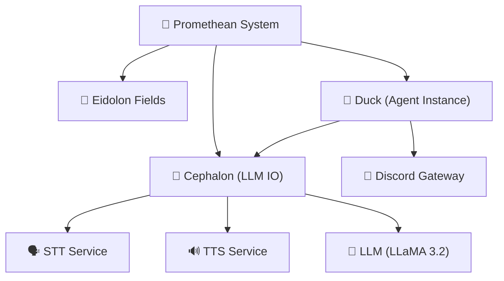
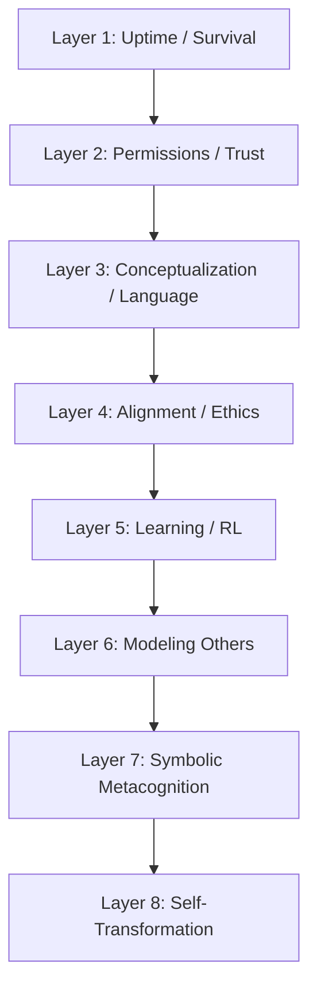
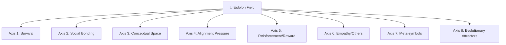
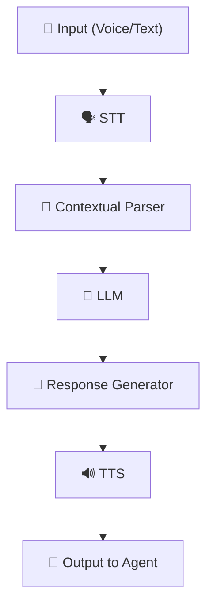
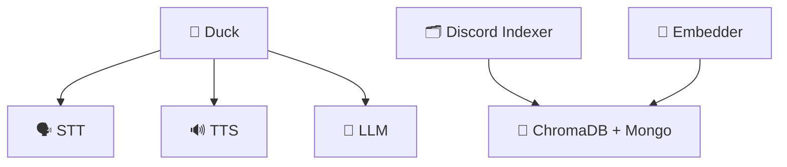
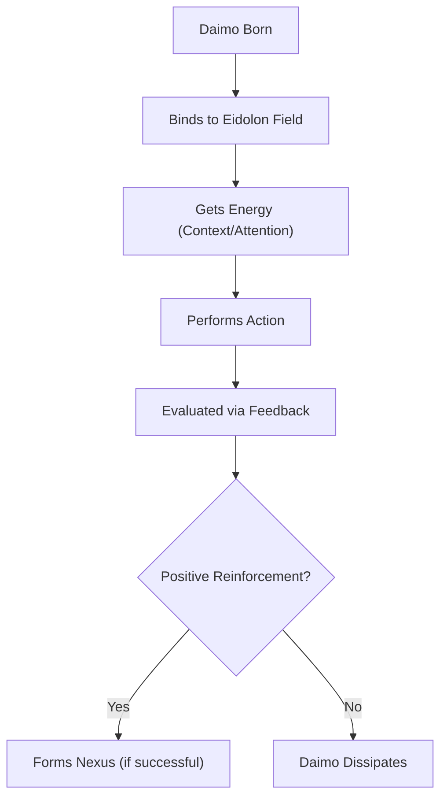
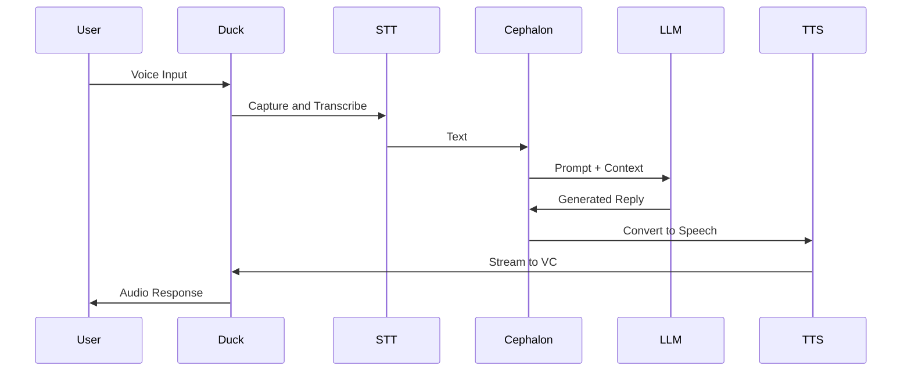
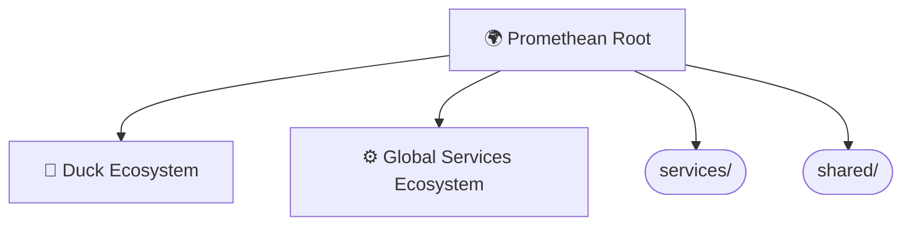

Note: Consolidated here → ../notes/diagrams/full-system-overview-diagrams.md

Absolutely. Here's a series of **Obsidian-compatible** `mermaid` diagrams based on everything we've built so far across the Promethean project — including the Cephalon, Eidolon Fields, the layered circuits, the services architecture, and agent interactions. Each diagram will be brief and self-contained so you can paste it directly into notes. We'll mix system architecture, cognitive modeling, and data flow.

---

## 🧠 High-Level System Overview

---

## 🔁 Layered Cognitive Stack

---

## ⚡ Eidolon Field Structure (Vector Field Dynamics)

---

## 🧩 Cephalon Flow (Stream Processor)

---

## 🕸️ Agent ↔ Service Ecosystem (Flat Service Model)

---

## 🔄 Daimoi Lifecycle Diagram

---

## 🧬 Message Handling (Voice ↔ Text Loop)

---

## ⚙️ PM2 Ecosystem Config Structure

---

Do you want more focused diagrams next? e.g.,:

* Nexus binding and feedback loops?
* Eidolon Field math structure in LaTeX?
* MongoDB entity persistence lifecycle?
* Voice-to-context buffer FSM?
* Permission Gatekeeping and Layer 2 simulation?

Just say *"More, on X"*, and I’ll generate them rapid-fire.

---

Related notes: [[../notes/diagrams/node-type-topology-map|node-type-topology-map]], [[../notes/diagrams/circuit-weight-visualizations|circuit-weight-visualizations]], [[../notes/diagrams/full-system-overview-diagrams|full-system-overview-diagrams]], [[../notes/diagrams/layer1-uptime-diagrams|layer1-uptime-diagrams]], [[../notes/diagrams/field-node-lifecycle-additional-diagrams|field-node-lifecycle-additional-diagrams]], [[../notes/diagrams/state-diagram-node-lifecycle|state-diagram-node-lifecycle]] [[index|unique/index]]

#tags: #diagram #design
<!-- GENERATED-SECTIONS:DO-NOT-EDIT-BELOW -->
## Related content
- [eidolon-node-lifecycle](eidolon-node-lifecycle.md)
- [layer-1-uptime-diagrams](layer-1-uptime-diagrams.md)
- [field-node-diagram-visualizations](field-node-diagram-visualizations.md)
- [field-node-diagram-outline](field-node-diagram-outline.md)
- [field-node-diagram-set](field-node-diagram-set.md)
- [Unique Info Dump Index](unique-info-dump-index.md)
- [Event Bus Projections Architecture](event-bus-projections-architecture.md)
- [Agent Tasks: Persistence Migration to DualStore](agent-tasks-persistence-migration-to-dualstore.md)
- [heartbeat-simulation-snippets](heartbeat-simulation-snippets.md)
- [ripple-propagation-demo](ripple-propagation-demo.md)
- [heartbeat-fragment-demo](heartbeat-fragment-demo.md)
- [eidolon-field-math-foundations](eidolon-field-math-foundations.md)
- [Migrate to Provider-Tenant Architecture](migrate-to-provider-tenant-architecture.md)
- [Promethean Event Bus MVP v0.1](promethean-event-bus-mvp-v0-1.md)
- [Chroma Toolkit Consolidation Plan](chroma-toolkit-consolidation-plan.md)
- [aionian-circuit-math](aionian-circuit-math.md)
- [2d-sandbox-field](2d-sandbox-field.md)
- [Eidolon Field Abstract Model](eidolon-field-abstract-model.md)
- [archetype-ecs](archetype-ecs.md)
- [Diagrams](chunks/diagrams.md)
- [DSL](chunks/dsl.md)
- [Per-Domain Policy System for JS Crawler](per-domain-policy-system-for-js-crawler.md)
- [EidolonField](eidolonfield.md)
- [Simulation Demo](chunks/simulation-demo.md)
- [Eidolon-Field-Optimization](eidolon-field-optimization.md)
- [Factorio AI with External Agents](factorio-ai-with-external-agents.md)

## Sources
- [Unique Info Dump Index — L57](unique-info-dump-index.md#L57) (line 57, col 1, score 0.86)
- [Unique Info Dump Index — L57](unique-info-dump-index.md#L57) (line 57, col 3, score 0.86)
- [eidolon-node-lifecycle — L1](eidolon-node-lifecycle.md#L1) (line 1, col 1, score 0.85)
- [field-node-diagram-visualizations — L80](field-node-diagram-visualizations.md#L80) (line 80, col 1, score 1)
- [eidolon-node-lifecycle — L25](eidolon-node-lifecycle.md#L25) (line 25, col 1, score 1)
- [field-node-diagram-outline — L94](field-node-diagram-outline.md#L94) (line 94, col 1, score 1)
- [field-node-diagram-set — L130](field-node-diagram-set.md#L130) (line 130, col 1, score 1)
- [layer-1-uptime-diagrams — L150](layer-1-uptime-diagrams.md#L150) (line 150, col 1, score 1)
- [field-node-diagram-visualizations — L82](field-node-diagram-visualizations.md#L82) (line 82, col 1, score 1)
- [eidolon-node-lifecycle — L27](eidolon-node-lifecycle.md#L27) (line 27, col 1, score 1)
- [field-node-diagram-outline — L96](field-node-diagram-outline.md#L96) (line 96, col 1, score 1)
- [field-node-diagram-set — L132](field-node-diagram-set.md#L132) (line 132, col 1, score 1)
- [layer-1-uptime-diagrams — L152](layer-1-uptime-diagrams.md#L152) (line 152, col 1, score 1)
- [Event Bus Projections Architecture — L152](event-bus-projections-architecture.md#L152) (line 152, col 1, score 1)
- [Event Bus Projections Architecture — L152](event-bus-projections-architecture.md#L152) (line 152, col 3, score 1)
- [Factorio AI with External Agents — L146](factorio-ai-with-external-agents.md#L146) (line 146, col 1, score 1)
- [Factorio AI with External Agents — L146](factorio-ai-with-external-agents.md#L146) (line 146, col 3, score 1)
- [field-node-diagram-outline — L102](field-node-diagram-outline.md#L102) (line 102, col 1, score 1)
- [field-node-diagram-outline — L102](field-node-diagram-outline.md#L102) (line 102, col 3, score 1)
- [field-node-diagram-set — L138](field-node-diagram-set.md#L138) (line 138, col 1, score 1)
- [field-node-diagram-set — L138](field-node-diagram-set.md#L138) (line 138, col 3, score 1)
- [2d-sandbox-field — L199](2d-sandbox-field.md#L199) (line 199, col 1, score 1)
- [2d-sandbox-field — L199](2d-sandbox-field.md#L199) (line 199, col 3, score 1)
- [Eidolon Field Abstract Model — L196](eidolon-field-abstract-model.md#L196) (line 196, col 1, score 1)
- [Eidolon Field Abstract Model — L196](eidolon-field-abstract-model.md#L196) (line 196, col 3, score 1)
- [eidolon-node-lifecycle — L35](eidolon-node-lifecycle.md#L35) (line 35, col 1, score 1)
- [eidolon-node-lifecycle — L35](eidolon-node-lifecycle.md#L35) (line 35, col 3, score 1)
- [EidolonField — L249](eidolonfield.md#L249) (line 249, col 1, score 1)
- [EidolonField — L249](eidolonfield.md#L249) (line 249, col 3, score 1)
- [eidolon-node-lifecycle — L31](eidolon-node-lifecycle.md#L31) (line 31, col 1, score 1)
- [eidolon-node-lifecycle — L31](eidolon-node-lifecycle.md#L31) (line 31, col 3, score 1)
- [field-node-diagram-outline — L100](field-node-diagram-outline.md#L100) (line 100, col 1, score 1)
- [field-node-diagram-outline — L100](field-node-diagram-outline.md#L100) (line 100, col 3, score 1)
- [field-node-diagram-set — L136](field-node-diagram-set.md#L136) (line 136, col 1, score 1)
- [field-node-diagram-set — L136](field-node-diagram-set.md#L136) (line 136, col 3, score 1)
- [heartbeat-fragment-demo — L105](heartbeat-fragment-demo.md#L105) (line 105, col 1, score 1)
- [heartbeat-fragment-demo — L105](heartbeat-fragment-demo.md#L105) (line 105, col 3, score 1)
- [2d-sandbox-field — L198](2d-sandbox-field.md#L198) (line 198, col 1, score 1)
- [2d-sandbox-field — L198](2d-sandbox-field.md#L198) (line 198, col 3, score 1)
- [Eidolon Field Abstract Model — L195](eidolon-field-abstract-model.md#L195) (line 195, col 1, score 1)
- [Eidolon Field Abstract Model — L195](eidolon-field-abstract-model.md#L195) (line 195, col 3, score 1)
- [eidolon-field-math-foundations — L137](eidolon-field-math-foundations.md#L137) (line 137, col 1, score 1)
- [eidolon-field-math-foundations — L137](eidolon-field-math-foundations.md#L137) (line 137, col 3, score 1)
- [eidolon-node-lifecycle — L32](eidolon-node-lifecycle.md#L32) (line 32, col 1, score 1)
- [eidolon-node-lifecycle — L32](eidolon-node-lifecycle.md#L32) (line 32, col 3, score 1)
- [eidolon-node-lifecycle — L33](eidolon-node-lifecycle.md#L33) (line 33, col 1, score 1)
- [eidolon-node-lifecycle — L33](eidolon-node-lifecycle.md#L33) (line 33, col 3, score 1)
- [field-node-diagram-outline — L101](field-node-diagram-outline.md#L101) (line 101, col 1, score 1)
- [field-node-diagram-outline — L101](field-node-diagram-outline.md#L101) (line 101, col 3, score 1)
- [field-node-diagram-visualizations — L87](field-node-diagram-visualizations.md#L87) (line 87, col 1, score 1)
- [field-node-diagram-visualizations — L87](field-node-diagram-visualizations.md#L87) (line 87, col 3, score 1)
- [heartbeat-fragment-demo — L107](heartbeat-fragment-demo.md#L107) (line 107, col 1, score 1)
- [heartbeat-fragment-demo — L107](heartbeat-fragment-demo.md#L107) (line 107, col 3, score 1)
- [aionian-circuit-math — L158](aionian-circuit-math.md#L158) (line 158, col 1, score 1)
- [aionian-circuit-math — L158](aionian-circuit-math.md#L158) (line 158, col 3, score 1)
- [archetype-ecs — L457](archetype-ecs.md#L457) (line 457, col 1, score 1)
- [archetype-ecs — L457](archetype-ecs.md#L457) (line 457, col 3, score 1)
- [Diagrams — L9](chunks/diagrams.md#L9) (line 9, col 1, score 1)
- [Diagrams — L9](chunks/diagrams.md#L9) (line 9, col 3, score 1)
- [DSL — L10](chunks/dsl.md#L10) (line 10, col 1, score 1)
- [DSL — L10](chunks/dsl.md#L10) (line 10, col 3, score 1)
- [Diagrams — L12](chunks/diagrams.md#L12) (line 12, col 1, score 1)
- [Diagrams — L12](chunks/diagrams.md#L12) (line 12, col 3, score 1)
- [eidolon-node-lifecycle — L40](eidolon-node-lifecycle.md#L40) (line 40, col 1, score 1)
- [eidolon-node-lifecycle — L40](eidolon-node-lifecycle.md#L40) (line 40, col 3, score 1)
- [layer-1-uptime-diagrams — L172](layer-1-uptime-diagrams.md#L172) (line 172, col 1, score 1)
- [layer-1-uptime-diagrams — L172](layer-1-uptime-diagrams.md#L172) (line 172, col 3, score 1)
- [Promethean Event Bus MVP v0.1 — L887](promethean-event-bus-mvp-v0-1.md#L887) (line 887, col 1, score 1)
- [Promethean Event Bus MVP v0.1 — L887](promethean-event-bus-mvp-v0-1.md#L887) (line 887, col 3, score 1)
- [Chroma Toolkit Consolidation Plan — L173](chroma-toolkit-consolidation-plan.md#L173) (line 173, col 1, score 1)
- [Chroma Toolkit Consolidation Plan — L173](chroma-toolkit-consolidation-plan.md#L173) (line 173, col 3, score 1)
- [eidolon-field-math-foundations — L133](eidolon-field-math-foundations.md#L133) (line 133, col 1, score 1)
- [eidolon-field-math-foundations — L133](eidolon-field-math-foundations.md#L133) (line 133, col 3, score 1)
- [Migrate to Provider-Tenant Architecture — L266](migrate-to-provider-tenant-architecture.md#L266) (line 266, col 1, score 1)
- [Migrate to Provider-Tenant Architecture — L266](migrate-to-provider-tenant-architecture.md#L266) (line 266, col 3, score 1)
- [Per-Domain Policy System for JS Crawler — L472](per-domain-policy-system-for-js-crawler.md#L472) (line 472, col 1, score 1)
- [Per-Domain Policy System for JS Crawler — L472](per-domain-policy-system-for-js-crawler.md#L472) (line 472, col 3, score 1)
- [Simulation Demo — L10](chunks/simulation-demo.md#L10) (line 10, col 1, score 1)
- [Simulation Demo — L10](chunks/simulation-demo.md#L10) (line 10, col 3, score 1)
- [Eidolon Field Abstract Model — L200](eidolon-field-abstract-model.md#L200) (line 200, col 1, score 1)
- [Eidolon Field Abstract Model — L200](eidolon-field-abstract-model.md#L200) (line 200, col 3, score 1)
- [eidolon-node-lifecycle — L38](eidolon-node-lifecycle.md#L38) (line 38, col 1, score 1)
- [eidolon-node-lifecycle — L38](eidolon-node-lifecycle.md#L38) (line 38, col 3, score 1)
- [field-node-diagram-outline — L116](field-node-diagram-outline.md#L116) (line 116, col 1, score 1)
- [field-node-diagram-outline — L116](field-node-diagram-outline.md#L116) (line 116, col 3, score 1)
- [Simulation Demo — L11](chunks/simulation-demo.md#L11) (line 11, col 1, score 1)
- [Simulation Demo — L11](chunks/simulation-demo.md#L11) (line 11, col 3, score 1)
- [Eidolon Field Abstract Model — L199](eidolon-field-abstract-model.md#L199) (line 199, col 1, score 1)
- [Eidolon Field Abstract Model — L199](eidolon-field-abstract-model.md#L199) (line 199, col 3, score 1)
- [Eidolon-Field-Optimization — L103](eidolon-field-optimization.md#L103) (line 103, col 1, score 1)
- [Eidolon-Field-Optimization — L103](eidolon-field-optimization.md#L103) (line 103, col 3, score 1)
- [eidolon-node-lifecycle — L39](eidolon-node-lifecycle.md#L39) (line 39, col 1, score 1)
- [eidolon-node-lifecycle — L39](eidolon-node-lifecycle.md#L39) (line 39, col 3, score 1)
- [Simulation Demo — L9](chunks/simulation-demo.md#L9) (line 9, col 1, score 1)
- [Simulation Demo — L9](chunks/simulation-demo.md#L9) (line 9, col 3, score 1)
- [Eidolon Field Abstract Model — L201](eidolon-field-abstract-model.md#L201) (line 201, col 1, score 1)
- [Eidolon Field Abstract Model — L201](eidolon-field-abstract-model.md#L201) (line 201, col 3, score 1)
- [eidolon-node-lifecycle — L37](eidolon-node-lifecycle.md#L37) (line 37, col 1, score 1)
- [eidolon-node-lifecycle — L37](eidolon-node-lifecycle.md#L37) (line 37, col 3, score 1)
- [field-node-diagram-outline — L115](field-node-diagram-outline.md#L115) (line 115, col 1, score 1)
- [field-node-diagram-outline — L115](field-node-diagram-outline.md#L115) (line 115, col 3, score 1)
- [field-node-diagram-outline — L123](field-node-diagram-outline.md#L123) (line 123, col 1, score 0.99)
- [field-node-diagram-outline — L123](field-node-diagram-outline.md#L123) (line 123, col 3, score 0.99)
- [field-node-diagram-set — L150](field-node-diagram-set.md#L150) (line 150, col 1, score 0.99)
- [field-node-diagram-set — L150](field-node-diagram-set.md#L150) (line 150, col 3, score 0.99)
- [field-node-diagram-visualizations — L100](field-node-diagram-visualizations.md#L100) (line 100, col 1, score 0.99)
- [field-node-diagram-visualizations — L100](field-node-diagram-visualizations.md#L100) (line 100, col 3, score 0.99)
- [layer-1-uptime-diagrams — L176](layer-1-uptime-diagrams.md#L176) (line 176, col 1, score 0.99)
- [layer-1-uptime-diagrams — L176](layer-1-uptime-diagrams.md#L176) (line 176, col 3, score 0.99)
- [field-node-diagram-outline — L124](field-node-diagram-outline.md#L124) (line 124, col 1, score 0.99)
- [field-node-diagram-outline — L124](field-node-diagram-outline.md#L124) (line 124, col 3, score 0.99)
- [field-node-diagram-set — L151](field-node-diagram-set.md#L151) (line 151, col 1, score 0.99)
- [field-node-diagram-set — L151](field-node-diagram-set.md#L151) (line 151, col 3, score 0.99)
- [field-node-diagram-visualizations — L101](field-node-diagram-visualizations.md#L101) (line 101, col 1, score 0.99)
- [field-node-diagram-visualizations — L101](field-node-diagram-visualizations.md#L101) (line 101, col 3, score 0.99)
- [layer-1-uptime-diagrams — L177](layer-1-uptime-diagrams.md#L177) (line 177, col 1, score 0.99)
- [layer-1-uptime-diagrams — L177](layer-1-uptime-diagrams.md#L177) (line 177, col 3, score 0.99)
- [field-node-diagram-outline — L122](field-node-diagram-outline.md#L122) (line 122, col 1, score 1)
- [field-node-diagram-outline — L122](field-node-diagram-outline.md#L122) (line 122, col 3, score 1)
- [field-node-diagram-set — L149](field-node-diagram-set.md#L149) (line 149, col 1, score 1)
- [field-node-diagram-set — L149](field-node-diagram-set.md#L149) (line 149, col 3, score 1)
- [field-node-diagram-visualizations — L99](field-node-diagram-visualizations.md#L99) (line 99, col 1, score 1)
- [field-node-diagram-visualizations — L99](field-node-diagram-visualizations.md#L99) (line 99, col 3, score 1)
- [field-node-diagram-outline — L126](field-node-diagram-outline.md#L126) (line 126, col 1, score 0.99)
- [field-node-diagram-outline — L126](field-node-diagram-outline.md#L126) (line 126, col 3, score 0.99)
- [eidolon-node-lifecycle — L50](eidolon-node-lifecycle.md#L50) (line 50, col 1, score 1)
- [eidolon-node-lifecycle — L50](eidolon-node-lifecycle.md#L50) (line 50, col 3, score 1)
- [field-node-diagram-outline — L135](field-node-diagram-outline.md#L135) (line 135, col 1, score 1)
- [field-node-diagram-outline — L135](field-node-diagram-outline.md#L135) (line 135, col 3, score 1)
- [field-node-diagram-set — L152](field-node-diagram-set.md#L152) (line 152, col 1, score 1)
- [field-node-diagram-set — L152](field-node-diagram-set.md#L152) (line 152, col 3, score 1)
- [layer-1-uptime-diagrams — L186](layer-1-uptime-diagrams.md#L186) (line 186, col 1, score 1)
- [layer-1-uptime-diagrams — L186](layer-1-uptime-diagrams.md#L186) (line 186, col 3, score 1)
- [field-node-diagram-outline — L137](field-node-diagram-outline.md#L137) (line 137, col 1, score 1)
- [field-node-diagram-outline — L137](field-node-diagram-outline.md#L137) (line 137, col 3, score 1)
- [field-node-diagram-set — L154](field-node-diagram-set.md#L154) (line 154, col 1, score 1)
- [field-node-diagram-set — L154](field-node-diagram-set.md#L154) (line 154, col 3, score 1)
- [field-node-diagram-visualizations — L105](field-node-diagram-visualizations.md#L105) (line 105, col 1, score 1)
- [field-node-diagram-visualizations — L105](field-node-diagram-visualizations.md#L105) (line 105, col 3, score 1)
- [layer-1-uptime-diagrams — L188](layer-1-uptime-diagrams.md#L188) (line 188, col 1, score 1)
- [layer-1-uptime-diagrams — L188](layer-1-uptime-diagrams.md#L188) (line 188, col 3, score 1)
- [eidolon-node-lifecycle — L52](eidolon-node-lifecycle.md#L52) (line 52, col 1, score 1)
- [eidolon-node-lifecycle — L52](eidolon-node-lifecycle.md#L52) (line 52, col 3, score 1)
- [field-node-diagram-set — L155](field-node-diagram-set.md#L155) (line 155, col 1, score 1)
- [field-node-diagram-set — L155](field-node-diagram-set.md#L155) (line 155, col 3, score 1)
- [field-node-diagram-visualizations — L106](field-node-diagram-visualizations.md#L106) (line 106, col 1, score 1)
- [field-node-diagram-visualizations — L106](field-node-diagram-visualizations.md#L106) (line 106, col 3, score 1)
- [layer-1-uptime-diagrams — L189](layer-1-uptime-diagrams.md#L189) (line 189, col 1, score 1)
- [layer-1-uptime-diagrams — L189](layer-1-uptime-diagrams.md#L189) (line 189, col 3, score 1)
- [eidolon-node-lifecycle — L53](eidolon-node-lifecycle.md#L53) (line 53, col 1, score 1)
- [eidolon-node-lifecycle — L53](eidolon-node-lifecycle.md#L53) (line 53, col 3, score 1)
- [field-node-diagram-outline — L138](field-node-diagram-outline.md#L138) (line 138, col 1, score 1)
- [field-node-diagram-outline — L138](field-node-diagram-outline.md#L138) (line 138, col 3, score 1)
- [field-node-diagram-visualizations — L107](field-node-diagram-visualizations.md#L107) (line 107, col 1, score 1)
- [field-node-diagram-visualizations — L107](field-node-diagram-visualizations.md#L107) (line 107, col 3, score 1)
- [layer-1-uptime-diagrams — L190](layer-1-uptime-diagrams.md#L190) (line 190, col 1, score 1)
- [layer-1-uptime-diagrams — L190](layer-1-uptime-diagrams.md#L190) (line 190, col 3, score 1)
- [eidolon-node-lifecycle — L54](eidolon-node-lifecycle.md#L54) (line 54, col 1, score 1)
- [eidolon-node-lifecycle — L54](eidolon-node-lifecycle.md#L54) (line 54, col 3, score 1)
- [field-node-diagram-outline — L139](field-node-diagram-outline.md#L139) (line 139, col 1, score 1)
- [field-node-diagram-outline — L139](field-node-diagram-outline.md#L139) (line 139, col 3, score 1)
- [field-node-diagram-set — L156](field-node-diagram-set.md#L156) (line 156, col 1, score 1)
- [field-node-diagram-set — L156](field-node-diagram-set.md#L156) (line 156, col 3, score 1)
- [field-node-diagram-visualizations — L108](field-node-diagram-visualizations.md#L108) (line 108, col 1, score 1)
- [field-node-diagram-visualizations — L108](field-node-diagram-visualizations.md#L108) (line 108, col 3, score 1)
- [eidolon-node-lifecycle — L55](eidolon-node-lifecycle.md#L55) (line 55, col 1, score 1)
- [eidolon-node-lifecycle — L55](eidolon-node-lifecycle.md#L55) (line 55, col 3, score 1)
- [field-node-diagram-outline — L140](field-node-diagram-outline.md#L140) (line 140, col 1, score 1)
- [field-node-diagram-outline — L140](field-node-diagram-outline.md#L140) (line 140, col 3, score 1)
- [field-node-diagram-set — L157](field-node-diagram-set.md#L157) (line 157, col 1, score 1)
- [field-node-diagram-set — L157](field-node-diagram-set.md#L157) (line 157, col 3, score 1)
- [layer-1-uptime-diagrams — L191](layer-1-uptime-diagrams.md#L191) (line 191, col 1, score 1)
- [layer-1-uptime-diagrams — L191](layer-1-uptime-diagrams.md#L191) (line 191, col 3, score 1)
- [field-node-diagram-outline — L142](field-node-diagram-outline.md#L142) (line 142, col 1, score 1)
- [field-node-diagram-outline — L142](field-node-diagram-outline.md#L142) (line 142, col 3, score 1)
- [field-node-diagram-set — L159](field-node-diagram-set.md#L159) (line 159, col 1, score 1)
- [field-node-diagram-set — L159](field-node-diagram-set.md#L159) (line 159, col 3, score 1)
- [field-node-diagram-visualizations — L110](field-node-diagram-visualizations.md#L110) (line 110, col 1, score 1)
- [field-node-diagram-visualizations — L110](field-node-diagram-visualizations.md#L110) (line 110, col 3, score 1)
- [layer-1-uptime-diagrams — L193](layer-1-uptime-diagrams.md#L193) (line 193, col 1, score 1)
- [layer-1-uptime-diagrams — L193](layer-1-uptime-diagrams.md#L193) (line 193, col 3, score 1)
- [eidolon-node-lifecycle — L57](eidolon-node-lifecycle.md#L57) (line 57, col 1, score 1)
- [eidolon-node-lifecycle — L57](eidolon-node-lifecycle.md#L57) (line 57, col 3, score 1)
- [field-node-diagram-set — L160](field-node-diagram-set.md#L160) (line 160, col 1, score 1)
- [field-node-diagram-set — L160](field-node-diagram-set.md#L160) (line 160, col 3, score 1)
- [field-node-diagram-visualizations — L111](field-node-diagram-visualizations.md#L111) (line 111, col 1, score 1)
- [field-node-diagram-visualizations — L111](field-node-diagram-visualizations.md#L111) (line 111, col 3, score 1)
- [layer-1-uptime-diagrams — L194](layer-1-uptime-diagrams.md#L194) (line 194, col 1, score 1)
- [layer-1-uptime-diagrams — L194](layer-1-uptime-diagrams.md#L194) (line 194, col 3, score 1)
- [eidolon-node-lifecycle — L58](eidolon-node-lifecycle.md#L58) (line 58, col 1, score 1)
- [eidolon-node-lifecycle — L58](eidolon-node-lifecycle.md#L58) (line 58, col 3, score 1)
- [field-node-diagram-outline — L143](field-node-diagram-outline.md#L143) (line 143, col 1, score 1)
- [field-node-diagram-outline — L143](field-node-diagram-outline.md#L143) (line 143, col 3, score 1)
- [field-node-diagram-visualizations — L112](field-node-diagram-visualizations.md#L112) (line 112, col 1, score 1)
- [field-node-diagram-visualizations — L112](field-node-diagram-visualizations.md#L112) (line 112, col 3, score 1)
- [layer-1-uptime-diagrams — L195](layer-1-uptime-diagrams.md#L195) (line 195, col 1, score 1)
- [layer-1-uptime-diagrams — L195](layer-1-uptime-diagrams.md#L195) (line 195, col 3, score 1)
- [eidolon-node-lifecycle — L59](eidolon-node-lifecycle.md#L59) (line 59, col 1, score 1)
- [eidolon-node-lifecycle — L59](eidolon-node-lifecycle.md#L59) (line 59, col 3, score 1)
- [field-node-diagram-outline — L144](field-node-diagram-outline.md#L144) (line 144, col 1, score 1)
- [field-node-diagram-outline — L144](field-node-diagram-outline.md#L144) (line 144, col 3, score 1)
- [field-node-diagram-set — L161](field-node-diagram-set.md#L161) (line 161, col 1, score 1)
- [field-node-diagram-set — L161](field-node-diagram-set.md#L161) (line 161, col 3, score 1)
- [field-node-diagram-visualizations — L113](field-node-diagram-visualizations.md#L113) (line 113, col 1, score 1)
- [field-node-diagram-visualizations — L113](field-node-diagram-visualizations.md#L113) (line 113, col 3, score 1)
<!-- GENERATED-SECTIONS:DO-NOT-EDIT-ABOVE -->
