Note: Consolidated here → ../notes/diagrams/full-system-overview-diagrams.md

Absolutely. Here's a series of **Obsidian-compatible** `mermaid` diagrams based on everything we've built so far across the Promethean project — including the Cephalon, Eidolon Fields, the layered circuits, the services architecture, and agent interactions. Each diagram will be brief and self-contained so you can paste it directly into notes. We'll mix system architecture, cognitive modeling, and data flow.

---

## 🧠 High-Level System Overview

```mermaid
graph TD
  Promethean["🧠 Promethean System"]
  Cephalon["🧾 Cephalon (LLM IO)"]
  Eidolon["🌌 Eidolon Fields"]
  Duck["🦆 Duck (Agent Instance)"]
  STT["🗣️ STT Service"]
  TTS["🔊 TTS Service"]
  LLM["🧠 LLM (LLaMA 3.2)"]
  Discord["💬 Discord Gateway"]

  Promethean --> Cephalon
  Promethean --> Eidolon
  Promethean --> Duck
  Duck --> Discord
  Duck --> Cephalon
  Cephalon --> STT
  Cephalon --> TTS
  Cephalon --> LLM
```

---

## 🔁 Layered Cognitive Stack

---

## ⚡ Eidolon Field Structure (Vector Field Dynamics)

```mermaid
graph TD
  EidolonField["🌌 Eidolon Field"]
  Axis1["Axis 1: Survival"]
  Axis2["Axis 2: Social Bonding"]
  Axis3["Axis 3: Conceptual Space"]
  Axis4["Axis 4: Alignment Pressure"]
  Axis5["Axis 5: Reinforcement/Reward"]
  Axis6["Axis 6: Empathy/Others"]
  Axis7["Axis 7: Meta-symbols"]
  Axis8["Axis 8: Evolutionary Attractors"]

  EidolonField --> Axis1
  EidolonField --> Axis2
  EidolonField --> Axis3
  EidolonField --> Axis4
  EidolonField --> Axis5
  EidolonField --> Axis6
  EidolonField --> Axis7
  EidolonField --> Axis8
```

---

## 🧩 Cephalon Flow (Stream Processor)

```mermaid
graph TD
  Input["🧠 Input (Voice/Text)"]
  STT["🗣️ STT"]
  Parser["🧵 Contextual Parser"]
  LLM["🤖 LLM"]
  ResponseGen["💭 Response Generator"]
  TTS["🔊 TTS"]
  Output["📢 Output to Agent"]

  Input --> STT --> Parser --> LLM --> ResponseGen --> TTS --> Output
```

---

## 🕸️ Agent ↔ Service Ecosystem (Flat Service Model)

```mermaid
graph TD
  AgentDuck["🦆 Duck"]
  ServiceSTT["🗣️ STT"]
  ServiceTTS["🔊 TTS"]
  ServiceLLM["🧠 LLM"]
  ServiceEmbedder["🧬 Embedder"]
  ServiceIndexer["🗂️ Discord Indexer"]
  DB["🧱 ChromaDB + Mongo"]

  AgentDuck --> ServiceSTT
  AgentDuck --> ServiceTTS
  AgentDuck --> ServiceLLM
  ServiceIndexer --> DB
  ServiceEmbedder --> DB
```

---

## 🔄 Daimoi Lifecycle Diagram

---

## 🧬 Message Handling (Voice ↔ Text Loop)

---

## ⚙️ PM2 Ecosystem Config Structure

```mermaid
graph TD
  Root["🌍 Promethean Root"]
  AgentConfig["🦆 Duck Ecosystem"]
  GlobalConfig["⚙️ Global Services Ecosystem"]
  Services(["services/"])
  Shared(["shared/"])

  Root --> AgentConfig
  Root --> GlobalConfig
  Root --> Services
  Root --> Shared
```

---

Do you want more focused diagrams next? e.g.,:

* Nexus binding and feedback loops?
* Eidolon Field math structure in LaTeX?
* MongoDB entity persistence lifecycle?
* Voice-to-context buffer FSM?
* Permission Gatekeeping and Layer 2 simulation?

Just say *"More, on X"*, and I’ll generate them rapid-fire.

---

Related notes: [[../notes/diagrams/node-type-topology-map|node-type-topology-map]], [[../notes/diagrams/circuit-weight-visualizations|circuit-weight-visualizations]], [[../notes/diagrams/full-system-overview-diagrams|full-system-overview-diagrams]], [[../notes/diagrams/layer1-uptime-diagrams|layer1-uptime-diagrams]], [[../notes/diagrams/field-node-lifecycle-additional-diagrams|field-node-lifecycle-additional-diagrams]], [[../notes/diagrams/state-diagram-node-lifecycle|state-diagram-node-lifecycle]] [[index|unique/index]]

#tags: #diagram #design<!-- GENERATED-SECTIONS:DO-NOT-EDIT-BELOW -->
## Related content
- [eidolon-node-lifecycle](eidolon-node-lifecycle.md)
- [layer-1-uptime-diagrams](layer-1-uptime-diagrams.md)
- [field-node-diagram-visualizations](field-node-diagram-visualizations.md)
- [field-node-diagram-outline](field-node-diagram-outline.md)
- [field-node-diagram-set](field-node-diagram-set.md)
- [Unique Info Dump Index](unique-info-dump-index.md)
- [Event Bus Projections Architecture](event-bus-projections-architecture.md)
- [Agent Tasks: Persistence Migration to DualStore](agent-tasks-persistence-migration-to-dualstore.md)
- [heartbeat-simulation-snippets](heartbeat-simulation-snippets.md)
- [ripple-propagation-demo](ripple-propagation-demo.md)
- [heartbeat-fragment-demo](heartbeat-fragment-demo.md)
- [eidolon-field-math-foundations](eidolon-field-math-foundations.md)
- [Migrate to Provider-Tenant Architecture](migrate-to-provider-tenant-architecture.md)
- [Promethean Event Bus MVP v0.1](promethean-event-bus-mvp-v0-1.md)
- [Chroma Toolkit Consolidation Plan](chroma-toolkit-consolidation-plan.md)
- [aionian-circuit-math](aionian-circuit-math.md)
- [2d-sandbox-field](2d-sandbox-field.md)
- [Eidolon Field Abstract Model](eidolon-field-abstract-model.md)
- [archetype-ecs](archetype-ecs.md)
- [Diagrams](chunks/diagrams.md)
- [DSL](chunks/dsl.md)
- [Per-Domain Policy System for JS Crawler](per-domain-policy-system-for-js-crawler.md)
- [EidolonField](eidolonfield.md)
- [Simulation Demo](chunks/simulation-demo.md)
- [Eidolon-Field-Optimization](eidolon-field-optimization.md)
- [Factorio AI with External Agents](factorio-ai-with-external-agents.md)
## Sources
- _None_
<!-- GENERATED-SECTIONS:DO-NOT-EDIT-ABOVE -->
