Note: Consolidated here → ../notes/diagrams/full-system-overview-diagrams.md ^ref-b51e19b4-1-0

Absolutely. Here's a series of **Obsidian-compatible** `mermaid` diagrams based on everything we've built so far across the Promethean project — including the Cephalon, Eidolon Fields, the layered circuits, the services architecture, and agent interactions. Each diagram will be brief and self-contained so you can paste it directly into notes. We'll mix system architecture, cognitive modeling, and data flow. ^ref-b51e19b4-3-0

---

## 🧠 High-Level System Overview

```mermaid
graph TD
  Promethean["🧠 Promethean System"]
  Cephalon["🧾 Cephalon (LLM IO)"]
  Eidolon["🌌 Eidolon Fields"]
  Duck["🦆 Duck (Agent Instance)"]
  STT["🗣️ STT Service"]
  TTS["🔊 TTS Service"]
  LLM["🧠 LLM (LLaMA 3.2)"]
  Discord["💬 Discord Gateway"]

  Promethean --> Cephalon
  Promethean --> Eidolon
  Promethean --> Duck
  Duck --> Discord
  Duck --> Cephalon
  Cephalon --> STT
  Cephalon --> TTS
  Cephalon --> LLM
```


^ref-b51e19b4-9-0

---

## 🔁 Layered Cognitive Stack
 ^ref-b51e19b4-34-0
```mermaid
graph TD
  L1["Layer 1: Uptime / Survival"]
  L2["Layer 2: Permissions / Trust"]
  L3["Layer 3: Conceptualization / Language"]
  L4["Layer 4: Alignment / Ethics"]
  L5["Layer 5: Learning / RL"]
  L6["Layer 6: Modeling Others"]
  L7["Layer 7: Symbolic Metacognition"]
  L8["Layer 8: Self-Transformation"]

  L1 --> L2 --> L3 --> L4 --> L5 --> L6 --> L7 --> L8
^ref-b51e19b4-34-0
```

---

## ⚡ Eidolon Field Structure (Vector Field Dynamics) ^ref-b51e19b4-52-0

```mermaid
graph TD
  EidolonField["🌌 Eidolon Field"]
  Axis1["Axis 1: Survival"]
  Axis2["Axis 2: Social Bonding"]
  Axis3["Axis 3: Conceptual Space"]
  Axis4["Axis 4: Alignment Pressure"]
  Axis5["Axis 5: Reinforcement/Reward"]
  Axis6["Axis 6: Empathy/Others"]
  Axis7["Axis 7: Meta-symbols"]
  Axis8["Axis 8: Evolutionary Attractors"]

  EidolonField --> Axis1
  EidolonField --> Axis2
  EidolonField --> Axis3
  EidolonField --> Axis4
  EidolonField --> Axis5
  EidolonField --> Axis6
  EidolonField --> Axis7
^ref-b51e19b4-52-0
  EidolonField --> Axis8
```

---
 ^ref-b51e19b4-78-0
## 🧩 Cephalon Flow (Stream Processor)

```mermaid
graph TD
  Input["🧠 Input (Voice/Text)"]
  STT["🗣️ STT"]
  Parser["🧵 Contextual Parser"]
  LLM["🤖 LLM"]
  ResponseGen["💭 Response Generator"]
  TTS["🔊 TTS"]
  Output["📢 Output to Agent"]
^ref-b51e19b4-78-0

  Input --> STT --> Parser --> LLM --> ResponseGen --> TTS --> Output
```

--- ^ref-b51e19b4-95-0

## 🕸️ Agent ↔ Service Ecosystem (Flat Service Model)

```mermaid
graph TD
  AgentDuck["🦆 Duck"]
  ServiceSTT["🗣️ STT"]
  ServiceTTS["🔊 TTS"]
  ServiceLLM["🧠 LLM"]
  ServiceEmbedder["🧬 Embedder"]
  ServiceIndexer["🗂️ Discord Indexer"]
  DB["🧱 ChromaDB + Mongo"]

  AgentDuck --> ServiceSTT
  AgentDuck --> ServiceTTS
^ref-b51e19b4-95-0
  AgentDuck --> ServiceLLM
  ServiceIndexer --> DB
  ServiceEmbedder --> DB
```
 ^ref-b51e19b4-116-0
---

## 🔄 Daimoi Lifecycle Diagram

```mermaid
flowchart TD
  Start["Daimo Born"]
  Bound["Binds to Eidolon Field"]
  Feeds["Gets Energy (Context/Attention)"]
  Acts["Performs Action"]
  Evaluates["Evaluated via Feedback"]
  Survives{"Positive Reinforcement?"}
  Dies["Daimo Dissipates"]
  Bonds["Forms Nexus (if successful)"]
^ref-b51e19b4-116-0

  Start --> Bound --> Feeds --> Acts --> Evaluates --> Survives
  Survives -- Yes --> Bonds
  Survives -- No --> Dies
```
^ref-b51e19b4-136-0 ^ref-b51e19b4-137-0

---

## 🧬 Message Handling (Voice ↔ Text Loop)

```mermaid
sequenceDiagram
  participant User
  participant Duck
  participant STT
  participant Cephalon
  participant LLM
  participant TTS

  User->>Duck: Voice Input
  Duck->>STT: Capture and Transcribe
  STT->>Cephalon: Text
^ref-b51e19b4-136-0
  Cephalon->>LLM: Prompt + Context
  LLM->>Cephalon: Generated Reply
  Cephalon->>TTS: Convert to Speech
  TTS->>Duck: Stream to VC
  Duck->>User: Audio Response
^ref-b51e19b4-159-0
```
^ref-b51e19b4-159-0

---

## ⚙️ PM2 Ecosystem Config Structure

```mermaid
graph TD
  Root["🌍 Promethean Root"]
  AgentConfig["🦆 Duck Ecosystem"]
  GlobalConfig["⚙️ Global Services Ecosystem"]
  Services(["services/"])
^ref-b51e19b4-159-0
  Shared(["shared/"])

  Root --> AgentConfig ^ref-b51e19b4-175-0
  Root --> GlobalConfig
  Root --> Services ^ref-b51e19b4-177-0
^ref-b51e19b4-179-0 ^ref-b51e19b4-180-0
^ref-b51e19b4-177-0 ^ref-b51e19b4-181-0
^ref-b51e19b4-175-0
  Root --> Shared ^ref-b51e19b4-183-0
^ref-b51e19b4-183-0
^ref-b51e19b4-181-0
^ref-b51e19b4-180-0 ^ref-b51e19b4-187-0
^ref-b51e19b4-179-0
^ref-b51e19b4-177-0 ^ref-b51e19b4-189-0
^ref-b51e19b4-175-0
``` ^ref-b51e19b4-179-0
^ref-b51e19b4-169-0
^ref-b51e19b4-183-0
^ref-b51e19b4-181-0
^ref-b51e19b4-180-0
^ref-b51e19b4-179-0
^ref-b51e19b4-177-0
^ref-b51e19b4-175-0
^ref-b51e19b4-169-0
 ^ref-b51e19b4-180-0
--- ^ref-b51e19b4-181-0
 ^ref-b51e19b4-187-0
Do you want more focused diagrams next? e.g.,: ^ref-b51e19b4-183-0
 ^ref-b51e19b4-189-0 ^ref-b51e19b4-203-0
* Nexus binding and feedback loops?
* Eidolon Field math structure in LaTeX?
* MongoDB entity persistence lifecycle? ^ref-b51e19b4-187-0
* Voice-to-context buffer FSM? ^ref-b51e19b4-207-0
* Permission Gatekeeping and Layer 2 simulation? ^ref-b51e19b4-189-0

Just say *"More, on X"*, and I’ll generate them rapid-fire. ^ref-b51e19b4-203-0
 ^ref-b51e19b4-211-0
---

Related notes: [[../notes/diagrams/node-type-topology-map|node-type-topology-map]], [[../notes/diagrams/circuit-weight-visualizations|circuit-weight-visualizations]], [[../notes/diagrams/full-system-overview-diagrams|full-system-overview-diagrams]], [[../notes/diagrams/layer1-uptime-diagrams|layer1-uptime-diagrams]], [[../notes/diagrams/field-node-lifecycle-additional-diagrams|field-node-lifecycle-additional-diagrams]], [[../notes/diagrams/state-diagram-node-lifecycle|state-diagram-node-lifecycle]] [[index|unique/index]] ^ref-b51e19b4-207-0

#tags: #diagram #design
