Note: Consolidated here → ../notes/diagrams/full-system-overview-diagrams.md ^ref-b51e19b4-1-0

Absolutely. Here's a series of **Obsidian-compatible** `mermaid` diagrams based on everything we've built so far across the Promethean project — including the Cephalon, Eidolon Fields, the layered circuits, the services architecture, and agent interactions. Each diagram will be brief and self-contained so you can paste it directly into notes. We'll mix system architecture, cognitive modeling, and data flow. ^ref-b51e19b4-3-0

---

## 🧠 High-Level System Overview

```mermaid
graph TD
  Promethean["🧠 Promethean System"]
  Cephalon["🧾 Cephalon (LLM IO)"]
  Eidolon["🌌 Eidolon Fields"]
  Duck["🦆 Duck (Agent Instance)"]
  STT["🗣️ STT Service"]
  TTS["🔊 TTS Service"]
  LLM["🧠 LLM (LLaMA 3.2)"]
  Discord["💬 Discord Gateway"]

  Promethean --> Cephalon
  Promethean --> Eidolon
  Promethean --> Duck
  Duck --> Discord
  Duck --> Cephalon
  Cephalon --> STT
  Cephalon --> TTS
  Cephalon --> LLM
```


^ref-b51e19b4-9-0

---

## 🔁 Layered Cognitive Stack
 ^ref-b51e19b4-34-0
```mermaid
graph TD
  L1["Layer 1: Uptime / Survival"]
  L2["Layer 2: Permissions / Trust"]
  L3["Layer 3: Conceptualization / Language"]
  L4["Layer 4: Alignment / Ethics"]
  L5["Layer 5: Learning / RL"]
  L6["Layer 6: Modeling Others"]
  L7["Layer 7: Symbolic Metacognition"]
  L8["Layer 8: Self-Transformation"]

  L1 --> L2 --> L3 --> L4 --> L5 --> L6 --> L7 --> L8
^ref-b51e19b4-34-0
```

---

## ⚡ Eidolon Field Structure (Vector Field Dynamics) ^ref-b51e19b4-52-0

```mermaid
graph TD
  EidolonField["🌌 Eidolon Field"]
  Axis1["Axis 1: Survival"]
  Axis2["Axis 2: Social Bonding"]
  Axis3["Axis 3: Conceptual Space"]
  Axis4["Axis 4: Alignment Pressure"]
  Axis5["Axis 5: Reinforcement/Reward"]
  Axis6["Axis 6: Empathy/Others"]
  Axis7["Axis 7: Meta-symbols"]
  Axis8["Axis 8: Evolutionary Attractors"]

  EidolonField --> Axis1
  EidolonField --> Axis2
  EidolonField --> Axis3
  EidolonField --> Axis4
  EidolonField --> Axis5
  EidolonField --> Axis6
  EidolonField --> Axis7
^ref-b51e19b4-52-0
  EidolonField --> Axis8
```

---
 ^ref-b51e19b4-78-0
## 🧩 Cephalon Flow (Stream Processor)

```mermaid
graph TD
  Input["🧠 Input (Voice/Text)"]
  STT["🗣️ STT"]
  Parser["🧵 Contextual Parser"]
  LLM["🤖 LLM"]
  ResponseGen["💭 Response Generator"]
  TTS["🔊 TTS"]
  Output["📢 Output to Agent"]
^ref-b51e19b4-78-0

  Input --> STT --> Parser --> LLM --> ResponseGen --> TTS --> Output
```

--- ^ref-b51e19b4-95-0

## 🕸️ Agent ↔ Service Ecosystem (Flat Service Model)

```mermaid
graph TD
  AgentDuck["🦆 Duck"]
  ServiceSTT["🗣️ STT"]
  ServiceTTS["🔊 TTS"]
  ServiceLLM["🧠 LLM"]
  ServiceEmbedder["🧬 Embedder"]
  ServiceIndexer["🗂️ Discord Indexer"]
  DB["🧱 ChromaDB + Mongo"]

  AgentDuck --> ServiceSTT
  AgentDuck --> ServiceTTS
^ref-b51e19b4-95-0
  AgentDuck --> ServiceLLM
  ServiceIndexer --> DB
  ServiceEmbedder --> DB
```
 ^ref-b51e19b4-116-0
---

## 🔄 Daimoi Lifecycle Diagram

```mermaid
flowchart TD
  Start["Daimo Born"]
  Bound["Binds to Eidolon Field"]
  Feeds["Gets Energy (Context/Attention)"]
  Acts["Performs Action"]
  Evaluates["Evaluated via Feedback"]
  Survives{"Positive Reinforcement?"}
  Dies["Daimo Dissipates"]
  Bonds["Forms Nexus (if successful)"]
^ref-b51e19b4-116-0

  Start --> Bound --> Feeds --> Acts --> Evaluates --> Survives
  Survives -- Yes --> Bonds
  Survives -- No --> Dies
```
^ref-b51e19b4-136-0 ^ref-b51e19b4-137-0

---

## 🧬 Message Handling (Voice ↔ Text Loop)

```mermaid
sequenceDiagram
  participant User
  participant Duck
  participant STT
  participant Cephalon
  participant LLM
  participant TTS

  User->>Duck: Voice Input
  Duck->>STT: Capture and Transcribe
  STT->>Cephalon: Text
^ref-b51e19b4-136-0
  Cephalon->>LLM: Prompt + Context
  LLM->>Cephalon: Generated Reply
  Cephalon->>TTS: Convert to Speech
  TTS->>Duck: Stream to VC
  Duck->>User: Audio Response
^ref-b51e19b4-159-0
```
^ref-b51e19b4-159-0

---

## ⚙️ PM2 Ecosystem Config Structure

```mermaid
graph TD
  Root["🌍 Promethean Root"]
  AgentConfig["🦆 Duck Ecosystem"]
  GlobalConfig["⚙️ Global Services Ecosystem"]
  Services(["services/"])
^ref-b51e19b4-159-0
  Shared(["shared/"])

  Root --> AgentConfig ^ref-b51e19b4-175-0
  Root --> GlobalConfig
  Root --> Services ^ref-b51e19b4-177-0
^ref-b51e19b4-179-0 ^ref-b51e19b4-180-0
^ref-b51e19b4-177-0 ^ref-b51e19b4-181-0
^ref-b51e19b4-175-0
  Root --> Shared ^ref-b51e19b4-183-0
^ref-b51e19b4-183-0
^ref-b51e19b4-181-0
^ref-b51e19b4-180-0 ^ref-b51e19b4-187-0
^ref-b51e19b4-179-0
^ref-b51e19b4-177-0 ^ref-b51e19b4-189-0
^ref-b51e19b4-175-0
``` ^ref-b51e19b4-179-0
^ref-b51e19b4-169-0
^ref-b51e19b4-183-0
^ref-b51e19b4-181-0
^ref-b51e19b4-180-0
^ref-b51e19b4-179-0
^ref-b51e19b4-177-0
^ref-b51e19b4-175-0
^ref-b51e19b4-169-0
 ^ref-b51e19b4-180-0
--- ^ref-b51e19b4-181-0
 ^ref-b51e19b4-187-0
Do you want more focused diagrams next? e.g.,: ^ref-b51e19b4-183-0
 ^ref-b51e19b4-189-0 ^ref-b51e19b4-203-0
* Nexus binding and feedback loops?
* Eidolon Field math structure in LaTeX?
* MongoDB entity persistence lifecycle? ^ref-b51e19b4-187-0
* Voice-to-context buffer FSM? ^ref-b51e19b4-207-0
* Permission Gatekeeping and Layer 2 simulation? ^ref-b51e19b4-189-0

Just say *"More, on X"*, and I’ll generate them rapid-fire. ^ref-b51e19b4-203-0
 ^ref-b51e19b4-211-0
---

Related notes: [[../notes/diagrams/node-type-topology-map|node-type-topology-map]], [[../notes/diagrams/circuit-weight-visualizations|circuit-weight-visualizations]], [[../notes/diagrams/full-system-overview-diagrams|full-system-overview-diagrams]], [[../notes/diagrams/layer1-uptime-diagrams|layer1-uptime-diagrams]], [[../notes/diagrams/field-node-lifecycle-additional-diagrams|field-node-lifecycle-additional-diagrams]], [[../notes/diagrams/state-diagram-node-lifecycle|state-diagram-node-lifecycle]] [[index|unique/index]] ^ref-b51e19b4-207-0

#tags: #diagram #design<!-- GENERATED-SECTIONS:DO-NOT-EDIT-BELOW -->
## Related content
- [Promethean Full-Stack Docker Setup](promethean-full-stack-docker-setup.md)
- [i3-layout-saver](i3-layout-saver.md)
- [field-node-diagram-outline](field-node-diagram-outline.md)
- [field-dynamics-math-blocks](field-dynamics-math-blocks.md)
- [field-interaction-equations](field-interaction-equations.md)
- [Factorio AI with External Agents](factorio-ai-with-external-agents.md)
- [Eidolon Field Abstract Model](eidolon-field-abstract-model.md)
- [Simulation Demo](chunks/simulation-demo.md)
- [Debugging Broker Connections and Agent Behavior](debugging-broker-connections-and-agent-behavior.md)
- [Dynamic Context Model for Web Components](dynamic-context-model-for-web-components.md)
- [DuckDuckGoSearchPipeline](duckduckgosearchpipeline.md)
- [Duck's Self-Referential Perceptual Loop](ducks-self-referential-perceptual-loop.md)
- [Pure-Node Crawl Stack with Playwright and Crawlee](pure-node-crawl-stack-with-playwright-and-crawlee.md)
- [observability-infrastructure-setup](observability-infrastructure-setup.md)
- [lisp-dsl-for-window-management](lisp-dsl-for-window-management.md)
- [set-assignment-in-lisp-ast](set-assignment-in-lisp-ast.md)
- [ecs-scheduler-and-prefabs](ecs-scheduler-and-prefabs.md)
- [Model Upgrade Calm-Down Guide](model-upgrade-calm-down-guide.md)
- [Migrate to Provider-Tenant Architecture](migrate-to-provider-tenant-architecture.md)
- [js-to-lisp-reverse-compiler](js-to-lisp-reverse-compiler.md)
- [Unique Info Dump Index](unique-info-dump-index.md)
- [Tooling](chunks/tooling.md)
- [Promethean-Copilot-Intent-Engine](promethean-copilot-intent-engine.md)
- [universal-intention-code-fabric](universal-intention-code-fabric.md)
- [Voice Access Layer Design](voice-access-layer-design.md)
- [Promethean Web UI Setup](promethean-web-ui-setup.md)
- [EidolonField](eidolonfield.md)
- [sibilant-metacompiler-overview](sibilant-metacompiler-overview.md)
- [WebSocket Gateway Implementation](websocket-gateway-implementation.md)
- [Duck's Attractor States](ducks-attractor-states.md)
- [Event Bus Projections Architecture](event-bus-projections-architecture.md)
- [Performance-Optimized-Polyglot-Bridge](performance-optimized-polyglot-bridge.md)
- [Model Selection for Lightweight Conversational Tasks](model-selection-for-lightweight-conversational-tasks.md)
- [prompt-programming-language-lisp](prompt-programming-language-lisp.md)
- [Promethean Event Bus MVP v0.1](promethean-event-bus-mvp-v0-1.md)
- [State Snapshots API and Transactional Projector](state-snapshots-api-and-transactional-projector.md)
- [Universal Lisp Interface](universal-lisp-interface.md)
- [Matplotlib Animation with Async Execution](matplotlib-animation-with-async-execution.md)
- [layer-1-uptime-diagrams](layer-1-uptime-diagrams.md)
- [Local-Only-LLM-Workflow](local-only-llm-workflow.md)
- [eidolon-field-math-foundations](eidolon-field-math-foundations.md)
- [Canonical Org-Babel Matplotlib Animation Template](canonical-org-babel-matplotlib-animation-template.md)
- [Mathematical Samplers](mathematical-samplers.md)
- [Mathematics Sampler](mathematics-sampler.md)
- [template-based-compilation](template-based-compilation.md)
- [ecs-offload-workers](ecs-offload-workers.md)
- [Sibilant Meta-Prompt DSL](sibilant-meta-prompt-dsl.md)
- [2d-sandbox-field](2d-sandbox-field.md)
- [field-node-diagram-set](field-node-diagram-set.md)
- [RAG UI Panel with Qdrant and PostgREST](rag-ui-panel-with-qdrant-and-postgrest.md)
- [Event Bus MVP](event-bus-mvp.md)
- [field-node-diagram-visualizations](field-node-diagram-visualizations.md)
- [Vectorial Exception Descent](vectorial-exception-descent.md)
- [prom-lib-rate-limiters-and-replay-api](prom-lib-rate-limiters-and-replay-api.md)
- [Exception Layer Analysis](exception-layer-analysis.md)
- [Cross-Language Runtime Polymorphism](cross-language-runtime-polymorphism.md)
- [Recursive Prompt Construction Engine](recursive-prompt-construction-engine.md)
- [Promethean-native config design](promethean-native-config-design.md)
- [mystery-lisp-search-session](mystery-lisp-search-session.md)
- [graph-ds](graph-ds.md)
- [homeostasis-decay-formulas](homeostasis-decay-formulas.md)
- [Ice Box Reorganization](ice-box-reorganization.md)
- [komorebi-group-window-hack](komorebi-group-window-hack.md)
- [Promethean Agent Config DSL](promethean-agent-config-dsl.md)
- [Eidolon-Field-Optimization](eidolon-field-optimization.md)
- [eidolon-node-lifecycle](eidolon-node-lifecycle.md)
- [Mongo Outbox Implementation](mongo-outbox-implementation.md)
- [heartbeat-fragment-demo](heartbeat-fragment-demo.md)
- [Fnord Tracer Protocol](fnord-tracer-protocol.md)
- [Operations](chunks/operations.md)
- [Functional Embedding Pipeline Refactor](functional-embedding-pipeline-refactor.md)
- [i3-bluetooth-setup](i3-bluetooth-setup.md)
- [Interop and Source Maps](interop-and-source-maps.md)
- [heartbeat-simulation-snippets](heartbeat-simulation-snippets.md)
- [Promethean Dev Workflow Update](promethean-dev-workflow-update.md)
- [ripple-propagation-demo](ripple-propagation-demo.md)
- [schema-evolution-workflow](schema-evolution-workflow.md)
- [Prompt_Folder_Bootstrap](prompt-folder-bootstrap.md)
- [sibilant-macro-targets](sibilant-macro-targets.md)
- [Promethean Infrastructure Setup](promethean-infrastructure-setup.md)
- [Promethean_Eidolon_Synchronicity_Model](promethean-eidolon-synchronicity-model.md)
- [Promethean State Format](promethean-state-format.md)
- [i3-config-validation-methods](i3-config-validation-methods.md)
- [Post-Linguistic Transhuman Design Frameworks](post-linguistic-transhuman-design-frameworks.md)
- [Promethean Pipelines](promethean-pipelines.md)
- [Shared Package Structure](shared-package-structure.md)
- [shared-package-layout-clarification](shared-package-layout-clarification.md)
- [Local-Offline-Model-Deployment-Strategy](local-offline-model-deployment-strategy.md)
- [Promethean Agent DSL TS Scaffold](promethean-agent-dsl-ts-scaffold.md)
- [Polyglot S-expr Bridge: Python-JS-Lisp Interop](polyglot-s-expr-bridge-python-js-lisp-interop.md)
- [Chroma-Embedding-Refactor](chroma-embedding-refactor.md)
- [Local-First Intention→Code Loop with Free Models](local-first-intention-code-loop-with-free-models.md)
- [Lispy Macros with syntax-rules](lispy-macros-with-syntax-rules.md)
- [pm2-orchestration-patterns](pm2-orchestration-patterns.md)
- [polymorphic-meta-programming-engine](polymorphic-meta-programming-engine.md)
- [sibilant-meta-string-templating-runtime](sibilant-meta-string-templating-runtime.md)
- [Layer1SurvivabilityEnvelope](layer1survivabilityenvelope.md)
- [ParticleSimulationWithCanvasAndFFmpeg](particlesimulationwithcanvasandffmpeg.md)
- [obsidian-ignore-node-modules-regex](obsidian-ignore-node-modules-regex.md)
- [NPU Voice Code and Sensory Integration](npu-voice-code-and-sensory-integration.md)
- [Obsidian Templating Plugins Integration Guide](obsidian-templating-plugins-integration-guide.md)
- [Refactor Frontmatter Processing](refactor-frontmatter-processing.md)
- [plan-update-confirmation](plan-update-confirmation.md)
- [markdown-to-org-transpiler](markdown-to-org-transpiler.md)
- [Cross-Target Macro System in Sibilant](cross-target-macro-system-in-sibilant.md)
- [compiler-kit-foundations](compiler-kit-foundations.md)
- [refactor-relations](refactor-relations.md)
- [Math Fundamentals](chunks/math-fundamentals.md)
- [Admin Dashboard for User Management](admin-dashboard-for-user-management.md)
- [Promethean Documentation Pipeline Overview](promethean-documentation-pipeline-overview.md)
- [Refactor 05-footers.ts](refactor-05-footers-ts.md)
- [System Scheduler with Resource-Aware DAG](system-scheduler-with-resource-aware-dag.md)
- [Promethean Pipelines: Local TypeScript-First Workflow](promethean-pipelines-local-typescript-first-workflow.md)
- [Language-Agnostic Mirror System](language-agnostic-mirror-system.md)
- [Agent Tasks: Persistence Migration to DualStore](agent-tasks-persistence-migration-to-dualstore.md)
- [Chroma Toolkit Consolidation Plan](chroma-toolkit-consolidation-plan.md)
- [Diagrams](chunks/diagrams.md)
- [Services](chunks/services.md)
- [Agent Reflections and Prompt Evolution](agent-reflections-and-prompt-evolution.md)
- [DSL](chunks/dsl.md)
- [JavaScript](chunks/javascript.md)
- [infinite_depth_smoke_animation](infinite-depth-smoke-animation.md)
- [Ollama-LLM-Provider-for-Pseudo-Code-Transpiler](ollama-llm-provider-for-pseudo-code-transpiler.md)
- [Protocol_0_The_Contradiction_Engine](protocol-0-the-contradiction-engine.md)
- [Prometheus Observability Stack](prometheus-observability-stack.md)
- [Promethean Notes](promethean-notes.md)
- [promethean-requirements](promethean-requirements.md)
- [Promethean Workflow Optimization](promethean-workflow-optimization.md)
## Sources
- [Universal Lisp Interface — L56](universal-lisp-interface.md#^ref-b01856b4-56-0) (line 56, col 0, score 0.86)
- [Promethean Web UI Setup — L279](promethean-web-ui-setup.md#^ref-bc5172ca-279-0) (line 279, col 0, score 0.86)
- [Universal Lisp Interface — L119](universal-lisp-interface.md#^ref-b01856b4-119-0) (line 119, col 0, score 0.86)
- [field-node-diagram-set — L137](field-node-diagram-set.md#^ref-22b989d5-137-0) (line 137, col 0, score 0.89)
- [field-node-diagram-visualizations — L84](field-node-diagram-visualizations.md#^ref-e9b27b06-84-0) (line 84, col 0, score 0.89)
- [field-node-diagram-outline — L98](field-node-diagram-outline.md#^ref-1f32c94a-98-0) (line 98, col 0, score 0.89)
- [eidolon-node-lifecycle — L25](eidolon-node-lifecycle.md#^ref-938eca9c-25-0) (line 25, col 0, score 0.88)
- [layer-1-uptime-diagrams — L129](layer-1-uptime-diagrams.md#^ref-4127189a-129-0) (line 129, col 0, score 0.88)
- [Matplotlib Animation with Async Execution — L44](matplotlib-animation-with-async-execution.md#^ref-687439f9-44-0) (line 44, col 0, score 0.9)
- [EidolonField — L205](eidolonfield.md#^ref-49d1e1e5-205-0) (line 205, col 0, score 0.92)
- [prom-lib-rate-limiters-and-replay-api — L306](prom-lib-rate-limiters-and-replay-api.md#^ref-aee4718b-306-0) (line 306, col 0, score 0.88)
- [sibilant-metacompiler-overview — L52](sibilant-metacompiler-overview.md#^ref-61d4086b-52-0) (line 52, col 0, score 0.92)
- [Recursive Prompt Construction Engine — L147](recursive-prompt-construction-engine.md#^ref-babdb9eb-147-0) (line 147, col 0, score 0.88)
- [i3-config-validation-methods — L28](i3-config-validation-methods.md#^ref-d28090ac-28-0) (line 28, col 0, score 0.87)
- [universal-intention-code-fabric — L388](universal-intention-code-fabric.md#^ref-c14edce7-388-0) (line 388, col 0, score 0.86)
- [Event Bus MVP — L524](event-bus-mvp.md#^ref-534fe91d-524-0) (line 524, col 0, score 0.87)
- [Cross-Language Runtime Polymorphism — L211](cross-language-runtime-polymorphism.md#^ref-c34c36a6-211-0) (line 211, col 0, score 0.89)
- [prompt-programming-language-lisp — L56](prompt-programming-language-lisp.md#^ref-d41a06d1-56-0) (line 56, col 0, score 0.91)
- [Promethean Agent Config DSL — L279](promethean-agent-config-dsl.md#^ref-2c00ce45-279-0) (line 279, col 0, score 0.88)
- [Voice Access Layer Design — L280](voice-access-layer-design.md#^ref-543ed9b3-280-0) (line 280, col 0, score 0.93)
- [WebSocket Gateway Implementation — L630](websocket-gateway-implementation.md#^ref-e811123d-630-0) (line 630, col 0, score 0.92)
- [template-based-compilation — L44](template-based-compilation.md#^ref-f8877e5e-44-0) (line 44, col 0, score 0.86)
- [Lispy Macros with syntax-rules — L375](lispy-macros-with-syntax-rules.md#^ref-cbfe3513-375-0) (line 375, col 0, score 0.86)
- [Universal Lisp Interface — L187](universal-lisp-interface.md#^ref-b01856b4-187-0) (line 187, col 0, score 0.9)
- [ecs-offload-workers — L427](ecs-offload-workers.md#^ref-6498b9d7-427-0) (line 427, col 0, score 0.89)
- [Duck's Attractor States — L2629](ducks-attractor-states.md#^ref-13951643-2629-0) (line 2629, col 0, score 0.92)
- [Duck's Attractor States — L3074](ducks-attractor-states.md#^ref-13951643-3074-0) (line 3074, col 0, score 0.9)
- [Duck's Attractor States — L2582](ducks-attractor-states.md#^ref-13951643-2582-0) (line 2582, col 0, score 0.9)
- [eidolon-field-math-foundations — L3840](eidolon-field-math-foundations.md#^ref-008f2ac0-3840-0) (line 3840, col 0, score 0.9)
- [Canonical Org-Babel Matplotlib Animation Template — L1989](canonical-org-babel-matplotlib-animation-template.md#^ref-1b1338fc-1989-0) (line 1989, col 0, score 0.89)
- [eidolon-field-math-foundations — L6936](eidolon-field-math-foundations.md#^ref-008f2ac0-6936-0) (line 6936, col 0, score 0.89)
- [Mathematical Samplers — L142](mathematical-samplers.md#^ref-86a691ec-142-0) (line 142, col 0, score 0.89)
- [Mathematics Sampler — L149](mathematics-sampler.md#^ref-b5e0183e-149-0) (line 149, col 0, score 0.89)
- [Promethean Web UI Setup — L440](promethean-web-ui-setup.md#^ref-bc5172ca-440-0) (line 440, col 0, score 0.89)
- [Promethean Event Bus MVP v0.1 — L972](promethean-event-bus-mvp-v0-1.md#^ref-fe7193a2-972-0) (line 972, col 0, score 0.89)
- [Pure-Node Crawl Stack with Playwright and Crawlee — L400](pure-node-crawl-stack-with-playwright-and-crawlee.md#^ref-d527c05d-400-0) (line 400, col 0, score 0.95)
- [observability-infrastructure-setup — L348](observability-infrastructure-setup.md#^ref-b4e64f8c-348-0) (line 348, col 0, score 0.95)
- [Sibilant Meta-Prompt DSL — L120](sibilant-meta-prompt-dsl.md#^ref-af5d2824-120-0) (line 120, col 0, score 0.89)
- [ecs-scheduler-and-prefabs — L376](ecs-scheduler-and-prefabs.md#^ref-c62a1815-376-0) (line 376, col 0, score 0.93)
- [Eidolon-Field-Optimization — L50](eidolon-field-optimization.md#^ref-40e05c14-50-0) (line 50, col 0, score 0.88)
- [Exception Layer Analysis — L63](exception-layer-analysis.md#^ref-21d5cc09-63-0) (line 63, col 0, score 0.89)
- [shared-package-layout-clarification — L161](shared-package-layout-clarification.md#^ref-36c8882a-161-0) (line 161, col 0, score 0.86)
- [Promethean Agent DSL TS Scaffold — L818](promethean-agent-dsl-ts-scaffold.md#^ref-5158f742-818-0) (line 818, col 0, score 0.87)
- [Shared Package Structure — L185](shared-package-structure.md#^ref-66a72fc3-185-0) (line 185, col 0, score 0.87)
- [pm2-orchestration-patterns — L217](pm2-orchestration-patterns.md#^ref-51932e7b-217-0) (line 217, col 0, score 0.86)
- [Local-Only-LLM-Workflow — L147](local-only-llm-workflow.md#^ref-9a8ab57e-147-0) (line 147, col 0, score 0.87)
- [Refactor Frontmatter Processing — L11](refactor-frontmatter-processing.md#^ref-cfbdca2f-11-0) (line 11, col 0, score 0.85)
- [field-dynamics-math-blocks — L480](field-dynamics-math-blocks.md#^ref-7cfc230d-480-0) (line 480, col 0, score 0.87)
- [Fnord Tracer Protocol — L455](fnord-tracer-protocol.md#^ref-fc21f824-455-0) (line 455, col 0, score 0.87)
- [Post-Linguistic Transhuman Design Frameworks — L288](post-linguistic-transhuman-design-frameworks.md#^ref-6bcff92c-288-0) (line 288, col 0, score 0.87)
- [Promethean Pipelines — L467](promethean-pipelines.md#^ref-8b8e6103-467-0) (line 467, col 0, score 0.87)
- [field-interaction-equations — L318](field-interaction-equations.md#^ref-b09141b7-318-0) (line 318, col 0, score 0.86)
- [eidolon-field-math-foundations — L537](eidolon-field-math-foundations.md#^ref-008f2ac0-537-0) (line 537, col 0, score 0.86)
- [Eidolon Field Abstract Model — L581](eidolon-field-abstract-model.md#^ref-5e8b2388-581-0) (line 581, col 0, score 0.86)
- [homeostasis-decay-formulas — L582](homeostasis-decay-formulas.md#^ref-37b5d236-582-0) (line 582, col 0, score 0.86)
- [mystery-lisp-search-session — L106](mystery-lisp-search-session.md#^ref-513dc4c7-106-0) (line 106, col 0, score 0.88)
- [Model Upgrade Calm-Down Guide — L437](model-upgrade-calm-down-guide.md#^ref-db74343f-437-0) (line 437, col 0, score 0.93)
- [Migrate to Provider-Tenant Architecture — L542](migrate-to-provider-tenant-architecture.md#^ref-54382370-542-0) (line 542, col 0, score 0.93)
- [Tooling — L137](chunks/tooling.md#^ref-6cb4943e-137-0) (line 137, col 0, score 0.93)
- [Promethean-Copilot-Intent-Engine — L232](promethean-copilot-intent-engine.md#^ref-ae24a280-232-0) (line 232, col 0, score 0.93)
- [Unique Info Dump Index — L813](unique-info-dump-index.md#^ref-30ec3ba6-813-0) (line 813, col 0, score 0.93)
- [Unique Info Dump Index — L334](unique-info-dump-index.md#^ref-30ec3ba6-334-0) (line 334, col 0, score 0.91)
- [Performance-Optimized-Polyglot-Bridge — L823](performance-optimized-polyglot-bridge.md#^ref-f5579967-823-0) (line 823, col 0, score 0.91)
- [Model Selection for Lightweight Conversational Tasks — L282](model-selection-for-lightweight-conversational-tasks.md#^ref-d144aa62-282-0) (line 282, col 0, score 0.91)
- [RAG UI Panel with Qdrant and PostgREST — L349](rag-ui-panel-with-qdrant-and-postgrest.md#^ref-e1056831-349-0) (line 349, col 0, score 0.89)
- [Mongo Outbox Implementation — L609](mongo-outbox-implementation.md#^ref-9c1acd1e-609-0) (line 609, col 0, score 0.88)
- [Chroma-Embedding-Refactor — L289](chroma-embedding-refactor.md#^ref-8b256935-289-0) (line 289, col 0, score 0.86)
- [Local-First Intention→Code Loop with Free Models — L105](local-first-intention-code-loop-with-free-models.md#^ref-871490c7-105-0) (line 105, col 0, score 0.86)
- [Promethean-native config design — L305](promethean-native-config-design.md#^ref-ab748541-305-0) (line 305, col 0, score 0.88)
- [sibilant-meta-string-templating-runtime — L92](sibilant-meta-string-templating-runtime.md#^ref-2aafc801-92-0) (line 92, col 0, score 0.86)
- [2d-sandbox-field — L150](2d-sandbox-field.md#^ref-c710dc93-150-0) (line 150, col 0, score 0.89)
- [js-to-lisp-reverse-compiler — L343](js-to-lisp-reverse-compiler.md#^ref-58191024-343-0) (line 343, col 0, score 0.93)
- [Event Bus Projections Architecture — L111](event-bus-projections-architecture.md#^ref-cf6b9b17-111-0) (line 111, col 0, score 0.91)
- [heartbeat-simulation-snippets — L80](heartbeat-simulation-snippets.md#^ref-23e221e9-80-0) (line 80, col 0, score 0.88)
- [field-dynamics-math-blocks — L798](field-dynamics-math-blocks.md#^ref-7cfc230d-798-0) (line 798, col 0, score 0.88)
- [field-interaction-equations — L786](field-interaction-equations.md#^ref-b09141b7-786-0) (line 786, col 0, score 0.88)
- [field-node-diagram-outline — L565](field-node-diagram-outline.md#^ref-1f32c94a-565-0) (line 565, col 0, score 0.88)
- [field-node-diagram-set — L569](field-node-diagram-set.md#^ref-22b989d5-569-0) (line 569, col 0, score 0.88)
- [field-node-diagram-visualizations — L442](field-node-diagram-visualizations.md#^ref-e9b27b06-442-0) (line 442, col 0, score 0.88)
- [graph-ds — L687](graph-ds.md#^ref-6620e2f2-687-0) (line 687, col 0, score 0.88)
- [homeostasis-decay-formulas — L771](homeostasis-decay-formulas.md#^ref-37b5d236-771-0) (line 771, col 0, score 0.88)
- [Ice Box Reorganization — L623](ice-box-reorganization.md#^ref-291c7d91-623-0) (line 623, col 0, score 0.88)
- [komorebi-group-window-hack — L613](komorebi-group-window-hack.md#^ref-dd89372d-613-0) (line 613, col 0, score 0.88)
- [Migrate to Provider-Tenant Architecture — L1375](migrate-to-provider-tenant-architecture.md#^ref-54382370-1375-0) (line 1375, col 0, score 0.88)
- [Operations — L152](chunks/operations.md#^ref-f1add613-152-0) (line 152, col 0, score 0.88)
- [Factorio AI with External Agents — L436](factorio-ai-with-external-agents.md#^ref-a4d90289-436-0) (line 436, col 0, score 0.88)
- [field-dynamics-math-blocks — L518](field-dynamics-math-blocks.md#^ref-7cfc230d-518-0) (line 518, col 0, score 0.88)
- [field-interaction-equations — L542](field-interaction-equations.md#^ref-b09141b7-542-0) (line 542, col 0, score 0.88)
- [field-node-diagram-set — L498](field-node-diagram-set.md#^ref-22b989d5-498-0) (line 498, col 0, score 0.88)
- [field-node-diagram-visualizations — L371](field-node-diagram-visualizations.md#^ref-e9b27b06-371-0) (line 371, col 0, score 0.88)
- [Fnord Tracer Protocol — L492](fnord-tracer-protocol.md#^ref-fc21f824-492-0) (line 492, col 0, score 0.88)
- [Functional Embedding Pipeline Refactor — L670](functional-embedding-pipeline-refactor.md#^ref-a4a25141-670-0) (line 670, col 0, score 0.88)
- [heartbeat-fragment-demo — L338](heartbeat-fragment-demo.md#^ref-dd00677a-338-0) (line 338, col 0, score 0.88)
- [homeostasis-decay-formulas — L565](homeostasis-decay-formulas.md#^ref-37b5d236-565-0) (line 565, col 0, score 0.88)
- [i3-bluetooth-setup — L459](i3-bluetooth-setup.md#^ref-5e408692-459-0) (line 459, col 0, score 0.88)
- [Local-Offline-Model-Deployment-Strategy — L232](local-offline-model-deployment-strategy.md#^ref-ad7f1ed3-232-0) (line 232, col 0, score 0.86)
- [Polyglot S-expr Bridge: Python-JS-Lisp Interop — L490](polyglot-s-expr-bridge-python-js-lisp-interop.md#^ref-63a1cc28-490-0) (line 490, col 0, score 0.86)
- [Vectorial Exception Descent — L95](vectorial-exception-descent.md#^ref-d771154e-95-0) (line 95, col 0, score 0.89)
- [Interop and Source Maps — L497](interop-and-source-maps.md#^ref-cdfac40c-497-0) (line 497, col 0, score 0.88)
- [Promethean Full-Stack Docker Setup — L416](promethean-full-stack-docker-setup.md#^ref-2c2b48ca-416-0) (line 416, col 0, score 0.96)
- [Promethean-Copilot-Intent-Engine — L673](promethean-copilot-intent-engine.md#^ref-ae24a280-673-0) (line 673, col 0, score 0.87)
- [Promethean Dev Workflow Update — L576](promethean-dev-workflow-update.md#^ref-03a5578f-576-0) (line 576, col 0, score 0.87)
- [Promethean_Eidolon_Synchronicity_Model — L372](promethean-eidolon-synchronicity-model.md#^ref-2d6e5553-372-0) (line 372, col 0, score 0.87)
- [Promethean Infrastructure Setup — L1508](promethean-infrastructure-setup.md#^ref-6deed6ac-1508-0) (line 1508, col 0, score 0.87)
- [Promethean State Format — L464](promethean-state-format.md#^ref-23df6ddb-464-0) (line 464, col 0, score 0.87)
- [Prompt_Folder_Bootstrap — L881](prompt-folder-bootstrap.md#^ref-bd4f0976-881-0) (line 881, col 0, score 0.87)
- [ripple-propagation-demo — L497](ripple-propagation-demo.md#^ref-8430617b-497-0) (line 497, col 0, score 0.87)
- [schema-evolution-workflow — L1128](schema-evolution-workflow.md#^ref-d8059b6a-1128-0) (line 1128, col 0, score 0.87)
- [sibilant-macro-targets — L850](sibilant-macro-targets.md#^ref-c5c9a5c6-850-0) (line 850, col 0, score 0.87)
- [i3-layout-saver — L79](i3-layout-saver.md#^ref-31f0166e-79-0) (line 79, col 0, score 0.96)
- [lisp-dsl-for-window-management — L185](lisp-dsl-for-window-management.md#^ref-c5c5ff1c-185-0) (line 185, col 0, score 0.94)
- [State Snapshots API and Transactional Projector — L303](state-snapshots-api-and-transactional-projector.md#^ref-509e1cd5-303-0) (line 303, col 0, score 0.91)
- [polymorphic-meta-programming-engine — L190](polymorphic-meta-programming-engine.md#^ref-7bed0b9a-190-0) (line 190, col 0, score 0.86)
- [Fnord Tracer Protocol — L272](fnord-tracer-protocol.md#^ref-fc21f824-272-0) (line 272, col 0, score 0.86)
- [Layer1SurvivabilityEnvelope — L245](layer1survivabilityenvelope.md#^ref-64a9f9f9-245-0) (line 245, col 0, score 0.86)
- [Mathematics Sampler — L132](mathematics-sampler.md#^ref-b5e0183e-132-0) (line 132, col 0, score 0.86)
- [Migrate to Provider-Tenant Architecture — L375](migrate-to-provider-tenant-architecture.md#^ref-54382370-375-0) (line 375, col 0, score 0.86)
- [Model Selection for Lightweight Conversational Tasks — L215](model-selection-for-lightweight-conversational-tasks.md#^ref-d144aa62-215-0) (line 215, col 0, score 0.86)
- [Model Upgrade Calm-Down Guide — L164](model-upgrade-calm-down-guide.md#^ref-db74343f-164-0) (line 164, col 0, score 0.86)
- [NPU Voice Code and Sensory Integration — L90](npu-voice-code-and-sensory-integration.md#^ref-5a02283e-90-0) (line 90, col 0, score 0.86)
- [obsidian-ignore-node-modules-regex — L132](obsidian-ignore-node-modules-regex.md#^ref-ffb9b2a9-132-0) (line 132, col 0, score 0.86)
- [Obsidian Templating Plugins Integration Guide — L172](obsidian-templating-plugins-integration-guide.md#^ref-b39dc9d4-172-0) (line 172, col 0, score 0.86)
- [ParticleSimulationWithCanvasAndFFmpeg — L336](particlesimulationwithcanvasandffmpeg.md#^ref-e018dd7a-336-0) (line 336, col 0, score 0.86)
- [Post-Linguistic Transhuman Design Frameworks — L137](post-linguistic-transhuman-design-frameworks.md#^ref-6bcff92c-137-0) (line 137, col 0, score 0.86)
- [set-assignment-in-lisp-ast — L148](set-assignment-in-lisp-ast.md#^ref-c5fba0a0-148-0) (line 148, col 0, score 0.93)
- [Simulation Demo — L362](chunks/simulation-demo.md#^ref-557309a3-362-0) (line 362, col 0, score 0.95)
- [Debugging Broker Connections and Agent Behavior — L496](debugging-broker-connections-and-agent-behavior.md#^ref-73d3dbf6-496-0) (line 496, col 0, score 0.95)
- [DuckDuckGoSearchPipeline — L162](duckduckgosearchpipeline.md#^ref-e979c50f-162-0) (line 162, col 0, score 0.95)
- [Duck's Self-Referential Perceptual Loop — L491](ducks-self-referential-perceptual-loop.md#^ref-71726f04-491-0) (line 491, col 0, score 0.95)
- [Dynamic Context Model for Web Components — L771](dynamic-context-model-for-web-components.md#^ref-f7702bf8-771-0) (line 771, col 0, score 0.95)
- [Eidolon Field Abstract Model — L951](eidolon-field-abstract-model.md#^ref-5e8b2388-951-0) (line 951, col 0, score 0.95)
- [Factorio AI with External Agents — L722](factorio-ai-with-external-agents.md#^ref-a4d90289-722-0) (line 722, col 0, score 0.95)
- [field-dynamics-math-blocks — L878](field-dynamics-math-blocks.md#^ref-7cfc230d-878-0) (line 878, col 0, score 0.95)
- [field-interaction-equations — L925](field-interaction-equations.md#^ref-b09141b7-925-0) (line 925, col 0, score 0.95)
- [field-node-diagram-outline — L655](field-node-diagram-outline.md#^ref-1f32c94a-655-0) (line 655, col 0, score 0.95)
<!-- GENERATED-SECTIONS:DO-NOT-EDIT-ABOVE -->
