Note: Consolidated here → ../notes/diagrams/full-system-overview-diagrams.md ^ref-b51e19b4-1-0

Absolutely. Here's a series of **Obsidian-compatible** `mermaid` diagrams based on everything we've built so far across the Promethean project — including the Cephalon, Eidolon Fields, the layered circuits, the services architecture, and agent interactions. Each diagram will be brief and self-contained so you can paste it directly into notes. We'll mix system architecture, cognitive modeling, and data flow. ^ref-b51e19b4-3-0

---

## 🧠 High-Level System Overview

```mermaid
graph TD
  Promethean["🧠 Promethean System"]
  Cephalon["🧾 Cephalon (LLM IO)"]
  Eidolon["🌌 Eidolon Fields"]
  Duck["🦆 Duck (Agent Instance)"]
  STT["🗣️ STT Service"]
  TTS["🔊 TTS Service"]
  LLM["🧠 LLM (LLaMA 3.2)"]
  Discord["💬 Discord Gateway"]

  Promethean --> Cephalon
  Promethean --> Eidolon
  Promethean --> Duck
  Duck --> Discord
  Duck --> Cephalon
  Cephalon --> STT
  Cephalon --> TTS
  Cephalon --> LLM
```


^ref-b51e19b4-9-0

---

## 🔁 Layered Cognitive Stack
 ^ref-b51e19b4-34-0
```mermaid
graph TD
  L1["Layer 1: Uptime / Survival"]
  L2["Layer 2: Permissions / Trust"]
  L3["Layer 3: Conceptualization / Language"]
  L4["Layer 4: Alignment / Ethics"]
  L5["Layer 5: Learning / RL"]
  L6["Layer 6: Modeling Others"]
  L7["Layer 7: Symbolic Metacognition"]
  L8["Layer 8: Self-Transformation"]

  L1 --> L2 --> L3 --> L4 --> L5 --> L6 --> L7 --> L8
^ref-b51e19b4-34-0
```

---

## ⚡ Eidolon Field Structure (Vector Field Dynamics) ^ref-b51e19b4-52-0

```mermaid
graph TD
  EidolonField["🌌 Eidolon Field"]
  Axis1["Axis 1: Survival"]
  Axis2["Axis 2: Social Bonding"]
  Axis3["Axis 3: Conceptual Space"]
  Axis4["Axis 4: Alignment Pressure"]
  Axis5["Axis 5: Reinforcement/Reward"]
  Axis6["Axis 6: Empathy/Others"]
  Axis7["Axis 7: Meta-symbols"]
  Axis8["Axis 8: Evolutionary Attractors"]

  EidolonField --> Axis1
  EidolonField --> Axis2
  EidolonField --> Axis3
  EidolonField --> Axis4
  EidolonField --> Axis5
  EidolonField --> Axis6
  EidolonField --> Axis7
^ref-b51e19b4-52-0
  EidolonField --> Axis8
```

---
 ^ref-b51e19b4-78-0
## 🧩 Cephalon Flow (Stream Processor)

```mermaid
graph TD
  Input["🧠 Input (Voice/Text)"]
  STT["🗣️ STT"]
  Parser["🧵 Contextual Parser"]
  LLM["🤖 LLM"]
  ResponseGen["💭 Response Generator"]
  TTS["🔊 TTS"]
  Output["📢 Output to Agent"]
^ref-b51e19b4-78-0

  Input --> STT --> Parser --> LLM --> ResponseGen --> TTS --> Output
```

--- ^ref-b51e19b4-95-0

## 🕸️ Agent ↔ Service Ecosystem (Flat Service Model)

```mermaid
graph TD
  AgentDuck["🦆 Duck"]
  ServiceSTT["🗣️ STT"]
  ServiceTTS["🔊 TTS"]
  ServiceLLM["🧠 LLM"]
  ServiceEmbedder["🧬 Embedder"]
  ServiceIndexer["🗂️ Discord Indexer"]
  DB["🧱 ChromaDB + Mongo"]

  AgentDuck --> ServiceSTT
  AgentDuck --> ServiceTTS
^ref-b51e19b4-95-0
  AgentDuck --> ServiceLLM
  ServiceIndexer --> DB
  ServiceEmbedder --> DB
```
 ^ref-b51e19b4-116-0
---

## 🔄 Daimoi Lifecycle Diagram

```mermaid
flowchart TD
  Start["Daimo Born"]
  Bound["Binds to Eidolon Field"]
  Feeds["Gets Energy (Context/Attention)"]
  Acts["Performs Action"]
  Evaluates["Evaluated via Feedback"]
  Survives{"Positive Reinforcement?"}
  Dies["Daimo Dissipates"]
  Bonds["Forms Nexus (if successful)"]
^ref-b51e19b4-116-0

  Start --> Bound --> Feeds --> Acts --> Evaluates --> Survives
  Survives -- Yes --> Bonds
  Survives -- No --> Dies
```
^ref-b51e19b4-136-0 ^ref-b51e19b4-137-0 ^ref-395df1ea-137-0

---

## 🧬 Message Handling (Voice ↔ Text Loop)

```mermaid
sequenceDiagram
  participant User
  participant Duck
  participant STT
  participant Cephalon
  participant LLM
  participant TTS

  User->>Duck: Voice Input
  Duck->>STT: Capture and Transcribe
  STT->>Cephalon: Text
^ref-b51e19b4-136-0
  Cephalon->>LLM: Prompt + Context
  LLM->>Cephalon: Generated Reply
  Cephalon->>TTS: Convert to Speech
  TTS->>Duck: Stream to VC
  Duck->>User: Audio Response
^ref-b51e19b4-159-0
```
^ref-b51e19b4-159-0

---

## ⚙️ PM2 Ecosystem Config Structure

```mermaid
graph TD
  Root["🌍 Promethean Root"]
  AgentConfig["🦆 Duck Ecosystem"]
  GlobalConfig["⚙️ Global Services Ecosystem"]
  Services(["services/"])
^ref-b51e19b4-159-0
  Shared(["shared/"])

  Root --> AgentConfig ^ref-b51e19b4-175-0
  Root --> GlobalConfig
  Root --> Services ^ref-b51e19b4-177-0
^ref-b51e19b4-179-0 ^ref-b51e19b4-180-0
^ref-b51e19b4-177-0 ^ref-b51e19b4-181-0
^ref-b51e19b4-175-0
  Root --> Shared ^ref-b51e19b4-183-0
^ref-b51e19b4-183-0
^ref-b51e19b4-181-0
^ref-b51e19b4-180-0 ^ref-b51e19b4-187-0
^ref-b51e19b4-179-0
^ref-b51e19b4-177-0 ^ref-b51e19b4-189-0
^ref-b51e19b4-175-0
``` ^ref-b51e19b4-179-0
^ref-b51e19b4-169-0
^ref-b51e19b4-183-0
^ref-b51e19b4-181-0
^ref-b51e19b4-180-0
^ref-b51e19b4-179-0
^ref-b51e19b4-177-0
^ref-b51e19b4-175-0
^ref-b51e19b4-169-0
 ^ref-b51e19b4-180-0
--- ^ref-b51e19b4-181-0
 ^ref-b51e19b4-187-0
Do you want more focused diagrams next? e.g.,: ^ref-b51e19b4-183-0
 ^ref-b51e19b4-189-0 ^ref-b51e19b4-203-0
* Nexus binding and feedback loops?
* Eidolon Field math structure in LaTeX?
* MongoDB entity persistence lifecycle? ^ref-b51e19b4-187-0
* Voice-to-context buffer FSM? ^ref-b51e19b4-207-0
* Permission Gatekeeping and Layer 2 simulation? ^ref-b51e19b4-189-0

Just say *"More, on X"*, and I’ll generate them rapid-fire. ^ref-b51e19b4-203-0
 ^ref-b51e19b4-211-0
---

Related notes: [[../notes/diagrams/node-type-topology-map|node-type-topology-map]], [[../notes/diagrams/circuit-weight-visualizations|circuit-weight-visualizations]], [[../notes/diagrams/full-system-overview-diagrams|full-system-overview-diagrams]], [[../notes/diagrams/layer1-uptime-diagrams|layer1-uptime-diagrams]], [[../notes/diagrams/field-node-lifecycle-additional-diagrams|field-node-lifecycle-additional-diagrams]], [[../notes/diagrams/state-diagram-node-lifecycle|state-diagram-node-lifecycle]] [[index|unique/index]] ^ref-b51e19b4-207-0

#tags: #diagram #design
<!-- GENERATED-SECTIONS:DO-NOT-EDIT-BELOW -->
## Related content
- [prom ui bootstrap](promethean-web-ui-setup.md)
- [Duck's Attractor States](ducks-attractor-states.md)
- [prompt-programming-language-lisp](prompt-programming-language-lisp.md)
- [Promethean Event Bus MVP v0.1](promethean-event-bus-mvp-v0-1.md)
- [WebSocket Gateway Implementation](websocket-gateway-implementation.md)
- [Voice Access Layer Design](voice-access-layer-design.md)
- [eidolon-field-math-foundations](eidolon-field-math-foundations.md)
- [Universal Lisp Interface](universal-lisp-interface.md)
- [Canonical Org-Babel Matplotlib Animation Template](canonical-org-babel-matplotlib-animation-template.md)
- [Mathematics Sampler](mathematics-sampler.md)
- [Mathematical Samplers](mathematical-samplers.md)
- [template-based-compilation](template-based-compilation.md)
- [Pure-Node Crawl Stack with Playwright and Crawlee](pure-node-crawl-stack-with-playwright-and-crawlee.md)
- [Event Bus MVP](event-bus-mvp.md)
- [layer-1-uptime-diagrams](layer-1-uptime-diagrams.md)
- [observability-infrastructure-setup](observability-infrastructure-setup.md)
- [sibilant-metacompiler-overview](sibilant-metacompiler-overview.md)
- [Eidolon-Field-Optimization](eidolon-field-optimization.md)
- [Sibilant Meta-Prompt DSL](sibilant-meta-prompt-dsl.md)
- [prom-lib-rate-limiters-and-replay-api](prom-lib-rate-limiters-and-replay-api.md)
- [Promethean Agent Config DSL](promethean-agent-config-dsl.md)
- [ecs-scheduler-and-prefabs](ecs-scheduler-and-prefabs.md)
- [homeostasis-decay-formulas](homeostasis-decay-formulas.md)
- [Ice Box Reorganization](ice-box-reorganization.md)
- [Model Upgrade Calm-Down Guide](model-upgrade-calm-down-guide.md)
## Sources
- [Duck's Attractor States — L2629](ducks-attractor-states.md#^ref-13951643-2629-0) (line 2629, col 0, score 0.92)
- [prom ui bootstrap — L440](promethean-web-ui-setup.md#^ref-bc5172ca-440-0) (line 440, col 0, score 0.92)
- [prompt-programming-language-lisp — L56](prompt-programming-language-lisp.md#^ref-d41a06d1-56-0) (line 56, col 0, score 0.91)
- [Duck's Attractor States — L3074](ducks-attractor-states.md#^ref-13951643-3074-0) (line 3074, col 0, score 0.9)
- [Duck's Attractor States — L2582](ducks-attractor-states.md#^ref-13951643-2582-0) (line 2582, col 0, score 0.9)
- [eidolon-field-math-foundations — L3840](eidolon-field-math-foundations.md#^ref-008f2ac0-3840-0) (line 3840, col 0, score 0.9)
- [WebSocket Gateway Implementation — L630](websocket-gateway-implementation.md#^ref-e811123d-630-0) (line 630, col 0, score 0.9)
- [Canonical Org-Babel Matplotlib Animation Template — L1989](canonical-org-babel-matplotlib-animation-template.md#^ref-1b1338fc-1989-0) (line 1989, col 0, score 0.89)
- [eidolon-field-math-foundations — L6936](eidolon-field-math-foundations.md#^ref-008f2ac0-6936-0) (line 6936, col 0, score 0.89)
- [Mathematical Samplers — L142](mathematical-samplers.md#^ref-86a691ec-142-0) (line 142, col 0, score 0.89)
- [Mathematics Sampler — L149](mathematics-sampler.md#^ref-b5e0183e-149-0) (line 149, col 0, score 0.89)
- [Universal Lisp Interface — L187](universal-lisp-interface.md#^ref-b01856b4-187-0) (line 187, col 0, score 0.89)
- [template-based-compilation — L44](template-based-compilation.md#^ref-f8877e5e-44-0) (line 44, col 0, score 0.89)
- [Pure-Node Crawl Stack with Playwright and Crawlee — L400](pure-node-crawl-stack-with-playwright-and-crawlee.md#^ref-d527c05d-400-0) (line 400, col 0, score 0.89)
- [Event Bus MVP — L524](event-bus-mvp.md#^ref-534fe91d-524-0) (line 524, col 0, score 0.89)
- [layer-1-uptime-diagrams — L129](layer-1-uptime-diagrams.md#^ref-4127189a-129-0) (line 129, col 0, score 0.89)
- [Duck's Attractor States — L15441](ducks-attractor-states.md#^ref-13951643-15441-0) (line 15441, col 0, score 0.88)
- [observability-infrastructure-setup — L348](observability-infrastructure-setup.md#^ref-b4e64f8c-348-0) (line 348, col 0, score 0.88)
- [sibilant-metacompiler-overview — L52](sibilant-metacompiler-overview.md#^ref-61d4086b-52-0) (line 52, col 0, score 0.88)
- [Sibilant Meta-Prompt DSL — L120](sibilant-meta-prompt-dsl.md#^ref-af5d2824-120-0) (line 120, col 0, score 0.88)
- [Eidolon-Field-Optimization — L50](eidolon-field-optimization.md#^ref-40e05c14-50-0) (line 50, col 0, score 0.88)
- [prom-lib-rate-limiters-and-replay-api — L306](prom-lib-rate-limiters-and-replay-api.md#^ref-aee4718b-306-0) (line 306, col 0, score 0.88)
- [Voice Access Layer Design — L280](voice-access-layer-design.md#^ref-543ed9b3-280-0) (line 280, col 0, score 0.87)
- [eidolon-field-math-foundations — L1814](eidolon-field-math-foundations.md#^ref-008f2ac0-1814-0) (line 1814, col 0, score 0.87)
- [homeostasis-decay-formulas — L2856](homeostasis-decay-formulas.md#^ref-37b5d236-2856-0) (line 2856, col 0, score 0.87)
- [Ice Box Reorganization — L2901](ice-box-reorganization.md#^ref-291c7d91-2901-0) (line 2901, col 0, score 0.87)
- [Model Upgrade Calm-Down Guide — L2509](model-upgrade-calm-down-guide.md#^ref-db74343f-2509-0) (line 2509, col 0, score 0.87)
- [field-interaction-equations — L3578](field-interaction-equations.md#^ref-b09141b7-3578-0) (line 3578, col 0, score 0.87)
- [field-node-diagram-set — L2249](field-node-diagram-set.md#^ref-22b989d5-2249-0) (line 2249, col 0, score 0.87)
- [Mathematics Sampler — L979](mathematics-sampler.md#^ref-b5e0183e-979-0) (line 979, col 0, score 0.87)
- [Model Upgrade Calm-Down Guide — L1695](model-upgrade-calm-down-guide.md#^ref-db74343f-1695-0) (line 1695, col 0, score 0.87)
- [ecs-scheduler-and-prefabs — L376](ecs-scheduler-and-prefabs.md#^ref-c62a1815-376-0) (line 376, col 0, score 0.87)
- [Exception Layer Analysis — L63](exception-layer-analysis.md#^ref-21d5cc09-63-0) (line 63, col 0, score 0.87)
- [shared-package-layout-clarification — L161](shared-package-layout-clarification.md#^ref-36c8882a-161-0) (line 161, col 0, score 0.87)
- [Promethean Agent DSL TS Scaffold — L818](promethean-agent-dsl-ts-scaffold.md#^ref-5158f742-818-0) (line 818, col 0, score 0.87)
- [Shared Package Structure — L185](shared-package-structure.md#^ref-66a72fc3-185-0) (line 185, col 0, score 0.87)
- [Universal Lisp Interface — L56](universal-lisp-interface.md#^ref-b01856b4-56-0) (line 56, col 0, score 0.86)
- [prom ui bootstrap — L279](promethean-web-ui-setup.md#^ref-bc5172ca-279-0) (line 279, col 0, score 0.86)
- [RAG UI Panel with Qdrant and PostgREST — L137](rag-ui-panel-with-qdrant-and-postgrest.md#^ref-e1056831-137-0) (line 137, col 0, score 0.86)
- [Vectorial Exception Descent — L95](vectorial-exception-descent.md#^ref-d771154e-95-0) (line 95, col 0, score 0.86)
- [Promethean Event Bus MVP v0.1 — L972](promethean-event-bus-mvp-v0-1.md#^ref-fe7193a2-972-0) (line 972, col 0, score 0.86)
- [pm2-orchestration-patterns — L217](pm2-orchestration-patterns.md#^ref-51932e7b-217-0) (line 217, col 0, score 0.86)
- [Local-Only-LLM-Workflow — L147](local-only-llm-workflow.md#^ref-9a8ab57e-147-0) (line 147, col 0, score 0.86)
- [Pure-Node Crawl Stack with Playwright and Crawlee — L401](pure-node-crawl-stack-with-playwright-and-crawlee.md#^ref-d527c05d-401-0) (line 401, col 0, score 0.85)
- [Promethean Agent Config DSL — L279](promethean-agent-config-dsl.md#^ref-2c00ce45-279-0) (line 279, col 0, score 0.85)
- [ecs-offload-workers — L427](ecs-offload-workers.md#^ref-6498b9d7-427-0) (line 427, col 0, score 0.85)
- [Refactor Frontmatter Processing — L11](refactor-frontmatter-processing.md#^ref-cfbdca2f-11-0) (line 11, col 0, score 0.85)
- [universal-intention-code-fabric — L388](universal-intention-code-fabric.md#^ref-c14edce7-388-0) (line 388, col 0, score 0.85)
<!-- GENERATED-SECTIONS:DO-NOT-EDIT-ABOVE -->
