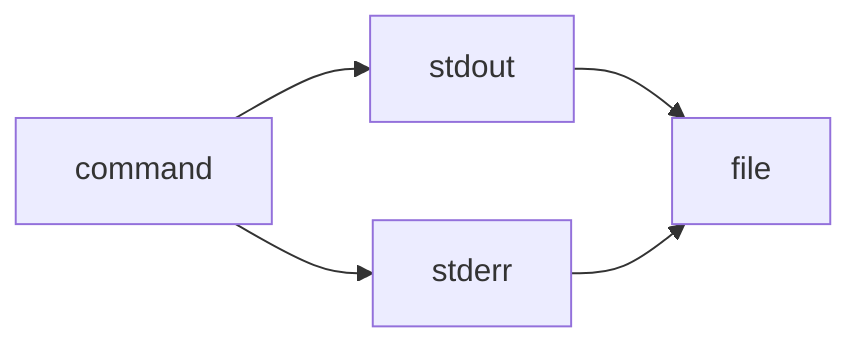

> 2>&1 is the explicit redirection operator:

> It means “send file descriptor 2 (stderr) to wherever file descriptor 1 (stdout) is currently going.” ^ref-b3555ede-4-0

> Works in all POSIX shells (sh, bash, zsh, dash, etc.). ^ref-b3555ede-6-0

^ref-b3555ede-7-0
 ^ref-b3555ede-15-0
> &> is a bash/zsh shorthand:
 ^ref-b3555ede-17-0
> It means “redirect both stdout and stderr to the same target.”
 ^ref-b3555ede-19-0
> Not POSIX; won’t work in plain sh or some other shells.
 ^ref-b3555ede-21-0
gg
pshots and Workers
  - Agent Reflections and Prompt Evolution
  - model-selection-for-lightweight-conversational-tasks
  - provider-agnostic-chat-panel-implementation
  - ecs-offload-workers
  - schema-evolution-workflow
  - local-offline-model-deployment-strategy
  - Eidolon Field Abstract Model
  - Promethean Web UI Setup
  - Promethean System Diagrams
  - polyglot-repl-interface-layer
references: []
--- ^ref-b3555ede-35-0

> 2>&1 is the explicit redirection operator:

> It means “send file descriptor 2 (stderr) to wherever file descriptor 1 (stdout) is currently going.” ^ref-b3555ede-4-0 ^ref-b3555ede-39-0

> Works in all POSIX shells (sh, bash, zsh, dash, etc.). ^ref-b3555ede-6-0

^ref-b3555ede-7-0
 ^ref-b3555ede-15-0
> &> is a bash/zsh shorthand:
 ^ref-b3555ede-17-0
> It means “redirect both stdout and stderr to the same target.”
 ^ref-b3555ede-19-0
> Not POSIX; won’t work in plain sh or some other shells.
 ^ref-b3555ede-21-0
gg
 ^ref-b3555ede-74-0 ^ref-b3555ede-81-0 ^ref-b3555ede-82-0 ^ref-b3555ede-84-0 ^ref-b3555ede-135-0
<!-- GENERATED-SECTIONS:DO-NOT-EDIT-BELOW -->
## Related content
- [[i3-bluetooth-setup]]
- [DuckDuckGoSearchPipeline](duckduckgosearchpipeline.md)
- [[ducks-self-referential-perceptual-loop|Duck's Self-Referential Perceptual Loop]]
- [[dynamic-context-model-for-web-components|Dynamic Context Model for Web Components]]
- [[fnord-tracer-protocol|Fnord Tracer Protocol]]
- [[factorio-ai-with-external-agents|Factorio AI with External Agents]]
- [[graph-ds]]
- [plan-update-confirmation](plan-update-confirmation.md)
- [[promethean-dev-workflow-update|Promethean Dev Workflow Update]]
- [[docs/unique/eidolon-field-math-foundations|eidolon-field-math-foundations]]
- [[ducks-attractor-states|Duck's Attractor States]]
- [[heartbeat-fragment-demo]]
- [[stateful-partitions-and-rebalancing|Stateful Partitions and Rebalancing]]
- [Debugging Broker Connections and Agent Behavior](debugging-broker-connections-and-agent-behavior.md)
- [Docops Feature Updates](docops-feature-updates-3.md)
- [[creative-moments|Creative Moments]]
- [[eidolon-field-abstract-model|Eidolon Field Abstract Model]]
- [[docs/unique/field-dynamics-math-blocks|field-dynamics-math-blocks]]
- [[field-node-diagram-outline]]
- [[promethean-copilot-intent-engine]]
- [[post-linguistic-transhuman-design-frameworks|Post-Linguistic Transhuman Design Frameworks]]
- [[promethean-chat-activity-report|Promethean Chat Activity Report]]
- [[promethean-documentation-pipeline-overview|Promethean Documentation Pipeline Overview]]
- [[promethean-eidolon-synchronicity-model|Promethean_Eidolon_Synchronicity_Model]]
- [[performance-optimized-polyglot-bridge]]
## Sources
- [[creative-moments#^ref-10d98225-38-0|Creative Moments — L38]] (line 38, col 0, score 1)
- [Docops Feature Updates — L51](docops-feature-updates-3.md#^ref-cdbd21ee-51-0) (line 51, col 0, score 1)
- [[docops-feature-updates#^ref-2792d448-79-0|Docops Feature Updates — L79]] (line 79, col 0, score 1)
- [DuckDuckGoSearchPipeline — L77](duckduckgosearchpipeline.md#^ref-e979c50f-77-0) (line 77, col 0, score 1)
- [[ducks-attractor-states#^ref-13951643-115-0|Duck's Attractor States — L115]] (line 115, col 0, score 1)
- [[ducks-self-referential-perceptual-loop#^ref-71726f04-61-0|Duck's Self-Referential Perceptual Loop — L61]] (line 61, col 0, score 1)
- [[eidolon-field-abstract-model#^ref-5e8b2388-212-0|Eidolon Field Abstract Model — L212]] (line 212, col 0, score 1)
- [[docs/unique/eidolon-field-math-foundations#^ref-008f2ac0-150-0|eidolon-field-math-foundations — L150]] (line 150, col 0, score 1)
- [[per-domain-policy-system-for-js-crawler#^ref-c03020e1-495-0|Per-Domain Policy System for JS Crawler — L495]] (line 495, col 0, score 1)
- [[performance-optimized-polyglot-bridge#^ref-f5579967-459-0|Performance-Optimized-Polyglot-Bridge — L459]] (line 459, col 0, score 1)
- [[pipeline-enhancements#^ref-e2135d9f-27-0|Pipeline Enhancements — L27]] (line 27, col 0, score 1)
- [plan-update-confirmation — L1002](plan-update-confirmation.md#^ref-b22d79c6-1002-0) (line 1002, col 0, score 1)
- [[polyglot-repl-interface-layer#^ref-9c79206d-171-0|polyglot-repl-interface-layer — L171]] (line 171, col 0, score 1)
- [[post-linguistic-transhuman-design-frameworks#^ref-6bcff92c-112-0|Post-Linguistic Transhuman Design Frameworks — L112]] (line 112, col 0, score 1)
- [[promethean-chat-activity-report#^ref-18344cf9-24-0|Promethean Chat Activity Report — L24]] (line 24, col 0, score 1)
- [Protocol_0_The_Contradiction_Engine — L143](protocol-0-the-contradiction-engine.md#^ref-9a93a756-143-0) (line 143, col 0, score 1)
- [[provider-agnostic-chat-panel-implementation#^ref-43bfe9dd-241-0|Provider-Agnostic Chat Panel Implementation — L241]] (line 241, col 0, score 1)
- [[creative-moments#^ref-10d98225-8-0|Creative Moments — L8]] (line 8, col 0, score 1)
- [Debugging Broker Connections and Agent Behavior — L38](debugging-broker-connections-and-agent-behavior.md#^ref-73d3dbf6-38-0) (line 38, col 0, score 1)
- [Docops Feature Updates — L56](docops-feature-updates-3.md#^ref-cdbd21ee-56-0) (line 56, col 0, score 1)
- [[creative-moments#^ref-10d98225-28-0|Creative Moments — L28]] (line 28, col 0, score 1)
- [Docops Feature Updates — L65](docops-feature-updates-3.md#^ref-cdbd21ee-65-0) (line 65, col 0, score 1)
- [[docops-feature-updates#^ref-2792d448-86-0|Docops Feature Updates — L86]] (line 86, col 0, score 1)
- [[ducks-attractor-states#^ref-13951643-123-0|Duck's Attractor States — L123]] (line 123, col 0, score 1)
- [[ducks-self-referential-perceptual-loop#^ref-71726f04-34-0|Duck's Self-Referential Perceptual Loop — L34]] (line 34, col 0, score 1)
- [[dynamic-context-model-for-web-components#^ref-f7702bf8-442-0|Dynamic Context Model for Web Components — L442]] (line 442, col 0, score 1)
- [[eidolon-field-abstract-model#^ref-5e8b2388-218-0|Eidolon Field Abstract Model — L218]] (line 218, col 0, score 1)
- [[docs/unique/eidolon-field-math-foundations#^ref-008f2ac0-176-0|eidolon-field-math-foundations — L176]] (line 176, col 0, score 1)
- [[eidolon-node-lifecycle#^ref-938eca9c-70-0|eidolon-node-lifecycle — L70]] (line 70, col 0, score 1)
- [Docops Feature Updates — L85](docops-feature-updates-3.md#^ref-cdbd21ee-85-0) (line 85, col 0, score 1)
- [[ducks-attractor-states#^ref-13951643-93-0|Duck's Attractor States — L93]] (line 93, col 0, score 1)
- [[ducks-self-referential-perceptual-loop#^ref-71726f04-64-0|Duck's Self-Referential Perceptual Loop — L64]] (line 64, col 0, score 1)
- [[factorio-ai-with-external-agents#^ref-a4d90289-153-0|Factorio AI with External Agents — L153]] (line 153, col 0, score 1)
- [[docs/unique/field-dynamics-math-blocks#^ref-7cfc230d-141-0|field-dynamics-math-blocks — L141]] (line 141, col 0, score 1)
- [[docops-feature-updates#^ref-2792d448-35-0|Docops Feature Updates — L35]] (line 35, col 0, score 1)
- [[ducks-attractor-states#^ref-13951643-94-0|Duck's Attractor States — L94]] (line 94, col 0, score 1)
- [[ducks-self-referential-perceptual-loop#^ref-71726f04-53-0|Duck's Self-Referential Perceptual Loop — L53]] (line 53, col 0, score 1)
- [[dynamic-context-model-for-web-components#^ref-f7702bf8-424-0|Dynamic Context Model for Web Components — L424]] (line 424, col 0, score 1)
- [[eidolon-field-abstract-model#^ref-5e8b2388-209-0|Eidolon Field Abstract Model — L209]] (line 209, col 0, score 1)
- [[docs/unique/eidolon-field-math-foundations#^ref-008f2ac0-142-0|eidolon-field-math-foundations — L142]] (line 142, col 0, score 1)
- [[eidolon-node-lifecycle#^ref-938eca9c-39-0|eidolon-node-lifecycle — L39]] (line 39, col 0, score 1)
- [Docops Feature Updates — L44](docops-feature-updates-3.md#^ref-cdbd21ee-44-0) (line 44, col 0, score 1)
- [[docops-feature-updates#^ref-2792d448-61-0|Docops Feature Updates — L61]] (line 61, col 0, score 1)
- [[ducks-attractor-states#^ref-13951643-99-0|Duck's Attractor States — L99]] (line 99, col 0, score 1)
- [[ducks-self-referential-perceptual-loop#^ref-71726f04-80-0|Duck's Self-Referential Perceptual Loop — L80]] (line 80, col 0, score 1)
- [[dynamic-context-model-for-web-components#^ref-f7702bf8-405-0|Dynamic Context Model for Web Components — L405]] (line 405, col 0, score 1)
- [[eidolon-field-abstract-model#^ref-5e8b2388-216-0|Eidolon Field Abstract Model — L216]] (line 216, col 0, score 1)
- [[factorio-ai-with-external-agents#^ref-a4d90289-189-0|Factorio AI with External Agents — L189]] (line 189, col 0, score 1)
- [[docs/unique/field-interaction-equations#^ref-b09141b7-172-0|field-interaction-equations — L172]] (line 172, col 0, score 1)
- [[dynamic-context-model-for-web-components#^ref-f7702bf8-412-0|Dynamic Context Model for Web Components — L412]] (line 412, col 0, score 1)
- [[eidolon-field-abstract-model#^ref-5e8b2388-261-0|Eidolon Field Abstract Model — L261]] (line 261, col 0, score 1)
- [[docs/unique/eidolon-field-math-foundations#^ref-008f2ac0-181-0|eidolon-field-math-foundations — L181]] (line 181, col 0, score 1)
- [[eidolon-node-lifecycle#^ref-938eca9c-90-0|eidolon-node-lifecycle — L90]] (line 90, col 0, score 1)
- [[factorio-ai-with-external-agents#^ref-a4d90289-157-0|Factorio AI with External Agents — L157]] (line 157, col 0, score 1)
- [[docs/unique/field-dynamics-math-blocks#^ref-7cfc230d-205-0|field-dynamics-math-blocks — L205]] (line 205, col 0, score 1)
- [[field-node-diagram-set#^ref-22b989d5-203-0|field-node-diagram-set — L203]] (line 203, col 0, score 1)
- [field-node-diagram-visualizations — L95](field-node-diagram-visualizations.md#^ref-e9b27b06-95-0) (line 95, col 0, score 1)
- [[creative-moments#^ref-10d98225-33-0|Creative Moments — L33]] (line 33, col 0, score 1)
- [Debugging Broker Connections and Agent Behavior — L99](debugging-broker-connections-and-agent-behavior.md#^ref-73d3dbf6-99-0) (line 99, col 0, score 1)
- [[docops-feature-updates#^ref-2792d448-46-0|Docops Feature Updates — L46]] (line 46, col 0, score 1)
- [DuckDuckGoSearchPipeline — L10](duckduckgosearchpipeline.md#^ref-e979c50f-10-0) (line 10, col 0, score 1)
- [[docs/unique/eidolon-field-math-foundations#^ref-008f2ac0-148-0|eidolon-field-math-foundations — L148]] (line 148, col 0, score 1)
- [[eidolon-node-lifecycle#^ref-938eca9c-36-0|eidolon-node-lifecycle — L36]] (line 36, col 0, score 1)
- [[factorio-ai-with-external-agents#^ref-a4d90289-166-0|Factorio AI with External Agents — L166]] (line 166, col 0, score 1)
- [[docs/unique/field-dynamics-math-blocks#^ref-7cfc230d-148-0|field-dynamics-math-blocks — L148]] (line 148, col 0, score 1)
- [[docs/unique/field-interaction-equations#^ref-b09141b7-153-0|field-interaction-equations — L153]] (line 153, col 0, score 1)
- [[field-node-diagram-outline#^ref-1f32c94a-118-0|field-node-diagram-outline — L118]] (line 118, col 0, score 1)
- [[field-node-diagram-set#^ref-22b989d5-168-0|field-node-diagram-set — L168]] (line 168, col 0, score 1)
- [field-node-diagram-visualizations — L103](field-node-diagram-visualizations.md#^ref-e9b27b06-103-0) (line 103, col 0, score 1)
- [[functional-embedding-pipeline-refactor#^ref-a4a25141-380-0|Functional Embedding Pipeline Refactor — L380]] (line 380, col 0, score 1)
- [[functional-refactor-of-typescript-document-processing#^ref-1cfae310-194-0|Functional Refactor of TypeScript Document Processing — L194]] (line 194, col 0, score 1)
- [[creative-moments#^ref-10d98225-47-0|Creative Moments — L47]] (line 47, col 0, score 1)
- [Debugging Broker Connections and Agent Behavior — L105](debugging-broker-connections-and-agent-behavior.md#^ref-73d3dbf6-105-0) (line 105, col 0, score 1)
- [Docops Feature Updates — L97](docops-feature-updates-3.md#^ref-cdbd21ee-97-0) (line 97, col 0, score 1)
- [[docops-feature-updates#^ref-2792d448-128-0|Docops Feature Updates — L128]] (line 128, col 0, score 1)
- [DuckDuckGoSearchPipeline — L31](duckduckgosearchpipeline.md#^ref-e979c50f-31-0) (line 31, col 0, score 1)
- [[ducks-attractor-states#^ref-13951643-90-0|Duck's Attractor States — L90]] (line 90, col 0, score 1)
- [[ducks-self-referential-perceptual-loop#^ref-71726f04-33-0|Duck's Self-Referential Perceptual Loop — L33]] (line 33, col 0, score 1)
- [[dynamic-context-model-for-web-components#^ref-f7702bf8-462-0|Dynamic Context Model for Web Components — L462]] (line 462, col 0, score 1)
- [[creative-moments#^ref-10d98225-50-0|Creative Moments — L50]] (line 50, col 0, score 1)
- [Debugging Broker Connections and Agent Behavior — L89](debugging-broker-connections-and-agent-behavior.md#^ref-73d3dbf6-89-0) (line 89, col 0, score 1)
- [Docops Feature Updates — L32](docops-feature-updates-3.md#^ref-cdbd21ee-32-0) (line 32, col 0, score 1)
- [[docops-feature-updates#^ref-2792d448-49-0|Docops Feature Updates — L49]] (line 49, col 0, score 1)
- [DuckDuckGoSearchPipeline — L95](duckduckgosearchpipeline.md#^ref-e979c50f-95-0) (line 95, col 0, score 1)
- [[ducks-attractor-states#^ref-13951643-133-0|Duck's Attractor States — L133]] (line 133, col 0, score 1)
- [[ducks-self-referential-perceptual-loop#^ref-71726f04-59-0|Duck's Self-Referential Perceptual Loop — L59]] (line 59, col 0, score 1)
- [[eidolon-field-abstract-model#^ref-5e8b2388-252-0|Eidolon Field Abstract Model — L252]] (line 252, col 0, score 1)
- [[creative-moments#^ref-10d98225-52-0|Creative Moments — L52]] (line 52, col 0, score 1)
- [Debugging Broker Connections and Agent Behavior — L71](debugging-broker-connections-and-agent-behavior.md#^ref-73d3dbf6-71-0) (line 71, col 0, score 1)
- [DuckDuckGoSearchPipeline — L99](duckduckgosearchpipeline.md#^ref-e979c50f-99-0) (line 99, col 0, score 1)
- [[creative-moments#^ref-10d98225-53-0|Creative Moments — L53]] (line 53, col 0, score 1)
- [[creative-moments#^ref-10d98225-75-0|Creative Moments — L75]] (line 75, col 0, score 1)
- [Debugging Broker Connections and Agent Behavior — L104](debugging-broker-connections-and-agent-behavior.md#^ref-73d3dbf6-104-0) (line 104, col 0, score 1)
- [Docops Feature Updates — L46](docops-feature-updates-3.md#^ref-cdbd21ee-46-0) (line 46, col 0, score 1)
- [[docops-feature-updates#^ref-2792d448-64-0|Docops Feature Updates — L64]] (line 64, col 0, score 1)
- [DuckDuckGoSearchPipeline — L40](duckduckgosearchpipeline.md#^ref-e979c50f-40-0) (line 40, col 0, score 1)
- [[ducks-attractor-states#^ref-13951643-137-0|Duck's Attractor States — L137]] (line 137, col 0, score 1)
- [[ducks-self-referential-perceptual-loop#^ref-71726f04-82-0|Duck's Self-Referential Perceptual Loop — L82]] (line 82, col 0, score 1)
- [[dynamic-context-model-for-web-components#^ref-f7702bf8-454-0|Dynamic Context Model for Web Components — L454]] (line 454, col 0, score 1)
- [[creative-moments#^ref-10d98225-9-0|Creative Moments — L9]] (line 9, col 0, score 1)
<!-- GENERATED-SECTIONS:DO-NOT-EDIT-ABOVE -->
