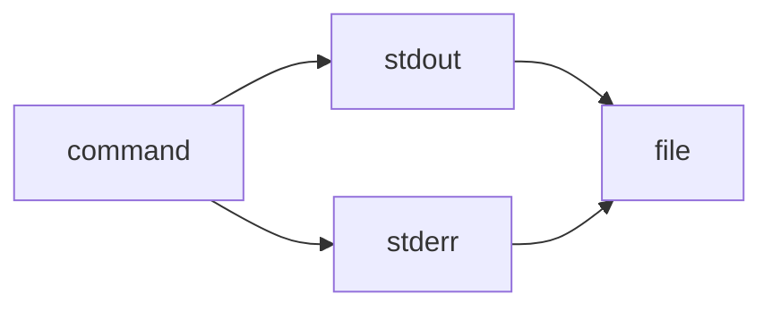

> 2>&1 is the explicit redirection operator:

> It means “send file descriptor 2 (stderr) to wherever file descriptor 1 (stdout) is currently going.” ^ref-b3555ede-4-0

> Works in all POSIX shells (sh, bash, zsh, dash, etc.). ^ref-b3555ede-6-0

^ref-b3555ede-7-0
 ^ref-b3555ede-15-0
> &> is a bash/zsh shorthand:
 ^ref-b3555ede-17-0
> It means “redirect both stdout and stderr to the same target.”
 ^ref-b3555ede-19-0
> Not POSIX; won’t work in plain sh or some other shells.
 ^ref-b3555ede-21-0
gg<!-- GENERATED-SECTIONS:DO-NOT-EDIT-BELOW -->
## Related content
- [Model Selection for Lightweight Conversational Tasks](model-selection-for-lightweight-conversational-tasks.md)
- [Dynamic Context Model for Web Components](dynamic-context-model-for-web-components.md)
- [Promethean Infrastructure Setup](promethean-infrastructure-setup.md)
- [Prompt_Folder_Bootstrap](prompt-folder-bootstrap.md)
- [plan-update-confirmation](plan-update-confirmation.md)
- [Canonical Org-Babel Matplotlib Animation Template](canonical-org-babel-matplotlib-animation-template.md)
- [eidolon-field-math-foundations](eidolon-field-math-foundations.md)
- [Duck's Attractor States](ducks-attractor-states.md)
- [TypeScript Patch for Tool Calling Support](typescript-patch-for-tool-calling-support.md)
- [zero-copy-snapshots-and-workers](zero-copy-snapshots-and-workers.md)
- [Stateful Partitions and Rebalancing](stateful-partitions-and-rebalancing.md)
- [The Jar of Echoes](the-jar-of-echoes.md)
- [field-node-diagram-outline](field-node-diagram-outline.md)
- [field-node-diagram-set](field-node-diagram-set.md)
- [Functional Refactor of TypeScript Document Processing](functional-refactor-of-typescript-document-processing.md)
- [field-dynamics-math-blocks](field-dynamics-math-blocks.md)
- [homeostasis-decay-formulas](homeostasis-decay-formulas.md)
- [Ice Box Reorganization](ice-box-reorganization.md)
- [obsidian-ignore-node-modules-regex](obsidian-ignore-node-modules-regex.md)
- [Per-Domain Policy System for JS Crawler](per-domain-policy-system-for-js-crawler.md)
- [Promethean-Copilot-Intent-Engine](promethean-copilot-intent-engine.md)
- [Promethean State Format](promethean-state-format.md)
- [Pure TypeScript Search Microservice](pure-typescript-search-microservice.md)
- [schema-evolution-workflow](schema-evolution-workflow.md)
- [Debugging Broker Connections and Agent Behavior](debugging-broker-connections-and-agent-behavior.md)
- [Factorio AI with External Agents](factorio-ai-with-external-agents.md)
- [field-interaction-equations](field-interaction-equations.md)
- [Eidolon Field Abstract Model](eidolon-field-abstract-model.md)
- [unique-templates](templates/unique-templates.md)
- [Tracing the Signal](tracing-the-signal.md)
- [ts-to-lisp-transpiler](ts-to-lisp-transpiler.md)
- [typed-struct-compiler](typed-struct-compiler.md)
- [Unique Concepts](unique-concepts.md)
- [Unique Info Dump Index](unique-info-dump-index.md)
- [Model Upgrade Calm-Down Guide](model-upgrade-calm-down-guide.md)
- [Fnord Tracer Protocol](fnord-tracer-protocol.md)
- [graph-ds](graph-ds.md)
- [Protocol_0_The_Contradiction_Engine](protocol-0-the-contradiction-engine.md)
- [Reawakening Duck](reawakening-duck.md)
- [Self-Agency in AI Interaction](self-agency-in-ai-interaction.md)
- [sibilant-macro-targets](sibilant-macro-targets.md)
- [Smoke Resonance Visualizations](smoke-resonance-visualizations.md)
- [Synchronicity Waves and Web](synchronicity-waves-and-web.md)
- [Creative Moments](creative-moments.md)
- [NPU Voice Code and Sensory Integration](npu-voice-code-and-sensory-integration.md)
- [Obsidian Task Generation](obsidian-task-generation.md)
- [OpenAPI Validation Report](openapi-validation-report.md)
- [Optimizing Command Limitations in System Design](optimizing-command-limitations-in-system-design.md)
- [Prometheus Observability Stack](prometheus-observability-stack.md)
- [Promethean Pipelines](promethean-pipelines.md)
- [promethean-requirements](promethean-requirements.md)
- [Promethean Workflow Optimization](promethean-workflow-optimization.md)
- [ripple-propagation-demo](ripple-propagation-demo.md)
- [ParticleSimulationWithCanvasAndFFmpeg](particlesimulationwithcanvasandffmpeg.md)
- [Admin Dashboard for User Management](admin-dashboard-for-user-management.md)
- [JavaScript](chunks/javascript.md)
- [Chroma Toolkit Consolidation Plan](chroma-toolkit-consolidation-plan.md)
- [Diagrams](chunks/diagrams.md)
- [DSL](chunks/dsl.md)
- [Math Fundamentals](chunks/math-fundamentals.md)
- [Operations](chunks/operations.md)
- [Services](chunks/services.md)
- [Shared](chunks/shared.md)
- [Promethean Chat Activity Report](promethean-chat-activity-report.md)
- [komorebi-group-window-hack](komorebi-group-window-hack.md)
- [Provider-Agnostic Chat Panel Implementation](provider-agnostic-chat-panel-implementation.md)
- [Layer1SurvivabilityEnvelope](layer1survivabilityenvelope.md)
- [Obsidian Templating Plugins Integration Guide](obsidian-templating-plugins-integration-guide.md)
- [i3-bluetooth-setup](i3-bluetooth-setup.md)
- [windows-tiling-with-autohotkey](windows-tiling-with-autohotkey.md)
- [Promethean Dev Workflow Update](promethean-dev-workflow-update.md)
- [heartbeat-fragment-demo](heartbeat-fragment-demo.md)
- [Docops Feature Updates](docops-feature-updates-3.md)
- [Docops Feature Updates](docops-feature-updates.md)
- [eidolon-node-lifecycle](eidolon-node-lifecycle.md)
- [field-node-diagram-visualizations](field-node-diagram-visualizations.md)
- [Functional Embedding Pipeline Refactor](functional-embedding-pipeline-refactor.md)
- [api-gateway-versioning](api-gateway-versioning.md)
- [Board Automation Improvements](board-automation-improvements.md)
- [Board Walk – 2025-08-11](board-walk-2025-08-11.md)
- [Performance-Optimized-Polyglot-Bridge](performance-optimized-polyglot-bridge.md)
- [polyglot-repl-interface-layer](polyglot-repl-interface-layer.md)
- [Window Management](chunks/window-management.md)
- [Duck's Self-Referential Perceptual Loop](ducks-self-referential-perceptual-loop.md)
- [ChatGPT Custom Prompts](chatgpt-custom-prompts.md)
- [Pipeline Enhancements](pipeline-enhancements.md)
- [Post-Linguistic Transhuman Design Frameworks](post-linguistic-transhuman-design-frameworks.md)
- [Promethean Data Sync Protocol](promethean-data-sync-protocol.md)
- [Promethean Documentation Overview](promethean-documentation-overview.md)
- [DuckDuckGoSearchPipeline](duckduckgosearchpipeline.md)
- [Mathematical Samplers](mathematical-samplers.md)
- [Mathematics Sampler](mathematics-sampler.md)
- [Migrate to Provider-Tenant Architecture](migrate-to-provider-tenant-architecture.md)
- [Mindful Prioritization](mindful-prioritization.md)
- [Obsidian ChatGPT Plugin Integration Guide](obsidian-chatgpt-plugin-integration-guide.md)
- [Obsidian ChatGPT Plugin Integration](obsidian-chatgpt-plugin-integration.md)
- [Promethean_Eidolon_Synchronicity_Model](promethean-eidolon-synchronicity-model.md)
- [Promethean Documentation Update](promethean-documentation-update.txt)
- [Promethean Notes](promethean-notes.md)
- [Simulation Demo](chunks/simulation-demo.md)
- [balanced-bst](balanced-bst.md)
- [Promethean Documentation Pipeline Overview](promethean-documentation-pipeline-overview.md)
- [Promethean Documentation Update](promethean-documentation-update.md)
- [MindfulRobotIntegration](mindfulrobotintegration.md)
- [Agent Tasks: Persistence Migration to DualStore](agent-tasks-persistence-migration-to-dualstore.md)
- [Ollama-LLM-Provider-for-Pseudo-Code-Transpiler](ollama-llm-provider-for-pseudo-code-transpiler.md)
- [Agent Reflections and Prompt Evolution](agent-reflections-and-prompt-evolution.md)
- [Tooling](chunks/tooling.md)
- [aionian-circuit-math](aionian-circuit-math.md)
- [Promethean-native config design](promethean-native-config-design.md)
- [ecs-offload-workers](ecs-offload-workers.md)
- [Lispy Macros with syntax-rules](lispy-macros-with-syntax-rules.md)
- [polymorphic-meta-programming-engine](polymorphic-meta-programming-engine.md)
- [Local-Offline-Model-Deployment-Strategy](local-offline-model-deployment-strategy.md)
- [2d-sandbox-field](2d-sandbox-field.md)
- [promethean-system-diagrams](promethean-system-diagrams.md)
## Sources
- [Tooling — L41](chunks/tooling.md#^ref-6cb4943e-41-0) (line 41, col 0, score 1)
- [Docops Feature Updates — L48](docops-feature-updates-3.md#^ref-cdbd21ee-48-0) (line 48, col 0, score 1)
- [Docops Feature Updates — L79](docops-feature-updates.md#^ref-2792d448-79-0) (line 79, col 0, score 1)
- [eidolon-node-lifecycle — L69](eidolon-node-lifecycle.md#^ref-938eca9c-69-0) (line 69, col 0, score 1)
- [field-node-diagram-outline — L158](field-node-diagram-outline.md#^ref-1f32c94a-158-0) (line 158, col 0, score 1)
- [field-node-diagram-set — L178](field-node-diagram-set.md#^ref-22b989d5-178-0) (line 178, col 0, score 1)
- [field-node-diagram-visualizations — L126](field-node-diagram-visualizations.md#^ref-e9b27b06-126-0) (line 126, col 0, score 1)
- [Functional Embedding Pipeline Refactor — L410](functional-embedding-pipeline-refactor.md#^ref-a4a25141-410-0) (line 410, col 0, score 1)
- [Functional Refactor of TypeScript Document Processing — L228](functional-refactor-of-typescript-document-processing.md#^ref-1cfae310-228-0) (line 228, col 0, score 1)
- [aionian-circuit-math — L149](aionian-circuit-math.md#^ref-f2d83a77-149-0) (line 149, col 0, score 1)
- [api-gateway-versioning — L285](api-gateway-versioning.md#^ref-0580dcd3-285-0) (line 285, col 0, score 1)
- [Board Automation Improvements — L11](board-automation-improvements.md#^ref-ac60a1d6-11-0) (line 11, col 0, score 1)
- [Board Walk – 2025-08-11 — L134](board-walk-2025-08-11.md#^ref-7aa1eb92-134-0) (line 134, col 0, score 1)
- [field-dynamics-math-blocks — L193](field-dynamics-math-blocks.md#^ref-7cfc230d-193-0) (line 193, col 0, score 1)
- [field-node-diagram-set — L203](field-node-diagram-set.md#^ref-22b989d5-203-0) (line 203, col 0, score 1)
- [field-node-diagram-visualizations — L151](field-node-diagram-visualizations.md#^ref-e9b27b06-151-0) (line 151, col 0, score 1)
- [Functional Refactor of TypeScript Document Processing — L281](functional-refactor-of-typescript-document-processing.md#^ref-1cfae310-281-0) (line 281, col 0, score 1)
- [heartbeat-fragment-demo — L181](heartbeat-fragment-demo.md#^ref-dd00677a-181-0) (line 181, col 0, score 1)
- [homeostasis-decay-formulas — L220](homeostasis-decay-formulas.md#^ref-37b5d236-220-0) (line 220, col 0, score 1)
- [Ice Box Reorganization — L110](ice-box-reorganization.md#^ref-291c7d91-110-0) (line 110, col 0, score 1)
- [obsidian-ignore-node-modules-regex — L118](obsidian-ignore-node-modules-regex.md#^ref-ffb9b2a9-118-0) (line 118, col 0, score 1)
- [ParticleSimulationWithCanvasAndFFmpeg — L329](particlesimulationwithcanvasandffmpeg.md#^ref-e018dd7a-329-0) (line 329, col 0, score 1)
- [TypeScript Patch for Tool Calling Support — L559](typescript-patch-for-tool-calling-support.md#^ref-7b7ca860-559-0) (line 559, col 0, score 1)
- [obsidian-ignore-node-modules-regex — L119](obsidian-ignore-node-modules-regex.md#^ref-ffb9b2a9-119-0) (line 119, col 0, score 1)
- [ParticleSimulationWithCanvasAndFFmpeg — L315](particlesimulationwithcanvasandffmpeg.md#^ref-e018dd7a-315-0) (line 315, col 0, score 1)
- [Per-Domain Policy System for JS Crawler — L548](per-domain-policy-system-for-js-crawler.md#^ref-c03020e1-548-0) (line 548, col 0, score 1)
- [Performance-Optimized-Polyglot-Bridge — L496](performance-optimized-polyglot-bridge.md#^ref-f5579967-496-0) (line 496, col 0, score 1)
- [polyglot-repl-interface-layer — L224](polyglot-repl-interface-layer.md#^ref-9c79206d-224-0) (line 224, col 0, score 1)
- [Promethean-Copilot-Intent-Engine — L125](promethean-copilot-intent-engine.md#^ref-ae24a280-125-0) (line 125, col 0, score 1)
- [Promethean State Format — L165](promethean-state-format.md#^ref-23df6ddb-165-0) (line 165, col 0, score 1)
- [Admin Dashboard for User Management — L45](admin-dashboard-for-user-management.md#^ref-2901a3e9-45-0) (line 45, col 0, score 1)
- [TypeScript Patch for Tool Calling Support — L560](typescript-patch-for-tool-calling-support.md#^ref-7b7ca860-560-0) (line 560, col 0, score 1)
- [Agent Reflections and Prompt Evolution — L187](agent-reflections-and-prompt-evolution.md#^ref-bb7f0835-187-0) (line 187, col 0, score 1)
- [JavaScript — L66](chunks/javascript.md#^ref-c1618c66-66-0) (line 66, col 0, score 1)
- [field-node-diagram-outline — L186](field-node-diagram-outline.md#^ref-1f32c94a-186-0) (line 186, col 0, score 1)
- [field-node-diagram-set — L212](field-node-diagram-set.md#^ref-22b989d5-212-0) (line 212, col 0, score 1)
- [field-node-diagram-visualizations — L162](field-node-diagram-visualizations.md#^ref-e9b27b06-162-0) (line 162, col 0, score 1)
- [heartbeat-fragment-demo — L191](heartbeat-fragment-demo.md#^ref-dd00677a-191-0) (line 191, col 0, score 1)
- [homeostasis-decay-formulas — L233](homeostasis-decay-formulas.md#^ref-37b5d236-233-0) (line 233, col 0, score 1)
- [Ice Box Reorganization — L129](ice-box-reorganization.md#^ref-291c7d91-129-0) (line 129, col 0, score 1)
- [Model Selection for Lightweight Conversational Tasks — L212](model-selection-for-lightweight-conversational-tasks.md#^ref-d144aa62-212-0) (line 212, col 0, score 1)
- [Chroma Toolkit Consolidation Plan — L1002](chroma-toolkit-consolidation-plan.md#^ref-5020e892-1002-0) (line 1002, col 0, score 1)
- [Diagrams — L522](chunks/diagrams.md#^ref-45cd25b5-522-0) (line 522, col 0, score 1)
- [DSL — L469](chunks/dsl.md#^ref-e87bc036-469-0) (line 469, col 0, score 1)
- [JavaScript — L508](chunks/javascript.md#^ref-c1618c66-508-0) (line 508, col 0, score 1)
- [Math Fundamentals — L454](chunks/math-fundamentals.md#^ref-c6e87433-454-0) (line 454, col 0, score 1)
- [Operations — L181](chunks/operations.md#^ref-f1add613-181-0) (line 181, col 0, score 1)
- [Services — L440](chunks/services.md#^ref-75ea4a6a-440-0) (line 440, col 0, score 1)
- [Shared — L370](chunks/shared.md#^ref-623a55f7-370-0) (line 370, col 0, score 1)
- [Pure TypeScript Search Microservice — L605](pure-typescript-search-microservice.md#^ref-d17d3a96-605-0) (line 605, col 0, score 1)
- [TypeScript Patch for Tool Calling Support — L561](typescript-patch-for-tool-calling-support.md#^ref-7b7ca860-561-0) (line 561, col 0, score 1)
- [schema-evolution-workflow — L645](schema-evolution-workflow.md#^ref-d8059b6a-645-0) (line 645, col 0, score 1)
- [Stateful Partitions and Rebalancing — L671](stateful-partitions-and-rebalancing.md#^ref-4330e8f0-671-0) (line 671, col 0, score 1)
- [Eidolon Field Abstract Model — L224](eidolon-field-abstract-model.md#^ref-5e8b2388-224-0) (line 224, col 0, score 1)
- [schema-evolution-workflow — L582](schema-evolution-workflow.md#^ref-d8059b6a-582-0) (line 582, col 0, score 1)
- [Stateful Partitions and Rebalancing — L620](stateful-partitions-and-rebalancing.md#^ref-4330e8f0-620-0) (line 620, col 0, score 1)
- [unique-templates — L11](templates/unique-templates.md#^ref-c26f0044-11-0) (line 11, col 0, score 1)
- [The Jar of Echoes — L130](the-jar-of-echoes.md#^ref-18138627-130-0) (line 130, col 0, score 1)
- [Tracing the Signal — L106](tracing-the-signal.md#^ref-c3cd4f65-106-0) (line 106, col 0, score 1)
- [ts-to-lisp-transpiler — L44](ts-to-lisp-transpiler.md#^ref-ba11486b-44-0) (line 44, col 0, score 1)
- [typed-struct-compiler — L409](typed-struct-compiler.md#^ref-78eeedf7-409-0) (line 409, col 0, score 1)
- [TypeScript Patch for Tool Calling Support — L554](typescript-patch-for-tool-calling-support.md#^ref-7b7ca860-554-0) (line 554, col 0, score 1)
- [Unique Concepts — L9](unique-concepts.md#^ref-ed6f3fc9-9-0) (line 9, col 0, score 1)
- [ChatGPT Custom Prompts — L18](chatgpt-custom-prompts.md#^ref-930054b3-18-0) (line 18, col 0, score 1)
- [unique-templates — L12](templates/unique-templates.md#^ref-c26f0044-12-0) (line 12, col 0, score 1)
- [The Jar of Echoes — L139](the-jar-of-echoes.md#^ref-18138627-139-0) (line 139, col 0, score 1)
- [Tracing the Signal — L104](tracing-the-signal.md#^ref-c3cd4f65-104-0) (line 104, col 0, score 1)
- [ts-to-lisp-transpiler — L45](ts-to-lisp-transpiler.md#^ref-ba11486b-45-0) (line 45, col 0, score 1)
- [typed-struct-compiler — L411](typed-struct-compiler.md#^ref-78eeedf7-411-0) (line 411, col 0, score 1)
- [TypeScript Patch for Tool Calling Support — L566](typescript-patch-for-tool-calling-support.md#^ref-7b7ca860-566-0) (line 566, col 0, score 1)
- [Unique Concepts — L10](unique-concepts.md#^ref-ed6f3fc9-10-0) (line 10, col 0, score 1)
- [Unique Info Dump Index — L144](unique-info-dump-index.md#^ref-30ec3ba6-144-0) (line 144, col 0, score 1)
- [Pure TypeScript Search Microservice — L590](pure-typescript-search-microservice.md#^ref-d17d3a96-590-0) (line 590, col 0, score 1)
- [schema-evolution-workflow — L574](schema-evolution-workflow.md#^ref-d8059b6a-574-0) (line 574, col 0, score 1)
- [Stateful Partitions and Rebalancing — L604](stateful-partitions-and-rebalancing.md#^ref-4330e8f0-604-0) (line 604, col 0, score 1)
- [unique-templates — L13](templates/unique-templates.md#^ref-c26f0044-13-0) (line 13, col 0, score 1)
- [The Jar of Echoes — L131](the-jar-of-echoes.md#^ref-18138627-131-0) (line 131, col 0, score 1)
- [Tracing the Signal — L107](tracing-the-signal.md#^ref-c3cd4f65-107-0) (line 107, col 0, score 1)
- [ts-to-lisp-transpiler — L38](ts-to-lisp-transpiler.md#^ref-ba11486b-38-0) (line 38, col 0, score 1)
- [typed-struct-compiler — L407](typed-struct-compiler.md#^ref-78eeedf7-407-0) (line 407, col 0, score 1)
- [TypeScript Patch for Tool Calling Support — L538](typescript-patch-for-tool-calling-support.md#^ref-7b7ca860-538-0) (line 538, col 0, score 1)
- [Unique Concepts — L11](unique-concepts.md#^ref-ed6f3fc9-11-0) (line 11, col 0, score 1)
- [Model Upgrade Calm-Down Guide — L71](model-upgrade-calm-down-guide.md#^ref-db74343f-71-0) (line 71, col 0, score 1)
- [Duck's Attractor States — L105](ducks-attractor-states.md#^ref-13951643-105-0) (line 105, col 0, score 1)
- [Duck's Self-Referential Perceptual Loop — L71](ducks-self-referential-perceptual-loop.md#^ref-71726f04-71-0) (line 71, col 0, score 1)
- [Factorio AI with External Agents — L183](factorio-ai-with-external-agents.md#^ref-a4d90289-183-0) (line 183, col 0, score 1)
- [Fnord Tracer Protocol — L279](fnord-tracer-protocol.md#^ref-fc21f824-279-0) (line 279, col 0, score 1)
- [Functional Embedding Pipeline Refactor — L335](functional-embedding-pipeline-refactor.md#^ref-a4a25141-335-0) (line 335, col 0, score 1)
- [Functional Refactor of TypeScript Document Processing — L159](functional-refactor-of-typescript-document-processing.md#^ref-1cfae310-159-0) (line 159, col 0, score 1)
- [graph-ds — L423](graph-ds.md#^ref-6620e2f2-423-0) (line 423, col 0, score 1)
- [i3-bluetooth-setup — L158](i3-bluetooth-setup.md#^ref-5e408692-158-0) (line 158, col 0, score 1)
- [Ice Box Reorganization — L103](ice-box-reorganization.md#^ref-291c7d91-103-0) (line 103, col 0, score 1)
- [komorebi-group-window-hack — L253](komorebi-group-window-hack.md#^ref-dd89372d-253-0) (line 253, col 0, score 1)
- [JavaScript — L76](chunks/javascript.md#^ref-c1618c66-76-0) (line 76, col 0, score 1)
- [Math Fundamentals — L69](chunks/math-fundamentals.md#^ref-c6e87433-69-0) (line 69, col 0, score 1)
- [Services — L62](chunks/services.md#^ref-75ea4a6a-62-0) (line 62, col 0, score 1)
- [Tooling — L54](chunks/tooling.md#^ref-6cb4943e-54-0) (line 54, col 0, score 1)
- [Window Management — L56](chunks/window-management.md#^ref-9e8ae388-56-0) (line 56, col 0, score 1)
- [Debugging Broker Connections and Agent Behavior — L87](debugging-broker-connections-and-agent-behavior.md#^ref-73d3dbf6-87-0) (line 87, col 0, score 1)
- [Duck's Self-Referential Perceptual Loop — L82](ducks-self-referential-perceptual-loop.md#^ref-71726f04-82-0) (line 82, col 0, score 1)
- [Dynamic Context Model for Web Components — L467](dynamic-context-model-for-web-components.md#^ref-f7702bf8-467-0) (line 467, col 0, score 1)
- [field-dynamics-math-blocks — L205](field-dynamics-math-blocks.md#^ref-7cfc230d-205-0) (line 205, col 0, score 1)
- [Protocol_0_The_Contradiction_Engine — L160](protocol-0-the-contradiction-engine.md#^ref-9a93a756-160-0) (line 160, col 0, score 1)
- [Provider-Agnostic Chat Panel Implementation — L276](provider-agnostic-chat-panel-implementation.md#^ref-43bfe9dd-276-0) (line 276, col 0, score 1)
- [Pure TypeScript Search Microservice — L628](pure-typescript-search-microservice.md#^ref-d17d3a96-628-0) (line 628, col 0, score 1)
- [Reawakening Duck — L161](reawakening-duck.md#^ref-59b5670f-161-0) (line 161, col 0, score 1)
- [schema-evolution-workflow — L603](schema-evolution-workflow.md#^ref-d8059b6a-603-0) (line 603, col 0, score 1)
- [Self-Agency in AI Interaction — L57](self-agency-in-ai-interaction.md#^ref-49a9a860-57-0) (line 57, col 0, score 1)
- [sibilant-macro-targets — L250](sibilant-macro-targets.md#^ref-c5c9a5c6-250-0) (line 250, col 0, score 1)
- [Stateful Partitions and Rebalancing — L649](stateful-partitions-and-rebalancing.md#^ref-4330e8f0-649-0) (line 649, col 0, score 1)
- [Protocol_0_The_Contradiction_Engine — L184](protocol-0-the-contradiction-engine.md#^ref-9a93a756-184-0) (line 184, col 0, score 1)
- [Provider-Agnostic Chat Panel Implementation — L283](provider-agnostic-chat-panel-implementation.md#^ref-43bfe9dd-283-0) (line 283, col 0, score 1)
- [Pure TypeScript Search Microservice — L629](pure-typescript-search-microservice.md#^ref-d17d3a96-629-0) (line 629, col 0, score 1)
- [schema-evolution-workflow — L623](schema-evolution-workflow.md#^ref-d8059b6a-623-0) (line 623, col 0, score 1)
- [Self-Agency in AI Interaction — L58](self-agency-in-ai-interaction.md#^ref-49a9a860-58-0) (line 58, col 0, score 1)
- [Smoke Resonance Visualizations — L108](smoke-resonance-visualizations.md#^ref-ac9d3ac5-108-0) (line 108, col 0, score 1)
- [Stateful Partitions and Rebalancing — L654](stateful-partitions-and-rebalancing.md#^ref-4330e8f0-654-0) (line 654, col 0, score 1)
- [Synchronicity Waves and Web — L123](synchronicity-waves-and-web.md#^ref-91295f3a-123-0) (line 123, col 0, score 1)
- [unique-templates — L16](templates/unique-templates.md#^ref-c26f0044-16-0) (line 16, col 0, score 1)
- [Performance-Optimized-Polyglot-Bridge — L483](performance-optimized-polyglot-bridge.md#^ref-f5579967-483-0) (line 483, col 0, score 1)
- [Pipeline Enhancements — L11](pipeline-enhancements.md#^ref-e2135d9f-11-0) (line 11, col 0, score 1)
- [plan-update-confirmation — L1026](plan-update-confirmation.md#^ref-b22d79c6-1026-0) (line 1026, col 0, score 1)
- [polyglot-repl-interface-layer — L219](polyglot-repl-interface-layer.md#^ref-9c79206d-219-0) (line 219, col 0, score 1)
- [Post-Linguistic Transhuman Design Frameworks — L126](post-linguistic-transhuman-design-frameworks.md#^ref-6bcff92c-126-0) (line 126, col 0, score 1)
- [Promethean Chat Activity Report — L33](promethean-chat-activity-report.md#^ref-18344cf9-33-0) (line 33, col 0, score 1)
- [Promethean-Copilot-Intent-Engine — L100](promethean-copilot-intent-engine.md#^ref-ae24a280-100-0) (line 100, col 0, score 1)
- [Promethean Data Sync Protocol — L15](promethean-data-sync-protocol.md#^ref-9fab9e76-15-0) (line 15, col 0, score 1)
- [Promethean Dev Workflow Update — L107](promethean-dev-workflow-update.md#^ref-03a5578f-107-0) (line 107, col 0, score 1)
- [Promethean Documentation Overview — L9](promethean-documentation-overview.md#^ref-9413237f-9-0) (line 9, col 0, score 1)
- [Tooling — L36](chunks/tooling.md#^ref-6cb4943e-36-0) (line 36, col 0, score 1)
- [Window Management — L49](chunks/window-management.md#^ref-9e8ae388-49-0) (line 49, col 0, score 1)
- [Creative Moments — L18](creative-moments.md#^ref-10d98225-18-0) (line 18, col 0, score 1)
- [Debugging Broker Connections and Agent Behavior — L77](debugging-broker-connections-and-agent-behavior.md#^ref-73d3dbf6-77-0) (line 77, col 0, score 1)
- [Docops Feature Updates — L39](docops-feature-updates-3.md#^ref-cdbd21ee-39-0) (line 39, col 0, score 1)
- [Docops Feature Updates — L67](docops-feature-updates.md#^ref-2792d448-67-0) (line 67, col 0, score 1)
- [DuckDuckGoSearchPipeline — L22](duckduckgosearchpipeline.md#^ref-e979c50f-22-0) (line 22, col 0, score 1)
- [Duck's Attractor States — L107](ducks-attractor-states.md#^ref-13951643-107-0) (line 107, col 0, score 1)
- [Duck's Self-Referential Perceptual Loop — L88](ducks-self-referential-perceptual-loop.md#^ref-71726f04-88-0) (line 88, col 0, score 1)
- [eidolon-field-math-foundations — L198](eidolon-field-math-foundations.md#^ref-008f2ac0-198-0) (line 198, col 0, score 1)
- [Reawakening Duck — L164](reawakening-duck.md#^ref-59b5670f-164-0) (line 164, col 0, score 1)
- [schema-evolution-workflow — L625](schema-evolution-workflow.md#^ref-d8059b6a-625-0) (line 625, col 0, score 1)
- [Self-Agency in AI Interaction — L60](self-agency-in-ai-interaction.md#^ref-49a9a860-60-0) (line 60, col 0, score 1)
- [sibilant-macro-targets — L253](sibilant-macro-targets.md#^ref-c5c9a5c6-253-0) (line 253, col 0, score 1)
- [Smoke Resonance Visualizations — L128](smoke-resonance-visualizations.md#^ref-ac9d3ac5-128-0) (line 128, col 0, score 1)
- [Stateful Partitions and Rebalancing — L644](stateful-partitions-and-rebalancing.md#^ref-4330e8f0-644-0) (line 644, col 0, score 1)
- [Synchronicity Waves and Web — L125](synchronicity-waves-and-web.md#^ref-91295f3a-125-0) (line 125, col 0, score 1)
- [unique-templates — L19](templates/unique-templates.md#^ref-c26f0044-19-0) (line 19, col 0, score 1)
- [Mathematical Samplers — L66](mathematical-samplers.md#^ref-86a691ec-66-0) (line 66, col 0, score 1)
- [Mathematics Sampler — L70](mathematics-sampler.md#^ref-b5e0183e-70-0) (line 70, col 0, score 1)
- [Migrate to Provider-Tenant Architecture — L364](migrate-to-provider-tenant-architecture.md#^ref-54382370-364-0) (line 364, col 0, score 1)
- [Mindful Prioritization — L20](mindful-prioritization.md#^ref-40185d05-20-0) (line 20, col 0, score 1)
- [Model Selection for Lightweight Conversational Tasks — L203](model-selection-for-lightweight-conversational-tasks.md#^ref-d144aa62-203-0) (line 203, col 0, score 1)
- [NPU Voice Code and Sensory Integration — L25](npu-voice-code-and-sensory-integration.md#^ref-5a02283e-25-0) (line 25, col 0, score 1)
- [Obsidian ChatGPT Plugin Integration Guide — L87](obsidian-chatgpt-plugin-integration-guide.md#^ref-1d3d6c3a-87-0) (line 87, col 0, score 1)
- [Obsidian ChatGPT Plugin Integration — L89](obsidian-chatgpt-plugin-integration.md#^ref-ca8e1399-89-0) (line 89, col 0, score 1)
- [obsidian-ignore-node-modules-regex — L111](obsidian-ignore-node-modules-regex.md#^ref-ffb9b2a9-111-0) (line 111, col 0, score 1)
- [Obsidian Task Generation — L25](obsidian-task-generation.md#^ref-9b694a91-25-0) (line 25, col 0, score 1)
- [OpenAPI Validation Report — L43](openapi-validation-report.md#^ref-5c152b08-43-0) (line 43, col 0, score 1)
- [Optimizing Command Limitations in System Design — L79](optimizing-command-limitations-in-system-design.md#^ref-98c8ff62-79-0) (line 79, col 0, score 1)
- [TypeScript Patch for Tool Calling Support — L574](typescript-patch-for-tool-calling-support.md#^ref-7b7ca860-574-0) (line 574, col 0, score 1)
- [Per-Domain Policy System for JS Crawler — L541](per-domain-policy-system-for-js-crawler.md#^ref-c03020e1-541-0) (line 541, col 0, score 1)
- [Performance-Optimized-Polyglot-Bridge — L503](performance-optimized-polyglot-bridge.md#^ref-f5579967-503-0) (line 503, col 0, score 1)
- [Pipeline Enhancements — L17](pipeline-enhancements.md#^ref-e2135d9f-17-0) (line 17, col 0, score 1)
- [plan-update-confirmation — L1056](plan-update-confirmation.md#^ref-b22d79c6-1056-0) (line 1056, col 0, score 1)
- [Post-Linguistic Transhuman Design Frameworks — L116](post-linguistic-transhuman-design-frameworks.md#^ref-6bcff92c-116-0) (line 116, col 0, score 1)
- [Promethean Chat Activity Report — L41](promethean-chat-activity-report.md#^ref-18344cf9-41-0) (line 41, col 0, score 1)
- [Promethean-Copilot-Intent-Engine — L118](promethean-copilot-intent-engine.md#^ref-ae24a280-118-0) (line 118, col 0, score 1)
- [Promethean Data Sync Protocol — L20](promethean-data-sync-protocol.md#^ref-9fab9e76-20-0) (line 20, col 0, score 1)
- [Promethean_Eidolon_Synchronicity_Model — L92](promethean-eidolon-synchronicity-model.md#^ref-2d6e5553-92-0) (line 92, col 0, score 1)
- [Prometheus Observability Stack — L565](prometheus-observability-stack.md#^ref-e90b5a16-565-0) (line 565, col 0, score 1)
- [Prompt_Folder_Bootstrap — L244](prompt-folder-bootstrap.md#^ref-bd4f0976-244-0) (line 244, col 0, score 1)
- [Protocol_0_The_Contradiction_Engine — L159](protocol-0-the-contradiction-engine.md#^ref-9a93a756-159-0) (line 159, col 0, score 1)
- [TypeScript Patch for Tool Calling Support — L541](typescript-patch-for-tool-calling-support.md#^ref-7b7ca860-541-0) (line 541, col 0, score 1)
- [zero-copy-snapshots-and-workers — L375](zero-copy-snapshots-and-workers.md#^ref-62bec6f0-375-0) (line 375, col 0, score 1)
- [Duck's Self-Referential Perceptual Loop — L78](ducks-self-referential-perceptual-loop.md#^ref-71726f04-78-0) (line 78, col 0, score 1)
- [Factorio AI with External Agents — L176](factorio-ai-with-external-agents.md#^ref-a4d90289-176-0) (line 176, col 0, score 1)
- [field-node-diagram-outline — L154](field-node-diagram-outline.md#^ref-1f32c94a-154-0) (line 154, col 0, score 1)
- [field-node-diagram-set — L175](field-node-diagram-set.md#^ref-22b989d5-175-0) (line 175, col 0, score 1)
- [field-node-diagram-visualizations — L123](field-node-diagram-visualizations.md#^ref-e9b27b06-123-0) (line 123, col 0, score 1)
- [Fnord Tracer Protocol — L274](fnord-tracer-protocol.md#^ref-fc21f824-274-0) (line 274, col 0, score 1)
- [Functional Embedding Pipeline Refactor — L327](functional-embedding-pipeline-refactor.md#^ref-a4a25141-327-0) (line 327, col 0, score 1)
- [graph-ds — L412](graph-ds.md#^ref-6620e2f2-412-0) (line 412, col 0, score 1)
- [heartbeat-fragment-demo — L159](heartbeat-fragment-demo.md#^ref-dd00677a-159-0) (line 159, col 0, score 1)
- [Ice Box Reorganization — L95](ice-box-reorganization.md#^ref-291c7d91-95-0) (line 95, col 0, score 1)
- [Services — L61](chunks/services.md#^ref-75ea4a6a-61-0) (line 61, col 0, score 1)
- [Docops Feature Updates — L37](docops-feature-updates-3.md#^ref-cdbd21ee-37-0) (line 37, col 0, score 1)
- [Docops Feature Updates — L59](docops-feature-updates.md#^ref-2792d448-59-0) (line 59, col 0, score 1)
- [DuckDuckGoSearchPipeline — L34](duckduckgosearchpipeline.md#^ref-e979c50f-34-0) (line 34, col 0, score 1)
- [Duck's Attractor States — L117](ducks-attractor-states.md#^ref-13951643-117-0) (line 117, col 0, score 1)
- [Duck's Self-Referential Perceptual Loop — L93](ducks-self-referential-perceptual-loop.md#^ref-71726f04-93-0) (line 93, col 0, score 1)
- [Eidolon Field Abstract Model — L310](eidolon-field-abstract-model.md#^ref-5e8b2388-310-0) (line 310, col 0, score 1)
- [eidolon-field-math-foundations — L208](eidolon-field-math-foundations.md#^ref-008f2ac0-208-0) (line 208, col 0, score 1)
- [Factorio AI with External Agents — L192](factorio-ai-with-external-agents.md#^ref-a4d90289-192-0) (line 192, col 0, score 1)
- [field-interaction-equations — L272](field-interaction-equations.md#^ref-b09141b7-272-0) (line 272, col 0, score 1)
- [Fnord Tracer Protocol — L307](fnord-tracer-protocol.md#^ref-fc21f824-307-0) (line 307, col 0, score 1)
- [TypeScript Patch for Tool Calling Support — L547](typescript-patch-for-tool-calling-support.md#^ref-7b7ca860-547-0) (line 547, col 0, score 1)
- [Promethean Documentation Update — L21](promethean-documentation-update.txt#^ref-0b872af2-21-0) (line 21, col 0, score 1)
- [Promethean_Eidolon_Synchronicity_Model — L87](promethean-eidolon-synchronicity-model.md#^ref-2d6e5553-87-0) (line 87, col 0, score 1)
- [Promethean Notes — L24](promethean-notes.md#^ref-1c4046b5-24-0) (line 24, col 0, score 1)
- [Promethean Pipelines — L128](promethean-pipelines.md#^ref-8b8e6103-128-0) (line 128, col 0, score 1)
- [promethean-requirements — L35](promethean-requirements.md#^ref-95205cd3-35-0) (line 35, col 0, score 1)
- [Promethean State Format — L131](promethean-state-format.md#^ref-23df6ddb-131-0) (line 131, col 0, score 1)
- [Promethean Workflow Optimization — L33](promethean-workflow-optimization.md#^ref-d614d983-33-0) (line 33, col 0, score 1)
- [Provider-Agnostic Chat Panel Implementation — L268](provider-agnostic-chat-panel-implementation.md#^ref-43bfe9dd-268-0) (line 268, col 0, score 1)
- [graph-ds — L443](graph-ds.md#^ref-6620e2f2-443-0) (line 443, col 0, score 1)
- [i3-bluetooth-setup — L172](i3-bluetooth-setup.md#^ref-5e408692-172-0) (line 172, col 0, score 1)
- [Ice Box Reorganization — L166](ice-box-reorganization.md#^ref-291c7d91-166-0) (line 166, col 0, score 1)
- [komorebi-group-window-hack — L279](komorebi-group-window-hack.md#^ref-dd89372d-279-0) (line 279, col 0, score 1)
- [Layer1SurvivabilityEnvelope — L226](layer1survivabilityenvelope.md#^ref-64a9f9f9-226-0) (line 226, col 0, score 1)
- [Mathematical Samplers — L106](mathematical-samplers.md#^ref-86a691ec-106-0) (line 106, col 0, score 1)
- [Mathematics Sampler — L110](mathematics-sampler.md#^ref-b5e0183e-110-0) (line 110, col 0, score 1)
- [Pure TypeScript Search Microservice — L649](pure-typescript-search-microservice.md#^ref-d17d3a96-649-0) (line 649, col 0, score 1)
- [ripple-propagation-demo — L213](ripple-propagation-demo.md#^ref-8430617b-213-0) (line 213, col 0, score 1)
- [schema-evolution-workflow — L668](schema-evolution-workflow.md#^ref-d8059b6a-668-0) (line 668, col 0, score 1)
- [field-node-diagram-outline — L190](field-node-diagram-outline.md#^ref-1f32c94a-190-0) (line 190, col 0, score 1)
- [field-node-diagram-set — L217](field-node-diagram-set.md#^ref-22b989d5-217-0) (line 217, col 0, score 1)
- [field-node-diagram-visualizations — L165](field-node-diagram-visualizations.md#^ref-e9b27b06-165-0) (line 165, col 0, score 1)
- [Fnord Tracer Protocol — L306](fnord-tracer-protocol.md#^ref-fc21f824-306-0) (line 306, col 0, score 1)
- [Functional Refactor of TypeScript Document Processing — L165](functional-refactor-of-typescript-document-processing.md#^ref-1cfae310-165-0) (line 165, col 0, score 1)
- [graph-ds — L442](graph-ds.md#^ref-6620e2f2-442-0) (line 442, col 0, score 1)
- [heartbeat-fragment-demo — L194](heartbeat-fragment-demo.md#^ref-dd00677a-194-0) (line 194, col 0, score 1)
- [Ice Box Reorganization — L135](ice-box-reorganization.md#^ref-291c7d91-135-0) (line 135, col 0, score 1)
- [komorebi-group-window-hack — L278](komorebi-group-window-hack.md#^ref-dd89372d-278-0) (line 278, col 0, score 1)
- [Layer1SurvivabilityEnvelope — L225](layer1survivabilityenvelope.md#^ref-64a9f9f9-225-0) (line 225, col 0, score 1)
- [Mathematical Samplers — L78](mathematical-samplers.md#^ref-86a691ec-78-0) (line 78, col 0, score 1)
- [Migrate to Provider-Tenant Architecture — L372](migrate-to-provider-tenant-architecture.md#^ref-54382370-372-0) (line 372, col 0, score 1)
- [TypeScript Patch for Tool Calling Support — L572](typescript-patch-for-tool-calling-support.md#^ref-7b7ca860-572-0) (line 572, col 0, score 1)
- [eidolon-field-math-foundations — L2563](eidolon-field-math-foundations.md#^ref-008f2ac0-2563-0) (line 2563, col 0, score 0.93)
- [Duck's Attractor States — L2162](ducks-attractor-states.md#^ref-13951643-2162-0) (line 2162, col 0, score 0.92)
- [Duck's Attractor States — L2138](ducks-attractor-states.md#^ref-13951643-2138-0) (line 2138, col 0, score 0.92)
- [Duck's Attractor States — L2146](ducks-attractor-states.md#^ref-13951643-2146-0) (line 2146, col 0, score 0.92)
- [The Jar of Echoes — L2382](the-jar-of-echoes.md#^ref-18138627-2382-0) (line 2382, col 0, score 0.92)
- [eidolon-field-math-foundations — L3746](eidolon-field-math-foundations.md#^ref-008f2ac0-3746-0) (line 3746, col 0, score 0.92)
- [Duck's Attractor States — L3771](ducks-attractor-states.md#^ref-13951643-3771-0) (line 3771, col 0, score 0.92)
- [TypeScript Patch for Tool Calling Support — L610](typescript-patch-for-tool-calling-support.md#^ref-7b7ca860-610-0) (line 610, col 0, score 1)
- [windows-tiling-with-autohotkey — L257](windows-tiling-with-autohotkey.md#^ref-0f6f8f38-257-0) (line 257, col 0, score 1)
- [The Jar of Echoes — L1859](the-jar-of-echoes.md#^ref-18138627-1859-0) (line 1859, col 0, score 0.89)
- [eidolon-field-math-foundations — L4197](eidolon-field-math-foundations.md#^ref-008f2ac0-4197-0) (line 4197, col 0, score 0.89)
- [ChatGPT Custom Prompts — L129](chatgpt-custom-prompts.md#^ref-930054b3-129-0) (line 129, col 0, score 0.89)
- [The Jar of Echoes — L2970](the-jar-of-echoes.md#^ref-18138627-2970-0) (line 2970, col 0, score 0.89)
- [Duck's Attractor States — L2318](ducks-attractor-states.md#^ref-13951643-2318-0) (line 2318, col 0, score 0.89)
- [Canonical Org-Babel Matplotlib Animation Template — L2439](canonical-org-babel-matplotlib-animation-template.md#^ref-1b1338fc-2439-0) (line 2439, col 0, score 0.89)
- [The Jar of Echoes — L2427](the-jar-of-echoes.md#^ref-18138627-2427-0) (line 2427, col 0, score 0.89)
- [Dynamic Context Model for Web Components — L396](dynamic-context-model-for-web-components.md#^ref-f7702bf8-396-0) (line 396, col 0, score 1)
- [Shared — L68](chunks/shared.md#^ref-623a55f7-68-0) (line 68, col 0, score 1)
- [Simulation Demo — L49](chunks/simulation-demo.md#^ref-557309a3-49-0) (line 49, col 0, score 1)
- [Window Management — L73](chunks/window-management.md#^ref-9e8ae388-73-0) (line 73, col 0, score 1)
- [Creative Moments — L43](creative-moments.md#^ref-10d98225-43-0) (line 43, col 0, score 1)
- [Debugging Broker Connections and Agent Behavior — L104](debugging-broker-connections-and-agent-behavior.md#^ref-73d3dbf6-104-0) (line 104, col 0, score 1)
- [Docops Feature Updates — L44](docops-feature-updates-3.md#^ref-cdbd21ee-44-0) (line 44, col 0, score 1)
- [Docops Feature Updates — L75](docops-feature-updates.md#^ref-2792d448-75-0) (line 75, col 0, score 1)
- [DuckDuckGoSearchPipeline — L48](duckduckgosearchpipeline.md#^ref-e979c50f-48-0) (line 48, col 0, score 1)
- [Duck's Attractor States — L127](ducks-attractor-states.md#^ref-13951643-127-0) (line 127, col 0, score 1)
- [api-gateway-versioning — L287](api-gateway-versioning.md#^ref-0580dcd3-287-0) (line 287, col 0, score 1)
- [balanced-bst — L302](balanced-bst.md#^ref-d3e7db72-302-0) (line 302, col 0, score 1)
- [Board Automation Improvements — L15](board-automation-improvements.md#^ref-ac60a1d6-15-0) (line 15, col 0, score 1)
- [Board Walk – 2025-08-11 — L137](board-walk-2025-08-11.md#^ref-7aa1eb92-137-0) (line 137, col 0, score 1)
- [Pure TypeScript Search Microservice — L593](pure-typescript-search-microservice.md#^ref-d17d3a96-593-0) (line 593, col 0, score 1)
- [schema-evolution-workflow — L561](schema-evolution-workflow.md#^ref-d8059b6a-561-0) (line 561, col 0, score 1)
- [Stateful Partitions and Rebalancing — L607](stateful-partitions-and-rebalancing.md#^ref-4330e8f0-607-0) (line 607, col 0, score 1)
- [TypeScript Patch for Tool Calling Support — L548](typescript-patch-for-tool-calling-support.md#^ref-7b7ca860-548-0) (line 548, col 0, score 1)
- [Promethean Chat Activity Report — L50](promethean-chat-activity-report.md#^ref-18344cf9-50-0) (line 50, col 0, score 1)
- [Promethean Data Sync Protocol — L28](promethean-data-sync-protocol.md#^ref-9fab9e76-28-0) (line 28, col 0, score 1)
- [Promethean Documentation Pipeline Overview — L232](promethean-documentation-pipeline-overview.md#^ref-3a3bf2c9-232-0) (line 232, col 0, score 1)
- [Promethean Documentation Update — L29](promethean-documentation-update.md#^ref-c0392040-29-0) (line 29, col 0, score 1)
- [Prometheus Observability Stack — L512](prometheus-observability-stack.md#^ref-e90b5a16-512-0) (line 512, col 0, score 1)
- [Creative Moments — L40](creative-moments.md#^ref-10d98225-40-0) (line 40, col 0, score 1)
- [Debugging Broker Connections and Agent Behavior — L108](debugging-broker-connections-and-agent-behavior.md#^ref-73d3dbf6-108-0) (line 108, col 0, score 1)
- [Docops Feature Updates — L60](docops-feature-updates-3.md#^ref-cdbd21ee-60-0) (line 60, col 0, score 1)
- [Docops Feature Updates — L89](docops-feature-updates.md#^ref-2792d448-89-0) (line 89, col 0, score 1)
- [DuckDuckGoSearchPipeline — L45](duckduckgosearchpipeline.md#^ref-e979c50f-45-0) (line 45, col 0, score 1)
- [Duck's Attractor States — L126](ducks-attractor-states.md#^ref-13951643-126-0) (line 126, col 0, score 1)
- [Duck's Self-Referential Perceptual Loop — L117](ducks-self-referential-perceptual-loop.md#^ref-71726f04-117-0) (line 117, col 0, score 1)
- [field-node-diagram-visualizations — L142](field-node-diagram-visualizations.md#^ref-e9b27b06-142-0) (line 142, col 0, score 1)
- [komorebi-group-window-hack — L288](komorebi-group-window-hack.md#^ref-dd89372d-288-0) (line 288, col 0, score 1)
- [NPU Voice Code and Sensory Integration — L37](npu-voice-code-and-sensory-integration.md#^ref-5a02283e-37-0) (line 37, col 0, score 1)
- [eidolon-field-math-foundations — L163](eidolon-field-math-foundations.md#^ref-008f2ac0-163-0) (line 163, col 0, score 1)
- [schema-evolution-workflow — L559](schema-evolution-workflow.md#^ref-d8059b6a-559-0) (line 559, col 0, score 1)
- [Stateful Partitions and Rebalancing — L615](stateful-partitions-and-rebalancing.md#^ref-4330e8f0-615-0) (line 615, col 0, score 1)
- [TypeScript Patch for Tool Calling Support — L556](typescript-patch-for-tool-calling-support.md#^ref-7b7ca860-556-0) (line 556, col 0, score 1)
- [zero-copy-snapshots-and-workers — L409](zero-copy-snapshots-and-workers.md#^ref-62bec6f0-409-0) (line 409, col 0, score 1)
- [Agent Reflections and Prompt Evolution — L156](agent-reflections-and-prompt-evolution.md#^ref-bb7f0835-156-0) (line 156, col 0, score 1)
- [Canonical Org-Babel Matplotlib Animation Template — L127](canonical-org-babel-matplotlib-animation-template.md#^ref-1b1338fc-127-0) (line 127, col 0, score 1)
- [ChatGPT Custom Prompts — L36](chatgpt-custom-prompts.md#^ref-930054b3-36-0) (line 36, col 0, score 1)
- [Operations — L48](chunks/operations.md#^ref-f1add613-48-0) (line 48, col 0, score 1)
- [Creative Moments — L51](creative-moments.md#^ref-10d98225-51-0) (line 51, col 0, score 1)
- [ts-to-lisp-transpiler — L159](ts-to-lisp-transpiler.md#^ref-ba11486b-159-0) (line 159, col 0, score 0.86)
- [Window Management — L140](chunks/window-management.md#^ref-9e8ae388-140-0) (line 140, col 0, score 0.86)
- [Chroma Toolkit Consolidation Plan — L304](chroma-toolkit-consolidation-plan.md#^ref-5020e892-304-0) (line 304, col 0, score 0.86)
- [typed-struct-compiler — L684](typed-struct-compiler.md#^ref-78eeedf7-684-0) (line 684, col 0, score 0.86)
- [DSL — L390](chunks/dsl.md#^ref-e87bc036-390-0) (line 390, col 0, score 0.86)
- [Simulation Demo — L311](chunks/simulation-demo.md#^ref-557309a3-311-0) (line 311, col 0, score 0.86)
- [Tooling — L223](chunks/tooling.md#^ref-6cb4943e-223-0) (line 223, col 0, score 0.86)
- [Window Management — L388](chunks/window-management.md#^ref-9e8ae388-388-0) (line 388, col 0, score 0.86)
- [Debugging Broker Connections and Agent Behavior — L537](debugging-broker-connections-and-agent-behavior.md#^ref-73d3dbf6-537-0) (line 537, col 0, score 0.86)
- [Duck's Self-Referential Perceptual Loop — L360](ducks-self-referential-perceptual-loop.md#^ref-71726f04-360-0) (line 360, col 0, score 0.86)
- [Dynamic Context Model for Web Components — L1322](dynamic-context-model-for-web-components.md#^ref-f7702bf8-1322-0) (line 1322, col 0, score 0.86)
- [eidolon-node-lifecycle — L57](eidolon-node-lifecycle.md#^ref-938eca9c-57-0) (line 57, col 0, score 1)
- [i3-bluetooth-setup — L124](i3-bluetooth-setup.md#^ref-5e408692-124-0) (line 124, col 0, score 1)
- [Ice Box Reorganization — L81](ice-box-reorganization.md#^ref-291c7d91-81-0) (line 81, col 0, score 1)
- [Layer1SurvivabilityEnvelope — L183](layer1survivabilityenvelope.md#^ref-64a9f9f9-183-0) (line 183, col 0, score 1)
- [DSL — L69](chunks/dsl.md#^ref-e87bc036-69-0) (line 69, col 0, score 1)
- [Operations — L36](chunks/operations.md#^ref-f1add613-36-0) (line 36, col 0, score 1)
- [Simulation Demo — L46](chunks/simulation-demo.md#^ref-557309a3-46-0) (line 46, col 0, score 1)
- [Tooling — L40](chunks/tooling.md#^ref-6cb4943e-40-0) (line 40, col 0, score 1)
- [Window Management — L53](chunks/window-management.md#^ref-9e8ae388-53-0) (line 53, col 0, score 1)
- [Creative Moments — L33](creative-moments.md#^ref-10d98225-33-0) (line 33, col 0, score 1)
- [Functional Embedding Pipeline Refactor — L419](functional-embedding-pipeline-refactor.md#^ref-a4a25141-419-0) (line 419, col 0, score 1)
- [i3-bluetooth-setup — L180](i3-bluetooth-setup.md#^ref-5e408692-180-0) (line 180, col 0, score 1)
- [komorebi-group-window-hack — L294](komorebi-group-window-hack.md#^ref-dd89372d-294-0) (line 294, col 0, score 1)
- [Layer1SurvivabilityEnvelope — L230](layer1survivabilityenvelope.md#^ref-64a9f9f9-230-0) (line 230, col 0, score 1)
- [Migrate to Provider-Tenant Architecture — L386](migrate-to-provider-tenant-architecture.md#^ref-54382370-386-0) (line 386, col 0, score 1)
- [Mindful Prioritization — L36](mindful-prioritization.md#^ref-40185d05-36-0) (line 36, col 0, score 1)
- [MindfulRobotIntegration — L34](mindfulrobotintegration.md#^ref-5f65dfa5-34-0) (line 34, col 0, score 1)
- [Model Selection for Lightweight Conversational Tasks — L251](model-selection-for-lightweight-conversational-tasks.md#^ref-d144aa62-251-0) (line 251, col 0, score 1)
- [NPU Voice Code and Sensory Integration — L41](npu-voice-code-and-sensory-integration.md#^ref-5a02283e-41-0) (line 41, col 0, score 1)
- [Obsidian ChatGPT Plugin Integration Guide — L110](obsidian-chatgpt-plugin-integration-guide.md#^ref-1d3d6c3a-110-0) (line 110, col 0, score 1)
- [Obsidian ChatGPT Plugin Integration Guide — L75](obsidian-chatgpt-plugin-integration-guide.md#^ref-1d3d6c3a-75-0) (line 75, col 0, score 1)
- [Obsidian ChatGPT Plugin Integration — L74](obsidian-chatgpt-plugin-integration.md#^ref-ca8e1399-74-0) (line 74, col 0, score 1)
- [obsidian-ignore-node-modules-regex — L145](obsidian-ignore-node-modules-regex.md#^ref-ffb9b2a9-145-0) (line 145, col 0, score 1)
- [Obsidian Task Generation — L47](obsidian-task-generation.md#^ref-9b694a91-47-0) (line 47, col 0, score 1)
- [Obsidian Templating Plugins Integration Guide — L146](obsidian-templating-plugins-integration-guide.md#^ref-b39dc9d4-146-0) (line 146, col 0, score 1)
- [OpenAPI Validation Report — L63](openapi-validation-report.md#^ref-5c152b08-63-0) (line 63, col 0, score 1)
- [Optimizing Command Limitations in System Design — L72](optimizing-command-limitations-in-system-design.md#^ref-98c8ff62-72-0) (line 72, col 0, score 1)
- [Promethean Notes — L36](promethean-notes.md#^ref-1c4046b5-36-0) (line 36, col 0, score 1)
- [promethean-requirements — L49](promethean-requirements.md#^ref-95205cd3-49-0) (line 49, col 0, score 1)
- [Promethean State Format — L126](promethean-state-format.md#^ref-23df6ddb-126-0) (line 126, col 0, score 1)
- [Promethean Workflow Optimization — L51](promethean-workflow-optimization.md#^ref-d614d983-51-0) (line 51, col 0, score 1)
- [TypeScript Patch for Tool Calling Support — L552](typescript-patch-for-tool-calling-support.md#^ref-7b7ca860-552-0) (line 552, col 0, score 1)
- [Functional Refactor of TypeScript Document Processing — L245](functional-refactor-of-typescript-document-processing.md#^ref-1cfae310-245-0) (line 245, col 0, score 1)
- [Prompt_Folder_Bootstrap — L242](prompt-folder-bootstrap.md#^ref-bd4f0976-242-0) (line 242, col 0, score 1)
- [Provider-Agnostic Chat Panel Implementation — L285](provider-agnostic-chat-panel-implementation.md#^ref-43bfe9dd-285-0) (line 285, col 0, score 1)
- [Pure TypeScript Search Microservice — L659](pure-typescript-search-microservice.md#^ref-d17d3a96-659-0) (line 659, col 0, score 1)
- [Reawakening Duck — L169](reawakening-duck.md#^ref-59b5670f-169-0) (line 169, col 0, score 1)
- [ripple-propagation-demo — L155](ripple-propagation-demo.md#^ref-8430617b-155-0) (line 155, col 0, score 1)
- [schema-evolution-workflow — L621](schema-evolution-workflow.md#^ref-d8059b6a-621-0) (line 621, col 0, score 1)
- [Self-Agency in AI Interaction — L78](self-agency-in-ai-interaction.md#^ref-49a9a860-78-0) (line 78, col 0, score 1)
- [DuckDuckGoSearchPipeline — L43](duckduckgosearchpipeline.md#^ref-e979c50f-43-0) (line 43, col 0, score 1)
- [Duck's Attractor States — L132](ducks-attractor-states.md#^ref-13951643-132-0) (line 132, col 0, score 1)
- [Duck's Self-Referential Perceptual Loop — L115](ducks-self-referential-perceptual-loop.md#^ref-71726f04-115-0) (line 115, col 0, score 1)
- [Dynamic Context Model for Web Components — L499](dynamic-context-model-for-web-components.md#^ref-f7702bf8-499-0) (line 499, col 0, score 1)
- [eidolon-field-math-foundations — L265](eidolon-field-math-foundations.md#^ref-008f2ac0-265-0) (line 265, col 0, score 1)
- [Factorio AI with External Agents — L207](factorio-ai-with-external-agents.md#^ref-a4d90289-207-0) (line 207, col 0, score 1)
- [Functional Refactor of TypeScript Document Processing — L242](functional-refactor-of-typescript-document-processing.md#^ref-1cfae310-242-0) (line 242, col 0, score 1)
- [Migrate to Provider-Tenant Architecture — L390](migrate-to-provider-tenant-architecture.md#^ref-54382370-390-0) (line 390, col 0, score 1)
- [Mindful Prioritization — L40](mindful-prioritization.md#^ref-40185d05-40-0) (line 40, col 0, score 1)
- [Chroma Toolkit Consolidation Plan — L295](chroma-toolkit-consolidation-plan.md#^ref-5020e892-295-0) (line 295, col 0, score 1)
- [JavaScript — L127](chunks/javascript.md#^ref-c1618c66-127-0) (line 127, col 0, score 1)
- [OpenAPI Validation Report — L66](openapi-validation-report.md#^ref-5c152b08-66-0) (line 66, col 0, score 1)
- [plan-update-confirmation — L1076](plan-update-confirmation.md#^ref-b22d79c6-1076-0) (line 1076, col 0, score 1)
- [Post-Linguistic Transhuman Design Frameworks — L169](post-linguistic-transhuman-design-frameworks.md#^ref-6bcff92c-169-0) (line 169, col 0, score 1)
- [Promethean Chat Activity Report — L58](promethean-chat-activity-report.md#^ref-18344cf9-58-0) (line 58, col 0, score 1)
- [Promethean Data Sync Protocol — L37](promethean-data-sync-protocol.md#^ref-9fab9e76-37-0) (line 37, col 0, score 1)
- [Promethean Dev Workflow Update — L145](promethean-dev-workflow-update.md#^ref-03a5578f-145-0) (line 145, col 0, score 1)
- [Promethean Documentation Pipeline Overview — L199](promethean-documentation-pipeline-overview.md#^ref-3a3bf2c9-199-0) (line 199, col 0, score 1)
- [Promethean Documentation Update — L38](promethean-documentation-update.md#^ref-c0392040-38-0) (line 38, col 0, score 1)
- [Promethean Documentation Update — L37](promethean-documentation-update.txt#^ref-0b872af2-37-0) (line 37, col 0, score 1)
- [graph-ds — L461](graph-ds.md#^ref-6620e2f2-461-0) (line 461, col 0, score 1)
- [i3-bluetooth-setup — L185](i3-bluetooth-setup.md#^ref-5e408692-185-0) (line 185, col 0, score 1)
- [Ice Box Reorganization — L171](ice-box-reorganization.md#^ref-291c7d91-171-0) (line 171, col 0, score 1)
- [komorebi-group-window-hack — L299](komorebi-group-window-hack.md#^ref-dd89372d-299-0) (line 299, col 0, score 1)
- [Layer1SurvivabilityEnvelope — L238](layer1survivabilityenvelope.md#^ref-64a9f9f9-238-0) (line 238, col 0, score 1)
- [Migrate to Provider-Tenant Architecture — L383](migrate-to-provider-tenant-architecture.md#^ref-54382370-383-0) (line 383, col 0, score 1)
- [Mindful Prioritization — L43](mindful-prioritization.md#^ref-40185d05-43-0) (line 43, col 0, score 1)
- [MindfulRobotIntegration — L41](mindfulrobotintegration.md#^ref-5f65dfa5-41-0) (line 41, col 0, score 1)
- [Model Selection for Lightweight Conversational Tasks — L266](model-selection-for-lightweight-conversational-tasks.md#^ref-d144aa62-266-0) (line 266, col 0, score 1)
- [Pure TypeScript Search Microservice — L600](pure-typescript-search-microservice.md#^ref-d17d3a96-600-0) (line 600, col 0, score 1)
- [schema-evolution-workflow — L583](schema-evolution-workflow.md#^ref-d8059b6a-583-0) (line 583, col 0, score 1)
- [Stateful Partitions and Rebalancing — L610](stateful-partitions-and-rebalancing.md#^ref-4330e8f0-610-0) (line 610, col 0, score 1)
- [TypeScript Patch for Tool Calling Support — L546](typescript-patch-for-tool-calling-support.md#^ref-7b7ca860-546-0) (line 546, col 0, score 1)
- [Unique Info Dump Index — L150](unique-info-dump-index.md#^ref-30ec3ba6-150-0) (line 150, col 0, score 1)
- [DuckDuckGoSearchPipeline — L30](duckduckgosearchpipeline.md#^ref-e979c50f-30-0) (line 30, col 0, score 1)
- [OpenAPI Validation Report — L47](openapi-validation-report.md#^ref-5c152b08-47-0) (line 47, col 0, score 1)
- [Optimizing Command Limitations in System Design — L82](optimizing-command-limitations-in-system-design.md#^ref-98c8ff62-82-0) (line 82, col 0, score 1)
- [Post-Linguistic Transhuman Design Frameworks — L148](post-linguistic-transhuman-design-frameworks.md#^ref-6bcff92c-148-0) (line 148, col 0, score 1)
- [Promethean Chat Activity Report — L60](promethean-chat-activity-report.md#^ref-18344cf9-60-0) (line 60, col 0, score 1)
- [Promethean Data Sync Protocol — L39](promethean-data-sync-protocol.md#^ref-9fab9e76-39-0) (line 39, col 0, score 1)
- [Promethean Documentation Pipeline Overview — L168](promethean-documentation-pipeline-overview.md#^ref-3a3bf2c9-168-0) (line 168, col 0, score 1)
- [Promethean Documentation Update — L40](promethean-documentation-update.md#^ref-c0392040-40-0) (line 40, col 0, score 1)
- [field-dynamics-math-blocks — L229](field-dynamics-math-blocks.md#^ref-7cfc230d-229-0) (line 229, col 0, score 1)
- [field-interaction-equations — L240](field-interaction-equations.md#^ref-b09141b7-240-0) (line 240, col 0, score 1)
- [field-node-diagram-outline — L195](field-node-diagram-outline.md#^ref-1f32c94a-195-0) (line 195, col 0, score 1)
- [field-node-diagram-set — L221](field-node-diagram-set.md#^ref-22b989d5-221-0) (line 221, col 0, score 1)
- [field-node-diagram-visualizations — L170](field-node-diagram-visualizations.md#^ref-e9b27b06-170-0) (line 170, col 0, score 1)
- [Fnord Tracer Protocol — L310](fnord-tracer-protocol.md#^ref-fc21f824-310-0) (line 310, col 0, score 1)
- [graph-ds — L462](graph-ds.md#^ref-6620e2f2-462-0) (line 462, col 0, score 1)
- [heartbeat-fragment-demo — L199](heartbeat-fragment-demo.md#^ref-dd00677a-199-0) (line 199, col 0, score 1)
- [homeostasis-decay-formulas — L240](homeostasis-decay-formulas.md#^ref-37b5d236-240-0) (line 240, col 0, score 1)
- [Ice Box Reorganization — L141](ice-box-reorganization.md#^ref-291c7d91-141-0) (line 141, col 0, score 1)
- [Migrate to Provider-Tenant Architecture — L391](migrate-to-provider-tenant-architecture.md#^ref-54382370-391-0) (line 391, col 0, score 1)
- [Obsidian Task Generation — L53](obsidian-task-generation.md#^ref-9b694a91-53-0) (line 53, col 0, score 1)
- [Obsidian Templating Plugins Integration Guide — L187](obsidian-templating-plugins-integration-guide.md#^ref-b39dc9d4-187-0) (line 187, col 0, score 1)
- [OpenAPI Validation Report — L69](openapi-validation-report.md#^ref-5c152b08-69-0) (line 69, col 0, score 1)
- [Optimizing Command Limitations in System Design — L104](optimizing-command-limitations-in-system-design.md#^ref-98c8ff62-104-0) (line 104, col 0, score 1)
- [Post-Linguistic Transhuman Design Frameworks — L171](post-linguistic-transhuman-design-frameworks.md#^ref-6bcff92c-171-0) (line 171, col 0, score 1)
- [Promethean Chat Activity Report — L63](promethean-chat-activity-report.md#^ref-18344cf9-63-0) (line 63, col 0, score 1)
- [Promethean Data Sync Protocol — L42](promethean-data-sync-protocol.md#^ref-9fab9e76-42-0) (line 42, col 0, score 1)
- [Promethean Dev Workflow Update — L128](promethean-dev-workflow-update.md#^ref-03a5578f-128-0) (line 128, col 0, score 1)
- [Promethean Documentation Pipeline Overview — L296](promethean-documentation-pipeline-overview.md#^ref-3a3bf2c9-296-0) (line 296, col 0, score 1)
- [Promethean Documentation Update — L43](promethean-documentation-update.md#^ref-c0392040-43-0) (line 43, col 0, score 1)
- [windows-tiling-with-autohotkey — L261](windows-tiling-with-autohotkey.md#^ref-0f6f8f38-261-0) (line 261, col 0, score 1)
- [Protocol_0_The_Contradiction_Engine — L133](protocol-0-the-contradiction-engine.md#^ref-9a93a756-133-0) (line 133, col 0, score 1)
- [The Jar of Echoes — L126](the-jar-of-echoes.md#^ref-18138627-126-0) (line 126, col 0, score 1)
- [ts-to-lisp-transpiler — L42](ts-to-lisp-transpiler.md#^ref-ba11486b-42-0) (line 42, col 0, score 1)
- [Agent Reflections and Prompt Evolution — L225](agent-reflections-and-prompt-evolution.md#^ref-bb7f0835-225-0) (line 225, col 0, score 1)
- [Canonical Org-Babel Matplotlib Animation Template — L195](canonical-org-babel-matplotlib-animation-template.md#^ref-1b1338fc-195-0) (line 195, col 0, score 1)
- [ChatGPT Custom Prompts — L67](chatgpt-custom-prompts.md#^ref-930054b3-67-0) (line 67, col 0, score 1)
- [Chroma Toolkit Consolidation Plan — L232](chroma-toolkit-consolidation-plan.md#^ref-5020e892-232-0) (line 232, col 0, score 1)
- [Diagrams — L82](chunks/diagrams.md#^ref-45cd25b5-82-0) (line 82, col 0, score 1)
- [DuckDuckGoSearchPipeline — L52](duckduckgosearchpipeline.md#^ref-e979c50f-52-0) (line 52, col 0, score 1)
- [Promethean_Eidolon_Synchronicity_Model — L120](promethean-eidolon-synchronicity-model.md#^ref-2d6e5553-120-0) (line 120, col 0, score 1)
- [Promethean Infrastructure Setup — L744](promethean-infrastructure-setup.md#^ref-6deed6ac-744-0) (line 744, col 0, score 1)
- [Promethean Notes — L47](promethean-notes.md#^ref-1c4046b5-47-0) (line 47, col 0, score 1)
- [Promethean Pipelines — L183](promethean-pipelines.md#^ref-8b8e6103-183-0) (line 183, col 0, score 1)
- [promethean-requirements — L58](promethean-requirements.md#^ref-95205cd3-58-0) (line 58, col 0, score 1)
- [Promethean Workflow Optimization — L42](promethean-workflow-optimization.md#^ref-d614d983-42-0) (line 42, col 0, score 1)
- [Prometheus Observability Stack — L589](prometheus-observability-stack.md#^ref-e90b5a16-589-0) (line 589, col 0, score 1)
- [Provider-Agnostic Chat Panel Implementation — L314](provider-agnostic-chat-panel-implementation.md#^ref-43bfe9dd-314-0) (line 314, col 0, score 1)
- [Per-Domain Policy System for JS Crawler — L537](per-domain-policy-system-for-js-crawler.md#^ref-c03020e1-537-0) (line 537, col 0, score 1)
- [Performance-Optimized-Polyglot-Bridge — L493](performance-optimized-polyglot-bridge.md#^ref-f5579967-493-0) (line 493, col 0, score 1)
- [Pipeline Enhancements — L18](pipeline-enhancements.md#^ref-e2135d9f-18-0) (line 18, col 0, score 1)
- [polyglot-repl-interface-layer — L206](polyglot-repl-interface-layer.md#^ref-9c79206d-206-0) (line 206, col 0, score 1)
- [Post-Linguistic Transhuman Design Frameworks — L159](post-linguistic-transhuman-design-frameworks.md#^ref-6bcff92c-159-0) (line 159, col 0, score 1)
- [Promethean Chat Activity Report — L66](promethean-chat-activity-report.md#^ref-18344cf9-66-0) (line 66, col 0, score 1)
- [Promethean Data Sync Protocol — L45](promethean-data-sync-protocol.md#^ref-9fab9e76-45-0) (line 45, col 0, score 1)
- [Promethean Dev Workflow Update — L98](promethean-dev-workflow-update.md#^ref-03a5578f-98-0) (line 98, col 0, score 1)
- [Promethean Documentation Overview — L16](promethean-documentation-overview.md#^ref-9413237f-16-0) (line 16, col 0, score 1)
- [Promethean Documentation Pipeline Overview — L202](promethean-documentation-pipeline-overview.md#^ref-3a3bf2c9-202-0) (line 202, col 0, score 1)
- [Promethean Documentation Update — L46](promethean-documentation-update.md#^ref-c0392040-46-0) (line 46, col 0, score 1)
- [TypeScript Patch for Tool Calling Support — L588](typescript-patch-for-tool-calling-support.md#^ref-7b7ca860-588-0) (line 588, col 0, score 1)
- [Promethean Documentation Overview — L22](promethean-documentation-overview.md#^ref-9413237f-22-0) (line 22, col 0, score 1)
- [Promethean Documentation Pipeline Overview — L176](promethean-documentation-pipeline-overview.md#^ref-3a3bf2c9-176-0) (line 176, col 0, score 1)
- [Promethean Documentation Update — L50](promethean-documentation-update.md#^ref-c0392040-50-0) (line 50, col 0, score 1)
- [Promethean Documentation Update — L49](promethean-documentation-update.txt#^ref-0b872af2-49-0) (line 49, col 0, score 1)
- [Promethean Notes — L52](promethean-notes.md#^ref-1c4046b5-52-0) (line 52, col 0, score 1)
- [Promethean Pipelines — L122](promethean-pipelines.md#^ref-8b8e6103-122-0) (line 122, col 0, score 1)
- [promethean-requirements — L63](promethean-requirements.md#^ref-95205cd3-63-0) (line 63, col 0, score 1)
- [Promethean State Format — L136](promethean-state-format.md#^ref-23df6ddb-136-0) (line 136, col 0, score 1)
- [Promethean Workflow Optimization — L61](promethean-workflow-optimization.md#^ref-d614d983-61-0) (line 61, col 0, score 1)
- [Promethean Documentation Update — L50](promethean-documentation-update.txt#^ref-0b872af2-50-0) (line 50, col 0, score 1)
- [Promethean Notes — L53](promethean-notes.md#^ref-1c4046b5-53-0) (line 53, col 0, score 1)
- [Promethean Pipelines — L132](promethean-pipelines.md#^ref-8b8e6103-132-0) (line 132, col 0, score 1)
- [promethean-requirements — L64](promethean-requirements.md#^ref-95205cd3-64-0) (line 64, col 0, score 1)
- [Promethean Workflow Optimization — L62](promethean-workflow-optimization.md#^ref-d614d983-62-0) (line 62, col 0, score 1)
- [Prometheus Observability Stack — L570](prometheus-observability-stack.md#^ref-e90b5a16-570-0) (line 570, col 0, score 1)
- [Protocol_0_The_Contradiction_Engine — L167](protocol-0-the-contradiction-engine.md#^ref-9a93a756-167-0) (line 167, col 0, score 1)
- [Provider-Agnostic Chat Panel Implementation — L288](provider-agnostic-chat-panel-implementation.md#^ref-43bfe9dd-288-0) (line 288, col 0, score 1)
- [Pure TypeScript Search Microservice — L634](pure-typescript-search-microservice.md#^ref-d17d3a96-634-0) (line 634, col 0, score 1)
- [Prometheus Observability Stack — L541](prometheus-observability-stack.md#^ref-e90b5a16-541-0) (line 541, col 0, score 1)
- [Prompt_Folder_Bootstrap — L222](prompt-folder-bootstrap.md#^ref-bd4f0976-222-0) (line 222, col 0, score 1)
- [Reawakening Duck — L131](reawakening-duck.md#^ref-59b5670f-131-0) (line 131, col 0, score 1)
- [typed-struct-compiler — L416](typed-struct-compiler.md#^ref-78eeedf7-416-0) (line 416, col 0, score 1)
- [Docops Feature Updates — L20](docops-feature-updates-3.md#^ref-cdbd21ee-20-0) (line 20, col 0, score 1)
- [Docops Feature Updates — L37](docops-feature-updates.md#^ref-2792d448-37-0) (line 37, col 0, score 1)
- [DuckDuckGoSearchPipeline — L59](duckduckgosearchpipeline.md#^ref-e979c50f-59-0) (line 59, col 0, score 1)
- [Duck's Attractor States — L103](ducks-attractor-states.md#^ref-13951643-103-0) (line 103, col 0, score 1)
- [Duck's Self-Referential Perceptual Loop — L84](ducks-self-referential-perceptual-loop.md#^ref-71726f04-84-0) (line 84, col 0, score 1)
- [Post-Linguistic Transhuman Design Frameworks — L134](post-linguistic-transhuman-design-frameworks.md#^ref-6bcff92c-134-0) (line 134, col 0, score 1)
- [Pure TypeScript Search Microservice — L635](pure-typescript-search-microservice.md#^ref-d17d3a96-635-0) (line 635, col 0, score 1)
- [Reawakening Duck — L172](reawakening-duck.md#^ref-59b5670f-172-0) (line 172, col 0, score 1)
- [ripple-propagation-demo — L162](ripple-propagation-demo.md#^ref-8430617b-162-0) (line 162, col 0, score 1)
- [schema-evolution-workflow — L612](schema-evolution-workflow.md#^ref-d8059b6a-612-0) (line 612, col 0, score 1)
- [Self-Agency in AI Interaction — L94](self-agency-in-ai-interaction.md#^ref-49a9a860-94-0) (line 94, col 0, score 1)
- [sibilant-macro-targets — L246](sibilant-macro-targets.md#^ref-c5c9a5c6-246-0) (line 246, col 0, score 1)
- [Stateful Partitions and Rebalancing — L638](stateful-partitions-and-rebalancing.md#^ref-4330e8f0-638-0) (line 638, col 0, score 1)
- [unique-templates — L55](templates/unique-templates.md#^ref-c26f0044-55-0) (line 55, col 0, score 1)
- [The Jar of Echoes — L161](the-jar-of-echoes.md#^ref-18138627-161-0) (line 161, col 0, score 1)
- [ParticleSimulationWithCanvasAndFFmpeg — L356](particlesimulationwithcanvasandffmpeg.md#^ref-e018dd7a-356-0) (line 356, col 0, score 1)
- [Per-Domain Policy System for JS Crawler — L575](per-domain-policy-system-for-js-crawler.md#^ref-c03020e1-575-0) (line 575, col 0, score 1)
- [Performance-Optimized-Polyglot-Bridge — L535](performance-optimized-polyglot-bridge.md#^ref-f5579967-535-0) (line 535, col 0, score 1)
- [Pipeline Enhancements — L37](pipeline-enhancements.md#^ref-e2135d9f-37-0) (line 37, col 0, score 1)
- [plan-update-confirmation — L1089](plan-update-confirmation.md#^ref-b22d79c6-1089-0) (line 1089, col 0, score 1)
- [polyglot-repl-interface-layer — L260](polyglot-repl-interface-layer.md#^ref-9c79206d-260-0) (line 260, col 0, score 1)
- [Post-Linguistic Transhuman Design Frameworks — L183](post-linguistic-transhuman-design-frameworks.md#^ref-6bcff92c-183-0) (line 183, col 0, score 1)
- [Promethean-Copilot-Intent-Engine — L158](promethean-copilot-intent-engine.md#^ref-ae24a280-158-0) (line 158, col 0, score 1)
- [Promethean Documentation Pipeline Overview — L216](promethean-documentation-pipeline-overview.md#^ref-3a3bf2c9-216-0) (line 216, col 0, score 1)
- [Promethean Documentation Update — L60](promethean-documentation-update.txt#^ref-0b872af2-60-0) (line 60, col 0, score 1)
- [Promethean_Eidolon_Synchronicity_Model — L149](promethean-eidolon-synchronicity-model.md#^ref-2d6e5553-149-0) (line 149, col 0, score 1)
- [ripple-propagation-demo — L197](ripple-propagation-demo.md#^ref-8430617b-197-0) (line 197, col 0, score 1)
- [schema-evolution-workflow — L655](schema-evolution-workflow.md#^ref-d8059b6a-655-0) (line 655, col 0, score 1)
- [promethean-requirements — L68](promethean-requirements.md#^ref-95205cd3-68-0) (line 68, col 0, score 1)
- [Reawakening Duck — L211](reawakening-duck.md#^ref-59b5670f-211-0) (line 211, col 0, score 1)
- [schema-evolution-workflow — L629](schema-evolution-workflow.md#^ref-d8059b6a-629-0) (line 629, col 0, score 1)
- [Self-Agency in AI Interaction — L95](self-agency-in-ai-interaction.md#^ref-49a9a860-95-0) (line 95, col 0, score 1)
- [sibilant-macro-targets — L264](sibilant-macro-targets.md#^ref-c5c9a5c6-264-0) (line 264, col 0, score 1)
- [Smoke Resonance Visualizations — L144](smoke-resonance-visualizations.md#^ref-ac9d3ac5-144-0) (line 144, col 0, score 1)
- [Stateful Partitions and Rebalancing — L658](stateful-partitions-and-rebalancing.md#^ref-4330e8f0-658-0) (line 658, col 0, score 1)
- [Synchronicity Waves and Web — L140](synchronicity-waves-and-web.md#^ref-91295f3a-140-0) (line 140, col 0, score 1)
- [unique-templates — L57](templates/unique-templates.md#^ref-c26f0044-57-0) (line 57, col 0, score 1)
- [Window Management — L84](chunks/window-management.md#^ref-9e8ae388-84-0) (line 84, col 0, score 1)
- [Creative Moments — L60](creative-moments.md#^ref-10d98225-60-0) (line 60, col 0, score 1)
- [Debugging Broker Connections and Agent Behavior — L128](debugging-broker-connections-and-agent-behavior.md#^ref-73d3dbf6-128-0) (line 128, col 0, score 1)
- [DuckDuckGoSearchPipeline — L61](duckduckgosearchpipeline.md#^ref-e979c50f-61-0) (line 61, col 0, score 1)
- [Duck's Attractor States — L163](ducks-attractor-states.md#^ref-13951643-163-0) (line 163, col 0, score 1)
- [Duck's Self-Referential Perceptual Loop — L124](ducks-self-referential-perceptual-loop.md#^ref-71726f04-124-0) (line 124, col 0, score 1)
- [Dynamic Context Model for Web Components — L481](dynamic-context-model-for-web-components.md#^ref-f7702bf8-481-0) (line 481, col 0, score 1)
- [Eidolon Field Abstract Model — L260](eidolon-field-abstract-model.md#^ref-5e8b2388-260-0) (line 260, col 0, score 1)
- [eidolon-node-lifecycle — L100](eidolon-node-lifecycle.md#^ref-938eca9c-100-0) (line 100, col 0, score 1)
- [homeostasis-decay-formulas — L252](homeostasis-decay-formulas.md#^ref-37b5d236-252-0) (line 252, col 0, score 1)
- [i3-bluetooth-setup — L208](i3-bluetooth-setup.md#^ref-5e408692-208-0) (line 208, col 0, score 1)
- [Ice Box Reorganization — L154](ice-box-reorganization.md#^ref-291c7d91-154-0) (line 154, col 0, score 1)
- [komorebi-group-window-hack — L310](komorebi-group-window-hack.md#^ref-dd89372d-310-0) (line 310, col 0, score 1)
- [Layer1SurvivabilityEnvelope — L257](layer1survivabilityenvelope.md#^ref-64a9f9f9-257-0) (line 257, col 0, score 1)
- [Mathematical Samplers — L89](mathematical-samplers.md#^ref-86a691ec-89-0) (line 89, col 0, score 1)
- [Mathematics Sampler — L94](mathematics-sampler.md#^ref-b5e0183e-94-0) (line 94, col 0, score 1)
- [Migrate to Provider-Tenant Architecture — L399](migrate-to-provider-tenant-architecture.md#^ref-54382370-399-0) (line 399, col 0, score 1)
- [NPU Voice Code and Sensory Integration — L66](npu-voice-code-and-sensory-integration.md#^ref-5a02283e-66-0) (line 66, col 0, score 1)
- [Obsidian ChatGPT Plugin Integration Guide — L124](obsidian-chatgpt-plugin-integration-guide.md#^ref-1d3d6c3a-124-0) (line 124, col 0, score 1)
- [Pure TypeScript Search Microservice — L675](pure-typescript-search-microservice.md#^ref-d17d3a96-675-0) (line 675, col 0, score 1)
- [Pure TypeScript Search Microservice — L575](pure-typescript-search-microservice.md#^ref-d17d3a96-575-0) (line 575, col 0, score 1)
- [obsidian-ignore-node-modules-regex — L157](obsidian-ignore-node-modules-regex.md#^ref-ffb9b2a9-157-0) (line 157, col 0, score 1)
- [Obsidian Task Generation — L65](obsidian-task-generation.md#^ref-9b694a91-65-0) (line 65, col 0, score 1)
- [ParticleSimulationWithCanvasAndFFmpeg — L359](particlesimulationwithcanvasandffmpeg.md#^ref-e018dd7a-359-0) (line 359, col 0, score 1)
- [Performance-Optimized-Polyglot-Bridge — L539](performance-optimized-polyglot-bridge.md#^ref-f5579967-539-0) (line 539, col 0, score 1)
- [Pipeline Enhancements — L33](pipeline-enhancements.md#^ref-e2135d9f-33-0) (line 33, col 0, score 1)
- [polyglot-repl-interface-layer — L259](polyglot-repl-interface-layer.md#^ref-9c79206d-259-0) (line 259, col 0, score 1)
- [Post-Linguistic Transhuman Design Frameworks — L182](post-linguistic-transhuman-design-frameworks.md#^ref-6bcff92c-182-0) (line 182, col 0, score 1)
- [Promethean Chat Activity Report — L79](promethean-chat-activity-report.md#^ref-18344cf9-79-0) (line 79, col 0, score 1)
- [MindfulRobotIntegration — L55](mindfulrobotintegration.md#^ref-5f65dfa5-55-0) (line 55, col 0, score 1)
- [Model Upgrade Calm-Down Guide — L114](model-upgrade-calm-down-guide.md#^ref-db74343f-114-0) (line 114, col 0, score 1)
- [NPU Voice Code and Sensory Integration — L61](npu-voice-code-and-sensory-integration.md#^ref-5a02283e-61-0) (line 61, col 0, score 1)
- [Obsidian ChatGPT Plugin Integration Guide — L118](obsidian-chatgpt-plugin-integration-guide.md#^ref-1d3d6c3a-118-0) (line 118, col 0, score 1)
- [Obsidian ChatGPT Plugin Integration — L119](obsidian-chatgpt-plugin-integration.md#^ref-ca8e1399-119-0) (line 119, col 0, score 1)
- [obsidian-ignore-node-modules-regex — L124](obsidian-ignore-node-modules-regex.md#^ref-ffb9b2a9-124-0) (line 124, col 0, score 1)
- [Obsidian Templating Plugins Integration Guide — L190](obsidian-templating-plugins-integration-guide.md#^ref-b39dc9d4-190-0) (line 190, col 0, score 1)
- [Per-Domain Policy System for JS Crawler — L558](per-domain-policy-system-for-js-crawler.md#^ref-c03020e1-558-0) (line 558, col 0, score 1)
- [Pipeline Enhancements — L34](pipeline-enhancements.md#^ref-e2135d9f-34-0) (line 34, col 0, score 1)
- [plan-update-confirmation — L1084](plan-update-confirmation.md#^ref-b22d79c6-1084-0) (line 1084, col 0, score 1)
- [Promethean Dev Workflow Update — L110](promethean-dev-workflow-update.md#^ref-03a5578f-110-0) (line 110, col 0, score 1)
- [Debugging Broker Connections and Agent Behavior — L123](debugging-broker-connections-and-agent-behavior.md#^ref-73d3dbf6-123-0) (line 123, col 0, score 1)
- [DuckDuckGoSearchPipeline — L65](duckduckgosearchpipeline.md#^ref-e979c50f-65-0) (line 65, col 0, score 1)
- [Dynamic Context Model for Web Components — L485](dynamic-context-model-for-web-components.md#^ref-f7702bf8-485-0) (line 485, col 0, score 1)
- [Eidolon Field Abstract Model — L257](eidolon-field-abstract-model.md#^ref-5e8b2388-257-0) (line 257, col 0, score 1)
- [eidolon-field-math-foundations — L221](eidolon-field-math-foundations.md#^ref-008f2ac0-221-0) (line 221, col 0, score 1)
- [eidolon-node-lifecycle — L99](eidolon-node-lifecycle.md#^ref-938eca9c-99-0) (line 99, col 0, score 1)
- [Factorio AI with External Agents — L227](factorio-ai-with-external-agents.md#^ref-a4d90289-227-0) (line 227, col 0, score 1)
- [field-dynamics-math-blocks — L212](field-dynamics-math-blocks.md#^ref-7cfc230d-212-0) (line 212, col 0, score 1)
- [field-interaction-equations — L226](field-interaction-equations.md#^ref-b09141b7-226-0) (line 226, col 0, score 1)
- [Pure TypeScript Search Microservice — L676](pure-typescript-search-microservice.md#^ref-d17d3a96-676-0) (line 676, col 0, score 1)
- [ripple-propagation-demo — L194](ripple-propagation-demo.md#^ref-8430617b-194-0) (line 194, col 0, score 1)
- [schema-evolution-workflow — L650](schema-evolution-workflow.md#^ref-d8059b6a-650-0) (line 650, col 0, score 1)
- [Self-Agency in AI Interaction — L100](self-agency-in-ai-interaction.md#^ref-49a9a860-100-0) (line 100, col 0, score 1)
- [sibilant-macro-targets — L285](sibilant-macro-targets.md#^ref-c5c9a5c6-285-0) (line 285, col 0, score 1)
- [Smoke Resonance Visualizations — L170](smoke-resonance-visualizations.md#^ref-ac9d3ac5-170-0) (line 170, col 0, score 1)
- [Stateful Partitions and Rebalancing — L686](stateful-partitions-and-rebalancing.md#^ref-4330e8f0-686-0) (line 686, col 0, score 1)
- [Synchronicity Waves and Web — L171](synchronicity-waves-and-web.md#^ref-91295f3a-171-0) (line 171, col 0, score 1)
- [unique-templates — L62](templates/unique-templates.md#^ref-c26f0044-62-0) (line 62, col 0, score 1)
- [komorebi-group-window-hack — L313](komorebi-group-window-hack.md#^ref-dd89372d-313-0) (line 313, col 0, score 1)
- [Layer1SurvivabilityEnvelope — L255](layer1survivabilityenvelope.md#^ref-64a9f9f9-255-0) (line 255, col 0, score 1)
- [Mathematical Samplers — L93](mathematical-samplers.md#^ref-86a691ec-93-0) (line 93, col 0, score 1)
- [Mathematics Sampler — L98](mathematics-sampler.md#^ref-b5e0183e-98-0) (line 98, col 0, score 1)
- [Mindful Prioritization — L65](mindful-prioritization.md#^ref-40185d05-65-0) (line 65, col 0, score 1)
- [MindfulRobotIntegration — L63](mindfulrobotintegration.md#^ref-5f65dfa5-63-0) (line 63, col 0, score 1)
- [Model Selection for Lightweight Conversational Tasks — L226](model-selection-for-lightweight-conversational-tasks.md#^ref-d144aa62-226-0) (line 226, col 0, score 1)
- [Model Upgrade Calm-Down Guide — L123](model-upgrade-calm-down-guide.md#^ref-db74343f-123-0) (line 123, col 0, score 1)
- [Pipeline Enhancements — L38](pipeline-enhancements.md#^ref-e2135d9f-38-0) (line 38, col 0, score 1)
- [plan-update-confirmation — L1090](plan-update-confirmation.md#^ref-b22d79c6-1090-0) (line 1090, col 0, score 1)
- [Pure TypeScript Search Microservice — L668](pure-typescript-search-microservice.md#^ref-d17d3a96-668-0) (line 668, col 0, score 1)
- [Reawakening Duck — L213](reawakening-duck.md#^ref-59b5670f-213-0) (line 213, col 0, score 1)
- [schema-evolution-workflow — L647](schema-evolution-workflow.md#^ref-d8059b6a-647-0) (line 647, col 0, score 1)
- [Smoke Resonance Visualizations — L163](smoke-resonance-visualizations.md#^ref-ac9d3ac5-163-0) (line 163, col 0, score 1)
- [Stateful Partitions and Rebalancing — L682](stateful-partitions-and-rebalancing.md#^ref-4330e8f0-682-0) (line 682, col 0, score 1)
- [Synchronicity Waves and Web — L168](synchronicity-waves-and-web.md#^ref-91295f3a-168-0) (line 168, col 0, score 1)
- [unique-templates — L65](templates/unique-templates.md#^ref-c26f0044-65-0) (line 65, col 0, score 1)
- [The Jar of Echoes — L191](the-jar-of-echoes.md#^ref-18138627-191-0) (line 191, col 0, score 1)
- [Tracing the Signal — L159](tracing-the-signal.md#^ref-c3cd4f65-159-0) (line 159, col 0, score 1)
- [Promethean Infrastructure Setup — L737](promethean-infrastructure-setup.md#^ref-6deed6ac-737-0) (line 737, col 0, score 1)
- [Promethean Notes — L74](promethean-notes.md#^ref-1c4046b5-74-0) (line 74, col 0, score 1)
- [Promethean Pipelines — L147](promethean-pipelines.md#^ref-8b8e6103-147-0) (line 147, col 0, score 1)
- [promethean-requirements — L77](promethean-requirements.md#^ref-95205cd3-77-0) (line 77, col 0, score 1)
- [Promethean State Format — L107](promethean-state-format.md#^ref-23df6ddb-107-0) (line 107, col 0, score 1)
- [Promethean Workflow Optimization — L74](promethean-workflow-optimization.md#^ref-d614d983-74-0) (line 74, col 0, score 1)
- [Prometheus Observability Stack — L604](prometheus-observability-stack.md#^ref-e90b5a16-604-0) (line 604, col 0, score 1)
- [Prompt_Folder_Bootstrap — L232](prompt-folder-bootstrap.md#^ref-bd4f0976-232-0) (line 232, col 0, score 1)
- [Protocol_0_The_Contradiction_Engine — L215](protocol-0-the-contradiction-engine.md#^ref-9a93a756-215-0) (line 215, col 0, score 1)
- [Stateful Partitions and Rebalancing — L594](stateful-partitions-and-rebalancing.md#^ref-4330e8f0-594-0) (line 594, col 0, score 1)
- [Chroma Toolkit Consolidation Plan — L282](chroma-toolkit-consolidation-plan.md#^ref-5020e892-282-0) (line 282, col 0, score 1)
- [eidolon-field-math-foundations — L241](eidolon-field-math-foundations.md#^ref-008f2ac0-241-0) (line 241, col 0, score 1)
- [eidolon-node-lifecycle — L128](eidolon-node-lifecycle.md#^ref-938eca9c-128-0) (line 128, col 0, score 1)
- [Factorio AI with External Agents — L231](factorio-ai-with-external-agents.md#^ref-a4d90289-231-0) (line 231, col 0, score 1)
- [field-dynamics-math-blocks — L250](field-dynamics-math-blocks.md#^ref-7cfc230d-250-0) (line 250, col 0, score 1)
- [graph-ds — L485](graph-ds.md#^ref-6620e2f2-485-0) (line 485, col 0, score 1)
- [heartbeat-fragment-demo — L221](heartbeat-fragment-demo.md#^ref-dd00677a-221-0) (line 221, col 0, score 1)
- [OpenAPI Validation Report — L93](openapi-validation-report.md#^ref-5c152b08-93-0) (line 93, col 0, score 1)
- [Optimizing Command Limitations in System Design — L128](optimizing-command-limitations-in-system-design.md#^ref-98c8ff62-128-0) (line 128, col 0, score 1)
- [ParticleSimulationWithCanvasAndFFmpeg — L364](particlesimulationwithcanvasandffmpeg.md#^ref-e018dd7a-364-0) (line 364, col 0, score 1)
- [Performance-Optimized-Polyglot-Bridge — L548](performance-optimized-polyglot-bridge.md#^ref-f5579967-548-0) (line 548, col 0, score 1)
- [Pipeline Enhancements — L43](pipeline-enhancements.md#^ref-e2135d9f-43-0) (line 43, col 0, score 1)
- [polyglot-repl-interface-layer — L266](polyglot-repl-interface-layer.md#^ref-9c79206d-266-0) (line 266, col 0, score 1)
- [Promethean Data Sync Protocol — L67](promethean-data-sync-protocol.md#^ref-9fab9e76-67-0) (line 67, col 0, score 1)
- [Board Walk – 2025-08-11 — L133](board-walk-2025-08-11.md#^ref-7aa1eb92-133-0) (line 133, col 0, score 1)
- [Pure TypeScript Search Microservice — L598](pure-typescript-search-microservice.md#^ref-d17d3a96-598-0) (line 598, col 0, score 1)
- [Stateful Partitions and Rebalancing — L605](stateful-partitions-and-rebalancing.md#^ref-4330e8f0-605-0) (line 605, col 0, score 1)
- [typed-struct-compiler — L393](typed-struct-compiler.md#^ref-78eeedf7-393-0) (line 393, col 0, score 1)
- [TypeScript Patch for Tool Calling Support — L567](typescript-patch-for-tool-calling-support.md#^ref-7b7ca860-567-0) (line 567, col 0, score 1)
- [Duck's Self-Referential Perceptual Loop — L92](ducks-self-referential-perceptual-loop.md#^ref-71726f04-92-0) (line 92, col 0, score 1)
- [Obsidian ChatGPT Plugin Integration — L75](obsidian-chatgpt-plugin-integration.md#^ref-ca8e1399-75-0) (line 75, col 0, score 1)
- [Obsidian Task Generation — L72](obsidian-task-generation.md#^ref-9b694a91-72-0) (line 72, col 0, score 1)
- [OpenAPI Validation Report — L89](openapi-validation-report.md#^ref-5c152b08-89-0) (line 89, col 0, score 1)
- [Optimizing Command Limitations in System Design — L125](optimizing-command-limitations-in-system-design.md#^ref-98c8ff62-125-0) (line 125, col 0, score 1)
- [plan-update-confirmation — L1054](plan-update-confirmation.md#^ref-b22d79c6-1054-0) (line 1054, col 0, score 1)
- [Prometheus Observability Stack — L519](prometheus-observability-stack.md#^ref-e90b5a16-519-0) (line 519, col 0, score 1)
- [Model Selection for Lightweight Conversational Tasks — L236](model-selection-for-lightweight-conversational-tasks.md#^ref-d144aa62-236-0) (line 236, col 0, score 1)
- [Model Upgrade Calm-Down Guide — L124](model-upgrade-calm-down-guide.md#^ref-db74343f-124-0) (line 124, col 0, score 1)
- [NPU Voice Code and Sensory Integration — L75](npu-voice-code-and-sensory-integration.md#^ref-5a02283e-75-0) (line 75, col 0, score 1)
- [Obsidian ChatGPT Plugin Integration Guide — L131](obsidian-chatgpt-plugin-integration-guide.md#^ref-1d3d6c3a-131-0) (line 131, col 0, score 1)
- [Obsidian ChatGPT Plugin Integration — L132](obsidian-chatgpt-plugin-integration.md#^ref-ca8e1399-132-0) (line 132, col 0, score 1)
- [obsidian-ignore-node-modules-regex — L164](obsidian-ignore-node-modules-regex.md#^ref-ffb9b2a9-164-0) (line 164, col 0, score 1)
- [Obsidian Task Generation — L74](obsidian-task-generation.md#^ref-9b694a91-74-0) (line 74, col 0, score 1)
- [Obsidian Templating Plugins Integration Guide — L205](obsidian-templating-plugins-integration-guide.md#^ref-b39dc9d4-205-0) (line 205, col 0, score 1)
- [polyglot-repl-interface-layer — L265](polyglot-repl-interface-layer.md#^ref-9c79206d-265-0) (line 265, col 0, score 1)
- [Functional Embedding Pipeline Refactor — L366](functional-embedding-pipeline-refactor.md#^ref-a4a25141-366-0) (line 366, col 0, score 1)
- [heartbeat-fragment-demo — L219](heartbeat-fragment-demo.md#^ref-dd00677a-219-0) (line 219, col 0, score 1)
- [homeostasis-decay-formulas — L258](homeostasis-decay-formulas.md#^ref-37b5d236-258-0) (line 258, col 0, score 1)
- [Ice Box Reorganization — L161](ice-box-reorganization.md#^ref-291c7d91-161-0) (line 161, col 0, score 1)
- [Layer1SurvivabilityEnvelope — L267](layer1survivabilityenvelope.md#^ref-64a9f9f9-267-0) (line 267, col 0, score 1)
- [Mathematics Sampler — L100](mathematics-sampler.md#^ref-b5e0183e-100-0) (line 100, col 0, score 1)
- [Migrate to Provider-Tenant Architecture — L388](migrate-to-provider-tenant-architecture.md#^ref-54382370-388-0) (line 388, col 0, score 1)
- [Mindful Prioritization — L69](mindful-prioritization.md#^ref-40185d05-69-0) (line 69, col 0, score 1)
- [MindfulRobotIntegration — L67](mindfulrobotintegration.md#^ref-5f65dfa5-67-0) (line 67, col 0, score 1)
- [Model Selection for Lightweight Conversational Tasks — L234](model-selection-for-lightweight-conversational-tasks.md#^ref-d144aa62-234-0) (line 234, col 0, score 1)
- [Model Upgrade Calm-Down Guide — L129](model-upgrade-calm-down-guide.md#^ref-db74343f-129-0) (line 129, col 0, score 1)
- [NPU Voice Code and Sensory Integration — L74](npu-voice-code-and-sensory-integration.md#^ref-5a02283e-74-0) (line 74, col 0, score 1)
- [Obsidian ChatGPT Plugin Integration Guide — L130](obsidian-chatgpt-plugin-integration-guide.md#^ref-1d3d6c3a-130-0) (line 130, col 0, score 1)
- [Obsidian ChatGPT Plugin Integration — L131](obsidian-chatgpt-plugin-integration.md#^ref-ca8e1399-131-0) (line 131, col 0, score 1)
- [Duck's Self-Referential Perceptual Loop — L131](ducks-self-referential-perceptual-loop.md#^ref-71726f04-131-0) (line 131, col 0, score 1)
- [eidolon-field-math-foundations — L225](eidolon-field-math-foundations.md#^ref-008f2ac0-225-0) (line 225, col 0, score 1)
- [Factorio AI with External Agents — L237](factorio-ai-with-external-agents.md#^ref-a4d90289-237-0) (line 237, col 0, score 1)
- [field-dynamics-math-blocks — L223](field-dynamics-math-blocks.md#^ref-7cfc230d-223-0) (line 223, col 0, score 1)
- [field-interaction-equations — L233](field-interaction-equations.md#^ref-b09141b7-233-0) (line 233, col 0, score 1)
- [Fnord Tracer Protocol — L339](fnord-tracer-protocol.md#^ref-fc21f824-339-0) (line 339, col 0, score 1)
- [Functional Embedding Pipeline Refactor — L371](functional-embedding-pipeline-refactor.md#^ref-a4a25141-371-0) (line 371, col 0, score 1)
- [Functional Refactor of TypeScript Document Processing — L193](functional-refactor-of-typescript-document-processing.md#^ref-1cfae310-193-0) (line 193, col 0, score 1)
- [graph-ds — L476](graph-ds.md#^ref-6620e2f2-476-0) (line 476, col 0, score 1)
- [i3-bluetooth-setup — L209](i3-bluetooth-setup.md#^ref-5e408692-209-0) (line 209, col 0, score 1)
- [homeostasis-decay-formulas — L260](homeostasis-decay-formulas.md#^ref-37b5d236-260-0) (line 260, col 0, score 1)
- [Mathematical Samplers — L99](mathematical-samplers.md#^ref-86a691ec-99-0) (line 99, col 0, score 1)
- [Mathematics Sampler — L104](mathematics-sampler.md#^ref-b5e0183e-104-0) (line 104, col 0, score 1)
- [Migrate to Provider-Tenant Architecture — L404](migrate-to-provider-tenant-architecture.md#^ref-54382370-404-0) (line 404, col 0, score 1)
- [Promethean Documentation Pipeline Overview — L228](promethean-documentation-pipeline-overview.md#^ref-3a3bf2c9-228-0) (line 228, col 0, score 1)
- [Promethean Documentation Update — L69](promethean-documentation-update.md#^ref-c0392040-69-0) (line 69, col 0, score 1)
- [Prometheus Observability Stack — L613](prometheus-observability-stack.md#^ref-e90b5a16-613-0) (line 613, col 0, score 1)
- [Prompt_Folder_Bootstrap — L298](prompt-folder-bootstrap.md#^ref-bd4f0976-298-0) (line 298, col 0, score 1)
- [Provider-Agnostic Chat Panel Implementation — L334](provider-agnostic-chat-panel-implementation.md#^ref-43bfe9dd-334-0) (line 334, col 0, score 1)
- [Pure TypeScript Search Microservice — L684](pure-typescript-search-microservice.md#^ref-d17d3a96-684-0) (line 684, col 0, score 1)
- [Reawakening Duck — L222](reawakening-duck.md#^ref-59b5670f-222-0) (line 222, col 0, score 1)
- [ripple-propagation-demo — L208](ripple-propagation-demo.md#^ref-8430617b-208-0) (line 208, col 0, score 1)
- [schema-evolution-workflow — L665](schema-evolution-workflow.md#^ref-d8059b6a-665-0) (line 665, col 0, score 1)
- [Debugging Broker Connections and Agent Behavior — L138](debugging-broker-connections-and-agent-behavior.md#^ref-73d3dbf6-138-0) (line 138, col 0, score 1)
- [DuckDuckGoSearchPipeline — L76](duckduckgosearchpipeline.md#^ref-e979c50f-76-0) (line 76, col 0, score 1)
- [Dynamic Context Model for Web Components — L518](dynamic-context-model-for-web-components.md#^ref-f7702bf8-518-0) (line 518, col 0, score 1)
- [Eidolon Field Abstract Model — L290](eidolon-field-abstract-model.md#^ref-5e8b2388-290-0) (line 290, col 0, score 1)
- [eidolon-node-lifecycle — L130](eidolon-node-lifecycle.md#^ref-938eca9c-130-0) (line 130, col 0, score 1)
- [Factorio AI with External Agents — L239](factorio-ai-with-external-agents.md#^ref-a4d90289-239-0) (line 239, col 0, score 1)
- [field-dynamics-math-blocks — L244](field-dynamics-math-blocks.md#^ref-7cfc230d-244-0) (line 244, col 0, score 1)
- [field-interaction-equations — L264](field-interaction-equations.md#^ref-b09141b7-264-0) (line 264, col 0, score 1)
- [field-node-diagram-outline — L216](field-node-diagram-outline.md#^ref-1f32c94a-216-0) (line 216, col 0, score 1)
- [field-node-diagram-set — L242](field-node-diagram-set.md#^ref-22b989d5-242-0) (line 242, col 0, score 1)
- [field-node-diagram-visualizations — L190](field-node-diagram-visualizations.md#^ref-e9b27b06-190-0) (line 190, col 0, score 1)
- [Fnord Tracer Protocol — L344](fnord-tracer-protocol.md#^ref-fc21f824-344-0) (line 344, col 0, score 1)
- [Functional Embedding Pipeline Refactor — L372](functional-embedding-pipeline-refactor.md#^ref-a4a25141-372-0) (line 372, col 0, score 1)
- [Prometheus Observability Stack — L608](prometheus-observability-stack.md#^ref-e90b5a16-608-0) (line 608, col 0, score 1)
- [Protocol_0_The_Contradiction_Engine — L224](protocol-0-the-contradiction-engine.md#^ref-9a93a756-224-0) (line 224, col 0, score 1)
- [Provider-Agnostic Chat Panel Implementation — L329](provider-agnostic-chat-panel-implementation.md#^ref-43bfe9dd-329-0) (line 329, col 0, score 1)
- [Pure TypeScript Search Microservice — L686](pure-typescript-search-microservice.md#^ref-d17d3a96-686-0) (line 686, col 0, score 1)
- [ripple-propagation-demo — L212](ripple-propagation-demo.md#^ref-8430617b-212-0) (line 212, col 0, score 1)
- [schema-evolution-workflow — L592](schema-evolution-workflow.md#^ref-d8059b6a-592-0) (line 592, col 0, score 1)
- [Self-Agency in AI Interaction — L106](self-agency-in-ai-interaction.md#^ref-49a9a860-106-0) (line 106, col 0, score 1)
- [Synchronicity Waves and Web — L192](synchronicity-waves-and-web.md#^ref-91295f3a-192-0) (line 192, col 0, score 1)
- [The Jar of Echoes — L218](the-jar-of-echoes.md#^ref-18138627-218-0) (line 218, col 0, score 1)
- [Prometheus Observability Stack — L517](prometheus-observability-stack.md#^ref-e90b5a16-517-0) (line 517, col 0, score 1)
- [Optimizing Command Limitations in System Design — L69](optimizing-command-limitations-in-system-design.md#^ref-98c8ff62-69-0) (line 69, col 0, score 1)
- [ParticleSimulationWithCanvasAndFFmpeg — L305](particlesimulationwithcanvasandffmpeg.md#^ref-e018dd7a-305-0) (line 305, col 0, score 1)
- [Performance-Optimized-Polyglot-Bridge — L487](performance-optimized-polyglot-bridge.md#^ref-f5579967-487-0) (line 487, col 0, score 1)
- [Pipeline Enhancements — L49](pipeline-enhancements.md#^ref-e2135d9f-49-0) (line 49, col 0, score 1)
- [plan-update-confirmation — L1032](plan-update-confirmation.md#^ref-b22d79c6-1032-0) (line 1032, col 0, score 1)
- [polyglot-repl-interface-layer — L213](polyglot-repl-interface-layer.md#^ref-9c79206d-213-0) (line 213, col 0, score 1)
- [Post-Linguistic Transhuman Design Frameworks — L129](post-linguistic-transhuman-design-frameworks.md#^ref-6bcff92c-129-0) (line 129, col 0, score 1)
- [Promethean Chat Activity Report — L95](promethean-chat-activity-report.md#^ref-18344cf9-95-0) (line 95, col 0, score 1)
- [Promethean Data Sync Protocol — L74](promethean-data-sync-protocol.md#^ref-9fab9e76-74-0) (line 74, col 0, score 1)
- [Promethean Dev Workflow Update — L88](promethean-dev-workflow-update.md#^ref-03a5578f-88-0) (line 88, col 0, score 1)
- [Debugging Broker Connections and Agent Behavior — L150](debugging-broker-connections-and-agent-behavior.md#^ref-73d3dbf6-150-0) (line 150, col 0, score 1)
- [Eidolon Field Abstract Model — L281](eidolon-field-abstract-model.md#^ref-5e8b2388-281-0) (line 281, col 0, score 1)
- [eidolon-field-math-foundations — L237](eidolon-field-math-foundations.md#^ref-008f2ac0-237-0) (line 237, col 0, score 1)
- [eidolon-node-lifecycle — L112](eidolon-node-lifecycle.md#^ref-938eca9c-112-0) (line 112, col 0, score 1)
- [field-dynamics-math-blocks — L240](field-dynamics-math-blocks.md#^ref-7cfc230d-240-0) (line 240, col 0, score 1)
- [field-interaction-equations — L248](field-interaction-equations.md#^ref-b09141b7-248-0) (line 248, col 0, score 1)
- [field-node-diagram-outline — L206](field-node-diagram-outline.md#^ref-1f32c94a-206-0) (line 206, col 0, score 1)
- [field-node-diagram-set — L231](field-node-diagram-set.md#^ref-22b989d5-231-0) (line 231, col 0, score 1)
- [field-node-diagram-visualizations — L179](field-node-diagram-visualizations.md#^ref-e9b27b06-179-0) (line 179, col 0, score 1)
- [Fnord Tracer Protocol — L379](fnord-tracer-protocol.md#^ref-fc21f824-379-0) (line 379, col 0, score 1)
- [Functional Embedding Pipeline Refactor — L423](functional-embedding-pipeline-refactor.md#^ref-a4a25141-423-0) (line 423, col 0, score 1)
- [obsidian-ignore-node-modules-regex — L172](obsidian-ignore-node-modules-regex.md#^ref-ffb9b2a9-172-0) (line 172, col 0, score 1)
- [Per-Domain Policy System for JS Crawler — L603](per-domain-policy-system-for-js-crawler.md#^ref-c03020e1-603-0) (line 603, col 0, score 1)
- [Performance-Optimized-Polyglot-Bridge — L573](performance-optimized-polyglot-bridge.md#^ref-f5579967-573-0) (line 573, col 0, score 1)
- [plan-update-confirmation — L1137](plan-update-confirmation.md#^ref-b22d79c6-1137-0) (line 1137, col 0, score 1)
- [polyglot-repl-interface-layer — L274](polyglot-repl-interface-layer.md#^ref-9c79206d-274-0) (line 274, col 0, score 1)
- [Promethean-Copilot-Intent-Engine — L177](promethean-copilot-intent-engine.md#^ref-ae24a280-177-0) (line 177, col 0, score 1)
- [Promethean Dev Workflow Update — L189](promethean-dev-workflow-update.md#^ref-03a5578f-189-0) (line 189, col 0, score 1)
- [Promethean Documentation Pipeline Overview — L233](promethean-documentation-pipeline-overview.md#^ref-3a3bf2c9-233-0) (line 233, col 0, score 1)
- [Promethean Documentation Update — L94](promethean-documentation-update.txt#^ref-0b872af2-94-0) (line 94, col 0, score 1)
- [Promethean Notes — L100](promethean-notes.md#^ref-1c4046b5-100-0) (line 100, col 0, score 1)
- [Ice Box Reorganization — L146](ice-box-reorganization.md#^ref-291c7d91-146-0) (line 146, col 0, score 1)
- [komorebi-group-window-hack — L289](komorebi-group-window-hack.md#^ref-dd89372d-289-0) (line 289, col 0, score 1)
- [Layer1SurvivabilityEnvelope — L281](layer1survivabilityenvelope.md#^ref-64a9f9f9-281-0) (line 281, col 0, score 1)
- [Model Selection for Lightweight Conversational Tasks — L265](model-selection-for-lightweight-conversational-tasks.md#^ref-d144aa62-265-0) (line 265, col 0, score 1)
- [Model Upgrade Calm-Down Guide — L160](model-upgrade-calm-down-guide.md#^ref-db74343f-160-0) (line 160, col 0, score 1)
- [Obsidian Templating Plugins Integration Guide — L195](obsidian-templating-plugins-integration-guide.md#^ref-b39dc9d4-195-0) (line 195, col 0, score 1)
- [Optimizing Command Limitations in System Design — L110](optimizing-command-limitations-in-system-design.md#^ref-98c8ff62-110-0) (line 110, col 0, score 1)
- [ParticleSimulationWithCanvasAndFFmpeg — L343](particlesimulationwithcanvasandffmpeg.md#^ref-e018dd7a-343-0) (line 343, col 0, score 1)
- [Per-Domain Policy System for JS Crawler — L572](per-domain-policy-system-for-js-crawler.md#^ref-c03020e1-572-0) (line 572, col 0, score 1)
- [schema-evolution-workflow — L589](schema-evolution-workflow.md#^ref-d8059b6a-589-0) (line 589, col 0, score 1)
- [windows-tiling-with-autohotkey — L130](windows-tiling-with-autohotkey.md#^ref-0f6f8f38-130-0) (line 130, col 0, score 1)
- [Layer1SurvivabilityEnvelope — L283](layer1survivabilityenvelope.md#^ref-64a9f9f9-283-0) (line 283, col 0, score 1)
- [ParticleSimulationWithCanvasAndFFmpeg — L301](particlesimulationwithcanvasandffmpeg.md#^ref-e018dd7a-301-0) (line 301, col 0, score 1)
- [plan-update-confirmation — L1078](plan-update-confirmation.md#^ref-b22d79c6-1078-0) (line 1078, col 0, score 1)
- [Promethean-Copilot-Intent-Engine — L91](promethean-copilot-intent-engine.md#^ref-ae24a280-91-0) (line 91, col 0, score 1)
- [Promethean Dev Workflow Update — L82](promethean-dev-workflow-update.md#^ref-03a5578f-82-0) (line 82, col 0, score 1)
- [Promethean Documentation Pipeline Overview — L284](promethean-documentation-pipeline-overview.md#^ref-3a3bf2c9-284-0) (line 284, col 0, score 1)
- [Promethean_Eidolon_Synchronicity_Model — L164](promethean-eidolon-synchronicity-model.md#^ref-2d6e5553-164-0) (line 164, col 0, score 1)
- [Promethean Infrastructure Setup — L739](promethean-infrastructure-setup.md#^ref-6deed6ac-739-0) (line 739, col 0, score 1)
- [Eidolon Field Abstract Model — L320](eidolon-field-abstract-model.md#^ref-5e8b2388-320-0) (line 320, col 0, score 1)
- [eidolon-field-math-foundations — L183](eidolon-field-math-foundations.md#^ref-008f2ac0-183-0) (line 183, col 0, score 1)
- [Factorio AI with External Agents — L250](factorio-ai-with-external-agents.md#^ref-a4d90289-250-0) (line 250, col 0, score 1)
- [field-dynamics-math-blocks — L177](field-dynamics-math-blocks.md#^ref-7cfc230d-177-0) (line 177, col 0, score 1)
- [field-interaction-equations — L191](field-interaction-equations.md#^ref-b09141b7-191-0) (line 191, col 0, score 1)
- [field-node-diagram-outline — L149](field-node-diagram-outline.md#^ref-1f32c94a-149-0) (line 149, col 0, score 1)
- [Fnord Tracer Protocol — L366](fnord-tracer-protocol.md#^ref-fc21f824-366-0) (line 366, col 0, score 1)
- [Functional Embedding Pipeline Refactor — L382](functional-embedding-pipeline-refactor.md#^ref-a4a25141-382-0) (line 382, col 0, score 1)
- [Functional Refactor of TypeScript Document Processing — L220](functional-refactor-of-typescript-document-processing.md#^ref-1cfae310-220-0) (line 220, col 0, score 1)
- [Promethean Workflow Optimization — L95](promethean-workflow-optimization.md#^ref-d614d983-95-0) (line 95, col 0, score 1)
- [Prometheus Observability Stack — L621](prometheus-observability-stack.md#^ref-e90b5a16-621-0) (line 621, col 0, score 1)
- [Protocol_0_The_Contradiction_Engine — L238](protocol-0-the-contradiction-engine.md#^ref-9a93a756-238-0) (line 238, col 0, score 1)
- [Provider-Agnostic Chat Panel Implementation — L344](provider-agnostic-chat-panel-implementation.md#^ref-43bfe9dd-344-0) (line 344, col 0, score 1)
- [Pure TypeScript Search Microservice — L640](pure-typescript-search-microservice.md#^ref-d17d3a96-640-0) (line 640, col 0, score 1)
- [Reawakening Duck — L232](reawakening-duck.md#^ref-59b5670f-232-0) (line 232, col 0, score 1)
- [ripple-propagation-demo — L180](ripple-propagation-demo.md#^ref-8430617b-180-0) (line 180, col 0, score 1)
- [Self-Agency in AI Interaction — L120](self-agency-in-ai-interaction.md#^ref-49a9a860-120-0) (line 120, col 0, score 1)
- [Smoke Resonance Visualizations — L148](smoke-resonance-visualizations.md#^ref-ac9d3ac5-148-0) (line 148, col 0, score 1)
- [TypeScript Patch for Tool Calling Support — L570](typescript-patch-for-tool-calling-support.md#^ref-7b7ca860-570-0) (line 570, col 0, score 1)
- [Pipeline Enhancements — L52](pipeline-enhancements.md#^ref-e2135d9f-52-0) (line 52, col 0, score 1)
- [Post-Linguistic Transhuman Design Frameworks — L197](post-linguistic-transhuman-design-frameworks.md#^ref-6bcff92c-197-0) (line 197, col 0, score 1)
- [Promethean-Copilot-Intent-Engine — L101](promethean-copilot-intent-engine.md#^ref-ae24a280-101-0) (line 101, col 0, score 1)
- [Promethean Dev Workflow Update — L139](promethean-dev-workflow-update.md#^ref-03a5578f-139-0) (line 139, col 0, score 1)
- [Promethean Documentation Pipeline Overview — L260](promethean-documentation-pipeline-overview.md#^ref-3a3bf2c9-260-0) (line 260, col 0, score 1)
- [Promethean Pipelines — L167](promethean-pipelines.md#^ref-8b8e6103-167-0) (line 167, col 0, score 1)
- [Promethean State Format — L188](promethean-state-format.md#^ref-23df6ddb-188-0) (line 188, col 0, score 1)
- [Protocol_0_The_Contradiction_Engine — L197](protocol-0-the-contradiction-engine.md#^ref-9a93a756-197-0) (line 197, col 0, score 1)
- [Provider-Agnostic Chat Panel Implementation — L270](provider-agnostic-chat-panel-implementation.md#^ref-43bfe9dd-270-0) (line 270, col 0, score 1)
- [Pure TypeScript Search Microservice — L594](pure-typescript-search-microservice.md#^ref-d17d3a96-594-0) (line 594, col 0, score 1)
- [schema-evolution-workflow — L578](schema-evolution-workflow.md#^ref-d8059b6a-578-0) (line 578, col 0, score 1)
- [Stateful Partitions and Rebalancing — L616](stateful-partitions-and-rebalancing.md#^ref-4330e8f0-616-0) (line 616, col 0, score 1)
- [TypeScript Patch for Tool Calling Support — L571](typescript-patch-for-tool-calling-support.md#^ref-7b7ca860-571-0) (line 571, col 0, score 1)
- [zero-copy-snapshots-and-workers — L385](zero-copy-snapshots-and-workers.md#^ref-62bec6f0-385-0) (line 385, col 0, score 1)
- [field-node-diagram-set — L176](field-node-diagram-set.md#^ref-22b989d5-176-0) (line 176, col 0, score 1)
- [homeostasis-decay-formulas — L195](homeostasis-decay-formulas.md#^ref-37b5d236-195-0) (line 195, col 0, score 1)
- [Layer1SurvivabilityEnvelope — L198](layer1survivabilityenvelope.md#^ref-64a9f9f9-198-0) (line 198, col 0, score 1)
- [Obsidian ChatGPT Plugin Integration — L65](obsidian-chatgpt-plugin-integration.md#^ref-ca8e1399-65-0) (line 65, col 0, score 1)
- [plan-update-confirmation — L1028](plan-update-confirmation.md#^ref-b22d79c6-1028-0) (line 1028, col 0, score 1)
- [polyglot-repl-interface-layer — L208](polyglot-repl-interface-layer.md#^ref-9c79206d-208-0) (line 208, col 0, score 1)
- [Post-Linguistic Transhuman Design Frameworks — L127](post-linguistic-transhuman-design-frameworks.md#^ref-6bcff92c-127-0) (line 127, col 0, score 1)
- [Fnord Tracer Protocol — L363](fnord-tracer-protocol.md#^ref-fc21f824-363-0) (line 363, col 0, score 1)
- [Migrate to Provider-Tenant Architecture — L407](migrate-to-provider-tenant-architecture.md#^ref-54382370-407-0) (line 407, col 0, score 1)
- [Model Selection for Lightweight Conversational Tasks — L267](model-selection-for-lightweight-conversational-tasks.md#^ref-d144aa62-267-0) (line 267, col 0, score 1)
- [Model Upgrade Calm-Down Guide — L158](model-upgrade-calm-down-guide.md#^ref-db74343f-158-0) (line 158, col 0, score 1)
- [Optimizing Command Limitations in System Design — L135](optimizing-command-limitations-in-system-design.md#^ref-98c8ff62-135-0) (line 135, col 0, score 1)
- [Per-Domain Policy System for JS Crawler — L594](per-domain-policy-system-for-js-crawler.md#^ref-c03020e1-594-0) (line 594, col 0, score 1)
- [Performance-Optimized-Polyglot-Bridge — L558](performance-optimized-polyglot-bridge.md#^ref-f5579967-558-0) (line 558, col 0, score 1)
- [plan-update-confirmation — L1106](plan-update-confirmation.md#^ref-b22d79c6-1106-0) (line 1106, col 0, score 1)
- [Promethean Chat Activity Report — L158](promethean-chat-activity-report.md#^ref-18344cf9-158-0) (line 158, col 0, score 1)
- [Promethean-Copilot-Intent-Engine — L188](promethean-copilot-intent-engine.md#^ref-ae24a280-188-0) (line 188, col 0, score 1)
- [Promethean Dev Workflow Update — L213](promethean-dev-workflow-update.md#^ref-03a5578f-213-0) (line 213, col 0, score 1)
- [Post-Linguistic Transhuman Design Frameworks — L93](post-linguistic-transhuman-design-frameworks.md#^ref-6bcff92c-93-0) (line 93, col 0, score 1)
- [Window Management — L81](chunks/window-management.md#^ref-9e8ae388-81-0) (line 81, col 0, score 1)
- [field-interaction-equations — L228](field-interaction-equations.md#^ref-b09141b7-228-0) (line 228, col 0, score 1)
- [field-node-diagram-outline — L183](field-node-diagram-outline.md#^ref-1f32c94a-183-0) (line 183, col 0, score 1)
- [field-node-diagram-set — L213](field-node-diagram-set.md#^ref-22b989d5-213-0) (line 213, col 0, score 1)
- [field-node-diagram-visualizations — L160](field-node-diagram-visualizations.md#^ref-e9b27b06-160-0) (line 160, col 0, score 1)
- [Fnord Tracer Protocol — L371](fnord-tracer-protocol.md#^ref-fc21f824-371-0) (line 371, col 0, score 1)
- [Functional Embedding Pipeline Refactor — L385](functional-embedding-pipeline-refactor.md#^ref-a4a25141-385-0) (line 385, col 0, score 1)
- [Functional Refactor of TypeScript Document Processing — L206](functional-refactor-of-typescript-document-processing.md#^ref-1cfae310-206-0) (line 206, col 0, score 1)
- [graph-ds — L440](graph-ds.md#^ref-6620e2f2-440-0) (line 440, col 0, score 1)
- [heartbeat-fragment-demo — L189](heartbeat-fragment-demo.md#^ref-dd00677a-189-0) (line 189, col 0, score 1)
- [eidolon-field-math-foundations — L140](eidolon-field-math-foundations.md#^ref-008f2ac0-140-0) (line 140, col 0, score 1)
- [Admin Dashboard for User Management — L76](admin-dashboard-for-user-management.md#^ref-2901a3e9-76-0) (line 76, col 0, score 1)
- [Operations — L33](chunks/operations.md#^ref-f1add613-33-0) (line 33, col 0, score 1)
- [Duck's Attractor States — L98](ducks-attractor-states.md#^ref-13951643-98-0) (line 98, col 0, score 1)
- [Functional Refactor of TypeScript Document Processing — L179](functional-refactor-of-typescript-document-processing.md#^ref-1cfae310-179-0) (line 179, col 0, score 1)
- [Mathematical Samplers — L116](mathematical-samplers.md#^ref-86a691ec-116-0) (line 116, col 0, score 1)
- [Model Upgrade Calm-Down Guide — L136](model-upgrade-calm-down-guide.md#^ref-db74343f-136-0) (line 136, col 0, score 1)
- [NPU Voice Code and Sensory Integration — L95](npu-voice-code-and-sensory-integration.md#^ref-5a02283e-95-0) (line 95, col 0, score 1)
- [Optimizing Command Limitations in System Design — L133](optimizing-command-limitations-in-system-design.md#^ref-98c8ff62-133-0) (line 133, col 0, score 1)
- [graph-ds — L465](graph-ds.md#^ref-6620e2f2-465-0) (line 465, col 0, score 1)
- [heartbeat-fragment-demo — L202](heartbeat-fragment-demo.md#^ref-dd00677a-202-0) (line 202, col 0, score 1)
- [homeostasis-decay-formulas — L242](homeostasis-decay-formulas.md#^ref-37b5d236-242-0) (line 242, col 0, score 1)
- [i3-bluetooth-setup — L190](i3-bluetooth-setup.md#^ref-5e408692-190-0) (line 190, col 0, score 1)
- [Ice Box Reorganization — L142](ice-box-reorganization.md#^ref-291c7d91-142-0) (line 142, col 0, score 1)
- [komorebi-group-window-hack — L325](komorebi-group-window-hack.md#^ref-dd89372d-325-0) (line 325, col 0, score 1)
- [Layer1SurvivabilityEnvelope — L297](layer1survivabilityenvelope.md#^ref-64a9f9f9-297-0) (line 297, col 0, score 1)
- [Mathematical Samplers — L115](mathematical-samplers.md#^ref-86a691ec-115-0) (line 115, col 0, score 1)
- [Migrate to Provider-Tenant Architecture — L342](migrate-to-provider-tenant-architecture.md#^ref-54382370-342-0) (line 342, col 0, score 1)
- [Model Upgrade Calm-Down Guide — L151](model-upgrade-calm-down-guide.md#^ref-db74343f-151-0) (line 151, col 0, score 1)
- [NPU Voice Code and Sensory Integration — L94](npu-voice-code-and-sensory-integration.md#^ref-5a02283e-94-0) (line 94, col 0, score 1)
- [Obsidian ChatGPT Plugin Integration Guide — L117](obsidian-chatgpt-plugin-integration-guide.md#^ref-1d3d6c3a-117-0) (line 117, col 0, score 1)
- [Agent Tasks: Persistence Migration to DualStore — L259](agent-tasks-persistence-migration-to-dualstore.md#^ref-93d2ba51-259-0) (line 259, col 0, score 1)
- [Chroma Toolkit Consolidation Plan — L296](chroma-toolkit-consolidation-plan.md#^ref-5020e892-296-0) (line 296, col 0, score 1)
- [Dynamic Context Model for Web Components — L546](dynamic-context-model-for-web-components.md#^ref-f7702bf8-546-0) (line 546, col 0, score 1)
- [Factorio AI with External Agents — L257](factorio-ai-with-external-agents.md#^ref-a4d90289-257-0) (line 257, col 0, score 1)
- [i3-bluetooth-setup — L223](i3-bluetooth-setup.md#^ref-5e408692-223-0) (line 223, col 0, score 1)
- [komorebi-group-window-hack — L332](komorebi-group-window-hack.md#^ref-dd89372d-332-0) (line 332, col 0, score 1)
- [Migrate to Provider-Tenant Architecture — L411](migrate-to-provider-tenant-architecture.md#^ref-54382370-411-0) (line 411, col 0, score 1)
- [Model Selection for Lightweight Conversational Tasks — L248](model-selection-for-lightweight-conversational-tasks.md#^ref-d144aa62-248-0) (line 248, col 0, score 1)
- [Model Selection for Lightweight Conversational Tasks — L257](model-selection-for-lightweight-conversational-tasks.md#^ref-d144aa62-257-0) (line 257, col 0, score 1)
- [Model Upgrade Calm-Down Guide — L154](model-upgrade-calm-down-guide.md#^ref-db74343f-154-0) (line 154, col 0, score 1)
- [Obsidian Templating Plugins Integration Guide — L216](obsidian-templating-plugins-integration-guide.md#^ref-b39dc9d4-216-0) (line 216, col 0, score 1)
- [OpenAPI Validation Report — L102](openapi-validation-report.md#^ref-5c152b08-102-0) (line 102, col 0, score 1)
- [Optimizing Command Limitations in System Design — L131](optimizing-command-limitations-in-system-design.md#^ref-98c8ff62-131-0) (line 131, col 0, score 1)
- [Per-Domain Policy System for JS Crawler — L605](per-domain-policy-system-for-js-crawler.md#^ref-c03020e1-605-0) (line 605, col 0, score 1)
- [plan-update-confirmation — L1111](plan-update-confirmation.md#^ref-b22d79c6-1111-0) (line 1111, col 0, score 1)
- [Promethean-Copilot-Intent-Engine — L169](promethean-copilot-intent-engine.md#^ref-ae24a280-169-0) (line 169, col 0, score 1)
- [Promethean Dev Workflow Update — L185](promethean-dev-workflow-update.md#^ref-03a5578f-185-0) (line 185, col 0, score 1)
- [Canonical Org-Babel Matplotlib Animation Template — L211](canonical-org-babel-matplotlib-animation-template.md#^ref-1b1338fc-211-0) (line 211, col 0, score 1)
- [Chroma Toolkit Consolidation Plan — L257](chroma-toolkit-consolidation-plan.md#^ref-5020e892-257-0) (line 257, col 0, score 1)
- [Diagrams — L54](chunks/diagrams.md#^ref-45cd25b5-54-0) (line 54, col 0, score 1)
- [DSL — L50](chunks/dsl.md#^ref-e87bc036-50-0) (line 50, col 0, score 1)
- [Math Fundamentals — L76](chunks/math-fundamentals.md#^ref-c6e87433-76-0) (line 76, col 0, score 1)
- [Shared — L55](chunks/shared.md#^ref-623a55f7-55-0) (line 55, col 0, score 1)
- [Simulation Demo — L68](chunks/simulation-demo.md#^ref-557309a3-68-0) (line 68, col 0, score 1)
- [Window Management — L68](chunks/window-management.md#^ref-9e8ae388-68-0) (line 68, col 0, score 1)
- [Debugging Broker Connections and Agent Behavior — L97](debugging-broker-connections-and-agent-behavior.md#^ref-73d3dbf6-97-0) (line 97, col 0, score 1)
- [Eidolon Field Abstract Model — L255](eidolon-field-abstract-model.md#^ref-5e8b2388-255-0) (line 255, col 0, score 1)
- [eidolon-field-math-foundations — L212](eidolon-field-math-foundations.md#^ref-008f2ac0-212-0) (line 212, col 0, score 1)
- [Factorio AI with External Agents — L211](factorio-ai-with-external-agents.md#^ref-a4d90289-211-0) (line 211, col 0, score 1)
- [field-dynamics-math-blocks — L210](field-dynamics-math-blocks.md#^ref-7cfc230d-210-0) (line 210, col 0, score 1)
- [field-node-diagram-set — L226](field-node-diagram-set.md#^ref-22b989d5-226-0) (line 226, col 0, score 1)
- [field-node-diagram-visualizations — L174](field-node-diagram-visualizations.md#^ref-e9b27b06-174-0) (line 174, col 0, score 1)
- [Fnord Tracer Protocol — L326](fnord-tracer-protocol.md#^ref-fc21f824-326-0) (line 326, col 0, score 1)
- [graph-ds — L467](graph-ds.md#^ref-6620e2f2-467-0) (line 467, col 0, score 1)
- [heartbeat-fragment-demo — L204](heartbeat-fragment-demo.md#^ref-dd00677a-204-0) (line 204, col 0, score 1)
- [homeostasis-decay-formulas — L245](homeostasis-decay-formulas.md#^ref-37b5d236-245-0) (line 245, col 0, score 1)
- [i3-bluetooth-setup — L167](i3-bluetooth-setup.md#^ref-5e408692-167-0) (line 167, col 0, score 1)
- [komorebi-group-window-hack — L334](komorebi-group-window-hack.md#^ref-dd89372d-334-0) (line 334, col 0, score 1)
- [Model Upgrade Calm-Down Guide — L140](model-upgrade-calm-down-guide.md#^ref-db74343f-140-0) (line 140, col 0, score 1)
- [obsidian-ignore-node-modules-regex — L143](obsidian-ignore-node-modules-regex.md#^ref-ffb9b2a9-143-0) (line 143, col 0, score 1)
- [homeostasis-decay-formulas — L187](homeostasis-decay-formulas.md#^ref-37b5d236-187-0) (line 187, col 0, score 1)
- [Migrate to Provider-Tenant Architecture — L343](migrate-to-provider-tenant-architecture.md#^ref-54382370-343-0) (line 343, col 0, score 1)
- [Model Selection for Lightweight Conversational Tasks — L170](model-selection-for-lightweight-conversational-tasks.md#^ref-d144aa62-170-0) (line 170, col 0, score 1)
- [Model Upgrade Calm-Down Guide — L181](model-upgrade-calm-down-guide.md#^ref-db74343f-181-0) (line 181, col 0, score 1)
- [NPU Voice Code and Sensory Integration — L99](npu-voice-code-and-sensory-integration.md#^ref-5a02283e-99-0) (line 99, col 0, score 1)
- [ParticleSimulationWithCanvasAndFFmpeg — L298](particlesimulationwithcanvasandffmpeg.md#^ref-e018dd7a-298-0) (line 298, col 0, score 1)
- [Performance-Optimized-Polyglot-Bridge — L479](performance-optimized-polyglot-bridge.md#^ref-f5579967-479-0) (line 479, col 0, score 1)
- [plan-update-confirmation — L1147](plan-update-confirmation.md#^ref-b22d79c6-1147-0) (line 1147, col 0, score 1)
- [Promethean-Copilot-Intent-Engine — L88](promethean-copilot-intent-engine.md#^ref-ae24a280-88-0) (line 88, col 0, score 1)
- [Promethean Documentation Pipeline Overview — L266](promethean-documentation-pipeline-overview.md#^ref-3a3bf2c9-266-0) (line 266, col 0, score 1)
- [Promethean Infrastructure Setup — L738](promethean-infrastructure-setup.md#^ref-6deed6ac-738-0) (line 738, col 0, score 1)
- [Functional Refactor of TypeScript Document Processing — L218](functional-refactor-of-typescript-document-processing.md#^ref-1cfae310-218-0) (line 218, col 0, score 1)
- [Ice Box Reorganization — L167](ice-box-reorganization.md#^ref-291c7d91-167-0) (line 167, col 0, score 1)
- [Model Selection for Lightweight Conversational Tasks — L264](model-selection-for-lightweight-conversational-tasks.md#^ref-d144aa62-264-0) (line 264, col 0, score 1)
- [Model Upgrade Calm-Down Guide — L144](model-upgrade-calm-down-guide.md#^ref-db74343f-144-0) (line 144, col 0, score 1)
- [NPU Voice Code and Sensory Integration — L91](npu-voice-code-and-sensory-integration.md#^ref-5a02283e-91-0) (line 91, col 0, score 1)
- [obsidian-ignore-node-modules-regex — L144](obsidian-ignore-node-modules-regex.md#^ref-ffb9b2a9-144-0) (line 144, col 0, score 1)
- [Obsidian Task Generation — L93](obsidian-task-generation.md#^ref-9b694a91-93-0) (line 93, col 0, score 1)
- [OpenAPI Validation Report — L108](openapi-validation-report.md#^ref-5c152b08-108-0) (line 108, col 0, score 1)
- [Optimizing Command Limitations in System Design — L136](optimizing-command-limitations-in-system-design.md#^ref-98c8ff62-136-0) (line 136, col 0, score 1)
- [Per-Domain Policy System for JS Crawler — L530](per-domain-policy-system-for-js-crawler.md#^ref-c03020e1-530-0) (line 530, col 0, score 1)
- [plan-update-confirmation — L1101](plan-update-confirmation.md#^ref-b22d79c6-1101-0) (line 1101, col 0, score 1)
- [ChatGPT Custom Prompts — L22](chatgpt-custom-prompts.md#^ref-930054b3-22-0) (line 22, col 0, score 1)
- [Chroma Toolkit Consolidation Plan — L280](chroma-toolkit-consolidation-plan.md#^ref-5020e892-280-0) (line 280, col 0, score 1)
- [JavaScript — L124](chunks/javascript.md#^ref-c1618c66-124-0) (line 124, col 0, score 1)
- [Debugging Broker Connections and Agent Behavior — L148](debugging-broker-connections-and-agent-behavior.md#^ref-73d3dbf6-148-0) (line 148, col 0, score 1)
- [Dynamic Context Model for Web Components — L511](dynamic-context-model-for-web-components.md#^ref-f7702bf8-511-0) (line 511, col 0, score 1)
- [eidolon-field-math-foundations — L240](eidolon-field-math-foundations.md#^ref-008f2ac0-240-0) (line 240, col 0, score 1)
- [eidolon-node-lifecycle — L123](eidolon-node-lifecycle.md#^ref-938eca9c-123-0) (line 123, col 0, score 1)
- [Factorio AI with External Agents — L222](factorio-ai-with-external-agents.md#^ref-a4d90289-222-0) (line 222, col 0, score 1)
- [field-dynamics-math-blocks — L270](field-dynamics-math-blocks.md#^ref-7cfc230d-270-0) (line 270, col 0, score 1)
- [graph-ds — L494](graph-ds.md#^ref-6620e2f2-494-0) (line 494, col 0, score 1)
- [Layer1SurvivabilityEnvelope — L299](layer1survivabilityenvelope.md#^ref-64a9f9f9-299-0) (line 299, col 0, score 1)
- [Ice Box Reorganization — L193](ice-box-reorganization.md#^ref-291c7d91-193-0) (line 193, col 0, score 1)
- [komorebi-group-window-hack — L322](komorebi-group-window-hack.md#^ref-dd89372d-322-0) (line 322, col 0, score 1)
- [Layer1SurvivabilityEnvelope — L293](layer1survivabilityenvelope.md#^ref-64a9f9f9-293-0) (line 293, col 0, score 1)
- [Model Upgrade Calm-Down Guide — L173](model-upgrade-calm-down-guide.md#^ref-db74343f-173-0) (line 173, col 0, score 1)
- [Obsidian Task Generation — L91](obsidian-task-generation.md#^ref-9b694a91-91-0) (line 91, col 0, score 1)
- [OpenAPI Validation Report — L103](openapi-validation-report.md#^ref-5c152b08-103-0) (line 103, col 0, score 1)
- [Per-Domain Policy System for JS Crawler — L595](per-domain-policy-system-for-js-crawler.md#^ref-c03020e1-595-0) (line 595, col 0, score 1)
- [Performance-Optimized-Polyglot-Bridge — L555](performance-optimized-polyglot-bridge.md#^ref-f5579967-555-0) (line 555, col 0, score 1)
- [plan-update-confirmation — L1102](plan-update-confirmation.md#^ref-b22d79c6-1102-0) (line 1102, col 0, score 1)
- [Promethean Infrastructure Setup — L756](promethean-infrastructure-setup.md#^ref-6deed6ac-756-0) (line 756, col 0, score 1)
- [Promethean Pipelines — L176](promethean-pipelines.md#^ref-8b8e6103-176-0) (line 176, col 0, score 1)
- [promethean-requirements — L91](promethean-requirements.md#^ref-95205cd3-91-0) (line 91, col 0, score 1)
- [Promethean State Format — L200](promethean-state-format.md#^ref-23df6ddb-200-0) (line 200, col 0, score 1)
- [Prometheus Observability Stack — L552](prometheus-observability-stack.md#^ref-e90b5a16-552-0) (line 552, col 0, score 1)
- [Prompt_Folder_Bootstrap — L288](prompt-folder-bootstrap.md#^ref-bd4f0976-288-0) (line 288, col 0, score 1)
- [Protocol_0_The_Contradiction_Engine — L188](protocol-0-the-contradiction-engine.md#^ref-9a93a756-188-0) (line 188, col 0, score 1)
- [Provider-Agnostic Chat Panel Implementation — L323](provider-agnostic-chat-panel-implementation.md#^ref-43bfe9dd-323-0) (line 323, col 0, score 1)
- [Promethean Infrastructure Setup — L809](promethean-infrastructure-setup.md#^ref-6deed6ac-809-0) (line 809, col 0, score 1)
- [Promethean Pipelines — L202](promethean-pipelines.md#^ref-8b8e6103-202-0) (line 202, col 0, score 1)
- [Promethean State Format — L171](promethean-state-format.md#^ref-23df6ddb-171-0) (line 171, col 0, score 1)
- [Promethean Workflow Optimization — L87](promethean-workflow-optimization.md#^ref-d614d983-87-0) (line 87, col 0, score 1)
- [Prometheus Observability Stack — L617](prometheus-observability-stack.md#^ref-e90b5a16-617-0) (line 617, col 0, score 1)
- [Prompt_Folder_Bootstrap — L315](prompt-folder-bootstrap.md#^ref-bd4f0976-315-0) (line 315, col 0, score 1)
- [Provider-Agnostic Chat Panel Implementation — L338](provider-agnostic-chat-panel-implementation.md#^ref-43bfe9dd-338-0) (line 338, col 0, score 1)
- [Pure TypeScript Search Microservice — L698](pure-typescript-search-microservice.md#^ref-d17d3a96-698-0) (line 698, col 0, score 1)
- [Reawakening Duck — L242](reawakening-duck.md#^ref-59b5670f-242-0) (line 242, col 0, score 1)
- [Promethean Dev Workflow Update — L167](promethean-dev-workflow-update.md#^ref-03a5578f-167-0) (line 167, col 0, score 1)
- [Promethean Documentation Update — L101](promethean-documentation-update.txt#^ref-0b872af2-101-0) (line 101, col 0, score 1)
- [Promethean Infrastructure Setup — L766](promethean-infrastructure-setup.md#^ref-6deed6ac-766-0) (line 766, col 0, score 1)
- [Promethean Notes — L111](promethean-notes.md#^ref-1c4046b5-111-0) (line 111, col 0, score 1)
- [Promethean Pipelines — L158](promethean-pipelines.md#^ref-8b8e6103-158-0) (line 158, col 0, score 1)
- [Promethean State Format — L177](promethean-state-format.md#^ref-23df6ddb-177-0) (line 177, col 0, score 1)
- [Prompt_Folder_Bootstrap — L310](prompt-folder-bootstrap.md#^ref-bd4f0976-310-0) (line 310, col 0, score 1)
- [Provider-Agnostic Chat Panel Implementation — L370](provider-agnostic-chat-panel-implementation.md#^ref-43bfe9dd-370-0) (line 370, col 0, score 1)
- [schema-evolution-workflow — L570](schema-evolution-workflow.md#^ref-d8059b6a-570-0) (line 570, col 0, score 1)
- [Unique Info Dump Index — L123](unique-info-dump-index.md#^ref-30ec3ba6-123-0) (line 123, col 0, score 1)
- [ChatGPT Custom Prompts — L84](chatgpt-custom-prompts.md#^ref-930054b3-84-0) (line 84, col 0, score 1)
- [Tooling — L73](chunks/tooling.md#^ref-6cb4943e-73-0) (line 73, col 0, score 1)
- [Creative Moments — L128](creative-moments.md#^ref-10d98225-128-0) (line 128, col 0, score 1)
- [Dynamic Context Model for Web Components — L539](dynamic-context-model-for-web-components.md#^ref-f7702bf8-539-0) (line 539, col 0, score 1)
- [Eidolon Field Abstract Model — L305](eidolon-field-abstract-model.md#^ref-5e8b2388-305-0) (line 305, col 0, score 1)
- [eidolon-field-math-foundations — L262](eidolon-field-math-foundations.md#^ref-008f2ac0-262-0) (line 262, col 0, score 1)
- [field-node-diagram-visualizations — L198](field-node-diagram-visualizations.md#^ref-e9b27b06-198-0) (line 198, col 0, score 1)
- [Fnord Tracer Protocol — L383](fnord-tracer-protocol.md#^ref-fc21f824-383-0) (line 383, col 0, score 1)
- [Functional Refactor of TypeScript Document Processing — L279](functional-refactor-of-typescript-document-processing.md#^ref-1cfae310-279-0) (line 279, col 0, score 1)
- [Model Selection for Lightweight Conversational Tasks — L271](model-selection-for-lightweight-conversational-tasks.md#^ref-d144aa62-271-0) (line 271, col 0, score 1)
- [i3-bluetooth-setup — L146](i3-bluetooth-setup.md#^ref-5e408692-146-0) (line 146, col 0, score 1)
- [Layer1SurvivabilityEnvelope — L298](layer1survivabilityenvelope.md#^ref-64a9f9f9-298-0) (line 298, col 0, score 1)
- [obsidian-ignore-node-modules-regex — L96](obsidian-ignore-node-modules-regex.md#^ref-ffb9b2a9-96-0) (line 96, col 0, score 1)
- [ParticleSimulationWithCanvasAndFFmpeg — L309](particlesimulationwithcanvasandffmpeg.md#^ref-e018dd7a-309-0) (line 309, col 0, score 1)
- [Per-Domain Policy System for JS Crawler — L532](per-domain-policy-system-for-js-crawler.md#^ref-c03020e1-532-0) (line 532, col 0, score 1)
- [Performance-Optimized-Polyglot-Bridge — L533](performance-optimized-polyglot-bridge.md#^ref-f5579967-533-0) (line 533, col 0, score 1)
- [plan-update-confirmation — L1040](plan-update-confirmation.md#^ref-b22d79c6-1040-0) (line 1040, col 0, score 1)
- [polyglot-repl-interface-layer — L210](polyglot-repl-interface-layer.md#^ref-9c79206d-210-0) (line 210, col 0, score 1)
- [Promethean Documentation Pipeline Overview — L261](promethean-documentation-pipeline-overview.md#^ref-3a3bf2c9-261-0) (line 261, col 0, score 1)
- [Promethean_Eidolon_Synchronicity_Model — L140](promethean-eidolon-synchronicity-model.md#^ref-2d6e5553-140-0) (line 140, col 0, score 1)
- [Promethean Infrastructure Setup — L764](promethean-infrastructure-setup.md#^ref-6deed6ac-764-0) (line 764, col 0, score 1)
- [Debugging Broker Connections and Agent Behavior — L166](debugging-broker-connections-and-agent-behavior.md#^ref-73d3dbf6-166-0) (line 166, col 0, score 1)
- [Duck's Attractor States — L161](ducks-attractor-states.md#^ref-13951643-161-0) (line 161, col 0, score 1)
- [Eidolon Field Abstract Model — L230](eidolon-field-abstract-model.md#^ref-5e8b2388-230-0) (line 230, col 0, score 1)
- [eidolon-field-math-foundations — L207](eidolon-field-math-foundations.md#^ref-008f2ac0-207-0) (line 207, col 0, score 1)
- [Factorio AI with External Agents — L249](factorio-ai-with-external-agents.md#^ref-a4d90289-249-0) (line 249, col 0, score 1)
- [field-dynamics-math-blocks — L204](field-dynamics-math-blocks.md#^ref-7cfc230d-204-0) (line 204, col 0, score 1)
- [field-interaction-equations — L212](field-interaction-equations.md#^ref-b09141b7-212-0) (line 212, col 0, score 1)
- [field-node-diagram-outline — L163](field-node-diagram-outline.md#^ref-1f32c94a-163-0) (line 163, col 0, score 1)
- [field-node-diagram-set — L202](field-node-diagram-set.md#^ref-22b989d5-202-0) (line 202, col 0, score 1)
- [Fnord Tracer Protocol — L296](fnord-tracer-protocol.md#^ref-fc21f824-296-0) (line 296, col 0, score 1)
- [graph-ds — L438](graph-ds.md#^ref-6620e2f2-438-0) (line 438, col 0, score 1)
- [homeostasis-decay-formulas — L215](homeostasis-decay-formulas.md#^ref-37b5d236-215-0) (line 215, col 0, score 1)
- [Ice Box Reorganization — L112](ice-box-reorganization.md#^ref-291c7d91-112-0) (line 112, col 0, score 1)
- [Functional Embedding Pipeline Refactor — L409](functional-embedding-pipeline-refactor.md#^ref-a4a25141-409-0) (line 409, col 0, score 1)
- [Functional Refactor of TypeScript Document Processing — L227](functional-refactor-of-typescript-document-processing.md#^ref-1cfae310-227-0) (line 227, col 0, score 1)
- [heartbeat-fragment-demo — L200](heartbeat-fragment-demo.md#^ref-dd00677a-200-0) (line 200, col 0, score 1)
- [homeostasis-decay-formulas — L237](homeostasis-decay-formulas.md#^ref-37b5d236-237-0) (line 237, col 0, score 1)
- [i3-bluetooth-setup — L179](i3-bluetooth-setup.md#^ref-5e408692-179-0) (line 179, col 0, score 1)
- [Migrate to Provider-Tenant Architecture — L382](migrate-to-provider-tenant-architecture.md#^ref-54382370-382-0) (line 382, col 0, score 1)
- [Model Selection for Lightweight Conversational Tasks — L222](model-selection-for-lightweight-conversational-tasks.md#^ref-d144aa62-222-0) (line 222, col 0, score 1)
- [Obsidian ChatGPT Plugin Integration Guide — L109](obsidian-chatgpt-plugin-integration-guide.md#^ref-1d3d6c3a-109-0) (line 109, col 0, score 1)
- [Obsidian ChatGPT Plugin Integration — L110](obsidian-chatgpt-plugin-integration.md#^ref-ca8e1399-110-0) (line 110, col 0, score 1)
- [plan-update-confirmation — L1671](plan-update-confirmation.md#^ref-b22d79c6-1671-0) (line 1671, col 0, score 0.97)
- [Performance-Optimized-Polyglot-Bridge — L913](performance-optimized-polyglot-bridge.md#^ref-f5579967-913-0) (line 913, col 0, score 0.96)
- [Functional Embedding Pipeline Refactor — L450](functional-embedding-pipeline-refactor.md#^ref-a4a25141-450-0) (line 450, col 0, score 0.96)
- [Factorio AI with External Agents — L425](factorio-ai-with-external-agents.md#^ref-a4d90289-425-0) (line 425, col 0, score 0.96)
- [Self-Agency in AI Interaction — L308](self-agency-in-ai-interaction.md#^ref-49a9a860-308-0) (line 308, col 0, score 0.96)
- [Tracing the Signal — L361](tracing-the-signal.md#^ref-c3cd4f65-361-0) (line 361, col 0, score 0.95)
- [Performance-Optimized-Polyglot-Bridge — L909](performance-optimized-polyglot-bridge.md#^ref-f5579967-909-0) (line 909, col 0, score 0.95)
- [Mathematics Sampler — L169](mathematics-sampler.md#^ref-b5e0183e-169-0) (line 169, col 0, score 0.95)
- [Migrate to Provider-Tenant Architecture — L453](migrate-to-provider-tenant-architecture.md#^ref-54382370-453-0) (line 453, col 0, score 1)
- [Mathematical Samplers — L167](mathematical-samplers.md#^ref-86a691ec-167-0) (line 167, col 0, score 1)
- [Mathematics Sampler — L167](mathematics-sampler.md#^ref-b5e0183e-167-0) (line 167, col 0, score 1)
- [Agent Tasks: Persistence Migration to DualStore — L316](agent-tasks-persistence-migration-to-dualstore.md#^ref-93d2ba51-316-0) (line 316, col 0, score 1)
- [schema-evolution-workflow — L823](schema-evolution-workflow.md#^ref-d8059b6a-823-0) (line 823, col 0, score 1)
- [Stateful Partitions and Rebalancing — L818](stateful-partitions-and-rebalancing.md#^ref-4330e8f0-818-0) (line 818, col 0, score 1)
- [TypeScript Patch for Tool Calling Support — L801](typescript-patch-for-tool-calling-support.md#^ref-7b7ca860-801-0) (line 801, col 0, score 1)
- [Factorio AI with External Agents — L444](factorio-ai-with-external-agents.md#^ref-a4d90289-444-0) (line 444, col 0, score 1)
- [graph-ds — L541](graph-ds.md#^ref-6620e2f2-541-0) (line 541, col 0, score 1)
- [Canonical Org-Babel Matplotlib Animation Template — L2986](canonical-org-babel-matplotlib-animation-template.md#^ref-1b1338fc-2986-0) (line 2986, col 0, score 0.98)
- [Creative Moments — L1907](creative-moments.md#^ref-10d98225-1907-0) (line 1907, col 0, score 0.98)
- [eidolon-field-math-foundations — L5062](eidolon-field-math-foundations.md#^ref-008f2ac0-5062-0) (line 5062, col 0, score 0.98)
- [Promethean Dev Workflow Update — L5070](promethean-dev-workflow-update.md#^ref-03a5578f-5070-0) (line 5070, col 0, score 0.98)
- [Promethean Documentation Update — L1673](promethean-documentation-update.txt#^ref-0b872af2-1673-0) (line 1673, col 0, score 0.98)
- [Promethean Notes — L1869](promethean-notes.md#^ref-1c4046b5-1869-0) (line 1869, col 0, score 0.98)
- [The Jar of Echoes — L3811](the-jar-of-echoes.md#^ref-18138627-3811-0) (line 3811, col 0, score 0.98)
- [windows-tiling-with-autohotkey — L4143](windows-tiling-with-autohotkey.md#^ref-0f6f8f38-4143-0) (line 4143, col 0, score 0.98)
- [Performance-Optimized-Polyglot-Bridge — L807](performance-optimized-polyglot-bridge.md#^ref-f5579967-807-0) (line 807, col 0, score 1)
- [plan-update-confirmation — L1755](plan-update-confirmation.md#^ref-b22d79c6-1755-0) (line 1755, col 0, score 1)
- [Factorio AI with External Agents — L513](factorio-ai-with-external-agents.md#^ref-a4d90289-513-0) (line 513, col 0, score 1)
- [Eidolon Field Abstract Model — L666](eidolon-field-abstract-model.md#^ref-5e8b2388-666-0) (line 666, col 0, score 1)
- [obsidian-ignore-node-modules-regex — L270](obsidian-ignore-node-modules-regex.md#^ref-ffb9b2a9-270-0) (line 270, col 0, score 0.98)
- [plan-update-confirmation — L1637](plan-update-confirmation.md#^ref-b22d79c6-1637-0) (line 1637, col 0, score 0.98)
- [Promethean State Format — L277](promethean-state-format.md#^ref-23df6ddb-277-0) (line 277, col 0, score 0.98)
- [Migrate to Provider-Tenant Architecture — L704](migrate-to-provider-tenant-architecture.md#^ref-54382370-704-0) (line 704, col 0, score 0.98)
- [Agent Tasks: Persistence Migration to DualStore — L380](agent-tasks-persistence-migration-to-dualstore.md#^ref-93d2ba51-380-0) (line 380, col 0, score 0.97)
- [Migrate to Provider-Tenant Architecture — L597](migrate-to-provider-tenant-architecture.md#^ref-54382370-597-0) (line 597, col 0, score 1)
- [Factorio AI with External Agents — L405](factorio-ai-with-external-agents.md#^ref-a4d90289-405-0) (line 405, col 0, score 1)
- [obsidian-ignore-node-modules-regex — L233](obsidian-ignore-node-modules-regex.md#^ref-ffb9b2a9-233-0) (line 233, col 0, score 1)
- [schema-evolution-workflow — L977](schema-evolution-workflow.md#^ref-d8059b6a-977-0) (line 977, col 0, score 1)
- [Agent Tasks: Persistence Migration to DualStore — L398](agent-tasks-persistence-migration-to-dualstore.md#^ref-93d2ba51-398-0) (line 398, col 0, score 1)
- [Functional Refactor of TypeScript Document Processing — L369](functional-refactor-of-typescript-document-processing.md#^ref-1cfae310-369-0) (line 369, col 0, score 1)
- [eidolon-field-math-foundations — L541](eidolon-field-math-foundations.md#^ref-008f2ac0-541-0) (line 541, col 0, score 1)
- [Fnord Tracer Protocol — L577](fnord-tracer-protocol.md#^ref-fc21f824-577-0) (line 577, col 0, score 1)
- [Migrate to Provider-Tenant Architecture — L1149](migrate-to-provider-tenant-architecture.md#^ref-54382370-1149-0) (line 1149, col 0, score 0.99)
- [Model Selection for Lightweight Conversational Tasks — L643](model-selection-for-lightweight-conversational-tasks.md#^ref-d144aa62-643-0) (line 643, col 0, score 0.99)
- [Obsidian ChatGPT Plugin Integration Guide — L409](obsidian-chatgpt-plugin-integration-guide.md#^ref-1d3d6c3a-409-0) (line 409, col 0, score 0.99)
- [Obsidian ChatGPT Plugin Integration — L367](obsidian-chatgpt-plugin-integration.md#^ref-ca8e1399-367-0) (line 367, col 0, score 0.99)
- [obsidian-ignore-node-modules-regex — L581](obsidian-ignore-node-modules-regex.md#^ref-ffb9b2a9-581-0) (line 581, col 0, score 0.99)
- [Obsidian Templating Plugins Integration Guide — L620](obsidian-templating-plugins-integration-guide.md#^ref-b39dc9d4-620-0) (line 620, col 0, score 0.99)
- [ParticleSimulationWithCanvasAndFFmpeg — L620](particlesimulationwithcanvasandffmpeg.md#^ref-e018dd7a-620-0) (line 620, col 0, score 0.99)
- [Per-Domain Policy System for JS Crawler — L1021](per-domain-policy-system-for-js-crawler.md#^ref-c03020e1-1021-0) (line 1021, col 0, score 0.99)
- [plan-update-confirmation — L1998](plan-update-confirmation.md#^ref-b22d79c6-1998-0) (line 1998, col 0, score 0.99)
- [field-interaction-equations — L374](field-interaction-equations.md#^ref-b09141b7-374-0) (line 374, col 0, score 1)
- [Migrate to Provider-Tenant Architecture — L707](migrate-to-provider-tenant-architecture.md#^ref-54382370-707-0) (line 707, col 0, score 1)
- [Promethean-Copilot-Intent-Engine — L480](promethean-copilot-intent-engine.md#^ref-ae24a280-480-0) (line 480, col 0, score 1)
- [Obsidian Templating Plugins Integration Guide — L369](obsidian-templating-plugins-integration-guide.md#^ref-b39dc9d4-369-0) (line 369, col 0, score 1)
- [Agent Tasks: Persistence Migration to DualStore — L330](agent-tasks-persistence-migration-to-dualstore.md#^ref-93d2ba51-330-0) (line 330, col 0, score 1)
- [Model Selection for Lightweight Conversational Tasks — L477](model-selection-for-lightweight-conversational-tasks.md#^ref-d144aa62-477-0) (line 477, col 0, score 1)
- [Stateful Partitions and Rebalancing — L1001](stateful-partitions-and-rebalancing.md#^ref-4330e8f0-1001-0) (line 1001, col 0, score 1)
- [Promethean Notes — L150](promethean-notes.md#^ref-1c4046b5-150-0) (line 150, col 0, score 1)
- [field-interaction-equations — L434](field-interaction-equations.md#^ref-b09141b7-434-0) (line 434, col 0, score 1)
- [Migrate to Provider-Tenant Architecture — L708](migrate-to-provider-tenant-architecture.md#^ref-54382370-708-0) (line 708, col 0, score 1)
- [Promethean-Copilot-Intent-Engine — L481](promethean-copilot-intent-engine.md#^ref-ae24a280-481-0) (line 481, col 0, score 1)
- [Obsidian Templating Plugins Integration Guide — L370](obsidian-templating-plugins-integration-guide.md#^ref-b39dc9d4-370-0) (line 370, col 0, score 1)
- [Agent Tasks: Persistence Migration to DualStore — L331](agent-tasks-persistence-migration-to-dualstore.md#^ref-93d2ba51-331-0) (line 331, col 0, score 1)
- [Model Selection for Lightweight Conversational Tasks — L478](model-selection-for-lightweight-conversational-tasks.md#^ref-d144aa62-478-0) (line 478, col 0, score 1)
- [Stateful Partitions and Rebalancing — L1002](stateful-partitions-and-rebalancing.md#^ref-4330e8f0-1002-0) (line 1002, col 0, score 1)
- [Promethean Notes — L151](promethean-notes.md#^ref-1c4046b5-151-0) (line 151, col 0, score 1)
- [Eidolon Field Abstract Model — L361](eidolon-field-abstract-model.md#^ref-5e8b2388-361-0) (line 361, col 0, score 1)
- [field-interaction-equations — L435](field-interaction-equations.md#^ref-b09141b7-435-0) (line 435, col 0, score 1)
- [Migrate to Provider-Tenant Architecture — L709](migrate-to-provider-tenant-architecture.md#^ref-54382370-709-0) (line 709, col 0, score 1)
- [Promethean-Copilot-Intent-Engine — L482](promethean-copilot-intent-engine.md#^ref-ae24a280-482-0) (line 482, col 0, score 1)
- [The Jar of Echoes — L368](the-jar-of-echoes.md#^ref-18138627-368-0) (line 368, col 0, score 1)
- [Obsidian Templating Plugins Integration Guide — L371](obsidian-templating-plugins-integration-guide.md#^ref-b39dc9d4-371-0) (line 371, col 0, score 1)
- [Agent Tasks: Persistence Migration to DualStore — L332](agent-tasks-persistence-migration-to-dualstore.md#^ref-93d2ba51-332-0) (line 332, col 0, score 1)
- [Model Selection for Lightweight Conversational Tasks — L479](model-selection-for-lightweight-conversational-tasks.md#^ref-d144aa62-479-0) (line 479, col 0, score 1)
- [plan-update-confirmation — L1332](plan-update-confirmation.md#^ref-b22d79c6-1332-0) (line 1332, col 0, score 1)
- [obsidian-ignore-node-modules-regex — L193](obsidian-ignore-node-modules-regex.md#^ref-ffb9b2a9-193-0) (line 193, col 0, score 0.96)
- [ParticleSimulationWithCanvasAndFFmpeg — L457](particlesimulationwithcanvasandffmpeg.md#^ref-e018dd7a-457-0) (line 457, col 0, score 0.95)
- [Admin Dashboard for User Management — L417](admin-dashboard-for-user-management.md#^ref-2901a3e9-417-0) (line 417, col 0, score 0.95)
- [DSL — L270](chunks/dsl.md#^ref-e87bc036-270-0) (line 270, col 0, score 0.95)
- [eidolon-field-math-foundations — L873](eidolon-field-math-foundations.md#^ref-008f2ac0-873-0) (line 873, col 0, score 0.95)
- [obsidian-ignore-node-modules-regex — L384](obsidian-ignore-node-modules-regex.md#^ref-ffb9b2a9-384-0) (line 384, col 0, score 0.95)
- [ParticleSimulationWithCanvasAndFFmpeg — L675](particlesimulationwithcanvasandffmpeg.md#^ref-e018dd7a-675-0) (line 675, col 0, score 0.95)
- [Pure TypeScript Search Microservice — L871](pure-typescript-search-microservice.md#^ref-d17d3a96-871-0) (line 871, col 0, score 1)
- [Obsidian Templating Plugins Integration Guide — L360](obsidian-templating-plugins-integration-guide.md#^ref-b39dc9d4-360-0) (line 360, col 0, score 1)
- [schema-evolution-workflow — L737](schema-evolution-workflow.md#^ref-d8059b6a-737-0) (line 737, col 0, score 1)
- [The Jar of Echoes — L364](the-jar-of-echoes.md#^ref-18138627-364-0) (line 364, col 0, score 1)
- [Reawakening Duck — L469](reawakening-duck.md#^ref-59b5670f-469-0) (line 469, col 0, score 1)
- [Tracing the Signal — L301](tracing-the-signal.md#^ref-c3cd4f65-301-0) (line 301, col 0, score 1)
- [homeostasis-decay-formulas — L510](homeostasis-decay-formulas.md#^ref-37b5d236-510-0) (line 510, col 0, score 1)
- [Mathematical Samplers — L188](mathematical-samplers.md#^ref-86a691ec-188-0) (line 188, col 0, score 1)
- [heartbeat-fragment-demo — L261](heartbeat-fragment-demo.md#^ref-dd00677a-261-0) (line 261, col 0, score 1)
- [plan-update-confirmation — L1386](plan-update-confirmation.md#^ref-b22d79c6-1386-0) (line 1386, col 0, score 1)
- [TypeScript Patch for Tool Calling Support — L917](typescript-patch-for-tool-calling-support.md#^ref-7b7ca860-917-0) (line 917, col 0, score 1)
- [Prompt_Folder_Bootstrap — L436](prompt-folder-bootstrap.md#^ref-bd4f0976-436-0) (line 436, col 0, score 1)
- [Unique Info Dump Index — L567](unique-info-dump-index.md#^ref-30ec3ba6-567-0) (line 567, col 0, score 1)
- [Migrate to Provider-Tenant Architecture — L648](migrate-to-provider-tenant-architecture.md#^ref-54382370-648-0) (line 648, col 0, score 0.99)
- [field-interaction-equations — L499](field-interaction-equations.md#^ref-b09141b7-499-0) (line 499, col 0, score 0.98)
- [Chroma Toolkit Consolidation Plan — L384](chroma-toolkit-consolidation-plan.md#^ref-5020e892-384-0) (line 384, col 0, score 0.98)
- [Agent Tasks: Persistence Migration to DualStore — L419](agent-tasks-persistence-migration-to-dualstore.md#^ref-93d2ba51-419-0) (line 419, col 0, score 0.98)
- [sibilant-macro-targets — L392](sibilant-macro-targets.md#^ref-c5c9a5c6-392-0) (line 392, col 0, score 1)
- [Migrate to Provider-Tenant Architecture — L796](migrate-to-provider-tenant-architecture.md#^ref-54382370-796-0) (line 796, col 0, score 1)
- [Functional Embedding Pipeline Refactor — L441](functional-embedding-pipeline-refactor.md#^ref-a4a25141-441-0) (line 441, col 0, score 1)
- [Layer1SurvivabilityEnvelope — L409](layer1survivabilityenvelope.md#^ref-64a9f9f9-409-0) (line 409, col 0, score 1)
- [Promethean-Copilot-Intent-Engine — L337](promethean-copilot-intent-engine.md#^ref-ae24a280-337-0) (line 337, col 0, score 1)
- [Promethean Documentation Pipeline Overview — L453](promethean-documentation-pipeline-overview.md#^ref-3a3bf2c9-453-0) (line 453, col 0, score 1)
- [Dynamic Context Model for Web Components — L1094](dynamic-context-model-for-web-components.md#^ref-f7702bf8-1094-0) (line 1094, col 0, score 1)
- [plan-update-confirmation — L1777](plan-update-confirmation.md#^ref-b22d79c6-1777-0) (line 1777, col 0, score 1)
- [Protocol_0_The_Contradiction_Engine — L459](protocol-0-the-contradiction-engine.md#^ref-9a93a756-459-0) (line 459, col 0, score 1)
- [windows-tiling-with-autohotkey — L2621](windows-tiling-with-autohotkey.md#^ref-0f6f8f38-2621-0) (line 2621, col 0, score 0.98)
- [schema-evolution-workflow — L984](schema-evolution-workflow.md#^ref-d8059b6a-984-0) (line 984, col 0, score 1)
- [TypeScript Patch for Tool Calling Support — L933](typescript-patch-for-tool-calling-support.md#^ref-7b7ca860-933-0) (line 933, col 0, score 0.97)
- [plan-update-confirmation — L1593](plan-update-confirmation.md#^ref-b22d79c6-1593-0) (line 1593, col 0, score 1)
- [Stateful Partitions and Rebalancing — L1039](stateful-partitions-and-rebalancing.md#^ref-4330e8f0-1039-0) (line 1039, col 0, score 1)
- [Model Upgrade Calm-Down Guide — L404](model-upgrade-calm-down-guide.md#^ref-db74343f-404-0) (line 404, col 0, score 1)
- [field-interaction-equations — L420](field-interaction-equations.md#^ref-b09141b7-420-0) (line 420, col 0, score 1)
- [Promethean Workflow Optimization — L131](promethean-workflow-optimization.md#^ref-d614d983-131-0) (line 131, col 0, score 1)
- [Agent Tasks: Persistence Migration to DualStore — L559](agent-tasks-persistence-migration-to-dualstore.md#^ref-93d2ba51-559-0) (line 559, col 0, score 1)
- [Dynamic Context Model for Web Components — L944](dynamic-context-model-for-web-components.md#^ref-f7702bf8-944-0) (line 944, col 0, score 1)
- [plan-update-confirmation — L1186](plan-update-confirmation.md#^ref-b22d79c6-1186-0) (line 1186, col 0, score 1)
- [Docops Feature Updates — L84](docops-feature-updates-3.md#^ref-cdbd21ee-84-0) (line 84, col 0, score 0.98)
- [Docops Feature Updates — L130](docops-feature-updates.md#^ref-2792d448-130-0) (line 130, col 0, score 0.98)
- [Promethean Documentation Pipeline Overview — L540](promethean-documentation-pipeline-overview.md#^ref-3a3bf2c9-540-0) (line 540, col 0, score 0.98)
- [Prometheus Observability Stack — L779](prometheus-observability-stack.md#^ref-e90b5a16-779-0) (line 779, col 0, score 0.98)
- [Promethean Workflow Optimization — L132](promethean-workflow-optimization.md#^ref-d614d983-132-0) (line 132, col 0, score 1)
- [Agent Tasks: Persistence Migration to DualStore — L560](agent-tasks-persistence-migration-to-dualstore.md#^ref-93d2ba51-560-0) (line 560, col 0, score 1)
- [Dynamic Context Model for Web Components — L945](dynamic-context-model-for-web-components.md#^ref-f7702bf8-945-0) (line 945, col 0, score 1)
- [plan-update-confirmation — L1187](plan-update-confirmation.md#^ref-b22d79c6-1187-0) (line 1187, col 0, score 1)
- [Prometheus Observability Stack — L780](prometheus-observability-stack.md#^ref-e90b5a16-780-0) (line 780, col 0, score 0.98)
- [Promethean Documentation Pipeline Overview — L541](promethean-documentation-pipeline-overview.md#^ref-3a3bf2c9-541-0) (line 541, col 0, score 0.98)
- [Docops Feature Updates — L85](docops-feature-updates-3.md#^ref-cdbd21ee-85-0) (line 85, col 0, score 0.98)
- [Docops Feature Updates — L131](docops-feature-updates.md#^ref-2792d448-131-0) (line 131, col 0, score 0.98)
- [Chroma Toolkit Consolidation Plan — L374](chroma-toolkit-consolidation-plan.md#^ref-5020e892-374-0) (line 374, col 0, score 1)
- [Obsidian Templating Plugins Integration Guide — L361](obsidian-templating-plugins-integration-guide.md#^ref-b39dc9d4-361-0) (line 361, col 0, score 1)
- [NPU Voice Code and Sensory Integration — L139](npu-voice-code-and-sensory-integration.md#^ref-5a02283e-139-0) (line 139, col 0, score 1)
- [Promethean_Eidolon_Synchronicity_Model — L197](promethean-eidolon-synchronicity-model.md#^ref-2d6e5553-197-0) (line 197, col 0, score 1)
- [Eidolon Field Abstract Model — L415](eidolon-field-abstract-model.md#^ref-5e8b2388-415-0) (line 415, col 0, score 1)
- [Canonical Org-Babel Matplotlib Animation Template — L303](canonical-org-babel-matplotlib-animation-template.md#^ref-1b1338fc-303-0) (line 303, col 0, score 1)
- [Reawakening Duck — L478](reawakening-duck.md#^ref-59b5670f-478-0) (line 478, col 0, score 1)
- [Tracing the Signal — L303](tracing-the-signal.md#^ref-c3cd4f65-303-0) (line 303, col 0, score 1)
- [Promethean Pipelines — L531](promethean-pipelines.md#^ref-8b8e6103-531-0) (line 531, col 0, score 1)
- [Functional Refactor of TypeScript Document Processing — L346](functional-refactor-of-typescript-document-processing.md#^ref-1cfae310-346-0) (line 346, col 0, score 1)
- [ParticleSimulationWithCanvasAndFFmpeg — L477](particlesimulationwithcanvasandffmpeg.md#^ref-e018dd7a-477-0) (line 477, col 0, score 1)
- [Per-Domain Policy System for JS Crawler — L805](per-domain-policy-system-for-js-crawler.md#^ref-c03020e1-805-0) (line 805, col 0, score 1)
- [obsidian-ignore-node-modules-regex — L190](obsidian-ignore-node-modules-regex.md#^ref-ffb9b2a9-190-0) (line 190, col 0, score 1)
- [Reawakening Duck — L294](reawakening-duck.md#^ref-59b5670f-294-0) (line 294, col 0, score 1)
- [Functional Embedding Pipeline Refactor — L486](functional-embedding-pipeline-refactor.md#^ref-a4a25141-486-0) (line 486, col 0, score 1)
- [Prompt_Folder_Bootstrap — L418](prompt-folder-bootstrap.md#^ref-bd4f0976-418-0) (line 418, col 0, score 1)
- [i3-bluetooth-setup — L280](i3-bluetooth-setup.md#^ref-5e408692-280-0) (line 280, col 0, score 1)
- [obsidian-ignore-node-modules-regex — L198](obsidian-ignore-node-modules-regex.md#^ref-ffb9b2a9-198-0) (line 198, col 0, score 1)
- [windows-tiling-with-autohotkey — L493](windows-tiling-with-autohotkey.md#^ref-0f6f8f38-493-0) (line 493, col 0, score 1)
- [Factorio AI with External Agents — L292](factorio-ai-with-external-agents.md#^ref-a4d90289-292-0) (line 292, col 0, score 0.98)
- [Agent Tasks: Persistence Migration to DualStore — L289](agent-tasks-persistence-migration-to-dualstore.md#^ref-93d2ba51-289-0) (line 289, col 0, score 0.98)
- [i3-bluetooth-setup — L423](i3-bluetooth-setup.md#^ref-5e408692-423-0) (line 423, col 0, score 0.98)
- [Migrate to Provider-Tenant Architecture — L481](migrate-to-provider-tenant-architecture.md#^ref-54382370-481-0) (line 481, col 0, score 0.94)
- [i3-bluetooth-setup — L433](i3-bluetooth-setup.md#^ref-5e408692-433-0) (line 433, col 0, score 0.94)
- [TypeScript Patch for Tool Calling Support — L726](typescript-patch-for-tool-calling-support.md#^ref-7b7ca860-726-0) (line 726, col 0, score 1)
- [Dynamic Context Model for Web Components — L1233](dynamic-context-model-for-web-components.md#^ref-f7702bf8-1233-0) (line 1233, col 0, score 1)
- [Promethean Chat Activity Report — L1204](promethean-chat-activity-report.md#^ref-18344cf9-1204-0) (line 1204, col 0, score 0.96)
- [windows-tiling-with-autohotkey — L4556](windows-tiling-with-autohotkey.md#^ref-0f6f8f38-4556-0) (line 4556, col 0, score 0.95)
- [windows-tiling-with-autohotkey — L4800](windows-tiling-with-autohotkey.md#^ref-0f6f8f38-4800-0) (line 4800, col 0, score 0.94)
- [Creative Moments — L1261](creative-moments.md#^ref-10d98225-1261-0) (line 1261, col 0, score 0.94)
- [Duck's Attractor States — L2840](ducks-attractor-states.md#^ref-13951643-2840-0) (line 2840, col 0, score 0.94)
- [Promethean Chat Activity Report — L1347](promethean-chat-activity-report.md#^ref-18344cf9-1347-0) (line 1347, col 0, score 0.94)
- [TypeScript Patch for Tool Calling Support — L727](typescript-patch-for-tool-calling-support.md#^ref-7b7ca860-727-0) (line 727, col 0, score 1)
- [Dynamic Context Model for Web Components — L1234](dynamic-context-model-for-web-components.md#^ref-f7702bf8-1234-0) (line 1234, col 0, score 1)
- [Eidolon Field Abstract Model — L449](eidolon-field-abstract-model.md#^ref-5e8b2388-449-0) (line 449, col 0, score 0.97)
- [Performance-Optimized-Polyglot-Bridge — L720](performance-optimized-polyglot-bridge.md#^ref-f5579967-720-0) (line 720, col 0, score 0.97)
- [Promethean Documentation Pipeline Overview — L419](promethean-documentation-pipeline-overview.md#^ref-3a3bf2c9-419-0) (line 419, col 0, score 0.97)
- [Factorio AI with External Agents — L512](factorio-ai-with-external-agents.md#^ref-a4d90289-512-0) (line 512, col 0, score 0.97)
- [Functional Embedding Pipeline Refactor — L594](functional-embedding-pipeline-refactor.md#^ref-a4a25141-594-0) (line 594, col 0, score 0.97)
- [Self-Agency in AI Interaction — L312](self-agency-in-ai-interaction.md#^ref-49a9a860-312-0) (line 312, col 0, score 0.97)
- [Dynamic Context Model for Web Components — L1068](dynamic-context-model-for-web-components.md#^ref-f7702bf8-1068-0) (line 1068, col 0, score 1)
- [TypeScript Patch for Tool Calling Support — L865](typescript-patch-for-tool-calling-support.md#^ref-7b7ca860-865-0) (line 865, col 0, score 1)
- [eidolon-field-math-foundations — L4231](eidolon-field-math-foundations.md#^ref-008f2ac0-4231-0) (line 4231, col 0, score 0.98)
- [Promethean Dev Workflow Update — L3606](promethean-dev-workflow-update.md#^ref-03a5578f-3606-0) (line 3606, col 0, score 0.98)
- [windows-tiling-with-autohotkey — L2739](windows-tiling-with-autohotkey.md#^ref-0f6f8f38-2739-0) (line 2739, col 0, score 0.98)
- [windows-tiling-with-autohotkey — L2276](windows-tiling-with-autohotkey.md#^ref-0f6f8f38-2276-0) (line 2276, col 0, score 0.98)
- [windows-tiling-with-autohotkey — L3357](windows-tiling-with-autohotkey.md#^ref-0f6f8f38-3357-0) (line 3357, col 0, score 0.98)
- [windows-tiling-with-autohotkey — L2965](windows-tiling-with-autohotkey.md#^ref-0f6f8f38-2965-0) (line 2965, col 0, score 0.98)
- [Dynamic Context Model for Web Components — L1069](dynamic-context-model-for-web-components.md#^ref-f7702bf8-1069-0) (line 1069, col 0, score 1)
- [TypeScript Patch for Tool Calling Support — L728](typescript-patch-for-tool-calling-support.md#^ref-7b7ca860-728-0) (line 728, col 0, score 1)
- [TypeScript Patch for Tool Calling Support — L834](typescript-patch-for-tool-calling-support.md#^ref-7b7ca860-834-0) (line 834, col 0, score 0.98)
- [Promethean Pipelines — L292](promethean-pipelines.md#^ref-8b8e6103-292-0) (line 292, col 0, score 0.96)
- [typed-struct-compiler — L624](typed-struct-compiler.md#^ref-78eeedf7-624-0) (line 624, col 0, score 0.96)
- [Chroma Toolkit Consolidation Plan — L340](chroma-toolkit-consolidation-plan.md#^ref-5020e892-340-0) (line 340, col 0, score 0.96)
- [graph-ds — L555](graph-ds.md#^ref-6620e2f2-555-0) (line 555, col 0, score 0.96)
- [Functional Embedding Pipeline Refactor — L477](functional-embedding-pipeline-refactor.md#^ref-a4a25141-477-0) (line 477, col 0, score 0.96)
- [Pure TypeScript Search Microservice — L829](pure-typescript-search-microservice.md#^ref-d17d3a96-829-0) (line 829, col 0, score 1)
- [Promethean Infrastructure Setup — L825](promethean-infrastructure-setup.md#^ref-6deed6ac-825-0) (line 825, col 0, score 1)
- [Factorio AI with External Agents — L458](factorio-ai-with-external-agents.md#^ref-a4d90289-458-0) (line 458, col 0, score 1)
- [typed-struct-compiler — L715](typed-struct-compiler.md#^ref-78eeedf7-715-0) (line 715, col 0, score 1)
- [Model Upgrade Calm-Down Guide — L451](model-upgrade-calm-down-guide.md#^ref-db74343f-451-0) (line 451, col 0, score 1)
- [Promethean-Copilot-Intent-Engine — L336](promethean-copilot-intent-engine.md#^ref-ae24a280-336-0) (line 336, col 0, score 1)
- [Promethean Pipelines — L355](promethean-pipelines.md#^ref-8b8e6103-355-0) (line 355, col 0, score 1)
- [plan-update-confirmation — L1627](plan-update-confirmation.md#^ref-b22d79c6-1627-0) (line 1627, col 0, score 0.96)
- [typed-struct-compiler — L620](typed-struct-compiler.md#^ref-78eeedf7-620-0) (line 620, col 0, score 0.96)
- [Dynamic Context Model for Web Components — L1151](dynamic-context-model-for-web-components.md#^ref-f7702bf8-1151-0) (line 1151, col 0, score 1)
- [plan-update-confirmation — L1380](plan-update-confirmation.md#^ref-b22d79c6-1380-0) (line 1380, col 0, score 1)
- [Debugging Broker Connections and Agent Behavior — L224](debugging-broker-connections-and-agent-behavior.md#^ref-73d3dbf6-224-0) (line 224, col 0, score 0.98)
- [Diagrams — L226](chunks/diagrams.md#^ref-45cd25b5-226-0) (line 226, col 0, score 0.97)
- [JavaScript — L484](chunks/javascript.md#^ref-c1618c66-484-0) (line 484, col 0, score 0.97)
- [Math Fundamentals — L406](chunks/math-fundamentals.md#^ref-c6e87433-406-0) (line 406, col 0, score 0.97)
- [Simulation Demo — L212](chunks/simulation-demo.md#^ref-557309a3-212-0) (line 212, col 0, score 0.97)
- [Eidolon Field Abstract Model — L787](eidolon-field-abstract-model.md#^ref-5e8b2388-787-0) (line 787, col 0, score 0.97)
- [Provider-Agnostic Chat Panel Implementation — L462](provider-agnostic-chat-panel-implementation.md#^ref-43bfe9dd-462-0) (line 462, col 0, score 1)
- [Per-Domain Policy System for JS Crawler — L669](per-domain-policy-system-for-js-crawler.md#^ref-c03020e1-669-0) (line 669, col 0, score 0.99)
- [Obsidian Templating Plugins Integration Guide — L303](obsidian-templating-plugins-integration-guide.md#^ref-b39dc9d4-303-0) (line 303, col 0, score 0.98)
- [sibilant-macro-targets — L529](sibilant-macro-targets.md#^ref-c5c9a5c6-529-0) (line 529, col 0, score 0.98)
- [TypeScript Patch for Tool Calling Support — L680](typescript-patch-for-tool-calling-support.md#^ref-7b7ca860-680-0) (line 680, col 0, score 0.98)
- [windows-tiling-with-autohotkey — L347](windows-tiling-with-autohotkey.md#^ref-0f6f8f38-347-0) (line 347, col 0, score 0.98)
- [eidolon-field-math-foundations — L5340](eidolon-field-math-foundations.md#^ref-008f2ac0-5340-0) (line 5340, col 0, score 0.98)
- [Promethean Documentation Pipeline Overview — L493](promethean-documentation-pipeline-overview.md#^ref-3a3bf2c9-493-0) (line 493, col 0, score 0.98)
- [i3-bluetooth-setup — L391](i3-bluetooth-setup.md#^ref-5e408692-391-0) (line 391, col 0, score 1)
- [komorebi-group-window-hack — L475](komorebi-group-window-hack.md#^ref-dd89372d-475-0) (line 475, col 0, score 1)
- [sibilant-macro-targets — L327](sibilant-macro-targets.md#^ref-c5c9a5c6-327-0) (line 327, col 0, score 1)
- [Fnord Tracer Protocol — L631](fnord-tracer-protocol.md#^ref-fc21f824-631-0) (line 631, col 0, score 0.95)
- [komorebi-group-window-hack — L452](komorebi-group-window-hack.md#^ref-dd89372d-452-0) (line 452, col 0, score 0.95)
- [obsidian-ignore-node-modules-regex — L204](obsidian-ignore-node-modules-regex.md#^ref-ffb9b2a9-204-0) (line 204, col 0, score 0.95)
- [windows-tiling-with-autohotkey — L335](windows-tiling-with-autohotkey.md#^ref-0f6f8f38-335-0) (line 335, col 0, score 0.95)
- [i3-bluetooth-setup — L366](i3-bluetooth-setup.md#^ref-5e408692-366-0) (line 366, col 0, score 0.95)
- [zero-copy-snapshots-and-workers — L627](zero-copy-snapshots-and-workers.md#^ref-62bec6f0-627-0) (line 627, col 0, score 1)
- [plan-update-confirmation — L1634](plan-update-confirmation.md#^ref-b22d79c6-1634-0) (line 1634, col 0, score 1)
- [Promethean Dev Workflow Update — L227](promethean-dev-workflow-update.md#^ref-03a5578f-227-0) (line 227, col 0, score 1)
- [Promethean Pipelines — L286](promethean-pipelines.md#^ref-8b8e6103-286-0) (line 286, col 0, score 1)
- [Agent Tasks: Persistence Migration to DualStore — L322](agent-tasks-persistence-migration-to-dualstore.md#^ref-93d2ba51-322-0) (line 322, col 0, score 1)
- [windows-tiling-with-autohotkey — L350](windows-tiling-with-autohotkey.md#^ref-0f6f8f38-350-0) (line 350, col 0, score 1)
- [Debugging Broker Connections and Agent Behavior — L228](debugging-broker-connections-and-agent-behavior.md#^ref-73d3dbf6-228-0) (line 228, col 0, score 1)
- [Pure TypeScript Search Microservice — L820](pure-typescript-search-microservice.md#^ref-d17d3a96-820-0) (line 820, col 0, score 1)
- [Prometheus Observability Stack — L770](prometheus-observability-stack.md#^ref-e90b5a16-770-0) (line 770, col 0, score 1)
- [Pure TypeScript Search Microservice — L798](pure-typescript-search-microservice.md#^ref-d17d3a96-798-0) (line 798, col 0, score 0.98)
- [Prometheus Observability Stack — L722](prometheus-observability-stack.md#^ref-e90b5a16-722-0) (line 722, col 0, score 0.98)
- [Per-Domain Policy System for JS Crawler — L791](per-domain-policy-system-for-js-crawler.md#^ref-c03020e1-791-0) (line 791, col 0, score 0.98)
- [Eidolon Field Abstract Model — L621](eidolon-field-abstract-model.md#^ref-5e8b2388-621-0) (line 621, col 0, score 0.98)
- [field-interaction-equations — L586](field-interaction-equations.md#^ref-b09141b7-586-0) (line 586, col 0, score 0.98)
- [Layer1SurvivabilityEnvelope — L535](layer1survivabilityenvelope.md#^ref-64a9f9f9-535-0) (line 535, col 0, score 0.98)
- [homeostasis-decay-formulas — L616](homeostasis-decay-formulas.md#^ref-37b5d236-616-0) (line 616, col 0, score 0.98)
- [Stateful Partitions and Rebalancing — L852](stateful-partitions-and-rebalancing.md#^ref-4330e8f0-852-0) (line 852, col 0, score 1)
- [Promethean Pipelines — L477](promethean-pipelines.md#^ref-8b8e6103-477-0) (line 477, col 0, score 1)
- [Dynamic Context Model for Web Components — L707](dynamic-context-model-for-web-components.md#^ref-f7702bf8-707-0) (line 707, col 0, score 1)
- [schema-evolution-workflow — L861](schema-evolution-workflow.md#^ref-d8059b6a-861-0) (line 861, col 0, score 1)
- [schema-evolution-workflow — L725](schema-evolution-workflow.md#^ref-d8059b6a-725-0) (line 725, col 0, score 0.95)
- [Promethean Infrastructure Setup — L991](promethean-infrastructure-setup.md#^ref-6deed6ac-991-0) (line 991, col 0, score 0.95)
- [Dynamic Context Model for Web Components — L732](dynamic-context-model-for-web-components.md#^ref-f7702bf8-732-0) (line 732, col 0, score 0.93)
- [graph-ds — L567](graph-ds.md#^ref-6620e2f2-567-0) (line 567, col 0, score 0.93)
- [Per-Domain Policy System for JS Crawler — L744](per-domain-policy-system-for-js-crawler.md#^ref-c03020e1-744-0) (line 744, col 0, score 0.93)
- [Stateful Partitions and Rebalancing — L771](stateful-partitions-and-rebalancing.md#^ref-4330e8f0-771-0) (line 771, col 0, score 0.93)
- [schema-evolution-workflow — L858](schema-evolution-workflow.md#^ref-d8059b6a-858-0) (line 858, col 0, score 1)
- [Dynamic Context Model for Web Components — L710](dynamic-context-model-for-web-components.md#^ref-f7702bf8-710-0) (line 710, col 0, score 1)
- [Promethean Pipelines — L485](promethean-pipelines.md#^ref-8b8e6103-485-0) (line 485, col 0, score 1)
- [Stateful Partitions and Rebalancing — L776](stateful-partitions-and-rebalancing.md#^ref-4330e8f0-776-0) (line 776, col 0, score 0.91)
- [graph-ds — L572](graph-ds.md#^ref-6620e2f2-572-0) (line 572, col 0, score 0.91)
- [typed-struct-compiler — L650](typed-struct-compiler.md#^ref-78eeedf7-650-0) (line 650, col 0, score 0.91)
- [Layer1SurvivabilityEnvelope — L515](layer1survivabilityenvelope.md#^ref-64a9f9f9-515-0) (line 515, col 0, score 0.91)
- [Dynamic Context Model for Web Components — L1018](dynamic-context-model-for-web-components.md#^ref-f7702bf8-1018-0) (line 1018, col 0, score 0.91)
- [plan-update-confirmation — L1231](plan-update-confirmation.md#^ref-b22d79c6-1231-0) (line 1231, col 0, score 0.91)
- [Dynamic Context Model for Web Components — L701](dynamic-context-model-for-web-components.md#^ref-f7702bf8-701-0) (line 701, col 0, score 1)
- [Model Selection for Lightweight Conversational Tasks — L367](model-selection-for-lightweight-conversational-tasks.md#^ref-d144aa62-367-0) (line 367, col 0, score 1)
- [Promethean Infrastructure Setup — L998](promethean-infrastructure-setup.md#^ref-6deed6ac-998-0) (line 998, col 0, score 1)
- [Fnord Tracer Protocol — L596](fnord-tracer-protocol.md#^ref-fc21f824-596-0) (line 596, col 0, score 1)
- [schema-evolution-workflow — L862](schema-evolution-workflow.md#^ref-d8059b6a-862-0) (line 862, col 0, score 1)
- [Promethean Documentation Pipeline Overview — L619](promethean-documentation-pipeline-overview.md#^ref-3a3bf2c9-619-0) (line 619, col 0, score 1)
- [Pure TypeScript Search Microservice — L929](pure-typescript-search-microservice.md#^ref-d17d3a96-929-0) (line 929, col 0, score 1)
- [Stateful Partitions and Rebalancing — L853](stateful-partitions-and-rebalancing.md#^ref-4330e8f0-853-0) (line 853, col 0, score 1)
- [Pure TypeScript Search Microservice — L935](pure-typescript-search-microservice.md#^ref-d17d3a96-935-0) (line 935, col 0, score 1)
- [Promethean Documentation Pipeline Overview — L629](promethean-documentation-pipeline-overview.md#^ref-3a3bf2c9-629-0) (line 629, col 0, score 1)
- [schema-evolution-workflow — L868](schema-evolution-workflow.md#^ref-d8059b6a-868-0) (line 868, col 0, score 1)
- [Model Selection for Lightweight Conversational Tasks — L370](model-selection-for-lightweight-conversational-tasks.md#^ref-d144aa62-370-0) (line 370, col 0, score 1)
- [Promethean Pipelines — L319](promethean-pipelines.md#^ref-8b8e6103-319-0) (line 319, col 0, score 1)
- [Dynamic Context Model for Web Components — L702](dynamic-context-model-for-web-components.md#^ref-f7702bf8-702-0) (line 702, col 0, score 1)
- [TypeScript Patch for Tool Calling Support — L742](typescript-patch-for-tool-calling-support.md#^ref-7b7ca860-742-0) (line 742, col 0, score 0.95)
- [Performance-Optimized-Polyglot-Bridge — L816](performance-optimized-polyglot-bridge.md#^ref-f5579967-816-0) (line 816, col 0, score 0.94)
- [Promethean Pipelines — L483](promethean-pipelines.md#^ref-8b8e6103-483-0) (line 483, col 0, score 1)
- [Promethean Infrastructure Setup — L1003](promethean-infrastructure-setup.md#^ref-6deed6ac-1003-0) (line 1003, col 0, score 1)
- [Pure TypeScript Search Microservice — L931](pure-typescript-search-microservice.md#^ref-d17d3a96-931-0) (line 931, col 0, score 1)
- [eidolon-field-math-foundations — L1483](eidolon-field-math-foundations.md#^ref-008f2ac0-1483-0) (line 1483, col 0, score 0.98)
- [Migrate to Provider-Tenant Architecture — L602](migrate-to-provider-tenant-architecture.md#^ref-54382370-602-0) (line 602, col 0, score 0.97)
- [Promethean Chat Activity Report — L175](promethean-chat-activity-report.md#^ref-18344cf9-175-0) (line 175, col 0, score 0.97)
- [Promethean Dev Workflow Update — L255](promethean-dev-workflow-update.md#^ref-03a5578f-255-0) (line 255, col 0, score 0.97)
- [eidolon-field-math-foundations — L6901](eidolon-field-math-foundations.md#^ref-008f2ac0-6901-0) (line 6901, col 0, score 0.97)
- [Promethean-Copilot-Intent-Engine — L275](promethean-copilot-intent-engine.md#^ref-ae24a280-275-0) (line 275, col 0, score 0.97)
- [Stateful Partitions and Rebalancing — L844](stateful-partitions-and-rebalancing.md#^ref-4330e8f0-844-0) (line 844, col 0, score 1)
- [Promethean Infrastructure Setup — L1006](promethean-infrastructure-setup.md#^ref-6deed6ac-1006-0) (line 1006, col 0, score 1)
- [Dynamic Context Model for Web Components — L713](dynamic-context-model-for-web-components.md#^ref-f7702bf8-713-0) (line 713, col 0, score 1)
- [Stateful Partitions and Rebalancing — L827](stateful-partitions-and-rebalancing.md#^ref-4330e8f0-827-0) (line 827, col 0, score 0.98)
- [windows-tiling-with-autohotkey — L3026](windows-tiling-with-autohotkey.md#^ref-0f6f8f38-3026-0) (line 3026, col 0, score 0.97)
- [Canonical Org-Babel Matplotlib Animation Template — L1689](canonical-org-babel-matplotlib-animation-template.md#^ref-1b1338fc-1689-0) (line 1689, col 0, score 0.97)
- [Stateful Partitions and Rebalancing — L1030](stateful-partitions-and-rebalancing.md#^ref-4330e8f0-1030-0) (line 1030, col 0, score 0.96)
- [Promethean Dev Workflow Update — L3102](promethean-dev-workflow-update.md#^ref-03a5578f-3102-0) (line 3102, col 0, score 0.95)
- [Promethean Pipelines — L479](promethean-pipelines.md#^ref-8b8e6103-479-0) (line 479, col 0, score 1)
- [schema-evolution-workflow — L871](schema-evolution-workflow.md#^ref-d8059b6a-871-0) (line 871, col 0, score 1)
- [Stateful Partitions and Rebalancing — L843](stateful-partitions-and-rebalancing.md#^ref-4330e8f0-843-0) (line 843, col 0, score 1)
- [Pure TypeScript Search Microservice — L934](pure-typescript-search-microservice.md#^ref-d17d3a96-934-0) (line 934, col 0, score 1)
- [Layer1SurvivabilityEnvelope — L416](layer1survivabilityenvelope.md#^ref-64a9f9f9-416-0) (line 416, col 0, score 1)
- [Stateful Partitions and Rebalancing — L829](stateful-partitions-and-rebalancing.md#^ref-4330e8f0-829-0) (line 829, col 0, score 0.98)
- [schema-evolution-workflow — L850](schema-evolution-workflow.md#^ref-d8059b6a-850-0) (line 850, col 0, score 0.97)
- [Stateful Partitions and Rebalancing — L1007](stateful-partitions-and-rebalancing.md#^ref-4330e8f0-1007-0) (line 1007, col 0, score 0.97)
- [schema-evolution-workflow — L993](schema-evolution-workflow.md#^ref-d8059b6a-993-0) (line 993, col 0, score 0.97)
- [Stateful Partitions and Rebalancing — L839](stateful-partitions-and-rebalancing.md#^ref-4330e8f0-839-0) (line 839, col 0, score 1)
- [schema-evolution-workflow — L867](schema-evolution-workflow.md#^ref-d8059b6a-867-0) (line 867, col 0, score 1)
- [Pure TypeScript Search Microservice — L933](pure-typescript-search-microservice.md#^ref-d17d3a96-933-0) (line 933, col 0, score 1)
- [schema-evolution-workflow — L891](schema-evolution-workflow.md#^ref-d8059b6a-891-0) (line 891, col 0, score 0.95)
- [windows-tiling-with-autohotkey — L528](windows-tiling-with-autohotkey.md#^ref-0f6f8f38-528-0) (line 528, col 0, score 0.93)
- [Stateful Partitions and Rebalancing — L961](stateful-partitions-and-rebalancing.md#^ref-4330e8f0-961-0) (line 961, col 0, score 0.93)
- [schema-evolution-workflow — L959](schema-evolution-workflow.md#^ref-d8059b6a-959-0) (line 959, col 0, score 0.93)
- [Model Selection for Lightweight Conversational Tasks — L372](model-selection-for-lightweight-conversational-tasks.md#^ref-d144aa62-372-0) (line 372, col 0, score 1)
- [Stateful Partitions and Rebalancing — L845](stateful-partitions-and-rebalancing.md#^ref-4330e8f0-845-0) (line 845, col 0, score 1)
- [Duck's Attractor States — L243](ducks-attractor-states.md#^ref-13951643-243-0) (line 243, col 0, score 1)
- [Promethean Documentation Pipeline Overview — L628](promethean-documentation-pipeline-overview.md#^ref-3a3bf2c9-628-0) (line 628, col 0, score 1)
- [schema-evolution-workflow — L869](schema-evolution-workflow.md#^ref-d8059b6a-869-0) (line 869, col 0, score 1)
- [Fnord Tracer Protocol — L595](fnord-tracer-protocol.md#^ref-fc21f824-595-0) (line 595, col 0, score 1)
- [Factorio AI with External Agents — L555](factorio-ai-with-external-agents.md#^ref-a4d90289-555-0) (line 555, col 0, score 1)
- [Promethean Pipelines — L471](promethean-pipelines.md#^ref-8b8e6103-471-0) (line 471, col 0, score 1)
- [Promethean Infrastructure Setup — L992](promethean-infrastructure-setup.md#^ref-6deed6ac-992-0) (line 992, col 0, score 1)
- [Fnord Tracer Protocol — L603](fnord-tracer-protocol.md#^ref-fc21f824-603-0) (line 603, col 0, score 1)
- [Promethean Pipelines — L484](promethean-pipelines.md#^ref-8b8e6103-484-0) (line 484, col 0, score 1)
- [Dynamic Context Model for Web Components — L714](dynamic-context-model-for-web-components.md#^ref-f7702bf8-714-0) (line 714, col 0, score 1)
- [Duck's Attractor States — L246](ducks-attractor-states.md#^ref-13951643-246-0) (line 246, col 0, score 1)
- [eidolon-field-math-foundations — L3183](eidolon-field-math-foundations.md#^ref-008f2ac0-3183-0) (line 3183, col 0, score 0.98)
- [eidolon-field-math-foundations — L3118](eidolon-field-math-foundations.md#^ref-008f2ac0-3118-0) (line 3118, col 0, score 0.97)
- [windows-tiling-with-autohotkey — L1988](windows-tiling-with-autohotkey.md#^ref-0f6f8f38-1988-0) (line 1988, col 0, score 0.97)
- [Pipeline Enhancements — L72](pipeline-enhancements.md#^ref-e2135d9f-72-0) (line 72, col 0, score 0.96)
- [Promethean Infrastructure Setup — L1004](promethean-infrastructure-setup.md#^ref-6deed6ac-1004-0) (line 1004, col 0, score 1)
- [Stateful Partitions and Rebalancing — L846](stateful-partitions-and-rebalancing.md#^ref-4330e8f0-846-0) (line 846, col 0, score 1)
- [Promethean Documentation Pipeline Overview — L624](promethean-documentation-pipeline-overview.md#^ref-3a3bf2c9-624-0) (line 624, col 0, score 1)
- [Pure TypeScript Search Microservice — L937](pure-typescript-search-microservice.md#^ref-d17d3a96-937-0) (line 937, col 0, score 1)
- [Duck's Attractor States — L240](ducks-attractor-states.md#^ref-13951643-240-0) (line 240, col 0, score 1)
- [Promethean_Eidolon_Synchronicity_Model — L190](promethean-eidolon-synchronicity-model.md#^ref-2d6e5553-190-0) (line 190, col 0, score 1)
- [Smoke Resonance Visualizations — L237](smoke-resonance-visualizations.md#^ref-ac9d3ac5-237-0) (line 237, col 0, score 1)
- [Fnord Tracer Protocol — L565](fnord-tracer-protocol.md#^ref-fc21f824-565-0) (line 565, col 0, score 0.97)
- [Dynamic Context Model for Web Components — L709](dynamic-context-model-for-web-components.md#^ref-f7702bf8-709-0) (line 709, col 0, score 1)
- [schema-evolution-workflow — L870](schema-evolution-workflow.md#^ref-d8059b6a-870-0) (line 870, col 0, score 1)
- [Stateful Partitions and Rebalancing — L849](stateful-partitions-and-rebalancing.md#^ref-4330e8f0-849-0) (line 849, col 0, score 1)
- [Promethean Documentation Pipeline Overview — L622](promethean-documentation-pipeline-overview.md#^ref-3a3bf2c9-622-0) (line 622, col 0, score 1)
- [Promethean Pipelines — L481](promethean-pipelines.md#^ref-8b8e6103-481-0) (line 481, col 0, score 1)
- [Pure TypeScript Search Microservice — L928](pure-typescript-search-microservice.md#^ref-d17d3a96-928-0) (line 928, col 0, score 1)
- [Prometheus Observability Stack — L700](prometheus-observability-stack.md#^ref-e90b5a16-700-0) (line 700, col 0, score 1)
- [Migrate to Provider-Tenant Architecture — L847](migrate-to-provider-tenant-architecture.md#^ref-54382370-847-0) (line 847, col 0, score 0.96)
- [Pure TypeScript Search Microservice — L932](pure-typescript-search-microservice.md#^ref-d17d3a96-932-0) (line 932, col 0, score 1)
- [Duck's Attractor States — L237](ducks-attractor-states.md#^ref-13951643-237-0) (line 237, col 0, score 1)
- [schema-evolution-workflow — L864](schema-evolution-workflow.md#^ref-d8059b6a-864-0) (line 864, col 0, score 1)
- [Promethean Infrastructure Setup — L994](promethean-infrastructure-setup.md#^ref-6deed6ac-994-0) (line 994, col 0, score 1)
- [Promethean Pipelines — L472](promethean-pipelines.md#^ref-8b8e6103-472-0) (line 472, col 0, score 1)
- [Promethean Documentation Pipeline Overview — L615](promethean-documentation-pipeline-overview.md#^ref-3a3bf2c9-615-0) (line 615, col 0, score 1)
- [Dynamic Context Model for Web Components — L711](dynamic-context-model-for-web-components.md#^ref-f7702bf8-711-0) (line 711, col 0, score 1)
- [Model Selection for Lightweight Conversational Tasks — L373](model-selection-for-lightweight-conversational-tasks.md#^ref-d144aa62-373-0) (line 373, col 0, score 1)
- [Smoke Resonance Visualizations — L240](smoke-resonance-visualizations.md#^ref-ac9d3ac5-240-0) (line 240, col 0, score 1)
- [TypeScript Patch for Tool Calling Support — L698](typescript-patch-for-tool-calling-support.md#^ref-7b7ca860-698-0) (line 698, col 0, score 1)
- [windows-tiling-with-autohotkey — L3025](windows-tiling-with-autohotkey.md#^ref-0f6f8f38-3025-0) (line 3025, col 0, score 0.98)
- [Canonical Org-Babel Matplotlib Animation Template — L1755](canonical-org-babel-matplotlib-animation-template.md#^ref-1b1338fc-1755-0) (line 1755, col 0, score 0.98)
- [Canonical Org-Babel Matplotlib Animation Template — L1688](canonical-org-babel-matplotlib-animation-template.md#^ref-1b1338fc-1688-0) (line 1688, col 0, score 0.98)
- [Duck's Attractor States — L2706](ducks-attractor-states.md#^ref-13951643-2706-0) (line 2706, col 0, score 0.97)
- [Promethean Dev Workflow Update — L3081](promethean-dev-workflow-update.md#^ref-03a5578f-3081-0) (line 3081, col 0, score 0.97)
- [Promethean Dev Workflow Update — L3077](promethean-dev-workflow-update.md#^ref-03a5578f-3077-0) (line 3077, col 0, score 0.97)
- [Promethean Dev Workflow Update — L3132](promethean-dev-workflow-update.md#^ref-03a5578f-3132-0) (line 3132, col 0, score 0.97)
- [Admin Dashboard for User Management — L180](admin-dashboard-for-user-management.md#^ref-2901a3e9-180-0) (line 180, col 0, score 1)
- [Promethean Chat Activity Report — L177](promethean-chat-activity-report.md#^ref-18344cf9-177-0) (line 177, col 0, score 1)
- [Mathematical Samplers — L160](mathematical-samplers.md#^ref-86a691ec-160-0) (line 160, col 0, score 1)
- [Mathematics Sampler — L171](mathematics-sampler.md#^ref-b5e0183e-171-0) (line 171, col 0, score 1)
- [Promethean Pipelines — L417](promethean-pipelines.md#^ref-8b8e6103-417-0) (line 417, col 0, score 1)
- [Fnord Tracer Protocol — L501](fnord-tracer-protocol.md#^ref-fc21f824-501-0) (line 501, col 0, score 1)
- [windows-tiling-with-autohotkey — L316](windows-tiling-with-autohotkey.md#^ref-0f6f8f38-316-0) (line 316, col 0, score 1)
- [homeostasis-decay-formulas — L375](homeostasis-decay-formulas.md#^ref-37b5d236-375-0) (line 375, col 0, score 1)
- [Admin Dashboard for User Management — L181](admin-dashboard-for-user-management.md#^ref-2901a3e9-181-0) (line 181, col 0, score 1)
- [Promethean Chat Activity Report — L178](promethean-chat-activity-report.md#^ref-18344cf9-178-0) (line 178, col 0, score 1)
- [Self-Agency in AI Interaction — L251](self-agency-in-ai-interaction.md#^ref-49a9a860-251-0) (line 251, col 0, score 1)
- [Mathematical Samplers — L161](mathematical-samplers.md#^ref-86a691ec-161-0) (line 161, col 0, score 1)
- [Mathematics Sampler — L172](mathematics-sampler.md#^ref-b5e0183e-172-0) (line 172, col 0, score 1)
- [Fnord Tracer Protocol — L502](fnord-tracer-protocol.md#^ref-fc21f824-502-0) (line 502, col 0, score 1)
- [windows-tiling-with-autohotkey — L317](windows-tiling-with-autohotkey.md#^ref-0f6f8f38-317-0) (line 317, col 0, score 1)
- [graph-ds — L617](graph-ds.md#^ref-6620e2f2-617-0) (line 617, col 0, score 1)
- [Promethean Chat Activity Report — L179](promethean-chat-activity-report.md#^ref-18344cf9-179-0) (line 179, col 0, score 1)
- [Model Selection for Lightweight Conversational Tasks — L291](model-selection-for-lightweight-conversational-tasks.md#^ref-d144aa62-291-0) (line 291, col 0, score 1)
- [Self-Agency in AI Interaction — L264](self-agency-in-ai-interaction.md#^ref-49a9a860-264-0) (line 264, col 0, score 1)
- [typed-struct-compiler — L555](typed-struct-compiler.md#^ref-78eeedf7-555-0) (line 555, col 0, score 1)
- [Promethean Pipelines — L419](promethean-pipelines.md#^ref-8b8e6103-419-0) (line 419, col 0, score 1)
- [Fnord Tracer Protocol — L503](fnord-tracer-protocol.md#^ref-fc21f824-503-0) (line 503, col 0, score 1)
- [Mathematics Sampler — L173](mathematics-sampler.md#^ref-b5e0183e-173-0) (line 173, col 0, score 1)
- [windows-tiling-with-autohotkey — L318](windows-tiling-with-autohotkey.md#^ref-0f6f8f38-318-0) (line 318, col 0, score 1)
- [field-interaction-equations — L391](field-interaction-equations.md#^ref-b09141b7-391-0) (line 391, col 0, score 1)
- [homeostasis-decay-formulas — L386](homeostasis-decay-formulas.md#^ref-37b5d236-386-0) (line 386, col 0, score 1)
- [Obsidian ChatGPT Plugin Integration Guide — L228](obsidian-chatgpt-plugin-integration-guide.md#^ref-1d3d6c3a-228-0) (line 228, col 0, score 1)
- [Per-Domain Policy System for JS Crawler — L645](per-domain-policy-system-for-js-crawler.md#^ref-c03020e1-645-0) (line 645, col 0, score 1)
- [Performance-Optimized-Polyglot-Bridge — L729](performance-optimized-polyglot-bridge.md#^ref-f5579967-729-0) (line 729, col 0, score 1)
- [Protocol_0_The_Contradiction_Engine — L297](protocol-0-the-contradiction-engine.md#^ref-9a93a756-297-0) (line 297, col 0, score 1)
- [Model Upgrade Calm-Down Guide — L310](model-upgrade-calm-down-guide.md#^ref-db74343f-310-0) (line 310, col 0, score 1)
- [Factorio AI with External Agents — L373](factorio-ai-with-external-agents.md#^ref-a4d90289-373-0) (line 373, col 0, score 1)
- [field-interaction-equations — L392](field-interaction-equations.md#^ref-b09141b7-392-0) (line 392, col 0, score 1)
- [homeostasis-decay-formulas — L387](homeostasis-decay-formulas.md#^ref-37b5d236-387-0) (line 387, col 0, score 1)
- [Obsidian ChatGPT Plugin Integration Guide — L229](obsidian-chatgpt-plugin-integration-guide.md#^ref-1d3d6c3a-229-0) (line 229, col 0, score 1)
- [Per-Domain Policy System for JS Crawler — L646](per-domain-policy-system-for-js-crawler.md#^ref-c03020e1-646-0) (line 646, col 0, score 1)
- [Performance-Optimized-Polyglot-Bridge — L730](performance-optimized-polyglot-bridge.md#^ref-f5579967-730-0) (line 730, col 0, score 1)
- [Protocol_0_The_Contradiction_Engine — L298](protocol-0-the-contradiction-engine.md#^ref-9a93a756-298-0) (line 298, col 0, score 1)
- [Model Upgrade Calm-Down Guide — L311](model-upgrade-calm-down-guide.md#^ref-db74343f-311-0) (line 311, col 0, score 1)
- [graph-ds — L620](graph-ds.md#^ref-6620e2f2-620-0) (line 620, col 0, score 1)
- [field-interaction-equations — L393](field-interaction-equations.md#^ref-b09141b7-393-0) (line 393, col 0, score 1)
- [homeostasis-decay-formulas — L388](homeostasis-decay-formulas.md#^ref-37b5d236-388-0) (line 388, col 0, score 1)
- [Obsidian ChatGPT Plugin Integration Guide — L230](obsidian-chatgpt-plugin-integration-guide.md#^ref-1d3d6c3a-230-0) (line 230, col 0, score 1)
- [Per-Domain Policy System for JS Crawler — L647](per-domain-policy-system-for-js-crawler.md#^ref-c03020e1-647-0) (line 647, col 0, score 1)
- [Performance-Optimized-Polyglot-Bridge — L731](performance-optimized-polyglot-bridge.md#^ref-f5579967-731-0) (line 731, col 0, score 1)
- [Protocol_0_The_Contradiction_Engine — L299](protocol-0-the-contradiction-engine.md#^ref-9a93a756-299-0) (line 299, col 0, score 1)
- [Model Upgrade Calm-Down Guide — L312](model-upgrade-calm-down-guide.md#^ref-db74343f-312-0) (line 312, col 0, score 1)
- [Factorio AI with External Agents — L375](factorio-ai-with-external-agents.md#^ref-a4d90289-375-0) (line 375, col 0, score 1)
- [field-interaction-equations — L394](field-interaction-equations.md#^ref-b09141b7-394-0) (line 394, col 0, score 1)
- [homeostasis-decay-formulas — L554](homeostasis-decay-formulas.md#^ref-37b5d236-554-0) (line 554, col 0, score 1)
- [Obsidian ChatGPT Plugin Integration Guide — L231](obsidian-chatgpt-plugin-integration-guide.md#^ref-1d3d6c3a-231-0) (line 231, col 0, score 1)
- [Per-Domain Policy System for JS Crawler — L648](per-domain-policy-system-for-js-crawler.md#^ref-c03020e1-648-0) (line 648, col 0, score 1)
- [Performance-Optimized-Polyglot-Bridge — L732](performance-optimized-polyglot-bridge.md#^ref-f5579967-732-0) (line 732, col 0, score 1)
- [Protocol_0_The_Contradiction_Engine — L300](protocol-0-the-contradiction-engine.md#^ref-9a93a756-300-0) (line 300, col 0, score 1)
- [Model Upgrade Calm-Down Guide — L313](model-upgrade-calm-down-guide.md#^ref-db74343f-313-0) (line 313, col 0, score 1)
- [Factorio AI with External Agents — L376](factorio-ai-with-external-agents.md#^ref-a4d90289-376-0) (line 376, col 0, score 1)
- [Dynamic Context Model for Web Components — L958](dynamic-context-model-for-web-components.md#^ref-f7702bf8-958-0) (line 958, col 0, score 0.98)
- [Prometheus Observability Stack — L734](prometheus-observability-stack.md#^ref-e90b5a16-734-0) (line 734, col 0, score 0.98)
- [Admin Dashboard for User Management — L331](admin-dashboard-for-user-management.md#^ref-2901a3e9-331-0) (line 331, col 0, score 0.98)
- [Performance-Optimized-Polyglot-Bridge — L725](performance-optimized-polyglot-bridge.md#^ref-f5579967-725-0) (line 725, col 0, score 0.98)
- [Eidolon Field Abstract Model — L566](eidolon-field-abstract-model.md#^ref-5e8b2388-566-0) (line 566, col 0, score 0.98)
- [Dynamic Context Model for Web Components — L844](dynamic-context-model-for-web-components.md#^ref-f7702bf8-844-0) (line 844, col 0, score 0.98)
- [Migrate to Provider-Tenant Architecture — L817](migrate-to-provider-tenant-architecture.md#^ref-54382370-817-0) (line 817, col 0, score 0.98)
- [Prometheus Observability Stack — L733](prometheus-observability-stack.md#^ref-e90b5a16-733-0) (line 733, col 0, score 1)
- [Prometheus Observability Stack — L735](prometheus-observability-stack.md#^ref-e90b5a16-735-0) (line 735, col 0, score 1)
- [sibilant-macro-targets — L469](sibilant-macro-targets.md#^ref-c5c9a5c6-469-0) (line 469, col 0, score 0.96)
- [Promethean State Format — L352](promethean-state-format.md#^ref-23df6ddb-352-0) (line 352, col 0, score 0.96)
- [sibilant-macro-targets — L450](sibilant-macro-targets.md#^ref-c5c9a5c6-450-0) (line 450, col 0, score 0.95)
- [polyglot-repl-interface-layer — L373](polyglot-repl-interface-layer.md#^ref-9c79206d-373-0) (line 373, col 0, score 0.95)
- [Model Selection for Lightweight Conversational Tasks — L489](model-selection-for-lightweight-conversational-tasks.md#^ref-d144aa62-489-0) (line 489, col 0, score 0.95)
- [polyglot-repl-interface-layer — L372](polyglot-repl-interface-layer.md#^ref-9c79206d-372-0) (line 372, col 0, score 0.95)
- [Promethean State Format — L314](promethean-state-format.md#^ref-23df6ddb-314-0) (line 314, col 0, score 0.95)
- [Dynamic Context Model for Web Components — L871](dynamic-context-model-for-web-components.md#^ref-f7702bf8-871-0) (line 871, col 0, score 0.95)
- [Agent Tasks: Persistence Migration to DualStore — L287](agent-tasks-persistence-migration-to-dualstore.md#^ref-93d2ba51-287-0) (line 287, col 0, score 1)
- [Layer1SurvivabilityEnvelope — L545](layer1survivabilityenvelope.md#^ref-64a9f9f9-545-0) (line 545, col 0, score 1)
- [Model Selection for Lightweight Conversational Tasks — L476](model-selection-for-lightweight-conversational-tasks.md#^ref-d144aa62-476-0) (line 476, col 0, score 1)
- [plan-update-confirmation — L1288](plan-update-confirmation.md#^ref-b22d79c6-1288-0) (line 1288, col 0, score 1)
- [Migrate to Provider-Tenant Architecture — L793](migrate-to-provider-tenant-architecture.md#^ref-54382370-793-0) (line 793, col 0, score 1)
- [windows-tiling-with-autohotkey — L396](windows-tiling-with-autohotkey.md#^ref-0f6f8f38-396-0) (line 396, col 0, score 1)
- [Factorio AI with External Agents — L398](factorio-ai-with-external-agents.md#^ref-a4d90289-398-0) (line 398, col 0, score 1)
- [Docops Feature Updates — L116](docops-feature-updates.md#^ref-2792d448-116-0) (line 116, col 0, score 1)
- [Protocol_0_The_Contradiction_Engine — L288](protocol-0-the-contradiction-engine.md#^ref-9a93a756-288-0) (line 288, col 0, score 1)
- [Model Upgrade Calm-Down Guide — L280](model-upgrade-calm-down-guide.md#^ref-db74343f-280-0) (line 280, col 0, score 1)
- [Agent Reflections and Prompt Evolution — L295](agent-reflections-and-prompt-evolution.md#^ref-bb7f0835-295-0) (line 295, col 0, score 1)
- [Post-Linguistic Transhuman Design Frameworks — L315](post-linguistic-transhuman-design-frameworks.md#^ref-6bcff92c-315-0) (line 315, col 0, score 1)
- [eidolon-field-math-foundations — L1162](eidolon-field-math-foundations.md#^ref-008f2ac0-1162-0) (line 1162, col 0, score 0.96)
- [Functional Refactor of TypeScript Document Processing — L1059](functional-refactor-of-typescript-document-processing.md#^ref-1cfae310-1059-0) (line 1059, col 0, score 0.96)
- [Promethean Dev Workflow Update — L1555](promethean-dev-workflow-update.md#^ref-03a5578f-1555-0) (line 1555, col 0, score 0.96)
- [The Jar of Echoes — L2246](the-jar-of-echoes.md#^ref-18138627-2246-0) (line 2246, col 0, score 0.95)
- [The Jar of Echoes — L2157](the-jar-of-echoes.md#^ref-18138627-2157-0) (line 2157, col 0, score 0.95)
- [plan-update-confirmation — L1689](plan-update-confirmation.md#^ref-b22d79c6-1689-0) (line 1689, col 0, score 1)
- [Self-Agency in AI Interaction — L246](self-agency-in-ai-interaction.md#^ref-49a9a860-246-0) (line 246, col 0, score 1)
- [graph-ds — L625](graph-ds.md#^ref-6620e2f2-625-0) (line 625, col 0, score 1)
- [Obsidian ChatGPT Plugin Integration — L222](obsidian-chatgpt-plugin-integration.md#^ref-ca8e1399-222-0) (line 222, col 0, score 1)
- [Obsidian Templating Plugins Integration Guide — L295](obsidian-templating-plugins-integration-guide.md#^ref-b39dc9d4-295-0) (line 295, col 0, score 1)
- [Promethean-Copilot-Intent-Engine — L221](promethean-copilot-intent-engine.md#^ref-ae24a280-221-0) (line 221, col 0, score 1)
- [Pure TypeScript Search Microservice — L794](pure-typescript-search-microservice.md#^ref-d17d3a96-794-0) (line 794, col 0, score 1)
- [The Jar of Echoes — L322](the-jar-of-echoes.md#^ref-18138627-322-0) (line 322, col 0, score 1)
- [Admin Dashboard for User Management — L187](admin-dashboard-for-user-management.md#^ref-2901a3e9-187-0) (line 187, col 0, score 1)
- [Self-Agency in AI Interaction — L247](self-agency-in-ai-interaction.md#^ref-49a9a860-247-0) (line 247, col 0, score 1)
- [plan-update-confirmation — L1250](plan-update-confirmation.md#^ref-b22d79c6-1250-0) (line 1250, col 0, score 1)
- [Obsidian ChatGPT Plugin Integration — L223](obsidian-chatgpt-plugin-integration.md#^ref-ca8e1399-223-0) (line 223, col 0, score 1)
- [Obsidian Templating Plugins Integration Guide — L296](obsidian-templating-plugins-integration-guide.md#^ref-b39dc9d4-296-0) (line 296, col 0, score 1)
- [Promethean-Copilot-Intent-Engine — L222](promethean-copilot-intent-engine.md#^ref-ae24a280-222-0) (line 222, col 0, score 1)
- [Pure TypeScript Search Microservice — L795](pure-typescript-search-microservice.md#^ref-d17d3a96-795-0) (line 795, col 0, score 1)
- [Fnord Tracer Protocol — L576](fnord-tracer-protocol.md#^ref-fc21f824-576-0) (line 576, col 0, score 1)
- [homeostasis-decay-formulas — L482](homeostasis-decay-formulas.md#^ref-37b5d236-482-0) (line 482, col 0, score 1)
- [Promethean Dev Workflow Update — L396](promethean-dev-workflow-update.md#^ref-03a5578f-396-0) (line 396, col 0, score 1)
- [sibilant-macro-targets — L497](sibilant-macro-targets.md#^ref-c5c9a5c6-497-0) (line 497, col 0, score 1)
- [polyglot-repl-interface-layer — L361](polyglot-repl-interface-layer.md#^ref-9c79206d-361-0) (line 361, col 0, score 1)
- [polyglot-repl-interface-layer — L335](polyglot-repl-interface-layer.md#^ref-9c79206d-335-0) (line 335, col 0, score 0.98)
- [Model Selection for Lightweight Conversational Tasks — L449](model-selection-for-lightweight-conversational-tasks.md#^ref-d144aa62-449-0) (line 449, col 0, score 0.94)
- [Promethean Dev Workflow Update — L392](promethean-dev-workflow-update.md#^ref-03a5578f-392-0) (line 392, col 0, score 0.94)
- [polyglot-repl-interface-layer — L322](polyglot-repl-interface-layer.md#^ref-9c79206d-322-0) (line 322, col 0, score 0.94)
- [Canonical Org-Babel Matplotlib Animation Template — L340](canonical-org-babel-matplotlib-animation-template.md#^ref-1b1338fc-340-0) (line 340, col 0, score 0.93)
- [sibilant-macro-targets — L542](sibilant-macro-targets.md#^ref-c5c9a5c6-542-0) (line 542, col 0, score 0.93)
- [Performance-Optimized-Polyglot-Bridge — L915](performance-optimized-polyglot-bridge.md#^ref-f5579967-915-0) (line 915, col 0, score 1)
- [Per-Domain Policy System for JS Crawler — L788](per-domain-policy-system-for-js-crawler.md#^ref-c03020e1-788-0) (line 788, col 0, score 1)
- [Promethean-Copilot-Intent-Engine — L390](promethean-copilot-intent-engine.md#^ref-ae24a280-390-0) (line 390, col 0, score 1)
- [Dynamic Context Model for Web Components — L1106](dynamic-context-model-for-web-components.md#^ref-f7702bf8-1106-0) (line 1106, col 0, score 1)
- [Promethean Pipelines — L237](promethean-pipelines.md#^ref-8b8e6103-237-0) (line 237, col 0, score 1)
- [Fnord Tracer Protocol — L644](fnord-tracer-protocol.md#^ref-fc21f824-644-0) (line 644, col 0, score 1)
- [Promethean Dev Workflow Update — L281](promethean-dev-workflow-update.md#^ref-03a5578f-281-0) (line 281, col 0, score 1)
- [Migrate to Provider-Tenant Architecture — L944](migrate-to-provider-tenant-architecture.md#^ref-54382370-944-0) (line 944, col 0, score 1)
- [sibilant-macro-targets — L575](sibilant-macro-targets.md#^ref-c5c9a5c6-575-0) (line 575, col 0, score 1)
- [Promethean Dev Workflow Update — L390](promethean-dev-workflow-update.md#^ref-03a5578f-390-0) (line 390, col 0, score 1)
- [schema-evolution-workflow — L961](schema-evolution-workflow.md#^ref-d8059b6a-961-0) (line 961, col 0, score 1)
- [Eidolon Field Abstract Model — L662](eidolon-field-abstract-model.md#^ref-5e8b2388-662-0) (line 662, col 0, score 1)
- [Promethean-Copilot-Intent-Engine — L322](promethean-copilot-intent-engine.md#^ref-ae24a280-322-0) (line 322, col 0, score 1)
- [Fnord Tracer Protocol — L719](fnord-tracer-protocol.md#^ref-fc21f824-719-0) (line 719, col 0, score 1)
- [Prometheus Observability Stack — L761](prometheus-observability-stack.md#^ref-e90b5a16-761-0) (line 761, col 0, score 1)
- [Canonical Org-Babel Matplotlib Animation Template — L1486](canonical-org-babel-matplotlib-animation-template.md#^ref-1b1338fc-1486-0) (line 1486, col 0, score 0.96)
- [Promethean State Format — L242](promethean-state-format.md#^ref-23df6ddb-242-0) (line 242, col 0, score 1)
- [Per-Domain Policy System for JS Crawler — L619](per-domain-policy-system-for-js-crawler.md#^ref-c03020e1-619-0) (line 619, col 0, score 0.96)
- [Dynamic Context Model for Web Components — L1213](dynamic-context-model-for-web-components.md#^ref-f7702bf8-1213-0) (line 1213, col 0, score 0.96)
- [Docops Feature Updates — L140](docops-feature-updates-3.md#^ref-cdbd21ee-140-0) (line 140, col 0, score 0.96)
- [Docops Feature Updates — L197](docops-feature-updates.md#^ref-2792d448-197-0) (line 197, col 0, score 0.96)
- [Promethean Infrastructure Setup — L1124](promethean-infrastructure-setup.md#^ref-6deed6ac-1124-0) (line 1124, col 0, score 0.96)
- [Unique Info Dump Index — L286](unique-info-dump-index.md#^ref-30ec3ba6-286-0) (line 286, col 0, score 0.96)
- [Prometheus Observability Stack — L653](prometheus-observability-stack.md#^ref-e90b5a16-653-0) (line 653, col 0, score 0.96)
- [Agent Tasks: Persistence Migration to DualStore — L592](agent-tasks-persistence-migration-to-dualstore.md#^ref-93d2ba51-592-0) (line 592, col 0, score 0.96)
- [Fnord Tracer Protocol — L416](fnord-tracer-protocol.md#^ref-fc21f824-416-0) (line 416, col 0, score 1)
- [Promethean Pipelines — L396](promethean-pipelines.md#^ref-8b8e6103-396-0) (line 396, col 0, score 1)
- [Functional Embedding Pipeline Refactor — L443](functional-embedding-pipeline-refactor.md#^ref-a4a25141-443-0) (line 443, col 0, score 1)
- [komorebi-group-window-hack — L471](komorebi-group-window-hack.md#^ref-dd89372d-471-0) (line 471, col 0, score 1)
- [Promethean-Copilot-Intent-Engine — L479](promethean-copilot-intent-engine.md#^ref-ae24a280-479-0) (line 479, col 0, score 1)
- [Promethean State Format — L240](promethean-state-format.md#^ref-23df6ddb-240-0) (line 240, col 0, score 1)
- [windows-tiling-with-autohotkey — L329](windows-tiling-with-autohotkey.md#^ref-0f6f8f38-329-0) (line 329, col 0, score 0.98)
- [Eidolon Field Abstract Model — L560](eidolon-field-abstract-model.md#^ref-5e8b2388-560-0) (line 560, col 0, score 0.97)
- [komorebi-group-window-hack — L352](komorebi-group-window-hack.md#^ref-dd89372d-352-0) (line 352, col 0, score 0.95)
- [Promethean Documentation Pipeline Overview — L448](promethean-documentation-pipeline-overview.md#^ref-3a3bf2c9-448-0) (line 448, col 0, score 0.95)
- [windows-tiling-with-autohotkey — L444](windows-tiling-with-autohotkey.md#^ref-0f6f8f38-444-0) (line 444, col 0, score 0.95)
- [windows-tiling-with-autohotkey — L481](windows-tiling-with-autohotkey.md#^ref-0f6f8f38-481-0) (line 481, col 0, score 0.95)
- [Canonical Org-Babel Matplotlib Animation Template — L298](canonical-org-babel-matplotlib-animation-template.md#^ref-1b1338fc-298-0) (line 298, col 0, score 1)
- [Performance-Optimized-Polyglot-Bridge — L631](performance-optimized-polyglot-bridge.md#^ref-f5579967-631-0) (line 631, col 0, score 1)
- [Dynamic Context Model for Web Components — L729](dynamic-context-model-for-web-components.md#^ref-f7702bf8-729-0) (line 729, col 0, score 1)
- [typed-struct-compiler — L673](typed-struct-compiler.md#^ref-78eeedf7-673-0) (line 673, col 0, score 1)
- [plan-update-confirmation — L1628](plan-update-confirmation.md#^ref-b22d79c6-1628-0) (line 1628, col 0, score 1)
- [Prompt_Folder_Bootstrap — L420](prompt-folder-bootstrap.md#^ref-bd4f0976-420-0) (line 420, col 0, score 0.96)
- [plan-update-confirmation — L1711](plan-update-confirmation.md#^ref-b22d79c6-1711-0) (line 1711, col 0, score 0.96)
- [Tracing the Signal — L459](tracing-the-signal.md#^ref-c3cd4f65-459-0) (line 459, col 0, score 0.96)
- [Dynamic Context Model for Web Components — L904](dynamic-context-model-for-web-components.md#^ref-f7702bf8-904-0) (line 904, col 0, score 0.98)
- [Provider-Agnostic Chat Panel Implementation — L470](provider-agnostic-chat-panel-implementation.md#^ref-43bfe9dd-470-0) (line 470, col 0, score 0.98)
- [Agent Tasks: Persistence Migration to DualStore — L342](agent-tasks-persistence-migration-to-dualstore.md#^ref-93d2ba51-342-0) (line 342, col 0, score 0.98)
- [TypeScript Patch for Tool Calling Support — L827](typescript-patch-for-tool-calling-support.md#^ref-7b7ca860-827-0) (line 827, col 0, score 0.98)
- [schema-evolution-workflow — L808](schema-evolution-workflow.md#^ref-d8059b6a-808-0) (line 808, col 0, score 0.98)
- [typed-struct-compiler — L734](typed-struct-compiler.md#^ref-78eeedf7-734-0) (line 734, col 0, score 0.98)
- [Dynamic Context Model for Web Components — L1111](dynamic-context-model-for-web-components.md#^ref-f7702bf8-1111-0) (line 1111, col 0, score 0.98)
- [Eidolon Field Abstract Model — L340](eidolon-field-abstract-model.md#^ref-5e8b2388-340-0) (line 340, col 0, score 0.98)
- [eidolon-field-math-foundations — L497](eidolon-field-math-foundations.md#^ref-008f2ac0-497-0) (line 497, col 0, score 1)
- [Mathematical Samplers — L220](mathematical-samplers.md#^ref-86a691ec-220-0) (line 220, col 0, score 1)
- [Mathematics Sampler — L226](mathematics-sampler.md#^ref-b5e0183e-226-0) (line 226, col 0, score 1)
- [homeostasis-decay-formulas — L532](homeostasis-decay-formulas.md#^ref-37b5d236-532-0) (line 532, col 0, score 1)
- [Canonical Org-Babel Matplotlib Animation Template — L663](canonical-org-babel-matplotlib-animation-template.md#^ref-1b1338fc-663-0) (line 663, col 0, score 0.97)
- [eidolon-field-math-foundations — L1561](eidolon-field-math-foundations.md#^ref-008f2ac0-1561-0) (line 1561, col 0, score 0.97)
- [Promethean Dev Workflow Update — L1069](promethean-dev-workflow-update.md#^ref-03a5578f-1069-0) (line 1069, col 0, score 0.97)
- [The Jar of Echoes — L1013](the-jar-of-echoes.md#^ref-18138627-1013-0) (line 1013, col 0, score 0.97)
- [Promethean Dev Workflow Update — L309](promethean-dev-workflow-update.md#^ref-03a5578f-309-0) (line 309, col 0, score 1)
- [Dynamic Context Model for Web Components — L913](dynamic-context-model-for-web-components.md#^ref-f7702bf8-913-0) (line 913, col 0, score 0.99)
- [Model Upgrade Calm-Down Guide — L215](model-upgrade-calm-down-guide.md#^ref-db74343f-215-0) (line 215, col 0, score 0.99)
- [Migrate to Provider-Tenant Architecture — L516](migrate-to-provider-tenant-architecture.md#^ref-54382370-516-0) (line 516, col 0, score 0.99)
- [Admin Dashboard for User Management — L271](admin-dashboard-for-user-management.md#^ref-2901a3e9-271-0) (line 271, col 0, score 0.99)
- [Promethean State Format — L358](promethean-state-format.md#^ref-23df6ddb-358-0) (line 358, col 0, score 0.99)
- [Pure TypeScript Search Microservice — L951](pure-typescript-search-microservice.md#^ref-d17d3a96-951-0) (line 951, col 0, score 0.99)
- [i3-bluetooth-setup — L403](i3-bluetooth-setup.md#^ref-5e408692-403-0) (line 403, col 0, score 0.99)
- [polyglot-repl-interface-layer — L356](polyglot-repl-interface-layer.md#^ref-9c79206d-356-0) (line 356, col 0, score 1)
- [i3-bluetooth-setup — L410](i3-bluetooth-setup.md#^ref-5e408692-410-0) (line 410, col 0, score 1)
- [Promethean Documentation Pipeline Overview — L521](promethean-documentation-pipeline-overview.md#^ref-3a3bf2c9-521-0) (line 521, col 0, score 0.96)
- [Dynamic Context Model for Web Components — L851](dynamic-context-model-for-web-components.md#^ref-f7702bf8-851-0) (line 851, col 0, score 0.96)
- [Shared — L124](chunks/shared.md#^ref-623a55f7-124-0) (line 124, col 0, score 0.96)
- [Promethean Dev Workflow Update — L3633](promethean-dev-workflow-update.md#^ref-03a5578f-3633-0) (line 3633, col 0, score 0.96)
- [The Jar of Echoes — L2476](the-jar-of-echoes.md#^ref-18138627-2476-0) (line 2476, col 0, score 0.96)
- [Services — L219](chunks/services.md#^ref-75ea4a6a-219-0) (line 219, col 0, score 0.96)
- [Dynamic Context Model for Web Components — L1140](dynamic-context-model-for-web-components.md#^ref-f7702bf8-1140-0) (line 1140, col 0, score 0.96)
- [Promethean Notes — L154](promethean-notes.md#^ref-1c4046b5-154-0) (line 154, col 0, score 1)
- [Prompt_Folder_Bootstrap — L864](prompt-folder-bootstrap.md#^ref-bd4f0976-864-0) (line 864, col 0, score 1)
- [Protocol_0_The_Contradiction_Engine — L584](protocol-0-the-contradiction-engine.md#^ref-9a93a756-584-0) (line 584, col 0, score 1)
- [Provider-Agnostic Chat Panel Implementation — L704](provider-agnostic-chat-panel-implementation.md#^ref-43bfe9dd-704-0) (line 704, col 0, score 1)
- [Pure TypeScript Search Microservice — L1036](pure-typescript-search-microservice.md#^ref-d17d3a96-1036-0) (line 1036, col 0, score 1)
- [Reawakening Duck — L529](reawakening-duck.md#^ref-59b5670f-529-0) (line 529, col 0, score 1)
- [schema-evolution-workflow — L1240](schema-evolution-workflow.md#^ref-d8059b6a-1240-0) (line 1240, col 0, score 1)
- [Self-Agency in AI Interaction — L328](self-agency-in-ai-interaction.md#^ref-49a9a860-328-0) (line 328, col 0, score 1)
- [sibilant-macro-targets — L898](sibilant-macro-targets.md#^ref-c5c9a5c6-898-0) (line 898, col 0, score 1)
- [Operations — L85](chunks/operations.md#^ref-f1add613-85-0) (line 85, col 0, score 1)
- [Shared — L207](chunks/shared.md#^ref-623a55f7-207-0) (line 207, col 0, score 1)
- [Window Management — L261](chunks/window-management.md#^ref-9e8ae388-261-0) (line 261, col 0, score 1)
- [Debugging Broker Connections and Agent Behavior — L435](debugging-broker-connections-and-agent-behavior.md#^ref-73d3dbf6-435-0) (line 435, col 0, score 1)
- [DuckDuckGoSearchPipeline — L103](duckduckgosearchpipeline.md#^ref-e979c50f-103-0) (line 103, col 0, score 1)
- [Duck's Self-Referential Perceptual Loop — L326](ducks-self-referential-perceptual-loop.md#^ref-71726f04-326-0) (line 326, col 0, score 1)
- [Dynamic Context Model for Web Components — L1415](dynamic-context-model-for-web-components.md#^ref-f7702bf8-1415-0) (line 1415, col 0, score 1)
- [Factorio AI with External Agents — L618](factorio-ai-with-external-agents.md#^ref-a4d90289-618-0) (line 618, col 0, score 1)
- [field-dynamics-math-blocks — L907](field-dynamics-math-blocks.md#^ref-7cfc230d-907-0) (line 907, col 0, score 1)
- [Fnord Tracer Protocol — L885](fnord-tracer-protocol.md#^ref-fc21f824-885-0) (line 885, col 0, score 1)
- [graph-ds — L842](graph-ds.md#^ref-6620e2f2-842-0) (line 842, col 0, score 1)
- [i3-bluetooth-setup — L537](i3-bluetooth-setup.md#^ref-5e408692-537-0) (line 537, col 0, score 1)
- [Pure TypeScript Search Microservice — L1038](pure-typescript-search-microservice.md#^ref-d17d3a96-1038-0) (line 1038, col 0, score 1)
- [Reawakening Duck — L531](reawakening-duck.md#^ref-59b5670f-531-0) (line 531, col 0, score 1)
- [schema-evolution-workflow — L1242](schema-evolution-workflow.md#^ref-d8059b6a-1242-0) (line 1242, col 0, score 1)
- [Self-Agency in AI Interaction — L330](self-agency-in-ai-interaction.md#^ref-49a9a860-330-0) (line 330, col 0, score 1)
- [sibilant-macro-targets — L900](sibilant-macro-targets.md#^ref-c5c9a5c6-900-0) (line 900, col 0, score 1)
- [Stateful Partitions and Rebalancing — L1250](stateful-partitions-and-rebalancing.md#^ref-4330e8f0-1250-0) (line 1250, col 0, score 1)
- [unique-templates — L96](templates/unique-templates.md#^ref-c26f0044-96-0) (line 96, col 0, score 1)
- [The Jar of Echoes — L511](the-jar-of-echoes.md#^ref-18138627-511-0) (line 511, col 0, score 1)
- [Tracing the Signal — L477](tracing-the-signal.md#^ref-c3cd4f65-477-0) (line 477, col 0, score 1)
- [Chroma Toolkit Consolidation Plan — L874](chroma-toolkit-consolidation-plan.md#^ref-5020e892-874-0) (line 874, col 0, score 1)
- [Shared — L209](chunks/shared.md#^ref-623a55f7-209-0) (line 209, col 0, score 1)
- [Window Management — L263](chunks/window-management.md#^ref-9e8ae388-263-0) (line 263, col 0, score 1)
- [DuckDuckGoSearchPipeline — L105](duckduckgosearchpipeline.md#^ref-e979c50f-105-0) (line 105, col 0, score 1)
- [Duck's Self-Referential Perceptual Loop — L328](ducks-self-referential-perceptual-loop.md#^ref-71726f04-328-0) (line 328, col 0, score 1)
- [Dynamic Context Model for Web Components — L1417](dynamic-context-model-for-web-components.md#^ref-f7702bf8-1417-0) (line 1417, col 0, score 1)
- [Factorio AI with External Agents — L620](factorio-ai-with-external-agents.md#^ref-a4d90289-620-0) (line 620, col 0, score 1)
- [field-interaction-equations — L919](field-interaction-equations.md#^ref-b09141b7-919-0) (line 919, col 0, score 1)
- [Fnord Tracer Protocol — L887](fnord-tracer-protocol.md#^ref-fc21f824-887-0) (line 887, col 0, score 1)
- [homeostasis-decay-formulas — L942](homeostasis-decay-formulas.md#^ref-37b5d236-942-0) (line 942, col 0, score 1)
- [komorebi-group-window-hack — L557](komorebi-group-window-hack.md#^ref-dd89372d-557-0) (line 557, col 0, score 1)
- [Layer1SurvivabilityEnvelope — L661](layer1survivabilityenvelope.md#^ref-64a9f9f9-661-0) (line 661, col 0, score 1)
- [Chroma Toolkit Consolidation Plan — L875](chroma-toolkit-consolidation-plan.md#^ref-5020e892-875-0) (line 875, col 0, score 1)
- [JavaScript — L451](chunks/javascript.md#^ref-c1618c66-451-0) (line 451, col 0, score 1)
- [Math Fundamentals — L394](chunks/math-fundamentals.md#^ref-c6e87433-394-0) (line 394, col 0, score 1)
- [Operations — L88](chunks/operations.md#^ref-f1add613-88-0) (line 88, col 0, score 1)
- [Services — L361](chunks/services.md#^ref-75ea4a6a-361-0) (line 361, col 0, score 1)
- [Shared — L210](chunks/shared.md#^ref-623a55f7-210-0) (line 210, col 0, score 1)
- [Window Management — L264](chunks/window-management.md#^ref-9e8ae388-264-0) (line 264, col 0, score 1)
- [Debugging Broker Connections and Agent Behavior — L438](debugging-broker-connections-and-agent-behavior.md#^ref-73d3dbf6-438-0) (line 438, col 0, score 1)
- [Duck's Self-Referential Perceptual Loop — L329](ducks-self-referential-perceptual-loop.md#^ref-71726f04-329-0) (line 329, col 0, score 1)
- [Dynamic Context Model for Web Components — L1418](dynamic-context-model-for-web-components.md#^ref-f7702bf8-1418-0) (line 1418, col 0, score 1)
- [Factorio AI with External Agents — L621](factorio-ai-with-external-agents.md#^ref-a4d90289-621-0) (line 621, col 0, score 1)
- [field-dynamics-math-blocks — L910](field-dynamics-math-blocks.md#^ref-7cfc230d-910-0) (line 910, col 0, score 1)
- [ParticleSimulationWithCanvasAndFFmpeg — L907](particlesimulationwithcanvasandffmpeg.md#^ref-e018dd7a-907-0) (line 907, col 0, score 1)
- [Provider-Agnostic Chat Panel Implementation — L709](provider-agnostic-chat-panel-implementation.md#^ref-43bfe9dd-709-0) (line 709, col 0, score 1)
- [Pure TypeScript Search Microservice — L1041](pure-typescript-search-microservice.md#^ref-d17d3a96-1041-0) (line 1041, col 0, score 0.96)
- [Reawakening Duck — L534](reawakening-duck.md#^ref-59b5670f-534-0) (line 534, col 0, score 0.96)
- [schema-evolution-workflow — L1245](schema-evolution-workflow.md#^ref-d8059b6a-1245-0) (line 1245, col 0, score 0.96)
- [Self-Agency in AI Interaction — L333](self-agency-in-ai-interaction.md#^ref-49a9a860-333-0) (line 333, col 0, score 0.96)
- [sibilant-macro-targets — L903](sibilant-macro-targets.md#^ref-c5c9a5c6-903-0) (line 903, col 0, score 0.96)
- [Stateful Partitions and Rebalancing — L1253](stateful-partitions-and-rebalancing.md#^ref-4330e8f0-1253-0) (line 1253, col 0, score 0.96)
- [unique-templates — L99](templates/unique-templates.md#^ref-c26f0044-99-0) (line 99, col 0, score 0.96)
- [promethean-requirements — L132](promethean-requirements.md#^ref-95205cd3-132-0) (line 132, col 0, score 1)
- [Prometheus Observability Stack — L877](prometheus-observability-stack.md#^ref-e90b5a16-877-0) (line 877, col 0, score 1)
- [Prompt_Folder_Bootstrap — L870](prompt-folder-bootstrap.md#^ref-bd4f0976-870-0) (line 870, col 0, score 1)
- [Protocol_0_The_Contradiction_Engine — L590](protocol-0-the-contradiction-engine.md#^ref-9a93a756-590-0) (line 590, col 0, score 1)
- [Provider-Agnostic Chat Panel Implementation — L710](provider-agnostic-chat-panel-implementation.md#^ref-43bfe9dd-710-0) (line 710, col 0, score 1)
- [Pure TypeScript Search Microservice — L1042](pure-typescript-search-microservice.md#^ref-d17d3a96-1042-0) (line 1042, col 0, score 1)
- [Reawakening Duck — L535](reawakening-duck.md#^ref-59b5670f-535-0) (line 535, col 0, score 1)
- [schema-evolution-workflow — L1246](schema-evolution-workflow.md#^ref-d8059b6a-1246-0) (line 1246, col 0, score 1)
- [Self-Agency in AI Interaction — L334](self-agency-in-ai-interaction.md#^ref-49a9a860-334-0) (line 334, col 0, score 1)
- [sibilant-macro-targets — L904](sibilant-macro-targets.md#^ref-c5c9a5c6-904-0) (line 904, col 0, score 1)
- [Pure TypeScript Search Microservice — L1043](pure-typescript-search-microservice.md#^ref-d17d3a96-1043-0) (line 1043, col 0, score 1)
- [Reawakening Duck — L536](reawakening-duck.md#^ref-59b5670f-536-0) (line 536, col 0, score 1)
- [schema-evolution-workflow — L1247](schema-evolution-workflow.md#^ref-d8059b6a-1247-0) (line 1247, col 0, score 1)
- [Self-Agency in AI Interaction — L335](self-agency-in-ai-interaction.md#^ref-49a9a860-335-0) (line 335, col 0, score 1)
- [sibilant-macro-targets — L905](sibilant-macro-targets.md#^ref-c5c9a5c6-905-0) (line 905, col 0, score 1)
- [Stateful Partitions and Rebalancing — L1255](stateful-partitions-and-rebalancing.md#^ref-4330e8f0-1255-0) (line 1255, col 0, score 1)
- [unique-templates — L101](templates/unique-templates.md#^ref-c26f0044-101-0) (line 101, col 0, score 1)
- [The Jar of Echoes — L516](the-jar-of-echoes.md#^ref-18138627-516-0) (line 516, col 0, score 1)
- [Tracing the Signal — L482](tracing-the-signal.md#^ref-c3cd4f65-482-0) (line 482, col 0, score 1)
- [Creative Moments — L164](creative-moments.md#^ref-10d98225-164-0) (line 164, col 0, score 1)
- [Duck's Attractor States — L353](ducks-attractor-states.md#^ref-13951643-353-0) (line 353, col 0, score 1)
- [Obsidian Templating Plugins Integration Guide — L519](obsidian-templating-plugins-integration-guide.md#^ref-b39dc9d4-519-0) (line 519, col 0, score 1)
- [OpenAPI Validation Report — L145](openapi-validation-report.md#^ref-5c152b08-145-0) (line 145, col 0, score 1)
- [Optimizing Command Limitations in System Design — L248](optimizing-command-limitations-in-system-design.md#^ref-98c8ff62-248-0) (line 248, col 0, score 1)
- [ParticleSimulationWithCanvasAndFFmpeg — L910](particlesimulationwithcanvasandffmpeg.md#^ref-e018dd7a-910-0) (line 910, col 0, score 1)
- [Per-Domain Policy System for JS Crawler — L1080](per-domain-policy-system-for-js-crawler.md#^ref-c03020e1-1080-0) (line 1080, col 0, score 1)
- [plan-update-confirmation — L1909](plan-update-confirmation.md#^ref-b22d79c6-1909-0) (line 1909, col 0, score 1)
- [polyglot-repl-interface-layer — L566](polyglot-repl-interface-layer.md#^ref-9c79206d-566-0) (line 566, col 0, score 1)
- [Promethean Dev Workflow Update — L518](promethean-dev-workflow-update.md#^ref-03a5578f-518-0) (line 518, col 0, score 1)
- [Operations — L93](chunks/operations.md#^ref-f1add613-93-0) (line 93, col 0, score 1)
- [Shared — L215](chunks/shared.md#^ref-623a55f7-215-0) (line 215, col 0, score 1)
- [Window Management — L269](chunks/window-management.md#^ref-9e8ae388-269-0) (line 269, col 0, score 1)
- [Creative Moments — L165](creative-moments.md#^ref-10d98225-165-0) (line 165, col 0, score 1)
- [Duck's Attractor States — L355](ducks-attractor-states.md#^ref-13951643-355-0) (line 355, col 0, score 1)
- [Protocol_0_The_Contradiction_Engine — L593](protocol-0-the-contradiction-engine.md#^ref-9a93a756-593-0) (line 593, col 0, score 1)
- [Provider-Agnostic Chat Panel Implementation — L713](provider-agnostic-chat-panel-implementation.md#^ref-43bfe9dd-713-0) (line 713, col 0, score 1)
- [Pure TypeScript Search Microservice — L1247](pure-typescript-search-microservice.md#^ref-d17d3a96-1247-0) (line 1247, col 0, score 1)
- [Admin Dashboard for User Management — L469](admin-dashboard-for-user-management.md#^ref-2901a3e9-469-0) (line 469, col 0, score 1)
- [Operations — L94](chunks/operations.md#^ref-f1add613-94-0) (line 94, col 0, score 1)
- [Shared — L216](chunks/shared.md#^ref-623a55f7-216-0) (line 216, col 0, score 1)
- [Window Management — L270](chunks/window-management.md#^ref-9e8ae388-270-0) (line 270, col 0, score 1)
- [Creative Moments — L166](creative-moments.md#^ref-10d98225-166-0) (line 166, col 0, score 1)
- [Debugging Broker Connections and Agent Behavior — L445](debugging-broker-connections-and-agent-behavior.md#^ref-73d3dbf6-445-0) (line 445, col 0, score 1)
- [DuckDuckGoSearchPipeline — L113](duckduckgosearchpipeline.md#^ref-e979c50f-113-0) (line 113, col 0, score 1)
- [Factorio AI with External Agents — L628](factorio-ai-with-external-agents.md#^ref-a4d90289-628-0) (line 628, col 0, score 1)
- [Factorio AI with External Agents — L302](factorio-ai-with-external-agents.md#^ref-a4d90289-302-0) (line 302, col 0, score 1)
- [i3-bluetooth-setup — L548](i3-bluetooth-setup.md#^ref-5e408692-548-0) (line 548, col 0, score 1)
- [komorebi-group-window-hack — L566](komorebi-group-window-hack.md#^ref-dd89372d-566-0) (line 566, col 0, score 1)
- [Layer1SurvivabilityEnvelope — L670](layer1survivabilityenvelope.md#^ref-64a9f9f9-670-0) (line 670, col 0, score 1)
- [Migrate to Provider-Tenant Architecture — L1591](migrate-to-provider-tenant-architecture.md#^ref-54382370-1591-0) (line 1591, col 0, score 1)
- [Mindful Prioritization — L108](mindful-prioritization.md#^ref-40185d05-108-0) (line 108, col 0, score 1)
- [MindfulRobotIntegration — L108](mindfulrobotintegration.md#^ref-5f65dfa5-108-0) (line 108, col 0, score 1)
- [NPU Voice Code and Sensory Integration — L169](npu-voice-code-and-sensory-integration.md#^ref-5a02283e-169-0) (line 169, col 0, score 1)
- [Obsidian ChatGPT Plugin Integration Guide — L435](obsidian-chatgpt-plugin-integration-guide.md#^ref-1d3d6c3a-435-0) (line 435, col 0, score 1)
- [Obsidian ChatGPT Plugin Integration — L402](obsidian-chatgpt-plugin-integration.md#^ref-ca8e1399-402-0) (line 402, col 0, score 1)
- [Promethean Dev Workflow Update — L503](promethean-dev-workflow-update.md#^ref-03a5578f-503-0) (line 503, col 0, score 1)
- [Promethean Documentation Pipeline Overview — L740](promethean-documentation-pipeline-overview.md#^ref-3a3bf2c9-740-0) (line 740, col 0, score 1)
- [Promethean Documentation Update — L90](promethean-documentation-update.md#^ref-c0392040-90-0) (line 90, col 0, score 1)
- [Promethean Documentation Update — L147](promethean-documentation-update.txt#^ref-0b872af2-147-0) (line 147, col 0, score 1)
- [Promethean_Eidolon_Synchronicity_Model — L310](promethean-eidolon-synchronicity-model.md#^ref-2d6e5553-310-0) (line 310, col 0, score 1)
- [Promethean Infrastructure Setup — L1581](promethean-infrastructure-setup.md#^ref-6deed6ac-1581-0) (line 1581, col 0, score 1)
- [Promethean Notes — L167](promethean-notes.md#^ref-1c4046b5-167-0) (line 167, col 0, score 1)
- [promethean-requirements — L139](promethean-requirements.md#^ref-95205cd3-139-0) (line 139, col 0, score 1)
- [Promethean Workflow Optimization — L183](promethean-workflow-optimization.md#^ref-d614d983-183-0) (line 183, col 0, score 1)
- [Promethean_Eidolon_Synchronicity_Model — L311](promethean-eidolon-synchronicity-model.md#^ref-2d6e5553-311-0) (line 311, col 0, score 1)
- [Promethean Notes — L168](promethean-notes.md#^ref-1c4046b5-168-0) (line 168, col 0, score 1)
- [promethean-requirements — L140](promethean-requirements.md#^ref-95205cd3-140-0) (line 140, col 0, score 1)
- [Promethean Workflow Optimization — L184](promethean-workflow-optimization.md#^ref-d614d983-184-0) (line 184, col 0, score 1)
- [Prometheus Observability Stack — L1065](prometheus-observability-stack.md#^ref-e90b5a16-1065-0) (line 1065, col 0, score 1)
- [Protocol_0_The_Contradiction_Engine — L597](protocol-0-the-contradiction-engine.md#^ref-9a93a756-597-0) (line 597, col 0, score 1)
- [Provider-Agnostic Chat Panel Implementation — L717](provider-agnostic-chat-panel-implementation.md#^ref-43bfe9dd-717-0) (line 717, col 0, score 1)
- [Pure TypeScript Search Microservice — L1251](pure-typescript-search-microservice.md#^ref-d17d3a96-1251-0) (line 1251, col 0, score 1)
- [Reawakening Duck — L542](reawakening-duck.md#^ref-59b5670f-542-0) (line 542, col 0, score 1)
- [plan-update-confirmation — L2080](plan-update-confirmation.md#^ref-b22d79c6-2080-0) (line 2080, col 0, score 1)
- [Post-Linguistic Transhuman Design Frameworks — L421](post-linguistic-transhuman-design-frameworks.md#^ref-6bcff92c-421-0) (line 421, col 0, score 1)
- [Promethean Chat Activity Report — L201](promethean-chat-activity-report.md#^ref-18344cf9-201-0) (line 201, col 0, score 1)
- [Promethean Data Sync Protocol — L92](promethean-data-sync-protocol.md#^ref-9fab9e76-92-0) (line 92, col 0, score 1)
- [Promethean Dev Workflow Update — L506](promethean-dev-workflow-update.md#^ref-03a5578f-506-0) (line 506, col 0, score 1)
- [Promethean Documentation Pipeline Overview — L743](promethean-documentation-pipeline-overview.md#^ref-3a3bf2c9-743-0) (line 743, col 0, score 1)
- [Promethean Documentation Update — L93](promethean-documentation-update.md#^ref-c0392040-93-0) (line 93, col 0, score 1)
- [Promethean Documentation Update — L150](promethean-documentation-update.txt#^ref-0b872af2-150-0) (line 150, col 0, score 1)
- [Promethean Notes — L171](promethean-notes.md#^ref-1c4046b5-171-0) (line 171, col 0, score 1)
- [promethean-requirements — L143](promethean-requirements.md#^ref-95205cd3-143-0) (line 143, col 0, score 1)
- [Promethean Workflow Optimization — L187](promethean-workflow-optimization.md#^ref-d614d983-187-0) (line 187, col 0, score 1)
- [Prometheus Observability Stack — L1068](prometheus-observability-stack.md#^ref-e90b5a16-1068-0) (line 1068, col 0, score 1)
- [Protocol_0_The_Contradiction_Engine — L599](protocol-0-the-contradiction-engine.md#^ref-9a93a756-599-0) (line 599, col 0, score 1)
- [Provider-Agnostic Chat Panel Implementation — L719](provider-agnostic-chat-panel-implementation.md#^ref-43bfe9dd-719-0) (line 719, col 0, score 1)
- [Pure TypeScript Search Microservice — L1253](pure-typescript-search-microservice.md#^ref-d17d3a96-1253-0) (line 1253, col 0, score 1)
- [Reawakening Duck — L544](reawakening-duck.md#^ref-59b5670f-544-0) (line 544, col 0, score 1)
- [Self-Agency in AI Interaction — L343](self-agency-in-ai-interaction.md#^ref-49a9a860-343-0) (line 343, col 0, score 1)
- [Admin Dashboard for User Management — L475](admin-dashboard-for-user-management.md#^ref-2901a3e9-475-0) (line 475, col 0, score 1)
- [DuckDuckGoSearchPipeline — L119](duckduckgosearchpipeline.md#^ref-e979c50f-119-0) (line 119, col 0, score 1)
- [Duck's Self-Referential Perceptual Loop — L342](ducks-self-referential-perceptual-loop.md#^ref-71726f04-342-0) (line 342, col 0, score 1)
- [Dynamic Context Model for Web Components — L1634](dynamic-context-model-for-web-components.md#^ref-f7702bf8-1634-0) (line 1634, col 0, score 1)
- [Factorio AI with External Agents — L305](factorio-ai-with-external-agents.md#^ref-a4d90289-305-0) (line 305, col 0, score 1)
- [graph-ds — L858](graph-ds.md#^ref-6620e2f2-858-0) (line 858, col 0, score 1)
- [i3-bluetooth-setup — L553](i3-bluetooth-setup.md#^ref-5e408692-553-0) (line 553, col 0, score 1)
- [komorebi-group-window-hack — L571](komorebi-group-window-hack.md#^ref-dd89372d-571-0) (line 571, col 0, score 1)
- [Layer1SurvivabilityEnvelope — L675](layer1survivabilityenvelope.md#^ref-64a9f9f9-675-0) (line 675, col 0, score 1)
- [Mindful Prioritization — L113](mindful-prioritization.md#^ref-40185d05-113-0) (line 113, col 0, score 1)
- [MindfulRobotIntegration — L113](mindfulrobotintegration.md#^ref-5f65dfa5-113-0) (line 113, col 0, score 1)
- [Promethean Documentation Update — L153](promethean-documentation-update.txt#^ref-0b872af2-153-0) (line 153, col 0, score 1)
- [promethean-requirements — L145](promethean-requirements.md#^ref-95205cd3-145-0) (line 145, col 0, score 1)
- [Promethean Workflow Optimization — L189](promethean-workflow-optimization.md#^ref-d614d983-189-0) (line 189, col 0, score 1)
- [Prometheus Observability Stack — L1070](prometheus-observability-stack.md#^ref-e90b5a16-1070-0) (line 1070, col 0, score 1)
- [Protocol_0_The_Contradiction_Engine — L601](protocol-0-the-contradiction-engine.md#^ref-9a93a756-601-0) (line 601, col 0, score 1)
- [Provider-Agnostic Chat Panel Implementation — L721](provider-agnostic-chat-panel-implementation.md#^ref-43bfe9dd-721-0) (line 721, col 0, score 1)
- [Pure TypeScript Search Microservice — L1255](pure-typescript-search-microservice.md#^ref-d17d3a96-1255-0) (line 1255, col 0, score 1)
- [Reawakening Duck — L546](reawakening-duck.md#^ref-59b5670f-546-0) (line 546, col 0, score 1)
- [Self-Agency in AI Interaction — L345](self-agency-in-ai-interaction.md#^ref-49a9a860-345-0) (line 345, col 0, score 1)
- [Obsidian Templating Plugins Integration Guide — L632](obsidian-templating-plugins-integration-guide.md#^ref-b39dc9d4-632-0) (line 632, col 0, score 1)
- [OpenAPI Validation Report — L156](openapi-validation-report.md#^ref-5c152b08-156-0) (line 156, col 0, score 1)
- [Optimizing Command Limitations in System Design — L259](optimizing-command-limitations-in-system-design.md#^ref-98c8ff62-259-0) (line 259, col 0, score 1)
- [plan-update-confirmation — L2083](plan-update-confirmation.md#^ref-b22d79c6-2083-0) (line 2083, col 0, score 1)
- [Protocol_0_The_Contradiction_Engine — L602](protocol-0-the-contradiction-engine.md#^ref-9a93a756-602-0) (line 602, col 0, score 1)
- [Provider-Agnostic Chat Panel Implementation — L722](provider-agnostic-chat-panel-implementation.md#^ref-43bfe9dd-722-0) (line 722, col 0, score 1)
- [Pure TypeScript Search Microservice — L1256](pure-typescript-search-microservice.md#^ref-d17d3a96-1256-0) (line 1256, col 0, score 1)
- [Reawakening Duck — L547](reawakening-duck.md#^ref-59b5670f-547-0) (line 547, col 0, score 1)
- [Promethean Notes — L174](promethean-notes.md#^ref-1c4046b5-174-0) (line 174, col 0, score 1)
- [promethean-requirements — L146](promethean-requirements.md#^ref-95205cd3-146-0) (line 146, col 0, score 1)
- [Promethean Workflow Optimization — L190](promethean-workflow-optimization.md#^ref-d614d983-190-0) (line 190, col 0, score 1)
- [Prometheus Observability Stack — L1071](prometheus-observability-stack.md#^ref-e90b5a16-1071-0) (line 1071, col 0, score 1)
- [Protocol_0_The_Contradiction_Engine — L603](protocol-0-the-contradiction-engine.md#^ref-9a93a756-603-0) (line 603, col 0, score 1)
- [Provider-Agnostic Chat Panel Implementation — L723](provider-agnostic-chat-panel-implementation.md#^ref-43bfe9dd-723-0) (line 723, col 0, score 1)
- [Pure TypeScript Search Microservice — L1257](pure-typescript-search-microservice.md#^ref-d17d3a96-1257-0) (line 1257, col 0, score 1)
- [Reawakening Duck — L548](reawakening-duck.md#^ref-59b5670f-548-0) (line 548, col 0, score 1)
- [Self-Agency in AI Interaction — L347](self-agency-in-ai-interaction.md#^ref-49a9a860-347-0) (line 347, col 0, score 1)
- [Duck's Attractor States — L365](ducks-attractor-states.md#^ref-13951643-365-0) (line 365, col 0, score 1)
- [Duck's Self-Referential Perceptual Loop — L346](ducks-self-referential-perceptual-loop.md#^ref-71726f04-346-0) (line 346, col 0, score 1)
- [komorebi-group-window-hack — L574](komorebi-group-window-hack.md#^ref-dd89372d-574-0) (line 574, col 0, score 1)
- [Layer1SurvivabilityEnvelope — L678](layer1survivabilityenvelope.md#^ref-64a9f9f9-678-0) (line 678, col 0, score 1)
- [Mindful Prioritization — L116](mindful-prioritization.md#^ref-40185d05-116-0) (line 116, col 0, score 1)
- [MindfulRobotIntegration — L116](mindfulrobotintegration.md#^ref-5f65dfa5-116-0) (line 116, col 0, score 1)
- [NPU Voice Code and Sensory Integration — L177](npu-voice-code-and-sensory-integration.md#^ref-5a02283e-177-0) (line 177, col 0, score 1)
- [Obsidian Templating Plugins Integration Guide — L633](obsidian-templating-plugins-integration-guide.md#^ref-b39dc9d4-633-0) (line 633, col 0, score 1)
- [Post-Linguistic Transhuman Design Frameworks — L435](post-linguistic-transhuman-design-frameworks.md#^ref-6bcff92c-435-0) (line 435, col 0, score 1)
- [Promethean Data Sync Protocol — L97](promethean-data-sync-protocol.md#^ref-9fab9e76-97-0) (line 97, col 0, score 1)
- [Promethean Documentation Pipeline Overview — L748](promethean-documentation-pipeline-overview.md#^ref-3a3bf2c9-748-0) (line 748, col 0, score 1)
- [Promethean Documentation Update — L98](promethean-documentation-update.md#^ref-c0392040-98-0) (line 98, col 0, score 1)
- [Promethean_Eidolon_Synchronicity_Model — L318](promethean-eidolon-synchronicity-model.md#^ref-2d6e5553-318-0) (line 318, col 0, score 1)
- [Dynamic Context Model for Web Components — L1638](dynamic-context-model-for-web-components.md#^ref-f7702bf8-1638-0) (line 1638, col 0, score 1)
- [Fnord Tracer Protocol — L906](fnord-tracer-protocol.md#^ref-fc21f824-906-0) (line 906, col 0, score 1)
- [graph-ds — L830](graph-ds.md#^ref-6620e2f2-830-0) (line 830, col 0, score 1)
- [i3-bluetooth-setup — L558](i3-bluetooth-setup.md#^ref-5e408692-558-0) (line 558, col 0, score 1)
- [komorebi-group-window-hack — L576](komorebi-group-window-hack.md#^ref-dd89372d-576-0) (line 576, col 0, score 1)
- [Mindful Prioritization — L118](mindful-prioritization.md#^ref-40185d05-118-0) (line 118, col 0, score 1)
- [MindfulRobotIntegration — L118](mindfulrobotintegration.md#^ref-5f65dfa5-118-0) (line 118, col 0, score 1)
- [Model Upgrade Calm-Down Guide — L485](model-upgrade-calm-down-guide.md#^ref-db74343f-485-0) (line 485, col 0, score 1)
- [NPU Voice Code and Sensory Integration — L179](npu-voice-code-and-sensory-integration.md#^ref-5a02283e-179-0) (line 179, col 0, score 1)
- [Obsidian ChatGPT Plugin Integration — L412](obsidian-chatgpt-plugin-integration.md#^ref-ca8e1399-412-0) (line 412, col 0, score 1)
- [Obsidian Task Generation — L141](obsidian-task-generation.md#^ref-9b694a91-141-0) (line 141, col 0, score 1)
- [Obsidian Templating Plugins Integration Guide — L635](obsidian-templating-plugins-integration-guide.md#^ref-b39dc9d4-635-0) (line 635, col 0, score 1)
- [OpenAPI Validation Report — L159](openapi-validation-report.md#^ref-5c152b08-159-0) (line 159, col 0, score 1)
- [Promethean Documentation Pipeline Overview — L750](promethean-documentation-pipeline-overview.md#^ref-3a3bf2c9-750-0) (line 750, col 0, score 1)
- [Promethean Documentation Update — L157](promethean-documentation-update.txt#^ref-0b872af2-157-0) (line 157, col 0, score 1)
- [Promethean_Eidolon_Synchronicity_Model — L319](promethean-eidolon-synchronicity-model.md#^ref-2d6e5553-319-0) (line 319, col 0, score 1)
- [Promethean Notes — L177](promethean-notes.md#^ref-1c4046b5-177-0) (line 177, col 0, score 1)
- [promethean-requirements — L149](promethean-requirements.md#^ref-95205cd3-149-0) (line 149, col 0, score 1)
- [Promethean Workflow Optimization — L193](promethean-workflow-optimization.md#^ref-d614d983-193-0) (line 193, col 0, score 1)
- [Prometheus Observability Stack — L1074](prometheus-observability-stack.md#^ref-e90b5a16-1074-0) (line 1074, col 0, score 1)
- [Protocol_0_The_Contradiction_Engine — L605](protocol-0-the-contradiction-engine.md#^ref-9a93a756-605-0) (line 605, col 0, score 1)
- [Provider-Agnostic Chat Panel Implementation — L726](provider-agnostic-chat-panel-implementation.md#^ref-43bfe9dd-726-0) (line 726, col 0, score 1)
- [Promethean Infrastructure Setup — L1591](promethean-infrastructure-setup.md#^ref-6deed6ac-1591-0) (line 1591, col 0, score 1)
- [Promethean Notes — L178](promethean-notes.md#^ref-1c4046b5-178-0) (line 178, col 0, score 1)
- [promethean-requirements — L150](promethean-requirements.md#^ref-95205cd3-150-0) (line 150, col 0, score 1)
- [Promethean Workflow Optimization — L194](promethean-workflow-optimization.md#^ref-d614d983-194-0) (line 194, col 0, score 1)
- [Prometheus Observability Stack — L1075](prometheus-observability-stack.md#^ref-e90b5a16-1075-0) (line 1075, col 0, score 1)
- [Protocol_0_The_Contradiction_Engine — L607](protocol-0-the-contradiction-engine.md#^ref-9a93a756-607-0) (line 607, col 0, score 1)
- [Provider-Agnostic Chat Panel Implementation — L727](provider-agnostic-chat-panel-implementation.md#^ref-43bfe9dd-727-0) (line 727, col 0, score 1)
- [Pure TypeScript Search Microservice — L1261](pure-typescript-search-microservice.md#^ref-d17d3a96-1261-0) (line 1261, col 0, score 1)
- [Reawakening Duck — L552](reawakening-duck.md#^ref-59b5670f-552-0) (line 552, col 0, score 1)
- [Promethean Notes — L179](promethean-notes.md#^ref-1c4046b5-179-0) (line 179, col 0, score 1)
- [promethean-requirements — L151](promethean-requirements.md#^ref-95205cd3-151-0) (line 151, col 0, score 1)
- [Promethean Workflow Optimization — L195](promethean-workflow-optimization.md#^ref-d614d983-195-0) (line 195, col 0, score 1)
- [Prometheus Observability Stack — L1076](prometheus-observability-stack.md#^ref-e90b5a16-1076-0) (line 1076, col 0, score 1)
- [Protocol_0_The_Contradiction_Engine — L608](protocol-0-the-contradiction-engine.md#^ref-9a93a756-608-0) (line 608, col 0, score 1)
- [Provider-Agnostic Chat Panel Implementation — L728](provider-agnostic-chat-panel-implementation.md#^ref-43bfe9dd-728-0) (line 728, col 0, score 1)
- [Pure TypeScript Search Microservice — L1262](pure-typescript-search-microservice.md#^ref-d17d3a96-1262-0) (line 1262, col 0, score 1)
- [Reawakening Duck — L553](reawakening-duck.md#^ref-59b5670f-553-0) (line 553, col 0, score 1)
- [Self-Agency in AI Interaction — L352](self-agency-in-ai-interaction.md#^ref-49a9a860-352-0) (line 352, col 0, score 1)
- [Debugging Broker Connections and Agent Behavior — L460](debugging-broker-connections-and-agent-behavior.md#^ref-73d3dbf6-460-0) (line 460, col 0, score 1)
- [graph-ds — L834](graph-ds.md#^ref-6620e2f2-834-0) (line 834, col 0, score 1)
- [i3-bluetooth-setup — L562](i3-bluetooth-setup.md#^ref-5e408692-562-0) (line 562, col 0, score 1)
- [komorebi-group-window-hack — L580](komorebi-group-window-hack.md#^ref-dd89372d-580-0) (line 580, col 0, score 1)
- [Layer1SurvivabilityEnvelope — L684](layer1survivabilityenvelope.md#^ref-64a9f9f9-684-0) (line 684, col 0, score 1)
- [Mindful Prioritization — L122](mindful-prioritization.md#^ref-40185d05-122-0) (line 122, col 0, score 1)
- [MindfulRobotIntegration — L122](mindfulrobotintegration.md#^ref-5f65dfa5-122-0) (line 122, col 0, score 1)
- [Model Upgrade Calm-Down Guide — L489](model-upgrade-calm-down-guide.md#^ref-db74343f-489-0) (line 489, col 0, score 1)
- [NPU Voice Code and Sensory Integration — L183](npu-voice-code-and-sensory-integration.md#^ref-5a02283e-183-0) (line 183, col 0, score 1)
- [Obsidian ChatGPT Plugin Integration Guide — L449](obsidian-chatgpt-plugin-integration-guide.md#^ref-1d3d6c3a-449-0) (line 449, col 0, score 1)
- [Obsidian ChatGPT Plugin Integration — L416](obsidian-chatgpt-plugin-integration.md#^ref-ca8e1399-416-0) (line 416, col 0, score 1)
- [Promethean Notes — L181](promethean-notes.md#^ref-1c4046b5-181-0) (line 181, col 0, score 1)
- [promethean-requirements — L153](promethean-requirements.md#^ref-95205cd3-153-0) (line 153, col 0, score 1)
- [Promethean Workflow Optimization — L197](promethean-workflow-optimization.md#^ref-d614d983-197-0) (line 197, col 0, score 1)
- [Prometheus Observability Stack — L1078](prometheus-observability-stack.md#^ref-e90b5a16-1078-0) (line 1078, col 0, score 1)
- [Protocol_0_The_Contradiction_Engine — L610](protocol-0-the-contradiction-engine.md#^ref-9a93a756-610-0) (line 610, col 0, score 1)
- [Provider-Agnostic Chat Panel Implementation — L730](provider-agnostic-chat-panel-implementation.md#^ref-43bfe9dd-730-0) (line 730, col 0, score 1)
- [Pure TypeScript Search Microservice — L1264](pure-typescript-search-microservice.md#^ref-d17d3a96-1264-0) (line 1264, col 0, score 1)
- [Reawakening Duck — L555](reawakening-duck.md#^ref-59b5670f-555-0) (line 555, col 0, score 1)
- [Self-Agency in AI Interaction — L354](self-agency-in-ai-interaction.md#^ref-49a9a860-354-0) (line 354, col 0, score 1)
- [Window Management — L288](chunks/window-management.md#^ref-9e8ae388-288-0) (line 288, col 0, score 1)
- [promethean-requirements — L154](promethean-requirements.md#^ref-95205cd3-154-0) (line 154, col 0, score 1)
- [Promethean Workflow Optimization — L198](promethean-workflow-optimization.md#^ref-d614d983-198-0) (line 198, col 0, score 1)
- [Prometheus Observability Stack — L1079](prometheus-observability-stack.md#^ref-e90b5a16-1079-0) (line 1079, col 0, score 1)
- [Protocol_0_The_Contradiction_Engine — L611](protocol-0-the-contradiction-engine.md#^ref-9a93a756-611-0) (line 611, col 0, score 1)
- [Provider-Agnostic Chat Panel Implementation — L731](provider-agnostic-chat-panel-implementation.md#^ref-43bfe9dd-731-0) (line 731, col 0, score 1)
- [Pure TypeScript Search Microservice — L1265](pure-typescript-search-microservice.md#^ref-d17d3a96-1265-0) (line 1265, col 0, score 1)
- [Reawakening Duck — L556](reawakening-duck.md#^ref-59b5670f-556-0) (line 556, col 0, score 1)
- [Self-Agency in AI Interaction — L355](self-agency-in-ai-interaction.md#^ref-49a9a860-355-0) (line 355, col 0, score 1)
- [Debugging Broker Connections and Agent Behavior — L464](debugging-broker-connections-and-agent-behavior.md#^ref-73d3dbf6-464-0) (line 464, col 0, score 1)
- [Model Upgrade Calm-Down Guide — L493](model-upgrade-calm-down-guide.md#^ref-db74343f-493-0) (line 493, col 0, score 1)
- [NPU Voice Code and Sensory Integration — L187](npu-voice-code-and-sensory-integration.md#^ref-5a02283e-187-0) (line 187, col 0, score 1)
- [Obsidian ChatGPT Plugin Integration Guide — L453](obsidian-chatgpt-plugin-integration-guide.md#^ref-1d3d6c3a-453-0) (line 453, col 0, score 1)
- [Obsidian ChatGPT Plugin Integration — L420](obsidian-chatgpt-plugin-integration.md#^ref-ca8e1399-420-0) (line 420, col 0, score 1)
- [Obsidian Task Generation — L149](obsidian-task-generation.md#^ref-9b694a91-149-0) (line 149, col 0, score 1)
- [Obsidian Templating Plugins Integration Guide — L643](obsidian-templating-plugins-integration-guide.md#^ref-b39dc9d4-643-0) (line 643, col 0, score 1)
- [OpenAPI Validation Report — L167](openapi-validation-report.md#^ref-5c152b08-167-0) (line 167, col 0, score 1)
- [Optimizing Command Limitations in System Design — L270](optimizing-command-limitations-in-system-design.md#^ref-98c8ff62-270-0) (line 270, col 0, score 1)
- [Promethean Documentation Pipeline Overview — L756](promethean-documentation-pipeline-overview.md#^ref-3a3bf2c9-756-0) (line 756, col 0, score 1)
- [Optimizing Command Limitations in System Design — L271](optimizing-command-limitations-in-system-design.md#^ref-98c8ff62-271-0) (line 271, col 0, score 1)
- [plan-update-confirmation — L2112](plan-update-confirmation.md#^ref-b22d79c6-2112-0) (line 2112, col 0, score 1)
- [Promethean Data Sync Protocol — L106](promethean-data-sync-protocol.md#^ref-9fab9e76-106-0) (line 106, col 0, score 1)
- [Promethean Documentation Pipeline Overview — L757](promethean-documentation-pipeline-overview.md#^ref-3a3bf2c9-757-0) (line 757, col 0, score 1)
- [Promethean Documentation Update — L107](promethean-documentation-update.md#^ref-c0392040-107-0) (line 107, col 0, score 1)
- [Promethean_Eidolon_Synchronicity_Model — L327](promethean-eidolon-synchronicity-model.md#^ref-2d6e5553-327-0) (line 327, col 0, score 1)
- [Promethean Notes — L184](promethean-notes.md#^ref-1c4046b5-184-0) (line 184, col 0, score 1)
- [promethean-requirements — L156](promethean-requirements.md#^ref-95205cd3-156-0) (line 156, col 0, score 1)
- [Promethean Workflow Optimization — L200](promethean-workflow-optimization.md#^ref-d614d983-200-0) (line 200, col 0, score 1)
- [Factorio AI with External Agents — L644](factorio-ai-with-external-agents.md#^ref-a4d90289-644-0) (line 644, col 0, score 1)
- [Layer1SurvivabilityEnvelope — L691](layer1survivabilityenvelope.md#^ref-64a9f9f9-691-0) (line 691, col 0, score 1)
- [Migrate to Provider-Tenant Architecture — L1611](migrate-to-provider-tenant-architecture.md#^ref-54382370-1611-0) (line 1611, col 0, score 1)
- [Mindful Prioritization — L129](mindful-prioritization.md#^ref-40185d05-129-0) (line 129, col 0, score 1)
- [MindfulRobotIntegration — L129](mindfulrobotintegration.md#^ref-5f65dfa5-129-0) (line 129, col 0, score 1)
- [Model Upgrade Calm-Down Guide — L496](model-upgrade-calm-down-guide.md#^ref-db74343f-496-0) (line 496, col 0, score 1)
- [NPU Voice Code and Sensory Integration — L190](npu-voice-code-and-sensory-integration.md#^ref-5a02283e-190-0) (line 190, col 0, score 1)
- [Obsidian ChatGPT Plugin Integration Guide — L456](obsidian-chatgpt-plugin-integration-guide.md#^ref-1d3d6c3a-456-0) (line 456, col 0, score 1)
- [Obsidian ChatGPT Plugin Integration — L423](obsidian-chatgpt-plugin-integration.md#^ref-ca8e1399-423-0) (line 423, col 0, score 1)
- [Obsidian Task Generation — L152](obsidian-task-generation.md#^ref-9b694a91-152-0) (line 152, col 0, score 1)
- [Obsidian Templating Plugins Integration Guide — L646](obsidian-templating-plugins-integration-guide.md#^ref-b39dc9d4-646-0) (line 646, col 0, score 1)
- [Admin Dashboard for User Management — L233](admin-dashboard-for-user-management.md#^ref-2901a3e9-233-0) (line 233, col 0, score 1)
- [Window Management — L328](chunks/window-management.md#^ref-9e8ae388-328-0) (line 328, col 0, score 1)
- [Debugging Broker Connections and Agent Behavior — L519](debugging-broker-connections-and-agent-behavior.md#^ref-73d3dbf6-519-0) (line 519, col 0, score 1)
- [DuckDuckGoSearchPipeline — L137](duckduckgosearchpipeline.md#^ref-e979c50f-137-0) (line 137, col 0, score 1)
- [Duck's Self-Referential Perceptual Loop — L419](ducks-self-referential-perceptual-loop.md#^ref-71726f04-419-0) (line 419, col 0, score 1)
- [Dynamic Context Model for Web Components — L1554](dynamic-context-model-for-web-components.md#^ref-f7702bf8-1554-0) (line 1554, col 0, score 1)
- [Factorio AI with External Agents — L646](factorio-ai-with-external-agents.md#^ref-a4d90289-646-0) (line 646, col 0, score 1)
- [Fnord Tracer Protocol — L921](fnord-tracer-protocol.md#^ref-fc21f824-921-0) (line 921, col 0, score 1)
- [graph-ds — L911](graph-ds.md#^ref-6620e2f2-911-0) (line 911, col 0, score 1)
- [i3-bluetooth-setup — L629](i3-bluetooth-setup.md#^ref-5e408692-629-0) (line 629, col 0, score 1)
- [komorebi-group-window-hack — L643](komorebi-group-window-hack.md#^ref-dd89372d-643-0) (line 643, col 0, score 1)
- [Migrate to Provider-Tenant Architecture — L1613](migrate-to-provider-tenant-architecture.md#^ref-54382370-1613-0) (line 1613, col 0, score 1)
- [Admin Dashboard for User Management — L234](admin-dashboard-for-user-management.md#^ref-2901a3e9-234-0) (line 234, col 0, score 1)
- [Operations — L119](chunks/operations.md#^ref-f1add613-119-0) (line 119, col 0, score 1)
- [Shared — L266](chunks/shared.md#^ref-623a55f7-266-0) (line 266, col 0, score 1)
- [Window Management — L329](chunks/window-management.md#^ref-9e8ae388-329-0) (line 329, col 0, score 1)
- [Debugging Broker Connections and Agent Behavior — L520](debugging-broker-connections-and-agent-behavior.md#^ref-73d3dbf6-520-0) (line 520, col 0, score 1)
- [DuckDuckGoSearchPipeline — L138](duckduckgosearchpipeline.md#^ref-e979c50f-138-0) (line 138, col 0, score 1)
- [Duck's Self-Referential Perceptual Loop — L420](ducks-self-referential-perceptual-loop.md#^ref-71726f04-420-0) (line 420, col 0, score 1)
- [Dynamic Context Model for Web Components — L1555](dynamic-context-model-for-web-components.md#^ref-f7702bf8-1555-0) (line 1555, col 0, score 1)
- [Factorio AI with External Agents — L647](factorio-ai-with-external-agents.md#^ref-a4d90289-647-0) (line 647, col 0, score 1)
- [Fnord Tracer Protocol — L922](fnord-tracer-protocol.md#^ref-fc21f824-922-0) (line 922, col 0, score 1)
- [The Jar of Echoes — L571](the-jar-of-echoes.md#^ref-18138627-571-0) (line 571, col 0, score 1)
- [TypeScript Patch for Tool Calling Support — L1162](typescript-patch-for-tool-calling-support.md#^ref-7b7ca860-1162-0) (line 1162, col 0, score 1)
- [promethean-requirements — L163](promethean-requirements.md#^ref-95205cd3-163-0) (line 163, col 0, score 1)
- [Promethean Workflow Optimization — L207](promethean-workflow-optimization.md#^ref-d614d983-207-0) (line 207, col 0, score 1)
- [Prometheus Observability Stack — L1088](prometheus-observability-stack.md#^ref-e90b5a16-1088-0) (line 1088, col 0, score 1)
- [Protocol_0_The_Contradiction_Engine — L638](protocol-0-the-contradiction-engine.md#^ref-9a93a756-638-0) (line 638, col 0, score 1)
- [Provider-Agnostic Chat Panel Implementation — L787](provider-agnostic-chat-panel-implementation.md#^ref-43bfe9dd-787-0) (line 787, col 0, score 1)
- [Pure TypeScript Search Microservice — L1274](pure-typescript-search-microservice.md#^ref-d17d3a96-1274-0) (line 1274, col 0, score 1)
- [Reawakening Duck — L565](reawakening-duck.md#^ref-59b5670f-565-0) (line 565, col 0, score 1)
- [Self-Agency in AI Interaction — L363](self-agency-in-ai-interaction.md#^ref-49a9a860-363-0) (line 363, col 0, score 1)
- [sibilant-macro-targets — L948](sibilant-macro-targets.md#^ref-c5c9a5c6-948-0) (line 948, col 0, score 1)
- [Duck's Self-Referential Perceptual Loop — L423](ducks-self-referential-perceptual-loop.md#^ref-71726f04-423-0) (line 423, col 0, score 1)
- [Dynamic Context Model for Web Components — L1558](dynamic-context-model-for-web-components.md#^ref-f7702bf8-1558-0) (line 1558, col 0, score 1)
- [Factorio AI with External Agents — L650](factorio-ai-with-external-agents.md#^ref-a4d90289-650-0) (line 650, col 0, score 1)
- [Fnord Tracer Protocol — L925](fnord-tracer-protocol.md#^ref-fc21f824-925-0) (line 925, col 0, score 1)
- [graph-ds — L915](graph-ds.md#^ref-6620e2f2-915-0) (line 915, col 0, score 1)
- [i3-bluetooth-setup — L633](i3-bluetooth-setup.md#^ref-5e408692-633-0) (line 633, col 0, score 1)
- [komorebi-group-window-hack — L647](komorebi-group-window-hack.md#^ref-dd89372d-647-0) (line 647, col 0, score 1)
- [Layer1SurvivabilityEnvelope — L697](layer1survivabilityenvelope.md#^ref-64a9f9f9-697-0) (line 697, col 0, score 1)
- [Migrate to Provider-Tenant Architecture — L1617](migrate-to-provider-tenant-architecture.md#^ref-54382370-1617-0) (line 1617, col 0, score 1)
- [Mindful Prioritization — L135](mindful-prioritization.md#^ref-40185d05-135-0) (line 135, col 0, score 1)
- [promethean-requirements — L165](promethean-requirements.md#^ref-95205cd3-165-0) (line 165, col 0, score 1)
- [Promethean Workflow Optimization — L209](promethean-workflow-optimization.md#^ref-d614d983-209-0) (line 209, col 0, score 1)
- [Prometheus Observability Stack — L1090](prometheus-observability-stack.md#^ref-e90b5a16-1090-0) (line 1090, col 0, score 1)
- [Protocol_0_The_Contradiction_Engine — L640](protocol-0-the-contradiction-engine.md#^ref-9a93a756-640-0) (line 640, col 0, score 1)
- [Provider-Agnostic Chat Panel Implementation — L789](provider-agnostic-chat-panel-implementation.md#^ref-43bfe9dd-789-0) (line 789, col 0, score 1)
- [Pure TypeScript Search Microservice — L1276](pure-typescript-search-microservice.md#^ref-d17d3a96-1276-0) (line 1276, col 0, score 1)
- [Reawakening Duck — L567](reawakening-duck.md#^ref-59b5670f-567-0) (line 567, col 0, score 1)
- [Self-Agency in AI Interaction — L365](self-agency-in-ai-interaction.md#^ref-49a9a860-365-0) (line 365, col 0, score 1)
- [sibilant-macro-targets — L950](sibilant-macro-targets.md#^ref-c5c9a5c6-950-0) (line 950, col 0, score 1)
- [promethean-requirements — L166](promethean-requirements.md#^ref-95205cd3-166-0) (line 166, col 0, score 1)
- [Promethean Workflow Optimization — L210](promethean-workflow-optimization.md#^ref-d614d983-210-0) (line 210, col 0, score 1)
- [Prometheus Observability Stack — L1091](prometheus-observability-stack.md#^ref-e90b5a16-1091-0) (line 1091, col 0, score 1)
- [Protocol_0_The_Contradiction_Engine — L641](protocol-0-the-contradiction-engine.md#^ref-9a93a756-641-0) (line 641, col 0, score 1)
- [Provider-Agnostic Chat Panel Implementation — L790](provider-agnostic-chat-panel-implementation.md#^ref-43bfe9dd-790-0) (line 790, col 0, score 1)
- [Pure TypeScript Search Microservice — L1277](pure-typescript-search-microservice.md#^ref-d17d3a96-1277-0) (line 1277, col 0, score 1)
- [Reawakening Duck — L568](reawakening-duck.md#^ref-59b5670f-568-0) (line 568, col 0, score 1)
- [Self-Agency in AI Interaction — L366](self-agency-in-ai-interaction.md#^ref-49a9a860-366-0) (line 366, col 0, score 1)
- [sibilant-macro-targets — L951](sibilant-macro-targets.md#^ref-c5c9a5c6-951-0) (line 951, col 0, score 1)
- [Obsidian Task Generation — L161](obsidian-task-generation.md#^ref-9b694a91-161-0) (line 161, col 0, score 1)
- [Obsidian Templating Plugins Integration Guide — L655](obsidian-templating-plugins-integration-guide.md#^ref-b39dc9d4-655-0) (line 655, col 0, score 1)
- [OpenAPI Validation Report — L179](openapi-validation-report.md#^ref-5c152b08-179-0) (line 179, col 0, score 1)
- [Optimizing Command Limitations in System Design — L290](optimizing-command-limitations-in-system-design.md#^ref-98c8ff62-290-0) (line 290, col 0, score 1)
- [plan-update-confirmation — L2116](plan-update-confirmation.md#^ref-b22d79c6-2116-0) (line 2116, col 0, score 1)
- [Post-Linguistic Transhuman Design Frameworks — L454](post-linguistic-transhuman-design-frameworks.md#^ref-6bcff92c-454-0) (line 454, col 0, score 1)
- [Promethean Dev Workflow Update — L587](promethean-dev-workflow-update.md#^ref-03a5578f-587-0) (line 587, col 0, score 1)
- [Promethean Documentation Update — L118](promethean-documentation-update.md#^ref-c0392040-118-0) (line 118, col 0, score 1)
- [Promethean_Eidolon_Synchronicity_Model — L383](promethean-eidolon-synchronicity-model.md#^ref-2d6e5553-383-0) (line 383, col 0, score 1)
- [Promethean Infrastructure Setup — L1611](promethean-infrastructure-setup.md#^ref-6deed6ac-1611-0) (line 1611, col 0, score 1)
- [Promethean Workflow Optimization — L211](promethean-workflow-optimization.md#^ref-d614d983-211-0) (line 211, col 0, score 1)
- [Window Management — L335](chunks/window-management.md#^ref-9e8ae388-335-0) (line 335, col 0, score 1)
- [i3-bluetooth-setup — L637](i3-bluetooth-setup.md#^ref-5e408692-637-0) (line 637, col 0, score 1)
- [komorebi-group-window-hack — L651](komorebi-group-window-hack.md#^ref-dd89372d-651-0) (line 651, col 0, score 1)
- [Layer1SurvivabilityEnvelope — L701](layer1survivabilityenvelope.md#^ref-64a9f9f9-701-0) (line 701, col 0, score 1)
- [Mindful Prioritization — L139](mindful-prioritization.md#^ref-40185d05-139-0) (line 139, col 0, score 1)
- [MindfulRobotIntegration — L139](mindfulrobotintegration.md#^ref-5f65dfa5-139-0) (line 139, col 0, score 1)
- [Model Upgrade Calm-Down Guide — L506](model-upgrade-calm-down-guide.md#^ref-db74343f-506-0) (line 506, col 0, score 1)
- [NPU Voice Code and Sensory Integration — L200](npu-voice-code-and-sensory-integration.md#^ref-5a02283e-200-0) (line 200, col 0, score 1)
- [Obsidian ChatGPT Plugin Integration Guide — L466](obsidian-chatgpt-plugin-integration-guide.md#^ref-1d3d6c3a-466-0) (line 466, col 0, score 1)
- [Obsidian ChatGPT Plugin Integration — L433](obsidian-chatgpt-plugin-integration.md#^ref-ca8e1399-433-0) (line 433, col 0, score 1)
- [Obsidian Task Generation — L162](obsidian-task-generation.md#^ref-9b694a91-162-0) (line 162, col 0, score 1)
- [Promethean Dev Workflow Update — L590](promethean-dev-workflow-update.md#^ref-03a5578f-590-0) (line 590, col 0, score 1)
- [Pure TypeScript Search Microservice — L1281](pure-typescript-search-microservice.md#^ref-d17d3a96-1281-0) (line 1281, col 0, score 1)
- [The Jar of Echoes — L579](the-jar-of-echoes.md#^ref-18138627-579-0) (line 579, col 0, score 1)
- [TypeScript Patch for Tool Calling Support — L1170](typescript-patch-for-tool-calling-support.md#^ref-7b7ca860-1170-0) (line 1170, col 0, score 1)
- [Promethean Documentation Update — L177](promethean-documentation-update.txt#^ref-0b872af2-177-0) (line 177, col 0, score 1)
- [Promethean Notes — L198](promethean-notes.md#^ref-1c4046b5-198-0) (line 198, col 0, score 1)
- [Promethean Dev Workflow Update — L591](promethean-dev-workflow-update.md#^ref-03a5578f-591-0) (line 591, col 0, score 1)
- [Prometheus Observability Stack — L1096](prometheus-observability-stack.md#^ref-e90b5a16-1096-0) (line 1096, col 0, score 1)
- [Protocol_0_The_Contradiction_Engine — L646](protocol-0-the-contradiction-engine.md#^ref-9a93a756-646-0) (line 646, col 0, score 1)
- [Provider-Agnostic Chat Panel Implementation — L795](provider-agnostic-chat-panel-implementation.md#^ref-43bfe9dd-795-0) (line 795, col 0, score 1)
- [Pure TypeScript Search Microservice — L1282](pure-typescript-search-microservice.md#^ref-d17d3a96-1282-0) (line 1282, col 0, score 1)
- [Reawakening Duck — L573](reawakening-duck.md#^ref-59b5670f-573-0) (line 573, col 0, score 1)
- [Self-Agency in AI Interaction — L371](self-agency-in-ai-interaction.md#^ref-49a9a860-371-0) (line 371, col 0, score 1)
- [unique-templates — L138](templates/unique-templates.md#^ref-c26f0044-138-0) (line 138, col 0, score 1)
- [The Jar of Echoes — L580](the-jar-of-echoes.md#^ref-18138627-580-0) (line 580, col 0, score 1)
- [Tracing the Signal — L519](tracing-the-signal.md#^ref-c3cd4f65-519-0) (line 519, col 0, score 1)
- [Promethean Dev Workflow Update — L592](promethean-dev-workflow-update.md#^ref-03a5578f-592-0) (line 592, col 0, score 1)
- [Protocol_0_The_Contradiction_Engine — L647](protocol-0-the-contradiction-engine.md#^ref-9a93a756-647-0) (line 647, col 0, score 1)
- [Provider-Agnostic Chat Panel Implementation — L796](provider-agnostic-chat-panel-implementation.md#^ref-43bfe9dd-796-0) (line 796, col 0, score 1)
- [Pure TypeScript Search Microservice — L1283](pure-typescript-search-microservice.md#^ref-d17d3a96-1283-0) (line 1283, col 0, score 1)
- [Reawakening Duck — L574](reawakening-duck.md#^ref-59b5670f-574-0) (line 574, col 0, score 1)
- [Self-Agency in AI Interaction — L372](self-agency-in-ai-interaction.md#^ref-49a9a860-372-0) (line 372, col 0, score 1)
- [unique-templates — L139](templates/unique-templates.md#^ref-c26f0044-139-0) (line 139, col 0, score 1)
- [The Jar of Echoes — L581](the-jar-of-echoes.md#^ref-18138627-581-0) (line 581, col 0, score 1)
- [Tracing the Signal — L520](tracing-the-signal.md#^ref-c3cd4f65-520-0) (line 520, col 0, score 1)
- [Layer1SurvivabilityEnvelope — L706](layer1survivabilityenvelope.md#^ref-64a9f9f9-706-0) (line 706, col 0, score 1)
- [Migrate to Provider-Tenant Architecture — L1625](migrate-to-provider-tenant-architecture.md#^ref-54382370-1625-0) (line 1625, col 0, score 1)
- [Mindful Prioritization — L143](mindful-prioritization.md#^ref-40185d05-143-0) (line 143, col 0, score 1)
- [MindfulRobotIntegration — L143](mindfulrobotintegration.md#^ref-5f65dfa5-143-0) (line 143, col 0, score 1)
- [Model Upgrade Calm-Down Guide — L510](model-upgrade-calm-down-guide.md#^ref-db74343f-510-0) (line 510, col 0, score 1)
- [NPU Voice Code and Sensory Integration — L204](npu-voice-code-and-sensory-integration.md#^ref-5a02283e-204-0) (line 204, col 0, score 1)
- [Obsidian ChatGPT Plugin Integration Guide — L471](obsidian-chatgpt-plugin-integration-guide.md#^ref-1d3d6c3a-471-0) (line 471, col 0, score 1)
- [Obsidian ChatGPT Plugin Integration — L438](obsidian-chatgpt-plugin-integration.md#^ref-ca8e1399-438-0) (line 438, col 0, score 1)
- [Obsidian Task Generation — L167](obsidian-task-generation.md#^ref-9b694a91-167-0) (line 167, col 0, score 1)
- [Obsidian Templating Plugins Integration Guide — L661](obsidian-templating-plugins-integration-guide.md#^ref-b39dc9d4-661-0) (line 661, col 0, score 1)
- [Optimizing Command Limitations in System Design — L296](optimizing-command-limitations-in-system-design.md#^ref-98c8ff62-296-0) (line 296, col 0, score 1)
- [Protocol_0_The_Contradiction_Engine — L649](protocol-0-the-contradiction-engine.md#^ref-9a93a756-649-0) (line 649, col 0, score 1)
- [Provider-Agnostic Chat Panel Implementation — L798](provider-agnostic-chat-panel-implementation.md#^ref-43bfe9dd-798-0) (line 798, col 0, score 1)
- [Pure TypeScript Search Microservice — L1285](pure-typescript-search-microservice.md#^ref-d17d3a96-1285-0) (line 1285, col 0, score 1)
- [Reawakening Duck — L576](reawakening-duck.md#^ref-59b5670f-576-0) (line 576, col 0, score 1)
- [Self-Agency in AI Interaction — L374](self-agency-in-ai-interaction.md#^ref-49a9a860-374-0) (line 374, col 0, score 1)
- [unique-templates — L141](templates/unique-templates.md#^ref-c26f0044-141-0) (line 141, col 0, score 1)
- [The Jar of Echoes — L583](the-jar-of-echoes.md#^ref-18138627-583-0) (line 583, col 0, score 1)
- [Tracing the Signal — L522](tracing-the-signal.md#^ref-c3cd4f65-522-0) (line 522, col 0, score 1)
- [Protocol_0_The_Contradiction_Engine — L650](protocol-0-the-contradiction-engine.md#^ref-9a93a756-650-0) (line 650, col 0, score 1)
- [Provider-Agnostic Chat Panel Implementation — L799](provider-agnostic-chat-panel-implementation.md#^ref-43bfe9dd-799-0) (line 799, col 0, score 1)
- [Pure TypeScript Search Microservice — L1286](pure-typescript-search-microservice.md#^ref-d17d3a96-1286-0) (line 1286, col 0, score 1)
- [Reawakening Duck — L577](reawakening-duck.md#^ref-59b5670f-577-0) (line 577, col 0, score 1)
- [Self-Agency in AI Interaction — L375](self-agency-in-ai-interaction.md#^ref-49a9a860-375-0) (line 375, col 0, score 1)
- [unique-templates — L142](templates/unique-templates.md#^ref-c26f0044-142-0) (line 142, col 0, score 1)
- [The Jar of Echoes — L584](the-jar-of-echoes.md#^ref-18138627-584-0) (line 584, col 0, score 1)
- [Tracing the Signal — L523](tracing-the-signal.md#^ref-c3cd4f65-523-0) (line 523, col 0, score 1)
- [Synchronicity Waves and Web — L415](synchronicity-waves-and-web.md#^ref-91295f3a-415-0) (line 415, col 0, score 1)
- [unique-templates — L143](templates/unique-templates.md#^ref-c26f0044-143-0) (line 143, col 0, score 1)
- [Tracing the Signal — L524](tracing-the-signal.md#^ref-c3cd4f65-524-0) (line 524, col 0, score 1)
- [ts-to-lisp-transpiler — L480](ts-to-lisp-transpiler.md#^ref-ba11486b-480-0) (line 480, col 0, score 1)
- [typed-struct-compiler — L996](typed-struct-compiler.md#^ref-78eeedf7-996-0) (line 996, col 0, score 1)
- [TypeScript Patch for Tool Calling Support — L1107](typescript-patch-for-tool-calling-support.md#^ref-7b7ca860-1107-0) (line 1107, col 0, score 1)
- [Unique Concepts — L127](unique-concepts.md#^ref-ed6f3fc9-127-0) (line 127, col 0, score 1)
- [Unique Info Dump Index — L882](unique-info-dump-index.md#^ref-30ec3ba6-882-0) (line 882, col 0, score 1)
- [windows-tiling-with-autohotkey — L544](windows-tiling-with-autohotkey.md#^ref-0f6f8f38-544-0) (line 544, col 0, score 1)
- [eidolon-node-lifecycle — L271](eidolon-node-lifecycle.md#^ref-938eca9c-271-0) (line 271, col 0, score 1)
- [field-dynamics-math-blocks — L684](field-dynamics-math-blocks.md#^ref-7cfc230d-684-0) (line 684, col 0, score 1)
- [field-interaction-equations — L809](field-interaction-equations.md#^ref-b09141b7-809-0) (line 809, col 0, score 1)
- [field-node-diagram-visualizations — L398](field-node-diagram-visualizations.md#^ref-e9b27b06-398-0) (line 398, col 0, score 1)
- [homeostasis-decay-formulas — L824](homeostasis-decay-formulas.md#^ref-37b5d236-824-0) (line 824, col 0, score 1)
- [Promethean Documentation Overview — L51](promethean-documentation-overview.md#^ref-9413237f-51-0) (line 51, col 0, score 1)
- [Promethean Workflow Optimization — L230](promethean-workflow-optimization.md#^ref-d614d983-230-0) (line 230, col 0, score 1)
- [Prompt_Folder_Bootstrap — L884](prompt-folder-bootstrap.md#^ref-bd4f0976-884-0) (line 884, col 0, score 1)
- [Protocol_0_The_Contradiction_Engine — L687](protocol-0-the-contradiction-engine.md#^ref-9a93a756-687-0) (line 687, col 0, score 1)
- [Provider-Agnostic Chat Panel Implementation — L736](provider-agnostic-chat-panel-implementation.md#^ref-43bfe9dd-736-0) (line 736, col 0, score 1)
- [Reawakening Duck — L489](reawakening-duck.md#^ref-59b5670f-489-0) (line 489, col 0, score 1)
- [Reawakening Duck — L490](reawakening-duck.md#^ref-59b5670f-490-0) (line 490, col 0, score 1)
- [ripple-propagation-demo — L445](ripple-propagation-demo.md#^ref-8430617b-445-0) (line 445, col 0, score 1)
- [Self-Agency in AI Interaction — L387](self-agency-in-ai-interaction.md#^ref-49a9a860-387-0) (line 387, col 0, score 1)
- [sibilant-macro-targets — L727](sibilant-macro-targets.md#^ref-c5c9a5c6-727-0) (line 727, col 0, score 1)
- [Smoke Resonance Visualizations — L411](smoke-resonance-visualizations.md#^ref-ac9d3ac5-411-0) (line 411, col 0, score 1)
- [Stateful Partitions and Rebalancing — L1277](stateful-partitions-and-rebalancing.md#^ref-4330e8f0-1277-0) (line 1277, col 0, score 1)
- [Synchronicity Waves and Web — L417](synchronicity-waves-and-web.md#^ref-91295f3a-417-0) (line 417, col 0, score 1)
- [unique-templates — L145](templates/unique-templates.md#^ref-c26f0044-145-0) (line 145, col 0, score 1)
- [Tracing the Signal — L526](tracing-the-signal.md#^ref-c3cd4f65-526-0) (line 526, col 0, score 1)
- [ts-to-lisp-transpiler — L482](ts-to-lisp-transpiler.md#^ref-ba11486b-482-0) (line 482, col 0, score 1)
- [Pure TypeScript Search Microservice — L1324](pure-typescript-search-microservice.md#^ref-d17d3a96-1324-0) (line 1324, col 0, score 1)
- [Stateful Partitions and Rebalancing — L1278](stateful-partitions-and-rebalancing.md#^ref-4330e8f0-1278-0) (line 1278, col 0, score 1)
- [Synchronicity Waves and Web — L418](synchronicity-waves-and-web.md#^ref-91295f3a-418-0) (line 418, col 0, score 1)
- [unique-templates — L146](templates/unique-templates.md#^ref-c26f0044-146-0) (line 146, col 0, score 1)
- [Tracing the Signal — L527](tracing-the-signal.md#^ref-c3cd4f65-527-0) (line 527, col 0, score 1)
- [ts-to-lisp-transpiler — L483](ts-to-lisp-transpiler.md#^ref-ba11486b-483-0) (line 483, col 0, score 1)
- [typed-struct-compiler — L999](typed-struct-compiler.md#^ref-78eeedf7-999-0) (line 999, col 0, score 1)
- [TypeScript Patch for Tool Calling Support — L1110](typescript-patch-for-tool-calling-support.md#^ref-7b7ca860-1110-0) (line 1110, col 0, score 1)
- [Unique Concepts — L130](unique-concepts.md#^ref-ed6f3fc9-130-0) (line 130, col 0, score 1)
- [Synchronicity Waves and Web — L419](synchronicity-waves-and-web.md#^ref-91295f3a-419-0) (line 419, col 0, score 1)
- [unique-templates — L147](templates/unique-templates.md#^ref-c26f0044-147-0) (line 147, col 0, score 1)
- [Tracing the Signal — L528](tracing-the-signal.md#^ref-c3cd4f65-528-0) (line 528, col 0, score 1)
- [ts-to-lisp-transpiler — L484](ts-to-lisp-transpiler.md#^ref-ba11486b-484-0) (line 484, col 0, score 1)
- [typed-struct-compiler — L1000](typed-struct-compiler.md#^ref-78eeedf7-1000-0) (line 1000, col 0, score 1)
- [TypeScript Patch for Tool Calling Support — L1111](typescript-patch-for-tool-calling-support.md#^ref-7b7ca860-1111-0) (line 1111, col 0, score 1)
- [Unique Concepts — L131](unique-concepts.md#^ref-ed6f3fc9-131-0) (line 131, col 0, score 1)
- [Unique Info Dump Index — L886](unique-info-dump-index.md#^ref-30ec3ba6-886-0) (line 886, col 0, score 1)
- [windows-tiling-with-autohotkey — L548](windows-tiling-with-autohotkey.md#^ref-0f6f8f38-548-0) (line 548, col 0, score 1)
- [Synchronicity Waves and Web — L420](synchronicity-waves-and-web.md#^ref-91295f3a-420-0) (line 420, col 0, score 1)
- [unique-templates — L148](templates/unique-templates.md#^ref-c26f0044-148-0) (line 148, col 0, score 1)
- [Tracing the Signal — L529](tracing-the-signal.md#^ref-c3cd4f65-529-0) (line 529, col 0, score 1)
- [ts-to-lisp-transpiler — L485](ts-to-lisp-transpiler.md#^ref-ba11486b-485-0) (line 485, col 0, score 1)
- [typed-struct-compiler — L1001](typed-struct-compiler.md#^ref-78eeedf7-1001-0) (line 1001, col 0, score 1)
- [TypeScript Patch for Tool Calling Support — L1112](typescript-patch-for-tool-calling-support.md#^ref-7b7ca860-1112-0) (line 1112, col 0, score 1)
- [Unique Concepts — L132](unique-concepts.md#^ref-ed6f3fc9-132-0) (line 132, col 0, score 1)
- [Unique Info Dump Index — L887](unique-info-dump-index.md#^ref-30ec3ba6-887-0) (line 887, col 0, score 1)
- [windows-tiling-with-autohotkey — L549](windows-tiling-with-autohotkey.md#^ref-0f6f8f38-549-0) (line 549, col 0, score 1)
- [Synchronicity Waves and Web — L421](synchronicity-waves-and-web.md#^ref-91295f3a-421-0) (line 421, col 0, score 1)
- [unique-templates — L149](templates/unique-templates.md#^ref-c26f0044-149-0) (line 149, col 0, score 1)
- [Tracing the Signal — L530](tracing-the-signal.md#^ref-c3cd4f65-530-0) (line 530, col 0, score 1)
- [ts-to-lisp-transpiler — L486](ts-to-lisp-transpiler.md#^ref-ba11486b-486-0) (line 486, col 0, score 1)
- [typed-struct-compiler — L1002](typed-struct-compiler.md#^ref-78eeedf7-1002-0) (line 1002, col 0, score 1)
- [TypeScript Patch for Tool Calling Support — L1113](typescript-patch-for-tool-calling-support.md#^ref-7b7ca860-1113-0) (line 1113, col 0, score 1)
- [Unique Concepts — L133](unique-concepts.md#^ref-ed6f3fc9-133-0) (line 133, col 0, score 1)
- [Unique Info Dump Index — L888](unique-info-dump-index.md#^ref-30ec3ba6-888-0) (line 888, col 0, score 1)
- [schema-evolution-workflow — L1310](schema-evolution-workflow.md#^ref-d8059b6a-1310-0) (line 1310, col 0, score 1)
- [Self-Agency in AI Interaction — L392](self-agency-in-ai-interaction.md#^ref-49a9a860-392-0) (line 392, col 0, score 1)
- [sibilant-macro-targets — L732](sibilant-macro-targets.md#^ref-c5c9a5c6-732-0) (line 732, col 0, score 1)
- [Smoke Resonance Visualizations — L416](smoke-resonance-visualizations.md#^ref-ac9d3ac5-416-0) (line 416, col 0, score 1)
- [Stateful Partitions and Rebalancing — L1282](stateful-partitions-and-rebalancing.md#^ref-4330e8f0-1282-0) (line 1282, col 0, score 1)
- [Synchronicity Waves and Web — L422](synchronicity-waves-and-web.md#^ref-91295f3a-422-0) (line 422, col 0, score 1)
- [unique-templates — L150](templates/unique-templates.md#^ref-c26f0044-150-0) (line 150, col 0, score 1)
- [Tracing the Signal — L531](tracing-the-signal.md#^ref-c3cd4f65-531-0) (line 531, col 0, score 1)
- [ts-to-lisp-transpiler — L487](ts-to-lisp-transpiler.md#^ref-ba11486b-487-0) (line 487, col 0, score 1)
- [Promethean Documentation Update — L135](promethean-documentation-update.md#^ref-c0392040-135-0) (line 135, col 0, score 1)
- [ripple-propagation-demo — L451](ripple-propagation-demo.md#^ref-8430617b-451-0) (line 451, col 0, score 1)
- [schema-evolution-workflow — L1311](schema-evolution-workflow.md#^ref-d8059b6a-1311-0) (line 1311, col 0, score 1)
- [Self-Agency in AI Interaction — L393](self-agency-in-ai-interaction.md#^ref-49a9a860-393-0) (line 393, col 0, score 1)
- [sibilant-macro-targets — L733](sibilant-macro-targets.md#^ref-c5c9a5c6-733-0) (line 733, col 0, score 1)
- [Smoke Resonance Visualizations — L417](smoke-resonance-visualizations.md#^ref-ac9d3ac5-417-0) (line 417, col 0, score 1)
- [Stateful Partitions and Rebalancing — L1283](stateful-partitions-and-rebalancing.md#^ref-4330e8f0-1283-0) (line 1283, col 0, score 1)
- [Synchronicity Waves and Web — L423](synchronicity-waves-and-web.md#^ref-91295f3a-423-0) (line 423, col 0, score 1)
- [unique-templates — L151](templates/unique-templates.md#^ref-c26f0044-151-0) (line 151, col 0, score 1)
- [Tracing the Signal — L532](tracing-the-signal.md#^ref-c3cd4f65-532-0) (line 532, col 0, score 1)
- [ripple-propagation-demo — L452](ripple-propagation-demo.md#^ref-8430617b-452-0) (line 452, col 0, score 1)
- [schema-evolution-workflow — L1312](schema-evolution-workflow.md#^ref-d8059b6a-1312-0) (line 1312, col 0, score 1)
- [Self-Agency in AI Interaction — L394](self-agency-in-ai-interaction.md#^ref-49a9a860-394-0) (line 394, col 0, score 1)
- [sibilant-macro-targets — L734](sibilant-macro-targets.md#^ref-c5c9a5c6-734-0) (line 734, col 0, score 1)
- [Smoke Resonance Visualizations — L418](smoke-resonance-visualizations.md#^ref-ac9d3ac5-418-0) (line 418, col 0, score 1)
- [Stateful Partitions and Rebalancing — L1284](stateful-partitions-and-rebalancing.md#^ref-4330e8f0-1284-0) (line 1284, col 0, score 1)
- [Synchronicity Waves and Web — L424](synchronicity-waves-and-web.md#^ref-91295f3a-424-0) (line 424, col 0, score 1)
- [unique-templates — L152](templates/unique-templates.md#^ref-c26f0044-152-0) (line 152, col 0, score 1)
- [Tracing the Signal — L533](tracing-the-signal.md#^ref-c3cd4f65-533-0) (line 533, col 0, score 1)
- [ts-to-lisp-transpiler — L489](ts-to-lisp-transpiler.md#^ref-ba11486b-489-0) (line 489, col 0, score 1)
- [Simulation Demo — L362](chunks/simulation-demo.md#^ref-557309a3-362-0) (line 362, col 0, score 1)
- [Debugging Broker Connections and Agent Behavior — L496](debugging-broker-connections-and-agent-behavior.md#^ref-73d3dbf6-496-0) (line 496, col 0, score 1)
- [DuckDuckGoSearchPipeline — L162](duckduckgosearchpipeline.md#^ref-e979c50f-162-0) (line 162, col 0, score 1)
- [Duck's Self-Referential Perceptual Loop — L491](ducks-self-referential-perceptual-loop.md#^ref-71726f04-491-0) (line 491, col 0, score 1)
- [Dynamic Context Model for Web Components — L771](dynamic-context-model-for-web-components.md#^ref-f7702bf8-771-0) (line 771, col 0, score 1)
- [Eidolon Field Abstract Model — L951](eidolon-field-abstract-model.md#^ref-5e8b2388-951-0) (line 951, col 0, score 1)
- [Factorio AI with External Agents — L722](factorio-ai-with-external-agents.md#^ref-a4d90289-722-0) (line 722, col 0, score 1)
- [field-dynamics-math-blocks — L878](field-dynamics-math-blocks.md#^ref-7cfc230d-878-0) (line 878, col 0, score 1)
- [field-interaction-equations — L925](field-interaction-equations.md#^ref-b09141b7-925-0) (line 925, col 0, score 1)
- [field-node-diagram-outline — L655](field-node-diagram-outline.md#^ref-1f32c94a-655-0) (line 655, col 0, score 1)
- [Stateful Partitions and Rebalancing — L1240](stateful-partitions-and-rebalancing.md#^ref-4330e8f0-1240-0) (line 1240, col 0, score 1)
- [Synchronicity Waves and Web — L466](synchronicity-waves-and-web.md#^ref-91295f3a-466-0) (line 466, col 0, score 1)
- [unique-templates — L154](templates/unique-templates.md#^ref-c26f0044-154-0) (line 154, col 0, score 1)
- [The Jar of Echoes — L539](the-jar-of-echoes.md#^ref-18138627-539-0) (line 539, col 0, score 1)
- [Tracing the Signal — L535](tracing-the-signal.md#^ref-c3cd4f65-535-0) (line 535, col 0, score 1)
- [ts-to-lisp-transpiler — L342](ts-to-lisp-transpiler.md#^ref-ba11486b-342-0) (line 342, col 0, score 1)
- [typed-struct-compiler — L920](typed-struct-compiler.md#^ref-78eeedf7-920-0) (line 920, col 0, score 1)
- [TypeScript Patch for Tool Calling Support — L1099](typescript-patch-for-tool-calling-support.md#^ref-7b7ca860-1099-0) (line 1099, col 0, score 1)
- [Unique Concepts — L138](unique-concepts.md#^ref-ed6f3fc9-138-0) (line 138, col 0, score 1)
- [Promethean-Copilot-Intent-Engine — L686](promethean-copilot-intent-engine.md#^ref-ae24a280-686-0) (line 686, col 0, score 1)
- [Promethean Infrastructure Setup — L1460](promethean-infrastructure-setup.md#^ref-6deed6ac-1460-0) (line 1460, col 0, score 1)
- [Promethean Pipelines — L573](promethean-pipelines.md#^ref-8b8e6103-573-0) (line 573, col 0, score 1)
- [promethean-requirements — L198](promethean-requirements.md#^ref-95205cd3-198-0) (line 198, col 0, score 1)
- [Promethean State Format — L477](promethean-state-format.md#^ref-23df6ddb-477-0) (line 477, col 0, score 1)
- [Promethean Workflow Optimization — L241](promethean-workflow-optimization.md#^ref-d614d983-241-0) (line 241, col 0, score 1)
- [Prometheus Observability Stack — L1035](prometheus-observability-stack.md#^ref-e90b5a16-1035-0) (line 1035, col 0, score 1)
- [Prompt_Folder_Bootstrap — L839](prompt-folder-bootstrap.md#^ref-bd4f0976-839-0) (line 839, col 0, score 1)
- [Protocol_0_The_Contradiction_Engine — L626](protocol-0-the-contradiction-engine.md#^ref-9a93a756-626-0) (line 626, col 0, score 1)
- [ripple-propagation-demo — L648](ripple-propagation-demo.md#^ref-8430617b-648-0) (line 648, col 0, score 1)
- [Ice Box Reorganization — L628](ice-box-reorganization.md#^ref-291c7d91-628-0) (line 628, col 0, score 1)
- [Model Upgrade Calm-Down Guide — L517](model-upgrade-calm-down-guide.md#^ref-db74343f-517-0) (line 517, col 0, score 1)
- [NPU Voice Code and Sensory Integration — L221](npu-voice-code-and-sensory-integration.md#^ref-5a02283e-221-0) (line 221, col 0, score 1)
- [Obsidian ChatGPT Plugin Integration Guide — L348](obsidian-chatgpt-plugin-integration-guide.md#^ref-1d3d6c3a-348-0) (line 348, col 0, score 1)
- [Obsidian ChatGPT Plugin Integration — L477](obsidian-chatgpt-plugin-integration.md#^ref-ca8e1399-477-0) (line 477, col 0, score 1)
- [obsidian-ignore-node-modules-regex — L478](obsidian-ignore-node-modules-regex.md#^ref-ffb9b2a9-478-0) (line 478, col 0, score 1)
- [Obsidian Task Generation — L173](obsidian-task-generation.md#^ref-9b694a91-173-0) (line 173, col 0, score 1)
- [Obsidian Templating Plugins Integration Guide — L558](obsidian-templating-plugins-integration-guide.md#^ref-b39dc9d4-558-0) (line 558, col 0, score 1)
- [OpenAPI Validation Report — L201](openapi-validation-report.md#^ref-5c152b08-201-0) (line 201, col 0, score 1)
- [Optimizing Command Limitations in System Design — L365](optimizing-command-limitations-in-system-design.md#^ref-98c8ff62-365-0) (line 365, col 0, score 1)
- [Duck's Self-Referential Perceptual Loop — L495](ducks-self-referential-perceptual-loop.md#^ref-71726f04-495-0) (line 495, col 0, score 1)
- [Factorio AI with External Agents — L726](factorio-ai-with-external-agents.md#^ref-a4d90289-726-0) (line 726, col 0, score 1)
- [field-dynamics-math-blocks — L882](field-dynamics-math-blocks.md#^ref-7cfc230d-882-0) (line 882, col 0, score 1)
- [field-interaction-equations — L929](field-interaction-equations.md#^ref-b09141b7-929-0) (line 929, col 0, score 1)
- [field-node-diagram-outline — L659](field-node-diagram-outline.md#^ref-1f32c94a-659-0) (line 659, col 0, score 1)
- [field-node-diagram-set — L703](field-node-diagram-set.md#^ref-22b989d5-703-0) (line 703, col 0, score 1)
- [field-node-diagram-visualizations — L585](field-node-diagram-visualizations.md#^ref-e9b27b06-585-0) (line 585, col 0, score 1)
- [Fnord Tracer Protocol — L1043](fnord-tracer-protocol.md#^ref-fc21f824-1043-0) (line 1043, col 0, score 1)
- [Functional Embedding Pipeline Refactor — L663](functional-embedding-pipeline-refactor.md#^ref-a4a25141-663-0) (line 663, col 0, score 1)
- [graph-ds — L865](graph-ds.md#^ref-6620e2f2-865-0) (line 865, col 0, score 1)
- [Agent Reflections and Prompt Evolution — L539](agent-reflections-and-prompt-evolution.md#^ref-bb7f0835-539-0) (line 539, col 0, score 1)
- [ChatGPT Custom Prompts — L160](chatgpt-custom-prompts.md#^ref-930054b3-160-0) (line 160, col 0, score 1)
- [Chroma Toolkit Consolidation Plan — L867](chroma-toolkit-consolidation-plan.md#^ref-5020e892-867-0) (line 867, col 0, score 1)
- [Diagrams — L508](chunks/diagrams.md#^ref-45cd25b5-508-0) (line 508, col 0, score 1)
- [DSL — L173](chunks/dsl.md#^ref-e87bc036-173-0) (line 173, col 0, score 1)
- [JavaScript — L364](chunks/javascript.md#^ref-c1618c66-364-0) (line 364, col 0, score 1)
- [Math Fundamentals — L377](chunks/math-fundamentals.md#^ref-c6e87433-377-0) (line 377, col 0, score 1)
- [Operations — L147](chunks/operations.md#^ref-f1add613-147-0) (line 147, col 0, score 1)
- [Services — L353](chunks/services.md#^ref-75ea4a6a-353-0) (line 353, col 0, score 1)
- [Shared — L335](chunks/shared.md#^ref-623a55f7-335-0) (line 335, col 0, score 1)
- [ChatGPT Custom Prompts — L161](chatgpt-custom-prompts.md#^ref-930054b3-161-0) (line 161, col 0, score 1)
- [Chroma Toolkit Consolidation Plan — L868](chroma-toolkit-consolidation-plan.md#^ref-5020e892-868-0) (line 868, col 0, score 1)
- [Diagrams — L509](chunks/diagrams.md#^ref-45cd25b5-509-0) (line 509, col 0, score 1)
- [DSL — L174](chunks/dsl.md#^ref-e87bc036-174-0) (line 174, col 0, score 1)
- [JavaScript — L365](chunks/javascript.md#^ref-c1618c66-365-0) (line 365, col 0, score 1)
- [Math Fundamentals — L378](chunks/math-fundamentals.md#^ref-c6e87433-378-0) (line 378, col 0, score 1)
- [Operations — L148](chunks/operations.md#^ref-f1add613-148-0) (line 148, col 0, score 1)
- [Services — L354](chunks/services.md#^ref-75ea4a6a-354-0) (line 354, col 0, score 1)
- [Shared — L336](chunks/shared.md#^ref-623a55f7-336-0) (line 336, col 0, score 1)
- [Stateful Partitions and Rebalancing — L1246](stateful-partitions-and-rebalancing.md#^ref-4330e8f0-1246-0) (line 1246, col 0, score 1)
- [Synchronicity Waves and Web — L472](synchronicity-waves-and-web.md#^ref-91295f3a-472-0) (line 472, col 0, score 1)
- [unique-templates — L160](templates/unique-templates.md#^ref-c26f0044-160-0) (line 160, col 0, score 1)
- [The Jar of Echoes — L545](the-jar-of-echoes.md#^ref-18138627-545-0) (line 545, col 0, score 1)
- [Tracing the Signal — L541](tracing-the-signal.md#^ref-c3cd4f65-541-0) (line 541, col 0, score 1)
- [ts-to-lisp-transpiler — L348](ts-to-lisp-transpiler.md#^ref-ba11486b-348-0) (line 348, col 0, score 1)
- [typed-struct-compiler — L926](typed-struct-compiler.md#^ref-78eeedf7-926-0) (line 926, col 0, score 1)
- [TypeScript Patch for Tool Calling Support — L1105](typescript-patch-for-tool-calling-support.md#^ref-7b7ca860-1105-0) (line 1105, col 0, score 1)
- [Unique Concepts — L144](unique-concepts.md#^ref-ed6f3fc9-144-0) (line 144, col 0, score 1)
- [Stateful Partitions and Rebalancing — L1247](stateful-partitions-and-rebalancing.md#^ref-4330e8f0-1247-0) (line 1247, col 0, score 1)
- [Synchronicity Waves and Web — L473](synchronicity-waves-and-web.md#^ref-91295f3a-473-0) (line 473, col 0, score 1)
- [unique-templates — L161](templates/unique-templates.md#^ref-c26f0044-161-0) (line 161, col 0, score 1)
- [The Jar of Echoes — L546](the-jar-of-echoes.md#^ref-18138627-546-0) (line 546, col 0, score 1)
- [Tracing the Signal — L542](tracing-the-signal.md#^ref-c3cd4f65-542-0) (line 542, col 0, score 1)
- [ts-to-lisp-transpiler — L349](ts-to-lisp-transpiler.md#^ref-ba11486b-349-0) (line 349, col 0, score 1)
- [typed-struct-compiler — L927](typed-struct-compiler.md#^ref-78eeedf7-927-0) (line 927, col 0, score 1)
- [TypeScript Patch for Tool Calling Support — L1106](typescript-patch-for-tool-calling-support.md#^ref-7b7ca860-1106-0) (line 1106, col 0, score 1)
- [Unique Concepts — L145](unique-concepts.md#^ref-ed6f3fc9-145-0) (line 145, col 0, score 1)
- [Promethean Documentation Overview — L69](promethean-documentation-overview.md#^ref-9413237f-69-0) (line 69, col 0, score 1)
- [Promethean Documentation Pipeline Overview — L527](promethean-documentation-pipeline-overview.md#^ref-3a3bf2c9-527-0) (line 527, col 0, score 1)
- [Promethean Documentation Update — L146](promethean-documentation-update.md#^ref-c0392040-146-0) (line 146, col 0, score 1)
- [Promethean_Eidolon_Synchronicity_Model — L262](promethean-eidolon-synchronicity-model.md#^ref-2d6e5553-262-0) (line 262, col 0, score 1)
- [Promethean Infrastructure Setup — L1134](promethean-infrastructure-setup.md#^ref-6deed6ac-1134-0) (line 1134, col 0, score 1)
- [Promethean Pipelines — L562](promethean-pipelines.md#^ref-8b8e6103-562-0) (line 562, col 0, score 1)
- [promethean-requirements — L205](promethean-requirements.md#^ref-95205cd3-205-0) (line 205, col 0, score 1)
- [Promethean State Format — L258](promethean-state-format.md#^ref-23df6ddb-258-0) (line 258, col 0, score 1)
- [Promethean Workflow Optimization — L220](promethean-workflow-optimization.md#^ref-d614d983-220-0) (line 220, col 0, score 1)
- [Prometheus Observability Stack — L742](prometheus-observability-stack.md#^ref-e90b5a16-742-0) (line 742, col 0, score 1)
- [Prompt_Folder_Bootstrap — L365](prompt-folder-bootstrap.md#^ref-bd4f0976-365-0) (line 365, col 0, score 1)
- [Chroma Toolkit Consolidation Plan — L534](chroma-toolkit-consolidation-plan.md#^ref-5020e892-534-0) (line 534, col 0, score 1)
- [Diagrams — L329](chunks/diagrams.md#^ref-45cd25b5-329-0) (line 329, col 0, score 1)
- [DSL — L451](chunks/dsl.md#^ref-e87bc036-451-0) (line 451, col 0, score 1)
- [JavaScript — L369](chunks/javascript.md#^ref-c1618c66-369-0) (line 369, col 0, score 1)
- [Math Fundamentals — L382](chunks/math-fundamentals.md#^ref-c6e87433-382-0) (line 382, col 0, score 1)
- [Operations — L152](chunks/operations.md#^ref-f1add613-152-0) (line 152, col 0, score 1)
- [Shared — L246](chunks/shared.md#^ref-623a55f7-246-0) (line 246, col 0, score 1)
- [Window Management — L407](chunks/window-management.md#^ref-9e8ae388-407-0) (line 407, col 0, score 1)
- [Factorio AI with External Agents — L436](factorio-ai-with-external-agents.md#^ref-a4d90289-436-0) (line 436, col 0, score 1)
- [field-dynamics-math-blocks — L518](field-dynamics-math-blocks.md#^ref-7cfc230d-518-0) (line 518, col 0, score 1)
- [field-interaction-equations — L542](field-interaction-equations.md#^ref-b09141b7-542-0) (line 542, col 0, score 1)
- [field-node-diagram-set — L498](field-node-diagram-set.md#^ref-22b989d5-498-0) (line 498, col 0, score 1)
- [field-node-diagram-visualizations — L371](field-node-diagram-visualizations.md#^ref-e9b27b06-371-0) (line 371, col 0, score 1)
- [Reawakening Duck — L259](reawakening-duck.md#^ref-59b5670f-259-0) (line 259, col 0, score 1)
- [Smoke Resonance Visualizations — L302](smoke-resonance-visualizations.md#^ref-ac9d3ac5-302-0) (line 302, col 0, score 1)
- [Stateful Partitions and Rebalancing — L1287](stateful-partitions-and-rebalancing.md#^ref-4330e8f0-1287-0) (line 1287, col 0, score 1)
- [Synchronicity Waves and Web — L319](synchronicity-waves-and-web.md#^ref-91295f3a-319-0) (line 319, col 0, score 1)
- [unique-templates — L164](templates/unique-templates.md#^ref-c26f0044-164-0) (line 164, col 0, score 1)
- [The Jar of Echoes — L306](the-jar-of-echoes.md#^ref-18138627-306-0) (line 306, col 0, score 1)
- [Tracing the Signal — L404](tracing-the-signal.md#^ref-c3cd4f65-404-0) (line 404, col 0, score 1)
- [ts-to-lisp-transpiler — L508](ts-to-lisp-transpiler.md#^ref-ba11486b-508-0) (line 508, col 0, score 1)
- [typed-struct-compiler — L940](typed-struct-compiler.md#^ref-78eeedf7-940-0) (line 940, col 0, score 1)
- [sibilant-macro-targets — L592](sibilant-macro-targets.md#^ref-c5c9a5c6-592-0) (line 592, col 0, score 1)
- [Smoke Resonance Visualizations — L303](smoke-resonance-visualizations.md#^ref-ac9d3ac5-303-0) (line 303, col 0, score 1)
- [Stateful Partitions and Rebalancing — L1288](stateful-partitions-and-rebalancing.md#^ref-4330e8f0-1288-0) (line 1288, col 0, score 1)
- [Synchronicity Waves and Web — L320](synchronicity-waves-and-web.md#^ref-91295f3a-320-0) (line 320, col 0, score 1)
- [unique-templates — L165](templates/unique-templates.md#^ref-c26f0044-165-0) (line 165, col 0, score 1)
- [The Jar of Echoes — L307](the-jar-of-echoes.md#^ref-18138627-307-0) (line 307, col 0, score 1)
- [Tracing the Signal — L405](tracing-the-signal.md#^ref-c3cd4f65-405-0) (line 405, col 0, score 1)
- [ts-to-lisp-transpiler — L509](ts-to-lisp-transpiler.md#^ref-ba11486b-509-0) (line 509, col 0, score 1)
- [typed-struct-compiler — L941](typed-struct-compiler.md#^ref-78eeedf7-941-0) (line 941, col 0, score 1)
- [Agent Tasks: Persistence Migration to DualStore — L746](agent-tasks-persistence-migration-to-dualstore.md#^ref-93d2ba51-746-0) (line 746, col 0, score 1)
- [ChatGPT Custom Prompts — L140](chatgpt-custom-prompts.md#^ref-930054b3-140-0) (line 140, col 0, score 1)
- [Chroma Toolkit Consolidation Plan — L537](chroma-toolkit-consolidation-plan.md#^ref-5020e892-537-0) (line 537, col 0, score 1)
- [Diagrams — L332](chunks/diagrams.md#^ref-45cd25b5-332-0) (line 332, col 0, score 1)
- [DSL — L454](chunks/dsl.md#^ref-e87bc036-454-0) (line 454, col 0, score 1)
- [JavaScript — L372](chunks/javascript.md#^ref-c1618c66-372-0) (line 372, col 0, score 1)
- [Math Fundamentals — L385](chunks/math-fundamentals.md#^ref-c6e87433-385-0) (line 385, col 0, score 1)
- [Operations — L155](chunks/operations.md#^ref-f1add613-155-0) (line 155, col 0, score 1)
- [Services — L380](chunks/services.md#^ref-75ea4a6a-380-0) (line 380, col 0, score 1)
- [Shared — L249](chunks/shared.md#^ref-623a55f7-249-0) (line 249, col 0, score 1)
- [komorebi-group-window-hack — L715](komorebi-group-window-hack.md#^ref-dd89372d-715-0) (line 715, col 0, score 1)
- [Obsidian Templating Plugins Integration Guide — L258](obsidian-templating-plugins-integration-guide.md#^ref-b39dc9d4-258-0) (line 258, col 0, score 1)
- [OpenAPI Validation Report — L212](openapi-validation-report.md#^ref-5c152b08-212-0) (line 212, col 0, score 1)
- [Optimizing Command Limitations in System Design — L159](optimizing-command-limitations-in-system-design.md#^ref-98c8ff62-159-0) (line 159, col 0, score 1)
- [ParticleSimulationWithCanvasAndFFmpeg — L691](particlesimulationwithcanvasandffmpeg.md#^ref-e018dd7a-691-0) (line 691, col 0, score 1)
- [Per-Domain Policy System for JS Crawler — L989](per-domain-policy-system-for-js-crawler.md#^ref-c03020e1-989-0) (line 989, col 0, score 1)
- [Performance-Optimized-Polyglot-Bridge — L742](performance-optimized-polyglot-bridge.md#^ref-f5579967-742-0) (line 742, col 0, score 1)
- [Pipeline Enhancements — L134](pipeline-enhancements.md#^ref-e2135d9f-134-0) (line 134, col 0, score 1)
- [plan-update-confirmation — L1177](plan-update-confirmation.md#^ref-b22d79c6-1177-0) (line 1177, col 0, score 1)
- [polyglot-repl-interface-layer — L411](polyglot-repl-interface-layer.md#^ref-9c79206d-411-0) (line 411, col 0, score 1)
- [Post-Linguistic Transhuman Design Frameworks — L560](post-linguistic-transhuman-design-frameworks.md#^ref-6bcff92c-560-0) (line 560, col 0, score 1)
- [eidolon-node-lifecycle — L257](eidolon-node-lifecycle.md#^ref-938eca9c-257-0) (line 257, col 0, score 1)
- [Factorio AI with External Agents — L441](factorio-ai-with-external-agents.md#^ref-a4d90289-441-0) (line 441, col 0, score 1)
- [field-dynamics-math-blocks — L523](field-dynamics-math-blocks.md#^ref-7cfc230d-523-0) (line 523, col 0, score 1)
- [field-interaction-equations — L547](field-interaction-equations.md#^ref-b09141b7-547-0) (line 547, col 0, score 1)
- [field-node-diagram-outline — L322](field-node-diagram-outline.md#^ref-1f32c94a-322-0) (line 322, col 0, score 1)
- [field-node-diagram-set — L503](field-node-diagram-set.md#^ref-22b989d5-503-0) (line 503, col 0, score 1)
- [Fnord Tracer Protocol — L497](fnord-tracer-protocol.md#^ref-fc21f824-497-0) (line 497, col 0, score 1)
- [Functional Embedding Pipeline Refactor — L675](functional-embedding-pipeline-refactor.md#^ref-a4a25141-675-0) (line 675, col 0, score 1)
- [graph-ds — L635](graph-ds.md#^ref-6620e2f2-635-0) (line 635, col 0, score 1)
- [heartbeat-fragment-demo — L343](heartbeat-fragment-demo.md#^ref-dd00677a-343-0) (line 343, col 0, score 1)
- [homeostasis-decay-formulas — L570](homeostasis-decay-formulas.md#^ref-37b5d236-570-0) (line 570, col 0, score 1)
- [i3-bluetooth-setup — L464](i3-bluetooth-setup.md#^ref-5e408692-464-0) (line 464, col 0, score 1)
- [JavaScript — L376](chunks/javascript.md#^ref-c1618c66-376-0) (line 376, col 0, score 1)
- [Debugging Broker Connections and Agent Behavior — L484](debugging-broker-connections-and-agent-behavior.md#^ref-73d3dbf6-484-0) (line 484, col 0, score 1)
- [Duck's Self-Referential Perceptual Loop — L170](ducks-self-referential-perceptual-loop.md#^ref-71726f04-170-0) (line 170, col 0, score 1)
- [Eidolon Field Abstract Model — L763](eidolon-field-abstract-model.md#^ref-5e8b2388-763-0) (line 763, col 0, score 1)
- [eidolon-node-lifecycle — L259](eidolon-node-lifecycle.md#^ref-938eca9c-259-0) (line 259, col 0, score 1)
- [Factorio AI with External Agents — L443](factorio-ai-with-external-agents.md#^ref-a4d90289-443-0) (line 443, col 0, score 1)
- [field-dynamics-math-blocks — L525](field-dynamics-math-blocks.md#^ref-7cfc230d-525-0) (line 525, col 0, score 1)
- [field-interaction-equations — L549](field-interaction-equations.md#^ref-b09141b7-549-0) (line 549, col 0, score 1)
- [field-node-diagram-outline — L324](field-node-diagram-outline.md#^ref-1f32c94a-324-0) (line 324, col 0, score 1)
- [field-node-diagram-set — L505](field-node-diagram-set.md#^ref-22b989d5-505-0) (line 505, col 0, score 1)
- [field-node-diagram-visualizations — L378](field-node-diagram-visualizations.md#^ref-e9b27b06-378-0) (line 378, col 0, score 1)
- [Debugging Broker Connections and Agent Behavior — L486](debugging-broker-connections-and-agent-behavior.md#^ref-73d3dbf6-486-0) (line 486, col 0, score 1)
- [DuckDuckGoSearchPipeline — L180](duckduckgosearchpipeline.md#^ref-e979c50f-180-0) (line 180, col 0, score 1)
- [Duck's Self-Referential Perceptual Loop — L442](ducks-self-referential-perceptual-loop.md#^ref-71726f04-442-0) (line 442, col 0, score 1)
- [Dynamic Context Model for Web Components — L1396](dynamic-context-model-for-web-components.md#^ref-f7702bf8-1396-0) (line 1396, col 0, score 1)
- [Eidolon Field Abstract Model — L853](eidolon-field-abstract-model.md#^ref-5e8b2388-853-0) (line 853, col 0, score 1)
- [eidolon-node-lifecycle — L300](eidolon-node-lifecycle.md#^ref-938eca9c-300-0) (line 300, col 0, score 1)
- [Factorio AI with External Agents — L662](factorio-ai-with-external-agents.md#^ref-a4d90289-662-0) (line 662, col 0, score 1)
- [field-dynamics-math-blocks — L765](field-dynamics-math-blocks.md#^ref-7cfc230d-765-0) (line 765, col 0, score 1)
- [field-node-diagram-outline — L531](field-node-diagram-outline.md#^ref-1f32c94a-531-0) (line 531, col 0, score 1)
- [field-node-diagram-set — L553](field-node-diagram-set.md#^ref-22b989d5-553-0) (line 553, col 0, score 1)
- [Obsidian Task Generation — L199](obsidian-task-generation.md#^ref-9b694a91-199-0) (line 199, col 0, score 1)
- [Per-Domain Policy System for JS Crawler — L877](per-domain-policy-system-for-js-crawler.md#^ref-c03020e1-877-0) (line 877, col 0, score 1)
- [Pipeline Enhancements — L101](pipeline-enhancements.md#^ref-e2135d9f-101-0) (line 101, col 0, score 1)
- [plan-update-confirmation — L1959](plan-update-confirmation.md#^ref-b22d79c6-1959-0) (line 1959, col 0, score 1)
- [polyglot-repl-interface-layer — L532](polyglot-repl-interface-layer.md#^ref-9c79206d-532-0) (line 532, col 0, score 1)
- [Post-Linguistic Transhuman Design Frameworks — L537](post-linguistic-transhuman-design-frameworks.md#^ref-6bcff92c-537-0) (line 537, col 0, score 1)
- [Promethean-Copilot-Intent-Engine — L721](promethean-copilot-intent-engine.md#^ref-ae24a280-721-0) (line 721, col 0, score 1)
- [Promethean Data Sync Protocol — L154](promethean-data-sync-protocol.md#^ref-9fab9e76-154-0) (line 154, col 0, score 1)
- [Promethean Workflow Optimization — L249](promethean-workflow-optimization.md#^ref-d614d983-249-0) (line 249, col 0, score 1)
- [Prometheus Observability Stack — L966](prometheus-observability-stack.md#^ref-e90b5a16-966-0) (line 966, col 0, score 1)
- [Prompt_Folder_Bootstrap — L681](prompt-folder-bootstrap.md#^ref-bd4f0976-681-0) (line 681, col 0, score 1)
- [Protocol_0_The_Contradiction_Engine — L615](protocol-0-the-contradiction-engine.md#^ref-9a93a756-615-0) (line 615, col 0, score 1)
- [Shared — L290](chunks/shared.md#^ref-623a55f7-290-0) (line 290, col 0, score 1)
- [Debugging Broker Connections and Agent Behavior — L488](debugging-broker-connections-and-agent-behavior.md#^ref-73d3dbf6-488-0) (line 488, col 0, score 1)
- [DuckDuckGoSearchPipeline — L182](duckduckgosearchpipeline.md#^ref-e979c50f-182-0) (line 182, col 0, score 1)
- [Duck's Self-Referential Perceptual Loop — L444](ducks-self-referential-perceptual-loop.md#^ref-71726f04-444-0) (line 444, col 0, score 1)
- [Dynamic Context Model for Web Components — L1398](dynamic-context-model-for-web-components.md#^ref-f7702bf8-1398-0) (line 1398, col 0, score 1)
- [Eidolon Field Abstract Model — L855](eidolon-field-abstract-model.md#^ref-5e8b2388-855-0) (line 855, col 0, score 1)
- [eidolon-node-lifecycle — L302](eidolon-node-lifecycle.md#^ref-938eca9c-302-0) (line 302, col 0, score 1)
- [Factorio AI with External Agents — L664](factorio-ai-with-external-agents.md#^ref-a4d90289-664-0) (line 664, col 0, score 1)
- [field-dynamics-math-blocks — L767](field-dynamics-math-blocks.md#^ref-7cfc230d-767-0) (line 767, col 0, score 1)
- [field-interaction-equations — L754](field-interaction-equations.md#^ref-b09141b7-754-0) (line 754, col 0, score 1)
- [Promethean Pipelines — L555](promethean-pipelines.md#^ref-8b8e6103-555-0) (line 555, col 0, score 1)
- [promethean-requirements — L179](promethean-requirements.md#^ref-95205cd3-179-0) (line 179, col 0, score 1)
- [Promethean State Format — L546](promethean-state-format.md#^ref-23df6ddb-546-0) (line 546, col 0, score 1)
- [Promethean Workflow Optimization — L251](promethean-workflow-optimization.md#^ref-d614d983-251-0) (line 251, col 0, score 1)
- [Prometheus Observability Stack — L968](prometheus-observability-stack.md#^ref-e90b5a16-968-0) (line 968, col 0, score 1)
- [Prompt_Folder_Bootstrap — L683](prompt-folder-bootstrap.md#^ref-bd4f0976-683-0) (line 683, col 0, score 1)
- [Protocol_0_The_Contradiction_Engine — L617](protocol-0-the-contradiction-engine.md#^ref-9a93a756-617-0) (line 617, col 0, score 1)
- [Provider-Agnostic Chat Panel Implementation — L676](provider-agnostic-chat-panel-implementation.md#^ref-43bfe9dd-676-0) (line 676, col 0, score 1)
- [Pure TypeScript Search Microservice — L1149](pure-typescript-search-microservice.md#^ref-d17d3a96-1149-0) (line 1149, col 0, score 1)
- [Ice Box Reorganization — L535](ice-box-reorganization.md#^ref-291c7d91-535-0) (line 535, col 0, score 1)
- [Mathematical Samplers — L259](mathematical-samplers.md#^ref-86a691ec-259-0) (line 259, col 0, score 1)
- [Obsidian ChatGPT Plugin Integration Guide — L339](obsidian-chatgpt-plugin-integration-guide.md#^ref-1d3d6c3a-339-0) (line 339, col 0, score 1)
- [obsidian-ignore-node-modules-regex — L431](obsidian-ignore-node-modules-regex.md#^ref-ffb9b2a9-431-0) (line 431, col 0, score 1)
- [Obsidian Task Generation — L202](obsidian-task-generation.md#^ref-9b694a91-202-0) (line 202, col 0, score 1)
- [Obsidian Templating Plugins Integration Guide — L474](obsidian-templating-plugins-integration-guide.md#^ref-b39dc9d4-474-0) (line 474, col 0, score 1)
- [Optimizing Command Limitations in System Design — L385](optimizing-command-limitations-in-system-design.md#^ref-98c8ff62-385-0) (line 385, col 0, score 1)
- [ParticleSimulationWithCanvasAndFFmpeg — L846](particlesimulationwithcanvasandffmpeg.md#^ref-e018dd7a-846-0) (line 846, col 0, score 1)
- [Per-Domain Policy System for JS Crawler — L880](per-domain-policy-system-for-js-crawler.md#^ref-c03020e1-880-0) (line 880, col 0, score 1)
- [Performance-Optimized-Polyglot-Bridge — L1178](performance-optimized-polyglot-bridge.md#^ref-f5579967-1178-0) (line 1178, col 0, score 1)
- [Synchronicity Waves and Web — L379](synchronicity-waves-and-web.md#^ref-91295f3a-379-0) (line 379, col 0, score 1)
- [unique-templates — L178](templates/unique-templates.md#^ref-c26f0044-178-0) (line 178, col 0, score 1)
- [The Jar of Echoes — L555](the-jar-of-echoes.md#^ref-18138627-555-0) (line 555, col 0, score 1)
- [Tracing the Signal — L551](tracing-the-signal.md#^ref-c3cd4f65-551-0) (line 551, col 0, score 1)
- [ts-to-lisp-transpiler — L456](ts-to-lisp-transpiler.md#^ref-ba11486b-456-0) (line 456, col 0, score 1)
- [typed-struct-compiler — L916](typed-struct-compiler.md#^ref-78eeedf7-916-0) (line 916, col 0, score 1)
- [TypeScript Patch for Tool Calling Support — L963](typescript-patch-for-tool-calling-support.md#^ref-7b7ca860-963-0) (line 963, col 0, score 1)
- [Unique Concepts — L163](unique-concepts.md#^ref-ed6f3fc9-163-0) (line 163, col 0, score 1)
- [Unique Info Dump Index — L845](unique-info-dump-index.md#^ref-30ec3ba6-845-0) (line 845, col 0, score 1)
- [Services — L335](chunks/services.md#^ref-75ea4a6a-335-0) (line 335, col 0, score 1)
- [Debugging Broker Connections and Agent Behavior — L493](debugging-broker-connections-and-agent-behavior.md#^ref-73d3dbf6-493-0) (line 493, col 0, score 1)
- [DuckDuckGoSearchPipeline — L187](duckduckgosearchpipeline.md#^ref-e979c50f-187-0) (line 187, col 0, score 1)
- [Duck's Self-Referential Perceptual Loop — L449](ducks-self-referential-perceptual-loop.md#^ref-71726f04-449-0) (line 449, col 0, score 1)
- [Dynamic Context Model for Web Components — L1403](dynamic-context-model-for-web-components.md#^ref-f7702bf8-1403-0) (line 1403, col 0, score 1)
- [Eidolon Field Abstract Model — L860](eidolon-field-abstract-model.md#^ref-5e8b2388-860-0) (line 860, col 0, score 1)
- [eidolon-node-lifecycle — L307](eidolon-node-lifecycle.md#^ref-938eca9c-307-0) (line 307, col 0, score 1)
- [Factorio AI with External Agents — L669](factorio-ai-with-external-agents.md#^ref-a4d90289-669-0) (line 669, col 0, score 1)
- [field-dynamics-math-blocks — L772](field-dynamics-math-blocks.md#^ref-7cfc230d-772-0) (line 772, col 0, score 1)
- [field-interaction-equations — L759](field-interaction-equations.md#^ref-b09141b7-759-0) (line 759, col 0, score 1)
- [field-node-diagram-outline — L538](field-node-diagram-outline.md#^ref-1f32c94a-538-0) (line 538, col 0, score 1)
- [field-node-diagram-set — L560](field-node-diagram-set.md#^ref-22b989d5-560-0) (line 560, col 0, score 1)
- [Smoke Resonance Visualizations — L337](smoke-resonance-visualizations.md#^ref-ac9d3ac5-337-0) (line 337, col 0, score 1)
- [Synchronicity Waves and Web — L381](synchronicity-waves-and-web.md#^ref-91295f3a-381-0) (line 381, col 0, score 1)
- [unique-templates — L180](templates/unique-templates.md#^ref-c26f0044-180-0) (line 180, col 0, score 1)
- [The Jar of Echoes — L557](the-jar-of-echoes.md#^ref-18138627-557-0) (line 557, col 0, score 1)
- [Tracing the Signal — L553](tracing-the-signal.md#^ref-c3cd4f65-553-0) (line 553, col 0, score 1)
- [ts-to-lisp-transpiler — L458](ts-to-lisp-transpiler.md#^ref-ba11486b-458-0) (line 458, col 0, score 1)
- [typed-struct-compiler — L918](typed-struct-compiler.md#^ref-78eeedf7-918-0) (line 918, col 0, score 1)
- [TypeScript Patch for Tool Calling Support — L965](typescript-patch-for-tool-calling-support.md#^ref-7b7ca860-965-0) (line 965, col 0, score 1)
- [Unique Concepts — L165](unique-concepts.md#^ref-ed6f3fc9-165-0) (line 165, col 0, score 1)
- [Promethean Workflow Optimization — L257](promethean-workflow-optimization.md#^ref-d614d983-257-0) (line 257, col 0, score 1)
- [Prometheus Observability Stack — L974](prometheus-observability-stack.md#^ref-e90b5a16-974-0) (line 974, col 0, score 1)
- [Prompt_Folder_Bootstrap — L689](prompt-folder-bootstrap.md#^ref-bd4f0976-689-0) (line 689, col 0, score 1)
- [Protocol_0_The_Contradiction_Engine — L623](protocol-0-the-contradiction-engine.md#^ref-9a93a756-623-0) (line 623, col 0, score 1)
- [Provider-Agnostic Chat Panel Implementation — L682](provider-agnostic-chat-panel-implementation.md#^ref-43bfe9dd-682-0) (line 682, col 0, score 1)
- [Pure TypeScript Search Microservice — L1155](pure-typescript-search-microservice.md#^ref-d17d3a96-1155-0) (line 1155, col 0, score 1)
- [Reawakening Duck — L605](reawakening-duck.md#^ref-59b5670f-605-0) (line 605, col 0, score 1)
- [ripple-propagation-demo — L518](ripple-propagation-demo.md#^ref-8430617b-518-0) (line 518, col 0, score 1)
- [schema-evolution-workflow — L1230](schema-evolution-workflow.md#^ref-d8059b6a-1230-0) (line 1230, col 0, score 1)
- [unique-templates — L181](templates/unique-templates.md#^ref-c26f0044-181-0) (line 181, col 0, score 1)
- [Tracing the Signal — L554](tracing-the-signal.md#^ref-c3cd4f65-554-0) (line 554, col 0, score 1)
- [ts-to-lisp-transpiler — L515](ts-to-lisp-transpiler.md#^ref-ba11486b-515-0) (line 515, col 0, score 1)
- [typed-struct-compiler — L1006](typed-struct-compiler.md#^ref-78eeedf7-1006-0) (line 1006, col 0, score 1)
- [Unique Concepts — L166](unique-concepts.md#^ref-ed6f3fc9-166-0) (line 166, col 0, score 1)
- [Unique Info Dump Index — L1210](unique-info-dump-index.md#^ref-30ec3ba6-1210-0) (line 1210, col 0, score 1)
- [zero-copy-snapshots-and-workers — L1049](zero-copy-snapshots-and-workers.md#^ref-62bec6f0-1049-0) (line 1049, col 0, score 1)
- [Canonical Org-Babel Matplotlib Animation Template — L506](canonical-org-babel-matplotlib-animation-template.md#^ref-1b1338fc-506-0) (line 506, col 0, score 1)
- [Creative Moments — L243](creative-moments.md#^ref-10d98225-243-0) (line 243, col 0, score 1)
- [ts-to-lisp-transpiler — L516](ts-to-lisp-transpiler.md#^ref-ba11486b-516-0) (line 516, col 0, score 1)
- [typed-struct-compiler — L1007](typed-struct-compiler.md#^ref-78eeedf7-1007-0) (line 1007, col 0, score 1)
- [Unique Concepts — L167](unique-concepts.md#^ref-ed6f3fc9-167-0) (line 167, col 0, score 1)
- [Unique Info Dump Index — L1211](unique-info-dump-index.md#^ref-30ec3ba6-1211-0) (line 1211, col 0, score 1)
- [zero-copy-snapshots-and-workers — L1050](zero-copy-snapshots-and-workers.md#^ref-62bec6f0-1050-0) (line 1050, col 0, score 1)
- [Canonical Org-Babel Matplotlib Animation Template — L507](canonical-org-babel-matplotlib-animation-template.md#^ref-1b1338fc-507-0) (line 507, col 0, score 1)
- [Creative Moments — L244](creative-moments.md#^ref-10d98225-244-0) (line 244, col 0, score 1)
- [Duck's Attractor States — L549](ducks-attractor-states.md#^ref-13951643-549-0) (line 549, col 0, score 1)
- [Pipeline Enhancements — L140](pipeline-enhancements.md#^ref-e2135d9f-140-0) (line 140, col 0, score 1)
- [Promethean Documentation Overview — L90](promethean-documentation-overview.md#^ref-9413237f-90-0) (line 90, col 0, score 1)
- [Promethean Documentation Pipeline Overview — L771](promethean-documentation-pipeline-overview.md#^ref-3a3bf2c9-771-0) (line 771, col 0, score 1)
- [Promethean Documentation Update — L167](promethean-documentation-update.md#^ref-c0392040-167-0) (line 167, col 0, score 1)
- [Promethean_Eidolon_Synchronicity_Model — L449](promethean-eidolon-synchronicity-model.md#^ref-2d6e5553-449-0) (line 449, col 0, score 1)
- [Promethean Infrastructure Setup — L1665](promethean-infrastructure-setup.md#^ref-6deed6ac-1665-0) (line 1665, col 0, score 1)
- [Promethean Pipelines — L615](promethean-pipelines.md#^ref-8b8e6103-615-0) (line 615, col 0, score 1)
- [Promethean State Format — L555](promethean-state-format.md#^ref-23df6ddb-555-0) (line 555, col 0, score 1)
- [Promethean Workflow Optimization — L260](promethean-workflow-optimization.md#^ref-d614d983-260-0) (line 260, col 0, score 1)
- [Prometheus Observability Stack — L1169](prometheus-observability-stack.md#^ref-e90b5a16-1169-0) (line 1169, col 0, score 1)
- [Prompt_Folder_Bootstrap — L978](prompt-folder-bootstrap.md#^ref-bd4f0976-978-0) (line 978, col 0, score 1)
- [ripple-propagation-demo — L658](ripple-propagation-demo.md#^ref-8430617b-658-0) (line 658, col 0, score 1)
- [schema-evolution-workflow — L1345](schema-evolution-workflow.md#^ref-d8059b6a-1345-0) (line 1345, col 0, score 1)
- [Self-Agency in AI Interaction — L418](self-agency-in-ai-interaction.md#^ref-49a9a860-418-0) (line 418, col 0, score 1)
- [Smoke Resonance Visualizations — L479](smoke-resonance-visualizations.md#^ref-ac9d3ac5-479-0) (line 479, col 0, score 1)
- [Stateful Partitions and Rebalancing — L1317](stateful-partitions-and-rebalancing.md#^ref-4330e8f0-1317-0) (line 1317, col 0, score 1)
- [Synchronicity Waves and Web — L477](synchronicity-waves-and-web.md#^ref-91295f3a-477-0) (line 477, col 0, score 1)
- [unique-templates — L184](templates/unique-templates.md#^ref-c26f0044-184-0) (line 184, col 0, score 1)
- [Tracing the Signal — L557](tracing-the-signal.md#^ref-c3cd4f65-557-0) (line 557, col 0, score 1)
- [ts-to-lisp-transpiler — L518](ts-to-lisp-transpiler.md#^ref-ba11486b-518-0) (line 518, col 0, score 1)
- [typed-struct-compiler — L1010](typed-struct-compiler.md#^ref-78eeedf7-1010-0) (line 1010, col 0, score 1)
- [Promethean-Copilot-Intent-Engine — L785](promethean-copilot-intent-engine.md#^ref-ae24a280-785-0) (line 785, col 0, score 1)
- [Promethean Infrastructure Setup — L1668](promethean-infrastructure-setup.md#^ref-6deed6ac-1668-0) (line 1668, col 0, score 1)
- [Promethean Pipelines — L617](promethean-pipelines.md#^ref-8b8e6103-617-0) (line 617, col 0, score 1)
- [Promethean State Format — L557](promethean-state-format.md#^ref-23df6ddb-557-0) (line 557, col 0, score 1)
- [Promethean Workflow Optimization — L262](promethean-workflow-optimization.md#^ref-d614d983-262-0) (line 262, col 0, score 1)
- [Prometheus Observability Stack — L1171](prometheus-observability-stack.md#^ref-e90b5a16-1171-0) (line 1171, col 0, score 1)
- [Prompt_Folder_Bootstrap — L980](prompt-folder-bootstrap.md#^ref-bd4f0976-980-0) (line 980, col 0, score 1)
- [Provider-Agnostic Chat Panel Implementation — L856](provider-agnostic-chat-panel-implementation.md#^ref-43bfe9dd-856-0) (line 856, col 0, score 1)
- [ripple-propagation-demo — L659](ripple-propagation-demo.md#^ref-8430617b-659-0) (line 659, col 0, score 1)
- [Self-Agency in AI Interaction — L419](self-agency-in-ai-interaction.md#^ref-49a9a860-419-0) (line 419, col 0, score 1)
- [Smoke Resonance Visualizations — L480](smoke-resonance-visualizations.md#^ref-ac9d3ac5-480-0) (line 480, col 0, score 1)
- [Docops Feature Updates — L221](docops-feature-updates.md#^ref-2792d448-221-0) (line 221, col 0, score 1)
- [DuckDuckGoSearchPipeline — L195](duckduckgosearchpipeline.md#^ref-e979c50f-195-0) (line 195, col 0, score 1)
- [Eidolon Field Abstract Model — L965](eidolon-field-abstract-model.md#^ref-5e8b2388-965-0) (line 965, col 0, score 1)
- [eidolon-node-lifecycle — L495](eidolon-node-lifecycle.md#^ref-938eca9c-495-0) (line 495, col 0, score 1)
- [Factorio AI with External Agents — L746](factorio-ai-with-external-agents.md#^ref-a4d90289-746-0) (line 746, col 0, score 1)
- [field-dynamics-math-blocks — L939](field-dynamics-math-blocks.md#^ref-7cfc230d-939-0) (line 939, col 0, score 1)
- [field-interaction-equations — L971](field-interaction-equations.md#^ref-b09141b7-971-0) (line 971, col 0, score 1)
- [field-node-diagram-set — L714](field-node-diagram-set.md#^ref-22b989d5-714-0) (line 714, col 0, score 1)
- [field-node-diagram-visualizations — L596](field-node-diagram-visualizations.md#^ref-e9b27b06-596-0) (line 596, col 0, score 1)
- [Optimizing Command Limitations in System Design — L406](optimizing-command-limitations-in-system-design.md#^ref-98c8ff62-406-0) (line 406, col 0, score 1)
- [Promethean-Copilot-Intent-Engine — L787](promethean-copilot-intent-engine.md#^ref-ae24a280-787-0) (line 787, col 0, score 1)
- [Promethean Data Sync Protocol — L169](promethean-data-sync-protocol.md#^ref-9fab9e76-169-0) (line 169, col 0, score 1)
- [Promethean Documentation Overview — L94](promethean-documentation-overview.md#^ref-9413237f-94-0) (line 94, col 0, score 1)
- [Promethean Documentation Pipeline Overview — L775](promethean-documentation-pipeline-overview.md#^ref-3a3bf2c9-775-0) (line 775, col 0, score 1)
- [Promethean Documentation Update — L171](promethean-documentation-update.md#^ref-c0392040-171-0) (line 171, col 0, score 1)
- [Promethean_Eidolon_Synchronicity_Model — L453](promethean-eidolon-synchronicity-model.md#^ref-2d6e5553-453-0) (line 453, col 0, score 1)
- [Promethean Infrastructure Setup — L1671](promethean-infrastructure-setup.md#^ref-6deed6ac-1671-0) (line 1671, col 0, score 1)
- [Promethean Pipelines — L619](promethean-pipelines.md#^ref-8b8e6103-619-0) (line 619, col 0, score 1)
- [promethean-requirements — L220](promethean-requirements.md#^ref-95205cd3-220-0) (line 220, col 0, score 1)
- [Promethean State Format — L559](promethean-state-format.md#^ref-23df6ddb-559-0) (line 559, col 0, score 1)
- [Prometheus Observability Stack — L1173](prometheus-observability-stack.md#^ref-e90b5a16-1173-0) (line 1173, col 0, score 1)
- [Smoke Resonance Visualizations — L483](smoke-resonance-visualizations.md#^ref-ac9d3ac5-483-0) (line 483, col 0, score 1)
- [Stateful Partitions and Rebalancing — L1321](stateful-partitions-and-rebalancing.md#^ref-4330e8f0-1321-0) (line 1321, col 0, score 1)
- [Tracing the Signal — L561](tracing-the-signal.md#^ref-c3cd4f65-561-0) (line 561, col 0, score 1)
- [ts-to-lisp-transpiler — L522](ts-to-lisp-transpiler.md#^ref-ba11486b-522-0) (line 522, col 0, score 1)
- [typed-struct-compiler — L1015](typed-struct-compiler.md#^ref-78eeedf7-1015-0) (line 1015, col 0, score 1)
- [TypeScript Patch for Tool Calling Support — L1228](typescript-patch-for-tool-calling-support.md#^ref-7b7ca860-1228-0) (line 1228, col 0, score 1)
- [Unique Concepts — L173](unique-concepts.md#^ref-ed6f3fc9-173-0) (line 173, col 0, score 1)
- [zero-copy-snapshots-and-workers — L1057](zero-copy-snapshots-and-workers.md#^ref-62bec6f0-1057-0) (line 1057, col 0, score 1)
- [Canonical Org-Babel Matplotlib Animation Template — L513](canonical-org-babel-matplotlib-animation-template.md#^ref-1b1338fc-513-0) (line 513, col 0, score 1)
- [Functional Refactor of TypeScript Document Processing — L204](functional-refactor-of-typescript-document-processing.md#^ref-1cfae310-204-0) (line 204, col 0, score 0.86)
- [graph-ds — L427](graph-ds.md#^ref-6620e2f2-427-0) (line 427, col 0, score 0.86)
- [heartbeat-fragment-demo — L179](heartbeat-fragment-demo.md#^ref-dd00677a-179-0) (line 179, col 0, score 0.86)
- [homeostasis-decay-formulas — L200](homeostasis-decay-formulas.md#^ref-37b5d236-200-0) (line 200, col 0, score 0.86)
- [i3-bluetooth-setup — L201](i3-bluetooth-setup.md#^ref-5e408692-201-0) (line 201, col 0, score 0.86)
- [Ice Box Reorganization — L120](ice-box-reorganization.md#^ref-291c7d91-120-0) (line 120, col 0, score 0.86)
- [komorebi-group-window-hack — L262](komorebi-group-window-hack.md#^ref-dd89372d-262-0) (line 262, col 0, score 0.86)
- [Layer1SurvivabilityEnvelope — L201](layer1survivabilityenvelope.md#^ref-64a9f9f9-201-0) (line 201, col 0, score 0.86)
- [Model Selection for Lightweight Conversational Tasks — L184](model-selection-for-lightweight-conversational-tasks.md#^ref-d144aa62-184-0) (line 184, col 0, score 0.86)
- [Model Upgrade Calm-Down Guide — L189](model-upgrade-calm-down-guide.md#^ref-db74343f-189-0) (line 189, col 0, score 0.86)
- [Ollama-LLM-Provider-for-Pseudo-Code-Transpiler — L7](ollama-llm-provider-for-pseudo-code-transpiler.md#^ref-b362e12e-7-0) (line 7, col 0, score 1)
<!-- GENERATED-SECTIONS:DO-NOT-EDIT-ABOVE -->
