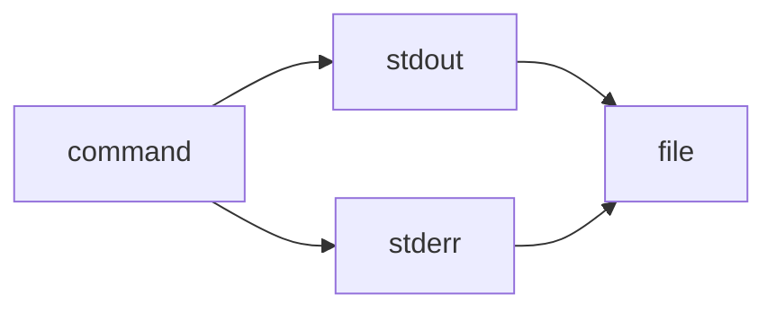

> 2>&1 is the explicit redirection operator:

> It means “send file descriptor 2 (stderr) to wherever file descriptor 1 (stdout) is currently going.” ^ref-b3555ede-4-0

> Works in all POSIX shells (sh, bash, zsh, dash, etc.). ^ref-b3555ede-6-0

^ref-b3555ede-7-0
 ^ref-b3555ede-15-0
> &> is a bash/zsh shorthand:
 ^ref-b3555ede-17-0
> It means “redirect both stdout and stderr to the same target.”
 ^ref-b3555ede-19-0
> Not POSIX; won’t work in plain sh or some other shells.
 ^ref-b3555ede-21-0
gg<!-- GENERATED-SECTIONS:DO-NOT-EDIT-BELOW -->
## Related content
- [i3-bluetooth-setup](i3-bluetooth-setup.md)
- [Operations](chunks/operations.md)
- [Shared](chunks/shared.md)
- [Window Management](chunks/window-management.md)
- [DuckDuckGoSearchPipeline](duckduckgosearchpipeline.md)
- [Duck's Self-Referential Perceptual Loop](ducks-self-referential-perceptual-loop.md)
- [Dynamic Context Model for Web Components](dynamic-context-model-for-web-components.md)
- [Fnord Tracer Protocol](fnord-tracer-protocol.md)
- [Factorio AI with External Agents](factorio-ai-with-external-agents.md)
- [graph-ds](graph-ds.md)
- [plan-update-confirmation](plan-update-confirmation.md)
- [Promethean Dev Workflow Update](promethean-dev-workflow-update.md)
- [eidolon-field-math-foundations](eidolon-field-math-foundations.md)
- [Duck's Attractor States](ducks-attractor-states.md)
- [heartbeat-fragment-demo](heartbeat-fragment-demo.md)
- [Stateful Partitions and Rebalancing](stateful-partitions-and-rebalancing.md)
- [DSL](chunks/dsl.md)
- [JavaScript](chunks/javascript.md)
- [Math Fundamentals](chunks/math-fundamentals.md)
- [Services](chunks/services.md)
- [Simulation Demo](chunks/simulation-demo.md)
- [Tooling](chunks/tooling.md)
- [Debugging Broker Connections and Agent Behavior](debugging-broker-connections-and-agent-behavior.md)
- [Docops Feature Updates](docops-feature-updates-2.md)
- [Diagrams](chunks/diagrams.md)
- [Creative Moments](creative-moments.md)
- [Eidolon Field Abstract Model](eidolon-field-abstract-model.md)
- [field-dynamics-math-blocks](field-dynamics-math-blocks.md)
- [field-node-diagram-outline](field-node-diagram-outline.md)
- [Promethean-Copilot-Intent-Engine](promethean-copilot-intent-engine.md)
- [Post-Linguistic Transhuman Design Frameworks](post-linguistic-transhuman-design-frameworks.md)
- [Promethean Chat Activity Report](promethean-chat-activity-report.md)
- [Promethean Documentation Pipeline Overview](promethean-documentation-pipeline-overview.md)
- [Promethean_Eidolon_Synchronicity_Model](promethean-eidolon-synchronicity-model.md)
- [Performance-Optimized-Polyglot-Bridge](performance-optimized-polyglot-bridge.md)
- [Pipeline Enhancements](pipeline-enhancements.md)
- [polyglot-repl-interface-layer](polyglot-repl-interface-layer.md)
- [Provider-Agnostic Chat Panel Implementation](provider-agnostic-chat-panel-implementation.md)
- [schema-evolution-workflow](schema-evolution-workflow.md)
- [NPU Voice Code and Sensory Integration](npu-voice-code-and-sensory-integration.md)
- [Obsidian ChatGPT Plugin Integration Guide](obsidian-chatgpt-plugin-integration-guide.md)
- [Obsidian ChatGPT Plugin Integration](obsidian-chatgpt-plugin-integration.md)
- [obsidian-ignore-node-modules-regex](obsidian-ignore-node-modules-regex.md)
- [Obsidian Task Generation](obsidian-task-generation.md)
- [Obsidian Templating Plugins Integration Guide](obsidian-templating-plugins-integration-guide.md)
- [eidolon-node-lifecycle](eidolon-node-lifecycle.md)
- [Promethean Infrastructure Setup](promethean-infrastructure-setup.md)
- [Promethean Pipelines](promethean-pipelines.md)
- [Promethean State Format](promethean-state-format.md)
- [Promethean Workflow Optimization](promethean-workflow-optimization.md)
- [Prometheus Observability Stack](prometheus-observability-stack.md)
- [Functional Embedding Pipeline Refactor](functional-embedding-pipeline-refactor.md)
- [Functional Refactor of TypeScript Document Processing](functional-refactor-of-typescript-document-processing.md)
- [homeostasis-decay-formulas](homeostasis-decay-formulas.md)
- [Pure TypeScript Search Microservice](pure-typescript-search-microservice.md)
- [field-interaction-equations](field-interaction-equations.md)
- [Migrate to Provider-Tenant Architecture](migrate-to-provider-tenant-architecture.md)
- [field-node-diagram-set](field-node-diagram-set.md)
- [field-node-diagram-visualizations](field-node-diagram-visualizations.md)
- [Smoke Resonance Visualizations](smoke-resonance-visualizations.md)
- [Prompt_Folder_Bootstrap](prompt-folder-bootstrap.md)
- [Model Selection for Lightweight Conversational Tasks](model-selection-for-lightweight-conversational-tasks.md)
- [windows-tiling-with-autohotkey](windows-tiling-with-autohotkey.md)
- [TypeScript Patch for Tool Calling Support](typescript-patch-for-tool-calling-support.md)
- [zero-copy-snapshots-and-workers](zero-copy-snapshots-and-workers.md)
- [The Jar of Echoes](the-jar-of-echoes.md)
- [Docops Feature Updates](docops-feature-updates.md)
- [Ice Box Reorganization](ice-box-reorganization.md)
- [Promethean Data Sync Protocol](promethean-data-sync-protocol.md)
- [Promethean Documentation Overview](promethean-documentation-overview.md)
- [Promethean Documentation Update](promethean-documentation-update.md)
- [Promethean Documentation Update](promethean-documentation-update.txt)
- [Per-Domain Policy System for JS Crawler](per-domain-policy-system-for-js-crawler.md)
- [Protocol_0_The_Contradiction_Engine](protocol-0-the-contradiction-engine.md)
- [unique-templates](templates/unique-templates.md)
- [Tracing the Signal](tracing-the-signal.md)
- [ts-to-lisp-transpiler](ts-to-lisp-transpiler.md)
- [typed-struct-compiler](typed-struct-compiler.md)
- [Unique Concepts](unique-concepts.md)
- [Mindful Prioritization](mindful-prioritization.md)
- [MindfulRobotIntegration](mindfulrobotintegration.md)
- [Model Upgrade Calm-Down Guide](model-upgrade-calm-down-guide.md)
- [Unique Info Dump Index](unique-info-dump-index.md)
- [Promethean Notes](promethean-notes.md)
- [promethean-requirements](promethean-requirements.md)
- [Optimizing Command Limitations in System Design](optimizing-command-limitations-in-system-design.md)
- [ripple-propagation-demo](ripple-propagation-demo.md)
- [Self-Agency in AI Interaction](self-agency-in-ai-interaction.md)
- [komorebi-group-window-hack](komorebi-group-window-hack.md)
- [OpenAPI Validation Report](openapi-validation-report.md)
- [Reawakening Duck](reawakening-duck.md)
- [sibilant-macro-targets](sibilant-macro-targets.md)
- [Layer1SurvivabilityEnvelope](layer1survivabilityenvelope.md)
- [Mathematical Samplers](mathematical-samplers.md)
- [ParticleSimulationWithCanvasAndFFmpeg](particlesimulationwithcanvasandffmpeg.md)
- [Synchronicity Waves and Web](synchronicity-waves-and-web.md)
- [Mathematics Sampler](mathematics-sampler.md)
- [Promethean Documentation Update](promethean-documentation-update-4.md)
- [Chroma Toolkit Consolidation Plan](chroma-toolkit-consolidation-plan.md)
- [Ollama-LLM-Provider-for-Pseudo-Code-Transpiler](ollama-llm-provider-for-pseudo-code-transpiler.md)
- [Self-Improving Documentation Tool](self-improving-documentation-tool.md)
- [Fastify Static Files Plugin](fastify-static-files-plugin.md)
- [Git Commit Optimization for Code Reviews](git-commit-optimization-for-code-reviews.md)
- [run-step-api](run-step-api.md)
- [Promethean-native config design](promethean-native-config-design.md)
- [Agent Reflections and Prompt Evolution](agent-reflections-and-prompt-evolution.md)
- [ecs-offload-workers](ecs-offload-workers.md)
- [Lispy Macros with syntax-rules](lispy-macros-with-syntax-rules.md)
- [polymorphic-meta-programming-engine](polymorphic-meta-programming-engine.md)
- [Local-Offline-Model-Deployment-Strategy](local-offline-model-deployment-strategy.md)
- [2d-sandbox-field](2d-sandbox-field.md)
- [promethean-system-diagrams](promethean-system-diagrams.md)
## Sources
- [DSL — L39](chunks/dsl.md#^ref-e87bc036-39-0) (line 39, col 0, score 1)
- [JavaScript — L52](chunks/javascript.md#^ref-c1618c66-52-0) (line 52, col 0, score 1)
- [Math Fundamentals — L34](chunks/math-fundamentals.md#^ref-c6e87433-34-0) (line 34, col 0, score 1)
- [Operations — L55](chunks/operations.md#^ref-f1add613-55-0) (line 55, col 0, score 1)
- [Services — L43](chunks/services.md#^ref-75ea4a6a-43-0) (line 43, col 0, score 1)
- [Shared — L43](chunks/shared.md#^ref-623a55f7-43-0) (line 43, col 0, score 1)
- [Simulation Demo — L52](chunks/simulation-demo.md#^ref-557309a3-52-0) (line 52, col 0, score 1)
- [Tooling — L25](chunks/tooling.md#^ref-6cb4943e-25-0) (line 25, col 0, score 1)
- [Window Management — L52](chunks/window-management.md#^ref-9e8ae388-52-0) (line 52, col 0, score 1)
- [Debugging Broker Connections and Agent Behavior — L78](debugging-broker-connections-and-agent-behavior.md#^ref-73d3dbf6-78-0) (line 78, col 0, score 1)
- [Docops Feature Updates — L30](docops-feature-updates-2.md#^ref-cdbd21ee-30-0) (line 30, col 0, score 1)
- [Docops Feature Updates — L47](docops-feature-updates.md#^ref-2792d448-47-0) (line 47, col 0, score 1)
- [DuckDuckGoSearchPipeline — L66](duckduckgosearchpipeline.md#^ref-e979c50f-66-0) (line 66, col 0, score 1)
- [Duck's Self-Referential Perceptual Loop — L90](ducks-self-referential-perceptual-loop.md#^ref-71726f04-90-0) (line 90, col 0, score 1)
- [Diagrams — L16](chunks/diagrams.md#^ref-45cd25b5-16-0) (line 16, col 0, score 1)
- [DSL — L23](chunks/dsl.md#^ref-e87bc036-23-0) (line 23, col 0, score 1)
- [Operations — L74](chunks/operations.md#^ref-f1add613-74-0) (line 74, col 0, score 1)
- [Services — L16](chunks/services.md#^ref-75ea4a6a-16-0) (line 16, col 0, score 1)
- [Shared — L7](chunks/shared.md#^ref-623a55f7-7-0) (line 7, col 0, score 1)
- [Simulation Demo — L9](chunks/simulation-demo.md#^ref-557309a3-9-0) (line 9, col 0, score 1)
- [Tooling — L8](chunks/tooling.md#^ref-6cb4943e-8-0) (line 8, col 0, score 1)
- [Creative Moments — L38](creative-moments.md#^ref-10d98225-38-0) (line 38, col 0, score 1)
- [Docops Feature Updates — L51](docops-feature-updates-2.md#^ref-cdbd21ee-51-0) (line 51, col 0, score 1)
- [Docops Feature Updates — L79](docops-feature-updates.md#^ref-2792d448-79-0) (line 79, col 0, score 1)
- [DuckDuckGoSearchPipeline — L77](duckduckgosearchpipeline.md#^ref-e979c50f-77-0) (line 77, col 0, score 1)
- [Duck's Attractor States — L115](ducks-attractor-states.md#^ref-13951643-115-0) (line 115, col 0, score 1)
- [Duck's Self-Referential Perceptual Loop — L61](ducks-self-referential-perceptual-loop.md#^ref-71726f04-61-0) (line 61, col 0, score 1)
- [Eidolon Field Abstract Model — L212](eidolon-field-abstract-model.md#^ref-5e8b2388-212-0) (line 212, col 0, score 1)
- [eidolon-field-math-foundations — L150](eidolon-field-math-foundations.md#^ref-008f2ac0-150-0) (line 150, col 0, score 1)
- [zero-copy-snapshots-and-workers — L408](zero-copy-snapshots-and-workers.md#^ref-62bec6f0-408-0) (line 408, col 0, score 1)
- [Post-Linguistic Transhuman Design Frameworks — L128](post-linguistic-transhuman-design-frameworks.md#^ref-6bcff92c-128-0) (line 128, col 0, score 1)
- [Promethean Chat Activity Report — L78](promethean-chat-activity-report.md#^ref-18344cf9-78-0) (line 78, col 0, score 1)
- [Promethean-Copilot-Intent-Engine — L98](promethean-copilot-intent-engine.md#^ref-ae24a280-98-0) (line 98, col 0, score 1)
- [Promethean Data Sync Protocol — L27](promethean-data-sync-protocol.md#^ref-9fab9e76-27-0) (line 27, col 0, score 1)
- [Promethean Dev Workflow Update — L74](promethean-dev-workflow-update.md#^ref-03a5578f-74-0) (line 74, col 0, score 1)
- [Promethean Documentation Overview — L25](promethean-documentation-overview.md#^ref-9413237f-25-0) (line 25, col 0, score 1)
- [Promethean Documentation Pipeline Overview — L168](promethean-documentation-pipeline-overview.md#^ref-3a3bf2c9-168-0) (line 168, col 0, score 1)
- [Promethean Documentation Update — L28](promethean-documentation-update.md#^ref-c0392040-28-0) (line 28, col 0, score 1)
- [Promethean Documentation Update — L56](promethean-documentation-update.txt#^ref-0b872af2-56-0) (line 56, col 0, score 1)
- [Promethean_Eidolon_Synchronicity_Model — L78](promethean-eidolon-synchronicity-model.md#^ref-2d6e5553-78-0) (line 78, col 0, score 1)
- [Diagrams — L47](chunks/diagrams.md#^ref-45cd25b5-47-0) (line 47, col 0, score 1)
- [DSL — L53](chunks/dsl.md#^ref-e87bc036-53-0) (line 53, col 0, score 1)
- [JavaScript — L47](chunks/javascript.md#^ref-c1618c66-47-0) (line 47, col 0, score 1)
- [Math Fundamentals — L46](chunks/math-fundamentals.md#^ref-c6e87433-46-0) (line 46, col 0, score 1)
- [Operations — L79](chunks/operations.md#^ref-f1add613-79-0) (line 79, col 0, score 1)
- [Services — L78](chunks/services.md#^ref-75ea4a6a-78-0) (line 78, col 0, score 1)
- [Shared — L72](chunks/shared.md#^ref-623a55f7-72-0) (line 72, col 0, score 1)
- [Simulation Demo — L77](chunks/simulation-demo.md#^ref-557309a3-77-0) (line 77, col 0, score 1)
- [Tooling — L41](chunks/tooling.md#^ref-6cb4943e-41-0) (line 41, col 0, score 1)
- [Window Management — L41](chunks/window-management.md#^ref-9e8ae388-41-0) (line 41, col 0, score 1)
- [Per-Domain Policy System for JS Crawler — L495](per-domain-policy-system-for-js-crawler.md#^ref-c03020e1-495-0) (line 495, col 0, score 1)
- [Performance-Optimized-Polyglot-Bridge — L459](performance-optimized-polyglot-bridge.md#^ref-f5579967-459-0) (line 459, col 0, score 1)
- [Pipeline Enhancements — L27](pipeline-enhancements.md#^ref-e2135d9f-27-0) (line 27, col 0, score 1)
- [plan-update-confirmation — L1002](plan-update-confirmation.md#^ref-b22d79c6-1002-0) (line 1002, col 0, score 1)
- [polyglot-repl-interface-layer — L171](polyglot-repl-interface-layer.md#^ref-9c79206d-171-0) (line 171, col 0, score 1)
- [Post-Linguistic Transhuman Design Frameworks — L112](post-linguistic-transhuman-design-frameworks.md#^ref-6bcff92c-112-0) (line 112, col 0, score 1)
- [Promethean Chat Activity Report — L24](promethean-chat-activity-report.md#^ref-18344cf9-24-0) (line 24, col 0, score 1)
- [Protocol_0_The_Contradiction_Engine — L143](protocol-0-the-contradiction-engine.md#^ref-9a93a756-143-0) (line 143, col 0, score 1)
- [Provider-Agnostic Chat Panel Implementation — L241](provider-agnostic-chat-panel-implementation.md#^ref-43bfe9dd-241-0) (line 241, col 0, score 1)
- [Diagrams — L19](chunks/diagrams.md#^ref-45cd25b5-19-0) (line 19, col 0, score 1)
- [DSL — L25](chunks/dsl.md#^ref-e87bc036-25-0) (line 25, col 0, score 1)
- [JavaScript — L18](chunks/javascript.md#^ref-c1618c66-18-0) (line 18, col 0, score 1)
- [Operations — L64](chunks/operations.md#^ref-f1add613-64-0) (line 64, col 0, score 1)
- [Services — L26](chunks/services.md#^ref-75ea4a6a-26-0) (line 26, col 0, score 1)
- [Shared — L28](chunks/shared.md#^ref-623a55f7-28-0) (line 28, col 0, score 1)
- [Simulation Demo — L22](chunks/simulation-demo.md#^ref-557309a3-22-0) (line 22, col 0, score 1)
- [Tooling — L13](chunks/tooling.md#^ref-6cb4943e-13-0) (line 13, col 0, score 1)
- [Creative Moments — L8](creative-moments.md#^ref-10d98225-8-0) (line 8, col 0, score 1)
- [Debugging Broker Connections and Agent Behavior — L38](debugging-broker-connections-and-agent-behavior.md#^ref-73d3dbf6-38-0) (line 38, col 0, score 1)
- [Docops Feature Updates — L56](docops-feature-updates-2.md#^ref-cdbd21ee-56-0) (line 56, col 0, score 1)
- [Eidolon Field Abstract Model — L224](eidolon-field-abstract-model.md#^ref-5e8b2388-224-0) (line 224, col 0, score 1)
- [schema-evolution-workflow — L582](schema-evolution-workflow.md#^ref-d8059b6a-582-0) (line 582, col 0, score 1)
- [Stateful Partitions and Rebalancing — L620](stateful-partitions-and-rebalancing.md#^ref-4330e8f0-620-0) (line 620, col 0, score 1)
- [unique-templates — L11](templates/unique-templates.md#^ref-c26f0044-11-0) (line 11, col 0, score 1)
- [The Jar of Echoes — L130](the-jar-of-echoes.md#^ref-18138627-130-0) (line 130, col 0, score 1)
- [Tracing the Signal — L106](tracing-the-signal.md#^ref-c3cd4f65-106-0) (line 106, col 0, score 1)
- [ts-to-lisp-transpiler — L44](ts-to-lisp-transpiler.md#^ref-ba11486b-44-0) (line 44, col 0, score 1)
- [typed-struct-compiler — L409](typed-struct-compiler.md#^ref-78eeedf7-409-0) (line 409, col 0, score 1)
- [TypeScript Patch for Tool Calling Support — L554](typescript-patch-for-tool-calling-support.md#^ref-7b7ca860-554-0) (line 554, col 0, score 1)
- [windows-tiling-with-autohotkey — L1170](windows-tiling-with-autohotkey.md#^ref-0f6f8f38-1170-0) (line 1170, col 0, score 0.99)
- [zero-copy-snapshots-and-workers — L1056](zero-copy-snapshots-and-workers.md#^ref-62bec6f0-1056-0) (line 1056, col 0, score 0.99)
- [zero-copy-snapshots-and-workers — L2022](zero-copy-snapshots-and-workers.md#^ref-62bec6f0-2022-0) (line 2022, col 0, score 0.97)
- [windows-tiling-with-autohotkey — L3026](windows-tiling-with-autohotkey.md#^ref-0f6f8f38-3026-0) (line 3026, col 0, score 0.98)
- [TypeScript Patch for Tool Calling Support — L899](typescript-patch-for-tool-calling-support.md#^ref-7b7ca860-899-0) (line 899, col 0, score 0.98)
- [Unique Concepts — L1709](unique-concepts.md#^ref-ed6f3fc9-1709-0) (line 1709, col 0, score 0.98)
- [Unique Info Dump Index — L1227](unique-info-dump-index.md#^ref-30ec3ba6-1227-0) (line 1227, col 0, score 0.98)
- [windows-tiling-with-autohotkey — L1253](windows-tiling-with-autohotkey.md#^ref-0f6f8f38-1253-0) (line 1253, col 0, score 0.98)
- [zero-copy-snapshots-and-workers — L1174](zero-copy-snapshots-and-workers.md#^ref-62bec6f0-1174-0) (line 1174, col 0, score 0.98)
- [windows-tiling-with-autohotkey — L1011](windows-tiling-with-autohotkey.md#^ref-0f6f8f38-1011-0) (line 1011, col 0, score 0.98)
- [zero-copy-snapshots-and-workers — L757](zero-copy-snapshots-and-workers.md#^ref-62bec6f0-757-0) (line 757, col 0, score 0.98)
- [eidolon-field-math-foundations — L959](eidolon-field-math-foundations.md#^ref-008f2ac0-959-0) (line 959, col 0, score 0.96)
- [eidolon-node-lifecycle — L868](eidolon-node-lifecycle.md#^ref-938eca9c-868-0) (line 868, col 0, score 0.96)
- [Factorio AI with External Agents — L1000](factorio-ai-with-external-agents.md#^ref-a4d90289-1000-0) (line 1000, col 0, score 0.96)
- [field-dynamics-math-blocks — L1187](field-dynamics-math-blocks.md#^ref-7cfc230d-1187-0) (line 1187, col 0, score 0.96)
- [field-interaction-equations — L1282](field-interaction-equations.md#^ref-b09141b7-1282-0) (line 1282, col 0, score 0.96)
- [field-node-diagram-outline — L1130](field-node-diagram-outline.md#^ref-1f32c94a-1130-0) (line 1130, col 0, score 0.96)
- [field-node-diagram-set — L1046](field-node-diagram-set.md#^ref-22b989d5-1046-0) (line 1046, col 0, score 0.96)
- [field-node-diagram-visualizations — L1038](field-node-diagram-visualizations.md#^ref-e9b27b06-1038-0) (line 1038, col 0, score 0.96)
- [Fnord Tracer Protocol — L1246](fnord-tracer-protocol.md#^ref-fc21f824-1246-0) (line 1246, col 0, score 0.96)
- [windows-tiling-with-autohotkey — L8981](windows-tiling-with-autohotkey.md#^ref-0f6f8f38-8981-0) (line 8981, col 0, score 0.96)
- [zero-copy-snapshots-and-workers — L4320](zero-copy-snapshots-and-workers.md#^ref-62bec6f0-4320-0) (line 4320, col 0, score 0.96)
- [windows-tiling-with-autohotkey — L854](windows-tiling-with-autohotkey.md#^ref-0f6f8f38-854-0) (line 854, col 0, score 0.96)
- [zero-copy-snapshots-and-workers — L2974](zero-copy-snapshots-and-workers.md#^ref-62bec6f0-2974-0) (line 2974, col 0, score 0.94)
- [field-node-diagram-outline — L3235](field-node-diagram-outline.md#^ref-1f32c94a-3235-0) (line 3235, col 0, score 0.94)
- [Mathematics Sampler — L1736](mathematics-sampler.md#^ref-b5e0183e-1736-0) (line 1736, col 0, score 0.87)
- [Migrate to Provider-Tenant Architecture — L7748](migrate-to-provider-tenant-architecture.md#^ref-54382370-7748-0) (line 7748, col 0, score 0.87)
- [Obsidian ChatGPT Plugin Integration — L3847](obsidian-chatgpt-plugin-integration.md#^ref-ca8e1399-3847-0) (line 3847, col 0, score 0.87)
- [obsidian-ignore-node-modules-regex — L4433](obsidian-ignore-node-modules-regex.md#^ref-ffb9b2a9-4433-0) (line 4433, col 0, score 0.87)
- [Obsidian Task Generation — L1688](obsidian-task-generation.md#^ref-9b694a91-1688-0) (line 1688, col 0, score 0.87)
- [Obsidian Templating Plugins Integration Guide — L5168](obsidian-templating-plugins-integration-guide.md#^ref-b39dc9d4-5168-0) (line 5168, col 0, score 0.87)
- [OpenAPI Validation Report — L1563](openapi-validation-report.md#^ref-5c152b08-1563-0) (line 1563, col 0, score 0.87)
- [ParticleSimulationWithCanvasAndFFmpeg — L3400](particlesimulationwithcanvasandffmpeg.md#^ref-e018dd7a-3400-0) (line 3400, col 0, score 0.87)
- [Per-Domain Policy System for JS Crawler — L5381](per-domain-policy-system-for-js-crawler.md#^ref-c03020e1-5381-0) (line 5381, col 0, score 0.87)
- [Diagrams — L518](chunks/diagrams.md#^ref-45cd25b5-518-0) (line 518, col 0, score 0.99)
- [DSL — L680](chunks/dsl.md#^ref-e87bc036-680-0) (line 680, col 0, score 0.99)
- [JavaScript — L798](chunks/javascript.md#^ref-c1618c66-798-0) (line 798, col 0, score 0.99)
- [Math Fundamentals — L752](chunks/math-fundamentals.md#^ref-c6e87433-752-0) (line 752, col 0, score 0.99)
- [Operations — L267](chunks/operations.md#^ref-f1add613-267-0) (line 267, col 0, score 0.99)
- [Services — L706](chunks/services.md#^ref-75ea4a6a-706-0) (line 706, col 0, score 0.99)
- [Shared — L435](chunks/shared.md#^ref-623a55f7-435-0) (line 435, col 0, score 0.99)
- [Chroma Toolkit Consolidation Plan — L5859](chroma-toolkit-consolidation-plan.md#^ref-5020e892-5859-0) (line 5859, col 0, score 0.98)
- [DSL — L1653](chunks/dsl.md#^ref-e87bc036-1653-0) (line 1653, col 0, score 0.98)
- [Services — L3088](chunks/services.md#^ref-75ea4a6a-3088-0) (line 3088, col 0, score 0.98)
- [Shared — L3046](chunks/shared.md#^ref-623a55f7-3046-0) (line 3046, col 0, score 0.98)
- [Simulation Demo — L3336](chunks/simulation-demo.md#^ref-557309a3-3336-0) (line 3336, col 0, score 0.98)
- [Window Management — L3496](chunks/window-management.md#^ref-9e8ae388-3496-0) (line 3496, col 0, score 0.98)
- [Creative Moments — L2113](creative-moments.md#^ref-10d98225-2113-0) (line 2113, col 0, score 0.98)
- [Debugging Broker Connections and Agent Behavior — L3995](debugging-broker-connections-and-agent-behavior.md#^ref-73d3dbf6-3995-0) (line 3995, col 0, score 0.98)
- [DuckDuckGoSearchPipeline — L1574](duckduckgosearchpipeline.md#^ref-e979c50f-1574-0) (line 1574, col 0, score 0.98)
- [Duck's Self-Referential Perceptual Loop — L4039](ducks-self-referential-perceptual-loop.md#^ref-71726f04-4039-0) (line 4039, col 0, score 0.98)
- [Dynamic Context Model for Web Components — L3574](dynamic-context-model-for-web-components.md#^ref-f7702bf8-3574-0) (line 3574, col 0, score 0.98)
- [Eidolon Field Abstract Model — L6299](eidolon-field-abstract-model.md#^ref-5e8b2388-6299-0) (line 6299, col 0, score 0.98)
- [Chroma Toolkit Consolidation Plan — L5432](chroma-toolkit-consolidation-plan.md#^ref-5020e892-5432-0) (line 5432, col 0, score 0.95)
- [Duck's Self-Referential Perceptual Loop — L2406](ducks-self-referential-perceptual-loop.md#^ref-71726f04-2406-0) (line 2406, col 0, score 0.95)
- [field-interaction-equations — L5858](field-interaction-equations.md#^ref-b09141b7-5858-0) (line 5858, col 0, score 0.95)
- [Chroma Toolkit Consolidation Plan — L6007](chroma-toolkit-consolidation-plan.md#^ref-5020e892-6007-0) (line 6007, col 0, score 0.95)
- [Diagrams — L3593](chunks/diagrams.md#^ref-45cd25b5-3593-0) (line 3593, col 0, score 0.95)
- [DSL — L2986](chunks/dsl.md#^ref-e87bc036-2986-0) (line 2986, col 0, score 0.95)
- [JavaScript — L3511](chunks/javascript.md#^ref-c1618c66-3511-0) (line 3511, col 0, score 0.95)
- [Math Fundamentals — L2434](chunks/math-fundamentals.md#^ref-c6e87433-2434-0) (line 2434, col 0, score 0.95)
- [Operations — L1336](chunks/operations.md#^ref-f1add613-1336-0) (line 1336, col 0, score 0.95)
- [Services — L2981](chunks/services.md#^ref-75ea4a6a-2981-0) (line 2981, col 0, score 0.95)
- [Shared — L2824](chunks/shared.md#^ref-623a55f7-2824-0) (line 2824, col 0, score 0.95)
- [Simulation Demo — L2684](chunks/simulation-demo.md#^ref-557309a3-2684-0) (line 2684, col 0, score 0.95)
- [Synchronicity Waves and Web — L2287](synchronicity-waves-and-web.md#^ref-91295f3a-2287-0) (line 2287, col 0, score 0.98)
- [ts-to-lisp-transpiler — L2339](ts-to-lisp-transpiler.md#^ref-ba11486b-2339-0) (line 2339, col 0, score 0.98)
- [typed-struct-compiler — L3549](typed-struct-compiler.md#^ref-78eeedf7-3549-0) (line 3549, col 0, score 0.98)
- [TypeScript Patch for Tool Calling Support — L6142](typescript-patch-for-tool-calling-support.md#^ref-7b7ca860-6142-0) (line 6142, col 0, score 0.98)
- [Unique Info Dump Index — L3887](unique-info-dump-index.md#^ref-30ec3ba6-3887-0) (line 3887, col 0, score 0.98)
- [windows-tiling-with-autohotkey — L4648](windows-tiling-with-autohotkey.md#^ref-0f6f8f38-4648-0) (line 4648, col 0, score 0.98)
- [field-interaction-equations — L1299](field-interaction-equations.md#^ref-b09141b7-1299-0) (line 1299, col 0, score 0.96)
- [field-node-diagram-outline — L1147](field-node-diagram-outline.md#^ref-1f32c94a-1147-0) (line 1147, col 0, score 0.96)
- [field-node-diagram-set — L1063](field-node-diagram-set.md#^ref-22b989d5-1063-0) (line 1063, col 0, score 0.96)
- [field-node-diagram-visualizations — L1055](field-node-diagram-visualizations.md#^ref-e9b27b06-1055-0) (line 1055, col 0, score 0.96)
- [Fnord Tracer Protocol — L1263](fnord-tracer-protocol.md#^ref-fc21f824-1263-0) (line 1263, col 0, score 0.96)
- [Functional Embedding Pipeline Refactor — L880](functional-embedding-pipeline-refactor.md#^ref-a4a25141-880-0) (line 880, col 0, score 0.96)
- [Functional Refactor of TypeScript Document Processing — L696](functional-refactor-of-typescript-document-processing.md#^ref-1cfae310-696-0) (line 696, col 0, score 0.96)
- [graph-ds — L1546](graph-ds.md#^ref-6620e2f2-1546-0) (line 1546, col 0, score 0.96)
- [heartbeat-fragment-demo — L1209](heartbeat-fragment-demo.md#^ref-dd00677a-1209-0) (line 1209, col 0, score 0.96)
- [zero-copy-snapshots-and-workers — L691](zero-copy-snapshots-and-workers.md#^ref-62bec6f0-691-0) (line 691, col 0, score 1)
- [komorebi-group-window-hack — L1796](komorebi-group-window-hack.md#^ref-dd89372d-1796-0) (line 1796, col 0, score 0.97)
- [komorebi-group-window-hack — L2017](komorebi-group-window-hack.md#^ref-dd89372d-2017-0) (line 2017, col 0, score 0.97)
- [zero-copy-snapshots-and-workers — L1936](zero-copy-snapshots-and-workers.md#^ref-62bec6f0-1936-0) (line 1936, col 0, score 0.96)
- [zero-copy-snapshots-and-workers — L2202](zero-copy-snapshots-and-workers.md#^ref-62bec6f0-2202-0) (line 2202, col 0, score 0.96)
- [Unique Info Dump Index — L6662](unique-info-dump-index.md#^ref-30ec3ba6-6662-0) (line 6662, col 0, score 0.94)
- [heartbeat-fragment-demo — L1420](heartbeat-fragment-demo.md#^ref-dd00677a-1420-0) (line 1420, col 0, score 0.94)
- [eidolon-field-math-foundations — L24596](eidolon-field-math-foundations.md#^ref-008f2ac0-24596-0) (line 24596, col 0, score 0.94)
- [Promethean Dev Workflow Update — L22800](promethean-dev-workflow-update.md#^ref-03a5578f-22800-0) (line 22800, col 0, score 0.94)
- [windows-tiling-with-autohotkey — L22798](windows-tiling-with-autohotkey.md#^ref-0f6f8f38-22798-0) (line 22798, col 0, score 0.94)
- [Eidolon Field Abstract Model — L3794](eidolon-field-abstract-model.md#^ref-5e8b2388-3794-0) (line 3794, col 0, score 0.97)
- [i3-bluetooth-setup — L2165](i3-bluetooth-setup.md#^ref-5e408692-2165-0) (line 2165, col 0, score 0.97)
- [Model Selection for Lightweight Conversational Tasks — L1794](model-selection-for-lightweight-conversational-tasks.md#^ref-d144aa62-1794-0) (line 1794, col 0, score 0.97)
- [plan-update-confirmation — L5535](plan-update-confirmation.md#^ref-b22d79c6-5535-0) (line 5535, col 0, score 0.97)
- [Promethean-Copilot-Intent-Engine — L2177](promethean-copilot-intent-engine.md#^ref-ae24a280-2177-0) (line 2177, col 0, score 0.97)
- [The Jar of Echoes — L2004](the-jar-of-echoes.md#^ref-18138627-2004-0) (line 2004, col 0, score 0.97)
- [Tracing the Signal — L2000](tracing-the-signal.md#^ref-c3cd4f65-2000-0) (line 2000, col 0, score 0.96)
- [field-node-diagram-set — L327](field-node-diagram-set.md#^ref-22b989d5-327-0) (line 327, col 0, score 0.96)
- [field-node-diagram-visualizations — L311](field-node-diagram-visualizations.md#^ref-e9b27b06-311-0) (line 311, col 0, score 0.96)
- [Fnord Tracer Protocol — L1286](fnord-tracer-protocol.md#^ref-fc21f824-1286-0) (line 1286, col 0, score 0.96)
- [Functional Embedding Pipeline Refactor — L987](functional-embedding-pipeline-refactor.md#^ref-a4a25141-987-0) (line 987, col 0, score 0.96)
- [Functional Refactor of TypeScript Document Processing — L764](functional-refactor-of-typescript-document-processing.md#^ref-1cfae310-764-0) (line 764, col 0, score 0.96)
- [graph-ds — L1487](graph-ds.md#^ref-6620e2f2-1487-0) (line 1487, col 0, score 0.96)
- [heartbeat-fragment-demo — L278](heartbeat-fragment-demo.md#^ref-dd00677a-278-0) (line 278, col 0, score 0.96)
- [homeostasis-decay-formulas — L584](homeostasis-decay-formulas.md#^ref-37b5d236-584-0) (line 584, col 0, score 0.96)
- [i3-bluetooth-setup — L1201](i3-bluetooth-setup.md#^ref-5e408692-1201-0) (line 1201, col 0, score 0.96)
- [Ice Box Reorganization — L795](ice-box-reorganization.md#^ref-291c7d91-795-0) (line 795, col 0, score 0.96)
- [Model Upgrade Calm-Down Guide — L840](model-upgrade-calm-down-guide.md#^ref-db74343f-840-0) (line 840, col 0, score 0.99)
- [NPU Voice Code and Sensory Integration — L763](npu-voice-code-and-sensory-integration.md#^ref-5a02283e-763-0) (line 763, col 0, score 0.99)
- [obsidian-ignore-node-modules-regex — L1214](obsidian-ignore-node-modules-regex.md#^ref-ffb9b2a9-1214-0) (line 1214, col 0, score 0.99)
- [windows-tiling-with-autohotkey — L985](windows-tiling-with-autohotkey.md#^ref-0f6f8f38-985-0) (line 985, col 0, score 0.98)
- [zero-copy-snapshots-and-workers — L780](zero-copy-snapshots-and-workers.md#^ref-62bec6f0-780-0) (line 780, col 0, score 0.98)
- [zero-copy-snapshots-and-workers — L734](zero-copy-snapshots-and-workers.md#^ref-62bec6f0-734-0) (line 734, col 0, score 0.98)
- [Functional Refactor of TypeScript Document Processing — L2242](functional-refactor-of-typescript-document-processing.md#^ref-1cfae310-2242-0) (line 2242, col 0, score 0.97)
- [graph-ds — L3757](graph-ds.md#^ref-6620e2f2-3757-0) (line 3757, col 0, score 0.97)
- [heartbeat-fragment-demo — L3479](heartbeat-fragment-demo.md#^ref-dd00677a-3479-0) (line 3479, col 0, score 0.97)
- [homeostasis-decay-formulas — L5594](homeostasis-decay-formulas.md#^ref-37b5d236-5594-0) (line 5594, col 0, score 0.97)
- [i3-bluetooth-setup — L2012](i3-bluetooth-setup.md#^ref-5e408692-2012-0) (line 2012, col 0, score 0.97)
- [Ice Box Reorganization — L3225](ice-box-reorganization.md#^ref-291c7d91-3225-0) (line 3225, col 0, score 0.97)
- [komorebi-group-window-hack — L4356](komorebi-group-window-hack.md#^ref-dd89372d-4356-0) (line 4356, col 0, score 0.97)
- [Layer1SurvivabilityEnvelope — L3752](layer1survivabilityenvelope.md#^ref-64a9f9f9-3752-0) (line 3752, col 0, score 0.97)
- [Mathematical Samplers — L1714](mathematical-samplers.md#^ref-86a691ec-1714-0) (line 1714, col 0, score 0.97)
- [homeostasis-decay-formulas — L6526](homeostasis-decay-formulas.md#^ref-37b5d236-6526-0) (line 6526, col 0, score 0.99)
- [i3-bluetooth-setup — L3712](i3-bluetooth-setup.md#^ref-5e408692-3712-0) (line 3712, col 0, score 0.99)
- [komorebi-group-window-hack — L3075](komorebi-group-window-hack.md#^ref-dd89372d-3075-0) (line 3075, col 0, score 0.99)
- [Layer1SurvivabilityEnvelope — L4096](layer1survivabilityenvelope.md#^ref-64a9f9f9-4096-0) (line 4096, col 0, score 0.99)
- [Migrate to Provider-Tenant Architecture — L7335](migrate-to-provider-tenant-architecture.md#^ref-54382370-7335-0) (line 7335, col 0, score 0.99)
- [Mindful Prioritization — L1003](mindful-prioritization.md#^ref-40185d05-1003-0) (line 1003, col 0, score 0.99)
- [MindfulRobotIntegration — L1028](mindfulrobotintegration.md#^ref-5f65dfa5-1028-0) (line 1028, col 0, score 0.99)
- [Model Selection for Lightweight Conversational Tasks — L4902](model-selection-for-lightweight-conversational-tasks.md#^ref-d144aa62-4902-0) (line 4902, col 0, score 0.99)
- [Model Upgrade Calm-Down Guide — L3435](model-upgrade-calm-down-guide.md#^ref-db74343f-3435-0) (line 3435, col 0, score 0.99)
- [windows-tiling-with-autohotkey — L7938](windows-tiling-with-autohotkey.md#^ref-0f6f8f38-7938-0) (line 7938, col 0, score 0.94)
- [Duck's Attractor States — L11485](ducks-attractor-states.md#^ref-13951643-11485-0) (line 11485, col 0, score 0.99)
- [Promethean Documentation Overview — L580](promethean-documentation-overview.md#^ref-9413237f-580-0) (line 580, col 0, score 0.96)
- [Promethean Documentation Pipeline Overview — L1613](promethean-documentation-pipeline-overview.md#^ref-3a3bf2c9-1613-0) (line 1613, col 0, score 0.96)
- [Promethean Documentation Update — L1271](promethean-documentation-update.md#^ref-c0392040-1271-0) (line 1271, col 0, score 0.96)
- [Promethean_Eidolon_Synchronicity_Model — L3291](promethean-eidolon-synchronicity-model.md#^ref-2d6e5553-3291-0) (line 3291, col 0, score 0.96)
- [Promethean Infrastructure Setup — L6974](promethean-infrastructure-setup.md#^ref-6deed6ac-6974-0) (line 6974, col 0, score 0.96)
- [Promethean Pipelines — L4005](promethean-pipelines.md#^ref-8b8e6103-4005-0) (line 4005, col 0, score 0.96)
- [promethean-requirements — L1645](promethean-requirements.md#^ref-95205cd3-1645-0) (line 1645, col 0, score 0.96)
- [Promethean State Format — L3813](promethean-state-format.md#^ref-23df6ddb-3813-0) (line 3813, col 0, score 0.96)
- [Prometheus Observability Stack — L5781](prometheus-observability-stack.md#^ref-e90b5a16-5781-0) (line 5781, col 0, score 0.96)
- [Prompt_Folder_Bootstrap — L5891](prompt-folder-bootstrap.md#^ref-bd4f0976-5891-0) (line 5891, col 0, score 0.96)
- [komorebi-group-window-hack — L849](komorebi-group-window-hack.md#^ref-dd89372d-849-0) (line 849, col 0, score 0.96)
- [Layer1SurvivabilityEnvelope — L502](layer1survivabilityenvelope.md#^ref-64a9f9f9-502-0) (line 502, col 0, score 0.96)
- [Mathematical Samplers — L437](mathematical-samplers.md#^ref-86a691ec-437-0) (line 437, col 0, score 0.96)
- [Model Upgrade Calm-Down Guide — L461](model-upgrade-calm-down-guide.md#^ref-db74343f-461-0) (line 461, col 0, score 0.96)
- [NPU Voice Code and Sensory Integration — L340](npu-voice-code-and-sensory-integration.md#^ref-5a02283e-340-0) (line 340, col 0, score 0.96)
- [Obsidian ChatGPT Plugin Integration — L579](obsidian-chatgpt-plugin-integration.md#^ref-ca8e1399-579-0) (line 579, col 0, score 0.96)
- [obsidian-ignore-node-modules-regex — L463](obsidian-ignore-node-modules-regex.md#^ref-ffb9b2a9-463-0) (line 463, col 0, score 0.96)
- [Obsidian Task Generation — L336](obsidian-task-generation.md#^ref-9b694a91-336-0) (line 336, col 0, score 0.96)
- [Obsidian Templating Plugins Integration Guide — L776](obsidian-templating-plugins-integration-guide.md#^ref-b39dc9d4-776-0) (line 776, col 0, score 0.96)
- [OpenAPI Validation Report — L344](openapi-validation-report.md#^ref-5c152b08-344-0) (line 344, col 0, score 0.96)
- [Per-Domain Policy System for JS Crawler — L1213](per-domain-policy-system-for-js-crawler.md#^ref-c03020e1-1213-0) (line 1213, col 0, score 0.96)
- [Prompt_Folder_Bootstrap — L1213](prompt-folder-bootstrap.md#^ref-bd4f0976-1213-0) (line 1213, col 0, score 0.97)
- [Protocol_0_The_Contradiction_Engine — L1158](protocol-0-the-contradiction-engine.md#^ref-9a93a756-1158-0) (line 1158, col 0, score 0.97)
- [Provider-Agnostic Chat Panel Implementation — L1317](provider-agnostic-chat-panel-implementation.md#^ref-43bfe9dd-1317-0) (line 1317, col 0, score 0.97)
- [Pure TypeScript Search Microservice — L1719](pure-typescript-search-microservice.md#^ref-d17d3a96-1719-0) (line 1719, col 0, score 0.97)
- [Reawakening Duck — L1168](reawakening-duck.md#^ref-59b5670f-1168-0) (line 1168, col 0, score 0.97)
- [schema-evolution-workflow — L1605](schema-evolution-workflow.md#^ref-d8059b6a-1605-0) (line 1605, col 0, score 0.97)
- [Self-Agency in AI Interaction — L803](self-agency-in-ai-interaction.md#^ref-49a9a860-803-0) (line 803, col 0, score 0.97)
- [zero-copy-snapshots-and-workers — L1576](zero-copy-snapshots-and-workers.md#^ref-62bec6f0-1576-0) (line 1576, col 0, score 0.97)
- [Mathematical Samplers — L1804](mathematical-samplers.md#^ref-86a691ec-1804-0) (line 1804, col 0, score 0.96)
- [Mathematics Sampler — L1835](mathematics-sampler.md#^ref-b5e0183e-1835-0) (line 1835, col 0, score 0.96)
- [heartbeat-fragment-demo — L3096](heartbeat-fragment-demo.md#^ref-dd00677a-3096-0) (line 3096, col 0, score 0.98)
- [homeostasis-decay-formulas — L4355](homeostasis-decay-formulas.md#^ref-37b5d236-4355-0) (line 4355, col 0, score 0.98)
- [i3-bluetooth-setup — L4818](i3-bluetooth-setup.md#^ref-5e408692-4818-0) (line 4818, col 0, score 0.98)
- [Ice Box Reorganization — L4548](ice-box-reorganization.md#^ref-291c7d91-4548-0) (line 4548, col 0, score 0.98)
- [komorebi-group-window-hack — L3722](komorebi-group-window-hack.md#^ref-dd89372d-3722-0) (line 3722, col 0, score 0.98)
- [Migrate to Provider-Tenant Architecture — L8343](migrate-to-provider-tenant-architecture.md#^ref-54382370-8343-0) (line 8343, col 0, score 0.98)
- [ts-to-lisp-transpiler — L1136](ts-to-lisp-transpiler.md#^ref-ba11486b-1136-0) (line 1136, col 0, score 0.93)
- [typed-struct-compiler — L1483](typed-struct-compiler.md#^ref-78eeedf7-1483-0) (line 1483, col 0, score 0.93)
- [TypeScript Patch for Tool Calling Support — L1585](typescript-patch-for-tool-calling-support.md#^ref-7b7ca860-1585-0) (line 1585, col 0, score 0.93)
- [Unique Concepts — L690](unique-concepts.md#^ref-ed6f3fc9-690-0) (line 690, col 0, score 0.93)
- [Unique Info Dump Index — L1418](unique-info-dump-index.md#^ref-30ec3ba6-1418-0) (line 1418, col 0, score 0.93)
- [Fnord Tracer Protocol — L5772](fnord-tracer-protocol.md#^ref-fc21f824-5772-0) (line 5772, col 0, score 0.93)
- [i3-bluetooth-setup — L2706](i3-bluetooth-setup.md#^ref-5e408692-2706-0) (line 2706, col 0, score 0.93)
- [komorebi-group-window-hack — L3905](komorebi-group-window-hack.md#^ref-dd89372d-3905-0) (line 3905, col 0, score 0.93)
- [Migrate to Provider-Tenant Architecture — L4766](migrate-to-provider-tenant-architecture.md#^ref-54382370-4766-0) (line 4766, col 0, score 0.93)
- [Mindful Prioritization — L1351](mindful-prioritization.md#^ref-40185d05-1351-0) (line 1351, col 0, score 0.93)
- [Obsidian ChatGPT Plugin Integration — L1047](obsidian-chatgpt-plugin-integration.md#^ref-ca8e1399-1047-0) (line 1047, col 0, score 0.95)
- [obsidian-ignore-node-modules-regex — L1216](obsidian-ignore-node-modules-regex.md#^ref-ffb9b2a9-1216-0) (line 1216, col 0, score 0.95)
- [Obsidian Task Generation — L737](obsidian-task-generation.md#^ref-9b694a91-737-0) (line 737, col 0, score 0.95)
- [OpenAPI Validation Report — L738](openapi-validation-report.md#^ref-5c152b08-738-0) (line 738, col 0, score 0.95)
- [ParticleSimulationWithCanvasAndFFmpeg — L1475](particlesimulationwithcanvasandffmpeg.md#^ref-e018dd7a-1475-0) (line 1475, col 0, score 0.95)
- [Promethean Infrastructure Setup — L3460](promethean-infrastructure-setup.md#^ref-6deed6ac-3460-0) (line 3460, col 0, score 0.97)
- [typed-struct-compiler — L2270](typed-struct-compiler.md#^ref-78eeedf7-2270-0) (line 2270, col 0, score 0.97)
- [Promethean Dev Workflow Update — L1850](promethean-dev-workflow-update.md#^ref-03a5578f-1850-0) (line 1850, col 0, score 0.97)
- [Self-Agency in AI Interaction — L2386](self-agency-in-ai-interaction.md#^ref-49a9a860-2386-0) (line 2386, col 0, score 0.97)
- [The Jar of Echoes — L2455](the-jar-of-echoes.md#^ref-18138627-2455-0) (line 2455, col 0, score 0.97)
- [windows-tiling-with-autohotkey — L2835](windows-tiling-with-autohotkey.md#^ref-0f6f8f38-2835-0) (line 2835, col 0, score 0.97)
- [zero-copy-snapshots-and-workers — L2738](zero-copy-snapshots-and-workers.md#^ref-62bec6f0-2738-0) (line 2738, col 0, score 0.97)
- [Fnord Tracer Protocol — L4503](fnord-tracer-protocol.md#^ref-fc21f824-4503-0) (line 4503, col 0, score 0.97)
- [Per-Domain Policy System for JS Crawler — L2368](per-domain-policy-system-for-js-crawler.md#^ref-c03020e1-2368-0) (line 2368, col 0, score 0.97)
- [heartbeat-fragment-demo — L4029](heartbeat-fragment-demo.md#^ref-dd00677a-4029-0) (line 4029, col 0, score 0.97)
- [homeostasis-decay-formulas — L6026](homeostasis-decay-formulas.md#^ref-37b5d236-6026-0) (line 6026, col 0, score 0.97)
- [i3-bluetooth-setup — L4287](i3-bluetooth-setup.md#^ref-5e408692-4287-0) (line 4287, col 0, score 0.97)
- [Ice Box Reorganization — L4296](ice-box-reorganization.md#^ref-291c7d91-4296-0) (line 4296, col 0, score 0.97)
- [komorebi-group-window-hack — L3969](komorebi-group-window-hack.md#^ref-dd89372d-3969-0) (line 3969, col 0, score 0.97)
- [Layer1SurvivabilityEnvelope — L5113](layer1survivabilityenvelope.md#^ref-64a9f9f9-5113-0) (line 5113, col 0, score 0.97)
- [Migrate to Provider-Tenant Architecture — L7147](migrate-to-provider-tenant-architecture.md#^ref-54382370-7147-0) (line 7147, col 0, score 0.97)
- [Operations — L323](chunks/operations.md#^ref-f1add613-323-0) (line 323, col 0, score 0.98)
- [Services — L1134](chunks/services.md#^ref-75ea4a6a-1134-0) (line 1134, col 0, score 0.98)
- [Shared — L722](chunks/shared.md#^ref-623a55f7-722-0) (line 722, col 0, score 0.98)
- [Tooling — L1109](chunks/tooling.md#^ref-6cb4943e-1109-0) (line 1109, col 0, score 0.98)
- [Window Management — L775](chunks/window-management.md#^ref-9e8ae388-775-0) (line 775, col 0, score 0.98)
- [Creative Moments — L300](creative-moments.md#^ref-10d98225-300-0) (line 300, col 0, score 0.98)
- [Duck's Attractor States — L631](ducks-attractor-states.md#^ref-13951643-631-0) (line 631, col 0, score 0.98)
- [Duck's Self-Referential Perceptual Loop — L1109](ducks-self-referential-perceptual-loop.md#^ref-71726f04-1109-0) (line 1109, col 0, score 0.98)
- [Dynamic Context Model for Web Components — L1503](dynamic-context-model-for-web-components.md#^ref-f7702bf8-1503-0) (line 1503, col 0, score 0.98)
- [Eidolon Field Abstract Model — L1281](eidolon-field-abstract-model.md#^ref-5e8b2388-1281-0) (line 1281, col 0, score 0.98)
- [Promethean Dev Workflow Update — L11281](promethean-dev-workflow-update.md#^ref-03a5578f-11281-0) (line 11281, col 0, score 0.99)
- [unique-templates — L770](templates/unique-templates.md#^ref-c26f0044-770-0) (line 770, col 0, score 0.97)
- [The Jar of Echoes — L987](the-jar-of-echoes.md#^ref-18138627-987-0) (line 987, col 0, score 0.97)
- [Mathematical Samplers — L453](mathematical-samplers.md#^ref-86a691ec-453-0) (line 453, col 0, score 0.97)
- [Mathematics Sampler — L448](mathematics-sampler.md#^ref-b5e0183e-448-0) (line 448, col 0, score 0.97)
- [Migrate to Provider-Tenant Architecture — L1330](migrate-to-provider-tenant-architecture.md#^ref-54382370-1330-0) (line 1330, col 0, score 0.97)
- [Mindful Prioritization — L617](mindful-prioritization.md#^ref-40185d05-617-0) (line 617, col 0, score 0.97)
- [MindfulRobotIntegration — L626](mindfulrobotintegration.md#^ref-5f65dfa5-626-0) (line 626, col 0, score 0.97)
- [Model Selection for Lightweight Conversational Tasks — L1010](model-selection-for-lightweight-conversational-tasks.md#^ref-d144aa62-1010-0) (line 1010, col 0, score 0.97)
- [Model Upgrade Calm-Down Guide — L747](model-upgrade-calm-down-guide.md#^ref-db74343f-747-0) (line 747, col 0, score 0.97)
- [NPU Voice Code and Sensory Integration — L659](npu-voice-code-and-sensory-integration.md#^ref-5a02283e-659-0) (line 659, col 0, score 0.97)
- [Obsidian ChatGPT Plugin Integration Guide — L982](obsidian-chatgpt-plugin-integration-guide.md#^ref-1d3d6c3a-982-0) (line 982, col 0, score 0.97)
- [The Jar of Echoes — L1448](the-jar-of-echoes.md#^ref-18138627-1448-0) (line 1448, col 0, score 0.95)
- [ts-to-lisp-transpiler — L784](ts-to-lisp-transpiler.md#^ref-ba11486b-784-0) (line 784, col 0, score 0.95)
- [plan-update-confirmation — L2503](plan-update-confirmation.md#^ref-b22d79c6-2503-0) (line 2503, col 0, score 0.99)
- [Post-Linguistic Transhuman Design Frameworks — L1462](post-linguistic-transhuman-design-frameworks.md#^ref-6bcff92c-1462-0) (line 1462, col 0, score 0.99)
- [Promethean-Copilot-Intent-Engine — L271](promethean-copilot-intent-engine.md#^ref-ae24a280-271-0) (line 271, col 0, score 0.99)
- [Promethean Dev Workflow Update — L1159](promethean-dev-workflow-update.md#^ref-03a5578f-1159-0) (line 1159, col 0, score 0.99)
- [Promethean Documentation Pipeline Overview — L1553](promethean-documentation-pipeline-overview.md#^ref-3a3bf2c9-1553-0) (line 1553, col 0, score 0.99)
- [Promethean Documentation Update — L1128](promethean-documentation-update.txt#^ref-0b872af2-1128-0) (line 1128, col 0, score 0.99)
- [Promethean_Eidolon_Synchronicity_Model — L290](promethean-eidolon-synchronicity-model.md#^ref-2d6e5553-290-0) (line 290, col 0, score 0.99)
- [Promethean Infrastructure Setup — L1964](promethean-infrastructure-setup.md#^ref-6deed6ac-1964-0) (line 1964, col 0, score 0.99)
- [Promethean Notes — L1226](promethean-notes.md#^ref-1c4046b5-1226-0) (line 1226, col 0, score 0.99)
- [Promethean Pipelines — L1313](promethean-pipelines.md#^ref-8b8e6103-1313-0) (line 1313, col 0, score 0.99)
- [DSL — L410](chunks/dsl.md#^ref-e87bc036-410-0) (line 410, col 0, score 0.98)
- [Operations — L417](chunks/operations.md#^ref-f1add613-417-0) (line 417, col 0, score 0.98)
- [Services — L420](chunks/services.md#^ref-75ea4a6a-420-0) (line 420, col 0, score 0.98)
- [Shared — L278](chunks/shared.md#^ref-623a55f7-278-0) (line 278, col 0, score 0.98)
- [Tooling — L271](chunks/tooling.md#^ref-6cb4943e-271-0) (line 271, col 0, score 0.98)
- [Debugging Broker Connections and Agent Behavior — L358](debugging-broker-connections-and-agent-behavior.md#^ref-73d3dbf6-358-0) (line 358, col 0, score 0.98)
- [Duck's Attractor States — L519](ducks-attractor-states.md#^ref-13951643-519-0) (line 519, col 0, score 0.98)
- [Duck's Self-Referential Perceptual Loop — L275](ducks-self-referential-perceptual-loop.md#^ref-71726f04-275-0) (line 275, col 0, score 0.98)
- [Dynamic Context Model for Web Components — L579](dynamic-context-model-for-web-components.md#^ref-f7702bf8-579-0) (line 579, col 0, score 0.98)
- [eidolon-field-math-foundations — L431](eidolon-field-math-foundations.md#^ref-008f2ac0-431-0) (line 431, col 0, score 0.98)
- [eidolon-node-lifecycle — L429](eidolon-node-lifecycle.md#^ref-938eca9c-429-0) (line 429, col 0, score 0.98)
- [field-dynamics-math-blocks — L508](field-dynamics-math-blocks.md#^ref-7cfc230d-508-0) (line 508, col 0, score 0.98)
- [Mathematics Sampler — L324](mathematics-sampler.md#^ref-b5e0183e-324-0) (line 324, col 0, score 0.96)
- [Migrate to Provider-Tenant Architecture — L802](migrate-to-provider-tenant-architecture.md#^ref-54382370-802-0) (line 802, col 0, score 0.96)
- [Mindful Prioritization — L211](mindful-prioritization.md#^ref-40185d05-211-0) (line 211, col 0, score 0.96)
- [MindfulRobotIntegration — L199](mindfulrobotintegration.md#^ref-5f65dfa5-199-0) (line 199, col 0, score 0.96)
- [Model Upgrade Calm-Down Guide — L353](model-upgrade-calm-down-guide.md#^ref-db74343f-353-0) (line 353, col 0, score 0.96)
- [NPU Voice Code and Sensory Integration — L246](npu-voice-code-and-sensory-integration.md#^ref-5a02283e-246-0) (line 246, col 0, score 0.96)
- [Mindful Prioritization — L761](mindful-prioritization.md#^ref-40185d05-761-0) (line 761, col 0, score 0.97)
- [MindfulRobotIntegration — L759](mindfulrobotintegration.md#^ref-5f65dfa5-759-0) (line 759, col 0, score 0.97)
- [Model Selection for Lightweight Conversational Tasks — L1223](model-selection-for-lightweight-conversational-tasks.md#^ref-d144aa62-1223-0) (line 1223, col 0, score 0.97)
- [Model Upgrade Calm-Down Guide — L803](model-upgrade-calm-down-guide.md#^ref-db74343f-803-0) (line 803, col 0, score 0.97)
- [NPU Voice Code and Sensory Integration — L786](npu-voice-code-and-sensory-integration.md#^ref-5a02283e-786-0) (line 786, col 0, score 0.97)
- [Obsidian ChatGPT Plugin Integration Guide — L1097](obsidian-chatgpt-plugin-integration-guide.md#^ref-1d3d6c3a-1097-0) (line 1097, col 0, score 0.97)
- [Obsidian ChatGPT Plugin Integration — L1077](obsidian-chatgpt-plugin-integration.md#^ref-ca8e1399-1077-0) (line 1077, col 0, score 0.97)
- [obsidian-ignore-node-modules-regex — L1259](obsidian-ignore-node-modules-regex.md#^ref-ffb9b2a9-1259-0) (line 1259, col 0, score 0.97)
- [Obsidian Task Generation — L767](obsidian-task-generation.md#^ref-9b694a91-767-0) (line 767, col 0, score 0.97)
- [zero-copy-snapshots-and-workers — L1202](zero-copy-snapshots-and-workers.md#^ref-62bec6f0-1202-0) (line 1202, col 0, score 0.98)
- [Creative Moments — L6501](creative-moments.md#^ref-10d98225-6501-0) (line 6501, col 0, score 0.88)
- [Duck's Attractor States — L10569](ducks-attractor-states.md#^ref-13951643-10569-0) (line 10569, col 0, score 0.88)
- [eidolon-field-math-foundations — L13914](eidolon-field-math-foundations.md#^ref-008f2ac0-13914-0) (line 13914, col 0, score 0.88)
- [Functional Refactor of TypeScript Document Processing — L5313](functional-refactor-of-typescript-document-processing.md#^ref-1cfae310-5313-0) (line 5313, col 0, score 0.88)
- [Promethean Chat Activity Report — L6512](promethean-chat-activity-report.md#^ref-18344cf9-6512-0) (line 6512, col 0, score 0.88)
- [Promethean Notes — L6484](promethean-notes.md#^ref-1c4046b5-6484-0) (line 6484, col 0, score 0.88)
- [The Jar of Echoes — L8954](the-jar-of-echoes.md#^ref-18138627-8954-0) (line 8954, col 0, score 0.88)
- [windows-tiling-with-autohotkey — L10919](windows-tiling-with-autohotkey.md#^ref-0f6f8f38-10919-0) (line 10919, col 0, score 0.88)
- [The Jar of Echoes — L13536](the-jar-of-echoes.md#^ref-18138627-13536-0) (line 13536, col 0, score 0.99)
- [Diagrams — L4272](chunks/diagrams.md#^ref-45cd25b5-4272-0) (line 4272, col 0, score 0.95)
- [Shared — L2988](chunks/shared.md#^ref-623a55f7-2988-0) (line 2988, col 0, score 0.95)
- [Simulation Demo — L3280](chunks/simulation-demo.md#^ref-557309a3-3280-0) (line 3280, col 0, score 0.95)
- [Window Management — L3440](chunks/window-management.md#^ref-9e8ae388-3440-0) (line 3440, col 0, score 0.95)
- [Creative Moments — L2057](creative-moments.md#^ref-10d98225-2057-0) (line 2057, col 0, score 0.95)
- [field-interaction-equations — L444](field-interaction-equations.md#^ref-b09141b7-444-0) (line 444, col 0, score 0.98)
- [field-node-diagram-outline — L410](field-node-diagram-outline.md#^ref-1f32c94a-410-0) (line 410, col 0, score 0.98)
- [field-node-diagram-set — L374](field-node-diagram-set.md#^ref-22b989d5-374-0) (line 374, col 0, score 0.98)
- [field-node-diagram-visualizations — L346](field-node-diagram-visualizations.md#^ref-e9b27b06-346-0) (line 346, col 0, score 0.98)
- [Fnord Tracer Protocol — L453](fnord-tracer-protocol.md#^ref-fc21f824-453-0) (line 453, col 0, score 0.98)
- [Functional Embedding Pipeline Refactor — L438](functional-embedding-pipeline-refactor.md#^ref-a4a25141-438-0) (line 438, col 0, score 0.98)
- [Functional Refactor of TypeScript Document Processing — L306](functional-refactor-of-typescript-document-processing.md#^ref-1cfae310-306-0) (line 306, col 0, score 0.98)
- [graph-ds — L544](graph-ds.md#^ref-6620e2f2-544-0) (line 544, col 0, score 0.98)
- [heartbeat-fragment-demo — L430](heartbeat-fragment-demo.md#^ref-dd00677a-430-0) (line 430, col 0, score 0.98)
- [homeostasis-decay-formulas — L466](homeostasis-decay-formulas.md#^ref-37b5d236-466-0) (line 466, col 0, score 0.98)
- [field-node-diagram-visualizations — L865](field-node-diagram-visualizations.md#^ref-e9b27b06-865-0) (line 865, col 0, score 0.96)
- [Fnord Tracer Protocol — L637](fnord-tracer-protocol.md#^ref-fc21f824-637-0) (line 637, col 0, score 0.96)
- [Functional Refactor of TypeScript Document Processing — L1541](functional-refactor-of-typescript-document-processing.md#^ref-1cfae310-1541-0) (line 1541, col 0, score 0.96)
- [graph-ds — L1275](graph-ds.md#^ref-6620e2f2-1275-0) (line 1275, col 0, score 0.96)
- [heartbeat-fragment-demo — L943](heartbeat-fragment-demo.md#^ref-dd00677a-943-0) (line 943, col 0, score 0.96)
- [homeostasis-decay-formulas — L1082](homeostasis-decay-formulas.md#^ref-37b5d236-1082-0) (line 1082, col 0, score 0.96)
- [i3-bluetooth-setup — L484](i3-bluetooth-setup.md#^ref-5e408692-484-0) (line 484, col 0, score 0.96)
- [Ice Box Reorganization — L784](ice-box-reorganization.md#^ref-291c7d91-784-0) (line 784, col 0, score 0.96)
- [komorebi-group-window-hack — L1140](komorebi-group-window-hack.md#^ref-dd89372d-1140-0) (line 1140, col 0, score 0.96)
- [windows-tiling-with-autohotkey — L594](windows-tiling-with-autohotkey.md#^ref-0f6f8f38-594-0) (line 594, col 0, score 0.98)
- [zero-copy-snapshots-and-workers — L969](zero-copy-snapshots-and-workers.md#^ref-62bec6f0-969-0) (line 969, col 0, score 0.98)
- [windows-tiling-with-autohotkey — L730](windows-tiling-with-autohotkey.md#^ref-0f6f8f38-730-0) (line 730, col 0, score 0.99)
- [The Jar of Echoes — L1034](the-jar-of-echoes.md#^ref-18138627-1034-0) (line 1034, col 0, score 0.95)
- [Tracing the Signal — L1066](tracing-the-signal.md#^ref-c3cd4f65-1066-0) (line 1066, col 0, score 0.95)
- [zero-copy-snapshots-and-workers — L1516](zero-copy-snapshots-and-workers.md#^ref-62bec6f0-1516-0) (line 1516, col 0, score 0.96)
- [sibilant-macro-targets — L2096](sibilant-macro-targets.md#^ref-c5c9a5c6-2096-0) (line 2096, col 0, score 1)
- [eidolon-field-math-foundations — L27767](eidolon-field-math-foundations.md#^ref-008f2ac0-27767-0) (line 27767, col 0, score 0.99)
- [Debugging Broker Connections and Agent Behavior — L1656](debugging-broker-connections-and-agent-behavior.md#^ref-73d3dbf6-1656-0) (line 1656, col 0, score 0.99)
- [polyglot-repl-interface-layer — L1839](polyglot-repl-interface-layer.md#^ref-9c79206d-1839-0) (line 1839, col 0, score 0.99)
- [Promethean State Format — L2361](promethean-state-format.md#^ref-23df6ddb-2361-0) (line 2361, col 0, score 0.99)
- [sibilant-macro-targets — L2011](sibilant-macro-targets.md#^ref-c5c9a5c6-2011-0) (line 2011, col 0, score 0.99)
- [The Jar of Echoes — L16615](the-jar-of-echoes.md#^ref-18138627-16615-0) (line 16615, col 0, score 0.99)
- [Chroma Toolkit Consolidation Plan — L1814](chroma-toolkit-consolidation-plan.md#^ref-5020e892-1814-0) (line 1814, col 0, score 0.99)
- [komorebi-group-window-hack — L1888](komorebi-group-window-hack.md#^ref-dd89372d-1888-0) (line 1888, col 0, score 0.99)
- [sibilant-macro-targets — L2093](sibilant-macro-targets.md#^ref-c5c9a5c6-2093-0) (line 2093, col 0, score 1)
- [Self-Agency in AI Interaction — L2263](self-agency-in-ai-interaction.md#^ref-49a9a860-2263-0) (line 2263, col 0, score 0.99)
- [Tracing the Signal — L2243](tracing-the-signal.md#^ref-c3cd4f65-2243-0) (line 2243, col 0, score 0.99)
- [i3-bluetooth-setup — L2333](i3-bluetooth-setup.md#^ref-5e408692-2333-0) (line 2333, col 0, score 0.98)
- [Dynamic Context Model for Web Components — L4627](dynamic-context-model-for-web-components.md#^ref-f7702bf8-4627-0) (line 4627, col 0, score 0.98)
- [windows-tiling-with-autohotkey — L18273](windows-tiling-with-autohotkey.md#^ref-0f6f8f38-18273-0) (line 18273, col 0, score 0.98)
- [Factorio AI with External Agents — L2535](factorio-ai-with-external-agents.md#^ref-a4d90289-2535-0) (line 2535, col 0, score 0.99)
- [Tracing the Signal — L2242](tracing-the-signal.md#^ref-c3cd4f65-2242-0) (line 2242, col 0, score 0.99)
- [promethean-requirements — L955](promethean-requirements.md#^ref-95205cd3-955-0) (line 955, col 0, score 0.99)
- [Fnord Tracer Protocol — L3795](fnord-tracer-protocol.md#^ref-fc21f824-3795-0) (line 3795, col 0, score 0.99)
- [Migrate to Provider-Tenant Architecture — L2145](migrate-to-provider-tenant-architecture.md#^ref-54382370-2145-0) (line 2145, col 0, score 0.99)
- [eidolon-field-math-foundations — L2550](eidolon-field-math-foundations.md#^ref-008f2ac0-2550-0) (line 2550, col 0, score 1)
- [field-dynamics-math-blocks — L1818](field-dynamics-math-blocks.md#^ref-7cfc230d-1818-0) (line 1818, col 0, score 1)
- [Functional Embedding Pipeline Refactor — L1627](functional-embedding-pipeline-refactor.md#^ref-a4a25141-1627-0) (line 1627, col 0, score 1)
- [homeostasis-decay-formulas — L3574](homeostasis-decay-formulas.md#^ref-37b5d236-3574-0) (line 3574, col 0, score 1)
- [Mathematical Samplers — L1418](mathematical-samplers.md#^ref-86a691ec-1418-0) (line 1418, col 0, score 1)
- [Mathematics Sampler — L1112](mathematics-sampler.md#^ref-b5e0183e-1112-0) (line 1112, col 0, score 1)
- [Performance-Optimized-Polyglot-Bridge — L3983](performance-optimized-polyglot-bridge.md#^ref-f5579967-3983-0) (line 3983, col 0, score 1)
- [Functional Embedding Pipeline Refactor — L1626](functional-embedding-pipeline-refactor.md#^ref-a4a25141-1626-0) (line 1626, col 0, score 1)
- [Self-Agency in AI Interaction — L2268](self-agency-in-ai-interaction.md#^ref-49a9a860-2268-0) (line 2268, col 0, score 1)
- [Tracing the Signal — L2246](tracing-the-signal.md#^ref-c3cd4f65-2246-0) (line 2246, col 0, score 1)
- [eidolon-field-math-foundations — L2546](eidolon-field-math-foundations.md#^ref-008f2ac0-2546-0) (line 2546, col 0, score 1)
- [field-dynamics-math-blocks — L1811](field-dynamics-math-blocks.md#^ref-7cfc230d-1811-0) (line 1811, col 0, score 1)
- [homeostasis-decay-formulas — L3568](homeostasis-decay-formulas.md#^ref-37b5d236-3568-0) (line 3568, col 0, score 1)
- [Functional Embedding Pipeline Refactor — L1629](functional-embedding-pipeline-refactor.md#^ref-a4a25141-1629-0) (line 1629, col 0, score 1)
- [Performance-Optimized-Polyglot-Bridge — L3977](performance-optimized-polyglot-bridge.md#^ref-f5579967-3977-0) (line 3977, col 0, score 1)
- [Tracing the Signal — L2248](tracing-the-signal.md#^ref-c3cd4f65-2248-0) (line 2248, col 0, score 1)
- [eidolon-field-math-foundations — L2543](eidolon-field-math-foundations.md#^ref-008f2ac0-2543-0) (line 2543, col 0, score 0.99)
- [field-dynamics-math-blocks — L1814](field-dynamics-math-blocks.md#^ref-7cfc230d-1814-0) (line 1814, col 0, score 0.99)
- [homeostasis-decay-formulas — L3569](homeostasis-decay-formulas.md#^ref-37b5d236-3569-0) (line 3569, col 0, score 0.99)
- [graph-ds — L2003](graph-ds.md#^ref-6620e2f2-2003-0) (line 2003, col 0, score 0.99)
- [graph-ds — L2004](graph-ds.md#^ref-6620e2f2-2004-0) (line 2004, col 0, score 0.99)
- [Factorio AI with External Agents — L2694](factorio-ai-with-external-agents.md#^ref-a4d90289-2694-0) (line 2694, col 0, score 0.98)
- [Mathematics Sampler — L1088](mathematics-sampler.md#^ref-b5e0183e-1088-0) (line 1088, col 0, score 0.98)
- [Migrate to Provider-Tenant Architecture — L2012](migrate-to-provider-tenant-architecture.md#^ref-54382370-2012-0) (line 2012, col 0, score 0.98)
- [Functional Embedding Pipeline Refactor — L2021](functional-embedding-pipeline-refactor.md#^ref-a4a25141-2021-0) (line 2021, col 0, score 1)
- [Functional Embedding Pipeline Refactor — L2022](functional-embedding-pipeline-refactor.md#^ref-a4a25141-2022-0) (line 2022, col 0, score 0.99)
- [graph-ds — L2002](graph-ds.md#^ref-6620e2f2-2002-0) (line 2002, col 0, score 0.99)
- [graph-ds — L1998](graph-ds.md#^ref-6620e2f2-1998-0) (line 1998, col 0, score 0.99)
- [graph-ds — L1999](graph-ds.md#^ref-6620e2f2-1999-0) (line 1999, col 0, score 0.99)
- [Chroma Toolkit Consolidation Plan — L3704](chroma-toolkit-consolidation-plan.md#^ref-5020e892-3704-0) (line 3704, col 0, score 0.99)
- [Diagrams — L2850](chunks/diagrams.md#^ref-45cd25b5-2850-0) (line 2850, col 0, score 0.99)
- [DSL — L3929](chunks/dsl.md#^ref-e87bc036-3929-0) (line 3929, col 0, score 0.99)
- [JavaScript — L3276](chunks/javascript.md#^ref-c1618c66-3276-0) (line 3276, col 0, score 0.99)
- [Math Fundamentals — L3481](chunks/math-fundamentals.md#^ref-c6e87433-3481-0) (line 3481, col 0, score 0.99)
- [Operations — L1538](chunks/operations.md#^ref-f1add613-1538-0) (line 1538, col 0, score 0.99)
- [Services — L3598](chunks/services.md#^ref-75ea4a6a-3598-0) (line 3598, col 0, score 0.99)
- [Shared — L2303](chunks/shared.md#^ref-623a55f7-2303-0) (line 2303, col 0, score 0.99)
- [Simulation Demo — L1495](chunks/simulation-demo.md#^ref-557309a3-1495-0) (line 1495, col 0, score 0.99)
- [Functional Embedding Pipeline Refactor — L2023](functional-embedding-pipeline-refactor.md#^ref-a4a25141-2023-0) (line 2023, col 0, score 0.99)
- [Migrate to Provider-Tenant Architecture — L2901](migrate-to-provider-tenant-architecture.md#^ref-54382370-2901-0) (line 2901, col 0, score 0.99)
- [Per-Domain Policy System for JS Crawler — L2601](per-domain-policy-system-for-js-crawler.md#^ref-c03020e1-2601-0) (line 2601, col 0, score 0.99)
- [Performance-Optimized-Polyglot-Bridge — L3492](performance-optimized-polyglot-bridge.md#^ref-f5579967-3492-0) (line 3492, col 0, score 0.99)
- [Promethean Dev Workflow Update — L2902](promethean-dev-workflow-update.md#^ref-03a5578f-2902-0) (line 2902, col 0, score 0.99)
- [Self-Agency in AI Interaction — L1405](self-agency-in-ai-interaction.md#^ref-49a9a860-1405-0) (line 1405, col 0, score 0.99)
- [eidolon-field-math-foundations — L17234](eidolon-field-math-foundations.md#^ref-008f2ac0-17234-0) (line 17234, col 0, score 1)
- [windows-tiling-with-autohotkey — L22651](windows-tiling-with-autohotkey.md#^ref-0f6f8f38-22651-0) (line 22651, col 0, score 1)
- [eidolon-field-math-foundations — L17199](eidolon-field-math-foundations.md#^ref-008f2ac0-17199-0) (line 17199, col 0, score 1)
- [Promethean Dev Workflow Update — L23596](promethean-dev-workflow-update.md#^ref-03a5578f-23596-0) (line 23596, col 0, score 1)
- [The Jar of Echoes — L21103](the-jar-of-echoes.md#^ref-18138627-21103-0) (line 21103, col 0, score 1)
- [windows-tiling-with-autohotkey — L22620](windows-tiling-with-autohotkey.md#^ref-0f6f8f38-22620-0) (line 22620, col 0, score 1)
- [Duck's Attractor States — L15603](ducks-attractor-states.md#^ref-13951643-15603-0) (line 15603, col 0, score 0.99)
- [Promethean Chat Activity Report — L13584](promethean-chat-activity-report.md#^ref-18344cf9-13584-0) (line 13584, col 0, score 0.99)
- [Promethean Dev Workflow Update — L19331](promethean-dev-workflow-update.md#^ref-03a5578f-19331-0) (line 19331, col 0, score 0.99)
- [Promethean Documentation Update — L12020](promethean-documentation-update.txt#^ref-0b872af2-12020-0) (line 12020, col 0, score 0.99)
- [Promethean Notes — L13044](promethean-notes.md#^ref-1c4046b5-13044-0) (line 13044, col 0, score 0.99)
- [The Jar of Echoes — L20208](the-jar-of-echoes.md#^ref-18138627-20208-0) (line 20208, col 0, score 0.99)
- [windows-tiling-with-autohotkey — L13751](windows-tiling-with-autohotkey.md#^ref-0f6f8f38-13751-0) (line 13751, col 0, score 0.96)
- [windows-tiling-with-autohotkey — L21111](windows-tiling-with-autohotkey.md#^ref-0f6f8f38-21111-0) (line 21111, col 0, score 0.99)
- [windows-tiling-with-autohotkey — L21178](windows-tiling-with-autohotkey.md#^ref-0f6f8f38-21178-0) (line 21178, col 0, score 0.99)
- [Creative Moments — L13147](creative-moments.md#^ref-10d98225-13147-0) (line 13147, col 0, score 0.99)
- [Duck's Attractor States — L15604](ducks-attractor-states.md#^ref-13951643-15604-0) (line 15604, col 0, score 0.99)
- [Promethean Chat Activity Report — L13585](promethean-chat-activity-report.md#^ref-18344cf9-13585-0) (line 13585, col 0, score 0.99)
- [Promethean Dev Workflow Update — L19332](promethean-dev-workflow-update.md#^ref-03a5578f-19332-0) (line 19332, col 0, score 0.99)
- [Promethean Documentation Update — L12021](promethean-documentation-update.txt#^ref-0b872af2-12021-0) (line 12021, col 0, score 0.99)
- [Promethean Notes — L13045](promethean-notes.md#^ref-1c4046b5-13045-0) (line 13045, col 0, score 0.99)
- [Creative Moments — L13148](creative-moments.md#^ref-10d98225-13148-0) (line 13148, col 0, score 0.99)
- [Duck's Attractor States — L15605](ducks-attractor-states.md#^ref-13951643-15605-0) (line 15605, col 0, score 0.99)
- [Promethean Chat Activity Report — L13586](promethean-chat-activity-report.md#^ref-18344cf9-13586-0) (line 13586, col 0, score 0.99)
- [Promethean Documentation Update — L12022](promethean-documentation-update.txt#^ref-0b872af2-12022-0) (line 12022, col 0, score 0.99)
- [Promethean Notes — L13046](promethean-notes.md#^ref-1c4046b5-13046-0) (line 13046, col 0, score 0.99)
- [The Jar of Echoes — L20210](the-jar-of-echoes.md#^ref-18138627-20210-0) (line 20210, col 0, score 0.99)
- [windows-tiling-with-autohotkey — L20979](windows-tiling-with-autohotkey.md#^ref-0f6f8f38-20979-0) (line 20979, col 0, score 0.99)
- [Creative Moments — L13149](creative-moments.md#^ref-10d98225-13149-0) (line 13149, col 0, score 0.99)
- [Duck's Attractor States — L22257](ducks-attractor-states.md#^ref-13951643-22257-0) (line 22257, col 0, score 0.99)
- [Promethean Chat Activity Report — L13587](promethean-chat-activity-report.md#^ref-18344cf9-13587-0) (line 13587, col 0, score 0.99)
- [Promethean Dev Workflow Update — L19333](promethean-dev-workflow-update.md#^ref-03a5578f-19333-0) (line 19333, col 0, score 0.99)
- [Promethean Notes — L13047](promethean-notes.md#^ref-1c4046b5-13047-0) (line 13047, col 0, score 0.99)
- [The Jar of Echoes — L20211](the-jar-of-echoes.md#^ref-18138627-20211-0) (line 20211, col 0, score 0.99)
- [windows-tiling-with-autohotkey — L20980](windows-tiling-with-autohotkey.md#^ref-0f6f8f38-20980-0) (line 20980, col 0, score 0.99)
- [Creative Moments — L13150](creative-moments.md#^ref-10d98225-13150-0) (line 13150, col 0, score 0.99)
- [Duck's Attractor States — L22258](ducks-attractor-states.md#^ref-13951643-22258-0) (line 22258, col 0, score 0.99)
- [Promethean Chat Activity Report — L13588](promethean-chat-activity-report.md#^ref-18344cf9-13588-0) (line 13588, col 0, score 0.99)
- [Promethean Dev Workflow Update — L19334](promethean-dev-workflow-update.md#^ref-03a5578f-19334-0) (line 19334, col 0, score 0.99)
- [Promethean Documentation Update — L12023](promethean-documentation-update.txt#^ref-0b872af2-12023-0) (line 12023, col 0, score 0.99)
- [The Jar of Echoes — L20212](the-jar-of-echoes.md#^ref-18138627-20212-0) (line 20212, col 0, score 0.99)
- [windows-tiling-with-autohotkey — L20981](windows-tiling-with-autohotkey.md#^ref-0f6f8f38-20981-0) (line 20981, col 0, score 0.99)
- [Duck's Attractor States — L13837](ducks-attractor-states.md#^ref-13951643-13837-0) (line 13837, col 0, score 0.99)
- [plan-update-confirmation — L6683](plan-update-confirmation.md#^ref-b22d79c6-6683-0) (line 6683, col 0, score 0.99)
- [Promethean Chat Activity Report — L7866](promethean-chat-activity-report.md#^ref-18344cf9-7866-0) (line 7866, col 0, score 0.99)
- [windows-tiling-with-autohotkey — L16109](windows-tiling-with-autohotkey.md#^ref-0f6f8f38-16109-0) (line 16109, col 0, score 0.99)
- [windows-tiling-with-autohotkey — L16188](windows-tiling-with-autohotkey.md#^ref-0f6f8f38-16188-0) (line 16188, col 0, score 0.99)
- [eidolon-field-math-foundations — L20789](eidolon-field-math-foundations.md#^ref-008f2ac0-20789-0) (line 20789, col 0, score 0.99)
- [Promethean Dev Workflow Update — L18979](promethean-dev-workflow-update.md#^ref-03a5578f-18979-0) (line 18979, col 0, score 0.99)
- [Creative Moments — L13152](creative-moments.md#^ref-10d98225-13152-0) (line 13152, col 0, score 0.99)
- [Duck's Attractor States — L22260](ducks-attractor-states.md#^ref-13951643-22260-0) (line 22260, col 0, score 0.99)
- [eidolon-field-math-foundations — L22695](eidolon-field-math-foundations.md#^ref-008f2ac0-22695-0) (line 22695, col 0, score 0.99)
- [Promethean Chat Activity Report — L13590](promethean-chat-activity-report.md#^ref-18344cf9-13590-0) (line 13590, col 0, score 0.99)
- [Promethean Dev Workflow Update — L24937](promethean-dev-workflow-update.md#^ref-03a5578f-24937-0) (line 24937, col 0, score 0.99)
- [Promethean Documentation Update — L12025](promethean-documentation-update.txt#^ref-0b872af2-12025-0) (line 12025, col 0, score 0.99)
- [Promethean Notes — L13049](promethean-notes.md#^ref-1c4046b5-13049-0) (line 13049, col 0, score 0.99)
- [The Jar of Echoes — L20213](the-jar-of-echoes.md#^ref-18138627-20213-0) (line 20213, col 0, score 0.99)
- [Prompt_Folder_Bootstrap — L3081](prompt-folder-bootstrap.md#^ref-bd4f0976-3081-0) (line 3081, col 0, score 1)
- [schema-evolution-workflow — L3478](schema-evolution-workflow.md#^ref-d8059b6a-3478-0) (line 3478, col 0, score 1)
- [Post-Linguistic Transhuman Design Frameworks — L2215](post-linguistic-transhuman-design-frameworks.md#^ref-6bcff92c-2215-0) (line 2215, col 0, score 1)
- [Dynamic Context Model for Web Components — L2904](dynamic-context-model-for-web-components.md#^ref-f7702bf8-2904-0) (line 2904, col 0, score 0.98)
- [Functional Embedding Pipeline Refactor — L2135](functional-embedding-pipeline-refactor.md#^ref-a4a25141-2135-0) (line 2135, col 0, score 0.98)
- [Dynamic Context Model for Web Components — L5224](dynamic-context-model-for-web-components.md#^ref-f7702bf8-5224-0) (line 5224, col 0, score 0.99)
- [Prompt_Folder_Bootstrap — L3082](prompt-folder-bootstrap.md#^ref-bd4f0976-3082-0) (line 3082, col 0, score 0.99)
- [Migrate to Provider-Tenant Architecture — L3816](migrate-to-provider-tenant-architecture.md#^ref-54382370-3816-0) (line 3816, col 0, score 0.99)
- [schema-evolution-workflow — L3476](schema-evolution-workflow.md#^ref-d8059b6a-3476-0) (line 3476, col 0, score 0.99)
- [Post-Linguistic Transhuman Design Frameworks — L2214](post-linguistic-transhuman-design-frameworks.md#^ref-6bcff92c-2214-0) (line 2214, col 0, score 0.99)
- [Pure TypeScript Search Microservice — L2800](pure-typescript-search-microservice.md#^ref-d17d3a96-2800-0) (line 2800, col 0, score 0.99)
- [Dynamic Context Model for Web Components — L5221](dynamic-context-model-for-web-components.md#^ref-f7702bf8-5221-0) (line 5221, col 0, score 0.99)
- [Prompt_Folder_Bootstrap — L3085](prompt-folder-bootstrap.md#^ref-bd4f0976-3085-0) (line 3085, col 0, score 0.99)
- [Post-Linguistic Transhuman Design Frameworks — L2219](post-linguistic-transhuman-design-frameworks.md#^ref-6bcff92c-2219-0) (line 2219, col 0, score 0.99)
- [TypeScript Patch for Tool Calling Support — L2193](typescript-patch-for-tool-calling-support.md#^ref-7b7ca860-2193-0) (line 2193, col 0, score 0.99)
- [plan-update-confirmation — L6034](plan-update-confirmation.md#^ref-b22d79c6-6034-0) (line 6034, col 0, score 0.99)
- [Prompt_Folder_Bootstrap — L3083](prompt-folder-bootstrap.md#^ref-bd4f0976-3083-0) (line 3083, col 0, score 1)
- [Post-Linguistic Transhuman Design Frameworks — L2218](post-linguistic-transhuman-design-frameworks.md#^ref-6bcff92c-2218-0) (line 2218, col 0, score 1)
- [Dynamic Context Model for Web Components — L3273](dynamic-context-model-for-web-components.md#^ref-f7702bf8-3273-0) (line 3273, col 0, score 0.99)
- [Migrate to Provider-Tenant Architecture — L3695](migrate-to-provider-tenant-architecture.md#^ref-54382370-3695-0) (line 3695, col 0, score 0.99)
- [TypeScript Patch for Tool Calling Support — L3090](typescript-patch-for-tool-calling-support.md#^ref-7b7ca860-3090-0) (line 3090, col 0, score 0.99)
- [Migrate to Provider-Tenant Architecture — L3813](migrate-to-provider-tenant-architecture.md#^ref-54382370-3813-0) (line 3813, col 0, score 1)
- [Factorio AI with External Agents — L3165](factorio-ai-with-external-agents.md#^ref-a4d90289-3165-0) (line 3165, col 0, score 1)
- [Migrate to Provider-Tenant Architecture — L3817](migrate-to-provider-tenant-architecture.md#^ref-54382370-3817-0) (line 3817, col 0, score 1)
- [obsidian-ignore-node-modules-regex — L1931](obsidian-ignore-node-modules-regex.md#^ref-ffb9b2a9-1931-0) (line 1931, col 0, score 1)
- [plan-update-confirmation — L5733](plan-update-confirmation.md#^ref-b22d79c6-5733-0) (line 5733, col 0, score 1)
- [Promethean Infrastructure Setup — L2378](promethean-infrastructure-setup.md#^ref-6deed6ac-2378-0) (line 2378, col 0, score 1)
- [TypeScript Patch for Tool Calling Support — L3855](typescript-patch-for-tool-calling-support.md#^ref-7b7ca860-3855-0) (line 3855, col 0, score 1)
- [Factorio AI with External Agents — L3166](factorio-ai-with-external-agents.md#^ref-a4d90289-3166-0) (line 3166, col 0, score 1)
- [obsidian-ignore-node-modules-regex — L1926](obsidian-ignore-node-modules-regex.md#^ref-ffb9b2a9-1926-0) (line 1926, col 0, score 1)
- [Promethean Dev Workflow Update — L1977](promethean-dev-workflow-update.md#^ref-03a5578f-1977-0) (line 1977, col 0, score 0.99)
- [Per-Domain Policy System for JS Crawler — L3250](per-domain-policy-system-for-js-crawler.md#^ref-c03020e1-3250-0) (line 3250, col 0, score 0.99)
- [Promethean Infrastructure Setup — L3089](promethean-infrastructure-setup.md#^ref-6deed6ac-3089-0) (line 3089, col 0, score 0.99)
- [Duck's Attractor States — L2971](ducks-attractor-states.md#^ref-13951643-2971-0) (line 2971, col 0, score 0.99)
- [The Jar of Echoes — L19063](the-jar-of-echoes.md#^ref-18138627-19063-0) (line 19063, col 0, score 0.99)
- [Creative Moments — L9689](creative-moments.md#^ref-10d98225-9689-0) (line 9689, col 0, score 0.99)
- [Mathematics Sampler — L1690](mathematics-sampler.md#^ref-b5e0183e-1690-0) (line 1690, col 0, score 0.99)
- [Dynamic Context Model for Web Components — L6247](dynamic-context-model-for-web-components.md#^ref-f7702bf8-6247-0) (line 6247, col 0, score 0.99)
- [plan-update-confirmation — L5791](plan-update-confirmation.md#^ref-b22d79c6-5791-0) (line 5791, col 0, score 0.98)
- [Dynamic Context Model for Web Components — L5660](dynamic-context-model-for-web-components.md#^ref-f7702bf8-5660-0) (line 5660, col 0, score 0.98)
- [DSL — L3306](chunks/dsl.md#^ref-e87bc036-3306-0) (line 3306, col 0, score 0.99)
- [JavaScript — L4025](chunks/javascript.md#^ref-c1618c66-4025-0) (line 4025, col 0, score 0.99)
- [Window Management — L3033](chunks/window-management.md#^ref-9e8ae388-3033-0) (line 3033, col 0, score 0.99)
- [Debugging Broker Connections and Agent Behavior — L4500](debugging-broker-connections-and-agent-behavior.md#^ref-73d3dbf6-4500-0) (line 4500, col 0, score 0.99)
- [Duck's Self-Referential Perceptual Loop — L2351](ducks-self-referential-perceptual-loop.md#^ref-71726f04-2351-0) (line 2351, col 0, score 0.99)
- [Dynamic Context Model for Web Components — L4423](dynamic-context-model-for-web-components.md#^ref-f7702bf8-4423-0) (line 4423, col 0, score 0.99)
- [Eidolon Field Abstract Model — L5775](eidolon-field-abstract-model.md#^ref-5e8b2388-5775-0) (line 5775, col 0, score 0.99)
- [Chroma Toolkit Consolidation Plan — L4288](chroma-toolkit-consolidation-plan.md#^ref-5020e892-4288-0) (line 4288, col 0, score 0.99)
- [DSL — L3307](chunks/dsl.md#^ref-e87bc036-3307-0) (line 3307, col 0, score 0.99)
- [JavaScript — L4026](chunks/javascript.md#^ref-c1618c66-4026-0) (line 4026, col 0, score 0.99)
- [Math Fundamentals — L2359](chunks/math-fundamentals.md#^ref-c6e87433-2359-0) (line 2359, col 0, score 0.99)
- [Window Management — L3034](chunks/window-management.md#^ref-9e8ae388-3034-0) (line 3034, col 0, score 0.99)
- [Debugging Broker Connections and Agent Behavior — L4501](debugging-broker-connections-and-agent-behavior.md#^ref-73d3dbf6-4501-0) (line 4501, col 0, score 0.99)
- [Chroma Toolkit Consolidation Plan — L4289](chroma-toolkit-consolidation-plan.md#^ref-5020e892-4289-0) (line 4289, col 0, score 1)
- [DSL — L3308](chunks/dsl.md#^ref-e87bc036-3308-0) (line 3308, col 0, score 1)
- [Math Fundamentals — L2360](chunks/math-fundamentals.md#^ref-c6e87433-2360-0) (line 2360, col 0, score 1)
- [Window Management — L3035](chunks/window-management.md#^ref-9e8ae388-3035-0) (line 3035, col 0, score 1)
- [Debugging Broker Connections and Agent Behavior — L4502](debugging-broker-connections-and-agent-behavior.md#^ref-73d3dbf6-4502-0) (line 4502, col 0, score 1)
- [Duck's Attractor States — L3620](ducks-attractor-states.md#^ref-13951643-3620-0) (line 3620, col 0, score 1)
- [Duck's Self-Referential Perceptual Loop — L2353](ducks-self-referential-perceptual-loop.md#^ref-71726f04-2353-0) (line 2353, col 0, score 1)
- [eidolon-field-math-foundations — L5703](eidolon-field-math-foundations.md#^ref-008f2ac0-5703-0) (line 5703, col 0, score 1)
- [Chroma Toolkit Consolidation Plan — L4290](chroma-toolkit-consolidation-plan.md#^ref-5020e892-4290-0) (line 4290, col 0, score 0.99)
- [DSL — L3309](chunks/dsl.md#^ref-e87bc036-3309-0) (line 3309, col 0, score 0.99)
- [JavaScript — L4028](chunks/javascript.md#^ref-c1618c66-4028-0) (line 4028, col 0, score 0.99)
- [Math Fundamentals — L2361](chunks/math-fundamentals.md#^ref-c6e87433-2361-0) (line 2361, col 0, score 0.99)
- [Debugging Broker Connections and Agent Behavior — L4503](debugging-broker-connections-and-agent-behavior.md#^ref-73d3dbf6-4503-0) (line 4503, col 0, score 0.99)
- [Duck's Attractor States — L3621](ducks-attractor-states.md#^ref-13951643-3621-0) (line 3621, col 0, score 0.99)
- [Duck's Self-Referential Perceptual Loop — L2354](ducks-self-referential-perceptual-loop.md#^ref-71726f04-2354-0) (line 2354, col 0, score 0.99)
- [Dynamic Context Model for Web Components — L4426](dynamic-context-model-for-web-components.md#^ref-f7702bf8-4426-0) (line 4426, col 0, score 0.99)
- [Chroma Toolkit Consolidation Plan — L4291](chroma-toolkit-consolidation-plan.md#^ref-5020e892-4291-0) (line 4291, col 0, score 0.99)
- [DSL — L3310](chunks/dsl.md#^ref-e87bc036-3310-0) (line 3310, col 0, score 0.99)
- [JavaScript — L4029](chunks/javascript.md#^ref-c1618c66-4029-0) (line 4029, col 0, score 0.99)
- [Math Fundamentals — L2362](chunks/math-fundamentals.md#^ref-c6e87433-2362-0) (line 2362, col 0, score 0.99)
- [Window Management — L3037](chunks/window-management.md#^ref-9e8ae388-3037-0) (line 3037, col 0, score 0.99)
- [Debugging Broker Connections and Agent Behavior — L4504](debugging-broker-connections-and-agent-behavior.md#^ref-73d3dbf6-4504-0) (line 4504, col 0, score 0.99)
- [Duck's Attractor States — L3622](ducks-attractor-states.md#^ref-13951643-3622-0) (line 3622, col 0, score 0.99)
- [Duck's Self-Referential Perceptual Loop — L2355](ducks-self-referential-perceptual-loop.md#^ref-71726f04-2355-0) (line 2355, col 0, score 0.99)
- [Dynamic Context Model for Web Components — L4427](dynamic-context-model-for-web-components.md#^ref-f7702bf8-4427-0) (line 4427, col 0, score 0.99)
- [field-dynamics-math-blocks — L5475](field-dynamics-math-blocks.md#^ref-7cfc230d-5475-0) (line 5475, col 0, score 0.99)
- [field-node-diagram-outline — L4393](field-node-diagram-outline.md#^ref-1f32c94a-4393-0) (line 4393, col 0, score 0.99)
- [field-node-diagram-set — L4746](field-node-diagram-set.md#^ref-22b989d5-4746-0) (line 4746, col 0, score 0.99)
- [field-node-diagram-visualizations — L4267](field-node-diagram-visualizations.md#^ref-e9b27b06-4267-0) (line 4267, col 0, score 0.99)
- [heartbeat-fragment-demo — L4679](heartbeat-fragment-demo.md#^ref-dd00677a-4679-0) (line 4679, col 0, score 0.99)
- [homeostasis-decay-formulas — L5741](homeostasis-decay-formulas.md#^ref-37b5d236-5741-0) (line 5741, col 0, score 0.99)
- [i3-bluetooth-setup — L4242](i3-bluetooth-setup.md#^ref-5e408692-4242-0) (line 4242, col 0, score 0.99)
- [Ice Box Reorganization — L4257](ice-box-reorganization.md#^ref-291c7d91-4257-0) (line 4257, col 0, score 0.99)
- [Chroma Toolkit Consolidation Plan — L4293](chroma-toolkit-consolidation-plan.md#^ref-5020e892-4293-0) (line 4293, col 0, score 0.99)
- [JavaScript — L4031](chunks/javascript.md#^ref-c1618c66-4031-0) (line 4031, col 0, score 0.99)
- [Window Management — L3039](chunks/window-management.md#^ref-9e8ae388-3039-0) (line 3039, col 0, score 0.99)
- [Debugging Broker Connections and Agent Behavior — L4506](debugging-broker-connections-and-agent-behavior.md#^ref-73d3dbf6-4506-0) (line 4506, col 0, score 0.99)
- [Duck's Attractor States — L3624](ducks-attractor-states.md#^ref-13951643-3624-0) (line 3624, col 0, score 0.99)
- [Eidolon Field Abstract Model — L5781](eidolon-field-abstract-model.md#^ref-5e8b2388-5781-0) (line 5781, col 0, score 0.99)
- [eidolon-field-math-foundations — L5707](eidolon-field-math-foundations.md#^ref-008f2ac0-5707-0) (line 5707, col 0, score 0.99)
- [JavaScript — L4032](chunks/javascript.md#^ref-c1618c66-4032-0) (line 4032, col 0, score 1)
- [Duck's Attractor States — L3625](ducks-attractor-states.md#^ref-13951643-3625-0) (line 3625, col 0, score 1)
- [Duck's Self-Referential Perceptual Loop — L2358](ducks-self-referential-perceptual-loop.md#^ref-71726f04-2358-0) (line 2358, col 0, score 1)
- [field-interaction-equations — L4648](field-interaction-equations.md#^ref-b09141b7-4648-0) (line 4648, col 0, score 1)
- [field-node-diagram-visualizations — L4269](field-node-diagram-visualizations.md#^ref-e9b27b06-4269-0) (line 4269, col 0, score 1)
- [heartbeat-fragment-demo — L4681](heartbeat-fragment-demo.md#^ref-dd00677a-4681-0) (line 4681, col 0, score 1)
- [homeostasis-decay-formulas — L5743](homeostasis-decay-formulas.md#^ref-37b5d236-5743-0) (line 5743, col 0, score 1)
- [Ice Box Reorganization — L4259](ice-box-reorganization.md#^ref-291c7d91-4259-0) (line 4259, col 0, score 1)
- [komorebi-group-window-hack — L4299](komorebi-group-window-hack.md#^ref-dd89372d-4299-0) (line 4299, col 0, score 1)
- [Migrate to Provider-Tenant Architecture — L6663](migrate-to-provider-tenant-architecture.md#^ref-54382370-6663-0) (line 6663, col 0, score 1)
- [Chroma Toolkit Consolidation Plan — L4295](chroma-toolkit-consolidation-plan.md#^ref-5020e892-4295-0) (line 4295, col 0, score 0.99)
- [DSL — L3314](chunks/dsl.md#^ref-e87bc036-3314-0) (line 3314, col 0, score 0.99)
- [JavaScript — L4033](chunks/javascript.md#^ref-c1618c66-4033-0) (line 4033, col 0, score 0.99)
- [Math Fundamentals — L2366](chunks/math-fundamentals.md#^ref-c6e87433-2366-0) (line 2366, col 0, score 0.99)
- [Window Management — L3041](chunks/window-management.md#^ref-9e8ae388-3041-0) (line 3041, col 0, score 0.99)
- [Debugging Broker Connections and Agent Behavior — L4508](debugging-broker-connections-and-agent-behavior.md#^ref-73d3dbf6-4508-0) (line 4508, col 0, score 0.99)
- [Duck's Attractor States — L3626](ducks-attractor-states.md#^ref-13951643-3626-0) (line 3626, col 0, score 0.99)
- [Duck's Self-Referential Perceptual Loop — L2359](ducks-self-referential-perceptual-loop.md#^ref-71726f04-2359-0) (line 2359, col 0, score 0.99)
- [field-interaction-equations — L2584](field-interaction-equations.md#^ref-b09141b7-2584-0) (line 2584, col 0, score 1)
- [Duck's Attractor States — L2091](ducks-attractor-states.md#^ref-13951643-2091-0) (line 2091, col 0, score 0.99)
- [Layer1SurvivabilityEnvelope — L2939](layer1survivabilityenvelope.md#^ref-64a9f9f9-2939-0) (line 2939, col 0, score 0.99)
- [Functional Embedding Pipeline Refactor — L2103](functional-embedding-pipeline-refactor.md#^ref-a4a25141-2103-0) (line 2103, col 0, score 0.99)
- [Functional Embedding Pipeline Refactor — L2104](functional-embedding-pipeline-refactor.md#^ref-a4a25141-2104-0) (line 2104, col 0, score 0.99)
- [Functional Embedding Pipeline Refactor — L2105](functional-embedding-pipeline-refactor.md#^ref-a4a25141-2105-0) (line 2105, col 0, score 0.99)
- [Prompt_Folder_Bootstrap — L3035](prompt-folder-bootstrap.md#^ref-bd4f0976-3035-0) (line 3035, col 0, score 0.99)
- [Stateful Partitions and Rebalancing — L3625](stateful-partitions-and-rebalancing.md#^ref-4330e8f0-3625-0) (line 3625, col 0, score 0.99)
- [The Jar of Echoes — L2313](the-jar-of-echoes.md#^ref-18138627-2313-0) (line 2313, col 0, score 0.99)
- [Prometheus Observability Stack — L2311](prometheus-observability-stack.md#^ref-e90b5a16-2311-0) (line 2311, col 0, score 0.99)
- [Prompt_Folder_Bootstrap — L2823](prompt-folder-bootstrap.md#^ref-bd4f0976-2823-0) (line 2823, col 0, score 0.99)
- [windows-tiling-with-autohotkey — L12923](windows-tiling-with-autohotkey.md#^ref-0f6f8f38-12923-0) (line 12923, col 0, score 0.98)
- [Promethean_Eidolon_Synchronicity_Model — L1449](promethean-eidolon-synchronicity-model.md#^ref-2d6e5553-1449-0) (line 1449, col 0, score 0.98)
- [field-interaction-equations — L2165](field-interaction-equations.md#^ref-b09141b7-2165-0) (line 2165, col 0, score 0.99)
- [Functional Embedding Pipeline Refactor — L2309](functional-embedding-pipeline-refactor.md#^ref-a4a25141-2309-0) (line 2309, col 0, score 0.99)
- [field-dynamics-math-blocks — L3502](field-dynamics-math-blocks.md#^ref-7cfc230d-3502-0) (line 3502, col 0, score 0.99)
- [Creative Moments — L10048](creative-moments.md#^ref-10d98225-10048-0) (line 10048, col 0, score 0.99)
- [Duck's Attractor States — L17054](ducks-attractor-states.md#^ref-13951643-17054-0) (line 17054, col 0, score 0.99)
- [obsidian-ignore-node-modules-regex — L1497](obsidian-ignore-node-modules-regex.md#^ref-ffb9b2a9-1497-0) (line 1497, col 0, score 0.99)
- [Promethean Documentation Pipeline Overview — L3980](promethean-documentation-pipeline-overview.md#^ref-3a3bf2c9-3980-0) (line 3980, col 0, score 0.99)
- [Debugging Broker Connections and Agent Behavior — L2298](debugging-broker-connections-and-agent-behavior.md#^ref-73d3dbf6-2298-0) (line 2298, col 0, score 0.99)
- [Factorio AI with External Agents — L1811](factorio-ai-with-external-agents.md#^ref-a4d90289-1811-0) (line 1811, col 0, score 0.99)
- [Fnord Tracer Protocol — L4227](fnord-tracer-protocol.md#^ref-fc21f824-4227-0) (line 4227, col 0, score 0.99)
- [i3-bluetooth-setup — L2341](i3-bluetooth-setup.md#^ref-5e408692-2341-0) (line 2341, col 0, score 0.99)
- [Layer1SurvivabilityEnvelope — L2835](layer1survivabilityenvelope.md#^ref-64a9f9f9-2835-0) (line 2835, col 0, score 0.99)
- [Migrate to Provider-Tenant Architecture — L4184](migrate-to-provider-tenant-architecture.md#^ref-54382370-4184-0) (line 4184, col 0, score 0.99)
- [Self-Agency in AI Interaction — L1913](self-agency-in-ai-interaction.md#^ref-49a9a860-1913-0) (line 1913, col 0, score 0.99)
- [Unique Info Dump Index — L8116](unique-info-dump-index.md#^ref-30ec3ba6-8116-0) (line 8116, col 0, score 0.97)
- [field-node-diagram-outline — L3411](field-node-diagram-outline.md#^ref-1f32c94a-3411-0) (line 3411, col 0, score 1)
- [Promethean Documentation Pipeline Overview — L4032](promethean-documentation-pipeline-overview.md#^ref-3a3bf2c9-4032-0) (line 4032, col 0, score 1)
- [Diagrams — L4139](chunks/diagrams.md#^ref-45cd25b5-4139-0) (line 4139, col 0, score 1)
- [Dynamic Context Model for Web Components — L3933](dynamic-context-model-for-web-components.md#^ref-f7702bf8-3933-0) (line 3933, col 0, score 1)
- [komorebi-group-window-hack — L2223](komorebi-group-window-hack.md#^ref-dd89372d-2223-0) (line 2223, col 0, score 1)
- [Post-Linguistic Transhuman Design Frameworks — L2509](post-linguistic-transhuman-design-frameworks.md#^ref-6bcff92c-2509-0) (line 2509, col 0, score 1)
- [Promethean Documentation Pipeline Overview — L4033](promethean-documentation-pipeline-overview.md#^ref-3a3bf2c9-4033-0) (line 4033, col 0, score 1)
- [eidolon-field-math-foundations — L6017](eidolon-field-math-foundations.md#^ref-008f2ac0-6017-0) (line 6017, col 0, score 0.99)
- [obsidian-ignore-node-modules-regex — L2985](obsidian-ignore-node-modules-regex.md#^ref-ffb9b2a9-2985-0) (line 2985, col 0, score 0.99)
- [ParticleSimulationWithCanvasAndFFmpeg — L3702](particlesimulationwithcanvasandffmpeg.md#^ref-e018dd7a-3702-0) (line 3702, col 0, score 0.99)
- [Performance-Optimized-Polyglot-Bridge — L4477](performance-optimized-polyglot-bridge.md#^ref-f5579967-4477-0) (line 4477, col 0, score 0.99)
- [Promethean Documentation Pipeline Overview — L4034](promethean-documentation-pipeline-overview.md#^ref-3a3bf2c9-4034-0) (line 4034, col 0, score 1)
- [DSL — L2424](chunks/dsl.md#^ref-e87bc036-2424-0) (line 2424, col 0, score 0.99)
- [obsidian-ignore-node-modules-regex — L2986](obsidian-ignore-node-modules-regex.md#^ref-ffb9b2a9-2986-0) (line 2986, col 0, score 0.99)
- [ParticleSimulationWithCanvasAndFFmpeg — L3703](particlesimulationwithcanvasandffmpeg.md#^ref-e018dd7a-3703-0) (line 3703, col 0, score 0.99)
- [Performance-Optimized-Polyglot-Bridge — L4478](performance-optimized-polyglot-bridge.md#^ref-f5579967-4478-0) (line 4478, col 0, score 0.99)
- [DSL — L2426](chunks/dsl.md#^ref-e87bc036-2426-0) (line 2426, col 0, score 0.99)
- [eidolon-field-math-foundations — L6019](eidolon-field-math-foundations.md#^ref-008f2ac0-6019-0) (line 6019, col 0, score 0.99)
- [obsidian-ignore-node-modules-regex — L2987](obsidian-ignore-node-modules-regex.md#^ref-ffb9b2a9-2987-0) (line 2987, col 0, score 0.99)
- [Performance-Optimized-Polyglot-Bridge — L4480](performance-optimized-polyglot-bridge.md#^ref-f5579967-4480-0) (line 4480, col 0, score 0.99)
- [Promethean Infrastructure Setup — L6668](promethean-infrastructure-setup.md#^ref-6deed6ac-6668-0) (line 6668, col 0, score 0.99)
- [sibilant-macro-targets — L4009](sibilant-macro-targets.md#^ref-c5c9a5c6-4009-0) (line 4009, col 0, score 0.99)
- [Functional Embedding Pipeline Refactor — L1473](functional-embedding-pipeline-refactor.md#^ref-a4a25141-1473-0) (line 1473, col 0, score 0.98)
- [Docops Feature Updates — L1142](docops-feature-updates-2.md#^ref-cdbd21ee-1142-0) (line 1142, col 0, score 1)
- [Docops Feature Updates — L1396](docops-feature-updates.md#^ref-2792d448-1396-0) (line 1396, col 0, score 1)
- [Functional Embedding Pipeline Refactor — L2145](functional-embedding-pipeline-refactor.md#^ref-a4a25141-2145-0) (line 2145, col 0, score 1)
- [Pipeline Enhancements — L937](pipeline-enhancements.md#^ref-e2135d9f-937-0) (line 937, col 0, score 1)
- [Reawakening Duck — L3154](reawakening-duck.md#^ref-59b5670f-3154-0) (line 3154, col 0, score 0.98)
- [zero-copy-snapshots-and-workers — L2418](zero-copy-snapshots-and-workers.md#^ref-62bec6f0-2418-0) (line 2418, col 0, score 0.98)
- [Prompt_Folder_Bootstrap — L2007](prompt-folder-bootstrap.md#^ref-bd4f0976-2007-0) (line 2007, col 0, score 0.97)
- [Pure TypeScript Search Microservice — L2484](pure-typescript-search-microservice.md#^ref-d17d3a96-2484-0) (line 2484, col 0, score 0.97)
- [Reawakening Duck — L2669](reawakening-duck.md#^ref-59b5670f-2669-0) (line 2669, col 0, score 0.97)
- [schema-evolution-workflow — L2262](schema-evolution-workflow.md#^ref-d8059b6a-2262-0) (line 2262, col 0, score 0.97)
- [Creative Moments — L9987](creative-moments.md#^ref-10d98225-9987-0) (line 9987, col 0, score 0.99)
- [Dynamic Context Model for Web Components — L5884](dynamic-context-model-for-web-components.md#^ref-f7702bf8-5884-0) (line 5884, col 0, score 0.99)
- [Model Upgrade Calm-Down Guide — L2657](model-upgrade-calm-down-guide.md#^ref-db74343f-2657-0) (line 2657, col 0, score 0.99)
- [NPU Voice Code and Sensory Integration — L1196](npu-voice-code-and-sensory-integration.md#^ref-5a02283e-1196-0) (line 1196, col 0, score 0.99)
- [Post-Linguistic Transhuman Design Frameworks — L1926](post-linguistic-transhuman-design-frameworks.md#^ref-6bcff92c-1926-0) (line 1926, col 0, score 0.99)
- [Eidolon Field Abstract Model — L2113](eidolon-field-abstract-model.md#^ref-5e8b2388-2113-0) (line 2113, col 0, score 0.98)
- [homeostasis-decay-formulas — L3586](homeostasis-decay-formulas.md#^ref-37b5d236-3586-0) (line 3586, col 0, score 0.98)
- [Mathematical Samplers — L1239](mathematical-samplers.md#^ref-86a691ec-1239-0) (line 1239, col 0, score 0.98)
- [windows-tiling-with-autohotkey — L15783](windows-tiling-with-autohotkey.md#^ref-0f6f8f38-15783-0) (line 15783, col 0, score 0.97)
- [field-dynamics-math-blocks — L1717](field-dynamics-math-blocks.md#^ref-7cfc230d-1717-0) (line 1717, col 0, score 0.97)
- [field-interaction-equations — L2171](field-interaction-equations.md#^ref-b09141b7-2171-0) (line 2171, col 0, score 0.97)
- [Chroma Toolkit Consolidation Plan — L2128](chroma-toolkit-consolidation-plan.md#^ref-5020e892-2128-0) (line 2128, col 0, score 1)
- [Promethean Pipelines — L3531](promethean-pipelines.md#^ref-8b8e6103-3531-0) (line 3531, col 0, score 0.99)
- [obsidian-ignore-node-modules-regex — L1506](obsidian-ignore-node-modules-regex.md#^ref-ffb9b2a9-1506-0) (line 1506, col 0, score 0.99)
- [ParticleSimulationWithCanvasAndFFmpeg — L2311](particlesimulationwithcanvasandffmpeg.md#^ref-e018dd7a-2311-0) (line 2311, col 0, score 0.99)
- [Functional Embedding Pipeline Refactor — L1922](functional-embedding-pipeline-refactor.md#^ref-a4a25141-1922-0) (line 1922, col 0, score 0.99)
- [Chroma Toolkit Consolidation Plan — L2127](chroma-toolkit-consolidation-plan.md#^ref-5020e892-2127-0) (line 2127, col 0, score 1)
- [Functional Embedding Pipeline Refactor — L2658](functional-embedding-pipeline-refactor.md#^ref-a4a25141-2658-0) (line 2658, col 0, score 1)
- [Migrate to Provider-Tenant Architecture — L3409](migrate-to-provider-tenant-architecture.md#^ref-54382370-3409-0) (line 3409, col 0, score 1)
- [Promethean Pipelines — L3530](promethean-pipelines.md#^ref-8b8e6103-3530-0) (line 3530, col 0, score 1)
- [i3-bluetooth-setup — L2759](i3-bluetooth-setup.md#^ref-5e408692-2759-0) (line 2759, col 0, score 0.99)
- [Chroma Toolkit Consolidation Plan — L2126](chroma-toolkit-consolidation-plan.md#^ref-5020e892-2126-0) (line 2126, col 0, score 0.99)
- [Functional Embedding Pipeline Refactor — L2659](functional-embedding-pipeline-refactor.md#^ref-a4a25141-2659-0) (line 2659, col 0, score 0.99)
- [Migrate to Provider-Tenant Architecture — L3410](migrate-to-provider-tenant-architecture.md#^ref-54382370-3410-0) (line 3410, col 0, score 0.99)
- [Promethean Pipelines — L3532](promethean-pipelines.md#^ref-8b8e6103-3532-0) (line 3532, col 0, score 0.99)
- [Migrate to Provider-Tenant Architecture — L4252](migrate-to-provider-tenant-architecture.md#^ref-54382370-4252-0) (line 4252, col 0, score 0.99)
- [Model Selection for Lightweight Conversational Tasks — L2331](model-selection-for-lightweight-conversational-tasks.md#^ref-d144aa62-2331-0) (line 2331, col 0, score 0.99)
- [Chroma Toolkit Consolidation Plan — L2130](chroma-toolkit-consolidation-plan.md#^ref-5020e892-2130-0) (line 2130, col 0, score 0.99)
- [Migrate to Provider-Tenant Architecture — L3413](migrate-to-provider-tenant-architecture.md#^ref-54382370-3413-0) (line 3413, col 0, score 0.99)
- [Promethean-Copilot-Intent-Engine — L3749](promethean-copilot-intent-engine.md#^ref-ae24a280-3749-0) (line 3749, col 0, score 0.98)
- [Migrate to Provider-Tenant Architecture — L4359](migrate-to-provider-tenant-architecture.md#^ref-54382370-4359-0) (line 4359, col 0, score 0.98)
- [Optimizing Command Limitations in System Design — L1377](optimizing-command-limitations-in-system-design.md#^ref-98c8ff62-1377-0) (line 1377, col 0, score 0.98)
- [Promethean Infrastructure Setup — L3704](promethean-infrastructure-setup.md#^ref-6deed6ac-3704-0) (line 3704, col 0, score 0.98)
- [field-dynamics-math-blocks — L2904](field-dynamics-math-blocks.md#^ref-7cfc230d-2904-0) (line 2904, col 0, score 1)
- [Promethean-Copilot-Intent-Engine — L1842](promethean-copilot-intent-engine.md#^ref-ae24a280-1842-0) (line 1842, col 0, score 1)
- [Promethean Documentation Pipeline Overview — L4277](promethean-documentation-pipeline-overview.md#^ref-3a3bf2c9-4277-0) (line 4277, col 0, score 1)
- [Promethean Pipelines — L2466](promethean-pipelines.md#^ref-8b8e6103-2466-0) (line 2466, col 0, score 1)
- [Unique Info Dump Index — L4350](unique-info-dump-index.md#^ref-30ec3ba6-4350-0) (line 4350, col 0, score 1)
- [plan-update-confirmation — L4280](plan-update-confirmation.md#^ref-b22d79c6-4280-0) (line 4280, col 0, score 1)
- [Prompt_Folder_Bootstrap — L2386](prompt-folder-bootstrap.md#^ref-bd4f0976-2386-0) (line 2386, col 0, score 1)
- [TypeScript Patch for Tool Calling Support — L3712](typescript-patch-for-tool-calling-support.md#^ref-7b7ca860-3712-0) (line 3712, col 0, score 1)
- [heartbeat-fragment-demo — L1930](heartbeat-fragment-demo.md#^ref-dd00677a-1930-0) (line 1930, col 0, score 0.99)
- [Model Upgrade Calm-Down Guide — L1455](model-upgrade-calm-down-guide.md#^ref-db74343f-1455-0) (line 1455, col 0, score 0.99)
- [plan-update-confirmation — L3600](plan-update-confirmation.md#^ref-b22d79c6-3600-0) (line 3600, col 0, score 0.99)
- [Migrate to Provider-Tenant Architecture — L3408](migrate-to-provider-tenant-architecture.md#^ref-54382370-3408-0) (line 3408, col 0, score 0.99)
- [Docops Feature Updates — L1020](docops-feature-updates.md#^ref-2792d448-1020-0) (line 1020, col 0, score 0.99)
- [Dynamic Context Model for Web Components — L2169](dynamic-context-model-for-web-components.md#^ref-f7702bf8-2169-0) (line 2169, col 0, score 0.99)
- [Functional Embedding Pipeline Refactor — L1716](functional-embedding-pipeline-refactor.md#^ref-a4a25141-1716-0) (line 1716, col 0, score 0.99)
- [Migrate to Provider-Tenant Architecture — L3425](migrate-to-provider-tenant-architecture.md#^ref-54382370-3425-0) (line 3425, col 0, score 0.99)
- [Prompt_Folder_Bootstrap — L2387](prompt-folder-bootstrap.md#^ref-bd4f0976-2387-0) (line 2387, col 0, score 1)
- [Chroma Toolkit Consolidation Plan — L2125](chroma-toolkit-consolidation-plan.md#^ref-5020e892-2125-0) (line 2125, col 0, score 1)
- [Migrate to Provider-Tenant Architecture — L3407](migrate-to-provider-tenant-architecture.md#^ref-54382370-3407-0) (line 3407, col 0, score 1)
- [Migrate to Provider-Tenant Architecture — L5924](migrate-to-provider-tenant-architecture.md#^ref-54382370-5924-0) (line 5924, col 0, score 1)
- [Performance-Optimized-Polyglot-Bridge — L2755](performance-optimized-polyglot-bridge.md#^ref-f5579967-2755-0) (line 2755, col 0, score 1)
- [Dynamic Context Model for Web Components — L5420](dynamic-context-model-for-web-components.md#^ref-f7702bf8-5420-0) (line 5420, col 0, score 0.99)
- [Factorio AI with External Agents — L1915](factorio-ai-with-external-agents.md#^ref-a4d90289-1915-0) (line 1915, col 0, score 0.99)
- [plan-update-confirmation — L5378](plan-update-confirmation.md#^ref-b22d79c6-5378-0) (line 5378, col 0, score 0.99)
- [Optimizing Command Limitations in System Design — L1699](optimizing-command-limitations-in-system-design.md#^ref-98c8ff62-1699-0) (line 1699, col 0, score 0.99)
- [i3-bluetooth-setup — L2460](i3-bluetooth-setup.md#^ref-5e408692-2460-0) (line 2460, col 0, score 0.99)
- [Migrate to Provider-Tenant Architecture — L5543](migrate-to-provider-tenant-architecture.md#^ref-54382370-5543-0) (line 5543, col 0, score 0.99)
- [Provider-Agnostic Chat Panel Implementation — L2713](provider-agnostic-chat-panel-implementation.md#^ref-43bfe9dd-2713-0) (line 2713, col 0, score 0.99)
- [Migrate to Provider-Tenant Architecture — L2699](migrate-to-provider-tenant-architecture.md#^ref-54382370-2699-0) (line 2699, col 0, score 0.99)
- [Functional Embedding Pipeline Refactor — L1489](functional-embedding-pipeline-refactor.md#^ref-a4a25141-1489-0) (line 1489, col 0, score 0.99)
- [windows-tiling-with-autohotkey — L13926](windows-tiling-with-autohotkey.md#^ref-0f6f8f38-13926-0) (line 13926, col 0, score 1)
- [plan-update-confirmation — L4702](plan-update-confirmation.md#^ref-b22d79c6-4702-0) (line 4702, col 0, score 0.98)
- [Migrate to Provider-Tenant Architecture — L3939](migrate-to-provider-tenant-architecture.md#^ref-54382370-3939-0) (line 3939, col 0, score 0.98)
- [Obsidian Templating Plugins Integration Guide — L1784](obsidian-templating-plugins-integration-guide.md#^ref-b39dc9d4-1784-0) (line 1784, col 0, score 0.98)
- [plan-update-confirmation — L3499](plan-update-confirmation.md#^ref-b22d79c6-3499-0) (line 3499, col 0, score 0.98)
- [Prompt_Folder_Bootstrap — L2644](prompt-folder-bootstrap.md#^ref-bd4f0976-2644-0) (line 2644, col 0, score 0.98)
- [Pure TypeScript Search Microservice — L2424](pure-typescript-search-microservice.md#^ref-d17d3a96-2424-0) (line 2424, col 0, score 0.98)
- [Tracing the Signal — L2408](tracing-the-signal.md#^ref-c3cd4f65-2408-0) (line 2408, col 0, score 0.98)
- [Promethean Dev Workflow Update — L16983](promethean-dev-workflow-update.md#^ref-03a5578f-16983-0) (line 16983, col 0, score 1)
- [Promethean Dev Workflow Update — L13799](promethean-dev-workflow-update.md#^ref-03a5578f-13799-0) (line 13799, col 0, score 1)
- [Promethean Dev Workflow Update — L14718](promethean-dev-workflow-update.md#^ref-03a5578f-14718-0) (line 14718, col 0, score 0.99)
- [The Jar of Echoes — L16218](the-jar-of-echoes.md#^ref-18138627-16218-0) (line 16218, col 0, score 0.99)
- [eidolon-field-math-foundations — L17409](eidolon-field-math-foundations.md#^ref-008f2ac0-17409-0) (line 17409, col 0, score 0.99)
- [eidolon-field-math-foundations — L16556](eidolon-field-math-foundations.md#^ref-008f2ac0-16556-0) (line 16556, col 0, score 0.99)
- [windows-tiling-with-autohotkey — L12248](windows-tiling-with-autohotkey.md#^ref-0f6f8f38-12248-0) (line 12248, col 0, score 0.99)
- [Chroma Toolkit Consolidation Plan — L2523](chroma-toolkit-consolidation-plan.md#^ref-5020e892-2523-0) (line 2523, col 0, score 1)
- [Factorio AI with External Agents — L1741](factorio-ai-with-external-agents.md#^ref-a4d90289-1741-0) (line 1741, col 0, score 1)
- [Fnord Tracer Protocol — L1912](fnord-tracer-protocol.md#^ref-fc21f824-1912-0) (line 1912, col 0, score 1)
- [Functional Embedding Pipeline Refactor — L1580](functional-embedding-pipeline-refactor.md#^ref-a4a25141-1580-0) (line 1580, col 0, score 1)
- [Model Upgrade Calm-Down Guide — L2953](model-upgrade-calm-down-guide.md#^ref-db74343f-2953-0) (line 2953, col 0, score 1)
- [plan-update-confirmation — L5649](plan-update-confirmation.md#^ref-b22d79c6-5649-0) (line 5649, col 0, score 1)
- [Promethean Pipelines — L2640](promethean-pipelines.md#^ref-8b8e6103-2640-0) (line 2640, col 0, score 1)
- [Protocol_0_The_Contradiction_Engine — L2891](protocol-0-the-contradiction-engine.md#^ref-9a93a756-2891-0) (line 2891, col 0, score 0.99)
- [Chroma Toolkit Consolidation Plan — L2526](chroma-toolkit-consolidation-plan.md#^ref-5020e892-2526-0) (line 2526, col 0, score 0.99)
- [Promethean Pipelines — L3283](promethean-pipelines.md#^ref-8b8e6103-3283-0) (line 3283, col 0, score 0.99)
- [Ice Box Reorganization — L1870](ice-box-reorganization.md#^ref-291c7d91-1870-0) (line 1870, col 0, score 0.99)
- [Promethean Dev Workflow Update — L16987](promethean-dev-workflow-update.md#^ref-03a5578f-16987-0) (line 16987, col 0, score 1)
- [Protocol_0_The_Contradiction_Engine — L2893](protocol-0-the-contradiction-engine.md#^ref-9a93a756-2893-0) (line 2893, col 0, score 1)
- [homeostasis-decay-formulas — L2889](homeostasis-decay-formulas.md#^ref-37b5d236-2889-0) (line 2889, col 0, score 0.99)
- [Model Upgrade Calm-Down Guide — L3154](model-upgrade-calm-down-guide.md#^ref-db74343f-3154-0) (line 3154, col 0, score 0.99)
- [Per-Domain Policy System for JS Crawler — L3264](per-domain-policy-system-for-js-crawler.md#^ref-c03020e1-3264-0) (line 3264, col 0, score 0.99)
- [Protocol_0_The_Contradiction_Engine — L2926](protocol-0-the-contradiction-engine.md#^ref-9a93a756-2926-0) (line 2926, col 0, score 0.99)
- [Migrate to Provider-Tenant Architecture — L4009](migrate-to-provider-tenant-architecture.md#^ref-54382370-4009-0) (line 4009, col 0, score 0.99)
- [Model Selection for Lightweight Conversational Tasks — L1573](model-selection-for-lightweight-conversational-tasks.md#^ref-d144aa62-1573-0) (line 1573, col 0, score 0.98)
- [Promethean State Format — L2651](promethean-state-format.md#^ref-23df6ddb-2651-0) (line 2651, col 0, score 0.98)
- [Prompt_Folder_Bootstrap — L3237](prompt-folder-bootstrap.md#^ref-bd4f0976-3237-0) (line 3237, col 0, score 0.98)
- [Protocol_0_The_Contradiction_Engine — L1590](protocol-0-the-contradiction-engine.md#^ref-9a93a756-1590-0) (line 1590, col 0, score 0.98)
- [Self-Agency in AI Interaction — L1281](self-agency-in-ai-interaction.md#^ref-49a9a860-1281-0) (line 1281, col 0, score 0.98)
- [Migrate to Provider-Tenant Architecture — L4852](migrate-to-provider-tenant-architecture.md#^ref-54382370-4852-0) (line 4852, col 0, score 0.98)
- [Model Selection for Lightweight Conversational Tasks — L2951](model-selection-for-lightweight-conversational-tasks.md#^ref-d144aa62-2951-0) (line 2951, col 0, score 0.98)
- [Docops Feature Updates — L796](docops-feature-updates-2.md#^ref-cdbd21ee-796-0) (line 796, col 0, score 1)
- [Docops Feature Updates — L975](docops-feature-updates.md#^ref-2792d448-975-0) (line 975, col 0, score 1)
- [Migrate to Provider-Tenant Architecture — L5454](migrate-to-provider-tenant-architecture.md#^ref-54382370-5454-0) (line 5454, col 0, score 1)
- [Model Selection for Lightweight Conversational Tasks — L3440](model-selection-for-lightweight-conversational-tasks.md#^ref-d144aa62-3440-0) (line 3440, col 0, score 1)
- [Promethean Documentation Pipeline Overview — L3216](promethean-documentation-pipeline-overview.md#^ref-3a3bf2c9-3216-0) (line 3216, col 0, score 1)
- [Docops Feature Updates — L797](docops-feature-updates-2.md#^ref-cdbd21ee-797-0) (line 797, col 0, score 1)
- [Docops Feature Updates — L976](docops-feature-updates.md#^ref-2792d448-976-0) (line 976, col 0, score 1)
- [Migrate to Provider-Tenant Architecture — L5455](migrate-to-provider-tenant-architecture.md#^ref-54382370-5455-0) (line 5455, col 0, score 1)
- [Model Selection for Lightweight Conversational Tasks — L3441](model-selection-for-lightweight-conversational-tasks.md#^ref-d144aa62-3441-0) (line 3441, col 0, score 1)
- [Promethean Documentation Pipeline Overview — L3217](promethean-documentation-pipeline-overview.md#^ref-3a3bf2c9-3217-0) (line 3217, col 0, score 1)
- [Prometheus Observability Stack — L2826](prometheus-observability-stack.md#^ref-e90b5a16-2826-0) (line 2826, col 0, score 1)
- [Docops Feature Updates — L798](docops-feature-updates-2.md#^ref-cdbd21ee-798-0) (line 798, col 0, score 1)
- [Docops Feature Updates — L977](docops-feature-updates.md#^ref-2792d448-977-0) (line 977, col 0, score 1)
- [Migrate to Provider-Tenant Architecture — L5456](migrate-to-provider-tenant-architecture.md#^ref-54382370-5456-0) (line 5456, col 0, score 1)
- [Model Selection for Lightweight Conversational Tasks — L3442](model-selection-for-lightweight-conversational-tasks.md#^ref-d144aa62-3442-0) (line 3442, col 0, score 1)
- [Promethean Documentation Pipeline Overview — L3218](promethean-documentation-pipeline-overview.md#^ref-3a3bf2c9-3218-0) (line 3218, col 0, score 1)
- [Prometheus Observability Stack — L2827](prometheus-observability-stack.md#^ref-e90b5a16-2827-0) (line 2827, col 0, score 1)
- [Model Selection for Lightweight Conversational Tasks — L3436](model-selection-for-lightweight-conversational-tasks.md#^ref-d144aa62-3436-0) (line 3436, col 0, score 0.99)
- [Factorio AI with External Agents — L3058](factorio-ai-with-external-agents.md#^ref-a4d90289-3058-0) (line 3058, col 0, score 0.97)
- [Model Upgrade Calm-Down Guide — L1443](model-upgrade-calm-down-guide.md#^ref-db74343f-1443-0) (line 1443, col 0, score 0.97)
- [Promethean Pipelines — L2806](promethean-pipelines.md#^ref-8b8e6103-2806-0) (line 2806, col 0, score 0.97)
- [windows-tiling-with-autohotkey — L12406](windows-tiling-with-autohotkey.md#^ref-0f6f8f38-12406-0) (line 12406, col 0, score 1)
- [eidolon-field-math-foundations — L18483](eidolon-field-math-foundations.md#^ref-008f2ac0-18483-0) (line 18483, col 0, score 1)
- [The Jar of Echoes — L13499](the-jar-of-echoes.md#^ref-18138627-13499-0) (line 13499, col 0, score 1)
- [Model Selection for Lightweight Conversational Tasks — L3437](model-selection-for-lightweight-conversational-tasks.md#^ref-d144aa62-3437-0) (line 3437, col 0, score 0.99)
- [Promethean Documentation Pipeline Overview — L3214](promethean-documentation-pipeline-overview.md#^ref-3a3bf2c9-3214-0) (line 3214, col 0, score 0.99)
- [Docops Feature Updates — L794](docops-feature-updates-2.md#^ref-cdbd21ee-794-0) (line 794, col 0, score 0.99)
- [Docops Feature Updates — L973](docops-feature-updates.md#^ref-2792d448-973-0) (line 973, col 0, score 0.99)
- [Model Selection for Lightweight Conversational Tasks — L3438](model-selection-for-lightweight-conversational-tasks.md#^ref-d144aa62-3438-0) (line 3438, col 0, score 0.99)
- [Prometheus Observability Stack — L2822](prometheus-observability-stack.md#^ref-e90b5a16-2822-0) (line 2822, col 0, score 0.99)
- [Docops Feature Updates — L795](docops-feature-updates-2.md#^ref-cdbd21ee-795-0) (line 795, col 0, score 1)
- [Docops Feature Updates — L974](docops-feature-updates.md#^ref-2792d448-974-0) (line 974, col 0, score 1)
- [Model Selection for Lightweight Conversational Tasks — L3439](model-selection-for-lightweight-conversational-tasks.md#^ref-d144aa62-3439-0) (line 3439, col 0, score 1)
- [Promethean Dev Workflow Update — L13100](promethean-dev-workflow-update.md#^ref-03a5578f-13100-0) (line 13100, col 0, score 0.99)
- [Obsidian Templating Plugins Integration Guide — L2086](obsidian-templating-plugins-integration-guide.md#^ref-b39dc9d4-2086-0) (line 2086, col 0, score 0.98)
- [sibilant-macro-targets — L3057](sibilant-macro-targets.md#^ref-c5c9a5c6-3057-0) (line 3057, col 0, score 0.98)
- [TypeScript Patch for Tool Calling Support — L2233](typescript-patch-for-tool-calling-support.md#^ref-7b7ca860-2233-0) (line 2233, col 0, score 0.98)
- [plan-update-confirmation — L2890](plan-update-confirmation.md#^ref-b22d79c6-2890-0) (line 2890, col 0, score 0.98)
- [Promethean Dev Workflow Update — L13097](promethean-dev-workflow-update.md#^ref-03a5578f-13097-0) (line 13097, col 0, score 1)
- [Docops Feature Updates — L805](docops-feature-updates-2.md#^ref-cdbd21ee-805-0) (line 805, col 0, score 1)
- [Docops Feature Updates — L984](docops-feature-updates.md#^ref-2792d448-984-0) (line 984, col 0, score 1)
- [Functional Embedding Pipeline Refactor — L2802](functional-embedding-pipeline-refactor.md#^ref-a4a25141-2802-0) (line 2802, col 0, score 1)
- [Model Selection for Lightweight Conversational Tasks — L3448](model-selection-for-lightweight-conversational-tasks.md#^ref-d144aa62-3448-0) (line 3448, col 0, score 1)
- [Promethean Dev Workflow Update — L13098](promethean-dev-workflow-update.md#^ref-03a5578f-13098-0) (line 13098, col 0, score 1)
- [Functional Embedding Pipeline Refactor — L2803](functional-embedding-pipeline-refactor.md#^ref-a4a25141-2803-0) (line 2803, col 0, score 1)
- [Model Selection for Lightweight Conversational Tasks — L3449](model-selection-for-lightweight-conversational-tasks.md#^ref-d144aa62-3449-0) (line 3449, col 0, score 1)
- [Promethean Documentation Pipeline Overview — L3226](promethean-documentation-pipeline-overview.md#^ref-3a3bf2c9-3226-0) (line 3226, col 0, score 1)
- [Prometheus Observability Stack — L2834](prometheus-observability-stack.md#^ref-e90b5a16-2834-0) (line 2834, col 0, score 1)
- [schema-evolution-workflow — L3991](schema-evolution-workflow.md#^ref-d8059b6a-3991-0) (line 3991, col 0, score 1)
- [Promethean Dev Workflow Update — L13099](promethean-dev-workflow-update.md#^ref-03a5578f-13099-0) (line 13099, col 0, score 0.99)
- [Docops Feature Updates — L807](docops-feature-updates-2.md#^ref-cdbd21ee-807-0) (line 807, col 0, score 0.99)
- [Docops Feature Updates — L986](docops-feature-updates.md#^ref-2792d448-986-0) (line 986, col 0, score 0.99)
- [Model Selection for Lightweight Conversational Tasks — L3450](model-selection-for-lightweight-conversational-tasks.md#^ref-d144aa62-3450-0) (line 3450, col 0, score 0.99)
- [Promethean Documentation Pipeline Overview — L3227](promethean-documentation-pipeline-overview.md#^ref-3a3bf2c9-3227-0) (line 3227, col 0, score 0.99)
- [Prometheus Observability Stack — L2835](prometheus-observability-stack.md#^ref-e90b5a16-2835-0) (line 2835, col 0, score 0.99)
- [Dynamic Context Model for Web Components — L3641](dynamic-context-model-for-web-components.md#^ref-f7702bf8-3641-0) (line 3641, col 0, score 0.99)
- [zero-copy-snapshots-and-workers — L2593](zero-copy-snapshots-and-workers.md#^ref-62bec6f0-2593-0) (line 2593, col 0, score 0.99)
- [Eidolon Field Abstract Model — L1577](eidolon-field-abstract-model.md#^ref-5e8b2388-1577-0) (line 1577, col 0, score 0.99)
- [Factorio AI with External Agents — L2154](factorio-ai-with-external-agents.md#^ref-a4d90289-2154-0) (line 2154, col 0, score 0.99)
- [Fnord Tracer Protocol — L2548](fnord-tracer-protocol.md#^ref-fc21f824-2548-0) (line 2548, col 0, score 0.99)
- [graph-ds — L2540](graph-ds.md#^ref-6620e2f2-2540-0) (line 2540, col 0, score 0.99)
- [eidolon-field-math-foundations — L2742](eidolon-field-math-foundations.md#^ref-008f2ac0-2742-0) (line 2742, col 0, score 0.99)
- [Eidolon Field Abstract Model — L2201](eidolon-field-abstract-model.md#^ref-5e8b2388-2201-0) (line 2201, col 0, score 0.98)
- [The Jar of Echoes — L1713](the-jar-of-echoes.md#^ref-18138627-1713-0) (line 1713, col 0, score 0.98)
- [Tracing the Signal — L1953](tracing-the-signal.md#^ref-c3cd4f65-1953-0) (line 1953, col 0, score 0.98)
- [Dynamic Context Model for Web Components — L5877](dynamic-context-model-for-web-components.md#^ref-f7702bf8-5877-0) (line 5877, col 0, score 0.98)
- [Dynamic Context Model for Web Components — L3179](dynamic-context-model-for-web-components.md#^ref-f7702bf8-3179-0) (line 3179, col 0, score 0.98)
- [Fnord Tracer Protocol — L3209](fnord-tracer-protocol.md#^ref-fc21f824-3209-0) (line 3209, col 0, score 0.98)
- [eidolon-field-math-foundations — L1970](eidolon-field-math-foundations.md#^ref-008f2ac0-1970-0) (line 1970, col 0, score 1)
- [field-dynamics-math-blocks — L1776](field-dynamics-math-blocks.md#^ref-7cfc230d-1776-0) (line 1776, col 0, score 1)
- [field-interaction-equations — L2806](field-interaction-equations.md#^ref-b09141b7-2806-0) (line 2806, col 0, score 1)
- [Creative Moments — L13463](creative-moments.md#^ref-10d98225-13463-0) (line 13463, col 0, score 0.99)
- [Duck's Attractor States — L22535](ducks-attractor-states.md#^ref-13951643-22535-0) (line 22535, col 0, score 0.99)
- [Promethean Chat Activity Report — L13912](promethean-chat-activity-report.md#^ref-18344cf9-13912-0) (line 13912, col 0, score 0.99)
- [Eidolon Field Abstract Model — L2196](eidolon-field-abstract-model.md#^ref-5e8b2388-2196-0) (line 2196, col 0, score 0.97)
- [eidolon-field-math-foundations — L2665](eidolon-field-math-foundations.md#^ref-008f2ac0-2665-0) (line 2665, col 0, score 0.97)
- [Factorio AI with External Agents — L3335](factorio-ai-with-external-agents.md#^ref-a4d90289-3335-0) (line 3335, col 0, score 0.99)
- [Prompt_Folder_Bootstrap — L1659](prompt-folder-bootstrap.md#^ref-bd4f0976-1659-0) (line 1659, col 0, score 0.99)
- [Dynamic Context Model for Web Components — L5619](dynamic-context-model-for-web-components.md#^ref-f7702bf8-5619-0) (line 5619, col 0, score 0.98)
- [Migrate to Provider-Tenant Architecture — L4557](migrate-to-provider-tenant-architecture.md#^ref-54382370-4557-0) (line 4557, col 0, score 0.98)
- [Promethean Pipelines — L3079](promethean-pipelines.md#^ref-8b8e6103-3079-0) (line 3079, col 0, score 0.98)
- [Factorio AI with External Agents — L3241](factorio-ai-with-external-agents.md#^ref-a4d90289-3241-0) (line 3241, col 0, score 0.97)
- [i3-bluetooth-setup — L4012](i3-bluetooth-setup.md#^ref-5e408692-4012-0) (line 4012, col 0, score 0.98)
- [Ice Box Reorganization — L3942](ice-box-reorganization.md#^ref-291c7d91-3942-0) (line 3942, col 0, score 0.98)
- [komorebi-group-window-hack — L4539](komorebi-group-window-hack.md#^ref-dd89372d-4539-0) (line 4539, col 0, score 0.98)
- [Layer1SurvivabilityEnvelope — L4615](layer1survivabilityenvelope.md#^ref-64a9f9f9-4615-0) (line 4615, col 0, score 0.98)
- [Mathematical Samplers — L1810](mathematical-samplers.md#^ref-86a691ec-1810-0) (line 1810, col 0, score 0.98)
- [Mathematics Sampler — L1841](mathematics-sampler.md#^ref-b5e0183e-1841-0) (line 1841, col 0, score 0.98)
- [Migrate to Provider-Tenant Architecture — L6171](migrate-to-provider-tenant-architecture.md#^ref-54382370-6171-0) (line 6171, col 0, score 0.98)
- [Mindful Prioritization — L1708](mindful-prioritization.md#^ref-40185d05-1708-0) (line 1708, col 0, score 0.98)
- [MindfulRobotIntegration — L1741](mindfulrobotintegration.md#^ref-5f65dfa5-1741-0) (line 1741, col 0, score 0.98)
- [Model Selection for Lightweight Conversational Tasks — L4083](model-selection-for-lightweight-conversational-tasks.md#^ref-d144aa62-4083-0) (line 4083, col 0, score 0.98)
- [Factorio AI with External Agents — L1594](factorio-ai-with-external-agents.md#^ref-a4d90289-1594-0) (line 1594, col 0, score 0.99)
- [komorebi-group-window-hack — L2148](komorebi-group-window-hack.md#^ref-dd89372d-2148-0) (line 2148, col 0, score 0.99)
- [Migrate to Provider-Tenant Architecture — L2206](migrate-to-provider-tenant-architecture.md#^ref-54382370-2206-0) (line 2206, col 0, score 0.99)
- [plan-update-confirmation — L4658](plan-update-confirmation.md#^ref-b22d79c6-4658-0) (line 4658, col 0, score 0.99)
- [Model Selection for Lightweight Conversational Tasks — L2923](model-selection-for-lightweight-conversational-tasks.md#^ref-d144aa62-2923-0) (line 2923, col 0, score 0.99)
- [Provider-Agnostic Chat Panel Implementation — L2247](provider-agnostic-chat-panel-implementation.md#^ref-43bfe9dd-2247-0) (line 2247, col 0, score 0.99)
- [Unique Info Dump Index — L2432](unique-info-dump-index.md#^ref-30ec3ba6-2432-0) (line 2432, col 0, score 0.98)
- [Unique Info Dump Index — L8085](unique-info-dump-index.md#^ref-30ec3ba6-8085-0) (line 8085, col 0, score 0.98)
- [i3-bluetooth-setup — L1782](i3-bluetooth-setup.md#^ref-5e408692-1782-0) (line 1782, col 0, score 0.99)
- [Migrate to Provider-Tenant Architecture — L2210](migrate-to-provider-tenant-architecture.md#^ref-54382370-2210-0) (line 2210, col 0, score 0.99)
- [plan-update-confirmation — L4659](plan-update-confirmation.md#^ref-b22d79c6-4659-0) (line 4659, col 0, score 0.99)
- [Factorio AI with External Agents — L1592](factorio-ai-with-external-agents.md#^ref-a4d90289-1592-0) (line 1592, col 0, score 0.99)
- [eidolon-field-math-foundations — L23196](eidolon-field-math-foundations.md#^ref-008f2ac0-23196-0) (line 23196, col 0, score 0.99)
- [eidolon-field-math-foundations — L15095](eidolon-field-math-foundations.md#^ref-008f2ac0-15095-0) (line 15095, col 0, score 0.99)
- [Duck's Attractor States — L19318](ducks-attractor-states.md#^ref-13951643-19318-0) (line 19318, col 0, score 0.99)
- [Dynamic Context Model for Web Components — L5605](dynamic-context-model-for-web-components.md#^ref-f7702bf8-5605-0) (line 5605, col 0, score 1)
- [komorebi-group-window-hack — L2147](komorebi-group-window-hack.md#^ref-dd89372d-2147-0) (line 2147, col 0, score 1)
- [Migrate to Provider-Tenant Architecture — L5165](migrate-to-provider-tenant-architecture.md#^ref-54382370-5165-0) (line 5165, col 0, score 1)
- [i3-bluetooth-setup — L1783](i3-bluetooth-setup.md#^ref-5e408692-1783-0) (line 1783, col 0, score 1)
- [plan-update-confirmation — L3883](plan-update-confirmation.md#^ref-b22d79c6-3883-0) (line 3883, col 0, score 1)
- [Provider-Agnostic Chat Panel Implementation — L2857](provider-agnostic-chat-panel-implementation.md#^ref-43bfe9dd-2857-0) (line 2857, col 0, score 1)
- [i3-bluetooth-setup — L1784](i3-bluetooth-setup.md#^ref-5e408692-1784-0) (line 1784, col 0, score 1)
- [Factorio AI with External Agents — L1596](factorio-ai-with-external-agents.md#^ref-a4d90289-1596-0) (line 1596, col 0, score 1)
- [Promethean Pipelines — L3716](promethean-pipelines.md#^ref-8b8e6103-3716-0) (line 3716, col 0, score 1)
- [Provider-Agnostic Chat Panel Implementation — L2348](provider-agnostic-chat-panel-implementation.md#^ref-43bfe9dd-2348-0) (line 2348, col 0, score 1)
- [plan-update-confirmation — L3873](plan-update-confirmation.md#^ref-b22d79c6-3873-0) (line 3873, col 0, score 1)
- [Docops Feature Updates — L892](docops-feature-updates-2.md#^ref-cdbd21ee-892-0) (line 892, col 0, score 1)
- [field-dynamics-math-blocks — L1903](field-dynamics-math-blocks.md#^ref-7cfc230d-1903-0) (line 1903, col 0, score 1)
- [Provider-Agnostic Chat Panel Implementation — L2347](provider-agnostic-chat-panel-implementation.md#^ref-43bfe9dd-2347-0) (line 2347, col 0, score 1)
- [schema-evolution-workflow — L3578](schema-evolution-workflow.md#^ref-d8059b6a-3578-0) (line 3578, col 0, score 1)
- [Factorio AI with External Agents — L1597](factorio-ai-with-external-agents.md#^ref-a4d90289-1597-0) (line 1597, col 0, score 1)
- [Promethean Pipelines — L3715](promethean-pipelines.md#^ref-8b8e6103-3715-0) (line 3715, col 0, score 1)
- [plan-update-confirmation — L3872](plan-update-confirmation.md#^ref-b22d79c6-3872-0) (line 3872, col 0, score 0.99)
- [Dynamic Context Model for Web Components — L6310](dynamic-context-model-for-web-components.md#^ref-f7702bf8-6310-0) (line 6310, col 0, score 0.99)
- [i3-bluetooth-setup — L1785](i3-bluetooth-setup.md#^ref-5e408692-1785-0) (line 1785, col 0, score 1)
- [plan-update-confirmation — L4842](plan-update-confirmation.md#^ref-b22d79c6-4842-0) (line 4842, col 0, score 1)
- [eidolon-field-math-foundations — L16332](eidolon-field-math-foundations.md#^ref-008f2ac0-16332-0) (line 16332, col 0, score 0.98)
- [plan-update-confirmation — L6238](plan-update-confirmation.md#^ref-b22d79c6-6238-0) (line 6238, col 0, score 0.98)
- [Promethean Infrastructure Setup — L3092](promethean-infrastructure-setup.md#^ref-6deed6ac-3092-0) (line 3092, col 0, score 0.98)
- [Promethean Pipelines — L2425](promethean-pipelines.md#^ref-8b8e6103-2425-0) (line 2425, col 0, score 0.98)
- [Provider-Agnostic Chat Panel Implementation — L2858](provider-agnostic-chat-panel-implementation.md#^ref-43bfe9dd-2858-0) (line 2858, col 0, score 1)
- [Factorio AI with External Agents — L3083](factorio-ai-with-external-agents.md#^ref-a4d90289-3083-0) (line 3083, col 0, score 1)
- [Migrate to Provider-Tenant Architecture — L2204](migrate-to-provider-tenant-architecture.md#^ref-54382370-2204-0) (line 2204, col 0, score 1)
- [schema-evolution-workflow — L3574](schema-evolution-workflow.md#^ref-d8059b6a-3574-0) (line 3574, col 0, score 1)
- [plan-update-confirmation — L4120](plan-update-confirmation.md#^ref-b22d79c6-4120-0) (line 4120, col 0, score 0.99)
- [Promethean Chat Activity Report — L8733](promethean-chat-activity-report.md#^ref-18344cf9-8733-0) (line 8733, col 0, score 1)
- [windows-tiling-with-autohotkey — L22338](windows-tiling-with-autohotkey.md#^ref-0f6f8f38-22338-0) (line 22338, col 0, score 1)
- [JavaScript — L2721](chunks/javascript.md#^ref-c1618c66-2721-0) (line 2721, col 0, score 0.99)
- [Migrate to Provider-Tenant Architecture — L4401](migrate-to-provider-tenant-architecture.md#^ref-54382370-4401-0) (line 4401, col 0, score 0.99)
- [Promethean Chat Activity Report — L1377](promethean-chat-activity-report.md#^ref-18344cf9-1377-0) (line 1377, col 0, score 0.99)
- [Reawakening Duck — L2319](reawakening-duck.md#^ref-59b5670f-2319-0) (line 2319, col 0, score 0.99)
- [Unique Info Dump Index — L7691](unique-info-dump-index.md#^ref-30ec3ba6-7691-0) (line 7691, col 0, score 0.99)
- [Promethean Chat Activity Report — L8734](promethean-chat-activity-report.md#^ref-18344cf9-8734-0) (line 8734, col 0, score 0.99)
- [Factorio AI with External Agents — L2437](factorio-ai-with-external-agents.md#^ref-a4d90289-2437-0) (line 2437, col 0, score 1)
- [i3-bluetooth-setup — L2572](i3-bluetooth-setup.md#^ref-5e408692-2572-0) (line 2572, col 0, score 1)
- [Ice Box Reorganization — L2295](ice-box-reorganization.md#^ref-291c7d91-2295-0) (line 2295, col 0, score 1)
- [komorebi-group-window-hack — L2065](komorebi-group-window-hack.md#^ref-dd89372d-2065-0) (line 2065, col 0, score 1)
- [Pure TypeScript Search Microservice — L2617](pure-typescript-search-microservice.md#^ref-d17d3a96-2617-0) (line 2617, col 0, score 1)
- [obsidian-ignore-node-modules-regex — L1892](obsidian-ignore-node-modules-regex.md#^ref-ffb9b2a9-1892-0) (line 1892, col 0, score 0.99)
- [TypeScript Patch for Tool Calling Support — L2303](typescript-patch-for-tool-calling-support.md#^ref-7b7ca860-2303-0) (line 2303, col 0, score 1)
- [Dynamic Context Model for Web Components — L8765](dynamic-context-model-for-web-components.md#^ref-f7702bf8-8765-0) (line 8765, col 0, score 0.99)
- [Promethean-Copilot-Intent-Engine — L4541](promethean-copilot-intent-engine.md#^ref-ae24a280-4541-0) (line 4541, col 0, score 0.99)
- [Promethean Infrastructure Setup — L5142](promethean-infrastructure-setup.md#^ref-6deed6ac-5142-0) (line 5142, col 0, score 0.99)
- [Prometheus Observability Stack — L3455](prometheus-observability-stack.md#^ref-e90b5a16-3455-0) (line 3455, col 0, score 0.99)
- [Pure TypeScript Search Microservice — L2012](pure-typescript-search-microservice.md#^ref-d17d3a96-2012-0) (line 2012, col 0, score 0.99)
- [eidolon-field-math-foundations — L16879](eidolon-field-math-foundations.md#^ref-008f2ac0-16879-0) (line 16879, col 0, score 0.99)
- [Duck's Attractor States — L19497](ducks-attractor-states.md#^ref-13951643-19497-0) (line 19497, col 0, score 0.99)
- [eidolon-field-math-foundations — L16843](eidolon-field-math-foundations.md#^ref-008f2ac0-16843-0) (line 16843, col 0, score 0.99)
- [eidolon-field-math-foundations — L16832](eidolon-field-math-foundations.md#^ref-008f2ac0-16832-0) (line 16832, col 0, score 0.99)
- [eidolon-field-math-foundations — L15159](eidolon-field-math-foundations.md#^ref-008f2ac0-15159-0) (line 15159, col 0, score 0.99)
- [Unique Info Dump Index — L2637](unique-info-dump-index.md#^ref-30ec3ba6-2637-0) (line 2637, col 0, score 0.99)
- [Dynamic Context Model for Web Components — L6471](dynamic-context-model-for-web-components.md#^ref-f7702bf8-6471-0) (line 6471, col 0, score 1)
- [TypeScript Patch for Tool Calling Support — L2305](typescript-patch-for-tool-calling-support.md#^ref-7b7ca860-2305-0) (line 2305, col 0, score 1)
- [The Jar of Echoes — L21104](the-jar-of-echoes.md#^ref-18138627-21104-0) (line 21104, col 0, score 1)
- [eidolon-field-math-foundations — L15924](eidolon-field-math-foundations.md#^ref-008f2ac0-15924-0) (line 15924, col 0, score 0.99)
- [eidolon-field-math-foundations — L15931](eidolon-field-math-foundations.md#^ref-008f2ac0-15931-0) (line 15931, col 0, score 0.99)
- [The Jar of Echoes — L14216](the-jar-of-echoes.md#^ref-18138627-14216-0) (line 14216, col 0, score 0.99)
- [eidolon-field-math-foundations — L16292](eidolon-field-math-foundations.md#^ref-008f2ac0-16292-0) (line 16292, col 0, score 0.99)
- [field-dynamics-math-blocks — L1766](field-dynamics-math-blocks.md#^ref-7cfc230d-1766-0) (line 1766, col 0, score 0.99)
- [Duck's Attractor States — L16374](ducks-attractor-states.md#^ref-13951643-16374-0) (line 16374, col 0, score 0.99)
- [Promethean Chat Activity Report — L9722](promethean-chat-activity-report.md#^ref-18344cf9-9722-0) (line 9722, col 0, score 0.99)
- [Promethean Dev Workflow Update — L20753](promethean-dev-workflow-update.md#^ref-03a5578f-20753-0) (line 20753, col 0, score 0.99)
- [Promethean Documentation Update — L8025](promethean-documentation-update.txt#^ref-0b872af2-8025-0) (line 8025, col 0, score 0.99)
- [Promethean Notes — L9073](promethean-notes.md#^ref-1c4046b5-9073-0) (line 9073, col 0, score 0.99)
- [Duck's Attractor States — L16430](ducks-attractor-states.md#^ref-13951643-16430-0) (line 16430, col 0, score 0.99)
- [eidolon-field-math-foundations — L10166](eidolon-field-math-foundations.md#^ref-008f2ac0-10166-0) (line 10166, col 0, score 0.99)
- [Duck's Attractor States — L15089](ducks-attractor-states.md#^ref-13951643-15089-0) (line 15089, col 0, score 0.99)
- [Self-Agency in AI Interaction — L2277](self-agency-in-ai-interaction.md#^ref-49a9a860-2277-0) (line 2277, col 0, score 1)
- [Functional Refactor of TypeScript Document Processing — L6014](functional-refactor-of-typescript-document-processing.md#^ref-1cfae310-6014-0) (line 6014, col 0, score 1)
- [Creative Moments — L9268](creative-moments.md#^ref-10d98225-9268-0) (line 9268, col 0, score 1)
- [Promethean Chat Activity Report — L9723](promethean-chat-activity-report.md#^ref-18344cf9-9723-0) (line 9723, col 0, score 1)
- [Promethean Dev Workflow Update — L20754](promethean-dev-workflow-update.md#^ref-03a5578f-20754-0) (line 20754, col 0, score 1)
- [Promethean Documentation Update — L8026](promethean-documentation-update.txt#^ref-0b872af2-8026-0) (line 8026, col 0, score 1)
- [Promethean Notes — L9074](promethean-notes.md#^ref-1c4046b5-9074-0) (line 9074, col 0, score 1)
- [The Jar of Echoes — L18727](the-jar-of-echoes.md#^ref-18138627-18727-0) (line 18727, col 0, score 1)
- [Creative Moments — L9269](creative-moments.md#^ref-10d98225-9269-0) (line 9269, col 0, score 1)
- [Duck's Attractor States — L16375](ducks-attractor-states.md#^ref-13951643-16375-0) (line 16375, col 0, score 1)
- [Promethean Dev Workflow Update — L20755](promethean-dev-workflow-update.md#^ref-03a5578f-20755-0) (line 20755, col 0, score 1)
- [Promethean Documentation Update — L8027](promethean-documentation-update.txt#^ref-0b872af2-8027-0) (line 8027, col 0, score 1)
- [Promethean Notes — L9075](promethean-notes.md#^ref-1c4046b5-9075-0) (line 9075, col 0, score 1)
- [The Jar of Echoes — L18728](the-jar-of-echoes.md#^ref-18138627-18728-0) (line 18728, col 0, score 1)
- [Duck's Attractor States — L16367](ducks-attractor-states.md#^ref-13951643-16367-0) (line 16367, col 0, score 0.99)
- [windows-tiling-with-autohotkey — L14174](windows-tiling-with-autohotkey.md#^ref-0f6f8f38-14174-0) (line 14174, col 0, score 0.99)
- [Dynamic Context Model for Web Components — L5453](dynamic-context-model-for-web-components.md#^ref-f7702bf8-5453-0) (line 5453, col 0, score 0.99)
- [Performance-Optimized-Polyglot-Bridge — L4057](performance-optimized-polyglot-bridge.md#^ref-f5579967-4057-0) (line 4057, col 0, score 0.99)
- [Dynamic Context Model for Web Components — L6468](dynamic-context-model-for-web-components.md#^ref-f7702bf8-6468-0) (line 6468, col 0, score 0.99)
- [Dynamic Context Model for Web Components — L4270](dynamic-context-model-for-web-components.md#^ref-f7702bf8-4270-0) (line 4270, col 0, score 0.98)
- [Migrate to Provider-Tenant Architecture — L4853](migrate-to-provider-tenant-architecture.md#^ref-54382370-4853-0) (line 4853, col 0, score 0.98)
- [Model Selection for Lightweight Conversational Tasks — L2953](model-selection-for-lightweight-conversational-tasks.md#^ref-d144aa62-2953-0) (line 2953, col 0, score 0.98)
- [Obsidian Templating Plugins Integration Guide — L1457](obsidian-templating-plugins-integration-guide.md#^ref-b39dc9d4-1457-0) (line 1457, col 0, score 0.98)
- [TypeScript Patch for Tool Calling Support — L2308](typescript-patch-for-tool-calling-support.md#^ref-7b7ca860-2308-0) (line 2308, col 0, score 1)
- [TypeScript Patch for Tool Calling Support — L2301](typescript-patch-for-tool-calling-support.md#^ref-7b7ca860-2301-0) (line 2301, col 0, score 0.99)
- [Functional Embedding Pipeline Refactor — L2437](functional-embedding-pipeline-refactor.md#^ref-a4a25141-2437-0) (line 2437, col 0, score 0.99)
- [Per-Domain Policy System for JS Crawler — L2774](per-domain-policy-system-for-js-crawler.md#^ref-c03020e1-2774-0) (line 2774, col 0, score 0.99)
- [plan-update-confirmation — L6274](plan-update-confirmation.md#^ref-b22d79c6-6274-0) (line 6274, col 0, score 0.99)
- [Promethean Infrastructure Setup — L3252](promethean-infrastructure-setup.md#^ref-6deed6ac-3252-0) (line 3252, col 0, score 0.99)
- [Provider-Agnostic Chat Panel Implementation — L2589](provider-agnostic-chat-panel-implementation.md#^ref-43bfe9dd-2589-0) (line 2589, col 0, score 0.99)
- [Pure TypeScript Search Microservice — L3205](pure-typescript-search-microservice.md#^ref-d17d3a96-3205-0) (line 3205, col 0, score 0.99)
- [Performance-Optimized-Polyglot-Bridge — L2801](performance-optimized-polyglot-bridge.md#^ref-f5579967-2801-0) (line 2801, col 0, score 1)
- [Promethean Documentation Pipeline Overview — L2374](promethean-documentation-pipeline-overview.md#^ref-3a3bf2c9-2374-0) (line 2374, col 0, score 1)
- [Tracing the Signal — L2623](tracing-the-signal.md#^ref-c3cd4f65-2623-0) (line 2623, col 0, score 0.99)
- [Factorio AI with External Agents — L2942](factorio-ai-with-external-agents.md#^ref-a4d90289-2942-0) (line 2942, col 0, score 0.99)
- [Promethean State Format — L2477](promethean-state-format.md#^ref-23df6ddb-2477-0) (line 2477, col 0, score 0.99)
- [Promethean Documentation Pipeline Overview — L3880](promethean-documentation-pipeline-overview.md#^ref-3a3bf2c9-3880-0) (line 3880, col 0, score 0.99)
- [Mathematics Sampler — L1325](mathematics-sampler.md#^ref-b5e0183e-1325-0) (line 1325, col 0, score 0.99)
- [Optimizing Command Limitations in System Design — L1696](optimizing-command-limitations-in-system-design.md#^ref-98c8ff62-1696-0) (line 1696, col 0, score 0.99)
- [Eidolon Field Abstract Model — L2421](eidolon-field-abstract-model.md#^ref-5e8b2388-2421-0) (line 2421, col 0, score 1)
- [Promethean Documentation Pipeline Overview — L2375](promethean-documentation-pipeline-overview.md#^ref-3a3bf2c9-2375-0) (line 2375, col 0, score 1)
- [i3-bluetooth-setup — L1745](i3-bluetooth-setup.md#^ref-5e408692-1745-0) (line 1745, col 0, score 0.98)
- [Promethean Pipelines — L3667](promethean-pipelines.md#^ref-8b8e6103-3667-0) (line 3667, col 0, score 0.98)
- [Dynamic Context Model for Web Components — L4802](dynamic-context-model-for-web-components.md#^ref-f7702bf8-4802-0) (line 4802, col 0, score 0.98)
- [Factorio AI with External Agents — L2004](factorio-ai-with-external-agents.md#^ref-a4d90289-2004-0) (line 2004, col 0, score 0.98)
- [Fnord Tracer Protocol — L4495](fnord-tracer-protocol.md#^ref-fc21f824-4495-0) (line 4495, col 0, score 0.98)
- [Migrate to Provider-Tenant Architecture — L4608](migrate-to-provider-tenant-architecture.md#^ref-54382370-4608-0) (line 4608, col 0, score 0.98)
- [Eidolon Field Abstract Model — L2422](eidolon-field-abstract-model.md#^ref-5e8b2388-2422-0) (line 2422, col 0, score 0.99)
- [Performance-Optimized-Polyglot-Bridge — L2802](performance-optimized-polyglot-bridge.md#^ref-f5579967-2802-0) (line 2802, col 0, score 0.99)
- [plan-update-confirmation — L3839](plan-update-confirmation.md#^ref-b22d79c6-3839-0) (line 3839, col 0, score 0.98)
- [schema-evolution-workflow — L2729](schema-evolution-workflow.md#^ref-d8059b6a-2729-0) (line 2729, col 0, score 0.98)
- [Stateful Partitions and Rebalancing — L2459](stateful-partitions-and-rebalancing.md#^ref-4330e8f0-2459-0) (line 2459, col 0, score 0.98)
- [Model Upgrade Calm-Down Guide — L2721](model-upgrade-calm-down-guide.md#^ref-db74343f-2721-0) (line 2721, col 0, score 0.97)
- [Promethean Dev Workflow Update — L2125](promethean-dev-workflow-update.md#^ref-03a5578f-2125-0) (line 2125, col 0, score 0.97)
- [Promethean Pipelines — L2517](promethean-pipelines.md#^ref-8b8e6103-2517-0) (line 2517, col 0, score 0.97)
- [typed-struct-compiler — L2112](typed-struct-compiler.md#^ref-78eeedf7-2112-0) (line 2112, col 0, score 1)
- [Eidolon Field Abstract Model — L2428](eidolon-field-abstract-model.md#^ref-5e8b2388-2428-0) (line 2428, col 0, score 0.99)
- [Functional Embedding Pipeline Refactor — L2616](functional-embedding-pipeline-refactor.md#^ref-a4a25141-2616-0) (line 2616, col 0, score 0.99)
- [Functional Refactor of TypeScript Document Processing — L2015](functional-refactor-of-typescript-document-processing.md#^ref-1cfae310-2015-0) (line 2015, col 0, score 0.99)
- [Model Selection for Lightweight Conversational Tasks — L2520](model-selection-for-lightweight-conversational-tasks.md#^ref-d144aa62-2520-0) (line 2520, col 0, score 0.99)
- [Performance-Optimized-Polyglot-Bridge — L2808](performance-optimized-polyglot-bridge.md#^ref-f5579967-2808-0) (line 2808, col 0, score 0.99)
- [typed-struct-compiler — L2111](typed-struct-compiler.md#^ref-78eeedf7-2111-0) (line 2111, col 0, score 1)
- [Eidolon Field Abstract Model — L2427](eidolon-field-abstract-model.md#^ref-5e8b2388-2427-0) (line 2427, col 0, score 0.99)
- [Factorio AI with External Agents — L3152](factorio-ai-with-external-agents.md#^ref-a4d90289-3152-0) (line 3152, col 0, score 0.99)
- [Functional Refactor of TypeScript Document Processing — L2012](functional-refactor-of-typescript-document-processing.md#^ref-1cfae310-2012-0) (line 2012, col 0, score 0.99)
- [Model Selection for Lightweight Conversational Tasks — L2517](model-selection-for-lightweight-conversational-tasks.md#^ref-d144aa62-2517-0) (line 2517, col 0, score 0.99)
- [Performance-Optimized-Polyglot-Bridge — L2807](performance-optimized-polyglot-bridge.md#^ref-f5579967-2807-0) (line 2807, col 0, score 0.99)
- [Promethean Dev Workflow Update — L3180](promethean-dev-workflow-update.md#^ref-03a5578f-3180-0) (line 3180, col 0, score 0.99)
- [Functional Embedding Pipeline Refactor — L1828](functional-embedding-pipeline-refactor.md#^ref-a4a25141-1828-0) (line 1828, col 0, score 1)
- [Stateful Partitions and Rebalancing — L3110](stateful-partitions-and-rebalancing.md#^ref-4330e8f0-3110-0) (line 3110, col 0, score 1)
- [typed-struct-compiler — L2116](typed-struct-compiler.md#^ref-78eeedf7-2116-0) (line 2116, col 0, score 1)
- [windows-tiling-with-autohotkey — L2088](windows-tiling-with-autohotkey.md#^ref-0f6f8f38-2088-0) (line 2088, col 0, score 1)
- [eidolon-field-math-foundations — L7794](eidolon-field-math-foundations.md#^ref-008f2ac0-7794-0) (line 7794, col 0, score 0.99)
- [Promethean Dev Workflow Update — L12016](promethean-dev-workflow-update.md#^ref-03a5578f-12016-0) (line 12016, col 0, score 0.99)
- [windows-tiling-with-autohotkey — L8448](windows-tiling-with-autohotkey.md#^ref-0f6f8f38-8448-0) (line 8448, col 0, score 0.99)
- [eidolon-field-math-foundations — L20980](eidolon-field-math-foundations.md#^ref-008f2ac0-20980-0) (line 20980, col 0, score 1)
- [Promethean Dev Workflow Update — L18918](promethean-dev-workflow-update.md#^ref-03a5578f-18918-0) (line 18918, col 0, score 1)
- [windows-tiling-with-autohotkey — L13901](windows-tiling-with-autohotkey.md#^ref-0f6f8f38-13901-0) (line 13901, col 0, score 1)
- [Window Management — L1388](chunks/window-management.md#^ref-9e8ae388-1388-0) (line 1388, col 0, score 0.99)
- [obsidian-ignore-node-modules-regex — L1870](obsidian-ignore-node-modules-regex.md#^ref-ffb9b2a9-1870-0) (line 1870, col 0, score 0.99)
- [Pipeline Enhancements — L845](pipeline-enhancements.md#^ref-e2135d9f-845-0) (line 845, col 0, score 0.99)
- [Promethean Documentation Pipeline Overview — L4295](promethean-documentation-pipeline-overview.md#^ref-3a3bf2c9-4295-0) (line 4295, col 0, score 0.99)
- [eidolon-field-math-foundations — L20981](eidolon-field-math-foundations.md#^ref-008f2ac0-20981-0) (line 20981, col 0, score 1)
- [Promethean Dev Workflow Update — L18919](promethean-dev-workflow-update.md#^ref-03a5578f-18919-0) (line 18919, col 0, score 1)
- [windows-tiling-with-autohotkey — L13899](windows-tiling-with-autohotkey.md#^ref-0f6f8f38-13899-0) (line 13899, col 0, score 1)
- [Debugging Broker Connections and Agent Behavior — L2818](debugging-broker-connections-and-agent-behavior.md#^ref-73d3dbf6-2818-0) (line 2818, col 0, score 0.98)
- [plan-update-confirmation — L5541](plan-update-confirmation.md#^ref-b22d79c6-5541-0) (line 5541, col 0, score 0.98)
- [Debugging Broker Connections and Agent Behavior — L2810](debugging-broker-connections-and-agent-behavior.md#^ref-73d3dbf6-2810-0) (line 2810, col 0, score 0.98)
- [Promethean State Format — L2229](promethean-state-format.md#^ref-23df6ddb-2229-0) (line 2229, col 0, score 0.98)
- [Window Management — L1269](chunks/window-management.md#^ref-9e8ae388-1269-0) (line 1269, col 0, score 0.99)
- [i3-bluetooth-setup — L1767](i3-bluetooth-setup.md#^ref-5e408692-1767-0) (line 1767, col 0, score 0.99)
- [komorebi-group-window-hack — L2097](komorebi-group-window-hack.md#^ref-dd89372d-2097-0) (line 2097, col 0, score 0.99)
- [Duck's Attractor States — L13135](ducks-attractor-states.md#^ref-13951643-13135-0) (line 13135, col 0, score 0.99)
- [windows-tiling-with-autohotkey — L12613](windows-tiling-with-autohotkey.md#^ref-0f6f8f38-12613-0) (line 12613, col 0, score 0.99)
- [Dynamic Context Model for Web Components — L4471](dynamic-context-model-for-web-components.md#^ref-f7702bf8-4471-0) (line 4471, col 0, score 0.99)
- [The Jar of Echoes — L16619](the-jar-of-echoes.md#^ref-18138627-16619-0) (line 16619, col 0, score 0.99)
- [eidolon-field-math-foundations — L20977](eidolon-field-math-foundations.md#^ref-008f2ac0-20977-0) (line 20977, col 0, score 0.99)
- [Promethean Notes — L8001](promethean-notes.md#^ref-1c4046b5-8001-0) (line 8001, col 0, score 0.99)
- [Promethean Dev Workflow Update — L16901](promethean-dev-workflow-update.md#^ref-03a5578f-16901-0) (line 16901, col 0, score 1)
- [The Jar of Echoes — L16668](the-jar-of-echoes.md#^ref-18138627-16668-0) (line 16668, col 0, score 1)
- [Duck's Attractor States — L13137](ducks-attractor-states.md#^ref-13951643-13137-0) (line 13137, col 0, score 1)
- [eidolon-field-math-foundations — L20989](eidolon-field-math-foundations.md#^ref-008f2ac0-20989-0) (line 20989, col 0, score 1)
- [Promethean Chat Activity Report — L8359](promethean-chat-activity-report.md#^ref-18344cf9-8359-0) (line 8359, col 0, score 1)
- [Promethean Dev Workflow Update — L15828](promethean-dev-workflow-update.md#^ref-03a5578f-15828-0) (line 15828, col 0, score 1)
- [Debugging Broker Connections and Agent Behavior — L2759](debugging-broker-connections-and-agent-behavior.md#^ref-73d3dbf6-2759-0) (line 2759, col 0, score 1)
- [Duck's Attractor States — L14512](ducks-attractor-states.md#^ref-13951643-14512-0) (line 14512, col 0, score 1)
- [Promethean Chat Activity Report — L8849](promethean-chat-activity-report.md#^ref-18344cf9-8849-0) (line 8849, col 0, score 1)
- [The Jar of Echoes — L15132](the-jar-of-echoes.md#^ref-18138627-15132-0) (line 15132, col 0, score 1)
- [Duck's Attractor States — L13694](ducks-attractor-states.md#^ref-13951643-13694-0) (line 13694, col 0, score 1)
- [The Jar of Echoes — L14933](the-jar-of-echoes.md#^ref-18138627-14933-0) (line 14933, col 0, score 1)
- [Duck's Attractor States — L13931](ducks-attractor-states.md#^ref-13951643-13931-0) (line 13931, col 0, score 1)
- [The Jar of Echoes — L14923](the-jar-of-echoes.md#^ref-18138627-14923-0) (line 14923, col 0, score 1)
- [ParticleSimulationWithCanvasAndFFmpeg — L2323](particlesimulationwithcanvasandffmpeg.md#^ref-e018dd7a-2323-0) (line 2323, col 0, score 1)
- [Duck's Attractor States — L14250](ducks-attractor-states.md#^ref-13951643-14250-0) (line 14250, col 0, score 1)
- [Promethean Dev Workflow Update — L13673](promethean-dev-workflow-update.md#^ref-03a5578f-13673-0) (line 13673, col 0, score 1)
- [The Jar of Echoes — L11832](the-jar-of-echoes.md#^ref-18138627-11832-0) (line 11832, col 0, score 1)
- [TypeScript Patch for Tool Calling Support — L2317](typescript-patch-for-tool-calling-support.md#^ref-7b7ca860-2317-0) (line 2317, col 0, score 1)
- [Debugging Broker Connections and Agent Behavior — L2325](debugging-broker-connections-and-agent-behavior.md#^ref-73d3dbf6-2325-0) (line 2325, col 0, score 0.99)
- [Docops Feature Updates — L1192](docops-feature-updates-2.md#^ref-cdbd21ee-1192-0) (line 1192, col 0, score 0.99)
- [Docops Feature Updates — L1446](docops-feature-updates.md#^ref-2792d448-1446-0) (line 1446, col 0, score 0.99)
- [Migrate to Provider-Tenant Architecture — L5694](migrate-to-provider-tenant-architecture.md#^ref-54382370-5694-0) (line 5694, col 0, score 0.99)
- [Model Upgrade Calm-Down Guide — L2643](model-upgrade-calm-down-guide.md#^ref-db74343f-2643-0) (line 2643, col 0, score 0.99)
- [Performance-Optimized-Polyglot-Bridge — L3706](performance-optimized-polyglot-bridge.md#^ref-f5579967-3706-0) (line 3706, col 0, score 0.99)
- [Pipeline Enhancements — L882](pipeline-enhancements.md#^ref-e2135d9f-882-0) (line 882, col 0, score 0.99)
- [Performance-Optimized-Polyglot-Bridge — L3299](performance-optimized-polyglot-bridge.md#^ref-f5579967-3299-0) (line 3299, col 0, score 0.99)
- [plan-update-confirmation — L6459](plan-update-confirmation.md#^ref-b22d79c6-6459-0) (line 6459, col 0, score 0.99)
- [Dynamic Context Model for Web Components — L5471](dynamic-context-model-for-web-components.md#^ref-f7702bf8-5471-0) (line 5471, col 0, score 0.99)
- [Migrate to Provider-Tenant Architecture — L4828](migrate-to-provider-tenant-architecture.md#^ref-54382370-4828-0) (line 4828, col 0, score 0.99)
- [Model Selection for Lightweight Conversational Tasks — L2967](model-selection-for-lightweight-conversational-tasks.md#^ref-d144aa62-2967-0) (line 2967, col 0, score 0.99)
- [Obsidian Templating Plugins Integration Guide — L2100](obsidian-templating-plugins-integration-guide.md#^ref-b39dc9d4-2100-0) (line 2100, col 0, score 0.99)
- [Promethean Workflow Optimization — L1195](promethean-workflow-optimization.md#^ref-d614d983-1195-0) (line 1195, col 0, score 0.99)
- [windows-tiling-with-autohotkey — L15246](windows-tiling-with-autohotkey.md#^ref-0f6f8f38-15246-0) (line 15246, col 0, score 0.99)
- [eidolon-field-math-foundations — L18764](eidolon-field-math-foundations.md#^ref-008f2ac0-18764-0) (line 18764, col 0, score 0.99)
- [Duck's Attractor States — L14829](ducks-attractor-states.md#^ref-13951643-14829-0) (line 14829, col 0, score 0.99)
- [Promethean Dev Workflow Update — L15570](promethean-dev-workflow-update.md#^ref-03a5578f-15570-0) (line 15570, col 0, score 0.99)
- [The Jar of Echoes — L14791](the-jar-of-echoes.md#^ref-18138627-14791-0) (line 14791, col 0, score 0.99)
- [Promethean Dev Workflow Update — L1644](promethean-dev-workflow-update.md#^ref-03a5578f-1644-0) (line 1644, col 0, score 0.99)
- [Promethean Dev Workflow Update — L17759](promethean-dev-workflow-update.md#^ref-03a5578f-17759-0) (line 17759, col 0, score 0.99)
- [TypeScript Patch for Tool Calling Support — L2319](typescript-patch-for-tool-calling-support.md#^ref-7b7ca860-2319-0) (line 2319, col 0, score 1)
- [i3-bluetooth-setup — L2496](i3-bluetooth-setup.md#^ref-5e408692-2496-0) (line 2496, col 0, score 1)
- [Chroma Toolkit Consolidation Plan — L1841](chroma-toolkit-consolidation-plan.md#^ref-5020e892-1841-0) (line 1841, col 0, score 0.99)
- [Functional Embedding Pipeline Refactor — L1847](functional-embedding-pipeline-refactor.md#^ref-a4a25141-1847-0) (line 1847, col 0, score 0.99)
- [graph-ds — L2109](graph-ds.md#^ref-6620e2f2-2109-0) (line 2109, col 0, score 0.99)
- [typed-struct-compiler — L2467](typed-struct-compiler.md#^ref-78eeedf7-2467-0) (line 2467, col 0, score 0.99)
- [Layer1SurvivabilityEnvelope — L1819](layer1survivabilityenvelope.md#^ref-64a9f9f9-1819-0) (line 1819, col 0, score 0.98)
- [Duck's Attractor States — L12978](ducks-attractor-states.md#^ref-13951643-12978-0) (line 12978, col 0, score 0.98)
- [i3-bluetooth-setup — L2497](i3-bluetooth-setup.md#^ref-5e408692-2497-0) (line 2497, col 0, score 1)
- [Chroma Toolkit Consolidation Plan — L1842](chroma-toolkit-consolidation-plan.md#^ref-5020e892-1842-0) (line 1842, col 0, score 0.99)
- [Functional Embedding Pipeline Refactor — L1848](functional-embedding-pipeline-refactor.md#^ref-a4a25141-1848-0) (line 1848, col 0, score 0.99)
- [graph-ds — L2110](graph-ds.md#^ref-6620e2f2-2110-0) (line 2110, col 0, score 0.99)
- [Promethean Pipelines — L1925](promethean-pipelines.md#^ref-8b8e6103-1925-0) (line 1925, col 0, score 0.99)
- [Promethean Infrastructure Setup — L2969](promethean-infrastructure-setup.md#^ref-6deed6ac-2969-0) (line 2969, col 0, score 0.98)
- [i3-bluetooth-setup — L2494](i3-bluetooth-setup.md#^ref-5e408692-2494-0) (line 2494, col 0, score 1)
- [TypeScript Patch for Tool Calling Support — L2321](typescript-patch-for-tool-calling-support.md#^ref-7b7ca860-2321-0) (line 2321, col 0, score 1)
- [Functional Embedding Pipeline Refactor — L1846](functional-embedding-pipeline-refactor.md#^ref-a4a25141-1846-0) (line 1846, col 0, score 0.99)
- [graph-ds — L2111](graph-ds.md#^ref-6620e2f2-2111-0) (line 2111, col 0, score 0.99)
- [Promethean Pipelines — L1928](promethean-pipelines.md#^ref-8b8e6103-1928-0) (line 1928, col 0, score 0.99)
- [typed-struct-compiler — L2470](typed-struct-compiler.md#^ref-78eeedf7-2470-0) (line 2470, col 0, score 0.99)
- [eidolon-field-math-foundations — L15867](eidolon-field-math-foundations.md#^ref-008f2ac0-15867-0) (line 15867, col 0, score 0.99)
- [The Jar of Echoes — L17661](the-jar-of-echoes.md#^ref-18138627-17661-0) (line 17661, col 0, score 0.99)
- [TypeScript Patch for Tool Calling Support — L2322](typescript-patch-for-tool-calling-support.md#^ref-7b7ca860-2322-0) (line 2322, col 0, score 1)
- [i3-bluetooth-setup — L2495](i3-bluetooth-setup.md#^ref-5e408692-2495-0) (line 2495, col 0, score 1)
- [Chroma Toolkit Consolidation Plan — L1840](chroma-toolkit-consolidation-plan.md#^ref-5020e892-1840-0) (line 1840, col 0, score 0.99)
- [Functional Embedding Pipeline Refactor — L1845](functional-embedding-pipeline-refactor.md#^ref-a4a25141-1845-0) (line 1845, col 0, score 0.99)
- [Promethean Pipelines — L1926](promethean-pipelines.md#^ref-8b8e6103-1926-0) (line 1926, col 0, score 0.99)
- [typed-struct-compiler — L2468](typed-struct-compiler.md#^ref-78eeedf7-2468-0) (line 2468, col 0, score 0.99)
- [Promethean Infrastructure Setup — L2970](promethean-infrastructure-setup.md#^ref-6deed6ac-2970-0) (line 2970, col 0, score 0.96)
- [TypeScript Patch for Tool Calling Support — L2323](typescript-patch-for-tool-calling-support.md#^ref-7b7ca860-2323-0) (line 2323, col 0, score 1)
- [Promethean Pipelines — L1927](promethean-pipelines.md#^ref-8b8e6103-1927-0) (line 1927, col 0, score 0.99)
- [typed-struct-compiler — L2469](typed-struct-compiler.md#^ref-78eeedf7-2469-0) (line 2469, col 0, score 0.99)
- [Promethean Infrastructure Setup — L3605](promethean-infrastructure-setup.md#^ref-6deed6ac-3605-0) (line 3605, col 0, score 0.99)
- [plan-update-confirmation — L6606](plan-update-confirmation.md#^ref-b22d79c6-6606-0) (line 6606, col 0, score 0.99)
- [Dynamic Context Model for Web Components — L2837](dynamic-context-model-for-web-components.md#^ref-f7702bf8-2837-0) (line 2837, col 0, score 0.99)
- [Migrate to Provider-Tenant Architecture — L4022](migrate-to-provider-tenant-architecture.md#^ref-54382370-4022-0) (line 4022, col 0, score 0.99)
- [Model Upgrade Calm-Down Guide — L3288](model-upgrade-calm-down-guide.md#^ref-db74343f-3288-0) (line 3288, col 0, score 0.99)
- [eidolon-field-math-foundations — L3292](eidolon-field-math-foundations.md#^ref-008f2ac0-3292-0) (line 3292, col 0, score 0.98)
- [Promethean Pipelines — L2427](promethean-pipelines.md#^ref-8b8e6103-2427-0) (line 2427, col 0, score 0.97)
- [Pure TypeScript Search Microservice — L3258](pure-typescript-search-microservice.md#^ref-d17d3a96-3258-0) (line 3258, col 0, score 0.97)
- [Per-Domain Policy System for JS Crawler — L2841](per-domain-policy-system-for-js-crawler.md#^ref-c03020e1-2841-0) (line 2841, col 0, score 0.99)
- [Promethean Infrastructure Setup — L2173](promethean-infrastructure-setup.md#^ref-6deed6ac-2173-0) (line 2173, col 0, score 0.99)
- [Promethean State Format — L1596](promethean-state-format.md#^ref-23df6ddb-1596-0) (line 1596, col 0, score 0.99)
- [Per-Domain Policy System for JS Crawler — L2842](per-domain-policy-system-for-js-crawler.md#^ref-c03020e1-2842-0) (line 2842, col 0, score 0.99)
- [Promethean Infrastructure Setup — L2174](promethean-infrastructure-setup.md#^ref-6deed6ac-2174-0) (line 2174, col 0, score 0.99)
- [Promethean State Format — L1597](promethean-state-format.md#^ref-23df6ddb-1597-0) (line 1597, col 0, score 0.99)
- [Pure TypeScript Search Microservice — L2300](pure-typescript-search-microservice.md#^ref-d17d3a96-2300-0) (line 2300, col 0, score 0.98)
- [Pipeline Enhancements — L831](pipeline-enhancements.md#^ref-e2135d9f-831-0) (line 831, col 0, score 0.98)
- [Model Upgrade Calm-Down Guide — L3285](model-upgrade-calm-down-guide.md#^ref-db74343f-3285-0) (line 3285, col 0, score 1)
- [Promethean-Copilot-Intent-Engine — L2562](promethean-copilot-intent-engine.md#^ref-ae24a280-2562-0) (line 2562, col 0, score 1)
- [Promethean Infrastructure Setup — L2176](promethean-infrastructure-setup.md#^ref-6deed6ac-2176-0) (line 2176, col 0, score 1)
- [Promethean Pipelines — L2371](promethean-pipelines.md#^ref-8b8e6103-2371-0) (line 2371, col 0, score 1)
- [Pure TypeScript Search Microservice — L2740](pure-typescript-search-microservice.md#^ref-d17d3a96-2740-0) (line 2740, col 0, score 1)
- [typed-struct-compiler — L3035](typed-struct-compiler.md#^ref-78eeedf7-3035-0) (line 3035, col 0, score 1)
- [Promethean Dev Workflow Update — L12466](promethean-dev-workflow-update.md#^ref-03a5578f-12466-0) (line 12466, col 0, score 0.99)
- [homeostasis-decay-formulas — L2572](homeostasis-decay-formulas.md#^ref-37b5d236-2572-0) (line 2572, col 0, score 0.99)
- [Factorio AI with External Agents — L2796](factorio-ai-with-external-agents.md#^ref-a4d90289-2796-0) (line 2796, col 0, score 1)
- [Model Upgrade Calm-Down Guide — L3286](model-upgrade-calm-down-guide.md#^ref-db74343f-3286-0) (line 3286, col 0, score 1)
- [Promethean-Copilot-Intent-Engine — L2563](promethean-copilot-intent-engine.md#^ref-ae24a280-2563-0) (line 2563, col 0, score 1)
- [Promethean Infrastructure Setup — L2177](promethean-infrastructure-setup.md#^ref-6deed6ac-2177-0) (line 2177, col 0, score 1)
- [Promethean Pipelines — L2372](promethean-pipelines.md#^ref-8b8e6103-2372-0) (line 2372, col 0, score 1)
- [Pure TypeScript Search Microservice — L2741](pure-typescript-search-microservice.md#^ref-d17d3a96-2741-0) (line 2741, col 0, score 1)
- [Migrate to Provider-Tenant Architecture — L4957](migrate-to-provider-tenant-architecture.md#^ref-54382370-4957-0) (line 4957, col 0, score 0.98)
- [Chroma Toolkit Consolidation Plan — L2773](chroma-toolkit-consolidation-plan.md#^ref-5020e892-2773-0) (line 2773, col 0, score 0.98)
- [Factorio AI with External Agents — L1781](factorio-ai-with-external-agents.md#^ref-a4d90289-1781-0) (line 1781, col 0, score 0.99)
- [Ice Box Reorganization — L2404](ice-box-reorganization.md#^ref-291c7d91-2404-0) (line 2404, col 0, score 0.99)
- [Promethean-Copilot-Intent-Engine — L2659](promethean-copilot-intent-engine.md#^ref-ae24a280-2659-0) (line 2659, col 0, score 0.99)
- [Promethean Documentation Pipeline Overview — L3241](promethean-documentation-pipeline-overview.md#^ref-3a3bf2c9-3241-0) (line 3241, col 0, score 0.99)
- [Pure TypeScript Search Microservice — L2420](pure-typescript-search-microservice.md#^ref-d17d3a96-2420-0) (line 2420, col 0, score 0.99)
- [Provider-Agnostic Chat Panel Implementation — L2263](provider-agnostic-chat-panel-implementation.md#^ref-43bfe9dd-2263-0) (line 2263, col 0, score 0.99)
- [Duck's Attractor States — L1968](ducks-attractor-states.md#^ref-13951643-1968-0) (line 1968, col 0, score 0.99)
- [Functional Embedding Pipeline Refactor — L2587](functional-embedding-pipeline-refactor.md#^ref-a4a25141-2587-0) (line 2587, col 0, score 0.99)
- [Per-Domain Policy System for JS Crawler — L2460](per-domain-policy-system-for-js-crawler.md#^ref-c03020e1-2460-0) (line 2460, col 0, score 0.99)
- [Migrate to Provider-Tenant Architecture — L5474](migrate-to-provider-tenant-architecture.md#^ref-54382370-5474-0) (line 5474, col 0, score 0.99)
- [obsidian-ignore-node-modules-regex — L1517](obsidian-ignore-node-modules-regex.md#^ref-ffb9b2a9-1517-0) (line 1517, col 0, score 0.99)
- [Per-Domain Policy System for JS Crawler — L2147](per-domain-policy-system-for-js-crawler.md#^ref-c03020e1-2147-0) (line 2147, col 0, score 0.99)
- [Promethean Documentation Pipeline Overview — L2344](promethean-documentation-pipeline-overview.md#^ref-3a3bf2c9-2344-0) (line 2344, col 0, score 0.99)
- [Prompt_Folder_Bootstrap — L3151](prompt-folder-bootstrap.md#^ref-bd4f0976-3151-0) (line 3151, col 0, score 0.99)
- [field-interaction-equations — L2643](field-interaction-equations.md#^ref-b09141b7-2643-0) (line 2643, col 0, score 0.98)
- [Fnord Tracer Protocol — L4564](fnord-tracer-protocol.md#^ref-fc21f824-4564-0) (line 4564, col 0, score 0.98)
- [Model Selection for Lightweight Conversational Tasks — L3411](model-selection-for-lightweight-conversational-tasks.md#^ref-d144aa62-3411-0) (line 3411, col 0, score 0.98)
- [TypeScript Patch for Tool Calling Support — L3731](typescript-patch-for-tool-calling-support.md#^ref-7b7ca860-3731-0) (line 3731, col 0, score 0.98)
- [Dynamic Context Model for Web Components — L2103](dynamic-context-model-for-web-components.md#^ref-f7702bf8-2103-0) (line 2103, col 0, score 0.98)
- [Eidolon Field Abstract Model — L2057](eidolon-field-abstract-model.md#^ref-5e8b2388-2057-0) (line 2057, col 0, score 0.98)
- [JavaScript — L4159](chunks/javascript.md#^ref-c1618c66-4159-0) (line 4159, col 0, score 0.99)
- [Math Fundamentals — L3612](chunks/math-fundamentals.md#^ref-c6e87433-3612-0) (line 3612, col 0, score 0.99)
- [Simulation Demo — L1999](chunks/simulation-demo.md#^ref-557309a3-1999-0) (line 1999, col 0, score 0.99)
- [Eidolon Field Abstract Model — L4821](eidolon-field-abstract-model.md#^ref-5e8b2388-4821-0) (line 4821, col 0, score 0.99)
- [eidolon-field-math-foundations — L4915](eidolon-field-math-foundations.md#^ref-008f2ac0-4915-0) (line 4915, col 0, score 0.99)
- [Factorio AI with External Agents — L3733](factorio-ai-with-external-agents.md#^ref-a4d90289-3733-0) (line 3733, col 0, score 0.99)
- [field-dynamics-math-blocks — L4987](field-dynamics-math-blocks.md#^ref-7cfc230d-4987-0) (line 4987, col 0, score 0.99)
- [plan-update-confirmation — L4244](plan-update-confirmation.md#^ref-b22d79c6-4244-0) (line 4244, col 0, score 1)
- [Diagrams — L2028](chunks/diagrams.md#^ref-45cd25b5-2028-0) (line 2028, col 0, score 0.99)
- [Math Fundamentals — L3613](chunks/math-fundamentals.md#^ref-c6e87433-3613-0) (line 3613, col 0, score 0.99)
- [Simulation Demo — L2000](chunks/simulation-demo.md#^ref-557309a3-2000-0) (line 2000, col 0, score 0.99)
- [Eidolon Field Abstract Model — L4822](eidolon-field-abstract-model.md#^ref-5e8b2388-4822-0) (line 4822, col 0, score 0.99)
- [eidolon-field-math-foundations — L4916](eidolon-field-math-foundations.md#^ref-008f2ac0-4916-0) (line 4916, col 0, score 0.99)
- [Factorio AI with External Agents — L3734](factorio-ai-with-external-agents.md#^ref-a4d90289-3734-0) (line 3734, col 0, score 0.99)
- [plan-update-confirmation — L4245](plan-update-confirmation.md#^ref-b22d79c6-4245-0) (line 4245, col 0, score 1)
- [Diagrams — L2029](chunks/diagrams.md#^ref-45cd25b5-2029-0) (line 2029, col 0, score 0.99)
- [JavaScript — L4160](chunks/javascript.md#^ref-c1618c66-4160-0) (line 4160, col 0, score 0.99)
- [Simulation Demo — L2001](chunks/simulation-demo.md#^ref-557309a3-2001-0) (line 2001, col 0, score 0.99)
- [Eidolon Field Abstract Model — L4823](eidolon-field-abstract-model.md#^ref-5e8b2388-4823-0) (line 4823, col 0, score 0.99)
- [eidolon-field-math-foundations — L4917](eidolon-field-math-foundations.md#^ref-008f2ac0-4917-0) (line 4917, col 0, score 0.99)
- [field-interaction-equations — L6000](field-interaction-equations.md#^ref-b09141b7-6000-0) (line 6000, col 0, score 0.99)
- [field-node-diagram-outline — L2697](field-node-diagram-outline.md#^ref-1f32c94a-2697-0) (line 2697, col 0, score 0.99)
- [plan-update-confirmation — L4247](plan-update-confirmation.md#^ref-b22d79c6-4247-0) (line 4247, col 0, score 1)
- [Diagrams — L2031](chunks/diagrams.md#^ref-45cd25b5-2031-0) (line 2031, col 0, score 1)
- [JavaScript — L4162](chunks/javascript.md#^ref-c1618c66-4162-0) (line 4162, col 0, score 1)
- [Math Fundamentals — L3615](chunks/math-fundamentals.md#^ref-c6e87433-3615-0) (line 3615, col 0, score 1)
- [Simulation Demo — L2002](chunks/simulation-demo.md#^ref-557309a3-2002-0) (line 2002, col 0, score 1)
- [eidolon-field-math-foundations — L4919](eidolon-field-math-foundations.md#^ref-008f2ac0-4919-0) (line 4919, col 0, score 1)
- [Factorio AI with External Agents — L3737](factorio-ai-with-external-agents.md#^ref-a4d90289-3737-0) (line 3737, col 0, score 1)
- [eidolon-node-lifecycle — L3663](eidolon-node-lifecycle.md#^ref-938eca9c-3663-0) (line 3663, col 0, score 0.98)
- [Factorio AI with External Agents — L4627](factorio-ai-with-external-agents.md#^ref-a4d90289-4627-0) (line 4627, col 0, score 0.98)
- [field-dynamics-math-blocks — L5694](field-dynamics-math-blocks.md#^ref-7cfc230d-5694-0) (line 5694, col 0, score 0.98)
- [field-interaction-equations — L5462](field-interaction-equations.md#^ref-b09141b7-5462-0) (line 5462, col 0, score 0.98)
- [field-node-diagram-outline — L1375](field-node-diagram-outline.md#^ref-1f32c94a-1375-0) (line 1375, col 0, score 0.98)
- [field-node-diagram-set — L1361](field-node-diagram-set.md#^ref-22b989d5-1361-0) (line 1361, col 0, score 0.98)
- [field-node-diagram-visualizations — L1306](field-node-diagram-visualizations.md#^ref-e9b27b06-1306-0) (line 1306, col 0, score 0.98)
- [Fnord Tracer Protocol — L4735](fnord-tracer-protocol.md#^ref-fc21f824-4735-0) (line 4735, col 0, score 0.98)
- [Functional Embedding Pipeline Refactor — L3427](functional-embedding-pipeline-refactor.md#^ref-a4a25141-3427-0) (line 3427, col 0, score 0.98)
- [graph-ds — L5119](graph-ds.md#^ref-6620e2f2-5119-0) (line 5119, col 0, score 0.98)
- [Promethean Documentation Pipeline Overview — L2362](promethean-documentation-pipeline-overview.md#^ref-3a3bf2c9-2362-0) (line 2362, col 0, score 1)
- [Protocol_0_The_Contradiction_Engine — L1881](protocol-0-the-contradiction-engine.md#^ref-9a93a756-1881-0) (line 1881, col 0, score 1)
- [windows-tiling-with-autohotkey — L12467](windows-tiling-with-autohotkey.md#^ref-0f6f8f38-12467-0) (line 12467, col 0, score 0.99)
- [Promethean Infrastructure Setup — L2956](promethean-infrastructure-setup.md#^ref-6deed6ac-2956-0) (line 2956, col 0, score 0.99)
- [Pure TypeScript Search Microservice — L2938](pure-typescript-search-microservice.md#^ref-d17d3a96-2938-0) (line 2938, col 0, score 0.99)
- [komorebi-group-window-hack — L2012](komorebi-group-window-hack.md#^ref-dd89372d-2012-0) (line 2012, col 0, score 0.99)
- [schema-evolution-workflow — L3424](schema-evolution-workflow.md#^ref-d8059b6a-3424-0) (line 3424, col 0, score 0.99)
- [Performance-Optimized-Polyglot-Bridge — L3078](performance-optimized-polyglot-bridge.md#^ref-f5579967-3078-0) (line 3078, col 0, score 1)
- [sibilant-macro-targets — L3085](sibilant-macro-targets.md#^ref-c5c9a5c6-3085-0) (line 3085, col 0, score 0.99)
- [ParticleSimulationWithCanvasAndFFmpeg — L1945](particlesimulationwithcanvasandffmpeg.md#^ref-e018dd7a-1945-0) (line 1945, col 0, score 0.98)
- [plan-update-confirmation — L4441](plan-update-confirmation.md#^ref-b22d79c6-4441-0) (line 4441, col 0, score 0.98)
- [Promethean Documentation Pipeline Overview — L2811](promethean-documentation-pipeline-overview.md#^ref-3a3bf2c9-2811-0) (line 2811, col 0, score 0.98)
- [Promethean Pipelines — L2509](promethean-pipelines.md#^ref-8b8e6103-2509-0) (line 2509, col 0, score 0.98)
- [Tracing the Signal — L2897](tracing-the-signal.md#^ref-c3cd4f65-2897-0) (line 2897, col 0, score 0.98)
- [Obsidian Templating Plugins Integration Guide — L2091](obsidian-templating-plugins-integration-guide.md#^ref-b39dc9d4-2091-0) (line 2091, col 0, score 0.99)
- [i3-bluetooth-setup — L2299](i3-bluetooth-setup.md#^ref-5e408692-2299-0) (line 2299, col 0, score 0.99)
- [Chroma Toolkit Consolidation Plan — L1838](chroma-toolkit-consolidation-plan.md#^ref-5020e892-1838-0) (line 1838, col 0, score 0.99)
- [Functional Embedding Pipeline Refactor — L1844](functional-embedding-pipeline-refactor.md#^ref-a4a25141-1844-0) (line 1844, col 0, score 0.99)
- [typed-struct-compiler — L2466](typed-struct-compiler.md#^ref-78eeedf7-2466-0) (line 2466, col 0, score 0.99)
- [field-dynamics-math-blocks — L2353](field-dynamics-math-blocks.md#^ref-7cfc230d-2353-0) (line 2353, col 0, score 0.99)
- [Ice Box Reorganization — L2325](ice-box-reorganization.md#^ref-291c7d91-2325-0) (line 2325, col 0, score 0.99)
- [Model Upgrade Calm-Down Guide — L2225](model-upgrade-calm-down-guide.md#^ref-db74343f-2225-0) (line 2225, col 0, score 0.99)
- [Promethean Dev Workflow Update — L1416](promethean-dev-workflow-update.md#^ref-03a5578f-1416-0) (line 1416, col 0, score 0.98)
- [Promethean Documentation Pipeline Overview — L1213](promethean-documentation-pipeline-overview.md#^ref-3a3bf2c9-1213-0) (line 1213, col 0, score 0.98)
- [Promethean Documentation Update — L962](promethean-documentation-update.txt#^ref-0b872af2-962-0) (line 962, col 0, score 0.98)
- [Promethean_Eidolon_Synchronicity_Model — L843](promethean-eidolon-synchronicity-model.md#^ref-2d6e5553-843-0) (line 843, col 0, score 0.98)
- [Promethean Infrastructure Setup — L1912](promethean-infrastructure-setup.md#^ref-6deed6ac-1912-0) (line 1912, col 0, score 0.98)
- [Promethean Notes — L1032](promethean-notes.md#^ref-1c4046b5-1032-0) (line 1032, col 0, score 0.98)
- [Promethean Pipelines — L908](promethean-pipelines.md#^ref-8b8e6103-908-0) (line 908, col 0, score 0.98)
- [Promethean State Format — L1183](promethean-state-format.md#^ref-23df6ddb-1183-0) (line 1183, col 0, score 0.98)
- [Prometheus Observability Stack — L1519](prometheus-observability-stack.md#^ref-e90b5a16-1519-0) (line 1519, col 0, score 0.98)
- [Prompt_Folder_Bootstrap — L1120](prompt-folder-bootstrap.md#^ref-bd4f0976-1120-0) (line 1120, col 0, score 0.98)
- [Migrate to Provider-Tenant Architecture — L3054](migrate-to-provider-tenant-architecture.md#^ref-54382370-3054-0) (line 3054, col 0, score 1)
- [plan-update-confirmation — L4186](plan-update-confirmation.md#^ref-b22d79c6-4186-0) (line 4186, col 0, score 1)
- [Promethean Chat Activity Report — L1434](promethean-chat-activity-report.md#^ref-18344cf9-1434-0) (line 1434, col 0, score 1)
- [Duck's Attractor States — L13496](ducks-attractor-states.md#^ref-13951643-13496-0) (line 13496, col 0, score 1)
- [eidolon-field-math-foundations — L27679](eidolon-field-math-foundations.md#^ref-008f2ac0-27679-0) (line 27679, col 0, score 1)
- [The Jar of Echoes — L17891](the-jar-of-echoes.md#^ref-18138627-17891-0) (line 17891, col 0, score 1)
- [Promethean Dev Workflow Update — L19242](promethean-dev-workflow-update.md#^ref-03a5578f-19242-0) (line 19242, col 0, score 1)
- [Migrate to Provider-Tenant Architecture — L4931](migrate-to-provider-tenant-architecture.md#^ref-54382370-4931-0) (line 4931, col 0, score 1)
- [Stateful Partitions and Rebalancing — L3165](stateful-partitions-and-rebalancing.md#^ref-4330e8f0-3165-0) (line 3165, col 0, score 1)
- [windows-tiling-with-autohotkey — L14041](windows-tiling-with-autohotkey.md#^ref-0f6f8f38-14041-0) (line 14041, col 0, score 1)
- [Duck's Attractor States — L14868](ducks-attractor-states.md#^ref-13951643-14868-0) (line 14868, col 0, score 1)
- [Promethean Infrastructure Setup — L2902](promethean-infrastructure-setup.md#^ref-6deed6ac-2902-0) (line 2902, col 0, score 0.99)
- [Duck's Attractor States — L12913](ducks-attractor-states.md#^ref-13951643-12913-0) (line 12913, col 0, score 0.99)
- [The Jar of Echoes — L20274](the-jar-of-echoes.md#^ref-18138627-20274-0) (line 20274, col 0, score 0.99)
- [Chroma Toolkit Consolidation Plan — L2142](chroma-toolkit-consolidation-plan.md#^ref-5020e892-2142-0) (line 2142, col 0, score 1)
- [Obsidian Templating Plugins Integration Guide — L2092](obsidian-templating-plugins-integration-guide.md#^ref-b39dc9d4-2092-0) (line 2092, col 0, score 1)
- [plan-update-confirmation — L6749](plan-update-confirmation.md#^ref-b22d79c6-6749-0) (line 6749, col 0, score 1)
- [sibilant-macro-targets — L3087](sibilant-macro-targets.md#^ref-c5c9a5c6-3087-0) (line 3087, col 0, score 1)
- [Dynamic Context Model for Web Components — L6312](dynamic-context-model-for-web-components.md#^ref-f7702bf8-6312-0) (line 6312, col 0, score 0.98)
- [Performance-Optimized-Polyglot-Bridge — L3934](performance-optimized-polyglot-bridge.md#^ref-f5579967-3934-0) (line 3934, col 0, score 0.98)
- [Dynamic Context Model for Web Components — L3090](dynamic-context-model-for-web-components.md#^ref-f7702bf8-3090-0) (line 3090, col 0, score 0.99)
- [field-dynamics-math-blocks — L2257](field-dynamics-math-blocks.md#^ref-7cfc230d-2257-0) (line 2257, col 0, score 0.99)
- [Fnord Tracer Protocol — L3610](fnord-tracer-protocol.md#^ref-fc21f824-3610-0) (line 3610, col 0, score 0.99)
- [Migrate to Provider-Tenant Architecture — L5671](migrate-to-provider-tenant-architecture.md#^ref-54382370-5671-0) (line 5671, col 0, score 0.99)
- [Model Upgrade Calm-Down Guide — L1634](model-upgrade-calm-down-guide.md#^ref-db74343f-1634-0) (line 1634, col 0, score 0.99)
- [Performance-Optimized-Polyglot-Bridge — L1969](performance-optimized-polyglot-bridge.md#^ref-f5579967-1969-0) (line 1969, col 0, score 0.99)
- [Promethean Chat Activity Report — L1503](promethean-chat-activity-report.md#^ref-18344cf9-1503-0) (line 1503, col 0, score 0.99)
- [Model Selection for Lightweight Conversational Tasks — L3603](model-selection-for-lightweight-conversational-tasks.md#^ref-d144aa62-3603-0) (line 3603, col 0, score 0.99)
- [polyglot-repl-interface-layer — L1859](polyglot-repl-interface-layer.md#^ref-9c79206d-1859-0) (line 1859, col 0, score 0.99)
- [sibilant-macro-targets — L1691](sibilant-macro-targets.md#^ref-c5c9a5c6-1691-0) (line 1691, col 0, score 0.99)
- [Fnord Tracer Protocol — L3484](fnord-tracer-protocol.md#^ref-fc21f824-3484-0) (line 3484, col 0, score 0.99)
- [obsidian-ignore-node-modules-regex — L1576](obsidian-ignore-node-modules-regex.md#^ref-ffb9b2a9-1576-0) (line 1576, col 0, score 0.99)
- [windows-tiling-with-autohotkey — L2039](windows-tiling-with-autohotkey.md#^ref-0f6f8f38-2039-0) (line 2039, col 0, score 0.99)
- [Model Selection for Lightweight Conversational Tasks — L2780](model-selection-for-lightweight-conversational-tasks.md#^ref-d144aa62-2780-0) (line 2780, col 0, score 0.99)
- [field-node-diagram-visualizations — L2868](field-node-diagram-visualizations.md#^ref-e9b27b06-2868-0) (line 2868, col 0, score 0.97)
- [Fnord Tracer Protocol — L5079](fnord-tracer-protocol.md#^ref-fc21f824-5079-0) (line 5079, col 0, score 0.97)
- [Functional Embedding Pipeline Refactor — L3044](functional-embedding-pipeline-refactor.md#^ref-a4a25141-3044-0) (line 3044, col 0, score 0.97)
- [Functional Refactor of TypeScript Document Processing — L2282](functional-refactor-of-typescript-document-processing.md#^ref-1cfae310-2282-0) (line 2282, col 0, score 0.97)
- [graph-ds — L3799](graph-ds.md#^ref-6620e2f2-3799-0) (line 3799, col 0, score 0.97)
- [heartbeat-fragment-demo — L3521](heartbeat-fragment-demo.md#^ref-dd00677a-3521-0) (line 3521, col 0, score 0.97)
- [homeostasis-decay-formulas — L5636](homeostasis-decay-formulas.md#^ref-37b5d236-5636-0) (line 5636, col 0, score 0.97)
- [i3-bluetooth-setup — L5217](i3-bluetooth-setup.md#^ref-5e408692-5217-0) (line 5217, col 0, score 0.97)
- [Ice Box Reorganization — L3258](ice-box-reorganization.md#^ref-291c7d91-3258-0) (line 3258, col 0, score 0.97)
- [komorebi-group-window-hack — L4398](komorebi-group-window-hack.md#^ref-dd89372d-4398-0) (line 4398, col 0, score 0.97)
- [The Jar of Echoes — L2395](the-jar-of-echoes.md#^ref-18138627-2395-0) (line 2395, col 0, score 1)
- [obsidian-ignore-node-modules-regex — L1570](obsidian-ignore-node-modules-regex.md#^ref-ffb9b2a9-1570-0) (line 1570, col 0, score 0.99)
- [windows-tiling-with-autohotkey — L2033](windows-tiling-with-autohotkey.md#^ref-0f6f8f38-2033-0) (line 2033, col 0, score 0.99)
- [Optimizing Command Limitations in System Design — L1275](optimizing-command-limitations-in-system-design.md#^ref-98c8ff62-1275-0) (line 1275, col 0, score 0.98)
- [Performance-Optimized-Polyglot-Bridge — L3941](performance-optimized-polyglot-bridge.md#^ref-f5579967-3941-0) (line 3941, col 0, score 0.98)
- [The Jar of Echoes — L2396](the-jar-of-echoes.md#^ref-18138627-2396-0) (line 2396, col 0, score 1)
- [Fnord Tracer Protocol — L3478](fnord-tracer-protocol.md#^ref-fc21f824-3478-0) (line 3478, col 0, score 0.99)
- [obsidian-ignore-node-modules-regex — L1571](obsidian-ignore-node-modules-regex.md#^ref-ffb9b2a9-1571-0) (line 1571, col 0, score 0.99)
- [windows-tiling-with-autohotkey — L2034](windows-tiling-with-autohotkey.md#^ref-0f6f8f38-2034-0) (line 2034, col 0, score 0.99)
- [Eidolon Field Abstract Model — L2311](eidolon-field-abstract-model.md#^ref-5e8b2388-2311-0) (line 2311, col 0, score 0.99)
- [homeostasis-decay-formulas — L2838](homeostasis-decay-formulas.md#^ref-37b5d236-2838-0) (line 2838, col 0, score 0.99)
- [The Jar of Echoes — L2397](the-jar-of-echoes.md#^ref-18138627-2397-0) (line 2397, col 0, score 1)
- [Fnord Tracer Protocol — L3479](fnord-tracer-protocol.md#^ref-fc21f824-3479-0) (line 3479, col 0, score 0.99)
- [Dynamic Context Model for Web Components — L2369](dynamic-context-model-for-web-components.md#^ref-f7702bf8-2369-0) (line 2369, col 0, score 0.99)
- [Ice Box Reorganization — L2745](ice-box-reorganization.md#^ref-291c7d91-2745-0) (line 2745, col 0, score 0.99)
- [Per-Domain Policy System for JS Crawler — L2182](per-domain-policy-system-for-js-crawler.md#^ref-c03020e1-2182-0) (line 2182, col 0, score 0.99)
- [eidolon-field-math-foundations — L20498](eidolon-field-math-foundations.md#^ref-008f2ac0-20498-0) (line 20498, col 0, score 1)
- [The Jar of Echoes — L16819](the-jar-of-echoes.md#^ref-18138627-16819-0) (line 16819, col 0, score 1)
- [Promethean Dev Workflow Update — L12673](promethean-dev-workflow-update.md#^ref-03a5578f-12673-0) (line 12673, col 0, score 0.99)
- [Promethean Notes — L8022](promethean-notes.md#^ref-1c4046b5-8022-0) (line 8022, col 0, score 0.99)
- [Fnord Tracer Protocol — L3480](fnord-tracer-protocol.md#^ref-fc21f824-3480-0) (line 3480, col 0, score 0.99)
- [The Jar of Echoes — L2394](the-jar-of-echoes.md#^ref-18138627-2394-0) (line 2394, col 0, score 1)
- [Fnord Tracer Protocol — L3481](fnord-tracer-protocol.md#^ref-fc21f824-3481-0) (line 3481, col 0, score 0.99)
- [obsidian-ignore-node-modules-regex — L1573](obsidian-ignore-node-modules-regex.md#^ref-ffb9b2a9-1573-0) (line 1573, col 0, score 0.99)
- [windows-tiling-with-autohotkey — L2036](windows-tiling-with-autohotkey.md#^ref-0f6f8f38-2036-0) (line 2036, col 0, score 0.99)
- [Provider-Agnostic Chat Panel Implementation — L2854](provider-agnostic-chat-panel-implementation.md#^ref-43bfe9dd-2854-0) (line 2854, col 0, score 0.99)
- [eidolon-field-math-foundations — L2346](eidolon-field-math-foundations.md#^ref-008f2ac0-2346-0) (line 2346, col 0, score 0.99)
- [Factorio AI with External Agents — L2463](factorio-ai-with-external-agents.md#^ref-a4d90289-2463-0) (line 2463, col 0, score 0.98)
- [Layer1SurvivabilityEnvelope — L2913](layer1survivabilityenvelope.md#^ref-64a9f9f9-2913-0) (line 2913, col 0, score 0.98)
- [Performance-Optimized-Polyglot-Bridge — L4084](performance-optimized-polyglot-bridge.md#^ref-f5579967-4084-0) (line 4084, col 0, score 0.98)
- [schema-evolution-workflow — L3665](schema-evolution-workflow.md#^ref-d8059b6a-3665-0) (line 3665, col 0, score 0.98)
- [komorebi-group-window-hack — L2054](komorebi-group-window-hack.md#^ref-dd89372d-2054-0) (line 2054, col 0, score 0.99)
- [Stateful Partitions and Rebalancing — L3134](stateful-partitions-and-rebalancing.md#^ref-4330e8f0-3134-0) (line 3134, col 0, score 0.99)
- [Fnord Tracer Protocol — L4167](fnord-tracer-protocol.md#^ref-fc21f824-4167-0) (line 4167, col 0, score 0.99)
- [Chroma Toolkit Consolidation Plan — L2003](chroma-toolkit-consolidation-plan.md#^ref-5020e892-2003-0) (line 2003, col 0, score 0.99)
- [Debugging Broker Connections and Agent Behavior — L1824](debugging-broker-connections-and-agent-behavior.md#^ref-73d3dbf6-1824-0) (line 1824, col 0, score 0.99)
- [Migrate to Provider-Tenant Architecture — L6022](migrate-to-provider-tenant-architecture.md#^ref-54382370-6022-0) (line 6022, col 0, score 0.99)
- [i3-bluetooth-setup — L2640](i3-bluetooth-setup.md#^ref-5e408692-2640-0) (line 2640, col 0, score 1)
- [Model Upgrade Calm-Down Guide — L3075](model-upgrade-calm-down-guide.md#^ref-db74343f-3075-0) (line 3075, col 0, score 1)
- [Per-Domain Policy System for JS Crawler — L2951](per-domain-policy-system-for-js-crawler.md#^ref-c03020e1-2951-0) (line 2951, col 0, score 1)
- [Pure TypeScript Search Microservice — L2268](pure-typescript-search-microservice.md#^ref-d17d3a96-2268-0) (line 2268, col 0, score 1)
- [Chroma Toolkit Consolidation Plan — L2027](chroma-toolkit-consolidation-plan.md#^ref-5020e892-2027-0) (line 2027, col 0, score 0.98)
- [Fnord Tracer Protocol — L4346](fnord-tracer-protocol.md#^ref-fc21f824-4346-0) (line 4346, col 0, score 0.98)
- [Layer1SurvivabilityEnvelope — L2765](layer1survivabilityenvelope.md#^ref-64a9f9f9-2765-0) (line 2765, col 0, score 0.98)
- [Migrate to Provider-Tenant Architecture — L2176](migrate-to-provider-tenant-architecture.md#^ref-54382370-2176-0) (line 2176, col 0, score 0.98)
- [Functional Embedding Pipeline Refactor — L2280](functional-embedding-pipeline-refactor.md#^ref-a4a25141-2280-0) (line 2280, col 0, score 1)
- [TypeScript Patch for Tool Calling Support — L3259](typescript-patch-for-tool-calling-support.md#^ref-7b7ca860-3259-0) (line 3259, col 0, score 1)
- [Per-Domain Policy System for JS Crawler — L2952](per-domain-policy-system-for-js-crawler.md#^ref-c03020e1-2952-0) (line 2952, col 0, score 1)
- [Dynamic Context Model for Web Components — L2215](dynamic-context-model-for-web-components.md#^ref-f7702bf8-2215-0) (line 2215, col 0, score 0.99)
- [Model Upgrade Calm-Down Guide — L2161](model-upgrade-calm-down-guide.md#^ref-db74343f-2161-0) (line 2161, col 0, score 0.99)
- [Promethean-Copilot-Intent-Engine — L3185](promethean-copilot-intent-engine.md#^ref-ae24a280-3185-0) (line 3185, col 0, score 0.99)
- [Promethean Dev Workflow Update — L3075](promethean-dev-workflow-update.md#^ref-03a5578f-3075-0) (line 3075, col 0, score 0.99)
- [DuckDuckGoSearchPipeline — L1590](duckduckgosearchpipeline.md#^ref-e979c50f-1590-0) (line 1590, col 0, score 0.99)
- [Duck's Self-Referential Perceptual Loop — L1314](ducks-self-referential-perceptual-loop.md#^ref-71726f04-1314-0) (line 1314, col 0, score 0.99)
- [Dynamic Context Model for Web Components — L3590](dynamic-context-model-for-web-components.md#^ref-f7702bf8-3590-0) (line 3590, col 0, score 0.99)
- [Eidolon Field Abstract Model — L4576](eidolon-field-abstract-model.md#^ref-5e8b2388-4576-0) (line 4576, col 0, score 0.99)
- [eidolon-node-lifecycle — L2034](eidolon-node-lifecycle.md#^ref-938eca9c-2034-0) (line 2034, col 0, score 0.99)
- [Factorio AI with External Agents — L2610](factorio-ai-with-external-agents.md#^ref-a4d90289-2610-0) (line 2610, col 0, score 0.99)
- [field-dynamics-math-blocks — L3130](field-dynamics-math-blocks.md#^ref-7cfc230d-3130-0) (line 3130, col 0, score 0.99)
- [field-interaction-equations — L3288](field-interaction-equations.md#^ref-b09141b7-3288-0) (line 3288, col 0, score 0.99)
- [field-node-diagram-outline — L2074](field-node-diagram-outline.md#^ref-1f32c94a-2074-0) (line 2074, col 0, score 0.99)
- [Functional Embedding Pipeline Refactor — L2281](functional-embedding-pipeline-refactor.md#^ref-a4a25141-2281-0) (line 2281, col 0, score 1)
- [Pure TypeScript Search Microservice — L2269](pure-typescript-search-microservice.md#^ref-d17d3a96-2269-0) (line 2269, col 0, score 1)
- [TypeScript Patch for Tool Calling Support — L3260](typescript-patch-for-tool-calling-support.md#^ref-7b7ca860-3260-0) (line 3260, col 0, score 1)
- [field-dynamics-math-blocks — L1810](field-dynamics-math-blocks.md#^ref-7cfc230d-1810-0) (line 1810, col 0, score 0.99)
- [field-interaction-equations — L3478](field-interaction-equations.md#^ref-b09141b7-3478-0) (line 3478, col 0, score 0.99)
- [homeostasis-decay-formulas — L2934](homeostasis-decay-formulas.md#^ref-37b5d236-2934-0) (line 2934, col 0, score 0.99)
- [Mathematical Samplers — L1408](mathematical-samplers.md#^ref-86a691ec-1408-0) (line 1408, col 0, score 0.99)
- [field-interaction-equations — L3595](field-interaction-equations.md#^ref-b09141b7-3595-0) (line 3595, col 0, score 1)
- [homeostasis-decay-formulas — L3942](homeostasis-decay-formulas.md#^ref-37b5d236-3942-0) (line 3942, col 0, score 1)
- [Eidolon Field Abstract Model — L3637](eidolon-field-abstract-model.md#^ref-5e8b2388-3637-0) (line 3637, col 0, score 0.99)
- [homeostasis-decay-formulas — L3946](homeostasis-decay-formulas.md#^ref-37b5d236-3946-0) (line 3946, col 0, score 0.99)
- [Layer1SurvivabilityEnvelope — L3113](layer1survivabilityenvelope.md#^ref-64a9f9f9-3113-0) (line 3113, col 0, score 0.99)
- [plan-update-confirmation — L3533](plan-update-confirmation.md#^ref-b22d79c6-3533-0) (line 3533, col 0, score 0.99)
- [Promethean Dev Workflow Update — L1741](promethean-dev-workflow-update.md#^ref-03a5578f-1741-0) (line 1741, col 0, score 0.99)
- [Prompt_Folder_Bootstrap — L2663](prompt-folder-bootstrap.md#^ref-bd4f0976-2663-0) (line 2663, col 0, score 0.99)
- [Self-Agency in AI Interaction — L1857](self-agency-in-ai-interaction.md#^ref-49a9a860-1857-0) (line 1857, col 0, score 0.99)
- [sibilant-macro-targets — L3114](sibilant-macro-targets.md#^ref-c5c9a5c6-3114-0) (line 3114, col 0, score 0.99)
- [field-node-diagram-set — L950](field-node-diagram-set.md#^ref-22b989d5-950-0) (line 950, col 0, score 0.94)
- [field-node-diagram-visualizations — L941](field-node-diagram-visualizations.md#^ref-e9b27b06-941-0) (line 941, col 0, score 0.94)
- [Fnord Tracer Protocol — L982](fnord-tracer-protocol.md#^ref-fc21f824-982-0) (line 982, col 0, score 0.94)
- [Functional Embedding Pipeline Refactor — L747](functional-embedding-pipeline-refactor.md#^ref-a4a25141-747-0) (line 747, col 0, score 0.94)
- [Functional Refactor of TypeScript Document Processing — L492](functional-refactor-of-typescript-document-processing.md#^ref-1cfae310-492-0) (line 492, col 0, score 0.94)
- [graph-ds — L1177](graph-ds.md#^ref-6620e2f2-1177-0) (line 1177, col 0, score 0.94)
- [heartbeat-fragment-demo — L1038](heartbeat-fragment-demo.md#^ref-dd00677a-1038-0) (line 1038, col 0, score 0.94)
- [homeostasis-decay-formulas — L1138](homeostasis-decay-formulas.md#^ref-37b5d236-1138-0) (line 1138, col 0, score 0.94)
- [i3-bluetooth-setup — L861](i3-bluetooth-setup.md#^ref-5e408692-861-0) (line 861, col 0, score 0.94)
- [Eidolon Field Abstract Model — L3636](eidolon-field-abstract-model.md#^ref-5e8b2388-3636-0) (line 3636, col 0, score 0.99)
- [field-interaction-equations — L3596](field-interaction-equations.md#^ref-b09141b7-3596-0) (line 3596, col 0, score 0.99)
- [plan-update-confirmation — L6168](plan-update-confirmation.md#^ref-b22d79c6-6168-0) (line 6168, col 0, score 0.99)
- [Promethean Infrastructure Setup — L3283](promethean-infrastructure-setup.md#^ref-6deed6ac-3283-0) (line 3283, col 0, score 0.99)
- [zero-copy-snapshots-and-workers — L2144](zero-copy-snapshots-and-workers.md#^ref-62bec6f0-2144-0) (line 2144, col 0, score 0.99)
- [schema-evolution-workflow — L3089](schema-evolution-workflow.md#^ref-d8059b6a-3089-0) (line 3089, col 0, score 0.99)
- [plan-update-confirmation — L6165](plan-update-confirmation.md#^ref-b22d79c6-6165-0) (line 6165, col 0, score 0.99)
- [Promethean Infrastructure Setup — L3279](promethean-infrastructure-setup.md#^ref-6deed6ac-3279-0) (line 3279, col 0, score 0.99)
- [zero-copy-snapshots-and-workers — L2140](zero-copy-snapshots-and-workers.md#^ref-62bec6f0-2140-0) (line 2140, col 0, score 0.99)
- [plan-update-confirmation — L6166](plan-update-confirmation.md#^ref-b22d79c6-6166-0) (line 6166, col 0, score 0.99)
- [Promethean Infrastructure Setup — L3280](promethean-infrastructure-setup.md#^ref-6deed6ac-3280-0) (line 3280, col 0, score 0.99)
- [zero-copy-snapshots-and-workers — L2141](zero-copy-snapshots-and-workers.md#^ref-62bec6f0-2141-0) (line 2141, col 0, score 0.99)
- [Factorio AI with External Agents — L3465](factorio-ai-with-external-agents.md#^ref-a4d90289-3465-0) (line 3465, col 0, score 0.98)
- [plan-update-confirmation — L6167](plan-update-confirmation.md#^ref-b22d79c6-6167-0) (line 6167, col 0, score 0.99)
- [Promethean Infrastructure Setup — L3281](promethean-infrastructure-setup.md#^ref-6deed6ac-3281-0) (line 3281, col 0, score 0.99)
- [zero-copy-snapshots-and-workers — L2142](zero-copy-snapshots-and-workers.md#^ref-62bec6f0-2142-0) (line 2142, col 0, score 0.99)
- [plan-update-confirmation — L6164](plan-update-confirmation.md#^ref-b22d79c6-6164-0) (line 6164, col 0, score 0.99)
- [Promethean Infrastructure Setup — L3278](promethean-infrastructure-setup.md#^ref-6deed6ac-3278-0) (line 3278, col 0, score 0.99)
- [zero-copy-snapshots-and-workers — L2138](zero-copy-snapshots-and-workers.md#^ref-62bec6f0-2138-0) (line 2138, col 0, score 0.99)
- [plan-update-confirmation — L6163](plan-update-confirmation.md#^ref-b22d79c6-6163-0) (line 6163, col 0, score 0.99)
- [zero-copy-snapshots-and-workers — L2139](zero-copy-snapshots-and-workers.md#^ref-62bec6f0-2139-0) (line 2139, col 0, score 0.99)
- [plan-update-confirmation — L3261](plan-update-confirmation.md#^ref-b22d79c6-3261-0) (line 3261, col 0, score 0.99)
- [Promethean Dev Workflow Update — L17403](promethean-dev-workflow-update.md#^ref-03a5578f-17403-0) (line 17403, col 0, score 0.99)
- [polyglot-repl-interface-layer — L1871](polyglot-repl-interface-layer.md#^ref-9c79206d-1871-0) (line 1871, col 0, score 1)
- [Dynamic Context Model for Web Components — L3123](dynamic-context-model-for-web-components.md#^ref-f7702bf8-3123-0) (line 3123, col 0, score 0.97)
- [schema-evolution-workflow — L3128](schema-evolution-workflow.md#^ref-d8059b6a-3128-0) (line 3128, col 0, score 0.97)
- [Migrate to Provider-Tenant Architecture — L3198](migrate-to-provider-tenant-architecture.md#^ref-54382370-3198-0) (line 3198, col 0, score 0.97)
- [Promethean Documentation Pipeline Overview — L2775](promethean-documentation-pipeline-overview.md#^ref-3a3bf2c9-2775-0) (line 2775, col 0, score 0.97)
- [Functional Refactor of TypeScript Document Processing — L1883](functional-refactor-of-typescript-document-processing.md#^ref-1cfae310-1883-0) (line 1883, col 0, score 0.97)
- [Promethean Infrastructure Setup — L3285](promethean-infrastructure-setup.md#^ref-6deed6ac-3285-0) (line 3285, col 0, score 1)
- [graph-ds — L2157](graph-ds.md#^ref-6620e2f2-2157-0) (line 2157, col 0, score 1)
- [Promethean Infrastructure Setup — L3286](promethean-infrastructure-setup.md#^ref-6deed6ac-3286-0) (line 3286, col 0, score 1)
- [graph-ds — L2158](graph-ds.md#^ref-6620e2f2-2158-0) (line 2158, col 0, score 1)
- [Per-Domain Policy System for JS Crawler — L2761](per-domain-policy-system-for-js-crawler.md#^ref-c03020e1-2761-0) (line 2761, col 0, score 1)
- [Performance-Optimized-Polyglot-Bridge — L2608](performance-optimized-polyglot-bridge.md#^ref-f5579967-2608-0) (line 2608, col 0, score 1)
- [plan-update-confirmation — L6223](plan-update-confirmation.md#^ref-b22d79c6-6223-0) (line 6223, col 0, score 1)
- [Provider-Agnostic Chat Panel Implementation — L2654](provider-agnostic-chat-panel-implementation.md#^ref-43bfe9dd-2654-0) (line 2654, col 0, score 1)
- [Factorio AI with External Agents — L2568](factorio-ai-with-external-agents.md#^ref-a4d90289-2568-0) (line 2568, col 0, score 0.98)
- [Duck's Attractor States — L1701](ducks-attractor-states.md#^ref-13951643-1701-0) (line 1701, col 0, score 0.98)
- [Fnord Tracer Protocol — L3244](fnord-tracer-protocol.md#^ref-fc21f824-3244-0) (line 3244, col 0, score 0.98)
- [Model Selection for Lightweight Conversational Tasks — L2301](model-selection-for-lightweight-conversational-tasks.md#^ref-d144aa62-2301-0) (line 2301, col 0, score 0.98)
- [Promethean Documentation Pipeline Overview — L3828](promethean-documentation-pipeline-overview.md#^ref-3a3bf2c9-3828-0) (line 3828, col 0, score 0.98)
- [Promethean Infrastructure Setup — L3313](promethean-infrastructure-setup.md#^ref-6deed6ac-3313-0) (line 3313, col 0, score 0.98)
- [Chroma Toolkit Consolidation Plan — L4737](chroma-toolkit-consolidation-plan.md#^ref-5020e892-4737-0) (line 4737, col 0, score 0.97)
- [Migrate to Provider-Tenant Architecture — L8178](migrate-to-provider-tenant-architecture.md#^ref-54382370-8178-0) (line 8178, col 0, score 0.97)
- [Factorio AI with External Agents — L1817](factorio-ai-with-external-agents.md#^ref-a4d90289-1817-0) (line 1817, col 0, score 0.97)
- [Performance-Optimized-Polyglot-Bridge — L4218](performance-optimized-polyglot-bridge.md#^ref-f5579967-4218-0) (line 4218, col 0, score 0.97)
- [Promethean Pipelines — L3268](promethean-pipelines.md#^ref-8b8e6103-3268-0) (line 3268, col 0, score 0.97)
- [Chroma Toolkit Consolidation Plan — L6631](chroma-toolkit-consolidation-plan.md#^ref-5020e892-6631-0) (line 6631, col 0, score 0.97)
- [DSL — L2264](chunks/dsl.md#^ref-e87bc036-2264-0) (line 2264, col 0, score 0.97)
- [Window Management — L2749](chunks/window-management.md#^ref-9e8ae388-2749-0) (line 2749, col 0, score 0.97)
- [Factorio AI with External Agents — L1815](factorio-ai-with-external-agents.md#^ref-a4d90289-1815-0) (line 1815, col 0, score 0.99)
- [Performance-Optimized-Polyglot-Bridge — L4055](performance-optimized-polyglot-bridge.md#^ref-f5579967-4055-0) (line 4055, col 0, score 0.99)
- [Factorio AI with External Agents — L1827](factorio-ai-with-external-agents.md#^ref-a4d90289-1827-0) (line 1827, col 0, score 0.99)
- [komorebi-group-window-hack — L2165](komorebi-group-window-hack.md#^ref-dd89372d-2165-0) (line 2165, col 0, score 0.99)
- [Performance-Optimized-Polyglot-Bridge — L3032](performance-optimized-polyglot-bridge.md#^ref-f5579967-3032-0) (line 3032, col 0, score 0.99)
- [plan-update-confirmation — L4286](plan-update-confirmation.md#^ref-b22d79c6-4286-0) (line 4286, col 0, score 0.99)
- [graph-ds — L2229](graph-ds.md#^ref-6620e2f2-2229-0) (line 2229, col 0, score 1)
- [Migrate to Provider-Tenant Architecture — L4410](migrate-to-provider-tenant-architecture.md#^ref-54382370-4410-0) (line 4410, col 0, score 1)
- [Per-Domain Policy System for JS Crawler — L2528](per-domain-policy-system-for-js-crawler.md#^ref-c03020e1-2528-0) (line 2528, col 0, score 1)
- [Performance-Optimized-Polyglot-Bridge — L2480](performance-optimized-polyglot-bridge.md#^ref-f5579967-2480-0) (line 2480, col 0, score 1)
- [Performance-Optimized-Polyglot-Bridge — L3297](performance-optimized-polyglot-bridge.md#^ref-f5579967-3297-0) (line 3297, col 0, score 0.99)
- [Dynamic Context Model for Web Components — L6511](dynamic-context-model-for-web-components.md#^ref-f7702bf8-6511-0) (line 6511, col 0, score 0.97)
- [Ice Box Reorganization — L2332](ice-box-reorganization.md#^ref-291c7d91-2332-0) (line 2332, col 0, score 0.97)
- [OpenAPI Validation Report — L979](openapi-validation-report.md#^ref-5c152b08-979-0) (line 979, col 0, score 0.97)
- [Per-Domain Policy System for JS Crawler — L2685](per-domain-policy-system-for-js-crawler.md#^ref-c03020e1-2685-0) (line 2685, col 0, score 0.97)
- [Promethean State Format — L1812](promethean-state-format.md#^ref-23df6ddb-1812-0) (line 1812, col 0, score 0.97)
- [field-dynamics-math-blocks — L2769](field-dynamics-math-blocks.md#^ref-7cfc230d-2769-0) (line 2769, col 0, score 0.98)
- [Functional Refactor of TypeScript Document Processing — L2773](functional-refactor-of-typescript-document-processing.md#^ref-1cfae310-2773-0) (line 2773, col 0, score 0.98)
- [zero-copy-snapshots-and-workers — L2684](zero-copy-snapshots-and-workers.md#^ref-62bec6f0-2684-0) (line 2684, col 0, score 0.98)
- [zero-copy-snapshots-and-workers — L2767](zero-copy-snapshots-and-workers.md#^ref-62bec6f0-2767-0) (line 2767, col 0, score 0.97)
- [Pure TypeScript Search Microservice — L3038](pure-typescript-search-microservice.md#^ref-d17d3a96-3038-0) (line 3038, col 0, score 0.97)
- [zero-copy-snapshots-and-workers — L1809](zero-copy-snapshots-and-workers.md#^ref-62bec6f0-1809-0) (line 1809, col 0, score 1)
- [Migrate to Provider-Tenant Architecture — L2748](migrate-to-provider-tenant-architecture.md#^ref-54382370-2748-0) (line 2748, col 0, score 1)
- [Unique Info Dump Index — L2642](unique-info-dump-index.md#^ref-30ec3ba6-2642-0) (line 2642, col 0, score 1)
- [Dynamic Context Model for Web Components — L3142](dynamic-context-model-for-web-components.md#^ref-f7702bf8-3142-0) (line 3142, col 0, score 0.99)
- [Fnord Tracer Protocol — L3490](fnord-tracer-protocol.md#^ref-fc21f824-3490-0) (line 3490, col 0, score 0.98)
- [plan-update-confirmation — L5206](plan-update-confirmation.md#^ref-b22d79c6-5206-0) (line 5206, col 0, score 0.98)
- [Migrate to Provider-Tenant Architecture — L2749](migrate-to-provider-tenant-architecture.md#^ref-54382370-2749-0) (line 2749, col 0, score 1)
- [Unique Info Dump Index — L2643](unique-info-dump-index.md#^ref-30ec3ba6-2643-0) (line 2643, col 0, score 1)
- [zero-copy-snapshots-and-workers — L1808](zero-copy-snapshots-and-workers.md#^ref-62bec6f0-1808-0) (line 1808, col 0, score 1)
- [Layer1SurvivabilityEnvelope — L2977](layer1survivabilityenvelope.md#^ref-64a9f9f9-2977-0) (line 2977, col 0, score 1)
- [plan-update-confirmation — L3190](plan-update-confirmation.md#^ref-b22d79c6-3190-0) (line 3190, col 0, score 1)
- [Fnord Tracer Protocol — L3498](fnord-tracer-protocol.md#^ref-fc21f824-3498-0) (line 3498, col 0, score 0.99)
- [Dynamic Context Model for Web Components — L3143](dynamic-context-model-for-web-components.md#^ref-f7702bf8-3143-0) (line 3143, col 0, score 1)
- [Promethean State Format — L1416](promethean-state-format.md#^ref-23df6ddb-1416-0) (line 1416, col 0, score 0.99)
- [Prompt_Folder_Bootstrap — L3349](prompt-folder-bootstrap.md#^ref-bd4f0976-3349-0) (line 3349, col 0, score 0.99)
- [Model Upgrade Calm-Down Guide — L1916](model-upgrade-calm-down-guide.md#^ref-db74343f-1916-0) (line 1916, col 0, score 0.98)
- [Self-Agency in AI Interaction — L1542](self-agency-in-ai-interaction.md#^ref-49a9a860-1542-0) (line 1542, col 0, score 0.98)
- [Fnord Tracer Protocol — L2715](fnord-tracer-protocol.md#^ref-fc21f824-2715-0) (line 2715, col 0, score 0.98)
- [Promethean Dev Workflow Update — L11605](promethean-dev-workflow-update.md#^ref-03a5578f-11605-0) (line 11605, col 0, score 0.98)
- [Performance-Optimized-Polyglot-Bridge — L4142](performance-optimized-polyglot-bridge.md#^ref-f5579967-4142-0) (line 4142, col 0, score 0.99)
- [Fnord Tracer Protocol — L3220](fnord-tracer-protocol.md#^ref-fc21f824-3220-0) (line 3220, col 0, score 0.99)
- [Fnord Tracer Protocol — L3221](fnord-tracer-protocol.md#^ref-fc21f824-3221-0) (line 3221, col 0, score 0.99)
- [Promethean Dev Workflow Update — L2236](promethean-dev-workflow-update.md#^ref-03a5578f-2236-0) (line 2236, col 0, score 0.99)
- [Promethean-Copilot-Intent-Engine — L2710](promethean-copilot-intent-engine.md#^ref-ae24a280-2710-0) (line 2710, col 0, score 1)
- [Duck's Attractor States — L1733](ducks-attractor-states.md#^ref-13951643-1733-0) (line 1733, col 0, score 0.99)
- [Promethean Documentation Pipeline Overview — L3868](promethean-documentation-pipeline-overview.md#^ref-3a3bf2c9-3868-0) (line 3868, col 0, score 0.99)
- [Promethean_Eidolon_Synchronicity_Model — L1395](promethean-eidolon-synchronicity-model.md#^ref-2d6e5553-1395-0) (line 1395, col 0, score 0.99)
- [Promethean Infrastructure Setup — L3374](promethean-infrastructure-setup.md#^ref-6deed6ac-3374-0) (line 3374, col 0, score 0.99)
- [Provider-Agnostic Chat Panel Implementation — L2821](provider-agnostic-chat-panel-implementation.md#^ref-43bfe9dd-2821-0) (line 2821, col 0, score 1)
- [TypeScript Patch for Tool Calling Support — L2428](typescript-patch-for-tool-calling-support.md#^ref-7b7ca860-2428-0) (line 2428, col 0, score 0.99)
- [Dynamic Context Model for Web Components — L3192](dynamic-context-model-for-web-components.md#^ref-f7702bf8-3192-0) (line 3192, col 0, score 0.98)
- [field-dynamics-math-blocks — L2660](field-dynamics-math-blocks.md#^ref-7cfc230d-2660-0) (line 2660, col 0, score 0.98)
- [Dynamic Context Model for Web Components — L3114](dynamic-context-model-for-web-components.md#^ref-f7702bf8-3114-0) (line 3114, col 0, score 0.98)
- [Fnord Tracer Protocol — L3235](fnord-tracer-protocol.md#^ref-fc21f824-3235-0) (line 3235, col 0, score 0.98)
- [Model Selection for Lightweight Conversational Tasks — L2238](model-selection-for-lightweight-conversational-tasks.md#^ref-d144aa62-2238-0) (line 2238, col 0, score 0.98)
- [Promethean Pipelines — L3186](promethean-pipelines.md#^ref-8b8e6103-3186-0) (line 3186, col 0, score 0.98)
- [TypeScript Patch for Tool Calling Support — L2429](typescript-patch-for-tool-calling-support.md#^ref-7b7ca860-2429-0) (line 2429, col 0, score 0.99)
- [Duck's Attractor States — L1705](ducks-attractor-states.md#^ref-13951643-1705-0) (line 1705, col 0, score 0.98)
- [Fnord Tracer Protocol — L3246](fnord-tracer-protocol.md#^ref-fc21f824-3246-0) (line 3246, col 0, score 0.98)
- [Promethean Documentation Pipeline Overview — L3831](promethean-documentation-pipeline-overview.md#^ref-3a3bf2c9-3831-0) (line 3831, col 0, score 0.98)
- [TypeScript Patch for Tool Calling Support — L2427](typescript-patch-for-tool-calling-support.md#^ref-7b7ca860-2427-0) (line 2427, col 0, score 0.99)
- [eidolon-field-math-foundations — L5882](eidolon-field-math-foundations.md#^ref-008f2ac0-5882-0) (line 5882, col 0, score 0.98)
- [Migrate to Provider-Tenant Architecture — L5309](migrate-to-provider-tenant-architecture.md#^ref-54382370-5309-0) (line 5309, col 0, score 0.98)
- [Promethean Infrastructure Setup — L2188](promethean-infrastructure-setup.md#^ref-6deed6ac-2188-0) (line 2188, col 0, score 0.98)
- [Provider-Agnostic Chat Panel Implementation — L2823](provider-agnostic-chat-panel-implementation.md#^ref-43bfe9dd-2823-0) (line 2823, col 0, score 1)
- [Fnord Tracer Protocol — L3234](fnord-tracer-protocol.md#^ref-fc21f824-3234-0) (line 3234, col 0, score 0.98)
- [Model Selection for Lightweight Conversational Tasks — L2237](model-selection-for-lightweight-conversational-tasks.md#^ref-d144aa62-2237-0) (line 2237, col 0, score 0.98)
- [Dynamic Context Model for Web Components — L5503](dynamic-context-model-for-web-components.md#^ref-f7702bf8-5503-0) (line 5503, col 0, score 0.99)
- [graph-ds — L2703](graph-ds.md#^ref-6620e2f2-2703-0) (line 2703, col 0, score 0.98)
- [field-dynamics-math-blocks — L2064](field-dynamics-math-blocks.md#^ref-7cfc230d-2064-0) (line 2064, col 0, score 0.98)
- [Model Selection for Lightweight Conversational Tasks — L2254](model-selection-for-lightweight-conversational-tasks.md#^ref-d144aa62-2254-0) (line 2254, col 0, score 1)
- [Promethean Documentation Pipeline Overview — L3909](promethean-documentation-pipeline-overview.md#^ref-3a3bf2c9-3909-0) (line 3909, col 0, score 1)
- [Promethean Pipelines — L2136](promethean-pipelines.md#^ref-8b8e6103-2136-0) (line 2136, col 0, score 1)
- [schema-evolution-workflow — L3167](schema-evolution-workflow.md#^ref-d8059b6a-3167-0) (line 3167, col 0, score 1)
- [komorebi-group-window-hack — L2268](komorebi-group-window-hack.md#^ref-dd89372d-2268-0) (line 2268, col 0, score 0.99)
- [Prompt_Folder_Bootstrap — L2313](prompt-folder-bootstrap.md#^ref-bd4f0976-2313-0) (line 2313, col 0, score 0.99)
- [plan-update-confirmation — L5482](plan-update-confirmation.md#^ref-b22d79c6-5482-0) (line 5482, col 0, score 0.99)
- [schema-evolution-workflow — L2785](schema-evolution-workflow.md#^ref-d8059b6a-2785-0) (line 2785, col 0, score 0.99)
- [TypeScript Patch for Tool Calling Support — L3014](typescript-patch-for-tool-calling-support.md#^ref-7b7ca860-3014-0) (line 3014, col 0, score 0.98)
- [Dynamic Context Model for Web Components — L3376](dynamic-context-model-for-web-components.md#^ref-f7702bf8-3376-0) (line 3376, col 0, score 0.99)
- [plan-update-confirmation — L5499](plan-update-confirmation.md#^ref-b22d79c6-5499-0) (line 5499, col 0, score 0.99)
- [Fnord Tracer Protocol — L3260](fnord-tracer-protocol.md#^ref-fc21f824-3260-0) (line 3260, col 0, score 0.98)
- [Chroma Toolkit Consolidation Plan — L3544](chroma-toolkit-consolidation-plan.md#^ref-5020e892-3544-0) (line 3544, col 0, score 0.96)
- [Diagrams — L1825](chunks/diagrams.md#^ref-45cd25b5-1825-0) (line 1825, col 0, score 0.96)
- [DSL — L2019](chunks/dsl.md#^ref-e87bc036-2019-0) (line 2019, col 0, score 0.96)
- [JavaScript — L1554](chunks/javascript.md#^ref-c1618c66-1554-0) (line 1554, col 0, score 0.96)
- [Math Fundamentals — L1794](chunks/math-fundamentals.md#^ref-c6e87433-1794-0) (line 1794, col 0, score 0.96)
- [Services — L1789](chunks/services.md#^ref-75ea4a6a-1789-0) (line 1789, col 0, score 0.96)
- [Shared — L1519](chunks/shared.md#^ref-623a55f7-1519-0) (line 1519, col 0, score 0.96)
- [Simulation Demo — L1615](chunks/simulation-demo.md#^ref-557309a3-1615-0) (line 1615, col 0, score 0.96)
- [Tooling — L1421](chunks/tooling.md#^ref-6cb4943e-1421-0) (line 1421, col 0, score 0.96)
- [Debugging Broker Connections and Agent Behavior — L3095](debugging-broker-connections-and-agent-behavior.md#^ref-73d3dbf6-3095-0) (line 3095, col 0, score 0.96)
- [Duck's Attractor States — L1706](ducks-attractor-states.md#^ref-13951643-1706-0) (line 1706, col 0, score 0.99)
- [Dynamic Context Model for Web Components — L3150](dynamic-context-model-for-web-components.md#^ref-f7702bf8-3150-0) (line 3150, col 0, score 0.99)
- [Model Selection for Lightweight Conversational Tasks — L2266](model-selection-for-lightweight-conversational-tasks.md#^ref-d144aa62-2266-0) (line 2266, col 0, score 0.99)
- [Promethean Documentation Pipeline Overview — L3821](promethean-documentation-pipeline-overview.md#^ref-3a3bf2c9-3821-0) (line 3821, col 0, score 0.99)
- [Promethean Infrastructure Setup — L3298](promethean-infrastructure-setup.md#^ref-6deed6ac-3298-0) (line 3298, col 0, score 0.99)
- [Promethean Pipelines — L3170](promethean-pipelines.md#^ref-8b8e6103-3170-0) (line 3170, col 0, score 0.99)
- [Duck's Attractor States — L9575](ducks-attractor-states.md#^ref-13951643-9575-0) (line 9575, col 0, score 0.99)
- [Functional Refactor of TypeScript Document Processing — L7829](functional-refactor-of-typescript-document-processing.md#^ref-1cfae310-7829-0) (line 7829, col 0, score 0.99)
- [Promethean Dev Workflow Update — L9964](promethean-dev-workflow-update.md#^ref-03a5578f-9964-0) (line 9964, col 0, score 0.99)
- [windows-tiling-with-autohotkey — L10012](windows-tiling-with-autohotkey.md#^ref-0f6f8f38-10012-0) (line 10012, col 0, score 0.99)
- [Creative Moments — L3211](creative-moments.md#^ref-10d98225-3211-0) (line 3211, col 0, score 0.98)
- [Creative Moments — L8958](creative-moments.md#^ref-10d98225-8958-0) (line 8958, col 0, score 0.97)
- [Duck's Attractor States — L6541](ducks-attractor-states.md#^ref-13951643-6541-0) (line 6541, col 0, score 0.97)
- [eidolon-field-math-foundations — L6976](eidolon-field-math-foundations.md#^ref-008f2ac0-6976-0) (line 6976, col 0, score 0.97)
- [Promethean Chat Activity Report — L9325](promethean-chat-activity-report.md#^ref-18344cf9-9325-0) (line 9325, col 0, score 0.97)
- [Promethean Dev Workflow Update — L6811](promethean-dev-workflow-update.md#^ref-03a5578f-6811-0) (line 6811, col 0, score 0.97)
- [Per-Domain Policy System for JS Crawler — L2279](per-domain-policy-system-for-js-crawler.md#^ref-c03020e1-2279-0) (line 2279, col 0, score 1)
- [Promethean Dev Workflow Update — L18678](promethean-dev-workflow-update.md#^ref-03a5578f-18678-0) (line 18678, col 0, score 1)
- [TypeScript Patch for Tool Calling Support — L1959](typescript-patch-for-tool-calling-support.md#^ref-7b7ca860-1959-0) (line 1959, col 0, score 1)
- [windows-tiling-with-autohotkey — L2110](windows-tiling-with-autohotkey.md#^ref-0f6f8f38-2110-0) (line 2110, col 0, score 1)
- [Migrate to Provider-Tenant Architecture — L3052](migrate-to-provider-tenant-architecture.md#^ref-54382370-3052-0) (line 3052, col 0, score 1)
- [Functional Embedding Pipeline Refactor — L2004](functional-embedding-pipeline-refactor.md#^ref-a4a25141-2004-0) (line 2004, col 0, score 1)
- [Chroma Toolkit Consolidation Plan — L2318](chroma-toolkit-consolidation-plan.md#^ref-5020e892-2318-0) (line 2318, col 0, score 0.99)
- [Performance-Optimized-Polyglot-Bridge — L2296](performance-optimized-polyglot-bridge.md#^ref-f5579967-2296-0) (line 2296, col 0, score 0.99)
- [Promethean-Copilot-Intent-Engine — L2081](promethean-copilot-intent-engine.md#^ref-ae24a280-2081-0) (line 2081, col 0, score 0.99)
- [Provider-Agnostic Chat Panel Implementation — L3369](provider-agnostic-chat-panel-implementation.md#^ref-43bfe9dd-3369-0) (line 3369, col 0, score 0.99)
- [Pure TypeScript Search Microservice — L3357](pure-typescript-search-microservice.md#^ref-d17d3a96-3357-0) (line 3357, col 0, score 0.99)
- [Obsidian Task Generation — L1094](obsidian-task-generation.md#^ref-9b694a91-1094-0) (line 1094, col 0, score 1)
- [Promethean Documentation Pipeline Overview — L2365](promethean-documentation-pipeline-overview.md#^ref-3a3bf2c9-2365-0) (line 2365, col 0, score 1)
- [Protocol_0_The_Contradiction_Engine — L1884](protocol-0-the-contradiction-engine.md#^ref-9a93a756-1884-0) (line 1884, col 0, score 1)
- [Migrate to Provider-Tenant Architecture — L3870](migrate-to-provider-tenant-architecture.md#^ref-54382370-3870-0) (line 3870, col 0, score 1)
- [Per-Domain Policy System for JS Crawler — L2281](per-domain-policy-system-for-js-crawler.md#^ref-c03020e1-2281-0) (line 2281, col 0, score 1)
- [Duck's Attractor States — L14871](ducks-attractor-states.md#^ref-13951643-14871-0) (line 14871, col 0, score 1)
- [Eidolon Field Abstract Model — L2453](eidolon-field-abstract-model.md#^ref-5e8b2388-2453-0) (line 2453, col 0, score 1)
- [Functional Embedding Pipeline Refactor — L2005](functional-embedding-pipeline-refactor.md#^ref-a4a25141-2005-0) (line 2005, col 0, score 1)
- [Layer1SurvivabilityEnvelope — L2285](layer1survivabilityenvelope.md#^ref-64a9f9f9-2285-0) (line 2285, col 0, score 1)
- [Promethean Documentation Pipeline Overview — L2250](promethean-documentation-pipeline-overview.md#^ref-3a3bf2c9-2250-0) (line 2250, col 0, score 1)
- [Promethean Infrastructure Setup — L3369](promethean-infrastructure-setup.md#^ref-6deed6ac-3369-0) (line 3369, col 0, score 1)
- [Chroma Toolkit Consolidation Plan — L2321](chroma-toolkit-consolidation-plan.md#^ref-5020e892-2321-0) (line 2321, col 0, score 0.99)
- [Performance-Optimized-Polyglot-Bridge — L2295](performance-optimized-polyglot-bridge.md#^ref-f5579967-2295-0) (line 2295, col 0, score 0.99)
- [windows-tiling-with-autohotkey — L17365](windows-tiling-with-autohotkey.md#^ref-0f6f8f38-17365-0) (line 17365, col 0, score 1)
- [Layer1SurvivabilityEnvelope — L2307](layer1survivabilityenvelope.md#^ref-64a9f9f9-2307-0) (line 2307, col 0, score 0.99)
- [Promethean Pipelines — L3203](promethean-pipelines.md#^ref-8b8e6103-3203-0) (line 3203, col 0, score 0.99)
- [Pure TypeScript Search Microservice — L3374](pure-typescript-search-microservice.md#^ref-d17d3a96-3374-0) (line 3374, col 0, score 0.99)
- [schema-evolution-workflow — L2576](schema-evolution-workflow.md#^ref-d8059b6a-2576-0) (line 2576, col 0, score 0.99)
- [Promethean_Eidolon_Synchronicity_Model — L1406](promethean-eidolon-synchronicity-model.md#^ref-2d6e5553-1406-0) (line 1406, col 0, score 0.99)
- [windows-tiling-with-autohotkey — L17366](windows-tiling-with-autohotkey.md#^ref-0f6f8f38-17366-0) (line 17366, col 0, score 0.99)
- [Performance-Optimized-Polyglot-Bridge — L4277](performance-optimized-polyglot-bridge.md#^ref-f5579967-4277-0) (line 4277, col 0, score 0.98)
- [Migrate to Provider-Tenant Architecture — L5565](migrate-to-provider-tenant-architecture.md#^ref-54382370-5565-0) (line 5565, col 0, score 0.97)
- [Promethean Pipelines — L3373](promethean-pipelines.md#^ref-8b8e6103-3373-0) (line 3373, col 0, score 0.97)
- [Dynamic Context Model for Web Components — L3157](dynamic-context-model-for-web-components.md#^ref-f7702bf8-3157-0) (line 3157, col 0, score 0.97)
- [Fnord Tracer Protocol — L3277](fnord-tracer-protocol.md#^ref-fc21f824-3277-0) (line 3277, col 0, score 0.97)
- [windows-tiling-with-autohotkey — L17367](windows-tiling-with-autohotkey.md#^ref-0f6f8f38-17367-0) (line 17367, col 0, score 1)
- [Chroma Toolkit Consolidation Plan — L2537](chroma-toolkit-consolidation-plan.md#^ref-5020e892-2537-0) (line 2537, col 0, score 0.99)
- [Fnord Tracer Protocol — L3276](fnord-tracer-protocol.md#^ref-fc21f824-3276-0) (line 3276, col 0, score 0.99)
- [Model Selection for Lightweight Conversational Tasks — L2327](model-selection-for-lightweight-conversational-tasks.md#^ref-d144aa62-2327-0) (line 2327, col 0, score 0.99)
- [Promethean Infrastructure Setup — L3347](promethean-infrastructure-setup.md#^ref-6deed6ac-3347-0) (line 3347, col 0, score 0.99)
- [Promethean Pipelines — L3229](promethean-pipelines.md#^ref-8b8e6103-3229-0) (line 3229, col 0, score 0.99)
- [Prometheus Observability Stack — L2260](prometheus-observability-stack.md#^ref-e90b5a16-2260-0) (line 2260, col 0, score 0.99)
- [plan-update-confirmation — L3843](plan-update-confirmation.md#^ref-b22d79c6-3843-0) (line 3843, col 0, score 0.99)
- [Dynamic Context Model for Web Components — L2828](dynamic-context-model-for-web-components.md#^ref-f7702bf8-2828-0) (line 2828, col 0, score 0.99)
- [Optimizing Command Limitations in System Design — L1285](optimizing-command-limitations-in-system-design.md#^ref-98c8ff62-1285-0) (line 1285, col 0, score 0.99)
- [Promethean Infrastructure Setup — L3358](promethean-infrastructure-setup.md#^ref-6deed6ac-3358-0) (line 3358, col 0, score 0.99)
- [Prometheus Observability Stack — L2275](prometheus-observability-stack.md#^ref-e90b5a16-2275-0) (line 2275, col 0, score 0.99)
- [Dynamic Context Model for Web Components — L3169](dynamic-context-model-for-web-components.md#^ref-f7702bf8-3169-0) (line 3169, col 0, score 1)
- [komorebi-group-window-hack — L1853](komorebi-group-window-hack.md#^ref-dd89372d-1853-0) (line 1853, col 0, score 1)
- [Pure TypeScript Search Microservice — L2884](pure-typescript-search-microservice.md#^ref-d17d3a96-2884-0) (line 2884, col 0, score 1)
- [Stateful Partitions and Rebalancing — L2640](stateful-partitions-and-rebalancing.md#^ref-4330e8f0-2640-0) (line 2640, col 0, score 1)
- [eidolon-field-math-foundations — L24973](eidolon-field-math-foundations.md#^ref-008f2ac0-24973-0) (line 24973, col 0, score 0.99)
- [Promethean Dev Workflow Update — L17268](promethean-dev-workflow-update.md#^ref-03a5578f-17268-0) (line 17268, col 0, score 0.99)
- [Chroma Toolkit Consolidation Plan — L2446](chroma-toolkit-consolidation-plan.md#^ref-5020e892-2446-0) (line 2446, col 0, score 0.99)
- [Dynamic Context Model for Web Components — L3170](dynamic-context-model-for-web-components.md#^ref-f7702bf8-3170-0) (line 3170, col 0, score 1)
- [komorebi-group-window-hack — L1854](komorebi-group-window-hack.md#^ref-dd89372d-1854-0) (line 1854, col 0, score 1)
- [Pure TypeScript Search Microservice — L2885](pure-typescript-search-microservice.md#^ref-d17d3a96-2885-0) (line 2885, col 0, score 1)
- [Stateful Partitions and Rebalancing — L2641](stateful-partitions-and-rebalancing.md#^ref-4330e8f0-2641-0) (line 2641, col 0, score 1)
- [windows-tiling-with-autohotkey — L17362](windows-tiling-with-autohotkey.md#^ref-0f6f8f38-17362-0) (line 17362, col 0, score 1)
- [eidolon-field-math-foundations — L15840](eidolon-field-math-foundations.md#^ref-008f2ac0-15840-0) (line 15840, col 0, score 0.99)
- [Migrate to Provider-Tenant Architecture — L4197](migrate-to-provider-tenant-architecture.md#^ref-54382370-4197-0) (line 4197, col 0, score 0.99)
- [Dynamic Context Model for Web Components — L3171](dynamic-context-model-for-web-components.md#^ref-f7702bf8-3171-0) (line 3171, col 0, score 1)
- [Promethean Infrastructure Setup — L3385](promethean-infrastructure-setup.md#^ref-6deed6ac-3385-0) (line 3385, col 0, score 1)
- [Migrate to Provider-Tenant Architecture — L3441](migrate-to-provider-tenant-architecture.md#^ref-54382370-3441-0) (line 3441, col 0, score 1)
- [Pure TypeScript Search Microservice — L3529](pure-typescript-search-microservice.md#^ref-d17d3a96-3529-0) (line 3529, col 0, score 1)
- [Promethean Dev Workflow Update — L17255](promethean-dev-workflow-update.md#^ref-03a5578f-17255-0) (line 17255, col 0, score 1)
- [Promethean Dev Workflow Update — L15801](promethean-dev-workflow-update.md#^ref-03a5578f-15801-0) (line 15801, col 0, score 0.98)
- [Migrate to Provider-Tenant Architecture — L4011](migrate-to-provider-tenant-architecture.md#^ref-54382370-4011-0) (line 4011, col 0, score 0.98)
- [TypeScript Patch for Tool Calling Support — L3837](typescript-patch-for-tool-calling-support.md#^ref-7b7ca860-3837-0) (line 3837, col 0, score 0.98)
- [windows-tiling-with-autohotkey — L17368](windows-tiling-with-autohotkey.md#^ref-0f6f8f38-17368-0) (line 17368, col 0, score 1)
- [windows-tiling-with-autohotkey — L17399](windows-tiling-with-autohotkey.md#^ref-0f6f8f38-17399-0) (line 17399, col 0, score 0.99)
- [The Jar of Echoes — L17322](the-jar-of-echoes.md#^ref-18138627-17322-0) (line 17322, col 0, score 0.99)
- [windows-tiling-with-autohotkey — L16743](windows-tiling-with-autohotkey.md#^ref-0f6f8f38-16743-0) (line 16743, col 0, score 0.99)
- [windows-tiling-with-autohotkey — L15043](windows-tiling-with-autohotkey.md#^ref-0f6f8f38-15043-0) (line 15043, col 0, score 0.98)
- [The Jar of Echoes — L14159](the-jar-of-echoes.md#^ref-18138627-14159-0) (line 14159, col 0, score 0.98)
- [Obsidian Templating Plugins Integration Guide — L914](obsidian-templating-plugins-integration-guide.md#^ref-b39dc9d4-914-0) (line 914, col 0, score 0.98)
- [OpenAPI Validation Report — L460](openapi-validation-report.md#^ref-5c152b08-460-0) (line 460, col 0, score 0.98)
- [plan-update-confirmation — L1804](plan-update-confirmation.md#^ref-b22d79c6-1804-0) (line 1804, col 0, score 0.98)
- [Promethean Data Sync Protocol — L369](promethean-data-sync-protocol.md#^ref-9fab9e76-369-0) (line 369, col 0, score 0.98)
- [ParticleSimulationWithCanvasAndFFmpeg — L2049](particlesimulationwithcanvasandffmpeg.md#^ref-e018dd7a-2049-0) (line 2049, col 0, score 0.99)
- [Factorio AI with External Agents — L1947](factorio-ai-with-external-agents.md#^ref-a4d90289-1947-0) (line 1947, col 0, score 0.99)
- [Dynamic Context Model for Web Components — L3116](dynamic-context-model-for-web-components.md#^ref-f7702bf8-3116-0) (line 3116, col 0, score 0.99)
- [Fnord Tracer Protocol — L3237](fnord-tracer-protocol.md#^ref-fc21f824-3237-0) (line 3237, col 0, score 0.99)
- [ParticleSimulationWithCanvasAndFFmpeg — L2050](particlesimulationwithcanvasandffmpeg.md#^ref-e018dd7a-2050-0) (line 2050, col 0, score 0.99)
- [Factorio AI with External Agents — L1949](factorio-ai-with-external-agents.md#^ref-a4d90289-1949-0) (line 1949, col 0, score 0.99)
- [Fnord Tracer Protocol — L4515](fnord-tracer-protocol.md#^ref-fc21f824-4515-0) (line 4515, col 0, score 0.99)
- [Model Selection for Lightweight Conversational Tasks — L2395](model-selection-for-lightweight-conversational-tasks.md#^ref-d144aa62-2395-0) (line 2395, col 0, score 0.99)
- [Factorio AI with External Agents — L1945](factorio-ai-with-external-agents.md#^ref-a4d90289-1945-0) (line 1945, col 0, score 1)
- [ParticleSimulationWithCanvasAndFFmpeg — L2046](particlesimulationwithcanvasandffmpeg.md#^ref-e018dd7a-2046-0) (line 2046, col 0, score 1)
- [schema-evolution-workflow — L2722](schema-evolution-workflow.md#^ref-d8059b6a-2722-0) (line 2722, col 0, score 0.99)
- [Dynamic Context Model for Web Components — L3167](dynamic-context-model-for-web-components.md#^ref-f7702bf8-3167-0) (line 3167, col 0, score 0.99)
- [ParticleSimulationWithCanvasAndFFmpeg — L2047](particlesimulationwithcanvasandffmpeg.md#^ref-e018dd7a-2047-0) (line 2047, col 0, score 1)
- [Promethean_Eidolon_Synchronicity_Model — L1420](promethean-eidolon-synchronicity-model.md#^ref-2d6e5553-1420-0) (line 1420, col 0, score 0.99)
- [Promethean Pipelines — L3179](promethean-pipelines.md#^ref-8b8e6103-3179-0) (line 3179, col 0, score 0.99)
- [Docops Feature Updates — L1226](docops-feature-updates-2.md#^ref-cdbd21ee-1226-0) (line 1226, col 0, score 0.98)
- [Docops Feature Updates — L1480](docops-feature-updates.md#^ref-2792d448-1480-0) (line 1480, col 0, score 0.98)
- [Dynamic Context Model for Web Components — L5230](dynamic-context-model-for-web-components.md#^ref-f7702bf8-5230-0) (line 5230, col 0, score 0.98)
- [field-dynamics-math-blocks — L2891](field-dynamics-math-blocks.md#^ref-7cfc230d-2891-0) (line 2891, col 0, score 0.98)
- [zero-copy-snapshots-and-workers — L2574](zero-copy-snapshots-and-workers.md#^ref-62bec6f0-2574-0) (line 2574, col 0, score 1)
- [Fnord Tracer Protocol — L4508](fnord-tracer-protocol.md#^ref-fc21f824-4508-0) (line 4508, col 0, score 0.99)
- [plan-update-confirmation — L7123](plan-update-confirmation.md#^ref-b22d79c6-7123-0) (line 7123, col 0, score 0.99)
- [Migrate to Provider-Tenant Architecture — L1932](migrate-to-provider-tenant-architecture.md#^ref-54382370-1932-0) (line 1932, col 0, score 0.99)
- [Layer1SurvivabilityEnvelope — L2311](layer1survivabilityenvelope.md#^ref-64a9f9f9-2311-0) (line 2311, col 0, score 1)
- [Migrate to Provider-Tenant Architecture — L4127](migrate-to-provider-tenant-architecture.md#^ref-54382370-4127-0) (line 4127, col 0, score 0.97)
- [Diagrams — L1226](chunks/diagrams.md#^ref-45cd25b5-1226-0) (line 1226, col 0, score 0.97)
- [graph-ds — L1808](graph-ds.md#^ref-6620e2f2-1808-0) (line 1808, col 0, score 0.97)
- [schema-evolution-workflow — L3185](schema-evolution-workflow.md#^ref-d8059b6a-3185-0) (line 3185, col 0, score 1)
- [Factorio AI with External Agents — L1897](factorio-ai-with-external-agents.md#^ref-a4d90289-1897-0) (line 1897, col 0, score 0.98)
- [Functional Embedding Pipeline Refactor — L2783](functional-embedding-pipeline-refactor.md#^ref-a4a25141-2783-0) (line 2783, col 0, score 0.98)
- [Layer1SurvivabilityEnvelope — L3346](layer1survivabilityenvelope.md#^ref-64a9f9f9-3346-0) (line 3346, col 0, score 0.98)
- [Migrate to Provider-Tenant Architecture — L5511](migrate-to-provider-tenant-architecture.md#^ref-54382370-5511-0) (line 5511, col 0, score 0.98)
- [Stateful Partitions and Rebalancing — L2738](stateful-partitions-and-rebalancing.md#^ref-4330e8f0-2738-0) (line 2738, col 0, score 0.99)
- [Stateful Partitions and Rebalancing — L3501](stateful-partitions-and-rebalancing.md#^ref-4330e8f0-3501-0) (line 3501, col 0, score 0.99)
- [komorebi-group-window-hack — L2348](komorebi-group-window-hack.md#^ref-dd89372d-2348-0) (line 2348, col 0, score 0.99)
- [Migrate to Provider-Tenant Architecture — L5142](migrate-to-provider-tenant-architecture.md#^ref-54382370-5142-0) (line 5142, col 0, score 0.99)
- [Model Selection for Lightweight Conversational Tasks — L3085](model-selection-for-lightweight-conversational-tasks.md#^ref-d144aa62-3085-0) (line 3085, col 0, score 0.99)
- [Eidolon Field Abstract Model — L5919](eidolon-field-abstract-model.md#^ref-5e8b2388-5919-0) (line 5919, col 0, score 1)
- [eidolon-field-math-foundations — L3694](eidolon-field-math-foundations.md#^ref-008f2ac0-3694-0) (line 3694, col 0, score 1)
- [eidolon-node-lifecycle — L3774](eidolon-node-lifecycle.md#^ref-938eca9c-3774-0) (line 3774, col 0, score 1)
- [field-dynamics-math-blocks — L6290](field-dynamics-math-blocks.md#^ref-7cfc230d-6290-0) (line 6290, col 0, score 1)
- [field-interaction-equations — L5226](field-interaction-equations.md#^ref-b09141b7-5226-0) (line 5226, col 0, score 1)
- [field-node-diagram-outline — L5066](field-node-diagram-outline.md#^ref-1f32c94a-5066-0) (line 5066, col 0, score 1)
- [field-node-diagram-set — L4788](field-node-diagram-set.md#^ref-22b989d5-4788-0) (line 4788, col 0, score 1)
- [field-node-diagram-visualizations — L4309](field-node-diagram-visualizations.md#^ref-e9b27b06-4309-0) (line 4309, col 0, score 1)
- [Fnord Tracer Protocol — L3285](fnord-tracer-protocol.md#^ref-fc21f824-3285-0) (line 3285, col 0, score 1)
- [graph-ds — L2375](graph-ds.md#^ref-6620e2f2-2375-0) (line 2375, col 0, score 1)
- [Chroma Toolkit Consolidation Plan — L4964](chroma-toolkit-consolidation-plan.md#^ref-5020e892-4964-0) (line 4964, col 0, score 0.99)
- [DSL — L1426](chunks/dsl.md#^ref-e87bc036-1426-0) (line 1426, col 0, score 0.99)
- [JavaScript — L2066](chunks/javascript.md#^ref-c1618c66-2066-0) (line 2066, col 0, score 0.99)
- [Window Management — L1981](chunks/window-management.md#^ref-9e8ae388-1981-0) (line 1981, col 0, score 0.99)
- [komorebi-group-window-hack — L2644](komorebi-group-window-hack.md#^ref-dd89372d-2644-0) (line 2644, col 0, score 0.99)
- [Promethean Infrastructure Setup — L3306](promethean-infrastructure-setup.md#^ref-6deed6ac-3306-0) (line 3306, col 0, score 0.99)
- [Chroma Toolkit Consolidation Plan — L4966](chroma-toolkit-consolidation-plan.md#^ref-5020e892-4966-0) (line 4966, col 0, score 1)
- [DSL — L1424](chunks/dsl.md#^ref-e87bc036-1424-0) (line 1424, col 0, score 1)
- [JavaScript — L2065](chunks/javascript.md#^ref-c1618c66-2065-0) (line 2065, col 0, score 1)
- [Window Management — L1980](chunks/window-management.md#^ref-9e8ae388-1980-0) (line 1980, col 0, score 1)
- [komorebi-group-window-hack — L2642](komorebi-group-window-hack.md#^ref-dd89372d-2642-0) (line 2642, col 0, score 1)
- [Promethean Infrastructure Setup — L3307](promethean-infrastructure-setup.md#^ref-6deed6ac-3307-0) (line 3307, col 0, score 1)
- [DSL — L1423](chunks/dsl.md#^ref-e87bc036-1423-0) (line 1423, col 0, score 1)
- [Promethean Infrastructure Setup — L3308](promethean-infrastructure-setup.md#^ref-6deed6ac-3308-0) (line 3308, col 0, score 1)
- [zero-copy-snapshots-and-workers — L3131](zero-copy-snapshots-and-workers.md#^ref-62bec6f0-3131-0) (line 3131, col 0, score 1)
- [Math Fundamentals — L1895](chunks/math-fundamentals.md#^ref-c6e87433-1895-0) (line 1895, col 0, score 1)
- [Services — L1890](chunks/services.md#^ref-75ea4a6a-1890-0) (line 1890, col 0, score 1)
- [Shared — L1269](chunks/shared.md#^ref-623a55f7-1269-0) (line 1269, col 0, score 1)
- [Eidolon Field Abstract Model — L5916](eidolon-field-abstract-model.md#^ref-5e8b2388-5916-0) (line 5916, col 0, score 1)
- [field-interaction-equations — L5221](field-interaction-equations.md#^ref-b09141b7-5221-0) (line 5221, col 0, score 1)
- [field-node-diagram-outline — L5059](field-node-diagram-outline.md#^ref-1f32c94a-5059-0) (line 5059, col 0, score 1)
- [field-node-diagram-set — L4781](field-node-diagram-set.md#^ref-22b989d5-4781-0) (line 4781, col 0, score 1)
- [field-node-diagram-visualizations — L4302](field-node-diagram-visualizations.md#^ref-e9b27b06-4302-0) (line 4302, col 0, score 1)
- [Fnord Tracer Protocol — L3288](fnord-tracer-protocol.md#^ref-fc21f824-3288-0) (line 3288, col 0, score 1)
- [graph-ds — L2373](graph-ds.md#^ref-6620e2f2-2373-0) (line 2373, col 0, score 1)
- [heartbeat-fragment-demo — L4714](heartbeat-fragment-demo.md#^ref-dd00677a-4714-0) (line 4714, col 0, score 1)
- [homeostasis-decay-formulas — L6583](homeostasis-decay-formulas.md#^ref-37b5d236-6583-0) (line 6583, col 0, score 1)
- [Ice Box Reorganization — L4468](ice-box-reorganization.md#^ref-291c7d91-4468-0) (line 4468, col 0, score 1)
- [Migrate to Provider-Tenant Architecture — L6681](migrate-to-provider-tenant-architecture.md#^ref-54382370-6681-0) (line 6681, col 0, score 1)
- [field-interaction-equations — L5223](field-interaction-equations.md#^ref-b09141b7-5223-0) (line 5223, col 0, score 1)
- [Obsidian Templating Plugins Integration Guide — L3475](obsidian-templating-plugins-integration-guide.md#^ref-b39dc9d4-3475-0) (line 3475, col 0, score 1)
- [Per-Domain Policy System for JS Crawler — L5683](per-domain-policy-system-for-js-crawler.md#^ref-c03020e1-5683-0) (line 5683, col 0, score 1)
- [Performance-Optimized-Polyglot-Bridge — L5019](performance-optimized-polyglot-bridge.md#^ref-f5579967-5019-0) (line 5019, col 0, score 1)
- [plan-update-confirmation — L9008](plan-update-confirmation.md#^ref-b22d79c6-9008-0) (line 9008, col 0, score 1)
- [polyglot-repl-interface-layer — L2459](polyglot-repl-interface-layer.md#^ref-9c79206d-2459-0) (line 2459, col 0, score 1)
- [Promethean-Copilot-Intent-Engine — L2768](promethean-copilot-intent-engine.md#^ref-ae24a280-2768-0) (line 2768, col 0, score 1)
- [Math Fundamentals — L1894](chunks/math-fundamentals.md#^ref-c6e87433-1894-0) (line 1894, col 0, score 1)
- [Services — L1889](chunks/services.md#^ref-75ea4a6a-1889-0) (line 1889, col 0, score 1)
- [Shared — L1268](chunks/shared.md#^ref-623a55f7-1268-0) (line 1268, col 0, score 1)
- [Tooling — L1521](chunks/tooling.md#^ref-6cb4943e-1521-0) (line 1521, col 0, score 1)
- [Window Management — L1983](chunks/window-management.md#^ref-9e8ae388-1983-0) (line 1983, col 0, score 1)
- [Duck's Attractor States — L1698](ducks-attractor-states.md#^ref-13951643-1698-0) (line 1698, col 0, score 1)
- [Duck's Self-Referential Perceptual Loop — L3891](ducks-self-referential-perceptual-loop.md#^ref-71726f04-3891-0) (line 3891, col 0, score 1)
- [Dynamic Context Model for Web Components — L3130](dynamic-context-model-for-web-components.md#^ref-f7702bf8-3130-0) (line 3130, col 0, score 1)
- [Eidolon Field Abstract Model — L5923](eidolon-field-abstract-model.md#^ref-5e8b2388-5923-0) (line 5923, col 0, score 1)
- [eidolon-field-math-foundations — L3698](eidolon-field-math-foundations.md#^ref-008f2ac0-3698-0) (line 3698, col 0, score 1)
- [eidolon-node-lifecycle — L3770](eidolon-node-lifecycle.md#^ref-938eca9c-3770-0) (line 3770, col 0, score 1)
- [Dynamic Context Model for Web Components — L3104](dynamic-context-model-for-web-components.md#^ref-f7702bf8-3104-0) (line 3104, col 0, score 0.99)
- [Per-Domain Policy System for JS Crawler — L3123](per-domain-policy-system-for-js-crawler.md#^ref-c03020e1-3123-0) (line 3123, col 0, score 0.99)
- [schema-evolution-workflow — L3173](schema-evolution-workflow.md#^ref-d8059b6a-3173-0) (line 3173, col 0, score 0.99)
- [Dynamic Context Model for Web Components — L3100](dynamic-context-model-for-web-components.md#^ref-f7702bf8-3100-0) (line 3100, col 0, score 0.99)
- [Pipeline Enhancements — L762](pipeline-enhancements.md#^ref-e2135d9f-762-0) (line 762, col 0, score 0.99)
- [Promethean Documentation Pipeline Overview — L1829](promethean-documentation-pipeline-overview.md#^ref-3a3bf2c9-1829-0) (line 1829, col 0, score 0.99)
- [windows-tiling-with-autohotkey — L12236](windows-tiling-with-autohotkey.md#^ref-0f6f8f38-12236-0) (line 12236, col 0, score 0.99)
- [eidolon-field-math-foundations — L17740](eidolon-field-math-foundations.md#^ref-008f2ac0-17740-0) (line 17740, col 0, score 0.99)
- [Obsidian ChatGPT Plugin Integration Guide — L1653](obsidian-chatgpt-plugin-integration-guide.md#^ref-1d3d6c3a-1653-0) (line 1653, col 0, score 0.97)
- [Obsidian ChatGPT Plugin Integration — L1602](obsidian-chatgpt-plugin-integration.md#^ref-ca8e1399-1602-0) (line 1602, col 0, score 0.97)
- [Obsidian Templating Plugins Integration Guide — L1824](obsidian-templating-plugins-integration-guide.md#^ref-b39dc9d4-1824-0) (line 1824, col 0, score 0.97)
- [windows-tiling-with-autohotkey — L12238](windows-tiling-with-autohotkey.md#^ref-0f6f8f38-12238-0) (line 12238, col 0, score 0.99)
- [eidolon-field-math-foundations — L17739](eidolon-field-math-foundations.md#^ref-008f2ac0-17739-0) (line 17739, col 0, score 0.99)
- [Pipeline Enhancements — L764](pipeline-enhancements.md#^ref-e2135d9f-764-0) (line 764, col 0, score 1)
- [Promethean Documentation Pipeline Overview — L1831](promethean-documentation-pipeline-overview.md#^ref-3a3bf2c9-1831-0) (line 1831, col 0, score 1)
- [windows-tiling-with-autohotkey — L12235](windows-tiling-with-autohotkey.md#^ref-0f6f8f38-12235-0) (line 12235, col 0, score 1)
- [eidolon-field-math-foundations — L17738](eidolon-field-math-foundations.md#^ref-008f2ac0-17738-0) (line 17738, col 0, score 1)
- [Model Selection for Lightweight Conversational Tasks — L2460](model-selection-for-lightweight-conversational-tasks.md#^ref-d144aa62-2460-0) (line 2460, col 0, score 0.98)
- [Model Upgrade Calm-Down Guide — L2705](model-upgrade-calm-down-guide.md#^ref-db74343f-2705-0) (line 2705, col 0, score 0.98)
- [windows-tiling-with-autohotkey — L12239](windows-tiling-with-autohotkey.md#^ref-0f6f8f38-12239-0) (line 12239, col 0, score 1)
- [eidolon-field-math-foundations — L17737](eidolon-field-math-foundations.md#^ref-008f2ac0-17737-0) (line 17737, col 0, score 0.99)
- [The Jar of Echoes — L12008](the-jar-of-echoes.md#^ref-18138627-12008-0) (line 12008, col 0, score 0.99)
- [Eidolon Field Abstract Model — L2665](eidolon-field-abstract-model.md#^ref-5e8b2388-2665-0) (line 2665, col 0, score 0.99)
- [field-node-diagram-set — L2282](field-node-diagram-set.md#^ref-22b989d5-2282-0) (line 2282, col 0, score 0.99)
- [Synchronicity Waves and Web — L1320](synchronicity-waves-and-web.md#^ref-91295f3a-1320-0) (line 1320, col 0, score 0.99)
- [windows-tiling-with-autohotkey — L12233](windows-tiling-with-autohotkey.md#^ref-0f6f8f38-12233-0) (line 12233, col 0, score 1)
- [Promethean Dev Workflow Update — L17595](promethean-dev-workflow-update.md#^ref-03a5578f-17595-0) (line 17595, col 0, score 1)
- [Mathematical Samplers — L1376](mathematical-samplers.md#^ref-86a691ec-1376-0) (line 1376, col 0, score 0.99)
- [Promethean Dev Workflow Update — L14169](promethean-dev-workflow-update.md#^ref-03a5578f-14169-0) (line 14169, col 0, score 0.99)
- [The Jar of Echoes — L11855](the-jar-of-echoes.md#^ref-18138627-11855-0) (line 11855, col 0, score 0.99)
- [The Jar of Echoes — L16155](the-jar-of-echoes.md#^ref-18138627-16155-0) (line 16155, col 0, score 0.99)
- [Promethean Dev Workflow Update — L17596](promethean-dev-workflow-update.md#^ref-03a5578f-17596-0) (line 17596, col 0, score 1)
- [The Jar of Echoes — L14085](the-jar-of-echoes.md#^ref-18138627-14085-0) (line 14085, col 0, score 1)
- [windows-tiling-with-autohotkey — L12234](windows-tiling-with-autohotkey.md#^ref-0f6f8f38-12234-0) (line 12234, col 0, score 1)
- [Promethean Dev Workflow Update — L13719](promethean-dev-workflow-update.md#^ref-03a5578f-13719-0) (line 13719, col 0, score 0.99)
- [The Jar of Echoes — L13204](the-jar-of-echoes.md#^ref-18138627-13204-0) (line 13204, col 0, score 0.99)
- [eidolon-field-math-foundations — L17742](eidolon-field-math-foundations.md#^ref-008f2ac0-17742-0) (line 17742, col 0, score 1)
- [The Jar of Echoes — L14158](the-jar-of-echoes.md#^ref-18138627-14158-0) (line 14158, col 0, score 1)
- [Duck's Attractor States — L20713](ducks-attractor-states.md#^ref-13951643-20713-0) (line 20713, col 0, score 0.99)
- [eidolon-field-math-foundations — L23370](eidolon-field-math-foundations.md#^ref-008f2ac0-23370-0) (line 23370, col 0, score 0.99)
- [The Jar of Echoes — L17353](the-jar-of-echoes.md#^ref-18138627-17353-0) (line 17353, col 0, score 0.99)
- [windows-tiling-with-autohotkey — L12319](windows-tiling-with-autohotkey.md#^ref-0f6f8f38-12319-0) (line 12319, col 0, score 1)
- [plan-update-confirmation — L2111](plan-update-confirmation.md#^ref-b22d79c6-2111-0) (line 2111, col 0, score 0.88)
- [polyglot-repl-interface-layer — L1319](polyglot-repl-interface-layer.md#^ref-9c79206d-1319-0) (line 1319, col 0, score 0.88)
- [Post-Linguistic Transhuman Design Frameworks — L1226](post-linguistic-transhuman-design-frameworks.md#^ref-6bcff92c-1226-0) (line 1226, col 0, score 0.88)
- [Promethean-Copilot-Intent-Engine — L1169](promethean-copilot-intent-engine.md#^ref-ae24a280-1169-0) (line 1169, col 0, score 0.88)
- [Promethean Data Sync Protocol — L724](promethean-data-sync-protocol.md#^ref-9fab9e76-724-0) (line 724, col 0, score 0.88)
- [Promethean Dev Workflow Update — L1087](promethean-dev-workflow-update.md#^ref-03a5578f-1087-0) (line 1087, col 0, score 0.88)
- [Promethean Documentation Overview — L488](promethean-documentation-overview.md#^ref-9413237f-488-0) (line 488, col 0, score 0.88)
- [Promethean Documentation Pipeline Overview — L933](promethean-documentation-pipeline-overview.md#^ref-3a3bf2c9-933-0) (line 933, col 0, score 0.88)
- [Promethean Documentation Update — L740](promethean-documentation-update.md#^ref-c0392040-740-0) (line 740, col 0, score 0.88)
- [Promethean Pipelines — L748](promethean-pipelines.md#^ref-8b8e6103-748-0) (line 748, col 0, score 0.88)
- [Chroma Toolkit Consolidation Plan — L2836](chroma-toolkit-consolidation-plan.md#^ref-5020e892-2836-0) (line 2836, col 0, score 0.98)
- [graph-ds — L1881](graph-ds.md#^ref-6620e2f2-1881-0) (line 1881, col 0, score 0.98)
- [Synchronicity Waves and Web — L1486](synchronicity-waves-and-web.md#^ref-91295f3a-1486-0) (line 1486, col 0, score 0.99)
- [Optimizing Command Limitations in System Design — L1281](optimizing-command-limitations-in-system-design.md#^ref-98c8ff62-1281-0) (line 1281, col 0, score 0.99)
- [Chroma Toolkit Consolidation Plan — L2344](chroma-toolkit-consolidation-plan.md#^ref-5020e892-2344-0) (line 2344, col 0, score 0.98)
- [Debugging Broker Connections and Agent Behavior — L2332](debugging-broker-connections-and-agent-behavior.md#^ref-73d3dbf6-2332-0) (line 2332, col 0, score 0.98)
- [Model Selection for Lightweight Conversational Tasks — L2248](model-selection-for-lightweight-conversational-tasks.md#^ref-d144aa62-2248-0) (line 2248, col 0, score 0.99)
- [Promethean Documentation Pipeline Overview — L3903](promethean-documentation-pipeline-overview.md#^ref-3a3bf2c9-3903-0) (line 3903, col 0, score 0.99)
- [eidolon-field-math-foundations — L19630](eidolon-field-math-foundations.md#^ref-008f2ac0-19630-0) (line 19630, col 0, score 0.99)
- [windows-tiling-with-autohotkey — L16477](windows-tiling-with-autohotkey.md#^ref-0f6f8f38-16477-0) (line 16477, col 0, score 0.99)
- [Smoke Resonance Visualizations — L1483](smoke-resonance-visualizations.md#^ref-ac9d3ac5-1483-0) (line 1483, col 0, score 0.98)
- [field-node-diagram-set — L1886](field-node-diagram-set.md#^ref-22b989d5-1886-0) (line 1886, col 0, score 0.98)
- [Duck's Attractor States — L1792](ducks-attractor-states.md#^ref-13951643-1792-0) (line 1792, col 0, score 0.98)
- [Dynamic Context Model for Web Components — L6680](dynamic-context-model-for-web-components.md#^ref-f7702bf8-6680-0) (line 6680, col 0, score 0.98)
- [Duck's Attractor States — L1738](ducks-attractor-states.md#^ref-13951643-1738-0) (line 1738, col 0, score 1)
- [Promethean Documentation Pipeline Overview — L3875](promethean-documentation-pipeline-overview.md#^ref-3a3bf2c9-3875-0) (line 3875, col 0, score 1)
- [Functional Embedding Pipeline Refactor — L2130](functional-embedding-pipeline-refactor.md#^ref-a4a25141-2130-0) (line 2130, col 0, score 1)
- [Promethean Infrastructure Setup — L3378](promethean-infrastructure-setup.md#^ref-6deed6ac-3378-0) (line 3378, col 0, score 1)
- [schema-evolution-workflow — L2196](schema-evolution-workflow.md#^ref-d8059b6a-2196-0) (line 2196, col 0, score 0.98)
- [Stateful Partitions and Rebalancing — L2782](stateful-partitions-and-rebalancing.md#^ref-4330e8f0-2782-0) (line 2782, col 0, score 0.98)
- [Model Selection for Lightweight Conversational Tasks — L2221](model-selection-for-lightweight-conversational-tasks.md#^ref-d144aa62-2221-0) (line 2221, col 0, score 0.98)
- [Stateful Partitions and Rebalancing — L2497](stateful-partitions-and-rebalancing.md#^ref-4330e8f0-2497-0) (line 2497, col 0, score 0.98)
- [zero-copy-snapshots-and-workers — L2147](zero-copy-snapshots-and-workers.md#^ref-62bec6f0-2147-0) (line 2147, col 0, score 0.98)
- [Smoke Resonance Visualizations — L1488](smoke-resonance-visualizations.md#^ref-ac9d3ac5-1488-0) (line 1488, col 0, score 0.99)
- [Chroma Toolkit Consolidation Plan — L4949](chroma-toolkit-consolidation-plan.md#^ref-5020e892-4949-0) (line 4949, col 0, score 0.97)
- [field-dynamics-math-blocks — L2962](field-dynamics-math-blocks.md#^ref-7cfc230d-2962-0) (line 2962, col 0, score 0.97)
- [Promethean_Eidolon_Synchronicity_Model — L1403](promethean-eidolon-synchronicity-model.md#^ref-2d6e5553-1403-0) (line 1403, col 0, score 0.99)
- [Smoke Resonance Visualizations — L1485](smoke-resonance-visualizations.md#^ref-ac9d3ac5-1485-0) (line 1485, col 0, score 0.99)
- [Provider-Agnostic Chat Panel Implementation — L2931](provider-agnostic-chat-panel-implementation.md#^ref-43bfe9dd-2931-0) (line 2931, col 0, score 0.99)
- [Promethean Infrastructure Setup — L3356](promethean-infrastructure-setup.md#^ref-6deed6ac-3356-0) (line 3356, col 0, score 0.98)
- [Dynamic Context Model for Web Components — L2824](dynamic-context-model-for-web-components.md#^ref-f7702bf8-2824-0) (line 2824, col 0, score 0.98)
- [Factorio AI with External Agents — L3225](factorio-ai-with-external-agents.md#^ref-a4d90289-3225-0) (line 3225, col 0, score 1)
- [windows-tiling-with-autohotkey — L17769](windows-tiling-with-autohotkey.md#^ref-0f6f8f38-17769-0) (line 17769, col 0, score 0.98)
- [windows-tiling-with-autohotkey — L17507](windows-tiling-with-autohotkey.md#^ref-0f6f8f38-17507-0) (line 17507, col 0, score 0.98)
- [windows-tiling-with-autohotkey — L24969](windows-tiling-with-autohotkey.md#^ref-0f6f8f38-24969-0) (line 24969, col 0, score 0.98)
- [windows-tiling-with-autohotkey — L24927](windows-tiling-with-autohotkey.md#^ref-0f6f8f38-24927-0) (line 24927, col 0, score 0.98)
- [windows-tiling-with-autohotkey — L24983](windows-tiling-with-autohotkey.md#^ref-0f6f8f38-24983-0) (line 24983, col 0, score 0.98)
- [windows-tiling-with-autohotkey — L25008](windows-tiling-with-autohotkey.md#^ref-0f6f8f38-25008-0) (line 25008, col 0, score 0.97)
- [Promethean Notes — L8181](promethean-notes.md#^ref-1c4046b5-8181-0) (line 8181, col 0, score 0.97)
- [eidolon-field-math-foundations — L12179](eidolon-field-math-foundations.md#^ref-008f2ac0-12179-0) (line 12179, col 0, score 0.97)
- [eidolon-field-math-foundations — L11056](eidolon-field-math-foundations.md#^ref-008f2ac0-11056-0) (line 11056, col 0, score 0.97)
- [Chroma Toolkit Consolidation Plan — L5456](chroma-toolkit-consolidation-plan.md#^ref-5020e892-5456-0) (line 5456, col 0, score 0.96)
- [Duck's Attractor States — L3910](ducks-attractor-states.md#^ref-13951643-3910-0) (line 3910, col 0, score 0.96)
- [Duck's Self-Referential Perceptual Loop — L2423](ducks-self-referential-perceptual-loop.md#^ref-71726f04-2423-0) (line 2423, col 0, score 0.96)
- [field-interaction-equations — L5875](field-interaction-equations.md#^ref-b09141b7-5875-0) (line 5875, col 0, score 0.96)
- [ParticleSimulationWithCanvasAndFFmpeg — L4476](particlesimulationwithcanvasandffmpeg.md#^ref-e018dd7a-4476-0) (line 4476, col 0, score 0.96)
- [Promethean Dev Workflow Update — L3677](promethean-dev-workflow-update.md#^ref-03a5578f-3677-0) (line 3677, col 0, score 0.96)
- [Reawakening Duck — L4843](reawakening-duck.md#^ref-59b5670f-4843-0) (line 4843, col 0, score 0.96)
- [Duck's Attractor States — L3989](ducks-attractor-states.md#^ref-13951643-3989-0) (line 3989, col 0, score 0.98)
- [field-dynamics-math-blocks — L5952](field-dynamics-math-blocks.md#^ref-7cfc230d-5952-0) (line 5952, col 0, score 0.98)
- [field-node-diagram-outline — L4808](field-node-diagram-outline.md#^ref-1f32c94a-4808-0) (line 4808, col 0, score 0.98)
- [field-node-diagram-visualizations — L4375](field-node-diagram-visualizations.md#^ref-e9b27b06-4375-0) (line 4375, col 0, score 0.98)
- [Fnord Tracer Protocol — L6692](fnord-tracer-protocol.md#^ref-fc21f824-6692-0) (line 6692, col 0, score 0.98)
- [Functional Refactor of TypeScript Document Processing — L2292](functional-refactor-of-typescript-document-processing.md#^ref-1cfae310-2292-0) (line 2292, col 0, score 0.98)
- [heartbeat-fragment-demo — L4787](heartbeat-fragment-demo.md#^ref-dd00677a-4787-0) (line 4787, col 0, score 0.98)
- [homeostasis-decay-formulas — L6326](homeostasis-decay-formulas.md#^ref-37b5d236-6326-0) (line 6326, col 0, score 0.98)
- [i3-bluetooth-setup — L5227](i3-bluetooth-setup.md#^ref-5e408692-5227-0) (line 5227, col 0, score 0.98)
- [Ice Box Reorganization — L4718](ice-box-reorganization.md#^ref-291c7d91-4718-0) (line 4718, col 0, score 0.98)
- [komorebi-group-window-hack — L2477](komorebi-group-window-hack.md#^ref-dd89372d-2477-0) (line 2477, col 0, score 0.98)
- [Duck's Self-Referential Perceptual Loop — L1476](ducks-self-referential-perceptual-loop.md#^ref-71726f04-1476-0) (line 1476, col 0, score 0.99)
- [windows-tiling-with-autohotkey — L17360](windows-tiling-with-autohotkey.md#^ref-0f6f8f38-17360-0) (line 17360, col 0, score 1)
- [Functional Embedding Pipeline Refactor — L2592](functional-embedding-pipeline-refactor.md#^ref-a4a25141-2592-0) (line 2592, col 0, score 0.99)
- [komorebi-group-window-hack — L1983](komorebi-group-window-hack.md#^ref-dd89372d-1983-0) (line 1983, col 0, score 0.99)
- [ParticleSimulationWithCanvasAndFFmpeg — L2197](particlesimulationwithcanvasandffmpeg.md#^ref-e018dd7a-2197-0) (line 2197, col 0, score 1)
- [Per-Domain Policy System for JS Crawler — L2876](per-domain-policy-system-for-js-crawler.md#^ref-c03020e1-2876-0) (line 2876, col 0, score 1)
- [TypeScript Patch for Tool Calling Support — L2106](typescript-patch-for-tool-calling-support.md#^ref-7b7ca860-2106-0) (line 2106, col 0, score 1)
- [Dynamic Context Model for Web Components — L3733](dynamic-context-model-for-web-components.md#^ref-f7702bf8-3733-0) (line 3733, col 0, score 1)
- [windows-tiling-with-autohotkey — L17359](windows-tiling-with-autohotkey.md#^ref-0f6f8f38-17359-0) (line 17359, col 0, score 1)
- [ParticleSimulationWithCanvasAndFFmpeg — L2198](particlesimulationwithcanvasandffmpeg.md#^ref-e018dd7a-2198-0) (line 2198, col 0, score 1)
- [eidolon-field-math-foundations — L14964](eidolon-field-math-foundations.md#^ref-008f2ac0-14964-0) (line 14964, col 0, score 1)
- [windows-tiling-with-autohotkey — L15568](windows-tiling-with-autohotkey.md#^ref-0f6f8f38-15568-0) (line 15568, col 0, score 1)
- [eidolon-field-math-foundations — L2574](eidolon-field-math-foundations.md#^ref-008f2ac0-2574-0) (line 2574, col 0, score 0.98)
- [Functional Refactor of TypeScript Document Processing — L2135](functional-refactor-of-typescript-document-processing.md#^ref-1cfae310-2135-0) (line 2135, col 0, score 0.98)
- [Creative Moments — L11216](creative-moments.md#^ref-10d98225-11216-0) (line 11216, col 0, score 0.99)
- [eidolon-field-math-foundations — L23670](eidolon-field-math-foundations.md#^ref-008f2ac0-23670-0) (line 23670, col 0, score 0.99)
- [Promethean Dev Workflow Update — L24843](promethean-dev-workflow-update.md#^ref-03a5578f-24843-0) (line 24843, col 0, score 0.99)
- [Promethean Documentation Update — L10071](promethean-documentation-update.txt#^ref-0b872af2-10071-0) (line 10071, col 0, score 0.99)
- [field-dynamics-math-blocks — L1688](field-dynamics-math-blocks.md#^ref-7cfc230d-1688-0) (line 1688, col 0, score 0.98)
- [field-interaction-equations — L3439](field-interaction-equations.md#^ref-b09141b7-3439-0) (line 3439, col 0, score 0.98)
- [Creative Moments — L11901](creative-moments.md#^ref-10d98225-11901-0) (line 11901, col 0, score 0.98)
- [Duck's Attractor States — L18246](ducks-attractor-states.md#^ref-13951643-18246-0) (line 18246, col 0, score 0.98)
- [Promethean Dev Workflow Update — L25891](promethean-dev-workflow-update.md#^ref-03a5578f-25891-0) (line 25891, col 0, score 0.98)
- [MindfulRobotIntegration — L1846](mindfulrobotintegration.md#^ref-5f65dfa5-1846-0) (line 1846, col 0, score 0.96)
- [Model Selection for Lightweight Conversational Tasks — L5848](model-selection-for-lightweight-conversational-tasks.md#^ref-d144aa62-5848-0) (line 5848, col 0, score 0.96)
- [Model Upgrade Calm-Down Guide — L4153](model-upgrade-calm-down-guide.md#^ref-db74343f-4153-0) (line 4153, col 0, score 0.96)
- [NPU Voice Code and Sensory Integration — L2236](npu-voice-code-and-sensory-integration.md#^ref-5a02283e-2236-0) (line 2236, col 0, score 0.96)
- [Obsidian ChatGPT Plugin Integration Guide — L4183](obsidian-chatgpt-plugin-integration-guide.md#^ref-1d3d6c3a-4183-0) (line 4183, col 0, score 0.96)
- [Obsidian ChatGPT Plugin Integration — L4053](obsidian-chatgpt-plugin-integration.md#^ref-ca8e1399-4053-0) (line 4053, col 0, score 0.96)
- [obsidian-ignore-node-modules-regex — L4647](obsidian-ignore-node-modules-regex.md#^ref-ffb9b2a9-4647-0) (line 4647, col 0, score 0.96)
- [Obsidian Task Generation — L1984](obsidian-task-generation.md#^ref-9b694a91-1984-0) (line 1984, col 0, score 0.96)
- [Obsidian Templating Plugins Integration Guide — L5463](obsidian-templating-plugins-integration-guide.md#^ref-b39dc9d4-5463-0) (line 5463, col 0, score 0.96)
- [Functional Embedding Pipeline Refactor — L2065](functional-embedding-pipeline-refactor.md#^ref-a4a25141-2065-0) (line 2065, col 0, score 0.99)
- [Model Upgrade Calm-Down Guide — L2290](model-upgrade-calm-down-guide.md#^ref-db74343f-2290-0) (line 2290, col 0, score 0.99)
- [Obsidian ChatGPT Plugin Integration Guide — L1891](obsidian-chatgpt-plugin-integration-guide.md#^ref-1d3d6c3a-1891-0) (line 1891, col 0, score 0.99)
- [Protocol_0_The_Contradiction_Engine — L1679](protocol-0-the-contradiction-engine.md#^ref-9a93a756-1679-0) (line 1679, col 0, score 0.99)
- [Factorio AI with External Agents — L2169](factorio-ai-with-external-agents.md#^ref-a4d90289-2169-0) (line 2169, col 0, score 0.99)
- [field-interaction-equations — L2300](field-interaction-equations.md#^ref-b09141b7-2300-0) (line 2300, col 0, score 0.99)
- [Dynamic Context Model for Web Components — L2509](dynamic-context-model-for-web-components.md#^ref-f7702bf8-2509-0) (line 2509, col 0, score 0.98)
- [field-interaction-equations — L2302](field-interaction-equations.md#^ref-b09141b7-2302-0) (line 2302, col 0, score 0.99)
- [eidolon-field-math-foundations — L2308](eidolon-field-math-foundations.md#^ref-008f2ac0-2308-0) (line 2308, col 0, score 0.99)
- [field-dynamics-math-blocks — L3036](field-dynamics-math-blocks.md#^ref-7cfc230d-3036-0) (line 3036, col 0, score 0.99)
- [Factorio AI with External Agents — L2167](factorio-ai-with-external-agents.md#^ref-a4d90289-2167-0) (line 2167, col 0, score 0.99)
- [field-interaction-equations — L2298](field-interaction-equations.md#^ref-b09141b7-2298-0) (line 2298, col 0, score 0.99)
- [Dynamic Context Model for Web Components — L2507](dynamic-context-model-for-web-components.md#^ref-f7702bf8-2507-0) (line 2507, col 0, score 0.99)
- [field-interaction-equations — L2274](field-interaction-equations.md#^ref-b09141b7-2274-0) (line 2274, col 0, score 0.99)
- [Performance-Optimized-Polyglot-Bridge — L2888](performance-optimized-polyglot-bridge.md#^ref-f5579967-2888-0) (line 2888, col 0, score 0.99)
- [Performance-Optimized-Polyglot-Bridge — L2896](performance-optimized-polyglot-bridge.md#^ref-f5579967-2896-0) (line 2896, col 0, score 0.99)
- [Performance-Optimized-Polyglot-Bridge — L2872](performance-optimized-polyglot-bridge.md#^ref-f5579967-2872-0) (line 2872, col 0, score 0.99)
- [plan-update-confirmation — L3328](plan-update-confirmation.md#^ref-b22d79c6-3328-0) (line 3328, col 0, score 0.99)
- [Layer1SurvivabilityEnvelope — L2066](layer1survivabilityenvelope.md#^ref-64a9f9f9-2066-0) (line 2066, col 0, score 0.99)
- [Performance-Optimized-Polyglot-Bridge — L2855](performance-optimized-polyglot-bridge.md#^ref-f5579967-2855-0) (line 2855, col 0, score 0.99)
- [Promethean-Copilot-Intent-Engine — L1603](promethean-copilot-intent-engine.md#^ref-ae24a280-1603-0) (line 1603, col 0, score 0.99)
- [field-interaction-equations — L2301](field-interaction-equations.md#^ref-b09141b7-2301-0) (line 2301, col 0, score 0.99)
- [homeostasis-decay-formulas — L2355](homeostasis-decay-formulas.md#^ref-37b5d236-2355-0) (line 2355, col 0, score 0.99)
- [Model Upgrade Calm-Down Guide — L2026](model-upgrade-calm-down-guide.md#^ref-db74343f-2026-0) (line 2026, col 0, score 0.99)
- [Post-Linguistic Transhuman Design Frameworks — L2158](post-linguistic-transhuman-design-frameworks.md#^ref-6bcff92c-2158-0) (line 2158, col 0, score 0.99)
- [Performance-Optimized-Polyglot-Bridge — L2880](performance-optimized-polyglot-bridge.md#^ref-f5579967-2880-0) (line 2880, col 0, score 0.99)
- [homeostasis-decay-formulas — L3529](homeostasis-decay-formulas.md#^ref-37b5d236-3529-0) (line 3529, col 0, score 0.99)
- [Model Upgrade Calm-Down Guide — L2309](model-upgrade-calm-down-guide.md#^ref-db74343f-2309-0) (line 2309, col 0, score 0.99)
- [Debugging Broker Connections and Agent Behavior — L2702](debugging-broker-connections-and-agent-behavior.md#^ref-73d3dbf6-2702-0) (line 2702, col 0, score 0.99)
- [Dynamic Context Model for Web Components — L2518](dynamic-context-model-for-web-components.md#^ref-f7702bf8-2518-0) (line 2518, col 0, score 0.99)
- [Model Upgrade Calm-Down Guide — L2301](model-upgrade-calm-down-guide.md#^ref-db74343f-2301-0) (line 2301, col 0, score 0.99)
- [Dynamic Context Model for Web Components — L3210](dynamic-context-model-for-web-components.md#^ref-f7702bf8-3210-0) (line 3210, col 0, score 0.98)
- [Functional Embedding Pipeline Refactor — L2312](functional-embedding-pipeline-refactor.md#^ref-a4a25141-2312-0) (line 2312, col 0, score 0.98)
- [Performance-Optimized-Polyglot-Bridge — L2840](performance-optimized-polyglot-bridge.md#^ref-f5579967-2840-0) (line 2840, col 0, score 1)
- [Prometheus Observability Stack — L2484](prometheus-observability-stack.md#^ref-e90b5a16-2484-0) (line 2484, col 0, score 1)
- [Promethean Dev Workflow Update — L12810](promethean-dev-workflow-update.md#^ref-03a5578f-12810-0) (line 12810, col 0, score 0.99)
- [Factorio AI with External Agents — L3281](factorio-ai-with-external-agents.md#^ref-a4d90289-3281-0) (line 3281, col 0, score 0.99)
- [Migrate to Provider-Tenant Architecture — L2485](migrate-to-provider-tenant-architecture.md#^ref-54382370-2485-0) (line 2485, col 0, score 0.99)
- [Performance-Optimized-Polyglot-Bridge — L1942](performance-optimized-polyglot-bridge.md#^ref-f5579967-1942-0) (line 1942, col 0, score 0.99)
- [plan-update-confirmation — L5531](plan-update-confirmation.md#^ref-b22d79c6-5531-0) (line 5531, col 0, score 0.99)
- [Performance-Optimized-Polyglot-Bridge — L2839](performance-optimized-polyglot-bridge.md#^ref-f5579967-2839-0) (line 2839, col 0, score 1)
- [plan-update-confirmation — L6213](plan-update-confirmation.md#^ref-b22d79c6-6213-0) (line 6213, col 0, score 1)
- [sibilant-macro-targets — L3147](sibilant-macro-targets.md#^ref-c5c9a5c6-3147-0) (line 3147, col 0, score 1)
- [Dynamic Context Model for Web Components — L4755](dynamic-context-model-for-web-components.md#^ref-f7702bf8-4755-0) (line 4755, col 0, score 1)
- [Dynamic Context Model for Web Components — L4761](dynamic-context-model-for-web-components.md#^ref-f7702bf8-4761-0) (line 4761, col 0, score 0.99)
- [Promethean Infrastructure Setup — L3148](promethean-infrastructure-setup.md#^ref-6deed6ac-3148-0) (line 3148, col 0, score 0.99)
- [Functional Embedding Pipeline Refactor — L1494](functional-embedding-pipeline-refactor.md#^ref-a4a25141-1494-0) (line 1494, col 0, score 0.99)
- [Promethean-Copilot-Intent-Engine — L3532](promethean-copilot-intent-engine.md#^ref-ae24a280-3532-0) (line 3532, col 0, score 0.99)
- [eidolon-field-math-foundations — L20507](eidolon-field-math-foundations.md#^ref-008f2ac0-20507-0) (line 20507, col 0, score 0.98)
- [Dynamic Context Model for Web Components — L4636](dynamic-context-model-for-web-components.md#^ref-f7702bf8-4636-0) (line 4636, col 0, score 0.98)
- [field-dynamics-math-blocks — L3303](field-dynamics-math-blocks.md#^ref-7cfc230d-3303-0) (line 3303, col 0, score 0.98)
- [field-interaction-equations — L2865](field-interaction-equations.md#^ref-b09141b7-2865-0) (line 2865, col 0, score 0.98)
- [field-interaction-equations — L6661](field-interaction-equations.md#^ref-b09141b7-6661-0) (line 6661, col 0, score 0.93)
- [eidolon-field-math-foundations — L1805](eidolon-field-math-foundations.md#^ref-008f2ac0-1805-0) (line 1805, col 0, score 0.93)
- [Debugging Broker Connections and Agent Behavior — L2098](debugging-broker-connections-and-agent-behavior.md#^ref-73d3dbf6-2098-0) (line 2098, col 0, score 0.93)
- [Eidolon Field Abstract Model — L2309](eidolon-field-abstract-model.md#^ref-5e8b2388-2309-0) (line 2309, col 0, score 0.92)
- [plan-update-confirmation — L6933](plan-update-confirmation.md#^ref-b22d79c6-6933-0) (line 6933, col 0, score 1)
- [sibilant-macro-targets — L3145](sibilant-macro-targets.md#^ref-c5c9a5c6-3145-0) (line 3145, col 0, score 1)
- [Dynamic Context Model for Web Components — L4757](dynamic-context-model-for-web-components.md#^ref-f7702bf8-4757-0) (line 4757, col 0, score 1)
- [Prometheus Observability Stack — L2486](prometheus-observability-stack.md#^ref-e90b5a16-2486-0) (line 2486, col 0, score 1)
- [eidolon-field-math-foundations — L3422](eidolon-field-math-foundations.md#^ref-008f2ac0-3422-0) (line 3422, col 0, score 0.98)
- [field-interaction-equations — L2268](field-interaction-equations.md#^ref-b09141b7-2268-0) (line 2268, col 0, score 0.98)
- [graph-ds — L2519](graph-ds.md#^ref-6620e2f2-2519-0) (line 2519, col 0, score 0.98)
- [Migrate to Provider-Tenant Architecture — L2968](migrate-to-provider-tenant-architecture.md#^ref-54382370-2968-0) (line 2968, col 0, score 0.98)
- [Promethean Infrastructure Setup — L3147](promethean-infrastructure-setup.md#^ref-6deed6ac-3147-0) (line 3147, col 0, score 0.99)
- [field-dynamics-math-blocks — L1723](field-dynamics-math-blocks.md#^ref-7cfc230d-1723-0) (line 1723, col 0, score 0.99)
- [homeostasis-decay-formulas — L2565](homeostasis-decay-formulas.md#^ref-37b5d236-2565-0) (line 2565, col 0, score 0.99)
- [Performance-Optimized-Polyglot-Bridge — L3314](performance-optimized-polyglot-bridge.md#^ref-f5579967-3314-0) (line 3314, col 0, score 0.99)
- [Promethean Infrastructure Setup — L3149](promethean-infrastructure-setup.md#^ref-6deed6ac-3149-0) (line 3149, col 0, score 1)
- [windows-tiling-with-autohotkey — L2074](windows-tiling-with-autohotkey.md#^ref-0f6f8f38-2074-0) (line 2074, col 0, score 0.99)
- [eidolon-field-math-foundations — L17033](eidolon-field-math-foundations.md#^ref-008f2ac0-17033-0) (line 17033, col 0, score 0.99)
- [komorebi-group-window-hack — L2253](komorebi-group-window-hack.md#^ref-dd89372d-2253-0) (line 2253, col 0, score 0.99)
- [typed-struct-compiler — L1952](typed-struct-compiler.md#^ref-78eeedf7-1952-0) (line 1952, col 0, score 0.99)
- [Promethean Infrastructure Setup — L3145](promethean-infrastructure-setup.md#^ref-6deed6ac-3145-0) (line 3145, col 0, score 1)
- [plan-update-confirmation — L6131](plan-update-confirmation.md#^ref-b22d79c6-6131-0) (line 6131, col 0, score 0.99)
- [Per-Domain Policy System for JS Crawler — L3178](per-domain-policy-system-for-js-crawler.md#^ref-c03020e1-3178-0) (line 3178, col 0, score 0.98)
- [Promethean Documentation Pipeline Overview — L3867](promethean-documentation-pipeline-overview.md#^ref-3a3bf2c9-3867-0) (line 3867, col 0, score 0.98)
- [Dynamic Context Model for Web Components — L4552](dynamic-context-model-for-web-components.md#^ref-f7702bf8-4552-0) (line 4552, col 0, score 1)
- [Model Selection for Lightweight Conversational Tasks — L3304](model-selection-for-lightweight-conversational-tasks.md#^ref-d144aa62-3304-0) (line 3304, col 0, score 1)
- [Promethean State Format — L2120](promethean-state-format.md#^ref-23df6ddb-2120-0) (line 2120, col 0, score 1)
- [The Jar of Echoes — L2384](the-jar-of-echoes.md#^ref-18138627-2384-0) (line 2384, col 0, score 1)
- [Model Upgrade Calm-Down Guide — L1402](model-upgrade-calm-down-guide.md#^ref-db74343f-1402-0) (line 1402, col 0, score 1)
- [plan-update-confirmation — L4794](plan-update-confirmation.md#^ref-b22d79c6-4794-0) (line 4794, col 0, score 0.98)
- [Dynamic Context Model for Web Components — L4553](dynamic-context-model-for-web-components.md#^ref-f7702bf8-4553-0) (line 4553, col 0, score 1)
- [Model Selection for Lightweight Conversational Tasks — L3305](model-selection-for-lightweight-conversational-tasks.md#^ref-d144aa62-3305-0) (line 3305, col 0, score 1)
- [The Jar of Echoes — L2385](the-jar-of-echoes.md#^ref-18138627-2385-0) (line 2385, col 0, score 1)
- [Model Upgrade Calm-Down Guide — L1401](model-upgrade-calm-down-guide.md#^ref-db74343f-1401-0) (line 1401, col 0, score 1)
- [sibilant-macro-targets — L1701](sibilant-macro-targets.md#^ref-c5c9a5c6-1701-0) (line 1701, col 0, score 0.99)
- [ParticleSimulationWithCanvasAndFFmpeg — L1813](particlesimulationwithcanvasandffmpeg.md#^ref-e018dd7a-1813-0) (line 1813, col 0, score 0.98)
- [Dynamic Context Model for Web Components — L4556](dynamic-context-model-for-web-components.md#^ref-f7702bf8-4556-0) (line 4556, col 0, score 1)
- [Eidolon Field Abstract Model — L1909](eidolon-field-abstract-model.md#^ref-5e8b2388-1909-0) (line 1909, col 0, score 1)
- [Factorio AI with External Agents — L3172](factorio-ai-with-external-agents.md#^ref-a4d90289-3172-0) (line 3172, col 0, score 1)
- [Model Selection for Lightweight Conversational Tasks — L3308](model-selection-for-lightweight-conversational-tasks.md#^ref-d144aa62-3308-0) (line 3308, col 0, score 1)
- [Prompt_Folder_Bootstrap — L3289](prompt-folder-bootstrap.md#^ref-bd4f0976-3289-0) (line 3289, col 0, score 1)
- [sibilant-macro-targets — L1702](sibilant-macro-targets.md#^ref-c5c9a5c6-1702-0) (line 1702, col 0, score 1)
- [The Jar of Echoes — L2387](the-jar-of-echoes.md#^ref-18138627-2387-0) (line 2387, col 0, score 0.98)
- [Tracing the Signal — L2917](tracing-the-signal.md#^ref-c3cd4f65-2917-0) (line 2917, col 0, score 1)
- [schema-evolution-workflow — L5320](schema-evolution-workflow.md#^ref-d8059b6a-5320-0) (line 5320, col 0, score 0.98)
- [sibilant-macro-targets — L3570](sibilant-macro-targets.md#^ref-c5c9a5c6-3570-0) (line 3570, col 0, score 0.98)
- [Unique Info Dump Index — L8079](unique-info-dump-index.md#^ref-30ec3ba6-8079-0) (line 8079, col 0, score 0.98)
- [schema-evolution-workflow — L5301](schema-evolution-workflow.md#^ref-d8059b6a-5301-0) (line 5301, col 0, score 0.97)
- [sibilant-macro-targets — L3551](sibilant-macro-targets.md#^ref-c5c9a5c6-3551-0) (line 3551, col 0, score 0.97)
- [Unique Info Dump Index — L8067](unique-info-dump-index.md#^ref-30ec3ba6-8067-0) (line 8067, col 0, score 0.97)
- [Factorio AI with External Agents — L1802](factorio-ai-with-external-agents.md#^ref-a4d90289-1802-0) (line 1802, col 0, score 0.99)
- [Ice Box Reorganization — L2778](ice-box-reorganization.md#^ref-291c7d91-2778-0) (line 2778, col 0, score 0.99)
- [Layer1SurvivabilityEnvelope — L3314](layer1survivabilityenvelope.md#^ref-64a9f9f9-3314-0) (line 3314, col 0, score 0.99)
- [Model Upgrade Calm-Down Guide — L2217](model-upgrade-calm-down-guide.md#^ref-db74343f-2217-0) (line 2217, col 0, score 0.99)
- [Promethean Documentation Pipeline Overview — L1768](promethean-documentation-pipeline-overview.md#^ref-3a3bf2c9-1768-0) (line 1768, col 0, score 0.99)
- [Promethean State Format — L2124](promethean-state-format.md#^ref-23df6ddb-2124-0) (line 2124, col 0, score 1)
- [Eidolon Field Abstract Model — L1908](eidolon-field-abstract-model.md#^ref-5e8b2388-1908-0) (line 1908, col 0, score 0.98)
- [Factorio AI with External Agents — L3171](factorio-ai-with-external-agents.md#^ref-a4d90289-3171-0) (line 3171, col 0, score 0.98)
- [Prompt_Folder_Bootstrap — L3290](prompt-folder-bootstrap.md#^ref-bd4f0976-3290-0) (line 3290, col 0, score 0.98)
- [Promethean Dev Workflow Update — L19161](promethean-dev-workflow-update.md#^ref-03a5578f-19161-0) (line 19161, col 0, score 0.98)
- [sibilant-macro-targets — L1703](sibilant-macro-targets.md#^ref-c5c9a5c6-1703-0) (line 1703, col 0, score 1)
- [Eidolon Field Abstract Model — L1907](eidolon-field-abstract-model.md#^ref-5e8b2388-1907-0) (line 1907, col 0, score 1)
- [Prompt_Folder_Bootstrap — L3291](prompt-folder-bootstrap.md#^ref-bd4f0976-3291-0) (line 3291, col 0, score 1)
- [The Jar of Echoes — L2388](the-jar-of-echoes.md#^ref-18138627-2388-0) (line 2388, col 0, score 1)
- [Promethean Documentation Pipeline Overview — L2776](promethean-documentation-pipeline-overview.md#^ref-3a3bf2c9-2776-0) (line 2776, col 0, score 0.99)
- [Factorio AI with External Agents — L2094](factorio-ai-with-external-agents.md#^ref-a4d90289-2094-0) (line 2094, col 0, score 0.99)
- [komorebi-group-window-hack — L2043](komorebi-group-window-hack.md#^ref-dd89372d-2043-0) (line 2043, col 0, score 0.99)
- [Docops Feature Updates — L1200](docops-feature-updates-2.md#^ref-cdbd21ee-1200-0) (line 1200, col 0, score 0.99)
- [Docops Feature Updates — L1454](docops-feature-updates.md#^ref-2792d448-1454-0) (line 1454, col 0, score 0.99)
- [Migrate to Provider-Tenant Architecture — L5705](migrate-to-provider-tenant-architecture.md#^ref-54382370-5705-0) (line 5705, col 0, score 0.99)
- [schema-evolution-workflow — L2488](schema-evolution-workflow.md#^ref-d8059b6a-2488-0) (line 2488, col 0, score 0.99)
- [Fnord Tracer Protocol — L2884](fnord-tracer-protocol.md#^ref-fc21f824-2884-0) (line 2884, col 0, score 0.99)
- [Protocol_0_The_Contradiction_Engine — L2018](protocol-0-the-contradiction-engine.md#^ref-9a93a756-2018-0) (line 2018, col 0, score 0.99)
- [Self-Agency in AI Interaction — L1509](self-agency-in-ai-interaction.md#^ref-49a9a860-1509-0) (line 1509, col 0, score 0.99)
- [Migrate to Provider-Tenant Architecture — L3837](migrate-to-provider-tenant-architecture.md#^ref-54382370-3837-0) (line 3837, col 0, score 0.99)
- [Obsidian Templating Plugins Integration Guide — L2587](obsidian-templating-plugins-integration-guide.md#^ref-b39dc9d4-2587-0) (line 2587, col 0, score 0.99)
- [Promethean Dev Workflow Update — L1737](promethean-dev-workflow-update.md#^ref-03a5578f-1737-0) (line 1737, col 0, score 1)
- [Prompt_Folder_Bootstrap — L2659](prompt-folder-bootstrap.md#^ref-bd4f0976-2659-0) (line 2659, col 0, score 1)
- [Self-Agency in AI Interaction — L1851](self-agency-in-ai-interaction.md#^ref-49a9a860-1851-0) (line 1851, col 0, score 1)
- [sibilant-macro-targets — L3108](sibilant-macro-targets.md#^ref-c5c9a5c6-3108-0) (line 3108, col 0, score 1)
- [Model Upgrade Calm-Down Guide — L1843](model-upgrade-calm-down-guide.md#^ref-db74343f-1843-0) (line 1843, col 0, score 0.99)
- [Performance-Optimized-Polyglot-Bridge — L4378](performance-optimized-polyglot-bridge.md#^ref-f5579967-4378-0) (line 4378, col 0, score 0.99)
- [Promethean-Copilot-Intent-Engine — L3487](promethean-copilot-intent-engine.md#^ref-ae24a280-3487-0) (line 3487, col 0, score 0.99)
- [Pure TypeScript Search Microservice — L3629](pure-typescript-search-microservice.md#^ref-d17d3a96-3629-0) (line 3629, col 0, score 0.99)
- [Self-Agency in AI Interaction — L2016](self-agency-in-ai-interaction.md#^ref-49a9a860-2016-0) (line 2016, col 0, score 0.99)
- [Eidolon Field Abstract Model — L2698](eidolon-field-abstract-model.md#^ref-5e8b2388-2698-0) (line 2698, col 0, score 0.98)
- [field-dynamics-math-blocks — L2158](field-dynamics-math-blocks.md#^ref-7cfc230d-2158-0) (line 2158, col 0, score 0.98)
- [Mathematical Samplers — L1034](mathematical-samplers.md#^ref-86a691ec-1034-0) (line 1034, col 0, score 0.98)
- [Mathematics Sampler — L1058](mathematics-sampler.md#^ref-b5e0183e-1058-0) (line 1058, col 0, score 0.98)
- [Protocol_0_The_Contradiction_Engine — L2320](protocol-0-the-contradiction-engine.md#^ref-9a93a756-2320-0) (line 2320, col 0, score 0.98)
- [Tracing the Signal — L2612](tracing-the-signal.md#^ref-c3cd4f65-2612-0) (line 2612, col 0, score 0.98)
- [Eidolon Field Abstract Model — L2498](eidolon-field-abstract-model.md#^ref-5e8b2388-2498-0) (line 2498, col 0, score 0.98)
- [field-node-diagram-set — L2101](field-node-diagram-set.md#^ref-22b989d5-2101-0) (line 2101, col 0, score 0.98)
- [Fnord Tracer Protocol — L2339](fnord-tracer-protocol.md#^ref-fc21f824-2339-0) (line 2339, col 0, score 0.98)
- [Layer1SurvivabilityEnvelope — L2754](layer1survivabilityenvelope.md#^ref-64a9f9f9-2754-0) (line 2754, col 0, score 0.98)
- [ripple-propagation-demo — L1816](ripple-propagation-demo.md#^ref-8430617b-1816-0) (line 1816, col 0, score 0.98)
- [i3-bluetooth-setup — L2462](i3-bluetooth-setup.md#^ref-5e408692-2462-0) (line 2462, col 0, score 0.98)
- [Dynamic Context Model for Web Components — L2595](dynamic-context-model-for-web-components.md#^ref-f7702bf8-2595-0) (line 2595, col 0, score 0.99)
- [Eidolon Field Abstract Model — L1613](eidolon-field-abstract-model.md#^ref-5e8b2388-1613-0) (line 1613, col 0, score 0.99)
- [Obsidian Templating Plugins Integration Guide — L2607](obsidian-templating-plugins-integration-guide.md#^ref-b39dc9d4-2607-0) (line 2607, col 0, score 0.99)
- [ParticleSimulationWithCanvasAndFFmpeg — L2615](particlesimulationwithcanvasandffmpeg.md#^ref-e018dd7a-2615-0) (line 2615, col 0, score 0.99)
- [Prometheus Observability Stack — L2314](prometheus-observability-stack.md#^ref-e90b5a16-2314-0) (line 2314, col 0, score 0.99)
- [Docops Feature Updates — L1236](docops-feature-updates-2.md#^ref-cdbd21ee-1236-0) (line 1236, col 0, score 0.99)
- [Creative Moments — L3327](creative-moments.md#^ref-10d98225-3327-0) (line 3327, col 0, score 1)
- [Duck's Attractor States — L6921](ducks-attractor-states.md#^ref-13951643-6921-0) (line 6921, col 0, score 1)
- [Functional Refactor of TypeScript Document Processing — L3873](functional-refactor-of-typescript-document-processing.md#^ref-1cfae310-3873-0) (line 3873, col 0, score 1)
- [Promethean Dev Workflow Update — L7413](promethean-dev-workflow-update.md#^ref-03a5578f-7413-0) (line 7413, col 0, score 1)
- [Promethean Documentation Update — L2836](promethean-documentation-update.txt#^ref-0b872af2-2836-0) (line 2836, col 0, score 1)
- [Creative Moments — L3328](creative-moments.md#^ref-10d98225-3328-0) (line 3328, col 0, score 1)
- [Duck's Attractor States — L6922](ducks-attractor-states.md#^ref-13951643-6922-0) (line 6922, col 0, score 1)
- [eidolon-field-math-foundations — L12577](eidolon-field-math-foundations.md#^ref-008f2ac0-12577-0) (line 12577, col 0, score 1)
- [Promethean Dev Workflow Update — L7414](promethean-dev-workflow-update.md#^ref-03a5578f-7414-0) (line 7414, col 0, score 1)
- [Promethean Documentation Update — L2837](promethean-documentation-update.txt#^ref-0b872af2-2837-0) (line 2837, col 0, score 1)
- [eidolon-field-math-foundations — L12578](eidolon-field-math-foundations.md#^ref-008f2ac0-12578-0) (line 12578, col 0, score 1)
- [Functional Refactor of TypeScript Document Processing — L3874](functional-refactor-of-typescript-document-processing.md#^ref-1cfae310-3874-0) (line 3874, col 0, score 1)
- [Duck's Attractor States — L4393](ducks-attractor-states.md#^ref-13951643-4393-0) (line 4393, col 0, score 0.99)
- [windows-tiling-with-autohotkey — L7192](windows-tiling-with-autohotkey.md#^ref-0f6f8f38-7192-0) (line 7192, col 0, score 0.99)
- [The Jar of Echoes — L9093](the-jar-of-echoes.md#^ref-18138627-9093-0) (line 9093, col 0, score 0.98)
- [Promethean Dev Workflow Update — L18982](promethean-dev-workflow-update.md#^ref-03a5578f-18982-0) (line 18982, col 0, score 1)
- [Pipeline Enhancements — L758](pipeline-enhancements.md#^ref-e2135d9f-758-0) (line 758, col 0, score 1)
- [Promethean Documentation Pipeline Overview — L1825](promethean-documentation-pipeline-overview.md#^ref-3a3bf2c9-1825-0) (line 1825, col 0, score 1)
- [Creative Moments — L8494](creative-moments.md#^ref-10d98225-8494-0) (line 8494, col 0, score 1)
- [Promethean Dev Workflow Update — L12710](promethean-dev-workflow-update.md#^ref-03a5578f-12710-0) (line 12710, col 0, score 0.99)
- [Promethean Dev Workflow Update — L17625](promethean-dev-workflow-update.md#^ref-03a5578f-17625-0) (line 17625, col 0, score 1)
- [eidolon-field-math-foundations — L18050](eidolon-field-math-foundations.md#^ref-008f2ac0-18050-0) (line 18050, col 0, score 0.99)
- [Promethean Dev Workflow Update — L14228](promethean-dev-workflow-update.md#^ref-03a5578f-14228-0) (line 14228, col 0, score 0.99)
- [eidolon-field-math-foundations — L15490](eidolon-field-math-foundations.md#^ref-008f2ac0-15490-0) (line 15490, col 0, score 0.99)
- [windows-tiling-with-autohotkey — L14476](windows-tiling-with-autohotkey.md#^ref-0f6f8f38-14476-0) (line 14476, col 0, score 0.99)
- [Promethean Chat Activity Report — L8371](promethean-chat-activity-report.md#^ref-18344cf9-8371-0) (line 8371, col 0, score 0.99)
- [Promethean Dev Workflow Update — L13975](promethean-dev-workflow-update.md#^ref-03a5578f-13975-0) (line 13975, col 0, score 0.99)
- [Dynamic Context Model for Web Components — L3755](dynamic-context-model-for-web-components.md#^ref-f7702bf8-3755-0) (line 3755, col 0, score 0.99)
- [Promethean Infrastructure Setup — L2848](promethean-infrastructure-setup.md#^ref-6deed6ac-2848-0) (line 2848, col 0, score 0.99)
- [Provider-Agnostic Chat Panel Implementation — L2763](provider-agnostic-chat-panel-implementation.md#^ref-43bfe9dd-2763-0) (line 2763, col 0, score 0.99)
- [Pure TypeScript Search Microservice — L3263](pure-typescript-search-microservice.md#^ref-d17d3a96-3263-0) (line 3263, col 0, score 0.99)
- [schema-evolution-workflow — L2115](schema-evolution-workflow.md#^ref-d8059b6a-2115-0) (line 2115, col 0, score 0.99)
- [Dynamic Context Model for Web Components — L2373](dynamic-context-model-for-web-components.md#^ref-f7702bf8-2373-0) (line 2373, col 0, score 0.99)
- [Migrate to Provider-Tenant Architecture — L5959](migrate-to-provider-tenant-architecture.md#^ref-54382370-5959-0) (line 5959, col 0, score 0.99)
- [komorebi-group-window-hack — L2462](komorebi-group-window-hack.md#^ref-dd89372d-2462-0) (line 2462, col 0, score 0.99)
- [Eidolon Field Abstract Model — L3631](eidolon-field-abstract-model.md#^ref-5e8b2388-3631-0) (line 3631, col 0, score 0.99)
- [field-interaction-equations — L3598](field-interaction-equations.md#^ref-b09141b7-3598-0) (line 3598, col 0, score 0.99)
- [Duck's Attractor States — L18897](ducks-attractor-states.md#^ref-13951643-18897-0) (line 18897, col 0, score 0.99)
- [Model Selection for Lightweight Conversational Tasks — L2815](model-selection-for-lightweight-conversational-tasks.md#^ref-d144aa62-2815-0) (line 2815, col 0, score 0.99)
- [Duck's Attractor States — L21218](ducks-attractor-states.md#^ref-13951643-21218-0) (line 21218, col 0, score 0.99)
- [eidolon-field-math-foundations — L21589](eidolon-field-math-foundations.md#^ref-008f2ac0-21589-0) (line 21589, col 0, score 0.99)
- [windows-tiling-with-autohotkey — L21478](windows-tiling-with-autohotkey.md#^ref-0f6f8f38-21478-0) (line 21478, col 0, score 0.99)
- [sibilant-macro-targets — L2858](sibilant-macro-targets.md#^ref-c5c9a5c6-2858-0) (line 2858, col 0, score 0.99)
- [windows-tiling-with-autohotkey — L22013](windows-tiling-with-autohotkey.md#^ref-0f6f8f38-22013-0) (line 22013, col 0, score 0.99)
- [Model Selection for Lightweight Conversational Tasks — L2813](model-selection-for-lightweight-conversational-tasks.md#^ref-d144aa62-2813-0) (line 2813, col 0, score 1)
- [Per-Domain Policy System for JS Crawler — L3287](per-domain-policy-system-for-js-crawler.md#^ref-c03020e1-3287-0) (line 3287, col 0, score 1)
- [plan-update-confirmation — L6059](plan-update-confirmation.md#^ref-b22d79c6-6059-0) (line 6059, col 0, score 1)
- [komorebi-group-window-hack — L2395](komorebi-group-window-hack.md#^ref-dd89372d-2395-0) (line 2395, col 0, score 0.99)
- [Model Selection for Lightweight Conversational Tasks — L2816](model-selection-for-lightweight-conversational-tasks.md#^ref-d144aa62-2816-0) (line 2816, col 0, score 0.99)
- [homeostasis-decay-formulas — L5871](homeostasis-decay-formulas.md#^ref-37b5d236-5871-0) (line 5871, col 0, score 0.99)
- [Model Selection for Lightweight Conversational Tasks — L2814](model-selection-for-lightweight-conversational-tasks.md#^ref-d144aa62-2814-0) (line 2814, col 0, score 0.99)
- [sibilant-macro-targets — L2859](sibilant-macro-targets.md#^ref-c5c9a5c6-2859-0) (line 2859, col 0, score 0.99)
- [Per-Domain Policy System for JS Crawler — L3286](per-domain-policy-system-for-js-crawler.md#^ref-c03020e1-3286-0) (line 3286, col 0, score 0.99)
- [plan-update-confirmation — L6061](plan-update-confirmation.md#^ref-b22d79c6-6061-0) (line 6061, col 0, score 0.99)
- [eidolon-field-math-foundations — L1800](eidolon-field-math-foundations.md#^ref-008f2ac0-1800-0) (line 1800, col 0, score 0.99)
- [field-interaction-equations — L3860](field-interaction-equations.md#^ref-b09141b7-3860-0) (line 3860, col 0, score 0.99)
- [Ice Box Reorganization — L2765](ice-box-reorganization.md#^ref-291c7d91-2765-0) (line 2765, col 0, score 0.99)
- [sibilant-macro-targets — L2366](sibilant-macro-targets.md#^ref-c5c9a5c6-2366-0) (line 2366, col 0, score 0.98)
- [Functional Refactor of TypeScript Document Processing — L1907](functional-refactor-of-typescript-document-processing.md#^ref-1cfae310-1907-0) (line 1907, col 0, score 0.98)
- [Ice Box Reorganization — L2124](ice-box-reorganization.md#^ref-291c7d91-2124-0) (line 2124, col 0, score 0.98)
- [plan-update-confirmation — L4232](plan-update-confirmation.md#^ref-b22d79c6-4232-0) (line 4232, col 0, score 0.98)
- [Fnord Tracer Protocol — L4000](fnord-tracer-protocol.md#^ref-fc21f824-4000-0) (line 4000, col 0, score 0.98)
- [field-dynamics-math-blocks — L715](field-dynamics-math-blocks.md#^ref-7cfc230d-715-0) (line 715, col 0, score 0.93)
- [field-interaction-equations — L783](field-interaction-equations.md#^ref-b09141b7-783-0) (line 783, col 0, score 0.93)
- [field-node-diagram-set — L592](field-node-diagram-set.md#^ref-22b989d5-592-0) (line 592, col 0, score 0.93)
- [field-node-diagram-visualizations — L584](field-node-diagram-visualizations.md#^ref-e9b27b06-584-0) (line 584, col 0, score 0.93)
- [Functional Refactor of TypeScript Document Processing — L380](functional-refactor-of-typescript-document-processing.md#^ref-1cfae310-380-0) (line 380, col 0, score 0.93)
- [Performance-Optimized-Polyglot-Bridge — L3622](performance-optimized-polyglot-bridge.md#^ref-f5579967-3622-0) (line 3622, col 0, score 1)
- [plan-update-confirmation — L4211](plan-update-confirmation.md#^ref-b22d79c6-4211-0) (line 4211, col 0, score 1)
- [Protocol_0_The_Contradiction_Engine — L1918](protocol-0-the-contradiction-engine.md#^ref-9a93a756-1918-0) (line 1918, col 0, score 0.99)
- [Reawakening Duck — L1906](reawakening-duck.md#^ref-59b5670f-1906-0) (line 1906, col 0, score 0.99)
- [graph-ds — L2255](graph-ds.md#^ref-6620e2f2-2255-0) (line 2255, col 0, score 0.99)
- [Performance-Optimized-Polyglot-Bridge — L3621](performance-optimized-polyglot-bridge.md#^ref-f5579967-3621-0) (line 3621, col 0, score 1)
- [plan-update-confirmation — L4210](plan-update-confirmation.md#^ref-b22d79c6-4210-0) (line 4210, col 0, score 1)
- [Model Selection for Lightweight Conversational Tasks — L2806](model-selection-for-lightweight-conversational-tasks.md#^ref-d144aa62-2806-0) (line 2806, col 0, score 0.99)
- [Prompt_Folder_Bootstrap — L3462](prompt-folder-bootstrap.md#^ref-bd4f0976-3462-0) (line 3462, col 0, score 0.99)
- [Duck's Attractor States — L21233](ducks-attractor-states.md#^ref-13951643-21233-0) (line 21233, col 0, score 0.99)
- [eidolon-field-math-foundations — L26109](eidolon-field-math-foundations.md#^ref-008f2ac0-26109-0) (line 26109, col 0, score 0.99)
- [Promethean Dev Workflow Update — L2877](promethean-dev-workflow-update.md#^ref-03a5578f-2877-0) (line 2877, col 0, score 1)
- [Performance-Optimized-Polyglot-Bridge — L3439](performance-optimized-polyglot-bridge.md#^ref-f5579967-3439-0) (line 3439, col 0, score 0.99)
- [sibilant-macro-targets — L2863](sibilant-macro-targets.md#^ref-c5c9a5c6-2863-0) (line 2863, col 0, score 0.99)
- [Ice Box Reorganization — L2546](ice-box-reorganization.md#^ref-291c7d91-2546-0) (line 2546, col 0, score 0.98)
- [eidolon-field-math-foundations — L1806](eidolon-field-math-foundations.md#^ref-008f2ac0-1806-0) (line 1806, col 0, score 0.98)
- [Ice Box Reorganization — L2770](ice-box-reorganization.md#^ref-291c7d91-2770-0) (line 2770, col 0, score 0.98)
- [ParticleSimulationWithCanvasAndFFmpeg — L2482](particlesimulationwithcanvasandffmpeg.md#^ref-e018dd7a-2482-0) (line 2482, col 0, score 1)
- [polyglot-repl-interface-layer — L1579](polyglot-repl-interface-layer.md#^ref-9c79206d-1579-0) (line 1579, col 0, score 1)
- [Performance-Optimized-Polyglot-Bridge — L3441](performance-optimized-polyglot-bridge.md#^ref-f5579967-3441-0) (line 3441, col 0, score 1)
- [The Jar of Echoes — L14502](the-jar-of-echoes.md#^ref-18138627-14502-0) (line 14502, col 0, score 0.99)
- [windows-tiling-with-autohotkey — L19137](windows-tiling-with-autohotkey.md#^ref-0f6f8f38-19137-0) (line 19137, col 0, score 0.99)
- [Promethean Dev Workflow Update — L18865](promethean-dev-workflow-update.md#^ref-03a5578f-18865-0) (line 18865, col 0, score 0.99)
- [Creative Moments — L11801](creative-moments.md#^ref-10d98225-11801-0) (line 11801, col 0, score 0.99)
- [ParticleSimulationWithCanvasAndFFmpeg — L2483](particlesimulationwithcanvasandffmpeg.md#^ref-e018dd7a-2483-0) (line 2483, col 0, score 1)
- [Per-Domain Policy System for JS Crawler — L3413](per-domain-policy-system-for-js-crawler.md#^ref-c03020e1-3413-0) (line 3413, col 0, score 1)
- [plan-update-confirmation — L4235](plan-update-confirmation.md#^ref-b22d79c6-4235-0) (line 4235, col 0, score 0.99)
- [Promethean Dev Workflow Update — L13233](promethean-dev-workflow-update.md#^ref-03a5578f-13233-0) (line 13233, col 0, score 0.99)
- [polyglot-repl-interface-layer — L1652](polyglot-repl-interface-layer.md#^ref-9c79206d-1652-0) (line 1652, col 0, score 0.99)
- [Fnord Tracer Protocol — L3997](fnord-tracer-protocol.md#^ref-fc21f824-3997-0) (line 3997, col 0, score 0.99)
- [Model Upgrade Calm-Down Guide — L1880](model-upgrade-calm-down-guide.md#^ref-db74343f-1880-0) (line 1880, col 0, score 0.98)
- [Pure TypeScript Search Microservice — L2144](pure-typescript-search-microservice.md#^ref-d17d3a96-2144-0) (line 2144, col 0, score 0.98)
- [Promethean Dev Workflow Update — L2032](promethean-dev-workflow-update.md#^ref-03a5578f-2032-0) (line 2032, col 0, score 1)
- [Chroma Toolkit Consolidation Plan — L2375](chroma-toolkit-consolidation-plan.md#^ref-5020e892-2375-0) (line 2375, col 0, score 0.99)
- [Promethean Dev Workflow Update — L2033](promethean-dev-workflow-update.md#^ref-03a5578f-2033-0) (line 2033, col 0, score 0.99)
- [Functional Embedding Pipeline Refactor — L2244](functional-embedding-pipeline-refactor.md#^ref-a4a25141-2244-0) (line 2244, col 0, score 0.98)
- [Promethean Dev Workflow Update — L2031](promethean-dev-workflow-update.md#^ref-03a5578f-2031-0) (line 2031, col 0, score 1)
- [Migrate to Provider-Tenant Architecture — L2563](migrate-to-provider-tenant-architecture.md#^ref-54382370-2563-0) (line 2563, col 0, score 0.99)
- [Promethean Dev Workflow Update — L2034](promethean-dev-workflow-update.md#^ref-03a5578f-2034-0) (line 2034, col 0, score 0.99)
- [heartbeat-fragment-demo — L1473](heartbeat-fragment-demo.md#^ref-dd00677a-1473-0) (line 1473, col 0, score 0.98)
- [Promethean Dev Workflow Update — L2030](promethean-dev-workflow-update.md#^ref-03a5578f-2030-0) (line 2030, col 0, score 0.99)
- [The Jar of Echoes — L16419](the-jar-of-echoes.md#^ref-18138627-16419-0) (line 16419, col 0, score 0.99)
- [The Jar of Echoes — L16420](the-jar-of-echoes.md#^ref-18138627-16420-0) (line 16420, col 0, score 0.99)
- [Performance-Optimized-Polyglot-Bridge — L4300](performance-optimized-polyglot-bridge.md#^ref-f5579967-4300-0) (line 4300, col 0, score 0.98)
- [Duck's Self-Referential Perceptual Loop — L1894](ducks-self-referential-perceptual-loop.md#^ref-71726f04-1894-0) (line 1894, col 0, score 0.99)
- [Model Selection for Lightweight Conversational Tasks — L1997](model-selection-for-lightweight-conversational-tasks.md#^ref-d144aa62-1997-0) (line 1997, col 0, score 0.99)
- [Model Selection for Lightweight Conversational Tasks — L1993](model-selection-for-lightweight-conversational-tasks.md#^ref-d144aa62-1993-0) (line 1993, col 0, score 0.99)
- [Promethean Documentation Pipeline Overview — L2393](promethean-documentation-pipeline-overview.md#^ref-3a3bf2c9-2393-0) (line 2393, col 0, score 0.99)
- [Model Selection for Lightweight Conversational Tasks — L1994](model-selection-for-lightweight-conversational-tasks.md#^ref-d144aa62-1994-0) (line 1994, col 0, score 0.99)
- [Promethean Documentation Pipeline Overview — L2394](promethean-documentation-pipeline-overview.md#^ref-3a3bf2c9-2394-0) (line 2394, col 0, score 0.99)
- [Duck's Self-Referential Perceptual Loop — L1892](ducks-self-referential-perceptual-loop.md#^ref-71726f04-1892-0) (line 1892, col 0, score 0.99)
- [schema-evolution-workflow — L2070](schema-evolution-workflow.md#^ref-d8059b6a-2070-0) (line 2070, col 0, score 0.98)
- [typed-struct-compiler — L1820](typed-struct-compiler.md#^ref-78eeedf7-1820-0) (line 1820, col 0, score 0.98)
- [windows-tiling-with-autohotkey — L2552](windows-tiling-with-autohotkey.md#^ref-0f6f8f38-2552-0) (line 2552, col 0, score 0.98)
- [zero-copy-snapshots-and-workers — L4558](zero-copy-snapshots-and-workers.md#^ref-62bec6f0-4558-0) (line 4558, col 0, score 0.98)
- [Unique Info Dump Index — L6020](unique-info-dump-index.md#^ref-30ec3ba6-6020-0) (line 6020, col 0, score 0.98)
- [schema-evolution-workflow — L3720](schema-evolution-workflow.md#^ref-d8059b6a-3720-0) (line 3720, col 0, score 0.96)
- [Model Selection for Lightweight Conversational Tasks — L1998](model-selection-for-lightweight-conversational-tasks.md#^ref-d144aa62-1998-0) (line 1998, col 0, score 0.99)
- [Ice Box Reorganization — L2153](ice-box-reorganization.md#^ref-291c7d91-2153-0) (line 2153, col 0, score 0.98)
- [Model Selection for Lightweight Conversational Tasks — L1996](model-selection-for-lightweight-conversational-tasks.md#^ref-d144aa62-1996-0) (line 1996, col 0, score 1)
- [Promethean Documentation Pipeline Overview — L2396](promethean-documentation-pipeline-overview.md#^ref-3a3bf2c9-2396-0) (line 2396, col 0, score 1)
- [Promethean Documentation Pipeline Overview — L2679](promethean-documentation-pipeline-overview.md#^ref-3a3bf2c9-2679-0) (line 2679, col 0, score 1)
- [Per-Domain Policy System for JS Crawler — L2836](per-domain-policy-system-for-js-crawler.md#^ref-c03020e1-2836-0) (line 2836, col 0, score 0.98)
- [komorebi-group-window-hack — L1679](komorebi-group-window-hack.md#^ref-dd89372d-1679-0) (line 1679, col 0, score 0.98)
- [Promethean-Copilot-Intent-Engine — L3580](promethean-copilot-intent-engine.md#^ref-ae24a280-3580-0) (line 3580, col 0, score 0.98)
- [Fnord Tracer Protocol — L2567](fnord-tracer-protocol.md#^ref-fc21f824-2567-0) (line 2567, col 0, score 0.98)
- [Reawakening Duck — L3080](reawakening-duck.md#^ref-59b5670f-3080-0) (line 3080, col 0, score 0.98)
- [Tracing the Signal — L1834](tracing-the-signal.md#^ref-c3cd4f65-1834-0) (line 1834, col 0, score 0.98)
- [Pure TypeScript Search Microservice — L3543](pure-typescript-search-microservice.md#^ref-d17d3a96-3543-0) (line 3543, col 0, score 0.97)
- [sibilant-macro-targets — L1655](sibilant-macro-targets.md#^ref-c5c9a5c6-1655-0) (line 1655, col 0, score 0.97)
- [Unique Info Dump Index — L2249](unique-info-dump-index.md#^ref-30ec3ba6-2249-0) (line 2249, col 0, score 1)
- [zero-copy-snapshots-and-workers — L4976](zero-copy-snapshots-and-workers.md#^ref-62bec6f0-4976-0) (line 4976, col 0, score 1)
- [Promethean Documentation Pipeline Overview — L2799](promethean-documentation-pipeline-overview.md#^ref-3a3bf2c9-2799-0) (line 2799, col 0, score 1)
- [Chroma Toolkit Consolidation Plan — L3847](chroma-toolkit-consolidation-plan.md#^ref-5020e892-3847-0) (line 3847, col 0, score 1)
- [eidolon-field-math-foundations — L4611](eidolon-field-math-foundations.md#^ref-008f2ac0-4611-0) (line 4611, col 0, score 1)
- [Migrate to Provider-Tenant Architecture — L6422](migrate-to-provider-tenant-architecture.md#^ref-54382370-6422-0) (line 6422, col 0, score 1)
- [Promethean Infrastructure Setup — L5021](promethean-infrastructure-setup.md#^ref-6deed6ac-5021-0) (line 5021, col 0, score 1)
- [Docops Feature Updates — L1183](docops-feature-updates-2.md#^ref-cdbd21ee-1183-0) (line 1183, col 0, score 1)
- [Docops Feature Updates — L1437](docops-feature-updates.md#^ref-2792d448-1437-0) (line 1437, col 0, score 1)
- [Protocol_0_The_Contradiction_Engine — L1770](protocol-0-the-contradiction-engine.md#^ref-9a93a756-1770-0) (line 1770, col 0, score 0.99)
- [ripple-propagation-demo — L1935](ripple-propagation-demo.md#^ref-8430617b-1935-0) (line 1935, col 0, score 0.99)
- [The Jar of Echoes — L2016](the-jar-of-echoes.md#^ref-18138627-2016-0) (line 2016, col 0, score 0.99)
- [plan-update-confirmation — L6104](plan-update-confirmation.md#^ref-b22d79c6-6104-0) (line 6104, col 0, score 0.99)
- [Promethean Infrastructure Setup — L2385](promethean-infrastructure-setup.md#^ref-6deed6ac-2385-0) (line 2385, col 0, score 1)
- [Prometheus Observability Stack — L2993](prometheus-observability-stack.md#^ref-e90b5a16-2993-0) (line 2993, col 0, score 1)
- [ripple-propagation-demo — L1546](ripple-propagation-demo.md#^ref-8430617b-1546-0) (line 1546, col 0, score 1)
- [sibilant-macro-targets — L2710](sibilant-macro-targets.md#^ref-c5c9a5c6-2710-0) (line 2710, col 0, score 1)
- [Per-Domain Policy System for JS Crawler — L2516](per-domain-policy-system-for-js-crawler.md#^ref-c03020e1-2516-0) (line 2516, col 0, score 1)
- [Promethean Documentation Pipeline Overview — L2254](promethean-documentation-pipeline-overview.md#^ref-3a3bf2c9-2254-0) (line 2254, col 0, score 1)
- [Promethean Pipelines — L2524](promethean-pipelines.md#^ref-8b8e6103-2524-0) (line 2524, col 0, score 1)
- [i3-bluetooth-setup — L2880](i3-bluetooth-setup.md#^ref-5e408692-2880-0) (line 2880, col 0, score 1)
- [Migrate to Provider-Tenant Architecture — L2611](migrate-to-provider-tenant-architecture.md#^ref-54382370-2611-0) (line 2611, col 0, score 1)
- [Promethean Infrastructure Setup — L2386](promethean-infrastructure-setup.md#^ref-6deed6ac-2386-0) (line 2386, col 0, score 1)
- [Prometheus Observability Stack — L2994](prometheus-observability-stack.md#^ref-e90b5a16-2994-0) (line 2994, col 0, score 1)
- [ripple-propagation-demo — L1547](ripple-propagation-demo.md#^ref-8430617b-1547-0) (line 1547, col 0, score 1)
- [sibilant-macro-targets — L2711](sibilant-macro-targets.md#^ref-c5c9a5c6-2711-0) (line 2711, col 0, score 1)
- [Docops Feature Updates — L1182](docops-feature-updates-2.md#^ref-cdbd21ee-1182-0) (line 1182, col 0, score 0.99)
- [Per-Domain Policy System for JS Crawler — L1915](per-domain-policy-system-for-js-crawler.md#^ref-c03020e1-1915-0) (line 1915, col 0, score 1)
- [Chroma Toolkit Consolidation Plan — L3848](chroma-toolkit-consolidation-plan.md#^ref-5020e892-3848-0) (line 3848, col 0, score 1)
- [eidolon-field-math-foundations — L4612](eidolon-field-math-foundations.md#^ref-008f2ac0-4612-0) (line 4612, col 0, score 1)
- [Migrate to Provider-Tenant Architecture — L6423](migrate-to-provider-tenant-architecture.md#^ref-54382370-6423-0) (line 6423, col 0, score 1)
- [Prometheus Observability Stack — L3643](prometheus-observability-stack.md#^ref-e90b5a16-3643-0) (line 3643, col 0, score 1)
- [Unique Info Dump Index — L2242](unique-info-dump-index.md#^ref-30ec3ba6-2242-0) (line 2242, col 0, score 0.99)
- [eidolon-field-math-foundations — L4242](eidolon-field-math-foundations.md#^ref-008f2ac0-4242-0) (line 4242, col 0, score 0.99)
- [Per-Domain Policy System for JS Crawler — L1916](per-domain-policy-system-for-js-crawler.md#^ref-c03020e1-1916-0) (line 1916, col 0, score 1)
- [Chroma Toolkit Consolidation Plan — L3849](chroma-toolkit-consolidation-plan.md#^ref-5020e892-3849-0) (line 3849, col 0, score 1)
- [eidolon-field-math-foundations — L4613](eidolon-field-math-foundations.md#^ref-008f2ac0-4613-0) (line 4613, col 0, score 1)
- [Migrate to Provider-Tenant Architecture — L6424](migrate-to-provider-tenant-architecture.md#^ref-54382370-6424-0) (line 6424, col 0, score 1)
- [Promethean Infrastructure Setup — L4119](promethean-infrastructure-setup.md#^ref-6deed6ac-4119-0) (line 4119, col 0, score 1)
- [Prometheus Observability Stack — L3644](prometheus-observability-stack.md#^ref-e90b5a16-3644-0) (line 3644, col 0, score 1)
- [Per-Domain Policy System for JS Crawler — L1923](per-domain-policy-system-for-js-crawler.md#^ref-c03020e1-1923-0) (line 1923, col 0, score 0.98)
- [field-interaction-equations — L2783](field-interaction-equations.md#^ref-b09141b7-2783-0) (line 2783, col 0, score 0.98)
- [Docops Feature Updates — L1055](docops-feature-updates-2.md#^ref-cdbd21ee-1055-0) (line 1055, col 0, score 0.98)
- [Docops Feature Updates — L1315](docops-feature-updates.md#^ref-2792d448-1315-0) (line 1315, col 0, score 0.98)
- [Duck's Attractor States — L1992](ducks-attractor-states.md#^ref-13951643-1992-0) (line 1992, col 0, score 0.98)
- [Fnord Tracer Protocol — L2826](fnord-tracer-protocol.md#^ref-fc21f824-2826-0) (line 2826, col 0, score 0.98)
- [Protocol_0_The_Contradiction_Engine — L2137](protocol-0-the-contradiction-engine.md#^ref-9a93a756-2137-0) (line 2137, col 0, score 0.98)
- [Fnord Tracer Protocol — L2109](fnord-tracer-protocol.md#^ref-fc21f824-2109-0) (line 2109, col 0, score 0.98)
- [Promethean State Format — L1581](promethean-state-format.md#^ref-23df6ddb-1581-0) (line 1581, col 0, score 1)
- [Promethean Documentation Pipeline Overview — L2801](promethean-documentation-pipeline-overview.md#^ref-3a3bf2c9-2801-0) (line 2801, col 0, score 1)
- [zero-copy-snapshots-and-workers — L4970](zero-copy-snapshots-and-workers.md#^ref-62bec6f0-4970-0) (line 4970, col 0, score 1)
- [Chroma Toolkit Consolidation Plan — L3440](chroma-toolkit-consolidation-plan.md#^ref-5020e892-3440-0) (line 3440, col 0, score 1)
- [Migrate to Provider-Tenant Architecture — L8530](migrate-to-provider-tenant-architecture.md#^ref-54382370-8530-0) (line 8530, col 0, score 1)
- [Model Selection for Lightweight Conversational Tasks — L4496](model-selection-for-lightweight-conversational-tasks.md#^ref-d144aa62-4496-0) (line 4496, col 0, score 1)
- [Per-Domain Policy System for JS Crawler — L3739](per-domain-policy-system-for-js-crawler.md#^ref-c03020e1-3739-0) (line 3739, col 0, score 1)
- [plan-update-confirmation — L9485](plan-update-confirmation.md#^ref-b22d79c6-9485-0) (line 9485, col 0, score 1)
- [windows-tiling-with-autohotkey — L15514](windows-tiling-with-autohotkey.md#^ref-0f6f8f38-15514-0) (line 15514, col 0, score 0.99)
- [windows-tiling-with-autohotkey — L12754](windows-tiling-with-autohotkey.md#^ref-0f6f8f38-12754-0) (line 12754, col 0, score 1)
- [Eidolon Field Abstract Model — L3206](eidolon-field-abstract-model.md#^ref-5e8b2388-3206-0) (line 3206, col 0, score 0.99)
- [windows-tiling-with-autohotkey — L1996](windows-tiling-with-autohotkey.md#^ref-0f6f8f38-1996-0) (line 1996, col 0, score 0.99)
- [Promethean Dev Workflow Update — L2785](promethean-dev-workflow-update.md#^ref-03a5578f-2785-0) (line 2785, col 0, score 0.99)
- [sibilant-macro-targets — L2825](sibilant-macro-targets.md#^ref-c5c9a5c6-2825-0) (line 2825, col 0, score 0.99)
- [Creative Moments — L7420](creative-moments.md#^ref-10d98225-7420-0) (line 7420, col 0, score 0.99)
- [Promethean Documentation Pipeline Overview — L2589](promethean-documentation-pipeline-overview.md#^ref-3a3bf2c9-2589-0) (line 2589, col 0, score 0.99)
- [windows-tiling-with-autohotkey — L1993](windows-tiling-with-autohotkey.md#^ref-0f6f8f38-1993-0) (line 1993, col 0, score 0.99)
- [Eidolon Field Abstract Model — L3203](eidolon-field-abstract-model.md#^ref-5e8b2388-3203-0) (line 3203, col 0, score 0.99)
- [Functional Embedding Pipeline Refactor — L1875](functional-embedding-pipeline-refactor.md#^ref-a4a25141-1875-0) (line 1875, col 0, score 0.99)
- [Docops Feature Updates — L1307](docops-feature-updates-2.md#^ref-cdbd21ee-1307-0) (line 1307, col 0, score 0.98)
- [Docops Feature Updates — L1561](docops-feature-updates.md#^ref-2792d448-1561-0) (line 1561, col 0, score 0.98)
- [Creative Moments — L2384](creative-moments.md#^ref-10d98225-2384-0) (line 2384, col 0, score 0.88)
- [Duck's Attractor States — L4854](ducks-attractor-states.md#^ref-13951643-4854-0) (line 4854, col 0, score 0.88)
- [eidolon-field-math-foundations — L10089](eidolon-field-math-foundations.md#^ref-008f2ac0-10089-0) (line 10089, col 0, score 0.88)
- [Promethean Chat Activity Report — L2489](promethean-chat-activity-report.md#^ref-18344cf9-2489-0) (line 2489, col 0, score 0.88)
- [Promethean Dev Workflow Update — L5518](promethean-dev-workflow-update.md#^ref-03a5578f-5518-0) (line 5518, col 0, score 0.88)
- [Promethean Notes — L2414](promethean-notes.md#^ref-1c4046b5-2414-0) (line 2414, col 0, score 0.88)
- [The Jar of Echoes — L4778](the-jar-of-echoes.md#^ref-18138627-4778-0) (line 4778, col 0, score 0.88)
- [windows-tiling-with-autohotkey — L6982](windows-tiling-with-autohotkey.md#^ref-0f6f8f38-6982-0) (line 6982, col 0, score 0.88)
- [Promethean Documentation Pipeline Overview — L2585](promethean-documentation-pipeline-overview.md#^ref-3a3bf2c9-2585-0) (line 2585, col 0, score 1)
- [komorebi-group-window-hack — L1674](komorebi-group-window-hack.md#^ref-dd89372d-1674-0) (line 1674, col 0, score 1)
- [Promethean Dev Workflow Update — L16567](promethean-dev-workflow-update.md#^ref-03a5578f-16567-0) (line 16567, col 0, score 1)
- [Duck's Attractor States — L14120](ducks-attractor-states.md#^ref-13951643-14120-0) (line 14120, col 0, score 0.99)
- [eidolon-field-math-foundations — L2131](eidolon-field-math-foundations.md#^ref-008f2ac0-2131-0) (line 2131, col 0, score 0.99)
- [Eidolon Field Abstract Model — L3201](eidolon-field-abstract-model.md#^ref-5e8b2388-3201-0) (line 3201, col 0, score 0.99)
- [Promethean Documentation Pipeline Overview — L2586](promethean-documentation-pipeline-overview.md#^ref-3a3bf2c9-2586-0) (line 2586, col 0, score 1)
- [Promethean-Copilot-Intent-Engine — L3584](promethean-copilot-intent-engine.md#^ref-ae24a280-3584-0) (line 3584, col 0, score 1)
- [Promethean State Format — L1560](promethean-state-format.md#^ref-23df6ddb-1560-0) (line 1560, col 0, score 1)
- [windows-tiling-with-autohotkey — L1992](windows-tiling-with-autohotkey.md#^ref-0f6f8f38-1992-0) (line 1992, col 0, score 1)
- [typed-struct-compiler — L2969](typed-struct-compiler.md#^ref-78eeedf7-2969-0) (line 2969, col 0, score 0.99)
- [windows-tiling-with-autohotkey — L2756](windows-tiling-with-autohotkey.md#^ref-0f6f8f38-2756-0) (line 2756, col 0, score 1)
- [Promethean Documentation Pipeline Overview — L2582](promethean-documentation-pipeline-overview.md#^ref-3a3bf2c9-2582-0) (line 2582, col 0, score 0.99)
- [Duck's Attractor States — L1687](ducks-attractor-states.md#^ref-13951643-1687-0) (line 1687, col 0, score 0.99)
- [Ice Box Reorganization — L1989](ice-box-reorganization.md#^ref-291c7d91-1989-0) (line 1989, col 0, score 0.99)
- [Model Selection for Lightweight Conversational Tasks — L2277](model-selection-for-lightweight-conversational-tasks.md#^ref-d144aa62-2277-0) (line 2277, col 0, score 0.99)
- [Reawakening Duck — L2045](reawakening-duck.md#^ref-59b5670f-2045-0) (line 2045, col 0, score 0.99)
- [windows-tiling-with-autohotkey — L2000](windows-tiling-with-autohotkey.md#^ref-0f6f8f38-2000-0) (line 2000, col 0, score 1)
- [eidolon-field-math-foundations — L19437](eidolon-field-math-foundations.md#^ref-008f2ac0-19437-0) (line 19437, col 0, score 0.98)
- [plan-update-confirmation — L3965](plan-update-confirmation.md#^ref-b22d79c6-3965-0) (line 3965, col 0, score 0.98)
- [unique-templates — L861](templates/unique-templates.md#^ref-c26f0044-861-0) (line 861, col 0, score 0.98)
- [Self-Agency in AI Interaction — L1420](self-agency-in-ai-interaction.md#^ref-49a9a860-1420-0) (line 1420, col 0, score 0.98)
- [Promethean Documentation Pipeline Overview — L2583](promethean-documentation-pipeline-overview.md#^ref-3a3bf2c9-2583-0) (line 2583, col 0, score 0.99)
- [Duck's Attractor States — L20419](ducks-attractor-states.md#^ref-13951643-20419-0) (line 20419, col 0, score 0.99)
- [eidolon-field-math-foundations — L25326](eidolon-field-math-foundations.md#^ref-008f2ac0-25326-0) (line 25326, col 0, score 0.99)
- [Promethean Dev Workflow Update — L20296](promethean-dev-workflow-update.md#^ref-03a5578f-20296-0) (line 20296, col 0, score 0.99)
- [field-node-diagram-set — L2300](field-node-diagram-set.md#^ref-22b989d5-2300-0) (line 2300, col 0, score 0.99)
- [Eidolon Field Abstract Model — L3202](eidolon-field-abstract-model.md#^ref-5e8b2388-3202-0) (line 3202, col 0, score 1)
- [Promethean Documentation Pipeline Overview — L2584](promethean-documentation-pipeline-overview.md#^ref-3a3bf2c9-2584-0) (line 2584, col 0, score 1)
- [homeostasis-decay-formulas — L2966](homeostasis-decay-formulas.md#^ref-37b5d236-2966-0) (line 2966, col 0, score 0.99)
- [Duck's Attractor States — L19206](ducks-attractor-states.md#^ref-13951643-19206-0) (line 19206, col 0, score 0.99)
- [eidolon-field-math-foundations — L14759](eidolon-field-math-foundations.md#^ref-008f2ac0-14759-0) (line 14759, col 0, score 0.99)
- [Creative Moments — L13162](creative-moments.md#^ref-10d98225-13162-0) (line 13162, col 0, score 0.99)
- [Duck's Attractor States — L22269](ducks-attractor-states.md#^ref-13951643-22269-0) (line 22269, col 0, score 0.99)
- [eidolon-field-math-foundations — L22705](eidolon-field-math-foundations.md#^ref-008f2ac0-22705-0) (line 22705, col 0, score 0.99)
- [Promethean Chat Activity Report — L13599](promethean-chat-activity-report.md#^ref-18344cf9-13599-0) (line 13599, col 0, score 0.99)
- [schema-evolution-workflow — L3843](schema-evolution-workflow.md#^ref-d8059b6a-3843-0) (line 3843, col 0, score 0.99)
- [Layer1SurvivabilityEnvelope — L2418](layer1survivabilityenvelope.md#^ref-64a9f9f9-2418-0) (line 2418, col 0, score 0.98)
- [ParticleSimulationWithCanvasAndFFmpeg — L2442](particlesimulationwithcanvasandffmpeg.md#^ref-e018dd7a-2442-0) (line 2442, col 0, score 0.98)
- [zero-copy-snapshots-and-workers — L2159](zero-copy-snapshots-and-workers.md#^ref-62bec6f0-2159-0) (line 2159, col 0, score 0.98)
- [graph-ds — L2317](graph-ds.md#^ref-6620e2f2-2317-0) (line 2317, col 0, score 0.98)
- [Prompt_Folder_Bootstrap — L2420](prompt-folder-bootstrap.md#^ref-bd4f0976-2420-0) (line 2420, col 0, score 0.99)
- [Eidolon Field Abstract Model — L3926](eidolon-field-abstract-model.md#^ref-5e8b2388-3926-0) (line 3926, col 0, score 0.99)
- [Functional Refactor of TypeScript Document Processing — L1667](functional-refactor-of-typescript-document-processing.md#^ref-1cfae310-1667-0) (line 1667, col 0, score 0.99)
- [Migrate to Provider-Tenant Architecture — L3697](migrate-to-provider-tenant-architecture.md#^ref-54382370-3697-0) (line 3697, col 0, score 0.99)
- [Model Upgrade Calm-Down Guide — L2064](model-upgrade-calm-down-guide.md#^ref-db74343f-2064-0) (line 2064, col 0, score 0.99)
- [Functional Embedding Pipeline Refactor — L2263](functional-embedding-pipeline-refactor.md#^ref-a4a25141-2263-0) (line 2263, col 0, score 0.99)
- [Functional Refactor of TypeScript Document Processing — L1686](functional-refactor-of-typescript-document-processing.md#^ref-1cfae310-1686-0) (line 1686, col 0, score 0.99)
- [plan-update-confirmation — L6229](plan-update-confirmation.md#^ref-b22d79c6-6229-0) (line 6229, col 0, score 0.99)
- [Promethean Documentation Pipeline Overview — L4237](promethean-documentation-pipeline-overview.md#^ref-3a3bf2c9-4237-0) (line 4237, col 0, score 0.99)
- [Provider-Agnostic Chat Panel Implementation — L2532](provider-agnostic-chat-panel-implementation.md#^ref-43bfe9dd-2532-0) (line 2532, col 0, score 0.99)
- [Debugging Broker Connections and Agent Behavior — L1905](debugging-broker-connections-and-agent-behavior.md#^ref-73d3dbf6-1905-0) (line 1905, col 0, score 0.99)
- [polyglot-repl-interface-layer — L1914](polyglot-repl-interface-layer.md#^ref-9c79206d-1914-0) (line 1914, col 0, score 0.99)
- [Promethean Pipelines — L2621](promethean-pipelines.md#^ref-8b8e6103-2621-0) (line 2621, col 0, score 0.99)
- [Stateful Partitions and Rebalancing — L3584](stateful-partitions-and-rebalancing.md#^ref-4330e8f0-3584-0) (line 3584, col 0, score 0.99)
- [Functional Embedding Pipeline Refactor — L1861](functional-embedding-pipeline-refactor.md#^ref-a4a25141-1861-0) (line 1861, col 0, score 0.99)
- [Promethean Pipelines — L1911](promethean-pipelines.md#^ref-8b8e6103-1911-0) (line 1911, col 0, score 0.99)
- [Layer1SurvivabilityEnvelope — L2044](layer1survivabilityenvelope.md#^ref-64a9f9f9-2044-0) (line 2044, col 0, score 1)
- [Promethean Infrastructure Setup — L4150](promethean-infrastructure-setup.md#^ref-6deed6ac-4150-0) (line 4150, col 0, score 1)
- [Mathematical Samplers — L1509](mathematical-samplers.md#^ref-86a691ec-1509-0) (line 1509, col 0, score 0.99)
- [Mathematics Sampler — L1531](mathematics-sampler.md#^ref-b5e0183e-1531-0) (line 1531, col 0, score 0.99)
- [Migrate to Provider-Tenant Architecture — L4847](migrate-to-provider-tenant-architecture.md#^ref-54382370-4847-0) (line 4847, col 0, score 1)
- [Obsidian Templating Plugins Integration Guide — L2079](obsidian-templating-plugins-integration-guide.md#^ref-b39dc9d4-2079-0) (line 2079, col 0, score 1)
- [ParticleSimulationWithCanvasAndFFmpeg — L1948](particlesimulationwithcanvasandffmpeg.md#^ref-e018dd7a-1948-0) (line 1948, col 0, score 1)
- [Promethean Pipelines — L2513](promethean-pipelines.md#^ref-8b8e6103-2513-0) (line 2513, col 0, score 1)
- [Pure TypeScript Search Microservice — L2508](pure-typescript-search-microservice.md#^ref-d17d3a96-2508-0) (line 2508, col 0, score 1)
- [sibilant-macro-targets — L2665](sibilant-macro-targets.md#^ref-c5c9a5c6-2665-0) (line 2665, col 0, score 1)
- [Migrate to Provider-Tenant Architecture — L4848](migrate-to-provider-tenant-architecture.md#^ref-54382370-4848-0) (line 4848, col 0, score 1)
- [Obsidian Templating Plugins Integration Guide — L2080](obsidian-templating-plugins-integration-guide.md#^ref-b39dc9d4-2080-0) (line 2080, col 0, score 1)
- [ParticleSimulationWithCanvasAndFFmpeg — L1949](particlesimulationwithcanvasandffmpeg.md#^ref-e018dd7a-1949-0) (line 1949, col 0, score 1)
- [Promethean Pipelines — L2514](promethean-pipelines.md#^ref-8b8e6103-2514-0) (line 2514, col 0, score 1)
- [Pure TypeScript Search Microservice — L2509](pure-typescript-search-microservice.md#^ref-d17d3a96-2509-0) (line 2509, col 0, score 1)
- [sibilant-macro-targets — L2666](sibilant-macro-targets.md#^ref-c5c9a5c6-2666-0) (line 2666, col 0, score 1)
- [Promethean Documentation Pipeline Overview — L2816](promethean-documentation-pipeline-overview.md#^ref-3a3bf2c9-2816-0) (line 2816, col 0, score 1)
- [Functional Embedding Pipeline Refactor — L1943](functional-embedding-pipeline-refactor.md#^ref-a4a25141-1943-0) (line 1943, col 0, score 1)
- [Model Selection for Lightweight Conversational Tasks — L1758](model-selection-for-lightweight-conversational-tasks.md#^ref-d144aa62-1758-0) (line 1758, col 0, score 1)
- [Protocol_0_The_Contradiction_Engine — L2185](protocol-0-the-contradiction-engine.md#^ref-9a93a756-2185-0) (line 2185, col 0, score 1)
- [The Jar of Echoes — L2545](the-jar-of-echoes.md#^ref-18138627-2545-0) (line 2545, col 0, score 1)
- [Functional Embedding Pipeline Refactor — L1944](functional-embedding-pipeline-refactor.md#^ref-a4a25141-1944-0) (line 1944, col 0, score 1)
- [Model Selection for Lightweight Conversational Tasks — L1759](model-selection-for-lightweight-conversational-tasks.md#^ref-d144aa62-1759-0) (line 1759, col 0, score 1)
- [Protocol_0_The_Contradiction_Engine — L2186](protocol-0-the-contradiction-engine.md#^ref-9a93a756-2186-0) (line 2186, col 0, score 1)
- [Model Selection for Lightweight Conversational Tasks — L2110](model-selection-for-lightweight-conversational-tasks.md#^ref-d144aa62-2110-0) (line 2110, col 0, score 1)
- [Promethean-Copilot-Intent-Engine — L3747](promethean-copilot-intent-engine.md#^ref-ae24a280-3747-0) (line 3747, col 0, score 1)
- [Promethean Pipelines — L3321](promethean-pipelines.md#^ref-8b8e6103-3321-0) (line 3321, col 0, score 1)
- [Dynamic Context Model for Web Components — L4454](dynamic-context-model-for-web-components.md#^ref-f7702bf8-4454-0) (line 4454, col 0, score 1)
- [Model Selection for Lightweight Conversational Tasks — L2111](model-selection-for-lightweight-conversational-tasks.md#^ref-d144aa62-2111-0) (line 2111, col 0, score 1)
- [Dynamic Context Model for Web Components — L4453](dynamic-context-model-for-web-components.md#^ref-f7702bf8-4453-0) (line 4453, col 0, score 1)
- [obsidian-ignore-node-modules-regex — L1732](obsidian-ignore-node-modules-regex.md#^ref-ffb9b2a9-1732-0) (line 1732, col 0, score 0.99)
- [Promethean-Copilot-Intent-Engine — L2409](promethean-copilot-intent-engine.md#^ref-ae24a280-2409-0) (line 2409, col 0, score 0.99)
- [Eidolon Field Abstract Model — L1654](eidolon-field-abstract-model.md#^ref-5e8b2388-1654-0) (line 1654, col 0, score 0.99)
- [typed-struct-compiler — L3168](typed-struct-compiler.md#^ref-78eeedf7-3168-0) (line 3168, col 0, score 0.99)
- [Fnord Tracer Protocol — L3046](fnord-tracer-protocol.md#^ref-fc21f824-3046-0) (line 3046, col 0, score 0.98)
- [graph-ds — L2497](graph-ds.md#^ref-6620e2f2-2497-0) (line 2497, col 0, score 0.98)
- [Performance-Optimized-Polyglot-Bridge — L3243](performance-optimized-polyglot-bridge.md#^ref-f5579967-3243-0) (line 3243, col 0, score 0.98)
- [Eidolon Field Abstract Model — L1655](eidolon-field-abstract-model.md#^ref-5e8b2388-1655-0) (line 1655, col 0, score 0.99)
- [schema-evolution-workflow — L2778](schema-evolution-workflow.md#^ref-d8059b6a-2778-0) (line 2778, col 0, score 0.99)
- [Functional Refactor of TypeScript Document Processing — L1653](functional-refactor-of-typescript-document-processing.md#^ref-1cfae310-1653-0) (line 1653, col 0, score 0.98)
- [Model Upgrade Calm-Down Guide — L3228](model-upgrade-calm-down-guide.md#^ref-db74343f-3228-0) (line 3228, col 0, score 0.98)
- [polyglot-repl-interface-layer — L1483](polyglot-repl-interface-layer.md#^ref-9c79206d-1483-0) (line 1483, col 0, score 0.98)
- [TypeScript Patch for Tool Calling Support — L3067](typescript-patch-for-tool-calling-support.md#^ref-7b7ca860-3067-0) (line 3067, col 0, score 0.99)
- [Protocol_0_The_Contradiction_Engine — L1981](protocol-0-the-contradiction-engine.md#^ref-9a93a756-1981-0) (line 1981, col 0, score 0.99)
- [Services — L1471](chunks/services.md#^ref-75ea4a6a-1471-0) (line 1471, col 0, score 0.99)
- [Stateful Partitions and Rebalancing — L3742](stateful-partitions-and-rebalancing.md#^ref-4330e8f0-3742-0) (line 3742, col 0, score 0.99)
- [Math Fundamentals — L553](chunks/math-fundamentals.md#^ref-c6e87433-553-0) (line 553, col 0, score 0.95)
- [Services — L158](chunks/services.md#^ref-75ea4a6a-158-0) (line 158, col 0, score 0.95)
- [Window Management — L449](chunks/window-management.md#^ref-9e8ae388-449-0) (line 449, col 0, score 0.95)
- [Docops Feature Updates — L427](docops-feature-updates-2.md#^ref-cdbd21ee-427-0) (line 427, col 0, score 0.95)
- [Docops Feature Updates — L499](docops-feature-updates.md#^ref-2792d448-499-0) (line 499, col 0, score 0.95)
- [Duck's Attractor States — L474](ducks-attractor-states.md#^ref-13951643-474-0) (line 474, col 0, score 0.95)
- [Duck's Self-Referential Perceptual Loop — L450](ducks-self-referential-perceptual-loop.md#^ref-71726f04-450-0) (line 450, col 0, score 0.95)
- [Dynamic Context Model for Web Components — L1094](dynamic-context-model-for-web-components.md#^ref-f7702bf8-1094-0) (line 1094, col 0, score 0.95)
- [eidolon-field-math-foundations — L836](eidolon-field-math-foundations.md#^ref-008f2ac0-836-0) (line 836, col 0, score 0.95)
- [Factorio AI with External Agents — L1243](factorio-ai-with-external-agents.md#^ref-a4d90289-1243-0) (line 1243, col 0, score 0.95)
- [Duck's Attractor States — L20252](ducks-attractor-states.md#^ref-13951643-20252-0) (line 20252, col 0, score 0.99)
- [Promethean Dev Workflow Update — L19099](promethean-dev-workflow-update.md#^ref-03a5578f-19099-0) (line 19099, col 0, score 0.99)
- [windows-tiling-with-autohotkey — L22053](windows-tiling-with-autohotkey.md#^ref-0f6f8f38-22053-0) (line 22053, col 0, score 0.99)
- [Duck's Attractor States — L21488](ducks-attractor-states.md#^ref-13951643-21488-0) (line 21488, col 0, score 0.98)
- [Dynamic Context Model for Web Components — L4732](dynamic-context-model-for-web-components.md#^ref-f7702bf8-4732-0) (line 4732, col 0, score 0.98)
- [Prompt_Folder_Bootstrap — L2182](prompt-folder-bootstrap.md#^ref-bd4f0976-2182-0) (line 2182, col 0, score 0.93)
- [The Jar of Echoes — L1959](the-jar-of-echoes.md#^ref-18138627-1959-0) (line 1959, col 0, score 0.93)
- [Mathematics Sampler — L1564](mathematics-sampler.md#^ref-b5e0183e-1564-0) (line 1564, col 0, score 0.98)
- [Promethean Dev Workflow Update — L2406](promethean-dev-workflow-update.md#^ref-03a5578f-2406-0) (line 2406, col 0, score 0.98)
- [Promethean State Format — L1389](promethean-state-format.md#^ref-23df6ddb-1389-0) (line 1389, col 0, score 0.98)
- [The Jar of Echoes — L2865](the-jar-of-echoes.md#^ref-18138627-2865-0) (line 2865, col 0, score 0.98)
- [Mathematical Samplers — L1534](mathematical-samplers.md#^ref-86a691ec-1534-0) (line 1534, col 0, score 0.96)
- [Promethean Dev Workflow Update — L2407](promethean-dev-workflow-update.md#^ref-03a5578f-2407-0) (line 2407, col 0, score 0.96)
- [Duck's Attractor States — L8293](ducks-attractor-states.md#^ref-13951643-8293-0) (line 8293, col 0, score 1)
- [eidolon-field-math-foundations — L3153](eidolon-field-math-foundations.md#^ref-008f2ac0-3153-0) (line 3153, col 0, score 1)
- [The Jar of Echoes — L7018](the-jar-of-echoes.md#^ref-18138627-7018-0) (line 7018, col 0, score 1)
- [windows-tiling-with-autohotkey — L8438](windows-tiling-with-autohotkey.md#^ref-0f6f8f38-8438-0) (line 8438, col 0, score 1)
- [Duck's Attractor States — L8294](ducks-attractor-states.md#^ref-13951643-8294-0) (line 8294, col 0, score 0.99)
- [The Jar of Echoes — L7019](the-jar-of-echoes.md#^ref-18138627-7019-0) (line 7019, col 0, score 0.99)
- [windows-tiling-with-autohotkey — L8439](windows-tiling-with-autohotkey.md#^ref-0f6f8f38-8439-0) (line 8439, col 0, score 0.99)
- [Duck's Attractor States — L8295](ducks-attractor-states.md#^ref-13951643-8295-0) (line 8295, col 0, score 0.99)
- [eidolon-field-math-foundations — L3154](eidolon-field-math-foundations.md#^ref-008f2ac0-3154-0) (line 3154, col 0, score 0.99)
- [The Jar of Echoes — L7020](the-jar-of-echoes.md#^ref-18138627-7020-0) (line 7020, col 0, score 0.99)
- [windows-tiling-with-autohotkey — L8440](windows-tiling-with-autohotkey.md#^ref-0f6f8f38-8440-0) (line 8440, col 0, score 0.99)
- [Duck's Attractor States — L8296](ducks-attractor-states.md#^ref-13951643-8296-0) (line 8296, col 0, score 0.99)
- [eidolon-field-math-foundations — L3155](eidolon-field-math-foundations.md#^ref-008f2ac0-3155-0) (line 3155, col 0, score 0.99)
- [windows-tiling-with-autohotkey — L8495](windows-tiling-with-autohotkey.md#^ref-0f6f8f38-8495-0) (line 8495, col 0, score 0.99)
- [Creative Moments — L7767](creative-moments.md#^ref-10d98225-7767-0) (line 7767, col 0, score 0.98)
- [Pure TypeScript Search Microservice — L3299](pure-typescript-search-microservice.md#^ref-d17d3a96-3299-0) (line 3299, col 0, score 0.99)
- [windows-tiling-with-autohotkey — L15011](windows-tiling-with-autohotkey.md#^ref-0f6f8f38-15011-0) (line 15011, col 0, score 0.99)
- [eidolon-field-math-foundations — L20939](eidolon-field-math-foundations.md#^ref-008f2ac0-20939-0) (line 20939, col 0, score 0.98)
- [The Jar of Echoes — L14416](the-jar-of-echoes.md#^ref-18138627-14416-0) (line 14416, col 0, score 0.98)
- [Creative Moments — L7955](creative-moments.md#^ref-10d98225-7955-0) (line 7955, col 0, score 0.98)
- [Duck's Attractor States — L12859](ducks-attractor-states.md#^ref-13951643-12859-0) (line 12859, col 0, score 0.98)
- [Creative Moments — L8262](creative-moments.md#^ref-10d98225-8262-0) (line 8262, col 0, score 0.98)
- [Duck's Attractor States — L8354](ducks-attractor-states.md#^ref-13951643-8354-0) (line 8354, col 0, score 0.98)
- [Model Upgrade Calm-Down Guide — L1546](model-upgrade-calm-down-guide.md#^ref-db74343f-1546-0) (line 1546, col 0, score 0.99)
- [Dynamic Context Model for Web Components — L8123](dynamic-context-model-for-web-components.md#^ref-f7702bf8-8123-0) (line 8123, col 0, score 0.98)
- [Obsidian ChatGPT Plugin Integration Guide — L2227](obsidian-chatgpt-plugin-integration-guide.md#^ref-1d3d6c3a-2227-0) (line 2227, col 0, score 0.98)
- [Dynamic Context Model for Web Components — L4515](dynamic-context-model-for-web-components.md#^ref-f7702bf8-4515-0) (line 4515, col 0, score 0.99)
- [i3-bluetooth-setup — L2647](i3-bluetooth-setup.md#^ref-5e408692-2647-0) (line 2647, col 0, score 0.99)
- [Promethean Documentation Pipeline Overview — L4256](promethean-documentation-pipeline-overview.md#^ref-3a3bf2c9-4256-0) (line 4256, col 0, score 0.99)
- [Pure TypeScript Search Microservice — L3503](pure-typescript-search-microservice.md#^ref-d17d3a96-3503-0) (line 3503, col 0, score 0.99)
- [schema-evolution-workflow — L2986](schema-evolution-workflow.md#^ref-d8059b6a-2986-0) (line 2986, col 0, score 0.99)
- [typed-struct-compiler — L3203](typed-struct-compiler.md#^ref-78eeedf7-3203-0) (line 3203, col 0, score 0.99)
- [Dynamic Context Model for Web Components — L4516](dynamic-context-model-for-web-components.md#^ref-f7702bf8-4516-0) (line 4516, col 0, score 1)
- [i3-bluetooth-setup — L2648](i3-bluetooth-setup.md#^ref-5e408692-2648-0) (line 2648, col 0, score 1)
- [Promethean Documentation Pipeline Overview — L4257](promethean-documentation-pipeline-overview.md#^ref-3a3bf2c9-4257-0) (line 4257, col 0, score 1)
- [Promethean State Format — L2418](promethean-state-format.md#^ref-23df6ddb-2418-0) (line 2418, col 0, score 1)
- [schema-evolution-workflow — L2987](schema-evolution-workflow.md#^ref-d8059b6a-2987-0) (line 2987, col 0, score 1)
- [typed-struct-compiler — L3204](typed-struct-compiler.md#^ref-78eeedf7-3204-0) (line 3204, col 0, score 1)
- [Dynamic Context Model for Web Components — L4512](dynamic-context-model-for-web-components.md#^ref-f7702bf8-4512-0) (line 4512, col 0, score 0.99)
- [Promethean Documentation Pipeline Overview — L4258](promethean-documentation-pipeline-overview.md#^ref-3a3bf2c9-4258-0) (line 4258, col 0, score 0.99)
- [Promethean State Format — L2421](promethean-state-format.md#^ref-23df6ddb-2421-0) (line 2421, col 0, score 0.99)
- [Pure TypeScript Search Microservice — L3301](pure-typescript-search-microservice.md#^ref-d17d3a96-3301-0) (line 3301, col 0, score 0.99)
- [schema-evolution-workflow — L2988](schema-evolution-workflow.md#^ref-d8059b6a-2988-0) (line 2988, col 0, score 0.99)
- [Chroma Toolkit Consolidation Plan — L6088](chroma-toolkit-consolidation-plan.md#^ref-5020e892-6088-0) (line 6088, col 0, score 0.97)
- [DSL — L1784](chunks/dsl.md#^ref-e87bc036-1784-0) (line 1784, col 0, score 0.97)
- [JavaScript — L2059](chunks/javascript.md#^ref-c1618c66-2059-0) (line 2059, col 0, score 0.97)
- [Math Fundamentals — L1885](chunks/math-fundamentals.md#^ref-c6e87433-1885-0) (line 1885, col 0, score 0.97)
- [Services — L1880](chunks/services.md#^ref-75ea4a6a-1880-0) (line 1880, col 0, score 0.97)
- [Shared — L1259](chunks/shared.md#^ref-623a55f7-1259-0) (line 1259, col 0, score 0.97)
- [Simulation Demo — L1705](chunks/simulation-demo.md#^ref-557309a3-1705-0) (line 1705, col 0, score 0.97)
- [Tooling — L1512](chunks/tooling.md#^ref-6cb4943e-1512-0) (line 1512, col 0, score 0.97)
- [Window Management — L1974](chunks/window-management.md#^ref-9e8ae388-1974-0) (line 1974, col 0, score 0.97)
- [homeostasis-decay-formulas — L3521](homeostasis-decay-formulas.md#^ref-37b5d236-3521-0) (line 3521, col 0, score 0.98)
- [komorebi-group-window-hack — L2058](komorebi-group-window-hack.md#^ref-dd89372d-2058-0) (line 2058, col 0, score 0.98)
- [Model Selection for Lightweight Conversational Tasks — L3116](model-selection-for-lightweight-conversational-tasks.md#^ref-d144aa62-3116-0) (line 3116, col 0, score 0.98)
- [ParticleSimulationWithCanvasAndFFmpeg — L1664](particlesimulationwithcanvasandffmpeg.md#^ref-e018dd7a-1664-0) (line 1664, col 0, score 0.98)
- [polyglot-repl-interface-layer — L1844](polyglot-repl-interface-layer.md#^ref-9c79206d-1844-0) (line 1844, col 0, score 0.98)
- [Promethean Documentation Pipeline Overview — L1708](promethean-documentation-pipeline-overview.md#^ref-3a3bf2c9-1708-0) (line 1708, col 0, score 0.98)
- [i3-bluetooth-setup — L2710](i3-bluetooth-setup.md#^ref-5e408692-2710-0) (line 2710, col 0, score 1)
- [Self-Agency in AI Interaction — L1708](self-agency-in-ai-interaction.md#^ref-49a9a860-1708-0) (line 1708, col 0, score 1)
- [windows-tiling-with-autohotkey — L6694](windows-tiling-with-autohotkey.md#^ref-0f6f8f38-6694-0) (line 6694, col 0, score 1)
- [Creative Moments — L1866](creative-moments.md#^ref-10d98225-1866-0) (line 1866, col 0, score 0.97)
- [Promethean Chat Activity Report — L2146](promethean-chat-activity-report.md#^ref-18344cf9-2146-0) (line 2146, col 0, score 0.97)
- [Promethean Dev Workflow Update — L2915](promethean-dev-workflow-update.md#^ref-03a5578f-2915-0) (line 2915, col 0, score 0.97)
- [Promethean Documentation Update — L1890](promethean-documentation-update.txt#^ref-0b872af2-1890-0) (line 1890, col 0, score 0.97)
- [Chroma Toolkit Consolidation Plan — L2296](chroma-toolkit-consolidation-plan.md#^ref-5020e892-2296-0) (line 2296, col 0, score 0.99)
- [ParticleSimulationWithCanvasAndFFmpeg — L2239](particlesimulationwithcanvasandffmpeg.md#^ref-e018dd7a-2239-0) (line 2239, col 0, score 0.99)
- [Protocol_0_The_Contradiction_Engine — L2170](protocol-0-the-contradiction-engine.md#^ref-9a93a756-2170-0) (line 2170, col 0, score 0.99)
- [Duck's Attractor States — L12516](ducks-attractor-states.md#^ref-13951643-12516-0) (line 12516, col 0, score 0.99)
- [Promethean Infrastructure Setup — L7603](promethean-infrastructure-setup.md#^ref-6deed6ac-7603-0) (line 7603, col 0, score 0.99)
- [Model Upgrade Calm-Down Guide — L3057](model-upgrade-calm-down-guide.md#^ref-db74343f-3057-0) (line 3057, col 0, score 1)
- [Promethean-Copilot-Intent-Engine — L2915](promethean-copilot-intent-engine.md#^ref-ae24a280-2915-0) (line 2915, col 0, score 1)
- [Prompt_Folder_Bootstrap — L3125](prompt-folder-bootstrap.md#^ref-bd4f0976-3125-0) (line 3125, col 0, score 1)
- [Prompt_Folder_Bootstrap — L3063](prompt-folder-bootstrap.md#^ref-bd4f0976-3063-0) (line 3063, col 0, score 0.95)
- [Stateful Partitions and Rebalancing — L2409](stateful-partitions-and-rebalancing.md#^ref-4330e8f0-2409-0) (line 2409, col 0, score 0.95)
- [eidolon-field-math-foundations — L16425](eidolon-field-math-foundations.md#^ref-008f2ac0-16425-0) (line 16425, col 0, score 1)
- [The Jar of Echoes — L14084](the-jar-of-echoes.md#^ref-18138627-14084-0) (line 14084, col 0, score 0.99)
- [Duck's Attractor States — L9853](ducks-attractor-states.md#^ref-13951643-9853-0) (line 9853, col 0, score 0.99)
- [windows-tiling-with-autohotkey — L18307](windows-tiling-with-autohotkey.md#^ref-0f6f8f38-18307-0) (line 18307, col 0, score 0.99)
- [windows-tiling-with-autohotkey — L12076](windows-tiling-with-autohotkey.md#^ref-0f6f8f38-12076-0) (line 12076, col 0, score 0.99)
- [eidolon-field-math-foundations — L16426](eidolon-field-math-foundations.md#^ref-008f2ac0-16426-0) (line 16426, col 0, score 1)
- [Duck's Attractor States — L12331](ducks-attractor-states.md#^ref-13951643-12331-0) (line 12331, col 0, score 0.99)
- [windows-tiling-with-autohotkey — L16208](windows-tiling-with-autohotkey.md#^ref-0f6f8f38-16208-0) (line 16208, col 0, score 0.99)
- [eidolon-field-math-foundations — L16682](eidolon-field-math-foundations.md#^ref-008f2ac0-16682-0) (line 16682, col 0, score 0.99)
- [Duck's Attractor States — L13300](ducks-attractor-states.md#^ref-13951643-13300-0) (line 13300, col 0, score 0.99)
- [Promethean Documentation Pipeline Overview — L1788](promethean-documentation-pipeline-overview.md#^ref-3a3bf2c9-1788-0) (line 1788, col 0, score 1)
- [Chroma Toolkit Consolidation Plan — L4614](chroma-toolkit-consolidation-plan.md#^ref-5020e892-4614-0) (line 4614, col 0, score 0.99)
- [Shared — L1171](chunks/shared.md#^ref-623a55f7-1171-0) (line 1171, col 0, score 0.99)
- [Dynamic Context Model for Web Components — L5935](dynamic-context-model-for-web-components.md#^ref-f7702bf8-5935-0) (line 5935, col 0, score 0.99)
- [eidolon-field-math-foundations — L6446](eidolon-field-math-foundations.md#^ref-008f2ac0-6446-0) (line 6446, col 0, score 0.99)
- [Fnord Tracer Protocol — L4370](fnord-tracer-protocol.md#^ref-fc21f824-4370-0) (line 4370, col 0, score 0.99)
- [heartbeat-fragment-demo — L4523](heartbeat-fragment-demo.md#^ref-dd00677a-4523-0) (line 4523, col 0, score 0.99)
- [Promethean Documentation Pipeline Overview — L1789](promethean-documentation-pipeline-overview.md#^ref-3a3bf2c9-1789-0) (line 1789, col 0, score 1)
- [The Jar of Echoes — L15929](the-jar-of-echoes.md#^ref-18138627-15929-0) (line 15929, col 0, score 1)
- [Chroma Toolkit Consolidation Plan — L4615](chroma-toolkit-consolidation-plan.md#^ref-5020e892-4615-0) (line 4615, col 0, score 1)
- [Services — L1977](chunks/services.md#^ref-75ea4a6a-1977-0) (line 1977, col 0, score 1)
- [Shared — L1172](chunks/shared.md#^ref-623a55f7-1172-0) (line 1172, col 0, score 1)
- [eidolon-field-math-foundations — L6447](eidolon-field-math-foundations.md#^ref-008f2ac0-6447-0) (line 6447, col 0, score 1)
- [Fnord Tracer Protocol — L4371](fnord-tracer-protocol.md#^ref-fc21f824-4371-0) (line 4371, col 0, score 1)
- [Diagrams — L2940](chunks/diagrams.md#^ref-45cd25b5-2940-0) (line 2940, col 0, score 0.99)
- [Dynamic Context Model for Web Components — L8424](dynamic-context-model-for-web-components.md#^ref-f7702bf8-8424-0) (line 8424, col 0, score 0.99)
- [field-node-diagram-visualizations — L4093](field-node-diagram-visualizations.md#^ref-e9b27b06-4093-0) (line 4093, col 0, score 0.99)
- [Fnord Tracer Protocol — L6167](fnord-tracer-protocol.md#^ref-fc21f824-6167-0) (line 6167, col 0, score 0.99)
- [heartbeat-fragment-demo — L3534](heartbeat-fragment-demo.md#^ref-dd00677a-3534-0) (line 3534, col 0, score 0.99)
- [homeostasis-decay-formulas — L4554](homeostasis-decay-formulas.md#^ref-37b5d236-4554-0) (line 4554, col 0, score 0.99)
- [Ice Box Reorganization — L3825](ice-box-reorganization.md#^ref-291c7d91-3825-0) (line 3825, col 0, score 0.99)
- [komorebi-group-window-hack — L4013](komorebi-group-window-hack.md#^ref-dd89372d-4013-0) (line 4013, col 0, score 0.99)
- [Layer1SurvivabilityEnvelope — L4775](layer1survivabilityenvelope.md#^ref-64a9f9f9-4775-0) (line 4775, col 0, score 0.99)
- [Model Selection for Lightweight Conversational Tasks — L5174](model-selection-for-lightweight-conversational-tasks.md#^ref-d144aa62-5174-0) (line 5174, col 0, score 0.99)
- [obsidian-ignore-node-modules-regex — L4171](obsidian-ignore-node-modules-regex.md#^ref-ffb9b2a9-4171-0) (line 4171, col 0, score 0.99)
- [Obsidian Templating Plugins Integration Guide — L5320](obsidian-templating-plugins-integration-guide.md#^ref-b39dc9d4-5320-0) (line 5320, col 0, score 0.99)
- [Migrate to Provider-Tenant Architecture — L7744](migrate-to-provider-tenant-architecture.md#^ref-54382370-7744-0) (line 7744, col 0, score 0.93)
- [TypeScript Patch for Tool Calling Support — L5744](typescript-patch-for-tool-calling-support.md#^ref-7b7ca860-5744-0) (line 5744, col 0, score 1)
- [Provider-Agnostic Chat Panel Implementation — L4162](provider-agnostic-chat-panel-implementation.md#^ref-43bfe9dd-4162-0) (line 4162, col 0, score 0.99)
- [Pure TypeScript Search Microservice — L4152](pure-typescript-search-microservice.md#^ref-d17d3a96-4152-0) (line 4152, col 0, score 0.99)
- [schema-evolution-workflow — L5806](schema-evolution-workflow.md#^ref-d8059b6a-5806-0) (line 5806, col 0, score 0.99)
- [field-dynamics-math-blocks — L2233](field-dynamics-math-blocks.md#^ref-7cfc230d-2233-0) (line 2233, col 0, score 0.97)
- [Duck's Attractor States — L2576](ducks-attractor-states.md#^ref-13951643-2576-0) (line 2576, col 0, score 0.99)
- [Factorio AI with External Agents — L1628](factorio-ai-with-external-agents.md#^ref-a4d90289-1628-0) (line 1628, col 0, score 0.99)
- [Shared — L1970](chunks/shared.md#^ref-623a55f7-1970-0) (line 1970, col 0, score 0.92)
- [Window Management — L2358](chunks/window-management.md#^ref-9e8ae388-2358-0) (line 2358, col 0, score 0.92)
- [Creative Moments — L1531](creative-moments.md#^ref-10d98225-1531-0) (line 1531, col 0, score 0.92)
- [Obsidian ChatGPT Plugin Integration Guide — L2891](obsidian-chatgpt-plugin-integration-guide.md#^ref-1d3d6c3a-2891-0) (line 2891, col 0, score 0.91)
- [Obsidian ChatGPT Plugin Integration — L3961](obsidian-chatgpt-plugin-integration.md#^ref-ca8e1399-3961-0) (line 3961, col 0, score 0.91)
- [obsidian-ignore-node-modules-regex — L3763](obsidian-ignore-node-modules-regex.md#^ref-ffb9b2a9-3763-0) (line 3763, col 0, score 0.91)
- [Obsidian Task Generation — L1627](obsidian-task-generation.md#^ref-9b694a91-1627-0) (line 1627, col 0, score 0.91)
- [Obsidian Templating Plugins Integration Guide — L4127](obsidian-templating-plugins-integration-guide.md#^ref-b39dc9d4-4127-0) (line 4127, col 0, score 0.91)
- [OpenAPI Validation Report — L1677](openapi-validation-report.md#^ref-5c152b08-1677-0) (line 1677, col 0, score 0.91)
- [Optimizing Command Limitations in System Design — L3040](optimizing-command-limitations-in-system-design.md#^ref-98c8ff62-3040-0) (line 3040, col 0, score 0.91)
- [Per-Domain Policy System for JS Crawler — L5493](per-domain-policy-system-for-js-crawler.md#^ref-c03020e1-5493-0) (line 5493, col 0, score 0.91)
- [Performance-Optimized-Polyglot-Bridge — L4687](performance-optimized-polyglot-bridge.md#^ref-f5579967-4687-0) (line 4687, col 0, score 0.91)
- [Diagrams — L4024](chunks/diagrams.md#^ref-45cd25b5-4024-0) (line 4024, col 0, score 0.98)
- [Services — L2403](chunks/services.md#^ref-75ea4a6a-2403-0) (line 2403, col 0, score 0.99)
- [Shared — L1946](chunks/shared.md#^ref-623a55f7-1946-0) (line 1946, col 0, score 0.99)
- [Window Management — L2334](chunks/window-management.md#^ref-9e8ae388-2334-0) (line 2334, col 0, score 0.99)
- [Debugging Broker Connections and Agent Behavior — L2950](debugging-broker-connections-and-agent-behavior.md#^ref-73d3dbf6-2950-0) (line 2950, col 0, score 0.99)
- [DuckDuckGoSearchPipeline — L1038](duckduckgosearchpipeline.md#^ref-e979c50f-1038-0) (line 1038, col 0, score 0.99)
- [Migrate to Provider-Tenant Architecture — L7733](migrate-to-provider-tenant-architecture.md#^ref-54382370-7733-0) (line 7733, col 0, score 0.98)
- [Mindful Prioritization — L926](mindful-prioritization.md#^ref-40185d05-926-0) (line 926, col 0, score 0.98)
- [MindfulRobotIntegration — L1449](mindfulrobotintegration.md#^ref-5f65dfa5-1449-0) (line 1449, col 0, score 0.98)
- [obsidian-ignore-node-modules-regex — L2007](obsidian-ignore-node-modules-regex.md#^ref-ffb9b2a9-2007-0) (line 2007, col 0, score 0.98)
- [Obsidian Task Generation — L928](obsidian-task-generation.md#^ref-9b694a91-928-0) (line 928, col 0, score 0.98)
- [Optimizing Command Limitations in System Design — L3091](optimizing-command-limitations-in-system-design.md#^ref-98c8ff62-3091-0) (line 3091, col 0, score 0.98)
- [Promethean Documentation Overview — L579](promethean-documentation-overview.md#^ref-9413237f-579-0) (line 579, col 0, score 0.98)
- [Promethean Documentation Pipeline Overview — L1612](promethean-documentation-pipeline-overview.md#^ref-3a3bf2c9-1612-0) (line 1612, col 0, score 0.98)
- [Promethean Documentation Update — L1270](promethean-documentation-update.md#^ref-c0392040-1270-0) (line 1270, col 0, score 0.98)
- [Promethean_Eidolon_Synchronicity_Model — L3290](promethean-eidolon-synchronicity-model.md#^ref-2d6e5553-3290-0) (line 3290, col 0, score 0.98)
- [Promethean Infrastructure Setup — L6973](promethean-infrastructure-setup.md#^ref-6deed6ac-6973-0) (line 6973, col 0, score 0.98)
- [Promethean Pipelines — L4004](promethean-pipelines.md#^ref-8b8e6103-4004-0) (line 4004, col 0, score 0.98)
- [Duck's Self-Referential Perceptual Loop — L913](ducks-self-referential-perceptual-loop.md#^ref-71726f04-913-0) (line 913, col 0, score 0.94)
- [Dynamic Context Model for Web Components — L831](dynamic-context-model-for-web-components.md#^ref-f7702bf8-831-0) (line 831, col 0, score 0.94)
- [eidolon-field-math-foundations — L928](eidolon-field-math-foundations.md#^ref-008f2ac0-928-0) (line 928, col 0, score 0.94)
- [eidolon-node-lifecycle — L654](eidolon-node-lifecycle.md#^ref-938eca9c-654-0) (line 654, col 0, score 0.94)
- [Factorio AI with External Agents — L500](factorio-ai-with-external-agents.md#^ref-a4d90289-500-0) (line 500, col 0, score 0.94)
- [field-dynamics-math-blocks — L763](field-dynamics-math-blocks.md#^ref-7cfc230d-763-0) (line 763, col 0, score 0.94)
- [field-interaction-equations — L818](field-interaction-equations.md#^ref-b09141b7-818-0) (line 818, col 0, score 0.94)
- [field-node-diagram-outline — L856](field-node-diagram-outline.md#^ref-1f32c94a-856-0) (line 856, col 0, score 0.94)
- [zero-copy-snapshots-and-workers — L4198](zero-copy-snapshots-and-workers.md#^ref-62bec6f0-4198-0) (line 4198, col 0, score 0.99)
- [zero-copy-snapshots-and-workers — L4181](zero-copy-snapshots-and-workers.md#^ref-62bec6f0-4181-0) (line 4181, col 0, score 0.98)
- [Chroma Toolkit Consolidation Plan — L3553](chroma-toolkit-consolidation-plan.md#^ref-5020e892-3553-0) (line 3553, col 0, score 0.99)
- [Diagrams — L1834](chunks/diagrams.md#^ref-45cd25b5-1834-0) (line 1834, col 0, score 0.99)
- [DSL — L2028](chunks/dsl.md#^ref-e87bc036-2028-0) (line 2028, col 0, score 0.99)
- [JavaScript — L1563](chunks/javascript.md#^ref-c1618c66-1563-0) (line 1563, col 0, score 0.99)
- [Math Fundamentals — L1803](chunks/math-fundamentals.md#^ref-c6e87433-1803-0) (line 1803, col 0, score 0.99)
- [Services — L1798](chunks/services.md#^ref-75ea4a6a-1798-0) (line 1798, col 0, score 0.99)
- [Shared — L1528](chunks/shared.md#^ref-623a55f7-1528-0) (line 1528, col 0, score 0.99)
- [Simulation Demo — L1624](chunks/simulation-demo.md#^ref-557309a3-1624-0) (line 1624, col 0, score 0.99)
- [Tooling — L1430](chunks/tooling.md#^ref-6cb4943e-1430-0) (line 1430, col 0, score 0.99)
- [Layer1SurvivabilityEnvelope — L4452](layer1survivabilityenvelope.md#^ref-64a9f9f9-4452-0) (line 4452, col 0, score 0.98)
- [Obsidian ChatGPT Plugin Integration Guide — L3919](obsidian-chatgpt-plugin-integration-guide.md#^ref-1d3d6c3a-3919-0) (line 3919, col 0, score 0.98)
- [promethean-requirements — L1377](promethean-requirements.md#^ref-95205cd3-1377-0) (line 1377, col 0, score 0.99)
- [Promethean Workflow Optimization — L1756](promethean-workflow-optimization.md#^ref-d614d983-1756-0) (line 1756, col 0, score 0.99)
- [Prometheus Observability Stack — L5179](prometheus-observability-stack.md#^ref-e90b5a16-5179-0) (line 5179, col 0, score 0.99)
- [Protocol_0_The_Contradiction_Engine — L4073](protocol-0-the-contradiction-engine.md#^ref-9a93a756-4073-0) (line 4073, col 0, score 0.99)
- [Provider-Agnostic Chat Panel Implementation — L4371](provider-agnostic-chat-panel-implementation.md#^ref-43bfe9dd-4371-0) (line 4371, col 0, score 0.99)
- [Pure TypeScript Search Microservice — L5969](pure-typescript-search-microservice.md#^ref-d17d3a96-5969-0) (line 5969, col 0, score 0.99)
- [Reawakening Duck — L3819](reawakening-duck.md#^ref-59b5670f-3819-0) (line 3819, col 0, score 0.99)
- [Prometheus Observability Stack — L5088](prometheus-observability-stack.md#^ref-e90b5a16-5088-0) (line 5088, col 0, score 0.98)
- [Creative Moments — L12927](creative-moments.md#^ref-10d98225-12927-0) (line 12927, col 0, score 0.97)
- [Duck's Attractor States — L22051](ducks-attractor-states.md#^ref-13951643-22051-0) (line 22051, col 0, score 0.97)
- [eidolon-field-math-foundations — L16867](eidolon-field-math-foundations.md#^ref-008f2ac0-16867-0) (line 16867, col 0, score 0.97)
- [Promethean Chat Activity Report — L12804](promethean-chat-activity-report.md#^ref-18344cf9-12804-0) (line 12804, col 0, score 0.97)
- [Promethean Dev Workflow Update — L24339](promethean-dev-workflow-update.md#^ref-03a5578f-24339-0) (line 24339, col 0, score 0.97)
- [Promethean Documentation Update — L11213](promethean-documentation-update.txt#^ref-0b872af2-11213-0) (line 11213, col 0, score 0.97)
- [Promethean Notes — L12255](promethean-notes.md#^ref-1c4046b5-12255-0) (line 12255, col 0, score 0.97)
- [windows-tiling-with-autohotkey — L13748](windows-tiling-with-autohotkey.md#^ref-0f6f8f38-13748-0) (line 13748, col 0, score 0.97)
- [Diagrams — L2530](chunks/diagrams.md#^ref-45cd25b5-2530-0) (line 2530, col 0, score 0.99)
- [Promethean Workflow Optimization — L1856](promethean-workflow-optimization.md#^ref-d614d983-1856-0) (line 1856, col 0, score 0.98)
- [eidolon-field-math-foundations — L27529](eidolon-field-math-foundations.md#^ref-008f2ac0-27529-0) (line 27529, col 0, score 0.89)
- [Promethean Dev Workflow Update — L25478](promethean-dev-workflow-update.md#^ref-03a5578f-25478-0) (line 25478, col 0, score 0.89)
- [Creative Moments — L11670](creative-moments.md#^ref-10d98225-11670-0) (line 11670, col 0, score 0.88)
- [eidolon-node-lifecycle — L2033](eidolon-node-lifecycle.md#^ref-938eca9c-2033-0) (line 2033, col 0, score 0.97)
- [Factorio AI with External Agents — L2609](factorio-ai-with-external-agents.md#^ref-a4d90289-2609-0) (line 2609, col 0, score 0.97)
- [field-dynamics-math-blocks — L3129](field-dynamics-math-blocks.md#^ref-7cfc230d-3129-0) (line 3129, col 0, score 0.97)
- [field-interaction-equations — L3287](field-interaction-equations.md#^ref-b09141b7-3287-0) (line 3287, col 0, score 0.97)
- [field-node-diagram-outline — L2073](field-node-diagram-outline.md#^ref-1f32c94a-2073-0) (line 2073, col 0, score 0.97)
- [field-node-diagram-set — L3139](field-node-diagram-set.md#^ref-22b989d5-3139-0) (line 3139, col 0, score 0.97)
- [field-node-diagram-visualizations — L2601](field-node-diagram-visualizations.md#^ref-e9b27b06-2601-0) (line 2601, col 0, score 0.97)
- [Fnord Tracer Protocol — L2426](fnord-tracer-protocol.md#^ref-fc21f824-2426-0) (line 2426, col 0, score 0.97)
- [Functional Embedding Pipeline Refactor — L3152](functional-embedding-pipeline-refactor.md#^ref-a4a25141-3152-0) (line 3152, col 0, score 0.97)
- [Functional Refactor of TypeScript Document Processing — L2390](functional-refactor-of-typescript-document-processing.md#^ref-1cfae310-2390-0) (line 2390, col 0, score 0.97)
- [Debugging Broker Connections and Agent Behavior — L3738](debugging-broker-connections-and-agent-behavior.md#^ref-73d3dbf6-3738-0) (line 3738, col 0, score 0.98)
- [Duck's Self-Referential Perceptual Loop — L3760](ducks-self-referential-perceptual-loop.md#^ref-71726f04-3760-0) (line 3760, col 0, score 0.98)
- [Dynamic Context Model for Web Components — L7941](dynamic-context-model-for-web-components.md#^ref-f7702bf8-7941-0) (line 7941, col 0, score 0.98)
- [Eidolon Field Abstract Model — L5164](eidolon-field-abstract-model.md#^ref-5e8b2388-5164-0) (line 5164, col 0, score 0.98)
- [eidolon-field-math-foundations — L2212](eidolon-field-math-foundations.md#^ref-008f2ac0-2212-0) (line 2212, col 0, score 0.98)
- [eidolon-node-lifecycle — L2578](eidolon-node-lifecycle.md#^ref-938eca9c-2578-0) (line 2578, col 0, score 0.98)
- [field-dynamics-math-blocks — L4260](field-dynamics-math-blocks.md#^ref-7cfc230d-4260-0) (line 4260, col 0, score 0.98)
- [field-interaction-equations — L2976](field-interaction-equations.md#^ref-b09141b7-2976-0) (line 2976, col 0, score 0.98)
- [field-node-diagram-outline — L3843](field-node-diagram-outline.md#^ref-1f32c94a-3843-0) (line 3843, col 0, score 0.98)
- [field-node-diagram-set — L3472](field-node-diagram-set.md#^ref-22b989d5-3472-0) (line 3472, col 0, score 0.98)
- [DSL — L2331](chunks/dsl.md#^ref-e87bc036-2331-0) (line 2331, col 0, score 0.99)
- [Diagrams — L360](chunks/diagrams.md#^ref-45cd25b5-360-0) (line 360, col 0, score 0.94)
- [DSL — L408](chunks/dsl.md#^ref-e87bc036-408-0) (line 408, col 0, score 0.94)
- [JavaScript — L277](chunks/javascript.md#^ref-c1618c66-277-0) (line 277, col 0, score 0.94)
- [Math Fundamentals — L408](chunks/math-fundamentals.md#^ref-c6e87433-408-0) (line 408, col 0, score 0.94)
- [Operations — L415](chunks/operations.md#^ref-f1add613-415-0) (line 415, col 0, score 0.94)
- [Services — L418](chunks/services.md#^ref-75ea4a6a-418-0) (line 418, col 0, score 0.94)
- [Shared — L276](chunks/shared.md#^ref-623a55f7-276-0) (line 276, col 0, score 0.94)
- [Simulation Demo — L334](chunks/simulation-demo.md#^ref-557309a3-334-0) (line 334, col 0, score 0.94)
- [Tooling — L269](chunks/tooling.md#^ref-6cb4943e-269-0) (line 269, col 0, score 0.94)
- [Window Management — L398](chunks/window-management.md#^ref-9e8ae388-398-0) (line 398, col 0, score 0.94)
- [Unique Info Dump Index — L7541](unique-info-dump-index.md#^ref-30ec3ba6-7541-0) (line 7541, col 0, score 0.97)
- [Model Upgrade Calm-Down Guide — L3994](model-upgrade-calm-down-guide.md#^ref-db74343f-3994-0) (line 3994, col 0, score 0.97)
- [NPU Voice Code and Sensory Integration — L1826](npu-voice-code-and-sensory-integration.md#^ref-5a02283e-1826-0) (line 1826, col 0, score 0.97)
- [Obsidian ChatGPT Plugin Integration Guide — L4023](obsidian-chatgpt-plugin-integration-guide.md#^ref-1d3d6c3a-4023-0) (line 4023, col 0, score 0.97)
- [Obsidian ChatGPT Plugin Integration — L3811](obsidian-chatgpt-plugin-integration.md#^ref-ca8e1399-3811-0) (line 3811, col 0, score 0.97)
- [obsidian-ignore-node-modules-regex — L4402](obsidian-ignore-node-modules-regex.md#^ref-ffb9b2a9-4402-0) (line 4402, col 0, score 0.97)
- [Obsidian Task Generation — L1657](obsidian-task-generation.md#^ref-9b694a91-1657-0) (line 1657, col 0, score 0.97)
- [Obsidian Templating Plugins Integration Guide — L5132](obsidian-templating-plugins-integration-guide.md#^ref-b39dc9d4-5132-0) (line 5132, col 0, score 0.97)
- [Optimizing Command Limitations in System Design — L3070](optimizing-command-limitations-in-system-design.md#^ref-98c8ff62-3070-0) (line 3070, col 0, score 0.97)
- [ParticleSimulationWithCanvasAndFFmpeg — L3364](particlesimulationwithcanvasandffmpeg.md#^ref-e018dd7a-3364-0) (line 3364, col 0, score 0.97)
- [Per-Domain Policy System for JS Crawler — L5345](per-domain-policy-system-for-js-crawler.md#^ref-c03020e1-5345-0) (line 5345, col 0, score 0.97)
- [Performance-Optimized-Polyglot-Bridge — L5951](performance-optimized-polyglot-bridge.md#^ref-f5579967-5951-0) (line 5951, col 0, score 0.97)
- [Chroma Toolkit Consolidation Plan — L5990](chroma-toolkit-consolidation-plan.md#^ref-5020e892-5990-0) (line 5990, col 0, score 0.98)
- [Diagrams — L3576](chunks/diagrams.md#^ref-45cd25b5-3576-0) (line 3576, col 0, score 0.98)
- [DSL — L2969](chunks/dsl.md#^ref-e87bc036-2969-0) (line 2969, col 0, score 0.98)
- [JavaScript — L3494](chunks/javascript.md#^ref-c1618c66-3494-0) (line 3494, col 0, score 0.98)
- [Math Fundamentals — L2417](chunks/math-fundamentals.md#^ref-c6e87433-2417-0) (line 2417, col 0, score 0.98)
- [Operations — L1319](chunks/operations.md#^ref-f1add613-1319-0) (line 1319, col 0, score 0.98)
- [Services — L2964](chunks/services.md#^ref-75ea4a6a-2964-0) (line 2964, col 0, score 0.98)
- [Shared — L2807](chunks/shared.md#^ref-623a55f7-2807-0) (line 2807, col 0, score 0.98)
- [Simulation Demo — L2667](chunks/simulation-demo.md#^ref-557309a3-2667-0) (line 2667, col 0, score 0.98)
- [Functional Embedding Pipeline Refactor — L3031](functional-embedding-pipeline-refactor.md#^ref-a4a25141-3031-0) (line 3031, col 0, score 0.98)
- [Functional Refactor of TypeScript Document Processing — L2269](functional-refactor-of-typescript-document-processing.md#^ref-1cfae310-2269-0) (line 2269, col 0, score 0.98)
- [graph-ds — L3784](graph-ds.md#^ref-6620e2f2-3784-0) (line 3784, col 0, score 0.98)
- [heartbeat-fragment-demo — L3506](heartbeat-fragment-demo.md#^ref-dd00677a-3506-0) (line 3506, col 0, score 0.98)
- [homeostasis-decay-formulas — L5621](homeostasis-decay-formulas.md#^ref-37b5d236-5621-0) (line 5621, col 0, score 0.98)
- [i3-bluetooth-setup — L5204](i3-bluetooth-setup.md#^ref-5e408692-5204-0) (line 5204, col 0, score 0.98)
- [Ice Box Reorganization — L3243](ice-box-reorganization.md#^ref-291c7d91-3243-0) (line 3243, col 0, score 0.98)
- [komorebi-group-window-hack — L4383](komorebi-group-window-hack.md#^ref-dd89372d-4383-0) (line 4383, col 0, score 0.98)
- [Layer1SurvivabilityEnvelope — L3779](layer1survivabilityenvelope.md#^ref-64a9f9f9-3779-0) (line 3779, col 0, score 0.98)
- [Promethean Documentation Pipeline Overview — L4574](promethean-documentation-pipeline-overview.md#^ref-3a3bf2c9-4574-0) (line 4574, col 0, score 0.98)
- [Promethean Documentation Update — L1336](promethean-documentation-update.md#^ref-c0392040-1336-0) (line 1336, col 0, score 0.98)
- [Promethean_Eidolon_Synchronicity_Model — L3354](promethean-eidolon-synchronicity-model.md#^ref-2d6e5553-3354-0) (line 3354, col 0, score 0.98)
- [Promethean Infrastructure Setup — L7037](promethean-infrastructure-setup.md#^ref-6deed6ac-7037-0) (line 7037, col 0, score 0.98)
- [Promethean Workflow Optimization — L2065](promethean-workflow-optimization.md#^ref-d614d983-2065-0) (line 2065, col 0, score 0.98)
- [Prometheus Observability Stack — L5796](prometheus-observability-stack.md#^ref-e90b5a16-5796-0) (line 5796, col 0, score 0.98)
- [Prompt_Folder_Bootstrap — L5915](prompt-folder-bootstrap.md#^ref-bd4f0976-5915-0) (line 5915, col 0, score 0.98)
- [Provider-Agnostic Chat Panel Implementation — L4449](provider-agnostic-chat-panel-implementation.md#^ref-43bfe9dd-4449-0) (line 4449, col 0, score 0.98)
- [Pure TypeScript Search Microservice — L6444](pure-typescript-search-microservice.md#^ref-d17d3a96-6444-0) (line 6444, col 0, score 0.98)
- [Reawakening Duck — L3257](reawakening-duck.md#^ref-59b5670f-3257-0) (line 3257, col 0, score 0.98)
- [ripple-propagation-demo — L3025](ripple-propagation-demo.md#^ref-8430617b-3025-0) (line 3025, col 0, score 0.98)
- [Promethean-Copilot-Intent-Engine — L4839](promethean-copilot-intent-engine.md#^ref-ae24a280-4839-0) (line 4839, col 0, score 0.98)
- [Promethean Dev Workflow Update — L4284](promethean-dev-workflow-update.md#^ref-03a5578f-4284-0) (line 4284, col 0, score 0.98)
- [Promethean_Eidolon_Synchronicity_Model — L2557](promethean-eidolon-synchronicity-model.md#^ref-2d6e5553-2557-0) (line 2557, col 0, score 0.98)
- [Promethean Infrastructure Setup — L6147](promethean-infrastructure-setup.md#^ref-6deed6ac-6147-0) (line 6147, col 0, score 0.98)
- [Prometheus Observability Stack — L4873](prometheus-observability-stack.md#^ref-e90b5a16-4873-0) (line 4873, col 0, score 0.98)
- [Prompt_Folder_Bootstrap — L4340](prompt-folder-bootstrap.md#^ref-bd4f0976-4340-0) (line 4340, col 0, score 0.98)
- [Protocol_0_The_Contradiction_Engine — L2059](protocol-0-the-contradiction-engine.md#^ref-9a93a756-2059-0) (line 2059, col 0, score 0.98)
- [Provider-Agnostic Chat Panel Implementation — L4773](provider-agnostic-chat-panel-implementation.md#^ref-43bfe9dd-4773-0) (line 4773, col 0, score 0.98)
- [Model Upgrade Calm-Down Guide — L3978](model-upgrade-calm-down-guide.md#^ref-db74343f-3978-0) (line 3978, col 0, score 0.93)
- [NPU Voice Code and Sensory Integration — L2157](npu-voice-code-and-sensory-integration.md#^ref-5a02283e-2157-0) (line 2157, col 0, score 0.93)
- [Obsidian ChatGPT Plugin Integration Guide — L2819](obsidian-chatgpt-plugin-integration-guide.md#^ref-1d3d6c3a-2819-0) (line 2819, col 0, score 0.93)
- [Obsidian ChatGPT Plugin Integration — L2890](obsidian-chatgpt-plugin-integration.md#^ref-ca8e1399-2890-0) (line 2890, col 0, score 0.93)
- [obsidian-ignore-node-modules-regex — L3375](obsidian-ignore-node-modules-regex.md#^ref-ffb9b2a9-3375-0) (line 3375, col 0, score 0.93)
- [Obsidian Task Generation — L1906](obsidian-task-generation.md#^ref-9b694a91-1906-0) (line 1906, col 0, score 0.93)
- [Performance-Optimized-Polyglot-Bridge — L5935](performance-optimized-polyglot-bridge.md#^ref-f5579967-5935-0) (line 5935, col 0, score 0.93)
- [Pipeline Enhancements — L1028](pipeline-enhancements.md#^ref-e2135d9f-1028-0) (line 1028, col 0, score 0.93)
- [Post-Linguistic Transhuman Design Frameworks — L3991](post-linguistic-transhuman-design-frameworks.md#^ref-6bcff92c-3991-0) (line 3991, col 0, score 0.93)
- [zero-copy-snapshots-and-workers — L2799](zero-copy-snapshots-and-workers.md#^ref-62bec6f0-2799-0) (line 2799, col 0, score 0.99)
- [Promethean Chat Activity Report — L2038](promethean-chat-activity-report.md#^ref-18344cf9-2038-0) (line 2038, col 0, score 0.99)
- [Promethean-Copilot-Intent-Engine — L5825](promethean-copilot-intent-engine.md#^ref-ae24a280-5825-0) (line 5825, col 0, score 0.99)
- [Promethean Data Sync Protocol — L1294](promethean-data-sync-protocol.md#^ref-9fab9e76-1294-0) (line 1294, col 0, score 0.99)
- [Promethean Dev Workflow Update — L4867](promethean-dev-workflow-update.md#^ref-03a5578f-4867-0) (line 4867, col 0, score 0.99)
- [Promethean Documentation Overview — L629](promethean-documentation-overview.md#^ref-9413237f-629-0) (line 629, col 0, score 0.99)
- [Promethean Documentation Pipeline Overview — L2728](promethean-documentation-pipeline-overview.md#^ref-3a3bf2c9-2728-0) (line 2728, col 0, score 0.99)
- [Promethean Documentation Update — L1320](promethean-documentation-update.md#^ref-c0392040-1320-0) (line 1320, col 0, score 0.99)
- [field-node-diagram-outline — L4815](field-node-diagram-outline.md#^ref-1f32c94a-4815-0) (line 4815, col 0, score 0.99)
- [Unique Info Dump Index — L2498](unique-info-dump-index.md#^ref-30ec3ba6-2498-0) (line 2498, col 0, score 0.99)
- [Unique Info Dump Index — L2170](unique-info-dump-index.md#^ref-30ec3ba6-2170-0) (line 2170, col 0, score 0.98)
- [Layer1SurvivabilityEnvelope — L1853](layer1survivabilityenvelope.md#^ref-64a9f9f9-1853-0) (line 1853, col 0, score 0.97)
- [Optimizing Command Limitations in System Design — L1597](optimizing-command-limitations-in-system-design.md#^ref-98c8ff62-1597-0) (line 1597, col 0, score 0.97)
- [Promethean Pipelines — L2868](promethean-pipelines.md#^ref-8b8e6103-2868-0) (line 2868, col 0, score 0.97)
- [Reawakening Duck — L4232](reawakening-duck.md#^ref-59b5670f-4232-0) (line 4232, col 0, score 0.96)
- [Model Upgrade Calm-Down Guide — L4041](model-upgrade-calm-down-guide.md#^ref-db74343f-4041-0) (line 4041, col 0, score 0.97)
- [NPU Voice Code and Sensory Integration — L1086](npu-voice-code-and-sensory-integration.md#^ref-5a02283e-1086-0) (line 1086, col 0, score 0.97)
- [Obsidian ChatGPT Plugin Integration Guide — L4070](obsidian-chatgpt-plugin-integration-guide.md#^ref-1d3d6c3a-4070-0) (line 4070, col 0, score 0.97)
- [Obsidian ChatGPT Plugin Integration — L3858](obsidian-chatgpt-plugin-integration.md#^ref-ca8e1399-3858-0) (line 3858, col 0, score 0.97)
- [obsidian-ignore-node-modules-regex — L2084](obsidian-ignore-node-modules-regex.md#^ref-ffb9b2a9-2084-0) (line 2084, col 0, score 0.97)
- [Obsidian Task Generation — L1699](obsidian-task-generation.md#^ref-9b694a91-1699-0) (line 1699, col 0, score 0.97)
- [ParticleSimulationWithCanvasAndFFmpeg — L2181](particlesimulationwithcanvasandffmpeg.md#^ref-e018dd7a-2181-0) (line 2181, col 0, score 0.97)
- [Per-Domain Policy System for JS Crawler — L5392](per-domain-policy-system-for-js-crawler.md#^ref-c03020e1-5392-0) (line 5392, col 0, score 0.97)
- [Performance-Optimized-Polyglot-Bridge — L2489](performance-optimized-polyglot-bridge.md#^ref-f5579967-2489-0) (line 2489, col 0, score 0.97)
- [Debugging Broker Connections and Agent Behavior — L2978](debugging-broker-connections-and-agent-behavior.md#^ref-73d3dbf6-2978-0) (line 2978, col 0, score 0.99)
- [Eidolon Field Abstract Model — L5508](eidolon-field-abstract-model.md#^ref-5e8b2388-5508-0) (line 5508, col 0, score 0.99)
- [field-interaction-equations — L6066](field-interaction-equations.md#^ref-b09141b7-6066-0) (line 6066, col 0, score 0.99)
- [field-node-diagram-outline — L4627](field-node-diagram-outline.md#^ref-1f32c94a-4627-0) (line 4627, col 0, score 0.99)
- [windows-tiling-with-autohotkey — L1984](windows-tiling-with-autohotkey.md#^ref-0f6f8f38-1984-0) (line 1984, col 0, score 1)
- [windows-tiling-with-autohotkey — L3646](windows-tiling-with-autohotkey.md#^ref-0f6f8f38-3646-0) (line 3646, col 0, score 0.99)
- [windows-tiling-with-autohotkey — L1976](windows-tiling-with-autohotkey.md#^ref-0f6f8f38-1976-0) (line 1976, col 0, score 0.97)
- [typed-struct-compiler — L4901](typed-struct-compiler.md#^ref-78eeedf7-4901-0) (line 4901, col 0, score 0.97)
- [TypeScript Patch for Tool Calling Support — L3787](typescript-patch-for-tool-calling-support.md#^ref-7b7ca860-3787-0) (line 3787, col 0, score 0.97)
- [Unique Concepts — L1461](unique-concepts.md#^ref-ed6f3fc9-1461-0) (line 1461, col 0, score 0.97)
- [Unique Concepts — L1452](unique-concepts.md#^ref-ed6f3fc9-1452-0) (line 1452, col 0, score 0.97)
- [Unique Info Dump Index — L5634](unique-info-dump-index.md#^ref-30ec3ba6-5634-0) (line 5634, col 0, score 0.97)
- [graph-ds — L3364](graph-ds.md#^ref-6620e2f2-3364-0) (line 3364, col 0, score 0.98)
- [heartbeat-fragment-demo — L3295](heartbeat-fragment-demo.md#^ref-dd00677a-3295-0) (line 3295, col 0, score 0.98)
- [homeostasis-decay-formulas — L4932](homeostasis-decay-formulas.md#^ref-37b5d236-4932-0) (line 4932, col 0, score 0.98)
- [i3-bluetooth-setup — L4001](i3-bluetooth-setup.md#^ref-5e408692-4001-0) (line 4001, col 0, score 0.98)
- [Ice Box Reorganization — L3932](ice-box-reorganization.md#^ref-291c7d91-3932-0) (line 3932, col 0, score 0.98)
- [komorebi-group-window-hack — L4528](komorebi-group-window-hack.md#^ref-dd89372d-4528-0) (line 4528, col 0, score 0.98)
- [Layer1SurvivabilityEnvelope — L4604](layer1survivabilityenvelope.md#^ref-64a9f9f9-4604-0) (line 4604, col 0, score 0.98)
- [Mathematical Samplers — L1800](mathematical-samplers.md#^ref-86a691ec-1800-0) (line 1800, col 0, score 0.98)
- [Mathematics Sampler — L1830](mathematics-sampler.md#^ref-b5e0183e-1830-0) (line 1830, col 0, score 0.98)
- [Promethean State Format — L3673](promethean-state-format.md#^ref-23df6ddb-3673-0) (line 3673, col 0, score 0.96)
- [Prometheus Observability Stack — L5518](prometheus-observability-stack.md#^ref-e90b5a16-5518-0) (line 5518, col 0, score 0.96)
- [Prompt_Folder_Bootstrap — L4918](prompt-folder-bootstrap.md#^ref-bd4f0976-4918-0) (line 4918, col 0, score 0.96)
- [Protocol_0_The_Contradiction_Engine — L3148](protocol-0-the-contradiction-engine.md#^ref-9a93a756-3148-0) (line 3148, col 0, score 0.96)
- [The Jar of Echoes — L3205](the-jar-of-echoes.md#^ref-18138627-3205-0) (line 3205, col 0, score 0.96)
- [ts-to-lisp-transpiler — L4135](ts-to-lisp-transpiler.md#^ref-ba11486b-4135-0) (line 4135, col 0, score 0.96)
- [TypeScript Patch for Tool Calling Support — L4969](typescript-patch-for-tool-calling-support.md#^ref-7b7ca860-4969-0) (line 4969, col 0, score 0.96)
- [Promethean Pipelines — L4109](promethean-pipelines.md#^ref-8b8e6103-4109-0) (line 4109, col 0, score 0.87)
- [Model Upgrade Calm-Down Guide — L3925](model-upgrade-calm-down-guide.md#^ref-db74343f-3925-0) (line 3925, col 0, score 0.97)
- [NPU Voice Code and Sensory Integration — L2104](npu-voice-code-and-sensory-integration.md#^ref-5a02283e-2104-0) (line 2104, col 0, score 0.97)
- [Obsidian ChatGPT Plugin Integration Guide — L2766](obsidian-chatgpt-plugin-integration-guide.md#^ref-1d3d6c3a-2766-0) (line 2766, col 0, score 0.97)
- [Obsidian ChatGPT Plugin Integration — L2837](obsidian-chatgpt-plugin-integration.md#^ref-ca8e1399-2837-0) (line 2837, col 0, score 0.97)
- [obsidian-ignore-node-modules-regex — L3331](obsidian-ignore-node-modules-regex.md#^ref-ffb9b2a9-3331-0) (line 3331, col 0, score 0.97)
- [Obsidian Task Generation — L1853](obsidian-task-generation.md#^ref-9b694a91-1853-0) (line 1853, col 0, score 0.97)
- [Obsidian Templating Plugins Integration Guide — L3387](obsidian-templating-plugins-integration-guide.md#^ref-b39dc9d4-3387-0) (line 3387, col 0, score 0.97)
- [OpenAPI Validation Report — L1814](openapi-validation-report.md#^ref-5c152b08-1814-0) (line 1814, col 0, score 0.97)
- [Optimizing Command Limitations in System Design — L3185](optimizing-command-limitations-in-system-design.md#^ref-98c8ff62-3185-0) (line 3185, col 0, score 0.97)
- [windows-tiling-with-autohotkey — L3847](windows-tiling-with-autohotkey.md#^ref-0f6f8f38-3847-0) (line 3847, col 0, score 0.99)
- [TypeScript Patch for Tool Calling Support — L6247](typescript-patch-for-tool-calling-support.md#^ref-7b7ca860-6247-0) (line 6247, col 0, score 0.97)
- [Per-Domain Policy System for JS Crawler — L5131](per-domain-policy-system-for-js-crawler.md#^ref-c03020e1-5131-0) (line 5131, col 0, score 0.99)
- [polyglot-repl-interface-layer — L3493](polyglot-repl-interface-layer.md#^ref-9c79206d-3493-0) (line 3493, col 0, score 0.99)
- [ts-to-lisp-transpiler — L3858](ts-to-lisp-transpiler.md#^ref-ba11486b-3858-0) (line 3858, col 0, score 0.97)
- [typed-struct-compiler — L4689](typed-struct-compiler.md#^ref-78eeedf7-4689-0) (line 4689, col 0, score 0.97)
- [TypeScript Patch for Tool Calling Support — L4080](typescript-patch-for-tool-calling-support.md#^ref-7b7ca860-4080-0) (line 4080, col 0, score 0.97)
- [Window Management — L2482](chunks/window-management.md#^ref-9e8ae388-2482-0) (line 2482, col 0, score 0.99)
- [Creative Moments — L1655](creative-moments.md#^ref-10d98225-1655-0) (line 1655, col 0, score 0.99)
- [eidolon-node-lifecycle — L3943](eidolon-node-lifecycle.md#^ref-938eca9c-3943-0) (line 3943, col 0, score 0.96)
- [Factorio AI with External Agents — L4841](factorio-ai-with-external-agents.md#^ref-a4d90289-4841-0) (line 4841, col 0, score 0.96)
- [field-dynamics-math-blocks — L5983](field-dynamics-math-blocks.md#^ref-7cfc230d-5983-0) (line 5983, col 0, score 0.96)
- [field-interaction-equations — L6301](field-interaction-equations.md#^ref-b09141b7-6301-0) (line 6301, col 0, score 0.96)
- [field-node-diagram-outline — L4848](field-node-diagram-outline.md#^ref-1f32c94a-4848-0) (line 4848, col 0, score 0.96)
- [field-node-diagram-set — L4885](field-node-diagram-set.md#^ref-22b989d5-4885-0) (line 4885, col 0, score 0.96)
- [Fnord Tracer Protocol — L6723](fnord-tracer-protocol.md#^ref-fc21f824-6723-0) (line 6723, col 0, score 0.96)
- [Functional Embedding Pipeline Refactor — L3095](functional-embedding-pipeline-refactor.md#^ref-a4a25141-3095-0) (line 3095, col 0, score 0.96)
- [Functional Refactor of TypeScript Document Processing — L2333](functional-refactor-of-typescript-document-processing.md#^ref-1cfae310-2333-0) (line 2333, col 0, score 0.96)
- [Ice Box Reorganization — L3222](ice-box-reorganization.md#^ref-291c7d91-3222-0) (line 3222, col 0, score 0.95)
- [komorebi-group-window-hack — L4353](komorebi-group-window-hack.md#^ref-dd89372d-4353-0) (line 4353, col 0, score 0.95)
- [Layer1SurvivabilityEnvelope — L3749](layer1survivabilityenvelope.md#^ref-64a9f9f9-3749-0) (line 3749, col 0, score 0.95)
- [Mathematical Samplers — L1711](mathematical-samplers.md#^ref-86a691ec-1711-0) (line 1711, col 0, score 0.95)
- [Mathematics Sampler — L1741](mathematics-sampler.md#^ref-b5e0183e-1741-0) (line 1741, col 0, score 0.95)
- [Migrate to Provider-Tenant Architecture — L1828](migrate-to-provider-tenant-architecture.md#^ref-54382370-1828-0) (line 1828, col 0, score 0.95)
- [Mindful Prioritization — L1522](mindful-prioritization.md#^ref-40185d05-1522-0) (line 1522, col 0, score 0.95)
- [MindfulRobotIntegration — L1469](mindfulrobotintegration.md#^ref-5f65dfa5-1469-0) (line 1469, col 0, score 0.95)
- [Model Selection for Lightweight Conversational Tasks — L5492](model-selection-for-lightweight-conversational-tasks.md#^ref-d144aa62-5492-0) (line 5492, col 0, score 0.95)
- [Diagrams — L736](chunks/diagrams.md#^ref-45cd25b5-736-0) (line 736, col 0, score 0.99)
- [DSL — L628](chunks/dsl.md#^ref-e87bc036-628-0) (line 628, col 0, score 0.99)
- [JavaScript — L667](chunks/javascript.md#^ref-c1618c66-667-0) (line 667, col 0, score 0.99)
- [Math Fundamentals — L1230](chunks/math-fundamentals.md#^ref-c6e87433-1230-0) (line 1230, col 0, score 0.99)
- [Shared — L1132](chunks/shared.md#^ref-623a55f7-1132-0) (line 1132, col 0, score 0.99)
- [Simulation Demo — L645](chunks/simulation-demo.md#^ref-557309a3-645-0) (line 645, col 0, score 0.99)
- [Tooling — L763](chunks/tooling.md#^ref-6cb4943e-763-0) (line 763, col 0, score 0.99)
- [Window Management — L938](chunks/window-management.md#^ref-9e8ae388-938-0) (line 938, col 0, score 0.99)
- [Debugging Broker Connections and Agent Behavior — L489](debugging-broker-connections-and-agent-behavior.md#^ref-73d3dbf6-489-0) (line 489, col 0, score 0.99)
- [Docops Feature Updates — L759](docops-feature-updates.md#^ref-2792d448-759-0) (line 759, col 0, score 0.99)
- [DuckDuckGoSearchPipeline — L813](duckduckgosearchpipeline.md#^ref-e979c50f-813-0) (line 813, col 0, score 0.99)
- [Duck's Self-Referential Perceptual Loop — L1197](ducks-self-referential-perceptual-loop.md#^ref-71726f04-1197-0) (line 1197, col 0, score 0.99)
- [Dynamic Context Model for Web Components — L1362](dynamic-context-model-for-web-components.md#^ref-f7702bf8-1362-0) (line 1362, col 0, score 0.99)
- [field-node-diagram-visualizations — L633](field-node-diagram-visualizations.md#^ref-e9b27b06-633-0) (line 633, col 0, score 0.99)
- [Fnord Tracer Protocol — L900](fnord-tracer-protocol.md#^ref-fc21f824-900-0) (line 900, col 0, score 0.99)
- [Functional Embedding Pipeline Refactor — L1118](functional-embedding-pipeline-refactor.md#^ref-a4a25141-1118-0) (line 1118, col 0, score 0.99)
- [Functional Refactor of TypeScript Document Processing — L861](functional-refactor-of-typescript-document-processing.md#^ref-1cfae310-861-0) (line 861, col 0, score 0.99)
- [heartbeat-fragment-demo — L884](heartbeat-fragment-demo.md#^ref-dd00677a-884-0) (line 884, col 0, score 0.99)
- [homeostasis-decay-formulas — L831](homeostasis-decay-formulas.md#^ref-37b5d236-831-0) (line 831, col 0, score 0.99)
- [i3-bluetooth-setup — L1115](i3-bluetooth-setup.md#^ref-5e408692-1115-0) (line 1115, col 0, score 0.99)
- [Ice Box Reorganization — L670](ice-box-reorganization.md#^ref-291c7d91-670-0) (line 670, col 0, score 0.99)
- [komorebi-group-window-hack — L888](komorebi-group-window-hack.md#^ref-dd89372d-888-0) (line 888, col 0, score 0.99)
- [Tracing the Signal — L966](tracing-the-signal.md#^ref-c3cd4f65-966-0) (line 966, col 0, score 1)
- [ts-to-lisp-transpiler — L680](ts-to-lisp-transpiler.md#^ref-ba11486b-680-0) (line 680, col 0, score 1)
- [typed-struct-compiler — L957](typed-struct-compiler.md#^ref-78eeedf7-957-0) (line 957, col 0, score 1)
- [TypeScript Patch for Tool Calling Support — L1072](typescript-patch-for-tool-calling-support.md#^ref-7b7ca860-1072-0) (line 1072, col 0, score 1)
- [Unique Info Dump Index — L1258](unique-info-dump-index.md#^ref-30ec3ba6-1258-0) (line 1258, col 0, score 1)
- [windows-tiling-with-autohotkey — L764](windows-tiling-with-autohotkey.md#^ref-0f6f8f38-764-0) (line 764, col 0, score 1)
- [zero-copy-snapshots-and-workers — L1091](zero-copy-snapshots-and-workers.md#^ref-62bec6f0-1091-0) (line 1091, col 0, score 1)
- [Promethean Dev Workflow Update — L23713](promethean-dev-workflow-update.md#^ref-03a5578f-23713-0) (line 23713, col 0, score 0.98)
- [windows-tiling-with-autohotkey — L707](windows-tiling-with-autohotkey.md#^ref-0f6f8f38-707-0) (line 707, col 0, score 0.97)
- [Smoke Resonance Visualizations — L688](smoke-resonance-visualizations.md#^ref-ac9d3ac5-688-0) (line 688, col 0, score 0.99)
- [Stateful Partitions and Rebalancing — L1162](stateful-partitions-and-rebalancing.md#^ref-4330e8f0-1162-0) (line 1162, col 0, score 0.99)
- [Synchronicity Waves and Web — L709](synchronicity-waves-and-web.md#^ref-91295f3a-709-0) (line 709, col 0, score 0.99)
- [Tracing the Signal — L967](tracing-the-signal.md#^ref-c3cd4f65-967-0) (line 967, col 0, score 0.99)
- [ts-to-lisp-transpiler — L681](ts-to-lisp-transpiler.md#^ref-ba11486b-681-0) (line 681, col 0, score 0.99)
- [typed-struct-compiler — L958](typed-struct-compiler.md#^ref-78eeedf7-958-0) (line 958, col 0, score 0.99)
- [TypeScript Patch for Tool Calling Support — L1073](typescript-patch-for-tool-calling-support.md#^ref-7b7ca860-1073-0) (line 1073, col 0, score 0.99)
- [Unique Info Dump Index — L1259](unique-info-dump-index.md#^ref-30ec3ba6-1259-0) (line 1259, col 0, score 0.99)
- [windows-tiling-with-autohotkey — L765](windows-tiling-with-autohotkey.md#^ref-0f6f8f38-765-0) (line 765, col 0, score 0.99)
- [windows-tiling-with-autohotkey — L766](windows-tiling-with-autohotkey.md#^ref-0f6f8f38-766-0) (line 766, col 0, score 0.99)
- [zero-copy-snapshots-and-workers — L1093](zero-copy-snapshots-and-workers.md#^ref-62bec6f0-1093-0) (line 1093, col 0, score 0.99)
- [Duck's Self-Referential Perceptual Loop — L1202](ducks-self-referential-perceptual-loop.md#^ref-71726f04-1202-0) (line 1202, col 0, score 0.99)
- [Dynamic Context Model for Web Components — L1367](dynamic-context-model-for-web-components.md#^ref-f7702bf8-1367-0) (line 1367, col 0, score 0.99)
- [Eidolon Field Abstract Model — L839](eidolon-field-abstract-model.md#^ref-5e8b2388-839-0) (line 839, col 0, score 0.99)
- [eidolon-field-math-foundations — L343](eidolon-field-math-foundations.md#^ref-008f2ac0-343-0) (line 343, col 0, score 0.99)
- [eidolon-node-lifecycle — L741](eidolon-node-lifecycle.md#^ref-938eca9c-741-0) (line 741, col 0, score 0.99)
- [field-dynamics-math-blocks — L791](field-dynamics-math-blocks.md#^ref-7cfc230d-791-0) (line 791, col 0, score 0.99)
- [field-interaction-equations — L930](field-interaction-equations.md#^ref-b09141b7-930-0) (line 930, col 0, score 0.99)
- [field-node-diagram-outline — L898](field-node-diagram-outline.md#^ref-1f32c94a-898-0) (line 898, col 0, score 0.99)
- [field-node-diagram-set — L645](field-node-diagram-set.md#^ref-22b989d5-645-0) (line 645, col 0, score 0.99)
- [ParticleSimulationWithCanvasAndFFmpeg — L1020](particlesimulationwithcanvasandffmpeg.md#^ref-e018dd7a-1020-0) (line 1020, col 0, score 0.99)
- [Post-Linguistic Transhuman Design Frameworks — L428](post-linguistic-transhuman-design-frameworks.md#^ref-6bcff92c-428-0) (line 428, col 0, score 0.99)
- [Promethean Infrastructure Setup — L862](promethean-infrastructure-setup.md#^ref-6deed6ac-862-0) (line 862, col 0, score 0.99)
- [Promethean Pipelines — L458](promethean-pipelines.md#^ref-8b8e6103-458-0) (line 458, col 0, score 0.99)
- [Promethean State Format — L757](promethean-state-format.md#^ref-23df6ddb-757-0) (line 757, col 0, score 0.99)
- [Prometheus Observability Stack — L1137](prometheus-observability-stack.md#^ref-e90b5a16-1137-0) (line 1137, col 0, score 0.99)
- [Prompt_Folder_Bootstrap — L911](prompt-folder-bootstrap.md#^ref-bd4f0976-911-0) (line 911, col 0, score 0.99)
- [Protocol_0_The_Contradiction_Engine — L768](protocol-0-the-contradiction-engine.md#^ref-9a93a756-768-0) (line 768, col 0, score 0.99)
- [Provider-Agnostic Chat Panel Implementation — L419](provider-agnostic-chat-panel-implementation.md#^ref-43bfe9dd-419-0) (line 419, col 0, score 0.99)
- [Pure TypeScript Search Microservice — L1096](pure-typescript-search-microservice.md#^ref-d17d3a96-1096-0) (line 1096, col 0, score 0.99)
- [Tooling — L770](chunks/tooling.md#^ref-6cb4943e-770-0) (line 770, col 0, score 0.99)
- [DuckDuckGoSearchPipeline — L820](duckduckgosearchpipeline.md#^ref-e979c50f-820-0) (line 820, col 0, score 0.99)
- [Dynamic Context Model for Web Components — L1369](dynamic-context-model-for-web-components.md#^ref-f7702bf8-1369-0) (line 1369, col 0, score 0.99)
- [Eidolon Field Abstract Model — L841](eidolon-field-abstract-model.md#^ref-5e8b2388-841-0) (line 841, col 0, score 0.99)
- [eidolon-field-math-foundations — L345](eidolon-field-math-foundations.md#^ref-008f2ac0-345-0) (line 345, col 0, score 0.99)
- [eidolon-node-lifecycle — L743](eidolon-node-lifecycle.md#^ref-938eca9c-743-0) (line 743, col 0, score 0.99)
- [field-dynamics-math-blocks — L793](field-dynamics-math-blocks.md#^ref-7cfc230d-793-0) (line 793, col 0, score 0.99)
- [field-interaction-equations — L932](field-interaction-equations.md#^ref-b09141b7-932-0) (line 932, col 0, score 0.99)
- [field-node-diagram-outline — L900](field-node-diagram-outline.md#^ref-1f32c94a-900-0) (line 900, col 0, score 0.99)
- [field-node-diagram-set — L647](field-node-diagram-set.md#^ref-22b989d5-647-0) (line 647, col 0, score 0.99)
- [Simulation Demo — L653](chunks/simulation-demo.md#^ref-557309a3-653-0) (line 653, col 0, score 1)
- [Tooling — L771](chunks/tooling.md#^ref-6cb4943e-771-0) (line 771, col 0, score 1)
- [Debugging Broker Connections and Agent Behavior — L497](debugging-broker-connections-and-agent-behavior.md#^ref-73d3dbf6-497-0) (line 497, col 0, score 1)
- [Docops Feature Updates — L714](docops-feature-updates-2.md#^ref-cdbd21ee-714-0) (line 714, col 0, score 1)
- [Docops Feature Updates — L767](docops-feature-updates.md#^ref-2792d448-767-0) (line 767, col 0, score 1)
- [DuckDuckGoSearchPipeline — L821](duckduckgosearchpipeline.md#^ref-e979c50f-821-0) (line 821, col 0, score 1)
- [Dynamic Context Model for Web Components — L1370](dynamic-context-model-for-web-components.md#^ref-f7702bf8-1370-0) (line 1370, col 0, score 1)
- [Eidolon Field Abstract Model — L842](eidolon-field-abstract-model.md#^ref-5e8b2388-842-0) (line 842, col 0, score 1)
- [eidolon-field-math-foundations — L346](eidolon-field-math-foundations.md#^ref-008f2ac0-346-0) (line 346, col 0, score 1)
- [Debugging Broker Connections and Agent Behavior — L498](debugging-broker-connections-and-agent-behavior.md#^ref-73d3dbf6-498-0) (line 498, col 0, score 1)
- [Docops Feature Updates — L768](docops-feature-updates.md#^ref-2792d448-768-0) (line 768, col 0, score 1)
- [DuckDuckGoSearchPipeline — L822](duckduckgosearchpipeline.md#^ref-e979c50f-822-0) (line 822, col 0, score 1)
- [Duck's Self-Referential Perceptual Loop — L1206](ducks-self-referential-perceptual-loop.md#^ref-71726f04-1206-0) (line 1206, col 0, score 1)
- [Dynamic Context Model for Web Components — L1371](dynamic-context-model-for-web-components.md#^ref-f7702bf8-1371-0) (line 1371, col 0, score 1)
- [Eidolon Field Abstract Model — L843](eidolon-field-abstract-model.md#^ref-5e8b2388-843-0) (line 843, col 0, score 1)
- [eidolon-field-math-foundations — L347](eidolon-field-math-foundations.md#^ref-008f2ac0-347-0) (line 347, col 0, score 1)
- [eidolon-node-lifecycle — L745](eidolon-node-lifecycle.md#^ref-938eca9c-745-0) (line 745, col 0, score 1)
- [field-dynamics-math-blocks — L795](field-dynamics-math-blocks.md#^ref-7cfc230d-795-0) (line 795, col 0, score 1)
- [field-interaction-equations — L934](field-interaction-equations.md#^ref-b09141b7-934-0) (line 934, col 0, score 1)
- [Ollama-LLM-Provider-for-Pseudo-Code-Transpiler — L151](ollama-llm-provider-for-pseudo-code-transpiler.md#^ref-b362e12e-151-0) (line 151, col 0, score 1)
<!-- GENERATED-SECTIONS:DO-NOT-EDIT-ABOVE -->
