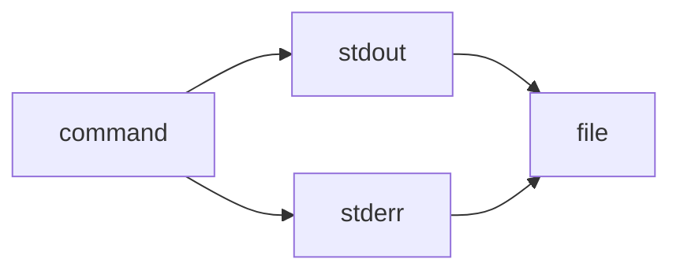

> 2>&1 is the explicit redirection operator:

> It means “send file descriptor 2 (stderr) to wherever file descriptor 1 (stdout) is currently going.”

> Works in all POSIX shells (sh, bash, zsh, dash, etc.).

> &> is a bash/zsh shorthand:

> It means “redirect both stdout and stderr to the same target.”

> Not POSIX; won’t work in plain sh or some other shells.

gg<!-- GENERATED-SECTIONS:DO-NOT-EDIT-BELOW -->
## Related content
- [AI-Centric OS with MCP Layer](ai-centric-os-with-mcp-layer.md)
- [AI-First-OS-Model-Context-Protocol](ai-first-os-model-context-protocol.md)
- [balanced-bst](balanced-bst.md)
## Sources
- _None_
<!-- GENERATED-SECTIONS:DO-NOT-EDIT-ABOVE -->
