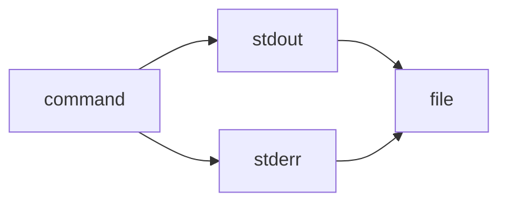

> 2>&1 is the explicit redirection operator:

> It means “send file descriptor 2 (stderr) to wherever file descriptor 1 (stdout) is currently going.” ^ref-b3555ede-4-0

> Works in all POSIX shells (sh, bash, zsh, dash, etc.). ^ref-b3555ede-6-0

^ref-b3555ede-7-0
 ^ref-b3555ede-15-0
> &> is a bash/zsh shorthand:
 ^ref-b3555ede-17-0
> It means “redirect both stdout and stderr to the same target.”
 ^ref-b3555ede-19-0
> Not POSIX; won’t work in plain sh or some other shells.
 ^ref-b3555ede-21-0
gg<!-- GENERATED-SECTIONS:DO-NOT-EDIT-BELOW -->
## Related content
- [AI-Centric OS with MCP Layer](ai-centric-os-with-mcp-layer.md)
- [AI-First-OS-Model-Context-Protocol](ai-first-os-model-context-protocol.md)
- [balanced-bst](balanced-bst.md)
- [Board Automation Improvements](board-automation-improvements.md)
- [Operations](chunks/operations.md)
- [2d-sandbox-field](2d-sandbox-field.md)
- [Admin Dashboard for User Management](admin-dashboard-for-user-management.md)
- [Agent Reflections and Prompt Evolution](agent-reflections-and-prompt-evolution.md)
- [Agent Tasks: Persistence Migration to DualStore](agent-tasks-persistence-migration-to-dualstore.md)
- [field-interaction-equations](field-interaction-equations.md)
- [Event Bus Projections Architecture](event-bus-projections-architecture.md)
- [eidolon-node-lifecycle](eidolon-node-lifecycle.md)
- [EidolonField](eidolonfield.md)
- [Event Bus MVP](event-bus-mvp.md)
- [Exception Layer Analysis](exception-layer-analysis.md)
- [Factorio AI with External Agents](factorio-ai-with-external-agents.md)
- [field-dynamics-math-blocks](field-dynamics-math-blocks.md)
- [field-node-diagram-outline](field-node-diagram-outline.md)
- [Dynamic Context Model for Web Components](dynamic-context-model-for-web-components.md)
- [Promethean Agent Config DSL](promethean-agent-config-dsl.md)
- [Cross-Target Macro System in Sibilant](cross-target-macro-system-in-sibilant.md)
- [DuckDuckGoSearchPipeline](duckduckgosearchpipeline.md)
- [Creative Moments](creative-moments.md)
- [Duck's Self-Referential Perceptual Loop](ducks-self-referential-perceptual-loop.md)
- [Post-Linguistic Transhuman Design Frameworks](post-linguistic-transhuman-design-frameworks.md)
- [Migrate to Provider-Tenant Architecture](migrate-to-provider-tenant-architecture.md)
- [aionian-circuit-math](aionian-circuit-math.md)
- [plan-update-confirmation](plan-update-confirmation.md)
- [Cross-Language Runtime Polymorphism](cross-language-runtime-polymorphism.md)
- [compiler-kit-foundations](compiler-kit-foundations.md)
- [api-gateway-versioning](api-gateway-versioning.md)
- [Model Upgrade Calm-Down Guide](model-upgrade-calm-down-guide.md)
- [NPU Voice Code and Sensory Integration](npu-voice-code-and-sensory-integration.md)
- [observability-infrastructure-setup](observability-infrastructure-setup.md)
- [Obsidian Templating Plugins Integration Guide](obsidian-templating-plugins-integration-guide.md)
- [OpenAPI Validation Report](openapi-validation-report.md)
- [Optimizing Command Limitations in System Design](optimizing-command-limitations-in-system-design.md)
- [pm2-orchestration-patterns](pm2-orchestration-patterns.md)
- [Board Walk – 2025-08-11](board-walk-2025-08-11.md)
- [Local-Offline-Model-Deployment-Strategy](local-offline-model-deployment-strategy.md)
- [Mindful Prioritization](mindful-prioritization.md)
- [MindfulRobotIntegration](mindfulrobotintegration.md)
- [Obsidian ChatGPT Plugin Integration Guide](obsidian-chatgpt-plugin-integration-guide.md)
- [Obsidian ChatGPT Plugin Integration](obsidian-chatgpt-plugin-integration.md)
- [Simulation Demo](chunks/simulation-demo.md)
- [Window Management](chunks/window-management.md)
- [Diagrams](chunks/diagrams.md)
- [DSL](chunks/dsl.md)
- [Math Fundamentals](chunks/math-fundamentals.md)
- [Shared](chunks/shared.md)
- [Provider-Agnostic Chat Panel Implementation](provider-agnostic-chat-panel-implementation.md)
- [promethean-system-diagrams](promethean-system-diagrams.md)
- [Promethean Web UI Setup](promethean-web-ui-setup.md)
- [Promethean Workflow Optimization](promethean-workflow-optimization.md)
- [Prometheus Observability Stack](prometheus-observability-stack.md)
- [Prompt_Folder_Bootstrap](prompt-folder-bootstrap.md)
- [prompt-programming-language-lisp](prompt-programming-language-lisp.md)
- [Protocol_0_The_Contradiction_Engine](protocol-0-the-contradiction-engine.md)
- [Pure-Node Crawl Stack with Playwright and Crawlee](pure-node-crawl-stack-with-playwright-and-crawlee.md)
- [Shared Package Structure](shared-package-structure.md)
- [shared-package-layout-clarification](shared-package-layout-clarification.md)
- [sibilant-macro-targets](sibilant-macro-targets.md)
- [schema-evolution-workflow](schema-evolution-workflow.md)
- [archetype-ecs](archetype-ecs.md)
- [RAG UI Panel with Qdrant and PostgREST](rag-ui-panel-with-qdrant-and-postgrest.md)
- [Pure TypeScript Search Microservice](pure-typescript-search-microservice.md)
- [ripple-propagation-demo](ripple-propagation-demo.md)
- [Self-Agency in AI Interaction](self-agency-in-ai-interaction.md)
- [set-assignment-in-lisp-ast](set-assignment-in-lisp-ast.md)
- [Sibilant Meta-Prompt DSL](sibilant-meta-prompt-dsl.md)
- [Tooling](chunks/tooling.md)
- [Debugging Broker Connections and Agent Behavior](debugging-broker-connections-and-agent-behavior.md)
- [Lisp-Compiler-Integration](lisp-compiler-integration.md)
- [Promethean Pipelines](promethean-pipelines.md)
- [Language-Agnostic Mirror System](language-agnostic-mirror-system.md)
- [universal-intention-code-fabric](universal-intention-code-fabric.md)
- [template-based-compilation](template-based-compilation.md)
- [State Snapshots API and Transactional Projector](state-snapshots-api-and-transactional-projector.md)
- [Promethean-native config design](promethean-native-config-design.md)
- [Model Selection for Lightweight Conversational Tasks](model-selection-for-lightweight-conversational-tasks.md)
- [ecs-scheduler-and-prefabs](ecs-scheduler-and-prefabs.md)
- [System Scheduler with Resource-Aware DAG](system-scheduler-with-resource-aware-dag.md)
- [Stateful Partitions and Rebalancing](stateful-partitions-and-rebalancing.md)
- [Promethean Infrastructure Setup](promethean-infrastructure-setup.md)
- [Chroma Toolkit Consolidation Plan](chroma-toolkit-consolidation-plan.md)
- [Chroma-Embedding-Refactor](chroma-embedding-refactor.md)
- [i3-layout-saver](i3-layout-saver.md)
- [Promethean Pipelines: Local TypeScript-First Workflow](promethean-pipelines-local-typescript-first-workflow.md)
- [graph-ds](graph-ds.md)
- [i3-config-validation-methods](i3-config-validation-methods.md)
- [sibilant-metacompiler-overview](sibilant-metacompiler-overview.md)
- [Performance-Optimized-Polyglot-Bridge](performance-optimized-polyglot-bridge.md)
- [Functional Refactor of TypeScript Document Processing](functional-refactor-of-typescript-document-processing.md)
- [Promethean Agent DSL TS Scaffold](promethean-agent-dsl-ts-scaffold.md)
- [polymorphic-meta-programming-engine](polymorphic-meta-programming-engine.md)
- [TypeScript Patch for Tool Calling Support](typescript-patch-for-tool-calling-support.md)
- [Promethean Documentation Pipeline Overview](promethean-documentation-pipeline-overview.md)
- [polyglot-repl-interface-layer](polyglot-repl-interface-layer.md)
- [lisp-dsl-for-window-management](lisp-dsl-for-window-management.md)
- [obsidian-ignore-node-modules-regex](obsidian-ignore-node-modules-regex.md)
- [Polyglot S-expr Bridge: Python-JS-Lisp Interop](polyglot-s-expr-bridge-python-js-lisp-interop.md)
## Sources
- [graph-ds — L359](graph-ds.md#^ref-6620e2f2-359-0) (line 359, col 0, score 0.64)
- [Chroma Toolkit Consolidation Plan — L122](chroma-toolkit-consolidation-plan.md#^ref-5020e892-122-0) (line 122, col 0, score 0.56)
- [obsidian-ignore-node-modules-regex — L42](obsidian-ignore-node-modules-regex.md#^ref-ffb9b2a9-42-0) (line 42, col 0, score 0.56)
- [shared-package-layout-clarification — L153](shared-package-layout-clarification.md#^ref-36c8882a-153-0) (line 153, col 0, score 0.56)
- [Chroma Toolkit Consolidation Plan — L162](chroma-toolkit-consolidation-plan.md#^ref-5020e892-162-0) (line 162, col 0, score 0.57)
- [Polyglot S-expr Bridge: Python-JS-Lisp Interop — L489](polyglot-s-expr-bridge-python-js-lisp-interop.md#^ref-63a1cc28-489-0) (line 489, col 0, score 0.56)
- [Promethean-native config design — L32](promethean-native-config-design.md#^ref-ab748541-32-0) (line 32, col 0, score 0.65)
- [Promethean-native config design — L33](promethean-native-config-design.md#^ref-ab748541-33-0) (line 33, col 0, score 0.65)
- [Promethean-native config design — L35](promethean-native-config-design.md#^ref-ab748541-35-0) (line 35, col 0, score 0.65)
- [i3-config-validation-methods — L17](i3-config-validation-methods.md#^ref-d28090ac-17-0) (line 17, col 0, score 0.64)
- [sibilant-macro-targets — L127](sibilant-macro-targets.md#^ref-c5c9a5c6-127-0) (line 127, col 0, score 0.63)
- [template-based-compilation — L21](template-based-compilation.md#^ref-f8877e5e-21-0) (line 21, col 0, score 0.69)
- [Dynamic Context Model for Web Components — L187](dynamic-context-model-for-web-components.md#^ref-f7702bf8-187-0) (line 187, col 0, score 0.62)
- [Functional Refactor of TypeScript Document Processing — L115](functional-refactor-of-typescript-document-processing.md#^ref-1cfae310-115-0) (line 115, col 0, score 0.62)
- [Migrate to Provider-Tenant Architecture — L84](migrate-to-provider-tenant-architecture.md#^ref-54382370-84-0) (line 84, col 0, score 0.61)
- [TypeScript Patch for Tool Calling Support — L262](typescript-patch-for-tool-calling-support.md#^ref-7b7ca860-262-0) (line 262, col 0, score 0.6)
- [TypeScript Patch for Tool Calling Support — L352](typescript-patch-for-tool-calling-support.md#^ref-7b7ca860-352-0) (line 352, col 0, score 0.6)
- [aionian-circuit-math — L128](aionian-circuit-math.md#^ref-f2d83a77-128-0) (line 128, col 0, score 0.66)
- [Promethean Agent Config DSL — L116](promethean-agent-config-dsl.md#^ref-2c00ce45-116-0) (line 116, col 0, score 0.6)
- [i3-layout-saver — L83](i3-layout-saver.md#^ref-31f0166e-83-0) (line 83, col 0, score 0.58)
- [plan-update-confirmation — L202](plan-update-confirmation.md#^ref-b22d79c6-202-0) (line 202, col 0, score 0.6)
- [plan-update-confirmation — L286](plan-update-confirmation.md#^ref-b22d79c6-286-0) (line 286, col 0, score 0.6)
- [i3-layout-saver — L5](i3-layout-saver.md#^ref-31f0166e-5-0) (line 5, col 0, score 0.63)
- [plan-update-confirmation — L178](plan-update-confirmation.md#^ref-b22d79c6-178-0) (line 178, col 0, score 0.64)
- [plan-update-confirmation — L262](plan-update-confirmation.md#^ref-b22d79c6-262-0) (line 262, col 0, score 0.58)
- [Promethean Agent DSL TS Scaffold — L1](promethean-agent-dsl-ts-scaffold.md#^ref-5158f742-1-0) (line 1, col 0, score 0.58)
- [Cross-Language Runtime Polymorphism — L25](cross-language-runtime-polymorphism.md#^ref-c34c36a6-25-0) (line 25, col 0, score 0.61)
- [Dynamic Context Model for Web Components — L352](dynamic-context-model-for-web-components.md#^ref-f7702bf8-352-0) (line 352, col 0, score 0.61)
- [template-based-compilation — L84](template-based-compilation.md#^ref-f8877e5e-84-0) (line 84, col 0, score 0.61)
- [Promethean Infrastructure Setup — L392](promethean-infrastructure-setup.md#^ref-6deed6ac-392-0) (line 392, col 0, score 0.6)
- [Promethean Infrastructure Setup — L549](promethean-infrastructure-setup.md#^ref-6deed6ac-549-0) (line 549, col 0, score 0.6)
- [compiler-kit-foundations — L15](compiler-kit-foundations.md#^ref-01b21543-15-0) (line 15, col 0, score 0.75)
- [Lisp-Compiler-Integration — L13](lisp-compiler-integration.md#^ref-cfee6d36-13-0) (line 13, col 0, score 0.74)
- [Promethean Pipelines — L58](promethean-pipelines.md#^ref-8b8e6103-58-0) (line 58, col 0, score 0.71)
- [Language-Agnostic Mirror System — L11](language-agnostic-mirror-system.md#^ref-d2b3628c-11-0) (line 11, col 0, score 0.71)
- [universal-intention-code-fabric — L9](universal-intention-code-fabric.md#^ref-c14edce7-9-0) (line 9, col 0, score 0.71)
- [Dynamic Context Model for Web Components — L51](dynamic-context-model-for-web-components.md#^ref-f7702bf8-51-0) (line 51, col 0, score 0.69)
- [schema-evolution-workflow — L132](schema-evolution-workflow.md#^ref-d8059b6a-132-0) (line 132, col 0, score 0.68)
- [State Snapshots API and Transactional Projector — L235](state-snapshots-api-and-transactional-projector.md#^ref-509e1cd5-235-0) (line 235, col 0, score 0.67)
- [archetype-ecs — L423](archetype-ecs.md#^ref-8f4c1e86-423-0) (line 423, col 0, score 0.67)
- [RAG UI Panel with Qdrant and PostgREST — L336](rag-ui-panel-with-qdrant-and-postgrest.md#^ref-e1056831-336-0) (line 336, col 0, score 0.66)
- [Model Selection for Lightweight Conversational Tasks — L43](model-selection-for-lightweight-conversational-tasks.md#^ref-d144aa62-43-0) (line 43, col 0, score 0.65)
- [ecs-scheduler-and-prefabs — L352](ecs-scheduler-and-prefabs.md#^ref-c62a1815-352-0) (line 352, col 0, score 0.65)
- [System Scheduler with Resource-Aware DAG — L350](system-scheduler-with-resource-aware-dag.md#^ref-ba244286-350-0) (line 350, col 0, score 0.65)
- [Stateful Partitions and Rebalancing — L187](stateful-partitions-and-rebalancing.md#^ref-4330e8f0-187-0) (line 187, col 0, score 0.65)
- [Promethean Infrastructure Setup — L501](promethean-infrastructure-setup.md#^ref-6deed6ac-501-0) (line 501, col 0, score 0.65)
- [Promethean Pipelines: Local TypeScript-First Workflow — L219](promethean-pipelines-local-typescript-first-workflow.md#^ref-6b63edca-219-0) (line 219, col 0, score 0.64)
- [Provider-Agnostic Chat Panel Implementation — L84](provider-agnostic-chat-panel-implementation.md#^ref-43bfe9dd-84-0) (line 84, col 0, score 0.65)
- [Chroma-Embedding-Refactor — L64](chroma-embedding-refactor.md#^ref-8b256935-64-0) (line 64, col 0, score 0.57)
- [Chroma-Embedding-Refactor — L109](chroma-embedding-refactor.md#^ref-8b256935-109-0) (line 109, col 0, score 0.57)
- [Chroma-Embedding-Refactor — L258](chroma-embedding-refactor.md#^ref-8b256935-258-0) (line 258, col 0, score 0.57)
- [Chroma Toolkit Consolidation Plan — L72](chroma-toolkit-consolidation-plan.md#^ref-5020e892-72-0) (line 72, col 0, score 0.65)
- [Chroma Toolkit Consolidation Plan — L88](chroma-toolkit-consolidation-plan.md#^ref-5020e892-88-0) (line 88, col 0, score 0.65)
- [Chroma Toolkit Consolidation Plan — L107](chroma-toolkit-consolidation-plan.md#^ref-5020e892-107-0) (line 107, col 0, score 0.65)
- [Chroma Toolkit Consolidation Plan — L148](chroma-toolkit-consolidation-plan.md#^ref-5020e892-148-0) (line 148, col 0, score 0.65)
- [Cross-Target Macro System in Sibilant — L113](cross-target-macro-system-in-sibilant.md#^ref-5f210ca2-113-0) (line 113, col 0, score 0.65)
- [sibilant-metacompiler-overview — L66](sibilant-metacompiler-overview.md#^ref-61d4086b-66-0) (line 66, col 0, score 0.64)
- [Performance-Optimized-Polyglot-Bridge — L10](performance-optimized-polyglot-bridge.md#^ref-f5579967-10-0) (line 10, col 0, score 0.64)
- [Model Selection for Lightweight Conversational Tasks — L1](model-selection-for-lightweight-conversational-tasks.md#^ref-d144aa62-1-0) (line 1, col 0, score 0.63)
- [Cross-Target Macro System in Sibilant — L115](cross-target-macro-system-in-sibilant.md#^ref-5f210ca2-115-0) (line 115, col 0, score 0.63)
- [Dynamic Context Model for Web Components — L331](dynamic-context-model-for-web-components.md#^ref-f7702bf8-331-0) (line 331, col 0, score 0.57)
- [Promethean-native config design — L31](promethean-native-config-design.md#^ref-ab748541-31-0) (line 31, col 0, score 0.57)
- [polymorphic-meta-programming-engine — L11](polymorphic-meta-programming-engine.md#^ref-7bed0b9a-11-0) (line 11, col 0, score 0.61)
- [Promethean Documentation Pipeline Overview — L154](promethean-documentation-pipeline-overview.md#^ref-3a3bf2c9-154-0) (line 154, col 0, score 0.58)
- [polyglot-repl-interface-layer — L146](polyglot-repl-interface-layer.md#^ref-9c79206d-146-0) (line 146, col 0, score 0.57)
- [Promethean Agent Config DSL — L3](promethean-agent-config-dsl.md#^ref-2c00ce45-3-0) (line 3, col 0, score 0.57)
- [Migrate to Provider-Tenant Architecture — L88](migrate-to-provider-tenant-architecture.md#^ref-54382370-88-0) (line 88, col 0, score 0.57)
- [lisp-dsl-for-window-management — L13](lisp-dsl-for-window-management.md#^ref-c5c5ff1c-13-0) (line 13, col 0, score 0.56)
- [Cross-Language Runtime Polymorphism — L141](cross-language-runtime-polymorphism.md#^ref-c34c36a6-141-0) (line 141, col 0, score 0.56)
- [Pure TypeScript Search Microservice — L515](pure-typescript-search-microservice.md#^ref-d17d3a96-515-0) (line 515, col 0, score 0.56)
- [field-interaction-equations — L19](field-interaction-equations.md#^ref-b09141b7-19-0) (line 19, col 0, score 0.63)
- [RAG UI Panel with Qdrant and PostgREST — L355](rag-ui-panel-with-qdrant-and-postgrest.md#^ref-e1056831-355-0) (line 355, col 0, score 0.59)
- [Model Selection for Lightweight Conversational Tasks — L105](model-selection-for-lightweight-conversational-tasks.md#^ref-d144aa62-105-0) (line 105, col 0, score 0.57)
- [2d-sandbox-field — L225](2d-sandbox-field.md#^ref-c710dc93-225-0) (line 225, col 0, score 1)
- [Admin Dashboard for User Management — L49](admin-dashboard-for-user-management.md#^ref-2901a3e9-49-0) (line 49, col 0, score 1)
- [Agent Reflections and Prompt Evolution — L150](agent-reflections-and-prompt-evolution.md#^ref-bb7f0835-150-0) (line 150, col 0, score 1)
- [Agent Tasks: Persistence Migration to DualStore — L163](agent-tasks-persistence-migration-to-dualstore.md#^ref-93d2ba51-163-0) (line 163, col 0, score 1)
- [AI-First-OS-Model-Context-Protocol — L9](ai-first-os-model-context-protocol.md#^ref-618198f4-9-0) (line 9, col 0, score 1)
- [aionian-circuit-math — L179](aionian-circuit-math.md#^ref-f2d83a77-179-0) (line 179, col 0, score 1)
- [api-gateway-versioning — L304](api-gateway-versioning.md#^ref-0580dcd3-304-0) (line 304, col 0, score 1)
- [archetype-ecs — L479](archetype-ecs.md#^ref-8f4c1e86-479-0) (line 479, col 0, score 1)
- [balanced-bst — L295](balanced-bst.md#^ref-d3e7db72-295-0) (line 295, col 0, score 1)
- [DuckDuckGoSearchPipeline — L10](duckduckgosearchpipeline.md#^ref-e979c50f-10-0) (line 10, col 0, score 1)
- [Event Bus Projections Architecture — L169](event-bus-projections-architecture.md#^ref-cf6b9b17-169-0) (line 169, col 0, score 1)
- [Model Upgrade Calm-Down Guide — L63](model-upgrade-calm-down-guide.md#^ref-db74343f-63-0) (line 63, col 0, score 1)
- [NPU Voice Code and Sensory Integration — L10](npu-voice-code-and-sensory-integration.md#^ref-5a02283e-10-0) (line 10, col 0, score 1)
- [observability-infrastructure-setup — L391](observability-infrastructure-setup.md#^ref-b4e64f8c-391-0) (line 391, col 0, score 1)
- [Obsidian Templating Plugins Integration Guide — L111](obsidian-templating-plugins-integration-guide.md#^ref-b39dc9d4-111-0) (line 111, col 0, score 1)
- [OpenAPI Validation Report — L29](openapi-validation-report.md#^ref-5c152b08-29-0) (line 29, col 0, score 1)
- [Optimizing Command Limitations in System Design — L36](optimizing-command-limitations-in-system-design.md#^ref-98c8ff62-36-0) (line 36, col 0, score 1)
- [plan-update-confirmation — L1013](plan-update-confirmation.md#^ref-b22d79c6-1013-0) (line 1013, col 0, score 1)
- [pm2-orchestration-patterns — L252](pm2-orchestration-patterns.md#^ref-51932e7b-252-0) (line 252, col 0, score 1)
- [Admin Dashboard for User Management — L55](admin-dashboard-for-user-management.md#^ref-2901a3e9-55-0) (line 55, col 0, score 1)
- [AI-Centric OS with MCP Layer — L414](ai-centric-os-with-mcp-layer.md#^ref-0f1f8cc1-414-0) (line 414, col 0, score 1)
- [Board Automation Improvements — L15](board-automation-improvements.md#^ref-ac60a1d6-15-0) (line 15, col 0, score 1)
- [Operations — L7](chunks/operations.md#^ref-f1add613-7-0) (line 7, col 0, score 1)
- [Creative Moments — L7](creative-moments.md#^ref-10d98225-7-0) (line 7, col 0, score 1)
- [Cross-Target Macro System in Sibilant — L210](cross-target-macro-system-in-sibilant.md#^ref-5f210ca2-210-0) (line 210, col 0, score 1)
- [DuckDuckGoSearchPipeline — L11](duckduckgosearchpipeline.md#^ref-e979c50f-11-0) (line 11, col 0, score 1)
- [Duck's Self-Referential Perceptual Loop — L44](ducks-self-referential-perceptual-loop.md#^ref-71726f04-44-0) (line 44, col 0, score 1)
- [Dynamic Context Model for Web Components — L424](dynamic-context-model-for-web-components.md#^ref-f7702bf8-424-0) (line 424, col 0, score 1)
- [Post-Linguistic Transhuman Design Frameworks — L96](post-linguistic-transhuman-design-frameworks.md#^ref-6bcff92c-96-0) (line 96, col 0, score 1)
- [Promethean Agent Config DSL — L348](promethean-agent-config-dsl.md#^ref-2c00ce45-348-0) (line 348, col 0, score 1)
- [Admin Dashboard for User Management — L45](admin-dashboard-for-user-management.md#^ref-2901a3e9-45-0) (line 45, col 0, score 1)
- [Agent Tasks: Persistence Migration to DualStore — L170](agent-tasks-persistence-migration-to-dualstore.md#^ref-93d2ba51-170-0) (line 170, col 0, score 1)
- [AI-Centric OS with MCP Layer — L416](ai-centric-os-with-mcp-layer.md#^ref-0f1f8cc1-416-0) (line 416, col 0, score 1)
- [AI-First-OS-Model-Context-Protocol — L11](ai-first-os-model-context-protocol.md#^ref-618198f4-11-0) (line 11, col 0, score 1)
- [aionian-circuit-math — L178](aionian-circuit-math.md#^ref-f2d83a77-178-0) (line 178, col 0, score 1)
- [api-gateway-versioning — L312](api-gateway-versioning.md#^ref-0580dcd3-312-0) (line 312, col 0, score 1)
- [balanced-bst — L297](balanced-bst.md#^ref-d3e7db72-297-0) (line 297, col 0, score 1)
- [Board Walk – 2025-08-11 — L131](board-walk-2025-08-11.md#^ref-7aa1eb92-131-0) (line 131, col 0, score 1)
- [Operations — L8](chunks/operations.md#^ref-f1add613-8-0) (line 8, col 0, score 1)
- [Local-Offline-Model-Deployment-Strategy — L305](local-offline-model-deployment-strategy.md#^ref-ad7f1ed3-305-0) (line 305, col 0, score 1)
- [Migrate to Provider-Tenant Architecture — L331](migrate-to-provider-tenant-architecture.md#^ref-54382370-331-0) (line 331, col 0, score 1)
- [Mindful Prioritization — L9](mindful-prioritization.md#^ref-40185d05-9-0) (line 9, col 0, score 1)
- [MindfulRobotIntegration — L7](mindfulrobotintegration.md#^ref-5f65dfa5-7-0) (line 7, col 0, score 1)
- [Model Upgrade Calm-Down Guide — L66](model-upgrade-calm-down-guide.md#^ref-db74343f-66-0) (line 66, col 0, score 1)
- [NPU Voice Code and Sensory Integration — L13](npu-voice-code-and-sensory-integration.md#^ref-5a02283e-13-0) (line 13, col 0, score 1)
- [observability-infrastructure-setup — L393](observability-infrastructure-setup.md#^ref-b4e64f8c-393-0) (line 393, col 0, score 1)
- [Obsidian ChatGPT Plugin Integration Guide — L59](obsidian-chatgpt-plugin-integration-guide.md#^ref-1d3d6c3a-59-0) (line 59, col 0, score 1)
- [Obsidian ChatGPT Plugin Integration — L56](obsidian-chatgpt-plugin-integration.md#^ref-ca8e1399-56-0) (line 56, col 0, score 1)
- [promethean-system-diagrams — L207](promethean-system-diagrams.md#^ref-b51e19b4-207-0) (line 207, col 0, score 1)
- [Promethean Web UI Setup — L633](promethean-web-ui-setup.md#^ref-bc5172ca-633-0) (line 633, col 0, score 1)
- [Promethean Workflow Optimization — L20](promethean-workflow-optimization.md#^ref-d614d983-20-0) (line 20, col 0, score 1)
- [Prometheus Observability Stack — L543](prometheus-observability-stack.md#^ref-e90b5a16-543-0) (line 543, col 0, score 1)
- [Prompt_Folder_Bootstrap — L216](prompt-folder-bootstrap.md#^ref-bd4f0976-216-0) (line 216, col 0, score 1)
- [prompt-programming-language-lisp — L116](prompt-programming-language-lisp.md#^ref-d41a06d1-116-0) (line 116, col 0, score 1)
- [Protocol_0_The_Contradiction_Engine — L156](protocol-0-the-contradiction-engine.md#^ref-9a93a756-156-0) (line 156, col 0, score 1)
- [Provider-Agnostic Chat Panel Implementation — L238](provider-agnostic-chat-panel-implementation.md#^ref-43bfe9dd-238-0) (line 238, col 0, score 1)
- [Pure-Node Crawl Stack with Playwright and Crawlee — L445](pure-node-crawl-stack-with-playwright-and-crawlee.md#^ref-d527c05d-445-0) (line 445, col 0, score 1)
- [Shared Package Structure — L195](shared-package-structure.md#^ref-66a72fc3-195-0) (line 195, col 0, score 1)
- [eidolon-node-lifecycle — L63](eidolon-node-lifecycle.md#^ref-938eca9c-63-0) (line 63, col 0, score 1)
- [EidolonField — L269](eidolonfield.md#^ref-49d1e1e5-269-0) (line 269, col 0, score 1)
- [Event Bus MVP — L566](event-bus-mvp.md#^ref-534fe91d-566-0) (line 566, col 0, score 1)
- [Event Bus Projections Architecture — L185](event-bus-projections-architecture.md#^ref-cf6b9b17-185-0) (line 185, col 0, score 1)
- [Exception Layer Analysis — L165](exception-layer-analysis.md#^ref-21d5cc09-165-0) (line 165, col 0, score 1)
- [Factorio AI with External Agents — L160](factorio-ai-with-external-agents.md#^ref-a4d90289-160-0) (line 160, col 0, score 1)
- [field-dynamics-math-blocks — L165](field-dynamics-math-blocks.md#^ref-7cfc230d-165-0) (line 165, col 0, score 1)
- [field-interaction-equations — L184](field-interaction-equations.md#^ref-b09141b7-184-0) (line 184, col 0, score 1)
- [field-node-diagram-outline — L132](field-node-diagram-outline.md#^ref-1f32c94a-132-0) (line 132, col 0, score 1)
- [Simulation Demo — L32](chunks/simulation-demo.md#^ref-557309a3-32-0) (line 32, col 0, score 1)
- [Tooling — L26](chunks/tooling.md#^ref-6cb4943e-26-0) (line 26, col 0, score 1)
- [Window Management — L36](chunks/window-management.md#^ref-9e8ae388-36-0) (line 36, col 0, score 1)
- [compiler-kit-foundations — L639](compiler-kit-foundations.md#^ref-01b21543-639-0) (line 639, col 0, score 1)
- [Creative Moments — L10](creative-moments.md#^ref-10d98225-10-0) (line 10, col 0, score 1)
- [Cross-Language Runtime Polymorphism — L258](cross-language-runtime-polymorphism.md#^ref-c34c36a6-258-0) (line 258, col 0, score 1)
- [Cross-Target Macro System in Sibilant — L215](cross-target-macro-system-in-sibilant.md#^ref-5f210ca2-215-0) (line 215, col 0, score 1)
- [Debugging Broker Connections and Agent Behavior — L50](debugging-broker-connections-and-agent-behavior.md#^ref-73d3dbf6-50-0) (line 50, col 0, score 1)
- [DuckDuckGoSearchPipeline — L16](duckduckgosearchpipeline.md#^ref-e979c50f-16-0) (line 16, col 0, score 1)
- [Pure TypeScript Search Microservice — L538](pure-typescript-search-microservice.md#^ref-d17d3a96-538-0) (line 538, col 0, score 1)
- [RAG UI Panel with Qdrant and PostgREST — L374](rag-ui-panel-with-qdrant-and-postgrest.md#^ref-e1056831-374-0) (line 374, col 0, score 1)
- [ripple-propagation-demo — L120](ripple-propagation-demo.md#^ref-8430617b-120-0) (line 120, col 0, score 1)
- [schema-evolution-workflow — L502](schema-evolution-workflow.md#^ref-d8059b6a-502-0) (line 502, col 0, score 1)
- [Self-Agency in AI Interaction — L53](self-agency-in-ai-interaction.md#^ref-49a9a860-53-0) (line 53, col 0, score 1)
- [set-assignment-in-lisp-ast — L161](set-assignment-in-lisp-ast.md#^ref-c5fba0a0-161-0) (line 161, col 0, score 1)
- [shared-package-layout-clarification — L185](shared-package-layout-clarification.md#^ref-36c8882a-185-0) (line 185, col 0, score 1)
- [Shared Package Structure — L181](shared-package-structure.md#^ref-66a72fc3-181-0) (line 181, col 0, score 1)
- [sibilant-macro-targets — L173](sibilant-macro-targets.md#^ref-c5c9a5c6-173-0) (line 173, col 0, score 1)
- [Sibilant Meta-Prompt DSL — L194](sibilant-meta-prompt-dsl.md#^ref-af5d2824-194-0) (line 194, col 0, score 1)
- [Diagrams — L50](chunks/diagrams.md#^ref-45cd25b5-50-0) (line 50, col 0, score 1)
- [DSL — L44](chunks/dsl.md#^ref-e87bc036-44-0) (line 44, col 0, score 1)
- [Math Fundamentals — L43](chunks/math-fundamentals.md#^ref-c6e87433-43-0) (line 43, col 0, score 1)
- [Operations — L15](chunks/operations.md#^ref-f1add613-15-0) (line 15, col 0, score 1)
- [Shared — L31](chunks/shared.md#^ref-623a55f7-31-0) (line 31, col 0, score 1)
- [Simulation Demo — L34](chunks/simulation-demo.md#^ref-557309a3-34-0) (line 34, col 0, score 1)
- [Window Management — L38](chunks/window-management.md#^ref-9e8ae388-38-0) (line 38, col 0, score 1)
- [compiler-kit-foundations — L651](compiler-kit-foundations.md#^ref-01b21543-651-0) (line 651, col 0, score 1)
- [Creative Moments — L15](creative-moments.md#^ref-10d98225-15-0) (line 15, col 0, score 1)
- [Cross-Language Runtime Polymorphism — L263](cross-language-runtime-polymorphism.md#^ref-c34c36a6-263-0) (line 263, col 0, score 1)
- [Cross-Target Macro System in Sibilant — L219](cross-target-macro-system-in-sibilant.md#^ref-5f210ca2-219-0) (line 219, col 0, score 1)
<!-- GENERATED-SECTIONS:DO-NOT-EDIT-ABOVE -->
