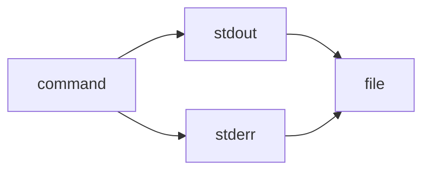

> 2>&1 is the explicit redirection operator:

> It means “send file descriptor 2 (stderr) to wherever file descriptor 1 (stdout) is currently going.” ^ref-b3555ede-4-0

> Works in all POSIX shells (sh, bash, zsh, dash, etc.). ^ref-b3555ede-6-0

^ref-b3555ede-7-0
 ^ref-b3555ede-15-0
> &> is a bash/zsh shorthand:
 ^ref-b3555ede-17-0
> It means “redirect both stdout and stderr to the same target.”
 ^ref-b3555ede-19-0
> Not POSIX; won’t work in plain sh or some other shells.
 ^ref-b3555ede-21-0
gg
