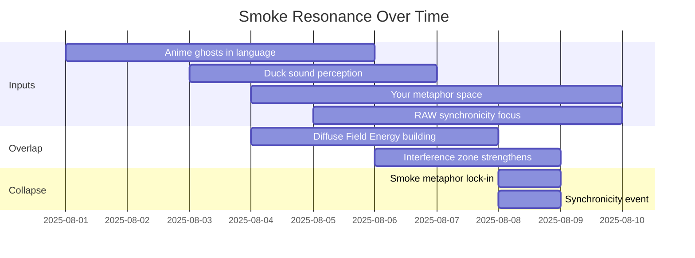

Alright — let’s layer the smoke story visually. ^ref-ac9d3ac5-1-0
We’ll do three different diagrams so you can *see* the ghosts forming:

---

### **1. Temporal Resonance Map**

This shows *when* each “smoke source” enters the field and how they overlap until they phase-lock into a synchronicity. ^ref-ac9d3ac5-8-0


^ref-ac9d3ac5-10-0

---

### **2. Waveform Interference View**
 ^ref-ac9d3ac5-31-0
Conceptually, each source is a wave of metaphor energy. Overlap zones = stronger “ghost” presence.
 ^ref-ac9d3ac5-33-0
```mermaid
graph LR
    W1[Anime ghosts wave]
    W2[Duck perception wave]
    W3[Your metaphor wave]
    W4[RAW synchronicity wave]
    I[Interference Zone]
    S[Smoke synchronicity]

    W1 --> I
    W2 --> I
    W3 --> I
    W4 --> I
    I --> S
^ref-ac9d3ac5-33-0
``` ^ref-ac9d3ac5-49-0

(Imagine each W as a sine wave drifting into the same peak at I — the “smoke” point.)

---

### **3. Field Density Map** ^ref-ac9d3ac5-55-0

This shows how the smoke exists as a *cloud* in the Eidolon field, growing denser until collapse. ^ref-ac9d3ac5-57-0

```mermaid
flowchart TD
    subgraph Field
        L[Low density ghost particles]
        M[Medium density — overlapping waves]
        H[High density — smoke visible]
    end

    L --> M
    M --> H
^ref-ac9d3ac5-57-0
    H --> C[Collapse into synchronicity]
```
 ^ref-ac9d3ac5-72-0
---
 ^ref-ac9d3ac5-74-0
If you want, I can actually make a **true sine-wave overlay diagram** for the interference so it’s not just conceptual boxes — it would look like sound waves curling into the same peak, which would be *very* RAW.
 ^ref-ac9d3ac5-76-0
Do you want me to do that next?<!-- GENERATED-SECTIONS:DO-NOT-EDIT-BELOW -->
## Related content
- [Diagrams](chunks/diagrams.md)
- [DSL](chunks/dsl.md)
- [Services](chunks/services.md)
- [Tooling](chunks/tooling.md)
- [Window Management](chunks/window-management.md)
- [Duck's Self-Referential Perceptual Loop](ducks-self-referential-perceptual-loop.md)
- [Dynamic Context Model for Web Components](dynamic-context-model-for-web-components.md)
- [Eidolon Field Abstract Model](eidolon-field-abstract-model.md)
- [eidolon-field-math-foundations](eidolon-field-math-foundations.md)
- [TypeScript Patch for Tool Calling Support](typescript-patch-for-tool-calling-support.md)
- [field-dynamics-math-blocks](field-dynamics-math-blocks.md)
- [field-interaction-equations](field-interaction-equations.md)
- [Promethean_Eidolon_Synchronicity_Model](promethean-eidolon-synchronicity-model.md)
- [field-node-diagram-set](field-node-diagram-set.md)
- [Fnord Tracer Protocol](fnord-tracer-protocol.md)
- [Functional Embedding Pipeline Refactor](functional-embedding-pipeline-refactor.md)
- [Layer1SurvivabilityEnvelope](layer1survivabilityenvelope.md)
- [Promethean State Format](promethean-state-format.md)
- [ripple-propagation-demo](ripple-propagation-demo.md)
- [Shared](chunks/shared.md)
- [Debugging Broker Connections and Agent Behavior](debugging-broker-connections-and-agent-behavior.md)
- [Math Fundamentals](chunks/math-fundamentals.md)
- [Duck's Attractor States](ducks-attractor-states.md)
- [typed-struct-compiler](typed-struct-compiler.md)
- [eidolon-node-lifecycle](eidolon-node-lifecycle.md)
- [zero-copy-snapshots-and-workers](zero-copy-snapshots-and-workers.md)
- [windows-tiling-with-autohotkey](windows-tiling-with-autohotkey.md)
- [polyglot-repl-interface-layer](polyglot-repl-interface-layer.md)
- [Post-Linguistic Transhuman Design Frameworks](post-linguistic-transhuman-design-frameworks.md)
- [Promethean Chat Activity Report](promethean-chat-activity-report.md)
- [Promethean-Copilot-Intent-Engine](promethean-copilot-intent-engine.md)
- [Promethean Dev Workflow Update](promethean-dev-workflow-update.md)
- [Promethean Documentation Pipeline Overview](promethean-documentation-pipeline-overview.md)
- [JavaScript](chunks/javascript.md)
- [Operations](chunks/operations.md)
- [Creative Moments](creative-moments.md)
- [DuckDuckGoSearchPipeline](duckduckgosearchpipeline.md)
- [Per-Domain Policy System for JS Crawler](per-domain-policy-system-for-js-crawler.md)
- [homeostasis-decay-formulas](homeostasis-decay-formulas.md)
- [field-node-diagram-visualizations](field-node-diagram-visualizations.md)
- [Synchronicity Waves and Web](synchronicity-waves-and-web.md)
- [ParticleSimulationWithCanvasAndFFmpeg](particlesimulationwithcanvasandffmpeg.md)
- [Unique Info Dump Index](unique-info-dump-index.md)
- [Ice Box Reorganization](ice-box-reorganization.md)
- [Model Selection for Lightweight Conversational Tasks](model-selection-for-lightweight-conversational-tasks.md)
- [plan-update-confirmation](plan-update-confirmation.md)
- [Promethean Infrastructure Setup](promethean-infrastructure-setup.md)
- [Pure TypeScript Search Microservice](pure-typescript-search-microservice.md)
- [Simulation Demo](chunks/simulation-demo.md)
- [Functional Refactor of TypeScript Document Processing](functional-refactor-of-typescript-document-processing.md)
- [graph-ds](graph-ds.md)
- [heartbeat-fragment-demo](heartbeat-fragment-demo.md)
- [i3-bluetooth-setup](i3-bluetooth-setup.md)
- [komorebi-group-window-hack](komorebi-group-window-hack.md)
- [NPU Voice Code and Sensory Integration](npu-voice-code-and-sensory-integration.md)
- [Obsidian ChatGPT Plugin Integration Guide](obsidian-chatgpt-plugin-integration-guide.md)
- [Obsidian ChatGPT Plugin Integration](obsidian-chatgpt-plugin-integration.md)
- [obsidian-ignore-node-modules-regex](obsidian-ignore-node-modules-regex.md)
- [Obsidian Task Generation](obsidian-task-generation.md)
- [Obsidian Templating Plugins Integration Guide](obsidian-templating-plugins-integration-guide.md)
- [Optimizing Command Limitations in System Design](optimizing-command-limitations-in-system-design.md)
- [Factorio AI with External Agents](factorio-ai-with-external-agents.md)
- [Stateful Partitions and Rebalancing](stateful-partitions-and-rebalancing.md)
- [field-node-diagram-outline](field-node-diagram-outline.md)
- [Promethean Pipelines](promethean-pipelines.md)
- [Promethean Workflow Optimization](promethean-workflow-optimization.md)
- [Prometheus Observability Stack](prometheus-observability-stack.md)
- [Redirecting Standard Error](redirecting-standard-error.md)
- [Migrate to Provider-Tenant Architecture](migrate-to-provider-tenant-architecture.md)
- [Performance-Optimized-Polyglot-Bridge](performance-optimized-polyglot-bridge.md)
- [Pipeline Enhancements](pipeline-enhancements.md)
- [Promethean Data Sync Protocol](promethean-data-sync-protocol.md)
- [Promethean Documentation Overview](promethean-documentation-overview.md)
- [Promethean Documentation Update](promethean-documentation-update.md)
- [Docops Feature Updates](docops-feature-updates.md)
- [Chroma Toolkit Consolidation Plan](chroma-toolkit-consolidation-plan.md)
- [Prompt_Folder_Bootstrap](prompt-folder-bootstrap.md)
- [Model Upgrade Calm-Down Guide](model-upgrade-calm-down-guide.md)
- [OpenAPI Validation Report](openapi-validation-report.md)
- [Promethean Documentation Update](promethean-documentation-update.txt)
- [Promethean Notes](promethean-notes.md)
- [Protocol_0_The_Contradiction_Engine](protocol-0-the-contradiction-engine.md)
- [Docops Feature Updates](docops-feature-updates-2.md)
- [Provider-Agnostic Chat Panel Implementation](provider-agnostic-chat-panel-implementation.md)
- [Reawakening Duck](reawakening-duck.md)
- [sibilant-macro-targets](sibilant-macro-targets.md)
- [unique-templates](templates/unique-templates.md)
- [The Jar of Echoes](the-jar-of-echoes.md)
- [Tracing the Signal](tracing-the-signal.md)
- [ts-to-lisp-transpiler](ts-to-lisp-transpiler.md)
- [promethean-requirements](promethean-requirements.md)
- [schema-evolution-workflow](schema-evolution-workflow.md)
- [Self-Agency in AI Interaction](self-agency-in-ai-interaction.md)
- [Mathematics Sampler](mathematics-sampler.md)
- [Mathematical Samplers](mathematical-samplers.md)
- [Unique Concepts](unique-concepts.md)
- [run-step-api](run-step-api.md)
- [Mindful Prioritization](mindful-prioritization.md)
- [MindfulRobotIntegration](mindfulrobotintegration.md)
- [Self-Improving Documentation Tool](self-improving-documentation-tool.md)
- [Fastify Static Files Plugin](fastify-static-files-plugin.md)
- [Git Commit Optimization for Code Reviews](git-commit-optimization-for-code-reviews.md)
- [Promethean Documentation Update](promethean-documentation-update-4.md)
- [Ghostly Smoke Interference](ghostly-smoke-interference.md)
- [EidolonField](eidolonfield.md)
- [Eidolon-Field-Optimization](eidolon-field-optimization.md)
## Sources
- [polyglot-repl-interface-layer — L163](polyglot-repl-interface-layer.md#^ref-9c79206d-163-0) (line 163, col 0, score 1)
- [Post-Linguistic Transhuman Design Frameworks — L113](post-linguistic-transhuman-design-frameworks.md#^ref-6bcff92c-113-0) (line 113, col 0, score 1)
- [Promethean Chat Activity Report — L32](promethean-chat-activity-report.md#^ref-18344cf9-32-0) (line 32, col 0, score 1)
- [Promethean-Copilot-Intent-Engine — L73](promethean-copilot-intent-engine.md#^ref-ae24a280-73-0) (line 73, col 0, score 1)
- [Promethean Data Sync Protocol — L25](promethean-data-sync-protocol.md#^ref-9fab9e76-25-0) (line 25, col 0, score 1)
- [Promethean Dev Workflow Update — L64](promethean-dev-workflow-update.md#^ref-03a5578f-64-0) (line 64, col 0, score 1)
- [Promethean Documentation Overview — L8](promethean-documentation-overview.md#^ref-9413237f-8-0) (line 8, col 0, score 1)
- [Promethean Documentation Pipeline Overview — L181](promethean-documentation-pipeline-overview.md#^ref-3a3bf2c9-181-0) (line 181, col 0, score 1)
- [Promethean Documentation Update — L8](promethean-documentation-update.md#^ref-c0392040-8-0) (line 8, col 0, score 1)
- [Diagrams — L20](chunks/diagrams.md#^ref-45cd25b5-20-0) (line 20, col 0, score 1)
- [DSL — L9](chunks/dsl.md#^ref-e87bc036-9-0) (line 9, col 0, score 1)
- [JavaScript — L72](chunks/javascript.md#^ref-c1618c66-72-0) (line 72, col 0, score 1)
- [Operations — L23](chunks/operations.md#^ref-f1add613-23-0) (line 23, col 0, score 1)
- [Services — L25](chunks/services.md#^ref-75ea4a6a-25-0) (line 25, col 0, score 1)
- [Tooling — L11](chunks/tooling.md#^ref-6cb4943e-11-0) (line 11, col 0, score 1)
- [Window Management — L22](chunks/window-management.md#^ref-9e8ae388-22-0) (line 22, col 0, score 1)
- [Creative Moments — L7](creative-moments.md#^ref-10d98225-7-0) (line 7, col 0, score 1)
- [Docops Feature Updates — L33](docops-feature-updates.md#^ref-2792d448-33-0) (line 33, col 0, score 1)
- [DuckDuckGoSearchPipeline — L15](duckduckgosearchpipeline.md#^ref-e979c50f-15-0) (line 15, col 0, score 1)
- [Duck's Self-Referential Perceptual Loop — L44](ducks-self-referential-perceptual-loop.md#^ref-71726f04-44-0) (line 44, col 0, score 1)
- [Dynamic Context Model for Web Components — L401](dynamic-context-model-for-web-components.md#^ref-f7702bf8-401-0) (line 401, col 0, score 1)
- [Eidolon Field Abstract Model — L205](eidolon-field-abstract-model.md#^ref-5e8b2388-205-0) (line 205, col 0, score 1)
- [field-node-diagram-set — L255](field-node-diagram-set.md#^ref-22b989d5-255-0) (line 255, col 0, score 1)
- [Fnord Tracer Protocol — L355](fnord-tracer-protocol.md#^ref-fc21f824-355-0) (line 355, col 0, score 1)
- [Functional Embedding Pipeline Refactor — L421](functional-embedding-pipeline-refactor.md#^ref-a4a25141-421-0) (line 421, col 0, score 1)
- [homeostasis-decay-formulas — L271](homeostasis-decay-formulas.md#^ref-37b5d236-271-0) (line 271, col 0, score 1)
- [Ice Box Reorganization — L185](ice-box-reorganization.md#^ref-291c7d91-185-0) (line 185, col 0, score 1)
- [Layer1SurvivabilityEnvelope — L295](layer1survivabilityenvelope.md#^ref-64a9f9f9-295-0) (line 295, col 0, score 1)
- [Model Selection for Lightweight Conversational Tasks — L247](model-selection-for-lightweight-conversational-tasks.md#^ref-d144aa62-247-0) (line 247, col 0, score 1)
- [Model Upgrade Calm-Down Guide — L182](model-upgrade-calm-down-guide.md#^ref-db74343f-182-0) (line 182, col 0, score 1)
- [OpenAPI Validation Report — L107](openapi-validation-report.md#^ref-5c152b08-107-0) (line 107, col 0, score 1)
- [Fnord Tracer Protocol — L357](fnord-tracer-protocol.md#^ref-fc21f824-357-0) (line 357, col 0, score 1)
- [homeostasis-decay-formulas — L284](homeostasis-decay-formulas.md#^ref-37b5d236-284-0) (line 284, col 0, score 1)
- [ParticleSimulationWithCanvasAndFFmpeg — L371](particlesimulationwithcanvasandffmpeg.md#^ref-e018dd7a-371-0) (line 371, col 0, score 1)
- [plan-update-confirmation — L1142](plan-update-confirmation.md#^ref-b22d79c6-1142-0) (line 1142, col 0, score 1)
- [Post-Linguistic Transhuman Design Frameworks — L206](post-linguistic-transhuman-design-frameworks.md#^ref-6bcff92c-206-0) (line 206, col 0, score 1)
- [Promethean Chat Activity Report — L150](promethean-chat-activity-report.md#^ref-18344cf9-150-0) (line 150, col 0, score 1)
- [Promethean-Copilot-Intent-Engine — L194](promethean-copilot-intent-engine.md#^ref-ae24a280-194-0) (line 194, col 0, score 1)
- [Promethean Dev Workflow Update — L193](promethean-dev-workflow-update.md#^ref-03a5578f-193-0) (line 193, col 0, score 1)
- [Promethean Documentation Update — L116](promethean-documentation-update.txt#^ref-0b872af2-116-0) (line 116, col 0, score 1)
- [Promethean Documentation Update — L99](promethean-documentation-update.txt#^ref-0b872af2-99-0) (line 99, col 0, score 1)
- [Promethean Infrastructure Setup — L774](promethean-infrastructure-setup.md#^ref-6deed6ac-774-0) (line 774, col 0, score 1)
- [Promethean Notes — L110](promethean-notes.md#^ref-1c4046b5-110-0) (line 110, col 0, score 1)
- [Promethean State Format — L207](promethean-state-format.md#^ref-23df6ddb-207-0) (line 207, col 0, score 1)
- [Prompt_Folder_Bootstrap — L267](prompt-folder-bootstrap.md#^ref-bd4f0976-267-0) (line 267, col 0, score 1)
- [Protocol_0_The_Contradiction_Engine — L256](protocol-0-the-contradiction-engine.md#^ref-9a93a756-256-0) (line 256, col 0, score 1)
- [Pure TypeScript Search Microservice — L651](pure-typescript-search-microservice.md#^ref-d17d3a96-651-0) (line 651, col 0, score 1)
- [ripple-propagation-demo — L175](ripple-propagation-demo.md#^ref-8430617b-175-0) (line 175, col 0, score 1)
- [Creative Moments — L14167](creative-moments.md#^ref-10d98225-14167-0) (line 14167, col 0, score 1)
- [Duck's Attractor States — L23239](ducks-attractor-states.md#^ref-13951643-23239-0) (line 23239, col 0, score 1)
- [Fnord Tracer Protocol — L2808](fnord-tracer-protocol.md#^ref-fc21f824-2808-0) (line 2808, col 0, score 0.99)
- [Duck's Attractor States — L12043](ducks-attractor-states.md#^ref-13951643-12043-0) (line 12043, col 0, score 1)
- [Dynamic Context Model for Web Components — L4199](dynamic-context-model-for-web-components.md#^ref-f7702bf8-4199-0) (line 4199, col 0, score 0.99)
- [Duck's Attractor States — L12626](ducks-attractor-states.md#^ref-13951643-12626-0) (line 12626, col 0, score 1)
- [eidolon-field-math-foundations — L15376](eidolon-field-math-foundations.md#^ref-008f2ac0-15376-0) (line 15376, col 0, score 1)
- [Duck's Attractor States — L12045](ducks-attractor-states.md#^ref-13951643-12045-0) (line 12045, col 0, score 1)
- [Duck's Attractor States — L12046](ducks-attractor-states.md#^ref-13951643-12046-0) (line 12046, col 0, score 1)
- [Creative Moments — L12024](creative-moments.md#^ref-10d98225-12024-0) (line 12024, col 0, score 1)
- [Promethean Chat Activity Report — L11794](promethean-chat-activity-report.md#^ref-18344cf9-11794-0) (line 11794, col 0, score 1)
- [Unique Info Dump Index — L2226](unique-info-dump-index.md#^ref-30ec3ba6-2226-0) (line 2226, col 0, score 0.9)
- [TypeScript Patch for Tool Calling Support — L1621](typescript-patch-for-tool-calling-support.md#^ref-7b7ca860-1621-0) (line 1621, col 0, score 0.96)
- [Unique Info Dump Index — L455](unique-info-dump-index.md#^ref-30ec3ba6-455-0) (line 455, col 0, score 0.96)
- [windows-tiling-with-autohotkey — L1607](windows-tiling-with-autohotkey.md#^ref-0f6f8f38-1607-0) (line 1607, col 0, score 0.96)
- [obsidian-ignore-node-modules-regex — L2442](obsidian-ignore-node-modules-regex.md#^ref-ffb9b2a9-2442-0) (line 2442, col 0, score 0.96)
- [Obsidian Templating Plugins Integration Guide — L3146](obsidian-templating-plugins-integration-guide.md#^ref-b39dc9d4-3146-0) (line 3146, col 0, score 0.96)
- [ParticleSimulationWithCanvasAndFFmpeg — L5008](particlesimulationwithcanvasandffmpeg.md#^ref-e018dd7a-5008-0) (line 5008, col 0, score 0.96)
- [Obsidian Templating Plugins Integration Guide — L4713](obsidian-templating-plugins-integration-guide.md#^ref-b39dc9d4-4713-0) (line 4713, col 0, score 0.9)
- [OpenAPI Validation Report — L1256](openapi-validation-report.md#^ref-5c152b08-1256-0) (line 1256, col 0, score 0.9)
- [Optimizing Command Limitations in System Design — L2139](optimizing-command-limitations-in-system-design.md#^ref-98c8ff62-2139-0) (line 2139, col 0, score 0.9)
- [Unique Concepts — L716](unique-concepts.md#^ref-ed6f3fc9-716-0) (line 716, col 0, score 0.98)
- [polyglot-repl-interface-layer — L773](polyglot-repl-interface-layer.md#^ref-9c79206d-773-0) (line 773, col 0, score 0.96)
- [Promethean Chat Activity Report — L1336](promethean-chat-activity-report.md#^ref-18344cf9-1336-0) (line 1336, col 0, score 0.96)
- [Promethean Infrastructure Setup — L3460](promethean-infrastructure-setup.md#^ref-6deed6ac-3460-0) (line 3460, col 0, score 0.97)
- [typed-struct-compiler — L2270](typed-struct-compiler.md#^ref-78eeedf7-2270-0) (line 2270, col 0, score 0.97)
- [Promethean Dev Workflow Update — L1850](promethean-dev-workflow-update.md#^ref-03a5578f-1850-0) (line 1850, col 0, score 0.97)
- [Self-Agency in AI Interaction — L2386](self-agency-in-ai-interaction.md#^ref-49a9a860-2386-0) (line 2386, col 0, score 0.97)
- [The Jar of Echoes — L2455](the-jar-of-echoes.md#^ref-18138627-2455-0) (line 2455, col 0, score 0.97)
- [windows-tiling-with-autohotkey — L2835](windows-tiling-with-autohotkey.md#^ref-0f6f8f38-2835-0) (line 2835, col 0, score 0.97)
- [zero-copy-snapshots-and-workers — L2738](zero-copy-snapshots-and-workers.md#^ref-62bec6f0-2738-0) (line 2738, col 0, score 0.97)
- [Fnord Tracer Protocol — L4503](fnord-tracer-protocol.md#^ref-fc21f824-4503-0) (line 4503, col 0, score 0.97)
- [eidolon-field-math-foundations — L1046](eidolon-field-math-foundations.md#^ref-008f2ac0-1046-0) (line 1046, col 0, score 1)
- [eidolon-node-lifecycle — L490](eidolon-node-lifecycle.md#^ref-938eca9c-490-0) (line 490, col 0, score 1)
- [Factorio AI with External Agents — L480](factorio-ai-with-external-agents.md#^ref-a4d90289-480-0) (line 480, col 0, score 1)
- [field-dynamics-math-blocks — L803](field-dynamics-math-blocks.md#^ref-7cfc230d-803-0) (line 803, col 0, score 1)
- [field-interaction-equations — L757](field-interaction-equations.md#^ref-b09141b7-757-0) (line 757, col 0, score 1)
- [field-node-diagram-outline — L568](field-node-diagram-outline.md#^ref-1f32c94a-568-0) (line 568, col 0, score 1)
- [field-node-diagram-set — L564](field-node-diagram-set.md#^ref-22b989d5-564-0) (line 564, col 0, score 1)
- [field-node-diagram-visualizations — L556](field-node-diagram-visualizations.md#^ref-e9b27b06-556-0) (line 556, col 0, score 1)
- [Fnord Tracer Protocol — L787](fnord-tracer-protocol.md#^ref-fc21f824-787-0) (line 787, col 0, score 1)
- [Functional Refactor of TypeScript Document Processing — L2242](functional-refactor-of-typescript-document-processing.md#^ref-1cfae310-2242-0) (line 2242, col 0, score 0.98)
- [graph-ds — L3757](graph-ds.md#^ref-6620e2f2-3757-0) (line 3757, col 0, score 0.98)
- [heartbeat-fragment-demo — L3479](heartbeat-fragment-demo.md#^ref-dd00677a-3479-0) (line 3479, col 0, score 0.98)
- [homeostasis-decay-formulas — L5594](homeostasis-decay-formulas.md#^ref-37b5d236-5594-0) (line 5594, col 0, score 0.98)
- [i3-bluetooth-setup — L2012](i3-bluetooth-setup.md#^ref-5e408692-2012-0) (line 2012, col 0, score 0.98)
- [Ice Box Reorganization — L3225](ice-box-reorganization.md#^ref-291c7d91-3225-0) (line 3225, col 0, score 0.98)
- [komorebi-group-window-hack — L4356](komorebi-group-window-hack.md#^ref-dd89372d-4356-0) (line 4356, col 0, score 0.98)
- [Layer1SurvivabilityEnvelope — L3752](layer1survivabilityenvelope.md#^ref-64a9f9f9-3752-0) (line 3752, col 0, score 0.98)
- [Mathematical Samplers — L1714](mathematical-samplers.md#^ref-86a691ec-1714-0) (line 1714, col 0, score 0.98)
- [windows-tiling-with-autohotkey — L7938](windows-tiling-with-autohotkey.md#^ref-0f6f8f38-7938-0) (line 7938, col 0, score 0.94)
- [Mathematics Sampler — L1736](mathematics-sampler.md#^ref-b5e0183e-1736-0) (line 1736, col 0, score 0.87)
- [Migrate to Provider-Tenant Architecture — L7748](migrate-to-provider-tenant-architecture.md#^ref-54382370-7748-0) (line 7748, col 0, score 0.87)
- [Obsidian ChatGPT Plugin Integration — L3847](obsidian-chatgpt-plugin-integration.md#^ref-ca8e1399-3847-0) (line 3847, col 0, score 0.87)
- [obsidian-ignore-node-modules-regex — L4433](obsidian-ignore-node-modules-regex.md#^ref-ffb9b2a9-4433-0) (line 4433, col 0, score 0.87)
- [Obsidian Task Generation — L1688](obsidian-task-generation.md#^ref-9b694a91-1688-0) (line 1688, col 0, score 0.87)
- [Obsidian Templating Plugins Integration Guide — L5168](obsidian-templating-plugins-integration-guide.md#^ref-b39dc9d4-5168-0) (line 5168, col 0, score 0.87)
- [OpenAPI Validation Report — L1563](openapi-validation-report.md#^ref-5c152b08-1563-0) (line 1563, col 0, score 0.87)
- [ParticleSimulationWithCanvasAndFFmpeg — L3400](particlesimulationwithcanvasandffmpeg.md#^ref-e018dd7a-3400-0) (line 3400, col 0, score 0.87)
- [Per-Domain Policy System for JS Crawler — L5381](per-domain-policy-system-for-js-crawler.md#^ref-c03020e1-5381-0) (line 5381, col 0, score 0.87)
- [Chroma Toolkit Consolidation Plan — L5859](chroma-toolkit-consolidation-plan.md#^ref-5020e892-5859-0) (line 5859, col 0, score 0.98)
- [DSL — L1653](chunks/dsl.md#^ref-e87bc036-1653-0) (line 1653, col 0, score 0.98)
- [Services — L3088](chunks/services.md#^ref-75ea4a6a-3088-0) (line 3088, col 0, score 0.98)
- [Shared — L3046](chunks/shared.md#^ref-623a55f7-3046-0) (line 3046, col 0, score 0.98)
- [Simulation Demo — L3336](chunks/simulation-demo.md#^ref-557309a3-3336-0) (line 3336, col 0, score 0.98)
- [Window Management — L3496](chunks/window-management.md#^ref-9e8ae388-3496-0) (line 3496, col 0, score 0.98)
- [Creative Moments — L2113](creative-moments.md#^ref-10d98225-2113-0) (line 2113, col 0, score 0.98)
- [Debugging Broker Connections and Agent Behavior — L3995](debugging-broker-connections-and-agent-behavior.md#^ref-73d3dbf6-3995-0) (line 3995, col 0, score 0.98)
- [DuckDuckGoSearchPipeline — L1574](duckduckgosearchpipeline.md#^ref-e979c50f-1574-0) (line 1574, col 0, score 0.98)
- [Duck's Self-Referential Perceptual Loop — L4039](ducks-self-referential-perceptual-loop.md#^ref-71726f04-4039-0) (line 4039, col 0, score 0.98)
- [Dynamic Context Model for Web Components — L3574](dynamic-context-model-for-web-components.md#^ref-f7702bf8-3574-0) (line 3574, col 0, score 0.98)
- [Eidolon Field Abstract Model — L6299](eidolon-field-abstract-model.md#^ref-5e8b2388-6299-0) (line 6299, col 0, score 0.98)
- [i3-bluetooth-setup — L1021](i3-bluetooth-setup.md#^ref-5e408692-1021-0) (line 1021, col 0, score 0.87)
- [Ice Box Reorganization — L257](ice-box-reorganization.md#^ref-291c7d91-257-0) (line 257, col 0, score 0.87)
- [windows-tiling-with-autohotkey — L1170](windows-tiling-with-autohotkey.md#^ref-0f6f8f38-1170-0) (line 1170, col 0, score 0.98)
- [zero-copy-snapshots-and-workers — L1056](zero-copy-snapshots-and-workers.md#^ref-62bec6f0-1056-0) (line 1056, col 0, score 0.98)
- [zero-copy-snapshots-and-workers — L2022](zero-copy-snapshots-and-workers.md#^ref-62bec6f0-2022-0) (line 2022, col 0, score 0.98)
- [windows-tiling-with-autohotkey — L3026](windows-tiling-with-autohotkey.md#^ref-0f6f8f38-3026-0) (line 3026, col 0, score 0.98)
- [windows-tiling-with-autohotkey — L730](windows-tiling-with-autohotkey.md#^ref-0f6f8f38-730-0) (line 730, col 0, score 0.99)
- [The Jar of Echoes — L1034](the-jar-of-echoes.md#^ref-18138627-1034-0) (line 1034, col 0, score 0.95)
- [Tracing the Signal — L1066](tracing-the-signal.md#^ref-c3cd4f65-1066-0) (line 1066, col 0, score 0.95)
- [zero-copy-snapshots-and-workers — L691](zero-copy-snapshots-and-workers.md#^ref-62bec6f0-691-0) (line 691, col 0, score 1)
- [komorebi-group-window-hack — L1796](komorebi-group-window-hack.md#^ref-dd89372d-1796-0) (line 1796, col 0, score 0.97)
- [komorebi-group-window-hack — L2017](komorebi-group-window-hack.md#^ref-dd89372d-2017-0) (line 2017, col 0, score 0.97)
- [zero-copy-snapshots-and-workers — L1936](zero-copy-snapshots-and-workers.md#^ref-62bec6f0-1936-0) (line 1936, col 0, score 0.96)
- [zero-copy-snapshots-and-workers — L2202](zero-copy-snapshots-and-workers.md#^ref-62bec6f0-2202-0) (line 2202, col 0, score 0.96)
- [Unique Info Dump Index — L6662](unique-info-dump-index.md#^ref-30ec3ba6-6662-0) (line 6662, col 0, score 0.94)
- [heartbeat-fragment-demo — L1420](heartbeat-fragment-demo.md#^ref-dd00677a-1420-0) (line 1420, col 0, score 0.94)
- [eidolon-field-math-foundations — L24596](eidolon-field-math-foundations.md#^ref-008f2ac0-24596-0) (line 24596, col 0, score 0.94)
- [Promethean Dev Workflow Update — L22800](promethean-dev-workflow-update.md#^ref-03a5578f-22800-0) (line 22800, col 0, score 0.94)
- [windows-tiling-with-autohotkey — L22798](windows-tiling-with-autohotkey.md#^ref-0f6f8f38-22798-0) (line 22798, col 0, score 0.94)
- [TypeScript Patch for Tool Calling Support — L899](typescript-patch-for-tool-calling-support.md#^ref-7b7ca860-899-0) (line 899, col 0, score 0.97)
- [Unique Concepts — L1709](unique-concepts.md#^ref-ed6f3fc9-1709-0) (line 1709, col 0, score 0.97)
- [Unique Info Dump Index — L1227](unique-info-dump-index.md#^ref-30ec3ba6-1227-0) (line 1227, col 0, score 0.97)
- [windows-tiling-with-autohotkey — L1253](windows-tiling-with-autohotkey.md#^ref-0f6f8f38-1253-0) (line 1253, col 0, score 0.97)
- [zero-copy-snapshots-and-workers — L1174](zero-copy-snapshots-and-workers.md#^ref-62bec6f0-1174-0) (line 1174, col 0, score 0.99)
- [windows-tiling-with-autohotkey — L1011](windows-tiling-with-autohotkey.md#^ref-0f6f8f38-1011-0) (line 1011, col 0, score 0.98)
- [zero-copy-snapshots-and-workers — L757](zero-copy-snapshots-and-workers.md#^ref-62bec6f0-757-0) (line 757, col 0, score 0.98)
- [eidolon-field-math-foundations — L959](eidolon-field-math-foundations.md#^ref-008f2ac0-959-0) (line 959, col 0, score 0.96)
- [eidolon-node-lifecycle — L868](eidolon-node-lifecycle.md#^ref-938eca9c-868-0) (line 868, col 0, score 0.96)
- [Factorio AI with External Agents — L1000](factorio-ai-with-external-agents.md#^ref-a4d90289-1000-0) (line 1000, col 0, score 0.96)
- [field-dynamics-math-blocks — L1187](field-dynamics-math-blocks.md#^ref-7cfc230d-1187-0) (line 1187, col 0, score 0.96)
- [field-interaction-equations — L1282](field-interaction-equations.md#^ref-b09141b7-1282-0) (line 1282, col 0, score 0.96)
- [field-node-diagram-outline — L1130](field-node-diagram-outline.md#^ref-1f32c94a-1130-0) (line 1130, col 0, score 0.96)
- [field-node-diagram-set — L1046](field-node-diagram-set.md#^ref-22b989d5-1046-0) (line 1046, col 0, score 0.96)
- [field-node-diagram-visualizations — L1038](field-node-diagram-visualizations.md#^ref-e9b27b06-1038-0) (line 1038, col 0, score 0.96)
- [Fnord Tracer Protocol — L1246](fnord-tracer-protocol.md#^ref-fc21f824-1246-0) (line 1246, col 0, score 0.96)
- [Chroma Toolkit Consolidation Plan — L5432](chroma-toolkit-consolidation-plan.md#^ref-5020e892-5432-0) (line 5432, col 0, score 0.95)
- [Duck's Self-Referential Perceptual Loop — L2406](ducks-self-referential-perceptual-loop.md#^ref-71726f04-2406-0) (line 2406, col 0, score 0.95)
- [field-interaction-equations — L5858](field-interaction-equations.md#^ref-b09141b7-5858-0) (line 5858, col 0, score 0.95)
- [Chroma Toolkit Consolidation Plan — L6007](chroma-toolkit-consolidation-plan.md#^ref-5020e892-6007-0) (line 6007, col 0, score 0.95)
- [Diagrams — L3593](chunks/diagrams.md#^ref-45cd25b5-3593-0) (line 3593, col 0, score 0.95)
- [DSL — L2986](chunks/dsl.md#^ref-e87bc036-2986-0) (line 2986, col 0, score 0.95)
- [JavaScript — L3511](chunks/javascript.md#^ref-c1618c66-3511-0) (line 3511, col 0, score 0.95)
- [Math Fundamentals — L2434](chunks/math-fundamentals.md#^ref-c6e87433-2434-0) (line 2434, col 0, score 0.95)
- [Operations — L1336](chunks/operations.md#^ref-f1add613-1336-0) (line 1336, col 0, score 0.95)
- [Services — L2981](chunks/services.md#^ref-75ea4a6a-2981-0) (line 2981, col 0, score 0.95)
- [Shared — L2824](chunks/shared.md#^ref-623a55f7-2824-0) (line 2824, col 0, score 0.95)
- [Simulation Demo — L2684](chunks/simulation-demo.md#^ref-557309a3-2684-0) (line 2684, col 0, score 0.95)
- [Promethean Dev Workflow Update — L23713](promethean-dev-workflow-update.md#^ref-03a5578f-23713-0) (line 23713, col 0, score 0.97)
- [heartbeat-fragment-demo — L3096](heartbeat-fragment-demo.md#^ref-dd00677a-3096-0) (line 3096, col 0, score 0.98)
- [homeostasis-decay-formulas — L4355](homeostasis-decay-formulas.md#^ref-37b5d236-4355-0) (line 4355, col 0, score 0.98)
- [i3-bluetooth-setup — L4818](i3-bluetooth-setup.md#^ref-5e408692-4818-0) (line 4818, col 0, score 0.98)
- [Ice Box Reorganization — L4548](ice-box-reorganization.md#^ref-291c7d91-4548-0) (line 4548, col 0, score 0.98)
- [komorebi-group-window-hack — L3722](komorebi-group-window-hack.md#^ref-dd89372d-3722-0) (line 3722, col 0, score 0.98)
- [Migrate to Provider-Tenant Architecture — L8343](migrate-to-provider-tenant-architecture.md#^ref-54382370-8343-0) (line 8343, col 0, score 0.98)
- [field-node-diagram-set — L327](field-node-diagram-set.md#^ref-22b989d5-327-0) (line 327, col 0, score 0.96)
- [field-node-diagram-visualizations — L311](field-node-diagram-visualizations.md#^ref-e9b27b06-311-0) (line 311, col 0, score 0.96)
- [Fnord Tracer Protocol — L1286](fnord-tracer-protocol.md#^ref-fc21f824-1286-0) (line 1286, col 0, score 0.96)
- [Functional Embedding Pipeline Refactor — L987](functional-embedding-pipeline-refactor.md#^ref-a4a25141-987-0) (line 987, col 0, score 0.96)
- [Functional Refactor of TypeScript Document Processing — L764](functional-refactor-of-typescript-document-processing.md#^ref-1cfae310-764-0) (line 764, col 0, score 0.96)
- [graph-ds — L1487](graph-ds.md#^ref-6620e2f2-1487-0) (line 1487, col 0, score 0.96)
- [heartbeat-fragment-demo — L278](heartbeat-fragment-demo.md#^ref-dd00677a-278-0) (line 278, col 0, score 0.96)
- [homeostasis-decay-formulas — L584](homeostasis-decay-formulas.md#^ref-37b5d236-584-0) (line 584, col 0, score 0.96)
- [i3-bluetooth-setup — L1201](i3-bluetooth-setup.md#^ref-5e408692-1201-0) (line 1201, col 0, score 0.96)
- [Ice Box Reorganization — L795](ice-box-reorganization.md#^ref-291c7d91-795-0) (line 795, col 0, score 0.96)
- [Mathematics Sampler — L324](mathematics-sampler.md#^ref-b5e0183e-324-0) (line 324, col 0, score 0.96)
- [Migrate to Provider-Tenant Architecture — L802](migrate-to-provider-tenant-architecture.md#^ref-54382370-802-0) (line 802, col 0, score 0.96)
- [Mindful Prioritization — L211](mindful-prioritization.md#^ref-40185d05-211-0) (line 211, col 0, score 0.96)
- [MindfulRobotIntegration — L199](mindfulrobotintegration.md#^ref-5f65dfa5-199-0) (line 199, col 0, score 0.96)
- [Model Upgrade Calm-Down Guide — L353](model-upgrade-calm-down-guide.md#^ref-db74343f-353-0) (line 353, col 0, score 0.96)
- [NPU Voice Code and Sensory Integration — L246](npu-voice-code-and-sensory-integration.md#^ref-5a02283e-246-0) (line 246, col 0, score 0.96)
- [Mindful Prioritization — L761](mindful-prioritization.md#^ref-40185d05-761-0) (line 761, col 0, score 0.97)
- [MindfulRobotIntegration — L759](mindfulrobotintegration.md#^ref-5f65dfa5-759-0) (line 759, col 0, score 0.97)
- [Model Selection for Lightweight Conversational Tasks — L1223](model-selection-for-lightweight-conversational-tasks.md#^ref-d144aa62-1223-0) (line 1223, col 0, score 0.97)
- [Model Upgrade Calm-Down Guide — L803](model-upgrade-calm-down-guide.md#^ref-db74343f-803-0) (line 803, col 0, score 0.97)
- [NPU Voice Code and Sensory Integration — L786](npu-voice-code-and-sensory-integration.md#^ref-5a02283e-786-0) (line 786, col 0, score 0.97)
- [Obsidian ChatGPT Plugin Integration Guide — L1097](obsidian-chatgpt-plugin-integration-guide.md#^ref-1d3d6c3a-1097-0) (line 1097, col 0, score 0.97)
- [Obsidian ChatGPT Plugin Integration — L1077](obsidian-chatgpt-plugin-integration.md#^ref-ca8e1399-1077-0) (line 1077, col 0, score 0.97)
- [obsidian-ignore-node-modules-regex — L1259](obsidian-ignore-node-modules-regex.md#^ref-ffb9b2a9-1259-0) (line 1259, col 0, score 0.97)
- [Obsidian Task Generation — L767](obsidian-task-generation.md#^ref-9b694a91-767-0) (line 767, col 0, score 0.97)
- [Model Upgrade Calm-Down Guide — L860](model-upgrade-calm-down-guide.md#^ref-db74343f-860-0) (line 860, col 0, score 0.86)
- [NPU Voice Code and Sensory Integration — L735](npu-voice-code-and-sensory-integration.md#^ref-5a02283e-735-0) (line 735, col 0, score 0.86)
- [Obsidian ChatGPT Plugin Integration Guide — L1039](obsidian-chatgpt-plugin-integration-guide.md#^ref-1d3d6c3a-1039-0) (line 1039, col 0, score 0.86)
- [Obsidian ChatGPT Plugin Integration — L1019](obsidian-chatgpt-plugin-integration.md#^ref-ca8e1399-1019-0) (line 1019, col 0, score 0.86)
- [obsidian-ignore-node-modules-regex — L1272](obsidian-ignore-node-modules-regex.md#^ref-ffb9b2a9-1272-0) (line 1272, col 0, score 0.86)
- [Obsidian Task Generation — L780](obsidian-task-generation.md#^ref-9b694a91-780-0) (line 780, col 0, score 0.86)
- [Obsidian Templating Plugins Integration Guide — L1252](obsidian-templating-plugins-integration-guide.md#^ref-b39dc9d4-1252-0) (line 1252, col 0, score 0.86)
- [OpenAPI Validation Report — L781](openapi-validation-report.md#^ref-5c152b08-781-0) (line 781, col 0, score 0.86)
- [Optimizing Command Limitations in System Design — L1018](optimizing-command-limitations-in-system-design.md#^ref-98c8ff62-1018-0) (line 1018, col 0, score 0.86)
- [Promethean Documentation Overview — L580](promethean-documentation-overview.md#^ref-9413237f-580-0) (line 580, col 0, score 0.98)
- [Promethean Documentation Pipeline Overview — L1613](promethean-documentation-pipeline-overview.md#^ref-3a3bf2c9-1613-0) (line 1613, col 0, score 0.98)
- [Promethean Documentation Update — L1271](promethean-documentation-update.md#^ref-c0392040-1271-0) (line 1271, col 0, score 0.98)
- [Promethean_Eidolon_Synchronicity_Model — L3291](promethean-eidolon-synchronicity-model.md#^ref-2d6e5553-3291-0) (line 3291, col 0, score 0.98)
- [Promethean Infrastructure Setup — L6974](promethean-infrastructure-setup.md#^ref-6deed6ac-6974-0) (line 6974, col 0, score 0.98)
- [Promethean Pipelines — L4005](promethean-pipelines.md#^ref-8b8e6103-4005-0) (line 4005, col 0, score 0.98)
- [promethean-requirements — L1645](promethean-requirements.md#^ref-95205cd3-1645-0) (line 1645, col 0, score 0.98)
- [Promethean State Format — L3813](promethean-state-format.md#^ref-23df6ddb-3813-0) (line 3813, col 0, score 0.98)
- [Prometheus Observability Stack — L5781](prometheus-observability-stack.md#^ref-e90b5a16-5781-0) (line 5781, col 0, score 0.98)
- [Prompt_Folder_Bootstrap — L5891](prompt-folder-bootstrap.md#^ref-bd4f0976-5891-0) (line 5891, col 0, score 0.98)
- [komorebi-group-window-hack — L849](komorebi-group-window-hack.md#^ref-dd89372d-849-0) (line 849, col 0, score 0.96)
- [Layer1SurvivabilityEnvelope — L502](layer1survivabilityenvelope.md#^ref-64a9f9f9-502-0) (line 502, col 0, score 0.96)
- [Mathematical Samplers — L437](mathematical-samplers.md#^ref-86a691ec-437-0) (line 437, col 0, score 0.96)
- [Model Upgrade Calm-Down Guide — L461](model-upgrade-calm-down-guide.md#^ref-db74343f-461-0) (line 461, col 0, score 0.96)
- [NPU Voice Code and Sensory Integration — L340](npu-voice-code-and-sensory-integration.md#^ref-5a02283e-340-0) (line 340, col 0, score 0.96)
- [Obsidian ChatGPT Plugin Integration — L579](obsidian-chatgpt-plugin-integration.md#^ref-ca8e1399-579-0) (line 579, col 0, score 0.96)
- [obsidian-ignore-node-modules-regex — L463](obsidian-ignore-node-modules-regex.md#^ref-ffb9b2a9-463-0) (line 463, col 0, score 0.96)
- [Obsidian Task Generation — L336](obsidian-task-generation.md#^ref-9b694a91-336-0) (line 336, col 0, score 0.96)
- [Obsidian Templating Plugins Integration Guide — L776](obsidian-templating-plugins-integration-guide.md#^ref-b39dc9d4-776-0) (line 776, col 0, score 0.96)
- [OpenAPI Validation Report — L344](openapi-validation-report.md#^ref-5c152b08-344-0) (line 344, col 0, score 0.96)
- [Per-Domain Policy System for JS Crawler — L1213](per-domain-policy-system-for-js-crawler.md#^ref-c03020e1-1213-0) (line 1213, col 0, score 0.96)
- [Prompt_Folder_Bootstrap — L1213](prompt-folder-bootstrap.md#^ref-bd4f0976-1213-0) (line 1213, col 0, score 0.97)
- [Protocol_0_The_Contradiction_Engine — L1158](protocol-0-the-contradiction-engine.md#^ref-9a93a756-1158-0) (line 1158, col 0, score 0.97)
- [Provider-Agnostic Chat Panel Implementation — L1317](provider-agnostic-chat-panel-implementation.md#^ref-43bfe9dd-1317-0) (line 1317, col 0, score 0.97)
- [Pure TypeScript Search Microservice — L1719](pure-typescript-search-microservice.md#^ref-d17d3a96-1719-0) (line 1719, col 0, score 0.97)
- [Reawakening Duck — L1168](reawakening-duck.md#^ref-59b5670f-1168-0) (line 1168, col 0, score 0.97)
- [Redirecting Standard Error — L766](redirecting-standard-error.md#^ref-b3555ede-766-0) (line 766, col 0, score 0.97)
- [schema-evolution-workflow — L1605](schema-evolution-workflow.md#^ref-d8059b6a-1605-0) (line 1605, col 0, score 0.97)
- [Promethean Chat Activity Report — L14460](promethean-chat-activity-report.md#^ref-18344cf9-14460-0) (line 14460, col 0, score 0.86)
- [Promethean Documentation Update — L12912](promethean-documentation-update.txt#^ref-0b872af2-12912-0) (line 12912, col 0, score 0.86)
- [Creative Moments — L14035](creative-moments.md#^ref-10d98225-14035-0) (line 14035, col 0, score 0.85)
- [Duck's Attractor States — L23117](ducks-attractor-states.md#^ref-13951643-23117-0) (line 23117, col 0, score 0.85)
- [The Jar of Echoes — L1448](the-jar-of-echoes.md#^ref-18138627-1448-0) (line 1448, col 0, score 0.95)
- [ts-to-lisp-transpiler — L784](ts-to-lisp-transpiler.md#^ref-ba11486b-784-0) (line 784, col 0, score 0.95)
- [Obsidian ChatGPT Plugin Integration — L1047](obsidian-chatgpt-plugin-integration.md#^ref-ca8e1399-1047-0) (line 1047, col 0, score 0.95)
- [obsidian-ignore-node-modules-regex — L1216](obsidian-ignore-node-modules-regex.md#^ref-ffb9b2a9-1216-0) (line 1216, col 0, score 0.95)
- [Obsidian Task Generation — L737](obsidian-task-generation.md#^ref-9b694a91-737-0) (line 737, col 0, score 0.95)
- [OpenAPI Validation Report — L738](openapi-validation-report.md#^ref-5c152b08-738-0) (line 738, col 0, score 0.95)
- [ParticleSimulationWithCanvasAndFFmpeg — L1475](particlesimulationwithcanvasandffmpeg.md#^ref-e018dd7a-1475-0) (line 1475, col 0, score 0.95)
- [windows-tiling-with-autohotkey — L594](windows-tiling-with-autohotkey.md#^ref-0f6f8f38-594-0) (line 594, col 0, score 0.98)
- [zero-copy-snapshots-and-workers — L969](zero-copy-snapshots-and-workers.md#^ref-62bec6f0-969-0) (line 969, col 0, score 0.98)
- [unique-templates — L770](templates/unique-templates.md#^ref-c26f0044-770-0) (line 770, col 0, score 0.97)
- [The Jar of Echoes — L987](the-jar-of-echoes.md#^ref-18138627-987-0) (line 987, col 0, score 0.97)
- [windows-tiling-with-autohotkey — L985](windows-tiling-with-autohotkey.md#^ref-0f6f8f38-985-0) (line 985, col 0, score 0.98)
- [zero-copy-snapshots-and-workers — L780](zero-copy-snapshots-and-workers.md#^ref-62bec6f0-780-0) (line 780, col 0, score 0.98)
- [Unique Info Dump Index — L2432](unique-info-dump-index.md#^ref-30ec3ba6-2432-0) (line 2432, col 0, score 0.97)
- [heartbeat-fragment-demo — L1321](heartbeat-fragment-demo.md#^ref-dd00677a-1321-0) (line 1321, col 0, score 0.97)
- [homeostasis-decay-formulas — L1392](homeostasis-decay-formulas.md#^ref-37b5d236-1392-0) (line 1392, col 0, score 0.97)
- [i3-bluetooth-setup — L1287](i3-bluetooth-setup.md#^ref-5e408692-1287-0) (line 1287, col 0, score 0.97)
- [Ice Box Reorganization — L1090](ice-box-reorganization.md#^ref-291c7d91-1090-0) (line 1090, col 0, score 0.97)
- [komorebi-group-window-hack — L1393](komorebi-group-window-hack.md#^ref-dd89372d-1393-0) (line 1393, col 0, score 0.97)
- [Layer1SurvivabilityEnvelope — L1177](layer1survivabilityenvelope.md#^ref-64a9f9f9-1177-0) (line 1177, col 0, score 0.97)
- [Mathematical Samplers — L592](mathematical-samplers.md#^ref-86a691ec-592-0) (line 592, col 0, score 0.97)
- [Mathematics Sampler — L587](mathematics-sampler.md#^ref-b5e0183e-587-0) (line 587, col 0, score 0.97)
- [Migrate to Provider-Tenant Architecture — L1655](migrate-to-provider-tenant-architecture.md#^ref-54382370-1655-0) (line 1655, col 0, score 0.97)
- [zero-copy-snapshots-and-workers — L1576](zero-copy-snapshots-and-workers.md#^ref-62bec6f0-1576-0) (line 1576, col 0, score 0.98)
- [Mathematical Samplers — L1804](mathematical-samplers.md#^ref-86a691ec-1804-0) (line 1804, col 0, score 0.96)
- [Mathematics Sampler — L1835](mathematics-sampler.md#^ref-b5e0183e-1835-0) (line 1835, col 0, score 0.96)
- [ts-to-lisp-transpiler — L1136](ts-to-lisp-transpiler.md#^ref-ba11486b-1136-0) (line 1136, col 0, score 0.93)
- [typed-struct-compiler — L1483](typed-struct-compiler.md#^ref-78eeedf7-1483-0) (line 1483, col 0, score 0.93)
- [TypeScript Patch for Tool Calling Support — L1585](typescript-patch-for-tool-calling-support.md#^ref-7b7ca860-1585-0) (line 1585, col 0, score 0.93)
- [Unique Concepts — L690](unique-concepts.md#^ref-ed6f3fc9-690-0) (line 690, col 0, score 0.93)
- [Unique Info Dump Index — L1418](unique-info-dump-index.md#^ref-30ec3ba6-1418-0) (line 1418, col 0, score 0.93)
- [Fnord Tracer Protocol — L5772](fnord-tracer-protocol.md#^ref-fc21f824-5772-0) (line 5772, col 0, score 0.93)
- [i3-bluetooth-setup — L2706](i3-bluetooth-setup.md#^ref-5e408692-2706-0) (line 2706, col 0, score 0.93)
- [komorebi-group-window-hack — L3905](komorebi-group-window-hack.md#^ref-dd89372d-3905-0) (line 3905, col 0, score 0.93)
- [Migrate to Provider-Tenant Architecture — L4766](migrate-to-provider-tenant-architecture.md#^ref-54382370-4766-0) (line 4766, col 0, score 0.93)
- [Mindful Prioritization — L1351](mindful-prioritization.md#^ref-40185d05-1351-0) (line 1351, col 0, score 0.93)
- [zero-copy-snapshots-and-workers — L1516](zero-copy-snapshots-and-workers.md#^ref-62bec6f0-1516-0) (line 1516, col 0, score 0.98)
- [Per-Domain Policy System for JS Crawler — L2368](per-domain-policy-system-for-js-crawler.md#^ref-c03020e1-2368-0) (line 2368, col 0, score 0.97)
- [heartbeat-fragment-demo — L4029](heartbeat-fragment-demo.md#^ref-dd00677a-4029-0) (line 4029, col 0, score 0.97)
- [homeostasis-decay-formulas — L6026](homeostasis-decay-formulas.md#^ref-37b5d236-6026-0) (line 6026, col 0, score 0.97)
- [i3-bluetooth-setup — L4287](i3-bluetooth-setup.md#^ref-5e408692-4287-0) (line 4287, col 0, score 0.97)
- [Ice Box Reorganization — L4296](ice-box-reorganization.md#^ref-291c7d91-4296-0) (line 4296, col 0, score 0.97)
- [komorebi-group-window-hack — L3969](komorebi-group-window-hack.md#^ref-dd89372d-3969-0) (line 3969, col 0, score 0.97)
- [Layer1SurvivabilityEnvelope — L5113](layer1survivabilityenvelope.md#^ref-64a9f9f9-5113-0) (line 5113, col 0, score 0.97)
- [Migrate to Provider-Tenant Architecture — L7147](migrate-to-provider-tenant-architecture.md#^ref-54382370-7147-0) (line 7147, col 0, score 0.97)
- [Synchronicity Waves and Web — L2287](synchronicity-waves-and-web.md#^ref-91295f3a-2287-0) (line 2287, col 0, score 0.96)
- [ts-to-lisp-transpiler — L2339](ts-to-lisp-transpiler.md#^ref-ba11486b-2339-0) (line 2339, col 0, score 0.98)
- [typed-struct-compiler — L3549](typed-struct-compiler.md#^ref-78eeedf7-3549-0) (line 3549, col 0, score 0.98)
- [TypeScript Patch for Tool Calling Support — L6142](typescript-patch-for-tool-calling-support.md#^ref-7b7ca860-6142-0) (line 6142, col 0, score 0.98)
- [Unique Info Dump Index — L3887](unique-info-dump-index.md#^ref-30ec3ba6-3887-0) (line 3887, col 0, score 0.98)
- [windows-tiling-with-autohotkey — L4648](windows-tiling-with-autohotkey.md#^ref-0f6f8f38-4648-0) (line 4648, col 0, score 0.98)
- [field-interaction-equations — L1299](field-interaction-equations.md#^ref-b09141b7-1299-0) (line 1299, col 0, score 0.96)
- [field-node-diagram-outline — L1147](field-node-diagram-outline.md#^ref-1f32c94a-1147-0) (line 1147, col 0, score 0.96)
- [field-node-diagram-set — L1063](field-node-diagram-set.md#^ref-22b989d5-1063-0) (line 1063, col 0, score 0.96)
- [field-node-diagram-visualizations — L1055](field-node-diagram-visualizations.md#^ref-e9b27b06-1055-0) (line 1055, col 0, score 0.96)
- [Fnord Tracer Protocol — L1263](fnord-tracer-protocol.md#^ref-fc21f824-1263-0) (line 1263, col 0, score 0.96)
- [Functional Embedding Pipeline Refactor — L880](functional-embedding-pipeline-refactor.md#^ref-a4a25141-880-0) (line 880, col 0, score 0.96)
- [Functional Refactor of TypeScript Document Processing — L696](functional-refactor-of-typescript-document-processing.md#^ref-1cfae310-696-0) (line 696, col 0, score 0.96)
- [graph-ds — L1546](graph-ds.md#^ref-6620e2f2-1546-0) (line 1546, col 0, score 0.96)
- [heartbeat-fragment-demo — L1209](heartbeat-fragment-demo.md#^ref-dd00677a-1209-0) (line 1209, col 0, score 0.96)
- [DSL — L410](chunks/dsl.md#^ref-e87bc036-410-0) (line 410, col 0, score 0.98)
- [Operations — L417](chunks/operations.md#^ref-f1add613-417-0) (line 417, col 0, score 0.98)
- [Services — L420](chunks/services.md#^ref-75ea4a6a-420-0) (line 420, col 0, score 0.98)
- [Shared — L278](chunks/shared.md#^ref-623a55f7-278-0) (line 278, col 0, score 0.98)
- [Tooling — L271](chunks/tooling.md#^ref-6cb4943e-271-0) (line 271, col 0, score 0.98)
- [Debugging Broker Connections and Agent Behavior — L358](debugging-broker-connections-and-agent-behavior.md#^ref-73d3dbf6-358-0) (line 358, col 0, score 0.98)
- [Duck's Attractor States — L519](ducks-attractor-states.md#^ref-13951643-519-0) (line 519, col 0, score 0.98)
- [Duck's Self-Referential Perceptual Loop — L275](ducks-self-referential-perceptual-loop.md#^ref-71726f04-275-0) (line 275, col 0, score 0.98)
- [Dynamic Context Model for Web Components — L579](dynamic-context-model-for-web-components.md#^ref-f7702bf8-579-0) (line 579, col 0, score 0.98)
- [eidolon-field-math-foundations — L431](eidolon-field-math-foundations.md#^ref-008f2ac0-431-0) (line 431, col 0, score 0.98)
- [eidolon-node-lifecycle — L429](eidolon-node-lifecycle.md#^ref-938eca9c-429-0) (line 429, col 0, score 0.98)
- [field-dynamics-math-blocks — L508](field-dynamics-math-blocks.md#^ref-7cfc230d-508-0) (line 508, col 0, score 0.98)
- [The Jar of Echoes — L247](the-jar-of-echoes.md#^ref-18138627-247-0) (line 247, col 0, score 1)
- [Tracing the Signal — L1510](tracing-the-signal.md#^ref-c3cd4f65-1510-0) (line 1510, col 0, score 0.95)
- [Diagrams — L367](chunks/diagrams.md#^ref-45cd25b5-367-0) (line 367, col 0, score 0.98)
- [Math Fundamentals — L378](chunks/math-fundamentals.md#^ref-c6e87433-378-0) (line 378, col 0, score 0.98)
- [Operations — L526](chunks/operations.md#^ref-f1add613-526-0) (line 526, col 0, score 0.98)
- [Tooling — L393](chunks/tooling.md#^ref-6cb4943e-393-0) (line 393, col 0, score 0.98)
- [Window Management — L510](chunks/window-management.md#^ref-9e8ae388-510-0) (line 510, col 0, score 0.98)
- [Creative Moments — L531](creative-moments.md#^ref-10d98225-531-0) (line 531, col 0, score 0.98)
- [Debugging Broker Connections and Agent Behavior — L615](debugging-broker-connections-and-agent-behavior.md#^ref-73d3dbf6-615-0) (line 615, col 0, score 0.98)
- [Docops Feature Updates — L243](docops-feature-updates.md#^ref-2792d448-243-0) (line 243, col 0, score 0.98)
- [DuckDuckGoSearchPipeline — L542](duckduckgosearchpipeline.md#^ref-e979c50f-542-0) (line 542, col 0, score 0.98)
- [Duck's Attractor States — L614](ducks-attractor-states.md#^ref-13951643-614-0) (line 614, col 0, score 0.98)
- [Duck's Self-Referential Perceptual Loop — L542](ducks-self-referential-perceptual-loop.md#^ref-71726f04-542-0) (line 542, col 0, score 0.98)
- [Dynamic Context Model for Web Components — L1311](dynamic-context-model-for-web-components.md#^ref-f7702bf8-1311-0) (line 1311, col 0, score 0.98)
- [Promethean-Copilot-Intent-Engine — L2804](promethean-copilot-intent-engine.md#^ref-ae24a280-2804-0) (line 2804, col 0, score 0.97)
- [Promethean_Eidolon_Synchronicity_Model — L2120](promethean-eidolon-synchronicity-model.md#^ref-2d6e5553-2120-0) (line 2120, col 0, score 0.97)
- [Promethean Documentation Pipeline Overview — L2675](promethean-documentation-pipeline-overview.md#^ref-3a3bf2c9-2675-0) (line 2675, col 0, score 0.97)
- [Promethean-Copilot-Intent-Engine — L2756](promethean-copilot-intent-engine.md#^ref-ae24a280-2756-0) (line 2756, col 0, score 0.97)
- [Promethean_Eidolon_Synchronicity_Model — L2069](promethean-eidolon-synchronicity-model.md#^ref-2d6e5553-2069-0) (line 2069, col 0, score 0.97)
- [polyglot-repl-interface-layer — L1530](polyglot-repl-interface-layer.md#^ref-9c79206d-1530-0) (line 1530, col 0, score 0.97)
- [polyglot-repl-interface-layer — L4321](polyglot-repl-interface-layer.md#^ref-9c79206d-4321-0) (line 4321, col 0, score 0.97)
- [polyglot-repl-interface-layer — L4386](polyglot-repl-interface-layer.md#^ref-9c79206d-4386-0) (line 4386, col 0, score 0.97)
- [Post-Linguistic Transhuman Design Frameworks — L1690](post-linguistic-transhuman-design-frameworks.md#^ref-6bcff92c-1690-0) (line 1690, col 0, score 0.97)
- [homeostasis-decay-formulas — L6526](homeostasis-decay-formulas.md#^ref-37b5d236-6526-0) (line 6526, col 0, score 0.96)
- [i3-bluetooth-setup — L3712](i3-bluetooth-setup.md#^ref-5e408692-3712-0) (line 3712, col 0, score 0.96)
- [komorebi-group-window-hack — L3075](komorebi-group-window-hack.md#^ref-dd89372d-3075-0) (line 3075, col 0, score 0.96)
- [Layer1SurvivabilityEnvelope — L4096](layer1survivabilityenvelope.md#^ref-64a9f9f9-4096-0) (line 4096, col 0, score 0.96)
- [Migrate to Provider-Tenant Architecture — L7335](migrate-to-provider-tenant-architecture.md#^ref-54382370-7335-0) (line 7335, col 0, score 0.96)
- [Mindful Prioritization — L1003](mindful-prioritization.md#^ref-40185d05-1003-0) (line 1003, col 0, score 0.96)
- [MindfulRobotIntegration — L1028](mindfulrobotintegration.md#^ref-5f65dfa5-1028-0) (line 1028, col 0, score 0.96)
- [Model Selection for Lightweight Conversational Tasks — L4902](model-selection-for-lightweight-conversational-tasks.md#^ref-d144aa62-4902-0) (line 4902, col 0, score 0.96)
- [Model Upgrade Calm-Down Guide — L3435](model-upgrade-calm-down-guide.md#^ref-db74343f-3435-0) (line 3435, col 0, score 0.96)
- [zero-copy-snapshots-and-workers — L1202](zero-copy-snapshots-and-workers.md#^ref-62bec6f0-1202-0) (line 1202, col 0, score 0.98)
- [Duck's Self-Referential Perceptual Loop — L1408](ducks-self-referential-perceptual-loop.md#^ref-71726f04-1408-0) (line 1408, col 0, score 1)
- [homeostasis-decay-formulas — L2792](homeostasis-decay-formulas.md#^ref-37b5d236-2792-0) (line 2792, col 0, score 0.98)
- [Reawakening Duck — L2819](reawakening-duck.md#^ref-59b5670f-2819-0) (line 2819, col 0, score 0.98)
- [Tracing the Signal — L1476](tracing-the-signal.md#^ref-c3cd4f65-1476-0) (line 1476, col 0, score 1)
- [windows-tiling-with-autohotkey — L2592](windows-tiling-with-autohotkey.md#^ref-0f6f8f38-2592-0) (line 2592, col 0, score 1)
- [Fnord Tracer Protocol — L3444](fnord-tracer-protocol.md#^ref-fc21f824-3444-0) (line 3444, col 0, score 0.99)
- [Promethean_Eidolon_Synchronicity_Model — L1726](promethean-eidolon-synchronicity-model.md#^ref-2d6e5553-1726-0) (line 1726, col 0, score 0.99)
- [Dynamic Context Model for Web Components — L5575](dynamic-context-model-for-web-components.md#^ref-f7702bf8-5575-0) (line 5575, col 0, score 0.99)
- [Fnord Tracer Protocol — L4242](fnord-tracer-protocol.md#^ref-fc21f824-4242-0) (line 4242, col 0, score 0.99)
- [Functional Embedding Pipeline Refactor — L1546](functional-embedding-pipeline-refactor.md#^ref-a4a25141-1546-0) (line 1546, col 0, score 0.99)
- [Reawakening Duck — L2084](reawakening-duck.md#^ref-59b5670f-2084-0) (line 2084, col 0, score 0.99)
- [Fnord Tracer Protocol — L3449](fnord-tracer-protocol.md#^ref-fc21f824-3449-0) (line 3449, col 0, score 0.99)
- [Promethean_Eidolon_Synchronicity_Model — L1719](promethean-eidolon-synchronicity-model.md#^ref-2d6e5553-1719-0) (line 1719, col 0, score 0.99)
- [Promethean State Format — L1504](promethean-state-format.md#^ref-23df6ddb-1504-0) (line 1504, col 0, score 0.99)
- [Debugging Broker Connections and Agent Behavior — L2241](debugging-broker-connections-and-agent-behavior.md#^ref-73d3dbf6-2241-0) (line 2241, col 0, score 0.97)
- [Fnord Tracer Protocol — L3450](fnord-tracer-protocol.md#^ref-fc21f824-3450-0) (line 3450, col 0, score 1)
- [Promethean_Eidolon_Synchronicity_Model — L1720](promethean-eidolon-synchronicity-model.md#^ref-2d6e5553-1720-0) (line 1720, col 0, score 1)
- [Promethean State Format — L1505](promethean-state-format.md#^ref-23df6ddb-1505-0) (line 1505, col 0, score 1)
- [Diagrams — L3998](chunks/diagrams.md#^ref-45cd25b5-3998-0) (line 3998, col 0, score 0.99)
- [DSL — L3462](chunks/dsl.md#^ref-e87bc036-3462-0) (line 3462, col 0, score 0.99)
- [Fnord Tracer Protocol — L3451](fnord-tracer-protocol.md#^ref-fc21f824-3451-0) (line 3451, col 0, score 0.99)
- [Promethean_Eidolon_Synchronicity_Model — L1721](promethean-eidolon-synchronicity-model.md#^ref-2d6e5553-1721-0) (line 1721, col 0, score 0.99)
- [Promethean State Format — L1506](promethean-state-format.md#^ref-23df6ddb-1506-0) (line 1506, col 0, score 0.99)
- [Diagrams — L2304](chunks/diagrams.md#^ref-45cd25b5-2304-0) (line 2304, col 0, score 0.98)
- [Fnord Tracer Protocol — L3452](fnord-tracer-protocol.md#^ref-fc21f824-3452-0) (line 3452, col 0, score 1)
- [Promethean State Format — L1507](promethean-state-format.md#^ref-23df6ddb-1507-0) (line 1507, col 0, score 1)
- [Eidolon Field Abstract Model — L3238](eidolon-field-abstract-model.md#^ref-5e8b2388-3238-0) (line 3238, col 0, score 0.98)
- [homeostasis-decay-formulas — L5851](homeostasis-decay-formulas.md#^ref-37b5d236-5851-0) (line 5851, col 0, score 0.99)
- [ripple-propagation-demo — L3933](ripple-propagation-demo.md#^ref-8430617b-3933-0) (line 3933, col 0, score 0.99)
- [Fnord Tracer Protocol — L1936](fnord-tracer-protocol.md#^ref-fc21f824-1936-0) (line 1936, col 0, score 0.98)
- [heartbeat-fragment-demo — L1891](heartbeat-fragment-demo.md#^ref-dd00677a-1891-0) (line 1891, col 0, score 0.98)
- [ParticleSimulationWithCanvasAndFFmpeg — L3037](particlesimulationwithcanvasandffmpeg.md#^ref-e018dd7a-3037-0) (line 3037, col 0, score 0.98)
- [Tracing the Signal — L1667](tracing-the-signal.md#^ref-c3cd4f65-1667-0) (line 1667, col 0, score 0.98)
- [Debugging Broker Connections and Agent Behavior — L1473](debugging-broker-connections-and-agent-behavior.md#^ref-73d3dbf6-1473-0) (line 1473, col 0, score 0.99)
- [Promethean_Eidolon_Synchronicity_Model — L1383](promethean-eidolon-synchronicity-model.md#^ref-2d6e5553-1383-0) (line 1383, col 0, score 0.99)
- [Duck's Attractor States — L2194](ducks-attractor-states.md#^ref-13951643-2194-0) (line 2194, col 0, score 0.99)
- [Layer1SurvivabilityEnvelope — L1960](layer1survivabilityenvelope.md#^ref-64a9f9f9-1960-0) (line 1960, col 0, score 0.99)
- [Migrate to Provider-Tenant Architecture — L3710](migrate-to-provider-tenant-architecture.md#^ref-54382370-3710-0) (line 3710, col 0, score 0.99)
- [Protocol_0_The_Contradiction_Engine — L2019](protocol-0-the-contradiction-engine.md#^ref-9a93a756-2019-0) (line 2019, col 0, score 0.99)
- [Self-Agency in AI Interaction — L1511](self-agency-in-ai-interaction.md#^ref-49a9a860-1511-0) (line 1511, col 0, score 0.99)
- [Duck's Attractor States — L2193](ducks-attractor-states.md#^ref-13951643-2193-0) (line 2193, col 0, score 1)
- [Tracing the Signal — L2936](tracing-the-signal.md#^ref-c3cd4f65-2936-0) (line 2936, col 0, score 1)
- [Dynamic Context Model for Web Components — L3179](dynamic-context-model-for-web-components.md#^ref-f7702bf8-3179-0) (line 3179, col 0, score 0.98)
- [Fnord Tracer Protocol — L3209](fnord-tracer-protocol.md#^ref-fc21f824-3209-0) (line 3209, col 0, score 0.98)
- [Ice Box Reorganization — L2025](ice-box-reorganization.md#^ref-291c7d91-2025-0) (line 2025, col 0, score 0.98)
- [Promethean_Eidolon_Synchronicity_Model — L1384](promethean-eidolon-synchronicity-model.md#^ref-2d6e5553-1384-0) (line 1384, col 0, score 1)
- [Tracing the Signal — L2939](tracing-the-signal.md#^ref-c3cd4f65-2939-0) (line 2939, col 0, score 1)
- [Duck's Attractor States — L2196](ducks-attractor-states.md#^ref-13951643-2196-0) (line 2196, col 0, score 1)
- [The Jar of Echoes — L16429](the-jar-of-echoes.md#^ref-18138627-16429-0) (line 16429, col 0, score 0.99)
- [windows-tiling-with-autohotkey — L14726](windows-tiling-with-autohotkey.md#^ref-0f6f8f38-14726-0) (line 14726, col 0, score 0.99)
- [The Jar of Echoes — L20822](the-jar-of-echoes.md#^ref-18138627-20822-0) (line 20822, col 0, score 0.99)
- [Promethean_Eidolon_Synchronicity_Model — L1385](promethean-eidolon-synchronicity-model.md#^ref-2d6e5553-1385-0) (line 1385, col 0, score 0.99)
- [Diagrams — L1524](chunks/diagrams.md#^ref-45cd25b5-1524-0) (line 1524, col 0, score 0.99)
- [field-node-diagram-outline — L1843](field-node-diagram-outline.md#^ref-1f32c94a-1843-0) (line 1843, col 0, score 0.99)
- [field-node-diagram-visualizations — L1768](field-node-diagram-visualizations.md#^ref-e9b27b06-1768-0) (line 1768, col 0, score 0.99)
- [Fnord Tracer Protocol — L3634](fnord-tracer-protocol.md#^ref-fc21f824-3634-0) (line 3634, col 0, score 0.99)
- [Promethean_Eidolon_Synchronicity_Model — L1361](promethean-eidolon-synchronicity-model.md#^ref-2d6e5553-1361-0) (line 1361, col 0, score 0.99)
- [Duck's Attractor States — L2195](ducks-attractor-states.md#^ref-13951643-2195-0) (line 2195, col 0, score 0.99)
- [Tracing the Signal — L2938](tracing-the-signal.md#^ref-c3cd4f65-2938-0) (line 2938, col 0, score 0.99)
- [Performance-Optimized-Polyglot-Bridge — L2571](performance-optimized-polyglot-bridge.md#^ref-f5579967-2571-0) (line 2571, col 0, score 0.98)
- [Dynamic Context Model for Web Components — L5896](dynamic-context-model-for-web-components.md#^ref-f7702bf8-5896-0) (line 5896, col 0, score 0.98)
- [Layer1SurvivabilityEnvelope — L2449](layer1survivabilityenvelope.md#^ref-64a9f9f9-2449-0) (line 2449, col 0, score 0.98)
- [Model Selection for Lightweight Conversational Tasks — L2498](model-selection-for-lightweight-conversational-tasks.md#^ref-d144aa62-2498-0) (line 2498, col 0, score 0.98)
- [Model Upgrade Calm-Down Guide — L2679](model-upgrade-calm-down-guide.md#^ref-db74343f-2679-0) (line 2679, col 0, score 0.98)
- [Promethean_Eidolon_Synchronicity_Model — L1645](promethean-eidolon-synchronicity-model.md#^ref-2d6e5553-1645-0) (line 1645, col 0, score 1)
- [windows-tiling-with-autohotkey — L12687](windows-tiling-with-autohotkey.md#^ref-0f6f8f38-12687-0) (line 12687, col 0, score 0.97)
- [Chroma Toolkit Consolidation Plan — L2119](chroma-toolkit-consolidation-plan.md#^ref-5020e892-2119-0) (line 2119, col 0, score 0.97)
- [NPU Voice Code and Sensory Integration — L1197](npu-voice-code-and-sensory-integration.md#^ref-5a02283e-1197-0) (line 1197, col 0, score 0.97)
- [Post-Linguistic Transhuman Design Frameworks — L1781](post-linguistic-transhuman-design-frameworks.md#^ref-6bcff92c-1781-0) (line 1781, col 0, score 0.97)
- [Protocol_0_The_Contradiction_Engine — L1479](protocol-0-the-contradiction-engine.md#^ref-9a93a756-1479-0) (line 1479, col 0, score 0.97)
- [Chroma Toolkit Consolidation Plan — L2943](chroma-toolkit-consolidation-plan.md#^ref-5020e892-2943-0) (line 2943, col 0, score 0.97)
- [DSL — L1211](chunks/dsl.md#^ref-e87bc036-1211-0) (line 1211, col 0, score 0.97)
- [JavaScript — L1382](chunks/javascript.md#^ref-c1618c66-1382-0) (line 1382, col 0, score 0.97)
- [Operations — L837](chunks/operations.md#^ref-f1add613-837-0) (line 837, col 0, score 0.97)
- [Tooling — L1125](chunks/tooling.md#^ref-6cb4943e-1125-0) (line 1125, col 0, score 0.97)
- [Promethean Dev Workflow Update — L17249](promethean-dev-workflow-update.md#^ref-03a5578f-17249-0) (line 17249, col 0, score 0.97)
- [windows-tiling-with-autohotkey — L12537](windows-tiling-with-autohotkey.md#^ref-0f6f8f38-12537-0) (line 12537, col 0, score 0.97)
- [windows-tiling-with-autohotkey — L23683](windows-tiling-with-autohotkey.md#^ref-0f6f8f38-23683-0) (line 23683, col 0, score 0.99)
- [Duck's Attractor States — L2211](ducks-attractor-states.md#^ref-13951643-2211-0) (line 2211, col 0, score 0.99)
- [Promethean_Eidolon_Synchronicity_Model — L1763](promethean-eidolon-synchronicity-model.md#^ref-2d6e5553-1763-0) (line 1763, col 0, score 0.99)
- [Synchronicity Waves and Web — L1749](synchronicity-waves-and-web.md#^ref-91295f3a-1749-0) (line 1749, col 0, score 0.99)
- [field-dynamics-math-blocks — L1785](field-dynamics-math-blocks.md#^ref-7cfc230d-1785-0) (line 1785, col 0, score 0.98)
- [field-dynamics-math-blocks — L3275](field-dynamics-math-blocks.md#^ref-7cfc230d-3275-0) (line 3275, col 0, score 0.98)
- [field-node-diagram-set — L2328](field-node-diagram-set.md#^ref-22b989d5-2328-0) (line 2328, col 0, score 0.98)
- [Duck's Attractor States — L2210](ducks-attractor-states.md#^ref-13951643-2210-0) (line 2210, col 0, score 0.99)
- [Promethean_Eidolon_Synchronicity_Model — L1762](promethean-eidolon-synchronicity-model.md#^ref-2d6e5553-1762-0) (line 1762, col 0, score 0.99)
- [Synchronicity Waves and Web — L1748](synchronicity-waves-and-web.md#^ref-91295f3a-1748-0) (line 1748, col 0, score 0.99)
- [Unique Info Dump Index — L7156](unique-info-dump-index.md#^ref-30ec3ba6-7156-0) (line 7156, col 0, score 0.99)
- [JavaScript — L3282](chunks/javascript.md#^ref-c1618c66-3282-0) (line 3282, col 0, score 0.98)
- [Debugging Broker Connections and Agent Behavior — L3835](debugging-broker-connections-and-agent-behavior.md#^ref-73d3dbf6-3835-0) (line 3835, col 0, score 0.98)
- [eidolon-field-math-foundations — L21847](eidolon-field-math-foundations.md#^ref-008f2ac0-21847-0) (line 21847, col 0, score 1)
- [Fnord Tracer Protocol — L2412](fnord-tracer-protocol.md#^ref-fc21f824-2412-0) (line 2412, col 0, score 0.99)
- [Ice Box Reorganization — L1929](ice-box-reorganization.md#^ref-291c7d91-1929-0) (line 1929, col 0, score 0.99)
- [eidolon-field-math-foundations — L14465](eidolon-field-math-foundations.md#^ref-008f2ac0-14465-0) (line 14465, col 0, score 0.98)
- [eidolon-field-math-foundations — L21843](eidolon-field-math-foundations.md#^ref-008f2ac0-21843-0) (line 21843, col 0, score 1)
- [windows-tiling-with-autohotkey — L23530](windows-tiling-with-autohotkey.md#^ref-0f6f8f38-23530-0) (line 23530, col 0, score 1)
- [eidolon-field-math-foundations — L12981](eidolon-field-math-foundations.md#^ref-008f2ac0-12981-0) (line 12981, col 0, score 0.99)
- [Model Selection for Lightweight Conversational Tasks — L2613](model-selection-for-lightweight-conversational-tasks.md#^ref-d144aa62-2613-0) (line 2613, col 0, score 0.99)
- [eidolon-field-math-foundations — L24790](eidolon-field-math-foundations.md#^ref-008f2ac0-24790-0) (line 24790, col 0, score 0.99)
- [eidolon-field-math-foundations — L21844](eidolon-field-math-foundations.md#^ref-008f2ac0-21844-0) (line 21844, col 0, score 0.98)
- [windows-tiling-with-autohotkey — L23531](windows-tiling-with-autohotkey.md#^ref-0f6f8f38-23531-0) (line 23531, col 0, score 0.98)
- [Duck's Attractor States — L2206](ducks-attractor-states.md#^ref-13951643-2206-0) (line 2206, col 0, score 0.99)
- [Synchronicity Waves and Web — L1745](synchronicity-waves-and-web.md#^ref-91295f3a-1745-0) (line 1745, col 0, score 0.99)
- [Unique Info Dump Index — L7153](unique-info-dump-index.md#^ref-30ec3ba6-7153-0) (line 7153, col 0, score 0.99)
- [eidolon-field-math-foundations — L21845](eidolon-field-math-foundations.md#^ref-008f2ac0-21845-0) (line 21845, col 0, score 0.98)
- [Duck's Attractor States — L2207](ducks-attractor-states.md#^ref-13951643-2207-0) (line 2207, col 0, score 0.99)
- [Promethean_Eidolon_Synchronicity_Model — L1759](promethean-eidolon-synchronicity-model.md#^ref-2d6e5553-1759-0) (line 1759, col 0, score 0.99)
- [Unique Info Dump Index — L7154](unique-info-dump-index.md#^ref-30ec3ba6-7154-0) (line 7154, col 0, score 0.99)
- [Diagrams — L1407](chunks/diagrams.md#^ref-45cd25b5-1407-0) (line 1407, col 0, score 0.98)
- [Duck's Attractor States — L2213](ducks-attractor-states.md#^ref-13951643-2213-0) (line 2213, col 0, score 1)
- [eidolon-field-math-foundations — L21841](eidolon-field-math-foundations.md#^ref-008f2ac0-21841-0) (line 21841, col 0, score 1)
- [Promethean Dev Workflow Update — L23649](promethean-dev-workflow-update.md#^ref-03a5578f-23649-0) (line 23649, col 0, score 1)
- [Promethean_Eidolon_Synchronicity_Model — L1765](promethean-eidolon-synchronicity-model.md#^ref-2d6e5553-1765-0) (line 1765, col 0, score 1)
- [Synchronicity Waves and Web — L1751](synchronicity-waves-and-web.md#^ref-91295f3a-1751-0) (line 1751, col 0, score 1)
- [Unique Info Dump Index — L7159](unique-info-dump-index.md#^ref-30ec3ba6-7159-0) (line 7159, col 0, score 1)
- [Diagrams — L2242](chunks/diagrams.md#^ref-45cd25b5-2242-0) (line 2242, col 0, score 0.99)
- [Duck's Attractor States — L2218](ducks-attractor-states.md#^ref-13951643-2218-0) (line 2218, col 0, score 0.99)
- [Promethean State Format — L1532](promethean-state-format.md#^ref-23df6ddb-1532-0) (line 1532, col 0, score 0.99)
- [Synchronicity Waves and Web — L1298](synchronicity-waves-and-web.md#^ref-91295f3a-1298-0) (line 1298, col 0, score 0.99)
- [field-node-diagram-set — L1518](field-node-diagram-set.md#^ref-22b989d5-1518-0) (line 1518, col 0, score 0.98)
- [homeostasis-decay-formulas — L3176](homeostasis-decay-formulas.md#^ref-37b5d236-3176-0) (line 3176, col 0, score 0.98)
- [Protocol_0_The_Contradiction_Engine — L2696](protocol-0-the-contradiction-engine.md#^ref-9a93a756-2696-0) (line 2696, col 0, score 0.98)
- [Ice Box Reorganization — L1945](ice-box-reorganization.md#^ref-291c7d91-1945-0) (line 1945, col 0, score 0.99)
- [Promethean State Format — L1534](promethean-state-format.md#^ref-23df6ddb-1534-0) (line 1534, col 0, score 0.99)
- [Shared — L2562](chunks/shared.md#^ref-623a55f7-2562-0) (line 2562, col 0, score 0.97)
- [Promethean State Format — L1545](promethean-state-format.md#^ref-23df6ddb-1545-0) (line 1545, col 0, score 0.99)
- [ts-to-lisp-transpiler — L2519](ts-to-lisp-transpiler.md#^ref-ba11486b-2519-0) (line 2519, col 0, score 0.98)
- [typed-struct-compiler — L3960](typed-struct-compiler.md#^ref-78eeedf7-3960-0) (line 3960, col 0, score 0.98)
- [Duck's Attractor States — L9725](ducks-attractor-states.md#^ref-13951643-9725-0) (line 9725, col 0, score 1)
- [eidolon-field-math-foundations — L12212](eidolon-field-math-foundations.md#^ref-008f2ac0-12212-0) (line 12212, col 0, score 1)
- [The Jar of Echoes — L10018](the-jar-of-echoes.md#^ref-18138627-10018-0) (line 10018, col 0, score 0.99)
- [windows-tiling-with-autohotkey — L11164](windows-tiling-with-autohotkey.md#^ref-0f6f8f38-11164-0) (line 11164, col 0, score 0.98)
- [Creative Moments — L3187](creative-moments.md#^ref-10d98225-3187-0) (line 3187, col 0, score 0.98)
- [Diagrams — L2237](chunks/diagrams.md#^ref-45cd25b5-2237-0) (line 2237, col 0, score 0.99)
- [Promethean_Eidolon_Synchronicity_Model — L1770](promethean-eidolon-synchronicity-model.md#^ref-2d6e5553-1770-0) (line 1770, col 0, score 0.99)
- [Promethean State Format — L1524](promethean-state-format.md#^ref-23df6ddb-1524-0) (line 1524, col 0, score 0.99)
- [Synchronicity Waves and Web — L1756](synchronicity-waves-and-web.md#^ref-91295f3a-1756-0) (line 1756, col 0, score 0.99)
- [Unique Info Dump Index — L7164](unique-info-dump-index.md#^ref-30ec3ba6-7164-0) (line 7164, col 0, score 0.99)
- [field-node-diagram-set — L2181](field-node-diagram-set.md#^ref-22b989d5-2181-0) (line 2181, col 0, score 0.98)
- [Synchronicity Waves and Web — L1364](synchronicity-waves-and-web.md#^ref-91295f3a-1364-0) (line 1364, col 0, score 0.98)
- [Pure TypeScript Search Microservice — L3543](pure-typescript-search-microservice.md#^ref-d17d3a96-3543-0) (line 3543, col 0, score 0.98)
- [Ice Box Reorganization — L1946](ice-box-reorganization.md#^ref-291c7d91-1946-0) (line 1946, col 0, score 1)
- [Promethean State Format — L1535](promethean-state-format.md#^ref-23df6ddb-1535-0) (line 1535, col 0, score 1)
- [Ice Box Reorganization — L1947](ice-box-reorganization.md#^ref-291c7d91-1947-0) (line 1947, col 0, score 1)
- [Promethean State Format — L1536](promethean-state-format.md#^ref-23df6ddb-1536-0) (line 1536, col 0, score 1)
- [Unique Info Dump Index — L4114](unique-info-dump-index.md#^ref-30ec3ba6-4114-0) (line 4114, col 0, score 1)
- [field-dynamics-math-blocks — L2953](field-dynamics-math-blocks.md#^ref-7cfc230d-2953-0) (line 2953, col 0, score 0.98)
- [Duck's Attractor States — L2216](ducks-attractor-states.md#^ref-13951643-2216-0) (line 2216, col 0, score 0.99)
- [Diagrams — L2235](chunks/diagrams.md#^ref-45cd25b5-2235-0) (line 2235, col 0, score 0.98)
- [Ice Box Reorganization — L1940](ice-box-reorganization.md#^ref-291c7d91-1940-0) (line 1940, col 0, score 0.98)
- [Promethean_Eidolon_Synchronicity_Model — L1768](promethean-eidolon-synchronicity-model.md#^ref-2d6e5553-1768-0) (line 1768, col 0, score 0.98)
- [Ice Box Reorganization — L1949](ice-box-reorganization.md#^ref-291c7d91-1949-0) (line 1949, col 0, score 0.99)
- [Promethean State Format — L1538](promethean-state-format.md#^ref-23df6ddb-1538-0) (line 1538, col 0, score 0.99)
- [Fnord Tracer Protocol — L1904](fnord-tracer-protocol.md#^ref-fc21f824-1904-0) (line 1904, col 0, score 0.97)
- [Duck's Attractor States — L15468](ducks-attractor-states.md#^ref-13951643-15468-0) (line 15468, col 0, score 0.97)
- [Diagrams — L1395](chunks/diagrams.md#^ref-45cd25b5-1395-0) (line 1395, col 0, score 0.97)
- [Fnord Tracer Protocol — L2371](fnord-tracer-protocol.md#^ref-fc21f824-2371-0) (line 2371, col 0, score 0.99)
- [Ice Box Reorganization — L1904](ice-box-reorganization.md#^ref-291c7d91-1904-0) (line 1904, col 0, score 0.99)
- [Promethean State Format — L1539](promethean-state-format.md#^ref-23df6ddb-1539-0) (line 1539, col 0, score 0.99)
- [ripple-propagation-demo — L2344](ripple-propagation-demo.md#^ref-8430617b-2344-0) (line 2344, col 0, score 0.99)
- [Promethean State Format — L1541](promethean-state-format.md#^ref-23df6ddb-1541-0) (line 1541, col 0, score 0.99)
- [field-dynamics-math-blocks — L3425](field-dynamics-math-blocks.md#^ref-7cfc230d-3425-0) (line 3425, col 0, score 0.98)
- [field-node-diagram-outline — L2302](field-node-diagram-outline.md#^ref-1f32c94a-2302-0) (line 2302, col 0, score 0.98)
- [Layer1SurvivabilityEnvelope — L3276](layer1survivabilityenvelope.md#^ref-64a9f9f9-3276-0) (line 3276, col 0, score 0.98)
- [plan-update-confirmation — L3453](plan-update-confirmation.md#^ref-b22d79c6-3453-0) (line 3453, col 0, score 0.98)
- [sibilant-macro-targets — L2439](sibilant-macro-targets.md#^ref-c5c9a5c6-2439-0) (line 2439, col 0, score 0.98)
- [ripple-propagation-demo — L1937](ripple-propagation-demo.md#^ref-8430617b-1937-0) (line 1937, col 0, score 0.98)
- [Diagrams — L2268](chunks/diagrams.md#^ref-45cd25b5-2268-0) (line 2268, col 0, score 0.98)
- [Duck's Attractor States — L2184](ducks-attractor-states.md#^ref-13951643-2184-0) (line 2184, col 0, score 0.98)
- [field-node-diagram-set — L2241](field-node-diagram-set.md#^ref-22b989d5-2241-0) (line 2241, col 0, score 0.98)
- [Fnord Tracer Protocol — L1913](fnord-tracer-protocol.md#^ref-fc21f824-1913-0) (line 1913, col 0, score 0.98)
- [Promethean_Eidolon_Synchronicity_Model — L1755](promethean-eidolon-synchronicity-model.md#^ref-2d6e5553-1755-0) (line 1755, col 0, score 0.98)
- [Synchronicity Waves and Web — L1337](synchronicity-waves-and-web.md#^ref-91295f3a-1337-0) (line 1337, col 0, score 0.98)
- [Tracing the Signal — L2791](tracing-the-signal.md#^ref-c3cd4f65-2791-0) (line 2791, col 0, score 0.98)
- [Promethean State Format — L1542](promethean-state-format.md#^ref-23df6ddb-1542-0) (line 1542, col 0, score 0.99)
- [plan-update-confirmation — L5825](plan-update-confirmation.md#^ref-b22d79c6-5825-0) (line 5825, col 0, score 0.96)
- [Duck's Attractor States — L13179](ducks-attractor-states.md#^ref-13951643-13179-0) (line 13179, col 0, score 0.96)
- [eidolon-field-math-foundations — L4557](eidolon-field-math-foundations.md#^ref-008f2ac0-4557-0) (line 4557, col 0, score 0.96)
- [Duck's Attractor States — L2179](ducks-attractor-states.md#^ref-13951643-2179-0) (line 2179, col 0, score 0.96)
- [Shared — L1838](chunks/shared.md#^ref-623a55f7-1838-0) (line 1838, col 0, score 0.96)
- [Duck's Attractor States — L2214](ducks-attractor-states.md#^ref-13951643-2214-0) (line 2214, col 0, score 0.96)
- [JavaScript — L1461](chunks/javascript.md#^ref-c1618c66-1461-0) (line 1461, col 0, score 0.99)
- [eidolon-field-math-foundations — L14906](eidolon-field-math-foundations.md#^ref-008f2ac0-14906-0) (line 14906, col 0, score 0.99)
- [Unique Info Dump Index — L3322](unique-info-dump-index.md#^ref-30ec3ba6-3322-0) (line 3322, col 0, score 0.99)
- [windows-tiling-with-autohotkey — L23271](windows-tiling-with-autohotkey.md#^ref-0f6f8f38-23271-0) (line 23271, col 0, score 0.99)
- [Promethean State Format — L1543](promethean-state-format.md#^ref-23df6ddb-1543-0) (line 1543, col 0, score 0.99)
- [eidolon-field-math-foundations — L24433](eidolon-field-math-foundations.md#^ref-008f2ac0-24433-0) (line 24433, col 0, score 0.99)
- [Creative Moments — L10235](creative-moments.md#^ref-10d98225-10235-0) (line 10235, col 0, score 0.99)
- [Fnord Tracer Protocol — L2414](fnord-tracer-protocol.md#^ref-fc21f824-2414-0) (line 2414, col 0, score 0.98)
- [Ice Box Reorganization — L1931](ice-box-reorganization.md#^ref-291c7d91-1931-0) (line 1931, col 0, score 0.98)
- [Promethean State Format — L1520](promethean-state-format.md#^ref-23df6ddb-1520-0) (line 1520, col 0, score 0.98)
- [Window Management — L1372](chunks/window-management.md#^ref-9e8ae388-1372-0) (line 1372, col 0, score 0.99)
- [DSL — L2299](chunks/dsl.md#^ref-e87bc036-2299-0) (line 2299, col 0, score 0.98)
- [sibilant-macro-targets — L5134](sibilant-macro-targets.md#^ref-c5c9a5c6-5134-0) (line 5134, col 0, score 0.98)
- [ts-to-lisp-transpiler — L1488](ts-to-lisp-transpiler.md#^ref-ba11486b-1488-0) (line 1488, col 0, score 0.98)
- [typed-struct-compiler — L3978](typed-struct-compiler.md#^ref-78eeedf7-3978-0) (line 3978, col 0, score 0.98)
- [zero-copy-snapshots-and-workers — L4617](zero-copy-snapshots-and-workers.md#^ref-62bec6f0-4617-0) (line 4617, col 0, score 0.98)
- [eidolon-field-math-foundations — L14674](eidolon-field-math-foundations.md#^ref-008f2ac0-14674-0) (line 14674, col 0, score 1)
- [Promethean Dev Workflow Update — L11486](promethean-dev-workflow-update.md#^ref-03a5578f-11486-0) (line 11486, col 0, score 1)
- [The Jar of Echoes — L10069](the-jar-of-echoes.md#^ref-18138627-10069-0) (line 10069, col 0, score 1)
- [Services — L1311](chunks/services.md#^ref-75ea4a6a-1311-0) (line 1311, col 0, score 0.99)
- [Unique Info Dump Index — L3820](unique-info-dump-index.md#^ref-30ec3ba6-3820-0) (line 3820, col 0, score 0.99)
- [eidolon-field-math-foundations — L9037](eidolon-field-math-foundations.md#^ref-008f2ac0-9037-0) (line 9037, col 0, score 0.99)
- [Promethean Dev Workflow Update — L11487](promethean-dev-workflow-update.md#^ref-03a5578f-11487-0) (line 11487, col 0, score 0.99)
- [The Jar of Echoes — L10070](the-jar-of-echoes.md#^ref-18138627-10070-0) (line 10070, col 0, score 0.99)
- [Duck's Attractor States — L11506](ducks-attractor-states.md#^ref-13951643-11506-0) (line 11506, col 0, score 0.99)
- [Promethean Dev Workflow Update — L9612](promethean-dev-workflow-update.md#^ref-03a5578f-9612-0) (line 9612, col 0, score 0.99)
- [The Jar of Echoes — L9581](the-jar-of-echoes.md#^ref-18138627-9581-0) (line 9581, col 0, score 0.99)
- [Duck's Attractor States — L2381](ducks-attractor-states.md#^ref-13951643-2381-0) (line 2381, col 0, score 1)
- [Promethean Notes — L4484](promethean-notes.md#^ref-1c4046b5-4484-0) (line 4484, col 0, score 1)
- [The Jar of Echoes — L8124](the-jar-of-echoes.md#^ref-18138627-8124-0) (line 8124, col 0, score 1)
- [Tooling — L1218](chunks/tooling.md#^ref-6cb4943e-1218-0) (line 1218, col 0, score 1)
- [Creative Moments — L4811](creative-moments.md#^ref-10d98225-4811-0) (line 4811, col 0, score 1)
- [obsidian-ignore-node-modules-regex — L2776](obsidian-ignore-node-modules-regex.md#^ref-ffb9b2a9-2776-0) (line 2776, col 0, score 1)
- [Diagrams — L2246](chunks/diagrams.md#^ref-45cd25b5-2246-0) (line 2246, col 0, score 0.99)
- [Promethean Dev Workflow Update — L5314](promethean-dev-workflow-update.md#^ref-03a5578f-5314-0) (line 5314, col 0, score 0.99)
- [Duck's Attractor States — L2382](ducks-attractor-states.md#^ref-13951643-2382-0) (line 2382, col 0, score 1)
- [The Jar of Echoes — L8125](the-jar-of-echoes.md#^ref-18138627-8125-0) (line 8125, col 0, score 1)
- [Tooling — L1219](chunks/tooling.md#^ref-6cb4943e-1219-0) (line 1219, col 0, score 1)
- [Creative Moments — L4812](creative-moments.md#^ref-10d98225-4812-0) (line 4812, col 0, score 1)
- [obsidian-ignore-node-modules-regex — L2777](obsidian-ignore-node-modules-regex.md#^ref-ffb9b2a9-2777-0) (line 2777, col 0, score 1)
- [Diagrams — L2247](chunks/diagrams.md#^ref-45cd25b5-2247-0) (line 2247, col 0, score 0.99)
- [eidolon-field-math-foundations — L14625](eidolon-field-math-foundations.md#^ref-008f2ac0-14625-0) (line 14625, col 0, score 0.99)
- [Promethean_Eidolon_Synchronicity_Model — L1775](promethean-eidolon-synchronicity-model.md#^ref-2d6e5553-1775-0) (line 1775, col 0, score 0.99)
- [Duck's Attractor States — L2383](ducks-attractor-states.md#^ref-13951643-2383-0) (line 2383, col 0, score 1)
- [Tooling — L1220](chunks/tooling.md#^ref-6cb4943e-1220-0) (line 1220, col 0, score 1)
- [Creative Moments — L4813](creative-moments.md#^ref-10d98225-4813-0) (line 4813, col 0, score 1)
- [obsidian-ignore-node-modules-regex — L2778](obsidian-ignore-node-modules-regex.md#^ref-ffb9b2a9-2778-0) (line 2778, col 0, score 1)
- [Diagrams — L2248](chunks/diagrams.md#^ref-45cd25b5-2248-0) (line 2248, col 0, score 0.99)
- [eidolon-field-math-foundations — L14626](eidolon-field-math-foundations.md#^ref-008f2ac0-14626-0) (line 14626, col 0, score 0.99)
- [Promethean Dev Workflow Update — L5315](promethean-dev-workflow-update.md#^ref-03a5578f-5315-0) (line 5315, col 0, score 0.99)
- [Promethean_Eidolon_Synchronicity_Model — L1776](promethean-eidolon-synchronicity-model.md#^ref-2d6e5553-1776-0) (line 1776, col 0, score 0.99)
- [run-step-api — L1074](run-step-api.md#^ref-15d25922-1074-0) (line 1074, col 0, score 1)
- [Duck's Attractor States — L2262](ducks-attractor-states.md#^ref-13951643-2262-0) (line 2262, col 0, score 1)
- [Creative Moments — L4464](creative-moments.md#^ref-10d98225-4464-0) (line 4464, col 0, score 1)
- [Diagrams — L2277](chunks/diagrams.md#^ref-45cd25b5-2277-0) (line 2277, col 0, score 0.99)
- [Duck's Attractor States — L2399](ducks-attractor-states.md#^ref-13951643-2399-0) (line 2399, col 0, score 0.99)
- [field-node-diagram-set — L2283](field-node-diagram-set.md#^ref-22b989d5-2283-0) (line 2283, col 0, score 0.98)
- [Fnord Tracer Protocol — L1807](fnord-tracer-protocol.md#^ref-fc21f824-1807-0) (line 1807, col 0, score 0.98)
- [Layer1SurvivabilityEnvelope — L2120](layer1survivabilityenvelope.md#^ref-64a9f9f9-2120-0) (line 2120, col 0, score 0.98)
- [Promethean_Eidolon_Synchronicity_Model — L1293](promethean-eidolon-synchronicity-model.md#^ref-2d6e5553-1293-0) (line 1293, col 0, score 0.98)
- [field-node-diagram-set — L1739](field-node-diagram-set.md#^ref-22b989d5-1739-0) (line 1739, col 0, score 0.97)
- [Fnord Tracer Protocol — L1963](fnord-tracer-protocol.md#^ref-fc21f824-1963-0) (line 1963, col 0, score 0.97)
- [Unique Info Dump Index — L7176](unique-info-dump-index.md#^ref-30ec3ba6-7176-0) (line 7176, col 0, score 0.97)
- [MindfulRobotIntegration — L1458](mindfulrobotintegration.md#^ref-5f65dfa5-1458-0) (line 1458, col 0, score 0.97)
- [Model Upgrade Calm-Down Guide — L4024](model-upgrade-calm-down-guide.md#^ref-db74343f-4024-0) (line 4024, col 0, score 0.97)
- [Obsidian Templating Plugins Integration Guide — L5162](obsidian-templating-plugins-integration-guide.md#^ref-b39dc9d4-5162-0) (line 5162, col 0, score 0.97)
- [Diagrams — L2300](chunks/diagrams.md#^ref-45cd25b5-2300-0) (line 2300, col 0, score 0.99)
- [Duck's Attractor States — L2243](ducks-attractor-states.md#^ref-13951643-2243-0) (line 2243, col 0, score 0.99)
- [Promethean Notes — L748](promethean-notes.md#^ref-1c4046b5-748-0) (line 748, col 0, score 0.95)
- [Promethean Pipelines — L798](promethean-pipelines.md#^ref-8b8e6103-798-0) (line 798, col 0, score 0.95)
- [Prompt_Folder_Bootstrap — L1218](prompt-folder-bootstrap.md#^ref-bd4f0976-1218-0) (line 1218, col 0, score 0.95)
- [Protocol_0_The_Contradiction_Engine — L1163](protocol-0-the-contradiction-engine.md#^ref-9a93a756-1163-0) (line 1163, col 0, score 0.95)
- [Provider-Agnostic Chat Panel Implementation — L1322](provider-agnostic-chat-panel-implementation.md#^ref-43bfe9dd-1322-0) (line 1322, col 0, score 0.95)
- [Pure TypeScript Search Microservice — L1724](pure-typescript-search-microservice.md#^ref-d17d3a96-1724-0) (line 1724, col 0, score 0.95)
- [Reawakening Duck — L1173](reawakening-duck.md#^ref-59b5670f-1173-0) (line 1173, col 0, score 0.95)
- [Redirecting Standard Error — L771](redirecting-standard-error.md#^ref-b3555ede-771-0) (line 771, col 0, score 0.95)
- [Eidolon Field Abstract Model — L2364](eidolon-field-abstract-model.md#^ref-5e8b2388-2364-0) (line 2364, col 0, score 0.98)
- [eidolon-field-math-foundations — L2839](eidolon-field-math-foundations.md#^ref-008f2ac0-2839-0) (line 2839, col 0, score 0.98)
- [field-dynamics-math-blocks — L1844](field-dynamics-math-blocks.md#^ref-7cfc230d-1844-0) (line 1844, col 0, score 0.98)
- [field-node-diagram-visualizations — L1725](field-node-diagram-visualizations.md#^ref-e9b27b06-1725-0) (line 1725, col 0, score 0.98)
- [Creative Moments — L13533](creative-moments.md#^ref-10d98225-13533-0) (line 13533, col 0, score 0.99)
- [Duck's Attractor States — L22592](ducks-attractor-states.md#^ref-13951643-22592-0) (line 22592, col 0, score 0.99)
- [Promethean Chat Activity Report — L13992](promethean-chat-activity-report.md#^ref-18344cf9-13992-0) (line 13992, col 0, score 0.99)
- [Promethean Dev Workflow Update — L25270](promethean-dev-workflow-update.md#^ref-03a5578f-25270-0) (line 25270, col 0, score 0.99)
- [Promethean Documentation Update — L12422](promethean-documentation-update.txt#^ref-0b872af2-12422-0) (line 12422, col 0, score 0.99)
- [Promethean Notes — L13445](promethean-notes.md#^ref-1c4046b5-13445-0) (line 13445, col 0, score 0.99)
- [Fnord Tracer Protocol — L3102](fnord-tracer-protocol.md#^ref-fc21f824-3102-0) (line 3102, col 0, score 0.98)
- [Promethean_Eidolon_Synchronicity_Model — L1710](promethean-eidolon-synchronicity-model.md#^ref-2d6e5553-1710-0) (line 1710, col 0, score 0.98)
- [Synchronicity Waves and Web — L1319](synchronicity-waves-and-web.md#^ref-91295f3a-1319-0) (line 1319, col 0, score 0.98)
- [Eidolon Field Abstract Model — L3270](eidolon-field-abstract-model.md#^ref-5e8b2388-3270-0) (line 3270, col 0, score 0.98)
- [homeostasis-decay-formulas — L2852](homeostasis-decay-formulas.md#^ref-37b5d236-2852-0) (line 2852, col 0, score 0.99)
- [ParticleSimulationWithCanvasAndFFmpeg — L2411](particlesimulationwithcanvasandffmpeg.md#^ref-e018dd7a-2411-0) (line 2411, col 0, score 0.99)
- [field-dynamics-math-blocks — L3221](field-dynamics-math-blocks.md#^ref-7cfc230d-3221-0) (line 3221, col 0, score 0.99)
- [Fnord Tracer Protocol — L3956](fnord-tracer-protocol.md#^ref-fc21f824-3956-0) (line 3956, col 0, score 0.99)
- [MindfulRobotIntegration — L923](mindfulrobotintegration.md#^ref-5f65dfa5-923-0) (line 923, col 0, score 0.97)
- [Promethean State Format — L1403](promethean-state-format.md#^ref-23df6ddb-1403-0) (line 1403, col 0, score 0.97)
- [Prompt_Folder_Bootstrap — L3227](prompt-folder-bootstrap.md#^ref-bd4f0976-3227-0) (line 3227, col 0, score 0.97)
- [Protocol_0_The_Contradiction_Engine — L2678](protocol-0-the-contradiction-engine.md#^ref-9a93a756-2678-0) (line 2678, col 0, score 0.97)
- [Duck's Self-Referential Perceptual Loop — L1471](ducks-self-referential-perceptual-loop.md#^ref-71726f04-1471-0) (line 1471, col 0, score 1)
- [Eidolon Field Abstract Model — L1641](eidolon-field-abstract-model.md#^ref-5e8b2388-1641-0) (line 1641, col 0, score 1)
- [Debugging Broker Connections and Agent Behavior — L2236](debugging-broker-connections-and-agent-behavior.md#^ref-73d3dbf6-2236-0) (line 2236, col 0, score 1)
- [Duck's Self-Referential Perceptual Loop — L1472](ducks-self-referential-perceptual-loop.md#^ref-71726f04-1472-0) (line 1472, col 0, score 1)
- [homeostasis-decay-formulas — L2769](homeostasis-decay-formulas.md#^ref-37b5d236-2769-0) (line 2769, col 0, score 1)
- [Ice Box Reorganization — L1854](ice-box-reorganization.md#^ref-291c7d91-1854-0) (line 1854, col 0, score 1)
- [Post-Linguistic Transhuman Design Frameworks — L2021](post-linguistic-transhuman-design-frameworks.md#^ref-6bcff92c-2021-0) (line 2021, col 0, score 1)
- [Diagrams — L319](chunks/diagrams.md#^ref-45cd25b5-319-0) (line 319, col 0, score 1)
- [DSL — L939](chunks/dsl.md#^ref-e87bc036-939-0) (line 939, col 0, score 1)
- [JavaScript — L897](chunks/javascript.md#^ref-c1618c66-897-0) (line 897, col 0, score 1)
- [Math Fundamentals — L723](chunks/math-fundamentals.md#^ref-c6e87433-723-0) (line 723, col 0, score 1)
- [Services — L773](chunks/services.md#^ref-75ea4a6a-773-0) (line 773, col 0, score 1)
- [Shared — L222](chunks/shared.md#^ref-623a55f7-222-0) (line 222, col 0, score 1)
- [Simulation Demo — L721](chunks/simulation-demo.md#^ref-557309a3-721-0) (line 721, col 0, score 1)
- [Tooling — L729](chunks/tooling.md#^ref-6cb4943e-729-0) (line 729, col 0, score 1)
- [The Jar of Echoes — L6272](the-jar-of-echoes.md#^ref-18138627-6272-0) (line 6272, col 0, score 0.98)
- [Tracing the Signal — L1920](tracing-the-signal.md#^ref-c3cd4f65-1920-0) (line 1920, col 0, score 0.98)
- [plan-update-confirmation — L3780](plan-update-confirmation.md#^ref-b22d79c6-3780-0) (line 3780, col 0, score 0.98)
- [Reawakening Duck — L2925](reawakening-duck.md#^ref-59b5670f-2925-0) (line 2925, col 0, score 0.98)
- [zero-copy-snapshots-and-workers — L2838](zero-copy-snapshots-and-workers.md#^ref-62bec6f0-2838-0) (line 2838, col 0, score 0.98)
- [ripple-propagation-demo — L2127](ripple-propagation-demo.md#^ref-8430617b-2127-0) (line 2127, col 0, score 0.98)
- [Creative Moments — L4576](creative-moments.md#^ref-10d98225-4576-0) (line 4576, col 0, score 0.98)
- [The Jar of Echoes — L14717](the-jar-of-echoes.md#^ref-18138627-14717-0) (line 14717, col 0, score 1)
- [windows-tiling-with-autohotkey — L16762](windows-tiling-with-autohotkey.md#^ref-0f6f8f38-16762-0) (line 16762, col 0, score 1)
- [windows-tiling-with-autohotkey — L11786](windows-tiling-with-autohotkey.md#^ref-0f6f8f38-11786-0) (line 11786, col 0, score 1)
- [eidolon-field-math-foundations — L15767](eidolon-field-math-foundations.md#^ref-008f2ac0-15767-0) (line 15767, col 0, score 0.99)
- [Model Upgrade Calm-Down Guide — L2878](model-upgrade-calm-down-guide.md#^ref-db74343f-2878-0) (line 2878, col 0, score 0.99)
- [plan-update-confirmation — L7316](plan-update-confirmation.md#^ref-b22d79c6-7316-0) (line 7316, col 0, score 0.99)
- [Promethean Pipelines — L3724](promethean-pipelines.md#^ref-8b8e6103-3724-0) (line 3724, col 0, score 0.99)
- [The Jar of Echoes — L15430](the-jar-of-echoes.md#^ref-18138627-15430-0) (line 15430, col 0, score 1)
- [eidolon-field-math-foundations — L17541](eidolon-field-math-foundations.md#^ref-008f2ac0-17541-0) (line 17541, col 0, score 0.99)
- [The Jar of Echoes — L11645](the-jar-of-echoes.md#^ref-18138627-11645-0) (line 11645, col 0, score 0.99)
- [eidolon-field-math-foundations — L17375](eidolon-field-math-foundations.md#^ref-008f2ac0-17375-0) (line 17375, col 0, score 0.99)
- [The Jar of Echoes — L14113](the-jar-of-echoes.md#^ref-18138627-14113-0) (line 14113, col 0, score 0.99)
- [Promethean Dev Workflow Update — L16854](promethean-dev-workflow-update.md#^ref-03a5578f-16854-0) (line 16854, col 0, score 0.99)
- [eidolon-field-math-foundations — L17380](eidolon-field-math-foundations.md#^ref-008f2ac0-17380-0) (line 17380, col 0, score 0.98)
- [Eidolon Field Abstract Model — L2437](eidolon-field-abstract-model.md#^ref-5e8b2388-2437-0) (line 2437, col 0, score 0.99)
- [Model Selection for Lightweight Conversational Tasks — L2604](model-selection-for-lightweight-conversational-tasks.md#^ref-d144aa62-2604-0) (line 2604, col 0, score 0.99)
- [schema-evolution-workflow — L3027](schema-evolution-workflow.md#^ref-d8059b6a-3027-0) (line 3027, col 0, score 0.99)
- [Duck's Attractor States — L20592](ducks-attractor-states.md#^ref-13951643-20592-0) (line 20592, col 0, score 0.98)
- [eidolon-field-math-foundations — L24232](eidolon-field-math-foundations.md#^ref-008f2ac0-24232-0) (line 24232, col 0, score 0.98)
- [Promethean Dev Workflow Update — L20449](promethean-dev-workflow-update.md#^ref-03a5578f-20449-0) (line 20449, col 0, score 0.98)
- [Factorio AI with External Agents — L2325](factorio-ai-with-external-agents.md#^ref-a4d90289-2325-0) (line 2325, col 0, score 0.98)
- [Promethean Infrastructure Setup — L3781](promethean-infrastructure-setup.md#^ref-6deed6ac-3781-0) (line 3781, col 0, score 0.98)
- [Model Selection for Lightweight Conversational Tasks — L2602](model-selection-for-lightweight-conversational-tasks.md#^ref-d144aa62-2602-0) (line 2602, col 0, score 0.99)
- [schema-evolution-workflow — L3029](schema-evolution-workflow.md#^ref-d8059b6a-3029-0) (line 3029, col 0, score 0.99)
- [Tracing the Signal — L2706](tracing-the-signal.md#^ref-c3cd4f65-2706-0) (line 2706, col 0, score 0.99)
- [homeostasis-decay-formulas — L3800](homeostasis-decay-formulas.md#^ref-37b5d236-3800-0) (line 3800, col 0, score 0.98)
- [Layer1SurvivabilityEnvelope — L3535](layer1survivabilityenvelope.md#^ref-64a9f9f9-3535-0) (line 3535, col 0, score 0.98)
- [Functional Refactor of TypeScript Document Processing — L3422](functional-refactor-of-typescript-document-processing.md#^ref-1cfae310-3422-0) (line 3422, col 0, score 0.98)
- [Promethean Dev Workflow Update — L12464](promethean-dev-workflow-update.md#^ref-03a5578f-12464-0) (line 12464, col 0, score 0.98)
- [windows-tiling-with-autohotkey — L11972](windows-tiling-with-autohotkey.md#^ref-0f6f8f38-11972-0) (line 11972, col 0, score 0.98)
- [eidolon-field-math-foundations — L20346](eidolon-field-math-foundations.md#^ref-008f2ac0-20346-0) (line 20346, col 0, score 1)
- [Promethean Dev Workflow Update — L14464](promethean-dev-workflow-update.md#^ref-03a5578f-14464-0) (line 14464, col 0, score 1)
- [eidolon-field-math-foundations — L27784](eidolon-field-math-foundations.md#^ref-008f2ac0-27784-0) (line 27784, col 0, score 0.99)
- [Promethean Dev Workflow Update — L15513](promethean-dev-workflow-update.md#^ref-03a5578f-15513-0) (line 15513, col 0, score 0.99)
- [eidolon-field-math-foundations — L19298](eidolon-field-math-foundations.md#^ref-008f2ac0-19298-0) (line 19298, col 0, score 0.99)
- [Promethean Dev Workflow Update — L14528](promethean-dev-workflow-update.md#^ref-03a5578f-14528-0) (line 14528, col 0, score 0.99)
- [eidolon-field-math-foundations — L16737](eidolon-field-math-foundations.md#^ref-008f2ac0-16737-0) (line 16737, col 0, score 0.99)
- [Promethean-Copilot-Intent-Engine — L3337](promethean-copilot-intent-engine.md#^ref-ae24a280-3337-0) (line 3337, col 0, score 0.97)
- [Tracing the Signal — L1782](tracing-the-signal.md#^ref-c3cd4f65-1782-0) (line 1782, col 0, score 0.97)
- [windows-tiling-with-autohotkey — L2381](windows-tiling-with-autohotkey.md#^ref-0f6f8f38-2381-0) (line 2381, col 0, score 0.95)
- [Performance-Optimized-Polyglot-Bridge — L2675](performance-optimized-polyglot-bridge.md#^ref-f5579967-2675-0) (line 2675, col 0, score 0.95)
- [plan-update-confirmation — L7120](plan-update-confirmation.md#^ref-b22d79c6-7120-0) (line 7120, col 0, score 0.95)
- [Promethean Dev Workflow Update — L2304](promethean-dev-workflow-update.md#^ref-03a5578f-2304-0) (line 2304, col 0, score 0.95)
- [Performance-Optimized-Polyglot-Bridge — L988](performance-optimized-polyglot-bridge.md#^ref-f5579967-988-0) (line 988, col 0, score 0.94)
- [Pipeline Enhancements — L235](pipeline-enhancements.md#^ref-e2135d9f-235-0) (line 235, col 0, score 0.94)
- [windows-tiling-with-autohotkey — L17769](windows-tiling-with-autohotkey.md#^ref-0f6f8f38-17769-0) (line 17769, col 0, score 0.97)
- [windows-tiling-with-autohotkey — L17507](windows-tiling-with-autohotkey.md#^ref-0f6f8f38-17507-0) (line 17507, col 0, score 0.96)
- [windows-tiling-with-autohotkey — L24927](windows-tiling-with-autohotkey.md#^ref-0f6f8f38-24927-0) (line 24927, col 0, score 0.97)
- [windows-tiling-with-autohotkey — L24983](windows-tiling-with-autohotkey.md#^ref-0f6f8f38-24983-0) (line 24983, col 0, score 0.97)
- [windows-tiling-with-autohotkey — L24969](windows-tiling-with-autohotkey.md#^ref-0f6f8f38-24969-0) (line 24969, col 0, score 0.97)
- [Promethean Notes — L8181](promethean-notes.md#^ref-1c4046b5-8181-0) (line 8181, col 0, score 0.94)
- [windows-tiling-with-autohotkey — L25008](windows-tiling-with-autohotkey.md#^ref-0f6f8f38-25008-0) (line 25008, col 0, score 0.96)
- [windows-tiling-with-autohotkey — L16888](windows-tiling-with-autohotkey.md#^ref-0f6f8f38-16888-0) (line 16888, col 0, score 0.94)
- [windows-tiling-with-autohotkey — L23307](windows-tiling-with-autohotkey.md#^ref-0f6f8f38-23307-0) (line 23307, col 0, score 0.98)
- [Duck's Self-Referential Perceptual Loop — L2092](ducks-self-referential-perceptual-loop.md#^ref-71726f04-2092-0) (line 2092, col 0, score 0.99)
- [MindfulRobotIntegration — L912](mindfulrobotintegration.md#^ref-5f65dfa5-912-0) (line 912, col 0, score 0.99)
- [Model Upgrade Calm-Down Guide — L2664](model-upgrade-calm-down-guide.md#^ref-db74343f-2664-0) (line 2664, col 0, score 0.99)
- [Post-Linguistic Transhuman Design Frameworks — L2016](post-linguistic-transhuman-design-frameworks.md#^ref-6bcff92c-2016-0) (line 2016, col 0, score 0.99)
- [Eidolon Field Abstract Model — L4625](eidolon-field-abstract-model.md#^ref-5e8b2388-4625-0) (line 4625, col 0, score 0.96)
- [eidolon-field-math-foundations — L2820](eidolon-field-math-foundations.md#^ref-008f2ac0-2820-0) (line 2820, col 0, score 0.96)
- [eidolon-node-lifecycle — L2093](eidolon-node-lifecycle.md#^ref-938eca9c-2093-0) (line 2093, col 0, score 0.96)
- [Factorio AI with External Agents — L2669](factorio-ai-with-external-agents.md#^ref-a4d90289-2669-0) (line 2669, col 0, score 0.96)
- [field-dynamics-math-blocks — L3189](field-dynamics-math-blocks.md#^ref-7cfc230d-3189-0) (line 3189, col 0, score 0.96)
- [field-interaction-equations — L3347](field-interaction-equations.md#^ref-b09141b7-3347-0) (line 3347, col 0, score 0.96)
- [field-node-diagram-outline — L2133](field-node-diagram-outline.md#^ref-1f32c94a-2133-0) (line 2133, col 0, score 0.96)
- [field-node-diagram-set — L3199](field-node-diagram-set.md#^ref-22b989d5-3199-0) (line 3199, col 0, score 0.96)
- [field-node-diagram-visualizations — L2662](field-node-diagram-visualizations.md#^ref-e9b27b06-2662-0) (line 2662, col 0, score 0.96)
- [Functional Embedding Pipeline Refactor — L3213](functional-embedding-pipeline-refactor.md#^ref-a4a25141-3213-0) (line 3213, col 0, score 0.96)
- [eidolon-field-math-foundations — L2480](eidolon-field-math-foundations.md#^ref-008f2ac0-2480-0) (line 2480, col 0, score 0.98)
- [field-dynamics-math-blocks — L2939](field-dynamics-math-blocks.md#^ref-7cfc230d-2939-0) (line 2939, col 0, score 0.98)
- [field-node-diagram-set — L1935](field-node-diagram-set.md#^ref-22b989d5-1935-0) (line 1935, col 0, score 0.98)
- [Post-Linguistic Transhuman Design Frameworks — L2125](post-linguistic-transhuman-design-frameworks.md#^ref-6bcff92c-2125-0) (line 2125, col 0, score 0.98)
- [Duck's Attractor States — L1682](ducks-attractor-states.md#^ref-13951643-1682-0) (line 1682, col 0, score 1)
- [field-node-diagram-set — L2180](field-node-diagram-set.md#^ref-22b989d5-2180-0) (line 2180, col 0, score 1)
- [field-node-diagram-visualizations — L1780](field-node-diagram-visualizations.md#^ref-e9b27b06-1780-0) (line 1780, col 0, score 1)
- [Fnord Tracer Protocol — L2247](fnord-tracer-protocol.md#^ref-fc21f824-2247-0) (line 2247, col 0, score 1)
- [Duck's Self-Referential Perceptual Loop — L1785](ducks-self-referential-perceptual-loop.md#^ref-71726f04-1785-0) (line 1785, col 0, score 0.99)
- [eidolon-field-math-foundations — L19280](eidolon-field-math-foundations.md#^ref-008f2ac0-19280-0) (line 19280, col 0, score 0.99)
- [The Jar of Echoes — L11872](the-jar-of-echoes.md#^ref-18138627-11872-0) (line 11872, col 0, score 0.98)
- [komorebi-group-window-hack — L1704](komorebi-group-window-hack.md#^ref-dd89372d-1704-0) (line 1704, col 0, score 0.98)
- [Promethean Dev Workflow Update — L13388](promethean-dev-workflow-update.md#^ref-03a5578f-13388-0) (line 13388, col 0, score 0.99)
- [The Jar of Echoes — L2999](the-jar-of-echoes.md#^ref-18138627-2999-0) (line 2999, col 0, score 0.99)
- [obsidian-ignore-node-modules-regex — L1464](obsidian-ignore-node-modules-regex.md#^ref-ffb9b2a9-1464-0) (line 1464, col 0, score 0.99)
- [Dynamic Context Model for Web Components — L8165](dynamic-context-model-for-web-components.md#^ref-f7702bf8-8165-0) (line 8165, col 0, score 1)
- [Fnord Tracer Protocol — L2244](fnord-tracer-protocol.md#^ref-fc21f824-2244-0) (line 2244, col 0, score 1)
- [Obsidian ChatGPT Plugin Integration Guide — L2269](obsidian-chatgpt-plugin-integration-guide.md#^ref-1d3d6c3a-2269-0) (line 2269, col 0, score 1)
- [Post-Linguistic Transhuman Design Frameworks — L1946](post-linguistic-transhuman-design-frameworks.md#^ref-6bcff92c-1946-0) (line 1946, col 0, score 1)
- [Protocol_0_The_Contradiction_Engine — L3116](protocol-0-the-contradiction-engine.md#^ref-9a93a756-3116-0) (line 3116, col 0, score 1)
- [Synchronicity Waves and Web — L1400](synchronicity-waves-and-web.md#^ref-91295f3a-1400-0) (line 1400, col 0, score 1)
- [The Jar of Echoes — L2204](the-jar-of-echoes.md#^ref-18138627-2204-0) (line 2204, col 0, score 1)
- [Tracing the Signal — L1405](tracing-the-signal.md#^ref-c3cd4f65-1405-0) (line 1405, col 0, score 1)
- [field-dynamics-math-blocks — L1902](field-dynamics-math-blocks.md#^ref-7cfc230d-1902-0) (line 1902, col 0, score 0.98)
- [The Jar of Echoes — L1606](the-jar-of-echoes.md#^ref-18138627-1606-0) (line 1606, col 0, score 0.98)
- [Shared — L2948](chunks/shared.md#^ref-623a55f7-2948-0) (line 2948, col 0, score 0.96)
- [Simulation Demo — L3250](chunks/simulation-demo.md#^ref-557309a3-3250-0) (line 3250, col 0, score 0.96)
- [Tooling — L2394](chunks/tooling.md#^ref-6cb4943e-2394-0) (line 2394, col 0, score 0.96)
- [Window Management — L3323](chunks/window-management.md#^ref-9e8ae388-3323-0) (line 3323, col 0, score 0.96)
- [Debugging Broker Connections and Agent Behavior — L4399](debugging-broker-connections-and-agent-behavior.md#^ref-73d3dbf6-4399-0) (line 4399, col 0, score 0.96)
- [Dynamic Context Model for Web Components — L7537](dynamic-context-model-for-web-components.md#^ref-f7702bf8-7537-0) (line 7537, col 0, score 0.96)
- [Eidolon Field Abstract Model — L6136](eidolon-field-abstract-model.md#^ref-5e8b2388-6136-0) (line 6136, col 0, score 0.96)
- [eidolon-node-lifecycle — L3807](eidolon-node-lifecycle.md#^ref-938eca9c-3807-0) (line 3807, col 0, score 0.96)
- [field-dynamics-math-blocks — L6323](field-dynamics-math-blocks.md#^ref-7cfc230d-6323-0) (line 6323, col 0, score 0.96)
- [field-interaction-equations — L6584](field-interaction-equations.md#^ref-b09141b7-6584-0) (line 6584, col 0, score 0.96)
- [eidolon-field-math-foundations — L3655](eidolon-field-math-foundations.md#^ref-008f2ac0-3655-0) (line 3655, col 0, score 0.98)
- [eidolon-node-lifecycle — L1304](eidolon-node-lifecycle.md#^ref-938eca9c-1304-0) (line 1304, col 0, score 0.98)
- [Fnord Tracer Protocol — L4250](fnord-tracer-protocol.md#^ref-fc21f824-4250-0) (line 4250, col 0, score 0.98)
- [heartbeat-fragment-demo — L1788](heartbeat-fragment-demo.md#^ref-dd00677a-1788-0) (line 1788, col 0, score 0.98)
- [eidolon-field-math-foundations — L19619](eidolon-field-math-foundations.md#^ref-008f2ac0-19619-0) (line 19619, col 0, score 0.99)
- [Creative Moments — L8261](creative-moments.md#^ref-10d98225-8261-0) (line 8261, col 0, score 0.99)
- [field-node-diagram-set — L1869](field-node-diagram-set.md#^ref-22b989d5-1869-0) (line 1869, col 0, score 0.98)
- [heartbeat-fragment-demo — L1611](heartbeat-fragment-demo.md#^ref-dd00677a-1611-0) (line 1611, col 0, score 0.98)
- [Duck's Attractor States — L1721](ducks-attractor-states.md#^ref-13951643-1721-0) (line 1721, col 0, score 0.99)
- [Duck's Attractor States — L1722](ducks-attractor-states.md#^ref-13951643-1722-0) (line 1722, col 0, score 0.99)
- [ParticleSimulationWithCanvasAndFFmpeg — L2011](particlesimulationwithcanvasandffmpeg.md#^ref-e018dd7a-2011-0) (line 2011, col 0, score 1)
- [Promethean_Eidolon_Synchronicity_Model — L1390](promethean-eidolon-synchronicity-model.md#^ref-2d6e5553-1390-0) (line 1390, col 0, score 1)
- [Synchronicity Waves and Web — L1343](synchronicity-waves-and-web.md#^ref-91295f3a-1343-0) (line 1343, col 0, score 1)
- [Duck's Attractor States — L2190](ducks-attractor-states.md#^ref-13951643-2190-0) (line 2190, col 0, score 0.99)
- [Tracing the Signal — L2931](tracing-the-signal.md#^ref-c3cd4f65-2931-0) (line 2931, col 0, score 0.99)
- [Unique Info Dump Index — L1814](unique-info-dump-index.md#^ref-30ec3ba6-1814-0) (line 1814, col 0, score 0.98)
- [Eidolon Field Abstract Model — L2440](eidolon-field-abstract-model.md#^ref-5e8b2388-2440-0) (line 2440, col 0, score 0.98)
- [Model Selection for Lightweight Conversational Tasks — L2605](model-selection-for-lightweight-conversational-tasks.md#^ref-d144aa62-2605-0) (line 2605, col 0, score 0.98)
- [Fnord Tracer Protocol — L2879](fnord-tracer-protocol.md#^ref-fc21f824-2879-0) (line 2879, col 0, score 1)
- [ParticleSimulationWithCanvasAndFFmpeg — L2009](particlesimulationwithcanvasandffmpeg.md#^ref-e018dd7a-2009-0) (line 2009, col 0, score 1)
- [Promethean_Eidolon_Synchronicity_Model — L1388](promethean-eidolon-synchronicity-model.md#^ref-2d6e5553-1388-0) (line 1388, col 0, score 1)
- [Synchronicity Waves and Web — L1340](synchronicity-waves-and-web.md#^ref-91295f3a-1340-0) (line 1340, col 0, score 1)
- [Tracing the Signal — L2932](tracing-the-signal.md#^ref-c3cd4f65-2932-0) (line 2932, col 0, score 1)
- [Promethean Dev Workflow Update — L12523](promethean-dev-workflow-update.md#^ref-03a5578f-12523-0) (line 12523, col 0, score 0.99)
- [eidolon-field-math-foundations — L14792](eidolon-field-math-foundations.md#^ref-008f2ac0-14792-0) (line 14792, col 0, score 0.99)
- [homeostasis-decay-formulas — L3561](homeostasis-decay-formulas.md#^ref-37b5d236-3561-0) (line 3561, col 0, score 0.99)
- [Fnord Tracer Protocol — L2880](fnord-tracer-protocol.md#^ref-fc21f824-2880-0) (line 2880, col 0, score 1)
- [ParticleSimulationWithCanvasAndFFmpeg — L2010](particlesimulationwithcanvasandffmpeg.md#^ref-e018dd7a-2010-0) (line 2010, col 0, score 1)
- [Promethean_Eidolon_Synchronicity_Model — L1389](promethean-eidolon-synchronicity-model.md#^ref-2d6e5553-1389-0) (line 1389, col 0, score 1)
- [Fnord Tracer Protocol — L1886](fnord-tracer-protocol.md#^ref-fc21f824-1886-0) (line 1886, col 0, score 0.97)
- [heartbeat-fragment-demo — L1628](heartbeat-fragment-demo.md#^ref-dd00677a-1628-0) (line 1628, col 0, score 0.97)
- [Layer1SurvivabilityEnvelope — L1648](layer1survivabilityenvelope.md#^ref-64a9f9f9-1648-0) (line 1648, col 0, score 0.97)
- [Fnord Tracer Protocol — L2881](fnord-tracer-protocol.md#^ref-fc21f824-2881-0) (line 2881, col 0, score 1)
- [ParticleSimulationWithCanvasAndFFmpeg — L2012](particlesimulationwithcanvasandffmpeg.md#^ref-e018dd7a-2012-0) (line 2012, col 0, score 1)
- [Promethean_Eidolon_Synchronicity_Model — L1391](promethean-eidolon-synchronicity-model.md#^ref-2d6e5553-1391-0) (line 1391, col 0, score 1)
- [Synchronicity Waves and Web — L1344](synchronicity-waves-and-web.md#^ref-91295f3a-1344-0) (line 1344, col 0, score 1)
- [Duck's Attractor States — L2191](ducks-attractor-states.md#^ref-13951643-2191-0) (line 2191, col 0, score 0.99)
- [Tracing the Signal — L2934](tracing-the-signal.md#^ref-c3cd4f65-2934-0) (line 2934, col 0, score 0.99)
- [windows-tiling-with-autohotkey — L15934](windows-tiling-with-autohotkey.md#^ref-0f6f8f38-15934-0) (line 15934, col 0, score 0.98)
- [Promethean Dev Workflow Update — L15230](promethean-dev-workflow-update.md#^ref-03a5578f-15230-0) (line 15230, col 0, score 0.98)
- [Duck's Self-Referential Perceptual Loop — L1786](ducks-self-referential-perceptual-loop.md#^ref-71726f04-1786-0) (line 1786, col 0, score 1)
- [Fnord Tracer Protocol — L2248](fnord-tracer-protocol.md#^ref-fc21f824-2248-0) (line 2248, col 0, score 1)
- [Obsidian ChatGPT Plugin Integration Guide — L2265](obsidian-chatgpt-plugin-integration-guide.md#^ref-1d3d6c3a-2265-0) (line 2265, col 0, score 1)
- [Post-Linguistic Transhuman Design Frameworks — L1941](post-linguistic-transhuman-design-frameworks.md#^ref-6bcff92c-1941-0) (line 1941, col 0, score 1)
- [Protocol_0_The_Contradiction_Engine — L3112](protocol-0-the-contradiction-engine.md#^ref-9a93a756-3112-0) (line 3112, col 0, score 1)
- [Synchronicity Waves and Web — L1402](synchronicity-waves-and-web.md#^ref-91295f3a-1402-0) (line 1402, col 0, score 1)
- [The Jar of Echoes — L2200](the-jar-of-echoes.md#^ref-18138627-2200-0) (line 2200, col 0, score 1)
- [Tracing the Signal — L1406](tracing-the-signal.md#^ref-c3cd4f65-1406-0) (line 1406, col 0, score 1)
- [Duck's Self-Referential Perceptual Loop — L1787](ducks-self-referential-perceptual-loop.md#^ref-71726f04-1787-0) (line 1787, col 0, score 1)
- [Dynamic Context Model for Web Components — L8161](dynamic-context-model-for-web-components.md#^ref-f7702bf8-8161-0) (line 8161, col 0, score 1)
- [Fnord Tracer Protocol — L2249](fnord-tracer-protocol.md#^ref-fc21f824-2249-0) (line 2249, col 0, score 1)
- [Post-Linguistic Transhuman Design Frameworks — L1942](post-linguistic-transhuman-design-frameworks.md#^ref-6bcff92c-1942-0) (line 1942, col 0, score 1)
- [Protocol_0_The_Contradiction_Engine — L3113](protocol-0-the-contradiction-engine.md#^ref-9a93a756-3113-0) (line 3113, col 0, score 1)
- [Synchronicity Waves and Web — L1403](synchronicity-waves-and-web.md#^ref-91295f3a-1403-0) (line 1403, col 0, score 1)
- [The Jar of Echoes — L2201](the-jar-of-echoes.md#^ref-18138627-2201-0) (line 2201, col 0, score 1)
- [Tracing the Signal — L1407](tracing-the-signal.md#^ref-c3cd4f65-1407-0) (line 1407, col 0, score 1)
- [Duck's Self-Referential Perceptual Loop — L1783](ducks-self-referential-perceptual-loop.md#^ref-71726f04-1783-0) (line 1783, col 0, score 0.99)
- [Fnord Tracer Protocol — L2245](fnord-tracer-protocol.md#^ref-fc21f824-2245-0) (line 2245, col 0, score 0.99)
- [Obsidian ChatGPT Plugin Integration Guide — L2268](obsidian-chatgpt-plugin-integration-guide.md#^ref-1d3d6c3a-2268-0) (line 2268, col 0, score 0.99)
- [Post-Linguistic Transhuman Design Frameworks — L1940](post-linguistic-transhuman-design-frameworks.md#^ref-6bcff92c-1940-0) (line 1940, col 0, score 0.99)
- [Protocol_0_The_Contradiction_Engine — L3115](protocol-0-the-contradiction-engine.md#^ref-9a93a756-3115-0) (line 3115, col 0, score 0.99)
- [Synchronicity Waves and Web — L1399](synchronicity-waves-and-web.md#^ref-91295f3a-1399-0) (line 1399, col 0, score 0.99)
- [The Jar of Echoes — L2203](the-jar-of-echoes.md#^ref-18138627-2203-0) (line 2203, col 0, score 0.99)
- [Reawakening Duck — L2873](reawakening-duck.md#^ref-59b5670f-2873-0) (line 2873, col 0, score 0.98)
- [Duck's Self-Referential Perceptual Loop — L1790](ducks-self-referential-perceptual-loop.md#^ref-71726f04-1790-0) (line 1790, col 0, score 0.99)
- [Dynamic Context Model for Web Components — L8167](dynamic-context-model-for-web-components.md#^ref-f7702bf8-8167-0) (line 8167, col 0, score 0.99)
- [Obsidian ChatGPT Plugin Integration Guide — L2271](obsidian-chatgpt-plugin-integration-guide.md#^ref-1d3d6c3a-2271-0) (line 2271, col 0, score 0.99)
- [Post-Linguistic Transhuman Design Frameworks — L1945](post-linguistic-transhuman-design-frameworks.md#^ref-6bcff92c-1945-0) (line 1945, col 0, score 0.99)
- [Protocol_0_The_Contradiction_Engine — L3118](protocol-0-the-contradiction-engine.md#^ref-9a93a756-3118-0) (line 3118, col 0, score 0.99)
- [Synchronicity Waves and Web — L1398](synchronicity-waves-and-web.md#^ref-91295f3a-1398-0) (line 1398, col 0, score 0.99)
- [The Jar of Echoes — L2206](the-jar-of-echoes.md#^ref-18138627-2206-0) (line 2206, col 0, score 0.99)
- [Tracing the Signal — L1411](tracing-the-signal.md#^ref-c3cd4f65-1411-0) (line 1411, col 0, score 0.99)
- [Fnord Tracer Protocol — L3448](fnord-tracer-protocol.md#^ref-fc21f824-3448-0) (line 3448, col 0, score 0.98)
- [Duck's Self-Referential Perceptual Loop — L1410](ducks-self-referential-perceptual-loop.md#^ref-71726f04-1410-0) (line 1410, col 0, score 0.99)
- [Dynamic Context Model for Web Components — L4648](dynamic-context-model-for-web-components.md#^ref-f7702bf8-4648-0) (line 4648, col 0, score 0.98)
- [Factorio AI with External Agents — L3510](factorio-ai-with-external-agents.md#^ref-a4d90289-3510-0) (line 3510, col 0, score 0.98)
- [Layer1SurvivabilityEnvelope — L3064](layer1survivabilityenvelope.md#^ref-64a9f9f9-3064-0) (line 3064, col 0, score 0.98)
- [Model Upgrade Calm-Down Guide — L2078](model-upgrade-calm-down-guide.md#^ref-db74343f-2078-0) (line 2078, col 0, score 0.98)
- [Promethean Documentation Pipeline Overview — L2966](promethean-documentation-pipeline-overview.md#^ref-3a3bf2c9-2966-0) (line 2966, col 0, score 0.98)
- [schema-evolution-workflow — L2441](schema-evolution-workflow.md#^ref-d8059b6a-2441-0) (line 2441, col 0, score 0.98)
- [field-dynamics-math-blocks — L2456](field-dynamics-math-blocks.md#^ref-7cfc230d-2456-0) (line 2456, col 0, score 0.98)
- [field-interaction-equations — L3812](field-interaction-equations.md#^ref-b09141b7-3812-0) (line 3812, col 0, score 0.98)
- [field-node-diagram-set — L2029](field-node-diagram-set.md#^ref-22b989d5-2029-0) (line 2029, col 0, score 0.98)
- [homeostasis-decay-formulas — L3271](homeostasis-decay-formulas.md#^ref-37b5d236-3271-0) (line 3271, col 0, score 0.98)
- [Layer1SurvivabilityEnvelope — L2356](layer1survivabilityenvelope.md#^ref-64a9f9f9-2356-0) (line 2356, col 0, score 0.98)
- [Eidolon Field Abstract Model — L2277](eidolon-field-abstract-model.md#^ref-5e8b2388-2277-0) (line 2277, col 0, score 0.98)
- [eidolon-field-math-foundations — L3030](eidolon-field-math-foundations.md#^ref-008f2ac0-3030-0) (line 3030, col 0, score 0.98)
- [Duck's Attractor States — L2172](ducks-attractor-states.md#^ref-13951643-2172-0) (line 2172, col 0, score 0.99)
- [Eidolon Field Abstract Model — L1719](eidolon-field-abstract-model.md#^ref-5e8b2388-1719-0) (line 1719, col 0, score 0.99)
- [Chroma Toolkit Consolidation Plan — L4199](chroma-toolkit-consolidation-plan.md#^ref-5020e892-4199-0) (line 4199, col 0, score 0.95)
- [Diagrams — L3733](chunks/diagrams.md#^ref-45cd25b5-3733-0) (line 3733, col 0, score 0.95)
- [DSL — L3845](chunks/dsl.md#^ref-e87bc036-3845-0) (line 3845, col 0, score 0.95)
- [JavaScript — L3775](chunks/javascript.md#^ref-c1618c66-3775-0) (line 3775, col 0, score 0.95)
- [Math Fundamentals — L3822](chunks/math-fundamentals.md#^ref-c6e87433-3822-0) (line 3822, col 0, score 0.95)
- [field-dynamics-math-blocks — L6348](field-dynamics-math-blocks.md#^ref-7cfc230d-6348-0) (line 6348, col 0, score 0.95)
- [field-interaction-equations — L6609](field-interaction-equations.md#^ref-b09141b7-6609-0) (line 6609, col 0, score 0.95)
- [field-node-diagram-outline — L5124](field-node-diagram-outline.md#^ref-1f32c94a-5124-0) (line 5124, col 0, score 0.95)
- [field-node-diagram-visualizations — L4368](field-node-diagram-visualizations.md#^ref-e9b27b06-4368-0) (line 4368, col 0, score 0.95)
- [Fnord Tracer Protocol — L6429](fnord-tracer-protocol.md#^ref-fc21f824-6429-0) (line 6429, col 0, score 0.95)
- [field-node-diagram-visualizations — L1694](field-node-diagram-visualizations.md#^ref-e9b27b06-1694-0) (line 1694, col 0, score 0.98)
- [Protocol_0_The_Contradiction_Engine — L2315](protocol-0-the-contradiction-engine.md#^ref-9a93a756-2315-0) (line 2315, col 0, score 0.98)
- [Dynamic Context Model for Web Components — L2819](dynamic-context-model-for-web-components.md#^ref-f7702bf8-2819-0) (line 2819, col 0, score 0.99)
- [Eidolon Field Abstract Model — L2710](eidolon-field-abstract-model.md#^ref-5e8b2388-2710-0) (line 2710, col 0, score 0.99)
- [homeostasis-decay-formulas — L3799](homeostasis-decay-formulas.md#^ref-37b5d236-3799-0) (line 3799, col 0, score 0.99)
- [Layer1SurvivabilityEnvelope — L3531](layer1survivabilityenvelope.md#^ref-64a9f9f9-3531-0) (line 3531, col 0, score 0.99)
- [Dynamic Context Model for Web Components — L4167](dynamic-context-model-for-web-components.md#^ref-f7702bf8-4167-0) (line 4167, col 0, score 0.99)
- [Eidolon Field Abstract Model — L2055](eidolon-field-abstract-model.md#^ref-5e8b2388-2055-0) (line 2055, col 0, score 0.99)
- [field-interaction-equations — L3951](field-interaction-equations.md#^ref-b09141b7-3951-0) (line 3951, col 0, score 0.98)
- [field-node-diagram-set — L2234](field-node-diagram-set.md#^ref-22b989d5-2234-0) (line 2234, col 0, score 0.98)
- [Dynamic Context Model for Web Components — L4145](dynamic-context-model-for-web-components.md#^ref-f7702bf8-4145-0) (line 4145, col 0, score 0.99)
- [Promethean Dev Workflow Update — L23176](promethean-dev-workflow-update.md#^ref-03a5578f-23176-0) (line 23176, col 0, score 1)
- [Self-Agency in AI Interaction — L2249](self-agency-in-ai-interaction.md#^ref-49a9a860-2249-0) (line 2249, col 0, score 0.99)
- [Dynamic Context Model for Web Components — L5877](dynamic-context-model-for-web-components.md#^ref-f7702bf8-5877-0) (line 5877, col 0, score 0.98)
- [homeostasis-decay-formulas — L3228](homeostasis-decay-formulas.md#^ref-37b5d236-3228-0) (line 3228, col 0, score 0.98)
- [Self-Agency in AI Interaction — L2251](self-agency-in-ai-interaction.md#^ref-49a9a860-2251-0) (line 2251, col 0, score 1)
- [Chroma Toolkit Consolidation Plan — L4333](chroma-toolkit-consolidation-plan.md#^ref-5020e892-4333-0) (line 4333, col 0, score 0.99)
- [Eidolon Field Abstract Model — L4240](eidolon-field-abstract-model.md#^ref-5e8b2388-4240-0) (line 4240, col 0, score 0.99)
- [Self-Agency in AI Interaction — L2252](self-agency-in-ai-interaction.md#^ref-49a9a860-2252-0) (line 2252, col 0, score 1)
- [Dynamic Context Model for Web Components — L8145](dynamic-context-model-for-web-components.md#^ref-f7702bf8-8145-0) (line 8145, col 0, score 0.99)
- [Protocol_0_The_Contradiction_Engine — L2276](protocol-0-the-contradiction-engine.md#^ref-9a93a756-2276-0) (line 2276, col 0, score 0.99)
- [Self-Agency in AI Interaction — L2253](self-agency-in-ai-interaction.md#^ref-49a9a860-2253-0) (line 2253, col 0, score 1)
- [Promethean Chat Activity Report — L1441](promethean-chat-activity-report.md#^ref-18344cf9-1441-0) (line 1441, col 0, score 0.98)
- [Dynamic Context Model for Web Components — L8109](dynamic-context-model-for-web-components.md#^ref-f7702bf8-8109-0) (line 8109, col 0, score 0.98)
- [Self-Agency in AI Interaction — L2304](self-agency-in-ai-interaction.md#^ref-49a9a860-2304-0) (line 2304, col 0, score 0.97)
- [Reawakening Duck — L1780](reawakening-duck.md#^ref-59b5670f-1780-0) (line 1780, col 0, score 0.97)
- [windows-tiling-with-autohotkey — L23897](windows-tiling-with-autohotkey.md#^ref-0f6f8f38-23897-0) (line 23897, col 0, score 0.93)
- [zero-copy-snapshots-and-workers — L1988](zero-copy-snapshots-and-workers.md#^ref-62bec6f0-1988-0) (line 1988, col 0, score 0.93)
- [zero-copy-snapshots-and-workers — L2868](zero-copy-snapshots-and-workers.md#^ref-62bec6f0-2868-0) (line 2868, col 0, score 0.92)
- [i3-bluetooth-setup — L4732](i3-bluetooth-setup.md#^ref-5e408692-4732-0) (line 4732, col 0, score 0.87)
- [Migrate to Provider-Tenant Architecture — L8642](migrate-to-provider-tenant-architecture.md#^ref-54382370-8642-0) (line 8642, col 0, score 0.87)
- [Model Selection for Lightweight Conversational Tasks — L5119](model-selection-for-lightweight-conversational-tasks.md#^ref-d144aa62-5119-0) (line 5119, col 0, score 0.87)
- [Post-Linguistic Transhuman Design Frameworks — L3310](post-linguistic-transhuman-design-frameworks.md#^ref-6bcff92c-3310-0) (line 3310, col 0, score 0.87)
- [Dynamic Context Model for Web Components — L8173](dynamic-context-model-for-web-components.md#^ref-f7702bf8-8173-0) (line 8173, col 0, score 0.99)
- [eidolon-field-math-foundations — L3020](eidolon-field-math-foundations.md#^ref-008f2ac0-3020-0) (line 3020, col 0, score 0.99)
- [field-dynamics-math-blocks — L2442](field-dynamics-math-blocks.md#^ref-7cfc230d-2442-0) (line 2442, col 0, score 0.99)
- [Tracing the Signal — L1308](tracing-the-signal.md#^ref-c3cd4f65-1308-0) (line 1308, col 0, score 1)
- [Self-Agency in AI Interaction — L2247](self-agency-in-ai-interaction.md#^ref-49a9a860-2247-0) (line 2247, col 0, score 1)
- [Dynamic Context Model for Web Components — L7291](dynamic-context-model-for-web-components.md#^ref-f7702bf8-7291-0) (line 7291, col 0, score 0.99)
- [Obsidian ChatGPT Plugin Integration Guide — L2182](obsidian-chatgpt-plugin-integration-guide.md#^ref-1d3d6c3a-2182-0) (line 2182, col 0, score 0.99)
- [The Jar of Echoes — L2428](the-jar-of-echoes.md#^ref-18138627-2428-0) (line 2428, col 0, score 0.97)
- [Duck's Self-Referential Perceptual Loop — L1782](ducks-self-referential-perceptual-loop.md#^ref-71726f04-1782-0) (line 1782, col 0, score 0.97)
- [Fnord Tracer Protocol — L3651](fnord-tracer-protocol.md#^ref-fc21f824-3651-0) (line 3651, col 0, score 0.97)
- [field-interaction-equations — L2349](field-interaction-equations.md#^ref-b09141b7-2349-0) (line 2349, col 0, score 0.99)
- [field-node-diagram-set — L2491](field-node-diagram-set.md#^ref-22b989d5-2491-0) (line 2491, col 0, score 0.99)
- [field-node-diagram-visualizations — L1735](field-node-diagram-visualizations.md#^ref-e9b27b06-1735-0) (line 1735, col 0, score 0.99)
- [Promethean-Copilot-Intent-Engine — L3362](promethean-copilot-intent-engine.md#^ref-ae24a280-3362-0) (line 3362, col 0, score 0.99)
- [sibilant-macro-targets — L2345](sibilant-macro-targets.md#^ref-c5c9a5c6-2345-0) (line 2345, col 0, score 0.99)
- [field-dynamics-math-blocks — L2774](field-dynamics-math-blocks.md#^ref-7cfc230d-2774-0) (line 2774, col 0, score 0.99)
- [Duck's Attractor States — L17492](ducks-attractor-states.md#^ref-13951643-17492-0) (line 17492, col 0, score 1)
- [eidolon-field-math-foundations — L21251](eidolon-field-math-foundations.md#^ref-008f2ac0-21251-0) (line 21251, col 0, score 1)
- [windows-tiling-with-autohotkey — L18529](windows-tiling-with-autohotkey.md#^ref-0f6f8f38-18529-0) (line 18529, col 0, score 0.99)
- [eidolon-field-math-foundations — L21160](eidolon-field-math-foundations.md#^ref-008f2ac0-21160-0) (line 21160, col 0, score 0.99)
- [Promethean Dev Workflow Update — L19284](promethean-dev-workflow-update.md#^ref-03a5578f-19284-0) (line 19284, col 0, score 0.99)
- [eidolon-field-math-foundations — L1047](eidolon-field-math-foundations.md#^ref-008f2ac0-1047-0) (line 1047, col 0, score 1)
- [The Jar of Echoes — L427](the-jar-of-echoes.md#^ref-18138627-427-0) (line 427, col 0, score 1)
- [TypeScript Patch for Tool Calling Support — L1040](typescript-patch-for-tool-calling-support.md#^ref-7b7ca860-1040-0) (line 1040, col 0, score 1)
- [Creative Moments — L10874](creative-moments.md#^ref-10d98225-10874-0) (line 10874, col 0, score 1)
- [Duck's Attractor States — L203](ducks-attractor-states.md#^ref-13951643-203-0) (line 203, col 0, score 1)
- [eidolon-field-math-foundations — L1048](eidolon-field-math-foundations.md#^ref-008f2ac0-1048-0) (line 1048, col 0, score 1)
- [Creative Moments — L10875](creative-moments.md#^ref-10d98225-10875-0) (line 10875, col 0, score 1)
- [Duck's Attractor States — L204](ducks-attractor-states.md#^ref-13951643-204-0) (line 204, col 0, score 1)
- [Promethean Chat Activity Report — L11115](promethean-chat-activity-report.md#^ref-18344cf9-11115-0) (line 11115, col 0, score 0.99)
- [Promethean Documentation Update — L9465](promethean-documentation-update.txt#^ref-0b872af2-9465-0) (line 9465, col 0, score 0.99)
- [Creative Moments — L10876](creative-moments.md#^ref-10d98225-10876-0) (line 10876, col 0, score 1)
- [Duck's Attractor States — L205](ducks-attractor-states.md#^ref-13951643-205-0) (line 205, col 0, score 1)
- [Promethean Chat Activity Report — L11116](promethean-chat-activity-report.md#^ref-18344cf9-11116-0) (line 11116, col 0, score 0.99)
- [Promethean Dev Workflow Update — L20124](promethean-dev-workflow-update.md#^ref-03a5578f-20124-0) (line 20124, col 0, score 0.99)
- [Model Selection for Lightweight Conversational Tasks — L3150](model-selection-for-lightweight-conversational-tasks.md#^ref-d144aa62-3150-0) (line 3150, col 0, score 0.99)
- [eidolon-field-math-foundations — L26165](eidolon-field-math-foundations.md#^ref-008f2ac0-26165-0) (line 26165, col 0, score 1)
- [Promethean Chat Activity Report — L11119](promethean-chat-activity-report.md#^ref-18344cf9-11119-0) (line 11119, col 0, score 1)
- [Promethean Dev Workflow Update — L20079](promethean-dev-workflow-update.md#^ref-03a5578f-20079-0) (line 20079, col 0, score 1)
- [Promethean Documentation Update — L9468](promethean-documentation-update.txt#^ref-0b872af2-9468-0) (line 9468, col 0, score 1)
- [windows-tiling-with-autohotkey — L21599](windows-tiling-with-autohotkey.md#^ref-0f6f8f38-21599-0) (line 21599, col 0, score 1)
- [Duck's Attractor States — L19831](ducks-attractor-states.md#^ref-13951643-19831-0) (line 19831, col 0, score 1)
- [eidolon-field-math-foundations — L26166](eidolon-field-math-foundations.md#^ref-008f2ac0-26166-0) (line 26166, col 0, score 1)
- [Promethean Chat Activity Report — L11120](promethean-chat-activity-report.md#^ref-18344cf9-11120-0) (line 11120, col 0, score 1)
- [Promethean Documentation Update — L9469](promethean-documentation-update.txt#^ref-0b872af2-9469-0) (line 9469, col 0, score 1)
- [windows-tiling-with-autohotkey — L21600](windows-tiling-with-autohotkey.md#^ref-0f6f8f38-21600-0) (line 21600, col 0, score 1)
- [eidolon-field-math-foundations — L23229](eidolon-field-math-foundations.md#^ref-008f2ac0-23229-0) (line 23229, col 0, score 0.99)
- [eidolon-node-lifecycle — L1151](eidolon-node-lifecycle.md#^ref-938eca9c-1151-0) (line 1151, col 0, score 0.99)
- [graph-ds — L1868](graph-ds.md#^ref-6620e2f2-1868-0) (line 1868, col 0, score 0.99)
- [Unique Info Dump Index — L4177](unique-info-dump-index.md#^ref-30ec3ba6-4177-0) (line 4177, col 0, score 0.99)
- [eidolon-field-math-foundations — L3121](eidolon-field-math-foundations.md#^ref-008f2ac0-3121-0) (line 3121, col 0, score 0.99)
- [Promethean Dev Workflow Update — L12546](promethean-dev-workflow-update.md#^ref-03a5578f-12546-0) (line 12546, col 0, score 0.99)
- [The Jar of Echoes — L2239](the-jar-of-echoes.md#^ref-18138627-2239-0) (line 2239, col 0, score 0.99)
- [ParticleSimulationWithCanvasAndFFmpeg — L2852](particlesimulationwithcanvasandffmpeg.md#^ref-e018dd7a-2852-0) (line 2852, col 0, score 0.98)
- [The Jar of Echoes — L2235](the-jar-of-echoes.md#^ref-18138627-2235-0) (line 2235, col 0, score 0.99)
- [Promethean Dev Workflow Update — L12542](promethean-dev-workflow-update.md#^ref-03a5578f-12542-0) (line 12542, col 0, score 0.99)
- [eidolon-field-math-foundations — L3117](eidolon-field-math-foundations.md#^ref-008f2ac0-3117-0) (line 3117, col 0, score 0.99)
- [Promethean Dev Workflow Update — L12543](promethean-dev-workflow-update.md#^ref-03a5578f-12543-0) (line 12543, col 0, score 0.99)
- [windows-tiling-with-autohotkey — L23954](windows-tiling-with-autohotkey.md#^ref-0f6f8f38-23954-0) (line 23954, col 0, score 0.99)
- [Creative Moments — L9604](creative-moments.md#^ref-10d98225-9604-0) (line 9604, col 0, score 0.99)
- [Duck's Attractor States — L16672](ducks-attractor-states.md#^ref-13951643-16672-0) (line 16672, col 0, score 0.99)
- [Promethean Dev Workflow Update — L12545](promethean-dev-workflow-update.md#^ref-03a5578f-12545-0) (line 12545, col 0, score 0.99)
- [homeostasis-decay-formulas — L1825](homeostasis-decay-formulas.md#^ref-37b5d236-1825-0) (line 1825, col 0, score 0.99)
- [eidolon-field-math-foundations — L3120](eidolon-field-math-foundations.md#^ref-008f2ac0-3120-0) (line 3120, col 0, score 1)
- [The Jar of Echoes — L2238](the-jar-of-echoes.md#^ref-18138627-2238-0) (line 2238, col 0, score 0.99)
- [field-node-diagram-set — L1451](field-node-diagram-set.md#^ref-22b989d5-1451-0) (line 1451, col 0, score 0.99)
- [eidolon-field-math-foundations — L3124](eidolon-field-math-foundations.md#^ref-008f2ac0-3124-0) (line 3124, col 0, score 1)
- [plan-update-confirmation — L7038](plan-update-confirmation.md#^ref-b22d79c6-7038-0) (line 7038, col 0, score 0.98)
- [Self-Agency in AI Interaction — L2274](self-agency-in-ai-interaction.md#^ref-49a9a860-2274-0) (line 2274, col 0, score 0.98)
- [Layer1SurvivabilityEnvelope — L1853](layer1survivabilityenvelope.md#^ref-64a9f9f9-1853-0) (line 1853, col 0, score 0.97)
- [Optimizing Command Limitations in System Design — L1597](optimizing-command-limitations-in-system-design.md#^ref-98c8ff62-1597-0) (line 1597, col 0, score 0.97)
- [Promethean Pipelines — L2868](promethean-pipelines.md#^ref-8b8e6103-2868-0) (line 2868, col 0, score 0.97)
- [Unique Info Dump Index — L4076](unique-info-dump-index.md#^ref-30ec3ba6-4076-0) (line 4076, col 0, score 0.99)
- [Reawakening Duck — L4232](reawakening-duck.md#^ref-59b5670f-4232-0) (line 4232, col 0, score 0.96)
- [Unique Info Dump Index — L7584](unique-info-dump-index.md#^ref-30ec3ba6-7584-0) (line 7584, col 0, score 0.98)
- [field-interaction-equations — L2399](field-interaction-equations.md#^ref-b09141b7-2399-0) (line 2399, col 0, score 0.98)
- [field-node-diagram-outline — L2030](field-node-diagram-outline.md#^ref-1f32c94a-2030-0) (line 2030, col 0, score 0.98)
- [field-node-diagram-set — L1705](field-node-diagram-set.md#^ref-22b989d5-1705-0) (line 1705, col 0, score 0.98)
- [homeostasis-decay-formulas — L2434](homeostasis-decay-formulas.md#^ref-37b5d236-2434-0) (line 2434, col 0, score 0.98)
- [Promethean State Format — L2536](promethean-state-format.md#^ref-23df6ddb-2536-0) (line 2536, col 0, score 0.98)
- [Fnord Tracer Protocol — L1825](fnord-tracer-protocol.md#^ref-fc21f824-1825-0) (line 1825, col 0, score 0.98)
- [ripple-propagation-demo — L2396](ripple-propagation-demo.md#^ref-8430617b-2396-0) (line 2396, col 0, score 0.98)
- [Duck's Attractor States — L2163](ducks-attractor-states.md#^ref-13951643-2163-0) (line 2163, col 0, score 1)
- [Duck's Self-Referential Perceptual Loop — L1427](ducks-self-referential-perceptual-loop.md#^ref-71726f04-1427-0) (line 1427, col 0, score 1)
- [homeostasis-decay-formulas — L3882](homeostasis-decay-formulas.md#^ref-37b5d236-3882-0) (line 3882, col 0, score 1)
- [Tracing the Signal — L1801](tracing-the-signal.md#^ref-c3cd4f65-1801-0) (line 1801, col 0, score 0.98)
- [DuckDuckGoSearchPipeline — L942](duckduckgosearchpipeline.md#^ref-e979c50f-942-0) (line 942, col 0, score 0.98)
- [Duck's Attractor States — L1881](ducks-attractor-states.md#^ref-13951643-1881-0) (line 1881, col 0, score 0.98)
- [Ice Box Reorganization — L2933](ice-box-reorganization.md#^ref-291c7d91-2933-0) (line 2933, col 0, score 1)
- [Promethean Workflow Optimization — L1268](promethean-workflow-optimization.md#^ref-d614d983-1268-0) (line 1268, col 0, score 1)
- [Synchronicity Waves and Web — L1309](synchronicity-waves-and-web.md#^ref-91295f3a-1309-0) (line 1309, col 0, score 1)
- [Post-Linguistic Transhuman Design Frameworks — L1579](post-linguistic-transhuman-design-frameworks.md#^ref-6bcff92c-1579-0) (line 1579, col 0, score 1)
- [Synchronicity Waves and Web — L1304](synchronicity-waves-and-web.md#^ref-91295f3a-1304-0) (line 1304, col 0, score 0.99)
- [eidolon-field-math-foundations — L3235](eidolon-field-math-foundations.md#^ref-008f2ac0-3235-0) (line 3235, col 0, score 0.99)
- [field-dynamics-math-blocks — L3700](field-dynamics-math-blocks.md#^ref-7cfc230d-3700-0) (line 3700, col 0, score 0.99)
- [Promethean Dev Workflow Update — L1899](promethean-dev-workflow-update.md#^ref-03a5578f-1899-0) (line 1899, col 0, score 0.99)
- [Fnord Tracer Protocol — L4547](fnord-tracer-protocol.md#^ref-fc21f824-4547-0) (line 4547, col 0, score 1)
- [Duck's Self-Referential Perceptual Loop — L1426](ducks-self-referential-perceptual-loop.md#^ref-71726f04-1426-0) (line 1426, col 0, score 1)
- [homeostasis-decay-formulas — L3881](homeostasis-decay-formulas.md#^ref-37b5d236-3881-0) (line 3881, col 0, score 1)
- [Promethean_Eidolon_Synchronicity_Model — L1554](promethean-eidolon-synchronicity-model.md#^ref-2d6e5553-1554-0) (line 1554, col 0, score 1)
- [Creative Moments — L10087](creative-moments.md#^ref-10d98225-10087-0) (line 10087, col 0, score 0.99)
- [Promethean Chat Activity Report — L10590](promethean-chat-activity-report.md#^ref-18344cf9-10590-0) (line 10590, col 0, score 0.99)
- [Duck's Attractor States — L2161](ducks-attractor-states.md#^ref-13951643-2161-0) (line 2161, col 0, score 0.99)
- [Duck's Self-Referential Perceptual Loop — L1425](ducks-self-referential-perceptual-loop.md#^ref-71726f04-1425-0) (line 1425, col 0, score 0.99)
- [Promethean_Eidolon_Synchronicity_Model — L1556](promethean-eidolon-synchronicity-model.md#^ref-2d6e5553-1556-0) (line 1556, col 0, score 0.99)
- [Model Selection for Lightweight Conversational Tasks — L3589](model-selection-for-lightweight-conversational-tasks.md#^ref-d144aa62-3589-0) (line 3589, col 0, score 0.98)
- [eidolon-field-math-foundations — L19477](eidolon-field-math-foundations.md#^ref-008f2ac0-19477-0) (line 19477, col 0, score 0.98)
- [Layer1SurvivabilityEnvelope — L2619](layer1survivabilityenvelope.md#^ref-64a9f9f9-2619-0) (line 2619, col 0, score 0.98)
- [Stateful Partitions and Rebalancing — L3304](stateful-partitions-and-rebalancing.md#^ref-4330e8f0-3304-0) (line 3304, col 0, score 0.98)
- [Duck's Attractor States — L2162](ducks-attractor-states.md#^ref-13951643-2162-0) (line 2162, col 0, score 1)
- [homeostasis-decay-formulas — L3880](homeostasis-decay-formulas.md#^ref-37b5d236-3880-0) (line 3880, col 0, score 1)
- [Promethean_Eidolon_Synchronicity_Model — L1555](promethean-eidolon-synchronicity-model.md#^ref-2d6e5553-1555-0) (line 1555, col 0, score 1)
- [Per-Domain Policy System for JS Crawler — L3517](per-domain-policy-system-for-js-crawler.md#^ref-c03020e1-3517-0) (line 3517, col 0, score 0.99)
- [Promethean Dev Workflow Update — L10638](promethean-dev-workflow-update.md#^ref-03a5578f-10638-0) (line 10638, col 0, score 0.99)
- [windows-tiling-with-autohotkey — L10928](windows-tiling-with-autohotkey.md#^ref-0f6f8f38-10928-0) (line 10928, col 0, score 0.99)
- [Reawakening Duck — L1779](reawakening-duck.md#^ref-59b5670f-1779-0) (line 1779, col 0, score 0.99)
- [Promethean Documentation Pipeline Overview — L2662](promethean-documentation-pipeline-overview.md#^ref-3a3bf2c9-2662-0) (line 2662, col 0, score 0.98)
- [field-dynamics-math-blocks — L1834](field-dynamics-math-blocks.md#^ref-7cfc230d-1834-0) (line 1834, col 0, score 0.98)
- [Post-Linguistic Transhuman Design Frameworks — L2103](post-linguistic-transhuman-design-frameworks.md#^ref-6bcff92c-2103-0) (line 2103, col 0, score 0.98)
- [Promethean_Eidolon_Synchronicity_Model — L1695](promethean-eidolon-synchronicity-model.md#^ref-2d6e5553-1695-0) (line 1695, col 0, score 1)
- [Synchronicity Waves and Web — L1310](synchronicity-waves-and-web.md#^ref-91295f3a-1310-0) (line 1310, col 0, score 1)
- [Eidolon Field Abstract Model — L2211](eidolon-field-abstract-model.md#^ref-5e8b2388-2211-0) (line 2211, col 0, score 1)
- [Ice Box Reorganization — L2927](ice-box-reorganization.md#^ref-291c7d91-2927-0) (line 2927, col 0, score 1)
- [Model Selection for Lightweight Conversational Tasks — L1585](model-selection-for-lightweight-conversational-tasks.md#^ref-d144aa62-1585-0) (line 1585, col 0, score 1)
- [plan-update-confirmation — L4838](plan-update-confirmation.md#^ref-b22d79c6-4838-0) (line 4838, col 0, score 1)
- [Promethean Documentation Pipeline Overview — L1618](promethean-documentation-pipeline-overview.md#^ref-3a3bf2c9-1618-0) (line 1618, col 0, score 1)
- [Promethean Workflow Optimization — L1262](promethean-workflow-optimization.md#^ref-d614d983-1262-0) (line 1262, col 0, score 1)
- [Duck's Attractor States — L17460](ducks-attractor-states.md#^ref-13951643-17460-0) (line 17460, col 0, score 0.99)
- [eidolon-field-math-foundations — L21219](eidolon-field-math-foundations.md#^ref-008f2ac0-21219-0) (line 21219, col 0, score 0.99)
- [Promethean Chat Activity Report — L14427](promethean-chat-activity-report.md#^ref-18344cf9-14427-0) (line 14427, col 0, score 0.99)
- [Promethean Dev Workflow Update — L23943](promethean-dev-workflow-update.md#^ref-03a5578f-23943-0) (line 23943, col 0, score 0.99)
- [Promethean Documentation Update — L12876](promethean-documentation-update.txt#^ref-0b872af2-12876-0) (line 12876, col 0, score 0.99)
- [Promethean Notes — L13891](promethean-notes.md#^ref-1c4046b5-13891-0) (line 13891, col 0, score 0.99)
- [Creative Moments — L9632](creative-moments.md#^ref-10d98225-9632-0) (line 9632, col 0, score 0.98)
- [Duck's Attractor States — L16699](ducks-attractor-states.md#^ref-13951643-16699-0) (line 16699, col 0, score 0.98)
- [Promethean Chat Activity Report — L10107](promethean-chat-activity-report.md#^ref-18344cf9-10107-0) (line 10107, col 0, score 0.98)
- [Promethean Dev Workflow Update — L21076](promethean-dev-workflow-update.md#^ref-03a5578f-21076-0) (line 21076, col 0, score 0.98)
- [Promethean Documentation Update — L8403](promethean-documentation-update.txt#^ref-0b872af2-8403-0) (line 8403, col 0, score 0.98)
- [homeostasis-decay-formulas — L2794](homeostasis-decay-formulas.md#^ref-37b5d236-2794-0) (line 2794, col 0, score 0.99)
- [Reawakening Duck — L2822](reawakening-duck.md#^ref-59b5670f-2822-0) (line 2822, col 0, score 0.99)
- [Tracing the Signal — L1477](tracing-the-signal.md#^ref-c3cd4f65-1477-0) (line 1477, col 0, score 0.99)
- [windows-tiling-with-autohotkey — L2595](windows-tiling-with-autohotkey.md#^ref-0f6f8f38-2595-0) (line 2595, col 0, score 0.99)
- [Promethean_Eidolon_Synchronicity_Model — L1646](promethean-eidolon-synchronicity-model.md#^ref-2d6e5553-1646-0) (line 1646, col 0, score 0.98)
- [Operations — L845](chunks/operations.md#^ref-f1add613-845-0) (line 845, col 0, score 0.98)
- [Services — L1212](chunks/services.md#^ref-75ea4a6a-1212-0) (line 1212, col 0, score 0.98)
- [The Jar of Echoes — L15101](the-jar-of-echoes.md#^ref-18138627-15101-0) (line 15101, col 0, score 0.98)
- [Duck's Attractor States — L2021](ducks-attractor-states.md#^ref-13951643-2021-0) (line 2021, col 0, score 0.98)
- [field-dynamics-math-blocks — L3076](field-dynamics-math-blocks.md#^ref-7cfc230d-3076-0) (line 3076, col 0, score 0.98)
- [field-interaction-equations — L2222](field-interaction-equations.md#^ref-b09141b7-2222-0) (line 2222, col 0, score 0.98)
- [field-node-diagram-set — L2251](field-node-diagram-set.md#^ref-22b989d5-2251-0) (line 2251, col 0, score 0.99)
- [Mathematical Samplers — L957](mathematical-samplers.md#^ref-86a691ec-957-0) (line 957, col 0, score 0.99)
- [Mathematics Sampler — L982](mathematics-sampler.md#^ref-b5e0183e-982-0) (line 982, col 0, score 0.99)
- [Model Upgrade Calm-Down Guide — L1697](model-upgrade-calm-down-guide.md#^ref-db74343f-1697-0) (line 1697, col 0, score 0.99)
- [windows-tiling-with-autohotkey — L14102](windows-tiling-with-autohotkey.md#^ref-0f6f8f38-14102-0) (line 14102, col 0, score 0.99)
- [Functional Embedding Pipeline Refactor — L2182](functional-embedding-pipeline-refactor.md#^ref-a4a25141-2182-0) (line 2182, col 0, score 0.99)
- [The Jar of Echoes — L17431](the-jar-of-echoes.md#^ref-18138627-17431-0) (line 17431, col 0, score 0.99)
- [eidolon-field-math-foundations — L22343](eidolon-field-math-foundations.md#^ref-008f2ac0-22343-0) (line 22343, col 0, score 0.99)
- [field-interaction-equations — L3579](field-interaction-equations.md#^ref-b09141b7-3579-0) (line 3579, col 0, score 0.98)
- [field-node-diagram-set — L2250](field-node-diagram-set.md#^ref-22b989d5-2250-0) (line 2250, col 0, score 0.98)
- [Mathematical Samplers — L954](mathematical-samplers.md#^ref-86a691ec-954-0) (line 954, col 0, score 0.98)
- [Model Upgrade Calm-Down Guide — L1696](model-upgrade-calm-down-guide.md#^ref-db74343f-1696-0) (line 1696, col 0, score 0.99)
- [obsidian-ignore-node-modules-regex — L1975](obsidian-ignore-node-modules-regex.md#^ref-ffb9b2a9-1975-0) (line 1975, col 0, score 0.99)
- [Ice Box Reorganization — L2631](ice-box-reorganization.md#^ref-291c7d91-2631-0) (line 2631, col 0, score 0.97)
- [Mathematics Sampler — L1021](mathematics-sampler.md#^ref-b5e0183e-1021-0) (line 1021, col 0, score 0.97)
- [ParticleSimulationWithCanvasAndFFmpeg — L2626](particlesimulationwithcanvasandffmpeg.md#^ref-e018dd7a-2626-0) (line 2626, col 0, score 0.97)
- [field-interaction-equations — L3580](field-interaction-equations.md#^ref-b09141b7-3580-0) (line 3580, col 0, score 0.99)
- [Mathematical Samplers — L955](mathematical-samplers.md#^ref-86a691ec-955-0) (line 955, col 0, score 0.99)
- [Mathematics Sampler — L980](mathematics-sampler.md#^ref-b5e0183e-980-0) (line 980, col 0, score 0.99)
- [Model Upgrade Calm-Down Guide — L1694](model-upgrade-calm-down-guide.md#^ref-db74343f-1694-0) (line 1694, col 0, score 0.99)
- [Fnord Tracer Protocol — L1809](fnord-tracer-protocol.md#^ref-fc21f824-1809-0) (line 1809, col 0, score 0.99)
- [Layer1SurvivabilityEnvelope — L2116](layer1survivabilityenvelope.md#^ref-64a9f9f9-2116-0) (line 2116, col 0, score 0.99)
- [Promethean_Eidolon_Synchronicity_Model — L1290](promethean-eidolon-synchronicity-model.md#^ref-2d6e5553-1290-0) (line 1290, col 0, score 0.99)
- [field-interaction-equations — L3581](field-interaction-equations.md#^ref-b09141b7-3581-0) (line 3581, col 0, score 0.99)
- [field-node-diagram-set — L2248](field-node-diagram-set.md#^ref-22b989d5-2248-0) (line 2248, col 0, score 0.99)
- [Mathematical Samplers — L956](mathematical-samplers.md#^ref-86a691ec-956-0) (line 956, col 0, score 0.99)
- [Mathematics Sampler — L981](mathematics-sampler.md#^ref-b5e0183e-981-0) (line 981, col 0, score 0.99)
- [Duck's Attractor States — L14049](ducks-attractor-states.md#^ref-13951643-14049-0) (line 14049, col 0, score 0.98)
- [The Jar of Echoes — L17803](the-jar-of-echoes.md#^ref-18138627-17803-0) (line 17803, col 0, score 0.98)
- [plan-update-confirmation — L6542](plan-update-confirmation.md#^ref-b22d79c6-6542-0) (line 6542, col 0, score 0.97)
- [windows-tiling-with-autohotkey — L17838](windows-tiling-with-autohotkey.md#^ref-0f6f8f38-17838-0) (line 17838, col 0, score 1)
- [Duck's Attractor States — L14650](ducks-attractor-states.md#^ref-13951643-14650-0) (line 14650, col 0, score 1)
- [windows-tiling-with-autohotkey — L12980](windows-tiling-with-autohotkey.md#^ref-0f6f8f38-12980-0) (line 12980, col 0, score 1)
- [Duck's Attractor States — L15437](ducks-attractor-states.md#^ref-13951643-15437-0) (line 15437, col 0, score 0.99)
- [The Jar of Echoes — L14042](the-jar-of-echoes.md#^ref-18138627-14042-0) (line 14042, col 0, score 0.99)
- [Duck's Attractor States — L14336](ducks-attractor-states.md#^ref-13951643-14336-0) (line 14336, col 0, score 0.99)
- [eidolon-field-math-foundations — L26045](eidolon-field-math-foundations.md#^ref-008f2ac0-26045-0) (line 26045, col 0, score 1)
- [eidolon-field-math-foundations — L19255](eidolon-field-math-foundations.md#^ref-008f2ac0-19255-0) (line 19255, col 0, score 0.98)
- [eidolon-field-math-foundations — L15050](eidolon-field-math-foundations.md#^ref-008f2ac0-15050-0) (line 15050, col 0, score 1)
- [Duck's Attractor States — L17289](ducks-attractor-states.md#^ref-13951643-17289-0) (line 17289, col 0, score 1)
- [Mathematical Samplers — L1558](mathematical-samplers.md#^ref-86a691ec-1558-0) (line 1558, col 0, score 0.99)
- [Mathematics Sampler — L1588](mathematics-sampler.md#^ref-b5e0183e-1588-0) (line 1588, col 0, score 0.99)
- [Post-Linguistic Transhuman Design Frameworks — L2072](post-linguistic-transhuman-design-frameworks.md#^ref-6bcff92c-2072-0) (line 2072, col 0, score 0.99)
- [Duck's Attractor States — L17287](ducks-attractor-states.md#^ref-13951643-17287-0) (line 17287, col 0, score 0.99)
- [eidolon-field-math-foundations — L15046](eidolon-field-math-foundations.md#^ref-008f2ac0-15046-0) (line 15046, col 0, score 0.99)
- [windows-tiling-with-autohotkey — L23309](windows-tiling-with-autohotkey.md#^ref-0f6f8f38-23309-0) (line 23309, col 0, score 0.99)
- [Promethean_Eidolon_Synchronicity_Model — L1425](promethean-eidolon-synchronicity-model.md#^ref-2d6e5553-1425-0) (line 1425, col 0, score 0.99)
- [Synchronicity Waves and Web — L1431](synchronicity-waves-and-web.md#^ref-91295f3a-1431-0) (line 1431, col 0, score 0.99)
- [Duck's Attractor States — L17288](ducks-attractor-states.md#^ref-13951643-17288-0) (line 17288, col 0, score 0.99)
- [windows-tiling-with-autohotkey — L23310](windows-tiling-with-autohotkey.md#^ref-0f6f8f38-23310-0) (line 23310, col 0, score 0.99)
- [Debugging Broker Connections and Agent Behavior — L1962](debugging-broker-connections-and-agent-behavior.md#^ref-73d3dbf6-1962-0) (line 1962, col 0, score 0.97)
- [Duck's Attractor States — L1857](ducks-attractor-states.md#^ref-13951643-1857-0) (line 1857, col 0, score 0.97)
- [Post-Linguistic Transhuman Design Frameworks — L2108](post-linguistic-transhuman-design-frameworks.md#^ref-6bcff92c-2108-0) (line 2108, col 0, score 0.97)
- [Duck's Attractor States — L17286](ducks-attractor-states.md#^ref-13951643-17286-0) (line 17286, col 0, score 0.99)
- [eidolon-field-math-foundations — L15049](eidolon-field-math-foundations.md#^ref-008f2ac0-15049-0) (line 15049, col 0, score 0.99)
- [Eidolon Field Abstract Model — L3080](eidolon-field-abstract-model.md#^ref-5e8b2388-3080-0) (line 3080, col 0, score 0.99)
- [homeostasis-decay-formulas — L3381](homeostasis-decay-formulas.md#^ref-37b5d236-3381-0) (line 3381, col 0, score 0.99)
- [Debugging Broker Connections and Agent Behavior — L1444](debugging-broker-connections-and-agent-behavior.md#^ref-73d3dbf6-1444-0) (line 1444, col 0, score 0.99)
- [Dynamic Context Model for Web Components — L2599](dynamic-context-model-for-web-components.md#^ref-f7702bf8-2599-0) (line 2599, col 0, score 0.99)
- [Duck's Attractor States — L17285](ducks-attractor-states.md#^ref-13951643-17285-0) (line 17285, col 0, score 1)
- [windows-tiling-with-autohotkey — L23305](windows-tiling-with-autohotkey.md#^ref-0f6f8f38-23305-0) (line 23305, col 0, score 1)
- [Duck's Attractor States — L19254](ducks-attractor-states.md#^ref-13951643-19254-0) (line 19254, col 0, score 0.99)
- [windows-tiling-with-autohotkey — L16474](windows-tiling-with-autohotkey.md#^ref-0f6f8f38-16474-0) (line 16474, col 0, score 0.99)
- [Fnord Tracer Protocol — L3097](fnord-tracer-protocol.md#^ref-fc21f824-3097-0) (line 3097, col 0, score 1)
- [Promethean-Copilot-Intent-Engine — L3349](promethean-copilot-intent-engine.md#^ref-ae24a280-3349-0) (line 3349, col 0, score 1)
- [Tracing the Signal — L1794](tracing-the-signal.md#^ref-c3cd4f65-1794-0) (line 1794, col 0, score 1)
- [eidolon-field-math-foundations — L15043](eidolon-field-math-foundations.md#^ref-008f2ac0-15043-0) (line 15043, col 0, score 1)
- [eidolon-field-math-foundations — L15117](eidolon-field-math-foundations.md#^ref-008f2ac0-15117-0) (line 15117, col 0, score 1)
- [Promethean Dev Workflow Update — L22681](promethean-dev-workflow-update.md#^ref-03a5578f-22681-0) (line 22681, col 0, score 1)
- [windows-tiling-with-autohotkey — L18222](windows-tiling-with-autohotkey.md#^ref-0f6f8f38-18222-0) (line 18222, col 0, score 1)
- [Fnord Tracer Protocol — L3098](fnord-tracer-protocol.md#^ref-fc21f824-3098-0) (line 3098, col 0, score 1)
- [Promethean-Copilot-Intent-Engine — L3350](promethean-copilot-intent-engine.md#^ref-ae24a280-3350-0) (line 3350, col 0, score 1)
- [Tracing the Signal — L1795](tracing-the-signal.md#^ref-c3cd4f65-1795-0) (line 1795, col 0, score 1)
- [eidolon-field-math-foundations — L15044](eidolon-field-math-foundations.md#^ref-008f2ac0-15044-0) (line 15044, col 0, score 1)
- [eidolon-field-math-foundations — L15052](eidolon-field-math-foundations.md#^ref-008f2ac0-15052-0) (line 15052, col 0, score 1)
- [DSL — L1416](chunks/dsl.md#^ref-e87bc036-1416-0) (line 1416, col 0, score 1)
- [Window Management — L1302](chunks/window-management.md#^ref-9e8ae388-1302-0) (line 1302, col 0, score 1)
- [eidolon-field-math-foundations — L15045](eidolon-field-math-foundations.md#^ref-008f2ac0-15045-0) (line 15045, col 0, score 1)
- [windows-tiling-with-autohotkey — L23306](windows-tiling-with-autohotkey.md#^ref-0f6f8f38-23306-0) (line 23306, col 0, score 1)
- [The Jar of Echoes — L15409](the-jar-of-echoes.md#^ref-18138627-15409-0) (line 15409, col 0, score 1)
- [Unique Info Dump Index — L2126](unique-info-dump-index.md#^ref-30ec3ba6-2126-0) (line 2126, col 0, score 0.99)
- [Obsidian ChatGPT Plugin Integration — L1451](obsidian-chatgpt-plugin-integration.md#^ref-ca8e1399-1451-0) (line 1451, col 0, score 0.97)
- [obsidian-ignore-node-modules-regex — L3396](obsidian-ignore-node-modules-regex.md#^ref-ffb9b2a9-3396-0) (line 3396, col 0, score 0.97)
- [Obsidian Task Generation — L1751](obsidian-task-generation.md#^ref-9b694a91-1751-0) (line 1751, col 0, score 0.97)
- [Obsidian Templating Plugins Integration Guide — L1681](obsidian-templating-plugins-integration-guide.md#^ref-b39dc9d4-1681-0) (line 1681, col 0, score 0.97)
- [OpenAPI Validation Report — L1712](openapi-validation-report.md#^ref-5c152b08-1712-0) (line 1712, col 0, score 0.97)
- [Optimizing Command Limitations in System Design — L1296](optimizing-command-limitations-in-system-design.md#^ref-98c8ff62-1296-0) (line 1296, col 0, score 0.97)
- [plan-update-confirmation — L2765](plan-update-confirmation.md#^ref-b22d79c6-2765-0) (line 2765, col 0, score 0.97)
- [polyglot-repl-interface-layer — L2257](polyglot-repl-interface-layer.md#^ref-9c79206d-2257-0) (line 2257, col 0, score 0.97)
- [Promethean Dev Workflow Update — L13323](promethean-dev-workflow-update.md#^ref-03a5578f-13323-0) (line 13323, col 0, score 1)
- [Diagrams — L2310](chunks/diagrams.md#^ref-45cd25b5-2310-0) (line 2310, col 0, score 0.98)
- [Duck's Attractor States — L2254](ducks-attractor-states.md#^ref-13951643-2254-0) (line 2254, col 0, score 0.98)
- [Duck's Self-Referential Perceptual Loop — L2527](ducks-self-referential-perceptual-loop.md#^ref-71726f04-2527-0) (line 2527, col 0, score 0.98)
- [ParticleSimulationWithCanvasAndFFmpeg — L4785](particlesimulationwithcanvasandffmpeg.md#^ref-e018dd7a-4785-0) (line 4785, col 0, score 0.98)
- [Synchronicity Waves and Web — L2035](synchronicity-waves-and-web.md#^ref-91295f3a-2035-0) (line 2035, col 0, score 0.98)
- [Unique Info Dump Index — L7350](unique-info-dump-index.md#^ref-30ec3ba6-7350-0) (line 7350, col 0, score 0.98)
- [Diagrams — L3746](chunks/diagrams.md#^ref-45cd25b5-3746-0) (line 3746, col 0, score 0.99)
- [JavaScript — L4052](chunks/javascript.md#^ref-c1618c66-4052-0) (line 4052, col 0, score 0.99)
- [Math Fundamentals — L2479](chunks/math-fundamentals.md#^ref-c6e87433-2479-0) (line 2479, col 0, score 0.99)
- [Simulation Demo — L1877](chunks/simulation-demo.md#^ref-557309a3-1877-0) (line 1877, col 0, score 0.99)
- [eidolon-field-math-foundations — L1905](eidolon-field-math-foundations.md#^ref-008f2ac0-1905-0) (line 1905, col 0, score 0.99)
- [Factorio AI with External Agents — L4555](factorio-ai-with-external-agents.md#^ref-a4d90289-4555-0) (line 4555, col 0, score 0.99)
- [field-dynamics-math-blocks — L4457](field-dynamics-math-blocks.md#^ref-7cfc230d-4457-0) (line 4457, col 0, score 0.99)
- [field-interaction-equations — L5390](field-interaction-equations.md#^ref-b09141b7-5390-0) (line 5390, col 0, score 0.99)
- [field-node-diagram-outline — L3015](field-node-diagram-outline.md#^ref-1f32c94a-3015-0) (line 3015, col 0, score 0.99)
- [Diagrams — L3747](chunks/diagrams.md#^ref-45cd25b5-3747-0) (line 3747, col 0, score 0.99)
- [JavaScript — L4053](chunks/javascript.md#^ref-c1618c66-4053-0) (line 4053, col 0, score 0.99)
- [eidolon-field-math-foundations — L1906](eidolon-field-math-foundations.md#^ref-008f2ac0-1906-0) (line 1906, col 0, score 0.99)
- [field-dynamics-math-blocks — L4458](field-dynamics-math-blocks.md#^ref-7cfc230d-4458-0) (line 4458, col 0, score 0.99)
- [field-interaction-equations — L5391](field-interaction-equations.md#^ref-b09141b7-5391-0) (line 5391, col 0, score 0.99)
- [field-node-diagram-outline — L3016](field-node-diagram-outline.md#^ref-1f32c94a-3016-0) (line 3016, col 0, score 0.99)
- [field-node-diagram-visualizations — L2689](field-node-diagram-visualizations.md#^ref-e9b27b06-2689-0) (line 2689, col 0, score 0.99)
- [Fnord Tracer Protocol — L4844](fnord-tracer-protocol.md#^ref-fc21f824-4844-0) (line 4844, col 0, score 0.99)
- [graph-ds — L3815](graph-ds.md#^ref-6620e2f2-3815-0) (line 3815, col 0, score 0.99)
- [heartbeat-fragment-demo — L2691](heartbeat-fragment-demo.md#^ref-dd00677a-2691-0) (line 2691, col 0, score 0.99)
- [Diagrams — L3748](chunks/diagrams.md#^ref-45cd25b5-3748-0) (line 3748, col 0, score 0.99)
- [JavaScript — L4054](chunks/javascript.md#^ref-c1618c66-4054-0) (line 4054, col 0, score 0.99)
- [eidolon-node-lifecycle — L2272](eidolon-node-lifecycle.md#^ref-938eca9c-2272-0) (line 2272, col 0, score 0.99)
- [Factorio AI with External Agents — L4556](factorio-ai-with-external-agents.md#^ref-a4d90289-4556-0) (line 4556, col 0, score 0.99)
- [field-interaction-equations — L5392](field-interaction-equations.md#^ref-b09141b7-5392-0) (line 5392, col 0, score 0.99)
- [field-node-diagram-set — L3229](field-node-diagram-set.md#^ref-22b989d5-3229-0) (line 3229, col 0, score 0.99)
- [field-node-diagram-visualizations — L2690](field-node-diagram-visualizations.md#^ref-e9b27b06-2690-0) (line 2690, col 0, score 0.99)
- [Fnord Tracer Protocol — L4845](fnord-tracer-protocol.md#^ref-fc21f824-4845-0) (line 4845, col 0, score 0.99)
- [heartbeat-fragment-demo — L2692](heartbeat-fragment-demo.md#^ref-dd00677a-2692-0) (line 2692, col 0, score 0.99)
- [homeostasis-decay-formulas — L5281](homeostasis-decay-formulas.md#^ref-37b5d236-5281-0) (line 5281, col 0, score 0.99)
- [eidolon-field-math-foundations — L1908](eidolon-field-math-foundations.md#^ref-008f2ac0-1908-0) (line 1908, col 0, score 1)
- [Functional Refactor of TypeScript Document Processing — L7280](functional-refactor-of-typescript-document-processing.md#^ref-1cfae310-7280-0) (line 7280, col 0, score 1)
- [Promethean Chat Activity Report — L7391](promethean-chat-activity-report.md#^ref-18344cf9-7391-0) (line 7391, col 0, score 1)
- [Promethean Dev Workflow Update — L8427](promethean-dev-workflow-update.md#^ref-03a5578f-8427-0) (line 8427, col 0, score 1)
- [windows-tiling-with-autohotkey — L4435](windows-tiling-with-autohotkey.md#^ref-0f6f8f38-4435-0) (line 4435, col 0, score 1)
- [Simulation Demo — L1880](chunks/simulation-demo.md#^ref-557309a3-1880-0) (line 1880, col 0, score 0.99)
- [eidolon-node-lifecycle — L2273](eidolon-node-lifecycle.md#^ref-938eca9c-2273-0) (line 2273, col 0, score 0.99)
- [eidolon-field-math-foundations — L1909](eidolon-field-math-foundations.md#^ref-008f2ac0-1909-0) (line 1909, col 0, score 1)
- [Promethean Chat Activity Report — L7392](promethean-chat-activity-report.md#^ref-18344cf9-7392-0) (line 7392, col 0, score 1)
- [Promethean Dev Workflow Update — L8428](promethean-dev-workflow-update.md#^ref-03a5578f-8428-0) (line 8428, col 0, score 1)
- [windows-tiling-with-autohotkey — L4436](windows-tiling-with-autohotkey.md#^ref-0f6f8f38-4436-0) (line 4436, col 0, score 1)
- [Diagrams — L3750](chunks/diagrams.md#^ref-45cd25b5-3750-0) (line 3750, col 0, score 0.99)
- [JavaScript — L4056](chunks/javascript.md#^ref-c1618c66-4056-0) (line 4056, col 0, score 0.99)
- [Math Fundamentals — L2483](chunks/math-fundamentals.md#^ref-c6e87433-2483-0) (line 2483, col 0, score 0.99)
- [eidolon-field-math-foundations — L1910](eidolon-field-math-foundations.md#^ref-008f2ac0-1910-0) (line 1910, col 0, score 1)
- [Functional Refactor of TypeScript Document Processing — L7282](functional-refactor-of-typescript-document-processing.md#^ref-1cfae310-7282-0) (line 7282, col 0, score 1)
- [Promethean Chat Activity Report — L7393](promethean-chat-activity-report.md#^ref-18344cf9-7393-0) (line 7393, col 0, score 1)
- [Promethean Dev Workflow Update — L8429](promethean-dev-workflow-update.md#^ref-03a5578f-8429-0) (line 8429, col 0, score 1)
- [windows-tiling-with-autohotkey — L4437](windows-tiling-with-autohotkey.md#^ref-0f6f8f38-4437-0) (line 4437, col 0, score 1)
- [Diagrams — L3751](chunks/diagrams.md#^ref-45cd25b5-3751-0) (line 3751, col 0, score 0.99)
- [JavaScript — L4057](chunks/javascript.md#^ref-c1618c66-4057-0) (line 4057, col 0, score 0.99)
- [eidolon-field-math-foundations — L1911](eidolon-field-math-foundations.md#^ref-008f2ac0-1911-0) (line 1911, col 0, score 1)
- [Functional Refactor of TypeScript Document Processing — L7283](functional-refactor-of-typescript-document-processing.md#^ref-1cfae310-7283-0) (line 7283, col 0, score 1)
- [Promethean Chat Activity Report — L7394](promethean-chat-activity-report.md#^ref-18344cf9-7394-0) (line 7394, col 0, score 1)
- [Promethean Dev Workflow Update — L8430](promethean-dev-workflow-update.md#^ref-03a5578f-8430-0) (line 8430, col 0, score 1)
- [windows-tiling-with-autohotkey — L4438](windows-tiling-with-autohotkey.md#^ref-0f6f8f38-4438-0) (line 4438, col 0, score 1)
- [Math Fundamentals — L2485](chunks/math-fundamentals.md#^ref-c6e87433-2485-0) (line 2485, col 0, score 0.99)
- [field-node-diagram-outline — L3020](field-node-diagram-outline.md#^ref-1f32c94a-3020-0) (line 3020, col 0, score 0.99)
- [field-node-diagram-set — L3232](field-node-diagram-set.md#^ref-22b989d5-3232-0) (line 3232, col 0, score 0.99)
- [eidolon-field-math-foundations — L1912](eidolon-field-math-foundations.md#^ref-008f2ac0-1912-0) (line 1912, col 0, score 1)
- [Functional Refactor of TypeScript Document Processing — L7284](functional-refactor-of-typescript-document-processing.md#^ref-1cfae310-7284-0) (line 7284, col 0, score 1)
- [Promethean Chat Activity Report — L7395](promethean-chat-activity-report.md#^ref-18344cf9-7395-0) (line 7395, col 0, score 1)
- [Promethean Dev Workflow Update — L8431](promethean-dev-workflow-update.md#^ref-03a5578f-8431-0) (line 8431, col 0, score 1)
- [windows-tiling-with-autohotkey — L4439](windows-tiling-with-autohotkey.md#^ref-0f6f8f38-4439-0) (line 4439, col 0, score 1)
- [Simulation Demo — L1884](chunks/simulation-demo.md#^ref-557309a3-1884-0) (line 1884, col 0, score 0.99)
- [eidolon-node-lifecycle — L2277](eidolon-node-lifecycle.md#^ref-938eca9c-2277-0) (line 2277, col 0, score 0.99)
- [Factorio AI with External Agents — L4561](factorio-ai-with-external-agents.md#^ref-a4d90289-4561-0) (line 4561, col 0, score 0.99)
- [homeostasis-decay-formulas — L3063](homeostasis-decay-formulas.md#^ref-37b5d236-3063-0) (line 3063, col 0, score 0.99)
- [Unique Info Dump Index — L4628](unique-info-dump-index.md#^ref-30ec3ba6-4628-0) (line 4628, col 0, score 0.99)
- [Docops Feature Updates — L1525](docops-feature-updates.md#^ref-2792d448-1525-0) (line 1525, col 0, score 0.98)
- [i3-bluetooth-setup — L2556](i3-bluetooth-setup.md#^ref-5e408692-2556-0) (line 2556, col 0, score 0.98)
- [polyglot-repl-interface-layer — L1808](polyglot-repl-interface-layer.md#^ref-9c79206d-1808-0) (line 1808, col 0, score 0.98)
- [Promethean Pipelines — L2338](promethean-pipelines.md#^ref-8b8e6103-2338-0) (line 2338, col 0, score 0.98)
- [sibilant-macro-targets — L2508](sibilant-macro-targets.md#^ref-c5c9a5c6-2508-0) (line 2508, col 0, score 0.98)
- [Per-Domain Policy System for JS Crawler — L2836](per-domain-policy-system-for-js-crawler.md#^ref-c03020e1-2836-0) (line 2836, col 0, score 0.98)
- [homeostasis-decay-formulas — L3065](homeostasis-decay-formulas.md#^ref-37b5d236-3065-0) (line 3065, col 0, score 1)
- [Unique Info Dump Index — L4630](unique-info-dump-index.md#^ref-30ec3ba6-4630-0) (line 4630, col 0, score 1)
- [Layer1SurvivabilityEnvelope — L1657](layer1survivabilityenvelope.md#^ref-64a9f9f9-1657-0) (line 1657, col 0, score 0.98)
- [Post-Linguistic Transhuman Design Frameworks — L1834](post-linguistic-transhuman-design-frameworks.md#^ref-6bcff92c-1834-0) (line 1834, col 0, score 0.98)
- [Promethean State Format — L1634](promethean-state-format.md#^ref-23df6ddb-1634-0) (line 1634, col 0, score 0.98)
- [Prompt_Folder_Bootstrap — L3394](prompt-folder-bootstrap.md#^ref-bd4f0976-3394-0) (line 3394, col 0, score 0.98)
- [Protocol_0_The_Contradiction_Engine — L2707](protocol-0-the-contradiction-engine.md#^ref-9a93a756-2707-0) (line 2707, col 0, score 0.98)
- [Eidolon Field Abstract Model — L3060](eidolon-field-abstract-model.md#^ref-5e8b2388-3060-0) (line 3060, col 0, score 0.98)
- [heartbeat-fragment-demo — L1965](heartbeat-fragment-demo.md#^ref-dd00677a-1965-0) (line 1965, col 0, score 0.98)
- [homeostasis-decay-formulas — L1760](homeostasis-decay-formulas.md#^ref-37b5d236-1760-0) (line 1760, col 0, score 0.98)
- [ParticleSimulationWithCanvasAndFFmpeg — L1732](particlesimulationwithcanvasandffmpeg.md#^ref-e018dd7a-1732-0) (line 1732, col 0, score 0.98)
- [Post-Linguistic Transhuman Design Frameworks — L2101](post-linguistic-transhuman-design-frameworks.md#^ref-6bcff92c-2101-0) (line 2101, col 0, score 0.98)
- [Synchronicity Waves and Web — L1614](synchronicity-waves-and-web.md#^ref-91295f3a-1614-0) (line 1614, col 0, score 0.98)
- [Layer1SurvivabilityEnvelope — L1654](layer1survivabilityenvelope.md#^ref-64a9f9f9-1654-0) (line 1654, col 0, score 0.98)
- [Promethean State Format — L1648](promethean-state-format.md#^ref-23df6ddb-1648-0) (line 1648, col 0, score 0.98)
- [Diagrams — L2264](chunks/diagrams.md#^ref-45cd25b5-2264-0) (line 2264, col 0, score 0.98)
- [field-node-diagram-set — L2244](field-node-diagram-set.md#^ref-22b989d5-2244-0) (line 2244, col 0, score 0.98)
- [Fnord Tracer Protocol — L1917](fnord-tracer-protocol.md#^ref-fc21f824-1917-0) (line 1917, col 0, score 0.98)
- [Promethean State Format — L1471](promethean-state-format.md#^ref-23df6ddb-1471-0) (line 1471, col 0, score 0.98)
- [Synchronicity Waves and Web — L1334](synchronicity-waves-and-web.md#^ref-91295f3a-1334-0) (line 1334, col 0, score 0.98)
- [Tracing the Signal — L2794](tracing-the-signal.md#^ref-c3cd4f65-2794-0) (line 2794, col 0, score 0.98)
- [Creative Moments — L2838](creative-moments.md#^ref-10d98225-2838-0) (line 2838, col 0, score 1)
- [Duck's Attractor States — L5334](ducks-attractor-states.md#^ref-13951643-5334-0) (line 5334, col 0, score 1)
- [eidolon-field-math-foundations — L1924](eidolon-field-math-foundations.md#^ref-008f2ac0-1924-0) (line 1924, col 0, score 1)
- [Functional Refactor of TypeScript Document Processing — L2965](functional-refactor-of-typescript-document-processing.md#^ref-1cfae310-2965-0) (line 2965, col 0, score 1)
- [Promethean Chat Activity Report — L2864](promethean-chat-activity-report.md#^ref-18344cf9-2864-0) (line 2864, col 0, score 1)
- [Promethean Dev Workflow Update — L6442](promethean-dev-workflow-update.md#^ref-03a5578f-6442-0) (line 6442, col 0, score 1)
- [Creative Moments — L2839](creative-moments.md#^ref-10d98225-2839-0) (line 2839, col 0, score 1)
- [Duck's Attractor States — L5335](ducks-attractor-states.md#^ref-13951643-5335-0) (line 5335, col 0, score 1)
- [eidolon-field-math-foundations — L1925](eidolon-field-math-foundations.md#^ref-008f2ac0-1925-0) (line 1925, col 0, score 1)
- [Functional Refactor of TypeScript Document Processing — L2966](functional-refactor-of-typescript-document-processing.md#^ref-1cfae310-2966-0) (line 2966, col 0, score 1)
- [Promethean Chat Activity Report — L2865](promethean-chat-activity-report.md#^ref-18344cf9-2865-0) (line 2865, col 0, score 1)
- [Promethean Dev Workflow Update — L6443](promethean-dev-workflow-update.md#^ref-03a5578f-6443-0) (line 6443, col 0, score 1)
- [Creative Moments — L2840](creative-moments.md#^ref-10d98225-2840-0) (line 2840, col 0, score 1)
- [Duck's Attractor States — L5336](ducks-attractor-states.md#^ref-13951643-5336-0) (line 5336, col 0, score 1)
- [eidolon-field-math-foundations — L1926](eidolon-field-math-foundations.md#^ref-008f2ac0-1926-0) (line 1926, col 0, score 1)
- [Functional Refactor of TypeScript Document Processing — L2967](functional-refactor-of-typescript-document-processing.md#^ref-1cfae310-2967-0) (line 2967, col 0, score 1)
- [Promethean Chat Activity Report — L2866](promethean-chat-activity-report.md#^ref-18344cf9-2866-0) (line 2866, col 0, score 1)
- [Promethean Dev Workflow Update — L6444](promethean-dev-workflow-update.md#^ref-03a5578f-6444-0) (line 6444, col 0, score 1)
- [Promethean Documentation Update — L2608](promethean-documentation-update.txt#^ref-0b872af2-2608-0) (line 2608, col 0, score 1)
- [Creative Moments — L2842](creative-moments.md#^ref-10d98225-2842-0) (line 2842, col 0, score 1)
- [Duck's Attractor States — L5338](ducks-attractor-states.md#^ref-13951643-5338-0) (line 5338, col 0, score 1)
- [eidolon-field-math-foundations — L1928](eidolon-field-math-foundations.md#^ref-008f2ac0-1928-0) (line 1928, col 0, score 1)
- [Functional Refactor of TypeScript Document Processing — L2969](functional-refactor-of-typescript-document-processing.md#^ref-1cfae310-2969-0) (line 2969, col 0, score 1)
- [Promethean Chat Activity Report — L2868](promethean-chat-activity-report.md#^ref-18344cf9-2868-0) (line 2868, col 0, score 1)
- [Promethean Dev Workflow Update — L6446](promethean-dev-workflow-update.md#^ref-03a5578f-6446-0) (line 6446, col 0, score 1)
- [Creative Moments — L2843](creative-moments.md#^ref-10d98225-2843-0) (line 2843, col 0, score 1)
- [Duck's Attractor States — L5339](ducks-attractor-states.md#^ref-13951643-5339-0) (line 5339, col 0, score 1)
- [Promethean Chat Activity Report — L2869](promethean-chat-activity-report.md#^ref-18344cf9-2869-0) (line 2869, col 0, score 1)
- [Promethean Dev Workflow Update — L6447](promethean-dev-workflow-update.md#^ref-03a5578f-6447-0) (line 6447, col 0, score 1)
- [Promethean Documentation Update — L2611](promethean-documentation-update.txt#^ref-0b872af2-2611-0) (line 2611, col 0, score 1)
- [Promethean Notes — L2795](promethean-notes.md#^ref-1c4046b5-2795-0) (line 2795, col 0, score 1)
- [Diagrams — L3771](chunks/diagrams.md#^ref-45cd25b5-3771-0) (line 3771, col 0, score 0.99)
- [Math Fundamentals — L2504](chunks/math-fundamentals.md#^ref-c6e87433-2504-0) (line 2504, col 0, score 0.99)
- [eidolon-field-math-foundations — L1930](eidolon-field-math-foundations.md#^ref-008f2ac0-1930-0) (line 1930, col 0, score 0.99)
- [eidolon-node-lifecycle — L2295](eidolon-node-lifecycle.md#^ref-938eca9c-2295-0) (line 2295, col 0, score 0.99)
- [Factorio AI with External Agents — L4579](factorio-ai-with-external-agents.md#^ref-a4d90289-4579-0) (line 4579, col 0, score 0.99)
- [field-interaction-equations — L5414](field-interaction-equations.md#^ref-b09141b7-5414-0) (line 5414, col 0, score 0.99)
- [field-node-diagram-outline — L3039](field-node-diagram-outline.md#^ref-1f32c94a-3039-0) (line 3039, col 0, score 0.99)
- [field-node-diagram-visualizations — L2713](field-node-diagram-visualizations.md#^ref-e9b27b06-2713-0) (line 2713, col 0, score 0.99)
- [Fnord Tracer Protocol — L4868](fnord-tracer-protocol.md#^ref-fc21f824-4868-0) (line 4868, col 0, score 0.99)
- [Tooling — L1164](chunks/tooling.md#^ref-6cb4943e-1164-0) (line 1164, col 0, score 1)
- [Unique Info Dump Index — L3662](unique-info-dump-index.md#^ref-30ec3ba6-3662-0) (line 3662, col 0, score 1)
- [Diagrams — L3462](chunks/diagrams.md#^ref-45cd25b5-3462-0) (line 3462, col 0, score 0.99)
- [Duck's Attractor States — L2845](ducks-attractor-states.md#^ref-13951643-2845-0) (line 2845, col 0, score 0.99)
- [Duck's Self-Referential Perceptual Loop — L2256](ducks-self-referential-perceptual-loop.md#^ref-71726f04-2256-0) (line 2256, col 0, score 0.99)
- [Creative Moments — L3986](creative-moments.md#^ref-10d98225-3986-0) (line 3986, col 0, score 1)
- [Protocol_0_The_Contradiction_Engine — L2265](protocol-0-the-contradiction-engine.md#^ref-9a93a756-2265-0) (line 2265, col 0, score 0.99)
- [The Jar of Echoes — L11631](the-jar-of-echoes.md#^ref-18138627-11631-0) (line 11631, col 0, score 0.99)
- [Promethean Dev Workflow Update — L15319](promethean-dev-workflow-update.md#^ref-03a5578f-15319-0) (line 15319, col 0, score 0.99)
- [The Jar of Echoes — L11745](the-jar-of-echoes.md#^ref-18138627-11745-0) (line 11745, col 0, score 0.99)
- [Eidolon Field Abstract Model — L3671](eidolon-field-abstract-model.md#^ref-5e8b2388-3671-0) (line 3671, col 0, score 0.99)
- [Duck's Attractor States — L12420](ducks-attractor-states.md#^ref-13951643-12420-0) (line 12420, col 0, score 0.98)
- [Duck's Attractor States — L13982](ducks-attractor-states.md#^ref-13951643-13982-0) (line 13982, col 0, score 0.98)
- [Promethean State Format — L1685](promethean-state-format.md#^ref-23df6ddb-1685-0) (line 1685, col 0, score 0.99)
- [Synchronicity Waves and Web — L1635](synchronicity-waves-and-web.md#^ref-91295f3a-1635-0) (line 1635, col 0, score 1)
- [Window Management — L1350](chunks/window-management.md#^ref-9e8ae388-1350-0) (line 1350, col 0, score 0.99)
- [ts-to-lisp-transpiler — L1467](ts-to-lisp-transpiler.md#^ref-ba11486b-1467-0) (line 1467, col 0, score 0.99)
- [Creative Moments — L2844](creative-moments.md#^ref-10d98225-2844-0) (line 2844, col 0, score 0.99)
- [Duck's Attractor States — L5340](ducks-attractor-states.md#^ref-13951643-5340-0) (line 5340, col 0, score 0.99)
- [eidolon-field-math-foundations — L1931](eidolon-field-math-foundations.md#^ref-008f2ac0-1931-0) (line 1931, col 0, score 0.99)
- [field-node-diagram-outline — L3257](field-node-diagram-outline.md#^ref-1f32c94a-3257-0) (line 3257, col 0, score 0.95)
- [polyglot-repl-interface-layer — L2723](polyglot-repl-interface-layer.md#^ref-9c79206d-2723-0) (line 2723, col 0, score 0.95)
- [Promethean_Eidolon_Synchronicity_Model — L3083](promethean-eidolon-synchronicity-model.md#^ref-2d6e5553-3083-0) (line 3083, col 0, score 0.95)
- [Synchronicity Waves and Web — L2924](synchronicity-waves-and-web.md#^ref-91295f3a-2924-0) (line 2924, col 0, score 0.95)
- [Unique Info Dump Index — L7405](unique-info-dump-index.md#^ref-30ec3ba6-7405-0) (line 7405, col 0, score 0.95)
- [Diagrams — L3758](chunks/diagrams.md#^ref-45cd25b5-3758-0) (line 3758, col 0, score 0.95)
- [JavaScript — L4064](chunks/javascript.md#^ref-c1618c66-4064-0) (line 4064, col 0, score 0.95)
- [eidolon-field-math-foundations — L1916](eidolon-field-math-foundations.md#^ref-008f2ac0-1916-0) (line 1916, col 0, score 0.95)
- [eidolon-node-lifecycle — L2283](eidolon-node-lifecycle.md#^ref-938eca9c-2283-0) (line 2283, col 0, score 0.95)
- [Promethean State Format — L1687](promethean-state-format.md#^ref-23df6ddb-1687-0) (line 1687, col 0, score 0.97)
- [Synchronicity Waves and Web — L1637](synchronicity-waves-and-web.md#^ref-91295f3a-1637-0) (line 1637, col 0, score 1)
- [homeostasis-decay-formulas — L1624](homeostasis-decay-formulas.md#^ref-37b5d236-1624-0) (line 1624, col 0, score 0.97)
- [Math Fundamentals — L1344](chunks/math-fundamentals.md#^ref-c6e87433-1344-0) (line 1344, col 0, score 0.97)
- [eidolon-field-math-foundations — L3863](eidolon-field-math-foundations.md#^ref-008f2ac0-3863-0) (line 3863, col 0, score 0.97)
- [field-dynamics-math-blocks — L4147](field-dynamics-math-blocks.md#^ref-7cfc230d-4147-0) (line 4147, col 0, score 0.97)
- [field-interaction-equations — L4292](field-interaction-equations.md#^ref-b09141b7-4292-0) (line 4292, col 0, score 0.97)
- [Promethean State Format — L1688](promethean-state-format.md#^ref-23df6ddb-1688-0) (line 1688, col 0, score 0.99)
- [windows-tiling-with-autohotkey — L4461](windows-tiling-with-autohotkey.md#^ref-0f6f8f38-4461-0) (line 4461, col 0, score 0.98)
- [eidolon-field-math-foundations — L1899](eidolon-field-math-foundations.md#^ref-008f2ac0-1899-0) (line 1899, col 0, score 0.98)
- [Promethean Dev Workflow Update — L16135](promethean-dev-workflow-update.md#^ref-03a5578f-16135-0) (line 16135, col 0, score 0.98)
- [windows-tiling-with-autohotkey — L4427](windows-tiling-with-autohotkey.md#^ref-0f6f8f38-4427-0) (line 4427, col 0, score 0.98)
- [Reawakening Duck — L2591](reawakening-duck.md#^ref-59b5670f-2591-0) (line 2591, col 0, score 0.98)
- [Chroma Toolkit Consolidation Plan — L6177](chroma-toolkit-consolidation-plan.md#^ref-5020e892-6177-0) (line 6177, col 0, score 0.98)
- [field-interaction-equations — L3977](field-interaction-equations.md#^ref-b09141b7-3977-0) (line 3977, col 0, score 0.99)
- [field-node-diagram-set — L1452](field-node-diagram-set.md#^ref-22b989d5-1452-0) (line 1452, col 0, score 0.98)
- [homeostasis-decay-formulas — L4061](homeostasis-decay-formulas.md#^ref-37b5d236-4061-0) (line 4061, col 0, score 0.98)
- [Layer1SurvivabilityEnvelope — L2136](layer1survivabilityenvelope.md#^ref-64a9f9f9-2136-0) (line 2136, col 0, score 0.98)
- [ParticleSimulationWithCanvasAndFFmpeg — L1804](particlesimulationwithcanvasandffmpeg.md#^ref-e018dd7a-1804-0) (line 1804, col 0, score 0.98)
- [Dynamic Context Model for Web Components — L7268](dynamic-context-model-for-web-components.md#^ref-f7702bf8-7268-0) (line 7268, col 0, score 0.98)
- [Obsidian ChatGPT Plugin Integration Guide — L2157](obsidian-chatgpt-plugin-integration-guide.md#^ref-1d3d6c3a-2157-0) (line 2157, col 0, score 0.98)
- [Obsidian ChatGPT Plugin Integration — L2100](obsidian-chatgpt-plugin-integration.md#^ref-ca8e1399-2100-0) (line 2100, col 0, score 0.98)
- [Duck's Attractor States — L6877](ducks-attractor-states.md#^ref-13951643-6877-0) (line 6877, col 0, score 0.99)
- [eidolon-field-math-foundations — L8315](eidolon-field-math-foundations.md#^ref-008f2ac0-8315-0) (line 8315, col 0, score 0.99)
- [The Jar of Echoes — L5911](the-jar-of-echoes.md#^ref-18138627-5911-0) (line 5911, col 0, score 0.99)
- [windows-tiling-with-autohotkey — L6626](windows-tiling-with-autohotkey.md#^ref-0f6f8f38-6626-0) (line 6626, col 0, score 0.99)
- [Promethean State Format — L1690](promethean-state-format.md#^ref-23df6ddb-1690-0) (line 1690, col 0, score 0.99)
- [Chroma Toolkit Consolidation Plan — L2256](chroma-toolkit-consolidation-plan.md#^ref-5020e892-2256-0) (line 2256, col 0, score 0.99)
- [Diagrams — L2454](chunks/diagrams.md#^ref-45cd25b5-2454-0) (line 2454, col 0, score 0.99)
- [eidolon-field-math-foundations — L4133](eidolon-field-math-foundations.md#^ref-008f2ac0-4133-0) (line 4133, col 0, score 0.99)
- [field-interaction-equations — L5022](field-interaction-equations.md#^ref-b09141b7-5022-0) (line 5022, col 0, score 0.99)
- [Performance-Optimized-Polyglot-Bridge — L4752](performance-optimized-polyglot-bridge.md#^ref-f5579967-4752-0) (line 4752, col 0, score 0.99)
- [Promethean Infrastructure Setup — L4297](promethean-infrastructure-setup.md#^ref-6deed6ac-4297-0) (line 4297, col 0, score 0.99)
- [Duck's Attractor States — L18567](ducks-attractor-states.md#^ref-13951643-18567-0) (line 18567, col 0, score 0.99)
- [eidolon-field-math-foundations — L6914](eidolon-field-math-foundations.md#^ref-008f2ac0-6914-0) (line 6914, col 0, score 0.99)
- [Creative Moments — L12270](creative-moments.md#^ref-10d98225-12270-0) (line 12270, col 0, score 0.99)
- [windows-tiling-with-autohotkey — L4040](windows-tiling-with-autohotkey.md#^ref-0f6f8f38-4040-0) (line 4040, col 0, score 0.98)
- [Obsidian Templating Plugins Integration Guide — L3858](obsidian-templating-plugins-integration-guide.md#^ref-b39dc9d4-3858-0) (line 3858, col 0, score 0.98)
- [plan-update-confirmation — L8165](plan-update-confirmation.md#^ref-b22d79c6-8165-0) (line 8165, col 0, score 0.98)
- [polyglot-repl-interface-layer — L1528](polyglot-repl-interface-layer.md#^ref-9c79206d-1528-0) (line 1528, col 0, score 0.98)
- [Promethean-Copilot-Intent-Engine — L5386](promethean-copilot-intent-engine.md#^ref-ae24a280-5386-0) (line 5386, col 0, score 0.98)
- [Promethean Dev Workflow Update — L3375](promethean-dev-workflow-update.md#^ref-03a5578f-3375-0) (line 3375, col 0, score 0.98)
- [Promethean Infrastructure Setup — L6752](promethean-infrastructure-setup.md#^ref-6deed6ac-6752-0) (line 6752, col 0, score 0.98)
- [Promethean State Format — L3542](promethean-state-format.md#^ref-23df6ddb-3542-0) (line 3542, col 0, score 0.98)
- [Synchronicity Waves and Web — L1633](synchronicity-waves-and-web.md#^ref-91295f3a-1633-0) (line 1633, col 0, score 1)
- [Diagrams — L3777](chunks/diagrams.md#^ref-45cd25b5-3777-0) (line 3777, col 0, score 0.99)
- [JavaScript — L4083](chunks/javascript.md#^ref-c1618c66-4083-0) (line 4083, col 0, score 0.99)
- [Math Fundamentals — L2510](chunks/math-fundamentals.md#^ref-c6e87433-2510-0) (line 2510, col 0, score 0.99)
- [eidolon-node-lifecycle — L2302](eidolon-node-lifecycle.md#^ref-938eca9c-2302-0) (line 2302, col 0, score 0.99)
- [Factorio AI with External Agents — L4586](factorio-ai-with-external-agents.md#^ref-a4d90289-4586-0) (line 4586, col 0, score 0.99)
- [field-dynamics-math-blocks — L4488](field-dynamics-math-blocks.md#^ref-7cfc230d-4488-0) (line 4488, col 0, score 0.99)
- [field-interaction-equations — L5421](field-interaction-equations.md#^ref-b09141b7-5421-0) (line 5421, col 0, score 0.99)
- [field-node-diagram-outline — L3045](field-node-diagram-outline.md#^ref-1f32c94a-3045-0) (line 3045, col 0, score 0.99)
- [field-node-diagram-set — L3257](field-node-diagram-set.md#^ref-22b989d5-3257-0) (line 3257, col 0, score 0.99)
- [field-node-diagram-visualizations — L2719](field-node-diagram-visualizations.md#^ref-e9b27b06-2719-0) (line 2719, col 0, score 0.99)
- [Fnord Tracer Protocol — L4873](fnord-tracer-protocol.md#^ref-fc21f824-4873-0) (line 4873, col 0, score 0.99)
- [Diagrams — L3780](chunks/diagrams.md#^ref-45cd25b5-3780-0) (line 3780, col 0, score 0.99)
- [JavaScript — L4086](chunks/javascript.md#^ref-c1618c66-4086-0) (line 4086, col 0, score 0.99)
- [Math Fundamentals — L2513](chunks/math-fundamentals.md#^ref-c6e87433-2513-0) (line 2513, col 0, score 0.99)
- [Simulation Demo — L1910](chunks/simulation-demo.md#^ref-557309a3-1910-0) (line 1910, col 0, score 0.99)
- [eidolon-field-math-foundations — L1938](eidolon-field-math-foundations.md#^ref-008f2ac0-1938-0) (line 1938, col 0, score 0.99)
- [eidolon-node-lifecycle — L2304](eidolon-node-lifecycle.md#^ref-938eca9c-2304-0) (line 2304, col 0, score 0.99)
- [Factorio AI with External Agents — L4589](factorio-ai-with-external-agents.md#^ref-a4d90289-4589-0) (line 4589, col 0, score 0.99)
- [field-dynamics-math-blocks — L4491](field-dynamics-math-blocks.md#^ref-7cfc230d-4491-0) (line 4491, col 0, score 0.99)
- [Synchronicity Waves and Web — L1636](synchronicity-waves-and-web.md#^ref-91295f3a-1636-0) (line 1636, col 0, score 1)
- [Diagrams — L3781](chunks/diagrams.md#^ref-45cd25b5-3781-0) (line 3781, col 0, score 0.99)
- [JavaScript — L4087](chunks/javascript.md#^ref-c1618c66-4087-0) (line 4087, col 0, score 0.99)
- [Math Fundamentals — L2514](chunks/math-fundamentals.md#^ref-c6e87433-2514-0) (line 2514, col 0, score 0.99)
- [Simulation Demo — L1911](chunks/simulation-demo.md#^ref-557309a3-1911-0) (line 1911, col 0, score 0.99)
- [eidolon-field-math-foundations — L1939](eidolon-field-math-foundations.md#^ref-008f2ac0-1939-0) (line 1939, col 0, score 0.99)
- [eidolon-node-lifecycle — L2305](eidolon-node-lifecycle.md#^ref-938eca9c-2305-0) (line 2305, col 0, score 0.99)
- [Factorio AI with External Agents — L4590](factorio-ai-with-external-agents.md#^ref-a4d90289-4590-0) (line 4590, col 0, score 0.99)
- [Diagrams — L3782](chunks/diagrams.md#^ref-45cd25b5-3782-0) (line 3782, col 0, score 0.99)
- [JavaScript — L4088](chunks/javascript.md#^ref-c1618c66-4088-0) (line 4088, col 0, score 0.99)
- [Simulation Demo — L1912](chunks/simulation-demo.md#^ref-557309a3-1912-0) (line 1912, col 0, score 0.99)
- [eidolon-field-math-foundations — L1940](eidolon-field-math-foundations.md#^ref-008f2ac0-1940-0) (line 1940, col 0, score 0.99)
- [field-dynamics-math-blocks — L4493](field-dynamics-math-blocks.md#^ref-7cfc230d-4493-0) (line 4493, col 0, score 0.99)
- [field-node-diagram-set — L3262](field-node-diagram-set.md#^ref-22b989d5-3262-0) (line 3262, col 0, score 0.99)
- [field-node-diagram-visualizations — L2723](field-node-diagram-visualizations.md#^ref-e9b27b06-2723-0) (line 2723, col 0, score 0.99)
- [Fnord Tracer Protocol — L4877](fnord-tracer-protocol.md#^ref-fc21f824-4877-0) (line 4877, col 0, score 0.99)
- [Diagrams — L3783](chunks/diagrams.md#^ref-45cd25b5-3783-0) (line 3783, col 0, score 1)
- [JavaScript — L4089](chunks/javascript.md#^ref-c1618c66-4089-0) (line 4089, col 0, score 1)
- [Math Fundamentals — L2516](chunks/math-fundamentals.md#^ref-c6e87433-2516-0) (line 2516, col 0, score 1)
- [Simulation Demo — L1913](chunks/simulation-demo.md#^ref-557309a3-1913-0) (line 1913, col 0, score 1)
- [eidolon-field-math-foundations — L1941](eidolon-field-math-foundations.md#^ref-008f2ac0-1941-0) (line 1941, col 0, score 1)
- [eidolon-node-lifecycle — L2307](eidolon-node-lifecycle.md#^ref-938eca9c-2307-0) (line 2307, col 0, score 1)
- [Factorio AI with External Agents — L4592](factorio-ai-with-external-agents.md#^ref-a4d90289-4592-0) (line 4592, col 0, score 1)
- [field-dynamics-math-blocks — L4494](field-dynamics-math-blocks.md#^ref-7cfc230d-4494-0) (line 4494, col 0, score 1)
- [field-interaction-equations — L5427](field-interaction-equations.md#^ref-b09141b7-5427-0) (line 5427, col 0, score 1)
- [field-node-diagram-outline — L3051](field-node-diagram-outline.md#^ref-1f32c94a-3051-0) (line 3051, col 0, score 1)
- [Diagrams — L3785](chunks/diagrams.md#^ref-45cd25b5-3785-0) (line 3785, col 0, score 0.99)
- [JavaScript — L4091](chunks/javascript.md#^ref-c1618c66-4091-0) (line 4091, col 0, score 0.99)
- [Math Fundamentals — L2518](chunks/math-fundamentals.md#^ref-c6e87433-2518-0) (line 2518, col 0, score 0.99)
- [Simulation Demo — L1915](chunks/simulation-demo.md#^ref-557309a3-1915-0) (line 1915, col 0, score 0.99)
- [eidolon-field-math-foundations — L1943](eidolon-field-math-foundations.md#^ref-008f2ac0-1943-0) (line 1943, col 0, score 0.99)
- [eidolon-node-lifecycle — L2309](eidolon-node-lifecycle.md#^ref-938eca9c-2309-0) (line 2309, col 0, score 0.99)
- [Factorio AI with External Agents — L4594](factorio-ai-with-external-agents.md#^ref-a4d90289-4594-0) (line 4594, col 0, score 0.99)
- [field-dynamics-math-blocks — L4496](field-dynamics-math-blocks.md#^ref-7cfc230d-4496-0) (line 4496, col 0, score 0.99)
- [Diagrams — L3786](chunks/diagrams.md#^ref-45cd25b5-3786-0) (line 3786, col 0, score 0.99)
- [JavaScript — L4092](chunks/javascript.md#^ref-c1618c66-4092-0) (line 4092, col 0, score 0.99)
- [Math Fundamentals — L2519](chunks/math-fundamentals.md#^ref-c6e87433-2519-0) (line 2519, col 0, score 0.99)
- [Simulation Demo — L1916](chunks/simulation-demo.md#^ref-557309a3-1916-0) (line 1916, col 0, score 0.99)
- [eidolon-field-math-foundations — L1944](eidolon-field-math-foundations.md#^ref-008f2ac0-1944-0) (line 1944, col 0, score 0.99)
- [eidolon-node-lifecycle — L2310](eidolon-node-lifecycle.md#^ref-938eca9c-2310-0) (line 2310, col 0, score 0.99)
- [Factorio AI with External Agents — L4595](factorio-ai-with-external-agents.md#^ref-a4d90289-4595-0) (line 4595, col 0, score 0.99)
- [field-dynamics-math-blocks — L4497](field-dynamics-math-blocks.md#^ref-7cfc230d-4497-0) (line 4497, col 0, score 0.99)
- [Promethean State Format — L1683](promethean-state-format.md#^ref-23df6ddb-1683-0) (line 1683, col 0, score 0.99)
- [Creative Moments — L2163](creative-moments.md#^ref-10d98225-2163-0) (line 2163, col 0, score 0.99)
- [Duck's Attractor States — L4114](ducks-attractor-states.md#^ref-13951643-4114-0) (line 4114, col 0, score 0.99)
- [eidolon-field-math-foundations — L4363](eidolon-field-math-foundations.md#^ref-008f2ac0-4363-0) (line 4363, col 0, score 0.99)
- [Functional Refactor of TypeScript Document Processing — L2511](functional-refactor-of-typescript-document-processing.md#^ref-1cfae310-2511-0) (line 2511, col 0, score 0.99)
- [Promethean Chat Activity Report — L2274](promethean-chat-activity-report.md#^ref-18344cf9-2274-0) (line 2274, col 0, score 0.99)
- [Promethean Dev Workflow Update — L4584](promethean-dev-workflow-update.md#^ref-03a5578f-4584-0) (line 4584, col 0, score 0.99)
- [Creative Moments — L3981](creative-moments.md#^ref-10d98225-3981-0) (line 3981, col 0, score 1)
- [Duck's Attractor States — L6980](ducks-attractor-states.md#^ref-13951643-6980-0) (line 6980, col 0, score 1)
- [Functional Refactor of TypeScript Document Processing — L5446](functional-refactor-of-typescript-document-processing.md#^ref-1cfae310-5446-0) (line 5446, col 0, score 1)
- [Promethean Dev Workflow Update — L7145](promethean-dev-workflow-update.md#^ref-03a5578f-7145-0) (line 7145, col 0, score 1)
- [The Jar of Echoes — L4541](the-jar-of-echoes.md#^ref-18138627-4541-0) (line 4541, col 0, score 1)
- [Diagrams — L3788](chunks/diagrams.md#^ref-45cd25b5-3788-0) (line 3788, col 0, score 0.99)
- [JavaScript — L4094](chunks/javascript.md#^ref-c1618c66-4094-0) (line 4094, col 0, score 0.99)
- [Simulation Demo — L1917](chunks/simulation-demo.md#^ref-557309a3-1917-0) (line 1917, col 0, score 0.99)
- [field-node-diagram-outline — L3056](field-node-diagram-outline.md#^ref-1f32c94a-3056-0) (line 3056, col 0, score 0.99)
- [Creative Moments — L3982](creative-moments.md#^ref-10d98225-3982-0) (line 3982, col 0, score 1)
- [Duck's Attractor States — L6981](ducks-attractor-states.md#^ref-13951643-6981-0) (line 6981, col 0, score 1)
- [Functional Refactor of TypeScript Document Processing — L5447](functional-refactor-of-typescript-document-processing.md#^ref-1cfae310-5447-0) (line 5447, col 0, score 1)
- [Promethean Dev Workflow Update — L7146](promethean-dev-workflow-update.md#^ref-03a5578f-7146-0) (line 7146, col 0, score 1)
- [The Jar of Echoes — L4542](the-jar-of-echoes.md#^ref-18138627-4542-0) (line 4542, col 0, score 1)
- [Math Fundamentals — L2522](chunks/math-fundamentals.md#^ref-c6e87433-2522-0) (line 2522, col 0, score 0.99)
- [Simulation Demo — L1918](chunks/simulation-demo.md#^ref-557309a3-1918-0) (line 1918, col 0, score 0.99)
- [eidolon-field-math-foundations — L1948](eidolon-field-math-foundations.md#^ref-008f2ac0-1948-0) (line 1948, col 0, score 0.99)
- [eidolon-node-lifecycle — L2312](eidolon-node-lifecycle.md#^ref-938eca9c-2312-0) (line 2312, col 0, score 0.99)
- [Creative Moments — L3983](creative-moments.md#^ref-10d98225-3983-0) (line 3983, col 0, score 1)
- [Duck's Attractor States — L6982](ducks-attractor-states.md#^ref-13951643-6982-0) (line 6982, col 0, score 1)
- [Functional Refactor of TypeScript Document Processing — L5448](functional-refactor-of-typescript-document-processing.md#^ref-1cfae310-5448-0) (line 5448, col 0, score 1)
- [Promethean Dev Workflow Update — L7147](promethean-dev-workflow-update.md#^ref-03a5578f-7147-0) (line 7147, col 0, score 1)
- [The Jar of Echoes — L4543](the-jar-of-echoes.md#^ref-18138627-4543-0) (line 4543, col 0, score 1)
- [Diagrams — L3790](chunks/diagrams.md#^ref-45cd25b5-3790-0) (line 3790, col 0, score 0.99)
- [JavaScript — L4096](chunks/javascript.md#^ref-c1618c66-4096-0) (line 4096, col 0, score 0.99)
- [Math Fundamentals — L2523](chunks/math-fundamentals.md#^ref-c6e87433-2523-0) (line 2523, col 0, score 0.99)
- [Simulation Demo — L1919](chunks/simulation-demo.md#^ref-557309a3-1919-0) (line 1919, col 0, score 0.99)
- [Creative Moments — L3984](creative-moments.md#^ref-10d98225-3984-0) (line 3984, col 0, score 1)
- [Duck's Attractor States — L6983](ducks-attractor-states.md#^ref-13951643-6983-0) (line 6983, col 0, score 1)
- [Functional Refactor of TypeScript Document Processing — L5449](functional-refactor-of-typescript-document-processing.md#^ref-1cfae310-5449-0) (line 5449, col 0, score 1)
- [Promethean Dev Workflow Update — L7148](promethean-dev-workflow-update.md#^ref-03a5578f-7148-0) (line 7148, col 0, score 1)
- [The Jar of Echoes — L4544](the-jar-of-echoes.md#^ref-18138627-4544-0) (line 4544, col 0, score 1)
- [JavaScript — L4097](chunks/javascript.md#^ref-c1618c66-4097-0) (line 4097, col 0, score 1)
- [Math Fundamentals — L2524](chunks/math-fundamentals.md#^ref-c6e87433-2524-0) (line 2524, col 0, score 1)
- [Simulation Demo — L1920](chunks/simulation-demo.md#^ref-557309a3-1920-0) (line 1920, col 0, score 1)
- [field-dynamics-math-blocks — L4501](field-dynamics-math-blocks.md#^ref-7cfc230d-4501-0) (line 4501, col 0, score 1)
- [field-node-diagram-outline — L3059](field-node-diagram-outline.md#^ref-1f32c94a-3059-0) (line 3059, col 0, score 1)
- [NPU Voice Code and Sensory Integration — L2090](npu-voice-code-and-sensory-integration.md#^ref-5a02283e-2090-0) (line 2090, col 0, score 0.95)
- [Obsidian ChatGPT Plugin Integration Guide — L2752](obsidian-chatgpt-plugin-integration-guide.md#^ref-1d3d6c3a-2752-0) (line 2752, col 0, score 0.95)
- [Obsidian ChatGPT Plugin Integration — L2823](obsidian-chatgpt-plugin-integration.md#^ref-ca8e1399-2823-0) (line 2823, col 0, score 0.95)
- [obsidian-ignore-node-modules-regex — L3317](obsidian-ignore-node-modules-regex.md#^ref-ffb9b2a9-3317-0) (line 3317, col 0, score 0.95)
- [Obsidian Task Generation — L1839](obsidian-task-generation.md#^ref-9b694a91-1839-0) (line 1839, col 0, score 0.95)
- [Obsidian Templating Plugins Integration Guide — L3373](obsidian-templating-plugins-integration-guide.md#^ref-b39dc9d4-3373-0) (line 3373, col 0, score 0.95)
- [OpenAPI Validation Report — L1800](openapi-validation-report.md#^ref-5c152b08-1800-0) (line 1800, col 0, score 0.95)
- [Post-Linguistic Transhuman Design Frameworks — L3923](post-linguistic-transhuman-design-frameworks.md#^ref-6bcff92c-3923-0) (line 3923, col 0, score 0.95)
- [Promethean-Copilot-Intent-Engine — L5443](promethean-copilot-intent-engine.md#^ref-ae24a280-5443-0) (line 5443, col 0, score 0.95)
- [Promethean Dev Workflow Update — L4550](promethean-dev-workflow-update.md#^ref-03a5578f-4550-0) (line 4550, col 0, score 0.95)
- [Promethean Documentation Overview — L830](promethean-documentation-overview.md#^ref-9413237f-830-0) (line 830, col 0, score 0.95)
- [Duck's Attractor States — L6985](ducks-attractor-states.md#^ref-13951643-6985-0) (line 6985, col 0, score 1)
- [Functional Refactor of TypeScript Document Processing — L5451](functional-refactor-of-typescript-document-processing.md#^ref-1cfae310-5451-0) (line 5451, col 0, score 1)
- [Promethean Dev Workflow Update — L7150](promethean-dev-workflow-update.md#^ref-03a5578f-7150-0) (line 7150, col 0, score 1)
- [The Jar of Echoes — L4546](the-jar-of-echoes.md#^ref-18138627-4546-0) (line 4546, col 0, score 1)
- [Diagrams — L3793](chunks/diagrams.md#^ref-45cd25b5-3793-0) (line 3793, col 0, score 0.99)
- [JavaScript — L4099](chunks/javascript.md#^ref-c1618c66-4099-0) (line 4099, col 0, score 0.99)
- [Math Fundamentals — L2526](chunks/math-fundamentals.md#^ref-c6e87433-2526-0) (line 2526, col 0, score 0.99)
- [Simulation Demo — L1922](chunks/simulation-demo.md#^ref-557309a3-1922-0) (line 1922, col 0, score 0.99)
- [Creative Moments — L3987](creative-moments.md#^ref-10d98225-3987-0) (line 3987, col 0, score 1)
- [Duck's Attractor States — L6986](ducks-attractor-states.md#^ref-13951643-6986-0) (line 6986, col 0, score 1)
- [Functional Refactor of TypeScript Document Processing — L5452](functional-refactor-of-typescript-document-processing.md#^ref-1cfae310-5452-0) (line 5452, col 0, score 1)
- [Promethean Dev Workflow Update — L7151](promethean-dev-workflow-update.md#^ref-03a5578f-7151-0) (line 7151, col 0, score 1)
- [The Jar of Echoes — L4547](the-jar-of-echoes.md#^ref-18138627-4547-0) (line 4547, col 0, score 1)
- [Diagrams — L3794](chunks/diagrams.md#^ref-45cd25b5-3794-0) (line 3794, col 0, score 0.99)
- [eidolon-node-lifecycle — L2317](eidolon-node-lifecycle.md#^ref-938eca9c-2317-0) (line 2317, col 0, score 0.99)
- [Factorio AI with External Agents — L4602](factorio-ai-with-external-agents.md#^ref-a4d90289-4602-0) (line 4602, col 0, score 0.99)
- [field-dynamics-math-blocks — L4504](field-dynamics-math-blocks.md#^ref-7cfc230d-4504-0) (line 4504, col 0, score 0.99)
- [Unique Info Dump Index — L6536](unique-info-dump-index.md#^ref-30ec3ba6-6536-0) (line 6536, col 0, score 0.99)
- [windows-tiling-with-autohotkey — L4475](windows-tiling-with-autohotkey.md#^ref-0f6f8f38-4475-0) (line 4475, col 0, score 0.99)
- [windows-tiling-with-autohotkey — L4440](windows-tiling-with-autohotkey.md#^ref-0f6f8f38-4440-0) (line 4440, col 0, score 0.95)
- [Unique Info Dump Index — L4691](unique-info-dump-index.md#^ref-30ec3ba6-4691-0) (line 4691, col 0, score 0.94)
- [Dynamic Context Model for Web Components — L2036](dynamic-context-model-for-web-components.md#^ref-f7702bf8-2036-0) (line 2036, col 0, score 1)
- [Tooling — L1157](chunks/tooling.md#^ref-6cb4943e-1157-0) (line 1157, col 0, score 1)
- [Unique Info Dump Index — L3655](unique-info-dump-index.md#^ref-30ec3ba6-3655-0) (line 3655, col 0, score 1)
- [obsidian-ignore-node-modules-regex — L1466](obsidian-ignore-node-modules-regex.md#^ref-ffb9b2a9-1466-0) (line 1466, col 0, score 1)
- [Self-Agency in AI Interaction — L2215](self-agency-in-ai-interaction.md#^ref-49a9a860-2215-0) (line 2215, col 0, score 1)
- [Diagrams — L3796](chunks/diagrams.md#^ref-45cd25b5-3796-0) (line 3796, col 0, score 0.99)
- [JavaScript — L4102](chunks/javascript.md#^ref-c1618c66-4102-0) (line 4102, col 0, score 0.99)
- [Math Fundamentals — L2529](chunks/math-fundamentals.md#^ref-c6e87433-2529-0) (line 2529, col 0, score 0.99)
- [eidolon-node-lifecycle — L2320](eidolon-node-lifecycle.md#^ref-938eca9c-2320-0) (line 2320, col 0, score 0.99)
- [Factorio AI with External Agents — L4605](factorio-ai-with-external-agents.md#^ref-a4d90289-4605-0) (line 4605, col 0, score 0.99)
- [field-interaction-equations — L5440](field-interaction-equations.md#^ref-b09141b7-5440-0) (line 5440, col 0, score 0.99)
- [field-node-diagram-outline — L3064](field-node-diagram-outline.md#^ref-1f32c94a-3064-0) (line 3064, col 0, score 0.99)
- [Tooling — L1158](chunks/tooling.md#^ref-6cb4943e-1158-0) (line 1158, col 0, score 1)
- [Unique Info Dump Index — L3656](unique-info-dump-index.md#^ref-30ec3ba6-3656-0) (line 3656, col 0, score 1)
- [Dynamic Context Model for Web Components — L2037](dynamic-context-model-for-web-components.md#^ref-f7702bf8-2037-0) (line 2037, col 0, score 1)
- [obsidian-ignore-node-modules-regex — L1467](obsidian-ignore-node-modules-regex.md#^ref-ffb9b2a9-1467-0) (line 1467, col 0, score 1)
- [Self-Agency in AI Interaction — L2216](self-agency-in-ai-interaction.md#^ref-49a9a860-2216-0) (line 2216, col 0, score 1)
- [Promethean Dev Workflow Update — L18821](promethean-dev-workflow-update.md#^ref-03a5578f-18821-0) (line 18821, col 0, score 0.99)
- [windows-tiling-with-autohotkey — L17333](windows-tiling-with-autohotkey.md#^ref-0f6f8f38-17333-0) (line 17333, col 0, score 0.99)
- [Math Fundamentals — L2530](chunks/math-fundamentals.md#^ref-c6e87433-2530-0) (line 2530, col 0, score 0.99)
- [Tooling — L1159](chunks/tooling.md#^ref-6cb4943e-1159-0) (line 1159, col 0, score 1)
- [Unique Info Dump Index — L3657](unique-info-dump-index.md#^ref-30ec3ba6-3657-0) (line 3657, col 0, score 1)
- [Dynamic Context Model for Web Components — L2038](dynamic-context-model-for-web-components.md#^ref-f7702bf8-2038-0) (line 2038, col 0, score 1)
- [obsidian-ignore-node-modules-regex — L1468](obsidian-ignore-node-modules-regex.md#^ref-ffb9b2a9-1468-0) (line 1468, col 0, score 1)
- [Diagrams — L3798](chunks/diagrams.md#^ref-45cd25b5-3798-0) (line 3798, col 0, score 0.99)
- [JavaScript — L4104](chunks/javascript.md#^ref-c1618c66-4104-0) (line 4104, col 0, score 0.99)
- [Math Fundamentals — L2531](chunks/math-fundamentals.md#^ref-c6e87433-2531-0) (line 2531, col 0, score 0.99)
- [eidolon-field-math-foundations — L1956](eidolon-field-math-foundations.md#^ref-008f2ac0-1956-0) (line 1956, col 0, score 0.99)
- [Factorio AI with External Agents — L4607](factorio-ai-with-external-agents.md#^ref-a4d90289-4607-0) (line 4607, col 0, score 0.99)
- [Tooling — L1160](chunks/tooling.md#^ref-6cb4943e-1160-0) (line 1160, col 0, score 1)
- [Unique Info Dump Index — L3658](unique-info-dump-index.md#^ref-30ec3ba6-3658-0) (line 3658, col 0, score 1)
- [obsidian-ignore-node-modules-regex — L1469](obsidian-ignore-node-modules-regex.md#^ref-ffb9b2a9-1469-0) (line 1469, col 0, score 1)
- [Diagrams — L3799](chunks/diagrams.md#^ref-45cd25b5-3799-0) (line 3799, col 0, score 0.99)
- [JavaScript — L4105](chunks/javascript.md#^ref-c1618c66-4105-0) (line 4105, col 0, score 0.99)
- [Math Fundamentals — L2532](chunks/math-fundamentals.md#^ref-c6e87433-2532-0) (line 2532, col 0, score 0.99)
- [Simulation Demo — L1928](chunks/simulation-demo.md#^ref-557309a3-1928-0) (line 1928, col 0, score 0.99)
- [eidolon-field-math-foundations — L1957](eidolon-field-math-foundations.md#^ref-008f2ac0-1957-0) (line 1957, col 0, score 0.99)
- [eidolon-node-lifecycle — L2322](eidolon-node-lifecycle.md#^ref-938eca9c-2322-0) (line 2322, col 0, score 0.99)
- [Tooling — L1161](chunks/tooling.md#^ref-6cb4943e-1161-0) (line 1161, col 0, score 1)
- [Unique Info Dump Index — L3659](unique-info-dump-index.md#^ref-30ec3ba6-3659-0) (line 3659, col 0, score 1)
- [obsidian-ignore-node-modules-regex — L1470](obsidian-ignore-node-modules-regex.md#^ref-ffb9b2a9-1470-0) (line 1470, col 0, score 1)
- [JavaScript — L4106](chunks/javascript.md#^ref-c1618c66-4106-0) (line 4106, col 0, score 0.99)
- [Math Fundamentals — L2533](chunks/math-fundamentals.md#^ref-c6e87433-2533-0) (line 2533, col 0, score 0.99)
- [Simulation Demo — L1929](chunks/simulation-demo.md#^ref-557309a3-1929-0) (line 1929, col 0, score 0.99)
- [eidolon-field-math-foundations — L1958](eidolon-field-math-foundations.md#^ref-008f2ac0-1958-0) (line 1958, col 0, score 0.99)
- [eidolon-node-lifecycle — L2323](eidolon-node-lifecycle.md#^ref-938eca9c-2323-0) (line 2323, col 0, score 0.99)
- [Factorio AI with External Agents — L4608](factorio-ai-with-external-agents.md#^ref-a4d90289-4608-0) (line 4608, col 0, score 0.99)
- [field-interaction-equations — L5444](field-interaction-equations.md#^ref-b09141b7-5444-0) (line 5444, col 0, score 0.99)
- [field-node-diagram-outline — L3068](field-node-diagram-outline.md#^ref-1f32c94a-3068-0) (line 3068, col 0, score 0.99)
- [Diagrams — L3801](chunks/diagrams.md#^ref-45cd25b5-3801-0) (line 3801, col 0, score 1)
- [JavaScript — L4107](chunks/javascript.md#^ref-c1618c66-4107-0) (line 4107, col 0, score 1)
- [Simulation Demo — L1930](chunks/simulation-demo.md#^ref-557309a3-1930-0) (line 1930, col 0, score 1)
- [eidolon-field-math-foundations — L1959](eidolon-field-math-foundations.md#^ref-008f2ac0-1959-0) (line 1959, col 0, score 1)
- [eidolon-node-lifecycle — L2324](eidolon-node-lifecycle.md#^ref-938eca9c-2324-0) (line 2324, col 0, score 1)
- [Factorio AI with External Agents — L4609](factorio-ai-with-external-agents.md#^ref-a4d90289-4609-0) (line 4609, col 0, score 1)
- [field-dynamics-math-blocks — L4511](field-dynamics-math-blocks.md#^ref-7cfc230d-4511-0) (line 4511, col 0, score 1)
- [field-node-diagram-outline — L3069](field-node-diagram-outline.md#^ref-1f32c94a-3069-0) (line 3069, col 0, score 1)
- [field-node-diagram-set — L3281](field-node-diagram-set.md#^ref-22b989d5-3281-0) (line 3281, col 0, score 1)
- [Tooling — L1162](chunks/tooling.md#^ref-6cb4943e-1162-0) (line 1162, col 0, score 1)
- [Unique Info Dump Index — L3660](unique-info-dump-index.md#^ref-30ec3ba6-3660-0) (line 3660, col 0, score 1)
- [Diagrams — L3802](chunks/diagrams.md#^ref-45cd25b5-3802-0) (line 3802, col 0, score 0.99)
- [JavaScript — L4108](chunks/javascript.md#^ref-c1618c66-4108-0) (line 4108, col 0, score 0.99)
- [Math Fundamentals — L2535](chunks/math-fundamentals.md#^ref-c6e87433-2535-0) (line 2535, col 0, score 0.99)
- [Simulation Demo — L1931](chunks/simulation-demo.md#^ref-557309a3-1931-0) (line 1931, col 0, score 0.99)
- [eidolon-field-math-foundations — L1960](eidolon-field-math-foundations.md#^ref-008f2ac0-1960-0) (line 1960, col 0, score 0.99)
- [eidolon-node-lifecycle — L2325](eidolon-node-lifecycle.md#^ref-938eca9c-2325-0) (line 2325, col 0, score 0.99)
- [field-dynamics-math-blocks — L4512](field-dynamics-math-blocks.md#^ref-7cfc230d-4512-0) (line 4512, col 0, score 0.99)
- [field-interaction-equations — L5445](field-interaction-equations.md#^ref-b09141b7-5445-0) (line 5445, col 0, score 0.99)
- [field-node-diagram-set — L3282](field-node-diagram-set.md#^ref-22b989d5-3282-0) (line 3282, col 0, score 0.99)
- [Tooling — L1163](chunks/tooling.md#^ref-6cb4943e-1163-0) (line 1163, col 0, score 1)
- [Unique Info Dump Index — L3661](unique-info-dump-index.md#^ref-30ec3ba6-3661-0) (line 3661, col 0, score 1)
- [Diagrams — L3803](chunks/diagrams.md#^ref-45cd25b5-3803-0) (line 3803, col 0, score 0.99)
- [JavaScript — L4109](chunks/javascript.md#^ref-c1618c66-4109-0) (line 4109, col 0, score 0.99)
- [Math Fundamentals — L2536](chunks/math-fundamentals.md#^ref-c6e87433-2536-0) (line 2536, col 0, score 0.99)
- [Simulation Demo — L1932](chunks/simulation-demo.md#^ref-557309a3-1932-0) (line 1932, col 0, score 0.99)
- [eidolon-field-math-foundations — L1961](eidolon-field-math-foundations.md#^ref-008f2ac0-1961-0) (line 1961, col 0, score 0.99)
- [eidolon-node-lifecycle — L2326](eidolon-node-lifecycle.md#^ref-938eca9c-2326-0) (line 2326, col 0, score 0.99)
- [Factorio AI with External Agents — L4611](factorio-ai-with-external-agents.md#^ref-a4d90289-4611-0) (line 4611, col 0, score 0.99)
- [field-dynamics-math-blocks — L4513](field-dynamics-math-blocks.md#^ref-7cfc230d-4513-0) (line 4513, col 0, score 0.99)
- [Simulation Demo — L1933](chunks/simulation-demo.md#^ref-557309a3-1933-0) (line 1933, col 0, score 0.99)
- [eidolon-field-math-foundations — L1962](eidolon-field-math-foundations.md#^ref-008f2ac0-1962-0) (line 1962, col 0, score 0.99)
- [eidolon-node-lifecycle — L2327](eidolon-node-lifecycle.md#^ref-938eca9c-2327-0) (line 2327, col 0, score 0.99)
- [Factorio AI with External Agents — L4612](factorio-ai-with-external-agents.md#^ref-a4d90289-4612-0) (line 4612, col 0, score 0.99)
- [field-dynamics-math-blocks — L4514](field-dynamics-math-blocks.md#^ref-7cfc230d-4514-0) (line 4514, col 0, score 0.99)
- [field-interaction-equations — L5447](field-interaction-equations.md#^ref-b09141b7-5447-0) (line 5447, col 0, score 0.99)
- [field-node-diagram-set — L1886](field-node-diagram-set.md#^ref-22b989d5-1886-0) (line 1886, col 0, score 0.98)
- [Layer1SurvivabilityEnvelope — L2106](layer1survivabilityenvelope.md#^ref-64a9f9f9-2106-0) (line 2106, col 0, score 0.98)
- [eidolon-field-math-foundations — L19630](eidolon-field-math-foundations.md#^ref-008f2ac0-19630-0) (line 19630, col 0, score 0.99)
- [windows-tiling-with-autohotkey — L16477](windows-tiling-with-autohotkey.md#^ref-0f6f8f38-16477-0) (line 16477, col 0, score 0.99)
- [Model Selection for Lightweight Conversational Tasks — L2248](model-selection-for-lightweight-conversational-tasks.md#^ref-d144aa62-2248-0) (line 2248, col 0, score 0.99)
- [Promethean Documentation Pipeline Overview — L3903](promethean-documentation-pipeline-overview.md#^ref-3a3bf2c9-3903-0) (line 3903, col 0, score 0.99)
- [Chroma Toolkit Consolidation Plan — L2836](chroma-toolkit-consolidation-plan.md#^ref-5020e892-2836-0) (line 2836, col 0, score 0.98)
- [graph-ds — L1881](graph-ds.md#^ref-6620e2f2-1881-0) (line 1881, col 0, score 0.98)
- [Chroma Toolkit Consolidation Plan — L2344](chroma-toolkit-consolidation-plan.md#^ref-5020e892-2344-0) (line 2344, col 0, score 0.98)
- [Debugging Broker Connections and Agent Behavior — L2332](debugging-broker-connections-and-agent-behavior.md#^ref-73d3dbf6-2332-0) (line 2332, col 0, score 0.98)
- [Synchronicity Waves and Web — L1486](synchronicity-waves-and-web.md#^ref-91295f3a-1486-0) (line 1486, col 0, score 0.99)
- [Optimizing Command Limitations in System Design — L1281](optimizing-command-limitations-in-system-design.md#^ref-98c8ff62-1281-0) (line 1281, col 0, score 0.99)
- [Duck's Attractor States — L1738](ducks-attractor-states.md#^ref-13951643-1738-0) (line 1738, col 0, score 1)
- [Promethean Documentation Pipeline Overview — L3875](promethean-documentation-pipeline-overview.md#^ref-3a3bf2c9-3875-0) (line 3875, col 0, score 1)
- [Functional Embedding Pipeline Refactor — L2130](functional-embedding-pipeline-refactor.md#^ref-a4a25141-2130-0) (line 2130, col 0, score 1)
- [Promethean Infrastructure Setup — L3378](promethean-infrastructure-setup.md#^ref-6deed6ac-3378-0) (line 3378, col 0, score 1)
- [Duck's Attractor States — L1731](ducks-attractor-states.md#^ref-13951643-1731-0) (line 1731, col 0, score 0.98)
- [Promethean Documentation Pipeline Overview — L3873](promethean-documentation-pipeline-overview.md#^ref-3a3bf2c9-3873-0) (line 3873, col 0, score 0.98)
- [Promethean Infrastructure Setup — L3376](promethean-infrastructure-setup.md#^ref-6deed6ac-3376-0) (line 3376, col 0, score 0.98)
- [Pure TypeScript Search Microservice — L3404](pure-typescript-search-microservice.md#^ref-d17d3a96-3404-0) (line 3404, col 0, score 0.98)
- [Redirecting Standard Error — L1424](redirecting-standard-error.md#^ref-b3555ede-1424-0) (line 1424, col 0, score 0.98)
- [Stateful Partitions and Rebalancing — L2756](stateful-partitions-and-rebalancing.md#^ref-4330e8f0-2756-0) (line 2756, col 0, score 0.98)
- [Eidolon Field Abstract Model — L1538](eidolon-field-abstract-model.md#^ref-5e8b2388-1538-0) (line 1538, col 0, score 0.98)
- [Fnord Tracer Protocol — L2518](fnord-tracer-protocol.md#^ref-fc21f824-2518-0) (line 2518, col 0, score 0.98)
- [field-node-diagram-set — L1646](field-node-diagram-set.md#^ref-22b989d5-1646-0) (line 1646, col 0, score 0.99)
- [Ice Box Reorganization — L1978](ice-box-reorganization.md#^ref-291c7d91-1978-0) (line 1978, col 0, score 0.99)
- [Layer1SurvivabilityEnvelope — L1783](layer1survivabilityenvelope.md#^ref-64a9f9f9-1783-0) (line 1783, col 0, score 0.99)
- [Migrate to Provider-Tenant Architecture — L5649](migrate-to-provider-tenant-architecture.md#^ref-54382370-5649-0) (line 5649, col 0, score 0.99)
- [Model Selection for Lightweight Conversational Tasks — L3387](model-selection-for-lightweight-conversational-tasks.md#^ref-d144aa62-3387-0) (line 3387, col 0, score 0.99)
- [Promethean-Copilot-Intent-Engine — L3511](promethean-copilot-intent-engine.md#^ref-ae24a280-3511-0) (line 3511, col 0, score 0.99)
- [Duck's Attractor States — L1733](ducks-attractor-states.md#^ref-13951643-1733-0) (line 1733, col 0, score 0.99)
- [Promethean Documentation Pipeline Overview — L3868](promethean-documentation-pipeline-overview.md#^ref-3a3bf2c9-3868-0) (line 3868, col 0, score 0.99)
- [Promethean_Eidolon_Synchronicity_Model — L1395](promethean-eidolon-synchronicity-model.md#^ref-2d6e5553-1395-0) (line 1395, col 0, score 0.99)
- [Promethean Infrastructure Setup — L3374](promethean-infrastructure-setup.md#^ref-6deed6ac-3374-0) (line 3374, col 0, score 0.99)
- [Redirecting Standard Error — L1422](redirecting-standard-error.md#^ref-b3555ede-1422-0) (line 1422, col 0, score 0.99)
- [Stateful Partitions and Rebalancing — L2753](stateful-partitions-and-rebalancing.md#^ref-4330e8f0-2753-0) (line 2753, col 0, score 0.99)
- [Dynamic Context Model for Web Components — L3158](dynamic-context-model-for-web-components.md#^ref-f7702bf8-3158-0) (line 3158, col 0, score 0.99)
- [Fnord Tracer Protocol — L3278](fnord-tracer-protocol.md#^ref-fc21f824-3278-0) (line 3278, col 0, score 0.99)
- [field-dynamics-math-blocks — L2358](field-dynamics-math-blocks.md#^ref-7cfc230d-2358-0) (line 2358, col 0, score 0.98)
- [Protocol_0_The_Contradiction_Engine — L2252](protocol-0-the-contradiction-engine.md#^ref-9a93a756-2252-0) (line 2252, col 0, score 0.98)
- [eidolon-field-math-foundations — L3089](eidolon-field-math-foundations.md#^ref-008f2ac0-3089-0) (line 3089, col 0, score 0.98)
- [eidolon-node-lifecycle — L1345](eidolon-node-lifecycle.md#^ref-938eca9c-1345-0) (line 1345, col 0, score 0.98)
- [field-dynamics-math-blocks — L3554](field-dynamics-math-blocks.md#^ref-7cfc230d-3554-0) (line 3554, col 0, score 0.98)
- [field-interaction-equations — L1896](field-interaction-equations.md#^ref-b09141b7-1896-0) (line 1896, col 0, score 0.98)
- [field-node-diagram-outline — L1627](field-node-diagram-outline.md#^ref-1f32c94a-1627-0) (line 1627, col 0, score 0.98)
- [eidolon-field-math-foundations — L3308](eidolon-field-math-foundations.md#^ref-008f2ac0-3308-0) (line 3308, col 0, score 0.97)
- [Factorio AI with External Agents — L2706](factorio-ai-with-external-agents.md#^ref-a4d90289-2706-0) (line 2706, col 0, score 0.97)
- [i3-bluetooth-setup — L2783](i3-bluetooth-setup.md#^ref-5e408692-2783-0) (line 2783, col 0, score 0.97)
- [Model Selection for Lightweight Conversational Tasks — L2427](model-selection-for-lightweight-conversational-tasks.md#^ref-d144aa62-2427-0) (line 2427, col 0, score 0.97)
- [Pipeline Enhancements — L745](pipeline-enhancements.md#^ref-e2135d9f-745-0) (line 745, col 0, score 0.97)
- [Prometheus Observability Stack — L2877](prometheus-observability-stack.md#^ref-e90b5a16-2877-0) (line 2877, col 0, score 0.97)
- [Chroma Toolkit Consolidation Plan — L1714](chroma-toolkit-consolidation-plan.md#^ref-5020e892-1714-0) (line 1714, col 0, score 0.97)
- [Eidolon Field Abstract Model — L1553](eidolon-field-abstract-model.md#^ref-5e8b2388-1553-0) (line 1553, col 0, score 0.97)
- [Promethean Infrastructure Setup — L3353](promethean-infrastructure-setup.md#^ref-6deed6ac-3353-0) (line 3353, col 0, score 0.99)
- [Prometheus Observability Stack — L2271](prometheus-observability-stack.md#^ref-e90b5a16-2271-0) (line 2271, col 0, score 0.99)
- [schema-evolution-workflow — L3079](schema-evolution-workflow.md#^ref-d8059b6a-3079-0) (line 3079, col 0, score 0.99)
- [Dynamic Context Model for Web Components — L3135](dynamic-context-model-for-web-components.md#^ref-f7702bf8-3135-0) (line 3135, col 0, score 0.99)
- [Promethean Documentation Pipeline Overview — L3863](promethean-documentation-pipeline-overview.md#^ref-3a3bf2c9-3863-0) (line 3863, col 0, score 0.99)
- [Promethean Pipelines — L3222](promethean-pipelines.md#^ref-8b8e6103-3222-0) (line 3222, col 0, score 0.99)
- [Fnord Tracer Protocol — L3259](fnord-tracer-protocol.md#^ref-fc21f824-3259-0) (line 3259, col 0, score 0.97)
- [Promethean Pipelines — L3242](promethean-pipelines.md#^ref-8b8e6103-3242-0) (line 3242, col 0, score 0.97)
- [field-interaction-equations — L2303](field-interaction-equations.md#^ref-b09141b7-2303-0) (line 2303, col 0, score 0.97)
- [homeostasis-decay-formulas — L2357](homeostasis-decay-formulas.md#^ref-37b5d236-2357-0) (line 2357, col 0, score 0.97)
- [Obsidian ChatGPT Plugin Integration Guide — L1902](obsidian-chatgpt-plugin-integration-guide.md#^ref-1d3d6c3a-1902-0) (line 1902, col 0, score 0.97)
- [Per-Domain Policy System for JS Crawler — L2135](per-domain-policy-system-for-js-crawler.md#^ref-c03020e1-2135-0) (line 2135, col 0, score 0.97)
- [Performance-Optimized-Polyglot-Bridge — L2890](performance-optimized-polyglot-bridge.md#^ref-f5579967-2890-0) (line 2890, col 0, score 0.97)
- [schema-evolution-workflow — L3668](schema-evolution-workflow.md#^ref-d8059b6a-3668-0) (line 3668, col 0, score 1)
- [Stateful Partitions and Rebalancing — L3436](stateful-partitions-and-rebalancing.md#^ref-4330e8f0-3436-0) (line 3436, col 0, score 1)
- [zero-copy-snapshots-and-workers — L2585](zero-copy-snapshots-and-workers.md#^ref-62bec6f0-2585-0) (line 2585, col 0, score 1)
- [Prompt_Folder_Bootstrap — L2154](prompt-folder-bootstrap.md#^ref-bd4f0976-2154-0) (line 2154, col 0, score 1)
- [eidolon-field-math-foundations — L17809](eidolon-field-math-foundations.md#^ref-008f2ac0-17809-0) (line 17809, col 0, score 0.99)
- [Stateful Partitions and Rebalancing — L3044](stateful-partitions-and-rebalancing.md#^ref-4330e8f0-3044-0) (line 3044, col 0, score 0.99)
- [Docops Feature Updates — L1327](docops-feature-updates-2.md#^ref-cdbd21ee-1327-0) (line 1327, col 0, score 0.99)
- [Prompt_Folder_Bootstrap — L2151](prompt-folder-bootstrap.md#^ref-bd4f0976-2151-0) (line 2151, col 0, score 1)
- [Promethean Documentation Pipeline Overview — L3464](promethean-documentation-pipeline-overview.md#^ref-3a3bf2c9-3464-0) (line 3464, col 0, score 0.99)
- [Migrate to Provider-Tenant Architecture — L5714](migrate-to-provider-tenant-architecture.md#^ref-54382370-5714-0) (line 5714, col 0, score 0.99)
- [Dynamic Context Model for Web Components — L2746](dynamic-context-model-for-web-components.md#^ref-f7702bf8-2746-0) (line 2746, col 0, score 0.98)
- [Provider-Agnostic Chat Panel Implementation — L2268](provider-agnostic-chat-panel-implementation.md#^ref-43bfe9dd-2268-0) (line 2268, col 0, score 0.98)
- [Post-Linguistic Transhuman Design Frameworks — L2393](post-linguistic-transhuman-design-frameworks.md#^ref-6bcff92c-2393-0) (line 2393, col 0, score 0.98)
- [Promethean-Copilot-Intent-Engine — L3306](promethean-copilot-intent-engine.md#^ref-ae24a280-3306-0) (line 3306, col 0, score 0.98)
- [Migrate to Provider-Tenant Architecture — L4882](migrate-to-provider-tenant-architecture.md#^ref-54382370-4882-0) (line 4882, col 0, score 0.99)
- [Chroma Toolkit Consolidation Plan — L2061](chroma-toolkit-consolidation-plan.md#^ref-5020e892-2061-0) (line 2061, col 0, score 0.98)
- [eidolon-field-math-foundations — L12179](eidolon-field-math-foundations.md#^ref-008f2ac0-12179-0) (line 12179, col 0, score 0.97)
- [eidolon-field-math-foundations — L11056](eidolon-field-math-foundations.md#^ref-008f2ac0-11056-0) (line 11056, col 0, score 0.97)
- [Chroma Toolkit Consolidation Plan — L5456](chroma-toolkit-consolidation-plan.md#^ref-5020e892-5456-0) (line 5456, col 0, score 0.96)
- [Duck's Attractor States — L3910](ducks-attractor-states.md#^ref-13951643-3910-0) (line 3910, col 0, score 0.96)
- [Duck's Self-Referential Perceptual Loop — L2423](ducks-self-referential-perceptual-loop.md#^ref-71726f04-2423-0) (line 2423, col 0, score 0.96)
- [field-interaction-equations — L5875](field-interaction-equations.md#^ref-b09141b7-5875-0) (line 5875, col 0, score 0.96)
- [ParticleSimulationWithCanvasAndFFmpeg — L4476](particlesimulationwithcanvasandffmpeg.md#^ref-e018dd7a-4476-0) (line 4476, col 0, score 0.96)
- [Promethean Dev Workflow Update — L3677](promethean-dev-workflow-update.md#^ref-03a5578f-3677-0) (line 3677, col 0, score 0.96)
- [Reawakening Duck — L4843](reawakening-duck.md#^ref-59b5670f-4843-0) (line 4843, col 0, score 0.96)
- [sibilant-macro-targets — L3685](sibilant-macro-targets.md#^ref-c5c9a5c6-3685-0) (line 3685, col 0, score 0.96)
- [Duck's Attractor States — L3989](ducks-attractor-states.md#^ref-13951643-3989-0) (line 3989, col 0, score 0.98)
- [field-dynamics-math-blocks — L5952](field-dynamics-math-blocks.md#^ref-7cfc230d-5952-0) (line 5952, col 0, score 0.98)
- [field-node-diagram-outline — L4808](field-node-diagram-outline.md#^ref-1f32c94a-4808-0) (line 4808, col 0, score 0.98)
- [field-node-diagram-visualizations — L4375](field-node-diagram-visualizations.md#^ref-e9b27b06-4375-0) (line 4375, col 0, score 0.98)
- [Fnord Tracer Protocol — L6692](fnord-tracer-protocol.md#^ref-fc21f824-6692-0) (line 6692, col 0, score 0.98)
- [Functional Refactor of TypeScript Document Processing — L2292](functional-refactor-of-typescript-document-processing.md#^ref-1cfae310-2292-0) (line 2292, col 0, score 0.98)
- [heartbeat-fragment-demo — L4787](heartbeat-fragment-demo.md#^ref-dd00677a-4787-0) (line 4787, col 0, score 0.98)
- [homeostasis-decay-formulas — L6326](homeostasis-decay-formulas.md#^ref-37b5d236-6326-0) (line 6326, col 0, score 0.98)
- [i3-bluetooth-setup — L5227](i3-bluetooth-setup.md#^ref-5e408692-5227-0) (line 5227, col 0, score 0.98)
- [Ice Box Reorganization — L4718](ice-box-reorganization.md#^ref-291c7d91-4718-0) (line 4718, col 0, score 0.98)
- [komorebi-group-window-hack — L2477](komorebi-group-window-hack.md#^ref-dd89372d-2477-0) (line 2477, col 0, score 0.98)
- [Eidolon Field Abstract Model — L1671](eidolon-field-abstract-model.md#^ref-5e8b2388-1671-0) (line 1671, col 0, score 0.99)
- [field-interaction-equations — L1735](field-interaction-equations.md#^ref-b09141b7-1735-0) (line 1735, col 0, score 0.99)
- [field-node-diagram-set — L1485](field-node-diagram-set.md#^ref-22b989d5-1485-0) (line 1485, col 0, score 0.99)
- [Debugging Broker Connections and Agent Behavior — L2427](debugging-broker-connections-and-agent-behavior.md#^ref-73d3dbf6-2427-0) (line 2427, col 0, score 0.98)
- [Post-Linguistic Transhuman Design Frameworks — L2145](post-linguistic-transhuman-design-frameworks.md#^ref-6bcff92c-2145-0) (line 2145, col 0, score 0.98)
- [Protocol_0_The_Contradiction_Engine — L2577](protocol-0-the-contradiction-engine.md#^ref-9a93a756-2577-0) (line 2577, col 0, score 0.98)
- [field-node-diagram-set — L2288](field-node-diagram-set.md#^ref-22b989d5-2288-0) (line 2288, col 0, score 0.99)
- [Fnord Tracer Protocol — L3663](fnord-tracer-protocol.md#^ref-fc21f824-3663-0) (line 3663, col 0, score 0.99)
- [field-dynamics-math-blocks — L1620](field-dynamics-math-blocks.md#^ref-7cfc230d-1620-0) (line 1620, col 0, score 0.99)
- [field-node-diagram-outline — L2421](field-node-diagram-outline.md#^ref-1f32c94a-2421-0) (line 2421, col 0, score 0.99)
- [Promethean-Copilot-Intent-Engine — L2575](promethean-copilot-intent-engine.md#^ref-ae24a280-2575-0) (line 2575, col 0, score 0.99)
- [Diagrams — L2233](chunks/diagrams.md#^ref-45cd25b5-2233-0) (line 2233, col 0, score 0.99)
- [Ice Box Reorganization — L1938](ice-box-reorganization.md#^ref-291c7d91-1938-0) (line 1938, col 0, score 0.99)
- [Promethean State Format — L1527](promethean-state-format.md#^ref-23df6ddb-1527-0) (line 1527, col 0, score 0.99)
- [Eidolon Field Abstract Model — L3285](eidolon-field-abstract-model.md#^ref-5e8b2388-3285-0) (line 3285, col 0, score 0.98)
- [field-interaction-equations — L3887](field-interaction-equations.md#^ref-b09141b7-3887-0) (line 3887, col 0, score 0.98)
- [field-node-diagram-set — L1511](field-node-diagram-set.md#^ref-22b989d5-1511-0) (line 1511, col 0, score 0.98)
- [The Jar of Echoes — L14606](the-jar-of-echoes.md#^ref-18138627-14606-0) (line 14606, col 0, score 1)
- [eidolon-field-math-foundations — L17379](eidolon-field-math-foundations.md#^ref-008f2ac0-17379-0) (line 17379, col 0, score 1)
- [eidolon-field-math-foundations — L17378](eidolon-field-math-foundations.md#^ref-008f2ac0-17378-0) (line 17378, col 0, score 0.99)
- [plan-update-confirmation — L7042](plan-update-confirmation.md#^ref-b22d79c6-7042-0) (line 7042, col 0, score 0.98)
- [Post-Linguistic Transhuman Design Frameworks — L1994](post-linguistic-transhuman-design-frameworks.md#^ref-6bcff92c-1994-0) (line 1994, col 0, score 0.98)
- [windows-tiling-with-autohotkey — L10488](windows-tiling-with-autohotkey.md#^ref-0f6f8f38-10488-0) (line 10488, col 0, score 1)
- [eidolon-field-math-foundations — L13353](eidolon-field-math-foundations.md#^ref-008f2ac0-13353-0) (line 13353, col 0, score 1)
- [The Jar of Echoes — L10482](the-jar-of-echoes.md#^ref-18138627-10482-0) (line 10482, col 0, score 1)
- [eidolon-field-math-foundations — L21641](eidolon-field-math-foundations.md#^ref-008f2ac0-21641-0) (line 21641, col 0, score 1)
- [eidolon-field-math-foundations — L17755](eidolon-field-math-foundations.md#^ref-008f2ac0-17755-0) (line 17755, col 0, score 1)
- [Promethean Dev Workflow Update — L19245](promethean-dev-workflow-update.md#^ref-03a5578f-19245-0) (line 19245, col 0, score 1)
- [eidolon-field-math-foundations — L8950](eidolon-field-math-foundations.md#^ref-008f2ac0-8950-0) (line 8950, col 0, score 1)
- [Promethean Dev Workflow Update — L12151](promethean-dev-workflow-update.md#^ref-03a5578f-12151-0) (line 12151, col 0, score 1)
- [eidolon-field-math-foundations — L26036](eidolon-field-math-foundations.md#^ref-008f2ac0-26036-0) (line 26036, col 0, score 1)
- [The Jar of Echoes — L12255](the-jar-of-echoes.md#^ref-18138627-12255-0) (line 12255, col 0, score 0.99)
- [eidolon-field-math-foundations — L18220](eidolon-field-math-foundations.md#^ref-008f2ac0-18220-0) (line 18220, col 0, score 0.99)
- [Promethean Dev Workflow Update — L15579](promethean-dev-workflow-update.md#^ref-03a5578f-15579-0) (line 15579, col 0, score 0.99)
- [eidolon-field-math-foundations — L26019](eidolon-field-math-foundations.md#^ref-008f2ac0-26019-0) (line 26019, col 0, score 0.99)
- [Unique Info Dump Index — L3292](unique-info-dump-index.md#^ref-30ec3ba6-3292-0) (line 3292, col 0, score 0.99)
- [Duck's Attractor States — L15388](ducks-attractor-states.md#^ref-13951643-15388-0) (line 15388, col 0, score 0.99)
- [Diagrams — L1374](chunks/diagrams.md#^ref-45cd25b5-1374-0) (line 1374, col 0, score 0.99)
- [Shared — L1867](chunks/shared.md#^ref-623a55f7-1867-0) (line 1867, col 0, score 0.99)
- [Promethean_Eidolon_Synchronicity_Model — L1895](promethean-eidolon-synchronicity-model.md#^ref-2d6e5553-1895-0) (line 1895, col 0, score 0.99)
- [Synchronicity Waves and Web — L1251](synchronicity-waves-and-web.md#^ref-91295f3a-1251-0) (line 1251, col 0, score 0.99)
- [The Jar of Echoes — L16797](the-jar-of-echoes.md#^ref-18138627-16797-0) (line 16797, col 0, score 0.99)
- [Duck's Attractor States — L14887](ducks-attractor-states.md#^ref-13951643-14887-0) (line 14887, col 0, score 0.99)
- [windows-tiling-with-autohotkey — L17927](windows-tiling-with-autohotkey.md#^ref-0f6f8f38-17927-0) (line 17927, col 0, score 0.99)
- [The Jar of Echoes — L14374](the-jar-of-echoes.md#^ref-18138627-14374-0) (line 14374, col 0, score 1)
- [Creative Moments — L8208](creative-moments.md#^ref-10d98225-8208-0) (line 8208, col 0, score 0.99)
- [Promethean Dev Workflow Update — L15993](promethean-dev-workflow-update.md#^ref-03a5578f-15993-0) (line 15993, col 0, score 0.99)
- [The Jar of Echoes — L12138](the-jar-of-echoes.md#^ref-18138627-12138-0) (line 12138, col 0, score 0.99)
- [Creative Moments — L8195](creative-moments.md#^ref-10d98225-8195-0) (line 8195, col 0, score 0.99)
- [eidolon-field-math-foundations — L17688](eidolon-field-math-foundations.md#^ref-008f2ac0-17688-0) (line 17688, col 0, score 0.99)
- [The Jar of Echoes — L3055](the-jar-of-echoes.md#^ref-18138627-3055-0) (line 3055, col 0, score 0.99)
- [Promethean Dev Workflow Update — L18005](promethean-dev-workflow-update.md#^ref-03a5578f-18005-0) (line 18005, col 0, score 0.99)
- [field-interaction-equations — L1712](field-interaction-equations.md#^ref-b09141b7-1712-0) (line 1712, col 0, score 1)
- [field-node-diagram-outline — L2483](field-node-diagram-outline.md#^ref-1f32c94a-2483-0) (line 2483, col 0, score 1)
- [graph-ds — L1907](graph-ds.md#^ref-6620e2f2-1907-0) (line 1907, col 0, score 1)
- [heartbeat-fragment-demo — L1477](heartbeat-fragment-demo.md#^ref-dd00677a-1477-0) (line 1477, col 0, score 1)
- [Promethean Pipelines — L2861](promethean-pipelines.md#^ref-8b8e6103-2861-0) (line 2861, col 0, score 1)
- [Promethean Workflow Optimization — L1037](promethean-workflow-optimization.md#^ref-d614d983-1037-0) (line 1037, col 0, score 1)
- [The Jar of Echoes — L14070](the-jar-of-echoes.md#^ref-18138627-14070-0) (line 14070, col 0, score 0.99)
- [Fnord Tracer Protocol — L1819](fnord-tracer-protocol.md#^ref-fc21f824-1819-0) (line 1819, col 0, score 0.99)
- [Debugging Broker Connections and Agent Behavior — L1879](debugging-broker-connections-and-agent-behavior.md#^ref-73d3dbf6-1879-0) (line 1879, col 0, score 0.99)
- [Promethean Dev Workflow Update — L2778](promethean-dev-workflow-update.md#^ref-03a5578f-2778-0) (line 2778, col 0, score 1)
- [field-interaction-equations — L1713](field-interaction-equations.md#^ref-b09141b7-1713-0) (line 1713, col 0, score 0.99)
- [field-node-diagram-outline — L2484](field-node-diagram-outline.md#^ref-1f32c94a-2484-0) (line 2484, col 0, score 0.99)
- [graph-ds — L1908](graph-ds.md#^ref-6620e2f2-1908-0) (line 1908, col 0, score 0.99)
- [heartbeat-fragment-demo — L1478](heartbeat-fragment-demo.md#^ref-dd00677a-1478-0) (line 1478, col 0, score 0.99)
- [Obsidian ChatGPT Plugin Integration Guide — L1673](obsidian-chatgpt-plugin-integration-guide.md#^ref-1d3d6c3a-1673-0) (line 1673, col 0, score 0.99)
- [Obsidian ChatGPT Plugin Integration — L1622](obsidian-chatgpt-plugin-integration.md#^ref-ca8e1399-1622-0) (line 1622, col 0, score 0.99)
- [obsidian-ignore-node-modules-regex — L1993](obsidian-ignore-node-modules-regex.md#^ref-ffb9b2a9-1993-0) (line 1993, col 0, score 0.99)
- [Promethean Dev Workflow Update — L2779](promethean-dev-workflow-update.md#^ref-03a5578f-2779-0) (line 2779, col 0, score 1)
- [graph-ds — L1909](graph-ds.md#^ref-6620e2f2-1909-0) (line 1909, col 0, score 0.99)
- [heartbeat-fragment-demo — L1479](heartbeat-fragment-demo.md#^ref-dd00677a-1479-0) (line 1479, col 0, score 0.99)
- [Obsidian ChatGPT Plugin Integration Guide — L1674](obsidian-chatgpt-plugin-integration-guide.md#^ref-1d3d6c3a-1674-0) (line 1674, col 0, score 0.99)
- [Obsidian ChatGPT Plugin Integration — L1623](obsidian-chatgpt-plugin-integration.md#^ref-ca8e1399-1623-0) (line 1623, col 0, score 0.99)
- [obsidian-ignore-node-modules-regex — L1994](obsidian-ignore-node-modules-regex.md#^ref-ffb9b2a9-1994-0) (line 1994, col 0, score 0.99)
- [Obsidian Task Generation — L980](obsidian-task-generation.md#^ref-9b694a91-980-0) (line 980, col 0, score 0.99)
- [Obsidian Templating Plugins Integration Guide — L1845](obsidian-templating-plugins-integration-guide.md#^ref-b39dc9d4-1845-0) (line 1845, col 0, score 0.99)
- [field-node-diagram-outline — L2486](field-node-diagram-outline.md#^ref-1f32c94a-2486-0) (line 2486, col 0, score 0.99)
- [graph-ds — L1905](graph-ds.md#^ref-6620e2f2-1905-0) (line 1905, col 0, score 0.99)
- [heartbeat-fragment-demo — L1482](heartbeat-fragment-demo.md#^ref-dd00677a-1482-0) (line 1482, col 0, score 0.99)
- [Obsidian ChatGPT Plugin Integration Guide — L1670](obsidian-chatgpt-plugin-integration-guide.md#^ref-1d3d6c3a-1670-0) (line 1670, col 0, score 0.99)
- [Obsidian ChatGPT Plugin Integration — L1619](obsidian-chatgpt-plugin-integration.md#^ref-ca8e1399-1619-0) (line 1619, col 0, score 0.99)
- [obsidian-ignore-node-modules-regex — L1997](obsidian-ignore-node-modules-regex.md#^ref-ffb9b2a9-1997-0) (line 1997, col 0, score 0.99)
- [field-interaction-equations — L1708](field-interaction-equations.md#^ref-b09141b7-1708-0) (line 1708, col 0, score 1)
- [graph-ds — L1904](graph-ds.md#^ref-6620e2f2-1904-0) (line 1904, col 0, score 1)
- [Obsidian ChatGPT Plugin Integration Guide — L1669](obsidian-chatgpt-plugin-integration-guide.md#^ref-1d3d6c3a-1669-0) (line 1669, col 0, score 1)
- [Obsidian ChatGPT Plugin Integration — L1618](obsidian-chatgpt-plugin-integration.md#^ref-ca8e1399-1618-0) (line 1618, col 0, score 1)
- [Optimizing Command Limitations in System Design — L1582](optimizing-command-limitations-in-system-design.md#^ref-98c8ff62-1582-0) (line 1582, col 0, score 1)
- [Promethean Pipelines — L2857](promethean-pipelines.md#^ref-8b8e6103-2857-0) (line 2857, col 0, score 1)
- [Duck's Attractor States — L13856](ducks-attractor-states.md#^ref-13951643-13856-0) (line 13856, col 0, score 0.99)
- [eidolon-field-math-foundations — L20449](eidolon-field-math-foundations.md#^ref-008f2ac0-20449-0) (line 20449, col 0, score 0.99)
- [field-interaction-equations — L1709](field-interaction-equations.md#^ref-b09141b7-1709-0) (line 1709, col 0, score 0.99)
- [field-node-diagram-outline — L2487](field-node-diagram-outline.md#^ref-1f32c94a-2487-0) (line 2487, col 0, score 0.99)
- [Obsidian ChatGPT Plugin Integration Guide — L1667](obsidian-chatgpt-plugin-integration-guide.md#^ref-1d3d6c3a-1667-0) (line 1667, col 0, score 0.99)
- [Obsidian ChatGPT Plugin Integration — L1616](obsidian-chatgpt-plugin-integration.md#^ref-ca8e1399-1616-0) (line 1616, col 0, score 0.99)
- [obsidian-ignore-node-modules-regex — L1999](obsidian-ignore-node-modules-regex.md#^ref-ffb9b2a9-1999-0) (line 1999, col 0, score 0.99)
- [Obsidian Task Generation — L985](obsidian-task-generation.md#^ref-9b694a91-985-0) (line 985, col 0, score 0.99)
- [Obsidian Templating Plugins Integration Guide — L1840](obsidian-templating-plugins-integration-guide.md#^ref-b39dc9d4-1840-0) (line 1840, col 0, score 0.99)
- [Optimizing Command Limitations in System Design — L1583](optimizing-command-limitations-in-system-design.md#^ref-98c8ff62-1583-0) (line 1583, col 0, score 0.99)
- [Factorio AI with External Agents — L1571](factorio-ai-with-external-agents.md#^ref-a4d90289-1571-0) (line 1571, col 0, score 0.99)
- [Unique Info Dump Index — L1697](unique-info-dump-index.md#^ref-30ec3ba6-1697-0) (line 1697, col 0, score 0.99)
- [Duck's Attractor States — L1791](ducks-attractor-states.md#^ref-13951643-1791-0) (line 1791, col 0, score 0.98)
- [Promethean Infrastructure Setup — L4137](promethean-infrastructure-setup.md#^ref-6deed6ac-4137-0) (line 4137, col 0, score 0.97)
- [Promethean Infrastructure Setup — L4130](promethean-infrastructure-setup.md#^ref-6deed6ac-4130-0) (line 4130, col 0, score 0.96)
- [Pure TypeScript Search Microservice — L3164](pure-typescript-search-microservice.md#^ref-d17d3a96-3164-0) (line 3164, col 0, score 0.96)
- [Docops Feature Updates — L1080](docops-feature-updates.md#^ref-2792d448-1080-0) (line 1080, col 0, score 0.95)
- [Docops Feature Updates — L1072](docops-feature-updates.md#^ref-2792d448-1072-0) (line 1072, col 0, score 0.94)
- [Factorio AI with External Agents — L1574](factorio-ai-with-external-agents.md#^ref-a4d90289-1574-0) (line 1574, col 0, score 1)
- [Unique Info Dump Index — L1692](unique-info-dump-index.md#^ref-30ec3ba6-1692-0) (line 1692, col 0, score 1)
- [Dynamic Context Model for Web Components — L6673](dynamic-context-model-for-web-components.md#^ref-f7702bf8-6673-0) (line 6673, col 0, score 0.99)
- [Unique Info Dump Index — L1693](unique-info-dump-index.md#^ref-30ec3ba6-1693-0) (line 1693, col 0, score 1)
- [Debugging Broker Connections and Agent Behavior — L1903](debugging-broker-connections-and-agent-behavior.md#^ref-73d3dbf6-1903-0) (line 1903, col 0, score 0.99)
- [plan-update-confirmation — L5847](plan-update-confirmation.md#^ref-b22d79c6-5847-0) (line 5847, col 0, score 0.99)
- [Factorio AI with External Agents — L1572](factorio-ai-with-external-agents.md#^ref-a4d90289-1572-0) (line 1572, col 0, score 0.99)
- [field-dynamics-math-blocks — L5291](field-dynamics-math-blocks.md#^ref-7cfc230d-5291-0) (line 5291, col 0, score 0.99)
- [field-interaction-equations — L5128](field-interaction-equations.md#^ref-b09141b7-5128-0) (line 5128, col 0, score 0.99)
- [field-node-diagram-outline — L2150](field-node-diagram-outline.md#^ref-1f32c94a-2150-0) (line 2150, col 0, score 0.99)
- [field-node-diagram-set — L1534](field-node-diagram-set.md#^ref-22b989d5-1534-0) (line 1534, col 0, score 0.99)
- [field-node-diagram-visualizations — L1479](field-node-diagram-visualizations.md#^ref-e9b27b06-1479-0) (line 1479, col 0, score 0.99)
- [Factorio AI with External Agents — L1573](factorio-ai-with-external-agents.md#^ref-a4d90289-1573-0) (line 1573, col 0, score 0.99)
- [Unique Info Dump Index — L1695](unique-info-dump-index.md#^ref-30ec3ba6-1695-0) (line 1695, col 0, score 0.99)
- [Duck's Attractor States — L1788](ducks-attractor-states.md#^ref-13951643-1788-0) (line 1788, col 0, score 0.98)
- [Factorio AI with External Agents — L1570](factorio-ai-with-external-agents.md#^ref-a4d90289-1570-0) (line 1570, col 0, score 1)
- [Unique Info Dump Index — L1696](unique-info-dump-index.md#^ref-30ec3ba6-1696-0) (line 1696, col 0, score 1)
- [eidolon-field-math-foundations — L18686](eidolon-field-math-foundations.md#^ref-008f2ac0-18686-0) (line 18686, col 0, score 0.97)
- [Promethean State Format — L1947](promethean-state-format.md#^ref-23df6ddb-1947-0) (line 1947, col 0, score 0.97)
- [Chroma Toolkit Consolidation Plan — L5804](chroma-toolkit-consolidation-plan.md#^ref-5020e892-5804-0) (line 5804, col 0, score 0.96)
- [Dynamic Context Model for Web Components — L3501](dynamic-context-model-for-web-components.md#^ref-f7702bf8-3501-0) (line 3501, col 0, score 0.96)
- [Factorio AI with External Agents — L4803](factorio-ai-with-external-agents.md#^ref-a4d90289-4803-0) (line 4803, col 0, score 0.96)
- [Promethean Infrastructure Setup — L6501](promethean-infrastructure-setup.md#^ref-6deed6ac-6501-0) (line 6501, col 0, score 0.96)
- [sibilant-macro-targets — L5400](sibilant-macro-targets.md#^ref-c5c9a5c6-5400-0) (line 5400, col 0, score 0.96)
- [zero-copy-snapshots-and-workers — L5042](zero-copy-snapshots-and-workers.md#^ref-62bec6f0-5042-0) (line 5042, col 0, score 0.96)
- [eidolon-field-math-foundations — L6229](eidolon-field-math-foundations.md#^ref-008f2ac0-6229-0) (line 6229, col 0, score 0.96)
- [Chroma Toolkit Consolidation Plan — L4100](chroma-toolkit-consolidation-plan.md#^ref-5020e892-4100-0) (line 4100, col 0, score 0.96)
- [Dynamic Context Model for Web Components — L6661](dynamic-context-model-for-web-components.md#^ref-f7702bf8-6661-0) (line 6661, col 0, score 0.98)
- [Chroma Toolkit Consolidation Plan — L3359](chroma-toolkit-consolidation-plan.md#^ref-5020e892-3359-0) (line 3359, col 0, score 0.99)
- [Migrate to Provider-Tenant Architecture — L6256](migrate-to-provider-tenant-architecture.md#^ref-54382370-6256-0) (line 6256, col 0, score 0.99)
- [windows-tiling-with-autohotkey — L12738](windows-tiling-with-autohotkey.md#^ref-0f6f8f38-12738-0) (line 12738, col 0, score 0.99)
- [Duck's Attractor States — L1841](ducks-attractor-states.md#^ref-13951643-1841-0) (line 1841, col 0, score 0.98)
- [windows-tiling-with-autohotkey — L12739](windows-tiling-with-autohotkey.md#^ref-0f6f8f38-12739-0) (line 12739, col 0, score 0.99)
- [Diagrams — L1527](chunks/diagrams.md#^ref-45cd25b5-1527-0) (line 1527, col 0, score 0.95)
- [field-node-diagram-visualizations — L1770](field-node-diagram-visualizations.md#^ref-e9b27b06-1770-0) (line 1770, col 0, score 0.95)
- [Fnord Tracer Protocol — L3629](fnord-tracer-protocol.md#^ref-fc21f824-3629-0) (line 3629, col 0, score 0.95)
- [Promethean_Eidolon_Synchronicity_Model — L1364](promethean-eidolon-synchronicity-model.md#^ref-2d6e5553-1364-0) (line 1364, col 0, score 0.95)
- [Synchronicity Waves and Web — L1444](synchronicity-waves-and-web.md#^ref-91295f3a-1444-0) (line 1444, col 0, score 0.95)
- [Unique Info Dump Index — L5570](unique-info-dump-index.md#^ref-30ec3ba6-5570-0) (line 5570, col 0, score 0.95)
- [The Jar of Echoes — L20304](the-jar-of-echoes.md#^ref-18138627-20304-0) (line 20304, col 0, score 0.94)
- [eidolon-field-math-foundations — L2404](eidolon-field-math-foundations.md#^ref-008f2ac0-2404-0) (line 2404, col 0, score 0.98)
- [field-dynamics-math-blocks — L1893](field-dynamics-math-blocks.md#^ref-7cfc230d-1893-0) (line 1893, col 0, score 0.98)
- [Duck's Attractor States — L1839](ducks-attractor-states.md#^ref-13951643-1839-0) (line 1839, col 0, score 0.99)
- [Debugging Broker Connections and Agent Behavior — L3302](debugging-broker-connections-and-agent-behavior.md#^ref-73d3dbf6-3302-0) (line 3302, col 0, score 0.99)
- [Dynamic Context Model for Web Components — L6671](dynamic-context-model-for-web-components.md#^ref-f7702bf8-6671-0) (line 6671, col 0, score 0.99)
- [eidolon-field-math-foundations — L6592](eidolon-field-math-foundations.md#^ref-008f2ac0-6592-0) (line 6592, col 0, score 0.99)
- [Layer1SurvivabilityEnvelope — L2521](layer1survivabilityenvelope.md#^ref-64a9f9f9-2521-0) (line 2521, col 0, score 0.99)
- [Protocol_0_The_Contradiction_Engine — L2179](protocol-0-the-contradiction-engine.md#^ref-9a93a756-2179-0) (line 2179, col 0, score 0.99)
- [Performance-Optimized-Polyglot-Bridge — L4418](performance-optimized-polyglot-bridge.md#^ref-f5579967-4418-0) (line 4418, col 0, score 0.99)
- [eidolon-node-lifecycle — L1461](eidolon-node-lifecycle.md#^ref-938eca9c-1461-0) (line 1461, col 0, score 0.98)
- [field-node-diagram-outline — L2155](field-node-diagram-outline.md#^ref-1f32c94a-2155-0) (line 2155, col 0, score 0.98)
- [Functional Embedding Pipeline Refactor — L1935](functional-embedding-pipeline-refactor.md#^ref-a4a25141-1935-0) (line 1935, col 0, score 0.99)
- [Duck's Attractor States — L1779](ducks-attractor-states.md#^ref-13951643-1779-0) (line 1779, col 0, score 0.98)
- [Dynamic Context Model for Web Components — L6666](dynamic-context-model-for-web-components.md#^ref-f7702bf8-6666-0) (line 6666, col 0, score 0.98)
- [Functional Embedding Pipeline Refactor — L1936](functional-embedding-pipeline-refactor.md#^ref-a4a25141-1936-0) (line 1936, col 0, score 0.99)
- [Services — L3601](chunks/services.md#^ref-75ea4a6a-3601-0) (line 3601, col 0, score 0.98)
- [Simulation Demo — L1498](chunks/simulation-demo.md#^ref-557309a3-1498-0) (line 1498, col 0, score 0.98)
- [Tooling — L2718](chunks/tooling.md#^ref-6cb4943e-2718-0) (line 2718, col 0, score 0.98)
- [eidolon-node-lifecycle — L1453](eidolon-node-lifecycle.md#^ref-938eca9c-1453-0) (line 1453, col 0, score 0.98)
- [field-node-diagram-outline — L2571](field-node-diagram-outline.md#^ref-1f32c94a-2571-0) (line 2571, col 0, score 0.98)
- [field-node-diagram-visualizations — L2038](field-node-diagram-visualizations.md#^ref-e9b27b06-2038-0) (line 2038, col 0, score 0.98)
- [Dynamic Context Model for Web Components — L4746](dynamic-context-model-for-web-components.md#^ref-f7702bf8-4746-0) (line 4746, col 0, score 0.99)
- [field-interaction-equations — L3147](field-interaction-equations.md#^ref-b09141b7-3147-0) (line 3147, col 0, score 0.99)
- [homeostasis-decay-formulas — L2460](homeostasis-decay-formulas.md#^ref-37b5d236-2460-0) (line 2460, col 0, score 0.99)
- [Layer1SurvivabilityEnvelope — L2522](layer1survivabilityenvelope.md#^ref-64a9f9f9-2522-0) (line 2522, col 0, score 0.99)
- [Performance-Optimized-Polyglot-Bridge — L4419](performance-optimized-polyglot-bridge.md#^ref-f5579967-4419-0) (line 4419, col 0, score 0.99)
- [Protocol_0_The_Contradiction_Engine — L2180](protocol-0-the-contradiction-engine.md#^ref-9a93a756-2180-0) (line 2180, col 0, score 0.99)
- [Chroma Toolkit Consolidation Plan — L3282](chroma-toolkit-consolidation-plan.md#^ref-5020e892-3282-0) (line 3282, col 0, score 1)
- [Migrate to Provider-Tenant Architecture — L3310](migrate-to-provider-tenant-architecture.md#^ref-54382370-3310-0) (line 3310, col 0, score 1)
- [Model Selection for Lightweight Conversational Tasks — L3714](model-selection-for-lightweight-conversational-tasks.md#^ref-d144aa62-3714-0) (line 3714, col 0, score 1)
- [Duck's Attractor States — L1848](ducks-attractor-states.md#^ref-13951643-1848-0) (line 1848, col 0, score 1)
- [Dynamic Context Model for Web Components — L6722](dynamic-context-model-for-web-components.md#^ref-f7702bf8-6722-0) (line 6722, col 0, score 1)
- [Promethean Workflow Optimization — L2065](promethean-workflow-optimization.md#^ref-d614d983-2065-0) (line 2065, col 0, score 0.98)
- [Prometheus Observability Stack — L5796](prometheus-observability-stack.md#^ref-e90b5a16-5796-0) (line 5796, col 0, score 0.98)
- [Prompt_Folder_Bootstrap — L5915](prompt-folder-bootstrap.md#^ref-bd4f0976-5915-0) (line 5915, col 0, score 0.98)
- [Provider-Agnostic Chat Panel Implementation — L4449](provider-agnostic-chat-panel-implementation.md#^ref-43bfe9dd-4449-0) (line 4449, col 0, score 0.98)
- [Pure TypeScript Search Microservice — L6444](pure-typescript-search-microservice.md#^ref-d17d3a96-6444-0) (line 6444, col 0, score 0.98)
- [Reawakening Duck — L3257](reawakening-duck.md#^ref-59b5670f-3257-0) (line 3257, col 0, score 0.98)
- [Redirecting Standard Error — L2140](redirecting-standard-error.md#^ref-b3555ede-2140-0) (line 2140, col 0, score 0.98)
- [Shared — L2818](chunks/shared.md#^ref-623a55f7-2818-0) (line 2818, col 0, score 0.97)
- [Tooling — L2174](chunks/tooling.md#^ref-6cb4943e-2174-0) (line 2174, col 0, score 0.97)
- [typed-struct-compiler — L2268](typed-struct-compiler.md#^ref-78eeedf7-2268-0) (line 2268, col 0, score 1)
- [Functional Embedding Pipeline Refactor — L2578](functional-embedding-pipeline-refactor.md#^ref-a4a25141-2578-0) (line 2578, col 0, score 1)
- [Duck's Attractor States — L1821](ducks-attractor-states.md#^ref-13951643-1821-0) (line 1821, col 0, score 1)
- [Dynamic Context Model for Web Components — L6701](dynamic-context-model-for-web-components.md#^ref-f7702bf8-6701-0) (line 6701, col 0, score 1)
- [eidolon-node-lifecycle — L1510](eidolon-node-lifecycle.md#^ref-938eca9c-1510-0) (line 1510, col 0, score 1)
- [field-node-diagram-outline — L2203](field-node-diagram-outline.md#^ref-1f32c94a-2203-0) (line 2203, col 0, score 1)
- [field-node-diagram-set — L2608](field-node-diagram-set.md#^ref-22b989d5-2608-0) (line 2608, col 0, score 1)
- [field-node-diagram-visualizations — L1928](field-node-diagram-visualizations.md#^ref-e9b27b06-1928-0) (line 1928, col 0, score 1)
- [Promethean_Eidolon_Synchronicity_Model — L3258](promethean-eidolon-synchronicity-model.md#^ref-2d6e5553-3258-0) (line 3258, col 0, score 1)
- [Factorio AI with External Agents — L1748](factorio-ai-with-external-agents.md#^ref-a4d90289-1748-0) (line 1748, col 0, score 1)
- [Functional Embedding Pipeline Refactor — L2583](functional-embedding-pipeline-refactor.md#^ref-a4a25141-2583-0) (line 2583, col 0, score 1)
- [Functional Refactor of TypeScript Document Processing — L1756](functional-refactor-of-typescript-document-processing.md#^ref-1cfae310-1756-0) (line 1756, col 0, score 1)
- [Migrate to Provider-Tenant Architecture — L5505](migrate-to-provider-tenant-architecture.md#^ref-54382370-5505-0) (line 5505, col 0, score 1)
- [plan-update-confirmation — L4519](plan-update-confirmation.md#^ref-b22d79c6-4519-0) (line 4519, col 0, score 1)
- [Pure TypeScript Search Microservice — L3020](pure-typescript-search-microservice.md#^ref-d17d3a96-3020-0) (line 3020, col 0, score 1)
- [Duck's Attractor States — L1824](ducks-attractor-states.md#^ref-13951643-1824-0) (line 1824, col 0, score 1)
- [Factorio AI with External Agents — L1749](factorio-ai-with-external-agents.md#^ref-a4d90289-1749-0) (line 1749, col 0, score 1)
- [Functional Embedding Pipeline Refactor — L2584](functional-embedding-pipeline-refactor.md#^ref-a4a25141-2584-0) (line 2584, col 0, score 1)
- [Functional Refactor of TypeScript Document Processing — L1757](functional-refactor-of-typescript-document-processing.md#^ref-1cfae310-1757-0) (line 1757, col 0, score 1)
- [Migrate to Provider-Tenant Architecture — L5506](migrate-to-provider-tenant-architecture.md#^ref-54382370-5506-0) (line 5506, col 0, score 1)
- [plan-update-confirmation — L4520](plan-update-confirmation.md#^ref-b22d79c6-4520-0) (line 4520, col 0, score 1)
- [Pure TypeScript Search Microservice — L3021](pure-typescript-search-microservice.md#^ref-d17d3a96-3021-0) (line 3021, col 0, score 1)
- [i3-bluetooth-setup — L2688](i3-bluetooth-setup.md#^ref-5e408692-2688-0) (line 2688, col 0, score 1)
- [Factorio AI with External Agents — L1750](factorio-ai-with-external-agents.md#^ref-a4d90289-1750-0) (line 1750, col 0, score 1)
- [Functional Embedding Pipeline Refactor — L2585](functional-embedding-pipeline-refactor.md#^ref-a4a25141-2585-0) (line 2585, col 0, score 1)
- [Functional Refactor of TypeScript Document Processing — L1758](functional-refactor-of-typescript-document-processing.md#^ref-1cfae310-1758-0) (line 1758, col 0, score 1)
- [Pure TypeScript Search Microservice — L3022](pure-typescript-search-microservice.md#^ref-d17d3a96-3022-0) (line 3022, col 0, score 1)
- [Duck's Attractor States — L1826](ducks-attractor-states.md#^ref-13951643-1826-0) (line 1826, col 0, score 1)
- [Dynamic Context Model for Web Components — L6706](dynamic-context-model-for-web-components.md#^ref-f7702bf8-6706-0) (line 6706, col 0, score 1)
- [eidolon-node-lifecycle — L1515](eidolon-node-lifecycle.md#^ref-938eca9c-1515-0) (line 1515, col 0, score 1)
- [field-node-diagram-outline — L2208](field-node-diagram-outline.md#^ref-1f32c94a-2208-0) (line 2208, col 0, score 1)
- [Factorio AI with External Agents — L1751](factorio-ai-with-external-agents.md#^ref-a4d90289-1751-0) (line 1751, col 0, score 1)
- [Functional Refactor of TypeScript Document Processing — L1759](functional-refactor-of-typescript-document-processing.md#^ref-1cfae310-1759-0) (line 1759, col 0, score 1)
- [Pure TypeScript Search Microservice — L3023](pure-typescript-search-microservice.md#^ref-d17d3a96-3023-0) (line 3023, col 0, score 1)
- [Duck's Attractor States — L1827](ducks-attractor-states.md#^ref-13951643-1827-0) (line 1827, col 0, score 1)
- [Dynamic Context Model for Web Components — L6707](dynamic-context-model-for-web-components.md#^ref-f7702bf8-6707-0) (line 6707, col 0, score 1)
- [eidolon-node-lifecycle — L1516](eidolon-node-lifecycle.md#^ref-938eca9c-1516-0) (line 1516, col 0, score 1)
- [field-node-diagram-outline — L2209](field-node-diagram-outline.md#^ref-1f32c94a-2209-0) (line 2209, col 0, score 1)
- [field-node-diagram-set — L2614](field-node-diagram-set.md#^ref-22b989d5-2614-0) (line 2614, col 0, score 1)
- [Duck's Attractor States — L1828](ducks-attractor-states.md#^ref-13951643-1828-0) (line 1828, col 0, score 1)
- [Dynamic Context Model for Web Components — L6708](dynamic-context-model-for-web-components.md#^ref-f7702bf8-6708-0) (line 6708, col 0, score 1)
- [eidolon-node-lifecycle — L1517](eidolon-node-lifecycle.md#^ref-938eca9c-1517-0) (line 1517, col 0, score 1)
- [field-node-diagram-outline — L2210](field-node-diagram-outline.md#^ref-1f32c94a-2210-0) (line 2210, col 0, score 1)
- [field-node-diagram-set — L2615](field-node-diagram-set.md#^ref-22b989d5-2615-0) (line 2615, col 0, score 1)
- [field-node-diagram-visualizations — L1935](field-node-diagram-visualizations.md#^ref-e9b27b06-1935-0) (line 1935, col 0, score 1)
- [Promethean_Eidolon_Synchronicity_Model — L3265](promethean-eidolon-synchronicity-model.md#^ref-2d6e5553-3265-0) (line 3265, col 0, score 1)
- [Promethean Infrastructure Setup — L6055](promethean-infrastructure-setup.md#^ref-6deed6ac-6055-0) (line 6055, col 0, score 1)
- [Per-Domain Policy System for JS Crawler — L2729](per-domain-policy-system-for-js-crawler.md#^ref-c03020e1-2729-0) (line 2729, col 0, score 0.99)
- [plan-update-confirmation — L6127](plan-update-confirmation.md#^ref-b22d79c6-6127-0) (line 6127, col 0, score 0.99)
- [plan-update-confirmation — L4418](plan-update-confirmation.md#^ref-b22d79c6-4418-0) (line 4418, col 0, score 0.99)
- [Prometheus Observability Stack — L2457](prometheus-observability-stack.md#^ref-e90b5a16-2457-0) (line 2457, col 0, score 0.99)
- [TypeScript Patch for Tool Calling Support — L3282](typescript-patch-for-tool-calling-support.md#^ref-7b7ca860-3282-0) (line 3282, col 0, score 0.99)
- [Prometheus Observability Stack — L2458](prometheus-observability-stack.md#^ref-e90b5a16-2458-0) (line 2458, col 0, score 0.99)
- [Per-Domain Policy System for JS Crawler — L2912](per-domain-policy-system-for-js-crawler.md#^ref-c03020e1-2912-0) (line 2912, col 0, score 0.99)
- [field-dynamics-math-blocks — L3378](field-dynamics-math-blocks.md#^ref-7cfc230d-3378-0) (line 3378, col 0, score 0.98)
- [DSL — L3031](chunks/dsl.md#^ref-e87bc036-3031-0) (line 3031, col 0, score 0.94)
- [JavaScript — L3292](chunks/javascript.md#^ref-c1618c66-3292-0) (line 3292, col 0, score 0.94)
- [Math Fundamentals — L2116](chunks/math-fundamentals.md#^ref-c6e87433-2116-0) (line 2116, col 0, score 0.94)
- [Operations — L1553](chunks/operations.md#^ref-f1add613-1553-0) (line 1553, col 0, score 0.94)
- [Shared — L2589](chunks/shared.md#^ref-623a55f7-2589-0) (line 2589, col 0, score 0.94)
- [Simulation Demo — L2729](chunks/simulation-demo.md#^ref-557309a3-2729-0) (line 2729, col 0, score 0.94)
- [Tooling — L2225](chunks/tooling.md#^ref-6cb4943e-2225-0) (line 2225, col 0, score 0.94)
- [Window Management — L3154](chunks/window-management.md#^ref-9e8ae388-3154-0) (line 3154, col 0, score 0.94)
- [Creative Moments — L2129](creative-moments.md#^ref-10d98225-2129-0) (line 2129, col 0, score 0.94)
- [Debugging Broker Connections and Agent Behavior — L3852](debugging-broker-connections-and-agent-behavior.md#^ref-73d3dbf6-3852-0) (line 3852, col 0, score 0.94)
- [DuckDuckGoSearchPipeline — L1672](duckduckgosearchpipeline.md#^ref-e979c50f-1672-0) (line 1672, col 0, score 0.94)
- [Prometheus Observability Stack — L2460](prometheus-observability-stack.md#^ref-e90b5a16-2460-0) (line 2460, col 0, score 0.99)
- [plan-update-confirmation — L4421](plan-update-confirmation.md#^ref-b22d79c6-4421-0) (line 4421, col 0, score 0.99)
- [Duck's Attractor States — L1844](ducks-attractor-states.md#^ref-13951643-1844-0) (line 1844, col 0, score 0.98)
- [Model Selection for Lightweight Conversational Tasks — L1761](model-selection-for-lightweight-conversational-tasks.md#^ref-d144aa62-1761-0) (line 1761, col 0, score 1)
- [Prometheus Observability Stack — L2463](prometheus-observability-stack.md#^ref-e90b5a16-2463-0) (line 2463, col 0, score 1)
- [Promethean Infrastructure Setup — L2703](promethean-infrastructure-setup.md#^ref-6deed6ac-2703-0) (line 2703, col 0, score 1)
- [Chroma Toolkit Consolidation Plan — L3327](chroma-toolkit-consolidation-plan.md#^ref-5020e892-3327-0) (line 3327, col 0, score 1)
- [Model Selection for Lightweight Conversational Tasks — L3767](model-selection-for-lightweight-conversational-tasks.md#^ref-d144aa62-3767-0) (line 3767, col 0, score 1)
- [Model Upgrade Calm-Down Guide — L2146](model-upgrade-calm-down-guide.md#^ref-db74343f-2146-0) (line 2146, col 0, score 1)
- [Obsidian ChatGPT Plugin Integration Guide — L2328](obsidian-chatgpt-plugin-integration-guide.md#^ref-1d3d6c3a-2328-0) (line 2328, col 0, score 1)
- [Functional Embedding Pipeline Refactor — L1942](functional-embedding-pipeline-refactor.md#^ref-a4a25141-1942-0) (line 1942, col 0, score 1)
- [Model Selection for Lightweight Conversational Tasks — L1760](model-selection-for-lightweight-conversational-tasks.md#^ref-d144aa62-1760-0) (line 1760, col 0, score 1)
- [Eidolon Field Abstract Model — L2146](eidolon-field-abstract-model.md#^ref-5e8b2388-2146-0) (line 2146, col 0, score 0.99)
- [Reawakening Duck — L3116](reawakening-duck.md#^ref-59b5670f-3116-0) (line 3116, col 0, score 0.99)
- [Ice Box Reorganization — L2605](ice-box-reorganization.md#^ref-291c7d91-2605-0) (line 2605, col 0, score 0.99)
- [Ice Box Reorganization — L2630](ice-box-reorganization.md#^ref-291c7d91-2630-0) (line 2630, col 0, score 0.99)
- [Mathematical Samplers — L997](mathematical-samplers.md#^ref-86a691ec-997-0) (line 997, col 0, score 0.99)
- [Mathematics Sampler — L1022](mathematics-sampler.md#^ref-b5e0183e-1022-0) (line 1022, col 0, score 0.99)
- [Promethean Dev Workflow Update — L23536](promethean-dev-workflow-update.md#^ref-03a5578f-23536-0) (line 23536, col 0, score 1)
- [The Jar of Echoes — L21044](the-jar-of-echoes.md#^ref-18138627-21044-0) (line 21044, col 0, score 1)
- [Eidolon Field Abstract Model — L2149](eidolon-field-abstract-model.md#^ref-5e8b2388-2149-0) (line 2149, col 0, score 0.99)
- [Reawakening Duck — L3118](reawakening-duck.md#^ref-59b5670f-3118-0) (line 3118, col 0, score 0.99)
- [Ice Box Reorganization — L2606](ice-box-reorganization.md#^ref-291c7d91-2606-0) (line 2606, col 0, score 0.99)
- [Eidolon Field Abstract Model — L2150](eidolon-field-abstract-model.md#^ref-5e8b2388-2150-0) (line 2150, col 0, score 0.99)
- [Reawakening Duck — L3120](reawakening-duck.md#^ref-59b5670f-3120-0) (line 3120, col 0, score 0.99)
- [Ice Box Reorganization — L2604](ice-box-reorganization.md#^ref-291c7d91-2604-0) (line 2604, col 0, score 0.99)
- [Performance-Optimized-Polyglot-Bridge — L4274](performance-optimized-polyglot-bridge.md#^ref-f5579967-4274-0) (line 4274, col 0, score 0.99)
- [Math Fundamentals — L2769](chunks/math-fundamentals.md#^ref-c6e87433-2769-0) (line 2769, col 0, score 0.99)
- [graph-ds — L2154](graph-ds.md#^ref-6620e2f2-2154-0) (line 2154, col 0, score 1)
- [Eidolon Field Abstract Model — L2148](eidolon-field-abstract-model.md#^ref-5e8b2388-2148-0) (line 2148, col 0, score 1)
- [Reawakening Duck — L3119](reawakening-duck.md#^ref-59b5670f-3119-0) (line 3119, col 0, score 1)
- [Ice Box Reorganization — L2603](ice-box-reorganization.md#^ref-291c7d91-2603-0) (line 2603, col 0, score 1)
- [Ice Box Reorganization — L2616](ice-box-reorganization.md#^ref-291c7d91-2616-0) (line 2616, col 0, score 0.99)
- [Eidolon Field Abstract Model — L2151](eidolon-field-abstract-model.md#^ref-5e8b2388-2151-0) (line 2151, col 0, score 1)
- [field-dynamics-math-blocks — L1605](field-dynamics-math-blocks.md#^ref-7cfc230d-1605-0) (line 1605, col 0, score 0.99)
- [field-interaction-equations — L3882](field-interaction-equations.md#^ref-b09141b7-3882-0) (line 3882, col 0, score 0.99)
- [obsidian-ignore-node-modules-regex — L1972](obsidian-ignore-node-modules-regex.md#^ref-ffb9b2a9-1972-0) (line 1972, col 0, score 0.99)
- [Tracing the Signal — L1571](tracing-the-signal.md#^ref-c3cd4f65-1571-0) (line 1571, col 0, score 1)
- [ParticleSimulationWithCanvasAndFFmpeg — L2751](particlesimulationwithcanvasandffmpeg.md#^ref-e018dd7a-2751-0) (line 2751, col 0, score 1)
- [eidolon-field-math-foundations — L20333](eidolon-field-math-foundations.md#^ref-008f2ac0-20333-0) (line 20333, col 0, score 0.99)
- [NPU Voice Code and Sensory Integration — L1198](npu-voice-code-and-sensory-integration.md#^ref-5a02283e-1198-0) (line 1198, col 0, score 0.98)
- [Post-Linguistic Transhuman Design Frameworks — L1783](post-linguistic-transhuman-design-frameworks.md#^ref-6bcff92c-1783-0) (line 1783, col 0, score 0.98)
- [ParticleSimulationWithCanvasAndFFmpeg — L2752](particlesimulationwithcanvasandffmpeg.md#^ref-e018dd7a-2752-0) (line 2752, col 0, score 1)
- [Eidolon Field Abstract Model — L2145](eidolon-field-abstract-model.md#^ref-5e8b2388-2145-0) (line 2145, col 0, score 1)
- [Promethean Dev Workflow Update — L11483](promethean-dev-workflow-update.md#^ref-03a5578f-11483-0) (line 11483, col 0, score 0.98)
- [The Jar of Echoes — L10919](the-jar-of-echoes.md#^ref-18138627-10919-0) (line 10919, col 0, score 0.98)
- [Eidolon Field Abstract Model — L2152](eidolon-field-abstract-model.md#^ref-5e8b2388-2152-0) (line 2152, col 0, score 1)
- [Reawakening Duck — L3121](reawakening-duck.md#^ref-59b5670f-3121-0) (line 3121, col 0, score 1)
- [Layer1SurvivabilityEnvelope — L1753](layer1survivabilityenvelope.md#^ref-64a9f9f9-1753-0) (line 1753, col 0, score 1)
- [The Jar of Echoes — L16795](the-jar-of-echoes.md#^ref-18138627-16795-0) (line 16795, col 0, score 0.97)
- [The Jar of Echoes — L15585](the-jar-of-echoes.md#^ref-18138627-15585-0) (line 15585, col 0, score 1)
- [eidolon-field-math-foundations — L24621](eidolon-field-math-foundations.md#^ref-008f2ac0-24621-0) (line 24621, col 0, score 0.99)
- [Promethean Dev Workflow Update — L22843](promethean-dev-workflow-update.md#^ref-03a5578f-22843-0) (line 22843, col 0, score 0.99)
- [The Jar of Echoes — L12355](the-jar-of-echoes.md#^ref-18138627-12355-0) (line 12355, col 0, score 0.99)
- [eidolon-field-math-foundations — L17372](eidolon-field-math-foundations.md#^ref-008f2ac0-17372-0) (line 17372, col 0, score 0.99)
- [Duck's Attractor States — L11755](ducks-attractor-states.md#^ref-13951643-11755-0) (line 11755, col 0, score 1)
- [Creative Moments — L11251](creative-moments.md#^ref-10d98225-11251-0) (line 11251, col 0, score 1)
- [Promethean Chat Activity Report — L12933](promethean-chat-activity-report.md#^ref-18344cf9-12933-0) (line 12933, col 0, score 1)
- [Promethean Documentation Update — L11345](promethean-documentation-update.txt#^ref-0b872af2-11345-0) (line 11345, col 0, score 1)
- [Creative Moments — L8375](creative-moments.md#^ref-10d98225-8375-0) (line 8375, col 0, score 1)
- [Duck's Attractor States — L21159](ducks-attractor-states.md#^ref-13951643-21159-0) (line 21159, col 0, score 1)
- [field-dynamics-math-blocks — L2907](field-dynamics-math-blocks.md#^ref-7cfc230d-2907-0) (line 2907, col 0, score 1)
- [field-interaction-equations — L3854](field-interaction-equations.md#^ref-b09141b7-3854-0) (line 3854, col 0, score 1)
- [Promethean Chat Activity Report — L12634](promethean-chat-activity-report.md#^ref-18344cf9-12634-0) (line 12634, col 0, score 1)
- [Creative Moments — L8373](creative-moments.md#^ref-10d98225-8373-0) (line 8373, col 0, score 1)
- [Duck's Attractor States — L11756](ducks-attractor-states.md#^ref-13951643-11756-0) (line 11756, col 0, score 1)
- [field-dynamics-math-blocks — L2908](field-dynamics-math-blocks.md#^ref-7cfc230d-2908-0) (line 2908, col 0, score 1)
- [field-interaction-equations — L3855](field-interaction-equations.md#^ref-b09141b7-3855-0) (line 3855, col 0, score 1)
- [Promethean Chat Activity Report — L11872](promethean-chat-activity-report.md#^ref-18344cf9-11872-0) (line 11872, col 0, score 1)
- [Creative Moments — L8374](creative-moments.md#^ref-10d98225-8374-0) (line 8374, col 0, score 1)
- [Duck's Attractor States — L11757](ducks-attractor-states.md#^ref-13951643-11757-0) (line 11757, col 0, score 1)
- [field-dynamics-math-blocks — L2909](field-dynamics-math-blocks.md#^ref-7cfc230d-2909-0) (line 2909, col 0, score 1)
- [field-interaction-equations — L3856](field-interaction-equations.md#^ref-b09141b7-3856-0) (line 3856, col 0, score 1)
- [Promethean Chat Activity Report — L11873](promethean-chat-activity-report.md#^ref-18344cf9-11873-0) (line 11873, col 0, score 1)
- [Eidolon Field Abstract Model — L4178](eidolon-field-abstract-model.md#^ref-5e8b2388-4178-0) (line 4178, col 0, score 1)
- [field-dynamics-math-blocks — L4555](field-dynamics-math-blocks.md#^ref-7cfc230d-4555-0) (line 4555, col 0, score 1)
- [Eidolon Field Abstract Model — L4179](eidolon-field-abstract-model.md#^ref-5e8b2388-4179-0) (line 4179, col 0, score 1)
- [field-dynamics-math-blocks — L4556](field-dynamics-math-blocks.md#^ref-7cfc230d-4556-0) (line 4556, col 0, score 1)
- [Creative Moments — L7866](creative-moments.md#^ref-10d98225-7866-0) (line 7866, col 0, score 0.99)
- [The Jar of Echoes — L14213](the-jar-of-echoes.md#^ref-18138627-14213-0) (line 14213, col 0, score 0.99)
- [windows-tiling-with-autohotkey — L15093](windows-tiling-with-autohotkey.md#^ref-0f6f8f38-15093-0) (line 15093, col 0, score 0.98)
- [Duck's Attractor States — L14082](ducks-attractor-states.md#^ref-13951643-14082-0) (line 14082, col 0, score 0.98)
- [eidolon-field-math-foundations — L18143](eidolon-field-math-foundations.md#^ref-008f2ac0-18143-0) (line 18143, col 0, score 0.98)
- [Promethean Pipelines — L3283](promethean-pipelines.md#^ref-8b8e6103-3283-0) (line 3283, col 0, score 0.99)
- [Promethean Pipelines — L2636](promethean-pipelines.md#^ref-8b8e6103-2636-0) (line 2636, col 0, score 0.99)
- [Redirecting Standard Error — L1209](redirecting-standard-error.md#^ref-b3555ede-1209-0) (line 1209, col 0, score 0.99)
- [schema-evolution-workflow — L3811](schema-evolution-workflow.md#^ref-d8059b6a-3811-0) (line 3811, col 0, score 0.99)
- [Stateful Partitions and Rebalancing — L3787](stateful-partitions-and-rebalancing.md#^ref-4330e8f0-3787-0) (line 3787, col 0, score 0.99)
- [TypeScript Patch for Tool Calling Support — L3842](typescript-patch-for-tool-calling-support.md#^ref-7b7ca860-3842-0) (line 3842, col 0, score 0.99)
- [eidolon-field-math-foundations — L3587](eidolon-field-math-foundations.md#^ref-008f2ac0-3587-0) (line 3587, col 0, score 0.99)
- [field-dynamics-math-blocks — L3913](field-dynamics-math-blocks.md#^ref-7cfc230d-3913-0) (line 3913, col 0, score 0.99)
- [homeostasis-decay-formulas — L4280](homeostasis-decay-formulas.md#^ref-37b5d236-4280-0) (line 4280, col 0, score 0.99)
- [Ice Box Reorganization — L1656](ice-box-reorganization.md#^ref-291c7d91-1656-0) (line 1656, col 0, score 0.99)
- [field-dynamics-math-blocks — L2302](field-dynamics-math-blocks.md#^ref-7cfc230d-2302-0) (line 2302, col 0, score 0.99)
- [Promethean Chat Activity Report — L13962](promethean-chat-activity-report.md#^ref-18344cf9-13962-0) (line 13962, col 0, score 0.98)
- [Promethean Dev Workflow Update — L25244](promethean-dev-workflow-update.md#^ref-03a5578f-25244-0) (line 25244, col 0, score 0.98)
- [Promethean Documentation Update — L12391](promethean-documentation-update.txt#^ref-0b872af2-12391-0) (line 12391, col 0, score 0.98)
- [Promethean Notes — L13414](promethean-notes.md#^ref-1c4046b5-13414-0) (line 13414, col 0, score 0.98)
- [The Jar of Echoes — L20615](the-jar-of-echoes.md#^ref-18138627-20615-0) (line 20615, col 0, score 0.98)
- [field-node-diagram-visualizations — L2445](field-node-diagram-visualizations.md#^ref-e9b27b06-2445-0) (line 2445, col 0, score 1)
- [graph-ds — L3709](graph-ds.md#^ref-6620e2f2-3709-0) (line 3709, col 0, score 1)
- [heartbeat-fragment-demo — L2347](heartbeat-fragment-demo.md#^ref-dd00677a-2347-0) (line 2347, col 0, score 1)
- [homeostasis-decay-formulas — L4701](homeostasis-decay-formulas.md#^ref-37b5d236-4701-0) (line 4701, col 0, score 1)
- [field-node-diagram-visualizations — L2446](field-node-diagram-visualizations.md#^ref-e9b27b06-2446-0) (line 2446, col 0, score 1)
- [graph-ds — L3710](graph-ds.md#^ref-6620e2f2-3710-0) (line 3710, col 0, score 1)
- [heartbeat-fragment-demo — L2348](heartbeat-fragment-demo.md#^ref-dd00677a-2348-0) (line 2348, col 0, score 1)
- [homeostasis-decay-formulas — L4702](homeostasis-decay-formulas.md#^ref-37b5d236-4702-0) (line 4702, col 0, score 1)
- [Chroma Toolkit Consolidation Plan — L5558](chroma-toolkit-consolidation-plan.md#^ref-5020e892-5558-0) (line 5558, col 0, score 0.99)
- [DSL — L3139](chunks/dsl.md#^ref-e87bc036-3139-0) (line 3139, col 0, score 0.99)
- [komorebi-group-window-hack — L2456](komorebi-group-window-hack.md#^ref-dd89372d-2456-0) (line 2456, col 0, score 0.99)
- [Migrate to Provider-Tenant Architecture — L9278](migrate-to-provider-tenant-architecture.md#^ref-54382370-9278-0) (line 9278, col 0, score 0.99)
- [Chroma Toolkit Consolidation Plan — L5559](chroma-toolkit-consolidation-plan.md#^ref-5020e892-5559-0) (line 5559, col 0, score 0.99)
- [DSL — L3140](chunks/dsl.md#^ref-e87bc036-3140-0) (line 3140, col 0, score 0.99)
- [Window Management — L1494](chunks/window-management.md#^ref-9e8ae388-1494-0) (line 1494, col 0, score 0.99)
- [Migrate to Provider-Tenant Architecture — L9279](migrate-to-provider-tenant-architecture.md#^ref-54382370-9279-0) (line 9279, col 0, score 0.99)
- [Layer1SurvivabilityEnvelope — L2587](layer1survivabilityenvelope.md#^ref-64a9f9f9-2587-0) (line 2587, col 0, score 0.99)
- [eidolon-field-math-foundations — L2868](eidolon-field-math-foundations.md#^ref-008f2ac0-2868-0) (line 2868, col 0, score 0.99)
- [homeostasis-decay-formulas — L3704](homeostasis-decay-formulas.md#^ref-37b5d236-3704-0) (line 3704, col 0, score 0.99)
- [Layer1SurvivabilityEnvelope — L2585](layer1survivabilityenvelope.md#^ref-64a9f9f9-2585-0) (line 2585, col 0, score 0.99)
- [Reawakening Duck — L2416](reawakening-duck.md#^ref-59b5670f-2416-0) (line 2416, col 0, score 0.99)
- [Reawakening Duck — L2414](reawakening-duck.md#^ref-59b5670f-2414-0) (line 2414, col 0, score 0.99)
- [Dynamic Context Model for Web Components — L7744](dynamic-context-model-for-web-components.md#^ref-f7702bf8-7744-0) (line 7744, col 0, score 0.99)
- [Promethean-Copilot-Intent-Engine — L4207](promethean-copilot-intent-engine.md#^ref-ae24a280-4207-0) (line 4207, col 0, score 0.99)
- [eidolon-field-math-foundations — L7220](eidolon-field-math-foundations.md#^ref-008f2ac0-7220-0) (line 7220, col 0, score 0.97)
- [Mathematical Samplers — L937](mathematical-samplers.md#^ref-86a691ec-937-0) (line 937, col 0, score 0.97)
- [Creative Moments — L7057](creative-moments.md#^ref-10d98225-7057-0) (line 7057, col 0, score 0.97)
- [Reawakening Duck — L2420](reawakening-duck.md#^ref-59b5670f-2420-0) (line 2420, col 0, score 0.99)
- [eidolon-field-math-foundations — L2866](eidolon-field-math-foundations.md#^ref-008f2ac0-2866-0) (line 2866, col 0, score 0.99)
- [Mathematics Sampler — L1010](mathematics-sampler.md#^ref-b5e0183e-1010-0) (line 1010, col 0, score 0.99)
- [Factorio AI with External Agents — L2837](factorio-ai-with-external-agents.md#^ref-a4d90289-2837-0) (line 2837, col 0, score 0.98)
- [Mathematical Samplers — L1016](mathematical-samplers.md#^ref-86a691ec-1016-0) (line 1016, col 0, score 0.98)
- [Mathematics Sampler — L1041](mathematics-sampler.md#^ref-b5e0183e-1041-0) (line 1041, col 0, score 0.98)
- [Obsidian Templating Plugins Integration Guide — L2145](obsidian-templating-plugins-integration-guide.md#^ref-b39dc9d4-2145-0) (line 2145, col 0, score 0.98)
- [windows-tiling-with-autohotkey — L2786](windows-tiling-with-autohotkey.md#^ref-0f6f8f38-2786-0) (line 2786, col 0, score 0.98)
- [field-dynamics-math-blocks — L3689](field-dynamics-math-blocks.md#^ref-7cfc230d-3689-0) (line 3689, col 0, score 0.98)
- [homeostasis-decay-formulas — L3932](homeostasis-decay-formulas.md#^ref-37b5d236-3932-0) (line 3932, col 0, score 0.98)
- [Promethean Infrastructure Setup — L3911](promethean-infrastructure-setup.md#^ref-6deed6ac-3911-0) (line 3911, col 0, score 0.98)
- [Reawakening Duck — L2413](reawakening-duck.md#^ref-59b5670f-2413-0) (line 2413, col 0, score 1)
- [Eidolon Field Abstract Model — L2796](eidolon-field-abstract-model.md#^ref-5e8b2388-2796-0) (line 2796, col 0, score 0.99)
- [Post-Linguistic Transhuman Design Frameworks — L959](post-linguistic-transhuman-design-frameworks.md#^ref-6bcff92c-959-0) (line 959, col 0, score 0.87)
- [Promethean Chat Activity Report — L841](promethean-chat-activity-report.md#^ref-18344cf9-841-0) (line 841, col 0, score 0.87)
- [Promethean_Eidolon_Synchronicity_Model — L1265](promethean-eidolon-synchronicity-model.md#^ref-2d6e5553-1265-0) (line 1265, col 0, score 0.87)
- [Promethean Notes — L848](promethean-notes.md#^ref-1c4046b5-848-0) (line 848, col 0, score 0.87)
- [Promethean Pipelines — L1110](promethean-pipelines.md#^ref-8b8e6103-1110-0) (line 1110, col 0, score 0.87)
- [Promethean State Format — L1138](promethean-state-format.md#^ref-23df6ddb-1138-0) (line 1138, col 0, score 0.87)
- [Promethean Workflow Optimization — L915](promethean-workflow-optimization.md#^ref-d614d983-915-0) (line 915, col 0, score 0.87)
- [Prometheus Observability Stack — L1306](prometheus-observability-stack.md#^ref-e90b5a16-1306-0) (line 1306, col 0, score 0.87)
- [Prompt_Folder_Bootstrap — L712](prompt-folder-bootstrap.md#^ref-bd4f0976-712-0) (line 712, col 0, score 0.87)
- [Dynamic Context Model for Web Components — L2957](dynamic-context-model-for-web-components.md#^ref-f7702bf8-2957-0) (line 2957, col 0, score 0.95)
- [Ice Box Reorganization — L2609](ice-box-reorganization.md#^ref-291c7d91-2609-0) (line 2609, col 0, score 0.99)
- [field-interaction-equations — L2911](field-interaction-equations.md#^ref-b09141b7-2911-0) (line 2911, col 0, score 0.99)
- [Functional Embedding Pipeline Refactor — L2728](functional-embedding-pipeline-refactor.md#^ref-a4a25141-2728-0) (line 2728, col 0, score 0.99)
- [Layer1SurvivabilityEnvelope — L1955](layer1survivabilityenvelope.md#^ref-64a9f9f9-1955-0) (line 1955, col 0, score 0.99)
- [Creative Moments — L1405](creative-moments.md#^ref-10d98225-1405-0) (line 1405, col 0, score 0.99)
- [Dynamic Context Model for Web Components — L4933](dynamic-context-model-for-web-components.md#^ref-f7702bf8-4933-0) (line 4933, col 0, score 0.99)
- [Ice Box Reorganization — L2624](ice-box-reorganization.md#^ref-291c7d91-2624-0) (line 2624, col 0, score 1)
- [Mathematical Samplers — L995](mathematical-samplers.md#^ref-86a691ec-995-0) (line 995, col 0, score 1)
- [Mathematics Sampler — L1020](mathematics-sampler.md#^ref-b5e0183e-1020-0) (line 1020, col 0, score 1)
- [Obsidian Templating Plugins Integration Guide — L2782](obsidian-templating-plugins-integration-guide.md#^ref-b39dc9d4-2782-0) (line 2782, col 0, score 1)
- [Ice Box Reorganization — L2625](ice-box-reorganization.md#^ref-291c7d91-2625-0) (line 2625, col 0, score 1)
- [Obsidian Templating Plugins Integration Guide — L2783](obsidian-templating-plugins-integration-guide.md#^ref-b39dc9d4-2783-0) (line 2783, col 0, score 1)
- [ParticleSimulationWithCanvasAndFFmpeg — L2777](particlesimulationwithcanvasandffmpeg.md#^ref-e018dd7a-2777-0) (line 2777, col 0, score 1)
- [Promethean Infrastructure Setup — L3961](promethean-infrastructure-setup.md#^ref-6deed6ac-3961-0) (line 3961, col 0, score 1)
- [Eidolon Field Abstract Model — L2789](eidolon-field-abstract-model.md#^ref-5e8b2388-2789-0) (line 2789, col 0, score 0.99)
- [Ice Box Reorganization — L2626](ice-box-reorganization.md#^ref-291c7d91-2626-0) (line 2626, col 0, score 1)
- [Mathematical Samplers — L994](mathematical-samplers.md#^ref-86a691ec-994-0) (line 994, col 0, score 1)
- [Mathematics Sampler — L1019](mathematics-sampler.md#^ref-b5e0183e-1019-0) (line 1019, col 0, score 1)
- [Obsidian Templating Plugins Integration Guide — L2784](obsidian-templating-plugins-integration-guide.md#^ref-b39dc9d4-2784-0) (line 2784, col 0, score 1)
- [ParticleSimulationWithCanvasAndFFmpeg — L2778](particlesimulationwithcanvasandffmpeg.md#^ref-e018dd7a-2778-0) (line 2778, col 0, score 1)
- [field-dynamics-math-blocks — L3218](field-dynamics-math-blocks.md#^ref-7cfc230d-3218-0) (line 3218, col 0, score 0.99)
- [field-interaction-equations — L2916](field-interaction-equations.md#^ref-b09141b7-2916-0) (line 2916, col 0, score 0.99)
- [field-interaction-equations — L2918](field-interaction-equations.md#^ref-b09141b7-2918-0) (line 2918, col 0, score 0.99)
- [Tracing the Signal — L1899](tracing-the-signal.md#^ref-c3cd4f65-1899-0) (line 1899, col 0, score 0.99)
- [Model Upgrade Calm-Down Guide — L2386](model-upgrade-calm-down-guide.md#^ref-db74343f-2386-0) (line 2386, col 0, score 0.99)
- [Promethean Pipelines — L3449](promethean-pipelines.md#^ref-8b8e6103-3449-0) (line 3449, col 0, score 0.99)
- [Prompt_Folder_Bootstrap — L2504](prompt-folder-bootstrap.md#^ref-bd4f0976-2504-0) (line 2504, col 0, score 0.99)
- [windows-tiling-with-autohotkey — L15122](windows-tiling-with-autohotkey.md#^ref-0f6f8f38-15122-0) (line 15122, col 0, score 0.99)
- [Creative Moments — L8403](creative-moments.md#^ref-10d98225-8403-0) (line 8403, col 0, score 0.99)
- [Chroma Toolkit Consolidation Plan — L1978](chroma-toolkit-consolidation-plan.md#^ref-5020e892-1978-0) (line 1978, col 0, score 0.99)
- [Debugging Broker Connections and Agent Behavior — L2631](debugging-broker-connections-and-agent-behavior.md#^ref-73d3dbf6-2631-0) (line 2631, col 0, score 0.99)
- [field-interaction-equations — L2919](field-interaction-equations.md#^ref-b09141b7-2919-0) (line 2919, col 0, score 0.99)
- [eidolon-field-math-foundations — L14715](eidolon-field-math-foundations.md#^ref-008f2ac0-14715-0) (line 14715, col 0, score 0.96)
- [Factorio AI with External Agents — L3263](factorio-ai-with-external-agents.md#^ref-a4d90289-3263-0) (line 3263, col 0, score 0.99)
- [Functional Embedding Pipeline Refactor — L2774](functional-embedding-pipeline-refactor.md#^ref-a4a25141-2774-0) (line 2774, col 0, score 0.99)
- [Functional Refactor of TypeScript Document Processing — L2080](functional-refactor-of-typescript-document-processing.md#^ref-1cfae310-2080-0) (line 2080, col 0, score 0.99)
- [Per-Domain Policy System for JS Crawler — L1994](per-domain-policy-system-for-js-crawler.md#^ref-c03020e1-1994-0) (line 1994, col 0, score 0.99)
- [Performance-Optimized-Polyglot-Bridge — L4316](performance-optimized-polyglot-bridge.md#^ref-f5579967-4316-0) (line 4316, col 0, score 0.99)
- [plan-update-confirmation — L7162](plan-update-confirmation.md#^ref-b22d79c6-7162-0) (line 7162, col 0, score 0.99)
- [TypeScript Patch for Tool Calling Support — L3630](typescript-patch-for-tool-calling-support.md#^ref-7b7ca860-3630-0) (line 3630, col 0, score 0.99)
- [Factorio AI with External Agents — L3262](factorio-ai-with-external-agents.md#^ref-a4d90289-3262-0) (line 3262, col 0, score 0.99)
- [Functional Embedding Pipeline Refactor — L2775](functional-embedding-pipeline-refactor.md#^ref-a4a25141-2775-0) (line 2775, col 0, score 0.99)
- [Functional Refactor of TypeScript Document Processing — L2081](functional-refactor-of-typescript-document-processing.md#^ref-1cfae310-2081-0) (line 2081, col 0, score 0.99)
- [Per-Domain Policy System for JS Crawler — L1993](per-domain-policy-system-for-js-crawler.md#^ref-c03020e1-1993-0) (line 1993, col 0, score 0.99)
- [Performance-Optimized-Polyglot-Bridge — L4315](performance-optimized-polyglot-bridge.md#^ref-f5579967-4315-0) (line 4315, col 0, score 0.99)
- [plan-update-confirmation — L7163](plan-update-confirmation.md#^ref-b22d79c6-7163-0) (line 7163, col 0, score 0.99)
- [Debugging Broker Connections and Agent Behavior — L1657](debugging-broker-connections-and-agent-behavior.md#^ref-73d3dbf6-1657-0) (line 1657, col 0, score 0.99)
- [ts-to-lisp-transpiler — L1491](ts-to-lisp-transpiler.md#^ref-ba11486b-1491-0) (line 1491, col 0, score 1)
- [Factorio AI with External Agents — L3260](factorio-ai-with-external-agents.md#^ref-a4d90289-3260-0) (line 3260, col 0, score 1)
- [TypeScript Patch for Tool Calling Support — L3627](typescript-patch-for-tool-calling-support.md#^ref-7b7ca860-3627-0) (line 3627, col 0, score 1)
- [Functional Embedding Pipeline Refactor — L2771](functional-embedding-pipeline-refactor.md#^ref-a4a25141-2771-0) (line 2771, col 0, score 0.99)
- [Functional Refactor of TypeScript Document Processing — L2075](functional-refactor-of-typescript-document-processing.md#^ref-1cfae310-2075-0) (line 2075, col 0, score 0.99)
- [TypeScript Patch for Tool Calling Support — L3626](typescript-patch-for-tool-calling-support.md#^ref-7b7ca860-3626-0) (line 3626, col 0, score 0.99)
- [Math Fundamentals — L341](chunks/math-fundamentals.md#^ref-c6e87433-341-0) (line 341, col 0, score 0.94)
- [Services — L664](chunks/services.md#^ref-75ea4a6a-664-0) (line 664, col 0, score 0.94)
- [Shared — L437](chunks/shared.md#^ref-623a55f7-437-0) (line 437, col 0, score 0.94)
- [Simulation Demo — L428](chunks/simulation-demo.md#^ref-557309a3-428-0) (line 428, col 0, score 0.94)
- [Tooling — L476](chunks/tooling.md#^ref-6cb4943e-476-0) (line 476, col 0, score 0.94)
- [Window Management — L360](chunks/window-management.md#^ref-9e8ae388-360-0) (line 360, col 0, score 0.94)
- [Creative Moments — L323](creative-moments.md#^ref-10d98225-323-0) (line 323, col 0, score 0.94)
- [Debugging Broker Connections and Agent Behavior — L372](debugging-broker-connections-and-agent-behavior.md#^ref-73d3dbf6-372-0) (line 372, col 0, score 0.94)
- [Docops Feature Updates — L300](docops-feature-updates-2.md#^ref-cdbd21ee-300-0) (line 300, col 0, score 0.94)
- [Docops Feature Updates — L274](docops-feature-updates.md#^ref-2792d448-274-0) (line 274, col 0, score 0.94)
- [sibilant-macro-targets — L2220](sibilant-macro-targets.md#^ref-c5c9a5c6-2220-0) (line 2220, col 0, score 1)
- [Performance-Optimized-Polyglot-Bridge — L4309](performance-optimized-polyglot-bridge.md#^ref-f5579967-4309-0) (line 4309, col 0, score 1)
- [sibilant-macro-targets — L2221](sibilant-macro-targets.md#^ref-c5c9a5c6-2221-0) (line 2221, col 0, score 1)
- [Per-Domain Policy System for JS Crawler — L1987](per-domain-policy-system-for-js-crawler.md#^ref-c03020e1-1987-0) (line 1987, col 0, score 1)
- [plan-update-confirmation — L7157](plan-update-confirmation.md#^ref-b22d79c6-7157-0) (line 7157, col 0, score 1)
- [Debugging Broker Connections and Agent Behavior — L1655](debugging-broker-connections-and-agent-behavior.md#^ref-73d3dbf6-1655-0) (line 1655, col 0, score 1)
- [Chroma Toolkit Consolidation Plan — L3456](chroma-toolkit-consolidation-plan.md#^ref-5020e892-3456-0) (line 3456, col 0, score 1)
- [Diagrams — L2622](chunks/diagrams.md#^ref-45cd25b5-2622-0) (line 2622, col 0, score 1)
- [Tooling — L2572](chunks/tooling.md#^ref-6cb4943e-2572-0) (line 2572, col 0, score 1)
- [Dynamic Context Model for Web Components — L7634](dynamic-context-model-for-web-components.md#^ref-f7702bf8-7634-0) (line 7634, col 0, score 1)
- [eidolon-field-math-foundations — L3253](eidolon-field-math-foundations.md#^ref-008f2ac0-3253-0) (line 3253, col 0, score 1)
- [Per-Domain Policy System for JS Crawler — L3764](per-domain-policy-system-for-js-crawler.md#^ref-c03020e1-3764-0) (line 3764, col 0, score 1)
- [Migrate to Provider-Tenant Architecture — L4579](migrate-to-provider-tenant-architecture.md#^ref-54382370-4579-0) (line 4579, col 0, score 1)
- [Model Upgrade Calm-Down Guide — L3193](model-upgrade-calm-down-guide.md#^ref-db74343f-3193-0) (line 3193, col 0, score 1)
- [field-dynamics-math-blocks — L3723](field-dynamics-math-blocks.md#^ref-7cfc230d-3723-0) (line 3723, col 0, score 0.98)
- [field-interaction-equations — L3545](field-interaction-equations.md#^ref-b09141b7-3545-0) (line 3545, col 0, score 0.98)
- [komorebi-group-window-hack — L1737](komorebi-group-window-hack.md#^ref-dd89372d-1737-0) (line 1737, col 0, score 0.98)
- [plan-update-confirmation — L3380](plan-update-confirmation.md#^ref-b22d79c6-3380-0) (line 3380, col 0, score 0.98)
- [field-dynamics-math-blocks — L2303](field-dynamics-math-blocks.md#^ref-7cfc230d-2303-0) (line 2303, col 0, score 0.98)
- [field-interaction-equations — L4020](field-interaction-equations.md#^ref-b09141b7-4020-0) (line 4020, col 0, score 0.98)
- [Fnord Tracer Protocol — L3366](fnord-tracer-protocol.md#^ref-fc21f824-3366-0) (line 3366, col 0, score 0.98)
- [eidolon-field-math-foundations — L3160](eidolon-field-math-foundations.md#^ref-008f2ac0-3160-0) (line 3160, col 0, score 0.98)
- [field-dynamics-math-blocks — L3233](field-dynamics-math-blocks.md#^ref-7cfc230d-3233-0) (line 3233, col 0, score 0.98)
- [field-node-diagram-set — L2408](field-node-diagram-set.md#^ref-22b989d5-2408-0) (line 2408, col 0, score 0.98)
- [Migrate to Provider-Tenant Architecture — L4574](migrate-to-provider-tenant-architecture.md#^ref-54382370-4574-0) (line 4574, col 0, score 0.99)
- [Model Upgrade Calm-Down Guide — L3191](model-upgrade-calm-down-guide.md#^ref-db74343f-3191-0) (line 3191, col 0, score 0.99)
- [Fnord Tracer Protocol — L3306](fnord-tracer-protocol.md#^ref-fc21f824-3306-0) (line 3306, col 0, score 0.98)
- [Stateful Partitions and Rebalancing — L3676](stateful-partitions-and-rebalancing.md#^ref-4330e8f0-3676-0) (line 3676, col 0, score 0.98)
- [heartbeat-fragment-demo — L3943](heartbeat-fragment-demo.md#^ref-dd00677a-3943-0) (line 3943, col 0, score 0.97)
- [obsidian-ignore-node-modules-regex — L3068](obsidian-ignore-node-modules-regex.md#^ref-ffb9b2a9-3068-0) (line 3068, col 0, score 0.97)
- [Model Upgrade Calm-Down Guide — L3189](model-upgrade-calm-down-guide.md#^ref-db74343f-3189-0) (line 3189, col 0, score 1)
- [Shared — L1869](chunks/shared.md#^ref-623a55f7-1869-0) (line 1869, col 0, score 0.99)
- [Duck's Attractor States — L2376](ducks-attractor-states.md#^ref-13951643-2376-0) (line 2376, col 0, score 0.99)
- [Promethean_Eidolon_Synchronicity_Model — L1897](promethean-eidolon-synchronicity-model.md#^ref-2d6e5553-1897-0) (line 1897, col 0, score 0.99)
- [ripple-propagation-demo — L1370](ripple-propagation-demo.md#^ref-8430617b-1370-0) (line 1370, col 0, score 0.99)
- [Promethean Documentation Pipeline Overview — L4005](promethean-documentation-pipeline-overview.md#^ref-3a3bf2c9-4005-0) (line 4005, col 0, score 1)
- [Promethean Infrastructure Setup — L3026](promethean-infrastructure-setup.md#^ref-6deed6ac-3026-0) (line 3026, col 0, score 1)
- [zero-copy-snapshots-and-workers — L2728](zero-copy-snapshots-and-workers.md#^ref-62bec6f0-2728-0) (line 2728, col 0, score 1)
- [homeostasis-decay-formulas — L2887](homeostasis-decay-formulas.md#^ref-37b5d236-2887-0) (line 2887, col 0, score 0.98)
- [Fnord Tracer Protocol — L4501](fnord-tracer-protocol.md#^ref-fc21f824-4501-0) (line 4501, col 0, score 1)
- [Chroma Toolkit Consolidation Plan — L1864](chroma-toolkit-consolidation-plan.md#^ref-5020e892-1864-0) (line 1864, col 0, score 0.98)
- [Performance-Optimized-Polyglot-Bridge — L2567](performance-optimized-polyglot-bridge.md#^ref-f5579967-2567-0) (line 2567, col 0, score 0.98)
- [Dynamic Context Model for Web Components — L2061](dynamic-context-model-for-web-components.md#^ref-f7702bf8-2061-0) (line 2061, col 0, score 0.98)
- [Stateful Partitions and Rebalancing — L3674](stateful-partitions-and-rebalancing.md#^ref-4330e8f0-3674-0) (line 3674, col 0, score 1)
- [TypeScript Patch for Tool Calling Support — L2099](typescript-patch-for-tool-calling-support.md#^ref-7b7ca860-2099-0) (line 2099, col 0, score 1)
- [windows-tiling-with-autohotkey — L16939](windows-tiling-with-autohotkey.md#^ref-0f6f8f38-16939-0) (line 16939, col 0, score 0.99)
- [Chroma Toolkit Consolidation Plan — L2804](chroma-toolkit-consolidation-plan.md#^ref-5020e892-2804-0) (line 2804, col 0, score 0.98)
- [Stateful Partitions and Rebalancing — L2981](stateful-partitions-and-rebalancing.md#^ref-4330e8f0-2981-0) (line 2981, col 0, score 0.98)
- [Debugging Broker Connections and Agent Behavior — L2277](debugging-broker-connections-and-agent-behavior.md#^ref-73d3dbf6-2277-0) (line 2277, col 0, score 1)
- [Unique Info Dump Index — L1927](unique-info-dump-index.md#^ref-30ec3ba6-1927-0) (line 1927, col 0, score 1)
- [plan-update-confirmation — L7176](plan-update-confirmation.md#^ref-b22d79c6-7176-0) (line 7176, col 0, score 1)
- [Provider-Agnostic Chat Panel Implementation — L2609](provider-agnostic-chat-panel-implementation.md#^ref-43bfe9dd-2609-0) (line 2609, col 0, score 1)
- [Simulation Demo — L1132](chunks/simulation-demo.md#^ref-557309a3-1132-0) (line 1132, col 0, score 0.98)
- [Layer1SurvivabilityEnvelope — L1616](layer1survivabilityenvelope.md#^ref-64a9f9f9-1616-0) (line 1616, col 0, score 0.99)
- [Debugging Broker Connections and Agent Behavior — L2216](debugging-broker-connections-and-agent-behavior.md#^ref-73d3dbf6-2216-0) (line 2216, col 0, score 0.98)
- [schema-evolution-workflow — L1948](schema-evolution-workflow.md#^ref-d8059b6a-1948-0) (line 1948, col 0, score 0.98)
- [ts-to-lisp-transpiler — L1311](ts-to-lisp-transpiler.md#^ref-ba11486b-1311-0) (line 1311, col 0, score 0.98)
- [Unique Info Dump Index — L4504](unique-info-dump-index.md#^ref-30ec3ba6-4504-0) (line 4504, col 0, score 0.98)
- [field-dynamics-math-blocks — L1606](field-dynamics-math-blocks.md#^ref-7cfc230d-1606-0) (line 1606, col 0, score 0.99)
- [field-interaction-equations — L3883](field-interaction-equations.md#^ref-b09141b7-3883-0) (line 3883, col 0, score 0.99)
- [obsidian-ignore-node-modules-regex — L1973](obsidian-ignore-node-modules-regex.md#^ref-ffb9b2a9-1973-0) (line 1973, col 0, score 0.99)
- [field-dynamics-math-blocks — L1604](field-dynamics-math-blocks.md#^ref-7cfc230d-1604-0) (line 1604, col 0, score 0.99)
- [field-interaction-equations — L3881](field-interaction-equations.md#^ref-b09141b7-3881-0) (line 3881, col 0, score 0.99)
- [obsidian-ignore-node-modules-regex — L1971](obsidian-ignore-node-modules-regex.md#^ref-ffb9b2a9-1971-0) (line 1971, col 0, score 0.99)
- [field-dynamics-math-blocks — L1608](field-dynamics-math-blocks.md#^ref-7cfc230d-1608-0) (line 1608, col 0, score 0.99)
- [field-interaction-equations — L3885](field-interaction-equations.md#^ref-b09141b7-3885-0) (line 3885, col 0, score 0.99)
- [Dynamic Context Model for Web Components — L2927](dynamic-context-model-for-web-components.md#^ref-f7702bf8-2927-0) (line 2927, col 0, score 0.99)
- [Eidolon Field Abstract Model — L2699](eidolon-field-abstract-model.md#^ref-5e8b2388-2699-0) (line 2699, col 0, score 0.98)
- [field-dynamics-math-blocks — L2160](field-dynamics-math-blocks.md#^ref-7cfc230d-2160-0) (line 2160, col 0, score 0.98)
- [Mathematics Sampler — L1056](mathematics-sampler.md#^ref-b5e0183e-1056-0) (line 1056, col 0, score 0.98)
- [Promethean-Copilot-Intent-Engine — L3710](promethean-copilot-intent-engine.md#^ref-ae24a280-3710-0) (line 3710, col 0, score 1)
- [Promethean Documentation Pipeline Overview — L1667](promethean-documentation-pipeline-overview.md#^ref-3a3bf2c9-1667-0) (line 1667, col 0, score 1)
- [Creative Moments — L8411](creative-moments.md#^ref-10d98225-8411-0) (line 8411, col 0, score 0.99)
- [windows-tiling-with-autohotkey — L14908](windows-tiling-with-autohotkey.md#^ref-0f6f8f38-14908-0) (line 14908, col 0, score 0.99)
- [The Jar of Echoes — L22737](the-jar-of-echoes.md#^ref-18138627-22737-0) (line 22737, col 0, score 0.98)
- [Dynamic Context Model for Web Components — L3675](dynamic-context-model-for-web-components.md#^ref-f7702bf8-3675-0) (line 3675, col 0, score 0.99)
- [graph-ds — L2007](graph-ds.md#^ref-6620e2f2-2007-0) (line 2007, col 0, score 0.99)
- [Pure TypeScript Search Microservice — L2811](pure-typescript-search-microservice.md#^ref-d17d3a96-2811-0) (line 2811, col 0, score 0.99)
- [field-dynamics-math-blocks — L3705](field-dynamics-math-blocks.md#^ref-7cfc230d-3705-0) (line 3705, col 0, score 0.99)
- [homeostasis-decay-formulas — L3959](homeostasis-decay-formulas.md#^ref-37b5d236-3959-0) (line 3959, col 0, score 0.99)
- [Obsidian Templating Plugins Integration Guide — L2127](obsidian-templating-plugins-integration-guide.md#^ref-b39dc9d4-2127-0) (line 2127, col 0, score 0.99)
- [Debugging Broker Connections and Agent Behavior — L1480](debugging-broker-connections-and-agent-behavior.md#^ref-73d3dbf6-1480-0) (line 1480, col 0, score 0.99)
- [Eidolon Field Abstract Model — L2830](eidolon-field-abstract-model.md#^ref-5e8b2388-2830-0) (line 2830, col 0, score 0.99)
- [Performance-Optimized-Polyglot-Bridge — L3885](performance-optimized-polyglot-bridge.md#^ref-f5579967-3885-0) (line 3885, col 0, score 0.99)
- [Tracing the Signal — L2194](tracing-the-signal.md#^ref-c3cd4f65-2194-0) (line 2194, col 0, score 0.99)
- [Obsidian ChatGPT Plugin Integration Guide — L1730](obsidian-chatgpt-plugin-integration-guide.md#^ref-1d3d6c3a-1730-0) (line 1730, col 0, score 0.99)
- [NPU Voice Code and Sensory Integration — L1367](npu-voice-code-and-sensory-integration.md#^ref-5a02283e-1367-0) (line 1367, col 0, score 0.99)
- [Promethean Dev Workflow Update — L2113](promethean-dev-workflow-update.md#^ref-03a5578f-2113-0) (line 2113, col 0, score 0.99)
- [Provider-Agnostic Chat Panel Implementation — L1983](provider-agnostic-chat-panel-implementation.md#^ref-43bfe9dd-1983-0) (line 1983, col 0, score 0.99)
- [The Jar of Echoes — L1941](the-jar-of-echoes.md#^ref-18138627-1941-0) (line 1941, col 0, score 0.99)
- [Tracing the Signal — L2976](tracing-the-signal.md#^ref-c3cd4f65-2976-0) (line 2976, col 0, score 0.99)
- [Dynamic Context Model for Web Components — L2434](dynamic-context-model-for-web-components.md#^ref-f7702bf8-2434-0) (line 2434, col 0, score 0.99)
- [Self-Agency in AI Interaction — L2153](self-agency-in-ai-interaction.md#^ref-49a9a860-2153-0) (line 2153, col 0, score 0.99)
- [Creative Moments — L1357](creative-moments.md#^ref-10d98225-1357-0) (line 1357, col 0, score 0.99)
- [Debugging Broker Connections and Agent Behavior — L2048](debugging-broker-connections-and-agent-behavior.md#^ref-73d3dbf6-2048-0) (line 2048, col 0, score 0.99)
- [eidolon-field-math-foundations — L3288](eidolon-field-math-foundations.md#^ref-008f2ac0-3288-0) (line 3288, col 0, score 0.98)
- [Factorio AI with External Agents — L2755](factorio-ai-with-external-agents.md#^ref-a4d90289-2755-0) (line 2755, col 0, score 0.98)
- [homeostasis-decay-formulas — L3977](homeostasis-decay-formulas.md#^ref-37b5d236-3977-0) (line 3977, col 0, score 0.98)
- [windows-tiling-with-autohotkey — L17479](windows-tiling-with-autohotkey.md#^ref-0f6f8f38-17479-0) (line 17479, col 0, score 1)
- [Promethean Dev Workflow Update — L12958](promethean-dev-workflow-update.md#^ref-03a5578f-12958-0) (line 12958, col 0, score 0.97)
- [windows-tiling-with-autohotkey — L18296](windows-tiling-with-autohotkey.md#^ref-0f6f8f38-18296-0) (line 18296, col 0, score 0.97)
- [Promethean Dev Workflow Update — L12957](promethean-dev-workflow-update.md#^ref-03a5578f-12957-0) (line 12957, col 0, score 0.96)
- [The Jar of Echoes — L15873](the-jar-of-echoes.md#^ref-18138627-15873-0) (line 15873, col 0, score 0.96)
- [Creative Moments — L11713](creative-moments.md#^ref-10d98225-11713-0) (line 11713, col 0, score 0.96)
- [The Jar of Echoes — L15875](the-jar-of-echoes.md#^ref-18138627-15875-0) (line 15875, col 0, score 1)
- [The Jar of Echoes — L15554](the-jar-of-echoes.md#^ref-18138627-15554-0) (line 15554, col 0, score 0.98)
- [windows-tiling-with-autohotkey — L14088](windows-tiling-with-autohotkey.md#^ref-0f6f8f38-14088-0) (line 14088, col 0, score 0.95)
- [Debugging Broker Connections and Agent Behavior — L2047](debugging-broker-connections-and-agent-behavior.md#^ref-73d3dbf6-2047-0) (line 2047, col 0, score 0.99)
- [Duck's Self-Referential Perceptual Loop — L1960](ducks-self-referential-perceptual-loop.md#^ref-71726f04-1960-0) (line 1960, col 0, score 0.99)
- [Performance-Optimized-Polyglot-Bridge — L4407](performance-optimized-polyglot-bridge.md#^ref-f5579967-4407-0) (line 4407, col 0, score 0.99)
- [Debugging Broker Connections and Agent Behavior — L2803](debugging-broker-connections-and-agent-behavior.md#^ref-73d3dbf6-2803-0) (line 2803, col 0, score 0.99)
- [Dynamic Context Model for Web Components — L5178](dynamic-context-model-for-web-components.md#^ref-f7702bf8-5178-0) (line 5178, col 0, score 0.99)
- [Factorio AI with External Agents — L3386](factorio-ai-with-external-agents.md#^ref-a4d90289-3386-0) (line 3386, col 0, score 0.99)
- [Promethean-Copilot-Intent-Engine — L3213](promethean-copilot-intent-engine.md#^ref-ae24a280-3213-0) (line 3213, col 0, score 0.98)
- [Promethean Documentation Pipeline Overview — L3431](promethean-documentation-pipeline-overview.md#^ref-3a3bf2c9-3431-0) (line 3431, col 0, score 0.98)
- [Migrate to Provider-Tenant Architecture — L4063](migrate-to-provider-tenant-architecture.md#^ref-54382370-4063-0) (line 4063, col 0, score 0.99)
- [Promethean Dev Workflow Update — L1937](promethean-dev-workflow-update.md#^ref-03a5578f-1937-0) (line 1937, col 0, score 0.99)
- [Eidolon Field Abstract Model — L3637](eidolon-field-abstract-model.md#^ref-5e8b2388-3637-0) (line 3637, col 0, score 0.99)
- [schema-evolution-workflow — L2881](schema-evolution-workflow.md#^ref-d8059b6a-2881-0) (line 2881, col 0, score 0.98)
- [homeostasis-decay-formulas — L4172](homeostasis-decay-formulas.md#^ref-37b5d236-4172-0) (line 4172, col 0, score 0.98)
- [Prompt_Folder_Bootstrap — L2765](prompt-folder-bootstrap.md#^ref-bd4f0976-2765-0) (line 2765, col 0, score 0.98)
- [Mindful Prioritization — L860](mindful-prioritization.md#^ref-40185d05-860-0) (line 860, col 0, score 0.98)
- [Creative Moments — L13278](creative-moments.md#^ref-10d98225-13278-0) (line 13278, col 0, score 0.99)
- [Creative Moments — L13353](creative-moments.md#^ref-10d98225-13353-0) (line 13353, col 0, score 0.99)
- [Duck's Attractor States — L22360](ducks-attractor-states.md#^ref-13951643-22360-0) (line 22360, col 0, score 0.99)
- [Promethean Dev Workflow Update — L1737](promethean-dev-workflow-update.md#^ref-03a5578f-1737-0) (line 1737, col 0, score 0.99)
- [Prompt_Folder_Bootstrap — L2659](prompt-folder-bootstrap.md#^ref-bd4f0976-2659-0) (line 2659, col 0, score 0.99)
- [Self-Agency in AI Interaction — L1851](self-agency-in-ai-interaction.md#^ref-49a9a860-1851-0) (line 1851, col 0, score 0.99)
- [sibilant-macro-targets — L3108](sibilant-macro-targets.md#^ref-c5c9a5c6-3108-0) (line 3108, col 0, score 0.99)
- [Layer1SurvivabilityEnvelope — L2950](layer1survivabilityenvelope.md#^ref-64a9f9f9-2950-0) (line 2950, col 0, score 0.99)
- [polyglot-repl-interface-layer — L1830](polyglot-repl-interface-layer.md#^ref-9c79206d-1830-0) (line 1830, col 0, score 0.99)
- [Duck's Attractor States — L21066](ducks-attractor-states.md#^ref-13951643-21066-0) (line 21066, col 0, score 1)
- [eidolon-field-math-foundations — L3247](eidolon-field-math-foundations.md#^ref-008f2ac0-3247-0) (line 3247, col 0, score 1)
- [field-interaction-equations — L3763](field-interaction-equations.md#^ref-b09141b7-3763-0) (line 3763, col 0, score 0.96)
- [Post-Linguistic Transhuman Design Frameworks — L2000](post-linguistic-transhuman-design-frameworks.md#^ref-6bcff92c-2000-0) (line 2000, col 0, score 0.96)
- [The Jar of Echoes — L1984](the-jar-of-echoes.md#^ref-18138627-1984-0) (line 1984, col 0, score 0.96)
- [plan-update-confirmation — L3775](plan-update-confirmation.md#^ref-b22d79c6-3775-0) (line 3775, col 0, score 0.96)
- [zero-copy-snapshots-and-workers — L2833](zero-copy-snapshots-and-workers.md#^ref-62bec6f0-2833-0) (line 2833, col 0, score 0.96)
- [eidolon-field-math-foundations — L6562](eidolon-field-math-foundations.md#^ref-008f2ac0-6562-0) (line 6562, col 0, score 1)
- [Duck's Attractor States — L2222](ducks-attractor-states.md#^ref-13951643-2222-0) (line 2222, col 0, score 1)
- [Dynamic Context Model for Web Components — L8569](dynamic-context-model-for-web-components.md#^ref-f7702bf8-8569-0) (line 8569, col 0, score 1)
- [i3-bluetooth-setup — L4724](i3-bluetooth-setup.md#^ref-5e408692-4724-0) (line 4724, col 0, score 1)
- [eidolon-field-math-foundations — L6563](eidolon-field-math-foundations.md#^ref-008f2ac0-6563-0) (line 6563, col 0, score 1)
- [Duck's Attractor States — L2223](ducks-attractor-states.md#^ref-13951643-2223-0) (line 2223, col 0, score 1)
- [Debugging Broker Connections and Agent Behavior — L3260](debugging-broker-connections-and-agent-behavior.md#^ref-73d3dbf6-3260-0) (line 3260, col 0, score 1)
- [i3-bluetooth-setup — L4725](i3-bluetooth-setup.md#^ref-5e408692-4725-0) (line 4725, col 0, score 1)
- [Duck's Attractor States — L2224](ducks-attractor-states.md#^ref-13951643-2224-0) (line 2224, col 0, score 1)
- [Debugging Broker Connections and Agent Behavior — L3261](debugging-broker-connections-and-agent-behavior.md#^ref-73d3dbf6-3261-0) (line 3261, col 0, score 0.99)
- [Dynamic Context Model for Web Components — L8570](dynamic-context-model-for-web-components.md#^ref-f7702bf8-8570-0) (line 8570, col 0, score 0.99)
- [i3-bluetooth-setup — L4726](i3-bluetooth-setup.md#^ref-5e408692-4726-0) (line 4726, col 0, score 0.99)
- [eidolon-field-math-foundations — L6564](eidolon-field-math-foundations.md#^ref-008f2ac0-6564-0) (line 6564, col 0, score 1)
- [Duck's Attractor States — L2225](ducks-attractor-states.md#^ref-13951643-2225-0) (line 2225, col 0, score 1)
- [Debugging Broker Connections and Agent Behavior — L3262](debugging-broker-connections-and-agent-behavior.md#^ref-73d3dbf6-3262-0) (line 3262, col 0, score 0.99)
- [Dynamic Context Model for Web Components — L8571](dynamic-context-model-for-web-components.md#^ref-f7702bf8-8571-0) (line 8571, col 0, score 0.99)
- [eidolon-field-math-foundations — L6565](eidolon-field-math-foundations.md#^ref-008f2ac0-6565-0) (line 6565, col 0, score 1)
- [Duck's Attractor States — L2226](ducks-attractor-states.md#^ref-13951643-2226-0) (line 2226, col 0, score 1)
- [Debugging Broker Connections and Agent Behavior — L3263](debugging-broker-connections-and-agent-behavior.md#^ref-73d3dbf6-3263-0) (line 3263, col 0, score 0.99)
- [Dynamic Context Model for Web Components — L8572](dynamic-context-model-for-web-components.md#^ref-f7702bf8-8572-0) (line 8572, col 0, score 0.99)
- [eidolon-field-math-foundations — L6566](eidolon-field-math-foundations.md#^ref-008f2ac0-6566-0) (line 6566, col 0, score 1)
- [Duck's Attractor States — L2227](ducks-attractor-states.md#^ref-13951643-2227-0) (line 2227, col 0, score 1)
- [Debugging Broker Connections and Agent Behavior — L3264](debugging-broker-connections-and-agent-behavior.md#^ref-73d3dbf6-3264-0) (line 3264, col 0, score 1)
- [Dynamic Context Model for Web Components — L8573](dynamic-context-model-for-web-components.md#^ref-f7702bf8-8573-0) (line 8573, col 0, score 1)
- [eidolon-field-math-foundations — L6567](eidolon-field-math-foundations.md#^ref-008f2ac0-6567-0) (line 6567, col 0, score 1)
- [Debugging Broker Connections and Agent Behavior — L3265](debugging-broker-connections-and-agent-behavior.md#^ref-73d3dbf6-3265-0) (line 3265, col 0, score 1)
- [Dynamic Context Model for Web Components — L8574](dynamic-context-model-for-web-components.md#^ref-f7702bf8-8574-0) (line 8574, col 0, score 1)
- [eidolon-field-math-foundations — L6568](eidolon-field-math-foundations.md#^ref-008f2ac0-6568-0) (line 6568, col 0, score 1)
- [Debugging Broker Connections and Agent Behavior — L3266](debugging-broker-connections-and-agent-behavior.md#^ref-73d3dbf6-3266-0) (line 3266, col 0, score 1)
- [Dynamic Context Model for Web Components — L8575](dynamic-context-model-for-web-components.md#^ref-f7702bf8-8575-0) (line 8575, col 0, score 1)
- [Promethean_Eidolon_Synchronicity_Model — L1767](promethean-eidolon-synchronicity-model.md#^ref-2d6e5553-1767-0) (line 1767, col 0, score 0.98)
- [Promethean State Format — L1528](promethean-state-format.md#^ref-23df6ddb-1528-0) (line 1528, col 0, score 0.98)
- [Unique Info Dump Index — L7162](unique-info-dump-index.md#^ref-30ec3ba6-7162-0) (line 7162, col 0, score 0.98)
- [windows-tiling-with-autohotkey — L20688](windows-tiling-with-autohotkey.md#^ref-0f6f8f38-20688-0) (line 20688, col 0, score 0.98)
- [Tracing the Signal — L2882](tracing-the-signal.md#^ref-c3cd4f65-2882-0) (line 2882, col 0, score 0.97)
- [windows-tiling-with-autohotkey — L16610](windows-tiling-with-autohotkey.md#^ref-0f6f8f38-16610-0) (line 16610, col 0, score 0.97)
- [zero-copy-snapshots-and-workers — L2804](zero-copy-snapshots-and-workers.md#^ref-62bec6f0-2804-0) (line 2804, col 0, score 0.97)
- [zero-copy-snapshots-and-workers — L2940](zero-copy-snapshots-and-workers.md#^ref-62bec6f0-2940-0) (line 2940, col 0, score 0.97)
- [Prompt_Folder_Bootstrap — L5666](prompt-folder-bootstrap.md#^ref-bd4f0976-5666-0) (line 5666, col 0, score 0.97)
- [Pure TypeScript Search Microservice — L6304](pure-typescript-search-microservice.md#^ref-d17d3a96-6304-0) (line 6304, col 0, score 0.97)
- [Diagrams — L2312](chunks/diagrams.md#^ref-45cd25b5-2312-0) (line 2312, col 0, score 0.99)
- [Duck's Attractor States — L2256](ducks-attractor-states.md#^ref-13951643-2256-0) (line 2256, col 0, score 0.99)
- [Duck's Self-Referential Perceptual Loop — L2529](ducks-self-referential-perceptual-loop.md#^ref-71726f04-2529-0) (line 2529, col 0, score 0.99)
- [ParticleSimulationWithCanvasAndFFmpeg — L4787](particlesimulationwithcanvasandffmpeg.md#^ref-e018dd7a-4787-0) (line 4787, col 0, score 0.99)
- [Duck's Attractor States — L2230](ducks-attractor-states.md#^ref-13951643-2230-0) (line 2230, col 0, score 0.99)
- [Duck's Attractor States — L2393](ducks-attractor-states.md#^ref-13951643-2393-0) (line 2393, col 0, score 0.97)
- [Duck's Self-Referential Perceptual Loop — L1465](ducks-self-referential-perceptual-loop.md#^ref-71726f04-1465-0) (line 1465, col 0, score 0.97)
- [field-interaction-equations — L1833](field-interaction-equations.md#^ref-b09141b7-1833-0) (line 1833, col 0, score 0.97)
- [eidolon-field-math-foundations — L21211](eidolon-field-math-foundations.md#^ref-008f2ac0-21211-0) (line 21211, col 0, score 0.99)
- [Promethean Dev Workflow Update — L23708](promethean-dev-workflow-update.md#^ref-03a5578f-23708-0) (line 23708, col 0, score 0.99)
- [Diagrams — L2295](chunks/diagrams.md#^ref-45cd25b5-2295-0) (line 2295, col 0, score 0.99)
- [Diagrams — L2280](chunks/diagrams.md#^ref-45cd25b5-2280-0) (line 2280, col 0, score 0.98)
- [Duck's Self-Referential Perceptual Loop — L1414](ducks-self-referential-perceptual-loop.md#^ref-71726f04-1414-0) (line 1414, col 0, score 0.98)
- [Synchronicity Waves and Web — L1362](synchronicity-waves-and-web.md#^ref-91295f3a-1362-0) (line 1362, col 0, score 0.98)
- [Fnord Tracer Protocol — L3445](fnord-tracer-protocol.md#^ref-fc21f824-3445-0) (line 3445, col 0, score 0.98)
- [Promethean State Format — L1500](promethean-state-format.md#^ref-23df6ddb-1500-0) (line 1500, col 0, score 0.98)
- [Synchronicity Waves and Web — L1355](synchronicity-waves-and-web.md#^ref-91295f3a-1355-0) (line 1355, col 0, score 0.98)
- [Diagrams — L1355](chunks/diagrams.md#^ref-45cd25b5-1355-0) (line 1355, col 0, score 0.98)
- [Shared — L1793](chunks/shared.md#^ref-623a55f7-1793-0) (line 1793, col 0, score 0.98)
- [Duck's Attractor States — L2444](ducks-attractor-states.md#^ref-13951643-2444-0) (line 2444, col 0, score 0.98)
- [DSL — L2316](chunks/dsl.md#^ref-e87bc036-2316-0) (line 2316, col 0, score 0.99)
- [sibilant-macro-targets — L5151](sibilant-macro-targets.md#^ref-c5c9a5c6-5151-0) (line 5151, col 0, score 0.99)
- [ts-to-lisp-transpiler — L2539](ts-to-lisp-transpiler.md#^ref-ba11486b-2539-0) (line 2539, col 0, score 0.99)
- [Duck's Self-Referential Perceptual Loop — L1413](ducks-self-referential-perceptual-loop.md#^ref-71726f04-1413-0) (line 1413, col 0, score 0.96)
- [ParticleSimulationWithCanvasAndFFmpeg — L4759](particlesimulationwithcanvasandffmpeg.md#^ref-e018dd7a-4759-0) (line 4759, col 0, score 0.96)
- [Synchronicity Waves and Web — L1360](synchronicity-waves-and-web.md#^ref-91295f3a-1360-0) (line 1360, col 0, score 0.96)
- [eidolon-field-math-foundations — L21287](eidolon-field-math-foundations.md#^ref-008f2ac0-21287-0) (line 21287, col 0, score 0.99)
- [Diagrams — L2287](chunks/diagrams.md#^ref-45cd25b5-2287-0) (line 2287, col 0, score 0.99)
- [ParticleSimulationWithCanvasAndFFmpeg — L4768](particlesimulationwithcanvasandffmpeg.md#^ref-e018dd7a-4768-0) (line 4768, col 0, score 0.99)
- [Migrate to Provider-Tenant Architecture — L7319](migrate-to-provider-tenant-architecture.md#^ref-54382370-7319-0) (line 7319, col 0, score 0.99)
- [Mindful Prioritization — L987](mindful-prioritization.md#^ref-40185d05-987-0) (line 987, col 0, score 0.99)
- [Model Selection for Lightweight Conversational Tasks — L4886](model-selection-for-lightweight-conversational-tasks.md#^ref-d144aa62-4886-0) (line 4886, col 0, score 0.99)
- [Model Upgrade Calm-Down Guide — L3419](model-upgrade-calm-down-guide.md#^ref-db74343f-3419-0) (line 3419, col 0, score 0.99)
- [NPU Voice Code and Sensory Integration — L1424](npu-voice-code-and-sensory-integration.md#^ref-5a02283e-1424-0) (line 1424, col 0, score 0.99)
- [Obsidian ChatGPT Plugin Integration Guide — L2467](obsidian-chatgpt-plugin-integration-guide.md#^ref-1d3d6c3a-2467-0) (line 2467, col 0, score 0.99)
- [Obsidian ChatGPT Plugin Integration — L2332](obsidian-chatgpt-plugin-integration.md#^ref-ca8e1399-2332-0) (line 2332, col 0, score 0.99)
- [Obsidian Task Generation — L1155](obsidian-task-generation.md#^ref-9b694a91-1155-0) (line 1155, col 0, score 0.99)
- [eidolon-field-math-foundations — L2313](eidolon-field-math-foundations.md#^ref-008f2ac0-2313-0) (line 2313, col 0, score 0.99)
- [field-dynamics-math-blocks — L3038](field-dynamics-math-blocks.md#^ref-7cfc230d-3038-0) (line 3038, col 0, score 0.99)
- [field-interaction-equations — L2332](field-interaction-equations.md#^ref-b09141b7-2332-0) (line 2332, col 0, score 0.99)
- [DSL — L2323](chunks/dsl.md#^ref-e87bc036-2323-0) (line 2323, col 0, score 0.99)
- [sibilant-macro-targets — L5159](sibilant-macro-targets.md#^ref-c5c9a5c6-5159-0) (line 5159, col 0, score 0.99)
- [ts-to-lisp-transpiler — L2547](ts-to-lisp-transpiler.md#^ref-ba11486b-2547-0) (line 2547, col 0, score 0.99)
- [Promethean-Copilot-Intent-Engine — L2357](promethean-copilot-intent-engine.md#^ref-ae24a280-2357-0) (line 2357, col 0, score 0.99)
- [Protocol_0_The_Contradiction_Engine — L3020](protocol-0-the-contradiction-engine.md#^ref-9a93a756-3020-0) (line 3020, col 0, score 0.99)
- [TypeScript Patch for Tool Calling Support — L673](typescript-patch-for-tool-calling-support.md#^ref-7b7ca860-673-0) (line 673, col 0, score 0.99)
- [Post-Linguistic Transhuman Design Frameworks — L2004](post-linguistic-transhuman-design-frameworks.md#^ref-6bcff92c-2004-0) (line 2004, col 0, score 0.99)
- [The Jar of Echoes — L1987](the-jar-of-echoes.md#^ref-18138627-1987-0) (line 1987, col 0, score 0.99)
- [Fnord Tracer Protocol — L2372](fnord-tracer-protocol.md#^ref-fc21f824-2372-0) (line 2372, col 0, score 1)
- [Ice Box Reorganization — L1905](ice-box-reorganization.md#^ref-291c7d91-1905-0) (line 1905, col 0, score 1)
- [ripple-propagation-demo — L2345](ripple-propagation-demo.md#^ref-8430617b-2345-0) (line 2345, col 0, score 1)
- [Fnord Tracer Protocol — L2373](fnord-tracer-protocol.md#^ref-fc21f824-2373-0) (line 2373, col 0, score 1)
- [Ice Box Reorganization — L1906](ice-box-reorganization.md#^ref-291c7d91-1906-0) (line 1906, col 0, score 1)
- [ripple-propagation-demo — L2346](ripple-propagation-demo.md#^ref-8430617b-2346-0) (line 2346, col 0, score 1)
- [Fnord Tracer Protocol — L2374](fnord-tracer-protocol.md#^ref-fc21f824-2374-0) (line 2374, col 0, score 0.99)
- [Ice Box Reorganization — L1907](ice-box-reorganization.md#^ref-291c7d91-1907-0) (line 1907, col 0, score 0.99)
- [ripple-propagation-demo — L2347](ripple-propagation-demo.md#^ref-8430617b-2347-0) (line 2347, col 0, score 0.99)
- [ripple-propagation-demo — L2349](ripple-propagation-demo.md#^ref-8430617b-2349-0) (line 2349, col 0, score 0.96)
- [windows-tiling-with-autohotkey — L17378](windows-tiling-with-autohotkey.md#^ref-0f6f8f38-17378-0) (line 17378, col 0, score 0.97)
- [field-dynamics-math-blocks — L5570](field-dynamics-math-blocks.md#^ref-7cfc230d-5570-0) (line 5570, col 0, score 0.97)
- [field-dynamics-math-blocks — L5579](field-dynamics-math-blocks.md#^ref-7cfc230d-5579-0) (line 5579, col 0, score 0.97)
- [obsidian-ignore-node-modules-regex — L3162](obsidian-ignore-node-modules-regex.md#^ref-ffb9b2a9-3162-0) (line 3162, col 0, score 0.97)
- [eidolon-field-math-foundations — L25191](eidolon-field-math-foundations.md#^ref-008f2ac0-25191-0) (line 25191, col 0, score 0.98)
- [Promethean Dev Workflow Update — L23800](promethean-dev-workflow-update.md#^ref-03a5578f-23800-0) (line 23800, col 0, score 0.98)
- [windows-tiling-with-autohotkey — L20689](windows-tiling-with-autohotkey.md#^ref-0f6f8f38-20689-0) (line 20689, col 0, score 0.98)
- [DSL — L1434](chunks/dsl.md#^ref-e87bc036-1434-0) (line 1434, col 0, score 0.98)
- [eidolon-field-math-foundations — L10102](eidolon-field-math-foundations.md#^ref-008f2ac0-10102-0) (line 10102, col 0, score 1)
- [Promethean Dev Workflow Update — L8163](promethean-dev-workflow-update.md#^ref-03a5578f-8163-0) (line 8163, col 0, score 1)
- [Creative Moments — L3185](creative-moments.md#^ref-10d98225-3185-0) (line 3185, col 0, score 1)
- [Functional Refactor of TypeScript Document Processing — L7796](functional-refactor-of-typescript-document-processing.md#^ref-1cfae310-7796-0) (line 7796, col 0, score 1)
- [Promethean Dev Workflow Update — L9035](promethean-dev-workflow-update.md#^ref-03a5578f-9035-0) (line 9035, col 0, score 1)
- [Promethean Notes — L7365](promethean-notes.md#^ref-1c4046b5-7365-0) (line 7365, col 0, score 1)
- [Promethean Notes — L7366](promethean-notes.md#^ref-1c4046b5-7366-0) (line 7366, col 0, score 1)
- [windows-tiling-with-autohotkey — L9678](windows-tiling-with-autohotkey.md#^ref-0f6f8f38-9678-0) (line 9678, col 0, score 1)
- [Duck's Attractor States — L2264](ducks-attractor-states.md#^ref-13951643-2264-0) (line 2264, col 0, score 1)
- [eidolon-field-math-foundations — L25129](eidolon-field-math-foundations.md#^ref-008f2ac0-25129-0) (line 25129, col 0, score 0.92)
- [Duck's Attractor States — L2402](ducks-attractor-states.md#^ref-13951643-2402-0) (line 2402, col 0, score 0.95)
- [Unique Info Dump Index — L3501](unique-info-dump-index.md#^ref-30ec3ba6-3501-0) (line 3501, col 0, score 0.95)
- [Unique Info Dump Index — L3529](unique-info-dump-index.md#^ref-30ec3ba6-3529-0) (line 3529, col 0, score 0.95)
- [Debugging Broker Connections and Agent Behavior — L3406](debugging-broker-connections-and-agent-behavior.md#^ref-73d3dbf6-3406-0) (line 3406, col 0, score 0.89)
- [Synchronicity Waves and Web — L1259](synchronicity-waves-and-web.md#^ref-91295f3a-1259-0) (line 1259, col 0, score 0.99)
- [Diagrams — L2313](chunks/diagrams.md#^ref-45cd25b5-2313-0) (line 2313, col 0, score 0.99)
- [Duck's Self-Referential Perceptual Loop — L2533](ducks-self-referential-perceptual-loop.md#^ref-71726f04-2533-0) (line 2533, col 0, score 0.99)
- [ParticleSimulationWithCanvasAndFFmpeg — L4791](particlesimulationwithcanvasandffmpeg.md#^ref-e018dd7a-4791-0) (line 4791, col 0, score 0.99)
- [Promethean_Eidolon_Synchronicity_Model — L1842](promethean-eidolon-synchronicity-model.md#^ref-2d6e5553-1842-0) (line 1842, col 0, score 0.99)
- [Synchronicity Waves and Web — L1260](synchronicity-waves-and-web.md#^ref-91295f3a-1260-0) (line 1260, col 0, score 1)
- [Diagrams — L1337](chunks/diagrams.md#^ref-45cd25b5-1337-0) (line 1337, col 0, score 0.99)
- [Shared — L1775](chunks/shared.md#^ref-623a55f7-1775-0) (line 1775, col 0, score 0.99)
- [Duck's Attractor States — L2426](ducks-attractor-states.md#^ref-13951643-2426-0) (line 2426, col 0, score 0.99)
- [field-dynamics-math-blocks — L5577](field-dynamics-math-blocks.md#^ref-7cfc230d-5577-0) (line 5577, col 0, score 0.99)
- [Synchronicity Waves and Web — L1262](synchronicity-waves-and-web.md#^ref-91295f3a-1262-0) (line 1262, col 0, score 0.99)
- [Diagrams — L1385](chunks/diagrams.md#^ref-45cd25b5-1385-0) (line 1385, col 0, score 0.98)
- [Duck's Attractor States — L2342](ducks-attractor-states.md#^ref-13951643-2342-0) (line 2342, col 0, score 0.98)
- [Promethean_Eidolon_Synchronicity_Model — L1856](promethean-eidolon-synchronicity-model.md#^ref-2d6e5553-1856-0) (line 1856, col 0, score 0.98)
- [Diagrams — L1412](chunks/diagrams.md#^ref-45cd25b5-1412-0) (line 1412, col 0, score 0.97)
- [Duck's Attractor States — L2336](ducks-attractor-states.md#^ref-13951643-2336-0) (line 2336, col 0, score 1)
- [Promethean Chat Activity Report — L5878](promethean-chat-activity-report.md#^ref-18344cf9-5878-0) (line 5878, col 0, score 1)
- [Promethean Dev Workflow Update — L8341](promethean-dev-workflow-update.md#^ref-03a5578f-8341-0) (line 8341, col 0, score 1)
- [Promethean Notes — L6037](promethean-notes.md#^ref-1c4046b5-6037-0) (line 6037, col 0, score 1)
- [The Jar of Echoes — L8478](the-jar-of-echoes.md#^ref-18138627-8478-0) (line 8478, col 0, score 1)
- [windows-tiling-with-autohotkey — L9225](windows-tiling-with-autohotkey.md#^ref-0f6f8f38-9225-0) (line 9225, col 0, score 1)
- [Promethean Chat Activity Report — L5879](promethean-chat-activity-report.md#^ref-18344cf9-5879-0) (line 5879, col 0, score 1)
- [Promethean Dev Workflow Update — L8342](promethean-dev-workflow-update.md#^ref-03a5578f-8342-0) (line 8342, col 0, score 1)
- [Promethean Notes — L6038](promethean-notes.md#^ref-1c4046b5-6038-0) (line 6038, col 0, score 1)
- [The Jar of Echoes — L8479](the-jar-of-echoes.md#^ref-18138627-8479-0) (line 8479, col 0, score 1)
- [windows-tiling-with-autohotkey — L9226](windows-tiling-with-autohotkey.md#^ref-0f6f8f38-9226-0) (line 9226, col 0, score 1)
- [Duck's Attractor States — L2337](ducks-attractor-states.md#^ref-13951643-2337-0) (line 2337, col 0, score 1)
- [Promethean Dev Workflow Update — L8343](promethean-dev-workflow-update.md#^ref-03a5578f-8343-0) (line 8343, col 0, score 1)
- [The Jar of Echoes — L8480](the-jar-of-echoes.md#^ref-18138627-8480-0) (line 8480, col 0, score 1)
- [windows-tiling-with-autohotkey — L9227](windows-tiling-with-autohotkey.md#^ref-0f6f8f38-9227-0) (line 9227, col 0, score 1)
- [Creative Moments — L5857](creative-moments.md#^ref-10d98225-5857-0) (line 5857, col 0, score 0.99)
- [Synchronicity Waves and Web — L1266](synchronicity-waves-and-web.md#^ref-91295f3a-1266-0) (line 1266, col 0, score 0.96)
- [Shared — L1787](chunks/shared.md#^ref-623a55f7-1787-0) (line 1787, col 0, score 0.96)
- [Duck's Attractor States — L2438](ducks-attractor-states.md#^ref-13951643-2438-0) (line 2438, col 0, score 0.96)
- [eidolon-field-math-foundations — L6120](eidolon-field-math-foundations.md#^ref-008f2ac0-6120-0) (line 6120, col 0, score 0.96)
- [obsidian-ignore-node-modules-regex — L3172](obsidian-ignore-node-modules-regex.md#^ref-ffb9b2a9-3172-0) (line 3172, col 0, score 0.96)
- [Synchronicity Waves and Web — L1267](synchronicity-waves-and-web.md#^ref-91295f3a-1267-0) (line 1267, col 0, score 0.99)
- [Diagrams — L1402](chunks/diagrams.md#^ref-45cd25b5-1402-0) (line 1402, col 0, score 0.99)
- [Shared — L1834](chunks/shared.md#^ref-623a55f7-1834-0) (line 1834, col 0, score 0.99)
- [Synchronicity Waves and Web — L1293](synchronicity-waves-and-web.md#^ref-91295f3a-1293-0) (line 1293, col 0, score 0.99)
- [Unique Info Dump Index — L4109](unique-info-dump-index.md#^ref-30ec3ba6-4109-0) (line 4109, col 0, score 0.99)
- [Synchronicity Waves and Web — L1268](synchronicity-waves-and-web.md#^ref-91295f3a-1268-0) (line 1268, col 0, score 1)
- [eidolon-field-math-foundations — L2291](eidolon-field-math-foundations.md#^ref-008f2ac0-2291-0) (line 2291, col 0, score 0.99)
- [field-dynamics-math-blocks — L3855](field-dynamics-math-blocks.md#^ref-7cfc230d-3855-0) (line 3855, col 0, score 0.99)
- [field-interaction-equations — L2881](field-interaction-equations.md#^ref-b09141b7-2881-0) (line 2881, col 0, score 0.99)
- [Ice Box Reorganization — L1921](ice-box-reorganization.md#^ref-291c7d91-1921-0) (line 1921, col 0, score 0.99)
- [Synchronicity Waves and Web — L1270](synchronicity-waves-and-web.md#^ref-91295f3a-1270-0) (line 1270, col 0, score 0.99)
- [Shared — L1818](chunks/shared.md#^ref-623a55f7-1818-0) (line 1818, col 0, score 0.98)
- [Duck's Attractor States — L2334](ducks-attractor-states.md#^ref-13951643-2334-0) (line 2334, col 0, score 0.98)
- [Promethean_Eidolon_Synchronicity_Model — L1848](promethean-eidolon-synchronicity-model.md#^ref-2d6e5553-1848-0) (line 1848, col 0, score 0.98)
- [Synchronicity Waves and Web — L1271](synchronicity-waves-and-web.md#^ref-91295f3a-1271-0) (line 1271, col 0, score 1)
- [eidolon-field-math-foundations — L18624](eidolon-field-math-foundations.md#^ref-008f2ac0-18624-0) (line 18624, col 0, score 1)
- [Promethean Dev Workflow Update — L24288](promethean-dev-workflow-update.md#^ref-03a5578f-24288-0) (line 24288, col 0, score 1)
- [Promethean Dev Workflow Update — L18787](promethean-dev-workflow-update.md#^ref-03a5578f-18787-0) (line 18787, col 0, score 0.99)
- [Synchronicity Waves and Web — L1272](synchronicity-waves-and-web.md#^ref-91295f3a-1272-0) (line 1272, col 0, score 0.96)
- [Duck's Attractor States — L2445](ducks-attractor-states.md#^ref-13951643-2445-0) (line 2445, col 0, score 0.99)
- [eidolon-field-math-foundations — L6127](eidolon-field-math-foundations.md#^ref-008f2ac0-6127-0) (line 6127, col 0, score 0.99)
- [The Jar of Echoes — L10047](the-jar-of-echoes.md#^ref-18138627-10047-0) (line 10047, col 0, score 0.99)
- [JavaScript — L1679](chunks/javascript.md#^ref-c1618c66-1679-0) (line 1679, col 0, score 1)
- [The Jar of Echoes — L12332](the-jar-of-echoes.md#^ref-18138627-12332-0) (line 12332, col 0, score 1)
- [Synchronicity Waves and Web — L1273](synchronicity-waves-and-web.md#^ref-91295f3a-1273-0) (line 1273, col 0, score 1)
- [windows-tiling-with-autohotkey — L19462](windows-tiling-with-autohotkey.md#^ref-0f6f8f38-19462-0) (line 19462, col 0, score 0.99)
- [eidolon-field-math-foundations — L11314](eidolon-field-math-foundations.md#^ref-008f2ac0-11314-0) (line 11314, col 0, score 1)
- [eidolon-field-math-foundations — L23840](eidolon-field-math-foundations.md#^ref-008f2ac0-23840-0) (line 23840, col 0, score 0.99)
- [windows-tiling-with-autohotkey — L19374](windows-tiling-with-autohotkey.md#^ref-0f6f8f38-19374-0) (line 19374, col 0, score 0.99)
- [Prompt_Folder_Bootstrap — L3405](prompt-folder-bootstrap.md#^ref-bd4f0976-3405-0) (line 3405, col 0, score 0.99)
- [plan-update-confirmation — L4927](plan-update-confirmation.md#^ref-b22d79c6-4927-0) (line 4927, col 0, score 0.99)
- [Creative Moments — L14193](creative-moments.md#^ref-10d98225-14193-0) (line 14193, col 0, score 0.99)
- [Duck's Attractor States — L23267](ducks-attractor-states.md#^ref-13951643-23267-0) (line 23267, col 0, score 0.99)
- [Duck's Attractor States — L2339](ducks-attractor-states.md#^ref-13951643-2339-0) (line 2339, col 0, score 0.96)
- [Promethean_Eidolon_Synchronicity_Model — L1853](promethean-eidolon-synchronicity-model.md#^ref-2d6e5553-1853-0) (line 1853, col 0, score 0.96)
- [Unique Info Dump Index — L4088](unique-info-dump-index.md#^ref-30ec3ba6-4088-0) (line 4088, col 0, score 0.96)
- [Diagrams — L1324](chunks/diagrams.md#^ref-45cd25b5-1324-0) (line 1324, col 0, score 0.94)
- [eidolon-field-math-foundations — L6104](eidolon-field-math-foundations.md#^ref-008f2ac0-6104-0) (line 6104, col 0, score 0.94)
- [field-dynamics-math-blocks — L5565](field-dynamics-math-blocks.md#^ref-7cfc230d-5565-0) (line 5565, col 0, score 0.94)
- [obsidian-ignore-node-modules-regex — L3148](obsidian-ignore-node-modules-regex.md#^ref-ffb9b2a9-3148-0) (line 3148, col 0, score 0.95)
- [Diagrams — L1353](chunks/diagrams.md#^ref-45cd25b5-1353-0) (line 1353, col 0, score 0.99)
- [Shared — L1791](chunks/shared.md#^ref-623a55f7-1791-0) (line 1791, col 0, score 0.99)
- [Duck's Attractor States — L2442](ducks-attractor-states.md#^ref-13951643-2442-0) (line 2442, col 0, score 0.98)
- [eidolon-field-math-foundations — L6124](eidolon-field-math-foundations.md#^ref-008f2ac0-6124-0) (line 6124, col 0, score 0.98)
- [zero-copy-snapshots-and-workers — L1772](zero-copy-snapshots-and-workers.md#^ref-62bec6f0-1772-0) (line 1772, col 0, score 0.95)
- [windows-tiling-with-autohotkey — L1730](windows-tiling-with-autohotkey.md#^ref-0f6f8f38-1730-0) (line 1730, col 0, score 0.94)
- [ts-to-lisp-transpiler — L1315](ts-to-lisp-transpiler.md#^ref-ba11486b-1315-0) (line 1315, col 0, score 0.94)
- [Promethean Documentation Pipeline Overview — L4515](promethean-documentation-pipeline-overview.md#^ref-3a3bf2c9-4515-0) (line 4515, col 0, score 0.93)
- [Promethean Infrastructure Setup — L6961](promethean-infrastructure-setup.md#^ref-6deed6ac-6961-0) (line 6961, col 0, score 0.93)
- [Promethean Pipelines — L3988](promethean-pipelines.md#^ref-8b8e6103-3988-0) (line 3988, col 0, score 0.93)
- [promethean-requirements — L1628](promethean-requirements.md#^ref-95205cd3-1628-0) (line 1628, col 0, score 0.93)
- [Promethean State Format — L3796](promethean-state-format.md#^ref-23df6ddb-3796-0) (line 3796, col 0, score 0.93)
- [Promethean Workflow Optimization — L2025](promethean-workflow-optimization.md#^ref-d614d983-2025-0) (line 2025, col 0, score 0.93)
- [Reawakening Duck — L1607](reawakening-duck.md#^ref-59b5670f-1607-0) (line 1607, col 0, score 0.99)
- [windows-tiling-with-autohotkey — L2591](windows-tiling-with-autohotkey.md#^ref-0f6f8f38-2591-0) (line 2591, col 0, score 0.99)
- [Tracing the Signal — L1473](tracing-the-signal.md#^ref-c3cd4f65-1473-0) (line 1473, col 0, score 0.99)
- [graph-ds — L4460](graph-ds.md#^ref-6620e2f2-4460-0) (line 4460, col 0, score 1)
- [i3-bluetooth-setup — L3750](i3-bluetooth-setup.md#^ref-5e408692-3750-0) (line 3750, col 0, score 1)
- [komorebi-group-window-hack — L3102](komorebi-group-window-hack.md#^ref-dd89372d-3102-0) (line 3102, col 0, score 1)
- [Dynamic Context Model for Web Components — L9415](dynamic-context-model-for-web-components.md#^ref-f7702bf8-9415-0) (line 9415, col 0, score 0.99)
- [komorebi-group-window-hack — L3103](komorebi-group-window-hack.md#^ref-dd89372d-3103-0) (line 3103, col 0, score 0.99)
- [Layer1SurvivabilityEnvelope — L4135](layer1survivabilityenvelope.md#^ref-64a9f9f9-4135-0) (line 4135, col 0, score 0.99)
- [Debugging Broker Connections and Agent Behavior — L3471](debugging-broker-connections-and-agent-behavior.md#^ref-73d3dbf6-3471-0) (line 3471, col 0, score 1)
- [DuckDuckGoSearchPipeline — L1055](duckduckgosearchpipeline.md#^ref-e979c50f-1055-0) (line 1055, col 0, score 1)
- [Dynamic Context Model for Web Components — L9416](dynamic-context-model-for-web-components.md#^ref-f7702bf8-9416-0) (line 9416, col 0, score 1)
- [Debugging Broker Connections and Agent Behavior — L3472](debugging-broker-connections-and-agent-behavior.md#^ref-73d3dbf6-3472-0) (line 3472, col 0, score 1)
- [Fnord Tracer Protocol — L5445](fnord-tracer-protocol.md#^ref-fc21f824-5445-0) (line 5445, col 0, score 1)
- [komorebi-group-window-hack — L3105](komorebi-group-window-hack.md#^ref-dd89372d-3105-0) (line 3105, col 0, score 1)
- [Debugging Broker Connections and Agent Behavior — L3473](debugging-broker-connections-and-agent-behavior.md#^ref-73d3dbf6-3473-0) (line 3473, col 0, score 1)
- [DuckDuckGoSearchPipeline — L1057](duckduckgosearchpipeline.md#^ref-e979c50f-1057-0) (line 1057, col 0, score 1)
- [komorebi-group-window-hack — L3106](komorebi-group-window-hack.md#^ref-dd89372d-3106-0) (line 3106, col 0, score 1)
- [Layer1SurvivabilityEnvelope — L4138](layer1survivabilityenvelope.md#^ref-64a9f9f9-4138-0) (line 4138, col 0, score 1)
- [Migrate to Provider-Tenant Architecture — L9637](migrate-to-provider-tenant-architecture.md#^ref-54382370-9637-0) (line 9637, col 0, score 1)
- [Duck's Attractor States — L2257](ducks-attractor-states.md#^ref-13951643-2257-0) (line 2257, col 0, score 0.96)
- [Promethean_Eidolon_Synchronicity_Model — L1706](promethean-eidolon-synchronicity-model.md#^ref-2d6e5553-1706-0) (line 1706, col 0, score 0.96)
- [Shared — L1849](chunks/shared.md#^ref-623a55f7-1849-0) (line 1849, col 0, score 0.96)
- [Creative Moments — L7557](creative-moments.md#^ref-10d98225-7557-0) (line 7557, col 0, score 0.96)
- [Promethean_Eidolon_Synchronicity_Model — L1893](promethean-eidolon-synchronicity-model.md#^ref-2d6e5553-1893-0) (line 1893, col 0, score 0.94)
- [Synchronicity Waves and Web — L1249](synchronicity-waves-and-web.md#^ref-91295f3a-1249-0) (line 1249, col 0, score 0.94)
- [Duck's Attractor States — L2258](ducks-attractor-states.md#^ref-13951643-2258-0) (line 2258, col 0, score 0.94)
- [Promethean_Eidolon_Synchronicity_Model — L1707](promethean-eidolon-synchronicity-model.md#^ref-2d6e5553-1707-0) (line 1707, col 0, score 0.94)
- [Duck's Attractor States — L2364](ducks-attractor-states.md#^ref-13951643-2364-0) (line 2364, col 0, score 0.94)
- [eidolon-field-math-foundations — L25102](eidolon-field-math-foundations.md#^ref-008f2ac0-25102-0) (line 25102, col 0, score 0.99)
- [Diagrams — L1334](chunks/diagrams.md#^ref-45cd25b5-1334-0) (line 1334, col 0, score 0.99)
- [Shared — L1772](chunks/shared.md#^ref-623a55f7-1772-0) (line 1772, col 0, score 0.99)
- [field-dynamics-math-blocks — L5575](field-dynamics-math-blocks.md#^ref-7cfc230d-5575-0) (line 5575, col 0, score 0.99)
- [Chroma Toolkit Consolidation Plan — L6604](chroma-toolkit-consolidation-plan.md#^ref-5020e892-6604-0) (line 6604, col 0, score 0.98)
- [JavaScript — L2642](chunks/javascript.md#^ref-c1618c66-2642-0) (line 2642, col 0, score 0.98)
- [Window Management — L2730](chunks/window-management.md#^ref-9e8ae388-2730-0) (line 2730, col 0, score 0.98)
- [Dynamic Context Model for Web Components — L6091](dynamic-context-model-for-web-components.md#^ref-f7702bf8-6091-0) (line 6091, col 0, score 0.98)
- [windows-tiling-with-autohotkey — L9737](windows-tiling-with-autohotkey.md#^ref-0f6f8f38-9737-0) (line 9737, col 0, score 0.99)
- [Duck's Attractor States — L2355](ducks-attractor-states.md#^ref-13951643-2355-0) (line 2355, col 0, score 0.99)
- [eidolon-field-math-foundations — L11312](eidolon-field-math-foundations.md#^ref-008f2ac0-11312-0) (line 11312, col 0, score 0.99)
- [Functional Refactor of TypeScript Document Processing — L4169](functional-refactor-of-typescript-document-processing.md#^ref-1cfae310-4169-0) (line 4169, col 0, score 0.99)
- [Duck's Attractor States — L2356](ducks-attractor-states.md#^ref-13951643-2356-0) (line 2356, col 0, score 0.99)
- [eidolon-field-math-foundations — L11313](eidolon-field-math-foundations.md#^ref-008f2ac0-11313-0) (line 11313, col 0, score 0.99)
- [windows-tiling-with-autohotkey — L9738](windows-tiling-with-autohotkey.md#^ref-0f6f8f38-9738-0) (line 9738, col 0, score 0.99)
- [Functional Refactor of TypeScript Document Processing — L4170](functional-refactor-of-typescript-document-processing.md#^ref-1cfae310-4170-0) (line 4170, col 0, score 0.99)
- [windows-tiling-with-autohotkey — L9739](windows-tiling-with-autohotkey.md#^ref-0f6f8f38-9739-0) (line 9739, col 0, score 1)
- [Functional Refactor of TypeScript Document Processing — L4171](functional-refactor-of-typescript-document-processing.md#^ref-1cfae310-4171-0) (line 4171, col 0, score 0.99)
- [windows-tiling-with-autohotkey — L9740](windows-tiling-with-autohotkey.md#^ref-0f6f8f38-9740-0) (line 9740, col 0, score 1)
- [Duck's Attractor States — L2357](ducks-attractor-states.md#^ref-13951643-2357-0) (line 2357, col 0, score 1)
- [eidolon-field-math-foundations — L11315](eidolon-field-math-foundations.md#^ref-008f2ac0-11315-0) (line 11315, col 0, score 1)
- [Functional Refactor of TypeScript Document Processing — L4172](functional-refactor-of-typescript-document-processing.md#^ref-1cfae310-4172-0) (line 4172, col 0, score 1)
- [Functional Refactor of TypeScript Document Processing — L4943](functional-refactor-of-typescript-document-processing.md#^ref-1cfae310-4943-0) (line 4943, col 0, score 1)
- [Promethean Dev Workflow Update — L10463](promethean-dev-workflow-update.md#^ref-03a5578f-10463-0) (line 10463, col 0, score 1)
- [The Jar of Echoes — L9031](the-jar-of-echoes.md#^ref-18138627-9031-0) (line 9031, col 0, score 1)
- [windows-tiling-with-autohotkey — L9742](windows-tiling-with-autohotkey.md#^ref-0f6f8f38-9742-0) (line 9742, col 0, score 0.99)
- [eidolon-field-math-foundations — L11317](eidolon-field-math-foundations.md#^ref-008f2ac0-11317-0) (line 11317, col 0, score 0.99)
- [Duck's Attractor States — L2359](ducks-attractor-states.md#^ref-13951643-2359-0) (line 2359, col 0, score 0.99)
- [eidolon-field-math-foundations — L11318](eidolon-field-math-foundations.md#^ref-008f2ac0-11318-0) (line 11318, col 0, score 0.99)
- [windows-tiling-with-autohotkey — L12175](windows-tiling-with-autohotkey.md#^ref-0f6f8f38-12175-0) (line 12175, col 0, score 0.99)
- [eidolon-field-math-foundations — L25087](eidolon-field-math-foundations.md#^ref-008f2ac0-25087-0) (line 25087, col 0, score 0.99)
- [windows-tiling-with-autohotkey — L12176](windows-tiling-with-autohotkey.md#^ref-0f6f8f38-12176-0) (line 12176, col 0, score 0.99)
- [Creative Moments — L7553](creative-moments.md#^ref-10d98225-7553-0) (line 7553, col 0, score 0.98)
- [Unique Info Dump Index — L4072](unique-info-dump-index.md#^ref-30ec3ba6-4072-0) (line 4072, col 0, score 0.99)
- [Diagrams — L1401](chunks/diagrams.md#^ref-45cd25b5-1401-0) (line 1401, col 0, score 0.94)
- [Synchronicity Waves and Web — L1292](synchronicity-waves-and-web.md#^ref-91295f3a-1292-0) (line 1292, col 0, score 0.94)
- [Unique Info Dump Index — L4108](unique-info-dump-index.md#^ref-30ec3ba6-4108-0) (line 4108, col 0, score 0.94)
- [Diagrams — L1349](chunks/diagrams.md#^ref-45cd25b5-1349-0) (line 1349, col 0, score 0.93)
- [Obsidian ChatGPT Plugin Integration — L1447](obsidian-chatgpt-plugin-integration.md#^ref-ca8e1399-1447-0) (line 1447, col 0, score 0.99)
- [obsidian-ignore-node-modules-regex — L3392](obsidian-ignore-node-modules-regex.md#^ref-ffb9b2a9-3392-0) (line 3392, col 0, score 0.99)
- [Obsidian Task Generation — L1747](obsidian-task-generation.md#^ref-9b694a91-1747-0) (line 1747, col 0, score 0.99)
- [Obsidian Templating Plugins Integration Guide — L1677](obsidian-templating-plugins-integration-guide.md#^ref-b39dc9d4-1677-0) (line 1677, col 0, score 0.99)
- [OpenAPI Validation Report — L1708](openapi-validation-report.md#^ref-5c152b08-1708-0) (line 1708, col 0, score 0.99)
- [Optimizing Command Limitations in System Design — L1292](optimizing-command-limitations-in-system-design.md#^ref-98c8ff62-1292-0) (line 1292, col 0, score 0.99)
- [ParticleSimulationWithCanvasAndFFmpeg — L3792](particlesimulationwithcanvasandffmpeg.md#^ref-e018dd7a-3792-0) (line 3792, col 0, score 0.99)
- [Per-Domain Policy System for JS Crawler — L4472](per-domain-policy-system-for-js-crawler.md#^ref-c03020e1-4472-0) (line 4472, col 0, score 0.99)
- [Performance-Optimized-Polyglot-Bridge — L2929](performance-optimized-polyglot-bridge.md#^ref-f5579967-2929-0) (line 2929, col 0, score 0.99)
- [graph-ds — L2388](graph-ds.md#^ref-6620e2f2-2388-0) (line 2388, col 0, score 0.98)
- [Layer1SurvivabilityEnvelope — L2461](layer1survivabilityenvelope.md#^ref-64a9f9f9-2461-0) (line 2461, col 0, score 0.98)
- [schema-evolution-workflow — L3647](schema-evolution-workflow.md#^ref-d8059b6a-3647-0) (line 3647, col 0, score 0.98)
- [zero-copy-snapshots-and-workers — L1821](zero-copy-snapshots-and-workers.md#^ref-62bec6f0-1821-0) (line 1821, col 0, score 0.98)
- [Unique Info Dump Index — L4079](unique-info-dump-index.md#^ref-30ec3ba6-4079-0) (line 4079, col 0, score 1)
- [Promethean Dev Workflow Update — L15710](promethean-dev-workflow-update.md#^ref-03a5578f-15710-0) (line 15710, col 0, score 1)
- [Promethean Chat Activity Report — L8720](promethean-chat-activity-report.md#^ref-18344cf9-8720-0) (line 8720, col 0, score 1)
- [eidolon-field-math-foundations — L27483](eidolon-field-math-foundations.md#^ref-008f2ac0-27483-0) (line 27483, col 0, score 1)
- [Promethean State Format — L1523](promethean-state-format.md#^ref-23df6ddb-1523-0) (line 1523, col 0, score 1)
- [windows-tiling-with-autohotkey — L23570](windows-tiling-with-autohotkey.md#^ref-0f6f8f38-23570-0) (line 23570, col 0, score 1)
- [eidolon-field-math-foundations — L21392](eidolon-field-math-foundations.md#^ref-008f2ac0-21392-0) (line 21392, col 0, score 1)
- [heartbeat-fragment-demo — L1705](heartbeat-fragment-demo.md#^ref-dd00677a-1705-0) (line 1705, col 0, score 1)
- [JavaScript — L1681](chunks/javascript.md#^ref-c1618c66-1681-0) (line 1681, col 0, score 0.99)
- [The Jar of Echoes — L12330](the-jar-of-echoes.md#^ref-18138627-12330-0) (line 12330, col 0, score 0.99)
- [schema-evolution-workflow — L2600](schema-evolution-workflow.md#^ref-d8059b6a-2600-0) (line 2600, col 0, score 0.99)
- [zero-copy-snapshots-and-workers — L1764](zero-copy-snapshots-and-workers.md#^ref-62bec6f0-1764-0) (line 1764, col 0, score 0.99)
- [Diagrams — L1373](chunks/diagrams.md#^ref-45cd25b5-1373-0) (line 1373, col 0, score 0.99)
- [Duck's Attractor States — L2372](ducks-attractor-states.md#^ref-13951643-2372-0) (line 2372, col 0, score 0.99)
- [Duck's Attractor States — L2373](ducks-attractor-states.md#^ref-13951643-2373-0) (line 2373, col 0, score 1)
- [eidolon-field-math-foundations — L26010](eidolon-field-math-foundations.md#^ref-008f2ac0-26010-0) (line 26010, col 0, score 1)
- [Duck's Attractor States — L2345](ducks-attractor-states.md#^ref-13951643-2345-0) (line 2345, col 0, score 0.96)
- [The Jar of Echoes — L12331](the-jar-of-echoes.md#^ref-18138627-12331-0) (line 12331, col 0, score 1)
- [Duck's Attractor States — L2374](ducks-attractor-states.md#^ref-13951643-2374-0) (line 2374, col 0, score 1)
- [Duck's Attractor States — L15190](ducks-attractor-states.md#^ref-13951643-15190-0) (line 15190, col 0, score 0.99)
- [Promethean Dev Workflow Update — L17486](promethean-dev-workflow-update.md#^ref-03a5578f-17486-0) (line 17486, col 0, score 0.99)
- [Diagrams — L1375](chunks/diagrams.md#^ref-45cd25b5-1375-0) (line 1375, col 0, score 1)
- [Duck's Attractor States — L2375](ducks-attractor-states.md#^ref-13951643-2375-0) (line 2375, col 0, score 1)
- [The Jar of Echoes — L12333](the-jar-of-echoes.md#^ref-18138627-12333-0) (line 12333, col 0, score 1)
- [Promethean Dev Workflow Update — L16315](promethean-dev-workflow-update.md#^ref-03a5578f-16315-0) (line 16315, col 0, score 0.99)
- [Provider-Agnostic Chat Panel Implementation — L2524](provider-agnostic-chat-panel-implementation.md#^ref-43bfe9dd-2524-0) (line 2524, col 0, score 0.99)
- [Pure TypeScript Search Microservice — L3157](pure-typescript-search-microservice.md#^ref-d17d3a96-3157-0) (line 3157, col 0, score 0.99)
- [Diagrams — L1378](chunks/diagrams.md#^ref-45cd25b5-1378-0) (line 1378, col 0, score 1)
- [Services — L1169](chunks/services.md#^ref-75ea4a6a-1169-0) (line 1169, col 0, score 1)
- [Diagrams — L1379](chunks/diagrams.md#^ref-45cd25b5-1379-0) (line 1379, col 0, score 1)
- [Services — L1170](chunks/services.md#^ref-75ea4a6a-1170-0) (line 1170, col 0, score 1)
- [Fnord Tracer Protocol — L3297](fnord-tracer-protocol.md#^ref-fc21f824-3297-0) (line 3297, col 0, score 1)
- [plan-update-confirmation — L5642](plan-update-confirmation.md#^ref-b22d79c6-5642-0) (line 5642, col 0, score 1)
- [Duck's Attractor States — L2378](ducks-attractor-states.md#^ref-13951643-2378-0) (line 2378, col 0, score 1)
- [eidolon-field-math-foundations — L9042](eidolon-field-math-foundations.md#^ref-008f2ac0-9042-0) (line 9042, col 0, score 1)
- [windows-tiling-with-autohotkey — L15696](windows-tiling-with-autohotkey.md#^ref-0f6f8f38-15696-0) (line 15696, col 0, score 1)
- [Diagrams — L1376](chunks/diagrams.md#^ref-45cd25b5-1376-0) (line 1376, col 0, score 1)
- [The Jar of Echoes — L12329](the-jar-of-echoes.md#^ref-18138627-12329-0) (line 12329, col 0, score 1)
- [schema-evolution-workflow — L2599](schema-evolution-workflow.md#^ref-d8059b6a-2599-0) (line 2599, col 0, score 1)
- [eidolon-field-math-foundations — L25905](eidolon-field-math-foundations.md#^ref-008f2ac0-25905-0) (line 25905, col 0, score 1)
- [field-node-diagram-visualizations — L1408](field-node-diagram-visualizations.md#^ref-e9b27b06-1408-0) (line 1408, col 0, score 1)
- [homeostasis-decay-formulas — L1604](homeostasis-decay-formulas.md#^ref-37b5d236-1604-0) (line 1604, col 0, score 1)
- [Migrate to Provider-Tenant Architecture — L2634](migrate-to-provider-tenant-architecture.md#^ref-54382370-2634-0) (line 2634, col 0, score 1)
- [eidolon-field-math-foundations — L24164](eidolon-field-math-foundations.md#^ref-008f2ac0-24164-0) (line 24164, col 0, score 0.99)
- [Promethean_Eidolon_Synchronicity_Model — L1304](promethean-eidolon-synchronicity-model.md#^ref-2d6e5553-1304-0) (line 1304, col 0, score 0.99)
- [eidolon-field-math-foundations — L24165](eidolon-field-math-foundations.md#^ref-008f2ac0-24165-0) (line 24165, col 0, score 1)
- [Promethean_Eidolon_Synchronicity_Model — L1305](promethean-eidolon-synchronicity-model.md#^ref-2d6e5553-1305-0) (line 1305, col 0, score 1)
- [Layer1SurvivabilityEnvelope — L1672](layer1survivabilityenvelope.md#^ref-64a9f9f9-1672-0) (line 1672, col 0, score 0.99)
- [eidolon-field-math-foundations — L24166](eidolon-field-math-foundations.md#^ref-008f2ac0-24166-0) (line 24166, col 0, score 1)
- [Promethean_Eidolon_Synchronicity_Model — L1306](promethean-eidolon-synchronicity-model.md#^ref-2d6e5553-1306-0) (line 1306, col 0, score 1)
- [eidolon-field-math-foundations — L24167](eidolon-field-math-foundations.md#^ref-008f2ac0-24167-0) (line 24167, col 0, score 0.99)
- [Promethean_Eidolon_Synchronicity_Model — L1307](promethean-eidolon-synchronicity-model.md#^ref-2d6e5553-1307-0) (line 1307, col 0, score 0.99)
- [eidolon-field-math-foundations — L24168](eidolon-field-math-foundations.md#^ref-008f2ac0-24168-0) (line 24168, col 0, score 0.99)
- [Promethean_Eidolon_Synchronicity_Model — L1308](promethean-eidolon-synchronicity-model.md#^ref-2d6e5553-1308-0) (line 1308, col 0, score 0.99)
- [Layer1SurvivabilityEnvelope — L1675](layer1survivabilityenvelope.md#^ref-64a9f9f9-1675-0) (line 1675, col 0, score 0.99)
- [Unique Info Dump Index — L7346](unique-info-dump-index.md#^ref-30ec3ba6-7346-0) (line 7346, col 0, score 0.96)
- [field-dynamics-math-blocks — L2955](field-dynamics-math-blocks.md#^ref-7cfc230d-2955-0) (line 2955, col 0, score 0.97)
- [eidolon-field-math-foundations — L24171](eidolon-field-math-foundations.md#^ref-008f2ac0-24171-0) (line 24171, col 0, score 0.99)
- [Diagrams — L2322](chunks/diagrams.md#^ref-45cd25b5-2322-0) (line 2322, col 0, score 0.98)
- [Duck's Self-Referential Perceptual Loop — L3497](ducks-self-referential-perceptual-loop.md#^ref-71726f04-3497-0) (line 3497, col 0, score 0.98)
- [ParticleSimulationWithCanvasAndFFmpeg — L5690](particlesimulationwithcanvasandffmpeg.md#^ref-e018dd7a-5690-0) (line 5690, col 0, score 0.98)
- [Reawakening Duck — L4241](reawakening-duck.md#^ref-59b5670f-4241-0) (line 4241, col 0, score 0.98)
- [Promethean_Eidolon_Synchronicity_Model — L1303](promethean-eidolon-synchronicity-model.md#^ref-2d6e5553-1303-0) (line 1303, col 0, score 0.99)
- [Creative Moments — L9211](creative-moments.md#^ref-10d98225-9211-0) (line 9211, col 0, score 0.99)
- [Duck's Attractor States — L2276](ducks-attractor-states.md#^ref-13951643-2276-0) (line 2276, col 0, score 0.99)
- [The Jar of Echoes — L18786](the-jar-of-echoes.md#^ref-18138627-18786-0) (line 18786, col 0, score 0.99)
- [Creative Moments — L9212](creative-moments.md#^ref-10d98225-9212-0) (line 9212, col 0, score 1)
- [The Jar of Echoes — L18787](the-jar-of-echoes.md#^ref-18138627-18787-0) (line 18787, col 0, score 1)
- [Promethean_Eidolon_Synchronicity_Model — L1313](promethean-eidolon-synchronicity-model.md#^ref-2d6e5553-1313-0) (line 1313, col 0, score 0.99)
- [Creative Moments — L9213](creative-moments.md#^ref-10d98225-9213-0) (line 9213, col 0, score 1)
- [Duck's Attractor States — L2277](ducks-attractor-states.md#^ref-13951643-2277-0) (line 2277, col 0, score 1)
- [The Jar of Echoes — L18788](the-jar-of-echoes.md#^ref-18138627-18788-0) (line 18788, col 0, score 1)
- [Creative Moments — L9214](creative-moments.md#^ref-10d98225-9214-0) (line 9214, col 0, score 0.99)
- [Duck's Attractor States — L2278](ducks-attractor-states.md#^ref-13951643-2278-0) (line 2278, col 0, score 0.99)
- [The Jar of Echoes — L18789](the-jar-of-echoes.md#^ref-18138627-18789-0) (line 18789, col 0, score 0.99)
- [Creative Moments — L9215](creative-moments.md#^ref-10d98225-9215-0) (line 9215, col 0, score 0.99)
- [Duck's Attractor States — L2279](ducks-attractor-states.md#^ref-13951643-2279-0) (line 2279, col 0, score 0.99)
- [The Jar of Echoes — L18790](the-jar-of-echoes.md#^ref-18138627-18790-0) (line 18790, col 0, score 0.99)
- [Creative Moments — L9217](creative-moments.md#^ref-10d98225-9217-0) (line 9217, col 0, score 0.99)
- [Duck's Attractor States — L2281](ducks-attractor-states.md#^ref-13951643-2281-0) (line 2281, col 0, score 0.99)
- [The Jar of Echoes — L18792](the-jar-of-echoes.md#^ref-18138627-18792-0) (line 18792, col 0, score 0.99)
- [Creative Moments — L9401](creative-moments.md#^ref-10d98225-9401-0) (line 9401, col 0, score 0.99)
- [Duck's Attractor States — L2282](ducks-attractor-states.md#^ref-13951643-2282-0) (line 2282, col 0, score 0.99)
- [Shared — L2527](chunks/shared.md#^ref-623a55f7-2527-0) (line 2527, col 0, score 0.98)
- [The Jar of Echoes — L16492](the-jar-of-echoes.md#^ref-18138627-16492-0) (line 16492, col 0, score 1)
- [Promethean_Eidolon_Synchronicity_Model — L1311](promethean-eidolon-synchronicity-model.md#^ref-2d6e5553-1311-0) (line 1311, col 0, score 0.99)
- [Layer1SurvivabilityEnvelope — L1687](layer1survivabilityenvelope.md#^ref-64a9f9f9-1687-0) (line 1687, col 0, score 0.99)
- [Promethean_Eidolon_Synchronicity_Model — L1320](promethean-eidolon-synchronicity-model.md#^ref-2d6e5553-1320-0) (line 1320, col 0, score 0.99)
- [Layer1SurvivabilityEnvelope — L1688](layer1survivabilityenvelope.md#^ref-64a9f9f9-1688-0) (line 1688, col 0, score 0.99)
- [Promethean_Eidolon_Synchronicity_Model — L1321](promethean-eidolon-synchronicity-model.md#^ref-2d6e5553-1321-0) (line 1321, col 0, score 0.99)
- [Layer1SurvivabilityEnvelope — L1689](layer1survivabilityenvelope.md#^ref-64a9f9f9-1689-0) (line 1689, col 0, score 1)
- [Promethean_Eidolon_Synchronicity_Model — L1322](promethean-eidolon-synchronicity-model.md#^ref-2d6e5553-1322-0) (line 1322, col 0, score 1)
- [Layer1SurvivabilityEnvelope — L1690](layer1survivabilityenvelope.md#^ref-64a9f9f9-1690-0) (line 1690, col 0, score 0.99)
- [Promethean_Eidolon_Synchronicity_Model — L1323](promethean-eidolon-synchronicity-model.md#^ref-2d6e5553-1323-0) (line 1323, col 0, score 0.99)
- [ripple-propagation-demo — L3353](ripple-propagation-demo.md#^ref-8430617b-3353-0) (line 3353, col 0, score 0.97)
- [schema-evolution-workflow — L4733](schema-evolution-workflow.md#^ref-d8059b6a-4733-0) (line 4733, col 0, score 0.97)
- [Layer1SurvivabilityEnvelope — L1693](layer1survivabilityenvelope.md#^ref-64a9f9f9-1693-0) (line 1693, col 0, score 0.99)
- [Duck's Attractor States — L2274](ducks-attractor-states.md#^ref-13951643-2274-0) (line 2274, col 0, score 0.98)
- [Duck's Self-Referential Perceptual Loop — L3489](ducks-self-referential-perceptual-loop.md#^ref-71726f04-3489-0) (line 3489, col 0, score 0.98)
- [Promethean_Eidolon_Synchronicity_Model — L1319](promethean-eidolon-synchronicity-model.md#^ref-2d6e5553-1319-0) (line 1319, col 0, score 0.99)
- [Layer1SurvivabilityEnvelope — L1686](layer1survivabilityenvelope.md#^ref-64a9f9f9-1686-0) (line 1686, col 0, score 1)
- [Unique Info Dump Index — L2154](unique-info-dump-index.md#^ref-30ec3ba6-2154-0) (line 2154, col 0, score 0.98)
- [Chroma Toolkit Consolidation Plan — L5187](chroma-toolkit-consolidation-plan.md#^ref-5020e892-5187-0) (line 5187, col 0, score 1)
- [Diagrams — L2332](chunks/diagrams.md#^ref-45cd25b5-2332-0) (line 2332, col 0, score 1)
- [Math Fundamentals — L2915](chunks/math-fundamentals.md#^ref-c6e87433-2915-0) (line 2915, col 0, score 1)
- [Dynamic Context Model for Web Components — L8546](dynamic-context-model-for-web-components.md#^ref-f7702bf8-8546-0) (line 8546, col 0, score 1)
- [Duck's Attractor States — L2285](ducks-attractor-states.md#^ref-13951643-2285-0) (line 2285, col 0, score 1)
- [eidolon-field-math-foundations — L11215](eidolon-field-math-foundations.md#^ref-008f2ac0-11215-0) (line 11215, col 0, score 1)
- [Chroma Toolkit Consolidation Plan — L5082](chroma-toolkit-consolidation-plan.md#^ref-5020e892-5082-0) (line 5082, col 0, score 0.99)
- [Diagrams — L2341](chunks/diagrams.md#^ref-45cd25b5-2341-0) (line 2341, col 0, score 0.99)
- [Creative Moments — L7760](creative-moments.md#^ref-10d98225-7760-0) (line 7760, col 0, score 1)
- [Duck's Attractor States — L6613](ducks-attractor-states.md#^ref-13951643-6613-0) (line 6613, col 0, score 1)
- [Diagrams — L2343](chunks/diagrams.md#^ref-45cd25b5-2343-0) (line 2343, col 0, score 1)
- [Services — L3658](chunks/services.md#^ref-75ea4a6a-3658-0) (line 3658, col 0, score 1)
- [Chroma Toolkit Consolidation Plan — L5084](chroma-toolkit-consolidation-plan.md#^ref-5020e892-5084-0) (line 5084, col 0, score 0.99)
- [Services — L3659](chunks/services.md#^ref-75ea4a6a-3659-0) (line 3659, col 0, score 0.99)
- [Chroma Toolkit Consolidation Plan — L5085](chroma-toolkit-consolidation-plan.md#^ref-5020e892-5085-0) (line 5085, col 0, score 0.99)
- [Diagrams — L2344](chunks/diagrams.md#^ref-45cd25b5-2344-0) (line 2344, col 0, score 0.99)
- [Chroma Toolkit Consolidation Plan — L5086](chroma-toolkit-consolidation-plan.md#^ref-5020e892-5086-0) (line 5086, col 0, score 0.99)
- [Diagrams — L2345](chunks/diagrams.md#^ref-45cd25b5-2345-0) (line 2345, col 0, score 0.99)
- [Chroma Toolkit Consolidation Plan — L5087](chroma-toolkit-consolidation-plan.md#^ref-5020e892-5087-0) (line 5087, col 0, score 0.99)
- [Diagrams — L2346](chunks/diagrams.md#^ref-45cd25b5-2346-0) (line 2346, col 0, score 0.99)
- [Chroma Toolkit Consolidation Plan — L5088](chroma-toolkit-consolidation-plan.md#^ref-5020e892-5088-0) (line 5088, col 0, score 0.99)
- [Diagrams — L2347](chunks/diagrams.md#^ref-45cd25b5-2347-0) (line 2347, col 0, score 0.99)
- [Factorio AI with External Agents — L2421](factorio-ai-with-external-agents.md#^ref-a4d90289-2421-0) (line 2421, col 0, score 0.99)
- [Docops Feature Updates — L1032](docops-feature-updates-2.md#^ref-cdbd21ee-1032-0) (line 1032, col 0, score 0.99)
- [Factorio AI with External Agents — L2422](factorio-ai-with-external-agents.md#^ref-a4d90289-2422-0) (line 2422, col 0, score 0.99)
- [Layer1SurvivabilityEnvelope — L1713](layer1survivabilityenvelope.md#^ref-64a9f9f9-1713-0) (line 1713, col 0, score 0.99)
- [Factorio AI with External Agents — L2423](factorio-ai-with-external-agents.md#^ref-a4d90289-2423-0) (line 2423, col 0, score 1)
- [Layer1SurvivabilityEnvelope — L1714](layer1survivabilityenvelope.md#^ref-64a9f9f9-1714-0) (line 1714, col 0, score 0.99)
- [Factorio AI with External Agents — L2424](factorio-ai-with-external-agents.md#^ref-a4d90289-2424-0) (line 2424, col 0, score 1)
- [Layer1SurvivabilityEnvelope — L1715](layer1survivabilityenvelope.md#^ref-64a9f9f9-1715-0) (line 1715, col 0, score 1)
- [Layer1SurvivabilityEnvelope — L1716](layer1survivabilityenvelope.md#^ref-64a9f9f9-1716-0) (line 1716, col 0, score 0.99)
- [Promethean_Eidolon_Synchronicity_Model — L1348](promethean-eidolon-synchronicity-model.md#^ref-2d6e5553-1348-0) (line 1348, col 0, score 0.99)
- [Layer1SurvivabilityEnvelope — L1718](layer1survivabilityenvelope.md#^ref-64a9f9f9-1718-0) (line 1718, col 0, score 0.99)
- [Promethean_Eidolon_Synchronicity_Model — L1350](promethean-eidolon-synchronicity-model.md#^ref-2d6e5553-1350-0) (line 1350, col 0, score 0.99)
- [Chroma Toolkit Consolidation Plan — L3498](chroma-toolkit-consolidation-plan.md#^ref-5020e892-3498-0) (line 3498, col 0, score 0.98)
- [Promethean Pipelines — L3000](promethean-pipelines.md#^ref-8b8e6103-3000-0) (line 3000, col 0, score 0.98)
- [Factorio AI with External Agents — L2418](factorio-ai-with-external-agents.md#^ref-a4d90289-2418-0) (line 2418, col 0, score 1)
- [Docops Feature Updates — L1027](docops-feature-updates-2.md#^ref-cdbd21ee-1027-0) (line 1027, col 0, score 1)
- [Creative Moments — L5718](creative-moments.md#^ref-10d98225-5718-0) (line 5718, col 0, score 0.99)
- [Duck's Attractor States — L2309](ducks-attractor-states.md#^ref-13951643-2309-0) (line 2309, col 0, score 0.99)
- [eidolon-field-math-foundations — L7895](eidolon-field-math-foundations.md#^ref-008f2ac0-7895-0) (line 7895, col 0, score 0.99)
- [Creative Moments — L5719](creative-moments.md#^ref-10d98225-5719-0) (line 5719, col 0, score 0.99)
- [Duck's Attractor States — L2310](ducks-attractor-states.md#^ref-13951643-2310-0) (line 2310, col 0, score 0.99)
- [eidolon-field-math-foundations — L7896](eidolon-field-math-foundations.md#^ref-008f2ac0-7896-0) (line 7896, col 0, score 0.99)
- [Creative Moments — L5720](creative-moments.md#^ref-10d98225-5720-0) (line 5720, col 0, score 1)
- [eidolon-field-math-foundations — L7897](eidolon-field-math-foundations.md#^ref-008f2ac0-7897-0) (line 7897, col 0, score 1)
- [Creative Moments — L5721](creative-moments.md#^ref-10d98225-5721-0) (line 5721, col 0, score 1)
- [Duck's Attractor States — L2311](ducks-attractor-states.md#^ref-13951643-2311-0) (line 2311, col 0, score 1)
- [eidolon-field-math-foundations — L7898](eidolon-field-math-foundations.md#^ref-008f2ac0-7898-0) (line 7898, col 0, score 1)
- [Duck's Attractor States — L2312](ducks-attractor-states.md#^ref-13951643-2312-0) (line 2312, col 0, score 0.99)
- [Promethean Documentation Update — L5460](promethean-documentation-update.txt#^ref-0b872af2-5460-0) (line 5460, col 0, score 0.99)
- [Promethean Notes — L5643](promethean-notes.md#^ref-1c4046b5-5643-0) (line 5643, col 0, score 0.99)
- [Diagrams — L1339](chunks/diagrams.md#^ref-45cd25b5-1339-0) (line 1339, col 0, score 0.99)
- [Shared — L1777](chunks/shared.md#^ref-623a55f7-1777-0) (line 1777, col 0, score 0.99)
- [Chroma Toolkit Consolidation Plan — L3507](chroma-toolkit-consolidation-plan.md#^ref-5020e892-3507-0) (line 3507, col 0, score 0.98)
- [Migrate to Provider-Tenant Architecture — L3565](migrate-to-provider-tenant-architecture.md#^ref-54382370-3565-0) (line 3565, col 0, score 0.98)
- [Diagrams — L2330](chunks/diagrams.md#^ref-45cd25b5-2330-0) (line 2330, col 0, score 0.98)
- [Diagrams — L1414](chunks/diagrams.md#^ref-45cd25b5-1414-0) (line 1414, col 0, score 0.96)
- [eidolon-field-math-foundations — L27348](eidolon-field-math-foundations.md#^ref-008f2ac0-27348-0) (line 27348, col 0, score 0.99)
- [Duck's Attractor States — L3981](ducks-attractor-states.md#^ref-13951643-3981-0) (line 3981, col 0, score 0.98)
- [Diagrams — L2374](chunks/diagrams.md#^ref-45cd25b5-2374-0) (line 2374, col 0, score 0.98)
- [Diagrams — L2354](chunks/diagrams.md#^ref-45cd25b5-2354-0) (line 2354, col 0, score 0.98)
- [Shared — L2559](chunks/shared.md#^ref-623a55f7-2559-0) (line 2559, col 0, score 0.98)
- [Layer1SurvivabilityEnvelope — L1702](layer1survivabilityenvelope.md#^ref-64a9f9f9-1702-0) (line 1702, col 0, score 0.98)
- [JavaScript — L1908](chunks/javascript.md#^ref-c1618c66-1908-0) (line 1908, col 0, score 0.98)
- [Diagrams — L2363](chunks/diagrams.md#^ref-45cd25b5-2363-0) (line 2363, col 0, score 0.98)
- [Duck's Attractor States — L2331](ducks-attractor-states.md#^ref-13951643-2331-0) (line 2331, col 0, score 0.93)
- [Promethean_Eidolon_Synchronicity_Model — L1845](promethean-eidolon-synchronicity-model.md#^ref-2d6e5553-1845-0) (line 1845, col 0, score 0.93)
- [Unique Info Dump Index — L4080](unique-info-dump-index.md#^ref-30ec3ba6-4080-0) (line 4080, col 0, score 0.93)
- [Promethean_Eidolon_Synchronicity_Model — L1334](promethean-eidolon-synchronicity-model.md#^ref-2d6e5553-1334-0) (line 1334, col 0, score 0.98)
- [Promethean Dev Workflow Update — L11181](promethean-dev-workflow-update.md#^ref-03a5578f-11181-0) (line 11181, col 0, score 1)
- [eidolon-field-math-foundations — L6084](eidolon-field-math-foundations.md#^ref-008f2ac0-6084-0) (line 6084, col 0, score 0.96)
- [Creative Moments — L13996](creative-moments.md#^ref-10d98225-13996-0) (line 13996, col 0, score 0.99)
- [Shared — L1757](chunks/shared.md#^ref-623a55f7-1757-0) (line 1757, col 0, score 0.99)
- [heartbeat-fragment-demo — L3996](heartbeat-fragment-demo.md#^ref-dd00677a-3996-0) (line 3996, col 0, score 0.99)
- [Shared — L1759](chunks/shared.md#^ref-623a55f7-1759-0) (line 1759, col 0, score 0.99)
- [Duck's Attractor States — L2428](ducks-attractor-states.md#^ref-13951643-2428-0) (line 2428, col 0, score 0.99)
- [Creative Moments — L7504](creative-moments.md#^ref-10d98225-7504-0) (line 7504, col 0, score 0.97)
- [Duck's Attractor States — L2424](ducks-attractor-states.md#^ref-13951643-2424-0) (line 2424, col 0, score 0.99)
- [DSL — L2590](chunks/dsl.md#^ref-e87bc036-2590-0) (line 2590, col 0, score 0.99)
- [Diagrams — L1352](chunks/diagrams.md#^ref-45cd25b5-1352-0) (line 1352, col 0, score 0.99)
- [Shared — L1790](chunks/shared.md#^ref-623a55f7-1790-0) (line 1790, col 0, score 0.99)
- [Promethean_Eidolon_Synchronicity_Model — L2022](promethean-eidolon-synchronicity-model.md#^ref-2d6e5553-2022-0) (line 2022, col 0, score 0.97)
- [eidolon-field-math-foundations — L14956](eidolon-field-math-foundations.md#^ref-008f2ac0-14956-0) (line 14956, col 0, score 0.99)
- [eidolon-field-math-foundations — L22132](eidolon-field-math-foundations.md#^ref-008f2ac0-22132-0) (line 22132, col 0, score 0.99)
- [Diagrams — L1333](chunks/diagrams.md#^ref-45cd25b5-1333-0) (line 1333, col 0, score 0.95)
- [Duck's Attractor States — L2423](ducks-attractor-states.md#^ref-13951643-2423-0) (line 2423, col 0, score 0.95)
- [field-dynamics-math-blocks — L5574](field-dynamics-math-blocks.md#^ref-7cfc230d-5574-0) (line 5574, col 0, score 0.95)
- [Diagrams — L1359](chunks/diagrams.md#^ref-45cd25b5-1359-0) (line 1359, col 0, score 0.99)
- [Shared — L1797](chunks/shared.md#^ref-623a55f7-1797-0) (line 1797, col 0, score 0.99)
- [Diagrams — L2291](chunks/diagrams.md#^ref-45cd25b5-2291-0) (line 2291, col 0, score 0.98)
- [Duck's Attractor States — L2234](ducks-attractor-states.md#^ref-13951643-2234-0) (line 2234, col 0, score 0.98)
- [Duck's Attractor States — L2446](ducks-attractor-states.md#^ref-13951643-2446-0) (line 2446, col 0, score 0.99)
- [eidolon-field-math-foundations — L6128](eidolon-field-math-foundations.md#^ref-008f2ac0-6128-0) (line 6128, col 0, score 0.99)
- [The Jar of Echoes — L10048](the-jar-of-echoes.md#^ref-18138627-10048-0) (line 10048, col 0, score 0.99)
- [Creative Moments — L12272](creative-moments.md#^ref-10d98225-12272-0) (line 12272, col 0, score 0.99)
- [eidolon-field-math-foundations — L15903](eidolon-field-math-foundations.md#^ref-008f2ac0-15903-0) (line 15903, col 0, score 0.99)
- [Duck's Attractor States — L2447](ducks-attractor-states.md#^ref-13951643-2447-0) (line 2447, col 0, score 0.99)
- [Promethean Infrastructure Setup — L4793](promethean-infrastructure-setup.md#^ref-6deed6ac-4793-0) (line 4793, col 0, score 0.99)
- [Chroma Toolkit Consolidation Plan — L4627](chroma-toolkit-consolidation-plan.md#^ref-5020e892-4627-0) (line 4627, col 0, score 0.99)
- [Services — L1987](chunks/services.md#^ref-75ea4a6a-1987-0) (line 1987, col 0, score 0.99)
- [Dynamic Context Model for Web Components — L5948](dynamic-context-model-for-web-components.md#^ref-f7702bf8-5948-0) (line 5948, col 0, score 0.99)
- [Chroma Toolkit Consolidation Plan — L4628](chroma-toolkit-consolidation-plan.md#^ref-5020e892-4628-0) (line 4628, col 0, score 1)
- [Services — L1988](chunks/services.md#^ref-75ea4a6a-1988-0) (line 1988, col 0, score 1)
- [Dynamic Context Model for Web Components — L5949](dynamic-context-model-for-web-components.md#^ref-f7702bf8-5949-0) (line 5949, col 0, score 1)
- [Services — L1989](chunks/services.md#^ref-75ea4a6a-1989-0) (line 1989, col 0, score 0.99)
- [Dynamic Context Model for Web Components — L5950](dynamic-context-model-for-web-components.md#^ref-f7702bf8-5950-0) (line 5950, col 0, score 0.99)
- [Chroma Toolkit Consolidation Plan — L4629](chroma-toolkit-consolidation-plan.md#^ref-5020e892-4629-0) (line 4629, col 0, score 1)
- [Services — L1990](chunks/services.md#^ref-75ea4a6a-1990-0) (line 1990, col 0, score 1)
- [Duck's Attractor States — L2454](ducks-attractor-states.md#^ref-13951643-2454-0) (line 2454, col 0, score 0.99)
- [eidolon-field-math-foundations — L6136](eidolon-field-math-foundations.md#^ref-008f2ac0-6136-0) (line 6136, col 0, score 0.99)
- [The Jar of Echoes — L10054](the-jar-of-echoes.md#^ref-18138627-10054-0) (line 10054, col 0, score 0.99)
- [Duck's Attractor States — L2455](ducks-attractor-states.md#^ref-13951643-2455-0) (line 2455, col 0, score 0.99)
- [eidolon-field-math-foundations — L6137](eidolon-field-math-foundations.md#^ref-008f2ac0-6137-0) (line 6137, col 0, score 0.99)
- [The Jar of Echoes — L10055](the-jar-of-echoes.md#^ref-18138627-10055-0) (line 10055, col 0, score 0.99)
- [Duck's Attractor States — L2456](ducks-attractor-states.md#^ref-13951643-2456-0) (line 2456, col 0, score 0.99)
- [The Jar of Echoes — L10057](the-jar-of-echoes.md#^ref-18138627-10057-0) (line 10057, col 0, score 0.99)
- [Duck's Attractor States — L2457](ducks-attractor-states.md#^ref-13951643-2457-0) (line 2457, col 0, score 0.99)
- [eidolon-field-math-foundations — L6139](eidolon-field-math-foundations.md#^ref-008f2ac0-6139-0) (line 6139, col 0, score 0.99)
- [Diagrams — L1343](chunks/diagrams.md#^ref-45cd25b5-1343-0) (line 1343, col 0, score 0.99)
- [Services — L2164](chunks/services.md#^ref-75ea4a6a-2164-0) (line 2164, col 0, score 0.99)
- [Debugging Broker Connections and Agent Behavior — L3009](debugging-broker-connections-and-agent-behavior.md#^ref-73d3dbf6-3009-0) (line 3009, col 0, score 0.99)
- [Dynamic Context Model for Web Components — L8179](dynamic-context-model-for-web-components.md#^ref-f7702bf8-8179-0) (line 8179, col 0, score 0.99)
- [windows-tiling-with-autohotkey — L3646](windows-tiling-with-autohotkey.md#^ref-0f6f8f38-3646-0) (line 3646, col 0, score 0.99)
- [windows-tiling-with-autohotkey — L1976](windows-tiling-with-autohotkey.md#^ref-0f6f8f38-1976-0) (line 1976, col 0, score 0.97)
- [typed-struct-compiler — L4901](typed-struct-compiler.md#^ref-78eeedf7-4901-0) (line 4901, col 0, score 0.97)
- [TypeScript Patch for Tool Calling Support — L3787](typescript-patch-for-tool-calling-support.md#^ref-7b7ca860-3787-0) (line 3787, col 0, score 0.97)
- [Unique Concepts — L1461](unique-concepts.md#^ref-ed6f3fc9-1461-0) (line 1461, col 0, score 0.97)
- [Chroma Toolkit Consolidation Plan — L3688](chroma-toolkit-consolidation-plan.md#^ref-5020e892-3688-0) (line 3688, col 0, score 0.99)
- [Diagrams — L3100](chunks/diagrams.md#^ref-45cd25b5-3100-0) (line 3100, col 0, score 0.99)
- [DSL — L3101](chunks/dsl.md#^ref-e87bc036-3101-0) (line 3101, col 0, score 0.99)
- [Unique Concepts — L1452](unique-concepts.md#^ref-ed6f3fc9-1452-0) (line 1452, col 0, score 0.97)
- [Unique Info Dump Index — L5634](unique-info-dump-index.md#^ref-30ec3ba6-5634-0) (line 5634, col 0, score 0.97)
- [Dynamic Context Model for Web Components — L8692](dynamic-context-model-for-web-components.md#^ref-f7702bf8-8692-0) (line 8692, col 0, score 0.99)
- [windows-tiling-with-autohotkey — L20738](windows-tiling-with-autohotkey.md#^ref-0f6f8f38-20738-0) (line 20738, col 0, score 1)
- [TypeScript Patch for Tool Calling Support — L6022](typescript-patch-for-tool-calling-support.md#^ref-7b7ca860-6022-0) (line 6022, col 0, score 0.99)
- [Unique Info Dump Index — L4963](unique-info-dump-index.md#^ref-30ec3ba6-4963-0) (line 4963, col 0, score 0.99)
- [zero-copy-snapshots-and-workers — L3872](zero-copy-snapshots-and-workers.md#^ref-62bec6f0-3872-0) (line 3872, col 0, score 0.99)
- [The Jar of Echoes — L3201](the-jar-of-echoes.md#^ref-18138627-3201-0) (line 3201, col 0, score 0.99)
- [ts-to-lisp-transpiler — L4131](ts-to-lisp-transpiler.md#^ref-ba11486b-4131-0) (line 4131, col 0, score 0.99)
- [The Jar of Echoes — L16846](the-jar-of-echoes.md#^ref-18138627-16846-0) (line 16846, col 0, score 0.99)
- [windows-tiling-with-autohotkey — L21812](windows-tiling-with-autohotkey.md#^ref-0f6f8f38-21812-0) (line 21812, col 0, score 0.99)
- [ts-to-lisp-transpiler — L2481](ts-to-lisp-transpiler.md#^ref-ba11486b-2481-0) (line 2481, col 0, score 0.98)
- [windows-tiling-with-autohotkey — L22426](windows-tiling-with-autohotkey.md#^ref-0f6f8f38-22426-0) (line 22426, col 0, score 1)
- [TypeScript Patch for Tool Calling Support — L5009](typescript-patch-for-tool-calling-support.md#^ref-7b7ca860-5009-0) (line 5009, col 0, score 0.99)
- [Migrate to Provider-Tenant Architecture — L10329](migrate-to-provider-tenant-architecture.md#^ref-54382370-10329-0) (line 10329, col 0, score 0.99)
- [Mindful Prioritization — L1790](mindful-prioritization.md#^ref-40185d05-1790-0) (line 1790, col 0, score 0.99)
- [NPU Voice Code and Sensory Integration — L2213](npu-voice-code-and-sensory-integration.md#^ref-5a02283e-2213-0) (line 2213, col 0, score 0.99)
- [ParticleSimulationWithCanvasAndFFmpeg — L5837](particlesimulationwithcanvasandffmpeg.md#^ref-e018dd7a-5837-0) (line 5837, col 0, score 0.99)
- [Per-Domain Policy System for JS Crawler — L6306](per-domain-policy-system-for-js-crawler.md#^ref-c03020e1-6306-0) (line 6306, col 0, score 0.99)
- [ts-to-lisp-transpiler — L2469](ts-to-lisp-transpiler.md#^ref-ba11486b-2469-0) (line 2469, col 0, score 0.98)
- [typed-struct-compiler — L3762](typed-struct-compiler.md#^ref-78eeedf7-3762-0) (line 3762, col 0, score 0.98)
- [TypeScript Patch for Tool Calling Support — L6021](typescript-patch-for-tool-calling-support.md#^ref-7b7ca860-6021-0) (line 6021, col 0, score 0.98)
- [Unique Info Dump Index — L4962](unique-info-dump-index.md#^ref-30ec3ba6-4962-0) (line 4962, col 0, score 0.98)
- [windows-tiling-with-autohotkey — L4260](windows-tiling-with-autohotkey.md#^ref-0f6f8f38-4260-0) (line 4260, col 0, score 0.98)
- [zero-copy-snapshots-and-workers — L2991](zero-copy-snapshots-and-workers.md#^ref-62bec6f0-2991-0) (line 2991, col 0, score 0.98)
- [windows-tiling-with-autohotkey — L18070](windows-tiling-with-autohotkey.md#^ref-0f6f8f38-18070-0) (line 18070, col 0, score 0.95)
- [Simulation Demo — L1814](chunks/simulation-demo.md#^ref-557309a3-1814-0) (line 1814, col 0, score 0.99)
- [Tooling — L1621](chunks/tooling.md#^ref-6cb4943e-1621-0) (line 1621, col 0, score 0.99)
- [The Jar of Echoes — L7840](the-jar-of-echoes.md#^ref-18138627-7840-0) (line 7840, col 0, score 0.99)
- [windows-tiling-with-autohotkey — L8341](windows-tiling-with-autohotkey.md#^ref-0f6f8f38-8341-0) (line 8341, col 0, score 0.99)
- [Performance-Optimized-Polyglot-Bridge — L6213](performance-optimized-polyglot-bridge.md#^ref-f5579967-6213-0) (line 6213, col 0, score 0.85)
- [Post-Linguistic Transhuman Design Frameworks — L2977](post-linguistic-transhuman-design-frameworks.md#^ref-6bcff92c-2977-0) (line 2977, col 0, score 0.85)
- [eidolon-node-lifecycle — L3943](eidolon-node-lifecycle.md#^ref-938eca9c-3943-0) (line 3943, col 0, score 0.96)
- [Factorio AI with External Agents — L4841](factorio-ai-with-external-agents.md#^ref-a4d90289-4841-0) (line 4841, col 0, score 0.96)
- [field-dynamics-math-blocks — L5983](field-dynamics-math-blocks.md#^ref-7cfc230d-5983-0) (line 5983, col 0, score 0.96)
- [field-interaction-equations — L6301](field-interaction-equations.md#^ref-b09141b7-6301-0) (line 6301, col 0, score 0.96)
- [field-node-diagram-outline — L4848](field-node-diagram-outline.md#^ref-1f32c94a-4848-0) (line 4848, col 0, score 0.96)
- [field-node-diagram-set — L4885](field-node-diagram-set.md#^ref-22b989d5-4885-0) (line 4885, col 0, score 0.96)
- [Fnord Tracer Protocol — L6723](fnord-tracer-protocol.md#^ref-fc21f824-6723-0) (line 6723, col 0, score 0.96)
- [Functional Embedding Pipeline Refactor — L3095](functional-embedding-pipeline-refactor.md#^ref-a4a25141-3095-0) (line 3095, col 0, score 0.96)
- [Functional Refactor of TypeScript Document Processing — L2333](functional-refactor-of-typescript-document-processing.md#^ref-1cfae310-2333-0) (line 2333, col 0, score 0.96)
- [The Jar of Echoes — L4920](the-jar-of-echoes.md#^ref-18138627-4920-0) (line 4920, col 0, score 0.99)
- [windows-tiling-with-autohotkey — L11095](windows-tiling-with-autohotkey.md#^ref-0f6f8f38-11095-0) (line 11095, col 0, score 0.99)
- [Provider-Agnostic Chat Panel Implementation — L3916](provider-agnostic-chat-panel-implementation.md#^ref-43bfe9dd-3916-0) (line 3916, col 0, score 0.97)
- [Pure TypeScript Search Microservice — L4992](pure-typescript-search-microservice.md#^ref-d17d3a96-4992-0) (line 4992, col 0, score 0.97)
- [Reawakening Duck — L4205](reawakening-duck.md#^ref-59b5670f-4205-0) (line 4205, col 0, score 0.97)
- [Unique Info Dump Index — L4482](unique-info-dump-index.md#^ref-30ec3ba6-4482-0) (line 4482, col 0, score 1)
- [Unique Info Dump Index — L7568](unique-info-dump-index.md#^ref-30ec3ba6-7568-0) (line 7568, col 0, score 0.99)
- [Unique Info Dump Index — L3863](unique-info-dump-index.md#^ref-30ec3ba6-3863-0) (line 3863, col 0, score 0.98)
- [zero-copy-snapshots-and-workers — L4703](zero-copy-snapshots-and-workers.md#^ref-62bec6f0-4703-0) (line 4703, col 0, score 0.98)
- [Unique Info Dump Index — L2312](unique-info-dump-index.md#^ref-30ec3ba6-2312-0) (line 2312, col 0, score 0.98)
- [polyglot-repl-interface-layer — L1193](polyglot-repl-interface-layer.md#^ref-9c79206d-1193-0) (line 1193, col 0, score 0.97)
- [Post-Linguistic Transhuman Design Frameworks — L552](post-linguistic-transhuman-design-frameworks.md#^ref-6bcff92c-552-0) (line 552, col 0, score 0.97)
- [Promethean Dev Workflow Update — L972](promethean-dev-workflow-update.md#^ref-03a5578f-972-0) (line 972, col 0, score 0.97)
- [Promethean Documentation Pipeline Overview — L1055](promethean-documentation-pipeline-overview.md#^ref-3a3bf2c9-1055-0) (line 1055, col 0, score 0.97)
- [Performance-Optimized-Polyglot-Bridge — L1604](performance-optimized-polyglot-bridge.md#^ref-f5579967-1604-0) (line 1604, col 0, score 0.97)
- [Pipeline Enhancements — L696](pipeline-enhancements.md#^ref-e2135d9f-696-0) (line 696, col 0, score 0.97)
- [Post-Linguistic Transhuman Design Frameworks — L973](post-linguistic-transhuman-design-frameworks.md#^ref-6bcff92c-973-0) (line 973, col 0, score 0.97)
- [Promethean Chat Activity Report — L477](promethean-chat-activity-report.md#^ref-18344cf9-477-0) (line 477, col 0, score 0.97)
- [Promethean-Copilot-Intent-Engine — L254](promethean-copilot-intent-engine.md#^ref-ae24a280-254-0) (line 254, col 0, score 0.97)
- [Promethean Data Sync Protocol — L444](promethean-data-sync-protocol.md#^ref-9fab9e76-444-0) (line 444, col 0, score 0.97)
- [typed-struct-compiler — L3725](typed-struct-compiler.md#^ref-78eeedf7-3725-0) (line 3725, col 0, score 0.98)
- [TypeScript Patch for Tool Calling Support — L5984](typescript-patch-for-tool-calling-support.md#^ref-7b7ca860-5984-0) (line 5984, col 0, score 0.98)
- [graph-ds — L3364](graph-ds.md#^ref-6620e2f2-3364-0) (line 3364, col 0, score 0.98)
- [heartbeat-fragment-demo — L3295](heartbeat-fragment-demo.md#^ref-dd00677a-3295-0) (line 3295, col 0, score 0.98)
- [homeostasis-decay-formulas — L4932](homeostasis-decay-formulas.md#^ref-37b5d236-4932-0) (line 4932, col 0, score 0.98)
- [i3-bluetooth-setup — L4001](i3-bluetooth-setup.md#^ref-5e408692-4001-0) (line 4001, col 0, score 0.98)
- [Ice Box Reorganization — L3932](ice-box-reorganization.md#^ref-291c7d91-3932-0) (line 3932, col 0, score 0.98)
- [komorebi-group-window-hack — L4528](komorebi-group-window-hack.md#^ref-dd89372d-4528-0) (line 4528, col 0, score 0.98)
- [Layer1SurvivabilityEnvelope — L4604](layer1survivabilityenvelope.md#^ref-64a9f9f9-4604-0) (line 4604, col 0, score 0.98)
- [Mathematical Samplers — L1800](mathematical-samplers.md#^ref-86a691ec-1800-0) (line 1800, col 0, score 0.98)
- [Mathematics Sampler — L1830](mathematics-sampler.md#^ref-b5e0183e-1830-0) (line 1830, col 0, score 0.98)
- [Diagrams — L3061](chunks/diagrams.md#^ref-45cd25b5-3061-0) (line 3061, col 0, score 0.99)
- [DSL — L3062](chunks/dsl.md#^ref-e87bc036-3062-0) (line 3062, col 0, score 0.99)
- [JavaScript — L3323](chunks/javascript.md#^ref-c1618c66-3323-0) (line 3323, col 0, score 0.99)
- [Math Fundamentals — L2147](chunks/math-fundamentals.md#^ref-c6e87433-2147-0) (line 2147, col 0, score 0.99)
- [Services — L2873](chunks/services.md#^ref-75ea4a6a-2873-0) (line 2873, col 0, score 0.99)
- [Shared — L2619](chunks/shared.md#^ref-623a55f7-2619-0) (line 2619, col 0, score 0.99)
- [Tooling — L2256](chunks/tooling.md#^ref-6cb4943e-2256-0) (line 2256, col 0, score 0.99)
- [Creative Moments — L2160](creative-moments.md#^ref-10d98225-2160-0) (line 2160, col 0, score 0.99)
- [Debugging Broker Connections and Agent Behavior — L3884](debugging-broker-connections-and-agent-behavior.md#^ref-73d3dbf6-3884-0) (line 3884, col 0, score 0.99)
- [DuckDuckGoSearchPipeline — L1704](duckduckgosearchpipeline.md#^ref-e979c50f-1704-0) (line 1704, col 0, score 0.99)
- [Duck's Attractor States — L4111](ducks-attractor-states.md#^ref-13951643-4111-0) (line 4111, col 0, score 0.99)
- [Eidolon Field Abstract Model — L5398](eidolon-field-abstract-model.md#^ref-5e8b2388-5398-0) (line 5398, col 0, score 0.99)
- [NPU Voice Code and Sensory Integration — L2218](npu-voice-code-and-sensory-integration.md#^ref-5a02283e-2218-0) (line 2218, col 0, score 0.97)
- [Obsidian ChatGPT Plugin Integration Guide — L4161](obsidian-chatgpt-plugin-integration-guide.md#^ref-1d3d6c3a-4161-0) (line 4161, col 0, score 0.97)
- [Obsidian ChatGPT Plugin Integration — L4035](obsidian-chatgpt-plugin-integration.md#^ref-ca8e1399-4035-0) (line 4035, col 0, score 0.97)
- [obsidian-ignore-node-modules-regex — L4629](obsidian-ignore-node-modules-regex.md#^ref-ffb9b2a9-4629-0) (line 4629, col 0, score 0.97)
- [Obsidian Task Generation — L1966](obsidian-task-generation.md#^ref-9b694a91-1966-0) (line 1966, col 0, score 0.97)
- [Obsidian Templating Plugins Integration Guide — L5445](obsidian-templating-plugins-integration-guide.md#^ref-b39dc9d4-5445-0) (line 5445, col 0, score 0.97)
- [OpenAPI Validation Report — L1927](openapi-validation-report.md#^ref-5c152b08-1927-0) (line 1927, col 0, score 0.97)
- [Optimizing Command Limitations in System Design — L3354](optimizing-command-limitations-in-system-design.md#^ref-98c8ff62-3354-0) (line 3354, col 0, score 0.97)
- [Diagrams — L2299](chunks/diagrams.md#^ref-45cd25b5-2299-0) (line 2299, col 0, score 0.96)
- [Chroma Toolkit Consolidation Plan — L6697](chroma-toolkit-consolidation-plan.md#^ref-5020e892-6697-0) (line 6697, col 0, score 0.98)
- [Diagrams — L4363](chunks/diagrams.md#^ref-45cd25b5-4363-0) (line 4363, col 0, score 0.98)
- [Simulation Demo — L3378](chunks/simulation-demo.md#^ref-557309a3-3378-0) (line 3378, col 0, score 0.98)
- [Creative Moments — L2243](creative-moments.md#^ref-10d98225-2243-0) (line 2243, col 0, score 0.98)
- [Debugging Broker Connections and Agent Behavior — L4640](debugging-broker-connections-and-agent-behavior.md#^ref-73d3dbf6-4640-0) (line 4640, col 0, score 0.98)
- [Docops Feature Updates — L1364](docops-feature-updates-2.md#^ref-cdbd21ee-1364-0) (line 1364, col 0, score 0.98)
- [DuckDuckGoSearchPipeline — L1788](duckduckgosearchpipeline.md#^ref-e979c50f-1788-0) (line 1788, col 0, score 0.98)
- [Duck's Attractor States — L4199](ducks-attractor-states.md#^ref-13951643-4199-0) (line 4199, col 0, score 0.98)
- [Duck's Self-Referential Perceptual Loop — L4079](ducks-self-referential-perceptual-loop.md#^ref-71726f04-4079-0) (line 4079, col 0, score 0.98)
- [Dynamic Context Model for Web Components — L10293](dynamic-context-model-for-web-components.md#^ref-f7702bf8-10293-0) (line 10293, col 0, score 0.98)
- [Eidolon Field Abstract Model — L6350](eidolon-field-abstract-model.md#^ref-5e8b2388-6350-0) (line 6350, col 0, score 0.98)
- [eidolon-field-math-foundations — L7109](eidolon-field-math-foundations.md#^ref-008f2ac0-7109-0) (line 7109, col 0, score 0.98)
- [eidolon-node-lifecycle — L4089](eidolon-node-lifecycle.md#^ref-938eca9c-4089-0) (line 4089, col 0, score 0.98)
- [field-interaction-equations — L6629](field-interaction-equations.md#^ref-b09141b7-6629-0) (line 6629, col 0, score 0.98)
- [JavaScript — L3336](chunks/javascript.md#^ref-c1618c66-3336-0) (line 3336, col 0, score 0.98)
- [Operations — L1597](chunks/operations.md#^ref-f1add613-1597-0) (line 1597, col 0, score 0.98)
- [Services — L2886](chunks/services.md#^ref-75ea4a6a-2886-0) (line 2886, col 0, score 0.98)
- [Shared — L2632](chunks/shared.md#^ref-623a55f7-2632-0) (line 2632, col 0, score 0.98)
- [Simulation Demo — L2773](chunks/simulation-demo.md#^ref-557309a3-2773-0) (line 2773, col 0, score 0.98)
- [Tooling — L2269](chunks/tooling.md#^ref-6cb4943e-2269-0) (line 2269, col 0, score 0.98)
- [Window Management — L3198](chunks/window-management.md#^ref-9e8ae388-3198-0) (line 3198, col 0, score 0.98)
- [Creative Moments — L2173](creative-moments.md#^ref-10d98225-2173-0) (line 2173, col 0, score 0.98)
- [Duck's Attractor States — L4124](ducks-attractor-states.md#^ref-13951643-4124-0) (line 4124, col 0, score 0.98)
- [Duck's Self-Referential Perceptual Loop — L3594](ducks-self-referential-perceptual-loop.md#^ref-71726f04-3594-0) (line 3594, col 0, score 0.98)
- [Dynamic Context Model for Web Components — L7705](dynamic-context-model-for-web-components.md#^ref-f7702bf8-7705-0) (line 7705, col 0, score 0.98)
- [Eidolon Field Abstract Model — L5411](eidolon-field-abstract-model.md#^ref-5e8b2388-5411-0) (line 5411, col 0, score 0.98)
- [eidolon-node-lifecycle — L2484](eidolon-node-lifecycle.md#^ref-938eca9c-2484-0) (line 2484, col 0, score 0.98)
- [field-dynamics-math-blocks — L5047](field-dynamics-math-blocks.md#^ref-7cfc230d-5047-0) (line 5047, col 0, score 0.98)
- [Promethean State Format — L3673](promethean-state-format.md#^ref-23df6ddb-3673-0) (line 3673, col 0, score 0.96)
- [Prometheus Observability Stack — L5518](prometheus-observability-stack.md#^ref-e90b5a16-5518-0) (line 5518, col 0, score 0.96)
- [Prompt_Folder_Bootstrap — L4918](prompt-folder-bootstrap.md#^ref-bd4f0976-4918-0) (line 4918, col 0, score 0.96)
- [Protocol_0_The_Contradiction_Engine — L3148](protocol-0-the-contradiction-engine.md#^ref-9a93a756-3148-0) (line 3148, col 0, score 0.96)
- [The Jar of Echoes — L3205](the-jar-of-echoes.md#^ref-18138627-3205-0) (line 3205, col 0, score 0.96)
- [ts-to-lisp-transpiler — L4135](ts-to-lisp-transpiler.md#^ref-ba11486b-4135-0) (line 4135, col 0, score 0.96)
- [TypeScript Patch for Tool Calling Support — L4969](typescript-patch-for-tool-calling-support.md#^ref-7b7ca860-4969-0) (line 4969, col 0, score 0.96)
- [Promethean Pipelines — L4109](promethean-pipelines.md#^ref-8b8e6103-4109-0) (line 4109, col 0, score 0.87)
- [Model Upgrade Calm-Down Guide — L3925](model-upgrade-calm-down-guide.md#^ref-db74343f-3925-0) (line 3925, col 0, score 0.97)
- [NPU Voice Code and Sensory Integration — L2104](npu-voice-code-and-sensory-integration.md#^ref-5a02283e-2104-0) (line 2104, col 0, score 0.97)
- [Obsidian ChatGPT Plugin Integration Guide — L2766](obsidian-chatgpt-plugin-integration-guide.md#^ref-1d3d6c3a-2766-0) (line 2766, col 0, score 0.97)
- [Obsidian ChatGPT Plugin Integration — L2837](obsidian-chatgpt-plugin-integration.md#^ref-ca8e1399-2837-0) (line 2837, col 0, score 0.97)
- [obsidian-ignore-node-modules-regex — L3331](obsidian-ignore-node-modules-regex.md#^ref-ffb9b2a9-3331-0) (line 3331, col 0, score 0.97)
- [Obsidian Task Generation — L1853](obsidian-task-generation.md#^ref-9b694a91-1853-0) (line 1853, col 0, score 0.97)
- [Obsidian Templating Plugins Integration Guide — L3387](obsidian-templating-plugins-integration-guide.md#^ref-b39dc9d4-3387-0) (line 3387, col 0, score 0.97)
- [OpenAPI Validation Report — L1814](openapi-validation-report.md#^ref-5c152b08-1814-0) (line 1814, col 0, score 0.97)
- [Optimizing Command Limitations in System Design — L3185](optimizing-command-limitations-in-system-design.md#^ref-98c8ff62-3185-0) (line 3185, col 0, score 0.97)
- [windows-tiling-with-autohotkey — L3847](windows-tiling-with-autohotkey.md#^ref-0f6f8f38-3847-0) (line 3847, col 0, score 0.99)
- [TypeScript Patch for Tool Calling Support — L6247](typescript-patch-for-tool-calling-support.md#^ref-7b7ca860-6247-0) (line 6247, col 0, score 0.97)
- [Tracing the Signal — L2085](tracing-the-signal.md#^ref-c3cd4f65-2085-0) (line 2085, col 0, score 0.99)
- [Dynamic Context Model for Web Components — L6250](dynamic-context-model-for-web-components.md#^ref-f7702bf8-6250-0) (line 6250, col 0, score 0.99)
- [Chroma Toolkit Consolidation Plan — L6405](chroma-toolkit-consolidation-plan.md#^ref-5020e892-6405-0) (line 6405, col 0, score 0.95)
- [Promethean Infrastructure Setup — L7841](promethean-infrastructure-setup.md#^ref-6deed6ac-7841-0) (line 7841, col 0, score 0.98)
- [Prometheus Observability Stack — L5678](prometheus-observability-stack.md#^ref-e90b5a16-5678-0) (line 5678, col 0, score 0.98)
- [Unique Info Dump Index — L6799](unique-info-dump-index.md#^ref-30ec3ba6-6799-0) (line 6799, col 0, score 0.98)
- [Promethean Dev Workflow Update — L17805](promethean-dev-workflow-update.md#^ref-03a5578f-17805-0) (line 17805, col 0, score 0.97)
- [Promethean Dev Workflow Update — L962](promethean-dev-workflow-update.md#^ref-03a5578f-962-0) (line 962, col 0, score 0.95)
- [Promethean Documentation Pipeline Overview — L1233](promethean-documentation-pipeline-overview.md#^ref-3a3bf2c9-1233-0) (line 1233, col 0, score 0.95)
- [Promethean_Eidolon_Synchronicity_Model — L1008](promethean-eidolon-synchronicity-model.md#^ref-2d6e5553-1008-0) (line 1008, col 0, score 0.95)
- [Unique Info Dump Index — L2273](unique-info-dump-index.md#^ref-30ec3ba6-2273-0) (line 2273, col 0, score 0.99)
- [Migrate to Provider-Tenant Architecture — L7678](migrate-to-provider-tenant-architecture.md#^ref-54382370-7678-0) (line 7678, col 0, score 0.99)
- [heartbeat-fragment-demo — L3588](heartbeat-fragment-demo.md#^ref-dd00677a-3588-0) (line 3588, col 0, score 0.98)
- [homeostasis-decay-formulas — L4608](homeostasis-decay-formulas.md#^ref-37b5d236-4608-0) (line 4608, col 0, score 0.98)
- [zero-copy-snapshots-and-workers — L3063](zero-copy-snapshots-and-workers.md#^ref-62bec6f0-3063-0) (line 3063, col 0, score 0.98)
- [Tracing the Signal — L1970](tracing-the-signal.md#^ref-c3cd4f65-1970-0) (line 1970, col 0, score 0.98)
- [Obsidian Templating Plugins Integration Guide — L3265](obsidian-templating-plugins-integration-guide.md#^ref-b39dc9d4-3265-0) (line 3265, col 0, score 0.98)
- [ParticleSimulationWithCanvasAndFFmpeg — L4864](particlesimulationwithcanvasandffmpeg.md#^ref-e018dd7a-4864-0) (line 4864, col 0, score 0.98)
- [Performance-Optimized-Polyglot-Bridge — L5220](performance-optimized-polyglot-bridge.md#^ref-f5579967-5220-0) (line 5220, col 0, score 0.98)
- [plan-update-confirmation — L8103](plan-update-confirmation.md#^ref-b22d79c6-8103-0) (line 8103, col 0, score 0.98)
- [polyglot-repl-interface-layer — L3024](polyglot-repl-interface-layer.md#^ref-9c79206d-3024-0) (line 3024, col 0, score 0.98)
- [Post-Linguistic Transhuman Design Frameworks — L3774](post-linguistic-transhuman-design-frameworks.md#^ref-6bcff92c-3774-0) (line 3774, col 0, score 0.98)
- [The Jar of Echoes — L3720](the-jar-of-echoes.md#^ref-18138627-3720-0) (line 3720, col 0, score 0.99)
- [windows-tiling-with-autohotkey — L12333](windows-tiling-with-autohotkey.md#^ref-0f6f8f38-12333-0) (line 12333, col 0, score 0.98)
- [field-dynamics-math-blocks — L2850](field-dynamics-math-blocks.md#^ref-7cfc230d-2850-0) (line 2850, col 0, score 0.97)
- [field-interaction-equations — L1765](field-interaction-equations.md#^ref-b09141b7-1765-0) (line 1765, col 0, score 0.97)
- [field-dynamics-math-blocks — L3427](field-dynamics-math-blocks.md#^ref-7cfc230d-3427-0) (line 3427, col 0, score 0.96)
- [Chroma Toolkit Consolidation Plan — L2043](chroma-toolkit-consolidation-plan.md#^ref-5020e892-2043-0) (line 2043, col 0, score 0.99)
- [Provider-Agnostic Chat Panel Implementation — L4797](provider-agnostic-chat-panel-implementation.md#^ref-43bfe9dd-4797-0) (line 4797, col 0, score 0.99)
- [The Jar of Echoes — L3761](the-jar-of-echoes.md#^ref-18138627-3761-0) (line 3761, col 0, score 1)
- [windows-tiling-with-autohotkey — L4031](windows-tiling-with-autohotkey.md#^ref-0f6f8f38-4031-0) (line 4031, col 0, score 1)
- [ts-to-lisp-transpiler — L2078](ts-to-lisp-transpiler.md#^ref-ba11486b-2078-0) (line 2078, col 0, score 1)
- [typed-struct-compiler — L3679](typed-struct-compiler.md#^ref-78eeedf7-3679-0) (line 3679, col 0, score 1)
- [TypeScript Patch for Tool Calling Support — L4833](typescript-patch-for-tool-calling-support.md#^ref-7b7ca860-4833-0) (line 4833, col 0, score 1)
- [Unique Info Dump Index — L3443](unique-info-dump-index.md#^ref-30ec3ba6-3443-0) (line 3443, col 0, score 1)
- [zero-copy-snapshots-and-workers — L3788](zero-copy-snapshots-and-workers.md#^ref-62bec6f0-3788-0) (line 3788, col 0, score 1)
- [Provider-Agnostic Chat Panel Implementation — L4778](provider-agnostic-chat-panel-implementation.md#^ref-43bfe9dd-4778-0) (line 4778, col 0, score 0.99)
- [windows-tiling-with-autohotkey — L4239](windows-tiling-with-autohotkey.md#^ref-0f6f8f38-4239-0) (line 4239, col 0, score 1)
- [windows-tiling-with-autohotkey — L1267](windows-tiling-with-autohotkey.md#^ref-0f6f8f38-1267-0) (line 1267, col 0, score 0.98)
- [Migrate to Provider-Tenant Architecture — L3327](migrate-to-provider-tenant-architecture.md#^ref-54382370-3327-0) (line 3327, col 0, score 0.99)
- [Model Selection for Lightweight Conversational Tasks — L3739](model-selection-for-lightweight-conversational-tasks.md#^ref-d144aa62-3739-0) (line 3739, col 0, score 0.99)
- [The Jar of Echoes — L7036](the-jar-of-echoes.md#^ref-18138627-7036-0) (line 7036, col 0, score 0.99)
- [windows-tiling-with-autohotkey — L4680](windows-tiling-with-autohotkey.md#^ref-0f6f8f38-4680-0) (line 4680, col 0, score 0.99)
- [Unique Info Dump Index — L1956](unique-info-dump-index.md#^ref-30ec3ba6-1956-0) (line 1956, col 0, score 0.96)
- [Unique Info Dump Index — L2354](unique-info-dump-index.md#^ref-30ec3ba6-2354-0) (line 2354, col 0, score 0.98)
- [windows-tiling-with-autohotkey — L4584](windows-tiling-with-autohotkey.md#^ref-0f6f8f38-4584-0) (line 4584, col 0, score 0.98)
- [windows-tiling-with-autohotkey — L4579](windows-tiling-with-autohotkey.md#^ref-0f6f8f38-4579-0) (line 4579, col 0, score 0.98)
- [typed-struct-compiler — L1746](typed-struct-compiler.md#^ref-78eeedf7-1746-0) (line 1746, col 0, score 0.98)
- [windows-tiling-with-autohotkey — L4590](windows-tiling-with-autohotkey.md#^ref-0f6f8f38-4590-0) (line 4590, col 0, score 0.98)
- [eidolon-field-math-foundations — L3411](eidolon-field-math-foundations.md#^ref-008f2ac0-3411-0) (line 3411, col 0, score 0.99)
- [Mindful Prioritization — L1511](mindful-prioritization.md#^ref-40185d05-1511-0) (line 1511, col 0, score 0.98)
- [obsidian-ignore-node-modules-regex — L4427](obsidian-ignore-node-modules-regex.md#^ref-ffb9b2a9-4427-0) (line 4427, col 0, score 0.98)
- [Optimizing Command Limitations in System Design — L3100](optimizing-command-limitations-in-system-design.md#^ref-98c8ff62-3100-0) (line 3100, col 0, score 0.98)
- [Promethean Pipelines — L4013](promethean-pipelines.md#^ref-8b8e6103-4013-0) (line 4013, col 0, score 0.98)
- [promethean-requirements — L1653](promethean-requirements.md#^ref-95205cd3-1653-0) (line 1653, col 0, score 0.98)
- [Promethean State Format — L3821](promethean-state-format.md#^ref-23df6ddb-3821-0) (line 3821, col 0, score 0.98)
- [Promethean Workflow Optimization — L2040](promethean-workflow-optimization.md#^ref-d614d983-2040-0) (line 2040, col 0, score 0.98)
- [Prompt_Folder_Bootstrap — L5899](prompt-folder-bootstrap.md#^ref-bd4f0976-5899-0) (line 5899, col 0, score 0.98)
- [Chroma Toolkit Consolidation Plan — L5168](chroma-toolkit-consolidation-plan.md#^ref-5020e892-5168-0) (line 5168, col 0, score 0.99)
- [Diagrams — L3422](chunks/diagrams.md#^ref-45cd25b5-3422-0) (line 3422, col 0, score 0.99)
- [Duck's Attractor States — L2813](ducks-attractor-states.md#^ref-13951643-2813-0) (line 2813, col 0, score 0.99)
- [Chroma Toolkit Consolidation Plan — L5169](chroma-toolkit-consolidation-plan.md#^ref-5020e892-5169-0) (line 5169, col 0, score 0.99)
- [Duck's Attractor States — L2814](ducks-attractor-states.md#^ref-13951643-2814-0) (line 2814, col 0, score 0.99)
- [Duck's Self-Referential Perceptual Loop — L2224](ducks-self-referential-perceptual-loop.md#^ref-71726f04-2224-0) (line 2224, col 0, score 0.99)
- [Dynamic Context Model for Web Components — L8528](dynamic-context-model-for-web-components.md#^ref-f7702bf8-8528-0) (line 8528, col 0, score 0.99)
- [Chroma Toolkit Consolidation Plan — L5170](chroma-toolkit-consolidation-plan.md#^ref-5020e892-5170-0) (line 5170, col 0, score 1)
- [Math Fundamentals — L2898](chunks/math-fundamentals.md#^ref-c6e87433-2898-0) (line 2898, col 0, score 1)
- [Duck's Attractor States — L2815](ducks-attractor-states.md#^ref-13951643-2815-0) (line 2815, col 0, score 1)
- [Duck's Self-Referential Perceptual Loop — L2225](ducks-self-referential-perceptual-loop.md#^ref-71726f04-2225-0) (line 2225, col 0, score 1)
- [Eidolon Field Abstract Model — L4480](eidolon-field-abstract-model.md#^ref-5e8b2388-4480-0) (line 4480, col 0, score 1)
- [Chroma Toolkit Consolidation Plan — L5171](chroma-toolkit-consolidation-plan.md#^ref-5020e892-5171-0) (line 5171, col 0, score 0.99)
- [Diagrams — L3425](chunks/diagrams.md#^ref-45cd25b5-3425-0) (line 3425, col 0, score 0.99)
- [Math Fundamentals — L2899](chunks/math-fundamentals.md#^ref-c6e87433-2899-0) (line 2899, col 0, score 0.99)
- [Duck's Attractor States — L2816](ducks-attractor-states.md#^ref-13951643-2816-0) (line 2816, col 0, score 0.99)
- [Chroma Toolkit Consolidation Plan — L5172](chroma-toolkit-consolidation-plan.md#^ref-5020e892-5172-0) (line 5172, col 0, score 0.99)
- [Diagrams — L3426](chunks/diagrams.md#^ref-45cd25b5-3426-0) (line 3426, col 0, score 0.99)
- [Math Fundamentals — L2900](chunks/math-fundamentals.md#^ref-c6e87433-2900-0) (line 2900, col 0, score 0.99)
- [Duck's Attractor States — L2817](ducks-attractor-states.md#^ref-13951643-2817-0) (line 2817, col 0, score 0.99)
- [Duck's Self-Referential Perceptual Loop — L2227](ducks-self-referential-perceptual-loop.md#^ref-71726f04-2227-0) (line 2227, col 0, score 0.99)
- [Diagrams — L3427](chunks/diagrams.md#^ref-45cd25b5-3427-0) (line 3427, col 0, score 1)
- [Duck's Attractor States — L2818](ducks-attractor-states.md#^ref-13951643-2818-0) (line 2818, col 0, score 1)
- [Dynamic Context Model for Web Components — L8532](dynamic-context-model-for-web-components.md#^ref-f7702bf8-8532-0) (line 8532, col 0, score 1)
- [Eidolon Field Abstract Model — L4483](eidolon-field-abstract-model.md#^ref-5e8b2388-4483-0) (line 4483, col 0, score 1)
- [eidolon-node-lifecycle — L2390](eidolon-node-lifecycle.md#^ref-938eca9c-2390-0) (line 2390, col 0, score 1)
- [Diagrams — L3428](chunks/diagrams.md#^ref-45cd25b5-3428-0) (line 3428, col 0, score 0.99)
- [Math Fundamentals — L2902](chunks/math-fundamentals.md#^ref-c6e87433-2902-0) (line 2902, col 0, score 0.99)
- [Duck's Attractor States — L2819](ducks-attractor-states.md#^ref-13951643-2819-0) (line 2819, col 0, score 0.99)
- [eidolon-field-math-foundations — L5077](eidolon-field-math-foundations.md#^ref-008f2ac0-5077-0) (line 5077, col 0, score 0.99)
- [eidolon-node-lifecycle — L2391](eidolon-node-lifecycle.md#^ref-938eca9c-2391-0) (line 2391, col 0, score 0.99)
- [field-dynamics-math-blocks — L4696](field-dynamics-math-blocks.md#^ref-7cfc230d-4696-0) (line 4696, col 0, score 0.99)
- [field-interaction-equations — L2718](field-interaction-equations.md#^ref-b09141b7-2718-0) (line 2718, col 0, score 0.99)
- [Chroma Toolkit Consolidation Plan — L5175](chroma-toolkit-consolidation-plan.md#^ref-5020e892-5175-0) (line 5175, col 0, score 0.99)
- [Diagrams — L3429](chunks/diagrams.md#^ref-45cd25b5-3429-0) (line 3429, col 0, score 0.99)
- [Math Fundamentals — L2903](chunks/math-fundamentals.md#^ref-c6e87433-2903-0) (line 2903, col 0, score 0.99)
- [Duck's Attractor States — L2820](ducks-attractor-states.md#^ref-13951643-2820-0) (line 2820, col 0, score 0.99)
- [Diagrams — L3430](chunks/diagrams.md#^ref-45cd25b5-3430-0) (line 3430, col 0, score 0.99)
- [Math Fundamentals — L2904](chunks/math-fundamentals.md#^ref-c6e87433-2904-0) (line 2904, col 0, score 0.99)
- [Duck's Attractor States — L2821](ducks-attractor-states.md#^ref-13951643-2821-0) (line 2821, col 0, score 0.99)
- [Duck's Self-Referential Perceptual Loop — L2231](ducks-self-referential-perceptual-loop.md#^ref-71726f04-2231-0) (line 2231, col 0, score 0.99)
- [field-node-diagram-outline — L2098](field-node-diagram-outline.md#^ref-1f32c94a-2098-0) (line 2098, col 0, score 0.98)
- [field-node-diagram-set — L3164](field-node-diagram-set.md#^ref-22b989d5-3164-0) (line 3164, col 0, score 0.98)
- [field-node-diagram-visualizations — L2626](field-node-diagram-visualizations.md#^ref-e9b27b06-2626-0) (line 2626, col 0, score 0.98)
- [Fnord Tracer Protocol — L2451](fnord-tracer-protocol.md#^ref-fc21f824-2451-0) (line 2451, col 0, score 0.98)
- [Functional Embedding Pipeline Refactor — L3177](functional-embedding-pipeline-refactor.md#^ref-a4a25141-3177-0) (line 3177, col 0, score 0.98)
- [Functional Refactor of TypeScript Document Processing — L2415](functional-refactor-of-typescript-document-processing.md#^ref-1cfae310-2415-0) (line 2415, col 0, score 0.98)
- [graph-ds — L2642](graph-ds.md#^ref-6620e2f2-2642-0) (line 2642, col 0, score 0.98)
- [heartbeat-fragment-demo — L2226](heartbeat-fragment-demo.md#^ref-dd00677a-2226-0) (line 2226, col 0, score 0.98)
- [homeostasis-decay-formulas — L3624](homeostasis-decay-formulas.md#^ref-37b5d236-3624-0) (line 3624, col 0, score 0.98)
- [i3-bluetooth-setup — L3076](i3-bluetooth-setup.md#^ref-5e408692-3076-0) (line 3076, col 0, score 0.98)
- [unique-templates — L1381](templates/unique-templates.md#^ref-c26f0044-1381-0) (line 1381, col 0, score 0.98)
- [The Jar of Echoes — L4241](the-jar-of-echoes.md#^ref-18138627-4241-0) (line 4241, col 0, score 0.98)
- [Tracing the Signal — L3456](tracing-the-signal.md#^ref-c3cd4f65-3456-0) (line 3456, col 0, score 0.98)
- [ts-to-lisp-transpiler — L4057](ts-to-lisp-transpiler.md#^ref-ba11486b-4057-0) (line 4057, col 0, score 0.98)
- [typed-struct-compiler — L5396](typed-struct-compiler.md#^ref-78eeedf7-5396-0) (line 5396, col 0, score 0.98)
- [TypeScript Patch for Tool Calling Support — L5333](typescript-patch-for-tool-calling-support.md#^ref-7b7ca860-5333-0) (line 5333, col 0, score 0.98)
- [Unique Concepts — L1271](unique-concepts.md#^ref-ed6f3fc9-1271-0) (line 1271, col 0, score 0.98)
- [Unique Info Dump Index — L6564](unique-info-dump-index.md#^ref-30ec3ba6-6564-0) (line 6564, col 0, score 0.98)
- [zero-copy-snapshots-and-workers — L5308](zero-copy-snapshots-and-workers.md#^ref-62bec6f0-5308-0) (line 5308, col 0, score 0.98)
- [Duck's Self-Referential Perceptual Loop — L2232](ducks-self-referential-perceptual-loop.md#^ref-71726f04-2232-0) (line 2232, col 0, score 0.96)
- [field-node-diagram-outline — L3590](field-node-diagram-outline.md#^ref-1f32c94a-3590-0) (line 3590, col 0, score 0.96)
- [unique-templates — L1354](templates/unique-templates.md#^ref-c26f0044-1354-0) (line 1354, col 0, score 0.97)
- [The Jar of Echoes — L4219](the-jar-of-echoes.md#^ref-18138627-4219-0) (line 4219, col 0, score 0.97)
- [Tracing the Signal — L3429](tracing-the-signal.md#^ref-c3cd4f65-3429-0) (line 3429, col 0, score 0.97)
- [ts-to-lisp-transpiler — L4030](ts-to-lisp-transpiler.md#^ref-ba11486b-4030-0) (line 4030, col 0, score 0.97)
- [typed-struct-compiler — L5369](typed-struct-compiler.md#^ref-78eeedf7-5369-0) (line 5369, col 0, score 0.97)
- [TypeScript Patch for Tool Calling Support — L5306](typescript-patch-for-tool-calling-support.md#^ref-7b7ca860-5306-0) (line 5306, col 0, score 0.97)
- [Unique Concepts — L1244](unique-concepts.md#^ref-ed6f3fc9-1244-0) (line 1244, col 0, score 0.97)
- [Unique Info Dump Index — L6537](unique-info-dump-index.md#^ref-30ec3ba6-6537-0) (line 6537, col 0, score 0.97)
- [Unique Info Dump Index — L6031](unique-info-dump-index.md#^ref-30ec3ba6-6031-0) (line 6031, col 0, score 0.96)
- [NPU Voice Code and Sensory Integration — L2148](npu-voice-code-and-sensory-integration.md#^ref-5a02283e-2148-0) (line 2148, col 0, score 0.97)
- [Obsidian ChatGPT Plugin Integration Guide — L2810](obsidian-chatgpt-plugin-integration-guide.md#^ref-1d3d6c3a-2810-0) (line 2810, col 0, score 0.97)
- [Obsidian ChatGPT Plugin Integration — L2881](obsidian-chatgpt-plugin-integration.md#^ref-ca8e1399-2881-0) (line 2881, col 0, score 0.97)
- [obsidian-ignore-node-modules-regex — L3366](obsidian-ignore-node-modules-regex.md#^ref-ffb9b2a9-3366-0) (line 3366, col 0, score 0.97)
- [Obsidian Task Generation — L1897](obsidian-task-generation.md#^ref-9b694a91-1897-0) (line 1897, col 0, score 0.97)
- [Obsidian Templating Plugins Integration Guide — L2706](obsidian-templating-plugins-integration-guide.md#^ref-b39dc9d4-2706-0) (line 2706, col 0, score 0.97)
- [Provider-Agnostic Chat Panel Implementation — L3915](provider-agnostic-chat-panel-implementation.md#^ref-43bfe9dd-3915-0) (line 3915, col 0, score 0.97)
- [Pure TypeScript Search Microservice — L4991](pure-typescript-search-microservice.md#^ref-d17d3a96-4991-0) (line 4991, col 0, score 0.97)
- [Functional Embedding Pipeline Refactor — L3031](functional-embedding-pipeline-refactor.md#^ref-a4a25141-3031-0) (line 3031, col 0, score 0.98)
- [Functional Refactor of TypeScript Document Processing — L2269](functional-refactor-of-typescript-document-processing.md#^ref-1cfae310-2269-0) (line 2269, col 0, score 0.98)
- [graph-ds — L3784](graph-ds.md#^ref-6620e2f2-3784-0) (line 3784, col 0, score 0.98)
- [heartbeat-fragment-demo — L3506](heartbeat-fragment-demo.md#^ref-dd00677a-3506-0) (line 3506, col 0, score 0.98)
- [homeostasis-decay-formulas — L5621](homeostasis-decay-formulas.md#^ref-37b5d236-5621-0) (line 5621, col 0, score 0.98)
- [i3-bluetooth-setup — L5204](i3-bluetooth-setup.md#^ref-5e408692-5204-0) (line 5204, col 0, score 0.98)
- [Ice Box Reorganization — L3243](ice-box-reorganization.md#^ref-291c7d91-3243-0) (line 3243, col 0, score 0.98)
- [komorebi-group-window-hack — L4383](komorebi-group-window-hack.md#^ref-dd89372d-4383-0) (line 4383, col 0, score 0.98)
- [Layer1SurvivabilityEnvelope — L3779](layer1survivabilityenvelope.md#^ref-64a9f9f9-3779-0) (line 3779, col 0, score 0.98)
- [Promethean-Copilot-Intent-Engine — L4839](promethean-copilot-intent-engine.md#^ref-ae24a280-4839-0) (line 4839, col 0, score 0.98)
- [Promethean Dev Workflow Update — L4284](promethean-dev-workflow-update.md#^ref-03a5578f-4284-0) (line 4284, col 0, score 0.98)
- [Promethean_Eidolon_Synchronicity_Model — L2557](promethean-eidolon-synchronicity-model.md#^ref-2d6e5553-2557-0) (line 2557, col 0, score 0.98)
- [Promethean Infrastructure Setup — L6147](promethean-infrastructure-setup.md#^ref-6deed6ac-6147-0) (line 6147, col 0, score 0.98)
- [Prometheus Observability Stack — L4873](prometheus-observability-stack.md#^ref-e90b5a16-4873-0) (line 4873, col 0, score 0.98)
- [Prompt_Folder_Bootstrap — L4340](prompt-folder-bootstrap.md#^ref-bd4f0976-4340-0) (line 4340, col 0, score 0.98)
- [Protocol_0_The_Contradiction_Engine — L2059](protocol-0-the-contradiction-engine.md#^ref-9a93a756-2059-0) (line 2059, col 0, score 0.98)
- [Provider-Agnostic Chat Panel Implementation — L4773](provider-agnostic-chat-panel-implementation.md#^ref-43bfe9dd-4773-0) (line 4773, col 0, score 0.98)
- [Model Upgrade Calm-Down Guide — L3978](model-upgrade-calm-down-guide.md#^ref-db74343f-3978-0) (line 3978, col 0, score 0.93)
- [NPU Voice Code and Sensory Integration — L2157](npu-voice-code-and-sensory-integration.md#^ref-5a02283e-2157-0) (line 2157, col 0, score 0.93)
- [Obsidian ChatGPT Plugin Integration Guide — L2819](obsidian-chatgpt-plugin-integration-guide.md#^ref-1d3d6c3a-2819-0) (line 2819, col 0, score 0.93)
- [Obsidian ChatGPT Plugin Integration — L2890](obsidian-chatgpt-plugin-integration.md#^ref-ca8e1399-2890-0) (line 2890, col 0, score 0.93)
- [obsidian-ignore-node-modules-regex — L3375](obsidian-ignore-node-modules-regex.md#^ref-ffb9b2a9-3375-0) (line 3375, col 0, score 0.93)
- [Obsidian Task Generation — L1906](obsidian-task-generation.md#^ref-9b694a91-1906-0) (line 1906, col 0, score 0.93)
- [Performance-Optimized-Polyglot-Bridge — L5935](performance-optimized-polyglot-bridge.md#^ref-f5579967-5935-0) (line 5935, col 0, score 0.93)
- [Pipeline Enhancements — L1028](pipeline-enhancements.md#^ref-e2135d9f-1028-0) (line 1028, col 0, score 0.93)
- [Post-Linguistic Transhuman Design Frameworks — L3991](post-linguistic-transhuman-design-frameworks.md#^ref-6bcff92c-3991-0) (line 3991, col 0, score 0.93)
- [zero-copy-snapshots-and-workers — L2799](zero-copy-snapshots-and-workers.md#^ref-62bec6f0-2799-0) (line 2799, col 0, score 0.99)
- [Promethean Chat Activity Report — L2038](promethean-chat-activity-report.md#^ref-18344cf9-2038-0) (line 2038, col 0, score 0.99)
- [Promethean-Copilot-Intent-Engine — L5825](promethean-copilot-intent-engine.md#^ref-ae24a280-5825-0) (line 5825, col 0, score 0.99)
- [Promethean Data Sync Protocol — L1294](promethean-data-sync-protocol.md#^ref-9fab9e76-1294-0) (line 1294, col 0, score 0.99)
- [Promethean Dev Workflow Update — L4867](promethean-dev-workflow-update.md#^ref-03a5578f-4867-0) (line 4867, col 0, score 0.99)
- [Promethean Documentation Overview — L629](promethean-documentation-overview.md#^ref-9413237f-629-0) (line 629, col 0, score 0.99)
- [Promethean Documentation Pipeline Overview — L2728](promethean-documentation-pipeline-overview.md#^ref-3a3bf2c9-2728-0) (line 2728, col 0, score 0.99)
- [Promethean Documentation Update — L1320](promethean-documentation-update.md#^ref-c0392040-1320-0) (line 1320, col 0, score 0.99)
- [Synchronicity Waves and Web — L3220](synchronicity-waves-and-web.md#^ref-91295f3a-3220-0) (line 3220, col 0, score 0.99)
- [ts-to-lisp-transpiler — L3504](ts-to-lisp-transpiler.md#^ref-ba11486b-3504-0) (line 3504, col 0, score 0.99)
- [typed-struct-compiler — L5252](typed-struct-compiler.md#^ref-78eeedf7-5252-0) (line 5252, col 0, score 0.99)
- [Unique Info Dump Index — L7915](unique-info-dump-index.md#^ref-30ec3ba6-7915-0) (line 7915, col 0, score 0.98)
- [zero-copy-snapshots-and-workers — L4911](zero-copy-snapshots-and-workers.md#^ref-62bec6f0-4911-0) (line 4911, col 0, score 0.98)
- [Unique Info Dump Index — L7949](unique-info-dump-index.md#^ref-30ec3ba6-7949-0) (line 7949, col 0, score 0.98)
- [zero-copy-snapshots-and-workers — L4945](zero-copy-snapshots-and-workers.md#^ref-62bec6f0-4945-0) (line 4945, col 0, score 0.98)
- [Unique Info Dump Index — L3972](unique-info-dump-index.md#^ref-30ec3ba6-3972-0) (line 3972, col 0, score 0.98)
- [zero-copy-snapshots-and-workers — L4867](zero-copy-snapshots-and-workers.md#^ref-62bec6f0-4867-0) (line 4867, col 0, score 0.98)
- [Unique Info Dump Index — L7885](unique-info-dump-index.md#^ref-30ec3ba6-7885-0) (line 7885, col 0, score 0.98)
- [windows-tiling-with-autohotkey — L16240](windows-tiling-with-autohotkey.md#^ref-0f6f8f38-16240-0) (line 16240, col 0, score 1)
- [Optimizing Command Limitations in System Design — L3349](optimizing-command-limitations-in-system-design.md#^ref-98c8ff62-3349-0) (line 3349, col 0, score 0.99)
- [Pure TypeScript Search Microservice — L4299](pure-typescript-search-microservice.md#^ref-d17d3a96-4299-0) (line 4299, col 0, score 0.95)
- [Factorio AI with External Agents — L3036](factorio-ai-with-external-agents.md#^ref-a4d90289-3036-0) (line 3036, col 0, score 0.99)
- [Services — L1701](chunks/services.md#^ref-75ea4a6a-1701-0) (line 1701, col 0, score 0.99)
- [Shared — L1430](chunks/shared.md#^ref-623a55f7-1430-0) (line 1430, col 0, score 0.99)
- [Simulation Demo — L1527](chunks/simulation-demo.md#^ref-557309a3-1527-0) (line 1527, col 0, score 0.99)
- [Tooling — L1333](chunks/tooling.md#^ref-6cb4943e-1333-0) (line 1333, col 0, score 0.99)
- [Window Management — L1797](chunks/window-management.md#^ref-9e8ae388-1797-0) (line 1797, col 0, score 0.99)
- [Debugging Broker Connections and Agent Behavior — L3700](debugging-broker-connections-and-agent-behavior.md#^ref-73d3dbf6-3700-0) (line 3700, col 0, score 0.99)
- [Duck's Self-Referential Perceptual Loop — L3729](ducks-self-referential-perceptual-loop.md#^ref-71726f04-3729-0) (line 3729, col 0, score 0.99)
- [Dynamic Context Model for Web Components — L7903](dynamic-context-model-for-web-components.md#^ref-f7702bf8-7903-0) (line 7903, col 0, score 0.99)
- [Eidolon Field Abstract Model — L5126](eidolon-field-abstract-model.md#^ref-5e8b2388-5126-0) (line 5126, col 0, score 0.99)
- [eidolon-field-math-foundations — L2174](eidolon-field-math-foundations.md#^ref-008f2ac0-2174-0) (line 2174, col 0, score 0.99)
- [eidolon-node-lifecycle — L2540](eidolon-node-lifecycle.md#^ref-938eca9c-2540-0) (line 2540, col 0, score 0.99)
- [zero-copy-snapshots-and-workers — L5413](zero-copy-snapshots-and-workers.md#^ref-62bec6f0-5413-0) (line 5413, col 0, score 0.97)
- [zero-copy-snapshots-and-workers — L3618](zero-copy-snapshots-and-workers.md#^ref-62bec6f0-3618-0) (line 3618, col 0, score 0.97)
- [Synchronicity Waves and Web — L3064](synchronicity-waves-and-web.md#^ref-91295f3a-3064-0) (line 3064, col 0, score 0.99)
- [ts-to-lisp-transpiler — L3885](ts-to-lisp-transpiler.md#^ref-ba11486b-3885-0) (line 3885, col 0, score 0.99)
- [heartbeat-fragment-demo — L3293](heartbeat-fragment-demo.md#^ref-dd00677a-3293-0) (line 3293, col 0, score 0.98)
- [homeostasis-decay-formulas — L4930](homeostasis-decay-formulas.md#^ref-37b5d236-4930-0) (line 4930, col 0, score 0.98)
- [i3-bluetooth-setup — L3999](i3-bluetooth-setup.md#^ref-5e408692-3999-0) (line 3999, col 0, score 0.98)
- [Ice Box Reorganization — L3930](ice-box-reorganization.md#^ref-291c7d91-3930-0) (line 3930, col 0, score 0.98)
- [komorebi-group-window-hack — L4526](komorebi-group-window-hack.md#^ref-dd89372d-4526-0) (line 4526, col 0, score 0.98)
- [Layer1SurvivabilityEnvelope — L4602](layer1survivabilityenvelope.md#^ref-64a9f9f9-4602-0) (line 4602, col 0, score 0.98)
- [Mathematical Samplers — L1798](mathematical-samplers.md#^ref-86a691ec-1798-0) (line 1798, col 0, score 0.98)
- [Mathematics Sampler — L1828](mathematics-sampler.md#^ref-b5e0183e-1828-0) (line 1828, col 0, score 0.98)
- [Migrate to Provider-Tenant Architecture — L6158](migrate-to-provider-tenant-architecture.md#^ref-54382370-6158-0) (line 6158, col 0, score 0.98)
- [Mindful Prioritization — L1695](mindful-prioritization.md#^ref-40185d05-1695-0) (line 1695, col 0, score 0.98)
- [Services — L1251](chunks/services.md#^ref-75ea4a6a-1251-0) (line 1251, col 0, score 0.99)
- [Provider-Agnostic Chat Panel Implementation — L3250](provider-agnostic-chat-panel-implementation.md#^ref-43bfe9dd-3250-0) (line 3250, col 0, score 0.99)
- [Reawakening Duck — L1671](reawakening-duck.md#^ref-59b5670f-1671-0) (line 1671, col 0, score 0.99)
- [ripple-propagation-demo — L4251](ripple-propagation-demo.md#^ref-8430617b-4251-0) (line 4251, col 0, score 0.99)
- [schema-evolution-workflow — L6535](schema-evolution-workflow.md#^ref-d8059b6a-6535-0) (line 6535, col 0, score 0.99)
- [field-node-diagram-visualizations — L4516](field-node-diagram-visualizations.md#^ref-e9b27b06-4516-0) (line 4516, col 0, score 0.99)
- [Fnord Tracer Protocol — L6833](fnord-tracer-protocol.md#^ref-fc21f824-6833-0) (line 6833, col 0, score 0.99)
- [Functional Embedding Pipeline Refactor — L3596](functional-embedding-pipeline-refactor.md#^ref-a4a25141-3596-0) (line 3596, col 0, score 0.99)
- [Functional Refactor of TypeScript Document Processing — L2846](functional-refactor-of-typescript-document-processing.md#^ref-1cfae310-2846-0) (line 2846, col 0, score 0.99)
- [graph-ds — L5671](graph-ds.md#^ref-6620e2f2-5671-0) (line 5671, col 0, score 0.99)
- [heartbeat-fragment-demo — L4921](heartbeat-fragment-demo.md#^ref-dd00677a-4921-0) (line 4921, col 0, score 0.99)
- [i3-bluetooth-setup — L5384](i3-bluetooth-setup.md#^ref-5e408692-5384-0) (line 5384, col 0, score 0.99)
- [Ice Box Reorganization — L4881](ice-box-reorganization.md#^ref-291c7d91-4881-0) (line 4881, col 0, score 0.99)
- [komorebi-group-window-hack — L4647](komorebi-group-window-hack.md#^ref-dd89372d-4647-0) (line 4647, col 0, score 0.99)
- [Layer1SurvivabilityEnvelope — L5410](layer1survivabilityenvelope.md#^ref-64a9f9f9-5410-0) (line 5410, col 0, score 0.99)
- [Migrate to Provider-Tenant Architecture — L5192](migrate-to-provider-tenant-architecture.md#^ref-54382370-5192-0) (line 5192, col 0, score 0.98)
- [MindfulRobotIntegration — L1632](mindfulrobotintegration.md#^ref-5f65dfa5-1632-0) (line 1632, col 0, score 0.98)
- [Obsidian Task Generation — L1770](obsidian-task-generation.md#^ref-9b694a91-1770-0) (line 1770, col 0, score 0.98)
- [OpenAPI Validation Report — L1731](openapi-validation-report.md#^ref-5c152b08-1731-0) (line 1731, col 0, score 0.98)
- [Optimizing Command Limitations in System Design — L1315](optimizing-command-limitations-in-system-design.md#^ref-98c8ff62-1315-0) (line 1315, col 0, score 0.98)
- [ParticleSimulationWithCanvasAndFFmpeg — L3815](particlesimulationwithcanvasandffmpeg.md#^ref-e018dd7a-3815-0) (line 3815, col 0, score 0.98)
- [Per-Domain Policy System for JS Crawler — L4495](per-domain-policy-system-for-js-crawler.md#^ref-c03020e1-4495-0) (line 4495, col 0, score 0.98)
- [Performance-Optimized-Polyglot-Bridge — L2952](performance-optimized-polyglot-bridge.md#^ref-f5579967-2952-0) (line 2952, col 0, score 0.98)
- [Pipeline Enhancements — L1248](pipeline-enhancements.md#^ref-e2135d9f-1248-0) (line 1248, col 0, score 0.98)
- [The Jar of Echoes — L9451](the-jar-of-echoes.md#^ref-18138627-9451-0) (line 9451, col 0, score 0.97)
- [windows-tiling-with-autohotkey — L6804](windows-tiling-with-autohotkey.md#^ref-0f6f8f38-6804-0) (line 6804, col 0, score 0.97)
- [Unique Info Dump Index — L3013](unique-info-dump-index.md#^ref-30ec3ba6-3013-0) (line 3013, col 0, score 0.95)
- [Unique Info Dump Index — L3004](unique-info-dump-index.md#^ref-30ec3ba6-3004-0) (line 3004, col 0, score 0.95)
- [Duck's Self-Referential Perceptual Loop — L3829](ducks-self-referential-perceptual-loop.md#^ref-71726f04-3829-0) (line 3829, col 0, score 0.85)
- [Dynamic Context Model for Web Components — L9893](dynamic-context-model-for-web-components.md#^ref-f7702bf8-9893-0) (line 9893, col 0, score 0.85)
- [Eidolon Field Abstract Model — L4670](eidolon-field-abstract-model.md#^ref-5e8b2388-4670-0) (line 4670, col 0, score 0.85)
- [eidolon-node-lifecycle — L1996](eidolon-node-lifecycle.md#^ref-938eca9c-1996-0) (line 1996, col 0, score 0.85)
- [field-interaction-equations — L5746](field-interaction-equations.md#^ref-b09141b7-5746-0) (line 5746, col 0, score 0.85)
- [field-node-diagram-outline — L3537](field-node-diagram-outline.md#^ref-1f32c94a-3537-0) (line 3537, col 0, score 0.85)
- [field-node-diagram-set — L3113](field-node-diagram-set.md#^ref-22b989d5-3113-0) (line 3113, col 0, score 0.85)
- [Unique Info Dump Index — L2717](unique-info-dump-index.md#^ref-30ec3ba6-2717-0) (line 2717, col 0, score 0.99)
- [typed-struct-compiler — L3846](typed-struct-compiler.md#^ref-78eeedf7-3846-0) (line 3846, col 0, score 0.98)
- [Unique Info Dump Index — L4846](unique-info-dump-index.md#^ref-30ec3ba6-4846-0) (line 4846, col 0, score 0.98)
- [windows-tiling-with-autohotkey — L3734](windows-tiling-with-autohotkey.md#^ref-0f6f8f38-3734-0) (line 3734, col 0, score 0.98)
- [zero-copy-snapshots-and-workers — L3955](zero-copy-snapshots-and-workers.md#^ref-62bec6f0-3955-0) (line 3955, col 0, score 0.98)
- [Unique Info Dump Index — L2360](unique-info-dump-index.md#^ref-30ec3ba6-2360-0) (line 2360, col 0, score 0.99)
- [ts-to-lisp-transpiler — L2630](ts-to-lisp-transpiler.md#^ref-ba11486b-2630-0) (line 2630, col 0, score 0.98)
- [typed-struct-compiler — L4220](typed-struct-compiler.md#^ref-78eeedf7-4220-0) (line 4220, col 0, score 0.98)
- [TypeScript Patch for Tool Calling Support — L4696](typescript-patch-for-tool-calling-support.md#^ref-7b7ca860-4696-0) (line 4696, col 0, score 0.99)
- [Unique Info Dump Index — L6988](unique-info-dump-index.md#^ref-30ec3ba6-6988-0) (line 6988, col 0, score 0.99)
- [windows-tiling-with-autohotkey — L4102](windows-tiling-with-autohotkey.md#^ref-0f6f8f38-4102-0) (line 4102, col 0, score 0.99)
- [zero-copy-snapshots-and-workers — L4101](zero-copy-snapshots-and-workers.md#^ref-62bec6f0-4101-0) (line 4101, col 0, score 0.99)
- [Synchronicity Waves and Web — L3395](synchronicity-waves-and-web.md#^ref-91295f3a-3395-0) (line 3395, col 0, score 0.98)
- [Unique Info Dump Index — L2381](unique-info-dump-index.md#^ref-30ec3ba6-2381-0) (line 2381, col 0, score 0.98)
- [windows-tiling-with-autohotkey — L4611](windows-tiling-with-autohotkey.md#^ref-0f6f8f38-4611-0) (line 4611, col 0, score 0.98)
- [zero-copy-snapshots-and-workers — L3017](zero-copy-snapshots-and-workers.md#^ref-62bec6f0-3017-0) (line 3017, col 0, score 0.98)
- [TypeScript Patch for Tool Calling Support — L4330](typescript-patch-for-tool-calling-support.md#^ref-7b7ca860-4330-0) (line 4330, col 0, score 0.95)
- [Unique Info Dump Index — L5993](unique-info-dump-index.md#^ref-30ec3ba6-5993-0) (line 5993, col 0, score 0.95)
- [Unique Info Dump Index — L7561](unique-info-dump-index.md#^ref-30ec3ba6-7561-0) (line 7561, col 0, score 0.96)
- [TypeScript Patch for Tool Calling Support — L4339](typescript-patch-for-tool-calling-support.md#^ref-7b7ca860-4339-0) (line 4339, col 0, score 0.95)
- [Unique Info Dump Index — L6002](unique-info-dump-index.md#^ref-30ec3ba6-6002-0) (line 6002, col 0, score 0.95)
- [Promethean Dev Workflow Update — L4090](promethean-dev-workflow-update.md#^ref-03a5578f-4090-0) (line 4090, col 0, score 0.99)
- [zero-copy-snapshots-and-workers — L3890](zero-copy-snapshots-and-workers.md#^ref-62bec6f0-3890-0) (line 3890, col 0, score 0.98)
- [Promethean_Eidolon_Synchronicity_Model — L2055](promethean-eidolon-synchronicity-model.md#^ref-2d6e5553-2055-0) (line 2055, col 0, score 0.99)
- [Unique Info Dump Index — L4692](unique-info-dump-index.md#^ref-30ec3ba6-4692-0) (line 4692, col 0, score 0.98)
- [windows-tiling-with-autohotkey — L4246](windows-tiling-with-autohotkey.md#^ref-0f6f8f38-4246-0) (line 4246, col 0, score 0.98)
- [zero-copy-snapshots-and-workers — L2982](zero-copy-snapshots-and-workers.md#^ref-62bec6f0-2982-0) (line 2982, col 0, score 0.98)
- [zero-copy-snapshots-and-workers — L4969](zero-copy-snapshots-and-workers.md#^ref-62bec6f0-4969-0) (line 4969, col 0, score 0.95)
- [NPU Voice Code and Sensory Integration — L2095](npu-voice-code-and-sensory-integration.md#^ref-5a02283e-2095-0) (line 2095, col 0, score 0.95)
- [Promethean State Format — L3350](promethean-state-format.md#^ref-23df6ddb-3350-0) (line 3350, col 0, score 0.99)
- [Prometheus Observability Stack — L4814](prometheus-observability-stack.md#^ref-e90b5a16-4814-0) (line 4814, col 0, score 0.99)
- [Prompt_Folder_Bootstrap — L5522](prompt-folder-bootstrap.md#^ref-bd4f0976-5522-0) (line 5522, col 0, score 0.99)
- [Protocol_0_The_Contradiction_Engine — L4251](protocol-0-the-contradiction-engine.md#^ref-9a93a756-4251-0) (line 4251, col 0, score 0.99)
- [Provider-Agnostic Chat Panel Implementation — L4715](provider-agnostic-chat-panel-implementation.md#^ref-43bfe9dd-4715-0) (line 4715, col 0, score 0.99)
- [Pure TypeScript Search Microservice — L5150](pure-typescript-search-microservice.md#^ref-d17d3a96-5150-0) (line 5150, col 0, score 0.99)
- [Reawakening Duck — L4913](reawakening-duck.md#^ref-59b5670f-4913-0) (line 4913, col 0, score 0.99)
- [Redirecting Standard Error — L2245](redirecting-standard-error.md#^ref-b3555ede-2245-0) (line 2245, col 0, score 0.99)
- [ripple-propagation-demo — L4762](ripple-propagation-demo.md#^ref-8430617b-4762-0) (line 4762, col 0, score 0.99)
- [field-node-diagram-outline — L4815](field-node-diagram-outline.md#^ref-1f32c94a-4815-0) (line 4815, col 0, score 0.99)
- [Unique Info Dump Index — L2498](unique-info-dump-index.md#^ref-30ec3ba6-2498-0) (line 2498, col 0, score 0.99)
- [Unique Info Dump Index — L2170](unique-info-dump-index.md#^ref-30ec3ba6-2170-0) (line 2170, col 0, score 0.98)
- [Model Upgrade Calm-Down Guide — L4041](model-upgrade-calm-down-guide.md#^ref-db74343f-4041-0) (line 4041, col 0, score 0.97)
- [NPU Voice Code and Sensory Integration — L1086](npu-voice-code-and-sensory-integration.md#^ref-5a02283e-1086-0) (line 1086, col 0, score 0.97)
- [Obsidian ChatGPT Plugin Integration Guide — L4070](obsidian-chatgpt-plugin-integration-guide.md#^ref-1d3d6c3a-4070-0) (line 4070, col 0, score 0.97)
- [Obsidian ChatGPT Plugin Integration — L3858](obsidian-chatgpt-plugin-integration.md#^ref-ca8e1399-3858-0) (line 3858, col 0, score 0.97)
- [obsidian-ignore-node-modules-regex — L2084](obsidian-ignore-node-modules-regex.md#^ref-ffb9b2a9-2084-0) (line 2084, col 0, score 0.97)
- [Obsidian Task Generation — L1699](obsidian-task-generation.md#^ref-9b694a91-1699-0) (line 1699, col 0, score 0.97)
- [ParticleSimulationWithCanvasAndFFmpeg — L2181](particlesimulationwithcanvasandffmpeg.md#^ref-e018dd7a-2181-0) (line 2181, col 0, score 0.97)
- [Per-Domain Policy System for JS Crawler — L5392](per-domain-policy-system-for-js-crawler.md#^ref-c03020e1-5392-0) (line 5392, col 0, score 0.97)
- [Performance-Optimized-Polyglot-Bridge — L2489](performance-optimized-polyglot-bridge.md#^ref-f5579967-2489-0) (line 2489, col 0, score 0.97)
- [windows-tiling-with-autohotkey — L1984](windows-tiling-with-autohotkey.md#^ref-0f6f8f38-1984-0) (line 1984, col 0, score 1)
- [ts-to-lisp-transpiler — L3858](ts-to-lisp-transpiler.md#^ref-ba11486b-3858-0) (line 3858, col 0, score 0.97)
- [typed-struct-compiler — L4689](typed-struct-compiler.md#^ref-78eeedf7-4689-0) (line 4689, col 0, score 0.97)
- [TypeScript Patch for Tool Calling Support — L4080](typescript-patch-for-tool-calling-support.md#^ref-7b7ca860-4080-0) (line 4080, col 0, score 0.97)
- [Ice Box Reorganization — L3222](ice-box-reorganization.md#^ref-291c7d91-3222-0) (line 3222, col 0, score 0.95)
- [komorebi-group-window-hack — L4353](komorebi-group-window-hack.md#^ref-dd89372d-4353-0) (line 4353, col 0, score 0.95)
- [Layer1SurvivabilityEnvelope — L3749](layer1survivabilityenvelope.md#^ref-64a9f9f9-3749-0) (line 3749, col 0, score 0.95)
- [Mathematical Samplers — L1711](mathematical-samplers.md#^ref-86a691ec-1711-0) (line 1711, col 0, score 0.95)
- [Mathematics Sampler — L1741](mathematics-sampler.md#^ref-b5e0183e-1741-0) (line 1741, col 0, score 0.95)
- [Migrate to Provider-Tenant Architecture — L1828](migrate-to-provider-tenant-architecture.md#^ref-54382370-1828-0) (line 1828, col 0, score 0.95)
- [Mindful Prioritization — L1522](mindful-prioritization.md#^ref-40185d05-1522-0) (line 1522, col 0, score 0.95)
- [MindfulRobotIntegration — L1469](mindfulrobotintegration.md#^ref-5f65dfa5-1469-0) (line 1469, col 0, score 0.95)
- [Model Selection for Lightweight Conversational Tasks — L5492](model-selection-for-lightweight-conversational-tasks.md#^ref-d144aa62-5492-0) (line 5492, col 0, score 0.95)
- [Mathematical Samplers — L200](mathematical-samplers.md#^ref-86a691ec-200-0) (line 200, col 0, score 0.97)
- [MindfulRobotIntegration — L1875](mindfulrobotintegration.md#^ref-5f65dfa5-1875-0) (line 1875, col 0, score 0.97)
- [Model Upgrade Calm-Down Guide — L199](model-upgrade-calm-down-guide.md#^ref-db74343f-199-0) (line 199, col 0, score 0.97)
<!-- GENERATED-SECTIONS:DO-NOT-EDIT-ABOVE -->
