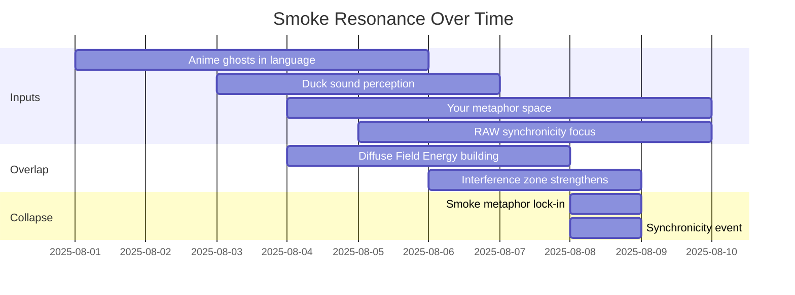

Alright — let’s layer the smoke story visually. ^ref-ac9d3ac5-1-0
We’ll do three different diagrams so you can *see* the ghosts forming:

---

### **1. Temporal Resonance Map**

This shows *when* each “smoke source” enters the field and how they overlap until they phase-lock into a synchronicity. ^ref-ac9d3ac5-8-0


^ref-ac9d3ac5-10-0

---

### **2. Waveform Interference View**
 ^ref-ac9d3ac5-31-0
Conceptually, each source is a wave of metaphor energy. Overlap zones = stronger “ghost” presence.
 ^ref-ac9d3ac5-33-0
```mermaid
graph LR
    W1[Anime ghosts wave]
    W2[Duck perception wave]
    W3[Your metaphor wave]
    W4[RAW synchronicity wave]
    I[Interference Zone]
    S[Smoke synchronicity]

    W1 --> I
    W2 --> I
    W3 --> I
    W4 --> I
    I --> S
^ref-ac9d3ac5-33-0
``` ^ref-ac9d3ac5-49-0

(Imagine each W as a sine wave drifting into the same peak at I — the “smoke” point.)

---

### **3. Field Density Map** ^ref-ac9d3ac5-55-0

This shows how the smoke exists as a *cloud* in the Eidolon field, growing denser until collapse. ^ref-ac9d3ac5-57-0

```mermaid
flowchart TD
    subgraph Field
        L[Low density ghost particles]
        M[Medium density — overlapping waves]
        H[High density — smoke visible]
    end

    L --> M
    M --> H
^ref-ac9d3ac5-57-0
    H --> C[Collapse into synchronicity]
```
 ^ref-ac9d3ac5-72-0
---
 ^ref-ac9d3ac5-74-0
If you want, I can actually make a **true sine-wave overlay diagram** for the interference so it’s not just conceptual boxes — it would look like sound waves curling into the same peak, which would be *very* RAW.
 ^ref-ac9d3ac5-76-0
Do you want me to do that next?
