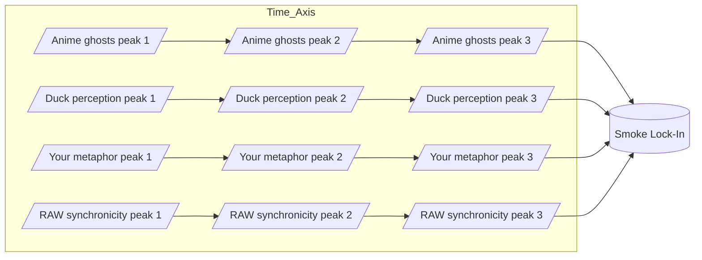

Note: Consolidated here → ../notes/diagrams/synchronicity-waves-and-web.md ^ref-91295f3a-1-0

Perfect — then let’s go full RAW and actually *draw the waves* so we can see the smoke condensing. ^ref-91295f3a-3-0

---

## **4. Sine Wave Interference — “The Curl of the Smoke”**

Here each source is a wave of meaning drifting into the field. Where they crest together, the “smoke” is dense enough to lock into a synchronicity. ^ref-91295f3a-9-0 ^ref-fea4239d-9-0


^ref-91295f3a-11-0 ^ref-91295f3a-39-0
 ^ref-91295f3a-40-0
💡 In a real plotted version, these four “streams” would look like sine curves sliding over each other until they *phase-lock* at the same point — the moment the metaphor becomes visible.

---

## **5. RAW-Style Synchronicity Web**
 ^ref-91295f3a-46-0
This one treats synchronicities as nodes in a network, with each connected to its “ghost sources” and to other synchronicities in the same metaphor family.
 ^ref-91295f3a-48-0
```mermaid
graph TD
    subgraph Ghost_Sources
        G1[Anime ghosts]
        G2[Duck perception]
        G3[Your metaphor space]
        G4[RAW synchronicity]
    end

    subgraph Synchronicities
        S1[Smoke metaphor lock-in]
        S2[Mirror metaphors]
        S3[Wave metaphors]
    end

    G1 --> S1
    G2 --> S1
    G3 --> S1
    G4 --> S1

    S1 --> S2
    S1 --> S3
    S2 --> S3
^ref-91295f3a-48-0
```
^ref-fea4239d-49-0

--- ^ref-91295f3a-75-0

If you want, I can push this **even further** —
Next step would be a **statistical heatmap of ghost density** over time in the Eidolon field, so we can literally *see* the probability of a synchronicity forming. That’s where the “statistical weirdness” RAW loved becomes visible as a physics phenomenon. ^ref-91295f3a-78-0

Do you want me to make *that*?
core: 1
  - uuid: 2792d448-c3b5-4050-93dd-93768529d99c
    line: 33
    col: 0
    score: 1
  - uuid: e979c50f-69bb-48b0-8417-e1ee1b31c0c0
    line: 15
    col: 0
    score: 1
  - uuid: 71726f04-eb1c-42a5-a5fe-d8209de6e159
    line: 44
    col: 0
    score: 1
  - uuid: f7702bf8-f7db-473c-9a5b-8dbf66ad3b9e
    line: 401
    col: 0
    score: 1
  - uuid: 5e8b2388-022b-46cf-952c-36ae9b8f0037
    line: 205
    col: 0
    score: 1
  - uuid: 45cd25b5-ed36-49ab-82c8-10d0903e34db
    line: 68
    col: 0
    score: 1
  - uuid: e87bc036-1570-419e-a558-f45b9c0db698
    line: 10
    col: 0
    score: 1
  - uuid: c1618c66-f73a-4e04-9bfa-ef38755f7acc
    line: 15
    col: 0
    score: 1
  - uuid: c6e87433-ec5d-4ded-bb1a-fb8734a3cfd9
    line: 23
    col: 0
    score: 1
  - uuid: f1add613-656e-4bec-b52b-193fd78c4642
    line: 75
    col: 0
    score: 1
  - uuid: 75ea4a6a-8270-488d-9d37-799c288e5f70
    line: 36
    col: 0 ^ref-91295f3a-125-0
    score: 1
  - uuid: 623a55f7-685c-486b-abaf-469da1bbbb69
    line: 54
    col: 0 ^ref-91295f3a-129-0
    score: 1
  - uuid: 557309a3-c906-4e97-8867-89ffe151790c
    line: 23
    col: 0
    score: 1
  - uuid: 6cb4943e-8267-4e27-8618-2ce0a464d173
    line: 14
    col: 0
    score: 1
  - uuid: 9e8ae388-767a-4ea8-9f2e-88801291d947
    line: 99
    col: 0
    score: 1
  - uuid: 45cd25b5-ed36-49ab-82c8-10d0903e34db
    line: 66
    col: 0
    score: 1
  - uuid: e87bc036-1570-419e-a558-f45b9c0db698
    line: 64
    col: 0
    score: 1
  - uuid: c1618c66-f73a-4e04-9bfa-ef38755f7acc
    line: 71
    col: 0
    score: 1
  - uuid: c6e87433-ec5d-4ded-bb1a-fb8734a3cfd9
    line: 56
    col: 0
    score: 1
  - uuid: f1add613-656e-4bec-b52b-193fd78c4642
    line: 37
    col: 0
    score: 1
  - uuid: 75ea4a6a-8270-488d-9d37-799c288e5f70
    line: 51
    col: 0
    score: 1
  - uuid: 623a55f7-685c-486b-abaf-469da1bbbb69
    line: 26
    col: 0
    score: 1
  - uuid: 557309a3-c906-4e97-8867-89ffe151790c ^ref-91295f3a-171-0
    line: 19
    col: 0
    score: 1
  - uuid: 7cfc230d-8ec2-4cdb-b931-8aec26de2a00
    line: 177
    col: 0
    score: 1
  - uuid: b09141b7-544f-4c8e-8f49-bf76cecaacbb
    line: 243
    col: 0
    score: 1
  - uuid: 1f32c94a-4da4-4266-8ac0-6c282cfb401f
    line: 143
    col: 0
    score: 1
  - uuid: 22b989d5-f4aa-4880-8632-709c21830f83
    line: 192
    col: 0
    score: 1
  - uuid: e9b27b06-f608-4734-ae6c-f03a8b1fcf5f
    line: 150
    col: 0
    score: 1
  - uuid: fc21f824-4244-4030-a48e-c4170160ea1d
    line: 308
    col: 0
    score: 1 ^ref-91295f3a-198-0
  - uuid: a4a25141-6380-40b9-9cd7-b554b246b303
    line: 398
    col: 0
    score: 1
  - uuid: 5e408692-0e74-400e-a617-84247c7353ad ^ref-91295f3a-203-0
    line: 192 ^ref-91295f3a-204-0
    col: 0
    score: 1
  - uuid: 008f2ac0-bfaa-4d52-9826-2d5e86c0059f
    line: 148
    col: 0
    score: 1
  - uuid: 938eca9c-97e2-4bcc-8653-b0ef1a5ac7a3
    line: 36
    col: 0
    score: 1
  - uuid: a4d90289-798d-44a0-a8e8-a055ae12fb52
    line: 166
    col: 0
    score: 1
  - uuid: 7cfc230d-8ec2-4cdb-b931-8aec26de2a00
    line: 148
    col: 0
    score: 1
  - uuid: b09141b7-544f-4c8e-8f49-bf76cecaacbb
    line: 153
    col: 0
    score: 1
  - uuid: 1f32c94a-4da4-4266-8ac0-6c282cfb401f
    line: 118 ^ref-91295f3a-228-0
    col: 0
    score: 1
  - uuid: 22b989d5-f4aa-4880-8632-709c21830f83
    line: 168
    col: 0
    score: 1
  - uuid: e9b27b06-f608-4734-ae6c-f03a8b1fcf5f
    line: 103
    col: 0
    score: 1
  - uuid: a4a25141-6380-40b9-9cd7-b554b246b303
    line: 380
    col: 0
    score: 1
  - uuid: 1cfae310-35dc-49c2-98f1-b186da25d84b
    line: 194
    col: 0
    score: 1
  - uuid: c03020e1-e3e7-48bf-aa7e-aa740c601b63
    line: 495
    col: 0
    score: 1
  - uuid: f5579967-762d-4cfd-851e-4f71b4cb77a1
    line: 459
    col: 0
    score: 1
  - uuid: e2135d9f-c69d-47ee-9b17-0b05e98dc748
    line: 27
    col: 0
    score: 1
  - uuid: b22d79c6-825b-4cd3-b0d3-1cef0532bb54
    line: 1002
    col: 0
    score: 1
  - uuid: 9c79206d-4cb9-4f00-87e0-782dcea37bc7
    line: 171
    col: 0
    score: 1
  - uuid: 6bcff92c-4224-453d-9993-1be8d37d47c3
    line: 112
    col: 0
    score: 1
  - uuid: 18344cf9-0c49-4a71-b6c8-b8d84d660fca
    line: 24
    col: 0
    score: 1
  - uuid: 9a93a756-6d33-45d1-aca9-51b74f2b33d2
    line: 143
    col: 0
    score: 1
  - uuid: 43bfe9dd-d433-42ca-9777-f4c40eaba791
    line: 241
    col: 0
    score: 1
  - uuid: 9e8ae388-767a-4ea8-9f2e-88801291d947
    line: 11
    col: 0
    score: 1
  - uuid: 10d98225-12e0-4212-8e15-88b57cf7bee5
    line: 47
    col: 0
    score: 1
  - uuid: 73d3dbf6-9240-46fd-ada9-cc2e7e00dc5f
    line: 105
    col: 0
    score: 1
  - uuid: cdbd21ee-25a0-4bfa-884c-c1b948e9b0b2
    line: 97
    col: 0
    score: 1
  - uuid: 2792d448-c3b5-4050-93dd-93768529d99c
    line: 128
    col: 0
    score: 1
  - uuid: e979c50f-69bb-48b0-8417-e1ee1b31c0c0
    line: 31
    col: 0
    score: 1
  - uuid: 13951643-1741-46bb-89dc-1beebb122633
    line: 90
    col: 0
    score: 1
  - uuid: 71726f04-eb1c-42a5-a5fe-d8209de6e159
    line: 33
    col: 0
    score: 1
  - uuid: f7702bf8-f7db-473c-9a5b-8dbf66ad3b9e
    line: 462
    col: 0
    score: 1
  - uuid: 5a02283e-4281-4930-9ca7-e27849de11bd
    line: 60
    col: 0
    score: 1
  - uuid: 1d3d6c3a-039e-4b96-93c1-95854945e248
    line: 48
    col: 0
    score: 1
  - uuid: ca8e1399-77bf-4f77-82a3-3f703b68706d
    line: 71
    col: 0
    score: 1
  - uuid: ffb9b2a9-744d-4a53-9565-130fceae0832
    line: 107
    col: 0
    score: 1
  - uuid: 9b694a91-dec5-4708-9462-3f71000ba925
    line: 72
    col: 0
    score: 1
  - uuid: b39dc9d4-63e2-42d4-bbcd-041ef3167bca
    line: 148
    col: 0
    score: 1
  - uuid: 98c8ff62-6ea3-4172-9e8b-93913e5d4a7f
    line: 40
    col: 0
    score: 1
  - uuid: 1c4046b5-742d-4004-aec6-b47251fef5d6
    line: 16
    col: 0
    score: 1
  - uuid: 8b8e6103-30a4-4d66-b5f2-87db1612b587
    line: 138
    col: 0
    score: 1
  - uuid: 95205cd3-c3d5-4047-9c33-9c5ca2b49597
    line: 68
    col: 0
    score: 1
  - uuid: 23df6ddb-05cf-4639-8201-f8291f8a6026
    line: 84
    col: 0
    score: 1
  - uuid: 938eca9c-97e2-4bcc-8653-b0ef1a5ac7a3
    line: 56
    col: 0
    score: 1
  - uuid: a4d90289-798d-44a0-a8e8-a055ae12fb52
    line: 190
    col: 0
    score: 1
  - uuid: ce37a9b8-5984-4fb8-b9e7-f72470314975
    line: 113
    col: 0
    score: 1
  - uuid: 7cfc230d-8ec2-4cdb-b931-8aec26de2a00
    line: 170
    col: 0
    score: 1
  - uuid: b09141b7-544f-4c8e-8f49-bf76cecaacbb
    line: 180
    col: 0
    score: 1
  - uuid: 1f32c94a-4da4-4266-8ac0-6c282cfb401f
    line: 135
    col: 0
    score: 1
  - uuid: 22b989d5-f4aa-4880-8632-709c21830f83
    line: 159
    col: 0
    score: 1
  - uuid: e9b27b06-f608-4734-ae6c-f03a8b1fcf5f
    line: 120
    col: 0
    score: 1
  - uuid: fc21f824-4244-4030-a48e-c4170160ea1d
    line: 265
    col: 0
    score: 1
  - uuid: a4a25141-6380-40b9-9cd7-b554b246b303
    line: 324
    col: 0
    score: 1
  - uuid: d17d3a96-c84d-4738-a403-6c733b874da2
    line: 587
    col: 0
    score: 1
  - uuid: 59b5670f-36d3-4d34-8985-f3144b15347a
    line: 138
    col: 0
    score: 1
---
Note: Consolidated here → ../notes/diagrams/synchronicity-waves-and-web.md ^ref-91295f3a-1-0

Perfect — then let’s go full RAW and actually *draw the waves* so we can see the smoke condensing. ^ref-91295f3a-3-0

---

## **4. Sine Wave Interference — “The Curl of the Smoke”**

Here each source is a wave of meaning drifting into the field. Where they crest together, the “smoke” is dense enough to lock into a synchronicity. ^ref-91295f3a-9-0


^ref-91295f3a-11-0 ^ref-91295f3a-39-0
 ^ref-91295f3a-40-0
💡 In a real plotted version, these four “streams” would look like sine curves sliding over each other until they *phase-lock* at the same point — the moment the metaphor becomes visible.

---

## **5. RAW-Style Synchronicity Web**
 ^ref-91295f3a-46-0
This one treats synchronicities as nodes in a network, with each connected to its “ghost sources” and to other synchronicities in the same metaphor family.
 ^ref-91295f3a-48-0
```mermaid
graph TD
    subgraph Ghost_Sources
        G1[Anime ghosts]
        G2[Duck perception]
        G3[Your metaphor space]
        G4[RAW synchronicity]
    end

    subgraph Synchronicities
        S1[Smoke metaphor lock-in]
        S2[Mirror metaphors]
        S3[Wave metaphors]
    end

    G1 --> S1
    G2 --> S1
    G3 --> S1
    G4 --> S1

    S1 --> S2
    S1 --> S3
    S2 --> S3
^ref-91295f3a-48-0
```

--- ^ref-91295f3a-75-0

If you want, I can push this **even further** —
Next step would be a **statistical heatmap of ghost density** over time in the Eidolon field, so we can literally *see* the probability of a synchronicity forming. That’s where the “statistical weirdness” RAW loved becomes visible as a physics phenomenon. ^ref-91295f3a-78-0

Do you want me to make *that*?
 ^ref-91295f3a-3577-0
<!-- GENERATED-SECTIONS:DO-NOT-EDIT-BELOW -->
## Related content
- [[promethean-eidolon-synchronicity-model|Promethean_Eidolon_Synchronicity_Model]]
- [Debugging Broker Connections and Agent Behavior](debugging-broker-connections-and-agent-behavior.md)
- [[ducks-attractor-states|Duck's Attractor States]]
- [[ducks-self-referential-perceptual-loop|Duck's Self-Referential Perceptual Loop]]
- [[dynamic-context-model-for-web-components|Dynamic Context Model for Web Components]]
- [[eidolon-field-abstract-model|Eidolon Field Abstract Model]]
- [[docs/unique/field-interaction-equations|field-interaction-equations]]
- [[typescript-patch-for-tool-calling-support|TypeScript Patch for Tool Calling Support]]
- [[windows-tiling-with-autohotkey]]
- [[docs/unique/field-dynamics-math-blocks|field-dynamics-math-blocks]]
- [[docs/unique/zero-copy-snapshots-and-workers|zero-copy-snapshots-and-workers]]
- [[docs/unique/eidolon-field-math-foundations|eidolon-field-math-foundations]]
- [[eidolon-node-lifecycle]]
- [[docs/unique/typed-struct-compiler|typed-struct-compiler]]
- [ParticleSimulationWithCanvasAndFFmpeg](particlesimulationwithcanvasandffmpeg.md)
- [[per-domain-policy-system-for-js-crawler|Per-Domain Policy System for JS Crawler]]
- [[performance-optimized-polyglot-bridge]]
- [[polyglot-repl-interface-layer]]
- [[promethean-dev-workflow-update|Promethean Dev Workflow Update]]
- [[promethean-infrastructure-setup|Promethean Infrastructure Setup]]
- [[prometheus-observability-stack|Prometheus Observability Stack]]
- [[factorio-ai-with-external-agents|Factorio AI with External Agents]]
- [[field-node-diagram-outline]]
- [field-node-diagram-visualizations](field-node-diagram-visualizations.md)
- [[functional-embedding-pipeline-refactor|Functional Embedding Pipeline Refactor]]
## Sources
- [[file-watcher-auth-fix#^ref-9044701b-32-0|file-watcher-auth-fix — L32]] (line 32, col 0, score 1)
- [Docops Feature Updates — L44](docops-feature-updates-3.md#^ref-cdbd21ee-44-0) (line 44, col 0, score 1)
- [[docops-feature-updates#^ref-2792d448-61-0|Docops Feature Updates — L61]] (line 61, col 0, score 1)
- [[ducks-attractor-states#^ref-13951643-99-0|Duck's Attractor States — L99]] (line 99, col 0, score 1)
- [[ducks-self-referential-perceptual-loop#^ref-71726f04-80-0|Duck's Self-Referential Perceptual Loop — L80]] (line 80, col 0, score 1)
- [[dynamic-context-model-for-web-components#^ref-f7702bf8-405-0|Dynamic Context Model for Web Components — L405]] (line 405, col 0, score 1)
- [[eidolon-field-abstract-model#^ref-5e8b2388-216-0|Eidolon Field Abstract Model — L216]] (line 216, col 0, score 1)
- [[factorio-ai-with-external-agents#^ref-a4d90289-189-0|Factorio AI with External Agents — L189]] (line 189, col 0, score 1)
- [[docs/unique/field-interaction-equations#^ref-b09141b7-172-0|field-interaction-equations — L172]] (line 172, col 0, score 1)
- [[docs/unique/eidolon-field-math-foundations#^ref-008f2ac0-148-0|eidolon-field-math-foundations — L148]] (line 148, col 0, score 1)
- [[eidolon-node-lifecycle#^ref-938eca9c-36-0|eidolon-node-lifecycle — L36]] (line 36, col 0, score 1)
- [[factorio-ai-with-external-agents#^ref-a4d90289-166-0|Factorio AI with External Agents — L166]] (line 166, col 0, score 1)
- [[docs/unique/field-dynamics-math-blocks#^ref-7cfc230d-148-0|field-dynamics-math-blocks — L148]] (line 148, col 0, score 1)
- [[docs/unique/field-interaction-equations#^ref-b09141b7-153-0|field-interaction-equations — L153]] (line 153, col 0, score 1)
- [[field-node-diagram-outline#^ref-1f32c94a-118-0|field-node-diagram-outline — L118]] (line 118, col 0, score 1)
- [[field-node-diagram-set#^ref-22b989d5-168-0|field-node-diagram-set — L168]] (line 168, col 0, score 1)
- [field-node-diagram-visualizations — L103](field-node-diagram-visualizations.md#^ref-e9b27b06-103-0) (line 103, col 0, score 1)
- [[functional-embedding-pipeline-refactor#^ref-a4a25141-380-0|Functional Embedding Pipeline Refactor — L380]] (line 380, col 0, score 1)
- [[functional-refactor-of-typescript-document-processing#^ref-1cfae310-194-0|Functional Refactor of TypeScript Document Processing — L194]] (line 194, col 0, score 1)
- [[per-domain-policy-system-for-js-crawler#^ref-c03020e1-495-0|Per-Domain Policy System for JS Crawler — L495]] (line 495, col 0, score 1)
- [[performance-optimized-polyglot-bridge#^ref-f5579967-459-0|Performance-Optimized-Polyglot-Bridge — L459]] (line 459, col 0, score 1)
- [[pipeline-enhancements#^ref-e2135d9f-27-0|Pipeline Enhancements — L27]] (line 27, col 0, score 1)
- [plan-update-confirmation — L1002](plan-update-confirmation.md#^ref-b22d79c6-1002-0) (line 1002, col 0, score 1)
- [[polyglot-repl-interface-layer#^ref-9c79206d-171-0|polyglot-repl-interface-layer — L171]] (line 171, col 0, score 1)
- [[post-linguistic-transhuman-design-frameworks#^ref-6bcff92c-112-0|Post-Linguistic Transhuman Design Frameworks — L112]] (line 112, col 0, score 1)
- [[promethean-chat-activity-report#^ref-18344cf9-24-0|Promethean Chat Activity Report — L24]] (line 24, col 0, score 1)
- [Protocol_0_The_Contradiction_Engine — L143](protocol-0-the-contradiction-engine.md#^ref-9a93a756-143-0) (line 143, col 0, score 1)
- [[provider-agnostic-chat-panel-implementation#^ref-43bfe9dd-241-0|Provider-Agnostic Chat Panel Implementation — L241]] (line 241, col 0, score 1)
- [[creative-moments#^ref-10d98225-47-0|Creative Moments — L47]] (line 47, col 0, score 1)
- [Debugging Broker Connections and Agent Behavior — L105](debugging-broker-connections-and-agent-behavior.md#^ref-73d3dbf6-105-0) (line 105, col 0, score 1)
- [Docops Feature Updates — L97](docops-feature-updates-3.md#^ref-cdbd21ee-97-0) (line 97, col 0, score 1)
- [[docops-feature-updates#^ref-2792d448-128-0|Docops Feature Updates — L128]] (line 128, col 0, score 1)
- [DuckDuckGoSearchPipeline — L31](duckduckgosearchpipeline.md#^ref-e979c50f-31-0) (line 31, col 0, score 1)
- [[ducks-attractor-states#^ref-13951643-90-0|Duck's Attractor States — L90]] (line 90, col 0, score 1)
- [[ducks-self-referential-perceptual-loop#^ref-71726f04-33-0|Duck's Self-Referential Perceptual Loop — L33]] (line 33, col 0, score 1)
- [[dynamic-context-model-for-web-components#^ref-f7702bf8-462-0|Dynamic Context Model for Web Components — L462]] (line 462, col 0, score 1)
- [NPU Voice Code and Sensory Integration — L60](npu-voice-code-and-sensory-integration.md#^ref-5a02283e-60-0) (line 60, col 0, score 1)
- [[obsidian-chatgpt-plugin-integration-guide#^ref-1d3d6c3a-48-0|Obsidian ChatGPT Plugin Integration Guide — L48]] (line 48, col 0, score 1)
- [[obsidian-chatgpt-plugin-integration#^ref-ca8e1399-71-0|Obsidian ChatGPT Plugin Integration — L71]] (line 71, col 0, score 1)
- [[docs/unique/obsidian-ignore-node-modules-regex#^ref-ffb9b2a9-107-0|obsidian-ignore-node-modules-regex — L107]] (line 107, col 0, score 1)
- [[obsidian-task-generation#^ref-9b694a91-72-0|Obsidian Task Generation — L72]] (line 72, col 0, score 1)
- [[obsidian-templating-plugins-integration-guide#^ref-b39dc9d4-148-0|Obsidian Templating Plugins Integration Guide — L148]] (line 148, col 0, score 1)
- [[optimizing-command-limitations-in-system-design#^ref-98c8ff62-40-0|Optimizing Command Limitations in System Design — L40]] (line 40, col 0, score 1)
- [[promethean-notes#^ref-1c4046b5-16-0|Promethean Notes — L16]] (line 16, col 0, score 1)
- [[promethean-pipelines#^ref-8b8e6103-138-0|Promethean Pipelines — L138]] (line 138, col 0, score 1)
- [[promethean-requirements#^ref-95205cd3-68-0|promethean-requirements — L68]] (line 68, col 0, score 1)
- [[docs/unique/promethean-state-format#^ref-23df6ddb-84-0|Promethean State Format — L84]] (line 84, col 0, score 1)
- [[per-domain-policy-system-for-js-crawler#^ref-c03020e1-537-0|Per-Domain Policy System for JS Crawler — L537]] (line 537, col 0, score 1)
- [[performance-optimized-polyglot-bridge#^ref-f5579967-493-0|Performance-Optimized-Polyglot-Bridge — L493]] (line 493, col 0, score 1)
- [[pipeline-enhancements#^ref-e2135d9f-18-0|Pipeline Enhancements — L18]] (line 18, col 0, score 1)
- [[polyglot-repl-interface-layer#^ref-9c79206d-206-0|polyglot-repl-interface-layer — L206]] (line 206, col 0, score 1)
- [[post-linguistic-transhuman-design-frameworks#^ref-6bcff92c-159-0|Post-Linguistic Transhuman Design Frameworks — L159]] (line 159, col 0, score 1)
- [[promethean-chat-activity-report#^ref-18344cf9-66-0|Promethean Chat Activity Report — L66]] (line 66, col 0, score 1)
- [[promethean-data-sync-protocol#^ref-9fab9e76-45-0|Promethean Data Sync Protocol — L45]] (line 45, col 0, score 1)
- [[promethean-dev-workflow-update#^ref-03a5578f-98-0|Promethean Dev Workflow Update — L98]] (line 98, col 0, score 1)
- [[promethean-documentation-overview#^ref-9413237f-16-0|Promethean Documentation Overview — L16]] (line 16, col 0, score 1)
- [[promethean-documentation-pipeline-overview#^ref-3a3bf2c9-202-0|Promethean Documentation Pipeline Overview — L202]] (line 202, col 0, score 1)
- [[promethean-documentation-update#^ref-c0392040-46-0|Promethean Documentation Update — L46]] (line 46, col 0, score 1)
- [[docops-feature-updates#^ref-2792d448-35-0|Docops Feature Updates — L35]] (line 35, col 0, score 1)
- [[ducks-attractor-states#^ref-13951643-94-0|Duck's Attractor States — L94]] (line 94, col 0, score 1)
- [[ducks-self-referential-perceptual-loop#^ref-71726f04-53-0|Duck's Self-Referential Perceptual Loop — L53]] (line 53, col 0, score 1)
- [[dynamic-context-model-for-web-components#^ref-f7702bf8-424-0|Dynamic Context Model for Web Components — L424]] (line 424, col 0, score 1)
- [[eidolon-field-abstract-model#^ref-5e8b2388-209-0|Eidolon Field Abstract Model — L209]] (line 209, col 0, score 1)
- [[docs/unique/eidolon-field-math-foundations#^ref-008f2ac0-142-0|eidolon-field-math-foundations — L142]] (line 142, col 0, score 1)
- [[eidolon-node-lifecycle#^ref-938eca9c-39-0|eidolon-node-lifecycle — L39]] (line 39, col 0, score 1)
- [[creative-moments#^ref-10d98225-75-0|Creative Moments — L75]] (line 75, col 0, score 1)
- [Debugging Broker Connections and Agent Behavior — L104](debugging-broker-connections-and-agent-behavior.md#^ref-73d3dbf6-104-0) (line 104, col 0, score 1)
- [Docops Feature Updates — L46](docops-feature-updates-3.md#^ref-cdbd21ee-46-0) (line 46, col 0, score 1)
- [[docops-feature-updates#^ref-2792d448-64-0|Docops Feature Updates — L64]] (line 64, col 0, score 1)
- [DuckDuckGoSearchPipeline — L40](duckduckgosearchpipeline.md#^ref-e979c50f-40-0) (line 40, col 0, score 1)
- [[ducks-attractor-states#^ref-13951643-137-0|Duck's Attractor States — L137]] (line 137, col 0, score 1)
- [[ducks-self-referential-perceptual-loop#^ref-71726f04-82-0|Duck's Self-Referential Perceptual Loop — L82]] (line 82, col 0, score 1)
- [[dynamic-context-model-for-web-components#^ref-f7702bf8-454-0|Dynamic Context Model for Web Components — L454]] (line 454, col 0, score 1)
- [Docops Feature Updates — L85](docops-feature-updates-3.md#^ref-cdbd21ee-85-0) (line 85, col 0, score 1)
- [[ducks-attractor-states#^ref-13951643-93-0|Duck's Attractor States — L93]] (line 93, col 0, score 1)
- [[ducks-self-referential-perceptual-loop#^ref-71726f04-64-0|Duck's Self-Referential Perceptual Loop — L64]] (line 64, col 0, score 1)
- [[factorio-ai-with-external-agents#^ref-a4d90289-153-0|Factorio AI with External Agents — L153]] (line 153, col 0, score 1)
- [[docs/unique/field-dynamics-math-blocks#^ref-7cfc230d-141-0|field-dynamics-math-blocks — L141]] (line 141, col 0, score 1)
- [[creative-moments#^ref-10d98225-8-0|Creative Moments — L8]] (line 8, col 0, score 1)
- [Debugging Broker Connections and Agent Behavior — L38](debugging-broker-connections-and-agent-behavior.md#^ref-73d3dbf6-38-0) (line 38, col 0, score 1)
- [Docops Feature Updates — L56](docops-feature-updates-3.md#^ref-cdbd21ee-56-0) (line 56, col 0, score 1)
- [[creative-moments#^ref-10d98225-28-0|Creative Moments — L28]] (line 28, col 0, score 1)
- [Docops Feature Updates — L65](docops-feature-updates-3.md#^ref-cdbd21ee-65-0) (line 65, col 0, score 1)
- [[docops-feature-updates#^ref-2792d448-86-0|Docops Feature Updates — L86]] (line 86, col 0, score 1)
- [[ducks-attractor-states#^ref-13951643-123-0|Duck's Attractor States — L123]] (line 123, col 0, score 1)
- [[ducks-self-referential-perceptual-loop#^ref-71726f04-34-0|Duck's Self-Referential Perceptual Loop — L34]] (line 34, col 0, score 1)
- [[dynamic-context-model-for-web-components#^ref-f7702bf8-442-0|Dynamic Context Model for Web Components — L442]] (line 442, col 0, score 1)
- [[eidolon-field-abstract-model#^ref-5e8b2388-218-0|Eidolon Field Abstract Model — L218]] (line 218, col 0, score 1)
- [[docs/unique/eidolon-field-math-foundations#^ref-008f2ac0-176-0|eidolon-field-math-foundations — L176]] (line 176, col 0, score 1)
- [[eidolon-node-lifecycle#^ref-938eca9c-70-0|eidolon-node-lifecycle — L70]] (line 70, col 0, score 1)
- [[dynamic-context-model-for-web-components#^ref-f7702bf8-412-0|Dynamic Context Model for Web Components — L412]] (line 412, col 0, score 1)
- [[eidolon-field-abstract-model#^ref-5e8b2388-261-0|Eidolon Field Abstract Model — L261]] (line 261, col 0, score 1)
- [[docs/unique/eidolon-field-math-foundations#^ref-008f2ac0-181-0|eidolon-field-math-foundations — L181]] (line 181, col 0, score 1)
- [[eidolon-node-lifecycle#^ref-938eca9c-90-0|eidolon-node-lifecycle — L90]] (line 90, col 0, score 1)
- [[factorio-ai-with-external-agents#^ref-a4d90289-157-0|Factorio AI with External Agents — L157]] (line 157, col 0, score 1)
- [[docs/unique/field-dynamics-math-blocks#^ref-7cfc230d-205-0|field-dynamics-math-blocks — L205]] (line 205, col 0, score 1)
- [[field-node-diagram-set#^ref-22b989d5-203-0|field-node-diagram-set — L203]] (line 203, col 0, score 1)
- [field-node-diagram-visualizations — L95](field-node-diagram-visualizations.md#^ref-e9b27b06-95-0) (line 95, col 0, score 1)
- [[creative-moments#^ref-10d98225-33-0|Creative Moments — L33]] (line 33, col 0, score 1)
- [Debugging Broker Connections and Agent Behavior — L99](debugging-broker-connections-and-agent-behavior.md#^ref-73d3dbf6-99-0) (line 99, col 0, score 1)
<!-- GENERATED-SECTIONS:DO-NOT-EDIT-ABOVE -->
