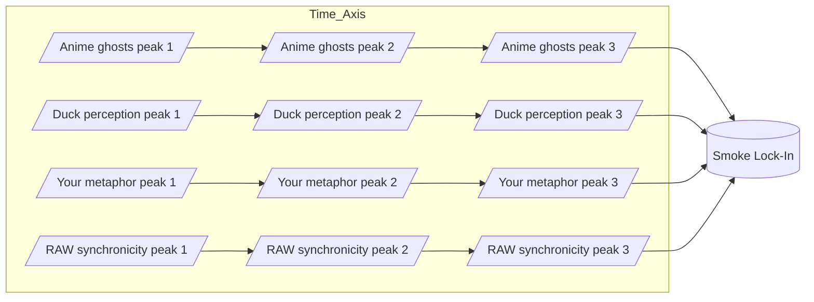

Note: Consolidated here → ../notes/diagrams/synchronicity-waves-and-web.md ^ref-91295f3a-1-0

Perfect — then let’s go full RAW and actually *draw the waves* so we can see the smoke condensing. ^ref-91295f3a-3-0

---

## **4. Sine Wave Interference — “The Curl of the Smoke”**

Here each source is a wave of meaning drifting into the field. Where they crest together, the “smoke” is dense enough to lock into a synchronicity. ^ref-91295f3a-9-0


^ref-91295f3a-11-0
 ^ref-91295f3a-40-0
💡 In a real plotted version, these four “streams” would look like sine curves sliding over each other until they *phase-lock* at the same point — the moment the metaphor becomes visible.

---

## **5. RAW-Style Synchronicity Web**
 ^ref-91295f3a-46-0
This one treats synchronicities as nodes in a network, with each connected to its “ghost sources” and to other synchronicities in the same metaphor family.
 ^ref-91295f3a-48-0
```mermaid
graph TD
    subgraph Ghost_Sources
        G1[Anime ghosts]
        G2[Duck perception]
        G3[Your metaphor space]
        G4[RAW synchronicity]
    end

    subgraph Synchronicities
        S1[Smoke metaphor lock-in]
        S2[Mirror metaphors]
        S3[Wave metaphors]
    end

    G1 --> S1
    G2 --> S1
    G3 --> S1
    G4 --> S1

    S1 --> S2
    S1 --> S3
    S2 --> S3
^ref-91295f3a-48-0
```

--- ^ref-91295f3a-75-0

If you want, I can push this **even further** —
Next step would be a **statistical heatmap of ghost density** over time in the Eidolon field, so we can literally *see* the probability of a synchronicity forming. That’s where the “statistical weirdness” RAW loved becomes visible as a physics phenomenon. ^ref-91295f3a-78-0

Do you want me to make *that*?<!-- GENERATED-SECTIONS:DO-NOT-EDIT-BELOW -->
## Related content
- [Smoke Resonance Visualizations](smoke-resonance-visualizations.md)
- [Diagrams](chunks/diagrams.md)
- [Unique Info Dump Index](unique-info-dump-index.md)
- [Promethean_Eidolon_Synchronicity_Model](promethean-eidolon-synchronicity-model.md)
- [Ghostly Smoke Interference](ghostly-smoke-interference.md)
- [infinite_depth_smoke_animation](infinite-depth-smoke-animation.md)
- [Duck's Attractor States](ducks-attractor-states.md)
- [aionian-circuit-math](aionian-circuit-math.md)
- [archetype-ecs](archetype-ecs.md)
- [DSL](chunks/dsl.md)
- [Event Bus Projections Architecture](event-bus-projections-architecture.md)
- [Shared](chunks/shared.md)
- [Agent Tasks: Persistence Migration to DualStore](agent-tasks-persistence-migration-to-dualstore.md)
- [eidolon-node-lifecycle](eidolon-node-lifecycle.md)
- [JavaScript](chunks/javascript.md)
- [eidolon-field-math-foundations](eidolon-field-math-foundations.md)
- [Duck's Self-Referential Perceptual Loop](ducks-self-referential-perceptual-loop.md)
- [ParticleSimulationWithCanvasAndFFmpeg](particlesimulationwithcanvasandffmpeg.md)
- [Reawakening Duck](reawakening-duck.md)
- [2d-sandbox-field](2d-sandbox-field.md)
- [Board Walk – 2025-08-11](board-walk-2025-08-11.md)
- [Chroma Toolkit Consolidation Plan](chroma-toolkit-consolidation-plan.md)
- [Math Fundamentals](chunks/math-fundamentals.md)
- [Simulation Demo](chunks/simulation-demo.md)
- [Admin Dashboard for User Management](admin-dashboard-for-user-management.md)
- [Agent Reflections and Prompt Evolution](agent-reflections-and-prompt-evolution.md)
- [Dynamic Context Model for Web Components](dynamic-context-model-for-web-components.md)
- [field-node-diagram-outline](field-node-diagram-outline.md)
- [api-gateway-versioning](api-gateway-versioning.md)
- [Services](chunks/services.md)
- [field-dynamics-math-blocks](field-dynamics-math-blocks.md)
- [obsidian-ignore-node-modules-regex](obsidian-ignore-node-modules-regex.md)
- [Tooling](chunks/tooling.md)
- [Window Management](chunks/window-management.md)
- [compiler-kit-foundations](compiler-kit-foundations.md)
- [Cross-Language Runtime Polymorphism](cross-language-runtime-polymorphism.md)
- [Cross-Target Macro System in Sibilant](cross-target-macro-system-in-sibilant.md)
- [Debugging Broker Connections and Agent Behavior](debugging-broker-connections-and-agent-behavior.md)
- [Exception Layer Analysis](exception-layer-analysis.md)
- [field-interaction-equations](field-interaction-equations.md)
- [markdown-to-org-transpiler](markdown-to-org-transpiler.md)
- [EidolonField](eidolonfield.md)
- [Event Bus MVP](event-bus-mvp.md)
- [Factorio AI with External Agents](factorio-ai-with-external-agents.md)
- [AI-Centric OS with MCP Layer](ai-centric-os-with-mcp-layer.md)
- [AI-First-OS-Model-Context-Protocol](ai-first-os-model-context-protocol.md)
- [balanced-bst](balanced-bst.md)
- [ecs-offload-workers](ecs-offload-workers.md)
- [ecs-scheduler-and-prefabs](ecs-scheduler-and-prefabs.md)
- [Eidolon Field Abstract Model](eidolon-field-abstract-model.md)
- [Matplotlib Animation with Async Execution](matplotlib-animation-with-async-execution.md)
- [Migrate to Provider-Tenant Architecture](migrate-to-provider-tenant-architecture.md)
- [Model Selection for Lightweight Conversational Tasks](model-selection-for-lightweight-conversational-tasks.md)
- [Mongo Outbox Implementation](mongo-outbox-implementation.md)
- [Obsidian Templating Plugins Integration Guide](obsidian-templating-plugins-integration-guide.md)
- [Ollama-LLM-Provider-for-Pseudo-Code-Transpiler](ollama-llm-provider-for-pseudo-code-transpiler.md)
- [field-node-diagram-set](field-node-diagram-set.md)
- [field-node-diagram-visualizations](field-node-diagram-visualizations.md)
- [promethean-system-diagrams](promethean-system-diagrams.md)
- [Prompt_Folder_Bootstrap](prompt-folder-bootstrap.md)
- [Canonical Org-Babel Matplotlib Animation Template](canonical-org-babel-matplotlib-animation-template.md)
- [graph-ds](graph-ds.md)
- [heartbeat-fragment-demo](heartbeat-fragment-demo.md)
- [heartbeat-simulation-snippets](heartbeat-simulation-snippets.md)
- [Board Automation Improvements](board-automation-improvements.md)
- [Promethean Event Bus MVP v0.1](promethean-event-bus-mvp-v0-1.md)
- [Promethean Infrastructure Setup](promethean-infrastructure-setup.md)
- [Promethean-native config design](promethean-native-config-design.md)
- [Promethean Web UI Setup](promethean-web-ui-setup.md)
- [prompt-programming-language-lisp](prompt-programming-language-lisp.md)
- [Fnord Tracer Protocol](fnord-tracer-protocol.md)
- [Creative Moments](creative-moments.md)
- [Operations](chunks/operations.md)
- [homeostasis-decay-formulas](homeostasis-decay-formulas.md)
- [Chroma-Embedding-Refactor](chroma-embedding-refactor.md)
- [i3-bluetooth-setup](i3-bluetooth-setup.md)
- [Recursive Prompt Construction Engine](recursive-prompt-construction-engine.md)
- [layer-1-uptime-diagrams](layer-1-uptime-diagrams.md)
- [Lisp-Compiler-Integration](lisp-compiler-integration.md)
- [Language-Agnostic Mirror System](language-agnostic-mirror-system.md)
- [lisp-dsl-for-window-management](lisp-dsl-for-window-management.md)
- [Lispy Macros with syntax-rules](lispy-macros-with-syntax-rules.md)
- [Local-First Intention→Code Loop with Free Models](local-first-intention-code-loop-with-free-models.md)
- [Local-Only-LLM-Workflow](local-only-llm-workflow.md)
- [Per-Domain Policy System for JS Crawler](per-domain-policy-system-for-js-crawler.md)
- [ripple-propagation-demo](ripple-propagation-demo.md)
- [Shared Package Structure](shared-package-structure.md)
- [Promethean Workflow Optimization](promethean-workflow-optimization.md)
- [Prometheus Observability Stack](prometheus-observability-stack.md)
- [Protocol_0_The_Contradiction_Engine](protocol-0-the-contradiction-engine.md)
- [Provider-Agnostic Chat Panel Implementation](provider-agnostic-chat-panel-implementation.md)
- [Pure-Node Crawl Stack with Playwright and Crawlee](pure-node-crawl-stack-with-playwright-and-crawlee.md)
- [Interop and Source Maps](interop-and-source-maps.md)
- [komorebi-group-window-hack](komorebi-group-window-hack.md)
- [Pure TypeScript Search Microservice](pure-typescript-search-microservice.md)
- [RAG UI Panel with Qdrant and PostgREST](rag-ui-panel-with-qdrant-and-postgrest.md)
- [Redirecting Standard Error](redirecting-standard-error.md)
- [schema-evolution-workflow](schema-evolution-workflow.md)
- [Self-Agency in AI Interaction](self-agency-in-ai-interaction.md)
- [set-assignment-in-lisp-ast](set-assignment-in-lisp-ast.md)
- [shared-package-layout-clarification](shared-package-layout-clarification.md)
- [sibilant-macro-targets](sibilant-macro-targets.md)
- [DuckDuckGoSearchPipeline](duckduckgosearchpipeline.md)
- [Vectorial Exception Descent](vectorial-exception-descent.md)
- [Stateful Partitions and Rebalancing](stateful-partitions-and-rebalancing.md)
- [prom-lib-rate-limiters-and-replay-api](prom-lib-rate-limiters-and-replay-api.md)
- [WebSocket Gateway Implementation](websocket-gateway-implementation.md)
- [template-based-compilation](template-based-compilation.md)
- [sibilant-metacompiler-overview](sibilant-metacompiler-overview.md)
- [sibilant-meta-string-templating-runtime](sibilant-meta-string-templating-runtime.md)
- [Sibilant Meta-Prompt DSL](sibilant-meta-prompt-dsl.md)
- [Promethean-Copilot-Intent-Engine](promethean-copilot-intent-engine.md)
- [The Jar of Echoes](the-jar-of-echoes.md)
## Sources
- [Diagrams — L5](chunks/diagrams.md#^ref-45cd25b5-5-0) (line 5, col 0, score 0.85)
- [Unique Info Dump Index — L44](unique-info-dump-index.md#^ref-30ec3ba6-44-0) (line 44, col 0, score 0.85)
- [Diagrams — L9](chunks/diagrams.md#^ref-45cd25b5-9-0) (line 9, col 0, score 0.68)
- [Shared — L12](chunks/shared.md#^ref-623a55f7-12-0) (line 12, col 0, score 0.68)
- [Duck's Attractor States — L61](ducks-attractor-states.md#^ref-13951643-61-0) (line 61, col 0, score 0.68)
- [Event Bus Projections Architecture — L163](event-bus-projections-architecture.md#^ref-cf6b9b17-163-0) (line 163, col 0, score 0.68)
- [Promethean_Eidolon_Synchronicity_Model — L53](promethean-eidolon-synchronicity-model.md#^ref-2d6e5553-53-0) (line 53, col 0, score 0.82)
- [Smoke Resonance Visualizations — L77](smoke-resonance-visualizations.md#^ref-ac9d3ac5-77-0) (line 77, col 0, score 0.82)
- [Ghostly Smoke Interference — L7](ghostly-smoke-interference.md#^ref-b6ae7dfa-7-0) (line 7, col 0, score 0.7)
- [Smoke Resonance Visualizations — L49](smoke-resonance-visualizations.md#^ref-ac9d3ac5-49-0) (line 49, col 0, score 0.69)
- [Ghostly Smoke Interference — L5](ghostly-smoke-interference.md#^ref-b6ae7dfa-5-0) (line 5, col 0, score 0.67)
- [Smoke Resonance Visualizations — L1](smoke-resonance-visualizations.md#^ref-ac9d3ac5-1-0) (line 1, col 0, score 0.72)
- [infinite_depth_smoke_animation — L6](infinite-depth-smoke-animation.md#^ref-92a052a5-6-0) (line 6, col 0, score 0.71)
- [infinite_depth_smoke_animation — L3](infinite-depth-smoke-animation.md#^ref-92a052a5-3-0) (line 3, col 0, score 0.74)
- [Ghostly Smoke Interference — L37](ghostly-smoke-interference.md#^ref-b6ae7dfa-37-0) (line 37, col 0, score 0.64)
- [Duck's Attractor States — L56](ducks-attractor-states.md#^ref-13951643-56-0) (line 56, col 0, score 0.65)
- [infinite_depth_smoke_animation — L1](infinite-depth-smoke-animation.md#^ref-92a052a5-1-0) (line 1, col 0, score 0.64)
- [Recursive Prompt Construction Engine — L13](recursive-prompt-construction-engine.md#^ref-babdb9eb-13-0) (line 13, col 0, score 0.63)
- [WebSocket Gateway Implementation — L614](websocket-gateway-implementation.md#^ref-e811123d-614-0) (line 614, col 0, score 0.63)
- [Diagrams — L4](chunks/diagrams.md#^ref-45cd25b5-4-0) (line 4, col 0, score 0.63)
- [Smoke Resonance Visualizations — L8](smoke-resonance-visualizations.md#^ref-ac9d3ac5-8-0) (line 8, col 0, score 0.72)
- [Promethean_Eidolon_Synchronicity_Model — L44](promethean-eidolon-synchronicity-model.md#^ref-2d6e5553-44-0) (line 44, col 0, score 0.67)
- [Promethean_Eidolon_Synchronicity_Model — L46](promethean-eidolon-synchronicity-model.md#^ref-2d6e5553-46-0) (line 46, col 0, score 0.71)
- [Smoke Resonance Visualizations — L31](smoke-resonance-visualizations.md#^ref-ac9d3ac5-31-0) (line 31, col 0, score 0.68)
- [Promethean_Eidolon_Synchronicity_Model — L45](promethean-eidolon-synchronicity-model.md#^ref-2d6e5553-45-0) (line 45, col 0, score 0.71)
- [Promethean_Eidolon_Synchronicity_Model — L1](promethean-eidolon-synchronicity-model.md#^ref-2d6e5553-1-0) (line 1, col 0, score 0.7)
- [Smoke Resonance Visualizations — L55](smoke-resonance-visualizations.md#^ref-ac9d3ac5-55-0) (line 55, col 0, score 0.74)
- [Duck's Self-Referential Perceptual Loop — L20](ducks-self-referential-perceptual-loop.md#^ref-71726f04-20-0) (line 20, col 0, score 0.67)
- [Smoke Resonance Visualizations — L33](smoke-resonance-visualizations.md#^ref-ac9d3ac5-33-0) (line 33, col 0, score 0.71)
- [Promethean_Eidolon_Synchronicity_Model — L3](promethean-eidolon-synchronicity-model.md#^ref-2d6e5553-3-0) (line 3, col 0, score 0.83)
- [Ghostly Smoke Interference — L11](ghostly-smoke-interference.md#^ref-b6ae7dfa-11-0) (line 11, col 0, score 0.81)
- [Event Bus Projections Architecture — L3](event-bus-projections-architecture.md#^ref-cf6b9b17-3-0) (line 3, col 0, score 0.75)
- [Smoke Resonance Visualizations — L57](smoke-resonance-visualizations.md#^ref-ac9d3ac5-57-0) (line 57, col 0, score 0.69)
- [Ghostly Smoke Interference — L39](ghostly-smoke-interference.md#^ref-b6ae7dfa-39-0) (line 39, col 0, score 0.69)
- [Duck's Attractor States — L5](ducks-attractor-states.md#^ref-13951643-5-0) (line 5, col 0, score 0.73)
- [Smoke Resonance Visualizations — L10](smoke-resonance-visualizations.md#^ref-ac9d3ac5-10-0) (line 10, col 0, score 0.76)
- [Stateful Partitions and Rebalancing — L185](stateful-partitions-and-rebalancing.md#^ref-4330e8f0-185-0) (line 185, col 0, score 0.69)
- [Dynamic Context Model for Web Components — L376](dynamic-context-model-for-web-components.md#^ref-f7702bf8-376-0) (line 376, col 0, score 0.68)
- [infinite_depth_smoke_animation — L7](infinite-depth-smoke-animation.md#^ref-92a052a5-7-0) (line 7, col 0, score 0.67)
- [Fnord Tracer Protocol — L99](fnord-tracer-protocol.md#^ref-fc21f824-99-0) (line 99, col 0, score 0.68)
- [layer-1-uptime-diagrams — L81](layer-1-uptime-diagrams.md#^ref-4127189a-81-0) (line 81, col 0, score 0.66)
- [prom-lib-rate-limiters-and-replay-api — L90](prom-lib-rate-limiters-and-replay-api.md#^ref-aee4718b-90-0) (line 90, col 0, score 0.66)
- [Duck's Self-Referential Perceptual Loop — L4](ducks-self-referential-perceptual-loop.md#^ref-71726f04-4-0) (line 4, col 0, score 0.66)
- [Smoke Resonance Visualizations — L72](smoke-resonance-visualizations.md#^ref-ac9d3ac5-72-0) (line 72, col 0, score 0.66)
- [Duck's Self-Referential Perceptual Loop — L17](ducks-self-referential-perceptual-loop.md#^ref-71726f04-17-0) (line 17, col 0, score 0.65)
- [field-node-diagram-set — L3](field-node-diagram-set.md#^ref-22b989d5-3-0) (line 3, col 0, score 0.65)
- [field-node-diagram-visualizations — L39](field-node-diagram-visualizations.md#^ref-e9b27b06-39-0) (line 39, col 0, score 0.7)
- [Fnord Tracer Protocol — L22](fnord-tracer-protocol.md#^ref-fc21f824-22-0) (line 22, col 0, score 0.68)
- [field-node-diagram-set — L35](field-node-diagram-set.md#^ref-22b989d5-35-0) (line 35, col 0, score 0.68)
- [Promethean_Eidolon_Synchronicity_Model — L43](promethean-eidolon-synchronicity-model.md#^ref-2d6e5553-43-0) (line 43, col 0, score 0.73)
- [promethean-system-diagrams — L34](promethean-system-diagrams.md#^ref-b51e19b4-34-0) (line 34, col 0, score 0.72)
- [field-node-diagram-set — L9](field-node-diagram-set.md#^ref-22b989d5-9-0) (line 9, col 0, score 0.71)
- [promethean-system-diagrams — L52](promethean-system-diagrams.md#^ref-b51e19b4-52-0) (line 52, col 0, score 0.71)
- [field-node-diagram-outline — L11](field-node-diagram-outline.md#^ref-1f32c94a-11-0) (line 11, col 0, score 0.71)
- [field-node-diagram-visualizations — L11](field-node-diagram-visualizations.md#^ref-e9b27b06-11-0) (line 11, col 0, score 0.71)
- [field-node-diagram-visualizations — L63](field-node-diagram-visualizations.md#^ref-e9b27b06-63-0) (line 63, col 0, score 0.69)
- [field-node-diagram-outline — L28](field-node-diagram-outline.md#^ref-1f32c94a-28-0) (line 28, col 0, score 0.69)
- [Promethean_Eidolon_Synchronicity_Model — L48](promethean-eidolon-synchronicity-model.md#^ref-2d6e5553-48-0) (line 48, col 0, score 0.73)
- [Fnord Tracer Protocol — L3](fnord-tracer-protocol.md#^ref-fc21f824-3-0) (line 3, col 0, score 0.68)
- [2d-sandbox-field — L1](2d-sandbox-field.md#^ref-c710dc93-1-0) (line 1, col 0, score 0.67)
- [Fnord Tracer Protocol — L240](fnord-tracer-protocol.md#^ref-fc21f824-240-0) (line 240, col 0, score 0.67)
- [ParticleSimulationWithCanvasAndFFmpeg — L242](particlesimulationwithcanvasandffmpeg.md#^ref-e018dd7a-242-0) (line 242, col 0, score 0.67)
- [Vectorial Exception Descent — L142](vectorial-exception-descent.md#^ref-d771154e-142-0) (line 142, col 0, score 0.75)
- [Recursive Prompt Construction Engine — L154](recursive-prompt-construction-engine.md#^ref-babdb9eb-154-0) (line 154, col 0, score 0.61)
- [template-based-compilation — L56](template-based-compilation.md#^ref-f8877e5e-56-0) (line 56, col 0, score 0.58)
- [sibilant-metacompiler-overview — L42](sibilant-metacompiler-overview.md#^ref-61d4086b-42-0) (line 42, col 0, score 0.58)
- [sibilant-meta-string-templating-runtime — L114](sibilant-meta-string-templating-runtime.md#^ref-2aafc801-114-0) (line 114, col 0, score 0.57)
- [Prompt_Folder_Bootstrap — L68](prompt-folder-bootstrap.md#^ref-bd4f0976-68-0) (line 68, col 0, score 0.56)
- [Sibilant Meta-Prompt DSL — L93](sibilant-meta-prompt-dsl.md#^ref-af5d2824-93-0) (line 93, col 0, score 0.55)
- [Sibilant Meta-Prompt DSL — L146](sibilant-meta-prompt-dsl.md#^ref-af5d2824-146-0) (line 146, col 0, score 0.54)
- [template-based-compilation — L79](template-based-compilation.md#^ref-f8877e5e-79-0) (line 79, col 0, score 0.53)
- [Promethean-Copilot-Intent-Engine — L38](promethean-copilot-intent-engine.md#^ref-ae24a280-38-0) (line 38, col 0, score 0.53)
- [Prompt_Folder_Bootstrap — L113](prompt-folder-bootstrap.md#^ref-bd4f0976-113-0) (line 113, col 0, score 0.53)
- [The Jar of Echoes — L31](the-jar-of-echoes.md#^ref-18138627-31-0) (line 31, col 0, score 0.53)
- [Recursive Prompt Construction Engine — L1](recursive-prompt-construction-engine.md#^ref-babdb9eb-1-0) (line 1, col 0, score 0.53)
- [Sibilant Meta-Prompt DSL — L4](sibilant-meta-prompt-dsl.md#^ref-af5d2824-4-0) (line 4, col 0, score 0.52)
- [Diagrams — L20](chunks/diagrams.md#^ref-45cd25b5-20-0) (line 20, col 0, score 1)
- [Duck's Attractor States — L64](ducks-attractor-states.md#^ref-13951643-64-0) (line 64, col 0, score 1)
- [Promethean_Eidolon_Synchronicity_Model — L54](promethean-eidolon-synchronicity-model.md#^ref-2d6e5553-54-0) (line 54, col 0, score 1)
- [Unique Info Dump Index — L121](unique-info-dump-index.md#^ref-30ec3ba6-121-0) (line 121, col 0, score 1)
- [Diagrams — L21](chunks/diagrams.md#^ref-45cd25b5-21-0) (line 21, col 0, score 1)
- [Duck's Attractor States — L59](ducks-attractor-states.md#^ref-13951643-59-0) (line 59, col 0, score 1)
- [aionian-circuit-math — L165](aionian-circuit-math.md#^ref-f2d83a77-165-0) (line 165, col 0, score 1)
- [api-gateway-versioning — L319](api-gateway-versioning.md#^ref-0580dcd3-319-0) (line 319, col 0, score 1)
- [Canonical Org-Babel Matplotlib Animation Template — L116](canonical-org-babel-matplotlib-animation-template.md#^ref-1b1338fc-116-0) (line 116, col 0, score 1)
- [Chroma Toolkit Consolidation Plan — L209](chroma-toolkit-consolidation-plan.md#^ref-5020e892-209-0) (line 209, col 0, score 1)
- [DSL — L13](chunks/dsl.md#^ref-e87bc036-13-0) (line 13, col 0, score 1)
- [Math Fundamentals — L16](chunks/math-fundamentals.md#^ref-c6e87433-16-0) (line 16, col 0, score 1)
- [Services — L16](chunks/services.md#^ref-75ea4a6a-16-0) (line 16, col 0, score 1)
- [Shared — L5](chunks/shared.md#^ref-623a55f7-5-0) (line 5, col 0, score 1)
- [Simulation Demo — L12](chunks/simulation-demo.md#^ref-557309a3-12-0) (line 12, col 0, score 1)
- [field-node-diagram-visualizations — L89](field-node-diagram-visualizations.md#^ref-e9b27b06-89-0) (line 89, col 0, score 1)
- [graph-ds — L373](graph-ds.md#^ref-6620e2f2-373-0) (line 373, col 0, score 1)
- [heartbeat-fragment-demo — L99](heartbeat-fragment-demo.md#^ref-dd00677a-99-0) (line 99, col 0, score 1)
- [heartbeat-simulation-snippets — L86](heartbeat-simulation-snippets.md#^ref-23e221e9-86-0) (line 86, col 0, score 1)
- [homeostasis-decay-formulas — L154](homeostasis-decay-formulas.md#^ref-37b5d236-154-0) (line 154, col 0, score 1)
- [Interop and Source Maps — L518](interop-and-source-maps.md#^ref-cdfac40c-518-0) (line 518, col 0, score 1)
- [komorebi-group-window-hack — L205](komorebi-group-window-hack.md#^ref-dd89372d-205-0) (line 205, col 0, score 1)
- [layer-1-uptime-diagrams — L166](layer-1-uptime-diagrams.md#^ref-4127189a-166-0) (line 166, col 0, score 1)
- [Lisp-Compiler-Integration — L558](lisp-compiler-integration.md#^ref-cfee6d36-558-0) (line 558, col 0, score 1)
- [Diagrams — L22](chunks/diagrams.md#^ref-45cd25b5-22-0) (line 22, col 0, score 1)
- [Shared — L21](chunks/shared.md#^ref-623a55f7-21-0) (line 21, col 0, score 1)
- [Duck's Attractor States — L60](ducks-attractor-states.md#^ref-13951643-60-0) (line 60, col 0, score 1)
- [Duck's Self-Referential Perceptual Loop — L53](ducks-self-referential-perceptual-loop.md#^ref-71726f04-53-0) (line 53, col 0, score 1)
- [Event Bus Projections Architecture — L180](event-bus-projections-architecture.md#^ref-cf6b9b17-180-0) (line 180, col 0, score 1)
- [ParticleSimulationWithCanvasAndFFmpeg — L288](particlesimulationwithcanvasandffmpeg.md#^ref-e018dd7a-288-0) (line 288, col 0, score 1)
- [Reawakening Duck — L129](reawakening-duck.md#^ref-59b5670f-129-0) (line 129, col 0, score 1)
- [Recursive Prompt Construction Engine — L213](recursive-prompt-construction-engine.md#^ref-babdb9eb-213-0) (line 213, col 0, score 1)
- [Duck's Self-Referential Perceptual Loop — L41](ducks-self-referential-perceptual-loop.md#^ref-71726f04-41-0) (line 41, col 0, score 1)
- [ParticleSimulationWithCanvasAndFFmpeg — L270](particlesimulationwithcanvasandffmpeg.md#^ref-e018dd7a-270-0) (line 270, col 0, score 1)
- [Promethean_Eidolon_Synchronicity_Model — L52](promethean-eidolon-synchronicity-model.md#^ref-2d6e5553-52-0) (line 52, col 0, score 1)
- [Smoke Resonance Visualizations — L76](smoke-resonance-visualizations.md#^ref-ac9d3ac5-76-0) (line 76, col 0, score 1)
- [Unique Info Dump Index — L124](unique-info-dump-index.md#^ref-30ec3ba6-124-0) (line 124, col 0, score 1)
- [Diagrams — L8](chunks/diagrams.md#^ref-45cd25b5-8-0) (line 8, col 0, score 1)
- [Shared — L11](chunks/shared.md#^ref-623a55f7-11-0) (line 11, col 0, score 1)
- [Duck's Attractor States — L65](ducks-attractor-states.md#^ref-13951643-65-0) (line 65, col 0, score 1)
- [eidolon-field-math-foundations — L159](eidolon-field-math-foundations.md#^ref-008f2ac0-159-0) (line 159, col 0, score 1)
- [Event Bus Projections Architecture — L165](event-bus-projections-architecture.md#^ref-cf6b9b17-165-0) (line 165, col 0, score 1)
- [field-dynamics-math-blocks — L159](field-dynamics-math-blocks.md#^ref-7cfc230d-159-0) (line 159, col 0, score 1)
- [obsidian-ignore-node-modules-regex — L62](obsidian-ignore-node-modules-regex.md#^ref-ffb9b2a9-62-0) (line 62, col 0, score 1)
- [Promethean_Eidolon_Synchronicity_Model — L56](promethean-eidolon-synchronicity-model.md#^ref-2d6e5553-56-0) (line 56, col 0, score 1)
- [Simulation Demo — L32](chunks/simulation-demo.md#^ref-557309a3-32-0) (line 32, col 0, score 1)
- [Tooling — L26](chunks/tooling.md#^ref-6cb4943e-26-0) (line 26, col 0, score 1)
- [Window Management — L36](chunks/window-management.md#^ref-9e8ae388-36-0) (line 36, col 0, score 1)
- [compiler-kit-foundations — L639](compiler-kit-foundations.md#^ref-01b21543-639-0) (line 639, col 0, score 1)
- [Creative Moments — L10](creative-moments.md#^ref-10d98225-10-0) (line 10, col 0, score 1)
- [Cross-Language Runtime Polymorphism — L258](cross-language-runtime-polymorphism.md#^ref-c34c36a6-258-0) (line 258, col 0, score 1)
- [Cross-Target Macro System in Sibilant — L215](cross-target-macro-system-in-sibilant.md#^ref-5f210ca2-215-0) (line 215, col 0, score 1)
- [Debugging Broker Connections and Agent Behavior — L50](debugging-broker-connections-and-agent-behavior.md#^ref-73d3dbf6-50-0) (line 50, col 0, score 1)
- [DuckDuckGoSearchPipeline — L16](duckduckgosearchpipeline.md#^ref-e979c50f-16-0) (line 16, col 0, score 1)
- [Diagrams — L13](chunks/diagrams.md#^ref-45cd25b5-13-0) (line 13, col 0, score 1)
- [DSL — L15](chunks/dsl.md#^ref-e87bc036-15-0) (line 15, col 0, score 1)
- [JavaScript — L18](chunks/javascript.md#^ref-c1618c66-18-0) (line 18, col 0, score 1)
- [Math Fundamentals — L14](chunks/math-fundamentals.md#^ref-c6e87433-14-0) (line 14, col 0, score 1)
- [Services — L14](chunks/services.md#^ref-75ea4a6a-14-0) (line 14, col 0, score 1)
- [Shared — L7](chunks/shared.md#^ref-623a55f7-7-0) (line 7, col 0, score 1)
- [Simulation Demo — L10](chunks/simulation-demo.md#^ref-557309a3-10-0) (line 10, col 0, score 1)
- [Tooling — L9](chunks/tooling.md#^ref-6cb4943e-9-0) (line 9, col 0, score 1)
- [Window Management — L15](chunks/window-management.md#^ref-9e8ae388-15-0) (line 15, col 0, score 1)
- [Exception Layer Analysis — L172](exception-layer-analysis.md#^ref-21d5cc09-172-0) (line 172, col 0, score 1)
- [field-dynamics-math-blocks — L154](field-dynamics-math-blocks.md#^ref-7cfc230d-154-0) (line 154, col 0, score 1)
- [field-interaction-equations — L164](field-interaction-equations.md#^ref-b09141b7-164-0) (line 164, col 0, score 1)
- [field-node-diagram-outline — L120](field-node-diagram-outline.md#^ref-1f32c94a-120-0) (line 120, col 0, score 1)
- [field-node-diagram-set — L149](field-node-diagram-set.md#^ref-22b989d5-149-0) (line 149, col 0, score 1)
- [field-node-diagram-visualizations — L99](field-node-diagram-visualizations.md#^ref-e9b27b06-99-0) (line 99, col 0, score 1)
- [graph-ds — L365](graph-ds.md#^ref-6620e2f2-365-0) (line 365, col 0, score 1)
- [heartbeat-fragment-demo — L111](heartbeat-fragment-demo.md#^ref-dd00677a-111-0) (line 111, col 0, score 1)
- [heartbeat-simulation-snippets — L101](heartbeat-simulation-snippets.md#^ref-23e221e9-101-0) (line 101, col 0, score 1)
- [Language-Agnostic Mirror System — L538](language-agnostic-mirror-system.md#^ref-d2b3628c-538-0) (line 538, col 0, score 1)
- [layer-1-uptime-diagrams — L178](layer-1-uptime-diagrams.md#^ref-4127189a-178-0) (line 178, col 0, score 1)
- [Lisp-Compiler-Integration — L550](lisp-compiler-integration.md#^ref-cfee6d36-550-0) (line 550, col 0, score 1)
- [lisp-dsl-for-window-management — L223](lisp-dsl-for-window-management.md#^ref-c5c5ff1c-223-0) (line 223, col 0, score 1)
- [Lispy Macros with syntax-rules — L406](lispy-macros-with-syntax-rules.md#^ref-cbfe3513-406-0) (line 406, col 0, score 1)
- [Local-First Intention→Code Loop with Free Models — L168](local-first-intention-code-loop-with-free-models.md#^ref-871490c7-168-0) (line 168, col 0, score 1)
- [Local-Only-LLM-Workflow — L201](local-only-llm-workflow.md#^ref-9a8ab57e-201-0) (line 201, col 0, score 1)
- [markdown-to-org-transpiler — L323](markdown-to-org-transpiler.md#^ref-ab54cdd8-323-0) (line 323, col 0, score 1)
- [Per-Domain Policy System for JS Crawler — L496](per-domain-policy-system-for-js-crawler.md#^ref-c03020e1-496-0) (line 496, col 0, score 1)
- [ripple-propagation-demo — L118](ripple-propagation-demo.md#^ref-8430617b-118-0) (line 118, col 0, score 1)
- [EidolonField — L257](eidolonfield.md#^ref-49d1e1e5-257-0) (line 257, col 0, score 1)
- [Event Bus MVP — L558](event-bus-mvp.md#^ref-534fe91d-558-0) (line 558, col 0, score 1)
- [Factorio AI with External Agents — L147](factorio-ai-with-external-agents.md#^ref-a4d90289-147-0) (line 147, col 0, score 1)
- [field-node-diagram-outline — L116](field-node-diagram-outline.md#^ref-1f32c94a-116-0) (line 116, col 0, score 1)
- [field-node-diagram-set — L147](field-node-diagram-set.md#^ref-22b989d5-147-0) (line 147, col 0, score 1)
- [field-node-diagram-visualizations — L96](field-node-diagram-visualizations.md#^ref-e9b27b06-96-0) (line 96, col 0, score 1)
- [Fnord Tracer Protocol — L249](fnord-tracer-protocol.md#^ref-fc21f824-249-0) (line 249, col 0, score 1)
- [graph-ds — L368](graph-ds.md#^ref-6620e2f2-368-0) (line 368, col 0, score 1)
- [heartbeat-fragment-demo — L115](heartbeat-fragment-demo.md#^ref-dd00677a-115-0) (line 115, col 0, score 1)
- [heartbeat-simulation-snippets — L104](heartbeat-simulation-snippets.md#^ref-23e221e9-104-0) (line 104, col 0, score 1)
- [2d-sandbox-field — L222](2d-sandbox-field.md#^ref-c710dc93-222-0) (line 222, col 0, score 1)
- [Agent Tasks: Persistence Migration to DualStore — L177](agent-tasks-persistence-migration-to-dualstore.md#^ref-93d2ba51-177-0) (line 177, col 0, score 1)
- [AI-Centric OS with MCP Layer — L426](ai-centric-os-with-mcp-layer.md#^ref-0f1f8cc1-426-0) (line 426, col 0, score 1)
- [AI-First-OS-Model-Context-Protocol — L16](ai-first-os-model-context-protocol.md#^ref-618198f4-16-0) (line 16, col 0, score 1)
- [balanced-bst — L299](balanced-bst.md#^ref-d3e7db72-299-0) (line 299, col 0, score 1)
- [Board Automation Improvements — L20](board-automation-improvements.md#^ref-ac60a1d6-20-0) (line 20, col 0, score 1)
- [Chroma Toolkit Consolidation Plan — L215](chroma-toolkit-consolidation-plan.md#^ref-5020e892-215-0) (line 215, col 0, score 1)
- [Diagrams — L11](chunks/diagrams.md#^ref-45cd25b5-11-0) (line 11, col 0, score 1)
- [Pure TypeScript Search Microservice — L538](pure-typescript-search-microservice.md#^ref-d17d3a96-538-0) (line 538, col 0, score 1)
- [RAG UI Panel with Qdrant and PostgREST — L374](rag-ui-panel-with-qdrant-and-postgrest.md#^ref-e1056831-374-0) (line 374, col 0, score 1)
- [Recursive Prompt Construction Engine — L200](recursive-prompt-construction-engine.md#^ref-babdb9eb-200-0) (line 200, col 0, score 1)
- [Redirecting Standard Error — L31](redirecting-standard-error.md#^ref-b3555ede-31-0) (line 31, col 0, score 1)
- [schema-evolution-workflow — L502](schema-evolution-workflow.md#^ref-d8059b6a-502-0) (line 502, col 0, score 1)
- [Self-Agency in AI Interaction — L53](self-agency-in-ai-interaction.md#^ref-49a9a860-53-0) (line 53, col 0, score 1)
- [set-assignment-in-lisp-ast — L161](set-assignment-in-lisp-ast.md#^ref-c5fba0a0-161-0) (line 161, col 0, score 1)
- [shared-package-layout-clarification — L185](shared-package-layout-clarification.md#^ref-36c8882a-185-0) (line 185, col 0, score 1)
- [Shared Package Structure — L181](shared-package-structure.md#^ref-66a72fc3-181-0) (line 181, col 0, score 1)
- [sibilant-macro-targets — L173](sibilant-macro-targets.md#^ref-c5c9a5c6-173-0) (line 173, col 0, score 1)
- [2d-sandbox-field — L202](2d-sandbox-field.md#^ref-c710dc93-202-0) (line 202, col 0, score 1)
- [Agent Tasks: Persistence Migration to DualStore — L144](agent-tasks-persistence-migration-to-dualstore.md#^ref-93d2ba51-144-0) (line 144, col 0, score 1)
- [aionian-circuit-math — L182](aionian-circuit-math.md#^ref-f2d83a77-182-0) (line 182, col 0, score 1)
- [Chroma-Embedding-Refactor — L333](chroma-embedding-refactor.md#^ref-8b256935-333-0) (line 333, col 0, score 1)
- [Diagrams — L16](chunks/diagrams.md#^ref-45cd25b5-16-0) (line 16, col 0, score 1)
- [JavaScript — L45](chunks/javascript.md#^ref-c1618c66-45-0) (line 45, col 0, score 1)
- [Math Fundamentals — L38](chunks/math-fundamentals.md#^ref-c6e87433-38-0) (line 38, col 0, score 1)
- [Simulation Demo — L15](chunks/simulation-demo.md#^ref-557309a3-15-0) (line 15, col 0, score 1)
- [Promethean_Eidolon_Synchronicity_Model — L74](promethean-eidolon-synchronicity-model.md#^ref-2d6e5553-74-0) (line 74, col 0, score 1)
- [Promethean Event Bus MVP v0.1 — L929](promethean-event-bus-mvp-v0-1.md#^ref-fe7193a2-929-0) (line 929, col 0, score 1)
- [Promethean Infrastructure Setup — L597](promethean-infrastructure-setup.md#^ref-6deed6ac-597-0) (line 597, col 0, score 1)
- [Promethean-native config design — L421](promethean-native-config-design.md#^ref-ab748541-421-0) (line 421, col 0, score 1)
- [promethean-system-diagrams — L217](promethean-system-diagrams.md#^ref-b51e19b4-217-0) (line 217, col 0, score 1)
- [Promethean Web UI Setup — L629](promethean-web-ui-setup.md#^ref-bc5172ca-629-0) (line 629, col 0, score 1)
- [Prompt_Folder_Bootstrap — L193](prompt-folder-bootstrap.md#^ref-bd4f0976-193-0) (line 193, col 0, score 1)
- [prompt-programming-language-lisp — L107](prompt-programming-language-lisp.md#^ref-d41a06d1-107-0) (line 107, col 0, score 1)
- [field-node-diagram-outline — L111](field-node-diagram-outline.md#^ref-1f32c94a-111-0) (line 111, col 0, score 1)
- [field-node-diagram-set — L144](field-node-diagram-set.md#^ref-22b989d5-144-0) (line 144, col 0, score 1)
- [field-node-diagram-visualizations — L94](field-node-diagram-visualizations.md#^ref-e9b27b06-94-0) (line 94, col 0, score 1)
- [Fnord Tracer Protocol — L258](fnord-tracer-protocol.md#^ref-fc21f824-258-0) (line 258, col 0, score 1)
- [graph-ds — L398](graph-ds.md#^ref-6620e2f2-398-0) (line 398, col 0, score 1)
- [heartbeat-fragment-demo — L110](heartbeat-fragment-demo.md#^ref-dd00677a-110-0) (line 110, col 0, score 1)
- [heartbeat-simulation-snippets — L99](heartbeat-simulation-snippets.md#^ref-23e221e9-99-0) (line 99, col 0, score 1)
- [homeostasis-decay-formulas — L151](homeostasis-decay-formulas.md#^ref-37b5d236-151-0) (line 151, col 0, score 1)
- [i3-bluetooth-setup — L119](i3-bluetooth-setup.md#^ref-5e408692-119-0) (line 119, col 0, score 1)
- [2d-sandbox-field — L199](2d-sandbox-field.md#^ref-c710dc93-199-0) (line 199, col 0, score 1)
- [Diagrams — L36](chunks/diagrams.md#^ref-45cd25b5-36-0) (line 36, col 0, score 1)
- [compiler-kit-foundations — L631](compiler-kit-foundations.md#^ref-01b21543-631-0) (line 631, col 0, score 1)
- [Cross-Language Runtime Polymorphism — L220](cross-language-runtime-polymorphism.md#^ref-c34c36a6-220-0) (line 220, col 0, score 1)
- [Cross-Target Macro System in Sibilant — L191](cross-target-macro-system-in-sibilant.md#^ref-5f210ca2-191-0) (line 191, col 0, score 1)
- [Duck's Attractor States — L69](ducks-attractor-states.md#^ref-13951643-69-0) (line 69, col 0, score 1)
- [Duck's Self-Referential Perceptual Loop — L37](ducks-self-referential-perceptual-loop.md#^ref-71726f04-37-0) (line 37, col 0, score 1)
- [EidolonField — L244](eidolonfield.md#^ref-49d1e1e5-244-0) (line 244, col 0, score 1)
- [promethean-system-diagrams — L207](promethean-system-diagrams.md#^ref-b51e19b4-207-0) (line 207, col 0, score 1)
- [Promethean Web UI Setup — L633](promethean-web-ui-setup.md#^ref-bc5172ca-633-0) (line 633, col 0, score 1)
- [Promethean Workflow Optimization — L20](promethean-workflow-optimization.md#^ref-d614d983-20-0) (line 20, col 0, score 1)
- [Prometheus Observability Stack — L543](prometheus-observability-stack.md#^ref-e90b5a16-543-0) (line 543, col 0, score 1)
- [Prompt_Folder_Bootstrap — L216](prompt-folder-bootstrap.md#^ref-bd4f0976-216-0) (line 216, col 0, score 1)
- [prompt-programming-language-lisp — L116](prompt-programming-language-lisp.md#^ref-d41a06d1-116-0) (line 116, col 0, score 1)
- [Protocol_0_The_Contradiction_Engine — L156](protocol-0-the-contradiction-engine.md#^ref-9a93a756-156-0) (line 156, col 0, score 1)
- [Provider-Agnostic Chat Panel Implementation — L238](provider-agnostic-chat-panel-implementation.md#^ref-43bfe9dd-238-0) (line 238, col 0, score 1)
- [Pure-Node Crawl Stack with Playwright and Crawlee — L445](pure-node-crawl-stack-with-playwright-and-crawlee.md#^ref-d527c05d-445-0) (line 445, col 0, score 1)
- [Shared Package Structure — L195](shared-package-structure.md#^ref-66a72fc3-195-0) (line 195, col 0, score 1)
- [AI-Centric OS with MCP Layer — L427](ai-centric-os-with-mcp-layer.md#^ref-0f1f8cc1-427-0) (line 427, col 0, score 1)
- [AI-First-OS-Model-Context-Protocol — L13](ai-first-os-model-context-protocol.md#^ref-618198f4-13-0) (line 13, col 0, score 1)
- [api-gateway-versioning — L288](api-gateway-versioning.md#^ref-0580dcd3-288-0) (line 288, col 0, score 1)
- [archetype-ecs — L480](archetype-ecs.md#^ref-8f4c1e86-480-0) (line 480, col 0, score 1)
- [balanced-bst — L301](balanced-bst.md#^ref-d3e7db72-301-0) (line 301, col 0, score 1)
- [Chroma Toolkit Consolidation Plan — L178](chroma-toolkit-consolidation-plan.md#^ref-5020e892-178-0) (line 178, col 0, score 1)
- [Diagrams — L39](chunks/diagrams.md#^ref-45cd25b5-39-0) (line 39, col 0, score 1)
- [DSL — L41](chunks/dsl.md#^ref-e87bc036-41-0) (line 41, col 0, score 1)
- [JavaScript — L40](chunks/javascript.md#^ref-c1618c66-40-0) (line 40, col 0, score 1)
- [Math Fundamentals — L40](chunks/math-fundamentals.md#^ref-c6e87433-40-0) (line 40, col 0, score 1)
- [Services — L38](chunks/services.md#^ref-75ea4a6a-38-0) (line 38, col 0, score 1)
- [Math Fundamentals — L31](chunks/math-fundamentals.md#^ref-c6e87433-31-0) (line 31, col 0, score 1)
- [Tooling — L19](chunks/tooling.md#^ref-6cb4943e-19-0) (line 19, col 0, score 1)
- [compiler-kit-foundations — L634](compiler-kit-foundations.md#^ref-01b21543-634-0) (line 634, col 0, score 1)
- [Cross-Language Runtime Polymorphism — L212](cross-language-runtime-polymorphism.md#^ref-c34c36a6-212-0) (line 212, col 0, score 1)
- [Cross-Target Macro System in Sibilant — L180](cross-target-macro-system-in-sibilant.md#^ref-5f210ca2-180-0) (line 180, col 0, score 1)
- [Debugging Broker Connections and Agent Behavior — L56](debugging-broker-connections-and-agent-behavior.md#^ref-73d3dbf6-56-0) (line 56, col 0, score 1)
- [Duck's Self-Referential Perceptual Loop — L45](ducks-self-referential-perceptual-loop.md#^ref-71726f04-45-0) (line 45, col 0, score 1)
- [Dynamic Context Model for Web Components — L384](dynamic-context-model-for-web-components.md#^ref-f7702bf8-384-0) (line 384, col 0, score 1)
- [ecs-offload-workers — L468](ecs-offload-workers.md#^ref-6498b9d7-468-0) (line 468, col 0, score 1)
- [ecs-scheduler-and-prefabs — L413](ecs-scheduler-and-prefabs.md#^ref-c62a1815-413-0) (line 413, col 0, score 1)
- [Eidolon Field Abstract Model — L214](eidolon-field-abstract-model.md#^ref-5e8b2388-214-0) (line 214, col 0, score 1)
- [markdown-to-org-transpiler — L313](markdown-to-org-transpiler.md#^ref-ab54cdd8-313-0) (line 313, col 0, score 1)
- [Matplotlib Animation with Async Execution — L79](matplotlib-animation-with-async-execution.md#^ref-687439f9-79-0) (line 79, col 0, score 1)
- [Migrate to Provider-Tenant Architecture — L299](migrate-to-provider-tenant-architecture.md#^ref-54382370-299-0) (line 299, col 0, score 1)
- [Model Selection for Lightweight Conversational Tasks — L151](model-selection-for-lightweight-conversational-tasks.md#^ref-d144aa62-151-0) (line 151, col 0, score 1)
- [Mongo Outbox Implementation — L587](mongo-outbox-implementation.md#^ref-9c1acd1e-587-0) (line 587, col 0, score 1)
- [obsidian-ignore-node-modules-regex — L77](obsidian-ignore-node-modules-regex.md#^ref-ffb9b2a9-77-0) (line 77, col 0, score 1)
- [Obsidian Templating Plugins Integration Guide — L120](obsidian-templating-plugins-integration-guide.md#^ref-b39dc9d4-120-0) (line 120, col 0, score 1)
- [Ollama-LLM-Provider-for-Pseudo-Code-Transpiler — L179](ollama-llm-provider-for-pseudo-code-transpiler.md#^ref-b362e12e-179-0) (line 179, col 0, score 1)
- [ParticleSimulationWithCanvasAndFFmpeg — L282](particlesimulationwithcanvasandffmpeg.md#^ref-e018dd7a-282-0) (line 282, col 0, score 1)
- [2d-sandbox-field — L217](2d-sandbox-field.md#^ref-c710dc93-217-0) (line 217, col 0, score 1)
- [Agent Tasks: Persistence Migration to DualStore — L173](agent-tasks-persistence-migration-to-dualstore.md#^ref-93d2ba51-173-0) (line 173, col 0, score 1)
- [Diagrams — L33](chunks/diagrams.md#^ref-45cd25b5-33-0) (line 33, col 0, score 1)
- [DSL — L40](chunks/dsl.md#^ref-e87bc036-40-0) (line 40, col 0, score 1)
- [JavaScript — L30](chunks/javascript.md#^ref-c1618c66-30-0) (line 30, col 0, score 1)
- [Services — L39](chunks/services.md#^ref-75ea4a6a-39-0) (line 39, col 0, score 1)
- [Cross-Language Runtime Polymorphism — L248](cross-language-runtime-polymorphism.md#^ref-c34c36a6-248-0) (line 248, col 0, score 1)
- [Eidolon Field Abstract Model — L205](eidolon-field-abstract-model.md#^ref-5e8b2388-205-0) (line 205, col 0, score 1)
- [eidolon-field-math-foundations — L172](eidolon-field-math-foundations.md#^ref-008f2ac0-172-0) (line 172, col 0, score 1)
- [eidolon-node-lifecycle — L63](eidolon-node-lifecycle.md#^ref-938eca9c-63-0) (line 63, col 0, score 1)
- [EidolonField — L269](eidolonfield.md#^ref-49d1e1e5-269-0) (line 269, col 0, score 1)
- [Event Bus MVP — L566](event-bus-mvp.md#^ref-534fe91d-566-0) (line 566, col 0, score 1)
- [Event Bus Projections Architecture — L185](event-bus-projections-architecture.md#^ref-cf6b9b17-185-0) (line 185, col 0, score 1)
- [Exception Layer Analysis — L165](exception-layer-analysis.md#^ref-21d5cc09-165-0) (line 165, col 0, score 1)
- [Factorio AI with External Agents — L160](factorio-ai-with-external-agents.md#^ref-a4d90289-160-0) (line 160, col 0, score 1)
- [field-dynamics-math-blocks — L165](field-dynamics-math-blocks.md#^ref-7cfc230d-165-0) (line 165, col 0, score 1)
- [field-interaction-equations — L184](field-interaction-equations.md#^ref-b09141b7-184-0) (line 184, col 0, score 1)
- [field-node-diagram-outline — L132](field-node-diagram-outline.md#^ref-1f32c94a-132-0) (line 132, col 0, score 1)
- [Diagrams — L50](chunks/diagrams.md#^ref-45cd25b5-50-0) (line 50, col 0, score 1)
- [DSL — L44](chunks/dsl.md#^ref-e87bc036-44-0) (line 44, col 0, score 1)
- [Math Fundamentals — L43](chunks/math-fundamentals.md#^ref-c6e87433-43-0) (line 43, col 0, score 1)
- [Operations — L15](chunks/operations.md#^ref-f1add613-15-0) (line 15, col 0, score 1)
- [Shared — L31](chunks/shared.md#^ref-623a55f7-31-0) (line 31, col 0, score 1)
- [Simulation Demo — L34](chunks/simulation-demo.md#^ref-557309a3-34-0) (line 34, col 0, score 1)
- [Window Management — L38](chunks/window-management.md#^ref-9e8ae388-38-0) (line 38, col 0, score 1)
- [compiler-kit-foundations — L651](compiler-kit-foundations.md#^ref-01b21543-651-0) (line 651, col 0, score 1)
- [Creative Moments — L15](creative-moments.md#^ref-10d98225-15-0) (line 15, col 0, score 1)
- [Cross-Language Runtime Polymorphism — L263](cross-language-runtime-polymorphism.md#^ref-c34c36a6-263-0) (line 263, col 0, score 1)
- [Cross-Target Macro System in Sibilant — L219](cross-target-macro-system-in-sibilant.md#^ref-5f210ca2-219-0) (line 219, col 0, score 1)
<!-- GENERATED-SECTIONS:DO-NOT-EDIT-ABOVE -->
