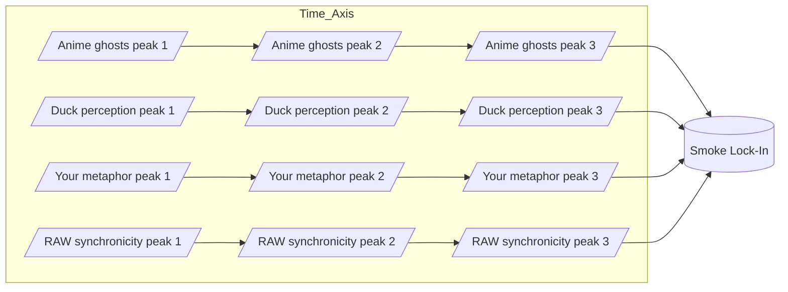

Note: Consolidated here → ../notes/diagrams/synchronicity-waves-and-web.md ^ref-91295f3a-1-0

Perfect — then let’s go full RAW and actually *draw the waves* so we can see the smoke condensing. ^ref-91295f3a-3-0

---

## **4. Sine Wave Interference — “The Curl of the Smoke”**

Here each source is a wave of meaning drifting into the field. Where they crest together, the “smoke” is dense enough to lock into a synchronicity. ^ref-91295f3a-9-0


^ref-91295f3a-11-0 ^ref-91295f3a-39-0
 ^ref-91295f3a-40-0
💡 In a real plotted version, these four “streams” would look like sine curves sliding over each other until they *phase-lock* at the same point — the moment the metaphor becomes visible.

---

## **5. RAW-Style Synchronicity Web**
 ^ref-91295f3a-46-0
This one treats synchronicities as nodes in a network, with each connected to its “ghost sources” and to other synchronicities in the same metaphor family.
 ^ref-91295f3a-48-0
```mermaid
graph TD
    subgraph Ghost_Sources
        G1[Anime ghosts]
        G2[Duck perception]
        G3[Your metaphor space]
        G4[RAW synchronicity]
    end

    subgraph Synchronicities
        S1[Smoke metaphor lock-in]
        S2[Mirror metaphors]
        S3[Wave metaphors]
    end

    G1 --> S1
    G2 --> S1
    G3 --> S1
    G4 --> S1

    S1 --> S2
    S1 --> S3
    S2 --> S3
^ref-91295f3a-48-0
```

--- ^ref-91295f3a-75-0

If you want, I can push this **even further** —
Next step would be a **statistical heatmap of ghost density** over time in the Eidolon field, so we can literally *see* the probability of a synchronicity forming. That’s where the “statistical weirdness” RAW loved becomes visible as a physics phenomenon. ^ref-91295f3a-78-0

Do you want me to make *that*?<!-- GENERATED-SECTIONS:DO-NOT-EDIT-BELOW -->
## Related content
- [Promethean_Eidolon_Synchronicity_Model](promethean-eidolon-synchronicity-model.md)
- [Math Fundamentals](chunks/math-fundamentals.md)
- [Debugging Broker Connections and Agent Behavior](debugging-broker-connections-and-agent-behavior.md)
- [Duck's Attractor States](ducks-attractor-states.md)
- [Duck's Self-Referential Perceptual Loop](ducks-self-referential-perceptual-loop.md)
- [Dynamic Context Model for Web Components](dynamic-context-model-for-web-components.md)
- [Eidolon Field Abstract Model](eidolon-field-abstract-model.md)
- [field-interaction-equations](field-interaction-equations.md)
- [TypeScript Patch for Tool Calling Support](typescript-patch-for-tool-calling-support.md)
- [Diagrams](chunks/diagrams.md)
- [DSL](chunks/dsl.md)
- [Services](chunks/services.md)
- [Shared](chunks/shared.md)
- [windows-tiling-with-autohotkey](windows-tiling-with-autohotkey.md)
- [field-dynamics-math-blocks](field-dynamics-math-blocks.md)
- [Tooling](chunks/tooling.md)
- [Window Management](chunks/window-management.md)
- [zero-copy-snapshots-and-workers](zero-copy-snapshots-and-workers.md)
- [eidolon-field-math-foundations](eidolon-field-math-foundations.md)
- [eidolon-node-lifecycle](eidolon-node-lifecycle.md)
- [typed-struct-compiler](typed-struct-compiler.md)
- [ParticleSimulationWithCanvasAndFFmpeg](particlesimulationwithcanvasandffmpeg.md)
- [Per-Domain Policy System for JS Crawler](per-domain-policy-system-for-js-crawler.md)
- [Performance-Optimized-Polyglot-Bridge](performance-optimized-polyglot-bridge.md)
- [polyglot-repl-interface-layer](polyglot-repl-interface-layer.md)
- [Promethean Dev Workflow Update](promethean-dev-workflow-update.md)
- [Promethean Infrastructure Setup](promethean-infrastructure-setup.md)
- [Prometheus Observability Stack](prometheus-observability-stack.md)
- [Factorio AI with External Agents](factorio-ai-with-external-agents.md)
- [field-node-diagram-outline](field-node-diagram-outline.md)
- [field-node-diagram-visualizations](field-node-diagram-visualizations.md)
- [Functional Embedding Pipeline Refactor](functional-embedding-pipeline-refactor.md)
- [The Jar of Echoes](the-jar-of-echoes.md)
- [JavaScript](chunks/javascript.md)
- [Operations](chunks/operations.md)
- [Fnord Tracer Protocol](fnord-tracer-protocol.md)
- [Smoke Resonance Visualizations](smoke-resonance-visualizations.md)
- [field-node-diagram-set](field-node-diagram-set.md)
- [sibilant-macro-targets](sibilant-macro-targets.md)
- [Promethean Documentation Pipeline Overview](promethean-documentation-pipeline-overview.md)
- [Ice Box Reorganization](ice-box-reorganization.md)
- [plan-update-confirmation](plan-update-confirmation.md)
- [Layer1SurvivabilityEnvelope](layer1survivabilityenvelope.md)
- [Migrate to Provider-Tenant Architecture](migrate-to-provider-tenant-architecture.md)
- [Promethean Chat Activity Report](promethean-chat-activity-report.md)
- [obsidian-ignore-node-modules-regex](obsidian-ignore-node-modules-regex.md)
- [Obsidian Templating Plugins Integration Guide](obsidian-templating-plugins-integration-guide.md)
- [Optimizing Command Limitations in System Design](optimizing-command-limitations-in-system-design.md)
- [Self-Agency in AI Interaction](self-agency-in-ai-interaction.md)
- [Creative Moments](creative-moments.md)
- [Model Selection for Lightweight Conversational Tasks](model-selection-for-lightweight-conversational-tasks.md)
- [NPU Voice Code and Sensory Integration](npu-voice-code-and-sensory-integration.md)
- [Post-Linguistic Transhuman Design Frameworks](post-linguistic-transhuman-design-frameworks.md)
- [Simulation Demo](chunks/simulation-demo.md)
- [Promethean Pipelines](promethean-pipelines.md)
- [Promethean State Format](promethean-state-format.md)
- [Promethean-Copilot-Intent-Engine](promethean-copilot-intent-engine.md)
- [i3-bluetooth-setup](i3-bluetooth-setup.md)
- [Functional Refactor of TypeScript Document Processing](functional-refactor-of-typescript-document-processing.md)
- [Pipeline Enhancements](pipeline-enhancements.md)
- [komorebi-group-window-hack](komorebi-group-window-hack.md)
- [Unique Info Dump Index](unique-info-dump-index.md)
- [Promethean Workflow Optimization](promethean-workflow-optimization.md)
- [graph-ds](graph-ds.md)
- [heartbeat-fragment-demo](heartbeat-fragment-demo.md)
- [homeostasis-decay-formulas](homeostasis-decay-formulas.md)
- [Prompt_Folder_Bootstrap](prompt-folder-bootstrap.md)
- [Protocol_0_The_Contradiction_Engine](protocol-0-the-contradiction-engine.md)
- [Provider-Agnostic Chat Panel Implementation](provider-agnostic-chat-panel-implementation.md)
- [Docops Feature Updates](docops-feature-updates-2.md)
- [Docops Feature Updates](docops-feature-updates.md)
- [Obsidian Task Generation](obsidian-task-generation.md)
- [Chroma Toolkit Consolidation Plan](chroma-toolkit-consolidation-plan.md)
- [Pure TypeScript Search Microservice](pure-typescript-search-microservice.md)
- [Tracing the Signal](tracing-the-signal.md)
- [Obsidian ChatGPT Plugin Integration Guide](obsidian-chatgpt-plugin-integration-guide.md)
- [Mathematical Samplers](mathematical-samplers.md)
- [Obsidian ChatGPT Plugin Integration](obsidian-chatgpt-plugin-integration.md)
- [OpenAPI Validation Report](openapi-validation-report.md)
- [schema-evolution-workflow](schema-evolution-workflow.md)
- [Stateful Partitions and Rebalancing](stateful-partitions-and-rebalancing.md)
- [unique-templates](templates/unique-templates.md)
- [ts-to-lisp-transpiler](ts-to-lisp-transpiler.md)
- [DuckDuckGoSearchPipeline](duckduckgosearchpipeline.md)
- [Mathematics Sampler](mathematics-sampler.md)
- [Model Upgrade Calm-Down Guide](model-upgrade-calm-down-guide.md)
- [Promethean Documentation Overview](promethean-documentation-overview.md)
- [Promethean Documentation Update](promethean-documentation-update.md)
- [Promethean Documentation Update](promethean-documentation-update.txt)
- [Promethean Notes](promethean-notes.md)
- [promethean-requirements](promethean-requirements.md)
- [Promethean Data Sync Protocol](promethean-data-sync-protocol.md)
- [Reawakening Duck](reawakening-duck.md)
- [Redirecting Standard Error](redirecting-standard-error.md)
- [ripple-propagation-demo](ripple-propagation-demo.md)
- [Unique Concepts](unique-concepts.md)
- [run-step-api](run-step-api.md)
- [Mindful Prioritization](mindful-prioritization.md)
- [MindfulRobotIntegration](mindfulrobotintegration.md)
- [Self-Improving Documentation Tool](self-improving-documentation-tool.md)
- [Fastify Static Files Plugin](fastify-static-files-plugin.md)
- [Git Commit Optimization for Code Reviews](git-commit-optimization-for-code-reviews.md)
- [file-watcher-auth-fix](file-watcher-auth-fix.md)
- [Promethean Documentation Update](promethean-documentation-update-4.md)
- [Refactor Frontmatter Processing](refactor-frontmatter-processing.md)
- [heartbeat-simulation-snippets](heartbeat-simulation-snippets.md)
- [universal-intention-code-fabric](universal-intention-code-fabric.md)
- [Ollama-LLM-Provider-for-Pseudo-Code-Transpiler](ollama-llm-provider-for-pseudo-code-transpiler.md)
- [Eidolon-Field-Optimization](eidolon-field-optimization.md)
- [Canonical Org-Babel Matplotlib Animation Template](canonical-org-babel-matplotlib-animation-template.md)
- [layer-1-uptime-diagrams](layer-1-uptime-diagrams.md)
- [compiler-kit-foundations](compiler-kit-foundations.md)
- [AGENTS.md](agents-md.md)
- [Event Bus Projections Architecture](event-bus-projections-architecture.md)
- [Promethean Event Bus MVP v0.1](promethean-event-bus-mvp-v0-1.md)
- [Shared Package Structure](shared-package-structure.md)
- [Sibilant Meta-Prompt DSL](sibilant-meta-prompt-dsl.md)
- [js-to-lisp-reverse-compiler](js-to-lisp-reverse-compiler.md)
- [Ghostly Smoke Interference](ghostly-smoke-interference.md)
## Sources
- [Ollama-LLM-Provider-for-Pseudo-Code-Transpiler — L151](ollama-llm-provider-for-pseudo-code-transpiler.md#^ref-b362e12e-151-0) (line 151, col 0, score 0.89)
- [Dynamic Context Model for Web Components — L1050](dynamic-context-model-for-web-components.md#^ref-f7702bf8-1050-0) (line 1050, col 0, score 0.93)
- [Docops Feature Updates — L149](docops-feature-updates-2.md#^ref-cdbd21ee-149-0) (line 149, col 0, score 0.92)
- [Docops Feature Updates — L206](docops-feature-updates.md#^ref-2792d448-206-0) (line 206, col 0, score 0.92)
- [Obsidian Task Generation — L115](obsidian-task-generation.md#^ref-9b694a91-115-0) (line 115, col 0, score 0.92)
- [Provider-Agnostic Chat Panel Implementation — L379](provider-agnostic-chat-panel-implementation.md#^ref-43bfe9dd-379-0) (line 379, col 0, score 0.92)
- [Promethean Infrastructure Setup — L1009](promethean-infrastructure-setup.md#^ref-6deed6ac-1009-0) (line 1009, col 0, score 0.91)
- [The Jar of Echoes — L402](the-jar-of-echoes.md#^ref-18138627-402-0) (line 402, col 0, score 0.91)
- [TypeScript Patch for Tool Calling Support — L939](typescript-patch-for-tool-calling-support.md#^ref-7b7ca860-939-0) (line 939, col 0, score 0.91)
- [file-watcher-auth-fix — L32](file-watcher-auth-fix.md#^ref-9044701b-32-0) (line 32, col 0, score 1)
- [Refactor Frontmatter Processing — L11](refactor-frontmatter-processing.md#^ref-cfbdca2f-11-0) (line 11, col 0, score 0.99)
- [Eidolon-Field-Optimization — L50](eidolon-field-optimization.md#^ref-40e05c14-50-0) (line 50, col 0, score 0.86)
- [Promethean_Eidolon_Synchronicity_Model — L189](promethean-eidolon-synchronicity-model.md#^ref-2d6e5553-189-0) (line 189, col 0, score 0.85)
- [field-node-diagram-outline — L76](field-node-diagram-outline.md#^ref-1f32c94a-76-0) (line 76, col 0, score 0.86)
- [eidolon-field-math-foundations — L148](eidolon-field-math-foundations.md#^ref-008f2ac0-148-0) (line 148, col 0, score 1)
- [eidolon-node-lifecycle — L36](eidolon-node-lifecycle.md#^ref-938eca9c-36-0) (line 36, col 0, score 1)
- [Factorio AI with External Agents — L166](factorio-ai-with-external-agents.md#^ref-a4d90289-166-0) (line 166, col 0, score 1)
- [field-dynamics-math-blocks — L148](field-dynamics-math-blocks.md#^ref-7cfc230d-148-0) (line 148, col 0, score 1)
- [field-interaction-equations — L153](field-interaction-equations.md#^ref-b09141b7-153-0) (line 153, col 0, score 1)
- [field-node-diagram-outline — L118](field-node-diagram-outline.md#^ref-1f32c94a-118-0) (line 118, col 0, score 1)
- [field-node-diagram-set — L168](field-node-diagram-set.md#^ref-22b989d5-168-0) (line 168, col 0, score 1)
- [field-node-diagram-visualizations — L103](field-node-diagram-visualizations.md#^ref-e9b27b06-103-0) (line 103, col 0, score 1)
- [Functional Embedding Pipeline Refactor — L380](functional-embedding-pipeline-refactor.md#^ref-a4a25141-380-0) (line 380, col 0, score 1)
- [Functional Refactor of TypeScript Document Processing — L194](functional-refactor-of-typescript-document-processing.md#^ref-1cfae310-194-0) (line 194, col 0, score 1)
- [Per-Domain Policy System for JS Crawler — L495](per-domain-policy-system-for-js-crawler.md#^ref-c03020e1-495-0) (line 495, col 0, score 1)
- [Performance-Optimized-Polyglot-Bridge — L459](performance-optimized-polyglot-bridge.md#^ref-f5579967-459-0) (line 459, col 0, score 1)
- [Pipeline Enhancements — L27](pipeline-enhancements.md#^ref-e2135d9f-27-0) (line 27, col 0, score 1)
- [plan-update-confirmation — L1002](plan-update-confirmation.md#^ref-b22d79c6-1002-0) (line 1002, col 0, score 1)
- [polyglot-repl-interface-layer — L171](polyglot-repl-interface-layer.md#^ref-9c79206d-171-0) (line 171, col 0, score 1)
- [Post-Linguistic Transhuman Design Frameworks — L112](post-linguistic-transhuman-design-frameworks.md#^ref-6bcff92c-112-0) (line 112, col 0, score 1)
- [Promethean Chat Activity Report — L24](promethean-chat-activity-report.md#^ref-18344cf9-24-0) (line 24, col 0, score 1)
- [Protocol_0_The_Contradiction_Engine — L143](protocol-0-the-contradiction-engine.md#^ref-9a93a756-143-0) (line 143, col 0, score 1)
- [Provider-Agnostic Chat Panel Implementation — L241](provider-agnostic-chat-panel-implementation.md#^ref-43bfe9dd-241-0) (line 241, col 0, score 1)
- [Window Management — L11](chunks/window-management.md#^ref-9e8ae388-11-0) (line 11, col 0, score 1)
- [Creative Moments — L47](creative-moments.md#^ref-10d98225-47-0) (line 47, col 0, score 1)
- [Debugging Broker Connections and Agent Behavior — L105](debugging-broker-connections-and-agent-behavior.md#^ref-73d3dbf6-105-0) (line 105, col 0, score 1)
- [Docops Feature Updates — L97](docops-feature-updates-2.md#^ref-cdbd21ee-97-0) (line 97, col 0, score 1)
- [Docops Feature Updates — L128](docops-feature-updates.md#^ref-2792d448-128-0) (line 128, col 0, score 1)
- [DuckDuckGoSearchPipeline — L31](duckduckgosearchpipeline.md#^ref-e979c50f-31-0) (line 31, col 0, score 1)
- [Duck's Attractor States — L90](ducks-attractor-states.md#^ref-13951643-90-0) (line 90, col 0, score 1)
- [Duck's Self-Referential Perceptual Loop — L33](ducks-self-referential-perceptual-loop.md#^ref-71726f04-33-0) (line 33, col 0, score 1)
- [Dynamic Context Model for Web Components — L462](dynamic-context-model-for-web-components.md#^ref-f7702bf8-462-0) (line 462, col 0, score 1)
- [NPU Voice Code and Sensory Integration — L60](npu-voice-code-and-sensory-integration.md#^ref-5a02283e-60-0) (line 60, col 0, score 1)
- [Obsidian ChatGPT Plugin Integration Guide — L48](obsidian-chatgpt-plugin-integration-guide.md#^ref-1d3d6c3a-48-0) (line 48, col 0, score 1)
- [Obsidian ChatGPT Plugin Integration — L71](obsidian-chatgpt-plugin-integration.md#^ref-ca8e1399-71-0) (line 71, col 0, score 1)
- [obsidian-ignore-node-modules-regex — L107](obsidian-ignore-node-modules-regex.md#^ref-ffb9b2a9-107-0) (line 107, col 0, score 1)
- [Obsidian Task Generation — L72](obsidian-task-generation.md#^ref-9b694a91-72-0) (line 72, col 0, score 1)
- [Obsidian Templating Plugins Integration Guide — L148](obsidian-templating-plugins-integration-guide.md#^ref-b39dc9d4-148-0) (line 148, col 0, score 1)
- [Optimizing Command Limitations in System Design — L40](optimizing-command-limitations-in-system-design.md#^ref-98c8ff62-40-0) (line 40, col 0, score 1)
- [Promethean Notes — L16](promethean-notes.md#^ref-1c4046b5-16-0) (line 16, col 0, score 1)
- [Promethean Pipelines — L138](promethean-pipelines.md#^ref-8b8e6103-138-0) (line 138, col 0, score 1)
- [promethean-requirements — L68](promethean-requirements.md#^ref-95205cd3-68-0) (line 68, col 0, score 1)
- [Promethean State Format — L84](promethean-state-format.md#^ref-23df6ddb-84-0) (line 84, col 0, score 1)
- [eidolon-node-lifecycle — L56](eidolon-node-lifecycle.md#^ref-938eca9c-56-0) (line 56, col 0, score 1)
- [Factorio AI with External Agents — L190](factorio-ai-with-external-agents.md#^ref-a4d90289-190-0) (line 190, col 0, score 1)
- [Fastify Static Files Plugin — L113](fastify-static-files-plugin.md#^ref-ce37a9b8-113-0) (line 113, col 0, score 1)
- [field-dynamics-math-blocks — L170](field-dynamics-math-blocks.md#^ref-7cfc230d-170-0) (line 170, col 0, score 1)
- [field-interaction-equations — L180](field-interaction-equations.md#^ref-b09141b7-180-0) (line 180, col 0, score 1)
- [field-node-diagram-outline — L135](field-node-diagram-outline.md#^ref-1f32c94a-135-0) (line 135, col 0, score 1)
- [field-node-diagram-set — L159](field-node-diagram-set.md#^ref-22b989d5-159-0) (line 159, col 0, score 1)
- [field-node-diagram-visualizations — L120](field-node-diagram-visualizations.md#^ref-e9b27b06-120-0) (line 120, col 0, score 1)
- [Fnord Tracer Protocol — L265](fnord-tracer-protocol.md#^ref-fc21f824-265-0) (line 265, col 0, score 1)
- [Functional Embedding Pipeline Refactor — L324](functional-embedding-pipeline-refactor.md#^ref-a4a25141-324-0) (line 324, col 0, score 1)
- [Pure TypeScript Search Microservice — L587](pure-typescript-search-microservice.md#^ref-d17d3a96-587-0) (line 587, col 0, score 1)
- [Reawakening Duck — L138](reawakening-duck.md#^ref-59b5670f-138-0) (line 138, col 0, score 1)
- [Redirecting Standard Error — L53](redirecting-standard-error.md#^ref-b3555ede-53-0) (line 53, col 0, score 1)
- [ripple-propagation-demo — L136](ripple-propagation-demo.md#^ref-8430617b-136-0) (line 136, col 0, score 1)
- [schema-evolution-workflow — L613](schema-evolution-workflow.md#^ref-d8059b6a-613-0) (line 613, col 0, score 1)
- [Self-Agency in AI Interaction — L59](self-agency-in-ai-interaction.md#^ref-49a9a860-59-0) (line 59, col 0, score 1)
- [sibilant-macro-targets — L205](sibilant-macro-targets.md#^ref-c5c9a5c6-205-0) (line 205, col 0, score 1)
- [Stateful Partitions and Rebalancing — L635](stateful-partitions-and-rebalancing.md#^ref-4330e8f0-635-0) (line 635, col 0, score 1)
- [Per-Domain Policy System for JS Crawler — L537](per-domain-policy-system-for-js-crawler.md#^ref-c03020e1-537-0) (line 537, col 0, score 1)
- [Performance-Optimized-Polyglot-Bridge — L493](performance-optimized-polyglot-bridge.md#^ref-f5579967-493-0) (line 493, col 0, score 1)
- [Pipeline Enhancements — L18](pipeline-enhancements.md#^ref-e2135d9f-18-0) (line 18, col 0, score 1)
- [polyglot-repl-interface-layer — L206](polyglot-repl-interface-layer.md#^ref-9c79206d-206-0) (line 206, col 0, score 1)
- [Post-Linguistic Transhuman Design Frameworks — L159](post-linguistic-transhuman-design-frameworks.md#^ref-6bcff92c-159-0) (line 159, col 0, score 1)
- [Promethean Chat Activity Report — L66](promethean-chat-activity-report.md#^ref-18344cf9-66-0) (line 66, col 0, score 1)
- [Promethean Data Sync Protocol — L45](promethean-data-sync-protocol.md#^ref-9fab9e76-45-0) (line 45, col 0, score 1)
- [Promethean Dev Workflow Update — L98](promethean-dev-workflow-update.md#^ref-03a5578f-98-0) (line 98, col 0, score 1)
- [Promethean Documentation Overview — L16](promethean-documentation-overview.md#^ref-9413237f-16-0) (line 16, col 0, score 1)
- [Promethean Documentation Pipeline Overview — L202](promethean-documentation-pipeline-overview.md#^ref-3a3bf2c9-202-0) (line 202, col 0, score 1)
- [Promethean Documentation Update — L46](promethean-documentation-update.md#^ref-c0392040-46-0) (line 46, col 0, score 1)
- [graph-ds — L2065](graph-ds.md#^ref-6620e2f2-2065-0) (line 2065, col 0, score 1)
- [komorebi-group-window-hack — L2020](komorebi-group-window-hack.md#^ref-dd89372d-2020-0) (line 2020, col 0, score 1)
- [Performance-Optimized-Polyglot-Bridge — L3544](performance-optimized-polyglot-bridge.md#^ref-f5579967-3544-0) (line 3544, col 0, score 1)
- [zero-copy-snapshots-and-workers — L2172](zero-copy-snapshots-and-workers.md#^ref-62bec6f0-2172-0) (line 2172, col 0, score 1)
- [Promethean-Copilot-Intent-Engine — L3793](promethean-copilot-intent-engine.md#^ref-ae24a280-3793-0) (line 3793, col 0, score 1)
- [plan-update-confirmation — L5984](plan-update-confirmation.md#^ref-b22d79c6-5984-0) (line 5984, col 0, score 1)
- [Pure TypeScript Search Microservice — L2821](pure-typescript-search-microservice.md#^ref-d17d3a96-2821-0) (line 2821, col 0, score 1)
- [Promethean Infrastructure Setup — L3405](promethean-infrastructure-setup.md#^ref-6deed6ac-3405-0) (line 3405, col 0, score 1)
- [Chroma Toolkit Consolidation Plan — L1771](chroma-toolkit-consolidation-plan.md#^ref-5020e892-1771-0) (line 1771, col 0, score 1)
- [plan-update-confirmation — L5985](plan-update-confirmation.md#^ref-b22d79c6-5985-0) (line 5985, col 0, score 1)
- [Pure TypeScript Search Microservice — L2822](pure-typescript-search-microservice.md#^ref-d17d3a96-2822-0) (line 2822, col 0, score 1)
- [zero-copy-snapshots-and-workers — L2173](zero-copy-snapshots-and-workers.md#^ref-62bec6f0-2173-0) (line 2173, col 0, score 1)
- [Promethean Infrastructure Setup — L3406](promethean-infrastructure-setup.md#^ref-6deed6ac-3406-0) (line 3406, col 0, score 1)
- [The Jar of Echoes — L1662](the-jar-of-echoes.md#^ref-18138627-1662-0) (line 1662, col 0, score 1)
- [TypeScript Patch for Tool Calling Support — L3882](typescript-patch-for-tool-calling-support.md#^ref-7b7ca860-3882-0) (line 3882, col 0, score 1)
- [Docops Feature Updates — L1502](docops-feature-updates.md#^ref-2792d448-1502-0) (line 1502, col 0, score 0.99)
- [Dynamic Context Model for Web Components — L5330](dynamic-context-model-for-web-components.md#^ref-f7702bf8-5330-0) (line 5330, col 0, score 0.99)
- [Chroma Toolkit Consolidation Plan — L1772](chroma-toolkit-consolidation-plan.md#^ref-5020e892-1772-0) (line 1772, col 0, score 1)
- [plan-update-confirmation — L5986](plan-update-confirmation.md#^ref-b22d79c6-5986-0) (line 5986, col 0, score 1)
- [Pure TypeScript Search Microservice — L2823](pure-typescript-search-microservice.md#^ref-d17d3a96-2823-0) (line 2823, col 0, score 1)
- [zero-copy-snapshots-and-workers — L2174](zero-copy-snapshots-and-workers.md#^ref-62bec6f0-2174-0) (line 2174, col 0, score 1)
- [Factorio AI with External Agents — L1838](factorio-ai-with-external-agents.md#^ref-a4d90289-1838-0) (line 1838, col 0, score 1)
- [Promethean Infrastructure Setup — L3407](promethean-infrastructure-setup.md#^ref-6deed6ac-3407-0) (line 3407, col 0, score 1)
- [The Jar of Echoes — L1663](the-jar-of-echoes.md#^ref-18138627-1663-0) (line 1663, col 0, score 1)
- [TypeScript Patch for Tool Calling Support — L3883](typescript-patch-for-tool-calling-support.md#^ref-7b7ca860-3883-0) (line 3883, col 0, score 1)
- [plan-update-confirmation — L5987](plan-update-confirmation.md#^ref-b22d79c6-5987-0) (line 5987, col 0, score 1)
- [Pure TypeScript Search Microservice — L2824](pure-typescript-search-microservice.md#^ref-d17d3a96-2824-0) (line 2824, col 0, score 1)
- [zero-copy-snapshots-and-workers — L2175](zero-copy-snapshots-and-workers.md#^ref-62bec6f0-2175-0) (line 2175, col 0, score 1)
- [Promethean Infrastructure Setup — L3408](promethean-infrastructure-setup.md#^ref-6deed6ac-3408-0) (line 3408, col 0, score 1)
- [The Jar of Echoes — L2530](the-jar-of-echoes.md#^ref-18138627-2530-0) (line 2530, col 0, score 1)
- [TypeScript Patch for Tool Calling Support — L3884](typescript-patch-for-tool-calling-support.md#^ref-7b7ca860-3884-0) (line 3884, col 0, score 1)
- [Docops Feature Updates — L1249](docops-feature-updates-2.md#^ref-cdbd21ee-1249-0) (line 1249, col 0, score 0.99)
- [Docops Feature Updates — L1503](docops-feature-updates.md#^ref-2792d448-1503-0) (line 1503, col 0, score 0.99)
- [Factorio AI with External Agents — L1836](factorio-ai-with-external-agents.md#^ref-a4d90289-1836-0) (line 1836, col 0, score 1)
- [Promethean-Copilot-Intent-Engine — L3791](promethean-copilot-intent-engine.md#^ref-ae24a280-3791-0) (line 3791, col 0, score 1)
- [plan-update-confirmation — L5988](plan-update-confirmation.md#^ref-b22d79c6-5988-0) (line 5988, col 0, score 1)
- [Pure TypeScript Search Microservice — L2825](pure-typescript-search-microservice.md#^ref-d17d3a96-2825-0) (line 2825, col 0, score 1)
- [zero-copy-snapshots-and-workers — L2176](zero-copy-snapshots-and-workers.md#^ref-62bec6f0-2176-0) (line 2176, col 0, score 1)
- [Promethean Infrastructure Setup — L3409](promethean-infrastructure-setup.md#^ref-6deed6ac-3409-0) (line 3409, col 0, score 1)
- [The Jar of Echoes — L2532](the-jar-of-echoes.md#^ref-18138627-2532-0) (line 2532, col 0, score 1)
- [TypeScript Patch for Tool Calling Support — L3886](typescript-patch-for-tool-calling-support.md#^ref-7b7ca860-3886-0) (line 3886, col 0, score 1)
- [Docops Feature Updates — L1254](docops-feature-updates-2.md#^ref-cdbd21ee-1254-0) (line 1254, col 0, score 1)
- [Docops Feature Updates — L1508](docops-feature-updates.md#^ref-2792d448-1508-0) (line 1508, col 0, score 1)
- [Dynamic Context Model for Web Components — L5336](dynamic-context-model-for-web-components.md#^ref-f7702bf8-5336-0) (line 5336, col 0, score 1)
- [Obsidian Task Generation — L1086](obsidian-task-generation.md#^ref-9b694a91-1086-0) (line 1086, col 0, score 1)
- [Provider-Agnostic Chat Panel Implementation — L1696](provider-agnostic-chat-panel-implementation.md#^ref-43bfe9dd-1696-0) (line 1696, col 0, score 1)
- [The Jar of Echoes — L2529](the-jar-of-echoes.md#^ref-18138627-2529-0) (line 2529, col 0, score 0.99)
- [TypeScript Patch for Tool Calling Support — L3881](typescript-patch-for-tool-calling-support.md#^ref-7b7ca860-3881-0) (line 3881, col 0, score 0.99)
- [Eidolon Field Abstract Model — L2047](eidolon-field-abstract-model.md#^ref-5e8b2388-2047-0) (line 2047, col 0, score 0.98)
- [plan-update-confirmation — L5862](plan-update-confirmation.md#^ref-b22d79c6-5862-0) (line 5862, col 0, score 1)
- [graph-ds — L2360](graph-ds.md#^ref-6620e2f2-2360-0) (line 2360, col 0, score 1)
- [OpenAPI Validation Report — L984](openapi-validation-report.md#^ref-5c152b08-984-0) (line 984, col 0, score 1)
- [typed-struct-compiler — L2591](typed-struct-compiler.md#^ref-78eeedf7-2591-0) (line 2591, col 0, score 1)
- [Docops Feature Updates — L1252](docops-feature-updates-2.md#^ref-cdbd21ee-1252-0) (line 1252, col 0, score 1)
- [Docops Feature Updates — L1506](docops-feature-updates.md#^ref-2792d448-1506-0) (line 1506, col 0, score 1)
- [Dynamic Context Model for Web Components — L5334](dynamic-context-model-for-web-components.md#^ref-f7702bf8-5334-0) (line 5334, col 0, score 1)
- [Obsidian Task Generation — L1084](obsidian-task-generation.md#^ref-9b694a91-1084-0) (line 1084, col 0, score 1)
- [graph-ds — L2361](graph-ds.md#^ref-6620e2f2-2361-0) (line 2361, col 0, score 1)
- [plan-update-confirmation — L5863](plan-update-confirmation.md#^ref-b22d79c6-5863-0) (line 5863, col 0, score 1)
- [Docops Feature Updates — L1253](docops-feature-updates-2.md#^ref-cdbd21ee-1253-0) (line 1253, col 0, score 1)
- [Docops Feature Updates — L1507](docops-feature-updates.md#^ref-2792d448-1507-0) (line 1507, col 0, score 1)
- [Dynamic Context Model for Web Components — L5335](dynamic-context-model-for-web-components.md#^ref-f7702bf8-5335-0) (line 5335, col 0, score 1)
- [Obsidian Task Generation — L1085](obsidian-task-generation.md#^ref-9b694a91-1085-0) (line 1085, col 0, score 1)
- [Provider-Agnostic Chat Panel Implementation — L1695](provider-agnostic-chat-panel-implementation.md#^ref-43bfe9dd-1695-0) (line 1695, col 0, score 1)
- [The Jar of Echoes — L2528](the-jar-of-echoes.md#^ref-18138627-2528-0) (line 2528, col 0, score 1)
- [The Jar of Echoes — L20119](the-jar-of-echoes.md#^ref-18138627-20119-0) (line 20119, col 0, score 0.87)
- [windows-tiling-with-autohotkey — L20890](windows-tiling-with-autohotkey.md#^ref-0f6f8f38-20890-0) (line 20890, col 0, score 0.87)
- [Dynamic Context Model for Web Components — L5364](dynamic-context-model-for-web-components.md#^ref-f7702bf8-5364-0) (line 5364, col 0, score 0.87)
- [windows-tiling-with-autohotkey — L2310](windows-tiling-with-autohotkey.md#^ref-0f6f8f38-2310-0) (line 2310, col 0, score 0.87)
- [Promethean Dev Workflow Update — L15455](promethean-dev-workflow-update.md#^ref-03a5578f-15455-0) (line 15455, col 0, score 0.87)
- [field-dynamics-math-blocks — L2137](field-dynamics-math-blocks.md#^ref-7cfc230d-2137-0) (line 2137, col 0, score 0.87)
- [Mathematical Samplers — L1168](mathematical-samplers.md#^ref-86a691ec-1168-0) (line 1168, col 0, score 0.87)
- [Mathematics Sampler — L1185](mathematics-sampler.md#^ref-b5e0183e-1185-0) (line 1185, col 0, score 0.87)
- [Duck's Attractor States — L2193](ducks-attractor-states.md#^ref-13951643-2193-0) (line 2193, col 0, score 1)
- [Tracing the Signal — L2936](tracing-the-signal.md#^ref-c3cd4f65-2936-0) (line 2936, col 0, score 1)
- [Dynamic Context Model for Web Components — L3179](dynamic-context-model-for-web-components.md#^ref-f7702bf8-3179-0) (line 3179, col 0, score 0.98)
- [Fnord Tracer Protocol — L3209](fnord-tracer-protocol.md#^ref-fc21f824-3209-0) (line 3209, col 0, score 0.98)
- [Ice Box Reorganization — L2025](ice-box-reorganization.md#^ref-291c7d91-2025-0) (line 2025, col 0, score 0.98)
- [DSL — L1673](chunks/dsl.md#^ref-e87bc036-1673-0) (line 1673, col 0, score 0.96)
- [JavaScript — L2504](chunks/javascript.md#^ref-c1618c66-2504-0) (line 2504, col 0, score 0.96)
- [Math Fundamentals — L3115](chunks/math-fundamentals.md#^ref-c6e87433-3115-0) (line 3115, col 0, score 0.96)
- [Window Management — L2066](chunks/window-management.md#^ref-9e8ae388-2066-0) (line 2066, col 0, score 0.96)
- [Duck's Attractor States — L3787](ducks-attractor-states.md#^ref-13951643-3787-0) (line 3787, col 0, score 0.96)
- [Duck's Self-Referential Perceptual Loop — L3278](ducks-self-referential-perceptual-loop.md#^ref-71726f04-3278-0) (line 3278, col 0, score 0.96)
- [Dynamic Context Model for Web Components — L9100](dynamic-context-model-for-web-components.md#^ref-f7702bf8-9100-0) (line 9100, col 0, score 0.96)
- [eidolon-field-math-foundations — L6155](eidolon-field-math-foundations.md#^ref-008f2ac0-6155-0) (line 6155, col 0, score 0.96)
- [field-dynamics-math-blocks — L5789](field-dynamics-math-blocks.md#^ref-7cfc230d-5789-0) (line 5789, col 0, score 0.96)
- [field-interaction-equations — L5557](field-interaction-equations.md#^ref-b09141b7-5557-0) (line 5557, col 0, score 0.96)
- [graph-ds — L3581](graph-ds.md#^ref-6620e2f2-3581-0) (line 3581, col 0, score 0.96)
- [heartbeat-fragment-demo — L4341](heartbeat-fragment-demo.md#^ref-dd00677a-4341-0) (line 4341, col 0, score 0.96)
- [TypeScript Patch for Tool Calling Support — L1621](typescript-patch-for-tool-calling-support.md#^ref-7b7ca860-1621-0) (line 1621, col 0, score 0.96)
- [Unique Info Dump Index — L455](unique-info-dump-index.md#^ref-30ec3ba6-455-0) (line 455, col 0, score 0.96)
- [windows-tiling-with-autohotkey — L1607](windows-tiling-with-autohotkey.md#^ref-0f6f8f38-1607-0) (line 1607, col 0, score 0.96)
- [obsidian-ignore-node-modules-regex — L2442](obsidian-ignore-node-modules-regex.md#^ref-ffb9b2a9-2442-0) (line 2442, col 0, score 0.96)
- [Obsidian Templating Plugins Integration Guide — L3146](obsidian-templating-plugins-integration-guide.md#^ref-b39dc9d4-3146-0) (line 3146, col 0, score 0.96)
- [ParticleSimulationWithCanvasAndFFmpeg — L5008](particlesimulationwithcanvasandffmpeg.md#^ref-e018dd7a-5008-0) (line 5008, col 0, score 0.96)
- [Unique Info Dump Index — L2226](unique-info-dump-index.md#^ref-30ec3ba6-2226-0) (line 2226, col 0, score 0.9)
- [Promethean Infrastructure Setup — L3460](promethean-infrastructure-setup.md#^ref-6deed6ac-3460-0) (line 3460, col 0, score 0.97)
- [typed-struct-compiler — L2270](typed-struct-compiler.md#^ref-78eeedf7-2270-0) (line 2270, col 0, score 0.97)
- [Promethean Dev Workflow Update — L1850](promethean-dev-workflow-update.md#^ref-03a5578f-1850-0) (line 1850, col 0, score 0.97)
- [Self-Agency in AI Interaction — L2386](self-agency-in-ai-interaction.md#^ref-49a9a860-2386-0) (line 2386, col 0, score 0.97)
- [The Jar of Echoes — L2455](the-jar-of-echoes.md#^ref-18138627-2455-0) (line 2455, col 0, score 0.97)
- [windows-tiling-with-autohotkey — L2835](windows-tiling-with-autohotkey.md#^ref-0f6f8f38-2835-0) (line 2835, col 0, score 0.97)
- [zero-copy-snapshots-and-workers — L2738](zero-copy-snapshots-and-workers.md#^ref-62bec6f0-2738-0) (line 2738, col 0, score 0.97)
- [Fnord Tracer Protocol — L4503](fnord-tracer-protocol.md#^ref-fc21f824-4503-0) (line 4503, col 0, score 0.97)
- [Obsidian Templating Plugins Integration Guide — L4713](obsidian-templating-plugins-integration-guide.md#^ref-b39dc9d4-4713-0) (line 4713, col 0, score 0.9)
- [OpenAPI Validation Report — L1256](openapi-validation-report.md#^ref-5c152b08-1256-0) (line 1256, col 0, score 0.9)
- [Optimizing Command Limitations in System Design — L2139](optimizing-command-limitations-in-system-design.md#^ref-98c8ff62-2139-0) (line 2139, col 0, score 0.9)
- [Unique Concepts — L716](unique-concepts.md#^ref-ed6f3fc9-716-0) (line 716, col 0, score 0.98)
- [polyglot-repl-interface-layer — L773](polyglot-repl-interface-layer.md#^ref-9c79206d-773-0) (line 773, col 0, score 0.96)
- [Promethean Chat Activity Report — L1336](promethean-chat-activity-report.md#^ref-18344cf9-1336-0) (line 1336, col 0, score 0.96)
- [eidolon-field-math-foundations — L1046](eidolon-field-math-foundations.md#^ref-008f2ac0-1046-0) (line 1046, col 0, score 1)
- [eidolon-node-lifecycle — L490](eidolon-node-lifecycle.md#^ref-938eca9c-490-0) (line 490, col 0, score 1)
- [Factorio AI with External Agents — L480](factorio-ai-with-external-agents.md#^ref-a4d90289-480-0) (line 480, col 0, score 1)
- [field-dynamics-math-blocks — L803](field-dynamics-math-blocks.md#^ref-7cfc230d-803-0) (line 803, col 0, score 1)
- [field-interaction-equations — L757](field-interaction-equations.md#^ref-b09141b7-757-0) (line 757, col 0, score 1)
- [field-node-diagram-outline — L568](field-node-diagram-outline.md#^ref-1f32c94a-568-0) (line 568, col 0, score 1)
- [field-node-diagram-set — L564](field-node-diagram-set.md#^ref-22b989d5-564-0) (line 564, col 0, score 1)
- [field-node-diagram-visualizations — L556](field-node-diagram-visualizations.md#^ref-e9b27b06-556-0) (line 556, col 0, score 1)
- [Fnord Tracer Protocol — L787](fnord-tracer-protocol.md#^ref-fc21f824-787-0) (line 787, col 0, score 1)
- [Functional Refactor of TypeScript Document Processing — L2242](functional-refactor-of-typescript-document-processing.md#^ref-1cfae310-2242-0) (line 2242, col 0, score 0.94)
- [graph-ds — L3757](graph-ds.md#^ref-6620e2f2-3757-0) (line 3757, col 0, score 0.94)
- [heartbeat-fragment-demo — L3479](heartbeat-fragment-demo.md#^ref-dd00677a-3479-0) (line 3479, col 0, score 0.94)
- [homeostasis-decay-formulas — L5594](homeostasis-decay-formulas.md#^ref-37b5d236-5594-0) (line 5594, col 0, score 0.94)
- [i3-bluetooth-setup — L2012](i3-bluetooth-setup.md#^ref-5e408692-2012-0) (line 2012, col 0, score 0.94)
- [Ice Box Reorganization — L3225](ice-box-reorganization.md#^ref-291c7d91-3225-0) (line 3225, col 0, score 0.94)
- [komorebi-group-window-hack — L4356](komorebi-group-window-hack.md#^ref-dd89372d-4356-0) (line 4356, col 0, score 0.94)
- [Layer1SurvivabilityEnvelope — L3752](layer1survivabilityenvelope.md#^ref-64a9f9f9-3752-0) (line 3752, col 0, score 0.94)
- [Mathematical Samplers — L1714](mathematical-samplers.md#^ref-86a691ec-1714-0) (line 1714, col 0, score 0.94)
- [windows-tiling-with-autohotkey — L7938](windows-tiling-with-autohotkey.md#^ref-0f6f8f38-7938-0) (line 7938, col 0, score 0.94)
- [Mathematics Sampler — L1736](mathematics-sampler.md#^ref-b5e0183e-1736-0) (line 1736, col 0, score 0.87)
- [Migrate to Provider-Tenant Architecture — L7748](migrate-to-provider-tenant-architecture.md#^ref-54382370-7748-0) (line 7748, col 0, score 0.87)
- [Obsidian ChatGPT Plugin Integration — L3847](obsidian-chatgpt-plugin-integration.md#^ref-ca8e1399-3847-0) (line 3847, col 0, score 0.87)
- [obsidian-ignore-node-modules-regex — L4433](obsidian-ignore-node-modules-regex.md#^ref-ffb9b2a9-4433-0) (line 4433, col 0, score 0.87)
- [Obsidian Task Generation — L1688](obsidian-task-generation.md#^ref-9b694a91-1688-0) (line 1688, col 0, score 0.87)
- [Obsidian Templating Plugins Integration Guide — L5168](obsidian-templating-plugins-integration-guide.md#^ref-b39dc9d4-5168-0) (line 5168, col 0, score 0.87)
- [OpenAPI Validation Report — L1563](openapi-validation-report.md#^ref-5c152b08-1563-0) (line 1563, col 0, score 0.87)
- [ParticleSimulationWithCanvasAndFFmpeg — L3400](particlesimulationwithcanvasandffmpeg.md#^ref-e018dd7a-3400-0) (line 3400, col 0, score 0.87)
- [Per-Domain Policy System for JS Crawler — L5381](per-domain-policy-system-for-js-crawler.md#^ref-c03020e1-5381-0) (line 5381, col 0, score 0.87)
- [windows-tiling-with-autohotkey — L730](windows-tiling-with-autohotkey.md#^ref-0f6f8f38-730-0) (line 730, col 0, score 0.99)
- [The Jar of Echoes — L1034](the-jar-of-echoes.md#^ref-18138627-1034-0) (line 1034, col 0, score 0.95)
- [Tracing the Signal — L1066](tracing-the-signal.md#^ref-c3cd4f65-1066-0) (line 1066, col 0, score 0.95)
- [zero-copy-snapshots-and-workers — L691](zero-copy-snapshots-and-workers.md#^ref-62bec6f0-691-0) (line 691, col 0, score 1)
- [komorebi-group-window-hack — L1796](komorebi-group-window-hack.md#^ref-dd89372d-1796-0) (line 1796, col 0, score 0.97)
- [komorebi-group-window-hack — L2017](komorebi-group-window-hack.md#^ref-dd89372d-2017-0) (line 2017, col 0, score 0.97)
- [zero-copy-snapshots-and-workers — L1936](zero-copy-snapshots-and-workers.md#^ref-62bec6f0-1936-0) (line 1936, col 0, score 0.96)
- [zero-copy-snapshots-and-workers — L2202](zero-copy-snapshots-and-workers.md#^ref-62bec6f0-2202-0) (line 2202, col 0, score 0.96)
- [Unique Info Dump Index — L6662](unique-info-dump-index.md#^ref-30ec3ba6-6662-0) (line 6662, col 0, score 0.94)
- [heartbeat-fragment-demo — L1420](heartbeat-fragment-demo.md#^ref-dd00677a-1420-0) (line 1420, col 0, score 0.94)
- [eidolon-field-math-foundations — L24596](eidolon-field-math-foundations.md#^ref-008f2ac0-24596-0) (line 24596, col 0, score 0.94)
- [Promethean Dev Workflow Update — L22800](promethean-dev-workflow-update.md#^ref-03a5578f-22800-0) (line 22800, col 0, score 0.94)
- [windows-tiling-with-autohotkey — L22798](windows-tiling-with-autohotkey.md#^ref-0f6f8f38-22798-0) (line 22798, col 0, score 0.94)
- [Chroma Toolkit Consolidation Plan — L5859](chroma-toolkit-consolidation-plan.md#^ref-5020e892-5859-0) (line 5859, col 0, score 0.98)
- [DSL — L1653](chunks/dsl.md#^ref-e87bc036-1653-0) (line 1653, col 0, score 0.98)
- [Services — L3088](chunks/services.md#^ref-75ea4a6a-3088-0) (line 3088, col 0, score 0.98)
- [Shared — L3046](chunks/shared.md#^ref-623a55f7-3046-0) (line 3046, col 0, score 0.98)
- [Simulation Demo — L3336](chunks/simulation-demo.md#^ref-557309a3-3336-0) (line 3336, col 0, score 0.98)
- [Window Management — L3496](chunks/window-management.md#^ref-9e8ae388-3496-0) (line 3496, col 0, score 0.98)
- [Creative Moments — L2113](creative-moments.md#^ref-10d98225-2113-0) (line 2113, col 0, score 0.98)
- [Debugging Broker Connections and Agent Behavior — L3995](debugging-broker-connections-and-agent-behavior.md#^ref-73d3dbf6-3995-0) (line 3995, col 0, score 0.98)
- [DuckDuckGoSearchPipeline — L1574](duckduckgosearchpipeline.md#^ref-e979c50f-1574-0) (line 1574, col 0, score 0.98)
- [Duck's Self-Referential Perceptual Loop — L4039](ducks-self-referential-perceptual-loop.md#^ref-71726f04-4039-0) (line 4039, col 0, score 0.98)
- [Dynamic Context Model for Web Components — L3574](dynamic-context-model-for-web-components.md#^ref-f7702bf8-3574-0) (line 3574, col 0, score 0.98)
- [Eidolon Field Abstract Model — L6299](eidolon-field-abstract-model.md#^ref-5e8b2388-6299-0) (line 6299, col 0, score 0.98)
- [Chroma Toolkit Consolidation Plan — L5432](chroma-toolkit-consolidation-plan.md#^ref-5020e892-5432-0) (line 5432, col 0, score 0.95)
- [Duck's Self-Referential Perceptual Loop — L2406](ducks-self-referential-perceptual-loop.md#^ref-71726f04-2406-0) (line 2406, col 0, score 0.95)
- [field-interaction-equations — L5858](field-interaction-equations.md#^ref-b09141b7-5858-0) (line 5858, col 0, score 0.95)
- [Chroma Toolkit Consolidation Plan — L6007](chroma-toolkit-consolidation-plan.md#^ref-5020e892-6007-0) (line 6007, col 0, score 0.95)
- [Diagrams — L3593](chunks/diagrams.md#^ref-45cd25b5-3593-0) (line 3593, col 0, score 0.95)
- [DSL — L2986](chunks/dsl.md#^ref-e87bc036-2986-0) (line 2986, col 0, score 0.95)
- [JavaScript — L3511](chunks/javascript.md#^ref-c1618c66-3511-0) (line 3511, col 0, score 0.95)
- [Math Fundamentals — L2434](chunks/math-fundamentals.md#^ref-c6e87433-2434-0) (line 2434, col 0, score 0.95)
- [Operations — L1336](chunks/operations.md#^ref-f1add613-1336-0) (line 1336, col 0, score 0.95)
- [Services — L2981](chunks/services.md#^ref-75ea4a6a-2981-0) (line 2981, col 0, score 0.95)
- [Shared — L2824](chunks/shared.md#^ref-623a55f7-2824-0) (line 2824, col 0, score 0.95)
- [Simulation Demo — L2684](chunks/simulation-demo.md#^ref-557309a3-2684-0) (line 2684, col 0, score 0.95)
- [windows-tiling-with-autohotkey — L1170](windows-tiling-with-autohotkey.md#^ref-0f6f8f38-1170-0) (line 1170, col 0, score 0.98)
- [zero-copy-snapshots-and-workers — L1056](zero-copy-snapshots-and-workers.md#^ref-62bec6f0-1056-0) (line 1056, col 0, score 0.98)
- [zero-copy-snapshots-and-workers — L2022](zero-copy-snapshots-and-workers.md#^ref-62bec6f0-2022-0) (line 2022, col 0, score 0.98)
- [windows-tiling-with-autohotkey — L3026](windows-tiling-with-autohotkey.md#^ref-0f6f8f38-3026-0) (line 3026, col 0, score 0.98)
- [TypeScript Patch for Tool Calling Support — L899](typescript-patch-for-tool-calling-support.md#^ref-7b7ca860-899-0) (line 899, col 0, score 0.97)
- [Unique Concepts — L1709](unique-concepts.md#^ref-ed6f3fc9-1709-0) (line 1709, col 0, score 0.97)
- [Unique Info Dump Index — L1227](unique-info-dump-index.md#^ref-30ec3ba6-1227-0) (line 1227, col 0, score 0.97)
- [windows-tiling-with-autohotkey — L1253](windows-tiling-with-autohotkey.md#^ref-0f6f8f38-1253-0) (line 1253, col 0, score 0.97)
- [zero-copy-snapshots-and-workers — L1174](zero-copy-snapshots-and-workers.md#^ref-62bec6f0-1174-0) (line 1174, col 0, score 0.99)
- [windows-tiling-with-autohotkey — L1011](windows-tiling-with-autohotkey.md#^ref-0f6f8f38-1011-0) (line 1011, col 0, score 0.98)
- [zero-copy-snapshots-and-workers — L757](zero-copy-snapshots-and-workers.md#^ref-62bec6f0-757-0) (line 757, col 0, score 0.98)
- [eidolon-field-math-foundations — L959](eidolon-field-math-foundations.md#^ref-008f2ac0-959-0) (line 959, col 0, score 0.94)
- [eidolon-node-lifecycle — L868](eidolon-node-lifecycle.md#^ref-938eca9c-868-0) (line 868, col 0, score 0.94)
- [Factorio AI with External Agents — L1000](factorio-ai-with-external-agents.md#^ref-a4d90289-1000-0) (line 1000, col 0, score 0.94)
- [field-dynamics-math-blocks — L1187](field-dynamics-math-blocks.md#^ref-7cfc230d-1187-0) (line 1187, col 0, score 0.94)
- [field-interaction-equations — L1282](field-interaction-equations.md#^ref-b09141b7-1282-0) (line 1282, col 0, score 0.94)
- [field-node-diagram-outline — L1130](field-node-diagram-outline.md#^ref-1f32c94a-1130-0) (line 1130, col 0, score 0.94)
- [field-node-diagram-set — L1046](field-node-diagram-set.md#^ref-22b989d5-1046-0) (line 1046, col 0, score 0.94)
- [field-node-diagram-visualizations — L1038](field-node-diagram-visualizations.md#^ref-e9b27b06-1038-0) (line 1038, col 0, score 0.94)
- [Fnord Tracer Protocol — L1246](fnord-tracer-protocol.md#^ref-fc21f824-1246-0) (line 1246, col 0, score 0.94)
- [i3-bluetooth-setup — L1021](i3-bluetooth-setup.md#^ref-5e408692-1021-0) (line 1021, col 0, score 0.87)
- [Ice Box Reorganization — L257](ice-box-reorganization.md#^ref-291c7d91-257-0) (line 257, col 0, score 0.87)
- [Layer1SurvivabilityEnvelope — L1018](layer1survivabilityenvelope.md#^ref-64a9f9f9-1018-0) (line 1018, col 0, score 0.87)
- [Promethean Dev Workflow Update — L23713](promethean-dev-workflow-update.md#^ref-03a5578f-23713-0) (line 23713, col 0, score 0.97)
- [Model Upgrade Calm-Down Guide — L860](model-upgrade-calm-down-guide.md#^ref-db74343f-860-0) (line 860, col 0, score 0.86)
- [NPU Voice Code and Sensory Integration — L735](npu-voice-code-and-sensory-integration.md#^ref-5a02283e-735-0) (line 735, col 0, score 0.86)
- [Obsidian ChatGPT Plugin Integration Guide — L1039](obsidian-chatgpt-plugin-integration-guide.md#^ref-1d3d6c3a-1039-0) (line 1039, col 0, score 0.86)
- [Obsidian ChatGPT Plugin Integration — L1019](obsidian-chatgpt-plugin-integration.md#^ref-ca8e1399-1019-0) (line 1019, col 0, score 0.86)
- [obsidian-ignore-node-modules-regex — L1272](obsidian-ignore-node-modules-regex.md#^ref-ffb9b2a9-1272-0) (line 1272, col 0, score 0.86)
- [Obsidian Task Generation — L780](obsidian-task-generation.md#^ref-9b694a91-780-0) (line 780, col 0, score 0.86)
- [Obsidian Templating Plugins Integration Guide — L1252](obsidian-templating-plugins-integration-guide.md#^ref-b39dc9d4-1252-0) (line 1252, col 0, score 0.86)
- [OpenAPI Validation Report — L781](openapi-validation-report.md#^ref-5c152b08-781-0) (line 781, col 0, score 0.86)
- [Optimizing Command Limitations in System Design — L1018](optimizing-command-limitations-in-system-design.md#^ref-98c8ff62-1018-0) (line 1018, col 0, score 0.86)
- [Promethean Documentation Overview — L580](promethean-documentation-overview.md#^ref-9413237f-580-0) (line 580, col 0, score 0.98)
- [Promethean Documentation Pipeline Overview — L1613](promethean-documentation-pipeline-overview.md#^ref-3a3bf2c9-1613-0) (line 1613, col 0, score 0.98)
- [Promethean Documentation Update — L1271](promethean-documentation-update.md#^ref-c0392040-1271-0) (line 1271, col 0, score 0.98)
- [Promethean_Eidolon_Synchronicity_Model — L3291](promethean-eidolon-synchronicity-model.md#^ref-2d6e5553-3291-0) (line 3291, col 0, score 0.98)
- [Promethean Infrastructure Setup — L6974](promethean-infrastructure-setup.md#^ref-6deed6ac-6974-0) (line 6974, col 0, score 0.98)
- [Promethean Pipelines — L4005](promethean-pipelines.md#^ref-8b8e6103-4005-0) (line 4005, col 0, score 0.98)
- [promethean-requirements — L1645](promethean-requirements.md#^ref-95205cd3-1645-0) (line 1645, col 0, score 0.98)
- [Promethean State Format — L3813](promethean-state-format.md#^ref-23df6ddb-3813-0) (line 3813, col 0, score 0.98)
- [Prometheus Observability Stack — L5781](prometheus-observability-stack.md#^ref-e90b5a16-5781-0) (line 5781, col 0, score 0.98)
- [Prompt_Folder_Bootstrap — L5891](prompt-folder-bootstrap.md#^ref-bd4f0976-5891-0) (line 5891, col 0, score 0.98)
- [komorebi-group-window-hack — L849](komorebi-group-window-hack.md#^ref-dd89372d-849-0) (line 849, col 0, score 0.96)
- [Layer1SurvivabilityEnvelope — L502](layer1survivabilityenvelope.md#^ref-64a9f9f9-502-0) (line 502, col 0, score 0.96)
- [Mathematical Samplers — L437](mathematical-samplers.md#^ref-86a691ec-437-0) (line 437, col 0, score 0.96)
- [Model Upgrade Calm-Down Guide — L461](model-upgrade-calm-down-guide.md#^ref-db74343f-461-0) (line 461, col 0, score 0.96)
- [NPU Voice Code and Sensory Integration — L340](npu-voice-code-and-sensory-integration.md#^ref-5a02283e-340-0) (line 340, col 0, score 0.96)
- [Obsidian ChatGPT Plugin Integration — L579](obsidian-chatgpt-plugin-integration.md#^ref-ca8e1399-579-0) (line 579, col 0, score 0.96)
- [obsidian-ignore-node-modules-regex — L463](obsidian-ignore-node-modules-regex.md#^ref-ffb9b2a9-463-0) (line 463, col 0, score 0.96)
- [Obsidian Task Generation — L336](obsidian-task-generation.md#^ref-9b694a91-336-0) (line 336, col 0, score 0.96)
- [Obsidian Templating Plugins Integration Guide — L776](obsidian-templating-plugins-integration-guide.md#^ref-b39dc9d4-776-0) (line 776, col 0, score 0.96)
- [OpenAPI Validation Report — L344](openapi-validation-report.md#^ref-5c152b08-344-0) (line 344, col 0, score 0.96)
- [Per-Domain Policy System for JS Crawler — L1213](per-domain-policy-system-for-js-crawler.md#^ref-c03020e1-1213-0) (line 1213, col 0, score 0.96)
- [heartbeat-fragment-demo — L3096](heartbeat-fragment-demo.md#^ref-dd00677a-3096-0) (line 3096, col 0, score 0.98)
- [homeostasis-decay-formulas — L4355](homeostasis-decay-formulas.md#^ref-37b5d236-4355-0) (line 4355, col 0, score 0.98)
- [i3-bluetooth-setup — L4818](i3-bluetooth-setup.md#^ref-5e408692-4818-0) (line 4818, col 0, score 0.98)
- [Ice Box Reorganization — L4548](ice-box-reorganization.md#^ref-291c7d91-4548-0) (line 4548, col 0, score 0.98)
- [komorebi-group-window-hack — L3722](komorebi-group-window-hack.md#^ref-dd89372d-3722-0) (line 3722, col 0, score 0.98)
- [Migrate to Provider-Tenant Architecture — L8343](migrate-to-provider-tenant-architecture.md#^ref-54382370-8343-0) (line 8343, col 0, score 0.98)
- [Mathematics Sampler — L324](mathematics-sampler.md#^ref-b5e0183e-324-0) (line 324, col 0, score 0.96)
- [Migrate to Provider-Tenant Architecture — L802](migrate-to-provider-tenant-architecture.md#^ref-54382370-802-0) (line 802, col 0, score 0.96)
- [Mindful Prioritization — L211](mindful-prioritization.md#^ref-40185d05-211-0) (line 211, col 0, score 0.96)
- [MindfulRobotIntegration — L199](mindfulrobotintegration.md#^ref-5f65dfa5-199-0) (line 199, col 0, score 0.96)
- [Model Upgrade Calm-Down Guide — L353](model-upgrade-calm-down-guide.md#^ref-db74343f-353-0) (line 353, col 0, score 0.96)
- [NPU Voice Code and Sensory Integration — L246](npu-voice-code-and-sensory-integration.md#^ref-5a02283e-246-0) (line 246, col 0, score 0.96)
- [Mindful Prioritization — L761](mindful-prioritization.md#^ref-40185d05-761-0) (line 761, col 0, score 0.97)
- [MindfulRobotIntegration — L759](mindfulrobotintegration.md#^ref-5f65dfa5-759-0) (line 759, col 0, score 0.97)
- [Model Selection for Lightweight Conversational Tasks — L1223](model-selection-for-lightweight-conversational-tasks.md#^ref-d144aa62-1223-0) (line 1223, col 0, score 0.97)
- [Model Upgrade Calm-Down Guide — L803](model-upgrade-calm-down-guide.md#^ref-db74343f-803-0) (line 803, col 0, score 0.97)
- [NPU Voice Code and Sensory Integration — L786](npu-voice-code-and-sensory-integration.md#^ref-5a02283e-786-0) (line 786, col 0, score 0.97)
- [Obsidian ChatGPT Plugin Integration Guide — L1097](obsidian-chatgpt-plugin-integration-guide.md#^ref-1d3d6c3a-1097-0) (line 1097, col 0, score 0.97)
- [Obsidian ChatGPT Plugin Integration — L1077](obsidian-chatgpt-plugin-integration.md#^ref-ca8e1399-1077-0) (line 1077, col 0, score 0.97)
- [obsidian-ignore-node-modules-regex — L1259](obsidian-ignore-node-modules-regex.md#^ref-ffb9b2a9-1259-0) (line 1259, col 0, score 0.97)
- [Obsidian Task Generation — L767](obsidian-task-generation.md#^ref-9b694a91-767-0) (line 767, col 0, score 0.97)
- [Prompt_Folder_Bootstrap — L1213](prompt-folder-bootstrap.md#^ref-bd4f0976-1213-0) (line 1213, col 0, score 0.97)
- [Protocol_0_The_Contradiction_Engine — L1158](protocol-0-the-contradiction-engine.md#^ref-9a93a756-1158-0) (line 1158, col 0, score 0.97)
- [Provider-Agnostic Chat Panel Implementation — L1317](provider-agnostic-chat-panel-implementation.md#^ref-43bfe9dd-1317-0) (line 1317, col 0, score 0.97)
- [Pure TypeScript Search Microservice — L1719](pure-typescript-search-microservice.md#^ref-d17d3a96-1719-0) (line 1719, col 0, score 0.97)
- [Reawakening Duck — L1168](reawakening-duck.md#^ref-59b5670f-1168-0) (line 1168, col 0, score 0.97)
- [Redirecting Standard Error — L766](redirecting-standard-error.md#^ref-b3555ede-766-0) (line 766, col 0, score 0.97)
- [schema-evolution-workflow — L1605](schema-evolution-workflow.md#^ref-d8059b6a-1605-0) (line 1605, col 0, score 0.97)
- [field-node-diagram-set — L327](field-node-diagram-set.md#^ref-22b989d5-327-0) (line 327, col 0, score 0.96)
- [field-node-diagram-visualizations — L311](field-node-diagram-visualizations.md#^ref-e9b27b06-311-0) (line 311, col 0, score 0.96)
- [Fnord Tracer Protocol — L1286](fnord-tracer-protocol.md#^ref-fc21f824-1286-0) (line 1286, col 0, score 0.96)
- [Functional Embedding Pipeline Refactor — L987](functional-embedding-pipeline-refactor.md#^ref-a4a25141-987-0) (line 987, col 0, score 0.96)
- [Functional Refactor of TypeScript Document Processing — L764](functional-refactor-of-typescript-document-processing.md#^ref-1cfae310-764-0) (line 764, col 0, score 0.96)
- [graph-ds — L1487](graph-ds.md#^ref-6620e2f2-1487-0) (line 1487, col 0, score 0.96)
- [heartbeat-fragment-demo — L278](heartbeat-fragment-demo.md#^ref-dd00677a-278-0) (line 278, col 0, score 0.96)
- [homeostasis-decay-formulas — L584](homeostasis-decay-formulas.md#^ref-37b5d236-584-0) (line 584, col 0, score 0.96)
- [i3-bluetooth-setup — L1201](i3-bluetooth-setup.md#^ref-5e408692-1201-0) (line 1201, col 0, score 0.96)
- [Ice Box Reorganization — L795](ice-box-reorganization.md#^ref-291c7d91-795-0) (line 795, col 0, score 0.96)
- [The Jar of Echoes — L1448](the-jar-of-echoes.md#^ref-18138627-1448-0) (line 1448, col 0, score 0.95)
- [ts-to-lisp-transpiler — L784](ts-to-lisp-transpiler.md#^ref-ba11486b-784-0) (line 784, col 0, score 0.95)
- [Promethean Chat Activity Report — L14460](promethean-chat-activity-report.md#^ref-18344cf9-14460-0) (line 14460, col 0, score 0.86)
- [Promethean Documentation Update — L12912](promethean-documentation-update.txt#^ref-0b872af2-12912-0) (line 12912, col 0, score 0.86)
- [Creative Moments — L14035](creative-moments.md#^ref-10d98225-14035-0) (line 14035, col 0, score 0.85)
- [Duck's Attractor States — L23117](ducks-attractor-states.md#^ref-13951643-23117-0) (line 23117, col 0, score 0.85)
- [unique-templates — L770](templates/unique-templates.md#^ref-c26f0044-770-0) (line 770, col 0, score 0.97)
- [The Jar of Echoes — L987](the-jar-of-echoes.md#^ref-18138627-987-0) (line 987, col 0, score 0.97)
- [windows-tiling-with-autohotkey — L985](windows-tiling-with-autohotkey.md#^ref-0f6f8f38-985-0) (line 985, col 0, score 0.98)
- [zero-copy-snapshots-and-workers — L780](zero-copy-snapshots-and-workers.md#^ref-62bec6f0-780-0) (line 780, col 0, score 0.98)
- [windows-tiling-with-autohotkey — L594](windows-tiling-with-autohotkey.md#^ref-0f6f8f38-594-0) (line 594, col 0, score 0.98)
- [zero-copy-snapshots-and-workers — L969](zero-copy-snapshots-and-workers.md#^ref-62bec6f0-969-0) (line 969, col 0, score 0.98)
- [Unique Info Dump Index — L2432](unique-info-dump-index.md#^ref-30ec3ba6-2432-0) (line 2432, col 0, score 0.97)
- [heartbeat-fragment-demo — L1321](heartbeat-fragment-demo.md#^ref-dd00677a-1321-0) (line 1321, col 0, score 0.97)
- [homeostasis-decay-formulas — L1392](homeostasis-decay-formulas.md#^ref-37b5d236-1392-0) (line 1392, col 0, score 0.97)
- [i3-bluetooth-setup — L1287](i3-bluetooth-setup.md#^ref-5e408692-1287-0) (line 1287, col 0, score 0.97)
- [Ice Box Reorganization — L1090](ice-box-reorganization.md#^ref-291c7d91-1090-0) (line 1090, col 0, score 0.97)
- [komorebi-group-window-hack — L1393](komorebi-group-window-hack.md#^ref-dd89372d-1393-0) (line 1393, col 0, score 0.97)
- [Layer1SurvivabilityEnvelope — L1177](layer1survivabilityenvelope.md#^ref-64a9f9f9-1177-0) (line 1177, col 0, score 0.97)
- [Mathematical Samplers — L592](mathematical-samplers.md#^ref-86a691ec-592-0) (line 592, col 0, score 0.97)
- [Mathematics Sampler — L587](mathematics-sampler.md#^ref-b5e0183e-587-0) (line 587, col 0, score 0.97)
- [Migrate to Provider-Tenant Architecture — L1655](migrate-to-provider-tenant-architecture.md#^ref-54382370-1655-0) (line 1655, col 0, score 0.97)
- [zero-copy-snapshots-and-workers — L1576](zero-copy-snapshots-and-workers.md#^ref-62bec6f0-1576-0) (line 1576, col 0, score 0.98)
- [Mathematical Samplers — L1804](mathematical-samplers.md#^ref-86a691ec-1804-0) (line 1804, col 0, score 0.96)
- [Mathematics Sampler — L1835](mathematics-sampler.md#^ref-b5e0183e-1835-0) (line 1835, col 0, score 0.96)
- [ts-to-lisp-transpiler — L1136](ts-to-lisp-transpiler.md#^ref-ba11486b-1136-0) (line 1136, col 0, score 0.93)
- [typed-struct-compiler — L1483](typed-struct-compiler.md#^ref-78eeedf7-1483-0) (line 1483, col 0, score 0.93)
- [TypeScript Patch for Tool Calling Support — L1585](typescript-patch-for-tool-calling-support.md#^ref-7b7ca860-1585-0) (line 1585, col 0, score 0.93)
- [Unique Concepts — L690](unique-concepts.md#^ref-ed6f3fc9-690-0) (line 690, col 0, score 0.93)
- [Unique Info Dump Index — L1418](unique-info-dump-index.md#^ref-30ec3ba6-1418-0) (line 1418, col 0, score 0.93)
- [Fnord Tracer Protocol — L5772](fnord-tracer-protocol.md#^ref-fc21f824-5772-0) (line 5772, col 0, score 0.93)
- [i3-bluetooth-setup — L2706](i3-bluetooth-setup.md#^ref-5e408692-2706-0) (line 2706, col 0, score 0.93)
- [komorebi-group-window-hack — L3905](komorebi-group-window-hack.md#^ref-dd89372d-3905-0) (line 3905, col 0, score 0.93)
- [Migrate to Provider-Tenant Architecture — L4766](migrate-to-provider-tenant-architecture.md#^ref-54382370-4766-0) (line 4766, col 0, score 0.93)
- [Mindful Prioritization — L1351](mindful-prioritization.md#^ref-40185d05-1351-0) (line 1351, col 0, score 0.93)
- [Obsidian ChatGPT Plugin Integration — L1047](obsidian-chatgpt-plugin-integration.md#^ref-ca8e1399-1047-0) (line 1047, col 0, score 0.95)
- [obsidian-ignore-node-modules-regex — L1216](obsidian-ignore-node-modules-regex.md#^ref-ffb9b2a9-1216-0) (line 1216, col 0, score 0.95)
- [Obsidian Task Generation — L737](obsidian-task-generation.md#^ref-9b694a91-737-0) (line 737, col 0, score 0.95)
- [OpenAPI Validation Report — L738](openapi-validation-report.md#^ref-5c152b08-738-0) (line 738, col 0, score 0.95)
- [ParticleSimulationWithCanvasAndFFmpeg — L1475](particlesimulationwithcanvasandffmpeg.md#^ref-e018dd7a-1475-0) (line 1475, col 0, score 0.95)
- [zero-copy-snapshots-and-workers — L1516](zero-copy-snapshots-and-workers.md#^ref-62bec6f0-1516-0) (line 1516, col 0, score 0.98)
- [Per-Domain Policy System for JS Crawler — L2368](per-domain-policy-system-for-js-crawler.md#^ref-c03020e1-2368-0) (line 2368, col 0, score 0.97)
- [heartbeat-fragment-demo — L4029](heartbeat-fragment-demo.md#^ref-dd00677a-4029-0) (line 4029, col 0, score 0.97)
- [homeostasis-decay-formulas — L6026](homeostasis-decay-formulas.md#^ref-37b5d236-6026-0) (line 6026, col 0, score 0.97)
- [i3-bluetooth-setup — L4287](i3-bluetooth-setup.md#^ref-5e408692-4287-0) (line 4287, col 0, score 0.97)
- [Ice Box Reorganization — L4296](ice-box-reorganization.md#^ref-291c7d91-4296-0) (line 4296, col 0, score 0.97)
- [komorebi-group-window-hack — L3969](komorebi-group-window-hack.md#^ref-dd89372d-3969-0) (line 3969, col 0, score 0.97)
- [Layer1SurvivabilityEnvelope — L5113](layer1survivabilityenvelope.md#^ref-64a9f9f9-5113-0) (line 5113, col 0, score 0.97)
- [Migrate to Provider-Tenant Architecture — L7147](migrate-to-provider-tenant-architecture.md#^ref-54382370-7147-0) (line 7147, col 0, score 0.97)
- [ts-to-lisp-transpiler — L2339](ts-to-lisp-transpiler.md#^ref-ba11486b-2339-0) (line 2339, col 0, score 0.96)
- [typed-struct-compiler — L3549](typed-struct-compiler.md#^ref-78eeedf7-3549-0) (line 3549, col 0, score 0.96)
- [TypeScript Patch for Tool Calling Support — L6142](typescript-patch-for-tool-calling-support.md#^ref-7b7ca860-6142-0) (line 6142, col 0, score 0.98)
- [Unique Info Dump Index — L3887](unique-info-dump-index.md#^ref-30ec3ba6-3887-0) (line 3887, col 0, score 0.98)
- [windows-tiling-with-autohotkey — L4648](windows-tiling-with-autohotkey.md#^ref-0f6f8f38-4648-0) (line 4648, col 0, score 0.98)
- [zero-copy-snapshots-and-workers — L3476](zero-copy-snapshots-and-workers.md#^ref-62bec6f0-3476-0) (line 3476, col 0, score 0.98)
- [field-interaction-equations — L1299](field-interaction-equations.md#^ref-b09141b7-1299-0) (line 1299, col 0, score 0.96)
- [field-node-diagram-outline — L1147](field-node-diagram-outline.md#^ref-1f32c94a-1147-0) (line 1147, col 0, score 0.96)
- [field-node-diagram-set — L1063](field-node-diagram-set.md#^ref-22b989d5-1063-0) (line 1063, col 0, score 0.96)
- [field-node-diagram-visualizations — L1055](field-node-diagram-visualizations.md#^ref-e9b27b06-1055-0) (line 1055, col 0, score 0.96)
- [Fnord Tracer Protocol — L1263](fnord-tracer-protocol.md#^ref-fc21f824-1263-0) (line 1263, col 0, score 0.96)
- [Functional Embedding Pipeline Refactor — L880](functional-embedding-pipeline-refactor.md#^ref-a4a25141-880-0) (line 880, col 0, score 0.96)
- [Functional Refactor of TypeScript Document Processing — L696](functional-refactor-of-typescript-document-processing.md#^ref-1cfae310-696-0) (line 696, col 0, score 0.96)
- [graph-ds — L1546](graph-ds.md#^ref-6620e2f2-1546-0) (line 1546, col 0, score 0.96)
- [heartbeat-fragment-demo — L1209](heartbeat-fragment-demo.md#^ref-dd00677a-1209-0) (line 1209, col 0, score 0.96)
- [windows-tiling-with-autohotkey — L9177](windows-tiling-with-autohotkey.md#^ref-0f6f8f38-9177-0) (line 9177, col 0, score 0.9)
- [zero-copy-snapshots-and-workers — L1222](zero-copy-snapshots-and-workers.md#^ref-62bec6f0-1222-0) (line 1222, col 0, score 0.98)
- [Promethean Dev Workflow Update — L11281](promethean-dev-workflow-update.md#^ref-03a5578f-11281-0) (line 11281, col 0, score 0.99)
- [The Jar of Echoes — L247](the-jar-of-echoes.md#^ref-18138627-247-0) (line 247, col 0, score 1)
- [Tracing the Signal — L1510](tracing-the-signal.md#^ref-c3cd4f65-1510-0) (line 1510, col 0, score 0.95)
- [Diagrams — L367](chunks/diagrams.md#^ref-45cd25b5-367-0) (line 367, col 0, score 0.98)
- [Math Fundamentals — L378](chunks/math-fundamentals.md#^ref-c6e87433-378-0) (line 378, col 0, score 0.98)
- [Operations — L526](chunks/operations.md#^ref-f1add613-526-0) (line 526, col 0, score 0.98)
- [Tooling — L393](chunks/tooling.md#^ref-6cb4943e-393-0) (line 393, col 0, score 0.98)
- [Window Management — L510](chunks/window-management.md#^ref-9e8ae388-510-0) (line 510, col 0, score 0.98)
- [Creative Moments — L531](creative-moments.md#^ref-10d98225-531-0) (line 531, col 0, score 0.98)
- [Debugging Broker Connections and Agent Behavior — L615](debugging-broker-connections-and-agent-behavior.md#^ref-73d3dbf6-615-0) (line 615, col 0, score 0.98)
- [Docops Feature Updates — L243](docops-feature-updates.md#^ref-2792d448-243-0) (line 243, col 0, score 0.98)
- [DuckDuckGoSearchPipeline — L542](duckduckgosearchpipeline.md#^ref-e979c50f-542-0) (line 542, col 0, score 0.98)
- [Duck's Attractor States — L614](ducks-attractor-states.md#^ref-13951643-614-0) (line 614, col 0, score 0.98)
- [Duck's Self-Referential Perceptual Loop — L542](ducks-self-referential-perceptual-loop.md#^ref-71726f04-542-0) (line 542, col 0, score 0.98)
- [Dynamic Context Model for Web Components — L1311](dynamic-context-model-for-web-components.md#^ref-f7702bf8-1311-0) (line 1311, col 0, score 0.98)
- [Unique Info Dump Index — L4072](unique-info-dump-index.md#^ref-30ec3ba6-4072-0) (line 4072, col 0, score 0.99)
- [Diagrams — L1401](chunks/diagrams.md#^ref-45cd25b5-1401-0) (line 1401, col 0, score 0.94)
- [Smoke Resonance Visualizations — L1763](smoke-resonance-visualizations.md#^ref-ac9d3ac5-1763-0) (line 1763, col 0, score 0.94)
- [Unique Info Dump Index — L4108](unique-info-dump-index.md#^ref-30ec3ba6-4108-0) (line 4108, col 0, score 0.94)
- [Diagrams — L1349](chunks/diagrams.md#^ref-45cd25b5-1349-0) (line 1349, col 0, score 0.93)
- [Obsidian ChatGPT Plugin Integration — L1447](obsidian-chatgpt-plugin-integration.md#^ref-ca8e1399-1447-0) (line 1447, col 0, score 0.99)
- [obsidian-ignore-node-modules-regex — L3392](obsidian-ignore-node-modules-regex.md#^ref-ffb9b2a9-3392-0) (line 3392, col 0, score 0.99)
- [Obsidian Task Generation — L1747](obsidian-task-generation.md#^ref-9b694a91-1747-0) (line 1747, col 0, score 0.99)
- [Obsidian Templating Plugins Integration Guide — L1677](obsidian-templating-plugins-integration-guide.md#^ref-b39dc9d4-1677-0) (line 1677, col 0, score 0.99)
- [OpenAPI Validation Report — L1708](openapi-validation-report.md#^ref-5c152b08-1708-0) (line 1708, col 0, score 0.99)
- [Optimizing Command Limitations in System Design — L1292](optimizing-command-limitations-in-system-design.md#^ref-98c8ff62-1292-0) (line 1292, col 0, score 0.99)
- [ParticleSimulationWithCanvasAndFFmpeg — L3792](particlesimulationwithcanvasandffmpeg.md#^ref-e018dd7a-3792-0) (line 3792, col 0, score 0.99)
- [Per-Domain Policy System for JS Crawler — L4472](per-domain-policy-system-for-js-crawler.md#^ref-c03020e1-4472-0) (line 4472, col 0, score 0.99)
- [Performance-Optimized-Polyglot-Bridge — L2929](performance-optimized-polyglot-bridge.md#^ref-f5579967-2929-0) (line 2929, col 0, score 0.99)
- [Promethean Dev Workflow Update — L2917](promethean-dev-workflow-update.md#^ref-03a5578f-2917-0) (line 2917, col 0, score 0.99)
- [Unique Info Dump Index — L4075](unique-info-dump-index.md#^ref-30ec3ba6-4075-0) (line 4075, col 0, score 0.99)
- [Diagrams — L1403](chunks/diagrams.md#^ref-45cd25b5-1403-0) (line 1403, col 0, score 0.98)
- [Shared — L1835](chunks/shared.md#^ref-623a55f7-1835-0) (line 1835, col 0, score 0.98)
- [Duck's Attractor States — L2350](ducks-attractor-states.md#^ref-13951643-2350-0) (line 2350, col 0, score 0.98)
- [Unique Info Dump Index — L4110](unique-info-dump-index.md#^ref-30ec3ba6-4110-0) (line 4110, col 0, score 0.98)
- [graph-ds — L2388](graph-ds.md#^ref-6620e2f2-2388-0) (line 2388, col 0, score 0.98)
- [Layer1SurvivabilityEnvelope — L2461](layer1survivabilityenvelope.md#^ref-64a9f9f9-2461-0) (line 2461, col 0, score 0.98)
- [schema-evolution-workflow — L3647](schema-evolution-workflow.md#^ref-d8059b6a-3647-0) (line 3647, col 0, score 0.98)
- [zero-copy-snapshots-and-workers — L1821](zero-copy-snapshots-and-workers.md#^ref-62bec6f0-1821-0) (line 1821, col 0, score 0.98)
- [Unique Info Dump Index — L4079](unique-info-dump-index.md#^ref-30ec3ba6-4079-0) (line 4079, col 0, score 1)
- [Promethean Dev Workflow Update — L15710](promethean-dev-workflow-update.md#^ref-03a5578f-15710-0) (line 15710, col 0, score 1)
- [Promethean Chat Activity Report — L8720](promethean-chat-activity-report.md#^ref-18344cf9-8720-0) (line 8720, col 0, score 1)
- [eidolon-field-math-foundations — L27483](eidolon-field-math-foundations.md#^ref-008f2ac0-27483-0) (line 27483, col 0, score 1)
- [Promethean State Format — L1523](promethean-state-format.md#^ref-23df6ddb-1523-0) (line 1523, col 0, score 1)
- [windows-tiling-with-autohotkey — L23570](windows-tiling-with-autohotkey.md#^ref-0f6f8f38-23570-0) (line 23570, col 0, score 1)
- [eidolon-field-math-foundations — L21392](eidolon-field-math-foundations.md#^ref-008f2ac0-21392-0) (line 21392, col 0, score 1)
- [heartbeat-fragment-demo — L1705](heartbeat-fragment-demo.md#^ref-dd00677a-1705-0) (line 1705, col 0, score 1)
- [JavaScript — L1681](chunks/javascript.md#^ref-c1618c66-1681-0) (line 1681, col 0, score 0.99)
- [The Jar of Echoes — L12330](the-jar-of-echoes.md#^ref-18138627-12330-0) (line 12330, col 0, score 0.99)
- [schema-evolution-workflow — L2600](schema-evolution-workflow.md#^ref-d8059b6a-2600-0) (line 2600, col 0, score 0.99)
- [zero-copy-snapshots-and-workers — L1764](zero-copy-snapshots-and-workers.md#^ref-62bec6f0-1764-0) (line 1764, col 0, score 0.99)
- [Diagrams — L1373](chunks/diagrams.md#^ref-45cd25b5-1373-0) (line 1373, col 0, score 0.99)
- [Duck's Attractor States — L2372](ducks-attractor-states.md#^ref-13951643-2372-0) (line 2372, col 0, score 0.99)
- [JavaScript — L1679](chunks/javascript.md#^ref-c1618c66-1679-0) (line 1679, col 0, score 1)
- [The Jar of Echoes — L12332](the-jar-of-echoes.md#^ref-18138627-12332-0) (line 12332, col 0, score 1)
- [Duck's Attractor States — L2373](ducks-attractor-states.md#^ref-13951643-2373-0) (line 2373, col 0, score 0.96)
- [eidolon-field-math-foundations — L26010](eidolon-field-math-foundations.md#^ref-008f2ac0-26010-0) (line 26010, col 0, score 0.96)
- [Duck's Attractor States — L2345](ducks-attractor-states.md#^ref-13951643-2345-0) (line 2345, col 0, score 1)
- [Promethean_Eidolon_Synchronicity_Model — L1859](promethean-eidolon-synchronicity-model.md#^ref-2d6e5553-1859-0) (line 1859, col 0, score 1)
- [The Jar of Echoes — L12331](the-jar-of-echoes.md#^ref-18138627-12331-0) (line 12331, col 0, score 1)
- [Duck's Attractor States — L2374](ducks-attractor-states.md#^ref-13951643-2374-0) (line 2374, col 0, score 1)
- [Duck's Attractor States — L15190](ducks-attractor-states.md#^ref-13951643-15190-0) (line 15190, col 0, score 0.99)
- [Smoke Resonance Visualizations — L1526](smoke-resonance-visualizations.md#^ref-ac9d3ac5-1526-0) (line 1526, col 0, score 0.99)
- [Diagrams — L1375](chunks/diagrams.md#^ref-45cd25b5-1375-0) (line 1375, col 0, score 1)
- [Duck's Attractor States — L2375](ducks-attractor-states.md#^ref-13951643-2375-0) (line 2375, col 0, score 1)
- [The Jar of Echoes — L12333](the-jar-of-echoes.md#^ref-18138627-12333-0) (line 12333, col 0, score 1)
- [Promethean Dev Workflow Update — L16315](promethean-dev-workflow-update.md#^ref-03a5578f-16315-0) (line 16315, col 0, score 0.99)
- [Provider-Agnostic Chat Panel Implementation — L2524](provider-agnostic-chat-panel-implementation.md#^ref-43bfe9dd-2524-0) (line 2524, col 0, score 0.99)
- [Pure TypeScript Search Microservice — L3157](pure-typescript-search-microservice.md#^ref-d17d3a96-3157-0) (line 3157, col 0, score 0.99)
- [Diagrams — L1378](chunks/diagrams.md#^ref-45cd25b5-1378-0) (line 1378, col 0, score 1)
- [Services — L1169](chunks/services.md#^ref-75ea4a6a-1169-0) (line 1169, col 0, score 1)
- [Diagrams — L1379](chunks/diagrams.md#^ref-45cd25b5-1379-0) (line 1379, col 0, score 1)
- [Services — L1170](chunks/services.md#^ref-75ea4a6a-1170-0) (line 1170, col 0, score 1)
- [Fnord Tracer Protocol — L3297](fnord-tracer-protocol.md#^ref-fc21f824-3297-0) (line 3297, col 0, score 1)
- [plan-update-confirmation — L5642](plan-update-confirmation.md#^ref-b22d79c6-5642-0) (line 5642, col 0, score 1)
- [Duck's Attractor States — L2378](ducks-attractor-states.md#^ref-13951643-2378-0) (line 2378, col 0, score 1)
- [eidolon-field-math-foundations — L9042](eidolon-field-math-foundations.md#^ref-008f2ac0-9042-0) (line 9042, col 0, score 1)
- [windows-tiling-with-autohotkey — L15696](windows-tiling-with-autohotkey.md#^ref-0f6f8f38-15696-0) (line 15696, col 0, score 1)
- [Diagrams — L1376](chunks/diagrams.md#^ref-45cd25b5-1376-0) (line 1376, col 0, score 1)
- [The Jar of Echoes — L12329](the-jar-of-echoes.md#^ref-18138627-12329-0) (line 12329, col 0, score 1)
- [schema-evolution-workflow — L2599](schema-evolution-workflow.md#^ref-d8059b6a-2599-0) (line 2599, col 0, score 1)
- [eidolon-field-math-foundations — L25905](eidolon-field-math-foundations.md#^ref-008f2ac0-25905-0) (line 25905, col 0, score 1)
- [field-node-diagram-visualizations — L1408](field-node-diagram-visualizations.md#^ref-e9b27b06-1408-0) (line 1408, col 0, score 1)
- [homeostasis-decay-formulas — L1604](homeostasis-decay-formulas.md#^ref-37b5d236-1604-0) (line 1604, col 0, score 1)
- [Migrate to Provider-Tenant Architecture — L2634](migrate-to-provider-tenant-architecture.md#^ref-54382370-2634-0) (line 2634, col 0, score 1)
- [Dynamic Context Model for Web Components — L6819](dynamic-context-model-for-web-components.md#^ref-f7702bf8-6819-0) (line 6819, col 0, score 0.95)
- [Services — L1482](chunks/services.md#^ref-75ea4a6a-1482-0) (line 1482, col 0, score 0.95)
- [obsidian-ignore-node-modules-regex — L1474](obsidian-ignore-node-modules-regex.md#^ref-ffb9b2a9-1474-0) (line 1474, col 0, score 0.95)
- [Stateful Partitions and Rebalancing — L3746](stateful-partitions-and-rebalancing.md#^ref-4330e8f0-3746-0) (line 3746, col 0, score 0.95)
- [Unique Info Dump Index — L5595](unique-info-dump-index.md#^ref-30ec3ba6-5595-0) (line 5595, col 0, score 0.95)
- [Duck's Attractor States — L2455](ducks-attractor-states.md#^ref-13951643-2455-0) (line 2455, col 0, score 0.99)
- [eidolon-field-math-foundations — L6137](eidolon-field-math-foundations.md#^ref-008f2ac0-6137-0) (line 6137, col 0, score 0.99)
- [The Jar of Echoes — L10055](the-jar-of-echoes.md#^ref-18138627-10055-0) (line 10055, col 0, score 0.99)
- [eidolon-field-math-foundations — L24576](eidolon-field-math-foundations.md#^ref-008f2ac0-24576-0) (line 24576, col 0, score 0.99)
- [eidolon-field-math-foundations — L27387](eidolon-field-math-foundations.md#^ref-008f2ac0-27387-0) (line 27387, col 0, score 0.99)
- [eidolon-field-math-foundations — L21570](eidolon-field-math-foundations.md#^ref-008f2ac0-21570-0) (line 21570, col 0, score 0.99)
- [Promethean Dev Workflow Update — L22770](promethean-dev-workflow-update.md#^ref-03a5578f-22770-0) (line 22770, col 0, score 0.99)
- [windows-tiling-with-autohotkey — L22754](windows-tiling-with-autohotkey.md#^ref-0f6f8f38-22754-0) (line 22754, col 0, score 0.99)
- [Promethean Dev Workflow Update — L22774](promethean-dev-workflow-update.md#^ref-03a5578f-22774-0) (line 22774, col 0, score 0.99)
- [windows-tiling-with-autohotkey — L22758](windows-tiling-with-autohotkey.md#^ref-0f6f8f38-22758-0) (line 22758, col 0, score 0.99)
- [Shared — L1815](chunks/shared.md#^ref-623a55f7-1815-0) (line 1815, col 0, score 0.99)
- [Shared — L1816](chunks/shared.md#^ref-623a55f7-1816-0) (line 1816, col 0, score 1)
- [Duck's Attractor States — L2332](ducks-attractor-states.md#^ref-13951643-2332-0) (line 2332, col 0, score 1)
- [Smoke Resonance Visualizations — L1737](smoke-resonance-visualizations.md#^ref-ac9d3ac5-1737-0) (line 1737, col 0, score 1)
- [Unique Info Dump Index — L4082](unique-info-dump-index.md#^ref-30ec3ba6-4082-0) (line 4082, col 0, score 1)
- [windows-tiling-with-autohotkey — L9740](windows-tiling-with-autohotkey.md#^ref-0f6f8f38-9740-0) (line 9740, col 0, score 0.99)
- [Functional Refactor of TypeScript Document Processing — L4172](functional-refactor-of-typescript-document-processing.md#^ref-1cfae310-4172-0) (line 4172, col 0, score 0.99)
- [The Jar of Echoes — L10349](the-jar-of-echoes.md#^ref-18138627-10349-0) (line 10349, col 0, score 0.99)
- [Duck's Attractor States — L2357](ducks-attractor-states.md#^ref-13951643-2357-0) (line 2357, col 0, score 0.99)
- [Shared — L1817](chunks/shared.md#^ref-623a55f7-1817-0) (line 1817, col 0, score 0.98)
- [Duck's Attractor States — L2333](ducks-attractor-states.md#^ref-13951643-2333-0) (line 2333, col 0, score 0.98)
- [Promethean_Eidolon_Synchronicity_Model — L1847](promethean-eidolon-synchronicity-model.md#^ref-2d6e5553-1847-0) (line 1847, col 0, score 0.98)
- [Unique Info Dump Index — L4083](unique-info-dump-index.md#^ref-30ec3ba6-4083-0) (line 4083, col 0, score 0.98)
- [windows-tiling-with-autohotkey — L17377](windows-tiling-with-autohotkey.md#^ref-0f6f8f38-17377-0) (line 17377, col 0, score 0.98)
- [Duck's Attractor States — L4776](ducks-attractor-states.md#^ref-13951643-4776-0) (line 4776, col 0, score 0.98)
- [Eidolon Field Abstract Model — L3067](eidolon-field-abstract-model.md#^ref-5e8b2388-3067-0) (line 3067, col 0, score 0.98)
- [ParticleSimulationWithCanvasAndFFmpeg — L2467](particlesimulationwithcanvasandffmpeg.md#^ref-e018dd7a-2467-0) (line 2467, col 0, score 0.98)
- [Shared — L1818](chunks/shared.md#^ref-623a55f7-1818-0) (line 1818, col 0, score 0.97)
- [Duck's Attractor States — L2334](ducks-attractor-states.md#^ref-13951643-2334-0) (line 2334, col 0, score 0.97)
- [Promethean_Eidolon_Synchronicity_Model — L1848](promethean-eidolon-synchronicity-model.md#^ref-2d6e5553-1848-0) (line 1848, col 0, score 0.99)
- [Smoke Resonance Visualizations — L1738](smoke-resonance-visualizations.md#^ref-ac9d3ac5-1738-0) (line 1738, col 0, score 0.99)
- [Migrate to Provider-Tenant Architecture — L2565](migrate-to-provider-tenant-architecture.md#^ref-54382370-2565-0) (line 2565, col 0, score 0.97)
- [eidolon-field-math-foundations — L16965](eidolon-field-math-foundations.md#^ref-008f2ac0-16965-0) (line 16965, col 0, score 0.97)
- [Promethean Dev Workflow Update — L23391](promethean-dev-workflow-update.md#^ref-03a5578f-23391-0) (line 23391, col 0, score 0.97)
- [The Jar of Echoes — L20887](the-jar-of-echoes.md#^ref-18138627-20887-0) (line 20887, col 0, score 0.97)
- [Duck's Attractor States — L18963](ducks-attractor-states.md#^ref-13951643-18963-0) (line 18963, col 0, score 1)
- [windows-tiling-with-autohotkey — L19946](windows-tiling-with-autohotkey.md#^ref-0f6f8f38-19946-0) (line 19946, col 0, score 1)
- [eidolon-field-math-foundations — L22552](eidolon-field-math-foundations.md#^ref-008f2ac0-22552-0) (line 22552, col 0, score 1)
- [eidolon-field-math-foundations — L14784](eidolon-field-math-foundations.md#^ref-008f2ac0-14784-0) (line 14784, col 0, score 0.99)
- [Factorio AI with External Agents — L3428](factorio-ai-with-external-agents.md#^ref-a4d90289-3428-0) (line 3428, col 0, score 0.99)
- [obsidian-ignore-node-modules-regex — L1569](obsidian-ignore-node-modules-regex.md#^ref-ffb9b2a9-1569-0) (line 1569, col 0, score 0.99)
- [ParticleSimulationWithCanvasAndFFmpeg — L2274](particlesimulationwithcanvasandffmpeg.md#^ref-e018dd7a-2274-0) (line 2274, col 0, score 0.99)
- [The Jar of Echoes — L12388](the-jar-of-echoes.md#^ref-18138627-12388-0) (line 12388, col 0, score 1)
- [eidolon-field-math-foundations — L25458](eidolon-field-math-foundations.md#^ref-008f2ac0-25458-0) (line 25458, col 0, score 1)
- [Promethean Dev Workflow Update — L16533](promethean-dev-workflow-update.md#^ref-03a5578f-16533-0) (line 16533, col 0, score 1)
- [Promethean Dev Workflow Update — L16926](promethean-dev-workflow-update.md#^ref-03a5578f-16926-0) (line 16926, col 0, score 1)
- [eidolon-field-math-foundations — L25559](eidolon-field-math-foundations.md#^ref-008f2ac0-25559-0) (line 25559, col 0, score 1)
- [Promethean Dev Workflow Update — L25771](promethean-dev-workflow-update.md#^ref-03a5578f-25771-0) (line 25771, col 0, score 1)
- [Promethean Dev Workflow Update — L25776](promethean-dev-workflow-update.md#^ref-03a5578f-25776-0) (line 25776, col 0, score 1)
- [eidolon-field-math-foundations — L25631](eidolon-field-math-foundations.md#^ref-008f2ac0-25631-0) (line 25631, col 0, score 1)
- [The Jar of Echoes — L12389](the-jar-of-echoes.md#^ref-18138627-12389-0) (line 12389, col 0, score 1)
- [Promethean Dev Workflow Update — L16534](promethean-dev-workflow-update.md#^ref-03a5578f-16534-0) (line 16534, col 0, score 0.99)
- [Promethean Dev Workflow Update — L16652](promethean-dev-workflow-update.md#^ref-03a5578f-16652-0) (line 16652, col 0, score 0.99)
- [plan-update-confirmation — L6572](plan-update-confirmation.md#^ref-b22d79c6-6572-0) (line 6572, col 0, score 0.99)
- [Duck's Attractor States — L12492](ducks-attractor-states.md#^ref-13951643-12492-0) (line 12492, col 0, score 0.99)
- [Dynamic Context Model for Web Components — L2458](dynamic-context-model-for-web-components.md#^ref-f7702bf8-2458-0) (line 2458, col 0, score 0.99)
- [The Jar of Echoes — L18152](the-jar-of-echoes.md#^ref-18138627-18152-0) (line 18152, col 0, score 0.99)
- [Promethean Dev Workflow Update — L25797](promethean-dev-workflow-update.md#^ref-03a5578f-25797-0) (line 25797, col 0, score 0.99)
- [Duck's Attractor States — L2339](ducks-attractor-states.md#^ref-13951643-2339-0) (line 2339, col 0, score 0.96)
- [Promethean_Eidolon_Synchronicity_Model — L1853](promethean-eidolon-synchronicity-model.md#^ref-2d6e5553-1853-0) (line 1853, col 0, score 0.96)
- [Smoke Resonance Visualizations — L1743](smoke-resonance-visualizations.md#^ref-ac9d3ac5-1743-0) (line 1743, col 0, score 0.96)
- [Unique Info Dump Index — L4088](unique-info-dump-index.md#^ref-30ec3ba6-4088-0) (line 4088, col 0, score 0.96)
- [Shared — L1866](chunks/shared.md#^ref-623a55f7-1866-0) (line 1866, col 0, score 0.96)
- [Promethean_Eidolon_Synchronicity_Model — L1894](promethean-eidolon-synchronicity-model.md#^ref-2d6e5553-1894-0) (line 1894, col 0, score 0.96)
- [eidolon-field-math-foundations — L27399](eidolon-field-math-foundations.md#^ref-008f2ac0-27399-0) (line 27399, col 0, score 0.99)
- [Diagrams — L1382](chunks/diagrams.md#^ref-45cd25b5-1382-0) (line 1382, col 0, score 0.99)
- [Promethean_Eidolon_Synchronicity_Model — L1854](promethean-eidolon-synchronicity-model.md#^ref-2d6e5553-1854-0) (line 1854, col 0, score 0.99)
- [Smoke Resonance Visualizations — L1744](smoke-resonance-visualizations.md#^ref-ac9d3ac5-1744-0) (line 1744, col 0, score 0.99)
- [Unique Info Dump Index — L4089](unique-info-dump-index.md#^ref-30ec3ba6-4089-0) (line 4089, col 0, score 0.99)
- [eidolon-field-math-foundations — L17524](eidolon-field-math-foundations.md#^ref-008f2ac0-17524-0) (line 17524, col 0, score 0.99)
- [The Jar of Echoes — L17586](the-jar-of-echoes.md#^ref-18138627-17586-0) (line 17586, col 0, score 0.99)
- [eidolon-field-math-foundations — L27396](eidolon-field-math-foundations.md#^ref-008f2ac0-27396-0) (line 27396, col 0, score 0.99)
- [Eidolon Field Abstract Model — L2443](eidolon-field-abstract-model.md#^ref-5e8b2388-2443-0) (line 2443, col 0, score 0.99)
- [Diagrams — L1383](chunks/diagrams.md#^ref-45cd25b5-1383-0) (line 1383, col 0, score 1)
- [Duck's Attractor States — L2340](ducks-attractor-states.md#^ref-13951643-2340-0) (line 2340, col 0, score 1)
- [Smoke Resonance Visualizations — L1745](smoke-resonance-visualizations.md#^ref-ac9d3ac5-1745-0) (line 1745, col 0, score 1)
- [Unique Info Dump Index — L4090](unique-info-dump-index.md#^ref-30ec3ba6-4090-0) (line 4090, col 0, score 1)
- [The Jar of Echoes — L16183](the-jar-of-echoes.md#^ref-18138627-16183-0) (line 16183, col 0, score 0.98)
- [windows-tiling-with-autohotkey — L15856](windows-tiling-with-autohotkey.md#^ref-0f6f8f38-15856-0) (line 15856, col 0, score 0.98)
- [Diagrams — L1384](chunks/diagrams.md#^ref-45cd25b5-1384-0) (line 1384, col 0, score 0.98)
- [Duck's Attractor States — L2341](ducks-attractor-states.md#^ref-13951643-2341-0) (line 2341, col 0, score 0.98)
- [Promethean_Eidolon_Synchronicity_Model — L1855](promethean-eidolon-synchronicity-model.md#^ref-2d6e5553-1855-0) (line 1855, col 0, score 0.98)
- [Unique Info Dump Index — L4091](unique-info-dump-index.md#^ref-30ec3ba6-4091-0) (line 4091, col 0, score 0.99)
- [Fnord Tracer Protocol — L2375](fnord-tracer-protocol.md#^ref-fc21f824-2375-0) (line 2375, col 0, score 0.99)
- [Ice Box Reorganization — L1908](ice-box-reorganization.md#^ref-291c7d91-1908-0) (line 1908, col 0, score 0.99)
- [Diagrams — L1385](chunks/diagrams.md#^ref-45cd25b5-1385-0) (line 1385, col 0, score 0.99)
- [Duck's Attractor States — L2342](ducks-attractor-states.md#^ref-13951643-2342-0) (line 2342, col 0, score 0.99)
- [Promethean_Eidolon_Synchronicity_Model — L1856](promethean-eidolon-synchronicity-model.md#^ref-2d6e5553-1856-0) (line 1856, col 0, score 0.99)
- [Smoke Resonance Visualizations — L1746](smoke-resonance-visualizations.md#^ref-ac9d3ac5-1746-0) (line 1746, col 0, score 0.99)
- [Diagrams — L1387](chunks/diagrams.md#^ref-45cd25b5-1387-0) (line 1387, col 0, score 1)
- [Duck's Attractor States — L2344](ducks-attractor-states.md#^ref-13951643-2344-0) (line 2344, col 0, score 1)
- [Promethean_Eidolon_Synchronicity_Model — L1858](promethean-eidolon-synchronicity-model.md#^ref-2d6e5553-1858-0) (line 1858, col 0, score 1)
- [Smoke Resonance Visualizations — L1748](smoke-resonance-visualizations.md#^ref-ac9d3ac5-1748-0) (line 1748, col 0, score 1)
- [Unique Info Dump Index — L4093](unique-info-dump-index.md#^ref-30ec3ba6-4093-0) (line 4093, col 0, score 1)
- [eidolon-field-math-foundations — L18624](eidolon-field-math-foundations.md#^ref-008f2ac0-18624-0) (line 18624, col 0, score 1)
- [Promethean Dev Workflow Update — L24288](promethean-dev-workflow-update.md#^ref-03a5578f-24288-0) (line 24288, col 0, score 1)
- [Creative Moments — L12854](creative-moments.md#^ref-10d98225-12854-0) (line 12854, col 0, score 0.99)
- [Smoke Resonance Visualizations — L1749](smoke-resonance-visualizations.md#^ref-ac9d3ac5-1749-0) (line 1749, col 0, score 1)
- [Unique Info Dump Index — L4094](unique-info-dump-index.md#^ref-30ec3ba6-4094-0) (line 4094, col 0, score 1)
- [Shared — L1787](chunks/shared.md#^ref-623a55f7-1787-0) (line 1787, col 0, score 0.96)
- [Duck's Attractor States — L2438](ducks-attractor-states.md#^ref-13951643-2438-0) (line 2438, col 0, score 0.96)
- [eidolon-field-math-foundations — L6120](eidolon-field-math-foundations.md#^ref-008f2ac0-6120-0) (line 6120, col 0, score 0.96)
- [obsidian-ignore-node-modules-regex — L3172](obsidian-ignore-node-modules-regex.md#^ref-ffb9b2a9-3172-0) (line 3172, col 0, score 0.96)
- [Diagrams — L1388](chunks/diagrams.md#^ref-45cd25b5-1388-0) (line 1388, col 0, score 1)
- [Promethean_Eidolon_Synchronicity_Model — L1860](promethean-eidolon-synchronicity-model.md#^ref-2d6e5553-1860-0) (line 1860, col 0, score 1)
- [Smoke Resonance Visualizations — L1750](smoke-resonance-visualizations.md#^ref-ac9d3ac5-1750-0) (line 1750, col 0, score 1)
- [Unique Info Dump Index — L4095](unique-info-dump-index.md#^ref-30ec3ba6-4095-0) (line 4095, col 0, score 1)
- [Creative Moments — L12166](creative-moments.md#^ref-10d98225-12166-0) (line 12166, col 0, score 0.99)
- [eidolon-field-math-foundations — L23918](eidolon-field-math-foundations.md#^ref-008f2ac0-23918-0) (line 23918, col 0, score 0.99)
- [Promethean Chat Activity Report — L12092](promethean-chat-activity-report.md#^ref-18344cf9-12092-0) (line 12092, col 0, score 0.99)
- [Promethean Dev Workflow Update — L22807](promethean-dev-workflow-update.md#^ref-03a5578f-22807-0) (line 22807, col 0, score 0.99)
- [Diagrams — L1324](chunks/diagrams.md#^ref-45cd25b5-1324-0) (line 1324, col 0, score 0.94)
- [eidolon-field-math-foundations — L6104](eidolon-field-math-foundations.md#^ref-008f2ac0-6104-0) (line 6104, col 0, score 0.94)
- [field-dynamics-math-blocks — L5565](field-dynamics-math-blocks.md#^ref-7cfc230d-5565-0) (line 5565, col 0, score 0.94)
- [obsidian-ignore-node-modules-regex — L3148](obsidian-ignore-node-modules-regex.md#^ref-ffb9b2a9-3148-0) (line 3148, col 0, score 0.95)
- [Diagrams — L1353](chunks/diagrams.md#^ref-45cd25b5-1353-0) (line 1353, col 0, score 0.99)
- [Shared — L1791](chunks/shared.md#^ref-623a55f7-1791-0) (line 1791, col 0, score 0.98)
- [Duck's Attractor States — L2442](ducks-attractor-states.md#^ref-13951643-2442-0) (line 2442, col 0, score 0.98)
- [eidolon-field-math-foundations — L6124](eidolon-field-math-foundations.md#^ref-008f2ac0-6124-0) (line 6124, col 0, score 0.98)
- [zero-copy-snapshots-and-workers — L1772](zero-copy-snapshots-and-workers.md#^ref-62bec6f0-1772-0) (line 1772, col 0, score 0.95)
- [windows-tiling-with-autohotkey — L1730](windows-tiling-with-autohotkey.md#^ref-0f6f8f38-1730-0) (line 1730, col 0, score 0.94)
- [ts-to-lisp-transpiler — L1315](ts-to-lisp-transpiler.md#^ref-ba11486b-1315-0) (line 1315, col 0, score 0.94)
- [Promethean Documentation Pipeline Overview — L4515](promethean-documentation-pipeline-overview.md#^ref-3a3bf2c9-4515-0) (line 4515, col 0, score 0.93)
- [Promethean Infrastructure Setup — L6961](promethean-infrastructure-setup.md#^ref-6deed6ac-6961-0) (line 6961, col 0, score 0.93)
- [Promethean Pipelines — L3988](promethean-pipelines.md#^ref-8b8e6103-3988-0) (line 3988, col 0, score 0.93)
- [promethean-requirements — L1628](promethean-requirements.md#^ref-95205cd3-1628-0) (line 1628, col 0, score 0.93)
- [Promethean State Format — L3796](promethean-state-format.md#^ref-23df6ddb-3796-0) (line 3796, col 0, score 0.93)
- [Promethean Workflow Optimization — L2025](promethean-workflow-optimization.md#^ref-d614d983-2025-0) (line 2025, col 0, score 0.93)
- [graph-ds — L4460](graph-ds.md#^ref-6620e2f2-4460-0) (line 4460, col 0, score 1)
- [i3-bluetooth-setup — L3750](i3-bluetooth-setup.md#^ref-5e408692-3750-0) (line 3750, col 0, score 1)
- [komorebi-group-window-hack — L3102](komorebi-group-window-hack.md#^ref-dd89372d-3102-0) (line 3102, col 0, score 1)
- [Dynamic Context Model for Web Components — L9415](dynamic-context-model-for-web-components.md#^ref-f7702bf8-9415-0) (line 9415, col 0, score 0.99)
- [komorebi-group-window-hack — L3103](komorebi-group-window-hack.md#^ref-dd89372d-3103-0) (line 3103, col 0, score 0.99)
- [Layer1SurvivabilityEnvelope — L4135](layer1survivabilityenvelope.md#^ref-64a9f9f9-4135-0) (line 4135, col 0, score 0.99)
- [Debugging Broker Connections and Agent Behavior — L3471](debugging-broker-connections-and-agent-behavior.md#^ref-73d3dbf6-3471-0) (line 3471, col 0, score 1)
- [DuckDuckGoSearchPipeline — L1055](duckduckgosearchpipeline.md#^ref-e979c50f-1055-0) (line 1055, col 0, score 1)
- [Dynamic Context Model for Web Components — L9416](dynamic-context-model-for-web-components.md#^ref-f7702bf8-9416-0) (line 9416, col 0, score 1)
- [Debugging Broker Connections and Agent Behavior — L3472](debugging-broker-connections-and-agent-behavior.md#^ref-73d3dbf6-3472-0) (line 3472, col 0, score 1)
- [Fnord Tracer Protocol — L5445](fnord-tracer-protocol.md#^ref-fc21f824-5445-0) (line 5445, col 0, score 1)
- [komorebi-group-window-hack — L3105](komorebi-group-window-hack.md#^ref-dd89372d-3105-0) (line 3105, col 0, score 1)
- [Shared — L1841](chunks/shared.md#^ref-623a55f7-1841-0) (line 1841, col 0, score 0.95)
- [Duck's Self-Referential Perceptual Loop — L2530](ducks-self-referential-perceptual-loop.md#^ref-71726f04-2530-0) (line 2530, col 0, score 0.95)
- [ParticleSimulationWithCanvasAndFFmpeg — L4788](particlesimulationwithcanvasandffmpeg.md#^ref-e018dd7a-4788-0) (line 4788, col 0, score 0.95)
- [Reawakening Duck — L4281](reawakening-duck.md#^ref-59b5670f-4281-0) (line 4281, col 0, score 0.95)
- [Unique Info Dump Index — L4115](unique-info-dump-index.md#^ref-30ec3ba6-4115-0) (line 4115, col 0, score 0.95)
- [eidolon-field-math-foundations — L3238](eidolon-field-math-foundations.md#^ref-008f2ac0-3238-0) (line 3238, col 0, score 1)
- [field-dynamics-math-blocks — L3702](field-dynamics-math-blocks.md#^ref-7cfc230d-3702-0) (line 3702, col 0, score 1)
- [field-node-diagram-set — L2271](field-node-diagram-set.md#^ref-22b989d5-2271-0) (line 2271, col 0, score 1)
- [eidolon-field-math-foundations — L3239](eidolon-field-math-foundations.md#^ref-008f2ac0-3239-0) (line 3239, col 0, score 1)
- [field-dynamics-math-blocks — L3703](field-dynamics-math-blocks.md#^ref-7cfc230d-3703-0) (line 3703, col 0, score 1)
- [field-node-diagram-set — L2272](field-node-diagram-set.md#^ref-22b989d5-2272-0) (line 2272, col 0, score 1)
- [Promethean Dev Workflow Update — L1902](promethean-dev-workflow-update.md#^ref-03a5578f-1902-0) (line 1902, col 0, score 0.94)
- [Stateful Partitions and Rebalancing — L3692](stateful-partitions-and-rebalancing.md#^ref-4330e8f0-3692-0) (line 3692, col 0, score 0.94)
- [Diagrams — L1409](chunks/diagrams.md#^ref-45cd25b5-1409-0) (line 1409, col 0, score 0.94)
- [Duck's Self-Referential Perceptual Loop — L2531](ducks-self-referential-perceptual-loop.md#^ref-71726f04-2531-0) (line 2531, col 0, score 0.94)
- [ParticleSimulationWithCanvasAndFFmpeg — L4789](particlesimulationwithcanvasandffmpeg.md#^ref-e018dd7a-4789-0) (line 4789, col 0, score 0.94)
- [field-dynamics-math-blocks — L1879](field-dynamics-math-blocks.md#^ref-7cfc230d-1879-0) (line 1879, col 0, score 1)
- [field-interaction-equations — L1877](field-interaction-equations.md#^ref-b09141b7-1877-0) (line 1877, col 0, score 1)
- [field-node-diagram-outline — L1748](field-node-diagram-outline.md#^ref-1f32c94a-1748-0) (line 1748, col 0, score 1)
- [field-node-diagram-set — L1821](field-node-diagram-set.md#^ref-22b989d5-1821-0) (line 1821, col 0, score 1)
- [field-node-diagram-visualizations — L1659](field-node-diagram-visualizations.md#^ref-e9b27b06-1659-0) (line 1659, col 0, score 1)
- [homeostasis-decay-formulas — L2475](homeostasis-decay-formulas.md#^ref-37b5d236-2475-0) (line 2475, col 0, score 1)
- [ripple-propagation-demo — L2011](ripple-propagation-demo.md#^ref-8430617b-2011-0) (line 2011, col 0, score 1)
- [windows-tiling-with-autohotkey — L23400](windows-tiling-with-autohotkey.md#^ref-0f6f8f38-23400-0) (line 23400, col 0, score 1)
- [eidolon-field-math-foundations — L11315](eidolon-field-math-foundations.md#^ref-008f2ac0-11315-0) (line 11315, col 0, score 0.99)
- [Diagrams — L1411](chunks/diagrams.md#^ref-45cd25b5-1411-0) (line 1411, col 0, score 1)
- [Shared — L1843](chunks/shared.md#^ref-623a55f7-1843-0) (line 1843, col 0, score 1)
- [windows-tiling-with-autohotkey — L20687](windows-tiling-with-autohotkey.md#^ref-0f6f8f38-20687-0) (line 20687, col 0, score 0.98)
- [eidolon-field-math-foundations — L24159](eidolon-field-math-foundations.md#^ref-008f2ac0-24159-0) (line 24159, col 0, score 0.98)
- [Promethean Dev Workflow Update — L23798](promethean-dev-workflow-update.md#^ref-03a5578f-23798-0) (line 23798, col 0, score 0.98)
- [Layer1SurvivabilityEnvelope — L1717](layer1survivabilityenvelope.md#^ref-64a9f9f9-1717-0) (line 1717, col 0, score 0.99)
- [Promethean_Eidolon_Synchronicity_Model — L1349](promethean-eidolon-synchronicity-model.md#^ref-2d6e5553-1349-0) (line 1349, col 0, score 0.99)
- [ts-to-lisp-transpiler — L1281](ts-to-lisp-transpiler.md#^ref-ba11486b-1281-0) (line 1281, col 0, score 0.97)
- [Services — L1297](chunks/services.md#^ref-75ea4a6a-1297-0) (line 1297, col 0, score 0.97)
- [Eidolon Field Abstract Model — L3395](eidolon-field-abstract-model.md#^ref-5e8b2388-3395-0) (line 3395, col 0, score 0.99)
- [Reawakening Duck — L2620](reawakening-duck.md#^ref-59b5670f-2620-0) (line 2620, col 0, score 0.99)
- [Dynamic Context Model for Web Components — L5916](dynamic-context-model-for-web-components.md#^ref-f7702bf8-5916-0) (line 5916, col 0, score 0.98)
- [komorebi-group-window-hack — L2296](komorebi-group-window-hack.md#^ref-dd89372d-2296-0) (line 2296, col 0, score 0.98)
- [Reawakening Duck — L2330](reawakening-duck.md#^ref-59b5670f-2330-0) (line 2330, col 0, score 0.98)
- [The Jar of Echoes — L2648](the-jar-of-echoes.md#^ref-18138627-2648-0) (line 2648, col 0, score 0.98)
- [Layer1SurvivabilityEnvelope — L3688](layer1survivabilityenvelope.md#^ref-64a9f9f9-3688-0) (line 3688, col 0, score 0.98)
- [eidolon-node-lifecycle — L186](eidolon-node-lifecycle.md#^ref-938eca9c-186-0) (line 186, col 0, score 0.96)
- [Factorio AI with External Agents — L948](factorio-ai-with-external-agents.md#^ref-a4d90289-948-0) (line 948, col 0, score 0.96)
- [field-dynamics-math-blocks — L908](field-dynamics-math-blocks.md#^ref-7cfc230d-908-0) (line 908, col 0, score 0.96)
- [field-interaction-equations — L971](field-interaction-equations.md#^ref-b09141b7-971-0) (line 971, col 0, score 0.96)
- [field-node-diagram-outline — L278](field-node-diagram-outline.md#^ref-1f32c94a-278-0) (line 278, col 0, score 0.96)
- [field-node-diagram-set — L289](field-node-diagram-set.md#^ref-22b989d5-289-0) (line 289, col 0, score 0.96)
- [field-node-diagram-visualizations — L273](field-node-diagram-visualizations.md#^ref-e9b27b06-273-0) (line 273, col 0, score 0.96)
- [Fnord Tracer Protocol — L1168](fnord-tracer-protocol.md#^ref-fc21f824-1168-0) (line 1168, col 0, score 0.96)
- [Functional Embedding Pipeline Refactor — L782](functional-embedding-pipeline-refactor.md#^ref-a4a25141-782-0) (line 782, col 0, score 0.96)
- [Functional Refactor of TypeScript Document Processing — L639](functional-refactor-of-typescript-document-processing.md#^ref-1cfae310-639-0) (line 639, col 0, score 0.96)
- [Duck's Attractor States — L2257](ducks-attractor-states.md#^ref-13951643-2257-0) (line 2257, col 0, score 0.96)
- [Promethean_Eidolon_Synchronicity_Model — L1706](promethean-eidolon-synchronicity-model.md#^ref-2d6e5553-1706-0) (line 1706, col 0, score 0.96)
- [Shared — L1849](chunks/shared.md#^ref-623a55f7-1849-0) (line 1849, col 0, score 0.96)
- [Creative Moments — L7557](creative-moments.md#^ref-10d98225-7557-0) (line 7557, col 0, score 0.96)
- [Promethean_Eidolon_Synchronicity_Model — L1893](promethean-eidolon-synchronicity-model.md#^ref-2d6e5553-1893-0) (line 1893, col 0, score 0.94)
- [Smoke Resonance Visualizations — L1783](smoke-resonance-visualizations.md#^ref-ac9d3ac5-1783-0) (line 1783, col 0, score 0.94)
- [Duck's Attractor States — L2258](ducks-attractor-states.md#^ref-13951643-2258-0) (line 2258, col 0, score 0.94)
- [Promethean_Eidolon_Synchronicity_Model — L1707](promethean-eidolon-synchronicity-model.md#^ref-2d6e5553-1707-0) (line 1707, col 0, score 0.94)
- [Duck's Attractor States — L2364](ducks-attractor-states.md#^ref-13951643-2364-0) (line 2364, col 0, score 0.94)
- [eidolon-field-math-foundations — L25102](eidolon-field-math-foundations.md#^ref-008f2ac0-25102-0) (line 25102, col 0, score 0.99)
- [Diagrams — L1334](chunks/diagrams.md#^ref-45cd25b5-1334-0) (line 1334, col 0, score 0.99)
- [Shared — L1772](chunks/shared.md#^ref-623a55f7-1772-0) (line 1772, col 0, score 0.99)
- [field-dynamics-math-blocks — L5575](field-dynamics-math-blocks.md#^ref-7cfc230d-5575-0) (line 5575, col 0, score 0.99)
- [Layer1SurvivabilityEnvelope — L1700](layer1survivabilityenvelope.md#^ref-64a9f9f9-1700-0) (line 1700, col 0, score 0.99)
- [Promethean_Eidolon_Synchronicity_Model — L1333](promethean-eidolon-synchronicity-model.md#^ref-2d6e5553-1333-0) (line 1333, col 0, score 0.99)
- [Diagrams — L2320](chunks/diagrams.md#^ref-45cd25b5-2320-0) (line 2320, col 0, score 0.98)
- [Duck's Self-Referential Perceptual Loop — L3495](ducks-self-referential-perceptual-loop.md#^ref-71726f04-3495-0) (line 3495, col 0, score 0.98)
- [Chroma Toolkit Consolidation Plan — L6604](chroma-toolkit-consolidation-plan.md#^ref-5020e892-6604-0) (line 6604, col 0, score 0.98)
- [JavaScript — L2642](chunks/javascript.md#^ref-c1618c66-2642-0) (line 2642, col 0, score 0.98)
- [Window Management — L2730](chunks/window-management.md#^ref-9e8ae388-2730-0) (line 2730, col 0, score 0.98)
- [Dynamic Context Model for Web Components — L6091](dynamic-context-model-for-web-components.md#^ref-f7702bf8-6091-0) (line 6091, col 0, score 0.98)
- [Fnord Tracer Protocol — L2411](fnord-tracer-protocol.md#^ref-fc21f824-2411-0) (line 2411, col 0, score 0.99)
- [Ice Box Reorganization — L1927](ice-box-reorganization.md#^ref-291c7d91-1927-0) (line 1927, col 0, score 0.99)
- [Diagrams — L2238](chunks/diagrams.md#^ref-45cd25b5-2238-0) (line 2238, col 0, score 0.97)
- [Ice Box Reorganization — L1935](ice-box-reorganization.md#^ref-291c7d91-1935-0) (line 1935, col 0, score 0.97)
- [Promethean_Eidolon_Synchronicity_Model — L1771](promethean-eidolon-synchronicity-model.md#^ref-2d6e5553-1771-0) (line 1771, col 0, score 0.97)
- [field-node-diagram-set — L2181](field-node-diagram-set.md#^ref-22b989d5-2181-0) (line 2181, col 0, score 0.98)
- [Pure TypeScript Search Microservice — L3543](pure-typescript-search-microservice.md#^ref-d17d3a96-3543-0) (line 3543, col 0, score 0.98)
- [sibilant-macro-targets — L1655](sibilant-macro-targets.md#^ref-c5c9a5c6-1655-0) (line 1655, col 0, score 0.98)
- [Diagrams — L2237](chunks/diagrams.md#^ref-45cd25b5-2237-0) (line 2237, col 0, score 0.99)
- [Promethean_Eidolon_Synchronicity_Model — L1770](promethean-eidolon-synchronicity-model.md#^ref-2d6e5553-1770-0) (line 1770, col 0, score 0.99)
- [Promethean State Format — L1524](promethean-state-format.md#^ref-23df6ddb-1524-0) (line 1524, col 0, score 0.99)
- [Smoke Resonance Visualizations — L1249](smoke-resonance-visualizations.md#^ref-ac9d3ac5-1249-0) (line 1249, col 0, score 0.99)
- [Unique Info Dump Index — L7164](unique-info-dump-index.md#^ref-30ec3ba6-7164-0) (line 7164, col 0, score 0.99)
- [Promethean_Eidolon_Synchronicity_Model — L1749](promethean-eidolon-synchronicity-model.md#^ref-2d6e5553-1749-0) (line 1749, col 0, score 0.99)
- [windows-tiling-with-autohotkey — L20758](windows-tiling-with-autohotkey.md#^ref-0f6f8f38-20758-0) (line 20758, col 0, score 0.99)
- [Duck's Attractor States — L2330](ducks-attractor-states.md#^ref-13951643-2330-0) (line 2330, col 0, score 1)
- [Unique Info Dump Index — L4118](unique-info-dump-index.md#^ref-30ec3ba6-4118-0) (line 4118, col 0, score 1)
- [Migrate to Provider-Tenant Architecture — L4998](migrate-to-provider-tenant-architecture.md#^ref-54382370-4998-0) (line 4998, col 0, score 0.98)
- [Services — L1485](chunks/services.md#^ref-75ea4a6a-1485-0) (line 1485, col 0, score 0.98)
- [obsidian-ignore-node-modules-regex — L1476](obsidian-ignore-node-modules-regex.md#^ref-ffb9b2a9-1476-0) (line 1476, col 0, score 0.98)
- [Stateful Partitions and Rebalancing — L3749](stateful-partitions-and-rebalancing.md#^ref-4330e8f0-3749-0) (line 3749, col 0, score 0.98)
- [Diagrams — L1412](chunks/diagrams.md#^ref-45cd25b5-1412-0) (line 1412, col 0, score 0.99)
- [Shared — L1844](chunks/shared.md#^ref-623a55f7-1844-0) (line 1844, col 0, score 0.99)
- [Duck's Attractor States — L2353](ducks-attractor-states.md#^ref-13951643-2353-0) (line 2353, col 0, score 0.99)
- [Promethean_Eidolon_Synchronicity_Model — L1872](promethean-eidolon-synchronicity-model.md#^ref-2d6e5553-1872-0) (line 1872, col 0, score 0.99)
- [obsidian-ignore-node-modules-regex — L2606](obsidian-ignore-node-modules-regex.md#^ref-ffb9b2a9-2606-0) (line 2606, col 0, score 0.98)
- [ParticleSimulationWithCanvasAndFFmpeg — L5483](particlesimulationwithcanvasandffmpeg.md#^ref-e018dd7a-5483-0) (line 5483, col 0, score 0.98)
- [Per-Domain Policy System for JS Crawler — L6071](per-domain-policy-system-for-js-crawler.md#^ref-c03020e1-6071-0) (line 6071, col 0, score 0.98)
- [Performance-Optimized-Polyglot-Bridge — L6388](performance-optimized-polyglot-bridge.md#^ref-f5579967-6388-0) (line 6388, col 0, score 0.98)
- [polyglot-repl-interface-layer — L4179](polyglot-repl-interface-layer.md#^ref-9c79206d-4179-0) (line 4179, col 0, score 0.98)
- [Post-Linguistic Transhuman Design Frameworks — L4026](post-linguistic-transhuman-design-frameworks.md#^ref-6bcff92c-4026-0) (line 4026, col 0, score 0.98)
- [Promethean-Copilot-Intent-Engine — L3648](promethean-copilot-intent-engine.md#^ref-ae24a280-3648-0) (line 3648, col 0, score 0.98)
- [Promethean Infrastructure Setup — L7273](promethean-infrastructure-setup.md#^ref-6deed6ac-7273-0) (line 7273, col 0, score 0.98)
- [Prometheus Observability Stack — L5448](prometheus-observability-stack.md#^ref-e90b5a16-5448-0) (line 5448, col 0, score 0.98)
- [Promethean_Eidolon_Synchronicity_Model — L1705](promethean-eidolon-synchronicity-model.md#^ref-2d6e5553-1705-0) (line 1705, col 0, score 1)
- [eidolon-field-math-foundations — L3234](eidolon-field-math-foundations.md#^ref-008f2ac0-3234-0) (line 3234, col 0, score 0.99)
- [field-node-diagram-set — L2267](field-node-diagram-set.md#^ref-22b989d5-2267-0) (line 2267, col 0, score 0.99)
- [Promethean Dev Workflow Update — L1895](promethean-dev-workflow-update.md#^ref-03a5578f-1895-0) (line 1895, col 0, score 0.99)
- [Stateful Partitions and Rebalancing — L3687](stateful-partitions-and-rebalancing.md#^ref-4330e8f0-3687-0) (line 3687, col 0, score 0.99)
- [Dynamic Context Model for Web Components — L3726](dynamic-context-model-for-web-components.md#^ref-f7702bf8-3726-0) (line 3726, col 0, score 0.99)
- [Model Selection for Lightweight Conversational Tasks — L1724](model-selection-for-lightweight-conversational-tasks.md#^ref-d144aa62-1724-0) (line 1724, col 0, score 0.99)
- [field-interaction-equations — L3899](field-interaction-equations.md#^ref-b09141b7-3899-0) (line 3899, col 0, score 0.99)
- [eidolon-field-math-foundations — L3233](eidolon-field-math-foundations.md#^ref-008f2ac0-3233-0) (line 3233, col 0, score 0.99)
- [field-dynamics-math-blocks — L3695](field-dynamics-math-blocks.md#^ref-7cfc230d-3695-0) (line 3695, col 0, score 0.99)
- [field-node-diagram-set — L2266](field-node-diagram-set.md#^ref-22b989d5-2266-0) (line 2266, col 0, score 0.99)
- [Stateful Partitions and Rebalancing — L3686](stateful-partitions-and-rebalancing.md#^ref-4330e8f0-3686-0) (line 3686, col 0, score 0.99)
- [The Jar of Echoes — L15368](the-jar-of-echoes.md#^ref-18138627-15368-0) (line 15368, col 0, score 0.99)
- [Creative Moments — L8045](creative-moments.md#^ref-10d98225-8045-0) (line 8045, col 0, score 0.99)
- [The Jar of Echoes — L14448](the-jar-of-echoes.md#^ref-18138627-14448-0) (line 14448, col 0, score 0.99)
- [windows-tiling-with-autohotkey — L21149](windows-tiling-with-autohotkey.md#^ref-0f6f8f38-21149-0) (line 21149, col 0, score 0.99)
- [field-dynamics-math-blocks — L3696](field-dynamics-math-blocks.md#^ref-7cfc230d-3696-0) (line 3696, col 0, score 0.99)
- [field-node-diagram-set — L2264](field-node-diagram-set.md#^ref-22b989d5-2264-0) (line 2264, col 0, score 0.99)
- [Promethean Dev Workflow Update — L1896](promethean-dev-workflow-update.md#^ref-03a5578f-1896-0) (line 1896, col 0, score 0.99)
- [Stateful Partitions and Rebalancing — L3684](stateful-partitions-and-rebalancing.md#^ref-4330e8f0-3684-0) (line 3684, col 0, score 0.99)
- [Migrate to Provider-Tenant Architecture — L2574](migrate-to-provider-tenant-architecture.md#^ref-54382370-2574-0) (line 2574, col 0, score 0.99)
- [ts-to-lisp-transpiler — L1292](ts-to-lisp-transpiler.md#^ref-ba11486b-1292-0) (line 1292, col 0, score 0.99)
- [Dynamic Context Model for Web Components — L8131](dynamic-context-model-for-web-components.md#^ref-f7702bf8-8131-0) (line 8131, col 0, score 0.98)
- [field-node-diagram-outline — L1761](field-node-diagram-outline.md#^ref-1f32c94a-1761-0) (line 1761, col 0, score 0.98)
- [NPU Voice Code and Sensory Integration — L1210](npu-voice-code-and-sensory-integration.md#^ref-5a02283e-1210-0) (line 1210, col 0, score 0.98)
- [Obsidian ChatGPT Plugin Integration Guide — L2235](obsidian-chatgpt-plugin-integration-guide.md#^ref-1d3d6c3a-2235-0) (line 2235, col 0, score 0.98)
- [Protocol_0_The_Contradiction_Engine — L1533](protocol-0-the-contradiction-engine.md#^ref-9a93a756-1533-0) (line 1533, col 0, score 0.98)
- [Tracing the Signal — L1314](tracing-the-signal.md#^ref-c3cd4f65-1314-0) (line 1314, col 0, score 0.98)
- [heartbeat-fragment-demo — L1973](heartbeat-fragment-demo.md#^ref-dd00677a-1973-0) (line 1973, col 0, score 0.98)
- [Post-Linguistic Transhuman Design Frameworks — L1579](post-linguistic-transhuman-design-frameworks.md#^ref-6bcff92c-1579-0) (line 1579, col 0, score 0.98)
- [Smoke Resonance Visualizations — L1375](smoke-resonance-visualizations.md#^ref-ac9d3ac5-1375-0) (line 1375, col 0, score 0.98)
- [eidolon-field-math-foundations — L3235](eidolon-field-math-foundations.md#^ref-008f2ac0-3235-0) (line 3235, col 0, score 0.99)
- [field-dynamics-math-blocks — L3700](field-dynamics-math-blocks.md#^ref-7cfc230d-3700-0) (line 3700, col 0, score 0.99)
- [Promethean Dev Workflow Update — L1899](promethean-dev-workflow-update.md#^ref-03a5578f-1899-0) (line 1899, col 0, score 0.99)
- [Stateful Partitions and Rebalancing — L3688](stateful-partitions-and-rebalancing.md#^ref-4330e8f0-3688-0) (line 3688, col 0, score 0.99)
- [Smoke Resonance Visualizations — L1381](smoke-resonance-visualizations.md#^ref-ac9d3ac5-1381-0) (line 1381, col 0, score 1)
- [Eidolon Field Abstract Model — L2211](eidolon-field-abstract-model.md#^ref-5e8b2388-2211-0) (line 2211, col 0, score 1)
- [Ice Box Reorganization — L2927](ice-box-reorganization.md#^ref-291c7d91-2927-0) (line 2927, col 0, score 1)
- [Model Selection for Lightweight Conversational Tasks — L1585](model-selection-for-lightweight-conversational-tasks.md#^ref-d144aa62-1585-0) (line 1585, col 0, score 1)
- [plan-update-confirmation — L4838](plan-update-confirmation.md#^ref-b22d79c6-4838-0) (line 4838, col 0, score 1)
- [Promethean Documentation Pipeline Overview — L1618](promethean-documentation-pipeline-overview.md#^ref-3a3bf2c9-1618-0) (line 1618, col 0, score 1)
- [Promethean Workflow Optimization — L1262](promethean-workflow-optimization.md#^ref-d614d983-1262-0) (line 1262, col 0, score 1)
- [Debugging Broker Connections and Agent Behavior — L1473](debugging-broker-connections-and-agent-behavior.md#^ref-73d3dbf6-1473-0) (line 1473, col 0, score 0.98)
- [Reawakening Duck — L1779](reawakening-duck.md#^ref-59b5670f-1779-0) (line 1779, col 0, score 0.99)
- [homeostasis-decay-formulas — L5851](homeostasis-decay-formulas.md#^ref-37b5d236-5851-0) (line 5851, col 0, score 0.98)
- [ripple-propagation-demo — L3933](ripple-propagation-demo.md#^ref-8430617b-3933-0) (line 3933, col 0, score 0.98)
- [Promethean Documentation Pipeline Overview — L2662](promethean-documentation-pipeline-overview.md#^ref-3a3bf2c9-2662-0) (line 2662, col 0, score 0.98)
- [field-dynamics-math-blocks — L1834](field-dynamics-math-blocks.md#^ref-7cfc230d-1834-0) (line 1834, col 0, score 0.98)
- [Post-Linguistic Transhuman Design Frameworks — L2103](post-linguistic-transhuman-design-frameworks.md#^ref-6bcff92c-2103-0) (line 2103, col 0, score 1)
- [Promethean Documentation Pipeline Overview — L1621](promethean-documentation-pipeline-overview.md#^ref-3a3bf2c9-1621-0) (line 1621, col 0, score 0.97)
- [Promethean_Eidolon_Synchronicity_Model — L1560](promethean-eidolon-synchronicity-model.md#^ref-2d6e5553-1560-0) (line 1560, col 0, score 0.97)
- [Promethean State Format — L1540](promethean-state-format.md#^ref-23df6ddb-1540-0) (line 1540, col 0, score 0.95)
- [Model Upgrade Calm-Down Guide — L3974](model-upgrade-calm-down-guide.md#^ref-db74343f-3974-0) (line 3974, col 0, score 0.95)
- [NPU Voice Code and Sensory Integration — L2153](npu-voice-code-and-sensory-integration.md#^ref-5a02283e-2153-0) (line 2153, col 0, score 0.95)
- [Obsidian ChatGPT Plugin Integration Guide — L2815](obsidian-chatgpt-plugin-integration-guide.md#^ref-1d3d6c3a-2815-0) (line 2815, col 0, score 0.95)
- [Obsidian ChatGPT Plugin Integration — L2886](obsidian-chatgpt-plugin-integration.md#^ref-ca8e1399-2886-0) (line 2886, col 0, score 0.95)
- [obsidian-ignore-node-modules-regex — L3371](obsidian-ignore-node-modules-regex.md#^ref-ffb9b2a9-3371-0) (line 3371, col 0, score 0.95)
- [Duck's Attractor States — L17460](ducks-attractor-states.md#^ref-13951643-17460-0) (line 17460, col 0, score 0.99)
- [eidolon-field-math-foundations — L21219](eidolon-field-math-foundations.md#^ref-008f2ac0-21219-0) (line 21219, col 0, score 0.99)
- [Promethean Chat Activity Report — L14427](promethean-chat-activity-report.md#^ref-18344cf9-14427-0) (line 14427, col 0, score 0.99)
- [Promethean Dev Workflow Update — L23943](promethean-dev-workflow-update.md#^ref-03a5578f-23943-0) (line 23943, col 0, score 0.99)
- [Promethean Documentation Update — L12876](promethean-documentation-update.txt#^ref-0b872af2-12876-0) (line 12876, col 0, score 0.99)
- [Promethean Notes — L13891](promethean-notes.md#^ref-1c4046b5-13891-0) (line 13891, col 0, score 0.99)
- [Duck's Attractor States — L12379](ducks-attractor-states.md#^ref-13951643-12379-0) (line 12379, col 0, score 0.99)
- [Debugging Broker Connections and Agent Behavior — L1956](debugging-broker-connections-and-agent-behavior.md#^ref-73d3dbf6-1956-0) (line 1956, col 0, score 0.99)
- [DuckDuckGoSearchPipeline — L903](duckduckgosearchpipeline.md#^ref-e979c50f-903-0) (line 903, col 0, score 0.97)
- [Tracing the Signal — L1475](tracing-the-signal.md#^ref-c3cd4f65-1475-0) (line 1475, col 0, score 0.97)
- [homeostasis-decay-formulas — L2793](homeostasis-decay-formulas.md#^ref-37b5d236-2793-0) (line 2793, col 0, score 0.99)
- [Reawakening Duck — L2820](reawakening-duck.md#^ref-59b5670f-2820-0) (line 2820, col 0, score 0.99)
- [windows-tiling-with-autohotkey — L2593](windows-tiling-with-autohotkey.md#^ref-0f6f8f38-2593-0) (line 2593, col 0, score 0.99)
- [Creative Moments — L9632](creative-moments.md#^ref-10d98225-9632-0) (line 9632, col 0, score 0.98)
- [Duck's Attractor States — L16699](ducks-attractor-states.md#^ref-13951643-16699-0) (line 16699, col 0, score 0.98)
- [Promethean Chat Activity Report — L10107](promethean-chat-activity-report.md#^ref-18344cf9-10107-0) (line 10107, col 0, score 0.98)
- [Promethean Dev Workflow Update — L21076](promethean-dev-workflow-update.md#^ref-03a5578f-21076-0) (line 21076, col 0, score 0.98)
- [Promethean Documentation Update — L8403](promethean-documentation-update.txt#^ref-0b872af2-8403-0) (line 8403, col 0, score 0.98)
- [Fnord Tracer Protocol — L3011](fnord-tracer-protocol.md#^ref-fc21f824-3011-0) (line 3011, col 0, score 0.98)
- [Duck's Attractor States — L12873](ducks-attractor-states.md#^ref-13951643-12873-0) (line 12873, col 0, score 0.98)
- [Eidolon Field Abstract Model — L1691](eidolon-field-abstract-model.md#^ref-5e8b2388-1691-0) (line 1691, col 0, score 0.98)
- [Fnord Tracer Protocol — L3947](fnord-tracer-protocol.md#^ref-fc21f824-3947-0) (line 3947, col 0, score 0.98)
- [Factorio AI with External Agents — L2033](factorio-ai-with-external-agents.md#^ref-a4d90289-2033-0) (line 2033, col 0, score 0.98)
- [Eidolon Field Abstract Model — L3752](eidolon-field-abstract-model.md#^ref-5e8b2388-3752-0) (line 3752, col 0, score 0.98)
- [field-dynamics-math-blocks — L3404](field-dynamics-math-blocks.md#^ref-7cfc230d-3404-0) (line 3404, col 0, score 0.98)
- [field-node-diagram-outline — L2281](field-node-diagram-outline.md#^ref-1f32c94a-2281-0) (line 2281, col 0, score 0.98)
- [Ice Box Reorganization — L2933](ice-box-reorganization.md#^ref-291c7d91-2933-0) (line 2933, col 0, score 0.98)
- [Promethean Workflow Optimization — L1268](promethean-workflow-optimization.md#^ref-d614d983-1268-0) (line 1268, col 0, score 0.98)
- [Diagrams — L2281](chunks/diagrams.md#^ref-45cd25b5-2281-0) (line 2281, col 0, score 0.98)
- [Duck's Self-Referential Perceptual Loop — L1415](ducks-self-referential-perceptual-loop.md#^ref-71726f04-1415-0) (line 1415, col 0, score 0.98)
- [field-dynamics-math-blocks — L1673](field-dynamics-math-blocks.md#^ref-7cfc230d-1673-0) (line 1673, col 0, score 0.98)
- [field-dynamics-math-blocks — L3835](field-dynamics-math-blocks.md#^ref-7cfc230d-3835-0) (line 3835, col 0, score 0.98)
- [field-interaction-equations — L3098](field-interaction-equations.md#^ref-b09141b7-3098-0) (line 3098, col 0, score 0.98)
- [field-node-diagram-set — L1581](field-node-diagram-set.md#^ref-22b989d5-1581-0) (line 1581, col 0, score 0.98)
- [field-node-diagram-visualizations — L1587](field-node-diagram-visualizations.md#^ref-e9b27b06-1587-0) (line 1587, col 0, score 0.98)
- [homeostasis-decay-formulas — L4040](homeostasis-decay-formulas.md#^ref-37b5d236-4040-0) (line 4040, col 0, score 0.98)
- [Fnord Tracer Protocol — L1825](fnord-tracer-protocol.md#^ref-fc21f824-1825-0) (line 1825, col 0, score 0.98)
- [ripple-propagation-demo — L2396](ripple-propagation-demo.md#^ref-8430617b-2396-0) (line 2396, col 0, score 0.98)
- [Smoke Resonance Visualizations — L1293](smoke-resonance-visualizations.md#^ref-ac9d3ac5-1293-0) (line 1293, col 0, score 0.98)
- [The Jar of Echoes — L1673](the-jar-of-echoes.md#^ref-18138627-1673-0) (line 1673, col 0, score 0.98)
- [field-interaction-equations — L2399](field-interaction-equations.md#^ref-b09141b7-2399-0) (line 2399, col 0, score 0.98)
- [field-node-diagram-outline — L2030](field-node-diagram-outline.md#^ref-1f32c94a-2030-0) (line 2030, col 0, score 0.98)
- [windows-tiling-with-autohotkey — L24983](windows-tiling-with-autohotkey.md#^ref-0f6f8f38-24983-0) (line 24983, col 0, score 0.97)
- [windows-tiling-with-autohotkey — L17769](windows-tiling-with-autohotkey.md#^ref-0f6f8f38-17769-0) (line 17769, col 0, score 0.98)
- [windows-tiling-with-autohotkey — L24969](windows-tiling-with-autohotkey.md#^ref-0f6f8f38-24969-0) (line 24969, col 0, score 0.97)
- [windows-tiling-with-autohotkey — L24927](windows-tiling-with-autohotkey.md#^ref-0f6f8f38-24927-0) (line 24927, col 0, score 0.98)
- [windows-tiling-with-autohotkey — L23307](windows-tiling-with-autohotkey.md#^ref-0f6f8f38-23307-0) (line 23307, col 0, score 0.97)
- [windows-tiling-with-autohotkey — L17507](windows-tiling-with-autohotkey.md#^ref-0f6f8f38-17507-0) (line 17507, col 0, score 0.98)
- [windows-tiling-with-autohotkey — L25008](windows-tiling-with-autohotkey.md#^ref-0f6f8f38-25008-0) (line 25008, col 0, score 0.97)
- [Promethean Notes — L8181](promethean-notes.md#^ref-1c4046b5-8181-0) (line 8181, col 0, score 0.96)
- [windows-tiling-with-autohotkey — L16888](windows-tiling-with-autohotkey.md#^ref-0f6f8f38-16888-0) (line 16888, col 0, score 0.96)
- [Fnord Tracer Protocol — L1809](fnord-tracer-protocol.md#^ref-fc21f824-1809-0) (line 1809, col 0, score 0.99)
- [Layer1SurvivabilityEnvelope — L2116](layer1survivabilityenvelope.md#^ref-64a9f9f9-2116-0) (line 2116, col 0, score 0.99)
- [Promethean_Eidolon_Synchronicity_Model — L1290](promethean-eidolon-synchronicity-model.md#^ref-2d6e5553-1290-0) (line 1290, col 0, score 0.99)
- [homeostasis-decay-formulas — L3240](homeostasis-decay-formulas.md#^ref-37b5d236-3240-0) (line 3240, col 0, score 0.99)
- [ParticleSimulationWithCanvasAndFFmpeg — L1872](particlesimulationwithcanvasandffmpeg.md#^ref-e018dd7a-1872-0) (line 1872, col 0, score 0.99)
- [Reawakening Duck — L1809](reawakening-duck.md#^ref-59b5670f-1809-0) (line 1809, col 0, score 0.99)
- [Fnord Tracer Protocol — L1806](fnord-tracer-protocol.md#^ref-fc21f824-1806-0) (line 1806, col 0, score 1)
- [Layer1SurvivabilityEnvelope — L2119](layer1survivabilityenvelope.md#^ref-64a9f9f9-2119-0) (line 2119, col 0, score 1)
- [Promethean_Eidolon_Synchronicity_Model — L1292](promethean-eidolon-synchronicity-model.md#^ref-2d6e5553-1292-0) (line 1292, col 0, score 1)
- [Dynamic Context Model for Web Components — L2817](dynamic-context-model-for-web-components.md#^ref-f7702bf8-2817-0) (line 2817, col 0, score 0.99)
- [field-dynamics-math-blocks — L2993](field-dynamics-math-blocks.md#^ref-7cfc230d-2993-0) (line 2993, col 0, score 0.99)
- [Fnord Tracer Protocol — L3810](fnord-tracer-protocol.md#^ref-fc21f824-3810-0) (line 3810, col 0, score 0.99)
- [Fnord Tracer Protocol — L1811](fnord-tracer-protocol.md#^ref-fc21f824-1811-0) (line 1811, col 0, score 0.99)
- [Promethean_Eidolon_Synchronicity_Model — L1291](promethean-eidolon-synchronicity-model.md#^ref-2d6e5553-1291-0) (line 1291, col 0, score 0.99)
- [Eidolon Field Abstract Model — L3120](eidolon-field-abstract-model.md#^ref-5e8b2388-3120-0) (line 3120, col 0, score 0.99)
- [field-node-diagram-outline — L1975](field-node-diagram-outline.md#^ref-1f32c94a-1975-0) (line 1975, col 0, score 0.99)
- [field-node-diagram-set — L1887](field-node-diagram-set.md#^ref-22b989d5-1887-0) (line 1887, col 0, score 0.99)
- [Layer1SurvivabilityEnvelope — L2117](layer1survivabilityenvelope.md#^ref-64a9f9f9-2117-0) (line 2117, col 0, score 1)
- [Fnord Tracer Protocol — L1808](fnord-tracer-protocol.md#^ref-fc21f824-1808-0) (line 1808, col 0, score 1)
- [Eidolon Field Abstract Model — L3166](eidolon-field-abstract-model.md#^ref-5e8b2388-3166-0) (line 3166, col 0, score 0.98)
- [Model Selection for Lightweight Conversational Tasks — L2541](model-selection-for-lightweight-conversational-tasks.md#^ref-d144aa62-2541-0) (line 2541, col 0, score 0.98)
- [Prompt_Folder_Bootstrap — L2761](prompt-folder-bootstrap.md#^ref-bd4f0976-2761-0) (line 2761, col 0, score 0.98)
- [field-node-diagram-set — L1705](field-node-diagram-set.md#^ref-22b989d5-1705-0) (line 1705, col 0, score 0.98)
- [homeostasis-decay-formulas — L2434](homeostasis-decay-formulas.md#^ref-37b5d236-2434-0) (line 2434, col 0, score 0.98)
- [Promethean State Format — L2536](promethean-state-format.md#^ref-23df6ddb-2536-0) (line 2536, col 0, score 0.98)
- [Duck's Attractor States — L2161](ducks-attractor-states.md#^ref-13951643-2161-0) (line 2161, col 0, score 0.99)
- [Duck's Self-Referential Perceptual Loop — L1425](ducks-self-referential-perceptual-loop.md#^ref-71726f04-1425-0) (line 1425, col 0, score 0.99)
- [Promethean_Eidolon_Synchronicity_Model — L1556](promethean-eidolon-synchronicity-model.md#^ref-2d6e5553-1556-0) (line 1556, col 0, score 0.99)
- [Model Selection for Lightweight Conversational Tasks — L3589](model-selection-for-lightweight-conversational-tasks.md#^ref-d144aa62-3589-0) (line 3589, col 0, score 0.98)
- [eidolon-field-math-foundations — L19477](eidolon-field-math-foundations.md#^ref-008f2ac0-19477-0) (line 19477, col 0, score 0.98)
- [Layer1SurvivabilityEnvelope — L2619](layer1survivabilityenvelope.md#^ref-64a9f9f9-2619-0) (line 2619, col 0, score 0.98)
- [Duck's Attractor States — L2163](ducks-attractor-states.md#^ref-13951643-2163-0) (line 2163, col 0, score 0.98)
- [Duck's Self-Referential Perceptual Loop — L1427](ducks-self-referential-perceptual-loop.md#^ref-71726f04-1427-0) (line 1427, col 0, score 1)
- [homeostasis-decay-formulas — L3882](homeostasis-decay-formulas.md#^ref-37b5d236-3882-0) (line 3882, col 0, score 1)
- [Tracing the Signal — L1801](tracing-the-signal.md#^ref-c3cd4f65-1801-0) (line 1801, col 0, score 0.98)
- [DuckDuckGoSearchPipeline — L942](duckduckgosearchpipeline.md#^ref-e979c50f-942-0) (line 942, col 0, score 0.98)
- [Duck's Attractor States — L1881](ducks-attractor-states.md#^ref-13951643-1881-0) (line 1881, col 0, score 0.98)
- [Fnord Tracer Protocol — L4547](fnord-tracer-protocol.md#^ref-fc21f824-4547-0) (line 4547, col 0, score 1)
- [Duck's Self-Referential Perceptual Loop — L1426](ducks-self-referential-perceptual-loop.md#^ref-71726f04-1426-0) (line 1426, col 0, score 1)
- [homeostasis-decay-formulas — L3881](homeostasis-decay-formulas.md#^ref-37b5d236-3881-0) (line 3881, col 0, score 1)
- [Promethean_Eidolon_Synchronicity_Model — L1554](promethean-eidolon-synchronicity-model.md#^ref-2d6e5553-1554-0) (line 1554, col 0, score 1)
- [Creative Moments — L10087](creative-moments.md#^ref-10d98225-10087-0) (line 10087, col 0, score 0.99)
- [Promethean Chat Activity Report — L10590](promethean-chat-activity-report.md#^ref-18344cf9-10590-0) (line 10590, col 0, score 0.99)
- [Duck's Attractor States — L2162](ducks-attractor-states.md#^ref-13951643-2162-0) (line 2162, col 0, score 1)
- [homeostasis-decay-formulas — L3880](homeostasis-decay-formulas.md#^ref-37b5d236-3880-0) (line 3880, col 0, score 1)
- [Promethean_Eidolon_Synchronicity_Model — L1555](promethean-eidolon-synchronicity-model.md#^ref-2d6e5553-1555-0) (line 1555, col 0, score 1)
- [Per-Domain Policy System for JS Crawler — L3517](per-domain-policy-system-for-js-crawler.md#^ref-c03020e1-3517-0) (line 3517, col 0, score 0.99)
- [Promethean Dev Workflow Update — L10638](promethean-dev-workflow-update.md#^ref-03a5578f-10638-0) (line 10638, col 0, score 0.99)
- [windows-tiling-with-autohotkey — L10928](windows-tiling-with-autohotkey.md#^ref-0f6f8f38-10928-0) (line 10928, col 0, score 0.99)
- [The Jar of Echoes — L15101](the-jar-of-echoes.md#^ref-18138627-15101-0) (line 15101, col 0, score 0.98)
- [Duck's Attractor States — L2021](ducks-attractor-states.md#^ref-13951643-2021-0) (line 2021, col 0, score 0.98)
- [field-dynamics-math-blocks — L3076](field-dynamics-math-blocks.md#^ref-7cfc230d-3076-0) (line 3076, col 0, score 0.98)
- [field-interaction-equations — L2222](field-interaction-equations.md#^ref-b09141b7-2222-0) (line 2222, col 0, score 0.98)
- [Migrate to Provider-Tenant Architecture — L4151](migrate-to-provider-tenant-architecture.md#^ref-54382370-4151-0) (line 4151, col 0, score 0.98)
- [field-node-diagram-outline — L1952](field-node-diagram-outline.md#^ref-1f32c94a-1952-0) (line 1952, col 0, score 0.98)
- [heartbeat-fragment-demo — L1779](heartbeat-fragment-demo.md#^ref-dd00677a-1779-0) (line 1779, col 0, score 0.98)
- [i3-bluetooth-setup — L2493](i3-bluetooth-setup.md#^ref-5e408692-2493-0) (line 2493, col 0, score 0.98)
- [Layer1SurvivabilityEnvelope — L2753](layer1survivabilityenvelope.md#^ref-64a9f9f9-2753-0) (line 2753, col 0, score 0.98)
- [OpenAPI Validation Report — L993](openapi-validation-report.md#^ref-5c152b08-993-0) (line 993, col 0, score 0.98)
- [sibilant-macro-targets — L3195](sibilant-macro-targets.md#^ref-c5c9a5c6-3195-0) (line 3195, col 0, score 0.98)
- [Chroma Toolkit Consolidation Plan — L3084](chroma-toolkit-consolidation-plan.md#^ref-5020e892-3084-0) (line 3084, col 0, score 0.98)
- [Duck's Attractor States — L2179](ducks-attractor-states.md#^ref-13951643-2179-0) (line 2179, col 0, score 0.99)
- [eidolon-node-lifecycle — L1713](eidolon-node-lifecycle.md#^ref-938eca9c-1713-0) (line 1713, col 0, score 0.97)
- [field-node-diagram-set — L2834](field-node-diagram-set.md#^ref-22b989d5-2834-0) (line 2834, col 0, score 0.97)
- [Creative Moments — L10136](creative-moments.md#^ref-10d98225-10136-0) (line 10136, col 0, score 0.99)
- [Duck's Attractor States — L2180](ducks-attractor-states.md#^ref-13951643-2180-0) (line 2180, col 0, score 1)
- [Duck's Self-Referential Perceptual Loop — L2173](ducks-self-referential-perceptual-loop.md#^ref-71726f04-2173-0) (line 2173, col 0, score 0.99)
- [Duck's Attractor States — L2182](ducks-attractor-states.md#^ref-13951643-2182-0) (line 2182, col 0, score 0.99)
- [Diagrams — L2292](chunks/diagrams.md#^ref-45cd25b5-2292-0) (line 2292, col 0, score 0.99)
- [Duck's Attractor States — L2183](ducks-attractor-states.md#^ref-13951643-2183-0) (line 2183, col 0, score 0.97)
- [field-interaction-equations — L2499](field-interaction-equations.md#^ref-b09141b7-2499-0) (line 2499, col 0, score 0.98)
- [Ice Box Reorganization — L1951](ice-box-reorganization.md#^ref-291c7d91-1951-0) (line 1951, col 0, score 0.98)
- [Duck's Attractor States — L2185](ducks-attractor-states.md#^ref-13951643-2185-0) (line 2185, col 0, score 0.99)
- [Duck's Attractor States — L1759](ducks-attractor-states.md#^ref-13951643-1759-0) (line 1759, col 0, score 0.99)
- [Stateful Partitions and Rebalancing — L2939](stateful-partitions-and-rebalancing.md#^ref-4330e8f0-2939-0) (line 2939, col 0, score 0.97)
- [plan-update-confirmation — L3217](plan-update-confirmation.md#^ref-b22d79c6-3217-0) (line 3217, col 0, score 0.94)
- [Promethean Dev Workflow Update — L1785](promethean-dev-workflow-update.md#^ref-03a5578f-1785-0) (line 1785, col 0, score 0.94)
- [Prompt_Folder_Bootstrap — L2743](prompt-folder-bootstrap.md#^ref-bd4f0976-2743-0) (line 2743, col 0, score 0.94)
- [windows-tiling-with-autohotkey — L17384](windows-tiling-with-autohotkey.md#^ref-0f6f8f38-17384-0) (line 17384, col 0, score 0.91)
- [Smoke Resonance Visualizations — L1323](smoke-resonance-visualizations.md#^ref-ac9d3ac5-1323-0) (line 1323, col 0, score 1)
- [Tracing the Signal — L2932](tracing-the-signal.md#^ref-c3cd4f65-2932-0) (line 2932, col 0, score 0.99)
- [Promethean Dev Workflow Update — L12523](promethean-dev-workflow-update.md#^ref-03a5578f-12523-0) (line 12523, col 0, score 0.99)
- [eidolon-field-math-foundations — L14792](eidolon-field-math-foundations.md#^ref-008f2ac0-14792-0) (line 14792, col 0, score 0.99)
- [homeostasis-decay-formulas — L3561](homeostasis-decay-formulas.md#^ref-37b5d236-3561-0) (line 3561, col 0, score 0.99)
- [Fnord Tracer Protocol — L2882](fnord-tracer-protocol.md#^ref-fc21f824-2882-0) (line 2882, col 0, score 1)
- [ParticleSimulationWithCanvasAndFFmpeg — L2013](particlesimulationwithcanvasandffmpeg.md#^ref-e018dd7a-2013-0) (line 2013, col 0, score 1)
- [eidolon-field-math-foundations — L22979](eidolon-field-math-foundations.md#^ref-008f2ac0-22979-0) (line 22979, col 0, score 0.99)
- [Duck's Attractor States — L2188](ducks-attractor-states.md#^ref-13951643-2188-0) (line 2188, col 0, score 0.99)
- [Tracing the Signal — L2930](tracing-the-signal.md#^ref-c3cd4f65-2930-0) (line 2930, col 0, score 0.99)
- [eidolon-field-math-foundations — L22917](eidolon-field-math-foundations.md#^ref-008f2ac0-22917-0) (line 22917, col 0, score 0.99)
- [Duck's Attractor States — L10851](ducks-attractor-states.md#^ref-13951643-10851-0) (line 10851, col 0, score 0.99)
- [eidolon-field-math-foundations — L14015](eidolon-field-math-foundations.md#^ref-008f2ac0-14015-0) (line 14015, col 0, score 0.99)
- [Chroma Toolkit Consolidation Plan — L6747](chroma-toolkit-consolidation-plan.md#^ref-5020e892-6747-0) (line 6747, col 0, score 0.92)
- [Diagrams — L128](chunks/diagrams.md#^ref-45cd25b5-128-0) (line 128, col 0, score 0.92)
- [DSL — L3999](chunks/dsl.md#^ref-e87bc036-3999-0) (line 3999, col 0, score 0.92)
- [Math Fundamentals — L3990](chunks/math-fundamentals.md#^ref-c6e87433-3990-0) (line 3990, col 0, score 0.92)
- [Operations — L1704](chunks/operations.md#^ref-f1add613-1704-0) (line 1704, col 0, score 0.92)
- [Shared — L3285](chunks/shared.md#^ref-623a55f7-3285-0) (line 3285, col 0, score 0.92)
- [Simulation Demo — L3406](chunks/simulation-demo.md#^ref-557309a3-3406-0) (line 3406, col 0, score 0.92)
- [Window Management — L123](chunks/window-management.md#^ref-9e8ae388-123-0) (line 123, col 0, score 0.92)
- [Creative Moments — L2280](creative-moments.md#^ref-10d98225-2280-0) (line 2280, col 0, score 0.92)
- [Debugging Broker Connections and Agent Behavior — L4677](debugging-broker-connections-and-agent-behavior.md#^ref-73d3dbf6-4677-0) (line 4677, col 0, score 0.92)
- [Docops Feature Updates — L1401](docops-feature-updates-2.md#^ref-cdbd21ee-1401-0) (line 1401, col 0, score 0.92)
- [Smoke Resonance Visualizations — L1322](smoke-resonance-visualizations.md#^ref-ac9d3ac5-1322-0) (line 1322, col 0, score 1)
- [Duck's Attractor States — L2190](ducks-attractor-states.md#^ref-13951643-2190-0) (line 2190, col 0, score 0.99)
- [Tracing the Signal — L2931](tracing-the-signal.md#^ref-c3cd4f65-2931-0) (line 2931, col 0, score 0.99)
- [Unique Info Dump Index — L1814](unique-info-dump-index.md#^ref-30ec3ba6-1814-0) (line 1814, col 0, score 0.98)
- [Promethean Dev Workflow Update — L16518](promethean-dev-workflow-update.md#^ref-03a5578f-16518-0) (line 16518, col 0, score 0.98)
- [The Jar of Echoes — L12284](the-jar-of-echoes.md#^ref-18138627-12284-0) (line 12284, col 0, score 0.98)
- [Smoke Resonance Visualizations — L1325](smoke-resonance-visualizations.md#^ref-ac9d3ac5-1325-0) (line 1325, col 0, score 1)
- [Duck's Attractor States — L2191](ducks-attractor-states.md#^ref-13951643-2191-0) (line 2191, col 0, score 0.99)
- [Tracing the Signal — L2934](tracing-the-signal.md#^ref-c3cd4f65-2934-0) (line 2934, col 0, score 0.99)
- [windows-tiling-with-autohotkey — L15934](windows-tiling-with-autohotkey.md#^ref-0f6f8f38-15934-0) (line 15934, col 0, score 0.98)
- [Promethean Dev Workflow Update — L15230](promethean-dev-workflow-update.md#^ref-03a5578f-15230-0) (line 15230, col 0, score 0.98)
- [Duck's Attractor States — L2192](ducks-attractor-states.md#^ref-13951643-2192-0) (line 2192, col 0, score 0.99)
- [Tracing the Signal — L2935](tracing-the-signal.md#^ref-c3cd4f65-2935-0) (line 2935, col 0, score 0.99)
- [Fnord Tracer Protocol — L2878](fnord-tracer-protocol.md#^ref-fc21f824-2878-0) (line 2878, col 0, score 0.97)
- [Promethean_Eidolon_Synchronicity_Model — L1383](promethean-eidolon-synchronicity-model.md#^ref-2d6e5553-1383-0) (line 1383, col 0, score 0.99)
- [Duck's Attractor States — L2194](ducks-attractor-states.md#^ref-13951643-2194-0) (line 2194, col 0, score 0.99)
- [Layer1SurvivabilityEnvelope — L1960](layer1survivabilityenvelope.md#^ref-64a9f9f9-1960-0) (line 1960, col 0, score 0.99)
- [Migrate to Provider-Tenant Architecture — L3710](migrate-to-provider-tenant-architecture.md#^ref-54382370-3710-0) (line 3710, col 0, score 0.99)
- [Protocol_0_The_Contradiction_Engine — L2019](protocol-0-the-contradiction-engine.md#^ref-9a93a756-2019-0) (line 2019, col 0, score 0.99)
- [Self-Agency in AI Interaction — L1511](self-agency-in-ai-interaction.md#^ref-49a9a860-1511-0) (line 1511, col 0, score 0.99)
- [Duck's Attractor States — L2195](ducks-attractor-states.md#^ref-13951643-2195-0) (line 2195, col 0, score 0.99)
- [Tracing the Signal — L2938](tracing-the-signal.md#^ref-c3cd4f65-2938-0) (line 2938, col 0, score 0.99)
- [Performance-Optimized-Polyglot-Bridge — L2571](performance-optimized-polyglot-bridge.md#^ref-f5579967-2571-0) (line 2571, col 0, score 0.98)
- [Dynamic Context Model for Web Components — L5896](dynamic-context-model-for-web-components.md#^ref-f7702bf8-5896-0) (line 5896, col 0, score 0.98)
- [Layer1SurvivabilityEnvelope — L2449](layer1survivabilityenvelope.md#^ref-64a9f9f9-2449-0) (line 2449, col 0, score 0.98)
- [Model Selection for Lightweight Conversational Tasks — L2498](model-selection-for-lightweight-conversational-tasks.md#^ref-d144aa62-2498-0) (line 2498, col 0, score 0.98)
- [Model Upgrade Calm-Down Guide — L2679](model-upgrade-calm-down-guide.md#^ref-db74343f-2679-0) (line 2679, col 0, score 0.98)
- [Fnord Tracer Protocol — L1936](fnord-tracer-protocol.md#^ref-fc21f824-1936-0) (line 1936, col 0, score 0.98)
- [heartbeat-fragment-demo — L1891](heartbeat-fragment-demo.md#^ref-dd00677a-1891-0) (line 1891, col 0, score 0.98)
- [ParticleSimulationWithCanvasAndFFmpeg — L3037](particlesimulationwithcanvasandffmpeg.md#^ref-e018dd7a-3037-0) (line 3037, col 0, score 0.98)
- [Tracing the Signal — L1667](tracing-the-signal.md#^ref-c3cd4f65-1667-0) (line 1667, col 0, score 0.98)
- [Promethean_Eidolon_Synchronicity_Model — L1392](promethean-eidolon-synchronicity-model.md#^ref-2d6e5553-1392-0) (line 1392, col 0, score 0.99)
- [Fnord Tracer Protocol — L2877](fnord-tracer-protocol.md#^ref-fc21f824-2877-0) (line 2877, col 0, score 0.97)
- [ParticleSimulationWithCanvasAndFFmpeg — L2008](particlesimulationwithcanvasandffmpeg.md#^ref-e018dd7a-2008-0) (line 2008, col 0, score 0.97)
- [Promethean_Eidolon_Synchronicity_Model — L1387](promethean-eidolon-synchronicity-model.md#^ref-2d6e5553-1387-0) (line 1387, col 0, score 0.97)
- [schema-evolution-workflow — L3034](schema-evolution-workflow.md#^ref-d8059b6a-3034-0) (line 3034, col 0, score 0.97)
- [Promethean_Eidolon_Synchronicity_Model — L1644](promethean-eidolon-synchronicity-model.md#^ref-2d6e5553-1644-0) (line 1644, col 0, score 1)
- [Eidolon Field Abstract Model — L3674](eidolon-field-abstract-model.md#^ref-5e8b2388-3674-0) (line 3674, col 0, score 0.98)
- [field-dynamics-math-blocks — L1831](field-dynamics-math-blocks.md#^ref-7cfc230d-1831-0) (line 1831, col 0, score 0.98)
- [field-interaction-equations — L3489](field-interaction-equations.md#^ref-b09141b7-3489-0) (line 3489, col 0, score 0.98)
- [Self-Agency in AI Interaction — L2250](self-agency-in-ai-interaction.md#^ref-49a9a860-2250-0) (line 2250, col 0, score 0.98)
- [Promethean Documentation Pipeline Overview — L2661](promethean-documentation-pipeline-overview.md#^ref-3a3bf2c9-2661-0) (line 2661, col 0, score 0.98)
- [Duck's Attractor States — L1732](ducks-attractor-states.md#^ref-13951643-1732-0) (line 1732, col 0, score 0.98)
- [Promethean Documentation Pipeline Overview — L3874](promethean-documentation-pipeline-overview.md#^ref-3a3bf2c9-3874-0) (line 3874, col 0, score 0.98)
- [Promethean_Eidolon_Synchronicity_Model — L1645](promethean-eidolon-synchronicity-model.md#^ref-2d6e5553-1645-0) (line 1645, col 0, score 1)
- [windows-tiling-with-autohotkey — L12687](windows-tiling-with-autohotkey.md#^ref-0f6f8f38-12687-0) (line 12687, col 0, score 0.97)
- [Chroma Toolkit Consolidation Plan — L2119](chroma-toolkit-consolidation-plan.md#^ref-5020e892-2119-0) (line 2119, col 0, score 0.97)
- [NPU Voice Code and Sensory Integration — L1197](npu-voice-code-and-sensory-integration.md#^ref-5a02283e-1197-0) (line 1197, col 0, score 0.97)
- [Post-Linguistic Transhuman Design Frameworks — L1781](post-linguistic-transhuman-design-frameworks.md#^ref-6bcff92c-1781-0) (line 1781, col 0, score 0.97)
- [Protocol_0_The_Contradiction_Engine — L1479](protocol-0-the-contradiction-engine.md#^ref-9a93a756-1479-0) (line 1479, col 0, score 0.97)
- [Chroma Toolkit Consolidation Plan — L2943](chroma-toolkit-consolidation-plan.md#^ref-5020e892-2943-0) (line 2943, col 0, score 0.97)
- [DSL — L1211](chunks/dsl.md#^ref-e87bc036-1211-0) (line 1211, col 0, score 0.97)
- [JavaScript — L1382](chunks/javascript.md#^ref-c1618c66-1382-0) (line 1382, col 0, score 0.97)
- [Operations — L837](chunks/operations.md#^ref-f1add613-837-0) (line 837, col 0, score 0.97)
- [Tooling — L1125](chunks/tooling.md#^ref-6cb4943e-1125-0) (line 1125, col 0, score 0.97)
- [Promethean Dev Workflow Update — L17249](promethean-dev-workflow-update.md#^ref-03a5578f-17249-0) (line 17249, col 0, score 0.97)
- [windows-tiling-with-autohotkey — L12537](windows-tiling-with-autohotkey.md#^ref-0f6f8f38-12537-0) (line 12537, col 0, score 0.97)
- [Creative Moments — L7504](creative-moments.md#^ref-10d98225-7504-0) (line 7504, col 0, score 0.97)
- [Duck's Attractor States — L4582](ducks-attractor-states.md#^ref-13951643-4582-0) (line 4582, col 0, score 0.97)
- [Promethean Dev Workflow Update — L12433](promethean-dev-workflow-update.md#^ref-03a5578f-12433-0) (line 12433, col 0, score 0.97)
- [eidolon-field-math-foundations — L20737](eidolon-field-math-foundations.md#^ref-008f2ac0-20737-0) (line 20737, col 0, score 0.97)
- [Diagrams — L1331](chunks/diagrams.md#^ref-45cd25b5-1331-0) (line 1331, col 0, score 0.97)
- [Shared — L1769](chunks/shared.md#^ref-623a55f7-1769-0) (line 1769, col 0, score 0.97)
- [eidolon-field-math-foundations — L6110](eidolon-field-math-foundations.md#^ref-008f2ac0-6110-0) (line 6110, col 0, score 0.97)
- [Promethean_Eidolon_Synchronicity_Model — L1384](promethean-eidolon-synchronicity-model.md#^ref-2d6e5553-1384-0) (line 1384, col 0, score 1)
- [Tracing the Signal — L2939](tracing-the-signal.md#^ref-c3cd4f65-2939-0) (line 2939, col 0, score 1)
- [Duck's Attractor States — L2196](ducks-attractor-states.md#^ref-13951643-2196-0) (line 2196, col 0, score 1)
- [The Jar of Echoes — L16429](the-jar-of-echoes.md#^ref-18138627-16429-0) (line 16429, col 0, score 0.99)
- [windows-tiling-with-autohotkey — L14726](windows-tiling-with-autohotkey.md#^ref-0f6f8f38-14726-0) (line 14726, col 0, score 0.99)
- [The Jar of Echoes — L20822](the-jar-of-echoes.md#^ref-18138627-20822-0) (line 20822, col 0, score 0.99)
- [Duck's Self-Referential Perceptual Loop — L1408](ducks-self-referential-perceptual-loop.md#^ref-71726f04-1408-0) (line 1408, col 0, score 1)
- [homeostasis-decay-formulas — L2792](homeostasis-decay-formulas.md#^ref-37b5d236-2792-0) (line 2792, col 0, score 1)
- [Reawakening Duck — L2819](reawakening-duck.md#^ref-59b5670f-2819-0) (line 2819, col 0, score 1)
- [Tracing the Signal — L1476](tracing-the-signal.md#^ref-c3cd4f65-1476-0) (line 1476, col 0, score 1)
- [windows-tiling-with-autohotkey — L2592](windows-tiling-with-autohotkey.md#^ref-0f6f8f38-2592-0) (line 2592, col 0, score 1)
- [Fnord Tracer Protocol — L3444](fnord-tracer-protocol.md#^ref-fc21f824-3444-0) (line 3444, col 0, score 0.99)
- [Promethean_Eidolon_Synchronicity_Model — L1726](promethean-eidolon-synchronicity-model.md#^ref-2d6e5553-1726-0) (line 1726, col 0, score 0.99)
- [Duck's Self-Referential Perceptual Loop — L1412](ducks-self-referential-perceptual-loop.md#^ref-71726f04-1412-0) (line 1412, col 0, score 0.99)
- [Dynamic Context Model for Web Components — L5575](dynamic-context-model-for-web-components.md#^ref-f7702bf8-5575-0) (line 5575, col 0, score 0.99)
- [Fnord Tracer Protocol — L4242](fnord-tracer-protocol.md#^ref-fc21f824-4242-0) (line 4242, col 0, score 0.99)
- [Functional Embedding Pipeline Refactor — L1546](functional-embedding-pipeline-refactor.md#^ref-a4a25141-1546-0) (line 1546, col 0, score 0.99)
- [Reawakening Duck — L2084](reawakening-duck.md#^ref-59b5670f-2084-0) (line 2084, col 0, score 0.99)
- [Fnord Tracer Protocol — L3449](fnord-tracer-protocol.md#^ref-fc21f824-3449-0) (line 3449, col 0, score 0.99)
- [Promethean_Eidolon_Synchronicity_Model — L1719](promethean-eidolon-synchronicity-model.md#^ref-2d6e5553-1719-0) (line 1719, col 0, score 0.99)
- [Promethean State Format — L1504](promethean-state-format.md#^ref-23df6ddb-1504-0) (line 1504, col 0, score 0.99)
- [Debugging Broker Connections and Agent Behavior — L2241](debugging-broker-connections-and-agent-behavior.md#^ref-73d3dbf6-2241-0) (line 2241, col 0, score 0.96)
- [Fnord Tracer Protocol — L3450](fnord-tracer-protocol.md#^ref-fc21f824-3450-0) (line 3450, col 0, score 1)
- [Promethean_Eidolon_Synchronicity_Model — L1720](promethean-eidolon-synchronicity-model.md#^ref-2d6e5553-1720-0) (line 1720, col 0, score 1)
- [Promethean State Format — L1505](promethean-state-format.md#^ref-23df6ddb-1505-0) (line 1505, col 0, score 1)
- [Diagrams — L3998](chunks/diagrams.md#^ref-45cd25b5-3998-0) (line 3998, col 0, score 0.99)
- [DSL — L3462](chunks/dsl.md#^ref-e87bc036-3462-0) (line 3462, col 0, score 0.99)
- [Fnord Tracer Protocol — L3451](fnord-tracer-protocol.md#^ref-fc21f824-3451-0) (line 3451, col 0, score 0.99)
- [Promethean_Eidolon_Synchronicity_Model — L1721](promethean-eidolon-synchronicity-model.md#^ref-2d6e5553-1721-0) (line 1721, col 0, score 0.99)
- [Promethean State Format — L1506](promethean-state-format.md#^ref-23df6ddb-1506-0) (line 1506, col 0, score 0.99)
- [Diagrams — L2304](chunks/diagrams.md#^ref-45cd25b5-2304-0) (line 2304, col 0, score 0.98)
- [Fnord Tracer Protocol — L3452](fnord-tracer-protocol.md#^ref-fc21f824-3452-0) (line 3452, col 0, score 1)
- [Promethean State Format — L1507](promethean-state-format.md#^ref-23df6ddb-1507-0) (line 1507, col 0, score 1)
- [Eidolon Field Abstract Model — L3238](eidolon-field-abstract-model.md#^ref-5e8b2388-3238-0) (line 3238, col 0, score 0.98)
- [polyglot-repl-interface-layer — L1720](polyglot-repl-interface-layer.md#^ref-9c79206d-1720-0) (line 1720, col 0, score 0.99)
- [Promethean Documentation Pipeline Overview — L3460](promethean-documentation-pipeline-overview.md#^ref-3a3bf2c9-3460-0) (line 3460, col 0, score 0.99)
- [ripple-propagation-demo — L1520](ripple-propagation-demo.md#^ref-8430617b-1520-0) (line 1520, col 0, score 0.99)
- [sibilant-macro-targets — L2047](sibilant-macro-targets.md#^ref-c5c9a5c6-2047-0) (line 2047, col 0, score 0.99)
- [Diagrams — L2241](chunks/diagrams.md#^ref-45cd25b5-2241-0) (line 2241, col 0, score 0.98)
- [Duck's Attractor States — L2217](ducks-attractor-states.md#^ref-13951643-2217-0) (line 2217, col 0, score 0.98)
- [Ice Box Reorganization — L1944](ice-box-reorganization.md#^ref-291c7d91-1944-0) (line 1944, col 0, score 0.98)
- [polyglot-repl-interface-layer — L1719](polyglot-repl-interface-layer.md#^ref-9c79206d-1719-0) (line 1719, col 0, score 0.99)
- [Promethean Documentation Pipeline Overview — L3459](promethean-documentation-pipeline-overview.md#^ref-3a3bf2c9-3459-0) (line 3459, col 0, score 0.99)
- [ripple-propagation-demo — L1519](ripple-propagation-demo.md#^ref-8430617b-1519-0) (line 1519, col 0, score 0.99)
- [sibilant-macro-targets — L2046](sibilant-macro-targets.md#^ref-c5c9a5c6-2046-0) (line 2046, col 0, score 0.99)
- [Model Upgrade Calm-Down Guide — L1917](model-upgrade-calm-down-guide.md#^ref-db74343f-1917-0) (line 1917, col 0, score 0.99)
- [plan-update-confirmation — L3199](plan-update-confirmation.md#^ref-b22d79c6-3199-0) (line 3199, col 0, score 0.99)
- [Self-Agency in AI Interaction — L1540](self-agency-in-ai-interaction.md#^ref-49a9a860-1540-0) (line 1540, col 0, score 0.99)
- [polyglot-repl-interface-layer — L1714](polyglot-repl-interface-layer.md#^ref-9c79206d-1714-0) (line 1714, col 0, score 0.99)
- [Promethean Documentation Pipeline Overview — L3456](promethean-documentation-pipeline-overview.md#^ref-3a3bf2c9-3456-0) (line 3456, col 0, score 0.99)
- [sibilant-macro-targets — L2043](sibilant-macro-targets.md#^ref-c5c9a5c6-2043-0) (line 2043, col 0, score 0.99)
- [eidolon-field-math-foundations — L25926](eidolon-field-math-foundations.md#^ref-008f2ac0-25926-0) (line 25926, col 0, score 0.99)
- [field-node-diagram-visualizations — L2868](field-node-diagram-visualizations.md#^ref-e9b27b06-2868-0) (line 2868, col 0, score 0.97)
- [Fnord Tracer Protocol — L5079](fnord-tracer-protocol.md#^ref-fc21f824-5079-0) (line 5079, col 0, score 0.97)
- [Functional Embedding Pipeline Refactor — L3044](functional-embedding-pipeline-refactor.md#^ref-a4a25141-3044-0) (line 3044, col 0, score 0.97)
- [Functional Refactor of TypeScript Document Processing — L2282](functional-refactor-of-typescript-document-processing.md#^ref-1cfae310-2282-0) (line 2282, col 0, score 0.97)
- [graph-ds — L3799](graph-ds.md#^ref-6620e2f2-3799-0) (line 3799, col 0, score 0.97)
- [heartbeat-fragment-demo — L3521](heartbeat-fragment-demo.md#^ref-dd00677a-3521-0) (line 3521, col 0, score 0.97)
- [homeostasis-decay-formulas — L5636](homeostasis-decay-formulas.md#^ref-37b5d236-5636-0) (line 5636, col 0, score 0.97)
- [i3-bluetooth-setup — L5217](i3-bluetooth-setup.md#^ref-5e408692-5217-0) (line 5217, col 0, score 0.97)
- [Ice Box Reorganization — L3258](ice-box-reorganization.md#^ref-291c7d91-3258-0) (line 3258, col 0, score 0.97)
- [komorebi-group-window-hack — L4398](komorebi-group-window-hack.md#^ref-dd89372d-4398-0) (line 4398, col 0, score 0.97)
- [polyglot-repl-interface-layer — L1715](polyglot-repl-interface-layer.md#^ref-9c79206d-1715-0) (line 1715, col 0, score 0.99)
- [ripple-propagation-demo — L1515](ripple-propagation-demo.md#^ref-8430617b-1515-0) (line 1515, col 0, score 0.99)
- [sibilant-macro-targets — L2041](sibilant-macro-targets.md#^ref-c5c9a5c6-2041-0) (line 2041, col 0, score 0.99)
- [Dynamic Context Model for Web Components — L3251](dynamic-context-model-for-web-components.md#^ref-f7702bf8-3251-0) (line 3251, col 0, score 0.98)
- [polyglot-repl-interface-layer — L1717](polyglot-repl-interface-layer.md#^ref-9c79206d-1717-0) (line 1717, col 0, score 1)
- [Promethean Documentation Pipeline Overview — L3457](promethean-documentation-pipeline-overview.md#^ref-3a3bf2c9-3457-0) (line 3457, col 0, score 1)
- [ripple-propagation-demo — L1517](ripple-propagation-demo.md#^ref-8430617b-1517-0) (line 1517, col 0, score 1)
- [sibilant-macro-targets — L2044](sibilant-macro-targets.md#^ref-c5c9a5c6-2044-0) (line 2044, col 0, score 1)
- [Prompt_Folder_Bootstrap — L2108](prompt-folder-bootstrap.md#^ref-bd4f0976-2108-0) (line 2108, col 0, score 0.99)
- [The Jar of Echoes — L16335](the-jar-of-echoes.md#^ref-18138627-16335-0) (line 16335, col 0, score 0.99)
- [windows-tiling-with-autohotkey — L15864](windows-tiling-with-autohotkey.md#^ref-0f6f8f38-15864-0) (line 15864, col 0, score 0.99)
- [polyglot-repl-interface-layer — L1718](polyglot-repl-interface-layer.md#^ref-9c79206d-1718-0) (line 1718, col 0, score 1)
- [Promethean Documentation Pipeline Overview — L3458](promethean-documentation-pipeline-overview.md#^ref-3a3bf2c9-3458-0) (line 3458, col 0, score 1)
- [ripple-propagation-demo — L1518](ripple-propagation-demo.md#^ref-8430617b-1518-0) (line 1518, col 0, score 1)
- [sibilant-macro-targets — L2045](sibilant-macro-targets.md#^ref-c5c9a5c6-2045-0) (line 2045, col 0, score 1)
- [plan-update-confirmation — L3126](plan-update-confirmation.md#^ref-b22d79c6-3126-0) (line 3126, col 0, score 0.99)
- [Chroma Toolkit Consolidation Plan — L2312](chroma-toolkit-consolidation-plan.md#^ref-5020e892-2312-0) (line 2312, col 0, score 0.99)
- [Diagrams — L2689](chunks/diagrams.md#^ref-45cd25b5-2689-0) (line 2689, col 0, score 0.99)
- [Migrate to Provider-Tenant Architecture — L4572](migrate-to-provider-tenant-architecture.md#^ref-54382370-4572-0) (line 4572, col 0, score 0.99)
- [Promethean Infrastructure Setup — L4164](promethean-infrastructure-setup.md#^ref-6deed6ac-4164-0) (line 4164, col 0, score 0.99)
- [Docops Feature Updates — L1086](docops-feature-updates-2.md#^ref-cdbd21ee-1086-0) (line 1086, col 0, score 0.99)
- [Chroma Toolkit Consolidation Plan — L2536](chroma-toolkit-consolidation-plan.md#^ref-5020e892-2536-0) (line 2536, col 0, score 0.99)
- [komorebi-group-window-hack — L1770](komorebi-group-window-hack.md#^ref-dd89372d-1770-0) (line 1770, col 0, score 1)
- [komorebi-group-window-hack — L1767](komorebi-group-window-hack.md#^ref-dd89372d-1767-0) (line 1767, col 0, score 0.99)
- [Provider-Agnostic Chat Panel Implementation — L2918](provider-agnostic-chat-panel-implementation.md#^ref-43bfe9dd-2918-0) (line 2918, col 0, score 0.99)
- [Diagrams — L2691](chunks/diagrams.md#^ref-45cd25b5-2691-0) (line 2691, col 0, score 0.99)
- [Migrate to Provider-Tenant Architecture — L4900](migrate-to-provider-tenant-architecture.md#^ref-54382370-4900-0) (line 4900, col 0, score 0.99)
- [komorebi-group-window-hack — L1768](komorebi-group-window-hack.md#^ref-dd89372d-1768-0) (line 1768, col 0, score 0.99)
- [Provider-Agnostic Chat Panel Implementation — L2919](provider-agnostic-chat-panel-implementation.md#^ref-43bfe9dd-2919-0) (line 2919, col 0, score 0.99)
- [komorebi-group-window-hack — L1769](komorebi-group-window-hack.md#^ref-dd89372d-1769-0) (line 1769, col 0, score 0.99)
- [Provider-Agnostic Chat Panel Implementation — L2920](provider-agnostic-chat-panel-implementation.md#^ref-43bfe9dd-2920-0) (line 2920, col 0, score 0.99)
- [The Jar of Echoes — L11412](the-jar-of-echoes.md#^ref-18138627-11412-0) (line 11412, col 0, score 1)
- [windows-tiling-with-autohotkey — L5840](windows-tiling-with-autohotkey.md#^ref-0f6f8f38-5840-0) (line 5840, col 0, score 1)
- [Promethean Dev Workflow Update — L17972](promethean-dev-workflow-update.md#^ref-03a5578f-17972-0) (line 17972, col 0, score 1)
- [Duck's Attractor States — L18961](ducks-attractor-states.md#^ref-13951643-18961-0) (line 18961, col 0, score 1)
- [windows-tiling-with-autohotkey — L19944](windows-tiling-with-autohotkey.md#^ref-0f6f8f38-19944-0) (line 19944, col 0, score 1)
- [Promethean Chat Activity Report — L8714](promethean-chat-activity-report.md#^ref-18344cf9-8714-0) (line 8714, col 0, score 1)
- [eidolon-field-math-foundations — L18690](eidolon-field-math-foundations.md#^ref-008f2ac0-18690-0) (line 18690, col 0, score 0.99)
- [Per-Domain Policy System for JS Crawler — L2239](per-domain-policy-system-for-js-crawler.md#^ref-c03020e1-2239-0) (line 2239, col 0, score 0.99)
- [Promethean Documentation Pipeline Overview — L2064](promethean-documentation-pipeline-overview.md#^ref-3a3bf2c9-2064-0) (line 2064, col 0, score 0.99)
- [Prompt_Folder_Bootstrap — L2419](prompt-folder-bootstrap.md#^ref-bd4f0976-2419-0) (line 2419, col 0, score 0.99)
- [eidolon-field-math-foundations — L24998](eidolon-field-math-foundations.md#^ref-008f2ac0-24998-0) (line 24998, col 0, score 1)
- [Promethean Dev Workflow Update — L16320](promethean-dev-workflow-update.md#^ref-03a5578f-16320-0) (line 16320, col 0, score 1)
- [eidolon-field-math-foundations — L19365](eidolon-field-math-foundations.md#^ref-008f2ac0-19365-0) (line 19365, col 0, score 1)
- [windows-tiling-with-autohotkey — L20044](windows-tiling-with-autohotkey.md#^ref-0f6f8f38-20044-0) (line 20044, col 0, score 1)
- [eidolon-field-math-foundations — L25059](eidolon-field-math-foundations.md#^ref-008f2ac0-25059-0) (line 25059, col 0, score 1)
- [eidolon-field-math-foundations — L24990](eidolon-field-math-foundations.md#^ref-008f2ac0-24990-0) (line 24990, col 0, score 1)
- [Promethean Dev Workflow Update — L25608](promethean-dev-workflow-update.md#^ref-03a5578f-25608-0) (line 25608, col 0, score 1)
- [eidolon-field-math-foundations — L23551](eidolon-field-math-foundations.md#^ref-008f2ac0-23551-0) (line 23551, col 0, score 1)
- [Unique Info Dump Index — L3389](unique-info-dump-index.md#^ref-30ec3ba6-3389-0) (line 3389, col 0, score 1)
- [Operations — L841](chunks/operations.md#^ref-f1add613-841-0) (line 841, col 0, score 0.99)
- [Services — L1208](chunks/services.md#^ref-75ea4a6a-1208-0) (line 1208, col 0, score 0.99)
- [eidolon-field-math-foundations — L21584](eidolon-field-math-foundations.md#^ref-008f2ac0-21584-0) (line 21584, col 0, score 0.97)
- [obsidian-ignore-node-modules-regex — L2796](obsidian-ignore-node-modules-regex.md#^ref-ffb9b2a9-2796-0) (line 2796, col 0, score 0.97)
- [Debugging Broker Connections and Agent Behavior — L2262](debugging-broker-connections-and-agent-behavior.md#^ref-73d3dbf6-2262-0) (line 2262, col 0, score 0.97)
- [Migrate to Provider-Tenant Architecture — L2635](migrate-to-provider-tenant-architecture.md#^ref-54382370-2635-0) (line 2635, col 0, score 0.97)
- [Promethean Dev Workflow Update — L19092](promethean-dev-workflow-update.md#^ref-03a5578f-19092-0) (line 19092, col 0, score 0.97)
- [eidolon-field-math-foundations — L16040](eidolon-field-math-foundations.md#^ref-008f2ac0-16040-0) (line 16040, col 0, score 1)
- [windows-tiling-with-autohotkey — L15658](windows-tiling-with-autohotkey.md#^ref-0f6f8f38-15658-0) (line 15658, col 0, score 1)
- [The Jar of Echoes — L13595](the-jar-of-echoes.md#^ref-18138627-13595-0) (line 13595, col 0, score 1)
- [eidolon-field-math-foundations — L19563](eidolon-field-math-foundations.md#^ref-008f2ac0-19563-0) (line 19563, col 0, score 1)
- [windows-tiling-with-autohotkey — L19712](windows-tiling-with-autohotkey.md#^ref-0f6f8f38-19712-0) (line 19712, col 0, score 1)
- [Fnord Tracer Protocol — L2406](fnord-tracer-protocol.md#^ref-fc21f824-2406-0) (line 2406, col 0, score 1)
- [NPU Voice Code and Sensory Integration — L1296](npu-voice-code-and-sensory-integration.md#^ref-5a02283e-1296-0) (line 1296, col 0, score 1)
- [Duck's Attractor States — L18719](ducks-attractor-states.md#^ref-13951643-18719-0) (line 18719, col 0, score 1)
- [windows-tiling-with-autohotkey — L15659](windows-tiling-with-autohotkey.md#^ref-0f6f8f38-15659-0) (line 15659, col 0, score 1)
- [field-interaction-equations — L1623](field-interaction-equations.md#^ref-b09141b7-1623-0) (line 1623, col 0, score 0.99)
- [Duck's Attractor States — L18803](ducks-attractor-states.md#^ref-13951643-18803-0) (line 18803, col 0, score 0.99)
- [Duck's Attractor States — L14724](ducks-attractor-states.md#^ref-13951643-14724-0) (line 14724, col 0, score 0.99)
- [windows-tiling-with-autohotkey — L19881](windows-tiling-with-autohotkey.md#^ref-0f6f8f38-19881-0) (line 19881, col 0, score 0.99)
- [field-interaction-equations — L2563](field-interaction-equations.md#^ref-b09141b7-2563-0) (line 2563, col 0, score 0.99)
- [Duck's Attractor States — L18720](ducks-attractor-states.md#^ref-13951643-18720-0) (line 18720, col 0, score 1)
- [eidolon-field-math-foundations — L16041](eidolon-field-math-foundations.md#^ref-008f2ac0-16041-0) (line 16041, col 0, score 1)
- [Creative Moments — L10836](creative-moments.md#^ref-10d98225-10836-0) (line 10836, col 0, score 1)
- [eidolon-field-math-foundations — L19564](eidolon-field-math-foundations.md#^ref-008f2ac0-19564-0) (line 19564, col 0, score 1)
- [eidolon-field-math-foundations — L24443](eidolon-field-math-foundations.md#^ref-008f2ac0-24443-0) (line 24443, col 0, score 1)
- [Duck's Attractor States — L18732](ducks-attractor-states.md#^ref-13951643-18732-0) (line 18732, col 0, score 1)
- [eidolon-field-math-foundations — L24446](eidolon-field-math-foundations.md#^ref-008f2ac0-24446-0) (line 24446, col 0, score 1)
- [Duck's Attractor States — L15386](ducks-attractor-states.md#^ref-13951643-15386-0) (line 15386, col 0, score 1)
- [eidolon-field-math-foundations — L26017](eidolon-field-math-foundations.md#^ref-008f2ac0-26017-0) (line 26017, col 0, score 1)
- [Unique Info Dump Index — L3293](unique-info-dump-index.md#^ref-30ec3ba6-3293-0) (line 3293, col 0, score 1)
- [eidolon-field-math-foundations — L22775](eidolon-field-math-foundations.md#^ref-008f2ac0-22775-0) (line 22775, col 0, score 0.98)
- [Duck's Attractor States — L9734](ducks-attractor-states.md#^ref-13951643-9734-0) (line 9734, col 0, score 0.98)
- [eidolon-field-math-foundations — L12221](eidolon-field-math-foundations.md#^ref-008f2ac0-12221-0) (line 12221, col 0, score 0.98)
- [Promethean Dev Workflow Update — L9945](promethean-dev-workflow-update.md#^ref-03a5578f-9945-0) (line 9945, col 0, score 0.98)
- [windows-tiling-with-autohotkey — L2750](windows-tiling-with-autohotkey.md#^ref-0f6f8f38-2750-0) (line 2750, col 0, score 0.98)
- [eidolon-field-math-foundations — L12179](eidolon-field-math-foundations.md#^ref-008f2ac0-12179-0) (line 12179, col 0, score 0.97)
- [eidolon-field-math-foundations — L11056](eidolon-field-math-foundations.md#^ref-008f2ac0-11056-0) (line 11056, col 0, score 0.96)
- [DSL — L2299](chunks/dsl.md#^ref-e87bc036-2299-0) (line 2299, col 0, score 0.97)
- [sibilant-macro-targets — L5134](sibilant-macro-targets.md#^ref-c5c9a5c6-5134-0) (line 5134, col 0, score 0.97)
- [ts-to-lisp-transpiler — L1488](ts-to-lisp-transpiler.md#^ref-ba11486b-1488-0) (line 1488, col 0, score 0.97)
- [field-interaction-equations — L2290](field-interaction-equations.md#^ref-b09141b7-2290-0) (line 2290, col 0, score 0.99)
- [Model Upgrade Calm-Down Guide — L2288](model-upgrade-calm-down-guide.md#^ref-db74343f-2288-0) (line 2288, col 0, score 0.99)
- [field-dynamics-math-blocks — L2456](field-dynamics-math-blocks.md#^ref-7cfc230d-2456-0) (line 2456, col 0, score 0.98)
- [field-interaction-equations — L3812](field-interaction-equations.md#^ref-b09141b7-3812-0) (line 3812, col 0, score 0.98)
- [field-node-diagram-set — L2029](field-node-diagram-set.md#^ref-22b989d5-2029-0) (line 2029, col 0, score 0.98)
- [homeostasis-decay-formulas — L3271](homeostasis-decay-formulas.md#^ref-37b5d236-3271-0) (line 3271, col 0, score 0.98)
- [Layer1SurvivabilityEnvelope — L2356](layer1survivabilityenvelope.md#^ref-64a9f9f9-2356-0) (line 2356, col 0, score 0.98)
- [Eidolon Field Abstract Model — L2277](eidolon-field-abstract-model.md#^ref-5e8b2388-2277-0) (line 2277, col 0, score 0.98)
- [eidolon-field-math-foundations — L3030](eidolon-field-math-foundations.md#^ref-008f2ac0-3030-0) (line 3030, col 0, score 0.98)
- [Prompt_Folder_Bootstrap — L4281](prompt-folder-bootstrap.md#^ref-bd4f0976-4281-0) (line 4281, col 0, score 0.95)
- [Protocol_0_The_Contradiction_Engine — L4165](protocol-0-the-contradiction-engine.md#^ref-9a93a756-4165-0) (line 4165, col 0, score 0.95)
- [Smoke Resonance Visualizations — L1331](smoke-resonance-visualizations.md#^ref-ac9d3ac5-1331-0) (line 1331, col 0, score 0.99)
- [Smoke Resonance Visualizations — L1330](smoke-resonance-visualizations.md#^ref-ac9d3ac5-1330-0) (line 1330, col 0, score 0.99)
- [Reawakening Duck — L2873](reawakening-duck.md#^ref-59b5670f-2873-0) (line 2873, col 0, score 0.97)
- [Smoke Resonance Visualizations — L1313](smoke-resonance-visualizations.md#^ref-ac9d3ac5-1313-0) (line 1313, col 0, score 1)
- [Smoke Resonance Visualizations — L1326](smoke-resonance-visualizations.md#^ref-ac9d3ac5-1326-0) (line 1326, col 0, score 1)
- [Smoke Resonance Visualizations — L1327](smoke-resonance-visualizations.md#^ref-ac9d3ac5-1327-0) (line 1327, col 0, score 1)
- [Diagrams — L2300](chunks/diagrams.md#^ref-45cd25b5-2300-0) (line 2300, col 0, score 0.99)
- [Duck's Attractor States — L2243](ducks-attractor-states.md#^ref-13951643-2243-0) (line 2243, col 0, score 0.99)
- [Dynamic Context Model for Web Components — L4849](dynamic-context-model-for-web-components.md#^ref-f7702bf8-4849-0) (line 4849, col 0, score 0.99)
- [i3-bluetooth-setup — L1999](i3-bluetooth-setup.md#^ref-5e408692-1999-0) (line 1999, col 0, score 0.99)
- [Duck's Self-Referential Perceptual Loop — L1784](ducks-self-referential-perceptual-loop.md#^ref-71726f04-1784-0) (line 1784, col 0, score 0.98)
- [Dynamic Context Model for Web Components — L8168](dynamic-context-model-for-web-components.md#^ref-f7702bf8-8168-0) (line 8168, col 0, score 0.98)
- [Promethean Notes — L748](promethean-notes.md#^ref-1c4046b5-748-0) (line 748, col 0, score 0.95)
- [Promethean Pipelines — L798](promethean-pipelines.md#^ref-8b8e6103-798-0) (line 798, col 0, score 0.95)
- [Prompt_Folder_Bootstrap — L1218](prompt-folder-bootstrap.md#^ref-bd4f0976-1218-0) (line 1218, col 0, score 0.95)
- [Protocol_0_The_Contradiction_Engine — L1163](protocol-0-the-contradiction-engine.md#^ref-9a93a756-1163-0) (line 1163, col 0, score 0.95)
- [Provider-Agnostic Chat Panel Implementation — L1322](provider-agnostic-chat-panel-implementation.md#^ref-43bfe9dd-1322-0) (line 1322, col 0, score 0.95)
- [Pure TypeScript Search Microservice — L1724](pure-typescript-search-microservice.md#^ref-d17d3a96-1724-0) (line 1724, col 0, score 0.95)
- [Reawakening Duck — L1173](reawakening-duck.md#^ref-59b5670f-1173-0) (line 1173, col 0, score 0.95)
- [Redirecting Standard Error — L771](redirecting-standard-error.md#^ref-b3555ede-771-0) (line 771, col 0, score 0.95)
- [Diagrams — L2277](chunks/diagrams.md#^ref-45cd25b5-2277-0) (line 2277, col 0, score 0.99)
- [Duck's Attractor States — L2399](ducks-attractor-states.md#^ref-13951643-2399-0) (line 2399, col 0, score 0.99)
- [Duck's Self-Referential Perceptual Loop — L1401](ducks-self-referential-perceptual-loop.md#^ref-71726f04-1401-0) (line 1401, col 0, score 0.98)
- [Fnord Tracer Protocol — L3092](fnord-tracer-protocol.md#^ref-fc21f824-3092-0) (line 3092, col 0, score 0.99)
- [Smoke Resonance Visualizations — L1395](smoke-resonance-visualizations.md#^ref-ac9d3ac5-1395-0) (line 1395, col 0, score 0.99)
- [Promethean-Copilot-Intent-Engine — L1835](promethean-copilot-intent-engine.md#^ref-ae24a280-1835-0) (line 1835, col 0, score 0.99)
- [Promethean_Eidolon_Synchronicity_Model — L1697](promethean-eidolon-synchronicity-model.md#^ref-2d6e5553-1697-0) (line 1697, col 0, score 0.97)
- [Dynamic Context Model for Web Components — L3176](dynamic-context-model-for-web-components.md#^ref-f7702bf8-3176-0) (line 3176, col 0, score 0.97)
- [Fnord Tracer Protocol — L3204](fnord-tracer-protocol.md#^ref-fc21f824-3204-0) (line 3204, col 0, score 0.97)
- [Ice Box Reorganization — L2021](ice-box-reorganization.md#^ref-291c7d91-2021-0) (line 2021, col 0, score 0.97)
- [Model Selection for Lightweight Conversational Tasks — L2230](model-selection-for-lightweight-conversational-tasks.md#^ref-d144aa62-2230-0) (line 2230, col 0, score 0.97)
- [Promethean Documentation Pipeline Overview — L3833](promethean-documentation-pipeline-overview.md#^ref-3a3bf2c9-3833-0) (line 3833, col 0, score 0.97)
- [Promethean_Eidolon_Synchronicity_Model — L1375](promethean-eidolon-synchronicity-model.md#^ref-2d6e5553-1375-0) (line 1375, col 0, score 0.97)
- [Duck's Attractor States — L12377](ducks-attractor-states.md#^ref-13951643-12377-0) (line 12377, col 0, score 1)
- [Promethean Dev Workflow Update — L17328](promethean-dev-workflow-update.md#^ref-03a5578f-17328-0) (line 17328, col 0, score 1)
- [Creative Moments — L9247](creative-moments.md#^ref-10d98225-9247-0) (line 9247, col 0, score 1)
- [Duck's Attractor States — L20271](ducks-attractor-states.md#^ref-13951643-20271-0) (line 20271, col 0, score 1)
- [eidolon-field-math-foundations — L14136](eidolon-field-math-foundations.md#^ref-008f2ac0-14136-0) (line 14136, col 0, score 1)
- [Duck's Attractor States — L12357](ducks-attractor-states.md#^ref-13951643-12357-0) (line 12357, col 0, score 1)
- [Duck's Attractor States — L20913](ducks-attractor-states.md#^ref-13951643-20913-0) (line 20913, col 0, score 1)
- [eidolon-field-math-foundations — L26603](eidolon-field-math-foundations.md#^ref-008f2ac0-26603-0) (line 26603, col 0, score 1)
- [eidolon-field-math-foundations — L19291](eidolon-field-math-foundations.md#^ref-008f2ac0-19291-0) (line 19291, col 0, score 1)
- [The Jar of Echoes — L6272](the-jar-of-echoes.md#^ref-18138627-6272-0) (line 6272, col 0, score 0.98)
- [Tracing the Signal — L1920](tracing-the-signal.md#^ref-c3cd4f65-1920-0) (line 1920, col 0, score 0.98)
- [plan-update-confirmation — L3780](plan-update-confirmation.md#^ref-b22d79c6-3780-0) (line 3780, col 0, score 0.98)
- [Reawakening Duck — L2925](reawakening-duck.md#^ref-59b5670f-2925-0) (line 2925, col 0, score 0.98)
- [zero-copy-snapshots-and-workers — L2838](zero-copy-snapshots-and-workers.md#^ref-62bec6f0-2838-0) (line 2838, col 0, score 0.98)
- [ripple-propagation-demo — L2127](ripple-propagation-demo.md#^ref-8430617b-2127-0) (line 2127, col 0, score 0.98)
- [Creative Moments — L4576](creative-moments.md#^ref-10d98225-4576-0) (line 4576, col 0, score 0.98)
- [The Jar of Echoes — L14717](the-jar-of-echoes.md#^ref-18138627-14717-0) (line 14717, col 0, score 1)
- [windows-tiling-with-autohotkey — L16762](windows-tiling-with-autohotkey.md#^ref-0f6f8f38-16762-0) (line 16762, col 0, score 1)
- [windows-tiling-with-autohotkey — L11786](windows-tiling-with-autohotkey.md#^ref-0f6f8f38-11786-0) (line 11786, col 0, score 1)
- [eidolon-field-math-foundations — L15767](eidolon-field-math-foundations.md#^ref-008f2ac0-15767-0) (line 15767, col 0, score 0.99)
- [Model Upgrade Calm-Down Guide — L2878](model-upgrade-calm-down-guide.md#^ref-db74343f-2878-0) (line 2878, col 0, score 0.99)
- [plan-update-confirmation — L7316](plan-update-confirmation.md#^ref-b22d79c6-7316-0) (line 7316, col 0, score 0.99)
- [Promethean Pipelines — L3724](promethean-pipelines.md#^ref-8b8e6103-3724-0) (line 3724, col 0, score 0.99)
- [The Jar of Echoes — L15430](the-jar-of-echoes.md#^ref-18138627-15430-0) (line 15430, col 0, score 1)
- [eidolon-field-math-foundations — L17541](eidolon-field-math-foundations.md#^ref-008f2ac0-17541-0) (line 17541, col 0, score 0.99)
- [The Jar of Echoes — L11645](the-jar-of-echoes.md#^ref-18138627-11645-0) (line 11645, col 0, score 0.99)
- [eidolon-field-math-foundations — L17375](eidolon-field-math-foundations.md#^ref-008f2ac0-17375-0) (line 17375, col 0, score 0.99)
- [The Jar of Echoes — L14113](the-jar-of-echoes.md#^ref-18138627-14113-0) (line 14113, col 0, score 0.99)
- [Promethean Dev Workflow Update — L16854](promethean-dev-workflow-update.md#^ref-03a5578f-16854-0) (line 16854, col 0, score 0.99)
- [eidolon-field-math-foundations — L17380](eidolon-field-math-foundations.md#^ref-008f2ac0-17380-0) (line 17380, col 0, score 0.98)
- [Duck's Attractor States — L12838](ducks-attractor-states.md#^ref-13951643-12838-0) (line 12838, col 0, score 1)
- [Promethean Notes — L7904](promethean-notes.md#^ref-1c4046b5-7904-0) (line 7904, col 0, score 1)
- [The Jar of Echoes — L14974](the-jar-of-echoes.md#^ref-18138627-14974-0) (line 14974, col 0, score 0.99)
- [windows-tiling-with-autohotkey — L17661](windows-tiling-with-autohotkey.md#^ref-0f6f8f38-17661-0) (line 17661, col 0, score 0.99)
- [Promethean Dev Workflow Update — L14463](promethean-dev-workflow-update.md#^ref-03a5578f-14463-0) (line 14463, col 0, score 0.99)
- [Promethean Dev Workflow Update — L14310](promethean-dev-workflow-update.md#^ref-03a5578f-14310-0) (line 14310, col 0, score 0.99)
- [The Jar of Echoes — L14198](the-jar-of-echoes.md#^ref-18138627-14198-0) (line 14198, col 0, score 0.99)
- [Promethean Dev Workflow Update — L16274](promethean-dev-workflow-update.md#^ref-03a5578f-16274-0) (line 16274, col 0, score 0.99)
- [Duck's Attractor States — L12839](ducks-attractor-states.md#^ref-13951643-12839-0) (line 12839, col 0, score 1)
- [eidolon-field-math-foundations — L20345](eidolon-field-math-foundations.md#^ref-008f2ac0-20345-0) (line 20345, col 0, score 0.99)
- [windows-tiling-with-autohotkey — L17474](windows-tiling-with-autohotkey.md#^ref-0f6f8f38-17474-0) (line 17474, col 0, score 0.99)
- [Duck's Attractor States — L17946](ducks-attractor-states.md#^ref-13951643-17946-0) (line 17946, col 0, score 0.99)
- [eidolon-field-math-foundations — L15724](eidolon-field-math-foundations.md#^ref-008f2ac0-15724-0) (line 15724, col 0, score 0.99)
- [Duck's Attractor States — L14639](ducks-attractor-states.md#^ref-13951643-14639-0) (line 14639, col 0, score 0.98)
- [eidolon-field-math-foundations — L25857](eidolon-field-math-foundations.md#^ref-008f2ac0-25857-0) (line 25857, col 0, score 0.98)
- [The Jar of Echoes — L16942](the-jar-of-echoes.md#^ref-18138627-16942-0) (line 16942, col 0, score 0.98)
- [eidolon-field-math-foundations — L20346](eidolon-field-math-foundations.md#^ref-008f2ac0-20346-0) (line 20346, col 0, score 1)
- [Promethean Dev Workflow Update — L14464](promethean-dev-workflow-update.md#^ref-03a5578f-14464-0) (line 14464, col 0, score 1)
- [eidolon-field-math-foundations — L27784](eidolon-field-math-foundations.md#^ref-008f2ac0-27784-0) (line 27784, col 0, score 0.99)
- [Promethean Dev Workflow Update — L15513](promethean-dev-workflow-update.md#^ref-03a5578f-15513-0) (line 15513, col 0, score 0.99)
- [eidolon-field-math-foundations — L19298](eidolon-field-math-foundations.md#^ref-008f2ac0-19298-0) (line 19298, col 0, score 0.99)
- [Promethean Dev Workflow Update — L14528](promethean-dev-workflow-update.md#^ref-03a5578f-14528-0) (line 14528, col 0, score 0.99)
- [eidolon-field-math-foundations — L16737](eidolon-field-math-foundations.md#^ref-008f2ac0-16737-0) (line 16737, col 0, score 0.99)
- [Duck's Attractor States — L1765](ducks-attractor-states.md#^ref-13951643-1765-0) (line 1765, col 0, score 1)
- [field-node-diagram-set — L2287](field-node-diagram-set.md#^ref-22b989d5-2287-0) (line 2287, col 0, score 1)
- [Layer1SurvivabilityEnvelope — L2124](layer1survivabilityenvelope.md#^ref-64a9f9f9-2124-0) (line 2124, col 0, score 1)
- [Fnord Tracer Protocol — L1814](fnord-tracer-protocol.md#^ref-fc21f824-1814-0) (line 1814, col 0, score 1)
- [Unique Info Dump Index — L2154](unique-info-dump-index.md#^ref-30ec3ba6-2154-0) (line 2154, col 0, score 0.98)
- [Diagrams — L2331](chunks/diagrams.md#^ref-45cd25b5-2331-0) (line 2331, col 0, score 0.98)
- [Shared — L2536](chunks/shared.md#^ref-623a55f7-2536-0) (line 2536, col 0, score 0.98)
- [Duck's Self-Referential Perceptual Loop — L3505](ducks-self-referential-perceptual-loop.md#^ref-71726f04-3505-0) (line 3505, col 0, score 0.98)
- [Eidolon Field Abstract Model — L2672](eidolon-field-abstract-model.md#^ref-5e8b2388-2672-0) (line 2672, col 0, score 1)
- [Promethean_Eidolon_Synchronicity_Model — L1288](promethean-eidolon-synchronicity-model.md#^ref-2d6e5553-1288-0) (line 1288, col 0, score 1)
- [Dynamic Context Model for Web Components — L2072](dynamic-context-model-for-web-components.md#^ref-f7702bf8-2072-0) (line 2072, col 0, score 0.98)
- [Per-Domain Policy System for JS Crawler — L3177](per-domain-policy-system-for-js-crawler.md#^ref-c03020e1-3177-0) (line 3177, col 0, score 0.98)
- [TypeScript Patch for Tool Calling Support — L2610](typescript-patch-for-tool-calling-support.md#^ref-7b7ca860-2610-0) (line 2610, col 0, score 0.98)
- [Migrate to Provider-Tenant Architecture — L1782](migrate-to-provider-tenant-architecture.md#^ref-54382370-1782-0) (line 1782, col 0, score 0.98)
- [Reawakening Duck — L2321](reawakening-duck.md#^ref-59b5670f-2321-0) (line 2321, col 0, score 0.98)
- [Duck's Attractor States — L4031](ducks-attractor-states.md#^ref-13951643-4031-0) (line 4031, col 0, score 0.95)
- [Duck's Self-Referential Perceptual Loop — L4005](ducks-self-referential-perceptual-loop.md#^ref-71726f04-4005-0) (line 4005, col 0, score 0.95)
- [Dynamic Context Model for Web Components — L3541](dynamic-context-model-for-web-components.md#^ref-f7702bf8-3541-0) (line 3541, col 0, score 0.95)
- [Eidolon Field Abstract Model — L6266](eidolon-field-abstract-model.md#^ref-5e8b2388-6266-0) (line 6266, col 0, score 0.95)
- [eidolon-field-math-foundations — L6259](eidolon-field-math-foundations.md#^ref-008f2ac0-6259-0) (line 6259, col 0, score 0.95)
- [eidolon-node-lifecycle — L3944](eidolon-node-lifecycle.md#^ref-938eca9c-3944-0) (line 3944, col 0, score 0.95)
- [Factorio AI with External Agents — L4842](factorio-ai-with-external-agents.md#^ref-a4d90289-4842-0) (line 4842, col 0, score 0.95)
- [field-dynamics-math-blocks — L5984](field-dynamics-math-blocks.md#^ref-7cfc230d-5984-0) (line 5984, col 0, score 0.95)
- [field-interaction-equations — L6302](field-interaction-equations.md#^ref-b09141b7-6302-0) (line 6302, col 0, score 0.95)
- [Duck's Attractor States — L2155](ducks-attractor-states.md#^ref-13951643-2155-0) (line 2155, col 0, score 0.99)
- [Promethean Dev Workflow Update — L17286](promethean-dev-workflow-update.md#^ref-03a5578f-17286-0) (line 17286, col 0, score 0.99)
- [windows-tiling-with-autohotkey — L2620](windows-tiling-with-autohotkey.md#^ref-0f6f8f38-2620-0) (line 2620, col 0, score 0.99)
- [Tracing the Signal — L1789](tracing-the-signal.md#^ref-c3cd4f65-1789-0) (line 1789, col 0, score 0.99)
- [Creative Moments — L13615](creative-moments.md#^ref-10d98225-13615-0) (line 13615, col 0, score 0.99)
- [Duck's Attractor States — L22663](ducks-attractor-states.md#^ref-13951643-22663-0) (line 22663, col 0, score 0.99)
- [eidolon-field-math-foundations — L23064](eidolon-field-math-foundations.md#^ref-008f2ac0-23064-0) (line 23064, col 0, score 0.99)
- [windows-tiling-with-autohotkey — L2623](windows-tiling-with-autohotkey.md#^ref-0f6f8f38-2623-0) (line 2623, col 0, score 0.99)
- [Per-Domain Policy System for JS Crawler — L2332](per-domain-policy-system-for-js-crawler.md#^ref-c03020e1-2332-0) (line 2332, col 0, score 0.98)
- [Prometheus Observability Stack — L2903](prometheus-observability-stack.md#^ref-e90b5a16-2903-0) (line 2903, col 0, score 0.98)
- [Duck's Attractor States — L1678](ducks-attractor-states.md#^ref-13951643-1678-0) (line 1678, col 0, score 0.98)
- [windows-tiling-with-autohotkey — L2624](windows-tiling-with-autohotkey.md#^ref-0f6f8f38-2624-0) (line 2624, col 0, score 0.99)
- [Model Selection for Lightweight Conversational Tasks — L3346](model-selection-for-lightweight-conversational-tasks.md#^ref-d144aa62-3346-0) (line 3346, col 0, score 0.97)
- [Migrate to Provider-Tenant Architecture — L4002](migrate-to-provider-tenant-architecture.md#^ref-54382370-4002-0) (line 4002, col 0, score 0.97)
- [Model Upgrade Calm-Down Guide — L3035](model-upgrade-calm-down-guide.md#^ref-db74343f-3035-0) (line 3035, col 0, score 0.97)
- [schema-evolution-workflow — L3484](schema-evolution-workflow.md#^ref-d8059b6a-3484-0) (line 3484, col 0, score 0.97)
- [windows-tiling-with-autohotkey — L2622](windows-tiling-with-autohotkey.md#^ref-0f6f8f38-2622-0) (line 2622, col 0, score 1)
- [Duck's Attractor States — L1731](ducks-attractor-states.md#^ref-13951643-1731-0) (line 1731, col 0, score 0.98)
- [Promethean Documentation Pipeline Overview — L3873](promethean-documentation-pipeline-overview.md#^ref-3a3bf2c9-3873-0) (line 3873, col 0, score 0.98)
- [Promethean Infrastructure Setup — L3376](promethean-infrastructure-setup.md#^ref-6deed6ac-3376-0) (line 3376, col 0, score 0.98)
- [Promethean Dev Workflow Update — L16525](promethean-dev-workflow-update.md#^ref-03a5578f-16525-0) (line 16525, col 0, score 0.99)
- [windows-tiling-with-autohotkey — L2625](windows-tiling-with-autohotkey.md#^ref-0f6f8f38-2625-0) (line 2625, col 0, score 0.99)
- [Creative Moments — L9688](creative-moments.md#^ref-10d98225-9688-0) (line 9688, col 0, score 0.99)
- [Creative Moments — L10245](creative-moments.md#^ref-10d98225-10245-0) (line 10245, col 0, score 0.99)
- [The Jar of Echoes — L15688](the-jar-of-echoes.md#^ref-18138627-15688-0) (line 15688, col 0, score 1)
- [eidolon-field-math-foundations — L20600](eidolon-field-math-foundations.md#^ref-008f2ac0-20600-0) (line 20600, col 0, score 0.99)
- [The Jar of Echoes — L16349](the-jar-of-echoes.md#^ref-18138627-16349-0) (line 16349, col 0, score 0.99)
- [eidolon-field-math-foundations — L19997](eidolon-field-math-foundations.md#^ref-008f2ac0-19997-0) (line 19997, col 0, score 0.99)
- [Promethean Dev Workflow Update — L17845](promethean-dev-workflow-update.md#^ref-03a5578f-17845-0) (line 17845, col 0, score 0.99)
- [windows-tiling-with-autohotkey — L12221](windows-tiling-with-autohotkey.md#^ref-0f6f8f38-12221-0) (line 12221, col 0, score 0.99)
- [The Jar of Echoes — L20299](the-jar-of-echoes.md#^ref-18138627-20299-0) (line 20299, col 0, score 0.99)
- [Duck's Attractor States — L2385](ducks-attractor-states.md#^ref-13951643-2385-0) (line 2385, col 0, score 0.99)
- [Duck's Self-Referential Perceptual Loop — L1419](ducks-self-referential-perceptual-loop.md#^ref-71726f04-1419-0) (line 1419, col 0, score 0.96)
- [The Jar of Echoes — L20300](the-jar-of-echoes.md#^ref-18138627-20300-0) (line 20300, col 0, score 0.99)
- [Creative Moments — L12218](creative-moments.md#^ref-10d98225-12218-0) (line 12218, col 0, score 0.99)
- [Duck's Attractor States — L2386](ducks-attractor-states.md#^ref-13951643-2386-0) (line 2386, col 0, score 1)
- [The Jar of Echoes — L20301](the-jar-of-echoes.md#^ref-18138627-20301-0) (line 20301, col 0, score 1)
- [Fnord Tracer Protocol — L4544](fnord-tracer-protocol.md#^ref-fc21f824-4544-0) (line 4544, col 0, score 0.98)
- [The Jar of Echoes — L20303](the-jar-of-echoes.md#^ref-18138627-20303-0) (line 20303, col 0, score 0.99)
- [Duck's Attractor States — L2388](ducks-attractor-states.md#^ref-13951643-2388-0) (line 2388, col 0, score 0.99)
- [Diagrams — L1515](chunks/diagrams.md#^ref-45cd25b5-1515-0) (line 1515, col 0, score 0.97)
- [The Jar of Echoes — L20298](the-jar-of-echoes.md#^ref-18138627-20298-0) (line 20298, col 0, score 0.99)
- [field-node-diagram-outline — L1825](field-node-diagram-outline.md#^ref-1f32c94a-1825-0) (line 1825, col 0, score 0.98)
- [The Jar of Echoes — L20304](the-jar-of-echoes.md#^ref-18138627-20304-0) (line 20304, col 0, score 0.99)
- [Duck's Attractor States — L2390](ducks-attractor-states.md#^ref-13951643-2390-0) (line 2390, col 0, score 0.99)
- [The Jar of Echoes — L1598](the-jar-of-echoes.md#^ref-18138627-1598-0) (line 1598, col 0, score 0.98)
- [The Jar of Echoes — L20297](the-jar-of-echoes.md#^ref-18138627-20297-0) (line 20297, col 0, score 0.99)
- [Layer1SurvivabilityEnvelope — L3328](layer1survivabilityenvelope.md#^ref-64a9f9f9-3328-0) (line 3328, col 0, score 0.97)
- [field-node-diagram-outline — L1847](field-node-diagram-outline.md#^ref-1f32c94a-1847-0) (line 1847, col 0, score 1)
- [Duck's Attractor States — L2392](ducks-attractor-states.md#^ref-13951643-2392-0) (line 2392, col 0, score 1)
- [eidolon-field-math-foundations — L24976](eidolon-field-math-foundations.md#^ref-008f2ac0-24976-0) (line 24976, col 0, score 1)
- [Eidolon Field Abstract Model — L4625](eidolon-field-abstract-model.md#^ref-5e8b2388-4625-0) (line 4625, col 0, score 0.96)
- [eidolon-field-math-foundations — L2820](eidolon-field-math-foundations.md#^ref-008f2ac0-2820-0) (line 2820, col 0, score 0.96)
- [eidolon-node-lifecycle — L2093](eidolon-node-lifecycle.md#^ref-938eca9c-2093-0) (line 2093, col 0, score 0.96)
- [Factorio AI with External Agents — L2669](factorio-ai-with-external-agents.md#^ref-a4d90289-2669-0) (line 2669, col 0, score 0.96)
- [field-dynamics-math-blocks — L3189](field-dynamics-math-blocks.md#^ref-7cfc230d-3189-0) (line 3189, col 0, score 0.96)
- [field-interaction-equations — L3347](field-interaction-equations.md#^ref-b09141b7-3347-0) (line 3347, col 0, score 0.96)
- [field-node-diagram-outline — L2133](field-node-diagram-outline.md#^ref-1f32c94a-2133-0) (line 2133, col 0, score 0.96)
- [field-node-diagram-set — L3199](field-node-diagram-set.md#^ref-22b989d5-3199-0) (line 3199, col 0, score 0.96)
- [field-node-diagram-visualizations — L2662](field-node-diagram-visualizations.md#^ref-e9b27b06-2662-0) (line 2662, col 0, score 0.96)
- [Functional Embedding Pipeline Refactor — L3213](functional-embedding-pipeline-refactor.md#^ref-a4a25141-3213-0) (line 3213, col 0, score 0.96)
- [eidolon-field-math-foundations — L2480](eidolon-field-math-foundations.md#^ref-008f2ac0-2480-0) (line 2480, col 0, score 0.98)
- [field-dynamics-math-blocks — L2939](field-dynamics-math-blocks.md#^ref-7cfc230d-2939-0) (line 2939, col 0, score 0.98)
- [field-node-diagram-set — L1935](field-node-diagram-set.md#^ref-22b989d5-1935-0) (line 1935, col 0, score 0.98)
- [Post-Linguistic Transhuman Design Frameworks — L2125](post-linguistic-transhuman-design-frameworks.md#^ref-6bcff92c-2125-0) (line 2125, col 0, score 0.98)
- [Duck's Self-Referential Perceptual Loop — L2092](ducks-self-referential-perceptual-loop.md#^ref-71726f04-2092-0) (line 2092, col 0, score 0.99)
- [MindfulRobotIntegration — L912](mindfulrobotintegration.md#^ref-5f65dfa5-912-0) (line 912, col 0, score 0.99)
- [Model Upgrade Calm-Down Guide — L2664](model-upgrade-calm-down-guide.md#^ref-db74343f-2664-0) (line 2664, col 0, score 0.99)
- [Post-Linguistic Transhuman Design Frameworks — L2016](post-linguistic-transhuman-design-frameworks.md#^ref-6bcff92c-2016-0) (line 2016, col 0, score 0.99)
- [Duck's Attractor States — L1719](ducks-attractor-states.md#^ref-13951643-1719-0) (line 1719, col 0, score 0.97)
- [field-node-diagram-outline — L1852](field-node-diagram-outline.md#^ref-1f32c94a-1852-0) (line 1852, col 0, score 0.97)
- [field-node-diagram-set — L1631](field-node-diagram-set.md#^ref-22b989d5-1631-0) (line 1631, col 0, score 0.97)
- [field-node-diagram-visualizations — L1640](field-node-diagram-visualizations.md#^ref-e9b27b06-1640-0) (line 1640, col 0, score 0.98)
- [Promethean Dev Workflow Update — L13388](promethean-dev-workflow-update.md#^ref-03a5578f-13388-0) (line 13388, col 0, score 0.99)
- [The Jar of Echoes — L2999](the-jar-of-echoes.md#^ref-18138627-2999-0) (line 2999, col 0, score 0.99)
- [obsidian-ignore-node-modules-regex — L1464](obsidian-ignore-node-modules-regex.md#^ref-ffb9b2a9-1464-0) (line 1464, col 0, score 0.99)
- [Migrate to Provider-Tenant Architecture — L4882](migrate-to-provider-tenant-architecture.md#^ref-54382370-4882-0) (line 4882, col 0, score 0.99)
- [Chroma Toolkit Consolidation Plan — L2061](chroma-toolkit-consolidation-plan.md#^ref-5020e892-2061-0) (line 2061, col 0, score 0.98)
- [Promethean Dev Workflow Update — L16816](promethean-dev-workflow-update.md#^ref-03a5578f-16816-0) (line 16816, col 0, score 0.99)
- [i3-bluetooth-setup — L1872](i3-bluetooth-setup.md#^ref-5e408692-1872-0) (line 1872, col 0, score 0.99)
- [Mathematical Samplers — L1513](mathematical-samplers.md#^ref-86a691ec-1513-0) (line 1513, col 0, score 0.99)
- [Mathematics Sampler — L1535](mathematics-sampler.md#^ref-b5e0183e-1535-0) (line 1535, col 0, score 0.99)
- [Promethean Pipelines — L2763](promethean-pipelines.md#^ref-8b8e6103-2763-0) (line 2763, col 0, score 0.99)
- [Unique Info Dump Index — L4337](unique-info-dump-index.md#^ref-30ec3ba6-4337-0) (line 4337, col 0, score 0.99)
- [Promethean Dev Workflow Update — L16813](promethean-dev-workflow-update.md#^ref-03a5578f-16813-0) (line 16813, col 0, score 0.99)
- [i3-bluetooth-setup — L1873](i3-bluetooth-setup.md#^ref-5e408692-1873-0) (line 1873, col 0, score 0.99)
- [Mathematical Samplers — L1514](mathematical-samplers.md#^ref-86a691ec-1514-0) (line 1514, col 0, score 0.99)
- [Mathematics Sampler — L1536](mathematics-sampler.md#^ref-b5e0183e-1536-0) (line 1536, col 0, score 0.99)
- [Promethean Pipelines — L2764](promethean-pipelines.md#^ref-8b8e6103-2764-0) (line 2764, col 0, score 0.99)
- [Unique Info Dump Index — L4338](unique-info-dump-index.md#^ref-30ec3ba6-4338-0) (line 4338, col 0, score 0.99)
- [Promethean Dev Workflow Update — L16818](promethean-dev-workflow-update.md#^ref-03a5578f-16818-0) (line 16818, col 0, score 1)
- [i3-bluetooth-setup — L1875](i3-bluetooth-setup.md#^ref-5e408692-1875-0) (line 1875, col 0, score 0.99)
- [Mathematical Samplers — L1512](mathematical-samplers.md#^ref-86a691ec-1512-0) (line 1512, col 0, score 0.99)
- [Mathematics Sampler — L1534](mathematics-sampler.md#^ref-b5e0183e-1534-0) (line 1534, col 0, score 0.99)
- [Promethean Pipelines — L2762](promethean-pipelines.md#^ref-8b8e6103-2762-0) (line 2762, col 0, score 0.99)
- [Unique Info Dump Index — L4339](unique-info-dump-index.md#^ref-30ec3ba6-4339-0) (line 4339, col 0, score 0.99)
- [Promethean Dev Workflow Update — L15813](promethean-dev-workflow-update.md#^ref-03a5578f-15813-0) (line 15813, col 0, score 1)
- [The Jar of Echoes — L14794](the-jar-of-echoes.md#^ref-18138627-14794-0) (line 14794, col 0, score 0.9)
- [Unique Info Dump Index — L4341](unique-info-dump-index.md#^ref-30ec3ba6-4341-0) (line 4341, col 0, score 0.9)
- [Promethean Pipelines — L1689](promethean-pipelines.md#^ref-8b8e6103-1689-0) (line 1689, col 0, score 0.89)
- [schema-evolution-workflow — L2837](schema-evolution-workflow.md#^ref-d8059b6a-2837-0) (line 2837, col 0, score 0.89)
- [zero-copy-snapshots-and-workers — L2912](zero-copy-snapshots-and-workers.md#^ref-62bec6f0-2912-0) (line 2912, col 0, score 0.9)
- [windows-tiling-with-autohotkey — L12860](windows-tiling-with-autohotkey.md#^ref-0f6f8f38-12860-0) (line 12860, col 0, score 0.96)
- [Promethean Dev Workflow Update — L18796](promethean-dev-workflow-update.md#^ref-03a5578f-18796-0) (line 18796, col 0, score 1)
- [Unique Info Dump Index — L4343](unique-info-dump-index.md#^ref-30ec3ba6-4343-0) (line 4343, col 0, score 1)
- [Promethean Dev Workflow Update — L16817](promethean-dev-workflow-update.md#^ref-03a5578f-16817-0) (line 16817, col 0, score 1)
- [Promethean Pipelines — L2761](promethean-pipelines.md#^ref-8b8e6103-2761-0) (line 2761, col 0, score 0.99)
- [The Jar of Echoes — L14444](the-jar-of-echoes.md#^ref-18138627-14444-0) (line 14444, col 0, score 0.99)
- [komorebi-group-window-hack — L1705](komorebi-group-window-hack.md#^ref-dd89372d-1705-0) (line 1705, col 0, score 0.99)
- [Migrate to Provider-Tenant Architecture — L5332](migrate-to-provider-tenant-architecture.md#^ref-54382370-5332-0) (line 5332, col 0, score 0.99)
- [Duck's Attractor States — L1726](ducks-attractor-states.md#^ref-13951643-1726-0) (line 1726, col 0, score 0.99)
- [Dynamic Context Model for Web Components — L3186](dynamic-context-model-for-web-components.md#^ref-f7702bf8-3186-0) (line 3186, col 0, score 0.99)
- [Promethean Infrastructure Setup — L3329](promethean-infrastructure-setup.md#^ref-6deed6ac-3329-0) (line 3329, col 0, score 0.99)
- [komorebi-group-window-hack — L1703](komorebi-group-window-hack.md#^ref-dd89372d-1703-0) (line 1703, col 0, score 0.99)
- [Migrate to Provider-Tenant Architecture — L5330](migrate-to-provider-tenant-architecture.md#^ref-54382370-5330-0) (line 5330, col 0, score 0.99)
- [eidolon-field-math-foundations — L2290](eidolon-field-math-foundations.md#^ref-008f2ac0-2290-0) (line 2290, col 0, score 0.98)
- [field-dynamics-math-blocks — L3853](field-dynamics-math-blocks.md#^ref-7cfc230d-3853-0) (line 3853, col 0, score 0.98)
- [field-interaction-equations — L2879](field-interaction-equations.md#^ref-b09141b7-2879-0) (line 2879, col 0, score 0.98)
- [Migrate to Provider-Tenant Architecture — L5329](migrate-to-provider-tenant-architecture.md#^ref-54382370-5329-0) (line 5329, col 0, score 0.99)
- [Migrate to Provider-Tenant Architecture — L5297](migrate-to-provider-tenant-architecture.md#^ref-54382370-5297-0) (line 5297, col 0, score 0.99)
- [i3-bluetooth-setup — L1771](i3-bluetooth-setup.md#^ref-5e408692-1771-0) (line 1771, col 0, score 0.99)
- [windows-tiling-with-autohotkey — L2756](windows-tiling-with-autohotkey.md#^ref-0f6f8f38-2756-0) (line 2756, col 0, score 0.99)
- [komorebi-group-window-hack — L1702](komorebi-group-window-hack.md#^ref-dd89372d-1702-0) (line 1702, col 0, score 0.99)
- [zero-copy-snapshots-and-workers — L1925](zero-copy-snapshots-and-workers.md#^ref-62bec6f0-1925-0) (line 1925, col 0, score 0.98)
- [Layer1SurvivabilityEnvelope — L1638](layer1survivabilityenvelope.md#^ref-64a9f9f9-1638-0) (line 1638, col 0, score 0.98)
- [Dynamic Context Model for Web Components — L5433](dynamic-context-model-for-web-components.md#^ref-f7702bf8-5433-0) (line 5433, col 0, score 0.98)
- [komorebi-group-window-hack — L1709](komorebi-group-window-hack.md#^ref-dd89372d-1709-0) (line 1709, col 0, score 1)
- [Migrate to Provider-Tenant Architecture — L5336](migrate-to-provider-tenant-architecture.md#^ref-54382370-5336-0) (line 5336, col 0, score 1)
- [Reawakening Duck — L2047](reawakening-duck.md#^ref-59b5670f-2047-0) (line 2047, col 0, score 1)
- [Tracing the Signal — L1738](tracing-the-signal.md#^ref-c3cd4f65-1738-0) (line 1738, col 0, score 1)
- [Duck's Attractor States — L1689](ducks-attractor-states.md#^ref-13951643-1689-0) (line 1689, col 0, score 1)
- [windows-tiling-with-autohotkey — L16544](windows-tiling-with-autohotkey.md#^ref-0f6f8f38-16544-0) (line 16544, col 0, score 1)
- [Factorio AI with External Agents — L3538](factorio-ai-with-external-agents.md#^ref-a4d90289-3538-0) (line 3538, col 0, score 1)
- [Reawakening Duck — L2049](reawakening-duck.md#^ref-59b5670f-2049-0) (line 2049, col 0, score 1)
- [Tracing the Signal — L1735](tracing-the-signal.md#^ref-c3cd4f65-1735-0) (line 1735, col 0, score 1)
- [Model Selection for Lightweight Conversational Tasks — L2281](model-selection-for-lightweight-conversational-tasks.md#^ref-d144aa62-2281-0) (line 2281, col 0, score 1)
- [Creative Moments — L10323](creative-moments.md#^ref-10d98225-10323-0) (line 10323, col 0, score 1)
- [komorebi-group-window-hack — L1710](komorebi-group-window-hack.md#^ref-dd89372d-1710-0) (line 1710, col 0, score 1)
- [Migrate to Provider-Tenant Architecture — L5337](migrate-to-provider-tenant-architecture.md#^ref-54382370-5337-0) (line 5337, col 0, score 1)
- [Duck's Attractor States — L1691](ducks-attractor-states.md#^ref-13951643-1691-0) (line 1691, col 0, score 1)
- [eidolon-field-math-foundations — L25024](eidolon-field-math-foundations.md#^ref-008f2ac0-25024-0) (line 25024, col 0, score 1)
- [Promethean Dev Workflow Update — L19779](promethean-dev-workflow-update.md#^ref-03a5578f-19779-0) (line 19779, col 0, score 1)
- [Reawakening Duck — L2048](reawakening-duck.md#^ref-59b5670f-2048-0) (line 2048, col 0, score 1)
- [The Jar of Echoes — L22583](the-jar-of-echoes.md#^ref-18138627-22583-0) (line 22583, col 0, score 1)
- [eidolon-node-lifecycle — L1176](eidolon-node-lifecycle.md#^ref-938eca9c-1176-0) (line 1176, col 0, score 0.99)
- [graph-ds — L1775](graph-ds.md#^ref-6620e2f2-1775-0) (line 1775, col 0, score 0.99)
- [schema-evolution-workflow — L1999](schema-evolution-workflow.md#^ref-d8059b6a-1999-0) (line 1999, col 0, score 0.99)
- [ts-to-lisp-transpiler — L1353](ts-to-lisp-transpiler.md#^ref-ba11486b-1353-0) (line 1353, col 0, score 0.99)
- [Tracing the Signal — L1706](tracing-the-signal.md#^ref-c3cd4f65-1706-0) (line 1706, col 0, score 0.98)
- [Fnord Tracer Protocol — L3039](fnord-tracer-protocol.md#^ref-fc21f824-3039-0) (line 3039, col 0, score 0.98)
- [plan-update-confirmation — L5423](plan-update-confirmation.md#^ref-b22d79c6-5423-0) (line 5423, col 0, score 0.98)
- [Promethean Documentation Pipeline Overview — L4200](promethean-documentation-pipeline-overview.md#^ref-3a3bf2c9-4200-0) (line 4200, col 0, score 0.98)
- [eidolon-node-lifecycle — L1173](eidolon-node-lifecycle.md#^ref-938eca9c-1173-0) (line 1173, col 0, score 0.99)
- [graph-ds — L1772](graph-ds.md#^ref-6620e2f2-1772-0) (line 1772, col 0, score 0.99)
- [schema-evolution-workflow — L1996](schema-evolution-workflow.md#^ref-d8059b6a-1996-0) (line 1996, col 0, score 0.99)
- [ts-to-lisp-transpiler — L1350](ts-to-lisp-transpiler.md#^ref-ba11486b-1350-0) (line 1350, col 0, score 0.99)
- [eidolon-node-lifecycle — L1174](eidolon-node-lifecycle.md#^ref-938eca9c-1174-0) (line 1174, col 0, score 1)
- [graph-ds — L1773](graph-ds.md#^ref-6620e2f2-1773-0) (line 1773, col 0, score 1)
- [schema-evolution-workflow — L1997](schema-evolution-workflow.md#^ref-d8059b6a-1997-0) (line 1997, col 0, score 0.99)
- [ts-to-lisp-transpiler — L1351](ts-to-lisp-transpiler.md#^ref-ba11486b-1351-0) (line 1351, col 0, score 0.99)
- [schema-evolution-workflow — L1998](schema-evolution-workflow.md#^ref-d8059b6a-1998-0) (line 1998, col 0, score 0.99)
- [ts-to-lisp-transpiler — L1352](ts-to-lisp-transpiler.md#^ref-ba11486b-1352-0) (line 1352, col 0, score 0.99)
- [Unique Info Dump Index — L1665](unique-info-dump-index.md#^ref-30ec3ba6-1665-0) (line 1665, col 0, score 0.99)
- [Promethean Documentation Pipeline Overview — L3784](promethean-documentation-pipeline-overview.md#^ref-3a3bf2c9-3784-0) (line 3784, col 0, score 0.99)
- [Per-Domain Policy System for JS Crawler — L2045](per-domain-policy-system-for-js-crawler.md#^ref-c03020e1-2045-0) (line 2045, col 0, score 0.99)
- [Promethean Documentation Pipeline Overview — L4231](promethean-documentation-pipeline-overview.md#^ref-3a3bf2c9-4231-0) (line 4231, col 0, score 0.99)
- [Optimizing Command Limitations in System Design — L1537](optimizing-command-limitations-in-system-design.md#^ref-98c8ff62-1537-0) (line 1537, col 0, score 0.99)
- [Performance-Optimized-Polyglot-Bridge — L4351](performance-optimized-polyglot-bridge.md#^ref-f5579967-4351-0) (line 4351, col 0, score 0.99)
- [graph-ds — L1768](graph-ds.md#^ref-6620e2f2-1768-0) (line 1768, col 0, score 0.99)
- [schema-evolution-workflow — L1994](schema-evolution-workflow.md#^ref-d8059b6a-1994-0) (line 1994, col 0, score 0.99)
- [ts-to-lisp-transpiler — L1346](ts-to-lisp-transpiler.md#^ref-ba11486b-1346-0) (line 1346, col 0, score 0.99)
- [heartbeat-fragment-demo — L1769](heartbeat-fragment-demo.md#^ref-dd00677a-1769-0) (line 1769, col 0, score 1)
- [Layer1SurvivabilityEnvelope — L1807](layer1survivabilityenvelope.md#^ref-64a9f9f9-1807-0) (line 1807, col 0, score 1)
- [eidolon-node-lifecycle — L1170](eidolon-node-lifecycle.md#^ref-938eca9c-1170-0) (line 1170, col 0, score 0.99)
- [schema-evolution-workflow — L1992](schema-evolution-workflow.md#^ref-d8059b6a-1992-0) (line 1992, col 0, score 0.99)
- [ts-to-lisp-transpiler — L1348](ts-to-lisp-transpiler.md#^ref-ba11486b-1348-0) (line 1348, col 0, score 0.99)
- [schema-evolution-workflow — L1995](schema-evolution-workflow.md#^ref-d8059b6a-1995-0) (line 1995, col 0, score 0.99)
- [Unique Info Dump Index — L1659](unique-info-dump-index.md#^ref-30ec3ba6-1659-0) (line 1659, col 0, score 0.99)
- [windows-tiling-with-autohotkey — L1728](windows-tiling-with-autohotkey.md#^ref-0f6f8f38-1728-0) (line 1728, col 0, score 0.97)
- [The Jar of Echoes — L16594](the-jar-of-echoes.md#^ref-18138627-16594-0) (line 16594, col 0, score 0.97)
- [DSL — L1381](chunks/dsl.md#^ref-e87bc036-1381-0) (line 1381, col 0, score 0.97)
- [Unique Info Dump Index — L3723](unique-info-dump-index.md#^ref-30ec3ba6-3723-0) (line 3723, col 0, score 0.97)
- [Dynamic Context Model for Web Components — L2828](dynamic-context-model-for-web-components.md#^ref-f7702bf8-2828-0) (line 2828, col 0, score 1)
- [Optimizing Command Limitations in System Design — L1285](optimizing-command-limitations-in-system-design.md#^ref-98c8ff62-1285-0) (line 1285, col 0, score 1)
- [Promethean Infrastructure Setup — L3358](promethean-infrastructure-setup.md#^ref-6deed6ac-3358-0) (line 3358, col 0, score 1)
- [Prometheus Observability Stack — L2275](prometheus-observability-stack.md#^ref-e90b5a16-2275-0) (line 2275, col 0, score 1)
- [schema-evolution-workflow — L3074](schema-evolution-workflow.md#^ref-d8059b6a-3074-0) (line 3074, col 0, score 1)
- [Duck's Attractor States — L1736](ducks-attractor-states.md#^ref-13951643-1736-0) (line 1736, col 0, score 0.99)
- [Promethean Documentation Pipeline Overview — L3870](promethean-documentation-pipeline-overview.md#^ref-3a3bf2c9-3870-0) (line 3870, col 0, score 0.99)
- [Promethean_Eidolon_Synchronicity_Model — L1398](promethean-eidolon-synchronicity-model.md#^ref-2d6e5553-1398-0) (line 1398, col 0, score 0.99)
- [homeostasis-decay-formulas — L3859](homeostasis-decay-formulas.md#^ref-37b5d236-3859-0) (line 3859, col 0, score 0.99)
- [Layer1SurvivabilityEnvelope — L3154](layer1survivabilityenvelope.md#^ref-64a9f9f9-3154-0) (line 3154, col 0, score 0.99)
- [Migrate to Provider-Tenant Architecture — L2008](migrate-to-provider-tenant-architecture.md#^ref-54382370-2008-0) (line 2008, col 0, score 0.99)
- [Model Upgrade Calm-Down Guide — L2639](model-upgrade-calm-down-guide.md#^ref-db74343f-2639-0) (line 2639, col 0, score 0.99)
- [Provider-Agnostic Chat Panel Implementation — L2288](provider-agnostic-chat-panel-implementation.md#^ref-43bfe9dd-2288-0) (line 2288, col 0, score 0.99)
- [Reawakening Duck — L2118](reawakening-duck.md#^ref-59b5670f-2118-0) (line 2118, col 0, score 0.99)
- [field-dynamics-math-blocks — L2666](field-dynamics-math-blocks.md#^ref-7cfc230d-2666-0) (line 2666, col 0, score 0.99)
- [Optimizing Command Limitations in System Design — L1280](optimizing-command-limitations-in-system-design.md#^ref-98c8ff62-1280-0) (line 1280, col 0, score 0.99)
- [Prometheus Observability Stack — L2273](prometheus-observability-stack.md#^ref-e90b5a16-2273-0) (line 2273, col 0, score 0.99)
- [schema-evolution-workflow — L3078](schema-evolution-workflow.md#^ref-d8059b6a-3078-0) (line 3078, col 0, score 0.99)
- [Stateful Partitions and Rebalancing — L2630](stateful-partitions-and-rebalancing.md#^ref-4330e8f0-2630-0) (line 2630, col 0, score 0.99)
- [Model Upgrade Calm-Down Guide — L1893](model-upgrade-calm-down-guide.md#^ref-db74343f-1893-0) (line 1893, col 0, score 0.97)
- [Docops Feature Updates — L911](docops-feature-updates.md#^ref-2792d448-911-0) (line 911, col 0, score 0.97)
- [Layer1SurvivabilityEnvelope — L1875](layer1survivabilityenvelope.md#^ref-64a9f9f9-1875-0) (line 1875, col 0, score 0.97)
- [Optimizing Command Limitations in System Design — L1281](optimizing-command-limitations-in-system-design.md#^ref-98c8ff62-1281-0) (line 1281, col 0, score 1)
- [Promethean Infrastructure Setup — L3353](promethean-infrastructure-setup.md#^ref-6deed6ac-3353-0) (line 3353, col 0, score 1)
- [Prometheus Observability Stack — L2271](prometheus-observability-stack.md#^ref-e90b5a16-2271-0) (line 2271, col 0, score 1)
- [schema-evolution-workflow — L3079](schema-evolution-workflow.md#^ref-d8059b6a-3079-0) (line 3079, col 0, score 1)
- [Fnord Tracer Protocol — L3051](fnord-tracer-protocol.md#^ref-fc21f824-3051-0) (line 3051, col 0, score 0.99)
- [graph-ds — L2502](graph-ds.md#^ref-6620e2f2-2502-0) (line 2502, col 0, score 0.99)
- [Layer1SurvivabilityEnvelope — L3371](layer1survivabilityenvelope.md#^ref-64a9f9f9-3371-0) (line 3371, col 0, score 0.99)
- [Promethean Infrastructure Setup — L3356](promethean-infrastructure-setup.md#^ref-6deed6ac-3356-0) (line 3356, col 0, score 0.99)
- [plan-update-confirmation — L6132](plan-update-confirmation.md#^ref-b22d79c6-6132-0) (line 6132, col 0, score 0.98)
- [Dynamic Context Model for Web Components — L3137](dynamic-context-model-for-web-components.md#^ref-f7702bf8-3137-0) (line 3137, col 0, score 0.98)
- [Promethean Documentation Pipeline Overview — L3866](promethean-documentation-pipeline-overview.md#^ref-3a3bf2c9-3866-0) (line 3866, col 0, score 0.98)
- [Promethean Pipelines — L3225](promethean-pipelines.md#^ref-8b8e6103-3225-0) (line 3225, col 0, score 0.98)
- [Pure TypeScript Search Microservice — L3341](pure-typescript-search-microservice.md#^ref-d17d3a96-3341-0) (line 3341, col 0, score 0.98)
- [Redirecting Standard Error — L1433](redirecting-standard-error.md#^ref-b3555ede-1433-0) (line 1433, col 0, score 0.98)
- [schema-evolution-workflow — L3077](schema-evolution-workflow.md#^ref-d8059b6a-3077-0) (line 3077, col 0, score 1)
- [Stateful Partitions and Rebalancing — L2632](stateful-partitions-and-rebalancing.md#^ref-4330e8f0-2632-0) (line 2632, col 0, score 1)
- [Dynamic Context Model for Web Components — L6403](dynamic-context-model-for-web-components.md#^ref-f7702bf8-6403-0) (line 6403, col 0, score 0.98)
- [Performance-Optimized-Polyglot-Bridge — L4050](performance-optimized-polyglot-bridge.md#^ref-f5579967-4050-0) (line 4050, col 0, score 0.98)
- [Reawakening Duck — L2499](reawakening-duck.md#^ref-59b5670f-2499-0) (line 2499, col 0, score 0.98)
- [Duck's Attractor States — L1644](ducks-attractor-states.md#^ref-13951643-1644-0) (line 1644, col 0, score 0.98)
- [Factorio AI with External Agents — L2656](factorio-ai-with-external-agents.md#^ref-a4d90289-2656-0) (line 2656, col 0, score 0.98)
- [Optimizing Command Limitations in System Design — L1283](optimizing-command-limitations-in-system-design.md#^ref-98c8ff62-1283-0) (line 1283, col 0, score 0.99)
- [Promethean Infrastructure Setup — L3354](promethean-infrastructure-setup.md#^ref-6deed6ac-3354-0) (line 3354, col 0, score 0.99)
- [Prometheus Observability Stack — L2272](prometheus-observability-stack.md#^ref-e90b5a16-2272-0) (line 2272, col 0, score 0.99)
- [Stateful Partitions and Rebalancing — L2633](stateful-partitions-and-rebalancing.md#^ref-4330e8f0-2633-0) (line 2633, col 0, score 0.99)
- [Migrate to Provider-Tenant Architecture — L4127](migrate-to-provider-tenant-architecture.md#^ref-54382370-4127-0) (line 4127, col 0, score 0.98)
- [Dynamic Context Model for Web Components — L2767](dynamic-context-model-for-web-components.md#^ref-f7702bf8-2767-0) (line 2767, col 0, score 0.98)
- [Dynamic Context Model for Web Components — L3296](dynamic-context-model-for-web-components.md#^ref-f7702bf8-3296-0) (line 3296, col 0, score 0.98)
- [schema-evolution-workflow — L3081](schema-evolution-workflow.md#^ref-d8059b6a-3081-0) (line 3081, col 0, score 1)
- [plan-update-confirmation — L7609](plan-update-confirmation.md#^ref-b22d79c6-7609-0) (line 7609, col 0, score 0.99)
- [Promethean Documentation Pipeline Overview — L3741](promethean-documentation-pipeline-overview.md#^ref-3a3bf2c9-3741-0) (line 3741, col 0, score 0.99)
- [Duck's Attractor States — L12493](ducks-attractor-states.md#^ref-13951643-12493-0) (line 12493, col 0, score 0.99)
- [eidolon-field-math-foundations — L15710](eidolon-field-math-foundations.md#^ref-008f2ac0-15710-0) (line 15710, col 0, score 0.99)
- [The Jar of Echoes — L15863](the-jar-of-echoes.md#^ref-18138627-15863-0) (line 15863, col 0, score 0.99)
- [field-interaction-equations — L2349](field-interaction-equations.md#^ref-b09141b7-2349-0) (line 2349, col 0, score 0.99)
- [field-node-diagram-set — L2491](field-node-diagram-set.md#^ref-22b989d5-2491-0) (line 2491, col 0, score 0.99)
- [field-node-diagram-visualizations — L1735](field-node-diagram-visualizations.md#^ref-e9b27b06-1735-0) (line 1735, col 0, score 0.99)
- [Promethean-Copilot-Intent-Engine — L3362](promethean-copilot-intent-engine.md#^ref-ae24a280-3362-0) (line 3362, col 0, score 0.99)
- [sibilant-macro-targets — L2345](sibilant-macro-targets.md#^ref-c5c9a5c6-2345-0) (line 2345, col 0, score 0.99)
- [field-dynamics-math-blocks — L2774](field-dynamics-math-blocks.md#^ref-7cfc230d-2774-0) (line 2774, col 0, score 0.99)
- [Duck's Attractor States — L17492](ducks-attractor-states.md#^ref-13951643-17492-0) (line 17492, col 0, score 1)
- [eidolon-field-math-foundations — L21251](eidolon-field-math-foundations.md#^ref-008f2ac0-21251-0) (line 21251, col 0, score 1)
- [windows-tiling-with-autohotkey — L18529](windows-tiling-with-autohotkey.md#^ref-0f6f8f38-18529-0) (line 18529, col 0, score 0.99)
- [eidolon-field-math-foundations — L21160](eidolon-field-math-foundations.md#^ref-008f2ac0-21160-0) (line 21160, col 0, score 0.99)
- [Promethean Dev Workflow Update — L19284](promethean-dev-workflow-update.md#^ref-03a5578f-19284-0) (line 19284, col 0, score 0.99)
- [eidolon-field-math-foundations — L1047](eidolon-field-math-foundations.md#^ref-008f2ac0-1047-0) (line 1047, col 0, score 1)
- [The Jar of Echoes — L427](the-jar-of-echoes.md#^ref-18138627-427-0) (line 427, col 0, score 1)
- [TypeScript Patch for Tool Calling Support — L1040](typescript-patch-for-tool-calling-support.md#^ref-7b7ca860-1040-0) (line 1040, col 0, score 1)
- [Creative Moments — L10874](creative-moments.md#^ref-10d98225-10874-0) (line 10874, col 0, score 1)
- [Duck's Attractor States — L203](ducks-attractor-states.md#^ref-13951643-203-0) (line 203, col 0, score 1)
- [eidolon-field-math-foundations — L1048](eidolon-field-math-foundations.md#^ref-008f2ac0-1048-0) (line 1048, col 0, score 1)
- [Creative Moments — L10875](creative-moments.md#^ref-10d98225-10875-0) (line 10875, col 0, score 1)
- [Duck's Attractor States — L204](ducks-attractor-states.md#^ref-13951643-204-0) (line 204, col 0, score 1)
- [Promethean Chat Activity Report — L11115](promethean-chat-activity-report.md#^ref-18344cf9-11115-0) (line 11115, col 0, score 0.99)
- [Promethean Documentation Update — L9465](promethean-documentation-update.txt#^ref-0b872af2-9465-0) (line 9465, col 0, score 0.99)
- [Creative Moments — L10876](creative-moments.md#^ref-10d98225-10876-0) (line 10876, col 0, score 1)
- [Duck's Attractor States — L205](ducks-attractor-states.md#^ref-13951643-205-0) (line 205, col 0, score 1)
- [Promethean Chat Activity Report — L11116](promethean-chat-activity-report.md#^ref-18344cf9-11116-0) (line 11116, col 0, score 0.99)
- [Promethean Dev Workflow Update — L20124](promethean-dev-workflow-update.md#^ref-03a5578f-20124-0) (line 20124, col 0, score 0.99)
- [Model Selection for Lightweight Conversational Tasks — L3150](model-selection-for-lightweight-conversational-tasks.md#^ref-d144aa62-3150-0) (line 3150, col 0, score 0.99)
- [eidolon-field-math-foundations — L26165](eidolon-field-math-foundations.md#^ref-008f2ac0-26165-0) (line 26165, col 0, score 1)
- [Promethean Chat Activity Report — L11119](promethean-chat-activity-report.md#^ref-18344cf9-11119-0) (line 11119, col 0, score 1)
- [Promethean Dev Workflow Update — L20079](promethean-dev-workflow-update.md#^ref-03a5578f-20079-0) (line 20079, col 0, score 1)
- [Promethean Documentation Update — L9468](promethean-documentation-update.txt#^ref-0b872af2-9468-0) (line 9468, col 0, score 1)
- [windows-tiling-with-autohotkey — L21599](windows-tiling-with-autohotkey.md#^ref-0f6f8f38-21599-0) (line 21599, col 0, score 1)
- [Duck's Attractor States — L19831](ducks-attractor-states.md#^ref-13951643-19831-0) (line 19831, col 0, score 1)
- [eidolon-field-math-foundations — L26166](eidolon-field-math-foundations.md#^ref-008f2ac0-26166-0) (line 26166, col 0, score 1)
- [Promethean Chat Activity Report — L11120](promethean-chat-activity-report.md#^ref-18344cf9-11120-0) (line 11120, col 0, score 1)
- [Promethean Documentation Update — L9469](promethean-documentation-update.txt#^ref-0b872af2-9469-0) (line 9469, col 0, score 1)
- [windows-tiling-with-autohotkey — L21600](windows-tiling-with-autohotkey.md#^ref-0f6f8f38-21600-0) (line 21600, col 0, score 1)
- [eidolon-field-math-foundations — L23229](eidolon-field-math-foundations.md#^ref-008f2ac0-23229-0) (line 23229, col 0, score 0.99)
- [eidolon-field-math-foundations — L3231](eidolon-field-math-foundations.md#^ref-008f2ac0-3231-0) (line 3231, col 0, score 0.99)
- [field-dynamics-math-blocks — L3697](field-dynamics-math-blocks.md#^ref-7cfc230d-3697-0) (line 3697, col 0, score 0.99)
- [Promethean Dev Workflow Update — L1897](promethean-dev-workflow-update.md#^ref-03a5578f-1897-0) (line 1897, col 0, score 0.99)
- [Stateful Partitions and Rebalancing — L3685](stateful-partitions-and-rebalancing.md#^ref-4330e8f0-3685-0) (line 3685, col 0, score 0.99)
- [eidolon-field-math-foundations — L3232](eidolon-field-math-foundations.md#^ref-008f2ac0-3232-0) (line 3232, col 0, score 1)
- [field-dynamics-math-blocks — L3698](field-dynamics-math-blocks.md#^ref-7cfc230d-3698-0) (line 3698, col 0, score 1)
- [field-node-diagram-set — L2265](field-node-diagram-set.md#^ref-22b989d5-2265-0) (line 2265, col 0, score 1)
- [Promethean Dev Workflow Update — L1894](promethean-dev-workflow-update.md#^ref-03a5578f-1894-0) (line 1894, col 0, score 1)
- [Performance-Optimized-Polyglot-Bridge — L2057](performance-optimized-polyglot-bridge.md#^ref-f5579967-2057-0) (line 2057, col 0, score 0.98)
- [The Jar of Echoes — L15725](the-jar-of-echoes.md#^ref-18138627-15725-0) (line 15725, col 0, score 0.98)
- [field-dynamics-math-blocks — L3723](field-dynamics-math-blocks.md#^ref-7cfc230d-3723-0) (line 3723, col 0, score 0.98)
- [Creative Moments — L9516](creative-moments.md#^ref-10d98225-9516-0) (line 9516, col 0, score 0.99)
- [plan-update-confirmation — L6840](plan-update-confirmation.md#^ref-b22d79c6-6840-0) (line 6840, col 0, score 0.98)
- [Eidolon Field Abstract Model — L2300](eidolon-field-abstract-model.md#^ref-5e8b2388-2300-0) (line 2300, col 0, score 0.99)
- [Chroma Toolkit Consolidation Plan — L4521](chroma-toolkit-consolidation-plan.md#^ref-5020e892-4521-0) (line 4521, col 0, score 0.99)
- [Diagrams — L2857](chunks/diagrams.md#^ref-45cd25b5-2857-0) (line 2857, col 0, score 0.99)
- [eidolon-field-math-foundations — L12855](eidolon-field-math-foundations.md#^ref-008f2ac0-12855-0) (line 12855, col 0, score 0.96)
- [Duck's Attractor States — L12837](ducks-attractor-states.md#^ref-13951643-12837-0) (line 12837, col 0, score 0.99)
- [eidolon-field-math-foundations — L20353](eidolon-field-math-foundations.md#^ref-008f2ac0-20353-0) (line 20353, col 0, score 0.99)
- [Promethean Dev Workflow Update — L14476](promethean-dev-workflow-update.md#^ref-03a5578f-14476-0) (line 14476, col 0, score 0.99)
- [Promethean Dev Workflow Update — L17387](promethean-dev-workflow-update.md#^ref-03a5578f-17387-0) (line 17387, col 0, score 0.99)
- [eidolon-field-math-foundations — L18333](eidolon-field-math-foundations.md#^ref-008f2ac0-18333-0) (line 18333, col 0, score 0.99)
- [Duck's Attractor States — L13280](ducks-attractor-states.md#^ref-13951643-13280-0) (line 13280, col 0, score 0.99)
- [eidolon-field-math-foundations — L19277](eidolon-field-math-foundations.md#^ref-008f2ac0-19277-0) (line 19277, col 0, score 0.99)
- [field-dynamics-math-blocks — L1615](field-dynamics-math-blocks.md#^ref-7cfc230d-1615-0) (line 1615, col 0, score 0.98)
- [homeostasis-decay-formulas — L1692](homeostasis-decay-formulas.md#^ref-37b5d236-1692-0) (line 1692, col 0, score 0.98)
- [Model Upgrade Calm-Down Guide — L3276](model-upgrade-calm-down-guide.md#^ref-db74343f-3276-0) (line 3276, col 0, score 0.98)
- [eidolon-field-math-foundations — L19278](eidolon-field-math-foundations.md#^ref-008f2ac0-19278-0) (line 19278, col 0, score 0.99)
- [Eidolon Field Abstract Model — L2948](eidolon-field-abstract-model.md#^ref-5e8b2388-2948-0) (line 2948, col 0, score 0.98)
- [field-dynamics-math-blocks — L3268](field-dynamics-math-blocks.md#^ref-7cfc230d-3268-0) (line 3268, col 0, score 0.98)
- [field-interaction-equations — L3390](field-interaction-equations.md#^ref-b09141b7-3390-0) (line 3390, col 0, score 0.98)
- [eidolon-field-math-foundations — L19279](eidolon-field-math-foundations.md#^ref-008f2ac0-19279-0) (line 19279, col 0, score 0.99)
- [field-node-diagram-set — L1476](field-node-diagram-set.md#^ref-22b989d5-1476-0) (line 1476, col 0, score 0.99)
- [Unique Info Dump Index — L4178](unique-info-dump-index.md#^ref-30ec3ba6-4178-0) (line 4178, col 0, score 0.99)
- [field-dynamics-math-blocks — L1620](field-dynamics-math-blocks.md#^ref-7cfc230d-1620-0) (line 1620, col 0, score 0.99)
- [eidolon-field-math-foundations — L21067](eidolon-field-math-foundations.md#^ref-008f2ac0-21067-0) (line 21067, col 0, score 1)
- [Duck's Self-Referential Perceptual Loop — L2032](ducks-self-referential-perceptual-loop.md#^ref-71726f04-2032-0) (line 2032, col 0, score 0.99)
- [Self-Agency in AI Interaction — L2237](self-agency-in-ai-interaction.md#^ref-49a9a860-2237-0) (line 2237, col 0, score 0.99)
- [The Jar of Echoes — L1769](the-jar-of-echoes.md#^ref-18138627-1769-0) (line 1769, col 0, score 0.99)
- [eidolon-field-math-foundations — L21068](eidolon-field-math-foundations.md#^ref-008f2ac0-21068-0) (line 21068, col 0, score 1)
- [Debugging Broker Connections and Agent Behavior — L2479](debugging-broker-connections-and-agent-behavior.md#^ref-73d3dbf6-2479-0) (line 2479, col 0, score 0.99)
- [Duck's Self-Referential Perceptual Loop — L1764](ducks-self-referential-perceptual-loop.md#^ref-71726f04-1764-0) (line 1764, col 0, score 0.99)
- [Fnord Tracer Protocol — L2683](fnord-tracer-protocol.md#^ref-fc21f824-2683-0) (line 2683, col 0, score 0.99)
- [windows-tiling-with-autohotkey — L16879](windows-tiling-with-autohotkey.md#^ref-0f6f8f38-16879-0) (line 16879, col 0, score 1)
- [Duck's Attractor States — L12741](ducks-attractor-states.md#^ref-13951643-12741-0) (line 12741, col 0, score 1)
- [Duck's Attractor States — L12384](ducks-attractor-states.md#^ref-13951643-12384-0) (line 12384, col 0, score 0.99)
- [Promethean Dev Workflow Update — L16858](promethean-dev-workflow-update.md#^ref-03a5578f-16858-0) (line 16858, col 0, score 0.99)
- [The Jar of Echoes — L22181](the-jar-of-echoes.md#^ref-18138627-22181-0) (line 22181, col 0, score 1)
- [eidolon-field-math-foundations — L16446](eidolon-field-math-foundations.md#^ref-008f2ac0-16446-0) (line 16446, col 0, score 1)
- [Promethean Dev Workflow Update — L23761](promethean-dev-workflow-update.md#^ref-03a5578f-23761-0) (line 23761, col 0, score 1)
- [windows-tiling-with-autohotkey — L20657](windows-tiling-with-autohotkey.md#^ref-0f6f8f38-20657-0) (line 20657, col 0, score 1)
- [Duck's Attractor States — L18839](ducks-attractor-states.md#^ref-13951643-18839-0) (line 18839, col 0, score 1)
- [Promethean Dev Workflow Update — L23762](promethean-dev-workflow-update.md#^ref-03a5578f-23762-0) (line 23762, col 0, score 1)
- [windows-tiling-with-autohotkey — L20658](windows-tiling-with-autohotkey.md#^ref-0f6f8f38-20658-0) (line 20658, col 0, score 1)
- [windows-tiling-with-autohotkey — L16535](windows-tiling-with-autohotkey.md#^ref-0f6f8f38-16535-0) (line 16535, col 0, score 0.99)
- [plan-update-confirmation — L2972](plan-update-confirmation.md#^ref-b22d79c6-2972-0) (line 2972, col 0, score 0.98)
- [Promethean Infrastructure Setup — L3066](promethean-infrastructure-setup.md#^ref-6deed6ac-3066-0) (line 3066, col 0, score 0.98)
- [Factorio AI with External Agents — L3618](factorio-ai-with-external-agents.md#^ref-a4d90289-3618-0) (line 3618, col 0, score 0.98)
- [field-interaction-equations — L1846](field-interaction-equations.md#^ref-b09141b7-1846-0) (line 1846, col 0, score 0.98)
- [Migrate to Provider-Tenant Architecture — L6094](migrate-to-provider-tenant-architecture.md#^ref-54382370-6094-0) (line 6094, col 0, score 0.98)
- [Model Selection for Lightweight Conversational Tasks — L2039](model-selection-for-lightweight-conversational-tasks.md#^ref-d144aa62-2039-0) (line 2039, col 0, score 0.98)
- [obsidian-ignore-node-modules-regex — L1803](obsidian-ignore-node-modules-regex.md#^ref-ffb9b2a9-1803-0) (line 1803, col 0, score 0.98)
- [The Jar of Echoes — L11871](the-jar-of-echoes.md#^ref-18138627-11871-0) (line 11871, col 0, score 0.99)
- [eidolon-node-lifecycle — L3943](eidolon-node-lifecycle.md#^ref-938eca9c-3943-0) (line 3943, col 0, score 0.96)
- [Factorio AI with External Agents — L4841](factorio-ai-with-external-agents.md#^ref-a4d90289-4841-0) (line 4841, col 0, score 0.96)
- [field-dynamics-math-blocks — L5983](field-dynamics-math-blocks.md#^ref-7cfc230d-5983-0) (line 5983, col 0, score 0.96)
- [field-interaction-equations — L6301](field-interaction-equations.md#^ref-b09141b7-6301-0) (line 6301, col 0, score 0.96)
- [field-node-diagram-outline — L4848](field-node-diagram-outline.md#^ref-1f32c94a-4848-0) (line 4848, col 0, score 0.96)
- [field-node-diagram-set — L4885](field-node-diagram-set.md#^ref-22b989d5-4885-0) (line 4885, col 0, score 0.96)
- [Fnord Tracer Protocol — L6723](fnord-tracer-protocol.md#^ref-fc21f824-6723-0) (line 6723, col 0, score 0.96)
- [Functional Embedding Pipeline Refactor — L3095](functional-embedding-pipeline-refactor.md#^ref-a4a25141-3095-0) (line 3095, col 0, score 0.96)
- [Functional Refactor of TypeScript Document Processing — L2333](functional-refactor-of-typescript-document-processing.md#^ref-1cfae310-2333-0) (line 2333, col 0, score 0.96)
- [field-node-diagram-outline — L2523](field-node-diagram-outline.md#^ref-1f32c94a-2523-0) (line 2523, col 0, score 0.98)
- [field-node-diagram-set — L2510](field-node-diagram-set.md#^ref-22b989d5-2510-0) (line 2510, col 0, score 0.98)
- [Eidolon Field Abstract Model — L3042](eidolon-field-abstract-model.md#^ref-5e8b2388-3042-0) (line 3042, col 0, score 0.98)
- [field-dynamics-math-blocks — L2401](field-dynamics-math-blocks.md#^ref-7cfc230d-2401-0) (line 2401, col 0, score 0.98)
- [heartbeat-fragment-demo — L1683](heartbeat-fragment-demo.md#^ref-dd00677a-1683-0) (line 1683, col 0, score 0.98)
- [Ice Box Reorganization — L1663](ice-box-reorganization.md#^ref-291c7d91-1663-0) (line 1663, col 0, score 0.98)
- [field-node-diagram-outline — L1691](field-node-diagram-outline.md#^ref-1f32c94a-1691-0) (line 1691, col 0, score 0.98)
- [Fnord Tracer Protocol — L4023](fnord-tracer-protocol.md#^ref-fc21f824-4023-0) (line 4023, col 0, score 0.98)
- [Reawakening Duck — L2556](reawakening-duck.md#^ref-59b5670f-2556-0) (line 2556, col 0, score 0.98)
- [field-dynamics-math-blocks — L3845](field-dynamics-math-blocks.md#^ref-7cfc230d-3845-0) (line 3845, col 0, score 0.98)
- [Model Upgrade Calm-Down Guide — L1674](model-upgrade-calm-down-guide.md#^ref-db74343f-1674-0) (line 1674, col 0, score 0.98)
- [obsidian-ignore-node-modules-regex — L1911](obsidian-ignore-node-modules-regex.md#^ref-ffb9b2a9-1911-0) (line 1911, col 0, score 0.98)
- [Promethean Pipelines — L1824](promethean-pipelines.md#^ref-8b8e6103-1824-0) (line 1824, col 0, score 0.98)
- [Eidolon Field Abstract Model — L3157](eidolon-field-abstract-model.md#^ref-5e8b2388-3157-0) (line 3157, col 0, score 0.99)
- [field-interaction-equations — L2249](field-interaction-equations.md#^ref-b09141b7-2249-0) (line 2249, col 0, score 0.99)
- [Mathematical Samplers — L1355](mathematical-samplers.md#^ref-86a691ec-1355-0) (line 1355, col 0, score 0.99)
- [Mathematics Sampler — L1368](mathematics-sampler.md#^ref-b5e0183e-1368-0) (line 1368, col 0, score 0.99)
- [Eidolon Field Abstract Model — L2337](eidolon-field-abstract-model.md#^ref-5e8b2388-2337-0) (line 2337, col 0, score 0.98)
- [eidolon-field-math-foundations — L2329](eidolon-field-math-foundations.md#^ref-008f2ac0-2329-0) (line 2329, col 0, score 0.98)
- [eidolon-node-lifecycle — L1326](eidolon-node-lifecycle.md#^ref-938eca9c-1326-0) (line 1326, col 0, score 0.98)
- [field-dynamics-math-blocks — L3061](field-dynamics-math-blocks.md#^ref-7cfc230d-3061-0) (line 3061, col 0, score 0.98)
- [Migrate to Provider-Tenant Architecture — L1806](migrate-to-provider-tenant-architecture.md#^ref-54382370-1806-0) (line 1806, col 0, score 1)
- [Eidolon Field Abstract Model — L3314](eidolon-field-abstract-model.md#^ref-5e8b2388-3314-0) (line 3314, col 0, score 0.99)
- [field-node-diagram-outline — L1837](field-node-diagram-outline.md#^ref-1f32c94a-1837-0) (line 1837, col 0, score 0.99)
- [heartbeat-fragment-demo — L1500](heartbeat-fragment-demo.md#^ref-dd00677a-1500-0) (line 1500, col 0, score 0.99)
- [Promethean-Copilot-Intent-Engine — L1517](promethean-copilot-intent-engine.md#^ref-ae24a280-1517-0) (line 1517, col 0, score 0.99)
- [field-node-diagram-visualizations — L1651](field-node-diagram-visualizations.md#^ref-e9b27b06-1651-0) (line 1651, col 0, score 1)
- [field-dynamics-math-blocks — L1582](field-dynamics-math-blocks.md#^ref-7cfc230d-1582-0) (line 1582, col 0, score 0.99)
- [field-node-diagram-outline — L1838](field-node-diagram-outline.md#^ref-1f32c94a-1838-0) (line 1838, col 0, score 0.99)
- [Promethean-Copilot-Intent-Engine — L1514](promethean-copilot-intent-engine.md#^ref-ae24a280-1514-0) (line 1514, col 0, score 0.99)
- [The Jar of Echoes — L2881](the-jar-of-echoes.md#^ref-18138627-2881-0) (line 2881, col 0, score 0.99)
- [Math Fundamentals — L1252](chunks/math-fundamentals.md#^ref-c6e87433-1252-0) (line 1252, col 0, score 0.98)
- [eidolon-field-math-foundations — L23545](eidolon-field-math-foundations.md#^ref-008f2ac0-23545-0) (line 23545, col 0, score 0.98)
- [field-node-diagram-visualizations — L1650](field-node-diagram-visualizations.md#^ref-e9b27b06-1650-0) (line 1650, col 0, score 1)
- [Migrate to Provider-Tenant Architecture — L1800](migrate-to-provider-tenant-architecture.md#^ref-54382370-1800-0) (line 1800, col 0, score 1)
- [Post-Linguistic Transhuman Design Frameworks — L1586](post-linguistic-transhuman-design-frameworks.md#^ref-6bcff92c-1586-0) (line 1586, col 0, score 1)
- [Prometheus Observability Stack — L2675](prometheus-observability-stack.md#^ref-e90b5a16-2675-0) (line 2675, col 0, score 1)
- [Provider-Agnostic Chat Panel Implementation — L2909](provider-agnostic-chat-panel-implementation.md#^ref-43bfe9dd-2909-0) (line 2909, col 0, score 0.99)
- [schema-evolution-workflow — L2994](schema-evolution-workflow.md#^ref-d8059b6a-2994-0) (line 2994, col 0, score 0.99)
- [eidolon-field-math-foundations — L3084](eidolon-field-math-foundations.md#^ref-008f2ac0-3084-0) (line 3084, col 0, score 0.98)
- [eidolon-node-lifecycle — L1341](eidolon-node-lifecycle.md#^ref-938eca9c-1341-0) (line 1341, col 0, score 0.98)
- [eidolon-node-lifecycle — L1254](eidolon-node-lifecycle.md#^ref-938eca9c-1254-0) (line 1254, col 0, score 0.98)
- [field-dynamics-math-blocks — L1959](field-dynamics-math-blocks.md#^ref-7cfc230d-1959-0) (line 1959, col 0, score 0.98)
- [field-dynamics-math-blocks — L1961](field-dynamics-math-blocks.md#^ref-7cfc230d-1961-0) (line 1961, col 0, score 0.98)
- [field-interaction-equations — L3133](field-interaction-equations.md#^ref-b09141b7-3133-0) (line 3133, col 0, score 0.98)
- [field-dynamics-math-blocks — L2819](field-dynamics-math-blocks.md#^ref-7cfc230d-2819-0) (line 2819, col 0, score 0.99)
- [Fnord Tracer Protocol — L2908](fnord-tracer-protocol.md#^ref-fc21f824-2908-0) (line 2908, col 0, score 0.99)
- [eidolon-field-math-foundations — L3127](eidolon-field-math-foundations.md#^ref-008f2ac0-3127-0) (line 3127, col 0, score 0.98)
- [homeostasis-decay-formulas — L2779](homeostasis-decay-formulas.md#^ref-37b5d236-2779-0) (line 2779, col 0, score 0.98)
- [Duck's Attractor States — L1752](ducks-attractor-states.md#^ref-13951643-1752-0) (line 1752, col 0, score 0.98)
- [Ice Box Reorganization — L1981](ice-box-reorganization.md#^ref-291c7d91-1981-0) (line 1981, col 0, score 0.98)
- [eidolon-field-math-foundations — L2429](eidolon-field-math-foundations.md#^ref-008f2ac0-2429-0) (line 2429, col 0, score 1)
- [Math Fundamentals — L1315](chunks/math-fundamentals.md#^ref-c6e87433-1315-0) (line 1315, col 0, score 1)
- [Simulation Demo — L2540](chunks/simulation-demo.md#^ref-557309a3-2540-0) (line 2540, col 0, score 1)
- [Dynamic Context Model for Web Components — L8021](dynamic-context-model-for-web-components.md#^ref-f7702bf8-8021-0) (line 8021, col 0, score 1)
- [Eidolon Field Abstract Model — L5342](eidolon-field-abstract-model.md#^ref-5e8b2388-5342-0) (line 5342, col 0, score 1)
- [Eidolon Field Abstract Model — L3299](eidolon-field-abstract-model.md#^ref-5e8b2388-3299-0) (line 3299, col 0, score 0.99)
- [Duck's Attractor States — L1739](ducks-attractor-states.md#^ref-13951643-1739-0) (line 1739, col 0, score 0.98)
- [Eidolon Field Abstract Model — L3298](eidolon-field-abstract-model.md#^ref-5e8b2388-3298-0) (line 3298, col 0, score 0.99)
- [Eidolon Field Abstract Model — L3297](eidolon-field-abstract-model.md#^ref-5e8b2388-3297-0) (line 3297, col 0, score 0.99)
- [Eidolon Field Abstract Model — L3264](eidolon-field-abstract-model.md#^ref-5e8b2388-3264-0) (line 3264, col 0, score 0.99)
- [field-node-diagram-set — L1480](field-node-diagram-set.md#^ref-22b989d5-1480-0) (line 1480, col 0, score 0.99)
- [Eidolon Field Abstract Model — L3301](eidolon-field-abstract-model.md#^ref-5e8b2388-3301-0) (line 3301, col 0, score 0.99)
- [field-node-diagram-set — L1481](field-node-diagram-set.md#^ref-22b989d5-1481-0) (line 1481, col 0, score 0.99)
- [Eidolon Field Abstract Model — L3261](eidolon-field-abstract-model.md#^ref-5e8b2388-3261-0) (line 3261, col 0, score 0.99)
- [field-node-diagram-set — L1722](field-node-diagram-set.md#^ref-22b989d5-1722-0) (line 1722, col 0, score 0.99)
- [Eidolon Field Abstract Model — L3262](eidolon-field-abstract-model.md#^ref-5e8b2388-3262-0) (line 3262, col 0, score 0.99)
- [eidolon-field-math-foundations — L2968](eidolon-field-math-foundations.md#^ref-008f2ac0-2968-0) (line 2968, col 0, score 0.99)
- [eidolon-field-math-foundations — L3577](eidolon-field-math-foundations.md#^ref-008f2ac0-3577-0) (line 3577, col 0, score 0.98)
- [eidolon-field-math-foundations — L2970](eidolon-field-math-foundations.md#^ref-008f2ac0-2970-0) (line 2970, col 0, score 0.99)
- [The Jar of Echoes — L11552](the-jar-of-echoes.md#^ref-18138627-11552-0) (line 11552, col 0, score 0.99)
- [windows-tiling-with-autohotkey — L23620](windows-tiling-with-autohotkey.md#^ref-0f6f8f38-23620-0) (line 23620, col 0, score 0.98)
- [eidolon-node-lifecycle — L1357](eidolon-node-lifecycle.md#^ref-938eca9c-1357-0) (line 1357, col 0, score 0.98)
- [Duck's Attractor States — L15457](ducks-attractor-states.md#^ref-13951643-15457-0) (line 15457, col 0, score 0.99)
- [The Jar of Echoes — L11497](the-jar-of-echoes.md#^ref-18138627-11497-0) (line 11497, col 0, score 0.99)
- [Duck's Attractor States — L15458](ducks-attractor-states.md#^ref-13951643-15458-0) (line 15458, col 0, score 1)
- [The Jar of Echoes — L11498](the-jar-of-echoes.md#^ref-18138627-11498-0) (line 11498, col 0, score 1)
- [The Jar of Echoes — L11495](the-jar-of-echoes.md#^ref-18138627-11495-0) (line 11495, col 0, score 1)
- [eidolon-field-math-foundations — L2974](eidolon-field-math-foundations.md#^ref-008f2ac0-2974-0) (line 2974, col 0, score 0.99)
- [The Jar of Echoes — L11496](the-jar-of-echoes.md#^ref-18138627-11496-0) (line 11496, col 0, score 0.99)
- [eidolon-field-math-foundations — L2975](eidolon-field-math-foundations.md#^ref-008f2ac0-2975-0) (line 2975, col 0, score 0.99)
- [homeostasis-decay-formulas — L4516](homeostasis-decay-formulas.md#^ref-37b5d236-4516-0) (line 4516, col 0, score 0.96)
- [i3-bluetooth-setup — L5035](i3-bluetooth-setup.md#^ref-5e408692-5035-0) (line 5035, col 0, score 0.96)
- [Ice Box Reorganization — L3720](ice-box-reorganization.md#^ref-291c7d91-3720-0) (line 3720, col 0, score 0.96)
- [komorebi-group-window-hack — L3677](komorebi-group-window-hack.md#^ref-dd89372d-3677-0) (line 3677, col 0, score 0.96)
- [Layer1SurvivabilityEnvelope — L4528](layer1survivabilityenvelope.md#^ref-64a9f9f9-4528-0) (line 4528, col 0, score 0.96)
- [Migrate to Provider-Tenant Architecture — L7828](migrate-to-provider-tenant-architecture.md#^ref-54382370-7828-0) (line 7828, col 0, score 0.96)
- [Model Selection for Lightweight Conversational Tasks — L4169](model-selection-for-lightweight-conversational-tasks.md#^ref-d144aa62-4169-0) (line 4169, col 0, score 0.96)
- [Obsidian ChatGPT Plugin Integration Guide — L2963](obsidian-chatgpt-plugin-integration-guide.md#^ref-1d3d6c3a-2963-0) (line 2963, col 0, score 0.96)
- [Obsidian ChatGPT Plugin Integration — L3059](obsidian-chatgpt-plugin-integration.md#^ref-ca8e1399-3059-0) (line 3059, col 0, score 0.96)
- [Fnord Tracer Protocol — L3102](fnord-tracer-protocol.md#^ref-fc21f824-3102-0) (line 3102, col 0, score 0.98)
- [Promethean_Eidolon_Synchronicity_Model — L1710](promethean-eidolon-synchronicity-model.md#^ref-2d6e5553-1710-0) (line 1710, col 0, score 0.98)
- [Eidolon Field Abstract Model — L3270](eidolon-field-abstract-model.md#^ref-5e8b2388-3270-0) (line 3270, col 0, score 0.98)
- [Fnord Tracer Protocol — L1743](fnord-tracer-protocol.md#^ref-fc21f824-1743-0) (line 1743, col 0, score 0.98)
- [homeostasis-decay-formulas — L2852](homeostasis-decay-formulas.md#^ref-37b5d236-2852-0) (line 2852, col 0, score 0.99)
- [ParticleSimulationWithCanvasAndFFmpeg — L2411](particlesimulationwithcanvasandffmpeg.md#^ref-e018dd7a-2411-0) (line 2411, col 0, score 0.99)
- [field-dynamics-math-blocks — L3221](field-dynamics-math-blocks.md#^ref-7cfc230d-3221-0) (line 3221, col 0, score 0.99)
- [Fnord Tracer Protocol — L3956](fnord-tracer-protocol.md#^ref-fc21f824-3956-0) (line 3956, col 0, score 0.99)
- [MindfulRobotIntegration — L923](mindfulrobotintegration.md#^ref-5f65dfa5-923-0) (line 923, col 0, score 0.97)
- [Promethean State Format — L1403](promethean-state-format.md#^ref-23df6ddb-1403-0) (line 1403, col 0, score 0.97)
- [Prompt_Folder_Bootstrap — L3227](prompt-folder-bootstrap.md#^ref-bd4f0976-3227-0) (line 3227, col 0, score 0.97)
- [Protocol_0_The_Contradiction_Engine — L2678](protocol-0-the-contradiction-engine.md#^ref-9a93a756-2678-0) (line 2678, col 0, score 0.97)
- [Duck's Self-Referential Perceptual Loop — L1471](ducks-self-referential-perceptual-loop.md#^ref-71726f04-1471-0) (line 1471, col 0, score 1)
- [Eidolon Field Abstract Model — L1641](eidolon-field-abstract-model.md#^ref-5e8b2388-1641-0) (line 1641, col 0, score 1)
- [Debugging Broker Connections and Agent Behavior — L2236](debugging-broker-connections-and-agent-behavior.md#^ref-73d3dbf6-2236-0) (line 2236, col 0, score 1)
- [Duck's Self-Referential Perceptual Loop — L1472](ducks-self-referential-perceptual-loop.md#^ref-71726f04-1472-0) (line 1472, col 0, score 1)
- [homeostasis-decay-formulas — L2769](homeostasis-decay-formulas.md#^ref-37b5d236-2769-0) (line 2769, col 0, score 1)
- [Ice Box Reorganization — L1854](ice-box-reorganization.md#^ref-291c7d91-1854-0) (line 1854, col 0, score 1)
- [Post-Linguistic Transhuman Design Frameworks — L2021](post-linguistic-transhuman-design-frameworks.md#^ref-6bcff92c-2021-0) (line 2021, col 0, score 1)
- [Eidolon Field Abstract Model — L2296](eidolon-field-abstract-model.md#^ref-5e8b2388-2296-0) (line 2296, col 0, score 0.98)
- [Fnord Tracer Protocol — L4425](fnord-tracer-protocol.md#^ref-fc21f824-4425-0) (line 4425, col 0, score 0.99)
- [eidolon-field-math-foundations — L2309](eidolon-field-math-foundations.md#^ref-008f2ac0-2309-0) (line 2309, col 0, score 0.98)
- [field-dynamics-math-blocks — L3039](field-dynamics-math-blocks.md#^ref-7cfc230d-3039-0) (line 3039, col 0, score 0.98)
- [field-interaction-equations — L2333](field-interaction-equations.md#^ref-b09141b7-2333-0) (line 2333, col 0, score 0.98)
- [field-node-diagram-outline — L2027](field-node-diagram-outline.md#^ref-1f32c94a-2027-0) (line 2027, col 0, score 0.98)
- [field-node-diagram-visualizations — L1820](field-node-diagram-visualizations.md#^ref-e9b27b06-1820-0) (line 1820, col 0, score 0.98)
- [Debugging Broker Connections and Agent Behavior — L1972](debugging-broker-connections-and-agent-behavior.md#^ref-73d3dbf6-1972-0) (line 1972, col 0, score 0.99)
- [Promethean Dev Workflow Update — L14745](promethean-dev-workflow-update.md#^ref-03a5578f-14745-0) (line 14745, col 0, score 0.99)
- [polyglot-repl-interface-layer — L2315](polyglot-repl-interface-layer.md#^ref-9c79206d-2315-0) (line 2315, col 0, score 0.95)
- [Post-Linguistic Transhuman Design Frameworks — L4153](post-linguistic-transhuman-design-frameworks.md#^ref-6bcff92c-4153-0) (line 4153, col 0, score 0.95)
- [Promethean Chat Activity Report — L2210](promethean-chat-activity-report.md#^ref-18344cf9-2210-0) (line 2210, col 0, score 0.95)
- [Promethean-Copilot-Intent-Engine — L1908](promethean-copilot-intent-engine.md#^ref-ae24a280-1908-0) (line 1908, col 0, score 0.95)
- [Promethean Data Sync Protocol — L1466](promethean-data-sync-protocol.md#^ref-9fab9e76-1466-0) (line 1466, col 0, score 0.95)
- [Promethean Dev Workflow Update — L2979](promethean-dev-workflow-update.md#^ref-03a5578f-2979-0) (line 2979, col 0, score 0.95)
- [Promethean Documentation Overview — L800](promethean-documentation-overview.md#^ref-9413237f-800-0) (line 800, col 0, score 0.95)
- [Pure TypeScript Search Microservice — L4255](pure-typescript-search-microservice.md#^ref-d17d3a96-4255-0) (line 4255, col 0, score 0.95)
- [Reawakening Duck — L1556](reawakening-duck.md#^ref-59b5670f-1556-0) (line 1556, col 0, score 0.95)
- [Dynamic Context Model for Web Components — L5499](dynamic-context-model-for-web-components.md#^ref-f7702bf8-5499-0) (line 5499, col 0, score 0.98)
- [ParticleSimulationWithCanvasAndFFmpeg — L1734](particlesimulationwithcanvasandffmpeg.md#^ref-e018dd7a-1734-0) (line 1734, col 0, score 1)
- [Fnord Tracer Protocol — L3868](fnord-tracer-protocol.md#^ref-fc21f824-3868-0) (line 3868, col 0, score 0.99)
- [i3-bluetooth-setup — L2067](i3-bluetooth-setup.md#^ref-5e408692-2067-0) (line 2067, col 0, score 0.99)
- [ParticleSimulationWithCanvasAndFFmpeg — L1735](particlesimulationwithcanvasandffmpeg.md#^ref-e018dd7a-1735-0) (line 1735, col 0, score 0.99)
- [Eidolon Field Abstract Model — L3283](eidolon-field-abstract-model.md#^ref-5e8b2388-3283-0) (line 3283, col 0, score 0.99)
- [field-interaction-equations — L3892](field-interaction-equations.md#^ref-b09141b7-3892-0) (line 3892, col 0, score 0.99)
- [ParticleSimulationWithCanvasAndFFmpeg — L1736](particlesimulationwithcanvasandffmpeg.md#^ref-e018dd7a-1736-0) (line 1736, col 0, score 1)
- [Eidolon Field Abstract Model — L2964](eidolon-field-abstract-model.md#^ref-5e8b2388-2964-0) (line 2964, col 0, score 0.98)
- [field-interaction-equations — L3405](field-interaction-equations.md#^ref-b09141b7-3405-0) (line 3405, col 0, score 0.98)
- [Layer1SurvivabilityEnvelope — L2350](layer1survivabilityenvelope.md#^ref-64a9f9f9-2350-0) (line 2350, col 0, score 0.99)
- [field-dynamics-math-blocks — L1697](field-dynamics-math-blocks.md#^ref-7cfc230d-1697-0) (line 1697, col 0, score 0.99)
- [Promethean_Eidolon_Synchronicity_Model — L1685](promethean-eidolon-synchronicity-model.md#^ref-2d6e5553-1685-0) (line 1685, col 0, score 0.98)
- [Smoke Resonance Visualizations — L1430](smoke-resonance-visualizations.md#^ref-ac9d3ac5-1430-0) (line 1430, col 0, score 0.98)
- [Layer1SurvivabilityEnvelope — L2351](layer1survivabilityenvelope.md#^ref-64a9f9f9-2351-0) (line 2351, col 0, score 1)
- [ParticleSimulationWithCanvasAndFFmpeg — L1737](particlesimulationwithcanvasandffmpeg.md#^ref-e018dd7a-1737-0) (line 1737, col 0, score 0.99)
- [Docops Feature Updates — L1236](docops-feature-updates-2.md#^ref-cdbd21ee-1236-0) (line 1236, col 0, score 0.98)
- [Docops Feature Updates — L1490](docops-feature-updates.md#^ref-2792d448-1490-0) (line 1490, col 0, score 0.98)
- [eidolon-field-math-foundations — L1865](eidolon-field-math-foundations.md#^ref-008f2ac0-1865-0) (line 1865, col 0, score 1)
- [ParticleSimulationWithCanvasAndFFmpeg — L1738](particlesimulationwithcanvasandffmpeg.md#^ref-e018dd7a-1738-0) (line 1738, col 0, score 1)
- [Window Management — L1697](chunks/window-management.md#^ref-9e8ae388-1697-0) (line 1697, col 0, score 1)
- [Protocol_0_The_Contradiction_Engine — L2501](protocol-0-the-contradiction-engine.md#^ref-9a93a756-2501-0) (line 2501, col 0, score 1)
- [Post-Linguistic Transhuman Design Frameworks — L2105](post-linguistic-transhuman-design-frameworks.md#^ref-6bcff92c-2105-0) (line 2105, col 0, score 1)
- [Unique Info Dump Index — L3241](unique-info-dump-index.md#^ref-30ec3ba6-3241-0) (line 3241, col 0, score 1)
- [Eidolon Field Abstract Model — L3240](eidolon-field-abstract-model.md#^ref-5e8b2388-3240-0) (line 3240, col 0, score 1)
- [Promethean Documentation Pipeline Overview — L4181](promethean-documentation-pipeline-overview.md#^ref-3a3bf2c9-4181-0) (line 4181, col 0, score 0.99)
- [Eidolon Field Abstract Model — L2299](eidolon-field-abstract-model.md#^ref-5e8b2388-2299-0) (line 2299, col 0, score 0.98)
- [Factorio AI with External Agents — L3492](factorio-ai-with-external-agents.md#^ref-a4d90289-3492-0) (line 3492, col 0, score 0.98)
- [field-node-diagram-set — L2062](field-node-diagram-set.md#^ref-22b989d5-2062-0) (line 2062, col 0, score 0.98)
- [homeostasis-decay-formulas — L3153](homeostasis-decay-formulas.md#^ref-37b5d236-3153-0) (line 3153, col 0, score 0.98)
- [Post-Linguistic Transhuman Design Frameworks — L1981](post-linguistic-transhuman-design-frameworks.md#^ref-6bcff92c-1981-0) (line 1981, col 0, score 0.98)
- [Smoke Resonance Visualizations — L1343](smoke-resonance-visualizations.md#^ref-ac9d3ac5-1343-0) (line 1343, col 0, score 0.98)
- [Tracing the Signal — L1718](tracing-the-signal.md#^ref-c3cd4f65-1718-0) (line 1718, col 0, score 0.98)
- [Debugging Broker Connections and Agent Behavior — L3373](debugging-broker-connections-and-agent-behavior.md#^ref-73d3dbf6-3373-0) (line 3373, col 0, score 1)
- [Dynamic Context Model for Web Components — L8802](dynamic-context-model-for-web-components.md#^ref-f7702bf8-8802-0) (line 8802, col 0, score 1)
- [Promethean-Copilot-Intent-Engine — L4576](promethean-copilot-intent-engine.md#^ref-ae24a280-4576-0) (line 4576, col 0, score 1)
- [Promethean Infrastructure Setup — L4929](promethean-infrastructure-setup.md#^ref-6deed6ac-4929-0) (line 4929, col 0, score 1)
- [Chroma Toolkit Consolidation Plan — L4944](chroma-toolkit-consolidation-plan.md#^ref-5020e892-4944-0) (line 4944, col 0, score 1)
- [field-dynamics-math-blocks — L2956](field-dynamics-math-blocks.md#^ref-7cfc230d-2956-0) (line 2956, col 0, score 1)
- [Post-Linguistic Transhuman Design Frameworks — L2414](post-linguistic-transhuman-design-frameworks.md#^ref-6bcff92c-2414-0) (line 2414, col 0, score 1)
- [Promethean Documentation Pipeline Overview — L4175](promethean-documentation-pipeline-overview.md#^ref-3a3bf2c9-4175-0) (line 4175, col 0, score 1)
- [field-dynamics-math-blocks — L2957](field-dynamics-math-blocks.md#^ref-7cfc230d-2957-0) (line 2957, col 0, score 1)
- [Post-Linguistic Transhuman Design Frameworks — L2415](post-linguistic-transhuman-design-frameworks.md#^ref-6bcff92c-2415-0) (line 2415, col 0, score 1)
- [Promethean Documentation Pipeline Overview — L4176](promethean-documentation-pipeline-overview.md#^ref-3a3bf2c9-4176-0) (line 4176, col 0, score 1)
- [Protocol_0_The_Contradiction_Engine — L2293](protocol-0-the-contradiction-engine.md#^ref-9a93a756-2293-0) (line 2293, col 0, score 1)
- [Self-Agency in AI Interaction — L2330](self-agency-in-ai-interaction.md#^ref-49a9a860-2330-0) (line 2330, col 0, score 1)
- [The Jar of Echoes — L2185](the-jar-of-echoes.md#^ref-18138627-2185-0) (line 2185, col 0, score 1)
- [Tooling — L1150](chunks/tooling.md#^ref-6cb4943e-1150-0) (line 1150, col 0, score 0.99)
- [Duck's Attractor States — L20736](ducks-attractor-states.md#^ref-13951643-20736-0) (line 20736, col 0, score 0.99)
- [Chroma Toolkit Consolidation Plan — L4945](chroma-toolkit-consolidation-plan.md#^ref-5020e892-4945-0) (line 4945, col 0, score 0.99)
- [field-dynamics-math-blocks — L2958](field-dynamics-math-blocks.md#^ref-7cfc230d-2958-0) (line 2958, col 0, score 0.99)
- [Post-Linguistic Transhuman Design Frameworks — L2416](post-linguistic-transhuman-design-frameworks.md#^ref-6bcff92c-2416-0) (line 2416, col 0, score 0.99)
- [Promethean Documentation Pipeline Overview — L4177](promethean-documentation-pipeline-overview.md#^ref-3a3bf2c9-4177-0) (line 4177, col 0, score 0.99)
- [Protocol_0_The_Contradiction_Engine — L2294](protocol-0-the-contradiction-engine.md#^ref-9a93a756-2294-0) (line 2294, col 0, score 0.99)
- [Self-Agency in AI Interaction — L2331](self-agency-in-ai-interaction.md#^ref-49a9a860-2331-0) (line 2331, col 0, score 0.99)
- [Promethean Dev Workflow Update — L20964](promethean-dev-workflow-update.md#^ref-03a5578f-20964-0) (line 20964, col 0, score 0.99)
- [windows-tiling-with-autohotkey — L18472](windows-tiling-with-autohotkey.md#^ref-0f6f8f38-18472-0) (line 18472, col 0, score 0.99)
- [Chroma Toolkit Consolidation Plan — L4946](chroma-toolkit-consolidation-plan.md#^ref-5020e892-4946-0) (line 4946, col 0, score 1)
- [field-dynamics-math-blocks — L2959](field-dynamics-math-blocks.md#^ref-7cfc230d-2959-0) (line 2959, col 0, score 1)
- [Post-Linguistic Transhuman Design Frameworks — L2413](post-linguistic-transhuman-design-frameworks.md#^ref-6bcff92c-2413-0) (line 2413, col 0, score 1)
- [Promethean Documentation Pipeline Overview — L4174](promethean-documentation-pipeline-overview.md#^ref-3a3bf2c9-4174-0) (line 4174, col 0, score 1)
- [Self-Agency in AI Interaction — L2326](self-agency-in-ai-interaction.md#^ref-49a9a860-2326-0) (line 2326, col 0, score 1)
- [The Jar of Echoes — L2186](the-jar-of-echoes.md#^ref-18138627-2186-0) (line 2186, col 0, score 1)
- [Promethean Chat Activity Report — L8367](promethean-chat-activity-report.md#^ref-18344cf9-8367-0) (line 8367, col 0, score 0.99)
- [Eidolon Field Abstract Model — L3155](eidolon-field-abstract-model.md#^ref-5e8b2388-3155-0) (line 3155, col 0, score 0.99)
- [Chroma Toolkit Consolidation Plan — L4948](chroma-toolkit-consolidation-plan.md#^ref-5020e892-4948-0) (line 4948, col 0, score 0.99)
- [Post-Linguistic Transhuman Design Frameworks — L2418](post-linguistic-transhuman-design-frameworks.md#^ref-6bcff92c-2418-0) (line 2418, col 0, score 0.99)
- [Promethean Documentation Pipeline Overview — L4178](promethean-documentation-pipeline-overview.md#^ref-3a3bf2c9-4178-0) (line 4178, col 0, score 0.99)
- [Protocol_0_The_Contradiction_Engine — L2297](protocol-0-the-contradiction-engine.md#^ref-9a93a756-2297-0) (line 2297, col 0, score 0.99)
- [Self-Agency in AI Interaction — L2328](self-agency-in-ai-interaction.md#^ref-49a9a860-2328-0) (line 2328, col 0, score 0.99)
- [The Jar of Echoes — L2188](the-jar-of-echoes.md#^ref-18138627-2188-0) (line 2188, col 0, score 0.99)
- [Performance-Optimized-Polyglot-Bridge — L3990](performance-optimized-polyglot-bridge.md#^ref-f5579967-3990-0) (line 3990, col 0, score 0.98)
- [graph-ds — L2151](graph-ds.md#^ref-6620e2f2-2151-0) (line 2151, col 0, score 0.98)
- [Chroma Toolkit Consolidation Plan — L4947](chroma-toolkit-consolidation-plan.md#^ref-5020e892-4947-0) (line 4947, col 0, score 1)
- [field-dynamics-math-blocks — L2960](field-dynamics-math-blocks.md#^ref-7cfc230d-2960-0) (line 2960, col 0, score 1)
- [Promethean Documentation Pipeline Overview — L4173](promethean-documentation-pipeline-overview.md#^ref-3a3bf2c9-4173-0) (line 4173, col 0, score 1)
- [Protocol_0_The_Contradiction_Engine — L2295](protocol-0-the-contradiction-engine.md#^ref-9a93a756-2295-0) (line 2295, col 0, score 1)
- [Self-Agency in AI Interaction — L2327](self-agency-in-ai-interaction.md#^ref-49a9a860-2327-0) (line 2327, col 0, score 1)
- [The Jar of Echoes — L2187](the-jar-of-echoes.md#^ref-18138627-2187-0) (line 2187, col 0, score 1)
- [Protocol_0_The_Contradiction_Engine — L2369](protocol-0-the-contradiction-engine.md#^ref-9a93a756-2369-0) (line 2369, col 0, score 0.99)
- [Chroma Toolkit Consolidation Plan — L1657](chroma-toolkit-consolidation-plan.md#^ref-5020e892-1657-0) (line 1657, col 0, score 0.99)
- [Chroma Toolkit Consolidation Plan — L4950](chroma-toolkit-consolidation-plan.md#^ref-5020e892-4950-0) (line 4950, col 0, score 1)
- [field-dynamics-math-blocks — L2961](field-dynamics-math-blocks.md#^ref-7cfc230d-2961-0) (line 2961, col 0, score 1)
- [Post-Linguistic Transhuman Design Frameworks — L2417](post-linguistic-transhuman-design-frameworks.md#^ref-6bcff92c-2417-0) (line 2417, col 0, score 1)
- [Promethean Documentation Pipeline Overview — L4179](promethean-documentation-pipeline-overview.md#^ref-3a3bf2c9-4179-0) (line 4179, col 0, score 1)
- [Protocol_0_The_Contradiction_Engine — L2296](protocol-0-the-contradiction-engine.md#^ref-9a93a756-2296-0) (line 2296, col 0, score 1)
- [The Jar of Echoes — L2190](the-jar-of-echoes.md#^ref-18138627-2190-0) (line 2190, col 0, score 1)
- [Functional Embedding Pipeline Refactor — L1828](functional-embedding-pipeline-refactor.md#^ref-a4a25141-1828-0) (line 1828, col 0, score 0.99)
- [Stateful Partitions and Rebalancing — L3110](stateful-partitions-and-rebalancing.md#^ref-4330e8f0-3110-0) (line 3110, col 0, score 0.99)
- [Chroma Toolkit Consolidation Plan — L4949](chroma-toolkit-consolidation-plan.md#^ref-5020e892-4949-0) (line 4949, col 0, score 0.99)
- [field-dynamics-math-blocks — L2962](field-dynamics-math-blocks.md#^ref-7cfc230d-2962-0) (line 2962, col 0, score 0.99)
- [Post-Linguistic Transhuman Design Frameworks — L2412](post-linguistic-transhuman-design-frameworks.md#^ref-6bcff92c-2412-0) (line 2412, col 0, score 0.99)
- [Protocol_0_The_Contradiction_Engine — L2298](protocol-0-the-contradiction-engine.md#^ref-9a93a756-2298-0) (line 2298, col 0, score 0.99)
- [Self-Agency in AI Interaction — L2332](self-agency-in-ai-interaction.md#^ref-49a9a860-2332-0) (line 2332, col 0, score 0.99)
- [The Jar of Echoes — L2189](the-jar-of-echoes.md#^ref-18138627-2189-0) (line 2189, col 0, score 0.99)
- [Performance-Optimized-Polyglot-Bridge — L3801](performance-optimized-polyglot-bridge.md#^ref-f5579967-3801-0) (line 3801, col 0, score 0.98)
- [plan-update-confirmation — L6242](plan-update-confirmation.md#^ref-b22d79c6-6242-0) (line 6242, col 0, score 0.98)
- [windows-tiling-with-autohotkey — L2380](windows-tiling-with-autohotkey.md#^ref-0f6f8f38-2380-0) (line 2380, col 0, score 0.99)
- [Chroma Toolkit Consolidation Plan — L2115](chroma-toolkit-consolidation-plan.md#^ref-5020e892-2115-0) (line 2115, col 0, score 0.99)
- [sibilant-macro-targets — L2550](sibilant-macro-targets.md#^ref-c5c9a5c6-2550-0) (line 2550, col 0, score 0.99)
- [Eidolon Field Abstract Model — L3234](eidolon-field-abstract-model.md#^ref-5e8b2388-3234-0) (line 3234, col 0, score 0.99)
- [homeostasis-decay-formulas — L1758](homeostasis-decay-formulas.md#^ref-37b5d236-1758-0) (line 1758, col 0, score 0.99)
- [Post-Linguistic Transhuman Design Frameworks — L2099](post-linguistic-transhuman-design-frameworks.md#^ref-6bcff92c-2099-0) (line 2099, col 0, score 0.99)
- [Promethean_Eidolon_Synchronicity_Model — L1661](promethean-eidolon-synchronicity-model.md#^ref-2d6e5553-1661-0) (line 1661, col 0, score 0.99)
- [Promethean State Format — L1640](promethean-state-format.md#^ref-23df6ddb-1640-0) (line 1640, col 0, score 0.99)
- [field-node-diagram-set — L1680](field-node-diagram-set.md#^ref-22b989d5-1680-0) (line 1680, col 0, score 0.99)
- [windows-tiling-with-autohotkey — L3625](windows-tiling-with-autohotkey.md#^ref-0f6f8f38-3625-0) (line 3625, col 0, score 0.98)
- [Unique Info Dump Index — L4628](unique-info-dump-index.md#^ref-30ec3ba6-4628-0) (line 4628, col 0, score 0.98)
- [Obsidian ChatGPT Plugin Integration — L1451](obsidian-chatgpt-plugin-integration.md#^ref-ca8e1399-1451-0) (line 1451, col 0, score 0.97)
- [obsidian-ignore-node-modules-regex — L3396](obsidian-ignore-node-modules-regex.md#^ref-ffb9b2a9-3396-0) (line 3396, col 0, score 0.97)
- [Obsidian Task Generation — L1751](obsidian-task-generation.md#^ref-9b694a91-1751-0) (line 1751, col 0, score 0.97)
- [Obsidian Templating Plugins Integration Guide — L1681](obsidian-templating-plugins-integration-guide.md#^ref-b39dc9d4-1681-0) (line 1681, col 0, score 0.97)
- [OpenAPI Validation Report — L1712](openapi-validation-report.md#^ref-5c152b08-1712-0) (line 1712, col 0, score 0.97)
- [Factorio AI with External Agents — L2420](factorio-ai-with-external-agents.md#^ref-a4d90289-2420-0) (line 2420, col 0, score 1)
- [windows-tiling-with-autohotkey — L14577](windows-tiling-with-autohotkey.md#^ref-0f6f8f38-14577-0) (line 14577, col 0, score 0.98)
- [field-node-diagram-outline — L2480](field-node-diagram-outline.md#^ref-1f32c94a-2480-0) (line 2480, col 0, score 0.98)
- [Obsidian Task Generation — L944](obsidian-task-generation.md#^ref-9b694a91-944-0) (line 944, col 0, score 0.98)
- [Obsidian Templating Plugins Integration Guide — L2495](obsidian-templating-plugins-integration-guide.md#^ref-b39dc9d4-2495-0) (line 2495, col 0, score 0.98)
- [Promethean Dev Workflow Update — L14124](promethean-dev-workflow-update.md#^ref-03a5578f-14124-0) (line 14124, col 0, score 0.98)
- [Duck's Attractor States — L18804](ducks-attractor-states.md#^ref-13951643-18804-0) (line 18804, col 0, score 1)
- [eidolon-field-math-foundations — L19911](eidolon-field-math-foundations.md#^ref-008f2ac0-19911-0) (line 19911, col 0, score 1)
- [eidolon-field-math-foundations — L12269](eidolon-field-math-foundations.md#^ref-008f2ac0-12269-0) (line 12269, col 0, score 0.99)
- [The Jar of Echoes — L22170](the-jar-of-echoes.md#^ref-18138627-22170-0) (line 22170, col 0, score 0.99)
- [Duck's Attractor States — L18901](ducks-attractor-states.md#^ref-13951643-18901-0) (line 18901, col 0, score 0.99)
- [eidolon-field-math-foundations — L12791](eidolon-field-math-foundations.md#^ref-008f2ac0-12791-0) (line 12791, col 0, score 0.99)
- [The Jar of Echoes — L11581](the-jar-of-echoes.md#^ref-18138627-11581-0) (line 11581, col 0, score 0.99)
- [Promethean State Format — L1684](promethean-state-format.md#^ref-23df6ddb-1684-0) (line 1684, col 0, score 1)
- [Smoke Resonance Visualizations — L1448](smoke-resonance-visualizations.md#^ref-ac9d3ac5-1448-0) (line 1448, col 0, score 1)
- [Diagrams — L3777](chunks/diagrams.md#^ref-45cd25b5-3777-0) (line 3777, col 0, score 0.99)
- [Math Fundamentals — L2510](chunks/math-fundamentals.md#^ref-c6e87433-2510-0) (line 2510, col 0, score 0.99)
- [eidolon-node-lifecycle — L2302](eidolon-node-lifecycle.md#^ref-938eca9c-2302-0) (line 2302, col 0, score 0.99)
- [Factorio AI with External Agents — L4586](factorio-ai-with-external-agents.md#^ref-a4d90289-4586-0) (line 4586, col 0, score 0.99)
- [field-dynamics-math-blocks — L4488](field-dynamics-math-blocks.md#^ref-7cfc230d-4488-0) (line 4488, col 0, score 0.99)
- [field-interaction-equations — L5421](field-interaction-equations.md#^ref-b09141b7-5421-0) (line 5421, col 0, score 0.99)
- [field-node-diagram-outline — L3045](field-node-diagram-outline.md#^ref-1f32c94a-3045-0) (line 3045, col 0, score 0.99)
- [heartbeat-fragment-demo — L1976](heartbeat-fragment-demo.md#^ref-dd00677a-1976-0) (line 1976, col 0, score 1)
- [Tooling — L1162](chunks/tooling.md#^ref-6cb4943e-1162-0) (line 1162, col 0, score 0.98)
- [Unique Info Dump Index — L3660](unique-info-dump-index.md#^ref-30ec3ba6-3660-0) (line 3660, col 0, score 0.98)
- [Smoke Resonance Visualizations — L1472](smoke-resonance-visualizations.md#^ref-ac9d3ac5-1472-0) (line 1472, col 0, score 0.98)
- [Creative Moments — L2843](creative-moments.md#^ref-10d98225-2843-0) (line 2843, col 0, score 0.98)
- [Duck's Attractor States — L5339](ducks-attractor-states.md#^ref-13951643-5339-0) (line 5339, col 0, score 0.98)
- [Promethean Chat Activity Report — L2869](promethean-chat-activity-report.md#^ref-18344cf9-2869-0) (line 2869, col 0, score 0.98)
- [Promethean State Format — L1685](promethean-state-format.md#^ref-23df6ddb-1685-0) (line 1685, col 0, score 1)
- [Smoke Resonance Visualizations — L1449](smoke-resonance-visualizations.md#^ref-ac9d3ac5-1449-0) (line 1449, col 0, score 1)
- [Diagrams — L3780](chunks/diagrams.md#^ref-45cd25b5-3780-0) (line 3780, col 0, score 1)
- [JavaScript — L4086](chunks/javascript.md#^ref-c1618c66-4086-0) (line 4086, col 0, score 1)
- [Simulation Demo — L1910](chunks/simulation-demo.md#^ref-557309a3-1910-0) (line 1910, col 0, score 1)
- [eidolon-field-math-foundations — L1938](eidolon-field-math-foundations.md#^ref-008f2ac0-1938-0) (line 1938, col 0, score 1)
- [Factorio AI with External Agents — L4589](factorio-ai-with-external-agents.md#^ref-a4d90289-4589-0) (line 4589, col 0, score 1)
- [field-dynamics-math-blocks — L4491](field-dynamics-math-blocks.md#^ref-7cfc230d-4491-0) (line 4491, col 0, score 1)
- [field-interaction-equations — L5424](field-interaction-equations.md#^ref-b09141b7-5424-0) (line 5424, col 0, score 1)
- [field-node-diagram-outline — L3048](field-node-diagram-outline.md#^ref-1f32c94a-3048-0) (line 3048, col 0, score 1)
- [Promethean State Format — L1686](promethean-state-format.md#^ref-23df6ddb-1686-0) (line 1686, col 0, score 1)
- [Smoke Resonance Visualizations — L1450](smoke-resonance-visualizations.md#^ref-ac9d3ac5-1450-0) (line 1450, col 0, score 1)
- [Diagrams — L3781](chunks/diagrams.md#^ref-45cd25b5-3781-0) (line 3781, col 0, score 0.99)
- [JavaScript — L4087](chunks/javascript.md#^ref-c1618c66-4087-0) (line 4087, col 0, score 0.99)
- [Math Fundamentals — L2514](chunks/math-fundamentals.md#^ref-c6e87433-2514-0) (line 2514, col 0, score 0.99)
- [Simulation Demo — L1911](chunks/simulation-demo.md#^ref-557309a3-1911-0) (line 1911, col 0, score 0.99)
- [eidolon-field-math-foundations — L1939](eidolon-field-math-foundations.md#^ref-008f2ac0-1939-0) (line 1939, col 0, score 0.99)
- [eidolon-node-lifecycle — L2305](eidolon-node-lifecycle.md#^ref-938eca9c-2305-0) (line 2305, col 0, score 0.99)
- [Factorio AI with External Agents — L4590](factorio-ai-with-external-agents.md#^ref-a4d90289-4590-0) (line 4590, col 0, score 0.99)
- [field-dynamics-math-blocks — L4492](field-dynamics-math-blocks.md#^ref-7cfc230d-4492-0) (line 4492, col 0, score 0.99)
- [Promethean State Format — L1687](promethean-state-format.md#^ref-23df6ddb-1687-0) (line 1687, col 0, score 1)
- [Smoke Resonance Visualizations — L1451](smoke-resonance-visualizations.md#^ref-ac9d3ac5-1451-0) (line 1451, col 0, score 1)
- [Diagrams — L3782](chunks/diagrams.md#^ref-45cd25b5-3782-0) (line 3782, col 0, score 0.99)
- [JavaScript — L4088](chunks/javascript.md#^ref-c1618c66-4088-0) (line 4088, col 0, score 0.99)
- [Simulation Demo — L1912](chunks/simulation-demo.md#^ref-557309a3-1912-0) (line 1912, col 0, score 0.99)
- [eidolon-field-math-foundations — L1940](eidolon-field-math-foundations.md#^ref-008f2ac0-1940-0) (line 1940, col 0, score 0.99)
- [field-dynamics-math-blocks — L4493](field-dynamics-math-blocks.md#^ref-7cfc230d-4493-0) (line 4493, col 0, score 0.99)
- [field-node-diagram-set — L3262](field-node-diagram-set.md#^ref-22b989d5-3262-0) (line 3262, col 0, score 0.99)
- [field-node-diagram-visualizations — L2723](field-node-diagram-visualizations.md#^ref-e9b27b06-2723-0) (line 2723, col 0, score 0.99)
- [Fnord Tracer Protocol — L4877](fnord-tracer-protocol.md#^ref-fc21f824-4877-0) (line 4877, col 0, score 0.99)
- [Functional Embedding Pipeline Refactor — L2200](functional-embedding-pipeline-refactor.md#^ref-a4a25141-2200-0) (line 2200, col 0, score 0.99)
- [Promethean Dev Workflow Update — L3174](promethean-dev-workflow-update.md#^ref-03a5578f-3174-0) (line 3174, col 0, score 0.99)
- [Model Selection for Lightweight Conversational Tasks — L3509](model-selection-for-lightweight-conversational-tasks.md#^ref-d144aa62-3509-0) (line 3509, col 0, score 0.99)
- [Duck's Self-Referential Perceptual Loop — L2008](ducks-self-referential-perceptual-loop.md#^ref-71726f04-2008-0) (line 2008, col 0, score 0.98)
- [Dynamic Context Model for Web Components — L6182](dynamic-context-model-for-web-components.md#^ref-f7702bf8-6182-0) (line 6182, col 0, score 0.98)
- [Eidolon Field Abstract Model — L3746](eidolon-field-abstract-model.md#^ref-5e8b2388-3746-0) (line 3746, col 0, score 0.98)
- [field-node-diagram-outline — L2272](field-node-diagram-outline.md#^ref-1f32c94a-2272-0) (line 2272, col 0, score 0.98)
- [Obsidian Templating Plugins Integration Guide — L2241](obsidian-templating-plugins-integration-guide.md#^ref-b39dc9d4-2241-0) (line 2241, col 0, score 0.98)
- [Promethean-Copilot-Intent-Engine — L2162](promethean-copilot-intent-engine.md#^ref-ae24a280-2162-0) (line 2162, col 0, score 0.98)
- [Eidolon Field Abstract Model — L3750](eidolon-field-abstract-model.md#^ref-5e8b2388-3750-0) (line 3750, col 0, score 0.98)
- [field-dynamics-math-blocks — L3378](field-dynamics-math-blocks.md#^ref-7cfc230d-3378-0) (line 3378, col 0, score 0.98)
- [field-interaction-equations — L3671](field-interaction-equations.md#^ref-b09141b7-3671-0) (line 3671, col 0, score 0.98)
- [Model Upgrade Calm-Down Guide — L1758](model-upgrade-calm-down-guide.md#^ref-db74343f-1758-0) (line 1758, col 0, score 0.98)
- [The Jar of Echoes — L2975](the-jar-of-echoes.md#^ref-18138627-2975-0) (line 2975, col 0, score 0.98)
- [Eidolon Field Abstract Model — L3719](eidolon-field-abstract-model.md#^ref-5e8b2388-3719-0) (line 3719, col 0, score 0.98)
- [field-dynamics-math-blocks — L3369](field-dynamics-math-blocks.md#^ref-7cfc230d-3369-0) (line 3369, col 0, score 0.98)
- [Creative Moments — L1410](creative-moments.md#^ref-10d98225-1410-0) (line 1410, col 0, score 0.98)
- [Chroma Toolkit Consolidation Plan — L6143](chroma-toolkit-consolidation-plan.md#^ref-5020e892-6143-0) (line 6143, col 0, score 0.97)
- [Diagrams — L1890](chunks/diagrams.md#^ref-45cd25b5-1890-0) (line 1890, col 0, score 0.97)
- [field-node-diagram-outline — L4135](field-node-diagram-outline.md#^ref-1f32c94a-4135-0) (line 4135, col 0, score 0.97)
- [field-node-diagram-visualizations — L3310](field-node-diagram-visualizations.md#^ref-e9b27b06-3310-0) (line 3310, col 0, score 0.97)
- [heartbeat-fragment-demo — L3172](heartbeat-fragment-demo.md#^ref-dd00677a-3172-0) (line 3172, col 0, score 0.97)
- [homeostasis-decay-formulas — L5138](homeostasis-decay-formulas.md#^ref-37b5d236-5138-0) (line 5138, col 0, score 0.97)
- [Ice Box Reorganization — L4009](ice-box-reorganization.md#^ref-291c7d91-4009-0) (line 4009, col 0, score 0.97)
- [komorebi-group-window-hack — L2867](komorebi-group-window-hack.md#^ref-dd89372d-2867-0) (line 2867, col 0, score 0.97)
- [Migrate to Provider-Tenant Architecture — L8420](migrate-to-provider-tenant-architecture.md#^ref-54382370-8420-0) (line 8420, col 0, score 0.97)
- [obsidian-ignore-node-modules-regex — L2666](obsidian-ignore-node-modules-regex.md#^ref-ffb9b2a9-2666-0) (line 2666, col 0, score 0.97)
- [Obsidian Templating Plugins Integration Guide — L4972](obsidian-templating-plugins-integration-guide.md#^ref-b39dc9d4-4972-0) (line 4972, col 0, score 0.97)
- [Duck's Self-Referential Perceptual Loop — L1934](ducks-self-referential-perceptual-loop.md#^ref-71726f04-1934-0) (line 1934, col 0, score 1)
- [Protocol_0_The_Contradiction_Engine — L1815](protocol-0-the-contradiction-engine.md#^ref-9a93a756-1815-0) (line 1815, col 0, score 1)
- [i3-bluetooth-setup — L2024](i3-bluetooth-setup.md#^ref-5e408692-2024-0) (line 2024, col 0, score 0.99)
- [Duck's Self-Referential Perceptual Loop — L1931](ducks-self-referential-perceptual-loop.md#^ref-71726f04-1931-0) (line 1931, col 0, score 0.99)
- [Protocol_0_The_Contradiction_Engine — L1811](protocol-0-the-contradiction-engine.md#^ref-9a93a756-1811-0) (line 1811, col 0, score 0.99)
- [Creative Moments — L1404](creative-moments.md#^ref-10d98225-1404-0) (line 1404, col 0, score 0.98)
- [Dynamic Context Model for Web Components — L4932](dynamic-context-model-for-web-components.md#^ref-f7702bf8-4932-0) (line 4932, col 0, score 0.98)
- [Eidolon Field Abstract Model — L3740](eidolon-field-abstract-model.md#^ref-5e8b2388-3740-0) (line 3740, col 0, score 0.98)
- [field-dynamics-math-blocks — L5302](field-dynamics-math-blocks.md#^ref-7cfc230d-5302-0) (line 5302, col 0, score 0.97)
- [field-interaction-equations — L5139](field-interaction-equations.md#^ref-b09141b7-5139-0) (line 5139, col 0, score 0.97)
- [field-node-diagram-outline — L4145](field-node-diagram-outline.md#^ref-1f32c94a-4145-0) (line 4145, col 0, score 0.97)
- [field-node-diagram-set — L3860](field-node-diagram-set.md#^ref-22b989d5-3860-0) (line 3860, col 0, score 0.97)
- [field-node-diagram-visualizations — L3320](field-node-diagram-visualizations.md#^ref-e9b27b06-3320-0) (line 3320, col 0, score 0.97)
- [graph-ds — L4897](graph-ds.md#^ref-6620e2f2-4897-0) (line 4897, col 0, score 0.97)
- [heartbeat-fragment-demo — L3182](heartbeat-fragment-demo.md#^ref-dd00677a-3182-0) (line 3182, col 0, score 0.97)
- [homeostasis-decay-formulas — L5148](homeostasis-decay-formulas.md#^ref-37b5d236-5148-0) (line 5148, col 0, score 0.97)
- [Ice Box Reorganization — L2636](ice-box-reorganization.md#^ref-291c7d91-2636-0) (line 2636, col 0, score 0.97)
- [Prometheus Observability Stack — L2500](prometheus-observability-stack.md#^ref-e90b5a16-2500-0) (line 2500, col 0, score 0.99)
- [Performance-Optimized-Polyglot-Bridge — L1910](performance-optimized-polyglot-bridge.md#^ref-f5579967-1910-0) (line 1910, col 0, score 0.99)
- [Functional Embedding Pipeline Refactor — L1496](functional-embedding-pipeline-refactor.md#^ref-a4a25141-1496-0) (line 1496, col 0, score 0.99)
- [Promethean Documentation Pipeline Overview — L2834](promethean-documentation-pipeline-overview.md#^ref-3a3bf2c9-2834-0) (line 2834, col 0, score 0.99)
- [Performance-Optimized-Polyglot-Bridge — L1911](performance-optimized-polyglot-bridge.md#^ref-f5579967-1911-0) (line 1911, col 0, score 0.99)
- [Prometheus Observability Stack — L2501](prometheus-observability-stack.md#^ref-e90b5a16-2501-0) (line 2501, col 0, score 0.99)
- [Promethean Documentation Pipeline Overview — L2835](promethean-documentation-pipeline-overview.md#^ref-3a3bf2c9-2835-0) (line 2835, col 0, score 0.99)
- [Ice Box Reorganization — L1378](ice-box-reorganization.md#^ref-291c7d91-1378-0) (line 1378, col 0, score 0.99)
- [Prometheus Observability Stack — L2503](prometheus-observability-stack.md#^ref-e90b5a16-2503-0) (line 2503, col 0, score 0.99)
- [Promethean-Copilot-Intent-Engine — L3484](promethean-copilot-intent-engine.md#^ref-ae24a280-3484-0) (line 3484, col 0, score 0.99)
- [windows-tiling-with-autohotkey — L12536](windows-tiling-with-autohotkey.md#^ref-0f6f8f38-12536-0) (line 12536, col 0, score 0.99)
- [NPU Voice Code and Sensory Integration — L1361](npu-voice-code-and-sensory-integration.md#^ref-5a02283e-1361-0) (line 1361, col 0, score 0.99)
- [Promethean Dev Workflow Update — L2107](promethean-dev-workflow-update.md#^ref-03a5578f-2107-0) (line 2107, col 0, score 0.99)
- [Eidolon Field Abstract Model — L3936](eidolon-field-abstract-model.md#^ref-5e8b2388-3936-0) (line 3936, col 0, score 1)
- [Layer1SurvivabilityEnvelope — L3658](layer1survivabilityenvelope.md#^ref-64a9f9f9-3658-0) (line 3658, col 0, score 1)
- [Tracing the Signal — L1418](tracing-the-signal.md#^ref-c3cd4f65-1418-0) (line 1418, col 0, score 0.98)
- [The Jar of Echoes — L2374](the-jar-of-echoes.md#^ref-18138627-2374-0) (line 2374, col 0, score 1)
- [Fnord Tracer Protocol — L2054](fnord-tracer-protocol.md#^ref-fc21f824-2054-0) (line 2054, col 0, score 0.99)
- [Ice Box Reorganization — L2844](ice-box-reorganization.md#^ref-291c7d91-2844-0) (line 2844, col 0, score 0.99)
- [Prompt_Folder_Bootstrap — L2138](prompt-folder-bootstrap.md#^ref-bd4f0976-2138-0) (line 2138, col 0, score 0.99)
- [The Jar of Echoes — L2380](the-jar-of-echoes.md#^ref-18138627-2380-0) (line 2380, col 0, score 0.99)
- [Dynamic Context Model for Web Components — L4942](dynamic-context-model-for-web-components.md#^ref-f7702bf8-4942-0) (line 4942, col 0, score 0.99)
- [Debugging Broker Connections and Agent Behavior — L2102](debugging-broker-connections-and-agent-behavior.md#^ref-73d3dbf6-2102-0) (line 2102, col 0, score 0.99)
- [plan-update-confirmation — L4639](plan-update-confirmation.md#^ref-b22d79c6-4639-0) (line 4639, col 0, score 0.99)
- [Reawakening Duck — L3047](reawakening-duck.md#^ref-59b5670f-3047-0) (line 3047, col 0, score 0.99)
- [Debugging Broker Connections and Agent Behavior — L2103](debugging-broker-connections-and-agent-behavior.md#^ref-73d3dbf6-2103-0) (line 2103, col 0, score 0.99)
- [Reawakening Duck — L3048](reawakening-duck.md#^ref-59b5670f-3048-0) (line 3048, col 0, score 0.99)
- [The Jar of Echoes — L2379](the-jar-of-echoes.md#^ref-18138627-2379-0) (line 2379, col 0, score 0.99)
- [Debugging Broker Connections and Agent Behavior — L1731](debugging-broker-connections-and-agent-behavior.md#^ref-73d3dbf6-1731-0) (line 1731, col 0, score 0.98)
- [Obsidian ChatGPT Plugin Integration Guide — L1801](obsidian-chatgpt-plugin-integration-guide.md#^ref-1d3d6c3a-1801-0) (line 1801, col 0, score 0.99)
- [Obsidian ChatGPT Plugin Integration — L1750](obsidian-chatgpt-plugin-integration.md#^ref-ca8e1399-1750-0) (line 1750, col 0, score 0.99)
- [Obsidian Templating Plugins Integration Guide — L1986](obsidian-templating-plugins-integration-guide.md#^ref-b39dc9d4-1986-0) (line 1986, col 0, score 0.99)
- [Protocol_0_The_Contradiction_Engine — L2777](protocol-0-the-contradiction-engine.md#^ref-9a93a756-2777-0) (line 2777, col 0, score 0.99)
- [Self-Agency in AI Interaction — L1743](self-agency-in-ai-interaction.md#^ref-49a9a860-1743-0) (line 1743, col 0, score 0.99)
- [field-dynamics-math-blocks — L3436](field-dynamics-math-blocks.md#^ref-7cfc230d-3436-0) (line 3436, col 0, score 0.99)
- [field-node-diagram-outline — L2315](field-node-diagram-outline.md#^ref-1f32c94a-2315-0) (line 2315, col 0, score 0.99)
- [Ice Box Reorganization — L2616](ice-box-reorganization.md#^ref-291c7d91-2616-0) (line 2616, col 0, score 0.99)
- [Mathematical Samplers — L986](mathematical-samplers.md#^ref-86a691ec-986-0) (line 986, col 0, score 0.99)
- [Mathematics Sampler — L1011](mathematics-sampler.md#^ref-b5e0183e-1011-0) (line 1011, col 0, score 0.99)
- [Obsidian Templating Plugins Integration Guide — L2774](obsidian-templating-plugins-integration-guide.md#^ref-b39dc9d4-2774-0) (line 2774, col 0, score 0.99)
- [Obsidian Templating Plugins Integration Guide — L2361](obsidian-templating-plugins-integration-guide.md#^ref-b39dc9d4-2361-0) (line 2361, col 0, score 0.98)
- [plan-update-confirmation — L4051](plan-update-confirmation.md#^ref-b22d79c6-4051-0) (line 4051, col 0, score 0.98)
- [windows-tiling-with-autohotkey — L2261](windows-tiling-with-autohotkey.md#^ref-0f6f8f38-2261-0) (line 2261, col 0, score 0.98)
- [Debugging Broker Connections and Agent Behavior — L2090](debugging-broker-connections-and-agent-behavior.md#^ref-73d3dbf6-2090-0) (line 2090, col 0, score 0.98)
- [field-interaction-equations — L3688](field-interaction-equations.md#^ref-b09141b7-3688-0) (line 3688, col 0, score 0.98)
- [NPU Voice Code and Sensory Integration — L1103](npu-voice-code-and-sensory-integration.md#^ref-5a02283e-1103-0) (line 1103, col 0, score 0.98)
- [Duck's Attractor States — L21709](ducks-attractor-states.md#^ref-13951643-21709-0) (line 21709, col 0, score 0.99)
- [eidolon-field-math-foundations — L22281](eidolon-field-math-foundations.md#^ref-008f2ac0-22281-0) (line 22281, col 0, score 0.99)
- [Dynamic Context Model for Web Components — L6649](dynamic-context-model-for-web-components.md#^ref-f7702bf8-6649-0) (line 6649, col 0, score 0.99)
- [Layer1SurvivabilityEnvelope — L3299](layer1survivabilityenvelope.md#^ref-64a9f9f9-3299-0) (line 3299, col 0, score 0.99)
- [Promethean Workflow Optimization — L1434](promethean-workflow-optimization.md#^ref-d614d983-1434-0) (line 1434, col 0, score 0.99)
- [Reawakening Duck — L2949](reawakening-duck.md#^ref-59b5670f-2949-0) (line 2949, col 0, score 0.99)
- [Fnord Tracer Protocol — L2093](fnord-tracer-protocol.md#^ref-fc21f824-2093-0) (line 2093, col 0, score 0.97)
- [Obsidian Templating Plugins Integration Guide — L2375](obsidian-templating-plugins-integration-guide.md#^ref-b39dc9d4-2375-0) (line 2375, col 0, score 0.97)
- [plan-update-confirmation — L4040](plan-update-confirmation.md#^ref-b22d79c6-4040-0) (line 4040, col 0, score 0.97)
- [Promethean-Copilot-Intent-Engine — L3373](promethean-copilot-intent-engine.md#^ref-ae24a280-3373-0) (line 3373, col 0, score 0.97)
- [Promethean Dev Workflow Update — L2368](promethean-dev-workflow-update.md#^ref-03a5578f-2368-0) (line 2368, col 0, score 0.97)
- [Reawakening Duck — L2950](reawakening-duck.md#^ref-59b5670f-2950-0) (line 2950, col 0, score 1)
- [The Jar of Echoes — L2583](the-jar-of-echoes.md#^ref-18138627-2583-0) (line 2583, col 0, score 0.99)
- [typed-struct-compiler — L2400](typed-struct-compiler.md#^ref-78eeedf7-2400-0) (line 2400, col 0, score 0.99)
- [Debugging Broker Connections and Agent Behavior — L2069](debugging-broker-connections-and-agent-behavior.md#^ref-73d3dbf6-2069-0) (line 2069, col 0, score 0.98)
- [Fnord Tracer Protocol — L2091](fnord-tracer-protocol.md#^ref-fc21f824-2091-0) (line 2091, col 0, score 0.98)
- [Ice Box Reorganization — L1442](ice-box-reorganization.md#^ref-291c7d91-1442-0) (line 1442, col 0, score 0.98)
- [polyglot-repl-interface-layer — L1726](polyglot-repl-interface-layer.md#^ref-9c79206d-1726-0) (line 1726, col 0, score 1)
- [Reawakening Duck — L2951](reawakening-duck.md#^ref-59b5670f-2951-0) (line 2951, col 0, score 1)
- [plan-update-confirmation — L2897](plan-update-confirmation.md#^ref-b22d79c6-2897-0) (line 2897, col 0, score 0.99)
- [Promethean Workflow Optimization — L1177](promethean-workflow-optimization.md#^ref-d614d983-1177-0) (line 1177, col 0, score 0.99)
- [Redirecting Standard Error — L1223](redirecting-standard-error.md#^ref-b3555ede-1223-0) (line 1223, col 0, score 0.99)
- [Layer1SurvivabilityEnvelope — L3229](layer1survivabilityenvelope.md#^ref-64a9f9f9-3229-0) (line 3229, col 0, score 0.99)
- [Reawakening Duck — L2948](reawakening-duck.md#^ref-59b5670f-2948-0) (line 2948, col 0, score 0.99)
- [Obsidian Templating Plugins Integration Guide — L2379](obsidian-templating-plugins-integration-guide.md#^ref-b39dc9d4-2379-0) (line 2379, col 0, score 0.98)
- [plan-update-confirmation — L4172](plan-update-confirmation.md#^ref-b22d79c6-4172-0) (line 4172, col 0, score 0.98)
- [Debugging Broker Connections and Agent Behavior — L1457](debugging-broker-connections-and-agent-behavior.md#^ref-73d3dbf6-1457-0) (line 1457, col 0, score 0.98)
- [field-interaction-equations — L3630](field-interaction-equations.md#^ref-b09141b7-3630-0) (line 3630, col 0, score 0.98)
- [The Jar of Echoes — L14819](the-jar-of-echoes.md#^ref-18138627-14819-0) (line 14819, col 0, score 0.99)
- [Layer1SurvivabilityEnvelope — L2339](layer1survivabilityenvelope.md#^ref-64a9f9f9-2339-0) (line 2339, col 0, score 0.99)
- [ParticleSimulationWithCanvasAndFFmpeg — L1721](particlesimulationwithcanvasandffmpeg.md#^ref-e018dd7a-1721-0) (line 1721, col 0, score 0.99)
- [heartbeat-fragment-demo — L1879](heartbeat-fragment-demo.md#^ref-dd00677a-1879-0) (line 1879, col 0, score 0.98)
- [Performance-Optimized-Polyglot-Bridge — L1947](performance-optimized-polyglot-bridge.md#^ref-f5579967-1947-0) (line 1947, col 0, score 0.98)
- [Promethean Dev Workflow Update — L3207](promethean-dev-workflow-update.md#^ref-03a5578f-3207-0) (line 3207, col 0, score 0.98)
- [Promethean Dev Workflow Update — L17015](promethean-dev-workflow-update.md#^ref-03a5578f-17015-0) (line 17015, col 0, score 0.99)
- [The Jar of Echoes — L14820](the-jar-of-echoes.md#^ref-18138627-14820-0) (line 14820, col 0, score 0.99)
- [field-node-diagram-outline — L2295](field-node-diagram-outline.md#^ref-1f32c94a-2295-0) (line 2295, col 0, score 0.99)
- [Layer1SurvivabilityEnvelope — L3270](layer1survivabilityenvelope.md#^ref-64a9f9f9-3270-0) (line 3270, col 0, score 0.99)
- [Promethean Dev Workflow Update — L17016](promethean-dev-workflow-update.md#^ref-03a5578f-17016-0) (line 17016, col 0, score 0.99)
- [The Jar of Echoes — L14821](the-jar-of-echoes.md#^ref-18138627-14821-0) (line 14821, col 0, score 0.99)
- [Duck's Self-Referential Perceptual Loop — L2009](ducks-self-referential-perceptual-loop.md#^ref-71726f04-2009-0) (line 2009, col 0, score 0.99)
- [Dynamic Context Model for Web Components — L6183](dynamic-context-model-for-web-components.md#^ref-f7702bf8-6183-0) (line 6183, col 0, score 0.99)
- [field-interaction-equations — L1722](field-interaction-equations.md#^ref-b09141b7-1722-0) (line 1722, col 0, score 1)
- [field-node-diagram-outline — L2306](field-node-diagram-outline.md#^ref-1f32c94a-2306-0) (line 2306, col 0, score 1)
- [Promethean Dev Workflow Update — L17013](promethean-dev-workflow-update.md#^ref-03a5578f-17013-0) (line 17013, col 0, score 1)
- [The Jar of Echoes — L14818](the-jar-of-echoes.md#^ref-18138627-14818-0) (line 14818, col 0, score 1)
- [Fnord Tracer Protocol — L1832](fnord-tracer-protocol.md#^ref-fc21f824-1832-0) (line 1832, col 0, score 0.99)
- [Duck's Self-Referential Perceptual Loop — L1449](ducks-self-referential-perceptual-loop.md#^ref-71726f04-1449-0) (line 1449, col 0, score 1)
- [Mathematical Samplers — L1565](mathematical-samplers.md#^ref-86a691ec-1565-0) (line 1565, col 0, score 1)
- [Mathematics Sampler — L1595](mathematics-sampler.md#^ref-b5e0183e-1595-0) (line 1595, col 0, score 1)
- [Post-Linguistic Transhuman Design Frameworks — L2079](post-linguistic-transhuman-design-frameworks.md#^ref-6bcff92c-2079-0) (line 2079, col 0, score 1)
- [Promethean Chat Activity Report — L8522](promethean-chat-activity-report.md#^ref-18344cf9-8522-0) (line 8522, col 0, score 1)
- [Promethean Dev Workflow Update — L17010](promethean-dev-workflow-update.md#^ref-03a5578f-17010-0) (line 17010, col 0, score 1)
- [Fnord Tracer Protocol — L4286](fnord-tracer-protocol.md#^ref-fc21f824-4286-0) (line 4286, col 0, score 1)
- [windows-tiling-with-autohotkey — L17816](windows-tiling-with-autohotkey.md#^ref-0f6f8f38-17816-0) (line 17816, col 0, score 1)
- [Functional Embedding Pipeline Refactor — L1655](functional-embedding-pipeline-refactor.md#^ref-a4a25141-1655-0) (line 1655, col 0, score 1)
- [windows-tiling-with-autohotkey — L17397](windows-tiling-with-autohotkey.md#^ref-0f6f8f38-17397-0) (line 17397, col 0, score 1)
- [Promethean Dev Workflow Update — L15036](promethean-dev-workflow-update.md#^ref-03a5578f-15036-0) (line 15036, col 0, score 1)
- [Creative Moments — L360](creative-moments.md#^ref-10d98225-360-0) (line 360, col 0, score 1)
- [eidolon-field-math-foundations — L1265](eidolon-field-math-foundations.md#^ref-008f2ac0-1265-0) (line 1265, col 0, score 1)
- [Promethean Documentation Pipeline Overview — L1599](promethean-documentation-pipeline-overview.md#^ref-3a3bf2c9-1599-0) (line 1599, col 0, score 1)
- [plan-update-confirmation — L3146](plan-update-confirmation.md#^ref-b22d79c6-3146-0) (line 3146, col 0, score 1)
- [windows-tiling-with-autohotkey — L2173](windows-tiling-with-autohotkey.md#^ref-0f6f8f38-2173-0) (line 2173, col 0, score 1)
- [Obsidian ChatGPT Plugin Integration Guide — L1286](obsidian-chatgpt-plugin-integration-guide.md#^ref-1d3d6c3a-1286-0) (line 1286, col 0, score 0.98)
- [Promethean Documentation Pipeline Overview — L1600](promethean-documentation-pipeline-overview.md#^ref-3a3bf2c9-1600-0) (line 1600, col 0, score 0.99)
- [plan-update-confirmation — L3147](plan-update-confirmation.md#^ref-b22d79c6-3147-0) (line 3147, col 0, score 0.99)
- [Duck's Attractor States — L20449](ducks-attractor-states.md#^ref-13951643-20449-0) (line 20449, col 0, score 0.99)
- [The Jar of Echoes — L22596](the-jar-of-echoes.md#^ref-18138627-22596-0) (line 22596, col 0, score 0.99)
- [windows-tiling-with-autohotkey — L994](windows-tiling-with-autohotkey.md#^ref-0f6f8f38-994-0) (line 994, col 0, score 0.95)
- [zero-copy-snapshots-and-workers — L731](zero-copy-snapshots-and-workers.md#^ref-62bec6f0-731-0) (line 731, col 0, score 0.95)
- [DSL — L2405](chunks/dsl.md#^ref-e87bc036-2405-0) (line 2405, col 0, score 0.99)
- [eidolon-field-math-foundations — L6005](eidolon-field-math-foundations.md#^ref-008f2ac0-6005-0) (line 6005, col 0, score 0.99)
- [obsidian-ignore-node-modules-regex — L2967](obsidian-ignore-node-modules-regex.md#^ref-ffb9b2a9-2967-0) (line 2967, col 0, score 0.99)
- [Promethean Dev Workflow Update — L15575](promethean-dev-workflow-update.md#^ref-03a5578f-15575-0) (line 15575, col 0, score 1)
- [Tracing the Signal — L2885](tracing-the-signal.md#^ref-c3cd4f65-2885-0) (line 2885, col 0, score 1)
- [Ice Box Reorganization — L2873](ice-box-reorganization.md#^ref-291c7d91-2873-0) (line 2873, col 0, score 0.98)
- [Promethean Dev Workflow Update — L2275](promethean-dev-workflow-update.md#^ref-03a5578f-2275-0) (line 2275, col 0, score 0.98)
- [Self-Agency in AI Interaction — L1453](self-agency-in-ai-interaction.md#^ref-49a9a860-1453-0) (line 1453, col 0, score 0.98)
- [sibilant-macro-targets — L2416](sibilant-macro-targets.md#^ref-c5c9a5c6-2416-0) (line 2416, col 0, score 0.98)
- [Tracing the Signal — L2056](tracing-the-signal.md#^ref-c3cd4f65-2056-0) (line 2056, col 0, score 0.98)
- [Fnord Tracer Protocol — L2842](fnord-tracer-protocol.md#^ref-fc21f824-2842-0) (line 2842, col 0, score 0.99)
- [Tracing the Signal — L2883](tracing-the-signal.md#^ref-c3cd4f65-2883-0) (line 2883, col 0, score 0.99)
- [Dynamic Context Model for Web Components — L6223](dynamic-context-model-for-web-components.md#^ref-f7702bf8-6223-0) (line 6223, col 0, score 0.98)
- [Fnord Tracer Protocol — L3520](fnord-tracer-protocol.md#^ref-fc21f824-3520-0) (line 3520, col 0, score 0.98)
- [Ice Box Reorganization — L2865](ice-box-reorganization.md#^ref-291c7d91-2865-0) (line 2865, col 0, score 0.98)
- [Fnord Tracer Protocol — L2843](fnord-tracer-protocol.md#^ref-fc21f824-2843-0) (line 2843, col 0, score 1)
- [Tracing the Signal — L2884](tracing-the-signal.md#^ref-c3cd4f65-2884-0) (line 2884, col 0, score 1)
- [Dynamic Context Model for Web Components — L6228](dynamic-context-model-for-web-components.md#^ref-f7702bf8-6228-0) (line 6228, col 0, score 0.99)
- [Performance-Optimized-Polyglot-Bridge — L4359](performance-optimized-polyglot-bridge.md#^ref-f5579967-4359-0) (line 4359, col 0, score 0.99)
- [Promethean Workflow Optimization — L1409](promethean-workflow-optimization.md#^ref-d614d983-1409-0) (line 1409, col 0, score 0.99)
- [Reawakening Duck — L2973](reawakening-duck.md#^ref-59b5670f-2973-0) (line 2973, col 0, score 0.99)
- [eidolon-field-math-foundations — L19934](eidolon-field-math-foundations.md#^ref-008f2ac0-19934-0) (line 19934, col 0, score 0.99)
- [Promethean Dev Workflow Update — L15574](promethean-dev-workflow-update.md#^ref-03a5578f-15574-0) (line 15574, col 0, score 0.99)
- [windows-tiling-with-autohotkey — L16611](windows-tiling-with-autohotkey.md#^ref-0f6f8f38-16611-0) (line 16611, col 0, score 0.99)
- [Fnord Tracer Protocol — L2845](fnord-tracer-protocol.md#^ref-fc21f824-2845-0) (line 2845, col 0, score 0.99)
- [Tracing the Signal — L2886](tracing-the-signal.md#^ref-c3cd4f65-2886-0) (line 2886, col 0, score 0.99)
- [i3-bluetooth-setup — L2156](i3-bluetooth-setup.md#^ref-5e408692-2156-0) (line 2156, col 0, score 0.99)
- [Creative Moments — L8167](creative-moments.md#^ref-10d98225-8167-0) (line 8167, col 0, score 1)
- [Promethean Dev Workflow Update — L13429](promethean-dev-workflow-update.md#^ref-03a5578f-13429-0) (line 13429, col 0, score 1)
- [Model Upgrade Calm-Down Guide — L1912](model-upgrade-calm-down-guide.md#^ref-db74343f-1912-0) (line 1912, col 0, score 1)
- [Protocol_0_The_Contradiction_Engine — L2782](protocol-0-the-contradiction-engine.md#^ref-9a93a756-2782-0) (line 2782, col 0, score 1)
- [Duck's Attractor States — L14941](ducks-attractor-states.md#^ref-13951643-14941-0) (line 14941, col 0, score 1)
- [eidolon-field-math-foundations — L17959](eidolon-field-math-foundations.md#^ref-008f2ac0-17959-0) (line 17959, col 0, score 1)
- [Promethean Dev Workflow Update — L14248](promethean-dev-workflow-update.md#^ref-03a5578f-14248-0) (line 14248, col 0, score 1)
- [Migrate to Provider-Tenant Architecture — L2694](migrate-to-provider-tenant-architecture.md#^ref-54382370-2694-0) (line 2694, col 0, score 1)
- [Promethean Documentation Pipeline Overview — L1662](promethean-documentation-pipeline-overview.md#^ref-3a3bf2c9-1662-0) (line 1662, col 0, score 1)
- [Creative Moments — L7854](creative-moments.md#^ref-10d98225-7854-0) (line 7854, col 0, score 1)
- [windows-tiling-with-autohotkey — L16834](windows-tiling-with-autohotkey.md#^ref-0f6f8f38-16834-0) (line 16834, col 0, score 1)
- [Duck's Attractor States — L12854](ducks-attractor-states.md#^ref-13951643-12854-0) (line 12854, col 0, score 0.99)
- [windows-tiling-with-autohotkey — L14593](windows-tiling-with-autohotkey.md#^ref-0f6f8f38-14593-0) (line 14593, col 0, score 0.99)
- [eidolon-field-math-foundations — L15269](eidolon-field-math-foundations.md#^ref-008f2ac0-15269-0) (line 15269, col 0, score 0.99)
- [Creative Moments — L8311](creative-moments.md#^ref-10d98225-8311-0) (line 8311, col 0, score 1)
- [The Jar of Echoes — L15548](the-jar-of-echoes.md#^ref-18138627-15548-0) (line 15548, col 0, score 1)
- [Ice Box Reorganization — L1460](ice-box-reorganization.md#^ref-291c7d91-1460-0) (line 1460, col 0, score 0.97)
- [Ice Box Reorganization — L1440](ice-box-reorganization.md#^ref-291c7d91-1440-0) (line 1440, col 0, score 0.97)
- [windows-tiling-with-autohotkey — L15543](windows-tiling-with-autohotkey.md#^ref-0f6f8f38-15543-0) (line 15543, col 0, score 0.99)
- [Creative Moments — L14031](creative-moments.md#^ref-10d98225-14031-0) (line 14031, col 0, score 0.99)
- [Duck's Attractor States — L23113](ducks-attractor-states.md#^ref-13951643-23113-0) (line 23113, col 0, score 0.99)
- [eidolon-field-math-foundations — L25453](eidolon-field-math-foundations.md#^ref-008f2ac0-25453-0) (line 25453, col 0, score 0.99)
- [Provider-Agnostic Chat Panel Implementation — L2102](provider-agnostic-chat-panel-implementation.md#^ref-43bfe9dd-2102-0) (line 2102, col 0, score 0.99)
- [eidolon-field-math-foundations — L21843](eidolon-field-math-foundations.md#^ref-008f2ac0-21843-0) (line 21843, col 0, score 1)
- [windows-tiling-with-autohotkey — L23530](windows-tiling-with-autohotkey.md#^ref-0f6f8f38-23530-0) (line 23530, col 0, score 1)
- [Fnord Tracer Protocol — L2413](fnord-tracer-protocol.md#^ref-fc21f824-2413-0) (line 2413, col 0, score 0.99)
- [Ice Box Reorganization — L1930](ice-box-reorganization.md#^ref-291c7d91-1930-0) (line 1930, col 0, score 0.99)
- [Promethean State Format — L1519](promethean-state-format.md#^ref-23df6ddb-1519-0) (line 1519, col 0, score 0.99)
- [Smoke Resonance Visualizations — L1244](smoke-resonance-visualizations.md#^ref-ac9d3ac5-1244-0) (line 1244, col 0, score 0.99)
- [eidolon-field-math-foundations — L21844](eidolon-field-math-foundations.md#^ref-008f2ac0-21844-0) (line 21844, col 0, score 1)
- [windows-tiling-with-autohotkey — L23531](windows-tiling-with-autohotkey.md#^ref-0f6f8f38-23531-0) (line 23531, col 0, score 1)
- [Fnord Tracer Protocol — L2414](fnord-tracer-protocol.md#^ref-fc21f824-2414-0) (line 2414, col 0, score 1)
- [Ice Box Reorganization — L1931](ice-box-reorganization.md#^ref-291c7d91-1931-0) (line 1931, col 0, score 1)
- [Promethean State Format — L1520](promethean-state-format.md#^ref-23df6ddb-1520-0) (line 1520, col 0, score 1)
- [Smoke Resonance Visualizations — L1245](smoke-resonance-visualizations.md#^ref-ac9d3ac5-1245-0) (line 1245, col 0, score 1)
- [eidolon-field-math-foundations — L21846](eidolon-field-math-foundations.md#^ref-008f2ac0-21846-0) (line 21846, col 0, score 0.99)
- [windows-tiling-with-autohotkey — L23533](windows-tiling-with-autohotkey.md#^ref-0f6f8f38-23533-0) (line 23533, col 0, score 0.99)
- [Fnord Tracer Protocol — L2416](fnord-tracer-protocol.md#^ref-fc21f824-2416-0) (line 2416, col 0, score 0.99)
- [Ice Box Reorganization — L1933](ice-box-reorganization.md#^ref-291c7d91-1933-0) (line 1933, col 0, score 0.99)
- [Promethean State Format — L1522](promethean-state-format.md#^ref-23df6ddb-1522-0) (line 1522, col 0, score 0.99)
- [Smoke Resonance Visualizations — L1247](smoke-resonance-visualizations.md#^ref-ac9d3ac5-1247-0) (line 1247, col 0, score 0.99)
- [eidolon-field-math-foundations — L21847](eidolon-field-math-foundations.md#^ref-008f2ac0-21847-0) (line 21847, col 0, score 1)
- [Fnord Tracer Protocol — L2412](fnord-tracer-protocol.md#^ref-fc21f824-2412-0) (line 2412, col 0, score 0.99)
- [Ice Box Reorganization — L1929](ice-box-reorganization.md#^ref-291c7d91-1929-0) (line 1929, col 0, score 0.99)
- [eidolon-field-math-foundations — L14465](eidolon-field-math-foundations.md#^ref-008f2ac0-14465-0) (line 14465, col 0, score 0.98)
- [Ice Box Reorganization — L1928](ice-box-reorganization.md#^ref-291c7d91-1928-0) (line 1928, col 0, score 0.99)
- [Promethean State Format — L1516](promethean-state-format.md#^ref-23df6ddb-1516-0) (line 1516, col 0, score 0.99)
- [Smoke Resonance Visualizations — L1242](smoke-resonance-visualizations.md#^ref-ac9d3ac5-1242-0) (line 1242, col 0, score 0.99)
- [Creative Moments — L2454](creative-moments.md#^ref-10d98225-2454-0) (line 2454, col 0, score 0.98)
- [Duck's Attractor States — L4925](ducks-attractor-states.md#^ref-13951643-4925-0) (line 4925, col 0, score 0.98)
- [windows-tiling-with-autohotkey — L23683](windows-tiling-with-autohotkey.md#^ref-0f6f8f38-23683-0) (line 23683, col 0, score 1)
- [Fnord Tracer Protocol — L2410](fnord-tracer-protocol.md#^ref-fc21f824-2410-0) (line 2410, col 0, score 0.99)
- [Promethean State Format — L1517](promethean-state-format.md#^ref-23df6ddb-1517-0) (line 1517, col 0, score 0.99)
- [Smoke Resonance Visualizations — L1241](smoke-resonance-visualizations.md#^ref-ac9d3ac5-1241-0) (line 1241, col 0, score 0.99)
- [Eidolon Field Abstract Model — L2491](eidolon-field-abstract-model.md#^ref-5e8b2388-2491-0) (line 2491, col 0, score 0.98)
- [field-interaction-equations — L3051](field-interaction-equations.md#^ref-b09141b7-3051-0) (line 3051, col 0, score 0.98)
- [Fnord Tracer Protocol — L2393](fnord-tracer-protocol.md#^ref-fc21f824-2393-0) (line 2393, col 0, score 0.98)
- [windows-tiling-with-autohotkey — L23571](windows-tiling-with-autohotkey.md#^ref-0f6f8f38-23571-0) (line 23571, col 0, score 1)
- [Eidolon Field Abstract Model — L3272](eidolon-field-abstract-model.md#^ref-5e8b2388-3272-0) (line 3272, col 0, score 0.96)
- [Fnord Tracer Protocol — L1747](fnord-tracer-protocol.md#^ref-fc21f824-1747-0) (line 1747, col 0, score 0.96)
- [Fnord Tracer Protocol — L2417](fnord-tracer-protocol.md#^ref-fc21f824-2417-0) (line 2417, col 0, score 1)
- [Ice Box Reorganization — L1934](ice-box-reorganization.md#^ref-291c7d91-1934-0) (line 1934, col 0, score 1)
- [Smoke Resonance Visualizations — L1248](smoke-resonance-visualizations.md#^ref-ac9d3ac5-1248-0) (line 1248, col 0, score 1)
- [Ice Box Reorganization — L1945](ice-box-reorganization.md#^ref-291c7d91-1945-0) (line 1945, col 0, score 0.99)
- [Promethean State Format — L1534](promethean-state-format.md#^ref-23df6ddb-1534-0) (line 1534, col 0, score 0.99)
- [Shared — L2562](chunks/shared.md#^ref-623a55f7-2562-0) (line 2562, col 0, score 0.97)
- [Duck's Attractor States — L2206](ducks-attractor-states.md#^ref-13951643-2206-0) (line 2206, col 0, score 0.99)
- [Unique Info Dump Index — L7153](unique-info-dump-index.md#^ref-30ec3ba6-7153-0) (line 7153, col 0, score 0.99)
- [Eidolon Field Abstract Model — L3266](eidolon-field-abstract-model.md#^ref-5e8b2388-3266-0) (line 3266, col 0, score 0.99)
- [Promethean State Format — L1545](promethean-state-format.md#^ref-23df6ddb-1545-0) (line 1545, col 0, score 0.98)
- [ts-to-lisp-transpiler — L2519](ts-to-lisp-transpiler.md#^ref-ba11486b-2519-0) (line 2519, col 0, score 0.98)
- [typed-struct-compiler — L3960](typed-struct-compiler.md#^ref-78eeedf7-3960-0) (line 3960, col 0, score 0.98)
- [field-node-diagram-set — L1518](field-node-diagram-set.md#^ref-22b989d5-1518-0) (line 1518, col 0, score 0.98)
- [homeostasis-decay-formulas — L3176](homeostasis-decay-formulas.md#^ref-37b5d236-3176-0) (line 3176, col 0, score 0.98)
- [Protocol_0_The_Contradiction_Engine — L2696](protocol-0-the-contradiction-engine.md#^ref-9a93a756-2696-0) (line 2696, col 0, score 0.98)
- [Diagrams — L2242](chunks/diagrams.md#^ref-45cd25b5-2242-0) (line 2242, col 0, score 0.99)
- [Duck's Attractor States — L2218](ducks-attractor-states.md#^ref-13951643-2218-0) (line 2218, col 0, score 0.99)
- [Promethean State Format — L1532](promethean-state-format.md#^ref-23df6ddb-1532-0) (line 1532, col 0, score 0.99)
- [Smoke Resonance Visualizations — L1257](smoke-resonance-visualizations.md#^ref-ac9d3ac5-1257-0) (line 1257, col 0, score 0.99)
- [Duck's Attractor States — L9725](ducks-attractor-states.md#^ref-13951643-9725-0) (line 9725, col 0, score 1)
- [eidolon-field-math-foundations — L12212](eidolon-field-math-foundations.md#^ref-008f2ac0-12212-0) (line 12212, col 0, score 1)
- [The Jar of Echoes — L10018](the-jar-of-echoes.md#^ref-18138627-10018-0) (line 10018, col 0, score 0.99)
- [windows-tiling-with-autohotkey — L11164](windows-tiling-with-autohotkey.md#^ref-0f6f8f38-11164-0) (line 11164, col 0, score 0.98)
- [Creative Moments — L3187](creative-moments.md#^ref-10d98225-3187-0) (line 3187, col 0, score 0.98)
- [Ice Box Reorganization — L1946](ice-box-reorganization.md#^ref-291c7d91-1946-0) (line 1946, col 0, score 1)
- [Promethean State Format — L1535](promethean-state-format.md#^ref-23df6ddb-1535-0) (line 1535, col 0, score 1)
- [Duck's Attractor States — L2216](ducks-attractor-states.md#^ref-13951643-2216-0) (line 2216, col 0, score 0.99)
- [Diagrams — L2235](chunks/diagrams.md#^ref-45cd25b5-2235-0) (line 2235, col 0, score 0.98)
- [Ice Box Reorganization — L1940](ice-box-reorganization.md#^ref-291c7d91-1940-0) (line 1940, col 0, score 0.98)
- [Promethean_Eidolon_Synchronicity_Model — L1768](promethean-eidolon-synchronicity-model.md#^ref-2d6e5553-1768-0) (line 1768, col 0, score 0.98)
- [Fnord Tracer Protocol — L2371](fnord-tracer-protocol.md#^ref-fc21f824-2371-0) (line 2371, col 0, score 0.99)
- [Ice Box Reorganization — L1904](ice-box-reorganization.md#^ref-291c7d91-1904-0) (line 1904, col 0, score 0.99)
- [Promethean State Format — L1539](promethean-state-format.md#^ref-23df6ddb-1539-0) (line 1539, col 0, score 0.99)
- [ripple-propagation-demo — L2344](ripple-propagation-demo.md#^ref-8430617b-2344-0) (line 2344, col 0, score 0.99)
- [Fnord Tracer Protocol — L2372](fnord-tracer-protocol.md#^ref-fc21f824-2372-0) (line 2372, col 0, score 1)
- [Ice Box Reorganization — L1905](ice-box-reorganization.md#^ref-291c7d91-1905-0) (line 1905, col 0, score 1)
- [ripple-propagation-demo — L2345](ripple-propagation-demo.md#^ref-8430617b-2345-0) (line 2345, col 0, score 1)
- [Tooling — L1218](chunks/tooling.md#^ref-6cb4943e-1218-0) (line 1218, col 0, score 0.99)
- [Creative Moments — L4811](creative-moments.md#^ref-10d98225-4811-0) (line 4811, col 0, score 0.99)
- [obsidian-ignore-node-modules-regex — L2776](obsidian-ignore-node-modules-regex.md#^ref-ffb9b2a9-2776-0) (line 2776, col 0, score 0.99)
- [Duck's Attractor States — L2381](ducks-attractor-states.md#^ref-13951643-2381-0) (line 2381, col 0, score 0.99)
- [Promethean Notes — L4484](promethean-notes.md#^ref-1c4046b5-4484-0) (line 4484, col 0, score 0.99)
- [Tooling — L1219](chunks/tooling.md#^ref-6cb4943e-1219-0) (line 1219, col 0, score 0.99)
- [Creative Moments — L4812](creative-moments.md#^ref-10d98225-4812-0) (line 4812, col 0, score 0.99)
- [obsidian-ignore-node-modules-regex — L2777](obsidian-ignore-node-modules-regex.md#^ref-ffb9b2a9-2777-0) (line 2777, col 0, score 0.99)
- [Duck's Attractor States — L2382](ducks-attractor-states.md#^ref-13951643-2382-0) (line 2382, col 0, score 0.99)
- [The Jar of Echoes — L8125](the-jar-of-echoes.md#^ref-18138627-8125-0) (line 8125, col 0, score 0.99)
- [Tooling — L1220](chunks/tooling.md#^ref-6cb4943e-1220-0) (line 1220, col 0, score 0.99)
- [Creative Moments — L4813](creative-moments.md#^ref-10d98225-4813-0) (line 4813, col 0, score 0.99)
- [obsidian-ignore-node-modules-regex — L2778](obsidian-ignore-node-modules-regex.md#^ref-ffb9b2a9-2778-0) (line 2778, col 0, score 0.99)
- [Duck's Attractor States — L2383](ducks-attractor-states.md#^ref-13951643-2383-0) (line 2383, col 0, score 0.99)
- [run-step-api — L1074](run-step-api.md#^ref-15d25922-1074-0) (line 1074, col 0, score 1)
- [Duck's Attractor States — L2262](ducks-attractor-states.md#^ref-13951643-2262-0) (line 2262, col 0, score 1)
- [Creative Moments — L4464](creative-moments.md#^ref-10d98225-4464-0) (line 4464, col 0, score 1)
- [eidolon-field-math-foundations — L6562](eidolon-field-math-foundations.md#^ref-008f2ac0-6562-0) (line 6562, col 0, score 1)
- [Duck's Attractor States — L2222](ducks-attractor-states.md#^ref-13951643-2222-0) (line 2222, col 0, score 1)
- [Dynamic Context Model for Web Components — L8569](dynamic-context-model-for-web-components.md#^ref-f7702bf8-8569-0) (line 8569, col 0, score 1)
- [i3-bluetooth-setup — L4724](i3-bluetooth-setup.md#^ref-5e408692-4724-0) (line 4724, col 0, score 1)
- [eidolon-field-math-foundations — L6563](eidolon-field-math-foundations.md#^ref-008f2ac0-6563-0) (line 6563, col 0, score 1)
- [Duck's Attractor States — L2223](ducks-attractor-states.md#^ref-13951643-2223-0) (line 2223, col 0, score 1)
- [Debugging Broker Connections and Agent Behavior — L3260](debugging-broker-connections-and-agent-behavior.md#^ref-73d3dbf6-3260-0) (line 3260, col 0, score 1)
- [i3-bluetooth-setup — L4725](i3-bluetooth-setup.md#^ref-5e408692-4725-0) (line 4725, col 0, score 1)
- [Duck's Attractor States — L2224](ducks-attractor-states.md#^ref-13951643-2224-0) (line 2224, col 0, score 1)
- [Debugging Broker Connections and Agent Behavior — L3261](debugging-broker-connections-and-agent-behavior.md#^ref-73d3dbf6-3261-0) (line 3261, col 0, score 0.99)
- [Dynamic Context Model for Web Components — L8570](dynamic-context-model-for-web-components.md#^ref-f7702bf8-8570-0) (line 8570, col 0, score 0.99)
- [i3-bluetooth-setup — L4726](i3-bluetooth-setup.md#^ref-5e408692-4726-0) (line 4726, col 0, score 0.99)
- [eidolon-field-math-foundations — L6564](eidolon-field-math-foundations.md#^ref-008f2ac0-6564-0) (line 6564, col 0, score 1)
- [Duck's Attractor States — L2225](ducks-attractor-states.md#^ref-13951643-2225-0) (line 2225, col 0, score 1)
- [Debugging Broker Connections and Agent Behavior — L3262](debugging-broker-connections-and-agent-behavior.md#^ref-73d3dbf6-3262-0) (line 3262, col 0, score 0.99)
- [Dynamic Context Model for Web Components — L8571](dynamic-context-model-for-web-components.md#^ref-f7702bf8-8571-0) (line 8571, col 0, score 0.99)
- [eidolon-field-math-foundations — L6565](eidolon-field-math-foundations.md#^ref-008f2ac0-6565-0) (line 6565, col 0, score 1)
- [Duck's Attractor States — L2226](ducks-attractor-states.md#^ref-13951643-2226-0) (line 2226, col 0, score 1)
- [Debugging Broker Connections and Agent Behavior — L3263](debugging-broker-connections-and-agent-behavior.md#^ref-73d3dbf6-3263-0) (line 3263, col 0, score 0.99)
- [Dynamic Context Model for Web Components — L8572](dynamic-context-model-for-web-components.md#^ref-f7702bf8-8572-0) (line 8572, col 0, score 0.99)
- [eidolon-field-math-foundations — L6566](eidolon-field-math-foundations.md#^ref-008f2ac0-6566-0) (line 6566, col 0, score 1)
- [Duck's Attractor States — L2227](ducks-attractor-states.md#^ref-13951643-2227-0) (line 2227, col 0, score 1)
- [Debugging Broker Connections and Agent Behavior — L3264](debugging-broker-connections-and-agent-behavior.md#^ref-73d3dbf6-3264-0) (line 3264, col 0, score 1)
- [Dynamic Context Model for Web Components — L8573](dynamic-context-model-for-web-components.md#^ref-f7702bf8-8573-0) (line 8573, col 0, score 1)
- [eidolon-field-math-foundations — L6567](eidolon-field-math-foundations.md#^ref-008f2ac0-6567-0) (line 6567, col 0, score 1)
- [Debugging Broker Connections and Agent Behavior — L3265](debugging-broker-connections-and-agent-behavior.md#^ref-73d3dbf6-3265-0) (line 3265, col 0, score 1)
- [Dynamic Context Model for Web Components — L8574](dynamic-context-model-for-web-components.md#^ref-f7702bf8-8574-0) (line 8574, col 0, score 1)
- [eidolon-field-math-foundations — L6568](eidolon-field-math-foundations.md#^ref-008f2ac0-6568-0) (line 6568, col 0, score 1)
- [Debugging Broker Connections and Agent Behavior — L3266](debugging-broker-connections-and-agent-behavior.md#^ref-73d3dbf6-3266-0) (line 3266, col 0, score 1)
- [Dynamic Context Model for Web Components — L8575](dynamic-context-model-for-web-components.md#^ref-f7702bf8-8575-0) (line 8575, col 0, score 1)
- [Diagrams — L2290](chunks/diagrams.md#^ref-45cd25b5-2290-0) (line 2290, col 0, score 0.99)
- [Duck's Attractor States — L2233](ducks-attractor-states.md#^ref-13951643-2233-0) (line 2233, col 0, score 0.99)
- [ParticleSimulationWithCanvasAndFFmpeg — L4770](particlesimulationwithcanvasandffmpeg.md#^ref-e018dd7a-4770-0) (line 4770, col 0, score 0.99)
- [Diagrams — L2312](chunks/diagrams.md#^ref-45cd25b5-2312-0) (line 2312, col 0, score 0.99)
- [Duck's Attractor States — L2256](ducks-attractor-states.md#^ref-13951643-2256-0) (line 2256, col 0, score 0.99)
- [Duck's Self-Referential Perceptual Loop — L2529](ducks-self-referential-perceptual-loop.md#^ref-71726f04-2529-0) (line 2529, col 0, score 0.99)
- [ParticleSimulationWithCanvasAndFFmpeg — L4787](particlesimulationwithcanvasandffmpeg.md#^ref-e018dd7a-4787-0) (line 4787, col 0, score 0.99)
- [windows-tiling-with-autohotkey — L20738](windows-tiling-with-autohotkey.md#^ref-0f6f8f38-20738-0) (line 20738, col 0, score 1)
- [TypeScript Patch for Tool Calling Support — L6022](typescript-patch-for-tool-calling-support.md#^ref-7b7ca860-6022-0) (line 6022, col 0, score 0.99)
- [Unique Info Dump Index — L4963](unique-info-dump-index.md#^ref-30ec3ba6-4963-0) (line 4963, col 0, score 0.99)
- [zero-copy-snapshots-and-workers — L3872](zero-copy-snapshots-and-workers.md#^ref-62bec6f0-3872-0) (line 3872, col 0, score 0.99)
- [The Jar of Echoes — L3201](the-jar-of-echoes.md#^ref-18138627-3201-0) (line 3201, col 0, score 0.99)
- [ts-to-lisp-transpiler — L4131](ts-to-lisp-transpiler.md#^ref-ba11486b-4131-0) (line 4131, col 0, score 0.99)
- [The Jar of Echoes — L16846](the-jar-of-echoes.md#^ref-18138627-16846-0) (line 16846, col 0, score 0.99)
- [windows-tiling-with-autohotkey — L21812](windows-tiling-with-autohotkey.md#^ref-0f6f8f38-21812-0) (line 21812, col 0, score 0.99)
- [ts-to-lisp-transpiler — L2481](ts-to-lisp-transpiler.md#^ref-ba11486b-2481-0) (line 2481, col 0, score 0.98)
- [windows-tiling-with-autohotkey — L22426](windows-tiling-with-autohotkey.md#^ref-0f6f8f38-22426-0) (line 22426, col 0, score 1)
- [TypeScript Patch for Tool Calling Support — L5009](typescript-patch-for-tool-calling-support.md#^ref-7b7ca860-5009-0) (line 5009, col 0, score 0.99)
- [Migrate to Provider-Tenant Architecture — L10329](migrate-to-provider-tenant-architecture.md#^ref-54382370-10329-0) (line 10329, col 0, score 0.99)
- [Mindful Prioritization — L1790](mindful-prioritization.md#^ref-40185d05-1790-0) (line 1790, col 0, score 0.99)
- [NPU Voice Code and Sensory Integration — L2213](npu-voice-code-and-sensory-integration.md#^ref-5a02283e-2213-0) (line 2213, col 0, score 0.99)
- [ParticleSimulationWithCanvasAndFFmpeg — L5837](particlesimulationwithcanvasandffmpeg.md#^ref-e018dd7a-5837-0) (line 5837, col 0, score 0.99)
- [Per-Domain Policy System for JS Crawler — L6306](per-domain-policy-system-for-js-crawler.md#^ref-c03020e1-6306-0) (line 6306, col 0, score 0.99)
- [ts-to-lisp-transpiler — L2469](ts-to-lisp-transpiler.md#^ref-ba11486b-2469-0) (line 2469, col 0, score 0.98)
- [typed-struct-compiler — L3762](typed-struct-compiler.md#^ref-78eeedf7-3762-0) (line 3762, col 0, score 0.98)
- [TypeScript Patch for Tool Calling Support — L6021](typescript-patch-for-tool-calling-support.md#^ref-7b7ca860-6021-0) (line 6021, col 0, score 0.98)
- [Unique Info Dump Index — L4962](unique-info-dump-index.md#^ref-30ec3ba6-4962-0) (line 4962, col 0, score 0.98)
- [windows-tiling-with-autohotkey — L4260](windows-tiling-with-autohotkey.md#^ref-0f6f8f38-4260-0) (line 4260, col 0, score 0.98)
- [zero-copy-snapshots-and-workers — L2991](zero-copy-snapshots-and-workers.md#^ref-62bec6f0-2991-0) (line 2991, col 0, score 0.98)
- [windows-tiling-with-autohotkey — L18070](windows-tiling-with-autohotkey.md#^ref-0f6f8f38-18070-0) (line 18070, col 0, score 0.95)
- [The Jar of Echoes — L7840](the-jar-of-echoes.md#^ref-18138627-7840-0) (line 7840, col 0, score 0.99)
- [windows-tiling-with-autohotkey — L8341](windows-tiling-with-autohotkey.md#^ref-0f6f8f38-8341-0) (line 8341, col 0, score 0.99)
- [Performance-Optimized-Polyglot-Bridge — L6213](performance-optimized-polyglot-bridge.md#^ref-f5579967-6213-0) (line 6213, col 0, score 0.85)
- [Post-Linguistic Transhuman Design Frameworks — L2977](post-linguistic-transhuman-design-frameworks.md#^ref-6bcff92c-2977-0) (line 2977, col 0, score 0.85)
- [The Jar of Echoes — L4920](the-jar-of-echoes.md#^ref-18138627-4920-0) (line 4920, col 0, score 0.99)
- [windows-tiling-with-autohotkey — L11095](windows-tiling-with-autohotkey.md#^ref-0f6f8f38-11095-0) (line 11095, col 0, score 0.99)
- [Provider-Agnostic Chat Panel Implementation — L3916](provider-agnostic-chat-panel-implementation.md#^ref-43bfe9dd-3916-0) (line 3916, col 0, score 0.97)
- [Pure TypeScript Search Microservice — L4992](pure-typescript-search-microservice.md#^ref-d17d3a96-4992-0) (line 4992, col 0, score 0.97)
- [Reawakening Duck — L4205](reawakening-duck.md#^ref-59b5670f-4205-0) (line 4205, col 0, score 0.97)
- [Redirecting Standard Error — L2417](redirecting-standard-error.md#^ref-b3555ede-2417-0) (line 2417, col 0, score 0.97)
- [Unique Info Dump Index — L4482](unique-info-dump-index.md#^ref-30ec3ba6-4482-0) (line 4482, col 0, score 1)
- [Unique Info Dump Index — L7568](unique-info-dump-index.md#^ref-30ec3ba6-7568-0) (line 7568, col 0, score 0.99)
- [Unique Info Dump Index — L3863](unique-info-dump-index.md#^ref-30ec3ba6-3863-0) (line 3863, col 0, score 0.98)
- [zero-copy-snapshots-and-workers — L4703](zero-copy-snapshots-and-workers.md#^ref-62bec6f0-4703-0) (line 4703, col 0, score 0.98)
- [Unique Info Dump Index — L2312](unique-info-dump-index.md#^ref-30ec3ba6-2312-0) (line 2312, col 0, score 0.98)
- [polyglot-repl-interface-layer — L1193](polyglot-repl-interface-layer.md#^ref-9c79206d-1193-0) (line 1193, col 0, score 0.97)
- [Post-Linguistic Transhuman Design Frameworks — L552](post-linguistic-transhuman-design-frameworks.md#^ref-6bcff92c-552-0) (line 552, col 0, score 0.97)
- [Promethean Dev Workflow Update — L972](promethean-dev-workflow-update.md#^ref-03a5578f-972-0) (line 972, col 0, score 0.97)
- [Promethean Documentation Pipeline Overview — L1055](promethean-documentation-pipeline-overview.md#^ref-3a3bf2c9-1055-0) (line 1055, col 0, score 0.97)
- [Performance-Optimized-Polyglot-Bridge — L1604](performance-optimized-polyglot-bridge.md#^ref-f5579967-1604-0) (line 1604, col 0, score 0.97)
- [Pipeline Enhancements — L696](pipeline-enhancements.md#^ref-e2135d9f-696-0) (line 696, col 0, score 0.97)
- [Post-Linguistic Transhuman Design Frameworks — L973](post-linguistic-transhuman-design-frameworks.md#^ref-6bcff92c-973-0) (line 973, col 0, score 0.97)
- [Promethean Chat Activity Report — L477](promethean-chat-activity-report.md#^ref-18344cf9-477-0) (line 477, col 0, score 0.97)
- [Promethean-Copilot-Intent-Engine — L254](promethean-copilot-intent-engine.md#^ref-ae24a280-254-0) (line 254, col 0, score 0.97)
- [Promethean Data Sync Protocol — L444](promethean-data-sync-protocol.md#^ref-9fab9e76-444-0) (line 444, col 0, score 0.97)
- [typed-struct-compiler — L3725](typed-struct-compiler.md#^ref-78eeedf7-3725-0) (line 3725, col 0, score 0.98)
- [TypeScript Patch for Tool Calling Support — L5984](typescript-patch-for-tool-calling-support.md#^ref-7b7ca860-5984-0) (line 5984, col 0, score 0.98)
- [eidolon-field-math-foundations — L24164](eidolon-field-math-foundations.md#^ref-008f2ac0-24164-0) (line 24164, col 0, score 0.99)
- [Promethean_Eidolon_Synchronicity_Model — L1304](promethean-eidolon-synchronicity-model.md#^ref-2d6e5553-1304-0) (line 1304, col 0, score 0.99)
- [eidolon-field-math-foundations — L24165](eidolon-field-math-foundations.md#^ref-008f2ac0-24165-0) (line 24165, col 0, score 1)
- [Promethean_Eidolon_Synchronicity_Model — L1305](promethean-eidolon-synchronicity-model.md#^ref-2d6e5553-1305-0) (line 1305, col 0, score 1)
- [Layer1SurvivabilityEnvelope — L1672](layer1survivabilityenvelope.md#^ref-64a9f9f9-1672-0) (line 1672, col 0, score 0.99)
- [eidolon-field-math-foundations — L24166](eidolon-field-math-foundations.md#^ref-008f2ac0-24166-0) (line 24166, col 0, score 1)
- [Promethean_Eidolon_Synchronicity_Model — L1306](promethean-eidolon-synchronicity-model.md#^ref-2d6e5553-1306-0) (line 1306, col 0, score 1)
- [eidolon-field-math-foundations — L24167](eidolon-field-math-foundations.md#^ref-008f2ac0-24167-0) (line 24167, col 0, score 0.99)
- [Promethean_Eidolon_Synchronicity_Model — L1307](promethean-eidolon-synchronicity-model.md#^ref-2d6e5553-1307-0) (line 1307, col 0, score 0.99)
- [eidolon-field-math-foundations — L24168](eidolon-field-math-foundations.md#^ref-008f2ac0-24168-0) (line 24168, col 0, score 0.99)
- [Promethean_Eidolon_Synchronicity_Model — L1308](promethean-eidolon-synchronicity-model.md#^ref-2d6e5553-1308-0) (line 1308, col 0, score 0.99)
- [Layer1SurvivabilityEnvelope — L1675](layer1survivabilityenvelope.md#^ref-64a9f9f9-1675-0) (line 1675, col 0, score 0.99)
- [eidolon-field-math-foundations — L24169](eidolon-field-math-foundations.md#^ref-008f2ac0-24169-0) (line 24169, col 0, score 0.99)
- [Promethean_Eidolon_Synchronicity_Model — L1309](promethean-eidolon-synchronicity-model.md#^ref-2d6e5553-1309-0) (line 1309, col 0, score 0.99)
- [eidolon-field-math-foundations — L24171](eidolon-field-math-foundations.md#^ref-008f2ac0-24171-0) (line 24171, col 0, score 0.99)
- [Diagrams — L2322](chunks/diagrams.md#^ref-45cd25b5-2322-0) (line 2322, col 0, score 0.98)
- [Duck's Self-Referential Perceptual Loop — L3497](ducks-self-referential-perceptual-loop.md#^ref-71726f04-3497-0) (line 3497, col 0, score 0.98)
- [ParticleSimulationWithCanvasAndFFmpeg — L5690](particlesimulationwithcanvasandffmpeg.md#^ref-e018dd7a-5690-0) (line 5690, col 0, score 0.98)
- [Reawakening Duck — L4241](reawakening-duck.md#^ref-59b5670f-4241-0) (line 4241, col 0, score 0.98)
- [Promethean_Eidolon_Synchronicity_Model — L1303](promethean-eidolon-synchronicity-model.md#^ref-2d6e5553-1303-0) (line 1303, col 0, score 0.99)
- [Creative Moments — L9211](creative-moments.md#^ref-10d98225-9211-0) (line 9211, col 0, score 0.99)
- [Duck's Attractor States — L2276](ducks-attractor-states.md#^ref-13951643-2276-0) (line 2276, col 0, score 0.99)
- [The Jar of Echoes — L18786](the-jar-of-echoes.md#^ref-18138627-18786-0) (line 18786, col 0, score 0.99)
- [Creative Moments — L9212](creative-moments.md#^ref-10d98225-9212-0) (line 9212, col 0, score 1)
- [The Jar of Echoes — L18787](the-jar-of-echoes.md#^ref-18138627-18787-0) (line 18787, col 0, score 1)
- [Promethean_Eidolon_Synchronicity_Model — L1313](promethean-eidolon-synchronicity-model.md#^ref-2d6e5553-1313-0) (line 1313, col 0, score 0.99)
- [Creative Moments — L9213](creative-moments.md#^ref-10d98225-9213-0) (line 9213, col 0, score 1)
- [Duck's Attractor States — L2277](ducks-attractor-states.md#^ref-13951643-2277-0) (line 2277, col 0, score 1)
- [The Jar of Echoes — L18788](the-jar-of-echoes.md#^ref-18138627-18788-0) (line 18788, col 0, score 1)
- [Creative Moments — L9214](creative-moments.md#^ref-10d98225-9214-0) (line 9214, col 0, score 0.99)
- [Duck's Attractor States — L2278](ducks-attractor-states.md#^ref-13951643-2278-0) (line 2278, col 0, score 0.99)
- [The Jar of Echoes — L18789](the-jar-of-echoes.md#^ref-18138627-18789-0) (line 18789, col 0, score 0.99)
- [Creative Moments — L9215](creative-moments.md#^ref-10d98225-9215-0) (line 9215, col 0, score 0.99)
- [Duck's Attractor States — L2279](ducks-attractor-states.md#^ref-13951643-2279-0) (line 2279, col 0, score 0.99)
- [The Jar of Echoes — L18790](the-jar-of-echoes.md#^ref-18138627-18790-0) (line 18790, col 0, score 0.99)
- [Creative Moments — L9216](creative-moments.md#^ref-10d98225-9216-0) (line 9216, col 0, score 0.99)
- [Duck's Attractor States — L2280](ducks-attractor-states.md#^ref-13951643-2280-0) (line 2280, col 0, score 0.99)
- [The Jar of Echoes — L18791](the-jar-of-echoes.md#^ref-18138627-18791-0) (line 18791, col 0, score 0.99)
- [Creative Moments — L9401](creative-moments.md#^ref-10d98225-9401-0) (line 9401, col 0, score 0.99)
- [Duck's Attractor States — L2282](ducks-attractor-states.md#^ref-13951643-2282-0) (line 2282, col 0, score 0.99)
- [Shared — L2527](chunks/shared.md#^ref-623a55f7-2527-0) (line 2527, col 0, score 0.98)
- [The Jar of Echoes — L16492](the-jar-of-echoes.md#^ref-18138627-16492-0) (line 16492, col 0, score 1)
- [Promethean_Eidolon_Synchronicity_Model — L1311](promethean-eidolon-synchronicity-model.md#^ref-2d6e5553-1311-0) (line 1311, col 0, score 0.99)
- [Layer1SurvivabilityEnvelope — L1687](layer1survivabilityenvelope.md#^ref-64a9f9f9-1687-0) (line 1687, col 0, score 0.99)
- [Promethean_Eidolon_Synchronicity_Model — L1320](promethean-eidolon-synchronicity-model.md#^ref-2d6e5553-1320-0) (line 1320, col 0, score 0.99)
- [Layer1SurvivabilityEnvelope — L1688](layer1survivabilityenvelope.md#^ref-64a9f9f9-1688-0) (line 1688, col 0, score 0.99)
- [Promethean_Eidolon_Synchronicity_Model — L1321](promethean-eidolon-synchronicity-model.md#^ref-2d6e5553-1321-0) (line 1321, col 0, score 0.99)
- [Layer1SurvivabilityEnvelope — L1689](layer1survivabilityenvelope.md#^ref-64a9f9f9-1689-0) (line 1689, col 0, score 1)
- [Promethean_Eidolon_Synchronicity_Model — L1322](promethean-eidolon-synchronicity-model.md#^ref-2d6e5553-1322-0) (line 1322, col 0, score 1)
- [Layer1SurvivabilityEnvelope — L1690](layer1survivabilityenvelope.md#^ref-64a9f9f9-1690-0) (line 1690, col 0, score 0.99)
- [Promethean_Eidolon_Synchronicity_Model — L1323](promethean-eidolon-synchronicity-model.md#^ref-2d6e5553-1323-0) (line 1323, col 0, score 0.99)
- [Layer1SurvivabilityEnvelope — L1691](layer1survivabilityenvelope.md#^ref-64a9f9f9-1691-0) (line 1691, col 0, score 0.99)
- [Promethean_Eidolon_Synchronicity_Model — L1324](promethean-eidolon-synchronicity-model.md#^ref-2d6e5553-1324-0) (line 1324, col 0, score 0.99)
- [Layer1SurvivabilityEnvelope — L1693](layer1survivabilityenvelope.md#^ref-64a9f9f9-1693-0) (line 1693, col 0, score 0.99)
- [Duck's Attractor States — L2274](ducks-attractor-states.md#^ref-13951643-2274-0) (line 2274, col 0, score 0.98)
- [Duck's Self-Referential Perceptual Loop — L3489](ducks-self-referential-perceptual-loop.md#^ref-71726f04-3489-0) (line 3489, col 0, score 0.98)
- [Promethean_Eidolon_Synchronicity_Model — L1319](promethean-eidolon-synchronicity-model.md#^ref-2d6e5553-1319-0) (line 1319, col 0, score 0.99)
- [Layer1SurvivabilityEnvelope — L1686](layer1survivabilityenvelope.md#^ref-64a9f9f9-1686-0) (line 1686, col 0, score 1)
- [Chroma Toolkit Consolidation Plan — L5187](chroma-toolkit-consolidation-plan.md#^ref-5020e892-5187-0) (line 5187, col 0, score 1)
- [Diagrams — L2332](chunks/diagrams.md#^ref-45cd25b5-2332-0) (line 2332, col 0, score 1)
- [Math Fundamentals — L2915](chunks/math-fundamentals.md#^ref-c6e87433-2915-0) (line 2915, col 0, score 1)
- [Dynamic Context Model for Web Components — L8546](dynamic-context-model-for-web-components.md#^ref-f7702bf8-8546-0) (line 8546, col 0, score 1)
- [Duck's Attractor States — L2285](ducks-attractor-states.md#^ref-13951643-2285-0) (line 2285, col 0, score 1)
- [eidolon-field-math-foundations — L11215](eidolon-field-math-foundations.md#^ref-008f2ac0-11215-0) (line 11215, col 0, score 1)
- [Chroma Toolkit Consolidation Plan — L5082](chroma-toolkit-consolidation-plan.md#^ref-5020e892-5082-0) (line 5082, col 0, score 0.99)
- [Diagrams — L2341](chunks/diagrams.md#^ref-45cd25b5-2341-0) (line 2341, col 0, score 0.99)
- [Creative Moments — L7760](creative-moments.md#^ref-10d98225-7760-0) (line 7760, col 0, score 1)
- [Duck's Attractor States — L6613](ducks-attractor-states.md#^ref-13951643-6613-0) (line 6613, col 0, score 1)
- [Diagrams — L2343](chunks/diagrams.md#^ref-45cd25b5-2343-0) (line 2343, col 0, score 1)
- [Services — L3658](chunks/services.md#^ref-75ea4a6a-3658-0) (line 3658, col 0, score 1)
- [Chroma Toolkit Consolidation Plan — L5084](chroma-toolkit-consolidation-plan.md#^ref-5020e892-5084-0) (line 5084, col 0, score 0.99)
- [Services — L3659](chunks/services.md#^ref-75ea4a6a-3659-0) (line 3659, col 0, score 0.99)
- [Chroma Toolkit Consolidation Plan — L5085](chroma-toolkit-consolidation-plan.md#^ref-5020e892-5085-0) (line 5085, col 0, score 0.99)
- [Diagrams — L2344](chunks/diagrams.md#^ref-45cd25b5-2344-0) (line 2344, col 0, score 0.99)
- [Chroma Toolkit Consolidation Plan — L5086](chroma-toolkit-consolidation-plan.md#^ref-5020e892-5086-0) (line 5086, col 0, score 0.99)
- [Diagrams — L2345](chunks/diagrams.md#^ref-45cd25b5-2345-0) (line 2345, col 0, score 0.99)
- [Chroma Toolkit Consolidation Plan — L5087](chroma-toolkit-consolidation-plan.md#^ref-5020e892-5087-0) (line 5087, col 0, score 0.99)
- [Diagrams — L2346](chunks/diagrams.md#^ref-45cd25b5-2346-0) (line 2346, col 0, score 0.99)
- [Chroma Toolkit Consolidation Plan — L5088](chroma-toolkit-consolidation-plan.md#^ref-5020e892-5088-0) (line 5088, col 0, score 0.99)
- [Diagrams — L2347](chunks/diagrams.md#^ref-45cd25b5-2347-0) (line 2347, col 0, score 0.99)
- [Factorio AI with External Agents — L2421](factorio-ai-with-external-agents.md#^ref-a4d90289-2421-0) (line 2421, col 0, score 0.99)
- [Docops Feature Updates — L1032](docops-feature-updates-2.md#^ref-cdbd21ee-1032-0) (line 1032, col 0, score 0.99)
- [Factorio AI with External Agents — L2422](factorio-ai-with-external-agents.md#^ref-a4d90289-2422-0) (line 2422, col 0, score 0.99)
- [Layer1SurvivabilityEnvelope — L1713](layer1survivabilityenvelope.md#^ref-64a9f9f9-1713-0) (line 1713, col 0, score 0.99)
- [Factorio AI with External Agents — L2423](factorio-ai-with-external-agents.md#^ref-a4d90289-2423-0) (line 2423, col 0, score 1)
- [Layer1SurvivabilityEnvelope — L1714](layer1survivabilityenvelope.md#^ref-64a9f9f9-1714-0) (line 1714, col 0, score 0.99)
- [Factorio AI with External Agents — L2424](factorio-ai-with-external-agents.md#^ref-a4d90289-2424-0) (line 2424, col 0, score 1)
- [Layer1SurvivabilityEnvelope — L1715](layer1survivabilityenvelope.md#^ref-64a9f9f9-1715-0) (line 1715, col 0, score 1)
- [Layer1SurvivabilityEnvelope — L1716](layer1survivabilityenvelope.md#^ref-64a9f9f9-1716-0) (line 1716, col 0, score 0.99)
- [Promethean_Eidolon_Synchronicity_Model — L1348](promethean-eidolon-synchronicity-model.md#^ref-2d6e5553-1348-0) (line 1348, col 0, score 0.99)
- [Chroma Toolkit Consolidation Plan — L3498](chroma-toolkit-consolidation-plan.md#^ref-5020e892-3498-0) (line 3498, col 0, score 0.98)
- [Promethean Pipelines — L3000](promethean-pipelines.md#^ref-8b8e6103-3000-0) (line 3000, col 0, score 0.98)
- [Factorio AI with External Agents — L2418](factorio-ai-with-external-agents.md#^ref-a4d90289-2418-0) (line 2418, col 0, score 1)
- [Docops Feature Updates — L1027](docops-feature-updates-2.md#^ref-cdbd21ee-1027-0) (line 1027, col 0, score 1)
- [Creative Moments — L5718](creative-moments.md#^ref-10d98225-5718-0) (line 5718, col 0, score 0.99)
- [Duck's Attractor States — L2309](ducks-attractor-states.md#^ref-13951643-2309-0) (line 2309, col 0, score 0.99)
- [eidolon-field-math-foundations — L7895](eidolon-field-math-foundations.md#^ref-008f2ac0-7895-0) (line 7895, col 0, score 0.99)
- [Creative Moments — L5719](creative-moments.md#^ref-10d98225-5719-0) (line 5719, col 0, score 0.99)
- [Duck's Attractor States — L2310](ducks-attractor-states.md#^ref-13951643-2310-0) (line 2310, col 0, score 0.99)
- [eidolon-field-math-foundations — L7896](eidolon-field-math-foundations.md#^ref-008f2ac0-7896-0) (line 7896, col 0, score 0.99)
- [Creative Moments — L5720](creative-moments.md#^ref-10d98225-5720-0) (line 5720, col 0, score 1)
- [eidolon-field-math-foundations — L7897](eidolon-field-math-foundations.md#^ref-008f2ac0-7897-0) (line 7897, col 0, score 1)
- [Creative Moments — L5721](creative-moments.md#^ref-10d98225-5721-0) (line 5721, col 0, score 1)
- [Duck's Attractor States — L2311](ducks-attractor-states.md#^ref-13951643-2311-0) (line 2311, col 0, score 1)
- [eidolon-field-math-foundations — L7898](eidolon-field-math-foundations.md#^ref-008f2ac0-7898-0) (line 7898, col 0, score 1)
- [Duck's Attractor States — L2312](ducks-attractor-states.md#^ref-13951643-2312-0) (line 2312, col 0, score 0.99)
- [Promethean Documentation Update — L5460](promethean-documentation-update.txt#^ref-0b872af2-5460-0) (line 5460, col 0, score 0.99)
- [Promethean Notes — L5643](promethean-notes.md#^ref-1c4046b5-5643-0) (line 5643, col 0, score 0.99)
- [Diagrams — L2370](chunks/diagrams.md#^ref-45cd25b5-2370-0) (line 2370, col 0, score 0.98)
- [Shared — L2575](chunks/shared.md#^ref-623a55f7-2575-0) (line 2575, col 0, score 0.98)
- [Chroma Toolkit Consolidation Plan — L3507](chroma-toolkit-consolidation-plan.md#^ref-5020e892-3507-0) (line 3507, col 0, score 0.98)
- [Migrate to Provider-Tenant Architecture — L3565](migrate-to-provider-tenant-architecture.md#^ref-54382370-3565-0) (line 3565, col 0, score 0.98)
- [Diagrams — L2330](chunks/diagrams.md#^ref-45cd25b5-2330-0) (line 2330, col 0, score 0.98)
- [Diagrams — L1414](chunks/diagrams.md#^ref-45cd25b5-1414-0) (line 1414, col 0, score 0.96)
- [eidolon-field-math-foundations — L27348](eidolon-field-math-foundations.md#^ref-008f2ac0-27348-0) (line 27348, col 0, score 0.99)
- [Duck's Attractor States — L3981](ducks-attractor-states.md#^ref-13951643-3981-0) (line 3981, col 0, score 0.98)
- [Diagrams — L2374](chunks/diagrams.md#^ref-45cd25b5-2374-0) (line 2374, col 0, score 0.98)
- [Diagrams — L2361](chunks/diagrams.md#^ref-45cd25b5-2361-0) (line 2361, col 0, score 0.98)
- [Layer1SurvivabilityEnvelope — L1702](layer1survivabilityenvelope.md#^ref-64a9f9f9-1702-0) (line 1702, col 0, score 0.98)
- [JavaScript — L1908](chunks/javascript.md#^ref-c1618c66-1908-0) (line 1908, col 0, score 0.98)
- [Diagrams — L2363](chunks/diagrams.md#^ref-45cd25b5-2363-0) (line 2363, col 0, score 0.98)
- [Duck's Attractor States — L2230](ducks-attractor-states.md#^ref-13951643-2230-0) (line 2230, col 0, score 0.99)
- [Duck's Attractor States — L2393](ducks-attractor-states.md#^ref-13951643-2393-0) (line 2393, col 0, score 0.96)
- [Duck's Self-Referential Perceptual Loop — L1465](ducks-self-referential-perceptual-loop.md#^ref-71726f04-1465-0) (line 1465, col 0, score 0.96)
- [field-interaction-equations — L1833](field-interaction-equations.md#^ref-b09141b7-1833-0) (line 1833, col 0, score 0.96)
- [eidolon-field-math-foundations — L21211](eidolon-field-math-foundations.md#^ref-008f2ac0-21211-0) (line 21211, col 0, score 0.99)
- [Promethean Dev Workflow Update — L23708](promethean-dev-workflow-update.md#^ref-03a5578f-23708-0) (line 23708, col 0, score 0.99)
- [Diagrams — L2295](chunks/diagrams.md#^ref-45cd25b5-2295-0) (line 2295, col 0, score 0.99)
- [Diagrams — L2280](chunks/diagrams.md#^ref-45cd25b5-2280-0) (line 2280, col 0, score 0.98)
- [Duck's Self-Referential Perceptual Loop — L1414](ducks-self-referential-perceptual-loop.md#^ref-71726f04-1414-0) (line 1414, col 0, score 0.98)
- [Smoke Resonance Visualizations — L1230](smoke-resonance-visualizations.md#^ref-ac9d3ac5-1230-0) (line 1230, col 0, score 0.98)
- [Fnord Tracer Protocol — L3445](fnord-tracer-protocol.md#^ref-fc21f824-3445-0) (line 3445, col 0, score 0.98)
- [Promethean State Format — L1500](promethean-state-format.md#^ref-23df6ddb-1500-0) (line 1500, col 0, score 0.98)
- [Diagrams — L2282](chunks/diagrams.md#^ref-45cd25b5-2282-0) (line 2282, col 0, score 0.99)
- [Duck's Self-Referential Perceptual Loop — L1416](ducks-self-referential-perceptual-loop.md#^ref-71726f04-1416-0) (line 1416, col 0, score 0.99)
- [ParticleSimulationWithCanvasAndFFmpeg — L4762](particlesimulationwithcanvasandffmpeg.md#^ref-e018dd7a-4762-0) (line 4762, col 0, score 0.99)
- [DSL — L2316](chunks/dsl.md#^ref-e87bc036-2316-0) (line 2316, col 0, score 0.99)
- [sibilant-macro-targets — L5151](sibilant-macro-targets.md#^ref-c5c9a5c6-5151-0) (line 5151, col 0, score 0.99)
- [ts-to-lisp-transpiler — L2539](ts-to-lisp-transpiler.md#^ref-ba11486b-2539-0) (line 2539, col 0, score 0.99)
- [Duck's Self-Referential Perceptual Loop — L1413](ducks-self-referential-perceptual-loop.md#^ref-71726f04-1413-0) (line 1413, col 0, score 0.96)
- [ParticleSimulationWithCanvasAndFFmpeg — L4759](particlesimulationwithcanvasandffmpeg.md#^ref-e018dd7a-4759-0) (line 4759, col 0, score 0.96)
- [Smoke Resonance Visualizations — L1228](smoke-resonance-visualizations.md#^ref-ac9d3ac5-1228-0) (line 1228, col 0, score 0.96)
- [eidolon-field-math-foundations — L21287](eidolon-field-math-foundations.md#^ref-008f2ac0-21287-0) (line 21287, col 0, score 0.99)
- [Diagrams — L2287](chunks/diagrams.md#^ref-45cd25b5-2287-0) (line 2287, col 0, score 0.99)
- [ParticleSimulationWithCanvasAndFFmpeg — L4768](particlesimulationwithcanvasandffmpeg.md#^ref-e018dd7a-4768-0) (line 4768, col 0, score 0.99)
- [Migrate to Provider-Tenant Architecture — L7319](migrate-to-provider-tenant-architecture.md#^ref-54382370-7319-0) (line 7319, col 0, score 0.99)
- [Mindful Prioritization — L987](mindful-prioritization.md#^ref-40185d05-987-0) (line 987, col 0, score 0.99)
- [Model Selection for Lightweight Conversational Tasks — L4886](model-selection-for-lightweight-conversational-tasks.md#^ref-d144aa62-4886-0) (line 4886, col 0, score 0.99)
- [Model Upgrade Calm-Down Guide — L3419](model-upgrade-calm-down-guide.md#^ref-db74343f-3419-0) (line 3419, col 0, score 0.99)
- [NPU Voice Code and Sensory Integration — L1424](npu-voice-code-and-sensory-integration.md#^ref-5a02283e-1424-0) (line 1424, col 0, score 0.99)
- [Obsidian ChatGPT Plugin Integration Guide — L2467](obsidian-chatgpt-plugin-integration-guide.md#^ref-1d3d6c3a-2467-0) (line 2467, col 0, score 0.99)
- [Obsidian ChatGPT Plugin Integration — L2332](obsidian-chatgpt-plugin-integration.md#^ref-ca8e1399-2332-0) (line 2332, col 0, score 0.99)
- [Obsidian Task Generation — L1155](obsidian-task-generation.md#^ref-9b694a91-1155-0) (line 1155, col 0, score 0.99)
- [eidolon-field-math-foundations — L2313](eidolon-field-math-foundations.md#^ref-008f2ac0-2313-0) (line 2313, col 0, score 0.99)
- [field-dynamics-math-blocks — L3038](field-dynamics-math-blocks.md#^ref-7cfc230d-3038-0) (line 3038, col 0, score 0.99)
- [field-interaction-equations — L2332](field-interaction-equations.md#^ref-b09141b7-2332-0) (line 2332, col 0, score 0.99)
- [DSL — L2323](chunks/dsl.md#^ref-e87bc036-2323-0) (line 2323, col 0, score 0.99)
- [sibilant-macro-targets — L5159](sibilant-macro-targets.md#^ref-c5c9a5c6-5159-0) (line 5159, col 0, score 0.99)
- [ts-to-lisp-transpiler — L2547](ts-to-lisp-transpiler.md#^ref-ba11486b-2547-0) (line 2547, col 0, score 0.99)
- [Promethean-Copilot-Intent-Engine — L2357](promethean-copilot-intent-engine.md#^ref-ae24a280-2357-0) (line 2357, col 0, score 0.99)
- [Protocol_0_The_Contradiction_Engine — L3020](protocol-0-the-contradiction-engine.md#^ref-9a93a756-3020-0) (line 3020, col 0, score 0.99)
- [TypeScript Patch for Tool Calling Support — L673](typescript-patch-for-tool-calling-support.md#^ref-7b7ca860-673-0) (line 673, col 0, score 0.99)
- [Post-Linguistic Transhuman Design Frameworks — L2004](post-linguistic-transhuman-design-frameworks.md#^ref-6bcff92c-2004-0) (line 2004, col 0, score 0.99)
- [The Jar of Echoes — L1987](the-jar-of-echoes.md#^ref-18138627-1987-0) (line 1987, col 0, score 0.99)
- [Fnord Tracer Protocol — L2373](fnord-tracer-protocol.md#^ref-fc21f824-2373-0) (line 2373, col 0, score 1)
- [Ice Box Reorganization — L1906](ice-box-reorganization.md#^ref-291c7d91-1906-0) (line 1906, col 0, score 1)
- [ripple-propagation-demo — L2346](ripple-propagation-demo.md#^ref-8430617b-2346-0) (line 2346, col 0, score 1)
- [Fnord Tracer Protocol — L2374](fnord-tracer-protocol.md#^ref-fc21f824-2374-0) (line 2374, col 0, score 0.99)
- [Ice Box Reorganization — L1907](ice-box-reorganization.md#^ref-291c7d91-1907-0) (line 1907, col 0, score 0.99)
- [ripple-propagation-demo — L2347](ripple-propagation-demo.md#^ref-8430617b-2347-0) (line 2347, col 0, score 0.99)
- [ripple-propagation-demo — L2348](ripple-propagation-demo.md#^ref-8430617b-2348-0) (line 2348, col 0, score 0.99)
- [eidolon-field-math-foundations — L25191](eidolon-field-math-foundations.md#^ref-008f2ac0-25191-0) (line 25191, col 0, score 0.98)
- [Promethean Dev Workflow Update — L23800](promethean-dev-workflow-update.md#^ref-03a5578f-23800-0) (line 23800, col 0, score 0.98)
- [windows-tiling-with-autohotkey — L20689](windows-tiling-with-autohotkey.md#^ref-0f6f8f38-20689-0) (line 20689, col 0, score 0.98)
- [DSL — L1434](chunks/dsl.md#^ref-e87bc036-1434-0) (line 1434, col 0, score 0.98)
- [Diagrams — L2245](chunks/diagrams.md#^ref-45cd25b5-2245-0) (line 2245, col 0, score 0.99)
- [Duck's Attractor States — L2221](ducks-attractor-states.md#^ref-13951643-2221-0) (line 2221, col 0, score 0.99)
- [ParticleSimulationWithCanvasAndFFmpeg — L4777](particlesimulationwithcanvasandffmpeg.md#^ref-e018dd7a-4777-0) (line 4777, col 0, score 0.99)
- [eidolon-field-math-foundations — L9763](eidolon-field-math-foundations.md#^ref-008f2ac0-9763-0) (line 9763, col 0, score 0.98)
- [The Jar of Echoes — L10067](the-jar-of-echoes.md#^ref-18138627-10067-0) (line 10067, col 0, score 0.98)
- [Duck's Attractor States — L4704](ducks-attractor-states.md#^ref-13951643-4704-0) (line 4704, col 0, score 0.98)
- [Promethean State Format — L1648](promethean-state-format.md#^ref-23df6ddb-1648-0) (line 1648, col 0, score 0.98)
- [Smoke Resonance Visualizations — L1412](smoke-resonance-visualizations.md#^ref-ac9d3ac5-1412-0) (line 1412, col 0, score 0.98)
- [field-dynamics-math-blocks — L2952](field-dynamics-math-blocks.md#^ref-7cfc230d-2952-0) (line 2952, col 0, score 0.98)
- [Diagrams — L2284](chunks/diagrams.md#^ref-45cd25b5-2284-0) (line 2284, col 0, score 0.99)
- [ParticleSimulationWithCanvasAndFFmpeg — L4764](particlesimulationwithcanvasandffmpeg.md#^ref-e018dd7a-4764-0) (line 4764, col 0, score 0.99)
- [Promethean_Eidolon_Synchronicity_Model — L1724](promethean-eidolon-synchronicity-model.md#^ref-2d6e5553-1724-0) (line 1724, col 0, score 0.99)
- [eidolon-field-math-foundations — L10102](eidolon-field-math-foundations.md#^ref-008f2ac0-10102-0) (line 10102, col 0, score 1)
- [Promethean Dev Workflow Update — L8163](promethean-dev-workflow-update.md#^ref-03a5578f-8163-0) (line 8163, col 0, score 1)
- [Creative Moments — L3185](creative-moments.md#^ref-10d98225-3185-0) (line 3185, col 0, score 1)
- [Functional Refactor of TypeScript Document Processing — L7796](functional-refactor-of-typescript-document-processing.md#^ref-1cfae310-7796-0) (line 7796, col 0, score 1)
- [Promethean Dev Workflow Update — L9035](promethean-dev-workflow-update.md#^ref-03a5578f-9035-0) (line 9035, col 0, score 1)
- [Promethean Notes — L7365](promethean-notes.md#^ref-1c4046b5-7365-0) (line 7365, col 0, score 1)
- [Promethean Notes — L7366](promethean-notes.md#^ref-1c4046b5-7366-0) (line 7366, col 0, score 1)
- [windows-tiling-with-autohotkey — L9678](windows-tiling-with-autohotkey.md#^ref-0f6f8f38-9678-0) (line 9678, col 0, score 1)
- [Duck's Attractor States — L2264](ducks-attractor-states.md#^ref-13951643-2264-0) (line 2264, col 0, score 1)
- [Unique Info Dump Index — L3529](unique-info-dump-index.md#^ref-30ec3ba6-3529-0) (line 3529, col 0, score 0.95)
- [Duck's Attractor States — L2331](ducks-attractor-states.md#^ref-13951643-2331-0) (line 2331, col 0, score 0.93)
- [Promethean_Eidolon_Synchronicity_Model — L1845](promethean-eidolon-synchronicity-model.md#^ref-2d6e5553-1845-0) (line 1845, col 0, score 0.93)
- [Smoke Resonance Visualizations — L1735](smoke-resonance-visualizations.md#^ref-ac9d3ac5-1735-0) (line 1735, col 0, score 0.93)
- [Unique Info Dump Index — L4080](unique-info-dump-index.md#^ref-30ec3ba6-4080-0) (line 4080, col 0, score 0.93)
- [eidolon-field-math-foundations — L25129](eidolon-field-math-foundations.md#^ref-008f2ac0-25129-0) (line 25129, col 0, score 0.92)
- [Promethean Dev Workflow Update — L11181](promethean-dev-workflow-update.md#^ref-03a5578f-11181-0) (line 11181, col 0, score 1)
- [eidolon-field-math-foundations — L6084](eidolon-field-math-foundations.md#^ref-008f2ac0-6084-0) (line 6084, col 0, score 0.96)
- [Creative Moments — L13996](creative-moments.md#^ref-10d98225-13996-0) (line 13996, col 0, score 0.99)
- [Shared — L1757](chunks/shared.md#^ref-623a55f7-1757-0) (line 1757, col 0, score 0.99)
- [heartbeat-fragment-demo — L3996](heartbeat-fragment-demo.md#^ref-dd00677a-3996-0) (line 3996, col 0, score 0.99)
- [Shared — L1759](chunks/shared.md#^ref-623a55f7-1759-0) (line 1759, col 0, score 0.99)
- [Shared — L2525](chunks/shared.md#^ref-623a55f7-2525-0) (line 2525, col 0, score 0.98)
- [Duck's Attractor States — L2402](ducks-attractor-states.md#^ref-13951643-2402-0) (line 2402, col 0, score 0.95)
- [Unique Info Dump Index — L3501](unique-info-dump-index.md#^ref-30ec3ba6-3501-0) (line 3501, col 0, score 0.95)
- [Duck's Attractor States — L2424](ducks-attractor-states.md#^ref-13951643-2424-0) (line 2424, col 0, score 0.99)
- [DSL — L2590](chunks/dsl.md#^ref-e87bc036-2590-0) (line 2590, col 0, score 0.99)
- [Diagrams — L1352](chunks/diagrams.md#^ref-45cd25b5-1352-0) (line 1352, col 0, score 0.99)
- [Shared — L1790](chunks/shared.md#^ref-623a55f7-1790-0) (line 1790, col 0, score 0.99)
- [eidolon-field-math-foundations — L14956](eidolon-field-math-foundations.md#^ref-008f2ac0-14956-0) (line 14956, col 0, score 0.99)
- [eidolon-field-math-foundations — L22132](eidolon-field-math-foundations.md#^ref-008f2ac0-22132-0) (line 22132, col 0, score 0.99)
- [Diagrams — L1333](chunks/diagrams.md#^ref-45cd25b5-1333-0) (line 1333, col 0, score 0.95)
- [Duck's Attractor States — L2423](ducks-attractor-states.md#^ref-13951643-2423-0) (line 2423, col 0, score 0.95)
- [field-dynamics-math-blocks — L5574](field-dynamics-math-blocks.md#^ref-7cfc230d-5574-0) (line 5574, col 0, score 0.95)
- [Diagrams — L1359](chunks/diagrams.md#^ref-45cd25b5-1359-0) (line 1359, col 0, score 0.99)
- [Duck's Attractor States — L2445](ducks-attractor-states.md#^ref-13951643-2445-0) (line 2445, col 0, score 0.99)
- [eidolon-field-math-foundations — L6127](eidolon-field-math-foundations.md#^ref-008f2ac0-6127-0) (line 6127, col 0, score 0.99)
- [The Jar of Echoes — L10047](the-jar-of-echoes.md#^ref-18138627-10047-0) (line 10047, col 0, score 0.99)
- [Duck's Attractor States — L2446](ducks-attractor-states.md#^ref-13951643-2446-0) (line 2446, col 0, score 0.99)
- [eidolon-field-math-foundations — L6128](eidolon-field-math-foundations.md#^ref-008f2ac0-6128-0) (line 6128, col 0, score 0.99)
- [The Jar of Echoes — L10048](the-jar-of-echoes.md#^ref-18138627-10048-0) (line 10048, col 0, score 0.99)
- [Creative Moments — L12272](creative-moments.md#^ref-10d98225-12272-0) (line 12272, col 0, score 0.99)
- [eidolon-field-math-foundations — L15903](eidolon-field-math-foundations.md#^ref-008f2ac0-15903-0) (line 15903, col 0, score 0.99)
- [Duck's Attractor States — L2447](ducks-attractor-states.md#^ref-13951643-2447-0) (line 2447, col 0, score 0.99)
- [Promethean Infrastructure Setup — L4793](promethean-infrastructure-setup.md#^ref-6deed6ac-4793-0) (line 4793, col 0, score 0.99)
- [Chroma Toolkit Consolidation Plan — L4627](chroma-toolkit-consolidation-plan.md#^ref-5020e892-4627-0) (line 4627, col 0, score 0.99)
- [Services — L1987](chunks/services.md#^ref-75ea4a6a-1987-0) (line 1987, col 0, score 0.99)
- [Dynamic Context Model for Web Components — L5948](dynamic-context-model-for-web-components.md#^ref-f7702bf8-5948-0) (line 5948, col 0, score 0.99)
- [Chroma Toolkit Consolidation Plan — L4628](chroma-toolkit-consolidation-plan.md#^ref-5020e892-4628-0) (line 4628, col 0, score 1)
- [Services — L1988](chunks/services.md#^ref-75ea4a6a-1988-0) (line 1988, col 0, score 1)
- [Dynamic Context Model for Web Components — L5949](dynamic-context-model-for-web-components.md#^ref-f7702bf8-5949-0) (line 5949, col 0, score 1)
- [Services — L1989](chunks/services.md#^ref-75ea4a6a-1989-0) (line 1989, col 0, score 0.99)
- [Dynamic Context Model for Web Components — L5950](dynamic-context-model-for-web-components.md#^ref-f7702bf8-5950-0) (line 5950, col 0, score 0.99)
- [Chroma Toolkit Consolidation Plan — L4629](chroma-toolkit-consolidation-plan.md#^ref-5020e892-4629-0) (line 4629, col 0, score 1)
- [Services — L1990](chunks/services.md#^ref-75ea4a6a-1990-0) (line 1990, col 0, score 1)
- [Duck's Attractor States — L2454](ducks-attractor-states.md#^ref-13951643-2454-0) (line 2454, col 0, score 0.99)
- [eidolon-field-math-foundations — L6136](eidolon-field-math-foundations.md#^ref-008f2ac0-6136-0) (line 6136, col 0, score 0.99)
- [The Jar of Echoes — L10054](the-jar-of-echoes.md#^ref-18138627-10054-0) (line 10054, col 0, score 0.99)
- [Duck's Attractor States — L2456](ducks-attractor-states.md#^ref-13951643-2456-0) (line 2456, col 0, score 0.99)
- [The Jar of Echoes — L10057](the-jar-of-echoes.md#^ref-18138627-10057-0) (line 10057, col 0, score 0.99)
- [Duck's Attractor States — L2457](ducks-attractor-states.md#^ref-13951643-2457-0) (line 2457, col 0, score 0.99)
- [eidolon-field-math-foundations — L6139](eidolon-field-math-foundations.md#^ref-008f2ac0-6139-0) (line 6139, col 0, score 0.99)
- [Diagrams — L1343](chunks/diagrams.md#^ref-45cd25b5-1343-0) (line 1343, col 0, score 0.99)
- [Services — L2164](chunks/services.md#^ref-75ea4a6a-2164-0) (line 2164, col 0, score 0.99)
- [Debugging Broker Connections and Agent Behavior — L3009](debugging-broker-connections-and-agent-behavior.md#^ref-73d3dbf6-3009-0) (line 3009, col 0, score 0.99)
- [Dynamic Context Model for Web Components — L8179](dynamic-context-model-for-web-components.md#^ref-f7702bf8-8179-0) (line 8179, col 0, score 0.99)
- [Diagrams — L1354](chunks/diagrams.md#^ref-45cd25b5-1354-0) (line 1354, col 0, score 0.98)
- [windows-tiling-with-autohotkey — L3646](windows-tiling-with-autohotkey.md#^ref-0f6f8f38-3646-0) (line 3646, col 0, score 0.99)
- [windows-tiling-with-autohotkey — L1976](windows-tiling-with-autohotkey.md#^ref-0f6f8f38-1976-0) (line 1976, col 0, score 0.97)
- [typed-struct-compiler — L4901](typed-struct-compiler.md#^ref-78eeedf7-4901-0) (line 4901, col 0, score 0.97)
- [TypeScript Patch for Tool Calling Support — L3787](typescript-patch-for-tool-calling-support.md#^ref-7b7ca860-3787-0) (line 3787, col 0, score 0.97)
- [Unique Concepts — L1461](unique-concepts.md#^ref-ed6f3fc9-1461-0) (line 1461, col 0, score 0.97)
- [Chroma Toolkit Consolidation Plan — L3688](chroma-toolkit-consolidation-plan.md#^ref-5020e892-3688-0) (line 3688, col 0, score 0.99)
- [Diagrams — L3100](chunks/diagrams.md#^ref-45cd25b5-3100-0) (line 3100, col 0, score 0.99)
- [DSL — L3101](chunks/dsl.md#^ref-e87bc036-3101-0) (line 3101, col 0, score 0.99)
- [JavaScript — L3362](chunks/javascript.md#^ref-c1618c66-3362-0) (line 3362, col 0, score 0.99)
- [Math Fundamentals — L2186](chunks/math-fundamentals.md#^ref-c6e87433-2186-0) (line 2186, col 0, score 0.99)
- [Unique Concepts — L1452](unique-concepts.md#^ref-ed6f3fc9-1452-0) (line 1452, col 0, score 0.97)
- [Unique Info Dump Index — L5634](unique-info-dump-index.md#^ref-30ec3ba6-5634-0) (line 5634, col 0, score 0.97)
- [Dynamic Context Model for Web Components — L8692](dynamic-context-model-for-web-components.md#^ref-f7702bf8-8692-0) (line 8692, col 0, score 0.99)
- [The Jar of Echoes — L3720](the-jar-of-echoes.md#^ref-18138627-3720-0) (line 3720, col 0, score 0.99)
- [windows-tiling-with-autohotkey — L12333](windows-tiling-with-autohotkey.md#^ref-0f6f8f38-12333-0) (line 12333, col 0, score 0.98)
- [Promethean Documentation Pipeline Overview — L880](promethean-documentation-pipeline-overview.md#^ref-3a3bf2c9-880-0) (line 880, col 0, score 0.97)
- [homeostasis-decay-formulas — L6526](homeostasis-decay-formulas.md#^ref-37b5d236-6526-0) (line 6526, col 0, score 0.96)
- [i3-bluetooth-setup — L3712](i3-bluetooth-setup.md#^ref-5e408692-3712-0) (line 3712, col 0, score 0.96)
- [komorebi-group-window-hack — L3075](komorebi-group-window-hack.md#^ref-dd89372d-3075-0) (line 3075, col 0, score 0.96)
- [Layer1SurvivabilityEnvelope — L4096](layer1survivabilityenvelope.md#^ref-64a9f9f9-4096-0) (line 4096, col 0, score 0.96)
- [Migrate to Provider-Tenant Architecture — L7335](migrate-to-provider-tenant-architecture.md#^ref-54382370-7335-0) (line 7335, col 0, score 0.96)
- [Mindful Prioritization — L1003](mindful-prioritization.md#^ref-40185d05-1003-0) (line 1003, col 0, score 0.96)
- [MindfulRobotIntegration — L1028](mindfulrobotintegration.md#^ref-5f65dfa5-1028-0) (line 1028, col 0, score 0.96)
- [Model Selection for Lightweight Conversational Tasks — L4902](model-selection-for-lightweight-conversational-tasks.md#^ref-d144aa62-4902-0) (line 4902, col 0, score 0.96)
- [Model Upgrade Calm-Down Guide — L3435](model-upgrade-calm-down-guide.md#^ref-db74343f-3435-0) (line 3435, col 0, score 0.96)
- [The Jar of Echoes — L3761](the-jar-of-echoes.md#^ref-18138627-3761-0) (line 3761, col 0, score 1)
- [windows-tiling-with-autohotkey — L4031](windows-tiling-with-autohotkey.md#^ref-0f6f8f38-4031-0) (line 4031, col 0, score 1)
- [ts-to-lisp-transpiler — L2078](ts-to-lisp-transpiler.md#^ref-ba11486b-2078-0) (line 2078, col 0, score 1)
- [typed-struct-compiler — L3679](typed-struct-compiler.md#^ref-78eeedf7-3679-0) (line 3679, col 0, score 1)
- [TypeScript Patch for Tool Calling Support — L4833](typescript-patch-for-tool-calling-support.md#^ref-7b7ca860-4833-0) (line 4833, col 0, score 1)
- [Unique Info Dump Index — L3443](unique-info-dump-index.md#^ref-30ec3ba6-3443-0) (line 3443, col 0, score 1)
- [zero-copy-snapshots-and-workers — L3788](zero-copy-snapshots-and-workers.md#^ref-62bec6f0-3788-0) (line 3788, col 0, score 1)
- [windows-tiling-with-autohotkey — L2842](windows-tiling-with-autohotkey.md#^ref-0f6f8f38-2842-0) (line 2842, col 0, score 0.99)
- [windows-tiling-with-autohotkey — L4239](windows-tiling-with-autohotkey.md#^ref-0f6f8f38-4239-0) (line 4239, col 0, score 1)
- [windows-tiling-with-autohotkey — L1267](windows-tiling-with-autohotkey.md#^ref-0f6f8f38-1267-0) (line 1267, col 0, score 0.98)
- [zero-copy-snapshots-and-workers — L1623](zero-copy-snapshots-and-workers.md#^ref-62bec6f0-1623-0) (line 1623, col 0, score 0.98)
- [The Jar of Echoes — L7036](the-jar-of-echoes.md#^ref-18138627-7036-0) (line 7036, col 0, score 0.99)
- [windows-tiling-with-autohotkey — L4680](windows-tiling-with-autohotkey.md#^ref-0f6f8f38-4680-0) (line 4680, col 0, score 0.99)
- [Unique Info Dump Index — L1956](unique-info-dump-index.md#^ref-30ec3ba6-1956-0) (line 1956, col 0, score 0.96)
- [Unique Info Dump Index — L2354](unique-info-dump-index.md#^ref-30ec3ba6-2354-0) (line 2354, col 0, score 0.98)
- [windows-tiling-with-autohotkey — L4584](windows-tiling-with-autohotkey.md#^ref-0f6f8f38-4584-0) (line 4584, col 0, score 0.98)
- [windows-tiling-with-autohotkey — L4579](windows-tiling-with-autohotkey.md#^ref-0f6f8f38-4579-0) (line 4579, col 0, score 0.98)
- [typed-struct-compiler — L1746](typed-struct-compiler.md#^ref-78eeedf7-1746-0) (line 1746, col 0, score 0.98)
- [windows-tiling-with-autohotkey — L4590](windows-tiling-with-autohotkey.md#^ref-0f6f8f38-4590-0) (line 4590, col 0, score 0.98)
- [Unique Info Dump Index — L6031](unique-info-dump-index.md#^ref-30ec3ba6-6031-0) (line 6031, col 0, score 0.96)
- [NPU Voice Code and Sensory Integration — L2148](npu-voice-code-and-sensory-integration.md#^ref-5a02283e-2148-0) (line 2148, col 0, score 0.97)
- [Obsidian ChatGPT Plugin Integration Guide — L2810](obsidian-chatgpt-plugin-integration-guide.md#^ref-1d3d6c3a-2810-0) (line 2810, col 0, score 0.97)
- [Obsidian ChatGPT Plugin Integration — L2881](obsidian-chatgpt-plugin-integration.md#^ref-ca8e1399-2881-0) (line 2881, col 0, score 0.97)
- [obsidian-ignore-node-modules-regex — L3366](obsidian-ignore-node-modules-regex.md#^ref-ffb9b2a9-3366-0) (line 3366, col 0, score 0.97)
- [Obsidian Task Generation — L1897](obsidian-task-generation.md#^ref-9b694a91-1897-0) (line 1897, col 0, score 0.97)
- [Obsidian Templating Plugins Integration Guide — L2706](obsidian-templating-plugins-integration-guide.md#^ref-b39dc9d4-2706-0) (line 2706, col 0, score 0.97)
- [Provider-Agnostic Chat Panel Implementation — L3915](provider-agnostic-chat-panel-implementation.md#^ref-43bfe9dd-3915-0) (line 3915, col 0, score 0.97)
- [Pure TypeScript Search Microservice — L4991](pure-typescript-search-microservice.md#^ref-d17d3a96-4991-0) (line 4991, col 0, score 0.97)
- [Dynamic Context Model for Web Components — L6250](dynamic-context-model-for-web-components.md#^ref-f7702bf8-6250-0) (line 6250, col 0, score 0.99)
- [Chroma Toolkit Consolidation Plan — L6405](chroma-toolkit-consolidation-plan.md#^ref-5020e892-6405-0) (line 6405, col 0, score 0.95)
- [Promethean Infrastructure Setup — L7841](promethean-infrastructure-setup.md#^ref-6deed6ac-7841-0) (line 7841, col 0, score 0.98)
- [Prometheus Observability Stack — L5678](prometheus-observability-stack.md#^ref-e90b5a16-5678-0) (line 5678, col 0, score 0.98)
- [Unique Info Dump Index — L6799](unique-info-dump-index.md#^ref-30ec3ba6-6799-0) (line 6799, col 0, score 0.98)
- [Promethean Dev Workflow Update — L17805](promethean-dev-workflow-update.md#^ref-03a5578f-17805-0) (line 17805, col 0, score 0.97)
- [Promethean Dev Workflow Update — L962](promethean-dev-workflow-update.md#^ref-03a5578f-962-0) (line 962, col 0, score 0.95)
- [Promethean Documentation Pipeline Overview — L1233](promethean-documentation-pipeline-overview.md#^ref-3a3bf2c9-1233-0) (line 1233, col 0, score 0.95)
- [Promethean_Eidolon_Synchronicity_Model — L1008](promethean-eidolon-synchronicity-model.md#^ref-2d6e5553-1008-0) (line 1008, col 0, score 0.95)
- [Unique Info Dump Index — L2273](unique-info-dump-index.md#^ref-30ec3ba6-2273-0) (line 2273, col 0, score 0.99)
- [Migrate to Provider-Tenant Architecture — L7678](migrate-to-provider-tenant-architecture.md#^ref-54382370-7678-0) (line 7678, col 0, score 0.99)
- [heartbeat-fragment-demo — L3588](heartbeat-fragment-demo.md#^ref-dd00677a-3588-0) (line 3588, col 0, score 0.98)
- [homeostasis-decay-formulas — L4608](homeostasis-decay-formulas.md#^ref-37b5d236-4608-0) (line 4608, col 0, score 0.98)
- [zero-copy-snapshots-and-workers — L3063](zero-copy-snapshots-and-workers.md#^ref-62bec6f0-3063-0) (line 3063, col 0, score 0.98)
- [graph-ds — L3364](graph-ds.md#^ref-6620e2f2-3364-0) (line 3364, col 0, score 0.98)
- [heartbeat-fragment-demo — L3295](heartbeat-fragment-demo.md#^ref-dd00677a-3295-0) (line 3295, col 0, score 0.98)
- [homeostasis-decay-formulas — L4932](homeostasis-decay-formulas.md#^ref-37b5d236-4932-0) (line 4932, col 0, score 0.98)
- [i3-bluetooth-setup — L4001](i3-bluetooth-setup.md#^ref-5e408692-4001-0) (line 4001, col 0, score 0.98)
- [Ice Box Reorganization — L3932](ice-box-reorganization.md#^ref-291c7d91-3932-0) (line 3932, col 0, score 0.98)
- [komorebi-group-window-hack — L4528](komorebi-group-window-hack.md#^ref-dd89372d-4528-0) (line 4528, col 0, score 0.98)
- [Layer1SurvivabilityEnvelope — L4604](layer1survivabilityenvelope.md#^ref-64a9f9f9-4604-0) (line 4604, col 0, score 0.98)
- [Mathematical Samplers — L1800](mathematical-samplers.md#^ref-86a691ec-1800-0) (line 1800, col 0, score 0.98)
- [Mathematics Sampler — L1830](mathematics-sampler.md#^ref-b5e0183e-1830-0) (line 1830, col 0, score 0.98)
- [Diagrams — L3061](chunks/diagrams.md#^ref-45cd25b5-3061-0) (line 3061, col 0, score 0.99)
- [DSL — L3062](chunks/dsl.md#^ref-e87bc036-3062-0) (line 3062, col 0, score 0.99)
- [JavaScript — L3323](chunks/javascript.md#^ref-c1618c66-3323-0) (line 3323, col 0, score 0.99)
- [Math Fundamentals — L2147](chunks/math-fundamentals.md#^ref-c6e87433-2147-0) (line 2147, col 0, score 0.99)
- [Services — L2873](chunks/services.md#^ref-75ea4a6a-2873-0) (line 2873, col 0, score 0.99)
- [Shared — L2619](chunks/shared.md#^ref-623a55f7-2619-0) (line 2619, col 0, score 0.99)
- [Tooling — L2256](chunks/tooling.md#^ref-6cb4943e-2256-0) (line 2256, col 0, score 0.99)
- [Creative Moments — L2160](creative-moments.md#^ref-10d98225-2160-0) (line 2160, col 0, score 0.99)
- [Debugging Broker Connections and Agent Behavior — L3884](debugging-broker-connections-and-agent-behavior.md#^ref-73d3dbf6-3884-0) (line 3884, col 0, score 0.99)
- [DuckDuckGoSearchPipeline — L1704](duckduckgosearchpipeline.md#^ref-e979c50f-1704-0) (line 1704, col 0, score 0.99)
- [Duck's Attractor States — L4111](ducks-attractor-states.md#^ref-13951643-4111-0) (line 4111, col 0, score 0.99)
- [Eidolon Field Abstract Model — L5398](eidolon-field-abstract-model.md#^ref-5e8b2388-5398-0) (line 5398, col 0, score 0.99)
- [NPU Voice Code and Sensory Integration — L2218](npu-voice-code-and-sensory-integration.md#^ref-5a02283e-2218-0) (line 2218, col 0, score 0.97)
- [Obsidian ChatGPT Plugin Integration Guide — L4161](obsidian-chatgpt-plugin-integration-guide.md#^ref-1d3d6c3a-4161-0) (line 4161, col 0, score 0.97)
- [Obsidian ChatGPT Plugin Integration — L4035](obsidian-chatgpt-plugin-integration.md#^ref-ca8e1399-4035-0) (line 4035, col 0, score 0.97)
- [obsidian-ignore-node-modules-regex — L4629](obsidian-ignore-node-modules-regex.md#^ref-ffb9b2a9-4629-0) (line 4629, col 0, score 0.97)
- [Obsidian Task Generation — L1966](obsidian-task-generation.md#^ref-9b694a91-1966-0) (line 1966, col 0, score 0.97)
- [Obsidian Templating Plugins Integration Guide — L5445](obsidian-templating-plugins-integration-guide.md#^ref-b39dc9d4-5445-0) (line 5445, col 0, score 0.97)
- [OpenAPI Validation Report — L1927](openapi-validation-report.md#^ref-5c152b08-1927-0) (line 1927, col 0, score 0.97)
- [Optimizing Command Limitations in System Design — L3354](optimizing-command-limitations-in-system-design.md#^ref-98c8ff62-3354-0) (line 3354, col 0, score 0.97)
- [Chroma Toolkit Consolidation Plan — L6697](chroma-toolkit-consolidation-plan.md#^ref-5020e892-6697-0) (line 6697, col 0, score 0.98)
- [Diagrams — L4363](chunks/diagrams.md#^ref-45cd25b5-4363-0) (line 4363, col 0, score 0.98)
- [Simulation Demo — L3378](chunks/simulation-demo.md#^ref-557309a3-3378-0) (line 3378, col 0, score 0.98)
- [Creative Moments — L2243](creative-moments.md#^ref-10d98225-2243-0) (line 2243, col 0, score 0.98)
- [Debugging Broker Connections and Agent Behavior — L4640](debugging-broker-connections-and-agent-behavior.md#^ref-73d3dbf6-4640-0) (line 4640, col 0, score 0.98)
- [Docops Feature Updates — L1364](docops-feature-updates-2.md#^ref-cdbd21ee-1364-0) (line 1364, col 0, score 0.98)
- [DuckDuckGoSearchPipeline — L1788](duckduckgosearchpipeline.md#^ref-e979c50f-1788-0) (line 1788, col 0, score 0.98)
- [Duck's Attractor States — L4199](ducks-attractor-states.md#^ref-13951643-4199-0) (line 4199, col 0, score 0.98)
- [Duck's Self-Referential Perceptual Loop — L4079](ducks-self-referential-perceptual-loop.md#^ref-71726f04-4079-0) (line 4079, col 0, score 0.98)
- [Dynamic Context Model for Web Components — L10293](dynamic-context-model-for-web-components.md#^ref-f7702bf8-10293-0) (line 10293, col 0, score 0.98)
- [Eidolon Field Abstract Model — L6350](eidolon-field-abstract-model.md#^ref-5e8b2388-6350-0) (line 6350, col 0, score 0.98)
- [eidolon-field-math-foundations — L7109](eidolon-field-math-foundations.md#^ref-008f2ac0-7109-0) (line 7109, col 0, score 0.98)
- [eidolon-node-lifecycle — L4089](eidolon-node-lifecycle.md#^ref-938eca9c-4089-0) (line 4089, col 0, score 0.98)
- [field-interaction-equations — L6629](field-interaction-equations.md#^ref-b09141b7-6629-0) (line 6629, col 0, score 0.98)
- [JavaScript — L3336](chunks/javascript.md#^ref-c1618c66-3336-0) (line 3336, col 0, score 0.98)
- [Operations — L1597](chunks/operations.md#^ref-f1add613-1597-0) (line 1597, col 0, score 0.98)
- [Services — L2886](chunks/services.md#^ref-75ea4a6a-2886-0) (line 2886, col 0, score 0.98)
- [Shared — L2632](chunks/shared.md#^ref-623a55f7-2632-0) (line 2632, col 0, score 0.98)
- [Simulation Demo — L2773](chunks/simulation-demo.md#^ref-557309a3-2773-0) (line 2773, col 0, score 0.98)
- [Tooling — L2269](chunks/tooling.md#^ref-6cb4943e-2269-0) (line 2269, col 0, score 0.98)
- [Window Management — L3198](chunks/window-management.md#^ref-9e8ae388-3198-0) (line 3198, col 0, score 0.98)
- [Creative Moments — L2173](creative-moments.md#^ref-10d98225-2173-0) (line 2173, col 0, score 0.98)
- [Duck's Attractor States — L4124](ducks-attractor-states.md#^ref-13951643-4124-0) (line 4124, col 0, score 0.98)
- [Duck's Self-Referential Perceptual Loop — L3594](ducks-self-referential-perceptual-loop.md#^ref-71726f04-3594-0) (line 3594, col 0, score 0.98)
- [Dynamic Context Model for Web Components — L7705](dynamic-context-model-for-web-components.md#^ref-f7702bf8-7705-0) (line 7705, col 0, score 0.98)
- [Eidolon Field Abstract Model — L5411](eidolon-field-abstract-model.md#^ref-5e8b2388-5411-0) (line 5411, col 0, score 0.98)
- [eidolon-node-lifecycle — L2484](eidolon-node-lifecycle.md#^ref-938eca9c-2484-0) (line 2484, col 0, score 0.98)
- [field-dynamics-math-blocks — L5047](field-dynamics-math-blocks.md#^ref-7cfc230d-5047-0) (line 5047, col 0, score 0.98)
- [Promethean State Format — L3673](promethean-state-format.md#^ref-23df6ddb-3673-0) (line 3673, col 0, score 0.96)
- [Prometheus Observability Stack — L5518](prometheus-observability-stack.md#^ref-e90b5a16-5518-0) (line 5518, col 0, score 0.96)
- [Prompt_Folder_Bootstrap — L4918](prompt-folder-bootstrap.md#^ref-bd4f0976-4918-0) (line 4918, col 0, score 0.96)
- [Protocol_0_The_Contradiction_Engine — L3148](protocol-0-the-contradiction-engine.md#^ref-9a93a756-3148-0) (line 3148, col 0, score 0.96)
- [The Jar of Echoes — L3205](the-jar-of-echoes.md#^ref-18138627-3205-0) (line 3205, col 0, score 0.96)
- [ts-to-lisp-transpiler — L4135](ts-to-lisp-transpiler.md#^ref-ba11486b-4135-0) (line 4135, col 0, score 0.96)
- [TypeScript Patch for Tool Calling Support — L4969](typescript-patch-for-tool-calling-support.md#^ref-7b7ca860-4969-0) (line 4969, col 0, score 0.96)
- [Promethean Pipelines — L4109](promethean-pipelines.md#^ref-8b8e6103-4109-0) (line 4109, col 0, score 0.87)
- [Model Upgrade Calm-Down Guide — L3925](model-upgrade-calm-down-guide.md#^ref-db74343f-3925-0) (line 3925, col 0, score 0.97)
- [NPU Voice Code and Sensory Integration — L2104](npu-voice-code-and-sensory-integration.md#^ref-5a02283e-2104-0) (line 2104, col 0, score 0.97)
- [Obsidian ChatGPT Plugin Integration Guide — L2766](obsidian-chatgpt-plugin-integration-guide.md#^ref-1d3d6c3a-2766-0) (line 2766, col 0, score 0.97)
- [Obsidian ChatGPT Plugin Integration — L2837](obsidian-chatgpt-plugin-integration.md#^ref-ca8e1399-2837-0) (line 2837, col 0, score 0.97)
- [obsidian-ignore-node-modules-regex — L3331](obsidian-ignore-node-modules-regex.md#^ref-ffb9b2a9-3331-0) (line 3331, col 0, score 0.97)
- [Obsidian Task Generation — L1853](obsidian-task-generation.md#^ref-9b694a91-1853-0) (line 1853, col 0, score 0.97)
- [Obsidian Templating Plugins Integration Guide — L3387](obsidian-templating-plugins-integration-guide.md#^ref-b39dc9d4-3387-0) (line 3387, col 0, score 0.97)
- [OpenAPI Validation Report — L1814](openapi-validation-report.md#^ref-5c152b08-1814-0) (line 1814, col 0, score 0.97)
- [Optimizing Command Limitations in System Design — L3185](optimizing-command-limitations-in-system-design.md#^ref-98c8ff62-3185-0) (line 3185, col 0, score 0.97)
- [windows-tiling-with-autohotkey — L3847](windows-tiling-with-autohotkey.md#^ref-0f6f8f38-3847-0) (line 3847, col 0, score 0.99)
- [TypeScript Patch for Tool Calling Support — L6247](typescript-patch-for-tool-calling-support.md#^ref-7b7ca860-6247-0) (line 6247, col 0, score 0.97)
- [Tracing the Signal — L2085](tracing-the-signal.md#^ref-c3cd4f65-2085-0) (line 2085, col 0, score 0.99)
- [zero-copy-snapshots-and-workers — L3017](zero-copy-snapshots-and-workers.md#^ref-62bec6f0-3017-0) (line 3017, col 0, score 0.98)
- [TypeScript Patch for Tool Calling Support — L4330](typescript-patch-for-tool-calling-support.md#^ref-7b7ca860-4330-0) (line 4330, col 0, score 0.95)
- [Unique Info Dump Index — L5993](unique-info-dump-index.md#^ref-30ec3ba6-5993-0) (line 5993, col 0, score 0.95)
- [Unique Info Dump Index — L7561](unique-info-dump-index.md#^ref-30ec3ba6-7561-0) (line 7561, col 0, score 0.96)
- [TypeScript Patch for Tool Calling Support — L4339](typescript-patch-for-tool-calling-support.md#^ref-7b7ca860-4339-0) (line 4339, col 0, score 0.95)
- [Unique Info Dump Index — L6002](unique-info-dump-index.md#^ref-30ec3ba6-6002-0) (line 6002, col 0, score 0.95)
- [zero-copy-snapshots-and-workers — L3890](zero-copy-snapshots-and-workers.md#^ref-62bec6f0-3890-0) (line 3890, col 0, score 0.98)
- [Unique Info Dump Index — L4692](unique-info-dump-index.md#^ref-30ec3ba6-4692-0) (line 4692, col 0, score 0.98)
- [windows-tiling-with-autohotkey — L4246](windows-tiling-with-autohotkey.md#^ref-0f6f8f38-4246-0) (line 4246, col 0, score 0.98)
- [zero-copy-snapshots-and-workers — L2982](zero-copy-snapshots-and-workers.md#^ref-62bec6f0-2982-0) (line 2982, col 0, score 0.98)
- [zero-copy-snapshots-and-workers — L4969](zero-copy-snapshots-and-workers.md#^ref-62bec6f0-4969-0) (line 4969, col 0, score 0.95)
- [NPU Voice Code and Sensory Integration — L2095](npu-voice-code-and-sensory-integration.md#^ref-5a02283e-2095-0) (line 2095, col 0, score 0.95)
- [Tracing the Signal — L1970](tracing-the-signal.md#^ref-c3cd4f65-1970-0) (line 1970, col 0, score 0.98)
- [Obsidian Templating Plugins Integration Guide — L3265](obsidian-templating-plugins-integration-guide.md#^ref-b39dc9d4-3265-0) (line 3265, col 0, score 0.98)
- [ParticleSimulationWithCanvasAndFFmpeg — L4864](particlesimulationwithcanvasandffmpeg.md#^ref-e018dd7a-4864-0) (line 4864, col 0, score 0.98)
- [Performance-Optimized-Polyglot-Bridge — L5220](performance-optimized-polyglot-bridge.md#^ref-f5579967-5220-0) (line 5220, col 0, score 0.98)
- [plan-update-confirmation — L8103](plan-update-confirmation.md#^ref-b22d79c6-8103-0) (line 8103, col 0, score 0.98)
- [polyglot-repl-interface-layer — L3024](polyglot-repl-interface-layer.md#^ref-9c79206d-3024-0) (line 3024, col 0, score 0.98)
- [Post-Linguistic Transhuman Design Frameworks — L3774](post-linguistic-transhuman-design-frameworks.md#^ref-6bcff92c-3774-0) (line 3774, col 0, score 0.98)
- [eidolon-field-math-foundations — L3411](eidolon-field-math-foundations.md#^ref-008f2ac0-3411-0) (line 3411, col 0, score 0.99)
- [Chroma Toolkit Consolidation Plan — L5168](chroma-toolkit-consolidation-plan.md#^ref-5020e892-5168-0) (line 5168, col 0, score 0.99)
- [Diagrams — L3422](chunks/diagrams.md#^ref-45cd25b5-3422-0) (line 3422, col 0, score 0.99)
- [Duck's Attractor States — L2813](ducks-attractor-states.md#^ref-13951643-2813-0) (line 2813, col 0, score 0.99)
- [Chroma Toolkit Consolidation Plan — L5169](chroma-toolkit-consolidation-plan.md#^ref-5020e892-5169-0) (line 5169, col 0, score 0.99)
- [Duck's Attractor States — L2814](ducks-attractor-states.md#^ref-13951643-2814-0) (line 2814, col 0, score 0.99)
- [Duck's Self-Referential Perceptual Loop — L2224](ducks-self-referential-perceptual-loop.md#^ref-71726f04-2224-0) (line 2224, col 0, score 0.99)
- [Dynamic Context Model for Web Components — L8528](dynamic-context-model-for-web-components.md#^ref-f7702bf8-8528-0) (line 8528, col 0, score 0.99)
- [Chroma Toolkit Consolidation Plan — L5170](chroma-toolkit-consolidation-plan.md#^ref-5020e892-5170-0) (line 5170, col 0, score 1)
- [Math Fundamentals — L2898](chunks/math-fundamentals.md#^ref-c6e87433-2898-0) (line 2898, col 0, score 1)
- [Duck's Attractor States — L2815](ducks-attractor-states.md#^ref-13951643-2815-0) (line 2815, col 0, score 1)
- [Duck's Self-Referential Perceptual Loop — L2225](ducks-self-referential-perceptual-loop.md#^ref-71726f04-2225-0) (line 2225, col 0, score 1)
- [Eidolon Field Abstract Model — L4480](eidolon-field-abstract-model.md#^ref-5e8b2388-4480-0) (line 4480, col 0, score 1)
- [Chroma Toolkit Consolidation Plan — L5171](chroma-toolkit-consolidation-plan.md#^ref-5020e892-5171-0) (line 5171, col 0, score 0.99)
- [Diagrams — L3425](chunks/diagrams.md#^ref-45cd25b5-3425-0) (line 3425, col 0, score 0.99)
- [Math Fundamentals — L2899](chunks/math-fundamentals.md#^ref-c6e87433-2899-0) (line 2899, col 0, score 0.99)
- [Duck's Attractor States — L2816](ducks-attractor-states.md#^ref-13951643-2816-0) (line 2816, col 0, score 0.99)
- [Chroma Toolkit Consolidation Plan — L5172](chroma-toolkit-consolidation-plan.md#^ref-5020e892-5172-0) (line 5172, col 0, score 0.99)
- [Diagrams — L3426](chunks/diagrams.md#^ref-45cd25b5-3426-0) (line 3426, col 0, score 0.99)
- [Math Fundamentals — L2900](chunks/math-fundamentals.md#^ref-c6e87433-2900-0) (line 2900, col 0, score 0.99)
- [Duck's Attractor States — L2817](ducks-attractor-states.md#^ref-13951643-2817-0) (line 2817, col 0, score 0.99)
- [Duck's Self-Referential Perceptual Loop — L2227](ducks-self-referential-perceptual-loop.md#^ref-71726f04-2227-0) (line 2227, col 0, score 0.99)
- [Diagrams — L3427](chunks/diagrams.md#^ref-45cd25b5-3427-0) (line 3427, col 0, score 1)
- [Duck's Attractor States — L2818](ducks-attractor-states.md#^ref-13951643-2818-0) (line 2818, col 0, score 1)
- [Dynamic Context Model for Web Components — L8532](dynamic-context-model-for-web-components.md#^ref-f7702bf8-8532-0) (line 8532, col 0, score 1)
- [Eidolon Field Abstract Model — L4483](eidolon-field-abstract-model.md#^ref-5e8b2388-4483-0) (line 4483, col 0, score 1)
- [eidolon-node-lifecycle — L2390](eidolon-node-lifecycle.md#^ref-938eca9c-2390-0) (line 2390, col 0, score 1)
- [Diagrams — L3428](chunks/diagrams.md#^ref-45cd25b5-3428-0) (line 3428, col 0, score 0.99)
- [Math Fundamentals — L2902](chunks/math-fundamentals.md#^ref-c6e87433-2902-0) (line 2902, col 0, score 0.99)
- [Duck's Attractor States — L2819](ducks-attractor-states.md#^ref-13951643-2819-0) (line 2819, col 0, score 0.99)
- [eidolon-field-math-foundations — L5077](eidolon-field-math-foundations.md#^ref-008f2ac0-5077-0) (line 5077, col 0, score 0.99)
- [eidolon-node-lifecycle — L2391](eidolon-node-lifecycle.md#^ref-938eca9c-2391-0) (line 2391, col 0, score 0.99)
- [field-dynamics-math-blocks — L4696](field-dynamics-math-blocks.md#^ref-7cfc230d-4696-0) (line 4696, col 0, score 0.99)
- [Chroma Toolkit Consolidation Plan — L5175](chroma-toolkit-consolidation-plan.md#^ref-5020e892-5175-0) (line 5175, col 0, score 0.99)
- [Diagrams — L3429](chunks/diagrams.md#^ref-45cd25b5-3429-0) (line 3429, col 0, score 0.99)
- [Math Fundamentals — L2903](chunks/math-fundamentals.md#^ref-c6e87433-2903-0) (line 2903, col 0, score 0.99)
- [Duck's Attractor States — L2820](ducks-attractor-states.md#^ref-13951643-2820-0) (line 2820, col 0, score 0.99)
- [Diagrams — L3430](chunks/diagrams.md#^ref-45cd25b5-3430-0) (line 3430, col 0, score 0.99)
- [Math Fundamentals — L2904](chunks/math-fundamentals.md#^ref-c6e87433-2904-0) (line 2904, col 0, score 0.99)
- [Duck's Attractor States — L2821](ducks-attractor-states.md#^ref-13951643-2821-0) (line 2821, col 0, score 0.99)
- [Duck's Self-Referential Perceptual Loop — L2231](ducks-self-referential-perceptual-loop.md#^ref-71726f04-2231-0) (line 2231, col 0, score 0.99)
- [field-node-diagram-outline — L2098](field-node-diagram-outline.md#^ref-1f32c94a-2098-0) (line 2098, col 0, score 0.98)
- [field-node-diagram-set — L3164](field-node-diagram-set.md#^ref-22b989d5-3164-0) (line 3164, col 0, score 0.98)
- [field-node-diagram-visualizations — L2626](field-node-diagram-visualizations.md#^ref-e9b27b06-2626-0) (line 2626, col 0, score 0.98)
- [Fnord Tracer Protocol — L2451](fnord-tracer-protocol.md#^ref-fc21f824-2451-0) (line 2451, col 0, score 0.98)
- [Functional Embedding Pipeline Refactor — L3177](functional-embedding-pipeline-refactor.md#^ref-a4a25141-3177-0) (line 3177, col 0, score 0.98)
- [Functional Refactor of TypeScript Document Processing — L2415](functional-refactor-of-typescript-document-processing.md#^ref-1cfae310-2415-0) (line 2415, col 0, score 0.98)
- [graph-ds — L2642](graph-ds.md#^ref-6620e2f2-2642-0) (line 2642, col 0, score 0.98)
- [heartbeat-fragment-demo — L2226](heartbeat-fragment-demo.md#^ref-dd00677a-2226-0) (line 2226, col 0, score 0.98)
- [homeostasis-decay-formulas — L3624](homeostasis-decay-formulas.md#^ref-37b5d236-3624-0) (line 3624, col 0, score 0.98)
- [i3-bluetooth-setup — L3076](i3-bluetooth-setup.md#^ref-5e408692-3076-0) (line 3076, col 0, score 0.98)
- [Duck's Self-Referential Perceptual Loop — L2232](ducks-self-referential-perceptual-loop.md#^ref-71726f04-2232-0) (line 2232, col 0, score 0.96)
- [field-node-diagram-outline — L3590](field-node-diagram-outline.md#^ref-1f32c94a-3590-0) (line 3590, col 0, score 0.96)
- [Creative Moments — L2004](creative-moments.md#^ref-10d98225-2004-0) (line 2004, col 0, score 0.98)
- [Debugging Broker Connections and Agent Behavior — L4577](debugging-broker-connections-and-agent-behavior.md#^ref-73d3dbf6-4577-0) (line 4577, col 0, score 0.98)
- [DuckDuckGoSearchPipeline — L1465](duckduckgosearchpipeline.md#^ref-e979c50f-1465-0) (line 1465, col 0, score 0.98)
- [Duck's Attractor States — L3127](ducks-attractor-states.md#^ref-13951643-3127-0) (line 3127, col 0, score 0.98)
- [Duck's Self-Referential Perceptual Loop — L2993](ducks-self-referential-perceptual-loop.md#^ref-71726f04-2993-0) (line 2993, col 0, score 0.98)
- [Dynamic Context Model for Web Components — L9755](dynamic-context-model-for-web-components.md#^ref-f7702bf8-9755-0) (line 9755, col 0, score 0.98)
- [Eidolon Field Abstract Model — L4131](eidolon-field-abstract-model.md#^ref-5e8b2388-4131-0) (line 4131, col 0, score 0.98)
- [eidolon-field-math-foundations — L4780](eidolon-field-math-foundations.md#^ref-008f2ac0-4780-0) (line 4780, col 0, score 0.98)
- [eidolon-node-lifecycle — L2243](eidolon-node-lifecycle.md#^ref-938eca9c-2243-0) (line 2243, col 0, score 0.98)
- [Creative Moments — L8742](creative-moments.md#^ref-10d98225-8742-0) (line 8742, col 0, score 0.98)
- [Promethean Documentation Pipeline Overview — L4574](promethean-documentation-pipeline-overview.md#^ref-3a3bf2c9-4574-0) (line 4574, col 0, score 0.98)
- [Promethean Documentation Update — L1336](promethean-documentation-update.md#^ref-c0392040-1336-0) (line 1336, col 0, score 0.98)
- [Promethean_Eidolon_Synchronicity_Model — L3354](promethean-eidolon-synchronicity-model.md#^ref-2d6e5553-3354-0) (line 3354, col 0, score 0.98)
- [Promethean Infrastructure Setup — L7037](promethean-infrastructure-setup.md#^ref-6deed6ac-7037-0) (line 7037, col 0, score 0.98)
- [Shared — L2818](chunks/shared.md#^ref-623a55f7-2818-0) (line 2818, col 0, score 0.97)
- [Tooling — L2174](chunks/tooling.md#^ref-6cb4943e-2174-0) (line 2174, col 0, score 0.97)
- [Promethean-Copilot-Intent-Engine — L4839](promethean-copilot-intent-engine.md#^ref-ae24a280-4839-0) (line 4839, col 0, score 0.98)
- [Promethean Dev Workflow Update — L4284](promethean-dev-workflow-update.md#^ref-03a5578f-4284-0) (line 4284, col 0, score 0.98)
- [Promethean_Eidolon_Synchronicity_Model — L2557](promethean-eidolon-synchronicity-model.md#^ref-2d6e5553-2557-0) (line 2557, col 0, score 0.98)
- [Promethean Infrastructure Setup — L6147](promethean-infrastructure-setup.md#^ref-6deed6ac-6147-0) (line 6147, col 0, score 0.98)
- [Prometheus Observability Stack — L4873](prometheus-observability-stack.md#^ref-e90b5a16-4873-0) (line 4873, col 0, score 0.98)
- [Prompt_Folder_Bootstrap — L4340](prompt-folder-bootstrap.md#^ref-bd4f0976-4340-0) (line 4340, col 0, score 0.98)
- [Protocol_0_The_Contradiction_Engine — L2059](protocol-0-the-contradiction-engine.md#^ref-9a93a756-2059-0) (line 2059, col 0, score 0.98)
- [Provider-Agnostic Chat Panel Implementation — L4773](provider-agnostic-chat-panel-implementation.md#^ref-43bfe9dd-4773-0) (line 4773, col 0, score 0.98)
- [Model Upgrade Calm-Down Guide — L3978](model-upgrade-calm-down-guide.md#^ref-db74343f-3978-0) (line 3978, col 0, score 0.93)
- [NPU Voice Code and Sensory Integration — L2157](npu-voice-code-and-sensory-integration.md#^ref-5a02283e-2157-0) (line 2157, col 0, score 0.93)
- [Obsidian ChatGPT Plugin Integration Guide — L2819](obsidian-chatgpt-plugin-integration-guide.md#^ref-1d3d6c3a-2819-0) (line 2819, col 0, score 0.93)
- [Obsidian ChatGPT Plugin Integration — L2890](obsidian-chatgpt-plugin-integration.md#^ref-ca8e1399-2890-0) (line 2890, col 0, score 0.93)
- [obsidian-ignore-node-modules-regex — L3375](obsidian-ignore-node-modules-regex.md#^ref-ffb9b2a9-3375-0) (line 3375, col 0, score 0.93)
- [Obsidian Task Generation — L1906](obsidian-task-generation.md#^ref-9b694a91-1906-0) (line 1906, col 0, score 0.93)
- [Performance-Optimized-Polyglot-Bridge — L5935](performance-optimized-polyglot-bridge.md#^ref-f5579967-5935-0) (line 5935, col 0, score 0.93)
- [Pipeline Enhancements — L1028](pipeline-enhancements.md#^ref-e2135d9f-1028-0) (line 1028, col 0, score 0.93)
- [Post-Linguistic Transhuman Design Frameworks — L3991](post-linguistic-transhuman-design-frameworks.md#^ref-6bcff92c-3991-0) (line 3991, col 0, score 0.93)
- [zero-copy-snapshots-and-workers — L2799](zero-copy-snapshots-and-workers.md#^ref-62bec6f0-2799-0) (line 2799, col 0, score 0.99)
- [Promethean Chat Activity Report — L2038](promethean-chat-activity-report.md#^ref-18344cf9-2038-0) (line 2038, col 0, score 0.99)
- [Promethean-Copilot-Intent-Engine — L5825](promethean-copilot-intent-engine.md#^ref-ae24a280-5825-0) (line 5825, col 0, score 0.99)
- [Promethean Data Sync Protocol — L1294](promethean-data-sync-protocol.md#^ref-9fab9e76-1294-0) (line 1294, col 0, score 0.99)
- [Promethean Dev Workflow Update — L4867](promethean-dev-workflow-update.md#^ref-03a5578f-4867-0) (line 4867, col 0, score 0.99)
- [Promethean Documentation Overview — L629](promethean-documentation-overview.md#^ref-9413237f-629-0) (line 629, col 0, score 0.99)
- [Promethean Documentation Pipeline Overview — L2728](promethean-documentation-pipeline-overview.md#^ref-3a3bf2c9-2728-0) (line 2728, col 0, score 0.99)
- [Promethean Documentation Update — L1320](promethean-documentation-update.md#^ref-c0392040-1320-0) (line 1320, col 0, score 0.99)
- [ts-to-lisp-transpiler — L3504](ts-to-lisp-transpiler.md#^ref-ba11486b-3504-0) (line 3504, col 0, score 0.99)
- [typed-struct-compiler — L5252](typed-struct-compiler.md#^ref-78eeedf7-5252-0) (line 5252, col 0, score 0.99)
- [TypeScript Patch for Tool Calling Support — L4226](typescript-patch-for-tool-calling-support.md#^ref-7b7ca860-4226-0) (line 4226, col 0, score 0.99)
- [Unique Info Dump Index — L6743](unique-info-dump-index.md#^ref-30ec3ba6-6743-0) (line 6743, col 0, score 0.99)
- [Unique Info Dump Index — L7915](unique-info-dump-index.md#^ref-30ec3ba6-7915-0) (line 7915, col 0, score 0.98)
- [zero-copy-snapshots-and-workers — L4911](zero-copy-snapshots-and-workers.md#^ref-62bec6f0-4911-0) (line 4911, col 0, score 0.98)
- [Unique Info Dump Index — L7949](unique-info-dump-index.md#^ref-30ec3ba6-7949-0) (line 7949, col 0, score 0.98)
- [zero-copy-snapshots-and-workers — L4945](zero-copy-snapshots-and-workers.md#^ref-62bec6f0-4945-0) (line 4945, col 0, score 0.98)
- [Unique Info Dump Index — L3972](unique-info-dump-index.md#^ref-30ec3ba6-3972-0) (line 3972, col 0, score 0.98)
- [zero-copy-snapshots-and-workers — L4867](zero-copy-snapshots-and-workers.md#^ref-62bec6f0-4867-0) (line 4867, col 0, score 0.98)
- [Unique Info Dump Index — L7885](unique-info-dump-index.md#^ref-30ec3ba6-7885-0) (line 7885, col 0, score 0.98)
- [windows-tiling-with-autohotkey — L16240](windows-tiling-with-autohotkey.md#^ref-0f6f8f38-16240-0) (line 16240, col 0, score 1)
- [Optimizing Command Limitations in System Design — L3349](optimizing-command-limitations-in-system-design.md#^ref-98c8ff62-3349-0) (line 3349, col 0, score 0.99)
- [Pure TypeScript Search Microservice — L4299](pure-typescript-search-microservice.md#^ref-d17d3a96-4299-0) (line 4299, col 0, score 0.95)
- [zero-copy-snapshots-and-workers — L5413](zero-copy-snapshots-and-workers.md#^ref-62bec6f0-5413-0) (line 5413, col 0, score 0.97)
- [zero-copy-snapshots-and-workers — L3618](zero-copy-snapshots-and-workers.md#^ref-62bec6f0-3618-0) (line 3618, col 0, score 0.97)
- [ts-to-lisp-transpiler — L3885](ts-to-lisp-transpiler.md#^ref-ba11486b-3885-0) (line 3885, col 0, score 0.99)
- [typed-struct-compiler — L5114](typed-struct-compiler.md#^ref-78eeedf7-5114-0) (line 5114, col 0, score 0.99)
- [TypeScript Patch for Tool Calling Support — L4601](typescript-patch-for-tool-calling-support.md#^ref-7b7ca860-4601-0) (line 4601, col 0, score 0.99)
- [heartbeat-fragment-demo — L3293](heartbeat-fragment-demo.md#^ref-dd00677a-3293-0) (line 3293, col 0, score 0.98)
- [homeostasis-decay-formulas — L4930](homeostasis-decay-formulas.md#^ref-37b5d236-4930-0) (line 4930, col 0, score 0.98)
- [i3-bluetooth-setup — L3999](i3-bluetooth-setup.md#^ref-5e408692-3999-0) (line 3999, col 0, score 0.98)
- [Ice Box Reorganization — L3930](ice-box-reorganization.md#^ref-291c7d91-3930-0) (line 3930, col 0, score 0.98)
- [komorebi-group-window-hack — L4526](komorebi-group-window-hack.md#^ref-dd89372d-4526-0) (line 4526, col 0, score 0.98)
- [Layer1SurvivabilityEnvelope — L4602](layer1survivabilityenvelope.md#^ref-64a9f9f9-4602-0) (line 4602, col 0, score 0.98)
- [Mathematical Samplers — L1798](mathematical-samplers.md#^ref-86a691ec-1798-0) (line 1798, col 0, score 0.98)
- [Mathematics Sampler — L1828](mathematics-sampler.md#^ref-b5e0183e-1828-0) (line 1828, col 0, score 0.98)
- [Migrate to Provider-Tenant Architecture — L6158](migrate-to-provider-tenant-architecture.md#^ref-54382370-6158-0) (line 6158, col 0, score 0.98)
- [Mindful Prioritization — L1695](mindful-prioritization.md#^ref-40185d05-1695-0) (line 1695, col 0, score 0.98)
- [Provider-Agnostic Chat Panel Implementation — L3250](provider-agnostic-chat-panel-implementation.md#^ref-43bfe9dd-3250-0) (line 3250, col 0, score 0.99)
- [Reawakening Duck — L1671](reawakening-duck.md#^ref-59b5670f-1671-0) (line 1671, col 0, score 0.99)
- [ripple-propagation-demo — L4251](ripple-propagation-demo.md#^ref-8430617b-4251-0) (line 4251, col 0, score 0.99)
- [schema-evolution-workflow — L6535](schema-evolution-workflow.md#^ref-d8059b6a-6535-0) (line 6535, col 0, score 0.99)
- [field-node-diagram-visualizations — L4516](field-node-diagram-visualizations.md#^ref-e9b27b06-4516-0) (line 4516, col 0, score 0.99)
- [Fnord Tracer Protocol — L6833](fnord-tracer-protocol.md#^ref-fc21f824-6833-0) (line 6833, col 0, score 0.99)
- [Functional Embedding Pipeline Refactor — L3596](functional-embedding-pipeline-refactor.md#^ref-a4a25141-3596-0) (line 3596, col 0, score 0.99)
- [Functional Refactor of TypeScript Document Processing — L2846](functional-refactor-of-typescript-document-processing.md#^ref-1cfae310-2846-0) (line 2846, col 0, score 0.99)
- [graph-ds — L5671](graph-ds.md#^ref-6620e2f2-5671-0) (line 5671, col 0, score 0.99)
- [heartbeat-fragment-demo — L4921](heartbeat-fragment-demo.md#^ref-dd00677a-4921-0) (line 4921, col 0, score 0.99)
- [i3-bluetooth-setup — L5384](i3-bluetooth-setup.md#^ref-5e408692-5384-0) (line 5384, col 0, score 0.99)
- [Ice Box Reorganization — L4881](ice-box-reorganization.md#^ref-291c7d91-4881-0) (line 4881, col 0, score 0.99)
- [komorebi-group-window-hack — L4647](komorebi-group-window-hack.md#^ref-dd89372d-4647-0) (line 4647, col 0, score 0.99)
- [Layer1SurvivabilityEnvelope — L5410](layer1survivabilityenvelope.md#^ref-64a9f9f9-5410-0) (line 5410, col 0, score 0.99)
- [The Jar of Echoes — L9451](the-jar-of-echoes.md#^ref-18138627-9451-0) (line 9451, col 0, score 0.97)
- [windows-tiling-with-autohotkey — L6804](windows-tiling-with-autohotkey.md#^ref-0f6f8f38-6804-0) (line 6804, col 0, score 0.97)
- [Unique Info Dump Index — L3013](unique-info-dump-index.md#^ref-30ec3ba6-3013-0) (line 3013, col 0, score 0.95)
- [Unique Info Dump Index — L3004](unique-info-dump-index.md#^ref-30ec3ba6-3004-0) (line 3004, col 0, score 0.95)
- [Duck's Self-Referential Perceptual Loop — L3829](ducks-self-referential-perceptual-loop.md#^ref-71726f04-3829-0) (line 3829, col 0, score 0.85)
- [Dynamic Context Model for Web Components — L9893](dynamic-context-model-for-web-components.md#^ref-f7702bf8-9893-0) (line 9893, col 0, score 0.85)
- [Eidolon Field Abstract Model — L4670](eidolon-field-abstract-model.md#^ref-5e8b2388-4670-0) (line 4670, col 0, score 0.85)
- [eidolon-node-lifecycle — L1996](eidolon-node-lifecycle.md#^ref-938eca9c-1996-0) (line 1996, col 0, score 0.85)
- [field-interaction-equations — L5746](field-interaction-equations.md#^ref-b09141b7-5746-0) (line 5746, col 0, score 0.85)
- [field-node-diagram-outline — L3537](field-node-diagram-outline.md#^ref-1f32c94a-3537-0) (line 3537, col 0, score 0.85)
- [field-node-diagram-set — L3113](field-node-diagram-set.md#^ref-22b989d5-3113-0) (line 3113, col 0, score 0.85)
- [Unique Info Dump Index — L2717](unique-info-dump-index.md#^ref-30ec3ba6-2717-0) (line 2717, col 0, score 0.99)
- [typed-struct-compiler — L3846](typed-struct-compiler.md#^ref-78eeedf7-3846-0) (line 3846, col 0, score 0.98)
- [Unique Info Dump Index — L4846](unique-info-dump-index.md#^ref-30ec3ba6-4846-0) (line 4846, col 0, score 0.98)
- [windows-tiling-with-autohotkey — L3734](windows-tiling-with-autohotkey.md#^ref-0f6f8f38-3734-0) (line 3734, col 0, score 0.98)
- [zero-copy-snapshots-and-workers — L3955](zero-copy-snapshots-and-workers.md#^ref-62bec6f0-3955-0) (line 3955, col 0, score 0.98)
- [Unique Info Dump Index — L2360](unique-info-dump-index.md#^ref-30ec3ba6-2360-0) (line 2360, col 0, score 0.99)
- [ts-to-lisp-transpiler — L2630](ts-to-lisp-transpiler.md#^ref-ba11486b-2630-0) (line 2630, col 0, score 0.98)
- [typed-struct-compiler — L4220](typed-struct-compiler.md#^ref-78eeedf7-4220-0) (line 4220, col 0, score 0.98)
- [TypeScript Patch for Tool Calling Support — L4696](typescript-patch-for-tool-calling-support.md#^ref-7b7ca860-4696-0) (line 4696, col 0, score 0.98)
- [Unique Info Dump Index — L6988](unique-info-dump-index.md#^ref-30ec3ba6-6988-0) (line 6988, col 0, score 0.98)
- [windows-tiling-with-autohotkey — L4102](windows-tiling-with-autohotkey.md#^ref-0f6f8f38-4102-0) (line 4102, col 0, score 0.99)
- [zero-copy-snapshots-and-workers — L4101](zero-copy-snapshots-and-workers.md#^ref-62bec6f0-4101-0) (line 4101, col 0, score 0.99)
- [Unique Info Dump Index — L2396](unique-info-dump-index.md#^ref-30ec3ba6-2396-0) (line 2396, col 0, score 0.98)
- [Unique Info Dump Index — L2381](unique-info-dump-index.md#^ref-30ec3ba6-2381-0) (line 2381, col 0, score 0.98)
- [windows-tiling-with-autohotkey — L4611](windows-tiling-with-autohotkey.md#^ref-0f6f8f38-4611-0) (line 4611, col 0, score 0.98)
- [Model Upgrade Calm-Down Guide — L4041](model-upgrade-calm-down-guide.md#^ref-db74343f-4041-0) (line 4041, col 0, score 0.97)
- [NPU Voice Code and Sensory Integration — L1086](npu-voice-code-and-sensory-integration.md#^ref-5a02283e-1086-0) (line 1086, col 0, score 0.97)
- [Obsidian ChatGPT Plugin Integration Guide — L4070](obsidian-chatgpt-plugin-integration-guide.md#^ref-1d3d6c3a-4070-0) (line 4070, col 0, score 0.97)
- [Obsidian ChatGPT Plugin Integration — L3858](obsidian-chatgpt-plugin-integration.md#^ref-ca8e1399-3858-0) (line 3858, col 0, score 0.97)
- [obsidian-ignore-node-modules-regex — L2084](obsidian-ignore-node-modules-regex.md#^ref-ffb9b2a9-2084-0) (line 2084, col 0, score 0.97)
- [Obsidian Task Generation — L1699](obsidian-task-generation.md#^ref-9b694a91-1699-0) (line 1699, col 0, score 0.97)
- [ParticleSimulationWithCanvasAndFFmpeg — L2181](particlesimulationwithcanvasandffmpeg.md#^ref-e018dd7a-2181-0) (line 2181, col 0, score 0.97)
- [Per-Domain Policy System for JS Crawler — L5392](per-domain-policy-system-for-js-crawler.md#^ref-c03020e1-5392-0) (line 5392, col 0, score 0.97)
- [Performance-Optimized-Polyglot-Bridge — L2489](performance-optimized-polyglot-bridge.md#^ref-f5579967-2489-0) (line 2489, col 0, score 0.97)
- [unique-templates — L1532](templates/unique-templates.md#^ref-c26f0044-1532-0) (line 1532, col 0, score 0.97)
- [The Jar of Echoes — L3610](the-jar-of-echoes.md#^ref-18138627-3610-0) (line 3610, col 0, score 0.97)
- [Tracing the Signal — L3532](tracing-the-signal.md#^ref-c3cd4f65-3532-0) (line 3532, col 0, score 0.97)
- [unique-templates — L1523](templates/unique-templates.md#^ref-c26f0044-1523-0) (line 1523, col 0, score 0.97)
- [Unique Concepts — L1414](unique-concepts.md#^ref-ed6f3fc9-1414-0) (line 1414, col 0, score 0.97)
- [Migrate to Provider-Tenant Architecture — L2745](migrate-to-provider-tenant-architecture.md#^ref-54382370-2745-0) (line 2745, col 0, score 0.97)
- [Migrate to Provider-Tenant Architecture — L2003](migrate-to-provider-tenant-architecture.md#^ref-54382370-2003-0) (line 2003, col 0, score 0.97)
- [Promethean Documentation Pipeline Overview — L4131](promethean-documentation-pipeline-overview.md#^ref-3a3bf2c9-4131-0) (line 4131, col 0, score 0.97)
- [Functional Refactor of TypeScript Document Processing — L2643](functional-refactor-of-typescript-document-processing.md#^ref-1cfae310-2643-0) (line 2643, col 0, score 0.97)
- [Obsidian Task Generation — L1051](obsidian-task-generation.md#^ref-9b694a91-1051-0) (line 1051, col 0, score 0.97)
- [Post-Linguistic Transhuman Design Frameworks — L2368](post-linguistic-transhuman-design-frameworks.md#^ref-6bcff92c-2368-0) (line 2368, col 0, score 0.97)
- [Promethean-Copilot-Intent-Engine — L2394](promethean-copilot-intent-engine.md#^ref-ae24a280-2394-0) (line 2394, col 0, score 0.97)
- [ts-to-lisp-transpiler — L3858](ts-to-lisp-transpiler.md#^ref-ba11486b-3858-0) (line 3858, col 0, score 0.97)
- [typed-struct-compiler — L4689](typed-struct-compiler.md#^ref-78eeedf7-4689-0) (line 4689, col 0, score 0.97)
- [TypeScript Patch for Tool Calling Support — L4080](typescript-patch-for-tool-calling-support.md#^ref-7b7ca860-4080-0) (line 4080, col 0, score 0.97)
- [Window Management — L2482](chunks/window-management.md#^ref-9e8ae388-2482-0) (line 2482, col 0, score 0.99)
- [Creative Moments — L1655](creative-moments.md#^ref-10d98225-1655-0) (line 1655, col 0, score 0.99)
- [Unique Info Dump Index — L185](unique-info-dump-index.md#^ref-30ec3ba6-185-0) (line 185, col 0, score 0.92)
- [Unique Info Dump Index — L274](unique-info-dump-index.md#^ref-30ec3ba6-274-0) (line 274, col 0, score 1)
- [Chroma Toolkit Consolidation Plan — L5401](chroma-toolkit-consolidation-plan.md#^ref-5020e892-5401-0) (line 5401, col 0, score 0.93)
- [Dynamic Context Model for Web Components — L7242](dynamic-context-model-for-web-components.md#^ref-f7702bf8-7242-0) (line 7242, col 0, score 0.93)
- [plan-update-confirmation — L3025](plan-update-confirmation.md#^ref-b22d79c6-3025-0) (line 3025, col 0, score 0.92)
- [Chroma Toolkit Consolidation Plan — L5343](chroma-toolkit-consolidation-plan.md#^ref-5020e892-5343-0) (line 5343, col 0, score 0.92)
- [Dynamic Context Model for Web Components — L7176](dynamic-context-model-for-web-components.md#^ref-f7702bf8-7176-0) (line 7176, col 0, score 0.92)
- [eidolon-field-math-foundations — L5870](eidolon-field-math-foundations.md#^ref-008f2ac0-5870-0) (line 5870, col 0, score 0.92)
- [Migrate to Provider-Tenant Architecture — L6434](migrate-to-provider-tenant-architecture.md#^ref-54382370-6434-0) (line 6434, col 0, score 0.92)
- [Dynamic Context Model for Web Components — L5568](dynamic-context-model-for-web-components.md#^ref-f7702bf8-5568-0) (line 5568, col 0, score 0.98)
- [windows-tiling-with-autohotkey — L1766](windows-tiling-with-autohotkey.md#^ref-0f6f8f38-1766-0) (line 1766, col 0, score 0.98)
- [TypeScript Patch for Tool Calling Support — L3953](typescript-patch-for-tool-calling-support.md#^ref-7b7ca860-3953-0) (line 3953, col 0, score 0.98)
- [Dynamic Context Model for Web Components — L3942](dynamic-context-model-for-web-components.md#^ref-f7702bf8-3942-0) (line 3942, col 0, score 0.97)
- [komorebi-group-window-hack — L2232](komorebi-group-window-hack.md#^ref-dd89372d-2232-0) (line 2232, col 0, score 0.97)
- [typed-struct-compiler — L1906](typed-struct-compiler.md#^ref-78eeedf7-1906-0) (line 1906, col 0, score 0.97)
- [Model Upgrade Calm-Down Guide — L2481](model-upgrade-calm-down-guide.md#^ref-db74343f-2481-0) (line 2481, col 0, score 0.97)
- [plan-update-confirmation — L7309](plan-update-confirmation.md#^ref-b22d79c6-7309-0) (line 7309, col 0, score 0.97)
- [Promethean_Eidolon_Synchronicity_Model — L243](promethean-eidolon-synchronicity-model.md#^ref-2d6e5553-243-0) (line 243, col 0, score 1)
- [Post-Linguistic Transhuman Design Frameworks — L272](post-linguistic-transhuman-design-frameworks.md#^ref-6bcff92c-272-0) (line 272, col 0, score 1)
- [Unique Info Dump Index — L219](unique-info-dump-index.md#^ref-30ec3ba6-219-0) (line 219, col 0, score 1)
- [Pipeline Enhancements — L177](pipeline-enhancements.md#^ref-e2135d9f-177-0) (line 177, col 0, score 1)
- [universal-intention-code-fabric — L388](universal-intention-code-fabric.md#^ref-c14edce7-388-0) (line 388, col 0, score 0.95)
- [Fnord Tracer Protocol — L397](fnord-tracer-protocol.md#^ref-fc21f824-397-0) (line 397, col 0, score 1)
- [Math Fundamentals — L201](chunks/math-fundamentals.md#^ref-c6e87433-201-0) (line 201, col 0, score 1)
- [Pipeline Enhancements — L168](pipeline-enhancements.md#^ref-e2135d9f-168-0) (line 168, col 0, score 1)
- [Post-Linguistic Transhuman Design Frameworks — L263](post-linguistic-transhuman-design-frameworks.md#^ref-6bcff92c-263-0) (line 263, col 0, score 1)
- [Pipeline Enhancements — L172](pipeline-enhancements.md#^ref-e2135d9f-172-0) (line 172, col 0, score 1)
- [Post-Linguistic Transhuman Design Frameworks — L260](post-linguistic-transhuman-design-frameworks.md#^ref-6bcff92c-260-0) (line 260, col 0, score 1)
- [homeostasis-decay-formulas — L327](homeostasis-decay-formulas.md#^ref-37b5d236-327-0) (line 327, col 0, score 1)
- [Promethean_Eidolon_Synchronicity_Model — L219](promethean-eidolon-synchronicity-model.md#^ref-2d6e5553-219-0) (line 219, col 0, score 1)
- [obsidian-ignore-node-modules-regex — L204](obsidian-ignore-node-modules-regex.md#^ref-ffb9b2a9-204-0) (line 204, col 0, score 1)
- [homeostasis-decay-formulas — L334](homeostasis-decay-formulas.md#^ref-37b5d236-334-0) (line 334, col 0, score 1)
- [Fnord Tracer Protocol — L411](fnord-tracer-protocol.md#^ref-fc21f824-411-0) (line 411, col 0, score 1)
- [heartbeat-simulation-snippets — L84](heartbeat-simulation-snippets.md#^ref-23e221e9-84-0) (line 84, col 0, score 0.96)
- [Factorio AI with External Agents — L260](factorio-ai-with-external-agents.md#^ref-a4d90289-260-0) (line 260, col 0, score 0.87)
- [Fnord Tracer Protocol — L370](fnord-tracer-protocol.md#^ref-fc21f824-370-0) (line 370, col 0, score 0.87)
- [homeostasis-decay-formulas — L282](homeostasis-decay-formulas.md#^ref-37b5d236-282-0) (line 282, col 0, score 0.87)
- [obsidian-ignore-node-modules-regex — L178](obsidian-ignore-node-modules-regex.md#^ref-ffb9b2a9-178-0) (line 178, col 0, score 0.87)
- [Per-Domain Policy System for JS Crawler — L589](per-domain-policy-system-for-js-crawler.md#^ref-c03020e1-589-0) (line 589, col 0, score 0.87)
- [Ice Box Reorganization — L3222](ice-box-reorganization.md#^ref-291c7d91-3222-0) (line 3222, col 0, score 0.95)
- [komorebi-group-window-hack — L4353](komorebi-group-window-hack.md#^ref-dd89372d-4353-0) (line 4353, col 0, score 0.95)
- [Layer1SurvivabilityEnvelope — L3749](layer1survivabilityenvelope.md#^ref-64a9f9f9-3749-0) (line 3749, col 0, score 0.95)
- [Mathematical Samplers — L1711](mathematical-samplers.md#^ref-86a691ec-1711-0) (line 1711, col 0, score 0.95)
- [Mathematics Sampler — L1741](mathematics-sampler.md#^ref-b5e0183e-1741-0) (line 1741, col 0, score 0.95)
- [Migrate to Provider-Tenant Architecture — L1828](migrate-to-provider-tenant-architecture.md#^ref-54382370-1828-0) (line 1828, col 0, score 0.95)
- [Mindful Prioritization — L1522](mindful-prioritization.md#^ref-40185d05-1522-0) (line 1522, col 0, score 0.95)
- [MindfulRobotIntegration — L1469](mindfulrobotintegration.md#^ref-5f65dfa5-1469-0) (line 1469, col 0, score 0.95)
- [Model Selection for Lightweight Conversational Tasks — L5492](model-selection-for-lightweight-conversational-tasks.md#^ref-d144aa62-5492-0) (line 5492, col 0, score 0.95)
<!-- GENERATED-SECTIONS:DO-NOT-EDIT-ABOVE -->
