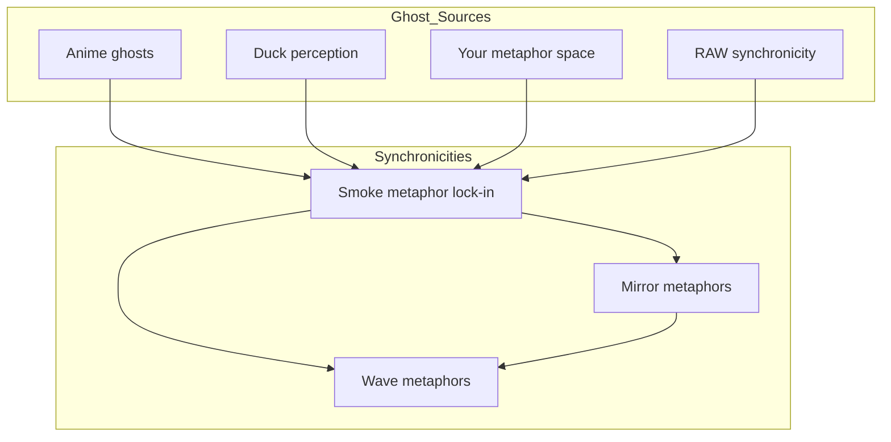

Note: Consolidated here → ../notes/diagrams/synchronicity-waves-and-web.md

Perfect — then let’s go full RAW and actually *draw the waves* so we can see the smoke condensing.

---

## **4. Sine Wave Interference — “The Curl of the Smoke”**

Here each source is a wave of meaning drifting into the field. Where they crest together, the “smoke” is dense enough to lock into a synchronicity.

💡 In a real plotted version, these four “streams” would look like sine curves sliding over each other until they *phase-lock* at the same point — the moment the metaphor becomes visible.

---

## **5. RAW-Style Synchronicity Web**

This one treats synchronicities as nodes in a network, with each connected to its “ghost sources” and to other synchronicities in the same metaphor family.

---

If you want, I can push this **even further** —
Next step would be a **statistical heatmap of ghost density** over time in the Eidolon field, so we can literally *see* the probability of a synchronicity forming. That’s where the “statistical weirdness” RAW loved becomes visible as a physics phenomenon.

Do you want me to make *that*?<!-- GENERATED-SECTIONS:DO-NOT-EDIT-BELOW -->
## Related content
- [Smoke Resonance Visualizations](smoke-resonance-visualizations.md)
- [Diagrams](chunks/diagrams.md)
- [Unique Info Dump Index](unique-info-dump-index.md)
- [Promethean_Eidolon_Synchronicity_Model](promethean-eidolon-synchronicity-model.md)
- [Ghostly Smoke Interference](ghostly-smoke-interference.md)
- [infinite_depth_smoke_animation](infinite-depth-smoke-animation.md)
- [Duck's Attractor States](ducks-attractor-states.md)
- [aionian-circuit-math](aionian-circuit-math.md)
- [archetype-ecs](archetype-ecs.md)
- [DSL](chunks/dsl.md)
- [Event Bus Projections Architecture](event-bus-projections-architecture.md)
- [Shared](chunks/shared.md)
- [Agent Tasks: Persistence Migration to DualStore](agent-tasks-persistence-migration-to-dualstore.md)
- [eidolon-node-lifecycle](eidolon-node-lifecycle.md)
## Sources
- _None_
<!-- GENERATED-SECTIONS:DO-NOT-EDIT-ABOVE -->
