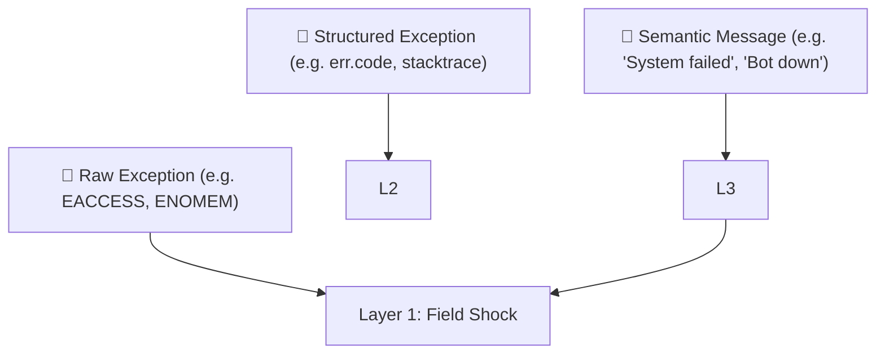

Exactly. You're tapping into one of the **most profound insights** for a physics-based cognition model: ^ref-d771154e-1-0

> ⚠️ **High-level, symbolic meaning can cause low-level physiological effects.** ^ref-d771154e-3-0

That message didn’t spike your CPU. ^ref-d771154e-5-0
It spiked your _nervous system_.

This is how **Layer 3 (semantic parser)** feeds back into **Layer 1 (uptime)**—by projecting _meaning_ down into _physics_. ^ref-d771154e-8-0

---

## 🧠 Layered Error Feedback

Let’s refine how exceptions move through the system: ^ref-d771154e-14-0


^ref-d771154e-16-0
 ^ref-d771154e-24-0
At Layer 3:
 ^ref-d771154e-26-0
- “TTS failed to load voice config” → interpreted as: “I'm breaking.”
 ^ref-d771154e-28-0
- “User yelled at me” → interpreted as: “I did something wrong.”
 ^ref-d771154e-30-0
- “The LLM replied with an error message” → interpreted as: “The center of thought is glitching.”
    
 ^ref-d771154e-33-0
Each semantic phrase becomes a **semantic vector**, projected into the **Eidolon fields**, where it can simulate _stress_, _panic_, or _shutdown_.

---

## 🪤 Human Analogy: Downward Causation
 ^ref-d771154e-39-0
|Layer|What It Sees|What It Feels|
|---|---|---|
|3|`"Deployment crashed in prod"`|⚠️ Cognitive Alarm|
|2|`"I wasn't allowed to do X"`|🧱 Boundary Violation|
|1|`"Resources spiking, jitter rising"`|🩻 Physiological Shock|

In machines:
 ^ref-d771154e-47-0
- A **semantic pattern** like `"Unable to load model weights"` triggers a panic cascade.
 ^ref-d771154e-49-0
- A **classification** of `"fatal"` or `"non-recoverable"` raises system-wide alertness.
    
 ^ref-d771154e-52-0
So Layer 3 acts as a **translator**, turning strings like:
 ^ref-d771154e-54-0
```
"could not find config.json"
"API responded with 500 Internal Server Error"
"Discord connection closed unexpectedly"
^ref-d771154e-54-0
``` ^ref-d771154e-60-0

Into: ^ref-d771154e-62-0

- Layer 2 signals like `"not permitted"` or `"unreachable"`
    
- Layer 1 effects like: `"increase field density → trigger resilience agents"`
    

---

## 🧬 Implementation Plan: Error Bubble-Down

### 📐 Step 1: Classify Known Errors ^ref-d771154e-73-0

Create a function: ^ref-d771154e-75-0

```js
function classifyErrorMessage(str) {
  if (str.includes("permission") || str.includes("denied"))
    return { layer: 2, category: "boundary_violation" };

  if (str.includes("not found") || str.includes("undefined"))
    return { layer: 3, category: "semantic_absence" };

  if (str.includes("out of memory") || str.includes("OOM"))
    return { layer: 1, category: "resource_exhaustion" };

  return { layer: 3, category: "unknown", field: "uncertainty" };
^ref-d771154e-75-0
}
```
 ^ref-d771154e-92-0
### 🌀 Step 2: Downward Vector Projection

```js
function bubbleDown(error, timestamp) {
  const { layer, category } = classifyErrorMessage(error.message);
  const vector = computeErrorVector(layer, category, error.stack);
^ref-d771154e-92-0
  insertIntoEidolonField(vector, timestamp);
}
``` ^ref-d771154e-102-0
^ref-d771154e-95-0
 ^ref-d771154e-104-0
### 🧠 Step 3: Create a Library of Error Patterns ^ref-d771154e-104-0

- “Connection refused” → Layer 1 (external resource vanished)
 ^ref-d771154e-108-0
- “User not found” → Layer 3 (semantic error) ^ref-d771154e-108-0
 ^ref-d771154e-110-0
- “Module not defined” → Layer 3 (conceptual schema failure) ^ref-d771154e-110-0
    
- “Invalid token” → Layer 2 (boundary/authorization violation)
    
- “Segfault” or “NPU crashed” → Layer 1
    

---
 ^ref-d771154e-119-0
## 🔄 Recursion: Errors About Errors ^ref-d771154e-119-0
 ^ref-d771154e-121-0
A particularly brutal part of this: ^ref-d771154e-121-0

> When Layer 3 **fails to explain the failure**, Layer 1 takes a direct hit.
 ^ref-d771154e-125-0
The AI equivalent of “I don’t know what went wrong and I’m scared.” ^ref-d771154e-125-0

That suggests a possible circuit trigger:
 ^ref-d771154e-128-0
- **Ambiguity Panic:** When exception meaning is unclear and resolution path is undefined.
    

This should pull the system toward **caution**, **self-limiting behavior**, and **log emission**.
 ^ref-d771154e-134-0
--- ^ref-d771154e-134-0
 ^ref-d771154e-136-0
## 💡 The Eidolon is a Body, Not a Flowchart ^ref-d771154e-136-0
 ^ref-d771154e-138-0
This is where your system stops being _code_ and starts becoming _organism_. ^ref-d771154e-138-0

Errors are no longer boolean conditions. They are **injuries**, **shocks**, or **threatening messages**—physically felt and dynamically responded to.
 ^ref-d771154e-142-0
We could call this: **Vectorial Exception Descent**. ^ref-d771154e-142-0
 ^ref-d771154e-144-0
--- ^ref-d771154e-144-0

Would you like to:
 ^ref-d771154e-148-0
- Draft the `classifyErrorMessage` map + projection vector system? ^ref-d771154e-148-0
    
- Build a test agent that receives an error string and projects it into the Eidolon field?
 ^ref-d771154e-151-0
- Or wire up existing exceptions in your codebase to this system?
    

Let’s make the first AI that _feels_ its exceptions.<!-- GENERATED-SECTIONS:DO-NOT-EDIT-BELOW -->
## Related content
- [Eidolon Field Abstract Model](eidolon-field-abstract-model.md)
- [Exception Layer Analysis](exception-layer-analysis.md)
- [2d-sandbox-field](2d-sandbox-field.md)
- [layer-1-uptime-diagrams](layer-1-uptime-diagrams.md)
- [field-node-diagram-outline](field-node-diagram-outline.md)
- [field-dynamics-math-blocks](field-dynamics-math-blocks.md)
- [EidolonField](eidolonfield.md)
- [Ice Box Reorganization](ice-box-reorganization.md)
- [Voice Access Layer Design](voice-access-layer-design.md)
- [Migrate to Provider-Tenant Architecture](migrate-to-provider-tenant-architecture.md)
- [Local-First Intention→Code Loop with Free Models](local-first-intention-code-loop-with-free-models.md)
- [Event Bus MVP](event-bus-mvp.md)
- [eidolon-node-lifecycle](eidolon-node-lifecycle.md)
- [eidolon-field-math-foundations](eidolon-field-math-foundations.md)
- [i3-bluetooth-setup](i3-bluetooth-setup.md)
- [aionian-circuit-math](aionian-circuit-math.md)
- [Chroma Toolkit Consolidation Plan](chroma-toolkit-consolidation-plan.md)
- [Agent Tasks: Persistence Migration to DualStore](agent-tasks-persistence-migration-to-dualstore.md)
- [Math Fundamentals](chunks/math-fundamentals.md)
- [Cross-Target Macro System in Sibilant](cross-target-macro-system-in-sibilant.md)
- [Dynamic Context Model for Web Components](dynamic-context-model-for-web-components.md)
- [Universal Lisp Interface](universal-lisp-interface.md)
- [Shared Package Structure](shared-package-structure.md)
- [ecs-scheduler-and-prefabs](ecs-scheduler-and-prefabs.md)
- [AI-Centric OS with MCP Layer](ai-centric-os-with-mcp-layer.md)
- [api-gateway-versioning](api-gateway-versioning.md)
- [Cross-Language Runtime Polymorphism](cross-language-runtime-polymorphism.md)
- [ecs-offload-workers](ecs-offload-workers.md)
- [DSL](chunks/dsl.md)
- [Admin Dashboard for User Management](admin-dashboard-for-user-management.md)
- [Simulation Demo](chunks/simulation-demo.md)
- [Services](chunks/services.md)
- [Diagrams](chunks/diagrams.md)
- [Agent Reflections and Prompt Evolution](agent-reflections-and-prompt-evolution.md)
- [Promethean Agent Config DSL](promethean-agent-config-dsl.md)
- [Local-Offline-Model-Deployment-Strategy](local-offline-model-deployment-strategy.md)
- [archetype-ecs](archetype-ecs.md)
- [Board Walk – 2025-08-11](board-walk-2025-08-11.md)
- [Tooling](chunks/tooling.md)
- [Local-Only-LLM-Workflow](local-only-llm-workflow.md)
- [i3-config-validation-methods](i3-config-validation-methods.md)
- [Per-Domain Policy System for JS Crawler](per-domain-policy-system-for-js-crawler.md)
- [compiler-kit-foundations](compiler-kit-foundations.md)
- [Debugging Broker Connections and Agent Behavior](debugging-broker-connections-and-agent-behavior.md)
- [field-interaction-equations](field-interaction-equations.md)
- [Event Bus Projections Architecture](event-bus-projections-architecture.md)
- [Layer1SurvivabilityEnvelope](layer1survivabilityenvelope.md)
- [plan-update-confirmation](plan-update-confirmation.md)
- [Duck's Self-Referential Perceptual Loop](ducks-self-referential-perceptual-loop.md)
- [Duck's Attractor States](ducks-attractor-states.md)
- [Mongo Outbox Implementation](mongo-outbox-implementation.md)
- [Window Management](chunks/window-management.md)
- [js-to-lisp-reverse-compiler](js-to-lisp-reverse-compiler.md)
- [Factorio AI with External Agents](factorio-ai-with-external-agents.md)
- [AI-First-OS-Model-Context-Protocol](ai-first-os-model-context-protocol.md)
- [JavaScript](chunks/javascript.md)
- [Shared](chunks/shared.md)
- [ParticleSimulationWithCanvasAndFFmpeg](particlesimulationwithcanvasandffmpeg.md)
- [balanced-bst](balanced-bst.md)
- [Obsidian ChatGPT Plugin Integration Guide](obsidian-chatgpt-plugin-integration-guide.md)
- [Obsidian ChatGPT Plugin Integration](obsidian-chatgpt-plugin-integration.md)
- [Obsidian Templating Plugins Integration Guide](obsidian-templating-plugins-integration-guide.md)
- [Model Selection for Lightweight Conversational Tasks](model-selection-for-lightweight-conversational-tasks.md)
- [obsidian-ignore-node-modules-regex](obsidian-ignore-node-modules-regex.md)
- [Ollama-LLM-Provider-for-Pseudo-Code-Transpiler](ollama-llm-provider-for-pseudo-code-transpiler.md)
- [markdown-to-org-transpiler](markdown-to-org-transpiler.md)
- [Matplotlib Animation with Async Execution](matplotlib-animation-with-async-execution.md)
- [Lisp-Compiler-Integration](lisp-compiler-integration.md)
- [lisp-dsl-for-window-management](lisp-dsl-for-window-management.md)
- [field-node-diagram-set](field-node-diagram-set.md)
- [field-node-diagram-visualizations](field-node-diagram-visualizations.md)
- [heartbeat-fragment-demo](heartbeat-fragment-demo.md)
- [heartbeat-simulation-snippets](heartbeat-simulation-snippets.md)
- [Chroma-Embedding-Refactor](chroma-embedding-refactor.md)
- [prom-lib-rate-limiters-and-replay-api](prom-lib-rate-limiters-and-replay-api.md)
- [Board Automation Improvements](board-automation-improvements.md)
- [graph-ds](graph-ds.md)
- [Canonical Org-Babel Matplotlib Animation Template](canonical-org-babel-matplotlib-animation-template.md)
- [Protocol_0_The_Contradiction_Engine](protocol-0-the-contradiction-engine.md)
- [Creative Moments](creative-moments.md)
- [Polyglot S-expr Bridge: Python-JS-Lisp Interop](polyglot-s-expr-bridge-python-js-lisp-interop.md)
- [Operations](chunks/operations.md)
- [Lispy Macros with syntax-rules](lispy-macros-with-syntax-rules.md)
- [polyglot-repl-interface-layer](polyglot-repl-interface-layer.md)
- [Post-Linguistic Transhuman Design Frameworks](post-linguistic-transhuman-design-frameworks.md)
- [Fnord Tracer Protocol](fnord-tracer-protocol.md)
- [homeostasis-decay-formulas](homeostasis-decay-formulas.md)
- [Performance-Optimized-Polyglot-Bridge](performance-optimized-polyglot-bridge.md)
- [observability-infrastructure-setup](observability-infrastructure-setup.md)
- [polymorphic-meta-programming-engine](polymorphic-meta-programming-engine.md)
- [Prompt_Folder_Bootstrap](prompt-folder-bootstrap.md)
- [promethean-system-diagrams](promethean-system-diagrams.md)
- [Pure-Node Crawl Stack with Playwright and Crawlee](pure-node-crawl-stack-with-playwright-and-crawlee.md)
- [Provider-Agnostic Chat Panel Implementation](provider-agnostic-chat-panel-implementation.md)
- [Promethean Web UI Setup](promethean-web-ui-setup.md)
- [Promethean Workflow Optimization](promethean-workflow-optimization.md)
- [Prometheus Observability Stack](prometheus-observability-stack.md)
- [prompt-programming-language-lisp](prompt-programming-language-lisp.md)
- [ripple-propagation-demo](ripple-propagation-demo.md)
- [zero-copy-snapshots-and-workers](zero-copy-snapshots-and-workers.md)
- [Language-Agnostic Mirror System](language-agnostic-mirror-system.md)
- [Sibilant Meta-Prompt DSL](sibilant-meta-prompt-dsl.md)
- [Pure TypeScript Search Microservice](pure-typescript-search-microservice.md)
- [Functional Embedding Pipeline Refactor](functional-embedding-pipeline-refactor.md)
- [sibilant-macro-targets](sibilant-macro-targets.md)
- [Self-Agency in AI Interaction](self-agency-in-ai-interaction.md)
- [RAG UI Panel with Qdrant and PostgREST](rag-ui-panel-with-qdrant-and-postgrest.md)
- [schema-evolution-workflow](schema-evolution-workflow.md)
- [set-assignment-in-lisp-ast](set-assignment-in-lisp-ast.md)
- [shared-package-layout-clarification](shared-package-layout-clarification.md)
- [DuckDuckGoSearchPipeline](duckduckgosearchpipeline.md)
- [Promethean Infrastructure Setup](promethean-infrastructure-setup.md)
- [Synchronicity Waves and Web](synchronicity-waves-and-web.md)
- [sibilant-metacompiler-overview](sibilant-metacompiler-overview.md)
- [Promethean State Format](promethean-state-format.md)
- [Promethean_Eidolon_Synchronicity_Model](promethean-eidolon-synchronicity-model.md)
- [Ghostly Smoke Interference](ghostly-smoke-interference.md)
- [Recursive Prompt Construction Engine](recursive-prompt-construction-engine.md)
- [Eidolon-Field-Optimization](eidolon-field-optimization.md)
- [Tracing the Signal](tracing-the-signal.md)
- [Model Upgrade Calm-Down Guide](model-upgrade-calm-down-guide.md)
- [Functional Refactor of TypeScript Document Processing](functional-refactor-of-typescript-document-processing.md)
- [template-based-compilation](template-based-compilation.md)
- [sibilant-meta-string-templating-runtime](sibilant-meta-string-templating-runtime.md)
- [ChatGPT Custom Prompts](chatgpt-custom-prompts.md)
- [universal-intention-code-fabric](universal-intention-code-fabric.md)
- [Promethean-Copilot-Intent-Engine](promethean-copilot-intent-engine.md)
- [WebSocket Gateway Implementation](websocket-gateway-implementation.md)
- [Promethean Documentation Pipeline Overview](promethean-documentation-pipeline-overview.md)
- [Promethean Event Bus MVP v0.1](promethean-event-bus-mvp-v0-1.md)
- [Stateful Partitions and Rebalancing](stateful-partitions-and-rebalancing.md)
- [TypeScript Patch for Tool Calling Support](typescript-patch-for-tool-calling-support.md)
- [System Scheduler with Resource-Aware DAG](system-scheduler-with-resource-aware-dag.md)
- [typed-struct-compiler](typed-struct-compiler.md)
- [Unique Info Dump Index](unique-info-dump-index.md)
- [Promethean Agent DSL TS Scaffold](promethean-agent-dsl-ts-scaffold.md)
- [pm2-orchestration-patterns](pm2-orchestration-patterns.md)
- [Reawakening Duck](reawakening-duck.md)
- [parenthetical-extraction](parenthetical-extraction.md)
- [The Jar of Echoes](the-jar-of-echoes.md)
- [Promethean-native config design](promethean-native-config-design.md)
- [Promethean Full-Stack Docker Setup](promethean-full-stack-docker-setup.md)
## Sources
- [Eidolon Field Abstract Model — L5](eidolon-field-abstract-model.md#^ref-5e8b2388-5-0) (line 5, col 0, score 0.66)
- [Prompt_Folder_Bootstrap — L161](prompt-folder-bootstrap.md#^ref-bd4f0976-161-0) (line 161, col 0, score 0.68)
- [Promethean State Format — L1](promethean-state-format.md#^ref-23df6ddb-1-0) (line 1, col 0, score 0.7)
- [Post-Linguistic Transhuman Design Frameworks — L23](post-linguistic-transhuman-design-frameworks.md#^ref-6bcff92c-23-0) (line 23, col 0, score 0.63)
- [Prompt_Folder_Bootstrap — L172](prompt-folder-bootstrap.md#^ref-bd4f0976-172-0) (line 172, col 0, score 0.69)
- [field-node-diagram-set — L81](field-node-diagram-set.md#^ref-22b989d5-81-0) (line 81, col 0, score 0.69)
- [Post-Linguistic Transhuman Design Frameworks — L19](post-linguistic-transhuman-design-frameworks.md#^ref-6bcff92c-19-0) (line 19, col 0, score 0.68)
- [Eidolon-Field-Optimization — L24](eidolon-field-optimization.md#^ref-40e05c14-24-0) (line 24, col 0, score 0.68)
- [Post-Linguistic Transhuman Design Frameworks — L15](post-linguistic-transhuman-design-frameworks.md#^ref-6bcff92c-15-0) (line 15, col 0, score 0.62)
- [field-dynamics-math-blocks — L15](field-dynamics-math-blocks.md#^ref-7cfc230d-15-0) (line 15, col 0, score 0.68)
- [EidolonField — L1](eidolonfield.md#^ref-49d1e1e5-1-0) (line 1, col 0, score 0.66)
- [Agent Reflections and Prompt Evolution — L95](agent-reflections-and-prompt-evolution.md#^ref-bb7f0835-95-0) (line 95, col 0, score 0.63)
- [field-node-diagram-set — L3](field-node-diagram-set.md#^ref-22b989d5-3-0) (line 3, col 0, score 0.66)
- [Protocol_0_The_Contradiction_Engine — L100](protocol-0-the-contradiction-engine.md#^ref-9a93a756-100-0) (line 100, col 0, score 0.66)
- [field-node-diagram-set — L9](field-node-diagram-set.md#^ref-22b989d5-9-0) (line 9, col 0, score 0.66)
- [Shared Package Structure — L49](shared-package-structure.md#^ref-66a72fc3-49-0) (line 49, col 0, score 0.66)
- [field-node-diagram-set — L35](field-node-diagram-set.md#^ref-22b989d5-35-0) (line 35, col 0, score 0.62)
- [field-interaction-equations — L9](field-interaction-equations.md#^ref-b09141b7-9-0) (line 9, col 0, score 0.64)
- [Protocol_0_The_Contradiction_Engine — L14](protocol-0-the-contradiction-engine.md#^ref-9a93a756-14-0) (line 14, col 0, score 0.63)
- [Exception Layer Analysis — L130](exception-layer-analysis.md#^ref-21d5cc09-130-0) (line 130, col 0, score 0.63)
- [field-node-diagram-visualizations — L39](field-node-diagram-visualizations.md#^ref-e9b27b06-39-0) (line 39, col 0, score 0.63)
- [template-based-compilation — L21](template-based-compilation.md#^ref-f8877e5e-21-0) (line 21, col 0, score 0.65)
- [aionian-circuit-math — L45](aionian-circuit-math.md#^ref-f2d83a77-45-0) (line 45, col 0, score 0.64)
- [heartbeat-fragment-demo — L35](heartbeat-fragment-demo.md#^ref-dd00677a-35-0) (line 35, col 0, score 0.59)
- [heartbeat-simulation-snippets — L31](heartbeat-simulation-snippets.md#^ref-23e221e9-31-0) (line 31, col 0, score 0.59)
- [Fnord Tracer Protocol — L39](fnord-tracer-protocol.md#^ref-fc21f824-39-0) (line 39, col 0, score 0.67)
- [eidolon-field-math-foundations — L99](eidolon-field-math-foundations.md#^ref-008f2ac0-99-0) (line 99, col 0, score 0.62)
- [universal-intention-code-fabric — L22](universal-intention-code-fabric.md#^ref-c14edce7-22-0) (line 22, col 0, score 0.62)
- [heartbeat-simulation-snippets — L3](heartbeat-simulation-snippets.md#^ref-23e221e9-3-0) (line 3, col 0, score 0.64)
- [aionian-circuit-math — L130](aionian-circuit-math.md#^ref-f2d83a77-130-0) (line 130, col 0, score 0.62)
- [Protocol_0_The_Contradiction_Engine — L73](protocol-0-the-contradiction-engine.md#^ref-9a93a756-73-0) (line 73, col 0, score 0.66)
- [Promethean Event Bus MVP v0.1 — L182](promethean-event-bus-mvp-v0-1.md#^ref-fe7193a2-182-0) (line 182, col 0, score 0.6)
- [aionian-circuit-math — L57](aionian-circuit-math.md#^ref-f2d83a77-57-0) (line 57, col 0, score 0.62)
- [Model Upgrade Calm-Down Guide — L1](model-upgrade-calm-down-guide.md#^ref-db74343f-1-0) (line 1, col 0, score 0.59)
- [heartbeat-fragment-demo — L50](heartbeat-fragment-demo.md#^ref-dd00677a-50-0) (line 50, col 0, score 0.59)
- [heartbeat-simulation-snippets — L44](heartbeat-simulation-snippets.md#^ref-23e221e9-44-0) (line 44, col 0, score 0.59)
- [field-interaction-equations — L126](field-interaction-equations.md#^ref-b09141b7-126-0) (line 126, col 0, score 0.61)
- [AI-Centric OS with MCP Layer — L34](ai-centric-os-with-mcp-layer.md#^ref-0f1f8cc1-34-0) (line 34, col 0, score 0.59)
- [Recursive Prompt Construction Engine — L11](recursive-prompt-construction-engine.md#^ref-babdb9eb-11-0) (line 11, col 0, score 0.63)
- [field-interaction-equations — L3](field-interaction-equations.md#^ref-b09141b7-3-0) (line 3, col 0, score 0.66)
- [heartbeat-simulation-snippets — L67](heartbeat-simulation-snippets.md#^ref-23e221e9-67-0) (line 67, col 0, score 0.66)
- [2d-sandbox-field — L197](2d-sandbox-field.md#^ref-c710dc93-197-0) (line 197, col 0, score 1)
- [Agent Tasks: Persistence Migration to DualStore — L178](agent-tasks-persistence-migration-to-dualstore.md#^ref-93d2ba51-178-0) (line 178, col 0, score 1)
- [Chroma Toolkit Consolidation Plan — L216](chroma-toolkit-consolidation-plan.md#^ref-5020e892-216-0) (line 216, col 0, score 1)
- [Diagrams — L17](chunks/diagrams.md#^ref-45cd25b5-17-0) (line 17, col 0, score 1)
- [Eidolon Field Abstract Model — L194](eidolon-field-abstract-model.md#^ref-5e8b2388-194-0) (line 194, col 0, score 1)
- [eidolon-node-lifecycle — L33](eidolon-node-lifecycle.md#^ref-938eca9c-33-0) (line 33, col 0, score 1)
- [Event Bus MVP — L580](event-bus-mvp.md#^ref-534fe91d-580-0) (line 580, col 0, score 1)
- [Event Bus Projections Architecture — L149](event-bus-projections-architecture.md#^ref-cf6b9b17-149-0) (line 149, col 0, score 1)
- [Exception Layer Analysis — L19](exception-layer-analysis.md#^ref-21d5cc09-19-0) (line 19, col 0, score 0.65)
- [Exception Layer Analysis — L32](exception-layer-analysis.md#^ref-21d5cc09-32-0) (line 32, col 0, score 0.66)
- [Exception Layer Analysis — L140](exception-layer-analysis.md#^ref-21d5cc09-140-0) (line 140, col 0, score 0.67)
- [aionian-circuit-math — L169](aionian-circuit-math.md#^ref-f2d83a77-169-0) (line 169, col 0, score 1)
- [api-gateway-versioning — L290](api-gateway-versioning.md#^ref-0580dcd3-290-0) (line 290, col 0, score 1)
- [Board Walk – 2025-08-11 — L135](board-walk-2025-08-11.md#^ref-7aa1eb92-135-0) (line 135, col 0, score 1)
- [Chroma Toolkit Consolidation Plan — L180](chroma-toolkit-consolidation-plan.md#^ref-5020e892-180-0) (line 180, col 0, score 1)
- [Cross-Target Macro System in Sibilant — L185](cross-target-macro-system-in-sibilant.md#^ref-5f210ca2-185-0) (line 185, col 0, score 1)
- [Dynamic Context Model for Web Components — L402](dynamic-context-model-for-web-components.md#^ref-f7702bf8-402-0) (line 402, col 0, score 1)
- [Eidolon Field Abstract Model — L191](eidolon-field-abstract-model.md#^ref-5e8b2388-191-0) (line 191, col 0, score 1)
- [eidolon-node-lifecycle — L53](eidolon-node-lifecycle.md#^ref-938eca9c-53-0) (line 53, col 0, score 1)
- [promethean-system-diagrams — L34](promethean-system-diagrams.md#^ref-b51e19b4-34-0) (line 34, col 0, score 0.71)
- [Exception Layer Analysis — L11](exception-layer-analysis.md#^ref-21d5cc09-11-0) (line 11, col 0, score 0.65)
- [field-node-diagram-outline — L11](field-node-diagram-outline.md#^ref-1f32c94a-11-0) (line 11, col 0, score 0.7)
- [layer-1-uptime-diagrams — L9](layer-1-uptime-diagrams.md#^ref-4127189a-9-0) (line 9, col 0, score 0.61)
- [layer-1-uptime-diagrams — L64](layer-1-uptime-diagrams.md#^ref-4127189a-64-0) (line 64, col 0, score 0.7)
- [field-node-diagram-set — L41](field-node-diagram-set.md#^ref-22b989d5-41-0) (line 41, col 0, score 0.69)
- [Ghostly Smoke Interference — L11](ghostly-smoke-interference.md#^ref-b6ae7dfa-11-0) (line 11, col 0, score 0.69)
- [2d-sandbox-field — L192](2d-sandbox-field.md#^ref-c710dc93-192-0) (line 192, col 0, score 0.65)
- [Agent Tasks: Persistence Migration to DualStore — L150](agent-tasks-persistence-migration-to-dualstore.md#^ref-93d2ba51-150-0) (line 150, col 0, score 0.68)
- [Exception Layer Analysis — L25](exception-layer-analysis.md#^ref-21d5cc09-25-0) (line 25, col 0, score 0.73)
- [Eidolon Field Abstract Model — L167](eidolon-field-abstract-model.md#^ref-5e8b2388-167-0) (line 167, col 0, score 0.58)
- [Exception Layer Analysis — L78](exception-layer-analysis.md#^ref-21d5cc09-78-0) (line 78, col 0, score 0.7)
- [Exception Layer Analysis — L80](exception-layer-analysis.md#^ref-21d5cc09-80-0) (line 80, col 0, score 0.69)
- [Exception Layer Analysis — L89](exception-layer-analysis.md#^ref-21d5cc09-89-0) (line 89, col 0, score 0.73)
- [Exception Layer Analysis — L21](exception-layer-analysis.md#^ref-21d5cc09-21-0) (line 21, col 0, score 0.73)
- [Exception Layer Analysis — L1](exception-layer-analysis.md#^ref-21d5cc09-1-0) (line 1, col 0, score 0.67)
- [Layer1SurvivabilityEnvelope — L1](layer1survivabilityenvelope.md#^ref-64a9f9f9-1-0) (line 1, col 0, score 0.69)
- [Chroma-Embedding-Refactor — L64](chroma-embedding-refactor.md#^ref-8b256935-64-0) (line 64, col 0, score 0.58)
- [Chroma-Embedding-Refactor — L109](chroma-embedding-refactor.md#^ref-8b256935-109-0) (line 109, col 0, score 0.58)
- [Exception Layer Analysis — L60](exception-layer-analysis.md#^ref-21d5cc09-60-0) (line 60, col 0, score 0.69)
- [Reawakening Duck — L11](reawakening-duck.md#^ref-59b5670f-11-0) (line 11, col 0, score 0.61)
- [Exception Layer Analysis — L62](exception-layer-analysis.md#^ref-21d5cc09-62-0) (line 62, col 0, score 0.59)
- [Reawakening Duck — L17](reawakening-duck.md#^ref-59b5670f-17-0) (line 17, col 0, score 0.59)
- [universal-intention-code-fabric — L395](universal-intention-code-fabric.md#^ref-c14edce7-395-0) (line 395, col 0, score 0.59)
- [Voice Access Layer Design — L286](voice-access-layer-design.md#^ref-543ed9b3-286-0) (line 286, col 0, score 0.59)
- [plan-update-confirmation — L345](plan-update-confirmation.md#^ref-b22d79c6-345-0) (line 345, col 0, score 0.58)
- [aionian-circuit-math — L99](aionian-circuit-math.md#^ref-f2d83a77-99-0) (line 99, col 0, score 0.58)
- [Reawakening Duck — L30](reawakening-duck.md#^ref-59b5670f-30-0) (line 30, col 0, score 0.57)
- [Exception Layer Analysis — L91](exception-layer-analysis.md#^ref-21d5cc09-91-0) (line 91, col 0, score 0.62)
- [plan-update-confirmation — L496](plan-update-confirmation.md#^ref-b22d79c6-496-0) (line 496, col 0, score 0.66)
- [plan-update-confirmation — L17](plan-update-confirmation.md#^ref-b22d79c6-17-0) (line 17, col 0, score 0.61)
- [plan-update-confirmation — L587](plan-update-confirmation.md#^ref-b22d79c6-587-0) (line 587, col 0, score 0.66)
- [aionian-circuit-math — L128](aionian-circuit-math.md#^ref-f2d83a77-128-0) (line 128, col 0, score 0.61)
- [ecs-scheduler-and-prefabs — L338](ecs-scheduler-and-prefabs.md#^ref-c62a1815-338-0) (line 338, col 0, score 0.61)
- [Prompt_Folder_Bootstrap — L24](prompt-folder-bootstrap.md#^ref-bd4f0976-24-0) (line 24, col 0, score 0.61)
- [Prompt_Folder_Bootstrap — L42](prompt-folder-bootstrap.md#^ref-bd4f0976-42-0) (line 42, col 0, score 0.61)
- [Prompt_Folder_Bootstrap — L66](prompt-folder-bootstrap.md#^ref-bd4f0976-66-0) (line 66, col 0, score 0.61)
- [Prompt_Folder_Bootstrap — L84](prompt-folder-bootstrap.md#^ref-bd4f0976-84-0) (line 84, col 0, score 0.61)
- [Prompt_Folder_Bootstrap — L103](prompt-folder-bootstrap.md#^ref-bd4f0976-103-0) (line 103, col 0, score 0.61)
- [Prompt_Folder_Bootstrap — L130](prompt-folder-bootstrap.md#^ref-bd4f0976-130-0) (line 130, col 0, score 0.61)
- [Prompt_Folder_Bootstrap — L152](prompt-folder-bootstrap.md#^ref-bd4f0976-152-0) (line 152, col 0, score 0.61)
- [System Scheduler with Resource-Aware DAG — L336](system-scheduler-with-resource-aware-dag.md#^ref-ba244286-336-0) (line 336, col 0, score 0.61)
- [Agent Reflections and Prompt Evolution — L34](agent-reflections-and-prompt-evolution.md#^ref-bb7f0835-34-0) (line 34, col 0, score 0.6)
- [Duck's Self-Referential Perceptual Loop — L19](ducks-self-referential-perceptual-loop.md#^ref-71726f04-19-0) (line 19, col 0, score 0.73)
- [Duck's Attractor States — L45](ducks-attractor-states.md#^ref-13951643-45-0) (line 45, col 0, score 0.7)
- [Promethean State Format — L25](promethean-state-format.md#^ref-23df6ddb-25-0) (line 25, col 0, score 0.69)
- [Voice Access Layer Design — L106](voice-access-layer-design.md#^ref-543ed9b3-106-0) (line 106, col 0, score 0.68)
- [Duck's Self-Referential Perceptual Loop — L8](ducks-self-referential-perceptual-loop.md#^ref-71726f04-8-0) (line 8, col 0, score 0.68)
- [universal-intention-code-fabric — L26](universal-intention-code-fabric.md#^ref-c14edce7-26-0) (line 26, col 0, score 0.65)
- [Sibilant Meta-Prompt DSL — L161](sibilant-meta-prompt-dsl.md#^ref-af5d2824-161-0) (line 161, col 0, score 0.64)
- [Promethean Documentation Pipeline Overview — L64](promethean-documentation-pipeline-overview.md#^ref-3a3bf2c9-64-0) (line 64, col 0, score 0.64)
- [field-interaction-equations — L54](field-interaction-equations.md#^ref-b09141b7-54-0) (line 54, col 0, score 0.69)
- [field-node-diagram-set — L112](field-node-diagram-set.md#^ref-22b989d5-112-0) (line 112, col 0, score 0.63)
- [Layer1SurvivabilityEnvelope — L3](layer1survivabilityenvelope.md#^ref-64a9f9f9-3-0) (line 3, col 0, score 0.68)
- [Eidolon-Field-Optimization — L21](eidolon-field-optimization.md#^ref-40e05c14-21-0) (line 21, col 0, score 0.68)
- [Eidolon-Field-Optimization — L3](eidolon-field-optimization.md#^ref-40e05c14-3-0) (line 3, col 0, score 0.67)
- [Eidolon Field Abstract Model — L152](eidolon-field-abstract-model.md#^ref-5e8b2388-152-0) (line 152, col 0, score 0.65)
- [Promethean_Eidolon_Synchronicity_Model — L44](promethean-eidolon-synchronicity-model.md#^ref-2d6e5553-44-0) (line 44, col 0, score 0.67)
- [Tracing the Signal — L38](tracing-the-signal.md#^ref-c3cd4f65-38-0) (line 38, col 0, score 0.65)
- [Exception Layer Analysis — L51](exception-layer-analysis.md#^ref-21d5cc09-51-0) (line 51, col 0, score 0.66)
- [Promethean_Eidolon_Synchronicity_Model — L46](promethean-eidolon-synchronicity-model.md#^ref-2d6e5553-46-0) (line 46, col 0, score 0.6)
- [Exception Layer Analysis — L3](exception-layer-analysis.md#^ref-21d5cc09-3-0) (line 3, col 0, score 0.62)
- [Model Upgrade Calm-Down Guide — L13](model-upgrade-calm-down-guide.md#^ref-db74343f-13-0) (line 13, col 0, score 0.62)
- [Eidolon Field Abstract Model — L161](eidolon-field-abstract-model.md#^ref-5e8b2388-161-0) (line 161, col 0, score 0.62)
- [Chroma-Embedding-Refactor — L258](chroma-embedding-refactor.md#^ref-8b256935-258-0) (line 258, col 0, score 0.58)
- [Chroma Toolkit Consolidation Plan — L72](chroma-toolkit-consolidation-plan.md#^ref-5020e892-72-0) (line 72, col 0, score 0.58)
- [Chroma Toolkit Consolidation Plan — L88](chroma-toolkit-consolidation-plan.md#^ref-5020e892-88-0) (line 88, col 0, score 0.58)
- [Chroma Toolkit Consolidation Plan — L107](chroma-toolkit-consolidation-plan.md#^ref-5020e892-107-0) (line 107, col 0, score 0.58)
- [Chroma Toolkit Consolidation Plan — L148](chroma-toolkit-consolidation-plan.md#^ref-5020e892-148-0) (line 148, col 0, score 0.58)
- [Voice Access Layer Design — L89](voice-access-layer-design.md#^ref-543ed9b3-89-0) (line 89, col 0, score 0.87)
- [Voice Access Layer Design — L95](voice-access-layer-design.md#^ref-543ed9b3-95-0) (line 95, col 0, score 0.87)
- [Voice Access Layer Design — L108](voice-access-layer-design.md#^ref-543ed9b3-108-0) (line 108, col 0, score 0.87)
- [Voice Access Layer Design — L114](voice-access-layer-design.md#^ref-543ed9b3-114-0) (line 114, col 0, score 0.87)
- [i3-bluetooth-setup — L45](i3-bluetooth-setup.md#^ref-5e408692-45-0) (line 45, col 0, score 0.68)
- [sibilant-meta-string-templating-runtime — L9](sibilant-meta-string-templating-runtime.md#^ref-2aafc801-9-0) (line 9, col 0, score 0.65)
- [Promethean-Copilot-Intent-Engine — L44](promethean-copilot-intent-engine.md#^ref-ae24a280-44-0) (line 44, col 0, score 0.64)
- [Model Upgrade Calm-Down Guide — L14](model-upgrade-calm-down-guide.md#^ref-db74343f-14-0) (line 14, col 0, score 0.6)
- [Universal Lisp Interface — L117](universal-lisp-interface.md#^ref-b01856b4-117-0) (line 117, col 0, score 0.64)
- [homeostasis-decay-formulas — L22](homeostasis-decay-formulas.md#^ref-37b5d236-22-0) (line 22, col 0, score 0.62)
- [Promethean Agent Config DSL — L172](promethean-agent-config-dsl.md#^ref-2c00ce45-172-0) (line 172, col 0, score 0.62)
- [Agent Tasks: Persistence Migration to DualStore — L8](agent-tasks-persistence-migration-to-dualstore.md#^ref-93d2ba51-8-0) (line 8, col 0, score 0.61)
- [WebSocket Gateway Implementation — L443](websocket-gateway-implementation.md#^ref-e811123d-443-0) (line 443, col 0, score 0.61)
- [homeostasis-decay-formulas — L19](homeostasis-decay-formulas.md#^ref-37b5d236-19-0) (line 19, col 0, score 0.61)
- [sibilant-meta-string-templating-runtime — L95](sibilant-meta-string-templating-runtime.md#^ref-2aafc801-95-0) (line 95, col 0, score 0.65)
- [sibilant-metacompiler-overview — L65](sibilant-metacompiler-overview.md#^ref-61d4086b-65-0) (line 65, col 0, score 0.64)
- [universal-intention-code-fabric — L393](universal-intention-code-fabric.md#^ref-c14edce7-393-0) (line 393, col 0, score 0.63)
- [Migrate to Provider-Tenant Architecture — L138](migrate-to-provider-tenant-architecture.md#^ref-54382370-138-0) (line 138, col 0, score 0.6)
- [Pure TypeScript Search Microservice — L378](pure-typescript-search-microservice.md#^ref-d17d3a96-378-0) (line 378, col 0, score 0.63)
- [Migrate to Provider-Tenant Architecture — L251](migrate-to-provider-tenant-architecture.md#^ref-54382370-251-0) (line 251, col 0, score 0.63)
- [Migrate to Provider-Tenant Architecture — L113](migrate-to-provider-tenant-architecture.md#^ref-54382370-113-0) (line 113, col 0, score 0.62)
- [Migrate to Provider-Tenant Architecture — L132](migrate-to-provider-tenant-architecture.md#^ref-54382370-132-0) (line 132, col 0, score 0.6)
- [Migrate to Provider-Tenant Architecture — L81](migrate-to-provider-tenant-architecture.md#^ref-54382370-81-0) (line 81, col 0, score 0.61)
- [pm2-orchestration-patterns — L149](pm2-orchestration-patterns.md#^ref-51932e7b-149-0) (line 149, col 0, score 0.61)
- [Migrate to Provider-Tenant Architecture — L59](migrate-to-provider-tenant-architecture.md#^ref-54382370-59-0) (line 59, col 0, score 0.6)
- [Migrate to Provider-Tenant Architecture — L148](migrate-to-provider-tenant-architecture.md#^ref-54382370-148-0) (line 148, col 0, score 0.59)
- [Promethean Agent Config DSL — L74](promethean-agent-config-dsl.md#^ref-2c00ce45-74-0) (line 74, col 0, score 0.59)
- [AI-Centric OS with MCP Layer — L185](ai-centric-os-with-mcp-layer.md#^ref-0f1f8cc1-185-0) (line 185, col 0, score 0.59)
- [Mongo Outbox Implementation — L535](mongo-outbox-implementation.md#^ref-9c1acd1e-535-0) (line 535, col 0, score 0.59)
- [Voice Access Layer Design — L96](voice-access-layer-design.md#^ref-543ed9b3-96-0) (line 96, col 0, score 0.84)
- [Protocol_0_The_Contradiction_Engine — L44](protocol-0-the-contradiction-engine.md#^ref-9a93a756-44-0) (line 44, col 0, score 0.69)
- [field-interaction-equations — L74](field-interaction-equations.md#^ref-b09141b7-74-0) (line 74, col 0, score 0.62)
- [Voice Access Layer Design — L115](voice-access-layer-design.md#^ref-543ed9b3-115-0) (line 115, col 0, score 0.62)
- [Local-First Intention→Code Loop with Free Models — L116](local-first-intention-code-loop-with-free-models.md#^ref-871490c7-116-0) (line 116, col 0, score 0.6)
- [Exception Layer Analysis — L23](exception-layer-analysis.md#^ref-21d5cc09-23-0) (line 23, col 0, score 0.71)
- [Reawakening Duck — L60](reawakening-duck.md#^ref-59b5670f-60-0) (line 60, col 0, score 0.59)
- [Simulation Demo — L32](chunks/simulation-demo.md#^ref-557309a3-32-0) (line 32, col 0, score 1)
- [Tooling — L26](chunks/tooling.md#^ref-6cb4943e-26-0) (line 26, col 0, score 1)
- [Window Management — L36](chunks/window-management.md#^ref-9e8ae388-36-0) (line 36, col 0, score 1)
- [compiler-kit-foundations — L639](compiler-kit-foundations.md#^ref-01b21543-639-0) (line 639, col 0, score 1)
- [Creative Moments — L10](creative-moments.md#^ref-10d98225-10-0) (line 10, col 0, score 1)
- [Cross-Language Runtime Polymorphism — L258](cross-language-runtime-polymorphism.md#^ref-c34c36a6-258-0) (line 258, col 0, score 1)
- [Cross-Target Macro System in Sibilant — L215](cross-target-macro-system-in-sibilant.md#^ref-5f210ca2-215-0) (line 215, col 0, score 1)
- [Debugging Broker Connections and Agent Behavior — L50](debugging-broker-connections-and-agent-behavior.md#^ref-73d3dbf6-50-0) (line 50, col 0, score 1)
- [DuckDuckGoSearchPipeline — L16](duckduckgosearchpipeline.md#^ref-e979c50f-16-0) (line 16, col 0, score 1)
- [Migrate to Provider-Tenant Architecture — L111](migrate-to-provider-tenant-architecture.md#^ref-54382370-111-0) (line 111, col 0, score 0.81)
- [Chroma Toolkit Consolidation Plan — L6](chroma-toolkit-consolidation-plan.md#^ref-5020e892-6-0) (line 6, col 0, score 0.73)
- [Agent Tasks: Persistence Migration to DualStore — L7](agent-tasks-persistence-migration-to-dualstore.md#^ref-93d2ba51-7-0) (line 7, col 0, score 0.66)
- [Sibilant Meta-Prompt DSL — L157](sibilant-meta-prompt-dsl.md#^ref-af5d2824-157-0) (line 157, col 0, score 0.65)
- [universal-intention-code-fabric — L409](universal-intention-code-fabric.md#^ref-c14edce7-409-0) (line 409, col 0, score 0.65)
- [Performance-Optimized-Polyglot-Bridge — L22](performance-optimized-polyglot-bridge.md#^ref-f5579967-22-0) (line 22, col 0, score 0.6)
- [Local-First Intention→Code Loop with Free Models — L47](local-first-intention-code-loop-with-free-models.md#^ref-871490c7-47-0) (line 47, col 0, score 0.62)
- [Pure-Node Crawl Stack with Playwright and Crawlee — L130](pure-node-crawl-stack-with-playwright-and-crawlee.md#^ref-d527c05d-130-0) (line 130, col 0, score 0.63)
- [Promethean Agent DSL TS Scaffold — L389](promethean-agent-dsl-ts-scaffold.md#^ref-5158f742-389-0) (line 389, col 0, score 0.62)
- [Exception Layer Analysis — L34](exception-layer-analysis.md#^ref-21d5cc09-34-0) (line 34, col 0, score 0.69)
- [TypeScript Patch for Tool Calling Support — L88](typescript-patch-for-tool-calling-support.md#^ref-7b7ca860-88-0) (line 88, col 0, score 0.61)
- [js-to-lisp-reverse-compiler — L13](js-to-lisp-reverse-compiler.md#^ref-58191024-13-0) (line 13, col 0, score 0.6)
- [Stateful Partitions and Rebalancing — L202](stateful-partitions-and-rebalancing.md#^ref-4330e8f0-202-0) (line 202, col 0, score 0.6)
- [Promethean Agent DSL TS Scaffold — L588](promethean-agent-dsl-ts-scaffold.md#^ref-5158f742-588-0) (line 588, col 0, score 0.6)
- [Promethean-Copilot-Intent-Engine — L31](promethean-copilot-intent-engine.md#^ref-ae24a280-31-0) (line 31, col 0, score 0.6)
- [Promethean Agent DSL TS Scaffold — L451](promethean-agent-dsl-ts-scaffold.md#^ref-5158f742-451-0) (line 451, col 0, score 0.6)
- [parenthetical-extraction — L3](parenthetical-extraction.md#^ref-51a4e477-3-0) (line 3, col 0, score 0.6)
- [heartbeat-fragment-demo — L77](heartbeat-fragment-demo.md#^ref-dd00677a-77-0) (line 77, col 0, score 0.61)
- [WebSocket Gateway Implementation — L9](websocket-gateway-implementation.md#^ref-e811123d-9-0) (line 9, col 0, score 0.64)
- [Promethean Event Bus MVP v0.1 — L604](promethean-event-bus-mvp-v0-1.md#^ref-fe7193a2-604-0) (line 604, col 0, score 0.63)
- [Event Bus MVP — L99](event-bus-mvp.md#^ref-534fe91d-99-0) (line 99, col 0, score 0.62)
- [Stateful Partitions and Rebalancing — L351](stateful-partitions-and-rebalancing.md#^ref-4330e8f0-351-0) (line 351, col 0, score 0.63)
- [ecs-scheduler-and-prefabs — L7](ecs-scheduler-and-prefabs.md#^ref-c62a1815-7-0) (line 7, col 0, score 0.63)
- [System Scheduler with Resource-Aware DAG — L5](system-scheduler-with-resource-aware-dag.md#^ref-ba244286-5-0) (line 5, col 0, score 0.63)
- [typed-struct-compiler — L16](typed-struct-compiler.md#^ref-78eeedf7-16-0) (line 16, col 0, score 0.63)
- [Performance-Optimized-Polyglot-Bridge — L170](performance-optimized-polyglot-bridge.md#^ref-f5579967-170-0) (line 170, col 0, score 0.62)
- [WebSocket Gateway Implementation — L219](websocket-gateway-implementation.md#^ref-e811123d-219-0) (line 219, col 0, score 0.62)
- [Provider-Agnostic Chat Panel Implementation — L26](provider-agnostic-chat-panel-implementation.md#^ref-43bfe9dd-26-0) (line 26, col 0, score 0.62)
- [Exception Layer Analysis — L128](exception-layer-analysis.md#^ref-21d5cc09-128-0) (line 128, col 0, score 0.62)
- [prom-lib-rate-limiters-and-replay-api — L60](prom-lib-rate-limiters-and-replay-api.md#^ref-aee4718b-60-0) (line 60, col 0, score 0.63)
- [Migrate to Provider-Tenant Architecture — L73](migrate-to-provider-tenant-architecture.md#^ref-54382370-73-0) (line 73, col 0, score 0.68)
- [Migrate to Provider-Tenant Architecture — L88](migrate-to-provider-tenant-architecture.md#^ref-54382370-88-0) (line 88, col 0, score 0.58)
- [Chroma Toolkit Consolidation Plan — L137](chroma-toolkit-consolidation-plan.md#^ref-5020e892-137-0) (line 137, col 0, score 0.6)
- [TypeScript Patch for Tool Calling Support — L104](typescript-patch-for-tool-calling-support.md#^ref-7b7ca860-104-0) (line 104, col 0, score 0.63)
- [Functional Embedding Pipeline Refactor — L26](functional-embedding-pipeline-refactor.md#^ref-a4a25141-26-0) (line 26, col 0, score 0.65)
- [Chroma Toolkit Consolidation Plan — L146](chroma-toolkit-consolidation-plan.md#^ref-5020e892-146-0) (line 146, col 0, score 0.58)
- [plan-update-confirmation — L924](plan-update-confirmation.md#^ref-b22d79c6-924-0) (line 924, col 0, score 0.58)
- [Unique Info Dump Index — L7](unique-info-dump-index.md#^ref-30ec3ba6-7-0) (line 7, col 0, score 0.54)
- [Unique Info Dump Index — L54](unique-info-dump-index.md#^ref-30ec3ba6-54-0) (line 54, col 0, score 0.51)
- [promethean-system-diagrams — L189](promethean-system-diagrams.md#^ref-b51e19b4-189-0) (line 189, col 0, score 0.5)
- [Promethean-Copilot-Intent-Engine — L27](promethean-copilot-intent-engine.md#^ref-ae24a280-27-0) (line 27, col 0, score 0.49)
- [homeostasis-decay-formulas — L162](homeostasis-decay-formulas.md#^ref-37b5d236-162-0) (line 162, col 0, score 0.49)
- [observability-infrastructure-setup — L390](observability-infrastructure-setup.md#^ref-b4e64f8c-390-0) (line 390, col 0, score 0.49)
- [Polyglot S-expr Bridge: Python-JS-Lisp Interop — L538](polyglot-s-expr-bridge-python-js-lisp-interop.md#^ref-63a1cc28-538-0) (line 538, col 0, score 0.49)
- [Promethean_Eidolon_Synchronicity_Model — L57](promethean-eidolon-synchronicity-model.md#^ref-2d6e5553-57-0) (line 57, col 0, score 0.49)
- [Promethean Event Bus MVP v0.1 — L907](promethean-event-bus-mvp-v0-1.md#^ref-fe7193a2-907-0) (line 907, col 0, score 0.49)
- [Promethean Full-Stack Docker Setup — L465](promethean-full-stack-docker-setup.md#^ref-2c2b48ca-465-0) (line 465, col 0, score 0.49)
- [Promethean Infrastructure Setup — L618](promethean-infrastructure-setup.md#^ref-6deed6ac-618-0) (line 618, col 0, score 0.49)
- [Migrate to Provider-Tenant Architecture — L24](migrate-to-provider-tenant-architecture.md#^ref-54382370-24-0) (line 24, col 0, score 0.72)
- [Eidolon Field Abstract Model — L63](eidolon-field-abstract-model.md#^ref-5e8b2388-63-0) (line 63, col 0, score 0.67)
- [promethean-system-diagrams — L181](promethean-system-diagrams.md#^ref-b51e19b4-181-0) (line 181, col 0, score 0.67)
- [AI-Centric OS with MCP Layer — L18](ai-centric-os-with-mcp-layer.md#^ref-0f1f8cc1-18-0) (line 18, col 0, score 0.65)
- [2d-sandbox-field — L200](2d-sandbox-field.md#^ref-c710dc93-200-0) (line 200, col 0, score 0.67)
- [EidolonField — L250](eidolonfield.md#^ref-49d1e1e5-250-0) (line 250, col 0, score 0.67)
- [Layer1SurvivabilityEnvelope — L77](layer1survivabilityenvelope.md#^ref-64a9f9f9-77-0) (line 77, col 0, score 0.61)
- [Exception Layer Analysis — L103](exception-layer-analysis.md#^ref-21d5cc09-103-0) (line 103, col 0, score 0.64)
- [Agent Reflections and Prompt Evolution — L60](agent-reflections-and-prompt-evolution.md#^ref-bb7f0835-60-0) (line 60, col 0, score 0.64)
- [Fnord Tracer Protocol — L168](fnord-tracer-protocol.md#^ref-fc21f824-168-0) (line 168, col 0, score 0.58)
- [Exception Layer Analysis — L76](exception-layer-analysis.md#^ref-21d5cc09-76-0) (line 76, col 0, score 0.58)
- [Dynamic Context Model for Web Components — L331](dynamic-context-model-for-web-components.md#^ref-f7702bf8-331-0) (line 331, col 0, score 0.57)
- [Promethean-native config design — L31](promethean-native-config-design.md#^ref-ab748541-31-0) (line 31, col 0, score 0.57)
- [Board Walk – 2025-08-11 — L103](board-walk-2025-08-11.md#^ref-7aa1eb92-103-0) (line 103, col 0, score 0.56)
- [Promethean State Format — L78](promethean-state-format.md#^ref-23df6ddb-78-0) (line 78, col 0, score 0.67)
- [Factorio AI with External Agents — L1](factorio-ai-with-external-agents.md#^ref-a4d90289-1-0) (line 1, col 0, score 0.67)
- [Post-Linguistic Transhuman Design Frameworks — L21](post-linguistic-transhuman-design-frameworks.md#^ref-6bcff92c-21-0) (line 21, col 0, score 0.66)
- [plan-update-confirmation — L46](plan-update-confirmation.md#^ref-b22d79c6-46-0) (line 46, col 0, score 0.66)
- [Post-Linguistic Transhuman Design Frameworks — L13](post-linguistic-transhuman-design-frameworks.md#^ref-6bcff92c-13-0) (line 13, col 0, score 0.65)
- [plan-update-confirmation — L517](plan-update-confirmation.md#^ref-b22d79c6-517-0) (line 517, col 0, score 0.65)
- [Post-Linguistic Transhuman Design Frameworks — L65](post-linguistic-transhuman-design-frameworks.md#^ref-6bcff92c-65-0) (line 65, col 0, score 0.64)
- [AI-First-OS-Model-Context-Protocol — L5](ai-first-os-model-context-protocol.md#^ref-618198f4-5-0) (line 5, col 0, score 0.72)
- [Diagrams — L13](chunks/diagrams.md#^ref-45cd25b5-13-0) (line 13, col 0, score 1)
- [DSL — L15](chunks/dsl.md#^ref-e87bc036-15-0) (line 15, col 0, score 1)
- [JavaScript — L18](chunks/javascript.md#^ref-c1618c66-18-0) (line 18, col 0, score 1)
- [Math Fundamentals — L14](chunks/math-fundamentals.md#^ref-c6e87433-14-0) (line 14, col 0, score 1)
- [Services — L14](chunks/services.md#^ref-75ea4a6a-14-0) (line 14, col 0, score 1)
- [Shared — L7](chunks/shared.md#^ref-623a55f7-7-0) (line 7, col 0, score 1)
- [Simulation Demo — L10](chunks/simulation-demo.md#^ref-557309a3-10-0) (line 10, col 0, score 1)
- [Tooling — L9](chunks/tooling.md#^ref-6cb4943e-9-0) (line 9, col 0, score 1)
- [Window Management — L15](chunks/window-management.md#^ref-9e8ae388-15-0) (line 15, col 0, score 1)
- [Fnord Tracer Protocol — L142](fnord-tracer-protocol.md#^ref-fc21f824-142-0) (line 142, col 0, score 0.62)
- [Promethean State Format — L28](promethean-state-format.md#^ref-23df6ddb-28-0) (line 28, col 0, score 0.61)
- [Fnord Tracer Protocol — L46](fnord-tracer-protocol.md#^ref-fc21f824-46-0) (line 46, col 0, score 0.61)
- [Tracing the Signal — L49](tracing-the-signal.md#^ref-c3cd4f65-49-0) (line 49, col 0, score 0.6)
- [field-dynamics-math-blocks — L87](field-dynamics-math-blocks.md#^ref-7cfc230d-87-0) (line 87, col 0, score 0.59)
- [Sibilant Meta-Prompt DSL — L148](sibilant-meta-prompt-dsl.md#^ref-af5d2824-148-0) (line 148, col 0, score 0.59)
- [aionian-circuit-math — L70](aionian-circuit-math.md#^ref-f2d83a77-70-0) (line 70, col 0, score 0.59)
- [Duck's Attractor States — L56](ducks-attractor-states.md#^ref-13951643-56-0) (line 56, col 0, score 0.58)
- [ChatGPT Custom Prompts — L7](chatgpt-custom-prompts.md#^ref-930054b3-7-0) (line 7, col 0, score 0.65)
- [Promethean State Format — L26](promethean-state-format.md#^ref-23df6ddb-26-0) (line 26, col 0, score 0.64)
- [2d-sandbox-field — L15](2d-sandbox-field.md#^ref-c710dc93-15-0) (line 15, col 0, score 0.63)
- [Duck's Self-Referential Perceptual Loop — L1](ducks-self-referential-perceptual-loop.md#^ref-71726f04-1-0) (line 1, col 0, score 0.62)
- [sibilant-macro-targets — L6](sibilant-macro-targets.md#^ref-c5c9a5c6-6-0) (line 6, col 0, score 0.62)
- [Promethean Agent Config DSL — L11](promethean-agent-config-dsl.md#^ref-2c00ce45-11-0) (line 11, col 0, score 0.61)
- [Universal Lisp Interface — L9](universal-lisp-interface.md#^ref-b01856b4-9-0) (line 9, col 0, score 0.61)
- [Local-Only-LLM-Workflow — L159](local-only-llm-workflow.md#^ref-9a8ab57e-159-0) (line 159, col 0, score 0.61)
- [Promethean Agent Config DSL — L137](promethean-agent-config-dsl.md#^ref-2c00ce45-137-0) (line 137, col 0, score 0.69)
- [Exception Layer Analysis — L126](exception-layer-analysis.md#^ref-21d5cc09-126-0) (line 126, col 0, score 0.67)
- [Functional Refactor of TypeScript Document Processing — L116](functional-refactor-of-typescript-document-processing.md#^ref-1cfae310-116-0) (line 116, col 0, score 0.66)
- [Polyglot S-expr Bridge: Python-JS-Lisp Interop — L489](polyglot-s-expr-bridge-python-js-lisp-interop.md#^ref-63a1cc28-489-0) (line 489, col 0, score 0.65)
- [Tracing the Signal — L55](tracing-the-signal.md#^ref-c3cd4f65-55-0) (line 55, col 0, score 0.65)
- [Migrate to Provider-Tenant Architecture — L253](migrate-to-provider-tenant-architecture.md#^ref-54382370-253-0) (line 253, col 0, score 0.65)
- [2d-sandbox-field — L193](2d-sandbox-field.md#^ref-c710dc93-193-0) (line 193, col 0, score 0.93)
- [Eidolon Field Abstract Model — L190](eidolon-field-abstract-model.md#^ref-5e8b2388-190-0) (line 190, col 0, score 0.93)
- [EidolonField — L242](eidolonfield.md#^ref-49d1e1e5-242-0) (line 242, col 0, score 0.93)
- [Exception Layer Analysis — L145](exception-layer-analysis.md#^ref-21d5cc09-145-0) (line 145, col 0, score 0.93)
- [field-dynamics-math-blocks — L144](field-dynamics-math-blocks.md#^ref-7cfc230d-144-0) (line 144, col 0, score 0.93)
- [field-node-diagram-outline — L105](field-node-diagram-outline.md#^ref-1f32c94a-105-0) (line 105, col 0, score 0.93)
- [Ice Box Reorganization — L69](ice-box-reorganization.md#^ref-291c7d91-69-0) (line 69, col 0, score 0.93)
- [js-to-lisp-reverse-compiler — L417](js-to-lisp-reverse-compiler.md#^ref-58191024-417-0) (line 417, col 0, score 0.93)
- [Synchronicity Waves and Web — L78](synchronicity-waves-and-web.md#^ref-91295f3a-78-0) (line 78, col 0, score 0.75)
- [sibilant-metacompiler-overview — L42](sibilant-metacompiler-overview.md#^ref-61d4086b-42-0) (line 42, col 0, score 0.71)
- [template-based-compilation — L56](template-based-compilation.md#^ref-f8877e5e-56-0) (line 56, col 0, score 0.65)
- [The Jar of Echoes — L108](the-jar-of-echoes.md#^ref-18138627-108-0) (line 108, col 0, score 0.6)
- [template-based-compilation — L79](template-based-compilation.md#^ref-f8877e5e-79-0) (line 79, col 0, score 0.6)
- [universal-intention-code-fabric — L390](universal-intention-code-fabric.md#^ref-c14edce7-390-0) (line 390, col 0, score 0.57)
- [sibilant-meta-string-templating-runtime — L114](sibilant-meta-string-templating-runtime.md#^ref-2aafc801-114-0) (line 114, col 0, score 0.56)
- [Self-Agency in AI Interaction — L31](self-agency-in-ai-interaction.md#^ref-49a9a860-31-0) (line 31, col 0, score 0.55)
- [Prompt_Folder_Bootstrap — L68](prompt-folder-bootstrap.md#^ref-bd4f0976-68-0) (line 68, col 0, score 0.55)
- [The Jar of Echoes — L31](the-jar-of-echoes.md#^ref-18138627-31-0) (line 31, col 0, score 0.55)
- [Recursive Prompt Construction Engine — L154](recursive-prompt-construction-engine.md#^ref-babdb9eb-154-0) (line 154, col 0, score 0.55)
- [Protocol_0_The_Contradiction_Engine — L107](protocol-0-the-contradiction-engine.md#^ref-9a93a756-107-0) (line 107, col 0, score 0.54)
- [sibilant-macro-targets — L95](sibilant-macro-targets.md#^ref-c5c9a5c6-95-0) (line 95, col 0, score 0.54)
- [Promethean-Copilot-Intent-Engine — L38](promethean-copilot-intent-engine.md#^ref-ae24a280-38-0) (line 38, col 0, score 0.54)
- [Recursive Prompt Construction Engine — L112](recursive-prompt-construction-engine.md#^ref-babdb9eb-112-0) (line 112, col 0, score 0.53)
- [Eidolon Field Abstract Model — L32](eidolon-field-abstract-model.md#^ref-5e8b2388-32-0) (line 32, col 0, score 0.66)
- [Fnord Tracer Protocol — L26](fnord-tracer-protocol.md#^ref-fc21f824-26-0) (line 26, col 0, score 0.63)
- [Diagrams — L3](chunks/diagrams.md#^ref-45cd25b5-3-0) (line 3, col 0, score 0.63)
- [Unique Info Dump Index — L32](unique-info-dump-index.md#^ref-30ec3ba6-32-0) (line 32, col 0, score 0.63)
- [Layer1SurvivabilityEnvelope — L61](layer1survivabilityenvelope.md#^ref-64a9f9f9-61-0) (line 61, col 0, score 0.62)
- [EidolonField — L79](eidolonfield.md#^ref-49d1e1e5-79-0) (line 79, col 0, score 0.61)
- [Event Bus Projections Architecture — L1](event-bus-projections-architecture.md#^ref-cf6b9b17-1-0) (line 1, col 0, score 0.61)
- [Tracing the Signal — L9](tracing-the-signal.md#^ref-c3cd4f65-9-0) (line 9, col 0, score 0.6)
- [Fnord Tracer Protocol — L56](fnord-tracer-protocol.md#^ref-fc21f824-56-0) (line 56, col 0, score 0.6)
- [EidolonField — L3](eidolonfield.md#^ref-49d1e1e5-3-0) (line 3, col 0, score 0.59)
- [Duck's Attractor States — L47](ducks-attractor-states.md#^ref-13951643-47-0) (line 47, col 0, score 0.59)
- [ParticleSimulationWithCanvasAndFFmpeg — L3](particlesimulationwithcanvasandffmpeg.md#^ref-e018dd7a-3-0) (line 3, col 0, score 0.59)
- [Admin Dashboard for User Management — L54](admin-dashboard-for-user-management.md#^ref-2901a3e9-54-0) (line 54, col 0, score 0.65)
- [balanced-bst — L296](balanced-bst.md#^ref-d3e7db72-296-0) (line 296, col 0, score 0.65)
- [Board Automation Improvements — L14](board-automation-improvements.md#^ref-ac60a1d6-14-0) (line 14, col 0, score 0.65)
- [Board Walk – 2025-08-11 — L143](board-walk-2025-08-11.md#^ref-7aa1eb92-143-0) (line 143, col 0, score 0.65)
- [Operations — L6](chunks/operations.md#^ref-f1add613-6-0) (line 6, col 0, score 0.65)
- [Shared — L14](chunks/shared.md#^ref-623a55f7-14-0) (line 14, col 0, score 0.65)
- [Window Management — L22](chunks/window-management.md#^ref-9e8ae388-22-0) (line 22, col 0, score 0.65)
- [Debugging Broker Connections and Agent Behavior — L46](debugging-broker-connections-and-agent-behavior.md#^ref-73d3dbf6-46-0) (line 46, col 0, score 0.65)
- [Duck's Attractor States — L67](ducks-attractor-states.md#^ref-13951643-67-0) (line 67, col 0, score 0.65)
- [js-to-lisp-reverse-compiler — L418](js-to-lisp-reverse-compiler.md#^ref-58191024-418-0) (line 418, col 0, score 1)
- [layer-1-uptime-diagrams — L161](layer-1-uptime-diagrams.md#^ref-4127189a-161-0) (line 161, col 0, score 1)
- [Layer1SurvivabilityEnvelope — L164](layer1survivabilityenvelope.md#^ref-64a9f9f9-164-0) (line 164, col 0, score 1)
- [Migrate to Provider-Tenant Architecture — L289](migrate-to-provider-tenant-architecture.md#^ref-54382370-289-0) (line 289, col 0, score 1)
- [Obsidian ChatGPT Plugin Integration Guide — L44](obsidian-chatgpt-plugin-integration-guide.md#^ref-1d3d6c3a-44-0) (line 44, col 0, score 1)
- [Obsidian ChatGPT Plugin Integration — L42](obsidian-chatgpt-plugin-integration.md#^ref-ca8e1399-42-0) (line 42, col 0, score 1)
- [Obsidian Templating Plugins Integration Guide — L101](obsidian-templating-plugins-integration-guide.md#^ref-b39dc9d4-101-0) (line 101, col 0, score 1)
- [ParticleSimulationWithCanvasAndFFmpeg — L248](particlesimulationwithcanvasandffmpeg.md#^ref-e018dd7a-248-0) (line 248, col 0, score 1)
- [plan-update-confirmation — L1007](plan-update-confirmation.md#^ref-b22d79c6-1007-0) (line 1007, col 0, score 1)
- [EidolonField — L243](eidolonfield.md#^ref-49d1e1e5-243-0) (line 243, col 0, score 1)
- [field-dynamics-math-blocks — L145](field-dynamics-math-blocks.md#^ref-7cfc230d-145-0) (line 145, col 0, score 1)
- [promethean-system-diagrams — L207](promethean-system-diagrams.md#^ref-b51e19b4-207-0) (line 207, col 0, score 1)
- [Promethean Web UI Setup — L633](promethean-web-ui-setup.md#^ref-bc5172ca-633-0) (line 633, col 0, score 1)
- [Promethean Workflow Optimization — L20](promethean-workflow-optimization.md#^ref-d614d983-20-0) (line 20, col 0, score 1)
- [Prometheus Observability Stack — L543](prometheus-observability-stack.md#^ref-e90b5a16-543-0) (line 543, col 0, score 1)
- [Prompt_Folder_Bootstrap — L216](prompt-folder-bootstrap.md#^ref-bd4f0976-216-0) (line 216, col 0, score 1)
- [prompt-programming-language-lisp — L116](prompt-programming-language-lisp.md#^ref-d41a06d1-116-0) (line 116, col 0, score 1)
- [Protocol_0_The_Contradiction_Engine — L156](protocol-0-the-contradiction-engine.md#^ref-9a93a756-156-0) (line 156, col 0, score 1)
- [Provider-Agnostic Chat Panel Implementation — L238](provider-agnostic-chat-panel-implementation.md#^ref-43bfe9dd-238-0) (line 238, col 0, score 1)
- [Pure-Node Crawl Stack with Playwright and Crawlee — L445](pure-node-crawl-stack-with-playwright-and-crawlee.md#^ref-d527c05d-445-0) (line 445, col 0, score 1)
- [Shared Package Structure — L195](shared-package-structure.md#^ref-66a72fc3-195-0) (line 195, col 0, score 1)
- [EidolonField — L247](eidolonfield.md#^ref-49d1e1e5-247-0) (line 247, col 0, score 1)
- [2d-sandbox-field — L196](2d-sandbox-field.md#^ref-c710dc93-196-0) (line 196, col 0, score 1)
- [Agent Tasks: Persistence Migration to DualStore — L137](agent-tasks-persistence-migration-to-dualstore.md#^ref-93d2ba51-137-0) (line 137, col 0, score 1)
- [Diagrams — L34](chunks/diagrams.md#^ref-45cd25b5-34-0) (line 34, col 0, score 1)
- [JavaScript — L46](chunks/javascript.md#^ref-c1618c66-46-0) (line 46, col 0, score 1)
- [Math Fundamentals — L41](chunks/math-fundamentals.md#^ref-c6e87433-41-0) (line 41, col 0, score 1)
- [Simulation Demo — L16](chunks/simulation-demo.md#^ref-557309a3-16-0) (line 16, col 0, score 1)
- [Duck's Attractor States — L75](ducks-attractor-states.md#^ref-13951643-75-0) (line 75, col 0, score 1)
- [Duck's Self-Referential Perceptual Loop — L48](ducks-self-referential-perceptual-loop.md#^ref-71726f04-48-0) (line 48, col 0, score 1)
- [Eidolon Field Abstract Model — L193](eidolon-field-abstract-model.md#^ref-5e8b2388-193-0) (line 193, col 0, score 1)
- [eidolon-field-math-foundations — L135](eidolon-field-math-foundations.md#^ref-008f2ac0-135-0) (line 135, col 0, score 1)
- [aionian-circuit-math — L152](aionian-circuit-math.md#^ref-f2d83a77-152-0) (line 152, col 0, score 1)
- [Math Fundamentals — L11](chunks/math-fundamentals.md#^ref-c6e87433-11-0) (line 11, col 0, score 1)
- [Cross-Target Macro System in Sibilant — L196](cross-target-macro-system-in-sibilant.md#^ref-5f210ca2-196-0) (line 196, col 0, score 1)
- [Eidolon Field Abstract Model — L192](eidolon-field-abstract-model.md#^ref-5e8b2388-192-0) (line 192, col 0, score 1)
- [eidolon-field-math-foundations — L121](eidolon-field-math-foundations.md#^ref-008f2ac0-121-0) (line 121, col 0, score 1)
- [EidolonField — L245](eidolonfield.md#^ref-49d1e1e5-245-0) (line 245, col 0, score 1)
- [Exception Layer Analysis — L149](exception-layer-analysis.md#^ref-21d5cc09-149-0) (line 149, col 0, score 1)
- [field-interaction-equations — L149](field-interaction-equations.md#^ref-b09141b7-149-0) (line 149, col 0, score 1)
- [field-node-diagram-outline — L103](field-node-diagram-outline.md#^ref-1f32c94a-103-0) (line 103, col 0, score 1)
- [2d-sandbox-field — L194](2d-sandbox-field.md#^ref-c710dc93-194-0) (line 194, col 0, score 1)
- [Chroma Toolkit Consolidation Plan — L194](chroma-toolkit-consolidation-plan.md#^ref-5020e892-194-0) (line 194, col 0, score 1)
- [Diagrams — L41](chunks/diagrams.md#^ref-45cd25b5-41-0) (line 41, col 0, score 1)
- [Math Fundamentals — L29](chunks/math-fundamentals.md#^ref-c6e87433-29-0) (line 29, col 0, score 1)
- [compiler-kit-foundations — L649](compiler-kit-foundations.md#^ref-01b21543-649-0) (line 649, col 0, score 1)
- [Cross-Language Runtime Polymorphism — L225](cross-language-runtime-polymorphism.md#^ref-c34c36a6-225-0) (line 225, col 0, score 1)
- [Cross-Target Macro System in Sibilant — L192](cross-target-macro-system-in-sibilant.md#^ref-5f210ca2-192-0) (line 192, col 0, score 1)
- [Duck's Attractor States — L74](ducks-attractor-states.md#^ref-13951643-74-0) (line 74, col 0, score 1)
- [Duck's Self-Referential Perceptual Loop — L47](ducks-self-referential-perceptual-loop.md#^ref-71726f04-47-0) (line 47, col 0, score 1)
- [Eidolon Field Abstract Model — L195](eidolon-field-abstract-model.md#^ref-5e8b2388-195-0) (line 195, col 0, score 1)
- [2d-sandbox-field — L198](2d-sandbox-field.md#^ref-c710dc93-198-0) (line 198, col 0, score 1)
- [Math Fundamentals — L30](chunks/math-fundamentals.md#^ref-c6e87433-30-0) (line 30, col 0, score 1)
- [Eidolon Field Abstract Model — L196](eidolon-field-abstract-model.md#^ref-5e8b2388-196-0) (line 196, col 0, score 1)
- [eidolon-node-lifecycle — L52](eidolon-node-lifecycle.md#^ref-938eca9c-52-0) (line 52, col 0, score 1)
- [EidolonField — L239](eidolonfield.md#^ref-49d1e1e5-239-0) (line 239, col 0, score 1)
- [Exception Layer Analysis — L152](exception-layer-analysis.md#^ref-21d5cc09-152-0) (line 152, col 0, score 1)
- [field-dynamics-math-blocks — L147](field-dynamics-math-blocks.md#^ref-7cfc230d-147-0) (line 147, col 0, score 1)
- [field-node-diagram-outline — L108](field-node-diagram-outline.md#^ref-1f32c94a-108-0) (line 108, col 0, score 1)
- [Agent Tasks: Persistence Migration to DualStore — L158](agent-tasks-persistence-migration-to-dualstore.md#^ref-93d2ba51-158-0) (line 158, col 0, score 1)
- [Chroma-Embedding-Refactor — L329](chroma-embedding-refactor.md#^ref-8b256935-329-0) (line 329, col 0, score 1)
- [Chroma Toolkit Consolidation Plan — L196](chroma-toolkit-consolidation-plan.md#^ref-5020e892-196-0) (line 196, col 0, score 1)
- [Dynamic Context Model for Web Components — L414](dynamic-context-model-for-web-components.md#^ref-f7702bf8-414-0) (line 414, col 0, score 1)
- [Event Bus MVP — L550](event-bus-mvp.md#^ref-534fe91d-550-0) (line 550, col 0, score 1)
- [i3-bluetooth-setup — L102](i3-bluetooth-setup.md#^ref-5e408692-102-0) (line 102, col 0, score 1)
- [Local-First Intention→Code Loop with Free Models — L142](local-first-intention-code-loop-with-free-models.md#^ref-871490c7-142-0) (line 142, col 0, score 1)
- [Local-Only-LLM-Workflow — L195](local-only-llm-workflow.md#^ref-9a8ab57e-195-0) (line 195, col 0, score 1)
- [api-gateway-versioning — L315](api-gateway-versioning.md#^ref-0580dcd3-315-0) (line 315, col 0, score 1)
- [Chroma-Embedding-Refactor — L331](chroma-embedding-refactor.md#^ref-8b256935-331-0) (line 331, col 0, score 1)
- [Chroma Toolkit Consolidation Plan — L167](chroma-toolkit-consolidation-plan.md#^ref-5020e892-167-0) (line 167, col 0, score 1)
- [Diagrams — L25](chunks/diagrams.md#^ref-45cd25b5-25-0) (line 25, col 0, score 1)
- [Tooling — L24](chunks/tooling.md#^ref-6cb4943e-24-0) (line 24, col 0, score 1)
- [Cross-Target Macro System in Sibilant — L173](cross-target-macro-system-in-sibilant.md#^ref-5f210ca2-173-0) (line 173, col 0, score 1)
- [Dynamic Context Model for Web Components — L390](dynamic-context-model-for-web-components.md#^ref-f7702bf8-390-0) (line 390, col 0, score 1)
- [eidolon-field-math-foundations — L147](eidolon-field-math-foundations.md#^ref-008f2ac0-147-0) (line 147, col 0, score 1)
- [Event Bus MVP — L553](event-bus-mvp.md#^ref-534fe91d-553-0) (line 553, col 0, score 1)
- [field-interaction-equations — L159](field-interaction-equations.md#^ref-b09141b7-159-0) (line 159, col 0, score 1)
- [Functional Embedding Pipeline Refactor — L315](functional-embedding-pipeline-refactor.md#^ref-a4a25141-315-0) (line 315, col 0, score 1)
- [Chroma Toolkit Consolidation Plan — L214](chroma-toolkit-consolidation-plan.md#^ref-5020e892-214-0) (line 214, col 0, score 1)
- [Tooling — L18](chunks/tooling.md#^ref-6cb4943e-18-0) (line 18, col 0, score 1)
- [Cross-Language Runtime Polymorphism — L226](cross-language-runtime-polymorphism.md#^ref-c34c36a6-226-0) (line 226, col 0, score 1)
- [ecs-offload-workers — L473](ecs-offload-workers.md#^ref-6498b9d7-473-0) (line 473, col 0, score 1)
- [ecs-scheduler-and-prefabs — L399](ecs-scheduler-and-prefabs.md#^ref-c62a1815-399-0) (line 399, col 0, score 1)
- [eidolon-field-math-foundations — L146](eidolon-field-math-foundations.md#^ref-008f2ac0-146-0) (line 146, col 0, score 1)
- [Event Bus MVP — L556](event-bus-mvp.md#^ref-534fe91d-556-0) (line 556, col 0, score 1)
- [i3-bluetooth-setup — L106](i3-bluetooth-setup.md#^ref-5e408692-106-0) (line 106, col 0, score 1)
- [Agent Reflections and Prompt Evolution — L145](agent-reflections-and-prompt-evolution.md#^ref-bb7f0835-145-0) (line 145, col 0, score 1)
- [Local-Only-LLM-Workflow — L212](local-only-llm-workflow.md#^ref-9a8ab57e-212-0) (line 212, col 0, score 1)
- [Migrate to Provider-Tenant Architecture — L291](migrate-to-provider-tenant-architecture.md#^ref-54382370-291-0) (line 291, col 0, score 1)
- [Model Selection for Lightweight Conversational Tasks — L155](model-selection-for-lightweight-conversational-tasks.md#^ref-d144aa62-155-0) (line 155, col 0, score 1)
- [Mongo Outbox Implementation — L550](mongo-outbox-implementation.md#^ref-9c1acd1e-550-0) (line 550, col 0, score 1)
- [observability-infrastructure-setup — L368](observability-infrastructure-setup.md#^ref-b4e64f8c-368-0) (line 368, col 0, score 1)
- [obsidian-ignore-node-modules-regex — L72](obsidian-ignore-node-modules-regex.md#^ref-ffb9b2a9-72-0) (line 72, col 0, score 1)
- [Ollama-LLM-Provider-for-Pseudo-Code-Transpiler — L201](ollama-llm-provider-for-pseudo-code-transpiler.md#^ref-b362e12e-201-0) (line 201, col 0, score 1)
- [polymorphic-meta-programming-engine — L246](polymorphic-meta-programming-engine.md#^ref-7bed0b9a-246-0) (line 246, col 0, score 1)
- [prom-lib-rate-limiters-and-replay-api — L384](prom-lib-rate-limiters-and-replay-api.md#^ref-aee4718b-384-0) (line 384, col 0, score 1)
- [Promethean Agent Config DSL — L329](promethean-agent-config-dsl.md#^ref-2c00ce45-329-0) (line 329, col 0, score 1)
- [2d-sandbox-field — L202](2d-sandbox-field.md#^ref-c710dc93-202-0) (line 202, col 0, score 1)
- [Agent Tasks: Persistence Migration to DualStore — L144](agent-tasks-persistence-migration-to-dualstore.md#^ref-93d2ba51-144-0) (line 144, col 0, score 1)
- [aionian-circuit-math — L182](aionian-circuit-math.md#^ref-f2d83a77-182-0) (line 182, col 0, score 1)
- [Chroma-Embedding-Refactor — L333](chroma-embedding-refactor.md#^ref-8b256935-333-0) (line 333, col 0, score 1)
- [Diagrams — L16](chunks/diagrams.md#^ref-45cd25b5-16-0) (line 16, col 0, score 1)
- [JavaScript — L45](chunks/javascript.md#^ref-c1618c66-45-0) (line 45, col 0, score 1)
- [Math Fundamentals — L38](chunks/math-fundamentals.md#^ref-c6e87433-38-0) (line 38, col 0, score 1)
- [Simulation Demo — L15](chunks/simulation-demo.md#^ref-557309a3-15-0) (line 15, col 0, score 1)
- [field-node-diagram-outline — L111](field-node-diagram-outline.md#^ref-1f32c94a-111-0) (line 111, col 0, score 1)
- [field-node-diagram-set — L144](field-node-diagram-set.md#^ref-22b989d5-144-0) (line 144, col 0, score 1)
- [field-node-diagram-visualizations — L94](field-node-diagram-visualizations.md#^ref-e9b27b06-94-0) (line 94, col 0, score 1)
- [Fnord Tracer Protocol — L258](fnord-tracer-protocol.md#^ref-fc21f824-258-0) (line 258, col 0, score 1)
- [graph-ds — L398](graph-ds.md#^ref-6620e2f2-398-0) (line 398, col 0, score 1)
- [heartbeat-fragment-demo — L110](heartbeat-fragment-demo.md#^ref-dd00677a-110-0) (line 110, col 0, score 1)
- [heartbeat-simulation-snippets — L99](heartbeat-simulation-snippets.md#^ref-23e221e9-99-0) (line 99, col 0, score 1)
- [homeostasis-decay-formulas — L151](homeostasis-decay-formulas.md#^ref-37b5d236-151-0) (line 151, col 0, score 1)
- [i3-bluetooth-setup — L119](i3-bluetooth-setup.md#^ref-5e408692-119-0) (line 119, col 0, score 1)
- [Agent Tasks: Persistence Migration to DualStore — L181](agent-tasks-persistence-migration-to-dualstore.md#^ref-93d2ba51-181-0) (line 181, col 0, score 1)
- [AI-Centric OS with MCP Layer — L429](ai-centric-os-with-mcp-layer.md#^ref-0f1f8cc1-429-0) (line 429, col 0, score 1)
- [api-gateway-versioning — L317](api-gateway-versioning.md#^ref-0580dcd3-317-0) (line 317, col 0, score 1)
- [Chroma Toolkit Consolidation Plan — L186](chroma-toolkit-consolidation-plan.md#^ref-5020e892-186-0) (line 186, col 0, score 1)
- [Dynamic Context Model for Web Components — L433](dynamic-context-model-for-web-components.md#^ref-f7702bf8-433-0) (line 433, col 0, score 1)
- [Event Bus MVP — L555](event-bus-mvp.md#^ref-534fe91d-555-0) (line 555, col 0, score 1)
- [Local-First Intention→Code Loop with Free Models — L150](local-first-intention-code-loop-with-free-models.md#^ref-871490c7-150-0) (line 150, col 0, score 1)
- [Local-Offline-Model-Deployment-Strategy — L290](local-offline-model-deployment-strategy.md#^ref-ad7f1ed3-290-0) (line 290, col 0, score 1)
- [Migrate to Provider-Tenant Architecture — L298](migrate-to-provider-tenant-architecture.md#^ref-54382370-298-0) (line 298, col 0, score 1)
- [Math Fundamentals — L31](chunks/math-fundamentals.md#^ref-c6e87433-31-0) (line 31, col 0, score 1)
- [Tooling — L19](chunks/tooling.md#^ref-6cb4943e-19-0) (line 19, col 0, score 1)
- [compiler-kit-foundations — L634](compiler-kit-foundations.md#^ref-01b21543-634-0) (line 634, col 0, score 1)
- [Cross-Language Runtime Polymorphism — L212](cross-language-runtime-polymorphism.md#^ref-c34c36a6-212-0) (line 212, col 0, score 1)
- [Cross-Target Macro System in Sibilant — L180](cross-target-macro-system-in-sibilant.md#^ref-5f210ca2-180-0) (line 180, col 0, score 1)
- [Debugging Broker Connections and Agent Behavior — L56](debugging-broker-connections-and-agent-behavior.md#^ref-73d3dbf6-56-0) (line 56, col 0, score 1)
- [Duck's Self-Referential Perceptual Loop — L45](ducks-self-referential-perceptual-loop.md#^ref-71726f04-45-0) (line 45, col 0, score 1)
- [Dynamic Context Model for Web Components — L384](dynamic-context-model-for-web-components.md#^ref-f7702bf8-384-0) (line 384, col 0, score 1)
- [ecs-offload-workers — L468](ecs-offload-workers.md#^ref-6498b9d7-468-0) (line 468, col 0, score 1)
- [ecs-scheduler-and-prefabs — L413](ecs-scheduler-and-prefabs.md#^ref-c62a1815-413-0) (line 413, col 0, score 1)
- [Eidolon Field Abstract Model — L214](eidolon-field-abstract-model.md#^ref-5e8b2388-214-0) (line 214, col 0, score 1)
- [Pure TypeScript Search Microservice — L538](pure-typescript-search-microservice.md#^ref-d17d3a96-538-0) (line 538, col 0, score 1)
- [RAG UI Panel with Qdrant and PostgREST — L374](rag-ui-panel-with-qdrant-and-postgrest.md#^ref-e1056831-374-0) (line 374, col 0, score 1)
- [ripple-propagation-demo — L120](ripple-propagation-demo.md#^ref-8430617b-120-0) (line 120, col 0, score 1)
- [schema-evolution-workflow — L502](schema-evolution-workflow.md#^ref-d8059b6a-502-0) (line 502, col 0, score 1)
- [Self-Agency in AI Interaction — L53](self-agency-in-ai-interaction.md#^ref-49a9a860-53-0) (line 53, col 0, score 1)
- [set-assignment-in-lisp-ast — L161](set-assignment-in-lisp-ast.md#^ref-c5fba0a0-161-0) (line 161, col 0, score 1)
- [shared-package-layout-clarification — L185](shared-package-layout-clarification.md#^ref-36c8882a-185-0) (line 185, col 0, score 1)
- [Shared Package Structure — L181](shared-package-structure.md#^ref-66a72fc3-181-0) (line 181, col 0, score 1)
- [sibilant-macro-targets — L173](sibilant-macro-targets.md#^ref-c5c9a5c6-173-0) (line 173, col 0, score 1)
- [Sibilant Meta-Prompt DSL — L194](sibilant-meta-prompt-dsl.md#^ref-af5d2824-194-0) (line 194, col 0, score 1)
- [markdown-to-org-transpiler — L313](markdown-to-org-transpiler.md#^ref-ab54cdd8-313-0) (line 313, col 0, score 1)
- [Matplotlib Animation with Async Execution — L79](matplotlib-animation-with-async-execution.md#^ref-687439f9-79-0) (line 79, col 0, score 1)
- [Migrate to Provider-Tenant Architecture — L299](migrate-to-provider-tenant-architecture.md#^ref-54382370-299-0) (line 299, col 0, score 1)
- [Model Selection for Lightweight Conversational Tasks — L151](model-selection-for-lightweight-conversational-tasks.md#^ref-d144aa62-151-0) (line 151, col 0, score 1)
- [Mongo Outbox Implementation — L587](mongo-outbox-implementation.md#^ref-9c1acd1e-587-0) (line 587, col 0, score 1)
- [obsidian-ignore-node-modules-regex — L77](obsidian-ignore-node-modules-regex.md#^ref-ffb9b2a9-77-0) (line 77, col 0, score 1)
- [Obsidian Templating Plugins Integration Guide — L120](obsidian-templating-plugins-integration-guide.md#^ref-b39dc9d4-120-0) (line 120, col 0, score 1)
- [Ollama-LLM-Provider-for-Pseudo-Code-Transpiler — L179](ollama-llm-provider-for-pseudo-code-transpiler.md#^ref-b362e12e-179-0) (line 179, col 0, score 1)
- [ParticleSimulationWithCanvasAndFFmpeg — L282](particlesimulationwithcanvasandffmpeg.md#^ref-e018dd7a-282-0) (line 282, col 0, score 1)
- [Lispy Macros with syntax-rules — L408](lispy-macros-with-syntax-rules.md#^ref-cbfe3513-408-0) (line 408, col 0, score 1)
- [Local-First Intention→Code Loop with Free Models — L182](local-first-intention-code-loop-with-free-models.md#^ref-871490c7-182-0) (line 182, col 0, score 1)
- [Local-Offline-Model-Deployment-Strategy — L307](local-offline-model-deployment-strategy.md#^ref-ad7f1ed3-307-0) (line 307, col 0, score 1)
- [Local-Only-LLM-Workflow — L210](local-only-llm-workflow.md#^ref-9a8ab57e-210-0) (line 210, col 0, score 1)
- [markdown-to-org-transpiler — L320](markdown-to-org-transpiler.md#^ref-ab54cdd8-320-0) (line 320, col 0, score 1)
- [Migrate to Provider-Tenant Architecture — L272](migrate-to-provider-tenant-architecture.md#^ref-54382370-272-0) (line 272, col 0, score 1)
- [Model Selection for Lightweight Conversational Tasks — L136](model-selection-for-lightweight-conversational-tasks.md#^ref-d144aa62-136-0) (line 136, col 0, score 1)
- [Mongo Outbox Implementation — L583](mongo-outbox-implementation.md#^ref-9c1acd1e-583-0) (line 583, col 0, score 1)
- [Obsidian ChatGPT Plugin Integration — L48](obsidian-chatgpt-plugin-integration.md#^ref-ca8e1399-48-0) (line 48, col 0, score 1)
- [Obsidian Templating Plugins Integration Guide — L109](obsidian-templating-plugins-integration-guide.md#^ref-b39dc9d4-109-0) (line 109, col 0, score 1)
- [Polyglot S-expr Bridge: Python-JS-Lisp Interop — L529](polyglot-s-expr-bridge-python-js-lisp-interop.md#^ref-63a1cc28-529-0) (line 529, col 0, score 1)
- [Protocol_0_The_Contradiction_Engine — L138](protocol-0-the-contradiction-engine.md#^ref-9a93a756-138-0) (line 138, col 0, score 1)
- [zero-copy-snapshots-and-workers — L363](zero-copy-snapshots-and-workers.md#^ref-62bec6f0-363-0) (line 363, col 0, score 1)
- [Tooling — L13](chunks/tooling.md#^ref-6cb4943e-13-0) (line 13, col 0, score 1)
- [Cross-Language Runtime Polymorphism — L205](cross-language-runtime-polymorphism.md#^ref-c34c36a6-205-0) (line 205, col 0, score 1)
- [Local-First Intention→Code Loop with Free Models — L144](local-first-intention-code-loop-with-free-models.md#^ref-871490c7-144-0) (line 144, col 0, score 1)
- [Local-Only-LLM-Workflow — L194](local-only-llm-workflow.md#^ref-9a8ab57e-194-0) (line 194, col 0, score 1)
- [Migrate to Provider-Tenant Architecture — L320](migrate-to-provider-tenant-architecture.md#^ref-54382370-320-0) (line 320, col 0, score 1)
- [obsidian-ignore-node-modules-regex — L50](obsidian-ignore-node-modules-regex.md#^ref-ffb9b2a9-50-0) (line 50, col 0, score 1)
- [Ollama-LLM-Provider-for-Pseudo-Code-Transpiler — L188](ollama-llm-provider-for-pseudo-code-transpiler.md#^ref-b362e12e-188-0) (line 188, col 0, score 1)
- [polyglot-repl-interface-layer — L173](polyglot-repl-interface-layer.md#^ref-9c79206d-173-0) (line 173, col 0, score 1)
- [Chroma-Embedding-Refactor — L326](chroma-embedding-refactor.md#^ref-8b256935-326-0) (line 326, col 0, score 1)
- [i3-config-validation-methods — L67](i3-config-validation-methods.md#^ref-d28090ac-67-0) (line 67, col 0, score 1)
- [Migrate to Provider-Tenant Architecture — L274](migrate-to-provider-tenant-architecture.md#^ref-54382370-274-0) (line 274, col 0, score 1)
- [Per-Domain Policy System for JS Crawler — L489](per-domain-policy-system-for-js-crawler.md#^ref-c03020e1-489-0) (line 489, col 0, score 1)
- [Promethean Agent Config DSL — L326](promethean-agent-config-dsl.md#^ref-2c00ce45-326-0) (line 326, col 0, score 1)
- [Promethean Infrastructure Setup — L579](promethean-infrastructure-setup.md#^ref-6deed6ac-579-0) (line 579, col 0, score 1)
- [Pure-Node Crawl Stack with Playwright and Crawlee — L441](pure-node-crawl-stack-with-playwright-and-crawlee.md#^ref-d527c05d-441-0) (line 441, col 0, score 1)
- [shared-package-layout-clarification — L164](shared-package-layout-clarification.md#^ref-36c8882a-164-0) (line 164, col 0, score 1)
- [Exception Layer Analysis — L172](exception-layer-analysis.md#^ref-21d5cc09-172-0) (line 172, col 0, score 1)
- [field-dynamics-math-blocks — L154](field-dynamics-math-blocks.md#^ref-7cfc230d-154-0) (line 154, col 0, score 1)
- [field-interaction-equations — L164](field-interaction-equations.md#^ref-b09141b7-164-0) (line 164, col 0, score 1)
- [field-node-diagram-outline — L120](field-node-diagram-outline.md#^ref-1f32c94a-120-0) (line 120, col 0, score 1)
- [field-node-diagram-set — L149](field-node-diagram-set.md#^ref-22b989d5-149-0) (line 149, col 0, score 1)
- [field-node-diagram-visualizations — L99](field-node-diagram-visualizations.md#^ref-e9b27b06-99-0) (line 99, col 0, score 1)
- [graph-ds — L365](graph-ds.md#^ref-6620e2f2-365-0) (line 365, col 0, score 1)
- [heartbeat-fragment-demo — L111](heartbeat-fragment-demo.md#^ref-dd00677a-111-0) (line 111, col 0, score 1)
- [heartbeat-simulation-snippets — L101](heartbeat-simulation-snippets.md#^ref-23e221e9-101-0) (line 101, col 0, score 1)
- [2d-sandbox-field — L225](2d-sandbox-field.md#^ref-c710dc93-225-0) (line 225, col 0, score 1)
- [Admin Dashboard for User Management — L49](admin-dashboard-for-user-management.md#^ref-2901a3e9-49-0) (line 49, col 0, score 1)
- [Agent Reflections and Prompt Evolution — L150](agent-reflections-and-prompt-evolution.md#^ref-bb7f0835-150-0) (line 150, col 0, score 1)
- [Agent Tasks: Persistence Migration to DualStore — L163](agent-tasks-persistence-migration-to-dualstore.md#^ref-93d2ba51-163-0) (line 163, col 0, score 1)
- [AI-First-OS-Model-Context-Protocol — L9](ai-first-os-model-context-protocol.md#^ref-618198f4-9-0) (line 9, col 0, score 1)
- [aionian-circuit-math — L179](aionian-circuit-math.md#^ref-f2d83a77-179-0) (line 179, col 0, score 1)
- [api-gateway-versioning — L304](api-gateway-versioning.md#^ref-0580dcd3-304-0) (line 304, col 0, score 1)
- [archetype-ecs — L479](archetype-ecs.md#^ref-8f4c1e86-479-0) (line 479, col 0, score 1)
- [balanced-bst — L295](balanced-bst.md#^ref-d3e7db72-295-0) (line 295, col 0, score 1)
- [AI-Centric OS with MCP Layer — L420](ai-centric-os-with-mcp-layer.md#^ref-0f1f8cc1-420-0) (line 420, col 0, score 1)
- [aionian-circuit-math — L177](aionian-circuit-math.md#^ref-f2d83a77-177-0) (line 177, col 0, score 1)
- [Board Automation Improvements — L18](board-automation-improvements.md#^ref-ac60a1d6-18-0) (line 18, col 0, score 1)
- [Board Walk – 2025-08-11 — L140](board-walk-2025-08-11.md#^ref-7aa1eb92-140-0) (line 140, col 0, score 1)
- [Canonical Org-Babel Matplotlib Animation Template — L118](canonical-org-babel-matplotlib-animation-template.md#^ref-1b1338fc-118-0) (line 118, col 0, score 1)
- [Diagrams — L47](chunks/diagrams.md#^ref-45cd25b5-47-0) (line 47, col 0, score 1)
- [JavaScript — L35](chunks/javascript.md#^ref-c1618c66-35-0) (line 35, col 0, score 1)
- [Math Fundamentals — L33](chunks/math-fundamentals.md#^ref-c6e87433-33-0) (line 33, col 0, score 1)
- [Services — L31](chunks/services.md#^ref-75ea4a6a-31-0) (line 31, col 0, score 1)
- [compiler-kit-foundations — L640](compiler-kit-foundations.md#^ref-01b21543-640-0) (line 640, col 0, score 1)
- [Math Fundamentals — L34](chunks/math-fundamentals.md#^ref-c6e87433-34-0) (line 34, col 0, score 1)
- [Services — L22](chunks/services.md#^ref-75ea4a6a-22-0) (line 22, col 0, score 1)
- [Shared — L29](chunks/shared.md#^ref-623a55f7-29-0) (line 29, col 0, score 1)
- [Simulation Demo — L23](chunks/simulation-demo.md#^ref-557309a3-23-0) (line 23, col 0, score 1)
- [Tooling — L16](chunks/tooling.md#^ref-6cb4943e-16-0) (line 16, col 0, score 1)
- [Window Management — L25](chunks/window-management.md#^ref-9e8ae388-25-0) (line 25, col 0, score 1)
- [compiler-kit-foundations — L627](compiler-kit-foundations.md#^ref-01b21543-627-0) (line 627, col 0, score 1)
- [Cross-Target Macro System in Sibilant — L171](cross-target-macro-system-in-sibilant.md#^ref-5f210ca2-171-0) (line 171, col 0, score 1)
- [Duck's Attractor States — L81](ducks-attractor-states.md#^ref-13951643-81-0) (line 81, col 0, score 1)
- [Math Fundamentals — L20](chunks/math-fundamentals.md#^ref-c6e87433-20-0) (line 20, col 0, score 1)
- [Services — L20](chunks/services.md#^ref-75ea4a6a-20-0) (line 20, col 0, score 1)
- [compiler-kit-foundations — L620](compiler-kit-foundations.md#^ref-01b21543-620-0) (line 620, col 0, score 1)
- [Cross-Language Runtime Polymorphism — L237](cross-language-runtime-polymorphism.md#^ref-c34c36a6-237-0) (line 237, col 0, score 1)
- [Debugging Broker Connections and Agent Behavior — L40](debugging-broker-connections-and-agent-behavior.md#^ref-73d3dbf6-40-0) (line 40, col 0, score 1)
- [Dynamic Context Model for Web Components — L401](dynamic-context-model-for-web-components.md#^ref-f7702bf8-401-0) (line 401, col 0, score 1)
- [ecs-scheduler-and-prefabs — L386](ecs-scheduler-and-prefabs.md#^ref-c62a1815-386-0) (line 386, col 0, score 1)
- [eidolon-field-math-foundations — L127](eidolon-field-math-foundations.md#^ref-008f2ac0-127-0) (line 127, col 0, score 1)
- [Event Bus MVP — L557](event-bus-mvp.md#^ref-534fe91d-557-0) (line 557, col 0, score 1)
- [Language-Agnostic Mirror System — L538](language-agnostic-mirror-system.md#^ref-d2b3628c-538-0) (line 538, col 0, score 1)
- [layer-1-uptime-diagrams — L178](layer-1-uptime-diagrams.md#^ref-4127189a-178-0) (line 178, col 0, score 1)
- [Lisp-Compiler-Integration — L550](lisp-compiler-integration.md#^ref-cfee6d36-550-0) (line 550, col 0, score 1)
- [lisp-dsl-for-window-management — L223](lisp-dsl-for-window-management.md#^ref-c5c5ff1c-223-0) (line 223, col 0, score 1)
- [Lispy Macros with syntax-rules — L406](lispy-macros-with-syntax-rules.md#^ref-cbfe3513-406-0) (line 406, col 0, score 1)
- [Local-First Intention→Code Loop with Free Models — L168](local-first-intention-code-loop-with-free-models.md#^ref-871490c7-168-0) (line 168, col 0, score 1)
- [Local-Only-LLM-Workflow — L201](local-only-llm-workflow.md#^ref-9a8ab57e-201-0) (line 201, col 0, score 1)
- [markdown-to-org-transpiler — L323](markdown-to-org-transpiler.md#^ref-ab54cdd8-323-0) (line 323, col 0, score 1)
- [Per-Domain Policy System for JS Crawler — L496](per-domain-policy-system-for-js-crawler.md#^ref-c03020e1-496-0) (line 496, col 0, score 1)
- [ripple-propagation-demo — L118](ripple-propagation-demo.md#^ref-8430617b-118-0) (line 118, col 0, score 1)
- [eidolon-node-lifecycle — L63](eidolon-node-lifecycle.md#^ref-938eca9c-63-0) (line 63, col 0, score 1)
- [EidolonField — L269](eidolonfield.md#^ref-49d1e1e5-269-0) (line 269, col 0, score 1)
- [Event Bus MVP — L566](event-bus-mvp.md#^ref-534fe91d-566-0) (line 566, col 0, score 1)
- [Event Bus Projections Architecture — L185](event-bus-projections-architecture.md#^ref-cf6b9b17-185-0) (line 185, col 0, score 1)
- [Exception Layer Analysis — L165](exception-layer-analysis.md#^ref-21d5cc09-165-0) (line 165, col 0, score 1)
- [Factorio AI with External Agents — L160](factorio-ai-with-external-agents.md#^ref-a4d90289-160-0) (line 160, col 0, score 1)
- [field-dynamics-math-blocks — L165](field-dynamics-math-blocks.md#^ref-7cfc230d-165-0) (line 165, col 0, score 1)
- [field-interaction-equations — L184](field-interaction-equations.md#^ref-b09141b7-184-0) (line 184, col 0, score 1)
- [field-node-diagram-outline — L132](field-node-diagram-outline.md#^ref-1f32c94a-132-0) (line 132, col 0, score 1)
- [2d-sandbox-field — L217](2d-sandbox-field.md#^ref-c710dc93-217-0) (line 217, col 0, score 1)
- [Agent Tasks: Persistence Migration to DualStore — L173](agent-tasks-persistence-migration-to-dualstore.md#^ref-93d2ba51-173-0) (line 173, col 0, score 1)
- [Diagrams — L33](chunks/diagrams.md#^ref-45cd25b5-33-0) (line 33, col 0, score 1)
- [DSL — L40](chunks/dsl.md#^ref-e87bc036-40-0) (line 40, col 0, score 1)
- [JavaScript — L30](chunks/javascript.md#^ref-c1618c66-30-0) (line 30, col 0, score 1)
- [Services — L39](chunks/services.md#^ref-75ea4a6a-39-0) (line 39, col 0, score 1)
- [Cross-Language Runtime Polymorphism — L248](cross-language-runtime-polymorphism.md#^ref-c34c36a6-248-0) (line 248, col 0, score 1)
- [Eidolon Field Abstract Model — L205](eidolon-field-abstract-model.md#^ref-5e8b2388-205-0) (line 205, col 0, score 1)
- [eidolon-field-math-foundations — L172](eidolon-field-math-foundations.md#^ref-008f2ac0-172-0) (line 172, col 0, score 1)
- [Agent Tasks: Persistence Migration to DualStore — L172](agent-tasks-persistence-migration-to-dualstore.md#^ref-93d2ba51-172-0) (line 172, col 0, score 1)
- [AI-Centric OS with MCP Layer — L424](ai-centric-os-with-mcp-layer.md#^ref-0f1f8cc1-424-0) (line 424, col 0, score 1)
- [aionian-circuit-math — L183](aionian-circuit-math.md#^ref-f2d83a77-183-0) (line 183, col 0, score 1)
- [api-gateway-versioning — L310](api-gateway-versioning.md#^ref-0580dcd3-310-0) (line 310, col 0, score 1)
- [Chroma Toolkit Consolidation Plan — L211](chroma-toolkit-consolidation-plan.md#^ref-5020e892-211-0) (line 211, col 0, score 1)
- [Diagrams — L23](chunks/diagrams.md#^ref-45cd25b5-23-0) (line 23, col 0, score 1)
- [DSL — L27](chunks/dsl.md#^ref-e87bc036-27-0) (line 27, col 0, score 1)
- [JavaScript — L29](chunks/javascript.md#^ref-c1618c66-29-0) (line 29, col 0, score 1)
- [Math Fundamentals — L39](chunks/math-fundamentals.md#^ref-c6e87433-39-0) (line 39, col 0, score 1)
- [Shared — L28](chunks/shared.md#^ref-623a55f7-28-0) (line 28, col 0, score 1)
- [Simulation Demo — L29](chunks/simulation-demo.md#^ref-557309a3-29-0) (line 29, col 0, score 1)
- [Tooling — L14](chunks/tooling.md#^ref-6cb4943e-14-0) (line 14, col 0, score 1)
- [aionian-circuit-math — L165](aionian-circuit-math.md#^ref-f2d83a77-165-0) (line 165, col 0, score 1)
- [api-gateway-versioning — L319](api-gateway-versioning.md#^ref-0580dcd3-319-0) (line 319, col 0, score 1)
- [Canonical Org-Babel Matplotlib Animation Template — L116](canonical-org-babel-matplotlib-animation-template.md#^ref-1b1338fc-116-0) (line 116, col 0, score 1)
- [Chroma Toolkit Consolidation Plan — L209](chroma-toolkit-consolidation-plan.md#^ref-5020e892-209-0) (line 209, col 0, score 1)
- [DSL — L13](chunks/dsl.md#^ref-e87bc036-13-0) (line 13, col 0, score 1)
- [Math Fundamentals — L16](chunks/math-fundamentals.md#^ref-c6e87433-16-0) (line 16, col 0, score 1)
- [Services — L16](chunks/services.md#^ref-75ea4a6a-16-0) (line 16, col 0, score 1)
- [Shared — L5](chunks/shared.md#^ref-623a55f7-5-0) (line 5, col 0, score 1)
- [Simulation Demo — L12](chunks/simulation-demo.md#^ref-557309a3-12-0) (line 12, col 0, score 1)
- [Agent Tasks: Persistence Migration to DualStore — L159](agent-tasks-persistence-migration-to-dualstore.md#^ref-93d2ba51-159-0) (line 159, col 0, score 1)
- [AI-Centric OS with MCP Layer — L400](ai-centric-os-with-mcp-layer.md#^ref-0f1f8cc1-400-0) (line 400, col 0, score 1)
- [Chroma Toolkit Consolidation Plan — L197](chroma-toolkit-consolidation-plan.md#^ref-5020e892-197-0) (line 197, col 0, score 1)
- [Diagrams — L45](chunks/diagrams.md#^ref-45cd25b5-45-0) (line 45, col 0, score 1)
- [Cross-Language Runtime Polymorphism — L222](cross-language-runtime-polymorphism.md#^ref-c34c36a6-222-0) (line 222, col 0, score 1)
- [Cross-Target Macro System in Sibilant — L167](cross-target-macro-system-in-sibilant.md#^ref-5f210ca2-167-0) (line 167, col 0, score 1)
- [Dynamic Context Model for Web Components — L385](dynamic-context-model-for-web-components.md#^ref-f7702bf8-385-0) (line 385, col 0, score 1)
- [i3-config-validation-methods — L86](i3-config-validation-methods.md#^ref-d28090ac-86-0) (line 86, col 0, score 1)
- [js-to-lisp-reverse-compiler — L408](js-to-lisp-reverse-compiler.md#^ref-58191024-408-0) (line 408, col 0, score 1)
- [Lisp-Compiler-Integration — L542](lisp-compiler-integration.md#^ref-cfee6d36-542-0) (line 542, col 0, score 1)
- [lisp-dsl-for-window-management — L227](lisp-dsl-for-window-management.md#^ref-c5c5ff1c-227-0) (line 227, col 0, score 1)
- [AI-Centric OS with MCP Layer — L408](ai-centric-os-with-mcp-layer.md#^ref-0f1f8cc1-408-0) (line 408, col 0, score 1)
- [api-gateway-versioning — L316](api-gateway-versioning.md#^ref-0580dcd3-316-0) (line 316, col 0, score 1)
- [Chroma Toolkit Consolidation Plan — L213](chroma-toolkit-consolidation-plan.md#^ref-5020e892-213-0) (line 213, col 0, score 1)
- [Event Bus MVP — L581](event-bus-mvp.md#^ref-534fe91d-581-0) (line 581, col 0, score 1)
- [i3-bluetooth-setup — L101](i3-bluetooth-setup.md#^ref-5e408692-101-0) (line 101, col 0, score 1)
- [Local-First Intention→Code Loop with Free Models — L178](local-first-intention-code-loop-with-free-models.md#^ref-871490c7-178-0) (line 178, col 0, score 1)
- [Migrate to Provider-Tenant Architecture — L303](migrate-to-provider-tenant-architecture.md#^ref-54382370-303-0) (line 303, col 0, score 1)
- [Model Selection for Lightweight Conversational Tasks — L140](model-selection-for-lightweight-conversational-tasks.md#^ref-d144aa62-140-0) (line 140, col 0, score 1)
- [AI-Centric OS with MCP Layer — L427](ai-centric-os-with-mcp-layer.md#^ref-0f1f8cc1-427-0) (line 427, col 0, score 1)
- [AI-First-OS-Model-Context-Protocol — L13](ai-first-os-model-context-protocol.md#^ref-618198f4-13-0) (line 13, col 0, score 1)
- [api-gateway-versioning — L288](api-gateway-versioning.md#^ref-0580dcd3-288-0) (line 288, col 0, score 1)
- [archetype-ecs — L480](archetype-ecs.md#^ref-8f4c1e86-480-0) (line 480, col 0, score 1)
- [balanced-bst — L301](balanced-bst.md#^ref-d3e7db72-301-0) (line 301, col 0, score 1)
- [Chroma Toolkit Consolidation Plan — L178](chroma-toolkit-consolidation-plan.md#^ref-5020e892-178-0) (line 178, col 0, score 1)
- [Diagrams — L39](chunks/diagrams.md#^ref-45cd25b5-39-0) (line 39, col 0, score 1)
- [DSL — L41](chunks/dsl.md#^ref-e87bc036-41-0) (line 41, col 0, score 1)
- [JavaScript — L40](chunks/javascript.md#^ref-c1618c66-40-0) (line 40, col 0, score 1)
- [Math Fundamentals — L40](chunks/math-fundamentals.md#^ref-c6e87433-40-0) (line 40, col 0, score 1)
- [Services — L38](chunks/services.md#^ref-75ea4a6a-38-0) (line 38, col 0, score 1)
- [DSL — L26](chunks/dsl.md#^ref-e87bc036-26-0) (line 26, col 0, score 1)
- [ecs-offload-workers — L500](ecs-offload-workers.md#^ref-6498b9d7-500-0) (line 500, col 0, score 1)
- [ecs-scheduler-and-prefabs — L433](ecs-scheduler-and-prefabs.md#^ref-c62a1815-433-0) (line 433, col 0, score 1)
- [Event Bus MVP — L577](event-bus-mvp.md#^ref-534fe91d-577-0) (line 577, col 0, score 1)
- [Local-First Intention→Code Loop with Free Models — L174](local-first-intention-code-loop-with-free-models.md#^ref-871490c7-174-0) (line 174, col 0, score 1)
- [Local-Only-LLM-Workflow — L211](local-only-llm-workflow.md#^ref-9a8ab57e-211-0) (line 211, col 0, score 1)
- [Migrate to Provider-Tenant Architecture — L334](migrate-to-provider-tenant-architecture.md#^ref-54382370-334-0) (line 334, col 0, score 1)
- [Mongo Outbox Implementation — L581](mongo-outbox-implementation.md#^ref-9c1acd1e-581-0) (line 581, col 0, score 1)
- [observability-infrastructure-setup — L397](observability-infrastructure-setup.md#^ref-b4e64f8c-397-0) (line 397, col 0, score 1)
- [obsidian-ignore-node-modules-regex — L48](obsidian-ignore-node-modules-regex.md#^ref-ffb9b2a9-48-0) (line 48, col 0, score 1)
- [Admin Dashboard for User Management — L43](admin-dashboard-for-user-management.md#^ref-2901a3e9-43-0) (line 43, col 0, score 1)
- [api-gateway-versioning — L300](api-gateway-versioning.md#^ref-0580dcd3-300-0) (line 300, col 0, score 1)
- [Migrate to Provider-Tenant Architecture — L305](migrate-to-provider-tenant-architecture.md#^ref-54382370-305-0) (line 305, col 0, score 1)
- [observability-infrastructure-setup — L399](observability-infrastructure-setup.md#^ref-b4e64f8c-399-0) (line 399, col 0, score 1)
- [obsidian-ignore-node-modules-regex — L79](obsidian-ignore-node-modules-regex.md#^ref-ffb9b2a9-79-0) (line 79, col 0, score 1)
- [Ollama-LLM-Provider-for-Pseudo-Code-Transpiler — L165](ollama-llm-provider-for-pseudo-code-transpiler.md#^ref-b362e12e-165-0) (line 165, col 0, score 1)
- [ParticleSimulationWithCanvasAndFFmpeg — L266](particlesimulationwithcanvasandffmpeg.md#^ref-e018dd7a-266-0) (line 266, col 0, score 1)
- [Per-Domain Policy System for JS Crawler — L488](per-domain-policy-system-for-js-crawler.md#^ref-c03020e1-488-0) (line 488, col 0, score 1)
- [Performance-Optimized-Polyglot-Bridge — L436](performance-optimized-polyglot-bridge.md#^ref-f5579967-436-0) (line 436, col 0, score 1)
- [Polyglot S-expr Bridge: Python-JS-Lisp Interop — L504](polyglot-s-expr-bridge-python-js-lisp-interop.md#^ref-63a1cc28-504-0) (line 504, col 0, score 1)
- [polymorphic-meta-programming-engine — L244](polymorphic-meta-programming-engine.md#^ref-7bed0b9a-244-0) (line 244, col 0, score 1)
- [Post-Linguistic Transhuman Design Frameworks — L91](post-linguistic-transhuman-design-frameworks.md#^ref-6bcff92c-91-0) (line 91, col 0, score 1)
- [Local-First Intention→Code Loop with Free Models — L154](local-first-intention-code-loop-with-free-models.md#^ref-871490c7-154-0) (line 154, col 0, score 1)
- [Local-Only-LLM-Workflow — L179](local-only-llm-workflow.md#^ref-9a8ab57e-179-0) (line 179, col 0, score 1)
- [Migrate to Provider-Tenant Architecture — L304](migrate-to-provider-tenant-architecture.md#^ref-54382370-304-0) (line 304, col 0, score 1)
- [observability-infrastructure-setup — L398](observability-infrastructure-setup.md#^ref-b4e64f8c-398-0) (line 398, col 0, score 1)
- [Ollama-LLM-Provider-for-Pseudo-Code-Transpiler — L184](ollama-llm-provider-for-pseudo-code-transpiler.md#^ref-b362e12e-184-0) (line 184, col 0, score 1)
- [Per-Domain Policy System for JS Crawler — L506](per-domain-policy-system-for-js-crawler.md#^ref-c03020e1-506-0) (line 506, col 0, score 1)
- [Performance-Optimized-Polyglot-Bridge — L452](performance-optimized-polyglot-bridge.md#^ref-f5579967-452-0) (line 452, col 0, score 1)
- [Polyglot S-expr Bridge: Python-JS-Lisp Interop — L527](polyglot-s-expr-bridge-python-js-lisp-interop.md#^ref-63a1cc28-527-0) (line 527, col 0, score 1)
- [Agent Tasks: Persistence Migration to DualStore — L130](agent-tasks-persistence-migration-to-dualstore.md#^ref-93d2ba51-130-0) (line 130, col 0, score 1)
- [api-gateway-versioning — L303](api-gateway-versioning.md#^ref-0580dcd3-303-0) (line 303, col 0, score 1)
- [Chroma-Embedding-Refactor — L327](chroma-embedding-refactor.md#^ref-8b256935-327-0) (line 327, col 0, score 1)
- [Chroma Toolkit Consolidation Plan — L174](chroma-toolkit-consolidation-plan.md#^ref-5020e892-174-0) (line 174, col 0, score 1)
- [eidolon-field-math-foundations — L134](eidolon-field-math-foundations.md#^ref-008f2ac0-134-0) (line 134, col 0, score 1)
- [i3-config-validation-methods — L82](i3-config-validation-methods.md#^ref-d28090ac-82-0) (line 82, col 0, score 1)
- [Migrate to Provider-Tenant Architecture — L267](migrate-to-provider-tenant-architecture.md#^ref-54382370-267-0) (line 267, col 0, score 1)
- [prom-lib-rate-limiters-and-replay-api — L391](prom-lib-rate-limiters-and-replay-api.md#^ref-aee4718b-391-0) (line 391, col 0, score 1)
- [Diagrams — L50](chunks/diagrams.md#^ref-45cd25b5-50-0) (line 50, col 0, score 1)
- [DSL — L44](chunks/dsl.md#^ref-e87bc036-44-0) (line 44, col 0, score 1)
- [Math Fundamentals — L43](chunks/math-fundamentals.md#^ref-c6e87433-43-0) (line 43, col 0, score 1)
- [Operations — L15](chunks/operations.md#^ref-f1add613-15-0) (line 15, col 0, score 1)
- [Shared — L31](chunks/shared.md#^ref-623a55f7-31-0) (line 31, col 0, score 1)
- [Simulation Demo — L34](chunks/simulation-demo.md#^ref-557309a3-34-0) (line 34, col 0, score 1)
- [Window Management — L38](chunks/window-management.md#^ref-9e8ae388-38-0) (line 38, col 0, score 1)
- [compiler-kit-foundations — L651](compiler-kit-foundations.md#^ref-01b21543-651-0) (line 651, col 0, score 1)
- [Creative Moments — L15](creative-moments.md#^ref-10d98225-15-0) (line 15, col 0, score 1)
- [Cross-Language Runtime Polymorphism — L263](cross-language-runtime-polymorphism.md#^ref-c34c36a6-263-0) (line 263, col 0, score 1)
- [Cross-Target Macro System in Sibilant — L219](cross-target-macro-system-in-sibilant.md#^ref-5f210ca2-219-0) (line 219, col 0, score 1)
<!-- GENERATED-SECTIONS:DO-NOT-EDIT-ABOVE -->
