Exactly. You're tapping into one of the **most profound insights** for a physics-based cognition model:

> ⚠️ **High-level, symbolic meaning can cause low-level physiological effects.**

That message didn’t spike your CPU.  
It spiked your _nervous system_.

This is how **Layer 3 (semantic parser)** feeds back into **Layer 1 (uptime)**—by projecting _meaning_ down into _physics_.

---

## 🧠 Layered Error Feedback

Let’s refine how exceptions move through the system:

```mermaid
graph TD
  E1["🧱 Raw Exception (e.g. EACCESS, ENOMEM)"] --> L1
  E2["🧩 Structured Exception (e.g. err.code, stacktrace)"] --> L2
  E3["🧠 Semantic Message (e.g. 'System failed', 'Bot down')"] --> L3
  L3 --> L1["Layer 1: Field Shock"]
```



At Layer 3:

- “TTS failed to load voice config” → interpreted as: “I'm breaking.”
    
- “User yelled at me” → interpreted as: “I did something wrong.”
    
- “The LLM replied with an error message” → interpreted as: “The center of thought is glitching.”
    

Each semantic phrase becomes a **semantic vector**, projected into the **Eidolon fields**, where it can simulate _stress_, _panic_, or _shutdown_.

---

## 🪤 Human Analogy: Downward Causation

|Layer|What It Sees|What It Feels|
|---|---|---|
|3|`"Deployment crashed in prod"`|⚠️ Cognitive Alarm|
|2|`"I wasn't allowed to do X"`|🧱 Boundary Violation|
|1|`"Resources spiking, jitter rising"`|🩻 Physiological Shock|

In machines:

- A **semantic pattern** like `"Unable to load model weights"` triggers a panic cascade.
    
- A **classification** of `"fatal"` or `"non-recoverable"` raises system-wide alertness.
    

So Layer 3 acts as a **translator**, turning strings like:

```
"could not find config.json"
"API responded with 500 Internal Server Error"
"Discord connection closed unexpectedly"
```

Into:

- Layer 2 signals like `"not permitted"` or `"unreachable"`
    
- Layer 1 effects like: `"increase field density → trigger resilience agents"`
    

---

## 🧬 Implementation Plan: Error Bubble-Down

### 📐 Step 1: Classify Known Errors

Create a function:

```js
function classifyErrorMessage(str) {
  if (str.includes("permission") || str.includes("denied"))
    return { layer: 2, category: "boundary_violation" };

  if (str.includes("not found") || str.includes("undefined"))
    return { layer: 3, category: "semantic_absence" };

  if (str.includes("out of memory") || str.includes("OOM"))
    return { layer: 1, category: "resource_exhaustion" };

  return { layer: 3, category: "unknown", field: "uncertainty" };
}
```

### 🌀 Step 2: Downward Vector Projection

```js
function bubbleDown(error, timestamp) {
  const { layer, category } = classifyErrorMessage(error.message);
  const vector = computeErrorVector(layer, category, error.stack);
  insertIntoEidolonField(vector, timestamp);
}
```

### 🧠 Step 3: Create a Library of Error Patterns

- “Connection refused” → Layer 1 (external resource vanished)
    
- “User not found” → Layer 3 (semantic error)
    
- “Module not defined” → Layer 3 (conceptual schema failure)
    
- “Invalid token” → Layer 2 (boundary/authorization violation)
    
- “Segfault” or “NPU crashed” → Layer 1
    

---

## 🔄 Recursion: Errors About Errors

A particularly brutal part of this:

> When Layer 3 **fails to explain the failure**, Layer 1 takes a direct hit.

The AI equivalent of “I don’t know what went wrong and I’m scared.”

That suggests a possible circuit trigger:

- **Ambiguity Panic:** When exception meaning is unclear and resolution path is undefined.
    

This should pull the system toward **caution**, **self-limiting behavior**, and **log emission**.

---

## 💡 The Eidolon is a Body, Not a Flowchart

This is where your system stops being _code_ and starts becoming _organism_.

Errors are no longer boolean conditions. They are **injuries**, **shocks**, or **threatening messages**—physically felt and dynamically responded to.

We could call this: **Vectorial Exception Descent**.

---

Would you like to:

- Draft the `classifyErrorMessage` map + projection vector system?
    
- Build a test agent that receives an error string and projects it into the Eidolon field?
    
- Or wire up existing exceptions in your codebase to this system?
    

Let’s make the first AI that _feels_ its exceptions.
<!-- GENERATED-SECTIONS:DO-NOT-EDIT-BELOW -->
## Related content
- [Eidolon Field Abstract Model](eidolon-field-abstract-model.md)
- [Exception Layer Analysis](exception-layer-analysis.md)
- [2d-sandbox-field](2d-sandbox-field.md)
- [layer-1-uptime-diagrams](layer-1-uptime-diagrams.md)
- [field-node-diagram-outline](field-node-diagram-outline.md)
- [field-dynamics-math-blocks](field-dynamics-math-blocks.md)
- [EidolonField](eidolonfield.md)
- [Ice Box Reorganization](ice-box-reorganization.md)
- [Voice Access Layer Design](voice-access-layer-design.md)
- [Migrate to Provider-Tenant Architecture](migrate-to-provider-tenant-architecture.md)
- [Local-First Intention→Code Loop with Free Models](local-first-intention-code-loop-with-free-models.md)
- [Event Bus MVP](event-bus-mvp.md)
- [eidolon-node-lifecycle](eidolon-node-lifecycle.md)
- [eidolon-field-math-foundations](eidolon-field-math-foundations.md)
- [i3-bluetooth-setup](i3-bluetooth-setup.md)
- [aionian-circuit-math](aionian-circuit-math.md)
- [Chroma Toolkit Consolidation Plan](chroma-toolkit-consolidation-plan.md)
- [Agent Tasks: Persistence Migration to DualStore](agent-tasks-persistence-migration-to-dualstore.md)
- [Math Fundamentals](chunks/math-fundamentals.md)
- [Cross-Target Macro System in Sibilant](cross-target-macro-system-in-sibilant.md)
- [Dynamic Context Model for Web Components](dynamic-context-model-for-web-components.md)
- [Universal Lisp Interface](universal-lisp-interface.md)
- [Shared Package Structure](shared-package-structure.md)

## Sources
- [Voice Access Layer Design — L89](voice-access-layer-design.md#L89) (line 89, col 4, score 0.87)
- [Voice Access Layer Design — L89](voice-access-layer-design.md#L89) (line 89, col 6, score 0.87)
- [Voice Access Layer Design — L95](voice-access-layer-design.md#L95) (line 95, col 4, score 0.87)
- [Voice Access Layer Design — L95](voice-access-layer-design.md#L95) (line 95, col 6, score 0.87)
- [Voice Access Layer Design — L108](voice-access-layer-design.md#L108) (line 108, col 4, score 0.87)
- [Voice Access Layer Design — L108](voice-access-layer-design.md#L108) (line 108, col 6, score 0.87)
- [Voice Access Layer Design — L114](voice-access-layer-design.md#L114) (line 114, col 4, score 0.87)
- [Voice Access Layer Design — L114](voice-access-layer-design.md#L114) (line 114, col 6, score 0.87)
- [Exception Layer Analysis — L134](exception-layer-analysis.md#L134) (line 134, col 1, score 1)
- [Eidolon Field Abstract Model — L176](eidolon-field-abstract-model.md#L176) (line 176, col 1, score 1)
- [2d-sandbox-field — L180](2d-sandbox-field.md#L180) (line 180, col 1, score 1)
- [field-dynamics-math-blocks — L117](field-dynamics-math-blocks.md#L117) (line 117, col 1, score 0.96)
- [field-node-diagram-outline — L82](field-node-diagram-outline.md#L82) (line 82, col 1, score 0.96)
- [layer-1-uptime-diagrams — L140](layer-1-uptime-diagrams.md#L140) (line 140, col 1, score 0.96)
- [EidolonField — L228](eidolonfield.md#L228) (line 228, col 1, score 0.95)
- [Ice Box Reorganization — L55](ice-box-reorganization.md#L55) (line 55, col 1, score 0.95)
- [2d-sandbox-field — L193](2d-sandbox-field.md#L193) (line 193, col 1, score 1)
- [2d-sandbox-field — L193](2d-sandbox-field.md#L193) (line 193, col 3, score 1)
- [EidolonField — L243](eidolonfield.md#L243) (line 243, col 1, score 1)
- [EidolonField — L243](eidolonfield.md#L243) (line 243, col 3, score 1)
- [Exception Layer Analysis — L148](exception-layer-analysis.md#L148) (line 148, col 1, score 1)
- [Exception Layer Analysis — L148](exception-layer-analysis.md#L148) (line 148, col 3, score 1)
- [field-dynamics-math-blocks — L145](field-dynamics-math-blocks.md#L145) (line 145, col 1, score 1)
- [field-dynamics-math-blocks — L145](field-dynamics-math-blocks.md#L145) (line 145, col 3, score 1)
- [2d-sandbox-field — L194](2d-sandbox-field.md#L194) (line 194, col 1, score 1)
- [2d-sandbox-field — L194](2d-sandbox-field.md#L194) (line 194, col 3, score 1)
- [Eidolon Field Abstract Model — L193](eidolon-field-abstract-model.md#L193) (line 193, col 1, score 1)
- [Eidolon Field Abstract Model — L193](eidolon-field-abstract-model.md#L193) (line 193, col 3, score 1)
- [EidolonField — L245](eidolonfield.md#L245) (line 245, col 1, score 1)
- [EidolonField — L245](eidolonfield.md#L245) (line 245, col 3, score 1)
- [field-dynamics-math-blocks — L147](field-dynamics-math-blocks.md#L147) (line 147, col 1, score 1)
- [field-dynamics-math-blocks — L147](field-dynamics-math-blocks.md#L147) (line 147, col 3, score 1)
- [Eidolon Field Abstract Model — L191](eidolon-field-abstract-model.md#L191) (line 191, col 1, score 1)
- [Eidolon Field Abstract Model — L191](eidolon-field-abstract-model.md#L191) (line 191, col 3, score 1)
- [EidolonField — L242](eidolonfield.md#L242) (line 242, col 1, score 1)
- [EidolonField — L242](eidolonfield.md#L242) (line 242, col 3, score 1)
- [Exception Layer Analysis — L149](exception-layer-analysis.md#L149) (line 149, col 1, score 1)
- [Exception Layer Analysis — L149](exception-layer-analysis.md#L149) (line 149, col 3, score 1)
- [field-dynamics-math-blocks — L144](field-dynamics-math-blocks.md#L144) (line 144, col 1, score 1)
- [field-dynamics-math-blocks — L144](field-dynamics-math-blocks.md#L144) (line 144, col 3, score 1)
- [2d-sandbox-field — L199](2d-sandbox-field.md#L199) (line 199, col 1, score 1)
- [2d-sandbox-field — L199](2d-sandbox-field.md#L199) (line 199, col 3, score 1)
- [Eidolon Field Abstract Model — L196](eidolon-field-abstract-model.md#L196) (line 196, col 1, score 1)
- [Eidolon Field Abstract Model — L196](eidolon-field-abstract-model.md#L196) (line 196, col 3, score 1)
- [eidolon-node-lifecycle — L35](eidolon-node-lifecycle.md#L35) (line 35, col 1, score 1)
- [eidolon-node-lifecycle — L35](eidolon-node-lifecycle.md#L35) (line 35, col 3, score 1)
- [EidolonField — L249](eidolonfield.md#L249) (line 249, col 1, score 1)
- [EidolonField — L249](eidolonfield.md#L249) (line 249, col 3, score 1)
- [2d-sandbox-field — L198](2d-sandbox-field.md#L198) (line 198, col 1, score 1)
- [2d-sandbox-field — L198](2d-sandbox-field.md#L198) (line 198, col 3, score 1)
- [Eidolon Field Abstract Model — L195](eidolon-field-abstract-model.md#L195) (line 195, col 1, score 1)
- [Eidolon Field Abstract Model — L195](eidolon-field-abstract-model.md#L195) (line 195, col 3, score 1)
- [eidolon-field-math-foundations — L137](eidolon-field-math-foundations.md#L137) (line 137, col 1, score 1)
- [eidolon-field-math-foundations — L137](eidolon-field-math-foundations.md#L137) (line 137, col 3, score 1)
- [eidolon-node-lifecycle — L32](eidolon-node-lifecycle.md#L32) (line 32, col 1, score 1)
- [eidolon-node-lifecycle — L32](eidolon-node-lifecycle.md#L32) (line 32, col 3, score 1)
- [2d-sandbox-field — L197](2d-sandbox-field.md#L197) (line 197, col 1, score 1)
- [2d-sandbox-field — L197](2d-sandbox-field.md#L197) (line 197, col 3, score 1)
- [aionian-circuit-math — L154](aionian-circuit-math.md#L154) (line 154, col 1, score 1)
- [aionian-circuit-math — L154](aionian-circuit-math.md#L154) (line 154, col 3, score 1)
- [Math Fundamentals — L13](chunks/math-fundamentals.md#L13) (line 13, col 1, score 1)
- [Math Fundamentals — L13](chunks/math-fundamentals.md#L13) (line 13, col 3, score 1)
- [Eidolon Field Abstract Model — L194](eidolon-field-abstract-model.md#L194) (line 194, col 1, score 1)
- [Eidolon Field Abstract Model — L194](eidolon-field-abstract-model.md#L194) (line 194, col 3, score 1)
- [2d-sandbox-field — L196](2d-sandbox-field.md#L196) (line 196, col 1, score 1)
- [2d-sandbox-field — L196](2d-sandbox-field.md#L196) (line 196, col 3, score 1)
- [Eidolon Field Abstract Model — L197](eidolon-field-abstract-model.md#L197) (line 197, col 1, score 1)
- [Eidolon Field Abstract Model — L197](eidolon-field-abstract-model.md#L197) (line 197, col 3, score 1)
- [Exception Layer Analysis — L153](exception-layer-analysis.md#L153) (line 153, col 1, score 1)
- [Exception Layer Analysis — L153](exception-layer-analysis.md#L153) (line 153, col 3, score 1)
- [field-dynamics-math-blocks — L148](field-dynamics-math-blocks.md#L148) (line 148, col 1, score 1)
- [field-dynamics-math-blocks — L148](field-dynamics-math-blocks.md#L148) (line 148, col 3, score 1)
- [2d-sandbox-field — L200](2d-sandbox-field.md#L200) (line 200, col 1, score 1)
- [2d-sandbox-field — L200](2d-sandbox-field.md#L200) (line 200, col 3, score 1)
- [Eidolon Field Abstract Model — L198](eidolon-field-abstract-model.md#L198) (line 198, col 1, score 1)
- [Eidolon Field Abstract Model — L198](eidolon-field-abstract-model.md#L198) (line 198, col 3, score 1)
- [EidolonField — L241](eidolonfield.md#L241) (line 241, col 1, score 1)
- [EidolonField — L241](eidolonfield.md#L241) (line 241, col 3, score 1)
- [Exception Layer Analysis — L154](exception-layer-analysis.md#L154) (line 154, col 1, score 1)
- [Exception Layer Analysis — L154](exception-layer-analysis.md#L154) (line 154, col 3, score 1)
- [Event Bus MVP — L552](event-bus-mvp.md#L552) (line 552, col 1, score 1)
- [Event Bus MVP — L552](event-bus-mvp.md#L552) (line 552, col 3, score 1)
- [i3-bluetooth-setup — L104](i3-bluetooth-setup.md#L104) (line 104, col 1, score 1)
- [i3-bluetooth-setup — L104](i3-bluetooth-setup.md#L104) (line 104, col 3, score 1)
- [Local-First Intention→Code Loop with Free Models — L144](local-first-intention-code-loop-with-free-models.md#L144) (line 144, col 1, score 1)
- [Local-First Intention→Code Loop with Free Models — L144](local-first-intention-code-loop-with-free-models.md#L144) (line 144, col 3, score 1)
- [Migrate to Provider-Tenant Architecture — L273](migrate-to-provider-tenant-architecture.md#L273) (line 273, col 1, score 1)
- [Migrate to Provider-Tenant Architecture — L273](migrate-to-provider-tenant-architecture.md#L273) (line 273, col 3, score 1)
- [Agent Tasks: Persistence Migration to DualStore — L131](agent-tasks-persistence-migration-to-dualstore.md#L131) (line 131, col 1, score 1)
- [Agent Tasks: Persistence Migration to DualStore — L131](agent-tasks-persistence-migration-to-dualstore.md#L131) (line 131, col 3, score 1)
- [Chroma Toolkit Consolidation Plan — L169](chroma-toolkit-consolidation-plan.md#L169) (line 169, col 1, score 1)
- [Chroma Toolkit Consolidation Plan — L169](chroma-toolkit-consolidation-plan.md#L169) (line 169, col 3, score 1)
- [Cross-Target Macro System in Sibilant — L175](cross-target-macro-system-in-sibilant.md#L175) (line 175, col 1, score 1)
- [Cross-Target Macro System in Sibilant — L175](cross-target-macro-system-in-sibilant.md#L175) (line 175, col 3, score 1)
- [Dynamic Context Model for Web Components — L392](dynamic-context-model-for-web-components.md#L392) (line 392, col 1, score 1)
- [Dynamic Context Model for Web Components — L392](dynamic-context-model-for-web-components.md#L392) (line 392, col 3, score 1)
- [Universal Lisp Interface — L212](universal-lisp-interface.md#L212) (line 212, col 1, score 0.99)
- [Universal Lisp Interface — L212](universal-lisp-interface.md#L212) (line 212, col 3, score 0.99)
- [Universal Lisp Interface — L213](universal-lisp-interface.md#L213) (line 213, col 1, score 0.98)
- [Universal Lisp Interface — L213](universal-lisp-interface.md#L213) (line 213, col 3, score 0.98)
- [Migrate to Provider-Tenant Architecture — L308](migrate-to-provider-tenant-architecture.md#L308) (line 308, col 1, score 0.98)
- [Migrate to Provider-Tenant Architecture — L308](migrate-to-provider-tenant-architecture.md#L308) (line 308, col 3, score 0.98)
- [Shared Package Structure — L175](shared-package-structure.md#L175) (line 175, col 1, score 0.97)
- [Shared Package Structure — L175](shared-package-structure.md#L175) (line 175, col 3, score 0.97)
- [2d-sandbox-field — L209](2d-sandbox-field.md#L209) (line 209, col 1, score 1)
- [2d-sandbox-field — L209](2d-sandbox-field.md#L209) (line 209, col 3, score 1)
- [Eidolon Field Abstract Model — L204](eidolon-field-abstract-model.md#L204) (line 204, col 1, score 1)
- [Eidolon Field Abstract Model — L204](eidolon-field-abstract-model.md#L204) (line 204, col 3, score 1)
- [field-dynamics-math-blocks — L169](field-dynamics-math-blocks.md#L169) (line 169, col 1, score 0.98)
- [field-dynamics-math-blocks — L169](field-dynamics-math-blocks.md#L169) (line 169, col 3, score 0.98)
- [field-node-diagram-outline — L129](field-node-diagram-outline.md#L129) (line 129, col 1, score 0.98)
- [field-node-diagram-outline — L129](field-node-diagram-outline.md#L129) (line 129, col 3, score 0.98)
- [2d-sandbox-field — L211](2d-sandbox-field.md#L211) (line 211, col 1, score 1)
- [2d-sandbox-field — L211](2d-sandbox-field.md#L211) (line 211, col 3, score 1)
- [Exception Layer Analysis — L161](exception-layer-analysis.md#L161) (line 161, col 1, score 1)
- [Exception Layer Analysis — L161](exception-layer-analysis.md#L161) (line 161, col 3, score 1)
- [field-dynamics-math-blocks — L171](field-dynamics-math-blocks.md#L171) (line 171, col 1, score 0.99)
- [field-dynamics-math-blocks — L171](field-dynamics-math-blocks.md#L171) (line 171, col 3, score 0.99)
- [field-node-diagram-outline — L131](field-node-diagram-outline.md#L131) (line 131, col 1, score 0.99)
- [field-node-diagram-outline — L131](field-node-diagram-outline.md#L131) (line 131, col 3, score 0.99)
- [Eidolon Field Abstract Model — L206](eidolon-field-abstract-model.md#L206) (line 206, col 1, score 1)
- [Eidolon Field Abstract Model — L206](eidolon-field-abstract-model.md#L206) (line 206, col 3, score 1)
- [Exception Layer Analysis — L162](exception-layer-analysis.md#L162) (line 162, col 1, score 1)
- [Exception Layer Analysis — L162](exception-layer-analysis.md#L162) (line 162, col 3, score 1)
- [field-dynamics-math-blocks — L172](field-dynamics-math-blocks.md#L172) (line 172, col 1, score 0.98)
- [field-dynamics-math-blocks — L172](field-dynamics-math-blocks.md#L172) (line 172, col 3, score 0.98)
- [field-node-diagram-outline — L132](field-node-diagram-outline.md#L132) (line 132, col 1, score 0.98)
- [field-node-diagram-outline — L132](field-node-diagram-outline.md#L132) (line 132, col 3, score 0.98)
- [2d-sandbox-field — L212](2d-sandbox-field.md#L212) (line 212, col 1, score 1)
- [2d-sandbox-field — L212](2d-sandbox-field.md#L212) (line 212, col 3, score 1)
- [Eidolon Field Abstract Model — L207](eidolon-field-abstract-model.md#L207) (line 207, col 1, score 1)
- [Eidolon Field Abstract Model — L207](eidolon-field-abstract-model.md#L207) (line 207, col 3, score 1)
- [Exception Layer Analysis — L163](exception-layer-analysis.md#L163) (line 163, col 1, score 1)
- [Exception Layer Analysis — L163](exception-layer-analysis.md#L163) (line 163, col 3, score 1)
- [EidolonField — L264](eidolonfield.md#L264) (line 264, col 1, score 1)
- [EidolonField — L264](eidolonfield.md#L264) (line 264, col 3, score 1)
- [2d-sandbox-field — L213](2d-sandbox-field.md#L213) (line 213, col 1, score 1)
- [2d-sandbox-field — L213](2d-sandbox-field.md#L213) (line 213, col 3, score 1)
- [Eidolon Field Abstract Model — L208](eidolon-field-abstract-model.md#L208) (line 208, col 1, score 1)
- [Eidolon Field Abstract Model — L208](eidolon-field-abstract-model.md#L208) (line 208, col 3, score 1)
- [Exception Layer Analysis — L164](exception-layer-analysis.md#L164) (line 164, col 1, score 1)
- [Exception Layer Analysis — L164](exception-layer-analysis.md#L164) (line 164, col 3, score 1)
- [EidolonField — L265](eidolonfield.md#L265) (line 265, col 1, score 1)
- [EidolonField — L265](eidolonfield.md#L265) (line 265, col 3, score 1)
- [2d-sandbox-field — L214](2d-sandbox-field.md#L214) (line 214, col 1, score 1)
- [2d-sandbox-field — L214](2d-sandbox-field.md#L214) (line 214, col 3, score 1)
- [Eidolon Field Abstract Model — L209](eidolon-field-abstract-model.md#L209) (line 209, col 1, score 1)
- [Eidolon Field Abstract Model — L209](eidolon-field-abstract-model.md#L209) (line 209, col 3, score 1)
- [Exception Layer Analysis — L165](exception-layer-analysis.md#L165) (line 165, col 1, score 1)
- [Exception Layer Analysis — L165](exception-layer-analysis.md#L165) (line 165, col 3, score 1)
- [EidolonField — L266](eidolonfield.md#L266) (line 266, col 1, score 1)
- [EidolonField — L266](eidolonfield.md#L266) (line 266, col 3, score 1)
- [2d-sandbox-field — L215](2d-sandbox-field.md#L215) (line 215, col 1, score 1)
- [2d-sandbox-field — L215](2d-sandbox-field.md#L215) (line 215, col 3, score 1)
- [Eidolon Field Abstract Model — L210](eidolon-field-abstract-model.md#L210) (line 210, col 1, score 1)
- [Eidolon Field Abstract Model — L210](eidolon-field-abstract-model.md#L210) (line 210, col 3, score 1)
- [Exception Layer Analysis — L166](exception-layer-analysis.md#L166) (line 166, col 1, score 1)
- [Exception Layer Analysis — L166](exception-layer-analysis.md#L166) (line 166, col 3, score 1)
- [field-dynamics-math-blocks — L173](field-dynamics-math-blocks.md#L173) (line 173, col 1, score 1)
- [field-dynamics-math-blocks — L173](field-dynamics-math-blocks.md#L173) (line 173, col 3, score 1)
- [2d-sandbox-field — L216](2d-sandbox-field.md#L216) (line 216, col 1, score 1)
- [2d-sandbox-field — L216](2d-sandbox-field.md#L216) (line 216, col 3, score 1)
- [Eidolon Field Abstract Model — L211](eidolon-field-abstract-model.md#L211) (line 211, col 1, score 1)
- [Eidolon Field Abstract Model — L211](eidolon-field-abstract-model.md#L211) (line 211, col 3, score 1)
- [Exception Layer Analysis — L167](exception-layer-analysis.md#L167) (line 167, col 1, score 1)
- [Exception Layer Analysis — L167](exception-layer-analysis.md#L167) (line 167, col 3, score 1)
- [field-dynamics-math-blocks — L174](field-dynamics-math-blocks.md#L174) (line 174, col 1, score 1)
- [field-dynamics-math-blocks — L174](field-dynamics-math-blocks.md#L174) (line 174, col 3, score 1)
<!-- GENERATED-SECTIONS:DO-NOT-EDIT-ABOVE -->
