Exactly. You're tapping into one of the **most profound insights** for a physics-based cognition model: ^ref-d771154e-1-0

> ⚠️ **High-level, symbolic meaning can cause low-level physiological effects.** ^ref-d771154e-3-0

That message didn’t spike your CPU. ^ref-d771154e-5-0
It spiked your _nervous system_.

This is how **Layer 3 (semantic parser)** feeds back into **Layer 1 (uptime)**—by projecting _meaning_ down into _physics_. ^ref-d771154e-8-0

---

## 🧠 Layered Error Feedback

Let’s refine how exceptions move through the system: ^ref-d771154e-14-0


^ref-d771154e-16-0
 ^ref-d771154e-24-0

```mermaid
graph TD
  E1["🧱 Raw Exception (e.g. EACCESS, ENOMEM)"] --> L1
  E2["🧩 Structured Exception (e.g. err.code, stacktrace)"] --> L2
  E3["🧠 Semantic Message (e.g. 'System failed', 'Bot down')"] --> L3
  L3 --> L1["Layer 1: Field Shock"]
```

At Layer 3:
 ^ref-d771154e-26-0
- “TTS failed to load voice config” → interpreted as: “I'm breaking.”
 ^ref-d771154e-28-0
- “User yelled at me” → interpreted as: “I did something wrong.”
 ^ref-d771154e-30-0
- “The LLM replied with an error message” → interpreted as: “The center of thought is glitching.”
    
 ^ref-d771154e-33-0
Each semantic phrase becomes a **semantic vector**, projected into the **Eidolon fields**, where it can simulate _stress_, _panic_, or _shutdown_.

---

## 🪤 Human Analogy: Downward Causation
 ^ref-d771154e-39-0
|Layer|What It Sees|What It Feels|
|---|---|---|
|3|`"Deployment crashed in prod"`|⚠️ Cognitive Alarm|
|2|`"I wasn't allowed to do X"`|🧱 Boundary Violation|
|1|`"Resources spiking, jitter rising"`|🩻 Physiological Shock|

In machines:
 ^ref-d771154e-47-0
- A **semantic pattern** like `"Unable to load model weights"` triggers a panic cascade.
 ^ref-d771154e-49-0
- A **classification** of `"fatal"` or `"non-recoverable"` raises system-wide alertness.
    
 ^ref-d771154e-52-0
So Layer 3 acts as a **translator**, turning strings like:
 ^ref-d771154e-54-0
```
"could not find config.json"
"API responded with 500 Internal Server Error"
"Discord connection closed unexpectedly"
^ref-d771154e-54-0
``` ^ref-d771154e-60-0

Into: ^ref-d771154e-62-0

- Layer 2 signals like `"not permitted"` or `"unreachable"`
    
- Layer 1 effects like: `"increase field density → trigger resilience agents"`
    

---

## 🧬 Implementation Plan: Error Bubble-Down

### 📐 Step 1: Classify Known Errors ^ref-d771154e-73-0

Create a function: ^ref-d771154e-75-0

```js
function classifyErrorMessage(str) {
  if (str.includes("permission") || str.includes("denied"))
    return { layer: 2, category: "boundary_violation" };

  if (str.includes("not found") || str.includes("undefined"))
    return { layer: 3, category: "semantic_absence" };

  if (str.includes("out of memory") || str.includes("OOM"))
    return { layer: 1, category: "resource_exhaustion" };

  return { layer: 3, category: "unknown", field: "uncertainty" };
^ref-d771154e-75-0
}
```
 ^ref-d771154e-92-0
### 🌀 Step 2: Downward Vector Projection

```js
function bubbleDown(error, timestamp) {
  const { layer, category } = classifyErrorMessage(error.message);
  const vector = computeErrorVector(layer, category, error.stack);
^ref-d771154e-92-0
  insertIntoEidolonField(vector, timestamp);
}
``` ^ref-d771154e-102-0
^ref-d771154e-95-0
 ^ref-d771154e-104-0
### 🧠 Step 3: Create a Library of Error Patterns ^ref-d771154e-104-0

- “Connection refused” → Layer 1 (external resource vanished)
 ^ref-d771154e-108-0
- “User not found” → Layer 3 (semantic error) ^ref-d771154e-108-0
 ^ref-d771154e-110-0
- “Module not defined” → Layer 3 (conceptual schema failure) ^ref-d771154e-110-0
    
- “Invalid token” → Layer 2 (boundary/authorization violation)
    
- “Segfault” or “NPU crashed” → Layer 1
    

---
 ^ref-d771154e-119-0
## 🔄 Recursion: Errors About Errors ^ref-d771154e-119-0
 ^ref-d771154e-121-0
A particularly brutal part of this: ^ref-d771154e-121-0

> When Layer 3 **fails to explain the failure**, Layer 1 takes a direct hit.
 ^ref-d771154e-125-0
The AI equivalent of “I don’t know what went wrong and I’m scared.” ^ref-d771154e-125-0

That suggests a possible circuit trigger:
 ^ref-d771154e-128-0
- **Ambiguity Panic:** When exception meaning is unclear and resolution path is undefined.
    

This should pull the system toward **caution**, **self-limiting behavior**, and **log emission**.
 ^ref-d771154e-134-0
--- ^ref-d771154e-134-0
 ^ref-d771154e-136-0
## 💡 The Eidolon is a Body, Not a Flowchart ^ref-d771154e-136-0
 ^ref-d771154e-138-0
This is where your system stops being _code_ and starts becoming _organism_. ^ref-d771154e-138-0

Errors are no longer boolean conditions. They are **injuries**, **shocks**, or **threatening messages**—physically felt and dynamically responded to.
 ^ref-d771154e-142-0
We could call this: **Vectorial Exception Descent**. ^ref-d771154e-142-0
 ^ref-d771154e-144-0
--- ^ref-d771154e-144-0

Would you like to:
 ^ref-d771154e-148-0
- Draft the `classifyErrorMessage` map + projection vector system? ^ref-d771154e-148-0
    
- Build a test agent that receives an error string and projects it into the Eidolon field?
 ^ref-d771154e-151-0
- Or wire up existing exceptions in your codebase to this system?
    

Let’s make the first AI that _feels_ its exceptions.<!-- GENERATED-SECTIONS:DO-NOT-EDIT-BELOW -->
## Related content
- [Docops Feature Updates](docops-feature-updates.md)
- [field-node-diagram-outline](field-node-diagram-outline.md)
- [field-node-diagram-set](field-node-diagram-set.md)
- [field-node-diagram-visualizations](field-node-diagram-visualizations.md)
- [Fnord Tracer Protocol](fnord-tracer-protocol.md)
- [Functional Embedding Pipeline Refactor](functional-embedding-pipeline-refactor.md)
- [graph-ds](graph-ds.md)
- [heartbeat-fragment-demo](heartbeat-fragment-demo.md)
- [i3-bluetooth-setup](i3-bluetooth-setup.md)
- [Ice Box Reorganization](ice-box-reorganization.md)
- [komorebi-group-window-hack](komorebi-group-window-hack.md)
- [Layer1SurvivabilityEnvelope](layer1survivabilityenvelope.md)
- [typed-struct-compiler](typed-struct-compiler.md)
- [Unique Concepts](unique-concepts.md)
- [Unique Info Dump Index](unique-info-dump-index.md)
- [zero-copy-snapshots-and-workers](zero-copy-snapshots-and-workers.md)
- [Canonical Org-Babel Matplotlib Animation Template](canonical-org-babel-matplotlib-animation-template.md)
- [Creative Moments](creative-moments.md)
- [Duck's Attractor States](ducks-attractor-states.md)
- [eidolon-field-math-foundations](eidolon-field-math-foundations.md)
- [Recursive Prompt Construction Engine](recursive-prompt-construction-engine.md)
- [universal-intention-code-fabric](universal-intention-code-fabric.md)
- [Promethean-native config design](promethean-native-config-design.md)
- [RAG UI Panel with Qdrant and PostgREST](rag-ui-panel-with-qdrant-and-postgrest.md)
- [State Snapshots API and Transactional Projector](state-snapshots-api-and-transactional-projector.md)
- [set-assignment-in-lisp-ast](set-assignment-in-lisp-ast.md)
- [Promethean Event Bus MVP v0.1](promethean-event-bus-mvp-v0-1.md)
- [System Scheduler with Resource-Aware DAG](system-scheduler-with-resource-aware-dag.md)
- [sibilant-metacompiler-overview](sibilant-metacompiler-overview.md)
- [Lispy Macros with syntax-rules](lispy-macros-with-syntax-rules.md)
- [polymorphic-meta-programming-engine](polymorphic-meta-programming-engine.md)
- [Polyglot S-expr Bridge: Python-JS-Lisp Interop](polyglot-s-expr-bridge-python-js-lisp-interop.md)
- [Exception Layer Analysis](exception-layer-analysis.md)
- [Promethean Agent Config DSL](promethean-agent-config-dsl.md)
- [Voice Access Layer Design](voice-access-layer-design.md)
- [Sibilant Meta-Prompt DSL](sibilant-meta-prompt-dsl.md)
- [Pure-Node Crawl Stack with Playwright and Crawlee](pure-node-crawl-stack-with-playwright-and-crawlee.md)
- [Local-Only-LLM-Workflow](local-only-llm-workflow.md)
- [observability-infrastructure-setup](observability-infrastructure-setup.md)
- [i3-layout-saver](i3-layout-saver.md)
- [Lisp-Compiler-Integration](lisp-compiler-integration.md)
- [js-to-lisp-reverse-compiler](js-to-lisp-reverse-compiler.md)
- [layer-1-uptime-diagrams](layer-1-uptime-diagrams.md)
- [shared-package-layout-clarification](shared-package-layout-clarification.md)
- [compiler-kit-foundations](compiler-kit-foundations.md)
- [ecs-offload-workers](ecs-offload-workers.md)
- [Shared Package Structure](shared-package-structure.md)
- [Cross-Language Runtime Polymorphism](cross-language-runtime-polymorphism.md)
- [Promethean Full-Stack Docker Setup](promethean-full-stack-docker-setup.md)
- [ecs-scheduler-and-prefabs](ecs-scheduler-and-prefabs.md)
- [Promethean Web UI Setup](promethean-web-ui-setup.md)
- [Local-First Intention→Code Loop with Free Models](local-first-intention-code-loop-with-free-models.md)
- [Cross-Target Macro System in Sibilant](cross-target-macro-system-in-sibilant.md)
- [Matplotlib Animation with Async Execution](matplotlib-animation-with-async-execution.md)
- [mystery-lisp-search-session](mystery-lisp-search-session.md)
- [Debugging Broker Connections and Agent Behavior](debugging-broker-connections-and-agent-behavior.md)
- [Performance-Optimized-Polyglot-Bridge](performance-optimized-polyglot-bridge.md)
- [EidolonField](eidolonfield.md)
- [plan-update-confirmation](plan-update-confirmation.md)
- [Promethean Documentation Pipeline Overview](promethean-documentation-pipeline-overview.md)
- [Dynamic Context Model for Web Components](dynamic-context-model-for-web-components.md)
- [i3-config-validation-methods](i3-config-validation-methods.md)
- [promethean-system-diagrams](promethean-system-diagrams.md)
- [Event Bus Projections Architecture](event-bus-projections-architecture.md)
- [lisp-dsl-for-window-management](lisp-dsl-for-window-management.md)
- [pm2-orchestration-patterns](pm2-orchestration-patterns.md)
- [template-based-compilation](template-based-compilation.md)
- [sibilant-meta-string-templating-runtime](sibilant-meta-string-templating-runtime.md)
- [Chroma-Embedding-Refactor](chroma-embedding-refactor.md)
- [2d-sandbox-field](2d-sandbox-field.md)
- [prom-lib-rate-limiters-and-replay-api](prom-lib-rate-limiters-and-replay-api.md)
- [Mongo Outbox Implementation](mongo-outbox-implementation.md)
- [Event Bus MVP](event-bus-mvp.md)
- [markdown-to-org-transpiler](markdown-to-org-transpiler.md)
- [Universal Lisp Interface](universal-lisp-interface.md)
- [WebSocket Gateway Implementation](websocket-gateway-implementation.md)
- [prompt-programming-language-lisp](prompt-programming-language-lisp.md)
- [Refactor Frontmatter Processing](refactor-frontmatter-processing.md)
- [Ghostly Smoke Interference](ghostly-smoke-interference.md)
- [Refactor 05-footers.ts](refactor-05-footers-ts.md)
- [Promethean Pipelines: Local TypeScript-First Workflow](promethean-pipelines-local-typescript-first-workflow.md)
- [Protocol_0_The_Contradiction_Engine](protocol-0-the-contradiction-engine.md)
- [ParticleSimulationWithCanvasAndFFmpeg](particlesimulationwithcanvasandffmpeg.md)
- [sibilant-macro-targets](sibilant-macro-targets.md)
- [Promethean Infrastructure Setup](promethean-infrastructure-setup.md)
- [obsidian-ignore-node-modules-regex](obsidian-ignore-node-modules-regex.md)
- [Eidolon-Field-Optimization](eidolon-field-optimization.md)
- [Eidolon Field Abstract Model](eidolon-field-abstract-model.md)
- [Promethean Agent DSL TS Scaffold](promethean-agent-dsl-ts-scaffold.md)
- [heartbeat-simulation-snippets](heartbeat-simulation-snippets.md)
- [Interop and Source Maps](interop-and-source-maps.md)
- [file-watcher-auth-fix](file-watcher-auth-fix.md)
- [Promethean State Format](promethean-state-format.md)
- [homeostasis-decay-formulas](homeostasis-decay-formulas.md)
- [Migrate to Provider-Tenant Architecture](migrate-to-provider-tenant-architecture.md)
- [Per-Domain Policy System for JS Crawler](per-domain-policy-system-for-js-crawler.md)
- [Reawakening Duck](reawakening-duck.md)
- [field-interaction-equations](field-interaction-equations.md)
- [Language-Agnostic Mirror System](language-agnostic-mirror-system.md)
- [Pure TypeScript Search Microservice](pure-typescript-search-microservice.md)
- [schema-evolution-workflow](schema-evolution-workflow.md)
- [Local-Offline-Model-Deployment-Strategy](local-offline-model-deployment-strategy.md)
- [field-dynamics-math-blocks](field-dynamics-math-blocks.md)
- [balanced-bst](balanced-bst.md)
- [The Jar of Echoes](the-jar-of-echoes.md)
- [Tracing the Signal](tracing-the-signal.md)
- [TypeScript Patch for Tool Calling Support](typescript-patch-for-tool-calling-support.md)
- [unique-templates](templates/unique-templates.md)
- [Synchronicity Waves and Web](synchronicity-waves-and-web.md)
- [ts-to-lisp-transpiler](ts-to-lisp-transpiler.md)
- [Stateful Partitions and Rebalancing](stateful-partitions-and-rebalancing.md)
- [Ollama-LLM-Provider-for-Pseudo-Code-Transpiler](ollama-llm-provider-for-pseudo-code-transpiler.md)
- [windows-tiling-with-autohotkey](windows-tiling-with-autohotkey.md)
- [Promethean Dev Workflow Update](promethean-dev-workflow-update.md)
- [Chroma Toolkit Consolidation Plan](chroma-toolkit-consolidation-plan.md)
- [Self-Agency in AI Interaction](self-agency-in-ai-interaction.md)
- [ripple-propagation-demo](ripple-propagation-demo.md)
- [Provider-Agnostic Chat Panel Implementation](provider-agnostic-chat-panel-implementation.md)
- [Smoke Resonance Visualizations](smoke-resonance-visualizations.md)
## Sources
- [typed-struct-compiler — L1016](typed-struct-compiler.md#^ref-78eeedf7-1016-0) (line 1016, col 0, score 1)
- [Unique Concepts — L175](unique-concepts.md#^ref-ed6f3fc9-175-0) (line 175, col 0, score 1)
- [Unique Info Dump Index — L1221](unique-info-dump-index.md#^ref-30ec3ba6-1221-0) (line 1221, col 0, score 1)
- [zero-copy-snapshots-and-workers — L1058](zero-copy-snapshots-and-workers.md#^ref-62bec6f0-1058-0) (line 1058, col 0, score 1)
- [Canonical Org-Babel Matplotlib Animation Template — L515](canonical-org-babel-matplotlib-animation-template.md#^ref-1b1338fc-515-0) (line 515, col 0, score 1)
- [Creative Moments — L251](creative-moments.md#^ref-10d98225-251-0) (line 251, col 0, score 1)
- [Duck's Attractor States — L559](ducks-attractor-states.md#^ref-13951643-559-0) (line 559, col 0, score 1)
- [eidolon-field-math-foundations — L1033](eidolon-field-math-foundations.md#^ref-008f2ac0-1033-0) (line 1033, col 0, score 1)
- [Docops Feature Updates — L226](docops-feature-updates.md#^ref-2792d448-226-0) (line 226, col 0, score 1)
- [field-node-diagram-outline — L705](field-node-diagram-outline.md#^ref-1f32c94a-705-0) (line 705, col 0, score 1)
- [field-node-diagram-set — L719](field-node-diagram-set.md#^ref-22b989d5-719-0) (line 719, col 0, score 1)
- [field-node-diagram-visualizations — L601](field-node-diagram-visualizations.md#^ref-e9b27b06-601-0) (line 601, col 0, score 1)
- [Fnord Tracer Protocol — L1060](fnord-tracer-protocol.md#^ref-fc21f824-1060-0) (line 1060, col 0, score 1)
- [Functional Embedding Pipeline Refactor — L726](functional-embedding-pipeline-refactor.md#^ref-a4a25141-726-0) (line 726, col 0, score 1)
- [graph-ds — L996](graph-ds.md#^ref-6620e2f2-996-0) (line 996, col 0, score 1)
- [heartbeat-fragment-demo — L667](heartbeat-fragment-demo.md#^ref-dd00677a-667-0) (line 667, col 0, score 1)
- [i3-bluetooth-setup — L736](i3-bluetooth-setup.md#^ref-5e408692-736-0) (line 736, col 0, score 1)
- [Ice Box Reorganization — L645](ice-box-reorganization.md#^ref-291c7d91-645-0) (line 645, col 0, score 1)
- [komorebi-group-window-hack — L739](komorebi-group-window-hack.md#^ref-dd89372d-739-0) (line 739, col 0, score 1)
- [Layer1SurvivabilityEnvelope — L816](layer1survivabilityenvelope.md#^ref-64a9f9f9-816-0) (line 816, col 0, score 1)
- [2d-sandbox-field — L150](2d-sandbox-field.md#^ref-c710dc93-150-0) (line 150, col 0, score 0.87)
- [EidolonField — L205](eidolonfield.md#^ref-49d1e1e5-205-0) (line 205, col 0, score 0.89)
- [Eidolon-Field-Optimization — L50](eidolon-field-optimization.md#^ref-40e05c14-50-0) (line 50, col 0, score 0.85)
- [Chroma-Embedding-Refactor — L289](chroma-embedding-refactor.md#^ref-8b256935-289-0) (line 289, col 0, score 0.87)
- [Voice Access Layer Design — L280](voice-access-layer-design.md#^ref-543ed9b3-280-0) (line 280, col 0, score 0.93)
- [layer-1-uptime-diagrams — L129](layer-1-uptime-diagrams.md#^ref-4127189a-129-0) (line 129, col 0, score 0.88)
- [Universal Lisp Interface — L187](universal-lisp-interface.md#^ref-b01856b4-187-0) (line 187, col 0, score 0.85)
- [sibilant-metacompiler-overview — L52](sibilant-metacompiler-overview.md#^ref-61d4086b-52-0) (line 52, col 0, score 0.86)
- [Local-First Intention→Code Loop with Free Models — L105](local-first-intention-code-loop-with-free-models.md#^ref-871490c7-105-0) (line 105, col 0, score 0.86)
- [template-based-compilation — L44](template-based-compilation.md#^ref-f8877e5e-44-0) (line 44, col 0, score 0.88)
- [Promethean Event Bus MVP v0.1 — L972](promethean-event-bus-mvp-v0-1.md#^ref-fe7193a2-972-0) (line 972, col 0, score 0.89)
- [Promethean-native config design — L305](promethean-native-config-design.md#^ref-ab748541-305-0) (line 305, col 0, score 0.87)
- [RAG UI Panel with Qdrant and PostgREST — L349](rag-ui-panel-with-qdrant-and-postgrest.md#^ref-e1056831-349-0) (line 349, col 0, score 0.88)
- [Recursive Prompt Construction Engine — L147](recursive-prompt-construction-engine.md#^ref-babdb9eb-147-0) (line 147, col 0, score 0.87)
- [set-assignment-in-lisp-ast — L148](set-assignment-in-lisp-ast.md#^ref-c5fba0a0-148-0) (line 148, col 0, score 0.87)
- [State Snapshots API and Transactional Projector — L303](state-snapshots-api-and-transactional-projector.md#^ref-509e1cd5-303-0) (line 303, col 0, score 0.86)
- [System Scheduler with Resource-Aware DAG — L374](system-scheduler-with-resource-aware-dag.md#^ref-ba244286-374-0) (line 374, col 0, score 0.88)
- [universal-intention-code-fabric — L388](universal-intention-code-fabric.md#^ref-c14edce7-388-0) (line 388, col 0, score 0.88)
- [mystery-lisp-search-session — L106](mystery-lisp-search-session.md#^ref-513dc4c7-106-0) (line 106, col 0, score 0.86)
- [Event Bus Projections Architecture — L111](event-bus-projections-architecture.md#^ref-cf6b9b17-111-0) (line 111, col 0, score 0.87)
- [promethean-system-diagrams — L169](promethean-system-diagrams.md#^ref-b51e19b4-169-0) (line 169, col 0, score 0.89)
- [Promethean Pipelines: Local TypeScript-First Workflow — L220](promethean-pipelines-local-typescript-first-workflow.md#^ref-6b63edca-220-0) (line 220, col 0, score 0.86)
- [Promethean Full-Stack Docker Setup — L416](promethean-full-stack-docker-setup.md#^ref-2c2b48ca-416-0) (line 416, col 0, score 0.88)
- [Promethean Agent DSL TS Scaffold — L818](promethean-agent-dsl-ts-scaffold.md#^ref-5158f742-818-0) (line 818, col 0, score 0.85)
- [pm2-orchestration-patterns — L217](pm2-orchestration-patterns.md#^ref-51932e7b-217-0) (line 217, col 0, score 0.87)
- [Promethean Web UI Setup — L440](promethean-web-ui-setup.md#^ref-bc5172ca-440-0) (line 440, col 0, score 0.87)
- [Cross-Language Runtime Polymorphism — L211](cross-language-runtime-polymorphism.md#^ref-c34c36a6-211-0) (line 211, col 0, score 0.85)
- [compiler-kit-foundations — L588](compiler-kit-foundations.md#^ref-01b21543-588-0) (line 588, col 0, score 0.92)
- [markdown-to-org-transpiler — L272](markdown-to-org-transpiler.md#^ref-ab54cdd8-272-0) (line 272, col 0, score 0.87)
- [Refactor Frontmatter Processing — L11](refactor-frontmatter-processing.md#^ref-cfbdca2f-11-0) (line 11, col 0, score 0.86)
- [Cross-Target Macro System in Sibilant — L148](cross-target-macro-system-in-sibilant.md#^ref-5f210ca2-148-0) (line 148, col 0, score 0.88)
- [Lisp-Compiler-Integration — L521](lisp-compiler-integration.md#^ref-cfee6d36-521-0) (line 521, col 0, score 0.85)
- [polymorphic-meta-programming-engine — L190](polymorphic-meta-programming-engine.md#^ref-7bed0b9a-190-0) (line 190, col 0, score 0.9)
- [Sibilant Meta-Prompt DSL — L120](sibilant-meta-prompt-dsl.md#^ref-af5d2824-120-0) (line 120, col 0, score 0.9)
- [Debugging Broker Connections and Agent Behavior — L299](debugging-broker-connections-and-agent-behavior.md#^ref-73d3dbf6-299-0) (line 299, col 0, score 0.89)
- [Functional Embedding Pipeline Refactor — L464](functional-embedding-pipeline-refactor.md#^ref-a4a25141-464-0) (line 464, col 0, score 0.89)
- [Performance-Optimized-Polyglot-Bridge — L618](performance-optimized-polyglot-bridge.md#^ref-f5579967-618-0) (line 618, col 0, score 0.89)
- [Docops Feature Updates — L133](docops-feature-updates.md#^ref-2792d448-133-0) (line 133, col 0, score 0.89)
- [plan-update-confirmation — L1547](plan-update-confirmation.md#^ref-b22d79c6-1547-0) (line 1547, col 0, score 0.89)
- [Dynamic Context Model for Web Components — L1130](dynamic-context-model-for-web-components.md#^ref-f7702bf8-1130-0) (line 1130, col 0, score 0.89)
- [Promethean Documentation Pipeline Overview — L343](promethean-documentation-pipeline-overview.md#^ref-3a3bf2c9-343-0) (line 343, col 0, score 0.89)
- [Performance-Optimized-Polyglot-Bridge — L1006](performance-optimized-polyglot-bridge.md#^ref-f5579967-1006-0) (line 1006, col 0, score 0.87)
- [prompt-programming-language-lisp — L56](prompt-programming-language-lisp.md#^ref-d41a06d1-56-0) (line 56, col 0, score 0.85)
- [Eidolon Field Abstract Model — L629](eidolon-field-abstract-model.md#^ref-5e8b2388-629-0) (line 629, col 0, score 0.85)
- [plan-update-confirmation — L1771](plan-update-confirmation.md#^ref-b22d79c6-1771-0) (line 1771, col 0, score 0.85)
- [Lispy Macros with syntax-rules — L375](lispy-macros-with-syntax-rules.md#^ref-cbfe3513-375-0) (line 375, col 0, score 0.88)
- [Polyglot S-expr Bridge: Python-JS-Lisp Interop — L490](polyglot-s-expr-bridge-python-js-lisp-interop.md#^ref-63a1cc28-490-0) (line 490, col 0, score 0.9)
- [Exception Layer Analysis — L63](exception-layer-analysis.md#^ref-21d5cc09-63-0) (line 63, col 0, score 0.85)
- [Promethean Agent Config DSL — L279](promethean-agent-config-dsl.md#^ref-2c00ce45-279-0) (line 279, col 0, score 0.87)
- [observability-infrastructure-setup — L348](observability-infrastructure-setup.md#^ref-b4e64f8c-348-0) (line 348, col 0, score 0.9)
- [i3-layout-saver — L79](i3-layout-saver.md#^ref-31f0166e-79-0) (line 79, col 0, score 0.85)
- [js-to-lisp-reverse-compiler — L343](js-to-lisp-reverse-compiler.md#^ref-58191024-343-0) (line 343, col 0, score 0.91)
- [shared-package-layout-clarification — L161](shared-package-layout-clarification.md#^ref-36c8882a-161-0) (line 161, col 0, score 0.86)
- [Matplotlib Animation with Async Execution — L44](matplotlib-animation-with-async-execution.md#^ref-687439f9-44-0) (line 44, col 0, score 0.9)
- [Shared Package Structure — L185](shared-package-structure.md#^ref-66a72fc3-185-0) (line 185, col 0, score 0.86)
- [WebSocket Gateway Implementation — L630](websocket-gateway-implementation.md#^ref-e811123d-630-0) (line 630, col 0, score 0.86)
- [prom-lib-rate-limiters-and-replay-api — L306](prom-lib-rate-limiters-and-replay-api.md#^ref-aee4718b-306-0) (line 306, col 0, score 0.85)
- [Local-Only-LLM-Workflow — L147](local-only-llm-workflow.md#^ref-9a8ab57e-147-0) (line 147, col 0, score 0.85)
- [i3-config-validation-methods — L28](i3-config-validation-methods.md#^ref-d28090ac-28-0) (line 28, col 0, score 0.85)
- [Pure-Node Crawl Stack with Playwright and Crawlee — L400](pure-node-crawl-stack-with-playwright-and-crawlee.md#^ref-d527c05d-400-0) (line 400, col 0, score 0.92)
- [Mongo Outbox Implementation — L609](mongo-outbox-implementation.md#^ref-9c1acd1e-609-0) (line 609, col 0, score 0.87)
- [ecs-scheduler-and-prefabs — L376](ecs-scheduler-and-prefabs.md#^ref-c62a1815-376-0) (line 376, col 0, score 0.86)
- [lisp-dsl-for-window-management — L185](lisp-dsl-for-window-management.md#^ref-c5c5ff1c-185-0) (line 185, col 0, score 0.86)
- [sibilant-meta-string-templating-runtime — L92](sibilant-meta-string-templating-runtime.md#^ref-2aafc801-92-0) (line 92, col 0, score 0.86)
- [ecs-offload-workers — L427](ecs-offload-workers.md#^ref-6498b9d7-427-0) (line 427, col 0, score 0.86)
- [Event Bus MVP — L524](event-bus-mvp.md#^ref-534fe91d-524-0) (line 524, col 0, score 0.87)
- [Ghostly Smoke Interference — L40](ghostly-smoke-interference.md#^ref-b6ae7dfa-40-0) (line 40, col 0, score 0.86)
- [Refactor 05-footers.ts — L9](refactor-05-footers-ts.md#^ref-80d4d883-9-0) (line 9, col 0, score 0.86)
- [Protocol_0_The_Contradiction_Engine — L389](protocol-0-the-contradiction-engine.md#^ref-9a93a756-389-0) (line 389, col 0, score 0.86)
- [Ice Box Reorganization — L370](ice-box-reorganization.md#^ref-291c7d91-370-0) (line 370, col 0, score 0.86)
- [ParticleSimulationWithCanvasAndFFmpeg — L553](particlesimulationwithcanvasandffmpeg.md#^ref-e018dd7a-553-0) (line 553, col 0, score 0.86)
- [Promethean Infrastructure Setup — L1093](promethean-infrastructure-setup.md#^ref-6deed6ac-1093-0) (line 1093, col 0, score 0.86)
- [sibilant-macro-targets — L566](sibilant-macro-targets.md#^ref-c5c9a5c6-566-0) (line 566, col 0, score 0.86)
- [obsidian-ignore-node-modules-regex — L282](obsidian-ignore-node-modules-regex.md#^ref-ffb9b2a9-282-0) (line 282, col 0, score 0.86)
<!-- GENERATED-SECTIONS:DO-NOT-EDIT-ABOVE -->
