# Promethean Documentation System

A comprehensive fullstack documentation system for the Promethean Framework with asynchronous Ollama access, featuring AI-powered search, real-time updates, and modern web interface.

## 🚀 Features

### Core Functionality
- **Document Management**: Create, edit, and organize documentation with metadata
- **AI-Powered Search**: Advanced search with semantic understanding and filtering
- **Ollama Integration**: Asynchronous job queue for AI model processing
- **Real-time Updates**: WebSocket-powered live updates and notifications
- **User Management**: Authentication, authorization, and role-based access control

### Technical Features
- **TypeScript Fullstack**: End-to-end type safety
- **Modern React Frontend**: Ant Design components with React Query
- **Express.js Backend**: RESTful API with comprehensive middleware
- **MongoDB Integration**: Document storage with advanced indexing
- **WebSocket Support**: Real-time communication via Socket.IO
- **Docker Ready**: Containerized deployment with docker-compose

## 📋 Prerequisites

- Node.js 22+ (managed via Volta)
- pnpm 9.0.0+
- MongoDB 7.0+
- Ollama (for AI features)
- Docker & Docker Compose (optional, for containerized deployment)

## 🛠️ Installation

### Local Development

1. **Clone and navigate to the package**:
   ```bash
   cd packages/docs-system
   ```

2. **Install dependencies**:
   ```bash
   pnpm install
   ```

3. **Set up environment variables**:
   ```bash
   cp .env.example .env
   # Edit .env with your configuration
   ```

4. **Start MongoDB and Ollama**:
   ```bash
   # Using Docker Compose (recommended)
   docker-compose up -d mongodb ollama
   
   # Or start services manually
   mongod
   ollama serve
   ollama pull llama2  # Pull default model
   ```

5. **Build and run the application**:
   ```bash
   # Build TypeScript
   pnpm run build
   
   # Start development server
   pnpm run dev:server
   
   # In another terminal, start frontend (if using separate dev server)
   pnpm run dev:frontend
   ```

### Docker Deployment

1. **Using Docker Compose (full stack)**:
   ```bash
   docker-compose up -d
   ```

2. **Build and run container manually**:
   ```bash
   docker build -t promethean-docs-system .
   docker run -p 3001:3001 -p 3000:3000 promethean-docs-system
   ```

## 🌐 Access Points

Once running, access the application at:

- **Frontend**: http://localhost:3000
- **API Server**: http://localhost:3001
- **API Documentation**: http://localhost:3001/api-docs
- **Health Check**: http://localhost:3001/health

## 📁 Project Structure

```
packages/docs-system/
├── src/
│   ├── server/              # Backend Express.js application
│   │   ├── database/        # MongoDB connection and models
│   │   ├── middleware/      # Express middleware (auth, rate limiting, etc.)
│   │   ├── routes/          # API route handlers
│   │   ├── websocket/       # Socket.IO WebSocket server
│   │   └── index.ts         # Server entry point
│   ├── frontend/            # React TypeScript application
│   │   ├── components/      # Reusable React components
│   │   ├── pages/           # Page components
│   │   ├── styles/          # CSS and styling
│   │   ├── index.tsx        # React app entry point
│   │   └── App.tsx          # Main app component
│   ├── shared/              # Shared utilities and types
│   │   └── index.ts         # Common functions and helpers
│   └── types/               # TypeScript type definitions
│       └── index.ts         # Core system types
├── dist/                    # Compiled JavaScript output
├── docker-compose.yml       # Development environment
├── Dockerfile              # Production container
├── package.json            # Dependencies and scripts
├── tsconfig.json           # TypeScript configuration
└── vite.config.ts          # Frontend build configuration
```

## 🔧 Configuration

### Environment Variables

Key configuration options in `.env`:

```bash
# Server
NODE_ENV=development
PORT=3001
HOST=localhost

# Database
DATABASE_URL=mongodb://localhost:27017
DATABASE_NAME=promethean_docs

# Ollama AI
OLLAMA_ENDPOINT=http://localhost:11434
OLLAMA_DEFAULT_MODEL=llama2

# Security
JWT_SECRET=your-secret-key
BCRYPT_ROUNDS=12

# Logging
LOG_LEVEL=info
LOG_FORMAT=json
```

### System Settings

The application includes a comprehensive settings interface accessible via the web UI at `/settings`. Configure:

- **General**: Site name, description, language, timezone
- **Search**: Fuzzy search, semantic search, result limits
- **AI**: Ollama models, token limits, caching
- **Security**: Rate limiting, audit logging, session timeout
- **Performance**: Caching, compression, upload limits

## 🔌 API Documentation

### Authentication

All API endpoints (except `/health` and `/api-docs`) require JWT authentication:

```bash
# Login
POST /api/v1/auth/login
{
  "email": "user@example.com",
  "password": "password"
}

# Use token in subsequent requests
Authorization: Bearer <jwt-token>
```

### Key Endpoints

- **Documents**: `/api/v1/documents` - CRUD operations for documentation
- **Queries**: `/api/v1/queries` - AI-powered search and analysis
- **Ollama Jobs**: `/api/v1/ollama` - Manage AI processing jobs
- **Users**: `/api/v1/users` - User management and profiles

### WebSocket Events

Connect to WebSocket for real-time updates:

```javascript
const socket = io('ws://localhost:3001', {
  auth: { token: 'your-jwt-token' }
});

// Subscribe to job updates
socket.emit('subscribe:jobs');

// Listen for updates
socket.on('job:update', (data) => {
  console.log('Job updated:', data);
});
```

## 🧪 Development

### Available Scripts

```bash
# Build
pnpm run build              # Build TypeScript
pnpm run build:frontend     # Build frontend only

# Development
pnpm run dev                # Start both frontend and backend
pnpm run dev:server         # Start backend only
pnpm run dev:frontend       # Start frontend only

# Testing
pnpm run test               # Run tests
pnpm run test:watch         # Watch mode
pnpm run test:coverage      # With coverage

# Code Quality
pnpm run lint               # ESLint
pnpm run lint:fix           # Auto-fix linting
pnpm run typecheck          # TypeScript check

# Docker
pnpm run docker:build       # Build container
pnpm run docker:run         # Run container
```

### Code Style

- **TypeScript**: Strict mode enabled
- **ESLint**: Configured for best practices
- **Prettier**: Code formatting
- **Husky**: Pre-commit hooks (if configured)

## 🚀 Deployment

### Production Deployment

1. **Environment Setup**:
   ```bash
   export NODE_ENV=production
   export JWT_SECRET=your-production-secret
   # Set other production variables
   ```

2. **Database Setup**:
   ```bash
   # Ensure MongoDB is running with proper security
   # Create indexes for performance
   ```

3. **Build and Deploy**:
   ```bash
   pnpm run build
   docker-compose -f docker-compose.prod.yml up -d
   ```

### Monitoring

- **Health Checks**: `/health` endpoint
- **Logs**: Structured JSON logging
- **Metrics**: Built-in performance monitoring
- **Error Tracking**: Comprehensive error handling

## 🔒 Security

### Implemented Features

- **JWT Authentication**: Secure token-based auth
- **Rate Limiting**: Configurable request limits
- **Input Validation**: Zod schema validation
- **CORS Protection**: Configurable origin policies
- **Helmet.js**: Security headers
- **Password Hashing**: bcrypt with configurable rounds

### Best Practices

- Use HTTPS in production
- Rotate JWT secrets regularly
- Implement proper database security
- Monitor and audit access logs
- Keep dependencies updated

## 🤝 Contributing

1. Fork the repository
2. Create a feature branch
3. Make your changes
4. Add tests for new functionality
5. Ensure all tests pass
6. Submit a pull request

## 📄 License

This project is part of the Promethean Framework and is licensed under the GPL-3.0 license.

## 🆘 Support

- **Documentation**: Check this README and inline code documentation
- **API Docs**: Visit `/api-docs` when running
- **Issues**: Report via GitHub issues
- **Community**: Join the Promethean Framework community

## 🔮 Roadmap

- [ ] Advanced AI model management
- [ ] Multi-language support
- [ ] Advanced analytics dashboard
- [ ] Plugin system for extensions
- [ ] Mobile app companion
- [ ] Advanced collaboration features
- [ ] Enterprise SSO integration
- [ ] Advanced search algorithms

<!-- READMEFLOW:BEGIN -->
# @promethean-os/docs-system

Comprehensive fullstack documentation system for Promethean Framework with asynchronous Ollama access

[TOC]


## Install

```bash
pnpm -w add -D @promethean-os/docs-system
```

## Quickstart

```ts
// usage example
```

## Commands

- `dev`
- `dev:backend`
- `dev:frontend`
- `build`
- `build:backend`
- `build:frontend`
- `start`
- `test`
- `test:watch`
- `test:coverage`
- `lint`
- `lint:fix`
- `typecheck`
- `clean`
- `docker:build`
- `docker:run`


### Package graph

```mermaid
flowchart LR
  _promethean_os_agent_os_protocol["@promethean-os/agent-os-protocol\n1.0.0"]
  _promethean_os_ai_learning["@promethean-os/ai-learning\n0.1.0"]
  _promethean_os_apply_patch["@promethean-os/apply-patch\n0.0.1"]
  _promethean_os_auth_service["@promethean-os/auth-service\n0.1.0"]
  _promethean_os_autocommit["@promethean-os/autocommit\n0.1.0"]
  _promethean_os_benchmark["@promethean-os/benchmark\n0.1.0"]
  _promethean_os_broker["@promethean-os/broker\n0.0.1"]
  _promethean_os_build_monitoring["@promethean-os/build-monitoring\n0.1.0"]
  _promethean_os_cephalon["@promethean-os/cephalon\n0.0.1"]
  _promethean_os_cli["@promethean-os/cli\n0.0.1"]
  _promethean_os_compaction["@promethean-os/compaction\n0.0.1"]
  _promethean_os_compiler["@promethean-os/compiler\n0.0.1"]
  _promethean_os_compliance_monitor["@promethean-os/compliance-monitor\n0.1.0"]
  _promethean_os_cookbookflow["@promethean-os/cookbookflow\n0.1.0"]
  _promethean_os_data_stores["@promethean-os/data-stores\n0.0.1"]
  _promethean_os_discord["@promethean-os/discord\n0.0.1"]
  _promethean_os_dlq["@promethean-os/dlq\n0.0.1"]
  _promethean_os_docs_system["@promethean-os/docs-system\n0.1.0"]
  _promethean_os_ds["@promethean-os/ds\n0.0.1"]
  _promethean_os_ecosystem_dsl["@promethean-os/ecosystem-dsl\n0.1.0"]
  _promethean_os_effects["@promethean-os/effects\n0.0.1"]
  _promethean_os_eidolon_field["@promethean-os/eidolon-field\n0.0.1"]
  _promethean_os_embedding["@promethean-os/embedding\n0.0.1"]
  _promethean_os_embedding_cache["@promethean-os/embedding-cache\n0.0.1"]
  _promethean_os_enso_agent_communication["@promethean-os/enso-agent-communication\n0.1.0"]
  _promethean_os_enso_browser_gateway["@promethean-os/enso-browser-gateway\n0.0.1"]
  _promethean_os_enso_protocol["@promethean-os/enso-protocol\n0.1.0"]
  _promethean_os_event["@promethean-os/event\n0.0.1"]
  _promethean_os_event_hooks_plugin["@promethean-os/event-hooks-plugin\n0.1.0"]
  _promethean_os_examples["@promethean-os/examples\n0.0.1"]
  _promethean_os_file_indexer["@promethean-os/file-indexer\n0.0.1"]
  _promethean_os_file_indexer_service["@promethean-os/file-indexer-service\n0.0.1"]
  _promethean_os_file_watcher["@promethean-os/file-watcher\n0.1.0"]
  _promethean_os_frontend["@promethean-os/frontend\n0.1.0"]
  _promethean_os_frontend_service["@promethean-os/frontend-service\n0.0.1"]
  _promethean_os_fs["@promethean-os/fs\n0.0.1"]
  _promethean_os_fsm["@promethean-os/fsm\n0.1.0"]
  _promethean_os_generator["@promethean-os/generator\n0.1.0"]
  _promethean_os_github_sync["@promethean-os/github-sync\n0.1.0"]
  health_service["health-service\n0.0.1"]
  heartbeat_service["heartbeat-service\n0.0.1"]
  _promethean_os_http["@promethean-os/http\n0.0.1"]
  _promethean_os_image_link_generator["@promethean-os/image-link-generator\n0.0.1"]
  indexer_client["indexer-client\n0.1.0"]
  _promethean_os_intention["@promethean-os/intention\n0.0.1"]
  _promethean_os_kanban["@promethean-os/kanban\n0.2.0"]
  _promethean_os_knowledge_graph["@promethean-os/knowledge-graph\n1.0.0"]
  _promethean_os_legacy["@promethean-os/legacy\n0.0.1"]
  _promethean_os_level_cache["@promethean-os/level-cache\n0.1.0"]
  _promethean_os_llm["@promethean-os/llm\n0.0.1"]
  _promethean_os_lmdb_cache["@promethean-os/lmdb-cache\n0.1.0"]
  _promethean_os_logger["@promethean-os/logger\n0.1.0"]
  _promethean_os_markdown["@promethean-os/markdown\n0.0.1"]
  _promethean_os_math_utils["@promethean-os/math-utils\n0.1.0"]
  _promethean_os_mcp["@promethean-os/mcp\n0.1.0"]
  _promethean_os_mcp_dev_ui_frontend["@promethean-os/mcp-dev-ui-frontend\n0.1.0"]
  _promethean_os_mcp_express_server["@promethean-os/mcp-express-server\n0.1.0"]
  _promethean_os_mcp_kanban_bridge["@promethean-os/mcp-kanban-bridge\n0.1.0"]
  _promethean_os_migrations["@promethean-os/migrations\n0.0.1"]
  _promethean_os_monitoring["@promethean-os/monitoring\n0.0.1"]
  _promethean_os_naming["@promethean-os/naming\n0.0.1"]
  _promethean_os_nl_parser["@promethean-os/nl-parser\n0.1.0"]
  _promethean_os_nlp_command_parser["@promethean-os/nlp-command-parser\n0.1.0"]
  _promethean_obsidian_export["@promethean/obsidian-export\n0.1.0"]
  _promethean_os_ollama_queue["@promethean-os/ollama-queue\n0.1.0"]
  _promethean_os_omni_tools["@promethean-os/omni-tools\n1.0.0"]
  _promethean_os_openai_server["@promethean-os/openai-server\n0.0.0"]
  _promethean_os_opencode_client["@promethean-os/opencode-client\n0.1.0"]
  _promethean_os_opencode_hub["@promethean-os/opencode-hub\n0.1.0"]
  _promethean_os_opencode_interface_plugin["@promethean-os/opencode-interface-plugin\n0.2.0"]
  _promethean_os_opencode_unified["@promethean-os/opencode-unified\n0.1.0"]
  _promethean_os_pantheon["@promethean-os/pantheon\n0.1.0"]
  _promethean_os_persistence["@promethean-os/persistence\n0.0.1"]
  _promethean_os_platform["@promethean-os/platform\n0.0.1"]
  _promethean_os_platform_core["@promethean-os/platform-core\n0.1.0"]
  _promethean_os_plugin_hooks["@promethean-os/plugin-hooks\n0.1.0"]
  _promethean_os_pm2_helpers["@promethean-os/pm2-helpers\n0.0.0"]
  _promethean_os_projectors["@promethean-os/projectors\n0.0.1"]
  _promethean_os_promethean_cli["@promethean-os/promethean-cli\n0.0.0"]
  _promethean_os_prompt_optimization["@promethean-os/prompt-optimization\n0.1.0"]
  _promethean_os_providers["@promethean-os/providers\n0.0.1"]
  _promethean_os_realtime_capture_plugin["@promethean-os/realtime-capture-plugin\n0.1.0"]
  _promethean_os_report_forge["@promethean-os/report-forge\n0.0.1"]
  _promethean_os_scar["@promethean-os/scar\n0.1.0"]
  _promethean_os_security["@promethean-os/security\n0.0.1"]
  _promethean_os_shadow_conf["@promethean-os/shadow-conf\n0.0.0"]
  _promethean_os_shadow_ui["@promethean-os/shadow-ui\n0.0.0"]
  _promethean_os_snapshots["@promethean-os/snapshots\n0.0.1"]
  _promethean_os_stream["@promethean-os/stream\n0.0.1"]
  _promethean_os_test_classifier["@promethean-os/test-classifier\n0.0.1"]
  _promethean_os_test_utils["@promethean-os/test-utils\n0.0.1"]
  _promethean_os_testgap["@promethean-os/testgap\n0.1.0"]
  _promethean_os_trello["@promethean-os/trello\n0.1.0"]
  _promethean_os_ui_components["@promethean-os/ui-components\n0.0.0"]
  _promethean_os_unified_indexer["@promethean-os/unified-indexer\n0.0.1"]
  _promethean_os_utils["@promethean-os/utils\n0.0.1"]
  _promethean_os_voice_service["@promethean-os/voice-service\n0.0.1"]
  _promethean_os_web_utils["@promethean-os/web-utils\n0.0.1"]
  _promethean_os_worker["@promethean-os/worker\n0.0.1"]
  _promethean_os_ws["@promethean-os/ws\n0.0.1"]
  _promethean_os_ai_learning --> _promethean_os_utils
  _promethean_os_ai_learning --> _promethean_os_eidolon_field
  _promethean_os_ai_learning --> _promethean_os_ollama_queue
  _promethean_os_auth_service --> _promethean_os_pm2_helpers
  _promethean_os_benchmark --> _promethean_os_utils
  _promethean_os_broker --> _promethean_os_legacy
  _promethean_os_broker --> _promethean_os_pm2_helpers
  _promethean_os_build_monitoring --> _promethean_os_utils
  _promethean_os_cephalon --> _promethean_os_embedding
  _promethean_os_cephalon --> _promethean_os_level_cache
  _promethean_os_cephalon --> _promethean_os_legacy
  _promethean_os_cephalon --> _promethean_os_llm
  _promethean_os_cephalon --> _promethean_os_persistence
  _promethean_os_cephalon --> _promethean_os_utils
  _promethean_os_cephalon --> _promethean_os_voice_service
  _promethean_os_cephalon --> _promethean_os_enso_protocol
  _promethean_os_cephalon --> _promethean_os_security
  _promethean_os_cephalon --> _promethean_os_broker
  _promethean_os_cephalon --> _promethean_os_pm2_helpers
  _promethean_os_cephalon --> _promethean_os_test_utils
  _promethean_os_cli --> _promethean_os_compiler
  _promethean_os_compaction --> _promethean_os_event
  _promethean_os_compliance_monitor --> _promethean_os_persistence
  _promethean_os_compliance_monitor --> _promethean_os_legacy
  _promethean_os_compliance_monitor --> _promethean_os_pm2_helpers
  _promethean_os_compliance_monitor --> _promethean_os_test_utils
  _promethean_os_cookbookflow --> _promethean_os_utils
  _promethean_os_data_stores --> _promethean_os_persistence
  _promethean_os_discord --> _promethean_os_pantheon
  _promethean_os_discord --> _promethean_os_effects
  _promethean_os_discord --> _promethean_os_embedding
  _promethean_os_discord --> _promethean_os_event
  _promethean_os_discord --> _promethean_os_legacy
  _promethean_os_discord --> _promethean_os_migrations
  _promethean_os_discord --> _promethean_os_persistence
  _promethean_os_discord --> _promethean_os_platform
  _promethean_os_discord --> _promethean_os_providers
  _promethean_os_discord --> _promethean_os_monitoring
  _promethean_os_discord --> _promethean_os_security
  _promethean_os_dlq --> _promethean_os_event
  _promethean_os_docs_system --> _promethean_os_kanban
  _promethean_os_docs_system --> _promethean_os_ollama_queue
  _promethean_os_docs_system --> _promethean_os_utils
  _promethean_os_docs_system --> _promethean_os_markdown
  _promethean_os_eidolon_field --> _promethean_os_persistence
  _promethean_os_eidolon_field --> _promethean_os_test_utils
  _promethean_os_embedding --> _promethean_os_legacy
  _promethean_os_embedding --> _promethean_os_platform
  _promethean_os_embedding_cache --> _promethean_os_utils
  _promethean_os_enso_agent_communication --> _promethean_os_enso_protocol
  _promethean_os_enso_browser_gateway --> _promethean_os_enso_protocol
  _promethean_os_event --> _promethean_os_test_utils
  _promethean_os_event_hooks_plugin --> _promethean_os_logger
  _promethean_os_event_hooks_plugin --> _promethean_os_persistence
  _promethean_os_event_hooks_plugin --> _promethean_os_opencode_client
  _promethean_os_examples --> _promethean_os_event
  _promethean_os_file_indexer --> _promethean_os_utils
  _promethean_os_file_indexer_service --> _promethean_os_persistence
  _promethean_os_file_indexer_service --> _promethean_os_utils
  _promethean_os_file_indexer_service --> _promethean_os_ds
  _promethean_os_file_indexer_service --> _promethean_os_fs
  _promethean_os_file_watcher --> _promethean_os_embedding
  _promethean_os_file_watcher --> _promethean_os_legacy
  _promethean_os_file_watcher --> _promethean_os_persistence
  _promethean_os_file_watcher --> _promethean_os_test_utils
  _promethean_os_file_watcher --> _promethean_os_utils
  _promethean_os_file_watcher --> _promethean_os_pm2_helpers
  _promethean_os_frontend --> _promethean_os_persistence
  _promethean_os_frontend --> _promethean_os_utils
  _promethean_os_frontend --> _promethean_os_test_utils
  _promethean_os_frontend --> _promethean_os_opencode_client
  _promethean_os_frontend_service --> _promethean_os_web_utils
  _promethean_os_fs --> _promethean_os_ds
  _promethean_os_fs --> _promethean_os_stream
  _promethean_os_github_sync --> _promethean_os_kanban
  _promethean_os_github_sync --> _promethean_os_utils
  health_service --> _promethean_os_legacy
  heartbeat_service --> _promethean_os_legacy
  heartbeat_service --> _promethean_os_persistence
  heartbeat_service --> _promethean_os_test_utils
  _promethean_os_http --> _promethean_os_event
  _promethean_os_image_link_generator --> _promethean_os_fs
  _promethean_os_kanban --> _promethean_os_lmdb_cache
  _promethean_os_kanban --> _promethean_os_markdown
  _promethean_os_kanban --> _promethean_os_utils
  _promethean_os_kanban --> _promethean_os_pantheon
  _promethean_os_level_cache --> _promethean_os_utils
  _promethean_os_level_cache --> _promethean_os_test_utils
  _promethean_os_llm --> _promethean_os_utils
  _promethean_os_llm --> _promethean_os_pm2_helpers
  _promethean_os_lmdb_cache --> _promethean_os_utils
  _promethean_os_lmdb_cache --> _promethean_os_test_utils
  _promethean_os_markdown --> _promethean_os_fs
  _promethean_os_mcp --> _promethean_os_discord
  _promethean_os_mcp --> _promethean_os_kanban
  _promethean_os_mcp_dev_ui_frontend --> _promethean_os_mcp
  _promethean_os_mcp_express_server --> _promethean_os_mcp
  _promethean_os_mcp_kanban_bridge --> _promethean_os_kanban
  _promethean_os_mcp_kanban_bridge --> _promethean_os_utils
  _promethean_os_migrations --> _promethean_os_embedding
  _promethean_os_migrations --> _promethean_os_persistence
  _promethean_os_monitoring --> _promethean_os_test_utils
  _promethean_os_nlp_command_parser --> _promethean_os_kanban
  _promethean_os_ollama_queue --> _promethean_os_utils
  _promethean_os_ollama_queue --> _promethean_os_lmdb_cache
  _promethean_os_omni_tools --> _promethean_os_mcp
  _promethean_os_omni_tools --> _promethean_os_kanban
  _promethean_os_omni_tools --> _promethean_os_logger
  _promethean_os_opencode_client --> _promethean_os_logger
  _promethean_os_opencode_client --> _promethean_os_ollama_queue
  _promethean_os_opencode_client --> _promethean_os_opencode_interface_plugin
  _promethean_os_opencode_client --> _promethean_os_persistence
  _promethean_os_opencode_interface_plugin --> _promethean_os_logger
  _promethean_os_opencode_interface_plugin --> _promethean_os_persistence
  _promethean_os_opencode_unified --> _promethean_os_security
  _promethean_os_opencode_unified --> _promethean_os_ollama_queue
  _promethean_os_opencode_unified --> _promethean_os_persistence
  _promethean_os_pantheon --> _promethean_os_persistence
  _promethean_os_persistence --> _promethean_os_embedding
  _promethean_os_persistence --> _promethean_os_legacy
  _promethean_os_persistence --> _promethean_os_logger
  _promethean_os_platform --> _promethean_os_utils
  _promethean_os_plugin_hooks --> _promethean_os_event
  _promethean_os_projectors --> _promethean_os_event
  _promethean_os_projectors --> _promethean_os_utils
  _promethean_os_prompt_optimization --> _promethean_os_level_cache
  _promethean_os_providers --> _promethean_os_platform
  _promethean_os_realtime_capture_plugin --> _promethean_os_logger
  _promethean_os_realtime_capture_plugin --> _promethean_os_persistence
  _promethean_os_realtime_capture_plugin --> _promethean_os_opencode_client
  _promethean_os_security --> _promethean_os_platform
  _promethean_os_shadow_conf --> _promethean_os_pm2_helpers
  _promethean_os_shadow_conf --> _promethean_os_pantheon
  _promethean_os_snapshots --> _promethean_os_utils
  _promethean_os_test_utils --> _promethean_os_persistence
  _promethean_os_testgap --> _promethean_os_utils
  _promethean_os_trello --> _promethean_os_kanban
  _promethean_os_trello --> _promethean_os_utils
  _promethean_os_unified_indexer --> _promethean_os_persistence
  _promethean_os_unified_indexer --> _promethean_os_test_utils
  _promethean_os_voice_service --> _promethean_os_pm2_helpers
  _promethean_os_web_utils --> _promethean_os_fs
  _promethean_os_worker --> _promethean_os_ds
  _promethean_os_ws --> _promethean_os_event
  _promethean_os_ws --> _promethean_os_monitoring
```



<!-- READMEFLOW:END -->
