<!-- READMEFLOW:BEGIN -->
# @promethean/ds

[](https://badge.fury.io/js/%40promethean%2fds)
[](http://www.typescriptlang.org/)
[](https://bundlephobia.com/package/@promethean/ds)

A zero-dependency TypeScript data structures library providing high-performance, type-safe implementations of essential algorithms and data structures for modern applications.

## 🚀 Quick Start

```bash
pnpm add @promethean/ds
```

## 📦 Package Overview

@promethean/ds provides four core modules for building performant applications:

| Module | Description | Performance |
|--------|-------------|-------------|
| **ECS** | Entity Component System for game dev | 10K+ entities at 60fps |
| **Graph** | Graph algorithms & pathfinding | Dijkstra/A* on 100K nodes |
| **Tree** | AVL tree with order statistics | O(log n) all operations |
| **FSM** | Finite State Machine framework | Hierarchical states |

## 🎯 Core Features

### Entity Component System (ECS)

High-performance, archetype-based ECS for building complex game systems:

```typescript
import { World, Component, System } from '@promethean/ds/ecs';

// Define components
class Position extends Component<{ x: number, y: number }> {}
class Velocity extends Component<{ dx: number, dy: number }> {}

// Create world
const world = new World();

// Create entities
const player = world.createEntity()
  .addComponent(Position, { x: 0, y: 0 })
  .addComponent(Velocity, { dx: 1, dy: 1 });

// Query entities
const query = world.createQuery(Position, Velocity);
for (const entity of query) {
  const pos = entity.getComponent(Position);
  const vel = entity.getComponent(Velocity);
  pos.x += vel.dx;
  pos.y += vel.dy;
}
```

### Graph & Pathfinding

Fast graph algorithms with support for various graph types:

```typescript
import { Graph, dijkstra, aStar } from '@promethean/ds/graph';

// Create graph
const graph = new Graph();
graph.addNode('A');
graph.addNode('B');
graph.addEdge('A', 'B', 5);

// Find shortest path
const path = dijkstra(graph, 'A', 'B');
console.log(path); // ['A', 'B']

// A* pathfinding with heuristic
const aStarPath = aStar(graph, 'A', 'Z', (node) => heuristic(node, 'Z'));
```

### AVL Tree

Self-balancing binary search tree with order statistics:

```typescript
import { AVLTree } from '@promethean/ds/tree';

const tree = new AVLTree<number>();

// Insert values
tree.insert(5);
tree.insert(3);
tree.insert(7);

// Find rank
const rank = tree.rankOf(5); // 2 (2nd smallest)

// Get k-th smallest
const kth = tree.kthSmallest(2); // 5
```

### Finite State Machine

Declarative state machine framework with hierarchical states:

```typescript
import { createFSM } from '@promethean/ds/fsm';

const fsm = createFSM({
  initialState: 'idle',
  states: {
    idle: {
      on: { start: 'running' }
    },
    running: {
      on: { stop: 'idle', pause: 'paused' }
    },
    paused: {
      on: { resume: 'running' }
    }
  }
});

fsm.transition('start');
console.log(fsm.currentState); // 'running'
```

## 📊 Performance Characteristics

| Operation | ECS (10K entities) | Graph (100K nodes) | AVL Tree (1M items) | FSM |
|-----------|-------------------|-------------------|---------------------|-----|
| **Insert** | O(1) | O(1) | O(log n) | O(1) |
| **Query** | O(n) | O(1) | O(log n) | O(1) |
| **Delete** | O(1) | O(1) | O(log n) | O(1) |
| **Memory** | ~1MB | ~8MB | ~16MB | ~1KB |
| **Update** | 60fps | N/A | N/A | 10K/s |

## 🔧 API Reference

### ECS API

```typescript
// World management
const world = new World();
const entity = world.createEntity();
world.destroyEntity(entity);

// Component management
entity.addComponent(Position, { x: 0, y: 0 });
entity.removeComponent(Position);
const hasPosition = entity.hasComponent(Position);
const position = entity.getComponent(Position);

// Queries
const query = world.createQuery(Position, Velocity);
const entities = query.toArray();
```

### Graph API

```typescript
// Graph construction
const graph = new Graph();
graph.addNode('A', { weight: 5 });
graph.addEdge('A', 'B', 10, { bidirectional: true });

// Algorithms
const shortestPath = dijkstra(graph, 'A', 'Z');
const allPaths = floydWarshall(graph);
const mst = prim(graph);
const components = connectedComponents(graph);
```

### Tree API

```typescript
// Tree operations
const tree = new AVLTree<T>();
tree.insert(value);
tree.delete(value);
const contains = tree.contains(value);
const size = tree.size;

// Order statistics
const rank = tree.rankOf(value);
const kth = tree.kthSmallest(k);
const range = tree.rangeQuery(min, max);
```

### FSM API

```typescript
// State machine creation
const fsm = createFSM(config);

// Transitions
const result = fsm.transition('event');
const canTransition = fsm.canTransition('event');

// State inspection
const currentState = fsm.currentState;
const currentContext = fsm.currentContext;
const availableTransitions = fsm.getAvailableTransitions();
```

## 🎮 Use Cases

### Game Development

```typescript
// ECS for game logic
class MovementSystem extends System {
  update(dt: number) {
    this.query(Position, Velocity).forEach(entity => {
      const pos = entity.getComponent(Position);
      const vel = entity.getComponent(Velocity);
      pos.x += vel.dx * dt;
      pos.y += vel.dy * dt;
    });
  }
}

// Graph for level navigation
const navigationGraph = buildLevelGraph(level);
const enemyPath = aStar(navigationGraph, enemy.pos, player.pos);
```

### Pathfinding & AI

```typescript
// RTS game pathfinding
const unitMap = new Graph();
units.forEach(unit => unitMap.addNode(unit.id, { position: unit.pos }));

const path = dijkstra(unitMap, selectedUnit.id, targetPos);
unit.setPath(path);
```

### State Management

```typescript
// UI state machine
const uiFSM = createFSM({
  initialState: 'hidden',
  states: {
    hidden: { on: { show: 'visible' } },
    visible: { on: { hide: 'hidden', minimize: 'minimized' } },
    minimized: { on: { restore: 'visible' } }
  }
});
```

## 🏗️ Architecture

### Design Principles

- **Zero Dependencies**: No external runtime dependencies
- **Type Safety**: Full TypeScript support with strict typing
- **Performance**: Optimized for hot paths and large datasets
- **Memory Efficient**: Minimal memory footprint and GC pressure
- **Modular**: Use only what you need, tree-shakeable

### Performance Optimizations

- **ECS**: Archetype-based storage for cache efficiency
- **Graph**: Adjacency list with typed arrays for large graphs
- **Tree**: Self-balancing with node pooling
- **FSM**: Transition lookup tables for O(1) transitions

## 📚 Examples

### Complete Game Engine Loop

```typescript
import { World, System, Component } from '@promethean/ds/ecs';
import { FSMGraph } from '@promethean/ds/fsm';
import { Graph } from '@promethean/ds/graph';

// Game components
class Transform extends Component<{ x: number, y: number, z: number }> {}
class Renderable extends Component<{ mesh: string, color: string }> {}
class AIController extends Component<{ state: string, target: string }>();

// Game world
const world = new World();

// Rendering system
class RenderSystem extends System {
  update(dt: number) {
    this.query(Transform, Renderable).forEach(entity => {
      const transform = entity.getComponent(Transform);
      const renderable = entity.getComponent(Renderable);
      renderer.render(renderable.mesh, transform);
    });
  }
}

// AI system using FSM
class AISystem extends System {
  private fsm = new FSMGraph({ id: 'ai-controller' });

  constructor() {
    super();
    this.setupFSM();
  }

  private setupFSM() {
    this.fsm.addState('idle', { isInitial: true });
    this.fsm.addState('patrol');
    this.fsm.addState('chase');
    this.fsm.addState('attack');

    this.fsm.addTransition('idle', 'patrol', 'start_patrol');
    this.fsm.addTransition('patrol', 'chase', 'enemy_spotted');
    this.fsm.addTransition('chase', 'attack', 'in_range');
    this.fsm.addTransition('attack', 'chase', 'target_lost');
  }

  update(dt: number) {
    this.query(Transform, AIController).forEach(entity => {
      const ai = entity.getComponent(AIController);
      const transform = entity.getComponent(Transform);

      // Update AI state based on FSM
      this.updateAIState(entity, ai, transform);
    });
  }
}

// Game loop
const game = {
  world,
  systems: [new RenderSystem(), new AISystem()],

  update(dt: number) {
    this.systems.forEach(system => system.update(dt));
  }
};

// Run game loop
let lastTime = 0;
function gameLoop(timestamp: number) {
  const dt = timestamp - lastTime;
  lastTime = timestamp;

  game.update(dt);
  requestAnimationFrame(gameLoop);
}

requestAnimationFrame(gameLoop);
```

## 🧪 Testing

```bash
pnpm test:ds
```

Comprehensive test coverage with performance benchmarks:

- Unit tests for all core functionality
- Integration tests for complex scenarios
- Performance regression tests
- Memory leak detection

## 📈 Performance

The library is designed for high performance with:

- **ECS**: Archetype-based storage for cache-friendly entity iteration
- **Graph**: Efficient adjacency list representation with pathfinding optimizations
- **Tree**: Self-balancing AVL tree with guaranteed O(log n) operations
- **FSM**: Fast state transitions with minimal overhead

For specific performance characteristics, see the complexity table in the API reference section.

## License

GPLv3


### Package graph

```mermaid
flowchart LR
  _promethean_agent["@promethean/agent\n0.0.1"]
  _promethean_agent_ecs["@promethean/agent-ecs\n0.0.1"]
  _promethean_alias_rewrite["@promethean/alias-rewrite\n0.1.0"]
  _promethean_auth_service["@promethean/auth-service\n0.1.0"]
  _promethean_ava_mcp["@promethean/ava-mcp\n0.0.1"]
  _promethean_boardrev["@promethean/boardrev\n0.1.0"]
  broker_service["broker-service\n0.0.1"]
  _promethean_buildfix["@promethean/buildfix\n0.1.0"]
  _promethean_cephalon["@promethean/cephalon\n0.0.1"]
  _promethean_changefeed["@promethean/changefeed\n0.0.1"]
  _promethean_cli["@promethean/cli\n0.0.1"]
  _promethean_codemods["@promethean/codemods\n0.1.0"]
  _promethean_codepack["@promethean/codepack\n0.1.0"]
  _promethean_codex_context["@promethean/codex-context\n0.1.0"]
  _promethean_codex_orchestrator["@promethean/codex-orchestrator\n0.1.0"]
  _promethean_compaction["@promethean/compaction\n0.0.1"]
  _promethean_compiler["@promethean/compiler\n0.0.1"]
  _promethean_contracts["@promethean/contracts\n0.0.1"]
  _promethean_cookbookflow["@promethean/cookbookflow\n0.1.0"]
  _promethean_dev["@promethean/dev\n0.0.1"]
  _promethean_discord["@promethean/discord\n0.0.1"]
  _promethean_dlq["@promethean/dlq\n0.0.1"]
  _promethean_docops["@promethean/docops\n0.0.0"]
  _promethean_docops_frontend["@promethean/docops-frontend\n0.0.0"]
  _promethean_ds["@promethean/ds\n0.0.1"]
  _promethean_effects["@promethean/effects\n0.0.1"]
  _promethean_embedding["@promethean/embedding\n0.0.1"]
  _promethean_event["@promethean/event\n0.0.1"]
  _promethean_examples["@promethean/examples\n0.0.1"]
  _promethean_file_watcher["@promethean/file-watcher\n0.1.0"]
  _promethean_frontend_service["@promethean/frontend-service\n0.0.1"]
  _promethean_fs["@promethean/fs\n0.0.1"]
  _promethean_health_dashboard_frontend["@promethean/health-dashboard-frontend\n0.0.0"]
  _promethean_http["@promethean/http\n0.0.1"]
  _promethean_image_link_generator["@promethean/image-link-generator\n0.0.1"]
  _promethean_intention["@promethean/intention\n0.0.1"]
  _promethean_kanban_processor["@promethean/kanban-processor\n0.1.0"]
  _promethean_legacy["@promethean/legacy\n0.0.0"]
  _promethean_level_cache["@promethean/level-cache\n0.1.0"]
  lith["lith\n1.0.0"]
  _promethean_llm["@promethean/llm\n0.0.1"]
  _promethean_llm_chat_frontend["@promethean/llm-chat-frontend\n0.0.0"]
  _promethean_markdown["@promethean/markdown\n0.0.1"]
  _promethean_markdown_graph["@promethean/markdown-graph\n0.1.0"]
  _promethean_markdown_graph_frontend["@promethean/markdown-graph-frontend\n0.0.0"]
  mcp["mcp\n0.0.1"]
  _promethean_migrations["@promethean/migrations\n0.0.1"]
  _promethean_monitoring["@promethean/monitoring\n0.0.1"]
  _promethean_naming["@promethean/naming\n0.0.1"]
  _promethean_nitpack["@promethean/nitpack\n0.1.0"]
  _promethean_parity["@promethean/parity\n0.0.1"]
  _promethean_persistence["@promethean/persistence\n0.0.1"]
  _promethean_piper["@promethean/piper\n0.1.0"]
  _promethean_platform["@promethean/platform\n0.0.1"]
  _promethean_pm2_helpers["@promethean/pm2-helpers\n0.0.0"]
  _promethean_portfolio_frontend["@promethean/portfolio-frontend\n0.0.0"]
  _promethean_projectors["@promethean/projectors\n0.0.1"]
  _promethean_providers["@promethean/providers\n0.0.1"]
  _promethean_readmeflow["@promethean/readmeflow\n0.1.0"]
  _promethean_schema["@promethean/schema\n0.0.1"]
  _promethean_security["@promethean/security\n0.0.1"]
  _promethean_semverguard["@promethean/semverguard\n0.1.0"]
  _promethean_simtasks["@promethean/simtasks\n0.1.0"]
  _promethean_smart_chat_frontend["@promethean/smart-chat-frontend\n0.0.0"]
  _promethean_smartgpt_bridge["@promethean/smartgpt-bridge\n1.0.0"]
  _promethean_smartgpt_dashboard_frontend["@promethean/smartgpt-dashboard-frontend\n0.0.0"]
  _promethean_snapshots["@promethean/snapshots\n0.0.1"]
  _promethean_sonarflow["@promethean/sonarflow\n0.1.0"]
  _promethean_stream["@promethean/stream\n0.0.1"]
  _promethean_symdocs["@promethean/symdocs\n0.1.0"]
  _promethean_test_utils["@promethean/test-utils\n0.0.1"]
  _promethean_testgap["@promethean/testgap\n0.1.0"]
  _promethean_tests["@promethean/tests\n0.0.1"]
  _promethean_timetravel["@promethean/timetravel\n0.0.1"]
  _promethean_ui_components["@promethean/ui-components\n0.0.0"]
  _promethean_utils["@promethean/utils\n0.0.1"]
  _promethean_voice_service["@promethean/voice-service\n0.0.1"]
  _promethean_web_utils["@promethean/web-utils\n0.0.1"]
  _promethean_worker["@promethean/worker\n0.0.1"]
  _promethean_ws["@promethean/ws\n0.0.1"]
  _promethean_agent --> _promethean_security
  _promethean_agent_ecs --> _promethean_ds
  _promethean_agent_ecs --> _promethean_legacy
  _promethean_agent_ecs --> _promethean_test_utils
  _promethean_alias_rewrite --> _promethean_naming
  _promethean_auth_service --> _promethean_pm2_helpers
  _promethean_boardrev --> _promethean_utils
  _promethean_boardrev --> _promethean_level_cache
  broker_service --> _promethean_legacy
  broker_service --> _promethean_pm2_helpers
  _promethean_buildfix --> _promethean_utils
  _promethean_cephalon --> _promethean_agent_ecs
  _promethean_cephalon --> _promethean_embedding
  _promethean_cephalon --> _promethean_level_cache
  _promethean_cephalon --> _promethean_legacy
  _promethean_cephalon --> _promethean_llm
  _promethean_cephalon --> _promethean_persistence
  _promethean_cephalon --> _promethean_utils
  _promethean_cephalon --> _promethean_voice_service
  _promethean_cephalon --> _promethean_security
  _promethean_cephalon --> _promethean_test_utils
  _promethean_cephalon --> _promethean_pm2_helpers
  _promethean_changefeed --> _promethean_event
  _promethean_cli --> _promethean_compiler
  _promethean_codemods --> _promethean_utils
  _promethean_codepack --> _promethean_fs
  _promethean_codepack --> _promethean_utils
  _promethean_codepack --> _promethean_level_cache
  _promethean_codex_context --> _promethean_utils
  _promethean_codex_context --> _promethean_pm2_helpers
  _promethean_compaction --> _promethean_event
  _promethean_cookbookflow --> _promethean_utils
  _promethean_dev --> _promethean_event
  _promethean_dev --> _promethean_examples
  _promethean_dev --> _promethean_http
  _promethean_dev --> _promethean_ws
  _promethean_discord --> _promethean_agent
  _promethean_discord --> _promethean_effects
  _promethean_discord --> _promethean_embedding
  _promethean_discord --> _promethean_event
  _promethean_discord --> _promethean_legacy
  _promethean_discord --> _promethean_migrations
  _promethean_discord --> _promethean_persistence
  _promethean_discord --> _promethean_platform
  _promethean_discord --> _promethean_providers
  _promethean_discord --> _promethean_monitoring
  _promethean_discord --> _promethean_security
  _promethean_dlq --> _promethean_event
  _promethean_docops --> _promethean_fs
  _promethean_docops --> _promethean_utils
  _promethean_docops --> _promethean_docops_frontend
  _promethean_embedding --> _promethean_legacy
  _promethean_embedding --> _promethean_platform
  _promethean_event --> _promethean_test_utils
  _promethean_examples --> _promethean_event
  _promethean_file_watcher --> _promethean_embedding
  _promethean_file_watcher --> _promethean_legacy
  _promethean_file_watcher --> _promethean_persistence
  _promethean_file_watcher --> _promethean_test_utils
  _promethean_file_watcher --> _promethean_utils
  _promethean_file_watcher --> _promethean_pm2_helpers
  _promethean_frontend_service --> _promethean_web_utils
  _promethean_fs --> _promethean_stream
  _promethean_http --> _promethean_event
  _promethean_image_link_generator --> _promethean_fs
  _promethean_kanban_processor --> _promethean_legacy
  _promethean_kanban_processor --> _promethean_markdown
  _promethean_kanban_processor --> _promethean_persistence
  _promethean_kanban_processor --> _promethean_pm2_helpers
  _promethean_level_cache --> _promethean_utils
  _promethean_level_cache --> _promethean_test_utils
  _promethean_llm --> _promethean_utils
  _promethean_llm --> _promethean_pm2_helpers
  _promethean_markdown --> _promethean_fs
  _promethean_markdown_graph --> _promethean_persistence
  _promethean_markdown_graph --> _promethean_test_utils
  _promethean_markdown_graph --> _promethean_pm2_helpers
  mcp --> _promethean_test_utils
  _promethean_migrations --> _promethean_embedding
  _promethean_migrations --> _promethean_persistence
  _promethean_monitoring --> _promethean_test_utils
  _promethean_persistence --> _promethean_embedding
  _promethean_persistence --> _promethean_legacy
  _promethean_piper --> _promethean_fs
  _promethean_piper --> _promethean_level_cache
  _promethean_piper --> _promethean_ui_components
  _promethean_piper --> _promethean_utils
  _promethean_piper --> _promethean_test_utils
  _promethean_platform --> _promethean_utils
  _promethean_projectors --> _promethean_event
  _promethean_projectors --> _promethean_utils
  _promethean_providers --> _promethean_platform
  _promethean_readmeflow --> _promethean_utils
  _promethean_readmeflow --> _promethean_level_cache
  _promethean_schema --> _promethean_event
  _promethean_security --> _promethean_platform
  _promethean_semverguard --> _promethean_utils
  _promethean_simtasks --> _promethean_level_cache
  _promethean_simtasks --> _promethean_utils
  _promethean_smartgpt_bridge --> _promethean_embedding
  _promethean_smartgpt_bridge --> _promethean_fs
  _promethean_smartgpt_bridge --> _promethean_level_cache
  _promethean_smartgpt_bridge --> _promethean_persistence
  _promethean_smartgpt_bridge --> _promethean_utils
  _promethean_smartgpt_bridge --> _promethean_test_utils
  _promethean_snapshots --> _promethean_utils
  _promethean_sonarflow --> _promethean_utils
  _promethean_symdocs --> _promethean_utils
  _promethean_test_utils --> _promethean_persistence
  _promethean_testgap --> _promethean_utils
  _promethean_tests --> _promethean_compiler
  _promethean_tests --> _promethean_dev
  _promethean_tests --> _promethean_fs
  _promethean_tests --> _promethean_markdown
  _promethean_tests --> _promethean_parity
  _promethean_tests --> _promethean_stream
  _promethean_tests --> _promethean_test_utils
  _promethean_tests --> _promethean_web_utils
  _promethean_timetravel --> _promethean_event
  _promethean_voice_service --> _promethean_pm2_helpers
  _promethean_web_utils --> _promethean_fs
  _promethean_worker --> _promethean_ds
  _promethean_ws --> _promethean_event
  _promethean_ws --> _promethean_monitoring
```



<!-- READMEFLOW:END -->
