# ENSO Protocol Reference Implementation

A reference implementation of the Promethean ENSO context protocol described in
[`docs/design/enso.md`](../../docs/design/enso.md) and the detailed series under
[`docs/design/enso-protocol/`](../../docs/design/enso-protocol/).

## Modules

- `adapter.ts` – Transport-aware MCP client that establishes JSON-RPC sessions
  over HTTP streaming, Server-Sent Events, or stdio processes and exposes
  discovery plus tool invocation helpers.
- `cache.ts`, `store.ts` – Content-addressed cache primitives and persistent
  asset storage with deterministic SHA-256 CIDs.
- `client.ts` – In-memory ENSO client façade that enforces capability-based
  access (post, asset upload, context management) and emits the
  `privacy.accepted` handshake acknowledgement.
- `registry.ts` – Context graph, availability evaluation, policy enforcement,
  and LLM view derivation.
- `router.ts`, `server.ts` – Utility router and event-driven server skeleton for
  dispatching envelopes between participants.
- `derive.ts` – Canonical derivation helpers mirroring
  [`10-caching.md`](../../docs/design/enso-protocol/10-caching.md) and
  [`09-assets-and-derivations.md`](../../docs/design/enso-protocol/09-assets-and-derivations.md).
- `tools.ts` – Room-scoped tool registry supporting advertisements, TTL-checked
  invocations, and `tool.*` envelope helpers.
- `flow.ts` – Stream sequence tracking, flow-control signalling (`flow.nack`,
  `flow.pause`, `flow.resume`) and degraded state patches per
  [`04-flow-control-and-reliability.md`](../../docs/design/enso-protocol/04-flow-control-and-reliability.md).
- `signature.ts` – Canonical envelope serialisation plus Ed25519
  sign/verify helpers for [`06-security-and-guardrails.md`](../../docs/design/enso-protocol/06-security-and-guardrails.md).
- `transport.ts` – Local transport wiring that links `EnsoClient` to
  `EnsoServer` with handshake + presence events for integration tests.
- `guardrails.ts` – Morganna guardrail enforcement utilities used to require
  tool rationales in evaluation mode.
- `cli.ts` – Command-line utilities for listing sources and seeding demo
  contexts.
- `policy.ts` – Published retention and cache policy defaults aligned with
  [`11-privacy-and-retention.md`](../../docs/design/enso-protocol/11-privacy-and-retention.md).

## Development

Install workspace dependencies from the monorepo root:

```bash
pnpm install
```

Compile the package:

```bash
pnpm --filter @promethean-os/enso-protocol run build
```

Run the full test suite with coverage (branch/function/statement/line thresholds
set to 80%+ via `c8`):

```bash
pnpm --filter @promethean-os/enso-protocol run test
```

The AVA-based tests (`src/tests/*.spec.ts`) exercise the context registry,
capability-gated client, MCP adapter, asset store, CLI commands, policy
constants, stream flow controller, tool registry, signature helpers, and a
package-level end-to-end workflow. Coverage reports are emitted to `coverage/`
(HTML + LCOV).

## Usage Examples

### Client handshake and capability enforcement

```ts
import { EnsoClient, EnsoServer, ContextRegistry, connectLocal } from "@promethean-os/enso-protocol";

const registry = new ContextRegistry();
const client = new EnsoClient(registry);
const server = new EnsoServer();

const connection = await connectLocal(client, server, {
  proto: "ENSO-1",
  caps: ["can.send.text", "can.asset.put", "can.context.write", "can.context.apply"],
  // Optional: privacy defaults to { profile: "pseudonymous" }
});

await client.post({ role: "human", parts: [{ kind: "text", text: "Hello" }] });
const context = await client.contexts.create({ name: "demo", owner: { userId: "human" }, entries: [] });
await client.contexts.apply(context.ctxId, [{ id: "human" }]);

connection.disconnect();
```

Missing capabilities raise informative errors (e.g. `missing capability: can.send.text`), mirroring the
handshake rules in [`03-rooms-and-capabilities.md`](../../docs/design/enso-protocol/03-rooms-and-capabilities.md).
Omitting the `privacy` block defaults the request to the documented `pseudonymous` profile while
allowing the server to negotiate stricter settings if needed.

### Registering and invoking tools

```ts
import { ToolRegistry } from "@promethean-os/enso-protocol";
import { randomUUID } from "node:crypto";

const tools = new ToolRegistry();
tools.register("native", {
  name: "math.add",
  timeoutMs: 1_000,
  handler: async (args) => {
    const { a, b } = args as { a: number; b: number };
    return { sum: a + b };
  },
});

const call = {
  callId: randomUUID(),
  provider: "native" as const,
  name: "math.add",
  args: { a: 2, b: 3 },
  ttlMs: 250,
};

const result = await tools.invoke(call);
// → { callId, ok: true, result: { sum: 5 } }
```

`tools.advertisement(provider)` and `tools.invokeEnvelope(call)` generate the
`tool.*` envelopes described in [`05-tools-and-streams.md`](../../docs/design/enso-protocol/05-tools-and-streams.md).

### Flow control and degraded state reporting

```ts
import { FlowController } from "@promethean-os/enso-protocol";

const flow = new FlowController("lab");
flow.register("V1", 1);

// Detect gaps → emits flow.nack with missing sequence numbers
const events = flow.handleFrame({ streamId: "V1", codec: "opus/48000/2", seq: 5, pts: Date.now(), data: new Uint8Array(), });

// Pause / resume streams and mark degraded when mixers fall behind
console.log(flow.pause("V1"));
console.log(flow.resume("V1"));
console.log(flow.markDegraded("V1"));
```

### Connecting client and server in-memory

```ts
import { EnsoClient, EnsoServer, connectLocal } from "@promethean-os/enso-protocol";
import { ContextRegistry } from "@promethean-os/enso-protocol";

const client = new EnsoClient(new ContextRegistry());
const server = new EnsoServer();

const hello = {
  proto: "ENSO-1" as const,
  caps: ["can.send.text"],
  // privacy defaults to { profile: "pseudonymous" as const }
};

await connectLocal(client, server, hello, {
  adjustCapabilities: (caps) => [...caps, "can.context.apply"],
  privacyProfile: "persistent",
});

await client.post({ role: "human", parts: [{ kind: "text", text: "hi" }] });
```

Presence and other room events are emitted back through the client via
`receive`, while outbound events travel through the server router.

### Enforcing guardrails

```ts
import { EnsoClient, EnsoServer, connectLocal } from "@promethean-os/enso-protocol";
import { randomUUID } from "node:crypto";

const client = new EnsoClient();
const server = new EnsoServer();
const { session } = await connectLocal(client, server, {
  proto: "ENSO-1",
  caps: ["can.tool.call"],
  // privacy defaults to { profile: "pseudonymous" }
});

server.enableEvaluationMode(session.id, true);

client.on("event:guardrail.violation", (event) => {
  console.warn("guardrail violation", event.payload);
});

const callId = randomUUID();
await client.send({
  id: randomUUID(),
  ts: new Date().toISOString(),
  room: "local",
  from: "tester",
  kind: "event",
  type: "act.rationale",
  payload: { callId, rationale: "Need supporting evidence" },
});

await client.send({

## Running a WebSocket server

You can run a networked ENSO WebSocket server (so other processes can connect via `ws://.../ws`):

```bash
pnpm -w --filter @promethean-os/enso-protocol run build
PORT=7766 pnpm -w --filter @promethean-os/enso-protocol run serve
# -> listens on ws://localhost:7766/ws
```

This uses `src/ws-server.ts` with the reference `EnsoServer`. Clients should call
`connectWebSocket(client, "ws://localhost:7766/ws", hello)`.

  id: randomUUID(),
  ts: new Date().toISOString(),
  room: "local",
  from: "tester",
  kind: "event",
  type: "tool.call",
  payload: { callId, provider: "native", name: "math.add", args: { a: 1, b: 2 } },
});
```

If a rationale is omitted while evaluation mode is active, the server emits a
`guardrail.violation` event and suppresses the tool call.

### Signing envelopes

```ts
import { canonicalEnvelope, signEnvelope, verifyEnvelopeSignature } from "@promethean-os/enso-protocol";

const envelope = { /* ... */ };
const signature = signEnvelope(envelope, privateKeyPem);
const verified = verifyEnvelopeSignature({ ...envelope, sig: signature }, publicKeyPem);
```

The helper uses Ed25519 with the canonical JSON form (envelope minus `sig`).

### CLI

After building, run the CLI to explore demo contexts or start a dual-agent chat:

```bash
pnpm --filter @promethean-os/enso-protocol exec node dist/cli.js help
pnpm --filter @promethean-os/enso-protocol exec node dist/cli.js list-sources
pnpm --filter @promethean-os/enso-protocol exec node dist/cli.js create-demo-context
pnpm --filter @promethean-os/enso-protocol exec node dist/cli.js two-agent-chat duckduckgo,github
pnpm --filter @promethean-os/enso-protocol exec node dist/cli.js two-agent-chat --ollama
```

When adding new features, follow the design notes in
[`docs/design/enso-protocol/`](../../docs/design/enso-protocol/) and extend the
corresponding test suites to maintain coverage and behavioural guarantees.

<!-- READMEFLOW:BEGIN -->
# @promethean-os/enso-protocol


[TOC]


## Install

pnpm add @promethean-os/enso-protocol

## Usage

(coming soon)

## License

GPL-3.0-only


### Package graph

```mermaid
flowchart LR
  _promethean_os_agent_os_protocol["@promethean-os/agent-os-protocol\n1.0.0"]
  _promethean_os_ai_learning["@promethean-os/ai-learning\n0.1.0"]
  _promethean_os_apply_patch["@promethean-os/apply-patch\n0.0.1"]
  _promethean_os_auth_service["@promethean-os/auth-service\n0.1.0"]
  _promethean_os_autocommit["@promethean-os/autocommit\n0.1.0"]
  _promethean_os_benchmark["@promethean-os/benchmark\n0.1.0"]
  _promethean_os_broker["@promethean-os/broker\n0.0.1"]
  _promethean_os_build_monitoring["@promethean-os/build-monitoring\n0.1.0"]
  _promethean_os_cephalon["@promethean-os/cephalon\n0.0.1"]
  _promethean_os_cli["@promethean-os/cli\n0.0.1"]
  _promethean_os_compaction["@promethean-os/compaction\n0.0.1"]
  _promethean_os_compiler["@promethean-os/compiler\n0.0.1"]
  _promethean_os_compliance_monitor["@promethean-os/compliance-monitor\n0.1.0"]
  _promethean_os_cookbookflow["@promethean-os/cookbookflow\n0.1.0"]
  _promethean_os_data_stores["@promethean-os/data-stores\n0.0.1"]
  _promethean_os_discord["@promethean-os/discord\n0.0.1"]
  _promethean_os_dlq["@promethean-os/dlq\n0.0.1"]
  _promethean_os_docs_system["@promethean-os/docs-system\n0.1.0"]
  _promethean_os_ds["@promethean-os/ds\n0.0.1"]
  _promethean_os_ecosystem_dsl["@promethean-os/ecosystem-dsl\n0.1.0"]
  _promethean_os_effects["@promethean-os/effects\n0.0.1"]
  _promethean_os_eidolon_field["@promethean-os/eidolon-field\n0.0.1"]
  _promethean_os_embedding["@promethean-os/embedding\n0.0.1"]
  _promethean_os_embedding_cache["@promethean-os/embedding-cache\n0.0.1"]
  _promethean_os_enso_agent_communication["@promethean-os/enso-agent-communication\n0.1.0"]
  _promethean_os_enso_browser_gateway["@promethean-os/enso-browser-gateway\n0.0.1"]
  _promethean_os_enso_protocol["@promethean-os/enso-protocol\n0.1.0"]
  _promethean_os_event["@promethean-os/event\n0.0.1"]
  _promethean_os_event_hooks_plugin["@promethean-os/event-hooks-plugin\n0.1.0"]
  _promethean_os_examples["@promethean-os/examples\n0.0.1"]
  _promethean_os_file_indexer["@promethean-os/file-indexer\n0.0.1"]
  _promethean_os_file_indexer_service["@promethean-os/file-indexer-service\n0.0.1"]
  _promethean_os_file_watcher["@promethean-os/file-watcher\n0.1.0"]
  _promethean_os_frontend["@promethean-os/frontend\n0.1.0"]
  _promethean_os_frontend_service["@promethean-os/frontend-service\n0.0.1"]
  _promethean_os_fs["@promethean-os/fs\n0.0.1"]
  _promethean_os_fsm["@promethean-os/fsm\n0.1.0"]
  _promethean_os_generator["@promethean-os/generator\n0.1.0"]
  _promethean_os_github_sync["@promethean-os/github-sync\n0.1.0"]
  health_service["health-service\n0.0.1"]
  heartbeat_service["heartbeat-service\n0.0.1"]
  _promethean_os_http["@promethean-os/http\n0.0.1"]
  _promethean_os_image_link_generator["@promethean-os/image-link-generator\n0.0.1"]
  indexer_client["indexer-client\n0.1.0"]
  _promethean_os_intention["@promethean-os/intention\n0.0.1"]
  _promethean_os_kanban["@promethean-os/kanban\n0.2.0"]
  _promethean_os_knowledge_graph["@promethean-os/knowledge-graph\n1.0.0"]
  _promethean_os_legacy["@promethean-os/legacy\n0.0.1"]
  _promethean_os_level_cache["@promethean-os/level-cache\n0.1.0"]
  _promethean_os_llm["@promethean-os/llm\n0.0.1"]
  _promethean_os_lmdb_cache["@promethean-os/lmdb-cache\n0.1.0"]
  _promethean_os_logger["@promethean-os/logger\n0.1.0"]
  _promethean_os_markdown["@promethean-os/markdown\n0.0.1"]
  _promethean_os_math_utils["@promethean-os/math-utils\n0.1.0"]
  _promethean_os_mcp["@promethean-os/mcp\n0.1.0"]
  _promethean_os_mcp_dev_ui_frontend["@promethean-os/mcp-dev-ui-frontend\n0.1.0"]
  _promethean_os_mcp_express_server["@promethean-os/mcp-express-server\n0.1.0"]
  _promethean_os_mcp_kanban_bridge["@promethean-os/mcp-kanban-bridge\n0.1.0"]
  _promethean_os_migrations["@promethean-os/migrations\n0.0.1"]
  _promethean_os_monitoring["@promethean-os/monitoring\n0.0.1"]
  _promethean_os_naming["@promethean-os/naming\n0.0.1"]
  _promethean_os_nl_parser["@promethean-os/nl-parser\n0.1.0"]
  _promethean_os_nlp_command_parser["@promethean-os/nlp-command-parser\n0.1.0"]
  _promethean_obsidian_export["@promethean/obsidian-export\n0.1.0"]
  _promethean_os_ollama_queue["@promethean-os/ollama-queue\n0.1.0"]
  _promethean_os_omni_tools["@promethean-os/omni-tools\n1.0.0"]
  _promethean_os_openai_server["@promethean-os/openai-server\n0.0.0"]
  _promethean_os_opencode_client["@promethean-os/opencode-client\n0.1.0"]
  _promethean_os_opencode_hub["@promethean-os/opencode-hub\n0.1.0"]
  _promethean_os_opencode_interface_plugin["@promethean-os/opencode-interface-plugin\n0.2.0"]
  _promethean_os_opencode_unified["@promethean-os/opencode-unified\n0.1.0"]
  _promethean_os_pantheon["@promethean-os/pantheon\n0.1.0"]
  _promethean_os_persistence["@promethean-os/persistence\n0.0.1"]
  _promethean_os_platform["@promethean-os/platform\n0.0.1"]
  _promethean_os_platform_core["@promethean-os/platform-core\n0.1.0"]
  _promethean_os_plugin_hooks["@promethean-os/plugin-hooks\n0.1.0"]
  _promethean_os_pm2_helpers["@promethean-os/pm2-helpers\n0.0.0"]
  _promethean_os_projectors["@promethean-os/projectors\n0.0.1"]
  _promethean_os_promethean_cli["@promethean-os/promethean-cli\n0.0.0"]
  _promethean_os_prompt_optimization["@promethean-os/prompt-optimization\n0.1.0"]
  _promethean_os_providers["@promethean-os/providers\n0.0.1"]
  _promethean_os_realtime_capture_plugin["@promethean-os/realtime-capture-plugin\n0.1.0"]
  _promethean_os_report_forge["@promethean-os/report-forge\n0.0.1"]
  _promethean_os_scar["@promethean-os/scar\n0.1.0"]
  _promethean_os_security["@promethean-os/security\n0.0.1"]
  _promethean_os_shadow_conf["@promethean-os/shadow-conf\n0.0.0"]
  _promethean_os_shadow_ui["@promethean-os/shadow-ui\n0.0.0"]
  _promethean_os_snapshots["@promethean-os/snapshots\n0.0.1"]
  _promethean_os_stream["@promethean-os/stream\n0.0.1"]
  _promethean_os_test_classifier["@promethean-os/test-classifier\n0.0.1"]
  _promethean_os_test_utils["@promethean-os/test-utils\n0.0.1"]
  _promethean_os_testgap["@promethean-os/testgap\n0.1.0"]
  _promethean_os_trello["@promethean-os/trello\n0.1.0"]
  _promethean_os_ui_components["@promethean-os/ui-components\n0.0.0"]
  _promethean_os_unified_indexer["@promethean-os/unified-indexer\n0.0.1"]
  _promethean_os_utils["@promethean-os/utils\n0.0.1"]
  _promethean_os_voice_service["@promethean-os/voice-service\n0.0.1"]
  _promethean_os_web_utils["@promethean-os/web-utils\n0.0.1"]
  _promethean_os_worker["@promethean-os/worker\n0.0.1"]
  _promethean_os_ws["@promethean-os/ws\n0.0.1"]
  _promethean_os_ai_learning --> _promethean_os_utils
  _promethean_os_ai_learning --> _promethean_os_eidolon_field
  _promethean_os_ai_learning --> _promethean_os_ollama_queue
  _promethean_os_auth_service --> _promethean_os_pm2_helpers
  _promethean_os_benchmark --> _promethean_os_utils
  _promethean_os_broker --> _promethean_os_legacy
  _promethean_os_broker --> _promethean_os_pm2_helpers
  _promethean_os_build_monitoring --> _promethean_os_utils
  _promethean_os_cephalon --> _promethean_os_embedding
  _promethean_os_cephalon --> _promethean_os_level_cache
  _promethean_os_cephalon --> _promethean_os_legacy
  _promethean_os_cephalon --> _promethean_os_llm
  _promethean_os_cephalon --> _promethean_os_persistence
  _promethean_os_cephalon --> _promethean_os_utils
  _promethean_os_cephalon --> _promethean_os_voice_service
  _promethean_os_cephalon --> _promethean_os_enso_protocol
  _promethean_os_cephalon --> _promethean_os_security
  _promethean_os_cephalon --> _promethean_os_broker
  _promethean_os_cephalon --> _promethean_os_pm2_helpers
  _promethean_os_cephalon --> _promethean_os_test_utils
  _promethean_os_cli --> _promethean_os_compiler
  _promethean_os_compaction --> _promethean_os_event
  _promethean_os_compliance_monitor --> _promethean_os_persistence
  _promethean_os_compliance_monitor --> _promethean_os_legacy
  _promethean_os_compliance_monitor --> _promethean_os_pm2_helpers
  _promethean_os_compliance_monitor --> _promethean_os_test_utils
  _promethean_os_cookbookflow --> _promethean_os_utils
  _promethean_os_data_stores --> _promethean_os_persistence
  _promethean_os_discord --> _promethean_os_pantheon
  _promethean_os_discord --> _promethean_os_effects
  _promethean_os_discord --> _promethean_os_embedding
  _promethean_os_discord --> _promethean_os_event
  _promethean_os_discord --> _promethean_os_legacy
  _promethean_os_discord --> _promethean_os_migrations
  _promethean_os_discord --> _promethean_os_persistence
  _promethean_os_discord --> _promethean_os_platform
  _promethean_os_discord --> _promethean_os_providers
  _promethean_os_discord --> _promethean_os_monitoring
  _promethean_os_discord --> _promethean_os_security
  _promethean_os_dlq --> _promethean_os_event
  _promethean_os_docs_system --> _promethean_os_kanban
  _promethean_os_docs_system --> _promethean_os_ollama_queue
  _promethean_os_docs_system --> _promethean_os_utils
  _promethean_os_docs_system --> _promethean_os_markdown
  _promethean_os_eidolon_field --> _promethean_os_persistence
  _promethean_os_eidolon_field --> _promethean_os_test_utils
  _promethean_os_embedding --> _promethean_os_legacy
  _promethean_os_embedding --> _promethean_os_platform
  _promethean_os_embedding_cache --> _promethean_os_utils
  _promethean_os_enso_agent_communication --> _promethean_os_enso_protocol
  _promethean_os_enso_browser_gateway --> _promethean_os_enso_protocol
  _promethean_os_event --> _promethean_os_test_utils
  _promethean_os_event_hooks_plugin --> _promethean_os_logger
  _promethean_os_event_hooks_plugin --> _promethean_os_persistence
  _promethean_os_event_hooks_plugin --> _promethean_os_opencode_client
  _promethean_os_examples --> _promethean_os_event
  _promethean_os_file_indexer --> _promethean_os_utils
  _promethean_os_file_indexer_service --> _promethean_os_persistence
  _promethean_os_file_indexer_service --> _promethean_os_utils
  _promethean_os_file_indexer_service --> _promethean_os_ds
  _promethean_os_file_indexer_service --> _promethean_os_fs
  _promethean_os_file_watcher --> _promethean_os_embedding
  _promethean_os_file_watcher --> _promethean_os_legacy
  _promethean_os_file_watcher --> _promethean_os_persistence
  _promethean_os_file_watcher --> _promethean_os_test_utils
  _promethean_os_file_watcher --> _promethean_os_utils
  _promethean_os_file_watcher --> _promethean_os_pm2_helpers
  _promethean_os_frontend --> _promethean_os_persistence
  _promethean_os_frontend --> _promethean_os_utils
  _promethean_os_frontend --> _promethean_os_test_utils
  _promethean_os_frontend --> _promethean_os_opencode_client
  _promethean_os_frontend_service --> _promethean_os_web_utils
  _promethean_os_fs --> _promethean_os_ds
  _promethean_os_fs --> _promethean_os_stream
  _promethean_os_github_sync --> _promethean_os_kanban
  _promethean_os_github_sync --> _promethean_os_utils
  health_service --> _promethean_os_legacy
  heartbeat_service --> _promethean_os_legacy
  heartbeat_service --> _promethean_os_persistence
  heartbeat_service --> _promethean_os_test_utils
  _promethean_os_http --> _promethean_os_event
  _promethean_os_image_link_generator --> _promethean_os_fs
  _promethean_os_kanban --> _promethean_os_lmdb_cache
  _promethean_os_kanban --> _promethean_os_markdown
  _promethean_os_kanban --> _promethean_os_utils
  _promethean_os_kanban --> _promethean_os_pantheon
  _promethean_os_level_cache --> _promethean_os_utils
  _promethean_os_level_cache --> _promethean_os_test_utils
  _promethean_os_llm --> _promethean_os_utils
  _promethean_os_llm --> _promethean_os_pm2_helpers
  _promethean_os_lmdb_cache --> _promethean_os_utils
  _promethean_os_lmdb_cache --> _promethean_os_test_utils
  _promethean_os_markdown --> _promethean_os_fs
  _promethean_os_mcp --> _promethean_os_discord
  _promethean_os_mcp --> _promethean_os_kanban
  _promethean_os_mcp_dev_ui_frontend --> _promethean_os_mcp
  _promethean_os_mcp_express_server --> _promethean_os_mcp
  _promethean_os_mcp_kanban_bridge --> _promethean_os_kanban
  _promethean_os_mcp_kanban_bridge --> _promethean_os_utils
  _promethean_os_migrations --> _promethean_os_embedding
  _promethean_os_migrations --> _promethean_os_persistence
  _promethean_os_monitoring --> _promethean_os_test_utils
  _promethean_os_nlp_command_parser --> _promethean_os_kanban
  _promethean_os_ollama_queue --> _promethean_os_utils
  _promethean_os_ollama_queue --> _promethean_os_lmdb_cache
  _promethean_os_omni_tools --> _promethean_os_mcp
  _promethean_os_omni_tools --> _promethean_os_kanban
  _promethean_os_omni_tools --> _promethean_os_logger
  _promethean_os_opencode_client --> _promethean_os_logger
  _promethean_os_opencode_client --> _promethean_os_ollama_queue
  _promethean_os_opencode_client --> _promethean_os_opencode_interface_plugin
  _promethean_os_opencode_client --> _promethean_os_persistence
  _promethean_os_opencode_interface_plugin --> _promethean_os_logger
  _promethean_os_opencode_interface_plugin --> _promethean_os_persistence
  _promethean_os_opencode_unified --> _promethean_os_security
  _promethean_os_opencode_unified --> _promethean_os_ollama_queue
  _promethean_os_opencode_unified --> _promethean_os_persistence
  _promethean_os_pantheon --> _promethean_os_persistence
  _promethean_os_persistence --> _promethean_os_embedding
  _promethean_os_persistence --> _promethean_os_legacy
  _promethean_os_persistence --> _promethean_os_logger
  _promethean_os_platform --> _promethean_os_utils
  _promethean_os_plugin_hooks --> _promethean_os_event
  _promethean_os_projectors --> _promethean_os_event
  _promethean_os_projectors --> _promethean_os_utils
  _promethean_os_prompt_optimization --> _promethean_os_level_cache
  _promethean_os_providers --> _promethean_os_platform
  _promethean_os_realtime_capture_plugin --> _promethean_os_logger
  _promethean_os_realtime_capture_plugin --> _promethean_os_persistence
  _promethean_os_realtime_capture_plugin --> _promethean_os_opencode_client
  _promethean_os_security --> _promethean_os_platform
  _promethean_os_shadow_conf --> _promethean_os_pm2_helpers
  _promethean_os_shadow_conf --> _promethean_os_pantheon
  _promethean_os_snapshots --> _promethean_os_utils
  _promethean_os_test_utils --> _promethean_os_persistence
  _promethean_os_testgap --> _promethean_os_utils
  _promethean_os_trello --> _promethean_os_kanban
  _promethean_os_trello --> _promethean_os_utils
  _promethean_os_unified_indexer --> _promethean_os_persistence
  _promethean_os_unified_indexer --> _promethean_os_test_utils
  _promethean_os_voice_service --> _promethean_os_pm2_helpers
  _promethean_os_web_utils --> _promethean_os_fs
  _promethean_os_worker --> _promethean_os_ds
  _promethean_os_ws --> _promethean_os_event
  _promethean_os_ws --> _promethean_os_monitoring
```



<!-- READMEFLOW:END -->
