# Finite State Machine (FSM) Package

This package provides a comprehensive, layered approach to finite state machine implementation in TypeScript, designed to scale from simple use cases to complex workflow orchestration.

## Architecture Overview

The FSM package is organized into several layers, each building on the core concepts:

### 📁 Package Structure

```
packages/fsm/
├── src/
│   ├── core/           # Core types and interfaces (shared foundation)
│   ├── simple/         # Functional, lightweight FSM for basic use cases
│   ├── graph/          # Graph-based FSM for complex scenarios
│   ├── adapters/       # Application-specific integrations
│   └── utils/          # Shared utilities and helpers
├── docs/
│   ├── core-concepts.md     # Fundamental FSM concepts
│   ├── simple-fsm.md       # Simple FSM usage guide
│   ├── graph-fsm.md        # Graph-based FSM usage guide
│   ├── adapters.md          # Integration patterns
│   └── migration-guide.md  # How to migrate between APIs
└── examples/              # Practical examples
```

## 🎯 When to Use Which Layer

| Use Case | Recommended Layer | Characteristics |
|----------|-------------------|------------------|
| Simple state transitions (3-5 states) | `simple/` | Functional, minimal overhead |
| Workflow orchestration | `simple/` | Event-driven, clear transitions |
| Complex state hierarchies | `graph/` | Visualizable, analysis tools |
| Multi-system integration | `adapters/` | Pre-built integrations |
| Custom FSM needs | `core/` + `simple/` or `graph/` | Build your own |

## 🚀 Quick Start

### Simple FSM (Most Common Use Cases)

```typescript
import { createSimpleMachine } from '@promethean-os/fsm/simple';

// Define your states and events
type States = 'idle' | 'loading' | 'success' | 'error';
type Events = 'start' | 'complete' | 'fail';

// Create a machine definition
const machine = createSimpleMachine<States, Events>({
  initialState: 'idle',
  states: {
    idle: {
      on: {
        start: 'loading'
      }
    },
    loading: {
      on: {
        complete: 'success',
        fail: 'error'
      }
    },
    success: {},
    error: {
      on: {
        start: 'loading' // retry
      }
    }
  }
});

// Use the machine
let current = machine.initial;
current = machine.transition(current, 'start'); // -> 'loading'
current = machine.transition(current, 'complete'); // -> 'success'
```

### Graph-Based FSM (Complex Scenarios)

```typescript
import { createGraphMachine } from '@promethean-os/fsm/graph';

// For complex state machines with visualization needs
const graphMachine = createGraphMachine<States, Events, Context>({
  initialState: 'idle',
  states: {
    idle: { entry: () => console.log('Ready to start'), isInitial: true },
    loading: {
      entry: () => setLoading(true),
      exit: () => setLoading(false),
      timeout: 30000,
      onTimeout: 'error'
    },
    success: { isFinal: true },
    error: { isFinal: true }
  },
  transitions: [
    { from: 'idle', to: 'loading', event: 'start' },
    { from: 'loading', to: 'success', event: 'complete' },
    { from: 'loading', to: 'error', event: 'fail' }
  ]
});

// Advanced features
const result = graphMachine.processEvent('start');
console.log(result.state, result.context);
```

## 📚 Core Concepts

### States
- **Simple**: String identifiers for states
- **Rich**: State objects with metadata, actions, and lifecycle hooks

### Transitions
- **Event-driven**: Transitions triggered by specific events
- **Guarded**: Conditional transitions based on context
- **Action-based**: Side effects during transitions

### Context
- **Stateful**: Data that travels with the machine
- **Immutable**: Context is updated immutably
- **Typed**: Full TypeScript support for context shapes

## 🔧 Adapters

Pre-built integrations for common use cases:

### Kanban Board FSM
```typescript
import { createKanbanFSM, basicKanbanConfig } from '@promethean-os/fsm/adapters';

const kanbanMachine = createKanbanFSM(basicKanbanConfig);
```

### Workflow FSM
```typescript
import { createAgentsWorkflowFSM } from '@promethean-os/fsm/adapters';
```

### Pipeline FSM
```typescript
import { createPiperFSM } from '@promethean-os/fsm/adapters';
```

## 🧪 Testing

The package includes comprehensive testing utilities:

```typescript
import { testMachine, createTestMachine } from '@promethean-os/fsm/utils';

const test = createTestMachine(machine);
expect(test.transition('start').state).toBe('loading');
```

## 📖 Migration Guide

### From packages/ds/fsm
The previous FSM implementation in `@promethean-os/ds` is now deprecated. Use:

```typescript
// Old (deprecated)
import { FSMGraph } from '@promethean-os/ds/fsm';

// New (recommended)
import { createGraphMachine } from '@promethean-os/fsm/graph';
```

### From packages/fsm (functional API)
The functional API in `@promethean-os/fsm` is still available but enhanced:

```typescript
// Still works
import { createMachine, transition } from '@promethean-os/fsm';

// Enhanced version
import { createSimpleMachine } from '@promethean-os/fsm/simple';
```

## 🎨 Design Principles

1. **Progressive Enhancement**: Start simple, add complexity when needed
2. **Type Safety**: Full TypeScript support at all layers
3. **Immutability**: Predictable state management
4. **Performance**: Optimized for both runtime and bundle size
5. **Debuggability**: Rich debugging and visualization tools
6. **Composability**: Easy to compose and extend

## 🤝 Contributing

When contributing to the FSM package:

1. **Core Changes**: Modify `src/core/` and update all dependent layers
2. **Simple API**: Add to `src/simple/` with comprehensive tests
3. **Graph API**: Add to `src/graph/` with visualization considerations
4. **Adapters**: Add to `src/adapters/` following existing patterns
5. **Documentation**: Update all relevant documentation

## 📄 License

GPL3 - see LICENSE file for details.

<!-- READMEFLOW:BEGIN -->
# @promethean-os/fsm


[TOC]


## Install

pnpm add @promethean-os/fsm

## Usage

(coming soon)

## License

GPL-3.0-only


### Package graph

```mermaid
flowchart LR
  _promethean_os_agent_os_protocol["@promethean-os/agent-os-protocol\n1.0.0"]
  _promethean_os_ai_learning["@promethean-os/ai-learning\n0.1.0"]
  _promethean_os_apply_patch["@promethean-os/apply-patch\n0.0.1"]
  _promethean_os_auth_service["@promethean-os/auth-service\n0.1.0"]
  _promethean_os_autocommit["@promethean-os/autocommit\n0.1.0"]
  _promethean_os_benchmark["@promethean-os/benchmark\n0.1.0"]
  _promethean_os_broker["@promethean-os/broker\n0.0.1"]
  _promethean_os_build_monitoring["@promethean-os/build-monitoring\n0.1.0"]
  _promethean_os_cephalon["@promethean-os/cephalon\n0.0.1"]
  _promethean_os_cli["@promethean-os/cli\n0.0.1"]
  _promethean_os_compaction["@promethean-os/compaction\n0.0.1"]
  _promethean_os_compiler["@promethean-os/compiler\n0.0.1"]
  _promethean_os_compliance_monitor["@promethean-os/compliance-monitor\n0.1.0"]
  _promethean_os_cookbookflow["@promethean-os/cookbookflow\n0.1.0"]
  _promethean_os_data_stores["@promethean-os/data-stores\n0.0.1"]
  _promethean_os_discord["@promethean-os/discord\n0.0.1"]
  _promethean_os_dlq["@promethean-os/dlq\n0.0.1"]
  _promethean_os_docs_system["@promethean-os/docs-system\n0.1.0"]
  _promethean_os_ds["@promethean-os/ds\n0.0.1"]
  _promethean_os_ecosystem_dsl["@promethean-os/ecosystem-dsl\n0.1.0"]
  _promethean_os_effects["@promethean-os/effects\n0.0.1"]
  _promethean_os_eidolon_field["@promethean-os/eidolon-field\n0.0.1"]
  _promethean_os_embedding["@promethean-os/embedding\n0.0.1"]
  _promethean_os_embedding_cache["@promethean-os/embedding-cache\n0.0.1"]
  _promethean_os_enso_agent_communication["@promethean-os/enso-agent-communication\n0.1.0"]
  _promethean_os_enso_browser_gateway["@promethean-os/enso-browser-gateway\n0.0.1"]
  _promethean_os_enso_protocol["@promethean-os/enso-protocol\n0.1.0"]
  _promethean_os_event["@promethean-os/event\n0.0.1"]
  _promethean_os_event_hooks_plugin["@promethean-os/event-hooks-plugin\n0.1.0"]
  _promethean_os_examples["@promethean-os/examples\n0.0.1"]
  _promethean_os_file_indexer["@promethean-os/file-indexer\n0.0.1"]
  _promethean_os_file_indexer_service["@promethean-os/file-indexer-service\n0.0.1"]
  _promethean_os_file_watcher["@promethean-os/file-watcher\n0.1.0"]
  _promethean_os_frontend["@promethean-os/frontend\n0.1.0"]
  _promethean_os_frontend_service["@promethean-os/frontend-service\n0.0.1"]
  _promethean_os_fs["@promethean-os/fs\n0.0.1"]
  _promethean_os_fsm["@promethean-os/fsm\n0.1.0"]
  _promethean_os_generator["@promethean-os/generator\n0.1.0"]
  _promethean_os_github_sync["@promethean-os/github-sync\n0.1.0"]
  health_service["health-service\n0.0.1"]
  heartbeat_service["heartbeat-service\n0.0.1"]
  _promethean_os_http["@promethean-os/http\n0.0.1"]
  _promethean_os_image_link_generator["@promethean-os/image-link-generator\n0.0.1"]
  indexer_client["indexer-client\n0.1.0"]
  _promethean_os_intention["@promethean-os/intention\n0.0.1"]
  _promethean_os_kanban["@promethean-os/kanban\n0.2.0"]
  _promethean_os_knowledge_graph["@promethean-os/knowledge-graph\n1.0.0"]
  _promethean_os_legacy["@promethean-os/legacy\n0.0.1"]
  _promethean_os_level_cache["@promethean-os/level-cache\n0.1.0"]
  _promethean_os_llm["@promethean-os/llm\n0.0.1"]
  _promethean_os_lmdb_cache["@promethean-os/lmdb-cache\n0.1.0"]
  _promethean_os_logger["@promethean-os/logger\n0.1.0"]
  _promethean_os_markdown["@promethean-os/markdown\n0.0.1"]
  _promethean_os_math_utils["@promethean-os/math-utils\n0.1.0"]
  _promethean_os_mcp["@promethean-os/mcp\n0.1.0"]
  _promethean_os_mcp_dev_ui_frontend["@promethean-os/mcp-dev-ui-frontend\n0.1.0"]
  _promethean_os_mcp_express_server["@promethean-os/mcp-express-server\n0.1.0"]
  _promethean_os_mcp_kanban_bridge["@promethean-os/mcp-kanban-bridge\n0.1.0"]
  _promethean_os_migrations["@promethean-os/migrations\n0.0.1"]
  _promethean_os_monitoring["@promethean-os/monitoring\n0.0.1"]
  _promethean_os_naming["@promethean-os/naming\n0.0.1"]
  _promethean_os_nl_parser["@promethean-os/nl-parser\n0.1.0"]
  _promethean_os_nlp_command_parser["@promethean-os/nlp-command-parser\n0.1.0"]
  _promethean_obsidian_export["@promethean/obsidian-export\n0.1.0"]
  _promethean_os_ollama_queue["@promethean-os/ollama-queue\n0.1.0"]
  _promethean_os_omni_tools["@promethean-os/omni-tools\n1.0.0"]
  _promethean_os_openai_server["@promethean-os/openai-server\n0.0.0"]
  _promethean_os_opencode_client["@promethean-os/opencode-client\n0.1.0"]
  _promethean_os_opencode_hub["@promethean-os/opencode-hub\n0.1.0"]
  _promethean_os_opencode_interface_plugin["@promethean-os/opencode-interface-plugin\n0.2.0"]
  _promethean_os_opencode_unified["@promethean-os/opencode-unified\n0.1.0"]
  _promethean_os_pantheon["@promethean-os/pantheon\n0.1.0"]
  _promethean_os_persistence["@promethean-os/persistence\n0.0.1"]
  _promethean_os_platform["@promethean-os/platform\n0.0.1"]
  _promethean_os_platform_core["@promethean-os/platform-core\n0.1.0"]
  _promethean_os_plugin_hooks["@promethean-os/plugin-hooks\n0.1.0"]
  _promethean_os_pm2_helpers["@promethean-os/pm2-helpers\n0.0.0"]
  _promethean_os_projectors["@promethean-os/projectors\n0.0.1"]
  _promethean_os_promethean_cli["@promethean-os/promethean-cli\n0.0.0"]
  _promethean_os_prompt_optimization["@promethean-os/prompt-optimization\n0.1.0"]
  _promethean_os_providers["@promethean-os/providers\n0.0.1"]
  _promethean_os_realtime_capture_plugin["@promethean-os/realtime-capture-plugin\n0.1.0"]
  _promethean_os_report_forge["@promethean-os/report-forge\n0.0.1"]
  _promethean_os_scar["@promethean-os/scar\n0.1.0"]
  _promethean_os_security["@promethean-os/security\n0.0.1"]
  _promethean_os_shadow_conf["@promethean-os/shadow-conf\n0.0.0"]
  _promethean_os_shadow_ui["@promethean-os/shadow-ui\n0.0.0"]
  _promethean_os_snapshots["@promethean-os/snapshots\n0.0.1"]
  _promethean_os_stream["@promethean-os/stream\n0.0.1"]
  _promethean_os_test_classifier["@promethean-os/test-classifier\n0.0.1"]
  _promethean_os_test_utils["@promethean-os/test-utils\n0.0.1"]
  _promethean_os_testgap["@promethean-os/testgap\n0.1.0"]
  _promethean_os_trello["@promethean-os/trello\n0.1.0"]
  _promethean_os_ui_components["@promethean-os/ui-components\n0.0.0"]
  _promethean_os_unified_indexer["@promethean-os/unified-indexer\n0.0.1"]
  _promethean_os_utils["@promethean-os/utils\n0.0.1"]
  _promethean_os_voice_service["@promethean-os/voice-service\n0.0.1"]
  _promethean_os_web_utils["@promethean-os/web-utils\n0.0.1"]
  _promethean_os_worker["@promethean-os/worker\n0.0.1"]
  _promethean_os_ws["@promethean-os/ws\n0.0.1"]
  _promethean_os_ai_learning --> _promethean_os_utils
  _promethean_os_ai_learning --> _promethean_os_eidolon_field
  _promethean_os_ai_learning --> _promethean_os_ollama_queue
  _promethean_os_auth_service --> _promethean_os_pm2_helpers
  _promethean_os_benchmark --> _promethean_os_utils
  _promethean_os_broker --> _promethean_os_legacy
  _promethean_os_broker --> _promethean_os_pm2_helpers
  _promethean_os_build_monitoring --> _promethean_os_utils
  _promethean_os_cephalon --> _promethean_os_embedding
  _promethean_os_cephalon --> _promethean_os_level_cache
  _promethean_os_cephalon --> _promethean_os_legacy
  _promethean_os_cephalon --> _promethean_os_llm
  _promethean_os_cephalon --> _promethean_os_persistence
  _promethean_os_cephalon --> _promethean_os_utils
  _promethean_os_cephalon --> _promethean_os_voice_service
  _promethean_os_cephalon --> _promethean_os_enso_protocol
  _promethean_os_cephalon --> _promethean_os_security
  _promethean_os_cephalon --> _promethean_os_broker
  _promethean_os_cephalon --> _promethean_os_pm2_helpers
  _promethean_os_cephalon --> _promethean_os_test_utils
  _promethean_os_cli --> _promethean_os_compiler
  _promethean_os_compaction --> _promethean_os_event
  _promethean_os_compliance_monitor --> _promethean_os_persistence
  _promethean_os_compliance_monitor --> _promethean_os_legacy
  _promethean_os_compliance_monitor --> _promethean_os_pm2_helpers
  _promethean_os_compliance_monitor --> _promethean_os_test_utils
  _promethean_os_cookbookflow --> _promethean_os_utils
  _promethean_os_data_stores --> _promethean_os_persistence
  _promethean_os_discord --> _promethean_os_pantheon
  _promethean_os_discord --> _promethean_os_effects
  _promethean_os_discord --> _promethean_os_embedding
  _promethean_os_discord --> _promethean_os_event
  _promethean_os_discord --> _promethean_os_legacy
  _promethean_os_discord --> _promethean_os_migrations
  _promethean_os_discord --> _promethean_os_persistence
  _promethean_os_discord --> _promethean_os_platform
  _promethean_os_discord --> _promethean_os_providers
  _promethean_os_discord --> _promethean_os_monitoring
  _promethean_os_discord --> _promethean_os_security
  _promethean_os_dlq --> _promethean_os_event
  _promethean_os_docs_system --> _promethean_os_kanban
  _promethean_os_docs_system --> _promethean_os_ollama_queue
  _promethean_os_docs_system --> _promethean_os_utils
  _promethean_os_docs_system --> _promethean_os_markdown
  _promethean_os_eidolon_field --> _promethean_os_persistence
  _promethean_os_eidolon_field --> _promethean_os_test_utils
  _promethean_os_embedding --> _promethean_os_legacy
  _promethean_os_embedding --> _promethean_os_platform
  _promethean_os_embedding_cache --> _promethean_os_utils
  _promethean_os_enso_agent_communication --> _promethean_os_enso_protocol
  _promethean_os_enso_browser_gateway --> _promethean_os_enso_protocol
  _promethean_os_event --> _promethean_os_test_utils
  _promethean_os_event_hooks_plugin --> _promethean_os_logger
  _promethean_os_event_hooks_plugin --> _promethean_os_persistence
  _promethean_os_event_hooks_plugin --> _promethean_os_opencode_client
  _promethean_os_examples --> _promethean_os_event
  _promethean_os_file_indexer --> _promethean_os_utils
  _promethean_os_file_indexer_service --> _promethean_os_persistence
  _promethean_os_file_indexer_service --> _promethean_os_utils
  _promethean_os_file_indexer_service --> _promethean_os_ds
  _promethean_os_file_indexer_service --> _promethean_os_fs
  _promethean_os_file_watcher --> _promethean_os_embedding
  _promethean_os_file_watcher --> _promethean_os_legacy
  _promethean_os_file_watcher --> _promethean_os_persistence
  _promethean_os_file_watcher --> _promethean_os_test_utils
  _promethean_os_file_watcher --> _promethean_os_utils
  _promethean_os_file_watcher --> _promethean_os_pm2_helpers
  _promethean_os_frontend --> _promethean_os_persistence
  _promethean_os_frontend --> _promethean_os_utils
  _promethean_os_frontend --> _promethean_os_test_utils
  _promethean_os_frontend --> _promethean_os_opencode_client
  _promethean_os_frontend_service --> _promethean_os_web_utils
  _promethean_os_fs --> _promethean_os_ds
  _promethean_os_fs --> _promethean_os_stream
  _promethean_os_github_sync --> _promethean_os_kanban
  _promethean_os_github_sync --> _promethean_os_utils
  health_service --> _promethean_os_legacy
  heartbeat_service --> _promethean_os_legacy
  heartbeat_service --> _promethean_os_persistence
  heartbeat_service --> _promethean_os_test_utils
  _promethean_os_http --> _promethean_os_event
  _promethean_os_image_link_generator --> _promethean_os_fs
  _promethean_os_kanban --> _promethean_os_lmdb_cache
  _promethean_os_kanban --> _promethean_os_markdown
  _promethean_os_kanban --> _promethean_os_utils
  _promethean_os_kanban --> _promethean_os_pantheon
  _promethean_os_level_cache --> _promethean_os_utils
  _promethean_os_level_cache --> _promethean_os_test_utils
  _promethean_os_llm --> _promethean_os_utils
  _promethean_os_llm --> _promethean_os_pm2_helpers
  _promethean_os_lmdb_cache --> _promethean_os_utils
  _promethean_os_lmdb_cache --> _promethean_os_test_utils
  _promethean_os_markdown --> _promethean_os_fs
  _promethean_os_mcp --> _promethean_os_discord
  _promethean_os_mcp --> _promethean_os_kanban
  _promethean_os_mcp_dev_ui_frontend --> _promethean_os_mcp
  _promethean_os_mcp_express_server --> _promethean_os_mcp
  _promethean_os_mcp_kanban_bridge --> _promethean_os_kanban
  _promethean_os_mcp_kanban_bridge --> _promethean_os_utils
  _promethean_os_migrations --> _promethean_os_embedding
  _promethean_os_migrations --> _promethean_os_persistence
  _promethean_os_monitoring --> _promethean_os_test_utils
  _promethean_os_nlp_command_parser --> _promethean_os_kanban
  _promethean_os_ollama_queue --> _promethean_os_utils
  _promethean_os_ollama_queue --> _promethean_os_lmdb_cache
  _promethean_os_omni_tools --> _promethean_os_mcp
  _promethean_os_omni_tools --> _promethean_os_kanban
  _promethean_os_omni_tools --> _promethean_os_logger
  _promethean_os_opencode_client --> _promethean_os_logger
  _promethean_os_opencode_client --> _promethean_os_ollama_queue
  _promethean_os_opencode_client --> _promethean_os_opencode_interface_plugin
  _promethean_os_opencode_client --> _promethean_os_persistence
  _promethean_os_opencode_interface_plugin --> _promethean_os_logger
  _promethean_os_opencode_interface_plugin --> _promethean_os_persistence
  _promethean_os_opencode_unified --> _promethean_os_security
  _promethean_os_opencode_unified --> _promethean_os_ollama_queue
  _promethean_os_opencode_unified --> _promethean_os_persistence
  _promethean_os_pantheon --> _promethean_os_persistence
  _promethean_os_persistence --> _promethean_os_embedding
  _promethean_os_persistence --> _promethean_os_legacy
  _promethean_os_persistence --> _promethean_os_logger
  _promethean_os_platform --> _promethean_os_utils
  _promethean_os_plugin_hooks --> _promethean_os_event
  _promethean_os_projectors --> _promethean_os_event
  _promethean_os_projectors --> _promethean_os_utils
  _promethean_os_prompt_optimization --> _promethean_os_level_cache
  _promethean_os_providers --> _promethean_os_platform
  _promethean_os_realtime_capture_plugin --> _promethean_os_logger
  _promethean_os_realtime_capture_plugin --> _promethean_os_persistence
  _promethean_os_realtime_capture_plugin --> _promethean_os_opencode_client
  _promethean_os_security --> _promethean_os_platform
  _promethean_os_shadow_conf --> _promethean_os_pm2_helpers
  _promethean_os_shadow_conf --> _promethean_os_pantheon
  _promethean_os_snapshots --> _promethean_os_utils
  _promethean_os_test_utils --> _promethean_os_persistence
  _promethean_os_testgap --> _promethean_os_utils
  _promethean_os_trello --> _promethean_os_kanban
  _promethean_os_trello --> _promethean_os_utils
  _promethean_os_unified_indexer --> _promethean_os_persistence
  _promethean_os_unified_indexer --> _promethean_os_test_utils
  _promethean_os_voice_service --> _promethean_os_pm2_helpers
  _promethean_os_web_utils --> _promethean_os_fs
  _promethean_os_worker --> _promethean_os_ds
  _promethean_os_ws --> _promethean_os_event
  _promethean_os_ws --> _promethean_os_monitoring
```



<!-- READMEFLOW:END -->
