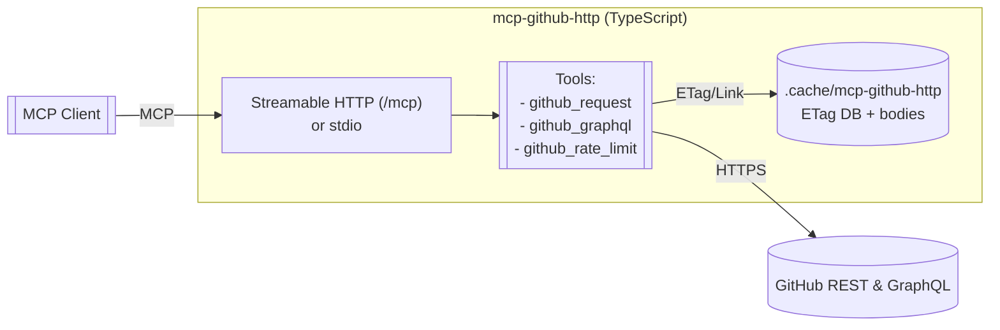

1. install deps

```bash
pnpm add -D typescript tsx @types/express
pnpm add @modelcontextprotocol/sdk express zod
```

2. env + start (HTTP mode)

```bash
export GITHUB_TOKEN=ghp_your_token_here
export PORT=3000
# optional:
export GITHUB_BASE_URL=https://api.github.com
export GITHUB_GRAPHQL_URL=https://api.github.com/graphql
export GITHUB_API_VERSION=2022-11-28
pnpm tsx packages/mcp-github-http/src/index.ts
```

3. alt: stdio mode (handy for local MCP clients)

```bash
export GITHUB_TOKEN=ghp_your_token_here
pnpm tsx packages/mcp-github-http/src/index.ts stdio
```

### What you get

* `github_request` — call any REST path (`GET/POST/PUT/PATCH/DELETE`), optional **ETag cache** and **auto-pagination** via `Link` headers. (ETag/pagination per GitHub docs. ([GitHub Docs][1]))
* `github_graphql` — post queries to the GraphQL endpoint. ([GitHub Docs][2])
* `github_rate_limit` — quick `/rate_limit` snapshot.

The server defaults to **Streamable HTTP transport** for MCP (with a stateless per-request instance) and also supports **stdio**. The HTTP transport pattern follows the official MCP TypeScript SDK examples. ([GitHub][3])

Headers are set with:

* `Accept: application/vnd.github+json`
* `X-GitHub-Api-Version: 2022-11-28` (configurable via env)
* `Authorization: Bearer <GITHUB_TOKEN>`
  These follow GitHub’s current guidance on versioning and headers. ([GitHub Docs][4])

The on-disk cache lives at `.cache/mcp-github-http/` and stores ETags plus response bodies for conditional GETs — saving rate limit when a `304 Not Modified` is returned. ([GitHub Docs][1])

---

### Quick examples

**List issues (auto-paginate 3 pages @ 100/page):**

```json
{
  "name": "github_request",
  "arguments": {
    "method": "GET",
    "path": "/repos/OWNER/REPO/issues",
    "query": { "state": "open" },
    "paginate": true,
    "maxPages": 3,
    "perPage": 100
  }
}
```

**Create an issue:**

```json
{
  "name": "github_request",
  "arguments": {
    "method": "POST",
    "path": "/repos/OWNER/REPO/issues",
    "body": { "title": "Bug report", "body": "Steps to reproduce..." }
  }
}
```

**GraphQL query:**

```json
{
  "name": "github_graphql",
  "arguments": {
    "query": "query($login:String!){ user(login:$login){ name repositories(first:10){ nodes{ name }}}}",
    "variables": { "login": "octocat" }
  }
}
```

---

### Architecture (Mermaid)



If you want, I can also add **resource templates** like `github://{owner}/{repo}/file/{path}` for file contents, or a **GraphQL persisted-query cache**.

Want me to wire this into your agent’s startup scripts or add a tiny `package.json`/`tsconfig` scaffold?

[1]: https://docs.github.com/en/rest/using-the-rest-api/best-practices-for-using-the-rest-api?utm_source=chatgpt.com "Best practices for using the REST API"
[2]: https://docs.github.com/en/graphql?utm_source=chatgpt.com "GitHub GraphQL API documentation"
[3]: https://github.com/modelcontextprotocol/typescript-sdk "GitHub - modelcontextprotocol/typescript-sdk: The official TypeScript SDK for Model Context Protocol servers and clients"
[4]: https://docs.github.com/en/rest/using-the-rest-api/getting-started-with-the-rest-api?utm_source=chatgpt.com "Getting started with the REST API"
