# OpenCode Client

TypeScript client for OpenCode with comprehensive session management, event processing, and context indexing capabilities.

## Installation

```bash
pnpm add @promethean-os/opencode-client
```

## Quick Start

```typescript
import { spawnSession, listSessions, sendPrompt, listEvents } from '@promethean-os/opencode-client';

// Create a new session
const session = await spawnSession.execute({
  title: 'Development Session',
  message: 'Start working on TypeScript project',
});

const { session: sessionData } = JSON.parse(session);
console.log('Session created:', sessionData.id);

// Send a message to the session
const message = await sendPrompt.execute({
  sessionId: sessionData.id,
  content: 'Analyze the codebase for performance issues',
  type: 'instruction',
});

console.log('Message sent:', JSON.parse(message));

// List all active sessions
const sessions = await listSessions.execute({ limit: 10 });
console.log('Active sessions:', JSON.parse(sessions));
```

## Key Features

### 🚀 Session Management

- Create, list, and manage OpenCode sessions
- Real-time session status tracking
- Interactive messaging within sessions
- Session lifecycle management

### 📊 Event Processing

- Comprehensive event tracking and querying
- Real-time event streaming
- Event filtering and aggregation
- Historical event analysis

### 🔍 Context Indexing

- Full-text search across sessions, events, and messages
- Semantic search capabilities
- Context compilation for analysis
- Intelligent result ranking

### 🔧 TypeScript-First Design

- Full type safety with comprehensive type definitions
- Proper error handling and validation
- Modern ES6+ patterns and practices

### 📋 Plugin System

- Extensible architecture for custom functionality
- Built-in plugins for common operations
- Tool registration and execution
- Cross-plugin communication

## Core Tools

| Tool             | Purpose                       | Example                                                  |
| ---------------- | ----------------------------- | -------------------------------------------------------- |
| `spawnSession`   | Create new session            | `spawnSession.execute({title, message})`                 |
| `listSessions`   | List sessions                 | `listSessions.execute({limit: 20})`                      |
| `sendPrompt`     | Send message to session       | `sendPrompt.execute({sessionId, content})`               |
| `listMessages`   | Get session messages          | `listMessages.execute({sessionId, limit: 50})`           |
| `closeSession`   | Close session                 | `closeSession.execute({sessionId})`                      |
| `listEvents`     | List system events            | `listEvents.execute({limit: 100})`                       |
| `searchContext`  | Search across content         | `searchContext.execute({query, limit: 20})`              |
| `compileContext` | Compile comprehensive context | `compileContext.execute({query, includeSessions: true})` |

## Documentation

### Core Documentation

- **[API Reference](https://github.com/riatzukiza/promethean/tree/main/packages/opencode-client/docs/api-reference.md)** - Complete API documentation for all functions and tools
- **[Development Guide](https://github.com/riatzukiza/promethean/tree/main/packages/opencode-client/docs/development-guide.md)** - Setup, development workflows, and contribution guidelines
- **[Usage Examples](https://github.com/riatzukiza/promethean/tree/main/packages/opencode-client/docs/usage-examples.md)** - Comprehensive examples and workflows
- **[Troubleshooting Guide](https://github.com/riatzukiza/promethean/tree/main/packages/opencode-client/docs/troubleshooting.md)** - Common issues and solutions

### Additional Documentation

- **[OpenCode Client Integration](https://github.com/riatzukiza/promethean/tree/main/packages/opencode-client/docs/ollama-queue-integration.md)** - Comprehensive guide to OpenCode client integration
- **[TypeScript Compilation Fixes](https://github.com/riatzukiza/promethean/tree/main/packages/opencode-client/docs/typescript-compilation-fixes.md)** - Recent TypeScript fixes and type safety improvements
- **[Spawn Command](https://github.com/riatzukiza/promethean/tree/main/packages/opencode-client/docs/spawn-command.md)** - Quick session creation with spawn message
- **[Integration Guide](https://github.com/riatzukiza/promethean/tree/main/packages/opencode-client/docs/integration.md)** - Integration patterns and best practices
- **[Indexer Service Guide](https://github.com/riatzukiza/promethean/tree/main/packages/opencode-client/docs/indexer-service-guide.md)** - Search and context compilation documentation
- **[Plugin System Guide](https://github.com/riatzukiza/promethean/tree/main/packages/opencode-client/docs/plugin-system-guide.md)** - Plugin development and management
- **[Unified Agent Management](https://github.com/riatzukiza/promethean/tree/main/packages/opencode-client/docs/unified-agent-management.md)** - High-level agent session management

## Setup & Configuration

### Prerequisites

- Node.js 18+ and TypeScript 5+
- OpenCode server running locally or accessible via network
- pnpm package manager

### Basic Configuration

```typescript
// Configure OpenCode server URL (optional, defaults to localhost:4096)
process.env.OPENCODE_SERVER_URL = 'http://localhost:4096';

// Enable debug logging (optional)
process.env.DEBUG = 'opencode-client:*';

// Set authentication token (if required)
process.env.OPENCODE_AUTH_TOKEN = 'your-auth-token';
```

## Common Usage Patterns

### Session Management

```typescript
async function manageSessions() {
  // Create multiple sessions
  const sessions = await Promise.all([
    spawnSession.execute({
      title: 'Code Review',
      message: 'Review authentication module',
    }),
    spawnSession.execute({
      title: 'Documentation',
      message: 'Update API documentation',
    }),
  ]);

  // List all active sessions
  const activeSessions = await listSessions.execute({ limit: 20 });
  console.log('Active sessions:', JSON.parse(activeSessions));
}
```

### Event Processing

```typescript
async function processEvents() {
  // Get recent events
  const events = await listEvents.execute({
    limit: 100,
    eventType: 'session.created',
  });

  const eventData = JSON.parse(events);
  eventData.events.forEach((event) => {
    console.log(`Event: ${event.type} at ${new Date(event.timestamp)}`);
  });
}
```

### Context Search

```typescript
async function searchAndAnalyze() {
  // Search for specific content
  const searchResults = await searchContext.execute({
    query: 'TypeScript compilation errors',
    limit: 20,
    includeMessages: true,
    includeSessions: true,
  });

  // Compile comprehensive context
  const context = await compileContext.execute({
    query: 'security vulnerabilities',
    includeSessions: true,
    includeEvents: true,
    includeMessages: true,
    limit: 500,
  });

  return {
    search: JSON.parse(searchResults),
    context: JSON.parse(context),
  };
}
```

## Development

### Building from Source

```bash
# Clone repository
git clone https://github.com/riatzukiza/promethean.git
cd promethean/packages/opencode-client

# Install dependencies
pnpm install

# Build the package
pnpm build

# Run in development mode
pnpm dev
```

### Running Tests

```bash
# Run all tests
pnpm test

# Run with coverage
pnpm test --coverage

# Watch mode
pnpm test --watch
```

### Contributing

1. Fork the repository
2. Create a feature branch
3. Make your changes
4. Add tests
5. Ensure build passes
6. Submit a pull request

For detailed development guidelines, see the [Development Guide](https://github.com/riatzukiza/promethean/tree/main/packages/opencode-client/docs/development-guide.md).

## Support and Troubleshooting

### Common Issues

1. **TypeScript Compilation Errors**: See [TypeScript Compilation Fixes](https://github.com/riatzukiza/promethean/tree/main/packages/opencode-client/docs/typescript-compilation-fixes.md)
2. **Connection Issues**: Ensure OpenCode server is running on port 4096
3. **Session Not Found**: Verify session ID is correct and session hasn't expired
4. **Search Returns No Results**: Check query syntax and available content

### Getting Help

- Check the [Troubleshooting Guide](https://github.com/riatzukiza/promethean/tree/main/packages/opencode-client/docs/troubleshooting.md) for common issues
- Review the [API Reference](https://github.com/riatzukiza/promethean/tree/main/packages/opencode-client/docs/api-reference.md) for detailed usage
- Enable debug logging: `process.env.DEBUG = 'opencode-client:*'`
- Create an issue with detailed error information

### Health Check

```typescript
import { listSessions, listEvents } from '@promethean-os/opencode-client';

async function healthCheck() {
  try {
    // Check session connectivity
    const sessions = await listSessions.execute({ limit: 1 });
    console.log('Sessions API healthy:', JSON.parse(sessions));

    // Check event connectivity
    const events = await listEvents.execute({ limit: 1 });
    console.log('Events API healthy:', JSON.parse(events));

    console.log('✅ All systems operational');
  } catch (error) {
    console.error('❌ Health check failed:', error.message);
  }
}

healthCheck();
```

## Architecture Overview

```
┌─────────────────┐    ┌──────────────────┐    ┌─────────────────┐
│   CLI Client    │───▶│  OpenCode API    │───▶│  Session Store  │
│                 │    │                  │    │                 │
│ • sessions      │    │ • Sessions       │    │ • Session Data  │
│ • events        │    │ • Events         │    │ • Event History │
│ • messages      │    │ • Messages       │    │ • Message Log   │
│ • indexer       │    │ • Indexer        │    │ • Search Index  │
└─────────────────┘    └──────────────────┘    └─────────────────┘
         │                       │                       │
         │              ┌──────────────────┐            │
         └──────────────▶│  Plugin System   │◀───────────┘
                        │                  │
                        │ • Agent Mgmt     │
                        │ • Cache          │
                        │ • Events         │
                        │ • Custom         │
                        └──────────────────┘
```

## License

This project is licensed under GPL-3.0 License. See [LICENSE](https://github.com/riatzukiza/promethean/tree/main/LICENSE.txt) file for details.

## Related Packages

- **@promethean-os/persistence**: Data persistence layer
- **@opencode-ai/plugin**: OpenCode plugin framework
- **@opencode-ai/sdk**: OpenCode SDK
- **@promethean-os/kanban**: Task management and workflow integration

<!-- READMEFLOW:BEGIN -->
# @promethean-os/opencode-client

CLI client for OpenCode plugins and tools

[TOC]


## Install

```bash
pnpm -w add -D @promethean-os/opencode-client
```

## Quickstart

```ts
// usage example
```

## Commands

- `build`
- `build:tests`
- `dev`
- `test`
- `typecheck`
- `lint`
- `test:unit`
- `test:watch`
- `test:coverage`
- `start`


### Package graph

```mermaid
flowchart LR
  _promethean_os_agent_os_protocol["@promethean-os/agent-os-protocol\n1.0.0"]
  _promethean_os_ai_learning["@promethean-os/ai-learning\n0.1.0"]
  _promethean_os_apply_patch["@promethean-os/apply-patch\n0.0.1"]
  _promethean_os_auth_service["@promethean-os/auth-service\n0.1.0"]
  _promethean_os_autocommit["@promethean-os/autocommit\n0.1.0"]
  _promethean_os_benchmark["@promethean-os/benchmark\n0.1.0"]
  _promethean_os_broker["@promethean-os/broker\n0.0.1"]
  _promethean_os_build_monitoring["@promethean-os/build-monitoring\n0.1.0"]
  _promethean_os_cephalon["@promethean-os/cephalon\n0.0.1"]
  _promethean_os_cli["@promethean-os/cli\n0.0.1"]
  _promethean_os_compaction["@promethean-os/compaction\n0.0.1"]
  _promethean_os_compiler["@promethean-os/compiler\n0.0.1"]
  _promethean_os_compliance_monitor["@promethean-os/compliance-monitor\n0.1.0"]
  _promethean_os_cookbookflow["@promethean-os/cookbookflow\n0.1.0"]
  _promethean_os_data_stores["@promethean-os/data-stores\n0.0.1"]
  _promethean_os_discord["@promethean-os/discord\n0.0.1"]
  _promethean_os_dlq["@promethean-os/dlq\n0.0.1"]
  _promethean_os_docs_system["@promethean-os/docs-system\n0.1.0"]
  _promethean_os_ds["@promethean-os/ds\n0.0.1"]
  _promethean_os_ecosystem_dsl["@promethean-os/ecosystem-dsl\n0.1.0"]
  _promethean_os_effects["@promethean-os/effects\n0.0.1"]
  _promethean_os_eidolon_field["@promethean-os/eidolon-field\n0.0.1"]
  _promethean_os_embedding["@promethean-os/embedding\n0.0.1"]
  _promethean_os_embedding_cache["@promethean-os/embedding-cache\n0.0.1"]
  _promethean_os_enso_agent_communication["@promethean-os/enso-agent-communication\n0.1.0"]
  _promethean_os_enso_browser_gateway["@promethean-os/enso-browser-gateway\n0.0.1"]
  _promethean_os_enso_protocol["@promethean-os/enso-protocol\n0.1.0"]
  _promethean_os_event["@promethean-os/event\n0.0.1"]
  _promethean_os_event_hooks_plugin["@promethean-os/event-hooks-plugin\n0.1.0"]
  _promethean_os_examples["@promethean-os/examples\n0.0.1"]
  _promethean_os_file_indexer["@promethean-os/file-indexer\n0.0.1"]
  _promethean_os_file_indexer_service["@promethean-os/file-indexer-service\n0.0.1"]
  _promethean_os_file_watcher["@promethean-os/file-watcher\n0.1.0"]
  _promethean_os_frontend["@promethean-os/frontend\n0.1.0"]
  _promethean_os_frontend_service["@promethean-os/frontend-service\n0.0.1"]
  _promethean_os_fs["@promethean-os/fs\n0.0.1"]
  _promethean_os_fsm["@promethean-os/fsm\n0.1.0"]
  _promethean_os_generator["@promethean-os/generator\n0.1.0"]
  _promethean_os_github_sync["@promethean-os/github-sync\n0.1.0"]
  health_service["health-service\n0.0.1"]
  heartbeat_service["heartbeat-service\n0.0.1"]
  _promethean_os_http["@promethean-os/http\n0.0.1"]
  _promethean_os_image_link_generator["@promethean-os/image-link-generator\n0.0.1"]
  indexer_client["indexer-client\n0.1.0"]
  _promethean_os_intention["@promethean-os/intention\n0.0.1"]
  _promethean_os_kanban["@promethean-os/kanban\n0.2.0"]
  _promethean_os_knowledge_graph["@promethean-os/knowledge-graph\n1.0.0"]
  _promethean_os_legacy["@promethean-os/legacy\n0.0.1"]
  _promethean_os_level_cache["@promethean-os/level-cache\n0.1.0"]
  _promethean_os_llm["@promethean-os/llm\n0.0.1"]
  _promethean_os_lmdb_cache["@promethean-os/lmdb-cache\n0.1.0"]
  _promethean_os_logger["@promethean-os/logger\n0.1.0"]
  _promethean_os_markdown["@promethean-os/markdown\n0.0.1"]
  _promethean_os_math_utils["@promethean-os/math-utils\n0.1.0"]
  _promethean_os_mcp["@promethean-os/mcp\n0.1.0"]
  _promethean_os_mcp_dev_ui_frontend["@promethean-os/mcp-dev-ui-frontend\n0.1.0"]
  _promethean_os_mcp_express_server["@promethean-os/mcp-express-server\n0.1.0"]
  _promethean_os_mcp_kanban_bridge["@promethean-os/mcp-kanban-bridge\n0.1.0"]
  _promethean_os_migrations["@promethean-os/migrations\n0.0.1"]
  _promethean_os_monitoring["@promethean-os/monitoring\n0.0.1"]
  _promethean_os_naming["@promethean-os/naming\n0.0.1"]
  _promethean_os_nl_parser["@promethean-os/nl-parser\n0.1.0"]
  _promethean_os_nlp_command_parser["@promethean-os/nlp-command-parser\n0.1.0"]
  _promethean_obsidian_export["@promethean/obsidian-export\n0.1.0"]
  _promethean_os_ollama_queue["@promethean-os/ollama-queue\n0.1.0"]
  _promethean_os_omni_tools["@promethean-os/omni-tools\n1.0.0"]
  _promethean_os_openai_server["@promethean-os/openai-server\n0.0.0"]
  _promethean_os_opencode_client["@promethean-os/opencode-client\n0.1.0"]
  _promethean_os_opencode_hub["@promethean-os/opencode-hub\n0.1.0"]
  _promethean_os_opencode_interface_plugin["@promethean-os/opencode-interface-plugin\n0.2.0"]
  _promethean_os_opencode_unified["@promethean-os/opencode-unified\n0.1.0"]
  _promethean_os_pantheon["@promethean-os/pantheon\n0.1.0"]
  _promethean_os_persistence["@promethean-os/persistence\n0.0.1"]
  _promethean_os_platform["@promethean-os/platform\n0.0.1"]
  _promethean_os_platform_core["@promethean-os/platform-core\n0.1.0"]
  _promethean_os_plugin_hooks["@promethean-os/plugin-hooks\n0.1.0"]
  _promethean_os_pm2_helpers["@promethean-os/pm2-helpers\n0.0.0"]
  _promethean_os_projectors["@promethean-os/projectors\n0.0.1"]
  _promethean_os_promethean_cli["@promethean-os/promethean-cli\n0.0.0"]
  _promethean_os_prompt_optimization["@promethean-os/prompt-optimization\n0.1.0"]
  _promethean_os_providers["@promethean-os/providers\n0.0.1"]
  _promethean_os_realtime_capture_plugin["@promethean-os/realtime-capture-plugin\n0.1.0"]
  _promethean_os_report_forge["@promethean-os/report-forge\n0.0.1"]
  _promethean_os_scar["@promethean-os/scar\n0.1.0"]
  _promethean_os_security["@promethean-os/security\n0.0.1"]
  _promethean_os_shadow_conf["@promethean-os/shadow-conf\n0.0.0"]
  _promethean_os_shadow_ui["@promethean-os/shadow-ui\n0.0.0"]
  _promethean_os_snapshots["@promethean-os/snapshots\n0.0.1"]
  _promethean_os_stream["@promethean-os/stream\n0.0.1"]
  _promethean_os_test_classifier["@promethean-os/test-classifier\n0.0.1"]
  _promethean_os_test_utils["@promethean-os/test-utils\n0.0.1"]
  _promethean_os_testgap["@promethean-os/testgap\n0.1.0"]
  _promethean_os_trello["@promethean-os/trello\n0.1.0"]
  _promethean_os_ui_components["@promethean-os/ui-components\n0.0.0"]
  _promethean_os_unified_indexer["@promethean-os/unified-indexer\n0.0.1"]
  _promethean_os_utils["@promethean-os/utils\n0.0.1"]
  _promethean_os_voice_service["@promethean-os/voice-service\n0.0.1"]
  _promethean_os_web_utils["@promethean-os/web-utils\n0.0.1"]
  _promethean_os_worker["@promethean-os/worker\n0.0.1"]
  _promethean_os_ws["@promethean-os/ws\n0.0.1"]
  _promethean_os_ai_learning --> _promethean_os_utils
  _promethean_os_ai_learning --> _promethean_os_eidolon_field
  _promethean_os_ai_learning --> _promethean_os_ollama_queue
  _promethean_os_auth_service --> _promethean_os_pm2_helpers
  _promethean_os_benchmark --> _promethean_os_utils
  _promethean_os_broker --> _promethean_os_legacy
  _promethean_os_broker --> _promethean_os_pm2_helpers
  _promethean_os_build_monitoring --> _promethean_os_utils
  _promethean_os_cephalon --> _promethean_os_embedding
  _promethean_os_cephalon --> _promethean_os_level_cache
  _promethean_os_cephalon --> _promethean_os_legacy
  _promethean_os_cephalon --> _promethean_os_llm
  _promethean_os_cephalon --> _promethean_os_persistence
  _promethean_os_cephalon --> _promethean_os_utils
  _promethean_os_cephalon --> _promethean_os_voice_service
  _promethean_os_cephalon --> _promethean_os_enso_protocol
  _promethean_os_cephalon --> _promethean_os_security
  _promethean_os_cephalon --> _promethean_os_broker
  _promethean_os_cephalon --> _promethean_os_pm2_helpers
  _promethean_os_cephalon --> _promethean_os_test_utils
  _promethean_os_cli --> _promethean_os_compiler
  _promethean_os_compaction --> _promethean_os_event
  _promethean_os_compliance_monitor --> _promethean_os_persistence
  _promethean_os_compliance_monitor --> _promethean_os_legacy
  _promethean_os_compliance_monitor --> _promethean_os_pm2_helpers
  _promethean_os_compliance_monitor --> _promethean_os_test_utils
  _promethean_os_cookbookflow --> _promethean_os_utils
  _promethean_os_data_stores --> _promethean_os_persistence
  _promethean_os_discord --> _promethean_os_pantheon
  _promethean_os_discord --> _promethean_os_effects
  _promethean_os_discord --> _promethean_os_embedding
  _promethean_os_discord --> _promethean_os_event
  _promethean_os_discord --> _promethean_os_legacy
  _promethean_os_discord --> _promethean_os_migrations
  _promethean_os_discord --> _promethean_os_persistence
  _promethean_os_discord --> _promethean_os_platform
  _promethean_os_discord --> _promethean_os_providers
  _promethean_os_discord --> _promethean_os_monitoring
  _promethean_os_discord --> _promethean_os_security
  _promethean_os_dlq --> _promethean_os_event
  _promethean_os_docs_system --> _promethean_os_kanban
  _promethean_os_docs_system --> _promethean_os_ollama_queue
  _promethean_os_docs_system --> _promethean_os_utils
  _promethean_os_docs_system --> _promethean_os_markdown
  _promethean_os_eidolon_field --> _promethean_os_persistence
  _promethean_os_eidolon_field --> _promethean_os_test_utils
  _promethean_os_embedding --> _promethean_os_legacy
  _promethean_os_embedding --> _promethean_os_platform
  _promethean_os_embedding_cache --> _promethean_os_utils
  _promethean_os_enso_agent_communication --> _promethean_os_enso_protocol
  _promethean_os_enso_browser_gateway --> _promethean_os_enso_protocol
  _promethean_os_event --> _promethean_os_test_utils
  _promethean_os_event_hooks_plugin --> _promethean_os_logger
  _promethean_os_event_hooks_plugin --> _promethean_os_persistence
  _promethean_os_event_hooks_plugin --> _promethean_os_opencode_client
  _promethean_os_examples --> _promethean_os_event
  _promethean_os_file_indexer --> _promethean_os_utils
  _promethean_os_file_indexer_service --> _promethean_os_persistence
  _promethean_os_file_indexer_service --> _promethean_os_utils
  _promethean_os_file_indexer_service --> _promethean_os_ds
  _promethean_os_file_indexer_service --> _promethean_os_fs
  _promethean_os_file_watcher --> _promethean_os_embedding
  _promethean_os_file_watcher --> _promethean_os_legacy
  _promethean_os_file_watcher --> _promethean_os_persistence
  _promethean_os_file_watcher --> _promethean_os_test_utils
  _promethean_os_file_watcher --> _promethean_os_utils
  _promethean_os_file_watcher --> _promethean_os_pm2_helpers
  _promethean_os_frontend --> _promethean_os_persistence
  _promethean_os_frontend --> _promethean_os_utils
  _promethean_os_frontend --> _promethean_os_test_utils
  _promethean_os_frontend --> _promethean_os_opencode_client
  _promethean_os_frontend_service --> _promethean_os_web_utils
  _promethean_os_fs --> _promethean_os_ds
  _promethean_os_fs --> _promethean_os_stream
  _promethean_os_github_sync --> _promethean_os_kanban
  _promethean_os_github_sync --> _promethean_os_utils
  health_service --> _promethean_os_legacy
  heartbeat_service --> _promethean_os_legacy
  heartbeat_service --> _promethean_os_persistence
  heartbeat_service --> _promethean_os_test_utils
  _promethean_os_http --> _promethean_os_event
  _promethean_os_image_link_generator --> _promethean_os_fs
  _promethean_os_kanban --> _promethean_os_lmdb_cache
  _promethean_os_kanban --> _promethean_os_markdown
  _promethean_os_kanban --> _promethean_os_utils
  _promethean_os_kanban --> _promethean_os_pantheon
  _promethean_os_level_cache --> _promethean_os_utils
  _promethean_os_level_cache --> _promethean_os_test_utils
  _promethean_os_llm --> _promethean_os_utils
  _promethean_os_llm --> _promethean_os_pm2_helpers
  _promethean_os_lmdb_cache --> _promethean_os_utils
  _promethean_os_lmdb_cache --> _promethean_os_test_utils
  _promethean_os_markdown --> _promethean_os_fs
  _promethean_os_mcp --> _promethean_os_discord
  _promethean_os_mcp --> _promethean_os_kanban
  _promethean_os_mcp_dev_ui_frontend --> _promethean_os_mcp
  _promethean_os_mcp_express_server --> _promethean_os_mcp
  _promethean_os_mcp_kanban_bridge --> _promethean_os_kanban
  _promethean_os_mcp_kanban_bridge --> _promethean_os_utils
  _promethean_os_migrations --> _promethean_os_embedding
  _promethean_os_migrations --> _promethean_os_persistence
  _promethean_os_monitoring --> _promethean_os_test_utils
  _promethean_os_nlp_command_parser --> _promethean_os_kanban
  _promethean_os_ollama_queue --> _promethean_os_utils
  _promethean_os_ollama_queue --> _promethean_os_lmdb_cache
  _promethean_os_omni_tools --> _promethean_os_mcp
  _promethean_os_omni_tools --> _promethean_os_kanban
  _promethean_os_omni_tools --> _promethean_os_logger
  _promethean_os_opencode_client --> _promethean_os_logger
  _promethean_os_opencode_client --> _promethean_os_ollama_queue
  _promethean_os_opencode_client --> _promethean_os_opencode_interface_plugin
  _promethean_os_opencode_client --> _promethean_os_persistence
  _promethean_os_opencode_interface_plugin --> _promethean_os_logger
  _promethean_os_opencode_interface_plugin --> _promethean_os_persistence
  _promethean_os_opencode_unified --> _promethean_os_security
  _promethean_os_opencode_unified --> _promethean_os_ollama_queue
  _promethean_os_opencode_unified --> _promethean_os_persistence
  _promethean_os_pantheon --> _promethean_os_persistence
  _promethean_os_persistence --> _promethean_os_embedding
  _promethean_os_persistence --> _promethean_os_legacy
  _promethean_os_persistence --> _promethean_os_logger
  _promethean_os_platform --> _promethean_os_utils
  _promethean_os_plugin_hooks --> _promethean_os_event
  _promethean_os_projectors --> _promethean_os_event
  _promethean_os_projectors --> _promethean_os_utils
  _promethean_os_prompt_optimization --> _promethean_os_level_cache
  _promethean_os_providers --> _promethean_os_platform
  _promethean_os_realtime_capture_plugin --> _promethean_os_logger
  _promethean_os_realtime_capture_plugin --> _promethean_os_persistence
  _promethean_os_realtime_capture_plugin --> _promethean_os_opencode_client
  _promethean_os_security --> _promethean_os_platform
  _promethean_os_shadow_conf --> _promethean_os_pm2_helpers
  _promethean_os_shadow_conf --> _promethean_os_pantheon
  _promethean_os_snapshots --> _promethean_os_utils
  _promethean_os_test_utils --> _promethean_os_persistence
  _promethean_os_testgap --> _promethean_os_utils
  _promethean_os_trello --> _promethean_os_kanban
  _promethean_os_trello --> _promethean_os_utils
  _promethean_os_unified_indexer --> _promethean_os_persistence
  _promethean_os_unified_indexer --> _promethean_os_test_utils
  _promethean_os_voice_service --> _promethean_os_pm2_helpers
  _promethean_os_web_utils --> _promethean_os_fs
  _promethean_os_worker --> _promethean_os_ds
  _promethean_os_ws --> _promethean_os_event
  _promethean_os_ws --> _promethean_os_monitoring
```



<!-- READMEFLOW:END -->
