# @promethean-os/opencode-interface-plugin

> **Session Orchestrator Plugin** – shared tooling that surfaces OpenCode's session indexing and agent orchestration capabilities as plug-and-play OpenCode plugins.

## What's New

- **Renamed plugin**: the long-time `OpencodeInterfacePlugin` is now the clearer **`SessionOrchestratorPlugin`**. Two focused entry points – `SessionIndexingPlugin` (read-only context search) and `AgentOrchestrationPlugin` (session + prompt lifecycle) – sit underneath and can be loaded independently.
- **Shared modules**: formatting, runtime bootstrapping, and tool builders now live in `src/shared`/`src/tools`, so the `@promethean-os/opencode-client` package simply re-exports these implementations (no more drift between repos).
- **Backwards compatible**: `OpencodeInterfacePlugin` still exports as an alias, so existing automation keeps working while you migrate to the new names.

## Installation

```bash
# pnpm
dpnm add @promethean-os/opencode-interface-plugin

# npm
npm install @promethean-os/opencode-interface-plugin

# yarn
yarn add @promethean-os/opencode-interface-plugin
```

Once installed, import whichever surface you need:

```typescript
import {
  SessionOrchestratorPlugin, // combined toolset
  SessionIndexingPlugin, // read-only context/search tools
  AgentOrchestrationPlugin, // session lifecycle + prompts
} from '@promethean-os/opencode-interface-plugin';

// Legacy alias (still works):
import { OpencodeInterfacePlugin } from '@promethean-os/opencode-interface-plugin';
```

## Tooling Breakdown

| Plugin                      | Primary Tools                                                                                      |
| --------------------------- | -------------------------------------------------------------------------------------------------- |
| `SessionIndexingPlugin`     | `compile-context`, `search-context`, `list-events`, `list-messages`, `get-message`                 |
| `AgentOrchestrationPlugin`  | `list-sessions`, `get-session`, `close-session`, `spawn-session`, `search-sessions`, `send-prompt` |
| `SessionOrchestratorPlugin` | Combines both tables above (default export)                                                        |

All tools include strong validation + markdown formatting helpers shared from `src/shared/formatters.ts`.

## Usage Example

```typescript
import { SessionOrchestratorPlugin } from '@promethean-os/opencode-interface-plugin';

const plugin = await SessionOrchestratorPlugin(pluginContext);
const { tool } = plugin;

const sessionList = await tool['list-sessions'].execute({ limit: 10, offset: 0 });
console.log(sessionList);
```

## Dev Setup & Local File URLs

1. Build the plugin:
   ```bash
   pnpm install
   pnpm --filter @promethean-os/opencode-interface-plugin build
   ```
2. Point `opencode.json` at the compiled file via `file://` so OpenCode can load it without publishing:

   ```jsonc
   {
     "$schema": "https://opencode.ai/config.json",
     "plugins": [
       {
         "name": "@promethean-os/opencode-interface-plugin",
         "module": "file:///absolute/path/to/packages/opencode-interface-plugin/dist/index.js",
       },
     ],
   }
   ```

   > 💡 Keep the path absolute and include the `file://` prefix. Rebuild (`pnpm build`) after local changes so the dist file stays current.

3. Reload your OpenCode agent/CLI and the plugin will be available immediately.

## Publishing Checklist

1. Run the local test suite:
   ```bash
   pnpm --filter @promethean-os/opencode-interface-plugin test
   ```
2. Build for distribution:
   ```bash
   pnpm --filter @promethean-os/opencode-interface-plugin build
   ```
3. Publish (requires configured npm token):
   ```bash
   pnpm --filter @promethean-os/opencode-interface-plugin npm publish --access public
   ```

Version `0.2.0` introduces the new naming + module layout. Use semantic versioning for future releases.

## Development Commands

```bash
pnpm --filter @promethean-os/opencode-interface-plugin dev   # watch mode
pnpm --filter @promethean-os/opencode-interface-plugin lint  # eslint
pnpm --filter @promethean-os/opencode-interface-plugin test  # ava test suite
```

## License

GPL-3.0-only

<!-- READMEFLOW:BEGIN -->
# @promethean-os/opencode-interface-plugin

Session Orchestrator Plugin for OpenCode (indexing + agent orchestration)

[TOC]


## Install

```bash
pnpm -w add -D @promethean-os/opencode-interface-plugin
```

## Quickstart

```ts
// usage example
```

## Commands

- `build`
- `build:tests`
- `dev`
- `test`
- `typecheck`
- `lint`
- `test:unit`
- `test:watch`
- `test:coverage`
- `clean`


### Package graph

```mermaid
flowchart LR
  _promethean_os_agent_os_protocol["@promethean-os/agent-os-protocol\n1.0.0"]
  _promethean_os_ai_learning["@promethean-os/ai-learning\n0.1.0"]
  _promethean_os_apply_patch["@promethean-os/apply-patch\n0.0.1"]
  _promethean_os_auth_service["@promethean-os/auth-service\n0.1.0"]
  _promethean_os_autocommit["@promethean-os/autocommit\n0.1.0"]
  _promethean_os_benchmark["@promethean-os/benchmark\n0.1.0"]
  _promethean_os_broker["@promethean-os/broker\n0.0.1"]
  _promethean_os_build_monitoring["@promethean-os/build-monitoring\n0.1.0"]
  _promethean_os_cephalon["@promethean-os/cephalon\n0.0.1"]
  _promethean_os_cli["@promethean-os/cli\n0.0.1"]
  _promethean_os_compaction["@promethean-os/compaction\n0.0.1"]
  _promethean_os_compiler["@promethean-os/compiler\n0.0.1"]
  _promethean_os_compliance_monitor["@promethean-os/compliance-monitor\n0.1.0"]
  _promethean_os_cookbookflow["@promethean-os/cookbookflow\n0.1.0"]
  _promethean_os_data_stores["@promethean-os/data-stores\n0.0.1"]
  _promethean_os_discord["@promethean-os/discord\n0.0.1"]
  _promethean_os_dlq["@promethean-os/dlq\n0.0.1"]
  _promethean_os_docs_system["@promethean-os/docs-system\n0.1.0"]
  _promethean_os_ds["@promethean-os/ds\n0.0.1"]
  _promethean_os_ecosystem_dsl["@promethean-os/ecosystem-dsl\n0.1.0"]
  _promethean_os_effects["@promethean-os/effects\n0.0.1"]
  _promethean_os_eidolon_field["@promethean-os/eidolon-field\n0.0.1"]
  _promethean_os_embedding["@promethean-os/embedding\n0.0.1"]
  _promethean_os_embedding_cache["@promethean-os/embedding-cache\n0.0.1"]
  _promethean_os_enso_agent_communication["@promethean-os/enso-agent-communication\n0.1.0"]
  _promethean_os_enso_browser_gateway["@promethean-os/enso-browser-gateway\n0.0.1"]
  _promethean_os_enso_protocol["@promethean-os/enso-protocol\n0.1.0"]
  _promethean_os_event["@promethean-os/event\n0.0.1"]
  _promethean_os_event_hooks_plugin["@promethean-os/event-hooks-plugin\n0.1.0"]
  _promethean_os_examples["@promethean-os/examples\n0.0.1"]
  _promethean_os_file_indexer["@promethean-os/file-indexer\n0.0.1"]
  _promethean_os_file_indexer_service["@promethean-os/file-indexer-service\n0.0.1"]
  _promethean_os_file_watcher["@promethean-os/file-watcher\n0.1.0"]
  _promethean_os_frontend["@promethean-os/frontend\n0.1.0"]
  _promethean_os_frontend_service["@promethean-os/frontend-service\n0.0.1"]
  _promethean_os_fs["@promethean-os/fs\n0.0.1"]
  _promethean_os_fsm["@promethean-os/fsm\n0.1.0"]
  _promethean_os_generator["@promethean-os/generator\n0.1.0"]
  _promethean_os_github_sync["@promethean-os/github-sync\n0.1.0"]
  health_service["health-service\n0.0.1"]
  heartbeat_service["heartbeat-service\n0.0.1"]
  _promethean_os_http["@promethean-os/http\n0.0.1"]
  _promethean_os_image_link_generator["@promethean-os/image-link-generator\n0.0.1"]
  indexer_client["indexer-client\n0.1.0"]
  _promethean_os_intention["@promethean-os/intention\n0.0.1"]
  _promethean_os_kanban["@promethean-os/kanban\n0.2.0"]
  _promethean_os_knowledge_graph["@promethean-os/knowledge-graph\n1.0.0"]
  _promethean_os_legacy["@promethean-os/legacy\n0.0.1"]
  _promethean_os_level_cache["@promethean-os/level-cache\n0.1.0"]
  _promethean_os_llm["@promethean-os/llm\n0.0.1"]
  _promethean_os_lmdb_cache["@promethean-os/lmdb-cache\n0.1.0"]
  _promethean_os_logger["@promethean-os/logger\n0.1.0"]
  _promethean_os_markdown["@promethean-os/markdown\n0.0.1"]
  _promethean_os_math_utils["@promethean-os/math-utils\n0.1.0"]
  _promethean_os_mcp["@promethean-os/mcp\n0.1.0"]
  _promethean_os_mcp_dev_ui_frontend["@promethean-os/mcp-dev-ui-frontend\n0.1.0"]
  _promethean_os_mcp_express_server["@promethean-os/mcp-express-server\n0.1.0"]
  _promethean_os_mcp_kanban_bridge["@promethean-os/mcp-kanban-bridge\n0.1.0"]
  _promethean_os_migrations["@promethean-os/migrations\n0.0.1"]
  _promethean_os_monitoring["@promethean-os/monitoring\n0.0.1"]
  _promethean_os_naming["@promethean-os/naming\n0.0.1"]
  _promethean_os_nl_parser["@promethean-os/nl-parser\n0.1.0"]
  _promethean_os_nlp_command_parser["@promethean-os/nlp-command-parser\n0.1.0"]
  _promethean_obsidian_export["@promethean/obsidian-export\n0.1.0"]
  _promethean_os_ollama_queue["@promethean-os/ollama-queue\n0.1.0"]
  _promethean_os_omni_tools["@promethean-os/omni-tools\n1.0.0"]
  _promethean_os_openai_server["@promethean-os/openai-server\n0.0.0"]
  _promethean_os_opencode_client["@promethean-os/opencode-client\n0.1.0"]
  _promethean_os_opencode_hub["@promethean-os/opencode-hub\n0.1.0"]
  _promethean_os_opencode_interface_plugin["@promethean-os/opencode-interface-plugin\n0.2.0"]
  _promethean_os_opencode_unified["@promethean-os/opencode-unified\n0.1.0"]
  _promethean_os_pantheon["@promethean-os/pantheon\n0.1.0"]
  _promethean_os_persistence["@promethean-os/persistence\n0.0.1"]
  _promethean_os_platform["@promethean-os/platform\n0.0.1"]
  _promethean_os_platform_core["@promethean-os/platform-core\n0.1.0"]
  _promethean_os_plugin_hooks["@promethean-os/plugin-hooks\n0.1.0"]
  _promethean_os_pm2_helpers["@promethean-os/pm2-helpers\n0.0.0"]
  _promethean_os_projectors["@promethean-os/projectors\n0.0.1"]
  _promethean_os_promethean_cli["@promethean-os/promethean-cli\n0.0.0"]
  _promethean_os_prompt_optimization["@promethean-os/prompt-optimization\n0.1.0"]
  _promethean_os_providers["@promethean-os/providers\n0.0.1"]
  _promethean_os_realtime_capture_plugin["@promethean-os/realtime-capture-plugin\n0.1.0"]
  _promethean_os_report_forge["@promethean-os/report-forge\n0.0.1"]
  _promethean_os_scar["@promethean-os/scar\n0.1.0"]
  _promethean_os_security["@promethean-os/security\n0.0.1"]
  _promethean_os_shadow_conf["@promethean-os/shadow-conf\n0.0.0"]
  _promethean_os_shadow_ui["@promethean-os/shadow-ui\n0.0.0"]
  _promethean_os_snapshots["@promethean-os/snapshots\n0.0.1"]
  _promethean_os_stream["@promethean-os/stream\n0.0.1"]
  _promethean_os_test_classifier["@promethean-os/test-classifier\n0.0.1"]
  _promethean_os_test_utils["@promethean-os/test-utils\n0.0.1"]
  _promethean_os_testgap["@promethean-os/testgap\n0.1.0"]
  _promethean_os_trello["@promethean-os/trello\n0.1.0"]
  _promethean_os_ui_components["@promethean-os/ui-components\n0.0.0"]
  _promethean_os_unified_indexer["@promethean-os/unified-indexer\n0.0.1"]
  _promethean_os_utils["@promethean-os/utils\n0.0.1"]
  _promethean_os_voice_service["@promethean-os/voice-service\n0.0.1"]
  _promethean_os_web_utils["@promethean-os/web-utils\n0.0.1"]
  _promethean_os_worker["@promethean-os/worker\n0.0.1"]
  _promethean_os_ws["@promethean-os/ws\n0.0.1"]
  _promethean_os_ai_learning --> _promethean_os_utils
  _promethean_os_ai_learning --> _promethean_os_eidolon_field
  _promethean_os_ai_learning --> _promethean_os_ollama_queue
  _promethean_os_auth_service --> _promethean_os_pm2_helpers
  _promethean_os_benchmark --> _promethean_os_utils
  _promethean_os_broker --> _promethean_os_legacy
  _promethean_os_broker --> _promethean_os_pm2_helpers
  _promethean_os_build_monitoring --> _promethean_os_utils
  _promethean_os_cephalon --> _promethean_os_embedding
  _promethean_os_cephalon --> _promethean_os_level_cache
  _promethean_os_cephalon --> _promethean_os_legacy
  _promethean_os_cephalon --> _promethean_os_llm
  _promethean_os_cephalon --> _promethean_os_persistence
  _promethean_os_cephalon --> _promethean_os_utils
  _promethean_os_cephalon --> _promethean_os_voice_service
  _promethean_os_cephalon --> _promethean_os_enso_protocol
  _promethean_os_cephalon --> _promethean_os_security
  _promethean_os_cephalon --> _promethean_os_broker
  _promethean_os_cephalon --> _promethean_os_pm2_helpers
  _promethean_os_cephalon --> _promethean_os_test_utils
  _promethean_os_cli --> _promethean_os_compiler
  _promethean_os_compaction --> _promethean_os_event
  _promethean_os_compliance_monitor --> _promethean_os_persistence
  _promethean_os_compliance_monitor --> _promethean_os_legacy
  _promethean_os_compliance_monitor --> _promethean_os_pm2_helpers
  _promethean_os_compliance_monitor --> _promethean_os_test_utils
  _promethean_os_cookbookflow --> _promethean_os_utils
  _promethean_os_data_stores --> _promethean_os_persistence
  _promethean_os_discord --> _promethean_os_pantheon
  _promethean_os_discord --> _promethean_os_effects
  _promethean_os_discord --> _promethean_os_embedding
  _promethean_os_discord --> _promethean_os_event
  _promethean_os_discord --> _promethean_os_legacy
  _promethean_os_discord --> _promethean_os_migrations
  _promethean_os_discord --> _promethean_os_persistence
  _promethean_os_discord --> _promethean_os_platform
  _promethean_os_discord --> _promethean_os_providers
  _promethean_os_discord --> _promethean_os_monitoring
  _promethean_os_discord --> _promethean_os_security
  _promethean_os_dlq --> _promethean_os_event
  _promethean_os_docs_system --> _promethean_os_kanban
  _promethean_os_docs_system --> _promethean_os_ollama_queue
  _promethean_os_docs_system --> _promethean_os_utils
  _promethean_os_docs_system --> _promethean_os_markdown
  _promethean_os_eidolon_field --> _promethean_os_persistence
  _promethean_os_eidolon_field --> _promethean_os_test_utils
  _promethean_os_embedding --> _promethean_os_legacy
  _promethean_os_embedding --> _promethean_os_platform
  _promethean_os_embedding_cache --> _promethean_os_utils
  _promethean_os_enso_agent_communication --> _promethean_os_enso_protocol
  _promethean_os_enso_browser_gateway --> _promethean_os_enso_protocol
  _promethean_os_event --> _promethean_os_test_utils
  _promethean_os_event_hooks_plugin --> _promethean_os_logger
  _promethean_os_event_hooks_plugin --> _promethean_os_persistence
  _promethean_os_event_hooks_plugin --> _promethean_os_opencode_client
  _promethean_os_examples --> _promethean_os_event
  _promethean_os_file_indexer --> _promethean_os_utils
  _promethean_os_file_indexer_service --> _promethean_os_persistence
  _promethean_os_file_indexer_service --> _promethean_os_utils
  _promethean_os_file_indexer_service --> _promethean_os_ds
  _promethean_os_file_indexer_service --> _promethean_os_fs
  _promethean_os_file_watcher --> _promethean_os_embedding
  _promethean_os_file_watcher --> _promethean_os_legacy
  _promethean_os_file_watcher --> _promethean_os_persistence
  _promethean_os_file_watcher --> _promethean_os_test_utils
  _promethean_os_file_watcher --> _promethean_os_utils
  _promethean_os_file_watcher --> _promethean_os_pm2_helpers
  _promethean_os_frontend --> _promethean_os_persistence
  _promethean_os_frontend --> _promethean_os_utils
  _promethean_os_frontend --> _promethean_os_test_utils
  _promethean_os_frontend --> _promethean_os_opencode_client
  _promethean_os_frontend_service --> _promethean_os_web_utils
  _promethean_os_fs --> _promethean_os_ds
  _promethean_os_fs --> _promethean_os_stream
  _promethean_os_github_sync --> _promethean_os_kanban
  _promethean_os_github_sync --> _promethean_os_utils
  health_service --> _promethean_os_legacy
  heartbeat_service --> _promethean_os_legacy
  heartbeat_service --> _promethean_os_persistence
  heartbeat_service --> _promethean_os_test_utils
  _promethean_os_http --> _promethean_os_event
  _promethean_os_image_link_generator --> _promethean_os_fs
  _promethean_os_kanban --> _promethean_os_lmdb_cache
  _promethean_os_kanban --> _promethean_os_markdown
  _promethean_os_kanban --> _promethean_os_utils
  _promethean_os_kanban --> _promethean_os_pantheon
  _promethean_os_level_cache --> _promethean_os_utils
  _promethean_os_level_cache --> _promethean_os_test_utils
  _promethean_os_llm --> _promethean_os_utils
  _promethean_os_llm --> _promethean_os_pm2_helpers
  _promethean_os_lmdb_cache --> _promethean_os_utils
  _promethean_os_lmdb_cache --> _promethean_os_test_utils
  _promethean_os_markdown --> _promethean_os_fs
  _promethean_os_mcp --> _promethean_os_discord
  _promethean_os_mcp --> _promethean_os_kanban
  _promethean_os_mcp_dev_ui_frontend --> _promethean_os_mcp
  _promethean_os_mcp_express_server --> _promethean_os_mcp
  _promethean_os_mcp_kanban_bridge --> _promethean_os_kanban
  _promethean_os_mcp_kanban_bridge --> _promethean_os_utils
  _promethean_os_migrations --> _promethean_os_embedding
  _promethean_os_migrations --> _promethean_os_persistence
  _promethean_os_monitoring --> _promethean_os_test_utils
  _promethean_os_nlp_command_parser --> _promethean_os_kanban
  _promethean_os_ollama_queue --> _promethean_os_utils
  _promethean_os_ollama_queue --> _promethean_os_lmdb_cache
  _promethean_os_omni_tools --> _promethean_os_mcp
  _promethean_os_omni_tools --> _promethean_os_kanban
  _promethean_os_omni_tools --> _promethean_os_logger
  _promethean_os_opencode_client --> _promethean_os_logger
  _promethean_os_opencode_client --> _promethean_os_ollama_queue
  _promethean_os_opencode_client --> _promethean_os_opencode_interface_plugin
  _promethean_os_opencode_client --> _promethean_os_persistence
  _promethean_os_opencode_interface_plugin --> _promethean_os_logger
  _promethean_os_opencode_interface_plugin --> _promethean_os_persistence
  _promethean_os_opencode_unified --> _promethean_os_security
  _promethean_os_opencode_unified --> _promethean_os_ollama_queue
  _promethean_os_opencode_unified --> _promethean_os_persistence
  _promethean_os_pantheon --> _promethean_os_persistence
  _promethean_os_persistence --> _promethean_os_embedding
  _promethean_os_persistence --> _promethean_os_legacy
  _promethean_os_persistence --> _promethean_os_logger
  _promethean_os_platform --> _promethean_os_utils
  _promethean_os_plugin_hooks --> _promethean_os_event
  _promethean_os_projectors --> _promethean_os_event
  _promethean_os_projectors --> _promethean_os_utils
  _promethean_os_prompt_optimization --> _promethean_os_level_cache
  _promethean_os_providers --> _promethean_os_platform
  _promethean_os_realtime_capture_plugin --> _promethean_os_logger
  _promethean_os_realtime_capture_plugin --> _promethean_os_persistence
  _promethean_os_realtime_capture_plugin --> _promethean_os_opencode_client
  _promethean_os_security --> _promethean_os_platform
  _promethean_os_shadow_conf --> _promethean_os_pm2_helpers
  _promethean_os_shadow_conf --> _promethean_os_pantheon
  _promethean_os_snapshots --> _promethean_os_utils
  _promethean_os_test_utils --> _promethean_os_persistence
  _promethean_os_testgap --> _promethean_os_utils
  _promethean_os_trello --> _promethean_os_kanban
  _promethean_os_trello --> _promethean_os_utils
  _promethean_os_unified_indexer --> _promethean_os_persistence
  _promethean_os_unified_indexer --> _promethean_os_test_utils
  _promethean_os_voice_service --> _promethean_os_pm2_helpers
  _promethean_os_web_utils --> _promethean_os_fs
  _promethean_os_worker --> _promethean_os_ds
  _promethean_os_ws --> _promethean_os_event
  _promethean_os_ws --> _promethean_os_monitoring
```




## Promethean Packages (Remote READMEs)

- Back to [riatzukiza/promethean](https://github.com/riatzukiza/promethean#readme)

<!-- BEGIN: PROMETHEAN-PACKAGES-READMES -->
- [riatzukiza/agent-os-protocol](https://github.com/riatzukiza/agent-os-protocol#readme)
- [riatzukiza/ai-learning](https://github.com/riatzukiza/ai-learning#readme)
- [riatzukiza/apply-patch](https://github.com/riatzukiza/apply-patch#readme)
- [riatzukiza/auth-service](https://github.com/riatzukiza/auth-service#readme)
- [riatzukiza/autocommit](https://github.com/riatzukiza/autocommit#readme)
- [riatzukiza/build-monitoring](https://github.com/riatzukiza/build-monitoring#readme)
- [riatzukiza/cli](https://github.com/riatzukiza/cli#readme)
- [riatzukiza/clj-hacks-tools](https://github.com/riatzukiza/clj-hacks-tools#readme)
- [riatzukiza/compliance-monitor](https://github.com/riatzukiza/compliance-monitor#readme)
- [riatzukiza/dlq](https://github.com/riatzukiza/dlq#readme)
- [riatzukiza/ds](https://github.com/riatzukiza/ds#readme)
- [riatzukiza/eidolon-field](https://github.com/riatzukiza/eidolon-field#readme)
- [riatzukiza/enso-agent-communication](https://github.com/riatzukiza/enso-agent-communication#readme)
- [riatzukiza/http](https://github.com/riatzukiza/http#readme)
- [riatzukiza/kanban](https://github.com/riatzukiza/kanban#readme)
- [riatzukiza/logger](https://github.com/riatzukiza/logger#readme)
- [riatzukiza/math-utils](https://github.com/riatzukiza/math-utils#readme)
- [riatzukiza/mcp](https://github.com/riatzukiza/mcp#readme)
- [riatzukiza/mcp-dev-ui-frontend](https://github.com/riatzukiza/mcp-dev-ui-frontend#readme)
- [riatzukiza/migrations](https://github.com/riatzukiza/migrations#readme)
- [riatzukiza/naming](https://github.com/riatzukiza/naming#readme)
- [riatzukiza/obsidian-export](https://github.com/riatzukiza/obsidian-export#readme)
- [riatzukiza/omni-tools](https://github.com/riatzukiza/omni-tools#readme)
- [riatzukiza/opencode-hub](https://github.com/riatzukiza/opencode-hub#readme)
- [riatzukiza/persistence](https://github.com/riatzukiza/persistence#readme)
- [riatzukiza/platform](https://github.com/riatzukiza/platform#readme)
- [riatzukiza/plugin-hooks](https://github.com/riatzukiza/plugin-hooks#readme)
- [riatzukiza/report-forge](https://github.com/riatzukiza/report-forge#readme)
- [riatzukiza/security](https://github.com/riatzukiza/security#readme)
- [riatzukiza/shadow-conf](https://github.com/riatzukiza/shadow-conf#readme)
- [riatzukiza/snapshots](https://github.com/riatzukiza/snapshots#readme)
- [riatzukiza/test-classifier](https://github.com/riatzukiza/test-classifier#readme)
- [riatzukiza/test-utils](https://github.com/riatzukiza/test-utils#readme)
- [riatzukiza/utils](https://github.com/riatzukiza/utils#readme)
- [riatzukiza/worker](https://github.com/riatzukiza/worker#readme)
<!-- END: PROMETHEAN-PACKAGES-READMES -->


<!-- READMEFLOW:END -->
