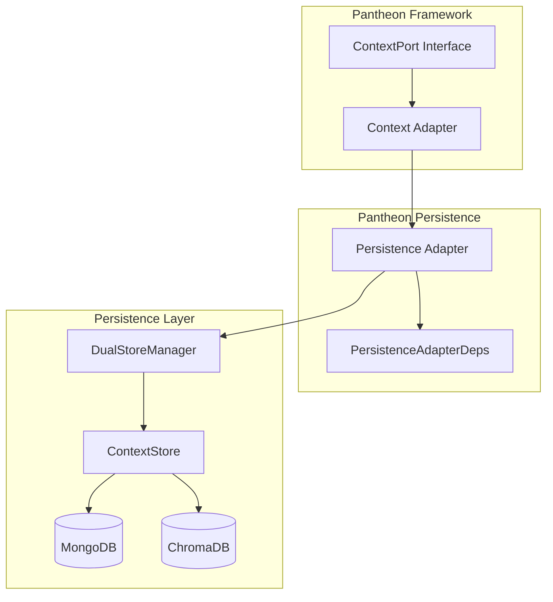
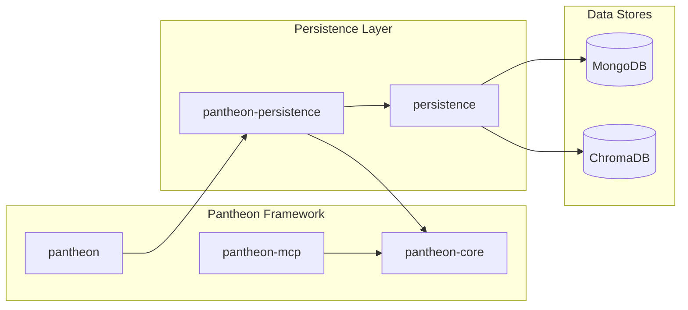

# @promethean-os/pantheon-persistence

> Adapter that wraps [[@promethean-os/persistence]] to provide [[ContextPort]] implementation for the Pantheon system

[TOC]

## 🌟 Overview

The `@promethean-os/pantheon-persistence` package serves as a bridge between the Pantheon framework's context management system and the underlying persistence layer. It implements the [[ContextPort]] interface, enabling Pantheon agents to compile context from multiple data sources stored in MongoDB and ChromaDB through the dual-store architecture.

### Key Features

- **Adapter Pattern**: Wraps [[@promethean-os/persistence]] to provide Pantheon-native context compilation
- **Context Source Mapping**: Maps [[ContextSource]] IDs to [[DualStoreManager]] instances
- **Flexible Resolvers**: Customizable role, name, and time formatting functions
- **Dependency Injection**: Clean separation of concerns through [[PersistenceAdapterDeps]]
- **Type Safety**: Full TypeScript support with comprehensive type definitions

## 🚀 Quick Start

### Installation

```bash
pnpm add @promethean-os/pantheon-persistence
```

### Basic Usage

```typescript
import { makePantheonPersistenceAdapter } from '@promethean-os/pantheon-persistence';
import { DualStoreManager } from '@promethean-os/persistence';
import type { ContextSource } from '@promethean-os/pantheon-core';

// Create store managers (example with multiple sources)
const storeManagers = await Promise.all([
  DualStoreManager.create('sessions', 'text', 'createdAt'),
  DualStoreManager.create('agent-tasks', 'text', 'createdAt'),
  DualStoreManager.create('user-preferences', 'text', 'createdAt'),
]);

// Create the persistence adapter
const contextAdapter = makePantheonPersistenceAdapter({
  getStoreManagers: () => Promise.resolve(storeManagers),

  // Optional custom resolvers
  resolveRole: (meta) => {
    if (meta?.type === 'user-message') return 'user';
    if (meta?.type === 'assistant-response') return 'assistant';
    return 'system';
  },

  resolveName: (meta) => meta?.displayName || meta?.username || 'Unknown',

  formatTime: (ms) => new Date(ms).toLocaleString(),
});

// Compile context from sources
const context = await contextAdapter.compile({
  sources: [
    { id: 'sessions', label: 'Chat Sessions' },
    { id: 'agent-tasks', label: 'Agent Tasks' },
  ],
  recentLimit: 10,
  queryLimit: 5,
});

console.log('Compiled context messages:', context);
```

## 🏗 Architecture

### Adapter Pattern Implementation

The package follows the Hexagonal Architecture pattern, implementing the [[ContextPort]] interface while delegating to the persistence layer:



### Context Source Mapping

The adapter maps [[ContextSource]] IDs to actual [[DualStoreManager]] instances:

```typescript
// Context sources definition
const sources: ContextSource[] = [
  { id: 'sessions', label: 'Chat Sessions' },
  { id: 'agent-tasks', label: 'Agent Tasks' },
  { id: 'user-data', label: 'User Information' },
];

// Internal mapping to store managers
const managers = [
  new DualStoreManager('sessions', ...),      // maps to sources[0]
  new DualStoreManager('agent-tasks', ...),   // maps to sources[1]
  new DualStoreManager('user-data', ...),      // maps to sources[2]
];
```

## 📦 API Reference

### makePantheonPersistenceAdapter

Creates a [[ContextPort]] implementation that bridges Pantheon context compilation with the persistence layer.

#### Signature

```typescript
function makePantheonPersistenceAdapter(deps: PersistenceAdapterDeps): ContextPort;
```

#### Parameters

- `deps`: [[PersistenceAdapterDeps]] - Dependency injection configuration

#### Returns

- `ContextPort`: A context port implementation for Pantheon

#### Example

```typescript
const adapter = makePantheonPersistenceAdapter({
  getStoreManagers: async () => {
    return [
      await DualStoreManager.create('sessions', 'text', 'createdAt'),
      await DualStoreManager.create('tasks', 'text', 'createdAt'),
    ];
  },
  resolveRole: (meta) => meta?.role || 'system',
  resolveName: (meta) => meta?.name || 'Anonymous',
  formatTime: (ms) => new Date(ms).toISOString(),
});
```

### PersistenceAdapterDeps

Interface defining the dependency injection contract for the persistence adapter.

#### Properties

```typescript
interface PersistenceAdapterDeps {
  getStoreManagers: () => Promise<DualStoreManager[]>;
  resolveRole?: (meta?: any) => 'system' | 'user' | 'assistant';
  resolveName?: (meta?: any) => string;
  formatTime?: (ms: number) => string;
}
```

#### Property Details

##### getStoreManagers

**Type**: `() => Promise<DualStoreManager[]>`

**Required**: Yes

Function that returns an array of [[DualStoreManager]] instances. Each manager corresponds to a potential context source that can be used in context compilation.

**Example**:

```typescript
getStoreManagers: async () => {
  const managers = [];

  // Create managers for different data types
  if (process.env.ENABLE_SESSIONS === 'true') {
    managers.push(await DualStoreManager.create('sessions', 'text', 'createdAt'));
  }

  if (process.env.ENABLE_TASKS === 'true') {
    managers.push(await DualStoreManager.create('tasks', 'text', 'createdAt'));
  }

  return managers;
};
```

##### resolveRole

**Type**: `(meta?: any) => 'system' | 'user' | 'assistant'`

**Required**: No (has default implementation)

Function that determines the message role based on metadata. If not provided, uses default logic:

```typescript
const defaultResolveRole = (meta?: any) => {
  if (meta?.role) return meta.role;
  if (meta?.type === 'user') return 'user';
  if (meta?.type === 'assistant') return 'assistant';
  return 'system';
};
```

**Custom Example**:

```typescript
resolveRole: (meta) => {
  // Custom role resolution based on your data schema
  if (meta?.senderType === 'human') return 'user';
  if (meta?.senderType === 'ai') return 'assistant';
  if (meta?.isSystemMessage) return 'system';

  // Fallback to default logic
  return meta?.role || 'system';
};
```

##### resolveName

**Type**: `(meta?: any) => string`

**Required**: No (has default implementation)

Function that resolves the display name for a message based on metadata. Default implementation:

```typescript
const defaultResolveName = (meta?: any) => {
  return meta?.displayName || meta?.name || meta?.id || 'Unknown';
};
```

**Custom Example**:

```typescript
resolveName: (meta) => {
  // Priority-based name resolution
  if (meta?.username) return meta.username;
  if (meta?.displayName) return meta.displayName;
  if (meta?.agentName) return `Agent: ${meta.agentName}`;
  if (meta?.userId) return `User ${meta.userId}`;

  return 'System';
};
```

##### formatTime

**Type**: `(ms: number) => string`

**Required**: No (has default implementation)

Function that formats timestamps for display. Default implementation returns ISO string:

```typescript
const defaultFormatTime = (ms: number) => {
  return new Date(ms).toISOString();
};
```

**Custom Examples**:

```typescript
// Human-readable format
formatTime: (ms) =>
  new Date(ms).toLocaleString('en-US', {
    year: 'numeric',
    month: 'short',
    day: 'numeric',
    hour: '2-digit',
    minute: '2-digit',
  });

// Relative time
formatTime: (ms) => {
  const now = Date.now();
  const diff = now - ms;

  if (diff < 60000) return 'just now';
  if (diff < 3600000) return `${Math.floor(diff / 60000)}m ago`;
  if (diff < 86400000) return `${Math.floor(diff / 3600000)}h ago`;
  return new Date(ms).toLocaleDateString();
};
```

## 🔧 Configuration

### Environment Variables

The adapter relies on the underlying persistence layer configuration:

```bash
# MongoDB Configuration
MONGODB_URL=mongodb://localhost:27017
MONGODB_DB_NAME=database

# ChromaDB Configuration
CHROMA_URL=http://localhost:8000

# Embedding Configuration
EMBEDDING_DRIVER=ollama
EMBEDDING_FUNCTION=nomic-embed-text

# Dual Store Configuration
DUAL_WRITE_ENABLED=true
DUAL_WRITE_CONSISTENCY=eventual

# Agent Configuration (for collection naming)
AGENT_NAME=duck
```

### Store Manager Configuration

Configure individual store managers based on your data schema:

```typescript
// Chat messages store
const chatStore = await DualStoreManager.create('chat-messages', 'text', 'createdAt');

// Agent tasks store with custom keys
const taskStore = await DualStoreManager.create('agent-tasks', 'description', 'dueDate');

// User preferences store
const prefsStore = await DualStoreManager.create('user-prefs', 'value', 'updatedAt');
```

## 🧪 Usage Patterns

### Multi-Source Context Compilation

```typescript
import { makePantheonPersistenceAdapter } from '@promethean-os/pantheon-persistence';
import type { ContextSource } from '@promethean-os/pantheon-core';

// Create adapter with multiple data sources
const adapter = makePantheonPersistenceAdapter({
  getStoreManagers: async () => {
    return [
      await DualStoreManager.create('sessions', 'text', 'createdAt'),
      await DualStoreManager.create('agent-tasks', 'text', 'createdAt'),
      await DualStoreManager.create('user-profile', 'bio', 'updatedAt'),
      await DualStoreManager.create('system-logs', 'message', 'timestamp'),
    ];
  },

  // Custom role resolution for different data types
  resolveRole: (meta) => {
    switch (meta?.source) {
      case 'sessions':
        return meta?.role || 'user';
      case 'agent-tasks':
        return 'assistant';
      case 'system-logs':
        return 'system';
      default:
        return 'system';
    }
  },

  // Custom name resolution
  resolveName: (meta) => {
    if (meta?.username) return meta.username;
    if (meta?.agentName) return `🤖 ${meta.agentName}`;
    if (meta?.source === 'system-logs') return '🔧 System';
    return 'Unknown';
  },
});

// Compile context with filtering
const context = await adapter.compile({
  sources: [
    {
      id: 'sessions',
      label: 'Recent Conversations',
      where: { userId: 'user123', isArchived: false },
    },
    {
      id: 'agent-tasks',
      label: 'Active Tasks',
      where: { status: 'active', priority: { $gte: 3 } },
    },
    {
      id: 'user-profile',
      label: 'User Information',
      where: { userId: 'user123' },
    },
  ],
  recentLimit: 15,
  queryLimit: 8,
  limit: 25,
});
```

### Dynamic Store Management

```typescript
class DynamicPersistenceAdapter {
  private managers: Map<string, DualStoreManager> = new Map();
  private adapter: ContextPort;

  constructor() {
    this.adapter = makePantheonPersistenceAdapter({
      getStoreManagers: () => Promise.resolve(Array.from(this.managers.values())),

      resolveRole: (meta) => {
        // Dynamic role resolution based on collection
        const collection = meta?._collection;
        if (collection?.includes('chat')) return 'user';
        if (collection?.includes('agent')) return 'assistant';
        return 'system';
      },
    });
  }

  async addSource(name: string, textKey = 'text', timeKey = 'createdAt') {
    const manager = await DualStoreManager.create(name, textKey, timeKey);
    this.managers.set(name, manager);
    return manager;
  }

  async removeSource(name: string) {
    const manager = this.managers.get(name);
    if (manager) {
      await manager.cleanup();
      this.managers.delete(name);
    }
  }

  async compileContext(sources: ContextSource[], options = {}) {
    return this.adapter.compile({ sources, ...options });
  }
}

// Usage
const dynamicAdapter = new DynamicPersistenceAdapter();

await dynamicAdapter.addSource('temp-chat', 'message', 'timestamp');
await dynamicAdapter.addSource('project-notes', 'content', 'lastModified');

const context = await dynamicAdapter.compileContext([
  { id: 'temp-chat', label: 'Temporary Chat' },
  { id: 'project-notes', label: 'Project Notes' },
]);
```

### Integration with Pantheon Orchestrator

```typescript
import { makeOrchestrator } from '@promethean-os/pantheon-core';
import { makePantheonPersistenceAdapter } from '@promethean-os/pantheon-persistence';

// Create persistence-based context adapter
const contextAdapter = makePantheonPersistenceAdapter({
  getStoreManagers: async () => {
    return [
      await DualStoreManager.create('agent-memory', 'text', 'createdAt'),
      await DualStoreManager.create('conversation-history', 'text', 'timestamp'),
    ];
  },

  resolveRole: (meta) => {
    if (meta?.isAgentMemory) return 'assistant';
    if (meta?.isUserMessage) return 'user';
    return 'system';
  },

  resolveName: (meta) => {
    if (meta?.agentName) return meta.agentName;
    if (meta?.userName) return meta.userName;
    return meta?.source || 'System';
  },

  formatTime: (ms) => new Date(ms).toLocaleString(),
});

// Create orchestrator with persistence-backed context
const orchestrator = makeOrchestrator({
  context: contextAdapter,
  // ... other adapters
});

// Use in agent workflow
const actor = await orchestrator.spawnActor(actorScript, 'Process user request');
await orchestrator.tickActor(actor, {
  contextSources: [
    { id: 'agent-memory', label: 'Agent Memory' },
    { id: 'conversation-history', label: 'Recent Conversations' },
  ],
});
```

## 🔍 Advanced Features

### Custom Metadata Processing

```typescript
const adapter = makePantheonPersistenceAdapter({
  getStoreManagers: () => getManagers(),

  // Advanced role resolution with metadata analysis
  resolveRole: (meta) => {
    // Check explicit role first
    if (meta?.role) return meta.role;

    // Analyze content patterns
    const content = meta?.text || meta?.content || '';
    if (content.startsWith('System:')) return 'system';
    if (content.includes('[ASSISTANT]:')) return 'assistant';

    // Check metadata flags
    if (meta?.isSystemGenerated) return 'system';
    if (meta?.isAIResponse) return 'assistant';
    if (meta?.isUserInput) return 'user';

    // Default based on source
    if (meta?.source?.includes('agent')) return 'assistant';
    if (meta?.source?.includes('user')) return 'user';

    return 'system';
  },

  // Rich name resolution with fallbacks
  resolveName: (meta) => {
    // Priority order for name resolution
    const nameSources = [
      meta?.displayName,
      meta?.fullName,
      meta?.username,
      meta?.name,
      meta?.agentName,
      meta?.userId && `User ${meta.userId}`,
      meta?.agentId && `Agent ${meta.agentId}`,
    ].filter(Boolean);

    return nameSources[0] || 'Unknown';
  },

  // Sophisticated time formatting
  formatTime: (ms) => {
    const date = new Date(ms);
    const now = new Date();
    const diffMs = now.getTime() - ms;
    const diffHours = Math.floor(diffMs / (1000 * 60 * 60));
    const diffDays = Math.floor(diffHours / 24);

    if (diffDays > 7) {
      return date.toLocaleDateString('en-US', {
        year: 'numeric',
        month: 'short',
        day: 'numeric',
      });
    }

    if (diffDays > 0) {
      return `${diffDays} day${diffDays > 1 ? 's' : ''} ago`;
    }

    if (diffHours > 0) {
      return `${diffHours} hour${diffHours > 1 ? 's' : ''} ago`;
    }

    return date.toLocaleTimeString('en-US', {
      hour: '2-digit',
      minute: '2-digit',
    });
  },
});
```

### Error Handling and Resilience

```typescript
import { makePantheonPersistenceAdapter } from '@promethean-os/pantheon-persistence';

const resilientAdapter = makePantheonPersistenceAdapter({
  getStoreManagers: async () => {
    try {
      const managers = await Promise.allSettled([
        DualStoreManager.create('primary-data', 'text', 'createdAt'),
        DualStoreManager.create('backup-data', 'text', 'createdAt'),
      ]);

      // Filter out failed creations
      return managers
        .filter(
          (result): result is PromiseFulfilledResult<DualStoreManager> =>
            result.status === 'fulfilled',
        )
        .map((result) => result.value);
    } catch (error) {
      console.error('Failed to initialize store managers:', error);
      return []; // Return empty array to prevent crashes
    }
  },

  resolveRole: (meta) => {
    try {
      // Safe role resolution with fallbacks
      if (meta?.role && ['system', 'user', 'assistant'].includes(meta.role)) {
        return meta.role;
      }
      return 'system'; // Safe default
    } catch (error) {
      console.warn('Error resolving role:', error);
      return 'system';
    }
  },

  resolveName: (meta) => {
    try {
      return meta?.displayName || meta?.name || 'Unknown';
    } catch (error) {
      console.warn('Error resolving name:', error);
      return 'Unknown';
    }
  },

  formatTime: (ms) => {
    try {
      return new Date(ms).toISOString();
    } catch (error) {
      console.warn('Error formatting time:', error);
      return new Date().toISOString();
    }
  },
});
```

## 🐛 Troubleshooting

### Common Issues

#### Store Manager Creation Fails

**Problem**: `DualStoreManager.create()` throws an error

**Solution**: Check environment variables and service connectivity:

```bash
# Test MongoDB connection
mongosh $MONGODB_URL --eval "db.adminCommand('ismaster')"

# Test ChromaDB connection
curl $CHROMA_URL/api/v1/heartbeat

# Check embedding service
curl http://localhost:11434/api/tags
```

**Code Fix**:

```typescript
// Add retry logic and error handling
async function createStoreManager(name: string, retries = 3) {
  for (let i = 0; i < retries; i++) {
    try {
      return await DualStoreManager.create(name, 'text', 'createdAt');
    } catch (error) {
      console.warn(`Attempt ${i + 1} failed for ${name}:`, error);
      if (i === retries - 1) throw error;
      await new Promise((resolve) => setTimeout(resolve, 1000 * (i + 1)));
    }
  }
}
```

#### Context Source Not Found

**Problem**: Context compilation returns empty results

**Solution**: Verify source ID mapping:

```typescript
// Debug source mapping
const adapter = makePantheonPersistenceAdapter({
  getStoreManagers: async () => {
    const managers = await getStoreManagers();
    console.log(
      'Available managers:',
      managers.map((m) => m.name),
    );
    return managers;
  },
});

// Test with available source
const context = await adapter.compile({
  sources: [{ id: 'sessions', label: 'Sessions' }], // Use exact manager name
});
```

#### Role Resolution Issues

**Problem**: Messages have incorrect roles

**Solution**: Implement custom resolver with debugging:

```typescript
resolveRole: (meta) => {
  console.log('Resolving role for metadata:', meta);

  const role =
    meta?.role ||
    (meta?.type === 'user' ? 'user' : meta?.type === 'assistant' ? 'assistant' : 'system');

  console.log('Resolved role:', role);
  return role;
};
```

### Debug Mode

Enable detailed logging:

```typescript
const debugAdapter = makePantheonPersistenceAdapter({
  getStoreManagers: async () => {
    const managers = await getStoreManagers();
    console.log(`Initialized ${managers.length} store managers`);
    return managers;
  },

  resolveRole: (meta) => {
    const role = /* your logic */;
    if (process.env.DEBUG_CONTEXT) {
      console.log(`Role resolution: ${JSON.stringify(meta)} -> ${role}`);
    }
    return role;
  },
});
```

### Performance Optimization

#### Store Manager Caching

```typescript
class CachedPersistenceAdapter {
  private managerCache = new Map<string, DualStoreManager>();
  private cacheExpiry = new Map<string, number>();
  private readonly CACHE_TTL = 5 * 60 * 1000; // 5 minutes

  async getStoreManagers(): Promise<DualStoreManager[]> {
    const now = Date.now();
    const cachedManagers: DualStoreManager[] = [];

    for (const [name, manager] of this.managerCache) {
      const expiry = this.cacheExpiry.get(name) || 0;

      if (now > expiry) {
        // Cache expired, remove
        this.managerCache.delete(name);
        this.cacheExpiry.delete(name);
        await manager.cleanup();
      } else {
        cachedManagers.push(manager);
      }
    }

    // Create new managers if needed
    if (cachedManagers.length === 0) {
      const newManagers = await this.createManagers();
      for (const manager of newManagers) {
        this.managerCache.set(manager.name, manager);
        this.cacheExpiry.set(manager.name, now + this.CACHE_TTL);
        cachedManagers.push(manager);
      }
    }

    return cachedManagers;
  }
}
```

#### Context Compilation Optimization

```typescript
const optimizedAdapter = makePantheonPersistenceAdapter({
  getStoreManagers: () => getManagers(),

  // Fast role resolution with lookup table
  resolveRole: (() => {
    const roleMap = new Map([
      ['user-message', 'user'],
      ['assistant-response', 'assistant'],
      ['system-notification', 'system'],
    ]);

    return (meta) => roleMap.get(meta?.type) || 'system';
  })(),

  // Cached name resolution
  resolveName: (() => {
    const nameCache = new Map();

    return (meta) => {
      const cacheKey = JSON.stringify(meta);
      if (nameCache.has(cacheKey)) {
        return nameCache.get(cacheKey);
      }

      const name = meta?.displayName || meta?.name || 'Unknown';
      nameCache.set(cacheKey, name);
      return name;
    };
  })(),
});
```

## 📚 Related Packages

### Core Dependencies

- [[@promethean-os/pantheon-core]] - Core interfaces and types
- [[@promethean-os/persistence]] - Dual-store persistence implementation

### Complementary Packages

- [[@promethean-os/pantheon]] - Main Pantheon framework
- [[@promethean-os/pantheon-mcp]] - MCP protocol integration
- [[@promethean-os/pantheon-llm-openai]] - OpenAI LLM adapter

### Usage in Ecosystem



## 🤝 Contributing

### Development Setup

```bash
# Clone repository
git clone https://github.com/promethean-os/promethean.git
cd promethean/packages/pantheon-persistence

# Install dependencies
pnpm install

# Build package
pnpm build

# Run tests
pnpm test

# Start development mode
pnpm dev
```

### Testing

```bash
# Run unit tests
pnpm test

# Run with coverage
pnpm coverage

# Type checking
pnpm typecheck

# Linting
pnpm lint
```

### Adding New Features

1. **Interface Changes**: Update [[PersistenceAdapterDeps]] if adding new configuration options
2. **Default Implementations**: Provide sensible defaults for new optional features
3. **Type Safety**: Ensure all new code is fully typed
4. **Documentation**: Update this README with examples
5. **Tests**: Add comprehensive test coverage

## 📄 License

GPL-3.0-only - see [LICENSE](LICENSE) file for details.

---

Made with ❤️ by the Promethean team

#hashtags: #pantheon #persistence #context #adapter
