# Pantheon Agent Management Framework

A modern, functional programming-based framework for building and managing AI agents with embodied reasoning, perception-action loops, and emotionally mediated decision structures.

## 🌟 Overview

Pantheon is a modular cognitive architecture that provides:

- **Functional Programming Architecture**: Clean ports/adapters pattern with full TypeScript coverage
- **Context Management**: Compile and manage agent contexts from multiple sources
- **Actor Lifecycle Management**: Complete actor lifecycle with LLM integration
- **MCP Integration**: Model Context Protocol tool adapter for standardized AI agent interfaces
- **Extensible Design**: Easy to add new providers, tools, and actor types
- **CLI Interface**: 6 powerful commands for agent management and interaction

## 🚀 Quick Start

### Installation

```bash
# Install framework
pnpm add @promethean-os/pantheon @promethean-os/pantheon-core @promethean-os/pantheon-mcp

# Or install globally for CLI usage
pnpm add -g @promethean-os/pantheon
```

### Basic Usage

```typescript
import {
  makeInMemoryContextAdapter,
  makeInMemoryActorStateAdapter,
  makeOrchestrator,
  createLLMActor,
  type ActorScript,
} from '@promethean-os/pantheon';

// Create adapters
const contextAdapter = makeInMemoryContextAdapter();
const actorStateAdapter = makeInMemoryActorStateAdapter();

// Compile context from sources
const context = await contextAdapter.compile({
  texts: ['Hello world, I am an AI agent'],
  sources: [{ id: 'sessions', label: 'Sessions' }],
});

console.log('Compiled context messages:', context.length);

// Create an actor script
const actorScript = createLLMActor('assistant', {
  model: 'demo-model',
  temperature: 0.7,
  systemPrompt: 'You are a helpful AI assistant.',
});

// Spawn the actor
const actor = await actorStateAdapter.spawn(actorScript, 'Assist users');

console.log('Created actor:', actor.id);
```

## 🛠 CLI Commands

The framework provides several CLI commands for actor and context management:

### Actor Management

```bash
# Create a new actor
pantheon actor:create llm my-assistant --goal "Help users with tasks"

# List all actors
pantheon actor:list

# Tick an actor (execute one cycle)
pantheon actor:tick <actor-id> --message "Hello, how are you?"

# Start an actor loop
pantheon actor:start <actor-id> --interval 5000
```

### Context Management

```bash
# Compile context from sources
pantheon context:compile --text "Hello world" --sources "sessions,agent-tasks"

# Output:
# Compiled context:
#   1. [user] Hello world
```

### Tool Management

```bash
# Execute a tool
pantheon tool:execute <tool-name> '{"arg1": "value1"}'
```

### Demo

```bash
# Run a framework demo
pantheon demo
```

## 🏗 Architecture

### Core Components

```
┌─────────────────────────────────────────────────────────────┐
│                    Pantheon Framework                       │
├─────────────────────────────────────────────────────────────┤
│  CLI Interface                                              │
│  ┌─────────────┐  ┌─────────────┐  ┌─────────────┐         │
│  │context:compile│ │actors:tick  │ │mcp:execute  │         │
│  └─────────────┘  └─────────────┘  └─────────────┘         │
├─────────────────────────────────────────────────────────────┤
│  Core Adapters                                             │
│  ┌─────────────┐  ┌─────────────┐  ┌─────────────┐         │
│  │Context      │ │Actor        │ │Orchestrator │         │
│  │Adapter      │ │Adapter      │ │Adapter      │         │
│  └─────────────┘  └─────────────┘  └─────────────┘         │
├─────────────────────────────────────────────────────────────┤
│  LLM Integration                                           │
│  ┌─────────────┐  ┌─────────────┐  ┌─────────────┐         │
│  │OpenAI       │ │LLM Actor    │ │Message      │         │
│  │Adapter      │ │Adapter      │ │Management   │         │
│  └─────────────┘  └─────────────┘  └─────────────┘         │
├─────────────────────────────────────────────────────────────┤
│  MCP Protocol                                               │
│  ┌─────────────┐  ┌─────────────┐  ┌─────────────┐         │
│  │Tool         │ │create_actor │ │tick_actor   │         │
│  │Adapter      │ │tool         │ │tool         │         │
│  └─────────────┘  └─────────────┘  └─────────────┘         │
├─────────────────────────────────────────────────────────────┤
│  Ports & Interfaces                                         │
│  ┌─────────────┐  ┌─────────────┐  ┌─────────────┐         │
│  │ToolPort     │ │ContextPort  │ │ActorPort    │         │
│  └─────────────┘  └─────────────┘  └─────────────┘         │
└─────────────────────────────────────────────────────────────┘
```

### Ports and Adapters Pattern

The framework follows a clean ports and adapters architecture:

- **Ports**: Define interfaces for core capabilities (ContextPort, ActorPort, ToolPort, LlmPort)
- **Adapters**: Implement these interfaces for specific technologies
- **Separation**: Business logic separated from infrastructure concerns

### Key Interfaces

```typescript
// Context management
interface ContextPort {
  compile(sources: string[], text: string): Promise<Context>;
  get(id: string): Promise<Context | null>;
  save(context: Context): Promise<void>;
}

// Actor lifecycle
interface ActorPort {
  tick(actorId: string): Promise<void>;
  create(config: ActorConfig): Promise<string>;
  get(id: string): Promise<Actor | null>;
}

// LLM integration
interface LlmPort {
  complete(messages: Message[], opts?: { model?: string; temperature?: number }): Promise<Message>;
}

// Tool execution
interface ToolPort {
  execute(command: string, args?: Record<string, unknown>): Promise<unknown>;
  list?(): Promise<string[]>;
  register?(tool: MCPTool): void;
}
```

## 📦 Package Structure

```
packages/pantheon/
├── src/
│   ├── actors/
│   │   ├── index.ts      # Actor creation utilities
│   │   └── llm-actor.ts  # LLM actor implementation
│   ├── adapters/
│   │   └── index.ts      # Adapter implementations
│   ├── cli/
│   │   └── index.ts      # CLI interface
│   ├── utils/
│   │   └── index.ts      # Utility functions
│   └── index.ts          # Main exports
├── package.json
└── tsconfig.json

packages/pantheon-core/
├── src/
│   ├── core/
│   │   ├── ports.ts      # Core port interfaces
│   │   ├── types.ts      # Type definitions
│   │   ├── context.ts    # Context adapter
│   │   ├── actors.ts     # Actor adapter
│   │   ├── orchestrator.ts
│   │   └── adapters.ts   # In-memory implementations
│   └── index.ts          # Core exports
├── package.json
└── tsconfig.json

packages/pantheon-mcp/
├── src/
│   └── index.ts          # MCP tool adapter
├── package.json
└── tsconfig.json

packages/pantheon-llm-openai/
├── src/
│   └── index.ts          # OpenAI LLM adapter
├── package.json
└── tsconfig.json
```

## 🔧 Configuration

### Environment Variables

```bash
# OpenAI API Configuration
OPENAI_API_KEY=sk-your-openai-api-key
OPENAI_BASE_URL=https://api.openai.com/v1

# Default Model Configuration
DEFAULT_MODEL=gpt-3.5-turbo
DEFAULT_TEMPERATURE=0.7

# Actor Configuration
MAX_MESSAGES=20
SYSTEM_PROMPT="You are a helpful AI assistant."
```

### Configuration Files

Create a `pantheon.config.json` in your project root:

```json
{
  "llm": {
    "defaultModel": "gpt-3.5-turbo",
    "temperature": 0.7,
    "maxTokens": 1000
  },
  "actors": {
    "maxMessages": 20,
    "defaultSystemPrompt": "You are a helpful AI assistant."
  },
  "context": {
    "defaultSources": ["sessions", "agent-tasks"],
    "cacheSize": 100
  },
  "mcp": {
    "tools": ["create_actor", "tick_actor", "compile_context"]
  }
}
```

## 🧪 Testing

```bash
# Run all tests
pnpm test

# Run specific test types
pnpm test:unit
pnpm test:integration
pnpm test:e2e

# Run with coverage
pnpm coverage
```

## 📚 Examples

### Creating a Custom Actor

```typescript
import {
  makeInMemoryActorStateAdapter,
  makeOrchestrator,
  type ActorScript,
  type ActorStatePort,
} from '@promethean-os/pantheon';

interface CustomActorConfig {
  customLogic: (input: string) => Promise<string>;
}

function createCustomActorScript(name: string, config: CustomActorConfig): ActorScript {
  return {
    name,
    contextSources: [],
    talents: [
      {
        name: 'custom-talent',
        behaviors: [
          {
            name: 'custom-behavior',
            mode: 'active',
            plan: async ({ goal }) => {
              const result = await config.customLogic(goal);
              return {
                actions: [{ type: 'message', content: result, target: 'user' }],
              };
            },
          },
        ],
      },
    ],
  };
}

// Usage
const actorStateAdapter = makeInMemoryActorStateAdapter();
const actorScript = createCustomActorScript('my-custom-actor', {
  customLogic: async (input) => `Processed: ${input}`,
});

const actor = await actorStateAdapter.spawn(actorScript, 'Custom task');
```

### Adding Custom MCP Tools

```typescript
import { makeMCPToolAdapter, type MCPTool } from '@promethean-os/pantheon-mcp';

const customTool: MCPTool = {
  name: 'custom_analysis',
  description: 'Perform custom analysis on data',
  inputSchema: {
    type: 'object',
    properties: {
      data: {
        type: 'string',
        description: 'Data to analyze',
      },
      options: {
        type: 'object',
        description: 'Analysis options',
      },
    },
    required: ['data'],
  },
  handler: async (args) => {
    const { data, options = {} } = args;

    // Perform custom analysis
    const result = {
      analysis: `Analyzed: ${data}`,
      confidence: 0.95,
      timestamp: Date.now(),
    };

    return result;
  },
};

// Register the tool
const mcpAdapter = makeMCPToolAdapter();
mcpAdapter.register?.(customTool);
```

### Context Compilation with Multiple Sources

```typescript
import { makeContextAdapter } from '@promethean-os/pantheon-fp';

const contextAdapter = makeContextAdapter();

// Compile context from multiple sources
const context = await contextAdapter.compile(
  ['sessions', 'agent-tasks', 'user-preferences', 'system-config'],
  `User wants to create a new AI assistant with the following requirements:
   - Natural language processing
   - Memory management
   - Task automation
   - User preference learning`,
);

console.log('Compiled context with sources:', context.sources);
console.log('Context ID:', context.id);
```

## 🤝 Integration Patterns

### With Express.js

```typescript
import express from 'express';
import {
  makeInMemoryActorStateAdapter,
  makeOrchestrator,
  makeInMemoryLlmAdapter,
  createLLMActor,
  makeOpenAIAdapter,
} from '@promethean-os/pantheon';

const app = express();
app.use(express.json());

// Create adapters
const actorStateAdapter = makeInMemoryActorStateAdapter();
const llmAdapter = makeOpenAIAdapter({
  apiKey: process.env.OPENAI_API_KEY!,
});

// Create actor endpoint
app.post('/actors', async (req, res) => {
  try {
    const { name, prompt, model } = req.body;

    const actorScript = createLLMActor(name, {
      model: model || 'gpt-3.5-turbo',
      systemPrompt: prompt || 'You are a helpful AI assistant.',
    });

    const actor = await actorStateAdapter.spawn(actorScript, 'Assist users');
    res.json({ actorId: actor.id });
  } catch (error) {
    res.status(500).json({ error: error.message });
  }
});

// Message endpoint
app.post('/actors/:id/tick', async (req, res) => {
  try {
    const { id } = req.params;
    const { message } = req.body;

    const actor = await actorStateAdapter.get(id);
    if (!actor) {
      return res.status(404).json({ error: 'Actor not found' });
    }

    const orchestrator = makeOrchestrator({
      now: () => Date.now(),
      log: console.log,
      context: makeInMemoryContextAdapter(),
      tools: makeInMemoryToolAdapter(),
      llm: llmAdapter,
      bus: makeInMemoryMessageBusAdapter(),
      schedule: makeInMemorySchedulerAdapter(),
      state: actorStateAdapter,
    });

    await orchestrator.tickActor(actor, { userMessage: message });

    res.json({ success: true });
  } catch (error) {
    res.status(500).json({ error: error.message });
  }
});

app.listen(3000, () => {
  console.log('Pantheon server running on port 3000');
});
```

### With WebSocket

```typescript
import { WebSocketServer } from 'ws';
import { makeLLMActorAdapter, makeOpenAIAdapter } from '@promethean-os/pantheon-fp';

const wss = new WebSocketServer({ port: 8080 });
const llmAdapter = makeOpenAIAdapter({
  apiKey: process.env.OPENAI_API_KEY!,
});
const llmActorAdapter = makeLLMActorAdapter();

wss.on('connection', (ws) => {
  let actorId: string | null = null;

  ws.on('message', async (data) => {
    const message = JSON.parse(data.toString());

    switch (message.type) {
      case 'create':
        actorId = await llmActorAdapter.create({
          name: 'websocket-actor',
          type: 'llm',
          parameters: { model: 'gpt-3.5-turbo' },
          llm: llmAdapter,
          systemPrompt: 'You are a helpful AI assistant.',
          maxMessages: 20,
        });
        ws.send(JSON.stringify({ type: 'created', actorId }));
        break;

      case 'message':
        if (actorId) {
          await llmActorAdapter.addMessage(actorId, {
            role: 'user',
            content: message.content,
          });

          await llmActorAdapter.tick(actorId);

          const messages = await llmActorAdapter.getMessages(actorId);
          const response = messages[messages.length - 1];

          ws.send(
            JSON.stringify({
              type: 'response',
              content: response?.content,
            }),
          );
        }
        break;
    }
  });
});
```

## 🛡 Security Considerations

### API Key Management

```typescript
// Use environment variables for sensitive data
const apiKey = process.env.OPENAI_API_KEY;
if (!apiKey) {
  throw new Error('OPENAI_API_KEY environment variable is required');
}

// Validate API key format
if (!apiKey.startsWith('sk-')) {
  throw new Error('Invalid OpenAI API key format');
}
```

### Input Validation

```typescript
import { z } from 'zod';

const MessageSchema = z.object({
  role: z.enum(['system', 'user', 'assistant']),
  content: z.string().max(4000),
});

const ActorConfigSchema = z.object({
  name: z.string().min(1).max(100),
  type: z.enum(['llm', 'tool', 'composite']),
  parameters: z.record(z.unknown()),
});

// Validate inputs
const validatedMessage = MessageSchema.parse(messageInput);
const validatedConfig = ActorConfigSchema.parse(configInput);
```

### Rate Limiting

```typescript
class RateLimiter {
  private requests = new Map<string, { count: number; resetTime: number }>();

  canMakeRequest(actorId: string, limit: number, windowMs: number): boolean {
    const now = Date.now();
    const record = this.requests.get(actorId);

    if (!record || now > record.resetTime) {
      this.requests.set(actorId, { count: 1, resetTime: now + windowMs });
      return true;
    }

    if (record.count < limit) {
      record.count++;
      return true;
    }

    return false;
  }
}
```

## 📈 Performance Optimization

### Context Caching

```typescript
class ContextCache {
  private cache = new Map<string, { context: Context; expires: number }>();

  get(id: string): Context | null {
    const record = this.cache.get(id);
    if (!record) return null;

    if (Date.now() > record.expires) {
      this.cache.delete(id);
      return null;
    }

    return record.context;
  }

  set(id: string, context: Context, ttlMs: number = 300000): void {
    this.cache.set(id, {
      context,
      expires: Date.now() + ttlMs,
    });
  }
}
```

### Message History Management

```typescript
function optimizeMessageHistory(messages: Message[], maxTokens: number = 4000): Message[] {
  const optimized: Message[] = [];
  let totalTokens = 0;

  // Always include system message
  const systemMessage = messages.find((m) => m.role === 'system');
  if (systemMessage) {
    optimized.push(systemMessage);
    totalTokens += estimateTokens(systemMessage.content);
  }

  // Add recent messages until we hit the token limit
  const recentMessages = messages.filter((m) => m.role !== 'system').reverse();

  for (const message of recentMessages) {
    const tokens = estimateTokens(message.content);
    if (totalTokens + tokens > maxTokens) break;

    optimized.unshift(message);
    totalTokens += tokens;
  }

  return optimized;
}

function estimateTokens(text: string): number {
  return Math.ceil(text.length / 4); // Rough estimate
}
```

## 🐛 Troubleshooting

### Common Issues

**OpenAI API Errors**

```bash
# Check API key
echo $OPENAI_API_KEY

# Test API connection
curl -H "Authorization: Bearer $OPENAI_API_KEY" \
     -H "Content-Type: application/json" \
     https://api.openai.com/v1/models
```

**Actor Not Found**

```typescript
// Check if actor exists
const actor = await actorAdapter.get(actorId);
if (!actor) {
  console.error(`Actor ${actorId} not found`);
  // Handle error appropriately
}
```

**Context Compilation Issues**

```typescript
try {
  const context = await contextAdapter.compile(sources, text);
} catch (error) {
  console.error('Context compilation failed:', error);
  // Check sources and text format
}
```

### Debug Mode

Enable debug logging by setting the environment variable:

```bash
export DEBUG=pantheon:*
```

Or programmatically:

```typescript
process.env.DEBUG = 'pantheon:*';
```

## 🤝 Contributing

1. **Fork the repository**
2. **Create a feature branch**: `git checkout -b feature/amazing-feature`
3. **Follow the existing code patterns**
4. **Add tests for new functionality**
5. **Update documentation**
6. **Submit a pull request**

### Development Setup

```bash
# Clone the repository
git clone https://github.com/promethean/pantheon.git
cd pantheon

# Install dependencies
pnpm install

# Build the packages
pnpm build

# Run tests
pnpm test

# Start development mode
pnpm dev
```

### Code Style

- Use TypeScript for all new code
- Follow the existing naming conventions
- Add JSDoc comments for all public APIs
- Ensure all code passes ESLint checks
- Write tests for all new functionality

## 📄 License

GPL-3.0-only - see the [LICENSE](LICENSE) file for details.

## 🙏 Acknowledgments

- **Functional Programming**: Inspired by Elm and PureScript architectures
- **Ports and Adapters**: Based on Hexagonal Architecture principles
- **MCP Protocol**: Built on the Model Context Protocol standard
- **TypeScript**: Leveraging strong typing for better developer experience

## 📞 Support

- **Documentation**: [docs.pantheon.ai](https://docs.pantheon.ai)
- **Issues**: [GitHub Issues](https://github.com/promethean/pantheon/issues)
- **Discussions**: [GitHub Discussions](https://github.com/promethean/pantheon/discussions)
- **Discord**: [Pantheon Community](https://discord.gg/pantheon)

---

Made with ❤️ by the Promethean team

<!-- READMEFLOW:BEGIN -->
# @promethean-os/pantheon

Pantheon Agent Management Framework — Complete framework with CLI, UI, and adapters

[TOC]


## Install

```bash
pnpm -w add -D @promethean-os/pantheon
```

## Quickstart

```ts
// usage example
```

## Commands

- `build`
- `clean`
- `dev`
- `typecheck`
- `test`
- `coverage`
- `coverage:check`
- `lint`


### Package graph

```mermaid
flowchart LR
  _promethean_os_agent_os_protocol["@promethean-os/agent-os-protocol\n1.0.0"]
  _promethean_os_ai_learning["@promethean-os/ai-learning\n0.1.0"]
  _promethean_os_apply_patch["@promethean-os/apply-patch\n0.0.1"]
  _promethean_os_auth_service["@promethean-os/auth-service\n0.1.0"]
  _promethean_os_autocommit["@promethean-os/autocommit\n0.1.0"]
  _promethean_os_benchmark["@promethean-os/benchmark\n0.1.0"]
  _promethean_os_broker["@promethean-os/broker\n0.0.1"]
  _promethean_os_build_monitoring["@promethean-os/build-monitoring\n0.1.0"]
  _promethean_os_cephalon["@promethean-os/cephalon\n0.0.1"]
  _promethean_os_cli["@promethean-os/cli\n0.0.1"]
  _promethean_os_compaction["@promethean-os/compaction\n0.0.1"]
  _promethean_os_compiler["@promethean-os/compiler\n0.0.1"]
  _promethean_os_compliance_monitor["@promethean-os/compliance-monitor\n0.1.0"]
  _promethean_os_cookbookflow["@promethean-os/cookbookflow\n0.1.0"]
  _promethean_os_data_stores["@promethean-os/data-stores\n0.0.1"]
  _promethean_os_discord["@promethean-os/discord\n0.0.1"]
  _promethean_os_dlq["@promethean-os/dlq\n0.0.1"]
  _promethean_os_docs_system["@promethean-os/docs-system\n0.1.0"]
  _promethean_os_ds["@promethean-os/ds\n0.0.1"]
  _promethean_os_ecosystem_dsl["@promethean-os/ecosystem-dsl\n0.1.0"]
  _promethean_os_effects["@promethean-os/effects\n0.0.1"]
  _promethean_os_eidolon_field["@promethean-os/eidolon-field\n0.0.1"]
  _promethean_os_embedding["@promethean-os/embedding\n0.0.1"]
  _promethean_os_embedding_cache["@promethean-os/embedding-cache\n0.0.1"]
  _promethean_os_enso_agent_communication["@promethean-os/enso-agent-communication\n0.1.0"]
  _promethean_os_enso_browser_gateway["@promethean-os/enso-browser-gateway\n0.0.1"]
  _promethean_os_enso_protocol["@promethean-os/enso-protocol\n0.1.0"]
  _promethean_os_event["@promethean-os/event\n0.0.1"]
  _promethean_os_event_hooks_plugin["@promethean-os/event-hooks-plugin\n0.1.0"]
  _promethean_os_examples["@promethean-os/examples\n0.0.1"]
  _promethean_os_file_indexer["@promethean-os/file-indexer\n0.0.1"]
  _promethean_os_file_indexer_service["@promethean-os/file-indexer-service\n0.0.1"]
  _promethean_os_file_watcher["@promethean-os/file-watcher\n0.1.0"]
  _promethean_os_frontend["@promethean-os/frontend\n0.1.0"]
  _promethean_os_frontend_service["@promethean-os/frontend-service\n0.0.1"]
  _promethean_os_fs["@promethean-os/fs\n0.0.1"]
  _promethean_os_fsm["@promethean-os/fsm\n0.1.0"]
  _promethean_os_generator["@promethean-os/generator\n0.1.0"]
  _promethean_os_github_sync["@promethean-os/github-sync\n0.1.0"]
  health_service["health-service\n0.0.1"]
  heartbeat_service["heartbeat-service\n0.0.1"]
  _promethean_os_http["@promethean-os/http\n0.0.1"]
  _promethean_os_image_link_generator["@promethean-os/image-link-generator\n0.0.1"]
  indexer_client["indexer-client\n0.1.0"]
  _promethean_os_intention["@promethean-os/intention\n0.0.1"]
  _promethean_os_kanban["@promethean-os/kanban\n0.2.0"]
  _promethean_os_knowledge_graph["@promethean-os/knowledge-graph\n1.0.0"]
  _promethean_os_legacy["@promethean-os/legacy\n0.0.1"]
  _promethean_os_level_cache["@promethean-os/level-cache\n0.1.0"]
  _promethean_os_llm["@promethean-os/llm\n0.0.1"]
  _promethean_os_lmdb_cache["@promethean-os/lmdb-cache\n0.1.0"]
  _promethean_os_logger["@promethean-os/logger\n0.1.0"]
  _promethean_os_markdown["@promethean-os/markdown\n0.0.1"]
  _promethean_os_math_utils["@promethean-os/math-utils\n0.1.0"]
  _promethean_os_mcp["@promethean-os/mcp\n0.1.0"]
  _promethean_os_mcp_dev_ui_frontend["@promethean-os/mcp-dev-ui-frontend\n0.1.0"]
  _promethean_os_mcp_express_server["@promethean-os/mcp-express-server\n0.1.0"]
  _promethean_os_mcp_kanban_bridge["@promethean-os/mcp-kanban-bridge\n0.1.0"]
  _promethean_os_migrations["@promethean-os/migrations\n0.0.1"]
  _promethean_os_monitoring["@promethean-os/monitoring\n0.0.1"]
  _promethean_os_naming["@promethean-os/naming\n0.0.1"]
  _promethean_os_nl_parser["@promethean-os/nl-parser\n0.1.0"]
  _promethean_os_nlp_command_parser["@promethean-os/nlp-command-parser\n0.1.0"]
  _promethean_obsidian_export["@promethean/obsidian-export\n0.1.0"]
  _promethean_os_ollama_queue["@promethean-os/ollama-queue\n0.1.0"]
  _promethean_os_omni_tools["@promethean-os/omni-tools\n1.0.0"]
  _promethean_os_openai_server["@promethean-os/openai-server\n0.0.0"]
  _promethean_os_opencode_client["@promethean-os/opencode-client\n0.1.0"]
  _promethean_os_opencode_hub["@promethean-os/opencode-hub\n0.1.0"]
  _promethean_os_opencode_interface_plugin["@promethean-os/opencode-interface-plugin\n0.2.0"]
  _promethean_os_opencode_unified["@promethean-os/opencode-unified\n0.1.0"]
  _promethean_os_pantheon["@promethean-os/pantheon\n0.1.0"]
  _promethean_os_persistence["@promethean-os/persistence\n0.0.1"]
  _promethean_os_platform["@promethean-os/platform\n0.0.1"]
  _promethean_os_platform_core["@promethean-os/platform-core\n0.1.0"]
  _promethean_os_plugin_hooks["@promethean-os/plugin-hooks\n0.1.0"]
  _promethean_os_pm2_helpers["@promethean-os/pm2-helpers\n0.0.0"]
  _promethean_os_projectors["@promethean-os/projectors\n0.0.1"]
  _promethean_os_promethean_cli["@promethean-os/promethean-cli\n0.0.0"]
  _promethean_os_prompt_optimization["@promethean-os/prompt-optimization\n0.1.0"]
  _promethean_os_providers["@promethean-os/providers\n0.0.1"]
  _promethean_os_realtime_capture_plugin["@promethean-os/realtime-capture-plugin\n0.1.0"]
  _promethean_os_report_forge["@promethean-os/report-forge\n0.0.1"]
  _promethean_os_scar["@promethean-os/scar\n0.1.0"]
  _promethean_os_security["@promethean-os/security\n0.0.1"]
  _promethean_os_shadow_conf["@promethean-os/shadow-conf\n0.0.0"]
  _promethean_os_shadow_ui["@promethean-os/shadow-ui\n0.0.0"]
  _promethean_os_snapshots["@promethean-os/snapshots\n0.0.1"]
  _promethean_os_stream["@promethean-os/stream\n0.0.1"]
  _promethean_os_test_classifier["@promethean-os/test-classifier\n0.0.1"]
  _promethean_os_test_utils["@promethean-os/test-utils\n0.0.1"]
  _promethean_os_testgap["@promethean-os/testgap\n0.1.0"]
  _promethean_os_trello["@promethean-os/trello\n0.1.0"]
  _promethean_os_ui_components["@promethean-os/ui-components\n0.0.0"]
  _promethean_os_unified_indexer["@promethean-os/unified-indexer\n0.0.1"]
  _promethean_os_utils["@promethean-os/utils\n0.0.1"]
  _promethean_os_voice_service["@promethean-os/voice-service\n0.0.1"]
  _promethean_os_web_utils["@promethean-os/web-utils\n0.0.1"]
  _promethean_os_worker["@promethean-os/worker\n0.0.1"]
  _promethean_os_ws["@promethean-os/ws\n0.0.1"]
  _promethean_os_ai_learning --> _promethean_os_utils
  _promethean_os_ai_learning --> _promethean_os_eidolon_field
  _promethean_os_ai_learning --> _promethean_os_ollama_queue
  _promethean_os_auth_service --> _promethean_os_pm2_helpers
  _promethean_os_benchmark --> _promethean_os_utils
  _promethean_os_broker --> _promethean_os_legacy
  _promethean_os_broker --> _promethean_os_pm2_helpers
  _promethean_os_build_monitoring --> _promethean_os_utils
  _promethean_os_cephalon --> _promethean_os_embedding
  _promethean_os_cephalon --> _promethean_os_level_cache
  _promethean_os_cephalon --> _promethean_os_legacy
  _promethean_os_cephalon --> _promethean_os_llm
  _promethean_os_cephalon --> _promethean_os_persistence
  _promethean_os_cephalon --> _promethean_os_utils
  _promethean_os_cephalon --> _promethean_os_voice_service
  _promethean_os_cephalon --> _promethean_os_enso_protocol
  _promethean_os_cephalon --> _promethean_os_security
  _promethean_os_cephalon --> _promethean_os_broker
  _promethean_os_cephalon --> _promethean_os_pm2_helpers
  _promethean_os_cephalon --> _promethean_os_test_utils
  _promethean_os_cli --> _promethean_os_compiler
  _promethean_os_compaction --> _promethean_os_event
  _promethean_os_compliance_monitor --> _promethean_os_persistence
  _promethean_os_compliance_monitor --> _promethean_os_legacy
  _promethean_os_compliance_monitor --> _promethean_os_pm2_helpers
  _promethean_os_compliance_monitor --> _promethean_os_test_utils
  _promethean_os_cookbookflow --> _promethean_os_utils
  _promethean_os_data_stores --> _promethean_os_persistence
  _promethean_os_discord --> _promethean_os_pantheon
  _promethean_os_discord --> _promethean_os_effects
  _promethean_os_discord --> _promethean_os_embedding
  _promethean_os_discord --> _promethean_os_event
  _promethean_os_discord --> _promethean_os_legacy
  _promethean_os_discord --> _promethean_os_migrations
  _promethean_os_discord --> _promethean_os_persistence
  _promethean_os_discord --> _promethean_os_platform
  _promethean_os_discord --> _promethean_os_providers
  _promethean_os_discord --> _promethean_os_monitoring
  _promethean_os_discord --> _promethean_os_security
  _promethean_os_dlq --> _promethean_os_event
  _promethean_os_docs_system --> _promethean_os_kanban
  _promethean_os_docs_system --> _promethean_os_ollama_queue
  _promethean_os_docs_system --> _promethean_os_utils
  _promethean_os_docs_system --> _promethean_os_markdown
  _promethean_os_eidolon_field --> _promethean_os_persistence
  _promethean_os_eidolon_field --> _promethean_os_test_utils
  _promethean_os_embedding --> _promethean_os_legacy
  _promethean_os_embedding --> _promethean_os_platform
  _promethean_os_embedding_cache --> _promethean_os_utils
  _promethean_os_enso_agent_communication --> _promethean_os_enso_protocol
  _promethean_os_enso_browser_gateway --> _promethean_os_enso_protocol
  _promethean_os_event --> _promethean_os_test_utils
  _promethean_os_event_hooks_plugin --> _promethean_os_logger
  _promethean_os_event_hooks_plugin --> _promethean_os_persistence
  _promethean_os_event_hooks_plugin --> _promethean_os_opencode_client
  _promethean_os_examples --> _promethean_os_event
  _promethean_os_file_indexer --> _promethean_os_utils
  _promethean_os_file_indexer_service --> _promethean_os_persistence
  _promethean_os_file_indexer_service --> _promethean_os_utils
  _promethean_os_file_indexer_service --> _promethean_os_ds
  _promethean_os_file_indexer_service --> _promethean_os_fs
  _promethean_os_file_watcher --> _promethean_os_embedding
  _promethean_os_file_watcher --> _promethean_os_legacy
  _promethean_os_file_watcher --> _promethean_os_persistence
  _promethean_os_file_watcher --> _promethean_os_test_utils
  _promethean_os_file_watcher --> _promethean_os_utils
  _promethean_os_file_watcher --> _promethean_os_pm2_helpers
  _promethean_os_frontend --> _promethean_os_persistence
  _promethean_os_frontend --> _promethean_os_utils
  _promethean_os_frontend --> _promethean_os_test_utils
  _promethean_os_frontend --> _promethean_os_opencode_client
  _promethean_os_frontend_service --> _promethean_os_web_utils
  _promethean_os_fs --> _promethean_os_ds
  _promethean_os_fs --> _promethean_os_stream
  _promethean_os_github_sync --> _promethean_os_kanban
  _promethean_os_github_sync --> _promethean_os_utils
  health_service --> _promethean_os_legacy
  heartbeat_service --> _promethean_os_legacy
  heartbeat_service --> _promethean_os_persistence
  heartbeat_service --> _promethean_os_test_utils
  _promethean_os_http --> _promethean_os_event
  _promethean_os_image_link_generator --> _promethean_os_fs
  _promethean_os_kanban --> _promethean_os_lmdb_cache
  _promethean_os_kanban --> _promethean_os_markdown
  _promethean_os_kanban --> _promethean_os_utils
  _promethean_os_kanban --> _promethean_os_pantheon
  _promethean_os_level_cache --> _promethean_os_utils
  _promethean_os_level_cache --> _promethean_os_test_utils
  _promethean_os_llm --> _promethean_os_utils
  _promethean_os_llm --> _promethean_os_pm2_helpers
  _promethean_os_lmdb_cache --> _promethean_os_utils
  _promethean_os_lmdb_cache --> _promethean_os_test_utils
  _promethean_os_markdown --> _promethean_os_fs
  _promethean_os_mcp --> _promethean_os_discord
  _promethean_os_mcp --> _promethean_os_kanban
  _promethean_os_mcp_dev_ui_frontend --> _promethean_os_mcp
  _promethean_os_mcp_express_server --> _promethean_os_mcp
  _promethean_os_mcp_kanban_bridge --> _promethean_os_kanban
  _promethean_os_mcp_kanban_bridge --> _promethean_os_utils
  _promethean_os_migrations --> _promethean_os_embedding
  _promethean_os_migrations --> _promethean_os_persistence
  _promethean_os_monitoring --> _promethean_os_test_utils
  _promethean_os_nlp_command_parser --> _promethean_os_kanban
  _promethean_os_ollama_queue --> _promethean_os_utils
  _promethean_os_ollama_queue --> _promethean_os_lmdb_cache
  _promethean_os_omni_tools --> _promethean_os_mcp
  _promethean_os_omni_tools --> _promethean_os_kanban
  _promethean_os_omni_tools --> _promethean_os_logger
  _promethean_os_opencode_client --> _promethean_os_logger
  _promethean_os_opencode_client --> _promethean_os_ollama_queue
  _promethean_os_opencode_client --> _promethean_os_opencode_interface_plugin
  _promethean_os_opencode_client --> _promethean_os_persistence
  _promethean_os_opencode_interface_plugin --> _promethean_os_logger
  _promethean_os_opencode_interface_plugin --> _promethean_os_persistence
  _promethean_os_opencode_unified --> _promethean_os_security
  _promethean_os_opencode_unified --> _promethean_os_ollama_queue
  _promethean_os_opencode_unified --> _promethean_os_persistence
  _promethean_os_pantheon --> _promethean_os_persistence
  _promethean_os_persistence --> _promethean_os_embedding
  _promethean_os_persistence --> _promethean_os_legacy
  _promethean_os_persistence --> _promethean_os_logger
  _promethean_os_platform --> _promethean_os_utils
  _promethean_os_plugin_hooks --> _promethean_os_event
  _promethean_os_projectors --> _promethean_os_event
  _promethean_os_projectors --> _promethean_os_utils
  _promethean_os_prompt_optimization --> _promethean_os_level_cache
  _promethean_os_providers --> _promethean_os_platform
  _promethean_os_realtime_capture_plugin --> _promethean_os_logger
  _promethean_os_realtime_capture_plugin --> _promethean_os_persistence
  _promethean_os_realtime_capture_plugin --> _promethean_os_opencode_client
  _promethean_os_security --> _promethean_os_platform
  _promethean_os_shadow_conf --> _promethean_os_pm2_helpers
  _promethean_os_shadow_conf --> _promethean_os_pantheon
  _promethean_os_snapshots --> _promethean_os_utils
  _promethean_os_test_utils --> _promethean_os_persistence
  _promethean_os_testgap --> _promethean_os_utils
  _promethean_os_trello --> _promethean_os_kanban
  _promethean_os_trello --> _promethean_os_utils
  _promethean_os_unified_indexer --> _promethean_os_persistence
  _promethean_os_unified_indexer --> _promethean_os_test_utils
  _promethean_os_voice_service --> _promethean_os_pm2_helpers
  _promethean_os_web_utils --> _promethean_os_fs
  _promethean_os_worker --> _promethean_os_ds
  _promethean_os_ws --> _promethean_os_event
  _promethean_os_ws --> _promethean_os_monitoring
```



<!-- READMEFLOW:END -->
