# Buildfix

> **🎉 Integration Complete**: BuildFix is now fully integrated into the unified benchmark CLI system! Use `pnpm --filter @promethean-os/benchmark benchmark --providers buildfix-local` to run BuildFix benchmarks. See the [Unified CLI Usage](#unified-cli-usage) section below for details.

Buildfix automates fixing TypeScript build errors using AI models. The system can detect TypeScript errors, generate fix plans using AI, and automatically apply code modifications.

## 🚀 Quick Start

### Prerequisites

1. **Ollama AI Server**: Make sure Ollama is running and has the required models:

   ```bash
   # Install the recommended model
   ollama pull gpt-oss:20b-cloud

   # Optional: other supported models
   ollama pull qwen3:8b
   ollama pull qwen3:14b
   ```

2. **Dependencies**: Install package dependencies:
   ```bash
   pnpm install
   ```

### Unified CLI Usage ⭐ (Recommended)

The BuildFix provider is now integrated into the unified benchmark CLI system:

```bash
# Quick BuildFix benchmark
pnpm --filter @promethean-os/benchmark benchmark --providers buildfix-local --iterations 3

# BuildFix with massive fixture set
pnpm --filter @promethean-os/benchmark benchmark --providers buildfix-local --suite buildfix-massive

# Compare BuildFix models
pnpm --filter @promethean-os/benchmark benchmark --providers buildfix-local --models qwen3:8b,qwen3:14b

# BuildFix with resource monitoring
pnpm --filter @promethean-os/benchmark benchmark --providers buildfix-local --monitor-resources --verbose
```

### Direct BuildFix Usage (Legacy)

#### Option 1: Quick Test (Recommended for first run)

```bash
# Test the AI system with a simple example
cd packages/buildfix
pnpm tsx quick-test.js
```

#### Option 2: Simple Benchmark

```bash
# Run a focused benchmark on 3 test fixtures
cd packages/buildfix
pnpm tsx src/benchmark/run-simple.ts --no-bail
```

#### Option 3: Full Pipeline

```bash
# Build the package first
pnpm --filter @promethean-os/buildfix build

# Run the complete error fixing pipeline
pnpm --filter @promethean-os/buildfix bf:01-errors
pnpm --filter @promethean-os/buildfix bf:02-iterate
pnpm --filter @promethean-os/buildfix bf:03-report
```

#### Option 4: Pipeline with Piper

```bash
# Run the full pipeline with piper
pnpm piper run buildfix --config packages/buildfix/pipelines.json
```

## 🧠 AI Model Configuration

### Supported Models

The system works with multiple AI models. The recommended model is:

- **`gpt-oss:20b-cloud`** - Best performance, most reliable ✅

Other supported models:

- `qwen3:8b` - Good performance
- `qwen3:14b` - Slower but more capable
- `qwen3-coder:7b` - Code-specialized
- `promethean-planner:latest` - Custom trained model
- `qwen3:4b` - Fastest, less capable

### Model Selection

Models are configured in `src/benchmark/index.ts`. To test a specific model:

```javascript
// Override to test only one model
import { models } from './src/benchmark/index.js';
models.splice(1); // Keep only first model (gpt-oss:20b-cloud)
```

## 🔧 How It Works

### 1. Error Detection

- Scans TypeScript files for compilation errors
- Extracts error context (line numbers, code snippets, error codes)
- Builds structured error objects for AI processing

### 2. AI Plan Generation

- Sends error details to AI model with specialized prompts
- AI generates structured fix plans using DSL (Domain Specific Language)
- Plans include operations like: `addImport`, `ensureExported`, `makeParamOptional`

### 3. Code Materialization

- Converts AI DSL plans into executable TypeScript morph code
- Generates safe JavaScript snippets that modify source files
- Applies changes using ts-morph library for reliable AST manipulation

### 4. Fix Validation

- Re-runs TypeScript compiler to verify fixes
- Tracks success/failure rates for each model
- Maintains history of attempted fixes

## 📊 Error Types Supported

The AI system can fix these common TypeScript errors:

- **TS2304** - Cannot find name (undefined variables)
- **TS2305** - Module has no exported member
- **TS2554** - Wrong number of arguments
- **TS2322** - Type mismatches
- **TS2339** - Property does not exist
- And more...

## 🛠️ Workspace vs Single Project

`bf:01-errors` runs in workspace mode by default, scanning the current
directory for every `tsconfig.json`. To process a single project, disable
workspace mode by passing `--root=false` (also accepts `--root=no` or
`--root=0`) and provide `--tsconfig`:

```sh
pnpm --filter @promethean-os/buildfix bf:01-errors --root=false --tsconfig path/to/tsconfig.json
```

## 📋 Pipeline Steps

1. **bf-errors** – gather TypeScript diagnostics into `.cache/buildfix/errors.json`.
2. **bf-iterate** – plan and apply fixes using AI, writing history and summaries to `.cache/buildfix/`.
3. **bf-report** – render a Markdown report under `docs/agile/reports/buildfix`.

See `pipelines.json` for the full configuration.

## 🧪 Testing

### Unit and Integration Tests

```sh
pnpm --filter @promethean-os/buildfix test
```

### Integration Tests Only

```sh
pnpm --filter @promethean-os/buildfix test:integration
```

### Benchmark Testing

The system includes multiple benchmark types for different testing scenarios:

#### **Simple Benchmark** (Recommended for testing)

```bash
# Run 2 test fixtures with all models (model-by-model for efficiency)
cd packages/buildfix
pnpm tsx src/benchmark/run-simple.ts --no-bail

# Run with specific model only
echo 'import { models } from "./src/benchmark/index.js"; models.splice(1);' > test-single-model.js
echo 'await import("./src/benchmark/run-simple.ts");' >> test-single-model.js
pnpm tsx test-single-model.js --no-bail
```

**Note**: The benchmark runs model-by-model (not fixture-by-fixture) for efficiency with local models. This reduces model loading overhead and significantly speeds up testing.

#### **Full Benchmark Suite**

```bash
# Complete benchmark with all fixtures and models
pnpm tsx src/benchmark/run.ts

# Large-scale benchmark with generated error files
pnpm tsx src/benchmark/run-large.ts
```

#### **Model-Specific Testing**

```bash
# Test specific models in detail
pnpm tsx src/benchmark/test-models.ts

# Test large cloud models
pnpm tsx src/benchmark/test-large-models.ts

# Focused benchmark with select models/fixtures
pnpm tsx src/benchmark/focused.ts
```

#### **DSL Testing**

```bash
# Test DSL generation specifically
pnpm tsx src/benchmark/test-dsl.ts

# Test DSL with detailed output
pnpm tsx src/benchmark/test-models-detailed.ts
```

#### **Isolated Testing**

```bash
# Test individual components
pnpm tsx src/benchmark/test-isolated.ts

# Clean benchmark (fresh state)
pnpm tsx src/benchmark/run-clean-benchmark.ts
```

#### **Quick Model Validation**

```bash
# Quick test of AI model responses
pnpm tsx src/benchmark/quick-test.ts
```

#### **Repo Fixture Generator**

```bash
# Generate test fixtures from a real repository
pnpm tsx src/benchmark/repo-fixture-generator.ts

# Custom configuration
pnpm tsx src/benchmark/repo-fixture-generator.ts \
  --repo-url git@github.com:riatzukiza/promethean.git \
  --max-files 10 \
  --output-dir ./my-fixtures
```

The repo fixture generator:

- Clones a repository and installs dependencies
- Tests package builds using existing tsconfig files
- Creates fixtures from successfully built packages
- Filters out test files, dist folders, and excluded patterns
- Generates standalone test fixtures for buildfix testing

**Options:**

- `--repo-url <url>`: Git repository URL (default: Promethean repo)
- `--target-dir <dir>`: Temporary clone directory (default: ./temp-repo)
- `--output-dir <dir>`: Fixture output directory (default: ./repo-fixtures)
- `--max-files <num>`: Maximum files to process (default: 50)
- `--help`: Show help message

#### **Repo Fixture Benchmark** ⭐

```bash
# Run benchmark with real repository fixtures
pnpm tsx src/benchmark/run-repo-fixtures.ts
```

The repo fixture benchmark tests AI models against **real-world TypeScript code** extracted from actual repositories. This provides more realistic performance metrics than synthetic test cases.

**Features:**

- Tests with 5 real repository fixtures (from Promethean codebase)
- Each fixture contains actual TypeScript files, package.json, and tsconfig.json
- Error injection simulates common build problems
- Comprehensive performance analysis across multiple AI models

**Recent Results Summary:**

- **qwen3:8b**: 80% success rate (4/5 fixtures resolved)
- **qwen3:14b**: 0% success rate (over-aggressive code deletion)
- **qwen2.5-coder:7b**: 20% success rate (1/5 fixtures resolved)

**Key Insights:**

- Smaller models can outperform larger ones on focused tasks
- Real-world fixtures reveal model behavior patterns not visible in synthetic tests
- Error reduction strategy matters (fixing vs deleting code)

## 🤖 AI-Powered Benchmark Analysis & Reporting

The BuildFix benchmark system now includes **intelligent automated analysis** powered by AI models to provide actionable insights and recommendations.

### **Automated Benchmark & Analysis** ⭐

```bash
# Run benchmark and automatically analyze results
pnpm --filter @promethean-os/buildfix exec tsx src/benchmark/benchmark-and-analyze.ts

# Test specific models
pnpm --filter @promethean-os/buildfix exec tsx src/benchmark/benchmark-and-analyze.ts --models "qwen3:8b,qwen3:14b"

# Force refresh and clear cache
pnpm --filter @promethean-os/buildfix exec tsx src/benchmark/benchmark-and-analyze.ts --force-refresh --clear-cache
```

### **Analysis-Only Mode**

```bash
# Analyze existing benchmark report
pnpm --filter @promethean-os/buildfix exec tsx src/benchmark/benchmark-and-analyze.ts --analyze-only --report results.json

# Use different analysis model
pnpm --filter @promethean-os/buildfix exec tsx src/benchmark/benchmark-and-analyze.ts --analyze-only --report results.json --analysis-model qwen3:14b
```

### **Generated Reports**

The system automatically generates three types of reports:

1. **JSON Data Report** - Machine-readable benchmark results
2. **Markdown Report** - Human-readable performance summary
3. **AI Analysis Report** - Intelligent insights and recommendations

#### **Sample AI Insights**

The AI analyzer identifies:

- **Key Findings**: Performance patterns and critical issues
- **Failure Patterns**: Common error types that resist fixing
- **Performance Bottlenecks**: High-duration tests and inefficiencies
- **Actionable Recommendations**: Specific improvements to implement
- **Next Steps**: Prioritized development roadmap

#### **Recent Analysis Results**

- **Success Rate**: 33.3% (2/6 fixtures resolved)
- **Error Resolution**: 33.3% (2/4 actual errors fixed)
- **Average Duration**: 7.28s
- **Key Issues**: `optional-parameter` and `type-annotation-missing` errors consistently fail

### **Massive Fixture Generation**

```bash
# Generate large-scale test fixtures (1000+ errors)
pnpm --filter @promethean-os/buildfix exec tsx src/benchmark/massive-fixture-generator.ts --target-errors 1000

# Generate specific error count
pnpm --filter @promethean-os/buildfix exec tsx src/benchmark/massive-fixture-generator.ts --target-errors 100
```

**Generated 794 real-world fixtures** from actual TypeScript codebases for comprehensive testing.

### **Memoized Benchmark System**

```bash
# Run with intelligent caching
pnpm --filter @promethean-os/buildfix exec tsx src/benchmark/run-memoized.ts

# Cache management
pnpm --filter @promethean-os/buildfix exec tsx src/benchmark/run-memoized.ts --cache-info
pnpm --filter @promethean-os/buildfix exec tsx src/benchmark/run-memoized.ts --clear-cache
pnpm --filter @promethean-os/buildfix exec tsx src/benchmark/run-memoized.ts --export-cache backup.json
```

**Features:**

- **50% cache hit rate** on repeated benchmarks
- **Persistent storage** of benchmark results
- **Performance optimization** for large-scale testing
- **Export/Import** capabilities for result sharing

### **Report Analyzer Standalone**

```bash
# Analyze any benchmark report
pnpm --filter @promethean-os/buildfix exec tsx src/benchmark/report-analyzer.ts --report memoized-benchmark-results-2025-10-15T06-48-01.json

# Custom output path
pnpm --filter @promethean-os/buildfix exec tsx src/benchmark/report-analyzer.ts --report results.json --output custom-analysis.md

# Different analysis model
pnpm --filter @promethean-os/buildfix exec tsx src/benchmark/report-analyzer.ts --report results.json --model qwen3:14b
```

### **Executive Summaries**

The orchestrator can generate executive summaries for stakeholders:

```bash
# Full pipeline with executive summary
pnpm --filter @promethean-os/buildfix exec tsx src/benchmark/benchmark-and-analyze.ts --models "qwen3:8b"
```

**Executive Summary Includes:**

- Quick stats and KPIs
- Links to detailed reports
- Top AI insights
- Priority recommendations

### **Performance Metrics**

The AI analysis provides detailed performance breakdowns:

- **Model-by-model comparison**
- **Error type success rates**
- **Duration analysis and bottlenecks**
- **Retry efficiency metrics**
- **Cache performance statistics**

### **Integration with CI/CD**

The benchmark system is designed for automation:

```bash
# CI/CD integration example
pnpm --filter @promethean-os/buildfix exec tsx src/benchmark/benchmark-and-analyze.ts --models "qwen3:8b" --force-refresh
```

**Returns:**

- Exit code 0: Success
- Exit code 1: Benchmark or analysis failed
- Structured JSON for CI systems
- Markdown reports for documentation

## 📁 File Structure

```
packages/buildfix/
├── src/
│   ├── benchmark/          # Comprehensive benchmark suite
│   │   ├── fixtures.ts    # Test fixture definitions
│   │   ├── run-simple.ts  # Simple 3-fixture benchmark ⭐
│   │   ├── run.ts         # Full benchmark suite
│   │   ├── run-large.ts   # Large-scale benchmark
│   │   ├── test-models.ts # Model testing
│   │   ├── test-dsl.ts    # DSL generation testing
│   │   ├── focused.ts     # Focused benchmark
│   │   └── index.ts       # Benchmark framework
│   ├── iter/              # AI iteration logic
│   │   ├── dsl.ts         # Domain-specific language for code changes
│   │   ├── plan.ts        # AI plan generation
│   │   └── prompt.ts      # AI prompting logic
│   ├── 01-errors.ts       # Error detection
│   ├── 02-iterate.ts      # Fix iteration
│   └── types.ts           # Type definitions
├── quick-test.js          # Quick AI system test ⭐
├── simple-fixtures/       # Test cases for benchmarking
└── README.md
```

## 🏃‍♂️ Benchmark Run Guide

### **For Quick Validation** (2-5 minutes)

```bash
pnpm --filter @promethean-os/buildfix tsx quick-test.js                    # Test AI integration
pnpm --filter @promethean-os/buildfix tsx src/benchmark/run-simple.ts      # 3 fixtures, all models
```

### **For Comprehensive Testing** (10-30 minutes)

```bash
pnpm --filter @promethean-os/buildfix tsx src/benchmark/run.ts             # Full benchmark suite
pnpm --filter @promethean-os/buildfix exec tsx src/benchmark/test-large-models.ts # Test all models thoroughly
```

### **For Development** (5-15 minutes)

```bash
pnpm --filter @promethean-os/buildfix exec tsx src/benchmark/focused.ts         # Test specific models/fixtures
pnpm --filter @promethean-os/buildfix exec tsx src/benchmark/test-dsl.ts        # Test DSL generation
```

## 🔍 Troubleshooting

### Common Issues

1. **Model not responding**: Check that Ollama is running and the model is downloaded
2. **Build failures**: Ensure dependencies are installed with `pnpm install`
3. **Permission errors**: Make sure the AI can write to temporary directories

### Debug Mode

Enable verbose logging:

```bash
DEBUG=buildfix:* pnpm tsx quick-test.js
```

### Model Performance

If a model is performing poorly:

1. Try the recommended `gpt-oss:20b-cloud` model
2. Check Ollama's system resources
3. Reduce concurrent requests in benchmark

## 📈 Performance

- **Error Detection**: <1 second per project
- **AI Plan Generation**: 5-30 seconds depending on model
- **Code Materialization**: <1 second
- **Fix Validation**: <2 seconds

Recommended model performance:

- `gpt-oss:20b-cloud`: ~10 seconds, 95% success rate
- `qwen3:8b`: ~15 seconds, 80% success rate

<!-- READMEFLOW:BEGIN -->

# @promethean-os/buildfix

[TOC]

## Install

pnpm add @promethean-os/buildfix

## Usage

(coming soon)

## License

GPLv3

### Package graph

```mermaid
flowchart LR
  _promethean_agent["@promethean-os/agent\n0.0.1"]
  _promethean_agent_ecs["@promethean-os/agent-ecs\n0.0.1"]
  _promethean_alias_rewrite["@promethean-os/alias-rewrite\n0.1.0"]
  _promethean_auth_service["@promethean-os/auth-service\n0.1.0"]
  _promethean_ava_mcp["@promethean-os/ava-mcp\n0.0.1"]
  _promethean_boardrev["@promethean-os/boardrev\n0.1.0"]
  broker_service["broker-service\n0.0.1"]
  _promethean_buildfix["@promethean-os/buildfix\n0.1.0"]
  _promethean_cephalon["@promethean-os/cephalon\n0.0.1"]
  _promethean_changefeed["@promethean-os/changefeed\n0.0.1"]
  _promethean_cli["@promethean-os/cli\n0.0.1"]
  _promethean_codemods["@promethean-os/codemods\n0.1.0"]
  _promethean_codepack["@promethean-os/codepack\n0.1.0"]
  _promethean_codex_context["@promethean-os/codex-context\n0.1.0"]
  _promethean_codex_orchestrator["@promethean-os/codex-orchestrator\n0.1.0"]
  _promethean_compaction["@promethean-os/compaction\n0.0.1"]
  _promethean_compiler["@promethean-os/compiler\n0.0.1"]
  _promethean_contracts["@promethean-os/contracts\n0.0.1"]
  _promethean_cookbookflow["@promethean-os/cookbookflow\n0.1.0"]
  _promethean_dev["@promethean-os/dev\n0.0.1"]
  _promethean_discord["@promethean-os/discord\n0.0.1"]
  _promethean_dlq["@promethean-os/dlq\n0.0.1"]
  _promethean_docops["@promethean-os/docops\n0.0.0"]
  _promethean_docops_frontend["@promethean-os/docops-frontend\n0.0.0"]
  _promethean_ds["@promethean-os/ds\n0.0.1"]
  _promethean_effects["@promethean-os/effects\n0.0.1"]
  _promethean_embedding["@promethean-os/embedding\n0.0.1"]
  _promethean_event["@promethean-os/event\n0.0.1"]
  _promethean_examples["@promethean-os/examples\n0.0.1"]
  _promethean_file_watcher["@promethean-os/file-watcher\n0.1.0"]
  _promethean_frontend_service["@promethean-os/frontend-service\n0.0.1"]
  _promethean_fs["@promethean-os/fs\n0.0.1"]
  _promethean_health_dashboard_frontend["@promethean-os/health-dashboard-frontend\n0.0.0"]
  _promethean_http["@promethean-os/http\n0.0.1"]
  _promethean_image_link_generator["@promethean-os/image-link-generator\n0.0.1"]
  _promethean_intention["@promethean-os/intention\n0.0.1"]
  _promethean_kanban_processor["@promethean-os/kanban-processor\n0.1.0"]
  _promethean_legacy["@promethean-os/legacy\n0.0.0"]
  _promethean_level_cache["@promethean-os/level-cache\n0.1.0"]
  lith["lith\n1.0.0"]
  _promethean_llm["@promethean-os/llm\n0.0.1"]
  _promethean_llm_chat_frontend["@promethean-os/llm-chat-frontend\n0.0.0"]
  _promethean_markdown["@promethean-os/markdown\n0.0.1"]
  _promethean_markdown_graph["@promethean-os/markdown-graph\n0.1.0"]
  _promethean_markdown_graph_frontend["@promethean-os/markdown-graph-frontend\n0.0.0"]
  mcp["mcp\n0.0.1"]
  _promethean_migrations["@promethean-os/migrations\n0.0.1"]
  _promethean_monitoring["@promethean-os/monitoring\n0.0.1"]
  _promethean_naming["@promethean-os/naming\n0.0.1"]
  _promethean_nitpack["@promethean-os/nitpack\n0.1.0"]
  _promethean_parity["@promethean-os/parity\n0.0.1"]
  _promethean_persistence["@promethean-os/persistence\n0.0.1"]
  _promethean_piper["@promethean-os/piper\n0.1.0"]
  _promethean_platform["@promethean-os/platform\n0.0.1"]
  _promethean_pm2_helpers["@promethean-os/pm2-helpers\n0.0.0"]
  _promethean_portfolio_frontend["@promethean-os/portfolio-frontend\n0.0.0"]
  _promethean_projectors["@promethean-os/projectors\n0.0.1"]
  _promethean_providers["@promethean-os/providers\n0.0.1"]
  _promethean_readmeflow["@promethean-os/readmeflow\n0.1.0"]
  _promethean_schema["@promethean-os/schema\n0.0.1"]
  _promethean_security["@promethean-os/security\n0.0.1"]
  _promethean_semverguard["@promethean-os/semverguard\n0.1.0"]
  _promethean_simtasks["@promethean-os/simtasks\n0.1.0"]
  _promethean_smart_chat_frontend["@promethean-os/smart-chat-frontend\n0.0.0"]
  _promethean_smartgpt_bridge["@promethean-os/smartgpt-bridge\n1.0.0"]
  _promethean_smartgpt_dashboard_frontend["@promethean-os/smartgpt-dashboard-frontend\n0.0.0"]
  _promethean_snapshots["@promethean-os/snapshots\n0.0.1"]
  _promethean_sonarflow["@promethean-os/sonarflow\n0.1.0"]
  _promethean_stream["@promethean-os/stream\n0.0.1"]
  _promethean_symdocs["@promethean-os/symdocs\n0.1.0"]
  _promethean_test_utils["@promethean-os/test-utils\n0.0.1"]
  _promethean_testgap["@promethean-os/testgap\n0.1.0"]
  _promethean_tests["@promethean-os/tests\n0.0.1"]
  _promethean_timetravel["@promethean-os/timetravel\n0.0.1"]
  _promethean_ui_components["@promethean-os/ui-components\n0.0.0"]
  _promethean_utils["@promethean-os/utils\n0.0.1"]
  _promethean_voice_service["@promethean-os/voice-service\n0.0.1"]
  _promethean_web_utils["@promethean-os/web-utils\n0.0.1"]
  _promethean_worker["@promethean-os/worker\n0.0.1"]
  _promethean_ws["@promethean-os/ws\n0.0.1"]
  _promethean_agent --> _promethean_security
  _promethean_agent_ecs --> _promethean_ds
  _promethean_agent_ecs --> _promethean_legacy
  _promethean_agent_ecs --> _promethean_test_utils
  _promethean_alias_rewrite --> _promethean_naming
  _promethean_auth_service --> _promethean_pm2_helpers
  _promethean_boardrev --> _promethean_utils
  _promethean_boardrev --> _promethean_level_cache
  broker_service --> _promethean_legacy
  broker_service --> _promethean_pm2_helpers
  _promethean_buildfix --> _promethean_utils
  _promethean_cephalon --> _promethean_agent_ecs
  _promethean_cephalon --> _promethean_embedding
  _promethean_cephalon --> _promethean_level_cache
  _promethean_cephalon --> _promethean_legacy
  _promethean_cephalon --> _promethean_llm
  _promethean_cephalon --> _promethean_persistence
  _promethean_cephalon --> _promethean_utils
  _promethean_cephalon --> _promethean_voice_service
  _promethean_cephalon --> _promethean_security
  _promethean_cephalon --> _promethean_test_utils
  _promethean_cephalon --> _promethean_pm2_helpers
  _promethean_changefeed --> _promethean_event
  _promethean_cli --> _promethean_compiler
  _promethean_codemods --> _promethean_utils
  _promethean_codepack --> _promethean_fs
  _promethean_codepack --> _promethean_utils
  _promethean_codepack --> _promethean_level_cache
  _promethean_codex_context --> _promethean_utils
  _promethean_codex_context --> _promethean_pm2_helpers
  _promethean_compaction --> _promethean_event
  _promethean_cookbookflow --> _promethean_utils
  _promethean_dev --> _promethean_event
  _promethean_dev --> _promethean_examples
  _promethean_dev --> _promethean_http
  _promethean_dev --> _promethean_ws
  _promethean_discord --> _promethean_agent
  _promethean_discord --> _promethean_effects
  _promethean_discord --> _promethean_embedding
  _promethean_discord --> _promethean_event
  _promethean_discord --> _promethean_legacy
  _promethean_discord --> _promethean_migrations
  _promethean_discord --> _promethean_persistence
  _promethean_discord --> _promethean_platform
  _promethean_discord --> _promethean_providers
  _promethean_discord --> _promethean_monitoring
  _promethean_discord --> _promethean_security
  _promethean_dlq --> _promethean_event
  _promethean_docops --> _promethean_fs
  _promethean_docops --> _promethean_utils
  _promethean_docops --> _promethean_docops_frontend
  _promethean_embedding --> _promethean_legacy
  _promethean_embedding --> _promethean_platform
  _promethean_event --> _promethean_test_utils
  _promethean_examples --> _promethean_event
  _promethean_file_watcher --> _promethean_embedding
  _promethean_file_watcher --> _promethean_legacy
  _promethean_file_watcher --> _promethean_persistence
  _promethean_file_watcher --> _promethean_test_utils
  _promethean_file_watcher --> _promethean_utils
  _promethean_file_watcher --> _promethean_pm2_helpers
  _promethean_frontend_service --> _promethean_web_utils
  _promethean_fs --> _promethean_stream
  _promethean_http --> _promethean_event
  _promethean_image_link_generator --> _promethean_fs
  _promethean_kanban_processor --> _promethean_legacy
  _promethean_kanban_processor --> _promethean_markdown
  _promethean_kanban_processor --> _promethean_persistence
  _promethean_kanban_processor --> _promethean_pm2_helpers
  _promethean_level_cache --> _promethean_utils
  _promethean_level_cache --> _promethean_test_utils
  _promethean_llm --> _promethean_utils
  _promethean_llm --> _promethean_pm2_helpers
  _promethean_markdown --> _promethean_fs
  _promethean_markdown_graph --> _promethean_persistence
  _promethean_markdown_graph --> _promethean_test_utils
  _promethean_markdown_graph --> _promethean_pm2_helpers
  mcp --> _promethean_test_utils
  _promethean_migrations --> _promethean_embedding
  _promethean_migrations --> _promethean_persistence
  _promethean_monitoring --> _promethean_test_utils
  _promethean_persistence --> _promethean_embedding
  _promethean_persistence --> _promethean_legacy
  _promethean_piper --> _promethean_fs
  _promethean_piper --> _promethean_level_cache
  _promethean_piper --> _promethean_ui_components
  _promethean_piper --> _promethean_utils
  _promethean_piper --> _promethean_test_utils
  _promethean_platform --> _promethean_utils
  _promethean_projectors --> _promethean_event
  _promethean_projectors --> _promethean_utils
  _promethean_providers --> _promethean_platform
  _promethean_readmeflow --> _promethean_utils
  _promethean_readmeflow --> _promethean_level_cache
  _promethean_schema --> _promethean_event
  _promethean_security --> _promethean_platform
  _promethean_semverguard --> _promethean_utils
  _promethean_simtasks --> _promethean_level_cache
  _promethean_simtasks --> _promethean_utils
  _promethean_smartgpt_bridge --> _promethean_embedding
  _promethean_smartgpt_bridge --> _promethean_fs
  _promethean_smartgpt_bridge --> _promethean_level_cache
  _promethean_smartgpt_bridge --> _promethean_persistence
  _promethean_smartgpt_bridge --> _promethean_utils
  _promethean_smartgpt_bridge --> _promethean_test_utils
  _promethean_snapshots --> _promethean_utils
  _promethean_sonarflow --> _promethean_utils
  _promethean_symdocs --> _promethean_utils
  _promethean_test_utils --> _promethean_persistence
  _promethean_testgap --> _promethean_utils
  _promethean_tests --> _promethean_compiler
  _promethean_tests --> _promethean_dev
  _promethean_tests --> _promethean_fs
  _promethean_tests --> _promethean_markdown
  _promethean_tests --> _promethean_parity
  _promethean_tests --> _promethean_stream
  _promethean_tests --> _promethean_test_utils
  _promethean_tests --> _promethean_web_utils
  _promethean_timetravel --> _promethean_event
  _promethean_voice_service --> _promethean_pm2_helpers
  _promethean_web_utils --> _promethean_fs
  _promethean_worker --> _promethean_ds
  _promethean_ws --> _promethean_event
  _promethean_ws --> _promethean_monitoring
```



## 🔄 Migration Guide

### ✅ Integration Complete

BuildFix is now fully integrated into the unified benchmark CLI system! The migration provides:

- **Unified Interface**: Single CLI for all benchmarking needs across providers
- **Enhanced Features**: Multi-provider comparison, resource monitoring, improved reporting
- **Better Architecture**: Separated concerns with dedicated benchmark framework
- **Consistent Experience**: Standardized benchmark interface across all providers

### What's Integrated

The following BuildFix components are now available via `@promethean-os/benchmark`:

- ✅ **BuildFix Provider** - Full BuildFix integration as a benchmark provider
- ✅ **Model Comparison** - Compare BuildFix performance across different AI models
- ✅ **Fixture Support** - Both small test fixtures and massive real-world fixture sets
- ✅ **Resource Monitoring** - Track memory, CPU, and performance during BuildFix operations
- ✅ **Unified Reporting** - Standardized reports with BuildFix-specific metrics
- ✅ **CLI Integration** - Use BuildFix via the unified benchmark CLI

### What Stays in BuildFix

The core buildfix functionality remains in this package:

- ✅ **Error Detection** - TypeScript error scanning and analysis
- ✅ **AI Plan Generation** - DSL-based fix planning and generation
- ✅ **Code Materialization** - AST-based code modification and application
- ✅ **Fix Validation** - Solution verification and testing
- ✅ **Pipeline Integration** - Piper workflow support and automation

### Migration Examples

**Quick BuildFix Benchmark (New Unified CLI):**

```bash
# Recommended: Use unified benchmark CLI
pnpm --filter @promethean-os/benchmark benchmark --providers buildfix-local --iterations 3

# With massive fixture set
pnpm --filter @promethean-os/benchmark benchmark --providers buildfix-local --suite buildfix-massive

# Compare models
pnpm --filter @promethean-os/benchmark benchmark --providers buildfix-local --models qwen3:8b,qwen3:14b
```

**Legacy Direct Usage (Still Supported):**

```bash
# Still works for direct BuildFix testing
cd packages/buildfix
pnpm tsx src/benchmark/run-simple.ts --no-bail
```

### Recommended Usage

1. **For Benchmarking**: Use `@promethean-os/benchmark` with BuildFix provider
2. **For Development**: Use direct BuildFix tools for testing and debugging
3. **For CI/CD**: Use unified benchmark CLI for consistent automation

### Benefits of Integration

- **Standardized Interface**: Same CLI patterns across all providers
- **Enhanced Monitoring**: Resource usage tracking for BuildFix operations
- **Better Comparisons**: Compare BuildFix with other providers side-by-side
- **Improved Reporting**: Rich, detailed reports with BuildFix-specific metrics
- **Easier Automation**: Consistent interface for CI/CD pipelines

See `@promethean-os/benchmark` documentation for complete unified CLI usage.

<!-- READMEFLOW:END -->
