<!-- READMEFLOW:BEGIN -->

# @promethean/security

[TOC]

## Install

pnpm add @promethean/security

## Usage

### Path Validation

The `validatePath` function provides comprehensive path validation with multiple security layers:

```typescript
import { validatePath, PathSecurityConfig } from '@promethean/security';

const config: PathSecurityConfig = {
  maxDepth: 10,
  allowSymlinks: false,
  blockedExtensions: ['.exe', '.bat', '.cmd'],
  allowedExtensions: ['.txt', '.md', '.json'],
  maxFileSize: 10 * 1024 * 1024, // 10MB
  checkDangerousNames: true,
};

const result = await validatePath('/safe/root', 'user/file.txt', config);

if (result.isValid) {
  console.log('Valid path:', result.normalizedPath);
  console.log('Relative path:', result.relativePath);
} else {
  console.error('Invalid path:', result.error);
}
```

### Secure File Operations

All file operations include built-in validation and security checks:

```typescript
import {
  secureReadFile,
  secureWriteFile,
  secureDeleteFile,
  secureListDirectory,
} from '@promethean/security';

// Secure file writing with automatic validation
const writeResult = await secureWriteFile('/safe/root', 'user/document.txt', 'Hello, World!', {
  createParents: true,
  overwrite: false,
  mode: 0o644,
});

if (writeResult.success) {
  console.log('File written to:', writeResult.absolutePath);
} else {
  console.error('Write failed:', writeResult.error);
}

// Secure file reading
const readResult = await secureReadFile('/safe/root', 'user/document.txt');
if (readResult.success) {
  console.log('Content:', readResult.content);
}
```

### File Name Sanitization

Sanitize file names to prevent platform-specific issues:

```typescript
import { sanitizeFileName, createSecurePath } from '@promethean/security';

const dangerousName = 'file<with>brackets.txt';
const safeName = sanitizeFileName(dangerousName);
// Result: 'file_with_brackets.txt'

const securePath = createSecurePath('/uploads', dangerousName);
// Result: '/uploads/file_with_brackets.txt'
```

## Security Features

### Path Traversal Prevention

The system prevents various path traversal attacks:

- `../../../etc/passwd`
- `..\\..\\..\\windows\\system32\\config\\sam`
- `....//....//....//etc/passwd`
- URL-encoded variants: `..%2f..%2f..%2fetc%2fpasswd`

### Symbolic Link Protection

Comprehensive symlink validation prevents escape attacks:

```typescript
// Symlinks are blocked by default
const result = await validatePath('/safe/root', 'malicious-symlink');
// Returns: { isValid: false, error: "Symbolic links are not allowed" }

// Can be enabled with strict validation
const result = await validatePath('/safe/root', 'symlink', { allowSymlinks: true });
// Validates symlink chain doesn't escape root
```

### File Extension Control

Control allowed and blocked file extensions:

```typescript
const config = {
  allowedExtensions: ['.txt', '.md', '.json'], // Only these allowed
  blockedExtensions: ['.exe', '.bat', '.scr'], // Never allow these
};
```

### Dangerous Name Detection

Blocks dangerous file names across platforms:

- Windows reserved names: `CON`, `PRN`, `AUX`, `NUL`, `COM1-9`, `LPT1-9`
- Configuration files: `.htaccess`, `.htpasswd`, `web.config`, `php.ini`

### Cross-Platform Safety

Ensures file names are safe across different operating systems:

```typescript
import { isCrossPlatformSafe } from '@promethean/security';

isCrossPlatformSafe('file.txt'); // true
isCrossPlatformSafe('file<name>.txt'); // false (Windows issues)
isCrossPlatformSafe('CON'); // false (reserved name)
```

## Security Best Practices

### 1. Always Use Root Directory Validation

Never use user input directly with file system operations:

```typescript
// ❌ Dangerous
const userPath = req.body.path;
await fs.readFile(userPath); // Vulnerable to traversal

// ✅ Secure
const result = await validatePath('/safe/root', userPath);
if (result.isValid) {
  await fs.readFile(result.normalizedPath);
}
```

### 2. Configure Appropriate Restrictions

Tailor security settings to your use case:

```typescript
// For document uploads
const uploadConfig = {
  allowedExtensions: ['.pdf', '.doc', '.docx', '.txt'],
  maxFileSize: 50 * 1024 * 1024, // 50MB
  maxDepth: 5,
  allowSymlinks: false,
};

// For temporary files
const tempConfig = {
  maxFileSize: 10 * 1024 * 1024, // 10MB
  maxDepth: 3,
  allowedExtensions: ['.tmp', '.cache'],
};
```

### 3. Handle Errors Gracefully

Always check operation results:

```typescript
const result = await secureWriteFile(root, path, content);
if (!result.success) {
  // Log security violations
  if (result.error?.includes('escape') || result.error?.includes('traversal')) {
    console.warn('Security violation attempt:', { path, error: result.error });
  }

  // Return user-friendly error
  throw new Error('Invalid file path');
}
```

## License

GPLv3

### Package graph

```mermaid
flowchart LR
  _promethean_agent["@promethean/agent\n0.0.1"]
  _promethean_agent_ecs["@promethean/agent-ecs\n0.0.1"]
  _promethean_alias_rewrite["@promethean/alias-rewrite\n0.1.0"]
  _promethean_auth_service["@promethean/auth-service\n0.1.0"]
  _promethean_ava_mcp["@promethean/ava-mcp\n0.0.1"]
  _promethean_boardrev["@promethean/boardrev\n0.1.0"]
  broker_service["broker-service\n0.0.1"]
  _promethean_buildfix["@promethean/buildfix\n0.1.0"]
  _promethean_cephalon["@promethean/cephalon\n0.0.1"]
  _promethean_changefeed["@promethean/changefeed\n0.0.1"]
  _promethean_cli["@promethean/cli\n0.0.1"]
  _promethean_codemods["@promethean/codemods\n0.1.0"]
  _promethean_codepack["@promethean/codepack\n0.1.0"]
  _promethean_codex_context["@promethean/codex-context\n0.1.0"]
  _promethean_codex_orchestrator["@promethean/codex-orchestrator\n0.1.0"]
  _promethean_compaction["@promethean/compaction\n0.0.1"]
  _promethean_compiler["@promethean/compiler\n0.0.1"]
  _promethean_contracts["@promethean/contracts\n0.0.1"]
  _promethean_cookbookflow["@promethean/cookbookflow\n0.1.0"]
  _promethean_dev["@promethean/dev\n0.0.1"]
  _promethean_discord["@promethean/discord\n0.0.1"]
  _promethean_dlq["@promethean/dlq\n0.0.1"]
  _promethean_docops["@promethean/docops\n0.0.0"]
  _promethean_docops_frontend["@promethean/docops-frontend\n0.0.0"]
  _promethean_ds["@promethean/ds\n0.0.1"]
  _promethean_effects["@promethean/effects\n0.0.1"]
  _promethean_embedding["@promethean/embedding\n0.0.1"]
  _promethean_event["@promethean/event\n0.0.1"]
  _promethean_examples["@promethean/examples\n0.0.1"]
  _promethean_file_watcher["@promethean/file-watcher\n0.1.0"]
  _promethean_frontend_service["@promethean/frontend-service\n0.0.1"]
  _promethean_fs["@promethean/fs\n0.0.1"]
  _promethean_health_dashboard_frontend["@promethean/health-dashboard-frontend\n0.0.0"]
  _promethean_http["@promethean/http\n0.0.1"]
  _promethean_image_link_generator["@promethean/image-link-generator\n0.0.1"]
  _promethean_intention["@promethean/intention\n0.0.1"]
  _promethean_kanban_processor["@promethean/kanban-processor\n0.1.0"]
  _promethean_legacy["@promethean/legacy\n0.0.0"]
  _promethean_level_cache["@promethean/level-cache\n0.1.0"]
  lith["lith\n1.0.0"]
  _promethean_llm["@promethean/llm\n0.0.1"]
  _promethean_llm_chat_frontend["@promethean/llm-chat-frontend\n0.0.0"]
  _promethean_markdown["@promethean/markdown\n0.0.1"]
  _promethean_markdown_graph["@promethean/markdown-graph\n0.1.0"]
  _promethean_markdown_graph_frontend["@promethean/markdown-graph-frontend\n0.0.0"]
  mcp["mcp\n0.0.1"]
  _promethean_migrations["@promethean/migrations\n0.0.1"]
  _promethean_monitoring["@promethean/monitoring\n0.0.1"]
  _promethean_naming["@promethean/naming\n0.0.1"]
  _promethean_nitpack["@promethean/nitpack\n0.1.0"]
  _promethean_parity["@promethean/parity\n0.0.1"]
  _promethean_persistence["@promethean/persistence\n0.0.1"]
  _promethean_piper["@promethean/piper\n0.1.0"]
  _promethean_platform["@promethean/platform\n0.0.1"]
  _promethean_pm2_helpers["@promethean/pm2-helpers\n0.0.0"]
  _promethean_portfolio_frontend["@promethean/portfolio-frontend\n0.0.0"]
  _promethean_projectors["@promethean/projectors\n0.0.1"]
  _promethean_providers["@promethean/providers\n0.0.1"]
  _promethean_readmeflow["@promethean/readmeflow\n0.1.0"]
  _promethean_schema["@promethean/schema\n0.0.1"]
  _promethean_security["@promethean/security\n0.0.1"]
  _promethean_semverguard["@promethean/semverguard\n0.1.0"]
  _promethean_simtasks["@promethean/simtasks\n0.1.0"]
  _promethean_smart_chat_frontend["@promethean/smart-chat-frontend\n0.0.0"]
  _promethean_smartgpt_bridge["@promethean/smartgpt-bridge\n1.0.0"]
  _promethean_smartgpt_dashboard_frontend["@promethean/smartgpt-dashboard-frontend\n0.0.0"]
  _promethean_snapshots["@promethean/snapshots\n0.0.1"]
  _promethean_sonarflow["@promethean/sonarflow\n0.1.0"]
  _promethean_stream["@promethean/stream\n0.0.1"]
  _promethean_symdocs["@promethean/symdocs\n0.1.0"]
  _promethean_test_utils["@promethean/test-utils\n0.0.1"]
  _promethean_testgap["@promethean/testgap\n0.1.0"]
  _promethean_tests["@promethean/tests\n0.0.1"]
  _promethean_timetravel["@promethean/timetravel\n0.0.1"]
  _promethean_ui_components["@promethean/ui-components\n0.0.0"]
  _promethean_utils["@promethean/utils\n0.0.1"]
  _promethean_voice_service["@promethean/voice-service\n0.0.1"]
  _promethean_web_utils["@promethean/web-utils\n0.0.1"]
  _promethean_worker["@promethean/worker\n0.0.1"]
  _promethean_ws["@promethean/ws\n0.0.1"]
  _promethean_agent --> _promethean_security
  _promethean_agent_ecs --> _promethean_ds
  _promethean_agent_ecs --> _promethean_legacy
  _promethean_agent_ecs --> _promethean_test_utils
  _promethean_alias_rewrite --> _promethean_naming
  _promethean_auth_service --> _promethean_pm2_helpers
  _promethean_boardrev --> _promethean_utils
  _promethean_boardrev --> _promethean_level_cache
  broker_service --> _promethean_legacy
  broker_service --> _promethean_pm2_helpers
  _promethean_buildfix --> _promethean_utils
  _promethean_cephalon --> _promethean_agent_ecs
  _promethean_cephalon --> _promethean_embedding
  _promethean_cephalon --> _promethean_level_cache
  _promethean_cephalon --> _promethean_legacy
  _promethean_cephalon --> _promethean_llm
  _promethean_cephalon --> _promethean_persistence
  _promethean_cephalon --> _promethean_utils
  _promethean_cephalon --> _promethean_voice_service
  _promethean_cephalon --> _promethean_security
  _promethean_cephalon --> _promethean_test_utils
  _promethean_cephalon --> _promethean_pm2_helpers
  _promethean_changefeed --> _promethean_event
  _promethean_cli --> _promethean_compiler
  _promethean_codemods --> _promethean_utils
  _promethean_codepack --> _promethean_fs
  _promethean_codepack --> _promethean_utils
  _promethean_codepack --> _promethean_level_cache
  _promethean_codex_context --> _promethean_utils
  _promethean_codex_context --> _promethean_pm2_helpers
  _promethean_compaction --> _promethean_event
  _promethean_cookbookflow --> _promethean_utils
  _promethean_dev --> _promethean_event
  _promethean_dev --> _promethean_examples
  _promethean_dev --> _promethean_http
  _promethean_dev --> _promethean_ws
  _promethean_discord --> _promethean_agent
  _promethean_discord --> _promethean_effects
  _promethean_discord --> _promethean_embedding
  _promethean_discord --> _promethean_event
  _promethean_discord --> _promethean_legacy
  _promethean_discord --> _promethean_migrations
  _promethean_discord --> _promethean_persistence
  _promethean_discord --> _promethean_platform
  _promethean_discord --> _promethean_providers
  _promethean_discord --> _promethean_monitoring
  _promethean_discord --> _promethean_security
  _promethean_dlq --> _promethean_event
  _promethean_docops --> _promethean_fs
  _promethean_docops --> _promethean_utils
  _promethean_docops --> _promethean_docops_frontend
  _promethean_embedding --> _promethean_legacy
  _promethean_embedding --> _promethean_platform
  _promethean_event --> _promethean_test_utils
  _promethean_examples --> _promethean_event
  _promethean_file_watcher --> _promethean_embedding
  _promethean_file_watcher --> _promethean_legacy
  _promethean_file_watcher --> _promethean_persistence
  _promethean_file_watcher --> _promethean_test_utils
  _promethean_file_watcher --> _promethean_utils
  _promethean_file_watcher --> _promethean_pm2_helpers
  _promethean_frontend_service --> _promethean_web_utils
  _promethean_fs --> _promethean_stream
  _promethean_http --> _promethean_event
  _promethean_image_link_generator --> _promethean_fs
  _promethean_kanban_processor --> _promethean_legacy
  _promethean_kanban_processor --> _promethean_markdown
  _promethean_kanban_processor --> _promethean_persistence
  _promethean_kanban_processor --> _promethean_pm2_helpers
  _promethean_level_cache --> _promethean_utils
  _promethean_level_cache --> _promethean_test_utils
  _promethean_llm --> _promethean_utils
  _promethean_llm --> _promethean_pm2_helpers
  _promethean_markdown --> _promethean_fs
  _promethean_markdown_graph --> _promethean_persistence
  _promethean_markdown_graph --> _promethean_test_utils
  _promethean_markdown_graph --> _promethean_pm2_helpers
  mcp --> _promethean_test_utils
  _promethean_migrations --> _promethean_embedding
  _promethean_migrations --> _promethean_persistence
  _promethean_monitoring --> _promethean_test_utils
  _promethean_persistence --> _promethean_embedding
  _promethean_persistence --> _promethean_legacy
  _promethean_piper --> _promethean_fs
  _promethean_piper --> _promethean_level_cache
  _promethean_piper --> _promethean_ui_components
  _promethean_piper --> _promethean_utils
  _promethean_piper --> _promethean_test_utils
  _promethean_platform --> _promethean_utils
  _promethean_projectors --> _promethean_event
  _promethean_projectors --> _promethean_utils
  _promethean_providers --> _promethean_platform
  _promethean_readmeflow --> _promethean_utils
  _promethean_readmeflow --> _promethean_level_cache
  _promethean_schema --> _promethean_event
  _promethean_security --> _promethean_platform
  _promethean_semverguard --> _promethean_utils
  _promethean_simtasks --> _promethean_level_cache
  _promethean_simtasks --> _promethean_utils
  _promethean_smartgpt_bridge --> _promethean_embedding
  _promethean_smartgpt_bridge --> _promethean_fs
  _promethean_smartgpt_bridge --> _promethean_level_cache
  _promethean_smartgpt_bridge --> _promethean_persistence
  _promethean_smartgpt_bridge --> _promethean_utils
  _promethean_smartgpt_bridge --> _promethean_test_utils
  _promethean_snapshots --> _promethean_utils
  _promethean_sonarflow --> _promethean_utils
  _promethean_symdocs --> _promethean_utils
  _promethean_test_utils --> _promethean_persistence
  _promethean_testgap --> _promethean_utils
  _promethean_tests --> _promethean_compiler
  _promethean_tests --> _promethean_dev
  _promethean_tests --> _promethean_fs
  _promethean_tests --> _promethean_markdown
  _promethean_tests --> _promethean_parity
  _promethean_tests --> _promethean_stream
  _promethean_tests --> _promethean_test_utils
  _promethean_tests --> _promethean_web_utils
  _promethean_timetravel --> _promethean_event
  _promethean_voice_service --> _promethean_pm2_helpers
  _promethean_web_utils --> _promethean_fs
  _promethean_worker --> _promethean_ds
  _promethean_ws --> _promethean_event
  _promethean_ws --> _promethean_monitoring
```



<!-- READMEFLOW:END -->
