# Promethean SmartGPT Bridge — Full

One service, one `/openapi.json`, many powers:

- 🔎 Chroma semantic search using your **RemoteEmbeddingFunction** (broker-driven)
- 📄 File view by path+line, stack-trace → file/line resolution
- 🧵 Regex grep across the repo
- 🧠 TypeScript/JS symbol index + search
- 🕹️ Background **codex** agent supervisor (start/stream/status/send/interrupt/kill/resume)
- ✅ Tailscale Funnel friendly

## Env

```bash
export ROOT_PATH=/home/err/devel/promethean           # repo/docs root
export AGENT_NAME=Duck                                 # used for collection family prefix
# Embeddings via Promethean broker
export BROKER_URL=ws://localhost:7000
export EMBEDDING_DRIVER=ollama
export EMBEDDING_FUNCTION=nomic-embed-text
export EMBED_DIMS=768
# Chroma collection scoping
export COLLECTION_FAMILY=repo_files
export EMBED_VERSION=dev
# File scanning
export EXCLUDE_GLOBS="**/node_modules/**,**/.git/**,**/dist/**,**/build/**,**/.obsidian/**,**/.smart_env/**,**/.pnpm/**,**/.cache/**,**/coverage/**"
export INDEXER_FILE_DELAY_MS=250                  # delay between file index ops

# Agent supervisor
export CODEX_BIN=codex
export CODEX_ARGS="--auto --json"
export AGENT_MAX_LOG_BYTES=524288
export AGENT_SHELL=false
# Agent persistence
export AGENT_STATE_DIR=./logs/agents           # optional; default under service logs/agents
export AGENT_RESTORE_ON_START=true             # load past agents as historical entries
# export AGENT_AUTORESTART=false               # future: disabled by default
```

## Run

```bash
npm i
npm start
# http://0.0.0.0:3210/openapi.json
# Dashboard now served via `frontend-service`:
#   http://localhost:4500/smartgpt-dashboard/
```

## API Versions

- `/v0/*`: legacy endpoints (migrated from root). Backwards-compatible behavior but now under a `v0` prefix.
- `/v1/*`: consolidated endpoints with enriched contracts and RBAC preHandlers.

Both versions now support a single-token flow: you can pass your API key as a bearer token and it will authorize + satisfy RBAC.

## Auth (single-token)

- Disabled by default. Enable protection with env vars. One token is enough:
    - Use `Authorization: Bearer <user.apiKey>` for simplest flow, or
    - Use a JWT via the settings below.

Quick start (static bearer token):

```bash
export AUTH_ENABLED=true
export AUTH_MODE=static
export AUTH_TOKENS=supersecret1,supersecret2   # comma-separated
```

Then call APIs with `Authorization: Bearer supersecret1` or set a cookie `smartgpt_auth=supersecret1`.
You can also use `Authorization: Bearer <user.apiKey>` to authenticate with your stored user.

JWT (HS256/JWKS) verification:

```bash
export AUTH_ENABLED=true
export AUTH_MODE=jwt
export AUTH_JWT_SECRET=replace-with-hs256-secret
# Optional claims to enforce
export AUTH_JWT_ISSUER=https://issuer.example
export AUTH_JWT_AUDIENCE=promethean-smartgpt-bridge
```

Notes:

- `/openapi.json` is always accessible. `/auth/me` requires a valid token when auth is enabled.
- For full OIDC with JWKS, terminate at your identity proxy (e.g., oauth2-proxy) and forward an ID/JWT token; the bridge will validate it as a bearer.
- RBAC on `/v1/*` uses user roles. When using JWTs, include a `roles` array in the payload if you want RBAC to succeed without an API key.
- The authorization layer reads the active OpenAPI `securitySchemes` to discover header names (e.g., `apiKey` in header). If the spec defines an apiKey in header, that header is accepted as the credential source in addition to `Authorization: Bearer ...` and cookies.

## Key endpoints (v0)

- `POST /v0/reindex` — full Chroma index
- `POST /v0/files/reindex` — subset index by glob(s)
- `GET  /v0/indexer/status` — queue mode, progress, bootstrap cursor
- `POST /v0/indexer/reset` — reset saved state and restart bootstrap (when idle)
- `POST /v0/search` — semantic search
- `POST /v0/grep` — regex search
- `GET  /v0/files/view?path=<rel-or-fuzzy>&line=123&context=25`
- `POST /v0/stacktrace/locate` — parse stack trace → snippets
- `POST /v0/symbols/index` — build TS/JS symbol index
- `POST /v0/symbols/find` — symbol lookup
- `POST /v0/agent/start` — start codex with super-prompt
- `GET  /v0/agent/stream?id=…` — live SSE logs
- `GET  /v0/agent/status?id=…`, `GET /v0/agent/logs?id=…&since=0`
- `POST /v0/agent/send`, `/v0/agent/interrupt`, `/v0/agent/kill`, `/v0/agent/resume`

### Agent API (for AI)

Use these endpoints to launch and supervise Codex tasks. Prefer sandboxing when running with approvals bypass.

- `POST /v0/agent/start`
    - Purpose: Start a new Codex process under the PTY-based AgentSupervisor.
    - Request fields:
        - `prompt` string: The Codex command/prompt to execute.
        - `bypassApprovals` boolean (default false): Run with `--dangerously-bypass-approvals`.
        - `sandbox` enum [false, "nsjail"] (default false): Kernel-level isolation using `sandbox.cfg` when set to `"nsjail"`.
        - `tty` boolean (default true): Run under a pseudo-terminal (PTY).
        - `env` object: Extra environment variables.
    - Examples:

        ```bash
        # Simple run
        curl -sX POST localhost:3210/v0/agent/start \
          -H 'content-type: application/json' \
          -H 'authorization: Bearer <user.apiKey>' \
          -d '{
            "prompt": "ls -la"
          }'

        # Codex bypass mode, sandboxed in nsjail
        curl -sX POST localhost:3210/v0/agent/start \
          -H 'content-type: application/json' \
          -H 'authorization: Bearer <user.apiKey>' \
          -d '{
            "prompt": "npm run build",
            "bypassApprovals": true,
            "sandbox": "nsjail"
          }'
        ```

    - Response (success):
        ```json
        {
            "ok": true,
            "id": "agent_nX9z...",
            "prompt": "npm run build",
            "startedAt": 1724201823456,
            "sandbox": "nsjail",
            "bypassApprovals": true,
            "logfile": ".logs/agent_nX9z.log"
        }
        ```

- `GET /v0/agent/status?id=…` or `/v0/agent/status/{id}`
    - Purpose: Inspect agent metadata.
    - Returns: prompt, startedAt, exited flag, sandbox mode, bypass flag, logfile.
    - Example:
        ```bash
        curl -s -H 'authorization: Bearer <user.apiKey>' localhost:3210/v0/agent/status/agent_nX9z...
        ```

- `GET /v0/agent/stream?id=…`
    - Purpose: Live log stream via Server-Sent Events (SSE).
    - Emits an initial `replay` event with recent buffer, then `data` events as the process writes output.
    - Example:
        ```bash
        curl -N -H 'authorization: Bearer <user.apiKey>' 'localhost:3210/v0/agent/stream?id=agent_nX9z...'
        ```

- `GET /v0/agent/logs?id=…&bytes=8192` and `GET /v0/agent/tail?id=…&bytes=8192`
    - Purpose: Fetch last N bytes of the log buffer.

- `POST /v0/agent/send`
    - Purpose: Write a line to the PTY (appends newline).
    - Example:
        ```bash
        curl -sX POST localhost:3210/v0/agent/send \
          -H 'content-type: application/json' \
          -H 'authorization: Bearer <user.apiKey>' \
          -d '{"id":"agent_nX9z...","input":"y"}'
        ```

- `POST /v0/agent/interrupt`
    - Purpose: Emulate Ctrl-C (sends `\u0003` to PTY).

- `POST /v0/agent/kill`
    - Purpose: Terminate the agent process.

Security notes for AI

- Only set `bypassApprovals: true` when `sandbox: "nsjail"` is available.
- The jail runs under `/sandbox` with resource limits (see `sandbox.cfg`).
- If `nsjail` is not present, run with sandbox=false and approvals enabled (default).

### PTY Agent (node-pty)

- `POST /pty/start` — start codex in a real PTY (cols/rows optional)
- `GET  /pty/stream?id=…` — live SSE logs
- `GET  /pty/status?id=…`, `GET /pty/logs?id=…&since=0`, `GET /pty/tail?id=…&bytes=8192`
- `POST /pty/send` — write line (appends CR)
- `POST /pty/write` — raw write (no newline)
- `POST /pty/resize` — change PTY size `{ id, cols, rows }`
- `POST /pty/interrupt`, `/pty/kill`, `/pty/resume`

node-pty is lazy‑loaded; install when needed:

```bash
pnpm add node-pty
```

## Logging

Configure structured logging via environment variables:

- `LOG_LEVEL`: one of `error`, `warn`, `info` (default), `debug`, `trace`.
- `LOG_JSON`: set to `true` to emit JSON lines.
- `LOG_FILE`: path to append logs (optional). When set, logs are written to both file and console.

Security auditing

- All unauthorized attempts are always logged at an audit level, regardless of `LOG_LEVEL`.
- Entries include timestamp, method, path, IP (`req.ip` and `x-forwarded-for`), user-agent, mode, and the exact rejection reason when available.
- RBAC rejections (403) are also audited with user/roles, action, and resource.

Examples

```bash
export LOG_LEVEL=debug
export LOG_JSON=true
export LOG_FILE=./logs/bridge.log
```

## Dashboard

Use the dashboard at `http://localhost:4500/smartgpt-dashboard/` to:

- Monitor indexer status and trigger re-indexing
- Run semantic search and view snippet context
- Start agents and stream logs (SSE when auth disabled; polling when enabled)

If auth is enabled, paste a bearer token in the token box and Save. The UI stores it in `localStorage` for API calls and also writes a cookie (name from `/auth/me`, default `smartgpt_auth`) so SSE streams authorize without custom headers.

## Persistence

- The bridge persists minimal agent metadata and logs under `AGENT_STATE_DIR` (default: `logs/agents`).
- On startup, it restores past agents as historical entries (marked exited) so lists and logs remain visible across restarts.
- Autorestart is not enabled; processes are not resurrected automatically (by design). We can add it as an opt-in if needed.

### Indexer bootstrap + incremental cursor

  - On first launch, the service enters "bootstrap" mode and enumerates files once.
  - Progress is cached under `.cache/smartgpt-bridge` keyed by root path so restarts resume from the last processed file.
  - While bootstrapping, status includes `{ bootstrap: { total, cursor, remaining } }`.
  - After finishing, it switches to `indexed` mode and, on subsequent starts, performs an incremental scan to enqueue only new/changed files and purge removed files.
  - To force a full rebuild, clear the cached state for that root path and restart.

## Funnel for Custom GPT

```bash
sudo tailscale funnel 3210
# Import: https://<your>.ts.net/openapi.json
```

<!-- READMEFLOW:BEGIN -->
# @promethean/smartgpt-bridge

CustomGPT ↔ Promethean bridge: Chroma search, files/grep/stacktrace, TS symbols, and background agent supervisor. Funnel-ready.

[TOC]


## Install

```bash
pnpm -w add -D @promethean/smartgpt-bridge
```

## Quickstart

```ts
// usage example
```

## Commands

- `start`
- `reindex`
- `symbols`
- `test`
- `test:watch`
- `build`
- `clean`
- `typecheck`
- `lint`
- `lint:tests`
- `format`
- `coverage`


### Package graph

```mermaid
flowchart LR
  _promethean_agent["@promethean/agent\n0.0.1"]
  _promethean_agent_ecs["@promethean/agent-ecs\n0.0.1"]
  _promethean_alias_rewrite["@promethean/alias-rewrite\n0.1.0"]
  _promethean_auth_service["@promethean/auth-service\n0.1.0"]
  _promethean_ava_mcp["@promethean/ava-mcp\n0.0.1"]
  _promethean_boardrev["@promethean/boardrev\n0.1.0"]
  broker_service["broker-service\n0.0.1"]
  _promethean_buildfix["@promethean/buildfix\n0.1.0"]
  _promethean_cephalon["@promethean/cephalon\n0.0.1"]
  _promethean_changefeed["@promethean/changefeed\n0.0.1"]
  _promethean_cli["@promethean/cli\n0.0.1"]
  _promethean_codemods["@promethean/codemods\n0.1.0"]
  _promethean_codepack["@promethean/codepack\n0.1.0"]
  _promethean_codex_context["@promethean/codex-context\n0.1.0"]
  _promethean_codex_orchestrator["@promethean/codex-orchestrator\n0.1.0"]
  _promethean_compaction["@promethean/compaction\n0.0.1"]
  _promethean_compiler["@promethean/compiler\n0.0.1"]
  _promethean_contracts["@promethean/contracts\n0.0.1"]
  _promethean_cookbookflow["@promethean/cookbookflow\n0.1.0"]
  _promethean_dev["@promethean/dev\n0.0.1"]
  _promethean_discord["@promethean/discord\n0.0.1"]
  _promethean_dlq["@promethean/dlq\n0.0.1"]
  _promethean_docops["@promethean/docops\n0.0.0"]
  _promethean_docops_frontend["@promethean/docops-frontend\n0.0.0"]
  _promethean_ds["@promethean/ds\n0.0.1"]
  _promethean_effects["@promethean/effects\n0.0.1"]
  _promethean_embedding["@promethean/embedding\n0.0.1"]
  _promethean_event["@promethean/event\n0.0.1"]
  _promethean_examples["@promethean/examples\n0.0.1"]
  _promethean_file_watcher["@promethean/file-watcher\n0.1.0"]
  _promethean_frontend_service["@promethean/frontend-service\n0.0.1"]
  _promethean_fs["@promethean/fs\n0.0.1"]
  _promethean_health_dashboard_frontend["@promethean/health-dashboard-frontend\n0.0.0"]
  _promethean_http["@promethean/http\n0.0.1"]
  _promethean_image_link_generator["@promethean/image-link-generator\n0.0.1"]
  _promethean_intention["@promethean/intention\n0.0.1"]
  _promethean_kanban_processor["@promethean/kanban-processor\n0.1.0"]
  _promethean_legacy["@promethean/legacy\n0.0.0"]
  _promethean_level_cache["@promethean/level-cache\n0.1.0"]
  lith["lith\n1.0.0"]
  _promethean_llm["@promethean/llm\n0.0.1"]
  _promethean_llm_chat_frontend["@promethean/llm-chat-frontend\n0.0.0"]
  _promethean_markdown["@promethean/markdown\n0.0.1"]
  _promethean_markdown_graph["@promethean/markdown-graph\n0.1.0"]
  _promethean_markdown_graph_frontend["@promethean/markdown-graph-frontend\n0.0.0"]
  mcp["mcp\n0.0.1"]
  _promethean_migrations["@promethean/migrations\n0.0.1"]
  _promethean_monitoring["@promethean/monitoring\n0.0.1"]
  _promethean_naming["@promethean/naming\n0.0.1"]
  _promethean_nitpack["@promethean/nitpack\n0.1.0"]
  _promethean_parity["@promethean/parity\n0.0.1"]
  _promethean_persistence["@promethean/persistence\n0.0.1"]
  _promethean_piper["@promethean/piper\n0.1.0"]
  _promethean_platform["@promethean/platform\n0.0.1"]
  _promethean_pm2_helpers["@promethean/pm2-helpers\n0.0.0"]
  _promethean_portfolio_frontend["@promethean/portfolio-frontend\n0.0.0"]
  _promethean_projectors["@promethean/projectors\n0.0.1"]
  _promethean_providers["@promethean/providers\n0.0.1"]
  _promethean_readmeflow["@promethean/readmeflow\n0.1.0"]
  _promethean_schema["@promethean/schema\n0.0.1"]
  _promethean_security["@promethean/security\n0.0.1"]
  _promethean_semverguard["@promethean/semverguard\n0.1.0"]
  _promethean_simtasks["@promethean/simtasks\n0.1.0"]
  _promethean_smart_chat_frontend["@promethean/smart-chat-frontend\n0.0.0"]
  _promethean_smartgpt_bridge["@promethean/smartgpt-bridge\n1.0.0"]
  _promethean_smartgpt_dashboard_frontend["@promethean/smartgpt-dashboard-frontend\n0.0.0"]
  _promethean_snapshots["@promethean/snapshots\n0.0.1"]
  _promethean_sonarflow["@promethean/sonarflow\n0.1.0"]
  _promethean_stream["@promethean/stream\n0.0.1"]
  _promethean_symdocs["@promethean/symdocs\n0.1.0"]
  _promethean_test_utils["@promethean/test-utils\n0.0.1"]
  _promethean_testgap["@promethean/testgap\n0.1.0"]
  _promethean_tests["@promethean/tests\n0.0.1"]
  _promethean_timetravel["@promethean/timetravel\n0.0.1"]
  _promethean_ui_components["@promethean/ui-components\n0.0.0"]
  _promethean_utils["@promethean/utils\n0.0.1"]
  _promethean_voice_service["@promethean/voice-service\n0.0.1"]
  _promethean_web_utils["@promethean/web-utils\n0.0.1"]
  _promethean_worker["@promethean/worker\n0.0.1"]
  _promethean_ws["@promethean/ws\n0.0.1"]
  _promethean_agent --> _promethean_security
  _promethean_agent_ecs --> _promethean_ds
  _promethean_agent_ecs --> _promethean_legacy
  _promethean_agent_ecs --> _promethean_test_utils
  _promethean_alias_rewrite --> _promethean_naming
  _promethean_auth_service --> _promethean_pm2_helpers
  _promethean_boardrev --> _promethean_utils
  _promethean_boardrev --> _promethean_level_cache
  broker_service --> _promethean_legacy
  broker_service --> _promethean_pm2_helpers
  _promethean_buildfix --> _promethean_utils
  _promethean_cephalon --> _promethean_agent_ecs
  _promethean_cephalon --> _promethean_embedding
  _promethean_cephalon --> _promethean_level_cache
  _promethean_cephalon --> _promethean_legacy
  _promethean_cephalon --> _promethean_llm
  _promethean_cephalon --> _promethean_persistence
  _promethean_cephalon --> _promethean_utils
  _promethean_cephalon --> _promethean_voice_service
  _promethean_cephalon --> _promethean_security
  _promethean_cephalon --> _promethean_test_utils
  _promethean_cephalon --> _promethean_pm2_helpers
  _promethean_changefeed --> _promethean_event
  _promethean_cli --> _promethean_compiler
  _promethean_codemods --> _promethean_utils
  _promethean_codepack --> _promethean_fs
  _promethean_codepack --> _promethean_utils
  _promethean_codepack --> _promethean_level_cache
  _promethean_codex_context --> _promethean_utils
  _promethean_codex_context --> _promethean_pm2_helpers
  _promethean_compaction --> _promethean_event
  _promethean_cookbookflow --> _promethean_utils
  _promethean_dev --> _promethean_event
  _promethean_dev --> _promethean_examples
  _promethean_dev --> _promethean_http
  _promethean_dev --> _promethean_ws
  _promethean_discord --> _promethean_agent
  _promethean_discord --> _promethean_effects
  _promethean_discord --> _promethean_embedding
  _promethean_discord --> _promethean_event
  _promethean_discord --> _promethean_legacy
  _promethean_discord --> _promethean_migrations
  _promethean_discord --> _promethean_persistence
  _promethean_discord --> _promethean_platform
  _promethean_discord --> _promethean_providers
  _promethean_discord --> _promethean_monitoring
  _promethean_discord --> _promethean_security
  _promethean_dlq --> _promethean_event
  _promethean_docops --> _promethean_fs
  _promethean_docops --> _promethean_utils
  _promethean_docops --> _promethean_docops_frontend
  _promethean_embedding --> _promethean_legacy
  _promethean_embedding --> _promethean_platform
  _promethean_event --> _promethean_test_utils
  _promethean_examples --> _promethean_event
  _promethean_file_watcher --> _promethean_embedding
  _promethean_file_watcher --> _promethean_legacy
  _promethean_file_watcher --> _promethean_persistence
  _promethean_file_watcher --> _promethean_test_utils
  _promethean_file_watcher --> _promethean_utils
  _promethean_file_watcher --> _promethean_pm2_helpers
  _promethean_frontend_service --> _promethean_web_utils
  _promethean_fs --> _promethean_stream
  _promethean_http --> _promethean_event
  _promethean_image_link_generator --> _promethean_fs
  _promethean_kanban_processor --> _promethean_legacy
  _promethean_kanban_processor --> _promethean_markdown
  _promethean_kanban_processor --> _promethean_persistence
  _promethean_kanban_processor --> _promethean_pm2_helpers
  _promethean_level_cache --> _promethean_utils
  _promethean_level_cache --> _promethean_test_utils
  _promethean_llm --> _promethean_utils
  _promethean_llm --> _promethean_pm2_helpers
  _promethean_markdown --> _promethean_fs
  _promethean_markdown_graph --> _promethean_persistence
  _promethean_markdown_graph --> _promethean_test_utils
  _promethean_markdown_graph --> _promethean_pm2_helpers
  mcp --> _promethean_test_utils
  _promethean_migrations --> _promethean_embedding
  _promethean_migrations --> _promethean_persistence
  _promethean_monitoring --> _promethean_test_utils
  _promethean_persistence --> _promethean_embedding
  _promethean_persistence --> _promethean_legacy
  _promethean_piper --> _promethean_fs
  _promethean_piper --> _promethean_level_cache
  _promethean_piper --> _promethean_ui_components
  _promethean_piper --> _promethean_utils
  _promethean_piper --> _promethean_test_utils
  _promethean_platform --> _promethean_utils
  _promethean_projectors --> _promethean_event
  _promethean_projectors --> _promethean_utils
  _promethean_providers --> _promethean_platform
  _promethean_readmeflow --> _promethean_utils
  _promethean_readmeflow --> _promethean_level_cache
  _promethean_schema --> _promethean_event
  _promethean_security --> _promethean_platform
  _promethean_semverguard --> _promethean_utils
  _promethean_simtasks --> _promethean_level_cache
  _promethean_simtasks --> _promethean_utils
  _promethean_smartgpt_bridge --> _promethean_embedding
  _promethean_smartgpt_bridge --> _promethean_fs
  _promethean_smartgpt_bridge --> _promethean_level_cache
  _promethean_smartgpt_bridge --> _promethean_persistence
  _promethean_smartgpt_bridge --> _promethean_utils
  _promethean_smartgpt_bridge --> _promethean_test_utils
  _promethean_snapshots --> _promethean_utils
  _promethean_sonarflow --> _promethean_utils
  _promethean_symdocs --> _promethean_utils
  _promethean_test_utils --> _promethean_persistence
  _promethean_testgap --> _promethean_utils
  _promethean_tests --> _promethean_compiler
  _promethean_tests --> _promethean_dev
  _promethean_tests --> _promethean_fs
  _promethean_tests --> _promethean_markdown
  _promethean_tests --> _promethean_parity
  _promethean_tests --> _promethean_stream
  _promethean_tests --> _promethean_test_utils
  _promethean_tests --> _promethean_web_utils
  _promethean_timetravel --> _promethean_event
  _promethean_voice_service --> _promethean_pm2_helpers
  _promethean_web_utils --> _promethean_fs
  _promethean_worker --> _promethean_ds
  _promethean_ws --> _promethean_event
  _promethean_ws --> _promethean_monitoring
```



<!-- READMEFLOW:END -->
