# Trello Integration for Promethean

Seamlessly sync kanban tasks from the internal Promethean kanban system to Trello boards with full automation.

## 🚀 Quick Start

### Prerequisites

1. **Trello API Key & Token:**
   ```bash
   # Add to your .env file
   TRELLO_API_KEY=your_trello_api_key_here
   TRELLO_API_TOKEN=your_trello_api_token_here
   ```

   **Get your API key:** https://trello.com/app-key

   **Generate a token:** https://trello.com/1/authorize?expiration=never&scope=read,write&response_type=token&name=Promethean%20Sync&key=YOUR_API_KEY

### Installation

```bash
# Install dependencies
pnpm install

# Build the package
pnpm run build
```

### Usage

#### Test Connection
```bash
# Test your API credentials
pnpm run test:trello

# Or run directly
node packages/trello/src/test-trello-connection.ts
```

#### Sync Kanban to Trello
```bash
# Basic sync (creates board if needed)
pnpm run sync:trello

# Sync to specific board
pnpm run sync:trello -- --board "My Kanban Board"

# Dry run to see what would happen
pnpm run sync:trello -- --dry-run

# Sync only 10 tasks
pnpm run sync:trello -- --max-tasks 10

# Development mode (no build needed)
pnpm run sync:trello:dev
```

#### Manual CLI Usage
```bash
# Full sync with options
node packages/trello/dist/cli/sync-kanban-to-trello.js --board "generated" --max-tasks 20

# Show help
node packages/trello/dist/cli/sync-kanban-to-trello.js --help
```

## 📋 What It Does

### ✅ **Full Automation**

1. **Board Management:**
   - Automatically creates Trello boards
   - Configurable board names (default: "generated")
   - Supports existing boards
   - Optional archive of existing lists

2. **Column Setup:**
   - Creates standard kanban columns:
     - Icebox, Incoming, Accepted, Breakdown, Blocked
     - Ready, Todo, In Progress, Review, Document, Done, Rejected
   - Customizable column mapping

3. **Card Creation:**
   - Extracts tasks from internal kanban system
   - Creates detailed Trello cards with full metadata
   - Preserves UUIDs for tracking
   - Adds priority labels (P1=red, P2=orange, P3=green)

4. **Smart Organization:**
   - Automatically places cards in correct columns
   - Priority-based color coding
   - Maintains status consistency
   - Full task descriptions with sync metadata

### 🎯 **Target Tasks**

The sync searches for kanban-related tasks:
- **Exact matches:** Tasks with "kanban" in title or labels
- **Similar matches:** Related development tasks
- **Priority sorting:** P1 → P2 → P3 ordering

## 🔧 **Configuration**

### Environment Variables
```bash
# Required
TRELLO_API_KEY=your_trello_api_key
TRELLO_API_TOKEN=your_trello_api_token

# Optional
BOARD_NAME=custom_board_name
MAX_TASKS=20
DRY_RUN=false
```

### CLI Options
```bash
Options:
  -b, --board <name>     Board name (default: "generated")
  -m, --max-tasks <num>  Maximum number of tasks to sync (default: 20)
  -d, --dry-run         Show what would be done without making changes
  --archive             Archive existing lists before creating new ones
  --no-create           Don't create board if it doesn't exist
  -h, --help            Show help message
```

## 📁 **Package Structure**

```
packages/trello/
├── src/
│   ├── lib/
│   │   ├── types.ts              # TypeScript definitions
│   │   ├── trello-client.ts      # Trello API client
│   │   └── kanban-to-trello-sync.ts # Core sync functionality
│   ├── cli/
│   │   └── sync-kanban-to-trello.ts # CLI interface
│   ├── test-trello-connection.ts  # Connection tester
│   └── index.ts                   # Main exports
├── dist/                         # Compiled JavaScript
├── package.json
├── tsconfig.json
└── README.md
```

## 🎨 **Example Usage**

```typescript
import { KanbanToTrelloSync } from '@promethean-os/trello';

const sync = new KanbanToTrelloSync(
  {
    apiKey: 'your_api_key',
    apiToken: 'your_token'
  },
  {
    boardName: 'My Kanban Board',
    maxTasks: 15,
    dryRun: false
  }
);

const result = await sync.sync();
await sync.printSummary(result);
```

## 📊 **Example Output**

```
🚀 Starting kanban to Trello sync
📋 Board: My Kanban Board
🔄 Mode: LIVE SYNC

📋 Searching for kanban tasks...
✅ Found 24 exact kanban matches
✅ Found 15 similar kanban matches

🔍 Looking for Trello board: "My Kanban Board"
✅ Found existing board: https://trello.com/b/abc123/my-kanban-board

📝 Setting up kanban columns...
   ✅ Created list: Icebox
   ✅ Created list: Todo
   ✅ Created list: In Progress
   ✅ Created list: Done

🏷️  Setting up priority labels...
   ✅ Created label: P1 (red)
   ✅ Created label: P2 (orange)
   ✅ Created label: P3 (green)

🔄 Syncing 15 tasks to Trello cards...

[1/15] Implement kanban dev command with real-time sync
   UUID: 6397a3b3-5365-4893-a0e2-8f2f7ac678cc
   Status: todo → Todo
   Priority: P1
   🃏 Creating card: "Implement kanban dev command..."
   ✅ Created: https://trello.com/c/def456

======================================================================
✅ Kanban to Trello sync completed!
======================================================================
📋 Board: My Kanban Board
🔗 URL: https://trello.com/b/abc123/my-kanban-board

📊 Summary:
   📝 Total tasks: 39
   🃏 Synced cards: 15
   ❌ Failed cards: 0
   📝 Created lists: 4
   🏷️  Created labels: 3

🎉 Your Trello board is ready!
🔗 View it at: https://trello.com/b/abc123/my-kanban-board
```

## 🔍 **Troubleshooting**

### "Missing required environment variables"
- **Cause:** TRELLO_API_KEY or TRELLO_API_TOKEN not set
- **Fix:** Add both variables to your .env file

### "Connection failed"
- **Cause:** Invalid API key or token
- **Fix:** Verify your credentials and regenerate token if needed

### "Board not found"
- **Cause:** Board doesn't exist and --no-create flag used
- **Fix:** Remove --no-create flag or create board manually first

### "No kanban tasks found"
- **Cause:** Kanban board is empty or not accessible
- **Fix:** Run `pnpm kanban count` to verify board has tasks

## 🚀 **Features vs GitHub Projects**

| Feature | Trello | GitHub Projects |
|---------|--------|-----------------|
| ✅ Full API automation | ✅ | ❌ Limited |
| ✅ Easy board creation | ✅ | ⚠️ Complex |
| ✅ Drag & drop organization | ✅ | ✅ |
| ✅ Rich card metadata | ✅ | ✅ |
| ✅ Priority labels | ✅ | ✅ |
| ✅ Custom workflows | ✅ | ⚠️ Limited |
| ✅ Real-time sync | ✅ | ❌ Manual |
| ✅ Webhooks support | ✅ | ✅ |
| ✅ Mobile app | ✅ | ✅ |

## 🎯 **Why Trello?**

Unlike GitHub Projects v2, Trello provides:
- **Full API access** for complete automation
- **No manual organization required** - cards go to right columns automatically
- **Rich customization** with labels, checklists, and attachments
- **Reliable sync** with proven API stability
- **Team collaboration** features built-in

## 🔮 **Future Enhancements**

- [ ] Bidirectional sync (Trello → Internal kanban)
- [ ] Real-time webhook updates
- [ ] Multiple board support
- [ ] Custom field mapping
- [ ] Checklist synchronization
- [ ] Attachment handling
- [ ] Label color customization

<!-- READMEFLOW:BEGIN -->
# @promethean-os/trello

Trello integration for Promethean kanban board synchronization

[TOC]


## Install

```bash
pnpm -w add -D @promethean-os/trello
```

## Quickstart

```ts
// usage example
```

## Commands

- `build`
- `test`
- `dev`
- `clean`
- `sync:trello`
- `sync:trello:dev`


### Package graph

```mermaid
flowchart LR
  _promethean_os_agent_os_protocol["@promethean-os/agent-os-protocol\n1.0.0"]
  _promethean_os_ai_learning["@promethean-os/ai-learning\n0.1.0"]
  _promethean_os_apply_patch["@promethean-os/apply-patch\n0.0.1"]
  _promethean_os_auth_service["@promethean-os/auth-service\n0.1.0"]
  _promethean_os_autocommit["@promethean-os/autocommit\n0.1.0"]
  _promethean_os_benchmark["@promethean-os/benchmark\n0.1.0"]
  _promethean_os_broker["@promethean-os/broker\n0.0.1"]
  _promethean_os_build_monitoring["@promethean-os/build-monitoring\n0.1.0"]
  _promethean_os_cephalon["@promethean-os/cephalon\n0.0.1"]
  _promethean_os_cli["@promethean-os/cli\n0.0.1"]
  _promethean_os_compaction["@promethean-os/compaction\n0.0.1"]
  _promethean_os_compiler["@promethean-os/compiler\n0.0.1"]
  _promethean_os_compliance_monitor["@promethean-os/compliance-monitor\n0.1.0"]
  _promethean_os_cookbookflow["@promethean-os/cookbookflow\n0.1.0"]
  _promethean_os_data_stores["@promethean-os/data-stores\n0.0.1"]
  _promethean_os_discord["@promethean-os/discord\n0.0.1"]
  _promethean_os_dlq["@promethean-os/dlq\n0.0.1"]
  _promethean_os_docs_system["@promethean-os/docs-system\n0.1.0"]
  _promethean_os_ds["@promethean-os/ds\n0.0.1"]
  _promethean_os_ecosystem_dsl["@promethean-os/ecosystem-dsl\n0.1.0"]
  _promethean_os_effects["@promethean-os/effects\n0.0.1"]
  _promethean_os_eidolon_field["@promethean-os/eidolon-field\n0.0.1"]
  _promethean_os_embedding["@promethean-os/embedding\n0.0.1"]
  _promethean_os_embedding_cache["@promethean-os/embedding-cache\n0.0.1"]
  _promethean_os_enso_agent_communication["@promethean-os/enso-agent-communication\n0.1.0"]
  _promethean_os_enso_browser_gateway["@promethean-os/enso-browser-gateway\n0.0.1"]
  _promethean_os_enso_protocol["@promethean-os/enso-protocol\n0.1.0"]
  _promethean_os_event["@promethean-os/event\n0.0.1"]
  _promethean_os_event_hooks_plugin["@promethean-os/event-hooks-plugin\n0.1.0"]
  _promethean_os_examples["@promethean-os/examples\n0.0.1"]
  _promethean_os_file_indexer["@promethean-os/file-indexer\n0.0.1"]
  _promethean_os_file_indexer_service["@promethean-os/file-indexer-service\n0.0.1"]
  _promethean_os_file_watcher["@promethean-os/file-watcher\n0.1.0"]
  _promethean_os_frontend["@promethean-os/frontend\n0.1.0"]
  _promethean_os_frontend_service["@promethean-os/frontend-service\n0.0.1"]
  _promethean_os_fs["@promethean-os/fs\n0.0.1"]
  _promethean_os_fsm["@promethean-os/fsm\n0.1.0"]
  _promethean_os_generator["@promethean-os/generator\n0.1.0"]
  _promethean_os_github_sync["@promethean-os/github-sync\n0.1.0"]
  health_service["health-service\n0.0.1"]
  heartbeat_service["heartbeat-service\n0.0.1"]
  _promethean_os_http["@promethean-os/http\n0.0.1"]
  _promethean_os_image_link_generator["@promethean-os/image-link-generator\n0.0.1"]
  indexer_client["indexer-client\n0.1.0"]
  _promethean_os_intention["@promethean-os/intention\n0.0.1"]
  _promethean_os_kanban["@promethean-os/kanban\n0.2.0"]
  _promethean_os_knowledge_graph["@promethean-os/knowledge-graph\n1.0.0"]
  _promethean_os_legacy["@promethean-os/legacy\n0.0.1"]
  _promethean_os_level_cache["@promethean-os/level-cache\n0.1.0"]
  _promethean_os_llm["@promethean-os/llm\n0.0.1"]
  _promethean_os_lmdb_cache["@promethean-os/lmdb-cache\n0.1.0"]
  _promethean_os_logger["@promethean-os/logger\n0.1.0"]
  _promethean_os_markdown["@promethean-os/markdown\n0.0.1"]
  _promethean_os_math_utils["@promethean-os/math-utils\n0.1.0"]
  _promethean_os_mcp["@promethean-os/mcp\n0.1.0"]
  _promethean_os_mcp_dev_ui_frontend["@promethean-os/mcp-dev-ui-frontend\n0.1.0"]
  _promethean_os_mcp_express_server["@promethean-os/mcp-express-server\n0.1.0"]
  _promethean_os_mcp_kanban_bridge["@promethean-os/mcp-kanban-bridge\n0.1.0"]
  _promethean_os_migrations["@promethean-os/migrations\n0.0.1"]
  _promethean_os_monitoring["@promethean-os/monitoring\n0.0.1"]
  _promethean_os_naming["@promethean-os/naming\n0.0.1"]
  _promethean_os_nl_parser["@promethean-os/nl-parser\n0.1.0"]
  _promethean_os_nlp_command_parser["@promethean-os/nlp-command-parser\n0.1.0"]
  _promethean_obsidian_export["@promethean/obsidian-export\n0.1.0"]
  _promethean_os_ollama_queue["@promethean-os/ollama-queue\n0.1.0"]
  _promethean_os_omni_tools["@promethean-os/omni-tools\n1.0.0"]
  _promethean_os_openai_server["@promethean-os/openai-server\n0.0.0"]
  _promethean_os_opencode_client["@promethean-os/opencode-client\n0.1.0"]
  _promethean_os_opencode_hub["@promethean-os/opencode-hub\n0.1.0"]
  _promethean_os_opencode_interface_plugin["@promethean-os/opencode-interface-plugin\n0.2.0"]
  _promethean_os_opencode_unified["@promethean-os/opencode-unified\n0.1.0"]
  _promethean_os_pantheon["@promethean-os/pantheon\n0.1.0"]
  _promethean_os_persistence["@promethean-os/persistence\n0.0.1"]
  _promethean_os_platform["@promethean-os/platform\n0.0.1"]
  _promethean_os_platform_core["@promethean-os/platform-core\n0.1.0"]
  _promethean_os_plugin_hooks["@promethean-os/plugin-hooks\n0.1.0"]
  _promethean_os_pm2_helpers["@promethean-os/pm2-helpers\n0.0.0"]
  _promethean_os_projectors["@promethean-os/projectors\n0.0.1"]
  _promethean_os_promethean_cli["@promethean-os/promethean-cli\n0.0.0"]
  _promethean_os_prompt_optimization["@promethean-os/prompt-optimization\n0.1.0"]
  _promethean_os_providers["@promethean-os/providers\n0.0.1"]
  _promethean_os_realtime_capture_plugin["@promethean-os/realtime-capture-plugin\n0.1.0"]
  _promethean_os_report_forge["@promethean-os/report-forge\n0.0.1"]
  _promethean_os_scar["@promethean-os/scar\n0.1.0"]
  _promethean_os_security["@promethean-os/security\n0.0.1"]
  _promethean_os_shadow_conf["@promethean-os/shadow-conf\n0.0.0"]
  _promethean_os_shadow_ui["@promethean-os/shadow-ui\n0.0.0"]
  _promethean_os_snapshots["@promethean-os/snapshots\n0.0.1"]
  _promethean_os_stream["@promethean-os/stream\n0.0.1"]
  _promethean_os_test_classifier["@promethean-os/test-classifier\n0.0.1"]
  _promethean_os_test_utils["@promethean-os/test-utils\n0.0.1"]
  _promethean_os_testgap["@promethean-os/testgap\n0.1.0"]
  _promethean_os_trello["@promethean-os/trello\n0.1.0"]
  _promethean_os_ui_components["@promethean-os/ui-components\n0.0.0"]
  _promethean_os_unified_indexer["@promethean-os/unified-indexer\n0.0.1"]
  _promethean_os_utils["@promethean-os/utils\n0.0.1"]
  _promethean_os_voice_service["@promethean-os/voice-service\n0.0.1"]
  _promethean_os_web_utils["@promethean-os/web-utils\n0.0.1"]
  _promethean_os_worker["@promethean-os/worker\n0.0.1"]
  _promethean_os_ws["@promethean-os/ws\n0.0.1"]
  _promethean_os_ai_learning --> _promethean_os_utils
  _promethean_os_ai_learning --> _promethean_os_eidolon_field
  _promethean_os_ai_learning --> _promethean_os_ollama_queue
  _promethean_os_auth_service --> _promethean_os_pm2_helpers
  _promethean_os_benchmark --> _promethean_os_utils
  _promethean_os_broker --> _promethean_os_legacy
  _promethean_os_broker --> _promethean_os_pm2_helpers
  _promethean_os_build_monitoring --> _promethean_os_utils
  _promethean_os_cephalon --> _promethean_os_embedding
  _promethean_os_cephalon --> _promethean_os_level_cache
  _promethean_os_cephalon --> _promethean_os_legacy
  _promethean_os_cephalon --> _promethean_os_llm
  _promethean_os_cephalon --> _promethean_os_persistence
  _promethean_os_cephalon --> _promethean_os_utils
  _promethean_os_cephalon --> _promethean_os_voice_service
  _promethean_os_cephalon --> _promethean_os_enso_protocol
  _promethean_os_cephalon --> _promethean_os_security
  _promethean_os_cephalon --> _promethean_os_broker
  _promethean_os_cephalon --> _promethean_os_pm2_helpers
  _promethean_os_cephalon --> _promethean_os_test_utils
  _promethean_os_cli --> _promethean_os_compiler
  _promethean_os_compaction --> _promethean_os_event
  _promethean_os_compliance_monitor --> _promethean_os_persistence
  _promethean_os_compliance_monitor --> _promethean_os_legacy
  _promethean_os_compliance_monitor --> _promethean_os_pm2_helpers
  _promethean_os_compliance_monitor --> _promethean_os_test_utils
  _promethean_os_cookbookflow --> _promethean_os_utils
  _promethean_os_data_stores --> _promethean_os_persistence
  _promethean_os_discord --> _promethean_os_pantheon
  _promethean_os_discord --> _promethean_os_effects
  _promethean_os_discord --> _promethean_os_embedding
  _promethean_os_discord --> _promethean_os_event
  _promethean_os_discord --> _promethean_os_legacy
  _promethean_os_discord --> _promethean_os_migrations
  _promethean_os_discord --> _promethean_os_persistence
  _promethean_os_discord --> _promethean_os_platform
  _promethean_os_discord --> _promethean_os_providers
  _promethean_os_discord --> _promethean_os_monitoring
  _promethean_os_discord --> _promethean_os_security
  _promethean_os_dlq --> _promethean_os_event
  _promethean_os_docs_system --> _promethean_os_kanban
  _promethean_os_docs_system --> _promethean_os_ollama_queue
  _promethean_os_docs_system --> _promethean_os_utils
  _promethean_os_docs_system --> _promethean_os_markdown
  _promethean_os_eidolon_field --> _promethean_os_persistence
  _promethean_os_eidolon_field --> _promethean_os_test_utils
  _promethean_os_embedding --> _promethean_os_legacy
  _promethean_os_embedding --> _promethean_os_platform
  _promethean_os_embedding_cache --> _promethean_os_utils
  _promethean_os_enso_agent_communication --> _promethean_os_enso_protocol
  _promethean_os_enso_browser_gateway --> _promethean_os_enso_protocol
  _promethean_os_event --> _promethean_os_test_utils
  _promethean_os_event_hooks_plugin --> _promethean_os_logger
  _promethean_os_event_hooks_plugin --> _promethean_os_persistence
  _promethean_os_event_hooks_plugin --> _promethean_os_opencode_client
  _promethean_os_examples --> _promethean_os_event
  _promethean_os_file_indexer --> _promethean_os_utils
  _promethean_os_file_indexer_service --> _promethean_os_persistence
  _promethean_os_file_indexer_service --> _promethean_os_utils
  _promethean_os_file_indexer_service --> _promethean_os_ds
  _promethean_os_file_indexer_service --> _promethean_os_fs
  _promethean_os_file_watcher --> _promethean_os_embedding
  _promethean_os_file_watcher --> _promethean_os_legacy
  _promethean_os_file_watcher --> _promethean_os_persistence
  _promethean_os_file_watcher --> _promethean_os_test_utils
  _promethean_os_file_watcher --> _promethean_os_utils
  _promethean_os_file_watcher --> _promethean_os_pm2_helpers
  _promethean_os_frontend --> _promethean_os_persistence
  _promethean_os_frontend --> _promethean_os_utils
  _promethean_os_frontend --> _promethean_os_test_utils
  _promethean_os_frontend --> _promethean_os_opencode_client
  _promethean_os_frontend_service --> _promethean_os_web_utils
  _promethean_os_fs --> _promethean_os_ds
  _promethean_os_fs --> _promethean_os_stream
  _promethean_os_github_sync --> _promethean_os_kanban
  _promethean_os_github_sync --> _promethean_os_utils
  health_service --> _promethean_os_legacy
  heartbeat_service --> _promethean_os_legacy
  heartbeat_service --> _promethean_os_persistence
  heartbeat_service --> _promethean_os_test_utils
  _promethean_os_http --> _promethean_os_event
  _promethean_os_image_link_generator --> _promethean_os_fs
  _promethean_os_kanban --> _promethean_os_lmdb_cache
  _promethean_os_kanban --> _promethean_os_markdown
  _promethean_os_kanban --> _promethean_os_utils
  _promethean_os_kanban --> _promethean_os_pantheon
  _promethean_os_level_cache --> _promethean_os_utils
  _promethean_os_level_cache --> _promethean_os_test_utils
  _promethean_os_llm --> _promethean_os_utils
  _promethean_os_llm --> _promethean_os_pm2_helpers
  _promethean_os_lmdb_cache --> _promethean_os_utils
  _promethean_os_lmdb_cache --> _promethean_os_test_utils
  _promethean_os_markdown --> _promethean_os_fs
  _promethean_os_mcp --> _promethean_os_discord
  _promethean_os_mcp --> _promethean_os_kanban
  _promethean_os_mcp_dev_ui_frontend --> _promethean_os_mcp
  _promethean_os_mcp_express_server --> _promethean_os_mcp
  _promethean_os_mcp_kanban_bridge --> _promethean_os_kanban
  _promethean_os_mcp_kanban_bridge --> _promethean_os_utils
  _promethean_os_migrations --> _promethean_os_embedding
  _promethean_os_migrations --> _promethean_os_persistence
  _promethean_os_monitoring --> _promethean_os_test_utils
  _promethean_os_nlp_command_parser --> _promethean_os_kanban
  _promethean_os_ollama_queue --> _promethean_os_utils
  _promethean_os_ollama_queue --> _promethean_os_lmdb_cache
  _promethean_os_omni_tools --> _promethean_os_mcp
  _promethean_os_omni_tools --> _promethean_os_kanban
  _promethean_os_omni_tools --> _promethean_os_logger
  _promethean_os_opencode_client --> _promethean_os_logger
  _promethean_os_opencode_client --> _promethean_os_ollama_queue
  _promethean_os_opencode_client --> _promethean_os_opencode_interface_plugin
  _promethean_os_opencode_client --> _promethean_os_persistence
  _promethean_os_opencode_interface_plugin --> _promethean_os_logger
  _promethean_os_opencode_interface_plugin --> _promethean_os_persistence
  _promethean_os_opencode_unified --> _promethean_os_security
  _promethean_os_opencode_unified --> _promethean_os_ollama_queue
  _promethean_os_opencode_unified --> _promethean_os_persistence
  _promethean_os_pantheon --> _promethean_os_persistence
  _promethean_os_persistence --> _promethean_os_embedding
  _promethean_os_persistence --> _promethean_os_legacy
  _promethean_os_persistence --> _promethean_os_logger
  _promethean_os_platform --> _promethean_os_utils
  _promethean_os_plugin_hooks --> _promethean_os_event
  _promethean_os_projectors --> _promethean_os_event
  _promethean_os_projectors --> _promethean_os_utils
  _promethean_os_prompt_optimization --> _promethean_os_level_cache
  _promethean_os_providers --> _promethean_os_platform
  _promethean_os_realtime_capture_plugin --> _promethean_os_logger
  _promethean_os_realtime_capture_plugin --> _promethean_os_persistence
  _promethean_os_realtime_capture_plugin --> _promethean_os_opencode_client
  _promethean_os_security --> _promethean_os_platform
  _promethean_os_shadow_conf --> _promethean_os_pm2_helpers
  _promethean_os_shadow_conf --> _promethean_os_pantheon
  _promethean_os_snapshots --> _promethean_os_utils
  _promethean_os_test_utils --> _promethean_os_persistence
  _promethean_os_testgap --> _promethean_os_utils
  _promethean_os_trello --> _promethean_os_kanban
  _promethean_os_trello --> _promethean_os_utils
  _promethean_os_unified_indexer --> _promethean_os_persistence
  _promethean_os_unified_indexer --> _promethean_os_test_utils
  _promethean_os_voice_service --> _promethean_os_pm2_helpers
  _promethean_os_web_utils --> _promethean_os_fs
  _promethean_os_worker --> _promethean_os_ds
  _promethean_os_ws --> _promethean_os_event
  _promethean_os_ws --> _promethean_os_monitoring
```



<!-- READMEFLOW:END -->
