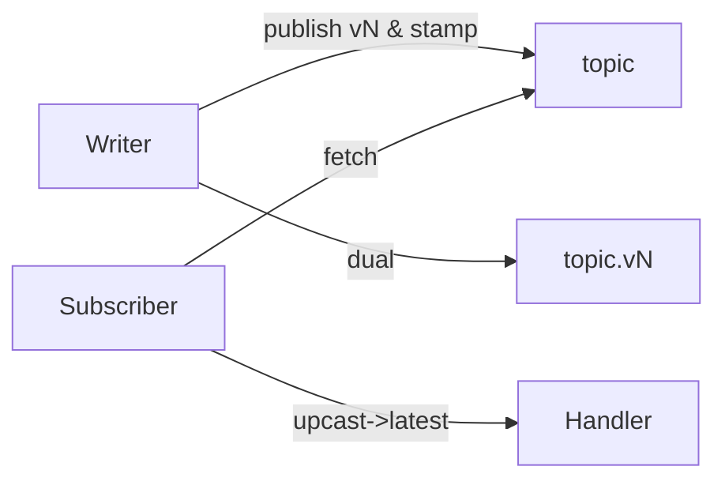

# Schema Evolution Playbook

1. **Register** new schema `v+1` (`compat: backward` recommended).
2. **Deploy writers** with `withDualWrite` (stamps `x-schema-version`, dual to `*.vN`).
3. **Deploy readers** with `subscribeNormalized` + upcasters.
4. Let traffic bake; verify dashboards.
5. Switch materializers to read `*.vN` only (optional).
6. Remove dual-write after cutover; keep upcasters for replay.

